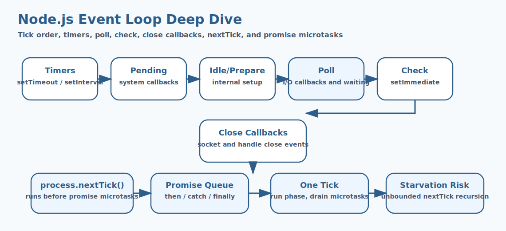

# Node.js Event Loop Deep Dive Interview Questions


This guide covers node.js event loop deep dive from interview basics to tricky production scenarios. It follows the corrected format of **100 interview questions for each subtopic**, and every answer includes a real Node.js code example with rotated real-world scenarios so the examples do not repeat verbatim.

## How To Use This Page

- Questions 1-100 cover setTimeout().
- Questions 101-200 cover setInterval().
- Questions 201-300 cover setImmediate().
- Questions 301-400 cover I/O Callbacks.
- Questions 401-500 cover Socket Close Events.
- Questions 501-600 cover process.nextTick() Queue.
- Questions 601-700 cover Promise Microtask Queue.
- Questions 701-800 cover Microtasks.
- Questions 801-900 cover Macrotasks.
- Questions 901-1000 cover Event Loop Iteration (Tick).
- Questions 1001-1100 cover Callback Queue Execution Order.
- Questions 1101-1200 cover Poll Queue Behavior.
- Questions 1201-1300 cover Timer Threshold vs Exact Execution Time.
- Questions 1301-1400 cover process.nextTick() vs Promise Priority.
- Questions 1401-1500 cover Starvation Caused by process.nextTick().
- Questions 1501-1600 cover setImmediate() vs setTimeout(fn, 0).
- Questions 1601-1700 cover I/O Cycle Interaction with Check Phase.
- Questions 1701-1800 cover Close Event Handling.

## 1. setTimeout()

### Q1.1 What is settimeout() in Node.js?

**Answer:**

setTimeout() matters in Node.js because it affects how settimeout() affects runtime behavior and delivery decisions. In a real system like a high-traffic Node.js API serving customer traffic behind a load balancer, a strong answer should connect the concept to runtime behavior, delivery trade-offs, production debugging, and the way Node.js applications behave under load or failure. A senior-level answer also explains the operational impact so the answer reflects real Node.js engineering instead of textbook definitions.

**Code Example:**

```js
console.log({ topic: 'setTimeout()', question: 1 });
```

### Q1.2 Why does settimeout() fundamentals matter in real Node.js applications?

**Answer:**

setTimeout() fundamentals matters in Node.js because it affects how settimeout() should be understood before tackling deeper production issues. In a real system like a background worker processing queues and scheduled jobs in production, a strong answer should connect the concept to runtime behavior, delivery trade-offs, production debugging, and the way Node.js applications behave under load or failure. A senior-level answer also explains the operational impact so teams can connect the concept to runtime behavior and operational impact.

**Code Example:**

```js
function explainSettimeout() {
  return 'setTimeout()';
}
```

### Q1.3 When should a team focus on settimeout() design?

**Answer:**

setTimeout() design matters in Node.js because it affects how settimeout() influences code structure and operational outcomes. In a real system like a CMS platform handling uploads, downloads, and rich admin workflows, a strong answer should connect the concept to runtime behavior, delivery trade-offs, production debugging, and the way Node.js applications behave under load or failure. A senior-level answer also explains the operational impact so production debugging becomes easier because the mechanics are clearer.

**Code Example:**

```js
const data = ['alpha', 'beta', 'gamma'];
console.log(data.join(','));
```

### Q1.4 How would you explain settimeout() debugging in a production discussion?

**Answer:**

setTimeout() debugging matters in Node.js because it affects how teams investigate problems related to settimeout() in production. In a real system like a banking integration service where reliability and observability are tightly controlled, a strong answer should connect the concept to runtime behavior, delivery trade-offs, production debugging, and the way Node.js applications behave under load or failure. A senior-level answer also explains the operational impact so architecture choices become easier to defend in interviews and reviews.

**Code Example:**

```js
const config = { enabled: true, retries: 3 };
console.log(config);
```

### Q1.5 What is a common interview trap around settimeout() trade-offs?

**Answer:**

setTimeout() trade-offs matters in Node.js because it affects how settimeout() shapes performance, maintainability, or reliability decisions. In a real system like a healthcare backend where safe error handling and data validation matter deeply, a strong answer should connect the concept to runtime behavior, delivery trade-offs, production debugging, and the way Node.js applications behave under load or failure. A senior-level answer also explains the operational impact so performance, correctness, and maintainability are discussed together.

**Code Example:**

```js
setTimeout(() => console.log('node example executed'), 10);
```

### Q1.6 How do you apply settimeout() safely in practice?

**Answer:**

setTimeout() matters in Node.js because it affects how settimeout() affects runtime behavior and delivery decisions. In a real system like a logistics platform coordinating events, retries, and distributed workflows, a strong answer should connect the concept to runtime behavior, delivery trade-offs, production debugging, and the way Node.js applications behave under load or failure. A senior-level answer also explains the operational impact so common Node.js pitfalls are easier to prevent before release.

**Code Example:**

```js
console.log({ topic: 'setTimeout()', question: 6 });
```

### Q1.7 What production issue usually exposes weak understanding of settimeout() fundamentals?

**Answer:**

setTimeout() fundamentals matters in Node.js because it affects how settimeout() should be understood before tackling deeper production issues. In a real system like an enterprise Express application with many middlewares and shared modules, a strong answer should connect the concept to runtime behavior, delivery trade-offs, production debugging, and the way Node.js applications behave under load or failure. A senior-level answer also explains the operational impact so the codebase stays easier to evolve as traffic and complexity grow.

**Code Example:**

```js
function explainSettimeout() {
  return 'setTimeout()';
}
```

### Q1.8 How would a senior engineer justify settimeout() design to a team?

**Answer:**

setTimeout() design matters in Node.js because it affects how settimeout() influences code structure and operational outcomes. In a real system like a real-time dashboard service where event-loop behavior affects user experience, a strong answer should connect the concept to runtime behavior, delivery trade-offs, production debugging, and the way Node.js applications behave under load or failure. A senior-level answer also explains the operational impact so operational trade-offs are visible instead of hidden behind abstractions.

**Code Example:**

```js
const data = ['alpha', 'beta', 'gamma'];
console.log(data.join(','));
```

### Q1.9 What trade-off does settimeout() debugging introduce?

**Answer:**

setTimeout() debugging matters in Node.js because it affects how teams investigate problems related to settimeout() in production. In a real system like a containerized Node.js deployment where startup, memory, and scaling all matter, a strong answer should connect the concept to runtime behavior, delivery trade-offs, production debugging, and the way Node.js applications behave under load or failure. A senior-level answer also explains the operational impact so the example ties Node.js internals to practical delivery concerns.

**Code Example:**

```js
const config = { enabled: true, retries: 3 };
console.log(config);
```

### Q1.10 How do you answer a tricky follow-up about settimeout() trade-offs?

**Answer:**

setTimeout() trade-offs matters in Node.js because it affects how settimeout() shapes performance, maintainability, or reliability decisions. In a real system like a migration effort from ad hoc scripts to a more maintainable Node.js architecture, a strong answer should connect the concept to runtime behavior, delivery trade-offs, production debugging, and the way Node.js applications behave under load or failure. A senior-level answer also explains the operational impact so new team members can understand the concept from both code and behavior.

**Code Example:**

```js
setTimeout(() => console.log('node example executed'), 10);
```

### Q1.11 What is settimeout() in Node.js?

**Answer:**

setTimeout() matters in Node.js because it affects how settimeout() affects runtime behavior and delivery decisions. In a real system like a high-traffic Node.js API serving customer traffic behind a load balancer, a strong answer should connect the concept to runtime behavior, delivery trade-offs, production debugging, and the way Node.js applications behave under load or failure. A senior-level answer also explains the operational impact so the answer reflects real Node.js engineering instead of textbook definitions.

**Code Example:**

```js
console.log({ topic: 'setTimeout()', question: 11 });
```

### Q1.12 Why does settimeout() fundamentals matter in real Node.js applications?

**Answer:**

setTimeout() fundamentals matters in Node.js because it affects how settimeout() should be understood before tackling deeper production issues. In a real system like a background worker processing queues and scheduled jobs in production, a strong answer should connect the concept to runtime behavior, delivery trade-offs, production debugging, and the way Node.js applications behave under load or failure. A senior-level answer also explains the operational impact so teams can connect the concept to runtime behavior and operational impact.

**Code Example:**

```js
function explainSettimeout() {
  return 'setTimeout()';
}
```

### Q1.13 When should a team focus on settimeout() design?

**Answer:**

setTimeout() design matters in Node.js because it affects how settimeout() influences code structure and operational outcomes. In a real system like a CMS platform handling uploads, downloads, and rich admin workflows, a strong answer should connect the concept to runtime behavior, delivery trade-offs, production debugging, and the way Node.js applications behave under load or failure. A senior-level answer also explains the operational impact so production debugging becomes easier because the mechanics are clearer.

**Code Example:**

```js
const data = ['alpha', 'beta', 'gamma'];
console.log(data.join(','));
```

### Q1.14 How would you explain settimeout() debugging in a production discussion?

**Answer:**

setTimeout() debugging matters in Node.js because it affects how teams investigate problems related to settimeout() in production. In a real system like a banking integration service where reliability and observability are tightly controlled, a strong answer should connect the concept to runtime behavior, delivery trade-offs, production debugging, and the way Node.js applications behave under load or failure. A senior-level answer also explains the operational impact so architecture choices become easier to defend in interviews and reviews.

**Code Example:**

```js
const config = { enabled: true, retries: 3 };
console.log(config);
```

### Q1.15 What is a common interview trap around settimeout() trade-offs?

**Answer:**

setTimeout() trade-offs matters in Node.js because it affects how settimeout() shapes performance, maintainability, or reliability decisions. In a real system like a healthcare backend where safe error handling and data validation matter deeply, a strong answer should connect the concept to runtime behavior, delivery trade-offs, production debugging, and the way Node.js applications behave under load or failure. A senior-level answer also explains the operational impact so performance, correctness, and maintainability are discussed together.

**Code Example:**

```js
setTimeout(() => console.log('node example executed'), 10);
```

### Q1.16 How do you apply settimeout() safely in practice?

**Answer:**

setTimeout() matters in Node.js because it affects how settimeout() affects runtime behavior and delivery decisions. In a real system like a logistics platform coordinating events, retries, and distributed workflows, a strong answer should connect the concept to runtime behavior, delivery trade-offs, production debugging, and the way Node.js applications behave under load or failure. A senior-level answer also explains the operational impact so common Node.js pitfalls are easier to prevent before release.

**Code Example:**

```js
console.log({ topic: 'setTimeout()', question: 16 });
```

### Q1.17 What production issue usually exposes weak understanding of settimeout() fundamentals?

**Answer:**

setTimeout() fundamentals matters in Node.js because it affects how settimeout() should be understood before tackling deeper production issues. In a real system like an enterprise Express application with many middlewares and shared modules, a strong answer should connect the concept to runtime behavior, delivery trade-offs, production debugging, and the way Node.js applications behave under load or failure. A senior-level answer also explains the operational impact so the codebase stays easier to evolve as traffic and complexity grow.

**Code Example:**

```js
function explainSettimeout() {
  return 'setTimeout()';
}
```

### Q1.18 How would a senior engineer justify settimeout() design to a team?

**Answer:**

setTimeout() design matters in Node.js because it affects how settimeout() influences code structure and operational outcomes. In a real system like a real-time dashboard service where event-loop behavior affects user experience, a strong answer should connect the concept to runtime behavior, delivery trade-offs, production debugging, and the way Node.js applications behave under load or failure. A senior-level answer also explains the operational impact so operational trade-offs are visible instead of hidden behind abstractions.

**Code Example:**

```js
const data = ['alpha', 'beta', 'gamma'];
console.log(data.join(','));
```

### Q1.19 What trade-off does settimeout() debugging introduce?

**Answer:**

setTimeout() debugging matters in Node.js because it affects how teams investigate problems related to settimeout() in production. In a real system like a containerized Node.js deployment where startup, memory, and scaling all matter, a strong answer should connect the concept to runtime behavior, delivery trade-offs, production debugging, and the way Node.js applications behave under load or failure. A senior-level answer also explains the operational impact so the example ties Node.js internals to practical delivery concerns.

**Code Example:**

```js
const config = { enabled: true, retries: 3 };
console.log(config);
```

### Q1.20 How do you answer a tricky follow-up about settimeout() trade-offs?

**Answer:**

setTimeout() trade-offs matters in Node.js because it affects how settimeout() shapes performance, maintainability, or reliability decisions. In a real system like a migration effort from ad hoc scripts to a more maintainable Node.js architecture, a strong answer should connect the concept to runtime behavior, delivery trade-offs, production debugging, and the way Node.js applications behave under load or failure. A senior-level answer also explains the operational impact so new team members can understand the concept from both code and behavior.

**Code Example:**

```js
setTimeout(() => console.log('node example executed'), 10);
```

### Q1.21 What is settimeout() in Node.js?

**Answer:**

setTimeout() matters in Node.js because it affects how settimeout() affects runtime behavior and delivery decisions. In a real system like a high-traffic Node.js API serving customer traffic behind a load balancer, a strong answer should connect the concept to runtime behavior, delivery trade-offs, production debugging, and the way Node.js applications behave under load or failure. A senior-level answer also explains the operational impact so the answer reflects real Node.js engineering instead of textbook definitions.

**Code Example:**

```js
console.log({ topic: 'setTimeout()', question: 21 });
```

### Q1.22 Why does settimeout() fundamentals matter in real Node.js applications?

**Answer:**

setTimeout() fundamentals matters in Node.js because it affects how settimeout() should be understood before tackling deeper production issues. In a real system like a background worker processing queues and scheduled jobs in production, a strong answer should connect the concept to runtime behavior, delivery trade-offs, production debugging, and the way Node.js applications behave under load or failure. A senior-level answer also explains the operational impact so teams can connect the concept to runtime behavior and operational impact.

**Code Example:**

```js
function explainSettimeout() {
  return 'setTimeout()';
}
```

### Q1.23 When should a team focus on settimeout() design?

**Answer:**

setTimeout() design matters in Node.js because it affects how settimeout() influences code structure and operational outcomes. In a real system like a CMS platform handling uploads, downloads, and rich admin workflows, a strong answer should connect the concept to runtime behavior, delivery trade-offs, production debugging, and the way Node.js applications behave under load or failure. A senior-level answer also explains the operational impact so production debugging becomes easier because the mechanics are clearer.

**Code Example:**

```js
const data = ['alpha', 'beta', 'gamma'];
console.log(data.join(','));
```

### Q1.24 How would you explain settimeout() debugging in a production discussion?

**Answer:**

setTimeout() debugging matters in Node.js because it affects how teams investigate problems related to settimeout() in production. In a real system like a banking integration service where reliability and observability are tightly controlled, a strong answer should connect the concept to runtime behavior, delivery trade-offs, production debugging, and the way Node.js applications behave under load or failure. A senior-level answer also explains the operational impact so architecture choices become easier to defend in interviews and reviews.

**Code Example:**

```js
const config = { enabled: true, retries: 3 };
console.log(config);
```

### Q1.25 What is a common interview trap around settimeout() trade-offs?

**Answer:**

setTimeout() trade-offs matters in Node.js because it affects how settimeout() shapes performance, maintainability, or reliability decisions. In a real system like a healthcare backend where safe error handling and data validation matter deeply, a strong answer should connect the concept to runtime behavior, delivery trade-offs, production debugging, and the way Node.js applications behave under load or failure. A senior-level answer also explains the operational impact so performance, correctness, and maintainability are discussed together.

**Code Example:**

```js
setTimeout(() => console.log('node example executed'), 10);
```

### Q1.26 How do you apply settimeout() safely in practice?

**Answer:**

setTimeout() matters in Node.js because it affects how settimeout() affects runtime behavior and delivery decisions. In a real system like a logistics platform coordinating events, retries, and distributed workflows, a strong answer should connect the concept to runtime behavior, delivery trade-offs, production debugging, and the way Node.js applications behave under load or failure. A senior-level answer also explains the operational impact so common Node.js pitfalls are easier to prevent before release.

**Code Example:**

```js
console.log({ topic: 'setTimeout()', question: 26 });
```

### Q1.27 What production issue usually exposes weak understanding of settimeout() fundamentals?

**Answer:**

setTimeout() fundamentals matters in Node.js because it affects how settimeout() should be understood before tackling deeper production issues. In a real system like an enterprise Express application with many middlewares and shared modules, a strong answer should connect the concept to runtime behavior, delivery trade-offs, production debugging, and the way Node.js applications behave under load or failure. A senior-level answer also explains the operational impact so the codebase stays easier to evolve as traffic and complexity grow.

**Code Example:**

```js
function explainSettimeout() {
  return 'setTimeout()';
}
```

### Q1.28 How would a senior engineer justify settimeout() design to a team?

**Answer:**

setTimeout() design matters in Node.js because it affects how settimeout() influences code structure and operational outcomes. In a real system like a real-time dashboard service where event-loop behavior affects user experience, a strong answer should connect the concept to runtime behavior, delivery trade-offs, production debugging, and the way Node.js applications behave under load or failure. A senior-level answer also explains the operational impact so operational trade-offs are visible instead of hidden behind abstractions.

**Code Example:**

```js
const data = ['alpha', 'beta', 'gamma'];
console.log(data.join(','));
```

### Q1.29 What trade-off does settimeout() debugging introduce?

**Answer:**

setTimeout() debugging matters in Node.js because it affects how teams investigate problems related to settimeout() in production. In a real system like a containerized Node.js deployment where startup, memory, and scaling all matter, a strong answer should connect the concept to runtime behavior, delivery trade-offs, production debugging, and the way Node.js applications behave under load or failure. A senior-level answer also explains the operational impact so the example ties Node.js internals to practical delivery concerns.

**Code Example:**

```js
const config = { enabled: true, retries: 3 };
console.log(config);
```

### Q1.30 How do you answer a tricky follow-up about settimeout() trade-offs?

**Answer:**

setTimeout() trade-offs matters in Node.js because it affects how settimeout() shapes performance, maintainability, or reliability decisions. In a real system like a migration effort from ad hoc scripts to a more maintainable Node.js architecture, a strong answer should connect the concept to runtime behavior, delivery trade-offs, production debugging, and the way Node.js applications behave under load or failure. A senior-level answer also explains the operational impact so new team members can understand the concept from both code and behavior.

**Code Example:**

```js
setTimeout(() => console.log('node example executed'), 10);
```

### Q1.31 What is settimeout() in Node.js?

**Answer:**

setTimeout() matters in Node.js because it affects how settimeout() affects runtime behavior and delivery decisions. In a real system like a high-traffic Node.js API serving customer traffic behind a load balancer, a strong answer should connect the concept to runtime behavior, delivery trade-offs, production debugging, and the way Node.js applications behave under load or failure. A senior-level answer also explains the operational impact so the answer reflects real Node.js engineering instead of textbook definitions.

**Code Example:**

```js
console.log({ topic: 'setTimeout()', question: 31 });
```

### Q1.32 Why does settimeout() fundamentals matter in real Node.js applications?

**Answer:**

setTimeout() fundamentals matters in Node.js because it affects how settimeout() should be understood before tackling deeper production issues. In a real system like a background worker processing queues and scheduled jobs in production, a strong answer should connect the concept to runtime behavior, delivery trade-offs, production debugging, and the way Node.js applications behave under load or failure. A senior-level answer also explains the operational impact so teams can connect the concept to runtime behavior and operational impact.

**Code Example:**

```js
function explainSettimeout() {
  return 'setTimeout()';
}
```

### Q1.33 When should a team focus on settimeout() design?

**Answer:**

setTimeout() design matters in Node.js because it affects how settimeout() influences code structure and operational outcomes. In a real system like a CMS platform handling uploads, downloads, and rich admin workflows, a strong answer should connect the concept to runtime behavior, delivery trade-offs, production debugging, and the way Node.js applications behave under load or failure. A senior-level answer also explains the operational impact so production debugging becomes easier because the mechanics are clearer.

**Code Example:**

```js
const data = ['alpha', 'beta', 'gamma'];
console.log(data.join(','));
```

### Q1.34 How would you explain settimeout() debugging in a production discussion?

**Answer:**

setTimeout() debugging matters in Node.js because it affects how teams investigate problems related to settimeout() in production. In a real system like a banking integration service where reliability and observability are tightly controlled, a strong answer should connect the concept to runtime behavior, delivery trade-offs, production debugging, and the way Node.js applications behave under load or failure. A senior-level answer also explains the operational impact so architecture choices become easier to defend in interviews and reviews.

**Code Example:**

```js
const config = { enabled: true, retries: 3 };
console.log(config);
```

### Q1.35 What is a common interview trap around settimeout() trade-offs?

**Answer:**

setTimeout() trade-offs matters in Node.js because it affects how settimeout() shapes performance, maintainability, or reliability decisions. In a real system like a healthcare backend where safe error handling and data validation matter deeply, a strong answer should connect the concept to runtime behavior, delivery trade-offs, production debugging, and the way Node.js applications behave under load or failure. A senior-level answer also explains the operational impact so performance, correctness, and maintainability are discussed together.

**Code Example:**

```js
setTimeout(() => console.log('node example executed'), 10);
```

### Q1.36 How do you apply settimeout() safely in practice?

**Answer:**

setTimeout() matters in Node.js because it affects how settimeout() affects runtime behavior and delivery decisions. In a real system like a logistics platform coordinating events, retries, and distributed workflows, a strong answer should connect the concept to runtime behavior, delivery trade-offs, production debugging, and the way Node.js applications behave under load or failure. A senior-level answer also explains the operational impact so common Node.js pitfalls are easier to prevent before release.

**Code Example:**

```js
console.log({ topic: 'setTimeout()', question: 36 });
```

### Q1.37 What production issue usually exposes weak understanding of settimeout() fundamentals?

**Answer:**

setTimeout() fundamentals matters in Node.js because it affects how settimeout() should be understood before tackling deeper production issues. In a real system like an enterprise Express application with many middlewares and shared modules, a strong answer should connect the concept to runtime behavior, delivery trade-offs, production debugging, and the way Node.js applications behave under load or failure. A senior-level answer also explains the operational impact so the codebase stays easier to evolve as traffic and complexity grow.

**Code Example:**

```js
function explainSettimeout() {
  return 'setTimeout()';
}
```

### Q1.38 How would a senior engineer justify settimeout() design to a team?

**Answer:**

setTimeout() design matters in Node.js because it affects how settimeout() influences code structure and operational outcomes. In a real system like a real-time dashboard service where event-loop behavior affects user experience, a strong answer should connect the concept to runtime behavior, delivery trade-offs, production debugging, and the way Node.js applications behave under load or failure. A senior-level answer also explains the operational impact so operational trade-offs are visible instead of hidden behind abstractions.

**Code Example:**

```js
const data = ['alpha', 'beta', 'gamma'];
console.log(data.join(','));
```

### Q1.39 What trade-off does settimeout() debugging introduce?

**Answer:**

setTimeout() debugging matters in Node.js because it affects how teams investigate problems related to settimeout() in production. In a real system like a containerized Node.js deployment where startup, memory, and scaling all matter, a strong answer should connect the concept to runtime behavior, delivery trade-offs, production debugging, and the way Node.js applications behave under load or failure. A senior-level answer also explains the operational impact so the example ties Node.js internals to practical delivery concerns.

**Code Example:**

```js
const config = { enabled: true, retries: 3 };
console.log(config);
```

### Q1.40 How do you answer a tricky follow-up about settimeout() trade-offs?

**Answer:**

setTimeout() trade-offs matters in Node.js because it affects how settimeout() shapes performance, maintainability, or reliability decisions. In a real system like a migration effort from ad hoc scripts to a more maintainable Node.js architecture, a strong answer should connect the concept to runtime behavior, delivery trade-offs, production debugging, and the way Node.js applications behave under load or failure. A senior-level answer also explains the operational impact so new team members can understand the concept from both code and behavior.

**Code Example:**

```js
setTimeout(() => console.log('node example executed'), 10);
```

### Q1.41 What is settimeout() in Node.js?

**Answer:**

setTimeout() matters in Node.js because it affects how settimeout() affects runtime behavior and delivery decisions. In a real system like a high-traffic Node.js API serving customer traffic behind a load balancer, a strong answer should connect the concept to runtime behavior, delivery trade-offs, production debugging, and the way Node.js applications behave under load or failure. A senior-level answer also explains the operational impact so the answer reflects real Node.js engineering instead of textbook definitions.

**Code Example:**

```js
console.log({ topic: 'setTimeout()', question: 41 });
```

### Q1.42 Why does settimeout() fundamentals matter in real Node.js applications?

**Answer:**

setTimeout() fundamentals matters in Node.js because it affects how settimeout() should be understood before tackling deeper production issues. In a real system like a background worker processing queues and scheduled jobs in production, a strong answer should connect the concept to runtime behavior, delivery trade-offs, production debugging, and the way Node.js applications behave under load or failure. A senior-level answer also explains the operational impact so teams can connect the concept to runtime behavior and operational impact.

**Code Example:**

```js
function explainSettimeout() {
  return 'setTimeout()';
}
```

### Q1.43 When should a team focus on settimeout() design?

**Answer:**

setTimeout() design matters in Node.js because it affects how settimeout() influences code structure and operational outcomes. In a real system like a CMS platform handling uploads, downloads, and rich admin workflows, a strong answer should connect the concept to runtime behavior, delivery trade-offs, production debugging, and the way Node.js applications behave under load or failure. A senior-level answer also explains the operational impact so production debugging becomes easier because the mechanics are clearer.

**Code Example:**

```js
const data = ['alpha', 'beta', 'gamma'];
console.log(data.join(','));
```

### Q1.44 How would you explain settimeout() debugging in a production discussion?

**Answer:**

setTimeout() debugging matters in Node.js because it affects how teams investigate problems related to settimeout() in production. In a real system like a banking integration service where reliability and observability are tightly controlled, a strong answer should connect the concept to runtime behavior, delivery trade-offs, production debugging, and the way Node.js applications behave under load or failure. A senior-level answer also explains the operational impact so architecture choices become easier to defend in interviews and reviews.

**Code Example:**

```js
const config = { enabled: true, retries: 3 };
console.log(config);
```

### Q1.45 What is a common interview trap around settimeout() trade-offs?

**Answer:**

setTimeout() trade-offs matters in Node.js because it affects how settimeout() shapes performance, maintainability, or reliability decisions. In a real system like a healthcare backend where safe error handling and data validation matter deeply, a strong answer should connect the concept to runtime behavior, delivery trade-offs, production debugging, and the way Node.js applications behave under load or failure. A senior-level answer also explains the operational impact so performance, correctness, and maintainability are discussed together.

**Code Example:**

```js
setTimeout(() => console.log('node example executed'), 10);
```

### Q1.46 How do you apply settimeout() safely in practice?

**Answer:**

setTimeout() matters in Node.js because it affects how settimeout() affects runtime behavior and delivery decisions. In a real system like a logistics platform coordinating events, retries, and distributed workflows, a strong answer should connect the concept to runtime behavior, delivery trade-offs, production debugging, and the way Node.js applications behave under load or failure. A senior-level answer also explains the operational impact so common Node.js pitfalls are easier to prevent before release.

**Code Example:**

```js
console.log({ topic: 'setTimeout()', question: 46 });
```

### Q1.47 What production issue usually exposes weak understanding of settimeout() fundamentals?

**Answer:**

setTimeout() fundamentals matters in Node.js because it affects how settimeout() should be understood before tackling deeper production issues. In a real system like an enterprise Express application with many middlewares and shared modules, a strong answer should connect the concept to runtime behavior, delivery trade-offs, production debugging, and the way Node.js applications behave under load or failure. A senior-level answer also explains the operational impact so the codebase stays easier to evolve as traffic and complexity grow.

**Code Example:**

```js
function explainSettimeout() {
  return 'setTimeout()';
}
```

### Q1.48 How would a senior engineer justify settimeout() design to a team?

**Answer:**

setTimeout() design matters in Node.js because it affects how settimeout() influences code structure and operational outcomes. In a real system like a real-time dashboard service where event-loop behavior affects user experience, a strong answer should connect the concept to runtime behavior, delivery trade-offs, production debugging, and the way Node.js applications behave under load or failure. A senior-level answer also explains the operational impact so operational trade-offs are visible instead of hidden behind abstractions.

**Code Example:**

```js
const data = ['alpha', 'beta', 'gamma'];
console.log(data.join(','));
```

### Q1.49 What trade-off does settimeout() debugging introduce?

**Answer:**

setTimeout() debugging matters in Node.js because it affects how teams investigate problems related to settimeout() in production. In a real system like a containerized Node.js deployment where startup, memory, and scaling all matter, a strong answer should connect the concept to runtime behavior, delivery trade-offs, production debugging, and the way Node.js applications behave under load or failure. A senior-level answer also explains the operational impact so the example ties Node.js internals to practical delivery concerns.

**Code Example:**

```js
const config = { enabled: true, retries: 3 };
console.log(config);
```

### Q1.50 How do you answer a tricky follow-up about settimeout() trade-offs?

**Answer:**

setTimeout() trade-offs matters in Node.js because it affects how settimeout() shapes performance, maintainability, or reliability decisions. In a real system like a migration effort from ad hoc scripts to a more maintainable Node.js architecture, a strong answer should connect the concept to runtime behavior, delivery trade-offs, production debugging, and the way Node.js applications behave under load or failure. A senior-level answer also explains the operational impact so new team members can understand the concept from both code and behavior.

**Code Example:**

```js
setTimeout(() => console.log('node example executed'), 10);
```

### Q1.51 What is settimeout() in Node.js?

**Answer:**

setTimeout() matters in Node.js because it affects how settimeout() affects runtime behavior and delivery decisions. In a real system like a high-traffic Node.js API serving customer traffic behind a load balancer, a strong answer should connect the concept to runtime behavior, delivery trade-offs, production debugging, and the way Node.js applications behave under load or failure. A senior-level answer also explains the operational impact so the answer reflects real Node.js engineering instead of textbook definitions.

**Code Example:**

```js
console.log({ topic: 'setTimeout()', question: 51 });
```

### Q1.52 Why does settimeout() fundamentals matter in real Node.js applications?

**Answer:**

setTimeout() fundamentals matters in Node.js because it affects how settimeout() should be understood before tackling deeper production issues. In a real system like a background worker processing queues and scheduled jobs in production, a strong answer should connect the concept to runtime behavior, delivery trade-offs, production debugging, and the way Node.js applications behave under load or failure. A senior-level answer also explains the operational impact so teams can connect the concept to runtime behavior and operational impact.

**Code Example:**

```js
function explainSettimeout() {
  return 'setTimeout()';
}
```

### Q1.53 When should a team focus on settimeout() design?

**Answer:**

setTimeout() design matters in Node.js because it affects how settimeout() influences code structure and operational outcomes. In a real system like a CMS platform handling uploads, downloads, and rich admin workflows, a strong answer should connect the concept to runtime behavior, delivery trade-offs, production debugging, and the way Node.js applications behave under load or failure. A senior-level answer also explains the operational impact so production debugging becomes easier because the mechanics are clearer.

**Code Example:**

```js
const data = ['alpha', 'beta', 'gamma'];
console.log(data.join(','));
```

### Q1.54 How would you explain settimeout() debugging in a production discussion?

**Answer:**

setTimeout() debugging matters in Node.js because it affects how teams investigate problems related to settimeout() in production. In a real system like a banking integration service where reliability and observability are tightly controlled, a strong answer should connect the concept to runtime behavior, delivery trade-offs, production debugging, and the way Node.js applications behave under load or failure. A senior-level answer also explains the operational impact so architecture choices become easier to defend in interviews and reviews.

**Code Example:**

```js
const config = { enabled: true, retries: 3 };
console.log(config);
```

### Q1.55 What is a common interview trap around settimeout() trade-offs?

**Answer:**

setTimeout() trade-offs matters in Node.js because it affects how settimeout() shapes performance, maintainability, or reliability decisions. In a real system like a healthcare backend where safe error handling and data validation matter deeply, a strong answer should connect the concept to runtime behavior, delivery trade-offs, production debugging, and the way Node.js applications behave under load or failure. A senior-level answer also explains the operational impact so performance, correctness, and maintainability are discussed together.

**Code Example:**

```js
setTimeout(() => console.log('node example executed'), 10);
```

### Q1.56 How do you apply settimeout() safely in practice?

**Answer:**

setTimeout() matters in Node.js because it affects how settimeout() affects runtime behavior and delivery decisions. In a real system like a logistics platform coordinating events, retries, and distributed workflows, a strong answer should connect the concept to runtime behavior, delivery trade-offs, production debugging, and the way Node.js applications behave under load or failure. A senior-level answer also explains the operational impact so common Node.js pitfalls are easier to prevent before release.

**Code Example:**

```js
console.log({ topic: 'setTimeout()', question: 56 });
```

### Q1.57 What production issue usually exposes weak understanding of settimeout() fundamentals?

**Answer:**

setTimeout() fundamentals matters in Node.js because it affects how settimeout() should be understood before tackling deeper production issues. In a real system like an enterprise Express application with many middlewares and shared modules, a strong answer should connect the concept to runtime behavior, delivery trade-offs, production debugging, and the way Node.js applications behave under load or failure. A senior-level answer also explains the operational impact so the codebase stays easier to evolve as traffic and complexity grow.

**Code Example:**

```js
function explainSettimeout() {
  return 'setTimeout()';
}
```

### Q1.58 How would a senior engineer justify settimeout() design to a team?

**Answer:**

setTimeout() design matters in Node.js because it affects how settimeout() influences code structure and operational outcomes. In a real system like a real-time dashboard service where event-loop behavior affects user experience, a strong answer should connect the concept to runtime behavior, delivery trade-offs, production debugging, and the way Node.js applications behave under load or failure. A senior-level answer also explains the operational impact so operational trade-offs are visible instead of hidden behind abstractions.

**Code Example:**

```js
const data = ['alpha', 'beta', 'gamma'];
console.log(data.join(','));
```

### Q1.59 What trade-off does settimeout() debugging introduce?

**Answer:**

setTimeout() debugging matters in Node.js because it affects how teams investigate problems related to settimeout() in production. In a real system like a containerized Node.js deployment where startup, memory, and scaling all matter, a strong answer should connect the concept to runtime behavior, delivery trade-offs, production debugging, and the way Node.js applications behave under load or failure. A senior-level answer also explains the operational impact so the example ties Node.js internals to practical delivery concerns.

**Code Example:**

```js
const config = { enabled: true, retries: 3 };
console.log(config);
```

### Q1.60 How do you answer a tricky follow-up about settimeout() trade-offs?

**Answer:**

setTimeout() trade-offs matters in Node.js because it affects how settimeout() shapes performance, maintainability, or reliability decisions. In a real system like a migration effort from ad hoc scripts to a more maintainable Node.js architecture, a strong answer should connect the concept to runtime behavior, delivery trade-offs, production debugging, and the way Node.js applications behave under load or failure. A senior-level answer also explains the operational impact so new team members can understand the concept from both code and behavior.

**Code Example:**

```js
setTimeout(() => console.log('node example executed'), 10);
```

### Q1.61 What is settimeout() in Node.js?

**Answer:**

setTimeout() matters in Node.js because it affects how settimeout() affects runtime behavior and delivery decisions. In a real system like a high-traffic Node.js API serving customer traffic behind a load balancer, a strong answer should connect the concept to runtime behavior, delivery trade-offs, production debugging, and the way Node.js applications behave under load or failure. A senior-level answer also explains the operational impact so the answer reflects real Node.js engineering instead of textbook definitions.

**Code Example:**

```js
console.log({ topic: 'setTimeout()', question: 61 });
```

### Q1.62 Why does settimeout() fundamentals matter in real Node.js applications?

**Answer:**

setTimeout() fundamentals matters in Node.js because it affects how settimeout() should be understood before tackling deeper production issues. In a real system like a background worker processing queues and scheduled jobs in production, a strong answer should connect the concept to runtime behavior, delivery trade-offs, production debugging, and the way Node.js applications behave under load or failure. A senior-level answer also explains the operational impact so teams can connect the concept to runtime behavior and operational impact.

**Code Example:**

```js
function explainSettimeout() {
  return 'setTimeout()';
}
```

### Q1.63 When should a team focus on settimeout() design?

**Answer:**

setTimeout() design matters in Node.js because it affects how settimeout() influences code structure and operational outcomes. In a real system like a CMS platform handling uploads, downloads, and rich admin workflows, a strong answer should connect the concept to runtime behavior, delivery trade-offs, production debugging, and the way Node.js applications behave under load or failure. A senior-level answer also explains the operational impact so production debugging becomes easier because the mechanics are clearer.

**Code Example:**

```js
const data = ['alpha', 'beta', 'gamma'];
console.log(data.join(','));
```

### Q1.64 How would you explain settimeout() debugging in a production discussion?

**Answer:**

setTimeout() debugging matters in Node.js because it affects how teams investigate problems related to settimeout() in production. In a real system like a banking integration service where reliability and observability are tightly controlled, a strong answer should connect the concept to runtime behavior, delivery trade-offs, production debugging, and the way Node.js applications behave under load or failure. A senior-level answer also explains the operational impact so architecture choices become easier to defend in interviews and reviews.

**Code Example:**

```js
const config = { enabled: true, retries: 3 };
console.log(config);
```

### Q1.65 What is a common interview trap around settimeout() trade-offs?

**Answer:**

setTimeout() trade-offs matters in Node.js because it affects how settimeout() shapes performance, maintainability, or reliability decisions. In a real system like a healthcare backend where safe error handling and data validation matter deeply, a strong answer should connect the concept to runtime behavior, delivery trade-offs, production debugging, and the way Node.js applications behave under load or failure. A senior-level answer also explains the operational impact so performance, correctness, and maintainability are discussed together.

**Code Example:**

```js
setTimeout(() => console.log('node example executed'), 10);
```

### Q1.66 How do you apply settimeout() safely in practice?

**Answer:**

setTimeout() matters in Node.js because it affects how settimeout() affects runtime behavior and delivery decisions. In a real system like a logistics platform coordinating events, retries, and distributed workflows, a strong answer should connect the concept to runtime behavior, delivery trade-offs, production debugging, and the way Node.js applications behave under load or failure. A senior-level answer also explains the operational impact so common Node.js pitfalls are easier to prevent before release.

**Code Example:**

```js
console.log({ topic: 'setTimeout()', question: 66 });
```

### Q1.67 What production issue usually exposes weak understanding of settimeout() fundamentals?

**Answer:**

setTimeout() fundamentals matters in Node.js because it affects how settimeout() should be understood before tackling deeper production issues. In a real system like an enterprise Express application with many middlewares and shared modules, a strong answer should connect the concept to runtime behavior, delivery trade-offs, production debugging, and the way Node.js applications behave under load or failure. A senior-level answer also explains the operational impact so the codebase stays easier to evolve as traffic and complexity grow.

**Code Example:**

```js
function explainSettimeout() {
  return 'setTimeout()';
}
```

### Q1.68 How would a senior engineer justify settimeout() design to a team?

**Answer:**

setTimeout() design matters in Node.js because it affects how settimeout() influences code structure and operational outcomes. In a real system like a real-time dashboard service where event-loop behavior affects user experience, a strong answer should connect the concept to runtime behavior, delivery trade-offs, production debugging, and the way Node.js applications behave under load or failure. A senior-level answer also explains the operational impact so operational trade-offs are visible instead of hidden behind abstractions.

**Code Example:**

```js
const data = ['alpha', 'beta', 'gamma'];
console.log(data.join(','));
```

### Q1.69 What trade-off does settimeout() debugging introduce?

**Answer:**

setTimeout() debugging matters in Node.js because it affects how teams investigate problems related to settimeout() in production. In a real system like a containerized Node.js deployment where startup, memory, and scaling all matter, a strong answer should connect the concept to runtime behavior, delivery trade-offs, production debugging, and the way Node.js applications behave under load or failure. A senior-level answer also explains the operational impact so the example ties Node.js internals to practical delivery concerns.

**Code Example:**

```js
const config = { enabled: true, retries: 3 };
console.log(config);
```

### Q1.70 How do you answer a tricky follow-up about settimeout() trade-offs?

**Answer:**

setTimeout() trade-offs matters in Node.js because it affects how settimeout() shapes performance, maintainability, or reliability decisions. In a real system like a migration effort from ad hoc scripts to a more maintainable Node.js architecture, a strong answer should connect the concept to runtime behavior, delivery trade-offs, production debugging, and the way Node.js applications behave under load or failure. A senior-level answer also explains the operational impact so new team members can understand the concept from both code and behavior.

**Code Example:**

```js
setTimeout(() => console.log('node example executed'), 10);
```

### Q1.71 What is settimeout() in Node.js?

**Answer:**

setTimeout() matters in Node.js because it affects how settimeout() affects runtime behavior and delivery decisions. In a real system like a high-traffic Node.js API serving customer traffic behind a load balancer, a strong answer should connect the concept to runtime behavior, delivery trade-offs, production debugging, and the way Node.js applications behave under load or failure. A senior-level answer also explains the operational impact so the answer reflects real Node.js engineering instead of textbook definitions.

**Code Example:**

```js
console.log({ topic: 'setTimeout()', question: 71 });
```

### Q1.72 Why does settimeout() fundamentals matter in real Node.js applications?

**Answer:**

setTimeout() fundamentals matters in Node.js because it affects how settimeout() should be understood before tackling deeper production issues. In a real system like a background worker processing queues and scheduled jobs in production, a strong answer should connect the concept to runtime behavior, delivery trade-offs, production debugging, and the way Node.js applications behave under load or failure. A senior-level answer also explains the operational impact so teams can connect the concept to runtime behavior and operational impact.

**Code Example:**

```js
function explainSettimeout() {
  return 'setTimeout()';
}
```

### Q1.73 When should a team focus on settimeout() design?

**Answer:**

setTimeout() design matters in Node.js because it affects how settimeout() influences code structure and operational outcomes. In a real system like a CMS platform handling uploads, downloads, and rich admin workflows, a strong answer should connect the concept to runtime behavior, delivery trade-offs, production debugging, and the way Node.js applications behave under load or failure. A senior-level answer also explains the operational impact so production debugging becomes easier because the mechanics are clearer.

**Code Example:**

```js
const data = ['alpha', 'beta', 'gamma'];
console.log(data.join(','));
```

### Q1.74 How would you explain settimeout() debugging in a production discussion?

**Answer:**

setTimeout() debugging matters in Node.js because it affects how teams investigate problems related to settimeout() in production. In a real system like a banking integration service where reliability and observability are tightly controlled, a strong answer should connect the concept to runtime behavior, delivery trade-offs, production debugging, and the way Node.js applications behave under load or failure. A senior-level answer also explains the operational impact so architecture choices become easier to defend in interviews and reviews.

**Code Example:**

```js
const config = { enabled: true, retries: 3 };
console.log(config);
```

### Q1.75 What is a common interview trap around settimeout() trade-offs?

**Answer:**

setTimeout() trade-offs matters in Node.js because it affects how settimeout() shapes performance, maintainability, or reliability decisions. In a real system like a healthcare backend where safe error handling and data validation matter deeply, a strong answer should connect the concept to runtime behavior, delivery trade-offs, production debugging, and the way Node.js applications behave under load or failure. A senior-level answer also explains the operational impact so performance, correctness, and maintainability are discussed together.

**Code Example:**

```js
setTimeout(() => console.log('node example executed'), 10);
```

### Q1.76 How do you apply settimeout() safely in practice?

**Answer:**

setTimeout() matters in Node.js because it affects how settimeout() affects runtime behavior and delivery decisions. In a real system like a logistics platform coordinating events, retries, and distributed workflows, a strong answer should connect the concept to runtime behavior, delivery trade-offs, production debugging, and the way Node.js applications behave under load or failure. A senior-level answer also explains the operational impact so common Node.js pitfalls are easier to prevent before release.

**Code Example:**

```js
console.log({ topic: 'setTimeout()', question: 76 });
```

### Q1.77 What production issue usually exposes weak understanding of settimeout() fundamentals?

**Answer:**

setTimeout() fundamentals matters in Node.js because it affects how settimeout() should be understood before tackling deeper production issues. In a real system like an enterprise Express application with many middlewares and shared modules, a strong answer should connect the concept to runtime behavior, delivery trade-offs, production debugging, and the way Node.js applications behave under load or failure. A senior-level answer also explains the operational impact so the codebase stays easier to evolve as traffic and complexity grow.

**Code Example:**

```js
function explainSettimeout() {
  return 'setTimeout()';
}
```

### Q1.78 How would a senior engineer justify settimeout() design to a team?

**Answer:**

setTimeout() design matters in Node.js because it affects how settimeout() influences code structure and operational outcomes. In a real system like a real-time dashboard service where event-loop behavior affects user experience, a strong answer should connect the concept to runtime behavior, delivery trade-offs, production debugging, and the way Node.js applications behave under load or failure. A senior-level answer also explains the operational impact so operational trade-offs are visible instead of hidden behind abstractions.

**Code Example:**

```js
const data = ['alpha', 'beta', 'gamma'];
console.log(data.join(','));
```

### Q1.79 What trade-off does settimeout() debugging introduce?

**Answer:**

setTimeout() debugging matters in Node.js because it affects how teams investigate problems related to settimeout() in production. In a real system like a containerized Node.js deployment where startup, memory, and scaling all matter, a strong answer should connect the concept to runtime behavior, delivery trade-offs, production debugging, and the way Node.js applications behave under load or failure. A senior-level answer also explains the operational impact so the example ties Node.js internals to practical delivery concerns.

**Code Example:**

```js
const config = { enabled: true, retries: 3 };
console.log(config);
```

### Q1.80 How do you answer a tricky follow-up about settimeout() trade-offs?

**Answer:**

setTimeout() trade-offs matters in Node.js because it affects how settimeout() shapes performance, maintainability, or reliability decisions. In a real system like a migration effort from ad hoc scripts to a more maintainable Node.js architecture, a strong answer should connect the concept to runtime behavior, delivery trade-offs, production debugging, and the way Node.js applications behave under load or failure. A senior-level answer also explains the operational impact so new team members can understand the concept from both code and behavior.

**Code Example:**

```js
setTimeout(() => console.log('node example executed'), 10);
```

### Q1.81 What is settimeout() in Node.js?

**Answer:**

setTimeout() matters in Node.js because it affects how settimeout() affects runtime behavior and delivery decisions. In a real system like a high-traffic Node.js API serving customer traffic behind a load balancer, a strong answer should connect the concept to runtime behavior, delivery trade-offs, production debugging, and the way Node.js applications behave under load or failure. A senior-level answer also explains the operational impact so the answer reflects real Node.js engineering instead of textbook definitions.

**Code Example:**

```js
console.log({ topic: 'setTimeout()', question: 81 });
```

### Q1.82 Why does settimeout() fundamentals matter in real Node.js applications?

**Answer:**

setTimeout() fundamentals matters in Node.js because it affects how settimeout() should be understood before tackling deeper production issues. In a real system like a background worker processing queues and scheduled jobs in production, a strong answer should connect the concept to runtime behavior, delivery trade-offs, production debugging, and the way Node.js applications behave under load or failure. A senior-level answer also explains the operational impact so teams can connect the concept to runtime behavior and operational impact.

**Code Example:**

```js
function explainSettimeout() {
  return 'setTimeout()';
}
```

### Q1.83 When should a team focus on settimeout() design?

**Answer:**

setTimeout() design matters in Node.js because it affects how settimeout() influences code structure and operational outcomes. In a real system like a CMS platform handling uploads, downloads, and rich admin workflows, a strong answer should connect the concept to runtime behavior, delivery trade-offs, production debugging, and the way Node.js applications behave under load or failure. A senior-level answer also explains the operational impact so production debugging becomes easier because the mechanics are clearer.

**Code Example:**

```js
const data = ['alpha', 'beta', 'gamma'];
console.log(data.join(','));
```

### Q1.84 How would you explain settimeout() debugging in a production discussion?

**Answer:**

setTimeout() debugging matters in Node.js because it affects how teams investigate problems related to settimeout() in production. In a real system like a banking integration service where reliability and observability are tightly controlled, a strong answer should connect the concept to runtime behavior, delivery trade-offs, production debugging, and the way Node.js applications behave under load or failure. A senior-level answer also explains the operational impact so architecture choices become easier to defend in interviews and reviews.

**Code Example:**

```js
const config = { enabled: true, retries: 3 };
console.log(config);
```

### Q1.85 What is a common interview trap around settimeout() trade-offs?

**Answer:**

setTimeout() trade-offs matters in Node.js because it affects how settimeout() shapes performance, maintainability, or reliability decisions. In a real system like a healthcare backend where safe error handling and data validation matter deeply, a strong answer should connect the concept to runtime behavior, delivery trade-offs, production debugging, and the way Node.js applications behave under load or failure. A senior-level answer also explains the operational impact so performance, correctness, and maintainability are discussed together.

**Code Example:**

```js
setTimeout(() => console.log('node example executed'), 10);
```

### Q1.86 How do you apply settimeout() safely in practice?

**Answer:**

setTimeout() matters in Node.js because it affects how settimeout() affects runtime behavior and delivery decisions. In a real system like a logistics platform coordinating events, retries, and distributed workflows, a strong answer should connect the concept to runtime behavior, delivery trade-offs, production debugging, and the way Node.js applications behave under load or failure. A senior-level answer also explains the operational impact so common Node.js pitfalls are easier to prevent before release.

**Code Example:**

```js
console.log({ topic: 'setTimeout()', question: 86 });
```

### Q1.87 What production issue usually exposes weak understanding of settimeout() fundamentals?

**Answer:**

setTimeout() fundamentals matters in Node.js because it affects how settimeout() should be understood before tackling deeper production issues. In a real system like an enterprise Express application with many middlewares and shared modules, a strong answer should connect the concept to runtime behavior, delivery trade-offs, production debugging, and the way Node.js applications behave under load or failure. A senior-level answer also explains the operational impact so the codebase stays easier to evolve as traffic and complexity grow.

**Code Example:**

```js
function explainSettimeout() {
  return 'setTimeout()';
}
```

### Q1.88 How would a senior engineer justify settimeout() design to a team?

**Answer:**

setTimeout() design matters in Node.js because it affects how settimeout() influences code structure and operational outcomes. In a real system like a real-time dashboard service where event-loop behavior affects user experience, a strong answer should connect the concept to runtime behavior, delivery trade-offs, production debugging, and the way Node.js applications behave under load or failure. A senior-level answer also explains the operational impact so operational trade-offs are visible instead of hidden behind abstractions.

**Code Example:**

```js
const data = ['alpha', 'beta', 'gamma'];
console.log(data.join(','));
```

### Q1.89 What trade-off does settimeout() debugging introduce?

**Answer:**

setTimeout() debugging matters in Node.js because it affects how teams investigate problems related to settimeout() in production. In a real system like a containerized Node.js deployment where startup, memory, and scaling all matter, a strong answer should connect the concept to runtime behavior, delivery trade-offs, production debugging, and the way Node.js applications behave under load or failure. A senior-level answer also explains the operational impact so the example ties Node.js internals to practical delivery concerns.

**Code Example:**

```js
const config = { enabled: true, retries: 3 };
console.log(config);
```

### Q1.90 How do you answer a tricky follow-up about settimeout() trade-offs?

**Answer:**

setTimeout() trade-offs matters in Node.js because it affects how settimeout() shapes performance, maintainability, or reliability decisions. In a real system like a migration effort from ad hoc scripts to a more maintainable Node.js architecture, a strong answer should connect the concept to runtime behavior, delivery trade-offs, production debugging, and the way Node.js applications behave under load or failure. A senior-level answer also explains the operational impact so new team members can understand the concept from both code and behavior.

**Code Example:**

```js
setTimeout(() => console.log('node example executed'), 10);
```

### Q1.91 What is settimeout() in Node.js?

**Answer:**

setTimeout() matters in Node.js because it affects how settimeout() affects runtime behavior and delivery decisions. In a real system like a high-traffic Node.js API serving customer traffic behind a load balancer, a strong answer should connect the concept to runtime behavior, delivery trade-offs, production debugging, and the way Node.js applications behave under load or failure. A senior-level answer also explains the operational impact so the answer reflects real Node.js engineering instead of textbook definitions.

**Code Example:**

```js
console.log({ topic: 'setTimeout()', question: 91 });
```

### Q1.92 Why does settimeout() fundamentals matter in real Node.js applications?

**Answer:**

setTimeout() fundamentals matters in Node.js because it affects how settimeout() should be understood before tackling deeper production issues. In a real system like a background worker processing queues and scheduled jobs in production, a strong answer should connect the concept to runtime behavior, delivery trade-offs, production debugging, and the way Node.js applications behave under load or failure. A senior-level answer also explains the operational impact so teams can connect the concept to runtime behavior and operational impact.

**Code Example:**

```js
function explainSettimeout() {
  return 'setTimeout()';
}
```

### Q1.93 When should a team focus on settimeout() design?

**Answer:**

setTimeout() design matters in Node.js because it affects how settimeout() influences code structure and operational outcomes. In a real system like a CMS platform handling uploads, downloads, and rich admin workflows, a strong answer should connect the concept to runtime behavior, delivery trade-offs, production debugging, and the way Node.js applications behave under load or failure. A senior-level answer also explains the operational impact so production debugging becomes easier because the mechanics are clearer.

**Code Example:**

```js
const data = ['alpha', 'beta', 'gamma'];
console.log(data.join(','));
```

### Q1.94 How would you explain settimeout() debugging in a production discussion?

**Answer:**

setTimeout() debugging matters in Node.js because it affects how teams investigate problems related to settimeout() in production. In a real system like a banking integration service where reliability and observability are tightly controlled, a strong answer should connect the concept to runtime behavior, delivery trade-offs, production debugging, and the way Node.js applications behave under load or failure. A senior-level answer also explains the operational impact so architecture choices become easier to defend in interviews and reviews.

**Code Example:**

```js
const config = { enabled: true, retries: 3 };
console.log(config);
```

### Q1.95 What is a common interview trap around settimeout() trade-offs?

**Answer:**

setTimeout() trade-offs matters in Node.js because it affects how settimeout() shapes performance, maintainability, or reliability decisions. In a real system like a healthcare backend where safe error handling and data validation matter deeply, a strong answer should connect the concept to runtime behavior, delivery trade-offs, production debugging, and the way Node.js applications behave under load or failure. A senior-level answer also explains the operational impact so performance, correctness, and maintainability are discussed together.

**Code Example:**

```js
setTimeout(() => console.log('node example executed'), 10);
```

### Q1.96 How do you apply settimeout() safely in practice?

**Answer:**

setTimeout() matters in Node.js because it affects how settimeout() affects runtime behavior and delivery decisions. In a real system like a logistics platform coordinating events, retries, and distributed workflows, a strong answer should connect the concept to runtime behavior, delivery trade-offs, production debugging, and the way Node.js applications behave under load or failure. A senior-level answer also explains the operational impact so common Node.js pitfalls are easier to prevent before release.

**Code Example:**

```js
console.log({ topic: 'setTimeout()', question: 96 });
```

### Q1.97 What production issue usually exposes weak understanding of settimeout() fundamentals?

**Answer:**

setTimeout() fundamentals matters in Node.js because it affects how settimeout() should be understood before tackling deeper production issues. In a real system like an enterprise Express application with many middlewares and shared modules, a strong answer should connect the concept to runtime behavior, delivery trade-offs, production debugging, and the way Node.js applications behave under load or failure. A senior-level answer also explains the operational impact so the codebase stays easier to evolve as traffic and complexity grow.

**Code Example:**

```js
function explainSettimeout() {
  return 'setTimeout()';
}
```

### Q1.98 How would a senior engineer justify settimeout() design to a team?

**Answer:**

setTimeout() design matters in Node.js because it affects how settimeout() influences code structure and operational outcomes. In a real system like a real-time dashboard service where event-loop behavior affects user experience, a strong answer should connect the concept to runtime behavior, delivery trade-offs, production debugging, and the way Node.js applications behave under load or failure. A senior-level answer also explains the operational impact so operational trade-offs are visible instead of hidden behind abstractions.

**Code Example:**

```js
const data = ['alpha', 'beta', 'gamma'];
console.log(data.join(','));
```

### Q1.99 What trade-off does settimeout() debugging introduce?

**Answer:**

setTimeout() debugging matters in Node.js because it affects how teams investigate problems related to settimeout() in production. In a real system like a containerized Node.js deployment where startup, memory, and scaling all matter, a strong answer should connect the concept to runtime behavior, delivery trade-offs, production debugging, and the way Node.js applications behave under load or failure. A senior-level answer also explains the operational impact so the example ties Node.js internals to practical delivery concerns.

**Code Example:**

```js
const config = { enabled: true, retries: 3 };
console.log(config);
```

### Q1.100 How do you answer a tricky follow-up about settimeout() trade-offs?

**Answer:**

setTimeout() trade-offs matters in Node.js because it affects how settimeout() shapes performance, maintainability, or reliability decisions. In a real system like a migration effort from ad hoc scripts to a more maintainable Node.js architecture, a strong answer should connect the concept to runtime behavior, delivery trade-offs, production debugging, and the way Node.js applications behave under load or failure. A senior-level answer also explains the operational impact so new team members can understand the concept from both code and behavior.

**Code Example:**

```js
setTimeout(() => console.log('node example executed'), 10);
```

## 2. setInterval()

### Q2.1 What is setinterval() in Node.js?

**Answer:**

setInterval() matters in Node.js because it affects how setinterval() affects runtime behavior and delivery decisions. In a real system like a high-traffic Node.js API serving customer traffic behind a load balancer, a strong answer should connect the concept to runtime behavior, delivery trade-offs, production debugging, and the way Node.js applications behave under load or failure. A senior-level answer also explains the operational impact so the answer reflects real Node.js engineering instead of textbook definitions.

**Code Example:**

```js
console.log({ topic: 'setInterval()', question: 101 });
```

### Q2.2 Why does setinterval() fundamentals matter in real Node.js applications?

**Answer:**

setInterval() fundamentals matters in Node.js because it affects how setinterval() should be understood before tackling deeper production issues. In a real system like a background worker processing queues and scheduled jobs in production, a strong answer should connect the concept to runtime behavior, delivery trade-offs, production debugging, and the way Node.js applications behave under load or failure. A senior-level answer also explains the operational impact so teams can connect the concept to runtime behavior and operational impact.

**Code Example:**

```js
function explainSetinterval() {
  return 'setInterval()';
}
```

### Q2.3 When should a team focus on setinterval() design?

**Answer:**

setInterval() design matters in Node.js because it affects how setinterval() influences code structure and operational outcomes. In a real system like a CMS platform handling uploads, downloads, and rich admin workflows, a strong answer should connect the concept to runtime behavior, delivery trade-offs, production debugging, and the way Node.js applications behave under load or failure. A senior-level answer also explains the operational impact so production debugging becomes easier because the mechanics are clearer.

**Code Example:**

```js
const data = ['alpha', 'beta', 'gamma'];
console.log(data.join(','));
```

### Q2.4 How would you explain setinterval() debugging in a production discussion?

**Answer:**

setInterval() debugging matters in Node.js because it affects how teams investigate problems related to setinterval() in production. In a real system like a banking integration service where reliability and observability are tightly controlled, a strong answer should connect the concept to runtime behavior, delivery trade-offs, production debugging, and the way Node.js applications behave under load or failure. A senior-level answer also explains the operational impact so architecture choices become easier to defend in interviews and reviews.

**Code Example:**

```js
const config = { enabled: true, retries: 3 };
console.log(config);
```

### Q2.5 What is a common interview trap around setinterval() trade-offs?

**Answer:**

setInterval() trade-offs matters in Node.js because it affects how setinterval() shapes performance, maintainability, or reliability decisions. In a real system like a healthcare backend where safe error handling and data validation matter deeply, a strong answer should connect the concept to runtime behavior, delivery trade-offs, production debugging, and the way Node.js applications behave under load or failure. A senior-level answer also explains the operational impact so performance, correctness, and maintainability are discussed together.

**Code Example:**

```js
setTimeout(() => console.log('node example executed'), 10);
```

### Q2.6 How do you apply setinterval() safely in practice?

**Answer:**

setInterval() matters in Node.js because it affects how setinterval() affects runtime behavior and delivery decisions. In a real system like a logistics platform coordinating events, retries, and distributed workflows, a strong answer should connect the concept to runtime behavior, delivery trade-offs, production debugging, and the way Node.js applications behave under load or failure. A senior-level answer also explains the operational impact so common Node.js pitfalls are easier to prevent before release.

**Code Example:**

```js
console.log({ topic: 'setInterval()', question: 106 });
```

### Q2.7 What production issue usually exposes weak understanding of setinterval() fundamentals?

**Answer:**

setInterval() fundamentals matters in Node.js because it affects how setinterval() should be understood before tackling deeper production issues. In a real system like an enterprise Express application with many middlewares and shared modules, a strong answer should connect the concept to runtime behavior, delivery trade-offs, production debugging, and the way Node.js applications behave under load or failure. A senior-level answer also explains the operational impact so the codebase stays easier to evolve as traffic and complexity grow.

**Code Example:**

```js
function explainSetinterval() {
  return 'setInterval()';
}
```

### Q2.8 How would a senior engineer justify setinterval() design to a team?

**Answer:**

setInterval() design matters in Node.js because it affects how setinterval() influences code structure and operational outcomes. In a real system like a real-time dashboard service where event-loop behavior affects user experience, a strong answer should connect the concept to runtime behavior, delivery trade-offs, production debugging, and the way Node.js applications behave under load or failure. A senior-level answer also explains the operational impact so operational trade-offs are visible instead of hidden behind abstractions.

**Code Example:**

```js
const data = ['alpha', 'beta', 'gamma'];
console.log(data.join(','));
```

### Q2.9 What trade-off does setinterval() debugging introduce?

**Answer:**

setInterval() debugging matters in Node.js because it affects how teams investigate problems related to setinterval() in production. In a real system like a containerized Node.js deployment where startup, memory, and scaling all matter, a strong answer should connect the concept to runtime behavior, delivery trade-offs, production debugging, and the way Node.js applications behave under load or failure. A senior-level answer also explains the operational impact so the example ties Node.js internals to practical delivery concerns.

**Code Example:**

```js
const config = { enabled: true, retries: 3 };
console.log(config);
```

### Q2.10 How do you answer a tricky follow-up about setinterval() trade-offs?

**Answer:**

setInterval() trade-offs matters in Node.js because it affects how setinterval() shapes performance, maintainability, or reliability decisions. In a real system like a migration effort from ad hoc scripts to a more maintainable Node.js architecture, a strong answer should connect the concept to runtime behavior, delivery trade-offs, production debugging, and the way Node.js applications behave under load or failure. A senior-level answer also explains the operational impact so new team members can understand the concept from both code and behavior.

**Code Example:**

```js
setTimeout(() => console.log('node example executed'), 10);
```

### Q2.11 What is setinterval() in Node.js?

**Answer:**

setInterval() matters in Node.js because it affects how setinterval() affects runtime behavior and delivery decisions. In a real system like a high-traffic Node.js API serving customer traffic behind a load balancer, a strong answer should connect the concept to runtime behavior, delivery trade-offs, production debugging, and the way Node.js applications behave under load or failure. A senior-level answer also explains the operational impact so the answer reflects real Node.js engineering instead of textbook definitions.

**Code Example:**

```js
console.log({ topic: 'setInterval()', question: 111 });
```

### Q2.12 Why does setinterval() fundamentals matter in real Node.js applications?

**Answer:**

setInterval() fundamentals matters in Node.js because it affects how setinterval() should be understood before tackling deeper production issues. In a real system like a background worker processing queues and scheduled jobs in production, a strong answer should connect the concept to runtime behavior, delivery trade-offs, production debugging, and the way Node.js applications behave under load or failure. A senior-level answer also explains the operational impact so teams can connect the concept to runtime behavior and operational impact.

**Code Example:**

```js
function explainSetinterval() {
  return 'setInterval()';
}
```

### Q2.13 When should a team focus on setinterval() design?

**Answer:**

setInterval() design matters in Node.js because it affects how setinterval() influences code structure and operational outcomes. In a real system like a CMS platform handling uploads, downloads, and rich admin workflows, a strong answer should connect the concept to runtime behavior, delivery trade-offs, production debugging, and the way Node.js applications behave under load or failure. A senior-level answer also explains the operational impact so production debugging becomes easier because the mechanics are clearer.

**Code Example:**

```js
const data = ['alpha', 'beta', 'gamma'];
console.log(data.join(','));
```

### Q2.14 How would you explain setinterval() debugging in a production discussion?

**Answer:**

setInterval() debugging matters in Node.js because it affects how teams investigate problems related to setinterval() in production. In a real system like a banking integration service where reliability and observability are tightly controlled, a strong answer should connect the concept to runtime behavior, delivery trade-offs, production debugging, and the way Node.js applications behave under load or failure. A senior-level answer also explains the operational impact so architecture choices become easier to defend in interviews and reviews.

**Code Example:**

```js
const config = { enabled: true, retries: 3 };
console.log(config);
```

### Q2.15 What is a common interview trap around setinterval() trade-offs?

**Answer:**

setInterval() trade-offs matters in Node.js because it affects how setinterval() shapes performance, maintainability, or reliability decisions. In a real system like a healthcare backend where safe error handling and data validation matter deeply, a strong answer should connect the concept to runtime behavior, delivery trade-offs, production debugging, and the way Node.js applications behave under load or failure. A senior-level answer also explains the operational impact so performance, correctness, and maintainability are discussed together.

**Code Example:**

```js
setTimeout(() => console.log('node example executed'), 10);
```

### Q2.16 How do you apply setinterval() safely in practice?

**Answer:**

setInterval() matters in Node.js because it affects how setinterval() affects runtime behavior and delivery decisions. In a real system like a logistics platform coordinating events, retries, and distributed workflows, a strong answer should connect the concept to runtime behavior, delivery trade-offs, production debugging, and the way Node.js applications behave under load or failure. A senior-level answer also explains the operational impact so common Node.js pitfalls are easier to prevent before release.

**Code Example:**

```js
console.log({ topic: 'setInterval()', question: 116 });
```

### Q2.17 What production issue usually exposes weak understanding of setinterval() fundamentals?

**Answer:**

setInterval() fundamentals matters in Node.js because it affects how setinterval() should be understood before tackling deeper production issues. In a real system like an enterprise Express application with many middlewares and shared modules, a strong answer should connect the concept to runtime behavior, delivery trade-offs, production debugging, and the way Node.js applications behave under load or failure. A senior-level answer also explains the operational impact so the codebase stays easier to evolve as traffic and complexity grow.

**Code Example:**

```js
function explainSetinterval() {
  return 'setInterval()';
}
```

### Q2.18 How would a senior engineer justify setinterval() design to a team?

**Answer:**

setInterval() design matters in Node.js because it affects how setinterval() influences code structure and operational outcomes. In a real system like a real-time dashboard service where event-loop behavior affects user experience, a strong answer should connect the concept to runtime behavior, delivery trade-offs, production debugging, and the way Node.js applications behave under load or failure. A senior-level answer also explains the operational impact so operational trade-offs are visible instead of hidden behind abstractions.

**Code Example:**

```js
const data = ['alpha', 'beta', 'gamma'];
console.log(data.join(','));
```

### Q2.19 What trade-off does setinterval() debugging introduce?

**Answer:**

setInterval() debugging matters in Node.js because it affects how teams investigate problems related to setinterval() in production. In a real system like a containerized Node.js deployment where startup, memory, and scaling all matter, a strong answer should connect the concept to runtime behavior, delivery trade-offs, production debugging, and the way Node.js applications behave under load or failure. A senior-level answer also explains the operational impact so the example ties Node.js internals to practical delivery concerns.

**Code Example:**

```js
const config = { enabled: true, retries: 3 };
console.log(config);
```

### Q2.20 How do you answer a tricky follow-up about setinterval() trade-offs?

**Answer:**

setInterval() trade-offs matters in Node.js because it affects how setinterval() shapes performance, maintainability, or reliability decisions. In a real system like a migration effort from ad hoc scripts to a more maintainable Node.js architecture, a strong answer should connect the concept to runtime behavior, delivery trade-offs, production debugging, and the way Node.js applications behave under load or failure. A senior-level answer also explains the operational impact so new team members can understand the concept from both code and behavior.

**Code Example:**

```js
setTimeout(() => console.log('node example executed'), 10);
```

### Q2.21 What is setinterval() in Node.js?

**Answer:**

setInterval() matters in Node.js because it affects how setinterval() affects runtime behavior and delivery decisions. In a real system like a high-traffic Node.js API serving customer traffic behind a load balancer, a strong answer should connect the concept to runtime behavior, delivery trade-offs, production debugging, and the way Node.js applications behave under load or failure. A senior-level answer also explains the operational impact so the answer reflects real Node.js engineering instead of textbook definitions.

**Code Example:**

```js
console.log({ topic: 'setInterval()', question: 121 });
```

### Q2.22 Why does setinterval() fundamentals matter in real Node.js applications?

**Answer:**

setInterval() fundamentals matters in Node.js because it affects how setinterval() should be understood before tackling deeper production issues. In a real system like a background worker processing queues and scheduled jobs in production, a strong answer should connect the concept to runtime behavior, delivery trade-offs, production debugging, and the way Node.js applications behave under load or failure. A senior-level answer also explains the operational impact so teams can connect the concept to runtime behavior and operational impact.

**Code Example:**

```js
function explainSetinterval() {
  return 'setInterval()';
}
```

### Q2.23 When should a team focus on setinterval() design?

**Answer:**

setInterval() design matters in Node.js because it affects how setinterval() influences code structure and operational outcomes. In a real system like a CMS platform handling uploads, downloads, and rich admin workflows, a strong answer should connect the concept to runtime behavior, delivery trade-offs, production debugging, and the way Node.js applications behave under load or failure. A senior-level answer also explains the operational impact so production debugging becomes easier because the mechanics are clearer.

**Code Example:**

```js
const data = ['alpha', 'beta', 'gamma'];
console.log(data.join(','));
```

### Q2.24 How would you explain setinterval() debugging in a production discussion?

**Answer:**

setInterval() debugging matters in Node.js because it affects how teams investigate problems related to setinterval() in production. In a real system like a banking integration service where reliability and observability are tightly controlled, a strong answer should connect the concept to runtime behavior, delivery trade-offs, production debugging, and the way Node.js applications behave under load or failure. A senior-level answer also explains the operational impact so architecture choices become easier to defend in interviews and reviews.

**Code Example:**

```js
const config = { enabled: true, retries: 3 };
console.log(config);
```

### Q2.25 What is a common interview trap around setinterval() trade-offs?

**Answer:**

setInterval() trade-offs matters in Node.js because it affects how setinterval() shapes performance, maintainability, or reliability decisions. In a real system like a healthcare backend where safe error handling and data validation matter deeply, a strong answer should connect the concept to runtime behavior, delivery trade-offs, production debugging, and the way Node.js applications behave under load or failure. A senior-level answer also explains the operational impact so performance, correctness, and maintainability are discussed together.

**Code Example:**

```js
setTimeout(() => console.log('node example executed'), 10);
```

### Q2.26 How do you apply setinterval() safely in practice?

**Answer:**

setInterval() matters in Node.js because it affects how setinterval() affects runtime behavior and delivery decisions. In a real system like a logistics platform coordinating events, retries, and distributed workflows, a strong answer should connect the concept to runtime behavior, delivery trade-offs, production debugging, and the way Node.js applications behave under load or failure. A senior-level answer also explains the operational impact so common Node.js pitfalls are easier to prevent before release.

**Code Example:**

```js
console.log({ topic: 'setInterval()', question: 126 });
```

### Q2.27 What production issue usually exposes weak understanding of setinterval() fundamentals?

**Answer:**

setInterval() fundamentals matters in Node.js because it affects how setinterval() should be understood before tackling deeper production issues. In a real system like an enterprise Express application with many middlewares and shared modules, a strong answer should connect the concept to runtime behavior, delivery trade-offs, production debugging, and the way Node.js applications behave under load or failure. A senior-level answer also explains the operational impact so the codebase stays easier to evolve as traffic and complexity grow.

**Code Example:**

```js
function explainSetinterval() {
  return 'setInterval()';
}
```

### Q2.28 How would a senior engineer justify setinterval() design to a team?

**Answer:**

setInterval() design matters in Node.js because it affects how setinterval() influences code structure and operational outcomes. In a real system like a real-time dashboard service where event-loop behavior affects user experience, a strong answer should connect the concept to runtime behavior, delivery trade-offs, production debugging, and the way Node.js applications behave under load or failure. A senior-level answer also explains the operational impact so operational trade-offs are visible instead of hidden behind abstractions.

**Code Example:**

```js
const data = ['alpha', 'beta', 'gamma'];
console.log(data.join(','));
```

### Q2.29 What trade-off does setinterval() debugging introduce?

**Answer:**

setInterval() debugging matters in Node.js because it affects how teams investigate problems related to setinterval() in production. In a real system like a containerized Node.js deployment where startup, memory, and scaling all matter, a strong answer should connect the concept to runtime behavior, delivery trade-offs, production debugging, and the way Node.js applications behave under load or failure. A senior-level answer also explains the operational impact so the example ties Node.js internals to practical delivery concerns.

**Code Example:**

```js
const config = { enabled: true, retries: 3 };
console.log(config);
```

### Q2.30 How do you answer a tricky follow-up about setinterval() trade-offs?

**Answer:**

setInterval() trade-offs matters in Node.js because it affects how setinterval() shapes performance, maintainability, or reliability decisions. In a real system like a migration effort from ad hoc scripts to a more maintainable Node.js architecture, a strong answer should connect the concept to runtime behavior, delivery trade-offs, production debugging, and the way Node.js applications behave under load or failure. A senior-level answer also explains the operational impact so new team members can understand the concept from both code and behavior.

**Code Example:**

```js
setTimeout(() => console.log('node example executed'), 10);
```

### Q2.31 What is setinterval() in Node.js?

**Answer:**

setInterval() matters in Node.js because it affects how setinterval() affects runtime behavior and delivery decisions. In a real system like a high-traffic Node.js API serving customer traffic behind a load balancer, a strong answer should connect the concept to runtime behavior, delivery trade-offs, production debugging, and the way Node.js applications behave under load or failure. A senior-level answer also explains the operational impact so the answer reflects real Node.js engineering instead of textbook definitions.

**Code Example:**

```js
console.log({ topic: 'setInterval()', question: 131 });
```

### Q2.32 Why does setinterval() fundamentals matter in real Node.js applications?

**Answer:**

setInterval() fundamentals matters in Node.js because it affects how setinterval() should be understood before tackling deeper production issues. In a real system like a background worker processing queues and scheduled jobs in production, a strong answer should connect the concept to runtime behavior, delivery trade-offs, production debugging, and the way Node.js applications behave under load or failure. A senior-level answer also explains the operational impact so teams can connect the concept to runtime behavior and operational impact.

**Code Example:**

```js
function explainSetinterval() {
  return 'setInterval()';
}
```

### Q2.33 When should a team focus on setinterval() design?

**Answer:**

setInterval() design matters in Node.js because it affects how setinterval() influences code structure and operational outcomes. In a real system like a CMS platform handling uploads, downloads, and rich admin workflows, a strong answer should connect the concept to runtime behavior, delivery trade-offs, production debugging, and the way Node.js applications behave under load or failure. A senior-level answer also explains the operational impact so production debugging becomes easier because the mechanics are clearer.

**Code Example:**

```js
const data = ['alpha', 'beta', 'gamma'];
console.log(data.join(','));
```

### Q2.34 How would you explain setinterval() debugging in a production discussion?

**Answer:**

setInterval() debugging matters in Node.js because it affects how teams investigate problems related to setinterval() in production. In a real system like a banking integration service where reliability and observability are tightly controlled, a strong answer should connect the concept to runtime behavior, delivery trade-offs, production debugging, and the way Node.js applications behave under load or failure. A senior-level answer also explains the operational impact so architecture choices become easier to defend in interviews and reviews.

**Code Example:**

```js
const config = { enabled: true, retries: 3 };
console.log(config);
```

### Q2.35 What is a common interview trap around setinterval() trade-offs?

**Answer:**

setInterval() trade-offs matters in Node.js because it affects how setinterval() shapes performance, maintainability, or reliability decisions. In a real system like a healthcare backend where safe error handling and data validation matter deeply, a strong answer should connect the concept to runtime behavior, delivery trade-offs, production debugging, and the way Node.js applications behave under load or failure. A senior-level answer also explains the operational impact so performance, correctness, and maintainability are discussed together.

**Code Example:**

```js
setTimeout(() => console.log('node example executed'), 10);
```

### Q2.36 How do you apply setinterval() safely in practice?

**Answer:**

setInterval() matters in Node.js because it affects how setinterval() affects runtime behavior and delivery decisions. In a real system like a logistics platform coordinating events, retries, and distributed workflows, a strong answer should connect the concept to runtime behavior, delivery trade-offs, production debugging, and the way Node.js applications behave under load or failure. A senior-level answer also explains the operational impact so common Node.js pitfalls are easier to prevent before release.

**Code Example:**

```js
console.log({ topic: 'setInterval()', question: 136 });
```

### Q2.37 What production issue usually exposes weak understanding of setinterval() fundamentals?

**Answer:**

setInterval() fundamentals matters in Node.js because it affects how setinterval() should be understood before tackling deeper production issues. In a real system like an enterprise Express application with many middlewares and shared modules, a strong answer should connect the concept to runtime behavior, delivery trade-offs, production debugging, and the way Node.js applications behave under load or failure. A senior-level answer also explains the operational impact so the codebase stays easier to evolve as traffic and complexity grow.

**Code Example:**

```js
function explainSetinterval() {
  return 'setInterval()';
}
```

### Q2.38 How would a senior engineer justify setinterval() design to a team?

**Answer:**

setInterval() design matters in Node.js because it affects how setinterval() influences code structure and operational outcomes. In a real system like a real-time dashboard service where event-loop behavior affects user experience, a strong answer should connect the concept to runtime behavior, delivery trade-offs, production debugging, and the way Node.js applications behave under load or failure. A senior-level answer also explains the operational impact so operational trade-offs are visible instead of hidden behind abstractions.

**Code Example:**

```js
const data = ['alpha', 'beta', 'gamma'];
console.log(data.join(','));
```

### Q2.39 What trade-off does setinterval() debugging introduce?

**Answer:**

setInterval() debugging matters in Node.js because it affects how teams investigate problems related to setinterval() in production. In a real system like a containerized Node.js deployment where startup, memory, and scaling all matter, a strong answer should connect the concept to runtime behavior, delivery trade-offs, production debugging, and the way Node.js applications behave under load or failure. A senior-level answer also explains the operational impact so the example ties Node.js internals to practical delivery concerns.

**Code Example:**

```js
const config = { enabled: true, retries: 3 };
console.log(config);
```

### Q2.40 How do you answer a tricky follow-up about setinterval() trade-offs?

**Answer:**

setInterval() trade-offs matters in Node.js because it affects how setinterval() shapes performance, maintainability, or reliability decisions. In a real system like a migration effort from ad hoc scripts to a more maintainable Node.js architecture, a strong answer should connect the concept to runtime behavior, delivery trade-offs, production debugging, and the way Node.js applications behave under load or failure. A senior-level answer also explains the operational impact so new team members can understand the concept from both code and behavior.

**Code Example:**

```js
setTimeout(() => console.log('node example executed'), 10);
```

### Q2.41 What is setinterval() in Node.js?

**Answer:**

setInterval() matters in Node.js because it affects how setinterval() affects runtime behavior and delivery decisions. In a real system like a high-traffic Node.js API serving customer traffic behind a load balancer, a strong answer should connect the concept to runtime behavior, delivery trade-offs, production debugging, and the way Node.js applications behave under load or failure. A senior-level answer also explains the operational impact so the answer reflects real Node.js engineering instead of textbook definitions.

**Code Example:**

```js
console.log({ topic: 'setInterval()', question: 141 });
```

### Q2.42 Why does setinterval() fundamentals matter in real Node.js applications?

**Answer:**

setInterval() fundamentals matters in Node.js because it affects how setinterval() should be understood before tackling deeper production issues. In a real system like a background worker processing queues and scheduled jobs in production, a strong answer should connect the concept to runtime behavior, delivery trade-offs, production debugging, and the way Node.js applications behave under load or failure. A senior-level answer also explains the operational impact so teams can connect the concept to runtime behavior and operational impact.

**Code Example:**

```js
function explainSetinterval() {
  return 'setInterval()';
}
```

### Q2.43 When should a team focus on setinterval() design?

**Answer:**

setInterval() design matters in Node.js because it affects how setinterval() influences code structure and operational outcomes. In a real system like a CMS platform handling uploads, downloads, and rich admin workflows, a strong answer should connect the concept to runtime behavior, delivery trade-offs, production debugging, and the way Node.js applications behave under load or failure. A senior-level answer also explains the operational impact so production debugging becomes easier because the mechanics are clearer.

**Code Example:**

```js
const data = ['alpha', 'beta', 'gamma'];
console.log(data.join(','));
```

### Q2.44 How would you explain setinterval() debugging in a production discussion?

**Answer:**

setInterval() debugging matters in Node.js because it affects how teams investigate problems related to setinterval() in production. In a real system like a banking integration service where reliability and observability are tightly controlled, a strong answer should connect the concept to runtime behavior, delivery trade-offs, production debugging, and the way Node.js applications behave under load or failure. A senior-level answer also explains the operational impact so architecture choices become easier to defend in interviews and reviews.

**Code Example:**

```js
const config = { enabled: true, retries: 3 };
console.log(config);
```

### Q2.45 What is a common interview trap around setinterval() trade-offs?

**Answer:**

setInterval() trade-offs matters in Node.js because it affects how setinterval() shapes performance, maintainability, or reliability decisions. In a real system like a healthcare backend where safe error handling and data validation matter deeply, a strong answer should connect the concept to runtime behavior, delivery trade-offs, production debugging, and the way Node.js applications behave under load or failure. A senior-level answer also explains the operational impact so performance, correctness, and maintainability are discussed together.

**Code Example:**

```js
setTimeout(() => console.log('node example executed'), 10);
```

### Q2.46 How do you apply setinterval() safely in practice?

**Answer:**

setInterval() matters in Node.js because it affects how setinterval() affects runtime behavior and delivery decisions. In a real system like a logistics platform coordinating events, retries, and distributed workflows, a strong answer should connect the concept to runtime behavior, delivery trade-offs, production debugging, and the way Node.js applications behave under load or failure. A senior-level answer also explains the operational impact so common Node.js pitfalls are easier to prevent before release.

**Code Example:**

```js
console.log({ topic: 'setInterval()', question: 146 });
```

### Q2.47 What production issue usually exposes weak understanding of setinterval() fundamentals?

**Answer:**

setInterval() fundamentals matters in Node.js because it affects how setinterval() should be understood before tackling deeper production issues. In a real system like an enterprise Express application with many middlewares and shared modules, a strong answer should connect the concept to runtime behavior, delivery trade-offs, production debugging, and the way Node.js applications behave under load or failure. A senior-level answer also explains the operational impact so the codebase stays easier to evolve as traffic and complexity grow.

**Code Example:**

```js
function explainSetinterval() {
  return 'setInterval()';
}
```

### Q2.48 How would a senior engineer justify setinterval() design to a team?

**Answer:**

setInterval() design matters in Node.js because it affects how setinterval() influences code structure and operational outcomes. In a real system like a real-time dashboard service where event-loop behavior affects user experience, a strong answer should connect the concept to runtime behavior, delivery trade-offs, production debugging, and the way Node.js applications behave under load or failure. A senior-level answer also explains the operational impact so operational trade-offs are visible instead of hidden behind abstractions.

**Code Example:**

```js
const data = ['alpha', 'beta', 'gamma'];
console.log(data.join(','));
```

### Q2.49 What trade-off does setinterval() debugging introduce?

**Answer:**

setInterval() debugging matters in Node.js because it affects how teams investigate problems related to setinterval() in production. In a real system like a containerized Node.js deployment where startup, memory, and scaling all matter, a strong answer should connect the concept to runtime behavior, delivery trade-offs, production debugging, and the way Node.js applications behave under load or failure. A senior-level answer also explains the operational impact so the example ties Node.js internals to practical delivery concerns.

**Code Example:**

```js
const config = { enabled: true, retries: 3 };
console.log(config);
```

### Q2.50 How do you answer a tricky follow-up about setinterval() trade-offs?

**Answer:**

setInterval() trade-offs matters in Node.js because it affects how setinterval() shapes performance, maintainability, or reliability decisions. In a real system like a migration effort from ad hoc scripts to a more maintainable Node.js architecture, a strong answer should connect the concept to runtime behavior, delivery trade-offs, production debugging, and the way Node.js applications behave under load or failure. A senior-level answer also explains the operational impact so new team members can understand the concept from both code and behavior.

**Code Example:**

```js
setTimeout(() => console.log('node example executed'), 10);
```

### Q2.51 What is setinterval() in Node.js?

**Answer:**

setInterval() matters in Node.js because it affects how setinterval() affects runtime behavior and delivery decisions. In a real system like a high-traffic Node.js API serving customer traffic behind a load balancer, a strong answer should connect the concept to runtime behavior, delivery trade-offs, production debugging, and the way Node.js applications behave under load or failure. A senior-level answer also explains the operational impact so the answer reflects real Node.js engineering instead of textbook definitions.

**Code Example:**

```js
console.log({ topic: 'setInterval()', question: 151 });
```

### Q2.52 Why does setinterval() fundamentals matter in real Node.js applications?

**Answer:**

setInterval() fundamentals matters in Node.js because it affects how setinterval() should be understood before tackling deeper production issues. In a real system like a background worker processing queues and scheduled jobs in production, a strong answer should connect the concept to runtime behavior, delivery trade-offs, production debugging, and the way Node.js applications behave under load or failure. A senior-level answer also explains the operational impact so teams can connect the concept to runtime behavior and operational impact.

**Code Example:**

```js
function explainSetinterval() {
  return 'setInterval()';
}
```

### Q2.53 When should a team focus on setinterval() design?

**Answer:**

setInterval() design matters in Node.js because it affects how setinterval() influences code structure and operational outcomes. In a real system like a CMS platform handling uploads, downloads, and rich admin workflows, a strong answer should connect the concept to runtime behavior, delivery trade-offs, production debugging, and the way Node.js applications behave under load or failure. A senior-level answer also explains the operational impact so production debugging becomes easier because the mechanics are clearer.

**Code Example:**

```js
const data = ['alpha', 'beta', 'gamma'];
console.log(data.join(','));
```

### Q2.54 How would you explain setinterval() debugging in a production discussion?

**Answer:**

setInterval() debugging matters in Node.js because it affects how teams investigate problems related to setinterval() in production. In a real system like a banking integration service where reliability and observability are tightly controlled, a strong answer should connect the concept to runtime behavior, delivery trade-offs, production debugging, and the way Node.js applications behave under load or failure. A senior-level answer also explains the operational impact so architecture choices become easier to defend in interviews and reviews.

**Code Example:**

```js
const config = { enabled: true, retries: 3 };
console.log(config);
```

### Q2.55 What is a common interview trap around setinterval() trade-offs?

**Answer:**

setInterval() trade-offs matters in Node.js because it affects how setinterval() shapes performance, maintainability, or reliability decisions. In a real system like a healthcare backend where safe error handling and data validation matter deeply, a strong answer should connect the concept to runtime behavior, delivery trade-offs, production debugging, and the way Node.js applications behave under load or failure. A senior-level answer also explains the operational impact so performance, correctness, and maintainability are discussed together.

**Code Example:**

```js
setTimeout(() => console.log('node example executed'), 10);
```

### Q2.56 How do you apply setinterval() safely in practice?

**Answer:**

setInterval() matters in Node.js because it affects how setinterval() affects runtime behavior and delivery decisions. In a real system like a logistics platform coordinating events, retries, and distributed workflows, a strong answer should connect the concept to runtime behavior, delivery trade-offs, production debugging, and the way Node.js applications behave under load or failure. A senior-level answer also explains the operational impact so common Node.js pitfalls are easier to prevent before release.

**Code Example:**

```js
console.log({ topic: 'setInterval()', question: 156 });
```

### Q2.57 What production issue usually exposes weak understanding of setinterval() fundamentals?

**Answer:**

setInterval() fundamentals matters in Node.js because it affects how setinterval() should be understood before tackling deeper production issues. In a real system like an enterprise Express application with many middlewares and shared modules, a strong answer should connect the concept to runtime behavior, delivery trade-offs, production debugging, and the way Node.js applications behave under load or failure. A senior-level answer also explains the operational impact so the codebase stays easier to evolve as traffic and complexity grow.

**Code Example:**

```js
function explainSetinterval() {
  return 'setInterval()';
}
```

### Q2.58 How would a senior engineer justify setinterval() design to a team?

**Answer:**

setInterval() design matters in Node.js because it affects how setinterval() influences code structure and operational outcomes. In a real system like a real-time dashboard service where event-loop behavior affects user experience, a strong answer should connect the concept to runtime behavior, delivery trade-offs, production debugging, and the way Node.js applications behave under load or failure. A senior-level answer also explains the operational impact so operational trade-offs are visible instead of hidden behind abstractions.

**Code Example:**

```js
const data = ['alpha', 'beta', 'gamma'];
console.log(data.join(','));
```

### Q2.59 What trade-off does setinterval() debugging introduce?

**Answer:**

setInterval() debugging matters in Node.js because it affects how teams investigate problems related to setinterval() in production. In a real system like a containerized Node.js deployment where startup, memory, and scaling all matter, a strong answer should connect the concept to runtime behavior, delivery trade-offs, production debugging, and the way Node.js applications behave under load or failure. A senior-level answer also explains the operational impact so the example ties Node.js internals to practical delivery concerns.

**Code Example:**

```js
const config = { enabled: true, retries: 3 };
console.log(config);
```

### Q2.60 How do you answer a tricky follow-up about setinterval() trade-offs?

**Answer:**

setInterval() trade-offs matters in Node.js because it affects how setinterval() shapes performance, maintainability, or reliability decisions. In a real system like a migration effort from ad hoc scripts to a more maintainable Node.js architecture, a strong answer should connect the concept to runtime behavior, delivery trade-offs, production debugging, and the way Node.js applications behave under load or failure. A senior-level answer also explains the operational impact so new team members can understand the concept from both code and behavior.

**Code Example:**

```js
setTimeout(() => console.log('node example executed'), 10);
```

### Q2.61 What is setinterval() in Node.js?

**Answer:**

setInterval() matters in Node.js because it affects how setinterval() affects runtime behavior and delivery decisions. In a real system like a high-traffic Node.js API serving customer traffic behind a load balancer, a strong answer should connect the concept to runtime behavior, delivery trade-offs, production debugging, and the way Node.js applications behave under load or failure. A senior-level answer also explains the operational impact so the answer reflects real Node.js engineering instead of textbook definitions.

**Code Example:**

```js
console.log({ topic: 'setInterval()', question: 161 });
```

### Q2.62 Why does setinterval() fundamentals matter in real Node.js applications?

**Answer:**

setInterval() fundamentals matters in Node.js because it affects how setinterval() should be understood before tackling deeper production issues. In a real system like a background worker processing queues and scheduled jobs in production, a strong answer should connect the concept to runtime behavior, delivery trade-offs, production debugging, and the way Node.js applications behave under load or failure. A senior-level answer also explains the operational impact so teams can connect the concept to runtime behavior and operational impact.

**Code Example:**

```js
function explainSetinterval() {
  return 'setInterval()';
}
```

### Q2.63 When should a team focus on setinterval() design?

**Answer:**

setInterval() design matters in Node.js because it affects how setinterval() influences code structure and operational outcomes. In a real system like a CMS platform handling uploads, downloads, and rich admin workflows, a strong answer should connect the concept to runtime behavior, delivery trade-offs, production debugging, and the way Node.js applications behave under load or failure. A senior-level answer also explains the operational impact so production debugging becomes easier because the mechanics are clearer.

**Code Example:**

```js
const data = ['alpha', 'beta', 'gamma'];
console.log(data.join(','));
```

### Q2.64 How would you explain setinterval() debugging in a production discussion?

**Answer:**

setInterval() debugging matters in Node.js because it affects how teams investigate problems related to setinterval() in production. In a real system like a banking integration service where reliability and observability are tightly controlled, a strong answer should connect the concept to runtime behavior, delivery trade-offs, production debugging, and the way Node.js applications behave under load or failure. A senior-level answer also explains the operational impact so architecture choices become easier to defend in interviews and reviews.

**Code Example:**

```js
const config = { enabled: true, retries: 3 };
console.log(config);
```

### Q2.65 What is a common interview trap around setinterval() trade-offs?

**Answer:**

setInterval() trade-offs matters in Node.js because it affects how setinterval() shapes performance, maintainability, or reliability decisions. In a real system like a healthcare backend where safe error handling and data validation matter deeply, a strong answer should connect the concept to runtime behavior, delivery trade-offs, production debugging, and the way Node.js applications behave under load or failure. A senior-level answer also explains the operational impact so performance, correctness, and maintainability are discussed together.

**Code Example:**

```js
setTimeout(() => console.log('node example executed'), 10);
```

### Q2.66 How do you apply setinterval() safely in practice?

**Answer:**

setInterval() matters in Node.js because it affects how setinterval() affects runtime behavior and delivery decisions. In a real system like a logistics platform coordinating events, retries, and distributed workflows, a strong answer should connect the concept to runtime behavior, delivery trade-offs, production debugging, and the way Node.js applications behave under load or failure. A senior-level answer also explains the operational impact so common Node.js pitfalls are easier to prevent before release.

**Code Example:**

```js
console.log({ topic: 'setInterval()', question: 166 });
```

### Q2.67 What production issue usually exposes weak understanding of setinterval() fundamentals?

**Answer:**

setInterval() fundamentals matters in Node.js because it affects how setinterval() should be understood before tackling deeper production issues. In a real system like an enterprise Express application with many middlewares and shared modules, a strong answer should connect the concept to runtime behavior, delivery trade-offs, production debugging, and the way Node.js applications behave under load or failure. A senior-level answer also explains the operational impact so the codebase stays easier to evolve as traffic and complexity grow.

**Code Example:**

```js
function explainSetinterval() {
  return 'setInterval()';
}
```

### Q2.68 How would a senior engineer justify setinterval() design to a team?

**Answer:**

setInterval() design matters in Node.js because it affects how setinterval() influences code structure and operational outcomes. In a real system like a real-time dashboard service where event-loop behavior affects user experience, a strong answer should connect the concept to runtime behavior, delivery trade-offs, production debugging, and the way Node.js applications behave under load or failure. A senior-level answer also explains the operational impact so operational trade-offs are visible instead of hidden behind abstractions.

**Code Example:**

```js
const data = ['alpha', 'beta', 'gamma'];
console.log(data.join(','));
```

### Q2.69 What trade-off does setinterval() debugging introduce?

**Answer:**

setInterval() debugging matters in Node.js because it affects how teams investigate problems related to setinterval() in production. In a real system like a containerized Node.js deployment where startup, memory, and scaling all matter, a strong answer should connect the concept to runtime behavior, delivery trade-offs, production debugging, and the way Node.js applications behave under load or failure. A senior-level answer also explains the operational impact so the example ties Node.js internals to practical delivery concerns.

**Code Example:**

```js
const config = { enabled: true, retries: 3 };
console.log(config);
```

### Q2.70 How do you answer a tricky follow-up about setinterval() trade-offs?

**Answer:**

setInterval() trade-offs matters in Node.js because it affects how setinterval() shapes performance, maintainability, or reliability decisions. In a real system like a migration effort from ad hoc scripts to a more maintainable Node.js architecture, a strong answer should connect the concept to runtime behavior, delivery trade-offs, production debugging, and the way Node.js applications behave under load or failure. A senior-level answer also explains the operational impact so new team members can understand the concept from both code and behavior.

**Code Example:**

```js
setTimeout(() => console.log('node example executed'), 10);
```

### Q2.71 What is setinterval() in Node.js?

**Answer:**

setInterval() matters in Node.js because it affects how setinterval() affects runtime behavior and delivery decisions. In a real system like a high-traffic Node.js API serving customer traffic behind a load balancer, a strong answer should connect the concept to runtime behavior, delivery trade-offs, production debugging, and the way Node.js applications behave under load or failure. A senior-level answer also explains the operational impact so the answer reflects real Node.js engineering instead of textbook definitions.

**Code Example:**

```js
console.log({ topic: 'setInterval()', question: 171 });
```

### Q2.72 Why does setinterval() fundamentals matter in real Node.js applications?

**Answer:**

setInterval() fundamentals matters in Node.js because it affects how setinterval() should be understood before tackling deeper production issues. In a real system like a background worker processing queues and scheduled jobs in production, a strong answer should connect the concept to runtime behavior, delivery trade-offs, production debugging, and the way Node.js applications behave under load or failure. A senior-level answer also explains the operational impact so teams can connect the concept to runtime behavior and operational impact.

**Code Example:**

```js
function explainSetinterval() {
  return 'setInterval()';
}
```

### Q2.73 When should a team focus on setinterval() design?

**Answer:**

setInterval() design matters in Node.js because it affects how setinterval() influences code structure and operational outcomes. In a real system like a CMS platform handling uploads, downloads, and rich admin workflows, a strong answer should connect the concept to runtime behavior, delivery trade-offs, production debugging, and the way Node.js applications behave under load or failure. A senior-level answer also explains the operational impact so production debugging becomes easier because the mechanics are clearer.

**Code Example:**

```js
const data = ['alpha', 'beta', 'gamma'];
console.log(data.join(','));
```

### Q2.74 How would you explain setinterval() debugging in a production discussion?

**Answer:**

setInterval() debugging matters in Node.js because it affects how teams investigate problems related to setinterval() in production. In a real system like a banking integration service where reliability and observability are tightly controlled, a strong answer should connect the concept to runtime behavior, delivery trade-offs, production debugging, and the way Node.js applications behave under load or failure. A senior-level answer also explains the operational impact so architecture choices become easier to defend in interviews and reviews.

**Code Example:**

```js
const config = { enabled: true, retries: 3 };
console.log(config);
```

### Q2.75 What is a common interview trap around setinterval() trade-offs?

**Answer:**

setInterval() trade-offs matters in Node.js because it affects how setinterval() shapes performance, maintainability, or reliability decisions. In a real system like a healthcare backend where safe error handling and data validation matter deeply, a strong answer should connect the concept to runtime behavior, delivery trade-offs, production debugging, and the way Node.js applications behave under load or failure. A senior-level answer also explains the operational impact so performance, correctness, and maintainability are discussed together.

**Code Example:**

```js
setTimeout(() => console.log('node example executed'), 10);
```

### Q2.76 How do you apply setinterval() safely in practice?

**Answer:**

setInterval() matters in Node.js because it affects how setinterval() affects runtime behavior and delivery decisions. In a real system like a logistics platform coordinating events, retries, and distributed workflows, a strong answer should connect the concept to runtime behavior, delivery trade-offs, production debugging, and the way Node.js applications behave under load or failure. A senior-level answer also explains the operational impact so common Node.js pitfalls are easier to prevent before release.

**Code Example:**

```js
console.log({ topic: 'setInterval()', question: 176 });
```

### Q2.77 What production issue usually exposes weak understanding of setinterval() fundamentals?

**Answer:**

setInterval() fundamentals matters in Node.js because it affects how setinterval() should be understood before tackling deeper production issues. In a real system like an enterprise Express application with many middlewares and shared modules, a strong answer should connect the concept to runtime behavior, delivery trade-offs, production debugging, and the way Node.js applications behave under load or failure. A senior-level answer also explains the operational impact so the codebase stays easier to evolve as traffic and complexity grow.

**Code Example:**

```js
function explainSetinterval() {
  return 'setInterval()';
}
```

### Q2.78 How would a senior engineer justify setinterval() design to a team?

**Answer:**

setInterval() design matters in Node.js because it affects how setinterval() influences code structure and operational outcomes. In a real system like a real-time dashboard service where event-loop behavior affects user experience, a strong answer should connect the concept to runtime behavior, delivery trade-offs, production debugging, and the way Node.js applications behave under load or failure. A senior-level answer also explains the operational impact so operational trade-offs are visible instead of hidden behind abstractions.

**Code Example:**

```js
const data = ['alpha', 'beta', 'gamma'];
console.log(data.join(','));
```

### Q2.79 What trade-off does setinterval() debugging introduce?

**Answer:**

setInterval() debugging matters in Node.js because it affects how teams investigate problems related to setinterval() in production. In a real system like a containerized Node.js deployment where startup, memory, and scaling all matter, a strong answer should connect the concept to runtime behavior, delivery trade-offs, production debugging, and the way Node.js applications behave under load or failure. A senior-level answer also explains the operational impact so the example ties Node.js internals to practical delivery concerns.

**Code Example:**

```js
const config = { enabled: true, retries: 3 };
console.log(config);
```

### Q2.80 How do you answer a tricky follow-up about setinterval() trade-offs?

**Answer:**

setInterval() trade-offs matters in Node.js because it affects how setinterval() shapes performance, maintainability, or reliability decisions. In a real system like a migration effort from ad hoc scripts to a more maintainable Node.js architecture, a strong answer should connect the concept to runtime behavior, delivery trade-offs, production debugging, and the way Node.js applications behave under load or failure. A senior-level answer also explains the operational impact so new team members can understand the concept from both code and behavior.

**Code Example:**

```js
setTimeout(() => console.log('node example executed'), 10);
```

### Q2.81 What is setinterval() in Node.js?

**Answer:**

setInterval() matters in Node.js because it affects how setinterval() affects runtime behavior and delivery decisions. In a real system like a high-traffic Node.js API serving customer traffic behind a load balancer, a strong answer should connect the concept to runtime behavior, delivery trade-offs, production debugging, and the way Node.js applications behave under load or failure. A senior-level answer also explains the operational impact so the answer reflects real Node.js engineering instead of textbook definitions.

**Code Example:**

```js
console.log({ topic: 'setInterval()', question: 181 });
```

### Q2.82 Why does setinterval() fundamentals matter in real Node.js applications?

**Answer:**

setInterval() fundamentals matters in Node.js because it affects how setinterval() should be understood before tackling deeper production issues. In a real system like a background worker processing queues and scheduled jobs in production, a strong answer should connect the concept to runtime behavior, delivery trade-offs, production debugging, and the way Node.js applications behave under load or failure. A senior-level answer also explains the operational impact so teams can connect the concept to runtime behavior and operational impact.

**Code Example:**

```js
function explainSetinterval() {
  return 'setInterval()';
}
```

### Q2.83 When should a team focus on setinterval() design?

**Answer:**

setInterval() design matters in Node.js because it affects how setinterval() influences code structure and operational outcomes. In a real system like a CMS platform handling uploads, downloads, and rich admin workflows, a strong answer should connect the concept to runtime behavior, delivery trade-offs, production debugging, and the way Node.js applications behave under load or failure. A senior-level answer also explains the operational impact so production debugging becomes easier because the mechanics are clearer.

**Code Example:**

```js
const data = ['alpha', 'beta', 'gamma'];
console.log(data.join(','));
```

### Q2.84 How would you explain setinterval() debugging in a production discussion?

**Answer:**

setInterval() debugging matters in Node.js because it affects how teams investigate problems related to setinterval() in production. In a real system like a banking integration service where reliability and observability are tightly controlled, a strong answer should connect the concept to runtime behavior, delivery trade-offs, production debugging, and the way Node.js applications behave under load or failure. A senior-level answer also explains the operational impact so architecture choices become easier to defend in interviews and reviews.

**Code Example:**

```js
const config = { enabled: true, retries: 3 };
console.log(config);
```

### Q2.85 What is a common interview trap around setinterval() trade-offs?

**Answer:**

setInterval() trade-offs matters in Node.js because it affects how setinterval() shapes performance, maintainability, or reliability decisions. In a real system like a healthcare backend where safe error handling and data validation matter deeply, a strong answer should connect the concept to runtime behavior, delivery trade-offs, production debugging, and the way Node.js applications behave under load or failure. A senior-level answer also explains the operational impact so performance, correctness, and maintainability are discussed together.

**Code Example:**

```js
setTimeout(() => console.log('node example executed'), 10);
```

### Q2.86 How do you apply setinterval() safely in practice?

**Answer:**

setInterval() matters in Node.js because it affects how setinterval() affects runtime behavior and delivery decisions. In a real system like a logistics platform coordinating events, retries, and distributed workflows, a strong answer should connect the concept to runtime behavior, delivery trade-offs, production debugging, and the way Node.js applications behave under load or failure. A senior-level answer also explains the operational impact so common Node.js pitfalls are easier to prevent before release.

**Code Example:**

```js
console.log({ topic: 'setInterval()', question: 186 });
```

### Q2.87 What production issue usually exposes weak understanding of setinterval() fundamentals?

**Answer:**

setInterval() fundamentals matters in Node.js because it affects how setinterval() should be understood before tackling deeper production issues. In a real system like an enterprise Express application with many middlewares and shared modules, a strong answer should connect the concept to runtime behavior, delivery trade-offs, production debugging, and the way Node.js applications behave under load or failure. A senior-level answer also explains the operational impact so the codebase stays easier to evolve as traffic and complexity grow.

**Code Example:**

```js
function explainSetinterval() {
  return 'setInterval()';
}
```

### Q2.88 How would a senior engineer justify setinterval() design to a team?

**Answer:**

setInterval() design matters in Node.js because it affects how setinterval() influences code structure and operational outcomes. In a real system like a real-time dashboard service where event-loop behavior affects user experience, a strong answer should connect the concept to runtime behavior, delivery trade-offs, production debugging, and the way Node.js applications behave under load or failure. A senior-level answer also explains the operational impact so operational trade-offs are visible instead of hidden behind abstractions.

**Code Example:**

```js
const data = ['alpha', 'beta', 'gamma'];
console.log(data.join(','));
```

### Q2.89 What trade-off does setinterval() debugging introduce?

**Answer:**

setInterval() debugging matters in Node.js because it affects how teams investigate problems related to setinterval() in production. In a real system like a containerized Node.js deployment where startup, memory, and scaling all matter, a strong answer should connect the concept to runtime behavior, delivery trade-offs, production debugging, and the way Node.js applications behave under load or failure. A senior-level answer also explains the operational impact so the example ties Node.js internals to practical delivery concerns.

**Code Example:**

```js
const config = { enabled: true, retries: 3 };
console.log(config);
```

### Q2.90 How do you answer a tricky follow-up about setinterval() trade-offs?

**Answer:**

setInterval() trade-offs matters in Node.js because it affects how setinterval() shapes performance, maintainability, or reliability decisions. In a real system like a migration effort from ad hoc scripts to a more maintainable Node.js architecture, a strong answer should connect the concept to runtime behavior, delivery trade-offs, production debugging, and the way Node.js applications behave under load or failure. A senior-level answer also explains the operational impact so new team members can understand the concept from both code and behavior.

**Code Example:**

```js
setTimeout(() => console.log('node example executed'), 10);
```

### Q2.91 What is setinterval() in Node.js?

**Answer:**

setInterval() matters in Node.js because it affects how setinterval() affects runtime behavior and delivery decisions. In a real system like a high-traffic Node.js API serving customer traffic behind a load balancer, a strong answer should connect the concept to runtime behavior, delivery trade-offs, production debugging, and the way Node.js applications behave under load or failure. A senior-level answer also explains the operational impact so the answer reflects real Node.js engineering instead of textbook definitions.

**Code Example:**

```js
console.log({ topic: 'setInterval()', question: 191 });
```

### Q2.92 Why does setinterval() fundamentals matter in real Node.js applications?

**Answer:**

setInterval() fundamentals matters in Node.js because it affects how setinterval() should be understood before tackling deeper production issues. In a real system like a background worker processing queues and scheduled jobs in production, a strong answer should connect the concept to runtime behavior, delivery trade-offs, production debugging, and the way Node.js applications behave under load or failure. A senior-level answer also explains the operational impact so teams can connect the concept to runtime behavior and operational impact.

**Code Example:**

```js
function explainSetinterval() {
  return 'setInterval()';
}
```

### Q2.93 When should a team focus on setinterval() design?

**Answer:**

setInterval() design matters in Node.js because it affects how setinterval() influences code structure and operational outcomes. In a real system like a CMS platform handling uploads, downloads, and rich admin workflows, a strong answer should connect the concept to runtime behavior, delivery trade-offs, production debugging, and the way Node.js applications behave under load or failure. A senior-level answer also explains the operational impact so production debugging becomes easier because the mechanics are clearer.

**Code Example:**

```js
const data = ['alpha', 'beta', 'gamma'];
console.log(data.join(','));
```

### Q2.94 How would you explain setinterval() debugging in a production discussion?

**Answer:**

setInterval() debugging matters in Node.js because it affects how teams investigate problems related to setinterval() in production. In a real system like a banking integration service where reliability and observability are tightly controlled, a strong answer should connect the concept to runtime behavior, delivery trade-offs, production debugging, and the way Node.js applications behave under load or failure. A senior-level answer also explains the operational impact so architecture choices become easier to defend in interviews and reviews.

**Code Example:**

```js
const config = { enabled: true, retries: 3 };
console.log(config);
```

### Q2.95 What is a common interview trap around setinterval() trade-offs?

**Answer:**

setInterval() trade-offs matters in Node.js because it affects how setinterval() shapes performance, maintainability, or reliability decisions. In a real system like a healthcare backend where safe error handling and data validation matter deeply, a strong answer should connect the concept to runtime behavior, delivery trade-offs, production debugging, and the way Node.js applications behave under load or failure. A senior-level answer also explains the operational impact so performance, correctness, and maintainability are discussed together.

**Code Example:**

```js
setTimeout(() => console.log('node example executed'), 10);
```

### Q2.96 How do you apply setinterval() safely in practice?

**Answer:**

setInterval() matters in Node.js because it affects how setinterval() affects runtime behavior and delivery decisions. In a real system like a logistics platform coordinating events, retries, and distributed workflows, a strong answer should connect the concept to runtime behavior, delivery trade-offs, production debugging, and the way Node.js applications behave under load or failure. A senior-level answer also explains the operational impact so common Node.js pitfalls are easier to prevent before release.

**Code Example:**

```js
console.log({ topic: 'setInterval()', question: 196 });
```

### Q2.97 What production issue usually exposes weak understanding of setinterval() fundamentals?

**Answer:**

setInterval() fundamentals matters in Node.js because it affects how setinterval() should be understood before tackling deeper production issues. In a real system like an enterprise Express application with many middlewares and shared modules, a strong answer should connect the concept to runtime behavior, delivery trade-offs, production debugging, and the way Node.js applications behave under load or failure. A senior-level answer also explains the operational impact so the codebase stays easier to evolve as traffic and complexity grow.

**Code Example:**

```js
function explainSetinterval() {
  return 'setInterval()';
}
```

### Q2.98 How would a senior engineer justify setinterval() design to a team?

**Answer:**

setInterval() design matters in Node.js because it affects how setinterval() influences code structure and operational outcomes. In a real system like a real-time dashboard service where event-loop behavior affects user experience, a strong answer should connect the concept to runtime behavior, delivery trade-offs, production debugging, and the way Node.js applications behave under load or failure. A senior-level answer also explains the operational impact so operational trade-offs are visible instead of hidden behind abstractions.

**Code Example:**

```js
const data = ['alpha', 'beta', 'gamma'];
console.log(data.join(','));
```

### Q2.99 What trade-off does setinterval() debugging introduce?

**Answer:**

setInterval() debugging matters in Node.js because it affects how teams investigate problems related to setinterval() in production. In a real system like a containerized Node.js deployment where startup, memory, and scaling all matter, a strong answer should connect the concept to runtime behavior, delivery trade-offs, production debugging, and the way Node.js applications behave under load or failure. A senior-level answer also explains the operational impact so the example ties Node.js internals to practical delivery concerns.

**Code Example:**

```js
const config = { enabled: true, retries: 3 };
console.log(config);
```

### Q2.100 How do you answer a tricky follow-up about setinterval() trade-offs?

**Answer:**

setInterval() trade-offs matters in Node.js because it affects how setinterval() shapes performance, maintainability, or reliability decisions. In a real system like a migration effort from ad hoc scripts to a more maintainable Node.js architecture, a strong answer should connect the concept to runtime behavior, delivery trade-offs, production debugging, and the way Node.js applications behave under load or failure. A senior-level answer also explains the operational impact so new team members can understand the concept from both code and behavior.

**Code Example:**

```js
setTimeout(() => console.log('node example executed'), 10);
```

## 3. setImmediate()

### Q3.1 What is setimmediate() in Node.js?

**Answer:**

setImmediate() matters in Node.js because it affects how setimmediate() affects runtime behavior and delivery decisions. In a real system like a high-traffic Node.js API serving customer traffic behind a load balancer, a strong answer should connect the concept to runtime behavior, delivery trade-offs, production debugging, and the way Node.js applications behave under load or failure. A senior-level answer also explains the operational impact so the answer reflects real Node.js engineering instead of textbook definitions.

**Code Example:**

```js
setTimeout(() => console.log('timer'), 0);
setImmediate(() => console.log('immediate'));
Promise.resolve().then(() => console.log('promise microtask'));
process.nextTick(() => console.log('nextTick'));
```

### Q3.2 Why does setimmediate() fundamentals matter in real Node.js applications?

**Answer:**

setImmediate() fundamentals matters in Node.js because it affects how setimmediate() should be understood before tackling deeper production issues. In a real system like a background worker processing queues and scheduled jobs in production, a strong answer should connect the concept to runtime behavior, delivery trade-offs, production debugging, and the way Node.js applications behave under load or failure. A senior-level answer also explains the operational impact so teams can connect the concept to runtime behavior and operational impact.

**Code Example:**

```js
const fs = require('node:fs');
fs.readFile(__filename, () => {
  setImmediate(() => console.log('after I/O immediate'));
});
```

### Q3.3 When should a team focus on setimmediate() design?

**Answer:**

setImmediate() design matters in Node.js because it affects how setimmediate() influences code structure and operational outcomes. In a real system like a CMS platform handling uploads, downloads, and rich admin workflows, a strong answer should connect the concept to runtime behavior, delivery trade-offs, production debugging, and the way Node.js applications behave under load or failure. A senior-level answer also explains the operational impact so production debugging becomes easier because the mechanics are clearer.

**Code Example:**

```js
let count = 0;
function flood() {
  if (count++ < 3) process.nextTick(flood);
}
flood();
```

### Q3.4 How would you explain setimmediate() debugging in a production discussion?

**Answer:**

setImmediate() debugging matters in Node.js because it affects how teams investigate problems related to setimmediate() in production. In a real system like a banking integration service where reliability and observability are tightly controlled, a strong answer should connect the concept to runtime behavior, delivery trade-offs, production debugging, and the way Node.js applications behave under load or failure. A senior-level answer also explains the operational impact so architecture choices become easier to defend in interviews and reviews.

**Code Example:**

```js
setInterval(() => console.log('heartbeat'), 1000);
```

### Q3.5 What is a common interview trap around setimmediate() trade-offs?

**Answer:**

setImmediate() trade-offs matters in Node.js because it affects how setimmediate() shapes performance, maintainability, or reliability decisions. In a real system like a healthcare backend where safe error handling and data validation matter deeply, a strong answer should connect the concept to runtime behavior, delivery trade-offs, production debugging, and the way Node.js applications behave under load or failure. A senior-level answer also explains the operational impact so performance, correctness, and maintainability are discussed together.

**Code Example:**

```js
const net = require('node:net');
const socket = net.connect(80, 'example.com');
socket.on('close', () => console.log('socket closed'));
```

### Q3.6 How do you apply setimmediate() safely in practice?

**Answer:**

setImmediate() matters in Node.js because it affects how setimmediate() affects runtime behavior and delivery decisions. In a real system like a logistics platform coordinating events, retries, and distributed workflows, a strong answer should connect the concept to runtime behavior, delivery trade-offs, production debugging, and the way Node.js applications behave under load or failure. A senior-level answer also explains the operational impact so common Node.js pitfalls are easier to prevent before release.

**Code Example:**

```js
setTimeout(() => console.log('timer'), 0);
setImmediate(() => console.log('immediate'));
Promise.resolve().then(() => console.log('promise microtask'));
process.nextTick(() => console.log('nextTick'));
```

### Q3.7 What production issue usually exposes weak understanding of setimmediate() fundamentals?

**Answer:**

setImmediate() fundamentals matters in Node.js because it affects how setimmediate() should be understood before tackling deeper production issues. In a real system like an enterprise Express application with many middlewares and shared modules, a strong answer should connect the concept to runtime behavior, delivery trade-offs, production debugging, and the way Node.js applications behave under load or failure. A senior-level answer also explains the operational impact so the codebase stays easier to evolve as traffic and complexity grow.

**Code Example:**

```js
const fs = require('node:fs');
fs.readFile(__filename, () => {
  setImmediate(() => console.log('after I/O immediate'));
});
```

### Q3.8 How would a senior engineer justify setimmediate() design to a team?

**Answer:**

setImmediate() design matters in Node.js because it affects how setimmediate() influences code structure and operational outcomes. In a real system like a real-time dashboard service where event-loop behavior affects user experience, a strong answer should connect the concept to runtime behavior, delivery trade-offs, production debugging, and the way Node.js applications behave under load or failure. A senior-level answer also explains the operational impact so operational trade-offs are visible instead of hidden behind abstractions.

**Code Example:**

```js
let count = 0;
function flood() {
  if (count++ < 3) process.nextTick(flood);
}
flood();
```

### Q3.9 What trade-off does setimmediate() debugging introduce?

**Answer:**

setImmediate() debugging matters in Node.js because it affects how teams investigate problems related to setimmediate() in production. In a real system like a containerized Node.js deployment where startup, memory, and scaling all matter, a strong answer should connect the concept to runtime behavior, delivery trade-offs, production debugging, and the way Node.js applications behave under load or failure. A senior-level answer also explains the operational impact so the example ties Node.js internals to practical delivery concerns.

**Code Example:**

```js
setInterval(() => console.log('heartbeat'), 1000);
```

### Q3.10 How do you answer a tricky follow-up about setimmediate() trade-offs?

**Answer:**

setImmediate() trade-offs matters in Node.js because it affects how setimmediate() shapes performance, maintainability, or reliability decisions. In a real system like a migration effort from ad hoc scripts to a more maintainable Node.js architecture, a strong answer should connect the concept to runtime behavior, delivery trade-offs, production debugging, and the way Node.js applications behave under load or failure. A senior-level answer also explains the operational impact so new team members can understand the concept from both code and behavior.

**Code Example:**

```js
const net = require('node:net');
const socket = net.connect(80, 'example.com');
socket.on('close', () => console.log('socket closed'));
```

### Q3.11 What is setimmediate() in Node.js?

**Answer:**

setImmediate() matters in Node.js because it affects how setimmediate() affects runtime behavior and delivery decisions. In a real system like a high-traffic Node.js API serving customer traffic behind a load balancer, a strong answer should connect the concept to runtime behavior, delivery trade-offs, production debugging, and the way Node.js applications behave under load or failure. A senior-level answer also explains the operational impact so the answer reflects real Node.js engineering instead of textbook definitions.

**Code Example:**

```js
setTimeout(() => console.log('timer'), 0);
setImmediate(() => console.log('immediate'));
Promise.resolve().then(() => console.log('promise microtask'));
process.nextTick(() => console.log('nextTick'));
```

### Q3.12 Why does setimmediate() fundamentals matter in real Node.js applications?

**Answer:**

setImmediate() fundamentals matters in Node.js because it affects how setimmediate() should be understood before tackling deeper production issues. In a real system like a background worker processing queues and scheduled jobs in production, a strong answer should connect the concept to runtime behavior, delivery trade-offs, production debugging, and the way Node.js applications behave under load or failure. A senior-level answer also explains the operational impact so teams can connect the concept to runtime behavior and operational impact.

**Code Example:**

```js
const fs = require('node:fs');
fs.readFile(__filename, () => {
  setImmediate(() => console.log('after I/O immediate'));
});
```

### Q3.13 When should a team focus on setimmediate() design?

**Answer:**

setImmediate() design matters in Node.js because it affects how setimmediate() influences code structure and operational outcomes. In a real system like a CMS platform handling uploads, downloads, and rich admin workflows, a strong answer should connect the concept to runtime behavior, delivery trade-offs, production debugging, and the way Node.js applications behave under load or failure. A senior-level answer also explains the operational impact so production debugging becomes easier because the mechanics are clearer.

**Code Example:**

```js
let count = 0;
function flood() {
  if (count++ < 3) process.nextTick(flood);
}
flood();
```

### Q3.14 How would you explain setimmediate() debugging in a production discussion?

**Answer:**

setImmediate() debugging matters in Node.js because it affects how teams investigate problems related to setimmediate() in production. In a real system like a banking integration service where reliability and observability are tightly controlled, a strong answer should connect the concept to runtime behavior, delivery trade-offs, production debugging, and the way Node.js applications behave under load or failure. A senior-level answer also explains the operational impact so architecture choices become easier to defend in interviews and reviews.

**Code Example:**

```js
setInterval(() => console.log('heartbeat'), 1000);
```

### Q3.15 What is a common interview trap around setimmediate() trade-offs?

**Answer:**

setImmediate() trade-offs matters in Node.js because it affects how setimmediate() shapes performance, maintainability, or reliability decisions. In a real system like a healthcare backend where safe error handling and data validation matter deeply, a strong answer should connect the concept to runtime behavior, delivery trade-offs, production debugging, and the way Node.js applications behave under load or failure. A senior-level answer also explains the operational impact so performance, correctness, and maintainability are discussed together.

**Code Example:**

```js
const net = require('node:net');
const socket = net.connect(80, 'example.com');
socket.on('close', () => console.log('socket closed'));
```

### Q3.16 How do you apply setimmediate() safely in practice?

**Answer:**

setImmediate() matters in Node.js because it affects how setimmediate() affects runtime behavior and delivery decisions. In a real system like a logistics platform coordinating events, retries, and distributed workflows, a strong answer should connect the concept to runtime behavior, delivery trade-offs, production debugging, and the way Node.js applications behave under load or failure. A senior-level answer also explains the operational impact so common Node.js pitfalls are easier to prevent before release.

**Code Example:**

```js
setTimeout(() => console.log('timer'), 0);
setImmediate(() => console.log('immediate'));
Promise.resolve().then(() => console.log('promise microtask'));
process.nextTick(() => console.log('nextTick'));
```

### Q3.17 What production issue usually exposes weak understanding of setimmediate() fundamentals?

**Answer:**

setImmediate() fundamentals matters in Node.js because it affects how setimmediate() should be understood before tackling deeper production issues. In a real system like an enterprise Express application with many middlewares and shared modules, a strong answer should connect the concept to runtime behavior, delivery trade-offs, production debugging, and the way Node.js applications behave under load or failure. A senior-level answer also explains the operational impact so the codebase stays easier to evolve as traffic and complexity grow.

**Code Example:**

```js
const fs = require('node:fs');
fs.readFile(__filename, () => {
  setImmediate(() => console.log('after I/O immediate'));
});
```

### Q3.18 How would a senior engineer justify setimmediate() design to a team?

**Answer:**

setImmediate() design matters in Node.js because it affects how setimmediate() influences code structure and operational outcomes. In a real system like a real-time dashboard service where event-loop behavior affects user experience, a strong answer should connect the concept to runtime behavior, delivery trade-offs, production debugging, and the way Node.js applications behave under load or failure. A senior-level answer also explains the operational impact so operational trade-offs are visible instead of hidden behind abstractions.

**Code Example:**

```js
let count = 0;
function flood() {
  if (count++ < 3) process.nextTick(flood);
}
flood();
```

### Q3.19 What trade-off does setimmediate() debugging introduce?

**Answer:**

setImmediate() debugging matters in Node.js because it affects how teams investigate problems related to setimmediate() in production. In a real system like a containerized Node.js deployment where startup, memory, and scaling all matter, a strong answer should connect the concept to runtime behavior, delivery trade-offs, production debugging, and the way Node.js applications behave under load or failure. A senior-level answer also explains the operational impact so the example ties Node.js internals to practical delivery concerns.

**Code Example:**

```js
setInterval(() => console.log('heartbeat'), 1000);
```

### Q3.20 How do you answer a tricky follow-up about setimmediate() trade-offs?

**Answer:**

setImmediate() trade-offs matters in Node.js because it affects how setimmediate() shapes performance, maintainability, or reliability decisions. In a real system like a migration effort from ad hoc scripts to a more maintainable Node.js architecture, a strong answer should connect the concept to runtime behavior, delivery trade-offs, production debugging, and the way Node.js applications behave under load or failure. A senior-level answer also explains the operational impact so new team members can understand the concept from both code and behavior.

**Code Example:**

```js
const net = require('node:net');
const socket = net.connect(80, 'example.com');
socket.on('close', () => console.log('socket closed'));
```

### Q3.21 What is setimmediate() in Node.js?

**Answer:**

setImmediate() matters in Node.js because it affects how setimmediate() affects runtime behavior and delivery decisions. In a real system like a high-traffic Node.js API serving customer traffic behind a load balancer, a strong answer should connect the concept to runtime behavior, delivery trade-offs, production debugging, and the way Node.js applications behave under load or failure. A senior-level answer also explains the operational impact so the answer reflects real Node.js engineering instead of textbook definitions.

**Code Example:**

```js
setTimeout(() => console.log('timer'), 0);
setImmediate(() => console.log('immediate'));
Promise.resolve().then(() => console.log('promise microtask'));
process.nextTick(() => console.log('nextTick'));
```

### Q3.22 Why does setimmediate() fundamentals matter in real Node.js applications?

**Answer:**

setImmediate() fundamentals matters in Node.js because it affects how setimmediate() should be understood before tackling deeper production issues. In a real system like a background worker processing queues and scheduled jobs in production, a strong answer should connect the concept to runtime behavior, delivery trade-offs, production debugging, and the way Node.js applications behave under load or failure. A senior-level answer also explains the operational impact so teams can connect the concept to runtime behavior and operational impact.

**Code Example:**

```js
const fs = require('node:fs');
fs.readFile(__filename, () => {
  setImmediate(() => console.log('after I/O immediate'));
});
```

### Q3.23 When should a team focus on setimmediate() design?

**Answer:**

setImmediate() design matters in Node.js because it affects how setimmediate() influences code structure and operational outcomes. In a real system like a CMS platform handling uploads, downloads, and rich admin workflows, a strong answer should connect the concept to runtime behavior, delivery trade-offs, production debugging, and the way Node.js applications behave under load or failure. A senior-level answer also explains the operational impact so production debugging becomes easier because the mechanics are clearer.

**Code Example:**

```js
let count = 0;
function flood() {
  if (count++ < 3) process.nextTick(flood);
}
flood();
```

### Q3.24 How would you explain setimmediate() debugging in a production discussion?

**Answer:**

setImmediate() debugging matters in Node.js because it affects how teams investigate problems related to setimmediate() in production. In a real system like a banking integration service where reliability and observability are tightly controlled, a strong answer should connect the concept to runtime behavior, delivery trade-offs, production debugging, and the way Node.js applications behave under load or failure. A senior-level answer also explains the operational impact so architecture choices become easier to defend in interviews and reviews.

**Code Example:**

```js
setInterval(() => console.log('heartbeat'), 1000);
```

### Q3.25 What is a common interview trap around setimmediate() trade-offs?

**Answer:**

setImmediate() trade-offs matters in Node.js because it affects how setimmediate() shapes performance, maintainability, or reliability decisions. In a real system like a healthcare backend where safe error handling and data validation matter deeply, a strong answer should connect the concept to runtime behavior, delivery trade-offs, production debugging, and the way Node.js applications behave under load or failure. A senior-level answer also explains the operational impact so performance, correctness, and maintainability are discussed together.

**Code Example:**

```js
const net = require('node:net');
const socket = net.connect(80, 'example.com');
socket.on('close', () => console.log('socket closed'));
```

### Q3.26 How do you apply setimmediate() safely in practice?

**Answer:**

setImmediate() matters in Node.js because it affects how setimmediate() affects runtime behavior and delivery decisions. In a real system like a logistics platform coordinating events, retries, and distributed workflows, a strong answer should connect the concept to runtime behavior, delivery trade-offs, production debugging, and the way Node.js applications behave under load or failure. A senior-level answer also explains the operational impact so common Node.js pitfalls are easier to prevent before release.

**Code Example:**

```js
setTimeout(() => console.log('timer'), 0);
setImmediate(() => console.log('immediate'));
Promise.resolve().then(() => console.log('promise microtask'));
process.nextTick(() => console.log('nextTick'));
```

### Q3.27 What production issue usually exposes weak understanding of setimmediate() fundamentals?

**Answer:**

setImmediate() fundamentals matters in Node.js because it affects how setimmediate() should be understood before tackling deeper production issues. In a real system like an enterprise Express application with many middlewares and shared modules, a strong answer should connect the concept to runtime behavior, delivery trade-offs, production debugging, and the way Node.js applications behave under load or failure. A senior-level answer also explains the operational impact so the codebase stays easier to evolve as traffic and complexity grow.

**Code Example:**

```js
const fs = require('node:fs');
fs.readFile(__filename, () => {
  setImmediate(() => console.log('after I/O immediate'));
});
```

### Q3.28 How would a senior engineer justify setimmediate() design to a team?

**Answer:**

setImmediate() design matters in Node.js because it affects how setimmediate() influences code structure and operational outcomes. In a real system like a real-time dashboard service where event-loop behavior affects user experience, a strong answer should connect the concept to runtime behavior, delivery trade-offs, production debugging, and the way Node.js applications behave under load or failure. A senior-level answer also explains the operational impact so operational trade-offs are visible instead of hidden behind abstractions.

**Code Example:**

```js
let count = 0;
function flood() {
  if (count++ < 3) process.nextTick(flood);
}
flood();
```

### Q3.29 What trade-off does setimmediate() debugging introduce?

**Answer:**

setImmediate() debugging matters in Node.js because it affects how teams investigate problems related to setimmediate() in production. In a real system like a containerized Node.js deployment where startup, memory, and scaling all matter, a strong answer should connect the concept to runtime behavior, delivery trade-offs, production debugging, and the way Node.js applications behave under load or failure. A senior-level answer also explains the operational impact so the example ties Node.js internals to practical delivery concerns.

**Code Example:**

```js
setInterval(() => console.log('heartbeat'), 1000);
```

### Q3.30 How do you answer a tricky follow-up about setimmediate() trade-offs?

**Answer:**

setImmediate() trade-offs matters in Node.js because it affects how setimmediate() shapes performance, maintainability, or reliability decisions. In a real system like a migration effort from ad hoc scripts to a more maintainable Node.js architecture, a strong answer should connect the concept to runtime behavior, delivery trade-offs, production debugging, and the way Node.js applications behave under load or failure. A senior-level answer also explains the operational impact so new team members can understand the concept from both code and behavior.

**Code Example:**

```js
const net = require('node:net');
const socket = net.connect(80, 'example.com');
socket.on('close', () => console.log('socket closed'));
```

### Q3.31 What is setimmediate() in Node.js?

**Answer:**

setImmediate() matters in Node.js because it affects how setimmediate() affects runtime behavior and delivery decisions. In a real system like a high-traffic Node.js API serving customer traffic behind a load balancer, a strong answer should connect the concept to runtime behavior, delivery trade-offs, production debugging, and the way Node.js applications behave under load or failure. A senior-level answer also explains the operational impact so the answer reflects real Node.js engineering instead of textbook definitions.

**Code Example:**

```js
setTimeout(() => console.log('timer'), 0);
setImmediate(() => console.log('immediate'));
Promise.resolve().then(() => console.log('promise microtask'));
process.nextTick(() => console.log('nextTick'));
```

### Q3.32 Why does setimmediate() fundamentals matter in real Node.js applications?

**Answer:**

setImmediate() fundamentals matters in Node.js because it affects how setimmediate() should be understood before tackling deeper production issues. In a real system like a background worker processing queues and scheduled jobs in production, a strong answer should connect the concept to runtime behavior, delivery trade-offs, production debugging, and the way Node.js applications behave under load or failure. A senior-level answer also explains the operational impact so teams can connect the concept to runtime behavior and operational impact.

**Code Example:**

```js
const fs = require('node:fs');
fs.readFile(__filename, () => {
  setImmediate(() => console.log('after I/O immediate'));
});
```

### Q3.33 When should a team focus on setimmediate() design?

**Answer:**

setImmediate() design matters in Node.js because it affects how setimmediate() influences code structure and operational outcomes. In a real system like a CMS platform handling uploads, downloads, and rich admin workflows, a strong answer should connect the concept to runtime behavior, delivery trade-offs, production debugging, and the way Node.js applications behave under load or failure. A senior-level answer also explains the operational impact so production debugging becomes easier because the mechanics are clearer.

**Code Example:**

```js
let count = 0;
function flood() {
  if (count++ < 3) process.nextTick(flood);
}
flood();
```

### Q3.34 How would you explain setimmediate() debugging in a production discussion?

**Answer:**

setImmediate() debugging matters in Node.js because it affects how teams investigate problems related to setimmediate() in production. In a real system like a banking integration service where reliability and observability are tightly controlled, a strong answer should connect the concept to runtime behavior, delivery trade-offs, production debugging, and the way Node.js applications behave under load or failure. A senior-level answer also explains the operational impact so architecture choices become easier to defend in interviews and reviews.

**Code Example:**

```js
setInterval(() => console.log('heartbeat'), 1000);
```

### Q3.35 What is a common interview trap around setimmediate() trade-offs?

**Answer:**

setImmediate() trade-offs matters in Node.js because it affects how setimmediate() shapes performance, maintainability, or reliability decisions. In a real system like a healthcare backend where safe error handling and data validation matter deeply, a strong answer should connect the concept to runtime behavior, delivery trade-offs, production debugging, and the way Node.js applications behave under load or failure. A senior-level answer also explains the operational impact so performance, correctness, and maintainability are discussed together.

**Code Example:**

```js
const net = require('node:net');
const socket = net.connect(80, 'example.com');
socket.on('close', () => console.log('socket closed'));
```

### Q3.36 How do you apply setimmediate() safely in practice?

**Answer:**

setImmediate() matters in Node.js because it affects how setimmediate() affects runtime behavior and delivery decisions. In a real system like a logistics platform coordinating events, retries, and distributed workflows, a strong answer should connect the concept to runtime behavior, delivery trade-offs, production debugging, and the way Node.js applications behave under load or failure. A senior-level answer also explains the operational impact so common Node.js pitfalls are easier to prevent before release.

**Code Example:**

```js
setTimeout(() => console.log('timer'), 0);
setImmediate(() => console.log('immediate'));
Promise.resolve().then(() => console.log('promise microtask'));
process.nextTick(() => console.log('nextTick'));
```

### Q3.37 What production issue usually exposes weak understanding of setimmediate() fundamentals?

**Answer:**

setImmediate() fundamentals matters in Node.js because it affects how setimmediate() should be understood before tackling deeper production issues. In a real system like an enterprise Express application with many middlewares and shared modules, a strong answer should connect the concept to runtime behavior, delivery trade-offs, production debugging, and the way Node.js applications behave under load or failure. A senior-level answer also explains the operational impact so the codebase stays easier to evolve as traffic and complexity grow.

**Code Example:**

```js
const fs = require('node:fs');
fs.readFile(__filename, () => {
  setImmediate(() => console.log('after I/O immediate'));
});
```

### Q3.38 How would a senior engineer justify setimmediate() design to a team?

**Answer:**

setImmediate() design matters in Node.js because it affects how setimmediate() influences code structure and operational outcomes. In a real system like a real-time dashboard service where event-loop behavior affects user experience, a strong answer should connect the concept to runtime behavior, delivery trade-offs, production debugging, and the way Node.js applications behave under load or failure. A senior-level answer also explains the operational impact so operational trade-offs are visible instead of hidden behind abstractions.

**Code Example:**

```js
let count = 0;
function flood() {
  if (count++ < 3) process.nextTick(flood);
}
flood();
```

### Q3.39 What trade-off does setimmediate() debugging introduce?

**Answer:**

setImmediate() debugging matters in Node.js because it affects how teams investigate problems related to setimmediate() in production. In a real system like a containerized Node.js deployment where startup, memory, and scaling all matter, a strong answer should connect the concept to runtime behavior, delivery trade-offs, production debugging, and the way Node.js applications behave under load or failure. A senior-level answer also explains the operational impact so the example ties Node.js internals to practical delivery concerns.

**Code Example:**

```js
setInterval(() => console.log('heartbeat'), 1000);
```

### Q3.40 How do you answer a tricky follow-up about setimmediate() trade-offs?

**Answer:**

setImmediate() trade-offs matters in Node.js because it affects how setimmediate() shapes performance, maintainability, or reliability decisions. In a real system like a migration effort from ad hoc scripts to a more maintainable Node.js architecture, a strong answer should connect the concept to runtime behavior, delivery trade-offs, production debugging, and the way Node.js applications behave under load or failure. A senior-level answer also explains the operational impact so new team members can understand the concept from both code and behavior.

**Code Example:**

```js
const net = require('node:net');
const socket = net.connect(80, 'example.com');
socket.on('close', () => console.log('socket closed'));
```

### Q3.41 What is setimmediate() in Node.js?

**Answer:**

setImmediate() matters in Node.js because it affects how setimmediate() affects runtime behavior and delivery decisions. In a real system like a high-traffic Node.js API serving customer traffic behind a load balancer, a strong answer should connect the concept to runtime behavior, delivery trade-offs, production debugging, and the way Node.js applications behave under load or failure. A senior-level answer also explains the operational impact so the answer reflects real Node.js engineering instead of textbook definitions.

**Code Example:**

```js
setTimeout(() => console.log('timer'), 0);
setImmediate(() => console.log('immediate'));
Promise.resolve().then(() => console.log('promise microtask'));
process.nextTick(() => console.log('nextTick'));
```

### Q3.42 Why does setimmediate() fundamentals matter in real Node.js applications?

**Answer:**

setImmediate() fundamentals matters in Node.js because it affects how setimmediate() should be understood before tackling deeper production issues. In a real system like a background worker processing queues and scheduled jobs in production, a strong answer should connect the concept to runtime behavior, delivery trade-offs, production debugging, and the way Node.js applications behave under load or failure. A senior-level answer also explains the operational impact so teams can connect the concept to runtime behavior and operational impact.

**Code Example:**

```js
const fs = require('node:fs');
fs.readFile(__filename, () => {
  setImmediate(() => console.log('after I/O immediate'));
});
```

### Q3.43 When should a team focus on setimmediate() design?

**Answer:**

setImmediate() design matters in Node.js because it affects how setimmediate() influences code structure and operational outcomes. In a real system like a CMS platform handling uploads, downloads, and rich admin workflows, a strong answer should connect the concept to runtime behavior, delivery trade-offs, production debugging, and the way Node.js applications behave under load or failure. A senior-level answer also explains the operational impact so production debugging becomes easier because the mechanics are clearer.

**Code Example:**

```js
let count = 0;
function flood() {
  if (count++ < 3) process.nextTick(flood);
}
flood();
```

### Q3.44 How would you explain setimmediate() debugging in a production discussion?

**Answer:**

setImmediate() debugging matters in Node.js because it affects how teams investigate problems related to setimmediate() in production. In a real system like a banking integration service where reliability and observability are tightly controlled, a strong answer should connect the concept to runtime behavior, delivery trade-offs, production debugging, and the way Node.js applications behave under load or failure. A senior-level answer also explains the operational impact so architecture choices become easier to defend in interviews and reviews.

**Code Example:**

```js
setInterval(() => console.log('heartbeat'), 1000);
```

### Q3.45 What is a common interview trap around setimmediate() trade-offs?

**Answer:**

setImmediate() trade-offs matters in Node.js because it affects how setimmediate() shapes performance, maintainability, or reliability decisions. In a real system like a healthcare backend where safe error handling and data validation matter deeply, a strong answer should connect the concept to runtime behavior, delivery trade-offs, production debugging, and the way Node.js applications behave under load or failure. A senior-level answer also explains the operational impact so performance, correctness, and maintainability are discussed together.

**Code Example:**

```js
const net = require('node:net');
const socket = net.connect(80, 'example.com');
socket.on('close', () => console.log('socket closed'));
```

### Q3.46 How do you apply setimmediate() safely in practice?

**Answer:**

setImmediate() matters in Node.js because it affects how setimmediate() affects runtime behavior and delivery decisions. In a real system like a logistics platform coordinating events, retries, and distributed workflows, a strong answer should connect the concept to runtime behavior, delivery trade-offs, production debugging, and the way Node.js applications behave under load or failure. A senior-level answer also explains the operational impact so common Node.js pitfalls are easier to prevent before release.

**Code Example:**

```js
setTimeout(() => console.log('timer'), 0);
setImmediate(() => console.log('immediate'));
Promise.resolve().then(() => console.log('promise microtask'));
process.nextTick(() => console.log('nextTick'));
```

### Q3.47 What production issue usually exposes weak understanding of setimmediate() fundamentals?

**Answer:**

setImmediate() fundamentals matters in Node.js because it affects how setimmediate() should be understood before tackling deeper production issues. In a real system like an enterprise Express application with many middlewares and shared modules, a strong answer should connect the concept to runtime behavior, delivery trade-offs, production debugging, and the way Node.js applications behave under load or failure. A senior-level answer also explains the operational impact so the codebase stays easier to evolve as traffic and complexity grow.

**Code Example:**

```js
const fs = require('node:fs');
fs.readFile(__filename, () => {
  setImmediate(() => console.log('after I/O immediate'));
});
```

### Q3.48 How would a senior engineer justify setimmediate() design to a team?

**Answer:**

setImmediate() design matters in Node.js because it affects how setimmediate() influences code structure and operational outcomes. In a real system like a real-time dashboard service where event-loop behavior affects user experience, a strong answer should connect the concept to runtime behavior, delivery trade-offs, production debugging, and the way Node.js applications behave under load or failure. A senior-level answer also explains the operational impact so operational trade-offs are visible instead of hidden behind abstractions.

**Code Example:**

```js
let count = 0;
function flood() {
  if (count++ < 3) process.nextTick(flood);
}
flood();
```

### Q3.49 What trade-off does setimmediate() debugging introduce?

**Answer:**

setImmediate() debugging matters in Node.js because it affects how teams investigate problems related to setimmediate() in production. In a real system like a containerized Node.js deployment where startup, memory, and scaling all matter, a strong answer should connect the concept to runtime behavior, delivery trade-offs, production debugging, and the way Node.js applications behave under load or failure. A senior-level answer also explains the operational impact so the example ties Node.js internals to practical delivery concerns.

**Code Example:**

```js
setInterval(() => console.log('heartbeat'), 1000);
```

### Q3.50 How do you answer a tricky follow-up about setimmediate() trade-offs?

**Answer:**

setImmediate() trade-offs matters in Node.js because it affects how setimmediate() shapes performance, maintainability, or reliability decisions. In a real system like a migration effort from ad hoc scripts to a more maintainable Node.js architecture, a strong answer should connect the concept to runtime behavior, delivery trade-offs, production debugging, and the way Node.js applications behave under load or failure. A senior-level answer also explains the operational impact so new team members can understand the concept from both code and behavior.

**Code Example:**

```js
const net = require('node:net');
const socket = net.connect(80, 'example.com');
socket.on('close', () => console.log('socket closed'));
```

### Q3.51 What is setimmediate() in Node.js?

**Answer:**

setImmediate() matters in Node.js because it affects how setimmediate() affects runtime behavior and delivery decisions. In a real system like a high-traffic Node.js API serving customer traffic behind a load balancer, a strong answer should connect the concept to runtime behavior, delivery trade-offs, production debugging, and the way Node.js applications behave under load or failure. A senior-level answer also explains the operational impact so the answer reflects real Node.js engineering instead of textbook definitions.

**Code Example:**

```js
setTimeout(() => console.log('timer'), 0);
setImmediate(() => console.log('immediate'));
Promise.resolve().then(() => console.log('promise microtask'));
process.nextTick(() => console.log('nextTick'));
```

### Q3.52 Why does setimmediate() fundamentals matter in real Node.js applications?

**Answer:**

setImmediate() fundamentals matters in Node.js because it affects how setimmediate() should be understood before tackling deeper production issues. In a real system like a background worker processing queues and scheduled jobs in production, a strong answer should connect the concept to runtime behavior, delivery trade-offs, production debugging, and the way Node.js applications behave under load or failure. A senior-level answer also explains the operational impact so teams can connect the concept to runtime behavior and operational impact.

**Code Example:**

```js
const fs = require('node:fs');
fs.readFile(__filename, () => {
  setImmediate(() => console.log('after I/O immediate'));
});
```

### Q3.53 When should a team focus on setimmediate() design?

**Answer:**

setImmediate() design matters in Node.js because it affects how setimmediate() influences code structure and operational outcomes. In a real system like a CMS platform handling uploads, downloads, and rich admin workflows, a strong answer should connect the concept to runtime behavior, delivery trade-offs, production debugging, and the way Node.js applications behave under load or failure. A senior-level answer also explains the operational impact so production debugging becomes easier because the mechanics are clearer.

**Code Example:**

```js
let count = 0;
function flood() {
  if (count++ < 3) process.nextTick(flood);
}
flood();
```

### Q3.54 How would you explain setimmediate() debugging in a production discussion?

**Answer:**

setImmediate() debugging matters in Node.js because it affects how teams investigate problems related to setimmediate() in production. In a real system like a banking integration service where reliability and observability are tightly controlled, a strong answer should connect the concept to runtime behavior, delivery trade-offs, production debugging, and the way Node.js applications behave under load or failure. A senior-level answer also explains the operational impact so architecture choices become easier to defend in interviews and reviews.

**Code Example:**

```js
setInterval(() => console.log('heartbeat'), 1000);
```

### Q3.55 What is a common interview trap around setimmediate() trade-offs?

**Answer:**

setImmediate() trade-offs matters in Node.js because it affects how setimmediate() shapes performance, maintainability, or reliability decisions. In a real system like a healthcare backend where safe error handling and data validation matter deeply, a strong answer should connect the concept to runtime behavior, delivery trade-offs, production debugging, and the way Node.js applications behave under load or failure. A senior-level answer also explains the operational impact so performance, correctness, and maintainability are discussed together.

**Code Example:**

```js
const net = require('node:net');
const socket = net.connect(80, 'example.com');
socket.on('close', () => console.log('socket closed'));
```

### Q3.56 How do you apply setimmediate() safely in practice?

**Answer:**

setImmediate() matters in Node.js because it affects how setimmediate() affects runtime behavior and delivery decisions. In a real system like a logistics platform coordinating events, retries, and distributed workflows, a strong answer should connect the concept to runtime behavior, delivery trade-offs, production debugging, and the way Node.js applications behave under load or failure. A senior-level answer also explains the operational impact so common Node.js pitfalls are easier to prevent before release.

**Code Example:**

```js
setTimeout(() => console.log('timer'), 0);
setImmediate(() => console.log('immediate'));
Promise.resolve().then(() => console.log('promise microtask'));
process.nextTick(() => console.log('nextTick'));
```

### Q3.57 What production issue usually exposes weak understanding of setimmediate() fundamentals?

**Answer:**

setImmediate() fundamentals matters in Node.js because it affects how setimmediate() should be understood before tackling deeper production issues. In a real system like an enterprise Express application with many middlewares and shared modules, a strong answer should connect the concept to runtime behavior, delivery trade-offs, production debugging, and the way Node.js applications behave under load or failure. A senior-level answer also explains the operational impact so the codebase stays easier to evolve as traffic and complexity grow.

**Code Example:**

```js
const fs = require('node:fs');
fs.readFile(__filename, () => {
  setImmediate(() => console.log('after I/O immediate'));
});
```

### Q3.58 How would a senior engineer justify setimmediate() design to a team?

**Answer:**

setImmediate() design matters in Node.js because it affects how setimmediate() influences code structure and operational outcomes. In a real system like a real-time dashboard service where event-loop behavior affects user experience, a strong answer should connect the concept to runtime behavior, delivery trade-offs, production debugging, and the way Node.js applications behave under load or failure. A senior-level answer also explains the operational impact so operational trade-offs are visible instead of hidden behind abstractions.

**Code Example:**

```js
let count = 0;
function flood() {
  if (count++ < 3) process.nextTick(flood);
}
flood();
```

### Q3.59 What trade-off does setimmediate() debugging introduce?

**Answer:**

setImmediate() debugging matters in Node.js because it affects how teams investigate problems related to setimmediate() in production. In a real system like a containerized Node.js deployment where startup, memory, and scaling all matter, a strong answer should connect the concept to runtime behavior, delivery trade-offs, production debugging, and the way Node.js applications behave under load or failure. A senior-level answer also explains the operational impact so the example ties Node.js internals to practical delivery concerns.

**Code Example:**

```js
setInterval(() => console.log('heartbeat'), 1000);
```

### Q3.60 How do you answer a tricky follow-up about setimmediate() trade-offs?

**Answer:**

setImmediate() trade-offs matters in Node.js because it affects how setimmediate() shapes performance, maintainability, or reliability decisions. In a real system like a migration effort from ad hoc scripts to a more maintainable Node.js architecture, a strong answer should connect the concept to runtime behavior, delivery trade-offs, production debugging, and the way Node.js applications behave under load or failure. A senior-level answer also explains the operational impact so new team members can understand the concept from both code and behavior.

**Code Example:**

```js
const net = require('node:net');
const socket = net.connect(80, 'example.com');
socket.on('close', () => console.log('socket closed'));
```

### Q3.61 What is setimmediate() in Node.js?

**Answer:**

setImmediate() matters in Node.js because it affects how setimmediate() affects runtime behavior and delivery decisions. In a real system like a high-traffic Node.js API serving customer traffic behind a load balancer, a strong answer should connect the concept to runtime behavior, delivery trade-offs, production debugging, and the way Node.js applications behave under load or failure. A senior-level answer also explains the operational impact so the answer reflects real Node.js engineering instead of textbook definitions.

**Code Example:**

```js
setTimeout(() => console.log('timer'), 0);
setImmediate(() => console.log('immediate'));
Promise.resolve().then(() => console.log('promise microtask'));
process.nextTick(() => console.log('nextTick'));
```

### Q3.62 Why does setimmediate() fundamentals matter in real Node.js applications?

**Answer:**

setImmediate() fundamentals matters in Node.js because it affects how setimmediate() should be understood before tackling deeper production issues. In a real system like a background worker processing queues and scheduled jobs in production, a strong answer should connect the concept to runtime behavior, delivery trade-offs, production debugging, and the way Node.js applications behave under load or failure. A senior-level answer also explains the operational impact so teams can connect the concept to runtime behavior and operational impact.

**Code Example:**

```js
const fs = require('node:fs');
fs.readFile(__filename, () => {
  setImmediate(() => console.log('after I/O immediate'));
});
```

### Q3.63 When should a team focus on setimmediate() design?

**Answer:**

setImmediate() design matters in Node.js because it affects how setimmediate() influences code structure and operational outcomes. In a real system like a CMS platform handling uploads, downloads, and rich admin workflows, a strong answer should connect the concept to runtime behavior, delivery trade-offs, production debugging, and the way Node.js applications behave under load or failure. A senior-level answer also explains the operational impact so production debugging becomes easier because the mechanics are clearer.

**Code Example:**

```js
let count = 0;
function flood() {
  if (count++ < 3) process.nextTick(flood);
}
flood();
```

### Q3.64 How would you explain setimmediate() debugging in a production discussion?

**Answer:**

setImmediate() debugging matters in Node.js because it affects how teams investigate problems related to setimmediate() in production. In a real system like a banking integration service where reliability and observability are tightly controlled, a strong answer should connect the concept to runtime behavior, delivery trade-offs, production debugging, and the way Node.js applications behave under load or failure. A senior-level answer also explains the operational impact so architecture choices become easier to defend in interviews and reviews.

**Code Example:**

```js
setInterval(() => console.log('heartbeat'), 1000);
```

### Q3.65 What is a common interview trap around setimmediate() trade-offs?

**Answer:**

setImmediate() trade-offs matters in Node.js because it affects how setimmediate() shapes performance, maintainability, or reliability decisions. In a real system like a healthcare backend where safe error handling and data validation matter deeply, a strong answer should connect the concept to runtime behavior, delivery trade-offs, production debugging, and the way Node.js applications behave under load or failure. A senior-level answer also explains the operational impact so performance, correctness, and maintainability are discussed together.

**Code Example:**

```js
const net = require('node:net');
const socket = net.connect(80, 'example.com');
socket.on('close', () => console.log('socket closed'));
```

### Q3.66 How do you apply setimmediate() safely in practice?

**Answer:**

setImmediate() matters in Node.js because it affects how setimmediate() affects runtime behavior and delivery decisions. In a real system like a logistics platform coordinating events, retries, and distributed workflows, a strong answer should connect the concept to runtime behavior, delivery trade-offs, production debugging, and the way Node.js applications behave under load or failure. A senior-level answer also explains the operational impact so common Node.js pitfalls are easier to prevent before release.

**Code Example:**

```js
setTimeout(() => console.log('timer'), 0);
setImmediate(() => console.log('immediate'));
Promise.resolve().then(() => console.log('promise microtask'));
process.nextTick(() => console.log('nextTick'));
```

### Q3.67 What production issue usually exposes weak understanding of setimmediate() fundamentals?

**Answer:**

setImmediate() fundamentals matters in Node.js because it affects how setimmediate() should be understood before tackling deeper production issues. In a real system like an enterprise Express application with many middlewares and shared modules, a strong answer should connect the concept to runtime behavior, delivery trade-offs, production debugging, and the way Node.js applications behave under load or failure. A senior-level answer also explains the operational impact so the codebase stays easier to evolve as traffic and complexity grow.

**Code Example:**

```js
const fs = require('node:fs');
fs.readFile(__filename, () => {
  setImmediate(() => console.log('after I/O immediate'));
});
```

### Q3.68 How would a senior engineer justify setimmediate() design to a team?

**Answer:**

setImmediate() design matters in Node.js because it affects how setimmediate() influences code structure and operational outcomes. In a real system like a real-time dashboard service where event-loop behavior affects user experience, a strong answer should connect the concept to runtime behavior, delivery trade-offs, production debugging, and the way Node.js applications behave under load or failure. A senior-level answer also explains the operational impact so operational trade-offs are visible instead of hidden behind abstractions.

**Code Example:**

```js
let count = 0;
function flood() {
  if (count++ < 3) process.nextTick(flood);
}
flood();
```

### Q3.69 What trade-off does setimmediate() debugging introduce?

**Answer:**

setImmediate() debugging matters in Node.js because it affects how teams investigate problems related to setimmediate() in production. In a real system like a containerized Node.js deployment where startup, memory, and scaling all matter, a strong answer should connect the concept to runtime behavior, delivery trade-offs, production debugging, and the way Node.js applications behave under load or failure. A senior-level answer also explains the operational impact so the example ties Node.js internals to practical delivery concerns.

**Code Example:**

```js
setInterval(() => console.log('heartbeat'), 1000);
```

### Q3.70 How do you answer a tricky follow-up about setimmediate() trade-offs?

**Answer:**

setImmediate() trade-offs matters in Node.js because it affects how setimmediate() shapes performance, maintainability, or reliability decisions. In a real system like a migration effort from ad hoc scripts to a more maintainable Node.js architecture, a strong answer should connect the concept to runtime behavior, delivery trade-offs, production debugging, and the way Node.js applications behave under load or failure. A senior-level answer also explains the operational impact so new team members can understand the concept from both code and behavior.

**Code Example:**

```js
const net = require('node:net');
const socket = net.connect(80, 'example.com');
socket.on('close', () => console.log('socket closed'));
```

### Q3.71 What is setimmediate() in Node.js?

**Answer:**

setImmediate() matters in Node.js because it affects how setimmediate() affects runtime behavior and delivery decisions. In a real system like a high-traffic Node.js API serving customer traffic behind a load balancer, a strong answer should connect the concept to runtime behavior, delivery trade-offs, production debugging, and the way Node.js applications behave under load or failure. A senior-level answer also explains the operational impact so the answer reflects real Node.js engineering instead of textbook definitions.

**Code Example:**

```js
setTimeout(() => console.log('timer'), 0);
setImmediate(() => console.log('immediate'));
Promise.resolve().then(() => console.log('promise microtask'));
process.nextTick(() => console.log('nextTick'));
```

### Q3.72 Why does setimmediate() fundamentals matter in real Node.js applications?

**Answer:**

setImmediate() fundamentals matters in Node.js because it affects how setimmediate() should be understood before tackling deeper production issues. In a real system like a background worker processing queues and scheduled jobs in production, a strong answer should connect the concept to runtime behavior, delivery trade-offs, production debugging, and the way Node.js applications behave under load or failure. A senior-level answer also explains the operational impact so teams can connect the concept to runtime behavior and operational impact.

**Code Example:**

```js
const fs = require('node:fs');
fs.readFile(__filename, () => {
  setImmediate(() => console.log('after I/O immediate'));
});
```

### Q3.73 When should a team focus on setimmediate() design?

**Answer:**

setImmediate() design matters in Node.js because it affects how setimmediate() influences code structure and operational outcomes. In a real system like a CMS platform handling uploads, downloads, and rich admin workflows, a strong answer should connect the concept to runtime behavior, delivery trade-offs, production debugging, and the way Node.js applications behave under load or failure. A senior-level answer also explains the operational impact so production debugging becomes easier because the mechanics are clearer.

**Code Example:**

```js
let count = 0;
function flood() {
  if (count++ < 3) process.nextTick(flood);
}
flood();
```

### Q3.74 How would you explain setimmediate() debugging in a production discussion?

**Answer:**

setImmediate() debugging matters in Node.js because it affects how teams investigate problems related to setimmediate() in production. In a real system like a banking integration service where reliability and observability are tightly controlled, a strong answer should connect the concept to runtime behavior, delivery trade-offs, production debugging, and the way Node.js applications behave under load or failure. A senior-level answer also explains the operational impact so architecture choices become easier to defend in interviews and reviews.

**Code Example:**

```js
setInterval(() => console.log('heartbeat'), 1000);
```

### Q3.75 What is a common interview trap around setimmediate() trade-offs?

**Answer:**

setImmediate() trade-offs matters in Node.js because it affects how setimmediate() shapes performance, maintainability, or reliability decisions. In a real system like a healthcare backend where safe error handling and data validation matter deeply, a strong answer should connect the concept to runtime behavior, delivery trade-offs, production debugging, and the way Node.js applications behave under load or failure. A senior-level answer also explains the operational impact so performance, correctness, and maintainability are discussed together.

**Code Example:**

```js
const net = require('node:net');
const socket = net.connect(80, 'example.com');
socket.on('close', () => console.log('socket closed'));
```

### Q3.76 How do you apply setimmediate() safely in practice?

**Answer:**

setImmediate() matters in Node.js because it affects how setimmediate() affects runtime behavior and delivery decisions. In a real system like a logistics platform coordinating events, retries, and distributed workflows, a strong answer should connect the concept to runtime behavior, delivery trade-offs, production debugging, and the way Node.js applications behave under load or failure. A senior-level answer also explains the operational impact so common Node.js pitfalls are easier to prevent before release.

**Code Example:**

```js
setTimeout(() => console.log('timer'), 0);
setImmediate(() => console.log('immediate'));
Promise.resolve().then(() => console.log('promise microtask'));
process.nextTick(() => console.log('nextTick'));
```

### Q3.77 What production issue usually exposes weak understanding of setimmediate() fundamentals?

**Answer:**

setImmediate() fundamentals matters in Node.js because it affects how setimmediate() should be understood before tackling deeper production issues. In a real system like an enterprise Express application with many middlewares and shared modules, a strong answer should connect the concept to runtime behavior, delivery trade-offs, production debugging, and the way Node.js applications behave under load or failure. A senior-level answer also explains the operational impact so the codebase stays easier to evolve as traffic and complexity grow.

**Code Example:**

```js
const fs = require('node:fs');
fs.readFile(__filename, () => {
  setImmediate(() => console.log('after I/O immediate'));
});
```

### Q3.78 How would a senior engineer justify setimmediate() design to a team?

**Answer:**

setImmediate() design matters in Node.js because it affects how setimmediate() influences code structure and operational outcomes. In a real system like a real-time dashboard service where event-loop behavior affects user experience, a strong answer should connect the concept to runtime behavior, delivery trade-offs, production debugging, and the way Node.js applications behave under load or failure. A senior-level answer also explains the operational impact so operational trade-offs are visible instead of hidden behind abstractions.

**Code Example:**

```js
let count = 0;
function flood() {
  if (count++ < 3) process.nextTick(flood);
}
flood();
```

### Q3.79 What trade-off does setimmediate() debugging introduce?

**Answer:**

setImmediate() debugging matters in Node.js because it affects how teams investigate problems related to setimmediate() in production. In a real system like a containerized Node.js deployment where startup, memory, and scaling all matter, a strong answer should connect the concept to runtime behavior, delivery trade-offs, production debugging, and the way Node.js applications behave under load or failure. A senior-level answer also explains the operational impact so the example ties Node.js internals to practical delivery concerns.

**Code Example:**

```js
setInterval(() => console.log('heartbeat'), 1000);
```

### Q3.80 How do you answer a tricky follow-up about setimmediate() trade-offs?

**Answer:**

setImmediate() trade-offs matters in Node.js because it affects how setimmediate() shapes performance, maintainability, or reliability decisions. In a real system like a migration effort from ad hoc scripts to a more maintainable Node.js architecture, a strong answer should connect the concept to runtime behavior, delivery trade-offs, production debugging, and the way Node.js applications behave under load or failure. A senior-level answer also explains the operational impact so new team members can understand the concept from both code and behavior.

**Code Example:**

```js
const net = require('node:net');
const socket = net.connect(80, 'example.com');
socket.on('close', () => console.log('socket closed'));
```

### Q3.81 What is setimmediate() in Node.js?

**Answer:**

setImmediate() matters in Node.js because it affects how setimmediate() affects runtime behavior and delivery decisions. In a real system like a high-traffic Node.js API serving customer traffic behind a load balancer, a strong answer should connect the concept to runtime behavior, delivery trade-offs, production debugging, and the way Node.js applications behave under load or failure. A senior-level answer also explains the operational impact so the answer reflects real Node.js engineering instead of textbook definitions.

**Code Example:**

```js
setTimeout(() => console.log('timer'), 0);
setImmediate(() => console.log('immediate'));
Promise.resolve().then(() => console.log('promise microtask'));
process.nextTick(() => console.log('nextTick'));
```

### Q3.82 Why does setimmediate() fundamentals matter in real Node.js applications?

**Answer:**

setImmediate() fundamentals matters in Node.js because it affects how setimmediate() should be understood before tackling deeper production issues. In a real system like a background worker processing queues and scheduled jobs in production, a strong answer should connect the concept to runtime behavior, delivery trade-offs, production debugging, and the way Node.js applications behave under load or failure. A senior-level answer also explains the operational impact so teams can connect the concept to runtime behavior and operational impact.

**Code Example:**

```js
const fs = require('node:fs');
fs.readFile(__filename, () => {
  setImmediate(() => console.log('after I/O immediate'));
});
```

### Q3.83 When should a team focus on setimmediate() design?

**Answer:**

setImmediate() design matters in Node.js because it affects how setimmediate() influences code structure and operational outcomes. In a real system like a CMS platform handling uploads, downloads, and rich admin workflows, a strong answer should connect the concept to runtime behavior, delivery trade-offs, production debugging, and the way Node.js applications behave under load or failure. A senior-level answer also explains the operational impact so production debugging becomes easier because the mechanics are clearer.

**Code Example:**

```js
let count = 0;
function flood() {
  if (count++ < 3) process.nextTick(flood);
}
flood();
```

### Q3.84 How would you explain setimmediate() debugging in a production discussion?

**Answer:**

setImmediate() debugging matters in Node.js because it affects how teams investigate problems related to setimmediate() in production. In a real system like a banking integration service where reliability and observability are tightly controlled, a strong answer should connect the concept to runtime behavior, delivery trade-offs, production debugging, and the way Node.js applications behave under load or failure. A senior-level answer also explains the operational impact so architecture choices become easier to defend in interviews and reviews.

**Code Example:**

```js
setInterval(() => console.log('heartbeat'), 1000);
```

### Q3.85 What is a common interview trap around setimmediate() trade-offs?

**Answer:**

setImmediate() trade-offs matters in Node.js because it affects how setimmediate() shapes performance, maintainability, or reliability decisions. In a real system like a healthcare backend where safe error handling and data validation matter deeply, a strong answer should connect the concept to runtime behavior, delivery trade-offs, production debugging, and the way Node.js applications behave under load or failure. A senior-level answer also explains the operational impact so performance, correctness, and maintainability are discussed together.

**Code Example:**

```js
const net = require('node:net');
const socket = net.connect(80, 'example.com');
socket.on('close', () => console.log('socket closed'));
```

### Q3.86 How do you apply setimmediate() safely in practice?

**Answer:**

setImmediate() matters in Node.js because it affects how setimmediate() affects runtime behavior and delivery decisions. In a real system like a logistics platform coordinating events, retries, and distributed workflows, a strong answer should connect the concept to runtime behavior, delivery trade-offs, production debugging, and the way Node.js applications behave under load or failure. A senior-level answer also explains the operational impact so common Node.js pitfalls are easier to prevent before release.

**Code Example:**

```js
setTimeout(() => console.log('timer'), 0);
setImmediate(() => console.log('immediate'));
Promise.resolve().then(() => console.log('promise microtask'));
process.nextTick(() => console.log('nextTick'));
```

### Q3.87 What production issue usually exposes weak understanding of setimmediate() fundamentals?

**Answer:**

setImmediate() fundamentals matters in Node.js because it affects how setimmediate() should be understood before tackling deeper production issues. In a real system like an enterprise Express application with many middlewares and shared modules, a strong answer should connect the concept to runtime behavior, delivery trade-offs, production debugging, and the way Node.js applications behave under load or failure. A senior-level answer also explains the operational impact so the codebase stays easier to evolve as traffic and complexity grow.

**Code Example:**

```js
const fs = require('node:fs');
fs.readFile(__filename, () => {
  setImmediate(() => console.log('after I/O immediate'));
});
```

### Q3.88 How would a senior engineer justify setimmediate() design to a team?

**Answer:**

setImmediate() design matters in Node.js because it affects how setimmediate() influences code structure and operational outcomes. In a real system like a real-time dashboard service where event-loop behavior affects user experience, a strong answer should connect the concept to runtime behavior, delivery trade-offs, production debugging, and the way Node.js applications behave under load or failure. A senior-level answer also explains the operational impact so operational trade-offs are visible instead of hidden behind abstractions.

**Code Example:**

```js
let count = 0;
function flood() {
  if (count++ < 3) process.nextTick(flood);
}
flood();
```

### Q3.89 What trade-off does setimmediate() debugging introduce?

**Answer:**

setImmediate() debugging matters in Node.js because it affects how teams investigate problems related to setimmediate() in production. In a real system like a containerized Node.js deployment where startup, memory, and scaling all matter, a strong answer should connect the concept to runtime behavior, delivery trade-offs, production debugging, and the way Node.js applications behave under load or failure. A senior-level answer also explains the operational impact so the example ties Node.js internals to practical delivery concerns.

**Code Example:**

```js
setInterval(() => console.log('heartbeat'), 1000);
```

### Q3.90 How do you answer a tricky follow-up about setimmediate() trade-offs?

**Answer:**

setImmediate() trade-offs matters in Node.js because it affects how setimmediate() shapes performance, maintainability, or reliability decisions. In a real system like a migration effort from ad hoc scripts to a more maintainable Node.js architecture, a strong answer should connect the concept to runtime behavior, delivery trade-offs, production debugging, and the way Node.js applications behave under load or failure. A senior-level answer also explains the operational impact so new team members can understand the concept from both code and behavior.

**Code Example:**

```js
const net = require('node:net');
const socket = net.connect(80, 'example.com');
socket.on('close', () => console.log('socket closed'));
```

### Q3.91 What is setimmediate() in Node.js?

**Answer:**

setImmediate() matters in Node.js because it affects how setimmediate() affects runtime behavior and delivery decisions. In a real system like a high-traffic Node.js API serving customer traffic behind a load balancer, a strong answer should connect the concept to runtime behavior, delivery trade-offs, production debugging, and the way Node.js applications behave under load or failure. A senior-level answer also explains the operational impact so the answer reflects real Node.js engineering instead of textbook definitions.

**Code Example:**

```js
setTimeout(() => console.log('timer'), 0);
setImmediate(() => console.log('immediate'));
Promise.resolve().then(() => console.log('promise microtask'));
process.nextTick(() => console.log('nextTick'));
```

### Q3.92 Why does setimmediate() fundamentals matter in real Node.js applications?

**Answer:**

setImmediate() fundamentals matters in Node.js because it affects how setimmediate() should be understood before tackling deeper production issues. In a real system like a background worker processing queues and scheduled jobs in production, a strong answer should connect the concept to runtime behavior, delivery trade-offs, production debugging, and the way Node.js applications behave under load or failure. A senior-level answer also explains the operational impact so teams can connect the concept to runtime behavior and operational impact.

**Code Example:**

```js
const fs = require('node:fs');
fs.readFile(__filename, () => {
  setImmediate(() => console.log('after I/O immediate'));
});
```

### Q3.93 When should a team focus on setimmediate() design?

**Answer:**

setImmediate() design matters in Node.js because it affects how setimmediate() influences code structure and operational outcomes. In a real system like a CMS platform handling uploads, downloads, and rich admin workflows, a strong answer should connect the concept to runtime behavior, delivery trade-offs, production debugging, and the way Node.js applications behave under load or failure. A senior-level answer also explains the operational impact so production debugging becomes easier because the mechanics are clearer.

**Code Example:**

```js
let count = 0;
function flood() {
  if (count++ < 3) process.nextTick(flood);
}
flood();
```

### Q3.94 How would you explain setimmediate() debugging in a production discussion?

**Answer:**

setImmediate() debugging matters in Node.js because it affects how teams investigate problems related to setimmediate() in production. In a real system like a banking integration service where reliability and observability are tightly controlled, a strong answer should connect the concept to runtime behavior, delivery trade-offs, production debugging, and the way Node.js applications behave under load or failure. A senior-level answer also explains the operational impact so architecture choices become easier to defend in interviews and reviews.

**Code Example:**

```js
setInterval(() => console.log('heartbeat'), 1000);
```

### Q3.95 What is a common interview trap around setimmediate() trade-offs?

**Answer:**

setImmediate() trade-offs matters in Node.js because it affects how setimmediate() shapes performance, maintainability, or reliability decisions. In a real system like a healthcare backend where safe error handling and data validation matter deeply, a strong answer should connect the concept to runtime behavior, delivery trade-offs, production debugging, and the way Node.js applications behave under load or failure. A senior-level answer also explains the operational impact so performance, correctness, and maintainability are discussed together.

**Code Example:**

```js
const net = require('node:net');
const socket = net.connect(80, 'example.com');
socket.on('close', () => console.log('socket closed'));
```

### Q3.96 How do you apply setimmediate() safely in practice?

**Answer:**

setImmediate() matters in Node.js because it affects how setimmediate() affects runtime behavior and delivery decisions. In a real system like a logistics platform coordinating events, retries, and distributed workflows, a strong answer should connect the concept to runtime behavior, delivery trade-offs, production debugging, and the way Node.js applications behave under load or failure. A senior-level answer also explains the operational impact so common Node.js pitfalls are easier to prevent before release.

**Code Example:**

```js
setTimeout(() => console.log('timer'), 0);
setImmediate(() => console.log('immediate'));
Promise.resolve().then(() => console.log('promise microtask'));
process.nextTick(() => console.log('nextTick'));
```

### Q3.97 What production issue usually exposes weak understanding of setimmediate() fundamentals?

**Answer:**

setImmediate() fundamentals matters in Node.js because it affects how setimmediate() should be understood before tackling deeper production issues. In a real system like an enterprise Express application with many middlewares and shared modules, a strong answer should connect the concept to runtime behavior, delivery trade-offs, production debugging, and the way Node.js applications behave under load or failure. A senior-level answer also explains the operational impact so the codebase stays easier to evolve as traffic and complexity grow.

**Code Example:**

```js
const fs = require('node:fs');
fs.readFile(__filename, () => {
  setImmediate(() => console.log('after I/O immediate'));
});
```

### Q3.98 How would a senior engineer justify setimmediate() design to a team?

**Answer:**

setImmediate() design matters in Node.js because it affects how setimmediate() influences code structure and operational outcomes. In a real system like a real-time dashboard service where event-loop behavior affects user experience, a strong answer should connect the concept to runtime behavior, delivery trade-offs, production debugging, and the way Node.js applications behave under load or failure. A senior-level answer also explains the operational impact so operational trade-offs are visible instead of hidden behind abstractions.

**Code Example:**

```js
let count = 0;
function flood() {
  if (count++ < 3) process.nextTick(flood);
}
flood();
```

### Q3.99 What trade-off does setimmediate() debugging introduce?

**Answer:**

setImmediate() debugging matters in Node.js because it affects how teams investigate problems related to setimmediate() in production. In a real system like a containerized Node.js deployment where startup, memory, and scaling all matter, a strong answer should connect the concept to runtime behavior, delivery trade-offs, production debugging, and the way Node.js applications behave under load or failure. A senior-level answer also explains the operational impact so the example ties Node.js internals to practical delivery concerns.

**Code Example:**

```js
setInterval(() => console.log('heartbeat'), 1000);
```

### Q3.100 How do you answer a tricky follow-up about setimmediate() trade-offs?

**Answer:**

setImmediate() trade-offs matters in Node.js because it affects how setimmediate() shapes performance, maintainability, or reliability decisions. In a real system like a migration effort from ad hoc scripts to a more maintainable Node.js architecture, a strong answer should connect the concept to runtime behavior, delivery trade-offs, production debugging, and the way Node.js applications behave under load or failure. A senior-level answer also explains the operational impact so new team members can understand the concept from both code and behavior.

**Code Example:**

```js
const net = require('node:net');
const socket = net.connect(80, 'example.com');
socket.on('close', () => console.log('socket closed'));
```

## 4. I/O Callbacks

### Q4.1 What is i/o callbacks in Node.js?

**Answer:**

I/O Callbacks matters in Node.js because it affects how i/o callbacks affects runtime behavior and delivery decisions. In a real system like a high-traffic Node.js API serving customer traffic behind a load balancer, a strong answer should connect the concept to runtime behavior, delivery trade-offs, production debugging, and the way Node.js applications behave under load or failure. A senior-level answer also explains the operational impact so the answer reflects real Node.js engineering instead of textbook definitions.

**Code Example:**

```js
async function loadUser(id) {
  const response = await fetch(`https://api.example.com/users/${id}`);
  return response.json();
}
```

### Q4.2 Why does i/o callbacks fundamentals matter in real Node.js applications?

**Answer:**

I/O Callbacks fundamentals matters in Node.js because it affects how i/o callbacks should be understood before tackling deeper production issues. In a real system like a background worker processing queues and scheduled jobs in production, a strong answer should connect the concept to runtime behavior, delivery trade-offs, production debugging, and the way Node.js applications behave under load or failure. A senior-level answer also explains the operational impact so teams can connect the concept to runtime behavior and operational impact.

**Code Example:**

```js
Promise.all([loadUser(1), loadUser(2)]).then(console.log).catch(console.error);
```

### Q4.3 When should a team focus on i/o callbacks design?

**Answer:**

I/O Callbacks design matters in Node.js because it affects how i/o callbacks influences code structure and operational outcomes. In a real system like a CMS platform handling uploads, downloads, and rich admin workflows, a strong answer should connect the concept to runtime behavior, delivery trade-offs, production debugging, and the way Node.js applications behave under load or failure. A senior-level answer also explains the operational impact so production debugging becomes easier because the mechanics are clearer.

**Code Example:**

```js
const fs = require('node:fs');
fs.readFile('config.json', 'utf8', (err, data) => {
  if (err) return console.error(err);
  console.log(data.length);
});
```

### Q4.4 How would you explain i/o callbacks debugging in a production discussion?

**Answer:**

I/O Callbacks debugging matters in Node.js because it affects how teams investigate problems related to i/o callbacks in production. In a real system like a banking integration service where reliability and observability are tightly controlled, a strong answer should connect the concept to runtime behavior, delivery trade-offs, production debugging, and the way Node.js applications behave under load or failure. A senior-level answer also explains the operational impact so architecture choices become easier to defend in interviews and reviews.

**Code Example:**

```js
setImmediate(() => console.log('check phase'));
process.nextTick(() => console.log('next tick queue'));
```

### Q4.5 What is a common interview trap around i/o callbacks trade-offs?

**Answer:**

I/O Callbacks trade-offs matters in Node.js because it affects how i/o callbacks shapes performance, maintainability, or reliability decisions. In a real system like a healthcare backend where safe error handling and data validation matter deeply, a strong answer should connect the concept to runtime behavior, delivery trade-offs, production debugging, and the way Node.js applications behave under load or failure. A senior-level answer also explains the operational impact so performance, correctness, and maintainability are discussed together.

**Code Example:**

```js
const EventEmitter = require('node:events');
const bus = new EventEmitter();
bus.on('order.created', payload => console.log(payload));
```

### Q4.6 How do you apply i/o callbacks safely in practice?

**Answer:**

I/O Callbacks matters in Node.js because it affects how i/o callbacks affects runtime behavior and delivery decisions. In a real system like a logistics platform coordinating events, retries, and distributed workflows, a strong answer should connect the concept to runtime behavior, delivery trade-offs, production debugging, and the way Node.js applications behave under load or failure. A senior-level answer also explains the operational impact so common Node.js pitfalls are easier to prevent before release.

**Code Example:**

```js
async function loadUser(id) {
  const response = await fetch(`https://api.example.com/users/${id}`);
  return response.json();
}
```

### Q4.7 What production issue usually exposes weak understanding of i/o callbacks fundamentals?

**Answer:**

I/O Callbacks fundamentals matters in Node.js because it affects how i/o callbacks should be understood before tackling deeper production issues. In a real system like an enterprise Express application with many middlewares and shared modules, a strong answer should connect the concept to runtime behavior, delivery trade-offs, production debugging, and the way Node.js applications behave under load or failure. A senior-level answer also explains the operational impact so the codebase stays easier to evolve as traffic and complexity grow.

**Code Example:**

```js
Promise.all([loadUser(1), loadUser(2)]).then(console.log).catch(console.error);
```

### Q4.8 How would a senior engineer justify i/o callbacks design to a team?

**Answer:**

I/O Callbacks design matters in Node.js because it affects how i/o callbacks influences code structure and operational outcomes. In a real system like a real-time dashboard service where event-loop behavior affects user experience, a strong answer should connect the concept to runtime behavior, delivery trade-offs, production debugging, and the way Node.js applications behave under load or failure. A senior-level answer also explains the operational impact so operational trade-offs are visible instead of hidden behind abstractions.

**Code Example:**

```js
const fs = require('node:fs');
fs.readFile('config.json', 'utf8', (err, data) => {
  if (err) return console.error(err);
  console.log(data.length);
});
```

### Q4.9 What trade-off does i/o callbacks debugging introduce?

**Answer:**

I/O Callbacks debugging matters in Node.js because it affects how teams investigate problems related to i/o callbacks in production. In a real system like a containerized Node.js deployment where startup, memory, and scaling all matter, a strong answer should connect the concept to runtime behavior, delivery trade-offs, production debugging, and the way Node.js applications behave under load or failure. A senior-level answer also explains the operational impact so the example ties Node.js internals to practical delivery concerns.

**Code Example:**

```js
setImmediate(() => console.log('check phase'));
process.nextTick(() => console.log('next tick queue'));
```

### Q4.10 How do you answer a tricky follow-up about i/o callbacks trade-offs?

**Answer:**

I/O Callbacks trade-offs matters in Node.js because it affects how i/o callbacks shapes performance, maintainability, or reliability decisions. In a real system like a migration effort from ad hoc scripts to a more maintainable Node.js architecture, a strong answer should connect the concept to runtime behavior, delivery trade-offs, production debugging, and the way Node.js applications behave under load or failure. A senior-level answer also explains the operational impact so new team members can understand the concept from both code and behavior.

**Code Example:**

```js
const EventEmitter = require('node:events');
const bus = new EventEmitter();
bus.on('order.created', payload => console.log(payload));
```

### Q4.11 What is i/o callbacks in Node.js?

**Answer:**

I/O Callbacks matters in Node.js because it affects how i/o callbacks affects runtime behavior and delivery decisions. In a real system like a high-traffic Node.js API serving customer traffic behind a load balancer, a strong answer should connect the concept to runtime behavior, delivery trade-offs, production debugging, and the way Node.js applications behave under load or failure. A senior-level answer also explains the operational impact so the answer reflects real Node.js engineering instead of textbook definitions.

**Code Example:**

```js
async function loadUser(id) {
  const response = await fetch(`https://api.example.com/users/${id}`);
  return response.json();
}
```

### Q4.12 Why does i/o callbacks fundamentals matter in real Node.js applications?

**Answer:**

I/O Callbacks fundamentals matters in Node.js because it affects how i/o callbacks should be understood before tackling deeper production issues. In a real system like a background worker processing queues and scheduled jobs in production, a strong answer should connect the concept to runtime behavior, delivery trade-offs, production debugging, and the way Node.js applications behave under load or failure. A senior-level answer also explains the operational impact so teams can connect the concept to runtime behavior and operational impact.

**Code Example:**

```js
Promise.all([loadUser(1), loadUser(2)]).then(console.log).catch(console.error);
```

### Q4.13 When should a team focus on i/o callbacks design?

**Answer:**

I/O Callbacks design matters in Node.js because it affects how i/o callbacks influences code structure and operational outcomes. In a real system like a CMS platform handling uploads, downloads, and rich admin workflows, a strong answer should connect the concept to runtime behavior, delivery trade-offs, production debugging, and the way Node.js applications behave under load or failure. A senior-level answer also explains the operational impact so production debugging becomes easier because the mechanics are clearer.

**Code Example:**

```js
const fs = require('node:fs');
fs.readFile('config.json', 'utf8', (err, data) => {
  if (err) return console.error(err);
  console.log(data.length);
});
```

### Q4.14 How would you explain i/o callbacks debugging in a production discussion?

**Answer:**

I/O Callbacks debugging matters in Node.js because it affects how teams investigate problems related to i/o callbacks in production. In a real system like a banking integration service where reliability and observability are tightly controlled, a strong answer should connect the concept to runtime behavior, delivery trade-offs, production debugging, and the way Node.js applications behave under load or failure. A senior-level answer also explains the operational impact so architecture choices become easier to defend in interviews and reviews.

**Code Example:**

```js
setImmediate(() => console.log('check phase'));
process.nextTick(() => console.log('next tick queue'));
```

### Q4.15 What is a common interview trap around i/o callbacks trade-offs?

**Answer:**

I/O Callbacks trade-offs matters in Node.js because it affects how i/o callbacks shapes performance, maintainability, or reliability decisions. In a real system like a healthcare backend where safe error handling and data validation matter deeply, a strong answer should connect the concept to runtime behavior, delivery trade-offs, production debugging, and the way Node.js applications behave under load or failure. A senior-level answer also explains the operational impact so performance, correctness, and maintainability are discussed together.

**Code Example:**

```js
const EventEmitter = require('node:events');
const bus = new EventEmitter();
bus.on('order.created', payload => console.log(payload));
```

### Q4.16 How do you apply i/o callbacks safely in practice?

**Answer:**

I/O Callbacks matters in Node.js because it affects how i/o callbacks affects runtime behavior and delivery decisions. In a real system like a logistics platform coordinating events, retries, and distributed workflows, a strong answer should connect the concept to runtime behavior, delivery trade-offs, production debugging, and the way Node.js applications behave under load or failure. A senior-level answer also explains the operational impact so common Node.js pitfalls are easier to prevent before release.

**Code Example:**

```js
async function loadUser(id) {
  const response = await fetch(`https://api.example.com/users/${id}`);
  return response.json();
}
```

### Q4.17 What production issue usually exposes weak understanding of i/o callbacks fundamentals?

**Answer:**

I/O Callbacks fundamentals matters in Node.js because it affects how i/o callbacks should be understood before tackling deeper production issues. In a real system like an enterprise Express application with many middlewares and shared modules, a strong answer should connect the concept to runtime behavior, delivery trade-offs, production debugging, and the way Node.js applications behave under load or failure. A senior-level answer also explains the operational impact so the codebase stays easier to evolve as traffic and complexity grow.

**Code Example:**

```js
Promise.all([loadUser(1), loadUser(2)]).then(console.log).catch(console.error);
```

### Q4.18 How would a senior engineer justify i/o callbacks design to a team?

**Answer:**

I/O Callbacks design matters in Node.js because it affects how i/o callbacks influences code structure and operational outcomes. In a real system like a real-time dashboard service where event-loop behavior affects user experience, a strong answer should connect the concept to runtime behavior, delivery trade-offs, production debugging, and the way Node.js applications behave under load or failure. A senior-level answer also explains the operational impact so operational trade-offs are visible instead of hidden behind abstractions.

**Code Example:**

```js
const fs = require('node:fs');
fs.readFile('config.json', 'utf8', (err, data) => {
  if (err) return console.error(err);
  console.log(data.length);
});
```

### Q4.19 What trade-off does i/o callbacks debugging introduce?

**Answer:**

I/O Callbacks debugging matters in Node.js because it affects how teams investigate problems related to i/o callbacks in production. In a real system like a containerized Node.js deployment where startup, memory, and scaling all matter, a strong answer should connect the concept to runtime behavior, delivery trade-offs, production debugging, and the way Node.js applications behave under load or failure. A senior-level answer also explains the operational impact so the example ties Node.js internals to practical delivery concerns.

**Code Example:**

```js
setImmediate(() => console.log('check phase'));
process.nextTick(() => console.log('next tick queue'));
```

### Q4.20 How do you answer a tricky follow-up about i/o callbacks trade-offs?

**Answer:**

I/O Callbacks trade-offs matters in Node.js because it affects how i/o callbacks shapes performance, maintainability, or reliability decisions. In a real system like a migration effort from ad hoc scripts to a more maintainable Node.js architecture, a strong answer should connect the concept to runtime behavior, delivery trade-offs, production debugging, and the way Node.js applications behave under load or failure. A senior-level answer also explains the operational impact so new team members can understand the concept from both code and behavior.

**Code Example:**

```js
const EventEmitter = require('node:events');
const bus = new EventEmitter();
bus.on('order.created', payload => console.log(payload));
```

### Q4.21 What is i/o callbacks in Node.js?

**Answer:**

I/O Callbacks matters in Node.js because it affects how i/o callbacks affects runtime behavior and delivery decisions. In a real system like a high-traffic Node.js API serving customer traffic behind a load balancer, a strong answer should connect the concept to runtime behavior, delivery trade-offs, production debugging, and the way Node.js applications behave under load or failure. A senior-level answer also explains the operational impact so the answer reflects real Node.js engineering instead of textbook definitions.

**Code Example:**

```js
async function loadUser(id) {
  const response = await fetch(`https://api.example.com/users/${id}`);
  return response.json();
}
```

### Q4.22 Why does i/o callbacks fundamentals matter in real Node.js applications?

**Answer:**

I/O Callbacks fundamentals matters in Node.js because it affects how i/o callbacks should be understood before tackling deeper production issues. In a real system like a background worker processing queues and scheduled jobs in production, a strong answer should connect the concept to runtime behavior, delivery trade-offs, production debugging, and the way Node.js applications behave under load or failure. A senior-level answer also explains the operational impact so teams can connect the concept to runtime behavior and operational impact.

**Code Example:**

```js
Promise.all([loadUser(1), loadUser(2)]).then(console.log).catch(console.error);
```

### Q4.23 When should a team focus on i/o callbacks design?

**Answer:**

I/O Callbacks design matters in Node.js because it affects how i/o callbacks influences code structure and operational outcomes. In a real system like a CMS platform handling uploads, downloads, and rich admin workflows, a strong answer should connect the concept to runtime behavior, delivery trade-offs, production debugging, and the way Node.js applications behave under load or failure. A senior-level answer also explains the operational impact so production debugging becomes easier because the mechanics are clearer.

**Code Example:**

```js
const fs = require('node:fs');
fs.readFile('config.json', 'utf8', (err, data) => {
  if (err) return console.error(err);
  console.log(data.length);
});
```

### Q4.24 How would you explain i/o callbacks debugging in a production discussion?

**Answer:**

I/O Callbacks debugging matters in Node.js because it affects how teams investigate problems related to i/o callbacks in production. In a real system like a banking integration service where reliability and observability are tightly controlled, a strong answer should connect the concept to runtime behavior, delivery trade-offs, production debugging, and the way Node.js applications behave under load or failure. A senior-level answer also explains the operational impact so architecture choices become easier to defend in interviews and reviews.

**Code Example:**

```js
setImmediate(() => console.log('check phase'));
process.nextTick(() => console.log('next tick queue'));
```

### Q4.25 What is a common interview trap around i/o callbacks trade-offs?

**Answer:**

I/O Callbacks trade-offs matters in Node.js because it affects how i/o callbacks shapes performance, maintainability, or reliability decisions. In a real system like a healthcare backend where safe error handling and data validation matter deeply, a strong answer should connect the concept to runtime behavior, delivery trade-offs, production debugging, and the way Node.js applications behave under load or failure. A senior-level answer also explains the operational impact so performance, correctness, and maintainability are discussed together.

**Code Example:**

```js
const EventEmitter = require('node:events');
const bus = new EventEmitter();
bus.on('order.created', payload => console.log(payload));
```

### Q4.26 How do you apply i/o callbacks safely in practice?

**Answer:**

I/O Callbacks matters in Node.js because it affects how i/o callbacks affects runtime behavior and delivery decisions. In a real system like a logistics platform coordinating events, retries, and distributed workflows, a strong answer should connect the concept to runtime behavior, delivery trade-offs, production debugging, and the way Node.js applications behave under load or failure. A senior-level answer also explains the operational impact so common Node.js pitfalls are easier to prevent before release.

**Code Example:**

```js
async function loadUser(id) {
  const response = await fetch(`https://api.example.com/users/${id}`);
  return response.json();
}
```

### Q4.27 What production issue usually exposes weak understanding of i/o callbacks fundamentals?

**Answer:**

I/O Callbacks fundamentals matters in Node.js because it affects how i/o callbacks should be understood before tackling deeper production issues. In a real system like an enterprise Express application with many middlewares and shared modules, a strong answer should connect the concept to runtime behavior, delivery trade-offs, production debugging, and the way Node.js applications behave under load or failure. A senior-level answer also explains the operational impact so the codebase stays easier to evolve as traffic and complexity grow.

**Code Example:**

```js
Promise.all([loadUser(1), loadUser(2)]).then(console.log).catch(console.error);
```

### Q4.28 How would a senior engineer justify i/o callbacks design to a team?

**Answer:**

I/O Callbacks design matters in Node.js because it affects how i/o callbacks influences code structure and operational outcomes. In a real system like a real-time dashboard service where event-loop behavior affects user experience, a strong answer should connect the concept to runtime behavior, delivery trade-offs, production debugging, and the way Node.js applications behave under load or failure. A senior-level answer also explains the operational impact so operational trade-offs are visible instead of hidden behind abstractions.

**Code Example:**

```js
const fs = require('node:fs');
fs.readFile('config.json', 'utf8', (err, data) => {
  if (err) return console.error(err);
  console.log(data.length);
});
```

### Q4.29 What trade-off does i/o callbacks debugging introduce?

**Answer:**

I/O Callbacks debugging matters in Node.js because it affects how teams investigate problems related to i/o callbacks in production. In a real system like a containerized Node.js deployment where startup, memory, and scaling all matter, a strong answer should connect the concept to runtime behavior, delivery trade-offs, production debugging, and the way Node.js applications behave under load or failure. A senior-level answer also explains the operational impact so the example ties Node.js internals to practical delivery concerns.

**Code Example:**

```js
setImmediate(() => console.log('check phase'));
process.nextTick(() => console.log('next tick queue'));
```

### Q4.30 How do you answer a tricky follow-up about i/o callbacks trade-offs?

**Answer:**

I/O Callbacks trade-offs matters in Node.js because it affects how i/o callbacks shapes performance, maintainability, or reliability decisions. In a real system like a migration effort from ad hoc scripts to a more maintainable Node.js architecture, a strong answer should connect the concept to runtime behavior, delivery trade-offs, production debugging, and the way Node.js applications behave under load or failure. A senior-level answer also explains the operational impact so new team members can understand the concept from both code and behavior.

**Code Example:**

```js
const EventEmitter = require('node:events');
const bus = new EventEmitter();
bus.on('order.created', payload => console.log(payload));
```

### Q4.31 What is i/o callbacks in Node.js?

**Answer:**

I/O Callbacks matters in Node.js because it affects how i/o callbacks affects runtime behavior and delivery decisions. In a real system like a high-traffic Node.js API serving customer traffic behind a load balancer, a strong answer should connect the concept to runtime behavior, delivery trade-offs, production debugging, and the way Node.js applications behave under load or failure. A senior-level answer also explains the operational impact so the answer reflects real Node.js engineering instead of textbook definitions.

**Code Example:**

```js
async function loadUser(id) {
  const response = await fetch(`https://api.example.com/users/${id}`);
  return response.json();
}
```

### Q4.32 Why does i/o callbacks fundamentals matter in real Node.js applications?

**Answer:**

I/O Callbacks fundamentals matters in Node.js because it affects how i/o callbacks should be understood before tackling deeper production issues. In a real system like a background worker processing queues and scheduled jobs in production, a strong answer should connect the concept to runtime behavior, delivery trade-offs, production debugging, and the way Node.js applications behave under load or failure. A senior-level answer also explains the operational impact so teams can connect the concept to runtime behavior and operational impact.

**Code Example:**

```js
Promise.all([loadUser(1), loadUser(2)]).then(console.log).catch(console.error);
```

### Q4.33 When should a team focus on i/o callbacks design?

**Answer:**

I/O Callbacks design matters in Node.js because it affects how i/o callbacks influences code structure and operational outcomes. In a real system like a CMS platform handling uploads, downloads, and rich admin workflows, a strong answer should connect the concept to runtime behavior, delivery trade-offs, production debugging, and the way Node.js applications behave under load or failure. A senior-level answer also explains the operational impact so production debugging becomes easier because the mechanics are clearer.

**Code Example:**

```js
const fs = require('node:fs');
fs.readFile('config.json', 'utf8', (err, data) => {
  if (err) return console.error(err);
  console.log(data.length);
});
```

### Q4.34 How would you explain i/o callbacks debugging in a production discussion?

**Answer:**

I/O Callbacks debugging matters in Node.js because it affects how teams investigate problems related to i/o callbacks in production. In a real system like a banking integration service where reliability and observability are tightly controlled, a strong answer should connect the concept to runtime behavior, delivery trade-offs, production debugging, and the way Node.js applications behave under load or failure. A senior-level answer also explains the operational impact so architecture choices become easier to defend in interviews and reviews.

**Code Example:**

```js
setImmediate(() => console.log('check phase'));
process.nextTick(() => console.log('next tick queue'));
```

### Q4.35 What is a common interview trap around i/o callbacks trade-offs?

**Answer:**

I/O Callbacks trade-offs matters in Node.js because it affects how i/o callbacks shapes performance, maintainability, or reliability decisions. In a real system like a healthcare backend where safe error handling and data validation matter deeply, a strong answer should connect the concept to runtime behavior, delivery trade-offs, production debugging, and the way Node.js applications behave under load or failure. A senior-level answer also explains the operational impact so performance, correctness, and maintainability are discussed together.

**Code Example:**

```js
const EventEmitter = require('node:events');
const bus = new EventEmitter();
bus.on('order.created', payload => console.log(payload));
```

### Q4.36 How do you apply i/o callbacks safely in practice?

**Answer:**

I/O Callbacks matters in Node.js because it affects how i/o callbacks affects runtime behavior and delivery decisions. In a real system like a logistics platform coordinating events, retries, and distributed workflows, a strong answer should connect the concept to runtime behavior, delivery trade-offs, production debugging, and the way Node.js applications behave under load or failure. A senior-level answer also explains the operational impact so common Node.js pitfalls are easier to prevent before release.

**Code Example:**

```js
async function loadUser(id) {
  const response = await fetch(`https://api.example.com/users/${id}`);
  return response.json();
}
```

### Q4.37 What production issue usually exposes weak understanding of i/o callbacks fundamentals?

**Answer:**

I/O Callbacks fundamentals matters in Node.js because it affects how i/o callbacks should be understood before tackling deeper production issues. In a real system like an enterprise Express application with many middlewares and shared modules, a strong answer should connect the concept to runtime behavior, delivery trade-offs, production debugging, and the way Node.js applications behave under load or failure. A senior-level answer also explains the operational impact so the codebase stays easier to evolve as traffic and complexity grow.

**Code Example:**

```js
Promise.all([loadUser(1), loadUser(2)]).then(console.log).catch(console.error);
```

### Q4.38 How would a senior engineer justify i/o callbacks design to a team?

**Answer:**

I/O Callbacks design matters in Node.js because it affects how i/o callbacks influences code structure and operational outcomes. In a real system like a real-time dashboard service where event-loop behavior affects user experience, a strong answer should connect the concept to runtime behavior, delivery trade-offs, production debugging, and the way Node.js applications behave under load or failure. A senior-level answer also explains the operational impact so operational trade-offs are visible instead of hidden behind abstractions.

**Code Example:**

```js
const fs = require('node:fs');
fs.readFile('config.json', 'utf8', (err, data) => {
  if (err) return console.error(err);
  console.log(data.length);
});
```

### Q4.39 What trade-off does i/o callbacks debugging introduce?

**Answer:**

I/O Callbacks debugging matters in Node.js because it affects how teams investigate problems related to i/o callbacks in production. In a real system like a containerized Node.js deployment where startup, memory, and scaling all matter, a strong answer should connect the concept to runtime behavior, delivery trade-offs, production debugging, and the way Node.js applications behave under load or failure. A senior-level answer also explains the operational impact so the example ties Node.js internals to practical delivery concerns.

**Code Example:**

```js
setImmediate(() => console.log('check phase'));
process.nextTick(() => console.log('next tick queue'));
```

### Q4.40 How do you answer a tricky follow-up about i/o callbacks trade-offs?

**Answer:**

I/O Callbacks trade-offs matters in Node.js because it affects how i/o callbacks shapes performance, maintainability, or reliability decisions. In a real system like a migration effort from ad hoc scripts to a more maintainable Node.js architecture, a strong answer should connect the concept to runtime behavior, delivery trade-offs, production debugging, and the way Node.js applications behave under load or failure. A senior-level answer also explains the operational impact so new team members can understand the concept from both code and behavior.

**Code Example:**

```js
const EventEmitter = require('node:events');
const bus = new EventEmitter();
bus.on('order.created', payload => console.log(payload));
```

### Q4.41 What is i/o callbacks in Node.js?

**Answer:**

I/O Callbacks matters in Node.js because it affects how i/o callbacks affects runtime behavior and delivery decisions. In a real system like a high-traffic Node.js API serving customer traffic behind a load balancer, a strong answer should connect the concept to runtime behavior, delivery trade-offs, production debugging, and the way Node.js applications behave under load or failure. A senior-level answer also explains the operational impact so the answer reflects real Node.js engineering instead of textbook definitions.

**Code Example:**

```js
async function loadUser(id) {
  const response = await fetch(`https://api.example.com/users/${id}`);
  return response.json();
}
```

### Q4.42 Why does i/o callbacks fundamentals matter in real Node.js applications?

**Answer:**

I/O Callbacks fundamentals matters in Node.js because it affects how i/o callbacks should be understood before tackling deeper production issues. In a real system like a background worker processing queues and scheduled jobs in production, a strong answer should connect the concept to runtime behavior, delivery trade-offs, production debugging, and the way Node.js applications behave under load or failure. A senior-level answer also explains the operational impact so teams can connect the concept to runtime behavior and operational impact.

**Code Example:**

```js
Promise.all([loadUser(1), loadUser(2)]).then(console.log).catch(console.error);
```

### Q4.43 When should a team focus on i/o callbacks design?

**Answer:**

I/O Callbacks design matters in Node.js because it affects how i/o callbacks influences code structure and operational outcomes. In a real system like a CMS platform handling uploads, downloads, and rich admin workflows, a strong answer should connect the concept to runtime behavior, delivery trade-offs, production debugging, and the way Node.js applications behave under load or failure. A senior-level answer also explains the operational impact so production debugging becomes easier because the mechanics are clearer.

**Code Example:**

```js
const fs = require('node:fs');
fs.readFile('config.json', 'utf8', (err, data) => {
  if (err) return console.error(err);
  console.log(data.length);
});
```

### Q4.44 How would you explain i/o callbacks debugging in a production discussion?

**Answer:**

I/O Callbacks debugging matters in Node.js because it affects how teams investigate problems related to i/o callbacks in production. In a real system like a banking integration service where reliability and observability are tightly controlled, a strong answer should connect the concept to runtime behavior, delivery trade-offs, production debugging, and the way Node.js applications behave under load or failure. A senior-level answer also explains the operational impact so architecture choices become easier to defend in interviews and reviews.

**Code Example:**

```js
setImmediate(() => console.log('check phase'));
process.nextTick(() => console.log('next tick queue'));
```

### Q4.45 What is a common interview trap around i/o callbacks trade-offs?

**Answer:**

I/O Callbacks trade-offs matters in Node.js because it affects how i/o callbacks shapes performance, maintainability, or reliability decisions. In a real system like a healthcare backend where safe error handling and data validation matter deeply, a strong answer should connect the concept to runtime behavior, delivery trade-offs, production debugging, and the way Node.js applications behave under load or failure. A senior-level answer also explains the operational impact so performance, correctness, and maintainability are discussed together.

**Code Example:**

```js
const EventEmitter = require('node:events');
const bus = new EventEmitter();
bus.on('order.created', payload => console.log(payload));
```

### Q4.46 How do you apply i/o callbacks safely in practice?

**Answer:**

I/O Callbacks matters in Node.js because it affects how i/o callbacks affects runtime behavior and delivery decisions. In a real system like a logistics platform coordinating events, retries, and distributed workflows, a strong answer should connect the concept to runtime behavior, delivery trade-offs, production debugging, and the way Node.js applications behave under load or failure. A senior-level answer also explains the operational impact so common Node.js pitfalls are easier to prevent before release.

**Code Example:**

```js
async function loadUser(id) {
  const response = await fetch(`https://api.example.com/users/${id}`);
  return response.json();
}
```

### Q4.47 What production issue usually exposes weak understanding of i/o callbacks fundamentals?

**Answer:**

I/O Callbacks fundamentals matters in Node.js because it affects how i/o callbacks should be understood before tackling deeper production issues. In a real system like an enterprise Express application with many middlewares and shared modules, a strong answer should connect the concept to runtime behavior, delivery trade-offs, production debugging, and the way Node.js applications behave under load or failure. A senior-level answer also explains the operational impact so the codebase stays easier to evolve as traffic and complexity grow.

**Code Example:**

```js
Promise.all([loadUser(1), loadUser(2)]).then(console.log).catch(console.error);
```

### Q4.48 How would a senior engineer justify i/o callbacks design to a team?

**Answer:**

I/O Callbacks design matters in Node.js because it affects how i/o callbacks influences code structure and operational outcomes. In a real system like a real-time dashboard service where event-loop behavior affects user experience, a strong answer should connect the concept to runtime behavior, delivery trade-offs, production debugging, and the way Node.js applications behave under load or failure. A senior-level answer also explains the operational impact so operational trade-offs are visible instead of hidden behind abstractions.

**Code Example:**

```js
const fs = require('node:fs');
fs.readFile('config.json', 'utf8', (err, data) => {
  if (err) return console.error(err);
  console.log(data.length);
});
```

### Q4.49 What trade-off does i/o callbacks debugging introduce?

**Answer:**

I/O Callbacks debugging matters in Node.js because it affects how teams investigate problems related to i/o callbacks in production. In a real system like a containerized Node.js deployment where startup, memory, and scaling all matter, a strong answer should connect the concept to runtime behavior, delivery trade-offs, production debugging, and the way Node.js applications behave under load or failure. A senior-level answer also explains the operational impact so the example ties Node.js internals to practical delivery concerns.

**Code Example:**

```js
setImmediate(() => console.log('check phase'));
process.nextTick(() => console.log('next tick queue'));
```

### Q4.50 How do you answer a tricky follow-up about i/o callbacks trade-offs?

**Answer:**

I/O Callbacks trade-offs matters in Node.js because it affects how i/o callbacks shapes performance, maintainability, or reliability decisions. In a real system like a migration effort from ad hoc scripts to a more maintainable Node.js architecture, a strong answer should connect the concept to runtime behavior, delivery trade-offs, production debugging, and the way Node.js applications behave under load or failure. A senior-level answer also explains the operational impact so new team members can understand the concept from both code and behavior.

**Code Example:**

```js
const EventEmitter = require('node:events');
const bus = new EventEmitter();
bus.on('order.created', payload => console.log(payload));
```

### Q4.51 What is i/o callbacks in Node.js?

**Answer:**

I/O Callbacks matters in Node.js because it affects how i/o callbacks affects runtime behavior and delivery decisions. In a real system like a high-traffic Node.js API serving customer traffic behind a load balancer, a strong answer should connect the concept to runtime behavior, delivery trade-offs, production debugging, and the way Node.js applications behave under load or failure. A senior-level answer also explains the operational impact so the answer reflects real Node.js engineering instead of textbook definitions.

**Code Example:**

```js
async function loadUser(id) {
  const response = await fetch(`https://api.example.com/users/${id}`);
  return response.json();
}
```

### Q4.52 Why does i/o callbacks fundamentals matter in real Node.js applications?

**Answer:**

I/O Callbacks fundamentals matters in Node.js because it affects how i/o callbacks should be understood before tackling deeper production issues. In a real system like a background worker processing queues and scheduled jobs in production, a strong answer should connect the concept to runtime behavior, delivery trade-offs, production debugging, and the way Node.js applications behave under load or failure. A senior-level answer also explains the operational impact so teams can connect the concept to runtime behavior and operational impact.

**Code Example:**

```js
Promise.all([loadUser(1), loadUser(2)]).then(console.log).catch(console.error);
```

### Q4.53 When should a team focus on i/o callbacks design?

**Answer:**

I/O Callbacks design matters in Node.js because it affects how i/o callbacks influences code structure and operational outcomes. In a real system like a CMS platform handling uploads, downloads, and rich admin workflows, a strong answer should connect the concept to runtime behavior, delivery trade-offs, production debugging, and the way Node.js applications behave under load or failure. A senior-level answer also explains the operational impact so production debugging becomes easier because the mechanics are clearer.

**Code Example:**

```js
const fs = require('node:fs');
fs.readFile('config.json', 'utf8', (err, data) => {
  if (err) return console.error(err);
  console.log(data.length);
});
```

### Q4.54 How would you explain i/o callbacks debugging in a production discussion?

**Answer:**

I/O Callbacks debugging matters in Node.js because it affects how teams investigate problems related to i/o callbacks in production. In a real system like a banking integration service where reliability and observability are tightly controlled, a strong answer should connect the concept to runtime behavior, delivery trade-offs, production debugging, and the way Node.js applications behave under load or failure. A senior-level answer also explains the operational impact so architecture choices become easier to defend in interviews and reviews.

**Code Example:**

```js
setImmediate(() => console.log('check phase'));
process.nextTick(() => console.log('next tick queue'));
```

### Q4.55 What is a common interview trap around i/o callbacks trade-offs?

**Answer:**

I/O Callbacks trade-offs matters in Node.js because it affects how i/o callbacks shapes performance, maintainability, or reliability decisions. In a real system like a healthcare backend where safe error handling and data validation matter deeply, a strong answer should connect the concept to runtime behavior, delivery trade-offs, production debugging, and the way Node.js applications behave under load or failure. A senior-level answer also explains the operational impact so performance, correctness, and maintainability are discussed together.

**Code Example:**

```js
const EventEmitter = require('node:events');
const bus = new EventEmitter();
bus.on('order.created', payload => console.log(payload));
```

### Q4.56 How do you apply i/o callbacks safely in practice?

**Answer:**

I/O Callbacks matters in Node.js because it affects how i/o callbacks affects runtime behavior and delivery decisions. In a real system like a logistics platform coordinating events, retries, and distributed workflows, a strong answer should connect the concept to runtime behavior, delivery trade-offs, production debugging, and the way Node.js applications behave under load or failure. A senior-level answer also explains the operational impact so common Node.js pitfalls are easier to prevent before release.

**Code Example:**

```js
async function loadUser(id) {
  const response = await fetch(`https://api.example.com/users/${id}`);
  return response.json();
}
```

### Q4.57 What production issue usually exposes weak understanding of i/o callbacks fundamentals?

**Answer:**

I/O Callbacks fundamentals matters in Node.js because it affects how i/o callbacks should be understood before tackling deeper production issues. In a real system like an enterprise Express application with many middlewares and shared modules, a strong answer should connect the concept to runtime behavior, delivery trade-offs, production debugging, and the way Node.js applications behave under load or failure. A senior-level answer also explains the operational impact so the codebase stays easier to evolve as traffic and complexity grow.

**Code Example:**

```js
Promise.all([loadUser(1), loadUser(2)]).then(console.log).catch(console.error);
```

### Q4.58 How would a senior engineer justify i/o callbacks design to a team?

**Answer:**

I/O Callbacks design matters in Node.js because it affects how i/o callbacks influences code structure and operational outcomes. In a real system like a real-time dashboard service where event-loop behavior affects user experience, a strong answer should connect the concept to runtime behavior, delivery trade-offs, production debugging, and the way Node.js applications behave under load or failure. A senior-level answer also explains the operational impact so operational trade-offs are visible instead of hidden behind abstractions.

**Code Example:**

```js
const fs = require('node:fs');
fs.readFile('config.json', 'utf8', (err, data) => {
  if (err) return console.error(err);
  console.log(data.length);
});
```

### Q4.59 What trade-off does i/o callbacks debugging introduce?

**Answer:**

I/O Callbacks debugging matters in Node.js because it affects how teams investigate problems related to i/o callbacks in production. In a real system like a containerized Node.js deployment where startup, memory, and scaling all matter, a strong answer should connect the concept to runtime behavior, delivery trade-offs, production debugging, and the way Node.js applications behave under load or failure. A senior-level answer also explains the operational impact so the example ties Node.js internals to practical delivery concerns.

**Code Example:**

```js
setImmediate(() => console.log('check phase'));
process.nextTick(() => console.log('next tick queue'));
```

### Q4.60 How do you answer a tricky follow-up about i/o callbacks trade-offs?

**Answer:**

I/O Callbacks trade-offs matters in Node.js because it affects how i/o callbacks shapes performance, maintainability, or reliability decisions. In a real system like a migration effort from ad hoc scripts to a more maintainable Node.js architecture, a strong answer should connect the concept to runtime behavior, delivery trade-offs, production debugging, and the way Node.js applications behave under load or failure. A senior-level answer also explains the operational impact so new team members can understand the concept from both code and behavior.

**Code Example:**

```js
const EventEmitter = require('node:events');
const bus = new EventEmitter();
bus.on('order.created', payload => console.log(payload));
```

### Q4.61 What is i/o callbacks in Node.js?

**Answer:**

I/O Callbacks matters in Node.js because it affects how i/o callbacks affects runtime behavior and delivery decisions. In a real system like a high-traffic Node.js API serving customer traffic behind a load balancer, a strong answer should connect the concept to runtime behavior, delivery trade-offs, production debugging, and the way Node.js applications behave under load or failure. A senior-level answer also explains the operational impact so the answer reflects real Node.js engineering instead of textbook definitions.

**Code Example:**

```js
async function loadUser(id) {
  const response = await fetch(`https://api.example.com/users/${id}`);
  return response.json();
}
```

### Q4.62 Why does i/o callbacks fundamentals matter in real Node.js applications?

**Answer:**

I/O Callbacks fundamentals matters in Node.js because it affects how i/o callbacks should be understood before tackling deeper production issues. In a real system like a background worker processing queues and scheduled jobs in production, a strong answer should connect the concept to runtime behavior, delivery trade-offs, production debugging, and the way Node.js applications behave under load or failure. A senior-level answer also explains the operational impact so teams can connect the concept to runtime behavior and operational impact.

**Code Example:**

```js
Promise.all([loadUser(1), loadUser(2)]).then(console.log).catch(console.error);
```

### Q4.63 When should a team focus on i/o callbacks design?

**Answer:**

I/O Callbacks design matters in Node.js because it affects how i/o callbacks influences code structure and operational outcomes. In a real system like a CMS platform handling uploads, downloads, and rich admin workflows, a strong answer should connect the concept to runtime behavior, delivery trade-offs, production debugging, and the way Node.js applications behave under load or failure. A senior-level answer also explains the operational impact so production debugging becomes easier because the mechanics are clearer.

**Code Example:**

```js
const fs = require('node:fs');
fs.readFile('config.json', 'utf8', (err, data) => {
  if (err) return console.error(err);
  console.log(data.length);
});
```

### Q4.64 How would you explain i/o callbacks debugging in a production discussion?

**Answer:**

I/O Callbacks debugging matters in Node.js because it affects how teams investigate problems related to i/o callbacks in production. In a real system like a banking integration service where reliability and observability are tightly controlled, a strong answer should connect the concept to runtime behavior, delivery trade-offs, production debugging, and the way Node.js applications behave under load or failure. A senior-level answer also explains the operational impact so architecture choices become easier to defend in interviews and reviews.

**Code Example:**

```js
setImmediate(() => console.log('check phase'));
process.nextTick(() => console.log('next tick queue'));
```

### Q4.65 What is a common interview trap around i/o callbacks trade-offs?

**Answer:**

I/O Callbacks trade-offs matters in Node.js because it affects how i/o callbacks shapes performance, maintainability, or reliability decisions. In a real system like a healthcare backend where safe error handling and data validation matter deeply, a strong answer should connect the concept to runtime behavior, delivery trade-offs, production debugging, and the way Node.js applications behave under load or failure. A senior-level answer also explains the operational impact so performance, correctness, and maintainability are discussed together.

**Code Example:**

```js
const EventEmitter = require('node:events');
const bus = new EventEmitter();
bus.on('order.created', payload => console.log(payload));
```

### Q4.66 How do you apply i/o callbacks safely in practice?

**Answer:**

I/O Callbacks matters in Node.js because it affects how i/o callbacks affects runtime behavior and delivery decisions. In a real system like a logistics platform coordinating events, retries, and distributed workflows, a strong answer should connect the concept to runtime behavior, delivery trade-offs, production debugging, and the way Node.js applications behave under load or failure. A senior-level answer also explains the operational impact so common Node.js pitfalls are easier to prevent before release.

**Code Example:**

```js
async function loadUser(id) {
  const response = await fetch(`https://api.example.com/users/${id}`);
  return response.json();
}
```

### Q4.67 What production issue usually exposes weak understanding of i/o callbacks fundamentals?

**Answer:**

I/O Callbacks fundamentals matters in Node.js because it affects how i/o callbacks should be understood before tackling deeper production issues. In a real system like an enterprise Express application with many middlewares and shared modules, a strong answer should connect the concept to runtime behavior, delivery trade-offs, production debugging, and the way Node.js applications behave under load or failure. A senior-level answer also explains the operational impact so the codebase stays easier to evolve as traffic and complexity grow.

**Code Example:**

```js
Promise.all([loadUser(1), loadUser(2)]).then(console.log).catch(console.error);
```

### Q4.68 How would a senior engineer justify i/o callbacks design to a team?

**Answer:**

I/O Callbacks design matters in Node.js because it affects how i/o callbacks influences code structure and operational outcomes. In a real system like a real-time dashboard service where event-loop behavior affects user experience, a strong answer should connect the concept to runtime behavior, delivery trade-offs, production debugging, and the way Node.js applications behave under load or failure. A senior-level answer also explains the operational impact so operational trade-offs are visible instead of hidden behind abstractions.

**Code Example:**

```js
const fs = require('node:fs');
fs.readFile('config.json', 'utf8', (err, data) => {
  if (err) return console.error(err);
  console.log(data.length);
});
```

### Q4.69 What trade-off does i/o callbacks debugging introduce?

**Answer:**

I/O Callbacks debugging matters in Node.js because it affects how teams investigate problems related to i/o callbacks in production. In a real system like a containerized Node.js deployment where startup, memory, and scaling all matter, a strong answer should connect the concept to runtime behavior, delivery trade-offs, production debugging, and the way Node.js applications behave under load or failure. A senior-level answer also explains the operational impact so the example ties Node.js internals to practical delivery concerns.

**Code Example:**

```js
setImmediate(() => console.log('check phase'));
process.nextTick(() => console.log('next tick queue'));
```

### Q4.70 How do you answer a tricky follow-up about i/o callbacks trade-offs?

**Answer:**

I/O Callbacks trade-offs matters in Node.js because it affects how i/o callbacks shapes performance, maintainability, or reliability decisions. In a real system like a migration effort from ad hoc scripts to a more maintainable Node.js architecture, a strong answer should connect the concept to runtime behavior, delivery trade-offs, production debugging, and the way Node.js applications behave under load or failure. A senior-level answer also explains the operational impact so new team members can understand the concept from both code and behavior.

**Code Example:**

```js
const EventEmitter = require('node:events');
const bus = new EventEmitter();
bus.on('order.created', payload => console.log(payload));
```

### Q4.71 What is i/o callbacks in Node.js?

**Answer:**

I/O Callbacks matters in Node.js because it affects how i/o callbacks affects runtime behavior and delivery decisions. In a real system like a high-traffic Node.js API serving customer traffic behind a load balancer, a strong answer should connect the concept to runtime behavior, delivery trade-offs, production debugging, and the way Node.js applications behave under load or failure. A senior-level answer also explains the operational impact so the answer reflects real Node.js engineering instead of textbook definitions.

**Code Example:**

```js
async function loadUser(id) {
  const response = await fetch(`https://api.example.com/users/${id}`);
  return response.json();
}
```

### Q4.72 Why does i/o callbacks fundamentals matter in real Node.js applications?

**Answer:**

I/O Callbacks fundamentals matters in Node.js because it affects how i/o callbacks should be understood before tackling deeper production issues. In a real system like a background worker processing queues and scheduled jobs in production, a strong answer should connect the concept to runtime behavior, delivery trade-offs, production debugging, and the way Node.js applications behave under load or failure. A senior-level answer also explains the operational impact so teams can connect the concept to runtime behavior and operational impact.

**Code Example:**

```js
Promise.all([loadUser(1), loadUser(2)]).then(console.log).catch(console.error);
```

### Q4.73 When should a team focus on i/o callbacks design?

**Answer:**

I/O Callbacks design matters in Node.js because it affects how i/o callbacks influences code structure and operational outcomes. In a real system like a CMS platform handling uploads, downloads, and rich admin workflows, a strong answer should connect the concept to runtime behavior, delivery trade-offs, production debugging, and the way Node.js applications behave under load or failure. A senior-level answer also explains the operational impact so production debugging becomes easier because the mechanics are clearer.

**Code Example:**

```js
const fs = require('node:fs');
fs.readFile('config.json', 'utf8', (err, data) => {
  if (err) return console.error(err);
  console.log(data.length);
});
```

### Q4.74 How would you explain i/o callbacks debugging in a production discussion?

**Answer:**

I/O Callbacks debugging matters in Node.js because it affects how teams investigate problems related to i/o callbacks in production. In a real system like a banking integration service where reliability and observability are tightly controlled, a strong answer should connect the concept to runtime behavior, delivery trade-offs, production debugging, and the way Node.js applications behave under load or failure. A senior-level answer also explains the operational impact so architecture choices become easier to defend in interviews and reviews.

**Code Example:**

```js
setImmediate(() => console.log('check phase'));
process.nextTick(() => console.log('next tick queue'));
```

### Q4.75 What is a common interview trap around i/o callbacks trade-offs?

**Answer:**

I/O Callbacks trade-offs matters in Node.js because it affects how i/o callbacks shapes performance, maintainability, or reliability decisions. In a real system like a healthcare backend where safe error handling and data validation matter deeply, a strong answer should connect the concept to runtime behavior, delivery trade-offs, production debugging, and the way Node.js applications behave under load or failure. A senior-level answer also explains the operational impact so performance, correctness, and maintainability are discussed together.

**Code Example:**

```js
const EventEmitter = require('node:events');
const bus = new EventEmitter();
bus.on('order.created', payload => console.log(payload));
```

### Q4.76 How do you apply i/o callbacks safely in practice?

**Answer:**

I/O Callbacks matters in Node.js because it affects how i/o callbacks affects runtime behavior and delivery decisions. In a real system like a logistics platform coordinating events, retries, and distributed workflows, a strong answer should connect the concept to runtime behavior, delivery trade-offs, production debugging, and the way Node.js applications behave under load or failure. A senior-level answer also explains the operational impact so common Node.js pitfalls are easier to prevent before release.

**Code Example:**

```js
async function loadUser(id) {
  const response = await fetch(`https://api.example.com/users/${id}`);
  return response.json();
}
```

### Q4.77 What production issue usually exposes weak understanding of i/o callbacks fundamentals?

**Answer:**

I/O Callbacks fundamentals matters in Node.js because it affects how i/o callbacks should be understood before tackling deeper production issues. In a real system like an enterprise Express application with many middlewares and shared modules, a strong answer should connect the concept to runtime behavior, delivery trade-offs, production debugging, and the way Node.js applications behave under load or failure. A senior-level answer also explains the operational impact so the codebase stays easier to evolve as traffic and complexity grow.

**Code Example:**

```js
Promise.all([loadUser(1), loadUser(2)]).then(console.log).catch(console.error);
```

### Q4.78 How would a senior engineer justify i/o callbacks design to a team?

**Answer:**

I/O Callbacks design matters in Node.js because it affects how i/o callbacks influences code structure and operational outcomes. In a real system like a real-time dashboard service where event-loop behavior affects user experience, a strong answer should connect the concept to runtime behavior, delivery trade-offs, production debugging, and the way Node.js applications behave under load or failure. A senior-level answer also explains the operational impact so operational trade-offs are visible instead of hidden behind abstractions.

**Code Example:**

```js
const fs = require('node:fs');
fs.readFile('config.json', 'utf8', (err, data) => {
  if (err) return console.error(err);
  console.log(data.length);
});
```

### Q4.79 What trade-off does i/o callbacks debugging introduce?

**Answer:**

I/O Callbacks debugging matters in Node.js because it affects how teams investigate problems related to i/o callbacks in production. In a real system like a containerized Node.js deployment where startup, memory, and scaling all matter, a strong answer should connect the concept to runtime behavior, delivery trade-offs, production debugging, and the way Node.js applications behave under load or failure. A senior-level answer also explains the operational impact so the example ties Node.js internals to practical delivery concerns.

**Code Example:**

```js
setImmediate(() => console.log('check phase'));
process.nextTick(() => console.log('next tick queue'));
```

### Q4.80 How do you answer a tricky follow-up about i/o callbacks trade-offs?

**Answer:**

I/O Callbacks trade-offs matters in Node.js because it affects how i/o callbacks shapes performance, maintainability, or reliability decisions. In a real system like a migration effort from ad hoc scripts to a more maintainable Node.js architecture, a strong answer should connect the concept to runtime behavior, delivery trade-offs, production debugging, and the way Node.js applications behave under load or failure. A senior-level answer also explains the operational impact so new team members can understand the concept from both code and behavior.

**Code Example:**

```js
const EventEmitter = require('node:events');
const bus = new EventEmitter();
bus.on('order.created', payload => console.log(payload));
```

### Q4.81 What is i/o callbacks in Node.js?

**Answer:**

I/O Callbacks matters in Node.js because it affects how i/o callbacks affects runtime behavior and delivery decisions. In a real system like a high-traffic Node.js API serving customer traffic behind a load balancer, a strong answer should connect the concept to runtime behavior, delivery trade-offs, production debugging, and the way Node.js applications behave under load or failure. A senior-level answer also explains the operational impact so the answer reflects real Node.js engineering instead of textbook definitions.

**Code Example:**

```js
async function loadUser(id) {
  const response = await fetch(`https://api.example.com/users/${id}`);
  return response.json();
}
```

### Q4.82 Why does i/o callbacks fundamentals matter in real Node.js applications?

**Answer:**

I/O Callbacks fundamentals matters in Node.js because it affects how i/o callbacks should be understood before tackling deeper production issues. In a real system like a background worker processing queues and scheduled jobs in production, a strong answer should connect the concept to runtime behavior, delivery trade-offs, production debugging, and the way Node.js applications behave under load or failure. A senior-level answer also explains the operational impact so teams can connect the concept to runtime behavior and operational impact.

**Code Example:**

```js
Promise.all([loadUser(1), loadUser(2)]).then(console.log).catch(console.error);
```

### Q4.83 When should a team focus on i/o callbacks design?

**Answer:**

I/O Callbacks design matters in Node.js because it affects how i/o callbacks influences code structure and operational outcomes. In a real system like a CMS platform handling uploads, downloads, and rich admin workflows, a strong answer should connect the concept to runtime behavior, delivery trade-offs, production debugging, and the way Node.js applications behave under load or failure. A senior-level answer also explains the operational impact so production debugging becomes easier because the mechanics are clearer.

**Code Example:**

```js
const fs = require('node:fs');
fs.readFile('config.json', 'utf8', (err, data) => {
  if (err) return console.error(err);
  console.log(data.length);
});
```

### Q4.84 How would you explain i/o callbacks debugging in a production discussion?

**Answer:**

I/O Callbacks debugging matters in Node.js because it affects how teams investigate problems related to i/o callbacks in production. In a real system like a banking integration service where reliability and observability are tightly controlled, a strong answer should connect the concept to runtime behavior, delivery trade-offs, production debugging, and the way Node.js applications behave under load or failure. A senior-level answer also explains the operational impact so architecture choices become easier to defend in interviews and reviews.

**Code Example:**

```js
setImmediate(() => console.log('check phase'));
process.nextTick(() => console.log('next tick queue'));
```

### Q4.85 What is a common interview trap around i/o callbacks trade-offs?

**Answer:**

I/O Callbacks trade-offs matters in Node.js because it affects how i/o callbacks shapes performance, maintainability, or reliability decisions. In a real system like a healthcare backend where safe error handling and data validation matter deeply, a strong answer should connect the concept to runtime behavior, delivery trade-offs, production debugging, and the way Node.js applications behave under load or failure. A senior-level answer also explains the operational impact so performance, correctness, and maintainability are discussed together.

**Code Example:**

```js
const EventEmitter = require('node:events');
const bus = new EventEmitter();
bus.on('order.created', payload => console.log(payload));
```

### Q4.86 How do you apply i/o callbacks safely in practice?

**Answer:**

I/O Callbacks matters in Node.js because it affects how i/o callbacks affects runtime behavior and delivery decisions. In a real system like a logistics platform coordinating events, retries, and distributed workflows, a strong answer should connect the concept to runtime behavior, delivery trade-offs, production debugging, and the way Node.js applications behave under load or failure. A senior-level answer also explains the operational impact so common Node.js pitfalls are easier to prevent before release.

**Code Example:**

```js
async function loadUser(id) {
  const response = await fetch(`https://api.example.com/users/${id}`);
  return response.json();
}
```

### Q4.87 What production issue usually exposes weak understanding of i/o callbacks fundamentals?

**Answer:**

I/O Callbacks fundamentals matters in Node.js because it affects how i/o callbacks should be understood before tackling deeper production issues. In a real system like an enterprise Express application with many middlewares and shared modules, a strong answer should connect the concept to runtime behavior, delivery trade-offs, production debugging, and the way Node.js applications behave under load or failure. A senior-level answer also explains the operational impact so the codebase stays easier to evolve as traffic and complexity grow.

**Code Example:**

```js
Promise.all([loadUser(1), loadUser(2)]).then(console.log).catch(console.error);
```

### Q4.88 How would a senior engineer justify i/o callbacks design to a team?

**Answer:**

I/O Callbacks design matters in Node.js because it affects how i/o callbacks influences code structure and operational outcomes. In a real system like a real-time dashboard service where event-loop behavior affects user experience, a strong answer should connect the concept to runtime behavior, delivery trade-offs, production debugging, and the way Node.js applications behave under load or failure. A senior-level answer also explains the operational impact so operational trade-offs are visible instead of hidden behind abstractions.

**Code Example:**

```js
const fs = require('node:fs');
fs.readFile('config.json', 'utf8', (err, data) => {
  if (err) return console.error(err);
  console.log(data.length);
});
```

### Q4.89 What trade-off does i/o callbacks debugging introduce?

**Answer:**

I/O Callbacks debugging matters in Node.js because it affects how teams investigate problems related to i/o callbacks in production. In a real system like a containerized Node.js deployment where startup, memory, and scaling all matter, a strong answer should connect the concept to runtime behavior, delivery trade-offs, production debugging, and the way Node.js applications behave under load or failure. A senior-level answer also explains the operational impact so the example ties Node.js internals to practical delivery concerns.

**Code Example:**

```js
setImmediate(() => console.log('check phase'));
process.nextTick(() => console.log('next tick queue'));
```

### Q4.90 How do you answer a tricky follow-up about i/o callbacks trade-offs?

**Answer:**

I/O Callbacks trade-offs matters in Node.js because it affects how i/o callbacks shapes performance, maintainability, or reliability decisions. In a real system like a migration effort from ad hoc scripts to a more maintainable Node.js architecture, a strong answer should connect the concept to runtime behavior, delivery trade-offs, production debugging, and the way Node.js applications behave under load or failure. A senior-level answer also explains the operational impact so new team members can understand the concept from both code and behavior.

**Code Example:**

```js
const EventEmitter = require('node:events');
const bus = new EventEmitter();
bus.on('order.created', payload => console.log(payload));
```

### Q4.91 What is i/o callbacks in Node.js?

**Answer:**

I/O Callbacks matters in Node.js because it affects how i/o callbacks affects runtime behavior and delivery decisions. In a real system like a high-traffic Node.js API serving customer traffic behind a load balancer, a strong answer should connect the concept to runtime behavior, delivery trade-offs, production debugging, and the way Node.js applications behave under load or failure. A senior-level answer also explains the operational impact so the answer reflects real Node.js engineering instead of textbook definitions.

**Code Example:**

```js
async function loadUser(id) {
  const response = await fetch(`https://api.example.com/users/${id}`);
  return response.json();
}
```

### Q4.92 Why does i/o callbacks fundamentals matter in real Node.js applications?

**Answer:**

I/O Callbacks fundamentals matters in Node.js because it affects how i/o callbacks should be understood before tackling deeper production issues. In a real system like a background worker processing queues and scheduled jobs in production, a strong answer should connect the concept to runtime behavior, delivery trade-offs, production debugging, and the way Node.js applications behave under load or failure. A senior-level answer also explains the operational impact so teams can connect the concept to runtime behavior and operational impact.

**Code Example:**

```js
Promise.all([loadUser(1), loadUser(2)]).then(console.log).catch(console.error);
```

### Q4.93 When should a team focus on i/o callbacks design?

**Answer:**

I/O Callbacks design matters in Node.js because it affects how i/o callbacks influences code structure and operational outcomes. In a real system like a CMS platform handling uploads, downloads, and rich admin workflows, a strong answer should connect the concept to runtime behavior, delivery trade-offs, production debugging, and the way Node.js applications behave under load or failure. A senior-level answer also explains the operational impact so production debugging becomes easier because the mechanics are clearer.

**Code Example:**

```js
const fs = require('node:fs');
fs.readFile('config.json', 'utf8', (err, data) => {
  if (err) return console.error(err);
  console.log(data.length);
});
```

### Q4.94 How would you explain i/o callbacks debugging in a production discussion?

**Answer:**

I/O Callbacks debugging matters in Node.js because it affects how teams investigate problems related to i/o callbacks in production. In a real system like a banking integration service where reliability and observability are tightly controlled, a strong answer should connect the concept to runtime behavior, delivery trade-offs, production debugging, and the way Node.js applications behave under load or failure. A senior-level answer also explains the operational impact so architecture choices become easier to defend in interviews and reviews.

**Code Example:**

```js
setImmediate(() => console.log('check phase'));
process.nextTick(() => console.log('next tick queue'));
```

### Q4.95 What is a common interview trap around i/o callbacks trade-offs?

**Answer:**

I/O Callbacks trade-offs matters in Node.js because it affects how i/o callbacks shapes performance, maintainability, or reliability decisions. In a real system like a healthcare backend where safe error handling and data validation matter deeply, a strong answer should connect the concept to runtime behavior, delivery trade-offs, production debugging, and the way Node.js applications behave under load or failure. A senior-level answer also explains the operational impact so performance, correctness, and maintainability are discussed together.

**Code Example:**

```js
const EventEmitter = require('node:events');
const bus = new EventEmitter();
bus.on('order.created', payload => console.log(payload));
```

### Q4.96 How do you apply i/o callbacks safely in practice?

**Answer:**

I/O Callbacks matters in Node.js because it affects how i/o callbacks affects runtime behavior and delivery decisions. In a real system like a logistics platform coordinating events, retries, and distributed workflows, a strong answer should connect the concept to runtime behavior, delivery trade-offs, production debugging, and the way Node.js applications behave under load or failure. A senior-level answer also explains the operational impact so common Node.js pitfalls are easier to prevent before release.

**Code Example:**

```js
async function loadUser(id) {
  const response = await fetch(`https://api.example.com/users/${id}`);
  return response.json();
}
```

### Q4.97 What production issue usually exposes weak understanding of i/o callbacks fundamentals?

**Answer:**

I/O Callbacks fundamentals matters in Node.js because it affects how i/o callbacks should be understood before tackling deeper production issues. In a real system like an enterprise Express application with many middlewares and shared modules, a strong answer should connect the concept to runtime behavior, delivery trade-offs, production debugging, and the way Node.js applications behave under load or failure. A senior-level answer also explains the operational impact so the codebase stays easier to evolve as traffic and complexity grow.

**Code Example:**

```js
Promise.all([loadUser(1), loadUser(2)]).then(console.log).catch(console.error);
```

### Q4.98 How would a senior engineer justify i/o callbacks design to a team?

**Answer:**

I/O Callbacks design matters in Node.js because it affects how i/o callbacks influences code structure and operational outcomes. In a real system like a real-time dashboard service where event-loop behavior affects user experience, a strong answer should connect the concept to runtime behavior, delivery trade-offs, production debugging, and the way Node.js applications behave under load or failure. A senior-level answer also explains the operational impact so operational trade-offs are visible instead of hidden behind abstractions.

**Code Example:**

```js
const fs = require('node:fs');
fs.readFile('config.json', 'utf8', (err, data) => {
  if (err) return console.error(err);
  console.log(data.length);
});
```

### Q4.99 What trade-off does i/o callbacks debugging introduce?

**Answer:**

I/O Callbacks debugging matters in Node.js because it affects how teams investigate problems related to i/o callbacks in production. In a real system like a containerized Node.js deployment where startup, memory, and scaling all matter, a strong answer should connect the concept to runtime behavior, delivery trade-offs, production debugging, and the way Node.js applications behave under load or failure. A senior-level answer also explains the operational impact so the example ties Node.js internals to practical delivery concerns.

**Code Example:**

```js
setImmediate(() => console.log('check phase'));
process.nextTick(() => console.log('next tick queue'));
```

### Q4.100 How do you answer a tricky follow-up about i/o callbacks trade-offs?

**Answer:**

I/O Callbacks trade-offs matters in Node.js because it affects how i/o callbacks shapes performance, maintainability, or reliability decisions. In a real system like a migration effort from ad hoc scripts to a more maintainable Node.js architecture, a strong answer should connect the concept to runtime behavior, delivery trade-offs, production debugging, and the way Node.js applications behave under load or failure. A senior-level answer also explains the operational impact so new team members can understand the concept from both code and behavior.

**Code Example:**

```js
const EventEmitter = require('node:events');
const bus = new EventEmitter();
bus.on('order.created', payload => console.log(payload));
```

## 5. Socket Close Events

### Q5.1 What is socket close events in Node.js?

**Answer:**

Socket Close Events matters in Node.js because it affects how socket close events affects runtime behavior and delivery decisions. In a real system like a high-traffic Node.js API serving customer traffic behind a load balancer, a strong answer should connect the concept to runtime behavior, delivery trade-offs, production debugging, and the way Node.js applications behave under load or failure. A senior-level answer also explains the operational impact so the answer reflects real Node.js engineering instead of textbook definitions.

**Code Example:**

```js
const http = require('node:http');
const server = http.createServer((req, res) => {
  res.writeHead(200, { 'content-type': 'application/json' });
  res.end(JSON.stringify({ ok: true }));
});
```

### Q5.2 Why does socket close events fundamentals matter in real Node.js applications?

**Answer:**

Socket Close Events fundamentals matters in Node.js because it affects how socket close events should be understood before tackling deeper production issues. In a real system like a background worker processing queues and scheduled jobs in production, a strong answer should connect the concept to runtime behavior, delivery trade-offs, production debugging, and the way Node.js applications behave under load or failure. A senior-level answer also explains the operational impact so teams can connect the concept to runtime behavior and operational impact.

**Code Example:**

```js
const https = require('node:https');
https.get('https://example.com', res => {
  console.log(res.statusCode);
});
```

### Q5.3 When should a team focus on socket close events design?

**Answer:**

Socket Close Events design matters in Node.js because it affects how socket close events influences code structure and operational outcomes. In a real system like a CMS platform handling uploads, downloads, and rich admin workflows, a strong answer should connect the concept to runtime behavior, delivery trade-offs, production debugging, and the way Node.js applications behave under load or failure. A senior-level answer also explains the operational impact so production debugging becomes easier because the mechanics are clearer.

**Code Example:**

```js
const url = new URL('https://api.example.com/orders?page=2');
console.log(url.searchParams.get('page'));
```

### Q5.4 How would you explain socket close events debugging in a production discussion?

**Answer:**

Socket Close Events debugging matters in Node.js because it affects how teams investigate problems related to socket close events in production. In a real system like a banking integration service where reliability and observability are tightly controlled, a strong answer should connect the concept to runtime behavior, delivery trade-offs, production debugging, and the way Node.js applications behave under load or failure. A senior-level answer also explains the operational impact so architecture choices become easier to defend in interviews and reviews.

**Code Example:**

```js
const server = require('node:http').createServer();
server.keepAliveTimeout = 60000;
```

### Q5.5 What is a common interview trap around socket close events trade-offs?

**Answer:**

Socket Close Events trade-offs matters in Node.js because it affects how socket close events shapes performance, maintainability, or reliability decisions. In a real system like a healthcare backend where safe error handling and data validation matter deeply, a strong answer should connect the concept to runtime behavior, delivery trade-offs, production debugging, and the way Node.js applications behave under load or failure. A senior-level answer also explains the operational impact so performance, correctness, and maintainability are discussed together.

**Code Example:**

```js
app.set('trust proxy', true);
app.get('/ip', (req, res) => res.send(req.ip));
```

### Q5.6 How do you apply socket close events safely in practice?

**Answer:**

Socket Close Events matters in Node.js because it affects how socket close events affects runtime behavior and delivery decisions. In a real system like a logistics platform coordinating events, retries, and distributed workflows, a strong answer should connect the concept to runtime behavior, delivery trade-offs, production debugging, and the way Node.js applications behave under load or failure. A senior-level answer also explains the operational impact so common Node.js pitfalls are easier to prevent before release.

**Code Example:**

```js
const http = require('node:http');
const server = http.createServer((req, res) => {
  res.writeHead(200, { 'content-type': 'application/json' });
  res.end(JSON.stringify({ ok: true }));
});
```

### Q5.7 What production issue usually exposes weak understanding of socket close events fundamentals?

**Answer:**

Socket Close Events fundamentals matters in Node.js because it affects how socket close events should be understood before tackling deeper production issues. In a real system like an enterprise Express application with many middlewares and shared modules, a strong answer should connect the concept to runtime behavior, delivery trade-offs, production debugging, and the way Node.js applications behave under load or failure. A senior-level answer also explains the operational impact so the codebase stays easier to evolve as traffic and complexity grow.

**Code Example:**

```js
const https = require('node:https');
https.get('https://example.com', res => {
  console.log(res.statusCode);
});
```

### Q5.8 How would a senior engineer justify socket close events design to a team?

**Answer:**

Socket Close Events design matters in Node.js because it affects how socket close events influences code structure and operational outcomes. In a real system like a real-time dashboard service where event-loop behavior affects user experience, a strong answer should connect the concept to runtime behavior, delivery trade-offs, production debugging, and the way Node.js applications behave under load or failure. A senior-level answer also explains the operational impact so operational trade-offs are visible instead of hidden behind abstractions.

**Code Example:**

```js
const url = new URL('https://api.example.com/orders?page=2');
console.log(url.searchParams.get('page'));
```

### Q5.9 What trade-off does socket close events debugging introduce?

**Answer:**

Socket Close Events debugging matters in Node.js because it affects how teams investigate problems related to socket close events in production. In a real system like a containerized Node.js deployment where startup, memory, and scaling all matter, a strong answer should connect the concept to runtime behavior, delivery trade-offs, production debugging, and the way Node.js applications behave under load or failure. A senior-level answer also explains the operational impact so the example ties Node.js internals to practical delivery concerns.

**Code Example:**

```js
const server = require('node:http').createServer();
server.keepAliveTimeout = 60000;
```

### Q5.10 How do you answer a tricky follow-up about socket close events trade-offs?

**Answer:**

Socket Close Events trade-offs matters in Node.js because it affects how socket close events shapes performance, maintainability, or reliability decisions. In a real system like a migration effort from ad hoc scripts to a more maintainable Node.js architecture, a strong answer should connect the concept to runtime behavior, delivery trade-offs, production debugging, and the way Node.js applications behave under load or failure. A senior-level answer also explains the operational impact so new team members can understand the concept from both code and behavior.

**Code Example:**

```js
app.set('trust proxy', true);
app.get('/ip', (req, res) => res.send(req.ip));
```

### Q5.11 What is socket close events in Node.js?

**Answer:**

Socket Close Events matters in Node.js because it affects how socket close events affects runtime behavior and delivery decisions. In a real system like a high-traffic Node.js API serving customer traffic behind a load balancer, a strong answer should connect the concept to runtime behavior, delivery trade-offs, production debugging, and the way Node.js applications behave under load or failure. A senior-level answer also explains the operational impact so the answer reflects real Node.js engineering instead of textbook definitions.

**Code Example:**

```js
const http = require('node:http');
const server = http.createServer((req, res) => {
  res.writeHead(200, { 'content-type': 'application/json' });
  res.end(JSON.stringify({ ok: true }));
});
```

### Q5.12 Why does socket close events fundamentals matter in real Node.js applications?

**Answer:**

Socket Close Events fundamentals matters in Node.js because it affects how socket close events should be understood before tackling deeper production issues. In a real system like a background worker processing queues and scheduled jobs in production, a strong answer should connect the concept to runtime behavior, delivery trade-offs, production debugging, and the way Node.js applications behave under load or failure. A senior-level answer also explains the operational impact so teams can connect the concept to runtime behavior and operational impact.

**Code Example:**

```js
const https = require('node:https');
https.get('https://example.com', res => {
  console.log(res.statusCode);
});
```

### Q5.13 When should a team focus on socket close events design?

**Answer:**

Socket Close Events design matters in Node.js because it affects how socket close events influences code structure and operational outcomes. In a real system like a CMS platform handling uploads, downloads, and rich admin workflows, a strong answer should connect the concept to runtime behavior, delivery trade-offs, production debugging, and the way Node.js applications behave under load or failure. A senior-level answer also explains the operational impact so production debugging becomes easier because the mechanics are clearer.

**Code Example:**

```js
const url = new URL('https://api.example.com/orders?page=2');
console.log(url.searchParams.get('page'));
```

### Q5.14 How would you explain socket close events debugging in a production discussion?

**Answer:**

Socket Close Events debugging matters in Node.js because it affects how teams investigate problems related to socket close events in production. In a real system like a banking integration service where reliability and observability are tightly controlled, a strong answer should connect the concept to runtime behavior, delivery trade-offs, production debugging, and the way Node.js applications behave under load or failure. A senior-level answer also explains the operational impact so architecture choices become easier to defend in interviews and reviews.

**Code Example:**

```js
const server = require('node:http').createServer();
server.keepAliveTimeout = 60000;
```

### Q5.15 What is a common interview trap around socket close events trade-offs?

**Answer:**

Socket Close Events trade-offs matters in Node.js because it affects how socket close events shapes performance, maintainability, or reliability decisions. In a real system like a healthcare backend where safe error handling and data validation matter deeply, a strong answer should connect the concept to runtime behavior, delivery trade-offs, production debugging, and the way Node.js applications behave under load or failure. A senior-level answer also explains the operational impact so performance, correctness, and maintainability are discussed together.

**Code Example:**

```js
app.set('trust proxy', true);
app.get('/ip', (req, res) => res.send(req.ip));
```

### Q5.16 How do you apply socket close events safely in practice?

**Answer:**

Socket Close Events matters in Node.js because it affects how socket close events affects runtime behavior and delivery decisions. In a real system like a logistics platform coordinating events, retries, and distributed workflows, a strong answer should connect the concept to runtime behavior, delivery trade-offs, production debugging, and the way Node.js applications behave under load or failure. A senior-level answer also explains the operational impact so common Node.js pitfalls are easier to prevent before release.

**Code Example:**

```js
const http = require('node:http');
const server = http.createServer((req, res) => {
  res.writeHead(200, { 'content-type': 'application/json' });
  res.end(JSON.stringify({ ok: true }));
});
```

### Q5.17 What production issue usually exposes weak understanding of socket close events fundamentals?

**Answer:**

Socket Close Events fundamentals matters in Node.js because it affects how socket close events should be understood before tackling deeper production issues. In a real system like an enterprise Express application with many middlewares and shared modules, a strong answer should connect the concept to runtime behavior, delivery trade-offs, production debugging, and the way Node.js applications behave under load or failure. A senior-level answer also explains the operational impact so the codebase stays easier to evolve as traffic and complexity grow.

**Code Example:**

```js
const https = require('node:https');
https.get('https://example.com', res => {
  console.log(res.statusCode);
});
```

### Q5.18 How would a senior engineer justify socket close events design to a team?

**Answer:**

Socket Close Events design matters in Node.js because it affects how socket close events influences code structure and operational outcomes. In a real system like a real-time dashboard service where event-loop behavior affects user experience, a strong answer should connect the concept to runtime behavior, delivery trade-offs, production debugging, and the way Node.js applications behave under load or failure. A senior-level answer also explains the operational impact so operational trade-offs are visible instead of hidden behind abstractions.

**Code Example:**

```js
const url = new URL('https://api.example.com/orders?page=2');
console.log(url.searchParams.get('page'));
```

### Q5.19 What trade-off does socket close events debugging introduce?

**Answer:**

Socket Close Events debugging matters in Node.js because it affects how teams investigate problems related to socket close events in production. In a real system like a containerized Node.js deployment where startup, memory, and scaling all matter, a strong answer should connect the concept to runtime behavior, delivery trade-offs, production debugging, and the way Node.js applications behave under load or failure. A senior-level answer also explains the operational impact so the example ties Node.js internals to practical delivery concerns.

**Code Example:**

```js
const server = require('node:http').createServer();
server.keepAliveTimeout = 60000;
```

### Q5.20 How do you answer a tricky follow-up about socket close events trade-offs?

**Answer:**

Socket Close Events trade-offs matters in Node.js because it affects how socket close events shapes performance, maintainability, or reliability decisions. In a real system like a migration effort from ad hoc scripts to a more maintainable Node.js architecture, a strong answer should connect the concept to runtime behavior, delivery trade-offs, production debugging, and the way Node.js applications behave under load or failure. A senior-level answer also explains the operational impact so new team members can understand the concept from both code and behavior.

**Code Example:**

```js
app.set('trust proxy', true);
app.get('/ip', (req, res) => res.send(req.ip));
```

### Q5.21 What is socket close events in Node.js?

**Answer:**

Socket Close Events matters in Node.js because it affects how socket close events affects runtime behavior and delivery decisions. In a real system like a high-traffic Node.js API serving customer traffic behind a load balancer, a strong answer should connect the concept to runtime behavior, delivery trade-offs, production debugging, and the way Node.js applications behave under load or failure. A senior-level answer also explains the operational impact so the answer reflects real Node.js engineering instead of textbook definitions.

**Code Example:**

```js
const http = require('node:http');
const server = http.createServer((req, res) => {
  res.writeHead(200, { 'content-type': 'application/json' });
  res.end(JSON.stringify({ ok: true }));
});
```

### Q5.22 Why does socket close events fundamentals matter in real Node.js applications?

**Answer:**

Socket Close Events fundamentals matters in Node.js because it affects how socket close events should be understood before tackling deeper production issues. In a real system like a background worker processing queues and scheduled jobs in production, a strong answer should connect the concept to runtime behavior, delivery trade-offs, production debugging, and the way Node.js applications behave under load or failure. A senior-level answer also explains the operational impact so teams can connect the concept to runtime behavior and operational impact.

**Code Example:**

```js
const https = require('node:https');
https.get('https://example.com', res => {
  console.log(res.statusCode);
});
```

### Q5.23 When should a team focus on socket close events design?

**Answer:**

Socket Close Events design matters in Node.js because it affects how socket close events influences code structure and operational outcomes. In a real system like a CMS platform handling uploads, downloads, and rich admin workflows, a strong answer should connect the concept to runtime behavior, delivery trade-offs, production debugging, and the way Node.js applications behave under load or failure. A senior-level answer also explains the operational impact so production debugging becomes easier because the mechanics are clearer.

**Code Example:**

```js
const url = new URL('https://api.example.com/orders?page=2');
console.log(url.searchParams.get('page'));
```

### Q5.24 How would you explain socket close events debugging in a production discussion?

**Answer:**

Socket Close Events debugging matters in Node.js because it affects how teams investigate problems related to socket close events in production. In a real system like a banking integration service where reliability and observability are tightly controlled, a strong answer should connect the concept to runtime behavior, delivery trade-offs, production debugging, and the way Node.js applications behave under load or failure. A senior-level answer also explains the operational impact so architecture choices become easier to defend in interviews and reviews.

**Code Example:**

```js
const server = require('node:http').createServer();
server.keepAliveTimeout = 60000;
```

### Q5.25 What is a common interview trap around socket close events trade-offs?

**Answer:**

Socket Close Events trade-offs matters in Node.js because it affects how socket close events shapes performance, maintainability, or reliability decisions. In a real system like a healthcare backend where safe error handling and data validation matter deeply, a strong answer should connect the concept to runtime behavior, delivery trade-offs, production debugging, and the way Node.js applications behave under load or failure. A senior-level answer also explains the operational impact so performance, correctness, and maintainability are discussed together.

**Code Example:**

```js
app.set('trust proxy', true);
app.get('/ip', (req, res) => res.send(req.ip));
```

### Q5.26 How do you apply socket close events safely in practice?

**Answer:**

Socket Close Events matters in Node.js because it affects how socket close events affects runtime behavior and delivery decisions. In a real system like a logistics platform coordinating events, retries, and distributed workflows, a strong answer should connect the concept to runtime behavior, delivery trade-offs, production debugging, and the way Node.js applications behave under load or failure. A senior-level answer also explains the operational impact so common Node.js pitfalls are easier to prevent before release.

**Code Example:**

```js
const http = require('node:http');
const server = http.createServer((req, res) => {
  res.writeHead(200, { 'content-type': 'application/json' });
  res.end(JSON.stringify({ ok: true }));
});
```

### Q5.27 What production issue usually exposes weak understanding of socket close events fundamentals?

**Answer:**

Socket Close Events fundamentals matters in Node.js because it affects how socket close events should be understood before tackling deeper production issues. In a real system like an enterprise Express application with many middlewares and shared modules, a strong answer should connect the concept to runtime behavior, delivery trade-offs, production debugging, and the way Node.js applications behave under load or failure. A senior-level answer also explains the operational impact so the codebase stays easier to evolve as traffic and complexity grow.

**Code Example:**

```js
const https = require('node:https');
https.get('https://example.com', res => {
  console.log(res.statusCode);
});
```

### Q5.28 How would a senior engineer justify socket close events design to a team?

**Answer:**

Socket Close Events design matters in Node.js because it affects how socket close events influences code structure and operational outcomes. In a real system like a real-time dashboard service where event-loop behavior affects user experience, a strong answer should connect the concept to runtime behavior, delivery trade-offs, production debugging, and the way Node.js applications behave under load or failure. A senior-level answer also explains the operational impact so operational trade-offs are visible instead of hidden behind abstractions.

**Code Example:**

```js
const url = new URL('https://api.example.com/orders?page=2');
console.log(url.searchParams.get('page'));
```

### Q5.29 What trade-off does socket close events debugging introduce?

**Answer:**

Socket Close Events debugging matters in Node.js because it affects how teams investigate problems related to socket close events in production. In a real system like a containerized Node.js deployment where startup, memory, and scaling all matter, a strong answer should connect the concept to runtime behavior, delivery trade-offs, production debugging, and the way Node.js applications behave under load or failure. A senior-level answer also explains the operational impact so the example ties Node.js internals to practical delivery concerns.

**Code Example:**

```js
const server = require('node:http').createServer();
server.keepAliveTimeout = 60000;
```

### Q5.30 How do you answer a tricky follow-up about socket close events trade-offs?

**Answer:**

Socket Close Events trade-offs matters in Node.js because it affects how socket close events shapes performance, maintainability, or reliability decisions. In a real system like a migration effort from ad hoc scripts to a more maintainable Node.js architecture, a strong answer should connect the concept to runtime behavior, delivery trade-offs, production debugging, and the way Node.js applications behave under load or failure. A senior-level answer also explains the operational impact so new team members can understand the concept from both code and behavior.

**Code Example:**

```js
app.set('trust proxy', true);
app.get('/ip', (req, res) => res.send(req.ip));
```

### Q5.31 What is socket close events in Node.js?

**Answer:**

Socket Close Events matters in Node.js because it affects how socket close events affects runtime behavior and delivery decisions. In a real system like a high-traffic Node.js API serving customer traffic behind a load balancer, a strong answer should connect the concept to runtime behavior, delivery trade-offs, production debugging, and the way Node.js applications behave under load or failure. A senior-level answer also explains the operational impact so the answer reflects real Node.js engineering instead of textbook definitions.

**Code Example:**

```js
const http = require('node:http');
const server = http.createServer((req, res) => {
  res.writeHead(200, { 'content-type': 'application/json' });
  res.end(JSON.stringify({ ok: true }));
});
```

### Q5.32 Why does socket close events fundamentals matter in real Node.js applications?

**Answer:**

Socket Close Events fundamentals matters in Node.js because it affects how socket close events should be understood before tackling deeper production issues. In a real system like a background worker processing queues and scheduled jobs in production, a strong answer should connect the concept to runtime behavior, delivery trade-offs, production debugging, and the way Node.js applications behave under load or failure. A senior-level answer also explains the operational impact so teams can connect the concept to runtime behavior and operational impact.

**Code Example:**

```js
const https = require('node:https');
https.get('https://example.com', res => {
  console.log(res.statusCode);
});
```

### Q5.33 When should a team focus on socket close events design?

**Answer:**

Socket Close Events design matters in Node.js because it affects how socket close events influences code structure and operational outcomes. In a real system like a CMS platform handling uploads, downloads, and rich admin workflows, a strong answer should connect the concept to runtime behavior, delivery trade-offs, production debugging, and the way Node.js applications behave under load or failure. A senior-level answer also explains the operational impact so production debugging becomes easier because the mechanics are clearer.

**Code Example:**

```js
const url = new URL('https://api.example.com/orders?page=2');
console.log(url.searchParams.get('page'));
```

### Q5.34 How would you explain socket close events debugging in a production discussion?

**Answer:**

Socket Close Events debugging matters in Node.js because it affects how teams investigate problems related to socket close events in production. In a real system like a banking integration service where reliability and observability are tightly controlled, a strong answer should connect the concept to runtime behavior, delivery trade-offs, production debugging, and the way Node.js applications behave under load or failure. A senior-level answer also explains the operational impact so architecture choices become easier to defend in interviews and reviews.

**Code Example:**

```js
const server = require('node:http').createServer();
server.keepAliveTimeout = 60000;
```

### Q5.35 What is a common interview trap around socket close events trade-offs?

**Answer:**

Socket Close Events trade-offs matters in Node.js because it affects how socket close events shapes performance, maintainability, or reliability decisions. In a real system like a healthcare backend where safe error handling and data validation matter deeply, a strong answer should connect the concept to runtime behavior, delivery trade-offs, production debugging, and the way Node.js applications behave under load or failure. A senior-level answer also explains the operational impact so performance, correctness, and maintainability are discussed together.

**Code Example:**

```js
app.set('trust proxy', true);
app.get('/ip', (req, res) => res.send(req.ip));
```

### Q5.36 How do you apply socket close events safely in practice?

**Answer:**

Socket Close Events matters in Node.js because it affects how socket close events affects runtime behavior and delivery decisions. In a real system like a logistics platform coordinating events, retries, and distributed workflows, a strong answer should connect the concept to runtime behavior, delivery trade-offs, production debugging, and the way Node.js applications behave under load or failure. A senior-level answer also explains the operational impact so common Node.js pitfalls are easier to prevent before release.

**Code Example:**

```js
const http = require('node:http');
const server = http.createServer((req, res) => {
  res.writeHead(200, { 'content-type': 'application/json' });
  res.end(JSON.stringify({ ok: true }));
});
```

### Q5.37 What production issue usually exposes weak understanding of socket close events fundamentals?

**Answer:**

Socket Close Events fundamentals matters in Node.js because it affects how socket close events should be understood before tackling deeper production issues. In a real system like an enterprise Express application with many middlewares and shared modules, a strong answer should connect the concept to runtime behavior, delivery trade-offs, production debugging, and the way Node.js applications behave under load or failure. A senior-level answer also explains the operational impact so the codebase stays easier to evolve as traffic and complexity grow.

**Code Example:**

```js
const https = require('node:https');
https.get('https://example.com', res => {
  console.log(res.statusCode);
});
```

### Q5.38 How would a senior engineer justify socket close events design to a team?

**Answer:**

Socket Close Events design matters in Node.js because it affects how socket close events influences code structure and operational outcomes. In a real system like a real-time dashboard service where event-loop behavior affects user experience, a strong answer should connect the concept to runtime behavior, delivery trade-offs, production debugging, and the way Node.js applications behave under load or failure. A senior-level answer also explains the operational impact so operational trade-offs are visible instead of hidden behind abstractions.

**Code Example:**

```js
const url = new URL('https://api.example.com/orders?page=2');
console.log(url.searchParams.get('page'));
```

### Q5.39 What trade-off does socket close events debugging introduce?

**Answer:**

Socket Close Events debugging matters in Node.js because it affects how teams investigate problems related to socket close events in production. In a real system like a containerized Node.js deployment where startup, memory, and scaling all matter, a strong answer should connect the concept to runtime behavior, delivery trade-offs, production debugging, and the way Node.js applications behave under load or failure. A senior-level answer also explains the operational impact so the example ties Node.js internals to practical delivery concerns.

**Code Example:**

```js
const server = require('node:http').createServer();
server.keepAliveTimeout = 60000;
```

### Q5.40 How do you answer a tricky follow-up about socket close events trade-offs?

**Answer:**

Socket Close Events trade-offs matters in Node.js because it affects how socket close events shapes performance, maintainability, or reliability decisions. In a real system like a migration effort from ad hoc scripts to a more maintainable Node.js architecture, a strong answer should connect the concept to runtime behavior, delivery trade-offs, production debugging, and the way Node.js applications behave under load or failure. A senior-level answer also explains the operational impact so new team members can understand the concept from both code and behavior.

**Code Example:**

```js
app.set('trust proxy', true);
app.get('/ip', (req, res) => res.send(req.ip));
```

### Q5.41 What is socket close events in Node.js?

**Answer:**

Socket Close Events matters in Node.js because it affects how socket close events affects runtime behavior and delivery decisions. In a real system like a high-traffic Node.js API serving customer traffic behind a load balancer, a strong answer should connect the concept to runtime behavior, delivery trade-offs, production debugging, and the way Node.js applications behave under load or failure. A senior-level answer also explains the operational impact so the answer reflects real Node.js engineering instead of textbook definitions.

**Code Example:**

```js
const http = require('node:http');
const server = http.createServer((req, res) => {
  res.writeHead(200, { 'content-type': 'application/json' });
  res.end(JSON.stringify({ ok: true }));
});
```

### Q5.42 Why does socket close events fundamentals matter in real Node.js applications?

**Answer:**

Socket Close Events fundamentals matters in Node.js because it affects how socket close events should be understood before tackling deeper production issues. In a real system like a background worker processing queues and scheduled jobs in production, a strong answer should connect the concept to runtime behavior, delivery trade-offs, production debugging, and the way Node.js applications behave under load or failure. A senior-level answer also explains the operational impact so teams can connect the concept to runtime behavior and operational impact.

**Code Example:**

```js
const https = require('node:https');
https.get('https://example.com', res => {
  console.log(res.statusCode);
});
```

### Q5.43 When should a team focus on socket close events design?

**Answer:**

Socket Close Events design matters in Node.js because it affects how socket close events influences code structure and operational outcomes. In a real system like a CMS platform handling uploads, downloads, and rich admin workflows, a strong answer should connect the concept to runtime behavior, delivery trade-offs, production debugging, and the way Node.js applications behave under load or failure. A senior-level answer also explains the operational impact so production debugging becomes easier because the mechanics are clearer.

**Code Example:**

```js
const url = new URL('https://api.example.com/orders?page=2');
console.log(url.searchParams.get('page'));
```

### Q5.44 How would you explain socket close events debugging in a production discussion?

**Answer:**

Socket Close Events debugging matters in Node.js because it affects how teams investigate problems related to socket close events in production. In a real system like a banking integration service where reliability and observability are tightly controlled, a strong answer should connect the concept to runtime behavior, delivery trade-offs, production debugging, and the way Node.js applications behave under load or failure. A senior-level answer also explains the operational impact so architecture choices become easier to defend in interviews and reviews.

**Code Example:**

```js
const server = require('node:http').createServer();
server.keepAliveTimeout = 60000;
```

### Q5.45 What is a common interview trap around socket close events trade-offs?

**Answer:**

Socket Close Events trade-offs matters in Node.js because it affects how socket close events shapes performance, maintainability, or reliability decisions. In a real system like a healthcare backend where safe error handling and data validation matter deeply, a strong answer should connect the concept to runtime behavior, delivery trade-offs, production debugging, and the way Node.js applications behave under load or failure. A senior-level answer also explains the operational impact so performance, correctness, and maintainability are discussed together.

**Code Example:**

```js
app.set('trust proxy', true);
app.get('/ip', (req, res) => res.send(req.ip));
```

### Q5.46 How do you apply socket close events safely in practice?

**Answer:**

Socket Close Events matters in Node.js because it affects how socket close events affects runtime behavior and delivery decisions. In a real system like a logistics platform coordinating events, retries, and distributed workflows, a strong answer should connect the concept to runtime behavior, delivery trade-offs, production debugging, and the way Node.js applications behave under load or failure. A senior-level answer also explains the operational impact so common Node.js pitfalls are easier to prevent before release.

**Code Example:**

```js
const http = require('node:http');
const server = http.createServer((req, res) => {
  res.writeHead(200, { 'content-type': 'application/json' });
  res.end(JSON.stringify({ ok: true }));
});
```

### Q5.47 What production issue usually exposes weak understanding of socket close events fundamentals?

**Answer:**

Socket Close Events fundamentals matters in Node.js because it affects how socket close events should be understood before tackling deeper production issues. In a real system like an enterprise Express application with many middlewares and shared modules, a strong answer should connect the concept to runtime behavior, delivery trade-offs, production debugging, and the way Node.js applications behave under load or failure. A senior-level answer also explains the operational impact so the codebase stays easier to evolve as traffic and complexity grow.

**Code Example:**

```js
const https = require('node:https');
https.get('https://example.com', res => {
  console.log(res.statusCode);
});
```

### Q5.48 How would a senior engineer justify socket close events design to a team?

**Answer:**

Socket Close Events design matters in Node.js because it affects how socket close events influences code structure and operational outcomes. In a real system like a real-time dashboard service where event-loop behavior affects user experience, a strong answer should connect the concept to runtime behavior, delivery trade-offs, production debugging, and the way Node.js applications behave under load or failure. A senior-level answer also explains the operational impact so operational trade-offs are visible instead of hidden behind abstractions.

**Code Example:**

```js
const url = new URL('https://api.example.com/orders?page=2');
console.log(url.searchParams.get('page'));
```

### Q5.49 What trade-off does socket close events debugging introduce?

**Answer:**

Socket Close Events debugging matters in Node.js because it affects how teams investigate problems related to socket close events in production. In a real system like a containerized Node.js deployment where startup, memory, and scaling all matter, a strong answer should connect the concept to runtime behavior, delivery trade-offs, production debugging, and the way Node.js applications behave under load or failure. A senior-level answer also explains the operational impact so the example ties Node.js internals to practical delivery concerns.

**Code Example:**

```js
const server = require('node:http').createServer();
server.keepAliveTimeout = 60000;
```

### Q5.50 How do you answer a tricky follow-up about socket close events trade-offs?

**Answer:**

Socket Close Events trade-offs matters in Node.js because it affects how socket close events shapes performance, maintainability, or reliability decisions. In a real system like a migration effort from ad hoc scripts to a more maintainable Node.js architecture, a strong answer should connect the concept to runtime behavior, delivery trade-offs, production debugging, and the way Node.js applications behave under load or failure. A senior-level answer also explains the operational impact so new team members can understand the concept from both code and behavior.

**Code Example:**

```js
app.set('trust proxy', true);
app.get('/ip', (req, res) => res.send(req.ip));
```

### Q5.51 What is socket close events in Node.js?

**Answer:**

Socket Close Events matters in Node.js because it affects how socket close events affects runtime behavior and delivery decisions. In a real system like a high-traffic Node.js API serving customer traffic behind a load balancer, a strong answer should connect the concept to runtime behavior, delivery trade-offs, production debugging, and the way Node.js applications behave under load or failure. A senior-level answer also explains the operational impact so the answer reflects real Node.js engineering instead of textbook definitions.

**Code Example:**

```js
const http = require('node:http');
const server = http.createServer((req, res) => {
  res.writeHead(200, { 'content-type': 'application/json' });
  res.end(JSON.stringify({ ok: true }));
});
```

### Q5.52 Why does socket close events fundamentals matter in real Node.js applications?

**Answer:**

Socket Close Events fundamentals matters in Node.js because it affects how socket close events should be understood before tackling deeper production issues. In a real system like a background worker processing queues and scheduled jobs in production, a strong answer should connect the concept to runtime behavior, delivery trade-offs, production debugging, and the way Node.js applications behave under load or failure. A senior-level answer also explains the operational impact so teams can connect the concept to runtime behavior and operational impact.

**Code Example:**

```js
const https = require('node:https');
https.get('https://example.com', res => {
  console.log(res.statusCode);
});
```

### Q5.53 When should a team focus on socket close events design?

**Answer:**

Socket Close Events design matters in Node.js because it affects how socket close events influences code structure and operational outcomes. In a real system like a CMS platform handling uploads, downloads, and rich admin workflows, a strong answer should connect the concept to runtime behavior, delivery trade-offs, production debugging, and the way Node.js applications behave under load or failure. A senior-level answer also explains the operational impact so production debugging becomes easier because the mechanics are clearer.

**Code Example:**

```js
const url = new URL('https://api.example.com/orders?page=2');
console.log(url.searchParams.get('page'));
```

### Q5.54 How would you explain socket close events debugging in a production discussion?

**Answer:**

Socket Close Events debugging matters in Node.js because it affects how teams investigate problems related to socket close events in production. In a real system like a banking integration service where reliability and observability are tightly controlled, a strong answer should connect the concept to runtime behavior, delivery trade-offs, production debugging, and the way Node.js applications behave under load or failure. A senior-level answer also explains the operational impact so architecture choices become easier to defend in interviews and reviews.

**Code Example:**

```js
const server = require('node:http').createServer();
server.keepAliveTimeout = 60000;
```

### Q5.55 What is a common interview trap around socket close events trade-offs?

**Answer:**

Socket Close Events trade-offs matters in Node.js because it affects how socket close events shapes performance, maintainability, or reliability decisions. In a real system like a healthcare backend where safe error handling and data validation matter deeply, a strong answer should connect the concept to runtime behavior, delivery trade-offs, production debugging, and the way Node.js applications behave under load or failure. A senior-level answer also explains the operational impact so performance, correctness, and maintainability are discussed together.

**Code Example:**

```js
app.set('trust proxy', true);
app.get('/ip', (req, res) => res.send(req.ip));
```

### Q5.56 How do you apply socket close events safely in practice?

**Answer:**

Socket Close Events matters in Node.js because it affects how socket close events affects runtime behavior and delivery decisions. In a real system like a logistics platform coordinating events, retries, and distributed workflows, a strong answer should connect the concept to runtime behavior, delivery trade-offs, production debugging, and the way Node.js applications behave under load or failure. A senior-level answer also explains the operational impact so common Node.js pitfalls are easier to prevent before release.

**Code Example:**

```js
const http = require('node:http');
const server = http.createServer((req, res) => {
  res.writeHead(200, { 'content-type': 'application/json' });
  res.end(JSON.stringify({ ok: true }));
});
```

### Q5.57 What production issue usually exposes weak understanding of socket close events fundamentals?

**Answer:**

Socket Close Events fundamentals matters in Node.js because it affects how socket close events should be understood before tackling deeper production issues. In a real system like an enterprise Express application with many middlewares and shared modules, a strong answer should connect the concept to runtime behavior, delivery trade-offs, production debugging, and the way Node.js applications behave under load or failure. A senior-level answer also explains the operational impact so the codebase stays easier to evolve as traffic and complexity grow.

**Code Example:**

```js
const https = require('node:https');
https.get('https://example.com', res => {
  console.log(res.statusCode);
});
```

### Q5.58 How would a senior engineer justify socket close events design to a team?

**Answer:**

Socket Close Events design matters in Node.js because it affects how socket close events influences code structure and operational outcomes. In a real system like a real-time dashboard service where event-loop behavior affects user experience, a strong answer should connect the concept to runtime behavior, delivery trade-offs, production debugging, and the way Node.js applications behave under load or failure. A senior-level answer also explains the operational impact so operational trade-offs are visible instead of hidden behind abstractions.

**Code Example:**

```js
const url = new URL('https://api.example.com/orders?page=2');
console.log(url.searchParams.get('page'));
```

### Q5.59 What trade-off does socket close events debugging introduce?

**Answer:**

Socket Close Events debugging matters in Node.js because it affects how teams investigate problems related to socket close events in production. In a real system like a containerized Node.js deployment where startup, memory, and scaling all matter, a strong answer should connect the concept to runtime behavior, delivery trade-offs, production debugging, and the way Node.js applications behave under load or failure. A senior-level answer also explains the operational impact so the example ties Node.js internals to practical delivery concerns.

**Code Example:**

```js
const server = require('node:http').createServer();
server.keepAliveTimeout = 60000;
```

### Q5.60 How do you answer a tricky follow-up about socket close events trade-offs?

**Answer:**

Socket Close Events trade-offs matters in Node.js because it affects how socket close events shapes performance, maintainability, or reliability decisions. In a real system like a migration effort from ad hoc scripts to a more maintainable Node.js architecture, a strong answer should connect the concept to runtime behavior, delivery trade-offs, production debugging, and the way Node.js applications behave under load or failure. A senior-level answer also explains the operational impact so new team members can understand the concept from both code and behavior.

**Code Example:**

```js
app.set('trust proxy', true);
app.get('/ip', (req, res) => res.send(req.ip));
```

### Q5.61 What is socket close events in Node.js?

**Answer:**

Socket Close Events matters in Node.js because it affects how socket close events affects runtime behavior and delivery decisions. In a real system like a high-traffic Node.js API serving customer traffic behind a load balancer, a strong answer should connect the concept to runtime behavior, delivery trade-offs, production debugging, and the way Node.js applications behave under load or failure. A senior-level answer also explains the operational impact so the answer reflects real Node.js engineering instead of textbook definitions.

**Code Example:**

```js
const http = require('node:http');
const server = http.createServer((req, res) => {
  res.writeHead(200, { 'content-type': 'application/json' });
  res.end(JSON.stringify({ ok: true }));
});
```

### Q5.62 Why does socket close events fundamentals matter in real Node.js applications?

**Answer:**

Socket Close Events fundamentals matters in Node.js because it affects how socket close events should be understood before tackling deeper production issues. In a real system like a background worker processing queues and scheduled jobs in production, a strong answer should connect the concept to runtime behavior, delivery trade-offs, production debugging, and the way Node.js applications behave under load or failure. A senior-level answer also explains the operational impact so teams can connect the concept to runtime behavior and operational impact.

**Code Example:**

```js
const https = require('node:https');
https.get('https://example.com', res => {
  console.log(res.statusCode);
});
```

### Q5.63 When should a team focus on socket close events design?

**Answer:**

Socket Close Events design matters in Node.js because it affects how socket close events influences code structure and operational outcomes. In a real system like a CMS platform handling uploads, downloads, and rich admin workflows, a strong answer should connect the concept to runtime behavior, delivery trade-offs, production debugging, and the way Node.js applications behave under load or failure. A senior-level answer also explains the operational impact so production debugging becomes easier because the mechanics are clearer.

**Code Example:**

```js
const url = new URL('https://api.example.com/orders?page=2');
console.log(url.searchParams.get('page'));
```

### Q5.64 How would you explain socket close events debugging in a production discussion?

**Answer:**

Socket Close Events debugging matters in Node.js because it affects how teams investigate problems related to socket close events in production. In a real system like a banking integration service where reliability and observability are tightly controlled, a strong answer should connect the concept to runtime behavior, delivery trade-offs, production debugging, and the way Node.js applications behave under load or failure. A senior-level answer also explains the operational impact so architecture choices become easier to defend in interviews and reviews.

**Code Example:**

```js
const server = require('node:http').createServer();
server.keepAliveTimeout = 60000;
```

### Q5.65 What is a common interview trap around socket close events trade-offs?

**Answer:**

Socket Close Events trade-offs matters in Node.js because it affects how socket close events shapes performance, maintainability, or reliability decisions. In a real system like a healthcare backend where safe error handling and data validation matter deeply, a strong answer should connect the concept to runtime behavior, delivery trade-offs, production debugging, and the way Node.js applications behave under load or failure. A senior-level answer also explains the operational impact so performance, correctness, and maintainability are discussed together.

**Code Example:**

```js
app.set('trust proxy', true);
app.get('/ip', (req, res) => res.send(req.ip));
```

### Q5.66 How do you apply socket close events safely in practice?

**Answer:**

Socket Close Events matters in Node.js because it affects how socket close events affects runtime behavior and delivery decisions. In a real system like a logistics platform coordinating events, retries, and distributed workflows, a strong answer should connect the concept to runtime behavior, delivery trade-offs, production debugging, and the way Node.js applications behave under load or failure. A senior-level answer also explains the operational impact so common Node.js pitfalls are easier to prevent before release.

**Code Example:**

```js
const http = require('node:http');
const server = http.createServer((req, res) => {
  res.writeHead(200, { 'content-type': 'application/json' });
  res.end(JSON.stringify({ ok: true }));
});
```

### Q5.67 What production issue usually exposes weak understanding of socket close events fundamentals?

**Answer:**

Socket Close Events fundamentals matters in Node.js because it affects how socket close events should be understood before tackling deeper production issues. In a real system like an enterprise Express application with many middlewares and shared modules, a strong answer should connect the concept to runtime behavior, delivery trade-offs, production debugging, and the way Node.js applications behave under load or failure. A senior-level answer also explains the operational impact so the codebase stays easier to evolve as traffic and complexity grow.

**Code Example:**

```js
const https = require('node:https');
https.get('https://example.com', res => {
  console.log(res.statusCode);
});
```

### Q5.68 How would a senior engineer justify socket close events design to a team?

**Answer:**

Socket Close Events design matters in Node.js because it affects how socket close events influences code structure and operational outcomes. In a real system like a real-time dashboard service where event-loop behavior affects user experience, a strong answer should connect the concept to runtime behavior, delivery trade-offs, production debugging, and the way Node.js applications behave under load or failure. A senior-level answer also explains the operational impact so operational trade-offs are visible instead of hidden behind abstractions.

**Code Example:**

```js
const url = new URL('https://api.example.com/orders?page=2');
console.log(url.searchParams.get('page'));
```

### Q5.69 What trade-off does socket close events debugging introduce?

**Answer:**

Socket Close Events debugging matters in Node.js because it affects how teams investigate problems related to socket close events in production. In a real system like a containerized Node.js deployment where startup, memory, and scaling all matter, a strong answer should connect the concept to runtime behavior, delivery trade-offs, production debugging, and the way Node.js applications behave under load or failure. A senior-level answer also explains the operational impact so the example ties Node.js internals to practical delivery concerns.

**Code Example:**

```js
const server = require('node:http').createServer();
server.keepAliveTimeout = 60000;
```

### Q5.70 How do you answer a tricky follow-up about socket close events trade-offs?

**Answer:**

Socket Close Events trade-offs matters in Node.js because it affects how socket close events shapes performance, maintainability, or reliability decisions. In a real system like a migration effort from ad hoc scripts to a more maintainable Node.js architecture, a strong answer should connect the concept to runtime behavior, delivery trade-offs, production debugging, and the way Node.js applications behave under load or failure. A senior-level answer also explains the operational impact so new team members can understand the concept from both code and behavior.

**Code Example:**

```js
app.set('trust proxy', true);
app.get('/ip', (req, res) => res.send(req.ip));
```

### Q5.71 What is socket close events in Node.js?

**Answer:**

Socket Close Events matters in Node.js because it affects how socket close events affects runtime behavior and delivery decisions. In a real system like a high-traffic Node.js API serving customer traffic behind a load balancer, a strong answer should connect the concept to runtime behavior, delivery trade-offs, production debugging, and the way Node.js applications behave under load or failure. A senior-level answer also explains the operational impact so the answer reflects real Node.js engineering instead of textbook definitions.

**Code Example:**

```js
const http = require('node:http');
const server = http.createServer((req, res) => {
  res.writeHead(200, { 'content-type': 'application/json' });
  res.end(JSON.stringify({ ok: true }));
});
```

### Q5.72 Why does socket close events fundamentals matter in real Node.js applications?

**Answer:**

Socket Close Events fundamentals matters in Node.js because it affects how socket close events should be understood before tackling deeper production issues. In a real system like a background worker processing queues and scheduled jobs in production, a strong answer should connect the concept to runtime behavior, delivery trade-offs, production debugging, and the way Node.js applications behave under load or failure. A senior-level answer also explains the operational impact so teams can connect the concept to runtime behavior and operational impact.

**Code Example:**

```js
const https = require('node:https');
https.get('https://example.com', res => {
  console.log(res.statusCode);
});
```

### Q5.73 When should a team focus on socket close events design?

**Answer:**

Socket Close Events design matters in Node.js because it affects how socket close events influences code structure and operational outcomes. In a real system like a CMS platform handling uploads, downloads, and rich admin workflows, a strong answer should connect the concept to runtime behavior, delivery trade-offs, production debugging, and the way Node.js applications behave under load or failure. A senior-level answer also explains the operational impact so production debugging becomes easier because the mechanics are clearer.

**Code Example:**

```js
const url = new URL('https://api.example.com/orders?page=2');
console.log(url.searchParams.get('page'));
```

### Q5.74 How would you explain socket close events debugging in a production discussion?

**Answer:**

Socket Close Events debugging matters in Node.js because it affects how teams investigate problems related to socket close events in production. In a real system like a banking integration service where reliability and observability are tightly controlled, a strong answer should connect the concept to runtime behavior, delivery trade-offs, production debugging, and the way Node.js applications behave under load or failure. A senior-level answer also explains the operational impact so architecture choices become easier to defend in interviews and reviews.

**Code Example:**

```js
const server = require('node:http').createServer();
server.keepAliveTimeout = 60000;
```

### Q5.75 What is a common interview trap around socket close events trade-offs?

**Answer:**

Socket Close Events trade-offs matters in Node.js because it affects how socket close events shapes performance, maintainability, or reliability decisions. In a real system like a healthcare backend where safe error handling and data validation matter deeply, a strong answer should connect the concept to runtime behavior, delivery trade-offs, production debugging, and the way Node.js applications behave under load or failure. A senior-level answer also explains the operational impact so performance, correctness, and maintainability are discussed together.

**Code Example:**

```js
app.set('trust proxy', true);
app.get('/ip', (req, res) => res.send(req.ip));
```

### Q5.76 How do you apply socket close events safely in practice?

**Answer:**

Socket Close Events matters in Node.js because it affects how socket close events affects runtime behavior and delivery decisions. In a real system like a logistics platform coordinating events, retries, and distributed workflows, a strong answer should connect the concept to runtime behavior, delivery trade-offs, production debugging, and the way Node.js applications behave under load or failure. A senior-level answer also explains the operational impact so common Node.js pitfalls are easier to prevent before release.

**Code Example:**

```js
const http = require('node:http');
const server = http.createServer((req, res) => {
  res.writeHead(200, { 'content-type': 'application/json' });
  res.end(JSON.stringify({ ok: true }));
});
```

### Q5.77 What production issue usually exposes weak understanding of socket close events fundamentals?

**Answer:**

Socket Close Events fundamentals matters in Node.js because it affects how socket close events should be understood before tackling deeper production issues. In a real system like an enterprise Express application with many middlewares and shared modules, a strong answer should connect the concept to runtime behavior, delivery trade-offs, production debugging, and the way Node.js applications behave under load or failure. A senior-level answer also explains the operational impact so the codebase stays easier to evolve as traffic and complexity grow.

**Code Example:**

```js
const https = require('node:https');
https.get('https://example.com', res => {
  console.log(res.statusCode);
});
```

### Q5.78 How would a senior engineer justify socket close events design to a team?

**Answer:**

Socket Close Events design matters in Node.js because it affects how socket close events influences code structure and operational outcomes. In a real system like a real-time dashboard service where event-loop behavior affects user experience, a strong answer should connect the concept to runtime behavior, delivery trade-offs, production debugging, and the way Node.js applications behave under load or failure. A senior-level answer also explains the operational impact so operational trade-offs are visible instead of hidden behind abstractions.

**Code Example:**

```js
const url = new URL('https://api.example.com/orders?page=2');
console.log(url.searchParams.get('page'));
```

### Q5.79 What trade-off does socket close events debugging introduce?

**Answer:**

Socket Close Events debugging matters in Node.js because it affects how teams investigate problems related to socket close events in production. In a real system like a containerized Node.js deployment where startup, memory, and scaling all matter, a strong answer should connect the concept to runtime behavior, delivery trade-offs, production debugging, and the way Node.js applications behave under load or failure. A senior-level answer also explains the operational impact so the example ties Node.js internals to practical delivery concerns.

**Code Example:**

```js
const server = require('node:http').createServer();
server.keepAliveTimeout = 60000;
```

### Q5.80 How do you answer a tricky follow-up about socket close events trade-offs?

**Answer:**

Socket Close Events trade-offs matters in Node.js because it affects how socket close events shapes performance, maintainability, or reliability decisions. In a real system like a migration effort from ad hoc scripts to a more maintainable Node.js architecture, a strong answer should connect the concept to runtime behavior, delivery trade-offs, production debugging, and the way Node.js applications behave under load or failure. A senior-level answer also explains the operational impact so new team members can understand the concept from both code and behavior.

**Code Example:**

```js
app.set('trust proxy', true);
app.get('/ip', (req, res) => res.send(req.ip));
```

### Q5.81 What is socket close events in Node.js?

**Answer:**

Socket Close Events matters in Node.js because it affects how socket close events affects runtime behavior and delivery decisions. In a real system like a high-traffic Node.js API serving customer traffic behind a load balancer, a strong answer should connect the concept to runtime behavior, delivery trade-offs, production debugging, and the way Node.js applications behave under load or failure. A senior-level answer also explains the operational impact so the answer reflects real Node.js engineering instead of textbook definitions.

**Code Example:**

```js
const http = require('node:http');
const server = http.createServer((req, res) => {
  res.writeHead(200, { 'content-type': 'application/json' });
  res.end(JSON.stringify({ ok: true }));
});
```

### Q5.82 Why does socket close events fundamentals matter in real Node.js applications?

**Answer:**

Socket Close Events fundamentals matters in Node.js because it affects how socket close events should be understood before tackling deeper production issues. In a real system like a background worker processing queues and scheduled jobs in production, a strong answer should connect the concept to runtime behavior, delivery trade-offs, production debugging, and the way Node.js applications behave under load or failure. A senior-level answer also explains the operational impact so teams can connect the concept to runtime behavior and operational impact.

**Code Example:**

```js
const https = require('node:https');
https.get('https://example.com', res => {
  console.log(res.statusCode);
});
```

### Q5.83 When should a team focus on socket close events design?

**Answer:**

Socket Close Events design matters in Node.js because it affects how socket close events influences code structure and operational outcomes. In a real system like a CMS platform handling uploads, downloads, and rich admin workflows, a strong answer should connect the concept to runtime behavior, delivery trade-offs, production debugging, and the way Node.js applications behave under load or failure. A senior-level answer also explains the operational impact so production debugging becomes easier because the mechanics are clearer.

**Code Example:**

```js
const url = new URL('https://api.example.com/orders?page=2');
console.log(url.searchParams.get('page'));
```

### Q5.84 How would you explain socket close events debugging in a production discussion?

**Answer:**

Socket Close Events debugging matters in Node.js because it affects how teams investigate problems related to socket close events in production. In a real system like a banking integration service where reliability and observability are tightly controlled, a strong answer should connect the concept to runtime behavior, delivery trade-offs, production debugging, and the way Node.js applications behave under load or failure. A senior-level answer also explains the operational impact so architecture choices become easier to defend in interviews and reviews.

**Code Example:**

```js
const server = require('node:http').createServer();
server.keepAliveTimeout = 60000;
```

### Q5.85 What is a common interview trap around socket close events trade-offs?

**Answer:**

Socket Close Events trade-offs matters in Node.js because it affects how socket close events shapes performance, maintainability, or reliability decisions. In a real system like a healthcare backend where safe error handling and data validation matter deeply, a strong answer should connect the concept to runtime behavior, delivery trade-offs, production debugging, and the way Node.js applications behave under load or failure. A senior-level answer also explains the operational impact so performance, correctness, and maintainability are discussed together.

**Code Example:**

```js
app.set('trust proxy', true);
app.get('/ip', (req, res) => res.send(req.ip));
```

### Q5.86 How do you apply socket close events safely in practice?

**Answer:**

Socket Close Events matters in Node.js because it affects how socket close events affects runtime behavior and delivery decisions. In a real system like a logistics platform coordinating events, retries, and distributed workflows, a strong answer should connect the concept to runtime behavior, delivery trade-offs, production debugging, and the way Node.js applications behave under load or failure. A senior-level answer also explains the operational impact so common Node.js pitfalls are easier to prevent before release.

**Code Example:**

```js
const http = require('node:http');
const server = http.createServer((req, res) => {
  res.writeHead(200, { 'content-type': 'application/json' });
  res.end(JSON.stringify({ ok: true }));
});
```

### Q5.87 What production issue usually exposes weak understanding of socket close events fundamentals?

**Answer:**

Socket Close Events fundamentals matters in Node.js because it affects how socket close events should be understood before tackling deeper production issues. In a real system like an enterprise Express application with many middlewares and shared modules, a strong answer should connect the concept to runtime behavior, delivery trade-offs, production debugging, and the way Node.js applications behave under load or failure. A senior-level answer also explains the operational impact so the codebase stays easier to evolve as traffic and complexity grow.

**Code Example:**

```js
const https = require('node:https');
https.get('https://example.com', res => {
  console.log(res.statusCode);
});
```

### Q5.88 How would a senior engineer justify socket close events design to a team?

**Answer:**

Socket Close Events design matters in Node.js because it affects how socket close events influences code structure and operational outcomes. In a real system like a real-time dashboard service where event-loop behavior affects user experience, a strong answer should connect the concept to runtime behavior, delivery trade-offs, production debugging, and the way Node.js applications behave under load or failure. A senior-level answer also explains the operational impact so operational trade-offs are visible instead of hidden behind abstractions.

**Code Example:**

```js
const url = new URL('https://api.example.com/orders?page=2');
console.log(url.searchParams.get('page'));
```

### Q5.89 What trade-off does socket close events debugging introduce?

**Answer:**

Socket Close Events debugging matters in Node.js because it affects how teams investigate problems related to socket close events in production. In a real system like a containerized Node.js deployment where startup, memory, and scaling all matter, a strong answer should connect the concept to runtime behavior, delivery trade-offs, production debugging, and the way Node.js applications behave under load or failure. A senior-level answer also explains the operational impact so the example ties Node.js internals to practical delivery concerns.

**Code Example:**

```js
const server = require('node:http').createServer();
server.keepAliveTimeout = 60000;
```

### Q5.90 How do you answer a tricky follow-up about socket close events trade-offs?

**Answer:**

Socket Close Events trade-offs matters in Node.js because it affects how socket close events shapes performance, maintainability, or reliability decisions. In a real system like a migration effort from ad hoc scripts to a more maintainable Node.js architecture, a strong answer should connect the concept to runtime behavior, delivery trade-offs, production debugging, and the way Node.js applications behave under load or failure. A senior-level answer also explains the operational impact so new team members can understand the concept from both code and behavior.

**Code Example:**

```js
app.set('trust proxy', true);
app.get('/ip', (req, res) => res.send(req.ip));
```

### Q5.91 What is socket close events in Node.js?

**Answer:**

Socket Close Events matters in Node.js because it affects how socket close events affects runtime behavior and delivery decisions. In a real system like a high-traffic Node.js API serving customer traffic behind a load balancer, a strong answer should connect the concept to runtime behavior, delivery trade-offs, production debugging, and the way Node.js applications behave under load or failure. A senior-level answer also explains the operational impact so the answer reflects real Node.js engineering instead of textbook definitions.

**Code Example:**

```js
const http = require('node:http');
const server = http.createServer((req, res) => {
  res.writeHead(200, { 'content-type': 'application/json' });
  res.end(JSON.stringify({ ok: true }));
});
```

### Q5.92 Why does socket close events fundamentals matter in real Node.js applications?

**Answer:**

Socket Close Events fundamentals matters in Node.js because it affects how socket close events should be understood before tackling deeper production issues. In a real system like a background worker processing queues and scheduled jobs in production, a strong answer should connect the concept to runtime behavior, delivery trade-offs, production debugging, and the way Node.js applications behave under load or failure. A senior-level answer also explains the operational impact so teams can connect the concept to runtime behavior and operational impact.

**Code Example:**

```js
const https = require('node:https');
https.get('https://example.com', res => {
  console.log(res.statusCode);
});
```

### Q5.93 When should a team focus on socket close events design?

**Answer:**

Socket Close Events design matters in Node.js because it affects how socket close events influences code structure and operational outcomes. In a real system like a CMS platform handling uploads, downloads, and rich admin workflows, a strong answer should connect the concept to runtime behavior, delivery trade-offs, production debugging, and the way Node.js applications behave under load or failure. A senior-level answer also explains the operational impact so production debugging becomes easier because the mechanics are clearer.

**Code Example:**

```js
const url = new URL('https://api.example.com/orders?page=2');
console.log(url.searchParams.get('page'));
```

### Q5.94 How would you explain socket close events debugging in a production discussion?

**Answer:**

Socket Close Events debugging matters in Node.js because it affects how teams investigate problems related to socket close events in production. In a real system like a banking integration service where reliability and observability are tightly controlled, a strong answer should connect the concept to runtime behavior, delivery trade-offs, production debugging, and the way Node.js applications behave under load or failure. A senior-level answer also explains the operational impact so architecture choices become easier to defend in interviews and reviews.

**Code Example:**

```js
const server = require('node:http').createServer();
server.keepAliveTimeout = 60000;
```

### Q5.95 What is a common interview trap around socket close events trade-offs?

**Answer:**

Socket Close Events trade-offs matters in Node.js because it affects how socket close events shapes performance, maintainability, or reliability decisions. In a real system like a healthcare backend where safe error handling and data validation matter deeply, a strong answer should connect the concept to runtime behavior, delivery trade-offs, production debugging, and the way Node.js applications behave under load or failure. A senior-level answer also explains the operational impact so performance, correctness, and maintainability are discussed together.

**Code Example:**

```js
app.set('trust proxy', true);
app.get('/ip', (req, res) => res.send(req.ip));
```

### Q5.96 How do you apply socket close events safely in practice?

**Answer:**

Socket Close Events matters in Node.js because it affects how socket close events affects runtime behavior and delivery decisions. In a real system like a logistics platform coordinating events, retries, and distributed workflows, a strong answer should connect the concept to runtime behavior, delivery trade-offs, production debugging, and the way Node.js applications behave under load or failure. A senior-level answer also explains the operational impact so common Node.js pitfalls are easier to prevent before release.

**Code Example:**

```js
const http = require('node:http');
const server = http.createServer((req, res) => {
  res.writeHead(200, { 'content-type': 'application/json' });
  res.end(JSON.stringify({ ok: true }));
});
```

### Q5.97 What production issue usually exposes weak understanding of socket close events fundamentals?

**Answer:**

Socket Close Events fundamentals matters in Node.js because it affects how socket close events should be understood before tackling deeper production issues. In a real system like an enterprise Express application with many middlewares and shared modules, a strong answer should connect the concept to runtime behavior, delivery trade-offs, production debugging, and the way Node.js applications behave under load or failure. A senior-level answer also explains the operational impact so the codebase stays easier to evolve as traffic and complexity grow.

**Code Example:**

```js
const https = require('node:https');
https.get('https://example.com', res => {
  console.log(res.statusCode);
});
```

### Q5.98 How would a senior engineer justify socket close events design to a team?

**Answer:**

Socket Close Events design matters in Node.js because it affects how socket close events influences code structure and operational outcomes. In a real system like a real-time dashboard service where event-loop behavior affects user experience, a strong answer should connect the concept to runtime behavior, delivery trade-offs, production debugging, and the way Node.js applications behave under load or failure. A senior-level answer also explains the operational impact so operational trade-offs are visible instead of hidden behind abstractions.

**Code Example:**

```js
const url = new URL('https://api.example.com/orders?page=2');
console.log(url.searchParams.get('page'));
```

### Q5.99 What trade-off does socket close events debugging introduce?

**Answer:**

Socket Close Events debugging matters in Node.js because it affects how teams investigate problems related to socket close events in production. In a real system like a containerized Node.js deployment where startup, memory, and scaling all matter, a strong answer should connect the concept to runtime behavior, delivery trade-offs, production debugging, and the way Node.js applications behave under load or failure. A senior-level answer also explains the operational impact so the example ties Node.js internals to practical delivery concerns.

**Code Example:**

```js
const server = require('node:http').createServer();
server.keepAliveTimeout = 60000;
```

### Q5.100 How do you answer a tricky follow-up about socket close events trade-offs?

**Answer:**

Socket Close Events trade-offs matters in Node.js because it affects how socket close events shapes performance, maintainability, or reliability decisions. In a real system like a migration effort from ad hoc scripts to a more maintainable Node.js architecture, a strong answer should connect the concept to runtime behavior, delivery trade-offs, production debugging, and the way Node.js applications behave under load or failure. A senior-level answer also explains the operational impact so new team members can understand the concept from both code and behavior.

**Code Example:**

```js
app.set('trust proxy', true);
app.get('/ip', (req, res) => res.send(req.ip));
```

## 6. process.nextTick() Queue

### Q6.1 What is process.nexttick() queue in Node.js?

**Answer:**

process.nextTick() Queue matters in Node.js because it affects how process.nexttick() queue affects runtime behavior and delivery decisions. In a real system like a high-traffic Node.js API serving customer traffic behind a load balancer, a strong answer should connect the concept to runtime behavior, delivery trade-offs, production debugging, and the way Node.js applications behave under load or failure. A senior-level answer also explains the operational impact so the answer reflects real Node.js engineering instead of textbook definitions.

**Code Example:**

```js
setTimeout(() => console.log('timer'), 0);
setImmediate(() => console.log('immediate'));
Promise.resolve().then(() => console.log('promise microtask'));
process.nextTick(() => console.log('nextTick'));
```

### Q6.2 Why does process.nexttick() queue fundamentals matter in real Node.js applications?

**Answer:**

process.nextTick() Queue fundamentals matters in Node.js because it affects how process.nexttick() queue should be understood before tackling deeper production issues. In a real system like a background worker processing queues and scheduled jobs in production, a strong answer should connect the concept to runtime behavior, delivery trade-offs, production debugging, and the way Node.js applications behave under load or failure. A senior-level answer also explains the operational impact so teams can connect the concept to runtime behavior and operational impact.

**Code Example:**

```js
const fs = require('node:fs');
fs.readFile(__filename, () => {
  setImmediate(() => console.log('after I/O immediate'));
});
```

### Q6.3 When should a team focus on process.nexttick() queue design?

**Answer:**

process.nextTick() Queue design matters in Node.js because it affects how process.nexttick() queue influences code structure and operational outcomes. In a real system like a CMS platform handling uploads, downloads, and rich admin workflows, a strong answer should connect the concept to runtime behavior, delivery trade-offs, production debugging, and the way Node.js applications behave under load or failure. A senior-level answer also explains the operational impact so production debugging becomes easier because the mechanics are clearer.

**Code Example:**

```js
let count = 0;
function flood() {
  if (count++ < 3) process.nextTick(flood);
}
flood();
```

### Q6.4 How would you explain process.nexttick() queue debugging in a production discussion?

**Answer:**

process.nextTick() Queue debugging matters in Node.js because it affects how teams investigate problems related to process.nexttick() queue in production. In a real system like a banking integration service where reliability and observability are tightly controlled, a strong answer should connect the concept to runtime behavior, delivery trade-offs, production debugging, and the way Node.js applications behave under load or failure. A senior-level answer also explains the operational impact so architecture choices become easier to defend in interviews and reviews.

**Code Example:**

```js
setInterval(() => console.log('heartbeat'), 1000);
```

### Q6.5 What is a common interview trap around process.nexttick() queue trade-offs?

**Answer:**

process.nextTick() Queue trade-offs matters in Node.js because it affects how process.nexttick() queue shapes performance, maintainability, or reliability decisions. In a real system like a healthcare backend where safe error handling and data validation matter deeply, a strong answer should connect the concept to runtime behavior, delivery trade-offs, production debugging, and the way Node.js applications behave under load or failure. A senior-level answer also explains the operational impact so performance, correctness, and maintainability are discussed together.

**Code Example:**

```js
const net = require('node:net');
const socket = net.connect(80, 'example.com');
socket.on('close', () => console.log('socket closed'));
```

### Q6.6 How do you apply process.nexttick() queue safely in practice?

**Answer:**

process.nextTick() Queue matters in Node.js because it affects how process.nexttick() queue affects runtime behavior and delivery decisions. In a real system like a logistics platform coordinating events, retries, and distributed workflows, a strong answer should connect the concept to runtime behavior, delivery trade-offs, production debugging, and the way Node.js applications behave under load or failure. A senior-level answer also explains the operational impact so common Node.js pitfalls are easier to prevent before release.

**Code Example:**

```js
setTimeout(() => console.log('timer'), 0);
setImmediate(() => console.log('immediate'));
Promise.resolve().then(() => console.log('promise microtask'));
process.nextTick(() => console.log('nextTick'));
```

### Q6.7 What production issue usually exposes weak understanding of process.nexttick() queue fundamentals?

**Answer:**

process.nextTick() Queue fundamentals matters in Node.js because it affects how process.nexttick() queue should be understood before tackling deeper production issues. In a real system like an enterprise Express application with many middlewares and shared modules, a strong answer should connect the concept to runtime behavior, delivery trade-offs, production debugging, and the way Node.js applications behave under load or failure. A senior-level answer also explains the operational impact so the codebase stays easier to evolve as traffic and complexity grow.

**Code Example:**

```js
const fs = require('node:fs');
fs.readFile(__filename, () => {
  setImmediate(() => console.log('after I/O immediate'));
});
```

### Q6.8 How would a senior engineer justify process.nexttick() queue design to a team?

**Answer:**

process.nextTick() Queue design matters in Node.js because it affects how process.nexttick() queue influences code structure and operational outcomes. In a real system like a real-time dashboard service where event-loop behavior affects user experience, a strong answer should connect the concept to runtime behavior, delivery trade-offs, production debugging, and the way Node.js applications behave under load or failure. A senior-level answer also explains the operational impact so operational trade-offs are visible instead of hidden behind abstractions.

**Code Example:**

```js
let count = 0;
function flood() {
  if (count++ < 3) process.nextTick(flood);
}
flood();
```

### Q6.9 What trade-off does process.nexttick() queue debugging introduce?

**Answer:**

process.nextTick() Queue debugging matters in Node.js because it affects how teams investigate problems related to process.nexttick() queue in production. In a real system like a containerized Node.js deployment where startup, memory, and scaling all matter, a strong answer should connect the concept to runtime behavior, delivery trade-offs, production debugging, and the way Node.js applications behave under load or failure. A senior-level answer also explains the operational impact so the example ties Node.js internals to practical delivery concerns.

**Code Example:**

```js
setInterval(() => console.log('heartbeat'), 1000);
```

### Q6.10 How do you answer a tricky follow-up about process.nexttick() queue trade-offs?

**Answer:**

process.nextTick() Queue trade-offs matters in Node.js because it affects how process.nexttick() queue shapes performance, maintainability, or reliability decisions. In a real system like a migration effort from ad hoc scripts to a more maintainable Node.js architecture, a strong answer should connect the concept to runtime behavior, delivery trade-offs, production debugging, and the way Node.js applications behave under load or failure. A senior-level answer also explains the operational impact so new team members can understand the concept from both code and behavior.

**Code Example:**

```js
const net = require('node:net');
const socket = net.connect(80, 'example.com');
socket.on('close', () => console.log('socket closed'));
```

### Q6.11 What is process.nexttick() queue in Node.js?

**Answer:**

process.nextTick() Queue matters in Node.js because it affects how process.nexttick() queue affects runtime behavior and delivery decisions. In a real system like a high-traffic Node.js API serving customer traffic behind a load balancer, a strong answer should connect the concept to runtime behavior, delivery trade-offs, production debugging, and the way Node.js applications behave under load or failure. A senior-level answer also explains the operational impact so the answer reflects real Node.js engineering instead of textbook definitions.

**Code Example:**

```js
setTimeout(() => console.log('timer'), 0);
setImmediate(() => console.log('immediate'));
Promise.resolve().then(() => console.log('promise microtask'));
process.nextTick(() => console.log('nextTick'));
```

### Q6.12 Why does process.nexttick() queue fundamentals matter in real Node.js applications?

**Answer:**

process.nextTick() Queue fundamentals matters in Node.js because it affects how process.nexttick() queue should be understood before tackling deeper production issues. In a real system like a background worker processing queues and scheduled jobs in production, a strong answer should connect the concept to runtime behavior, delivery trade-offs, production debugging, and the way Node.js applications behave under load or failure. A senior-level answer also explains the operational impact so teams can connect the concept to runtime behavior and operational impact.

**Code Example:**

```js
const fs = require('node:fs');
fs.readFile(__filename, () => {
  setImmediate(() => console.log('after I/O immediate'));
});
```

### Q6.13 When should a team focus on process.nexttick() queue design?

**Answer:**

process.nextTick() Queue design matters in Node.js because it affects how process.nexttick() queue influences code structure and operational outcomes. In a real system like a CMS platform handling uploads, downloads, and rich admin workflows, a strong answer should connect the concept to runtime behavior, delivery trade-offs, production debugging, and the way Node.js applications behave under load or failure. A senior-level answer also explains the operational impact so production debugging becomes easier because the mechanics are clearer.

**Code Example:**

```js
let count = 0;
function flood() {
  if (count++ < 3) process.nextTick(flood);
}
flood();
```

### Q6.14 How would you explain process.nexttick() queue debugging in a production discussion?

**Answer:**

process.nextTick() Queue debugging matters in Node.js because it affects how teams investigate problems related to process.nexttick() queue in production. In a real system like a banking integration service where reliability and observability are tightly controlled, a strong answer should connect the concept to runtime behavior, delivery trade-offs, production debugging, and the way Node.js applications behave under load or failure. A senior-level answer also explains the operational impact so architecture choices become easier to defend in interviews and reviews.

**Code Example:**

```js
setInterval(() => console.log('heartbeat'), 1000);
```

### Q6.15 What is a common interview trap around process.nexttick() queue trade-offs?

**Answer:**

process.nextTick() Queue trade-offs matters in Node.js because it affects how process.nexttick() queue shapes performance, maintainability, or reliability decisions. In a real system like a healthcare backend where safe error handling and data validation matter deeply, a strong answer should connect the concept to runtime behavior, delivery trade-offs, production debugging, and the way Node.js applications behave under load or failure. A senior-level answer also explains the operational impact so performance, correctness, and maintainability are discussed together.

**Code Example:**

```js
const net = require('node:net');
const socket = net.connect(80, 'example.com');
socket.on('close', () => console.log('socket closed'));
```

### Q6.16 How do you apply process.nexttick() queue safely in practice?

**Answer:**

process.nextTick() Queue matters in Node.js because it affects how process.nexttick() queue affects runtime behavior and delivery decisions. In a real system like a logistics platform coordinating events, retries, and distributed workflows, a strong answer should connect the concept to runtime behavior, delivery trade-offs, production debugging, and the way Node.js applications behave under load or failure. A senior-level answer also explains the operational impact so common Node.js pitfalls are easier to prevent before release.

**Code Example:**

```js
setTimeout(() => console.log('timer'), 0);
setImmediate(() => console.log('immediate'));
Promise.resolve().then(() => console.log('promise microtask'));
process.nextTick(() => console.log('nextTick'));
```

### Q6.17 What production issue usually exposes weak understanding of process.nexttick() queue fundamentals?

**Answer:**

process.nextTick() Queue fundamentals matters in Node.js because it affects how process.nexttick() queue should be understood before tackling deeper production issues. In a real system like an enterprise Express application with many middlewares and shared modules, a strong answer should connect the concept to runtime behavior, delivery trade-offs, production debugging, and the way Node.js applications behave under load or failure. A senior-level answer also explains the operational impact so the codebase stays easier to evolve as traffic and complexity grow.

**Code Example:**

```js
const fs = require('node:fs');
fs.readFile(__filename, () => {
  setImmediate(() => console.log('after I/O immediate'));
});
```

### Q6.18 How would a senior engineer justify process.nexttick() queue design to a team?

**Answer:**

process.nextTick() Queue design matters in Node.js because it affects how process.nexttick() queue influences code structure and operational outcomes. In a real system like a real-time dashboard service where event-loop behavior affects user experience, a strong answer should connect the concept to runtime behavior, delivery trade-offs, production debugging, and the way Node.js applications behave under load or failure. A senior-level answer also explains the operational impact so operational trade-offs are visible instead of hidden behind abstractions.

**Code Example:**

```js
let count = 0;
function flood() {
  if (count++ < 3) process.nextTick(flood);
}
flood();
```

### Q6.19 What trade-off does process.nexttick() queue debugging introduce?

**Answer:**

process.nextTick() Queue debugging matters in Node.js because it affects how teams investigate problems related to process.nexttick() queue in production. In a real system like a containerized Node.js deployment where startup, memory, and scaling all matter, a strong answer should connect the concept to runtime behavior, delivery trade-offs, production debugging, and the way Node.js applications behave under load or failure. A senior-level answer also explains the operational impact so the example ties Node.js internals to practical delivery concerns.

**Code Example:**

```js
setInterval(() => console.log('heartbeat'), 1000);
```

### Q6.20 How do you answer a tricky follow-up about process.nexttick() queue trade-offs?

**Answer:**

process.nextTick() Queue trade-offs matters in Node.js because it affects how process.nexttick() queue shapes performance, maintainability, or reliability decisions. In a real system like a migration effort from ad hoc scripts to a more maintainable Node.js architecture, a strong answer should connect the concept to runtime behavior, delivery trade-offs, production debugging, and the way Node.js applications behave under load or failure. A senior-level answer also explains the operational impact so new team members can understand the concept from both code and behavior.

**Code Example:**

```js
const net = require('node:net');
const socket = net.connect(80, 'example.com');
socket.on('close', () => console.log('socket closed'));
```

### Q6.21 What is process.nexttick() queue in Node.js?

**Answer:**

process.nextTick() Queue matters in Node.js because it affects how process.nexttick() queue affects runtime behavior and delivery decisions. In a real system like a high-traffic Node.js API serving customer traffic behind a load balancer, a strong answer should connect the concept to runtime behavior, delivery trade-offs, production debugging, and the way Node.js applications behave under load or failure. A senior-level answer also explains the operational impact so the answer reflects real Node.js engineering instead of textbook definitions.

**Code Example:**

```js
setTimeout(() => console.log('timer'), 0);
setImmediate(() => console.log('immediate'));
Promise.resolve().then(() => console.log('promise microtask'));
process.nextTick(() => console.log('nextTick'));
```

### Q6.22 Why does process.nexttick() queue fundamentals matter in real Node.js applications?

**Answer:**

process.nextTick() Queue fundamentals matters in Node.js because it affects how process.nexttick() queue should be understood before tackling deeper production issues. In a real system like a background worker processing queues and scheduled jobs in production, a strong answer should connect the concept to runtime behavior, delivery trade-offs, production debugging, and the way Node.js applications behave under load or failure. A senior-level answer also explains the operational impact so teams can connect the concept to runtime behavior and operational impact.

**Code Example:**

```js
const fs = require('node:fs');
fs.readFile(__filename, () => {
  setImmediate(() => console.log('after I/O immediate'));
});
```

### Q6.23 When should a team focus on process.nexttick() queue design?

**Answer:**

process.nextTick() Queue design matters in Node.js because it affects how process.nexttick() queue influences code structure and operational outcomes. In a real system like a CMS platform handling uploads, downloads, and rich admin workflows, a strong answer should connect the concept to runtime behavior, delivery trade-offs, production debugging, and the way Node.js applications behave under load or failure. A senior-level answer also explains the operational impact so production debugging becomes easier because the mechanics are clearer.

**Code Example:**

```js
let count = 0;
function flood() {
  if (count++ < 3) process.nextTick(flood);
}
flood();
```

### Q6.24 How would you explain process.nexttick() queue debugging in a production discussion?

**Answer:**

process.nextTick() Queue debugging matters in Node.js because it affects how teams investigate problems related to process.nexttick() queue in production. In a real system like a banking integration service where reliability and observability are tightly controlled, a strong answer should connect the concept to runtime behavior, delivery trade-offs, production debugging, and the way Node.js applications behave under load or failure. A senior-level answer also explains the operational impact so architecture choices become easier to defend in interviews and reviews.

**Code Example:**

```js
setInterval(() => console.log('heartbeat'), 1000);
```

### Q6.25 What is a common interview trap around process.nexttick() queue trade-offs?

**Answer:**

process.nextTick() Queue trade-offs matters in Node.js because it affects how process.nexttick() queue shapes performance, maintainability, or reliability decisions. In a real system like a healthcare backend where safe error handling and data validation matter deeply, a strong answer should connect the concept to runtime behavior, delivery trade-offs, production debugging, and the way Node.js applications behave under load or failure. A senior-level answer also explains the operational impact so performance, correctness, and maintainability are discussed together.

**Code Example:**

```js
const net = require('node:net');
const socket = net.connect(80, 'example.com');
socket.on('close', () => console.log('socket closed'));
```

### Q6.26 How do you apply process.nexttick() queue safely in practice?

**Answer:**

process.nextTick() Queue matters in Node.js because it affects how process.nexttick() queue affects runtime behavior and delivery decisions. In a real system like a logistics platform coordinating events, retries, and distributed workflows, a strong answer should connect the concept to runtime behavior, delivery trade-offs, production debugging, and the way Node.js applications behave under load or failure. A senior-level answer also explains the operational impact so common Node.js pitfalls are easier to prevent before release.

**Code Example:**

```js
setTimeout(() => console.log('timer'), 0);
setImmediate(() => console.log('immediate'));
Promise.resolve().then(() => console.log('promise microtask'));
process.nextTick(() => console.log('nextTick'));
```

### Q6.27 What production issue usually exposes weak understanding of process.nexttick() queue fundamentals?

**Answer:**

process.nextTick() Queue fundamentals matters in Node.js because it affects how process.nexttick() queue should be understood before tackling deeper production issues. In a real system like an enterprise Express application with many middlewares and shared modules, a strong answer should connect the concept to runtime behavior, delivery trade-offs, production debugging, and the way Node.js applications behave under load or failure. A senior-level answer also explains the operational impact so the codebase stays easier to evolve as traffic and complexity grow.

**Code Example:**

```js
const fs = require('node:fs');
fs.readFile(__filename, () => {
  setImmediate(() => console.log('after I/O immediate'));
});
```

### Q6.28 How would a senior engineer justify process.nexttick() queue design to a team?

**Answer:**

process.nextTick() Queue design matters in Node.js because it affects how process.nexttick() queue influences code structure and operational outcomes. In a real system like a real-time dashboard service where event-loop behavior affects user experience, a strong answer should connect the concept to runtime behavior, delivery trade-offs, production debugging, and the way Node.js applications behave under load or failure. A senior-level answer also explains the operational impact so operational trade-offs are visible instead of hidden behind abstractions.

**Code Example:**

```js
let count = 0;
function flood() {
  if (count++ < 3) process.nextTick(flood);
}
flood();
```

### Q6.29 What trade-off does process.nexttick() queue debugging introduce?

**Answer:**

process.nextTick() Queue debugging matters in Node.js because it affects how teams investigate problems related to process.nexttick() queue in production. In a real system like a containerized Node.js deployment where startup, memory, and scaling all matter, a strong answer should connect the concept to runtime behavior, delivery trade-offs, production debugging, and the way Node.js applications behave under load or failure. A senior-level answer also explains the operational impact so the example ties Node.js internals to practical delivery concerns.

**Code Example:**

```js
setInterval(() => console.log('heartbeat'), 1000);
```

### Q6.30 How do you answer a tricky follow-up about process.nexttick() queue trade-offs?

**Answer:**

process.nextTick() Queue trade-offs matters in Node.js because it affects how process.nexttick() queue shapes performance, maintainability, or reliability decisions. In a real system like a migration effort from ad hoc scripts to a more maintainable Node.js architecture, a strong answer should connect the concept to runtime behavior, delivery trade-offs, production debugging, and the way Node.js applications behave under load or failure. A senior-level answer also explains the operational impact so new team members can understand the concept from both code and behavior.

**Code Example:**

```js
const net = require('node:net');
const socket = net.connect(80, 'example.com');
socket.on('close', () => console.log('socket closed'));
```

### Q6.31 What is process.nexttick() queue in Node.js?

**Answer:**

process.nextTick() Queue matters in Node.js because it affects how process.nexttick() queue affects runtime behavior and delivery decisions. In a real system like a high-traffic Node.js API serving customer traffic behind a load balancer, a strong answer should connect the concept to runtime behavior, delivery trade-offs, production debugging, and the way Node.js applications behave under load or failure. A senior-level answer also explains the operational impact so the answer reflects real Node.js engineering instead of textbook definitions.

**Code Example:**

```js
setTimeout(() => console.log('timer'), 0);
setImmediate(() => console.log('immediate'));
Promise.resolve().then(() => console.log('promise microtask'));
process.nextTick(() => console.log('nextTick'));
```

### Q6.32 Why does process.nexttick() queue fundamentals matter in real Node.js applications?

**Answer:**

process.nextTick() Queue fundamentals matters in Node.js because it affects how process.nexttick() queue should be understood before tackling deeper production issues. In a real system like a background worker processing queues and scheduled jobs in production, a strong answer should connect the concept to runtime behavior, delivery trade-offs, production debugging, and the way Node.js applications behave under load or failure. A senior-level answer also explains the operational impact so teams can connect the concept to runtime behavior and operational impact.

**Code Example:**

```js
const fs = require('node:fs');
fs.readFile(__filename, () => {
  setImmediate(() => console.log('after I/O immediate'));
});
```

### Q6.33 When should a team focus on process.nexttick() queue design?

**Answer:**

process.nextTick() Queue design matters in Node.js because it affects how process.nexttick() queue influences code structure and operational outcomes. In a real system like a CMS platform handling uploads, downloads, and rich admin workflows, a strong answer should connect the concept to runtime behavior, delivery trade-offs, production debugging, and the way Node.js applications behave under load or failure. A senior-level answer also explains the operational impact so production debugging becomes easier because the mechanics are clearer.

**Code Example:**

```js
let count = 0;
function flood() {
  if (count++ < 3) process.nextTick(flood);
}
flood();
```

### Q6.34 How would you explain process.nexttick() queue debugging in a production discussion?

**Answer:**

process.nextTick() Queue debugging matters in Node.js because it affects how teams investigate problems related to process.nexttick() queue in production. In a real system like a banking integration service where reliability and observability are tightly controlled, a strong answer should connect the concept to runtime behavior, delivery trade-offs, production debugging, and the way Node.js applications behave under load or failure. A senior-level answer also explains the operational impact so architecture choices become easier to defend in interviews and reviews.

**Code Example:**

```js
setInterval(() => console.log('heartbeat'), 1000);
```

### Q6.35 What is a common interview trap around process.nexttick() queue trade-offs?

**Answer:**

process.nextTick() Queue trade-offs matters in Node.js because it affects how process.nexttick() queue shapes performance, maintainability, or reliability decisions. In a real system like a healthcare backend where safe error handling and data validation matter deeply, a strong answer should connect the concept to runtime behavior, delivery trade-offs, production debugging, and the way Node.js applications behave under load or failure. A senior-level answer also explains the operational impact so performance, correctness, and maintainability are discussed together.

**Code Example:**

```js
const net = require('node:net');
const socket = net.connect(80, 'example.com');
socket.on('close', () => console.log('socket closed'));
```

### Q6.36 How do you apply process.nexttick() queue safely in practice?

**Answer:**

process.nextTick() Queue matters in Node.js because it affects how process.nexttick() queue affects runtime behavior and delivery decisions. In a real system like a logistics platform coordinating events, retries, and distributed workflows, a strong answer should connect the concept to runtime behavior, delivery trade-offs, production debugging, and the way Node.js applications behave under load or failure. A senior-level answer also explains the operational impact so common Node.js pitfalls are easier to prevent before release.

**Code Example:**

```js
setTimeout(() => console.log('timer'), 0);
setImmediate(() => console.log('immediate'));
Promise.resolve().then(() => console.log('promise microtask'));
process.nextTick(() => console.log('nextTick'));
```

### Q6.37 What production issue usually exposes weak understanding of process.nexttick() queue fundamentals?

**Answer:**

process.nextTick() Queue fundamentals matters in Node.js because it affects how process.nexttick() queue should be understood before tackling deeper production issues. In a real system like an enterprise Express application with many middlewares and shared modules, a strong answer should connect the concept to runtime behavior, delivery trade-offs, production debugging, and the way Node.js applications behave under load or failure. A senior-level answer also explains the operational impact so the codebase stays easier to evolve as traffic and complexity grow.

**Code Example:**

```js
const fs = require('node:fs');
fs.readFile(__filename, () => {
  setImmediate(() => console.log('after I/O immediate'));
});
```

### Q6.38 How would a senior engineer justify process.nexttick() queue design to a team?

**Answer:**

process.nextTick() Queue design matters in Node.js because it affects how process.nexttick() queue influences code structure and operational outcomes. In a real system like a real-time dashboard service where event-loop behavior affects user experience, a strong answer should connect the concept to runtime behavior, delivery trade-offs, production debugging, and the way Node.js applications behave under load or failure. A senior-level answer also explains the operational impact so operational trade-offs are visible instead of hidden behind abstractions.

**Code Example:**

```js
let count = 0;
function flood() {
  if (count++ < 3) process.nextTick(flood);
}
flood();
```

### Q6.39 What trade-off does process.nexttick() queue debugging introduce?

**Answer:**

process.nextTick() Queue debugging matters in Node.js because it affects how teams investigate problems related to process.nexttick() queue in production. In a real system like a containerized Node.js deployment where startup, memory, and scaling all matter, a strong answer should connect the concept to runtime behavior, delivery trade-offs, production debugging, and the way Node.js applications behave under load or failure. A senior-level answer also explains the operational impact so the example ties Node.js internals to practical delivery concerns.

**Code Example:**

```js
setInterval(() => console.log('heartbeat'), 1000);
```

### Q6.40 How do you answer a tricky follow-up about process.nexttick() queue trade-offs?

**Answer:**

process.nextTick() Queue trade-offs matters in Node.js because it affects how process.nexttick() queue shapes performance, maintainability, or reliability decisions. In a real system like a migration effort from ad hoc scripts to a more maintainable Node.js architecture, a strong answer should connect the concept to runtime behavior, delivery trade-offs, production debugging, and the way Node.js applications behave under load or failure. A senior-level answer also explains the operational impact so new team members can understand the concept from both code and behavior.

**Code Example:**

```js
const net = require('node:net');
const socket = net.connect(80, 'example.com');
socket.on('close', () => console.log('socket closed'));
```

### Q6.41 What is process.nexttick() queue in Node.js?

**Answer:**

process.nextTick() Queue matters in Node.js because it affects how process.nexttick() queue affects runtime behavior and delivery decisions. In a real system like a high-traffic Node.js API serving customer traffic behind a load balancer, a strong answer should connect the concept to runtime behavior, delivery trade-offs, production debugging, and the way Node.js applications behave under load or failure. A senior-level answer also explains the operational impact so the answer reflects real Node.js engineering instead of textbook definitions.

**Code Example:**

```js
setTimeout(() => console.log('timer'), 0);
setImmediate(() => console.log('immediate'));
Promise.resolve().then(() => console.log('promise microtask'));
process.nextTick(() => console.log('nextTick'));
```

### Q6.42 Why does process.nexttick() queue fundamentals matter in real Node.js applications?

**Answer:**

process.nextTick() Queue fundamentals matters in Node.js because it affects how process.nexttick() queue should be understood before tackling deeper production issues. In a real system like a background worker processing queues and scheduled jobs in production, a strong answer should connect the concept to runtime behavior, delivery trade-offs, production debugging, and the way Node.js applications behave under load or failure. A senior-level answer also explains the operational impact so teams can connect the concept to runtime behavior and operational impact.

**Code Example:**

```js
const fs = require('node:fs');
fs.readFile(__filename, () => {
  setImmediate(() => console.log('after I/O immediate'));
});
```

### Q6.43 When should a team focus on process.nexttick() queue design?

**Answer:**

process.nextTick() Queue design matters in Node.js because it affects how process.nexttick() queue influences code structure and operational outcomes. In a real system like a CMS platform handling uploads, downloads, and rich admin workflows, a strong answer should connect the concept to runtime behavior, delivery trade-offs, production debugging, and the way Node.js applications behave under load or failure. A senior-level answer also explains the operational impact so production debugging becomes easier because the mechanics are clearer.

**Code Example:**

```js
let count = 0;
function flood() {
  if (count++ < 3) process.nextTick(flood);
}
flood();
```

### Q6.44 How would you explain process.nexttick() queue debugging in a production discussion?

**Answer:**

process.nextTick() Queue debugging matters in Node.js because it affects how teams investigate problems related to process.nexttick() queue in production. In a real system like a banking integration service where reliability and observability are tightly controlled, a strong answer should connect the concept to runtime behavior, delivery trade-offs, production debugging, and the way Node.js applications behave under load or failure. A senior-level answer also explains the operational impact so architecture choices become easier to defend in interviews and reviews.

**Code Example:**

```js
setInterval(() => console.log('heartbeat'), 1000);
```

### Q6.45 What is a common interview trap around process.nexttick() queue trade-offs?

**Answer:**

process.nextTick() Queue trade-offs matters in Node.js because it affects how process.nexttick() queue shapes performance, maintainability, or reliability decisions. In a real system like a healthcare backend where safe error handling and data validation matter deeply, a strong answer should connect the concept to runtime behavior, delivery trade-offs, production debugging, and the way Node.js applications behave under load or failure. A senior-level answer also explains the operational impact so performance, correctness, and maintainability are discussed together.

**Code Example:**

```js
const net = require('node:net');
const socket = net.connect(80, 'example.com');
socket.on('close', () => console.log('socket closed'));
```

### Q6.46 How do you apply process.nexttick() queue safely in practice?

**Answer:**

process.nextTick() Queue matters in Node.js because it affects how process.nexttick() queue affects runtime behavior and delivery decisions. In a real system like a logistics platform coordinating events, retries, and distributed workflows, a strong answer should connect the concept to runtime behavior, delivery trade-offs, production debugging, and the way Node.js applications behave under load or failure. A senior-level answer also explains the operational impact so common Node.js pitfalls are easier to prevent before release.

**Code Example:**

```js
setTimeout(() => console.log('timer'), 0);
setImmediate(() => console.log('immediate'));
Promise.resolve().then(() => console.log('promise microtask'));
process.nextTick(() => console.log('nextTick'));
```

### Q6.47 What production issue usually exposes weak understanding of process.nexttick() queue fundamentals?

**Answer:**

process.nextTick() Queue fundamentals matters in Node.js because it affects how process.nexttick() queue should be understood before tackling deeper production issues. In a real system like an enterprise Express application with many middlewares and shared modules, a strong answer should connect the concept to runtime behavior, delivery trade-offs, production debugging, and the way Node.js applications behave under load or failure. A senior-level answer also explains the operational impact so the codebase stays easier to evolve as traffic and complexity grow.

**Code Example:**

```js
const fs = require('node:fs');
fs.readFile(__filename, () => {
  setImmediate(() => console.log('after I/O immediate'));
});
```

### Q6.48 How would a senior engineer justify process.nexttick() queue design to a team?

**Answer:**

process.nextTick() Queue design matters in Node.js because it affects how process.nexttick() queue influences code structure and operational outcomes. In a real system like a real-time dashboard service where event-loop behavior affects user experience, a strong answer should connect the concept to runtime behavior, delivery trade-offs, production debugging, and the way Node.js applications behave under load or failure. A senior-level answer also explains the operational impact so operational trade-offs are visible instead of hidden behind abstractions.

**Code Example:**

```js
let count = 0;
function flood() {
  if (count++ < 3) process.nextTick(flood);
}
flood();
```

### Q6.49 What trade-off does process.nexttick() queue debugging introduce?

**Answer:**

process.nextTick() Queue debugging matters in Node.js because it affects how teams investigate problems related to process.nexttick() queue in production. In a real system like a containerized Node.js deployment where startup, memory, and scaling all matter, a strong answer should connect the concept to runtime behavior, delivery trade-offs, production debugging, and the way Node.js applications behave under load or failure. A senior-level answer also explains the operational impact so the example ties Node.js internals to practical delivery concerns.

**Code Example:**

```js
setInterval(() => console.log('heartbeat'), 1000);
```

### Q6.50 How do you answer a tricky follow-up about process.nexttick() queue trade-offs?

**Answer:**

process.nextTick() Queue trade-offs matters in Node.js because it affects how process.nexttick() queue shapes performance, maintainability, or reliability decisions. In a real system like a migration effort from ad hoc scripts to a more maintainable Node.js architecture, a strong answer should connect the concept to runtime behavior, delivery trade-offs, production debugging, and the way Node.js applications behave under load or failure. A senior-level answer also explains the operational impact so new team members can understand the concept from both code and behavior.

**Code Example:**

```js
const net = require('node:net');
const socket = net.connect(80, 'example.com');
socket.on('close', () => console.log('socket closed'));
```

### Q6.51 What is process.nexttick() queue in Node.js?

**Answer:**

process.nextTick() Queue matters in Node.js because it affects how process.nexttick() queue affects runtime behavior and delivery decisions. In a real system like a high-traffic Node.js API serving customer traffic behind a load balancer, a strong answer should connect the concept to runtime behavior, delivery trade-offs, production debugging, and the way Node.js applications behave under load or failure. A senior-level answer also explains the operational impact so the answer reflects real Node.js engineering instead of textbook definitions.

**Code Example:**

```js
setTimeout(() => console.log('timer'), 0);
setImmediate(() => console.log('immediate'));
Promise.resolve().then(() => console.log('promise microtask'));
process.nextTick(() => console.log('nextTick'));
```

### Q6.52 Why does process.nexttick() queue fundamentals matter in real Node.js applications?

**Answer:**

process.nextTick() Queue fundamentals matters in Node.js because it affects how process.nexttick() queue should be understood before tackling deeper production issues. In a real system like a background worker processing queues and scheduled jobs in production, a strong answer should connect the concept to runtime behavior, delivery trade-offs, production debugging, and the way Node.js applications behave under load or failure. A senior-level answer also explains the operational impact so teams can connect the concept to runtime behavior and operational impact.

**Code Example:**

```js
const fs = require('node:fs');
fs.readFile(__filename, () => {
  setImmediate(() => console.log('after I/O immediate'));
});
```

### Q6.53 When should a team focus on process.nexttick() queue design?

**Answer:**

process.nextTick() Queue design matters in Node.js because it affects how process.nexttick() queue influences code structure and operational outcomes. In a real system like a CMS platform handling uploads, downloads, and rich admin workflows, a strong answer should connect the concept to runtime behavior, delivery trade-offs, production debugging, and the way Node.js applications behave under load or failure. A senior-level answer also explains the operational impact so production debugging becomes easier because the mechanics are clearer.

**Code Example:**

```js
let count = 0;
function flood() {
  if (count++ < 3) process.nextTick(flood);
}
flood();
```

### Q6.54 How would you explain process.nexttick() queue debugging in a production discussion?

**Answer:**

process.nextTick() Queue debugging matters in Node.js because it affects how teams investigate problems related to process.nexttick() queue in production. In a real system like a banking integration service where reliability and observability are tightly controlled, a strong answer should connect the concept to runtime behavior, delivery trade-offs, production debugging, and the way Node.js applications behave under load or failure. A senior-level answer also explains the operational impact so architecture choices become easier to defend in interviews and reviews.

**Code Example:**

```js
setInterval(() => console.log('heartbeat'), 1000);
```

### Q6.55 What is a common interview trap around process.nexttick() queue trade-offs?

**Answer:**

process.nextTick() Queue trade-offs matters in Node.js because it affects how process.nexttick() queue shapes performance, maintainability, or reliability decisions. In a real system like a healthcare backend where safe error handling and data validation matter deeply, a strong answer should connect the concept to runtime behavior, delivery trade-offs, production debugging, and the way Node.js applications behave under load or failure. A senior-level answer also explains the operational impact so performance, correctness, and maintainability are discussed together.

**Code Example:**

```js
const net = require('node:net');
const socket = net.connect(80, 'example.com');
socket.on('close', () => console.log('socket closed'));
```

### Q6.56 How do you apply process.nexttick() queue safely in practice?

**Answer:**

process.nextTick() Queue matters in Node.js because it affects how process.nexttick() queue affects runtime behavior and delivery decisions. In a real system like a logistics platform coordinating events, retries, and distributed workflows, a strong answer should connect the concept to runtime behavior, delivery trade-offs, production debugging, and the way Node.js applications behave under load or failure. A senior-level answer also explains the operational impact so common Node.js pitfalls are easier to prevent before release.

**Code Example:**

```js
setTimeout(() => console.log('timer'), 0);
setImmediate(() => console.log('immediate'));
Promise.resolve().then(() => console.log('promise microtask'));
process.nextTick(() => console.log('nextTick'));
```

### Q6.57 What production issue usually exposes weak understanding of process.nexttick() queue fundamentals?

**Answer:**

process.nextTick() Queue fundamentals matters in Node.js because it affects how process.nexttick() queue should be understood before tackling deeper production issues. In a real system like an enterprise Express application with many middlewares and shared modules, a strong answer should connect the concept to runtime behavior, delivery trade-offs, production debugging, and the way Node.js applications behave under load or failure. A senior-level answer also explains the operational impact so the codebase stays easier to evolve as traffic and complexity grow.

**Code Example:**

```js
const fs = require('node:fs');
fs.readFile(__filename, () => {
  setImmediate(() => console.log('after I/O immediate'));
});
```

### Q6.58 How would a senior engineer justify process.nexttick() queue design to a team?

**Answer:**

process.nextTick() Queue design matters in Node.js because it affects how process.nexttick() queue influences code structure and operational outcomes. In a real system like a real-time dashboard service where event-loop behavior affects user experience, a strong answer should connect the concept to runtime behavior, delivery trade-offs, production debugging, and the way Node.js applications behave under load or failure. A senior-level answer also explains the operational impact so operational trade-offs are visible instead of hidden behind abstractions.

**Code Example:**

```js
let count = 0;
function flood() {
  if (count++ < 3) process.nextTick(flood);
}
flood();
```

### Q6.59 What trade-off does process.nexttick() queue debugging introduce?

**Answer:**

process.nextTick() Queue debugging matters in Node.js because it affects how teams investigate problems related to process.nexttick() queue in production. In a real system like a containerized Node.js deployment where startup, memory, and scaling all matter, a strong answer should connect the concept to runtime behavior, delivery trade-offs, production debugging, and the way Node.js applications behave under load or failure. A senior-level answer also explains the operational impact so the example ties Node.js internals to practical delivery concerns.

**Code Example:**

```js
setInterval(() => console.log('heartbeat'), 1000);
```

### Q6.60 How do you answer a tricky follow-up about process.nexttick() queue trade-offs?

**Answer:**

process.nextTick() Queue trade-offs matters in Node.js because it affects how process.nexttick() queue shapes performance, maintainability, or reliability decisions. In a real system like a migration effort from ad hoc scripts to a more maintainable Node.js architecture, a strong answer should connect the concept to runtime behavior, delivery trade-offs, production debugging, and the way Node.js applications behave under load or failure. A senior-level answer also explains the operational impact so new team members can understand the concept from both code and behavior.

**Code Example:**

```js
const net = require('node:net');
const socket = net.connect(80, 'example.com');
socket.on('close', () => console.log('socket closed'));
```

### Q6.61 What is process.nexttick() queue in Node.js?

**Answer:**

process.nextTick() Queue matters in Node.js because it affects how process.nexttick() queue affects runtime behavior and delivery decisions. In a real system like a high-traffic Node.js API serving customer traffic behind a load balancer, a strong answer should connect the concept to runtime behavior, delivery trade-offs, production debugging, and the way Node.js applications behave under load or failure. A senior-level answer also explains the operational impact so the answer reflects real Node.js engineering instead of textbook definitions.

**Code Example:**

```js
setTimeout(() => console.log('timer'), 0);
setImmediate(() => console.log('immediate'));
Promise.resolve().then(() => console.log('promise microtask'));
process.nextTick(() => console.log('nextTick'));
```

### Q6.62 Why does process.nexttick() queue fundamentals matter in real Node.js applications?

**Answer:**

process.nextTick() Queue fundamentals matters in Node.js because it affects how process.nexttick() queue should be understood before tackling deeper production issues. In a real system like a background worker processing queues and scheduled jobs in production, a strong answer should connect the concept to runtime behavior, delivery trade-offs, production debugging, and the way Node.js applications behave under load or failure. A senior-level answer also explains the operational impact so teams can connect the concept to runtime behavior and operational impact.

**Code Example:**

```js
const fs = require('node:fs');
fs.readFile(__filename, () => {
  setImmediate(() => console.log('after I/O immediate'));
});
```

### Q6.63 When should a team focus on process.nexttick() queue design?

**Answer:**

process.nextTick() Queue design matters in Node.js because it affects how process.nexttick() queue influences code structure and operational outcomes. In a real system like a CMS platform handling uploads, downloads, and rich admin workflows, a strong answer should connect the concept to runtime behavior, delivery trade-offs, production debugging, and the way Node.js applications behave under load or failure. A senior-level answer also explains the operational impact so production debugging becomes easier because the mechanics are clearer.

**Code Example:**

```js
let count = 0;
function flood() {
  if (count++ < 3) process.nextTick(flood);
}
flood();
```

### Q6.64 How would you explain process.nexttick() queue debugging in a production discussion?

**Answer:**

process.nextTick() Queue debugging matters in Node.js because it affects how teams investigate problems related to process.nexttick() queue in production. In a real system like a banking integration service where reliability and observability are tightly controlled, a strong answer should connect the concept to runtime behavior, delivery trade-offs, production debugging, and the way Node.js applications behave under load or failure. A senior-level answer also explains the operational impact so architecture choices become easier to defend in interviews and reviews.

**Code Example:**

```js
setInterval(() => console.log('heartbeat'), 1000);
```

### Q6.65 What is a common interview trap around process.nexttick() queue trade-offs?

**Answer:**

process.nextTick() Queue trade-offs matters in Node.js because it affects how process.nexttick() queue shapes performance, maintainability, or reliability decisions. In a real system like a healthcare backend where safe error handling and data validation matter deeply, a strong answer should connect the concept to runtime behavior, delivery trade-offs, production debugging, and the way Node.js applications behave under load or failure. A senior-level answer also explains the operational impact so performance, correctness, and maintainability are discussed together.

**Code Example:**

```js
const net = require('node:net');
const socket = net.connect(80, 'example.com');
socket.on('close', () => console.log('socket closed'));
```

### Q6.66 How do you apply process.nexttick() queue safely in practice?

**Answer:**

process.nextTick() Queue matters in Node.js because it affects how process.nexttick() queue affects runtime behavior and delivery decisions. In a real system like a logistics platform coordinating events, retries, and distributed workflows, a strong answer should connect the concept to runtime behavior, delivery trade-offs, production debugging, and the way Node.js applications behave under load or failure. A senior-level answer also explains the operational impact so common Node.js pitfalls are easier to prevent before release.

**Code Example:**

```js
setTimeout(() => console.log('timer'), 0);
setImmediate(() => console.log('immediate'));
Promise.resolve().then(() => console.log('promise microtask'));
process.nextTick(() => console.log('nextTick'));
```

### Q6.67 What production issue usually exposes weak understanding of process.nexttick() queue fundamentals?

**Answer:**

process.nextTick() Queue fundamentals matters in Node.js because it affects how process.nexttick() queue should be understood before tackling deeper production issues. In a real system like an enterprise Express application with many middlewares and shared modules, a strong answer should connect the concept to runtime behavior, delivery trade-offs, production debugging, and the way Node.js applications behave under load or failure. A senior-level answer also explains the operational impact so the codebase stays easier to evolve as traffic and complexity grow.

**Code Example:**

```js
const fs = require('node:fs');
fs.readFile(__filename, () => {
  setImmediate(() => console.log('after I/O immediate'));
});
```

### Q6.68 How would a senior engineer justify process.nexttick() queue design to a team?

**Answer:**

process.nextTick() Queue design matters in Node.js because it affects how process.nexttick() queue influences code structure and operational outcomes. In a real system like a real-time dashboard service where event-loop behavior affects user experience, a strong answer should connect the concept to runtime behavior, delivery trade-offs, production debugging, and the way Node.js applications behave under load or failure. A senior-level answer also explains the operational impact so operational trade-offs are visible instead of hidden behind abstractions.

**Code Example:**

```js
let count = 0;
function flood() {
  if (count++ < 3) process.nextTick(flood);
}
flood();
```

### Q6.69 What trade-off does process.nexttick() queue debugging introduce?

**Answer:**

process.nextTick() Queue debugging matters in Node.js because it affects how teams investigate problems related to process.nexttick() queue in production. In a real system like a containerized Node.js deployment where startup, memory, and scaling all matter, a strong answer should connect the concept to runtime behavior, delivery trade-offs, production debugging, and the way Node.js applications behave under load or failure. A senior-level answer also explains the operational impact so the example ties Node.js internals to practical delivery concerns.

**Code Example:**

```js
setInterval(() => console.log('heartbeat'), 1000);
```

### Q6.70 How do you answer a tricky follow-up about process.nexttick() queue trade-offs?

**Answer:**

process.nextTick() Queue trade-offs matters in Node.js because it affects how process.nexttick() queue shapes performance, maintainability, or reliability decisions. In a real system like a migration effort from ad hoc scripts to a more maintainable Node.js architecture, a strong answer should connect the concept to runtime behavior, delivery trade-offs, production debugging, and the way Node.js applications behave under load or failure. A senior-level answer also explains the operational impact so new team members can understand the concept from both code and behavior.

**Code Example:**

```js
const net = require('node:net');
const socket = net.connect(80, 'example.com');
socket.on('close', () => console.log('socket closed'));
```

### Q6.71 What is process.nexttick() queue in Node.js?

**Answer:**

process.nextTick() Queue matters in Node.js because it affects how process.nexttick() queue affects runtime behavior and delivery decisions. In a real system like a high-traffic Node.js API serving customer traffic behind a load balancer, a strong answer should connect the concept to runtime behavior, delivery trade-offs, production debugging, and the way Node.js applications behave under load or failure. A senior-level answer also explains the operational impact so the answer reflects real Node.js engineering instead of textbook definitions.

**Code Example:**

```js
setTimeout(() => console.log('timer'), 0);
setImmediate(() => console.log('immediate'));
Promise.resolve().then(() => console.log('promise microtask'));
process.nextTick(() => console.log('nextTick'));
```

### Q6.72 Why does process.nexttick() queue fundamentals matter in real Node.js applications?

**Answer:**

process.nextTick() Queue fundamentals matters in Node.js because it affects how process.nexttick() queue should be understood before tackling deeper production issues. In a real system like a background worker processing queues and scheduled jobs in production, a strong answer should connect the concept to runtime behavior, delivery trade-offs, production debugging, and the way Node.js applications behave under load or failure. A senior-level answer also explains the operational impact so teams can connect the concept to runtime behavior and operational impact.

**Code Example:**

```js
const fs = require('node:fs');
fs.readFile(__filename, () => {
  setImmediate(() => console.log('after I/O immediate'));
});
```

### Q6.73 When should a team focus on process.nexttick() queue design?

**Answer:**

process.nextTick() Queue design matters in Node.js because it affects how process.nexttick() queue influences code structure and operational outcomes. In a real system like a CMS platform handling uploads, downloads, and rich admin workflows, a strong answer should connect the concept to runtime behavior, delivery trade-offs, production debugging, and the way Node.js applications behave under load or failure. A senior-level answer also explains the operational impact so production debugging becomes easier because the mechanics are clearer.

**Code Example:**

```js
let count = 0;
function flood() {
  if (count++ < 3) process.nextTick(flood);
}
flood();
```

### Q6.74 How would you explain process.nexttick() queue debugging in a production discussion?

**Answer:**

process.nextTick() Queue debugging matters in Node.js because it affects how teams investigate problems related to process.nexttick() queue in production. In a real system like a banking integration service where reliability and observability are tightly controlled, a strong answer should connect the concept to runtime behavior, delivery trade-offs, production debugging, and the way Node.js applications behave under load or failure. A senior-level answer also explains the operational impact so architecture choices become easier to defend in interviews and reviews.

**Code Example:**

```js
setInterval(() => console.log('heartbeat'), 1000);
```

### Q6.75 What is a common interview trap around process.nexttick() queue trade-offs?

**Answer:**

process.nextTick() Queue trade-offs matters in Node.js because it affects how process.nexttick() queue shapes performance, maintainability, or reliability decisions. In a real system like a healthcare backend where safe error handling and data validation matter deeply, a strong answer should connect the concept to runtime behavior, delivery trade-offs, production debugging, and the way Node.js applications behave under load or failure. A senior-level answer also explains the operational impact so performance, correctness, and maintainability are discussed together.

**Code Example:**

```js
const net = require('node:net');
const socket = net.connect(80, 'example.com');
socket.on('close', () => console.log('socket closed'));
```

### Q6.76 How do you apply process.nexttick() queue safely in practice?

**Answer:**

process.nextTick() Queue matters in Node.js because it affects how process.nexttick() queue affects runtime behavior and delivery decisions. In a real system like a logistics platform coordinating events, retries, and distributed workflows, a strong answer should connect the concept to runtime behavior, delivery trade-offs, production debugging, and the way Node.js applications behave under load or failure. A senior-level answer also explains the operational impact so common Node.js pitfalls are easier to prevent before release.

**Code Example:**

```js
setTimeout(() => console.log('timer'), 0);
setImmediate(() => console.log('immediate'));
Promise.resolve().then(() => console.log('promise microtask'));
process.nextTick(() => console.log('nextTick'));
```

### Q6.77 What production issue usually exposes weak understanding of process.nexttick() queue fundamentals?

**Answer:**

process.nextTick() Queue fundamentals matters in Node.js because it affects how process.nexttick() queue should be understood before tackling deeper production issues. In a real system like an enterprise Express application with many middlewares and shared modules, a strong answer should connect the concept to runtime behavior, delivery trade-offs, production debugging, and the way Node.js applications behave under load or failure. A senior-level answer also explains the operational impact so the codebase stays easier to evolve as traffic and complexity grow.

**Code Example:**

```js
const fs = require('node:fs');
fs.readFile(__filename, () => {
  setImmediate(() => console.log('after I/O immediate'));
});
```

### Q6.78 How would a senior engineer justify process.nexttick() queue design to a team?

**Answer:**

process.nextTick() Queue design matters in Node.js because it affects how process.nexttick() queue influences code structure and operational outcomes. In a real system like a real-time dashboard service where event-loop behavior affects user experience, a strong answer should connect the concept to runtime behavior, delivery trade-offs, production debugging, and the way Node.js applications behave under load or failure. A senior-level answer also explains the operational impact so operational trade-offs are visible instead of hidden behind abstractions.

**Code Example:**

```js
let count = 0;
function flood() {
  if (count++ < 3) process.nextTick(flood);
}
flood();
```

### Q6.79 What trade-off does process.nexttick() queue debugging introduce?

**Answer:**

process.nextTick() Queue debugging matters in Node.js because it affects how teams investigate problems related to process.nexttick() queue in production. In a real system like a containerized Node.js deployment where startup, memory, and scaling all matter, a strong answer should connect the concept to runtime behavior, delivery trade-offs, production debugging, and the way Node.js applications behave under load or failure. A senior-level answer also explains the operational impact so the example ties Node.js internals to practical delivery concerns.

**Code Example:**

```js
setInterval(() => console.log('heartbeat'), 1000);
```

### Q6.80 How do you answer a tricky follow-up about process.nexttick() queue trade-offs?

**Answer:**

process.nextTick() Queue trade-offs matters in Node.js because it affects how process.nexttick() queue shapes performance, maintainability, or reliability decisions. In a real system like a migration effort from ad hoc scripts to a more maintainable Node.js architecture, a strong answer should connect the concept to runtime behavior, delivery trade-offs, production debugging, and the way Node.js applications behave under load or failure. A senior-level answer also explains the operational impact so new team members can understand the concept from both code and behavior.

**Code Example:**

```js
const net = require('node:net');
const socket = net.connect(80, 'example.com');
socket.on('close', () => console.log('socket closed'));
```

### Q6.81 What is process.nexttick() queue in Node.js?

**Answer:**

process.nextTick() Queue matters in Node.js because it affects how process.nexttick() queue affects runtime behavior and delivery decisions. In a real system like a high-traffic Node.js API serving customer traffic behind a load balancer, a strong answer should connect the concept to runtime behavior, delivery trade-offs, production debugging, and the way Node.js applications behave under load or failure. A senior-level answer also explains the operational impact so the answer reflects real Node.js engineering instead of textbook definitions.

**Code Example:**

```js
setTimeout(() => console.log('timer'), 0);
setImmediate(() => console.log('immediate'));
Promise.resolve().then(() => console.log('promise microtask'));
process.nextTick(() => console.log('nextTick'));
```

### Q6.82 Why does process.nexttick() queue fundamentals matter in real Node.js applications?

**Answer:**

process.nextTick() Queue fundamentals matters in Node.js because it affects how process.nexttick() queue should be understood before tackling deeper production issues. In a real system like a background worker processing queues and scheduled jobs in production, a strong answer should connect the concept to runtime behavior, delivery trade-offs, production debugging, and the way Node.js applications behave under load or failure. A senior-level answer also explains the operational impact so teams can connect the concept to runtime behavior and operational impact.

**Code Example:**

```js
const fs = require('node:fs');
fs.readFile(__filename, () => {
  setImmediate(() => console.log('after I/O immediate'));
});
```

### Q6.83 When should a team focus on process.nexttick() queue design?

**Answer:**

process.nextTick() Queue design matters in Node.js because it affects how process.nexttick() queue influences code structure and operational outcomes. In a real system like a CMS platform handling uploads, downloads, and rich admin workflows, a strong answer should connect the concept to runtime behavior, delivery trade-offs, production debugging, and the way Node.js applications behave under load or failure. A senior-level answer also explains the operational impact so production debugging becomes easier because the mechanics are clearer.

**Code Example:**

```js
let count = 0;
function flood() {
  if (count++ < 3) process.nextTick(flood);
}
flood();
```

### Q6.84 How would you explain process.nexttick() queue debugging in a production discussion?

**Answer:**

process.nextTick() Queue debugging matters in Node.js because it affects how teams investigate problems related to process.nexttick() queue in production. In a real system like a banking integration service where reliability and observability are tightly controlled, a strong answer should connect the concept to runtime behavior, delivery trade-offs, production debugging, and the way Node.js applications behave under load or failure. A senior-level answer also explains the operational impact so architecture choices become easier to defend in interviews and reviews.

**Code Example:**

```js
setInterval(() => console.log('heartbeat'), 1000);
```

### Q6.85 What is a common interview trap around process.nexttick() queue trade-offs?

**Answer:**

process.nextTick() Queue trade-offs matters in Node.js because it affects how process.nexttick() queue shapes performance, maintainability, or reliability decisions. In a real system like a healthcare backend where safe error handling and data validation matter deeply, a strong answer should connect the concept to runtime behavior, delivery trade-offs, production debugging, and the way Node.js applications behave under load or failure. A senior-level answer also explains the operational impact so performance, correctness, and maintainability are discussed together.

**Code Example:**

```js
const net = require('node:net');
const socket = net.connect(80, 'example.com');
socket.on('close', () => console.log('socket closed'));
```

### Q6.86 How do you apply process.nexttick() queue safely in practice?

**Answer:**

process.nextTick() Queue matters in Node.js because it affects how process.nexttick() queue affects runtime behavior and delivery decisions. In a real system like a logistics platform coordinating events, retries, and distributed workflows, a strong answer should connect the concept to runtime behavior, delivery trade-offs, production debugging, and the way Node.js applications behave under load or failure. A senior-level answer also explains the operational impact so common Node.js pitfalls are easier to prevent before release.

**Code Example:**

```js
setTimeout(() => console.log('timer'), 0);
setImmediate(() => console.log('immediate'));
Promise.resolve().then(() => console.log('promise microtask'));
process.nextTick(() => console.log('nextTick'));
```

### Q6.87 What production issue usually exposes weak understanding of process.nexttick() queue fundamentals?

**Answer:**

process.nextTick() Queue fundamentals matters in Node.js because it affects how process.nexttick() queue should be understood before tackling deeper production issues. In a real system like an enterprise Express application with many middlewares and shared modules, a strong answer should connect the concept to runtime behavior, delivery trade-offs, production debugging, and the way Node.js applications behave under load or failure. A senior-level answer also explains the operational impact so the codebase stays easier to evolve as traffic and complexity grow.

**Code Example:**

```js
const fs = require('node:fs');
fs.readFile(__filename, () => {
  setImmediate(() => console.log('after I/O immediate'));
});
```

### Q6.88 How would a senior engineer justify process.nexttick() queue design to a team?

**Answer:**

process.nextTick() Queue design matters in Node.js because it affects how process.nexttick() queue influences code structure and operational outcomes. In a real system like a real-time dashboard service where event-loop behavior affects user experience, a strong answer should connect the concept to runtime behavior, delivery trade-offs, production debugging, and the way Node.js applications behave under load or failure. A senior-level answer also explains the operational impact so operational trade-offs are visible instead of hidden behind abstractions.

**Code Example:**

```js
let count = 0;
function flood() {
  if (count++ < 3) process.nextTick(flood);
}
flood();
```

### Q6.89 What trade-off does process.nexttick() queue debugging introduce?

**Answer:**

process.nextTick() Queue debugging matters in Node.js because it affects how teams investigate problems related to process.nexttick() queue in production. In a real system like a containerized Node.js deployment where startup, memory, and scaling all matter, a strong answer should connect the concept to runtime behavior, delivery trade-offs, production debugging, and the way Node.js applications behave under load or failure. A senior-level answer also explains the operational impact so the example ties Node.js internals to practical delivery concerns.

**Code Example:**

```js
setInterval(() => console.log('heartbeat'), 1000);
```

### Q6.90 How do you answer a tricky follow-up about process.nexttick() queue trade-offs?

**Answer:**

process.nextTick() Queue trade-offs matters in Node.js because it affects how process.nexttick() queue shapes performance, maintainability, or reliability decisions. In a real system like a migration effort from ad hoc scripts to a more maintainable Node.js architecture, a strong answer should connect the concept to runtime behavior, delivery trade-offs, production debugging, and the way Node.js applications behave under load or failure. A senior-level answer also explains the operational impact so new team members can understand the concept from both code and behavior.

**Code Example:**

```js
const net = require('node:net');
const socket = net.connect(80, 'example.com');
socket.on('close', () => console.log('socket closed'));
```

### Q6.91 What is process.nexttick() queue in Node.js?

**Answer:**

process.nextTick() Queue matters in Node.js because it affects how process.nexttick() queue affects runtime behavior and delivery decisions. In a real system like a high-traffic Node.js API serving customer traffic behind a load balancer, a strong answer should connect the concept to runtime behavior, delivery trade-offs, production debugging, and the way Node.js applications behave under load or failure. A senior-level answer also explains the operational impact so the answer reflects real Node.js engineering instead of textbook definitions.

**Code Example:**

```js
setTimeout(() => console.log('timer'), 0);
setImmediate(() => console.log('immediate'));
Promise.resolve().then(() => console.log('promise microtask'));
process.nextTick(() => console.log('nextTick'));
```

### Q6.92 Why does process.nexttick() queue fundamentals matter in real Node.js applications?

**Answer:**

process.nextTick() Queue fundamentals matters in Node.js because it affects how process.nexttick() queue should be understood before tackling deeper production issues. In a real system like a background worker processing queues and scheduled jobs in production, a strong answer should connect the concept to runtime behavior, delivery trade-offs, production debugging, and the way Node.js applications behave under load or failure. A senior-level answer also explains the operational impact so teams can connect the concept to runtime behavior and operational impact.

**Code Example:**

```js
const fs = require('node:fs');
fs.readFile(__filename, () => {
  setImmediate(() => console.log('after I/O immediate'));
});
```

### Q6.93 When should a team focus on process.nexttick() queue design?

**Answer:**

process.nextTick() Queue design matters in Node.js because it affects how process.nexttick() queue influences code structure and operational outcomes. In a real system like a CMS platform handling uploads, downloads, and rich admin workflows, a strong answer should connect the concept to runtime behavior, delivery trade-offs, production debugging, and the way Node.js applications behave under load or failure. A senior-level answer also explains the operational impact so production debugging becomes easier because the mechanics are clearer.

**Code Example:**

```js
let count = 0;
function flood() {
  if (count++ < 3) process.nextTick(flood);
}
flood();
```

### Q6.94 How would you explain process.nexttick() queue debugging in a production discussion?

**Answer:**

process.nextTick() Queue debugging matters in Node.js because it affects how teams investigate problems related to process.nexttick() queue in production. In a real system like a banking integration service where reliability and observability are tightly controlled, a strong answer should connect the concept to runtime behavior, delivery trade-offs, production debugging, and the way Node.js applications behave under load or failure. A senior-level answer also explains the operational impact so architecture choices become easier to defend in interviews and reviews.

**Code Example:**

```js
setInterval(() => console.log('heartbeat'), 1000);
```

### Q6.95 What is a common interview trap around process.nexttick() queue trade-offs?

**Answer:**

process.nextTick() Queue trade-offs matters in Node.js because it affects how process.nexttick() queue shapes performance, maintainability, or reliability decisions. In a real system like a healthcare backend where safe error handling and data validation matter deeply, a strong answer should connect the concept to runtime behavior, delivery trade-offs, production debugging, and the way Node.js applications behave under load or failure. A senior-level answer also explains the operational impact so performance, correctness, and maintainability are discussed together.

**Code Example:**

```js
const net = require('node:net');
const socket = net.connect(80, 'example.com');
socket.on('close', () => console.log('socket closed'));
```

### Q6.96 How do you apply process.nexttick() queue safely in practice?

**Answer:**

process.nextTick() Queue matters in Node.js because it affects how process.nexttick() queue affects runtime behavior and delivery decisions. In a real system like a logistics platform coordinating events, retries, and distributed workflows, a strong answer should connect the concept to runtime behavior, delivery trade-offs, production debugging, and the way Node.js applications behave under load or failure. A senior-level answer also explains the operational impact so common Node.js pitfalls are easier to prevent before release.

**Code Example:**

```js
setTimeout(() => console.log('timer'), 0);
setImmediate(() => console.log('immediate'));
Promise.resolve().then(() => console.log('promise microtask'));
process.nextTick(() => console.log('nextTick'));
```

### Q6.97 What production issue usually exposes weak understanding of process.nexttick() queue fundamentals?

**Answer:**

process.nextTick() Queue fundamentals matters in Node.js because it affects how process.nexttick() queue should be understood before tackling deeper production issues. In a real system like an enterprise Express application with many middlewares and shared modules, a strong answer should connect the concept to runtime behavior, delivery trade-offs, production debugging, and the way Node.js applications behave under load or failure. A senior-level answer also explains the operational impact so the codebase stays easier to evolve as traffic and complexity grow.

**Code Example:**

```js
const fs = require('node:fs');
fs.readFile(__filename, () => {
  setImmediate(() => console.log('after I/O immediate'));
});
```

### Q6.98 How would a senior engineer justify process.nexttick() queue design to a team?

**Answer:**

process.nextTick() Queue design matters in Node.js because it affects how process.nexttick() queue influences code structure and operational outcomes. In a real system like a real-time dashboard service where event-loop behavior affects user experience, a strong answer should connect the concept to runtime behavior, delivery trade-offs, production debugging, and the way Node.js applications behave under load or failure. A senior-level answer also explains the operational impact so operational trade-offs are visible instead of hidden behind abstractions.

**Code Example:**

```js
let count = 0;
function flood() {
  if (count++ < 3) process.nextTick(flood);
}
flood();
```

### Q6.99 What trade-off does process.nexttick() queue debugging introduce?

**Answer:**

process.nextTick() Queue debugging matters in Node.js because it affects how teams investigate problems related to process.nexttick() queue in production. In a real system like a containerized Node.js deployment where startup, memory, and scaling all matter, a strong answer should connect the concept to runtime behavior, delivery trade-offs, production debugging, and the way Node.js applications behave under load or failure. A senior-level answer also explains the operational impact so the example ties Node.js internals to practical delivery concerns.

**Code Example:**

```js
setInterval(() => console.log('heartbeat'), 1000);
```

### Q6.100 How do you answer a tricky follow-up about process.nexttick() queue trade-offs?

**Answer:**

process.nextTick() Queue trade-offs matters in Node.js because it affects how process.nexttick() queue shapes performance, maintainability, or reliability decisions. In a real system like a migration effort from ad hoc scripts to a more maintainable Node.js architecture, a strong answer should connect the concept to runtime behavior, delivery trade-offs, production debugging, and the way Node.js applications behave under load or failure. A senior-level answer also explains the operational impact so new team members can understand the concept from both code and behavior.

**Code Example:**

```js
const net = require('node:net');
const socket = net.connect(80, 'example.com');
socket.on('close', () => console.log('socket closed'));
```

## 7. Promise Microtask Queue

### Q7.1 What is promise microtask queue in Node.js?

**Answer:**

Promise Microtask Queue matters in Node.js because it affects how promise microtask queue affects runtime behavior and delivery decisions. In a real system like a high-traffic Node.js API serving customer traffic behind a load balancer, a strong answer should connect the concept to runtime behavior, delivery trade-offs, production debugging, and the way Node.js applications behave under load or failure. A senior-level answer also explains the operational impact so the answer reflects real Node.js engineering instead of textbook definitions.

**Code Example:**

```js
async function loadUser(id) {
  const response = await fetch(`https://api.example.com/users/${id}`);
  return response.json();
}
```

### Q7.2 Why does promise microtask queue fundamentals matter in real Node.js applications?

**Answer:**

Promise Microtask Queue fundamentals matters in Node.js because it affects how promise microtask queue should be understood before tackling deeper production issues. In a real system like a background worker processing queues and scheduled jobs in production, a strong answer should connect the concept to runtime behavior, delivery trade-offs, production debugging, and the way Node.js applications behave under load or failure. A senior-level answer also explains the operational impact so teams can connect the concept to runtime behavior and operational impact.

**Code Example:**

```js
Promise.all([loadUser(1), loadUser(2)]).then(console.log).catch(console.error);
```

### Q7.3 When should a team focus on promise microtask queue design?

**Answer:**

Promise Microtask Queue design matters in Node.js because it affects how promise microtask queue influences code structure and operational outcomes. In a real system like a CMS platform handling uploads, downloads, and rich admin workflows, a strong answer should connect the concept to runtime behavior, delivery trade-offs, production debugging, and the way Node.js applications behave under load or failure. A senior-level answer also explains the operational impact so production debugging becomes easier because the mechanics are clearer.

**Code Example:**

```js
const fs = require('node:fs');
fs.readFile('config.json', 'utf8', (err, data) => {
  if (err) return console.error(err);
  console.log(data.length);
});
```

### Q7.4 How would you explain promise microtask queue debugging in a production discussion?

**Answer:**

Promise Microtask Queue debugging matters in Node.js because it affects how teams investigate problems related to promise microtask queue in production. In a real system like a banking integration service where reliability and observability are tightly controlled, a strong answer should connect the concept to runtime behavior, delivery trade-offs, production debugging, and the way Node.js applications behave under load or failure. A senior-level answer also explains the operational impact so architecture choices become easier to defend in interviews and reviews.

**Code Example:**

```js
setImmediate(() => console.log('check phase'));
process.nextTick(() => console.log('next tick queue'));
```

### Q7.5 What is a common interview trap around promise microtask queue trade-offs?

**Answer:**

Promise Microtask Queue trade-offs matters in Node.js because it affects how promise microtask queue shapes performance, maintainability, or reliability decisions. In a real system like a healthcare backend where safe error handling and data validation matter deeply, a strong answer should connect the concept to runtime behavior, delivery trade-offs, production debugging, and the way Node.js applications behave under load or failure. A senior-level answer also explains the operational impact so performance, correctness, and maintainability are discussed together.

**Code Example:**

```js
const EventEmitter = require('node:events');
const bus = new EventEmitter();
bus.on('order.created', payload => console.log(payload));
```

### Q7.6 How do you apply promise microtask queue safely in practice?

**Answer:**

Promise Microtask Queue matters in Node.js because it affects how promise microtask queue affects runtime behavior and delivery decisions. In a real system like a logistics platform coordinating events, retries, and distributed workflows, a strong answer should connect the concept to runtime behavior, delivery trade-offs, production debugging, and the way Node.js applications behave under load or failure. A senior-level answer also explains the operational impact so common Node.js pitfalls are easier to prevent before release.

**Code Example:**

```js
async function loadUser(id) {
  const response = await fetch(`https://api.example.com/users/${id}`);
  return response.json();
}
```

### Q7.7 What production issue usually exposes weak understanding of promise microtask queue fundamentals?

**Answer:**

Promise Microtask Queue fundamentals matters in Node.js because it affects how promise microtask queue should be understood before tackling deeper production issues. In a real system like an enterprise Express application with many middlewares and shared modules, a strong answer should connect the concept to runtime behavior, delivery trade-offs, production debugging, and the way Node.js applications behave under load or failure. A senior-level answer also explains the operational impact so the codebase stays easier to evolve as traffic and complexity grow.

**Code Example:**

```js
Promise.all([loadUser(1), loadUser(2)]).then(console.log).catch(console.error);
```

### Q7.8 How would a senior engineer justify promise microtask queue design to a team?

**Answer:**

Promise Microtask Queue design matters in Node.js because it affects how promise microtask queue influences code structure and operational outcomes. In a real system like a real-time dashboard service where event-loop behavior affects user experience, a strong answer should connect the concept to runtime behavior, delivery trade-offs, production debugging, and the way Node.js applications behave under load or failure. A senior-level answer also explains the operational impact so operational trade-offs are visible instead of hidden behind abstractions.

**Code Example:**

```js
const fs = require('node:fs');
fs.readFile('config.json', 'utf8', (err, data) => {
  if (err) return console.error(err);
  console.log(data.length);
});
```

### Q7.9 What trade-off does promise microtask queue debugging introduce?

**Answer:**

Promise Microtask Queue debugging matters in Node.js because it affects how teams investigate problems related to promise microtask queue in production. In a real system like a containerized Node.js deployment where startup, memory, and scaling all matter, a strong answer should connect the concept to runtime behavior, delivery trade-offs, production debugging, and the way Node.js applications behave under load or failure. A senior-level answer also explains the operational impact so the example ties Node.js internals to practical delivery concerns.

**Code Example:**

```js
setImmediate(() => console.log('check phase'));
process.nextTick(() => console.log('next tick queue'));
```

### Q7.10 How do you answer a tricky follow-up about promise microtask queue trade-offs?

**Answer:**

Promise Microtask Queue trade-offs matters in Node.js because it affects how promise microtask queue shapes performance, maintainability, or reliability decisions. In a real system like a migration effort from ad hoc scripts to a more maintainable Node.js architecture, a strong answer should connect the concept to runtime behavior, delivery trade-offs, production debugging, and the way Node.js applications behave under load or failure. A senior-level answer also explains the operational impact so new team members can understand the concept from both code and behavior.

**Code Example:**

```js
const EventEmitter = require('node:events');
const bus = new EventEmitter();
bus.on('order.created', payload => console.log(payload));
```

### Q7.11 What is promise microtask queue in Node.js?

**Answer:**

Promise Microtask Queue matters in Node.js because it affects how promise microtask queue affects runtime behavior and delivery decisions. In a real system like a high-traffic Node.js API serving customer traffic behind a load balancer, a strong answer should connect the concept to runtime behavior, delivery trade-offs, production debugging, and the way Node.js applications behave under load or failure. A senior-level answer also explains the operational impact so the answer reflects real Node.js engineering instead of textbook definitions.

**Code Example:**

```js
async function loadUser(id) {
  const response = await fetch(`https://api.example.com/users/${id}`);
  return response.json();
}
```

### Q7.12 Why does promise microtask queue fundamentals matter in real Node.js applications?

**Answer:**

Promise Microtask Queue fundamentals matters in Node.js because it affects how promise microtask queue should be understood before tackling deeper production issues. In a real system like a background worker processing queues and scheduled jobs in production, a strong answer should connect the concept to runtime behavior, delivery trade-offs, production debugging, and the way Node.js applications behave under load or failure. A senior-level answer also explains the operational impact so teams can connect the concept to runtime behavior and operational impact.

**Code Example:**

```js
Promise.all([loadUser(1), loadUser(2)]).then(console.log).catch(console.error);
```

### Q7.13 When should a team focus on promise microtask queue design?

**Answer:**

Promise Microtask Queue design matters in Node.js because it affects how promise microtask queue influences code structure and operational outcomes. In a real system like a CMS platform handling uploads, downloads, and rich admin workflows, a strong answer should connect the concept to runtime behavior, delivery trade-offs, production debugging, and the way Node.js applications behave under load or failure. A senior-level answer also explains the operational impact so production debugging becomes easier because the mechanics are clearer.

**Code Example:**

```js
const fs = require('node:fs');
fs.readFile('config.json', 'utf8', (err, data) => {
  if (err) return console.error(err);
  console.log(data.length);
});
```

### Q7.14 How would you explain promise microtask queue debugging in a production discussion?

**Answer:**

Promise Microtask Queue debugging matters in Node.js because it affects how teams investigate problems related to promise microtask queue in production. In a real system like a banking integration service where reliability and observability are tightly controlled, a strong answer should connect the concept to runtime behavior, delivery trade-offs, production debugging, and the way Node.js applications behave under load or failure. A senior-level answer also explains the operational impact so architecture choices become easier to defend in interviews and reviews.

**Code Example:**

```js
setImmediate(() => console.log('check phase'));
process.nextTick(() => console.log('next tick queue'));
```

### Q7.15 What is a common interview trap around promise microtask queue trade-offs?

**Answer:**

Promise Microtask Queue trade-offs matters in Node.js because it affects how promise microtask queue shapes performance, maintainability, or reliability decisions. In a real system like a healthcare backend where safe error handling and data validation matter deeply, a strong answer should connect the concept to runtime behavior, delivery trade-offs, production debugging, and the way Node.js applications behave under load or failure. A senior-level answer also explains the operational impact so performance, correctness, and maintainability are discussed together.

**Code Example:**

```js
const EventEmitter = require('node:events');
const bus = new EventEmitter();
bus.on('order.created', payload => console.log(payload));
```

### Q7.16 How do you apply promise microtask queue safely in practice?

**Answer:**

Promise Microtask Queue matters in Node.js because it affects how promise microtask queue affects runtime behavior and delivery decisions. In a real system like a logistics platform coordinating events, retries, and distributed workflows, a strong answer should connect the concept to runtime behavior, delivery trade-offs, production debugging, and the way Node.js applications behave under load or failure. A senior-level answer also explains the operational impact so common Node.js pitfalls are easier to prevent before release.

**Code Example:**

```js
async function loadUser(id) {
  const response = await fetch(`https://api.example.com/users/${id}`);
  return response.json();
}
```

### Q7.17 What production issue usually exposes weak understanding of promise microtask queue fundamentals?

**Answer:**

Promise Microtask Queue fundamentals matters in Node.js because it affects how promise microtask queue should be understood before tackling deeper production issues. In a real system like an enterprise Express application with many middlewares and shared modules, a strong answer should connect the concept to runtime behavior, delivery trade-offs, production debugging, and the way Node.js applications behave under load or failure. A senior-level answer also explains the operational impact so the codebase stays easier to evolve as traffic and complexity grow.

**Code Example:**

```js
Promise.all([loadUser(1), loadUser(2)]).then(console.log).catch(console.error);
```

### Q7.18 How would a senior engineer justify promise microtask queue design to a team?

**Answer:**

Promise Microtask Queue design matters in Node.js because it affects how promise microtask queue influences code structure and operational outcomes. In a real system like a real-time dashboard service where event-loop behavior affects user experience, a strong answer should connect the concept to runtime behavior, delivery trade-offs, production debugging, and the way Node.js applications behave under load or failure. A senior-level answer also explains the operational impact so operational trade-offs are visible instead of hidden behind abstractions.

**Code Example:**

```js
const fs = require('node:fs');
fs.readFile('config.json', 'utf8', (err, data) => {
  if (err) return console.error(err);
  console.log(data.length);
});
```

### Q7.19 What trade-off does promise microtask queue debugging introduce?

**Answer:**

Promise Microtask Queue debugging matters in Node.js because it affects how teams investigate problems related to promise microtask queue in production. In a real system like a containerized Node.js deployment where startup, memory, and scaling all matter, a strong answer should connect the concept to runtime behavior, delivery trade-offs, production debugging, and the way Node.js applications behave under load or failure. A senior-level answer also explains the operational impact so the example ties Node.js internals to practical delivery concerns.

**Code Example:**

```js
setImmediate(() => console.log('check phase'));
process.nextTick(() => console.log('next tick queue'));
```

### Q7.20 How do you answer a tricky follow-up about promise microtask queue trade-offs?

**Answer:**

Promise Microtask Queue trade-offs matters in Node.js because it affects how promise microtask queue shapes performance, maintainability, or reliability decisions. In a real system like a migration effort from ad hoc scripts to a more maintainable Node.js architecture, a strong answer should connect the concept to runtime behavior, delivery trade-offs, production debugging, and the way Node.js applications behave under load or failure. A senior-level answer also explains the operational impact so new team members can understand the concept from both code and behavior.

**Code Example:**

```js
const EventEmitter = require('node:events');
const bus = new EventEmitter();
bus.on('order.created', payload => console.log(payload));
```

### Q7.21 What is promise microtask queue in Node.js?

**Answer:**

Promise Microtask Queue matters in Node.js because it affects how promise microtask queue affects runtime behavior and delivery decisions. In a real system like a high-traffic Node.js API serving customer traffic behind a load balancer, a strong answer should connect the concept to runtime behavior, delivery trade-offs, production debugging, and the way Node.js applications behave under load or failure. A senior-level answer also explains the operational impact so the answer reflects real Node.js engineering instead of textbook definitions.

**Code Example:**

```js
async function loadUser(id) {
  const response = await fetch(`https://api.example.com/users/${id}`);
  return response.json();
}
```

### Q7.22 Why does promise microtask queue fundamentals matter in real Node.js applications?

**Answer:**

Promise Microtask Queue fundamentals matters in Node.js because it affects how promise microtask queue should be understood before tackling deeper production issues. In a real system like a background worker processing queues and scheduled jobs in production, a strong answer should connect the concept to runtime behavior, delivery trade-offs, production debugging, and the way Node.js applications behave under load or failure. A senior-level answer also explains the operational impact so teams can connect the concept to runtime behavior and operational impact.

**Code Example:**

```js
Promise.all([loadUser(1), loadUser(2)]).then(console.log).catch(console.error);
```

### Q7.23 When should a team focus on promise microtask queue design?

**Answer:**

Promise Microtask Queue design matters in Node.js because it affects how promise microtask queue influences code structure and operational outcomes. In a real system like a CMS platform handling uploads, downloads, and rich admin workflows, a strong answer should connect the concept to runtime behavior, delivery trade-offs, production debugging, and the way Node.js applications behave under load or failure. A senior-level answer also explains the operational impact so production debugging becomes easier because the mechanics are clearer.

**Code Example:**

```js
const fs = require('node:fs');
fs.readFile('config.json', 'utf8', (err, data) => {
  if (err) return console.error(err);
  console.log(data.length);
});
```

### Q7.24 How would you explain promise microtask queue debugging in a production discussion?

**Answer:**

Promise Microtask Queue debugging matters in Node.js because it affects how teams investigate problems related to promise microtask queue in production. In a real system like a banking integration service where reliability and observability are tightly controlled, a strong answer should connect the concept to runtime behavior, delivery trade-offs, production debugging, and the way Node.js applications behave under load or failure. A senior-level answer also explains the operational impact so architecture choices become easier to defend in interviews and reviews.

**Code Example:**

```js
setImmediate(() => console.log('check phase'));
process.nextTick(() => console.log('next tick queue'));
```

### Q7.25 What is a common interview trap around promise microtask queue trade-offs?

**Answer:**

Promise Microtask Queue trade-offs matters in Node.js because it affects how promise microtask queue shapes performance, maintainability, or reliability decisions. In a real system like a healthcare backend where safe error handling and data validation matter deeply, a strong answer should connect the concept to runtime behavior, delivery trade-offs, production debugging, and the way Node.js applications behave under load or failure. A senior-level answer also explains the operational impact so performance, correctness, and maintainability are discussed together.

**Code Example:**

```js
const EventEmitter = require('node:events');
const bus = new EventEmitter();
bus.on('order.created', payload => console.log(payload));
```

### Q7.26 How do you apply promise microtask queue safely in practice?

**Answer:**

Promise Microtask Queue matters in Node.js because it affects how promise microtask queue affects runtime behavior and delivery decisions. In a real system like a logistics platform coordinating events, retries, and distributed workflows, a strong answer should connect the concept to runtime behavior, delivery trade-offs, production debugging, and the way Node.js applications behave under load or failure. A senior-level answer also explains the operational impact so common Node.js pitfalls are easier to prevent before release.

**Code Example:**

```js
async function loadUser(id) {
  const response = await fetch(`https://api.example.com/users/${id}`);
  return response.json();
}
```

### Q7.27 What production issue usually exposes weak understanding of promise microtask queue fundamentals?

**Answer:**

Promise Microtask Queue fundamentals matters in Node.js because it affects how promise microtask queue should be understood before tackling deeper production issues. In a real system like an enterprise Express application with many middlewares and shared modules, a strong answer should connect the concept to runtime behavior, delivery trade-offs, production debugging, and the way Node.js applications behave under load or failure. A senior-level answer also explains the operational impact so the codebase stays easier to evolve as traffic and complexity grow.

**Code Example:**

```js
Promise.all([loadUser(1), loadUser(2)]).then(console.log).catch(console.error);
```

### Q7.28 How would a senior engineer justify promise microtask queue design to a team?

**Answer:**

Promise Microtask Queue design matters in Node.js because it affects how promise microtask queue influences code structure and operational outcomes. In a real system like a real-time dashboard service where event-loop behavior affects user experience, a strong answer should connect the concept to runtime behavior, delivery trade-offs, production debugging, and the way Node.js applications behave under load or failure. A senior-level answer also explains the operational impact so operational trade-offs are visible instead of hidden behind abstractions.

**Code Example:**

```js
const fs = require('node:fs');
fs.readFile('config.json', 'utf8', (err, data) => {
  if (err) return console.error(err);
  console.log(data.length);
});
```

### Q7.29 What trade-off does promise microtask queue debugging introduce?

**Answer:**

Promise Microtask Queue debugging matters in Node.js because it affects how teams investigate problems related to promise microtask queue in production. In a real system like a containerized Node.js deployment where startup, memory, and scaling all matter, a strong answer should connect the concept to runtime behavior, delivery trade-offs, production debugging, and the way Node.js applications behave under load or failure. A senior-level answer also explains the operational impact so the example ties Node.js internals to practical delivery concerns.

**Code Example:**

```js
setImmediate(() => console.log('check phase'));
process.nextTick(() => console.log('next tick queue'));
```

### Q7.30 How do you answer a tricky follow-up about promise microtask queue trade-offs?

**Answer:**

Promise Microtask Queue trade-offs matters in Node.js because it affects how promise microtask queue shapes performance, maintainability, or reliability decisions. In a real system like a migration effort from ad hoc scripts to a more maintainable Node.js architecture, a strong answer should connect the concept to runtime behavior, delivery trade-offs, production debugging, and the way Node.js applications behave under load or failure. A senior-level answer also explains the operational impact so new team members can understand the concept from both code and behavior.

**Code Example:**

```js
const EventEmitter = require('node:events');
const bus = new EventEmitter();
bus.on('order.created', payload => console.log(payload));
```

### Q7.31 What is promise microtask queue in Node.js?

**Answer:**

Promise Microtask Queue matters in Node.js because it affects how promise microtask queue affects runtime behavior and delivery decisions. In a real system like a high-traffic Node.js API serving customer traffic behind a load balancer, a strong answer should connect the concept to runtime behavior, delivery trade-offs, production debugging, and the way Node.js applications behave under load or failure. A senior-level answer also explains the operational impact so the answer reflects real Node.js engineering instead of textbook definitions.

**Code Example:**

```js
async function loadUser(id) {
  const response = await fetch(`https://api.example.com/users/${id}`);
  return response.json();
}
```

### Q7.32 Why does promise microtask queue fundamentals matter in real Node.js applications?

**Answer:**

Promise Microtask Queue fundamentals matters in Node.js because it affects how promise microtask queue should be understood before tackling deeper production issues. In a real system like a background worker processing queues and scheduled jobs in production, a strong answer should connect the concept to runtime behavior, delivery trade-offs, production debugging, and the way Node.js applications behave under load or failure. A senior-level answer also explains the operational impact so teams can connect the concept to runtime behavior and operational impact.

**Code Example:**

```js
Promise.all([loadUser(1), loadUser(2)]).then(console.log).catch(console.error);
```

### Q7.33 When should a team focus on promise microtask queue design?

**Answer:**

Promise Microtask Queue design matters in Node.js because it affects how promise microtask queue influences code structure and operational outcomes. In a real system like a CMS platform handling uploads, downloads, and rich admin workflows, a strong answer should connect the concept to runtime behavior, delivery trade-offs, production debugging, and the way Node.js applications behave under load or failure. A senior-level answer also explains the operational impact so production debugging becomes easier because the mechanics are clearer.

**Code Example:**

```js
const fs = require('node:fs');
fs.readFile('config.json', 'utf8', (err, data) => {
  if (err) return console.error(err);
  console.log(data.length);
});
```

### Q7.34 How would you explain promise microtask queue debugging in a production discussion?

**Answer:**

Promise Microtask Queue debugging matters in Node.js because it affects how teams investigate problems related to promise microtask queue in production. In a real system like a banking integration service where reliability and observability are tightly controlled, a strong answer should connect the concept to runtime behavior, delivery trade-offs, production debugging, and the way Node.js applications behave under load or failure. A senior-level answer also explains the operational impact so architecture choices become easier to defend in interviews and reviews.

**Code Example:**

```js
setImmediate(() => console.log('check phase'));
process.nextTick(() => console.log('next tick queue'));
```

### Q7.35 What is a common interview trap around promise microtask queue trade-offs?

**Answer:**

Promise Microtask Queue trade-offs matters in Node.js because it affects how promise microtask queue shapes performance, maintainability, or reliability decisions. In a real system like a healthcare backend where safe error handling and data validation matter deeply, a strong answer should connect the concept to runtime behavior, delivery trade-offs, production debugging, and the way Node.js applications behave under load or failure. A senior-level answer also explains the operational impact so performance, correctness, and maintainability are discussed together.

**Code Example:**

```js
const EventEmitter = require('node:events');
const bus = new EventEmitter();
bus.on('order.created', payload => console.log(payload));
```

### Q7.36 How do you apply promise microtask queue safely in practice?

**Answer:**

Promise Microtask Queue matters in Node.js because it affects how promise microtask queue affects runtime behavior and delivery decisions. In a real system like a logistics platform coordinating events, retries, and distributed workflows, a strong answer should connect the concept to runtime behavior, delivery trade-offs, production debugging, and the way Node.js applications behave under load or failure. A senior-level answer also explains the operational impact so common Node.js pitfalls are easier to prevent before release.

**Code Example:**

```js
async function loadUser(id) {
  const response = await fetch(`https://api.example.com/users/${id}`);
  return response.json();
}
```

### Q7.37 What production issue usually exposes weak understanding of promise microtask queue fundamentals?

**Answer:**

Promise Microtask Queue fundamentals matters in Node.js because it affects how promise microtask queue should be understood before tackling deeper production issues. In a real system like an enterprise Express application with many middlewares and shared modules, a strong answer should connect the concept to runtime behavior, delivery trade-offs, production debugging, and the way Node.js applications behave under load or failure. A senior-level answer also explains the operational impact so the codebase stays easier to evolve as traffic and complexity grow.

**Code Example:**

```js
Promise.all([loadUser(1), loadUser(2)]).then(console.log).catch(console.error);
```

### Q7.38 How would a senior engineer justify promise microtask queue design to a team?

**Answer:**

Promise Microtask Queue design matters in Node.js because it affects how promise microtask queue influences code structure and operational outcomes. In a real system like a real-time dashboard service where event-loop behavior affects user experience, a strong answer should connect the concept to runtime behavior, delivery trade-offs, production debugging, and the way Node.js applications behave under load or failure. A senior-level answer also explains the operational impact so operational trade-offs are visible instead of hidden behind abstractions.

**Code Example:**

```js
const fs = require('node:fs');
fs.readFile('config.json', 'utf8', (err, data) => {
  if (err) return console.error(err);
  console.log(data.length);
});
```

### Q7.39 What trade-off does promise microtask queue debugging introduce?

**Answer:**

Promise Microtask Queue debugging matters in Node.js because it affects how teams investigate problems related to promise microtask queue in production. In a real system like a containerized Node.js deployment where startup, memory, and scaling all matter, a strong answer should connect the concept to runtime behavior, delivery trade-offs, production debugging, and the way Node.js applications behave under load or failure. A senior-level answer also explains the operational impact so the example ties Node.js internals to practical delivery concerns.

**Code Example:**

```js
setImmediate(() => console.log('check phase'));
process.nextTick(() => console.log('next tick queue'));
```

### Q7.40 How do you answer a tricky follow-up about promise microtask queue trade-offs?

**Answer:**

Promise Microtask Queue trade-offs matters in Node.js because it affects how promise microtask queue shapes performance, maintainability, or reliability decisions. In a real system like a migration effort from ad hoc scripts to a more maintainable Node.js architecture, a strong answer should connect the concept to runtime behavior, delivery trade-offs, production debugging, and the way Node.js applications behave under load or failure. A senior-level answer also explains the operational impact so new team members can understand the concept from both code and behavior.

**Code Example:**

```js
const EventEmitter = require('node:events');
const bus = new EventEmitter();
bus.on('order.created', payload => console.log(payload));
```

### Q7.41 What is promise microtask queue in Node.js?

**Answer:**

Promise Microtask Queue matters in Node.js because it affects how promise microtask queue affects runtime behavior and delivery decisions. In a real system like a high-traffic Node.js API serving customer traffic behind a load balancer, a strong answer should connect the concept to runtime behavior, delivery trade-offs, production debugging, and the way Node.js applications behave under load or failure. A senior-level answer also explains the operational impact so the answer reflects real Node.js engineering instead of textbook definitions.

**Code Example:**

```js
async function loadUser(id) {
  const response = await fetch(`https://api.example.com/users/${id}`);
  return response.json();
}
```

### Q7.42 Why does promise microtask queue fundamentals matter in real Node.js applications?

**Answer:**

Promise Microtask Queue fundamentals matters in Node.js because it affects how promise microtask queue should be understood before tackling deeper production issues. In a real system like a background worker processing queues and scheduled jobs in production, a strong answer should connect the concept to runtime behavior, delivery trade-offs, production debugging, and the way Node.js applications behave under load or failure. A senior-level answer also explains the operational impact so teams can connect the concept to runtime behavior and operational impact.

**Code Example:**

```js
Promise.all([loadUser(1), loadUser(2)]).then(console.log).catch(console.error);
```

### Q7.43 When should a team focus on promise microtask queue design?

**Answer:**

Promise Microtask Queue design matters in Node.js because it affects how promise microtask queue influences code structure and operational outcomes. In a real system like a CMS platform handling uploads, downloads, and rich admin workflows, a strong answer should connect the concept to runtime behavior, delivery trade-offs, production debugging, and the way Node.js applications behave under load or failure. A senior-level answer also explains the operational impact so production debugging becomes easier because the mechanics are clearer.

**Code Example:**

```js
const fs = require('node:fs');
fs.readFile('config.json', 'utf8', (err, data) => {
  if (err) return console.error(err);
  console.log(data.length);
});
```

### Q7.44 How would you explain promise microtask queue debugging in a production discussion?

**Answer:**

Promise Microtask Queue debugging matters in Node.js because it affects how teams investigate problems related to promise microtask queue in production. In a real system like a banking integration service where reliability and observability are tightly controlled, a strong answer should connect the concept to runtime behavior, delivery trade-offs, production debugging, and the way Node.js applications behave under load or failure. A senior-level answer also explains the operational impact so architecture choices become easier to defend in interviews and reviews.

**Code Example:**

```js
setImmediate(() => console.log('check phase'));
process.nextTick(() => console.log('next tick queue'));
```

### Q7.45 What is a common interview trap around promise microtask queue trade-offs?

**Answer:**

Promise Microtask Queue trade-offs matters in Node.js because it affects how promise microtask queue shapes performance, maintainability, or reliability decisions. In a real system like a healthcare backend where safe error handling and data validation matter deeply, a strong answer should connect the concept to runtime behavior, delivery trade-offs, production debugging, and the way Node.js applications behave under load or failure. A senior-level answer also explains the operational impact so performance, correctness, and maintainability are discussed together.

**Code Example:**

```js
const EventEmitter = require('node:events');
const bus = new EventEmitter();
bus.on('order.created', payload => console.log(payload));
```

### Q7.46 How do you apply promise microtask queue safely in practice?

**Answer:**

Promise Microtask Queue matters in Node.js because it affects how promise microtask queue affects runtime behavior and delivery decisions. In a real system like a logistics platform coordinating events, retries, and distributed workflows, a strong answer should connect the concept to runtime behavior, delivery trade-offs, production debugging, and the way Node.js applications behave under load or failure. A senior-level answer also explains the operational impact so common Node.js pitfalls are easier to prevent before release.

**Code Example:**

```js
async function loadUser(id) {
  const response = await fetch(`https://api.example.com/users/${id}`);
  return response.json();
}
```

### Q7.47 What production issue usually exposes weak understanding of promise microtask queue fundamentals?

**Answer:**

Promise Microtask Queue fundamentals matters in Node.js because it affects how promise microtask queue should be understood before tackling deeper production issues. In a real system like an enterprise Express application with many middlewares and shared modules, a strong answer should connect the concept to runtime behavior, delivery trade-offs, production debugging, and the way Node.js applications behave under load or failure. A senior-level answer also explains the operational impact so the codebase stays easier to evolve as traffic and complexity grow.

**Code Example:**

```js
Promise.all([loadUser(1), loadUser(2)]).then(console.log).catch(console.error);
```

### Q7.48 How would a senior engineer justify promise microtask queue design to a team?

**Answer:**

Promise Microtask Queue design matters in Node.js because it affects how promise microtask queue influences code structure and operational outcomes. In a real system like a real-time dashboard service where event-loop behavior affects user experience, a strong answer should connect the concept to runtime behavior, delivery trade-offs, production debugging, and the way Node.js applications behave under load or failure. A senior-level answer also explains the operational impact so operational trade-offs are visible instead of hidden behind abstractions.

**Code Example:**

```js
const fs = require('node:fs');
fs.readFile('config.json', 'utf8', (err, data) => {
  if (err) return console.error(err);
  console.log(data.length);
});
```

### Q7.49 What trade-off does promise microtask queue debugging introduce?

**Answer:**

Promise Microtask Queue debugging matters in Node.js because it affects how teams investigate problems related to promise microtask queue in production. In a real system like a containerized Node.js deployment where startup, memory, and scaling all matter, a strong answer should connect the concept to runtime behavior, delivery trade-offs, production debugging, and the way Node.js applications behave under load or failure. A senior-level answer also explains the operational impact so the example ties Node.js internals to practical delivery concerns.

**Code Example:**

```js
setImmediate(() => console.log('check phase'));
process.nextTick(() => console.log('next tick queue'));
```

### Q7.50 How do you answer a tricky follow-up about promise microtask queue trade-offs?

**Answer:**

Promise Microtask Queue trade-offs matters in Node.js because it affects how promise microtask queue shapes performance, maintainability, or reliability decisions. In a real system like a migration effort from ad hoc scripts to a more maintainable Node.js architecture, a strong answer should connect the concept to runtime behavior, delivery trade-offs, production debugging, and the way Node.js applications behave under load or failure. A senior-level answer also explains the operational impact so new team members can understand the concept from both code and behavior.

**Code Example:**

```js
const EventEmitter = require('node:events');
const bus = new EventEmitter();
bus.on('order.created', payload => console.log(payload));
```

### Q7.51 What is promise microtask queue in Node.js?

**Answer:**

Promise Microtask Queue matters in Node.js because it affects how promise microtask queue affects runtime behavior and delivery decisions. In a real system like a high-traffic Node.js API serving customer traffic behind a load balancer, a strong answer should connect the concept to runtime behavior, delivery trade-offs, production debugging, and the way Node.js applications behave under load or failure. A senior-level answer also explains the operational impact so the answer reflects real Node.js engineering instead of textbook definitions.

**Code Example:**

```js
async function loadUser(id) {
  const response = await fetch(`https://api.example.com/users/${id}`);
  return response.json();
}
```

### Q7.52 Why does promise microtask queue fundamentals matter in real Node.js applications?

**Answer:**

Promise Microtask Queue fundamentals matters in Node.js because it affects how promise microtask queue should be understood before tackling deeper production issues. In a real system like a background worker processing queues and scheduled jobs in production, a strong answer should connect the concept to runtime behavior, delivery trade-offs, production debugging, and the way Node.js applications behave under load or failure. A senior-level answer also explains the operational impact so teams can connect the concept to runtime behavior and operational impact.

**Code Example:**

```js
Promise.all([loadUser(1), loadUser(2)]).then(console.log).catch(console.error);
```

### Q7.53 When should a team focus on promise microtask queue design?

**Answer:**

Promise Microtask Queue design matters in Node.js because it affects how promise microtask queue influences code structure and operational outcomes. In a real system like a CMS platform handling uploads, downloads, and rich admin workflows, a strong answer should connect the concept to runtime behavior, delivery trade-offs, production debugging, and the way Node.js applications behave under load or failure. A senior-level answer also explains the operational impact so production debugging becomes easier because the mechanics are clearer.

**Code Example:**

```js
const fs = require('node:fs');
fs.readFile('config.json', 'utf8', (err, data) => {
  if (err) return console.error(err);
  console.log(data.length);
});
```

### Q7.54 How would you explain promise microtask queue debugging in a production discussion?

**Answer:**

Promise Microtask Queue debugging matters in Node.js because it affects how teams investigate problems related to promise microtask queue in production. In a real system like a banking integration service where reliability and observability are tightly controlled, a strong answer should connect the concept to runtime behavior, delivery trade-offs, production debugging, and the way Node.js applications behave under load or failure. A senior-level answer also explains the operational impact so architecture choices become easier to defend in interviews and reviews.

**Code Example:**

```js
setImmediate(() => console.log('check phase'));
process.nextTick(() => console.log('next tick queue'));
```

### Q7.55 What is a common interview trap around promise microtask queue trade-offs?

**Answer:**

Promise Microtask Queue trade-offs matters in Node.js because it affects how promise microtask queue shapes performance, maintainability, or reliability decisions. In a real system like a healthcare backend where safe error handling and data validation matter deeply, a strong answer should connect the concept to runtime behavior, delivery trade-offs, production debugging, and the way Node.js applications behave under load or failure. A senior-level answer also explains the operational impact so performance, correctness, and maintainability are discussed together.

**Code Example:**

```js
const EventEmitter = require('node:events');
const bus = new EventEmitter();
bus.on('order.created', payload => console.log(payload));
```

### Q7.56 How do you apply promise microtask queue safely in practice?

**Answer:**

Promise Microtask Queue matters in Node.js because it affects how promise microtask queue affects runtime behavior and delivery decisions. In a real system like a logistics platform coordinating events, retries, and distributed workflows, a strong answer should connect the concept to runtime behavior, delivery trade-offs, production debugging, and the way Node.js applications behave under load or failure. A senior-level answer also explains the operational impact so common Node.js pitfalls are easier to prevent before release.

**Code Example:**

```js
async function loadUser(id) {
  const response = await fetch(`https://api.example.com/users/${id}`);
  return response.json();
}
```

### Q7.57 What production issue usually exposes weak understanding of promise microtask queue fundamentals?

**Answer:**

Promise Microtask Queue fundamentals matters in Node.js because it affects how promise microtask queue should be understood before tackling deeper production issues. In a real system like an enterprise Express application with many middlewares and shared modules, a strong answer should connect the concept to runtime behavior, delivery trade-offs, production debugging, and the way Node.js applications behave under load or failure. A senior-level answer also explains the operational impact so the codebase stays easier to evolve as traffic and complexity grow.

**Code Example:**

```js
Promise.all([loadUser(1), loadUser(2)]).then(console.log).catch(console.error);
```

### Q7.58 How would a senior engineer justify promise microtask queue design to a team?

**Answer:**

Promise Microtask Queue design matters in Node.js because it affects how promise microtask queue influences code structure and operational outcomes. In a real system like a real-time dashboard service where event-loop behavior affects user experience, a strong answer should connect the concept to runtime behavior, delivery trade-offs, production debugging, and the way Node.js applications behave under load or failure. A senior-level answer also explains the operational impact so operational trade-offs are visible instead of hidden behind abstractions.

**Code Example:**

```js
const fs = require('node:fs');
fs.readFile('config.json', 'utf8', (err, data) => {
  if (err) return console.error(err);
  console.log(data.length);
});
```

### Q7.59 What trade-off does promise microtask queue debugging introduce?

**Answer:**

Promise Microtask Queue debugging matters in Node.js because it affects how teams investigate problems related to promise microtask queue in production. In a real system like a containerized Node.js deployment where startup, memory, and scaling all matter, a strong answer should connect the concept to runtime behavior, delivery trade-offs, production debugging, and the way Node.js applications behave under load or failure. A senior-level answer also explains the operational impact so the example ties Node.js internals to practical delivery concerns.

**Code Example:**

```js
setImmediate(() => console.log('check phase'));
process.nextTick(() => console.log('next tick queue'));
```

### Q7.60 How do you answer a tricky follow-up about promise microtask queue trade-offs?

**Answer:**

Promise Microtask Queue trade-offs matters in Node.js because it affects how promise microtask queue shapes performance, maintainability, or reliability decisions. In a real system like a migration effort from ad hoc scripts to a more maintainable Node.js architecture, a strong answer should connect the concept to runtime behavior, delivery trade-offs, production debugging, and the way Node.js applications behave under load or failure. A senior-level answer also explains the operational impact so new team members can understand the concept from both code and behavior.

**Code Example:**

```js
const EventEmitter = require('node:events');
const bus = new EventEmitter();
bus.on('order.created', payload => console.log(payload));
```

### Q7.61 What is promise microtask queue in Node.js?

**Answer:**

Promise Microtask Queue matters in Node.js because it affects how promise microtask queue affects runtime behavior and delivery decisions. In a real system like a high-traffic Node.js API serving customer traffic behind a load balancer, a strong answer should connect the concept to runtime behavior, delivery trade-offs, production debugging, and the way Node.js applications behave under load or failure. A senior-level answer also explains the operational impact so the answer reflects real Node.js engineering instead of textbook definitions.

**Code Example:**

```js
async function loadUser(id) {
  const response = await fetch(`https://api.example.com/users/${id}`);
  return response.json();
}
```

### Q7.62 Why does promise microtask queue fundamentals matter in real Node.js applications?

**Answer:**

Promise Microtask Queue fundamentals matters in Node.js because it affects how promise microtask queue should be understood before tackling deeper production issues. In a real system like a background worker processing queues and scheduled jobs in production, a strong answer should connect the concept to runtime behavior, delivery trade-offs, production debugging, and the way Node.js applications behave under load or failure. A senior-level answer also explains the operational impact so teams can connect the concept to runtime behavior and operational impact.

**Code Example:**

```js
Promise.all([loadUser(1), loadUser(2)]).then(console.log).catch(console.error);
```

### Q7.63 When should a team focus on promise microtask queue design?

**Answer:**

Promise Microtask Queue design matters in Node.js because it affects how promise microtask queue influences code structure and operational outcomes. In a real system like a CMS platform handling uploads, downloads, and rich admin workflows, a strong answer should connect the concept to runtime behavior, delivery trade-offs, production debugging, and the way Node.js applications behave under load or failure. A senior-level answer also explains the operational impact so production debugging becomes easier because the mechanics are clearer.

**Code Example:**

```js
const fs = require('node:fs');
fs.readFile('config.json', 'utf8', (err, data) => {
  if (err) return console.error(err);
  console.log(data.length);
});
```

### Q7.64 How would you explain promise microtask queue debugging in a production discussion?

**Answer:**

Promise Microtask Queue debugging matters in Node.js because it affects how teams investigate problems related to promise microtask queue in production. In a real system like a banking integration service where reliability and observability are tightly controlled, a strong answer should connect the concept to runtime behavior, delivery trade-offs, production debugging, and the way Node.js applications behave under load or failure. A senior-level answer also explains the operational impact so architecture choices become easier to defend in interviews and reviews.

**Code Example:**

```js
setImmediate(() => console.log('check phase'));
process.nextTick(() => console.log('next tick queue'));
```

### Q7.65 What is a common interview trap around promise microtask queue trade-offs?

**Answer:**

Promise Microtask Queue trade-offs matters in Node.js because it affects how promise microtask queue shapes performance, maintainability, or reliability decisions. In a real system like a healthcare backend where safe error handling and data validation matter deeply, a strong answer should connect the concept to runtime behavior, delivery trade-offs, production debugging, and the way Node.js applications behave under load or failure. A senior-level answer also explains the operational impact so performance, correctness, and maintainability are discussed together.

**Code Example:**

```js
const EventEmitter = require('node:events');
const bus = new EventEmitter();
bus.on('order.created', payload => console.log(payload));
```

### Q7.66 How do you apply promise microtask queue safely in practice?

**Answer:**

Promise Microtask Queue matters in Node.js because it affects how promise microtask queue affects runtime behavior and delivery decisions. In a real system like a logistics platform coordinating events, retries, and distributed workflows, a strong answer should connect the concept to runtime behavior, delivery trade-offs, production debugging, and the way Node.js applications behave under load or failure. A senior-level answer also explains the operational impact so common Node.js pitfalls are easier to prevent before release.

**Code Example:**

```js
async function loadUser(id) {
  const response = await fetch(`https://api.example.com/users/${id}`);
  return response.json();
}
```

### Q7.67 What production issue usually exposes weak understanding of promise microtask queue fundamentals?

**Answer:**

Promise Microtask Queue fundamentals matters in Node.js because it affects how promise microtask queue should be understood before tackling deeper production issues. In a real system like an enterprise Express application with many middlewares and shared modules, a strong answer should connect the concept to runtime behavior, delivery trade-offs, production debugging, and the way Node.js applications behave under load or failure. A senior-level answer also explains the operational impact so the codebase stays easier to evolve as traffic and complexity grow.

**Code Example:**

```js
Promise.all([loadUser(1), loadUser(2)]).then(console.log).catch(console.error);
```

### Q7.68 How would a senior engineer justify promise microtask queue design to a team?

**Answer:**

Promise Microtask Queue design matters in Node.js because it affects how promise microtask queue influences code structure and operational outcomes. In a real system like a real-time dashboard service where event-loop behavior affects user experience, a strong answer should connect the concept to runtime behavior, delivery trade-offs, production debugging, and the way Node.js applications behave under load or failure. A senior-level answer also explains the operational impact so operational trade-offs are visible instead of hidden behind abstractions.

**Code Example:**

```js
const fs = require('node:fs');
fs.readFile('config.json', 'utf8', (err, data) => {
  if (err) return console.error(err);
  console.log(data.length);
});
```

### Q7.69 What trade-off does promise microtask queue debugging introduce?

**Answer:**

Promise Microtask Queue debugging matters in Node.js because it affects how teams investigate problems related to promise microtask queue in production. In a real system like a containerized Node.js deployment where startup, memory, and scaling all matter, a strong answer should connect the concept to runtime behavior, delivery trade-offs, production debugging, and the way Node.js applications behave under load or failure. A senior-level answer also explains the operational impact so the example ties Node.js internals to practical delivery concerns.

**Code Example:**

```js
setImmediate(() => console.log('check phase'));
process.nextTick(() => console.log('next tick queue'));
```

### Q7.70 How do you answer a tricky follow-up about promise microtask queue trade-offs?

**Answer:**

Promise Microtask Queue trade-offs matters in Node.js because it affects how promise microtask queue shapes performance, maintainability, or reliability decisions. In a real system like a migration effort from ad hoc scripts to a more maintainable Node.js architecture, a strong answer should connect the concept to runtime behavior, delivery trade-offs, production debugging, and the way Node.js applications behave under load or failure. A senior-level answer also explains the operational impact so new team members can understand the concept from both code and behavior.

**Code Example:**

```js
const EventEmitter = require('node:events');
const bus = new EventEmitter();
bus.on('order.created', payload => console.log(payload));
```

### Q7.71 What is promise microtask queue in Node.js?

**Answer:**

Promise Microtask Queue matters in Node.js because it affects how promise microtask queue affects runtime behavior and delivery decisions. In a real system like a high-traffic Node.js API serving customer traffic behind a load balancer, a strong answer should connect the concept to runtime behavior, delivery trade-offs, production debugging, and the way Node.js applications behave under load or failure. A senior-level answer also explains the operational impact so the answer reflects real Node.js engineering instead of textbook definitions.

**Code Example:**

```js
async function loadUser(id) {
  const response = await fetch(`https://api.example.com/users/${id}`);
  return response.json();
}
```

### Q7.72 Why does promise microtask queue fundamentals matter in real Node.js applications?

**Answer:**

Promise Microtask Queue fundamentals matters in Node.js because it affects how promise microtask queue should be understood before tackling deeper production issues. In a real system like a background worker processing queues and scheduled jobs in production, a strong answer should connect the concept to runtime behavior, delivery trade-offs, production debugging, and the way Node.js applications behave under load or failure. A senior-level answer also explains the operational impact so teams can connect the concept to runtime behavior and operational impact.

**Code Example:**

```js
Promise.all([loadUser(1), loadUser(2)]).then(console.log).catch(console.error);
```

### Q7.73 When should a team focus on promise microtask queue design?

**Answer:**

Promise Microtask Queue design matters in Node.js because it affects how promise microtask queue influences code structure and operational outcomes. In a real system like a CMS platform handling uploads, downloads, and rich admin workflows, a strong answer should connect the concept to runtime behavior, delivery trade-offs, production debugging, and the way Node.js applications behave under load or failure. A senior-level answer also explains the operational impact so production debugging becomes easier because the mechanics are clearer.

**Code Example:**

```js
const fs = require('node:fs');
fs.readFile('config.json', 'utf8', (err, data) => {
  if (err) return console.error(err);
  console.log(data.length);
});
```

### Q7.74 How would you explain promise microtask queue debugging in a production discussion?

**Answer:**

Promise Microtask Queue debugging matters in Node.js because it affects how teams investigate problems related to promise microtask queue in production. In a real system like a banking integration service where reliability and observability are tightly controlled, a strong answer should connect the concept to runtime behavior, delivery trade-offs, production debugging, and the way Node.js applications behave under load or failure. A senior-level answer also explains the operational impact so architecture choices become easier to defend in interviews and reviews.

**Code Example:**

```js
setImmediate(() => console.log('check phase'));
process.nextTick(() => console.log('next tick queue'));
```

### Q7.75 What is a common interview trap around promise microtask queue trade-offs?

**Answer:**

Promise Microtask Queue trade-offs matters in Node.js because it affects how promise microtask queue shapes performance, maintainability, or reliability decisions. In a real system like a healthcare backend where safe error handling and data validation matter deeply, a strong answer should connect the concept to runtime behavior, delivery trade-offs, production debugging, and the way Node.js applications behave under load or failure. A senior-level answer also explains the operational impact so performance, correctness, and maintainability are discussed together.

**Code Example:**

```js
const EventEmitter = require('node:events');
const bus = new EventEmitter();
bus.on('order.created', payload => console.log(payload));
```

### Q7.76 How do you apply promise microtask queue safely in practice?

**Answer:**

Promise Microtask Queue matters in Node.js because it affects how promise microtask queue affects runtime behavior and delivery decisions. In a real system like a logistics platform coordinating events, retries, and distributed workflows, a strong answer should connect the concept to runtime behavior, delivery trade-offs, production debugging, and the way Node.js applications behave under load or failure. A senior-level answer also explains the operational impact so common Node.js pitfalls are easier to prevent before release.

**Code Example:**

```js
async function loadUser(id) {
  const response = await fetch(`https://api.example.com/users/${id}`);
  return response.json();
}
```

### Q7.77 What production issue usually exposes weak understanding of promise microtask queue fundamentals?

**Answer:**

Promise Microtask Queue fundamentals matters in Node.js because it affects how promise microtask queue should be understood before tackling deeper production issues. In a real system like an enterprise Express application with many middlewares and shared modules, a strong answer should connect the concept to runtime behavior, delivery trade-offs, production debugging, and the way Node.js applications behave under load or failure. A senior-level answer also explains the operational impact so the codebase stays easier to evolve as traffic and complexity grow.

**Code Example:**

```js
Promise.all([loadUser(1), loadUser(2)]).then(console.log).catch(console.error);
```

### Q7.78 How would a senior engineer justify promise microtask queue design to a team?

**Answer:**

Promise Microtask Queue design matters in Node.js because it affects how promise microtask queue influences code structure and operational outcomes. In a real system like a real-time dashboard service where event-loop behavior affects user experience, a strong answer should connect the concept to runtime behavior, delivery trade-offs, production debugging, and the way Node.js applications behave under load or failure. A senior-level answer also explains the operational impact so operational trade-offs are visible instead of hidden behind abstractions.

**Code Example:**

```js
const fs = require('node:fs');
fs.readFile('config.json', 'utf8', (err, data) => {
  if (err) return console.error(err);
  console.log(data.length);
});
```

### Q7.79 What trade-off does promise microtask queue debugging introduce?

**Answer:**

Promise Microtask Queue debugging matters in Node.js because it affects how teams investigate problems related to promise microtask queue in production. In a real system like a containerized Node.js deployment where startup, memory, and scaling all matter, a strong answer should connect the concept to runtime behavior, delivery trade-offs, production debugging, and the way Node.js applications behave under load or failure. A senior-level answer also explains the operational impact so the example ties Node.js internals to practical delivery concerns.

**Code Example:**

```js
setImmediate(() => console.log('check phase'));
process.nextTick(() => console.log('next tick queue'));
```

### Q7.80 How do you answer a tricky follow-up about promise microtask queue trade-offs?

**Answer:**

Promise Microtask Queue trade-offs matters in Node.js because it affects how promise microtask queue shapes performance, maintainability, or reliability decisions. In a real system like a migration effort from ad hoc scripts to a more maintainable Node.js architecture, a strong answer should connect the concept to runtime behavior, delivery trade-offs, production debugging, and the way Node.js applications behave under load or failure. A senior-level answer also explains the operational impact so new team members can understand the concept from both code and behavior.

**Code Example:**

```js
const EventEmitter = require('node:events');
const bus = new EventEmitter();
bus.on('order.created', payload => console.log(payload));
```

### Q7.81 What is promise microtask queue in Node.js?

**Answer:**

Promise Microtask Queue matters in Node.js because it affects how promise microtask queue affects runtime behavior and delivery decisions. In a real system like a high-traffic Node.js API serving customer traffic behind a load balancer, a strong answer should connect the concept to runtime behavior, delivery trade-offs, production debugging, and the way Node.js applications behave under load or failure. A senior-level answer also explains the operational impact so the answer reflects real Node.js engineering instead of textbook definitions.

**Code Example:**

```js
async function loadUser(id) {
  const response = await fetch(`https://api.example.com/users/${id}`);
  return response.json();
}
```

### Q7.82 Why does promise microtask queue fundamentals matter in real Node.js applications?

**Answer:**

Promise Microtask Queue fundamentals matters in Node.js because it affects how promise microtask queue should be understood before tackling deeper production issues. In a real system like a background worker processing queues and scheduled jobs in production, a strong answer should connect the concept to runtime behavior, delivery trade-offs, production debugging, and the way Node.js applications behave under load or failure. A senior-level answer also explains the operational impact so teams can connect the concept to runtime behavior and operational impact.

**Code Example:**

```js
Promise.all([loadUser(1), loadUser(2)]).then(console.log).catch(console.error);
```

### Q7.83 When should a team focus on promise microtask queue design?

**Answer:**

Promise Microtask Queue design matters in Node.js because it affects how promise microtask queue influences code structure and operational outcomes. In a real system like a CMS platform handling uploads, downloads, and rich admin workflows, a strong answer should connect the concept to runtime behavior, delivery trade-offs, production debugging, and the way Node.js applications behave under load or failure. A senior-level answer also explains the operational impact so production debugging becomes easier because the mechanics are clearer.

**Code Example:**

```js
const fs = require('node:fs');
fs.readFile('config.json', 'utf8', (err, data) => {
  if (err) return console.error(err);
  console.log(data.length);
});
```

### Q7.84 How would you explain promise microtask queue debugging in a production discussion?

**Answer:**

Promise Microtask Queue debugging matters in Node.js because it affects how teams investigate problems related to promise microtask queue in production. In a real system like a banking integration service where reliability and observability are tightly controlled, a strong answer should connect the concept to runtime behavior, delivery trade-offs, production debugging, and the way Node.js applications behave under load or failure. A senior-level answer also explains the operational impact so architecture choices become easier to defend in interviews and reviews.

**Code Example:**

```js
setImmediate(() => console.log('check phase'));
process.nextTick(() => console.log('next tick queue'));
```

### Q7.85 What is a common interview trap around promise microtask queue trade-offs?

**Answer:**

Promise Microtask Queue trade-offs matters in Node.js because it affects how promise microtask queue shapes performance, maintainability, or reliability decisions. In a real system like a healthcare backend where safe error handling and data validation matter deeply, a strong answer should connect the concept to runtime behavior, delivery trade-offs, production debugging, and the way Node.js applications behave under load or failure. A senior-level answer also explains the operational impact so performance, correctness, and maintainability are discussed together.

**Code Example:**

```js
const EventEmitter = require('node:events');
const bus = new EventEmitter();
bus.on('order.created', payload => console.log(payload));
```

### Q7.86 How do you apply promise microtask queue safely in practice?

**Answer:**

Promise Microtask Queue matters in Node.js because it affects how promise microtask queue affects runtime behavior and delivery decisions. In a real system like a logistics platform coordinating events, retries, and distributed workflows, a strong answer should connect the concept to runtime behavior, delivery trade-offs, production debugging, and the way Node.js applications behave under load or failure. A senior-level answer also explains the operational impact so common Node.js pitfalls are easier to prevent before release.

**Code Example:**

```js
async function loadUser(id) {
  const response = await fetch(`https://api.example.com/users/${id}`);
  return response.json();
}
```

### Q7.87 What production issue usually exposes weak understanding of promise microtask queue fundamentals?

**Answer:**

Promise Microtask Queue fundamentals matters in Node.js because it affects how promise microtask queue should be understood before tackling deeper production issues. In a real system like an enterprise Express application with many middlewares and shared modules, a strong answer should connect the concept to runtime behavior, delivery trade-offs, production debugging, and the way Node.js applications behave under load or failure. A senior-level answer also explains the operational impact so the codebase stays easier to evolve as traffic and complexity grow.

**Code Example:**

```js
Promise.all([loadUser(1), loadUser(2)]).then(console.log).catch(console.error);
```

### Q7.88 How would a senior engineer justify promise microtask queue design to a team?

**Answer:**

Promise Microtask Queue design matters in Node.js because it affects how promise microtask queue influences code structure and operational outcomes. In a real system like a real-time dashboard service where event-loop behavior affects user experience, a strong answer should connect the concept to runtime behavior, delivery trade-offs, production debugging, and the way Node.js applications behave under load or failure. A senior-level answer also explains the operational impact so operational trade-offs are visible instead of hidden behind abstractions.

**Code Example:**

```js
const fs = require('node:fs');
fs.readFile('config.json', 'utf8', (err, data) => {
  if (err) return console.error(err);
  console.log(data.length);
});
```

### Q7.89 What trade-off does promise microtask queue debugging introduce?

**Answer:**

Promise Microtask Queue debugging matters in Node.js because it affects how teams investigate problems related to promise microtask queue in production. In a real system like a containerized Node.js deployment where startup, memory, and scaling all matter, a strong answer should connect the concept to runtime behavior, delivery trade-offs, production debugging, and the way Node.js applications behave under load or failure. A senior-level answer also explains the operational impact so the example ties Node.js internals to practical delivery concerns.

**Code Example:**

```js
setImmediate(() => console.log('check phase'));
process.nextTick(() => console.log('next tick queue'));
```

### Q7.90 How do you answer a tricky follow-up about promise microtask queue trade-offs?

**Answer:**

Promise Microtask Queue trade-offs matters in Node.js because it affects how promise microtask queue shapes performance, maintainability, or reliability decisions. In a real system like a migration effort from ad hoc scripts to a more maintainable Node.js architecture, a strong answer should connect the concept to runtime behavior, delivery trade-offs, production debugging, and the way Node.js applications behave under load or failure. A senior-level answer also explains the operational impact so new team members can understand the concept from both code and behavior.

**Code Example:**

```js
const EventEmitter = require('node:events');
const bus = new EventEmitter();
bus.on('order.created', payload => console.log(payload));
```

### Q7.91 What is promise microtask queue in Node.js?

**Answer:**

Promise Microtask Queue matters in Node.js because it affects how promise microtask queue affects runtime behavior and delivery decisions. In a real system like a high-traffic Node.js API serving customer traffic behind a load balancer, a strong answer should connect the concept to runtime behavior, delivery trade-offs, production debugging, and the way Node.js applications behave under load or failure. A senior-level answer also explains the operational impact so the answer reflects real Node.js engineering instead of textbook definitions.

**Code Example:**

```js
async function loadUser(id) {
  const response = await fetch(`https://api.example.com/users/${id}`);
  return response.json();
}
```

### Q7.92 Why does promise microtask queue fundamentals matter in real Node.js applications?

**Answer:**

Promise Microtask Queue fundamentals matters in Node.js because it affects how promise microtask queue should be understood before tackling deeper production issues. In a real system like a background worker processing queues and scheduled jobs in production, a strong answer should connect the concept to runtime behavior, delivery trade-offs, production debugging, and the way Node.js applications behave under load or failure. A senior-level answer also explains the operational impact so teams can connect the concept to runtime behavior and operational impact.

**Code Example:**

```js
Promise.all([loadUser(1), loadUser(2)]).then(console.log).catch(console.error);
```

### Q7.93 When should a team focus on promise microtask queue design?

**Answer:**

Promise Microtask Queue design matters in Node.js because it affects how promise microtask queue influences code structure and operational outcomes. In a real system like a CMS platform handling uploads, downloads, and rich admin workflows, a strong answer should connect the concept to runtime behavior, delivery trade-offs, production debugging, and the way Node.js applications behave under load or failure. A senior-level answer also explains the operational impact so production debugging becomes easier because the mechanics are clearer.

**Code Example:**

```js
const fs = require('node:fs');
fs.readFile('config.json', 'utf8', (err, data) => {
  if (err) return console.error(err);
  console.log(data.length);
});
```

### Q7.94 How would you explain promise microtask queue debugging in a production discussion?

**Answer:**

Promise Microtask Queue debugging matters in Node.js because it affects how teams investigate problems related to promise microtask queue in production. In a real system like a banking integration service where reliability and observability are tightly controlled, a strong answer should connect the concept to runtime behavior, delivery trade-offs, production debugging, and the way Node.js applications behave under load or failure. A senior-level answer also explains the operational impact so architecture choices become easier to defend in interviews and reviews.

**Code Example:**

```js
setImmediate(() => console.log('check phase'));
process.nextTick(() => console.log('next tick queue'));
```

### Q7.95 What is a common interview trap around promise microtask queue trade-offs?

**Answer:**

Promise Microtask Queue trade-offs matters in Node.js because it affects how promise microtask queue shapes performance, maintainability, or reliability decisions. In a real system like a healthcare backend where safe error handling and data validation matter deeply, a strong answer should connect the concept to runtime behavior, delivery trade-offs, production debugging, and the way Node.js applications behave under load or failure. A senior-level answer also explains the operational impact so performance, correctness, and maintainability are discussed together.

**Code Example:**

```js
const EventEmitter = require('node:events');
const bus = new EventEmitter();
bus.on('order.created', payload => console.log(payload));
```

### Q7.96 How do you apply promise microtask queue safely in practice?

**Answer:**

Promise Microtask Queue matters in Node.js because it affects how promise microtask queue affects runtime behavior and delivery decisions. In a real system like a logistics platform coordinating events, retries, and distributed workflows, a strong answer should connect the concept to runtime behavior, delivery trade-offs, production debugging, and the way Node.js applications behave under load or failure. A senior-level answer also explains the operational impact so common Node.js pitfalls are easier to prevent before release.

**Code Example:**

```js
async function loadUser(id) {
  const response = await fetch(`https://api.example.com/users/${id}`);
  return response.json();
}
```

### Q7.97 What production issue usually exposes weak understanding of promise microtask queue fundamentals?

**Answer:**

Promise Microtask Queue fundamentals matters in Node.js because it affects how promise microtask queue should be understood before tackling deeper production issues. In a real system like an enterprise Express application with many middlewares and shared modules, a strong answer should connect the concept to runtime behavior, delivery trade-offs, production debugging, and the way Node.js applications behave under load or failure. A senior-level answer also explains the operational impact so the codebase stays easier to evolve as traffic and complexity grow.

**Code Example:**

```js
Promise.all([loadUser(1), loadUser(2)]).then(console.log).catch(console.error);
```

### Q7.98 How would a senior engineer justify promise microtask queue design to a team?

**Answer:**

Promise Microtask Queue design matters in Node.js because it affects how promise microtask queue influences code structure and operational outcomes. In a real system like a real-time dashboard service where event-loop behavior affects user experience, a strong answer should connect the concept to runtime behavior, delivery trade-offs, production debugging, and the way Node.js applications behave under load or failure. A senior-level answer also explains the operational impact so operational trade-offs are visible instead of hidden behind abstractions.

**Code Example:**

```js
const fs = require('node:fs');
fs.readFile('config.json', 'utf8', (err, data) => {
  if (err) return console.error(err);
  console.log(data.length);
});
```

### Q7.99 What trade-off does promise microtask queue debugging introduce?

**Answer:**

Promise Microtask Queue debugging matters in Node.js because it affects how teams investigate problems related to promise microtask queue in production. In a real system like a containerized Node.js deployment where startup, memory, and scaling all matter, a strong answer should connect the concept to runtime behavior, delivery trade-offs, production debugging, and the way Node.js applications behave under load or failure. A senior-level answer also explains the operational impact so the example ties Node.js internals to practical delivery concerns.

**Code Example:**

```js
setImmediate(() => console.log('check phase'));
process.nextTick(() => console.log('next tick queue'));
```

### Q7.100 How do you answer a tricky follow-up about promise microtask queue trade-offs?

**Answer:**

Promise Microtask Queue trade-offs matters in Node.js because it affects how promise microtask queue shapes performance, maintainability, or reliability decisions. In a real system like a migration effort from ad hoc scripts to a more maintainable Node.js architecture, a strong answer should connect the concept to runtime behavior, delivery trade-offs, production debugging, and the way Node.js applications behave under load or failure. A senior-level answer also explains the operational impact so new team members can understand the concept from both code and behavior.

**Code Example:**

```js
const EventEmitter = require('node:events');
const bus = new EventEmitter();
bus.on('order.created', payload => console.log(payload));
```

## 8. Microtasks

### Q8.1 What is microtasks in Node.js?

**Answer:**

Microtasks matters in Node.js because it affects how microtasks affects runtime behavior and delivery decisions. In a real system like a high-traffic Node.js API serving customer traffic behind a load balancer, a strong answer should connect the concept to runtime behavior, delivery trade-offs, production debugging, and the way Node.js applications behave under load or failure. A senior-level answer also explains the operational impact so the answer reflects real Node.js engineering instead of textbook definitions.

**Code Example:**

```js
setTimeout(() => console.log('timer'), 0);
setImmediate(() => console.log('immediate'));
Promise.resolve().then(() => console.log('promise microtask'));
process.nextTick(() => console.log('nextTick'));
```

### Q8.2 Why does microtasks fundamentals matter in real Node.js applications?

**Answer:**

Microtasks fundamentals matters in Node.js because it affects how microtasks should be understood before tackling deeper production issues. In a real system like a background worker processing queues and scheduled jobs in production, a strong answer should connect the concept to runtime behavior, delivery trade-offs, production debugging, and the way Node.js applications behave under load or failure. A senior-level answer also explains the operational impact so teams can connect the concept to runtime behavior and operational impact.

**Code Example:**

```js
const fs = require('node:fs');
fs.readFile(__filename, () => {
  setImmediate(() => console.log('after I/O immediate'));
});
```

### Q8.3 When should a team focus on microtasks design?

**Answer:**

Microtasks design matters in Node.js because it affects how microtasks influences code structure and operational outcomes. In a real system like a CMS platform handling uploads, downloads, and rich admin workflows, a strong answer should connect the concept to runtime behavior, delivery trade-offs, production debugging, and the way Node.js applications behave under load or failure. A senior-level answer also explains the operational impact so production debugging becomes easier because the mechanics are clearer.

**Code Example:**

```js
let count = 0;
function flood() {
  if (count++ < 3) process.nextTick(flood);
}
flood();
```

### Q8.4 How would you explain microtasks debugging in a production discussion?

**Answer:**

Microtasks debugging matters in Node.js because it affects how teams investigate problems related to microtasks in production. In a real system like a banking integration service where reliability and observability are tightly controlled, a strong answer should connect the concept to runtime behavior, delivery trade-offs, production debugging, and the way Node.js applications behave under load or failure. A senior-level answer also explains the operational impact so architecture choices become easier to defend in interviews and reviews.

**Code Example:**

```js
setInterval(() => console.log('heartbeat'), 1000);
```

### Q8.5 What is a common interview trap around microtasks trade-offs?

**Answer:**

Microtasks trade-offs matters in Node.js because it affects how microtasks shapes performance, maintainability, or reliability decisions. In a real system like a healthcare backend where safe error handling and data validation matter deeply, a strong answer should connect the concept to runtime behavior, delivery trade-offs, production debugging, and the way Node.js applications behave under load or failure. A senior-level answer also explains the operational impact so performance, correctness, and maintainability are discussed together.

**Code Example:**

```js
const net = require('node:net');
const socket = net.connect(80, 'example.com');
socket.on('close', () => console.log('socket closed'));
```

### Q8.6 How do you apply microtasks safely in practice?

**Answer:**

Microtasks matters in Node.js because it affects how microtasks affects runtime behavior and delivery decisions. In a real system like a logistics platform coordinating events, retries, and distributed workflows, a strong answer should connect the concept to runtime behavior, delivery trade-offs, production debugging, and the way Node.js applications behave under load or failure. A senior-level answer also explains the operational impact so common Node.js pitfalls are easier to prevent before release.

**Code Example:**

```js
setTimeout(() => console.log('timer'), 0);
setImmediate(() => console.log('immediate'));
Promise.resolve().then(() => console.log('promise microtask'));
process.nextTick(() => console.log('nextTick'));
```

### Q8.7 What production issue usually exposes weak understanding of microtasks fundamentals?

**Answer:**

Microtasks fundamentals matters in Node.js because it affects how microtasks should be understood before tackling deeper production issues. In a real system like an enterprise Express application with many middlewares and shared modules, a strong answer should connect the concept to runtime behavior, delivery trade-offs, production debugging, and the way Node.js applications behave under load or failure. A senior-level answer also explains the operational impact so the codebase stays easier to evolve as traffic and complexity grow.

**Code Example:**

```js
const fs = require('node:fs');
fs.readFile(__filename, () => {
  setImmediate(() => console.log('after I/O immediate'));
});
```

### Q8.8 How would a senior engineer justify microtasks design to a team?

**Answer:**

Microtasks design matters in Node.js because it affects how microtasks influences code structure and operational outcomes. In a real system like a real-time dashboard service where event-loop behavior affects user experience, a strong answer should connect the concept to runtime behavior, delivery trade-offs, production debugging, and the way Node.js applications behave under load or failure. A senior-level answer also explains the operational impact so operational trade-offs are visible instead of hidden behind abstractions.

**Code Example:**

```js
let count = 0;
function flood() {
  if (count++ < 3) process.nextTick(flood);
}
flood();
```

### Q8.9 What trade-off does microtasks debugging introduce?

**Answer:**

Microtasks debugging matters in Node.js because it affects how teams investigate problems related to microtasks in production. In a real system like a containerized Node.js deployment where startup, memory, and scaling all matter, a strong answer should connect the concept to runtime behavior, delivery trade-offs, production debugging, and the way Node.js applications behave under load or failure. A senior-level answer also explains the operational impact so the example ties Node.js internals to practical delivery concerns.

**Code Example:**

```js
setInterval(() => console.log('heartbeat'), 1000);
```

### Q8.10 How do you answer a tricky follow-up about microtasks trade-offs?

**Answer:**

Microtasks trade-offs matters in Node.js because it affects how microtasks shapes performance, maintainability, or reliability decisions. In a real system like a migration effort from ad hoc scripts to a more maintainable Node.js architecture, a strong answer should connect the concept to runtime behavior, delivery trade-offs, production debugging, and the way Node.js applications behave under load or failure. A senior-level answer also explains the operational impact so new team members can understand the concept from both code and behavior.

**Code Example:**

```js
const net = require('node:net');
const socket = net.connect(80, 'example.com');
socket.on('close', () => console.log('socket closed'));
```

### Q8.11 What is microtasks in Node.js?

**Answer:**

Microtasks matters in Node.js because it affects how microtasks affects runtime behavior and delivery decisions. In a real system like a high-traffic Node.js API serving customer traffic behind a load balancer, a strong answer should connect the concept to runtime behavior, delivery trade-offs, production debugging, and the way Node.js applications behave under load or failure. A senior-level answer also explains the operational impact so the answer reflects real Node.js engineering instead of textbook definitions.

**Code Example:**

```js
setTimeout(() => console.log('timer'), 0);
setImmediate(() => console.log('immediate'));
Promise.resolve().then(() => console.log('promise microtask'));
process.nextTick(() => console.log('nextTick'));
```

### Q8.12 Why does microtasks fundamentals matter in real Node.js applications?

**Answer:**

Microtasks fundamentals matters in Node.js because it affects how microtasks should be understood before tackling deeper production issues. In a real system like a background worker processing queues and scheduled jobs in production, a strong answer should connect the concept to runtime behavior, delivery trade-offs, production debugging, and the way Node.js applications behave under load or failure. A senior-level answer also explains the operational impact so teams can connect the concept to runtime behavior and operational impact.

**Code Example:**

```js
const fs = require('node:fs');
fs.readFile(__filename, () => {
  setImmediate(() => console.log('after I/O immediate'));
});
```

### Q8.13 When should a team focus on microtasks design?

**Answer:**

Microtasks design matters in Node.js because it affects how microtasks influences code structure and operational outcomes. In a real system like a CMS platform handling uploads, downloads, and rich admin workflows, a strong answer should connect the concept to runtime behavior, delivery trade-offs, production debugging, and the way Node.js applications behave under load or failure. A senior-level answer also explains the operational impact so production debugging becomes easier because the mechanics are clearer.

**Code Example:**

```js
let count = 0;
function flood() {
  if (count++ < 3) process.nextTick(flood);
}
flood();
```

### Q8.14 How would you explain microtasks debugging in a production discussion?

**Answer:**

Microtasks debugging matters in Node.js because it affects how teams investigate problems related to microtasks in production. In a real system like a banking integration service where reliability and observability are tightly controlled, a strong answer should connect the concept to runtime behavior, delivery trade-offs, production debugging, and the way Node.js applications behave under load or failure. A senior-level answer also explains the operational impact so architecture choices become easier to defend in interviews and reviews.

**Code Example:**

```js
setInterval(() => console.log('heartbeat'), 1000);
```

### Q8.15 What is a common interview trap around microtasks trade-offs?

**Answer:**

Microtasks trade-offs matters in Node.js because it affects how microtasks shapes performance, maintainability, or reliability decisions. In a real system like a healthcare backend where safe error handling and data validation matter deeply, a strong answer should connect the concept to runtime behavior, delivery trade-offs, production debugging, and the way Node.js applications behave under load or failure. A senior-level answer also explains the operational impact so performance, correctness, and maintainability are discussed together.

**Code Example:**

```js
const net = require('node:net');
const socket = net.connect(80, 'example.com');
socket.on('close', () => console.log('socket closed'));
```

### Q8.16 How do you apply microtasks safely in practice?

**Answer:**

Microtasks matters in Node.js because it affects how microtasks affects runtime behavior and delivery decisions. In a real system like a logistics platform coordinating events, retries, and distributed workflows, a strong answer should connect the concept to runtime behavior, delivery trade-offs, production debugging, and the way Node.js applications behave under load or failure. A senior-level answer also explains the operational impact so common Node.js pitfalls are easier to prevent before release.

**Code Example:**

```js
setTimeout(() => console.log('timer'), 0);
setImmediate(() => console.log('immediate'));
Promise.resolve().then(() => console.log('promise microtask'));
process.nextTick(() => console.log('nextTick'));
```

### Q8.17 What production issue usually exposes weak understanding of microtasks fundamentals?

**Answer:**

Microtasks fundamentals matters in Node.js because it affects how microtasks should be understood before tackling deeper production issues. In a real system like an enterprise Express application with many middlewares and shared modules, a strong answer should connect the concept to runtime behavior, delivery trade-offs, production debugging, and the way Node.js applications behave under load or failure. A senior-level answer also explains the operational impact so the codebase stays easier to evolve as traffic and complexity grow.

**Code Example:**

```js
const fs = require('node:fs');
fs.readFile(__filename, () => {
  setImmediate(() => console.log('after I/O immediate'));
});
```

### Q8.18 How would a senior engineer justify microtasks design to a team?

**Answer:**

Microtasks design matters in Node.js because it affects how microtasks influences code structure and operational outcomes. In a real system like a real-time dashboard service where event-loop behavior affects user experience, a strong answer should connect the concept to runtime behavior, delivery trade-offs, production debugging, and the way Node.js applications behave under load or failure. A senior-level answer also explains the operational impact so operational trade-offs are visible instead of hidden behind abstractions.

**Code Example:**

```js
let count = 0;
function flood() {
  if (count++ < 3) process.nextTick(flood);
}
flood();
```

### Q8.19 What trade-off does microtasks debugging introduce?

**Answer:**

Microtasks debugging matters in Node.js because it affects how teams investigate problems related to microtasks in production. In a real system like a containerized Node.js deployment where startup, memory, and scaling all matter, a strong answer should connect the concept to runtime behavior, delivery trade-offs, production debugging, and the way Node.js applications behave under load or failure. A senior-level answer also explains the operational impact so the example ties Node.js internals to practical delivery concerns.

**Code Example:**

```js
setInterval(() => console.log('heartbeat'), 1000);
```

### Q8.20 How do you answer a tricky follow-up about microtasks trade-offs?

**Answer:**

Microtasks trade-offs matters in Node.js because it affects how microtasks shapes performance, maintainability, or reliability decisions. In a real system like a migration effort from ad hoc scripts to a more maintainable Node.js architecture, a strong answer should connect the concept to runtime behavior, delivery trade-offs, production debugging, and the way Node.js applications behave under load or failure. A senior-level answer also explains the operational impact so new team members can understand the concept from both code and behavior.

**Code Example:**

```js
const net = require('node:net');
const socket = net.connect(80, 'example.com');
socket.on('close', () => console.log('socket closed'));
```

### Q8.21 What is microtasks in Node.js?

**Answer:**

Microtasks matters in Node.js because it affects how microtasks affects runtime behavior and delivery decisions. In a real system like a high-traffic Node.js API serving customer traffic behind a load balancer, a strong answer should connect the concept to runtime behavior, delivery trade-offs, production debugging, and the way Node.js applications behave under load or failure. A senior-level answer also explains the operational impact so the answer reflects real Node.js engineering instead of textbook definitions.

**Code Example:**

```js
setTimeout(() => console.log('timer'), 0);
setImmediate(() => console.log('immediate'));
Promise.resolve().then(() => console.log('promise microtask'));
process.nextTick(() => console.log('nextTick'));
```

### Q8.22 Why does microtasks fundamentals matter in real Node.js applications?

**Answer:**

Microtasks fundamentals matters in Node.js because it affects how microtasks should be understood before tackling deeper production issues. In a real system like a background worker processing queues and scheduled jobs in production, a strong answer should connect the concept to runtime behavior, delivery trade-offs, production debugging, and the way Node.js applications behave under load or failure. A senior-level answer also explains the operational impact so teams can connect the concept to runtime behavior and operational impact.

**Code Example:**

```js
const fs = require('node:fs');
fs.readFile(__filename, () => {
  setImmediate(() => console.log('after I/O immediate'));
});
```

### Q8.23 When should a team focus on microtasks design?

**Answer:**

Microtasks design matters in Node.js because it affects how microtasks influences code structure and operational outcomes. In a real system like a CMS platform handling uploads, downloads, and rich admin workflows, a strong answer should connect the concept to runtime behavior, delivery trade-offs, production debugging, and the way Node.js applications behave under load or failure. A senior-level answer also explains the operational impact so production debugging becomes easier because the mechanics are clearer.

**Code Example:**

```js
let count = 0;
function flood() {
  if (count++ < 3) process.nextTick(flood);
}
flood();
```

### Q8.24 How would you explain microtasks debugging in a production discussion?

**Answer:**

Microtasks debugging matters in Node.js because it affects how teams investigate problems related to microtasks in production. In a real system like a banking integration service where reliability and observability are tightly controlled, a strong answer should connect the concept to runtime behavior, delivery trade-offs, production debugging, and the way Node.js applications behave under load or failure. A senior-level answer also explains the operational impact so architecture choices become easier to defend in interviews and reviews.

**Code Example:**

```js
setInterval(() => console.log('heartbeat'), 1000);
```

### Q8.25 What is a common interview trap around microtasks trade-offs?

**Answer:**

Microtasks trade-offs matters in Node.js because it affects how microtasks shapes performance, maintainability, or reliability decisions. In a real system like a healthcare backend where safe error handling and data validation matter deeply, a strong answer should connect the concept to runtime behavior, delivery trade-offs, production debugging, and the way Node.js applications behave under load or failure. A senior-level answer also explains the operational impact so performance, correctness, and maintainability are discussed together.

**Code Example:**

```js
const net = require('node:net');
const socket = net.connect(80, 'example.com');
socket.on('close', () => console.log('socket closed'));
```

### Q8.26 How do you apply microtasks safely in practice?

**Answer:**

Microtasks matters in Node.js because it affects how microtasks affects runtime behavior and delivery decisions. In a real system like a logistics platform coordinating events, retries, and distributed workflows, a strong answer should connect the concept to runtime behavior, delivery trade-offs, production debugging, and the way Node.js applications behave under load or failure. A senior-level answer also explains the operational impact so common Node.js pitfalls are easier to prevent before release.

**Code Example:**

```js
setTimeout(() => console.log('timer'), 0);
setImmediate(() => console.log('immediate'));
Promise.resolve().then(() => console.log('promise microtask'));
process.nextTick(() => console.log('nextTick'));
```

### Q8.27 What production issue usually exposes weak understanding of microtasks fundamentals?

**Answer:**

Microtasks fundamentals matters in Node.js because it affects how microtasks should be understood before tackling deeper production issues. In a real system like an enterprise Express application with many middlewares and shared modules, a strong answer should connect the concept to runtime behavior, delivery trade-offs, production debugging, and the way Node.js applications behave under load or failure. A senior-level answer also explains the operational impact so the codebase stays easier to evolve as traffic and complexity grow.

**Code Example:**

```js
const fs = require('node:fs');
fs.readFile(__filename, () => {
  setImmediate(() => console.log('after I/O immediate'));
});
```

### Q8.28 How would a senior engineer justify microtasks design to a team?

**Answer:**

Microtasks design matters in Node.js because it affects how microtasks influences code structure and operational outcomes. In a real system like a real-time dashboard service where event-loop behavior affects user experience, a strong answer should connect the concept to runtime behavior, delivery trade-offs, production debugging, and the way Node.js applications behave under load or failure. A senior-level answer also explains the operational impact so operational trade-offs are visible instead of hidden behind abstractions.

**Code Example:**

```js
let count = 0;
function flood() {
  if (count++ < 3) process.nextTick(flood);
}
flood();
```

### Q8.29 What trade-off does microtasks debugging introduce?

**Answer:**

Microtasks debugging matters in Node.js because it affects how teams investigate problems related to microtasks in production. In a real system like a containerized Node.js deployment where startup, memory, and scaling all matter, a strong answer should connect the concept to runtime behavior, delivery trade-offs, production debugging, and the way Node.js applications behave under load or failure. A senior-level answer also explains the operational impact so the example ties Node.js internals to practical delivery concerns.

**Code Example:**

```js
setInterval(() => console.log('heartbeat'), 1000);
```

### Q8.30 How do you answer a tricky follow-up about microtasks trade-offs?

**Answer:**

Microtasks trade-offs matters in Node.js because it affects how microtasks shapes performance, maintainability, or reliability decisions. In a real system like a migration effort from ad hoc scripts to a more maintainable Node.js architecture, a strong answer should connect the concept to runtime behavior, delivery trade-offs, production debugging, and the way Node.js applications behave under load or failure. A senior-level answer also explains the operational impact so new team members can understand the concept from both code and behavior.

**Code Example:**

```js
const net = require('node:net');
const socket = net.connect(80, 'example.com');
socket.on('close', () => console.log('socket closed'));
```

### Q8.31 What is microtasks in Node.js?

**Answer:**

Microtasks matters in Node.js because it affects how microtasks affects runtime behavior and delivery decisions. In a real system like a high-traffic Node.js API serving customer traffic behind a load balancer, a strong answer should connect the concept to runtime behavior, delivery trade-offs, production debugging, and the way Node.js applications behave under load or failure. A senior-level answer also explains the operational impact so the answer reflects real Node.js engineering instead of textbook definitions.

**Code Example:**

```js
setTimeout(() => console.log('timer'), 0);
setImmediate(() => console.log('immediate'));
Promise.resolve().then(() => console.log('promise microtask'));
process.nextTick(() => console.log('nextTick'));
```

### Q8.32 Why does microtasks fundamentals matter in real Node.js applications?

**Answer:**

Microtasks fundamentals matters in Node.js because it affects how microtasks should be understood before tackling deeper production issues. In a real system like a background worker processing queues and scheduled jobs in production, a strong answer should connect the concept to runtime behavior, delivery trade-offs, production debugging, and the way Node.js applications behave under load or failure. A senior-level answer also explains the operational impact so teams can connect the concept to runtime behavior and operational impact.

**Code Example:**

```js
const fs = require('node:fs');
fs.readFile(__filename, () => {
  setImmediate(() => console.log('after I/O immediate'));
});
```

### Q8.33 When should a team focus on microtasks design?

**Answer:**

Microtasks design matters in Node.js because it affects how microtasks influences code structure and operational outcomes. In a real system like a CMS platform handling uploads, downloads, and rich admin workflows, a strong answer should connect the concept to runtime behavior, delivery trade-offs, production debugging, and the way Node.js applications behave under load or failure. A senior-level answer also explains the operational impact so production debugging becomes easier because the mechanics are clearer.

**Code Example:**

```js
let count = 0;
function flood() {
  if (count++ < 3) process.nextTick(flood);
}
flood();
```

### Q8.34 How would you explain microtasks debugging in a production discussion?

**Answer:**

Microtasks debugging matters in Node.js because it affects how teams investigate problems related to microtasks in production. In a real system like a banking integration service where reliability and observability are tightly controlled, a strong answer should connect the concept to runtime behavior, delivery trade-offs, production debugging, and the way Node.js applications behave under load or failure. A senior-level answer also explains the operational impact so architecture choices become easier to defend in interviews and reviews.

**Code Example:**

```js
setInterval(() => console.log('heartbeat'), 1000);
```

### Q8.35 What is a common interview trap around microtasks trade-offs?

**Answer:**

Microtasks trade-offs matters in Node.js because it affects how microtasks shapes performance, maintainability, or reliability decisions. In a real system like a healthcare backend where safe error handling and data validation matter deeply, a strong answer should connect the concept to runtime behavior, delivery trade-offs, production debugging, and the way Node.js applications behave under load or failure. A senior-level answer also explains the operational impact so performance, correctness, and maintainability are discussed together.

**Code Example:**

```js
const net = require('node:net');
const socket = net.connect(80, 'example.com');
socket.on('close', () => console.log('socket closed'));
```

### Q8.36 How do you apply microtasks safely in practice?

**Answer:**

Microtasks matters in Node.js because it affects how microtasks affects runtime behavior and delivery decisions. In a real system like a logistics platform coordinating events, retries, and distributed workflows, a strong answer should connect the concept to runtime behavior, delivery trade-offs, production debugging, and the way Node.js applications behave under load or failure. A senior-level answer also explains the operational impact so common Node.js pitfalls are easier to prevent before release.

**Code Example:**

```js
setTimeout(() => console.log('timer'), 0);
setImmediate(() => console.log('immediate'));
Promise.resolve().then(() => console.log('promise microtask'));
process.nextTick(() => console.log('nextTick'));
```

### Q8.37 What production issue usually exposes weak understanding of microtasks fundamentals?

**Answer:**

Microtasks fundamentals matters in Node.js because it affects how microtasks should be understood before tackling deeper production issues. In a real system like an enterprise Express application with many middlewares and shared modules, a strong answer should connect the concept to runtime behavior, delivery trade-offs, production debugging, and the way Node.js applications behave under load or failure. A senior-level answer also explains the operational impact so the codebase stays easier to evolve as traffic and complexity grow.

**Code Example:**

```js
const fs = require('node:fs');
fs.readFile(__filename, () => {
  setImmediate(() => console.log('after I/O immediate'));
});
```

### Q8.38 How would a senior engineer justify microtasks design to a team?

**Answer:**

Microtasks design matters in Node.js because it affects how microtasks influences code structure and operational outcomes. In a real system like a real-time dashboard service where event-loop behavior affects user experience, a strong answer should connect the concept to runtime behavior, delivery trade-offs, production debugging, and the way Node.js applications behave under load or failure. A senior-level answer also explains the operational impact so operational trade-offs are visible instead of hidden behind abstractions.

**Code Example:**

```js
let count = 0;
function flood() {
  if (count++ < 3) process.nextTick(flood);
}
flood();
```

### Q8.39 What trade-off does microtasks debugging introduce?

**Answer:**

Microtasks debugging matters in Node.js because it affects how teams investigate problems related to microtasks in production. In a real system like a containerized Node.js deployment where startup, memory, and scaling all matter, a strong answer should connect the concept to runtime behavior, delivery trade-offs, production debugging, and the way Node.js applications behave under load or failure. A senior-level answer also explains the operational impact so the example ties Node.js internals to practical delivery concerns.

**Code Example:**

```js
setInterval(() => console.log('heartbeat'), 1000);
```

### Q8.40 How do you answer a tricky follow-up about microtasks trade-offs?

**Answer:**

Microtasks trade-offs matters in Node.js because it affects how microtasks shapes performance, maintainability, or reliability decisions. In a real system like a migration effort from ad hoc scripts to a more maintainable Node.js architecture, a strong answer should connect the concept to runtime behavior, delivery trade-offs, production debugging, and the way Node.js applications behave under load or failure. A senior-level answer also explains the operational impact so new team members can understand the concept from both code and behavior.

**Code Example:**

```js
const net = require('node:net');
const socket = net.connect(80, 'example.com');
socket.on('close', () => console.log('socket closed'));
```

### Q8.41 What is microtasks in Node.js?

**Answer:**

Microtasks matters in Node.js because it affects how microtasks affects runtime behavior and delivery decisions. In a real system like a high-traffic Node.js API serving customer traffic behind a load balancer, a strong answer should connect the concept to runtime behavior, delivery trade-offs, production debugging, and the way Node.js applications behave under load or failure. A senior-level answer also explains the operational impact so the answer reflects real Node.js engineering instead of textbook definitions.

**Code Example:**

```js
setTimeout(() => console.log('timer'), 0);
setImmediate(() => console.log('immediate'));
Promise.resolve().then(() => console.log('promise microtask'));
process.nextTick(() => console.log('nextTick'));
```

### Q8.42 Why does microtasks fundamentals matter in real Node.js applications?

**Answer:**

Microtasks fundamentals matters in Node.js because it affects how microtasks should be understood before tackling deeper production issues. In a real system like a background worker processing queues and scheduled jobs in production, a strong answer should connect the concept to runtime behavior, delivery trade-offs, production debugging, and the way Node.js applications behave under load or failure. A senior-level answer also explains the operational impact so teams can connect the concept to runtime behavior and operational impact.

**Code Example:**

```js
const fs = require('node:fs');
fs.readFile(__filename, () => {
  setImmediate(() => console.log('after I/O immediate'));
});
```

### Q8.43 When should a team focus on microtasks design?

**Answer:**

Microtasks design matters in Node.js because it affects how microtasks influences code structure and operational outcomes. In a real system like a CMS platform handling uploads, downloads, and rich admin workflows, a strong answer should connect the concept to runtime behavior, delivery trade-offs, production debugging, and the way Node.js applications behave under load or failure. A senior-level answer also explains the operational impact so production debugging becomes easier because the mechanics are clearer.

**Code Example:**

```js
let count = 0;
function flood() {
  if (count++ < 3) process.nextTick(flood);
}
flood();
```

### Q8.44 How would you explain microtasks debugging in a production discussion?

**Answer:**

Microtasks debugging matters in Node.js because it affects how teams investigate problems related to microtasks in production. In a real system like a banking integration service where reliability and observability are tightly controlled, a strong answer should connect the concept to runtime behavior, delivery trade-offs, production debugging, and the way Node.js applications behave under load or failure. A senior-level answer also explains the operational impact so architecture choices become easier to defend in interviews and reviews.

**Code Example:**

```js
setInterval(() => console.log('heartbeat'), 1000);
```

### Q8.45 What is a common interview trap around microtasks trade-offs?

**Answer:**

Microtasks trade-offs matters in Node.js because it affects how microtasks shapes performance, maintainability, or reliability decisions. In a real system like a healthcare backend where safe error handling and data validation matter deeply, a strong answer should connect the concept to runtime behavior, delivery trade-offs, production debugging, and the way Node.js applications behave under load or failure. A senior-level answer also explains the operational impact so performance, correctness, and maintainability are discussed together.

**Code Example:**

```js
const net = require('node:net');
const socket = net.connect(80, 'example.com');
socket.on('close', () => console.log('socket closed'));
```

### Q8.46 How do you apply microtasks safely in practice?

**Answer:**

Microtasks matters in Node.js because it affects how microtasks affects runtime behavior and delivery decisions. In a real system like a logistics platform coordinating events, retries, and distributed workflows, a strong answer should connect the concept to runtime behavior, delivery trade-offs, production debugging, and the way Node.js applications behave under load or failure. A senior-level answer also explains the operational impact so common Node.js pitfalls are easier to prevent before release.

**Code Example:**

```js
setTimeout(() => console.log('timer'), 0);
setImmediate(() => console.log('immediate'));
Promise.resolve().then(() => console.log('promise microtask'));
process.nextTick(() => console.log('nextTick'));
```

### Q8.47 What production issue usually exposes weak understanding of microtasks fundamentals?

**Answer:**

Microtasks fundamentals matters in Node.js because it affects how microtasks should be understood before tackling deeper production issues. In a real system like an enterprise Express application with many middlewares and shared modules, a strong answer should connect the concept to runtime behavior, delivery trade-offs, production debugging, and the way Node.js applications behave under load or failure. A senior-level answer also explains the operational impact so the codebase stays easier to evolve as traffic and complexity grow.

**Code Example:**

```js
const fs = require('node:fs');
fs.readFile(__filename, () => {
  setImmediate(() => console.log('after I/O immediate'));
});
```

### Q8.48 How would a senior engineer justify microtasks design to a team?

**Answer:**

Microtasks design matters in Node.js because it affects how microtasks influences code structure and operational outcomes. In a real system like a real-time dashboard service where event-loop behavior affects user experience, a strong answer should connect the concept to runtime behavior, delivery trade-offs, production debugging, and the way Node.js applications behave under load or failure. A senior-level answer also explains the operational impact so operational trade-offs are visible instead of hidden behind abstractions.

**Code Example:**

```js
let count = 0;
function flood() {
  if (count++ < 3) process.nextTick(flood);
}
flood();
```

### Q8.49 What trade-off does microtasks debugging introduce?

**Answer:**

Microtasks debugging matters in Node.js because it affects how teams investigate problems related to microtasks in production. In a real system like a containerized Node.js deployment where startup, memory, and scaling all matter, a strong answer should connect the concept to runtime behavior, delivery trade-offs, production debugging, and the way Node.js applications behave under load or failure. A senior-level answer also explains the operational impact so the example ties Node.js internals to practical delivery concerns.

**Code Example:**

```js
setInterval(() => console.log('heartbeat'), 1000);
```

### Q8.50 How do you answer a tricky follow-up about microtasks trade-offs?

**Answer:**

Microtasks trade-offs matters in Node.js because it affects how microtasks shapes performance, maintainability, or reliability decisions. In a real system like a migration effort from ad hoc scripts to a more maintainable Node.js architecture, a strong answer should connect the concept to runtime behavior, delivery trade-offs, production debugging, and the way Node.js applications behave under load or failure. A senior-level answer also explains the operational impact so new team members can understand the concept from both code and behavior.

**Code Example:**

```js
const net = require('node:net');
const socket = net.connect(80, 'example.com');
socket.on('close', () => console.log('socket closed'));
```

### Q8.51 What is microtasks in Node.js?

**Answer:**

Microtasks matters in Node.js because it affects how microtasks affects runtime behavior and delivery decisions. In a real system like a high-traffic Node.js API serving customer traffic behind a load balancer, a strong answer should connect the concept to runtime behavior, delivery trade-offs, production debugging, and the way Node.js applications behave under load or failure. A senior-level answer also explains the operational impact so the answer reflects real Node.js engineering instead of textbook definitions.

**Code Example:**

```js
setTimeout(() => console.log('timer'), 0);
setImmediate(() => console.log('immediate'));
Promise.resolve().then(() => console.log('promise microtask'));
process.nextTick(() => console.log('nextTick'));
```

### Q8.52 Why does microtasks fundamentals matter in real Node.js applications?

**Answer:**

Microtasks fundamentals matters in Node.js because it affects how microtasks should be understood before tackling deeper production issues. In a real system like a background worker processing queues and scheduled jobs in production, a strong answer should connect the concept to runtime behavior, delivery trade-offs, production debugging, and the way Node.js applications behave under load or failure. A senior-level answer also explains the operational impact so teams can connect the concept to runtime behavior and operational impact.

**Code Example:**

```js
const fs = require('node:fs');
fs.readFile(__filename, () => {
  setImmediate(() => console.log('after I/O immediate'));
});
```

### Q8.53 When should a team focus on microtasks design?

**Answer:**

Microtasks design matters in Node.js because it affects how microtasks influences code structure and operational outcomes. In a real system like a CMS platform handling uploads, downloads, and rich admin workflows, a strong answer should connect the concept to runtime behavior, delivery trade-offs, production debugging, and the way Node.js applications behave under load or failure. A senior-level answer also explains the operational impact so production debugging becomes easier because the mechanics are clearer.

**Code Example:**

```js
let count = 0;
function flood() {
  if (count++ < 3) process.nextTick(flood);
}
flood();
```

### Q8.54 How would you explain microtasks debugging in a production discussion?

**Answer:**

Microtasks debugging matters in Node.js because it affects how teams investigate problems related to microtasks in production. In a real system like a banking integration service where reliability and observability are tightly controlled, a strong answer should connect the concept to runtime behavior, delivery trade-offs, production debugging, and the way Node.js applications behave under load or failure. A senior-level answer also explains the operational impact so architecture choices become easier to defend in interviews and reviews.

**Code Example:**

```js
setInterval(() => console.log('heartbeat'), 1000);
```

### Q8.55 What is a common interview trap around microtasks trade-offs?

**Answer:**

Microtasks trade-offs matters in Node.js because it affects how microtasks shapes performance, maintainability, or reliability decisions. In a real system like a healthcare backend where safe error handling and data validation matter deeply, a strong answer should connect the concept to runtime behavior, delivery trade-offs, production debugging, and the way Node.js applications behave under load or failure. A senior-level answer also explains the operational impact so performance, correctness, and maintainability are discussed together.

**Code Example:**

```js
const net = require('node:net');
const socket = net.connect(80, 'example.com');
socket.on('close', () => console.log('socket closed'));
```

### Q8.56 How do you apply microtasks safely in practice?

**Answer:**

Microtasks matters in Node.js because it affects how microtasks affects runtime behavior and delivery decisions. In a real system like a logistics platform coordinating events, retries, and distributed workflows, a strong answer should connect the concept to runtime behavior, delivery trade-offs, production debugging, and the way Node.js applications behave under load or failure. A senior-level answer also explains the operational impact so common Node.js pitfalls are easier to prevent before release.

**Code Example:**

```js
setTimeout(() => console.log('timer'), 0);
setImmediate(() => console.log('immediate'));
Promise.resolve().then(() => console.log('promise microtask'));
process.nextTick(() => console.log('nextTick'));
```

### Q8.57 What production issue usually exposes weak understanding of microtasks fundamentals?

**Answer:**

Microtasks fundamentals matters in Node.js because it affects how microtasks should be understood before tackling deeper production issues. In a real system like an enterprise Express application with many middlewares and shared modules, a strong answer should connect the concept to runtime behavior, delivery trade-offs, production debugging, and the way Node.js applications behave under load or failure. A senior-level answer also explains the operational impact so the codebase stays easier to evolve as traffic and complexity grow.

**Code Example:**

```js
const fs = require('node:fs');
fs.readFile(__filename, () => {
  setImmediate(() => console.log('after I/O immediate'));
});
```

### Q8.58 How would a senior engineer justify microtasks design to a team?

**Answer:**

Microtasks design matters in Node.js because it affects how microtasks influences code structure and operational outcomes. In a real system like a real-time dashboard service where event-loop behavior affects user experience, a strong answer should connect the concept to runtime behavior, delivery trade-offs, production debugging, and the way Node.js applications behave under load or failure. A senior-level answer also explains the operational impact so operational trade-offs are visible instead of hidden behind abstractions.

**Code Example:**

```js
let count = 0;
function flood() {
  if (count++ < 3) process.nextTick(flood);
}
flood();
```

### Q8.59 What trade-off does microtasks debugging introduce?

**Answer:**

Microtasks debugging matters in Node.js because it affects how teams investigate problems related to microtasks in production. In a real system like a containerized Node.js deployment where startup, memory, and scaling all matter, a strong answer should connect the concept to runtime behavior, delivery trade-offs, production debugging, and the way Node.js applications behave under load or failure. A senior-level answer also explains the operational impact so the example ties Node.js internals to practical delivery concerns.

**Code Example:**

```js
setInterval(() => console.log('heartbeat'), 1000);
```

### Q8.60 How do you answer a tricky follow-up about microtasks trade-offs?

**Answer:**

Microtasks trade-offs matters in Node.js because it affects how microtasks shapes performance, maintainability, or reliability decisions. In a real system like a migration effort from ad hoc scripts to a more maintainable Node.js architecture, a strong answer should connect the concept to runtime behavior, delivery trade-offs, production debugging, and the way Node.js applications behave under load or failure. A senior-level answer also explains the operational impact so new team members can understand the concept from both code and behavior.

**Code Example:**

```js
const net = require('node:net');
const socket = net.connect(80, 'example.com');
socket.on('close', () => console.log('socket closed'));
```

### Q8.61 What is microtasks in Node.js?

**Answer:**

Microtasks matters in Node.js because it affects how microtasks affects runtime behavior and delivery decisions. In a real system like a high-traffic Node.js API serving customer traffic behind a load balancer, a strong answer should connect the concept to runtime behavior, delivery trade-offs, production debugging, and the way Node.js applications behave under load or failure. A senior-level answer also explains the operational impact so the answer reflects real Node.js engineering instead of textbook definitions.

**Code Example:**

```js
setTimeout(() => console.log('timer'), 0);
setImmediate(() => console.log('immediate'));
Promise.resolve().then(() => console.log('promise microtask'));
process.nextTick(() => console.log('nextTick'));
```

### Q8.62 Why does microtasks fundamentals matter in real Node.js applications?

**Answer:**

Microtasks fundamentals matters in Node.js because it affects how microtasks should be understood before tackling deeper production issues. In a real system like a background worker processing queues and scheduled jobs in production, a strong answer should connect the concept to runtime behavior, delivery trade-offs, production debugging, and the way Node.js applications behave under load or failure. A senior-level answer also explains the operational impact so teams can connect the concept to runtime behavior and operational impact.

**Code Example:**

```js
const fs = require('node:fs');
fs.readFile(__filename, () => {
  setImmediate(() => console.log('after I/O immediate'));
});
```

### Q8.63 When should a team focus on microtasks design?

**Answer:**

Microtasks design matters in Node.js because it affects how microtasks influences code structure and operational outcomes. In a real system like a CMS platform handling uploads, downloads, and rich admin workflows, a strong answer should connect the concept to runtime behavior, delivery trade-offs, production debugging, and the way Node.js applications behave under load or failure. A senior-level answer also explains the operational impact so production debugging becomes easier because the mechanics are clearer.

**Code Example:**

```js
let count = 0;
function flood() {
  if (count++ < 3) process.nextTick(flood);
}
flood();
```

### Q8.64 How would you explain microtasks debugging in a production discussion?

**Answer:**

Microtasks debugging matters in Node.js because it affects how teams investigate problems related to microtasks in production. In a real system like a banking integration service where reliability and observability are tightly controlled, a strong answer should connect the concept to runtime behavior, delivery trade-offs, production debugging, and the way Node.js applications behave under load or failure. A senior-level answer also explains the operational impact so architecture choices become easier to defend in interviews and reviews.

**Code Example:**

```js
setInterval(() => console.log('heartbeat'), 1000);
```

### Q8.65 What is a common interview trap around microtasks trade-offs?

**Answer:**

Microtasks trade-offs matters in Node.js because it affects how microtasks shapes performance, maintainability, or reliability decisions. In a real system like a healthcare backend where safe error handling and data validation matter deeply, a strong answer should connect the concept to runtime behavior, delivery trade-offs, production debugging, and the way Node.js applications behave under load or failure. A senior-level answer also explains the operational impact so performance, correctness, and maintainability are discussed together.

**Code Example:**

```js
const net = require('node:net');
const socket = net.connect(80, 'example.com');
socket.on('close', () => console.log('socket closed'));
```

### Q8.66 How do you apply microtasks safely in practice?

**Answer:**

Microtasks matters in Node.js because it affects how microtasks affects runtime behavior and delivery decisions. In a real system like a logistics platform coordinating events, retries, and distributed workflows, a strong answer should connect the concept to runtime behavior, delivery trade-offs, production debugging, and the way Node.js applications behave under load or failure. A senior-level answer also explains the operational impact so common Node.js pitfalls are easier to prevent before release.

**Code Example:**

```js
setTimeout(() => console.log('timer'), 0);
setImmediate(() => console.log('immediate'));
Promise.resolve().then(() => console.log('promise microtask'));
process.nextTick(() => console.log('nextTick'));
```

### Q8.67 What production issue usually exposes weak understanding of microtasks fundamentals?

**Answer:**

Microtasks fundamentals matters in Node.js because it affects how microtasks should be understood before tackling deeper production issues. In a real system like an enterprise Express application with many middlewares and shared modules, a strong answer should connect the concept to runtime behavior, delivery trade-offs, production debugging, and the way Node.js applications behave under load or failure. A senior-level answer also explains the operational impact so the codebase stays easier to evolve as traffic and complexity grow.

**Code Example:**

```js
const fs = require('node:fs');
fs.readFile(__filename, () => {
  setImmediate(() => console.log('after I/O immediate'));
});
```

### Q8.68 How would a senior engineer justify microtasks design to a team?

**Answer:**

Microtasks design matters in Node.js because it affects how microtasks influences code structure and operational outcomes. In a real system like a real-time dashboard service where event-loop behavior affects user experience, a strong answer should connect the concept to runtime behavior, delivery trade-offs, production debugging, and the way Node.js applications behave under load or failure. A senior-level answer also explains the operational impact so operational trade-offs are visible instead of hidden behind abstractions.

**Code Example:**

```js
let count = 0;
function flood() {
  if (count++ < 3) process.nextTick(flood);
}
flood();
```

### Q8.69 What trade-off does microtasks debugging introduce?

**Answer:**

Microtasks debugging matters in Node.js because it affects how teams investigate problems related to microtasks in production. In a real system like a containerized Node.js deployment where startup, memory, and scaling all matter, a strong answer should connect the concept to runtime behavior, delivery trade-offs, production debugging, and the way Node.js applications behave under load or failure. A senior-level answer also explains the operational impact so the example ties Node.js internals to practical delivery concerns.

**Code Example:**

```js
setInterval(() => console.log('heartbeat'), 1000);
```

### Q8.70 How do you answer a tricky follow-up about microtasks trade-offs?

**Answer:**

Microtasks trade-offs matters in Node.js because it affects how microtasks shapes performance, maintainability, or reliability decisions. In a real system like a migration effort from ad hoc scripts to a more maintainable Node.js architecture, a strong answer should connect the concept to runtime behavior, delivery trade-offs, production debugging, and the way Node.js applications behave under load or failure. A senior-level answer also explains the operational impact so new team members can understand the concept from both code and behavior.

**Code Example:**

```js
const net = require('node:net');
const socket = net.connect(80, 'example.com');
socket.on('close', () => console.log('socket closed'));
```

### Q8.71 What is microtasks in Node.js?

**Answer:**

Microtasks matters in Node.js because it affects how microtasks affects runtime behavior and delivery decisions. In a real system like a high-traffic Node.js API serving customer traffic behind a load balancer, a strong answer should connect the concept to runtime behavior, delivery trade-offs, production debugging, and the way Node.js applications behave under load or failure. A senior-level answer also explains the operational impact so the answer reflects real Node.js engineering instead of textbook definitions.

**Code Example:**

```js
setTimeout(() => console.log('timer'), 0);
setImmediate(() => console.log('immediate'));
Promise.resolve().then(() => console.log('promise microtask'));
process.nextTick(() => console.log('nextTick'));
```

### Q8.72 Why does microtasks fundamentals matter in real Node.js applications?

**Answer:**

Microtasks fundamentals matters in Node.js because it affects how microtasks should be understood before tackling deeper production issues. In a real system like a background worker processing queues and scheduled jobs in production, a strong answer should connect the concept to runtime behavior, delivery trade-offs, production debugging, and the way Node.js applications behave under load or failure. A senior-level answer also explains the operational impact so teams can connect the concept to runtime behavior and operational impact.

**Code Example:**

```js
const fs = require('node:fs');
fs.readFile(__filename, () => {
  setImmediate(() => console.log('after I/O immediate'));
});
```

### Q8.73 When should a team focus on microtasks design?

**Answer:**

Microtasks design matters in Node.js because it affects how microtasks influences code structure and operational outcomes. In a real system like a CMS platform handling uploads, downloads, and rich admin workflows, a strong answer should connect the concept to runtime behavior, delivery trade-offs, production debugging, and the way Node.js applications behave under load or failure. A senior-level answer also explains the operational impact so production debugging becomes easier because the mechanics are clearer.

**Code Example:**

```js
let count = 0;
function flood() {
  if (count++ < 3) process.nextTick(flood);
}
flood();
```

### Q8.74 How would you explain microtasks debugging in a production discussion?

**Answer:**

Microtasks debugging matters in Node.js because it affects how teams investigate problems related to microtasks in production. In a real system like a banking integration service where reliability and observability are tightly controlled, a strong answer should connect the concept to runtime behavior, delivery trade-offs, production debugging, and the way Node.js applications behave under load or failure. A senior-level answer also explains the operational impact so architecture choices become easier to defend in interviews and reviews.

**Code Example:**

```js
setInterval(() => console.log('heartbeat'), 1000);
```

### Q8.75 What is a common interview trap around microtasks trade-offs?

**Answer:**

Microtasks trade-offs matters in Node.js because it affects how microtasks shapes performance, maintainability, or reliability decisions. In a real system like a healthcare backend where safe error handling and data validation matter deeply, a strong answer should connect the concept to runtime behavior, delivery trade-offs, production debugging, and the way Node.js applications behave under load or failure. A senior-level answer also explains the operational impact so performance, correctness, and maintainability are discussed together.

**Code Example:**

```js
const net = require('node:net');
const socket = net.connect(80, 'example.com');
socket.on('close', () => console.log('socket closed'));
```

### Q8.76 How do you apply microtasks safely in practice?

**Answer:**

Microtasks matters in Node.js because it affects how microtasks affects runtime behavior and delivery decisions. In a real system like a logistics platform coordinating events, retries, and distributed workflows, a strong answer should connect the concept to runtime behavior, delivery trade-offs, production debugging, and the way Node.js applications behave under load or failure. A senior-level answer also explains the operational impact so common Node.js pitfalls are easier to prevent before release.

**Code Example:**

```js
setTimeout(() => console.log('timer'), 0);
setImmediate(() => console.log('immediate'));
Promise.resolve().then(() => console.log('promise microtask'));
process.nextTick(() => console.log('nextTick'));
```

### Q8.77 What production issue usually exposes weak understanding of microtasks fundamentals?

**Answer:**

Microtasks fundamentals matters in Node.js because it affects how microtasks should be understood before tackling deeper production issues. In a real system like an enterprise Express application with many middlewares and shared modules, a strong answer should connect the concept to runtime behavior, delivery trade-offs, production debugging, and the way Node.js applications behave under load or failure. A senior-level answer also explains the operational impact so the codebase stays easier to evolve as traffic and complexity grow.

**Code Example:**

```js
const fs = require('node:fs');
fs.readFile(__filename, () => {
  setImmediate(() => console.log('after I/O immediate'));
});
```

### Q8.78 How would a senior engineer justify microtasks design to a team?

**Answer:**

Microtasks design matters in Node.js because it affects how microtasks influences code structure and operational outcomes. In a real system like a real-time dashboard service where event-loop behavior affects user experience, a strong answer should connect the concept to runtime behavior, delivery trade-offs, production debugging, and the way Node.js applications behave under load or failure. A senior-level answer also explains the operational impact so operational trade-offs are visible instead of hidden behind abstractions.

**Code Example:**

```js
let count = 0;
function flood() {
  if (count++ < 3) process.nextTick(flood);
}
flood();
```

### Q8.79 What trade-off does microtasks debugging introduce?

**Answer:**

Microtasks debugging matters in Node.js because it affects how teams investigate problems related to microtasks in production. In a real system like a containerized Node.js deployment where startup, memory, and scaling all matter, a strong answer should connect the concept to runtime behavior, delivery trade-offs, production debugging, and the way Node.js applications behave under load or failure. A senior-level answer also explains the operational impact so the example ties Node.js internals to practical delivery concerns.

**Code Example:**

```js
setInterval(() => console.log('heartbeat'), 1000);
```

### Q8.80 How do you answer a tricky follow-up about microtasks trade-offs?

**Answer:**

Microtasks trade-offs matters in Node.js because it affects how microtasks shapes performance, maintainability, or reliability decisions. In a real system like a migration effort from ad hoc scripts to a more maintainable Node.js architecture, a strong answer should connect the concept to runtime behavior, delivery trade-offs, production debugging, and the way Node.js applications behave under load or failure. A senior-level answer also explains the operational impact so new team members can understand the concept from both code and behavior.

**Code Example:**

```js
const net = require('node:net');
const socket = net.connect(80, 'example.com');
socket.on('close', () => console.log('socket closed'));
```

### Q8.81 What is microtasks in Node.js?

**Answer:**

Microtasks matters in Node.js because it affects how microtasks affects runtime behavior and delivery decisions. In a real system like a high-traffic Node.js API serving customer traffic behind a load balancer, a strong answer should connect the concept to runtime behavior, delivery trade-offs, production debugging, and the way Node.js applications behave under load or failure. A senior-level answer also explains the operational impact so the answer reflects real Node.js engineering instead of textbook definitions.

**Code Example:**

```js
setTimeout(() => console.log('timer'), 0);
setImmediate(() => console.log('immediate'));
Promise.resolve().then(() => console.log('promise microtask'));
process.nextTick(() => console.log('nextTick'));
```

### Q8.82 Why does microtasks fundamentals matter in real Node.js applications?

**Answer:**

Microtasks fundamentals matters in Node.js because it affects how microtasks should be understood before tackling deeper production issues. In a real system like a background worker processing queues and scheduled jobs in production, a strong answer should connect the concept to runtime behavior, delivery trade-offs, production debugging, and the way Node.js applications behave under load or failure. A senior-level answer also explains the operational impact so teams can connect the concept to runtime behavior and operational impact.

**Code Example:**

```js
const fs = require('node:fs');
fs.readFile(__filename, () => {
  setImmediate(() => console.log('after I/O immediate'));
});
```

### Q8.83 When should a team focus on microtasks design?

**Answer:**

Microtasks design matters in Node.js because it affects how microtasks influences code structure and operational outcomes. In a real system like a CMS platform handling uploads, downloads, and rich admin workflows, a strong answer should connect the concept to runtime behavior, delivery trade-offs, production debugging, and the way Node.js applications behave under load or failure. A senior-level answer also explains the operational impact so production debugging becomes easier because the mechanics are clearer.

**Code Example:**

```js
let count = 0;
function flood() {
  if (count++ < 3) process.nextTick(flood);
}
flood();
```

### Q8.84 How would you explain microtasks debugging in a production discussion?

**Answer:**

Microtasks debugging matters in Node.js because it affects how teams investigate problems related to microtasks in production. In a real system like a banking integration service where reliability and observability are tightly controlled, a strong answer should connect the concept to runtime behavior, delivery trade-offs, production debugging, and the way Node.js applications behave under load or failure. A senior-level answer also explains the operational impact so architecture choices become easier to defend in interviews and reviews.

**Code Example:**

```js
setInterval(() => console.log('heartbeat'), 1000);
```

### Q8.85 What is a common interview trap around microtasks trade-offs?

**Answer:**

Microtasks trade-offs matters in Node.js because it affects how microtasks shapes performance, maintainability, or reliability decisions. In a real system like a healthcare backend where safe error handling and data validation matter deeply, a strong answer should connect the concept to runtime behavior, delivery trade-offs, production debugging, and the way Node.js applications behave under load or failure. A senior-level answer also explains the operational impact so performance, correctness, and maintainability are discussed together.

**Code Example:**

```js
const net = require('node:net');
const socket = net.connect(80, 'example.com');
socket.on('close', () => console.log('socket closed'));
```

### Q8.86 How do you apply microtasks safely in practice?

**Answer:**

Microtasks matters in Node.js because it affects how microtasks affects runtime behavior and delivery decisions. In a real system like a logistics platform coordinating events, retries, and distributed workflows, a strong answer should connect the concept to runtime behavior, delivery trade-offs, production debugging, and the way Node.js applications behave under load or failure. A senior-level answer also explains the operational impact so common Node.js pitfalls are easier to prevent before release.

**Code Example:**

```js
setTimeout(() => console.log('timer'), 0);
setImmediate(() => console.log('immediate'));
Promise.resolve().then(() => console.log('promise microtask'));
process.nextTick(() => console.log('nextTick'));
```

### Q8.87 What production issue usually exposes weak understanding of microtasks fundamentals?

**Answer:**

Microtasks fundamentals matters in Node.js because it affects how microtasks should be understood before tackling deeper production issues. In a real system like an enterprise Express application with many middlewares and shared modules, a strong answer should connect the concept to runtime behavior, delivery trade-offs, production debugging, and the way Node.js applications behave under load or failure. A senior-level answer also explains the operational impact so the codebase stays easier to evolve as traffic and complexity grow.

**Code Example:**

```js
const fs = require('node:fs');
fs.readFile(__filename, () => {
  setImmediate(() => console.log('after I/O immediate'));
});
```

### Q8.88 How would a senior engineer justify microtasks design to a team?

**Answer:**

Microtasks design matters in Node.js because it affects how microtasks influences code structure and operational outcomes. In a real system like a real-time dashboard service where event-loop behavior affects user experience, a strong answer should connect the concept to runtime behavior, delivery trade-offs, production debugging, and the way Node.js applications behave under load or failure. A senior-level answer also explains the operational impact so operational trade-offs are visible instead of hidden behind abstractions.

**Code Example:**

```js
let count = 0;
function flood() {
  if (count++ < 3) process.nextTick(flood);
}
flood();
```

### Q8.89 What trade-off does microtasks debugging introduce?

**Answer:**

Microtasks debugging matters in Node.js because it affects how teams investigate problems related to microtasks in production. In a real system like a containerized Node.js deployment where startup, memory, and scaling all matter, a strong answer should connect the concept to runtime behavior, delivery trade-offs, production debugging, and the way Node.js applications behave under load or failure. A senior-level answer also explains the operational impact so the example ties Node.js internals to practical delivery concerns.

**Code Example:**

```js
setInterval(() => console.log('heartbeat'), 1000);
```

### Q8.90 How do you answer a tricky follow-up about microtasks trade-offs?

**Answer:**

Microtasks trade-offs matters in Node.js because it affects how microtasks shapes performance, maintainability, or reliability decisions. In a real system like a migration effort from ad hoc scripts to a more maintainable Node.js architecture, a strong answer should connect the concept to runtime behavior, delivery trade-offs, production debugging, and the way Node.js applications behave under load or failure. A senior-level answer also explains the operational impact so new team members can understand the concept from both code and behavior.

**Code Example:**

```js
const net = require('node:net');
const socket = net.connect(80, 'example.com');
socket.on('close', () => console.log('socket closed'));
```

### Q8.91 What is microtasks in Node.js?

**Answer:**

Microtasks matters in Node.js because it affects how microtasks affects runtime behavior and delivery decisions. In a real system like a high-traffic Node.js API serving customer traffic behind a load balancer, a strong answer should connect the concept to runtime behavior, delivery trade-offs, production debugging, and the way Node.js applications behave under load or failure. A senior-level answer also explains the operational impact so the answer reflects real Node.js engineering instead of textbook definitions.

**Code Example:**

```js
setTimeout(() => console.log('timer'), 0);
setImmediate(() => console.log('immediate'));
Promise.resolve().then(() => console.log('promise microtask'));
process.nextTick(() => console.log('nextTick'));
```

### Q8.92 Why does microtasks fundamentals matter in real Node.js applications?

**Answer:**

Microtasks fundamentals matters in Node.js because it affects how microtasks should be understood before tackling deeper production issues. In a real system like a background worker processing queues and scheduled jobs in production, a strong answer should connect the concept to runtime behavior, delivery trade-offs, production debugging, and the way Node.js applications behave under load or failure. A senior-level answer also explains the operational impact so teams can connect the concept to runtime behavior and operational impact.

**Code Example:**

```js
const fs = require('node:fs');
fs.readFile(__filename, () => {
  setImmediate(() => console.log('after I/O immediate'));
});
```

### Q8.93 When should a team focus on microtasks design?

**Answer:**

Microtasks design matters in Node.js because it affects how microtasks influences code structure and operational outcomes. In a real system like a CMS platform handling uploads, downloads, and rich admin workflows, a strong answer should connect the concept to runtime behavior, delivery trade-offs, production debugging, and the way Node.js applications behave under load or failure. A senior-level answer also explains the operational impact so production debugging becomes easier because the mechanics are clearer.

**Code Example:**

```js
let count = 0;
function flood() {
  if (count++ < 3) process.nextTick(flood);
}
flood();
```

### Q8.94 How would you explain microtasks debugging in a production discussion?

**Answer:**

Microtasks debugging matters in Node.js because it affects how teams investigate problems related to microtasks in production. In a real system like a banking integration service where reliability and observability are tightly controlled, a strong answer should connect the concept to runtime behavior, delivery trade-offs, production debugging, and the way Node.js applications behave under load or failure. A senior-level answer also explains the operational impact so architecture choices become easier to defend in interviews and reviews.

**Code Example:**

```js
setInterval(() => console.log('heartbeat'), 1000);
```

### Q8.95 What is a common interview trap around microtasks trade-offs?

**Answer:**

Microtasks trade-offs matters in Node.js because it affects how microtasks shapes performance, maintainability, or reliability decisions. In a real system like a healthcare backend where safe error handling and data validation matter deeply, a strong answer should connect the concept to runtime behavior, delivery trade-offs, production debugging, and the way Node.js applications behave under load or failure. A senior-level answer also explains the operational impact so performance, correctness, and maintainability are discussed together.

**Code Example:**

```js
const net = require('node:net');
const socket = net.connect(80, 'example.com');
socket.on('close', () => console.log('socket closed'));
```

### Q8.96 How do you apply microtasks safely in practice?

**Answer:**

Microtasks matters in Node.js because it affects how microtasks affects runtime behavior and delivery decisions. In a real system like a logistics platform coordinating events, retries, and distributed workflows, a strong answer should connect the concept to runtime behavior, delivery trade-offs, production debugging, and the way Node.js applications behave under load or failure. A senior-level answer also explains the operational impact so common Node.js pitfalls are easier to prevent before release.

**Code Example:**

```js
setTimeout(() => console.log('timer'), 0);
setImmediate(() => console.log('immediate'));
Promise.resolve().then(() => console.log('promise microtask'));
process.nextTick(() => console.log('nextTick'));
```

### Q8.97 What production issue usually exposes weak understanding of microtasks fundamentals?

**Answer:**

Microtasks fundamentals matters in Node.js because it affects how microtasks should be understood before tackling deeper production issues. In a real system like an enterprise Express application with many middlewares and shared modules, a strong answer should connect the concept to runtime behavior, delivery trade-offs, production debugging, and the way Node.js applications behave under load or failure. A senior-level answer also explains the operational impact so the codebase stays easier to evolve as traffic and complexity grow.

**Code Example:**

```js
const fs = require('node:fs');
fs.readFile(__filename, () => {
  setImmediate(() => console.log('after I/O immediate'));
});
```

### Q8.98 How would a senior engineer justify microtasks design to a team?

**Answer:**

Microtasks design matters in Node.js because it affects how microtasks influences code structure and operational outcomes. In a real system like a real-time dashboard service where event-loop behavior affects user experience, a strong answer should connect the concept to runtime behavior, delivery trade-offs, production debugging, and the way Node.js applications behave under load or failure. A senior-level answer also explains the operational impact so operational trade-offs are visible instead of hidden behind abstractions.

**Code Example:**

```js
let count = 0;
function flood() {
  if (count++ < 3) process.nextTick(flood);
}
flood();
```

### Q8.99 What trade-off does microtasks debugging introduce?

**Answer:**

Microtasks debugging matters in Node.js because it affects how teams investigate problems related to microtasks in production. In a real system like a containerized Node.js deployment where startup, memory, and scaling all matter, a strong answer should connect the concept to runtime behavior, delivery trade-offs, production debugging, and the way Node.js applications behave under load or failure. A senior-level answer also explains the operational impact so the example ties Node.js internals to practical delivery concerns.

**Code Example:**

```js
setInterval(() => console.log('heartbeat'), 1000);
```

### Q8.100 How do you answer a tricky follow-up about microtasks trade-offs?

**Answer:**

Microtasks trade-offs matters in Node.js because it affects how microtasks shapes performance, maintainability, or reliability decisions. In a real system like a migration effort from ad hoc scripts to a more maintainable Node.js architecture, a strong answer should connect the concept to runtime behavior, delivery trade-offs, production debugging, and the way Node.js applications behave under load or failure. A senior-level answer also explains the operational impact so new team members can understand the concept from both code and behavior.

**Code Example:**

```js
const net = require('node:net');
const socket = net.connect(80, 'example.com');
socket.on('close', () => console.log('socket closed'));
```

## 9. Macrotasks

### Q9.1 What is macrotasks in Node.js?

**Answer:**

Macrotasks matters in Node.js because it affects how macrotasks affects runtime behavior and delivery decisions. In a real system like a high-traffic Node.js API serving customer traffic behind a load balancer, a strong answer should connect the concept to runtime behavior, delivery trade-offs, production debugging, and the way Node.js applications behave under load or failure. A senior-level answer also explains the operational impact so the answer reflects real Node.js engineering instead of textbook definitions.

**Code Example:**

```js
setTimeout(() => console.log('timer'), 0);
setImmediate(() => console.log('immediate'));
Promise.resolve().then(() => console.log('promise microtask'));
process.nextTick(() => console.log('nextTick'));
```

### Q9.2 Why does macrotasks fundamentals matter in real Node.js applications?

**Answer:**

Macrotasks fundamentals matters in Node.js because it affects how macrotasks should be understood before tackling deeper production issues. In a real system like a background worker processing queues and scheduled jobs in production, a strong answer should connect the concept to runtime behavior, delivery trade-offs, production debugging, and the way Node.js applications behave under load or failure. A senior-level answer also explains the operational impact so teams can connect the concept to runtime behavior and operational impact.

**Code Example:**

```js
const fs = require('node:fs');
fs.readFile(__filename, () => {
  setImmediate(() => console.log('after I/O immediate'));
});
```

### Q9.3 When should a team focus on macrotasks design?

**Answer:**

Macrotasks design matters in Node.js because it affects how macrotasks influences code structure and operational outcomes. In a real system like a CMS platform handling uploads, downloads, and rich admin workflows, a strong answer should connect the concept to runtime behavior, delivery trade-offs, production debugging, and the way Node.js applications behave under load or failure. A senior-level answer also explains the operational impact so production debugging becomes easier because the mechanics are clearer.

**Code Example:**

```js
let count = 0;
function flood() {
  if (count++ < 3) process.nextTick(flood);
}
flood();
```

### Q9.4 How would you explain macrotasks debugging in a production discussion?

**Answer:**

Macrotasks debugging matters in Node.js because it affects how teams investigate problems related to macrotasks in production. In a real system like a banking integration service where reliability and observability are tightly controlled, a strong answer should connect the concept to runtime behavior, delivery trade-offs, production debugging, and the way Node.js applications behave under load or failure. A senior-level answer also explains the operational impact so architecture choices become easier to defend in interviews and reviews.

**Code Example:**

```js
setInterval(() => console.log('heartbeat'), 1000);
```

### Q9.5 What is a common interview trap around macrotasks trade-offs?

**Answer:**

Macrotasks trade-offs matters in Node.js because it affects how macrotasks shapes performance, maintainability, or reliability decisions. In a real system like a healthcare backend where safe error handling and data validation matter deeply, a strong answer should connect the concept to runtime behavior, delivery trade-offs, production debugging, and the way Node.js applications behave under load or failure. A senior-level answer also explains the operational impact so performance, correctness, and maintainability are discussed together.

**Code Example:**

```js
const net = require('node:net');
const socket = net.connect(80, 'example.com');
socket.on('close', () => console.log('socket closed'));
```

### Q9.6 How do you apply macrotasks safely in practice?

**Answer:**

Macrotasks matters in Node.js because it affects how macrotasks affects runtime behavior and delivery decisions. In a real system like a logistics platform coordinating events, retries, and distributed workflows, a strong answer should connect the concept to runtime behavior, delivery trade-offs, production debugging, and the way Node.js applications behave under load or failure. A senior-level answer also explains the operational impact so common Node.js pitfalls are easier to prevent before release.

**Code Example:**

```js
setTimeout(() => console.log('timer'), 0);
setImmediate(() => console.log('immediate'));
Promise.resolve().then(() => console.log('promise microtask'));
process.nextTick(() => console.log('nextTick'));
```

### Q9.7 What production issue usually exposes weak understanding of macrotasks fundamentals?

**Answer:**

Macrotasks fundamentals matters in Node.js because it affects how macrotasks should be understood before tackling deeper production issues. In a real system like an enterprise Express application with many middlewares and shared modules, a strong answer should connect the concept to runtime behavior, delivery trade-offs, production debugging, and the way Node.js applications behave under load or failure. A senior-level answer also explains the operational impact so the codebase stays easier to evolve as traffic and complexity grow.

**Code Example:**

```js
const fs = require('node:fs');
fs.readFile(__filename, () => {
  setImmediate(() => console.log('after I/O immediate'));
});
```

### Q9.8 How would a senior engineer justify macrotasks design to a team?

**Answer:**

Macrotasks design matters in Node.js because it affects how macrotasks influences code structure and operational outcomes. In a real system like a real-time dashboard service where event-loop behavior affects user experience, a strong answer should connect the concept to runtime behavior, delivery trade-offs, production debugging, and the way Node.js applications behave under load or failure. A senior-level answer also explains the operational impact so operational trade-offs are visible instead of hidden behind abstractions.

**Code Example:**

```js
let count = 0;
function flood() {
  if (count++ < 3) process.nextTick(flood);
}
flood();
```

### Q9.9 What trade-off does macrotasks debugging introduce?

**Answer:**

Macrotasks debugging matters in Node.js because it affects how teams investigate problems related to macrotasks in production. In a real system like a containerized Node.js deployment where startup, memory, and scaling all matter, a strong answer should connect the concept to runtime behavior, delivery trade-offs, production debugging, and the way Node.js applications behave under load or failure. A senior-level answer also explains the operational impact so the example ties Node.js internals to practical delivery concerns.

**Code Example:**

```js
setInterval(() => console.log('heartbeat'), 1000);
```

### Q9.10 How do you answer a tricky follow-up about macrotasks trade-offs?

**Answer:**

Macrotasks trade-offs matters in Node.js because it affects how macrotasks shapes performance, maintainability, or reliability decisions. In a real system like a migration effort from ad hoc scripts to a more maintainable Node.js architecture, a strong answer should connect the concept to runtime behavior, delivery trade-offs, production debugging, and the way Node.js applications behave under load or failure. A senior-level answer also explains the operational impact so new team members can understand the concept from both code and behavior.

**Code Example:**

```js
const net = require('node:net');
const socket = net.connect(80, 'example.com');
socket.on('close', () => console.log('socket closed'));
```

### Q9.11 What is macrotasks in Node.js?

**Answer:**

Macrotasks matters in Node.js because it affects how macrotasks affects runtime behavior and delivery decisions. In a real system like a high-traffic Node.js API serving customer traffic behind a load balancer, a strong answer should connect the concept to runtime behavior, delivery trade-offs, production debugging, and the way Node.js applications behave under load or failure. A senior-level answer also explains the operational impact so the answer reflects real Node.js engineering instead of textbook definitions.

**Code Example:**

```js
setTimeout(() => console.log('timer'), 0);
setImmediate(() => console.log('immediate'));
Promise.resolve().then(() => console.log('promise microtask'));
process.nextTick(() => console.log('nextTick'));
```

### Q9.12 Why does macrotasks fundamentals matter in real Node.js applications?

**Answer:**

Macrotasks fundamentals matters in Node.js because it affects how macrotasks should be understood before tackling deeper production issues. In a real system like a background worker processing queues and scheduled jobs in production, a strong answer should connect the concept to runtime behavior, delivery trade-offs, production debugging, and the way Node.js applications behave under load or failure. A senior-level answer also explains the operational impact so teams can connect the concept to runtime behavior and operational impact.

**Code Example:**

```js
const fs = require('node:fs');
fs.readFile(__filename, () => {
  setImmediate(() => console.log('after I/O immediate'));
});
```

### Q9.13 When should a team focus on macrotasks design?

**Answer:**

Macrotasks design matters in Node.js because it affects how macrotasks influences code structure and operational outcomes. In a real system like a CMS platform handling uploads, downloads, and rich admin workflows, a strong answer should connect the concept to runtime behavior, delivery trade-offs, production debugging, and the way Node.js applications behave under load or failure. A senior-level answer also explains the operational impact so production debugging becomes easier because the mechanics are clearer.

**Code Example:**

```js
let count = 0;
function flood() {
  if (count++ < 3) process.nextTick(flood);
}
flood();
```

### Q9.14 How would you explain macrotasks debugging in a production discussion?

**Answer:**

Macrotasks debugging matters in Node.js because it affects how teams investigate problems related to macrotasks in production. In a real system like a banking integration service where reliability and observability are tightly controlled, a strong answer should connect the concept to runtime behavior, delivery trade-offs, production debugging, and the way Node.js applications behave under load or failure. A senior-level answer also explains the operational impact so architecture choices become easier to defend in interviews and reviews.

**Code Example:**

```js
setInterval(() => console.log('heartbeat'), 1000);
```

### Q9.15 What is a common interview trap around macrotasks trade-offs?

**Answer:**

Macrotasks trade-offs matters in Node.js because it affects how macrotasks shapes performance, maintainability, or reliability decisions. In a real system like a healthcare backend where safe error handling and data validation matter deeply, a strong answer should connect the concept to runtime behavior, delivery trade-offs, production debugging, and the way Node.js applications behave under load or failure. A senior-level answer also explains the operational impact so performance, correctness, and maintainability are discussed together.

**Code Example:**

```js
const net = require('node:net');
const socket = net.connect(80, 'example.com');
socket.on('close', () => console.log('socket closed'));
```

### Q9.16 How do you apply macrotasks safely in practice?

**Answer:**

Macrotasks matters in Node.js because it affects how macrotasks affects runtime behavior and delivery decisions. In a real system like a logistics platform coordinating events, retries, and distributed workflows, a strong answer should connect the concept to runtime behavior, delivery trade-offs, production debugging, and the way Node.js applications behave under load or failure. A senior-level answer also explains the operational impact so common Node.js pitfalls are easier to prevent before release.

**Code Example:**

```js
setTimeout(() => console.log('timer'), 0);
setImmediate(() => console.log('immediate'));
Promise.resolve().then(() => console.log('promise microtask'));
process.nextTick(() => console.log('nextTick'));
```

### Q9.17 What production issue usually exposes weak understanding of macrotasks fundamentals?

**Answer:**

Macrotasks fundamentals matters in Node.js because it affects how macrotasks should be understood before tackling deeper production issues. In a real system like an enterprise Express application with many middlewares and shared modules, a strong answer should connect the concept to runtime behavior, delivery trade-offs, production debugging, and the way Node.js applications behave under load or failure. A senior-level answer also explains the operational impact so the codebase stays easier to evolve as traffic and complexity grow.

**Code Example:**

```js
const fs = require('node:fs');
fs.readFile(__filename, () => {
  setImmediate(() => console.log('after I/O immediate'));
});
```

### Q9.18 How would a senior engineer justify macrotasks design to a team?

**Answer:**

Macrotasks design matters in Node.js because it affects how macrotasks influences code structure and operational outcomes. In a real system like a real-time dashboard service where event-loop behavior affects user experience, a strong answer should connect the concept to runtime behavior, delivery trade-offs, production debugging, and the way Node.js applications behave under load or failure. A senior-level answer also explains the operational impact so operational trade-offs are visible instead of hidden behind abstractions.

**Code Example:**

```js
let count = 0;
function flood() {
  if (count++ < 3) process.nextTick(flood);
}
flood();
```

### Q9.19 What trade-off does macrotasks debugging introduce?

**Answer:**

Macrotasks debugging matters in Node.js because it affects how teams investigate problems related to macrotasks in production. In a real system like a containerized Node.js deployment where startup, memory, and scaling all matter, a strong answer should connect the concept to runtime behavior, delivery trade-offs, production debugging, and the way Node.js applications behave under load or failure. A senior-level answer also explains the operational impact so the example ties Node.js internals to practical delivery concerns.

**Code Example:**

```js
setInterval(() => console.log('heartbeat'), 1000);
```

### Q9.20 How do you answer a tricky follow-up about macrotasks trade-offs?

**Answer:**

Macrotasks trade-offs matters in Node.js because it affects how macrotasks shapes performance, maintainability, or reliability decisions. In a real system like a migration effort from ad hoc scripts to a more maintainable Node.js architecture, a strong answer should connect the concept to runtime behavior, delivery trade-offs, production debugging, and the way Node.js applications behave under load or failure. A senior-level answer also explains the operational impact so new team members can understand the concept from both code and behavior.

**Code Example:**

```js
const net = require('node:net');
const socket = net.connect(80, 'example.com');
socket.on('close', () => console.log('socket closed'));
```

### Q9.21 What is macrotasks in Node.js?

**Answer:**

Macrotasks matters in Node.js because it affects how macrotasks affects runtime behavior and delivery decisions. In a real system like a high-traffic Node.js API serving customer traffic behind a load balancer, a strong answer should connect the concept to runtime behavior, delivery trade-offs, production debugging, and the way Node.js applications behave under load or failure. A senior-level answer also explains the operational impact so the answer reflects real Node.js engineering instead of textbook definitions.

**Code Example:**

```js
setTimeout(() => console.log('timer'), 0);
setImmediate(() => console.log('immediate'));
Promise.resolve().then(() => console.log('promise microtask'));
process.nextTick(() => console.log('nextTick'));
```

### Q9.22 Why does macrotasks fundamentals matter in real Node.js applications?

**Answer:**

Macrotasks fundamentals matters in Node.js because it affects how macrotasks should be understood before tackling deeper production issues. In a real system like a background worker processing queues and scheduled jobs in production, a strong answer should connect the concept to runtime behavior, delivery trade-offs, production debugging, and the way Node.js applications behave under load or failure. A senior-level answer also explains the operational impact so teams can connect the concept to runtime behavior and operational impact.

**Code Example:**

```js
const fs = require('node:fs');
fs.readFile(__filename, () => {
  setImmediate(() => console.log('after I/O immediate'));
});
```

### Q9.23 When should a team focus on macrotasks design?

**Answer:**

Macrotasks design matters in Node.js because it affects how macrotasks influences code structure and operational outcomes. In a real system like a CMS platform handling uploads, downloads, and rich admin workflows, a strong answer should connect the concept to runtime behavior, delivery trade-offs, production debugging, and the way Node.js applications behave under load or failure. A senior-level answer also explains the operational impact so production debugging becomes easier because the mechanics are clearer.

**Code Example:**

```js
let count = 0;
function flood() {
  if (count++ < 3) process.nextTick(flood);
}
flood();
```

### Q9.24 How would you explain macrotasks debugging in a production discussion?

**Answer:**

Macrotasks debugging matters in Node.js because it affects how teams investigate problems related to macrotasks in production. In a real system like a banking integration service where reliability and observability are tightly controlled, a strong answer should connect the concept to runtime behavior, delivery trade-offs, production debugging, and the way Node.js applications behave under load or failure. A senior-level answer also explains the operational impact so architecture choices become easier to defend in interviews and reviews.

**Code Example:**

```js
setInterval(() => console.log('heartbeat'), 1000);
```

### Q9.25 What is a common interview trap around macrotasks trade-offs?

**Answer:**

Macrotasks trade-offs matters in Node.js because it affects how macrotasks shapes performance, maintainability, or reliability decisions. In a real system like a healthcare backend where safe error handling and data validation matter deeply, a strong answer should connect the concept to runtime behavior, delivery trade-offs, production debugging, and the way Node.js applications behave under load or failure. A senior-level answer also explains the operational impact so performance, correctness, and maintainability are discussed together.

**Code Example:**

```js
const net = require('node:net');
const socket = net.connect(80, 'example.com');
socket.on('close', () => console.log('socket closed'));
```

### Q9.26 How do you apply macrotasks safely in practice?

**Answer:**

Macrotasks matters in Node.js because it affects how macrotasks affects runtime behavior and delivery decisions. In a real system like a logistics platform coordinating events, retries, and distributed workflows, a strong answer should connect the concept to runtime behavior, delivery trade-offs, production debugging, and the way Node.js applications behave under load or failure. A senior-level answer also explains the operational impact so common Node.js pitfalls are easier to prevent before release.

**Code Example:**

```js
setTimeout(() => console.log('timer'), 0);
setImmediate(() => console.log('immediate'));
Promise.resolve().then(() => console.log('promise microtask'));
process.nextTick(() => console.log('nextTick'));
```

### Q9.27 What production issue usually exposes weak understanding of macrotasks fundamentals?

**Answer:**

Macrotasks fundamentals matters in Node.js because it affects how macrotasks should be understood before tackling deeper production issues. In a real system like an enterprise Express application with many middlewares and shared modules, a strong answer should connect the concept to runtime behavior, delivery trade-offs, production debugging, and the way Node.js applications behave under load or failure. A senior-level answer also explains the operational impact so the codebase stays easier to evolve as traffic and complexity grow.

**Code Example:**

```js
const fs = require('node:fs');
fs.readFile(__filename, () => {
  setImmediate(() => console.log('after I/O immediate'));
});
```

### Q9.28 How would a senior engineer justify macrotasks design to a team?

**Answer:**

Macrotasks design matters in Node.js because it affects how macrotasks influences code structure and operational outcomes. In a real system like a real-time dashboard service where event-loop behavior affects user experience, a strong answer should connect the concept to runtime behavior, delivery trade-offs, production debugging, and the way Node.js applications behave under load or failure. A senior-level answer also explains the operational impact so operational trade-offs are visible instead of hidden behind abstractions.

**Code Example:**

```js
let count = 0;
function flood() {
  if (count++ < 3) process.nextTick(flood);
}
flood();
```

### Q9.29 What trade-off does macrotasks debugging introduce?

**Answer:**

Macrotasks debugging matters in Node.js because it affects how teams investigate problems related to macrotasks in production. In a real system like a containerized Node.js deployment where startup, memory, and scaling all matter, a strong answer should connect the concept to runtime behavior, delivery trade-offs, production debugging, and the way Node.js applications behave under load or failure. A senior-level answer also explains the operational impact so the example ties Node.js internals to practical delivery concerns.

**Code Example:**

```js
setInterval(() => console.log('heartbeat'), 1000);
```

### Q9.30 How do you answer a tricky follow-up about macrotasks trade-offs?

**Answer:**

Macrotasks trade-offs matters in Node.js because it affects how macrotasks shapes performance, maintainability, or reliability decisions. In a real system like a migration effort from ad hoc scripts to a more maintainable Node.js architecture, a strong answer should connect the concept to runtime behavior, delivery trade-offs, production debugging, and the way Node.js applications behave under load or failure. A senior-level answer also explains the operational impact so new team members can understand the concept from both code and behavior.

**Code Example:**

```js
const net = require('node:net');
const socket = net.connect(80, 'example.com');
socket.on('close', () => console.log('socket closed'));
```

### Q9.31 What is macrotasks in Node.js?

**Answer:**

Macrotasks matters in Node.js because it affects how macrotasks affects runtime behavior and delivery decisions. In a real system like a high-traffic Node.js API serving customer traffic behind a load balancer, a strong answer should connect the concept to runtime behavior, delivery trade-offs, production debugging, and the way Node.js applications behave under load or failure. A senior-level answer also explains the operational impact so the answer reflects real Node.js engineering instead of textbook definitions.

**Code Example:**

```js
setTimeout(() => console.log('timer'), 0);
setImmediate(() => console.log('immediate'));
Promise.resolve().then(() => console.log('promise microtask'));
process.nextTick(() => console.log('nextTick'));
```

### Q9.32 Why does macrotasks fundamentals matter in real Node.js applications?

**Answer:**

Macrotasks fundamentals matters in Node.js because it affects how macrotasks should be understood before tackling deeper production issues. In a real system like a background worker processing queues and scheduled jobs in production, a strong answer should connect the concept to runtime behavior, delivery trade-offs, production debugging, and the way Node.js applications behave under load or failure. A senior-level answer also explains the operational impact so teams can connect the concept to runtime behavior and operational impact.

**Code Example:**

```js
const fs = require('node:fs');
fs.readFile(__filename, () => {
  setImmediate(() => console.log('after I/O immediate'));
});
```

### Q9.33 When should a team focus on macrotasks design?

**Answer:**

Macrotasks design matters in Node.js because it affects how macrotasks influences code structure and operational outcomes. In a real system like a CMS platform handling uploads, downloads, and rich admin workflows, a strong answer should connect the concept to runtime behavior, delivery trade-offs, production debugging, and the way Node.js applications behave under load or failure. A senior-level answer also explains the operational impact so production debugging becomes easier because the mechanics are clearer.

**Code Example:**

```js
let count = 0;
function flood() {
  if (count++ < 3) process.nextTick(flood);
}
flood();
```

### Q9.34 How would you explain macrotasks debugging in a production discussion?

**Answer:**

Macrotasks debugging matters in Node.js because it affects how teams investigate problems related to macrotasks in production. In a real system like a banking integration service where reliability and observability are tightly controlled, a strong answer should connect the concept to runtime behavior, delivery trade-offs, production debugging, and the way Node.js applications behave under load or failure. A senior-level answer also explains the operational impact so architecture choices become easier to defend in interviews and reviews.

**Code Example:**

```js
setInterval(() => console.log('heartbeat'), 1000);
```

### Q9.35 What is a common interview trap around macrotasks trade-offs?

**Answer:**

Macrotasks trade-offs matters in Node.js because it affects how macrotasks shapes performance, maintainability, or reliability decisions. In a real system like a healthcare backend where safe error handling and data validation matter deeply, a strong answer should connect the concept to runtime behavior, delivery trade-offs, production debugging, and the way Node.js applications behave under load or failure. A senior-level answer also explains the operational impact so performance, correctness, and maintainability are discussed together.

**Code Example:**

```js
const net = require('node:net');
const socket = net.connect(80, 'example.com');
socket.on('close', () => console.log('socket closed'));
```

### Q9.36 How do you apply macrotasks safely in practice?

**Answer:**

Macrotasks matters in Node.js because it affects how macrotasks affects runtime behavior and delivery decisions. In a real system like a logistics platform coordinating events, retries, and distributed workflows, a strong answer should connect the concept to runtime behavior, delivery trade-offs, production debugging, and the way Node.js applications behave under load or failure. A senior-level answer also explains the operational impact so common Node.js pitfalls are easier to prevent before release.

**Code Example:**

```js
setTimeout(() => console.log('timer'), 0);
setImmediate(() => console.log('immediate'));
Promise.resolve().then(() => console.log('promise microtask'));
process.nextTick(() => console.log('nextTick'));
```

### Q9.37 What production issue usually exposes weak understanding of macrotasks fundamentals?

**Answer:**

Macrotasks fundamentals matters in Node.js because it affects how macrotasks should be understood before tackling deeper production issues. In a real system like an enterprise Express application with many middlewares and shared modules, a strong answer should connect the concept to runtime behavior, delivery trade-offs, production debugging, and the way Node.js applications behave under load or failure. A senior-level answer also explains the operational impact so the codebase stays easier to evolve as traffic and complexity grow.

**Code Example:**

```js
const fs = require('node:fs');
fs.readFile(__filename, () => {
  setImmediate(() => console.log('after I/O immediate'));
});
```

### Q9.38 How would a senior engineer justify macrotasks design to a team?

**Answer:**

Macrotasks design matters in Node.js because it affects how macrotasks influences code structure and operational outcomes. In a real system like a real-time dashboard service where event-loop behavior affects user experience, a strong answer should connect the concept to runtime behavior, delivery trade-offs, production debugging, and the way Node.js applications behave under load or failure. A senior-level answer also explains the operational impact so operational trade-offs are visible instead of hidden behind abstractions.

**Code Example:**

```js
let count = 0;
function flood() {
  if (count++ < 3) process.nextTick(flood);
}
flood();
```

### Q9.39 What trade-off does macrotasks debugging introduce?

**Answer:**

Macrotasks debugging matters in Node.js because it affects how teams investigate problems related to macrotasks in production. In a real system like a containerized Node.js deployment where startup, memory, and scaling all matter, a strong answer should connect the concept to runtime behavior, delivery trade-offs, production debugging, and the way Node.js applications behave under load or failure. A senior-level answer also explains the operational impact so the example ties Node.js internals to practical delivery concerns.

**Code Example:**

```js
setInterval(() => console.log('heartbeat'), 1000);
```

### Q9.40 How do you answer a tricky follow-up about macrotasks trade-offs?

**Answer:**

Macrotasks trade-offs matters in Node.js because it affects how macrotasks shapes performance, maintainability, or reliability decisions. In a real system like a migration effort from ad hoc scripts to a more maintainable Node.js architecture, a strong answer should connect the concept to runtime behavior, delivery trade-offs, production debugging, and the way Node.js applications behave under load or failure. A senior-level answer also explains the operational impact so new team members can understand the concept from both code and behavior.

**Code Example:**

```js
const net = require('node:net');
const socket = net.connect(80, 'example.com');
socket.on('close', () => console.log('socket closed'));
```

### Q9.41 What is macrotasks in Node.js?

**Answer:**

Macrotasks matters in Node.js because it affects how macrotasks affects runtime behavior and delivery decisions. In a real system like a high-traffic Node.js API serving customer traffic behind a load balancer, a strong answer should connect the concept to runtime behavior, delivery trade-offs, production debugging, and the way Node.js applications behave under load or failure. A senior-level answer also explains the operational impact so the answer reflects real Node.js engineering instead of textbook definitions.

**Code Example:**

```js
setTimeout(() => console.log('timer'), 0);
setImmediate(() => console.log('immediate'));
Promise.resolve().then(() => console.log('promise microtask'));
process.nextTick(() => console.log('nextTick'));
```

### Q9.42 Why does macrotasks fundamentals matter in real Node.js applications?

**Answer:**

Macrotasks fundamentals matters in Node.js because it affects how macrotasks should be understood before tackling deeper production issues. In a real system like a background worker processing queues and scheduled jobs in production, a strong answer should connect the concept to runtime behavior, delivery trade-offs, production debugging, and the way Node.js applications behave under load or failure. A senior-level answer also explains the operational impact so teams can connect the concept to runtime behavior and operational impact.

**Code Example:**

```js
const fs = require('node:fs');
fs.readFile(__filename, () => {
  setImmediate(() => console.log('after I/O immediate'));
});
```

### Q9.43 When should a team focus on macrotasks design?

**Answer:**

Macrotasks design matters in Node.js because it affects how macrotasks influences code structure and operational outcomes. In a real system like a CMS platform handling uploads, downloads, and rich admin workflows, a strong answer should connect the concept to runtime behavior, delivery trade-offs, production debugging, and the way Node.js applications behave under load or failure. A senior-level answer also explains the operational impact so production debugging becomes easier because the mechanics are clearer.

**Code Example:**

```js
let count = 0;
function flood() {
  if (count++ < 3) process.nextTick(flood);
}
flood();
```

### Q9.44 How would you explain macrotasks debugging in a production discussion?

**Answer:**

Macrotasks debugging matters in Node.js because it affects how teams investigate problems related to macrotasks in production. In a real system like a banking integration service where reliability and observability are tightly controlled, a strong answer should connect the concept to runtime behavior, delivery trade-offs, production debugging, and the way Node.js applications behave under load or failure. A senior-level answer also explains the operational impact so architecture choices become easier to defend in interviews and reviews.

**Code Example:**

```js
setInterval(() => console.log('heartbeat'), 1000);
```

### Q9.45 What is a common interview trap around macrotasks trade-offs?

**Answer:**

Macrotasks trade-offs matters in Node.js because it affects how macrotasks shapes performance, maintainability, or reliability decisions. In a real system like a healthcare backend where safe error handling and data validation matter deeply, a strong answer should connect the concept to runtime behavior, delivery trade-offs, production debugging, and the way Node.js applications behave under load or failure. A senior-level answer also explains the operational impact so performance, correctness, and maintainability are discussed together.

**Code Example:**

```js
const net = require('node:net');
const socket = net.connect(80, 'example.com');
socket.on('close', () => console.log('socket closed'));
```

### Q9.46 How do you apply macrotasks safely in practice?

**Answer:**

Macrotasks matters in Node.js because it affects how macrotasks affects runtime behavior and delivery decisions. In a real system like a logistics platform coordinating events, retries, and distributed workflows, a strong answer should connect the concept to runtime behavior, delivery trade-offs, production debugging, and the way Node.js applications behave under load or failure. A senior-level answer also explains the operational impact so common Node.js pitfalls are easier to prevent before release.

**Code Example:**

```js
setTimeout(() => console.log('timer'), 0);
setImmediate(() => console.log('immediate'));
Promise.resolve().then(() => console.log('promise microtask'));
process.nextTick(() => console.log('nextTick'));
```

### Q9.47 What production issue usually exposes weak understanding of macrotasks fundamentals?

**Answer:**

Macrotasks fundamentals matters in Node.js because it affects how macrotasks should be understood before tackling deeper production issues. In a real system like an enterprise Express application with many middlewares and shared modules, a strong answer should connect the concept to runtime behavior, delivery trade-offs, production debugging, and the way Node.js applications behave under load or failure. A senior-level answer also explains the operational impact so the codebase stays easier to evolve as traffic and complexity grow.

**Code Example:**

```js
const fs = require('node:fs');
fs.readFile(__filename, () => {
  setImmediate(() => console.log('after I/O immediate'));
});
```

### Q9.48 How would a senior engineer justify macrotasks design to a team?

**Answer:**

Macrotasks design matters in Node.js because it affects how macrotasks influences code structure and operational outcomes. In a real system like a real-time dashboard service where event-loop behavior affects user experience, a strong answer should connect the concept to runtime behavior, delivery trade-offs, production debugging, and the way Node.js applications behave under load or failure. A senior-level answer also explains the operational impact so operational trade-offs are visible instead of hidden behind abstractions.

**Code Example:**

```js
let count = 0;
function flood() {
  if (count++ < 3) process.nextTick(flood);
}
flood();
```

### Q9.49 What trade-off does macrotasks debugging introduce?

**Answer:**

Macrotasks debugging matters in Node.js because it affects how teams investigate problems related to macrotasks in production. In a real system like a containerized Node.js deployment where startup, memory, and scaling all matter, a strong answer should connect the concept to runtime behavior, delivery trade-offs, production debugging, and the way Node.js applications behave under load or failure. A senior-level answer also explains the operational impact so the example ties Node.js internals to practical delivery concerns.

**Code Example:**

```js
setInterval(() => console.log('heartbeat'), 1000);
```

### Q9.50 How do you answer a tricky follow-up about macrotasks trade-offs?

**Answer:**

Macrotasks trade-offs matters in Node.js because it affects how macrotasks shapes performance, maintainability, or reliability decisions. In a real system like a migration effort from ad hoc scripts to a more maintainable Node.js architecture, a strong answer should connect the concept to runtime behavior, delivery trade-offs, production debugging, and the way Node.js applications behave under load or failure. A senior-level answer also explains the operational impact so new team members can understand the concept from both code and behavior.

**Code Example:**

```js
const net = require('node:net');
const socket = net.connect(80, 'example.com');
socket.on('close', () => console.log('socket closed'));
```

### Q9.51 What is macrotasks in Node.js?

**Answer:**

Macrotasks matters in Node.js because it affects how macrotasks affects runtime behavior and delivery decisions. In a real system like a high-traffic Node.js API serving customer traffic behind a load balancer, a strong answer should connect the concept to runtime behavior, delivery trade-offs, production debugging, and the way Node.js applications behave under load or failure. A senior-level answer also explains the operational impact so the answer reflects real Node.js engineering instead of textbook definitions.

**Code Example:**

```js
setTimeout(() => console.log('timer'), 0);
setImmediate(() => console.log('immediate'));
Promise.resolve().then(() => console.log('promise microtask'));
process.nextTick(() => console.log('nextTick'));
```

### Q9.52 Why does macrotasks fundamentals matter in real Node.js applications?

**Answer:**

Macrotasks fundamentals matters in Node.js because it affects how macrotasks should be understood before tackling deeper production issues. In a real system like a background worker processing queues and scheduled jobs in production, a strong answer should connect the concept to runtime behavior, delivery trade-offs, production debugging, and the way Node.js applications behave under load or failure. A senior-level answer also explains the operational impact so teams can connect the concept to runtime behavior and operational impact.

**Code Example:**

```js
const fs = require('node:fs');
fs.readFile(__filename, () => {
  setImmediate(() => console.log('after I/O immediate'));
});
```

### Q9.53 When should a team focus on macrotasks design?

**Answer:**

Macrotasks design matters in Node.js because it affects how macrotasks influences code structure and operational outcomes. In a real system like a CMS platform handling uploads, downloads, and rich admin workflows, a strong answer should connect the concept to runtime behavior, delivery trade-offs, production debugging, and the way Node.js applications behave under load or failure. A senior-level answer also explains the operational impact so production debugging becomes easier because the mechanics are clearer.

**Code Example:**

```js
let count = 0;
function flood() {
  if (count++ < 3) process.nextTick(flood);
}
flood();
```

### Q9.54 How would you explain macrotasks debugging in a production discussion?

**Answer:**

Macrotasks debugging matters in Node.js because it affects how teams investigate problems related to macrotasks in production. In a real system like a banking integration service where reliability and observability are tightly controlled, a strong answer should connect the concept to runtime behavior, delivery trade-offs, production debugging, and the way Node.js applications behave under load or failure. A senior-level answer also explains the operational impact so architecture choices become easier to defend in interviews and reviews.

**Code Example:**

```js
setInterval(() => console.log('heartbeat'), 1000);
```

### Q9.55 What is a common interview trap around macrotasks trade-offs?

**Answer:**

Macrotasks trade-offs matters in Node.js because it affects how macrotasks shapes performance, maintainability, or reliability decisions. In a real system like a healthcare backend where safe error handling and data validation matter deeply, a strong answer should connect the concept to runtime behavior, delivery trade-offs, production debugging, and the way Node.js applications behave under load or failure. A senior-level answer also explains the operational impact so performance, correctness, and maintainability are discussed together.

**Code Example:**

```js
const net = require('node:net');
const socket = net.connect(80, 'example.com');
socket.on('close', () => console.log('socket closed'));
```

### Q9.56 How do you apply macrotasks safely in practice?

**Answer:**

Macrotasks matters in Node.js because it affects how macrotasks affects runtime behavior and delivery decisions. In a real system like a logistics platform coordinating events, retries, and distributed workflows, a strong answer should connect the concept to runtime behavior, delivery trade-offs, production debugging, and the way Node.js applications behave under load or failure. A senior-level answer also explains the operational impact so common Node.js pitfalls are easier to prevent before release.

**Code Example:**

```js
setTimeout(() => console.log('timer'), 0);
setImmediate(() => console.log('immediate'));
Promise.resolve().then(() => console.log('promise microtask'));
process.nextTick(() => console.log('nextTick'));
```

### Q9.57 What production issue usually exposes weak understanding of macrotasks fundamentals?

**Answer:**

Macrotasks fundamentals matters in Node.js because it affects how macrotasks should be understood before tackling deeper production issues. In a real system like an enterprise Express application with many middlewares and shared modules, a strong answer should connect the concept to runtime behavior, delivery trade-offs, production debugging, and the way Node.js applications behave under load or failure. A senior-level answer also explains the operational impact so the codebase stays easier to evolve as traffic and complexity grow.

**Code Example:**

```js
const fs = require('node:fs');
fs.readFile(__filename, () => {
  setImmediate(() => console.log('after I/O immediate'));
});
```

### Q9.58 How would a senior engineer justify macrotasks design to a team?

**Answer:**

Macrotasks design matters in Node.js because it affects how macrotasks influences code structure and operational outcomes. In a real system like a real-time dashboard service where event-loop behavior affects user experience, a strong answer should connect the concept to runtime behavior, delivery trade-offs, production debugging, and the way Node.js applications behave under load or failure. A senior-level answer also explains the operational impact so operational trade-offs are visible instead of hidden behind abstractions.

**Code Example:**

```js
let count = 0;
function flood() {
  if (count++ < 3) process.nextTick(flood);
}
flood();
```

### Q9.59 What trade-off does macrotasks debugging introduce?

**Answer:**

Macrotasks debugging matters in Node.js because it affects how teams investigate problems related to macrotasks in production. In a real system like a containerized Node.js deployment where startup, memory, and scaling all matter, a strong answer should connect the concept to runtime behavior, delivery trade-offs, production debugging, and the way Node.js applications behave under load or failure. A senior-level answer also explains the operational impact so the example ties Node.js internals to practical delivery concerns.

**Code Example:**

```js
setInterval(() => console.log('heartbeat'), 1000);
```

### Q9.60 How do you answer a tricky follow-up about macrotasks trade-offs?

**Answer:**

Macrotasks trade-offs matters in Node.js because it affects how macrotasks shapes performance, maintainability, or reliability decisions. In a real system like a migration effort from ad hoc scripts to a more maintainable Node.js architecture, a strong answer should connect the concept to runtime behavior, delivery trade-offs, production debugging, and the way Node.js applications behave under load or failure. A senior-level answer also explains the operational impact so new team members can understand the concept from both code and behavior.

**Code Example:**

```js
const net = require('node:net');
const socket = net.connect(80, 'example.com');
socket.on('close', () => console.log('socket closed'));
```

### Q9.61 What is macrotasks in Node.js?

**Answer:**

Macrotasks matters in Node.js because it affects how macrotasks affects runtime behavior and delivery decisions. In a real system like a high-traffic Node.js API serving customer traffic behind a load balancer, a strong answer should connect the concept to runtime behavior, delivery trade-offs, production debugging, and the way Node.js applications behave under load or failure. A senior-level answer also explains the operational impact so the answer reflects real Node.js engineering instead of textbook definitions.

**Code Example:**

```js
setTimeout(() => console.log('timer'), 0);
setImmediate(() => console.log('immediate'));
Promise.resolve().then(() => console.log('promise microtask'));
process.nextTick(() => console.log('nextTick'));
```

### Q9.62 Why does macrotasks fundamentals matter in real Node.js applications?

**Answer:**

Macrotasks fundamentals matters in Node.js because it affects how macrotasks should be understood before tackling deeper production issues. In a real system like a background worker processing queues and scheduled jobs in production, a strong answer should connect the concept to runtime behavior, delivery trade-offs, production debugging, and the way Node.js applications behave under load or failure. A senior-level answer also explains the operational impact so teams can connect the concept to runtime behavior and operational impact.

**Code Example:**

```js
const fs = require('node:fs');
fs.readFile(__filename, () => {
  setImmediate(() => console.log('after I/O immediate'));
});
```

### Q9.63 When should a team focus on macrotasks design?

**Answer:**

Macrotasks design matters in Node.js because it affects how macrotasks influences code structure and operational outcomes. In a real system like a CMS platform handling uploads, downloads, and rich admin workflows, a strong answer should connect the concept to runtime behavior, delivery trade-offs, production debugging, and the way Node.js applications behave under load or failure. A senior-level answer also explains the operational impact so production debugging becomes easier because the mechanics are clearer.

**Code Example:**

```js
let count = 0;
function flood() {
  if (count++ < 3) process.nextTick(flood);
}
flood();
```

### Q9.64 How would you explain macrotasks debugging in a production discussion?

**Answer:**

Macrotasks debugging matters in Node.js because it affects how teams investigate problems related to macrotasks in production. In a real system like a banking integration service where reliability and observability are tightly controlled, a strong answer should connect the concept to runtime behavior, delivery trade-offs, production debugging, and the way Node.js applications behave under load or failure. A senior-level answer also explains the operational impact so architecture choices become easier to defend in interviews and reviews.

**Code Example:**

```js
setInterval(() => console.log('heartbeat'), 1000);
```

### Q9.65 What is a common interview trap around macrotasks trade-offs?

**Answer:**

Macrotasks trade-offs matters in Node.js because it affects how macrotasks shapes performance, maintainability, or reliability decisions. In a real system like a healthcare backend where safe error handling and data validation matter deeply, a strong answer should connect the concept to runtime behavior, delivery trade-offs, production debugging, and the way Node.js applications behave under load or failure. A senior-level answer also explains the operational impact so performance, correctness, and maintainability are discussed together.

**Code Example:**

```js
const net = require('node:net');
const socket = net.connect(80, 'example.com');
socket.on('close', () => console.log('socket closed'));
```

### Q9.66 How do you apply macrotasks safely in practice?

**Answer:**

Macrotasks matters in Node.js because it affects how macrotasks affects runtime behavior and delivery decisions. In a real system like a logistics platform coordinating events, retries, and distributed workflows, a strong answer should connect the concept to runtime behavior, delivery trade-offs, production debugging, and the way Node.js applications behave under load or failure. A senior-level answer also explains the operational impact so common Node.js pitfalls are easier to prevent before release.

**Code Example:**

```js
setTimeout(() => console.log('timer'), 0);
setImmediate(() => console.log('immediate'));
Promise.resolve().then(() => console.log('promise microtask'));
process.nextTick(() => console.log('nextTick'));
```

### Q9.67 What production issue usually exposes weak understanding of macrotasks fundamentals?

**Answer:**

Macrotasks fundamentals matters in Node.js because it affects how macrotasks should be understood before tackling deeper production issues. In a real system like an enterprise Express application with many middlewares and shared modules, a strong answer should connect the concept to runtime behavior, delivery trade-offs, production debugging, and the way Node.js applications behave under load or failure. A senior-level answer also explains the operational impact so the codebase stays easier to evolve as traffic and complexity grow.

**Code Example:**

```js
const fs = require('node:fs');
fs.readFile(__filename, () => {
  setImmediate(() => console.log('after I/O immediate'));
});
```

### Q9.68 How would a senior engineer justify macrotasks design to a team?

**Answer:**

Macrotasks design matters in Node.js because it affects how macrotasks influences code structure and operational outcomes. In a real system like a real-time dashboard service where event-loop behavior affects user experience, a strong answer should connect the concept to runtime behavior, delivery trade-offs, production debugging, and the way Node.js applications behave under load or failure. A senior-level answer also explains the operational impact so operational trade-offs are visible instead of hidden behind abstractions.

**Code Example:**

```js
let count = 0;
function flood() {
  if (count++ < 3) process.nextTick(flood);
}
flood();
```

### Q9.69 What trade-off does macrotasks debugging introduce?

**Answer:**

Macrotasks debugging matters in Node.js because it affects how teams investigate problems related to macrotasks in production. In a real system like a containerized Node.js deployment where startup, memory, and scaling all matter, a strong answer should connect the concept to runtime behavior, delivery trade-offs, production debugging, and the way Node.js applications behave under load or failure. A senior-level answer also explains the operational impact so the example ties Node.js internals to practical delivery concerns.

**Code Example:**

```js
setInterval(() => console.log('heartbeat'), 1000);
```

### Q9.70 How do you answer a tricky follow-up about macrotasks trade-offs?

**Answer:**

Macrotasks trade-offs matters in Node.js because it affects how macrotasks shapes performance, maintainability, or reliability decisions. In a real system like a migration effort from ad hoc scripts to a more maintainable Node.js architecture, a strong answer should connect the concept to runtime behavior, delivery trade-offs, production debugging, and the way Node.js applications behave under load or failure. A senior-level answer also explains the operational impact so new team members can understand the concept from both code and behavior.

**Code Example:**

```js
const net = require('node:net');
const socket = net.connect(80, 'example.com');
socket.on('close', () => console.log('socket closed'));
```

### Q9.71 What is macrotasks in Node.js?

**Answer:**

Macrotasks matters in Node.js because it affects how macrotasks affects runtime behavior and delivery decisions. In a real system like a high-traffic Node.js API serving customer traffic behind a load balancer, a strong answer should connect the concept to runtime behavior, delivery trade-offs, production debugging, and the way Node.js applications behave under load or failure. A senior-level answer also explains the operational impact so the answer reflects real Node.js engineering instead of textbook definitions.

**Code Example:**

```js
setTimeout(() => console.log('timer'), 0);
setImmediate(() => console.log('immediate'));
Promise.resolve().then(() => console.log('promise microtask'));
process.nextTick(() => console.log('nextTick'));
```

### Q9.72 Why does macrotasks fundamentals matter in real Node.js applications?

**Answer:**

Macrotasks fundamentals matters in Node.js because it affects how macrotasks should be understood before tackling deeper production issues. In a real system like a background worker processing queues and scheduled jobs in production, a strong answer should connect the concept to runtime behavior, delivery trade-offs, production debugging, and the way Node.js applications behave under load or failure. A senior-level answer also explains the operational impact so teams can connect the concept to runtime behavior and operational impact.

**Code Example:**

```js
const fs = require('node:fs');
fs.readFile(__filename, () => {
  setImmediate(() => console.log('after I/O immediate'));
});
```

### Q9.73 When should a team focus on macrotasks design?

**Answer:**

Macrotasks design matters in Node.js because it affects how macrotasks influences code structure and operational outcomes. In a real system like a CMS platform handling uploads, downloads, and rich admin workflows, a strong answer should connect the concept to runtime behavior, delivery trade-offs, production debugging, and the way Node.js applications behave under load or failure. A senior-level answer also explains the operational impact so production debugging becomes easier because the mechanics are clearer.

**Code Example:**

```js
let count = 0;
function flood() {
  if (count++ < 3) process.nextTick(flood);
}
flood();
```

### Q9.74 How would you explain macrotasks debugging in a production discussion?

**Answer:**

Macrotasks debugging matters in Node.js because it affects how teams investigate problems related to macrotasks in production. In a real system like a banking integration service where reliability and observability are tightly controlled, a strong answer should connect the concept to runtime behavior, delivery trade-offs, production debugging, and the way Node.js applications behave under load or failure. A senior-level answer also explains the operational impact so architecture choices become easier to defend in interviews and reviews.

**Code Example:**

```js
setInterval(() => console.log('heartbeat'), 1000);
```

### Q9.75 What is a common interview trap around macrotasks trade-offs?

**Answer:**

Macrotasks trade-offs matters in Node.js because it affects how macrotasks shapes performance, maintainability, or reliability decisions. In a real system like a healthcare backend where safe error handling and data validation matter deeply, a strong answer should connect the concept to runtime behavior, delivery trade-offs, production debugging, and the way Node.js applications behave under load or failure. A senior-level answer also explains the operational impact so performance, correctness, and maintainability are discussed together.

**Code Example:**

```js
const net = require('node:net');
const socket = net.connect(80, 'example.com');
socket.on('close', () => console.log('socket closed'));
```

### Q9.76 How do you apply macrotasks safely in practice?

**Answer:**

Macrotasks matters in Node.js because it affects how macrotasks affects runtime behavior and delivery decisions. In a real system like a logistics platform coordinating events, retries, and distributed workflows, a strong answer should connect the concept to runtime behavior, delivery trade-offs, production debugging, and the way Node.js applications behave under load or failure. A senior-level answer also explains the operational impact so common Node.js pitfalls are easier to prevent before release.

**Code Example:**

```js
setTimeout(() => console.log('timer'), 0);
setImmediate(() => console.log('immediate'));
Promise.resolve().then(() => console.log('promise microtask'));
process.nextTick(() => console.log('nextTick'));
```

### Q9.77 What production issue usually exposes weak understanding of macrotasks fundamentals?

**Answer:**

Macrotasks fundamentals matters in Node.js because it affects how macrotasks should be understood before tackling deeper production issues. In a real system like an enterprise Express application with many middlewares and shared modules, a strong answer should connect the concept to runtime behavior, delivery trade-offs, production debugging, and the way Node.js applications behave under load or failure. A senior-level answer also explains the operational impact so the codebase stays easier to evolve as traffic and complexity grow.

**Code Example:**

```js
const fs = require('node:fs');
fs.readFile(__filename, () => {
  setImmediate(() => console.log('after I/O immediate'));
});
```

### Q9.78 How would a senior engineer justify macrotasks design to a team?

**Answer:**

Macrotasks design matters in Node.js because it affects how macrotasks influences code structure and operational outcomes. In a real system like a real-time dashboard service where event-loop behavior affects user experience, a strong answer should connect the concept to runtime behavior, delivery trade-offs, production debugging, and the way Node.js applications behave under load or failure. A senior-level answer also explains the operational impact so operational trade-offs are visible instead of hidden behind abstractions.

**Code Example:**

```js
let count = 0;
function flood() {
  if (count++ < 3) process.nextTick(flood);
}
flood();
```

### Q9.79 What trade-off does macrotasks debugging introduce?

**Answer:**

Macrotasks debugging matters in Node.js because it affects how teams investigate problems related to macrotasks in production. In a real system like a containerized Node.js deployment where startup, memory, and scaling all matter, a strong answer should connect the concept to runtime behavior, delivery trade-offs, production debugging, and the way Node.js applications behave under load or failure. A senior-level answer also explains the operational impact so the example ties Node.js internals to practical delivery concerns.

**Code Example:**

```js
setInterval(() => console.log('heartbeat'), 1000);
```

### Q9.80 How do you answer a tricky follow-up about macrotasks trade-offs?

**Answer:**

Macrotasks trade-offs matters in Node.js because it affects how macrotasks shapes performance, maintainability, or reliability decisions. In a real system like a migration effort from ad hoc scripts to a more maintainable Node.js architecture, a strong answer should connect the concept to runtime behavior, delivery trade-offs, production debugging, and the way Node.js applications behave under load or failure. A senior-level answer also explains the operational impact so new team members can understand the concept from both code and behavior.

**Code Example:**

```js
const net = require('node:net');
const socket = net.connect(80, 'example.com');
socket.on('close', () => console.log('socket closed'));
```

### Q9.81 What is macrotasks in Node.js?

**Answer:**

Macrotasks matters in Node.js because it affects how macrotasks affects runtime behavior and delivery decisions. In a real system like a high-traffic Node.js API serving customer traffic behind a load balancer, a strong answer should connect the concept to runtime behavior, delivery trade-offs, production debugging, and the way Node.js applications behave under load or failure. A senior-level answer also explains the operational impact so the answer reflects real Node.js engineering instead of textbook definitions.

**Code Example:**

```js
setTimeout(() => console.log('timer'), 0);
setImmediate(() => console.log('immediate'));
Promise.resolve().then(() => console.log('promise microtask'));
process.nextTick(() => console.log('nextTick'));
```

### Q9.82 Why does macrotasks fundamentals matter in real Node.js applications?

**Answer:**

Macrotasks fundamentals matters in Node.js because it affects how macrotasks should be understood before tackling deeper production issues. In a real system like a background worker processing queues and scheduled jobs in production, a strong answer should connect the concept to runtime behavior, delivery trade-offs, production debugging, and the way Node.js applications behave under load or failure. A senior-level answer also explains the operational impact so teams can connect the concept to runtime behavior and operational impact.

**Code Example:**

```js
const fs = require('node:fs');
fs.readFile(__filename, () => {
  setImmediate(() => console.log('after I/O immediate'));
});
```

### Q9.83 When should a team focus on macrotasks design?

**Answer:**

Macrotasks design matters in Node.js because it affects how macrotasks influences code structure and operational outcomes. In a real system like a CMS platform handling uploads, downloads, and rich admin workflows, a strong answer should connect the concept to runtime behavior, delivery trade-offs, production debugging, and the way Node.js applications behave under load or failure. A senior-level answer also explains the operational impact so production debugging becomes easier because the mechanics are clearer.

**Code Example:**

```js
let count = 0;
function flood() {
  if (count++ < 3) process.nextTick(flood);
}
flood();
```

### Q9.84 How would you explain macrotasks debugging in a production discussion?

**Answer:**

Macrotasks debugging matters in Node.js because it affects how teams investigate problems related to macrotasks in production. In a real system like a banking integration service where reliability and observability are tightly controlled, a strong answer should connect the concept to runtime behavior, delivery trade-offs, production debugging, and the way Node.js applications behave under load or failure. A senior-level answer also explains the operational impact so architecture choices become easier to defend in interviews and reviews.

**Code Example:**

```js
setInterval(() => console.log('heartbeat'), 1000);
```

### Q9.85 What is a common interview trap around macrotasks trade-offs?

**Answer:**

Macrotasks trade-offs matters in Node.js because it affects how macrotasks shapes performance, maintainability, or reliability decisions. In a real system like a healthcare backend where safe error handling and data validation matter deeply, a strong answer should connect the concept to runtime behavior, delivery trade-offs, production debugging, and the way Node.js applications behave under load or failure. A senior-level answer also explains the operational impact so performance, correctness, and maintainability are discussed together.

**Code Example:**

```js
const net = require('node:net');
const socket = net.connect(80, 'example.com');
socket.on('close', () => console.log('socket closed'));
```

### Q9.86 How do you apply macrotasks safely in practice?

**Answer:**

Macrotasks matters in Node.js because it affects how macrotasks affects runtime behavior and delivery decisions. In a real system like a logistics platform coordinating events, retries, and distributed workflows, a strong answer should connect the concept to runtime behavior, delivery trade-offs, production debugging, and the way Node.js applications behave under load or failure. A senior-level answer also explains the operational impact so common Node.js pitfalls are easier to prevent before release.

**Code Example:**

```js
setTimeout(() => console.log('timer'), 0);
setImmediate(() => console.log('immediate'));
Promise.resolve().then(() => console.log('promise microtask'));
process.nextTick(() => console.log('nextTick'));
```

### Q9.87 What production issue usually exposes weak understanding of macrotasks fundamentals?

**Answer:**

Macrotasks fundamentals matters in Node.js because it affects how macrotasks should be understood before tackling deeper production issues. In a real system like an enterprise Express application with many middlewares and shared modules, a strong answer should connect the concept to runtime behavior, delivery trade-offs, production debugging, and the way Node.js applications behave under load or failure. A senior-level answer also explains the operational impact so the codebase stays easier to evolve as traffic and complexity grow.

**Code Example:**

```js
const fs = require('node:fs');
fs.readFile(__filename, () => {
  setImmediate(() => console.log('after I/O immediate'));
});
```

### Q9.88 How would a senior engineer justify macrotasks design to a team?

**Answer:**

Macrotasks design matters in Node.js because it affects how macrotasks influences code structure and operational outcomes. In a real system like a real-time dashboard service where event-loop behavior affects user experience, a strong answer should connect the concept to runtime behavior, delivery trade-offs, production debugging, and the way Node.js applications behave under load or failure. A senior-level answer also explains the operational impact so operational trade-offs are visible instead of hidden behind abstractions.

**Code Example:**

```js
let count = 0;
function flood() {
  if (count++ < 3) process.nextTick(flood);
}
flood();
```

### Q9.89 What trade-off does macrotasks debugging introduce?

**Answer:**

Macrotasks debugging matters in Node.js because it affects how teams investigate problems related to macrotasks in production. In a real system like a containerized Node.js deployment where startup, memory, and scaling all matter, a strong answer should connect the concept to runtime behavior, delivery trade-offs, production debugging, and the way Node.js applications behave under load or failure. A senior-level answer also explains the operational impact so the example ties Node.js internals to practical delivery concerns.

**Code Example:**

```js
setInterval(() => console.log('heartbeat'), 1000);
```

### Q9.90 How do you answer a tricky follow-up about macrotasks trade-offs?

**Answer:**

Macrotasks trade-offs matters in Node.js because it affects how macrotasks shapes performance, maintainability, or reliability decisions. In a real system like a migration effort from ad hoc scripts to a more maintainable Node.js architecture, a strong answer should connect the concept to runtime behavior, delivery trade-offs, production debugging, and the way Node.js applications behave under load or failure. A senior-level answer also explains the operational impact so new team members can understand the concept from both code and behavior.

**Code Example:**

```js
const net = require('node:net');
const socket = net.connect(80, 'example.com');
socket.on('close', () => console.log('socket closed'));
```

### Q9.91 What is macrotasks in Node.js?

**Answer:**

Macrotasks matters in Node.js because it affects how macrotasks affects runtime behavior and delivery decisions. In a real system like a high-traffic Node.js API serving customer traffic behind a load balancer, a strong answer should connect the concept to runtime behavior, delivery trade-offs, production debugging, and the way Node.js applications behave under load or failure. A senior-level answer also explains the operational impact so the answer reflects real Node.js engineering instead of textbook definitions.

**Code Example:**

```js
setTimeout(() => console.log('timer'), 0);
setImmediate(() => console.log('immediate'));
Promise.resolve().then(() => console.log('promise microtask'));
process.nextTick(() => console.log('nextTick'));
```

### Q9.92 Why does macrotasks fundamentals matter in real Node.js applications?

**Answer:**

Macrotasks fundamentals matters in Node.js because it affects how macrotasks should be understood before tackling deeper production issues. In a real system like a background worker processing queues and scheduled jobs in production, a strong answer should connect the concept to runtime behavior, delivery trade-offs, production debugging, and the way Node.js applications behave under load or failure. A senior-level answer also explains the operational impact so teams can connect the concept to runtime behavior and operational impact.

**Code Example:**

```js
const fs = require('node:fs');
fs.readFile(__filename, () => {
  setImmediate(() => console.log('after I/O immediate'));
});
```

### Q9.93 When should a team focus on macrotasks design?

**Answer:**

Macrotasks design matters in Node.js because it affects how macrotasks influences code structure and operational outcomes. In a real system like a CMS platform handling uploads, downloads, and rich admin workflows, a strong answer should connect the concept to runtime behavior, delivery trade-offs, production debugging, and the way Node.js applications behave under load or failure. A senior-level answer also explains the operational impact so production debugging becomes easier because the mechanics are clearer.

**Code Example:**

```js
let count = 0;
function flood() {
  if (count++ < 3) process.nextTick(flood);
}
flood();
```

### Q9.94 How would you explain macrotasks debugging in a production discussion?

**Answer:**

Macrotasks debugging matters in Node.js because it affects how teams investigate problems related to macrotasks in production. In a real system like a banking integration service where reliability and observability are tightly controlled, a strong answer should connect the concept to runtime behavior, delivery trade-offs, production debugging, and the way Node.js applications behave under load or failure. A senior-level answer also explains the operational impact so architecture choices become easier to defend in interviews and reviews.

**Code Example:**

```js
setInterval(() => console.log('heartbeat'), 1000);
```

### Q9.95 What is a common interview trap around macrotasks trade-offs?

**Answer:**

Macrotasks trade-offs matters in Node.js because it affects how macrotasks shapes performance, maintainability, or reliability decisions. In a real system like a healthcare backend where safe error handling and data validation matter deeply, a strong answer should connect the concept to runtime behavior, delivery trade-offs, production debugging, and the way Node.js applications behave under load or failure. A senior-level answer also explains the operational impact so performance, correctness, and maintainability are discussed together.

**Code Example:**

```js
const net = require('node:net');
const socket = net.connect(80, 'example.com');
socket.on('close', () => console.log('socket closed'));
```

### Q9.96 How do you apply macrotasks safely in practice?

**Answer:**

Macrotasks matters in Node.js because it affects how macrotasks affects runtime behavior and delivery decisions. In a real system like a logistics platform coordinating events, retries, and distributed workflows, a strong answer should connect the concept to runtime behavior, delivery trade-offs, production debugging, and the way Node.js applications behave under load or failure. A senior-level answer also explains the operational impact so common Node.js pitfalls are easier to prevent before release.

**Code Example:**

```js
setTimeout(() => console.log('timer'), 0);
setImmediate(() => console.log('immediate'));
Promise.resolve().then(() => console.log('promise microtask'));
process.nextTick(() => console.log('nextTick'));
```

### Q9.97 What production issue usually exposes weak understanding of macrotasks fundamentals?

**Answer:**

Macrotasks fundamentals matters in Node.js because it affects how macrotasks should be understood before tackling deeper production issues. In a real system like an enterprise Express application with many middlewares and shared modules, a strong answer should connect the concept to runtime behavior, delivery trade-offs, production debugging, and the way Node.js applications behave under load or failure. A senior-level answer also explains the operational impact so the codebase stays easier to evolve as traffic and complexity grow.

**Code Example:**

```js
const fs = require('node:fs');
fs.readFile(__filename, () => {
  setImmediate(() => console.log('after I/O immediate'));
});
```

### Q9.98 How would a senior engineer justify macrotasks design to a team?

**Answer:**

Macrotasks design matters in Node.js because it affects how macrotasks influences code structure and operational outcomes. In a real system like a real-time dashboard service where event-loop behavior affects user experience, a strong answer should connect the concept to runtime behavior, delivery trade-offs, production debugging, and the way Node.js applications behave under load or failure. A senior-level answer also explains the operational impact so operational trade-offs are visible instead of hidden behind abstractions.

**Code Example:**

```js
let count = 0;
function flood() {
  if (count++ < 3) process.nextTick(flood);
}
flood();
```

### Q9.99 What trade-off does macrotasks debugging introduce?

**Answer:**

Macrotasks debugging matters in Node.js because it affects how teams investigate problems related to macrotasks in production. In a real system like a containerized Node.js deployment where startup, memory, and scaling all matter, a strong answer should connect the concept to runtime behavior, delivery trade-offs, production debugging, and the way Node.js applications behave under load or failure. A senior-level answer also explains the operational impact so the example ties Node.js internals to practical delivery concerns.

**Code Example:**

```js
setInterval(() => console.log('heartbeat'), 1000);
```

### Q9.100 How do you answer a tricky follow-up about macrotasks trade-offs?

**Answer:**

Macrotasks trade-offs matters in Node.js because it affects how macrotasks shapes performance, maintainability, or reliability decisions. In a real system like a migration effort from ad hoc scripts to a more maintainable Node.js architecture, a strong answer should connect the concept to runtime behavior, delivery trade-offs, production debugging, and the way Node.js applications behave under load or failure. A senior-level answer also explains the operational impact so new team members can understand the concept from both code and behavior.

**Code Example:**

```js
const net = require('node:net');
const socket = net.connect(80, 'example.com');
socket.on('close', () => console.log('socket closed'));
```

## 10. Event Loop Iteration (Tick)

### Q10.1 What is event loop iteration (tick) in Node.js?

**Answer:**

Event Loop Iteration (Tick) matters in Node.js because it affects how event loop iteration (tick) affects runtime behavior and delivery decisions. In a real system like a high-traffic Node.js API serving customer traffic behind a load balancer, a strong answer should connect the concept to runtime behavior, delivery trade-offs, production debugging, and the way Node.js applications behave under load or failure. A senior-level answer also explains the operational impact so the answer reflects real Node.js engineering instead of textbook definitions.

**Code Example:**

```js
setTimeout(() => console.log('timer'), 0);
setImmediate(() => console.log('immediate'));
Promise.resolve().then(() => console.log('promise microtask'));
process.nextTick(() => console.log('nextTick'));
```

### Q10.2 Why does event loop iteration (tick) fundamentals matter in real Node.js applications?

**Answer:**

Event Loop Iteration (Tick) fundamentals matters in Node.js because it affects how event loop iteration (tick) should be understood before tackling deeper production issues. In a real system like a background worker processing queues and scheduled jobs in production, a strong answer should connect the concept to runtime behavior, delivery trade-offs, production debugging, and the way Node.js applications behave under load or failure. A senior-level answer also explains the operational impact so teams can connect the concept to runtime behavior and operational impact.

**Code Example:**

```js
const fs = require('node:fs');
fs.readFile(__filename, () => {
  setImmediate(() => console.log('after I/O immediate'));
});
```

### Q10.3 When should a team focus on event loop iteration (tick) design?

**Answer:**

Event Loop Iteration (Tick) design matters in Node.js because it affects how event loop iteration (tick) influences code structure and operational outcomes. In a real system like a CMS platform handling uploads, downloads, and rich admin workflows, a strong answer should connect the concept to runtime behavior, delivery trade-offs, production debugging, and the way Node.js applications behave under load or failure. A senior-level answer also explains the operational impact so production debugging becomes easier because the mechanics are clearer.

**Code Example:**

```js
let count = 0;
function flood() {
  if (count++ < 3) process.nextTick(flood);
}
flood();
```

### Q10.4 How would you explain event loop iteration (tick) debugging in a production discussion?

**Answer:**

Event Loop Iteration (Tick) debugging matters in Node.js because it affects how teams investigate problems related to event loop iteration (tick) in production. In a real system like a banking integration service where reliability and observability are tightly controlled, a strong answer should connect the concept to runtime behavior, delivery trade-offs, production debugging, and the way Node.js applications behave under load or failure. A senior-level answer also explains the operational impact so architecture choices become easier to defend in interviews and reviews.

**Code Example:**

```js
setInterval(() => console.log('heartbeat'), 1000);
```

### Q10.5 What is a common interview trap around event loop iteration (tick) trade-offs?

**Answer:**

Event Loop Iteration (Tick) trade-offs matters in Node.js because it affects how event loop iteration (tick) shapes performance, maintainability, or reliability decisions. In a real system like a healthcare backend where safe error handling and data validation matter deeply, a strong answer should connect the concept to runtime behavior, delivery trade-offs, production debugging, and the way Node.js applications behave under load or failure. A senior-level answer also explains the operational impact so performance, correctness, and maintainability are discussed together.

**Code Example:**

```js
const net = require('node:net');
const socket = net.connect(80, 'example.com');
socket.on('close', () => console.log('socket closed'));
```

### Q10.6 How do you apply event loop iteration (tick) safely in practice?

**Answer:**

Event Loop Iteration (Tick) matters in Node.js because it affects how event loop iteration (tick) affects runtime behavior and delivery decisions. In a real system like a logistics platform coordinating events, retries, and distributed workflows, a strong answer should connect the concept to runtime behavior, delivery trade-offs, production debugging, and the way Node.js applications behave under load or failure. A senior-level answer also explains the operational impact so common Node.js pitfalls are easier to prevent before release.

**Code Example:**

```js
setTimeout(() => console.log('timer'), 0);
setImmediate(() => console.log('immediate'));
Promise.resolve().then(() => console.log('promise microtask'));
process.nextTick(() => console.log('nextTick'));
```

### Q10.7 What production issue usually exposes weak understanding of event loop iteration (tick) fundamentals?

**Answer:**

Event Loop Iteration (Tick) fundamentals matters in Node.js because it affects how event loop iteration (tick) should be understood before tackling deeper production issues. In a real system like an enterprise Express application with many middlewares and shared modules, a strong answer should connect the concept to runtime behavior, delivery trade-offs, production debugging, and the way Node.js applications behave under load or failure. A senior-level answer also explains the operational impact so the codebase stays easier to evolve as traffic and complexity grow.

**Code Example:**

```js
const fs = require('node:fs');
fs.readFile(__filename, () => {
  setImmediate(() => console.log('after I/O immediate'));
});
```

### Q10.8 How would a senior engineer justify event loop iteration (tick) design to a team?

**Answer:**

Event Loop Iteration (Tick) design matters in Node.js because it affects how event loop iteration (tick) influences code structure and operational outcomes. In a real system like a real-time dashboard service where event-loop behavior affects user experience, a strong answer should connect the concept to runtime behavior, delivery trade-offs, production debugging, and the way Node.js applications behave under load or failure. A senior-level answer also explains the operational impact so operational trade-offs are visible instead of hidden behind abstractions.

**Code Example:**

```js
let count = 0;
function flood() {
  if (count++ < 3) process.nextTick(flood);
}
flood();
```

### Q10.9 What trade-off does event loop iteration (tick) debugging introduce?

**Answer:**

Event Loop Iteration (Tick) debugging matters in Node.js because it affects how teams investigate problems related to event loop iteration (tick) in production. In a real system like a containerized Node.js deployment where startup, memory, and scaling all matter, a strong answer should connect the concept to runtime behavior, delivery trade-offs, production debugging, and the way Node.js applications behave under load or failure. A senior-level answer also explains the operational impact so the example ties Node.js internals to practical delivery concerns.

**Code Example:**

```js
setInterval(() => console.log('heartbeat'), 1000);
```

### Q10.10 How do you answer a tricky follow-up about event loop iteration (tick) trade-offs?

**Answer:**

Event Loop Iteration (Tick) trade-offs matters in Node.js because it affects how event loop iteration (tick) shapes performance, maintainability, or reliability decisions. In a real system like a migration effort from ad hoc scripts to a more maintainable Node.js architecture, a strong answer should connect the concept to runtime behavior, delivery trade-offs, production debugging, and the way Node.js applications behave under load or failure. A senior-level answer also explains the operational impact so new team members can understand the concept from both code and behavior.

**Code Example:**

```js
const net = require('node:net');
const socket = net.connect(80, 'example.com');
socket.on('close', () => console.log('socket closed'));
```

### Q10.11 What is event loop iteration (tick) in Node.js?

**Answer:**

Event Loop Iteration (Tick) matters in Node.js because it affects how event loop iteration (tick) affects runtime behavior and delivery decisions. In a real system like a high-traffic Node.js API serving customer traffic behind a load balancer, a strong answer should connect the concept to runtime behavior, delivery trade-offs, production debugging, and the way Node.js applications behave under load or failure. A senior-level answer also explains the operational impact so the answer reflects real Node.js engineering instead of textbook definitions.

**Code Example:**

```js
setTimeout(() => console.log('timer'), 0);
setImmediate(() => console.log('immediate'));
Promise.resolve().then(() => console.log('promise microtask'));
process.nextTick(() => console.log('nextTick'));
```

### Q10.12 Why does event loop iteration (tick) fundamentals matter in real Node.js applications?

**Answer:**

Event Loop Iteration (Tick) fundamentals matters in Node.js because it affects how event loop iteration (tick) should be understood before tackling deeper production issues. In a real system like a background worker processing queues and scheduled jobs in production, a strong answer should connect the concept to runtime behavior, delivery trade-offs, production debugging, and the way Node.js applications behave under load or failure. A senior-level answer also explains the operational impact so teams can connect the concept to runtime behavior and operational impact.

**Code Example:**

```js
const fs = require('node:fs');
fs.readFile(__filename, () => {
  setImmediate(() => console.log('after I/O immediate'));
});
```

### Q10.13 When should a team focus on event loop iteration (tick) design?

**Answer:**

Event Loop Iteration (Tick) design matters in Node.js because it affects how event loop iteration (tick) influences code structure and operational outcomes. In a real system like a CMS platform handling uploads, downloads, and rich admin workflows, a strong answer should connect the concept to runtime behavior, delivery trade-offs, production debugging, and the way Node.js applications behave under load or failure. A senior-level answer also explains the operational impact so production debugging becomes easier because the mechanics are clearer.

**Code Example:**

```js
let count = 0;
function flood() {
  if (count++ < 3) process.nextTick(flood);
}
flood();
```

### Q10.14 How would you explain event loop iteration (tick) debugging in a production discussion?

**Answer:**

Event Loop Iteration (Tick) debugging matters in Node.js because it affects how teams investigate problems related to event loop iteration (tick) in production. In a real system like a banking integration service where reliability and observability are tightly controlled, a strong answer should connect the concept to runtime behavior, delivery trade-offs, production debugging, and the way Node.js applications behave under load or failure. A senior-level answer also explains the operational impact so architecture choices become easier to defend in interviews and reviews.

**Code Example:**

```js
setInterval(() => console.log('heartbeat'), 1000);
```

### Q10.15 What is a common interview trap around event loop iteration (tick) trade-offs?

**Answer:**

Event Loop Iteration (Tick) trade-offs matters in Node.js because it affects how event loop iteration (tick) shapes performance, maintainability, or reliability decisions. In a real system like a healthcare backend where safe error handling and data validation matter deeply, a strong answer should connect the concept to runtime behavior, delivery trade-offs, production debugging, and the way Node.js applications behave under load or failure. A senior-level answer also explains the operational impact so performance, correctness, and maintainability are discussed together.

**Code Example:**

```js
const net = require('node:net');
const socket = net.connect(80, 'example.com');
socket.on('close', () => console.log('socket closed'));
```

### Q10.16 How do you apply event loop iteration (tick) safely in practice?

**Answer:**

Event Loop Iteration (Tick) matters in Node.js because it affects how event loop iteration (tick) affects runtime behavior and delivery decisions. In a real system like a logistics platform coordinating events, retries, and distributed workflows, a strong answer should connect the concept to runtime behavior, delivery trade-offs, production debugging, and the way Node.js applications behave under load or failure. A senior-level answer also explains the operational impact so common Node.js pitfalls are easier to prevent before release.

**Code Example:**

```js
setTimeout(() => console.log('timer'), 0);
setImmediate(() => console.log('immediate'));
Promise.resolve().then(() => console.log('promise microtask'));
process.nextTick(() => console.log('nextTick'));
```

### Q10.17 What production issue usually exposes weak understanding of event loop iteration (tick) fundamentals?

**Answer:**

Event Loop Iteration (Tick) fundamentals matters in Node.js because it affects how event loop iteration (tick) should be understood before tackling deeper production issues. In a real system like an enterprise Express application with many middlewares and shared modules, a strong answer should connect the concept to runtime behavior, delivery trade-offs, production debugging, and the way Node.js applications behave under load or failure. A senior-level answer also explains the operational impact so the codebase stays easier to evolve as traffic and complexity grow.

**Code Example:**

```js
const fs = require('node:fs');
fs.readFile(__filename, () => {
  setImmediate(() => console.log('after I/O immediate'));
});
```

### Q10.18 How would a senior engineer justify event loop iteration (tick) design to a team?

**Answer:**

Event Loop Iteration (Tick) design matters in Node.js because it affects how event loop iteration (tick) influences code structure and operational outcomes. In a real system like a real-time dashboard service where event-loop behavior affects user experience, a strong answer should connect the concept to runtime behavior, delivery trade-offs, production debugging, and the way Node.js applications behave under load or failure. A senior-level answer also explains the operational impact so operational trade-offs are visible instead of hidden behind abstractions.

**Code Example:**

```js
let count = 0;
function flood() {
  if (count++ < 3) process.nextTick(flood);
}
flood();
```

### Q10.19 What trade-off does event loop iteration (tick) debugging introduce?

**Answer:**

Event Loop Iteration (Tick) debugging matters in Node.js because it affects how teams investigate problems related to event loop iteration (tick) in production. In a real system like a containerized Node.js deployment where startup, memory, and scaling all matter, a strong answer should connect the concept to runtime behavior, delivery trade-offs, production debugging, and the way Node.js applications behave under load or failure. A senior-level answer also explains the operational impact so the example ties Node.js internals to practical delivery concerns.

**Code Example:**

```js
setInterval(() => console.log('heartbeat'), 1000);
```

### Q10.20 How do you answer a tricky follow-up about event loop iteration (tick) trade-offs?

**Answer:**

Event Loop Iteration (Tick) trade-offs matters in Node.js because it affects how event loop iteration (tick) shapes performance, maintainability, or reliability decisions. In a real system like a migration effort from ad hoc scripts to a more maintainable Node.js architecture, a strong answer should connect the concept to runtime behavior, delivery trade-offs, production debugging, and the way Node.js applications behave under load or failure. A senior-level answer also explains the operational impact so new team members can understand the concept from both code and behavior.

**Code Example:**

```js
const net = require('node:net');
const socket = net.connect(80, 'example.com');
socket.on('close', () => console.log('socket closed'));
```

### Q10.21 What is event loop iteration (tick) in Node.js?

**Answer:**

Event Loop Iteration (Tick) matters in Node.js because it affects how event loop iteration (tick) affects runtime behavior and delivery decisions. In a real system like a high-traffic Node.js API serving customer traffic behind a load balancer, a strong answer should connect the concept to runtime behavior, delivery trade-offs, production debugging, and the way Node.js applications behave under load or failure. A senior-level answer also explains the operational impact so the answer reflects real Node.js engineering instead of textbook definitions.

**Code Example:**

```js
setTimeout(() => console.log('timer'), 0);
setImmediate(() => console.log('immediate'));
Promise.resolve().then(() => console.log('promise microtask'));
process.nextTick(() => console.log('nextTick'));
```

### Q10.22 Why does event loop iteration (tick) fundamentals matter in real Node.js applications?

**Answer:**

Event Loop Iteration (Tick) fundamentals matters in Node.js because it affects how event loop iteration (tick) should be understood before tackling deeper production issues. In a real system like a background worker processing queues and scheduled jobs in production, a strong answer should connect the concept to runtime behavior, delivery trade-offs, production debugging, and the way Node.js applications behave under load or failure. A senior-level answer also explains the operational impact so teams can connect the concept to runtime behavior and operational impact.

**Code Example:**

```js
const fs = require('node:fs');
fs.readFile(__filename, () => {
  setImmediate(() => console.log('after I/O immediate'));
});
```

### Q10.23 When should a team focus on event loop iteration (tick) design?

**Answer:**

Event Loop Iteration (Tick) design matters in Node.js because it affects how event loop iteration (tick) influences code structure and operational outcomes. In a real system like a CMS platform handling uploads, downloads, and rich admin workflows, a strong answer should connect the concept to runtime behavior, delivery trade-offs, production debugging, and the way Node.js applications behave under load or failure. A senior-level answer also explains the operational impact so production debugging becomes easier because the mechanics are clearer.

**Code Example:**

```js
let count = 0;
function flood() {
  if (count++ < 3) process.nextTick(flood);
}
flood();
```

### Q10.24 How would you explain event loop iteration (tick) debugging in a production discussion?

**Answer:**

Event Loop Iteration (Tick) debugging matters in Node.js because it affects how teams investigate problems related to event loop iteration (tick) in production. In a real system like a banking integration service where reliability and observability are tightly controlled, a strong answer should connect the concept to runtime behavior, delivery trade-offs, production debugging, and the way Node.js applications behave under load or failure. A senior-level answer also explains the operational impact so architecture choices become easier to defend in interviews and reviews.

**Code Example:**

```js
setInterval(() => console.log('heartbeat'), 1000);
```

### Q10.25 What is a common interview trap around event loop iteration (tick) trade-offs?

**Answer:**

Event Loop Iteration (Tick) trade-offs matters in Node.js because it affects how event loop iteration (tick) shapes performance, maintainability, or reliability decisions. In a real system like a healthcare backend where safe error handling and data validation matter deeply, a strong answer should connect the concept to runtime behavior, delivery trade-offs, production debugging, and the way Node.js applications behave under load or failure. A senior-level answer also explains the operational impact so performance, correctness, and maintainability are discussed together.

**Code Example:**

```js
const net = require('node:net');
const socket = net.connect(80, 'example.com');
socket.on('close', () => console.log('socket closed'));
```

### Q10.26 How do you apply event loop iteration (tick) safely in practice?

**Answer:**

Event Loop Iteration (Tick) matters in Node.js because it affects how event loop iteration (tick) affects runtime behavior and delivery decisions. In a real system like a logistics platform coordinating events, retries, and distributed workflows, a strong answer should connect the concept to runtime behavior, delivery trade-offs, production debugging, and the way Node.js applications behave under load or failure. A senior-level answer also explains the operational impact so common Node.js pitfalls are easier to prevent before release.

**Code Example:**

```js
setTimeout(() => console.log('timer'), 0);
setImmediate(() => console.log('immediate'));
Promise.resolve().then(() => console.log('promise microtask'));
process.nextTick(() => console.log('nextTick'));
```

### Q10.27 What production issue usually exposes weak understanding of event loop iteration (tick) fundamentals?

**Answer:**

Event Loop Iteration (Tick) fundamentals matters in Node.js because it affects how event loop iteration (tick) should be understood before tackling deeper production issues. In a real system like an enterprise Express application with many middlewares and shared modules, a strong answer should connect the concept to runtime behavior, delivery trade-offs, production debugging, and the way Node.js applications behave under load or failure. A senior-level answer also explains the operational impact so the codebase stays easier to evolve as traffic and complexity grow.

**Code Example:**

```js
const fs = require('node:fs');
fs.readFile(__filename, () => {
  setImmediate(() => console.log('after I/O immediate'));
});
```

### Q10.28 How would a senior engineer justify event loop iteration (tick) design to a team?

**Answer:**

Event Loop Iteration (Tick) design matters in Node.js because it affects how event loop iteration (tick) influences code structure and operational outcomes. In a real system like a real-time dashboard service where event-loop behavior affects user experience, a strong answer should connect the concept to runtime behavior, delivery trade-offs, production debugging, and the way Node.js applications behave under load or failure. A senior-level answer also explains the operational impact so operational trade-offs are visible instead of hidden behind abstractions.

**Code Example:**

```js
let count = 0;
function flood() {
  if (count++ < 3) process.nextTick(flood);
}
flood();
```

### Q10.29 What trade-off does event loop iteration (tick) debugging introduce?

**Answer:**

Event Loop Iteration (Tick) debugging matters in Node.js because it affects how teams investigate problems related to event loop iteration (tick) in production. In a real system like a containerized Node.js deployment where startup, memory, and scaling all matter, a strong answer should connect the concept to runtime behavior, delivery trade-offs, production debugging, and the way Node.js applications behave under load or failure. A senior-level answer also explains the operational impact so the example ties Node.js internals to practical delivery concerns.

**Code Example:**

```js
setInterval(() => console.log('heartbeat'), 1000);
```

### Q10.30 How do you answer a tricky follow-up about event loop iteration (tick) trade-offs?

**Answer:**

Event Loop Iteration (Tick) trade-offs matters in Node.js because it affects how event loop iteration (tick) shapes performance, maintainability, or reliability decisions. In a real system like a migration effort from ad hoc scripts to a more maintainable Node.js architecture, a strong answer should connect the concept to runtime behavior, delivery trade-offs, production debugging, and the way Node.js applications behave under load or failure. A senior-level answer also explains the operational impact so new team members can understand the concept from both code and behavior.

**Code Example:**

```js
const net = require('node:net');
const socket = net.connect(80, 'example.com');
socket.on('close', () => console.log('socket closed'));
```

### Q10.31 What is event loop iteration (tick) in Node.js?

**Answer:**

Event Loop Iteration (Tick) matters in Node.js because it affects how event loop iteration (tick) affects runtime behavior and delivery decisions. In a real system like a high-traffic Node.js API serving customer traffic behind a load balancer, a strong answer should connect the concept to runtime behavior, delivery trade-offs, production debugging, and the way Node.js applications behave under load or failure. A senior-level answer also explains the operational impact so the answer reflects real Node.js engineering instead of textbook definitions.

**Code Example:**

```js
setTimeout(() => console.log('timer'), 0);
setImmediate(() => console.log('immediate'));
Promise.resolve().then(() => console.log('promise microtask'));
process.nextTick(() => console.log('nextTick'));
```

### Q10.32 Why does event loop iteration (tick) fundamentals matter in real Node.js applications?

**Answer:**

Event Loop Iteration (Tick) fundamentals matters in Node.js because it affects how event loop iteration (tick) should be understood before tackling deeper production issues. In a real system like a background worker processing queues and scheduled jobs in production, a strong answer should connect the concept to runtime behavior, delivery trade-offs, production debugging, and the way Node.js applications behave under load or failure. A senior-level answer also explains the operational impact so teams can connect the concept to runtime behavior and operational impact.

**Code Example:**

```js
const fs = require('node:fs');
fs.readFile(__filename, () => {
  setImmediate(() => console.log('after I/O immediate'));
});
```

### Q10.33 When should a team focus on event loop iteration (tick) design?

**Answer:**

Event Loop Iteration (Tick) design matters in Node.js because it affects how event loop iteration (tick) influences code structure and operational outcomes. In a real system like a CMS platform handling uploads, downloads, and rich admin workflows, a strong answer should connect the concept to runtime behavior, delivery trade-offs, production debugging, and the way Node.js applications behave under load or failure. A senior-level answer also explains the operational impact so production debugging becomes easier because the mechanics are clearer.

**Code Example:**

```js
let count = 0;
function flood() {
  if (count++ < 3) process.nextTick(flood);
}
flood();
```

### Q10.34 How would you explain event loop iteration (tick) debugging in a production discussion?

**Answer:**

Event Loop Iteration (Tick) debugging matters in Node.js because it affects how teams investigate problems related to event loop iteration (tick) in production. In a real system like a banking integration service where reliability and observability are tightly controlled, a strong answer should connect the concept to runtime behavior, delivery trade-offs, production debugging, and the way Node.js applications behave under load or failure. A senior-level answer also explains the operational impact so architecture choices become easier to defend in interviews and reviews.

**Code Example:**

```js
setInterval(() => console.log('heartbeat'), 1000);
```

### Q10.35 What is a common interview trap around event loop iteration (tick) trade-offs?

**Answer:**

Event Loop Iteration (Tick) trade-offs matters in Node.js because it affects how event loop iteration (tick) shapes performance, maintainability, or reliability decisions. In a real system like a healthcare backend where safe error handling and data validation matter deeply, a strong answer should connect the concept to runtime behavior, delivery trade-offs, production debugging, and the way Node.js applications behave under load or failure. A senior-level answer also explains the operational impact so performance, correctness, and maintainability are discussed together.

**Code Example:**

```js
const net = require('node:net');
const socket = net.connect(80, 'example.com');
socket.on('close', () => console.log('socket closed'));
```

### Q10.36 How do you apply event loop iteration (tick) safely in practice?

**Answer:**

Event Loop Iteration (Tick) matters in Node.js because it affects how event loop iteration (tick) affects runtime behavior and delivery decisions. In a real system like a logistics platform coordinating events, retries, and distributed workflows, a strong answer should connect the concept to runtime behavior, delivery trade-offs, production debugging, and the way Node.js applications behave under load or failure. A senior-level answer also explains the operational impact so common Node.js pitfalls are easier to prevent before release.

**Code Example:**

```js
setTimeout(() => console.log('timer'), 0);
setImmediate(() => console.log('immediate'));
Promise.resolve().then(() => console.log('promise microtask'));
process.nextTick(() => console.log('nextTick'));
```

### Q10.37 What production issue usually exposes weak understanding of event loop iteration (tick) fundamentals?

**Answer:**

Event Loop Iteration (Tick) fundamentals matters in Node.js because it affects how event loop iteration (tick) should be understood before tackling deeper production issues. In a real system like an enterprise Express application with many middlewares and shared modules, a strong answer should connect the concept to runtime behavior, delivery trade-offs, production debugging, and the way Node.js applications behave under load or failure. A senior-level answer also explains the operational impact so the codebase stays easier to evolve as traffic and complexity grow.

**Code Example:**

```js
const fs = require('node:fs');
fs.readFile(__filename, () => {
  setImmediate(() => console.log('after I/O immediate'));
});
```

### Q10.38 How would a senior engineer justify event loop iteration (tick) design to a team?

**Answer:**

Event Loop Iteration (Tick) design matters in Node.js because it affects how event loop iteration (tick) influences code structure and operational outcomes. In a real system like a real-time dashboard service where event-loop behavior affects user experience, a strong answer should connect the concept to runtime behavior, delivery trade-offs, production debugging, and the way Node.js applications behave under load or failure. A senior-level answer also explains the operational impact so operational trade-offs are visible instead of hidden behind abstractions.

**Code Example:**

```js
let count = 0;
function flood() {
  if (count++ < 3) process.nextTick(flood);
}
flood();
```

### Q10.39 What trade-off does event loop iteration (tick) debugging introduce?

**Answer:**

Event Loop Iteration (Tick) debugging matters in Node.js because it affects how teams investigate problems related to event loop iteration (tick) in production. In a real system like a containerized Node.js deployment where startup, memory, and scaling all matter, a strong answer should connect the concept to runtime behavior, delivery trade-offs, production debugging, and the way Node.js applications behave under load or failure. A senior-level answer also explains the operational impact so the example ties Node.js internals to practical delivery concerns.

**Code Example:**

```js
setInterval(() => console.log('heartbeat'), 1000);
```

### Q10.40 How do you answer a tricky follow-up about event loop iteration (tick) trade-offs?

**Answer:**

Event Loop Iteration (Tick) trade-offs matters in Node.js because it affects how event loop iteration (tick) shapes performance, maintainability, or reliability decisions. In a real system like a migration effort from ad hoc scripts to a more maintainable Node.js architecture, a strong answer should connect the concept to runtime behavior, delivery trade-offs, production debugging, and the way Node.js applications behave under load or failure. A senior-level answer also explains the operational impact so new team members can understand the concept from both code and behavior.

**Code Example:**

```js
const net = require('node:net');
const socket = net.connect(80, 'example.com');
socket.on('close', () => console.log('socket closed'));
```

### Q10.41 What is event loop iteration (tick) in Node.js?

**Answer:**

Event Loop Iteration (Tick) matters in Node.js because it affects how event loop iteration (tick) affects runtime behavior and delivery decisions. In a real system like a high-traffic Node.js API serving customer traffic behind a load balancer, a strong answer should connect the concept to runtime behavior, delivery trade-offs, production debugging, and the way Node.js applications behave under load or failure. A senior-level answer also explains the operational impact so the answer reflects real Node.js engineering instead of textbook definitions.

**Code Example:**

```js
setTimeout(() => console.log('timer'), 0);
setImmediate(() => console.log('immediate'));
Promise.resolve().then(() => console.log('promise microtask'));
process.nextTick(() => console.log('nextTick'));
```

### Q10.42 Why does event loop iteration (tick) fundamentals matter in real Node.js applications?

**Answer:**

Event Loop Iteration (Tick) fundamentals matters in Node.js because it affects how event loop iteration (tick) should be understood before tackling deeper production issues. In a real system like a background worker processing queues and scheduled jobs in production, a strong answer should connect the concept to runtime behavior, delivery trade-offs, production debugging, and the way Node.js applications behave under load or failure. A senior-level answer also explains the operational impact so teams can connect the concept to runtime behavior and operational impact.

**Code Example:**

```js
const fs = require('node:fs');
fs.readFile(__filename, () => {
  setImmediate(() => console.log('after I/O immediate'));
});
```

### Q10.43 When should a team focus on event loop iteration (tick) design?

**Answer:**

Event Loop Iteration (Tick) design matters in Node.js because it affects how event loop iteration (tick) influences code structure and operational outcomes. In a real system like a CMS platform handling uploads, downloads, and rich admin workflows, a strong answer should connect the concept to runtime behavior, delivery trade-offs, production debugging, and the way Node.js applications behave under load or failure. A senior-level answer also explains the operational impact so production debugging becomes easier because the mechanics are clearer.

**Code Example:**

```js
let count = 0;
function flood() {
  if (count++ < 3) process.nextTick(flood);
}
flood();
```

### Q10.44 How would you explain event loop iteration (tick) debugging in a production discussion?

**Answer:**

Event Loop Iteration (Tick) debugging matters in Node.js because it affects how teams investigate problems related to event loop iteration (tick) in production. In a real system like a banking integration service where reliability and observability are tightly controlled, a strong answer should connect the concept to runtime behavior, delivery trade-offs, production debugging, and the way Node.js applications behave under load or failure. A senior-level answer also explains the operational impact so architecture choices become easier to defend in interviews and reviews.

**Code Example:**

```js
setInterval(() => console.log('heartbeat'), 1000);
```

### Q10.45 What is a common interview trap around event loop iteration (tick) trade-offs?

**Answer:**

Event Loop Iteration (Tick) trade-offs matters in Node.js because it affects how event loop iteration (tick) shapes performance, maintainability, or reliability decisions. In a real system like a healthcare backend where safe error handling and data validation matter deeply, a strong answer should connect the concept to runtime behavior, delivery trade-offs, production debugging, and the way Node.js applications behave under load or failure. A senior-level answer also explains the operational impact so performance, correctness, and maintainability are discussed together.

**Code Example:**

```js
const net = require('node:net');
const socket = net.connect(80, 'example.com');
socket.on('close', () => console.log('socket closed'));
```

### Q10.46 How do you apply event loop iteration (tick) safely in practice?

**Answer:**

Event Loop Iteration (Tick) matters in Node.js because it affects how event loop iteration (tick) affects runtime behavior and delivery decisions. In a real system like a logistics platform coordinating events, retries, and distributed workflows, a strong answer should connect the concept to runtime behavior, delivery trade-offs, production debugging, and the way Node.js applications behave under load or failure. A senior-level answer also explains the operational impact so common Node.js pitfalls are easier to prevent before release.

**Code Example:**

```js
setTimeout(() => console.log('timer'), 0);
setImmediate(() => console.log('immediate'));
Promise.resolve().then(() => console.log('promise microtask'));
process.nextTick(() => console.log('nextTick'));
```

### Q10.47 What production issue usually exposes weak understanding of event loop iteration (tick) fundamentals?

**Answer:**

Event Loop Iteration (Tick) fundamentals matters in Node.js because it affects how event loop iteration (tick) should be understood before tackling deeper production issues. In a real system like an enterprise Express application with many middlewares and shared modules, a strong answer should connect the concept to runtime behavior, delivery trade-offs, production debugging, and the way Node.js applications behave under load or failure. A senior-level answer also explains the operational impact so the codebase stays easier to evolve as traffic and complexity grow.

**Code Example:**

```js
const fs = require('node:fs');
fs.readFile(__filename, () => {
  setImmediate(() => console.log('after I/O immediate'));
});
```

### Q10.48 How would a senior engineer justify event loop iteration (tick) design to a team?

**Answer:**

Event Loop Iteration (Tick) design matters in Node.js because it affects how event loop iteration (tick) influences code structure and operational outcomes. In a real system like a real-time dashboard service where event-loop behavior affects user experience, a strong answer should connect the concept to runtime behavior, delivery trade-offs, production debugging, and the way Node.js applications behave under load or failure. A senior-level answer also explains the operational impact so operational trade-offs are visible instead of hidden behind abstractions.

**Code Example:**

```js
let count = 0;
function flood() {
  if (count++ < 3) process.nextTick(flood);
}
flood();
```

### Q10.49 What trade-off does event loop iteration (tick) debugging introduce?

**Answer:**

Event Loop Iteration (Tick) debugging matters in Node.js because it affects how teams investigate problems related to event loop iteration (tick) in production. In a real system like a containerized Node.js deployment where startup, memory, and scaling all matter, a strong answer should connect the concept to runtime behavior, delivery trade-offs, production debugging, and the way Node.js applications behave under load or failure. A senior-level answer also explains the operational impact so the example ties Node.js internals to practical delivery concerns.

**Code Example:**

```js
setInterval(() => console.log('heartbeat'), 1000);
```

### Q10.50 How do you answer a tricky follow-up about event loop iteration (tick) trade-offs?

**Answer:**

Event Loop Iteration (Tick) trade-offs matters in Node.js because it affects how event loop iteration (tick) shapes performance, maintainability, or reliability decisions. In a real system like a migration effort from ad hoc scripts to a more maintainable Node.js architecture, a strong answer should connect the concept to runtime behavior, delivery trade-offs, production debugging, and the way Node.js applications behave under load or failure. A senior-level answer also explains the operational impact so new team members can understand the concept from both code and behavior.

**Code Example:**

```js
const net = require('node:net');
const socket = net.connect(80, 'example.com');
socket.on('close', () => console.log('socket closed'));
```

### Q10.51 What is event loop iteration (tick) in Node.js?

**Answer:**

Event Loop Iteration (Tick) matters in Node.js because it affects how event loop iteration (tick) affects runtime behavior and delivery decisions. In a real system like a high-traffic Node.js API serving customer traffic behind a load balancer, a strong answer should connect the concept to runtime behavior, delivery trade-offs, production debugging, and the way Node.js applications behave under load or failure. A senior-level answer also explains the operational impact so the answer reflects real Node.js engineering instead of textbook definitions.

**Code Example:**

```js
setTimeout(() => console.log('timer'), 0);
setImmediate(() => console.log('immediate'));
Promise.resolve().then(() => console.log('promise microtask'));
process.nextTick(() => console.log('nextTick'));
```

### Q10.52 Why does event loop iteration (tick) fundamentals matter in real Node.js applications?

**Answer:**

Event Loop Iteration (Tick) fundamentals matters in Node.js because it affects how event loop iteration (tick) should be understood before tackling deeper production issues. In a real system like a background worker processing queues and scheduled jobs in production, a strong answer should connect the concept to runtime behavior, delivery trade-offs, production debugging, and the way Node.js applications behave under load or failure. A senior-level answer also explains the operational impact so teams can connect the concept to runtime behavior and operational impact.

**Code Example:**

```js
const fs = require('node:fs');
fs.readFile(__filename, () => {
  setImmediate(() => console.log('after I/O immediate'));
});
```

### Q10.53 When should a team focus on event loop iteration (tick) design?

**Answer:**

Event Loop Iteration (Tick) design matters in Node.js because it affects how event loop iteration (tick) influences code structure and operational outcomes. In a real system like a CMS platform handling uploads, downloads, and rich admin workflows, a strong answer should connect the concept to runtime behavior, delivery trade-offs, production debugging, and the way Node.js applications behave under load or failure. A senior-level answer also explains the operational impact so production debugging becomes easier because the mechanics are clearer.

**Code Example:**

```js
let count = 0;
function flood() {
  if (count++ < 3) process.nextTick(flood);
}
flood();
```

### Q10.54 How would you explain event loop iteration (tick) debugging in a production discussion?

**Answer:**

Event Loop Iteration (Tick) debugging matters in Node.js because it affects how teams investigate problems related to event loop iteration (tick) in production. In a real system like a banking integration service where reliability and observability are tightly controlled, a strong answer should connect the concept to runtime behavior, delivery trade-offs, production debugging, and the way Node.js applications behave under load or failure. A senior-level answer also explains the operational impact so architecture choices become easier to defend in interviews and reviews.

**Code Example:**

```js
setInterval(() => console.log('heartbeat'), 1000);
```

### Q10.55 What is a common interview trap around event loop iteration (tick) trade-offs?

**Answer:**

Event Loop Iteration (Tick) trade-offs matters in Node.js because it affects how event loop iteration (tick) shapes performance, maintainability, or reliability decisions. In a real system like a healthcare backend where safe error handling and data validation matter deeply, a strong answer should connect the concept to runtime behavior, delivery trade-offs, production debugging, and the way Node.js applications behave under load or failure. A senior-level answer also explains the operational impact so performance, correctness, and maintainability are discussed together.

**Code Example:**

```js
const net = require('node:net');
const socket = net.connect(80, 'example.com');
socket.on('close', () => console.log('socket closed'));
```

### Q10.56 How do you apply event loop iteration (tick) safely in practice?

**Answer:**

Event Loop Iteration (Tick) matters in Node.js because it affects how event loop iteration (tick) affects runtime behavior and delivery decisions. In a real system like a logistics platform coordinating events, retries, and distributed workflows, a strong answer should connect the concept to runtime behavior, delivery trade-offs, production debugging, and the way Node.js applications behave under load or failure. A senior-level answer also explains the operational impact so common Node.js pitfalls are easier to prevent before release.

**Code Example:**

```js
setTimeout(() => console.log('timer'), 0);
setImmediate(() => console.log('immediate'));
Promise.resolve().then(() => console.log('promise microtask'));
process.nextTick(() => console.log('nextTick'));
```

### Q10.57 What production issue usually exposes weak understanding of event loop iteration (tick) fundamentals?

**Answer:**

Event Loop Iteration (Tick) fundamentals matters in Node.js because it affects how event loop iteration (tick) should be understood before tackling deeper production issues. In a real system like an enterprise Express application with many middlewares and shared modules, a strong answer should connect the concept to runtime behavior, delivery trade-offs, production debugging, and the way Node.js applications behave under load or failure. A senior-level answer also explains the operational impact so the codebase stays easier to evolve as traffic and complexity grow.

**Code Example:**

```js
const fs = require('node:fs');
fs.readFile(__filename, () => {
  setImmediate(() => console.log('after I/O immediate'));
});
```

### Q10.58 How would a senior engineer justify event loop iteration (tick) design to a team?

**Answer:**

Event Loop Iteration (Tick) design matters in Node.js because it affects how event loop iteration (tick) influences code structure and operational outcomes. In a real system like a real-time dashboard service where event-loop behavior affects user experience, a strong answer should connect the concept to runtime behavior, delivery trade-offs, production debugging, and the way Node.js applications behave under load or failure. A senior-level answer also explains the operational impact so operational trade-offs are visible instead of hidden behind abstractions.

**Code Example:**

```js
let count = 0;
function flood() {
  if (count++ < 3) process.nextTick(flood);
}
flood();
```

### Q10.59 What trade-off does event loop iteration (tick) debugging introduce?

**Answer:**

Event Loop Iteration (Tick) debugging matters in Node.js because it affects how teams investigate problems related to event loop iteration (tick) in production. In a real system like a containerized Node.js deployment where startup, memory, and scaling all matter, a strong answer should connect the concept to runtime behavior, delivery trade-offs, production debugging, and the way Node.js applications behave under load or failure. A senior-level answer also explains the operational impact so the example ties Node.js internals to practical delivery concerns.

**Code Example:**

```js
setInterval(() => console.log('heartbeat'), 1000);
```

### Q10.60 How do you answer a tricky follow-up about event loop iteration (tick) trade-offs?

**Answer:**

Event Loop Iteration (Tick) trade-offs matters in Node.js because it affects how event loop iteration (tick) shapes performance, maintainability, or reliability decisions. In a real system like a migration effort from ad hoc scripts to a more maintainable Node.js architecture, a strong answer should connect the concept to runtime behavior, delivery trade-offs, production debugging, and the way Node.js applications behave under load or failure. A senior-level answer also explains the operational impact so new team members can understand the concept from both code and behavior.

**Code Example:**

```js
const net = require('node:net');
const socket = net.connect(80, 'example.com');
socket.on('close', () => console.log('socket closed'));
```

### Q10.61 What is event loop iteration (tick) in Node.js?

**Answer:**

Event Loop Iteration (Tick) matters in Node.js because it affects how event loop iteration (tick) affects runtime behavior and delivery decisions. In a real system like a high-traffic Node.js API serving customer traffic behind a load balancer, a strong answer should connect the concept to runtime behavior, delivery trade-offs, production debugging, and the way Node.js applications behave under load or failure. A senior-level answer also explains the operational impact so the answer reflects real Node.js engineering instead of textbook definitions.

**Code Example:**

```js
setTimeout(() => console.log('timer'), 0);
setImmediate(() => console.log('immediate'));
Promise.resolve().then(() => console.log('promise microtask'));
process.nextTick(() => console.log('nextTick'));
```

### Q10.62 Why does event loop iteration (tick) fundamentals matter in real Node.js applications?

**Answer:**

Event Loop Iteration (Tick) fundamentals matters in Node.js because it affects how event loop iteration (tick) should be understood before tackling deeper production issues. In a real system like a background worker processing queues and scheduled jobs in production, a strong answer should connect the concept to runtime behavior, delivery trade-offs, production debugging, and the way Node.js applications behave under load or failure. A senior-level answer also explains the operational impact so teams can connect the concept to runtime behavior and operational impact.

**Code Example:**

```js
const fs = require('node:fs');
fs.readFile(__filename, () => {
  setImmediate(() => console.log('after I/O immediate'));
});
```

### Q10.63 When should a team focus on event loop iteration (tick) design?

**Answer:**

Event Loop Iteration (Tick) design matters in Node.js because it affects how event loop iteration (tick) influences code structure and operational outcomes. In a real system like a CMS platform handling uploads, downloads, and rich admin workflows, a strong answer should connect the concept to runtime behavior, delivery trade-offs, production debugging, and the way Node.js applications behave under load or failure. A senior-level answer also explains the operational impact so production debugging becomes easier because the mechanics are clearer.

**Code Example:**

```js
let count = 0;
function flood() {
  if (count++ < 3) process.nextTick(flood);
}
flood();
```

### Q10.64 How would you explain event loop iteration (tick) debugging in a production discussion?

**Answer:**

Event Loop Iteration (Tick) debugging matters in Node.js because it affects how teams investigate problems related to event loop iteration (tick) in production. In a real system like a banking integration service where reliability and observability are tightly controlled, a strong answer should connect the concept to runtime behavior, delivery trade-offs, production debugging, and the way Node.js applications behave under load or failure. A senior-level answer also explains the operational impact so architecture choices become easier to defend in interviews and reviews.

**Code Example:**

```js
setInterval(() => console.log('heartbeat'), 1000);
```

### Q10.65 What is a common interview trap around event loop iteration (tick) trade-offs?

**Answer:**

Event Loop Iteration (Tick) trade-offs matters in Node.js because it affects how event loop iteration (tick) shapes performance, maintainability, or reliability decisions. In a real system like a healthcare backend where safe error handling and data validation matter deeply, a strong answer should connect the concept to runtime behavior, delivery trade-offs, production debugging, and the way Node.js applications behave under load or failure. A senior-level answer also explains the operational impact so performance, correctness, and maintainability are discussed together.

**Code Example:**

```js
const net = require('node:net');
const socket = net.connect(80, 'example.com');
socket.on('close', () => console.log('socket closed'));
```

### Q10.66 How do you apply event loop iteration (tick) safely in practice?

**Answer:**

Event Loop Iteration (Tick) matters in Node.js because it affects how event loop iteration (tick) affects runtime behavior and delivery decisions. In a real system like a logistics platform coordinating events, retries, and distributed workflows, a strong answer should connect the concept to runtime behavior, delivery trade-offs, production debugging, and the way Node.js applications behave under load or failure. A senior-level answer also explains the operational impact so common Node.js pitfalls are easier to prevent before release.

**Code Example:**

```js
setTimeout(() => console.log('timer'), 0);
setImmediate(() => console.log('immediate'));
Promise.resolve().then(() => console.log('promise microtask'));
process.nextTick(() => console.log('nextTick'));
```

### Q10.67 What production issue usually exposes weak understanding of event loop iteration (tick) fundamentals?

**Answer:**

Event Loop Iteration (Tick) fundamentals matters in Node.js because it affects how event loop iteration (tick) should be understood before tackling deeper production issues. In a real system like an enterprise Express application with many middlewares and shared modules, a strong answer should connect the concept to runtime behavior, delivery trade-offs, production debugging, and the way Node.js applications behave under load or failure. A senior-level answer also explains the operational impact so the codebase stays easier to evolve as traffic and complexity grow.

**Code Example:**

```js
const fs = require('node:fs');
fs.readFile(__filename, () => {
  setImmediate(() => console.log('after I/O immediate'));
});
```

### Q10.68 How would a senior engineer justify event loop iteration (tick) design to a team?

**Answer:**

Event Loop Iteration (Tick) design matters in Node.js because it affects how event loop iteration (tick) influences code structure and operational outcomes. In a real system like a real-time dashboard service where event-loop behavior affects user experience, a strong answer should connect the concept to runtime behavior, delivery trade-offs, production debugging, and the way Node.js applications behave under load or failure. A senior-level answer also explains the operational impact so operational trade-offs are visible instead of hidden behind abstractions.

**Code Example:**

```js
let count = 0;
function flood() {
  if (count++ < 3) process.nextTick(flood);
}
flood();
```

### Q10.69 What trade-off does event loop iteration (tick) debugging introduce?

**Answer:**

Event Loop Iteration (Tick) debugging matters in Node.js because it affects how teams investigate problems related to event loop iteration (tick) in production. In a real system like a containerized Node.js deployment where startup, memory, and scaling all matter, a strong answer should connect the concept to runtime behavior, delivery trade-offs, production debugging, and the way Node.js applications behave under load or failure. A senior-level answer also explains the operational impact so the example ties Node.js internals to practical delivery concerns.

**Code Example:**

```js
setInterval(() => console.log('heartbeat'), 1000);
```

### Q10.70 How do you answer a tricky follow-up about event loop iteration (tick) trade-offs?

**Answer:**

Event Loop Iteration (Tick) trade-offs matters in Node.js because it affects how event loop iteration (tick) shapes performance, maintainability, or reliability decisions. In a real system like a migration effort from ad hoc scripts to a more maintainable Node.js architecture, a strong answer should connect the concept to runtime behavior, delivery trade-offs, production debugging, and the way Node.js applications behave under load or failure. A senior-level answer also explains the operational impact so new team members can understand the concept from both code and behavior.

**Code Example:**

```js
const net = require('node:net');
const socket = net.connect(80, 'example.com');
socket.on('close', () => console.log('socket closed'));
```

### Q10.71 What is event loop iteration (tick) in Node.js?

**Answer:**

Event Loop Iteration (Tick) matters in Node.js because it affects how event loop iteration (tick) affects runtime behavior and delivery decisions. In a real system like a high-traffic Node.js API serving customer traffic behind a load balancer, a strong answer should connect the concept to runtime behavior, delivery trade-offs, production debugging, and the way Node.js applications behave under load or failure. A senior-level answer also explains the operational impact so the answer reflects real Node.js engineering instead of textbook definitions.

**Code Example:**

```js
setTimeout(() => console.log('timer'), 0);
setImmediate(() => console.log('immediate'));
Promise.resolve().then(() => console.log('promise microtask'));
process.nextTick(() => console.log('nextTick'));
```

### Q10.72 Why does event loop iteration (tick) fundamentals matter in real Node.js applications?

**Answer:**

Event Loop Iteration (Tick) fundamentals matters in Node.js because it affects how event loop iteration (tick) should be understood before tackling deeper production issues. In a real system like a background worker processing queues and scheduled jobs in production, a strong answer should connect the concept to runtime behavior, delivery trade-offs, production debugging, and the way Node.js applications behave under load or failure. A senior-level answer also explains the operational impact so teams can connect the concept to runtime behavior and operational impact.

**Code Example:**

```js
const fs = require('node:fs');
fs.readFile(__filename, () => {
  setImmediate(() => console.log('after I/O immediate'));
});
```

### Q10.73 When should a team focus on event loop iteration (tick) design?

**Answer:**

Event Loop Iteration (Tick) design matters in Node.js because it affects how event loop iteration (tick) influences code structure and operational outcomes. In a real system like a CMS platform handling uploads, downloads, and rich admin workflows, a strong answer should connect the concept to runtime behavior, delivery trade-offs, production debugging, and the way Node.js applications behave under load or failure. A senior-level answer also explains the operational impact so production debugging becomes easier because the mechanics are clearer.

**Code Example:**

```js
let count = 0;
function flood() {
  if (count++ < 3) process.nextTick(flood);
}
flood();
```

### Q10.74 How would you explain event loop iteration (tick) debugging in a production discussion?

**Answer:**

Event Loop Iteration (Tick) debugging matters in Node.js because it affects how teams investigate problems related to event loop iteration (tick) in production. In a real system like a banking integration service where reliability and observability are tightly controlled, a strong answer should connect the concept to runtime behavior, delivery trade-offs, production debugging, and the way Node.js applications behave under load or failure. A senior-level answer also explains the operational impact so architecture choices become easier to defend in interviews and reviews.

**Code Example:**

```js
setInterval(() => console.log('heartbeat'), 1000);
```

### Q10.75 What is a common interview trap around event loop iteration (tick) trade-offs?

**Answer:**

Event Loop Iteration (Tick) trade-offs matters in Node.js because it affects how event loop iteration (tick) shapes performance, maintainability, or reliability decisions. In a real system like a healthcare backend where safe error handling and data validation matter deeply, a strong answer should connect the concept to runtime behavior, delivery trade-offs, production debugging, and the way Node.js applications behave under load or failure. A senior-level answer also explains the operational impact so performance, correctness, and maintainability are discussed together.

**Code Example:**

```js
const net = require('node:net');
const socket = net.connect(80, 'example.com');
socket.on('close', () => console.log('socket closed'));
```

### Q10.76 How do you apply event loop iteration (tick) safely in practice?

**Answer:**

Event Loop Iteration (Tick) matters in Node.js because it affects how event loop iteration (tick) affects runtime behavior and delivery decisions. In a real system like a logistics platform coordinating events, retries, and distributed workflows, a strong answer should connect the concept to runtime behavior, delivery trade-offs, production debugging, and the way Node.js applications behave under load or failure. A senior-level answer also explains the operational impact so common Node.js pitfalls are easier to prevent before release.

**Code Example:**

```js
setTimeout(() => console.log('timer'), 0);
setImmediate(() => console.log('immediate'));
Promise.resolve().then(() => console.log('promise microtask'));
process.nextTick(() => console.log('nextTick'));
```

### Q10.77 What production issue usually exposes weak understanding of event loop iteration (tick) fundamentals?

**Answer:**

Event Loop Iteration (Tick) fundamentals matters in Node.js because it affects how event loop iteration (tick) should be understood before tackling deeper production issues. In a real system like an enterprise Express application with many middlewares and shared modules, a strong answer should connect the concept to runtime behavior, delivery trade-offs, production debugging, and the way Node.js applications behave under load or failure. A senior-level answer also explains the operational impact so the codebase stays easier to evolve as traffic and complexity grow.

**Code Example:**

```js
const fs = require('node:fs');
fs.readFile(__filename, () => {
  setImmediate(() => console.log('after I/O immediate'));
});
```

### Q10.78 How would a senior engineer justify event loop iteration (tick) design to a team?

**Answer:**

Event Loop Iteration (Tick) design matters in Node.js because it affects how event loop iteration (tick) influences code structure and operational outcomes. In a real system like a real-time dashboard service where event-loop behavior affects user experience, a strong answer should connect the concept to runtime behavior, delivery trade-offs, production debugging, and the way Node.js applications behave under load or failure. A senior-level answer also explains the operational impact so operational trade-offs are visible instead of hidden behind abstractions.

**Code Example:**

```js
let count = 0;
function flood() {
  if (count++ < 3) process.nextTick(flood);
}
flood();
```

### Q10.79 What trade-off does event loop iteration (tick) debugging introduce?

**Answer:**

Event Loop Iteration (Tick) debugging matters in Node.js because it affects how teams investigate problems related to event loop iteration (tick) in production. In a real system like a containerized Node.js deployment where startup, memory, and scaling all matter, a strong answer should connect the concept to runtime behavior, delivery trade-offs, production debugging, and the way Node.js applications behave under load or failure. A senior-level answer also explains the operational impact so the example ties Node.js internals to practical delivery concerns.

**Code Example:**

```js
setInterval(() => console.log('heartbeat'), 1000);
```

### Q10.80 How do you answer a tricky follow-up about event loop iteration (tick) trade-offs?

**Answer:**

Event Loop Iteration (Tick) trade-offs matters in Node.js because it affects how event loop iteration (tick) shapes performance, maintainability, or reliability decisions. In a real system like a migration effort from ad hoc scripts to a more maintainable Node.js architecture, a strong answer should connect the concept to runtime behavior, delivery trade-offs, production debugging, and the way Node.js applications behave under load or failure. A senior-level answer also explains the operational impact so new team members can understand the concept from both code and behavior.

**Code Example:**

```js
const net = require('node:net');
const socket = net.connect(80, 'example.com');
socket.on('close', () => console.log('socket closed'));
```

### Q10.81 What is event loop iteration (tick) in Node.js?

**Answer:**

Event Loop Iteration (Tick) matters in Node.js because it affects how event loop iteration (tick) affects runtime behavior and delivery decisions. In a real system like a high-traffic Node.js API serving customer traffic behind a load balancer, a strong answer should connect the concept to runtime behavior, delivery trade-offs, production debugging, and the way Node.js applications behave under load or failure. A senior-level answer also explains the operational impact so the answer reflects real Node.js engineering instead of textbook definitions.

**Code Example:**

```js
setTimeout(() => console.log('timer'), 0);
setImmediate(() => console.log('immediate'));
Promise.resolve().then(() => console.log('promise microtask'));
process.nextTick(() => console.log('nextTick'));
```

### Q10.82 Why does event loop iteration (tick) fundamentals matter in real Node.js applications?

**Answer:**

Event Loop Iteration (Tick) fundamentals matters in Node.js because it affects how event loop iteration (tick) should be understood before tackling deeper production issues. In a real system like a background worker processing queues and scheduled jobs in production, a strong answer should connect the concept to runtime behavior, delivery trade-offs, production debugging, and the way Node.js applications behave under load or failure. A senior-level answer also explains the operational impact so teams can connect the concept to runtime behavior and operational impact.

**Code Example:**

```js
const fs = require('node:fs');
fs.readFile(__filename, () => {
  setImmediate(() => console.log('after I/O immediate'));
});
```

### Q10.83 When should a team focus on event loop iteration (tick) design?

**Answer:**

Event Loop Iteration (Tick) design matters in Node.js because it affects how event loop iteration (tick) influences code structure and operational outcomes. In a real system like a CMS platform handling uploads, downloads, and rich admin workflows, a strong answer should connect the concept to runtime behavior, delivery trade-offs, production debugging, and the way Node.js applications behave under load or failure. A senior-level answer also explains the operational impact so production debugging becomes easier because the mechanics are clearer.

**Code Example:**

```js
let count = 0;
function flood() {
  if (count++ < 3) process.nextTick(flood);
}
flood();
```

### Q10.84 How would you explain event loop iteration (tick) debugging in a production discussion?

**Answer:**

Event Loop Iteration (Tick) debugging matters in Node.js because it affects how teams investigate problems related to event loop iteration (tick) in production. In a real system like a banking integration service where reliability and observability are tightly controlled, a strong answer should connect the concept to runtime behavior, delivery trade-offs, production debugging, and the way Node.js applications behave under load or failure. A senior-level answer also explains the operational impact so architecture choices become easier to defend in interviews and reviews.

**Code Example:**

```js
setInterval(() => console.log('heartbeat'), 1000);
```

### Q10.85 What is a common interview trap around event loop iteration (tick) trade-offs?

**Answer:**

Event Loop Iteration (Tick) trade-offs matters in Node.js because it affects how event loop iteration (tick) shapes performance, maintainability, or reliability decisions. In a real system like a healthcare backend where safe error handling and data validation matter deeply, a strong answer should connect the concept to runtime behavior, delivery trade-offs, production debugging, and the way Node.js applications behave under load or failure. A senior-level answer also explains the operational impact so performance, correctness, and maintainability are discussed together.

**Code Example:**

```js
const net = require('node:net');
const socket = net.connect(80, 'example.com');
socket.on('close', () => console.log('socket closed'));
```

### Q10.86 How do you apply event loop iteration (tick) safely in practice?

**Answer:**

Event Loop Iteration (Tick) matters in Node.js because it affects how event loop iteration (tick) affects runtime behavior and delivery decisions. In a real system like a logistics platform coordinating events, retries, and distributed workflows, a strong answer should connect the concept to runtime behavior, delivery trade-offs, production debugging, and the way Node.js applications behave under load or failure. A senior-level answer also explains the operational impact so common Node.js pitfalls are easier to prevent before release.

**Code Example:**

```js
setTimeout(() => console.log('timer'), 0);
setImmediate(() => console.log('immediate'));
Promise.resolve().then(() => console.log('promise microtask'));
process.nextTick(() => console.log('nextTick'));
```

### Q10.87 What production issue usually exposes weak understanding of event loop iteration (tick) fundamentals?

**Answer:**

Event Loop Iteration (Tick) fundamentals matters in Node.js because it affects how event loop iteration (tick) should be understood before tackling deeper production issues. In a real system like an enterprise Express application with many middlewares and shared modules, a strong answer should connect the concept to runtime behavior, delivery trade-offs, production debugging, and the way Node.js applications behave under load or failure. A senior-level answer also explains the operational impact so the codebase stays easier to evolve as traffic and complexity grow.

**Code Example:**

```js
const fs = require('node:fs');
fs.readFile(__filename, () => {
  setImmediate(() => console.log('after I/O immediate'));
});
```

### Q10.88 How would a senior engineer justify event loop iteration (tick) design to a team?

**Answer:**

Event Loop Iteration (Tick) design matters in Node.js because it affects how event loop iteration (tick) influences code structure and operational outcomes. In a real system like a real-time dashboard service where event-loop behavior affects user experience, a strong answer should connect the concept to runtime behavior, delivery trade-offs, production debugging, and the way Node.js applications behave under load or failure. A senior-level answer also explains the operational impact so operational trade-offs are visible instead of hidden behind abstractions.

**Code Example:**

```js
let count = 0;
function flood() {
  if (count++ < 3) process.nextTick(flood);
}
flood();
```

### Q10.89 What trade-off does event loop iteration (tick) debugging introduce?

**Answer:**

Event Loop Iteration (Tick) debugging matters in Node.js because it affects how teams investigate problems related to event loop iteration (tick) in production. In a real system like a containerized Node.js deployment where startup, memory, and scaling all matter, a strong answer should connect the concept to runtime behavior, delivery trade-offs, production debugging, and the way Node.js applications behave under load or failure. A senior-level answer also explains the operational impact so the example ties Node.js internals to practical delivery concerns.

**Code Example:**

```js
setInterval(() => console.log('heartbeat'), 1000);
```

### Q10.90 How do you answer a tricky follow-up about event loop iteration (tick) trade-offs?

**Answer:**

Event Loop Iteration (Tick) trade-offs matters in Node.js because it affects how event loop iteration (tick) shapes performance, maintainability, or reliability decisions. In a real system like a migration effort from ad hoc scripts to a more maintainable Node.js architecture, a strong answer should connect the concept to runtime behavior, delivery trade-offs, production debugging, and the way Node.js applications behave under load or failure. A senior-level answer also explains the operational impact so new team members can understand the concept from both code and behavior.

**Code Example:**

```js
const net = require('node:net');
const socket = net.connect(80, 'example.com');
socket.on('close', () => console.log('socket closed'));
```

### Q10.91 What is event loop iteration (tick) in Node.js?

**Answer:**

Event Loop Iteration (Tick) matters in Node.js because it affects how event loop iteration (tick) affects runtime behavior and delivery decisions. In a real system like a high-traffic Node.js API serving customer traffic behind a load balancer, a strong answer should connect the concept to runtime behavior, delivery trade-offs, production debugging, and the way Node.js applications behave under load or failure. A senior-level answer also explains the operational impact so the answer reflects real Node.js engineering instead of textbook definitions.

**Code Example:**

```js
setTimeout(() => console.log('timer'), 0);
setImmediate(() => console.log('immediate'));
Promise.resolve().then(() => console.log('promise microtask'));
process.nextTick(() => console.log('nextTick'));
```

### Q10.92 Why does event loop iteration (tick) fundamentals matter in real Node.js applications?

**Answer:**

Event Loop Iteration (Tick) fundamentals matters in Node.js because it affects how event loop iteration (tick) should be understood before tackling deeper production issues. In a real system like a background worker processing queues and scheduled jobs in production, a strong answer should connect the concept to runtime behavior, delivery trade-offs, production debugging, and the way Node.js applications behave under load or failure. A senior-level answer also explains the operational impact so teams can connect the concept to runtime behavior and operational impact.

**Code Example:**

```js
const fs = require('node:fs');
fs.readFile(__filename, () => {
  setImmediate(() => console.log('after I/O immediate'));
});
```

### Q10.93 When should a team focus on event loop iteration (tick) design?

**Answer:**

Event Loop Iteration (Tick) design matters in Node.js because it affects how event loop iteration (tick) influences code structure and operational outcomes. In a real system like a CMS platform handling uploads, downloads, and rich admin workflows, a strong answer should connect the concept to runtime behavior, delivery trade-offs, production debugging, and the way Node.js applications behave under load or failure. A senior-level answer also explains the operational impact so production debugging becomes easier because the mechanics are clearer.

**Code Example:**

```js
let count = 0;
function flood() {
  if (count++ < 3) process.nextTick(flood);
}
flood();
```

### Q10.94 How would you explain event loop iteration (tick) debugging in a production discussion?

**Answer:**

Event Loop Iteration (Tick) debugging matters in Node.js because it affects how teams investigate problems related to event loop iteration (tick) in production. In a real system like a banking integration service where reliability and observability are tightly controlled, a strong answer should connect the concept to runtime behavior, delivery trade-offs, production debugging, and the way Node.js applications behave under load or failure. A senior-level answer also explains the operational impact so architecture choices become easier to defend in interviews and reviews.

**Code Example:**

```js
setInterval(() => console.log('heartbeat'), 1000);
```

### Q10.95 What is a common interview trap around event loop iteration (tick) trade-offs?

**Answer:**

Event Loop Iteration (Tick) trade-offs matters in Node.js because it affects how event loop iteration (tick) shapes performance, maintainability, or reliability decisions. In a real system like a healthcare backend where safe error handling and data validation matter deeply, a strong answer should connect the concept to runtime behavior, delivery trade-offs, production debugging, and the way Node.js applications behave under load or failure. A senior-level answer also explains the operational impact so performance, correctness, and maintainability are discussed together.

**Code Example:**

```js
const net = require('node:net');
const socket = net.connect(80, 'example.com');
socket.on('close', () => console.log('socket closed'));
```

### Q10.96 How do you apply event loop iteration (tick) safely in practice?

**Answer:**

Event Loop Iteration (Tick) matters in Node.js because it affects how event loop iteration (tick) affects runtime behavior and delivery decisions. In a real system like a logistics platform coordinating events, retries, and distributed workflows, a strong answer should connect the concept to runtime behavior, delivery trade-offs, production debugging, and the way Node.js applications behave under load or failure. A senior-level answer also explains the operational impact so common Node.js pitfalls are easier to prevent before release.

**Code Example:**

```js
setTimeout(() => console.log('timer'), 0);
setImmediate(() => console.log('immediate'));
Promise.resolve().then(() => console.log('promise microtask'));
process.nextTick(() => console.log('nextTick'));
```

### Q10.97 What production issue usually exposes weak understanding of event loop iteration (tick) fundamentals?

**Answer:**

Event Loop Iteration (Tick) fundamentals matters in Node.js because it affects how event loop iteration (tick) should be understood before tackling deeper production issues. In a real system like an enterprise Express application with many middlewares and shared modules, a strong answer should connect the concept to runtime behavior, delivery trade-offs, production debugging, and the way Node.js applications behave under load or failure. A senior-level answer also explains the operational impact so the codebase stays easier to evolve as traffic and complexity grow.

**Code Example:**

```js
const fs = require('node:fs');
fs.readFile(__filename, () => {
  setImmediate(() => console.log('after I/O immediate'));
});
```

### Q10.98 How would a senior engineer justify event loop iteration (tick) design to a team?

**Answer:**

Event Loop Iteration (Tick) design matters in Node.js because it affects how event loop iteration (tick) influences code structure and operational outcomes. In a real system like a real-time dashboard service where event-loop behavior affects user experience, a strong answer should connect the concept to runtime behavior, delivery trade-offs, production debugging, and the way Node.js applications behave under load or failure. A senior-level answer also explains the operational impact so operational trade-offs are visible instead of hidden behind abstractions.

**Code Example:**

```js
let count = 0;
function flood() {
  if (count++ < 3) process.nextTick(flood);
}
flood();
```

### Q10.99 What trade-off does event loop iteration (tick) debugging introduce?

**Answer:**

Event Loop Iteration (Tick) debugging matters in Node.js because it affects how teams investigate problems related to event loop iteration (tick) in production. In a real system like a containerized Node.js deployment where startup, memory, and scaling all matter, a strong answer should connect the concept to runtime behavior, delivery trade-offs, production debugging, and the way Node.js applications behave under load or failure. A senior-level answer also explains the operational impact so the example ties Node.js internals to practical delivery concerns.

**Code Example:**

```js
setInterval(() => console.log('heartbeat'), 1000);
```

### Q10.100 How do you answer a tricky follow-up about event loop iteration (tick) trade-offs?

**Answer:**

Event Loop Iteration (Tick) trade-offs matters in Node.js because it affects how event loop iteration (tick) shapes performance, maintainability, or reliability decisions. In a real system like a migration effort from ad hoc scripts to a more maintainable Node.js architecture, a strong answer should connect the concept to runtime behavior, delivery trade-offs, production debugging, and the way Node.js applications behave under load or failure. A senior-level answer also explains the operational impact so new team members can understand the concept from both code and behavior.

**Code Example:**

```js
const net = require('node:net');
const socket = net.connect(80, 'example.com');
socket.on('close', () => console.log('socket closed'));
```

## 11. Callback Queue Execution Order

### Q11.1 What is callback queue execution order in Node.js?

**Answer:**

Callback Queue Execution Order matters in Node.js because it affects how callback queue execution order affects runtime behavior and delivery decisions. In a real system like a high-traffic Node.js API serving customer traffic behind a load balancer, a strong answer should connect the concept to runtime behavior, delivery trade-offs, production debugging, and the way Node.js applications behave under load or failure. A senior-level answer also explains the operational impact so the answer reflects real Node.js engineering instead of textbook definitions.

**Code Example:**

```js
async function loadUser(id) {
  const response = await fetch(`https://api.example.com/users/${id}`);
  return response.json();
}
```

### Q11.2 Why does callback queue execution order fundamentals matter in real Node.js applications?

**Answer:**

Callback Queue Execution Order fundamentals matters in Node.js because it affects how callback queue execution order should be understood before tackling deeper production issues. In a real system like a background worker processing queues and scheduled jobs in production, a strong answer should connect the concept to runtime behavior, delivery trade-offs, production debugging, and the way Node.js applications behave under load or failure. A senior-level answer also explains the operational impact so teams can connect the concept to runtime behavior and operational impact.

**Code Example:**

```js
Promise.all([loadUser(1), loadUser(2)]).then(console.log).catch(console.error);
```

### Q11.3 When should a team focus on callback queue execution order design?

**Answer:**

Callback Queue Execution Order design matters in Node.js because it affects how callback queue execution order influences code structure and operational outcomes. In a real system like a CMS platform handling uploads, downloads, and rich admin workflows, a strong answer should connect the concept to runtime behavior, delivery trade-offs, production debugging, and the way Node.js applications behave under load or failure. A senior-level answer also explains the operational impact so production debugging becomes easier because the mechanics are clearer.

**Code Example:**

```js
const fs = require('node:fs');
fs.readFile('config.json', 'utf8', (err, data) => {
  if (err) return console.error(err);
  console.log(data.length);
});
```

### Q11.4 How would you explain callback queue execution order debugging in a production discussion?

**Answer:**

Callback Queue Execution Order debugging matters in Node.js because it affects how teams investigate problems related to callback queue execution order in production. In a real system like a banking integration service where reliability and observability are tightly controlled, a strong answer should connect the concept to runtime behavior, delivery trade-offs, production debugging, and the way Node.js applications behave under load or failure. A senior-level answer also explains the operational impact so architecture choices become easier to defend in interviews and reviews.

**Code Example:**

```js
setImmediate(() => console.log('check phase'));
process.nextTick(() => console.log('next tick queue'));
```

### Q11.5 What is a common interview trap around callback queue execution order trade-offs?

**Answer:**

Callback Queue Execution Order trade-offs matters in Node.js because it affects how callback queue execution order shapes performance, maintainability, or reliability decisions. In a real system like a healthcare backend where safe error handling and data validation matter deeply, a strong answer should connect the concept to runtime behavior, delivery trade-offs, production debugging, and the way Node.js applications behave under load or failure. A senior-level answer also explains the operational impact so performance, correctness, and maintainability are discussed together.

**Code Example:**

```js
const EventEmitter = require('node:events');
const bus = new EventEmitter();
bus.on('order.created', payload => console.log(payload));
```

### Q11.6 How do you apply callback queue execution order safely in practice?

**Answer:**

Callback Queue Execution Order matters in Node.js because it affects how callback queue execution order affects runtime behavior and delivery decisions. In a real system like a logistics platform coordinating events, retries, and distributed workflows, a strong answer should connect the concept to runtime behavior, delivery trade-offs, production debugging, and the way Node.js applications behave under load or failure. A senior-level answer also explains the operational impact so common Node.js pitfalls are easier to prevent before release.

**Code Example:**

```js
async function loadUser(id) {
  const response = await fetch(`https://api.example.com/users/${id}`);
  return response.json();
}
```

### Q11.7 What production issue usually exposes weak understanding of callback queue execution order fundamentals?

**Answer:**

Callback Queue Execution Order fundamentals matters in Node.js because it affects how callback queue execution order should be understood before tackling deeper production issues. In a real system like an enterprise Express application with many middlewares and shared modules, a strong answer should connect the concept to runtime behavior, delivery trade-offs, production debugging, and the way Node.js applications behave under load or failure. A senior-level answer also explains the operational impact so the codebase stays easier to evolve as traffic and complexity grow.

**Code Example:**

```js
Promise.all([loadUser(1), loadUser(2)]).then(console.log).catch(console.error);
```

### Q11.8 How would a senior engineer justify callback queue execution order design to a team?

**Answer:**

Callback Queue Execution Order design matters in Node.js because it affects how callback queue execution order influences code structure and operational outcomes. In a real system like a real-time dashboard service where event-loop behavior affects user experience, a strong answer should connect the concept to runtime behavior, delivery trade-offs, production debugging, and the way Node.js applications behave under load or failure. A senior-level answer also explains the operational impact so operational trade-offs are visible instead of hidden behind abstractions.

**Code Example:**

```js
const fs = require('node:fs');
fs.readFile('config.json', 'utf8', (err, data) => {
  if (err) return console.error(err);
  console.log(data.length);
});
```

### Q11.9 What trade-off does callback queue execution order debugging introduce?

**Answer:**

Callback Queue Execution Order debugging matters in Node.js because it affects how teams investigate problems related to callback queue execution order in production. In a real system like a containerized Node.js deployment where startup, memory, and scaling all matter, a strong answer should connect the concept to runtime behavior, delivery trade-offs, production debugging, and the way Node.js applications behave under load or failure. A senior-level answer also explains the operational impact so the example ties Node.js internals to practical delivery concerns.

**Code Example:**

```js
setImmediate(() => console.log('check phase'));
process.nextTick(() => console.log('next tick queue'));
```

### Q11.10 How do you answer a tricky follow-up about callback queue execution order trade-offs?

**Answer:**

Callback Queue Execution Order trade-offs matters in Node.js because it affects how callback queue execution order shapes performance, maintainability, or reliability decisions. In a real system like a migration effort from ad hoc scripts to a more maintainable Node.js architecture, a strong answer should connect the concept to runtime behavior, delivery trade-offs, production debugging, and the way Node.js applications behave under load or failure. A senior-level answer also explains the operational impact so new team members can understand the concept from both code and behavior.

**Code Example:**

```js
const EventEmitter = require('node:events');
const bus = new EventEmitter();
bus.on('order.created', payload => console.log(payload));
```

### Q11.11 What is callback queue execution order in Node.js?

**Answer:**

Callback Queue Execution Order matters in Node.js because it affects how callback queue execution order affects runtime behavior and delivery decisions. In a real system like a high-traffic Node.js API serving customer traffic behind a load balancer, a strong answer should connect the concept to runtime behavior, delivery trade-offs, production debugging, and the way Node.js applications behave under load or failure. A senior-level answer also explains the operational impact so the answer reflects real Node.js engineering instead of textbook definitions.

**Code Example:**

```js
async function loadUser(id) {
  const response = await fetch(`https://api.example.com/users/${id}`);
  return response.json();
}
```

### Q11.12 Why does callback queue execution order fundamentals matter in real Node.js applications?

**Answer:**

Callback Queue Execution Order fundamentals matters in Node.js because it affects how callback queue execution order should be understood before tackling deeper production issues. In a real system like a background worker processing queues and scheduled jobs in production, a strong answer should connect the concept to runtime behavior, delivery trade-offs, production debugging, and the way Node.js applications behave under load or failure. A senior-level answer also explains the operational impact so teams can connect the concept to runtime behavior and operational impact.

**Code Example:**

```js
Promise.all([loadUser(1), loadUser(2)]).then(console.log).catch(console.error);
```

### Q11.13 When should a team focus on callback queue execution order design?

**Answer:**

Callback Queue Execution Order design matters in Node.js because it affects how callback queue execution order influences code structure and operational outcomes. In a real system like a CMS platform handling uploads, downloads, and rich admin workflows, a strong answer should connect the concept to runtime behavior, delivery trade-offs, production debugging, and the way Node.js applications behave under load or failure. A senior-level answer also explains the operational impact so production debugging becomes easier because the mechanics are clearer.

**Code Example:**

```js
const fs = require('node:fs');
fs.readFile('config.json', 'utf8', (err, data) => {
  if (err) return console.error(err);
  console.log(data.length);
});
```

### Q11.14 How would you explain callback queue execution order debugging in a production discussion?

**Answer:**

Callback Queue Execution Order debugging matters in Node.js because it affects how teams investigate problems related to callback queue execution order in production. In a real system like a banking integration service where reliability and observability are tightly controlled, a strong answer should connect the concept to runtime behavior, delivery trade-offs, production debugging, and the way Node.js applications behave under load or failure. A senior-level answer also explains the operational impact so architecture choices become easier to defend in interviews and reviews.

**Code Example:**

```js
setImmediate(() => console.log('check phase'));
process.nextTick(() => console.log('next tick queue'));
```

### Q11.15 What is a common interview trap around callback queue execution order trade-offs?

**Answer:**

Callback Queue Execution Order trade-offs matters in Node.js because it affects how callback queue execution order shapes performance, maintainability, or reliability decisions. In a real system like a healthcare backend where safe error handling and data validation matter deeply, a strong answer should connect the concept to runtime behavior, delivery trade-offs, production debugging, and the way Node.js applications behave under load or failure. A senior-level answer also explains the operational impact so performance, correctness, and maintainability are discussed together.

**Code Example:**

```js
const EventEmitter = require('node:events');
const bus = new EventEmitter();
bus.on('order.created', payload => console.log(payload));
```

### Q11.16 How do you apply callback queue execution order safely in practice?

**Answer:**

Callback Queue Execution Order matters in Node.js because it affects how callback queue execution order affects runtime behavior and delivery decisions. In a real system like a logistics platform coordinating events, retries, and distributed workflows, a strong answer should connect the concept to runtime behavior, delivery trade-offs, production debugging, and the way Node.js applications behave under load or failure. A senior-level answer also explains the operational impact so common Node.js pitfalls are easier to prevent before release.

**Code Example:**

```js
async function loadUser(id) {
  const response = await fetch(`https://api.example.com/users/${id}`);
  return response.json();
}
```

### Q11.17 What production issue usually exposes weak understanding of callback queue execution order fundamentals?

**Answer:**

Callback Queue Execution Order fundamentals matters in Node.js because it affects how callback queue execution order should be understood before tackling deeper production issues. In a real system like an enterprise Express application with many middlewares and shared modules, a strong answer should connect the concept to runtime behavior, delivery trade-offs, production debugging, and the way Node.js applications behave under load or failure. A senior-level answer also explains the operational impact so the codebase stays easier to evolve as traffic and complexity grow.

**Code Example:**

```js
Promise.all([loadUser(1), loadUser(2)]).then(console.log).catch(console.error);
```

### Q11.18 How would a senior engineer justify callback queue execution order design to a team?

**Answer:**

Callback Queue Execution Order design matters in Node.js because it affects how callback queue execution order influences code structure and operational outcomes. In a real system like a real-time dashboard service where event-loop behavior affects user experience, a strong answer should connect the concept to runtime behavior, delivery trade-offs, production debugging, and the way Node.js applications behave under load or failure. A senior-level answer also explains the operational impact so operational trade-offs are visible instead of hidden behind abstractions.

**Code Example:**

```js
const fs = require('node:fs');
fs.readFile('config.json', 'utf8', (err, data) => {
  if (err) return console.error(err);
  console.log(data.length);
});
```

### Q11.19 What trade-off does callback queue execution order debugging introduce?

**Answer:**

Callback Queue Execution Order debugging matters in Node.js because it affects how teams investigate problems related to callback queue execution order in production. In a real system like a containerized Node.js deployment where startup, memory, and scaling all matter, a strong answer should connect the concept to runtime behavior, delivery trade-offs, production debugging, and the way Node.js applications behave under load or failure. A senior-level answer also explains the operational impact so the example ties Node.js internals to practical delivery concerns.

**Code Example:**

```js
setImmediate(() => console.log('check phase'));
process.nextTick(() => console.log('next tick queue'));
```

### Q11.20 How do you answer a tricky follow-up about callback queue execution order trade-offs?

**Answer:**

Callback Queue Execution Order trade-offs matters in Node.js because it affects how callback queue execution order shapes performance, maintainability, or reliability decisions. In a real system like a migration effort from ad hoc scripts to a more maintainable Node.js architecture, a strong answer should connect the concept to runtime behavior, delivery trade-offs, production debugging, and the way Node.js applications behave under load or failure. A senior-level answer also explains the operational impact so new team members can understand the concept from both code and behavior.

**Code Example:**

```js
const EventEmitter = require('node:events');
const bus = new EventEmitter();
bus.on('order.created', payload => console.log(payload));
```

### Q11.21 What is callback queue execution order in Node.js?

**Answer:**

Callback Queue Execution Order matters in Node.js because it affects how callback queue execution order affects runtime behavior and delivery decisions. In a real system like a high-traffic Node.js API serving customer traffic behind a load balancer, a strong answer should connect the concept to runtime behavior, delivery trade-offs, production debugging, and the way Node.js applications behave under load or failure. A senior-level answer also explains the operational impact so the answer reflects real Node.js engineering instead of textbook definitions.

**Code Example:**

```js
async function loadUser(id) {
  const response = await fetch(`https://api.example.com/users/${id}`);
  return response.json();
}
```

### Q11.22 Why does callback queue execution order fundamentals matter in real Node.js applications?

**Answer:**

Callback Queue Execution Order fundamentals matters in Node.js because it affects how callback queue execution order should be understood before tackling deeper production issues. In a real system like a background worker processing queues and scheduled jobs in production, a strong answer should connect the concept to runtime behavior, delivery trade-offs, production debugging, and the way Node.js applications behave under load or failure. A senior-level answer also explains the operational impact so teams can connect the concept to runtime behavior and operational impact.

**Code Example:**

```js
Promise.all([loadUser(1), loadUser(2)]).then(console.log).catch(console.error);
```

### Q11.23 When should a team focus on callback queue execution order design?

**Answer:**

Callback Queue Execution Order design matters in Node.js because it affects how callback queue execution order influences code structure and operational outcomes. In a real system like a CMS platform handling uploads, downloads, and rich admin workflows, a strong answer should connect the concept to runtime behavior, delivery trade-offs, production debugging, and the way Node.js applications behave under load or failure. A senior-level answer also explains the operational impact so production debugging becomes easier because the mechanics are clearer.

**Code Example:**

```js
const fs = require('node:fs');
fs.readFile('config.json', 'utf8', (err, data) => {
  if (err) return console.error(err);
  console.log(data.length);
});
```

### Q11.24 How would you explain callback queue execution order debugging in a production discussion?

**Answer:**

Callback Queue Execution Order debugging matters in Node.js because it affects how teams investigate problems related to callback queue execution order in production. In a real system like a banking integration service where reliability and observability are tightly controlled, a strong answer should connect the concept to runtime behavior, delivery trade-offs, production debugging, and the way Node.js applications behave under load or failure. A senior-level answer also explains the operational impact so architecture choices become easier to defend in interviews and reviews.

**Code Example:**

```js
setImmediate(() => console.log('check phase'));
process.nextTick(() => console.log('next tick queue'));
```

### Q11.25 What is a common interview trap around callback queue execution order trade-offs?

**Answer:**

Callback Queue Execution Order trade-offs matters in Node.js because it affects how callback queue execution order shapes performance, maintainability, or reliability decisions. In a real system like a healthcare backend where safe error handling and data validation matter deeply, a strong answer should connect the concept to runtime behavior, delivery trade-offs, production debugging, and the way Node.js applications behave under load or failure. A senior-level answer also explains the operational impact so performance, correctness, and maintainability are discussed together.

**Code Example:**

```js
const EventEmitter = require('node:events');
const bus = new EventEmitter();
bus.on('order.created', payload => console.log(payload));
```

### Q11.26 How do you apply callback queue execution order safely in practice?

**Answer:**

Callback Queue Execution Order matters in Node.js because it affects how callback queue execution order affects runtime behavior and delivery decisions. In a real system like a logistics platform coordinating events, retries, and distributed workflows, a strong answer should connect the concept to runtime behavior, delivery trade-offs, production debugging, and the way Node.js applications behave under load or failure. A senior-level answer also explains the operational impact so common Node.js pitfalls are easier to prevent before release.

**Code Example:**

```js
async function loadUser(id) {
  const response = await fetch(`https://api.example.com/users/${id}`);
  return response.json();
}
```

### Q11.27 What production issue usually exposes weak understanding of callback queue execution order fundamentals?

**Answer:**

Callback Queue Execution Order fundamentals matters in Node.js because it affects how callback queue execution order should be understood before tackling deeper production issues. In a real system like an enterprise Express application with many middlewares and shared modules, a strong answer should connect the concept to runtime behavior, delivery trade-offs, production debugging, and the way Node.js applications behave under load or failure. A senior-level answer also explains the operational impact so the codebase stays easier to evolve as traffic and complexity grow.

**Code Example:**

```js
Promise.all([loadUser(1), loadUser(2)]).then(console.log).catch(console.error);
```

### Q11.28 How would a senior engineer justify callback queue execution order design to a team?

**Answer:**

Callback Queue Execution Order design matters in Node.js because it affects how callback queue execution order influences code structure and operational outcomes. In a real system like a real-time dashboard service where event-loop behavior affects user experience, a strong answer should connect the concept to runtime behavior, delivery trade-offs, production debugging, and the way Node.js applications behave under load or failure. A senior-level answer also explains the operational impact so operational trade-offs are visible instead of hidden behind abstractions.

**Code Example:**

```js
const fs = require('node:fs');
fs.readFile('config.json', 'utf8', (err, data) => {
  if (err) return console.error(err);
  console.log(data.length);
});
```

### Q11.29 What trade-off does callback queue execution order debugging introduce?

**Answer:**

Callback Queue Execution Order debugging matters in Node.js because it affects how teams investigate problems related to callback queue execution order in production. In a real system like a containerized Node.js deployment where startup, memory, and scaling all matter, a strong answer should connect the concept to runtime behavior, delivery trade-offs, production debugging, and the way Node.js applications behave under load or failure. A senior-level answer also explains the operational impact so the example ties Node.js internals to practical delivery concerns.

**Code Example:**

```js
setImmediate(() => console.log('check phase'));
process.nextTick(() => console.log('next tick queue'));
```

### Q11.30 How do you answer a tricky follow-up about callback queue execution order trade-offs?

**Answer:**

Callback Queue Execution Order trade-offs matters in Node.js because it affects how callback queue execution order shapes performance, maintainability, or reliability decisions. In a real system like a migration effort from ad hoc scripts to a more maintainable Node.js architecture, a strong answer should connect the concept to runtime behavior, delivery trade-offs, production debugging, and the way Node.js applications behave under load or failure. A senior-level answer also explains the operational impact so new team members can understand the concept from both code and behavior.

**Code Example:**

```js
const EventEmitter = require('node:events');
const bus = new EventEmitter();
bus.on('order.created', payload => console.log(payload));
```

### Q11.31 What is callback queue execution order in Node.js?

**Answer:**

Callback Queue Execution Order matters in Node.js because it affects how callback queue execution order affects runtime behavior and delivery decisions. In a real system like a high-traffic Node.js API serving customer traffic behind a load balancer, a strong answer should connect the concept to runtime behavior, delivery trade-offs, production debugging, and the way Node.js applications behave under load or failure. A senior-level answer also explains the operational impact so the answer reflects real Node.js engineering instead of textbook definitions.

**Code Example:**

```js
async function loadUser(id) {
  const response = await fetch(`https://api.example.com/users/${id}`);
  return response.json();
}
```

### Q11.32 Why does callback queue execution order fundamentals matter in real Node.js applications?

**Answer:**

Callback Queue Execution Order fundamentals matters in Node.js because it affects how callback queue execution order should be understood before tackling deeper production issues. In a real system like a background worker processing queues and scheduled jobs in production, a strong answer should connect the concept to runtime behavior, delivery trade-offs, production debugging, and the way Node.js applications behave under load or failure. A senior-level answer also explains the operational impact so teams can connect the concept to runtime behavior and operational impact.

**Code Example:**

```js
Promise.all([loadUser(1), loadUser(2)]).then(console.log).catch(console.error);
```

### Q11.33 When should a team focus on callback queue execution order design?

**Answer:**

Callback Queue Execution Order design matters in Node.js because it affects how callback queue execution order influences code structure and operational outcomes. In a real system like a CMS platform handling uploads, downloads, and rich admin workflows, a strong answer should connect the concept to runtime behavior, delivery trade-offs, production debugging, and the way Node.js applications behave under load or failure. A senior-level answer also explains the operational impact so production debugging becomes easier because the mechanics are clearer.

**Code Example:**

```js
const fs = require('node:fs');
fs.readFile('config.json', 'utf8', (err, data) => {
  if (err) return console.error(err);
  console.log(data.length);
});
```

### Q11.34 How would you explain callback queue execution order debugging in a production discussion?

**Answer:**

Callback Queue Execution Order debugging matters in Node.js because it affects how teams investigate problems related to callback queue execution order in production. In a real system like a banking integration service where reliability and observability are tightly controlled, a strong answer should connect the concept to runtime behavior, delivery trade-offs, production debugging, and the way Node.js applications behave under load or failure. A senior-level answer also explains the operational impact so architecture choices become easier to defend in interviews and reviews.

**Code Example:**

```js
setImmediate(() => console.log('check phase'));
process.nextTick(() => console.log('next tick queue'));
```

### Q11.35 What is a common interview trap around callback queue execution order trade-offs?

**Answer:**

Callback Queue Execution Order trade-offs matters in Node.js because it affects how callback queue execution order shapes performance, maintainability, or reliability decisions. In a real system like a healthcare backend where safe error handling and data validation matter deeply, a strong answer should connect the concept to runtime behavior, delivery trade-offs, production debugging, and the way Node.js applications behave under load or failure. A senior-level answer also explains the operational impact so performance, correctness, and maintainability are discussed together.

**Code Example:**

```js
const EventEmitter = require('node:events');
const bus = new EventEmitter();
bus.on('order.created', payload => console.log(payload));
```

### Q11.36 How do you apply callback queue execution order safely in practice?

**Answer:**

Callback Queue Execution Order matters in Node.js because it affects how callback queue execution order affects runtime behavior and delivery decisions. In a real system like a logistics platform coordinating events, retries, and distributed workflows, a strong answer should connect the concept to runtime behavior, delivery trade-offs, production debugging, and the way Node.js applications behave under load or failure. A senior-level answer also explains the operational impact so common Node.js pitfalls are easier to prevent before release.

**Code Example:**

```js
async function loadUser(id) {
  const response = await fetch(`https://api.example.com/users/${id}`);
  return response.json();
}
```

### Q11.37 What production issue usually exposes weak understanding of callback queue execution order fundamentals?

**Answer:**

Callback Queue Execution Order fundamentals matters in Node.js because it affects how callback queue execution order should be understood before tackling deeper production issues. In a real system like an enterprise Express application with many middlewares and shared modules, a strong answer should connect the concept to runtime behavior, delivery trade-offs, production debugging, and the way Node.js applications behave under load or failure. A senior-level answer also explains the operational impact so the codebase stays easier to evolve as traffic and complexity grow.

**Code Example:**

```js
Promise.all([loadUser(1), loadUser(2)]).then(console.log).catch(console.error);
```

### Q11.38 How would a senior engineer justify callback queue execution order design to a team?

**Answer:**

Callback Queue Execution Order design matters in Node.js because it affects how callback queue execution order influences code structure and operational outcomes. In a real system like a real-time dashboard service where event-loop behavior affects user experience, a strong answer should connect the concept to runtime behavior, delivery trade-offs, production debugging, and the way Node.js applications behave under load or failure. A senior-level answer also explains the operational impact so operational trade-offs are visible instead of hidden behind abstractions.

**Code Example:**

```js
const fs = require('node:fs');
fs.readFile('config.json', 'utf8', (err, data) => {
  if (err) return console.error(err);
  console.log(data.length);
});
```

### Q11.39 What trade-off does callback queue execution order debugging introduce?

**Answer:**

Callback Queue Execution Order debugging matters in Node.js because it affects how teams investigate problems related to callback queue execution order in production. In a real system like a containerized Node.js deployment where startup, memory, and scaling all matter, a strong answer should connect the concept to runtime behavior, delivery trade-offs, production debugging, and the way Node.js applications behave under load or failure. A senior-level answer also explains the operational impact so the example ties Node.js internals to practical delivery concerns.

**Code Example:**

```js
setImmediate(() => console.log('check phase'));
process.nextTick(() => console.log('next tick queue'));
```

### Q11.40 How do you answer a tricky follow-up about callback queue execution order trade-offs?

**Answer:**

Callback Queue Execution Order trade-offs matters in Node.js because it affects how callback queue execution order shapes performance, maintainability, or reliability decisions. In a real system like a migration effort from ad hoc scripts to a more maintainable Node.js architecture, a strong answer should connect the concept to runtime behavior, delivery trade-offs, production debugging, and the way Node.js applications behave under load or failure. A senior-level answer also explains the operational impact so new team members can understand the concept from both code and behavior.

**Code Example:**

```js
const EventEmitter = require('node:events');
const bus = new EventEmitter();
bus.on('order.created', payload => console.log(payload));
```

### Q11.41 What is callback queue execution order in Node.js?

**Answer:**

Callback Queue Execution Order matters in Node.js because it affects how callback queue execution order affects runtime behavior and delivery decisions. In a real system like a high-traffic Node.js API serving customer traffic behind a load balancer, a strong answer should connect the concept to runtime behavior, delivery trade-offs, production debugging, and the way Node.js applications behave under load or failure. A senior-level answer also explains the operational impact so the answer reflects real Node.js engineering instead of textbook definitions.

**Code Example:**

```js
async function loadUser(id) {
  const response = await fetch(`https://api.example.com/users/${id}`);
  return response.json();
}
```

### Q11.42 Why does callback queue execution order fundamentals matter in real Node.js applications?

**Answer:**

Callback Queue Execution Order fundamentals matters in Node.js because it affects how callback queue execution order should be understood before tackling deeper production issues. In a real system like a background worker processing queues and scheduled jobs in production, a strong answer should connect the concept to runtime behavior, delivery trade-offs, production debugging, and the way Node.js applications behave under load or failure. A senior-level answer also explains the operational impact so teams can connect the concept to runtime behavior and operational impact.

**Code Example:**

```js
Promise.all([loadUser(1), loadUser(2)]).then(console.log).catch(console.error);
```

### Q11.43 When should a team focus on callback queue execution order design?

**Answer:**

Callback Queue Execution Order design matters in Node.js because it affects how callback queue execution order influences code structure and operational outcomes. In a real system like a CMS platform handling uploads, downloads, and rich admin workflows, a strong answer should connect the concept to runtime behavior, delivery trade-offs, production debugging, and the way Node.js applications behave under load or failure. A senior-level answer also explains the operational impact so production debugging becomes easier because the mechanics are clearer.

**Code Example:**

```js
const fs = require('node:fs');
fs.readFile('config.json', 'utf8', (err, data) => {
  if (err) return console.error(err);
  console.log(data.length);
});
```

### Q11.44 How would you explain callback queue execution order debugging in a production discussion?

**Answer:**

Callback Queue Execution Order debugging matters in Node.js because it affects how teams investigate problems related to callback queue execution order in production. In a real system like a banking integration service where reliability and observability are tightly controlled, a strong answer should connect the concept to runtime behavior, delivery trade-offs, production debugging, and the way Node.js applications behave under load or failure. A senior-level answer also explains the operational impact so architecture choices become easier to defend in interviews and reviews.

**Code Example:**

```js
setImmediate(() => console.log('check phase'));
process.nextTick(() => console.log('next tick queue'));
```

### Q11.45 What is a common interview trap around callback queue execution order trade-offs?

**Answer:**

Callback Queue Execution Order trade-offs matters in Node.js because it affects how callback queue execution order shapes performance, maintainability, or reliability decisions. In a real system like a healthcare backend where safe error handling and data validation matter deeply, a strong answer should connect the concept to runtime behavior, delivery trade-offs, production debugging, and the way Node.js applications behave under load or failure. A senior-level answer also explains the operational impact so performance, correctness, and maintainability are discussed together.

**Code Example:**

```js
const EventEmitter = require('node:events');
const bus = new EventEmitter();
bus.on('order.created', payload => console.log(payload));
```

### Q11.46 How do you apply callback queue execution order safely in practice?

**Answer:**

Callback Queue Execution Order matters in Node.js because it affects how callback queue execution order affects runtime behavior and delivery decisions. In a real system like a logistics platform coordinating events, retries, and distributed workflows, a strong answer should connect the concept to runtime behavior, delivery trade-offs, production debugging, and the way Node.js applications behave under load or failure. A senior-level answer also explains the operational impact so common Node.js pitfalls are easier to prevent before release.

**Code Example:**

```js
async function loadUser(id) {
  const response = await fetch(`https://api.example.com/users/${id}`);
  return response.json();
}
```

### Q11.47 What production issue usually exposes weak understanding of callback queue execution order fundamentals?

**Answer:**

Callback Queue Execution Order fundamentals matters in Node.js because it affects how callback queue execution order should be understood before tackling deeper production issues. In a real system like an enterprise Express application with many middlewares and shared modules, a strong answer should connect the concept to runtime behavior, delivery trade-offs, production debugging, and the way Node.js applications behave under load or failure. A senior-level answer also explains the operational impact so the codebase stays easier to evolve as traffic and complexity grow.

**Code Example:**

```js
Promise.all([loadUser(1), loadUser(2)]).then(console.log).catch(console.error);
```

### Q11.48 How would a senior engineer justify callback queue execution order design to a team?

**Answer:**

Callback Queue Execution Order design matters in Node.js because it affects how callback queue execution order influences code structure and operational outcomes. In a real system like a real-time dashboard service where event-loop behavior affects user experience, a strong answer should connect the concept to runtime behavior, delivery trade-offs, production debugging, and the way Node.js applications behave under load or failure. A senior-level answer also explains the operational impact so operational trade-offs are visible instead of hidden behind abstractions.

**Code Example:**

```js
const fs = require('node:fs');
fs.readFile('config.json', 'utf8', (err, data) => {
  if (err) return console.error(err);
  console.log(data.length);
});
```

### Q11.49 What trade-off does callback queue execution order debugging introduce?

**Answer:**

Callback Queue Execution Order debugging matters in Node.js because it affects how teams investigate problems related to callback queue execution order in production. In a real system like a containerized Node.js deployment where startup, memory, and scaling all matter, a strong answer should connect the concept to runtime behavior, delivery trade-offs, production debugging, and the way Node.js applications behave under load or failure. A senior-level answer also explains the operational impact so the example ties Node.js internals to practical delivery concerns.

**Code Example:**

```js
setImmediate(() => console.log('check phase'));
process.nextTick(() => console.log('next tick queue'));
```

### Q11.50 How do you answer a tricky follow-up about callback queue execution order trade-offs?

**Answer:**

Callback Queue Execution Order trade-offs matters in Node.js because it affects how callback queue execution order shapes performance, maintainability, or reliability decisions. In a real system like a migration effort from ad hoc scripts to a more maintainable Node.js architecture, a strong answer should connect the concept to runtime behavior, delivery trade-offs, production debugging, and the way Node.js applications behave under load or failure. A senior-level answer also explains the operational impact so new team members can understand the concept from both code and behavior.

**Code Example:**

```js
const EventEmitter = require('node:events');
const bus = new EventEmitter();
bus.on('order.created', payload => console.log(payload));
```

### Q11.51 What is callback queue execution order in Node.js?

**Answer:**

Callback Queue Execution Order matters in Node.js because it affects how callback queue execution order affects runtime behavior and delivery decisions. In a real system like a high-traffic Node.js API serving customer traffic behind a load balancer, a strong answer should connect the concept to runtime behavior, delivery trade-offs, production debugging, and the way Node.js applications behave under load or failure. A senior-level answer also explains the operational impact so the answer reflects real Node.js engineering instead of textbook definitions.

**Code Example:**

```js
async function loadUser(id) {
  const response = await fetch(`https://api.example.com/users/${id}`);
  return response.json();
}
```

### Q11.52 Why does callback queue execution order fundamentals matter in real Node.js applications?

**Answer:**

Callback Queue Execution Order fundamentals matters in Node.js because it affects how callback queue execution order should be understood before tackling deeper production issues. In a real system like a background worker processing queues and scheduled jobs in production, a strong answer should connect the concept to runtime behavior, delivery trade-offs, production debugging, and the way Node.js applications behave under load or failure. A senior-level answer also explains the operational impact so teams can connect the concept to runtime behavior and operational impact.

**Code Example:**

```js
Promise.all([loadUser(1), loadUser(2)]).then(console.log).catch(console.error);
```

### Q11.53 When should a team focus on callback queue execution order design?

**Answer:**

Callback Queue Execution Order design matters in Node.js because it affects how callback queue execution order influences code structure and operational outcomes. In a real system like a CMS platform handling uploads, downloads, and rich admin workflows, a strong answer should connect the concept to runtime behavior, delivery trade-offs, production debugging, and the way Node.js applications behave under load or failure. A senior-level answer also explains the operational impact so production debugging becomes easier because the mechanics are clearer.

**Code Example:**

```js
const fs = require('node:fs');
fs.readFile('config.json', 'utf8', (err, data) => {
  if (err) return console.error(err);
  console.log(data.length);
});
```

### Q11.54 How would you explain callback queue execution order debugging in a production discussion?

**Answer:**

Callback Queue Execution Order debugging matters in Node.js because it affects how teams investigate problems related to callback queue execution order in production. In a real system like a banking integration service where reliability and observability are tightly controlled, a strong answer should connect the concept to runtime behavior, delivery trade-offs, production debugging, and the way Node.js applications behave under load or failure. A senior-level answer also explains the operational impact so architecture choices become easier to defend in interviews and reviews.

**Code Example:**

```js
setImmediate(() => console.log('check phase'));
process.nextTick(() => console.log('next tick queue'));
```

### Q11.55 What is a common interview trap around callback queue execution order trade-offs?

**Answer:**

Callback Queue Execution Order trade-offs matters in Node.js because it affects how callback queue execution order shapes performance, maintainability, or reliability decisions. In a real system like a healthcare backend where safe error handling and data validation matter deeply, a strong answer should connect the concept to runtime behavior, delivery trade-offs, production debugging, and the way Node.js applications behave under load or failure. A senior-level answer also explains the operational impact so performance, correctness, and maintainability are discussed together.

**Code Example:**

```js
const EventEmitter = require('node:events');
const bus = new EventEmitter();
bus.on('order.created', payload => console.log(payload));
```

### Q11.56 How do you apply callback queue execution order safely in practice?

**Answer:**

Callback Queue Execution Order matters in Node.js because it affects how callback queue execution order affects runtime behavior and delivery decisions. In a real system like a logistics platform coordinating events, retries, and distributed workflows, a strong answer should connect the concept to runtime behavior, delivery trade-offs, production debugging, and the way Node.js applications behave under load or failure. A senior-level answer also explains the operational impact so common Node.js pitfalls are easier to prevent before release.

**Code Example:**

```js
async function loadUser(id) {
  const response = await fetch(`https://api.example.com/users/${id}`);
  return response.json();
}
```

### Q11.57 What production issue usually exposes weak understanding of callback queue execution order fundamentals?

**Answer:**

Callback Queue Execution Order fundamentals matters in Node.js because it affects how callback queue execution order should be understood before tackling deeper production issues. In a real system like an enterprise Express application with many middlewares and shared modules, a strong answer should connect the concept to runtime behavior, delivery trade-offs, production debugging, and the way Node.js applications behave under load or failure. A senior-level answer also explains the operational impact so the codebase stays easier to evolve as traffic and complexity grow.

**Code Example:**

```js
Promise.all([loadUser(1), loadUser(2)]).then(console.log).catch(console.error);
```

### Q11.58 How would a senior engineer justify callback queue execution order design to a team?

**Answer:**

Callback Queue Execution Order design matters in Node.js because it affects how callback queue execution order influences code structure and operational outcomes. In a real system like a real-time dashboard service where event-loop behavior affects user experience, a strong answer should connect the concept to runtime behavior, delivery trade-offs, production debugging, and the way Node.js applications behave under load or failure. A senior-level answer also explains the operational impact so operational trade-offs are visible instead of hidden behind abstractions.

**Code Example:**

```js
const fs = require('node:fs');
fs.readFile('config.json', 'utf8', (err, data) => {
  if (err) return console.error(err);
  console.log(data.length);
});
```

### Q11.59 What trade-off does callback queue execution order debugging introduce?

**Answer:**

Callback Queue Execution Order debugging matters in Node.js because it affects how teams investigate problems related to callback queue execution order in production. In a real system like a containerized Node.js deployment where startup, memory, and scaling all matter, a strong answer should connect the concept to runtime behavior, delivery trade-offs, production debugging, and the way Node.js applications behave under load or failure. A senior-level answer also explains the operational impact so the example ties Node.js internals to practical delivery concerns.

**Code Example:**

```js
setImmediate(() => console.log('check phase'));
process.nextTick(() => console.log('next tick queue'));
```

### Q11.60 How do you answer a tricky follow-up about callback queue execution order trade-offs?

**Answer:**

Callback Queue Execution Order trade-offs matters in Node.js because it affects how callback queue execution order shapes performance, maintainability, or reliability decisions. In a real system like a migration effort from ad hoc scripts to a more maintainable Node.js architecture, a strong answer should connect the concept to runtime behavior, delivery trade-offs, production debugging, and the way Node.js applications behave under load or failure. A senior-level answer also explains the operational impact so new team members can understand the concept from both code and behavior.

**Code Example:**

```js
const EventEmitter = require('node:events');
const bus = new EventEmitter();
bus.on('order.created', payload => console.log(payload));
```

### Q11.61 What is callback queue execution order in Node.js?

**Answer:**

Callback Queue Execution Order matters in Node.js because it affects how callback queue execution order affects runtime behavior and delivery decisions. In a real system like a high-traffic Node.js API serving customer traffic behind a load balancer, a strong answer should connect the concept to runtime behavior, delivery trade-offs, production debugging, and the way Node.js applications behave under load or failure. A senior-level answer also explains the operational impact so the answer reflects real Node.js engineering instead of textbook definitions.

**Code Example:**

```js
async function loadUser(id) {
  const response = await fetch(`https://api.example.com/users/${id}`);
  return response.json();
}
```

### Q11.62 Why does callback queue execution order fundamentals matter in real Node.js applications?

**Answer:**

Callback Queue Execution Order fundamentals matters in Node.js because it affects how callback queue execution order should be understood before tackling deeper production issues. In a real system like a background worker processing queues and scheduled jobs in production, a strong answer should connect the concept to runtime behavior, delivery trade-offs, production debugging, and the way Node.js applications behave under load or failure. A senior-level answer also explains the operational impact so teams can connect the concept to runtime behavior and operational impact.

**Code Example:**

```js
Promise.all([loadUser(1), loadUser(2)]).then(console.log).catch(console.error);
```

### Q11.63 When should a team focus on callback queue execution order design?

**Answer:**

Callback Queue Execution Order design matters in Node.js because it affects how callback queue execution order influences code structure and operational outcomes. In a real system like a CMS platform handling uploads, downloads, and rich admin workflows, a strong answer should connect the concept to runtime behavior, delivery trade-offs, production debugging, and the way Node.js applications behave under load or failure. A senior-level answer also explains the operational impact so production debugging becomes easier because the mechanics are clearer.

**Code Example:**

```js
const fs = require('node:fs');
fs.readFile('config.json', 'utf8', (err, data) => {
  if (err) return console.error(err);
  console.log(data.length);
});
```

### Q11.64 How would you explain callback queue execution order debugging in a production discussion?

**Answer:**

Callback Queue Execution Order debugging matters in Node.js because it affects how teams investigate problems related to callback queue execution order in production. In a real system like a banking integration service where reliability and observability are tightly controlled, a strong answer should connect the concept to runtime behavior, delivery trade-offs, production debugging, and the way Node.js applications behave under load or failure. A senior-level answer also explains the operational impact so architecture choices become easier to defend in interviews and reviews.

**Code Example:**

```js
setImmediate(() => console.log('check phase'));
process.nextTick(() => console.log('next tick queue'));
```

### Q11.65 What is a common interview trap around callback queue execution order trade-offs?

**Answer:**

Callback Queue Execution Order trade-offs matters in Node.js because it affects how callback queue execution order shapes performance, maintainability, or reliability decisions. In a real system like a healthcare backend where safe error handling and data validation matter deeply, a strong answer should connect the concept to runtime behavior, delivery trade-offs, production debugging, and the way Node.js applications behave under load or failure. A senior-level answer also explains the operational impact so performance, correctness, and maintainability are discussed together.

**Code Example:**

```js
const EventEmitter = require('node:events');
const bus = new EventEmitter();
bus.on('order.created', payload => console.log(payload));
```

### Q11.66 How do you apply callback queue execution order safely in practice?

**Answer:**

Callback Queue Execution Order matters in Node.js because it affects how callback queue execution order affects runtime behavior and delivery decisions. In a real system like a logistics platform coordinating events, retries, and distributed workflows, a strong answer should connect the concept to runtime behavior, delivery trade-offs, production debugging, and the way Node.js applications behave under load or failure. A senior-level answer also explains the operational impact so common Node.js pitfalls are easier to prevent before release.

**Code Example:**

```js
async function loadUser(id) {
  const response = await fetch(`https://api.example.com/users/${id}`);
  return response.json();
}
```

### Q11.67 What production issue usually exposes weak understanding of callback queue execution order fundamentals?

**Answer:**

Callback Queue Execution Order fundamentals matters in Node.js because it affects how callback queue execution order should be understood before tackling deeper production issues. In a real system like an enterprise Express application with many middlewares and shared modules, a strong answer should connect the concept to runtime behavior, delivery trade-offs, production debugging, and the way Node.js applications behave under load or failure. A senior-level answer also explains the operational impact so the codebase stays easier to evolve as traffic and complexity grow.

**Code Example:**

```js
Promise.all([loadUser(1), loadUser(2)]).then(console.log).catch(console.error);
```

### Q11.68 How would a senior engineer justify callback queue execution order design to a team?

**Answer:**

Callback Queue Execution Order design matters in Node.js because it affects how callback queue execution order influences code structure and operational outcomes. In a real system like a real-time dashboard service where event-loop behavior affects user experience, a strong answer should connect the concept to runtime behavior, delivery trade-offs, production debugging, and the way Node.js applications behave under load or failure. A senior-level answer also explains the operational impact so operational trade-offs are visible instead of hidden behind abstractions.

**Code Example:**

```js
const fs = require('node:fs');
fs.readFile('config.json', 'utf8', (err, data) => {
  if (err) return console.error(err);
  console.log(data.length);
});
```

### Q11.69 What trade-off does callback queue execution order debugging introduce?

**Answer:**

Callback Queue Execution Order debugging matters in Node.js because it affects how teams investigate problems related to callback queue execution order in production. In a real system like a containerized Node.js deployment where startup, memory, and scaling all matter, a strong answer should connect the concept to runtime behavior, delivery trade-offs, production debugging, and the way Node.js applications behave under load or failure. A senior-level answer also explains the operational impact so the example ties Node.js internals to practical delivery concerns.

**Code Example:**

```js
setImmediate(() => console.log('check phase'));
process.nextTick(() => console.log('next tick queue'));
```

### Q11.70 How do you answer a tricky follow-up about callback queue execution order trade-offs?

**Answer:**

Callback Queue Execution Order trade-offs matters in Node.js because it affects how callback queue execution order shapes performance, maintainability, or reliability decisions. In a real system like a migration effort from ad hoc scripts to a more maintainable Node.js architecture, a strong answer should connect the concept to runtime behavior, delivery trade-offs, production debugging, and the way Node.js applications behave under load or failure. A senior-level answer also explains the operational impact so new team members can understand the concept from both code and behavior.

**Code Example:**

```js
const EventEmitter = require('node:events');
const bus = new EventEmitter();
bus.on('order.created', payload => console.log(payload));
```

### Q11.71 What is callback queue execution order in Node.js?

**Answer:**

Callback Queue Execution Order matters in Node.js because it affects how callback queue execution order affects runtime behavior and delivery decisions. In a real system like a high-traffic Node.js API serving customer traffic behind a load balancer, a strong answer should connect the concept to runtime behavior, delivery trade-offs, production debugging, and the way Node.js applications behave under load or failure. A senior-level answer also explains the operational impact so the answer reflects real Node.js engineering instead of textbook definitions.

**Code Example:**

```js
async function loadUser(id) {
  const response = await fetch(`https://api.example.com/users/${id}`);
  return response.json();
}
```

### Q11.72 Why does callback queue execution order fundamentals matter in real Node.js applications?

**Answer:**

Callback Queue Execution Order fundamentals matters in Node.js because it affects how callback queue execution order should be understood before tackling deeper production issues. In a real system like a background worker processing queues and scheduled jobs in production, a strong answer should connect the concept to runtime behavior, delivery trade-offs, production debugging, and the way Node.js applications behave under load or failure. A senior-level answer also explains the operational impact so teams can connect the concept to runtime behavior and operational impact.

**Code Example:**

```js
Promise.all([loadUser(1), loadUser(2)]).then(console.log).catch(console.error);
```

### Q11.73 When should a team focus on callback queue execution order design?

**Answer:**

Callback Queue Execution Order design matters in Node.js because it affects how callback queue execution order influences code structure and operational outcomes. In a real system like a CMS platform handling uploads, downloads, and rich admin workflows, a strong answer should connect the concept to runtime behavior, delivery trade-offs, production debugging, and the way Node.js applications behave under load or failure. A senior-level answer also explains the operational impact so production debugging becomes easier because the mechanics are clearer.

**Code Example:**

```js
const fs = require('node:fs');
fs.readFile('config.json', 'utf8', (err, data) => {
  if (err) return console.error(err);
  console.log(data.length);
});
```

### Q11.74 How would you explain callback queue execution order debugging in a production discussion?

**Answer:**

Callback Queue Execution Order debugging matters in Node.js because it affects how teams investigate problems related to callback queue execution order in production. In a real system like a banking integration service where reliability and observability are tightly controlled, a strong answer should connect the concept to runtime behavior, delivery trade-offs, production debugging, and the way Node.js applications behave under load or failure. A senior-level answer also explains the operational impact so architecture choices become easier to defend in interviews and reviews.

**Code Example:**

```js
setImmediate(() => console.log('check phase'));
process.nextTick(() => console.log('next tick queue'));
```

### Q11.75 What is a common interview trap around callback queue execution order trade-offs?

**Answer:**

Callback Queue Execution Order trade-offs matters in Node.js because it affects how callback queue execution order shapes performance, maintainability, or reliability decisions. In a real system like a healthcare backend where safe error handling and data validation matter deeply, a strong answer should connect the concept to runtime behavior, delivery trade-offs, production debugging, and the way Node.js applications behave under load or failure. A senior-level answer also explains the operational impact so performance, correctness, and maintainability are discussed together.

**Code Example:**

```js
const EventEmitter = require('node:events');
const bus = new EventEmitter();
bus.on('order.created', payload => console.log(payload));
```

### Q11.76 How do you apply callback queue execution order safely in practice?

**Answer:**

Callback Queue Execution Order matters in Node.js because it affects how callback queue execution order affects runtime behavior and delivery decisions. In a real system like a logistics platform coordinating events, retries, and distributed workflows, a strong answer should connect the concept to runtime behavior, delivery trade-offs, production debugging, and the way Node.js applications behave under load or failure. A senior-level answer also explains the operational impact so common Node.js pitfalls are easier to prevent before release.

**Code Example:**

```js
async function loadUser(id) {
  const response = await fetch(`https://api.example.com/users/${id}`);
  return response.json();
}
```

### Q11.77 What production issue usually exposes weak understanding of callback queue execution order fundamentals?

**Answer:**

Callback Queue Execution Order fundamentals matters in Node.js because it affects how callback queue execution order should be understood before tackling deeper production issues. In a real system like an enterprise Express application with many middlewares and shared modules, a strong answer should connect the concept to runtime behavior, delivery trade-offs, production debugging, and the way Node.js applications behave under load or failure. A senior-level answer also explains the operational impact so the codebase stays easier to evolve as traffic and complexity grow.

**Code Example:**

```js
Promise.all([loadUser(1), loadUser(2)]).then(console.log).catch(console.error);
```

### Q11.78 How would a senior engineer justify callback queue execution order design to a team?

**Answer:**

Callback Queue Execution Order design matters in Node.js because it affects how callback queue execution order influences code structure and operational outcomes. In a real system like a real-time dashboard service where event-loop behavior affects user experience, a strong answer should connect the concept to runtime behavior, delivery trade-offs, production debugging, and the way Node.js applications behave under load or failure. A senior-level answer also explains the operational impact so operational trade-offs are visible instead of hidden behind abstractions.

**Code Example:**

```js
const fs = require('node:fs');
fs.readFile('config.json', 'utf8', (err, data) => {
  if (err) return console.error(err);
  console.log(data.length);
});
```

### Q11.79 What trade-off does callback queue execution order debugging introduce?

**Answer:**

Callback Queue Execution Order debugging matters in Node.js because it affects how teams investigate problems related to callback queue execution order in production. In a real system like a containerized Node.js deployment where startup, memory, and scaling all matter, a strong answer should connect the concept to runtime behavior, delivery trade-offs, production debugging, and the way Node.js applications behave under load or failure. A senior-level answer also explains the operational impact so the example ties Node.js internals to practical delivery concerns.

**Code Example:**

```js
setImmediate(() => console.log('check phase'));
process.nextTick(() => console.log('next tick queue'));
```

### Q11.80 How do you answer a tricky follow-up about callback queue execution order trade-offs?

**Answer:**

Callback Queue Execution Order trade-offs matters in Node.js because it affects how callback queue execution order shapes performance, maintainability, or reliability decisions. In a real system like a migration effort from ad hoc scripts to a more maintainable Node.js architecture, a strong answer should connect the concept to runtime behavior, delivery trade-offs, production debugging, and the way Node.js applications behave under load or failure. A senior-level answer also explains the operational impact so new team members can understand the concept from both code and behavior.

**Code Example:**

```js
const EventEmitter = require('node:events');
const bus = new EventEmitter();
bus.on('order.created', payload => console.log(payload));
```

### Q11.81 What is callback queue execution order in Node.js?

**Answer:**

Callback Queue Execution Order matters in Node.js because it affects how callback queue execution order affects runtime behavior and delivery decisions. In a real system like a high-traffic Node.js API serving customer traffic behind a load balancer, a strong answer should connect the concept to runtime behavior, delivery trade-offs, production debugging, and the way Node.js applications behave under load or failure. A senior-level answer also explains the operational impact so the answer reflects real Node.js engineering instead of textbook definitions.

**Code Example:**

```js
async function loadUser(id) {
  const response = await fetch(`https://api.example.com/users/${id}`);
  return response.json();
}
```

### Q11.82 Why does callback queue execution order fundamentals matter in real Node.js applications?

**Answer:**

Callback Queue Execution Order fundamentals matters in Node.js because it affects how callback queue execution order should be understood before tackling deeper production issues. In a real system like a background worker processing queues and scheduled jobs in production, a strong answer should connect the concept to runtime behavior, delivery trade-offs, production debugging, and the way Node.js applications behave under load or failure. A senior-level answer also explains the operational impact so teams can connect the concept to runtime behavior and operational impact.

**Code Example:**

```js
Promise.all([loadUser(1), loadUser(2)]).then(console.log).catch(console.error);
```

### Q11.83 When should a team focus on callback queue execution order design?

**Answer:**

Callback Queue Execution Order design matters in Node.js because it affects how callback queue execution order influences code structure and operational outcomes. In a real system like a CMS platform handling uploads, downloads, and rich admin workflows, a strong answer should connect the concept to runtime behavior, delivery trade-offs, production debugging, and the way Node.js applications behave under load or failure. A senior-level answer also explains the operational impact so production debugging becomes easier because the mechanics are clearer.

**Code Example:**

```js
const fs = require('node:fs');
fs.readFile('config.json', 'utf8', (err, data) => {
  if (err) return console.error(err);
  console.log(data.length);
});
```

### Q11.84 How would you explain callback queue execution order debugging in a production discussion?

**Answer:**

Callback Queue Execution Order debugging matters in Node.js because it affects how teams investigate problems related to callback queue execution order in production. In a real system like a banking integration service where reliability and observability are tightly controlled, a strong answer should connect the concept to runtime behavior, delivery trade-offs, production debugging, and the way Node.js applications behave under load or failure. A senior-level answer also explains the operational impact so architecture choices become easier to defend in interviews and reviews.

**Code Example:**

```js
setImmediate(() => console.log('check phase'));
process.nextTick(() => console.log('next tick queue'));
```

### Q11.85 What is a common interview trap around callback queue execution order trade-offs?

**Answer:**

Callback Queue Execution Order trade-offs matters in Node.js because it affects how callback queue execution order shapes performance, maintainability, or reliability decisions. In a real system like a healthcare backend where safe error handling and data validation matter deeply, a strong answer should connect the concept to runtime behavior, delivery trade-offs, production debugging, and the way Node.js applications behave under load or failure. A senior-level answer also explains the operational impact so performance, correctness, and maintainability are discussed together.

**Code Example:**

```js
const EventEmitter = require('node:events');
const bus = new EventEmitter();
bus.on('order.created', payload => console.log(payload));
```

### Q11.86 How do you apply callback queue execution order safely in practice?

**Answer:**

Callback Queue Execution Order matters in Node.js because it affects how callback queue execution order affects runtime behavior and delivery decisions. In a real system like a logistics platform coordinating events, retries, and distributed workflows, a strong answer should connect the concept to runtime behavior, delivery trade-offs, production debugging, and the way Node.js applications behave under load or failure. A senior-level answer also explains the operational impact so common Node.js pitfalls are easier to prevent before release.

**Code Example:**

```js
async function loadUser(id) {
  const response = await fetch(`https://api.example.com/users/${id}`);
  return response.json();
}
```

### Q11.87 What production issue usually exposes weak understanding of callback queue execution order fundamentals?

**Answer:**

Callback Queue Execution Order fundamentals matters in Node.js because it affects how callback queue execution order should be understood before tackling deeper production issues. In a real system like an enterprise Express application with many middlewares and shared modules, a strong answer should connect the concept to runtime behavior, delivery trade-offs, production debugging, and the way Node.js applications behave under load or failure. A senior-level answer also explains the operational impact so the codebase stays easier to evolve as traffic and complexity grow.

**Code Example:**

```js
Promise.all([loadUser(1), loadUser(2)]).then(console.log).catch(console.error);
```

### Q11.88 How would a senior engineer justify callback queue execution order design to a team?

**Answer:**

Callback Queue Execution Order design matters in Node.js because it affects how callback queue execution order influences code structure and operational outcomes. In a real system like a real-time dashboard service where event-loop behavior affects user experience, a strong answer should connect the concept to runtime behavior, delivery trade-offs, production debugging, and the way Node.js applications behave under load or failure. A senior-level answer also explains the operational impact so operational trade-offs are visible instead of hidden behind abstractions.

**Code Example:**

```js
const fs = require('node:fs');
fs.readFile('config.json', 'utf8', (err, data) => {
  if (err) return console.error(err);
  console.log(data.length);
});
```

### Q11.89 What trade-off does callback queue execution order debugging introduce?

**Answer:**

Callback Queue Execution Order debugging matters in Node.js because it affects how teams investigate problems related to callback queue execution order in production. In a real system like a containerized Node.js deployment where startup, memory, and scaling all matter, a strong answer should connect the concept to runtime behavior, delivery trade-offs, production debugging, and the way Node.js applications behave under load or failure. A senior-level answer also explains the operational impact so the example ties Node.js internals to practical delivery concerns.

**Code Example:**

```js
setImmediate(() => console.log('check phase'));
process.nextTick(() => console.log('next tick queue'));
```

### Q11.90 How do you answer a tricky follow-up about callback queue execution order trade-offs?

**Answer:**

Callback Queue Execution Order trade-offs matters in Node.js because it affects how callback queue execution order shapes performance, maintainability, or reliability decisions. In a real system like a migration effort from ad hoc scripts to a more maintainable Node.js architecture, a strong answer should connect the concept to runtime behavior, delivery trade-offs, production debugging, and the way Node.js applications behave under load or failure. A senior-level answer also explains the operational impact so new team members can understand the concept from both code and behavior.

**Code Example:**

```js
const EventEmitter = require('node:events');
const bus = new EventEmitter();
bus.on('order.created', payload => console.log(payload));
```

### Q11.91 What is callback queue execution order in Node.js?

**Answer:**

Callback Queue Execution Order matters in Node.js because it affects how callback queue execution order affects runtime behavior and delivery decisions. In a real system like a high-traffic Node.js API serving customer traffic behind a load balancer, a strong answer should connect the concept to runtime behavior, delivery trade-offs, production debugging, and the way Node.js applications behave under load or failure. A senior-level answer also explains the operational impact so the answer reflects real Node.js engineering instead of textbook definitions.

**Code Example:**

```js
async function loadUser(id) {
  const response = await fetch(`https://api.example.com/users/${id}`);
  return response.json();
}
```

### Q11.92 Why does callback queue execution order fundamentals matter in real Node.js applications?

**Answer:**

Callback Queue Execution Order fundamentals matters in Node.js because it affects how callback queue execution order should be understood before tackling deeper production issues. In a real system like a background worker processing queues and scheduled jobs in production, a strong answer should connect the concept to runtime behavior, delivery trade-offs, production debugging, and the way Node.js applications behave under load or failure. A senior-level answer also explains the operational impact so teams can connect the concept to runtime behavior and operational impact.

**Code Example:**

```js
Promise.all([loadUser(1), loadUser(2)]).then(console.log).catch(console.error);
```

### Q11.93 When should a team focus on callback queue execution order design?

**Answer:**

Callback Queue Execution Order design matters in Node.js because it affects how callback queue execution order influences code structure and operational outcomes. In a real system like a CMS platform handling uploads, downloads, and rich admin workflows, a strong answer should connect the concept to runtime behavior, delivery trade-offs, production debugging, and the way Node.js applications behave under load or failure. A senior-level answer also explains the operational impact so production debugging becomes easier because the mechanics are clearer.

**Code Example:**

```js
const fs = require('node:fs');
fs.readFile('config.json', 'utf8', (err, data) => {
  if (err) return console.error(err);
  console.log(data.length);
});
```

### Q11.94 How would you explain callback queue execution order debugging in a production discussion?

**Answer:**

Callback Queue Execution Order debugging matters in Node.js because it affects how teams investigate problems related to callback queue execution order in production. In a real system like a banking integration service where reliability and observability are tightly controlled, a strong answer should connect the concept to runtime behavior, delivery trade-offs, production debugging, and the way Node.js applications behave under load or failure. A senior-level answer also explains the operational impact so architecture choices become easier to defend in interviews and reviews.

**Code Example:**

```js
setImmediate(() => console.log('check phase'));
process.nextTick(() => console.log('next tick queue'));
```

### Q11.95 What is a common interview trap around callback queue execution order trade-offs?

**Answer:**

Callback Queue Execution Order trade-offs matters in Node.js because it affects how callback queue execution order shapes performance, maintainability, or reliability decisions. In a real system like a healthcare backend where safe error handling and data validation matter deeply, a strong answer should connect the concept to runtime behavior, delivery trade-offs, production debugging, and the way Node.js applications behave under load or failure. A senior-level answer also explains the operational impact so performance, correctness, and maintainability are discussed together.

**Code Example:**

```js
const EventEmitter = require('node:events');
const bus = new EventEmitter();
bus.on('order.created', payload => console.log(payload));
```

### Q11.96 How do you apply callback queue execution order safely in practice?

**Answer:**

Callback Queue Execution Order matters in Node.js because it affects how callback queue execution order affects runtime behavior and delivery decisions. In a real system like a logistics platform coordinating events, retries, and distributed workflows, a strong answer should connect the concept to runtime behavior, delivery trade-offs, production debugging, and the way Node.js applications behave under load or failure. A senior-level answer also explains the operational impact so common Node.js pitfalls are easier to prevent before release.

**Code Example:**

```js
async function loadUser(id) {
  const response = await fetch(`https://api.example.com/users/${id}`);
  return response.json();
}
```

### Q11.97 What production issue usually exposes weak understanding of callback queue execution order fundamentals?

**Answer:**

Callback Queue Execution Order fundamentals matters in Node.js because it affects how callback queue execution order should be understood before tackling deeper production issues. In a real system like an enterprise Express application with many middlewares and shared modules, a strong answer should connect the concept to runtime behavior, delivery trade-offs, production debugging, and the way Node.js applications behave under load or failure. A senior-level answer also explains the operational impact so the codebase stays easier to evolve as traffic and complexity grow.

**Code Example:**

```js
Promise.all([loadUser(1), loadUser(2)]).then(console.log).catch(console.error);
```

### Q11.98 How would a senior engineer justify callback queue execution order design to a team?

**Answer:**

Callback Queue Execution Order design matters in Node.js because it affects how callback queue execution order influences code structure and operational outcomes. In a real system like a real-time dashboard service where event-loop behavior affects user experience, a strong answer should connect the concept to runtime behavior, delivery trade-offs, production debugging, and the way Node.js applications behave under load or failure. A senior-level answer also explains the operational impact so operational trade-offs are visible instead of hidden behind abstractions.

**Code Example:**

```js
const fs = require('node:fs');
fs.readFile('config.json', 'utf8', (err, data) => {
  if (err) return console.error(err);
  console.log(data.length);
});
```

### Q11.99 What trade-off does callback queue execution order debugging introduce?

**Answer:**

Callback Queue Execution Order debugging matters in Node.js because it affects how teams investigate problems related to callback queue execution order in production. In a real system like a containerized Node.js deployment where startup, memory, and scaling all matter, a strong answer should connect the concept to runtime behavior, delivery trade-offs, production debugging, and the way Node.js applications behave under load or failure. A senior-level answer also explains the operational impact so the example ties Node.js internals to practical delivery concerns.

**Code Example:**

```js
setImmediate(() => console.log('check phase'));
process.nextTick(() => console.log('next tick queue'));
```

### Q11.100 How do you answer a tricky follow-up about callback queue execution order trade-offs?

**Answer:**

Callback Queue Execution Order trade-offs matters in Node.js because it affects how callback queue execution order shapes performance, maintainability, or reliability decisions. In a real system like a migration effort from ad hoc scripts to a more maintainable Node.js architecture, a strong answer should connect the concept to runtime behavior, delivery trade-offs, production debugging, and the way Node.js applications behave under load or failure. A senior-level answer also explains the operational impact so new team members can understand the concept from both code and behavior.

**Code Example:**

```js
const EventEmitter = require('node:events');
const bus = new EventEmitter();
bus.on('order.created', payload => console.log(payload));
```

## 12. Poll Queue Behavior

### Q12.1 What is poll queue behavior in Node.js?

**Answer:**

Poll Queue Behavior matters in Node.js because it affects how poll queue behavior affects runtime behavior and delivery decisions. In a real system like a high-traffic Node.js API serving customer traffic behind a load balancer, a strong answer should connect the concept to runtime behavior, delivery trade-offs, production debugging, and the way Node.js applications behave under load or failure. A senior-level answer also explains the operational impact so the answer reflects real Node.js engineering instead of textbook definitions.

**Code Example:**

```js
setTimeout(() => console.log('timer'), 0);
setImmediate(() => console.log('immediate'));
Promise.resolve().then(() => console.log('promise microtask'));
process.nextTick(() => console.log('nextTick'));
```

### Q12.2 Why does poll queue behavior fundamentals matter in real Node.js applications?

**Answer:**

Poll Queue Behavior fundamentals matters in Node.js because it affects how poll queue behavior should be understood before tackling deeper production issues. In a real system like a background worker processing queues and scheduled jobs in production, a strong answer should connect the concept to runtime behavior, delivery trade-offs, production debugging, and the way Node.js applications behave under load or failure. A senior-level answer also explains the operational impact so teams can connect the concept to runtime behavior and operational impact.

**Code Example:**

```js
const fs = require('node:fs');
fs.readFile(__filename, () => {
  setImmediate(() => console.log('after I/O immediate'));
});
```

### Q12.3 When should a team focus on poll queue behavior design?

**Answer:**

Poll Queue Behavior design matters in Node.js because it affects how poll queue behavior influences code structure and operational outcomes. In a real system like a CMS platform handling uploads, downloads, and rich admin workflows, a strong answer should connect the concept to runtime behavior, delivery trade-offs, production debugging, and the way Node.js applications behave under load or failure. A senior-level answer also explains the operational impact so production debugging becomes easier because the mechanics are clearer.

**Code Example:**

```js
let count = 0;
function flood() {
  if (count++ < 3) process.nextTick(flood);
}
flood();
```

### Q12.4 How would you explain poll queue behavior debugging in a production discussion?

**Answer:**

Poll Queue Behavior debugging matters in Node.js because it affects how teams investigate problems related to poll queue behavior in production. In a real system like a banking integration service where reliability and observability are tightly controlled, a strong answer should connect the concept to runtime behavior, delivery trade-offs, production debugging, and the way Node.js applications behave under load or failure. A senior-level answer also explains the operational impact so architecture choices become easier to defend in interviews and reviews.

**Code Example:**

```js
setInterval(() => console.log('heartbeat'), 1000);
```

### Q12.5 What is a common interview trap around poll queue behavior trade-offs?

**Answer:**

Poll Queue Behavior trade-offs matters in Node.js because it affects how poll queue behavior shapes performance, maintainability, or reliability decisions. In a real system like a healthcare backend where safe error handling and data validation matter deeply, a strong answer should connect the concept to runtime behavior, delivery trade-offs, production debugging, and the way Node.js applications behave under load or failure. A senior-level answer also explains the operational impact so performance, correctness, and maintainability are discussed together.

**Code Example:**

```js
const net = require('node:net');
const socket = net.connect(80, 'example.com');
socket.on('close', () => console.log('socket closed'));
```

### Q12.6 How do you apply poll queue behavior safely in practice?

**Answer:**

Poll Queue Behavior matters in Node.js because it affects how poll queue behavior affects runtime behavior and delivery decisions. In a real system like a logistics platform coordinating events, retries, and distributed workflows, a strong answer should connect the concept to runtime behavior, delivery trade-offs, production debugging, and the way Node.js applications behave under load or failure. A senior-level answer also explains the operational impact so common Node.js pitfalls are easier to prevent before release.

**Code Example:**

```js
setTimeout(() => console.log('timer'), 0);
setImmediate(() => console.log('immediate'));
Promise.resolve().then(() => console.log('promise microtask'));
process.nextTick(() => console.log('nextTick'));
```

### Q12.7 What production issue usually exposes weak understanding of poll queue behavior fundamentals?

**Answer:**

Poll Queue Behavior fundamentals matters in Node.js because it affects how poll queue behavior should be understood before tackling deeper production issues. In a real system like an enterprise Express application with many middlewares and shared modules, a strong answer should connect the concept to runtime behavior, delivery trade-offs, production debugging, and the way Node.js applications behave under load or failure. A senior-level answer also explains the operational impact so the codebase stays easier to evolve as traffic and complexity grow.

**Code Example:**

```js
const fs = require('node:fs');
fs.readFile(__filename, () => {
  setImmediate(() => console.log('after I/O immediate'));
});
```

### Q12.8 How would a senior engineer justify poll queue behavior design to a team?

**Answer:**

Poll Queue Behavior design matters in Node.js because it affects how poll queue behavior influences code structure and operational outcomes. In a real system like a real-time dashboard service where event-loop behavior affects user experience, a strong answer should connect the concept to runtime behavior, delivery trade-offs, production debugging, and the way Node.js applications behave under load or failure. A senior-level answer also explains the operational impact so operational trade-offs are visible instead of hidden behind abstractions.

**Code Example:**

```js
let count = 0;
function flood() {
  if (count++ < 3) process.nextTick(flood);
}
flood();
```

### Q12.9 What trade-off does poll queue behavior debugging introduce?

**Answer:**

Poll Queue Behavior debugging matters in Node.js because it affects how teams investigate problems related to poll queue behavior in production. In a real system like a containerized Node.js deployment where startup, memory, and scaling all matter, a strong answer should connect the concept to runtime behavior, delivery trade-offs, production debugging, and the way Node.js applications behave under load or failure. A senior-level answer also explains the operational impact so the example ties Node.js internals to practical delivery concerns.

**Code Example:**

```js
setInterval(() => console.log('heartbeat'), 1000);
```

### Q12.10 How do you answer a tricky follow-up about poll queue behavior trade-offs?

**Answer:**

Poll Queue Behavior trade-offs matters in Node.js because it affects how poll queue behavior shapes performance, maintainability, or reliability decisions. In a real system like a migration effort from ad hoc scripts to a more maintainable Node.js architecture, a strong answer should connect the concept to runtime behavior, delivery trade-offs, production debugging, and the way Node.js applications behave under load or failure. A senior-level answer also explains the operational impact so new team members can understand the concept from both code and behavior.

**Code Example:**

```js
const net = require('node:net');
const socket = net.connect(80, 'example.com');
socket.on('close', () => console.log('socket closed'));
```

### Q12.11 What is poll queue behavior in Node.js?

**Answer:**

Poll Queue Behavior matters in Node.js because it affects how poll queue behavior affects runtime behavior and delivery decisions. In a real system like a high-traffic Node.js API serving customer traffic behind a load balancer, a strong answer should connect the concept to runtime behavior, delivery trade-offs, production debugging, and the way Node.js applications behave under load or failure. A senior-level answer also explains the operational impact so the answer reflects real Node.js engineering instead of textbook definitions.

**Code Example:**

```js
setTimeout(() => console.log('timer'), 0);
setImmediate(() => console.log('immediate'));
Promise.resolve().then(() => console.log('promise microtask'));
process.nextTick(() => console.log('nextTick'));
```

### Q12.12 Why does poll queue behavior fundamentals matter in real Node.js applications?

**Answer:**

Poll Queue Behavior fundamentals matters in Node.js because it affects how poll queue behavior should be understood before tackling deeper production issues. In a real system like a background worker processing queues and scheduled jobs in production, a strong answer should connect the concept to runtime behavior, delivery trade-offs, production debugging, and the way Node.js applications behave under load or failure. A senior-level answer also explains the operational impact so teams can connect the concept to runtime behavior and operational impact.

**Code Example:**

```js
const fs = require('node:fs');
fs.readFile(__filename, () => {
  setImmediate(() => console.log('after I/O immediate'));
});
```

### Q12.13 When should a team focus on poll queue behavior design?

**Answer:**

Poll Queue Behavior design matters in Node.js because it affects how poll queue behavior influences code structure and operational outcomes. In a real system like a CMS platform handling uploads, downloads, and rich admin workflows, a strong answer should connect the concept to runtime behavior, delivery trade-offs, production debugging, and the way Node.js applications behave under load or failure. A senior-level answer also explains the operational impact so production debugging becomes easier because the mechanics are clearer.

**Code Example:**

```js
let count = 0;
function flood() {
  if (count++ < 3) process.nextTick(flood);
}
flood();
```

### Q12.14 How would you explain poll queue behavior debugging in a production discussion?

**Answer:**

Poll Queue Behavior debugging matters in Node.js because it affects how teams investigate problems related to poll queue behavior in production. In a real system like a banking integration service where reliability and observability are tightly controlled, a strong answer should connect the concept to runtime behavior, delivery trade-offs, production debugging, and the way Node.js applications behave under load or failure. A senior-level answer also explains the operational impact so architecture choices become easier to defend in interviews and reviews.

**Code Example:**

```js
setInterval(() => console.log('heartbeat'), 1000);
```

### Q12.15 What is a common interview trap around poll queue behavior trade-offs?

**Answer:**

Poll Queue Behavior trade-offs matters in Node.js because it affects how poll queue behavior shapes performance, maintainability, or reliability decisions. In a real system like a healthcare backend where safe error handling and data validation matter deeply, a strong answer should connect the concept to runtime behavior, delivery trade-offs, production debugging, and the way Node.js applications behave under load or failure. A senior-level answer also explains the operational impact so performance, correctness, and maintainability are discussed together.

**Code Example:**

```js
const net = require('node:net');
const socket = net.connect(80, 'example.com');
socket.on('close', () => console.log('socket closed'));
```

### Q12.16 How do you apply poll queue behavior safely in practice?

**Answer:**

Poll Queue Behavior matters in Node.js because it affects how poll queue behavior affects runtime behavior and delivery decisions. In a real system like a logistics platform coordinating events, retries, and distributed workflows, a strong answer should connect the concept to runtime behavior, delivery trade-offs, production debugging, and the way Node.js applications behave under load or failure. A senior-level answer also explains the operational impact so common Node.js pitfalls are easier to prevent before release.

**Code Example:**

```js
setTimeout(() => console.log('timer'), 0);
setImmediate(() => console.log('immediate'));
Promise.resolve().then(() => console.log('promise microtask'));
process.nextTick(() => console.log('nextTick'));
```

### Q12.17 What production issue usually exposes weak understanding of poll queue behavior fundamentals?

**Answer:**

Poll Queue Behavior fundamentals matters in Node.js because it affects how poll queue behavior should be understood before tackling deeper production issues. In a real system like an enterprise Express application with many middlewares and shared modules, a strong answer should connect the concept to runtime behavior, delivery trade-offs, production debugging, and the way Node.js applications behave under load or failure. A senior-level answer also explains the operational impact so the codebase stays easier to evolve as traffic and complexity grow.

**Code Example:**

```js
const fs = require('node:fs');
fs.readFile(__filename, () => {
  setImmediate(() => console.log('after I/O immediate'));
});
```

### Q12.18 How would a senior engineer justify poll queue behavior design to a team?

**Answer:**

Poll Queue Behavior design matters in Node.js because it affects how poll queue behavior influences code structure and operational outcomes. In a real system like a real-time dashboard service where event-loop behavior affects user experience, a strong answer should connect the concept to runtime behavior, delivery trade-offs, production debugging, and the way Node.js applications behave under load or failure. A senior-level answer also explains the operational impact so operational trade-offs are visible instead of hidden behind abstractions.

**Code Example:**

```js
let count = 0;
function flood() {
  if (count++ < 3) process.nextTick(flood);
}
flood();
```

### Q12.19 What trade-off does poll queue behavior debugging introduce?

**Answer:**

Poll Queue Behavior debugging matters in Node.js because it affects how teams investigate problems related to poll queue behavior in production. In a real system like a containerized Node.js deployment where startup, memory, and scaling all matter, a strong answer should connect the concept to runtime behavior, delivery trade-offs, production debugging, and the way Node.js applications behave under load or failure. A senior-level answer also explains the operational impact so the example ties Node.js internals to practical delivery concerns.

**Code Example:**

```js
setInterval(() => console.log('heartbeat'), 1000);
```

### Q12.20 How do you answer a tricky follow-up about poll queue behavior trade-offs?

**Answer:**

Poll Queue Behavior trade-offs matters in Node.js because it affects how poll queue behavior shapes performance, maintainability, or reliability decisions. In a real system like a migration effort from ad hoc scripts to a more maintainable Node.js architecture, a strong answer should connect the concept to runtime behavior, delivery trade-offs, production debugging, and the way Node.js applications behave under load or failure. A senior-level answer also explains the operational impact so new team members can understand the concept from both code and behavior.

**Code Example:**

```js
const net = require('node:net');
const socket = net.connect(80, 'example.com');
socket.on('close', () => console.log('socket closed'));
```

### Q12.21 What is poll queue behavior in Node.js?

**Answer:**

Poll Queue Behavior matters in Node.js because it affects how poll queue behavior affects runtime behavior and delivery decisions. In a real system like a high-traffic Node.js API serving customer traffic behind a load balancer, a strong answer should connect the concept to runtime behavior, delivery trade-offs, production debugging, and the way Node.js applications behave under load or failure. A senior-level answer also explains the operational impact so the answer reflects real Node.js engineering instead of textbook definitions.

**Code Example:**

```js
setTimeout(() => console.log('timer'), 0);
setImmediate(() => console.log('immediate'));
Promise.resolve().then(() => console.log('promise microtask'));
process.nextTick(() => console.log('nextTick'));
```

### Q12.22 Why does poll queue behavior fundamentals matter in real Node.js applications?

**Answer:**

Poll Queue Behavior fundamentals matters in Node.js because it affects how poll queue behavior should be understood before tackling deeper production issues. In a real system like a background worker processing queues and scheduled jobs in production, a strong answer should connect the concept to runtime behavior, delivery trade-offs, production debugging, and the way Node.js applications behave under load or failure. A senior-level answer also explains the operational impact so teams can connect the concept to runtime behavior and operational impact.

**Code Example:**

```js
const fs = require('node:fs');
fs.readFile(__filename, () => {
  setImmediate(() => console.log('after I/O immediate'));
});
```

### Q12.23 When should a team focus on poll queue behavior design?

**Answer:**

Poll Queue Behavior design matters in Node.js because it affects how poll queue behavior influences code structure and operational outcomes. In a real system like a CMS platform handling uploads, downloads, and rich admin workflows, a strong answer should connect the concept to runtime behavior, delivery trade-offs, production debugging, and the way Node.js applications behave under load or failure. A senior-level answer also explains the operational impact so production debugging becomes easier because the mechanics are clearer.

**Code Example:**

```js
let count = 0;
function flood() {
  if (count++ < 3) process.nextTick(flood);
}
flood();
```

### Q12.24 How would you explain poll queue behavior debugging in a production discussion?

**Answer:**

Poll Queue Behavior debugging matters in Node.js because it affects how teams investigate problems related to poll queue behavior in production. In a real system like a banking integration service where reliability and observability are tightly controlled, a strong answer should connect the concept to runtime behavior, delivery trade-offs, production debugging, and the way Node.js applications behave under load or failure. A senior-level answer also explains the operational impact so architecture choices become easier to defend in interviews and reviews.

**Code Example:**

```js
setInterval(() => console.log('heartbeat'), 1000);
```

### Q12.25 What is a common interview trap around poll queue behavior trade-offs?

**Answer:**

Poll Queue Behavior trade-offs matters in Node.js because it affects how poll queue behavior shapes performance, maintainability, or reliability decisions. In a real system like a healthcare backend where safe error handling and data validation matter deeply, a strong answer should connect the concept to runtime behavior, delivery trade-offs, production debugging, and the way Node.js applications behave under load or failure. A senior-level answer also explains the operational impact so performance, correctness, and maintainability are discussed together.

**Code Example:**

```js
const net = require('node:net');
const socket = net.connect(80, 'example.com');
socket.on('close', () => console.log('socket closed'));
```

### Q12.26 How do you apply poll queue behavior safely in practice?

**Answer:**

Poll Queue Behavior matters in Node.js because it affects how poll queue behavior affects runtime behavior and delivery decisions. In a real system like a logistics platform coordinating events, retries, and distributed workflows, a strong answer should connect the concept to runtime behavior, delivery trade-offs, production debugging, and the way Node.js applications behave under load or failure. A senior-level answer also explains the operational impact so common Node.js pitfalls are easier to prevent before release.

**Code Example:**

```js
setTimeout(() => console.log('timer'), 0);
setImmediate(() => console.log('immediate'));
Promise.resolve().then(() => console.log('promise microtask'));
process.nextTick(() => console.log('nextTick'));
```

### Q12.27 What production issue usually exposes weak understanding of poll queue behavior fundamentals?

**Answer:**

Poll Queue Behavior fundamentals matters in Node.js because it affects how poll queue behavior should be understood before tackling deeper production issues. In a real system like an enterprise Express application with many middlewares and shared modules, a strong answer should connect the concept to runtime behavior, delivery trade-offs, production debugging, and the way Node.js applications behave under load or failure. A senior-level answer also explains the operational impact so the codebase stays easier to evolve as traffic and complexity grow.

**Code Example:**

```js
const fs = require('node:fs');
fs.readFile(__filename, () => {
  setImmediate(() => console.log('after I/O immediate'));
});
```

### Q12.28 How would a senior engineer justify poll queue behavior design to a team?

**Answer:**

Poll Queue Behavior design matters in Node.js because it affects how poll queue behavior influences code structure and operational outcomes. In a real system like a real-time dashboard service where event-loop behavior affects user experience, a strong answer should connect the concept to runtime behavior, delivery trade-offs, production debugging, and the way Node.js applications behave under load or failure. A senior-level answer also explains the operational impact so operational trade-offs are visible instead of hidden behind abstractions.

**Code Example:**

```js
let count = 0;
function flood() {
  if (count++ < 3) process.nextTick(flood);
}
flood();
```

### Q12.29 What trade-off does poll queue behavior debugging introduce?

**Answer:**

Poll Queue Behavior debugging matters in Node.js because it affects how teams investigate problems related to poll queue behavior in production. In a real system like a containerized Node.js deployment where startup, memory, and scaling all matter, a strong answer should connect the concept to runtime behavior, delivery trade-offs, production debugging, and the way Node.js applications behave under load or failure. A senior-level answer also explains the operational impact so the example ties Node.js internals to practical delivery concerns.

**Code Example:**

```js
setInterval(() => console.log('heartbeat'), 1000);
```

### Q12.30 How do you answer a tricky follow-up about poll queue behavior trade-offs?

**Answer:**

Poll Queue Behavior trade-offs matters in Node.js because it affects how poll queue behavior shapes performance, maintainability, or reliability decisions. In a real system like a migration effort from ad hoc scripts to a more maintainable Node.js architecture, a strong answer should connect the concept to runtime behavior, delivery trade-offs, production debugging, and the way Node.js applications behave under load or failure. A senior-level answer also explains the operational impact so new team members can understand the concept from both code and behavior.

**Code Example:**

```js
const net = require('node:net');
const socket = net.connect(80, 'example.com');
socket.on('close', () => console.log('socket closed'));
```

### Q12.31 What is poll queue behavior in Node.js?

**Answer:**

Poll Queue Behavior matters in Node.js because it affects how poll queue behavior affects runtime behavior and delivery decisions. In a real system like a high-traffic Node.js API serving customer traffic behind a load balancer, a strong answer should connect the concept to runtime behavior, delivery trade-offs, production debugging, and the way Node.js applications behave under load or failure. A senior-level answer also explains the operational impact so the answer reflects real Node.js engineering instead of textbook definitions.

**Code Example:**

```js
setTimeout(() => console.log('timer'), 0);
setImmediate(() => console.log('immediate'));
Promise.resolve().then(() => console.log('promise microtask'));
process.nextTick(() => console.log('nextTick'));
```

### Q12.32 Why does poll queue behavior fundamentals matter in real Node.js applications?

**Answer:**

Poll Queue Behavior fundamentals matters in Node.js because it affects how poll queue behavior should be understood before tackling deeper production issues. In a real system like a background worker processing queues and scheduled jobs in production, a strong answer should connect the concept to runtime behavior, delivery trade-offs, production debugging, and the way Node.js applications behave under load or failure. A senior-level answer also explains the operational impact so teams can connect the concept to runtime behavior and operational impact.

**Code Example:**

```js
const fs = require('node:fs');
fs.readFile(__filename, () => {
  setImmediate(() => console.log('after I/O immediate'));
});
```

### Q12.33 When should a team focus on poll queue behavior design?

**Answer:**

Poll Queue Behavior design matters in Node.js because it affects how poll queue behavior influences code structure and operational outcomes. In a real system like a CMS platform handling uploads, downloads, and rich admin workflows, a strong answer should connect the concept to runtime behavior, delivery trade-offs, production debugging, and the way Node.js applications behave under load or failure. A senior-level answer also explains the operational impact so production debugging becomes easier because the mechanics are clearer.

**Code Example:**

```js
let count = 0;
function flood() {
  if (count++ < 3) process.nextTick(flood);
}
flood();
```

### Q12.34 How would you explain poll queue behavior debugging in a production discussion?

**Answer:**

Poll Queue Behavior debugging matters in Node.js because it affects how teams investigate problems related to poll queue behavior in production. In a real system like a banking integration service where reliability and observability are tightly controlled, a strong answer should connect the concept to runtime behavior, delivery trade-offs, production debugging, and the way Node.js applications behave under load or failure. A senior-level answer also explains the operational impact so architecture choices become easier to defend in interviews and reviews.

**Code Example:**

```js
setInterval(() => console.log('heartbeat'), 1000);
```

### Q12.35 What is a common interview trap around poll queue behavior trade-offs?

**Answer:**

Poll Queue Behavior trade-offs matters in Node.js because it affects how poll queue behavior shapes performance, maintainability, or reliability decisions. In a real system like a healthcare backend where safe error handling and data validation matter deeply, a strong answer should connect the concept to runtime behavior, delivery trade-offs, production debugging, and the way Node.js applications behave under load or failure. A senior-level answer also explains the operational impact so performance, correctness, and maintainability are discussed together.

**Code Example:**

```js
const net = require('node:net');
const socket = net.connect(80, 'example.com');
socket.on('close', () => console.log('socket closed'));
```

### Q12.36 How do you apply poll queue behavior safely in practice?

**Answer:**

Poll Queue Behavior matters in Node.js because it affects how poll queue behavior affects runtime behavior and delivery decisions. In a real system like a logistics platform coordinating events, retries, and distributed workflows, a strong answer should connect the concept to runtime behavior, delivery trade-offs, production debugging, and the way Node.js applications behave under load or failure. A senior-level answer also explains the operational impact so common Node.js pitfalls are easier to prevent before release.

**Code Example:**

```js
setTimeout(() => console.log('timer'), 0);
setImmediate(() => console.log('immediate'));
Promise.resolve().then(() => console.log('promise microtask'));
process.nextTick(() => console.log('nextTick'));
```

### Q12.37 What production issue usually exposes weak understanding of poll queue behavior fundamentals?

**Answer:**

Poll Queue Behavior fundamentals matters in Node.js because it affects how poll queue behavior should be understood before tackling deeper production issues. In a real system like an enterprise Express application with many middlewares and shared modules, a strong answer should connect the concept to runtime behavior, delivery trade-offs, production debugging, and the way Node.js applications behave under load or failure. A senior-level answer also explains the operational impact so the codebase stays easier to evolve as traffic and complexity grow.

**Code Example:**

```js
const fs = require('node:fs');
fs.readFile(__filename, () => {
  setImmediate(() => console.log('after I/O immediate'));
});
```

### Q12.38 How would a senior engineer justify poll queue behavior design to a team?

**Answer:**

Poll Queue Behavior design matters in Node.js because it affects how poll queue behavior influences code structure and operational outcomes. In a real system like a real-time dashboard service where event-loop behavior affects user experience, a strong answer should connect the concept to runtime behavior, delivery trade-offs, production debugging, and the way Node.js applications behave under load or failure. A senior-level answer also explains the operational impact so operational trade-offs are visible instead of hidden behind abstractions.

**Code Example:**

```js
let count = 0;
function flood() {
  if (count++ < 3) process.nextTick(flood);
}
flood();
```

### Q12.39 What trade-off does poll queue behavior debugging introduce?

**Answer:**

Poll Queue Behavior debugging matters in Node.js because it affects how teams investigate problems related to poll queue behavior in production. In a real system like a containerized Node.js deployment where startup, memory, and scaling all matter, a strong answer should connect the concept to runtime behavior, delivery trade-offs, production debugging, and the way Node.js applications behave under load or failure. A senior-level answer also explains the operational impact so the example ties Node.js internals to practical delivery concerns.

**Code Example:**

```js
setInterval(() => console.log('heartbeat'), 1000);
```

### Q12.40 How do you answer a tricky follow-up about poll queue behavior trade-offs?

**Answer:**

Poll Queue Behavior trade-offs matters in Node.js because it affects how poll queue behavior shapes performance, maintainability, or reliability decisions. In a real system like a migration effort from ad hoc scripts to a more maintainable Node.js architecture, a strong answer should connect the concept to runtime behavior, delivery trade-offs, production debugging, and the way Node.js applications behave under load or failure. A senior-level answer also explains the operational impact so new team members can understand the concept from both code and behavior.

**Code Example:**

```js
const net = require('node:net');
const socket = net.connect(80, 'example.com');
socket.on('close', () => console.log('socket closed'));
```

### Q12.41 What is poll queue behavior in Node.js?

**Answer:**

Poll Queue Behavior matters in Node.js because it affects how poll queue behavior affects runtime behavior and delivery decisions. In a real system like a high-traffic Node.js API serving customer traffic behind a load balancer, a strong answer should connect the concept to runtime behavior, delivery trade-offs, production debugging, and the way Node.js applications behave under load or failure. A senior-level answer also explains the operational impact so the answer reflects real Node.js engineering instead of textbook definitions.

**Code Example:**

```js
setTimeout(() => console.log('timer'), 0);
setImmediate(() => console.log('immediate'));
Promise.resolve().then(() => console.log('promise microtask'));
process.nextTick(() => console.log('nextTick'));
```

### Q12.42 Why does poll queue behavior fundamentals matter in real Node.js applications?

**Answer:**

Poll Queue Behavior fundamentals matters in Node.js because it affects how poll queue behavior should be understood before tackling deeper production issues. In a real system like a background worker processing queues and scheduled jobs in production, a strong answer should connect the concept to runtime behavior, delivery trade-offs, production debugging, and the way Node.js applications behave under load or failure. A senior-level answer also explains the operational impact so teams can connect the concept to runtime behavior and operational impact.

**Code Example:**

```js
const fs = require('node:fs');
fs.readFile(__filename, () => {
  setImmediate(() => console.log('after I/O immediate'));
});
```

### Q12.43 When should a team focus on poll queue behavior design?

**Answer:**

Poll Queue Behavior design matters in Node.js because it affects how poll queue behavior influences code structure and operational outcomes. In a real system like a CMS platform handling uploads, downloads, and rich admin workflows, a strong answer should connect the concept to runtime behavior, delivery trade-offs, production debugging, and the way Node.js applications behave under load or failure. A senior-level answer also explains the operational impact so production debugging becomes easier because the mechanics are clearer.

**Code Example:**

```js
let count = 0;
function flood() {
  if (count++ < 3) process.nextTick(flood);
}
flood();
```

### Q12.44 How would you explain poll queue behavior debugging in a production discussion?

**Answer:**

Poll Queue Behavior debugging matters in Node.js because it affects how teams investigate problems related to poll queue behavior in production. In a real system like a banking integration service where reliability and observability are tightly controlled, a strong answer should connect the concept to runtime behavior, delivery trade-offs, production debugging, and the way Node.js applications behave under load or failure. A senior-level answer also explains the operational impact so architecture choices become easier to defend in interviews and reviews.

**Code Example:**

```js
setInterval(() => console.log('heartbeat'), 1000);
```

### Q12.45 What is a common interview trap around poll queue behavior trade-offs?

**Answer:**

Poll Queue Behavior trade-offs matters in Node.js because it affects how poll queue behavior shapes performance, maintainability, or reliability decisions. In a real system like a healthcare backend where safe error handling and data validation matter deeply, a strong answer should connect the concept to runtime behavior, delivery trade-offs, production debugging, and the way Node.js applications behave under load or failure. A senior-level answer also explains the operational impact so performance, correctness, and maintainability are discussed together.

**Code Example:**

```js
const net = require('node:net');
const socket = net.connect(80, 'example.com');
socket.on('close', () => console.log('socket closed'));
```

### Q12.46 How do you apply poll queue behavior safely in practice?

**Answer:**

Poll Queue Behavior matters in Node.js because it affects how poll queue behavior affects runtime behavior and delivery decisions. In a real system like a logistics platform coordinating events, retries, and distributed workflows, a strong answer should connect the concept to runtime behavior, delivery trade-offs, production debugging, and the way Node.js applications behave under load or failure. A senior-level answer also explains the operational impact so common Node.js pitfalls are easier to prevent before release.

**Code Example:**

```js
setTimeout(() => console.log('timer'), 0);
setImmediate(() => console.log('immediate'));
Promise.resolve().then(() => console.log('promise microtask'));
process.nextTick(() => console.log('nextTick'));
```

### Q12.47 What production issue usually exposes weak understanding of poll queue behavior fundamentals?

**Answer:**

Poll Queue Behavior fundamentals matters in Node.js because it affects how poll queue behavior should be understood before tackling deeper production issues. In a real system like an enterprise Express application with many middlewares and shared modules, a strong answer should connect the concept to runtime behavior, delivery trade-offs, production debugging, and the way Node.js applications behave under load or failure. A senior-level answer also explains the operational impact so the codebase stays easier to evolve as traffic and complexity grow.

**Code Example:**

```js
const fs = require('node:fs');
fs.readFile(__filename, () => {
  setImmediate(() => console.log('after I/O immediate'));
});
```

### Q12.48 How would a senior engineer justify poll queue behavior design to a team?

**Answer:**

Poll Queue Behavior design matters in Node.js because it affects how poll queue behavior influences code structure and operational outcomes. In a real system like a real-time dashboard service where event-loop behavior affects user experience, a strong answer should connect the concept to runtime behavior, delivery trade-offs, production debugging, and the way Node.js applications behave under load or failure. A senior-level answer also explains the operational impact so operational trade-offs are visible instead of hidden behind abstractions.

**Code Example:**

```js
let count = 0;
function flood() {
  if (count++ < 3) process.nextTick(flood);
}
flood();
```

### Q12.49 What trade-off does poll queue behavior debugging introduce?

**Answer:**

Poll Queue Behavior debugging matters in Node.js because it affects how teams investigate problems related to poll queue behavior in production. In a real system like a containerized Node.js deployment where startup, memory, and scaling all matter, a strong answer should connect the concept to runtime behavior, delivery trade-offs, production debugging, and the way Node.js applications behave under load or failure. A senior-level answer also explains the operational impact so the example ties Node.js internals to practical delivery concerns.

**Code Example:**

```js
setInterval(() => console.log('heartbeat'), 1000);
```

### Q12.50 How do you answer a tricky follow-up about poll queue behavior trade-offs?

**Answer:**

Poll Queue Behavior trade-offs matters in Node.js because it affects how poll queue behavior shapes performance, maintainability, or reliability decisions. In a real system like a migration effort from ad hoc scripts to a more maintainable Node.js architecture, a strong answer should connect the concept to runtime behavior, delivery trade-offs, production debugging, and the way Node.js applications behave under load or failure. A senior-level answer also explains the operational impact so new team members can understand the concept from both code and behavior.

**Code Example:**

```js
const net = require('node:net');
const socket = net.connect(80, 'example.com');
socket.on('close', () => console.log('socket closed'));
```

### Q12.51 What is poll queue behavior in Node.js?

**Answer:**

Poll Queue Behavior matters in Node.js because it affects how poll queue behavior affects runtime behavior and delivery decisions. In a real system like a high-traffic Node.js API serving customer traffic behind a load balancer, a strong answer should connect the concept to runtime behavior, delivery trade-offs, production debugging, and the way Node.js applications behave under load or failure. A senior-level answer also explains the operational impact so the answer reflects real Node.js engineering instead of textbook definitions.

**Code Example:**

```js
setTimeout(() => console.log('timer'), 0);
setImmediate(() => console.log('immediate'));
Promise.resolve().then(() => console.log('promise microtask'));
process.nextTick(() => console.log('nextTick'));
```

### Q12.52 Why does poll queue behavior fundamentals matter in real Node.js applications?

**Answer:**

Poll Queue Behavior fundamentals matters in Node.js because it affects how poll queue behavior should be understood before tackling deeper production issues. In a real system like a background worker processing queues and scheduled jobs in production, a strong answer should connect the concept to runtime behavior, delivery trade-offs, production debugging, and the way Node.js applications behave under load or failure. A senior-level answer also explains the operational impact so teams can connect the concept to runtime behavior and operational impact.

**Code Example:**

```js
const fs = require('node:fs');
fs.readFile(__filename, () => {
  setImmediate(() => console.log('after I/O immediate'));
});
```

### Q12.53 When should a team focus on poll queue behavior design?

**Answer:**

Poll Queue Behavior design matters in Node.js because it affects how poll queue behavior influences code structure and operational outcomes. In a real system like a CMS platform handling uploads, downloads, and rich admin workflows, a strong answer should connect the concept to runtime behavior, delivery trade-offs, production debugging, and the way Node.js applications behave under load or failure. A senior-level answer also explains the operational impact so production debugging becomes easier because the mechanics are clearer.

**Code Example:**

```js
let count = 0;
function flood() {
  if (count++ < 3) process.nextTick(flood);
}
flood();
```

### Q12.54 How would you explain poll queue behavior debugging in a production discussion?

**Answer:**

Poll Queue Behavior debugging matters in Node.js because it affects how teams investigate problems related to poll queue behavior in production. In a real system like a banking integration service where reliability and observability are tightly controlled, a strong answer should connect the concept to runtime behavior, delivery trade-offs, production debugging, and the way Node.js applications behave under load or failure. A senior-level answer also explains the operational impact so architecture choices become easier to defend in interviews and reviews.

**Code Example:**

```js
setInterval(() => console.log('heartbeat'), 1000);
```

### Q12.55 What is a common interview trap around poll queue behavior trade-offs?

**Answer:**

Poll Queue Behavior trade-offs matters in Node.js because it affects how poll queue behavior shapes performance, maintainability, or reliability decisions. In a real system like a healthcare backend where safe error handling and data validation matter deeply, a strong answer should connect the concept to runtime behavior, delivery trade-offs, production debugging, and the way Node.js applications behave under load or failure. A senior-level answer also explains the operational impact so performance, correctness, and maintainability are discussed together.

**Code Example:**

```js
const net = require('node:net');
const socket = net.connect(80, 'example.com');
socket.on('close', () => console.log('socket closed'));
```

### Q12.56 How do you apply poll queue behavior safely in practice?

**Answer:**

Poll Queue Behavior matters in Node.js because it affects how poll queue behavior affects runtime behavior and delivery decisions. In a real system like a logistics platform coordinating events, retries, and distributed workflows, a strong answer should connect the concept to runtime behavior, delivery trade-offs, production debugging, and the way Node.js applications behave under load or failure. A senior-level answer also explains the operational impact so common Node.js pitfalls are easier to prevent before release.

**Code Example:**

```js
setTimeout(() => console.log('timer'), 0);
setImmediate(() => console.log('immediate'));
Promise.resolve().then(() => console.log('promise microtask'));
process.nextTick(() => console.log('nextTick'));
```

### Q12.57 What production issue usually exposes weak understanding of poll queue behavior fundamentals?

**Answer:**

Poll Queue Behavior fundamentals matters in Node.js because it affects how poll queue behavior should be understood before tackling deeper production issues. In a real system like an enterprise Express application with many middlewares and shared modules, a strong answer should connect the concept to runtime behavior, delivery trade-offs, production debugging, and the way Node.js applications behave under load or failure. A senior-level answer also explains the operational impact so the codebase stays easier to evolve as traffic and complexity grow.

**Code Example:**

```js
const fs = require('node:fs');
fs.readFile(__filename, () => {
  setImmediate(() => console.log('after I/O immediate'));
});
```

### Q12.58 How would a senior engineer justify poll queue behavior design to a team?

**Answer:**

Poll Queue Behavior design matters in Node.js because it affects how poll queue behavior influences code structure and operational outcomes. In a real system like a real-time dashboard service where event-loop behavior affects user experience, a strong answer should connect the concept to runtime behavior, delivery trade-offs, production debugging, and the way Node.js applications behave under load or failure. A senior-level answer also explains the operational impact so operational trade-offs are visible instead of hidden behind abstractions.

**Code Example:**

```js
let count = 0;
function flood() {
  if (count++ < 3) process.nextTick(flood);
}
flood();
```

### Q12.59 What trade-off does poll queue behavior debugging introduce?

**Answer:**

Poll Queue Behavior debugging matters in Node.js because it affects how teams investigate problems related to poll queue behavior in production. In a real system like a containerized Node.js deployment where startup, memory, and scaling all matter, a strong answer should connect the concept to runtime behavior, delivery trade-offs, production debugging, and the way Node.js applications behave under load or failure. A senior-level answer also explains the operational impact so the example ties Node.js internals to practical delivery concerns.

**Code Example:**

```js
setInterval(() => console.log('heartbeat'), 1000);
```

### Q12.60 How do you answer a tricky follow-up about poll queue behavior trade-offs?

**Answer:**

Poll Queue Behavior trade-offs matters in Node.js because it affects how poll queue behavior shapes performance, maintainability, or reliability decisions. In a real system like a migration effort from ad hoc scripts to a more maintainable Node.js architecture, a strong answer should connect the concept to runtime behavior, delivery trade-offs, production debugging, and the way Node.js applications behave under load or failure. A senior-level answer also explains the operational impact so new team members can understand the concept from both code and behavior.

**Code Example:**

```js
const net = require('node:net');
const socket = net.connect(80, 'example.com');
socket.on('close', () => console.log('socket closed'));
```

### Q12.61 What is poll queue behavior in Node.js?

**Answer:**

Poll Queue Behavior matters in Node.js because it affects how poll queue behavior affects runtime behavior and delivery decisions. In a real system like a high-traffic Node.js API serving customer traffic behind a load balancer, a strong answer should connect the concept to runtime behavior, delivery trade-offs, production debugging, and the way Node.js applications behave under load or failure. A senior-level answer also explains the operational impact so the answer reflects real Node.js engineering instead of textbook definitions.

**Code Example:**

```js
setTimeout(() => console.log('timer'), 0);
setImmediate(() => console.log('immediate'));
Promise.resolve().then(() => console.log('promise microtask'));
process.nextTick(() => console.log('nextTick'));
```

### Q12.62 Why does poll queue behavior fundamentals matter in real Node.js applications?

**Answer:**

Poll Queue Behavior fundamentals matters in Node.js because it affects how poll queue behavior should be understood before tackling deeper production issues. In a real system like a background worker processing queues and scheduled jobs in production, a strong answer should connect the concept to runtime behavior, delivery trade-offs, production debugging, and the way Node.js applications behave under load or failure. A senior-level answer also explains the operational impact so teams can connect the concept to runtime behavior and operational impact.

**Code Example:**

```js
const fs = require('node:fs');
fs.readFile(__filename, () => {
  setImmediate(() => console.log('after I/O immediate'));
});
```

### Q12.63 When should a team focus on poll queue behavior design?

**Answer:**

Poll Queue Behavior design matters in Node.js because it affects how poll queue behavior influences code structure and operational outcomes. In a real system like a CMS platform handling uploads, downloads, and rich admin workflows, a strong answer should connect the concept to runtime behavior, delivery trade-offs, production debugging, and the way Node.js applications behave under load or failure. A senior-level answer also explains the operational impact so production debugging becomes easier because the mechanics are clearer.

**Code Example:**

```js
let count = 0;
function flood() {
  if (count++ < 3) process.nextTick(flood);
}
flood();
```

### Q12.64 How would you explain poll queue behavior debugging in a production discussion?

**Answer:**

Poll Queue Behavior debugging matters in Node.js because it affects how teams investigate problems related to poll queue behavior in production. In a real system like a banking integration service where reliability and observability are tightly controlled, a strong answer should connect the concept to runtime behavior, delivery trade-offs, production debugging, and the way Node.js applications behave under load or failure. A senior-level answer also explains the operational impact so architecture choices become easier to defend in interviews and reviews.

**Code Example:**

```js
setInterval(() => console.log('heartbeat'), 1000);
```

### Q12.65 What is a common interview trap around poll queue behavior trade-offs?

**Answer:**

Poll Queue Behavior trade-offs matters in Node.js because it affects how poll queue behavior shapes performance, maintainability, or reliability decisions. In a real system like a healthcare backend where safe error handling and data validation matter deeply, a strong answer should connect the concept to runtime behavior, delivery trade-offs, production debugging, and the way Node.js applications behave under load or failure. A senior-level answer also explains the operational impact so performance, correctness, and maintainability are discussed together.

**Code Example:**

```js
const net = require('node:net');
const socket = net.connect(80, 'example.com');
socket.on('close', () => console.log('socket closed'));
```

### Q12.66 How do you apply poll queue behavior safely in practice?

**Answer:**

Poll Queue Behavior matters in Node.js because it affects how poll queue behavior affects runtime behavior and delivery decisions. In a real system like a logistics platform coordinating events, retries, and distributed workflows, a strong answer should connect the concept to runtime behavior, delivery trade-offs, production debugging, and the way Node.js applications behave under load or failure. A senior-level answer also explains the operational impact so common Node.js pitfalls are easier to prevent before release.

**Code Example:**

```js
setTimeout(() => console.log('timer'), 0);
setImmediate(() => console.log('immediate'));
Promise.resolve().then(() => console.log('promise microtask'));
process.nextTick(() => console.log('nextTick'));
```

### Q12.67 What production issue usually exposes weak understanding of poll queue behavior fundamentals?

**Answer:**

Poll Queue Behavior fundamentals matters in Node.js because it affects how poll queue behavior should be understood before tackling deeper production issues. In a real system like an enterprise Express application with many middlewares and shared modules, a strong answer should connect the concept to runtime behavior, delivery trade-offs, production debugging, and the way Node.js applications behave under load or failure. A senior-level answer also explains the operational impact so the codebase stays easier to evolve as traffic and complexity grow.

**Code Example:**

```js
const fs = require('node:fs');
fs.readFile(__filename, () => {
  setImmediate(() => console.log('after I/O immediate'));
});
```

### Q12.68 How would a senior engineer justify poll queue behavior design to a team?

**Answer:**

Poll Queue Behavior design matters in Node.js because it affects how poll queue behavior influences code structure and operational outcomes. In a real system like a real-time dashboard service where event-loop behavior affects user experience, a strong answer should connect the concept to runtime behavior, delivery trade-offs, production debugging, and the way Node.js applications behave under load or failure. A senior-level answer also explains the operational impact so operational trade-offs are visible instead of hidden behind abstractions.

**Code Example:**

```js
let count = 0;
function flood() {
  if (count++ < 3) process.nextTick(flood);
}
flood();
```

### Q12.69 What trade-off does poll queue behavior debugging introduce?

**Answer:**

Poll Queue Behavior debugging matters in Node.js because it affects how teams investigate problems related to poll queue behavior in production. In a real system like a containerized Node.js deployment where startup, memory, and scaling all matter, a strong answer should connect the concept to runtime behavior, delivery trade-offs, production debugging, and the way Node.js applications behave under load or failure. A senior-level answer also explains the operational impact so the example ties Node.js internals to practical delivery concerns.

**Code Example:**

```js
setInterval(() => console.log('heartbeat'), 1000);
```

### Q12.70 How do you answer a tricky follow-up about poll queue behavior trade-offs?

**Answer:**

Poll Queue Behavior trade-offs matters in Node.js because it affects how poll queue behavior shapes performance, maintainability, or reliability decisions. In a real system like a migration effort from ad hoc scripts to a more maintainable Node.js architecture, a strong answer should connect the concept to runtime behavior, delivery trade-offs, production debugging, and the way Node.js applications behave under load or failure. A senior-level answer also explains the operational impact so new team members can understand the concept from both code and behavior.

**Code Example:**

```js
const net = require('node:net');
const socket = net.connect(80, 'example.com');
socket.on('close', () => console.log('socket closed'));
```

### Q12.71 What is poll queue behavior in Node.js?

**Answer:**

Poll Queue Behavior matters in Node.js because it affects how poll queue behavior affects runtime behavior and delivery decisions. In a real system like a high-traffic Node.js API serving customer traffic behind a load balancer, a strong answer should connect the concept to runtime behavior, delivery trade-offs, production debugging, and the way Node.js applications behave under load or failure. A senior-level answer also explains the operational impact so the answer reflects real Node.js engineering instead of textbook definitions.

**Code Example:**

```js
setTimeout(() => console.log('timer'), 0);
setImmediate(() => console.log('immediate'));
Promise.resolve().then(() => console.log('promise microtask'));
process.nextTick(() => console.log('nextTick'));
```

### Q12.72 Why does poll queue behavior fundamentals matter in real Node.js applications?

**Answer:**

Poll Queue Behavior fundamentals matters in Node.js because it affects how poll queue behavior should be understood before tackling deeper production issues. In a real system like a background worker processing queues and scheduled jobs in production, a strong answer should connect the concept to runtime behavior, delivery trade-offs, production debugging, and the way Node.js applications behave under load or failure. A senior-level answer also explains the operational impact so teams can connect the concept to runtime behavior and operational impact.

**Code Example:**

```js
const fs = require('node:fs');
fs.readFile(__filename, () => {
  setImmediate(() => console.log('after I/O immediate'));
});
```

### Q12.73 When should a team focus on poll queue behavior design?

**Answer:**

Poll Queue Behavior design matters in Node.js because it affects how poll queue behavior influences code structure and operational outcomes. In a real system like a CMS platform handling uploads, downloads, and rich admin workflows, a strong answer should connect the concept to runtime behavior, delivery trade-offs, production debugging, and the way Node.js applications behave under load or failure. A senior-level answer also explains the operational impact so production debugging becomes easier because the mechanics are clearer.

**Code Example:**

```js
let count = 0;
function flood() {
  if (count++ < 3) process.nextTick(flood);
}
flood();
```

### Q12.74 How would you explain poll queue behavior debugging in a production discussion?

**Answer:**

Poll Queue Behavior debugging matters in Node.js because it affects how teams investigate problems related to poll queue behavior in production. In a real system like a banking integration service where reliability and observability are tightly controlled, a strong answer should connect the concept to runtime behavior, delivery trade-offs, production debugging, and the way Node.js applications behave under load or failure. A senior-level answer also explains the operational impact so architecture choices become easier to defend in interviews and reviews.

**Code Example:**

```js
setInterval(() => console.log('heartbeat'), 1000);
```

### Q12.75 What is a common interview trap around poll queue behavior trade-offs?

**Answer:**

Poll Queue Behavior trade-offs matters in Node.js because it affects how poll queue behavior shapes performance, maintainability, or reliability decisions. In a real system like a healthcare backend where safe error handling and data validation matter deeply, a strong answer should connect the concept to runtime behavior, delivery trade-offs, production debugging, and the way Node.js applications behave under load or failure. A senior-level answer also explains the operational impact so performance, correctness, and maintainability are discussed together.

**Code Example:**

```js
const net = require('node:net');
const socket = net.connect(80, 'example.com');
socket.on('close', () => console.log('socket closed'));
```

### Q12.76 How do you apply poll queue behavior safely in practice?

**Answer:**

Poll Queue Behavior matters in Node.js because it affects how poll queue behavior affects runtime behavior and delivery decisions. In a real system like a logistics platform coordinating events, retries, and distributed workflows, a strong answer should connect the concept to runtime behavior, delivery trade-offs, production debugging, and the way Node.js applications behave under load or failure. A senior-level answer also explains the operational impact so common Node.js pitfalls are easier to prevent before release.

**Code Example:**

```js
setTimeout(() => console.log('timer'), 0);
setImmediate(() => console.log('immediate'));
Promise.resolve().then(() => console.log('promise microtask'));
process.nextTick(() => console.log('nextTick'));
```

### Q12.77 What production issue usually exposes weak understanding of poll queue behavior fundamentals?

**Answer:**

Poll Queue Behavior fundamentals matters in Node.js because it affects how poll queue behavior should be understood before tackling deeper production issues. In a real system like an enterprise Express application with many middlewares and shared modules, a strong answer should connect the concept to runtime behavior, delivery trade-offs, production debugging, and the way Node.js applications behave under load or failure. A senior-level answer also explains the operational impact so the codebase stays easier to evolve as traffic and complexity grow.

**Code Example:**

```js
const fs = require('node:fs');
fs.readFile(__filename, () => {
  setImmediate(() => console.log('after I/O immediate'));
});
```

### Q12.78 How would a senior engineer justify poll queue behavior design to a team?

**Answer:**

Poll Queue Behavior design matters in Node.js because it affects how poll queue behavior influences code structure and operational outcomes. In a real system like a real-time dashboard service where event-loop behavior affects user experience, a strong answer should connect the concept to runtime behavior, delivery trade-offs, production debugging, and the way Node.js applications behave under load or failure. A senior-level answer also explains the operational impact so operational trade-offs are visible instead of hidden behind abstractions.

**Code Example:**

```js
let count = 0;
function flood() {
  if (count++ < 3) process.nextTick(flood);
}
flood();
```

### Q12.79 What trade-off does poll queue behavior debugging introduce?

**Answer:**

Poll Queue Behavior debugging matters in Node.js because it affects how teams investigate problems related to poll queue behavior in production. In a real system like a containerized Node.js deployment where startup, memory, and scaling all matter, a strong answer should connect the concept to runtime behavior, delivery trade-offs, production debugging, and the way Node.js applications behave under load or failure. A senior-level answer also explains the operational impact so the example ties Node.js internals to practical delivery concerns.

**Code Example:**

```js
setInterval(() => console.log('heartbeat'), 1000);
```

### Q12.80 How do you answer a tricky follow-up about poll queue behavior trade-offs?

**Answer:**

Poll Queue Behavior trade-offs matters in Node.js because it affects how poll queue behavior shapes performance, maintainability, or reliability decisions. In a real system like a migration effort from ad hoc scripts to a more maintainable Node.js architecture, a strong answer should connect the concept to runtime behavior, delivery trade-offs, production debugging, and the way Node.js applications behave under load or failure. A senior-level answer also explains the operational impact so new team members can understand the concept from both code and behavior.

**Code Example:**

```js
const net = require('node:net');
const socket = net.connect(80, 'example.com');
socket.on('close', () => console.log('socket closed'));
```

### Q12.81 What is poll queue behavior in Node.js?

**Answer:**

Poll Queue Behavior matters in Node.js because it affects how poll queue behavior affects runtime behavior and delivery decisions. In a real system like a high-traffic Node.js API serving customer traffic behind a load balancer, a strong answer should connect the concept to runtime behavior, delivery trade-offs, production debugging, and the way Node.js applications behave under load or failure. A senior-level answer also explains the operational impact so the answer reflects real Node.js engineering instead of textbook definitions.

**Code Example:**

```js
setTimeout(() => console.log('timer'), 0);
setImmediate(() => console.log('immediate'));
Promise.resolve().then(() => console.log('promise microtask'));
process.nextTick(() => console.log('nextTick'));
```

### Q12.82 Why does poll queue behavior fundamentals matter in real Node.js applications?

**Answer:**

Poll Queue Behavior fundamentals matters in Node.js because it affects how poll queue behavior should be understood before tackling deeper production issues. In a real system like a background worker processing queues and scheduled jobs in production, a strong answer should connect the concept to runtime behavior, delivery trade-offs, production debugging, and the way Node.js applications behave under load or failure. A senior-level answer also explains the operational impact so teams can connect the concept to runtime behavior and operational impact.

**Code Example:**

```js
const fs = require('node:fs');
fs.readFile(__filename, () => {
  setImmediate(() => console.log('after I/O immediate'));
});
```

### Q12.83 When should a team focus on poll queue behavior design?

**Answer:**

Poll Queue Behavior design matters in Node.js because it affects how poll queue behavior influences code structure and operational outcomes. In a real system like a CMS platform handling uploads, downloads, and rich admin workflows, a strong answer should connect the concept to runtime behavior, delivery trade-offs, production debugging, and the way Node.js applications behave under load or failure. A senior-level answer also explains the operational impact so production debugging becomes easier because the mechanics are clearer.

**Code Example:**

```js
let count = 0;
function flood() {
  if (count++ < 3) process.nextTick(flood);
}
flood();
```

### Q12.84 How would you explain poll queue behavior debugging in a production discussion?

**Answer:**

Poll Queue Behavior debugging matters in Node.js because it affects how teams investigate problems related to poll queue behavior in production. In a real system like a banking integration service where reliability and observability are tightly controlled, a strong answer should connect the concept to runtime behavior, delivery trade-offs, production debugging, and the way Node.js applications behave under load or failure. A senior-level answer also explains the operational impact so architecture choices become easier to defend in interviews and reviews.

**Code Example:**

```js
setInterval(() => console.log('heartbeat'), 1000);
```

### Q12.85 What is a common interview trap around poll queue behavior trade-offs?

**Answer:**

Poll Queue Behavior trade-offs matters in Node.js because it affects how poll queue behavior shapes performance, maintainability, or reliability decisions. In a real system like a healthcare backend where safe error handling and data validation matter deeply, a strong answer should connect the concept to runtime behavior, delivery trade-offs, production debugging, and the way Node.js applications behave under load or failure. A senior-level answer also explains the operational impact so performance, correctness, and maintainability are discussed together.

**Code Example:**

```js
const net = require('node:net');
const socket = net.connect(80, 'example.com');
socket.on('close', () => console.log('socket closed'));
```

### Q12.86 How do you apply poll queue behavior safely in practice?

**Answer:**

Poll Queue Behavior matters in Node.js because it affects how poll queue behavior affects runtime behavior and delivery decisions. In a real system like a logistics platform coordinating events, retries, and distributed workflows, a strong answer should connect the concept to runtime behavior, delivery trade-offs, production debugging, and the way Node.js applications behave under load or failure. A senior-level answer also explains the operational impact so common Node.js pitfalls are easier to prevent before release.

**Code Example:**

```js
setTimeout(() => console.log('timer'), 0);
setImmediate(() => console.log('immediate'));
Promise.resolve().then(() => console.log('promise microtask'));
process.nextTick(() => console.log('nextTick'));
```

### Q12.87 What production issue usually exposes weak understanding of poll queue behavior fundamentals?

**Answer:**

Poll Queue Behavior fundamentals matters in Node.js because it affects how poll queue behavior should be understood before tackling deeper production issues. In a real system like an enterprise Express application with many middlewares and shared modules, a strong answer should connect the concept to runtime behavior, delivery trade-offs, production debugging, and the way Node.js applications behave under load or failure. A senior-level answer also explains the operational impact so the codebase stays easier to evolve as traffic and complexity grow.

**Code Example:**

```js
const fs = require('node:fs');
fs.readFile(__filename, () => {
  setImmediate(() => console.log('after I/O immediate'));
});
```

### Q12.88 How would a senior engineer justify poll queue behavior design to a team?

**Answer:**

Poll Queue Behavior design matters in Node.js because it affects how poll queue behavior influences code structure and operational outcomes. In a real system like a real-time dashboard service where event-loop behavior affects user experience, a strong answer should connect the concept to runtime behavior, delivery trade-offs, production debugging, and the way Node.js applications behave under load or failure. A senior-level answer also explains the operational impact so operational trade-offs are visible instead of hidden behind abstractions.

**Code Example:**

```js
let count = 0;
function flood() {
  if (count++ < 3) process.nextTick(flood);
}
flood();
```

### Q12.89 What trade-off does poll queue behavior debugging introduce?

**Answer:**

Poll Queue Behavior debugging matters in Node.js because it affects how teams investigate problems related to poll queue behavior in production. In a real system like a containerized Node.js deployment where startup, memory, and scaling all matter, a strong answer should connect the concept to runtime behavior, delivery trade-offs, production debugging, and the way Node.js applications behave under load or failure. A senior-level answer also explains the operational impact so the example ties Node.js internals to practical delivery concerns.

**Code Example:**

```js
setInterval(() => console.log('heartbeat'), 1000);
```

### Q12.90 How do you answer a tricky follow-up about poll queue behavior trade-offs?

**Answer:**

Poll Queue Behavior trade-offs matters in Node.js because it affects how poll queue behavior shapes performance, maintainability, or reliability decisions. In a real system like a migration effort from ad hoc scripts to a more maintainable Node.js architecture, a strong answer should connect the concept to runtime behavior, delivery trade-offs, production debugging, and the way Node.js applications behave under load or failure. A senior-level answer also explains the operational impact so new team members can understand the concept from both code and behavior.

**Code Example:**

```js
const net = require('node:net');
const socket = net.connect(80, 'example.com');
socket.on('close', () => console.log('socket closed'));
```

### Q12.91 What is poll queue behavior in Node.js?

**Answer:**

Poll Queue Behavior matters in Node.js because it affects how poll queue behavior affects runtime behavior and delivery decisions. In a real system like a high-traffic Node.js API serving customer traffic behind a load balancer, a strong answer should connect the concept to runtime behavior, delivery trade-offs, production debugging, and the way Node.js applications behave under load or failure. A senior-level answer also explains the operational impact so the answer reflects real Node.js engineering instead of textbook definitions.

**Code Example:**

```js
setTimeout(() => console.log('timer'), 0);
setImmediate(() => console.log('immediate'));
Promise.resolve().then(() => console.log('promise microtask'));
process.nextTick(() => console.log('nextTick'));
```

### Q12.92 Why does poll queue behavior fundamentals matter in real Node.js applications?

**Answer:**

Poll Queue Behavior fundamentals matters in Node.js because it affects how poll queue behavior should be understood before tackling deeper production issues. In a real system like a background worker processing queues and scheduled jobs in production, a strong answer should connect the concept to runtime behavior, delivery trade-offs, production debugging, and the way Node.js applications behave under load or failure. A senior-level answer also explains the operational impact so teams can connect the concept to runtime behavior and operational impact.

**Code Example:**

```js
const fs = require('node:fs');
fs.readFile(__filename, () => {
  setImmediate(() => console.log('after I/O immediate'));
});
```

### Q12.93 When should a team focus on poll queue behavior design?

**Answer:**

Poll Queue Behavior design matters in Node.js because it affects how poll queue behavior influences code structure and operational outcomes. In a real system like a CMS platform handling uploads, downloads, and rich admin workflows, a strong answer should connect the concept to runtime behavior, delivery trade-offs, production debugging, and the way Node.js applications behave under load or failure. A senior-level answer also explains the operational impact so production debugging becomes easier because the mechanics are clearer.

**Code Example:**

```js
let count = 0;
function flood() {
  if (count++ < 3) process.nextTick(flood);
}
flood();
```

### Q12.94 How would you explain poll queue behavior debugging in a production discussion?

**Answer:**

Poll Queue Behavior debugging matters in Node.js because it affects how teams investigate problems related to poll queue behavior in production. In a real system like a banking integration service where reliability and observability are tightly controlled, a strong answer should connect the concept to runtime behavior, delivery trade-offs, production debugging, and the way Node.js applications behave under load or failure. A senior-level answer also explains the operational impact so architecture choices become easier to defend in interviews and reviews.

**Code Example:**

```js
setInterval(() => console.log('heartbeat'), 1000);
```

### Q12.95 What is a common interview trap around poll queue behavior trade-offs?

**Answer:**

Poll Queue Behavior trade-offs matters in Node.js because it affects how poll queue behavior shapes performance, maintainability, or reliability decisions. In a real system like a healthcare backend where safe error handling and data validation matter deeply, a strong answer should connect the concept to runtime behavior, delivery trade-offs, production debugging, and the way Node.js applications behave under load or failure. A senior-level answer also explains the operational impact so performance, correctness, and maintainability are discussed together.

**Code Example:**

```js
const net = require('node:net');
const socket = net.connect(80, 'example.com');
socket.on('close', () => console.log('socket closed'));
```

### Q12.96 How do you apply poll queue behavior safely in practice?

**Answer:**

Poll Queue Behavior matters in Node.js because it affects how poll queue behavior affects runtime behavior and delivery decisions. In a real system like a logistics platform coordinating events, retries, and distributed workflows, a strong answer should connect the concept to runtime behavior, delivery trade-offs, production debugging, and the way Node.js applications behave under load or failure. A senior-level answer also explains the operational impact so common Node.js pitfalls are easier to prevent before release.

**Code Example:**

```js
setTimeout(() => console.log('timer'), 0);
setImmediate(() => console.log('immediate'));
Promise.resolve().then(() => console.log('promise microtask'));
process.nextTick(() => console.log('nextTick'));
```

### Q12.97 What production issue usually exposes weak understanding of poll queue behavior fundamentals?

**Answer:**

Poll Queue Behavior fundamentals matters in Node.js because it affects how poll queue behavior should be understood before tackling deeper production issues. In a real system like an enterprise Express application with many middlewares and shared modules, a strong answer should connect the concept to runtime behavior, delivery trade-offs, production debugging, and the way Node.js applications behave under load or failure. A senior-level answer also explains the operational impact so the codebase stays easier to evolve as traffic and complexity grow.

**Code Example:**

```js
const fs = require('node:fs');
fs.readFile(__filename, () => {
  setImmediate(() => console.log('after I/O immediate'));
});
```

### Q12.98 How would a senior engineer justify poll queue behavior design to a team?

**Answer:**

Poll Queue Behavior design matters in Node.js because it affects how poll queue behavior influences code structure and operational outcomes. In a real system like a real-time dashboard service where event-loop behavior affects user experience, a strong answer should connect the concept to runtime behavior, delivery trade-offs, production debugging, and the way Node.js applications behave under load or failure. A senior-level answer also explains the operational impact so operational trade-offs are visible instead of hidden behind abstractions.

**Code Example:**

```js
let count = 0;
function flood() {
  if (count++ < 3) process.nextTick(flood);
}
flood();
```

### Q12.99 What trade-off does poll queue behavior debugging introduce?

**Answer:**

Poll Queue Behavior debugging matters in Node.js because it affects how teams investigate problems related to poll queue behavior in production. In a real system like a containerized Node.js deployment where startup, memory, and scaling all matter, a strong answer should connect the concept to runtime behavior, delivery trade-offs, production debugging, and the way Node.js applications behave under load or failure. A senior-level answer also explains the operational impact so the example ties Node.js internals to practical delivery concerns.

**Code Example:**

```js
setInterval(() => console.log('heartbeat'), 1000);
```

### Q12.100 How do you answer a tricky follow-up about poll queue behavior trade-offs?

**Answer:**

Poll Queue Behavior trade-offs matters in Node.js because it affects how poll queue behavior shapes performance, maintainability, or reliability decisions. In a real system like a migration effort from ad hoc scripts to a more maintainable Node.js architecture, a strong answer should connect the concept to runtime behavior, delivery trade-offs, production debugging, and the way Node.js applications behave under load or failure. A senior-level answer also explains the operational impact so new team members can understand the concept from both code and behavior.

**Code Example:**

```js
const net = require('node:net');
const socket = net.connect(80, 'example.com');
socket.on('close', () => console.log('socket closed'));
```

## 13. Timer Threshold vs Exact Execution Time

### Q13.1 What is timer threshold vs exact execution time in Node.js?

**Answer:**

Timer Threshold vs Exact Execution Time matters in Node.js because it affects how timer threshold vs exact execution time affects runtime behavior and delivery decisions. In a real system like a high-traffic Node.js API serving customer traffic behind a load balancer, a strong answer should connect the concept to runtime behavior, delivery trade-offs, production debugging, and the way Node.js applications behave under load or failure. A senior-level answer also explains the operational impact so the answer reflects real Node.js engineering instead of textbook definitions.

**Code Example:**

```js
setTimeout(() => console.log('timer'), 0);
setImmediate(() => console.log('immediate'));
Promise.resolve().then(() => console.log('promise microtask'));
process.nextTick(() => console.log('nextTick'));
```

### Q13.2 Why does timer threshold vs exact execution time fundamentals matter in real Node.js applications?

**Answer:**

Timer Threshold vs Exact Execution Time fundamentals matters in Node.js because it affects how timer threshold vs exact execution time should be understood before tackling deeper production issues. In a real system like a background worker processing queues and scheduled jobs in production, a strong answer should connect the concept to runtime behavior, delivery trade-offs, production debugging, and the way Node.js applications behave under load or failure. A senior-level answer also explains the operational impact so teams can connect the concept to runtime behavior and operational impact.

**Code Example:**

```js
const fs = require('node:fs');
fs.readFile(__filename, () => {
  setImmediate(() => console.log('after I/O immediate'));
});
```

### Q13.3 When should a team focus on timer threshold vs exact execution time design?

**Answer:**

Timer Threshold vs Exact Execution Time design matters in Node.js because it affects how timer threshold vs exact execution time influences code structure and operational outcomes. In a real system like a CMS platform handling uploads, downloads, and rich admin workflows, a strong answer should connect the concept to runtime behavior, delivery trade-offs, production debugging, and the way Node.js applications behave under load or failure. A senior-level answer also explains the operational impact so production debugging becomes easier because the mechanics are clearer.

**Code Example:**

```js
let count = 0;
function flood() {
  if (count++ < 3) process.nextTick(flood);
}
flood();
```

### Q13.4 How would you explain timer threshold vs exact execution time debugging in a production discussion?

**Answer:**

Timer Threshold vs Exact Execution Time debugging matters in Node.js because it affects how teams investigate problems related to timer threshold vs exact execution time in production. In a real system like a banking integration service where reliability and observability are tightly controlled, a strong answer should connect the concept to runtime behavior, delivery trade-offs, production debugging, and the way Node.js applications behave under load or failure. A senior-level answer also explains the operational impact so architecture choices become easier to defend in interviews and reviews.

**Code Example:**

```js
setInterval(() => console.log('heartbeat'), 1000);
```

### Q13.5 What is a common interview trap around timer threshold vs exact execution time trade-offs?

**Answer:**

Timer Threshold vs Exact Execution Time trade-offs matters in Node.js because it affects how timer threshold vs exact execution time shapes performance, maintainability, or reliability decisions. In a real system like a healthcare backend where safe error handling and data validation matter deeply, a strong answer should connect the concept to runtime behavior, delivery trade-offs, production debugging, and the way Node.js applications behave under load or failure. A senior-level answer also explains the operational impact so performance, correctness, and maintainability are discussed together.

**Code Example:**

```js
const net = require('node:net');
const socket = net.connect(80, 'example.com');
socket.on('close', () => console.log('socket closed'));
```

### Q13.6 How do you apply timer threshold vs exact execution time safely in practice?

**Answer:**

Timer Threshold vs Exact Execution Time matters in Node.js because it affects how timer threshold vs exact execution time affects runtime behavior and delivery decisions. In a real system like a logistics platform coordinating events, retries, and distributed workflows, a strong answer should connect the concept to runtime behavior, delivery trade-offs, production debugging, and the way Node.js applications behave under load or failure. A senior-level answer also explains the operational impact so common Node.js pitfalls are easier to prevent before release.

**Code Example:**

```js
setTimeout(() => console.log('timer'), 0);
setImmediate(() => console.log('immediate'));
Promise.resolve().then(() => console.log('promise microtask'));
process.nextTick(() => console.log('nextTick'));
```

### Q13.7 What production issue usually exposes weak understanding of timer threshold vs exact execution time fundamentals?

**Answer:**

Timer Threshold vs Exact Execution Time fundamentals matters in Node.js because it affects how timer threshold vs exact execution time should be understood before tackling deeper production issues. In a real system like an enterprise Express application with many middlewares and shared modules, a strong answer should connect the concept to runtime behavior, delivery trade-offs, production debugging, and the way Node.js applications behave under load or failure. A senior-level answer also explains the operational impact so the codebase stays easier to evolve as traffic and complexity grow.

**Code Example:**

```js
const fs = require('node:fs');
fs.readFile(__filename, () => {
  setImmediate(() => console.log('after I/O immediate'));
});
```

### Q13.8 How would a senior engineer justify timer threshold vs exact execution time design to a team?

**Answer:**

Timer Threshold vs Exact Execution Time design matters in Node.js because it affects how timer threshold vs exact execution time influences code structure and operational outcomes. In a real system like a real-time dashboard service where event-loop behavior affects user experience, a strong answer should connect the concept to runtime behavior, delivery trade-offs, production debugging, and the way Node.js applications behave under load or failure. A senior-level answer also explains the operational impact so operational trade-offs are visible instead of hidden behind abstractions.

**Code Example:**

```js
let count = 0;
function flood() {
  if (count++ < 3) process.nextTick(flood);
}
flood();
```

### Q13.9 What trade-off does timer threshold vs exact execution time debugging introduce?

**Answer:**

Timer Threshold vs Exact Execution Time debugging matters in Node.js because it affects how teams investigate problems related to timer threshold vs exact execution time in production. In a real system like a containerized Node.js deployment where startup, memory, and scaling all matter, a strong answer should connect the concept to runtime behavior, delivery trade-offs, production debugging, and the way Node.js applications behave under load or failure. A senior-level answer also explains the operational impact so the example ties Node.js internals to practical delivery concerns.

**Code Example:**

```js
setInterval(() => console.log('heartbeat'), 1000);
```

### Q13.10 How do you answer a tricky follow-up about timer threshold vs exact execution time trade-offs?

**Answer:**

Timer Threshold vs Exact Execution Time trade-offs matters in Node.js because it affects how timer threshold vs exact execution time shapes performance, maintainability, or reliability decisions. In a real system like a migration effort from ad hoc scripts to a more maintainable Node.js architecture, a strong answer should connect the concept to runtime behavior, delivery trade-offs, production debugging, and the way Node.js applications behave under load or failure. A senior-level answer also explains the operational impact so new team members can understand the concept from both code and behavior.

**Code Example:**

```js
const net = require('node:net');
const socket = net.connect(80, 'example.com');
socket.on('close', () => console.log('socket closed'));
```

### Q13.11 What is timer threshold vs exact execution time in Node.js?

**Answer:**

Timer Threshold vs Exact Execution Time matters in Node.js because it affects how timer threshold vs exact execution time affects runtime behavior and delivery decisions. In a real system like a high-traffic Node.js API serving customer traffic behind a load balancer, a strong answer should connect the concept to runtime behavior, delivery trade-offs, production debugging, and the way Node.js applications behave under load or failure. A senior-level answer also explains the operational impact so the answer reflects real Node.js engineering instead of textbook definitions.

**Code Example:**

```js
setTimeout(() => console.log('timer'), 0);
setImmediate(() => console.log('immediate'));
Promise.resolve().then(() => console.log('promise microtask'));
process.nextTick(() => console.log('nextTick'));
```

### Q13.12 Why does timer threshold vs exact execution time fundamentals matter in real Node.js applications?

**Answer:**

Timer Threshold vs Exact Execution Time fundamentals matters in Node.js because it affects how timer threshold vs exact execution time should be understood before tackling deeper production issues. In a real system like a background worker processing queues and scheduled jobs in production, a strong answer should connect the concept to runtime behavior, delivery trade-offs, production debugging, and the way Node.js applications behave under load or failure. A senior-level answer also explains the operational impact so teams can connect the concept to runtime behavior and operational impact.

**Code Example:**

```js
const fs = require('node:fs');
fs.readFile(__filename, () => {
  setImmediate(() => console.log('after I/O immediate'));
});
```

### Q13.13 When should a team focus on timer threshold vs exact execution time design?

**Answer:**

Timer Threshold vs Exact Execution Time design matters in Node.js because it affects how timer threshold vs exact execution time influences code structure and operational outcomes. In a real system like a CMS platform handling uploads, downloads, and rich admin workflows, a strong answer should connect the concept to runtime behavior, delivery trade-offs, production debugging, and the way Node.js applications behave under load or failure. A senior-level answer also explains the operational impact so production debugging becomes easier because the mechanics are clearer.

**Code Example:**

```js
let count = 0;
function flood() {
  if (count++ < 3) process.nextTick(flood);
}
flood();
```

### Q13.14 How would you explain timer threshold vs exact execution time debugging in a production discussion?

**Answer:**

Timer Threshold vs Exact Execution Time debugging matters in Node.js because it affects how teams investigate problems related to timer threshold vs exact execution time in production. In a real system like a banking integration service where reliability and observability are tightly controlled, a strong answer should connect the concept to runtime behavior, delivery trade-offs, production debugging, and the way Node.js applications behave under load or failure. A senior-level answer also explains the operational impact so architecture choices become easier to defend in interviews and reviews.

**Code Example:**

```js
setInterval(() => console.log('heartbeat'), 1000);
```

### Q13.15 What is a common interview trap around timer threshold vs exact execution time trade-offs?

**Answer:**

Timer Threshold vs Exact Execution Time trade-offs matters in Node.js because it affects how timer threshold vs exact execution time shapes performance, maintainability, or reliability decisions. In a real system like a healthcare backend where safe error handling and data validation matter deeply, a strong answer should connect the concept to runtime behavior, delivery trade-offs, production debugging, and the way Node.js applications behave under load or failure. A senior-level answer also explains the operational impact so performance, correctness, and maintainability are discussed together.

**Code Example:**

```js
const net = require('node:net');
const socket = net.connect(80, 'example.com');
socket.on('close', () => console.log('socket closed'));
```

### Q13.16 How do you apply timer threshold vs exact execution time safely in practice?

**Answer:**

Timer Threshold vs Exact Execution Time matters in Node.js because it affects how timer threshold vs exact execution time affects runtime behavior and delivery decisions. In a real system like a logistics platform coordinating events, retries, and distributed workflows, a strong answer should connect the concept to runtime behavior, delivery trade-offs, production debugging, and the way Node.js applications behave under load or failure. A senior-level answer also explains the operational impact so common Node.js pitfalls are easier to prevent before release.

**Code Example:**

```js
setTimeout(() => console.log('timer'), 0);
setImmediate(() => console.log('immediate'));
Promise.resolve().then(() => console.log('promise microtask'));
process.nextTick(() => console.log('nextTick'));
```

### Q13.17 What production issue usually exposes weak understanding of timer threshold vs exact execution time fundamentals?

**Answer:**

Timer Threshold vs Exact Execution Time fundamentals matters in Node.js because it affects how timer threshold vs exact execution time should be understood before tackling deeper production issues. In a real system like an enterprise Express application with many middlewares and shared modules, a strong answer should connect the concept to runtime behavior, delivery trade-offs, production debugging, and the way Node.js applications behave under load or failure. A senior-level answer also explains the operational impact so the codebase stays easier to evolve as traffic and complexity grow.

**Code Example:**

```js
const fs = require('node:fs');
fs.readFile(__filename, () => {
  setImmediate(() => console.log('after I/O immediate'));
});
```

### Q13.18 How would a senior engineer justify timer threshold vs exact execution time design to a team?

**Answer:**

Timer Threshold vs Exact Execution Time design matters in Node.js because it affects how timer threshold vs exact execution time influences code structure and operational outcomes. In a real system like a real-time dashboard service where event-loop behavior affects user experience, a strong answer should connect the concept to runtime behavior, delivery trade-offs, production debugging, and the way Node.js applications behave under load or failure. A senior-level answer also explains the operational impact so operational trade-offs are visible instead of hidden behind abstractions.

**Code Example:**

```js
let count = 0;
function flood() {
  if (count++ < 3) process.nextTick(flood);
}
flood();
```

### Q13.19 What trade-off does timer threshold vs exact execution time debugging introduce?

**Answer:**

Timer Threshold vs Exact Execution Time debugging matters in Node.js because it affects how teams investigate problems related to timer threshold vs exact execution time in production. In a real system like a containerized Node.js deployment where startup, memory, and scaling all matter, a strong answer should connect the concept to runtime behavior, delivery trade-offs, production debugging, and the way Node.js applications behave under load or failure. A senior-level answer also explains the operational impact so the example ties Node.js internals to practical delivery concerns.

**Code Example:**

```js
setInterval(() => console.log('heartbeat'), 1000);
```

### Q13.20 How do you answer a tricky follow-up about timer threshold vs exact execution time trade-offs?

**Answer:**

Timer Threshold vs Exact Execution Time trade-offs matters in Node.js because it affects how timer threshold vs exact execution time shapes performance, maintainability, or reliability decisions. In a real system like a migration effort from ad hoc scripts to a more maintainable Node.js architecture, a strong answer should connect the concept to runtime behavior, delivery trade-offs, production debugging, and the way Node.js applications behave under load or failure. A senior-level answer also explains the operational impact so new team members can understand the concept from both code and behavior.

**Code Example:**

```js
const net = require('node:net');
const socket = net.connect(80, 'example.com');
socket.on('close', () => console.log('socket closed'));
```

### Q13.21 What is timer threshold vs exact execution time in Node.js?

**Answer:**

Timer Threshold vs Exact Execution Time matters in Node.js because it affects how timer threshold vs exact execution time affects runtime behavior and delivery decisions. In a real system like a high-traffic Node.js API serving customer traffic behind a load balancer, a strong answer should connect the concept to runtime behavior, delivery trade-offs, production debugging, and the way Node.js applications behave under load or failure. A senior-level answer also explains the operational impact so the answer reflects real Node.js engineering instead of textbook definitions.

**Code Example:**

```js
setTimeout(() => console.log('timer'), 0);
setImmediate(() => console.log('immediate'));
Promise.resolve().then(() => console.log('promise microtask'));
process.nextTick(() => console.log('nextTick'));
```

### Q13.22 Why does timer threshold vs exact execution time fundamentals matter in real Node.js applications?

**Answer:**

Timer Threshold vs Exact Execution Time fundamentals matters in Node.js because it affects how timer threshold vs exact execution time should be understood before tackling deeper production issues. In a real system like a background worker processing queues and scheduled jobs in production, a strong answer should connect the concept to runtime behavior, delivery trade-offs, production debugging, and the way Node.js applications behave under load or failure. A senior-level answer also explains the operational impact so teams can connect the concept to runtime behavior and operational impact.

**Code Example:**

```js
const fs = require('node:fs');
fs.readFile(__filename, () => {
  setImmediate(() => console.log('after I/O immediate'));
});
```

### Q13.23 When should a team focus on timer threshold vs exact execution time design?

**Answer:**

Timer Threshold vs Exact Execution Time design matters in Node.js because it affects how timer threshold vs exact execution time influences code structure and operational outcomes. In a real system like a CMS platform handling uploads, downloads, and rich admin workflows, a strong answer should connect the concept to runtime behavior, delivery trade-offs, production debugging, and the way Node.js applications behave under load or failure. A senior-level answer also explains the operational impact so production debugging becomes easier because the mechanics are clearer.

**Code Example:**

```js
let count = 0;
function flood() {
  if (count++ < 3) process.nextTick(flood);
}
flood();
```

### Q13.24 How would you explain timer threshold vs exact execution time debugging in a production discussion?

**Answer:**

Timer Threshold vs Exact Execution Time debugging matters in Node.js because it affects how teams investigate problems related to timer threshold vs exact execution time in production. In a real system like a banking integration service where reliability and observability are tightly controlled, a strong answer should connect the concept to runtime behavior, delivery trade-offs, production debugging, and the way Node.js applications behave under load or failure. A senior-level answer also explains the operational impact so architecture choices become easier to defend in interviews and reviews.

**Code Example:**

```js
setInterval(() => console.log('heartbeat'), 1000);
```

### Q13.25 What is a common interview trap around timer threshold vs exact execution time trade-offs?

**Answer:**

Timer Threshold vs Exact Execution Time trade-offs matters in Node.js because it affects how timer threshold vs exact execution time shapes performance, maintainability, or reliability decisions. In a real system like a healthcare backend where safe error handling and data validation matter deeply, a strong answer should connect the concept to runtime behavior, delivery trade-offs, production debugging, and the way Node.js applications behave under load or failure. A senior-level answer also explains the operational impact so performance, correctness, and maintainability are discussed together.

**Code Example:**

```js
const net = require('node:net');
const socket = net.connect(80, 'example.com');
socket.on('close', () => console.log('socket closed'));
```

### Q13.26 How do you apply timer threshold vs exact execution time safely in practice?

**Answer:**

Timer Threshold vs Exact Execution Time matters in Node.js because it affects how timer threshold vs exact execution time affects runtime behavior and delivery decisions. In a real system like a logistics platform coordinating events, retries, and distributed workflows, a strong answer should connect the concept to runtime behavior, delivery trade-offs, production debugging, and the way Node.js applications behave under load or failure. A senior-level answer also explains the operational impact so common Node.js pitfalls are easier to prevent before release.

**Code Example:**

```js
setTimeout(() => console.log('timer'), 0);
setImmediate(() => console.log('immediate'));
Promise.resolve().then(() => console.log('promise microtask'));
process.nextTick(() => console.log('nextTick'));
```

### Q13.27 What production issue usually exposes weak understanding of timer threshold vs exact execution time fundamentals?

**Answer:**

Timer Threshold vs Exact Execution Time fundamentals matters in Node.js because it affects how timer threshold vs exact execution time should be understood before tackling deeper production issues. In a real system like an enterprise Express application with many middlewares and shared modules, a strong answer should connect the concept to runtime behavior, delivery trade-offs, production debugging, and the way Node.js applications behave under load or failure. A senior-level answer also explains the operational impact so the codebase stays easier to evolve as traffic and complexity grow.

**Code Example:**

```js
const fs = require('node:fs');
fs.readFile(__filename, () => {
  setImmediate(() => console.log('after I/O immediate'));
});
```

### Q13.28 How would a senior engineer justify timer threshold vs exact execution time design to a team?

**Answer:**

Timer Threshold vs Exact Execution Time design matters in Node.js because it affects how timer threshold vs exact execution time influences code structure and operational outcomes. In a real system like a real-time dashboard service where event-loop behavior affects user experience, a strong answer should connect the concept to runtime behavior, delivery trade-offs, production debugging, and the way Node.js applications behave under load or failure. A senior-level answer also explains the operational impact so operational trade-offs are visible instead of hidden behind abstractions.

**Code Example:**

```js
let count = 0;
function flood() {
  if (count++ < 3) process.nextTick(flood);
}
flood();
```

### Q13.29 What trade-off does timer threshold vs exact execution time debugging introduce?

**Answer:**

Timer Threshold vs Exact Execution Time debugging matters in Node.js because it affects how teams investigate problems related to timer threshold vs exact execution time in production. In a real system like a containerized Node.js deployment where startup, memory, and scaling all matter, a strong answer should connect the concept to runtime behavior, delivery trade-offs, production debugging, and the way Node.js applications behave under load or failure. A senior-level answer also explains the operational impact so the example ties Node.js internals to practical delivery concerns.

**Code Example:**

```js
setInterval(() => console.log('heartbeat'), 1000);
```

### Q13.30 How do you answer a tricky follow-up about timer threshold vs exact execution time trade-offs?

**Answer:**

Timer Threshold vs Exact Execution Time trade-offs matters in Node.js because it affects how timer threshold vs exact execution time shapes performance, maintainability, or reliability decisions. In a real system like a migration effort from ad hoc scripts to a more maintainable Node.js architecture, a strong answer should connect the concept to runtime behavior, delivery trade-offs, production debugging, and the way Node.js applications behave under load or failure. A senior-level answer also explains the operational impact so new team members can understand the concept from both code and behavior.

**Code Example:**

```js
const net = require('node:net');
const socket = net.connect(80, 'example.com');
socket.on('close', () => console.log('socket closed'));
```

### Q13.31 What is timer threshold vs exact execution time in Node.js?

**Answer:**

Timer Threshold vs Exact Execution Time matters in Node.js because it affects how timer threshold vs exact execution time affects runtime behavior and delivery decisions. In a real system like a high-traffic Node.js API serving customer traffic behind a load balancer, a strong answer should connect the concept to runtime behavior, delivery trade-offs, production debugging, and the way Node.js applications behave under load or failure. A senior-level answer also explains the operational impact so the answer reflects real Node.js engineering instead of textbook definitions.

**Code Example:**

```js
setTimeout(() => console.log('timer'), 0);
setImmediate(() => console.log('immediate'));
Promise.resolve().then(() => console.log('promise microtask'));
process.nextTick(() => console.log('nextTick'));
```

### Q13.32 Why does timer threshold vs exact execution time fundamentals matter in real Node.js applications?

**Answer:**

Timer Threshold vs Exact Execution Time fundamentals matters in Node.js because it affects how timer threshold vs exact execution time should be understood before tackling deeper production issues. In a real system like a background worker processing queues and scheduled jobs in production, a strong answer should connect the concept to runtime behavior, delivery trade-offs, production debugging, and the way Node.js applications behave under load or failure. A senior-level answer also explains the operational impact so teams can connect the concept to runtime behavior and operational impact.

**Code Example:**

```js
const fs = require('node:fs');
fs.readFile(__filename, () => {
  setImmediate(() => console.log('after I/O immediate'));
});
```

### Q13.33 When should a team focus on timer threshold vs exact execution time design?

**Answer:**

Timer Threshold vs Exact Execution Time design matters in Node.js because it affects how timer threshold vs exact execution time influences code structure and operational outcomes. In a real system like a CMS platform handling uploads, downloads, and rich admin workflows, a strong answer should connect the concept to runtime behavior, delivery trade-offs, production debugging, and the way Node.js applications behave under load or failure. A senior-level answer also explains the operational impact so production debugging becomes easier because the mechanics are clearer.

**Code Example:**

```js
let count = 0;
function flood() {
  if (count++ < 3) process.nextTick(flood);
}
flood();
```

### Q13.34 How would you explain timer threshold vs exact execution time debugging in a production discussion?

**Answer:**

Timer Threshold vs Exact Execution Time debugging matters in Node.js because it affects how teams investigate problems related to timer threshold vs exact execution time in production. In a real system like a banking integration service where reliability and observability are tightly controlled, a strong answer should connect the concept to runtime behavior, delivery trade-offs, production debugging, and the way Node.js applications behave under load or failure. A senior-level answer also explains the operational impact so architecture choices become easier to defend in interviews and reviews.

**Code Example:**

```js
setInterval(() => console.log('heartbeat'), 1000);
```

### Q13.35 What is a common interview trap around timer threshold vs exact execution time trade-offs?

**Answer:**

Timer Threshold vs Exact Execution Time trade-offs matters in Node.js because it affects how timer threshold vs exact execution time shapes performance, maintainability, or reliability decisions. In a real system like a healthcare backend where safe error handling and data validation matter deeply, a strong answer should connect the concept to runtime behavior, delivery trade-offs, production debugging, and the way Node.js applications behave under load or failure. A senior-level answer also explains the operational impact so performance, correctness, and maintainability are discussed together.

**Code Example:**

```js
const net = require('node:net');
const socket = net.connect(80, 'example.com');
socket.on('close', () => console.log('socket closed'));
```

### Q13.36 How do you apply timer threshold vs exact execution time safely in practice?

**Answer:**

Timer Threshold vs Exact Execution Time matters in Node.js because it affects how timer threshold vs exact execution time affects runtime behavior and delivery decisions. In a real system like a logistics platform coordinating events, retries, and distributed workflows, a strong answer should connect the concept to runtime behavior, delivery trade-offs, production debugging, and the way Node.js applications behave under load or failure. A senior-level answer also explains the operational impact so common Node.js pitfalls are easier to prevent before release.

**Code Example:**

```js
setTimeout(() => console.log('timer'), 0);
setImmediate(() => console.log('immediate'));
Promise.resolve().then(() => console.log('promise microtask'));
process.nextTick(() => console.log('nextTick'));
```

### Q13.37 What production issue usually exposes weak understanding of timer threshold vs exact execution time fundamentals?

**Answer:**

Timer Threshold vs Exact Execution Time fundamentals matters in Node.js because it affects how timer threshold vs exact execution time should be understood before tackling deeper production issues. In a real system like an enterprise Express application with many middlewares and shared modules, a strong answer should connect the concept to runtime behavior, delivery trade-offs, production debugging, and the way Node.js applications behave under load or failure. A senior-level answer also explains the operational impact so the codebase stays easier to evolve as traffic and complexity grow.

**Code Example:**

```js
const fs = require('node:fs');
fs.readFile(__filename, () => {
  setImmediate(() => console.log('after I/O immediate'));
});
```

### Q13.38 How would a senior engineer justify timer threshold vs exact execution time design to a team?

**Answer:**

Timer Threshold vs Exact Execution Time design matters in Node.js because it affects how timer threshold vs exact execution time influences code structure and operational outcomes. In a real system like a real-time dashboard service where event-loop behavior affects user experience, a strong answer should connect the concept to runtime behavior, delivery trade-offs, production debugging, and the way Node.js applications behave under load or failure. A senior-level answer also explains the operational impact so operational trade-offs are visible instead of hidden behind abstractions.

**Code Example:**

```js
let count = 0;
function flood() {
  if (count++ < 3) process.nextTick(flood);
}
flood();
```

### Q13.39 What trade-off does timer threshold vs exact execution time debugging introduce?

**Answer:**

Timer Threshold vs Exact Execution Time debugging matters in Node.js because it affects how teams investigate problems related to timer threshold vs exact execution time in production. In a real system like a containerized Node.js deployment where startup, memory, and scaling all matter, a strong answer should connect the concept to runtime behavior, delivery trade-offs, production debugging, and the way Node.js applications behave under load or failure. A senior-level answer also explains the operational impact so the example ties Node.js internals to practical delivery concerns.

**Code Example:**

```js
setInterval(() => console.log('heartbeat'), 1000);
```

### Q13.40 How do you answer a tricky follow-up about timer threshold vs exact execution time trade-offs?

**Answer:**

Timer Threshold vs Exact Execution Time trade-offs matters in Node.js because it affects how timer threshold vs exact execution time shapes performance, maintainability, or reliability decisions. In a real system like a migration effort from ad hoc scripts to a more maintainable Node.js architecture, a strong answer should connect the concept to runtime behavior, delivery trade-offs, production debugging, and the way Node.js applications behave under load or failure. A senior-level answer also explains the operational impact so new team members can understand the concept from both code and behavior.

**Code Example:**

```js
const net = require('node:net');
const socket = net.connect(80, 'example.com');
socket.on('close', () => console.log('socket closed'));
```

### Q13.41 What is timer threshold vs exact execution time in Node.js?

**Answer:**

Timer Threshold vs Exact Execution Time matters in Node.js because it affects how timer threshold vs exact execution time affects runtime behavior and delivery decisions. In a real system like a high-traffic Node.js API serving customer traffic behind a load balancer, a strong answer should connect the concept to runtime behavior, delivery trade-offs, production debugging, and the way Node.js applications behave under load or failure. A senior-level answer also explains the operational impact so the answer reflects real Node.js engineering instead of textbook definitions.

**Code Example:**

```js
setTimeout(() => console.log('timer'), 0);
setImmediate(() => console.log('immediate'));
Promise.resolve().then(() => console.log('promise microtask'));
process.nextTick(() => console.log('nextTick'));
```

### Q13.42 Why does timer threshold vs exact execution time fundamentals matter in real Node.js applications?

**Answer:**

Timer Threshold vs Exact Execution Time fundamentals matters in Node.js because it affects how timer threshold vs exact execution time should be understood before tackling deeper production issues. In a real system like a background worker processing queues and scheduled jobs in production, a strong answer should connect the concept to runtime behavior, delivery trade-offs, production debugging, and the way Node.js applications behave under load or failure. A senior-level answer also explains the operational impact so teams can connect the concept to runtime behavior and operational impact.

**Code Example:**

```js
const fs = require('node:fs');
fs.readFile(__filename, () => {
  setImmediate(() => console.log('after I/O immediate'));
});
```

### Q13.43 When should a team focus on timer threshold vs exact execution time design?

**Answer:**

Timer Threshold vs Exact Execution Time design matters in Node.js because it affects how timer threshold vs exact execution time influences code structure and operational outcomes. In a real system like a CMS platform handling uploads, downloads, and rich admin workflows, a strong answer should connect the concept to runtime behavior, delivery trade-offs, production debugging, and the way Node.js applications behave under load or failure. A senior-level answer also explains the operational impact so production debugging becomes easier because the mechanics are clearer.

**Code Example:**

```js
let count = 0;
function flood() {
  if (count++ < 3) process.nextTick(flood);
}
flood();
```

### Q13.44 How would you explain timer threshold vs exact execution time debugging in a production discussion?

**Answer:**

Timer Threshold vs Exact Execution Time debugging matters in Node.js because it affects how teams investigate problems related to timer threshold vs exact execution time in production. In a real system like a banking integration service where reliability and observability are tightly controlled, a strong answer should connect the concept to runtime behavior, delivery trade-offs, production debugging, and the way Node.js applications behave under load or failure. A senior-level answer also explains the operational impact so architecture choices become easier to defend in interviews and reviews.

**Code Example:**

```js
setInterval(() => console.log('heartbeat'), 1000);
```

### Q13.45 What is a common interview trap around timer threshold vs exact execution time trade-offs?

**Answer:**

Timer Threshold vs Exact Execution Time trade-offs matters in Node.js because it affects how timer threshold vs exact execution time shapes performance, maintainability, or reliability decisions. In a real system like a healthcare backend where safe error handling and data validation matter deeply, a strong answer should connect the concept to runtime behavior, delivery trade-offs, production debugging, and the way Node.js applications behave under load or failure. A senior-level answer also explains the operational impact so performance, correctness, and maintainability are discussed together.

**Code Example:**

```js
const net = require('node:net');
const socket = net.connect(80, 'example.com');
socket.on('close', () => console.log('socket closed'));
```

### Q13.46 How do you apply timer threshold vs exact execution time safely in practice?

**Answer:**

Timer Threshold vs Exact Execution Time matters in Node.js because it affects how timer threshold vs exact execution time affects runtime behavior and delivery decisions. In a real system like a logistics platform coordinating events, retries, and distributed workflows, a strong answer should connect the concept to runtime behavior, delivery trade-offs, production debugging, and the way Node.js applications behave under load or failure. A senior-level answer also explains the operational impact so common Node.js pitfalls are easier to prevent before release.

**Code Example:**

```js
setTimeout(() => console.log('timer'), 0);
setImmediate(() => console.log('immediate'));
Promise.resolve().then(() => console.log('promise microtask'));
process.nextTick(() => console.log('nextTick'));
```

### Q13.47 What production issue usually exposes weak understanding of timer threshold vs exact execution time fundamentals?

**Answer:**

Timer Threshold vs Exact Execution Time fundamentals matters in Node.js because it affects how timer threshold vs exact execution time should be understood before tackling deeper production issues. In a real system like an enterprise Express application with many middlewares and shared modules, a strong answer should connect the concept to runtime behavior, delivery trade-offs, production debugging, and the way Node.js applications behave under load or failure. A senior-level answer also explains the operational impact so the codebase stays easier to evolve as traffic and complexity grow.

**Code Example:**

```js
const fs = require('node:fs');
fs.readFile(__filename, () => {
  setImmediate(() => console.log('after I/O immediate'));
});
```

### Q13.48 How would a senior engineer justify timer threshold vs exact execution time design to a team?

**Answer:**

Timer Threshold vs Exact Execution Time design matters in Node.js because it affects how timer threshold vs exact execution time influences code structure and operational outcomes. In a real system like a real-time dashboard service where event-loop behavior affects user experience, a strong answer should connect the concept to runtime behavior, delivery trade-offs, production debugging, and the way Node.js applications behave under load or failure. A senior-level answer also explains the operational impact so operational trade-offs are visible instead of hidden behind abstractions.

**Code Example:**

```js
let count = 0;
function flood() {
  if (count++ < 3) process.nextTick(flood);
}
flood();
```

### Q13.49 What trade-off does timer threshold vs exact execution time debugging introduce?

**Answer:**

Timer Threshold vs Exact Execution Time debugging matters in Node.js because it affects how teams investigate problems related to timer threshold vs exact execution time in production. In a real system like a containerized Node.js deployment where startup, memory, and scaling all matter, a strong answer should connect the concept to runtime behavior, delivery trade-offs, production debugging, and the way Node.js applications behave under load or failure. A senior-level answer also explains the operational impact so the example ties Node.js internals to practical delivery concerns.

**Code Example:**

```js
setInterval(() => console.log('heartbeat'), 1000);
```

### Q13.50 How do you answer a tricky follow-up about timer threshold vs exact execution time trade-offs?

**Answer:**

Timer Threshold vs Exact Execution Time trade-offs matters in Node.js because it affects how timer threshold vs exact execution time shapes performance, maintainability, or reliability decisions. In a real system like a migration effort from ad hoc scripts to a more maintainable Node.js architecture, a strong answer should connect the concept to runtime behavior, delivery trade-offs, production debugging, and the way Node.js applications behave under load or failure. A senior-level answer also explains the operational impact so new team members can understand the concept from both code and behavior.

**Code Example:**

```js
const net = require('node:net');
const socket = net.connect(80, 'example.com');
socket.on('close', () => console.log('socket closed'));
```

### Q13.51 What is timer threshold vs exact execution time in Node.js?

**Answer:**

Timer Threshold vs Exact Execution Time matters in Node.js because it affects how timer threshold vs exact execution time affects runtime behavior and delivery decisions. In a real system like a high-traffic Node.js API serving customer traffic behind a load balancer, a strong answer should connect the concept to runtime behavior, delivery trade-offs, production debugging, and the way Node.js applications behave under load or failure. A senior-level answer also explains the operational impact so the answer reflects real Node.js engineering instead of textbook definitions.

**Code Example:**

```js
setTimeout(() => console.log('timer'), 0);
setImmediate(() => console.log('immediate'));
Promise.resolve().then(() => console.log('promise microtask'));
process.nextTick(() => console.log('nextTick'));
```

### Q13.52 Why does timer threshold vs exact execution time fundamentals matter in real Node.js applications?

**Answer:**

Timer Threshold vs Exact Execution Time fundamentals matters in Node.js because it affects how timer threshold vs exact execution time should be understood before tackling deeper production issues. In a real system like a background worker processing queues and scheduled jobs in production, a strong answer should connect the concept to runtime behavior, delivery trade-offs, production debugging, and the way Node.js applications behave under load or failure. A senior-level answer also explains the operational impact so teams can connect the concept to runtime behavior and operational impact.

**Code Example:**

```js
const fs = require('node:fs');
fs.readFile(__filename, () => {
  setImmediate(() => console.log('after I/O immediate'));
});
```

### Q13.53 When should a team focus on timer threshold vs exact execution time design?

**Answer:**

Timer Threshold vs Exact Execution Time design matters in Node.js because it affects how timer threshold vs exact execution time influences code structure and operational outcomes. In a real system like a CMS platform handling uploads, downloads, and rich admin workflows, a strong answer should connect the concept to runtime behavior, delivery trade-offs, production debugging, and the way Node.js applications behave under load or failure. A senior-level answer also explains the operational impact so production debugging becomes easier because the mechanics are clearer.

**Code Example:**

```js
let count = 0;
function flood() {
  if (count++ < 3) process.nextTick(flood);
}
flood();
```

### Q13.54 How would you explain timer threshold vs exact execution time debugging in a production discussion?

**Answer:**

Timer Threshold vs Exact Execution Time debugging matters in Node.js because it affects how teams investigate problems related to timer threshold vs exact execution time in production. In a real system like a banking integration service where reliability and observability are tightly controlled, a strong answer should connect the concept to runtime behavior, delivery trade-offs, production debugging, and the way Node.js applications behave under load or failure. A senior-level answer also explains the operational impact so architecture choices become easier to defend in interviews and reviews.

**Code Example:**

```js
setInterval(() => console.log('heartbeat'), 1000);
```

### Q13.55 What is a common interview trap around timer threshold vs exact execution time trade-offs?

**Answer:**

Timer Threshold vs Exact Execution Time trade-offs matters in Node.js because it affects how timer threshold vs exact execution time shapes performance, maintainability, or reliability decisions. In a real system like a healthcare backend where safe error handling and data validation matter deeply, a strong answer should connect the concept to runtime behavior, delivery trade-offs, production debugging, and the way Node.js applications behave under load or failure. A senior-level answer also explains the operational impact so performance, correctness, and maintainability are discussed together.

**Code Example:**

```js
const net = require('node:net');
const socket = net.connect(80, 'example.com');
socket.on('close', () => console.log('socket closed'));
```

### Q13.56 How do you apply timer threshold vs exact execution time safely in practice?

**Answer:**

Timer Threshold vs Exact Execution Time matters in Node.js because it affects how timer threshold vs exact execution time affects runtime behavior and delivery decisions. In a real system like a logistics platform coordinating events, retries, and distributed workflows, a strong answer should connect the concept to runtime behavior, delivery trade-offs, production debugging, and the way Node.js applications behave under load or failure. A senior-level answer also explains the operational impact so common Node.js pitfalls are easier to prevent before release.

**Code Example:**

```js
setTimeout(() => console.log('timer'), 0);
setImmediate(() => console.log('immediate'));
Promise.resolve().then(() => console.log('promise microtask'));
process.nextTick(() => console.log('nextTick'));
```

### Q13.57 What production issue usually exposes weak understanding of timer threshold vs exact execution time fundamentals?

**Answer:**

Timer Threshold vs Exact Execution Time fundamentals matters in Node.js because it affects how timer threshold vs exact execution time should be understood before tackling deeper production issues. In a real system like an enterprise Express application with many middlewares and shared modules, a strong answer should connect the concept to runtime behavior, delivery trade-offs, production debugging, and the way Node.js applications behave under load or failure. A senior-level answer also explains the operational impact so the codebase stays easier to evolve as traffic and complexity grow.

**Code Example:**

```js
const fs = require('node:fs');
fs.readFile(__filename, () => {
  setImmediate(() => console.log('after I/O immediate'));
});
```

### Q13.58 How would a senior engineer justify timer threshold vs exact execution time design to a team?

**Answer:**

Timer Threshold vs Exact Execution Time design matters in Node.js because it affects how timer threshold vs exact execution time influences code structure and operational outcomes. In a real system like a real-time dashboard service where event-loop behavior affects user experience, a strong answer should connect the concept to runtime behavior, delivery trade-offs, production debugging, and the way Node.js applications behave under load or failure. A senior-level answer also explains the operational impact so operational trade-offs are visible instead of hidden behind abstractions.

**Code Example:**

```js
let count = 0;
function flood() {
  if (count++ < 3) process.nextTick(flood);
}
flood();
```

### Q13.59 What trade-off does timer threshold vs exact execution time debugging introduce?

**Answer:**

Timer Threshold vs Exact Execution Time debugging matters in Node.js because it affects how teams investigate problems related to timer threshold vs exact execution time in production. In a real system like a containerized Node.js deployment where startup, memory, and scaling all matter, a strong answer should connect the concept to runtime behavior, delivery trade-offs, production debugging, and the way Node.js applications behave under load or failure. A senior-level answer also explains the operational impact so the example ties Node.js internals to practical delivery concerns.

**Code Example:**

```js
setInterval(() => console.log('heartbeat'), 1000);
```

### Q13.60 How do you answer a tricky follow-up about timer threshold vs exact execution time trade-offs?

**Answer:**

Timer Threshold vs Exact Execution Time trade-offs matters in Node.js because it affects how timer threshold vs exact execution time shapes performance, maintainability, or reliability decisions. In a real system like a migration effort from ad hoc scripts to a more maintainable Node.js architecture, a strong answer should connect the concept to runtime behavior, delivery trade-offs, production debugging, and the way Node.js applications behave under load or failure. A senior-level answer also explains the operational impact so new team members can understand the concept from both code and behavior.

**Code Example:**

```js
const net = require('node:net');
const socket = net.connect(80, 'example.com');
socket.on('close', () => console.log('socket closed'));
```

### Q13.61 What is timer threshold vs exact execution time in Node.js?

**Answer:**

Timer Threshold vs Exact Execution Time matters in Node.js because it affects how timer threshold vs exact execution time affects runtime behavior and delivery decisions. In a real system like a high-traffic Node.js API serving customer traffic behind a load balancer, a strong answer should connect the concept to runtime behavior, delivery trade-offs, production debugging, and the way Node.js applications behave under load or failure. A senior-level answer also explains the operational impact so the answer reflects real Node.js engineering instead of textbook definitions.

**Code Example:**

```js
setTimeout(() => console.log('timer'), 0);
setImmediate(() => console.log('immediate'));
Promise.resolve().then(() => console.log('promise microtask'));
process.nextTick(() => console.log('nextTick'));
```

### Q13.62 Why does timer threshold vs exact execution time fundamentals matter in real Node.js applications?

**Answer:**

Timer Threshold vs Exact Execution Time fundamentals matters in Node.js because it affects how timer threshold vs exact execution time should be understood before tackling deeper production issues. In a real system like a background worker processing queues and scheduled jobs in production, a strong answer should connect the concept to runtime behavior, delivery trade-offs, production debugging, and the way Node.js applications behave under load or failure. A senior-level answer also explains the operational impact so teams can connect the concept to runtime behavior and operational impact.

**Code Example:**

```js
const fs = require('node:fs');
fs.readFile(__filename, () => {
  setImmediate(() => console.log('after I/O immediate'));
});
```

### Q13.63 When should a team focus on timer threshold vs exact execution time design?

**Answer:**

Timer Threshold vs Exact Execution Time design matters in Node.js because it affects how timer threshold vs exact execution time influences code structure and operational outcomes. In a real system like a CMS platform handling uploads, downloads, and rich admin workflows, a strong answer should connect the concept to runtime behavior, delivery trade-offs, production debugging, and the way Node.js applications behave under load or failure. A senior-level answer also explains the operational impact so production debugging becomes easier because the mechanics are clearer.

**Code Example:**

```js
let count = 0;
function flood() {
  if (count++ < 3) process.nextTick(flood);
}
flood();
```

### Q13.64 How would you explain timer threshold vs exact execution time debugging in a production discussion?

**Answer:**

Timer Threshold vs Exact Execution Time debugging matters in Node.js because it affects how teams investigate problems related to timer threshold vs exact execution time in production. In a real system like a banking integration service where reliability and observability are tightly controlled, a strong answer should connect the concept to runtime behavior, delivery trade-offs, production debugging, and the way Node.js applications behave under load or failure. A senior-level answer also explains the operational impact so architecture choices become easier to defend in interviews and reviews.

**Code Example:**

```js
setInterval(() => console.log('heartbeat'), 1000);
```

### Q13.65 What is a common interview trap around timer threshold vs exact execution time trade-offs?

**Answer:**

Timer Threshold vs Exact Execution Time trade-offs matters in Node.js because it affects how timer threshold vs exact execution time shapes performance, maintainability, or reliability decisions. In a real system like a healthcare backend where safe error handling and data validation matter deeply, a strong answer should connect the concept to runtime behavior, delivery trade-offs, production debugging, and the way Node.js applications behave under load or failure. A senior-level answer also explains the operational impact so performance, correctness, and maintainability are discussed together.

**Code Example:**

```js
const net = require('node:net');
const socket = net.connect(80, 'example.com');
socket.on('close', () => console.log('socket closed'));
```

### Q13.66 How do you apply timer threshold vs exact execution time safely in practice?

**Answer:**

Timer Threshold vs Exact Execution Time matters in Node.js because it affects how timer threshold vs exact execution time affects runtime behavior and delivery decisions. In a real system like a logistics platform coordinating events, retries, and distributed workflows, a strong answer should connect the concept to runtime behavior, delivery trade-offs, production debugging, and the way Node.js applications behave under load or failure. A senior-level answer also explains the operational impact so common Node.js pitfalls are easier to prevent before release.

**Code Example:**

```js
setTimeout(() => console.log('timer'), 0);
setImmediate(() => console.log('immediate'));
Promise.resolve().then(() => console.log('promise microtask'));
process.nextTick(() => console.log('nextTick'));
```

### Q13.67 What production issue usually exposes weak understanding of timer threshold vs exact execution time fundamentals?

**Answer:**

Timer Threshold vs Exact Execution Time fundamentals matters in Node.js because it affects how timer threshold vs exact execution time should be understood before tackling deeper production issues. In a real system like an enterprise Express application with many middlewares and shared modules, a strong answer should connect the concept to runtime behavior, delivery trade-offs, production debugging, and the way Node.js applications behave under load or failure. A senior-level answer also explains the operational impact so the codebase stays easier to evolve as traffic and complexity grow.

**Code Example:**

```js
const fs = require('node:fs');
fs.readFile(__filename, () => {
  setImmediate(() => console.log('after I/O immediate'));
});
```

### Q13.68 How would a senior engineer justify timer threshold vs exact execution time design to a team?

**Answer:**

Timer Threshold vs Exact Execution Time design matters in Node.js because it affects how timer threshold vs exact execution time influences code structure and operational outcomes. In a real system like a real-time dashboard service where event-loop behavior affects user experience, a strong answer should connect the concept to runtime behavior, delivery trade-offs, production debugging, and the way Node.js applications behave under load or failure. A senior-level answer also explains the operational impact so operational trade-offs are visible instead of hidden behind abstractions.

**Code Example:**

```js
let count = 0;
function flood() {
  if (count++ < 3) process.nextTick(flood);
}
flood();
```

### Q13.69 What trade-off does timer threshold vs exact execution time debugging introduce?

**Answer:**

Timer Threshold vs Exact Execution Time debugging matters in Node.js because it affects how teams investigate problems related to timer threshold vs exact execution time in production. In a real system like a containerized Node.js deployment where startup, memory, and scaling all matter, a strong answer should connect the concept to runtime behavior, delivery trade-offs, production debugging, and the way Node.js applications behave under load or failure. A senior-level answer also explains the operational impact so the example ties Node.js internals to practical delivery concerns.

**Code Example:**

```js
setInterval(() => console.log('heartbeat'), 1000);
```

### Q13.70 How do you answer a tricky follow-up about timer threshold vs exact execution time trade-offs?

**Answer:**

Timer Threshold vs Exact Execution Time trade-offs matters in Node.js because it affects how timer threshold vs exact execution time shapes performance, maintainability, or reliability decisions. In a real system like a migration effort from ad hoc scripts to a more maintainable Node.js architecture, a strong answer should connect the concept to runtime behavior, delivery trade-offs, production debugging, and the way Node.js applications behave under load or failure. A senior-level answer also explains the operational impact so new team members can understand the concept from both code and behavior.

**Code Example:**

```js
const net = require('node:net');
const socket = net.connect(80, 'example.com');
socket.on('close', () => console.log('socket closed'));
```

### Q13.71 What is timer threshold vs exact execution time in Node.js?

**Answer:**

Timer Threshold vs Exact Execution Time matters in Node.js because it affects how timer threshold vs exact execution time affects runtime behavior and delivery decisions. In a real system like a high-traffic Node.js API serving customer traffic behind a load balancer, a strong answer should connect the concept to runtime behavior, delivery trade-offs, production debugging, and the way Node.js applications behave under load or failure. A senior-level answer also explains the operational impact so the answer reflects real Node.js engineering instead of textbook definitions.

**Code Example:**

```js
setTimeout(() => console.log('timer'), 0);
setImmediate(() => console.log('immediate'));
Promise.resolve().then(() => console.log('promise microtask'));
process.nextTick(() => console.log('nextTick'));
```

### Q13.72 Why does timer threshold vs exact execution time fundamentals matter in real Node.js applications?

**Answer:**

Timer Threshold vs Exact Execution Time fundamentals matters in Node.js because it affects how timer threshold vs exact execution time should be understood before tackling deeper production issues. In a real system like a background worker processing queues and scheduled jobs in production, a strong answer should connect the concept to runtime behavior, delivery trade-offs, production debugging, and the way Node.js applications behave under load or failure. A senior-level answer also explains the operational impact so teams can connect the concept to runtime behavior and operational impact.

**Code Example:**

```js
const fs = require('node:fs');
fs.readFile(__filename, () => {
  setImmediate(() => console.log('after I/O immediate'));
});
```

### Q13.73 When should a team focus on timer threshold vs exact execution time design?

**Answer:**

Timer Threshold vs Exact Execution Time design matters in Node.js because it affects how timer threshold vs exact execution time influences code structure and operational outcomes. In a real system like a CMS platform handling uploads, downloads, and rich admin workflows, a strong answer should connect the concept to runtime behavior, delivery trade-offs, production debugging, and the way Node.js applications behave under load or failure. A senior-level answer also explains the operational impact so production debugging becomes easier because the mechanics are clearer.

**Code Example:**

```js
let count = 0;
function flood() {
  if (count++ < 3) process.nextTick(flood);
}
flood();
```

### Q13.74 How would you explain timer threshold vs exact execution time debugging in a production discussion?

**Answer:**

Timer Threshold vs Exact Execution Time debugging matters in Node.js because it affects how teams investigate problems related to timer threshold vs exact execution time in production. In a real system like a banking integration service where reliability and observability are tightly controlled, a strong answer should connect the concept to runtime behavior, delivery trade-offs, production debugging, and the way Node.js applications behave under load or failure. A senior-level answer also explains the operational impact so architecture choices become easier to defend in interviews and reviews.

**Code Example:**

```js
setInterval(() => console.log('heartbeat'), 1000);
```

### Q13.75 What is a common interview trap around timer threshold vs exact execution time trade-offs?

**Answer:**

Timer Threshold vs Exact Execution Time trade-offs matters in Node.js because it affects how timer threshold vs exact execution time shapes performance, maintainability, or reliability decisions. In a real system like a healthcare backend where safe error handling and data validation matter deeply, a strong answer should connect the concept to runtime behavior, delivery trade-offs, production debugging, and the way Node.js applications behave under load or failure. A senior-level answer also explains the operational impact so performance, correctness, and maintainability are discussed together.

**Code Example:**

```js
const net = require('node:net');
const socket = net.connect(80, 'example.com');
socket.on('close', () => console.log('socket closed'));
```

### Q13.76 How do you apply timer threshold vs exact execution time safely in practice?

**Answer:**

Timer Threshold vs Exact Execution Time matters in Node.js because it affects how timer threshold vs exact execution time affects runtime behavior and delivery decisions. In a real system like a logistics platform coordinating events, retries, and distributed workflows, a strong answer should connect the concept to runtime behavior, delivery trade-offs, production debugging, and the way Node.js applications behave under load or failure. A senior-level answer also explains the operational impact so common Node.js pitfalls are easier to prevent before release.

**Code Example:**

```js
setTimeout(() => console.log('timer'), 0);
setImmediate(() => console.log('immediate'));
Promise.resolve().then(() => console.log('promise microtask'));
process.nextTick(() => console.log('nextTick'));
```

### Q13.77 What production issue usually exposes weak understanding of timer threshold vs exact execution time fundamentals?

**Answer:**

Timer Threshold vs Exact Execution Time fundamentals matters in Node.js because it affects how timer threshold vs exact execution time should be understood before tackling deeper production issues. In a real system like an enterprise Express application with many middlewares and shared modules, a strong answer should connect the concept to runtime behavior, delivery trade-offs, production debugging, and the way Node.js applications behave under load or failure. A senior-level answer also explains the operational impact so the codebase stays easier to evolve as traffic and complexity grow.

**Code Example:**

```js
const fs = require('node:fs');
fs.readFile(__filename, () => {
  setImmediate(() => console.log('after I/O immediate'));
});
```

### Q13.78 How would a senior engineer justify timer threshold vs exact execution time design to a team?

**Answer:**

Timer Threshold vs Exact Execution Time design matters in Node.js because it affects how timer threshold vs exact execution time influences code structure and operational outcomes. In a real system like a real-time dashboard service where event-loop behavior affects user experience, a strong answer should connect the concept to runtime behavior, delivery trade-offs, production debugging, and the way Node.js applications behave under load or failure. A senior-level answer also explains the operational impact so operational trade-offs are visible instead of hidden behind abstractions.

**Code Example:**

```js
let count = 0;
function flood() {
  if (count++ < 3) process.nextTick(flood);
}
flood();
```

### Q13.79 What trade-off does timer threshold vs exact execution time debugging introduce?

**Answer:**

Timer Threshold vs Exact Execution Time debugging matters in Node.js because it affects how teams investigate problems related to timer threshold vs exact execution time in production. In a real system like a containerized Node.js deployment where startup, memory, and scaling all matter, a strong answer should connect the concept to runtime behavior, delivery trade-offs, production debugging, and the way Node.js applications behave under load or failure. A senior-level answer also explains the operational impact so the example ties Node.js internals to practical delivery concerns.

**Code Example:**

```js
setInterval(() => console.log('heartbeat'), 1000);
```

### Q13.80 How do you answer a tricky follow-up about timer threshold vs exact execution time trade-offs?

**Answer:**

Timer Threshold vs Exact Execution Time trade-offs matters in Node.js because it affects how timer threshold vs exact execution time shapes performance, maintainability, or reliability decisions. In a real system like a migration effort from ad hoc scripts to a more maintainable Node.js architecture, a strong answer should connect the concept to runtime behavior, delivery trade-offs, production debugging, and the way Node.js applications behave under load or failure. A senior-level answer also explains the operational impact so new team members can understand the concept from both code and behavior.

**Code Example:**

```js
const net = require('node:net');
const socket = net.connect(80, 'example.com');
socket.on('close', () => console.log('socket closed'));
```

### Q13.81 What is timer threshold vs exact execution time in Node.js?

**Answer:**

Timer Threshold vs Exact Execution Time matters in Node.js because it affects how timer threshold vs exact execution time affects runtime behavior and delivery decisions. In a real system like a high-traffic Node.js API serving customer traffic behind a load balancer, a strong answer should connect the concept to runtime behavior, delivery trade-offs, production debugging, and the way Node.js applications behave under load or failure. A senior-level answer also explains the operational impact so the answer reflects real Node.js engineering instead of textbook definitions.

**Code Example:**

```js
setTimeout(() => console.log('timer'), 0);
setImmediate(() => console.log('immediate'));
Promise.resolve().then(() => console.log('promise microtask'));
process.nextTick(() => console.log('nextTick'));
```

### Q13.82 Why does timer threshold vs exact execution time fundamentals matter in real Node.js applications?

**Answer:**

Timer Threshold vs Exact Execution Time fundamentals matters in Node.js because it affects how timer threshold vs exact execution time should be understood before tackling deeper production issues. In a real system like a background worker processing queues and scheduled jobs in production, a strong answer should connect the concept to runtime behavior, delivery trade-offs, production debugging, and the way Node.js applications behave under load or failure. A senior-level answer also explains the operational impact so teams can connect the concept to runtime behavior and operational impact.

**Code Example:**

```js
const fs = require('node:fs');
fs.readFile(__filename, () => {
  setImmediate(() => console.log('after I/O immediate'));
});
```

### Q13.83 When should a team focus on timer threshold vs exact execution time design?

**Answer:**

Timer Threshold vs Exact Execution Time design matters in Node.js because it affects how timer threshold vs exact execution time influences code structure and operational outcomes. In a real system like a CMS platform handling uploads, downloads, and rich admin workflows, a strong answer should connect the concept to runtime behavior, delivery trade-offs, production debugging, and the way Node.js applications behave under load or failure. A senior-level answer also explains the operational impact so production debugging becomes easier because the mechanics are clearer.

**Code Example:**

```js
let count = 0;
function flood() {
  if (count++ < 3) process.nextTick(flood);
}
flood();
```

### Q13.84 How would you explain timer threshold vs exact execution time debugging in a production discussion?

**Answer:**

Timer Threshold vs Exact Execution Time debugging matters in Node.js because it affects how teams investigate problems related to timer threshold vs exact execution time in production. In a real system like a banking integration service where reliability and observability are tightly controlled, a strong answer should connect the concept to runtime behavior, delivery trade-offs, production debugging, and the way Node.js applications behave under load or failure. A senior-level answer also explains the operational impact so architecture choices become easier to defend in interviews and reviews.

**Code Example:**

```js
setInterval(() => console.log('heartbeat'), 1000);
```

### Q13.85 What is a common interview trap around timer threshold vs exact execution time trade-offs?

**Answer:**

Timer Threshold vs Exact Execution Time trade-offs matters in Node.js because it affects how timer threshold vs exact execution time shapes performance, maintainability, or reliability decisions. In a real system like a healthcare backend where safe error handling and data validation matter deeply, a strong answer should connect the concept to runtime behavior, delivery trade-offs, production debugging, and the way Node.js applications behave under load or failure. A senior-level answer also explains the operational impact so performance, correctness, and maintainability are discussed together.

**Code Example:**

```js
const net = require('node:net');
const socket = net.connect(80, 'example.com');
socket.on('close', () => console.log('socket closed'));
```

### Q13.86 How do you apply timer threshold vs exact execution time safely in practice?

**Answer:**

Timer Threshold vs Exact Execution Time matters in Node.js because it affects how timer threshold vs exact execution time affects runtime behavior and delivery decisions. In a real system like a logistics platform coordinating events, retries, and distributed workflows, a strong answer should connect the concept to runtime behavior, delivery trade-offs, production debugging, and the way Node.js applications behave under load or failure. A senior-level answer also explains the operational impact so common Node.js pitfalls are easier to prevent before release.

**Code Example:**

```js
setTimeout(() => console.log('timer'), 0);
setImmediate(() => console.log('immediate'));
Promise.resolve().then(() => console.log('promise microtask'));
process.nextTick(() => console.log('nextTick'));
```

### Q13.87 What production issue usually exposes weak understanding of timer threshold vs exact execution time fundamentals?

**Answer:**

Timer Threshold vs Exact Execution Time fundamentals matters in Node.js because it affects how timer threshold vs exact execution time should be understood before tackling deeper production issues. In a real system like an enterprise Express application with many middlewares and shared modules, a strong answer should connect the concept to runtime behavior, delivery trade-offs, production debugging, and the way Node.js applications behave under load or failure. A senior-level answer also explains the operational impact so the codebase stays easier to evolve as traffic and complexity grow.

**Code Example:**

```js
const fs = require('node:fs');
fs.readFile(__filename, () => {
  setImmediate(() => console.log('after I/O immediate'));
});
```

### Q13.88 How would a senior engineer justify timer threshold vs exact execution time design to a team?

**Answer:**

Timer Threshold vs Exact Execution Time design matters in Node.js because it affects how timer threshold vs exact execution time influences code structure and operational outcomes. In a real system like a real-time dashboard service where event-loop behavior affects user experience, a strong answer should connect the concept to runtime behavior, delivery trade-offs, production debugging, and the way Node.js applications behave under load or failure. A senior-level answer also explains the operational impact so operational trade-offs are visible instead of hidden behind abstractions.

**Code Example:**

```js
let count = 0;
function flood() {
  if (count++ < 3) process.nextTick(flood);
}
flood();
```

### Q13.89 What trade-off does timer threshold vs exact execution time debugging introduce?

**Answer:**

Timer Threshold vs Exact Execution Time debugging matters in Node.js because it affects how teams investigate problems related to timer threshold vs exact execution time in production. In a real system like a containerized Node.js deployment where startup, memory, and scaling all matter, a strong answer should connect the concept to runtime behavior, delivery trade-offs, production debugging, and the way Node.js applications behave under load or failure. A senior-level answer also explains the operational impact so the example ties Node.js internals to practical delivery concerns.

**Code Example:**

```js
setInterval(() => console.log('heartbeat'), 1000);
```

### Q13.90 How do you answer a tricky follow-up about timer threshold vs exact execution time trade-offs?

**Answer:**

Timer Threshold vs Exact Execution Time trade-offs matters in Node.js because it affects how timer threshold vs exact execution time shapes performance, maintainability, or reliability decisions. In a real system like a migration effort from ad hoc scripts to a more maintainable Node.js architecture, a strong answer should connect the concept to runtime behavior, delivery trade-offs, production debugging, and the way Node.js applications behave under load or failure. A senior-level answer also explains the operational impact so new team members can understand the concept from both code and behavior.

**Code Example:**

```js
const net = require('node:net');
const socket = net.connect(80, 'example.com');
socket.on('close', () => console.log('socket closed'));
```

### Q13.91 What is timer threshold vs exact execution time in Node.js?

**Answer:**

Timer Threshold vs Exact Execution Time matters in Node.js because it affects how timer threshold vs exact execution time affects runtime behavior and delivery decisions. In a real system like a high-traffic Node.js API serving customer traffic behind a load balancer, a strong answer should connect the concept to runtime behavior, delivery trade-offs, production debugging, and the way Node.js applications behave under load or failure. A senior-level answer also explains the operational impact so the answer reflects real Node.js engineering instead of textbook definitions.

**Code Example:**

```js
setTimeout(() => console.log('timer'), 0);
setImmediate(() => console.log('immediate'));
Promise.resolve().then(() => console.log('promise microtask'));
process.nextTick(() => console.log('nextTick'));
```

### Q13.92 Why does timer threshold vs exact execution time fundamentals matter in real Node.js applications?

**Answer:**

Timer Threshold vs Exact Execution Time fundamentals matters in Node.js because it affects how timer threshold vs exact execution time should be understood before tackling deeper production issues. In a real system like a background worker processing queues and scheduled jobs in production, a strong answer should connect the concept to runtime behavior, delivery trade-offs, production debugging, and the way Node.js applications behave under load or failure. A senior-level answer also explains the operational impact so teams can connect the concept to runtime behavior and operational impact.

**Code Example:**

```js
const fs = require('node:fs');
fs.readFile(__filename, () => {
  setImmediate(() => console.log('after I/O immediate'));
});
```

### Q13.93 When should a team focus on timer threshold vs exact execution time design?

**Answer:**

Timer Threshold vs Exact Execution Time design matters in Node.js because it affects how timer threshold vs exact execution time influences code structure and operational outcomes. In a real system like a CMS platform handling uploads, downloads, and rich admin workflows, a strong answer should connect the concept to runtime behavior, delivery trade-offs, production debugging, and the way Node.js applications behave under load or failure. A senior-level answer also explains the operational impact so production debugging becomes easier because the mechanics are clearer.

**Code Example:**

```js
let count = 0;
function flood() {
  if (count++ < 3) process.nextTick(flood);
}
flood();
```

### Q13.94 How would you explain timer threshold vs exact execution time debugging in a production discussion?

**Answer:**

Timer Threshold vs Exact Execution Time debugging matters in Node.js because it affects how teams investigate problems related to timer threshold vs exact execution time in production. In a real system like a banking integration service where reliability and observability are tightly controlled, a strong answer should connect the concept to runtime behavior, delivery trade-offs, production debugging, and the way Node.js applications behave under load or failure. A senior-level answer also explains the operational impact so architecture choices become easier to defend in interviews and reviews.

**Code Example:**

```js
setInterval(() => console.log('heartbeat'), 1000);
```

### Q13.95 What is a common interview trap around timer threshold vs exact execution time trade-offs?

**Answer:**

Timer Threshold vs Exact Execution Time trade-offs matters in Node.js because it affects how timer threshold vs exact execution time shapes performance, maintainability, or reliability decisions. In a real system like a healthcare backend where safe error handling and data validation matter deeply, a strong answer should connect the concept to runtime behavior, delivery trade-offs, production debugging, and the way Node.js applications behave under load or failure. A senior-level answer also explains the operational impact so performance, correctness, and maintainability are discussed together.

**Code Example:**

```js
const net = require('node:net');
const socket = net.connect(80, 'example.com');
socket.on('close', () => console.log('socket closed'));
```

### Q13.96 How do you apply timer threshold vs exact execution time safely in practice?

**Answer:**

Timer Threshold vs Exact Execution Time matters in Node.js because it affects how timer threshold vs exact execution time affects runtime behavior and delivery decisions. In a real system like a logistics platform coordinating events, retries, and distributed workflows, a strong answer should connect the concept to runtime behavior, delivery trade-offs, production debugging, and the way Node.js applications behave under load or failure. A senior-level answer also explains the operational impact so common Node.js pitfalls are easier to prevent before release.

**Code Example:**

```js
setTimeout(() => console.log('timer'), 0);
setImmediate(() => console.log('immediate'));
Promise.resolve().then(() => console.log('promise microtask'));
process.nextTick(() => console.log('nextTick'));
```

### Q13.97 What production issue usually exposes weak understanding of timer threshold vs exact execution time fundamentals?

**Answer:**

Timer Threshold vs Exact Execution Time fundamentals matters in Node.js because it affects how timer threshold vs exact execution time should be understood before tackling deeper production issues. In a real system like an enterprise Express application with many middlewares and shared modules, a strong answer should connect the concept to runtime behavior, delivery trade-offs, production debugging, and the way Node.js applications behave under load or failure. A senior-level answer also explains the operational impact so the codebase stays easier to evolve as traffic and complexity grow.

**Code Example:**

```js
const fs = require('node:fs');
fs.readFile(__filename, () => {
  setImmediate(() => console.log('after I/O immediate'));
});
```

### Q13.98 How would a senior engineer justify timer threshold vs exact execution time design to a team?

**Answer:**

Timer Threshold vs Exact Execution Time design matters in Node.js because it affects how timer threshold vs exact execution time influences code structure and operational outcomes. In a real system like a real-time dashboard service where event-loop behavior affects user experience, a strong answer should connect the concept to runtime behavior, delivery trade-offs, production debugging, and the way Node.js applications behave under load or failure. A senior-level answer also explains the operational impact so operational trade-offs are visible instead of hidden behind abstractions.

**Code Example:**

```js
let count = 0;
function flood() {
  if (count++ < 3) process.nextTick(flood);
}
flood();
```

### Q13.99 What trade-off does timer threshold vs exact execution time debugging introduce?

**Answer:**

Timer Threshold vs Exact Execution Time debugging matters in Node.js because it affects how teams investigate problems related to timer threshold vs exact execution time in production. In a real system like a containerized Node.js deployment where startup, memory, and scaling all matter, a strong answer should connect the concept to runtime behavior, delivery trade-offs, production debugging, and the way Node.js applications behave under load or failure. A senior-level answer also explains the operational impact so the example ties Node.js internals to practical delivery concerns.

**Code Example:**

```js
setInterval(() => console.log('heartbeat'), 1000);
```

### Q13.100 How do you answer a tricky follow-up about timer threshold vs exact execution time trade-offs?

**Answer:**

Timer Threshold vs Exact Execution Time trade-offs matters in Node.js because it affects how timer threshold vs exact execution time shapes performance, maintainability, or reliability decisions. In a real system like a migration effort from ad hoc scripts to a more maintainable Node.js architecture, a strong answer should connect the concept to runtime behavior, delivery trade-offs, production debugging, and the way Node.js applications behave under load or failure. A senior-level answer also explains the operational impact so new team members can understand the concept from both code and behavior.

**Code Example:**

```js
const net = require('node:net');
const socket = net.connect(80, 'example.com');
socket.on('close', () => console.log('socket closed'));
```

## 14. process.nextTick() vs Promise Priority

### Q14.1 What is process.nexttick() vs promise priority in Node.js?

**Answer:**

process.nextTick() vs Promise Priority matters in Node.js because it affects how process.nexttick() vs promise priority affects runtime behavior and delivery decisions. In a real system like a high-traffic Node.js API serving customer traffic behind a load balancer, a strong answer should connect the concept to runtime behavior, delivery trade-offs, production debugging, and the way Node.js applications behave under load or failure. A senior-level answer also explains the operational impact so the answer reflects real Node.js engineering instead of textbook definitions.

**Code Example:**

```js
async function loadUser(id) {
  const response = await fetch(`https://api.example.com/users/${id}`);
  return response.json();
}
```

### Q14.2 Why does process.nexttick() vs promise priority fundamentals matter in real Node.js applications?

**Answer:**

process.nextTick() vs Promise Priority fundamentals matters in Node.js because it affects how process.nexttick() vs promise priority should be understood before tackling deeper production issues. In a real system like a background worker processing queues and scheduled jobs in production, a strong answer should connect the concept to runtime behavior, delivery trade-offs, production debugging, and the way Node.js applications behave under load or failure. A senior-level answer also explains the operational impact so teams can connect the concept to runtime behavior and operational impact.

**Code Example:**

```js
Promise.all([loadUser(1), loadUser(2)]).then(console.log).catch(console.error);
```

### Q14.3 When should a team focus on process.nexttick() vs promise priority design?

**Answer:**

process.nextTick() vs Promise Priority design matters in Node.js because it affects how process.nexttick() vs promise priority influences code structure and operational outcomes. In a real system like a CMS platform handling uploads, downloads, and rich admin workflows, a strong answer should connect the concept to runtime behavior, delivery trade-offs, production debugging, and the way Node.js applications behave under load or failure. A senior-level answer also explains the operational impact so production debugging becomes easier because the mechanics are clearer.

**Code Example:**

```js
const fs = require('node:fs');
fs.readFile('config.json', 'utf8', (err, data) => {
  if (err) return console.error(err);
  console.log(data.length);
});
```

### Q14.4 How would you explain process.nexttick() vs promise priority debugging in a production discussion?

**Answer:**

process.nextTick() vs Promise Priority debugging matters in Node.js because it affects how teams investigate problems related to process.nexttick() vs promise priority in production. In a real system like a banking integration service where reliability and observability are tightly controlled, a strong answer should connect the concept to runtime behavior, delivery trade-offs, production debugging, and the way Node.js applications behave under load or failure. A senior-level answer also explains the operational impact so architecture choices become easier to defend in interviews and reviews.

**Code Example:**

```js
setImmediate(() => console.log('check phase'));
process.nextTick(() => console.log('next tick queue'));
```

### Q14.5 What is a common interview trap around process.nexttick() vs promise priority trade-offs?

**Answer:**

process.nextTick() vs Promise Priority trade-offs matters in Node.js because it affects how process.nexttick() vs promise priority shapes performance, maintainability, or reliability decisions. In a real system like a healthcare backend where safe error handling and data validation matter deeply, a strong answer should connect the concept to runtime behavior, delivery trade-offs, production debugging, and the way Node.js applications behave under load or failure. A senior-level answer also explains the operational impact so performance, correctness, and maintainability are discussed together.

**Code Example:**

```js
const EventEmitter = require('node:events');
const bus = new EventEmitter();
bus.on('order.created', payload => console.log(payload));
```

### Q14.6 How do you apply process.nexttick() vs promise priority safely in practice?

**Answer:**

process.nextTick() vs Promise Priority matters in Node.js because it affects how process.nexttick() vs promise priority affects runtime behavior and delivery decisions. In a real system like a logistics platform coordinating events, retries, and distributed workflows, a strong answer should connect the concept to runtime behavior, delivery trade-offs, production debugging, and the way Node.js applications behave under load or failure. A senior-level answer also explains the operational impact so common Node.js pitfalls are easier to prevent before release.

**Code Example:**

```js
async function loadUser(id) {
  const response = await fetch(`https://api.example.com/users/${id}`);
  return response.json();
}
```

### Q14.7 What production issue usually exposes weak understanding of process.nexttick() vs promise priority fundamentals?

**Answer:**

process.nextTick() vs Promise Priority fundamentals matters in Node.js because it affects how process.nexttick() vs promise priority should be understood before tackling deeper production issues. In a real system like an enterprise Express application with many middlewares and shared modules, a strong answer should connect the concept to runtime behavior, delivery trade-offs, production debugging, and the way Node.js applications behave under load or failure. A senior-level answer also explains the operational impact so the codebase stays easier to evolve as traffic and complexity grow.

**Code Example:**

```js
Promise.all([loadUser(1), loadUser(2)]).then(console.log).catch(console.error);
```

### Q14.8 How would a senior engineer justify process.nexttick() vs promise priority design to a team?

**Answer:**

process.nextTick() vs Promise Priority design matters in Node.js because it affects how process.nexttick() vs promise priority influences code structure and operational outcomes. In a real system like a real-time dashboard service where event-loop behavior affects user experience, a strong answer should connect the concept to runtime behavior, delivery trade-offs, production debugging, and the way Node.js applications behave under load or failure. A senior-level answer also explains the operational impact so operational trade-offs are visible instead of hidden behind abstractions.

**Code Example:**

```js
const fs = require('node:fs');
fs.readFile('config.json', 'utf8', (err, data) => {
  if (err) return console.error(err);
  console.log(data.length);
});
```

### Q14.9 What trade-off does process.nexttick() vs promise priority debugging introduce?

**Answer:**

process.nextTick() vs Promise Priority debugging matters in Node.js because it affects how teams investigate problems related to process.nexttick() vs promise priority in production. In a real system like a containerized Node.js deployment where startup, memory, and scaling all matter, a strong answer should connect the concept to runtime behavior, delivery trade-offs, production debugging, and the way Node.js applications behave under load or failure. A senior-level answer also explains the operational impact so the example ties Node.js internals to practical delivery concerns.

**Code Example:**

```js
setImmediate(() => console.log('check phase'));
process.nextTick(() => console.log('next tick queue'));
```

### Q14.10 How do you answer a tricky follow-up about process.nexttick() vs promise priority trade-offs?

**Answer:**

process.nextTick() vs Promise Priority trade-offs matters in Node.js because it affects how process.nexttick() vs promise priority shapes performance, maintainability, or reliability decisions. In a real system like a migration effort from ad hoc scripts to a more maintainable Node.js architecture, a strong answer should connect the concept to runtime behavior, delivery trade-offs, production debugging, and the way Node.js applications behave under load or failure. A senior-level answer also explains the operational impact so new team members can understand the concept from both code and behavior.

**Code Example:**

```js
const EventEmitter = require('node:events');
const bus = new EventEmitter();
bus.on('order.created', payload => console.log(payload));
```

### Q14.11 What is process.nexttick() vs promise priority in Node.js?

**Answer:**

process.nextTick() vs Promise Priority matters in Node.js because it affects how process.nexttick() vs promise priority affects runtime behavior and delivery decisions. In a real system like a high-traffic Node.js API serving customer traffic behind a load balancer, a strong answer should connect the concept to runtime behavior, delivery trade-offs, production debugging, and the way Node.js applications behave under load or failure. A senior-level answer also explains the operational impact so the answer reflects real Node.js engineering instead of textbook definitions.

**Code Example:**

```js
async function loadUser(id) {
  const response = await fetch(`https://api.example.com/users/${id}`);
  return response.json();
}
```

### Q14.12 Why does process.nexttick() vs promise priority fundamentals matter in real Node.js applications?

**Answer:**

process.nextTick() vs Promise Priority fundamentals matters in Node.js because it affects how process.nexttick() vs promise priority should be understood before tackling deeper production issues. In a real system like a background worker processing queues and scheduled jobs in production, a strong answer should connect the concept to runtime behavior, delivery trade-offs, production debugging, and the way Node.js applications behave under load or failure. A senior-level answer also explains the operational impact so teams can connect the concept to runtime behavior and operational impact.

**Code Example:**

```js
Promise.all([loadUser(1), loadUser(2)]).then(console.log).catch(console.error);
```

### Q14.13 When should a team focus on process.nexttick() vs promise priority design?

**Answer:**

process.nextTick() vs Promise Priority design matters in Node.js because it affects how process.nexttick() vs promise priority influences code structure and operational outcomes. In a real system like a CMS platform handling uploads, downloads, and rich admin workflows, a strong answer should connect the concept to runtime behavior, delivery trade-offs, production debugging, and the way Node.js applications behave under load or failure. A senior-level answer also explains the operational impact so production debugging becomes easier because the mechanics are clearer.

**Code Example:**

```js
const fs = require('node:fs');
fs.readFile('config.json', 'utf8', (err, data) => {
  if (err) return console.error(err);
  console.log(data.length);
});
```

### Q14.14 How would you explain process.nexttick() vs promise priority debugging in a production discussion?

**Answer:**

process.nextTick() vs Promise Priority debugging matters in Node.js because it affects how teams investigate problems related to process.nexttick() vs promise priority in production. In a real system like a banking integration service where reliability and observability are tightly controlled, a strong answer should connect the concept to runtime behavior, delivery trade-offs, production debugging, and the way Node.js applications behave under load or failure. A senior-level answer also explains the operational impact so architecture choices become easier to defend in interviews and reviews.

**Code Example:**

```js
setImmediate(() => console.log('check phase'));
process.nextTick(() => console.log('next tick queue'));
```

### Q14.15 What is a common interview trap around process.nexttick() vs promise priority trade-offs?

**Answer:**

process.nextTick() vs Promise Priority trade-offs matters in Node.js because it affects how process.nexttick() vs promise priority shapes performance, maintainability, or reliability decisions. In a real system like a healthcare backend where safe error handling and data validation matter deeply, a strong answer should connect the concept to runtime behavior, delivery trade-offs, production debugging, and the way Node.js applications behave under load or failure. A senior-level answer also explains the operational impact so performance, correctness, and maintainability are discussed together.

**Code Example:**

```js
const EventEmitter = require('node:events');
const bus = new EventEmitter();
bus.on('order.created', payload => console.log(payload));
```

### Q14.16 How do you apply process.nexttick() vs promise priority safely in practice?

**Answer:**

process.nextTick() vs Promise Priority matters in Node.js because it affects how process.nexttick() vs promise priority affects runtime behavior and delivery decisions. In a real system like a logistics platform coordinating events, retries, and distributed workflows, a strong answer should connect the concept to runtime behavior, delivery trade-offs, production debugging, and the way Node.js applications behave under load or failure. A senior-level answer also explains the operational impact so common Node.js pitfalls are easier to prevent before release.

**Code Example:**

```js
async function loadUser(id) {
  const response = await fetch(`https://api.example.com/users/${id}`);
  return response.json();
}
```

### Q14.17 What production issue usually exposes weak understanding of process.nexttick() vs promise priority fundamentals?

**Answer:**

process.nextTick() vs Promise Priority fundamentals matters in Node.js because it affects how process.nexttick() vs promise priority should be understood before tackling deeper production issues. In a real system like an enterprise Express application with many middlewares and shared modules, a strong answer should connect the concept to runtime behavior, delivery trade-offs, production debugging, and the way Node.js applications behave under load or failure. A senior-level answer also explains the operational impact so the codebase stays easier to evolve as traffic and complexity grow.

**Code Example:**

```js
Promise.all([loadUser(1), loadUser(2)]).then(console.log).catch(console.error);
```

### Q14.18 How would a senior engineer justify process.nexttick() vs promise priority design to a team?

**Answer:**

process.nextTick() vs Promise Priority design matters in Node.js because it affects how process.nexttick() vs promise priority influences code structure and operational outcomes. In a real system like a real-time dashboard service where event-loop behavior affects user experience, a strong answer should connect the concept to runtime behavior, delivery trade-offs, production debugging, and the way Node.js applications behave under load or failure. A senior-level answer also explains the operational impact so operational trade-offs are visible instead of hidden behind abstractions.

**Code Example:**

```js
const fs = require('node:fs');
fs.readFile('config.json', 'utf8', (err, data) => {
  if (err) return console.error(err);
  console.log(data.length);
});
```

### Q14.19 What trade-off does process.nexttick() vs promise priority debugging introduce?

**Answer:**

process.nextTick() vs Promise Priority debugging matters in Node.js because it affects how teams investigate problems related to process.nexttick() vs promise priority in production. In a real system like a containerized Node.js deployment where startup, memory, and scaling all matter, a strong answer should connect the concept to runtime behavior, delivery trade-offs, production debugging, and the way Node.js applications behave under load or failure. A senior-level answer also explains the operational impact so the example ties Node.js internals to practical delivery concerns.

**Code Example:**

```js
setImmediate(() => console.log('check phase'));
process.nextTick(() => console.log('next tick queue'));
```

### Q14.20 How do you answer a tricky follow-up about process.nexttick() vs promise priority trade-offs?

**Answer:**

process.nextTick() vs Promise Priority trade-offs matters in Node.js because it affects how process.nexttick() vs promise priority shapes performance, maintainability, or reliability decisions. In a real system like a migration effort from ad hoc scripts to a more maintainable Node.js architecture, a strong answer should connect the concept to runtime behavior, delivery trade-offs, production debugging, and the way Node.js applications behave under load or failure. A senior-level answer also explains the operational impact so new team members can understand the concept from both code and behavior.

**Code Example:**

```js
const EventEmitter = require('node:events');
const bus = new EventEmitter();
bus.on('order.created', payload => console.log(payload));
```

### Q14.21 What is process.nexttick() vs promise priority in Node.js?

**Answer:**

process.nextTick() vs Promise Priority matters in Node.js because it affects how process.nexttick() vs promise priority affects runtime behavior and delivery decisions. In a real system like a high-traffic Node.js API serving customer traffic behind a load balancer, a strong answer should connect the concept to runtime behavior, delivery trade-offs, production debugging, and the way Node.js applications behave under load or failure. A senior-level answer also explains the operational impact so the answer reflects real Node.js engineering instead of textbook definitions.

**Code Example:**

```js
async function loadUser(id) {
  const response = await fetch(`https://api.example.com/users/${id}`);
  return response.json();
}
```

### Q14.22 Why does process.nexttick() vs promise priority fundamentals matter in real Node.js applications?

**Answer:**

process.nextTick() vs Promise Priority fundamentals matters in Node.js because it affects how process.nexttick() vs promise priority should be understood before tackling deeper production issues. In a real system like a background worker processing queues and scheduled jobs in production, a strong answer should connect the concept to runtime behavior, delivery trade-offs, production debugging, and the way Node.js applications behave under load or failure. A senior-level answer also explains the operational impact so teams can connect the concept to runtime behavior and operational impact.

**Code Example:**

```js
Promise.all([loadUser(1), loadUser(2)]).then(console.log).catch(console.error);
```

### Q14.23 When should a team focus on process.nexttick() vs promise priority design?

**Answer:**

process.nextTick() vs Promise Priority design matters in Node.js because it affects how process.nexttick() vs promise priority influences code structure and operational outcomes. In a real system like a CMS platform handling uploads, downloads, and rich admin workflows, a strong answer should connect the concept to runtime behavior, delivery trade-offs, production debugging, and the way Node.js applications behave under load or failure. A senior-level answer also explains the operational impact so production debugging becomes easier because the mechanics are clearer.

**Code Example:**

```js
const fs = require('node:fs');
fs.readFile('config.json', 'utf8', (err, data) => {
  if (err) return console.error(err);
  console.log(data.length);
});
```

### Q14.24 How would you explain process.nexttick() vs promise priority debugging in a production discussion?

**Answer:**

process.nextTick() vs Promise Priority debugging matters in Node.js because it affects how teams investigate problems related to process.nexttick() vs promise priority in production. In a real system like a banking integration service where reliability and observability are tightly controlled, a strong answer should connect the concept to runtime behavior, delivery trade-offs, production debugging, and the way Node.js applications behave under load or failure. A senior-level answer also explains the operational impact so architecture choices become easier to defend in interviews and reviews.

**Code Example:**

```js
setImmediate(() => console.log('check phase'));
process.nextTick(() => console.log('next tick queue'));
```

### Q14.25 What is a common interview trap around process.nexttick() vs promise priority trade-offs?

**Answer:**

process.nextTick() vs Promise Priority trade-offs matters in Node.js because it affects how process.nexttick() vs promise priority shapes performance, maintainability, or reliability decisions. In a real system like a healthcare backend where safe error handling and data validation matter deeply, a strong answer should connect the concept to runtime behavior, delivery trade-offs, production debugging, and the way Node.js applications behave under load or failure. A senior-level answer also explains the operational impact so performance, correctness, and maintainability are discussed together.

**Code Example:**

```js
const EventEmitter = require('node:events');
const bus = new EventEmitter();
bus.on('order.created', payload => console.log(payload));
```

### Q14.26 How do you apply process.nexttick() vs promise priority safely in practice?

**Answer:**

process.nextTick() vs Promise Priority matters in Node.js because it affects how process.nexttick() vs promise priority affects runtime behavior and delivery decisions. In a real system like a logistics platform coordinating events, retries, and distributed workflows, a strong answer should connect the concept to runtime behavior, delivery trade-offs, production debugging, and the way Node.js applications behave under load or failure. A senior-level answer also explains the operational impact so common Node.js pitfalls are easier to prevent before release.

**Code Example:**

```js
async function loadUser(id) {
  const response = await fetch(`https://api.example.com/users/${id}`);
  return response.json();
}
```

### Q14.27 What production issue usually exposes weak understanding of process.nexttick() vs promise priority fundamentals?

**Answer:**

process.nextTick() vs Promise Priority fundamentals matters in Node.js because it affects how process.nexttick() vs promise priority should be understood before tackling deeper production issues. In a real system like an enterprise Express application with many middlewares and shared modules, a strong answer should connect the concept to runtime behavior, delivery trade-offs, production debugging, and the way Node.js applications behave under load or failure. A senior-level answer also explains the operational impact so the codebase stays easier to evolve as traffic and complexity grow.

**Code Example:**

```js
Promise.all([loadUser(1), loadUser(2)]).then(console.log).catch(console.error);
```

### Q14.28 How would a senior engineer justify process.nexttick() vs promise priority design to a team?

**Answer:**

process.nextTick() vs Promise Priority design matters in Node.js because it affects how process.nexttick() vs promise priority influences code structure and operational outcomes. In a real system like a real-time dashboard service where event-loop behavior affects user experience, a strong answer should connect the concept to runtime behavior, delivery trade-offs, production debugging, and the way Node.js applications behave under load or failure. A senior-level answer also explains the operational impact so operational trade-offs are visible instead of hidden behind abstractions.

**Code Example:**

```js
const fs = require('node:fs');
fs.readFile('config.json', 'utf8', (err, data) => {
  if (err) return console.error(err);
  console.log(data.length);
});
```

### Q14.29 What trade-off does process.nexttick() vs promise priority debugging introduce?

**Answer:**

process.nextTick() vs Promise Priority debugging matters in Node.js because it affects how teams investigate problems related to process.nexttick() vs promise priority in production. In a real system like a containerized Node.js deployment where startup, memory, and scaling all matter, a strong answer should connect the concept to runtime behavior, delivery trade-offs, production debugging, and the way Node.js applications behave under load or failure. A senior-level answer also explains the operational impact so the example ties Node.js internals to practical delivery concerns.

**Code Example:**

```js
setImmediate(() => console.log('check phase'));
process.nextTick(() => console.log('next tick queue'));
```

### Q14.30 How do you answer a tricky follow-up about process.nexttick() vs promise priority trade-offs?

**Answer:**

process.nextTick() vs Promise Priority trade-offs matters in Node.js because it affects how process.nexttick() vs promise priority shapes performance, maintainability, or reliability decisions. In a real system like a migration effort from ad hoc scripts to a more maintainable Node.js architecture, a strong answer should connect the concept to runtime behavior, delivery trade-offs, production debugging, and the way Node.js applications behave under load or failure. A senior-level answer also explains the operational impact so new team members can understand the concept from both code and behavior.

**Code Example:**

```js
const EventEmitter = require('node:events');
const bus = new EventEmitter();
bus.on('order.created', payload => console.log(payload));
```

### Q14.31 What is process.nexttick() vs promise priority in Node.js?

**Answer:**

process.nextTick() vs Promise Priority matters in Node.js because it affects how process.nexttick() vs promise priority affects runtime behavior and delivery decisions. In a real system like a high-traffic Node.js API serving customer traffic behind a load balancer, a strong answer should connect the concept to runtime behavior, delivery trade-offs, production debugging, and the way Node.js applications behave under load or failure. A senior-level answer also explains the operational impact so the answer reflects real Node.js engineering instead of textbook definitions.

**Code Example:**

```js
async function loadUser(id) {
  const response = await fetch(`https://api.example.com/users/${id}`);
  return response.json();
}
```

### Q14.32 Why does process.nexttick() vs promise priority fundamentals matter in real Node.js applications?

**Answer:**

process.nextTick() vs Promise Priority fundamentals matters in Node.js because it affects how process.nexttick() vs promise priority should be understood before tackling deeper production issues. In a real system like a background worker processing queues and scheduled jobs in production, a strong answer should connect the concept to runtime behavior, delivery trade-offs, production debugging, and the way Node.js applications behave under load or failure. A senior-level answer also explains the operational impact so teams can connect the concept to runtime behavior and operational impact.

**Code Example:**

```js
Promise.all([loadUser(1), loadUser(2)]).then(console.log).catch(console.error);
```

### Q14.33 When should a team focus on process.nexttick() vs promise priority design?

**Answer:**

process.nextTick() vs Promise Priority design matters in Node.js because it affects how process.nexttick() vs promise priority influences code structure and operational outcomes. In a real system like a CMS platform handling uploads, downloads, and rich admin workflows, a strong answer should connect the concept to runtime behavior, delivery trade-offs, production debugging, and the way Node.js applications behave under load or failure. A senior-level answer also explains the operational impact so production debugging becomes easier because the mechanics are clearer.

**Code Example:**

```js
const fs = require('node:fs');
fs.readFile('config.json', 'utf8', (err, data) => {
  if (err) return console.error(err);
  console.log(data.length);
});
```

### Q14.34 How would you explain process.nexttick() vs promise priority debugging in a production discussion?

**Answer:**

process.nextTick() vs Promise Priority debugging matters in Node.js because it affects how teams investigate problems related to process.nexttick() vs promise priority in production. In a real system like a banking integration service where reliability and observability are tightly controlled, a strong answer should connect the concept to runtime behavior, delivery trade-offs, production debugging, and the way Node.js applications behave under load or failure. A senior-level answer also explains the operational impact so architecture choices become easier to defend in interviews and reviews.

**Code Example:**

```js
setImmediate(() => console.log('check phase'));
process.nextTick(() => console.log('next tick queue'));
```

### Q14.35 What is a common interview trap around process.nexttick() vs promise priority trade-offs?

**Answer:**

process.nextTick() vs Promise Priority trade-offs matters in Node.js because it affects how process.nexttick() vs promise priority shapes performance, maintainability, or reliability decisions. In a real system like a healthcare backend where safe error handling and data validation matter deeply, a strong answer should connect the concept to runtime behavior, delivery trade-offs, production debugging, and the way Node.js applications behave under load or failure. A senior-level answer also explains the operational impact so performance, correctness, and maintainability are discussed together.

**Code Example:**

```js
const EventEmitter = require('node:events');
const bus = new EventEmitter();
bus.on('order.created', payload => console.log(payload));
```

### Q14.36 How do you apply process.nexttick() vs promise priority safely in practice?

**Answer:**

process.nextTick() vs Promise Priority matters in Node.js because it affects how process.nexttick() vs promise priority affects runtime behavior and delivery decisions. In a real system like a logistics platform coordinating events, retries, and distributed workflows, a strong answer should connect the concept to runtime behavior, delivery trade-offs, production debugging, and the way Node.js applications behave under load or failure. A senior-level answer also explains the operational impact so common Node.js pitfalls are easier to prevent before release.

**Code Example:**

```js
async function loadUser(id) {
  const response = await fetch(`https://api.example.com/users/${id}`);
  return response.json();
}
```

### Q14.37 What production issue usually exposes weak understanding of process.nexttick() vs promise priority fundamentals?

**Answer:**

process.nextTick() vs Promise Priority fundamentals matters in Node.js because it affects how process.nexttick() vs promise priority should be understood before tackling deeper production issues. In a real system like an enterprise Express application with many middlewares and shared modules, a strong answer should connect the concept to runtime behavior, delivery trade-offs, production debugging, and the way Node.js applications behave under load or failure. A senior-level answer also explains the operational impact so the codebase stays easier to evolve as traffic and complexity grow.

**Code Example:**

```js
Promise.all([loadUser(1), loadUser(2)]).then(console.log).catch(console.error);
```

### Q14.38 How would a senior engineer justify process.nexttick() vs promise priority design to a team?

**Answer:**

process.nextTick() vs Promise Priority design matters in Node.js because it affects how process.nexttick() vs promise priority influences code structure and operational outcomes. In a real system like a real-time dashboard service where event-loop behavior affects user experience, a strong answer should connect the concept to runtime behavior, delivery trade-offs, production debugging, and the way Node.js applications behave under load or failure. A senior-level answer also explains the operational impact so operational trade-offs are visible instead of hidden behind abstractions.

**Code Example:**

```js
const fs = require('node:fs');
fs.readFile('config.json', 'utf8', (err, data) => {
  if (err) return console.error(err);
  console.log(data.length);
});
```

### Q14.39 What trade-off does process.nexttick() vs promise priority debugging introduce?

**Answer:**

process.nextTick() vs Promise Priority debugging matters in Node.js because it affects how teams investigate problems related to process.nexttick() vs promise priority in production. In a real system like a containerized Node.js deployment where startup, memory, and scaling all matter, a strong answer should connect the concept to runtime behavior, delivery trade-offs, production debugging, and the way Node.js applications behave under load or failure. A senior-level answer also explains the operational impact so the example ties Node.js internals to practical delivery concerns.

**Code Example:**

```js
setImmediate(() => console.log('check phase'));
process.nextTick(() => console.log('next tick queue'));
```

### Q14.40 How do you answer a tricky follow-up about process.nexttick() vs promise priority trade-offs?

**Answer:**

process.nextTick() vs Promise Priority trade-offs matters in Node.js because it affects how process.nexttick() vs promise priority shapes performance, maintainability, or reliability decisions. In a real system like a migration effort from ad hoc scripts to a more maintainable Node.js architecture, a strong answer should connect the concept to runtime behavior, delivery trade-offs, production debugging, and the way Node.js applications behave under load or failure. A senior-level answer also explains the operational impact so new team members can understand the concept from both code and behavior.

**Code Example:**

```js
const EventEmitter = require('node:events');
const bus = new EventEmitter();
bus.on('order.created', payload => console.log(payload));
```

### Q14.41 What is process.nexttick() vs promise priority in Node.js?

**Answer:**

process.nextTick() vs Promise Priority matters in Node.js because it affects how process.nexttick() vs promise priority affects runtime behavior and delivery decisions. In a real system like a high-traffic Node.js API serving customer traffic behind a load balancer, a strong answer should connect the concept to runtime behavior, delivery trade-offs, production debugging, and the way Node.js applications behave under load or failure. A senior-level answer also explains the operational impact so the answer reflects real Node.js engineering instead of textbook definitions.

**Code Example:**

```js
async function loadUser(id) {
  const response = await fetch(`https://api.example.com/users/${id}`);
  return response.json();
}
```

### Q14.42 Why does process.nexttick() vs promise priority fundamentals matter in real Node.js applications?

**Answer:**

process.nextTick() vs Promise Priority fundamentals matters in Node.js because it affects how process.nexttick() vs promise priority should be understood before tackling deeper production issues. In a real system like a background worker processing queues and scheduled jobs in production, a strong answer should connect the concept to runtime behavior, delivery trade-offs, production debugging, and the way Node.js applications behave under load or failure. A senior-level answer also explains the operational impact so teams can connect the concept to runtime behavior and operational impact.

**Code Example:**

```js
Promise.all([loadUser(1), loadUser(2)]).then(console.log).catch(console.error);
```

### Q14.43 When should a team focus on process.nexttick() vs promise priority design?

**Answer:**

process.nextTick() vs Promise Priority design matters in Node.js because it affects how process.nexttick() vs promise priority influences code structure and operational outcomes. In a real system like a CMS platform handling uploads, downloads, and rich admin workflows, a strong answer should connect the concept to runtime behavior, delivery trade-offs, production debugging, and the way Node.js applications behave under load or failure. A senior-level answer also explains the operational impact so production debugging becomes easier because the mechanics are clearer.

**Code Example:**

```js
const fs = require('node:fs');
fs.readFile('config.json', 'utf8', (err, data) => {
  if (err) return console.error(err);
  console.log(data.length);
});
```

### Q14.44 How would you explain process.nexttick() vs promise priority debugging in a production discussion?

**Answer:**

process.nextTick() vs Promise Priority debugging matters in Node.js because it affects how teams investigate problems related to process.nexttick() vs promise priority in production. In a real system like a banking integration service where reliability and observability are tightly controlled, a strong answer should connect the concept to runtime behavior, delivery trade-offs, production debugging, and the way Node.js applications behave under load or failure. A senior-level answer also explains the operational impact so architecture choices become easier to defend in interviews and reviews.

**Code Example:**

```js
setImmediate(() => console.log('check phase'));
process.nextTick(() => console.log('next tick queue'));
```

### Q14.45 What is a common interview trap around process.nexttick() vs promise priority trade-offs?

**Answer:**

process.nextTick() vs Promise Priority trade-offs matters in Node.js because it affects how process.nexttick() vs promise priority shapes performance, maintainability, or reliability decisions. In a real system like a healthcare backend where safe error handling and data validation matter deeply, a strong answer should connect the concept to runtime behavior, delivery trade-offs, production debugging, and the way Node.js applications behave under load or failure. A senior-level answer also explains the operational impact so performance, correctness, and maintainability are discussed together.

**Code Example:**

```js
const EventEmitter = require('node:events');
const bus = new EventEmitter();
bus.on('order.created', payload => console.log(payload));
```

### Q14.46 How do you apply process.nexttick() vs promise priority safely in practice?

**Answer:**

process.nextTick() vs Promise Priority matters in Node.js because it affects how process.nexttick() vs promise priority affects runtime behavior and delivery decisions. In a real system like a logistics platform coordinating events, retries, and distributed workflows, a strong answer should connect the concept to runtime behavior, delivery trade-offs, production debugging, and the way Node.js applications behave under load or failure. A senior-level answer also explains the operational impact so common Node.js pitfalls are easier to prevent before release.

**Code Example:**

```js
async function loadUser(id) {
  const response = await fetch(`https://api.example.com/users/${id}`);
  return response.json();
}
```

### Q14.47 What production issue usually exposes weak understanding of process.nexttick() vs promise priority fundamentals?

**Answer:**

process.nextTick() vs Promise Priority fundamentals matters in Node.js because it affects how process.nexttick() vs promise priority should be understood before tackling deeper production issues. In a real system like an enterprise Express application with many middlewares and shared modules, a strong answer should connect the concept to runtime behavior, delivery trade-offs, production debugging, and the way Node.js applications behave under load or failure. A senior-level answer also explains the operational impact so the codebase stays easier to evolve as traffic and complexity grow.

**Code Example:**

```js
Promise.all([loadUser(1), loadUser(2)]).then(console.log).catch(console.error);
```

### Q14.48 How would a senior engineer justify process.nexttick() vs promise priority design to a team?

**Answer:**

process.nextTick() vs Promise Priority design matters in Node.js because it affects how process.nexttick() vs promise priority influences code structure and operational outcomes. In a real system like a real-time dashboard service where event-loop behavior affects user experience, a strong answer should connect the concept to runtime behavior, delivery trade-offs, production debugging, and the way Node.js applications behave under load or failure. A senior-level answer also explains the operational impact so operational trade-offs are visible instead of hidden behind abstractions.

**Code Example:**

```js
const fs = require('node:fs');
fs.readFile('config.json', 'utf8', (err, data) => {
  if (err) return console.error(err);
  console.log(data.length);
});
```

### Q14.49 What trade-off does process.nexttick() vs promise priority debugging introduce?

**Answer:**

process.nextTick() vs Promise Priority debugging matters in Node.js because it affects how teams investigate problems related to process.nexttick() vs promise priority in production. In a real system like a containerized Node.js deployment where startup, memory, and scaling all matter, a strong answer should connect the concept to runtime behavior, delivery trade-offs, production debugging, and the way Node.js applications behave under load or failure. A senior-level answer also explains the operational impact so the example ties Node.js internals to practical delivery concerns.

**Code Example:**

```js
setImmediate(() => console.log('check phase'));
process.nextTick(() => console.log('next tick queue'));
```

### Q14.50 How do you answer a tricky follow-up about process.nexttick() vs promise priority trade-offs?

**Answer:**

process.nextTick() vs Promise Priority trade-offs matters in Node.js because it affects how process.nexttick() vs promise priority shapes performance, maintainability, or reliability decisions. In a real system like a migration effort from ad hoc scripts to a more maintainable Node.js architecture, a strong answer should connect the concept to runtime behavior, delivery trade-offs, production debugging, and the way Node.js applications behave under load or failure. A senior-level answer also explains the operational impact so new team members can understand the concept from both code and behavior.

**Code Example:**

```js
const EventEmitter = require('node:events');
const bus = new EventEmitter();
bus.on('order.created', payload => console.log(payload));
```

### Q14.51 What is process.nexttick() vs promise priority in Node.js?

**Answer:**

process.nextTick() vs Promise Priority matters in Node.js because it affects how process.nexttick() vs promise priority affects runtime behavior and delivery decisions. In a real system like a high-traffic Node.js API serving customer traffic behind a load balancer, a strong answer should connect the concept to runtime behavior, delivery trade-offs, production debugging, and the way Node.js applications behave under load or failure. A senior-level answer also explains the operational impact so the answer reflects real Node.js engineering instead of textbook definitions.

**Code Example:**

```js
async function loadUser(id) {
  const response = await fetch(`https://api.example.com/users/${id}`);
  return response.json();
}
```

### Q14.52 Why does process.nexttick() vs promise priority fundamentals matter in real Node.js applications?

**Answer:**

process.nextTick() vs Promise Priority fundamentals matters in Node.js because it affects how process.nexttick() vs promise priority should be understood before tackling deeper production issues. In a real system like a background worker processing queues and scheduled jobs in production, a strong answer should connect the concept to runtime behavior, delivery trade-offs, production debugging, and the way Node.js applications behave under load or failure. A senior-level answer also explains the operational impact so teams can connect the concept to runtime behavior and operational impact.

**Code Example:**

```js
Promise.all([loadUser(1), loadUser(2)]).then(console.log).catch(console.error);
```

### Q14.53 When should a team focus on process.nexttick() vs promise priority design?

**Answer:**

process.nextTick() vs Promise Priority design matters in Node.js because it affects how process.nexttick() vs promise priority influences code structure and operational outcomes. In a real system like a CMS platform handling uploads, downloads, and rich admin workflows, a strong answer should connect the concept to runtime behavior, delivery trade-offs, production debugging, and the way Node.js applications behave under load or failure. A senior-level answer also explains the operational impact so production debugging becomes easier because the mechanics are clearer.

**Code Example:**

```js
const fs = require('node:fs');
fs.readFile('config.json', 'utf8', (err, data) => {
  if (err) return console.error(err);
  console.log(data.length);
});
```

### Q14.54 How would you explain process.nexttick() vs promise priority debugging in a production discussion?

**Answer:**

process.nextTick() vs Promise Priority debugging matters in Node.js because it affects how teams investigate problems related to process.nexttick() vs promise priority in production. In a real system like a banking integration service where reliability and observability are tightly controlled, a strong answer should connect the concept to runtime behavior, delivery trade-offs, production debugging, and the way Node.js applications behave under load or failure. A senior-level answer also explains the operational impact so architecture choices become easier to defend in interviews and reviews.

**Code Example:**

```js
setImmediate(() => console.log('check phase'));
process.nextTick(() => console.log('next tick queue'));
```

### Q14.55 What is a common interview trap around process.nexttick() vs promise priority trade-offs?

**Answer:**

process.nextTick() vs Promise Priority trade-offs matters in Node.js because it affects how process.nexttick() vs promise priority shapes performance, maintainability, or reliability decisions. In a real system like a healthcare backend where safe error handling and data validation matter deeply, a strong answer should connect the concept to runtime behavior, delivery trade-offs, production debugging, and the way Node.js applications behave under load or failure. A senior-level answer also explains the operational impact so performance, correctness, and maintainability are discussed together.

**Code Example:**

```js
const EventEmitter = require('node:events');
const bus = new EventEmitter();
bus.on('order.created', payload => console.log(payload));
```

### Q14.56 How do you apply process.nexttick() vs promise priority safely in practice?

**Answer:**

process.nextTick() vs Promise Priority matters in Node.js because it affects how process.nexttick() vs promise priority affects runtime behavior and delivery decisions. In a real system like a logistics platform coordinating events, retries, and distributed workflows, a strong answer should connect the concept to runtime behavior, delivery trade-offs, production debugging, and the way Node.js applications behave under load or failure. A senior-level answer also explains the operational impact so common Node.js pitfalls are easier to prevent before release.

**Code Example:**

```js
async function loadUser(id) {
  const response = await fetch(`https://api.example.com/users/${id}`);
  return response.json();
}
```

### Q14.57 What production issue usually exposes weak understanding of process.nexttick() vs promise priority fundamentals?

**Answer:**

process.nextTick() vs Promise Priority fundamentals matters in Node.js because it affects how process.nexttick() vs promise priority should be understood before tackling deeper production issues. In a real system like an enterprise Express application with many middlewares and shared modules, a strong answer should connect the concept to runtime behavior, delivery trade-offs, production debugging, and the way Node.js applications behave under load or failure. A senior-level answer also explains the operational impact so the codebase stays easier to evolve as traffic and complexity grow.

**Code Example:**

```js
Promise.all([loadUser(1), loadUser(2)]).then(console.log).catch(console.error);
```

### Q14.58 How would a senior engineer justify process.nexttick() vs promise priority design to a team?

**Answer:**

process.nextTick() vs Promise Priority design matters in Node.js because it affects how process.nexttick() vs promise priority influences code structure and operational outcomes. In a real system like a real-time dashboard service where event-loop behavior affects user experience, a strong answer should connect the concept to runtime behavior, delivery trade-offs, production debugging, and the way Node.js applications behave under load or failure. A senior-level answer also explains the operational impact so operational trade-offs are visible instead of hidden behind abstractions.

**Code Example:**

```js
const fs = require('node:fs');
fs.readFile('config.json', 'utf8', (err, data) => {
  if (err) return console.error(err);
  console.log(data.length);
});
```

### Q14.59 What trade-off does process.nexttick() vs promise priority debugging introduce?

**Answer:**

process.nextTick() vs Promise Priority debugging matters in Node.js because it affects how teams investigate problems related to process.nexttick() vs promise priority in production. In a real system like a containerized Node.js deployment where startup, memory, and scaling all matter, a strong answer should connect the concept to runtime behavior, delivery trade-offs, production debugging, and the way Node.js applications behave under load or failure. A senior-level answer also explains the operational impact so the example ties Node.js internals to practical delivery concerns.

**Code Example:**

```js
setImmediate(() => console.log('check phase'));
process.nextTick(() => console.log('next tick queue'));
```

### Q14.60 How do you answer a tricky follow-up about process.nexttick() vs promise priority trade-offs?

**Answer:**

process.nextTick() vs Promise Priority trade-offs matters in Node.js because it affects how process.nexttick() vs promise priority shapes performance, maintainability, or reliability decisions. In a real system like a migration effort from ad hoc scripts to a more maintainable Node.js architecture, a strong answer should connect the concept to runtime behavior, delivery trade-offs, production debugging, and the way Node.js applications behave under load or failure. A senior-level answer also explains the operational impact so new team members can understand the concept from both code and behavior.

**Code Example:**

```js
const EventEmitter = require('node:events');
const bus = new EventEmitter();
bus.on('order.created', payload => console.log(payload));
```

### Q14.61 What is process.nexttick() vs promise priority in Node.js?

**Answer:**

process.nextTick() vs Promise Priority matters in Node.js because it affects how process.nexttick() vs promise priority affects runtime behavior and delivery decisions. In a real system like a high-traffic Node.js API serving customer traffic behind a load balancer, a strong answer should connect the concept to runtime behavior, delivery trade-offs, production debugging, and the way Node.js applications behave under load or failure. A senior-level answer also explains the operational impact so the answer reflects real Node.js engineering instead of textbook definitions.

**Code Example:**

```js
async function loadUser(id) {
  const response = await fetch(`https://api.example.com/users/${id}`);
  return response.json();
}
```

### Q14.62 Why does process.nexttick() vs promise priority fundamentals matter in real Node.js applications?

**Answer:**

process.nextTick() vs Promise Priority fundamentals matters in Node.js because it affects how process.nexttick() vs promise priority should be understood before tackling deeper production issues. In a real system like a background worker processing queues and scheduled jobs in production, a strong answer should connect the concept to runtime behavior, delivery trade-offs, production debugging, and the way Node.js applications behave under load or failure. A senior-level answer also explains the operational impact so teams can connect the concept to runtime behavior and operational impact.

**Code Example:**

```js
Promise.all([loadUser(1), loadUser(2)]).then(console.log).catch(console.error);
```

### Q14.63 When should a team focus on process.nexttick() vs promise priority design?

**Answer:**

process.nextTick() vs Promise Priority design matters in Node.js because it affects how process.nexttick() vs promise priority influences code structure and operational outcomes. In a real system like a CMS platform handling uploads, downloads, and rich admin workflows, a strong answer should connect the concept to runtime behavior, delivery trade-offs, production debugging, and the way Node.js applications behave under load or failure. A senior-level answer also explains the operational impact so production debugging becomes easier because the mechanics are clearer.

**Code Example:**

```js
const fs = require('node:fs');
fs.readFile('config.json', 'utf8', (err, data) => {
  if (err) return console.error(err);
  console.log(data.length);
});
```

### Q14.64 How would you explain process.nexttick() vs promise priority debugging in a production discussion?

**Answer:**

process.nextTick() vs Promise Priority debugging matters in Node.js because it affects how teams investigate problems related to process.nexttick() vs promise priority in production. In a real system like a banking integration service where reliability and observability are tightly controlled, a strong answer should connect the concept to runtime behavior, delivery trade-offs, production debugging, and the way Node.js applications behave under load or failure. A senior-level answer also explains the operational impact so architecture choices become easier to defend in interviews and reviews.

**Code Example:**

```js
setImmediate(() => console.log('check phase'));
process.nextTick(() => console.log('next tick queue'));
```

### Q14.65 What is a common interview trap around process.nexttick() vs promise priority trade-offs?

**Answer:**

process.nextTick() vs Promise Priority trade-offs matters in Node.js because it affects how process.nexttick() vs promise priority shapes performance, maintainability, or reliability decisions. In a real system like a healthcare backend where safe error handling and data validation matter deeply, a strong answer should connect the concept to runtime behavior, delivery trade-offs, production debugging, and the way Node.js applications behave under load or failure. A senior-level answer also explains the operational impact so performance, correctness, and maintainability are discussed together.

**Code Example:**

```js
const EventEmitter = require('node:events');
const bus = new EventEmitter();
bus.on('order.created', payload => console.log(payload));
```

### Q14.66 How do you apply process.nexttick() vs promise priority safely in practice?

**Answer:**

process.nextTick() vs Promise Priority matters in Node.js because it affects how process.nexttick() vs promise priority affects runtime behavior and delivery decisions. In a real system like a logistics platform coordinating events, retries, and distributed workflows, a strong answer should connect the concept to runtime behavior, delivery trade-offs, production debugging, and the way Node.js applications behave under load or failure. A senior-level answer also explains the operational impact so common Node.js pitfalls are easier to prevent before release.

**Code Example:**

```js
async function loadUser(id) {
  const response = await fetch(`https://api.example.com/users/${id}`);
  return response.json();
}
```

### Q14.67 What production issue usually exposes weak understanding of process.nexttick() vs promise priority fundamentals?

**Answer:**

process.nextTick() vs Promise Priority fundamentals matters in Node.js because it affects how process.nexttick() vs promise priority should be understood before tackling deeper production issues. In a real system like an enterprise Express application with many middlewares and shared modules, a strong answer should connect the concept to runtime behavior, delivery trade-offs, production debugging, and the way Node.js applications behave under load or failure. A senior-level answer also explains the operational impact so the codebase stays easier to evolve as traffic and complexity grow.

**Code Example:**

```js
Promise.all([loadUser(1), loadUser(2)]).then(console.log).catch(console.error);
```

### Q14.68 How would a senior engineer justify process.nexttick() vs promise priority design to a team?

**Answer:**

process.nextTick() vs Promise Priority design matters in Node.js because it affects how process.nexttick() vs promise priority influences code structure and operational outcomes. In a real system like a real-time dashboard service where event-loop behavior affects user experience, a strong answer should connect the concept to runtime behavior, delivery trade-offs, production debugging, and the way Node.js applications behave under load or failure. A senior-level answer also explains the operational impact so operational trade-offs are visible instead of hidden behind abstractions.

**Code Example:**

```js
const fs = require('node:fs');
fs.readFile('config.json', 'utf8', (err, data) => {
  if (err) return console.error(err);
  console.log(data.length);
});
```

### Q14.69 What trade-off does process.nexttick() vs promise priority debugging introduce?

**Answer:**

process.nextTick() vs Promise Priority debugging matters in Node.js because it affects how teams investigate problems related to process.nexttick() vs promise priority in production. In a real system like a containerized Node.js deployment where startup, memory, and scaling all matter, a strong answer should connect the concept to runtime behavior, delivery trade-offs, production debugging, and the way Node.js applications behave under load or failure. A senior-level answer also explains the operational impact so the example ties Node.js internals to practical delivery concerns.

**Code Example:**

```js
setImmediate(() => console.log('check phase'));
process.nextTick(() => console.log('next tick queue'));
```

### Q14.70 How do you answer a tricky follow-up about process.nexttick() vs promise priority trade-offs?

**Answer:**

process.nextTick() vs Promise Priority trade-offs matters in Node.js because it affects how process.nexttick() vs promise priority shapes performance, maintainability, or reliability decisions. In a real system like a migration effort from ad hoc scripts to a more maintainable Node.js architecture, a strong answer should connect the concept to runtime behavior, delivery trade-offs, production debugging, and the way Node.js applications behave under load or failure. A senior-level answer also explains the operational impact so new team members can understand the concept from both code and behavior.

**Code Example:**

```js
const EventEmitter = require('node:events');
const bus = new EventEmitter();
bus.on('order.created', payload => console.log(payload));
```

### Q14.71 What is process.nexttick() vs promise priority in Node.js?

**Answer:**

process.nextTick() vs Promise Priority matters in Node.js because it affects how process.nexttick() vs promise priority affects runtime behavior and delivery decisions. In a real system like a high-traffic Node.js API serving customer traffic behind a load balancer, a strong answer should connect the concept to runtime behavior, delivery trade-offs, production debugging, and the way Node.js applications behave under load or failure. A senior-level answer also explains the operational impact so the answer reflects real Node.js engineering instead of textbook definitions.

**Code Example:**

```js
async function loadUser(id) {
  const response = await fetch(`https://api.example.com/users/${id}`);
  return response.json();
}
```

### Q14.72 Why does process.nexttick() vs promise priority fundamentals matter in real Node.js applications?

**Answer:**

process.nextTick() vs Promise Priority fundamentals matters in Node.js because it affects how process.nexttick() vs promise priority should be understood before tackling deeper production issues. In a real system like a background worker processing queues and scheduled jobs in production, a strong answer should connect the concept to runtime behavior, delivery trade-offs, production debugging, and the way Node.js applications behave under load or failure. A senior-level answer also explains the operational impact so teams can connect the concept to runtime behavior and operational impact.

**Code Example:**

```js
Promise.all([loadUser(1), loadUser(2)]).then(console.log).catch(console.error);
```

### Q14.73 When should a team focus on process.nexttick() vs promise priority design?

**Answer:**

process.nextTick() vs Promise Priority design matters in Node.js because it affects how process.nexttick() vs promise priority influences code structure and operational outcomes. In a real system like a CMS platform handling uploads, downloads, and rich admin workflows, a strong answer should connect the concept to runtime behavior, delivery trade-offs, production debugging, and the way Node.js applications behave under load or failure. A senior-level answer also explains the operational impact so production debugging becomes easier because the mechanics are clearer.

**Code Example:**

```js
const fs = require('node:fs');
fs.readFile('config.json', 'utf8', (err, data) => {
  if (err) return console.error(err);
  console.log(data.length);
});
```

### Q14.74 How would you explain process.nexttick() vs promise priority debugging in a production discussion?

**Answer:**

process.nextTick() vs Promise Priority debugging matters in Node.js because it affects how teams investigate problems related to process.nexttick() vs promise priority in production. In a real system like a banking integration service where reliability and observability are tightly controlled, a strong answer should connect the concept to runtime behavior, delivery trade-offs, production debugging, and the way Node.js applications behave under load or failure. A senior-level answer also explains the operational impact so architecture choices become easier to defend in interviews and reviews.

**Code Example:**

```js
setImmediate(() => console.log('check phase'));
process.nextTick(() => console.log('next tick queue'));
```

### Q14.75 What is a common interview trap around process.nexttick() vs promise priority trade-offs?

**Answer:**

process.nextTick() vs Promise Priority trade-offs matters in Node.js because it affects how process.nexttick() vs promise priority shapes performance, maintainability, or reliability decisions. In a real system like a healthcare backend where safe error handling and data validation matter deeply, a strong answer should connect the concept to runtime behavior, delivery trade-offs, production debugging, and the way Node.js applications behave under load or failure. A senior-level answer also explains the operational impact so performance, correctness, and maintainability are discussed together.

**Code Example:**

```js
const EventEmitter = require('node:events');
const bus = new EventEmitter();
bus.on('order.created', payload => console.log(payload));
```

### Q14.76 How do you apply process.nexttick() vs promise priority safely in practice?

**Answer:**

process.nextTick() vs Promise Priority matters in Node.js because it affects how process.nexttick() vs promise priority affects runtime behavior and delivery decisions. In a real system like a logistics platform coordinating events, retries, and distributed workflows, a strong answer should connect the concept to runtime behavior, delivery trade-offs, production debugging, and the way Node.js applications behave under load or failure. A senior-level answer also explains the operational impact so common Node.js pitfalls are easier to prevent before release.

**Code Example:**

```js
async function loadUser(id) {
  const response = await fetch(`https://api.example.com/users/${id}`);
  return response.json();
}
```

### Q14.77 What production issue usually exposes weak understanding of process.nexttick() vs promise priority fundamentals?

**Answer:**

process.nextTick() vs Promise Priority fundamentals matters in Node.js because it affects how process.nexttick() vs promise priority should be understood before tackling deeper production issues. In a real system like an enterprise Express application with many middlewares and shared modules, a strong answer should connect the concept to runtime behavior, delivery trade-offs, production debugging, and the way Node.js applications behave under load or failure. A senior-level answer also explains the operational impact so the codebase stays easier to evolve as traffic and complexity grow.

**Code Example:**

```js
Promise.all([loadUser(1), loadUser(2)]).then(console.log).catch(console.error);
```

### Q14.78 How would a senior engineer justify process.nexttick() vs promise priority design to a team?

**Answer:**

process.nextTick() vs Promise Priority design matters in Node.js because it affects how process.nexttick() vs promise priority influences code structure and operational outcomes. In a real system like a real-time dashboard service where event-loop behavior affects user experience, a strong answer should connect the concept to runtime behavior, delivery trade-offs, production debugging, and the way Node.js applications behave under load or failure. A senior-level answer also explains the operational impact so operational trade-offs are visible instead of hidden behind abstractions.

**Code Example:**

```js
const fs = require('node:fs');
fs.readFile('config.json', 'utf8', (err, data) => {
  if (err) return console.error(err);
  console.log(data.length);
});
```

### Q14.79 What trade-off does process.nexttick() vs promise priority debugging introduce?

**Answer:**

process.nextTick() vs Promise Priority debugging matters in Node.js because it affects how teams investigate problems related to process.nexttick() vs promise priority in production. In a real system like a containerized Node.js deployment where startup, memory, and scaling all matter, a strong answer should connect the concept to runtime behavior, delivery trade-offs, production debugging, and the way Node.js applications behave under load or failure. A senior-level answer also explains the operational impact so the example ties Node.js internals to practical delivery concerns.

**Code Example:**

```js
setImmediate(() => console.log('check phase'));
process.nextTick(() => console.log('next tick queue'));
```

### Q14.80 How do you answer a tricky follow-up about process.nexttick() vs promise priority trade-offs?

**Answer:**

process.nextTick() vs Promise Priority trade-offs matters in Node.js because it affects how process.nexttick() vs promise priority shapes performance, maintainability, or reliability decisions. In a real system like a migration effort from ad hoc scripts to a more maintainable Node.js architecture, a strong answer should connect the concept to runtime behavior, delivery trade-offs, production debugging, and the way Node.js applications behave under load or failure. A senior-level answer also explains the operational impact so new team members can understand the concept from both code and behavior.

**Code Example:**

```js
const EventEmitter = require('node:events');
const bus = new EventEmitter();
bus.on('order.created', payload => console.log(payload));
```

### Q14.81 What is process.nexttick() vs promise priority in Node.js?

**Answer:**

process.nextTick() vs Promise Priority matters in Node.js because it affects how process.nexttick() vs promise priority affects runtime behavior and delivery decisions. In a real system like a high-traffic Node.js API serving customer traffic behind a load balancer, a strong answer should connect the concept to runtime behavior, delivery trade-offs, production debugging, and the way Node.js applications behave under load or failure. A senior-level answer also explains the operational impact so the answer reflects real Node.js engineering instead of textbook definitions.

**Code Example:**

```js
async function loadUser(id) {
  const response = await fetch(`https://api.example.com/users/${id}`);
  return response.json();
}
```

### Q14.82 Why does process.nexttick() vs promise priority fundamentals matter in real Node.js applications?

**Answer:**

process.nextTick() vs Promise Priority fundamentals matters in Node.js because it affects how process.nexttick() vs promise priority should be understood before tackling deeper production issues. In a real system like a background worker processing queues and scheduled jobs in production, a strong answer should connect the concept to runtime behavior, delivery trade-offs, production debugging, and the way Node.js applications behave under load or failure. A senior-level answer also explains the operational impact so teams can connect the concept to runtime behavior and operational impact.

**Code Example:**

```js
Promise.all([loadUser(1), loadUser(2)]).then(console.log).catch(console.error);
```

### Q14.83 When should a team focus on process.nexttick() vs promise priority design?

**Answer:**

process.nextTick() vs Promise Priority design matters in Node.js because it affects how process.nexttick() vs promise priority influences code structure and operational outcomes. In a real system like a CMS platform handling uploads, downloads, and rich admin workflows, a strong answer should connect the concept to runtime behavior, delivery trade-offs, production debugging, and the way Node.js applications behave under load or failure. A senior-level answer also explains the operational impact so production debugging becomes easier because the mechanics are clearer.

**Code Example:**

```js
const fs = require('node:fs');
fs.readFile('config.json', 'utf8', (err, data) => {
  if (err) return console.error(err);
  console.log(data.length);
});
```

### Q14.84 How would you explain process.nexttick() vs promise priority debugging in a production discussion?

**Answer:**

process.nextTick() vs Promise Priority debugging matters in Node.js because it affects how teams investigate problems related to process.nexttick() vs promise priority in production. In a real system like a banking integration service where reliability and observability are tightly controlled, a strong answer should connect the concept to runtime behavior, delivery trade-offs, production debugging, and the way Node.js applications behave under load or failure. A senior-level answer also explains the operational impact so architecture choices become easier to defend in interviews and reviews.

**Code Example:**

```js
setImmediate(() => console.log('check phase'));
process.nextTick(() => console.log('next tick queue'));
```

### Q14.85 What is a common interview trap around process.nexttick() vs promise priority trade-offs?

**Answer:**

process.nextTick() vs Promise Priority trade-offs matters in Node.js because it affects how process.nexttick() vs promise priority shapes performance, maintainability, or reliability decisions. In a real system like a healthcare backend where safe error handling and data validation matter deeply, a strong answer should connect the concept to runtime behavior, delivery trade-offs, production debugging, and the way Node.js applications behave under load or failure. A senior-level answer also explains the operational impact so performance, correctness, and maintainability are discussed together.

**Code Example:**

```js
const EventEmitter = require('node:events');
const bus = new EventEmitter();
bus.on('order.created', payload => console.log(payload));
```

### Q14.86 How do you apply process.nexttick() vs promise priority safely in practice?

**Answer:**

process.nextTick() vs Promise Priority matters in Node.js because it affects how process.nexttick() vs promise priority affects runtime behavior and delivery decisions. In a real system like a logistics platform coordinating events, retries, and distributed workflows, a strong answer should connect the concept to runtime behavior, delivery trade-offs, production debugging, and the way Node.js applications behave under load or failure. A senior-level answer also explains the operational impact so common Node.js pitfalls are easier to prevent before release.

**Code Example:**

```js
async function loadUser(id) {
  const response = await fetch(`https://api.example.com/users/${id}`);
  return response.json();
}
```

### Q14.87 What production issue usually exposes weak understanding of process.nexttick() vs promise priority fundamentals?

**Answer:**

process.nextTick() vs Promise Priority fundamentals matters in Node.js because it affects how process.nexttick() vs promise priority should be understood before tackling deeper production issues. In a real system like an enterprise Express application with many middlewares and shared modules, a strong answer should connect the concept to runtime behavior, delivery trade-offs, production debugging, and the way Node.js applications behave under load or failure. A senior-level answer also explains the operational impact so the codebase stays easier to evolve as traffic and complexity grow.

**Code Example:**

```js
Promise.all([loadUser(1), loadUser(2)]).then(console.log).catch(console.error);
```

### Q14.88 How would a senior engineer justify process.nexttick() vs promise priority design to a team?

**Answer:**

process.nextTick() vs Promise Priority design matters in Node.js because it affects how process.nexttick() vs promise priority influences code structure and operational outcomes. In a real system like a real-time dashboard service where event-loop behavior affects user experience, a strong answer should connect the concept to runtime behavior, delivery trade-offs, production debugging, and the way Node.js applications behave under load or failure. A senior-level answer also explains the operational impact so operational trade-offs are visible instead of hidden behind abstractions.

**Code Example:**

```js
const fs = require('node:fs');
fs.readFile('config.json', 'utf8', (err, data) => {
  if (err) return console.error(err);
  console.log(data.length);
});
```

### Q14.89 What trade-off does process.nexttick() vs promise priority debugging introduce?

**Answer:**

process.nextTick() vs Promise Priority debugging matters in Node.js because it affects how teams investigate problems related to process.nexttick() vs promise priority in production. In a real system like a containerized Node.js deployment where startup, memory, and scaling all matter, a strong answer should connect the concept to runtime behavior, delivery trade-offs, production debugging, and the way Node.js applications behave under load or failure. A senior-level answer also explains the operational impact so the example ties Node.js internals to practical delivery concerns.

**Code Example:**

```js
setImmediate(() => console.log('check phase'));
process.nextTick(() => console.log('next tick queue'));
```

### Q14.90 How do you answer a tricky follow-up about process.nexttick() vs promise priority trade-offs?

**Answer:**

process.nextTick() vs Promise Priority trade-offs matters in Node.js because it affects how process.nexttick() vs promise priority shapes performance, maintainability, or reliability decisions. In a real system like a migration effort from ad hoc scripts to a more maintainable Node.js architecture, a strong answer should connect the concept to runtime behavior, delivery trade-offs, production debugging, and the way Node.js applications behave under load or failure. A senior-level answer also explains the operational impact so new team members can understand the concept from both code and behavior.

**Code Example:**

```js
const EventEmitter = require('node:events');
const bus = new EventEmitter();
bus.on('order.created', payload => console.log(payload));
```

### Q14.91 What is process.nexttick() vs promise priority in Node.js?

**Answer:**

process.nextTick() vs Promise Priority matters in Node.js because it affects how process.nexttick() vs promise priority affects runtime behavior and delivery decisions. In a real system like a high-traffic Node.js API serving customer traffic behind a load balancer, a strong answer should connect the concept to runtime behavior, delivery trade-offs, production debugging, and the way Node.js applications behave under load or failure. A senior-level answer also explains the operational impact so the answer reflects real Node.js engineering instead of textbook definitions.

**Code Example:**

```js
async function loadUser(id) {
  const response = await fetch(`https://api.example.com/users/${id}`);
  return response.json();
}
```

### Q14.92 Why does process.nexttick() vs promise priority fundamentals matter in real Node.js applications?

**Answer:**

process.nextTick() vs Promise Priority fundamentals matters in Node.js because it affects how process.nexttick() vs promise priority should be understood before tackling deeper production issues. In a real system like a background worker processing queues and scheduled jobs in production, a strong answer should connect the concept to runtime behavior, delivery trade-offs, production debugging, and the way Node.js applications behave under load or failure. A senior-level answer also explains the operational impact so teams can connect the concept to runtime behavior and operational impact.

**Code Example:**

```js
Promise.all([loadUser(1), loadUser(2)]).then(console.log).catch(console.error);
```

### Q14.93 When should a team focus on process.nexttick() vs promise priority design?

**Answer:**

process.nextTick() vs Promise Priority design matters in Node.js because it affects how process.nexttick() vs promise priority influences code structure and operational outcomes. In a real system like a CMS platform handling uploads, downloads, and rich admin workflows, a strong answer should connect the concept to runtime behavior, delivery trade-offs, production debugging, and the way Node.js applications behave under load or failure. A senior-level answer also explains the operational impact so production debugging becomes easier because the mechanics are clearer.

**Code Example:**

```js
const fs = require('node:fs');
fs.readFile('config.json', 'utf8', (err, data) => {
  if (err) return console.error(err);
  console.log(data.length);
});
```

### Q14.94 How would you explain process.nexttick() vs promise priority debugging in a production discussion?

**Answer:**

process.nextTick() vs Promise Priority debugging matters in Node.js because it affects how teams investigate problems related to process.nexttick() vs promise priority in production. In a real system like a banking integration service where reliability and observability are tightly controlled, a strong answer should connect the concept to runtime behavior, delivery trade-offs, production debugging, and the way Node.js applications behave under load or failure. A senior-level answer also explains the operational impact so architecture choices become easier to defend in interviews and reviews.

**Code Example:**

```js
setImmediate(() => console.log('check phase'));
process.nextTick(() => console.log('next tick queue'));
```

### Q14.95 What is a common interview trap around process.nexttick() vs promise priority trade-offs?

**Answer:**

process.nextTick() vs Promise Priority trade-offs matters in Node.js because it affects how process.nexttick() vs promise priority shapes performance, maintainability, or reliability decisions. In a real system like a healthcare backend where safe error handling and data validation matter deeply, a strong answer should connect the concept to runtime behavior, delivery trade-offs, production debugging, and the way Node.js applications behave under load or failure. A senior-level answer also explains the operational impact so performance, correctness, and maintainability are discussed together.

**Code Example:**

```js
const EventEmitter = require('node:events');
const bus = new EventEmitter();
bus.on('order.created', payload => console.log(payload));
```

### Q14.96 How do you apply process.nexttick() vs promise priority safely in practice?

**Answer:**

process.nextTick() vs Promise Priority matters in Node.js because it affects how process.nexttick() vs promise priority affects runtime behavior and delivery decisions. In a real system like a logistics platform coordinating events, retries, and distributed workflows, a strong answer should connect the concept to runtime behavior, delivery trade-offs, production debugging, and the way Node.js applications behave under load or failure. A senior-level answer also explains the operational impact so common Node.js pitfalls are easier to prevent before release.

**Code Example:**

```js
async function loadUser(id) {
  const response = await fetch(`https://api.example.com/users/${id}`);
  return response.json();
}
```

### Q14.97 What production issue usually exposes weak understanding of process.nexttick() vs promise priority fundamentals?

**Answer:**

process.nextTick() vs Promise Priority fundamentals matters in Node.js because it affects how process.nexttick() vs promise priority should be understood before tackling deeper production issues. In a real system like an enterprise Express application with many middlewares and shared modules, a strong answer should connect the concept to runtime behavior, delivery trade-offs, production debugging, and the way Node.js applications behave under load or failure. A senior-level answer also explains the operational impact so the codebase stays easier to evolve as traffic and complexity grow.

**Code Example:**

```js
Promise.all([loadUser(1), loadUser(2)]).then(console.log).catch(console.error);
```

### Q14.98 How would a senior engineer justify process.nexttick() vs promise priority design to a team?

**Answer:**

process.nextTick() vs Promise Priority design matters in Node.js because it affects how process.nexttick() vs promise priority influences code structure and operational outcomes. In a real system like a real-time dashboard service where event-loop behavior affects user experience, a strong answer should connect the concept to runtime behavior, delivery trade-offs, production debugging, and the way Node.js applications behave under load or failure. A senior-level answer also explains the operational impact so operational trade-offs are visible instead of hidden behind abstractions.

**Code Example:**

```js
const fs = require('node:fs');
fs.readFile('config.json', 'utf8', (err, data) => {
  if (err) return console.error(err);
  console.log(data.length);
});
```

### Q14.99 What trade-off does process.nexttick() vs promise priority debugging introduce?

**Answer:**

process.nextTick() vs Promise Priority debugging matters in Node.js because it affects how teams investigate problems related to process.nexttick() vs promise priority in production. In a real system like a containerized Node.js deployment where startup, memory, and scaling all matter, a strong answer should connect the concept to runtime behavior, delivery trade-offs, production debugging, and the way Node.js applications behave under load or failure. A senior-level answer also explains the operational impact so the example ties Node.js internals to practical delivery concerns.

**Code Example:**

```js
setImmediate(() => console.log('check phase'));
process.nextTick(() => console.log('next tick queue'));
```

### Q14.100 How do you answer a tricky follow-up about process.nexttick() vs promise priority trade-offs?

**Answer:**

process.nextTick() vs Promise Priority trade-offs matters in Node.js because it affects how process.nexttick() vs promise priority shapes performance, maintainability, or reliability decisions. In a real system like a migration effort from ad hoc scripts to a more maintainable Node.js architecture, a strong answer should connect the concept to runtime behavior, delivery trade-offs, production debugging, and the way Node.js applications behave under load or failure. A senior-level answer also explains the operational impact so new team members can understand the concept from both code and behavior.

**Code Example:**

```js
const EventEmitter = require('node:events');
const bus = new EventEmitter();
bus.on('order.created', payload => console.log(payload));
```

## 15. Starvation Caused by process.nextTick()

### Q15.1 What is starvation caused by process.nexttick() in Node.js?

**Answer:**

Starvation Caused by process.nextTick() matters in Node.js because it affects how starvation caused by process.nexttick() affects runtime behavior and delivery decisions. In a real system like a high-traffic Node.js API serving customer traffic behind a load balancer, a strong answer should connect the concept to runtime behavior, delivery trade-offs, production debugging, and the way Node.js applications behave under load or failure. A senior-level answer also explains the operational impact so the answer reflects real Node.js engineering instead of textbook definitions.

**Code Example:**

```js
setTimeout(() => console.log('timer'), 0);
setImmediate(() => console.log('immediate'));
Promise.resolve().then(() => console.log('promise microtask'));
process.nextTick(() => console.log('nextTick'));
```

### Q15.2 Why does starvation caused by process.nexttick() fundamentals matter in real Node.js applications?

**Answer:**

Starvation Caused by process.nextTick() fundamentals matters in Node.js because it affects how starvation caused by process.nexttick() should be understood before tackling deeper production issues. In a real system like a background worker processing queues and scheduled jobs in production, a strong answer should connect the concept to runtime behavior, delivery trade-offs, production debugging, and the way Node.js applications behave under load or failure. A senior-level answer also explains the operational impact so teams can connect the concept to runtime behavior and operational impact.

**Code Example:**

```js
const fs = require('node:fs');
fs.readFile(__filename, () => {
  setImmediate(() => console.log('after I/O immediate'));
});
```

### Q15.3 When should a team focus on starvation caused by process.nexttick() design?

**Answer:**

Starvation Caused by process.nextTick() design matters in Node.js because it affects how starvation caused by process.nexttick() influences code structure and operational outcomes. In a real system like a CMS platform handling uploads, downloads, and rich admin workflows, a strong answer should connect the concept to runtime behavior, delivery trade-offs, production debugging, and the way Node.js applications behave under load or failure. A senior-level answer also explains the operational impact so production debugging becomes easier because the mechanics are clearer.

**Code Example:**

```js
let count = 0;
function flood() {
  if (count++ < 3) process.nextTick(flood);
}
flood();
```

### Q15.4 How would you explain starvation caused by process.nexttick() debugging in a production discussion?

**Answer:**

Starvation Caused by process.nextTick() debugging matters in Node.js because it affects how teams investigate problems related to starvation caused by process.nexttick() in production. In a real system like a banking integration service where reliability and observability are tightly controlled, a strong answer should connect the concept to runtime behavior, delivery trade-offs, production debugging, and the way Node.js applications behave under load or failure. A senior-level answer also explains the operational impact so architecture choices become easier to defend in interviews and reviews.

**Code Example:**

```js
setInterval(() => console.log('heartbeat'), 1000);
```

### Q15.5 What is a common interview trap around starvation caused by process.nexttick() trade-offs?

**Answer:**

Starvation Caused by process.nextTick() trade-offs matters in Node.js because it affects how starvation caused by process.nexttick() shapes performance, maintainability, or reliability decisions. In a real system like a healthcare backend where safe error handling and data validation matter deeply, a strong answer should connect the concept to runtime behavior, delivery trade-offs, production debugging, and the way Node.js applications behave under load or failure. A senior-level answer also explains the operational impact so performance, correctness, and maintainability are discussed together.

**Code Example:**

```js
const net = require('node:net');
const socket = net.connect(80, 'example.com');
socket.on('close', () => console.log('socket closed'));
```

### Q15.6 How do you apply starvation caused by process.nexttick() safely in practice?

**Answer:**

Starvation Caused by process.nextTick() matters in Node.js because it affects how starvation caused by process.nexttick() affects runtime behavior and delivery decisions. In a real system like a logistics platform coordinating events, retries, and distributed workflows, a strong answer should connect the concept to runtime behavior, delivery trade-offs, production debugging, and the way Node.js applications behave under load or failure. A senior-level answer also explains the operational impact so common Node.js pitfalls are easier to prevent before release.

**Code Example:**

```js
setTimeout(() => console.log('timer'), 0);
setImmediate(() => console.log('immediate'));
Promise.resolve().then(() => console.log('promise microtask'));
process.nextTick(() => console.log('nextTick'));
```

### Q15.7 What production issue usually exposes weak understanding of starvation caused by process.nexttick() fundamentals?

**Answer:**

Starvation Caused by process.nextTick() fundamentals matters in Node.js because it affects how starvation caused by process.nexttick() should be understood before tackling deeper production issues. In a real system like an enterprise Express application with many middlewares and shared modules, a strong answer should connect the concept to runtime behavior, delivery trade-offs, production debugging, and the way Node.js applications behave under load or failure. A senior-level answer also explains the operational impact so the codebase stays easier to evolve as traffic and complexity grow.

**Code Example:**

```js
const fs = require('node:fs');
fs.readFile(__filename, () => {
  setImmediate(() => console.log('after I/O immediate'));
});
```

### Q15.8 How would a senior engineer justify starvation caused by process.nexttick() design to a team?

**Answer:**

Starvation Caused by process.nextTick() design matters in Node.js because it affects how starvation caused by process.nexttick() influences code structure and operational outcomes. In a real system like a real-time dashboard service where event-loop behavior affects user experience, a strong answer should connect the concept to runtime behavior, delivery trade-offs, production debugging, and the way Node.js applications behave under load or failure. A senior-level answer also explains the operational impact so operational trade-offs are visible instead of hidden behind abstractions.

**Code Example:**

```js
let count = 0;
function flood() {
  if (count++ < 3) process.nextTick(flood);
}
flood();
```

### Q15.9 What trade-off does starvation caused by process.nexttick() debugging introduce?

**Answer:**

Starvation Caused by process.nextTick() debugging matters in Node.js because it affects how teams investigate problems related to starvation caused by process.nexttick() in production. In a real system like a containerized Node.js deployment where startup, memory, and scaling all matter, a strong answer should connect the concept to runtime behavior, delivery trade-offs, production debugging, and the way Node.js applications behave under load or failure. A senior-level answer also explains the operational impact so the example ties Node.js internals to practical delivery concerns.

**Code Example:**

```js
setInterval(() => console.log('heartbeat'), 1000);
```

### Q15.10 How do you answer a tricky follow-up about starvation caused by process.nexttick() trade-offs?

**Answer:**

Starvation Caused by process.nextTick() trade-offs matters in Node.js because it affects how starvation caused by process.nexttick() shapes performance, maintainability, or reliability decisions. In a real system like a migration effort from ad hoc scripts to a more maintainable Node.js architecture, a strong answer should connect the concept to runtime behavior, delivery trade-offs, production debugging, and the way Node.js applications behave under load or failure. A senior-level answer also explains the operational impact so new team members can understand the concept from both code and behavior.

**Code Example:**

```js
const net = require('node:net');
const socket = net.connect(80, 'example.com');
socket.on('close', () => console.log('socket closed'));
```

### Q15.11 What is starvation caused by process.nexttick() in Node.js?

**Answer:**

Starvation Caused by process.nextTick() matters in Node.js because it affects how starvation caused by process.nexttick() affects runtime behavior and delivery decisions. In a real system like a high-traffic Node.js API serving customer traffic behind a load balancer, a strong answer should connect the concept to runtime behavior, delivery trade-offs, production debugging, and the way Node.js applications behave under load or failure. A senior-level answer also explains the operational impact so the answer reflects real Node.js engineering instead of textbook definitions.

**Code Example:**

```js
setTimeout(() => console.log('timer'), 0);
setImmediate(() => console.log('immediate'));
Promise.resolve().then(() => console.log('promise microtask'));
process.nextTick(() => console.log('nextTick'));
```

### Q15.12 Why does starvation caused by process.nexttick() fundamentals matter in real Node.js applications?

**Answer:**

Starvation Caused by process.nextTick() fundamentals matters in Node.js because it affects how starvation caused by process.nexttick() should be understood before tackling deeper production issues. In a real system like a background worker processing queues and scheduled jobs in production, a strong answer should connect the concept to runtime behavior, delivery trade-offs, production debugging, and the way Node.js applications behave under load or failure. A senior-level answer also explains the operational impact so teams can connect the concept to runtime behavior and operational impact.

**Code Example:**

```js
const fs = require('node:fs');
fs.readFile(__filename, () => {
  setImmediate(() => console.log('after I/O immediate'));
});
```

### Q15.13 When should a team focus on starvation caused by process.nexttick() design?

**Answer:**

Starvation Caused by process.nextTick() design matters in Node.js because it affects how starvation caused by process.nexttick() influences code structure and operational outcomes. In a real system like a CMS platform handling uploads, downloads, and rich admin workflows, a strong answer should connect the concept to runtime behavior, delivery trade-offs, production debugging, and the way Node.js applications behave under load or failure. A senior-level answer also explains the operational impact so production debugging becomes easier because the mechanics are clearer.

**Code Example:**

```js
let count = 0;
function flood() {
  if (count++ < 3) process.nextTick(flood);
}
flood();
```

### Q15.14 How would you explain starvation caused by process.nexttick() debugging in a production discussion?

**Answer:**

Starvation Caused by process.nextTick() debugging matters in Node.js because it affects how teams investigate problems related to starvation caused by process.nexttick() in production. In a real system like a banking integration service where reliability and observability are tightly controlled, a strong answer should connect the concept to runtime behavior, delivery trade-offs, production debugging, and the way Node.js applications behave under load or failure. A senior-level answer also explains the operational impact so architecture choices become easier to defend in interviews and reviews.

**Code Example:**

```js
setInterval(() => console.log('heartbeat'), 1000);
```

### Q15.15 What is a common interview trap around starvation caused by process.nexttick() trade-offs?

**Answer:**

Starvation Caused by process.nextTick() trade-offs matters in Node.js because it affects how starvation caused by process.nexttick() shapes performance, maintainability, or reliability decisions. In a real system like a healthcare backend where safe error handling and data validation matter deeply, a strong answer should connect the concept to runtime behavior, delivery trade-offs, production debugging, and the way Node.js applications behave under load or failure. A senior-level answer also explains the operational impact so performance, correctness, and maintainability are discussed together.

**Code Example:**

```js
const net = require('node:net');
const socket = net.connect(80, 'example.com');
socket.on('close', () => console.log('socket closed'));
```

### Q15.16 How do you apply starvation caused by process.nexttick() safely in practice?

**Answer:**

Starvation Caused by process.nextTick() matters in Node.js because it affects how starvation caused by process.nexttick() affects runtime behavior and delivery decisions. In a real system like a logistics platform coordinating events, retries, and distributed workflows, a strong answer should connect the concept to runtime behavior, delivery trade-offs, production debugging, and the way Node.js applications behave under load or failure. A senior-level answer also explains the operational impact so common Node.js pitfalls are easier to prevent before release.

**Code Example:**

```js
setTimeout(() => console.log('timer'), 0);
setImmediate(() => console.log('immediate'));
Promise.resolve().then(() => console.log('promise microtask'));
process.nextTick(() => console.log('nextTick'));
```

### Q15.17 What production issue usually exposes weak understanding of starvation caused by process.nexttick() fundamentals?

**Answer:**

Starvation Caused by process.nextTick() fundamentals matters in Node.js because it affects how starvation caused by process.nexttick() should be understood before tackling deeper production issues. In a real system like an enterprise Express application with many middlewares and shared modules, a strong answer should connect the concept to runtime behavior, delivery trade-offs, production debugging, and the way Node.js applications behave under load or failure. A senior-level answer also explains the operational impact so the codebase stays easier to evolve as traffic and complexity grow.

**Code Example:**

```js
const fs = require('node:fs');
fs.readFile(__filename, () => {
  setImmediate(() => console.log('after I/O immediate'));
});
```

### Q15.18 How would a senior engineer justify starvation caused by process.nexttick() design to a team?

**Answer:**

Starvation Caused by process.nextTick() design matters in Node.js because it affects how starvation caused by process.nexttick() influences code structure and operational outcomes. In a real system like a real-time dashboard service where event-loop behavior affects user experience, a strong answer should connect the concept to runtime behavior, delivery trade-offs, production debugging, and the way Node.js applications behave under load or failure. A senior-level answer also explains the operational impact so operational trade-offs are visible instead of hidden behind abstractions.

**Code Example:**

```js
let count = 0;
function flood() {
  if (count++ < 3) process.nextTick(flood);
}
flood();
```

### Q15.19 What trade-off does starvation caused by process.nexttick() debugging introduce?

**Answer:**

Starvation Caused by process.nextTick() debugging matters in Node.js because it affects how teams investigate problems related to starvation caused by process.nexttick() in production. In a real system like a containerized Node.js deployment where startup, memory, and scaling all matter, a strong answer should connect the concept to runtime behavior, delivery trade-offs, production debugging, and the way Node.js applications behave under load or failure. A senior-level answer also explains the operational impact so the example ties Node.js internals to practical delivery concerns.

**Code Example:**

```js
setInterval(() => console.log('heartbeat'), 1000);
```

### Q15.20 How do you answer a tricky follow-up about starvation caused by process.nexttick() trade-offs?

**Answer:**

Starvation Caused by process.nextTick() trade-offs matters in Node.js because it affects how starvation caused by process.nexttick() shapes performance, maintainability, or reliability decisions. In a real system like a migration effort from ad hoc scripts to a more maintainable Node.js architecture, a strong answer should connect the concept to runtime behavior, delivery trade-offs, production debugging, and the way Node.js applications behave under load or failure. A senior-level answer also explains the operational impact so new team members can understand the concept from both code and behavior.

**Code Example:**

```js
const net = require('node:net');
const socket = net.connect(80, 'example.com');
socket.on('close', () => console.log('socket closed'));
```

### Q15.21 What is starvation caused by process.nexttick() in Node.js?

**Answer:**

Starvation Caused by process.nextTick() matters in Node.js because it affects how starvation caused by process.nexttick() affects runtime behavior and delivery decisions. In a real system like a high-traffic Node.js API serving customer traffic behind a load balancer, a strong answer should connect the concept to runtime behavior, delivery trade-offs, production debugging, and the way Node.js applications behave under load or failure. A senior-level answer also explains the operational impact so the answer reflects real Node.js engineering instead of textbook definitions.

**Code Example:**

```js
setTimeout(() => console.log('timer'), 0);
setImmediate(() => console.log('immediate'));
Promise.resolve().then(() => console.log('promise microtask'));
process.nextTick(() => console.log('nextTick'));
```

### Q15.22 Why does starvation caused by process.nexttick() fundamentals matter in real Node.js applications?

**Answer:**

Starvation Caused by process.nextTick() fundamentals matters in Node.js because it affects how starvation caused by process.nexttick() should be understood before tackling deeper production issues. In a real system like a background worker processing queues and scheduled jobs in production, a strong answer should connect the concept to runtime behavior, delivery trade-offs, production debugging, and the way Node.js applications behave under load or failure. A senior-level answer also explains the operational impact so teams can connect the concept to runtime behavior and operational impact.

**Code Example:**

```js
const fs = require('node:fs');
fs.readFile(__filename, () => {
  setImmediate(() => console.log('after I/O immediate'));
});
```

### Q15.23 When should a team focus on starvation caused by process.nexttick() design?

**Answer:**

Starvation Caused by process.nextTick() design matters in Node.js because it affects how starvation caused by process.nexttick() influences code structure and operational outcomes. In a real system like a CMS platform handling uploads, downloads, and rich admin workflows, a strong answer should connect the concept to runtime behavior, delivery trade-offs, production debugging, and the way Node.js applications behave under load or failure. A senior-level answer also explains the operational impact so production debugging becomes easier because the mechanics are clearer.

**Code Example:**

```js
let count = 0;
function flood() {
  if (count++ < 3) process.nextTick(flood);
}
flood();
```

### Q15.24 How would you explain starvation caused by process.nexttick() debugging in a production discussion?

**Answer:**

Starvation Caused by process.nextTick() debugging matters in Node.js because it affects how teams investigate problems related to starvation caused by process.nexttick() in production. In a real system like a banking integration service where reliability and observability are tightly controlled, a strong answer should connect the concept to runtime behavior, delivery trade-offs, production debugging, and the way Node.js applications behave under load or failure. A senior-level answer also explains the operational impact so architecture choices become easier to defend in interviews and reviews.

**Code Example:**

```js
setInterval(() => console.log('heartbeat'), 1000);
```

### Q15.25 What is a common interview trap around starvation caused by process.nexttick() trade-offs?

**Answer:**

Starvation Caused by process.nextTick() trade-offs matters in Node.js because it affects how starvation caused by process.nexttick() shapes performance, maintainability, or reliability decisions. In a real system like a healthcare backend where safe error handling and data validation matter deeply, a strong answer should connect the concept to runtime behavior, delivery trade-offs, production debugging, and the way Node.js applications behave under load or failure. A senior-level answer also explains the operational impact so performance, correctness, and maintainability are discussed together.

**Code Example:**

```js
const net = require('node:net');
const socket = net.connect(80, 'example.com');
socket.on('close', () => console.log('socket closed'));
```

### Q15.26 How do you apply starvation caused by process.nexttick() safely in practice?

**Answer:**

Starvation Caused by process.nextTick() matters in Node.js because it affects how starvation caused by process.nexttick() affects runtime behavior and delivery decisions. In a real system like a logistics platform coordinating events, retries, and distributed workflows, a strong answer should connect the concept to runtime behavior, delivery trade-offs, production debugging, and the way Node.js applications behave under load or failure. A senior-level answer also explains the operational impact so common Node.js pitfalls are easier to prevent before release.

**Code Example:**

```js
setTimeout(() => console.log('timer'), 0);
setImmediate(() => console.log('immediate'));
Promise.resolve().then(() => console.log('promise microtask'));
process.nextTick(() => console.log('nextTick'));
```

### Q15.27 What production issue usually exposes weak understanding of starvation caused by process.nexttick() fundamentals?

**Answer:**

Starvation Caused by process.nextTick() fundamentals matters in Node.js because it affects how starvation caused by process.nexttick() should be understood before tackling deeper production issues. In a real system like an enterprise Express application with many middlewares and shared modules, a strong answer should connect the concept to runtime behavior, delivery trade-offs, production debugging, and the way Node.js applications behave under load or failure. A senior-level answer also explains the operational impact so the codebase stays easier to evolve as traffic and complexity grow.

**Code Example:**

```js
const fs = require('node:fs');
fs.readFile(__filename, () => {
  setImmediate(() => console.log('after I/O immediate'));
});
```

### Q15.28 How would a senior engineer justify starvation caused by process.nexttick() design to a team?

**Answer:**

Starvation Caused by process.nextTick() design matters in Node.js because it affects how starvation caused by process.nexttick() influences code structure and operational outcomes. In a real system like a real-time dashboard service where event-loop behavior affects user experience, a strong answer should connect the concept to runtime behavior, delivery trade-offs, production debugging, and the way Node.js applications behave under load or failure. A senior-level answer also explains the operational impact so operational trade-offs are visible instead of hidden behind abstractions.

**Code Example:**

```js
let count = 0;
function flood() {
  if (count++ < 3) process.nextTick(flood);
}
flood();
```

### Q15.29 What trade-off does starvation caused by process.nexttick() debugging introduce?

**Answer:**

Starvation Caused by process.nextTick() debugging matters in Node.js because it affects how teams investigate problems related to starvation caused by process.nexttick() in production. In a real system like a containerized Node.js deployment where startup, memory, and scaling all matter, a strong answer should connect the concept to runtime behavior, delivery trade-offs, production debugging, and the way Node.js applications behave under load or failure. A senior-level answer also explains the operational impact so the example ties Node.js internals to practical delivery concerns.

**Code Example:**

```js
setInterval(() => console.log('heartbeat'), 1000);
```

### Q15.30 How do you answer a tricky follow-up about starvation caused by process.nexttick() trade-offs?

**Answer:**

Starvation Caused by process.nextTick() trade-offs matters in Node.js because it affects how starvation caused by process.nexttick() shapes performance, maintainability, or reliability decisions. In a real system like a migration effort from ad hoc scripts to a more maintainable Node.js architecture, a strong answer should connect the concept to runtime behavior, delivery trade-offs, production debugging, and the way Node.js applications behave under load or failure. A senior-level answer also explains the operational impact so new team members can understand the concept from both code and behavior.

**Code Example:**

```js
const net = require('node:net');
const socket = net.connect(80, 'example.com');
socket.on('close', () => console.log('socket closed'));
```

### Q15.31 What is starvation caused by process.nexttick() in Node.js?

**Answer:**

Starvation Caused by process.nextTick() matters in Node.js because it affects how starvation caused by process.nexttick() affects runtime behavior and delivery decisions. In a real system like a high-traffic Node.js API serving customer traffic behind a load balancer, a strong answer should connect the concept to runtime behavior, delivery trade-offs, production debugging, and the way Node.js applications behave under load or failure. A senior-level answer also explains the operational impact so the answer reflects real Node.js engineering instead of textbook definitions.

**Code Example:**

```js
setTimeout(() => console.log('timer'), 0);
setImmediate(() => console.log('immediate'));
Promise.resolve().then(() => console.log('promise microtask'));
process.nextTick(() => console.log('nextTick'));
```

### Q15.32 Why does starvation caused by process.nexttick() fundamentals matter in real Node.js applications?

**Answer:**

Starvation Caused by process.nextTick() fundamentals matters in Node.js because it affects how starvation caused by process.nexttick() should be understood before tackling deeper production issues. In a real system like a background worker processing queues and scheduled jobs in production, a strong answer should connect the concept to runtime behavior, delivery trade-offs, production debugging, and the way Node.js applications behave under load or failure. A senior-level answer also explains the operational impact so teams can connect the concept to runtime behavior and operational impact.

**Code Example:**

```js
const fs = require('node:fs');
fs.readFile(__filename, () => {
  setImmediate(() => console.log('after I/O immediate'));
});
```

### Q15.33 When should a team focus on starvation caused by process.nexttick() design?

**Answer:**

Starvation Caused by process.nextTick() design matters in Node.js because it affects how starvation caused by process.nexttick() influences code structure and operational outcomes. In a real system like a CMS platform handling uploads, downloads, and rich admin workflows, a strong answer should connect the concept to runtime behavior, delivery trade-offs, production debugging, and the way Node.js applications behave under load or failure. A senior-level answer also explains the operational impact so production debugging becomes easier because the mechanics are clearer.

**Code Example:**

```js
let count = 0;
function flood() {
  if (count++ < 3) process.nextTick(flood);
}
flood();
```

### Q15.34 How would you explain starvation caused by process.nexttick() debugging in a production discussion?

**Answer:**

Starvation Caused by process.nextTick() debugging matters in Node.js because it affects how teams investigate problems related to starvation caused by process.nexttick() in production. In a real system like a banking integration service where reliability and observability are tightly controlled, a strong answer should connect the concept to runtime behavior, delivery trade-offs, production debugging, and the way Node.js applications behave under load or failure. A senior-level answer also explains the operational impact so architecture choices become easier to defend in interviews and reviews.

**Code Example:**

```js
setInterval(() => console.log('heartbeat'), 1000);
```

### Q15.35 What is a common interview trap around starvation caused by process.nexttick() trade-offs?

**Answer:**

Starvation Caused by process.nextTick() trade-offs matters in Node.js because it affects how starvation caused by process.nexttick() shapes performance, maintainability, or reliability decisions. In a real system like a healthcare backend where safe error handling and data validation matter deeply, a strong answer should connect the concept to runtime behavior, delivery trade-offs, production debugging, and the way Node.js applications behave under load or failure. A senior-level answer also explains the operational impact so performance, correctness, and maintainability are discussed together.

**Code Example:**

```js
const net = require('node:net');
const socket = net.connect(80, 'example.com');
socket.on('close', () => console.log('socket closed'));
```

### Q15.36 How do you apply starvation caused by process.nexttick() safely in practice?

**Answer:**

Starvation Caused by process.nextTick() matters in Node.js because it affects how starvation caused by process.nexttick() affects runtime behavior and delivery decisions. In a real system like a logistics platform coordinating events, retries, and distributed workflows, a strong answer should connect the concept to runtime behavior, delivery trade-offs, production debugging, and the way Node.js applications behave under load or failure. A senior-level answer also explains the operational impact so common Node.js pitfalls are easier to prevent before release.

**Code Example:**

```js
setTimeout(() => console.log('timer'), 0);
setImmediate(() => console.log('immediate'));
Promise.resolve().then(() => console.log('promise microtask'));
process.nextTick(() => console.log('nextTick'));
```

### Q15.37 What production issue usually exposes weak understanding of starvation caused by process.nexttick() fundamentals?

**Answer:**

Starvation Caused by process.nextTick() fundamentals matters in Node.js because it affects how starvation caused by process.nexttick() should be understood before tackling deeper production issues. In a real system like an enterprise Express application with many middlewares and shared modules, a strong answer should connect the concept to runtime behavior, delivery trade-offs, production debugging, and the way Node.js applications behave under load or failure. A senior-level answer also explains the operational impact so the codebase stays easier to evolve as traffic and complexity grow.

**Code Example:**

```js
const fs = require('node:fs');
fs.readFile(__filename, () => {
  setImmediate(() => console.log('after I/O immediate'));
});
```

### Q15.38 How would a senior engineer justify starvation caused by process.nexttick() design to a team?

**Answer:**

Starvation Caused by process.nextTick() design matters in Node.js because it affects how starvation caused by process.nexttick() influences code structure and operational outcomes. In a real system like a real-time dashboard service where event-loop behavior affects user experience, a strong answer should connect the concept to runtime behavior, delivery trade-offs, production debugging, and the way Node.js applications behave under load or failure. A senior-level answer also explains the operational impact so operational trade-offs are visible instead of hidden behind abstractions.

**Code Example:**

```js
let count = 0;
function flood() {
  if (count++ < 3) process.nextTick(flood);
}
flood();
```

### Q15.39 What trade-off does starvation caused by process.nexttick() debugging introduce?

**Answer:**

Starvation Caused by process.nextTick() debugging matters in Node.js because it affects how teams investigate problems related to starvation caused by process.nexttick() in production. In a real system like a containerized Node.js deployment where startup, memory, and scaling all matter, a strong answer should connect the concept to runtime behavior, delivery trade-offs, production debugging, and the way Node.js applications behave under load or failure. A senior-level answer also explains the operational impact so the example ties Node.js internals to practical delivery concerns.

**Code Example:**

```js
setInterval(() => console.log('heartbeat'), 1000);
```

### Q15.40 How do you answer a tricky follow-up about starvation caused by process.nexttick() trade-offs?

**Answer:**

Starvation Caused by process.nextTick() trade-offs matters in Node.js because it affects how starvation caused by process.nexttick() shapes performance, maintainability, or reliability decisions. In a real system like a migration effort from ad hoc scripts to a more maintainable Node.js architecture, a strong answer should connect the concept to runtime behavior, delivery trade-offs, production debugging, and the way Node.js applications behave under load or failure. A senior-level answer also explains the operational impact so new team members can understand the concept from both code and behavior.

**Code Example:**

```js
const net = require('node:net');
const socket = net.connect(80, 'example.com');
socket.on('close', () => console.log('socket closed'));
```

### Q15.41 What is starvation caused by process.nexttick() in Node.js?

**Answer:**

Starvation Caused by process.nextTick() matters in Node.js because it affects how starvation caused by process.nexttick() affects runtime behavior and delivery decisions. In a real system like a high-traffic Node.js API serving customer traffic behind a load balancer, a strong answer should connect the concept to runtime behavior, delivery trade-offs, production debugging, and the way Node.js applications behave under load or failure. A senior-level answer also explains the operational impact so the answer reflects real Node.js engineering instead of textbook definitions.

**Code Example:**

```js
setTimeout(() => console.log('timer'), 0);
setImmediate(() => console.log('immediate'));
Promise.resolve().then(() => console.log('promise microtask'));
process.nextTick(() => console.log('nextTick'));
```

### Q15.42 Why does starvation caused by process.nexttick() fundamentals matter in real Node.js applications?

**Answer:**

Starvation Caused by process.nextTick() fundamentals matters in Node.js because it affects how starvation caused by process.nexttick() should be understood before tackling deeper production issues. In a real system like a background worker processing queues and scheduled jobs in production, a strong answer should connect the concept to runtime behavior, delivery trade-offs, production debugging, and the way Node.js applications behave under load or failure. A senior-level answer also explains the operational impact so teams can connect the concept to runtime behavior and operational impact.

**Code Example:**

```js
const fs = require('node:fs');
fs.readFile(__filename, () => {
  setImmediate(() => console.log('after I/O immediate'));
});
```

### Q15.43 When should a team focus on starvation caused by process.nexttick() design?

**Answer:**

Starvation Caused by process.nextTick() design matters in Node.js because it affects how starvation caused by process.nexttick() influences code structure and operational outcomes. In a real system like a CMS platform handling uploads, downloads, and rich admin workflows, a strong answer should connect the concept to runtime behavior, delivery trade-offs, production debugging, and the way Node.js applications behave under load or failure. A senior-level answer also explains the operational impact so production debugging becomes easier because the mechanics are clearer.

**Code Example:**

```js
let count = 0;
function flood() {
  if (count++ < 3) process.nextTick(flood);
}
flood();
```

### Q15.44 How would you explain starvation caused by process.nexttick() debugging in a production discussion?

**Answer:**

Starvation Caused by process.nextTick() debugging matters in Node.js because it affects how teams investigate problems related to starvation caused by process.nexttick() in production. In a real system like a banking integration service where reliability and observability are tightly controlled, a strong answer should connect the concept to runtime behavior, delivery trade-offs, production debugging, and the way Node.js applications behave under load or failure. A senior-level answer also explains the operational impact so architecture choices become easier to defend in interviews and reviews.

**Code Example:**

```js
setInterval(() => console.log('heartbeat'), 1000);
```

### Q15.45 What is a common interview trap around starvation caused by process.nexttick() trade-offs?

**Answer:**

Starvation Caused by process.nextTick() trade-offs matters in Node.js because it affects how starvation caused by process.nexttick() shapes performance, maintainability, or reliability decisions. In a real system like a healthcare backend where safe error handling and data validation matter deeply, a strong answer should connect the concept to runtime behavior, delivery trade-offs, production debugging, and the way Node.js applications behave under load or failure. A senior-level answer also explains the operational impact so performance, correctness, and maintainability are discussed together.

**Code Example:**

```js
const net = require('node:net');
const socket = net.connect(80, 'example.com');
socket.on('close', () => console.log('socket closed'));
```

### Q15.46 How do you apply starvation caused by process.nexttick() safely in practice?

**Answer:**

Starvation Caused by process.nextTick() matters in Node.js because it affects how starvation caused by process.nexttick() affects runtime behavior and delivery decisions. In a real system like a logistics platform coordinating events, retries, and distributed workflows, a strong answer should connect the concept to runtime behavior, delivery trade-offs, production debugging, and the way Node.js applications behave under load or failure. A senior-level answer also explains the operational impact so common Node.js pitfalls are easier to prevent before release.

**Code Example:**

```js
setTimeout(() => console.log('timer'), 0);
setImmediate(() => console.log('immediate'));
Promise.resolve().then(() => console.log('promise microtask'));
process.nextTick(() => console.log('nextTick'));
```

### Q15.47 What production issue usually exposes weak understanding of starvation caused by process.nexttick() fundamentals?

**Answer:**

Starvation Caused by process.nextTick() fundamentals matters in Node.js because it affects how starvation caused by process.nexttick() should be understood before tackling deeper production issues. In a real system like an enterprise Express application with many middlewares and shared modules, a strong answer should connect the concept to runtime behavior, delivery trade-offs, production debugging, and the way Node.js applications behave under load or failure. A senior-level answer also explains the operational impact so the codebase stays easier to evolve as traffic and complexity grow.

**Code Example:**

```js
const fs = require('node:fs');
fs.readFile(__filename, () => {
  setImmediate(() => console.log('after I/O immediate'));
});
```

### Q15.48 How would a senior engineer justify starvation caused by process.nexttick() design to a team?

**Answer:**

Starvation Caused by process.nextTick() design matters in Node.js because it affects how starvation caused by process.nexttick() influences code structure and operational outcomes. In a real system like a real-time dashboard service where event-loop behavior affects user experience, a strong answer should connect the concept to runtime behavior, delivery trade-offs, production debugging, and the way Node.js applications behave under load or failure. A senior-level answer also explains the operational impact so operational trade-offs are visible instead of hidden behind abstractions.

**Code Example:**

```js
let count = 0;
function flood() {
  if (count++ < 3) process.nextTick(flood);
}
flood();
```

### Q15.49 What trade-off does starvation caused by process.nexttick() debugging introduce?

**Answer:**

Starvation Caused by process.nextTick() debugging matters in Node.js because it affects how teams investigate problems related to starvation caused by process.nexttick() in production. In a real system like a containerized Node.js deployment where startup, memory, and scaling all matter, a strong answer should connect the concept to runtime behavior, delivery trade-offs, production debugging, and the way Node.js applications behave under load or failure. A senior-level answer also explains the operational impact so the example ties Node.js internals to practical delivery concerns.

**Code Example:**

```js
setInterval(() => console.log('heartbeat'), 1000);
```

### Q15.50 How do you answer a tricky follow-up about starvation caused by process.nexttick() trade-offs?

**Answer:**

Starvation Caused by process.nextTick() trade-offs matters in Node.js because it affects how starvation caused by process.nexttick() shapes performance, maintainability, or reliability decisions. In a real system like a migration effort from ad hoc scripts to a more maintainable Node.js architecture, a strong answer should connect the concept to runtime behavior, delivery trade-offs, production debugging, and the way Node.js applications behave under load or failure. A senior-level answer also explains the operational impact so new team members can understand the concept from both code and behavior.

**Code Example:**

```js
const net = require('node:net');
const socket = net.connect(80, 'example.com');
socket.on('close', () => console.log('socket closed'));
```

### Q15.51 What is starvation caused by process.nexttick() in Node.js?

**Answer:**

Starvation Caused by process.nextTick() matters in Node.js because it affects how starvation caused by process.nexttick() affects runtime behavior and delivery decisions. In a real system like a high-traffic Node.js API serving customer traffic behind a load balancer, a strong answer should connect the concept to runtime behavior, delivery trade-offs, production debugging, and the way Node.js applications behave under load or failure. A senior-level answer also explains the operational impact so the answer reflects real Node.js engineering instead of textbook definitions.

**Code Example:**

```js
setTimeout(() => console.log('timer'), 0);
setImmediate(() => console.log('immediate'));
Promise.resolve().then(() => console.log('promise microtask'));
process.nextTick(() => console.log('nextTick'));
```

### Q15.52 Why does starvation caused by process.nexttick() fundamentals matter in real Node.js applications?

**Answer:**

Starvation Caused by process.nextTick() fundamentals matters in Node.js because it affects how starvation caused by process.nexttick() should be understood before tackling deeper production issues. In a real system like a background worker processing queues and scheduled jobs in production, a strong answer should connect the concept to runtime behavior, delivery trade-offs, production debugging, and the way Node.js applications behave under load or failure. A senior-level answer also explains the operational impact so teams can connect the concept to runtime behavior and operational impact.

**Code Example:**

```js
const fs = require('node:fs');
fs.readFile(__filename, () => {
  setImmediate(() => console.log('after I/O immediate'));
});
```

### Q15.53 When should a team focus on starvation caused by process.nexttick() design?

**Answer:**

Starvation Caused by process.nextTick() design matters in Node.js because it affects how starvation caused by process.nexttick() influences code structure and operational outcomes. In a real system like a CMS platform handling uploads, downloads, and rich admin workflows, a strong answer should connect the concept to runtime behavior, delivery trade-offs, production debugging, and the way Node.js applications behave under load or failure. A senior-level answer also explains the operational impact so production debugging becomes easier because the mechanics are clearer.

**Code Example:**

```js
let count = 0;
function flood() {
  if (count++ < 3) process.nextTick(flood);
}
flood();
```

### Q15.54 How would you explain starvation caused by process.nexttick() debugging in a production discussion?

**Answer:**

Starvation Caused by process.nextTick() debugging matters in Node.js because it affects how teams investigate problems related to starvation caused by process.nexttick() in production. In a real system like a banking integration service where reliability and observability are tightly controlled, a strong answer should connect the concept to runtime behavior, delivery trade-offs, production debugging, and the way Node.js applications behave under load or failure. A senior-level answer also explains the operational impact so architecture choices become easier to defend in interviews and reviews.

**Code Example:**

```js
setInterval(() => console.log('heartbeat'), 1000);
```

### Q15.55 What is a common interview trap around starvation caused by process.nexttick() trade-offs?

**Answer:**

Starvation Caused by process.nextTick() trade-offs matters in Node.js because it affects how starvation caused by process.nexttick() shapes performance, maintainability, or reliability decisions. In a real system like a healthcare backend where safe error handling and data validation matter deeply, a strong answer should connect the concept to runtime behavior, delivery trade-offs, production debugging, and the way Node.js applications behave under load or failure. A senior-level answer also explains the operational impact so performance, correctness, and maintainability are discussed together.

**Code Example:**

```js
const net = require('node:net');
const socket = net.connect(80, 'example.com');
socket.on('close', () => console.log('socket closed'));
```

### Q15.56 How do you apply starvation caused by process.nexttick() safely in practice?

**Answer:**

Starvation Caused by process.nextTick() matters in Node.js because it affects how starvation caused by process.nexttick() affects runtime behavior and delivery decisions. In a real system like a logistics platform coordinating events, retries, and distributed workflows, a strong answer should connect the concept to runtime behavior, delivery trade-offs, production debugging, and the way Node.js applications behave under load or failure. A senior-level answer also explains the operational impact so common Node.js pitfalls are easier to prevent before release.

**Code Example:**

```js
setTimeout(() => console.log('timer'), 0);
setImmediate(() => console.log('immediate'));
Promise.resolve().then(() => console.log('promise microtask'));
process.nextTick(() => console.log('nextTick'));
```

### Q15.57 What production issue usually exposes weak understanding of starvation caused by process.nexttick() fundamentals?

**Answer:**

Starvation Caused by process.nextTick() fundamentals matters in Node.js because it affects how starvation caused by process.nexttick() should be understood before tackling deeper production issues. In a real system like an enterprise Express application with many middlewares and shared modules, a strong answer should connect the concept to runtime behavior, delivery trade-offs, production debugging, and the way Node.js applications behave under load or failure. A senior-level answer also explains the operational impact so the codebase stays easier to evolve as traffic and complexity grow.

**Code Example:**

```js
const fs = require('node:fs');
fs.readFile(__filename, () => {
  setImmediate(() => console.log('after I/O immediate'));
});
```

### Q15.58 How would a senior engineer justify starvation caused by process.nexttick() design to a team?

**Answer:**

Starvation Caused by process.nextTick() design matters in Node.js because it affects how starvation caused by process.nexttick() influences code structure and operational outcomes. In a real system like a real-time dashboard service where event-loop behavior affects user experience, a strong answer should connect the concept to runtime behavior, delivery trade-offs, production debugging, and the way Node.js applications behave under load or failure. A senior-level answer also explains the operational impact so operational trade-offs are visible instead of hidden behind abstractions.

**Code Example:**

```js
let count = 0;
function flood() {
  if (count++ < 3) process.nextTick(flood);
}
flood();
```

### Q15.59 What trade-off does starvation caused by process.nexttick() debugging introduce?

**Answer:**

Starvation Caused by process.nextTick() debugging matters in Node.js because it affects how teams investigate problems related to starvation caused by process.nexttick() in production. In a real system like a containerized Node.js deployment where startup, memory, and scaling all matter, a strong answer should connect the concept to runtime behavior, delivery trade-offs, production debugging, and the way Node.js applications behave under load or failure. A senior-level answer also explains the operational impact so the example ties Node.js internals to practical delivery concerns.

**Code Example:**

```js
setInterval(() => console.log('heartbeat'), 1000);
```

### Q15.60 How do you answer a tricky follow-up about starvation caused by process.nexttick() trade-offs?

**Answer:**

Starvation Caused by process.nextTick() trade-offs matters in Node.js because it affects how starvation caused by process.nexttick() shapes performance, maintainability, or reliability decisions. In a real system like a migration effort from ad hoc scripts to a more maintainable Node.js architecture, a strong answer should connect the concept to runtime behavior, delivery trade-offs, production debugging, and the way Node.js applications behave under load or failure. A senior-level answer also explains the operational impact so new team members can understand the concept from both code and behavior.

**Code Example:**

```js
const net = require('node:net');
const socket = net.connect(80, 'example.com');
socket.on('close', () => console.log('socket closed'));
```

### Q15.61 What is starvation caused by process.nexttick() in Node.js?

**Answer:**

Starvation Caused by process.nextTick() matters in Node.js because it affects how starvation caused by process.nexttick() affects runtime behavior and delivery decisions. In a real system like a high-traffic Node.js API serving customer traffic behind a load balancer, a strong answer should connect the concept to runtime behavior, delivery trade-offs, production debugging, and the way Node.js applications behave under load or failure. A senior-level answer also explains the operational impact so the answer reflects real Node.js engineering instead of textbook definitions.

**Code Example:**

```js
setTimeout(() => console.log('timer'), 0);
setImmediate(() => console.log('immediate'));
Promise.resolve().then(() => console.log('promise microtask'));
process.nextTick(() => console.log('nextTick'));
```

### Q15.62 Why does starvation caused by process.nexttick() fundamentals matter in real Node.js applications?

**Answer:**

Starvation Caused by process.nextTick() fundamentals matters in Node.js because it affects how starvation caused by process.nexttick() should be understood before tackling deeper production issues. In a real system like a background worker processing queues and scheduled jobs in production, a strong answer should connect the concept to runtime behavior, delivery trade-offs, production debugging, and the way Node.js applications behave under load or failure. A senior-level answer also explains the operational impact so teams can connect the concept to runtime behavior and operational impact.

**Code Example:**

```js
const fs = require('node:fs');
fs.readFile(__filename, () => {
  setImmediate(() => console.log('after I/O immediate'));
});
```

### Q15.63 When should a team focus on starvation caused by process.nexttick() design?

**Answer:**

Starvation Caused by process.nextTick() design matters in Node.js because it affects how starvation caused by process.nexttick() influences code structure and operational outcomes. In a real system like a CMS platform handling uploads, downloads, and rich admin workflows, a strong answer should connect the concept to runtime behavior, delivery trade-offs, production debugging, and the way Node.js applications behave under load or failure. A senior-level answer also explains the operational impact so production debugging becomes easier because the mechanics are clearer.

**Code Example:**

```js
let count = 0;
function flood() {
  if (count++ < 3) process.nextTick(flood);
}
flood();
```

### Q15.64 How would you explain starvation caused by process.nexttick() debugging in a production discussion?

**Answer:**

Starvation Caused by process.nextTick() debugging matters in Node.js because it affects how teams investigate problems related to starvation caused by process.nexttick() in production. In a real system like a banking integration service where reliability and observability are tightly controlled, a strong answer should connect the concept to runtime behavior, delivery trade-offs, production debugging, and the way Node.js applications behave under load or failure. A senior-level answer also explains the operational impact so architecture choices become easier to defend in interviews and reviews.

**Code Example:**

```js
setInterval(() => console.log('heartbeat'), 1000);
```

### Q15.65 What is a common interview trap around starvation caused by process.nexttick() trade-offs?

**Answer:**

Starvation Caused by process.nextTick() trade-offs matters in Node.js because it affects how starvation caused by process.nexttick() shapes performance, maintainability, or reliability decisions. In a real system like a healthcare backend where safe error handling and data validation matter deeply, a strong answer should connect the concept to runtime behavior, delivery trade-offs, production debugging, and the way Node.js applications behave under load or failure. A senior-level answer also explains the operational impact so performance, correctness, and maintainability are discussed together.

**Code Example:**

```js
const net = require('node:net');
const socket = net.connect(80, 'example.com');
socket.on('close', () => console.log('socket closed'));
```

### Q15.66 How do you apply starvation caused by process.nexttick() safely in practice?

**Answer:**

Starvation Caused by process.nextTick() matters in Node.js because it affects how starvation caused by process.nexttick() affects runtime behavior and delivery decisions. In a real system like a logistics platform coordinating events, retries, and distributed workflows, a strong answer should connect the concept to runtime behavior, delivery trade-offs, production debugging, and the way Node.js applications behave under load or failure. A senior-level answer also explains the operational impact so common Node.js pitfalls are easier to prevent before release.

**Code Example:**

```js
setTimeout(() => console.log('timer'), 0);
setImmediate(() => console.log('immediate'));
Promise.resolve().then(() => console.log('promise microtask'));
process.nextTick(() => console.log('nextTick'));
```

### Q15.67 What production issue usually exposes weak understanding of starvation caused by process.nexttick() fundamentals?

**Answer:**

Starvation Caused by process.nextTick() fundamentals matters in Node.js because it affects how starvation caused by process.nexttick() should be understood before tackling deeper production issues. In a real system like an enterprise Express application with many middlewares and shared modules, a strong answer should connect the concept to runtime behavior, delivery trade-offs, production debugging, and the way Node.js applications behave under load or failure. A senior-level answer also explains the operational impact so the codebase stays easier to evolve as traffic and complexity grow.

**Code Example:**

```js
const fs = require('node:fs');
fs.readFile(__filename, () => {
  setImmediate(() => console.log('after I/O immediate'));
});
```

### Q15.68 How would a senior engineer justify starvation caused by process.nexttick() design to a team?

**Answer:**

Starvation Caused by process.nextTick() design matters in Node.js because it affects how starvation caused by process.nexttick() influences code structure and operational outcomes. In a real system like a real-time dashboard service where event-loop behavior affects user experience, a strong answer should connect the concept to runtime behavior, delivery trade-offs, production debugging, and the way Node.js applications behave under load or failure. A senior-level answer also explains the operational impact so operational trade-offs are visible instead of hidden behind abstractions.

**Code Example:**

```js
let count = 0;
function flood() {
  if (count++ < 3) process.nextTick(flood);
}
flood();
```

### Q15.69 What trade-off does starvation caused by process.nexttick() debugging introduce?

**Answer:**

Starvation Caused by process.nextTick() debugging matters in Node.js because it affects how teams investigate problems related to starvation caused by process.nexttick() in production. In a real system like a containerized Node.js deployment where startup, memory, and scaling all matter, a strong answer should connect the concept to runtime behavior, delivery trade-offs, production debugging, and the way Node.js applications behave under load or failure. A senior-level answer also explains the operational impact so the example ties Node.js internals to practical delivery concerns.

**Code Example:**

```js
setInterval(() => console.log('heartbeat'), 1000);
```

### Q15.70 How do you answer a tricky follow-up about starvation caused by process.nexttick() trade-offs?

**Answer:**

Starvation Caused by process.nextTick() trade-offs matters in Node.js because it affects how starvation caused by process.nexttick() shapes performance, maintainability, or reliability decisions. In a real system like a migration effort from ad hoc scripts to a more maintainable Node.js architecture, a strong answer should connect the concept to runtime behavior, delivery trade-offs, production debugging, and the way Node.js applications behave under load or failure. A senior-level answer also explains the operational impact so new team members can understand the concept from both code and behavior.

**Code Example:**

```js
const net = require('node:net');
const socket = net.connect(80, 'example.com');
socket.on('close', () => console.log('socket closed'));
```

### Q15.71 What is starvation caused by process.nexttick() in Node.js?

**Answer:**

Starvation Caused by process.nextTick() matters in Node.js because it affects how starvation caused by process.nexttick() affects runtime behavior and delivery decisions. In a real system like a high-traffic Node.js API serving customer traffic behind a load balancer, a strong answer should connect the concept to runtime behavior, delivery trade-offs, production debugging, and the way Node.js applications behave under load or failure. A senior-level answer also explains the operational impact so the answer reflects real Node.js engineering instead of textbook definitions.

**Code Example:**

```js
setTimeout(() => console.log('timer'), 0);
setImmediate(() => console.log('immediate'));
Promise.resolve().then(() => console.log('promise microtask'));
process.nextTick(() => console.log('nextTick'));
```

### Q15.72 Why does starvation caused by process.nexttick() fundamentals matter in real Node.js applications?

**Answer:**

Starvation Caused by process.nextTick() fundamentals matters in Node.js because it affects how starvation caused by process.nexttick() should be understood before tackling deeper production issues. In a real system like a background worker processing queues and scheduled jobs in production, a strong answer should connect the concept to runtime behavior, delivery trade-offs, production debugging, and the way Node.js applications behave under load or failure. A senior-level answer also explains the operational impact so teams can connect the concept to runtime behavior and operational impact.

**Code Example:**

```js
const fs = require('node:fs');
fs.readFile(__filename, () => {
  setImmediate(() => console.log('after I/O immediate'));
});
```

### Q15.73 When should a team focus on starvation caused by process.nexttick() design?

**Answer:**

Starvation Caused by process.nextTick() design matters in Node.js because it affects how starvation caused by process.nexttick() influences code structure and operational outcomes. In a real system like a CMS platform handling uploads, downloads, and rich admin workflows, a strong answer should connect the concept to runtime behavior, delivery trade-offs, production debugging, and the way Node.js applications behave under load or failure. A senior-level answer also explains the operational impact so production debugging becomes easier because the mechanics are clearer.

**Code Example:**

```js
let count = 0;
function flood() {
  if (count++ < 3) process.nextTick(flood);
}
flood();
```

### Q15.74 How would you explain starvation caused by process.nexttick() debugging in a production discussion?

**Answer:**

Starvation Caused by process.nextTick() debugging matters in Node.js because it affects how teams investigate problems related to starvation caused by process.nexttick() in production. In a real system like a banking integration service where reliability and observability are tightly controlled, a strong answer should connect the concept to runtime behavior, delivery trade-offs, production debugging, and the way Node.js applications behave under load or failure. A senior-level answer also explains the operational impact so architecture choices become easier to defend in interviews and reviews.

**Code Example:**

```js
setInterval(() => console.log('heartbeat'), 1000);
```

### Q15.75 What is a common interview trap around starvation caused by process.nexttick() trade-offs?

**Answer:**

Starvation Caused by process.nextTick() trade-offs matters in Node.js because it affects how starvation caused by process.nexttick() shapes performance, maintainability, or reliability decisions. In a real system like a healthcare backend where safe error handling and data validation matter deeply, a strong answer should connect the concept to runtime behavior, delivery trade-offs, production debugging, and the way Node.js applications behave under load or failure. A senior-level answer also explains the operational impact so performance, correctness, and maintainability are discussed together.

**Code Example:**

```js
const net = require('node:net');
const socket = net.connect(80, 'example.com');
socket.on('close', () => console.log('socket closed'));
```

### Q15.76 How do you apply starvation caused by process.nexttick() safely in practice?

**Answer:**

Starvation Caused by process.nextTick() matters in Node.js because it affects how starvation caused by process.nexttick() affects runtime behavior and delivery decisions. In a real system like a logistics platform coordinating events, retries, and distributed workflows, a strong answer should connect the concept to runtime behavior, delivery trade-offs, production debugging, and the way Node.js applications behave under load or failure. A senior-level answer also explains the operational impact so common Node.js pitfalls are easier to prevent before release.

**Code Example:**

```js
setTimeout(() => console.log('timer'), 0);
setImmediate(() => console.log('immediate'));
Promise.resolve().then(() => console.log('promise microtask'));
process.nextTick(() => console.log('nextTick'));
```

### Q15.77 What production issue usually exposes weak understanding of starvation caused by process.nexttick() fundamentals?

**Answer:**

Starvation Caused by process.nextTick() fundamentals matters in Node.js because it affects how starvation caused by process.nexttick() should be understood before tackling deeper production issues. In a real system like an enterprise Express application with many middlewares and shared modules, a strong answer should connect the concept to runtime behavior, delivery trade-offs, production debugging, and the way Node.js applications behave under load or failure. A senior-level answer also explains the operational impact so the codebase stays easier to evolve as traffic and complexity grow.

**Code Example:**

```js
const fs = require('node:fs');
fs.readFile(__filename, () => {
  setImmediate(() => console.log('after I/O immediate'));
});
```

### Q15.78 How would a senior engineer justify starvation caused by process.nexttick() design to a team?

**Answer:**

Starvation Caused by process.nextTick() design matters in Node.js because it affects how starvation caused by process.nexttick() influences code structure and operational outcomes. In a real system like a real-time dashboard service where event-loop behavior affects user experience, a strong answer should connect the concept to runtime behavior, delivery trade-offs, production debugging, and the way Node.js applications behave under load or failure. A senior-level answer also explains the operational impact so operational trade-offs are visible instead of hidden behind abstractions.

**Code Example:**

```js
let count = 0;
function flood() {
  if (count++ < 3) process.nextTick(flood);
}
flood();
```

### Q15.79 What trade-off does starvation caused by process.nexttick() debugging introduce?

**Answer:**

Starvation Caused by process.nextTick() debugging matters in Node.js because it affects how teams investigate problems related to starvation caused by process.nexttick() in production. In a real system like a containerized Node.js deployment where startup, memory, and scaling all matter, a strong answer should connect the concept to runtime behavior, delivery trade-offs, production debugging, and the way Node.js applications behave under load or failure. A senior-level answer also explains the operational impact so the example ties Node.js internals to practical delivery concerns.

**Code Example:**

```js
setInterval(() => console.log('heartbeat'), 1000);
```

### Q15.80 How do you answer a tricky follow-up about starvation caused by process.nexttick() trade-offs?

**Answer:**

Starvation Caused by process.nextTick() trade-offs matters in Node.js because it affects how starvation caused by process.nexttick() shapes performance, maintainability, or reliability decisions. In a real system like a migration effort from ad hoc scripts to a more maintainable Node.js architecture, a strong answer should connect the concept to runtime behavior, delivery trade-offs, production debugging, and the way Node.js applications behave under load or failure. A senior-level answer also explains the operational impact so new team members can understand the concept from both code and behavior.

**Code Example:**

```js
const net = require('node:net');
const socket = net.connect(80, 'example.com');
socket.on('close', () => console.log('socket closed'));
```

### Q15.81 What is starvation caused by process.nexttick() in Node.js?

**Answer:**

Starvation Caused by process.nextTick() matters in Node.js because it affects how starvation caused by process.nexttick() affects runtime behavior and delivery decisions. In a real system like a high-traffic Node.js API serving customer traffic behind a load balancer, a strong answer should connect the concept to runtime behavior, delivery trade-offs, production debugging, and the way Node.js applications behave under load or failure. A senior-level answer also explains the operational impact so the answer reflects real Node.js engineering instead of textbook definitions.

**Code Example:**

```js
setTimeout(() => console.log('timer'), 0);
setImmediate(() => console.log('immediate'));
Promise.resolve().then(() => console.log('promise microtask'));
process.nextTick(() => console.log('nextTick'));
```

### Q15.82 Why does starvation caused by process.nexttick() fundamentals matter in real Node.js applications?

**Answer:**

Starvation Caused by process.nextTick() fundamentals matters in Node.js because it affects how starvation caused by process.nexttick() should be understood before tackling deeper production issues. In a real system like a background worker processing queues and scheduled jobs in production, a strong answer should connect the concept to runtime behavior, delivery trade-offs, production debugging, and the way Node.js applications behave under load or failure. A senior-level answer also explains the operational impact so teams can connect the concept to runtime behavior and operational impact.

**Code Example:**

```js
const fs = require('node:fs');
fs.readFile(__filename, () => {
  setImmediate(() => console.log('after I/O immediate'));
});
```

### Q15.83 When should a team focus on starvation caused by process.nexttick() design?

**Answer:**

Starvation Caused by process.nextTick() design matters in Node.js because it affects how starvation caused by process.nexttick() influences code structure and operational outcomes. In a real system like a CMS platform handling uploads, downloads, and rich admin workflows, a strong answer should connect the concept to runtime behavior, delivery trade-offs, production debugging, and the way Node.js applications behave under load or failure. A senior-level answer also explains the operational impact so production debugging becomes easier because the mechanics are clearer.

**Code Example:**

```js
let count = 0;
function flood() {
  if (count++ < 3) process.nextTick(flood);
}
flood();
```

### Q15.84 How would you explain starvation caused by process.nexttick() debugging in a production discussion?

**Answer:**

Starvation Caused by process.nextTick() debugging matters in Node.js because it affects how teams investigate problems related to starvation caused by process.nexttick() in production. In a real system like a banking integration service where reliability and observability are tightly controlled, a strong answer should connect the concept to runtime behavior, delivery trade-offs, production debugging, and the way Node.js applications behave under load or failure. A senior-level answer also explains the operational impact so architecture choices become easier to defend in interviews and reviews.

**Code Example:**

```js
setInterval(() => console.log('heartbeat'), 1000);
```

### Q15.85 What is a common interview trap around starvation caused by process.nexttick() trade-offs?

**Answer:**

Starvation Caused by process.nextTick() trade-offs matters in Node.js because it affects how starvation caused by process.nexttick() shapes performance, maintainability, or reliability decisions. In a real system like a healthcare backend where safe error handling and data validation matter deeply, a strong answer should connect the concept to runtime behavior, delivery trade-offs, production debugging, and the way Node.js applications behave under load or failure. A senior-level answer also explains the operational impact so performance, correctness, and maintainability are discussed together.

**Code Example:**

```js
const net = require('node:net');
const socket = net.connect(80, 'example.com');
socket.on('close', () => console.log('socket closed'));
```

### Q15.86 How do you apply starvation caused by process.nexttick() safely in practice?

**Answer:**

Starvation Caused by process.nextTick() matters in Node.js because it affects how starvation caused by process.nexttick() affects runtime behavior and delivery decisions. In a real system like a logistics platform coordinating events, retries, and distributed workflows, a strong answer should connect the concept to runtime behavior, delivery trade-offs, production debugging, and the way Node.js applications behave under load or failure. A senior-level answer also explains the operational impact so common Node.js pitfalls are easier to prevent before release.

**Code Example:**

```js
setTimeout(() => console.log('timer'), 0);
setImmediate(() => console.log('immediate'));
Promise.resolve().then(() => console.log('promise microtask'));
process.nextTick(() => console.log('nextTick'));
```

### Q15.87 What production issue usually exposes weak understanding of starvation caused by process.nexttick() fundamentals?

**Answer:**

Starvation Caused by process.nextTick() fundamentals matters in Node.js because it affects how starvation caused by process.nexttick() should be understood before tackling deeper production issues. In a real system like an enterprise Express application with many middlewares and shared modules, a strong answer should connect the concept to runtime behavior, delivery trade-offs, production debugging, and the way Node.js applications behave under load or failure. A senior-level answer also explains the operational impact so the codebase stays easier to evolve as traffic and complexity grow.

**Code Example:**

```js
const fs = require('node:fs');
fs.readFile(__filename, () => {
  setImmediate(() => console.log('after I/O immediate'));
});
```

### Q15.88 How would a senior engineer justify starvation caused by process.nexttick() design to a team?

**Answer:**

Starvation Caused by process.nextTick() design matters in Node.js because it affects how starvation caused by process.nexttick() influences code structure and operational outcomes. In a real system like a real-time dashboard service where event-loop behavior affects user experience, a strong answer should connect the concept to runtime behavior, delivery trade-offs, production debugging, and the way Node.js applications behave under load or failure. A senior-level answer also explains the operational impact so operational trade-offs are visible instead of hidden behind abstractions.

**Code Example:**

```js
let count = 0;
function flood() {
  if (count++ < 3) process.nextTick(flood);
}
flood();
```

### Q15.89 What trade-off does starvation caused by process.nexttick() debugging introduce?

**Answer:**

Starvation Caused by process.nextTick() debugging matters in Node.js because it affects how teams investigate problems related to starvation caused by process.nexttick() in production. In a real system like a containerized Node.js deployment where startup, memory, and scaling all matter, a strong answer should connect the concept to runtime behavior, delivery trade-offs, production debugging, and the way Node.js applications behave under load or failure. A senior-level answer also explains the operational impact so the example ties Node.js internals to practical delivery concerns.

**Code Example:**

```js
setInterval(() => console.log('heartbeat'), 1000);
```

### Q15.90 How do you answer a tricky follow-up about starvation caused by process.nexttick() trade-offs?

**Answer:**

Starvation Caused by process.nextTick() trade-offs matters in Node.js because it affects how starvation caused by process.nexttick() shapes performance, maintainability, or reliability decisions. In a real system like a migration effort from ad hoc scripts to a more maintainable Node.js architecture, a strong answer should connect the concept to runtime behavior, delivery trade-offs, production debugging, and the way Node.js applications behave under load or failure. A senior-level answer also explains the operational impact so new team members can understand the concept from both code and behavior.

**Code Example:**

```js
const net = require('node:net');
const socket = net.connect(80, 'example.com');
socket.on('close', () => console.log('socket closed'));
```

### Q15.91 What is starvation caused by process.nexttick() in Node.js?

**Answer:**

Starvation Caused by process.nextTick() matters in Node.js because it affects how starvation caused by process.nexttick() affects runtime behavior and delivery decisions. In a real system like a high-traffic Node.js API serving customer traffic behind a load balancer, a strong answer should connect the concept to runtime behavior, delivery trade-offs, production debugging, and the way Node.js applications behave under load or failure. A senior-level answer also explains the operational impact so the answer reflects real Node.js engineering instead of textbook definitions.

**Code Example:**

```js
setTimeout(() => console.log('timer'), 0);
setImmediate(() => console.log('immediate'));
Promise.resolve().then(() => console.log('promise microtask'));
process.nextTick(() => console.log('nextTick'));
```

### Q15.92 Why does starvation caused by process.nexttick() fundamentals matter in real Node.js applications?

**Answer:**

Starvation Caused by process.nextTick() fundamentals matters in Node.js because it affects how starvation caused by process.nexttick() should be understood before tackling deeper production issues. In a real system like a background worker processing queues and scheduled jobs in production, a strong answer should connect the concept to runtime behavior, delivery trade-offs, production debugging, and the way Node.js applications behave under load or failure. A senior-level answer also explains the operational impact so teams can connect the concept to runtime behavior and operational impact.

**Code Example:**

```js
const fs = require('node:fs');
fs.readFile(__filename, () => {
  setImmediate(() => console.log('after I/O immediate'));
});
```

### Q15.93 When should a team focus on starvation caused by process.nexttick() design?

**Answer:**

Starvation Caused by process.nextTick() design matters in Node.js because it affects how starvation caused by process.nexttick() influences code structure and operational outcomes. In a real system like a CMS platform handling uploads, downloads, and rich admin workflows, a strong answer should connect the concept to runtime behavior, delivery trade-offs, production debugging, and the way Node.js applications behave under load or failure. A senior-level answer also explains the operational impact so production debugging becomes easier because the mechanics are clearer.

**Code Example:**

```js
let count = 0;
function flood() {
  if (count++ < 3) process.nextTick(flood);
}
flood();
```

### Q15.94 How would you explain starvation caused by process.nexttick() debugging in a production discussion?

**Answer:**

Starvation Caused by process.nextTick() debugging matters in Node.js because it affects how teams investigate problems related to starvation caused by process.nexttick() in production. In a real system like a banking integration service where reliability and observability are tightly controlled, a strong answer should connect the concept to runtime behavior, delivery trade-offs, production debugging, and the way Node.js applications behave under load or failure. A senior-level answer also explains the operational impact so architecture choices become easier to defend in interviews and reviews.

**Code Example:**

```js
setInterval(() => console.log('heartbeat'), 1000);
```

### Q15.95 What is a common interview trap around starvation caused by process.nexttick() trade-offs?

**Answer:**

Starvation Caused by process.nextTick() trade-offs matters in Node.js because it affects how starvation caused by process.nexttick() shapes performance, maintainability, or reliability decisions. In a real system like a healthcare backend where safe error handling and data validation matter deeply, a strong answer should connect the concept to runtime behavior, delivery trade-offs, production debugging, and the way Node.js applications behave under load or failure. A senior-level answer also explains the operational impact so performance, correctness, and maintainability are discussed together.

**Code Example:**

```js
const net = require('node:net');
const socket = net.connect(80, 'example.com');
socket.on('close', () => console.log('socket closed'));
```

### Q15.96 How do you apply starvation caused by process.nexttick() safely in practice?

**Answer:**

Starvation Caused by process.nextTick() matters in Node.js because it affects how starvation caused by process.nexttick() affects runtime behavior and delivery decisions. In a real system like a logistics platform coordinating events, retries, and distributed workflows, a strong answer should connect the concept to runtime behavior, delivery trade-offs, production debugging, and the way Node.js applications behave under load or failure. A senior-level answer also explains the operational impact so common Node.js pitfalls are easier to prevent before release.

**Code Example:**

```js
setTimeout(() => console.log('timer'), 0);
setImmediate(() => console.log('immediate'));
Promise.resolve().then(() => console.log('promise microtask'));
process.nextTick(() => console.log('nextTick'));
```

### Q15.97 What production issue usually exposes weak understanding of starvation caused by process.nexttick() fundamentals?

**Answer:**

Starvation Caused by process.nextTick() fundamentals matters in Node.js because it affects how starvation caused by process.nexttick() should be understood before tackling deeper production issues. In a real system like an enterprise Express application with many middlewares and shared modules, a strong answer should connect the concept to runtime behavior, delivery trade-offs, production debugging, and the way Node.js applications behave under load or failure. A senior-level answer also explains the operational impact so the codebase stays easier to evolve as traffic and complexity grow.

**Code Example:**

```js
const fs = require('node:fs');
fs.readFile(__filename, () => {
  setImmediate(() => console.log('after I/O immediate'));
});
```

### Q15.98 How would a senior engineer justify starvation caused by process.nexttick() design to a team?

**Answer:**

Starvation Caused by process.nextTick() design matters in Node.js because it affects how starvation caused by process.nexttick() influences code structure and operational outcomes. In a real system like a real-time dashboard service where event-loop behavior affects user experience, a strong answer should connect the concept to runtime behavior, delivery trade-offs, production debugging, and the way Node.js applications behave under load or failure. A senior-level answer also explains the operational impact so operational trade-offs are visible instead of hidden behind abstractions.

**Code Example:**

```js
let count = 0;
function flood() {
  if (count++ < 3) process.nextTick(flood);
}
flood();
```

### Q15.99 What trade-off does starvation caused by process.nexttick() debugging introduce?

**Answer:**

Starvation Caused by process.nextTick() debugging matters in Node.js because it affects how teams investigate problems related to starvation caused by process.nexttick() in production. In a real system like a containerized Node.js deployment where startup, memory, and scaling all matter, a strong answer should connect the concept to runtime behavior, delivery trade-offs, production debugging, and the way Node.js applications behave under load or failure. A senior-level answer also explains the operational impact so the example ties Node.js internals to practical delivery concerns.

**Code Example:**

```js
setInterval(() => console.log('heartbeat'), 1000);
```

### Q15.100 How do you answer a tricky follow-up about starvation caused by process.nexttick() trade-offs?

**Answer:**

Starvation Caused by process.nextTick() trade-offs matters in Node.js because it affects how starvation caused by process.nexttick() shapes performance, maintainability, or reliability decisions. In a real system like a migration effort from ad hoc scripts to a more maintainable Node.js architecture, a strong answer should connect the concept to runtime behavior, delivery trade-offs, production debugging, and the way Node.js applications behave under load or failure. A senior-level answer also explains the operational impact so new team members can understand the concept from both code and behavior.

**Code Example:**

```js
const net = require('node:net');
const socket = net.connect(80, 'example.com');
socket.on('close', () => console.log('socket closed'));
```

## 16. setImmediate() vs setTimeout(fn, 0)

### Q16.1 What is setimmediate() vs settimeout(fn, 0) in Node.js?

**Answer:**

setImmediate() vs setTimeout(fn, 0) matters in Node.js because it affects how setimmediate() vs settimeout(fn, 0) affects runtime behavior and delivery decisions. In a real system like a high-traffic Node.js API serving customer traffic behind a load balancer, a strong answer should connect the concept to runtime behavior, delivery trade-offs, production debugging, and the way Node.js applications behave under load or failure. A senior-level answer also explains the operational impact so the answer reflects real Node.js engineering instead of textbook definitions.

**Code Example:**

```js
setTimeout(() => console.log('timer'), 0);
setImmediate(() => console.log('immediate'));
Promise.resolve().then(() => console.log('promise microtask'));
process.nextTick(() => console.log('nextTick'));
```

### Q16.2 Why does setimmediate() vs settimeout(fn, 0) fundamentals matter in real Node.js applications?

**Answer:**

setImmediate() vs setTimeout(fn, 0) fundamentals matters in Node.js because it affects how setimmediate() vs settimeout(fn, 0) should be understood before tackling deeper production issues. In a real system like a background worker processing queues and scheduled jobs in production, a strong answer should connect the concept to runtime behavior, delivery trade-offs, production debugging, and the way Node.js applications behave under load or failure. A senior-level answer also explains the operational impact so teams can connect the concept to runtime behavior and operational impact.

**Code Example:**

```js
const fs = require('node:fs');
fs.readFile(__filename, () => {
  setImmediate(() => console.log('after I/O immediate'));
});
```

### Q16.3 When should a team focus on setimmediate() vs settimeout(fn, 0) design?

**Answer:**

setImmediate() vs setTimeout(fn, 0) design matters in Node.js because it affects how setimmediate() vs settimeout(fn, 0) influences code structure and operational outcomes. In a real system like a CMS platform handling uploads, downloads, and rich admin workflows, a strong answer should connect the concept to runtime behavior, delivery trade-offs, production debugging, and the way Node.js applications behave under load or failure. A senior-level answer also explains the operational impact so production debugging becomes easier because the mechanics are clearer.

**Code Example:**

```js
let count = 0;
function flood() {
  if (count++ < 3) process.nextTick(flood);
}
flood();
```

### Q16.4 How would you explain setimmediate() vs settimeout(fn, 0) debugging in a production discussion?

**Answer:**

setImmediate() vs setTimeout(fn, 0) debugging matters in Node.js because it affects how teams investigate problems related to setimmediate() vs settimeout(fn, 0) in production. In a real system like a banking integration service where reliability and observability are tightly controlled, a strong answer should connect the concept to runtime behavior, delivery trade-offs, production debugging, and the way Node.js applications behave under load or failure. A senior-level answer also explains the operational impact so architecture choices become easier to defend in interviews and reviews.

**Code Example:**

```js
setInterval(() => console.log('heartbeat'), 1000);
```

### Q16.5 What is a common interview trap around setimmediate() vs settimeout(fn, 0) trade-offs?

**Answer:**

setImmediate() vs setTimeout(fn, 0) trade-offs matters in Node.js because it affects how setimmediate() vs settimeout(fn, 0) shapes performance, maintainability, or reliability decisions. In a real system like a healthcare backend where safe error handling and data validation matter deeply, a strong answer should connect the concept to runtime behavior, delivery trade-offs, production debugging, and the way Node.js applications behave under load or failure. A senior-level answer also explains the operational impact so performance, correctness, and maintainability are discussed together.

**Code Example:**

```js
const net = require('node:net');
const socket = net.connect(80, 'example.com');
socket.on('close', () => console.log('socket closed'));
```

### Q16.6 How do you apply setimmediate() vs settimeout(fn, 0) safely in practice?

**Answer:**

setImmediate() vs setTimeout(fn, 0) matters in Node.js because it affects how setimmediate() vs settimeout(fn, 0) affects runtime behavior and delivery decisions. In a real system like a logistics platform coordinating events, retries, and distributed workflows, a strong answer should connect the concept to runtime behavior, delivery trade-offs, production debugging, and the way Node.js applications behave under load or failure. A senior-level answer also explains the operational impact so common Node.js pitfalls are easier to prevent before release.

**Code Example:**

```js
setTimeout(() => console.log('timer'), 0);
setImmediate(() => console.log('immediate'));
Promise.resolve().then(() => console.log('promise microtask'));
process.nextTick(() => console.log('nextTick'));
```

### Q16.7 What production issue usually exposes weak understanding of setimmediate() vs settimeout(fn, 0) fundamentals?

**Answer:**

setImmediate() vs setTimeout(fn, 0) fundamentals matters in Node.js because it affects how setimmediate() vs settimeout(fn, 0) should be understood before tackling deeper production issues. In a real system like an enterprise Express application with many middlewares and shared modules, a strong answer should connect the concept to runtime behavior, delivery trade-offs, production debugging, and the way Node.js applications behave under load or failure. A senior-level answer also explains the operational impact so the codebase stays easier to evolve as traffic and complexity grow.

**Code Example:**

```js
const fs = require('node:fs');
fs.readFile(__filename, () => {
  setImmediate(() => console.log('after I/O immediate'));
});
```

### Q16.8 How would a senior engineer justify setimmediate() vs settimeout(fn, 0) design to a team?

**Answer:**

setImmediate() vs setTimeout(fn, 0) design matters in Node.js because it affects how setimmediate() vs settimeout(fn, 0) influences code structure and operational outcomes. In a real system like a real-time dashboard service where event-loop behavior affects user experience, a strong answer should connect the concept to runtime behavior, delivery trade-offs, production debugging, and the way Node.js applications behave under load or failure. A senior-level answer also explains the operational impact so operational trade-offs are visible instead of hidden behind abstractions.

**Code Example:**

```js
let count = 0;
function flood() {
  if (count++ < 3) process.nextTick(flood);
}
flood();
```

### Q16.9 What trade-off does setimmediate() vs settimeout(fn, 0) debugging introduce?

**Answer:**

setImmediate() vs setTimeout(fn, 0) debugging matters in Node.js because it affects how teams investigate problems related to setimmediate() vs settimeout(fn, 0) in production. In a real system like a containerized Node.js deployment where startup, memory, and scaling all matter, a strong answer should connect the concept to runtime behavior, delivery trade-offs, production debugging, and the way Node.js applications behave under load or failure. A senior-level answer also explains the operational impact so the example ties Node.js internals to practical delivery concerns.

**Code Example:**

```js
setInterval(() => console.log('heartbeat'), 1000);
```

### Q16.10 How do you answer a tricky follow-up about setimmediate() vs settimeout(fn, 0) trade-offs?

**Answer:**

setImmediate() vs setTimeout(fn, 0) trade-offs matters in Node.js because it affects how setimmediate() vs settimeout(fn, 0) shapes performance, maintainability, or reliability decisions. In a real system like a migration effort from ad hoc scripts to a more maintainable Node.js architecture, a strong answer should connect the concept to runtime behavior, delivery trade-offs, production debugging, and the way Node.js applications behave under load or failure. A senior-level answer also explains the operational impact so new team members can understand the concept from both code and behavior.

**Code Example:**

```js
const net = require('node:net');
const socket = net.connect(80, 'example.com');
socket.on('close', () => console.log('socket closed'));
```

### Q16.11 What is setimmediate() vs settimeout(fn, 0) in Node.js?

**Answer:**

setImmediate() vs setTimeout(fn, 0) matters in Node.js because it affects how setimmediate() vs settimeout(fn, 0) affects runtime behavior and delivery decisions. In a real system like a high-traffic Node.js API serving customer traffic behind a load balancer, a strong answer should connect the concept to runtime behavior, delivery trade-offs, production debugging, and the way Node.js applications behave under load or failure. A senior-level answer also explains the operational impact so the answer reflects real Node.js engineering instead of textbook definitions.

**Code Example:**

```js
setTimeout(() => console.log('timer'), 0);
setImmediate(() => console.log('immediate'));
Promise.resolve().then(() => console.log('promise microtask'));
process.nextTick(() => console.log('nextTick'));
```

### Q16.12 Why does setimmediate() vs settimeout(fn, 0) fundamentals matter in real Node.js applications?

**Answer:**

setImmediate() vs setTimeout(fn, 0) fundamentals matters in Node.js because it affects how setimmediate() vs settimeout(fn, 0) should be understood before tackling deeper production issues. In a real system like a background worker processing queues and scheduled jobs in production, a strong answer should connect the concept to runtime behavior, delivery trade-offs, production debugging, and the way Node.js applications behave under load or failure. A senior-level answer also explains the operational impact so teams can connect the concept to runtime behavior and operational impact.

**Code Example:**

```js
const fs = require('node:fs');
fs.readFile(__filename, () => {
  setImmediate(() => console.log('after I/O immediate'));
});
```

### Q16.13 When should a team focus on setimmediate() vs settimeout(fn, 0) design?

**Answer:**

setImmediate() vs setTimeout(fn, 0) design matters in Node.js because it affects how setimmediate() vs settimeout(fn, 0) influences code structure and operational outcomes. In a real system like a CMS platform handling uploads, downloads, and rich admin workflows, a strong answer should connect the concept to runtime behavior, delivery trade-offs, production debugging, and the way Node.js applications behave under load or failure. A senior-level answer also explains the operational impact so production debugging becomes easier because the mechanics are clearer.

**Code Example:**

```js
let count = 0;
function flood() {
  if (count++ < 3) process.nextTick(flood);
}
flood();
```

### Q16.14 How would you explain setimmediate() vs settimeout(fn, 0) debugging in a production discussion?

**Answer:**

setImmediate() vs setTimeout(fn, 0) debugging matters in Node.js because it affects how teams investigate problems related to setimmediate() vs settimeout(fn, 0) in production. In a real system like a banking integration service where reliability and observability are tightly controlled, a strong answer should connect the concept to runtime behavior, delivery trade-offs, production debugging, and the way Node.js applications behave under load or failure. A senior-level answer also explains the operational impact so architecture choices become easier to defend in interviews and reviews.

**Code Example:**

```js
setInterval(() => console.log('heartbeat'), 1000);
```

### Q16.15 What is a common interview trap around setimmediate() vs settimeout(fn, 0) trade-offs?

**Answer:**

setImmediate() vs setTimeout(fn, 0) trade-offs matters in Node.js because it affects how setimmediate() vs settimeout(fn, 0) shapes performance, maintainability, or reliability decisions. In a real system like a healthcare backend where safe error handling and data validation matter deeply, a strong answer should connect the concept to runtime behavior, delivery trade-offs, production debugging, and the way Node.js applications behave under load or failure. A senior-level answer also explains the operational impact so performance, correctness, and maintainability are discussed together.

**Code Example:**

```js
const net = require('node:net');
const socket = net.connect(80, 'example.com');
socket.on('close', () => console.log('socket closed'));
```

### Q16.16 How do you apply setimmediate() vs settimeout(fn, 0) safely in practice?

**Answer:**

setImmediate() vs setTimeout(fn, 0) matters in Node.js because it affects how setimmediate() vs settimeout(fn, 0) affects runtime behavior and delivery decisions. In a real system like a logistics platform coordinating events, retries, and distributed workflows, a strong answer should connect the concept to runtime behavior, delivery trade-offs, production debugging, and the way Node.js applications behave under load or failure. A senior-level answer also explains the operational impact so common Node.js pitfalls are easier to prevent before release.

**Code Example:**

```js
setTimeout(() => console.log('timer'), 0);
setImmediate(() => console.log('immediate'));
Promise.resolve().then(() => console.log('promise microtask'));
process.nextTick(() => console.log('nextTick'));
```

### Q16.17 What production issue usually exposes weak understanding of setimmediate() vs settimeout(fn, 0) fundamentals?

**Answer:**

setImmediate() vs setTimeout(fn, 0) fundamentals matters in Node.js because it affects how setimmediate() vs settimeout(fn, 0) should be understood before tackling deeper production issues. In a real system like an enterprise Express application with many middlewares and shared modules, a strong answer should connect the concept to runtime behavior, delivery trade-offs, production debugging, and the way Node.js applications behave under load or failure. A senior-level answer also explains the operational impact so the codebase stays easier to evolve as traffic and complexity grow.

**Code Example:**

```js
const fs = require('node:fs');
fs.readFile(__filename, () => {
  setImmediate(() => console.log('after I/O immediate'));
});
```

### Q16.18 How would a senior engineer justify setimmediate() vs settimeout(fn, 0) design to a team?

**Answer:**

setImmediate() vs setTimeout(fn, 0) design matters in Node.js because it affects how setimmediate() vs settimeout(fn, 0) influences code structure and operational outcomes. In a real system like a real-time dashboard service where event-loop behavior affects user experience, a strong answer should connect the concept to runtime behavior, delivery trade-offs, production debugging, and the way Node.js applications behave under load or failure. A senior-level answer also explains the operational impact so operational trade-offs are visible instead of hidden behind abstractions.

**Code Example:**

```js
let count = 0;
function flood() {
  if (count++ < 3) process.nextTick(flood);
}
flood();
```

### Q16.19 What trade-off does setimmediate() vs settimeout(fn, 0) debugging introduce?

**Answer:**

setImmediate() vs setTimeout(fn, 0) debugging matters in Node.js because it affects how teams investigate problems related to setimmediate() vs settimeout(fn, 0) in production. In a real system like a containerized Node.js deployment where startup, memory, and scaling all matter, a strong answer should connect the concept to runtime behavior, delivery trade-offs, production debugging, and the way Node.js applications behave under load or failure. A senior-level answer also explains the operational impact so the example ties Node.js internals to practical delivery concerns.

**Code Example:**

```js
setInterval(() => console.log('heartbeat'), 1000);
```

### Q16.20 How do you answer a tricky follow-up about setimmediate() vs settimeout(fn, 0) trade-offs?

**Answer:**

setImmediate() vs setTimeout(fn, 0) trade-offs matters in Node.js because it affects how setimmediate() vs settimeout(fn, 0) shapes performance, maintainability, or reliability decisions. In a real system like a migration effort from ad hoc scripts to a more maintainable Node.js architecture, a strong answer should connect the concept to runtime behavior, delivery trade-offs, production debugging, and the way Node.js applications behave under load or failure. A senior-level answer also explains the operational impact so new team members can understand the concept from both code and behavior.

**Code Example:**

```js
const net = require('node:net');
const socket = net.connect(80, 'example.com');
socket.on('close', () => console.log('socket closed'));
```

### Q16.21 What is setimmediate() vs settimeout(fn, 0) in Node.js?

**Answer:**

setImmediate() vs setTimeout(fn, 0) matters in Node.js because it affects how setimmediate() vs settimeout(fn, 0) affects runtime behavior and delivery decisions. In a real system like a high-traffic Node.js API serving customer traffic behind a load balancer, a strong answer should connect the concept to runtime behavior, delivery trade-offs, production debugging, and the way Node.js applications behave under load or failure. A senior-level answer also explains the operational impact so the answer reflects real Node.js engineering instead of textbook definitions.

**Code Example:**

```js
setTimeout(() => console.log('timer'), 0);
setImmediate(() => console.log('immediate'));
Promise.resolve().then(() => console.log('promise microtask'));
process.nextTick(() => console.log('nextTick'));
```

### Q16.22 Why does setimmediate() vs settimeout(fn, 0) fundamentals matter in real Node.js applications?

**Answer:**

setImmediate() vs setTimeout(fn, 0) fundamentals matters in Node.js because it affects how setimmediate() vs settimeout(fn, 0) should be understood before tackling deeper production issues. In a real system like a background worker processing queues and scheduled jobs in production, a strong answer should connect the concept to runtime behavior, delivery trade-offs, production debugging, and the way Node.js applications behave under load or failure. A senior-level answer also explains the operational impact so teams can connect the concept to runtime behavior and operational impact.

**Code Example:**

```js
const fs = require('node:fs');
fs.readFile(__filename, () => {
  setImmediate(() => console.log('after I/O immediate'));
});
```

### Q16.23 When should a team focus on setimmediate() vs settimeout(fn, 0) design?

**Answer:**

setImmediate() vs setTimeout(fn, 0) design matters in Node.js because it affects how setimmediate() vs settimeout(fn, 0) influences code structure and operational outcomes. In a real system like a CMS platform handling uploads, downloads, and rich admin workflows, a strong answer should connect the concept to runtime behavior, delivery trade-offs, production debugging, and the way Node.js applications behave under load or failure. A senior-level answer also explains the operational impact so production debugging becomes easier because the mechanics are clearer.

**Code Example:**

```js
let count = 0;
function flood() {
  if (count++ < 3) process.nextTick(flood);
}
flood();
```

### Q16.24 How would you explain setimmediate() vs settimeout(fn, 0) debugging in a production discussion?

**Answer:**

setImmediate() vs setTimeout(fn, 0) debugging matters in Node.js because it affects how teams investigate problems related to setimmediate() vs settimeout(fn, 0) in production. In a real system like a banking integration service where reliability and observability are tightly controlled, a strong answer should connect the concept to runtime behavior, delivery trade-offs, production debugging, and the way Node.js applications behave under load or failure. A senior-level answer also explains the operational impact so architecture choices become easier to defend in interviews and reviews.

**Code Example:**

```js
setInterval(() => console.log('heartbeat'), 1000);
```

### Q16.25 What is a common interview trap around setimmediate() vs settimeout(fn, 0) trade-offs?

**Answer:**

setImmediate() vs setTimeout(fn, 0) trade-offs matters in Node.js because it affects how setimmediate() vs settimeout(fn, 0) shapes performance, maintainability, or reliability decisions. In a real system like a healthcare backend where safe error handling and data validation matter deeply, a strong answer should connect the concept to runtime behavior, delivery trade-offs, production debugging, and the way Node.js applications behave under load or failure. A senior-level answer also explains the operational impact so performance, correctness, and maintainability are discussed together.

**Code Example:**

```js
const net = require('node:net');
const socket = net.connect(80, 'example.com');
socket.on('close', () => console.log('socket closed'));
```

### Q16.26 How do you apply setimmediate() vs settimeout(fn, 0) safely in practice?

**Answer:**

setImmediate() vs setTimeout(fn, 0) matters in Node.js because it affects how setimmediate() vs settimeout(fn, 0) affects runtime behavior and delivery decisions. In a real system like a logistics platform coordinating events, retries, and distributed workflows, a strong answer should connect the concept to runtime behavior, delivery trade-offs, production debugging, and the way Node.js applications behave under load or failure. A senior-level answer also explains the operational impact so common Node.js pitfalls are easier to prevent before release.

**Code Example:**

```js
setTimeout(() => console.log('timer'), 0);
setImmediate(() => console.log('immediate'));
Promise.resolve().then(() => console.log('promise microtask'));
process.nextTick(() => console.log('nextTick'));
```

### Q16.27 What production issue usually exposes weak understanding of setimmediate() vs settimeout(fn, 0) fundamentals?

**Answer:**

setImmediate() vs setTimeout(fn, 0) fundamentals matters in Node.js because it affects how setimmediate() vs settimeout(fn, 0) should be understood before tackling deeper production issues. In a real system like an enterprise Express application with many middlewares and shared modules, a strong answer should connect the concept to runtime behavior, delivery trade-offs, production debugging, and the way Node.js applications behave under load or failure. A senior-level answer also explains the operational impact so the codebase stays easier to evolve as traffic and complexity grow.

**Code Example:**

```js
const fs = require('node:fs');
fs.readFile(__filename, () => {
  setImmediate(() => console.log('after I/O immediate'));
});
```

### Q16.28 How would a senior engineer justify setimmediate() vs settimeout(fn, 0) design to a team?

**Answer:**

setImmediate() vs setTimeout(fn, 0) design matters in Node.js because it affects how setimmediate() vs settimeout(fn, 0) influences code structure and operational outcomes. In a real system like a real-time dashboard service where event-loop behavior affects user experience, a strong answer should connect the concept to runtime behavior, delivery trade-offs, production debugging, and the way Node.js applications behave under load or failure. A senior-level answer also explains the operational impact so operational trade-offs are visible instead of hidden behind abstractions.

**Code Example:**

```js
let count = 0;
function flood() {
  if (count++ < 3) process.nextTick(flood);
}
flood();
```

### Q16.29 What trade-off does setimmediate() vs settimeout(fn, 0) debugging introduce?

**Answer:**

setImmediate() vs setTimeout(fn, 0) debugging matters in Node.js because it affects how teams investigate problems related to setimmediate() vs settimeout(fn, 0) in production. In a real system like a containerized Node.js deployment where startup, memory, and scaling all matter, a strong answer should connect the concept to runtime behavior, delivery trade-offs, production debugging, and the way Node.js applications behave under load or failure. A senior-level answer also explains the operational impact so the example ties Node.js internals to practical delivery concerns.

**Code Example:**

```js
setInterval(() => console.log('heartbeat'), 1000);
```

### Q16.30 How do you answer a tricky follow-up about setimmediate() vs settimeout(fn, 0) trade-offs?

**Answer:**

setImmediate() vs setTimeout(fn, 0) trade-offs matters in Node.js because it affects how setimmediate() vs settimeout(fn, 0) shapes performance, maintainability, or reliability decisions. In a real system like a migration effort from ad hoc scripts to a more maintainable Node.js architecture, a strong answer should connect the concept to runtime behavior, delivery trade-offs, production debugging, and the way Node.js applications behave under load or failure. A senior-level answer also explains the operational impact so new team members can understand the concept from both code and behavior.

**Code Example:**

```js
const net = require('node:net');
const socket = net.connect(80, 'example.com');
socket.on('close', () => console.log('socket closed'));
```

### Q16.31 What is setimmediate() vs settimeout(fn, 0) in Node.js?

**Answer:**

setImmediate() vs setTimeout(fn, 0) matters in Node.js because it affects how setimmediate() vs settimeout(fn, 0) affects runtime behavior and delivery decisions. In a real system like a high-traffic Node.js API serving customer traffic behind a load balancer, a strong answer should connect the concept to runtime behavior, delivery trade-offs, production debugging, and the way Node.js applications behave under load or failure. A senior-level answer also explains the operational impact so the answer reflects real Node.js engineering instead of textbook definitions.

**Code Example:**

```js
setTimeout(() => console.log('timer'), 0);
setImmediate(() => console.log('immediate'));
Promise.resolve().then(() => console.log('promise microtask'));
process.nextTick(() => console.log('nextTick'));
```

### Q16.32 Why does setimmediate() vs settimeout(fn, 0) fundamentals matter in real Node.js applications?

**Answer:**

setImmediate() vs setTimeout(fn, 0) fundamentals matters in Node.js because it affects how setimmediate() vs settimeout(fn, 0) should be understood before tackling deeper production issues. In a real system like a background worker processing queues and scheduled jobs in production, a strong answer should connect the concept to runtime behavior, delivery trade-offs, production debugging, and the way Node.js applications behave under load or failure. A senior-level answer also explains the operational impact so teams can connect the concept to runtime behavior and operational impact.

**Code Example:**

```js
const fs = require('node:fs');
fs.readFile(__filename, () => {
  setImmediate(() => console.log('after I/O immediate'));
});
```

### Q16.33 When should a team focus on setimmediate() vs settimeout(fn, 0) design?

**Answer:**

setImmediate() vs setTimeout(fn, 0) design matters in Node.js because it affects how setimmediate() vs settimeout(fn, 0) influences code structure and operational outcomes. In a real system like a CMS platform handling uploads, downloads, and rich admin workflows, a strong answer should connect the concept to runtime behavior, delivery trade-offs, production debugging, and the way Node.js applications behave under load or failure. A senior-level answer also explains the operational impact so production debugging becomes easier because the mechanics are clearer.

**Code Example:**

```js
let count = 0;
function flood() {
  if (count++ < 3) process.nextTick(flood);
}
flood();
```

### Q16.34 How would you explain setimmediate() vs settimeout(fn, 0) debugging in a production discussion?

**Answer:**

setImmediate() vs setTimeout(fn, 0) debugging matters in Node.js because it affects how teams investigate problems related to setimmediate() vs settimeout(fn, 0) in production. In a real system like a banking integration service where reliability and observability are tightly controlled, a strong answer should connect the concept to runtime behavior, delivery trade-offs, production debugging, and the way Node.js applications behave under load or failure. A senior-level answer also explains the operational impact so architecture choices become easier to defend in interviews and reviews.

**Code Example:**

```js
setInterval(() => console.log('heartbeat'), 1000);
```

### Q16.35 What is a common interview trap around setimmediate() vs settimeout(fn, 0) trade-offs?

**Answer:**

setImmediate() vs setTimeout(fn, 0) trade-offs matters in Node.js because it affects how setimmediate() vs settimeout(fn, 0) shapes performance, maintainability, or reliability decisions. In a real system like a healthcare backend where safe error handling and data validation matter deeply, a strong answer should connect the concept to runtime behavior, delivery trade-offs, production debugging, and the way Node.js applications behave under load or failure. A senior-level answer also explains the operational impact so performance, correctness, and maintainability are discussed together.

**Code Example:**

```js
const net = require('node:net');
const socket = net.connect(80, 'example.com');
socket.on('close', () => console.log('socket closed'));
```

### Q16.36 How do you apply setimmediate() vs settimeout(fn, 0) safely in practice?

**Answer:**

setImmediate() vs setTimeout(fn, 0) matters in Node.js because it affects how setimmediate() vs settimeout(fn, 0) affects runtime behavior and delivery decisions. In a real system like a logistics platform coordinating events, retries, and distributed workflows, a strong answer should connect the concept to runtime behavior, delivery trade-offs, production debugging, and the way Node.js applications behave under load or failure. A senior-level answer also explains the operational impact so common Node.js pitfalls are easier to prevent before release.

**Code Example:**

```js
setTimeout(() => console.log('timer'), 0);
setImmediate(() => console.log('immediate'));
Promise.resolve().then(() => console.log('promise microtask'));
process.nextTick(() => console.log('nextTick'));
```

### Q16.37 What production issue usually exposes weak understanding of setimmediate() vs settimeout(fn, 0) fundamentals?

**Answer:**

setImmediate() vs setTimeout(fn, 0) fundamentals matters in Node.js because it affects how setimmediate() vs settimeout(fn, 0) should be understood before tackling deeper production issues. In a real system like an enterprise Express application with many middlewares and shared modules, a strong answer should connect the concept to runtime behavior, delivery trade-offs, production debugging, and the way Node.js applications behave under load or failure. A senior-level answer also explains the operational impact so the codebase stays easier to evolve as traffic and complexity grow.

**Code Example:**

```js
const fs = require('node:fs');
fs.readFile(__filename, () => {
  setImmediate(() => console.log('after I/O immediate'));
});
```

### Q16.38 How would a senior engineer justify setimmediate() vs settimeout(fn, 0) design to a team?

**Answer:**

setImmediate() vs setTimeout(fn, 0) design matters in Node.js because it affects how setimmediate() vs settimeout(fn, 0) influences code structure and operational outcomes. In a real system like a real-time dashboard service where event-loop behavior affects user experience, a strong answer should connect the concept to runtime behavior, delivery trade-offs, production debugging, and the way Node.js applications behave under load or failure. A senior-level answer also explains the operational impact so operational trade-offs are visible instead of hidden behind abstractions.

**Code Example:**

```js
let count = 0;
function flood() {
  if (count++ < 3) process.nextTick(flood);
}
flood();
```

### Q16.39 What trade-off does setimmediate() vs settimeout(fn, 0) debugging introduce?

**Answer:**

setImmediate() vs setTimeout(fn, 0) debugging matters in Node.js because it affects how teams investigate problems related to setimmediate() vs settimeout(fn, 0) in production. In a real system like a containerized Node.js deployment where startup, memory, and scaling all matter, a strong answer should connect the concept to runtime behavior, delivery trade-offs, production debugging, and the way Node.js applications behave under load or failure. A senior-level answer also explains the operational impact so the example ties Node.js internals to practical delivery concerns.

**Code Example:**

```js
setInterval(() => console.log('heartbeat'), 1000);
```

### Q16.40 How do you answer a tricky follow-up about setimmediate() vs settimeout(fn, 0) trade-offs?

**Answer:**

setImmediate() vs setTimeout(fn, 0) trade-offs matters in Node.js because it affects how setimmediate() vs settimeout(fn, 0) shapes performance, maintainability, or reliability decisions. In a real system like a migration effort from ad hoc scripts to a more maintainable Node.js architecture, a strong answer should connect the concept to runtime behavior, delivery trade-offs, production debugging, and the way Node.js applications behave under load or failure. A senior-level answer also explains the operational impact so new team members can understand the concept from both code and behavior.

**Code Example:**

```js
const net = require('node:net');
const socket = net.connect(80, 'example.com');
socket.on('close', () => console.log('socket closed'));
```

### Q16.41 What is setimmediate() vs settimeout(fn, 0) in Node.js?

**Answer:**

setImmediate() vs setTimeout(fn, 0) matters in Node.js because it affects how setimmediate() vs settimeout(fn, 0) affects runtime behavior and delivery decisions. In a real system like a high-traffic Node.js API serving customer traffic behind a load balancer, a strong answer should connect the concept to runtime behavior, delivery trade-offs, production debugging, and the way Node.js applications behave under load or failure. A senior-level answer also explains the operational impact so the answer reflects real Node.js engineering instead of textbook definitions.

**Code Example:**

```js
setTimeout(() => console.log('timer'), 0);
setImmediate(() => console.log('immediate'));
Promise.resolve().then(() => console.log('promise microtask'));
process.nextTick(() => console.log('nextTick'));
```

### Q16.42 Why does setimmediate() vs settimeout(fn, 0) fundamentals matter in real Node.js applications?

**Answer:**

setImmediate() vs setTimeout(fn, 0) fundamentals matters in Node.js because it affects how setimmediate() vs settimeout(fn, 0) should be understood before tackling deeper production issues. In a real system like a background worker processing queues and scheduled jobs in production, a strong answer should connect the concept to runtime behavior, delivery trade-offs, production debugging, and the way Node.js applications behave under load or failure. A senior-level answer also explains the operational impact so teams can connect the concept to runtime behavior and operational impact.

**Code Example:**

```js
const fs = require('node:fs');
fs.readFile(__filename, () => {
  setImmediate(() => console.log('after I/O immediate'));
});
```

### Q16.43 When should a team focus on setimmediate() vs settimeout(fn, 0) design?

**Answer:**

setImmediate() vs setTimeout(fn, 0) design matters in Node.js because it affects how setimmediate() vs settimeout(fn, 0) influences code structure and operational outcomes. In a real system like a CMS platform handling uploads, downloads, and rich admin workflows, a strong answer should connect the concept to runtime behavior, delivery trade-offs, production debugging, and the way Node.js applications behave under load or failure. A senior-level answer also explains the operational impact so production debugging becomes easier because the mechanics are clearer.

**Code Example:**

```js
let count = 0;
function flood() {
  if (count++ < 3) process.nextTick(flood);
}
flood();
```

### Q16.44 How would you explain setimmediate() vs settimeout(fn, 0) debugging in a production discussion?

**Answer:**

setImmediate() vs setTimeout(fn, 0) debugging matters in Node.js because it affects how teams investigate problems related to setimmediate() vs settimeout(fn, 0) in production. In a real system like a banking integration service where reliability and observability are tightly controlled, a strong answer should connect the concept to runtime behavior, delivery trade-offs, production debugging, and the way Node.js applications behave under load or failure. A senior-level answer also explains the operational impact so architecture choices become easier to defend in interviews and reviews.

**Code Example:**

```js
setInterval(() => console.log('heartbeat'), 1000);
```

### Q16.45 What is a common interview trap around setimmediate() vs settimeout(fn, 0) trade-offs?

**Answer:**

setImmediate() vs setTimeout(fn, 0) trade-offs matters in Node.js because it affects how setimmediate() vs settimeout(fn, 0) shapes performance, maintainability, or reliability decisions. In a real system like a healthcare backend where safe error handling and data validation matter deeply, a strong answer should connect the concept to runtime behavior, delivery trade-offs, production debugging, and the way Node.js applications behave under load or failure. A senior-level answer also explains the operational impact so performance, correctness, and maintainability are discussed together.

**Code Example:**

```js
const net = require('node:net');
const socket = net.connect(80, 'example.com');
socket.on('close', () => console.log('socket closed'));
```

### Q16.46 How do you apply setimmediate() vs settimeout(fn, 0) safely in practice?

**Answer:**

setImmediate() vs setTimeout(fn, 0) matters in Node.js because it affects how setimmediate() vs settimeout(fn, 0) affects runtime behavior and delivery decisions. In a real system like a logistics platform coordinating events, retries, and distributed workflows, a strong answer should connect the concept to runtime behavior, delivery trade-offs, production debugging, and the way Node.js applications behave under load or failure. A senior-level answer also explains the operational impact so common Node.js pitfalls are easier to prevent before release.

**Code Example:**

```js
setTimeout(() => console.log('timer'), 0);
setImmediate(() => console.log('immediate'));
Promise.resolve().then(() => console.log('promise microtask'));
process.nextTick(() => console.log('nextTick'));
```

### Q16.47 What production issue usually exposes weak understanding of setimmediate() vs settimeout(fn, 0) fundamentals?

**Answer:**

setImmediate() vs setTimeout(fn, 0) fundamentals matters in Node.js because it affects how setimmediate() vs settimeout(fn, 0) should be understood before tackling deeper production issues. In a real system like an enterprise Express application with many middlewares and shared modules, a strong answer should connect the concept to runtime behavior, delivery trade-offs, production debugging, and the way Node.js applications behave under load or failure. A senior-level answer also explains the operational impact so the codebase stays easier to evolve as traffic and complexity grow.

**Code Example:**

```js
const fs = require('node:fs');
fs.readFile(__filename, () => {
  setImmediate(() => console.log('after I/O immediate'));
});
```

### Q16.48 How would a senior engineer justify setimmediate() vs settimeout(fn, 0) design to a team?

**Answer:**

setImmediate() vs setTimeout(fn, 0) design matters in Node.js because it affects how setimmediate() vs settimeout(fn, 0) influences code structure and operational outcomes. In a real system like a real-time dashboard service where event-loop behavior affects user experience, a strong answer should connect the concept to runtime behavior, delivery trade-offs, production debugging, and the way Node.js applications behave under load or failure. A senior-level answer also explains the operational impact so operational trade-offs are visible instead of hidden behind abstractions.

**Code Example:**

```js
let count = 0;
function flood() {
  if (count++ < 3) process.nextTick(flood);
}
flood();
```

### Q16.49 What trade-off does setimmediate() vs settimeout(fn, 0) debugging introduce?

**Answer:**

setImmediate() vs setTimeout(fn, 0) debugging matters in Node.js because it affects how teams investigate problems related to setimmediate() vs settimeout(fn, 0) in production. In a real system like a containerized Node.js deployment where startup, memory, and scaling all matter, a strong answer should connect the concept to runtime behavior, delivery trade-offs, production debugging, and the way Node.js applications behave under load or failure. A senior-level answer also explains the operational impact so the example ties Node.js internals to practical delivery concerns.

**Code Example:**

```js
setInterval(() => console.log('heartbeat'), 1000);
```

### Q16.50 How do you answer a tricky follow-up about setimmediate() vs settimeout(fn, 0) trade-offs?

**Answer:**

setImmediate() vs setTimeout(fn, 0) trade-offs matters in Node.js because it affects how setimmediate() vs settimeout(fn, 0) shapes performance, maintainability, or reliability decisions. In a real system like a migration effort from ad hoc scripts to a more maintainable Node.js architecture, a strong answer should connect the concept to runtime behavior, delivery trade-offs, production debugging, and the way Node.js applications behave under load or failure. A senior-level answer also explains the operational impact so new team members can understand the concept from both code and behavior.

**Code Example:**

```js
const net = require('node:net');
const socket = net.connect(80, 'example.com');
socket.on('close', () => console.log('socket closed'));
```

### Q16.51 What is setimmediate() vs settimeout(fn, 0) in Node.js?

**Answer:**

setImmediate() vs setTimeout(fn, 0) matters in Node.js because it affects how setimmediate() vs settimeout(fn, 0) affects runtime behavior and delivery decisions. In a real system like a high-traffic Node.js API serving customer traffic behind a load balancer, a strong answer should connect the concept to runtime behavior, delivery trade-offs, production debugging, and the way Node.js applications behave under load or failure. A senior-level answer also explains the operational impact so the answer reflects real Node.js engineering instead of textbook definitions.

**Code Example:**

```js
setTimeout(() => console.log('timer'), 0);
setImmediate(() => console.log('immediate'));
Promise.resolve().then(() => console.log('promise microtask'));
process.nextTick(() => console.log('nextTick'));
```

### Q16.52 Why does setimmediate() vs settimeout(fn, 0) fundamentals matter in real Node.js applications?

**Answer:**

setImmediate() vs setTimeout(fn, 0) fundamentals matters in Node.js because it affects how setimmediate() vs settimeout(fn, 0) should be understood before tackling deeper production issues. In a real system like a background worker processing queues and scheduled jobs in production, a strong answer should connect the concept to runtime behavior, delivery trade-offs, production debugging, and the way Node.js applications behave under load or failure. A senior-level answer also explains the operational impact so teams can connect the concept to runtime behavior and operational impact.

**Code Example:**

```js
const fs = require('node:fs');
fs.readFile(__filename, () => {
  setImmediate(() => console.log('after I/O immediate'));
});
```

### Q16.53 When should a team focus on setimmediate() vs settimeout(fn, 0) design?

**Answer:**

setImmediate() vs setTimeout(fn, 0) design matters in Node.js because it affects how setimmediate() vs settimeout(fn, 0) influences code structure and operational outcomes. In a real system like a CMS platform handling uploads, downloads, and rich admin workflows, a strong answer should connect the concept to runtime behavior, delivery trade-offs, production debugging, and the way Node.js applications behave under load or failure. A senior-level answer also explains the operational impact so production debugging becomes easier because the mechanics are clearer.

**Code Example:**

```js
let count = 0;
function flood() {
  if (count++ < 3) process.nextTick(flood);
}
flood();
```

### Q16.54 How would you explain setimmediate() vs settimeout(fn, 0) debugging in a production discussion?

**Answer:**

setImmediate() vs setTimeout(fn, 0) debugging matters in Node.js because it affects how teams investigate problems related to setimmediate() vs settimeout(fn, 0) in production. In a real system like a banking integration service where reliability and observability are tightly controlled, a strong answer should connect the concept to runtime behavior, delivery trade-offs, production debugging, and the way Node.js applications behave under load or failure. A senior-level answer also explains the operational impact so architecture choices become easier to defend in interviews and reviews.

**Code Example:**

```js
setInterval(() => console.log('heartbeat'), 1000);
```

### Q16.55 What is a common interview trap around setimmediate() vs settimeout(fn, 0) trade-offs?

**Answer:**

setImmediate() vs setTimeout(fn, 0) trade-offs matters in Node.js because it affects how setimmediate() vs settimeout(fn, 0) shapes performance, maintainability, or reliability decisions. In a real system like a healthcare backend where safe error handling and data validation matter deeply, a strong answer should connect the concept to runtime behavior, delivery trade-offs, production debugging, and the way Node.js applications behave under load or failure. A senior-level answer also explains the operational impact so performance, correctness, and maintainability are discussed together.

**Code Example:**

```js
const net = require('node:net');
const socket = net.connect(80, 'example.com');
socket.on('close', () => console.log('socket closed'));
```

### Q16.56 How do you apply setimmediate() vs settimeout(fn, 0) safely in practice?

**Answer:**

setImmediate() vs setTimeout(fn, 0) matters in Node.js because it affects how setimmediate() vs settimeout(fn, 0) affects runtime behavior and delivery decisions. In a real system like a logistics platform coordinating events, retries, and distributed workflows, a strong answer should connect the concept to runtime behavior, delivery trade-offs, production debugging, and the way Node.js applications behave under load or failure. A senior-level answer also explains the operational impact so common Node.js pitfalls are easier to prevent before release.

**Code Example:**

```js
setTimeout(() => console.log('timer'), 0);
setImmediate(() => console.log('immediate'));
Promise.resolve().then(() => console.log('promise microtask'));
process.nextTick(() => console.log('nextTick'));
```

### Q16.57 What production issue usually exposes weak understanding of setimmediate() vs settimeout(fn, 0) fundamentals?

**Answer:**

setImmediate() vs setTimeout(fn, 0) fundamentals matters in Node.js because it affects how setimmediate() vs settimeout(fn, 0) should be understood before tackling deeper production issues. In a real system like an enterprise Express application with many middlewares and shared modules, a strong answer should connect the concept to runtime behavior, delivery trade-offs, production debugging, and the way Node.js applications behave under load or failure. A senior-level answer also explains the operational impact so the codebase stays easier to evolve as traffic and complexity grow.

**Code Example:**

```js
const fs = require('node:fs');
fs.readFile(__filename, () => {
  setImmediate(() => console.log('after I/O immediate'));
});
```

### Q16.58 How would a senior engineer justify setimmediate() vs settimeout(fn, 0) design to a team?

**Answer:**

setImmediate() vs setTimeout(fn, 0) design matters in Node.js because it affects how setimmediate() vs settimeout(fn, 0) influences code structure and operational outcomes. In a real system like a real-time dashboard service where event-loop behavior affects user experience, a strong answer should connect the concept to runtime behavior, delivery trade-offs, production debugging, and the way Node.js applications behave under load or failure. A senior-level answer also explains the operational impact so operational trade-offs are visible instead of hidden behind abstractions.

**Code Example:**

```js
let count = 0;
function flood() {
  if (count++ < 3) process.nextTick(flood);
}
flood();
```

### Q16.59 What trade-off does setimmediate() vs settimeout(fn, 0) debugging introduce?

**Answer:**

setImmediate() vs setTimeout(fn, 0) debugging matters in Node.js because it affects how teams investigate problems related to setimmediate() vs settimeout(fn, 0) in production. In a real system like a containerized Node.js deployment where startup, memory, and scaling all matter, a strong answer should connect the concept to runtime behavior, delivery trade-offs, production debugging, and the way Node.js applications behave under load or failure. A senior-level answer also explains the operational impact so the example ties Node.js internals to practical delivery concerns.

**Code Example:**

```js
setInterval(() => console.log('heartbeat'), 1000);
```

### Q16.60 How do you answer a tricky follow-up about setimmediate() vs settimeout(fn, 0) trade-offs?

**Answer:**

setImmediate() vs setTimeout(fn, 0) trade-offs matters in Node.js because it affects how setimmediate() vs settimeout(fn, 0) shapes performance, maintainability, or reliability decisions. In a real system like a migration effort from ad hoc scripts to a more maintainable Node.js architecture, a strong answer should connect the concept to runtime behavior, delivery trade-offs, production debugging, and the way Node.js applications behave under load or failure. A senior-level answer also explains the operational impact so new team members can understand the concept from both code and behavior.

**Code Example:**

```js
const net = require('node:net');
const socket = net.connect(80, 'example.com');
socket.on('close', () => console.log('socket closed'));
```

### Q16.61 What is setimmediate() vs settimeout(fn, 0) in Node.js?

**Answer:**

setImmediate() vs setTimeout(fn, 0) matters in Node.js because it affects how setimmediate() vs settimeout(fn, 0) affects runtime behavior and delivery decisions. In a real system like a high-traffic Node.js API serving customer traffic behind a load balancer, a strong answer should connect the concept to runtime behavior, delivery trade-offs, production debugging, and the way Node.js applications behave under load or failure. A senior-level answer also explains the operational impact so the answer reflects real Node.js engineering instead of textbook definitions.

**Code Example:**

```js
setTimeout(() => console.log('timer'), 0);
setImmediate(() => console.log('immediate'));
Promise.resolve().then(() => console.log('promise microtask'));
process.nextTick(() => console.log('nextTick'));
```

### Q16.62 Why does setimmediate() vs settimeout(fn, 0) fundamentals matter in real Node.js applications?

**Answer:**

setImmediate() vs setTimeout(fn, 0) fundamentals matters in Node.js because it affects how setimmediate() vs settimeout(fn, 0) should be understood before tackling deeper production issues. In a real system like a background worker processing queues and scheduled jobs in production, a strong answer should connect the concept to runtime behavior, delivery trade-offs, production debugging, and the way Node.js applications behave under load or failure. A senior-level answer also explains the operational impact so teams can connect the concept to runtime behavior and operational impact.

**Code Example:**

```js
const fs = require('node:fs');
fs.readFile(__filename, () => {
  setImmediate(() => console.log('after I/O immediate'));
});
```

### Q16.63 When should a team focus on setimmediate() vs settimeout(fn, 0) design?

**Answer:**

setImmediate() vs setTimeout(fn, 0) design matters in Node.js because it affects how setimmediate() vs settimeout(fn, 0) influences code structure and operational outcomes. In a real system like a CMS platform handling uploads, downloads, and rich admin workflows, a strong answer should connect the concept to runtime behavior, delivery trade-offs, production debugging, and the way Node.js applications behave under load or failure. A senior-level answer also explains the operational impact so production debugging becomes easier because the mechanics are clearer.

**Code Example:**

```js
let count = 0;
function flood() {
  if (count++ < 3) process.nextTick(flood);
}
flood();
```

### Q16.64 How would you explain setimmediate() vs settimeout(fn, 0) debugging in a production discussion?

**Answer:**

setImmediate() vs setTimeout(fn, 0) debugging matters in Node.js because it affects how teams investigate problems related to setimmediate() vs settimeout(fn, 0) in production. In a real system like a banking integration service where reliability and observability are tightly controlled, a strong answer should connect the concept to runtime behavior, delivery trade-offs, production debugging, and the way Node.js applications behave under load or failure. A senior-level answer also explains the operational impact so architecture choices become easier to defend in interviews and reviews.

**Code Example:**

```js
setInterval(() => console.log('heartbeat'), 1000);
```

### Q16.65 What is a common interview trap around setimmediate() vs settimeout(fn, 0) trade-offs?

**Answer:**

setImmediate() vs setTimeout(fn, 0) trade-offs matters in Node.js because it affects how setimmediate() vs settimeout(fn, 0) shapes performance, maintainability, or reliability decisions. In a real system like a healthcare backend where safe error handling and data validation matter deeply, a strong answer should connect the concept to runtime behavior, delivery trade-offs, production debugging, and the way Node.js applications behave under load or failure. A senior-level answer also explains the operational impact so performance, correctness, and maintainability are discussed together.

**Code Example:**

```js
const net = require('node:net');
const socket = net.connect(80, 'example.com');
socket.on('close', () => console.log('socket closed'));
```

### Q16.66 How do you apply setimmediate() vs settimeout(fn, 0) safely in practice?

**Answer:**

setImmediate() vs setTimeout(fn, 0) matters in Node.js because it affects how setimmediate() vs settimeout(fn, 0) affects runtime behavior and delivery decisions. In a real system like a logistics platform coordinating events, retries, and distributed workflows, a strong answer should connect the concept to runtime behavior, delivery trade-offs, production debugging, and the way Node.js applications behave under load or failure. A senior-level answer also explains the operational impact so common Node.js pitfalls are easier to prevent before release.

**Code Example:**

```js
setTimeout(() => console.log('timer'), 0);
setImmediate(() => console.log('immediate'));
Promise.resolve().then(() => console.log('promise microtask'));
process.nextTick(() => console.log('nextTick'));
```

### Q16.67 What production issue usually exposes weak understanding of setimmediate() vs settimeout(fn, 0) fundamentals?

**Answer:**

setImmediate() vs setTimeout(fn, 0) fundamentals matters in Node.js because it affects how setimmediate() vs settimeout(fn, 0) should be understood before tackling deeper production issues. In a real system like an enterprise Express application with many middlewares and shared modules, a strong answer should connect the concept to runtime behavior, delivery trade-offs, production debugging, and the way Node.js applications behave under load or failure. A senior-level answer also explains the operational impact so the codebase stays easier to evolve as traffic and complexity grow.

**Code Example:**

```js
const fs = require('node:fs');
fs.readFile(__filename, () => {
  setImmediate(() => console.log('after I/O immediate'));
});
```

### Q16.68 How would a senior engineer justify setimmediate() vs settimeout(fn, 0) design to a team?

**Answer:**

setImmediate() vs setTimeout(fn, 0) design matters in Node.js because it affects how setimmediate() vs settimeout(fn, 0) influences code structure and operational outcomes. In a real system like a real-time dashboard service where event-loop behavior affects user experience, a strong answer should connect the concept to runtime behavior, delivery trade-offs, production debugging, and the way Node.js applications behave under load or failure. A senior-level answer also explains the operational impact so operational trade-offs are visible instead of hidden behind abstractions.

**Code Example:**

```js
let count = 0;
function flood() {
  if (count++ < 3) process.nextTick(flood);
}
flood();
```

### Q16.69 What trade-off does setimmediate() vs settimeout(fn, 0) debugging introduce?

**Answer:**

setImmediate() vs setTimeout(fn, 0) debugging matters in Node.js because it affects how teams investigate problems related to setimmediate() vs settimeout(fn, 0) in production. In a real system like a containerized Node.js deployment where startup, memory, and scaling all matter, a strong answer should connect the concept to runtime behavior, delivery trade-offs, production debugging, and the way Node.js applications behave under load or failure. A senior-level answer also explains the operational impact so the example ties Node.js internals to practical delivery concerns.

**Code Example:**

```js
setInterval(() => console.log('heartbeat'), 1000);
```

### Q16.70 How do you answer a tricky follow-up about setimmediate() vs settimeout(fn, 0) trade-offs?

**Answer:**

setImmediate() vs setTimeout(fn, 0) trade-offs matters in Node.js because it affects how setimmediate() vs settimeout(fn, 0) shapes performance, maintainability, or reliability decisions. In a real system like a migration effort from ad hoc scripts to a more maintainable Node.js architecture, a strong answer should connect the concept to runtime behavior, delivery trade-offs, production debugging, and the way Node.js applications behave under load or failure. A senior-level answer also explains the operational impact so new team members can understand the concept from both code and behavior.

**Code Example:**

```js
const net = require('node:net');
const socket = net.connect(80, 'example.com');
socket.on('close', () => console.log('socket closed'));
```

### Q16.71 What is setimmediate() vs settimeout(fn, 0) in Node.js?

**Answer:**

setImmediate() vs setTimeout(fn, 0) matters in Node.js because it affects how setimmediate() vs settimeout(fn, 0) affects runtime behavior and delivery decisions. In a real system like a high-traffic Node.js API serving customer traffic behind a load balancer, a strong answer should connect the concept to runtime behavior, delivery trade-offs, production debugging, and the way Node.js applications behave under load or failure. A senior-level answer also explains the operational impact so the answer reflects real Node.js engineering instead of textbook definitions.

**Code Example:**

```js
setTimeout(() => console.log('timer'), 0);
setImmediate(() => console.log('immediate'));
Promise.resolve().then(() => console.log('promise microtask'));
process.nextTick(() => console.log('nextTick'));
```

### Q16.72 Why does setimmediate() vs settimeout(fn, 0) fundamentals matter in real Node.js applications?

**Answer:**

setImmediate() vs setTimeout(fn, 0) fundamentals matters in Node.js because it affects how setimmediate() vs settimeout(fn, 0) should be understood before tackling deeper production issues. In a real system like a background worker processing queues and scheduled jobs in production, a strong answer should connect the concept to runtime behavior, delivery trade-offs, production debugging, and the way Node.js applications behave under load or failure. A senior-level answer also explains the operational impact so teams can connect the concept to runtime behavior and operational impact.

**Code Example:**

```js
const fs = require('node:fs');
fs.readFile(__filename, () => {
  setImmediate(() => console.log('after I/O immediate'));
});
```

### Q16.73 When should a team focus on setimmediate() vs settimeout(fn, 0) design?

**Answer:**

setImmediate() vs setTimeout(fn, 0) design matters in Node.js because it affects how setimmediate() vs settimeout(fn, 0) influences code structure and operational outcomes. In a real system like a CMS platform handling uploads, downloads, and rich admin workflows, a strong answer should connect the concept to runtime behavior, delivery trade-offs, production debugging, and the way Node.js applications behave under load or failure. A senior-level answer also explains the operational impact so production debugging becomes easier because the mechanics are clearer.

**Code Example:**

```js
let count = 0;
function flood() {
  if (count++ < 3) process.nextTick(flood);
}
flood();
```

### Q16.74 How would you explain setimmediate() vs settimeout(fn, 0) debugging in a production discussion?

**Answer:**

setImmediate() vs setTimeout(fn, 0) debugging matters in Node.js because it affects how teams investigate problems related to setimmediate() vs settimeout(fn, 0) in production. In a real system like a banking integration service where reliability and observability are tightly controlled, a strong answer should connect the concept to runtime behavior, delivery trade-offs, production debugging, and the way Node.js applications behave under load or failure. A senior-level answer also explains the operational impact so architecture choices become easier to defend in interviews and reviews.

**Code Example:**

```js
setInterval(() => console.log('heartbeat'), 1000);
```

### Q16.75 What is a common interview trap around setimmediate() vs settimeout(fn, 0) trade-offs?

**Answer:**

setImmediate() vs setTimeout(fn, 0) trade-offs matters in Node.js because it affects how setimmediate() vs settimeout(fn, 0) shapes performance, maintainability, or reliability decisions. In a real system like a healthcare backend where safe error handling and data validation matter deeply, a strong answer should connect the concept to runtime behavior, delivery trade-offs, production debugging, and the way Node.js applications behave under load or failure. A senior-level answer also explains the operational impact so performance, correctness, and maintainability are discussed together.

**Code Example:**

```js
const net = require('node:net');
const socket = net.connect(80, 'example.com');
socket.on('close', () => console.log('socket closed'));
```

### Q16.76 How do you apply setimmediate() vs settimeout(fn, 0) safely in practice?

**Answer:**

setImmediate() vs setTimeout(fn, 0) matters in Node.js because it affects how setimmediate() vs settimeout(fn, 0) affects runtime behavior and delivery decisions. In a real system like a logistics platform coordinating events, retries, and distributed workflows, a strong answer should connect the concept to runtime behavior, delivery trade-offs, production debugging, and the way Node.js applications behave under load or failure. A senior-level answer also explains the operational impact so common Node.js pitfalls are easier to prevent before release.

**Code Example:**

```js
setTimeout(() => console.log('timer'), 0);
setImmediate(() => console.log('immediate'));
Promise.resolve().then(() => console.log('promise microtask'));
process.nextTick(() => console.log('nextTick'));
```

### Q16.77 What production issue usually exposes weak understanding of setimmediate() vs settimeout(fn, 0) fundamentals?

**Answer:**

setImmediate() vs setTimeout(fn, 0) fundamentals matters in Node.js because it affects how setimmediate() vs settimeout(fn, 0) should be understood before tackling deeper production issues. In a real system like an enterprise Express application with many middlewares and shared modules, a strong answer should connect the concept to runtime behavior, delivery trade-offs, production debugging, and the way Node.js applications behave under load or failure. A senior-level answer also explains the operational impact so the codebase stays easier to evolve as traffic and complexity grow.

**Code Example:**

```js
const fs = require('node:fs');
fs.readFile(__filename, () => {
  setImmediate(() => console.log('after I/O immediate'));
});
```

### Q16.78 How would a senior engineer justify setimmediate() vs settimeout(fn, 0) design to a team?

**Answer:**

setImmediate() vs setTimeout(fn, 0) design matters in Node.js because it affects how setimmediate() vs settimeout(fn, 0) influences code structure and operational outcomes. In a real system like a real-time dashboard service where event-loop behavior affects user experience, a strong answer should connect the concept to runtime behavior, delivery trade-offs, production debugging, and the way Node.js applications behave under load or failure. A senior-level answer also explains the operational impact so operational trade-offs are visible instead of hidden behind abstractions.

**Code Example:**

```js
let count = 0;
function flood() {
  if (count++ < 3) process.nextTick(flood);
}
flood();
```

### Q16.79 What trade-off does setimmediate() vs settimeout(fn, 0) debugging introduce?

**Answer:**

setImmediate() vs setTimeout(fn, 0) debugging matters in Node.js because it affects how teams investigate problems related to setimmediate() vs settimeout(fn, 0) in production. In a real system like a containerized Node.js deployment where startup, memory, and scaling all matter, a strong answer should connect the concept to runtime behavior, delivery trade-offs, production debugging, and the way Node.js applications behave under load or failure. A senior-level answer also explains the operational impact so the example ties Node.js internals to practical delivery concerns.

**Code Example:**

```js
setInterval(() => console.log('heartbeat'), 1000);
```

### Q16.80 How do you answer a tricky follow-up about setimmediate() vs settimeout(fn, 0) trade-offs?

**Answer:**

setImmediate() vs setTimeout(fn, 0) trade-offs matters in Node.js because it affects how setimmediate() vs settimeout(fn, 0) shapes performance, maintainability, or reliability decisions. In a real system like a migration effort from ad hoc scripts to a more maintainable Node.js architecture, a strong answer should connect the concept to runtime behavior, delivery trade-offs, production debugging, and the way Node.js applications behave under load or failure. A senior-level answer also explains the operational impact so new team members can understand the concept from both code and behavior.

**Code Example:**

```js
const net = require('node:net');
const socket = net.connect(80, 'example.com');
socket.on('close', () => console.log('socket closed'));
```

### Q16.81 What is setimmediate() vs settimeout(fn, 0) in Node.js?

**Answer:**

setImmediate() vs setTimeout(fn, 0) matters in Node.js because it affects how setimmediate() vs settimeout(fn, 0) affects runtime behavior and delivery decisions. In a real system like a high-traffic Node.js API serving customer traffic behind a load balancer, a strong answer should connect the concept to runtime behavior, delivery trade-offs, production debugging, and the way Node.js applications behave under load or failure. A senior-level answer also explains the operational impact so the answer reflects real Node.js engineering instead of textbook definitions.

**Code Example:**

```js
setTimeout(() => console.log('timer'), 0);
setImmediate(() => console.log('immediate'));
Promise.resolve().then(() => console.log('promise microtask'));
process.nextTick(() => console.log('nextTick'));
```

### Q16.82 Why does setimmediate() vs settimeout(fn, 0) fundamentals matter in real Node.js applications?

**Answer:**

setImmediate() vs setTimeout(fn, 0) fundamentals matters in Node.js because it affects how setimmediate() vs settimeout(fn, 0) should be understood before tackling deeper production issues. In a real system like a background worker processing queues and scheduled jobs in production, a strong answer should connect the concept to runtime behavior, delivery trade-offs, production debugging, and the way Node.js applications behave under load or failure. A senior-level answer also explains the operational impact so teams can connect the concept to runtime behavior and operational impact.

**Code Example:**

```js
const fs = require('node:fs');
fs.readFile(__filename, () => {
  setImmediate(() => console.log('after I/O immediate'));
});
```

### Q16.83 When should a team focus on setimmediate() vs settimeout(fn, 0) design?

**Answer:**

setImmediate() vs setTimeout(fn, 0) design matters in Node.js because it affects how setimmediate() vs settimeout(fn, 0) influences code structure and operational outcomes. In a real system like a CMS platform handling uploads, downloads, and rich admin workflows, a strong answer should connect the concept to runtime behavior, delivery trade-offs, production debugging, and the way Node.js applications behave under load or failure. A senior-level answer also explains the operational impact so production debugging becomes easier because the mechanics are clearer.

**Code Example:**

```js
let count = 0;
function flood() {
  if (count++ < 3) process.nextTick(flood);
}
flood();
```

### Q16.84 How would you explain setimmediate() vs settimeout(fn, 0) debugging in a production discussion?

**Answer:**

setImmediate() vs setTimeout(fn, 0) debugging matters in Node.js because it affects how teams investigate problems related to setimmediate() vs settimeout(fn, 0) in production. In a real system like a banking integration service where reliability and observability are tightly controlled, a strong answer should connect the concept to runtime behavior, delivery trade-offs, production debugging, and the way Node.js applications behave under load or failure. A senior-level answer also explains the operational impact so architecture choices become easier to defend in interviews and reviews.

**Code Example:**

```js
setInterval(() => console.log('heartbeat'), 1000);
```

### Q16.85 What is a common interview trap around setimmediate() vs settimeout(fn, 0) trade-offs?

**Answer:**

setImmediate() vs setTimeout(fn, 0) trade-offs matters in Node.js because it affects how setimmediate() vs settimeout(fn, 0) shapes performance, maintainability, or reliability decisions. In a real system like a healthcare backend where safe error handling and data validation matter deeply, a strong answer should connect the concept to runtime behavior, delivery trade-offs, production debugging, and the way Node.js applications behave under load or failure. A senior-level answer also explains the operational impact so performance, correctness, and maintainability are discussed together.

**Code Example:**

```js
const net = require('node:net');
const socket = net.connect(80, 'example.com');
socket.on('close', () => console.log('socket closed'));
```

### Q16.86 How do you apply setimmediate() vs settimeout(fn, 0) safely in practice?

**Answer:**

setImmediate() vs setTimeout(fn, 0) matters in Node.js because it affects how setimmediate() vs settimeout(fn, 0) affects runtime behavior and delivery decisions. In a real system like a logistics platform coordinating events, retries, and distributed workflows, a strong answer should connect the concept to runtime behavior, delivery trade-offs, production debugging, and the way Node.js applications behave under load or failure. A senior-level answer also explains the operational impact so common Node.js pitfalls are easier to prevent before release.

**Code Example:**

```js
setTimeout(() => console.log('timer'), 0);
setImmediate(() => console.log('immediate'));
Promise.resolve().then(() => console.log('promise microtask'));
process.nextTick(() => console.log('nextTick'));
```

### Q16.87 What production issue usually exposes weak understanding of setimmediate() vs settimeout(fn, 0) fundamentals?

**Answer:**

setImmediate() vs setTimeout(fn, 0) fundamentals matters in Node.js because it affects how setimmediate() vs settimeout(fn, 0) should be understood before tackling deeper production issues. In a real system like an enterprise Express application with many middlewares and shared modules, a strong answer should connect the concept to runtime behavior, delivery trade-offs, production debugging, and the way Node.js applications behave under load or failure. A senior-level answer also explains the operational impact so the codebase stays easier to evolve as traffic and complexity grow.

**Code Example:**

```js
const fs = require('node:fs');
fs.readFile(__filename, () => {
  setImmediate(() => console.log('after I/O immediate'));
});
```

### Q16.88 How would a senior engineer justify setimmediate() vs settimeout(fn, 0) design to a team?

**Answer:**

setImmediate() vs setTimeout(fn, 0) design matters in Node.js because it affects how setimmediate() vs settimeout(fn, 0) influences code structure and operational outcomes. In a real system like a real-time dashboard service where event-loop behavior affects user experience, a strong answer should connect the concept to runtime behavior, delivery trade-offs, production debugging, and the way Node.js applications behave under load or failure. A senior-level answer also explains the operational impact so operational trade-offs are visible instead of hidden behind abstractions.

**Code Example:**

```js
let count = 0;
function flood() {
  if (count++ < 3) process.nextTick(flood);
}
flood();
```

### Q16.89 What trade-off does setimmediate() vs settimeout(fn, 0) debugging introduce?

**Answer:**

setImmediate() vs setTimeout(fn, 0) debugging matters in Node.js because it affects how teams investigate problems related to setimmediate() vs settimeout(fn, 0) in production. In a real system like a containerized Node.js deployment where startup, memory, and scaling all matter, a strong answer should connect the concept to runtime behavior, delivery trade-offs, production debugging, and the way Node.js applications behave under load or failure. A senior-level answer also explains the operational impact so the example ties Node.js internals to practical delivery concerns.

**Code Example:**

```js
setInterval(() => console.log('heartbeat'), 1000);
```

### Q16.90 How do you answer a tricky follow-up about setimmediate() vs settimeout(fn, 0) trade-offs?

**Answer:**

setImmediate() vs setTimeout(fn, 0) trade-offs matters in Node.js because it affects how setimmediate() vs settimeout(fn, 0) shapes performance, maintainability, or reliability decisions. In a real system like a migration effort from ad hoc scripts to a more maintainable Node.js architecture, a strong answer should connect the concept to runtime behavior, delivery trade-offs, production debugging, and the way Node.js applications behave under load or failure. A senior-level answer also explains the operational impact so new team members can understand the concept from both code and behavior.

**Code Example:**

```js
const net = require('node:net');
const socket = net.connect(80, 'example.com');
socket.on('close', () => console.log('socket closed'));
```

### Q16.91 What is setimmediate() vs settimeout(fn, 0) in Node.js?

**Answer:**

setImmediate() vs setTimeout(fn, 0) matters in Node.js because it affects how setimmediate() vs settimeout(fn, 0) affects runtime behavior and delivery decisions. In a real system like a high-traffic Node.js API serving customer traffic behind a load balancer, a strong answer should connect the concept to runtime behavior, delivery trade-offs, production debugging, and the way Node.js applications behave under load or failure. A senior-level answer also explains the operational impact so the answer reflects real Node.js engineering instead of textbook definitions.

**Code Example:**

```js
setTimeout(() => console.log('timer'), 0);
setImmediate(() => console.log('immediate'));
Promise.resolve().then(() => console.log('promise microtask'));
process.nextTick(() => console.log('nextTick'));
```

### Q16.92 Why does setimmediate() vs settimeout(fn, 0) fundamentals matter in real Node.js applications?

**Answer:**

setImmediate() vs setTimeout(fn, 0) fundamentals matters in Node.js because it affects how setimmediate() vs settimeout(fn, 0) should be understood before tackling deeper production issues. In a real system like a background worker processing queues and scheduled jobs in production, a strong answer should connect the concept to runtime behavior, delivery trade-offs, production debugging, and the way Node.js applications behave under load or failure. A senior-level answer also explains the operational impact so teams can connect the concept to runtime behavior and operational impact.

**Code Example:**

```js
const fs = require('node:fs');
fs.readFile(__filename, () => {
  setImmediate(() => console.log('after I/O immediate'));
});
```

### Q16.93 When should a team focus on setimmediate() vs settimeout(fn, 0) design?

**Answer:**

setImmediate() vs setTimeout(fn, 0) design matters in Node.js because it affects how setimmediate() vs settimeout(fn, 0) influences code structure and operational outcomes. In a real system like a CMS platform handling uploads, downloads, and rich admin workflows, a strong answer should connect the concept to runtime behavior, delivery trade-offs, production debugging, and the way Node.js applications behave under load or failure. A senior-level answer also explains the operational impact so production debugging becomes easier because the mechanics are clearer.

**Code Example:**

```js
let count = 0;
function flood() {
  if (count++ < 3) process.nextTick(flood);
}
flood();
```

### Q16.94 How would you explain setimmediate() vs settimeout(fn, 0) debugging in a production discussion?

**Answer:**

setImmediate() vs setTimeout(fn, 0) debugging matters in Node.js because it affects how teams investigate problems related to setimmediate() vs settimeout(fn, 0) in production. In a real system like a banking integration service where reliability and observability are tightly controlled, a strong answer should connect the concept to runtime behavior, delivery trade-offs, production debugging, and the way Node.js applications behave under load or failure. A senior-level answer also explains the operational impact so architecture choices become easier to defend in interviews and reviews.

**Code Example:**

```js
setInterval(() => console.log('heartbeat'), 1000);
```

### Q16.95 What is a common interview trap around setimmediate() vs settimeout(fn, 0) trade-offs?

**Answer:**

setImmediate() vs setTimeout(fn, 0) trade-offs matters in Node.js because it affects how setimmediate() vs settimeout(fn, 0) shapes performance, maintainability, or reliability decisions. In a real system like a healthcare backend where safe error handling and data validation matter deeply, a strong answer should connect the concept to runtime behavior, delivery trade-offs, production debugging, and the way Node.js applications behave under load or failure. A senior-level answer also explains the operational impact so performance, correctness, and maintainability are discussed together.

**Code Example:**

```js
const net = require('node:net');
const socket = net.connect(80, 'example.com');
socket.on('close', () => console.log('socket closed'));
```

### Q16.96 How do you apply setimmediate() vs settimeout(fn, 0) safely in practice?

**Answer:**

setImmediate() vs setTimeout(fn, 0) matters in Node.js because it affects how setimmediate() vs settimeout(fn, 0) affects runtime behavior and delivery decisions. In a real system like a logistics platform coordinating events, retries, and distributed workflows, a strong answer should connect the concept to runtime behavior, delivery trade-offs, production debugging, and the way Node.js applications behave under load or failure. A senior-level answer also explains the operational impact so common Node.js pitfalls are easier to prevent before release.

**Code Example:**

```js
setTimeout(() => console.log('timer'), 0);
setImmediate(() => console.log('immediate'));
Promise.resolve().then(() => console.log('promise microtask'));
process.nextTick(() => console.log('nextTick'));
```

### Q16.97 What production issue usually exposes weak understanding of setimmediate() vs settimeout(fn, 0) fundamentals?

**Answer:**

setImmediate() vs setTimeout(fn, 0) fundamentals matters in Node.js because it affects how setimmediate() vs settimeout(fn, 0) should be understood before tackling deeper production issues. In a real system like an enterprise Express application with many middlewares and shared modules, a strong answer should connect the concept to runtime behavior, delivery trade-offs, production debugging, and the way Node.js applications behave under load or failure. A senior-level answer also explains the operational impact so the codebase stays easier to evolve as traffic and complexity grow.

**Code Example:**

```js
const fs = require('node:fs');
fs.readFile(__filename, () => {
  setImmediate(() => console.log('after I/O immediate'));
});
```

### Q16.98 How would a senior engineer justify setimmediate() vs settimeout(fn, 0) design to a team?

**Answer:**

setImmediate() vs setTimeout(fn, 0) design matters in Node.js because it affects how setimmediate() vs settimeout(fn, 0) influences code structure and operational outcomes. In a real system like a real-time dashboard service where event-loop behavior affects user experience, a strong answer should connect the concept to runtime behavior, delivery trade-offs, production debugging, and the way Node.js applications behave under load or failure. A senior-level answer also explains the operational impact so operational trade-offs are visible instead of hidden behind abstractions.

**Code Example:**

```js
let count = 0;
function flood() {
  if (count++ < 3) process.nextTick(flood);
}
flood();
```

### Q16.99 What trade-off does setimmediate() vs settimeout(fn, 0) debugging introduce?

**Answer:**

setImmediate() vs setTimeout(fn, 0) debugging matters in Node.js because it affects how teams investigate problems related to setimmediate() vs settimeout(fn, 0) in production. In a real system like a containerized Node.js deployment where startup, memory, and scaling all matter, a strong answer should connect the concept to runtime behavior, delivery trade-offs, production debugging, and the way Node.js applications behave under load or failure. A senior-level answer also explains the operational impact so the example ties Node.js internals to practical delivery concerns.

**Code Example:**

```js
setInterval(() => console.log('heartbeat'), 1000);
```

### Q16.100 How do you answer a tricky follow-up about setimmediate() vs settimeout(fn, 0) trade-offs?

**Answer:**

setImmediate() vs setTimeout(fn, 0) trade-offs matters in Node.js because it affects how setimmediate() vs settimeout(fn, 0) shapes performance, maintainability, or reliability decisions. In a real system like a migration effort from ad hoc scripts to a more maintainable Node.js architecture, a strong answer should connect the concept to runtime behavior, delivery trade-offs, production debugging, and the way Node.js applications behave under load or failure. A senior-level answer also explains the operational impact so new team members can understand the concept from both code and behavior.

**Code Example:**

```js
const net = require('node:net');
const socket = net.connect(80, 'example.com');
socket.on('close', () => console.log('socket closed'));
```

## 17. I/O Cycle Interaction with Check Phase

### Q17.1 What is i/o cycle interaction with check phase in Node.js?

**Answer:**

I/O Cycle Interaction with Check Phase matters in Node.js because it affects how i/o cycle interaction with check phase affects runtime behavior and delivery decisions. In a real system like a high-traffic Node.js API serving customer traffic behind a load balancer, a strong answer should connect the concept to runtime behavior, delivery trade-offs, production debugging, and the way Node.js applications behave under load or failure. A senior-level answer also explains the operational impact so the answer reflects real Node.js engineering instead of textbook definitions.

**Code Example:**

```js
setTimeout(() => console.log('timer'), 0);
setImmediate(() => console.log('immediate'));
Promise.resolve().then(() => console.log('promise microtask'));
process.nextTick(() => console.log('nextTick'));
```

### Q17.2 Why does i/o cycle interaction with check phase fundamentals matter in real Node.js applications?

**Answer:**

I/O Cycle Interaction with Check Phase fundamentals matters in Node.js because it affects how i/o cycle interaction with check phase should be understood before tackling deeper production issues. In a real system like a background worker processing queues and scheduled jobs in production, a strong answer should connect the concept to runtime behavior, delivery trade-offs, production debugging, and the way Node.js applications behave under load or failure. A senior-level answer also explains the operational impact so teams can connect the concept to runtime behavior and operational impact.

**Code Example:**

```js
const fs = require('node:fs');
fs.readFile(__filename, () => {
  setImmediate(() => console.log('after I/O immediate'));
});
```

### Q17.3 When should a team focus on i/o cycle interaction with check phase design?

**Answer:**

I/O Cycle Interaction with Check Phase design matters in Node.js because it affects how i/o cycle interaction with check phase influences code structure and operational outcomes. In a real system like a CMS platform handling uploads, downloads, and rich admin workflows, a strong answer should connect the concept to runtime behavior, delivery trade-offs, production debugging, and the way Node.js applications behave under load or failure. A senior-level answer also explains the operational impact so production debugging becomes easier because the mechanics are clearer.

**Code Example:**

```js
let count = 0;
function flood() {
  if (count++ < 3) process.nextTick(flood);
}
flood();
```

### Q17.4 How would you explain i/o cycle interaction with check phase debugging in a production discussion?

**Answer:**

I/O Cycle Interaction with Check Phase debugging matters in Node.js because it affects how teams investigate problems related to i/o cycle interaction with check phase in production. In a real system like a banking integration service where reliability and observability are tightly controlled, a strong answer should connect the concept to runtime behavior, delivery trade-offs, production debugging, and the way Node.js applications behave under load or failure. A senior-level answer also explains the operational impact so architecture choices become easier to defend in interviews and reviews.

**Code Example:**

```js
setInterval(() => console.log('heartbeat'), 1000);
```

### Q17.5 What is a common interview trap around i/o cycle interaction with check phase trade-offs?

**Answer:**

I/O Cycle Interaction with Check Phase trade-offs matters in Node.js because it affects how i/o cycle interaction with check phase shapes performance, maintainability, or reliability decisions. In a real system like a healthcare backend where safe error handling and data validation matter deeply, a strong answer should connect the concept to runtime behavior, delivery trade-offs, production debugging, and the way Node.js applications behave under load or failure. A senior-level answer also explains the operational impact so performance, correctness, and maintainability are discussed together.

**Code Example:**

```js
const net = require('node:net');
const socket = net.connect(80, 'example.com');
socket.on('close', () => console.log('socket closed'));
```

### Q17.6 How do you apply i/o cycle interaction with check phase safely in practice?

**Answer:**

I/O Cycle Interaction with Check Phase matters in Node.js because it affects how i/o cycle interaction with check phase affects runtime behavior and delivery decisions. In a real system like a logistics platform coordinating events, retries, and distributed workflows, a strong answer should connect the concept to runtime behavior, delivery trade-offs, production debugging, and the way Node.js applications behave under load or failure. A senior-level answer also explains the operational impact so common Node.js pitfalls are easier to prevent before release.

**Code Example:**

```js
setTimeout(() => console.log('timer'), 0);
setImmediate(() => console.log('immediate'));
Promise.resolve().then(() => console.log('promise microtask'));
process.nextTick(() => console.log('nextTick'));
```

### Q17.7 What production issue usually exposes weak understanding of i/o cycle interaction with check phase fundamentals?

**Answer:**

I/O Cycle Interaction with Check Phase fundamentals matters in Node.js because it affects how i/o cycle interaction with check phase should be understood before tackling deeper production issues. In a real system like an enterprise Express application with many middlewares and shared modules, a strong answer should connect the concept to runtime behavior, delivery trade-offs, production debugging, and the way Node.js applications behave under load or failure. A senior-level answer also explains the operational impact so the codebase stays easier to evolve as traffic and complexity grow.

**Code Example:**

```js
const fs = require('node:fs');
fs.readFile(__filename, () => {
  setImmediate(() => console.log('after I/O immediate'));
});
```

### Q17.8 How would a senior engineer justify i/o cycle interaction with check phase design to a team?

**Answer:**

I/O Cycle Interaction with Check Phase design matters in Node.js because it affects how i/o cycle interaction with check phase influences code structure and operational outcomes. In a real system like a real-time dashboard service where event-loop behavior affects user experience, a strong answer should connect the concept to runtime behavior, delivery trade-offs, production debugging, and the way Node.js applications behave under load or failure. A senior-level answer also explains the operational impact so operational trade-offs are visible instead of hidden behind abstractions.

**Code Example:**

```js
let count = 0;
function flood() {
  if (count++ < 3) process.nextTick(flood);
}
flood();
```

### Q17.9 What trade-off does i/o cycle interaction with check phase debugging introduce?

**Answer:**

I/O Cycle Interaction with Check Phase debugging matters in Node.js because it affects how teams investigate problems related to i/o cycle interaction with check phase in production. In a real system like a containerized Node.js deployment where startup, memory, and scaling all matter, a strong answer should connect the concept to runtime behavior, delivery trade-offs, production debugging, and the way Node.js applications behave under load or failure. A senior-level answer also explains the operational impact so the example ties Node.js internals to practical delivery concerns.

**Code Example:**

```js
setInterval(() => console.log('heartbeat'), 1000);
```

### Q17.10 How do you answer a tricky follow-up about i/o cycle interaction with check phase trade-offs?

**Answer:**

I/O Cycle Interaction with Check Phase trade-offs matters in Node.js because it affects how i/o cycle interaction with check phase shapes performance, maintainability, or reliability decisions. In a real system like a migration effort from ad hoc scripts to a more maintainable Node.js architecture, a strong answer should connect the concept to runtime behavior, delivery trade-offs, production debugging, and the way Node.js applications behave under load or failure. A senior-level answer also explains the operational impact so new team members can understand the concept from both code and behavior.

**Code Example:**

```js
const net = require('node:net');
const socket = net.connect(80, 'example.com');
socket.on('close', () => console.log('socket closed'));
```

### Q17.11 What is i/o cycle interaction with check phase in Node.js?

**Answer:**

I/O Cycle Interaction with Check Phase matters in Node.js because it affects how i/o cycle interaction with check phase affects runtime behavior and delivery decisions. In a real system like a high-traffic Node.js API serving customer traffic behind a load balancer, a strong answer should connect the concept to runtime behavior, delivery trade-offs, production debugging, and the way Node.js applications behave under load or failure. A senior-level answer also explains the operational impact so the answer reflects real Node.js engineering instead of textbook definitions.

**Code Example:**

```js
setTimeout(() => console.log('timer'), 0);
setImmediate(() => console.log('immediate'));
Promise.resolve().then(() => console.log('promise microtask'));
process.nextTick(() => console.log('nextTick'));
```

### Q17.12 Why does i/o cycle interaction with check phase fundamentals matter in real Node.js applications?

**Answer:**

I/O Cycle Interaction with Check Phase fundamentals matters in Node.js because it affects how i/o cycle interaction with check phase should be understood before tackling deeper production issues. In a real system like a background worker processing queues and scheduled jobs in production, a strong answer should connect the concept to runtime behavior, delivery trade-offs, production debugging, and the way Node.js applications behave under load or failure. A senior-level answer also explains the operational impact so teams can connect the concept to runtime behavior and operational impact.

**Code Example:**

```js
const fs = require('node:fs');
fs.readFile(__filename, () => {
  setImmediate(() => console.log('after I/O immediate'));
});
```

### Q17.13 When should a team focus on i/o cycle interaction with check phase design?

**Answer:**

I/O Cycle Interaction with Check Phase design matters in Node.js because it affects how i/o cycle interaction with check phase influences code structure and operational outcomes. In a real system like a CMS platform handling uploads, downloads, and rich admin workflows, a strong answer should connect the concept to runtime behavior, delivery trade-offs, production debugging, and the way Node.js applications behave under load or failure. A senior-level answer also explains the operational impact so production debugging becomes easier because the mechanics are clearer.

**Code Example:**

```js
let count = 0;
function flood() {
  if (count++ < 3) process.nextTick(flood);
}
flood();
```

### Q17.14 How would you explain i/o cycle interaction with check phase debugging in a production discussion?

**Answer:**

I/O Cycle Interaction with Check Phase debugging matters in Node.js because it affects how teams investigate problems related to i/o cycle interaction with check phase in production. In a real system like a banking integration service where reliability and observability are tightly controlled, a strong answer should connect the concept to runtime behavior, delivery trade-offs, production debugging, and the way Node.js applications behave under load or failure. A senior-level answer also explains the operational impact so architecture choices become easier to defend in interviews and reviews.

**Code Example:**

```js
setInterval(() => console.log('heartbeat'), 1000);
```

### Q17.15 What is a common interview trap around i/o cycle interaction with check phase trade-offs?

**Answer:**

I/O Cycle Interaction with Check Phase trade-offs matters in Node.js because it affects how i/o cycle interaction with check phase shapes performance, maintainability, or reliability decisions. In a real system like a healthcare backend where safe error handling and data validation matter deeply, a strong answer should connect the concept to runtime behavior, delivery trade-offs, production debugging, and the way Node.js applications behave under load or failure. A senior-level answer also explains the operational impact so performance, correctness, and maintainability are discussed together.

**Code Example:**

```js
const net = require('node:net');
const socket = net.connect(80, 'example.com');
socket.on('close', () => console.log('socket closed'));
```

### Q17.16 How do you apply i/o cycle interaction with check phase safely in practice?

**Answer:**

I/O Cycle Interaction with Check Phase matters in Node.js because it affects how i/o cycle interaction with check phase affects runtime behavior and delivery decisions. In a real system like a logistics platform coordinating events, retries, and distributed workflows, a strong answer should connect the concept to runtime behavior, delivery trade-offs, production debugging, and the way Node.js applications behave under load or failure. A senior-level answer also explains the operational impact so common Node.js pitfalls are easier to prevent before release.

**Code Example:**

```js
setTimeout(() => console.log('timer'), 0);
setImmediate(() => console.log('immediate'));
Promise.resolve().then(() => console.log('promise microtask'));
process.nextTick(() => console.log('nextTick'));
```

### Q17.17 What production issue usually exposes weak understanding of i/o cycle interaction with check phase fundamentals?

**Answer:**

I/O Cycle Interaction with Check Phase fundamentals matters in Node.js because it affects how i/o cycle interaction with check phase should be understood before tackling deeper production issues. In a real system like an enterprise Express application with many middlewares and shared modules, a strong answer should connect the concept to runtime behavior, delivery trade-offs, production debugging, and the way Node.js applications behave under load or failure. A senior-level answer also explains the operational impact so the codebase stays easier to evolve as traffic and complexity grow.

**Code Example:**

```js
const fs = require('node:fs');
fs.readFile(__filename, () => {
  setImmediate(() => console.log('after I/O immediate'));
});
```

### Q17.18 How would a senior engineer justify i/o cycle interaction with check phase design to a team?

**Answer:**

I/O Cycle Interaction with Check Phase design matters in Node.js because it affects how i/o cycle interaction with check phase influences code structure and operational outcomes. In a real system like a real-time dashboard service where event-loop behavior affects user experience, a strong answer should connect the concept to runtime behavior, delivery trade-offs, production debugging, and the way Node.js applications behave under load or failure. A senior-level answer also explains the operational impact so operational trade-offs are visible instead of hidden behind abstractions.

**Code Example:**

```js
let count = 0;
function flood() {
  if (count++ < 3) process.nextTick(flood);
}
flood();
```

### Q17.19 What trade-off does i/o cycle interaction with check phase debugging introduce?

**Answer:**

I/O Cycle Interaction with Check Phase debugging matters in Node.js because it affects how teams investigate problems related to i/o cycle interaction with check phase in production. In a real system like a containerized Node.js deployment where startup, memory, and scaling all matter, a strong answer should connect the concept to runtime behavior, delivery trade-offs, production debugging, and the way Node.js applications behave under load or failure. A senior-level answer also explains the operational impact so the example ties Node.js internals to practical delivery concerns.

**Code Example:**

```js
setInterval(() => console.log('heartbeat'), 1000);
```

### Q17.20 How do you answer a tricky follow-up about i/o cycle interaction with check phase trade-offs?

**Answer:**

I/O Cycle Interaction with Check Phase trade-offs matters in Node.js because it affects how i/o cycle interaction with check phase shapes performance, maintainability, or reliability decisions. In a real system like a migration effort from ad hoc scripts to a more maintainable Node.js architecture, a strong answer should connect the concept to runtime behavior, delivery trade-offs, production debugging, and the way Node.js applications behave under load or failure. A senior-level answer also explains the operational impact so new team members can understand the concept from both code and behavior.

**Code Example:**

```js
const net = require('node:net');
const socket = net.connect(80, 'example.com');
socket.on('close', () => console.log('socket closed'));
```

### Q17.21 What is i/o cycle interaction with check phase in Node.js?

**Answer:**

I/O Cycle Interaction with Check Phase matters in Node.js because it affects how i/o cycle interaction with check phase affects runtime behavior and delivery decisions. In a real system like a high-traffic Node.js API serving customer traffic behind a load balancer, a strong answer should connect the concept to runtime behavior, delivery trade-offs, production debugging, and the way Node.js applications behave under load or failure. A senior-level answer also explains the operational impact so the answer reflects real Node.js engineering instead of textbook definitions.

**Code Example:**

```js
setTimeout(() => console.log('timer'), 0);
setImmediate(() => console.log('immediate'));
Promise.resolve().then(() => console.log('promise microtask'));
process.nextTick(() => console.log('nextTick'));
```

### Q17.22 Why does i/o cycle interaction with check phase fundamentals matter in real Node.js applications?

**Answer:**

I/O Cycle Interaction with Check Phase fundamentals matters in Node.js because it affects how i/o cycle interaction with check phase should be understood before tackling deeper production issues. In a real system like a background worker processing queues and scheduled jobs in production, a strong answer should connect the concept to runtime behavior, delivery trade-offs, production debugging, and the way Node.js applications behave under load or failure. A senior-level answer also explains the operational impact so teams can connect the concept to runtime behavior and operational impact.

**Code Example:**

```js
const fs = require('node:fs');
fs.readFile(__filename, () => {
  setImmediate(() => console.log('after I/O immediate'));
});
```

### Q17.23 When should a team focus on i/o cycle interaction with check phase design?

**Answer:**

I/O Cycle Interaction with Check Phase design matters in Node.js because it affects how i/o cycle interaction with check phase influences code structure and operational outcomes. In a real system like a CMS platform handling uploads, downloads, and rich admin workflows, a strong answer should connect the concept to runtime behavior, delivery trade-offs, production debugging, and the way Node.js applications behave under load or failure. A senior-level answer also explains the operational impact so production debugging becomes easier because the mechanics are clearer.

**Code Example:**

```js
let count = 0;
function flood() {
  if (count++ < 3) process.nextTick(flood);
}
flood();
```

### Q17.24 How would you explain i/o cycle interaction with check phase debugging in a production discussion?

**Answer:**

I/O Cycle Interaction with Check Phase debugging matters in Node.js because it affects how teams investigate problems related to i/o cycle interaction with check phase in production. In a real system like a banking integration service where reliability and observability are tightly controlled, a strong answer should connect the concept to runtime behavior, delivery trade-offs, production debugging, and the way Node.js applications behave under load or failure. A senior-level answer also explains the operational impact so architecture choices become easier to defend in interviews and reviews.

**Code Example:**

```js
setInterval(() => console.log('heartbeat'), 1000);
```

### Q17.25 What is a common interview trap around i/o cycle interaction with check phase trade-offs?

**Answer:**

I/O Cycle Interaction with Check Phase trade-offs matters in Node.js because it affects how i/o cycle interaction with check phase shapes performance, maintainability, or reliability decisions. In a real system like a healthcare backend where safe error handling and data validation matter deeply, a strong answer should connect the concept to runtime behavior, delivery trade-offs, production debugging, and the way Node.js applications behave under load or failure. A senior-level answer also explains the operational impact so performance, correctness, and maintainability are discussed together.

**Code Example:**

```js
const net = require('node:net');
const socket = net.connect(80, 'example.com');
socket.on('close', () => console.log('socket closed'));
```

### Q17.26 How do you apply i/o cycle interaction with check phase safely in practice?

**Answer:**

I/O Cycle Interaction with Check Phase matters in Node.js because it affects how i/o cycle interaction with check phase affects runtime behavior and delivery decisions. In a real system like a logistics platform coordinating events, retries, and distributed workflows, a strong answer should connect the concept to runtime behavior, delivery trade-offs, production debugging, and the way Node.js applications behave under load or failure. A senior-level answer also explains the operational impact so common Node.js pitfalls are easier to prevent before release.

**Code Example:**

```js
setTimeout(() => console.log('timer'), 0);
setImmediate(() => console.log('immediate'));
Promise.resolve().then(() => console.log('promise microtask'));
process.nextTick(() => console.log('nextTick'));
```

### Q17.27 What production issue usually exposes weak understanding of i/o cycle interaction with check phase fundamentals?

**Answer:**

I/O Cycle Interaction with Check Phase fundamentals matters in Node.js because it affects how i/o cycle interaction with check phase should be understood before tackling deeper production issues. In a real system like an enterprise Express application with many middlewares and shared modules, a strong answer should connect the concept to runtime behavior, delivery trade-offs, production debugging, and the way Node.js applications behave under load or failure. A senior-level answer also explains the operational impact so the codebase stays easier to evolve as traffic and complexity grow.

**Code Example:**

```js
const fs = require('node:fs');
fs.readFile(__filename, () => {
  setImmediate(() => console.log('after I/O immediate'));
});
```

### Q17.28 How would a senior engineer justify i/o cycle interaction with check phase design to a team?

**Answer:**

I/O Cycle Interaction with Check Phase design matters in Node.js because it affects how i/o cycle interaction with check phase influences code structure and operational outcomes. In a real system like a real-time dashboard service where event-loop behavior affects user experience, a strong answer should connect the concept to runtime behavior, delivery trade-offs, production debugging, and the way Node.js applications behave under load or failure. A senior-level answer also explains the operational impact so operational trade-offs are visible instead of hidden behind abstractions.

**Code Example:**

```js
let count = 0;
function flood() {
  if (count++ < 3) process.nextTick(flood);
}
flood();
```

### Q17.29 What trade-off does i/o cycle interaction with check phase debugging introduce?

**Answer:**

I/O Cycle Interaction with Check Phase debugging matters in Node.js because it affects how teams investigate problems related to i/o cycle interaction with check phase in production. In a real system like a containerized Node.js deployment where startup, memory, and scaling all matter, a strong answer should connect the concept to runtime behavior, delivery trade-offs, production debugging, and the way Node.js applications behave under load or failure. A senior-level answer also explains the operational impact so the example ties Node.js internals to practical delivery concerns.

**Code Example:**

```js
setInterval(() => console.log('heartbeat'), 1000);
```

### Q17.30 How do you answer a tricky follow-up about i/o cycle interaction with check phase trade-offs?

**Answer:**

I/O Cycle Interaction with Check Phase trade-offs matters in Node.js because it affects how i/o cycle interaction with check phase shapes performance, maintainability, or reliability decisions. In a real system like a migration effort from ad hoc scripts to a more maintainable Node.js architecture, a strong answer should connect the concept to runtime behavior, delivery trade-offs, production debugging, and the way Node.js applications behave under load or failure. A senior-level answer also explains the operational impact so new team members can understand the concept from both code and behavior.

**Code Example:**

```js
const net = require('node:net');
const socket = net.connect(80, 'example.com');
socket.on('close', () => console.log('socket closed'));
```

### Q17.31 What is i/o cycle interaction with check phase in Node.js?

**Answer:**

I/O Cycle Interaction with Check Phase matters in Node.js because it affects how i/o cycle interaction with check phase affects runtime behavior and delivery decisions. In a real system like a high-traffic Node.js API serving customer traffic behind a load balancer, a strong answer should connect the concept to runtime behavior, delivery trade-offs, production debugging, and the way Node.js applications behave under load or failure. A senior-level answer also explains the operational impact so the answer reflects real Node.js engineering instead of textbook definitions.

**Code Example:**

```js
setTimeout(() => console.log('timer'), 0);
setImmediate(() => console.log('immediate'));
Promise.resolve().then(() => console.log('promise microtask'));
process.nextTick(() => console.log('nextTick'));
```

### Q17.32 Why does i/o cycle interaction with check phase fundamentals matter in real Node.js applications?

**Answer:**

I/O Cycle Interaction with Check Phase fundamentals matters in Node.js because it affects how i/o cycle interaction with check phase should be understood before tackling deeper production issues. In a real system like a background worker processing queues and scheduled jobs in production, a strong answer should connect the concept to runtime behavior, delivery trade-offs, production debugging, and the way Node.js applications behave under load or failure. A senior-level answer also explains the operational impact so teams can connect the concept to runtime behavior and operational impact.

**Code Example:**

```js
const fs = require('node:fs');
fs.readFile(__filename, () => {
  setImmediate(() => console.log('after I/O immediate'));
});
```

### Q17.33 When should a team focus on i/o cycle interaction with check phase design?

**Answer:**

I/O Cycle Interaction with Check Phase design matters in Node.js because it affects how i/o cycle interaction with check phase influences code structure and operational outcomes. In a real system like a CMS platform handling uploads, downloads, and rich admin workflows, a strong answer should connect the concept to runtime behavior, delivery trade-offs, production debugging, and the way Node.js applications behave under load or failure. A senior-level answer also explains the operational impact so production debugging becomes easier because the mechanics are clearer.

**Code Example:**

```js
let count = 0;
function flood() {
  if (count++ < 3) process.nextTick(flood);
}
flood();
```

### Q17.34 How would you explain i/o cycle interaction with check phase debugging in a production discussion?

**Answer:**

I/O Cycle Interaction with Check Phase debugging matters in Node.js because it affects how teams investigate problems related to i/o cycle interaction with check phase in production. In a real system like a banking integration service where reliability and observability are tightly controlled, a strong answer should connect the concept to runtime behavior, delivery trade-offs, production debugging, and the way Node.js applications behave under load or failure. A senior-level answer also explains the operational impact so architecture choices become easier to defend in interviews and reviews.

**Code Example:**

```js
setInterval(() => console.log('heartbeat'), 1000);
```

### Q17.35 What is a common interview trap around i/o cycle interaction with check phase trade-offs?

**Answer:**

I/O Cycle Interaction with Check Phase trade-offs matters in Node.js because it affects how i/o cycle interaction with check phase shapes performance, maintainability, or reliability decisions. In a real system like a healthcare backend where safe error handling and data validation matter deeply, a strong answer should connect the concept to runtime behavior, delivery trade-offs, production debugging, and the way Node.js applications behave under load or failure. A senior-level answer also explains the operational impact so performance, correctness, and maintainability are discussed together.

**Code Example:**

```js
const net = require('node:net');
const socket = net.connect(80, 'example.com');
socket.on('close', () => console.log('socket closed'));
```

### Q17.36 How do you apply i/o cycle interaction with check phase safely in practice?

**Answer:**

I/O Cycle Interaction with Check Phase matters in Node.js because it affects how i/o cycle interaction with check phase affects runtime behavior and delivery decisions. In a real system like a logistics platform coordinating events, retries, and distributed workflows, a strong answer should connect the concept to runtime behavior, delivery trade-offs, production debugging, and the way Node.js applications behave under load or failure. A senior-level answer also explains the operational impact so common Node.js pitfalls are easier to prevent before release.

**Code Example:**

```js
setTimeout(() => console.log('timer'), 0);
setImmediate(() => console.log('immediate'));
Promise.resolve().then(() => console.log('promise microtask'));
process.nextTick(() => console.log('nextTick'));
```

### Q17.37 What production issue usually exposes weak understanding of i/o cycle interaction with check phase fundamentals?

**Answer:**

I/O Cycle Interaction with Check Phase fundamentals matters in Node.js because it affects how i/o cycle interaction with check phase should be understood before tackling deeper production issues. In a real system like an enterprise Express application with many middlewares and shared modules, a strong answer should connect the concept to runtime behavior, delivery trade-offs, production debugging, and the way Node.js applications behave under load or failure. A senior-level answer also explains the operational impact so the codebase stays easier to evolve as traffic and complexity grow.

**Code Example:**

```js
const fs = require('node:fs');
fs.readFile(__filename, () => {
  setImmediate(() => console.log('after I/O immediate'));
});
```

### Q17.38 How would a senior engineer justify i/o cycle interaction with check phase design to a team?

**Answer:**

I/O Cycle Interaction with Check Phase design matters in Node.js because it affects how i/o cycle interaction with check phase influences code structure and operational outcomes. In a real system like a real-time dashboard service where event-loop behavior affects user experience, a strong answer should connect the concept to runtime behavior, delivery trade-offs, production debugging, and the way Node.js applications behave under load or failure. A senior-level answer also explains the operational impact so operational trade-offs are visible instead of hidden behind abstractions.

**Code Example:**

```js
let count = 0;
function flood() {
  if (count++ < 3) process.nextTick(flood);
}
flood();
```

### Q17.39 What trade-off does i/o cycle interaction with check phase debugging introduce?

**Answer:**

I/O Cycle Interaction with Check Phase debugging matters in Node.js because it affects how teams investigate problems related to i/o cycle interaction with check phase in production. In a real system like a containerized Node.js deployment where startup, memory, and scaling all matter, a strong answer should connect the concept to runtime behavior, delivery trade-offs, production debugging, and the way Node.js applications behave under load or failure. A senior-level answer also explains the operational impact so the example ties Node.js internals to practical delivery concerns.

**Code Example:**

```js
setInterval(() => console.log('heartbeat'), 1000);
```

### Q17.40 How do you answer a tricky follow-up about i/o cycle interaction with check phase trade-offs?

**Answer:**

I/O Cycle Interaction with Check Phase trade-offs matters in Node.js because it affects how i/o cycle interaction with check phase shapes performance, maintainability, or reliability decisions. In a real system like a migration effort from ad hoc scripts to a more maintainable Node.js architecture, a strong answer should connect the concept to runtime behavior, delivery trade-offs, production debugging, and the way Node.js applications behave under load or failure. A senior-level answer also explains the operational impact so new team members can understand the concept from both code and behavior.

**Code Example:**

```js
const net = require('node:net');
const socket = net.connect(80, 'example.com');
socket.on('close', () => console.log('socket closed'));
```

### Q17.41 What is i/o cycle interaction with check phase in Node.js?

**Answer:**

I/O Cycle Interaction with Check Phase matters in Node.js because it affects how i/o cycle interaction with check phase affects runtime behavior and delivery decisions. In a real system like a high-traffic Node.js API serving customer traffic behind a load balancer, a strong answer should connect the concept to runtime behavior, delivery trade-offs, production debugging, and the way Node.js applications behave under load or failure. A senior-level answer also explains the operational impact so the answer reflects real Node.js engineering instead of textbook definitions.

**Code Example:**

```js
setTimeout(() => console.log('timer'), 0);
setImmediate(() => console.log('immediate'));
Promise.resolve().then(() => console.log('promise microtask'));
process.nextTick(() => console.log('nextTick'));
```

### Q17.42 Why does i/o cycle interaction with check phase fundamentals matter in real Node.js applications?

**Answer:**

I/O Cycle Interaction with Check Phase fundamentals matters in Node.js because it affects how i/o cycle interaction with check phase should be understood before tackling deeper production issues. In a real system like a background worker processing queues and scheduled jobs in production, a strong answer should connect the concept to runtime behavior, delivery trade-offs, production debugging, and the way Node.js applications behave under load or failure. A senior-level answer also explains the operational impact so teams can connect the concept to runtime behavior and operational impact.

**Code Example:**

```js
const fs = require('node:fs');
fs.readFile(__filename, () => {
  setImmediate(() => console.log('after I/O immediate'));
});
```

### Q17.43 When should a team focus on i/o cycle interaction with check phase design?

**Answer:**

I/O Cycle Interaction with Check Phase design matters in Node.js because it affects how i/o cycle interaction with check phase influences code structure and operational outcomes. In a real system like a CMS platform handling uploads, downloads, and rich admin workflows, a strong answer should connect the concept to runtime behavior, delivery trade-offs, production debugging, and the way Node.js applications behave under load or failure. A senior-level answer also explains the operational impact so production debugging becomes easier because the mechanics are clearer.

**Code Example:**

```js
let count = 0;
function flood() {
  if (count++ < 3) process.nextTick(flood);
}
flood();
```

### Q17.44 How would you explain i/o cycle interaction with check phase debugging in a production discussion?

**Answer:**

I/O Cycle Interaction with Check Phase debugging matters in Node.js because it affects how teams investigate problems related to i/o cycle interaction with check phase in production. In a real system like a banking integration service where reliability and observability are tightly controlled, a strong answer should connect the concept to runtime behavior, delivery trade-offs, production debugging, and the way Node.js applications behave under load or failure. A senior-level answer also explains the operational impact so architecture choices become easier to defend in interviews and reviews.

**Code Example:**

```js
setInterval(() => console.log('heartbeat'), 1000);
```

### Q17.45 What is a common interview trap around i/o cycle interaction with check phase trade-offs?

**Answer:**

I/O Cycle Interaction with Check Phase trade-offs matters in Node.js because it affects how i/o cycle interaction with check phase shapes performance, maintainability, or reliability decisions. In a real system like a healthcare backend where safe error handling and data validation matter deeply, a strong answer should connect the concept to runtime behavior, delivery trade-offs, production debugging, and the way Node.js applications behave under load or failure. A senior-level answer also explains the operational impact so performance, correctness, and maintainability are discussed together.

**Code Example:**

```js
const net = require('node:net');
const socket = net.connect(80, 'example.com');
socket.on('close', () => console.log('socket closed'));
```

### Q17.46 How do you apply i/o cycle interaction with check phase safely in practice?

**Answer:**

I/O Cycle Interaction with Check Phase matters in Node.js because it affects how i/o cycle interaction with check phase affects runtime behavior and delivery decisions. In a real system like a logistics platform coordinating events, retries, and distributed workflows, a strong answer should connect the concept to runtime behavior, delivery trade-offs, production debugging, and the way Node.js applications behave under load or failure. A senior-level answer also explains the operational impact so common Node.js pitfalls are easier to prevent before release.

**Code Example:**

```js
setTimeout(() => console.log('timer'), 0);
setImmediate(() => console.log('immediate'));
Promise.resolve().then(() => console.log('promise microtask'));
process.nextTick(() => console.log('nextTick'));
```

### Q17.47 What production issue usually exposes weak understanding of i/o cycle interaction with check phase fundamentals?

**Answer:**

I/O Cycle Interaction with Check Phase fundamentals matters in Node.js because it affects how i/o cycle interaction with check phase should be understood before tackling deeper production issues. In a real system like an enterprise Express application with many middlewares and shared modules, a strong answer should connect the concept to runtime behavior, delivery trade-offs, production debugging, and the way Node.js applications behave under load or failure. A senior-level answer also explains the operational impact so the codebase stays easier to evolve as traffic and complexity grow.

**Code Example:**

```js
const fs = require('node:fs');
fs.readFile(__filename, () => {
  setImmediate(() => console.log('after I/O immediate'));
});
```

### Q17.48 How would a senior engineer justify i/o cycle interaction with check phase design to a team?

**Answer:**

I/O Cycle Interaction with Check Phase design matters in Node.js because it affects how i/o cycle interaction with check phase influences code structure and operational outcomes. In a real system like a real-time dashboard service where event-loop behavior affects user experience, a strong answer should connect the concept to runtime behavior, delivery trade-offs, production debugging, and the way Node.js applications behave under load or failure. A senior-level answer also explains the operational impact so operational trade-offs are visible instead of hidden behind abstractions.

**Code Example:**

```js
let count = 0;
function flood() {
  if (count++ < 3) process.nextTick(flood);
}
flood();
```

### Q17.49 What trade-off does i/o cycle interaction with check phase debugging introduce?

**Answer:**

I/O Cycle Interaction with Check Phase debugging matters in Node.js because it affects how teams investigate problems related to i/o cycle interaction with check phase in production. In a real system like a containerized Node.js deployment where startup, memory, and scaling all matter, a strong answer should connect the concept to runtime behavior, delivery trade-offs, production debugging, and the way Node.js applications behave under load or failure. A senior-level answer also explains the operational impact so the example ties Node.js internals to practical delivery concerns.

**Code Example:**

```js
setInterval(() => console.log('heartbeat'), 1000);
```

### Q17.50 How do you answer a tricky follow-up about i/o cycle interaction with check phase trade-offs?

**Answer:**

I/O Cycle Interaction with Check Phase trade-offs matters in Node.js because it affects how i/o cycle interaction with check phase shapes performance, maintainability, or reliability decisions. In a real system like a migration effort from ad hoc scripts to a more maintainable Node.js architecture, a strong answer should connect the concept to runtime behavior, delivery trade-offs, production debugging, and the way Node.js applications behave under load or failure. A senior-level answer also explains the operational impact so new team members can understand the concept from both code and behavior.

**Code Example:**

```js
const net = require('node:net');
const socket = net.connect(80, 'example.com');
socket.on('close', () => console.log('socket closed'));
```

### Q17.51 What is i/o cycle interaction with check phase in Node.js?

**Answer:**

I/O Cycle Interaction with Check Phase matters in Node.js because it affects how i/o cycle interaction with check phase affects runtime behavior and delivery decisions. In a real system like a high-traffic Node.js API serving customer traffic behind a load balancer, a strong answer should connect the concept to runtime behavior, delivery trade-offs, production debugging, and the way Node.js applications behave under load or failure. A senior-level answer also explains the operational impact so the answer reflects real Node.js engineering instead of textbook definitions.

**Code Example:**

```js
setTimeout(() => console.log('timer'), 0);
setImmediate(() => console.log('immediate'));
Promise.resolve().then(() => console.log('promise microtask'));
process.nextTick(() => console.log('nextTick'));
```

### Q17.52 Why does i/o cycle interaction with check phase fundamentals matter in real Node.js applications?

**Answer:**

I/O Cycle Interaction with Check Phase fundamentals matters in Node.js because it affects how i/o cycle interaction with check phase should be understood before tackling deeper production issues. In a real system like a background worker processing queues and scheduled jobs in production, a strong answer should connect the concept to runtime behavior, delivery trade-offs, production debugging, and the way Node.js applications behave under load or failure. A senior-level answer also explains the operational impact so teams can connect the concept to runtime behavior and operational impact.

**Code Example:**

```js
const fs = require('node:fs');
fs.readFile(__filename, () => {
  setImmediate(() => console.log('after I/O immediate'));
});
```

### Q17.53 When should a team focus on i/o cycle interaction with check phase design?

**Answer:**

I/O Cycle Interaction with Check Phase design matters in Node.js because it affects how i/o cycle interaction with check phase influences code structure and operational outcomes. In a real system like a CMS platform handling uploads, downloads, and rich admin workflows, a strong answer should connect the concept to runtime behavior, delivery trade-offs, production debugging, and the way Node.js applications behave under load or failure. A senior-level answer also explains the operational impact so production debugging becomes easier because the mechanics are clearer.

**Code Example:**

```js
let count = 0;
function flood() {
  if (count++ < 3) process.nextTick(flood);
}
flood();
```

### Q17.54 How would you explain i/o cycle interaction with check phase debugging in a production discussion?

**Answer:**

I/O Cycle Interaction with Check Phase debugging matters in Node.js because it affects how teams investigate problems related to i/o cycle interaction with check phase in production. In a real system like a banking integration service where reliability and observability are tightly controlled, a strong answer should connect the concept to runtime behavior, delivery trade-offs, production debugging, and the way Node.js applications behave under load or failure. A senior-level answer also explains the operational impact so architecture choices become easier to defend in interviews and reviews.

**Code Example:**

```js
setInterval(() => console.log('heartbeat'), 1000);
```

### Q17.55 What is a common interview trap around i/o cycle interaction with check phase trade-offs?

**Answer:**

I/O Cycle Interaction with Check Phase trade-offs matters in Node.js because it affects how i/o cycle interaction with check phase shapes performance, maintainability, or reliability decisions. In a real system like a healthcare backend where safe error handling and data validation matter deeply, a strong answer should connect the concept to runtime behavior, delivery trade-offs, production debugging, and the way Node.js applications behave under load or failure. A senior-level answer also explains the operational impact so performance, correctness, and maintainability are discussed together.

**Code Example:**

```js
const net = require('node:net');
const socket = net.connect(80, 'example.com');
socket.on('close', () => console.log('socket closed'));
```

### Q17.56 How do you apply i/o cycle interaction with check phase safely in practice?

**Answer:**

I/O Cycle Interaction with Check Phase matters in Node.js because it affects how i/o cycle interaction with check phase affects runtime behavior and delivery decisions. In a real system like a logistics platform coordinating events, retries, and distributed workflows, a strong answer should connect the concept to runtime behavior, delivery trade-offs, production debugging, and the way Node.js applications behave under load or failure. A senior-level answer also explains the operational impact so common Node.js pitfalls are easier to prevent before release.

**Code Example:**

```js
setTimeout(() => console.log('timer'), 0);
setImmediate(() => console.log('immediate'));
Promise.resolve().then(() => console.log('promise microtask'));
process.nextTick(() => console.log('nextTick'));
```

### Q17.57 What production issue usually exposes weak understanding of i/o cycle interaction with check phase fundamentals?

**Answer:**

I/O Cycle Interaction with Check Phase fundamentals matters in Node.js because it affects how i/o cycle interaction with check phase should be understood before tackling deeper production issues. In a real system like an enterprise Express application with many middlewares and shared modules, a strong answer should connect the concept to runtime behavior, delivery trade-offs, production debugging, and the way Node.js applications behave under load or failure. A senior-level answer also explains the operational impact so the codebase stays easier to evolve as traffic and complexity grow.

**Code Example:**

```js
const fs = require('node:fs');
fs.readFile(__filename, () => {
  setImmediate(() => console.log('after I/O immediate'));
});
```

### Q17.58 How would a senior engineer justify i/o cycle interaction with check phase design to a team?

**Answer:**

I/O Cycle Interaction with Check Phase design matters in Node.js because it affects how i/o cycle interaction with check phase influences code structure and operational outcomes. In a real system like a real-time dashboard service where event-loop behavior affects user experience, a strong answer should connect the concept to runtime behavior, delivery trade-offs, production debugging, and the way Node.js applications behave under load or failure. A senior-level answer also explains the operational impact so operational trade-offs are visible instead of hidden behind abstractions.

**Code Example:**

```js
let count = 0;
function flood() {
  if (count++ < 3) process.nextTick(flood);
}
flood();
```

### Q17.59 What trade-off does i/o cycle interaction with check phase debugging introduce?

**Answer:**

I/O Cycle Interaction with Check Phase debugging matters in Node.js because it affects how teams investigate problems related to i/o cycle interaction with check phase in production. In a real system like a containerized Node.js deployment where startup, memory, and scaling all matter, a strong answer should connect the concept to runtime behavior, delivery trade-offs, production debugging, and the way Node.js applications behave under load or failure. A senior-level answer also explains the operational impact so the example ties Node.js internals to practical delivery concerns.

**Code Example:**

```js
setInterval(() => console.log('heartbeat'), 1000);
```

### Q17.60 How do you answer a tricky follow-up about i/o cycle interaction with check phase trade-offs?

**Answer:**

I/O Cycle Interaction with Check Phase trade-offs matters in Node.js because it affects how i/o cycle interaction with check phase shapes performance, maintainability, or reliability decisions. In a real system like a migration effort from ad hoc scripts to a more maintainable Node.js architecture, a strong answer should connect the concept to runtime behavior, delivery trade-offs, production debugging, and the way Node.js applications behave under load or failure. A senior-level answer also explains the operational impact so new team members can understand the concept from both code and behavior.

**Code Example:**

```js
const net = require('node:net');
const socket = net.connect(80, 'example.com');
socket.on('close', () => console.log('socket closed'));
```

### Q17.61 What is i/o cycle interaction with check phase in Node.js?

**Answer:**

I/O Cycle Interaction with Check Phase matters in Node.js because it affects how i/o cycle interaction with check phase affects runtime behavior and delivery decisions. In a real system like a high-traffic Node.js API serving customer traffic behind a load balancer, a strong answer should connect the concept to runtime behavior, delivery trade-offs, production debugging, and the way Node.js applications behave under load or failure. A senior-level answer also explains the operational impact so the answer reflects real Node.js engineering instead of textbook definitions.

**Code Example:**

```js
setTimeout(() => console.log('timer'), 0);
setImmediate(() => console.log('immediate'));
Promise.resolve().then(() => console.log('promise microtask'));
process.nextTick(() => console.log('nextTick'));
```

### Q17.62 Why does i/o cycle interaction with check phase fundamentals matter in real Node.js applications?

**Answer:**

I/O Cycle Interaction with Check Phase fundamentals matters in Node.js because it affects how i/o cycle interaction with check phase should be understood before tackling deeper production issues. In a real system like a background worker processing queues and scheduled jobs in production, a strong answer should connect the concept to runtime behavior, delivery trade-offs, production debugging, and the way Node.js applications behave under load or failure. A senior-level answer also explains the operational impact so teams can connect the concept to runtime behavior and operational impact.

**Code Example:**

```js
const fs = require('node:fs');
fs.readFile(__filename, () => {
  setImmediate(() => console.log('after I/O immediate'));
});
```

### Q17.63 When should a team focus on i/o cycle interaction with check phase design?

**Answer:**

I/O Cycle Interaction with Check Phase design matters in Node.js because it affects how i/o cycle interaction with check phase influences code structure and operational outcomes. In a real system like a CMS platform handling uploads, downloads, and rich admin workflows, a strong answer should connect the concept to runtime behavior, delivery trade-offs, production debugging, and the way Node.js applications behave under load or failure. A senior-level answer also explains the operational impact so production debugging becomes easier because the mechanics are clearer.

**Code Example:**

```js
let count = 0;
function flood() {
  if (count++ < 3) process.nextTick(flood);
}
flood();
```

### Q17.64 How would you explain i/o cycle interaction with check phase debugging in a production discussion?

**Answer:**

I/O Cycle Interaction with Check Phase debugging matters in Node.js because it affects how teams investigate problems related to i/o cycle interaction with check phase in production. In a real system like a banking integration service where reliability and observability are tightly controlled, a strong answer should connect the concept to runtime behavior, delivery trade-offs, production debugging, and the way Node.js applications behave under load or failure. A senior-level answer also explains the operational impact so architecture choices become easier to defend in interviews and reviews.

**Code Example:**

```js
setInterval(() => console.log('heartbeat'), 1000);
```

### Q17.65 What is a common interview trap around i/o cycle interaction with check phase trade-offs?

**Answer:**

I/O Cycle Interaction with Check Phase trade-offs matters in Node.js because it affects how i/o cycle interaction with check phase shapes performance, maintainability, or reliability decisions. In a real system like a healthcare backend where safe error handling and data validation matter deeply, a strong answer should connect the concept to runtime behavior, delivery trade-offs, production debugging, and the way Node.js applications behave under load or failure. A senior-level answer also explains the operational impact so performance, correctness, and maintainability are discussed together.

**Code Example:**

```js
const net = require('node:net');
const socket = net.connect(80, 'example.com');
socket.on('close', () => console.log('socket closed'));
```

### Q17.66 How do you apply i/o cycle interaction with check phase safely in practice?

**Answer:**

I/O Cycle Interaction with Check Phase matters in Node.js because it affects how i/o cycle interaction with check phase affects runtime behavior and delivery decisions. In a real system like a logistics platform coordinating events, retries, and distributed workflows, a strong answer should connect the concept to runtime behavior, delivery trade-offs, production debugging, and the way Node.js applications behave under load or failure. A senior-level answer also explains the operational impact so common Node.js pitfalls are easier to prevent before release.

**Code Example:**

```js
setTimeout(() => console.log('timer'), 0);
setImmediate(() => console.log('immediate'));
Promise.resolve().then(() => console.log('promise microtask'));
process.nextTick(() => console.log('nextTick'));
```

### Q17.67 What production issue usually exposes weak understanding of i/o cycle interaction with check phase fundamentals?

**Answer:**

I/O Cycle Interaction with Check Phase fundamentals matters in Node.js because it affects how i/o cycle interaction with check phase should be understood before tackling deeper production issues. In a real system like an enterprise Express application with many middlewares and shared modules, a strong answer should connect the concept to runtime behavior, delivery trade-offs, production debugging, and the way Node.js applications behave under load or failure. A senior-level answer also explains the operational impact so the codebase stays easier to evolve as traffic and complexity grow.

**Code Example:**

```js
const fs = require('node:fs');
fs.readFile(__filename, () => {
  setImmediate(() => console.log('after I/O immediate'));
});
```

### Q17.68 How would a senior engineer justify i/o cycle interaction with check phase design to a team?

**Answer:**

I/O Cycle Interaction with Check Phase design matters in Node.js because it affects how i/o cycle interaction with check phase influences code structure and operational outcomes. In a real system like a real-time dashboard service where event-loop behavior affects user experience, a strong answer should connect the concept to runtime behavior, delivery trade-offs, production debugging, and the way Node.js applications behave under load or failure. A senior-level answer also explains the operational impact so operational trade-offs are visible instead of hidden behind abstractions.

**Code Example:**

```js
let count = 0;
function flood() {
  if (count++ < 3) process.nextTick(flood);
}
flood();
```

### Q17.69 What trade-off does i/o cycle interaction with check phase debugging introduce?

**Answer:**

I/O Cycle Interaction with Check Phase debugging matters in Node.js because it affects how teams investigate problems related to i/o cycle interaction with check phase in production. In a real system like a containerized Node.js deployment where startup, memory, and scaling all matter, a strong answer should connect the concept to runtime behavior, delivery trade-offs, production debugging, and the way Node.js applications behave under load or failure. A senior-level answer also explains the operational impact so the example ties Node.js internals to practical delivery concerns.

**Code Example:**

```js
setInterval(() => console.log('heartbeat'), 1000);
```

### Q17.70 How do you answer a tricky follow-up about i/o cycle interaction with check phase trade-offs?

**Answer:**

I/O Cycle Interaction with Check Phase trade-offs matters in Node.js because it affects how i/o cycle interaction with check phase shapes performance, maintainability, or reliability decisions. In a real system like a migration effort from ad hoc scripts to a more maintainable Node.js architecture, a strong answer should connect the concept to runtime behavior, delivery trade-offs, production debugging, and the way Node.js applications behave under load or failure. A senior-level answer also explains the operational impact so new team members can understand the concept from both code and behavior.

**Code Example:**

```js
const net = require('node:net');
const socket = net.connect(80, 'example.com');
socket.on('close', () => console.log('socket closed'));
```

### Q17.71 What is i/o cycle interaction with check phase in Node.js?

**Answer:**

I/O Cycle Interaction with Check Phase matters in Node.js because it affects how i/o cycle interaction with check phase affects runtime behavior and delivery decisions. In a real system like a high-traffic Node.js API serving customer traffic behind a load balancer, a strong answer should connect the concept to runtime behavior, delivery trade-offs, production debugging, and the way Node.js applications behave under load or failure. A senior-level answer also explains the operational impact so the answer reflects real Node.js engineering instead of textbook definitions.

**Code Example:**

```js
setTimeout(() => console.log('timer'), 0);
setImmediate(() => console.log('immediate'));
Promise.resolve().then(() => console.log('promise microtask'));
process.nextTick(() => console.log('nextTick'));
```

### Q17.72 Why does i/o cycle interaction with check phase fundamentals matter in real Node.js applications?

**Answer:**

I/O Cycle Interaction with Check Phase fundamentals matters in Node.js because it affects how i/o cycle interaction with check phase should be understood before tackling deeper production issues. In a real system like a background worker processing queues and scheduled jobs in production, a strong answer should connect the concept to runtime behavior, delivery trade-offs, production debugging, and the way Node.js applications behave under load or failure. A senior-level answer also explains the operational impact so teams can connect the concept to runtime behavior and operational impact.

**Code Example:**

```js
const fs = require('node:fs');
fs.readFile(__filename, () => {
  setImmediate(() => console.log('after I/O immediate'));
});
```

### Q17.73 When should a team focus on i/o cycle interaction with check phase design?

**Answer:**

I/O Cycle Interaction with Check Phase design matters in Node.js because it affects how i/o cycle interaction with check phase influences code structure and operational outcomes. In a real system like a CMS platform handling uploads, downloads, and rich admin workflows, a strong answer should connect the concept to runtime behavior, delivery trade-offs, production debugging, and the way Node.js applications behave under load or failure. A senior-level answer also explains the operational impact so production debugging becomes easier because the mechanics are clearer.

**Code Example:**

```js
let count = 0;
function flood() {
  if (count++ < 3) process.nextTick(flood);
}
flood();
```

### Q17.74 How would you explain i/o cycle interaction with check phase debugging in a production discussion?

**Answer:**

I/O Cycle Interaction with Check Phase debugging matters in Node.js because it affects how teams investigate problems related to i/o cycle interaction with check phase in production. In a real system like a banking integration service where reliability and observability are tightly controlled, a strong answer should connect the concept to runtime behavior, delivery trade-offs, production debugging, and the way Node.js applications behave under load or failure. A senior-level answer also explains the operational impact so architecture choices become easier to defend in interviews and reviews.

**Code Example:**

```js
setInterval(() => console.log('heartbeat'), 1000);
```

### Q17.75 What is a common interview trap around i/o cycle interaction with check phase trade-offs?

**Answer:**

I/O Cycle Interaction with Check Phase trade-offs matters in Node.js because it affects how i/o cycle interaction with check phase shapes performance, maintainability, or reliability decisions. In a real system like a healthcare backend where safe error handling and data validation matter deeply, a strong answer should connect the concept to runtime behavior, delivery trade-offs, production debugging, and the way Node.js applications behave under load or failure. A senior-level answer also explains the operational impact so performance, correctness, and maintainability are discussed together.

**Code Example:**

```js
const net = require('node:net');
const socket = net.connect(80, 'example.com');
socket.on('close', () => console.log('socket closed'));
```

### Q17.76 How do you apply i/o cycle interaction with check phase safely in practice?

**Answer:**

I/O Cycle Interaction with Check Phase matters in Node.js because it affects how i/o cycle interaction with check phase affects runtime behavior and delivery decisions. In a real system like a logistics platform coordinating events, retries, and distributed workflows, a strong answer should connect the concept to runtime behavior, delivery trade-offs, production debugging, and the way Node.js applications behave under load or failure. A senior-level answer also explains the operational impact so common Node.js pitfalls are easier to prevent before release.

**Code Example:**

```js
setTimeout(() => console.log('timer'), 0);
setImmediate(() => console.log('immediate'));
Promise.resolve().then(() => console.log('promise microtask'));
process.nextTick(() => console.log('nextTick'));
```

### Q17.77 What production issue usually exposes weak understanding of i/o cycle interaction with check phase fundamentals?

**Answer:**

I/O Cycle Interaction with Check Phase fundamentals matters in Node.js because it affects how i/o cycle interaction with check phase should be understood before tackling deeper production issues. In a real system like an enterprise Express application with many middlewares and shared modules, a strong answer should connect the concept to runtime behavior, delivery trade-offs, production debugging, and the way Node.js applications behave under load or failure. A senior-level answer also explains the operational impact so the codebase stays easier to evolve as traffic and complexity grow.

**Code Example:**

```js
const fs = require('node:fs');
fs.readFile(__filename, () => {
  setImmediate(() => console.log('after I/O immediate'));
});
```

### Q17.78 How would a senior engineer justify i/o cycle interaction with check phase design to a team?

**Answer:**

I/O Cycle Interaction with Check Phase design matters in Node.js because it affects how i/o cycle interaction with check phase influences code structure and operational outcomes. In a real system like a real-time dashboard service where event-loop behavior affects user experience, a strong answer should connect the concept to runtime behavior, delivery trade-offs, production debugging, and the way Node.js applications behave under load or failure. A senior-level answer also explains the operational impact so operational trade-offs are visible instead of hidden behind abstractions.

**Code Example:**

```js
let count = 0;
function flood() {
  if (count++ < 3) process.nextTick(flood);
}
flood();
```

### Q17.79 What trade-off does i/o cycle interaction with check phase debugging introduce?

**Answer:**

I/O Cycle Interaction with Check Phase debugging matters in Node.js because it affects how teams investigate problems related to i/o cycle interaction with check phase in production. In a real system like a containerized Node.js deployment where startup, memory, and scaling all matter, a strong answer should connect the concept to runtime behavior, delivery trade-offs, production debugging, and the way Node.js applications behave under load or failure. A senior-level answer also explains the operational impact so the example ties Node.js internals to practical delivery concerns.

**Code Example:**

```js
setInterval(() => console.log('heartbeat'), 1000);
```

### Q17.80 How do you answer a tricky follow-up about i/o cycle interaction with check phase trade-offs?

**Answer:**

I/O Cycle Interaction with Check Phase trade-offs matters in Node.js because it affects how i/o cycle interaction with check phase shapes performance, maintainability, or reliability decisions. In a real system like a migration effort from ad hoc scripts to a more maintainable Node.js architecture, a strong answer should connect the concept to runtime behavior, delivery trade-offs, production debugging, and the way Node.js applications behave under load or failure. A senior-level answer also explains the operational impact so new team members can understand the concept from both code and behavior.

**Code Example:**

```js
const net = require('node:net');
const socket = net.connect(80, 'example.com');
socket.on('close', () => console.log('socket closed'));
```

### Q17.81 What is i/o cycle interaction with check phase in Node.js?

**Answer:**

I/O Cycle Interaction with Check Phase matters in Node.js because it affects how i/o cycle interaction with check phase affects runtime behavior and delivery decisions. In a real system like a high-traffic Node.js API serving customer traffic behind a load balancer, a strong answer should connect the concept to runtime behavior, delivery trade-offs, production debugging, and the way Node.js applications behave under load or failure. A senior-level answer also explains the operational impact so the answer reflects real Node.js engineering instead of textbook definitions.

**Code Example:**

```js
setTimeout(() => console.log('timer'), 0);
setImmediate(() => console.log('immediate'));
Promise.resolve().then(() => console.log('promise microtask'));
process.nextTick(() => console.log('nextTick'));
```

### Q17.82 Why does i/o cycle interaction with check phase fundamentals matter in real Node.js applications?

**Answer:**

I/O Cycle Interaction with Check Phase fundamentals matters in Node.js because it affects how i/o cycle interaction with check phase should be understood before tackling deeper production issues. In a real system like a background worker processing queues and scheduled jobs in production, a strong answer should connect the concept to runtime behavior, delivery trade-offs, production debugging, and the way Node.js applications behave under load or failure. A senior-level answer also explains the operational impact so teams can connect the concept to runtime behavior and operational impact.

**Code Example:**

```js
const fs = require('node:fs');
fs.readFile(__filename, () => {
  setImmediate(() => console.log('after I/O immediate'));
});
```

### Q17.83 When should a team focus on i/o cycle interaction with check phase design?

**Answer:**

I/O Cycle Interaction with Check Phase design matters in Node.js because it affects how i/o cycle interaction with check phase influences code structure and operational outcomes. In a real system like a CMS platform handling uploads, downloads, and rich admin workflows, a strong answer should connect the concept to runtime behavior, delivery trade-offs, production debugging, and the way Node.js applications behave under load or failure. A senior-level answer also explains the operational impact so production debugging becomes easier because the mechanics are clearer.

**Code Example:**

```js
let count = 0;
function flood() {
  if (count++ < 3) process.nextTick(flood);
}
flood();
```

### Q17.84 How would you explain i/o cycle interaction with check phase debugging in a production discussion?

**Answer:**

I/O Cycle Interaction with Check Phase debugging matters in Node.js because it affects how teams investigate problems related to i/o cycle interaction with check phase in production. In a real system like a banking integration service where reliability and observability are tightly controlled, a strong answer should connect the concept to runtime behavior, delivery trade-offs, production debugging, and the way Node.js applications behave under load or failure. A senior-level answer also explains the operational impact so architecture choices become easier to defend in interviews and reviews.

**Code Example:**

```js
setInterval(() => console.log('heartbeat'), 1000);
```

### Q17.85 What is a common interview trap around i/o cycle interaction with check phase trade-offs?

**Answer:**

I/O Cycle Interaction with Check Phase trade-offs matters in Node.js because it affects how i/o cycle interaction with check phase shapes performance, maintainability, or reliability decisions. In a real system like a healthcare backend where safe error handling and data validation matter deeply, a strong answer should connect the concept to runtime behavior, delivery trade-offs, production debugging, and the way Node.js applications behave under load or failure. A senior-level answer also explains the operational impact so performance, correctness, and maintainability are discussed together.

**Code Example:**

```js
const net = require('node:net');
const socket = net.connect(80, 'example.com');
socket.on('close', () => console.log('socket closed'));
```

### Q17.86 How do you apply i/o cycle interaction with check phase safely in practice?

**Answer:**

I/O Cycle Interaction with Check Phase matters in Node.js because it affects how i/o cycle interaction with check phase affects runtime behavior and delivery decisions. In a real system like a logistics platform coordinating events, retries, and distributed workflows, a strong answer should connect the concept to runtime behavior, delivery trade-offs, production debugging, and the way Node.js applications behave under load or failure. A senior-level answer also explains the operational impact so common Node.js pitfalls are easier to prevent before release.

**Code Example:**

```js
setTimeout(() => console.log('timer'), 0);
setImmediate(() => console.log('immediate'));
Promise.resolve().then(() => console.log('promise microtask'));
process.nextTick(() => console.log('nextTick'));
```

### Q17.87 What production issue usually exposes weak understanding of i/o cycle interaction with check phase fundamentals?

**Answer:**

I/O Cycle Interaction with Check Phase fundamentals matters in Node.js because it affects how i/o cycle interaction with check phase should be understood before tackling deeper production issues. In a real system like an enterprise Express application with many middlewares and shared modules, a strong answer should connect the concept to runtime behavior, delivery trade-offs, production debugging, and the way Node.js applications behave under load or failure. A senior-level answer also explains the operational impact so the codebase stays easier to evolve as traffic and complexity grow.

**Code Example:**

```js
const fs = require('node:fs');
fs.readFile(__filename, () => {
  setImmediate(() => console.log('after I/O immediate'));
});
```

### Q17.88 How would a senior engineer justify i/o cycle interaction with check phase design to a team?

**Answer:**

I/O Cycle Interaction with Check Phase design matters in Node.js because it affects how i/o cycle interaction with check phase influences code structure and operational outcomes. In a real system like a real-time dashboard service where event-loop behavior affects user experience, a strong answer should connect the concept to runtime behavior, delivery trade-offs, production debugging, and the way Node.js applications behave under load or failure. A senior-level answer also explains the operational impact so operational trade-offs are visible instead of hidden behind abstractions.

**Code Example:**

```js
let count = 0;
function flood() {
  if (count++ < 3) process.nextTick(flood);
}
flood();
```

### Q17.89 What trade-off does i/o cycle interaction with check phase debugging introduce?

**Answer:**

I/O Cycle Interaction with Check Phase debugging matters in Node.js because it affects how teams investigate problems related to i/o cycle interaction with check phase in production. In a real system like a containerized Node.js deployment where startup, memory, and scaling all matter, a strong answer should connect the concept to runtime behavior, delivery trade-offs, production debugging, and the way Node.js applications behave under load or failure. A senior-level answer also explains the operational impact so the example ties Node.js internals to practical delivery concerns.

**Code Example:**

```js
setInterval(() => console.log('heartbeat'), 1000);
```

### Q17.90 How do you answer a tricky follow-up about i/o cycle interaction with check phase trade-offs?

**Answer:**

I/O Cycle Interaction with Check Phase trade-offs matters in Node.js because it affects how i/o cycle interaction with check phase shapes performance, maintainability, or reliability decisions. In a real system like a migration effort from ad hoc scripts to a more maintainable Node.js architecture, a strong answer should connect the concept to runtime behavior, delivery trade-offs, production debugging, and the way Node.js applications behave under load or failure. A senior-level answer also explains the operational impact so new team members can understand the concept from both code and behavior.

**Code Example:**

```js
const net = require('node:net');
const socket = net.connect(80, 'example.com');
socket.on('close', () => console.log('socket closed'));
```

### Q17.91 What is i/o cycle interaction with check phase in Node.js?

**Answer:**

I/O Cycle Interaction with Check Phase matters in Node.js because it affects how i/o cycle interaction with check phase affects runtime behavior and delivery decisions. In a real system like a high-traffic Node.js API serving customer traffic behind a load balancer, a strong answer should connect the concept to runtime behavior, delivery trade-offs, production debugging, and the way Node.js applications behave under load or failure. A senior-level answer also explains the operational impact so the answer reflects real Node.js engineering instead of textbook definitions.

**Code Example:**

```js
setTimeout(() => console.log('timer'), 0);
setImmediate(() => console.log('immediate'));
Promise.resolve().then(() => console.log('promise microtask'));
process.nextTick(() => console.log('nextTick'));
```

### Q17.92 Why does i/o cycle interaction with check phase fundamentals matter in real Node.js applications?

**Answer:**

I/O Cycle Interaction with Check Phase fundamentals matters in Node.js because it affects how i/o cycle interaction with check phase should be understood before tackling deeper production issues. In a real system like a background worker processing queues and scheduled jobs in production, a strong answer should connect the concept to runtime behavior, delivery trade-offs, production debugging, and the way Node.js applications behave under load or failure. A senior-level answer also explains the operational impact so teams can connect the concept to runtime behavior and operational impact.

**Code Example:**

```js
const fs = require('node:fs');
fs.readFile(__filename, () => {
  setImmediate(() => console.log('after I/O immediate'));
});
```

### Q17.93 When should a team focus on i/o cycle interaction with check phase design?

**Answer:**

I/O Cycle Interaction with Check Phase design matters in Node.js because it affects how i/o cycle interaction with check phase influences code structure and operational outcomes. In a real system like a CMS platform handling uploads, downloads, and rich admin workflows, a strong answer should connect the concept to runtime behavior, delivery trade-offs, production debugging, and the way Node.js applications behave under load or failure. A senior-level answer also explains the operational impact so production debugging becomes easier because the mechanics are clearer.

**Code Example:**

```js
let count = 0;
function flood() {
  if (count++ < 3) process.nextTick(flood);
}
flood();
```

### Q17.94 How would you explain i/o cycle interaction with check phase debugging in a production discussion?

**Answer:**

I/O Cycle Interaction with Check Phase debugging matters in Node.js because it affects how teams investigate problems related to i/o cycle interaction with check phase in production. In a real system like a banking integration service where reliability and observability are tightly controlled, a strong answer should connect the concept to runtime behavior, delivery trade-offs, production debugging, and the way Node.js applications behave under load or failure. A senior-level answer also explains the operational impact so architecture choices become easier to defend in interviews and reviews.

**Code Example:**

```js
setInterval(() => console.log('heartbeat'), 1000);
```

### Q17.95 What is a common interview trap around i/o cycle interaction with check phase trade-offs?

**Answer:**

I/O Cycle Interaction with Check Phase trade-offs matters in Node.js because it affects how i/o cycle interaction with check phase shapes performance, maintainability, or reliability decisions. In a real system like a healthcare backend where safe error handling and data validation matter deeply, a strong answer should connect the concept to runtime behavior, delivery trade-offs, production debugging, and the way Node.js applications behave under load or failure. A senior-level answer also explains the operational impact so performance, correctness, and maintainability are discussed together.

**Code Example:**

```js
const net = require('node:net');
const socket = net.connect(80, 'example.com');
socket.on('close', () => console.log('socket closed'));
```

### Q17.96 How do you apply i/o cycle interaction with check phase safely in practice?

**Answer:**

I/O Cycle Interaction with Check Phase matters in Node.js because it affects how i/o cycle interaction with check phase affects runtime behavior and delivery decisions. In a real system like a logistics platform coordinating events, retries, and distributed workflows, a strong answer should connect the concept to runtime behavior, delivery trade-offs, production debugging, and the way Node.js applications behave under load or failure. A senior-level answer also explains the operational impact so common Node.js pitfalls are easier to prevent before release.

**Code Example:**

```js
setTimeout(() => console.log('timer'), 0);
setImmediate(() => console.log('immediate'));
Promise.resolve().then(() => console.log('promise microtask'));
process.nextTick(() => console.log('nextTick'));
```

### Q17.97 What production issue usually exposes weak understanding of i/o cycle interaction with check phase fundamentals?

**Answer:**

I/O Cycle Interaction with Check Phase fundamentals matters in Node.js because it affects how i/o cycle interaction with check phase should be understood before tackling deeper production issues. In a real system like an enterprise Express application with many middlewares and shared modules, a strong answer should connect the concept to runtime behavior, delivery trade-offs, production debugging, and the way Node.js applications behave under load or failure. A senior-level answer also explains the operational impact so the codebase stays easier to evolve as traffic and complexity grow.

**Code Example:**

```js
const fs = require('node:fs');
fs.readFile(__filename, () => {
  setImmediate(() => console.log('after I/O immediate'));
});
```

### Q17.98 How would a senior engineer justify i/o cycle interaction with check phase design to a team?

**Answer:**

I/O Cycle Interaction with Check Phase design matters in Node.js because it affects how i/o cycle interaction with check phase influences code structure and operational outcomes. In a real system like a real-time dashboard service where event-loop behavior affects user experience, a strong answer should connect the concept to runtime behavior, delivery trade-offs, production debugging, and the way Node.js applications behave under load or failure. A senior-level answer also explains the operational impact so operational trade-offs are visible instead of hidden behind abstractions.

**Code Example:**

```js
let count = 0;
function flood() {
  if (count++ < 3) process.nextTick(flood);
}
flood();
```

### Q17.99 What trade-off does i/o cycle interaction with check phase debugging introduce?

**Answer:**

I/O Cycle Interaction with Check Phase debugging matters in Node.js because it affects how teams investigate problems related to i/o cycle interaction with check phase in production. In a real system like a containerized Node.js deployment where startup, memory, and scaling all matter, a strong answer should connect the concept to runtime behavior, delivery trade-offs, production debugging, and the way Node.js applications behave under load or failure. A senior-level answer also explains the operational impact so the example ties Node.js internals to practical delivery concerns.

**Code Example:**

```js
setInterval(() => console.log('heartbeat'), 1000);
```

### Q17.100 How do you answer a tricky follow-up about i/o cycle interaction with check phase trade-offs?

**Answer:**

I/O Cycle Interaction with Check Phase trade-offs matters in Node.js because it affects how i/o cycle interaction with check phase shapes performance, maintainability, or reliability decisions. In a real system like a migration effort from ad hoc scripts to a more maintainable Node.js architecture, a strong answer should connect the concept to runtime behavior, delivery trade-offs, production debugging, and the way Node.js applications behave under load or failure. A senior-level answer also explains the operational impact so new team members can understand the concept from both code and behavior.

**Code Example:**

```js
const net = require('node:net');
const socket = net.connect(80, 'example.com');
socket.on('close', () => console.log('socket closed'));
```

## 18. Close Event Handling

### Q18.1 What is close event handling in Node.js?

**Answer:**

Close Event Handling matters in Node.js because it affects how close event handling affects runtime behavior and delivery decisions. In a real system like a high-traffic Node.js API serving customer traffic behind a load balancer, a strong answer should connect the concept to runtime behavior, delivery trade-offs, production debugging, and the way Node.js applications behave under load or failure. A senior-level answer also explains the operational impact so the answer reflects real Node.js engineering instead of textbook definitions.

**Code Example:**

```js
console.log({ topic: 'Close Event Handling', question: 1701 });
```

### Q18.2 Why does close event handling fundamentals matter in real Node.js applications?

**Answer:**

Close Event Handling fundamentals matters in Node.js because it affects how close event handling should be understood before tackling deeper production issues. In a real system like a background worker processing queues and scheduled jobs in production, a strong answer should connect the concept to runtime behavior, delivery trade-offs, production debugging, and the way Node.js applications behave under load or failure. A senior-level answer also explains the operational impact so teams can connect the concept to runtime behavior and operational impact.

**Code Example:**

```js
function explainCloseEventHandling() {
  return 'Close Event Handling';
}
```

### Q18.3 When should a team focus on close event handling design?

**Answer:**

Close Event Handling design matters in Node.js because it affects how close event handling influences code structure and operational outcomes. In a real system like a CMS platform handling uploads, downloads, and rich admin workflows, a strong answer should connect the concept to runtime behavior, delivery trade-offs, production debugging, and the way Node.js applications behave under load or failure. A senior-level answer also explains the operational impact so production debugging becomes easier because the mechanics are clearer.

**Code Example:**

```js
const data = ['alpha', 'beta', 'gamma'];
console.log(data.join(','));
```

### Q18.4 How would you explain close event handling debugging in a production discussion?

**Answer:**

Close Event Handling debugging matters in Node.js because it affects how teams investigate problems related to close event handling in production. In a real system like a banking integration service where reliability and observability are tightly controlled, a strong answer should connect the concept to runtime behavior, delivery trade-offs, production debugging, and the way Node.js applications behave under load or failure. A senior-level answer also explains the operational impact so architecture choices become easier to defend in interviews and reviews.

**Code Example:**

```js
const config = { enabled: true, retries: 3 };
console.log(config);
```

### Q18.5 What is a common interview trap around close event handling trade-offs?

**Answer:**

Close Event Handling trade-offs matters in Node.js because it affects how close event handling shapes performance, maintainability, or reliability decisions. In a real system like a healthcare backend where safe error handling and data validation matter deeply, a strong answer should connect the concept to runtime behavior, delivery trade-offs, production debugging, and the way Node.js applications behave under load or failure. A senior-level answer also explains the operational impact so performance, correctness, and maintainability are discussed together.

**Code Example:**

```js
setTimeout(() => console.log('node example executed'), 10);
```

### Q18.6 How do you apply close event handling safely in practice?

**Answer:**

Close Event Handling matters in Node.js because it affects how close event handling affects runtime behavior and delivery decisions. In a real system like a logistics platform coordinating events, retries, and distributed workflows, a strong answer should connect the concept to runtime behavior, delivery trade-offs, production debugging, and the way Node.js applications behave under load or failure. A senior-level answer also explains the operational impact so common Node.js pitfalls are easier to prevent before release.

**Code Example:**

```js
console.log({ topic: 'Close Event Handling', question: 1706 });
```

### Q18.7 What production issue usually exposes weak understanding of close event handling fundamentals?

**Answer:**

Close Event Handling fundamentals matters in Node.js because it affects how close event handling should be understood before tackling deeper production issues. In a real system like an enterprise Express application with many middlewares and shared modules, a strong answer should connect the concept to runtime behavior, delivery trade-offs, production debugging, and the way Node.js applications behave under load or failure. A senior-level answer also explains the operational impact so the codebase stays easier to evolve as traffic and complexity grow.

**Code Example:**

```js
function explainCloseEventHandling() {
  return 'Close Event Handling';
}
```

### Q18.8 How would a senior engineer justify close event handling design to a team?

**Answer:**

Close Event Handling design matters in Node.js because it affects how close event handling influences code structure and operational outcomes. In a real system like a real-time dashboard service where event-loop behavior affects user experience, a strong answer should connect the concept to runtime behavior, delivery trade-offs, production debugging, and the way Node.js applications behave under load or failure. A senior-level answer also explains the operational impact so operational trade-offs are visible instead of hidden behind abstractions.

**Code Example:**

```js
const data = ['alpha', 'beta', 'gamma'];
console.log(data.join(','));
```

### Q18.9 What trade-off does close event handling debugging introduce?

**Answer:**

Close Event Handling debugging matters in Node.js because it affects how teams investigate problems related to close event handling in production. In a real system like a containerized Node.js deployment where startup, memory, and scaling all matter, a strong answer should connect the concept to runtime behavior, delivery trade-offs, production debugging, and the way Node.js applications behave under load or failure. A senior-level answer also explains the operational impact so the example ties Node.js internals to practical delivery concerns.

**Code Example:**

```js
const config = { enabled: true, retries: 3 };
console.log(config);
```

### Q18.10 How do you answer a tricky follow-up about close event handling trade-offs?

**Answer:**

Close Event Handling trade-offs matters in Node.js because it affects how close event handling shapes performance, maintainability, or reliability decisions. In a real system like a migration effort from ad hoc scripts to a more maintainable Node.js architecture, a strong answer should connect the concept to runtime behavior, delivery trade-offs, production debugging, and the way Node.js applications behave under load or failure. A senior-level answer also explains the operational impact so new team members can understand the concept from both code and behavior.

**Code Example:**

```js
setTimeout(() => console.log('node example executed'), 10);
```

### Q18.11 What is close event handling in Node.js?

**Answer:**

Close Event Handling matters in Node.js because it affects how close event handling affects runtime behavior and delivery decisions. In a real system like a high-traffic Node.js API serving customer traffic behind a load balancer, a strong answer should connect the concept to runtime behavior, delivery trade-offs, production debugging, and the way Node.js applications behave under load or failure. A senior-level answer also explains the operational impact so the answer reflects real Node.js engineering instead of textbook definitions.

**Code Example:**

```js
console.log({ topic: 'Close Event Handling', question: 1711 });
```

### Q18.12 Why does close event handling fundamentals matter in real Node.js applications?

**Answer:**

Close Event Handling fundamentals matters in Node.js because it affects how close event handling should be understood before tackling deeper production issues. In a real system like a background worker processing queues and scheduled jobs in production, a strong answer should connect the concept to runtime behavior, delivery trade-offs, production debugging, and the way Node.js applications behave under load or failure. A senior-level answer also explains the operational impact so teams can connect the concept to runtime behavior and operational impact.

**Code Example:**

```js
function explainCloseEventHandling() {
  return 'Close Event Handling';
}
```

### Q18.13 When should a team focus on close event handling design?

**Answer:**

Close Event Handling design matters in Node.js because it affects how close event handling influences code structure and operational outcomes. In a real system like a CMS platform handling uploads, downloads, and rich admin workflows, a strong answer should connect the concept to runtime behavior, delivery trade-offs, production debugging, and the way Node.js applications behave under load or failure. A senior-level answer also explains the operational impact so production debugging becomes easier because the mechanics are clearer.

**Code Example:**

```js
const data = ['alpha', 'beta', 'gamma'];
console.log(data.join(','));
```

### Q18.14 How would you explain close event handling debugging in a production discussion?

**Answer:**

Close Event Handling debugging matters in Node.js because it affects how teams investigate problems related to close event handling in production. In a real system like a banking integration service where reliability and observability are tightly controlled, a strong answer should connect the concept to runtime behavior, delivery trade-offs, production debugging, and the way Node.js applications behave under load or failure. A senior-level answer also explains the operational impact so architecture choices become easier to defend in interviews and reviews.

**Code Example:**

```js
const config = { enabled: true, retries: 3 };
console.log(config);
```

### Q18.15 What is a common interview trap around close event handling trade-offs?

**Answer:**

Close Event Handling trade-offs matters in Node.js because it affects how close event handling shapes performance, maintainability, or reliability decisions. In a real system like a healthcare backend where safe error handling and data validation matter deeply, a strong answer should connect the concept to runtime behavior, delivery trade-offs, production debugging, and the way Node.js applications behave under load or failure. A senior-level answer also explains the operational impact so performance, correctness, and maintainability are discussed together.

**Code Example:**

```js
setTimeout(() => console.log('node example executed'), 10);
```

### Q18.16 How do you apply close event handling safely in practice?

**Answer:**

Close Event Handling matters in Node.js because it affects how close event handling affects runtime behavior and delivery decisions. In a real system like a logistics platform coordinating events, retries, and distributed workflows, a strong answer should connect the concept to runtime behavior, delivery trade-offs, production debugging, and the way Node.js applications behave under load or failure. A senior-level answer also explains the operational impact so common Node.js pitfalls are easier to prevent before release.

**Code Example:**

```js
console.log({ topic: 'Close Event Handling', question: 1716 });
```

### Q18.17 What production issue usually exposes weak understanding of close event handling fundamentals?

**Answer:**

Close Event Handling fundamentals matters in Node.js because it affects how close event handling should be understood before tackling deeper production issues. In a real system like an enterprise Express application with many middlewares and shared modules, a strong answer should connect the concept to runtime behavior, delivery trade-offs, production debugging, and the way Node.js applications behave under load or failure. A senior-level answer also explains the operational impact so the codebase stays easier to evolve as traffic and complexity grow.

**Code Example:**

```js
function explainCloseEventHandling() {
  return 'Close Event Handling';
}
```

### Q18.18 How would a senior engineer justify close event handling design to a team?

**Answer:**

Close Event Handling design matters in Node.js because it affects how close event handling influences code structure and operational outcomes. In a real system like a real-time dashboard service where event-loop behavior affects user experience, a strong answer should connect the concept to runtime behavior, delivery trade-offs, production debugging, and the way Node.js applications behave under load or failure. A senior-level answer also explains the operational impact so operational trade-offs are visible instead of hidden behind abstractions.

**Code Example:**

```js
const data = ['alpha', 'beta', 'gamma'];
console.log(data.join(','));
```

### Q18.19 What trade-off does close event handling debugging introduce?

**Answer:**

Close Event Handling debugging matters in Node.js because it affects how teams investigate problems related to close event handling in production. In a real system like a containerized Node.js deployment where startup, memory, and scaling all matter, a strong answer should connect the concept to runtime behavior, delivery trade-offs, production debugging, and the way Node.js applications behave under load or failure. A senior-level answer also explains the operational impact so the example ties Node.js internals to practical delivery concerns.

**Code Example:**

```js
const config = { enabled: true, retries: 3 };
console.log(config);
```

### Q18.20 How do you answer a tricky follow-up about close event handling trade-offs?

**Answer:**

Close Event Handling trade-offs matters in Node.js because it affects how close event handling shapes performance, maintainability, or reliability decisions. In a real system like a migration effort from ad hoc scripts to a more maintainable Node.js architecture, a strong answer should connect the concept to runtime behavior, delivery trade-offs, production debugging, and the way Node.js applications behave under load or failure. A senior-level answer also explains the operational impact so new team members can understand the concept from both code and behavior.

**Code Example:**

```js
setTimeout(() => console.log('node example executed'), 10);
```

### Q18.21 What is close event handling in Node.js?

**Answer:**

Close Event Handling matters in Node.js because it affects how close event handling affects runtime behavior and delivery decisions. In a real system like a high-traffic Node.js API serving customer traffic behind a load balancer, a strong answer should connect the concept to runtime behavior, delivery trade-offs, production debugging, and the way Node.js applications behave under load or failure. A senior-level answer also explains the operational impact so the answer reflects real Node.js engineering instead of textbook definitions.

**Code Example:**

```js
console.log({ topic: 'Close Event Handling', question: 1721 });
```

### Q18.22 Why does close event handling fundamentals matter in real Node.js applications?

**Answer:**

Close Event Handling fundamentals matters in Node.js because it affects how close event handling should be understood before tackling deeper production issues. In a real system like a background worker processing queues and scheduled jobs in production, a strong answer should connect the concept to runtime behavior, delivery trade-offs, production debugging, and the way Node.js applications behave under load or failure. A senior-level answer also explains the operational impact so teams can connect the concept to runtime behavior and operational impact.

**Code Example:**

```js
function explainCloseEventHandling() {
  return 'Close Event Handling';
}
```

### Q18.23 When should a team focus on close event handling design?

**Answer:**

Close Event Handling design matters in Node.js because it affects how close event handling influences code structure and operational outcomes. In a real system like a CMS platform handling uploads, downloads, and rich admin workflows, a strong answer should connect the concept to runtime behavior, delivery trade-offs, production debugging, and the way Node.js applications behave under load or failure. A senior-level answer also explains the operational impact so production debugging becomes easier because the mechanics are clearer.

**Code Example:**

```js
const data = ['alpha', 'beta', 'gamma'];
console.log(data.join(','));
```

### Q18.24 How would you explain close event handling debugging in a production discussion?

**Answer:**

Close Event Handling debugging matters in Node.js because it affects how teams investigate problems related to close event handling in production. In a real system like a banking integration service where reliability and observability are tightly controlled, a strong answer should connect the concept to runtime behavior, delivery trade-offs, production debugging, and the way Node.js applications behave under load or failure. A senior-level answer also explains the operational impact so architecture choices become easier to defend in interviews and reviews.

**Code Example:**

```js
const config = { enabled: true, retries: 3 };
console.log(config);
```

### Q18.25 What is a common interview trap around close event handling trade-offs?

**Answer:**

Close Event Handling trade-offs matters in Node.js because it affects how close event handling shapes performance, maintainability, or reliability decisions. In a real system like a healthcare backend where safe error handling and data validation matter deeply, a strong answer should connect the concept to runtime behavior, delivery trade-offs, production debugging, and the way Node.js applications behave under load or failure. A senior-level answer also explains the operational impact so performance, correctness, and maintainability are discussed together.

**Code Example:**

```js
setTimeout(() => console.log('node example executed'), 10);
```

### Q18.26 How do you apply close event handling safely in practice?

**Answer:**

Close Event Handling matters in Node.js because it affects how close event handling affects runtime behavior and delivery decisions. In a real system like a logistics platform coordinating events, retries, and distributed workflows, a strong answer should connect the concept to runtime behavior, delivery trade-offs, production debugging, and the way Node.js applications behave under load or failure. A senior-level answer also explains the operational impact so common Node.js pitfalls are easier to prevent before release.

**Code Example:**

```js
console.log({ topic: 'Close Event Handling', question: 1726 });
```

### Q18.27 What production issue usually exposes weak understanding of close event handling fundamentals?

**Answer:**

Close Event Handling fundamentals matters in Node.js because it affects how close event handling should be understood before tackling deeper production issues. In a real system like an enterprise Express application with many middlewares and shared modules, a strong answer should connect the concept to runtime behavior, delivery trade-offs, production debugging, and the way Node.js applications behave under load or failure. A senior-level answer also explains the operational impact so the codebase stays easier to evolve as traffic and complexity grow.

**Code Example:**

```js
function explainCloseEventHandling() {
  return 'Close Event Handling';
}
```

### Q18.28 How would a senior engineer justify close event handling design to a team?

**Answer:**

Close Event Handling design matters in Node.js because it affects how close event handling influences code structure and operational outcomes. In a real system like a real-time dashboard service where event-loop behavior affects user experience, a strong answer should connect the concept to runtime behavior, delivery trade-offs, production debugging, and the way Node.js applications behave under load or failure. A senior-level answer also explains the operational impact so operational trade-offs are visible instead of hidden behind abstractions.

**Code Example:**

```js
const data = ['alpha', 'beta', 'gamma'];
console.log(data.join(','));
```

### Q18.29 What trade-off does close event handling debugging introduce?

**Answer:**

Close Event Handling debugging matters in Node.js because it affects how teams investigate problems related to close event handling in production. In a real system like a containerized Node.js deployment where startup, memory, and scaling all matter, a strong answer should connect the concept to runtime behavior, delivery trade-offs, production debugging, and the way Node.js applications behave under load or failure. A senior-level answer also explains the operational impact so the example ties Node.js internals to practical delivery concerns.

**Code Example:**

```js
const config = { enabled: true, retries: 3 };
console.log(config);
```

### Q18.30 How do you answer a tricky follow-up about close event handling trade-offs?

**Answer:**

Close Event Handling trade-offs matters in Node.js because it affects how close event handling shapes performance, maintainability, or reliability decisions. In a real system like a migration effort from ad hoc scripts to a more maintainable Node.js architecture, a strong answer should connect the concept to runtime behavior, delivery trade-offs, production debugging, and the way Node.js applications behave under load or failure. A senior-level answer also explains the operational impact so new team members can understand the concept from both code and behavior.

**Code Example:**

```js
setTimeout(() => console.log('node example executed'), 10);
```

### Q18.31 What is close event handling in Node.js?

**Answer:**

Close Event Handling matters in Node.js because it affects how close event handling affects runtime behavior and delivery decisions. In a real system like a high-traffic Node.js API serving customer traffic behind a load balancer, a strong answer should connect the concept to runtime behavior, delivery trade-offs, production debugging, and the way Node.js applications behave under load or failure. A senior-level answer also explains the operational impact so the answer reflects real Node.js engineering instead of textbook definitions.

**Code Example:**

```js
console.log({ topic: 'Close Event Handling', question: 1731 });
```

### Q18.32 Why does close event handling fundamentals matter in real Node.js applications?

**Answer:**

Close Event Handling fundamentals matters in Node.js because it affects how close event handling should be understood before tackling deeper production issues. In a real system like a background worker processing queues and scheduled jobs in production, a strong answer should connect the concept to runtime behavior, delivery trade-offs, production debugging, and the way Node.js applications behave under load or failure. A senior-level answer also explains the operational impact so teams can connect the concept to runtime behavior and operational impact.

**Code Example:**

```js
function explainCloseEventHandling() {
  return 'Close Event Handling';
}
```

### Q18.33 When should a team focus on close event handling design?

**Answer:**

Close Event Handling design matters in Node.js because it affects how close event handling influences code structure and operational outcomes. In a real system like a CMS platform handling uploads, downloads, and rich admin workflows, a strong answer should connect the concept to runtime behavior, delivery trade-offs, production debugging, and the way Node.js applications behave under load or failure. A senior-level answer also explains the operational impact so production debugging becomes easier because the mechanics are clearer.

**Code Example:**

```js
const data = ['alpha', 'beta', 'gamma'];
console.log(data.join(','));
```

### Q18.34 How would you explain close event handling debugging in a production discussion?

**Answer:**

Close Event Handling debugging matters in Node.js because it affects how teams investigate problems related to close event handling in production. In a real system like a banking integration service where reliability and observability are tightly controlled, a strong answer should connect the concept to runtime behavior, delivery trade-offs, production debugging, and the way Node.js applications behave under load or failure. A senior-level answer also explains the operational impact so architecture choices become easier to defend in interviews and reviews.

**Code Example:**

```js
const config = { enabled: true, retries: 3 };
console.log(config);
```

### Q18.35 What is a common interview trap around close event handling trade-offs?

**Answer:**

Close Event Handling trade-offs matters in Node.js because it affects how close event handling shapes performance, maintainability, or reliability decisions. In a real system like a healthcare backend where safe error handling and data validation matter deeply, a strong answer should connect the concept to runtime behavior, delivery trade-offs, production debugging, and the way Node.js applications behave under load or failure. A senior-level answer also explains the operational impact so performance, correctness, and maintainability are discussed together.

**Code Example:**

```js
setTimeout(() => console.log('node example executed'), 10);
```

### Q18.36 How do you apply close event handling safely in practice?

**Answer:**

Close Event Handling matters in Node.js because it affects how close event handling affects runtime behavior and delivery decisions. In a real system like a logistics platform coordinating events, retries, and distributed workflows, a strong answer should connect the concept to runtime behavior, delivery trade-offs, production debugging, and the way Node.js applications behave under load or failure. A senior-level answer also explains the operational impact so common Node.js pitfalls are easier to prevent before release.

**Code Example:**

```js
console.log({ topic: 'Close Event Handling', question: 1736 });
```

### Q18.37 What production issue usually exposes weak understanding of close event handling fundamentals?

**Answer:**

Close Event Handling fundamentals matters in Node.js because it affects how close event handling should be understood before tackling deeper production issues. In a real system like an enterprise Express application with many middlewares and shared modules, a strong answer should connect the concept to runtime behavior, delivery trade-offs, production debugging, and the way Node.js applications behave under load or failure. A senior-level answer also explains the operational impact so the codebase stays easier to evolve as traffic and complexity grow.

**Code Example:**

```js
function explainCloseEventHandling() {
  return 'Close Event Handling';
}
```

### Q18.38 How would a senior engineer justify close event handling design to a team?

**Answer:**

Close Event Handling design matters in Node.js because it affects how close event handling influences code structure and operational outcomes. In a real system like a real-time dashboard service where event-loop behavior affects user experience, a strong answer should connect the concept to runtime behavior, delivery trade-offs, production debugging, and the way Node.js applications behave under load or failure. A senior-level answer also explains the operational impact so operational trade-offs are visible instead of hidden behind abstractions.

**Code Example:**

```js
const data = ['alpha', 'beta', 'gamma'];
console.log(data.join(','));
```

### Q18.39 What trade-off does close event handling debugging introduce?

**Answer:**

Close Event Handling debugging matters in Node.js because it affects how teams investigate problems related to close event handling in production. In a real system like a containerized Node.js deployment where startup, memory, and scaling all matter, a strong answer should connect the concept to runtime behavior, delivery trade-offs, production debugging, and the way Node.js applications behave under load or failure. A senior-level answer also explains the operational impact so the example ties Node.js internals to practical delivery concerns.

**Code Example:**

```js
const config = { enabled: true, retries: 3 };
console.log(config);
```

### Q18.40 How do you answer a tricky follow-up about close event handling trade-offs?

**Answer:**

Close Event Handling trade-offs matters in Node.js because it affects how close event handling shapes performance, maintainability, or reliability decisions. In a real system like a migration effort from ad hoc scripts to a more maintainable Node.js architecture, a strong answer should connect the concept to runtime behavior, delivery trade-offs, production debugging, and the way Node.js applications behave under load or failure. A senior-level answer also explains the operational impact so new team members can understand the concept from both code and behavior.

**Code Example:**

```js
setTimeout(() => console.log('node example executed'), 10);
```

### Q18.41 What is close event handling in Node.js?

**Answer:**

Close Event Handling matters in Node.js because it affects how close event handling affects runtime behavior and delivery decisions. In a real system like a high-traffic Node.js API serving customer traffic behind a load balancer, a strong answer should connect the concept to runtime behavior, delivery trade-offs, production debugging, and the way Node.js applications behave under load or failure. A senior-level answer also explains the operational impact so the answer reflects real Node.js engineering instead of textbook definitions.

**Code Example:**

```js
console.log({ topic: 'Close Event Handling', question: 1741 });
```

### Q18.42 Why does close event handling fundamentals matter in real Node.js applications?

**Answer:**

Close Event Handling fundamentals matters in Node.js because it affects how close event handling should be understood before tackling deeper production issues. In a real system like a background worker processing queues and scheduled jobs in production, a strong answer should connect the concept to runtime behavior, delivery trade-offs, production debugging, and the way Node.js applications behave under load or failure. A senior-level answer also explains the operational impact so teams can connect the concept to runtime behavior and operational impact.

**Code Example:**

```js
function explainCloseEventHandling() {
  return 'Close Event Handling';
}
```

### Q18.43 When should a team focus on close event handling design?

**Answer:**

Close Event Handling design matters in Node.js because it affects how close event handling influences code structure and operational outcomes. In a real system like a CMS platform handling uploads, downloads, and rich admin workflows, a strong answer should connect the concept to runtime behavior, delivery trade-offs, production debugging, and the way Node.js applications behave under load or failure. A senior-level answer also explains the operational impact so production debugging becomes easier because the mechanics are clearer.

**Code Example:**

```js
const data = ['alpha', 'beta', 'gamma'];
console.log(data.join(','));
```

### Q18.44 How would you explain close event handling debugging in a production discussion?

**Answer:**

Close Event Handling debugging matters in Node.js because it affects how teams investigate problems related to close event handling in production. In a real system like a banking integration service where reliability and observability are tightly controlled, a strong answer should connect the concept to runtime behavior, delivery trade-offs, production debugging, and the way Node.js applications behave under load or failure. A senior-level answer also explains the operational impact so architecture choices become easier to defend in interviews and reviews.

**Code Example:**

```js
const config = { enabled: true, retries: 3 };
console.log(config);
```

### Q18.45 What is a common interview trap around close event handling trade-offs?

**Answer:**

Close Event Handling trade-offs matters in Node.js because it affects how close event handling shapes performance, maintainability, or reliability decisions. In a real system like a healthcare backend where safe error handling and data validation matter deeply, a strong answer should connect the concept to runtime behavior, delivery trade-offs, production debugging, and the way Node.js applications behave under load or failure. A senior-level answer also explains the operational impact so performance, correctness, and maintainability are discussed together.

**Code Example:**

```js
setTimeout(() => console.log('node example executed'), 10);
```

### Q18.46 How do you apply close event handling safely in practice?

**Answer:**

Close Event Handling matters in Node.js because it affects how close event handling affects runtime behavior and delivery decisions. In a real system like a logistics platform coordinating events, retries, and distributed workflows, a strong answer should connect the concept to runtime behavior, delivery trade-offs, production debugging, and the way Node.js applications behave under load or failure. A senior-level answer also explains the operational impact so common Node.js pitfalls are easier to prevent before release.

**Code Example:**

```js
console.log({ topic: 'Close Event Handling', question: 1746 });
```

### Q18.47 What production issue usually exposes weak understanding of close event handling fundamentals?

**Answer:**

Close Event Handling fundamentals matters in Node.js because it affects how close event handling should be understood before tackling deeper production issues. In a real system like an enterprise Express application with many middlewares and shared modules, a strong answer should connect the concept to runtime behavior, delivery trade-offs, production debugging, and the way Node.js applications behave under load or failure. A senior-level answer also explains the operational impact so the codebase stays easier to evolve as traffic and complexity grow.

**Code Example:**

```js
function explainCloseEventHandling() {
  return 'Close Event Handling';
}
```

### Q18.48 How would a senior engineer justify close event handling design to a team?

**Answer:**

Close Event Handling design matters in Node.js because it affects how close event handling influences code structure and operational outcomes. In a real system like a real-time dashboard service where event-loop behavior affects user experience, a strong answer should connect the concept to runtime behavior, delivery trade-offs, production debugging, and the way Node.js applications behave under load or failure. A senior-level answer also explains the operational impact so operational trade-offs are visible instead of hidden behind abstractions.

**Code Example:**

```js
const data = ['alpha', 'beta', 'gamma'];
console.log(data.join(','));
```

### Q18.49 What trade-off does close event handling debugging introduce?

**Answer:**

Close Event Handling debugging matters in Node.js because it affects how teams investigate problems related to close event handling in production. In a real system like a containerized Node.js deployment where startup, memory, and scaling all matter, a strong answer should connect the concept to runtime behavior, delivery trade-offs, production debugging, and the way Node.js applications behave under load or failure. A senior-level answer also explains the operational impact so the example ties Node.js internals to practical delivery concerns.

**Code Example:**

```js
const config = { enabled: true, retries: 3 };
console.log(config);
```

### Q18.50 How do you answer a tricky follow-up about close event handling trade-offs?

**Answer:**

Close Event Handling trade-offs matters in Node.js because it affects how close event handling shapes performance, maintainability, or reliability decisions. In a real system like a migration effort from ad hoc scripts to a more maintainable Node.js architecture, a strong answer should connect the concept to runtime behavior, delivery trade-offs, production debugging, and the way Node.js applications behave under load or failure. A senior-level answer also explains the operational impact so new team members can understand the concept from both code and behavior.

**Code Example:**

```js
setTimeout(() => console.log('node example executed'), 10);
```

### Q18.51 What is close event handling in Node.js?

**Answer:**

Close Event Handling matters in Node.js because it affects how close event handling affects runtime behavior and delivery decisions. In a real system like a high-traffic Node.js API serving customer traffic behind a load balancer, a strong answer should connect the concept to runtime behavior, delivery trade-offs, production debugging, and the way Node.js applications behave under load or failure. A senior-level answer also explains the operational impact so the answer reflects real Node.js engineering instead of textbook definitions.

**Code Example:**

```js
console.log({ topic: 'Close Event Handling', question: 1751 });
```

### Q18.52 Why does close event handling fundamentals matter in real Node.js applications?

**Answer:**

Close Event Handling fundamentals matters in Node.js because it affects how close event handling should be understood before tackling deeper production issues. In a real system like a background worker processing queues and scheduled jobs in production, a strong answer should connect the concept to runtime behavior, delivery trade-offs, production debugging, and the way Node.js applications behave under load or failure. A senior-level answer also explains the operational impact so teams can connect the concept to runtime behavior and operational impact.

**Code Example:**

```js
function explainCloseEventHandling() {
  return 'Close Event Handling';
}
```

### Q18.53 When should a team focus on close event handling design?

**Answer:**

Close Event Handling design matters in Node.js because it affects how close event handling influences code structure and operational outcomes. In a real system like a CMS platform handling uploads, downloads, and rich admin workflows, a strong answer should connect the concept to runtime behavior, delivery trade-offs, production debugging, and the way Node.js applications behave under load or failure. A senior-level answer also explains the operational impact so production debugging becomes easier because the mechanics are clearer.

**Code Example:**

```js
const data = ['alpha', 'beta', 'gamma'];
console.log(data.join(','));
```

### Q18.54 How would you explain close event handling debugging in a production discussion?

**Answer:**

Close Event Handling debugging matters in Node.js because it affects how teams investigate problems related to close event handling in production. In a real system like a banking integration service where reliability and observability are tightly controlled, a strong answer should connect the concept to runtime behavior, delivery trade-offs, production debugging, and the way Node.js applications behave under load or failure. A senior-level answer also explains the operational impact so architecture choices become easier to defend in interviews and reviews.

**Code Example:**

```js
const config = { enabled: true, retries: 3 };
console.log(config);
```

### Q18.55 What is a common interview trap around close event handling trade-offs?

**Answer:**

Close Event Handling trade-offs matters in Node.js because it affects how close event handling shapes performance, maintainability, or reliability decisions. In a real system like a healthcare backend where safe error handling and data validation matter deeply, a strong answer should connect the concept to runtime behavior, delivery trade-offs, production debugging, and the way Node.js applications behave under load or failure. A senior-level answer also explains the operational impact so performance, correctness, and maintainability are discussed together.

**Code Example:**

```js
setTimeout(() => console.log('node example executed'), 10);
```

### Q18.56 How do you apply close event handling safely in practice?

**Answer:**

Close Event Handling matters in Node.js because it affects how close event handling affects runtime behavior and delivery decisions. In a real system like a logistics platform coordinating events, retries, and distributed workflows, a strong answer should connect the concept to runtime behavior, delivery trade-offs, production debugging, and the way Node.js applications behave under load or failure. A senior-level answer also explains the operational impact so common Node.js pitfalls are easier to prevent before release.

**Code Example:**

```js
console.log({ topic: 'Close Event Handling', question: 1756 });
```

### Q18.57 What production issue usually exposes weak understanding of close event handling fundamentals?

**Answer:**

Close Event Handling fundamentals matters in Node.js because it affects how close event handling should be understood before tackling deeper production issues. In a real system like an enterprise Express application with many middlewares and shared modules, a strong answer should connect the concept to runtime behavior, delivery trade-offs, production debugging, and the way Node.js applications behave under load or failure. A senior-level answer also explains the operational impact so the codebase stays easier to evolve as traffic and complexity grow.

**Code Example:**

```js
function explainCloseEventHandling() {
  return 'Close Event Handling';
}
```

### Q18.58 How would a senior engineer justify close event handling design to a team?

**Answer:**

Close Event Handling design matters in Node.js because it affects how close event handling influences code structure and operational outcomes. In a real system like a real-time dashboard service where event-loop behavior affects user experience, a strong answer should connect the concept to runtime behavior, delivery trade-offs, production debugging, and the way Node.js applications behave under load or failure. A senior-level answer also explains the operational impact so operational trade-offs are visible instead of hidden behind abstractions.

**Code Example:**

```js
const data = ['alpha', 'beta', 'gamma'];
console.log(data.join(','));
```

### Q18.59 What trade-off does close event handling debugging introduce?

**Answer:**

Close Event Handling debugging matters in Node.js because it affects how teams investigate problems related to close event handling in production. In a real system like a containerized Node.js deployment where startup, memory, and scaling all matter, a strong answer should connect the concept to runtime behavior, delivery trade-offs, production debugging, and the way Node.js applications behave under load or failure. A senior-level answer also explains the operational impact so the example ties Node.js internals to practical delivery concerns.

**Code Example:**

```js
const config = { enabled: true, retries: 3 };
console.log(config);
```

### Q18.60 How do you answer a tricky follow-up about close event handling trade-offs?

**Answer:**

Close Event Handling trade-offs matters in Node.js because it affects how close event handling shapes performance, maintainability, or reliability decisions. In a real system like a migration effort from ad hoc scripts to a more maintainable Node.js architecture, a strong answer should connect the concept to runtime behavior, delivery trade-offs, production debugging, and the way Node.js applications behave under load or failure. A senior-level answer also explains the operational impact so new team members can understand the concept from both code and behavior.

**Code Example:**

```js
setTimeout(() => console.log('node example executed'), 10);
```

### Q18.61 What is close event handling in Node.js?

**Answer:**

Close Event Handling matters in Node.js because it affects how close event handling affects runtime behavior and delivery decisions. In a real system like a high-traffic Node.js API serving customer traffic behind a load balancer, a strong answer should connect the concept to runtime behavior, delivery trade-offs, production debugging, and the way Node.js applications behave under load or failure. A senior-level answer also explains the operational impact so the answer reflects real Node.js engineering instead of textbook definitions.

**Code Example:**

```js
console.log({ topic: 'Close Event Handling', question: 1761 });
```

### Q18.62 Why does close event handling fundamentals matter in real Node.js applications?

**Answer:**

Close Event Handling fundamentals matters in Node.js because it affects how close event handling should be understood before tackling deeper production issues. In a real system like a background worker processing queues and scheduled jobs in production, a strong answer should connect the concept to runtime behavior, delivery trade-offs, production debugging, and the way Node.js applications behave under load or failure. A senior-level answer also explains the operational impact so teams can connect the concept to runtime behavior and operational impact.

**Code Example:**

```js
function explainCloseEventHandling() {
  return 'Close Event Handling';
}
```

### Q18.63 When should a team focus on close event handling design?

**Answer:**

Close Event Handling design matters in Node.js because it affects how close event handling influences code structure and operational outcomes. In a real system like a CMS platform handling uploads, downloads, and rich admin workflows, a strong answer should connect the concept to runtime behavior, delivery trade-offs, production debugging, and the way Node.js applications behave under load or failure. A senior-level answer also explains the operational impact so production debugging becomes easier because the mechanics are clearer.

**Code Example:**

```js
const data = ['alpha', 'beta', 'gamma'];
console.log(data.join(','));
```

### Q18.64 How would you explain close event handling debugging in a production discussion?

**Answer:**

Close Event Handling debugging matters in Node.js because it affects how teams investigate problems related to close event handling in production. In a real system like a banking integration service where reliability and observability are tightly controlled, a strong answer should connect the concept to runtime behavior, delivery trade-offs, production debugging, and the way Node.js applications behave under load or failure. A senior-level answer also explains the operational impact so architecture choices become easier to defend in interviews and reviews.

**Code Example:**

```js
const config = { enabled: true, retries: 3 };
console.log(config);
```

### Q18.65 What is a common interview trap around close event handling trade-offs?

**Answer:**

Close Event Handling trade-offs matters in Node.js because it affects how close event handling shapes performance, maintainability, or reliability decisions. In a real system like a healthcare backend where safe error handling and data validation matter deeply, a strong answer should connect the concept to runtime behavior, delivery trade-offs, production debugging, and the way Node.js applications behave under load or failure. A senior-level answer also explains the operational impact so performance, correctness, and maintainability are discussed together.

**Code Example:**

```js
setTimeout(() => console.log('node example executed'), 10);
```

### Q18.66 How do you apply close event handling safely in practice?

**Answer:**

Close Event Handling matters in Node.js because it affects how close event handling affects runtime behavior and delivery decisions. In a real system like a logistics platform coordinating events, retries, and distributed workflows, a strong answer should connect the concept to runtime behavior, delivery trade-offs, production debugging, and the way Node.js applications behave under load or failure. A senior-level answer also explains the operational impact so common Node.js pitfalls are easier to prevent before release.

**Code Example:**

```js
console.log({ topic: 'Close Event Handling', question: 1766 });
```

### Q18.67 What production issue usually exposes weak understanding of close event handling fundamentals?

**Answer:**

Close Event Handling fundamentals matters in Node.js because it affects how close event handling should be understood before tackling deeper production issues. In a real system like an enterprise Express application with many middlewares and shared modules, a strong answer should connect the concept to runtime behavior, delivery trade-offs, production debugging, and the way Node.js applications behave under load or failure. A senior-level answer also explains the operational impact so the codebase stays easier to evolve as traffic and complexity grow.

**Code Example:**

```js
function explainCloseEventHandling() {
  return 'Close Event Handling';
}
```

### Q18.68 How would a senior engineer justify close event handling design to a team?

**Answer:**

Close Event Handling design matters in Node.js because it affects how close event handling influences code structure and operational outcomes. In a real system like a real-time dashboard service where event-loop behavior affects user experience, a strong answer should connect the concept to runtime behavior, delivery trade-offs, production debugging, and the way Node.js applications behave under load or failure. A senior-level answer also explains the operational impact so operational trade-offs are visible instead of hidden behind abstractions.

**Code Example:**

```js
const data = ['alpha', 'beta', 'gamma'];
console.log(data.join(','));
```

### Q18.69 What trade-off does close event handling debugging introduce?

**Answer:**

Close Event Handling debugging matters in Node.js because it affects how teams investigate problems related to close event handling in production. In a real system like a containerized Node.js deployment where startup, memory, and scaling all matter, a strong answer should connect the concept to runtime behavior, delivery trade-offs, production debugging, and the way Node.js applications behave under load or failure. A senior-level answer also explains the operational impact so the example ties Node.js internals to practical delivery concerns.

**Code Example:**

```js
const config = { enabled: true, retries: 3 };
console.log(config);
```

### Q18.70 How do you answer a tricky follow-up about close event handling trade-offs?

**Answer:**

Close Event Handling trade-offs matters in Node.js because it affects how close event handling shapes performance, maintainability, or reliability decisions. In a real system like a migration effort from ad hoc scripts to a more maintainable Node.js architecture, a strong answer should connect the concept to runtime behavior, delivery trade-offs, production debugging, and the way Node.js applications behave under load or failure. A senior-level answer also explains the operational impact so new team members can understand the concept from both code and behavior.

**Code Example:**

```js
setTimeout(() => console.log('node example executed'), 10);
```

### Q18.71 What is close event handling in Node.js?

**Answer:**

Close Event Handling matters in Node.js because it affects how close event handling affects runtime behavior and delivery decisions. In a real system like a high-traffic Node.js API serving customer traffic behind a load balancer, a strong answer should connect the concept to runtime behavior, delivery trade-offs, production debugging, and the way Node.js applications behave under load or failure. A senior-level answer also explains the operational impact so the answer reflects real Node.js engineering instead of textbook definitions.

**Code Example:**

```js
console.log({ topic: 'Close Event Handling', question: 1771 });
```

### Q18.72 Why does close event handling fundamentals matter in real Node.js applications?

**Answer:**

Close Event Handling fundamentals matters in Node.js because it affects how close event handling should be understood before tackling deeper production issues. In a real system like a background worker processing queues and scheduled jobs in production, a strong answer should connect the concept to runtime behavior, delivery trade-offs, production debugging, and the way Node.js applications behave under load or failure. A senior-level answer also explains the operational impact so teams can connect the concept to runtime behavior and operational impact.

**Code Example:**

```js
function explainCloseEventHandling() {
  return 'Close Event Handling';
}
```

### Q18.73 When should a team focus on close event handling design?

**Answer:**

Close Event Handling design matters in Node.js because it affects how close event handling influences code structure and operational outcomes. In a real system like a CMS platform handling uploads, downloads, and rich admin workflows, a strong answer should connect the concept to runtime behavior, delivery trade-offs, production debugging, and the way Node.js applications behave under load or failure. A senior-level answer also explains the operational impact so production debugging becomes easier because the mechanics are clearer.

**Code Example:**

```js
const data = ['alpha', 'beta', 'gamma'];
console.log(data.join(','));
```

### Q18.74 How would you explain close event handling debugging in a production discussion?

**Answer:**

Close Event Handling debugging matters in Node.js because it affects how teams investigate problems related to close event handling in production. In a real system like a banking integration service where reliability and observability are tightly controlled, a strong answer should connect the concept to runtime behavior, delivery trade-offs, production debugging, and the way Node.js applications behave under load or failure. A senior-level answer also explains the operational impact so architecture choices become easier to defend in interviews and reviews.

**Code Example:**

```js
const config = { enabled: true, retries: 3 };
console.log(config);
```

### Q18.75 What is a common interview trap around close event handling trade-offs?

**Answer:**

Close Event Handling trade-offs matters in Node.js because it affects how close event handling shapes performance, maintainability, or reliability decisions. In a real system like a healthcare backend where safe error handling and data validation matter deeply, a strong answer should connect the concept to runtime behavior, delivery trade-offs, production debugging, and the way Node.js applications behave under load or failure. A senior-level answer also explains the operational impact so performance, correctness, and maintainability are discussed together.

**Code Example:**

```js
setTimeout(() => console.log('node example executed'), 10);
```

### Q18.76 How do you apply close event handling safely in practice?

**Answer:**

Close Event Handling matters in Node.js because it affects how close event handling affects runtime behavior and delivery decisions. In a real system like a logistics platform coordinating events, retries, and distributed workflows, a strong answer should connect the concept to runtime behavior, delivery trade-offs, production debugging, and the way Node.js applications behave under load or failure. A senior-level answer also explains the operational impact so common Node.js pitfalls are easier to prevent before release.

**Code Example:**

```js
console.log({ topic: 'Close Event Handling', question: 1776 });
```

### Q18.77 What production issue usually exposes weak understanding of close event handling fundamentals?

**Answer:**

Close Event Handling fundamentals matters in Node.js because it affects how close event handling should be understood before tackling deeper production issues. In a real system like an enterprise Express application with many middlewares and shared modules, a strong answer should connect the concept to runtime behavior, delivery trade-offs, production debugging, and the way Node.js applications behave under load or failure. A senior-level answer also explains the operational impact so the codebase stays easier to evolve as traffic and complexity grow.

**Code Example:**

```js
function explainCloseEventHandling() {
  return 'Close Event Handling';
}
```

### Q18.78 How would a senior engineer justify close event handling design to a team?

**Answer:**

Close Event Handling design matters in Node.js because it affects how close event handling influences code structure and operational outcomes. In a real system like a real-time dashboard service where event-loop behavior affects user experience, a strong answer should connect the concept to runtime behavior, delivery trade-offs, production debugging, and the way Node.js applications behave under load or failure. A senior-level answer also explains the operational impact so operational trade-offs are visible instead of hidden behind abstractions.

**Code Example:**

```js
const data = ['alpha', 'beta', 'gamma'];
console.log(data.join(','));
```

### Q18.79 What trade-off does close event handling debugging introduce?

**Answer:**

Close Event Handling debugging matters in Node.js because it affects how teams investigate problems related to close event handling in production. In a real system like a containerized Node.js deployment where startup, memory, and scaling all matter, a strong answer should connect the concept to runtime behavior, delivery trade-offs, production debugging, and the way Node.js applications behave under load or failure. A senior-level answer also explains the operational impact so the example ties Node.js internals to practical delivery concerns.

**Code Example:**

```js
const config = { enabled: true, retries: 3 };
console.log(config);
```

### Q18.80 How do you answer a tricky follow-up about close event handling trade-offs?

**Answer:**

Close Event Handling trade-offs matters in Node.js because it affects how close event handling shapes performance, maintainability, or reliability decisions. In a real system like a migration effort from ad hoc scripts to a more maintainable Node.js architecture, a strong answer should connect the concept to runtime behavior, delivery trade-offs, production debugging, and the way Node.js applications behave under load or failure. A senior-level answer also explains the operational impact so new team members can understand the concept from both code and behavior.

**Code Example:**

```js
setTimeout(() => console.log('node example executed'), 10);
```

### Q18.81 What is close event handling in Node.js?

**Answer:**

Close Event Handling matters in Node.js because it affects how close event handling affects runtime behavior and delivery decisions. In a real system like a high-traffic Node.js API serving customer traffic behind a load balancer, a strong answer should connect the concept to runtime behavior, delivery trade-offs, production debugging, and the way Node.js applications behave under load or failure. A senior-level answer also explains the operational impact so the answer reflects real Node.js engineering instead of textbook definitions.

**Code Example:**

```js
console.log({ topic: 'Close Event Handling', question: 1781 });
```

### Q18.82 Why does close event handling fundamentals matter in real Node.js applications?

**Answer:**

Close Event Handling fundamentals matters in Node.js because it affects how close event handling should be understood before tackling deeper production issues. In a real system like a background worker processing queues and scheduled jobs in production, a strong answer should connect the concept to runtime behavior, delivery trade-offs, production debugging, and the way Node.js applications behave under load or failure. A senior-level answer also explains the operational impact so teams can connect the concept to runtime behavior and operational impact.

**Code Example:**

```js
function explainCloseEventHandling() {
  return 'Close Event Handling';
}
```

### Q18.83 When should a team focus on close event handling design?

**Answer:**

Close Event Handling design matters in Node.js because it affects how close event handling influences code structure and operational outcomes. In a real system like a CMS platform handling uploads, downloads, and rich admin workflows, a strong answer should connect the concept to runtime behavior, delivery trade-offs, production debugging, and the way Node.js applications behave under load or failure. A senior-level answer also explains the operational impact so production debugging becomes easier because the mechanics are clearer.

**Code Example:**

```js
const data = ['alpha', 'beta', 'gamma'];
console.log(data.join(','));
```

### Q18.84 How would you explain close event handling debugging in a production discussion?

**Answer:**

Close Event Handling debugging matters in Node.js because it affects how teams investigate problems related to close event handling in production. In a real system like a banking integration service where reliability and observability are tightly controlled, a strong answer should connect the concept to runtime behavior, delivery trade-offs, production debugging, and the way Node.js applications behave under load or failure. A senior-level answer also explains the operational impact so architecture choices become easier to defend in interviews and reviews.

**Code Example:**

```js
const config = { enabled: true, retries: 3 };
console.log(config);
```

### Q18.85 What is a common interview trap around close event handling trade-offs?

**Answer:**

Close Event Handling trade-offs matters in Node.js because it affects how close event handling shapes performance, maintainability, or reliability decisions. In a real system like a healthcare backend where safe error handling and data validation matter deeply, a strong answer should connect the concept to runtime behavior, delivery trade-offs, production debugging, and the way Node.js applications behave under load or failure. A senior-level answer also explains the operational impact so performance, correctness, and maintainability are discussed together.

**Code Example:**

```js
setTimeout(() => console.log('node example executed'), 10);
```

### Q18.86 How do you apply close event handling safely in practice?

**Answer:**

Close Event Handling matters in Node.js because it affects how close event handling affects runtime behavior and delivery decisions. In a real system like a logistics platform coordinating events, retries, and distributed workflows, a strong answer should connect the concept to runtime behavior, delivery trade-offs, production debugging, and the way Node.js applications behave under load or failure. A senior-level answer also explains the operational impact so common Node.js pitfalls are easier to prevent before release.

**Code Example:**

```js
console.log({ topic: 'Close Event Handling', question: 1786 });
```

### Q18.87 What production issue usually exposes weak understanding of close event handling fundamentals?

**Answer:**

Close Event Handling fundamentals matters in Node.js because it affects how close event handling should be understood before tackling deeper production issues. In a real system like an enterprise Express application with many middlewares and shared modules, a strong answer should connect the concept to runtime behavior, delivery trade-offs, production debugging, and the way Node.js applications behave under load or failure. A senior-level answer also explains the operational impact so the codebase stays easier to evolve as traffic and complexity grow.

**Code Example:**

```js
function explainCloseEventHandling() {
  return 'Close Event Handling';
}
```

### Q18.88 How would a senior engineer justify close event handling design to a team?

**Answer:**

Close Event Handling design matters in Node.js because it affects how close event handling influences code structure and operational outcomes. In a real system like a real-time dashboard service where event-loop behavior affects user experience, a strong answer should connect the concept to runtime behavior, delivery trade-offs, production debugging, and the way Node.js applications behave under load or failure. A senior-level answer also explains the operational impact so operational trade-offs are visible instead of hidden behind abstractions.

**Code Example:**

```js
const data = ['alpha', 'beta', 'gamma'];
console.log(data.join(','));
```

### Q18.89 What trade-off does close event handling debugging introduce?

**Answer:**

Close Event Handling debugging matters in Node.js because it affects how teams investigate problems related to close event handling in production. In a real system like a containerized Node.js deployment where startup, memory, and scaling all matter, a strong answer should connect the concept to runtime behavior, delivery trade-offs, production debugging, and the way Node.js applications behave under load or failure. A senior-level answer also explains the operational impact so the example ties Node.js internals to practical delivery concerns.

**Code Example:**

```js
const config = { enabled: true, retries: 3 };
console.log(config);
```

### Q18.90 How do you answer a tricky follow-up about close event handling trade-offs?

**Answer:**

Close Event Handling trade-offs matters in Node.js because it affects how close event handling shapes performance, maintainability, or reliability decisions. In a real system like a migration effort from ad hoc scripts to a more maintainable Node.js architecture, a strong answer should connect the concept to runtime behavior, delivery trade-offs, production debugging, and the way Node.js applications behave under load or failure. A senior-level answer also explains the operational impact so new team members can understand the concept from both code and behavior.

**Code Example:**

```js
setTimeout(() => console.log('node example executed'), 10);
```

### Q18.91 What is close event handling in Node.js?

**Answer:**

Close Event Handling matters in Node.js because it affects how close event handling affects runtime behavior and delivery decisions. In a real system like a high-traffic Node.js API serving customer traffic behind a load balancer, a strong answer should connect the concept to runtime behavior, delivery trade-offs, production debugging, and the way Node.js applications behave under load or failure. A senior-level answer also explains the operational impact so the answer reflects real Node.js engineering instead of textbook definitions.

**Code Example:**

```js
console.log({ topic: 'Close Event Handling', question: 1791 });
```

### Q18.92 Why does close event handling fundamentals matter in real Node.js applications?

**Answer:**

Close Event Handling fundamentals matters in Node.js because it affects how close event handling should be understood before tackling deeper production issues. In a real system like a background worker processing queues and scheduled jobs in production, a strong answer should connect the concept to runtime behavior, delivery trade-offs, production debugging, and the way Node.js applications behave under load or failure. A senior-level answer also explains the operational impact so teams can connect the concept to runtime behavior and operational impact.

**Code Example:**

```js
function explainCloseEventHandling() {
  return 'Close Event Handling';
}
```

### Q18.93 When should a team focus on close event handling design?

**Answer:**

Close Event Handling design matters in Node.js because it affects how close event handling influences code structure and operational outcomes. In a real system like a CMS platform handling uploads, downloads, and rich admin workflows, a strong answer should connect the concept to runtime behavior, delivery trade-offs, production debugging, and the way Node.js applications behave under load or failure. A senior-level answer also explains the operational impact so production debugging becomes easier because the mechanics are clearer.

**Code Example:**

```js
const data = ['alpha', 'beta', 'gamma'];
console.log(data.join(','));
```

### Q18.94 How would you explain close event handling debugging in a production discussion?

**Answer:**

Close Event Handling debugging matters in Node.js because it affects how teams investigate problems related to close event handling in production. In a real system like a banking integration service where reliability and observability are tightly controlled, a strong answer should connect the concept to runtime behavior, delivery trade-offs, production debugging, and the way Node.js applications behave under load or failure. A senior-level answer also explains the operational impact so architecture choices become easier to defend in interviews and reviews.

**Code Example:**

```js
const config = { enabled: true, retries: 3 };
console.log(config);
```

### Q18.95 What is a common interview trap around close event handling trade-offs?

**Answer:**

Close Event Handling trade-offs matters in Node.js because it affects how close event handling shapes performance, maintainability, or reliability decisions. In a real system like a healthcare backend where safe error handling and data validation matter deeply, a strong answer should connect the concept to runtime behavior, delivery trade-offs, production debugging, and the way Node.js applications behave under load or failure. A senior-level answer also explains the operational impact so performance, correctness, and maintainability are discussed together.

**Code Example:**

```js
setTimeout(() => console.log('node example executed'), 10);
```

### Q18.96 How do you apply close event handling safely in practice?

**Answer:**

Close Event Handling matters in Node.js because it affects how close event handling affects runtime behavior and delivery decisions. In a real system like a logistics platform coordinating events, retries, and distributed workflows, a strong answer should connect the concept to runtime behavior, delivery trade-offs, production debugging, and the way Node.js applications behave under load or failure. A senior-level answer also explains the operational impact so common Node.js pitfalls are easier to prevent before release.

**Code Example:**

```js
console.log({ topic: 'Close Event Handling', question: 1796 });
```

### Q18.97 What production issue usually exposes weak understanding of close event handling fundamentals?

**Answer:**

Close Event Handling fundamentals matters in Node.js because it affects how close event handling should be understood before tackling deeper production issues. In a real system like an enterprise Express application with many middlewares and shared modules, a strong answer should connect the concept to runtime behavior, delivery trade-offs, production debugging, and the way Node.js applications behave under load or failure. A senior-level answer also explains the operational impact so the codebase stays easier to evolve as traffic and complexity grow.

**Code Example:**

```js
function explainCloseEventHandling() {
  return 'Close Event Handling';
}
```

### Q18.98 How would a senior engineer justify close event handling design to a team?

**Answer:**

Close Event Handling design matters in Node.js because it affects how close event handling influences code structure and operational outcomes. In a real system like a real-time dashboard service where event-loop behavior affects user experience, a strong answer should connect the concept to runtime behavior, delivery trade-offs, production debugging, and the way Node.js applications behave under load or failure. A senior-level answer also explains the operational impact so operational trade-offs are visible instead of hidden behind abstractions.

**Code Example:**

```js
const data = ['alpha', 'beta', 'gamma'];
console.log(data.join(','));
```

### Q18.99 What trade-off does close event handling debugging introduce?

**Answer:**

Close Event Handling debugging matters in Node.js because it affects how teams investigate problems related to close event handling in production. In a real system like a containerized Node.js deployment where startup, memory, and scaling all matter, a strong answer should connect the concept to runtime behavior, delivery trade-offs, production debugging, and the way Node.js applications behave under load or failure. A senior-level answer also explains the operational impact so the example ties Node.js internals to practical delivery concerns.

**Code Example:**

```js
const config = { enabled: true, retries: 3 };
console.log(config);
```

### Q18.100 How do you answer a tricky follow-up about close event handling trade-offs?

**Answer:**

Close Event Handling trade-offs matters in Node.js because it affects how close event handling shapes performance, maintainability, or reliability decisions. In a real system like a migration effort from ad hoc scripts to a more maintainable Node.js architecture, a strong answer should connect the concept to runtime behavior, delivery trade-offs, production debugging, and the way Node.js applications behave under load or failure. A senior-level answer also explains the operational impact so new team members can understand the concept from both code and behavior.

**Code Example:**

```js
setTimeout(() => console.log('node example executed'), 10);
```
