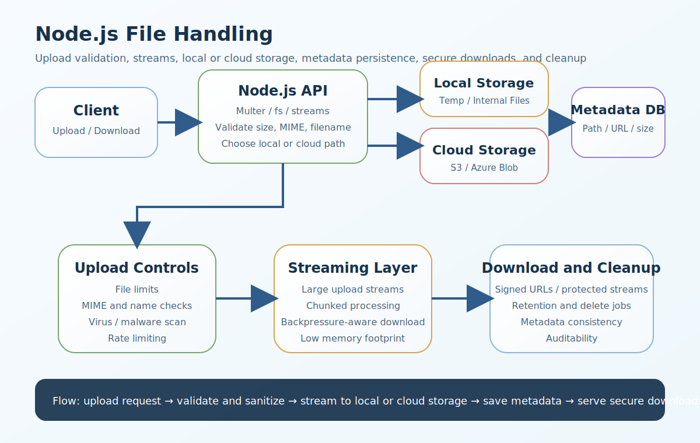

# Node.js File Handling Interview Questions


This guide covers file handling in Node.js from interview basics to tricky production scenarios. It follows the corrected format of **100 interview questions for each subtopic**, and every answer includes a real Node.js code example plus a real-time example so the scenarios and snippets do not repeat verbatim.

## How To Use This Page

- Questions 1-100 cover File system (fs).
- Questions 101-200 cover Synchronous vs asynchronous file handling.
- Questions 201-300 cover File uploads with Multer.
- Questions 301-400 cover Streaming large files.
- Questions 401-500 cover Uploading large files safely.
- Questions 501-600 cover Buffer vs stream.
- Questions 601-700 cover File metadata and validation.
- Questions 701-800 cover Security in file handling.
- Questions 801-900 cover Cloud storage: S3 and Azure Blob.
- Questions 901-1000 cover Local storage vs cloud storage.
- Questions 1001-1100 cover Streaming directly to cloud.
- Questions 1101-1200 cover Downloading files.
- Questions 1201-1300 cover Deleting files.
- Questions 1301-1400 cover File processing use cases in Node.js.
- Questions 1401-1500 cover Performance tuning.
- Questions 1501-1600 cover Error handling.
- Questions 1601-1700 cover Must-know interview questions.
- Questions 1701-1800 cover Topics you should not miss.

## 1. File system (fs)

### Q1.1 What is fs module basics in Node.js file handling?

**Answer:**

fs module basics matters in Node.js file handling because it affects memory usage, throughput, storage safety, validation, cloud integration, and the operational reliability of upload and download workflows. In a real system like a consultant management platform where resumes, contracts, and profile photos are uploaded by different user roles, a strong answer should connect the concept to event-loop impact, storage durability, security checks, cleanup logic, and user-facing latency. A more senior answer also explains the practical trade-off so the answer stays grounded in real storage, memory, and security trade-offs instead of only theory.

**Code Example:**

```js
const fs = require('fs');
fs.readFile('./files/input-1.txt', 'utf8', (err, data) => { if (!err) console.log(data); });
```

**Real-Time Example:** In a consultant management platform where resumes, contracts, and profile photos are uploaded by different user roles, the team used this concept so the answer stays grounded in real storage, memory, and security trade-offs instead of only theory.

### Q1.2 Why does reading files matter in real production systems?

**Answer:**

Reading files matters in Node.js file handling because it affects memory usage, throughput, storage safety, validation, cloud integration, and the operational reliability of upload and download workflows. In a real system like a multi-tenant SaaS where documents must stay isolated per customer and be downloadable only by authorized users, a strong answer should connect the concept to event-loop impact, storage durability, security checks, cleanup logic, and user-facing latency. A more senior answer also explains the practical trade-off so teams can connect the concept to throughput, file integrity, and operational safety.

**Code Example:**

```js
const fs = require('fs');
fs.writeFile('./files/output-2.txt', 'generated content 2', err => { if (!err) console.log('saved'); });
```

**Real-Time Example:** In a multi-tenant SaaS where documents must stay isolated per customer and be downloadable only by authorized users, the team used this concept so teams can connect the concept to throughput, file integrity, and operational safety.

### Q1.3 When should a backend team use writing files?

**Answer:**

Writing files matters in Node.js file handling because it affects memory usage, throughput, storage safety, validation, cloud integration, and the operational reliability of upload and download workflows. In a real system like a media-heavy Node.js service streaming large reports and generated PDFs to enterprise clients, a strong answer should connect the concept to event-loop impact, storage durability, security checks, cleanup logic, and user-facing latency. A more senior answer also explains the practical trade-off so upload and download flows become easier to scale and troubleshoot.

**Code Example:**

```js
const fs = require('fs');
fs.mkdir(`./uploads/batch-3`, { recursive: true }, err => console.log(err || 'created'));
```

**Real-Time Example:** In a media-heavy Node.js service streaming large reports and generated PDFs to enterprise clients, the team used this concept so upload and download flows become easier to scale and troubleshoot.

### Q1.4 How would you explain directory operations in an interview?

**Answer:**

Directory operations matters in Node.js file handling because it affects memory usage, throughput, storage safety, validation, cloud integration, and the operational reliability of upload and download workflows. In a real system like a production API that handles resume uploads, virus scanning, metadata storage, and secure download links, a strong answer should connect the concept to event-loop impact, storage durability, security checks, cleanup logic, and user-facing latency. A more senior answer also explains the practical trade-off so memory pressure and disk usage risks are addressed earlier in the design.

**Code Example:**

```js
const fs = require('fs');
fs.stat('./files/report-4.pdf', (err, stats) => { if (!err) console.log(stats.size); });
```

**Real-Time Example:** In a production API that handles resume uploads, virus scanning, metadata storage, and secure download links, the team used this concept so memory pressure and disk usage risks are addressed earlier in the design.

### Q1.5 What is a common interview trap around file stats and existence checks?

**Answer:**

File stats and existence checks matters in Node.js file handling because it affects memory usage, throughput, storage safety, validation, cloud integration, and the operational reliability of upload and download workflows. In a real system like a cloud-native system where containers should not depend on local disk for long-term document storage, a strong answer should connect the concept to event-loop impact, storage durability, security checks, cleanup logic, and user-facing latency. A more senior answer also explains the practical trade-off so security controls like validation, signed access, and sanitization are treated as first-class requirements.

**Code Example:**

```js
const fs = require('fs');
console.log(fs.existsSync('./uploads/resume-5.pdf'));
```

**Real-Time Example:** In a cloud-native system where containers should not depend on local disk for long-term document storage, the team used this concept so security controls like validation, signed access, and sanitization are treated as first-class requirements.

### Q1.6 How is fs module basics implemented safely in Node.js?

**Answer:**

fs module basics matters in Node.js file handling because it affects memory usage, throughput, storage safety, validation, cloud integration, and the operational reliability of upload and download workflows. In a real system like a reporting platform exporting large CSV and Excel files for finance and operations teams, a strong answer should connect the concept to event-loop impact, storage durability, security checks, cleanup logic, and user-facing latency. A more senior answer also explains the practical trade-off so the examples sound like production Node.js systems instead of generic file API summaries.

**Code Example:**

```js
const fs = require('fs');
fs.readFile('./files/input-6.txt', 'utf8', (err, data) => { if (!err) console.log(data); });
```

**Real-Time Example:** In a reporting platform exporting large CSV and Excel files for finance and operations teams, the team used this concept so the examples sound like production Node.js systems instead of generic file API summaries.

### Q1.7 What production problem usually exposes weak understanding of reading files?

**Answer:**

Reading files matters in Node.js file handling because it affects memory usage, throughput, storage safety, validation, cloud integration, and the operational reliability of upload and download workflows. In a real system like a compliance-heavy workflow where uploaded files need audit fields, retention logic, and deletion controls, a strong answer should connect the concept to event-loop impact, storage durability, security checks, cleanup logic, and user-facing latency. A more senior answer also explains the practical trade-off so local and cloud storage decisions can be justified by deployment model and growth expectations.

**Code Example:**

```js
const fs = require('fs');
fs.writeFile('./files/output-7.txt', 'generated content 7', err => { if (!err) console.log('saved'); });
```

**Real-Time Example:** In a compliance-heavy workflow where uploaded files need audit fields, retention logic, and deletion controls, the team used this concept so local and cloud storage decisions can be justified by deployment model and growth expectations.

### Q1.8 How would a senior engineer justify writing files to a team?

**Answer:**

Writing files matters in Node.js file handling because it affects memory usage, throughput, storage safety, validation, cloud integration, and the operational reliability of upload and download workflows. In a real system like a high-traffic upload service where many users upload documents at the same time, a strong answer should connect the concept to event-loop impact, storage durability, security checks, cleanup logic, and user-facing latency. A more senior answer also explains the practical trade-off so file metadata, retention, and cleanup concerns are tied to real operational behavior.

**Code Example:**

```js
const fs = require('fs');
fs.mkdir(`./uploads/batch-8`, { recursive: true }, err => console.log(err || 'created'));
```

**Real-Time Example:** In a high-traffic upload service where many users upload documents at the same time, the team used this concept so file metadata, retention, and cleanup concerns are tied to real operational behavior.

### Q1.9 What trade-off does directory operations introduce?

**Answer:**

Directory operations matters in Node.js file handling because it affects memory usage, throughput, storage safety, validation, cloud integration, and the operational reliability of upload and download workflows. In a real system like a migration from local server storage to Azure Blob and S3-compatible object storage, a strong answer should connect the concept to event-loop impact, storage durability, security checks, cleanup logic, and user-facing latency. A more senior answer also explains the practical trade-off so streaming, buffering, and background processing choices become easier to explain.

**Code Example:**

```js
const fs = require('fs');
fs.stat('./files/report-9.pdf', (err, stats) => { if (!err) console.log(stats.size); });
```

**Real-Time Example:** In a migration from local server storage to Azure Blob and S3-compatible object storage, the team used this concept so streaming, buffering, and background processing choices become easier to explain.

### Q1.10 How do you answer a tricky follow-up about file stats and existence checks?

**Answer:**

File stats and existence checks matters in Node.js file handling because it affects memory usage, throughput, storage safety, validation, cloud integration, and the operational reliability of upload and download workflows. In a real system like a customer portal where temporary signed download access is required for sensitive files, a strong answer should connect the concept to event-loop impact, storage durability, security checks, cleanup logic, and user-facing latency. A more senior answer also explains the practical trade-off so the answer reflects senior-level thinking about failure handling, cost, and maintainability.

**Code Example:**

```js
const fs = require('fs');
console.log(fs.existsSync('./uploads/resume-10.pdf'));
```

**Real-Time Example:** In a customer portal where temporary signed download access is required for sensitive files, the team used this concept so the answer reflects senior-level thinking about failure handling, cost, and maintainability.

### Q1.11 What is fs module basics in Node.js file handling?

**Answer:**

fs module basics matters in Node.js file handling because it affects memory usage, throughput, storage safety, validation, cloud integration, and the operational reliability of upload and download workflows. In a real system like a consultant management platform where resumes, contracts, and profile photos are uploaded by different user roles, a strong answer should connect the concept to event-loop impact, storage durability, security checks, cleanup logic, and user-facing latency. A more senior answer also explains the practical trade-off so the answer stays grounded in real storage, memory, and security trade-offs instead of only theory.

**Code Example:**

```js
const fs = require('fs');
fs.readFile('./files/input-11.txt', 'utf8', (err, data) => { if (!err) console.log(data); });
```

**Real-Time Example:** In a consultant management platform where resumes, contracts, and profile photos are uploaded by different user roles, the team used this concept so the answer stays grounded in real storage, memory, and security trade-offs instead of only theory.

### Q1.12 Why does reading files matter in real production systems?

**Answer:**

Reading files matters in Node.js file handling because it affects memory usage, throughput, storage safety, validation, cloud integration, and the operational reliability of upload and download workflows. In a real system like a multi-tenant SaaS where documents must stay isolated per customer and be downloadable only by authorized users, a strong answer should connect the concept to event-loop impact, storage durability, security checks, cleanup logic, and user-facing latency. A more senior answer also explains the practical trade-off so teams can connect the concept to throughput, file integrity, and operational safety.

**Code Example:**

```js
const fs = require('fs');
fs.writeFile('./files/output-12.txt', 'generated content 12', err => { if (!err) console.log('saved'); });
```

**Real-Time Example:** In a multi-tenant SaaS where documents must stay isolated per customer and be downloadable only by authorized users, the team used this concept so teams can connect the concept to throughput, file integrity, and operational safety.

### Q1.13 When should a backend team use writing files?

**Answer:**

Writing files matters in Node.js file handling because it affects memory usage, throughput, storage safety, validation, cloud integration, and the operational reliability of upload and download workflows. In a real system like a media-heavy Node.js service streaming large reports and generated PDFs to enterprise clients, a strong answer should connect the concept to event-loop impact, storage durability, security checks, cleanup logic, and user-facing latency. A more senior answer also explains the practical trade-off so upload and download flows become easier to scale and troubleshoot.

**Code Example:**

```js
const fs = require('fs');
fs.mkdir(`./uploads/batch-13`, { recursive: true }, err => console.log(err || 'created'));
```

**Real-Time Example:** In a media-heavy Node.js service streaming large reports and generated PDFs to enterprise clients, the team used this concept so upload and download flows become easier to scale and troubleshoot.

### Q1.14 How would you explain directory operations in an interview?

**Answer:**

Directory operations matters in Node.js file handling because it affects memory usage, throughput, storage safety, validation, cloud integration, and the operational reliability of upload and download workflows. In a real system like a production API that handles resume uploads, virus scanning, metadata storage, and secure download links, a strong answer should connect the concept to event-loop impact, storage durability, security checks, cleanup logic, and user-facing latency. A more senior answer also explains the practical trade-off so memory pressure and disk usage risks are addressed earlier in the design.

**Code Example:**

```js
const fs = require('fs');
fs.stat('./files/report-14.pdf', (err, stats) => { if (!err) console.log(stats.size); });
```

**Real-Time Example:** In a production API that handles resume uploads, virus scanning, metadata storage, and secure download links, the team used this concept so memory pressure and disk usage risks are addressed earlier in the design.

### Q1.15 What is a common interview trap around file stats and existence checks?

**Answer:**

File stats and existence checks matters in Node.js file handling because it affects memory usage, throughput, storage safety, validation, cloud integration, and the operational reliability of upload and download workflows. In a real system like a cloud-native system where containers should not depend on local disk for long-term document storage, a strong answer should connect the concept to event-loop impact, storage durability, security checks, cleanup logic, and user-facing latency. A more senior answer also explains the practical trade-off so security controls like validation, signed access, and sanitization are treated as first-class requirements.

**Code Example:**

```js
const fs = require('fs');
console.log(fs.existsSync('./uploads/resume-15.pdf'));
```

**Real-Time Example:** In a cloud-native system where containers should not depend on local disk for long-term document storage, the team used this concept so security controls like validation, signed access, and sanitization are treated as first-class requirements.

### Q1.16 How is fs module basics implemented safely in Node.js?

**Answer:**

fs module basics matters in Node.js file handling because it affects memory usage, throughput, storage safety, validation, cloud integration, and the operational reliability of upload and download workflows. In a real system like a reporting platform exporting large CSV and Excel files for finance and operations teams, a strong answer should connect the concept to event-loop impact, storage durability, security checks, cleanup logic, and user-facing latency. A more senior answer also explains the practical trade-off so the examples sound like production Node.js systems instead of generic file API summaries.

**Code Example:**

```js
const fs = require('fs');
fs.readFile('./files/input-16.txt', 'utf8', (err, data) => { if (!err) console.log(data); });
```

**Real-Time Example:** In a reporting platform exporting large CSV and Excel files for finance and operations teams, the team used this concept so the examples sound like production Node.js systems instead of generic file API summaries.

### Q1.17 What production problem usually exposes weak understanding of reading files?

**Answer:**

Reading files matters in Node.js file handling because it affects memory usage, throughput, storage safety, validation, cloud integration, and the operational reliability of upload and download workflows. In a real system like a compliance-heavy workflow where uploaded files need audit fields, retention logic, and deletion controls, a strong answer should connect the concept to event-loop impact, storage durability, security checks, cleanup logic, and user-facing latency. A more senior answer also explains the practical trade-off so local and cloud storage decisions can be justified by deployment model and growth expectations.

**Code Example:**

```js
const fs = require('fs');
fs.writeFile('./files/output-17.txt', 'generated content 17', err => { if (!err) console.log('saved'); });
```

**Real-Time Example:** In a compliance-heavy workflow where uploaded files need audit fields, retention logic, and deletion controls, the team used this concept so local and cloud storage decisions can be justified by deployment model and growth expectations.

### Q1.18 How would a senior engineer justify writing files to a team?

**Answer:**

Writing files matters in Node.js file handling because it affects memory usage, throughput, storage safety, validation, cloud integration, and the operational reliability of upload and download workflows. In a real system like a high-traffic upload service where many users upload documents at the same time, a strong answer should connect the concept to event-loop impact, storage durability, security checks, cleanup logic, and user-facing latency. A more senior answer also explains the practical trade-off so file metadata, retention, and cleanup concerns are tied to real operational behavior.

**Code Example:**

```js
const fs = require('fs');
fs.mkdir(`./uploads/batch-18`, { recursive: true }, err => console.log(err || 'created'));
```

**Real-Time Example:** In a high-traffic upload service where many users upload documents at the same time, the team used this concept so file metadata, retention, and cleanup concerns are tied to real operational behavior.

### Q1.19 What trade-off does directory operations introduce?

**Answer:**

Directory operations matters in Node.js file handling because it affects memory usage, throughput, storage safety, validation, cloud integration, and the operational reliability of upload and download workflows. In a real system like a migration from local server storage to Azure Blob and S3-compatible object storage, a strong answer should connect the concept to event-loop impact, storage durability, security checks, cleanup logic, and user-facing latency. A more senior answer also explains the practical trade-off so streaming, buffering, and background processing choices become easier to explain.

**Code Example:**

```js
const fs = require('fs');
fs.stat('./files/report-19.pdf', (err, stats) => { if (!err) console.log(stats.size); });
```

**Real-Time Example:** In a migration from local server storage to Azure Blob and S3-compatible object storage, the team used this concept so streaming, buffering, and background processing choices become easier to explain.

### Q1.20 How do you answer a tricky follow-up about file stats and existence checks?

**Answer:**

File stats and existence checks matters in Node.js file handling because it affects memory usage, throughput, storage safety, validation, cloud integration, and the operational reliability of upload and download workflows. In a real system like a customer portal where temporary signed download access is required for sensitive files, a strong answer should connect the concept to event-loop impact, storage durability, security checks, cleanup logic, and user-facing latency. A more senior answer also explains the practical trade-off so the answer reflects senior-level thinking about failure handling, cost, and maintainability.

**Code Example:**

```js
const fs = require('fs');
console.log(fs.existsSync('./uploads/resume-20.pdf'));
```

**Real-Time Example:** In a customer portal where temporary signed download access is required for sensitive files, the team used this concept so the answer reflects senior-level thinking about failure handling, cost, and maintainability.

### Q1.21 What is fs module basics in Node.js file handling?

**Answer:**

fs module basics matters in Node.js file handling because it affects memory usage, throughput, storage safety, validation, cloud integration, and the operational reliability of upload and download workflows. In a real system like a consultant management platform where resumes, contracts, and profile photos are uploaded by different user roles, a strong answer should connect the concept to event-loop impact, storage durability, security checks, cleanup logic, and user-facing latency. A more senior answer also explains the practical trade-off so the answer stays grounded in real storage, memory, and security trade-offs instead of only theory.

**Code Example:**

```js
const fs = require('fs');
fs.readFile('./files/input-21.txt', 'utf8', (err, data) => { if (!err) console.log(data); });
```

**Real-Time Example:** In a consultant management platform where resumes, contracts, and profile photos are uploaded by different user roles, the team used this concept so the answer stays grounded in real storage, memory, and security trade-offs instead of only theory.

### Q1.22 Why does reading files matter in real production systems?

**Answer:**

Reading files matters in Node.js file handling because it affects memory usage, throughput, storage safety, validation, cloud integration, and the operational reliability of upload and download workflows. In a real system like a multi-tenant SaaS where documents must stay isolated per customer and be downloadable only by authorized users, a strong answer should connect the concept to event-loop impact, storage durability, security checks, cleanup logic, and user-facing latency. A more senior answer also explains the practical trade-off so teams can connect the concept to throughput, file integrity, and operational safety.

**Code Example:**

```js
const fs = require('fs');
fs.writeFile('./files/output-22.txt', 'generated content 22', err => { if (!err) console.log('saved'); });
```

**Real-Time Example:** In a multi-tenant SaaS where documents must stay isolated per customer and be downloadable only by authorized users, the team used this concept so teams can connect the concept to throughput, file integrity, and operational safety.

### Q1.23 When should a backend team use writing files?

**Answer:**

Writing files matters in Node.js file handling because it affects memory usage, throughput, storage safety, validation, cloud integration, and the operational reliability of upload and download workflows. In a real system like a media-heavy Node.js service streaming large reports and generated PDFs to enterprise clients, a strong answer should connect the concept to event-loop impact, storage durability, security checks, cleanup logic, and user-facing latency. A more senior answer also explains the practical trade-off so upload and download flows become easier to scale and troubleshoot.

**Code Example:**

```js
const fs = require('fs');
fs.mkdir(`./uploads/batch-23`, { recursive: true }, err => console.log(err || 'created'));
```

**Real-Time Example:** In a media-heavy Node.js service streaming large reports and generated PDFs to enterprise clients, the team used this concept so upload and download flows become easier to scale and troubleshoot.

### Q1.24 How would you explain directory operations in an interview?

**Answer:**

Directory operations matters in Node.js file handling because it affects memory usage, throughput, storage safety, validation, cloud integration, and the operational reliability of upload and download workflows. In a real system like a production API that handles resume uploads, virus scanning, metadata storage, and secure download links, a strong answer should connect the concept to event-loop impact, storage durability, security checks, cleanup logic, and user-facing latency. A more senior answer also explains the practical trade-off so memory pressure and disk usage risks are addressed earlier in the design.

**Code Example:**

```js
const fs = require('fs');
fs.stat('./files/report-24.pdf', (err, stats) => { if (!err) console.log(stats.size); });
```

**Real-Time Example:** In a production API that handles resume uploads, virus scanning, metadata storage, and secure download links, the team used this concept so memory pressure and disk usage risks are addressed earlier in the design.

### Q1.25 What is a common interview trap around file stats and existence checks?

**Answer:**

File stats and existence checks matters in Node.js file handling because it affects memory usage, throughput, storage safety, validation, cloud integration, and the operational reliability of upload and download workflows. In a real system like a cloud-native system where containers should not depend on local disk for long-term document storage, a strong answer should connect the concept to event-loop impact, storage durability, security checks, cleanup logic, and user-facing latency. A more senior answer also explains the practical trade-off so security controls like validation, signed access, and sanitization are treated as first-class requirements.

**Code Example:**

```js
const fs = require('fs');
console.log(fs.existsSync('./uploads/resume-25.pdf'));
```

**Real-Time Example:** In a cloud-native system where containers should not depend on local disk for long-term document storage, the team used this concept so security controls like validation, signed access, and sanitization are treated as first-class requirements.

### Q1.26 How is fs module basics implemented safely in Node.js?

**Answer:**

fs module basics matters in Node.js file handling because it affects memory usage, throughput, storage safety, validation, cloud integration, and the operational reliability of upload and download workflows. In a real system like a reporting platform exporting large CSV and Excel files for finance and operations teams, a strong answer should connect the concept to event-loop impact, storage durability, security checks, cleanup logic, and user-facing latency. A more senior answer also explains the practical trade-off so the examples sound like production Node.js systems instead of generic file API summaries.

**Code Example:**

```js
const fs = require('fs');
fs.readFile('./files/input-26.txt', 'utf8', (err, data) => { if (!err) console.log(data); });
```

**Real-Time Example:** In a reporting platform exporting large CSV and Excel files for finance and operations teams, the team used this concept so the examples sound like production Node.js systems instead of generic file API summaries.

### Q1.27 What production problem usually exposes weak understanding of reading files?

**Answer:**

Reading files matters in Node.js file handling because it affects memory usage, throughput, storage safety, validation, cloud integration, and the operational reliability of upload and download workflows. In a real system like a compliance-heavy workflow where uploaded files need audit fields, retention logic, and deletion controls, a strong answer should connect the concept to event-loop impact, storage durability, security checks, cleanup logic, and user-facing latency. A more senior answer also explains the practical trade-off so local and cloud storage decisions can be justified by deployment model and growth expectations.

**Code Example:**

```js
const fs = require('fs');
fs.writeFile('./files/output-27.txt', 'generated content 27', err => { if (!err) console.log('saved'); });
```

**Real-Time Example:** In a compliance-heavy workflow where uploaded files need audit fields, retention logic, and deletion controls, the team used this concept so local and cloud storage decisions can be justified by deployment model and growth expectations.

### Q1.28 How would a senior engineer justify writing files to a team?

**Answer:**

Writing files matters in Node.js file handling because it affects memory usage, throughput, storage safety, validation, cloud integration, and the operational reliability of upload and download workflows. In a real system like a high-traffic upload service where many users upload documents at the same time, a strong answer should connect the concept to event-loop impact, storage durability, security checks, cleanup logic, and user-facing latency. A more senior answer also explains the practical trade-off so file metadata, retention, and cleanup concerns are tied to real operational behavior.

**Code Example:**

```js
const fs = require('fs');
fs.mkdir(`./uploads/batch-28`, { recursive: true }, err => console.log(err || 'created'));
```

**Real-Time Example:** In a high-traffic upload service where many users upload documents at the same time, the team used this concept so file metadata, retention, and cleanup concerns are tied to real operational behavior.

### Q1.29 What trade-off does directory operations introduce?

**Answer:**

Directory operations matters in Node.js file handling because it affects memory usage, throughput, storage safety, validation, cloud integration, and the operational reliability of upload and download workflows. In a real system like a migration from local server storage to Azure Blob and S3-compatible object storage, a strong answer should connect the concept to event-loop impact, storage durability, security checks, cleanup logic, and user-facing latency. A more senior answer also explains the practical trade-off so streaming, buffering, and background processing choices become easier to explain.

**Code Example:**

```js
const fs = require('fs');
fs.stat('./files/report-29.pdf', (err, stats) => { if (!err) console.log(stats.size); });
```

**Real-Time Example:** In a migration from local server storage to Azure Blob and S3-compatible object storage, the team used this concept so streaming, buffering, and background processing choices become easier to explain.

### Q1.30 How do you answer a tricky follow-up about file stats and existence checks?

**Answer:**

File stats and existence checks matters in Node.js file handling because it affects memory usage, throughput, storage safety, validation, cloud integration, and the operational reliability of upload and download workflows. In a real system like a customer portal where temporary signed download access is required for sensitive files, a strong answer should connect the concept to event-loop impact, storage durability, security checks, cleanup logic, and user-facing latency. A more senior answer also explains the practical trade-off so the answer reflects senior-level thinking about failure handling, cost, and maintainability.

**Code Example:**

```js
const fs = require('fs');
console.log(fs.existsSync('./uploads/resume-30.pdf'));
```

**Real-Time Example:** In a customer portal where temporary signed download access is required for sensitive files, the team used this concept so the answer reflects senior-level thinking about failure handling, cost, and maintainability.

### Q1.31 What is fs module basics in Node.js file handling?

**Answer:**

fs module basics matters in Node.js file handling because it affects memory usage, throughput, storage safety, validation, cloud integration, and the operational reliability of upload and download workflows. In a real system like a consultant management platform where resumes, contracts, and profile photos are uploaded by different user roles, a strong answer should connect the concept to event-loop impact, storage durability, security checks, cleanup logic, and user-facing latency. A more senior answer also explains the practical trade-off so the answer stays grounded in real storage, memory, and security trade-offs instead of only theory.

**Code Example:**

```js
const fs = require('fs');
fs.readFile('./files/input-31.txt', 'utf8', (err, data) => { if (!err) console.log(data); });
```

**Real-Time Example:** In a consultant management platform where resumes, contracts, and profile photos are uploaded by different user roles, the team used this concept so the answer stays grounded in real storage, memory, and security trade-offs instead of only theory.

### Q1.32 Why does reading files matter in real production systems?

**Answer:**

Reading files matters in Node.js file handling because it affects memory usage, throughput, storage safety, validation, cloud integration, and the operational reliability of upload and download workflows. In a real system like a multi-tenant SaaS where documents must stay isolated per customer and be downloadable only by authorized users, a strong answer should connect the concept to event-loop impact, storage durability, security checks, cleanup logic, and user-facing latency. A more senior answer also explains the practical trade-off so teams can connect the concept to throughput, file integrity, and operational safety.

**Code Example:**

```js
const fs = require('fs');
fs.writeFile('./files/output-32.txt', 'generated content 32', err => { if (!err) console.log('saved'); });
```

**Real-Time Example:** In a multi-tenant SaaS where documents must stay isolated per customer and be downloadable only by authorized users, the team used this concept so teams can connect the concept to throughput, file integrity, and operational safety.

### Q1.33 When should a backend team use writing files?

**Answer:**

Writing files matters in Node.js file handling because it affects memory usage, throughput, storage safety, validation, cloud integration, and the operational reliability of upload and download workflows. In a real system like a media-heavy Node.js service streaming large reports and generated PDFs to enterprise clients, a strong answer should connect the concept to event-loop impact, storage durability, security checks, cleanup logic, and user-facing latency. A more senior answer also explains the practical trade-off so upload and download flows become easier to scale and troubleshoot.

**Code Example:**

```js
const fs = require('fs');
fs.mkdir(`./uploads/batch-33`, { recursive: true }, err => console.log(err || 'created'));
```

**Real-Time Example:** In a media-heavy Node.js service streaming large reports and generated PDFs to enterprise clients, the team used this concept so upload and download flows become easier to scale and troubleshoot.

### Q1.34 How would you explain directory operations in an interview?

**Answer:**

Directory operations matters in Node.js file handling because it affects memory usage, throughput, storage safety, validation, cloud integration, and the operational reliability of upload and download workflows. In a real system like a production API that handles resume uploads, virus scanning, metadata storage, and secure download links, a strong answer should connect the concept to event-loop impact, storage durability, security checks, cleanup logic, and user-facing latency. A more senior answer also explains the practical trade-off so memory pressure and disk usage risks are addressed earlier in the design.

**Code Example:**

```js
const fs = require('fs');
fs.stat('./files/report-34.pdf', (err, stats) => { if (!err) console.log(stats.size); });
```

**Real-Time Example:** In a production API that handles resume uploads, virus scanning, metadata storage, and secure download links, the team used this concept so memory pressure and disk usage risks are addressed earlier in the design.

### Q1.35 What is a common interview trap around file stats and existence checks?

**Answer:**

File stats and existence checks matters in Node.js file handling because it affects memory usage, throughput, storage safety, validation, cloud integration, and the operational reliability of upload and download workflows. In a real system like a cloud-native system where containers should not depend on local disk for long-term document storage, a strong answer should connect the concept to event-loop impact, storage durability, security checks, cleanup logic, and user-facing latency. A more senior answer also explains the practical trade-off so security controls like validation, signed access, and sanitization are treated as first-class requirements.

**Code Example:**

```js
const fs = require('fs');
console.log(fs.existsSync('./uploads/resume-35.pdf'));
```

**Real-Time Example:** In a cloud-native system where containers should not depend on local disk for long-term document storage, the team used this concept so security controls like validation, signed access, and sanitization are treated as first-class requirements.

### Q1.36 How is fs module basics implemented safely in Node.js?

**Answer:**

fs module basics matters in Node.js file handling because it affects memory usage, throughput, storage safety, validation, cloud integration, and the operational reliability of upload and download workflows. In a real system like a reporting platform exporting large CSV and Excel files for finance and operations teams, a strong answer should connect the concept to event-loop impact, storage durability, security checks, cleanup logic, and user-facing latency. A more senior answer also explains the practical trade-off so the examples sound like production Node.js systems instead of generic file API summaries.

**Code Example:**

```js
const fs = require('fs');
fs.readFile('./files/input-36.txt', 'utf8', (err, data) => { if (!err) console.log(data); });
```

**Real-Time Example:** In a reporting platform exporting large CSV and Excel files for finance and operations teams, the team used this concept so the examples sound like production Node.js systems instead of generic file API summaries.

### Q1.37 What production problem usually exposes weak understanding of reading files?

**Answer:**

Reading files matters in Node.js file handling because it affects memory usage, throughput, storage safety, validation, cloud integration, and the operational reliability of upload and download workflows. In a real system like a compliance-heavy workflow where uploaded files need audit fields, retention logic, and deletion controls, a strong answer should connect the concept to event-loop impact, storage durability, security checks, cleanup logic, and user-facing latency. A more senior answer also explains the practical trade-off so local and cloud storage decisions can be justified by deployment model and growth expectations.

**Code Example:**

```js
const fs = require('fs');
fs.writeFile('./files/output-37.txt', 'generated content 37', err => { if (!err) console.log('saved'); });
```

**Real-Time Example:** In a compliance-heavy workflow where uploaded files need audit fields, retention logic, and deletion controls, the team used this concept so local and cloud storage decisions can be justified by deployment model and growth expectations.

### Q1.38 How would a senior engineer justify writing files to a team?

**Answer:**

Writing files matters in Node.js file handling because it affects memory usage, throughput, storage safety, validation, cloud integration, and the operational reliability of upload and download workflows. In a real system like a high-traffic upload service where many users upload documents at the same time, a strong answer should connect the concept to event-loop impact, storage durability, security checks, cleanup logic, and user-facing latency. A more senior answer also explains the practical trade-off so file metadata, retention, and cleanup concerns are tied to real operational behavior.

**Code Example:**

```js
const fs = require('fs');
fs.mkdir(`./uploads/batch-38`, { recursive: true }, err => console.log(err || 'created'));
```

**Real-Time Example:** In a high-traffic upload service where many users upload documents at the same time, the team used this concept so file metadata, retention, and cleanup concerns are tied to real operational behavior.

### Q1.39 What trade-off does directory operations introduce?

**Answer:**

Directory operations matters in Node.js file handling because it affects memory usage, throughput, storage safety, validation, cloud integration, and the operational reliability of upload and download workflows. In a real system like a migration from local server storage to Azure Blob and S3-compatible object storage, a strong answer should connect the concept to event-loop impact, storage durability, security checks, cleanup logic, and user-facing latency. A more senior answer also explains the practical trade-off so streaming, buffering, and background processing choices become easier to explain.

**Code Example:**

```js
const fs = require('fs');
fs.stat('./files/report-39.pdf', (err, stats) => { if (!err) console.log(stats.size); });
```

**Real-Time Example:** In a migration from local server storage to Azure Blob and S3-compatible object storage, the team used this concept so streaming, buffering, and background processing choices become easier to explain.

### Q1.40 How do you answer a tricky follow-up about file stats and existence checks?

**Answer:**

File stats and existence checks matters in Node.js file handling because it affects memory usage, throughput, storage safety, validation, cloud integration, and the operational reliability of upload and download workflows. In a real system like a customer portal where temporary signed download access is required for sensitive files, a strong answer should connect the concept to event-loop impact, storage durability, security checks, cleanup logic, and user-facing latency. A more senior answer also explains the practical trade-off so the answer reflects senior-level thinking about failure handling, cost, and maintainability.

**Code Example:**

```js
const fs = require('fs');
console.log(fs.existsSync('./uploads/resume-40.pdf'));
```

**Real-Time Example:** In a customer portal where temporary signed download access is required for sensitive files, the team used this concept so the answer reflects senior-level thinking about failure handling, cost, and maintainability.

### Q1.41 What is fs module basics in Node.js file handling?

**Answer:**

fs module basics matters in Node.js file handling because it affects memory usage, throughput, storage safety, validation, cloud integration, and the operational reliability of upload and download workflows. In a real system like a consultant management platform where resumes, contracts, and profile photos are uploaded by different user roles, a strong answer should connect the concept to event-loop impact, storage durability, security checks, cleanup logic, and user-facing latency. A more senior answer also explains the practical trade-off so the answer stays grounded in real storage, memory, and security trade-offs instead of only theory.

**Code Example:**

```js
const fs = require('fs');
fs.readFile('./files/input-41.txt', 'utf8', (err, data) => { if (!err) console.log(data); });
```

**Real-Time Example:** In a consultant management platform where resumes, contracts, and profile photos are uploaded by different user roles, the team used this concept so the answer stays grounded in real storage, memory, and security trade-offs instead of only theory.

### Q1.42 Why does reading files matter in real production systems?

**Answer:**

Reading files matters in Node.js file handling because it affects memory usage, throughput, storage safety, validation, cloud integration, and the operational reliability of upload and download workflows. In a real system like a multi-tenant SaaS where documents must stay isolated per customer and be downloadable only by authorized users, a strong answer should connect the concept to event-loop impact, storage durability, security checks, cleanup logic, and user-facing latency. A more senior answer also explains the practical trade-off so teams can connect the concept to throughput, file integrity, and operational safety.

**Code Example:**

```js
const fs = require('fs');
fs.writeFile('./files/output-42.txt', 'generated content 42', err => { if (!err) console.log('saved'); });
```

**Real-Time Example:** In a multi-tenant SaaS where documents must stay isolated per customer and be downloadable only by authorized users, the team used this concept so teams can connect the concept to throughput, file integrity, and operational safety.

### Q1.43 When should a backend team use writing files?

**Answer:**

Writing files matters in Node.js file handling because it affects memory usage, throughput, storage safety, validation, cloud integration, and the operational reliability of upload and download workflows. In a real system like a media-heavy Node.js service streaming large reports and generated PDFs to enterprise clients, a strong answer should connect the concept to event-loop impact, storage durability, security checks, cleanup logic, and user-facing latency. A more senior answer also explains the practical trade-off so upload and download flows become easier to scale and troubleshoot.

**Code Example:**

```js
const fs = require('fs');
fs.mkdir(`./uploads/batch-43`, { recursive: true }, err => console.log(err || 'created'));
```

**Real-Time Example:** In a media-heavy Node.js service streaming large reports and generated PDFs to enterprise clients, the team used this concept so upload and download flows become easier to scale and troubleshoot.

### Q1.44 How would you explain directory operations in an interview?

**Answer:**

Directory operations matters in Node.js file handling because it affects memory usage, throughput, storage safety, validation, cloud integration, and the operational reliability of upload and download workflows. In a real system like a production API that handles resume uploads, virus scanning, metadata storage, and secure download links, a strong answer should connect the concept to event-loop impact, storage durability, security checks, cleanup logic, and user-facing latency. A more senior answer also explains the practical trade-off so memory pressure and disk usage risks are addressed earlier in the design.

**Code Example:**

```js
const fs = require('fs');
fs.stat('./files/report-44.pdf', (err, stats) => { if (!err) console.log(stats.size); });
```

**Real-Time Example:** In a production API that handles resume uploads, virus scanning, metadata storage, and secure download links, the team used this concept so memory pressure and disk usage risks are addressed earlier in the design.

### Q1.45 What is a common interview trap around file stats and existence checks?

**Answer:**

File stats and existence checks matters in Node.js file handling because it affects memory usage, throughput, storage safety, validation, cloud integration, and the operational reliability of upload and download workflows. In a real system like a cloud-native system where containers should not depend on local disk for long-term document storage, a strong answer should connect the concept to event-loop impact, storage durability, security checks, cleanup logic, and user-facing latency. A more senior answer also explains the practical trade-off so security controls like validation, signed access, and sanitization are treated as first-class requirements.

**Code Example:**

```js
const fs = require('fs');
console.log(fs.existsSync('./uploads/resume-45.pdf'));
```

**Real-Time Example:** In a cloud-native system where containers should not depend on local disk for long-term document storage, the team used this concept so security controls like validation, signed access, and sanitization are treated as first-class requirements.

### Q1.46 How is fs module basics implemented safely in Node.js?

**Answer:**

fs module basics matters in Node.js file handling because it affects memory usage, throughput, storage safety, validation, cloud integration, and the operational reliability of upload and download workflows. In a real system like a reporting platform exporting large CSV and Excel files for finance and operations teams, a strong answer should connect the concept to event-loop impact, storage durability, security checks, cleanup logic, and user-facing latency. A more senior answer also explains the practical trade-off so the examples sound like production Node.js systems instead of generic file API summaries.

**Code Example:**

```js
const fs = require('fs');
fs.readFile('./files/input-46.txt', 'utf8', (err, data) => { if (!err) console.log(data); });
```

**Real-Time Example:** In a reporting platform exporting large CSV and Excel files for finance and operations teams, the team used this concept so the examples sound like production Node.js systems instead of generic file API summaries.

### Q1.47 What production problem usually exposes weak understanding of reading files?

**Answer:**

Reading files matters in Node.js file handling because it affects memory usage, throughput, storage safety, validation, cloud integration, and the operational reliability of upload and download workflows. In a real system like a compliance-heavy workflow where uploaded files need audit fields, retention logic, and deletion controls, a strong answer should connect the concept to event-loop impact, storage durability, security checks, cleanup logic, and user-facing latency. A more senior answer also explains the practical trade-off so local and cloud storage decisions can be justified by deployment model and growth expectations.

**Code Example:**

```js
const fs = require('fs');
fs.writeFile('./files/output-47.txt', 'generated content 47', err => { if (!err) console.log('saved'); });
```

**Real-Time Example:** In a compliance-heavy workflow where uploaded files need audit fields, retention logic, and deletion controls, the team used this concept so local and cloud storage decisions can be justified by deployment model and growth expectations.

### Q1.48 How would a senior engineer justify writing files to a team?

**Answer:**

Writing files matters in Node.js file handling because it affects memory usage, throughput, storage safety, validation, cloud integration, and the operational reliability of upload and download workflows. In a real system like a high-traffic upload service where many users upload documents at the same time, a strong answer should connect the concept to event-loop impact, storage durability, security checks, cleanup logic, and user-facing latency. A more senior answer also explains the practical trade-off so file metadata, retention, and cleanup concerns are tied to real operational behavior.

**Code Example:**

```js
const fs = require('fs');
fs.mkdir(`./uploads/batch-48`, { recursive: true }, err => console.log(err || 'created'));
```

**Real-Time Example:** In a high-traffic upload service where many users upload documents at the same time, the team used this concept so file metadata, retention, and cleanup concerns are tied to real operational behavior.

### Q1.49 What trade-off does directory operations introduce?

**Answer:**

Directory operations matters in Node.js file handling because it affects memory usage, throughput, storage safety, validation, cloud integration, and the operational reliability of upload and download workflows. In a real system like a migration from local server storage to Azure Blob and S3-compatible object storage, a strong answer should connect the concept to event-loop impact, storage durability, security checks, cleanup logic, and user-facing latency. A more senior answer also explains the practical trade-off so streaming, buffering, and background processing choices become easier to explain.

**Code Example:**

```js
const fs = require('fs');
fs.stat('./files/report-49.pdf', (err, stats) => { if (!err) console.log(stats.size); });
```

**Real-Time Example:** In a migration from local server storage to Azure Blob and S3-compatible object storage, the team used this concept so streaming, buffering, and background processing choices become easier to explain.

### Q1.50 How do you answer a tricky follow-up about file stats and existence checks?

**Answer:**

File stats and existence checks matters in Node.js file handling because it affects memory usage, throughput, storage safety, validation, cloud integration, and the operational reliability of upload and download workflows. In a real system like a customer portal where temporary signed download access is required for sensitive files, a strong answer should connect the concept to event-loop impact, storage durability, security checks, cleanup logic, and user-facing latency. A more senior answer also explains the practical trade-off so the answer reflects senior-level thinking about failure handling, cost, and maintainability.

**Code Example:**

```js
const fs = require('fs');
console.log(fs.existsSync('./uploads/resume-50.pdf'));
```

**Real-Time Example:** In a customer portal where temporary signed download access is required for sensitive files, the team used this concept so the answer reflects senior-level thinking about failure handling, cost, and maintainability.

### Q1.51 What is fs module basics in Node.js file handling?

**Answer:**

fs module basics matters in Node.js file handling because it affects memory usage, throughput, storage safety, validation, cloud integration, and the operational reliability of upload and download workflows. In a real system like a consultant management platform where resumes, contracts, and profile photos are uploaded by different user roles, a strong answer should connect the concept to event-loop impact, storage durability, security checks, cleanup logic, and user-facing latency. A more senior answer also explains the practical trade-off so the answer stays grounded in real storage, memory, and security trade-offs instead of only theory.

**Code Example:**

```js
const fs = require('fs');
fs.readFile('./files/input-51.txt', 'utf8', (err, data) => { if (!err) console.log(data); });
```

**Real-Time Example:** In a consultant management platform where resumes, contracts, and profile photos are uploaded by different user roles, the team used this concept so the answer stays grounded in real storage, memory, and security trade-offs instead of only theory.

### Q1.52 Why does reading files matter in real production systems?

**Answer:**

Reading files matters in Node.js file handling because it affects memory usage, throughput, storage safety, validation, cloud integration, and the operational reliability of upload and download workflows. In a real system like a multi-tenant SaaS where documents must stay isolated per customer and be downloadable only by authorized users, a strong answer should connect the concept to event-loop impact, storage durability, security checks, cleanup logic, and user-facing latency. A more senior answer also explains the practical trade-off so teams can connect the concept to throughput, file integrity, and operational safety.

**Code Example:**

```js
const fs = require('fs');
fs.writeFile('./files/output-52.txt', 'generated content 52', err => { if (!err) console.log('saved'); });
```

**Real-Time Example:** In a multi-tenant SaaS where documents must stay isolated per customer and be downloadable only by authorized users, the team used this concept so teams can connect the concept to throughput, file integrity, and operational safety.

### Q1.53 When should a backend team use writing files?

**Answer:**

Writing files matters in Node.js file handling because it affects memory usage, throughput, storage safety, validation, cloud integration, and the operational reliability of upload and download workflows. In a real system like a media-heavy Node.js service streaming large reports and generated PDFs to enterprise clients, a strong answer should connect the concept to event-loop impact, storage durability, security checks, cleanup logic, and user-facing latency. A more senior answer also explains the practical trade-off so upload and download flows become easier to scale and troubleshoot.

**Code Example:**

```js
const fs = require('fs');
fs.mkdir(`./uploads/batch-53`, { recursive: true }, err => console.log(err || 'created'));
```

**Real-Time Example:** In a media-heavy Node.js service streaming large reports and generated PDFs to enterprise clients, the team used this concept so upload and download flows become easier to scale and troubleshoot.

### Q1.54 How would you explain directory operations in an interview?

**Answer:**

Directory operations matters in Node.js file handling because it affects memory usage, throughput, storage safety, validation, cloud integration, and the operational reliability of upload and download workflows. In a real system like a production API that handles resume uploads, virus scanning, metadata storage, and secure download links, a strong answer should connect the concept to event-loop impact, storage durability, security checks, cleanup logic, and user-facing latency. A more senior answer also explains the practical trade-off so memory pressure and disk usage risks are addressed earlier in the design.

**Code Example:**

```js
const fs = require('fs');
fs.stat('./files/report-54.pdf', (err, stats) => { if (!err) console.log(stats.size); });
```

**Real-Time Example:** In a production API that handles resume uploads, virus scanning, metadata storage, and secure download links, the team used this concept so memory pressure and disk usage risks are addressed earlier in the design.

### Q1.55 What is a common interview trap around file stats and existence checks?

**Answer:**

File stats and existence checks matters in Node.js file handling because it affects memory usage, throughput, storage safety, validation, cloud integration, and the operational reliability of upload and download workflows. In a real system like a cloud-native system where containers should not depend on local disk for long-term document storage, a strong answer should connect the concept to event-loop impact, storage durability, security checks, cleanup logic, and user-facing latency. A more senior answer also explains the practical trade-off so security controls like validation, signed access, and sanitization are treated as first-class requirements.

**Code Example:**

```js
const fs = require('fs');
console.log(fs.existsSync('./uploads/resume-55.pdf'));
```

**Real-Time Example:** In a cloud-native system where containers should not depend on local disk for long-term document storage, the team used this concept so security controls like validation, signed access, and sanitization are treated as first-class requirements.

### Q1.56 How is fs module basics implemented safely in Node.js?

**Answer:**

fs module basics matters in Node.js file handling because it affects memory usage, throughput, storage safety, validation, cloud integration, and the operational reliability of upload and download workflows. In a real system like a reporting platform exporting large CSV and Excel files for finance and operations teams, a strong answer should connect the concept to event-loop impact, storage durability, security checks, cleanup logic, and user-facing latency. A more senior answer also explains the practical trade-off so the examples sound like production Node.js systems instead of generic file API summaries.

**Code Example:**

```js
const fs = require('fs');
fs.readFile('./files/input-56.txt', 'utf8', (err, data) => { if (!err) console.log(data); });
```

**Real-Time Example:** In a reporting platform exporting large CSV and Excel files for finance and operations teams, the team used this concept so the examples sound like production Node.js systems instead of generic file API summaries.

### Q1.57 What production problem usually exposes weak understanding of reading files?

**Answer:**

Reading files matters in Node.js file handling because it affects memory usage, throughput, storage safety, validation, cloud integration, and the operational reliability of upload and download workflows. In a real system like a compliance-heavy workflow where uploaded files need audit fields, retention logic, and deletion controls, a strong answer should connect the concept to event-loop impact, storage durability, security checks, cleanup logic, and user-facing latency. A more senior answer also explains the practical trade-off so local and cloud storage decisions can be justified by deployment model and growth expectations.

**Code Example:**

```js
const fs = require('fs');
fs.writeFile('./files/output-57.txt', 'generated content 57', err => { if (!err) console.log('saved'); });
```

**Real-Time Example:** In a compliance-heavy workflow where uploaded files need audit fields, retention logic, and deletion controls, the team used this concept so local and cloud storage decisions can be justified by deployment model and growth expectations.

### Q1.58 How would a senior engineer justify writing files to a team?

**Answer:**

Writing files matters in Node.js file handling because it affects memory usage, throughput, storage safety, validation, cloud integration, and the operational reliability of upload and download workflows. In a real system like a high-traffic upload service where many users upload documents at the same time, a strong answer should connect the concept to event-loop impact, storage durability, security checks, cleanup logic, and user-facing latency. A more senior answer also explains the practical trade-off so file metadata, retention, and cleanup concerns are tied to real operational behavior.

**Code Example:**

```js
const fs = require('fs');
fs.mkdir(`./uploads/batch-58`, { recursive: true }, err => console.log(err || 'created'));
```

**Real-Time Example:** In a high-traffic upload service where many users upload documents at the same time, the team used this concept so file metadata, retention, and cleanup concerns are tied to real operational behavior.

### Q1.59 What trade-off does directory operations introduce?

**Answer:**

Directory operations matters in Node.js file handling because it affects memory usage, throughput, storage safety, validation, cloud integration, and the operational reliability of upload and download workflows. In a real system like a migration from local server storage to Azure Blob and S3-compatible object storage, a strong answer should connect the concept to event-loop impact, storage durability, security checks, cleanup logic, and user-facing latency. A more senior answer also explains the practical trade-off so streaming, buffering, and background processing choices become easier to explain.

**Code Example:**

```js
const fs = require('fs');
fs.stat('./files/report-59.pdf', (err, stats) => { if (!err) console.log(stats.size); });
```

**Real-Time Example:** In a migration from local server storage to Azure Blob and S3-compatible object storage, the team used this concept so streaming, buffering, and background processing choices become easier to explain.

### Q1.60 How do you answer a tricky follow-up about file stats and existence checks?

**Answer:**

File stats and existence checks matters in Node.js file handling because it affects memory usage, throughput, storage safety, validation, cloud integration, and the operational reliability of upload and download workflows. In a real system like a customer portal where temporary signed download access is required for sensitive files, a strong answer should connect the concept to event-loop impact, storage durability, security checks, cleanup logic, and user-facing latency. A more senior answer also explains the practical trade-off so the answer reflects senior-level thinking about failure handling, cost, and maintainability.

**Code Example:**

```js
const fs = require('fs');
console.log(fs.existsSync('./uploads/resume-60.pdf'));
```

**Real-Time Example:** In a customer portal where temporary signed download access is required for sensitive files, the team used this concept so the answer reflects senior-level thinking about failure handling, cost, and maintainability.

### Q1.61 What is fs module basics in Node.js file handling?

**Answer:**

fs module basics matters in Node.js file handling because it affects memory usage, throughput, storage safety, validation, cloud integration, and the operational reliability of upload and download workflows. In a real system like a consultant management platform where resumes, contracts, and profile photos are uploaded by different user roles, a strong answer should connect the concept to event-loop impact, storage durability, security checks, cleanup logic, and user-facing latency. A more senior answer also explains the practical trade-off so the answer stays grounded in real storage, memory, and security trade-offs instead of only theory.

**Code Example:**

```js
const fs = require('fs');
fs.readFile('./files/input-61.txt', 'utf8', (err, data) => { if (!err) console.log(data); });
```

**Real-Time Example:** In a consultant management platform where resumes, contracts, and profile photos are uploaded by different user roles, the team used this concept so the answer stays grounded in real storage, memory, and security trade-offs instead of only theory.

### Q1.62 Why does reading files matter in real production systems?

**Answer:**

Reading files matters in Node.js file handling because it affects memory usage, throughput, storage safety, validation, cloud integration, and the operational reliability of upload and download workflows. In a real system like a multi-tenant SaaS where documents must stay isolated per customer and be downloadable only by authorized users, a strong answer should connect the concept to event-loop impact, storage durability, security checks, cleanup logic, and user-facing latency. A more senior answer also explains the practical trade-off so teams can connect the concept to throughput, file integrity, and operational safety.

**Code Example:**

```js
const fs = require('fs');
fs.writeFile('./files/output-62.txt', 'generated content 62', err => { if (!err) console.log('saved'); });
```

**Real-Time Example:** In a multi-tenant SaaS where documents must stay isolated per customer and be downloadable only by authorized users, the team used this concept so teams can connect the concept to throughput, file integrity, and operational safety.

### Q1.63 When should a backend team use writing files?

**Answer:**

Writing files matters in Node.js file handling because it affects memory usage, throughput, storage safety, validation, cloud integration, and the operational reliability of upload and download workflows. In a real system like a media-heavy Node.js service streaming large reports and generated PDFs to enterprise clients, a strong answer should connect the concept to event-loop impact, storage durability, security checks, cleanup logic, and user-facing latency. A more senior answer also explains the practical trade-off so upload and download flows become easier to scale and troubleshoot.

**Code Example:**

```js
const fs = require('fs');
fs.mkdir(`./uploads/batch-63`, { recursive: true }, err => console.log(err || 'created'));
```

**Real-Time Example:** In a media-heavy Node.js service streaming large reports and generated PDFs to enterprise clients, the team used this concept so upload and download flows become easier to scale and troubleshoot.

### Q1.64 How would you explain directory operations in an interview?

**Answer:**

Directory operations matters in Node.js file handling because it affects memory usage, throughput, storage safety, validation, cloud integration, and the operational reliability of upload and download workflows. In a real system like a production API that handles resume uploads, virus scanning, metadata storage, and secure download links, a strong answer should connect the concept to event-loop impact, storage durability, security checks, cleanup logic, and user-facing latency. A more senior answer also explains the practical trade-off so memory pressure and disk usage risks are addressed earlier in the design.

**Code Example:**

```js
const fs = require('fs');
fs.stat('./files/report-64.pdf', (err, stats) => { if (!err) console.log(stats.size); });
```

**Real-Time Example:** In a production API that handles resume uploads, virus scanning, metadata storage, and secure download links, the team used this concept so memory pressure and disk usage risks are addressed earlier in the design.

### Q1.65 What is a common interview trap around file stats and existence checks?

**Answer:**

File stats and existence checks matters in Node.js file handling because it affects memory usage, throughput, storage safety, validation, cloud integration, and the operational reliability of upload and download workflows. In a real system like a cloud-native system where containers should not depend on local disk for long-term document storage, a strong answer should connect the concept to event-loop impact, storage durability, security checks, cleanup logic, and user-facing latency. A more senior answer also explains the practical trade-off so security controls like validation, signed access, and sanitization are treated as first-class requirements.

**Code Example:**

```js
const fs = require('fs');
console.log(fs.existsSync('./uploads/resume-65.pdf'));
```

**Real-Time Example:** In a cloud-native system where containers should not depend on local disk for long-term document storage, the team used this concept so security controls like validation, signed access, and sanitization are treated as first-class requirements.

### Q1.66 How is fs module basics implemented safely in Node.js?

**Answer:**

fs module basics matters in Node.js file handling because it affects memory usage, throughput, storage safety, validation, cloud integration, and the operational reliability of upload and download workflows. In a real system like a reporting platform exporting large CSV and Excel files for finance and operations teams, a strong answer should connect the concept to event-loop impact, storage durability, security checks, cleanup logic, and user-facing latency. A more senior answer also explains the practical trade-off so the examples sound like production Node.js systems instead of generic file API summaries.

**Code Example:**

```js
const fs = require('fs');
fs.readFile('./files/input-66.txt', 'utf8', (err, data) => { if (!err) console.log(data); });
```

**Real-Time Example:** In a reporting platform exporting large CSV and Excel files for finance and operations teams, the team used this concept so the examples sound like production Node.js systems instead of generic file API summaries.

### Q1.67 What production problem usually exposes weak understanding of reading files?

**Answer:**

Reading files matters in Node.js file handling because it affects memory usage, throughput, storage safety, validation, cloud integration, and the operational reliability of upload and download workflows. In a real system like a compliance-heavy workflow where uploaded files need audit fields, retention logic, and deletion controls, a strong answer should connect the concept to event-loop impact, storage durability, security checks, cleanup logic, and user-facing latency. A more senior answer also explains the practical trade-off so local and cloud storage decisions can be justified by deployment model and growth expectations.

**Code Example:**

```js
const fs = require('fs');
fs.writeFile('./files/output-67.txt', 'generated content 67', err => { if (!err) console.log('saved'); });
```

**Real-Time Example:** In a compliance-heavy workflow where uploaded files need audit fields, retention logic, and deletion controls, the team used this concept so local and cloud storage decisions can be justified by deployment model and growth expectations.

### Q1.68 How would a senior engineer justify writing files to a team?

**Answer:**

Writing files matters in Node.js file handling because it affects memory usage, throughput, storage safety, validation, cloud integration, and the operational reliability of upload and download workflows. In a real system like a high-traffic upload service where many users upload documents at the same time, a strong answer should connect the concept to event-loop impact, storage durability, security checks, cleanup logic, and user-facing latency. A more senior answer also explains the practical trade-off so file metadata, retention, and cleanup concerns are tied to real operational behavior.

**Code Example:**

```js
const fs = require('fs');
fs.mkdir(`./uploads/batch-68`, { recursive: true }, err => console.log(err || 'created'));
```

**Real-Time Example:** In a high-traffic upload service where many users upload documents at the same time, the team used this concept so file metadata, retention, and cleanup concerns are tied to real operational behavior.

### Q1.69 What trade-off does directory operations introduce?

**Answer:**

Directory operations matters in Node.js file handling because it affects memory usage, throughput, storage safety, validation, cloud integration, and the operational reliability of upload and download workflows. In a real system like a migration from local server storage to Azure Blob and S3-compatible object storage, a strong answer should connect the concept to event-loop impact, storage durability, security checks, cleanup logic, and user-facing latency. A more senior answer also explains the practical trade-off so streaming, buffering, and background processing choices become easier to explain.

**Code Example:**

```js
const fs = require('fs');
fs.stat('./files/report-69.pdf', (err, stats) => { if (!err) console.log(stats.size); });
```

**Real-Time Example:** In a migration from local server storage to Azure Blob and S3-compatible object storage, the team used this concept so streaming, buffering, and background processing choices become easier to explain.

### Q1.70 How do you answer a tricky follow-up about file stats and existence checks?

**Answer:**

File stats and existence checks matters in Node.js file handling because it affects memory usage, throughput, storage safety, validation, cloud integration, and the operational reliability of upload and download workflows. In a real system like a customer portal where temporary signed download access is required for sensitive files, a strong answer should connect the concept to event-loop impact, storage durability, security checks, cleanup logic, and user-facing latency. A more senior answer also explains the practical trade-off so the answer reflects senior-level thinking about failure handling, cost, and maintainability.

**Code Example:**

```js
const fs = require('fs');
console.log(fs.existsSync('./uploads/resume-70.pdf'));
```

**Real-Time Example:** In a customer portal where temporary signed download access is required for sensitive files, the team used this concept so the answer reflects senior-level thinking about failure handling, cost, and maintainability.

### Q1.71 What is fs module basics in Node.js file handling?

**Answer:**

fs module basics matters in Node.js file handling because it affects memory usage, throughput, storage safety, validation, cloud integration, and the operational reliability of upload and download workflows. In a real system like a consultant management platform where resumes, contracts, and profile photos are uploaded by different user roles, a strong answer should connect the concept to event-loop impact, storage durability, security checks, cleanup logic, and user-facing latency. A more senior answer also explains the practical trade-off so the answer stays grounded in real storage, memory, and security trade-offs instead of only theory.

**Code Example:**

```js
const fs = require('fs');
fs.readFile('./files/input-71.txt', 'utf8', (err, data) => { if (!err) console.log(data); });
```

**Real-Time Example:** In a consultant management platform where resumes, contracts, and profile photos are uploaded by different user roles, the team used this concept so the answer stays grounded in real storage, memory, and security trade-offs instead of only theory.

### Q1.72 Why does reading files matter in real production systems?

**Answer:**

Reading files matters in Node.js file handling because it affects memory usage, throughput, storage safety, validation, cloud integration, and the operational reliability of upload and download workflows. In a real system like a multi-tenant SaaS where documents must stay isolated per customer and be downloadable only by authorized users, a strong answer should connect the concept to event-loop impact, storage durability, security checks, cleanup logic, and user-facing latency. A more senior answer also explains the practical trade-off so teams can connect the concept to throughput, file integrity, and operational safety.

**Code Example:**

```js
const fs = require('fs');
fs.writeFile('./files/output-72.txt', 'generated content 72', err => { if (!err) console.log('saved'); });
```

**Real-Time Example:** In a multi-tenant SaaS where documents must stay isolated per customer and be downloadable only by authorized users, the team used this concept so teams can connect the concept to throughput, file integrity, and operational safety.

### Q1.73 When should a backend team use writing files?

**Answer:**

Writing files matters in Node.js file handling because it affects memory usage, throughput, storage safety, validation, cloud integration, and the operational reliability of upload and download workflows. In a real system like a media-heavy Node.js service streaming large reports and generated PDFs to enterprise clients, a strong answer should connect the concept to event-loop impact, storage durability, security checks, cleanup logic, and user-facing latency. A more senior answer also explains the practical trade-off so upload and download flows become easier to scale and troubleshoot.

**Code Example:**

```js
const fs = require('fs');
fs.mkdir(`./uploads/batch-73`, { recursive: true }, err => console.log(err || 'created'));
```

**Real-Time Example:** In a media-heavy Node.js service streaming large reports and generated PDFs to enterprise clients, the team used this concept so upload and download flows become easier to scale and troubleshoot.

### Q1.74 How would you explain directory operations in an interview?

**Answer:**

Directory operations matters in Node.js file handling because it affects memory usage, throughput, storage safety, validation, cloud integration, and the operational reliability of upload and download workflows. In a real system like a production API that handles resume uploads, virus scanning, metadata storage, and secure download links, a strong answer should connect the concept to event-loop impact, storage durability, security checks, cleanup logic, and user-facing latency. A more senior answer also explains the practical trade-off so memory pressure and disk usage risks are addressed earlier in the design.

**Code Example:**

```js
const fs = require('fs');
fs.stat('./files/report-74.pdf', (err, stats) => { if (!err) console.log(stats.size); });
```

**Real-Time Example:** In a production API that handles resume uploads, virus scanning, metadata storage, and secure download links, the team used this concept so memory pressure and disk usage risks are addressed earlier in the design.

### Q1.75 What is a common interview trap around file stats and existence checks?

**Answer:**

File stats and existence checks matters in Node.js file handling because it affects memory usage, throughput, storage safety, validation, cloud integration, and the operational reliability of upload and download workflows. In a real system like a cloud-native system where containers should not depend on local disk for long-term document storage, a strong answer should connect the concept to event-loop impact, storage durability, security checks, cleanup logic, and user-facing latency. A more senior answer also explains the practical trade-off so security controls like validation, signed access, and sanitization are treated as first-class requirements.

**Code Example:**

```js
const fs = require('fs');
console.log(fs.existsSync('./uploads/resume-75.pdf'));
```

**Real-Time Example:** In a cloud-native system where containers should not depend on local disk for long-term document storage, the team used this concept so security controls like validation, signed access, and sanitization are treated as first-class requirements.

### Q1.76 How is fs module basics implemented safely in Node.js?

**Answer:**

fs module basics matters in Node.js file handling because it affects memory usage, throughput, storage safety, validation, cloud integration, and the operational reliability of upload and download workflows. In a real system like a reporting platform exporting large CSV and Excel files for finance and operations teams, a strong answer should connect the concept to event-loop impact, storage durability, security checks, cleanup logic, and user-facing latency. A more senior answer also explains the practical trade-off so the examples sound like production Node.js systems instead of generic file API summaries.

**Code Example:**

```js
const fs = require('fs');
fs.readFile('./files/input-76.txt', 'utf8', (err, data) => { if (!err) console.log(data); });
```

**Real-Time Example:** In a reporting platform exporting large CSV and Excel files for finance and operations teams, the team used this concept so the examples sound like production Node.js systems instead of generic file API summaries.

### Q1.77 What production problem usually exposes weak understanding of reading files?

**Answer:**

Reading files matters in Node.js file handling because it affects memory usage, throughput, storage safety, validation, cloud integration, and the operational reliability of upload and download workflows. In a real system like a compliance-heavy workflow where uploaded files need audit fields, retention logic, and deletion controls, a strong answer should connect the concept to event-loop impact, storage durability, security checks, cleanup logic, and user-facing latency. A more senior answer also explains the practical trade-off so local and cloud storage decisions can be justified by deployment model and growth expectations.

**Code Example:**

```js
const fs = require('fs');
fs.writeFile('./files/output-77.txt', 'generated content 77', err => { if (!err) console.log('saved'); });
```

**Real-Time Example:** In a compliance-heavy workflow where uploaded files need audit fields, retention logic, and deletion controls, the team used this concept so local and cloud storage decisions can be justified by deployment model and growth expectations.

### Q1.78 How would a senior engineer justify writing files to a team?

**Answer:**

Writing files matters in Node.js file handling because it affects memory usage, throughput, storage safety, validation, cloud integration, and the operational reliability of upload and download workflows. In a real system like a high-traffic upload service where many users upload documents at the same time, a strong answer should connect the concept to event-loop impact, storage durability, security checks, cleanup logic, and user-facing latency. A more senior answer also explains the practical trade-off so file metadata, retention, and cleanup concerns are tied to real operational behavior.

**Code Example:**

```js
const fs = require('fs');
fs.mkdir(`./uploads/batch-78`, { recursive: true }, err => console.log(err || 'created'));
```

**Real-Time Example:** In a high-traffic upload service where many users upload documents at the same time, the team used this concept so file metadata, retention, and cleanup concerns are tied to real operational behavior.

### Q1.79 What trade-off does directory operations introduce?

**Answer:**

Directory operations matters in Node.js file handling because it affects memory usage, throughput, storage safety, validation, cloud integration, and the operational reliability of upload and download workflows. In a real system like a migration from local server storage to Azure Blob and S3-compatible object storage, a strong answer should connect the concept to event-loop impact, storage durability, security checks, cleanup logic, and user-facing latency. A more senior answer also explains the practical trade-off so streaming, buffering, and background processing choices become easier to explain.

**Code Example:**

```js
const fs = require('fs');
fs.stat('./files/report-79.pdf', (err, stats) => { if (!err) console.log(stats.size); });
```

**Real-Time Example:** In a migration from local server storage to Azure Blob and S3-compatible object storage, the team used this concept so streaming, buffering, and background processing choices become easier to explain.

### Q1.80 How do you answer a tricky follow-up about file stats and existence checks?

**Answer:**

File stats and existence checks matters in Node.js file handling because it affects memory usage, throughput, storage safety, validation, cloud integration, and the operational reliability of upload and download workflows. In a real system like a customer portal where temporary signed download access is required for sensitive files, a strong answer should connect the concept to event-loop impact, storage durability, security checks, cleanup logic, and user-facing latency. A more senior answer also explains the practical trade-off so the answer reflects senior-level thinking about failure handling, cost, and maintainability.

**Code Example:**

```js
const fs = require('fs');
console.log(fs.existsSync('./uploads/resume-80.pdf'));
```

**Real-Time Example:** In a customer portal where temporary signed download access is required for sensitive files, the team used this concept so the answer reflects senior-level thinking about failure handling, cost, and maintainability.

### Q1.81 What is fs module basics in Node.js file handling?

**Answer:**

fs module basics matters in Node.js file handling because it affects memory usage, throughput, storage safety, validation, cloud integration, and the operational reliability of upload and download workflows. In a real system like a consultant management platform where resumes, contracts, and profile photos are uploaded by different user roles, a strong answer should connect the concept to event-loop impact, storage durability, security checks, cleanup logic, and user-facing latency. A more senior answer also explains the practical trade-off so the answer stays grounded in real storage, memory, and security trade-offs instead of only theory.

**Code Example:**

```js
const fs = require('fs');
fs.readFile('./files/input-81.txt', 'utf8', (err, data) => { if (!err) console.log(data); });
```

**Real-Time Example:** In a consultant management platform where resumes, contracts, and profile photos are uploaded by different user roles, the team used this concept so the answer stays grounded in real storage, memory, and security trade-offs instead of only theory.

### Q1.82 Why does reading files matter in real production systems?

**Answer:**

Reading files matters in Node.js file handling because it affects memory usage, throughput, storage safety, validation, cloud integration, and the operational reliability of upload and download workflows. In a real system like a multi-tenant SaaS where documents must stay isolated per customer and be downloadable only by authorized users, a strong answer should connect the concept to event-loop impact, storage durability, security checks, cleanup logic, and user-facing latency. A more senior answer also explains the practical trade-off so teams can connect the concept to throughput, file integrity, and operational safety.

**Code Example:**

```js
const fs = require('fs');
fs.writeFile('./files/output-82.txt', 'generated content 82', err => { if (!err) console.log('saved'); });
```

**Real-Time Example:** In a multi-tenant SaaS where documents must stay isolated per customer and be downloadable only by authorized users, the team used this concept so teams can connect the concept to throughput, file integrity, and operational safety.

### Q1.83 When should a backend team use writing files?

**Answer:**

Writing files matters in Node.js file handling because it affects memory usage, throughput, storage safety, validation, cloud integration, and the operational reliability of upload and download workflows. In a real system like a media-heavy Node.js service streaming large reports and generated PDFs to enterprise clients, a strong answer should connect the concept to event-loop impact, storage durability, security checks, cleanup logic, and user-facing latency. A more senior answer also explains the practical trade-off so upload and download flows become easier to scale and troubleshoot.

**Code Example:**

```js
const fs = require('fs');
fs.mkdir(`./uploads/batch-83`, { recursive: true }, err => console.log(err || 'created'));
```

**Real-Time Example:** In a media-heavy Node.js service streaming large reports and generated PDFs to enterprise clients, the team used this concept so upload and download flows become easier to scale and troubleshoot.

### Q1.84 How would you explain directory operations in an interview?

**Answer:**

Directory operations matters in Node.js file handling because it affects memory usage, throughput, storage safety, validation, cloud integration, and the operational reliability of upload and download workflows. In a real system like a production API that handles resume uploads, virus scanning, metadata storage, and secure download links, a strong answer should connect the concept to event-loop impact, storage durability, security checks, cleanup logic, and user-facing latency. A more senior answer also explains the practical trade-off so memory pressure and disk usage risks are addressed earlier in the design.

**Code Example:**

```js
const fs = require('fs');
fs.stat('./files/report-84.pdf', (err, stats) => { if (!err) console.log(stats.size); });
```

**Real-Time Example:** In a production API that handles resume uploads, virus scanning, metadata storage, and secure download links, the team used this concept so memory pressure and disk usage risks are addressed earlier in the design.

### Q1.85 What is a common interview trap around file stats and existence checks?

**Answer:**

File stats and existence checks matters in Node.js file handling because it affects memory usage, throughput, storage safety, validation, cloud integration, and the operational reliability of upload and download workflows. In a real system like a cloud-native system where containers should not depend on local disk for long-term document storage, a strong answer should connect the concept to event-loop impact, storage durability, security checks, cleanup logic, and user-facing latency. A more senior answer also explains the practical trade-off so security controls like validation, signed access, and sanitization are treated as first-class requirements.

**Code Example:**

```js
const fs = require('fs');
console.log(fs.existsSync('./uploads/resume-85.pdf'));
```

**Real-Time Example:** In a cloud-native system where containers should not depend on local disk for long-term document storage, the team used this concept so security controls like validation, signed access, and sanitization are treated as first-class requirements.

### Q1.86 How is fs module basics implemented safely in Node.js?

**Answer:**

fs module basics matters in Node.js file handling because it affects memory usage, throughput, storage safety, validation, cloud integration, and the operational reliability of upload and download workflows. In a real system like a reporting platform exporting large CSV and Excel files for finance and operations teams, a strong answer should connect the concept to event-loop impact, storage durability, security checks, cleanup logic, and user-facing latency. A more senior answer also explains the practical trade-off so the examples sound like production Node.js systems instead of generic file API summaries.

**Code Example:**

```js
const fs = require('fs');
fs.readFile('./files/input-86.txt', 'utf8', (err, data) => { if (!err) console.log(data); });
```

**Real-Time Example:** In a reporting platform exporting large CSV and Excel files for finance and operations teams, the team used this concept so the examples sound like production Node.js systems instead of generic file API summaries.

### Q1.87 What production problem usually exposes weak understanding of reading files?

**Answer:**

Reading files matters in Node.js file handling because it affects memory usage, throughput, storage safety, validation, cloud integration, and the operational reliability of upload and download workflows. In a real system like a compliance-heavy workflow where uploaded files need audit fields, retention logic, and deletion controls, a strong answer should connect the concept to event-loop impact, storage durability, security checks, cleanup logic, and user-facing latency. A more senior answer also explains the practical trade-off so local and cloud storage decisions can be justified by deployment model and growth expectations.

**Code Example:**

```js
const fs = require('fs');
fs.writeFile('./files/output-87.txt', 'generated content 87', err => { if (!err) console.log('saved'); });
```

**Real-Time Example:** In a compliance-heavy workflow where uploaded files need audit fields, retention logic, and deletion controls, the team used this concept so local and cloud storage decisions can be justified by deployment model and growth expectations.

### Q1.88 How would a senior engineer justify writing files to a team?

**Answer:**

Writing files matters in Node.js file handling because it affects memory usage, throughput, storage safety, validation, cloud integration, and the operational reliability of upload and download workflows. In a real system like a high-traffic upload service where many users upload documents at the same time, a strong answer should connect the concept to event-loop impact, storage durability, security checks, cleanup logic, and user-facing latency. A more senior answer also explains the practical trade-off so file metadata, retention, and cleanup concerns are tied to real operational behavior.

**Code Example:**

```js
const fs = require('fs');
fs.mkdir(`./uploads/batch-88`, { recursive: true }, err => console.log(err || 'created'));
```

**Real-Time Example:** In a high-traffic upload service where many users upload documents at the same time, the team used this concept so file metadata, retention, and cleanup concerns are tied to real operational behavior.

### Q1.89 What trade-off does directory operations introduce?

**Answer:**

Directory operations matters in Node.js file handling because it affects memory usage, throughput, storage safety, validation, cloud integration, and the operational reliability of upload and download workflows. In a real system like a migration from local server storage to Azure Blob and S3-compatible object storage, a strong answer should connect the concept to event-loop impact, storage durability, security checks, cleanup logic, and user-facing latency. A more senior answer also explains the practical trade-off so streaming, buffering, and background processing choices become easier to explain.

**Code Example:**

```js
const fs = require('fs');
fs.stat('./files/report-89.pdf', (err, stats) => { if (!err) console.log(stats.size); });
```

**Real-Time Example:** In a migration from local server storage to Azure Blob and S3-compatible object storage, the team used this concept so streaming, buffering, and background processing choices become easier to explain.

### Q1.90 How do you answer a tricky follow-up about file stats and existence checks?

**Answer:**

File stats and existence checks matters in Node.js file handling because it affects memory usage, throughput, storage safety, validation, cloud integration, and the operational reliability of upload and download workflows. In a real system like a customer portal where temporary signed download access is required for sensitive files, a strong answer should connect the concept to event-loop impact, storage durability, security checks, cleanup logic, and user-facing latency. A more senior answer also explains the practical trade-off so the answer reflects senior-level thinking about failure handling, cost, and maintainability.

**Code Example:**

```js
const fs = require('fs');
console.log(fs.existsSync('./uploads/resume-90.pdf'));
```

**Real-Time Example:** In a customer portal where temporary signed download access is required for sensitive files, the team used this concept so the answer reflects senior-level thinking about failure handling, cost, and maintainability.

### Q1.91 What is fs module basics in Node.js file handling?

**Answer:**

fs module basics matters in Node.js file handling because it affects memory usage, throughput, storage safety, validation, cloud integration, and the operational reliability of upload and download workflows. In a real system like a consultant management platform where resumes, contracts, and profile photos are uploaded by different user roles, a strong answer should connect the concept to event-loop impact, storage durability, security checks, cleanup logic, and user-facing latency. A more senior answer also explains the practical trade-off so the answer stays grounded in real storage, memory, and security trade-offs instead of only theory.

**Code Example:**

```js
const fs = require('fs');
fs.readFile('./files/input-91.txt', 'utf8', (err, data) => { if (!err) console.log(data); });
```

**Real-Time Example:** In a consultant management platform where resumes, contracts, and profile photos are uploaded by different user roles, the team used this concept so the answer stays grounded in real storage, memory, and security trade-offs instead of only theory.

### Q1.92 Why does reading files matter in real production systems?

**Answer:**

Reading files matters in Node.js file handling because it affects memory usage, throughput, storage safety, validation, cloud integration, and the operational reliability of upload and download workflows. In a real system like a multi-tenant SaaS where documents must stay isolated per customer and be downloadable only by authorized users, a strong answer should connect the concept to event-loop impact, storage durability, security checks, cleanup logic, and user-facing latency. A more senior answer also explains the practical trade-off so teams can connect the concept to throughput, file integrity, and operational safety.

**Code Example:**

```js
const fs = require('fs');
fs.writeFile('./files/output-92.txt', 'generated content 92', err => { if (!err) console.log('saved'); });
```

**Real-Time Example:** In a multi-tenant SaaS where documents must stay isolated per customer and be downloadable only by authorized users, the team used this concept so teams can connect the concept to throughput, file integrity, and operational safety.

### Q1.93 When should a backend team use writing files?

**Answer:**

Writing files matters in Node.js file handling because it affects memory usage, throughput, storage safety, validation, cloud integration, and the operational reliability of upload and download workflows. In a real system like a media-heavy Node.js service streaming large reports and generated PDFs to enterprise clients, a strong answer should connect the concept to event-loop impact, storage durability, security checks, cleanup logic, and user-facing latency. A more senior answer also explains the practical trade-off so upload and download flows become easier to scale and troubleshoot.

**Code Example:**

```js
const fs = require('fs');
fs.mkdir(`./uploads/batch-93`, { recursive: true }, err => console.log(err || 'created'));
```

**Real-Time Example:** In a media-heavy Node.js service streaming large reports and generated PDFs to enterprise clients, the team used this concept so upload and download flows become easier to scale and troubleshoot.

### Q1.94 How would you explain directory operations in an interview?

**Answer:**

Directory operations matters in Node.js file handling because it affects memory usage, throughput, storage safety, validation, cloud integration, and the operational reliability of upload and download workflows. In a real system like a production API that handles resume uploads, virus scanning, metadata storage, and secure download links, a strong answer should connect the concept to event-loop impact, storage durability, security checks, cleanup logic, and user-facing latency. A more senior answer also explains the practical trade-off so memory pressure and disk usage risks are addressed earlier in the design.

**Code Example:**

```js
const fs = require('fs');
fs.stat('./files/report-94.pdf', (err, stats) => { if (!err) console.log(stats.size); });
```

**Real-Time Example:** In a production API that handles resume uploads, virus scanning, metadata storage, and secure download links, the team used this concept so memory pressure and disk usage risks are addressed earlier in the design.

### Q1.95 What is a common interview trap around file stats and existence checks?

**Answer:**

File stats and existence checks matters in Node.js file handling because it affects memory usage, throughput, storage safety, validation, cloud integration, and the operational reliability of upload and download workflows. In a real system like a cloud-native system where containers should not depend on local disk for long-term document storage, a strong answer should connect the concept to event-loop impact, storage durability, security checks, cleanup logic, and user-facing latency. A more senior answer also explains the practical trade-off so security controls like validation, signed access, and sanitization are treated as first-class requirements.

**Code Example:**

```js
const fs = require('fs');
console.log(fs.existsSync('./uploads/resume-95.pdf'));
```

**Real-Time Example:** In a cloud-native system where containers should not depend on local disk for long-term document storage, the team used this concept so security controls like validation, signed access, and sanitization are treated as first-class requirements.

### Q1.96 How is fs module basics implemented safely in Node.js?

**Answer:**

fs module basics matters in Node.js file handling because it affects memory usage, throughput, storage safety, validation, cloud integration, and the operational reliability of upload and download workflows. In a real system like a reporting platform exporting large CSV and Excel files for finance and operations teams, a strong answer should connect the concept to event-loop impact, storage durability, security checks, cleanup logic, and user-facing latency. A more senior answer also explains the practical trade-off so the examples sound like production Node.js systems instead of generic file API summaries.

**Code Example:**

```js
const fs = require('fs');
fs.readFile('./files/input-96.txt', 'utf8', (err, data) => { if (!err) console.log(data); });
```

**Real-Time Example:** In a reporting platform exporting large CSV and Excel files for finance and operations teams, the team used this concept so the examples sound like production Node.js systems instead of generic file API summaries.

### Q1.97 What production problem usually exposes weak understanding of reading files?

**Answer:**

Reading files matters in Node.js file handling because it affects memory usage, throughput, storage safety, validation, cloud integration, and the operational reliability of upload and download workflows. In a real system like a compliance-heavy workflow where uploaded files need audit fields, retention logic, and deletion controls, a strong answer should connect the concept to event-loop impact, storage durability, security checks, cleanup logic, and user-facing latency. A more senior answer also explains the practical trade-off so local and cloud storage decisions can be justified by deployment model and growth expectations.

**Code Example:**

```js
const fs = require('fs');
fs.writeFile('./files/output-97.txt', 'generated content 97', err => { if (!err) console.log('saved'); });
```

**Real-Time Example:** In a compliance-heavy workflow where uploaded files need audit fields, retention logic, and deletion controls, the team used this concept so local and cloud storage decisions can be justified by deployment model and growth expectations.

### Q1.98 How would a senior engineer justify writing files to a team?

**Answer:**

Writing files matters in Node.js file handling because it affects memory usage, throughput, storage safety, validation, cloud integration, and the operational reliability of upload and download workflows. In a real system like a high-traffic upload service where many users upload documents at the same time, a strong answer should connect the concept to event-loop impact, storage durability, security checks, cleanup logic, and user-facing latency. A more senior answer also explains the practical trade-off so file metadata, retention, and cleanup concerns are tied to real operational behavior.

**Code Example:**

```js
const fs = require('fs');
fs.mkdir(`./uploads/batch-98`, { recursive: true }, err => console.log(err || 'created'));
```

**Real-Time Example:** In a high-traffic upload service where many users upload documents at the same time, the team used this concept so file metadata, retention, and cleanup concerns are tied to real operational behavior.

### Q1.99 What trade-off does directory operations introduce?

**Answer:**

Directory operations matters in Node.js file handling because it affects memory usage, throughput, storage safety, validation, cloud integration, and the operational reliability of upload and download workflows. In a real system like a migration from local server storage to Azure Blob and S3-compatible object storage, a strong answer should connect the concept to event-loop impact, storage durability, security checks, cleanup logic, and user-facing latency. A more senior answer also explains the practical trade-off so streaming, buffering, and background processing choices become easier to explain.

**Code Example:**

```js
const fs = require('fs');
fs.stat('./files/report-99.pdf', (err, stats) => { if (!err) console.log(stats.size); });
```

**Real-Time Example:** In a migration from local server storage to Azure Blob and S3-compatible object storage, the team used this concept so streaming, buffering, and background processing choices become easier to explain.

### Q1.100 How do you answer a tricky follow-up about file stats and existence checks?

**Answer:**

File stats and existence checks matters in Node.js file handling because it affects memory usage, throughput, storage safety, validation, cloud integration, and the operational reliability of upload and download workflows. In a real system like a customer portal where temporary signed download access is required for sensitive files, a strong answer should connect the concept to event-loop impact, storage durability, security checks, cleanup logic, and user-facing latency. A more senior answer also explains the practical trade-off so the answer reflects senior-level thinking about failure handling, cost, and maintainability.

**Code Example:**

```js
const fs = require('fs');
console.log(fs.existsSync('./uploads/resume-100.pdf'));
```

**Real-Time Example:** In a customer portal where temporary signed download access is required for sensitive files, the team used this concept so the answer reflects senior-level thinking about failure handling, cost, and maintainability.

## 2. Synchronous vs asynchronous file handling

### Q2.1 What is synchronous file handling in Node.js file handling?

**Answer:**

Synchronous file handling matters in Node.js file handling because it affects memory usage, throughput, storage safety, validation, cloud integration, and the operational reliability of upload and download workflows. In a real system like a consultant management platform where resumes, contracts, and profile photos are uploaded by different user roles, a strong answer should connect the concept to event-loop impact, storage durability, security checks, cleanup logic, and user-facing latency. A more senior answer also explains the practical trade-off so the answer stays grounded in real storage, memory, and security trade-offs instead of only theory.

**Code Example:**

```js
const fs = require('fs');
const content101 = fs.readFileSync('./files/sync-101.txt', 'utf8');
console.log(content101);
```

**Real-Time Example:** In a consultant management platform where resumes, contracts, and profile photos are uploaded by different user roles, the team used this concept so the answer stays grounded in real storage, memory, and security trade-offs instead of only theory.

### Q2.2 Why does asynchronous file handling matter in real production systems?

**Answer:**

Asynchronous file handling matters in Node.js file handling because it affects memory usage, throughput, storage safety, validation, cloud integration, and the operational reliability of upload and download workflows. In a real system like a multi-tenant SaaS where documents must stay isolated per customer and be downloadable only by authorized users, a strong answer should connect the concept to event-loop impact, storage durability, security checks, cleanup logic, and user-facing latency. A more senior answer also explains the practical trade-off so teams can connect the concept to throughput, file integrity, and operational safety.

**Code Example:**

```js
const fs = require('fs');
fs.readFile('./files/async-102.txt', 'utf8', (err, data) => { if (!err) console.log(data); });
```

**Real-Time Example:** In a multi-tenant SaaS where documents must stay isolated per customer and be downloadable only by authorized users, the team used this concept so teams can connect the concept to throughput, file integrity, and operational safety.

### Q2.3 When should a backend team use blocking vs non-blocking behavior?

**Answer:**

Blocking vs non-blocking behavior matters in Node.js file handling because it affects memory usage, throughput, storage safety, validation, cloud integration, and the operational reliability of upload and download workflows. In a real system like a media-heavy Node.js service streaming large reports and generated PDFs to enterprise clients, a strong answer should connect the concept to event-loop impact, storage durability, security checks, cleanup logic, and user-facing latency. A more senior answer also explains the practical trade-off so upload and download flows become easier to scale and troubleshoot.

**Code Example:**

```js
const fs = require('fs/promises');
const data103 = await fs.readFile('./files/promises-103.txt', 'utf8');
console.log(data103);
```

**Real-Time Example:** In a media-heavy Node.js service streaming large reports and generated PDFs to enterprise clients, the team used this concept so upload and download flows become easier to scale and troubleshoot.

### Q2.4 How would you explain promise-based fs usage in an interview?

**Answer:**

Promise-based fs usage matters in Node.js file handling because it affects memory usage, throughput, storage safety, validation, cloud integration, and the operational reliability of upload and download workflows. In a real system like a production API that handles resume uploads, virus scanning, metadata storage, and secure download links, a strong answer should connect the concept to event-loop impact, storage durability, security checks, cleanup logic, and user-facing latency. A more senior answer also explains the practical trade-off so memory pressure and disk usage risks are addressed earlier in the design.

**Code Example:**

```js
function chooseFileApi104(isServerRequest) { return isServerRequest ? 'async' : 'sync for small script'; }
```

**Real-Time Example:** In a production API that handles resume uploads, virus scanning, metadata storage, and secure download links, the team used this concept so memory pressure and disk usage risks are addressed earlier in the design.

### Q2.5 What is a common interview trap around choosing sync vs async apis?

**Answer:**

Choosing sync vs async APIs matters in Node.js file handling because it affects memory usage, throughput, storage safety, validation, cloud integration, and the operational reliability of upload and download workflows. In a real system like a cloud-native system where containers should not depend on local disk for long-term document storage, a strong answer should connect the concept to event-loop impact, storage durability, security checks, cleanup logic, and user-facing latency. A more senior answer also explains the practical trade-off so security controls like validation, signed access, and sanitization are treated as first-class requirements.

**Code Example:**

```js
const fileMode105 = { syncBlocksEventLoop: true, asyncPreferredForApis: true };
console.log(fileMode105);
```

**Real-Time Example:** In a cloud-native system where containers should not depend on local disk for long-term document storage, the team used this concept so security controls like validation, signed access, and sanitization are treated as first-class requirements.

### Q2.6 How is synchronous file handling implemented safely in Node.js?

**Answer:**

Synchronous file handling matters in Node.js file handling because it affects memory usage, throughput, storage safety, validation, cloud integration, and the operational reliability of upload and download workflows. In a real system like a reporting platform exporting large CSV and Excel files for finance and operations teams, a strong answer should connect the concept to event-loop impact, storage durability, security checks, cleanup logic, and user-facing latency. A more senior answer also explains the practical trade-off so the examples sound like production Node.js systems instead of generic file API summaries.

**Code Example:**

```js
const fs = require('fs');
const content106 = fs.readFileSync('./files/sync-106.txt', 'utf8');
console.log(content106);
```

**Real-Time Example:** In a reporting platform exporting large CSV and Excel files for finance and operations teams, the team used this concept so the examples sound like production Node.js systems instead of generic file API summaries.

### Q2.7 What production problem usually exposes weak understanding of asynchronous file handling?

**Answer:**

Asynchronous file handling matters in Node.js file handling because it affects memory usage, throughput, storage safety, validation, cloud integration, and the operational reliability of upload and download workflows. In a real system like a compliance-heavy workflow where uploaded files need audit fields, retention logic, and deletion controls, a strong answer should connect the concept to event-loop impact, storage durability, security checks, cleanup logic, and user-facing latency. A more senior answer also explains the practical trade-off so local and cloud storage decisions can be justified by deployment model and growth expectations.

**Code Example:**

```js
const fs = require('fs');
fs.readFile('./files/async-107.txt', 'utf8', (err, data) => { if (!err) console.log(data); });
```

**Real-Time Example:** In a compliance-heavy workflow where uploaded files need audit fields, retention logic, and deletion controls, the team used this concept so local and cloud storage decisions can be justified by deployment model and growth expectations.

### Q2.8 How would a senior engineer justify blocking vs non-blocking behavior to a team?

**Answer:**

Blocking vs non-blocking behavior matters in Node.js file handling because it affects memory usage, throughput, storage safety, validation, cloud integration, and the operational reliability of upload and download workflows. In a real system like a high-traffic upload service where many users upload documents at the same time, a strong answer should connect the concept to event-loop impact, storage durability, security checks, cleanup logic, and user-facing latency. A more senior answer also explains the practical trade-off so file metadata, retention, and cleanup concerns are tied to real operational behavior.

**Code Example:**

```js
const fs = require('fs/promises');
const data108 = await fs.readFile('./files/promises-108.txt', 'utf8');
console.log(data108);
```

**Real-Time Example:** In a high-traffic upload service where many users upload documents at the same time, the team used this concept so file metadata, retention, and cleanup concerns are tied to real operational behavior.

### Q2.9 What trade-off does promise-based fs usage introduce?

**Answer:**

Promise-based fs usage matters in Node.js file handling because it affects memory usage, throughput, storage safety, validation, cloud integration, and the operational reliability of upload and download workflows. In a real system like a migration from local server storage to Azure Blob and S3-compatible object storage, a strong answer should connect the concept to event-loop impact, storage durability, security checks, cleanup logic, and user-facing latency. A more senior answer also explains the practical trade-off so streaming, buffering, and background processing choices become easier to explain.

**Code Example:**

```js
function chooseFileApi109(isServerRequest) { return isServerRequest ? 'async' : 'sync for small script'; }
```

**Real-Time Example:** In a migration from local server storage to Azure Blob and S3-compatible object storage, the team used this concept so streaming, buffering, and background processing choices become easier to explain.

### Q2.10 How do you answer a tricky follow-up about choosing sync vs async apis?

**Answer:**

Choosing sync vs async APIs matters in Node.js file handling because it affects memory usage, throughput, storage safety, validation, cloud integration, and the operational reliability of upload and download workflows. In a real system like a customer portal where temporary signed download access is required for sensitive files, a strong answer should connect the concept to event-loop impact, storage durability, security checks, cleanup logic, and user-facing latency. A more senior answer also explains the practical trade-off so the answer reflects senior-level thinking about failure handling, cost, and maintainability.

**Code Example:**

```js
const fileMode110 = { syncBlocksEventLoop: true, asyncPreferredForApis: true };
console.log(fileMode110);
```

**Real-Time Example:** In a customer portal where temporary signed download access is required for sensitive files, the team used this concept so the answer reflects senior-level thinking about failure handling, cost, and maintainability.

### Q2.11 What is synchronous file handling in Node.js file handling?

**Answer:**

Synchronous file handling matters in Node.js file handling because it affects memory usage, throughput, storage safety, validation, cloud integration, and the operational reliability of upload and download workflows. In a real system like a consultant management platform where resumes, contracts, and profile photos are uploaded by different user roles, a strong answer should connect the concept to event-loop impact, storage durability, security checks, cleanup logic, and user-facing latency. A more senior answer also explains the practical trade-off so the answer stays grounded in real storage, memory, and security trade-offs instead of only theory.

**Code Example:**

```js
const fs = require('fs');
const content111 = fs.readFileSync('./files/sync-111.txt', 'utf8');
console.log(content111);
```

**Real-Time Example:** In a consultant management platform where resumes, contracts, and profile photos are uploaded by different user roles, the team used this concept so the answer stays grounded in real storage, memory, and security trade-offs instead of only theory.

### Q2.12 Why does asynchronous file handling matter in real production systems?

**Answer:**

Asynchronous file handling matters in Node.js file handling because it affects memory usage, throughput, storage safety, validation, cloud integration, and the operational reliability of upload and download workflows. In a real system like a multi-tenant SaaS where documents must stay isolated per customer and be downloadable only by authorized users, a strong answer should connect the concept to event-loop impact, storage durability, security checks, cleanup logic, and user-facing latency. A more senior answer also explains the practical trade-off so teams can connect the concept to throughput, file integrity, and operational safety.

**Code Example:**

```js
const fs = require('fs');
fs.readFile('./files/async-112.txt', 'utf8', (err, data) => { if (!err) console.log(data); });
```

**Real-Time Example:** In a multi-tenant SaaS where documents must stay isolated per customer and be downloadable only by authorized users, the team used this concept so teams can connect the concept to throughput, file integrity, and operational safety.

### Q2.13 When should a backend team use blocking vs non-blocking behavior?

**Answer:**

Blocking vs non-blocking behavior matters in Node.js file handling because it affects memory usage, throughput, storage safety, validation, cloud integration, and the operational reliability of upload and download workflows. In a real system like a media-heavy Node.js service streaming large reports and generated PDFs to enterprise clients, a strong answer should connect the concept to event-loop impact, storage durability, security checks, cleanup logic, and user-facing latency. A more senior answer also explains the practical trade-off so upload and download flows become easier to scale and troubleshoot.

**Code Example:**

```js
const fs = require('fs/promises');
const data113 = await fs.readFile('./files/promises-113.txt', 'utf8');
console.log(data113);
```

**Real-Time Example:** In a media-heavy Node.js service streaming large reports and generated PDFs to enterprise clients, the team used this concept so upload and download flows become easier to scale and troubleshoot.

### Q2.14 How would you explain promise-based fs usage in an interview?

**Answer:**

Promise-based fs usage matters in Node.js file handling because it affects memory usage, throughput, storage safety, validation, cloud integration, and the operational reliability of upload and download workflows. In a real system like a production API that handles resume uploads, virus scanning, metadata storage, and secure download links, a strong answer should connect the concept to event-loop impact, storage durability, security checks, cleanup logic, and user-facing latency. A more senior answer also explains the practical trade-off so memory pressure and disk usage risks are addressed earlier in the design.

**Code Example:**

```js
function chooseFileApi114(isServerRequest) { return isServerRequest ? 'async' : 'sync for small script'; }
```

**Real-Time Example:** In a production API that handles resume uploads, virus scanning, metadata storage, and secure download links, the team used this concept so memory pressure and disk usage risks are addressed earlier in the design.

### Q2.15 What is a common interview trap around choosing sync vs async apis?

**Answer:**

Choosing sync vs async APIs matters in Node.js file handling because it affects memory usage, throughput, storage safety, validation, cloud integration, and the operational reliability of upload and download workflows. In a real system like a cloud-native system where containers should not depend on local disk for long-term document storage, a strong answer should connect the concept to event-loop impact, storage durability, security checks, cleanup logic, and user-facing latency. A more senior answer also explains the practical trade-off so security controls like validation, signed access, and sanitization are treated as first-class requirements.

**Code Example:**

```js
const fileMode115 = { syncBlocksEventLoop: true, asyncPreferredForApis: true };
console.log(fileMode115);
```

**Real-Time Example:** In a cloud-native system where containers should not depend on local disk for long-term document storage, the team used this concept so security controls like validation, signed access, and sanitization are treated as first-class requirements.

### Q2.16 How is synchronous file handling implemented safely in Node.js?

**Answer:**

Synchronous file handling matters in Node.js file handling because it affects memory usage, throughput, storage safety, validation, cloud integration, and the operational reliability of upload and download workflows. In a real system like a reporting platform exporting large CSV and Excel files for finance and operations teams, a strong answer should connect the concept to event-loop impact, storage durability, security checks, cleanup logic, and user-facing latency. A more senior answer also explains the practical trade-off so the examples sound like production Node.js systems instead of generic file API summaries.

**Code Example:**

```js
const fs = require('fs');
const content116 = fs.readFileSync('./files/sync-116.txt', 'utf8');
console.log(content116);
```

**Real-Time Example:** In a reporting platform exporting large CSV and Excel files for finance and operations teams, the team used this concept so the examples sound like production Node.js systems instead of generic file API summaries.

### Q2.17 What production problem usually exposes weak understanding of asynchronous file handling?

**Answer:**

Asynchronous file handling matters in Node.js file handling because it affects memory usage, throughput, storage safety, validation, cloud integration, and the operational reliability of upload and download workflows. In a real system like a compliance-heavy workflow where uploaded files need audit fields, retention logic, and deletion controls, a strong answer should connect the concept to event-loop impact, storage durability, security checks, cleanup logic, and user-facing latency. A more senior answer also explains the practical trade-off so local and cloud storage decisions can be justified by deployment model and growth expectations.

**Code Example:**

```js
const fs = require('fs');
fs.readFile('./files/async-117.txt', 'utf8', (err, data) => { if (!err) console.log(data); });
```

**Real-Time Example:** In a compliance-heavy workflow where uploaded files need audit fields, retention logic, and deletion controls, the team used this concept so local and cloud storage decisions can be justified by deployment model and growth expectations.

### Q2.18 How would a senior engineer justify blocking vs non-blocking behavior to a team?

**Answer:**

Blocking vs non-blocking behavior matters in Node.js file handling because it affects memory usage, throughput, storage safety, validation, cloud integration, and the operational reliability of upload and download workflows. In a real system like a high-traffic upload service where many users upload documents at the same time, a strong answer should connect the concept to event-loop impact, storage durability, security checks, cleanup logic, and user-facing latency. A more senior answer also explains the practical trade-off so file metadata, retention, and cleanup concerns are tied to real operational behavior.

**Code Example:**

```js
const fs = require('fs/promises');
const data118 = await fs.readFile('./files/promises-118.txt', 'utf8');
console.log(data118);
```

**Real-Time Example:** In a high-traffic upload service where many users upload documents at the same time, the team used this concept so file metadata, retention, and cleanup concerns are tied to real operational behavior.

### Q2.19 What trade-off does promise-based fs usage introduce?

**Answer:**

Promise-based fs usage matters in Node.js file handling because it affects memory usage, throughput, storage safety, validation, cloud integration, and the operational reliability of upload and download workflows. In a real system like a migration from local server storage to Azure Blob and S3-compatible object storage, a strong answer should connect the concept to event-loop impact, storage durability, security checks, cleanup logic, and user-facing latency. A more senior answer also explains the practical trade-off so streaming, buffering, and background processing choices become easier to explain.

**Code Example:**

```js
function chooseFileApi119(isServerRequest) { return isServerRequest ? 'async' : 'sync for small script'; }
```

**Real-Time Example:** In a migration from local server storage to Azure Blob and S3-compatible object storage, the team used this concept so streaming, buffering, and background processing choices become easier to explain.

### Q2.20 How do you answer a tricky follow-up about choosing sync vs async apis?

**Answer:**

Choosing sync vs async APIs matters in Node.js file handling because it affects memory usage, throughput, storage safety, validation, cloud integration, and the operational reliability of upload and download workflows. In a real system like a customer portal where temporary signed download access is required for sensitive files, a strong answer should connect the concept to event-loop impact, storage durability, security checks, cleanup logic, and user-facing latency. A more senior answer also explains the practical trade-off so the answer reflects senior-level thinking about failure handling, cost, and maintainability.

**Code Example:**

```js
const fileMode120 = { syncBlocksEventLoop: true, asyncPreferredForApis: true };
console.log(fileMode120);
```

**Real-Time Example:** In a customer portal where temporary signed download access is required for sensitive files, the team used this concept so the answer reflects senior-level thinking about failure handling, cost, and maintainability.

### Q2.21 What is synchronous file handling in Node.js file handling?

**Answer:**

Synchronous file handling matters in Node.js file handling because it affects memory usage, throughput, storage safety, validation, cloud integration, and the operational reliability of upload and download workflows. In a real system like a consultant management platform where resumes, contracts, and profile photos are uploaded by different user roles, a strong answer should connect the concept to event-loop impact, storage durability, security checks, cleanup logic, and user-facing latency. A more senior answer also explains the practical trade-off so the answer stays grounded in real storage, memory, and security trade-offs instead of only theory.

**Code Example:**

```js
const fs = require('fs');
const content121 = fs.readFileSync('./files/sync-121.txt', 'utf8');
console.log(content121);
```

**Real-Time Example:** In a consultant management platform where resumes, contracts, and profile photos are uploaded by different user roles, the team used this concept so the answer stays grounded in real storage, memory, and security trade-offs instead of only theory.

### Q2.22 Why does asynchronous file handling matter in real production systems?

**Answer:**

Asynchronous file handling matters in Node.js file handling because it affects memory usage, throughput, storage safety, validation, cloud integration, and the operational reliability of upload and download workflows. In a real system like a multi-tenant SaaS where documents must stay isolated per customer and be downloadable only by authorized users, a strong answer should connect the concept to event-loop impact, storage durability, security checks, cleanup logic, and user-facing latency. A more senior answer also explains the practical trade-off so teams can connect the concept to throughput, file integrity, and operational safety.

**Code Example:**

```js
const fs = require('fs');
fs.readFile('./files/async-122.txt', 'utf8', (err, data) => { if (!err) console.log(data); });
```

**Real-Time Example:** In a multi-tenant SaaS where documents must stay isolated per customer and be downloadable only by authorized users, the team used this concept so teams can connect the concept to throughput, file integrity, and operational safety.

### Q2.23 When should a backend team use blocking vs non-blocking behavior?

**Answer:**

Blocking vs non-blocking behavior matters in Node.js file handling because it affects memory usage, throughput, storage safety, validation, cloud integration, and the operational reliability of upload and download workflows. In a real system like a media-heavy Node.js service streaming large reports and generated PDFs to enterprise clients, a strong answer should connect the concept to event-loop impact, storage durability, security checks, cleanup logic, and user-facing latency. A more senior answer also explains the practical trade-off so upload and download flows become easier to scale and troubleshoot.

**Code Example:**

```js
const fs = require('fs/promises');
const data123 = await fs.readFile('./files/promises-123.txt', 'utf8');
console.log(data123);
```

**Real-Time Example:** In a media-heavy Node.js service streaming large reports and generated PDFs to enterprise clients, the team used this concept so upload and download flows become easier to scale and troubleshoot.

### Q2.24 How would you explain promise-based fs usage in an interview?

**Answer:**

Promise-based fs usage matters in Node.js file handling because it affects memory usage, throughput, storage safety, validation, cloud integration, and the operational reliability of upload and download workflows. In a real system like a production API that handles resume uploads, virus scanning, metadata storage, and secure download links, a strong answer should connect the concept to event-loop impact, storage durability, security checks, cleanup logic, and user-facing latency. A more senior answer also explains the practical trade-off so memory pressure and disk usage risks are addressed earlier in the design.

**Code Example:**

```js
function chooseFileApi124(isServerRequest) { return isServerRequest ? 'async' : 'sync for small script'; }
```

**Real-Time Example:** In a production API that handles resume uploads, virus scanning, metadata storage, and secure download links, the team used this concept so memory pressure and disk usage risks are addressed earlier in the design.

### Q2.25 What is a common interview trap around choosing sync vs async apis?

**Answer:**

Choosing sync vs async APIs matters in Node.js file handling because it affects memory usage, throughput, storage safety, validation, cloud integration, and the operational reliability of upload and download workflows. In a real system like a cloud-native system where containers should not depend on local disk for long-term document storage, a strong answer should connect the concept to event-loop impact, storage durability, security checks, cleanup logic, and user-facing latency. A more senior answer also explains the practical trade-off so security controls like validation, signed access, and sanitization are treated as first-class requirements.

**Code Example:**

```js
const fileMode125 = { syncBlocksEventLoop: true, asyncPreferredForApis: true };
console.log(fileMode125);
```

**Real-Time Example:** In a cloud-native system where containers should not depend on local disk for long-term document storage, the team used this concept so security controls like validation, signed access, and sanitization are treated as first-class requirements.

### Q2.26 How is synchronous file handling implemented safely in Node.js?

**Answer:**

Synchronous file handling matters in Node.js file handling because it affects memory usage, throughput, storage safety, validation, cloud integration, and the operational reliability of upload and download workflows. In a real system like a reporting platform exporting large CSV and Excel files for finance and operations teams, a strong answer should connect the concept to event-loop impact, storage durability, security checks, cleanup logic, and user-facing latency. A more senior answer also explains the practical trade-off so the examples sound like production Node.js systems instead of generic file API summaries.

**Code Example:**

```js
const fs = require('fs');
const content126 = fs.readFileSync('./files/sync-126.txt', 'utf8');
console.log(content126);
```

**Real-Time Example:** In a reporting platform exporting large CSV and Excel files for finance and operations teams, the team used this concept so the examples sound like production Node.js systems instead of generic file API summaries.

### Q2.27 What production problem usually exposes weak understanding of asynchronous file handling?

**Answer:**

Asynchronous file handling matters in Node.js file handling because it affects memory usage, throughput, storage safety, validation, cloud integration, and the operational reliability of upload and download workflows. In a real system like a compliance-heavy workflow where uploaded files need audit fields, retention logic, and deletion controls, a strong answer should connect the concept to event-loop impact, storage durability, security checks, cleanup logic, and user-facing latency. A more senior answer also explains the practical trade-off so local and cloud storage decisions can be justified by deployment model and growth expectations.

**Code Example:**

```js
const fs = require('fs');
fs.readFile('./files/async-127.txt', 'utf8', (err, data) => { if (!err) console.log(data); });
```

**Real-Time Example:** In a compliance-heavy workflow where uploaded files need audit fields, retention logic, and deletion controls, the team used this concept so local and cloud storage decisions can be justified by deployment model and growth expectations.

### Q2.28 How would a senior engineer justify blocking vs non-blocking behavior to a team?

**Answer:**

Blocking vs non-blocking behavior matters in Node.js file handling because it affects memory usage, throughput, storage safety, validation, cloud integration, and the operational reliability of upload and download workflows. In a real system like a high-traffic upload service where many users upload documents at the same time, a strong answer should connect the concept to event-loop impact, storage durability, security checks, cleanup logic, and user-facing latency. A more senior answer also explains the practical trade-off so file metadata, retention, and cleanup concerns are tied to real operational behavior.

**Code Example:**

```js
const fs = require('fs/promises');
const data128 = await fs.readFile('./files/promises-128.txt', 'utf8');
console.log(data128);
```

**Real-Time Example:** In a high-traffic upload service where many users upload documents at the same time, the team used this concept so file metadata, retention, and cleanup concerns are tied to real operational behavior.

### Q2.29 What trade-off does promise-based fs usage introduce?

**Answer:**

Promise-based fs usage matters in Node.js file handling because it affects memory usage, throughput, storage safety, validation, cloud integration, and the operational reliability of upload and download workflows. In a real system like a migration from local server storage to Azure Blob and S3-compatible object storage, a strong answer should connect the concept to event-loop impact, storage durability, security checks, cleanup logic, and user-facing latency. A more senior answer also explains the practical trade-off so streaming, buffering, and background processing choices become easier to explain.

**Code Example:**

```js
function chooseFileApi129(isServerRequest) { return isServerRequest ? 'async' : 'sync for small script'; }
```

**Real-Time Example:** In a migration from local server storage to Azure Blob and S3-compatible object storage, the team used this concept so streaming, buffering, and background processing choices become easier to explain.

### Q2.30 How do you answer a tricky follow-up about choosing sync vs async apis?

**Answer:**

Choosing sync vs async APIs matters in Node.js file handling because it affects memory usage, throughput, storage safety, validation, cloud integration, and the operational reliability of upload and download workflows. In a real system like a customer portal where temporary signed download access is required for sensitive files, a strong answer should connect the concept to event-loop impact, storage durability, security checks, cleanup logic, and user-facing latency. A more senior answer also explains the practical trade-off so the answer reflects senior-level thinking about failure handling, cost, and maintainability.

**Code Example:**

```js
const fileMode130 = { syncBlocksEventLoop: true, asyncPreferredForApis: true };
console.log(fileMode130);
```

**Real-Time Example:** In a customer portal where temporary signed download access is required for sensitive files, the team used this concept so the answer reflects senior-level thinking about failure handling, cost, and maintainability.

### Q2.31 What is synchronous file handling in Node.js file handling?

**Answer:**

Synchronous file handling matters in Node.js file handling because it affects memory usage, throughput, storage safety, validation, cloud integration, and the operational reliability of upload and download workflows. In a real system like a consultant management platform where resumes, contracts, and profile photos are uploaded by different user roles, a strong answer should connect the concept to event-loop impact, storage durability, security checks, cleanup logic, and user-facing latency. A more senior answer also explains the practical trade-off so the answer stays grounded in real storage, memory, and security trade-offs instead of only theory.

**Code Example:**

```js
const fs = require('fs');
const content131 = fs.readFileSync('./files/sync-131.txt', 'utf8');
console.log(content131);
```

**Real-Time Example:** In a consultant management platform where resumes, contracts, and profile photos are uploaded by different user roles, the team used this concept so the answer stays grounded in real storage, memory, and security trade-offs instead of only theory.

### Q2.32 Why does asynchronous file handling matter in real production systems?

**Answer:**

Asynchronous file handling matters in Node.js file handling because it affects memory usage, throughput, storage safety, validation, cloud integration, and the operational reliability of upload and download workflows. In a real system like a multi-tenant SaaS where documents must stay isolated per customer and be downloadable only by authorized users, a strong answer should connect the concept to event-loop impact, storage durability, security checks, cleanup logic, and user-facing latency. A more senior answer also explains the practical trade-off so teams can connect the concept to throughput, file integrity, and operational safety.

**Code Example:**

```js
const fs = require('fs');
fs.readFile('./files/async-132.txt', 'utf8', (err, data) => { if (!err) console.log(data); });
```

**Real-Time Example:** In a multi-tenant SaaS where documents must stay isolated per customer and be downloadable only by authorized users, the team used this concept so teams can connect the concept to throughput, file integrity, and operational safety.

### Q2.33 When should a backend team use blocking vs non-blocking behavior?

**Answer:**

Blocking vs non-blocking behavior matters in Node.js file handling because it affects memory usage, throughput, storage safety, validation, cloud integration, and the operational reliability of upload and download workflows. In a real system like a media-heavy Node.js service streaming large reports and generated PDFs to enterprise clients, a strong answer should connect the concept to event-loop impact, storage durability, security checks, cleanup logic, and user-facing latency. A more senior answer also explains the practical trade-off so upload and download flows become easier to scale and troubleshoot.

**Code Example:**

```js
const fs = require('fs/promises');
const data133 = await fs.readFile('./files/promises-133.txt', 'utf8');
console.log(data133);
```

**Real-Time Example:** In a media-heavy Node.js service streaming large reports and generated PDFs to enterprise clients, the team used this concept so upload and download flows become easier to scale and troubleshoot.

### Q2.34 How would you explain promise-based fs usage in an interview?

**Answer:**

Promise-based fs usage matters in Node.js file handling because it affects memory usage, throughput, storage safety, validation, cloud integration, and the operational reliability of upload and download workflows. In a real system like a production API that handles resume uploads, virus scanning, metadata storage, and secure download links, a strong answer should connect the concept to event-loop impact, storage durability, security checks, cleanup logic, and user-facing latency. A more senior answer also explains the practical trade-off so memory pressure and disk usage risks are addressed earlier in the design.

**Code Example:**

```js
function chooseFileApi134(isServerRequest) { return isServerRequest ? 'async' : 'sync for small script'; }
```

**Real-Time Example:** In a production API that handles resume uploads, virus scanning, metadata storage, and secure download links, the team used this concept so memory pressure and disk usage risks are addressed earlier in the design.

### Q2.35 What is a common interview trap around choosing sync vs async apis?

**Answer:**

Choosing sync vs async APIs matters in Node.js file handling because it affects memory usage, throughput, storage safety, validation, cloud integration, and the operational reliability of upload and download workflows. In a real system like a cloud-native system where containers should not depend on local disk for long-term document storage, a strong answer should connect the concept to event-loop impact, storage durability, security checks, cleanup logic, and user-facing latency. A more senior answer also explains the practical trade-off so security controls like validation, signed access, and sanitization are treated as first-class requirements.

**Code Example:**

```js
const fileMode135 = { syncBlocksEventLoop: true, asyncPreferredForApis: true };
console.log(fileMode135);
```

**Real-Time Example:** In a cloud-native system where containers should not depend on local disk for long-term document storage, the team used this concept so security controls like validation, signed access, and sanitization are treated as first-class requirements.

### Q2.36 How is synchronous file handling implemented safely in Node.js?

**Answer:**

Synchronous file handling matters in Node.js file handling because it affects memory usage, throughput, storage safety, validation, cloud integration, and the operational reliability of upload and download workflows. In a real system like a reporting platform exporting large CSV and Excel files for finance and operations teams, a strong answer should connect the concept to event-loop impact, storage durability, security checks, cleanup logic, and user-facing latency. A more senior answer also explains the practical trade-off so the examples sound like production Node.js systems instead of generic file API summaries.

**Code Example:**

```js
const fs = require('fs');
const content136 = fs.readFileSync('./files/sync-136.txt', 'utf8');
console.log(content136);
```

**Real-Time Example:** In a reporting platform exporting large CSV and Excel files for finance and operations teams, the team used this concept so the examples sound like production Node.js systems instead of generic file API summaries.

### Q2.37 What production problem usually exposes weak understanding of asynchronous file handling?

**Answer:**

Asynchronous file handling matters in Node.js file handling because it affects memory usage, throughput, storage safety, validation, cloud integration, and the operational reliability of upload and download workflows. In a real system like a compliance-heavy workflow where uploaded files need audit fields, retention logic, and deletion controls, a strong answer should connect the concept to event-loop impact, storage durability, security checks, cleanup logic, and user-facing latency. A more senior answer also explains the practical trade-off so local and cloud storage decisions can be justified by deployment model and growth expectations.

**Code Example:**

```js
const fs = require('fs');
fs.readFile('./files/async-137.txt', 'utf8', (err, data) => { if (!err) console.log(data); });
```

**Real-Time Example:** In a compliance-heavy workflow where uploaded files need audit fields, retention logic, and deletion controls, the team used this concept so local and cloud storage decisions can be justified by deployment model and growth expectations.

### Q2.38 How would a senior engineer justify blocking vs non-blocking behavior to a team?

**Answer:**

Blocking vs non-blocking behavior matters in Node.js file handling because it affects memory usage, throughput, storage safety, validation, cloud integration, and the operational reliability of upload and download workflows. In a real system like a high-traffic upload service where many users upload documents at the same time, a strong answer should connect the concept to event-loop impact, storage durability, security checks, cleanup logic, and user-facing latency. A more senior answer also explains the practical trade-off so file metadata, retention, and cleanup concerns are tied to real operational behavior.

**Code Example:**

```js
const fs = require('fs/promises');
const data138 = await fs.readFile('./files/promises-138.txt', 'utf8');
console.log(data138);
```

**Real-Time Example:** In a high-traffic upload service where many users upload documents at the same time, the team used this concept so file metadata, retention, and cleanup concerns are tied to real operational behavior.

### Q2.39 What trade-off does promise-based fs usage introduce?

**Answer:**

Promise-based fs usage matters in Node.js file handling because it affects memory usage, throughput, storage safety, validation, cloud integration, and the operational reliability of upload and download workflows. In a real system like a migration from local server storage to Azure Blob and S3-compatible object storage, a strong answer should connect the concept to event-loop impact, storage durability, security checks, cleanup logic, and user-facing latency. A more senior answer also explains the practical trade-off so streaming, buffering, and background processing choices become easier to explain.

**Code Example:**

```js
function chooseFileApi139(isServerRequest) { return isServerRequest ? 'async' : 'sync for small script'; }
```

**Real-Time Example:** In a migration from local server storage to Azure Blob and S3-compatible object storage, the team used this concept so streaming, buffering, and background processing choices become easier to explain.

### Q2.40 How do you answer a tricky follow-up about choosing sync vs async apis?

**Answer:**

Choosing sync vs async APIs matters in Node.js file handling because it affects memory usage, throughput, storage safety, validation, cloud integration, and the operational reliability of upload and download workflows. In a real system like a customer portal where temporary signed download access is required for sensitive files, a strong answer should connect the concept to event-loop impact, storage durability, security checks, cleanup logic, and user-facing latency. A more senior answer also explains the practical trade-off so the answer reflects senior-level thinking about failure handling, cost, and maintainability.

**Code Example:**

```js
const fileMode140 = { syncBlocksEventLoop: true, asyncPreferredForApis: true };
console.log(fileMode140);
```

**Real-Time Example:** In a customer portal where temporary signed download access is required for sensitive files, the team used this concept so the answer reflects senior-level thinking about failure handling, cost, and maintainability.

### Q2.41 What is synchronous file handling in Node.js file handling?

**Answer:**

Synchronous file handling matters in Node.js file handling because it affects memory usage, throughput, storage safety, validation, cloud integration, and the operational reliability of upload and download workflows. In a real system like a consultant management platform where resumes, contracts, and profile photos are uploaded by different user roles, a strong answer should connect the concept to event-loop impact, storage durability, security checks, cleanup logic, and user-facing latency. A more senior answer also explains the practical trade-off so the answer stays grounded in real storage, memory, and security trade-offs instead of only theory.

**Code Example:**

```js
const fs = require('fs');
const content141 = fs.readFileSync('./files/sync-141.txt', 'utf8');
console.log(content141);
```

**Real-Time Example:** In a consultant management platform where resumes, contracts, and profile photos are uploaded by different user roles, the team used this concept so the answer stays grounded in real storage, memory, and security trade-offs instead of only theory.

### Q2.42 Why does asynchronous file handling matter in real production systems?

**Answer:**

Asynchronous file handling matters in Node.js file handling because it affects memory usage, throughput, storage safety, validation, cloud integration, and the operational reliability of upload and download workflows. In a real system like a multi-tenant SaaS where documents must stay isolated per customer and be downloadable only by authorized users, a strong answer should connect the concept to event-loop impact, storage durability, security checks, cleanup logic, and user-facing latency. A more senior answer also explains the practical trade-off so teams can connect the concept to throughput, file integrity, and operational safety.

**Code Example:**

```js
const fs = require('fs');
fs.readFile('./files/async-142.txt', 'utf8', (err, data) => { if (!err) console.log(data); });
```

**Real-Time Example:** In a multi-tenant SaaS where documents must stay isolated per customer and be downloadable only by authorized users, the team used this concept so teams can connect the concept to throughput, file integrity, and operational safety.

### Q2.43 When should a backend team use blocking vs non-blocking behavior?

**Answer:**

Blocking vs non-blocking behavior matters in Node.js file handling because it affects memory usage, throughput, storage safety, validation, cloud integration, and the operational reliability of upload and download workflows. In a real system like a media-heavy Node.js service streaming large reports and generated PDFs to enterprise clients, a strong answer should connect the concept to event-loop impact, storage durability, security checks, cleanup logic, and user-facing latency. A more senior answer also explains the practical trade-off so upload and download flows become easier to scale and troubleshoot.

**Code Example:**

```js
const fs = require('fs/promises');
const data143 = await fs.readFile('./files/promises-143.txt', 'utf8');
console.log(data143);
```

**Real-Time Example:** In a media-heavy Node.js service streaming large reports and generated PDFs to enterprise clients, the team used this concept so upload and download flows become easier to scale and troubleshoot.

### Q2.44 How would you explain promise-based fs usage in an interview?

**Answer:**

Promise-based fs usage matters in Node.js file handling because it affects memory usage, throughput, storage safety, validation, cloud integration, and the operational reliability of upload and download workflows. In a real system like a production API that handles resume uploads, virus scanning, metadata storage, and secure download links, a strong answer should connect the concept to event-loop impact, storage durability, security checks, cleanup logic, and user-facing latency. A more senior answer also explains the practical trade-off so memory pressure and disk usage risks are addressed earlier in the design.

**Code Example:**

```js
function chooseFileApi144(isServerRequest) { return isServerRequest ? 'async' : 'sync for small script'; }
```

**Real-Time Example:** In a production API that handles resume uploads, virus scanning, metadata storage, and secure download links, the team used this concept so memory pressure and disk usage risks are addressed earlier in the design.

### Q2.45 What is a common interview trap around choosing sync vs async apis?

**Answer:**

Choosing sync vs async APIs matters in Node.js file handling because it affects memory usage, throughput, storage safety, validation, cloud integration, and the operational reliability of upload and download workflows. In a real system like a cloud-native system where containers should not depend on local disk for long-term document storage, a strong answer should connect the concept to event-loop impact, storage durability, security checks, cleanup logic, and user-facing latency. A more senior answer also explains the practical trade-off so security controls like validation, signed access, and sanitization are treated as first-class requirements.

**Code Example:**

```js
const fileMode145 = { syncBlocksEventLoop: true, asyncPreferredForApis: true };
console.log(fileMode145);
```

**Real-Time Example:** In a cloud-native system where containers should not depend on local disk for long-term document storage, the team used this concept so security controls like validation, signed access, and sanitization are treated as first-class requirements.

### Q2.46 How is synchronous file handling implemented safely in Node.js?

**Answer:**

Synchronous file handling matters in Node.js file handling because it affects memory usage, throughput, storage safety, validation, cloud integration, and the operational reliability of upload and download workflows. In a real system like a reporting platform exporting large CSV and Excel files for finance and operations teams, a strong answer should connect the concept to event-loop impact, storage durability, security checks, cleanup logic, and user-facing latency. A more senior answer also explains the practical trade-off so the examples sound like production Node.js systems instead of generic file API summaries.

**Code Example:**

```js
const fs = require('fs');
const content146 = fs.readFileSync('./files/sync-146.txt', 'utf8');
console.log(content146);
```

**Real-Time Example:** In a reporting platform exporting large CSV and Excel files for finance and operations teams, the team used this concept so the examples sound like production Node.js systems instead of generic file API summaries.

### Q2.47 What production problem usually exposes weak understanding of asynchronous file handling?

**Answer:**

Asynchronous file handling matters in Node.js file handling because it affects memory usage, throughput, storage safety, validation, cloud integration, and the operational reliability of upload and download workflows. In a real system like a compliance-heavy workflow where uploaded files need audit fields, retention logic, and deletion controls, a strong answer should connect the concept to event-loop impact, storage durability, security checks, cleanup logic, and user-facing latency. A more senior answer also explains the practical trade-off so local and cloud storage decisions can be justified by deployment model and growth expectations.

**Code Example:**

```js
const fs = require('fs');
fs.readFile('./files/async-147.txt', 'utf8', (err, data) => { if (!err) console.log(data); });
```

**Real-Time Example:** In a compliance-heavy workflow where uploaded files need audit fields, retention logic, and deletion controls, the team used this concept so local and cloud storage decisions can be justified by deployment model and growth expectations.

### Q2.48 How would a senior engineer justify blocking vs non-blocking behavior to a team?

**Answer:**

Blocking vs non-blocking behavior matters in Node.js file handling because it affects memory usage, throughput, storage safety, validation, cloud integration, and the operational reliability of upload and download workflows. In a real system like a high-traffic upload service where many users upload documents at the same time, a strong answer should connect the concept to event-loop impact, storage durability, security checks, cleanup logic, and user-facing latency. A more senior answer also explains the practical trade-off so file metadata, retention, and cleanup concerns are tied to real operational behavior.

**Code Example:**

```js
const fs = require('fs/promises');
const data148 = await fs.readFile('./files/promises-148.txt', 'utf8');
console.log(data148);
```

**Real-Time Example:** In a high-traffic upload service where many users upload documents at the same time, the team used this concept so file metadata, retention, and cleanup concerns are tied to real operational behavior.

### Q2.49 What trade-off does promise-based fs usage introduce?

**Answer:**

Promise-based fs usage matters in Node.js file handling because it affects memory usage, throughput, storage safety, validation, cloud integration, and the operational reliability of upload and download workflows. In a real system like a migration from local server storage to Azure Blob and S3-compatible object storage, a strong answer should connect the concept to event-loop impact, storage durability, security checks, cleanup logic, and user-facing latency. A more senior answer also explains the practical trade-off so streaming, buffering, and background processing choices become easier to explain.

**Code Example:**

```js
function chooseFileApi149(isServerRequest) { return isServerRequest ? 'async' : 'sync for small script'; }
```

**Real-Time Example:** In a migration from local server storage to Azure Blob and S3-compatible object storage, the team used this concept so streaming, buffering, and background processing choices become easier to explain.

### Q2.50 How do you answer a tricky follow-up about choosing sync vs async apis?

**Answer:**

Choosing sync vs async APIs matters in Node.js file handling because it affects memory usage, throughput, storage safety, validation, cloud integration, and the operational reliability of upload and download workflows. In a real system like a customer portal where temporary signed download access is required for sensitive files, a strong answer should connect the concept to event-loop impact, storage durability, security checks, cleanup logic, and user-facing latency. A more senior answer also explains the practical trade-off so the answer reflects senior-level thinking about failure handling, cost, and maintainability.

**Code Example:**

```js
const fileMode150 = { syncBlocksEventLoop: true, asyncPreferredForApis: true };
console.log(fileMode150);
```

**Real-Time Example:** In a customer portal where temporary signed download access is required for sensitive files, the team used this concept so the answer reflects senior-level thinking about failure handling, cost, and maintainability.

### Q2.51 What is synchronous file handling in Node.js file handling?

**Answer:**

Synchronous file handling matters in Node.js file handling because it affects memory usage, throughput, storage safety, validation, cloud integration, and the operational reliability of upload and download workflows. In a real system like a consultant management platform where resumes, contracts, and profile photos are uploaded by different user roles, a strong answer should connect the concept to event-loop impact, storage durability, security checks, cleanup logic, and user-facing latency. A more senior answer also explains the practical trade-off so the answer stays grounded in real storage, memory, and security trade-offs instead of only theory.

**Code Example:**

```js
const fs = require('fs');
const content151 = fs.readFileSync('./files/sync-151.txt', 'utf8');
console.log(content151);
```

**Real-Time Example:** In a consultant management platform where resumes, contracts, and profile photos are uploaded by different user roles, the team used this concept so the answer stays grounded in real storage, memory, and security trade-offs instead of only theory.

### Q2.52 Why does asynchronous file handling matter in real production systems?

**Answer:**

Asynchronous file handling matters in Node.js file handling because it affects memory usage, throughput, storage safety, validation, cloud integration, and the operational reliability of upload and download workflows. In a real system like a multi-tenant SaaS where documents must stay isolated per customer and be downloadable only by authorized users, a strong answer should connect the concept to event-loop impact, storage durability, security checks, cleanup logic, and user-facing latency. A more senior answer also explains the practical trade-off so teams can connect the concept to throughput, file integrity, and operational safety.

**Code Example:**

```js
const fs = require('fs');
fs.readFile('./files/async-152.txt', 'utf8', (err, data) => { if (!err) console.log(data); });
```

**Real-Time Example:** In a multi-tenant SaaS where documents must stay isolated per customer and be downloadable only by authorized users, the team used this concept so teams can connect the concept to throughput, file integrity, and operational safety.

### Q2.53 When should a backend team use blocking vs non-blocking behavior?

**Answer:**

Blocking vs non-blocking behavior matters in Node.js file handling because it affects memory usage, throughput, storage safety, validation, cloud integration, and the operational reliability of upload and download workflows. In a real system like a media-heavy Node.js service streaming large reports and generated PDFs to enterprise clients, a strong answer should connect the concept to event-loop impact, storage durability, security checks, cleanup logic, and user-facing latency. A more senior answer also explains the practical trade-off so upload and download flows become easier to scale and troubleshoot.

**Code Example:**

```js
const fs = require('fs/promises');
const data153 = await fs.readFile('./files/promises-153.txt', 'utf8');
console.log(data153);
```

**Real-Time Example:** In a media-heavy Node.js service streaming large reports and generated PDFs to enterprise clients, the team used this concept so upload and download flows become easier to scale and troubleshoot.

### Q2.54 How would you explain promise-based fs usage in an interview?

**Answer:**

Promise-based fs usage matters in Node.js file handling because it affects memory usage, throughput, storage safety, validation, cloud integration, and the operational reliability of upload and download workflows. In a real system like a production API that handles resume uploads, virus scanning, metadata storage, and secure download links, a strong answer should connect the concept to event-loop impact, storage durability, security checks, cleanup logic, and user-facing latency. A more senior answer also explains the practical trade-off so memory pressure and disk usage risks are addressed earlier in the design.

**Code Example:**

```js
function chooseFileApi154(isServerRequest) { return isServerRequest ? 'async' : 'sync for small script'; }
```

**Real-Time Example:** In a production API that handles resume uploads, virus scanning, metadata storage, and secure download links, the team used this concept so memory pressure and disk usage risks are addressed earlier in the design.

### Q2.55 What is a common interview trap around choosing sync vs async apis?

**Answer:**

Choosing sync vs async APIs matters in Node.js file handling because it affects memory usage, throughput, storage safety, validation, cloud integration, and the operational reliability of upload and download workflows. In a real system like a cloud-native system where containers should not depend on local disk for long-term document storage, a strong answer should connect the concept to event-loop impact, storage durability, security checks, cleanup logic, and user-facing latency. A more senior answer also explains the practical trade-off so security controls like validation, signed access, and sanitization are treated as first-class requirements.

**Code Example:**

```js
const fileMode155 = { syncBlocksEventLoop: true, asyncPreferredForApis: true };
console.log(fileMode155);
```

**Real-Time Example:** In a cloud-native system where containers should not depend on local disk for long-term document storage, the team used this concept so security controls like validation, signed access, and sanitization are treated as first-class requirements.

### Q2.56 How is synchronous file handling implemented safely in Node.js?

**Answer:**

Synchronous file handling matters in Node.js file handling because it affects memory usage, throughput, storage safety, validation, cloud integration, and the operational reliability of upload and download workflows. In a real system like a reporting platform exporting large CSV and Excel files for finance and operations teams, a strong answer should connect the concept to event-loop impact, storage durability, security checks, cleanup logic, and user-facing latency. A more senior answer also explains the practical trade-off so the examples sound like production Node.js systems instead of generic file API summaries.

**Code Example:**

```js
const fs = require('fs');
const content156 = fs.readFileSync('./files/sync-156.txt', 'utf8');
console.log(content156);
```

**Real-Time Example:** In a reporting platform exporting large CSV and Excel files for finance and operations teams, the team used this concept so the examples sound like production Node.js systems instead of generic file API summaries.

### Q2.57 What production problem usually exposes weak understanding of asynchronous file handling?

**Answer:**

Asynchronous file handling matters in Node.js file handling because it affects memory usage, throughput, storage safety, validation, cloud integration, and the operational reliability of upload and download workflows. In a real system like a compliance-heavy workflow where uploaded files need audit fields, retention logic, and deletion controls, a strong answer should connect the concept to event-loop impact, storage durability, security checks, cleanup logic, and user-facing latency. A more senior answer also explains the practical trade-off so local and cloud storage decisions can be justified by deployment model and growth expectations.

**Code Example:**

```js
const fs = require('fs');
fs.readFile('./files/async-157.txt', 'utf8', (err, data) => { if (!err) console.log(data); });
```

**Real-Time Example:** In a compliance-heavy workflow where uploaded files need audit fields, retention logic, and deletion controls, the team used this concept so local and cloud storage decisions can be justified by deployment model and growth expectations.

### Q2.58 How would a senior engineer justify blocking vs non-blocking behavior to a team?

**Answer:**

Blocking vs non-blocking behavior matters in Node.js file handling because it affects memory usage, throughput, storage safety, validation, cloud integration, and the operational reliability of upload and download workflows. In a real system like a high-traffic upload service where many users upload documents at the same time, a strong answer should connect the concept to event-loop impact, storage durability, security checks, cleanup logic, and user-facing latency. A more senior answer also explains the practical trade-off so file metadata, retention, and cleanup concerns are tied to real operational behavior.

**Code Example:**

```js
const fs = require('fs/promises');
const data158 = await fs.readFile('./files/promises-158.txt', 'utf8');
console.log(data158);
```

**Real-Time Example:** In a high-traffic upload service where many users upload documents at the same time, the team used this concept so file metadata, retention, and cleanup concerns are tied to real operational behavior.

### Q2.59 What trade-off does promise-based fs usage introduce?

**Answer:**

Promise-based fs usage matters in Node.js file handling because it affects memory usage, throughput, storage safety, validation, cloud integration, and the operational reliability of upload and download workflows. In a real system like a migration from local server storage to Azure Blob and S3-compatible object storage, a strong answer should connect the concept to event-loop impact, storage durability, security checks, cleanup logic, and user-facing latency. A more senior answer also explains the practical trade-off so streaming, buffering, and background processing choices become easier to explain.

**Code Example:**

```js
function chooseFileApi159(isServerRequest) { return isServerRequest ? 'async' : 'sync for small script'; }
```

**Real-Time Example:** In a migration from local server storage to Azure Blob and S3-compatible object storage, the team used this concept so streaming, buffering, and background processing choices become easier to explain.

### Q2.60 How do you answer a tricky follow-up about choosing sync vs async apis?

**Answer:**

Choosing sync vs async APIs matters in Node.js file handling because it affects memory usage, throughput, storage safety, validation, cloud integration, and the operational reliability of upload and download workflows. In a real system like a customer portal where temporary signed download access is required for sensitive files, a strong answer should connect the concept to event-loop impact, storage durability, security checks, cleanup logic, and user-facing latency. A more senior answer also explains the practical trade-off so the answer reflects senior-level thinking about failure handling, cost, and maintainability.

**Code Example:**

```js
const fileMode160 = { syncBlocksEventLoop: true, asyncPreferredForApis: true };
console.log(fileMode160);
```

**Real-Time Example:** In a customer portal where temporary signed download access is required for sensitive files, the team used this concept so the answer reflects senior-level thinking about failure handling, cost, and maintainability.

### Q2.61 What is synchronous file handling in Node.js file handling?

**Answer:**

Synchronous file handling matters in Node.js file handling because it affects memory usage, throughput, storage safety, validation, cloud integration, and the operational reliability of upload and download workflows. In a real system like a consultant management platform where resumes, contracts, and profile photos are uploaded by different user roles, a strong answer should connect the concept to event-loop impact, storage durability, security checks, cleanup logic, and user-facing latency. A more senior answer also explains the practical trade-off so the answer stays grounded in real storage, memory, and security trade-offs instead of only theory.

**Code Example:**

```js
const fs = require('fs');
const content161 = fs.readFileSync('./files/sync-161.txt', 'utf8');
console.log(content161);
```

**Real-Time Example:** In a consultant management platform where resumes, contracts, and profile photos are uploaded by different user roles, the team used this concept so the answer stays grounded in real storage, memory, and security trade-offs instead of only theory.

### Q2.62 Why does asynchronous file handling matter in real production systems?

**Answer:**

Asynchronous file handling matters in Node.js file handling because it affects memory usage, throughput, storage safety, validation, cloud integration, and the operational reliability of upload and download workflows. In a real system like a multi-tenant SaaS where documents must stay isolated per customer and be downloadable only by authorized users, a strong answer should connect the concept to event-loop impact, storage durability, security checks, cleanup logic, and user-facing latency. A more senior answer also explains the practical trade-off so teams can connect the concept to throughput, file integrity, and operational safety.

**Code Example:**

```js
const fs = require('fs');
fs.readFile('./files/async-162.txt', 'utf8', (err, data) => { if (!err) console.log(data); });
```

**Real-Time Example:** In a multi-tenant SaaS where documents must stay isolated per customer and be downloadable only by authorized users, the team used this concept so teams can connect the concept to throughput, file integrity, and operational safety.

### Q2.63 When should a backend team use blocking vs non-blocking behavior?

**Answer:**

Blocking vs non-blocking behavior matters in Node.js file handling because it affects memory usage, throughput, storage safety, validation, cloud integration, and the operational reliability of upload and download workflows. In a real system like a media-heavy Node.js service streaming large reports and generated PDFs to enterprise clients, a strong answer should connect the concept to event-loop impact, storage durability, security checks, cleanup logic, and user-facing latency. A more senior answer also explains the practical trade-off so upload and download flows become easier to scale and troubleshoot.

**Code Example:**

```js
const fs = require('fs/promises');
const data163 = await fs.readFile('./files/promises-163.txt', 'utf8');
console.log(data163);
```

**Real-Time Example:** In a media-heavy Node.js service streaming large reports and generated PDFs to enterprise clients, the team used this concept so upload and download flows become easier to scale and troubleshoot.

### Q2.64 How would you explain promise-based fs usage in an interview?

**Answer:**

Promise-based fs usage matters in Node.js file handling because it affects memory usage, throughput, storage safety, validation, cloud integration, and the operational reliability of upload and download workflows. In a real system like a production API that handles resume uploads, virus scanning, metadata storage, and secure download links, a strong answer should connect the concept to event-loop impact, storage durability, security checks, cleanup logic, and user-facing latency. A more senior answer also explains the practical trade-off so memory pressure and disk usage risks are addressed earlier in the design.

**Code Example:**

```js
function chooseFileApi164(isServerRequest) { return isServerRequest ? 'async' : 'sync for small script'; }
```

**Real-Time Example:** In a production API that handles resume uploads, virus scanning, metadata storage, and secure download links, the team used this concept so memory pressure and disk usage risks are addressed earlier in the design.

### Q2.65 What is a common interview trap around choosing sync vs async apis?

**Answer:**

Choosing sync vs async APIs matters in Node.js file handling because it affects memory usage, throughput, storage safety, validation, cloud integration, and the operational reliability of upload and download workflows. In a real system like a cloud-native system where containers should not depend on local disk for long-term document storage, a strong answer should connect the concept to event-loop impact, storage durability, security checks, cleanup logic, and user-facing latency. A more senior answer also explains the practical trade-off so security controls like validation, signed access, and sanitization are treated as first-class requirements.

**Code Example:**

```js
const fileMode165 = { syncBlocksEventLoop: true, asyncPreferredForApis: true };
console.log(fileMode165);
```

**Real-Time Example:** In a cloud-native system where containers should not depend on local disk for long-term document storage, the team used this concept so security controls like validation, signed access, and sanitization are treated as first-class requirements.

### Q2.66 How is synchronous file handling implemented safely in Node.js?

**Answer:**

Synchronous file handling matters in Node.js file handling because it affects memory usage, throughput, storage safety, validation, cloud integration, and the operational reliability of upload and download workflows. In a real system like a reporting platform exporting large CSV and Excel files for finance and operations teams, a strong answer should connect the concept to event-loop impact, storage durability, security checks, cleanup logic, and user-facing latency. A more senior answer also explains the practical trade-off so the examples sound like production Node.js systems instead of generic file API summaries.

**Code Example:**

```js
const fs = require('fs');
const content166 = fs.readFileSync('./files/sync-166.txt', 'utf8');
console.log(content166);
```

**Real-Time Example:** In a reporting platform exporting large CSV and Excel files for finance and operations teams, the team used this concept so the examples sound like production Node.js systems instead of generic file API summaries.

### Q2.67 What production problem usually exposes weak understanding of asynchronous file handling?

**Answer:**

Asynchronous file handling matters in Node.js file handling because it affects memory usage, throughput, storage safety, validation, cloud integration, and the operational reliability of upload and download workflows. In a real system like a compliance-heavy workflow where uploaded files need audit fields, retention logic, and deletion controls, a strong answer should connect the concept to event-loop impact, storage durability, security checks, cleanup logic, and user-facing latency. A more senior answer also explains the practical trade-off so local and cloud storage decisions can be justified by deployment model and growth expectations.

**Code Example:**

```js
const fs = require('fs');
fs.readFile('./files/async-167.txt', 'utf8', (err, data) => { if (!err) console.log(data); });
```

**Real-Time Example:** In a compliance-heavy workflow where uploaded files need audit fields, retention logic, and deletion controls, the team used this concept so local and cloud storage decisions can be justified by deployment model and growth expectations.

### Q2.68 How would a senior engineer justify blocking vs non-blocking behavior to a team?

**Answer:**

Blocking vs non-blocking behavior matters in Node.js file handling because it affects memory usage, throughput, storage safety, validation, cloud integration, and the operational reliability of upload and download workflows. In a real system like a high-traffic upload service where many users upload documents at the same time, a strong answer should connect the concept to event-loop impact, storage durability, security checks, cleanup logic, and user-facing latency. A more senior answer also explains the practical trade-off so file metadata, retention, and cleanup concerns are tied to real operational behavior.

**Code Example:**

```js
const fs = require('fs/promises');
const data168 = await fs.readFile('./files/promises-168.txt', 'utf8');
console.log(data168);
```

**Real-Time Example:** In a high-traffic upload service where many users upload documents at the same time, the team used this concept so file metadata, retention, and cleanup concerns are tied to real operational behavior.

### Q2.69 What trade-off does promise-based fs usage introduce?

**Answer:**

Promise-based fs usage matters in Node.js file handling because it affects memory usage, throughput, storage safety, validation, cloud integration, and the operational reliability of upload and download workflows. In a real system like a migration from local server storage to Azure Blob and S3-compatible object storage, a strong answer should connect the concept to event-loop impact, storage durability, security checks, cleanup logic, and user-facing latency. A more senior answer also explains the practical trade-off so streaming, buffering, and background processing choices become easier to explain.

**Code Example:**

```js
function chooseFileApi169(isServerRequest) { return isServerRequest ? 'async' : 'sync for small script'; }
```

**Real-Time Example:** In a migration from local server storage to Azure Blob and S3-compatible object storage, the team used this concept so streaming, buffering, and background processing choices become easier to explain.

### Q2.70 How do you answer a tricky follow-up about choosing sync vs async apis?

**Answer:**

Choosing sync vs async APIs matters in Node.js file handling because it affects memory usage, throughput, storage safety, validation, cloud integration, and the operational reliability of upload and download workflows. In a real system like a customer portal where temporary signed download access is required for sensitive files, a strong answer should connect the concept to event-loop impact, storage durability, security checks, cleanup logic, and user-facing latency. A more senior answer also explains the practical trade-off so the answer reflects senior-level thinking about failure handling, cost, and maintainability.

**Code Example:**

```js
const fileMode170 = { syncBlocksEventLoop: true, asyncPreferredForApis: true };
console.log(fileMode170);
```

**Real-Time Example:** In a customer portal where temporary signed download access is required for sensitive files, the team used this concept so the answer reflects senior-level thinking about failure handling, cost, and maintainability.

### Q2.71 What is synchronous file handling in Node.js file handling?

**Answer:**

Synchronous file handling matters in Node.js file handling because it affects memory usage, throughput, storage safety, validation, cloud integration, and the operational reliability of upload and download workflows. In a real system like a consultant management platform where resumes, contracts, and profile photos are uploaded by different user roles, a strong answer should connect the concept to event-loop impact, storage durability, security checks, cleanup logic, and user-facing latency. A more senior answer also explains the practical trade-off so the answer stays grounded in real storage, memory, and security trade-offs instead of only theory.

**Code Example:**

```js
const fs = require('fs');
const content171 = fs.readFileSync('./files/sync-171.txt', 'utf8');
console.log(content171);
```

**Real-Time Example:** In a consultant management platform where resumes, contracts, and profile photos are uploaded by different user roles, the team used this concept so the answer stays grounded in real storage, memory, and security trade-offs instead of only theory.

### Q2.72 Why does asynchronous file handling matter in real production systems?

**Answer:**

Asynchronous file handling matters in Node.js file handling because it affects memory usage, throughput, storage safety, validation, cloud integration, and the operational reliability of upload and download workflows. In a real system like a multi-tenant SaaS where documents must stay isolated per customer and be downloadable only by authorized users, a strong answer should connect the concept to event-loop impact, storage durability, security checks, cleanup logic, and user-facing latency. A more senior answer also explains the practical trade-off so teams can connect the concept to throughput, file integrity, and operational safety.

**Code Example:**

```js
const fs = require('fs');
fs.readFile('./files/async-172.txt', 'utf8', (err, data) => { if (!err) console.log(data); });
```

**Real-Time Example:** In a multi-tenant SaaS where documents must stay isolated per customer and be downloadable only by authorized users, the team used this concept so teams can connect the concept to throughput, file integrity, and operational safety.

### Q2.73 When should a backend team use blocking vs non-blocking behavior?

**Answer:**

Blocking vs non-blocking behavior matters in Node.js file handling because it affects memory usage, throughput, storage safety, validation, cloud integration, and the operational reliability of upload and download workflows. In a real system like a media-heavy Node.js service streaming large reports and generated PDFs to enterprise clients, a strong answer should connect the concept to event-loop impact, storage durability, security checks, cleanup logic, and user-facing latency. A more senior answer also explains the practical trade-off so upload and download flows become easier to scale and troubleshoot.

**Code Example:**

```js
const fs = require('fs/promises');
const data173 = await fs.readFile('./files/promises-173.txt', 'utf8');
console.log(data173);
```

**Real-Time Example:** In a media-heavy Node.js service streaming large reports and generated PDFs to enterprise clients, the team used this concept so upload and download flows become easier to scale and troubleshoot.

### Q2.74 How would you explain promise-based fs usage in an interview?

**Answer:**

Promise-based fs usage matters in Node.js file handling because it affects memory usage, throughput, storage safety, validation, cloud integration, and the operational reliability of upload and download workflows. In a real system like a production API that handles resume uploads, virus scanning, metadata storage, and secure download links, a strong answer should connect the concept to event-loop impact, storage durability, security checks, cleanup logic, and user-facing latency. A more senior answer also explains the practical trade-off so memory pressure and disk usage risks are addressed earlier in the design.

**Code Example:**

```js
function chooseFileApi174(isServerRequest) { return isServerRequest ? 'async' : 'sync for small script'; }
```

**Real-Time Example:** In a production API that handles resume uploads, virus scanning, metadata storage, and secure download links, the team used this concept so memory pressure and disk usage risks are addressed earlier in the design.

### Q2.75 What is a common interview trap around choosing sync vs async apis?

**Answer:**

Choosing sync vs async APIs matters in Node.js file handling because it affects memory usage, throughput, storage safety, validation, cloud integration, and the operational reliability of upload and download workflows. In a real system like a cloud-native system where containers should not depend on local disk for long-term document storage, a strong answer should connect the concept to event-loop impact, storage durability, security checks, cleanup logic, and user-facing latency. A more senior answer also explains the practical trade-off so security controls like validation, signed access, and sanitization are treated as first-class requirements.

**Code Example:**

```js
const fileMode175 = { syncBlocksEventLoop: true, asyncPreferredForApis: true };
console.log(fileMode175);
```

**Real-Time Example:** In a cloud-native system where containers should not depend on local disk for long-term document storage, the team used this concept so security controls like validation, signed access, and sanitization are treated as first-class requirements.

### Q2.76 How is synchronous file handling implemented safely in Node.js?

**Answer:**

Synchronous file handling matters in Node.js file handling because it affects memory usage, throughput, storage safety, validation, cloud integration, and the operational reliability of upload and download workflows. In a real system like a reporting platform exporting large CSV and Excel files for finance and operations teams, a strong answer should connect the concept to event-loop impact, storage durability, security checks, cleanup logic, and user-facing latency. A more senior answer also explains the practical trade-off so the examples sound like production Node.js systems instead of generic file API summaries.

**Code Example:**

```js
const fs = require('fs');
const content176 = fs.readFileSync('./files/sync-176.txt', 'utf8');
console.log(content176);
```

**Real-Time Example:** In a reporting platform exporting large CSV and Excel files for finance and operations teams, the team used this concept so the examples sound like production Node.js systems instead of generic file API summaries.

### Q2.77 What production problem usually exposes weak understanding of asynchronous file handling?

**Answer:**

Asynchronous file handling matters in Node.js file handling because it affects memory usage, throughput, storage safety, validation, cloud integration, and the operational reliability of upload and download workflows. In a real system like a compliance-heavy workflow where uploaded files need audit fields, retention logic, and deletion controls, a strong answer should connect the concept to event-loop impact, storage durability, security checks, cleanup logic, and user-facing latency. A more senior answer also explains the practical trade-off so local and cloud storage decisions can be justified by deployment model and growth expectations.

**Code Example:**

```js
const fs = require('fs');
fs.readFile('./files/async-177.txt', 'utf8', (err, data) => { if (!err) console.log(data); });
```

**Real-Time Example:** In a compliance-heavy workflow where uploaded files need audit fields, retention logic, and deletion controls, the team used this concept so local and cloud storage decisions can be justified by deployment model and growth expectations.

### Q2.78 How would a senior engineer justify blocking vs non-blocking behavior to a team?

**Answer:**

Blocking vs non-blocking behavior matters in Node.js file handling because it affects memory usage, throughput, storage safety, validation, cloud integration, and the operational reliability of upload and download workflows. In a real system like a high-traffic upload service where many users upload documents at the same time, a strong answer should connect the concept to event-loop impact, storage durability, security checks, cleanup logic, and user-facing latency. A more senior answer also explains the practical trade-off so file metadata, retention, and cleanup concerns are tied to real operational behavior.

**Code Example:**

```js
const fs = require('fs/promises');
const data178 = await fs.readFile('./files/promises-178.txt', 'utf8');
console.log(data178);
```

**Real-Time Example:** In a high-traffic upload service where many users upload documents at the same time, the team used this concept so file metadata, retention, and cleanup concerns are tied to real operational behavior.

### Q2.79 What trade-off does promise-based fs usage introduce?

**Answer:**

Promise-based fs usage matters in Node.js file handling because it affects memory usage, throughput, storage safety, validation, cloud integration, and the operational reliability of upload and download workflows. In a real system like a migration from local server storage to Azure Blob and S3-compatible object storage, a strong answer should connect the concept to event-loop impact, storage durability, security checks, cleanup logic, and user-facing latency. A more senior answer also explains the practical trade-off so streaming, buffering, and background processing choices become easier to explain.

**Code Example:**

```js
function chooseFileApi179(isServerRequest) { return isServerRequest ? 'async' : 'sync for small script'; }
```

**Real-Time Example:** In a migration from local server storage to Azure Blob and S3-compatible object storage, the team used this concept so streaming, buffering, and background processing choices become easier to explain.

### Q2.80 How do you answer a tricky follow-up about choosing sync vs async apis?

**Answer:**

Choosing sync vs async APIs matters in Node.js file handling because it affects memory usage, throughput, storage safety, validation, cloud integration, and the operational reliability of upload and download workflows. In a real system like a customer portal where temporary signed download access is required for sensitive files, a strong answer should connect the concept to event-loop impact, storage durability, security checks, cleanup logic, and user-facing latency. A more senior answer also explains the practical trade-off so the answer reflects senior-level thinking about failure handling, cost, and maintainability.

**Code Example:**

```js
const fileMode180 = { syncBlocksEventLoop: true, asyncPreferredForApis: true };
console.log(fileMode180);
```

**Real-Time Example:** In a customer portal where temporary signed download access is required for sensitive files, the team used this concept so the answer reflects senior-level thinking about failure handling, cost, and maintainability.

### Q2.81 What is synchronous file handling in Node.js file handling?

**Answer:**

Synchronous file handling matters in Node.js file handling because it affects memory usage, throughput, storage safety, validation, cloud integration, and the operational reliability of upload and download workflows. In a real system like a consultant management platform where resumes, contracts, and profile photos are uploaded by different user roles, a strong answer should connect the concept to event-loop impact, storage durability, security checks, cleanup logic, and user-facing latency. A more senior answer also explains the practical trade-off so the answer stays grounded in real storage, memory, and security trade-offs instead of only theory.

**Code Example:**

```js
const fs = require('fs');
const content181 = fs.readFileSync('./files/sync-181.txt', 'utf8');
console.log(content181);
```

**Real-Time Example:** In a consultant management platform where resumes, contracts, and profile photos are uploaded by different user roles, the team used this concept so the answer stays grounded in real storage, memory, and security trade-offs instead of only theory.

### Q2.82 Why does asynchronous file handling matter in real production systems?

**Answer:**

Asynchronous file handling matters in Node.js file handling because it affects memory usage, throughput, storage safety, validation, cloud integration, and the operational reliability of upload and download workflows. In a real system like a multi-tenant SaaS where documents must stay isolated per customer and be downloadable only by authorized users, a strong answer should connect the concept to event-loop impact, storage durability, security checks, cleanup logic, and user-facing latency. A more senior answer also explains the practical trade-off so teams can connect the concept to throughput, file integrity, and operational safety.

**Code Example:**

```js
const fs = require('fs');
fs.readFile('./files/async-182.txt', 'utf8', (err, data) => { if (!err) console.log(data); });
```

**Real-Time Example:** In a multi-tenant SaaS where documents must stay isolated per customer and be downloadable only by authorized users, the team used this concept so teams can connect the concept to throughput, file integrity, and operational safety.

### Q2.83 When should a backend team use blocking vs non-blocking behavior?

**Answer:**

Blocking vs non-blocking behavior matters in Node.js file handling because it affects memory usage, throughput, storage safety, validation, cloud integration, and the operational reliability of upload and download workflows. In a real system like a media-heavy Node.js service streaming large reports and generated PDFs to enterprise clients, a strong answer should connect the concept to event-loop impact, storage durability, security checks, cleanup logic, and user-facing latency. A more senior answer also explains the practical trade-off so upload and download flows become easier to scale and troubleshoot.

**Code Example:**

```js
const fs = require('fs/promises');
const data183 = await fs.readFile('./files/promises-183.txt', 'utf8');
console.log(data183);
```

**Real-Time Example:** In a media-heavy Node.js service streaming large reports and generated PDFs to enterprise clients, the team used this concept so upload and download flows become easier to scale and troubleshoot.

### Q2.84 How would you explain promise-based fs usage in an interview?

**Answer:**

Promise-based fs usage matters in Node.js file handling because it affects memory usage, throughput, storage safety, validation, cloud integration, and the operational reliability of upload and download workflows. In a real system like a production API that handles resume uploads, virus scanning, metadata storage, and secure download links, a strong answer should connect the concept to event-loop impact, storage durability, security checks, cleanup logic, and user-facing latency. A more senior answer also explains the practical trade-off so memory pressure and disk usage risks are addressed earlier in the design.

**Code Example:**

```js
function chooseFileApi184(isServerRequest) { return isServerRequest ? 'async' : 'sync for small script'; }
```

**Real-Time Example:** In a production API that handles resume uploads, virus scanning, metadata storage, and secure download links, the team used this concept so memory pressure and disk usage risks are addressed earlier in the design.

### Q2.85 What is a common interview trap around choosing sync vs async apis?

**Answer:**

Choosing sync vs async APIs matters in Node.js file handling because it affects memory usage, throughput, storage safety, validation, cloud integration, and the operational reliability of upload and download workflows. In a real system like a cloud-native system where containers should not depend on local disk for long-term document storage, a strong answer should connect the concept to event-loop impact, storage durability, security checks, cleanup logic, and user-facing latency. A more senior answer also explains the practical trade-off so security controls like validation, signed access, and sanitization are treated as first-class requirements.

**Code Example:**

```js
const fileMode185 = { syncBlocksEventLoop: true, asyncPreferredForApis: true };
console.log(fileMode185);
```

**Real-Time Example:** In a cloud-native system where containers should not depend on local disk for long-term document storage, the team used this concept so security controls like validation, signed access, and sanitization are treated as first-class requirements.

### Q2.86 How is synchronous file handling implemented safely in Node.js?

**Answer:**

Synchronous file handling matters in Node.js file handling because it affects memory usage, throughput, storage safety, validation, cloud integration, and the operational reliability of upload and download workflows. In a real system like a reporting platform exporting large CSV and Excel files for finance and operations teams, a strong answer should connect the concept to event-loop impact, storage durability, security checks, cleanup logic, and user-facing latency. A more senior answer also explains the practical trade-off so the examples sound like production Node.js systems instead of generic file API summaries.

**Code Example:**

```js
const fs = require('fs');
const content186 = fs.readFileSync('./files/sync-186.txt', 'utf8');
console.log(content186);
```

**Real-Time Example:** In a reporting platform exporting large CSV and Excel files for finance and operations teams, the team used this concept so the examples sound like production Node.js systems instead of generic file API summaries.

### Q2.87 What production problem usually exposes weak understanding of asynchronous file handling?

**Answer:**

Asynchronous file handling matters in Node.js file handling because it affects memory usage, throughput, storage safety, validation, cloud integration, and the operational reliability of upload and download workflows. In a real system like a compliance-heavy workflow where uploaded files need audit fields, retention logic, and deletion controls, a strong answer should connect the concept to event-loop impact, storage durability, security checks, cleanup logic, and user-facing latency. A more senior answer also explains the practical trade-off so local and cloud storage decisions can be justified by deployment model and growth expectations.

**Code Example:**

```js
const fs = require('fs');
fs.readFile('./files/async-187.txt', 'utf8', (err, data) => { if (!err) console.log(data); });
```

**Real-Time Example:** In a compliance-heavy workflow where uploaded files need audit fields, retention logic, and deletion controls, the team used this concept so local and cloud storage decisions can be justified by deployment model and growth expectations.

### Q2.88 How would a senior engineer justify blocking vs non-blocking behavior to a team?

**Answer:**

Blocking vs non-blocking behavior matters in Node.js file handling because it affects memory usage, throughput, storage safety, validation, cloud integration, and the operational reliability of upload and download workflows. In a real system like a high-traffic upload service where many users upload documents at the same time, a strong answer should connect the concept to event-loop impact, storage durability, security checks, cleanup logic, and user-facing latency. A more senior answer also explains the practical trade-off so file metadata, retention, and cleanup concerns are tied to real operational behavior.

**Code Example:**

```js
const fs = require('fs/promises');
const data188 = await fs.readFile('./files/promises-188.txt', 'utf8');
console.log(data188);
```

**Real-Time Example:** In a high-traffic upload service where many users upload documents at the same time, the team used this concept so file metadata, retention, and cleanup concerns are tied to real operational behavior.

### Q2.89 What trade-off does promise-based fs usage introduce?

**Answer:**

Promise-based fs usage matters in Node.js file handling because it affects memory usage, throughput, storage safety, validation, cloud integration, and the operational reliability of upload and download workflows. In a real system like a migration from local server storage to Azure Blob and S3-compatible object storage, a strong answer should connect the concept to event-loop impact, storage durability, security checks, cleanup logic, and user-facing latency. A more senior answer also explains the practical trade-off so streaming, buffering, and background processing choices become easier to explain.

**Code Example:**

```js
function chooseFileApi189(isServerRequest) { return isServerRequest ? 'async' : 'sync for small script'; }
```

**Real-Time Example:** In a migration from local server storage to Azure Blob and S3-compatible object storage, the team used this concept so streaming, buffering, and background processing choices become easier to explain.

### Q2.90 How do you answer a tricky follow-up about choosing sync vs async apis?

**Answer:**

Choosing sync vs async APIs matters in Node.js file handling because it affects memory usage, throughput, storage safety, validation, cloud integration, and the operational reliability of upload and download workflows. In a real system like a customer portal where temporary signed download access is required for sensitive files, a strong answer should connect the concept to event-loop impact, storage durability, security checks, cleanup logic, and user-facing latency. A more senior answer also explains the practical trade-off so the answer reflects senior-level thinking about failure handling, cost, and maintainability.

**Code Example:**

```js
const fileMode190 = { syncBlocksEventLoop: true, asyncPreferredForApis: true };
console.log(fileMode190);
```

**Real-Time Example:** In a customer portal where temporary signed download access is required for sensitive files, the team used this concept so the answer reflects senior-level thinking about failure handling, cost, and maintainability.

### Q2.91 What is synchronous file handling in Node.js file handling?

**Answer:**

Synchronous file handling matters in Node.js file handling because it affects memory usage, throughput, storage safety, validation, cloud integration, and the operational reliability of upload and download workflows. In a real system like a consultant management platform where resumes, contracts, and profile photos are uploaded by different user roles, a strong answer should connect the concept to event-loop impact, storage durability, security checks, cleanup logic, and user-facing latency. A more senior answer also explains the practical trade-off so the answer stays grounded in real storage, memory, and security trade-offs instead of only theory.

**Code Example:**

```js
const fs = require('fs');
const content191 = fs.readFileSync('./files/sync-191.txt', 'utf8');
console.log(content191);
```

**Real-Time Example:** In a consultant management platform where resumes, contracts, and profile photos are uploaded by different user roles, the team used this concept so the answer stays grounded in real storage, memory, and security trade-offs instead of only theory.

### Q2.92 Why does asynchronous file handling matter in real production systems?

**Answer:**

Asynchronous file handling matters in Node.js file handling because it affects memory usage, throughput, storage safety, validation, cloud integration, and the operational reliability of upload and download workflows. In a real system like a multi-tenant SaaS where documents must stay isolated per customer and be downloadable only by authorized users, a strong answer should connect the concept to event-loop impact, storage durability, security checks, cleanup logic, and user-facing latency. A more senior answer also explains the practical trade-off so teams can connect the concept to throughput, file integrity, and operational safety.

**Code Example:**

```js
const fs = require('fs');
fs.readFile('./files/async-192.txt', 'utf8', (err, data) => { if (!err) console.log(data); });
```

**Real-Time Example:** In a multi-tenant SaaS where documents must stay isolated per customer and be downloadable only by authorized users, the team used this concept so teams can connect the concept to throughput, file integrity, and operational safety.

### Q2.93 When should a backend team use blocking vs non-blocking behavior?

**Answer:**

Blocking vs non-blocking behavior matters in Node.js file handling because it affects memory usage, throughput, storage safety, validation, cloud integration, and the operational reliability of upload and download workflows. In a real system like a media-heavy Node.js service streaming large reports and generated PDFs to enterprise clients, a strong answer should connect the concept to event-loop impact, storage durability, security checks, cleanup logic, and user-facing latency. A more senior answer also explains the practical trade-off so upload and download flows become easier to scale and troubleshoot.

**Code Example:**

```js
const fs = require('fs/promises');
const data193 = await fs.readFile('./files/promises-193.txt', 'utf8');
console.log(data193);
```

**Real-Time Example:** In a media-heavy Node.js service streaming large reports and generated PDFs to enterprise clients, the team used this concept so upload and download flows become easier to scale and troubleshoot.

### Q2.94 How would you explain promise-based fs usage in an interview?

**Answer:**

Promise-based fs usage matters in Node.js file handling because it affects memory usage, throughput, storage safety, validation, cloud integration, and the operational reliability of upload and download workflows. In a real system like a production API that handles resume uploads, virus scanning, metadata storage, and secure download links, a strong answer should connect the concept to event-loop impact, storage durability, security checks, cleanup logic, and user-facing latency. A more senior answer also explains the practical trade-off so memory pressure and disk usage risks are addressed earlier in the design.

**Code Example:**

```js
function chooseFileApi194(isServerRequest) { return isServerRequest ? 'async' : 'sync for small script'; }
```

**Real-Time Example:** In a production API that handles resume uploads, virus scanning, metadata storage, and secure download links, the team used this concept so memory pressure and disk usage risks are addressed earlier in the design.

### Q2.95 What is a common interview trap around choosing sync vs async apis?

**Answer:**

Choosing sync vs async APIs matters in Node.js file handling because it affects memory usage, throughput, storage safety, validation, cloud integration, and the operational reliability of upload and download workflows. In a real system like a cloud-native system where containers should not depend on local disk for long-term document storage, a strong answer should connect the concept to event-loop impact, storage durability, security checks, cleanup logic, and user-facing latency. A more senior answer also explains the practical trade-off so security controls like validation, signed access, and sanitization are treated as first-class requirements.

**Code Example:**

```js
const fileMode195 = { syncBlocksEventLoop: true, asyncPreferredForApis: true };
console.log(fileMode195);
```

**Real-Time Example:** In a cloud-native system where containers should not depend on local disk for long-term document storage, the team used this concept so security controls like validation, signed access, and sanitization are treated as first-class requirements.

### Q2.96 How is synchronous file handling implemented safely in Node.js?

**Answer:**

Synchronous file handling matters in Node.js file handling because it affects memory usage, throughput, storage safety, validation, cloud integration, and the operational reliability of upload and download workflows. In a real system like a reporting platform exporting large CSV and Excel files for finance and operations teams, a strong answer should connect the concept to event-loop impact, storage durability, security checks, cleanup logic, and user-facing latency. A more senior answer also explains the practical trade-off so the examples sound like production Node.js systems instead of generic file API summaries.

**Code Example:**

```js
const fs = require('fs');
const content196 = fs.readFileSync('./files/sync-196.txt', 'utf8');
console.log(content196);
```

**Real-Time Example:** In a reporting platform exporting large CSV and Excel files for finance and operations teams, the team used this concept so the examples sound like production Node.js systems instead of generic file API summaries.

### Q2.97 What production problem usually exposes weak understanding of asynchronous file handling?

**Answer:**

Asynchronous file handling matters in Node.js file handling because it affects memory usage, throughput, storage safety, validation, cloud integration, and the operational reliability of upload and download workflows. In a real system like a compliance-heavy workflow where uploaded files need audit fields, retention logic, and deletion controls, a strong answer should connect the concept to event-loop impact, storage durability, security checks, cleanup logic, and user-facing latency. A more senior answer also explains the practical trade-off so local and cloud storage decisions can be justified by deployment model and growth expectations.

**Code Example:**

```js
const fs = require('fs');
fs.readFile('./files/async-197.txt', 'utf8', (err, data) => { if (!err) console.log(data); });
```

**Real-Time Example:** In a compliance-heavy workflow where uploaded files need audit fields, retention logic, and deletion controls, the team used this concept so local and cloud storage decisions can be justified by deployment model and growth expectations.

### Q2.98 How would a senior engineer justify blocking vs non-blocking behavior to a team?

**Answer:**

Blocking vs non-blocking behavior matters in Node.js file handling because it affects memory usage, throughput, storage safety, validation, cloud integration, and the operational reliability of upload and download workflows. In a real system like a high-traffic upload service where many users upload documents at the same time, a strong answer should connect the concept to event-loop impact, storage durability, security checks, cleanup logic, and user-facing latency. A more senior answer also explains the practical trade-off so file metadata, retention, and cleanup concerns are tied to real operational behavior.

**Code Example:**

```js
const fs = require('fs/promises');
const data198 = await fs.readFile('./files/promises-198.txt', 'utf8');
console.log(data198);
```

**Real-Time Example:** In a high-traffic upload service where many users upload documents at the same time, the team used this concept so file metadata, retention, and cleanup concerns are tied to real operational behavior.

### Q2.99 What trade-off does promise-based fs usage introduce?

**Answer:**

Promise-based fs usage matters in Node.js file handling because it affects memory usage, throughput, storage safety, validation, cloud integration, and the operational reliability of upload and download workflows. In a real system like a migration from local server storage to Azure Blob and S3-compatible object storage, a strong answer should connect the concept to event-loop impact, storage durability, security checks, cleanup logic, and user-facing latency. A more senior answer also explains the practical trade-off so streaming, buffering, and background processing choices become easier to explain.

**Code Example:**

```js
function chooseFileApi199(isServerRequest) { return isServerRequest ? 'async' : 'sync for small script'; }
```

**Real-Time Example:** In a migration from local server storage to Azure Blob and S3-compatible object storage, the team used this concept so streaming, buffering, and background processing choices become easier to explain.

### Q2.100 How do you answer a tricky follow-up about choosing sync vs async apis?

**Answer:**

Choosing sync vs async APIs matters in Node.js file handling because it affects memory usage, throughput, storage safety, validation, cloud integration, and the operational reliability of upload and download workflows. In a real system like a customer portal where temporary signed download access is required for sensitive files, a strong answer should connect the concept to event-loop impact, storage durability, security checks, cleanup logic, and user-facing latency. A more senior answer also explains the practical trade-off so the answer reflects senior-level thinking about failure handling, cost, and maintainability.

**Code Example:**

```js
const fileMode200 = { syncBlocksEventLoop: true, asyncPreferredForApis: true };
console.log(fileMode200);
```

**Real-Time Example:** In a customer portal where temporary signed download access is required for sensitive files, the team used this concept so the answer reflects senior-level thinking about failure handling, cost, and maintainability.

## 3. File uploads with Multer

### Q3.1 What is multer basics in Node.js file handling?

**Answer:**

Multer basics matters in Node.js file handling because it affects memory usage, throughput, storage safety, validation, cloud integration, and the operational reliability of upload and download workflows. In a real system like a consultant management platform where resumes, contracts, and profile photos are uploaded by different user roles, a strong answer should connect the concept to event-loop impact, storage durability, security checks, cleanup logic, and user-facing latency. A more senior answer also explains the practical trade-off so the answer stays grounded in real storage, memory, and security trade-offs instead of only theory.

**Code Example:**

```js
const multer = require('multer');
const upload201 = multer({ dest: `uploads/batch-201` });
app.post('/upload-201', upload201.single('file'), (req, res) => res.json(req.file));
```

**Real-Time Example:** In a consultant management platform where resumes, contracts, and profile photos are uploaded by different user roles, the team used this concept so the answer stays grounded in real storage, memory, and security trade-offs instead of only theory.

### Q3.2 Why does single file upload matter in real production systems?

**Answer:**

Single file upload matters in Node.js file handling because it affects memory usage, throughput, storage safety, validation, cloud integration, and the operational reliability of upload and download workflows. In a real system like a multi-tenant SaaS where documents must stay isolated per customer and be downloadable only by authorized users, a strong answer should connect the concept to event-loop impact, storage durability, security checks, cleanup logic, and user-facing latency. A more senior answer also explains the practical trade-off so teams can connect the concept to throughput, file integrity, and operational safety.

**Code Example:**

```js
const storage202 = multer.diskStorage({
  destination: (_, __, cb) => cb(null, 'uploads/'),
  filename: (_, file, cb) => cb(null, `202-${Date.now()}-${file.originalname}`)
});
```

**Real-Time Example:** In a multi-tenant SaaS where documents must stay isolated per customer and be downloadable only by authorized users, the team used this concept so teams can connect the concept to throughput, file integrity, and operational safety.

### Q3.3 When should a backend team use multiple file upload?

**Answer:**

Multiple file upload matters in Node.js file handling because it affects memory usage, throughput, storage safety, validation, cloud integration, and the operational reliability of upload and download workflows. In a real system like a media-heavy Node.js service streaming large reports and generated PDFs to enterprise clients, a strong answer should connect the concept to event-loop impact, storage durability, security checks, cleanup logic, and user-facing latency. A more senior answer also explains the practical trade-off so upload and download flows become easier to scale and troubleshoot.

**Code Example:**

```js
const uploadMany203 = multer({ dest: 'uploads/' });
app.post('/docs-203', uploadMany203.array('files', 3), (req, res) => res.json({ count: req.files.length }));
```

**Real-Time Example:** In a media-heavy Node.js service streaming large reports and generated PDFs to enterprise clients, the team used this concept so upload and download flows become easier to scale and troubleshoot.

### Q3.4 How would you explain upload validation with multer in an interview?

**Answer:**

Upload validation with Multer matters in Node.js file handling because it affects memory usage, throughput, storage safety, validation, cloud integration, and the operational reliability of upload and download workflows. In a real system like a production API that handles resume uploads, virus scanning, metadata storage, and secure download links, a strong answer should connect the concept to event-loop impact, storage durability, security checks, cleanup logic, and user-facing latency. A more senior answer also explains the practical trade-off so memory pressure and disk usage risks are addressed earlier in the design.

**Code Example:**

```js
const uploadValidated204 = multer({ limits: { fileSize: 5 * 1024 * 1024 }, fileFilter: (_, file, cb) => cb(null, file.mimetype === 'application/pdf') });
```

**Real-Time Example:** In a production API that handles resume uploads, virus scanning, metadata storage, and secure download links, the team used this concept so memory pressure and disk usage risks are addressed earlier in the design.

### Q3.5 What is a common interview trap around disk storage configuration?

**Answer:**

Disk storage configuration matters in Node.js file handling because it affects memory usage, throughput, storage safety, validation, cloud integration, and the operational reliability of upload and download workflows. In a real system like a cloud-native system where containers should not depend on local disk for long-term document storage, a strong answer should connect the concept to event-loop impact, storage durability, security checks, cleanup logic, and user-facing latency. A more senior answer also explains the practical trade-off so security controls like validation, signed access, and sanitization are treated as first-class requirements.

**Code Example:**

```js
const uploadFields205 = multer({ dest: 'uploads/' }).fields([{ name: 'resume' }, { name: 'photo' }]);
```

**Real-Time Example:** In a cloud-native system where containers should not depend on local disk for long-term document storage, the team used this concept so security controls like validation, signed access, and sanitization are treated as first-class requirements.

### Q3.6 How is multer basics implemented safely in Node.js?

**Answer:**

Multer basics matters in Node.js file handling because it affects memory usage, throughput, storage safety, validation, cloud integration, and the operational reliability of upload and download workflows. In a real system like a reporting platform exporting large CSV and Excel files for finance and operations teams, a strong answer should connect the concept to event-loop impact, storage durability, security checks, cleanup logic, and user-facing latency. A more senior answer also explains the practical trade-off so the examples sound like production Node.js systems instead of generic file API summaries.

**Code Example:**

```js
const multer = require('multer');
const upload206 = multer({ dest: `uploads/batch-206` });
app.post('/upload-206', upload206.single('file'), (req, res) => res.json(req.file));
```

**Real-Time Example:** In a reporting platform exporting large CSV and Excel files for finance and operations teams, the team used this concept so the examples sound like production Node.js systems instead of generic file API summaries.

### Q3.7 What production problem usually exposes weak understanding of single file upload?

**Answer:**

Single file upload matters in Node.js file handling because it affects memory usage, throughput, storage safety, validation, cloud integration, and the operational reliability of upload and download workflows. In a real system like a compliance-heavy workflow where uploaded files need audit fields, retention logic, and deletion controls, a strong answer should connect the concept to event-loop impact, storage durability, security checks, cleanup logic, and user-facing latency. A more senior answer also explains the practical trade-off so local and cloud storage decisions can be justified by deployment model and growth expectations.

**Code Example:**

```js
const storage207 = multer.diskStorage({
  destination: (_, __, cb) => cb(null, 'uploads/'),
  filename: (_, file, cb) => cb(null, `207-${Date.now()}-${file.originalname}`)
});
```

**Real-Time Example:** In a compliance-heavy workflow where uploaded files need audit fields, retention logic, and deletion controls, the team used this concept so local and cloud storage decisions can be justified by deployment model and growth expectations.

### Q3.8 How would a senior engineer justify multiple file upload to a team?

**Answer:**

Multiple file upload matters in Node.js file handling because it affects memory usage, throughput, storage safety, validation, cloud integration, and the operational reliability of upload and download workflows. In a real system like a high-traffic upload service where many users upload documents at the same time, a strong answer should connect the concept to event-loop impact, storage durability, security checks, cleanup logic, and user-facing latency. A more senior answer also explains the practical trade-off so file metadata, retention, and cleanup concerns are tied to real operational behavior.

**Code Example:**

```js
const uploadMany208 = multer({ dest: 'uploads/' });
app.post('/docs-208', uploadMany208.array('files', 3), (req, res) => res.json({ count: req.files.length }));
```

**Real-Time Example:** In a high-traffic upload service where many users upload documents at the same time, the team used this concept so file metadata, retention, and cleanup concerns are tied to real operational behavior.

### Q3.9 What trade-off does upload validation with multer introduce?

**Answer:**

Upload validation with Multer matters in Node.js file handling because it affects memory usage, throughput, storage safety, validation, cloud integration, and the operational reliability of upload and download workflows. In a real system like a migration from local server storage to Azure Blob and S3-compatible object storage, a strong answer should connect the concept to event-loop impact, storage durability, security checks, cleanup logic, and user-facing latency. A more senior answer also explains the practical trade-off so streaming, buffering, and background processing choices become easier to explain.

**Code Example:**

```js
const uploadValidated209 = multer({ limits: { fileSize: 5 * 1024 * 1024 }, fileFilter: (_, file, cb) => cb(null, file.mimetype === 'application/pdf') });
```

**Real-Time Example:** In a migration from local server storage to Azure Blob and S3-compatible object storage, the team used this concept so streaming, buffering, and background processing choices become easier to explain.

### Q3.10 How do you answer a tricky follow-up about disk storage configuration?

**Answer:**

Disk storage configuration matters in Node.js file handling because it affects memory usage, throughput, storage safety, validation, cloud integration, and the operational reliability of upload and download workflows. In a real system like a customer portal where temporary signed download access is required for sensitive files, a strong answer should connect the concept to event-loop impact, storage durability, security checks, cleanup logic, and user-facing latency. A more senior answer also explains the practical trade-off so the answer reflects senior-level thinking about failure handling, cost, and maintainability.

**Code Example:**

```js
const uploadFields210 = multer({ dest: 'uploads/' }).fields([{ name: 'resume' }, { name: 'photo' }]);
```

**Real-Time Example:** In a customer portal where temporary signed download access is required for sensitive files, the team used this concept so the answer reflects senior-level thinking about failure handling, cost, and maintainability.

### Q3.11 What is multer basics in Node.js file handling?

**Answer:**

Multer basics matters in Node.js file handling because it affects memory usage, throughput, storage safety, validation, cloud integration, and the operational reliability of upload and download workflows. In a real system like a consultant management platform where resumes, contracts, and profile photos are uploaded by different user roles, a strong answer should connect the concept to event-loop impact, storage durability, security checks, cleanup logic, and user-facing latency. A more senior answer also explains the practical trade-off so the answer stays grounded in real storage, memory, and security trade-offs instead of only theory.

**Code Example:**

```js
const multer = require('multer');
const upload211 = multer({ dest: `uploads/batch-211` });
app.post('/upload-211', upload211.single('file'), (req, res) => res.json(req.file));
```

**Real-Time Example:** In a consultant management platform where resumes, contracts, and profile photos are uploaded by different user roles, the team used this concept so the answer stays grounded in real storage, memory, and security trade-offs instead of only theory.

### Q3.12 Why does single file upload matter in real production systems?

**Answer:**

Single file upload matters in Node.js file handling because it affects memory usage, throughput, storage safety, validation, cloud integration, and the operational reliability of upload and download workflows. In a real system like a multi-tenant SaaS where documents must stay isolated per customer and be downloadable only by authorized users, a strong answer should connect the concept to event-loop impact, storage durability, security checks, cleanup logic, and user-facing latency. A more senior answer also explains the practical trade-off so teams can connect the concept to throughput, file integrity, and operational safety.

**Code Example:**

```js
const storage212 = multer.diskStorage({
  destination: (_, __, cb) => cb(null, 'uploads/'),
  filename: (_, file, cb) => cb(null, `212-${Date.now()}-${file.originalname}`)
});
```

**Real-Time Example:** In a multi-tenant SaaS where documents must stay isolated per customer and be downloadable only by authorized users, the team used this concept so teams can connect the concept to throughput, file integrity, and operational safety.

### Q3.13 When should a backend team use multiple file upload?

**Answer:**

Multiple file upload matters in Node.js file handling because it affects memory usage, throughput, storage safety, validation, cloud integration, and the operational reliability of upload and download workflows. In a real system like a media-heavy Node.js service streaming large reports and generated PDFs to enterprise clients, a strong answer should connect the concept to event-loop impact, storage durability, security checks, cleanup logic, and user-facing latency. A more senior answer also explains the practical trade-off so upload and download flows become easier to scale and troubleshoot.

**Code Example:**

```js
const uploadMany213 = multer({ dest: 'uploads/' });
app.post('/docs-213', uploadMany213.array('files', 3), (req, res) => res.json({ count: req.files.length }));
```

**Real-Time Example:** In a media-heavy Node.js service streaming large reports and generated PDFs to enterprise clients, the team used this concept so upload and download flows become easier to scale and troubleshoot.

### Q3.14 How would you explain upload validation with multer in an interview?

**Answer:**

Upload validation with Multer matters in Node.js file handling because it affects memory usage, throughput, storage safety, validation, cloud integration, and the operational reliability of upload and download workflows. In a real system like a production API that handles resume uploads, virus scanning, metadata storage, and secure download links, a strong answer should connect the concept to event-loop impact, storage durability, security checks, cleanup logic, and user-facing latency. A more senior answer also explains the practical trade-off so memory pressure and disk usage risks are addressed earlier in the design.

**Code Example:**

```js
const uploadValidated214 = multer({ limits: { fileSize: 5 * 1024 * 1024 }, fileFilter: (_, file, cb) => cb(null, file.mimetype === 'application/pdf') });
```

**Real-Time Example:** In a production API that handles resume uploads, virus scanning, metadata storage, and secure download links, the team used this concept so memory pressure and disk usage risks are addressed earlier in the design.

### Q3.15 What is a common interview trap around disk storage configuration?

**Answer:**

Disk storage configuration matters in Node.js file handling because it affects memory usage, throughput, storage safety, validation, cloud integration, and the operational reliability of upload and download workflows. In a real system like a cloud-native system where containers should not depend on local disk for long-term document storage, a strong answer should connect the concept to event-loop impact, storage durability, security checks, cleanup logic, and user-facing latency. A more senior answer also explains the practical trade-off so security controls like validation, signed access, and sanitization are treated as first-class requirements.

**Code Example:**

```js
const uploadFields215 = multer({ dest: 'uploads/' }).fields([{ name: 'resume' }, { name: 'photo' }]);
```

**Real-Time Example:** In a cloud-native system where containers should not depend on local disk for long-term document storage, the team used this concept so security controls like validation, signed access, and sanitization are treated as first-class requirements.

### Q3.16 How is multer basics implemented safely in Node.js?

**Answer:**

Multer basics matters in Node.js file handling because it affects memory usage, throughput, storage safety, validation, cloud integration, and the operational reliability of upload and download workflows. In a real system like a reporting platform exporting large CSV and Excel files for finance and operations teams, a strong answer should connect the concept to event-loop impact, storage durability, security checks, cleanup logic, and user-facing latency. A more senior answer also explains the practical trade-off so the examples sound like production Node.js systems instead of generic file API summaries.

**Code Example:**

```js
const multer = require('multer');
const upload216 = multer({ dest: `uploads/batch-216` });
app.post('/upload-216', upload216.single('file'), (req, res) => res.json(req.file));
```

**Real-Time Example:** In a reporting platform exporting large CSV and Excel files for finance and operations teams, the team used this concept so the examples sound like production Node.js systems instead of generic file API summaries.

### Q3.17 What production problem usually exposes weak understanding of single file upload?

**Answer:**

Single file upload matters in Node.js file handling because it affects memory usage, throughput, storage safety, validation, cloud integration, and the operational reliability of upload and download workflows. In a real system like a compliance-heavy workflow where uploaded files need audit fields, retention logic, and deletion controls, a strong answer should connect the concept to event-loop impact, storage durability, security checks, cleanup logic, and user-facing latency. A more senior answer also explains the practical trade-off so local and cloud storage decisions can be justified by deployment model and growth expectations.

**Code Example:**

```js
const storage217 = multer.diskStorage({
  destination: (_, __, cb) => cb(null, 'uploads/'),
  filename: (_, file, cb) => cb(null, `217-${Date.now()}-${file.originalname}`)
});
```

**Real-Time Example:** In a compliance-heavy workflow where uploaded files need audit fields, retention logic, and deletion controls, the team used this concept so local and cloud storage decisions can be justified by deployment model and growth expectations.

### Q3.18 How would a senior engineer justify multiple file upload to a team?

**Answer:**

Multiple file upload matters in Node.js file handling because it affects memory usage, throughput, storage safety, validation, cloud integration, and the operational reliability of upload and download workflows. In a real system like a high-traffic upload service where many users upload documents at the same time, a strong answer should connect the concept to event-loop impact, storage durability, security checks, cleanup logic, and user-facing latency. A more senior answer also explains the practical trade-off so file metadata, retention, and cleanup concerns are tied to real operational behavior.

**Code Example:**

```js
const uploadMany218 = multer({ dest: 'uploads/' });
app.post('/docs-218', uploadMany218.array('files', 3), (req, res) => res.json({ count: req.files.length }));
```

**Real-Time Example:** In a high-traffic upload service where many users upload documents at the same time, the team used this concept so file metadata, retention, and cleanup concerns are tied to real operational behavior.

### Q3.19 What trade-off does upload validation with multer introduce?

**Answer:**

Upload validation with Multer matters in Node.js file handling because it affects memory usage, throughput, storage safety, validation, cloud integration, and the operational reliability of upload and download workflows. In a real system like a migration from local server storage to Azure Blob and S3-compatible object storage, a strong answer should connect the concept to event-loop impact, storage durability, security checks, cleanup logic, and user-facing latency. A more senior answer also explains the practical trade-off so streaming, buffering, and background processing choices become easier to explain.

**Code Example:**

```js
const uploadValidated219 = multer({ limits: { fileSize: 5 * 1024 * 1024 }, fileFilter: (_, file, cb) => cb(null, file.mimetype === 'application/pdf') });
```

**Real-Time Example:** In a migration from local server storage to Azure Blob and S3-compatible object storage, the team used this concept so streaming, buffering, and background processing choices become easier to explain.

### Q3.20 How do you answer a tricky follow-up about disk storage configuration?

**Answer:**

Disk storage configuration matters in Node.js file handling because it affects memory usage, throughput, storage safety, validation, cloud integration, and the operational reliability of upload and download workflows. In a real system like a customer portal where temporary signed download access is required for sensitive files, a strong answer should connect the concept to event-loop impact, storage durability, security checks, cleanup logic, and user-facing latency. A more senior answer also explains the practical trade-off so the answer reflects senior-level thinking about failure handling, cost, and maintainability.

**Code Example:**

```js
const uploadFields220 = multer({ dest: 'uploads/' }).fields([{ name: 'resume' }, { name: 'photo' }]);
```

**Real-Time Example:** In a customer portal where temporary signed download access is required for sensitive files, the team used this concept so the answer reflects senior-level thinking about failure handling, cost, and maintainability.

### Q3.21 What is multer basics in Node.js file handling?

**Answer:**

Multer basics matters in Node.js file handling because it affects memory usage, throughput, storage safety, validation, cloud integration, and the operational reliability of upload and download workflows. In a real system like a consultant management platform where resumes, contracts, and profile photos are uploaded by different user roles, a strong answer should connect the concept to event-loop impact, storage durability, security checks, cleanup logic, and user-facing latency. A more senior answer also explains the practical trade-off so the answer stays grounded in real storage, memory, and security trade-offs instead of only theory.

**Code Example:**

```js
const multer = require('multer');
const upload221 = multer({ dest: `uploads/batch-221` });
app.post('/upload-221', upload221.single('file'), (req, res) => res.json(req.file));
```

**Real-Time Example:** In a consultant management platform where resumes, contracts, and profile photos are uploaded by different user roles, the team used this concept so the answer stays grounded in real storage, memory, and security trade-offs instead of only theory.

### Q3.22 Why does single file upload matter in real production systems?

**Answer:**

Single file upload matters in Node.js file handling because it affects memory usage, throughput, storage safety, validation, cloud integration, and the operational reliability of upload and download workflows. In a real system like a multi-tenant SaaS where documents must stay isolated per customer and be downloadable only by authorized users, a strong answer should connect the concept to event-loop impact, storage durability, security checks, cleanup logic, and user-facing latency. A more senior answer also explains the practical trade-off so teams can connect the concept to throughput, file integrity, and operational safety.

**Code Example:**

```js
const storage222 = multer.diskStorage({
  destination: (_, __, cb) => cb(null, 'uploads/'),
  filename: (_, file, cb) => cb(null, `222-${Date.now()}-${file.originalname}`)
});
```

**Real-Time Example:** In a multi-tenant SaaS where documents must stay isolated per customer and be downloadable only by authorized users, the team used this concept so teams can connect the concept to throughput, file integrity, and operational safety.

### Q3.23 When should a backend team use multiple file upload?

**Answer:**

Multiple file upload matters in Node.js file handling because it affects memory usage, throughput, storage safety, validation, cloud integration, and the operational reliability of upload and download workflows. In a real system like a media-heavy Node.js service streaming large reports and generated PDFs to enterprise clients, a strong answer should connect the concept to event-loop impact, storage durability, security checks, cleanup logic, and user-facing latency. A more senior answer also explains the practical trade-off so upload and download flows become easier to scale and troubleshoot.

**Code Example:**

```js
const uploadMany223 = multer({ dest: 'uploads/' });
app.post('/docs-223', uploadMany223.array('files', 3), (req, res) => res.json({ count: req.files.length }));
```

**Real-Time Example:** In a media-heavy Node.js service streaming large reports and generated PDFs to enterprise clients, the team used this concept so upload and download flows become easier to scale and troubleshoot.

### Q3.24 How would you explain upload validation with multer in an interview?

**Answer:**

Upload validation with Multer matters in Node.js file handling because it affects memory usage, throughput, storage safety, validation, cloud integration, and the operational reliability of upload and download workflows. In a real system like a production API that handles resume uploads, virus scanning, metadata storage, and secure download links, a strong answer should connect the concept to event-loop impact, storage durability, security checks, cleanup logic, and user-facing latency. A more senior answer also explains the practical trade-off so memory pressure and disk usage risks are addressed earlier in the design.

**Code Example:**

```js
const uploadValidated224 = multer({ limits: { fileSize: 5 * 1024 * 1024 }, fileFilter: (_, file, cb) => cb(null, file.mimetype === 'application/pdf') });
```

**Real-Time Example:** In a production API that handles resume uploads, virus scanning, metadata storage, and secure download links, the team used this concept so memory pressure and disk usage risks are addressed earlier in the design.

### Q3.25 What is a common interview trap around disk storage configuration?

**Answer:**

Disk storage configuration matters in Node.js file handling because it affects memory usage, throughput, storage safety, validation, cloud integration, and the operational reliability of upload and download workflows. In a real system like a cloud-native system where containers should not depend on local disk for long-term document storage, a strong answer should connect the concept to event-loop impact, storage durability, security checks, cleanup logic, and user-facing latency. A more senior answer also explains the practical trade-off so security controls like validation, signed access, and sanitization are treated as first-class requirements.

**Code Example:**

```js
const uploadFields225 = multer({ dest: 'uploads/' }).fields([{ name: 'resume' }, { name: 'photo' }]);
```

**Real-Time Example:** In a cloud-native system where containers should not depend on local disk for long-term document storage, the team used this concept so security controls like validation, signed access, and sanitization are treated as first-class requirements.

### Q3.26 How is multer basics implemented safely in Node.js?

**Answer:**

Multer basics matters in Node.js file handling because it affects memory usage, throughput, storage safety, validation, cloud integration, and the operational reliability of upload and download workflows. In a real system like a reporting platform exporting large CSV and Excel files for finance and operations teams, a strong answer should connect the concept to event-loop impact, storage durability, security checks, cleanup logic, and user-facing latency. A more senior answer also explains the practical trade-off so the examples sound like production Node.js systems instead of generic file API summaries.

**Code Example:**

```js
const multer = require('multer');
const upload226 = multer({ dest: `uploads/batch-226` });
app.post('/upload-226', upload226.single('file'), (req, res) => res.json(req.file));
```

**Real-Time Example:** In a reporting platform exporting large CSV and Excel files for finance and operations teams, the team used this concept so the examples sound like production Node.js systems instead of generic file API summaries.

### Q3.27 What production problem usually exposes weak understanding of single file upload?

**Answer:**

Single file upload matters in Node.js file handling because it affects memory usage, throughput, storage safety, validation, cloud integration, and the operational reliability of upload and download workflows. In a real system like a compliance-heavy workflow where uploaded files need audit fields, retention logic, and deletion controls, a strong answer should connect the concept to event-loop impact, storage durability, security checks, cleanup logic, and user-facing latency. A more senior answer also explains the practical trade-off so local and cloud storage decisions can be justified by deployment model and growth expectations.

**Code Example:**

```js
const storage227 = multer.diskStorage({
  destination: (_, __, cb) => cb(null, 'uploads/'),
  filename: (_, file, cb) => cb(null, `227-${Date.now()}-${file.originalname}`)
});
```

**Real-Time Example:** In a compliance-heavy workflow where uploaded files need audit fields, retention logic, and deletion controls, the team used this concept so local and cloud storage decisions can be justified by deployment model and growth expectations.

### Q3.28 How would a senior engineer justify multiple file upload to a team?

**Answer:**

Multiple file upload matters in Node.js file handling because it affects memory usage, throughput, storage safety, validation, cloud integration, and the operational reliability of upload and download workflows. In a real system like a high-traffic upload service where many users upload documents at the same time, a strong answer should connect the concept to event-loop impact, storage durability, security checks, cleanup logic, and user-facing latency. A more senior answer also explains the practical trade-off so file metadata, retention, and cleanup concerns are tied to real operational behavior.

**Code Example:**

```js
const uploadMany228 = multer({ dest: 'uploads/' });
app.post('/docs-228', uploadMany228.array('files', 3), (req, res) => res.json({ count: req.files.length }));
```

**Real-Time Example:** In a high-traffic upload service where many users upload documents at the same time, the team used this concept so file metadata, retention, and cleanup concerns are tied to real operational behavior.

### Q3.29 What trade-off does upload validation with multer introduce?

**Answer:**

Upload validation with Multer matters in Node.js file handling because it affects memory usage, throughput, storage safety, validation, cloud integration, and the operational reliability of upload and download workflows. In a real system like a migration from local server storage to Azure Blob and S3-compatible object storage, a strong answer should connect the concept to event-loop impact, storage durability, security checks, cleanup logic, and user-facing latency. A more senior answer also explains the practical trade-off so streaming, buffering, and background processing choices become easier to explain.

**Code Example:**

```js
const uploadValidated229 = multer({ limits: { fileSize: 5 * 1024 * 1024 }, fileFilter: (_, file, cb) => cb(null, file.mimetype === 'application/pdf') });
```

**Real-Time Example:** In a migration from local server storage to Azure Blob and S3-compatible object storage, the team used this concept so streaming, buffering, and background processing choices become easier to explain.

### Q3.30 How do you answer a tricky follow-up about disk storage configuration?

**Answer:**

Disk storage configuration matters in Node.js file handling because it affects memory usage, throughput, storage safety, validation, cloud integration, and the operational reliability of upload and download workflows. In a real system like a customer portal where temporary signed download access is required for sensitive files, a strong answer should connect the concept to event-loop impact, storage durability, security checks, cleanup logic, and user-facing latency. A more senior answer also explains the practical trade-off so the answer reflects senior-level thinking about failure handling, cost, and maintainability.

**Code Example:**

```js
const uploadFields230 = multer({ dest: 'uploads/' }).fields([{ name: 'resume' }, { name: 'photo' }]);
```

**Real-Time Example:** In a customer portal where temporary signed download access is required for sensitive files, the team used this concept so the answer reflects senior-level thinking about failure handling, cost, and maintainability.

### Q3.31 What is multer basics in Node.js file handling?

**Answer:**

Multer basics matters in Node.js file handling because it affects memory usage, throughput, storage safety, validation, cloud integration, and the operational reliability of upload and download workflows. In a real system like a consultant management platform where resumes, contracts, and profile photos are uploaded by different user roles, a strong answer should connect the concept to event-loop impact, storage durability, security checks, cleanup logic, and user-facing latency. A more senior answer also explains the practical trade-off so the answer stays grounded in real storage, memory, and security trade-offs instead of only theory.

**Code Example:**

```js
const multer = require('multer');
const upload231 = multer({ dest: `uploads/batch-231` });
app.post('/upload-231', upload231.single('file'), (req, res) => res.json(req.file));
```

**Real-Time Example:** In a consultant management platform where resumes, contracts, and profile photos are uploaded by different user roles, the team used this concept so the answer stays grounded in real storage, memory, and security trade-offs instead of only theory.

### Q3.32 Why does single file upload matter in real production systems?

**Answer:**

Single file upload matters in Node.js file handling because it affects memory usage, throughput, storage safety, validation, cloud integration, and the operational reliability of upload and download workflows. In a real system like a multi-tenant SaaS where documents must stay isolated per customer and be downloadable only by authorized users, a strong answer should connect the concept to event-loop impact, storage durability, security checks, cleanup logic, and user-facing latency. A more senior answer also explains the practical trade-off so teams can connect the concept to throughput, file integrity, and operational safety.

**Code Example:**

```js
const storage232 = multer.diskStorage({
  destination: (_, __, cb) => cb(null, 'uploads/'),
  filename: (_, file, cb) => cb(null, `232-${Date.now()}-${file.originalname}`)
});
```

**Real-Time Example:** In a multi-tenant SaaS where documents must stay isolated per customer and be downloadable only by authorized users, the team used this concept so teams can connect the concept to throughput, file integrity, and operational safety.

### Q3.33 When should a backend team use multiple file upload?

**Answer:**

Multiple file upload matters in Node.js file handling because it affects memory usage, throughput, storage safety, validation, cloud integration, and the operational reliability of upload and download workflows. In a real system like a media-heavy Node.js service streaming large reports and generated PDFs to enterprise clients, a strong answer should connect the concept to event-loop impact, storage durability, security checks, cleanup logic, and user-facing latency. A more senior answer also explains the practical trade-off so upload and download flows become easier to scale and troubleshoot.

**Code Example:**

```js
const uploadMany233 = multer({ dest: 'uploads/' });
app.post('/docs-233', uploadMany233.array('files', 3), (req, res) => res.json({ count: req.files.length }));
```

**Real-Time Example:** In a media-heavy Node.js service streaming large reports and generated PDFs to enterprise clients, the team used this concept so upload and download flows become easier to scale and troubleshoot.

### Q3.34 How would you explain upload validation with multer in an interview?

**Answer:**

Upload validation with Multer matters in Node.js file handling because it affects memory usage, throughput, storage safety, validation, cloud integration, and the operational reliability of upload and download workflows. In a real system like a production API that handles resume uploads, virus scanning, metadata storage, and secure download links, a strong answer should connect the concept to event-loop impact, storage durability, security checks, cleanup logic, and user-facing latency. A more senior answer also explains the practical trade-off so memory pressure and disk usage risks are addressed earlier in the design.

**Code Example:**

```js
const uploadValidated234 = multer({ limits: { fileSize: 5 * 1024 * 1024 }, fileFilter: (_, file, cb) => cb(null, file.mimetype === 'application/pdf') });
```

**Real-Time Example:** In a production API that handles resume uploads, virus scanning, metadata storage, and secure download links, the team used this concept so memory pressure and disk usage risks are addressed earlier in the design.

### Q3.35 What is a common interview trap around disk storage configuration?

**Answer:**

Disk storage configuration matters in Node.js file handling because it affects memory usage, throughput, storage safety, validation, cloud integration, and the operational reliability of upload and download workflows. In a real system like a cloud-native system where containers should not depend on local disk for long-term document storage, a strong answer should connect the concept to event-loop impact, storage durability, security checks, cleanup logic, and user-facing latency. A more senior answer also explains the practical trade-off so security controls like validation, signed access, and sanitization are treated as first-class requirements.

**Code Example:**

```js
const uploadFields235 = multer({ dest: 'uploads/' }).fields([{ name: 'resume' }, { name: 'photo' }]);
```

**Real-Time Example:** In a cloud-native system where containers should not depend on local disk for long-term document storage, the team used this concept so security controls like validation, signed access, and sanitization are treated as first-class requirements.

### Q3.36 How is multer basics implemented safely in Node.js?

**Answer:**

Multer basics matters in Node.js file handling because it affects memory usage, throughput, storage safety, validation, cloud integration, and the operational reliability of upload and download workflows. In a real system like a reporting platform exporting large CSV and Excel files for finance and operations teams, a strong answer should connect the concept to event-loop impact, storage durability, security checks, cleanup logic, and user-facing latency. A more senior answer also explains the practical trade-off so the examples sound like production Node.js systems instead of generic file API summaries.

**Code Example:**

```js
const multer = require('multer');
const upload236 = multer({ dest: `uploads/batch-236` });
app.post('/upload-236', upload236.single('file'), (req, res) => res.json(req.file));
```

**Real-Time Example:** In a reporting platform exporting large CSV and Excel files for finance and operations teams, the team used this concept so the examples sound like production Node.js systems instead of generic file API summaries.

### Q3.37 What production problem usually exposes weak understanding of single file upload?

**Answer:**

Single file upload matters in Node.js file handling because it affects memory usage, throughput, storage safety, validation, cloud integration, and the operational reliability of upload and download workflows. In a real system like a compliance-heavy workflow where uploaded files need audit fields, retention logic, and deletion controls, a strong answer should connect the concept to event-loop impact, storage durability, security checks, cleanup logic, and user-facing latency. A more senior answer also explains the practical trade-off so local and cloud storage decisions can be justified by deployment model and growth expectations.

**Code Example:**

```js
const storage237 = multer.diskStorage({
  destination: (_, __, cb) => cb(null, 'uploads/'),
  filename: (_, file, cb) => cb(null, `237-${Date.now()}-${file.originalname}`)
});
```

**Real-Time Example:** In a compliance-heavy workflow where uploaded files need audit fields, retention logic, and deletion controls, the team used this concept so local and cloud storage decisions can be justified by deployment model and growth expectations.

### Q3.38 How would a senior engineer justify multiple file upload to a team?

**Answer:**

Multiple file upload matters in Node.js file handling because it affects memory usage, throughput, storage safety, validation, cloud integration, and the operational reliability of upload and download workflows. In a real system like a high-traffic upload service where many users upload documents at the same time, a strong answer should connect the concept to event-loop impact, storage durability, security checks, cleanup logic, and user-facing latency. A more senior answer also explains the practical trade-off so file metadata, retention, and cleanup concerns are tied to real operational behavior.

**Code Example:**

```js
const uploadMany238 = multer({ dest: 'uploads/' });
app.post('/docs-238', uploadMany238.array('files', 3), (req, res) => res.json({ count: req.files.length }));
```

**Real-Time Example:** In a high-traffic upload service where many users upload documents at the same time, the team used this concept so file metadata, retention, and cleanup concerns are tied to real operational behavior.

### Q3.39 What trade-off does upload validation with multer introduce?

**Answer:**

Upload validation with Multer matters in Node.js file handling because it affects memory usage, throughput, storage safety, validation, cloud integration, and the operational reliability of upload and download workflows. In a real system like a migration from local server storage to Azure Blob and S3-compatible object storage, a strong answer should connect the concept to event-loop impact, storage durability, security checks, cleanup logic, and user-facing latency. A more senior answer also explains the practical trade-off so streaming, buffering, and background processing choices become easier to explain.

**Code Example:**

```js
const uploadValidated239 = multer({ limits: { fileSize: 5 * 1024 * 1024 }, fileFilter: (_, file, cb) => cb(null, file.mimetype === 'application/pdf') });
```

**Real-Time Example:** In a migration from local server storage to Azure Blob and S3-compatible object storage, the team used this concept so streaming, buffering, and background processing choices become easier to explain.

### Q3.40 How do you answer a tricky follow-up about disk storage configuration?

**Answer:**

Disk storage configuration matters in Node.js file handling because it affects memory usage, throughput, storage safety, validation, cloud integration, and the operational reliability of upload and download workflows. In a real system like a customer portal where temporary signed download access is required for sensitive files, a strong answer should connect the concept to event-loop impact, storage durability, security checks, cleanup logic, and user-facing latency. A more senior answer also explains the practical trade-off so the answer reflects senior-level thinking about failure handling, cost, and maintainability.

**Code Example:**

```js
const uploadFields240 = multer({ dest: 'uploads/' }).fields([{ name: 'resume' }, { name: 'photo' }]);
```

**Real-Time Example:** In a customer portal where temporary signed download access is required for sensitive files, the team used this concept so the answer reflects senior-level thinking about failure handling, cost, and maintainability.

### Q3.41 What is multer basics in Node.js file handling?

**Answer:**

Multer basics matters in Node.js file handling because it affects memory usage, throughput, storage safety, validation, cloud integration, and the operational reliability of upload and download workflows. In a real system like a consultant management platform where resumes, contracts, and profile photos are uploaded by different user roles, a strong answer should connect the concept to event-loop impact, storage durability, security checks, cleanup logic, and user-facing latency. A more senior answer also explains the practical trade-off so the answer stays grounded in real storage, memory, and security trade-offs instead of only theory.

**Code Example:**

```js
const multer = require('multer');
const upload241 = multer({ dest: `uploads/batch-241` });
app.post('/upload-241', upload241.single('file'), (req, res) => res.json(req.file));
```

**Real-Time Example:** In a consultant management platform where resumes, contracts, and profile photos are uploaded by different user roles, the team used this concept so the answer stays grounded in real storage, memory, and security trade-offs instead of only theory.

### Q3.42 Why does single file upload matter in real production systems?

**Answer:**

Single file upload matters in Node.js file handling because it affects memory usage, throughput, storage safety, validation, cloud integration, and the operational reliability of upload and download workflows. In a real system like a multi-tenant SaaS where documents must stay isolated per customer and be downloadable only by authorized users, a strong answer should connect the concept to event-loop impact, storage durability, security checks, cleanup logic, and user-facing latency. A more senior answer also explains the practical trade-off so teams can connect the concept to throughput, file integrity, and operational safety.

**Code Example:**

```js
const storage242 = multer.diskStorage({
  destination: (_, __, cb) => cb(null, 'uploads/'),
  filename: (_, file, cb) => cb(null, `242-${Date.now()}-${file.originalname}`)
});
```

**Real-Time Example:** In a multi-tenant SaaS where documents must stay isolated per customer and be downloadable only by authorized users, the team used this concept so teams can connect the concept to throughput, file integrity, and operational safety.

### Q3.43 When should a backend team use multiple file upload?

**Answer:**

Multiple file upload matters in Node.js file handling because it affects memory usage, throughput, storage safety, validation, cloud integration, and the operational reliability of upload and download workflows. In a real system like a media-heavy Node.js service streaming large reports and generated PDFs to enterprise clients, a strong answer should connect the concept to event-loop impact, storage durability, security checks, cleanup logic, and user-facing latency. A more senior answer also explains the practical trade-off so upload and download flows become easier to scale and troubleshoot.

**Code Example:**

```js
const uploadMany243 = multer({ dest: 'uploads/' });
app.post('/docs-243', uploadMany243.array('files', 3), (req, res) => res.json({ count: req.files.length }));
```

**Real-Time Example:** In a media-heavy Node.js service streaming large reports and generated PDFs to enterprise clients, the team used this concept so upload and download flows become easier to scale and troubleshoot.

### Q3.44 How would you explain upload validation with multer in an interview?

**Answer:**

Upload validation with Multer matters in Node.js file handling because it affects memory usage, throughput, storage safety, validation, cloud integration, and the operational reliability of upload and download workflows. In a real system like a production API that handles resume uploads, virus scanning, metadata storage, and secure download links, a strong answer should connect the concept to event-loop impact, storage durability, security checks, cleanup logic, and user-facing latency. A more senior answer also explains the practical trade-off so memory pressure and disk usage risks are addressed earlier in the design.

**Code Example:**

```js
const uploadValidated244 = multer({ limits: { fileSize: 5 * 1024 * 1024 }, fileFilter: (_, file, cb) => cb(null, file.mimetype === 'application/pdf') });
```

**Real-Time Example:** In a production API that handles resume uploads, virus scanning, metadata storage, and secure download links, the team used this concept so memory pressure and disk usage risks are addressed earlier in the design.

### Q3.45 What is a common interview trap around disk storage configuration?

**Answer:**

Disk storage configuration matters in Node.js file handling because it affects memory usage, throughput, storage safety, validation, cloud integration, and the operational reliability of upload and download workflows. In a real system like a cloud-native system where containers should not depend on local disk for long-term document storage, a strong answer should connect the concept to event-loop impact, storage durability, security checks, cleanup logic, and user-facing latency. A more senior answer also explains the practical trade-off so security controls like validation, signed access, and sanitization are treated as first-class requirements.

**Code Example:**

```js
const uploadFields245 = multer({ dest: 'uploads/' }).fields([{ name: 'resume' }, { name: 'photo' }]);
```

**Real-Time Example:** In a cloud-native system where containers should not depend on local disk for long-term document storage, the team used this concept so security controls like validation, signed access, and sanitization are treated as first-class requirements.

### Q3.46 How is multer basics implemented safely in Node.js?

**Answer:**

Multer basics matters in Node.js file handling because it affects memory usage, throughput, storage safety, validation, cloud integration, and the operational reliability of upload and download workflows. In a real system like a reporting platform exporting large CSV and Excel files for finance and operations teams, a strong answer should connect the concept to event-loop impact, storage durability, security checks, cleanup logic, and user-facing latency. A more senior answer also explains the practical trade-off so the examples sound like production Node.js systems instead of generic file API summaries.

**Code Example:**

```js
const multer = require('multer');
const upload246 = multer({ dest: `uploads/batch-246` });
app.post('/upload-246', upload246.single('file'), (req, res) => res.json(req.file));
```

**Real-Time Example:** In a reporting platform exporting large CSV and Excel files for finance and operations teams, the team used this concept so the examples sound like production Node.js systems instead of generic file API summaries.

### Q3.47 What production problem usually exposes weak understanding of single file upload?

**Answer:**

Single file upload matters in Node.js file handling because it affects memory usage, throughput, storage safety, validation, cloud integration, and the operational reliability of upload and download workflows. In a real system like a compliance-heavy workflow where uploaded files need audit fields, retention logic, and deletion controls, a strong answer should connect the concept to event-loop impact, storage durability, security checks, cleanup logic, and user-facing latency. A more senior answer also explains the practical trade-off so local and cloud storage decisions can be justified by deployment model and growth expectations.

**Code Example:**

```js
const storage247 = multer.diskStorage({
  destination: (_, __, cb) => cb(null, 'uploads/'),
  filename: (_, file, cb) => cb(null, `247-${Date.now()}-${file.originalname}`)
});
```

**Real-Time Example:** In a compliance-heavy workflow where uploaded files need audit fields, retention logic, and deletion controls, the team used this concept so local and cloud storage decisions can be justified by deployment model and growth expectations.

### Q3.48 How would a senior engineer justify multiple file upload to a team?

**Answer:**

Multiple file upload matters in Node.js file handling because it affects memory usage, throughput, storage safety, validation, cloud integration, and the operational reliability of upload and download workflows. In a real system like a high-traffic upload service where many users upload documents at the same time, a strong answer should connect the concept to event-loop impact, storage durability, security checks, cleanup logic, and user-facing latency. A more senior answer also explains the practical trade-off so file metadata, retention, and cleanup concerns are tied to real operational behavior.

**Code Example:**

```js
const uploadMany248 = multer({ dest: 'uploads/' });
app.post('/docs-248', uploadMany248.array('files', 3), (req, res) => res.json({ count: req.files.length }));
```

**Real-Time Example:** In a high-traffic upload service where many users upload documents at the same time, the team used this concept so file metadata, retention, and cleanup concerns are tied to real operational behavior.

### Q3.49 What trade-off does upload validation with multer introduce?

**Answer:**

Upload validation with Multer matters in Node.js file handling because it affects memory usage, throughput, storage safety, validation, cloud integration, and the operational reliability of upload and download workflows. In a real system like a migration from local server storage to Azure Blob and S3-compatible object storage, a strong answer should connect the concept to event-loop impact, storage durability, security checks, cleanup logic, and user-facing latency. A more senior answer also explains the practical trade-off so streaming, buffering, and background processing choices become easier to explain.

**Code Example:**

```js
const uploadValidated249 = multer({ limits: { fileSize: 5 * 1024 * 1024 }, fileFilter: (_, file, cb) => cb(null, file.mimetype === 'application/pdf') });
```

**Real-Time Example:** In a migration from local server storage to Azure Blob and S3-compatible object storage, the team used this concept so streaming, buffering, and background processing choices become easier to explain.

### Q3.50 How do you answer a tricky follow-up about disk storage configuration?

**Answer:**

Disk storage configuration matters in Node.js file handling because it affects memory usage, throughput, storage safety, validation, cloud integration, and the operational reliability of upload and download workflows. In a real system like a customer portal where temporary signed download access is required for sensitive files, a strong answer should connect the concept to event-loop impact, storage durability, security checks, cleanup logic, and user-facing latency. A more senior answer also explains the practical trade-off so the answer reflects senior-level thinking about failure handling, cost, and maintainability.

**Code Example:**

```js
const uploadFields250 = multer({ dest: 'uploads/' }).fields([{ name: 'resume' }, { name: 'photo' }]);
```

**Real-Time Example:** In a customer portal where temporary signed download access is required for sensitive files, the team used this concept so the answer reflects senior-level thinking about failure handling, cost, and maintainability.

### Q3.51 What is multer basics in Node.js file handling?

**Answer:**

Multer basics matters in Node.js file handling because it affects memory usage, throughput, storage safety, validation, cloud integration, and the operational reliability of upload and download workflows. In a real system like a consultant management platform where resumes, contracts, and profile photos are uploaded by different user roles, a strong answer should connect the concept to event-loop impact, storage durability, security checks, cleanup logic, and user-facing latency. A more senior answer also explains the practical trade-off so the answer stays grounded in real storage, memory, and security trade-offs instead of only theory.

**Code Example:**

```js
const multer = require('multer');
const upload251 = multer({ dest: `uploads/batch-251` });
app.post('/upload-251', upload251.single('file'), (req, res) => res.json(req.file));
```

**Real-Time Example:** In a consultant management platform where resumes, contracts, and profile photos are uploaded by different user roles, the team used this concept so the answer stays grounded in real storage, memory, and security trade-offs instead of only theory.

### Q3.52 Why does single file upload matter in real production systems?

**Answer:**

Single file upload matters in Node.js file handling because it affects memory usage, throughput, storage safety, validation, cloud integration, and the operational reliability of upload and download workflows. In a real system like a multi-tenant SaaS where documents must stay isolated per customer and be downloadable only by authorized users, a strong answer should connect the concept to event-loop impact, storage durability, security checks, cleanup logic, and user-facing latency. A more senior answer also explains the practical trade-off so teams can connect the concept to throughput, file integrity, and operational safety.

**Code Example:**

```js
const storage252 = multer.diskStorage({
  destination: (_, __, cb) => cb(null, 'uploads/'),
  filename: (_, file, cb) => cb(null, `252-${Date.now()}-${file.originalname}`)
});
```

**Real-Time Example:** In a multi-tenant SaaS where documents must stay isolated per customer and be downloadable only by authorized users, the team used this concept so teams can connect the concept to throughput, file integrity, and operational safety.

### Q3.53 When should a backend team use multiple file upload?

**Answer:**

Multiple file upload matters in Node.js file handling because it affects memory usage, throughput, storage safety, validation, cloud integration, and the operational reliability of upload and download workflows. In a real system like a media-heavy Node.js service streaming large reports and generated PDFs to enterprise clients, a strong answer should connect the concept to event-loop impact, storage durability, security checks, cleanup logic, and user-facing latency. A more senior answer also explains the practical trade-off so upload and download flows become easier to scale and troubleshoot.

**Code Example:**

```js
const uploadMany253 = multer({ dest: 'uploads/' });
app.post('/docs-253', uploadMany253.array('files', 3), (req, res) => res.json({ count: req.files.length }));
```

**Real-Time Example:** In a media-heavy Node.js service streaming large reports and generated PDFs to enterprise clients, the team used this concept so upload and download flows become easier to scale and troubleshoot.

### Q3.54 How would you explain upload validation with multer in an interview?

**Answer:**

Upload validation with Multer matters in Node.js file handling because it affects memory usage, throughput, storage safety, validation, cloud integration, and the operational reliability of upload and download workflows. In a real system like a production API that handles resume uploads, virus scanning, metadata storage, and secure download links, a strong answer should connect the concept to event-loop impact, storage durability, security checks, cleanup logic, and user-facing latency. A more senior answer also explains the practical trade-off so memory pressure and disk usage risks are addressed earlier in the design.

**Code Example:**

```js
const uploadValidated254 = multer({ limits: { fileSize: 5 * 1024 * 1024 }, fileFilter: (_, file, cb) => cb(null, file.mimetype === 'application/pdf') });
```

**Real-Time Example:** In a production API that handles resume uploads, virus scanning, metadata storage, and secure download links, the team used this concept so memory pressure and disk usage risks are addressed earlier in the design.

### Q3.55 What is a common interview trap around disk storage configuration?

**Answer:**

Disk storage configuration matters in Node.js file handling because it affects memory usage, throughput, storage safety, validation, cloud integration, and the operational reliability of upload and download workflows. In a real system like a cloud-native system where containers should not depend on local disk for long-term document storage, a strong answer should connect the concept to event-loop impact, storage durability, security checks, cleanup logic, and user-facing latency. A more senior answer also explains the practical trade-off so security controls like validation, signed access, and sanitization are treated as first-class requirements.

**Code Example:**

```js
const uploadFields255 = multer({ dest: 'uploads/' }).fields([{ name: 'resume' }, { name: 'photo' }]);
```

**Real-Time Example:** In a cloud-native system where containers should not depend on local disk for long-term document storage, the team used this concept so security controls like validation, signed access, and sanitization are treated as first-class requirements.

### Q3.56 How is multer basics implemented safely in Node.js?

**Answer:**

Multer basics matters in Node.js file handling because it affects memory usage, throughput, storage safety, validation, cloud integration, and the operational reliability of upload and download workflows. In a real system like a reporting platform exporting large CSV and Excel files for finance and operations teams, a strong answer should connect the concept to event-loop impact, storage durability, security checks, cleanup logic, and user-facing latency. A more senior answer also explains the practical trade-off so the examples sound like production Node.js systems instead of generic file API summaries.

**Code Example:**

```js
const multer = require('multer');
const upload256 = multer({ dest: `uploads/batch-256` });
app.post('/upload-256', upload256.single('file'), (req, res) => res.json(req.file));
```

**Real-Time Example:** In a reporting platform exporting large CSV and Excel files for finance and operations teams, the team used this concept so the examples sound like production Node.js systems instead of generic file API summaries.

### Q3.57 What production problem usually exposes weak understanding of single file upload?

**Answer:**

Single file upload matters in Node.js file handling because it affects memory usage, throughput, storage safety, validation, cloud integration, and the operational reliability of upload and download workflows. In a real system like a compliance-heavy workflow where uploaded files need audit fields, retention logic, and deletion controls, a strong answer should connect the concept to event-loop impact, storage durability, security checks, cleanup logic, and user-facing latency. A more senior answer also explains the practical trade-off so local and cloud storage decisions can be justified by deployment model and growth expectations.

**Code Example:**

```js
const storage257 = multer.diskStorage({
  destination: (_, __, cb) => cb(null, 'uploads/'),
  filename: (_, file, cb) => cb(null, `257-${Date.now()}-${file.originalname}`)
});
```

**Real-Time Example:** In a compliance-heavy workflow where uploaded files need audit fields, retention logic, and deletion controls, the team used this concept so local and cloud storage decisions can be justified by deployment model and growth expectations.

### Q3.58 How would a senior engineer justify multiple file upload to a team?

**Answer:**

Multiple file upload matters in Node.js file handling because it affects memory usage, throughput, storage safety, validation, cloud integration, and the operational reliability of upload and download workflows. In a real system like a high-traffic upload service where many users upload documents at the same time, a strong answer should connect the concept to event-loop impact, storage durability, security checks, cleanup logic, and user-facing latency. A more senior answer also explains the practical trade-off so file metadata, retention, and cleanup concerns are tied to real operational behavior.

**Code Example:**

```js
const uploadMany258 = multer({ dest: 'uploads/' });
app.post('/docs-258', uploadMany258.array('files', 3), (req, res) => res.json({ count: req.files.length }));
```

**Real-Time Example:** In a high-traffic upload service where many users upload documents at the same time, the team used this concept so file metadata, retention, and cleanup concerns are tied to real operational behavior.

### Q3.59 What trade-off does upload validation with multer introduce?

**Answer:**

Upload validation with Multer matters in Node.js file handling because it affects memory usage, throughput, storage safety, validation, cloud integration, and the operational reliability of upload and download workflows. In a real system like a migration from local server storage to Azure Blob and S3-compatible object storage, a strong answer should connect the concept to event-loop impact, storage durability, security checks, cleanup logic, and user-facing latency. A more senior answer also explains the practical trade-off so streaming, buffering, and background processing choices become easier to explain.

**Code Example:**

```js
const uploadValidated259 = multer({ limits: { fileSize: 5 * 1024 * 1024 }, fileFilter: (_, file, cb) => cb(null, file.mimetype === 'application/pdf') });
```

**Real-Time Example:** In a migration from local server storage to Azure Blob and S3-compatible object storage, the team used this concept so streaming, buffering, and background processing choices become easier to explain.

### Q3.60 How do you answer a tricky follow-up about disk storage configuration?

**Answer:**

Disk storage configuration matters in Node.js file handling because it affects memory usage, throughput, storage safety, validation, cloud integration, and the operational reliability of upload and download workflows. In a real system like a customer portal where temporary signed download access is required for sensitive files, a strong answer should connect the concept to event-loop impact, storage durability, security checks, cleanup logic, and user-facing latency. A more senior answer also explains the practical trade-off so the answer reflects senior-level thinking about failure handling, cost, and maintainability.

**Code Example:**

```js
const uploadFields260 = multer({ dest: 'uploads/' }).fields([{ name: 'resume' }, { name: 'photo' }]);
```

**Real-Time Example:** In a customer portal where temporary signed download access is required for sensitive files, the team used this concept so the answer reflects senior-level thinking about failure handling, cost, and maintainability.

### Q3.61 What is multer basics in Node.js file handling?

**Answer:**

Multer basics matters in Node.js file handling because it affects memory usage, throughput, storage safety, validation, cloud integration, and the operational reliability of upload and download workflows. In a real system like a consultant management platform where resumes, contracts, and profile photos are uploaded by different user roles, a strong answer should connect the concept to event-loop impact, storage durability, security checks, cleanup logic, and user-facing latency. A more senior answer also explains the practical trade-off so the answer stays grounded in real storage, memory, and security trade-offs instead of only theory.

**Code Example:**

```js
const multer = require('multer');
const upload261 = multer({ dest: `uploads/batch-261` });
app.post('/upload-261', upload261.single('file'), (req, res) => res.json(req.file));
```

**Real-Time Example:** In a consultant management platform where resumes, contracts, and profile photos are uploaded by different user roles, the team used this concept so the answer stays grounded in real storage, memory, and security trade-offs instead of only theory.

### Q3.62 Why does single file upload matter in real production systems?

**Answer:**

Single file upload matters in Node.js file handling because it affects memory usage, throughput, storage safety, validation, cloud integration, and the operational reliability of upload and download workflows. In a real system like a multi-tenant SaaS where documents must stay isolated per customer and be downloadable only by authorized users, a strong answer should connect the concept to event-loop impact, storage durability, security checks, cleanup logic, and user-facing latency. A more senior answer also explains the practical trade-off so teams can connect the concept to throughput, file integrity, and operational safety.

**Code Example:**

```js
const storage262 = multer.diskStorage({
  destination: (_, __, cb) => cb(null, 'uploads/'),
  filename: (_, file, cb) => cb(null, `262-${Date.now()}-${file.originalname}`)
});
```

**Real-Time Example:** In a multi-tenant SaaS where documents must stay isolated per customer and be downloadable only by authorized users, the team used this concept so teams can connect the concept to throughput, file integrity, and operational safety.

### Q3.63 When should a backend team use multiple file upload?

**Answer:**

Multiple file upload matters in Node.js file handling because it affects memory usage, throughput, storage safety, validation, cloud integration, and the operational reliability of upload and download workflows. In a real system like a media-heavy Node.js service streaming large reports and generated PDFs to enterprise clients, a strong answer should connect the concept to event-loop impact, storage durability, security checks, cleanup logic, and user-facing latency. A more senior answer also explains the practical trade-off so upload and download flows become easier to scale and troubleshoot.

**Code Example:**

```js
const uploadMany263 = multer({ dest: 'uploads/' });
app.post('/docs-263', uploadMany263.array('files', 3), (req, res) => res.json({ count: req.files.length }));
```

**Real-Time Example:** In a media-heavy Node.js service streaming large reports and generated PDFs to enterprise clients, the team used this concept so upload and download flows become easier to scale and troubleshoot.

### Q3.64 How would you explain upload validation with multer in an interview?

**Answer:**

Upload validation with Multer matters in Node.js file handling because it affects memory usage, throughput, storage safety, validation, cloud integration, and the operational reliability of upload and download workflows. In a real system like a production API that handles resume uploads, virus scanning, metadata storage, and secure download links, a strong answer should connect the concept to event-loop impact, storage durability, security checks, cleanup logic, and user-facing latency. A more senior answer also explains the practical trade-off so memory pressure and disk usage risks are addressed earlier in the design.

**Code Example:**

```js
const uploadValidated264 = multer({ limits: { fileSize: 5 * 1024 * 1024 }, fileFilter: (_, file, cb) => cb(null, file.mimetype === 'application/pdf') });
```

**Real-Time Example:** In a production API that handles resume uploads, virus scanning, metadata storage, and secure download links, the team used this concept so memory pressure and disk usage risks are addressed earlier in the design.

### Q3.65 What is a common interview trap around disk storage configuration?

**Answer:**

Disk storage configuration matters in Node.js file handling because it affects memory usage, throughput, storage safety, validation, cloud integration, and the operational reliability of upload and download workflows. In a real system like a cloud-native system where containers should not depend on local disk for long-term document storage, a strong answer should connect the concept to event-loop impact, storage durability, security checks, cleanup logic, and user-facing latency. A more senior answer also explains the practical trade-off so security controls like validation, signed access, and sanitization are treated as first-class requirements.

**Code Example:**

```js
const uploadFields265 = multer({ dest: 'uploads/' }).fields([{ name: 'resume' }, { name: 'photo' }]);
```

**Real-Time Example:** In a cloud-native system where containers should not depend on local disk for long-term document storage, the team used this concept so security controls like validation, signed access, and sanitization are treated as first-class requirements.

### Q3.66 How is multer basics implemented safely in Node.js?

**Answer:**

Multer basics matters in Node.js file handling because it affects memory usage, throughput, storage safety, validation, cloud integration, and the operational reliability of upload and download workflows. In a real system like a reporting platform exporting large CSV and Excel files for finance and operations teams, a strong answer should connect the concept to event-loop impact, storage durability, security checks, cleanup logic, and user-facing latency. A more senior answer also explains the practical trade-off so the examples sound like production Node.js systems instead of generic file API summaries.

**Code Example:**

```js
const multer = require('multer');
const upload266 = multer({ dest: `uploads/batch-266` });
app.post('/upload-266', upload266.single('file'), (req, res) => res.json(req.file));
```

**Real-Time Example:** In a reporting platform exporting large CSV and Excel files for finance and operations teams, the team used this concept so the examples sound like production Node.js systems instead of generic file API summaries.

### Q3.67 What production problem usually exposes weak understanding of single file upload?

**Answer:**

Single file upload matters in Node.js file handling because it affects memory usage, throughput, storage safety, validation, cloud integration, and the operational reliability of upload and download workflows. In a real system like a compliance-heavy workflow where uploaded files need audit fields, retention logic, and deletion controls, a strong answer should connect the concept to event-loop impact, storage durability, security checks, cleanup logic, and user-facing latency. A more senior answer also explains the practical trade-off so local and cloud storage decisions can be justified by deployment model and growth expectations.

**Code Example:**

```js
const storage267 = multer.diskStorage({
  destination: (_, __, cb) => cb(null, 'uploads/'),
  filename: (_, file, cb) => cb(null, `267-${Date.now()}-${file.originalname}`)
});
```

**Real-Time Example:** In a compliance-heavy workflow where uploaded files need audit fields, retention logic, and deletion controls, the team used this concept so local and cloud storage decisions can be justified by deployment model and growth expectations.

### Q3.68 How would a senior engineer justify multiple file upload to a team?

**Answer:**

Multiple file upload matters in Node.js file handling because it affects memory usage, throughput, storage safety, validation, cloud integration, and the operational reliability of upload and download workflows. In a real system like a high-traffic upload service where many users upload documents at the same time, a strong answer should connect the concept to event-loop impact, storage durability, security checks, cleanup logic, and user-facing latency. A more senior answer also explains the practical trade-off so file metadata, retention, and cleanup concerns are tied to real operational behavior.

**Code Example:**

```js
const uploadMany268 = multer({ dest: 'uploads/' });
app.post('/docs-268', uploadMany268.array('files', 3), (req, res) => res.json({ count: req.files.length }));
```

**Real-Time Example:** In a high-traffic upload service where many users upload documents at the same time, the team used this concept so file metadata, retention, and cleanup concerns are tied to real operational behavior.

### Q3.69 What trade-off does upload validation with multer introduce?

**Answer:**

Upload validation with Multer matters in Node.js file handling because it affects memory usage, throughput, storage safety, validation, cloud integration, and the operational reliability of upload and download workflows. In a real system like a migration from local server storage to Azure Blob and S3-compatible object storage, a strong answer should connect the concept to event-loop impact, storage durability, security checks, cleanup logic, and user-facing latency. A more senior answer also explains the practical trade-off so streaming, buffering, and background processing choices become easier to explain.

**Code Example:**

```js
const uploadValidated269 = multer({ limits: { fileSize: 5 * 1024 * 1024 }, fileFilter: (_, file, cb) => cb(null, file.mimetype === 'application/pdf') });
```

**Real-Time Example:** In a migration from local server storage to Azure Blob and S3-compatible object storage, the team used this concept so streaming, buffering, and background processing choices become easier to explain.

### Q3.70 How do you answer a tricky follow-up about disk storage configuration?

**Answer:**

Disk storage configuration matters in Node.js file handling because it affects memory usage, throughput, storage safety, validation, cloud integration, and the operational reliability of upload and download workflows. In a real system like a customer portal where temporary signed download access is required for sensitive files, a strong answer should connect the concept to event-loop impact, storage durability, security checks, cleanup logic, and user-facing latency. A more senior answer also explains the practical trade-off so the answer reflects senior-level thinking about failure handling, cost, and maintainability.

**Code Example:**

```js
const uploadFields270 = multer({ dest: 'uploads/' }).fields([{ name: 'resume' }, { name: 'photo' }]);
```

**Real-Time Example:** In a customer portal where temporary signed download access is required for sensitive files, the team used this concept so the answer reflects senior-level thinking about failure handling, cost, and maintainability.

### Q3.71 What is multer basics in Node.js file handling?

**Answer:**

Multer basics matters in Node.js file handling because it affects memory usage, throughput, storage safety, validation, cloud integration, and the operational reliability of upload and download workflows. In a real system like a consultant management platform where resumes, contracts, and profile photos are uploaded by different user roles, a strong answer should connect the concept to event-loop impact, storage durability, security checks, cleanup logic, and user-facing latency. A more senior answer also explains the practical trade-off so the answer stays grounded in real storage, memory, and security trade-offs instead of only theory.

**Code Example:**

```js
const multer = require('multer');
const upload271 = multer({ dest: `uploads/batch-271` });
app.post('/upload-271', upload271.single('file'), (req, res) => res.json(req.file));
```

**Real-Time Example:** In a consultant management platform where resumes, contracts, and profile photos are uploaded by different user roles, the team used this concept so the answer stays grounded in real storage, memory, and security trade-offs instead of only theory.

### Q3.72 Why does single file upload matter in real production systems?

**Answer:**

Single file upload matters in Node.js file handling because it affects memory usage, throughput, storage safety, validation, cloud integration, and the operational reliability of upload and download workflows. In a real system like a multi-tenant SaaS where documents must stay isolated per customer and be downloadable only by authorized users, a strong answer should connect the concept to event-loop impact, storage durability, security checks, cleanup logic, and user-facing latency. A more senior answer also explains the practical trade-off so teams can connect the concept to throughput, file integrity, and operational safety.

**Code Example:**

```js
const storage272 = multer.diskStorage({
  destination: (_, __, cb) => cb(null, 'uploads/'),
  filename: (_, file, cb) => cb(null, `272-${Date.now()}-${file.originalname}`)
});
```

**Real-Time Example:** In a multi-tenant SaaS where documents must stay isolated per customer and be downloadable only by authorized users, the team used this concept so teams can connect the concept to throughput, file integrity, and operational safety.

### Q3.73 When should a backend team use multiple file upload?

**Answer:**

Multiple file upload matters in Node.js file handling because it affects memory usage, throughput, storage safety, validation, cloud integration, and the operational reliability of upload and download workflows. In a real system like a media-heavy Node.js service streaming large reports and generated PDFs to enterprise clients, a strong answer should connect the concept to event-loop impact, storage durability, security checks, cleanup logic, and user-facing latency. A more senior answer also explains the practical trade-off so upload and download flows become easier to scale and troubleshoot.

**Code Example:**

```js
const uploadMany273 = multer({ dest: 'uploads/' });
app.post('/docs-273', uploadMany273.array('files', 3), (req, res) => res.json({ count: req.files.length }));
```

**Real-Time Example:** In a media-heavy Node.js service streaming large reports and generated PDFs to enterprise clients, the team used this concept so upload and download flows become easier to scale and troubleshoot.

### Q3.74 How would you explain upload validation with multer in an interview?

**Answer:**

Upload validation with Multer matters in Node.js file handling because it affects memory usage, throughput, storage safety, validation, cloud integration, and the operational reliability of upload and download workflows. In a real system like a production API that handles resume uploads, virus scanning, metadata storage, and secure download links, a strong answer should connect the concept to event-loop impact, storage durability, security checks, cleanup logic, and user-facing latency. A more senior answer also explains the practical trade-off so memory pressure and disk usage risks are addressed earlier in the design.

**Code Example:**

```js
const uploadValidated274 = multer({ limits: { fileSize: 5 * 1024 * 1024 }, fileFilter: (_, file, cb) => cb(null, file.mimetype === 'application/pdf') });
```

**Real-Time Example:** In a production API that handles resume uploads, virus scanning, metadata storage, and secure download links, the team used this concept so memory pressure and disk usage risks are addressed earlier in the design.

### Q3.75 What is a common interview trap around disk storage configuration?

**Answer:**

Disk storage configuration matters in Node.js file handling because it affects memory usage, throughput, storage safety, validation, cloud integration, and the operational reliability of upload and download workflows. In a real system like a cloud-native system where containers should not depend on local disk for long-term document storage, a strong answer should connect the concept to event-loop impact, storage durability, security checks, cleanup logic, and user-facing latency. A more senior answer also explains the practical trade-off so security controls like validation, signed access, and sanitization are treated as first-class requirements.

**Code Example:**

```js
const uploadFields275 = multer({ dest: 'uploads/' }).fields([{ name: 'resume' }, { name: 'photo' }]);
```

**Real-Time Example:** In a cloud-native system where containers should not depend on local disk for long-term document storage, the team used this concept so security controls like validation, signed access, and sanitization are treated as first-class requirements.

### Q3.76 How is multer basics implemented safely in Node.js?

**Answer:**

Multer basics matters in Node.js file handling because it affects memory usage, throughput, storage safety, validation, cloud integration, and the operational reliability of upload and download workflows. In a real system like a reporting platform exporting large CSV and Excel files for finance and operations teams, a strong answer should connect the concept to event-loop impact, storage durability, security checks, cleanup logic, and user-facing latency. A more senior answer also explains the practical trade-off so the examples sound like production Node.js systems instead of generic file API summaries.

**Code Example:**

```js
const multer = require('multer');
const upload276 = multer({ dest: `uploads/batch-276` });
app.post('/upload-276', upload276.single('file'), (req, res) => res.json(req.file));
```

**Real-Time Example:** In a reporting platform exporting large CSV and Excel files for finance and operations teams, the team used this concept so the examples sound like production Node.js systems instead of generic file API summaries.

### Q3.77 What production problem usually exposes weak understanding of single file upload?

**Answer:**

Single file upload matters in Node.js file handling because it affects memory usage, throughput, storage safety, validation, cloud integration, and the operational reliability of upload and download workflows. In a real system like a compliance-heavy workflow where uploaded files need audit fields, retention logic, and deletion controls, a strong answer should connect the concept to event-loop impact, storage durability, security checks, cleanup logic, and user-facing latency. A more senior answer also explains the practical trade-off so local and cloud storage decisions can be justified by deployment model and growth expectations.

**Code Example:**

```js
const storage277 = multer.diskStorage({
  destination: (_, __, cb) => cb(null, 'uploads/'),
  filename: (_, file, cb) => cb(null, `277-${Date.now()}-${file.originalname}`)
});
```

**Real-Time Example:** In a compliance-heavy workflow where uploaded files need audit fields, retention logic, and deletion controls, the team used this concept so local and cloud storage decisions can be justified by deployment model and growth expectations.

### Q3.78 How would a senior engineer justify multiple file upload to a team?

**Answer:**

Multiple file upload matters in Node.js file handling because it affects memory usage, throughput, storage safety, validation, cloud integration, and the operational reliability of upload and download workflows. In a real system like a high-traffic upload service where many users upload documents at the same time, a strong answer should connect the concept to event-loop impact, storage durability, security checks, cleanup logic, and user-facing latency. A more senior answer also explains the practical trade-off so file metadata, retention, and cleanup concerns are tied to real operational behavior.

**Code Example:**

```js
const uploadMany278 = multer({ dest: 'uploads/' });
app.post('/docs-278', uploadMany278.array('files', 3), (req, res) => res.json({ count: req.files.length }));
```

**Real-Time Example:** In a high-traffic upload service where many users upload documents at the same time, the team used this concept so file metadata, retention, and cleanup concerns are tied to real operational behavior.

### Q3.79 What trade-off does upload validation with multer introduce?

**Answer:**

Upload validation with Multer matters in Node.js file handling because it affects memory usage, throughput, storage safety, validation, cloud integration, and the operational reliability of upload and download workflows. In a real system like a migration from local server storage to Azure Blob and S3-compatible object storage, a strong answer should connect the concept to event-loop impact, storage durability, security checks, cleanup logic, and user-facing latency. A more senior answer also explains the practical trade-off so streaming, buffering, and background processing choices become easier to explain.

**Code Example:**

```js
const uploadValidated279 = multer({ limits: { fileSize: 5 * 1024 * 1024 }, fileFilter: (_, file, cb) => cb(null, file.mimetype === 'application/pdf') });
```

**Real-Time Example:** In a migration from local server storage to Azure Blob and S3-compatible object storage, the team used this concept so streaming, buffering, and background processing choices become easier to explain.

### Q3.80 How do you answer a tricky follow-up about disk storage configuration?

**Answer:**

Disk storage configuration matters in Node.js file handling because it affects memory usage, throughput, storage safety, validation, cloud integration, and the operational reliability of upload and download workflows. In a real system like a customer portal where temporary signed download access is required for sensitive files, a strong answer should connect the concept to event-loop impact, storage durability, security checks, cleanup logic, and user-facing latency. A more senior answer also explains the practical trade-off so the answer reflects senior-level thinking about failure handling, cost, and maintainability.

**Code Example:**

```js
const uploadFields280 = multer({ dest: 'uploads/' }).fields([{ name: 'resume' }, { name: 'photo' }]);
```

**Real-Time Example:** In a customer portal where temporary signed download access is required for sensitive files, the team used this concept so the answer reflects senior-level thinking about failure handling, cost, and maintainability.

### Q3.81 What is multer basics in Node.js file handling?

**Answer:**

Multer basics matters in Node.js file handling because it affects memory usage, throughput, storage safety, validation, cloud integration, and the operational reliability of upload and download workflows. In a real system like a consultant management platform where resumes, contracts, and profile photos are uploaded by different user roles, a strong answer should connect the concept to event-loop impact, storage durability, security checks, cleanup logic, and user-facing latency. A more senior answer also explains the practical trade-off so the answer stays grounded in real storage, memory, and security trade-offs instead of only theory.

**Code Example:**

```js
const multer = require('multer');
const upload281 = multer({ dest: `uploads/batch-281` });
app.post('/upload-281', upload281.single('file'), (req, res) => res.json(req.file));
```

**Real-Time Example:** In a consultant management platform where resumes, contracts, and profile photos are uploaded by different user roles, the team used this concept so the answer stays grounded in real storage, memory, and security trade-offs instead of only theory.

### Q3.82 Why does single file upload matter in real production systems?

**Answer:**

Single file upload matters in Node.js file handling because it affects memory usage, throughput, storage safety, validation, cloud integration, and the operational reliability of upload and download workflows. In a real system like a multi-tenant SaaS where documents must stay isolated per customer and be downloadable only by authorized users, a strong answer should connect the concept to event-loop impact, storage durability, security checks, cleanup logic, and user-facing latency. A more senior answer also explains the practical trade-off so teams can connect the concept to throughput, file integrity, and operational safety.

**Code Example:**

```js
const storage282 = multer.diskStorage({
  destination: (_, __, cb) => cb(null, 'uploads/'),
  filename: (_, file, cb) => cb(null, `282-${Date.now()}-${file.originalname}`)
});
```

**Real-Time Example:** In a multi-tenant SaaS where documents must stay isolated per customer and be downloadable only by authorized users, the team used this concept so teams can connect the concept to throughput, file integrity, and operational safety.

### Q3.83 When should a backend team use multiple file upload?

**Answer:**

Multiple file upload matters in Node.js file handling because it affects memory usage, throughput, storage safety, validation, cloud integration, and the operational reliability of upload and download workflows. In a real system like a media-heavy Node.js service streaming large reports and generated PDFs to enterprise clients, a strong answer should connect the concept to event-loop impact, storage durability, security checks, cleanup logic, and user-facing latency. A more senior answer also explains the practical trade-off so upload and download flows become easier to scale and troubleshoot.

**Code Example:**

```js
const uploadMany283 = multer({ dest: 'uploads/' });
app.post('/docs-283', uploadMany283.array('files', 3), (req, res) => res.json({ count: req.files.length }));
```

**Real-Time Example:** In a media-heavy Node.js service streaming large reports and generated PDFs to enterprise clients, the team used this concept so upload and download flows become easier to scale and troubleshoot.

### Q3.84 How would you explain upload validation with multer in an interview?

**Answer:**

Upload validation with Multer matters in Node.js file handling because it affects memory usage, throughput, storage safety, validation, cloud integration, and the operational reliability of upload and download workflows. In a real system like a production API that handles resume uploads, virus scanning, metadata storage, and secure download links, a strong answer should connect the concept to event-loop impact, storage durability, security checks, cleanup logic, and user-facing latency. A more senior answer also explains the practical trade-off so memory pressure and disk usage risks are addressed earlier in the design.

**Code Example:**

```js
const uploadValidated284 = multer({ limits: { fileSize: 5 * 1024 * 1024 }, fileFilter: (_, file, cb) => cb(null, file.mimetype === 'application/pdf') });
```

**Real-Time Example:** In a production API that handles resume uploads, virus scanning, metadata storage, and secure download links, the team used this concept so memory pressure and disk usage risks are addressed earlier in the design.

### Q3.85 What is a common interview trap around disk storage configuration?

**Answer:**

Disk storage configuration matters in Node.js file handling because it affects memory usage, throughput, storage safety, validation, cloud integration, and the operational reliability of upload and download workflows. In a real system like a cloud-native system where containers should not depend on local disk for long-term document storage, a strong answer should connect the concept to event-loop impact, storage durability, security checks, cleanup logic, and user-facing latency. A more senior answer also explains the practical trade-off so security controls like validation, signed access, and sanitization are treated as first-class requirements.

**Code Example:**

```js
const uploadFields285 = multer({ dest: 'uploads/' }).fields([{ name: 'resume' }, { name: 'photo' }]);
```

**Real-Time Example:** In a cloud-native system where containers should not depend on local disk for long-term document storage, the team used this concept so security controls like validation, signed access, and sanitization are treated as first-class requirements.

### Q3.86 How is multer basics implemented safely in Node.js?

**Answer:**

Multer basics matters in Node.js file handling because it affects memory usage, throughput, storage safety, validation, cloud integration, and the operational reliability of upload and download workflows. In a real system like a reporting platform exporting large CSV and Excel files for finance and operations teams, a strong answer should connect the concept to event-loop impact, storage durability, security checks, cleanup logic, and user-facing latency. A more senior answer also explains the practical trade-off so the examples sound like production Node.js systems instead of generic file API summaries.

**Code Example:**

```js
const multer = require('multer');
const upload286 = multer({ dest: `uploads/batch-286` });
app.post('/upload-286', upload286.single('file'), (req, res) => res.json(req.file));
```

**Real-Time Example:** In a reporting platform exporting large CSV and Excel files for finance and operations teams, the team used this concept so the examples sound like production Node.js systems instead of generic file API summaries.

### Q3.87 What production problem usually exposes weak understanding of single file upload?

**Answer:**

Single file upload matters in Node.js file handling because it affects memory usage, throughput, storage safety, validation, cloud integration, and the operational reliability of upload and download workflows. In a real system like a compliance-heavy workflow where uploaded files need audit fields, retention logic, and deletion controls, a strong answer should connect the concept to event-loop impact, storage durability, security checks, cleanup logic, and user-facing latency. A more senior answer also explains the practical trade-off so local and cloud storage decisions can be justified by deployment model and growth expectations.

**Code Example:**

```js
const storage287 = multer.diskStorage({
  destination: (_, __, cb) => cb(null, 'uploads/'),
  filename: (_, file, cb) => cb(null, `287-${Date.now()}-${file.originalname}`)
});
```

**Real-Time Example:** In a compliance-heavy workflow where uploaded files need audit fields, retention logic, and deletion controls, the team used this concept so local and cloud storage decisions can be justified by deployment model and growth expectations.

### Q3.88 How would a senior engineer justify multiple file upload to a team?

**Answer:**

Multiple file upload matters in Node.js file handling because it affects memory usage, throughput, storage safety, validation, cloud integration, and the operational reliability of upload and download workflows. In a real system like a high-traffic upload service where many users upload documents at the same time, a strong answer should connect the concept to event-loop impact, storage durability, security checks, cleanup logic, and user-facing latency. A more senior answer also explains the practical trade-off so file metadata, retention, and cleanup concerns are tied to real operational behavior.

**Code Example:**

```js
const uploadMany288 = multer({ dest: 'uploads/' });
app.post('/docs-288', uploadMany288.array('files', 3), (req, res) => res.json({ count: req.files.length }));
```

**Real-Time Example:** In a high-traffic upload service where many users upload documents at the same time, the team used this concept so file metadata, retention, and cleanup concerns are tied to real operational behavior.

### Q3.89 What trade-off does upload validation with multer introduce?

**Answer:**

Upload validation with Multer matters in Node.js file handling because it affects memory usage, throughput, storage safety, validation, cloud integration, and the operational reliability of upload and download workflows. In a real system like a migration from local server storage to Azure Blob and S3-compatible object storage, a strong answer should connect the concept to event-loop impact, storage durability, security checks, cleanup logic, and user-facing latency. A more senior answer also explains the practical trade-off so streaming, buffering, and background processing choices become easier to explain.

**Code Example:**

```js
const uploadValidated289 = multer({ limits: { fileSize: 5 * 1024 * 1024 }, fileFilter: (_, file, cb) => cb(null, file.mimetype === 'application/pdf') });
```

**Real-Time Example:** In a migration from local server storage to Azure Blob and S3-compatible object storage, the team used this concept so streaming, buffering, and background processing choices become easier to explain.

### Q3.90 How do you answer a tricky follow-up about disk storage configuration?

**Answer:**

Disk storage configuration matters in Node.js file handling because it affects memory usage, throughput, storage safety, validation, cloud integration, and the operational reliability of upload and download workflows. In a real system like a customer portal where temporary signed download access is required for sensitive files, a strong answer should connect the concept to event-loop impact, storage durability, security checks, cleanup logic, and user-facing latency. A more senior answer also explains the practical trade-off so the answer reflects senior-level thinking about failure handling, cost, and maintainability.

**Code Example:**

```js
const uploadFields290 = multer({ dest: 'uploads/' }).fields([{ name: 'resume' }, { name: 'photo' }]);
```

**Real-Time Example:** In a customer portal where temporary signed download access is required for sensitive files, the team used this concept so the answer reflects senior-level thinking about failure handling, cost, and maintainability.

### Q3.91 What is multer basics in Node.js file handling?

**Answer:**

Multer basics matters in Node.js file handling because it affects memory usage, throughput, storage safety, validation, cloud integration, and the operational reliability of upload and download workflows. In a real system like a consultant management platform where resumes, contracts, and profile photos are uploaded by different user roles, a strong answer should connect the concept to event-loop impact, storage durability, security checks, cleanup logic, and user-facing latency. A more senior answer also explains the practical trade-off so the answer stays grounded in real storage, memory, and security trade-offs instead of only theory.

**Code Example:**

```js
const multer = require('multer');
const upload291 = multer({ dest: `uploads/batch-291` });
app.post('/upload-291', upload291.single('file'), (req, res) => res.json(req.file));
```

**Real-Time Example:** In a consultant management platform where resumes, contracts, and profile photos are uploaded by different user roles, the team used this concept so the answer stays grounded in real storage, memory, and security trade-offs instead of only theory.

### Q3.92 Why does single file upload matter in real production systems?

**Answer:**

Single file upload matters in Node.js file handling because it affects memory usage, throughput, storage safety, validation, cloud integration, and the operational reliability of upload and download workflows. In a real system like a multi-tenant SaaS where documents must stay isolated per customer and be downloadable only by authorized users, a strong answer should connect the concept to event-loop impact, storage durability, security checks, cleanup logic, and user-facing latency. A more senior answer also explains the practical trade-off so teams can connect the concept to throughput, file integrity, and operational safety.

**Code Example:**

```js
const storage292 = multer.diskStorage({
  destination: (_, __, cb) => cb(null, 'uploads/'),
  filename: (_, file, cb) => cb(null, `292-${Date.now()}-${file.originalname}`)
});
```

**Real-Time Example:** In a multi-tenant SaaS where documents must stay isolated per customer and be downloadable only by authorized users, the team used this concept so teams can connect the concept to throughput, file integrity, and operational safety.

### Q3.93 When should a backend team use multiple file upload?

**Answer:**

Multiple file upload matters in Node.js file handling because it affects memory usage, throughput, storage safety, validation, cloud integration, and the operational reliability of upload and download workflows. In a real system like a media-heavy Node.js service streaming large reports and generated PDFs to enterprise clients, a strong answer should connect the concept to event-loop impact, storage durability, security checks, cleanup logic, and user-facing latency. A more senior answer also explains the practical trade-off so upload and download flows become easier to scale and troubleshoot.

**Code Example:**

```js
const uploadMany293 = multer({ dest: 'uploads/' });
app.post('/docs-293', uploadMany293.array('files', 3), (req, res) => res.json({ count: req.files.length }));
```

**Real-Time Example:** In a media-heavy Node.js service streaming large reports and generated PDFs to enterprise clients, the team used this concept so upload and download flows become easier to scale and troubleshoot.

### Q3.94 How would you explain upload validation with multer in an interview?

**Answer:**

Upload validation with Multer matters in Node.js file handling because it affects memory usage, throughput, storage safety, validation, cloud integration, and the operational reliability of upload and download workflows. In a real system like a production API that handles resume uploads, virus scanning, metadata storage, and secure download links, a strong answer should connect the concept to event-loop impact, storage durability, security checks, cleanup logic, and user-facing latency. A more senior answer also explains the practical trade-off so memory pressure and disk usage risks are addressed earlier in the design.

**Code Example:**

```js
const uploadValidated294 = multer({ limits: { fileSize: 5 * 1024 * 1024 }, fileFilter: (_, file, cb) => cb(null, file.mimetype === 'application/pdf') });
```

**Real-Time Example:** In a production API that handles resume uploads, virus scanning, metadata storage, and secure download links, the team used this concept so memory pressure and disk usage risks are addressed earlier in the design.

### Q3.95 What is a common interview trap around disk storage configuration?

**Answer:**

Disk storage configuration matters in Node.js file handling because it affects memory usage, throughput, storage safety, validation, cloud integration, and the operational reliability of upload and download workflows. In a real system like a cloud-native system where containers should not depend on local disk for long-term document storage, a strong answer should connect the concept to event-loop impact, storage durability, security checks, cleanup logic, and user-facing latency. A more senior answer also explains the practical trade-off so security controls like validation, signed access, and sanitization are treated as first-class requirements.

**Code Example:**

```js
const uploadFields295 = multer({ dest: 'uploads/' }).fields([{ name: 'resume' }, { name: 'photo' }]);
```

**Real-Time Example:** In a cloud-native system where containers should not depend on local disk for long-term document storage, the team used this concept so security controls like validation, signed access, and sanitization are treated as first-class requirements.

### Q3.96 How is multer basics implemented safely in Node.js?

**Answer:**

Multer basics matters in Node.js file handling because it affects memory usage, throughput, storage safety, validation, cloud integration, and the operational reliability of upload and download workflows. In a real system like a reporting platform exporting large CSV and Excel files for finance and operations teams, a strong answer should connect the concept to event-loop impact, storage durability, security checks, cleanup logic, and user-facing latency. A more senior answer also explains the practical trade-off so the examples sound like production Node.js systems instead of generic file API summaries.

**Code Example:**

```js
const multer = require('multer');
const upload296 = multer({ dest: `uploads/batch-296` });
app.post('/upload-296', upload296.single('file'), (req, res) => res.json(req.file));
```

**Real-Time Example:** In a reporting platform exporting large CSV and Excel files for finance and operations teams, the team used this concept so the examples sound like production Node.js systems instead of generic file API summaries.

### Q3.97 What production problem usually exposes weak understanding of single file upload?

**Answer:**

Single file upload matters in Node.js file handling because it affects memory usage, throughput, storage safety, validation, cloud integration, and the operational reliability of upload and download workflows. In a real system like a compliance-heavy workflow where uploaded files need audit fields, retention logic, and deletion controls, a strong answer should connect the concept to event-loop impact, storage durability, security checks, cleanup logic, and user-facing latency. A more senior answer also explains the practical trade-off so local and cloud storage decisions can be justified by deployment model and growth expectations.

**Code Example:**

```js
const storage297 = multer.diskStorage({
  destination: (_, __, cb) => cb(null, 'uploads/'),
  filename: (_, file, cb) => cb(null, `297-${Date.now()}-${file.originalname}`)
});
```

**Real-Time Example:** In a compliance-heavy workflow where uploaded files need audit fields, retention logic, and deletion controls, the team used this concept so local and cloud storage decisions can be justified by deployment model and growth expectations.

### Q3.98 How would a senior engineer justify multiple file upload to a team?

**Answer:**

Multiple file upload matters in Node.js file handling because it affects memory usage, throughput, storage safety, validation, cloud integration, and the operational reliability of upload and download workflows. In a real system like a high-traffic upload service where many users upload documents at the same time, a strong answer should connect the concept to event-loop impact, storage durability, security checks, cleanup logic, and user-facing latency. A more senior answer also explains the practical trade-off so file metadata, retention, and cleanup concerns are tied to real operational behavior.

**Code Example:**

```js
const uploadMany298 = multer({ dest: 'uploads/' });
app.post('/docs-298', uploadMany298.array('files', 3), (req, res) => res.json({ count: req.files.length }));
```

**Real-Time Example:** In a high-traffic upload service where many users upload documents at the same time, the team used this concept so file metadata, retention, and cleanup concerns are tied to real operational behavior.

### Q3.99 What trade-off does upload validation with multer introduce?

**Answer:**

Upload validation with Multer matters in Node.js file handling because it affects memory usage, throughput, storage safety, validation, cloud integration, and the operational reliability of upload and download workflows. In a real system like a migration from local server storage to Azure Blob and S3-compatible object storage, a strong answer should connect the concept to event-loop impact, storage durability, security checks, cleanup logic, and user-facing latency. A more senior answer also explains the practical trade-off so streaming, buffering, and background processing choices become easier to explain.

**Code Example:**

```js
const uploadValidated299 = multer({ limits: { fileSize: 5 * 1024 * 1024 }, fileFilter: (_, file, cb) => cb(null, file.mimetype === 'application/pdf') });
```

**Real-Time Example:** In a migration from local server storage to Azure Blob and S3-compatible object storage, the team used this concept so streaming, buffering, and background processing choices become easier to explain.

### Q3.100 How do you answer a tricky follow-up about disk storage configuration?

**Answer:**

Disk storage configuration matters in Node.js file handling because it affects memory usage, throughput, storage safety, validation, cloud integration, and the operational reliability of upload and download workflows. In a real system like a customer portal where temporary signed download access is required for sensitive files, a strong answer should connect the concept to event-loop impact, storage durability, security checks, cleanup logic, and user-facing latency. A more senior answer also explains the practical trade-off so the answer reflects senior-level thinking about failure handling, cost, and maintainability.

**Code Example:**

```js
const uploadFields300 = multer({ dest: 'uploads/' }).fields([{ name: 'resume' }, { name: 'photo' }]);
```

**Real-Time Example:** In a customer portal where temporary signed download access is required for sensitive files, the team used this concept so the answer reflects senior-level thinking about failure handling, cost, and maintainability.

## 4. Streaming large files

### Q4.1 What is readable streams for files in Node.js file handling?

**Answer:**

Readable streams for files matters in Node.js file handling because it affects memory usage, throughput, storage safety, validation, cloud integration, and the operational reliability of upload and download workflows. In a real system like a consultant management platform where resumes, contracts, and profile photos are uploaded by different user roles, a strong answer should connect the concept to event-loop impact, storage durability, security checks, cleanup logic, and user-facing latency. A more senior answer also explains the practical trade-off so the answer stays grounded in real storage, memory, and security trade-offs instead of only theory.

**Code Example:**

```js
const fs = require('fs');
const stream301 = fs.createReadStream('./large/report-301.csv');
stream301.on('data', chunk => console.log(chunk.length));
```

**Real-Time Example:** In a consultant management platform where resumes, contracts, and profile photos are uploaded by different user roles, the team used this concept so the answer stays grounded in real storage, memory, and security trade-offs instead of only theory.

### Q4.2 Why does writable streams for files matter in real production systems?

**Answer:**

Writable streams for files matters in Node.js file handling because it affects memory usage, throughput, storage safety, validation, cloud integration, and the operational reliability of upload and download workflows. In a real system like a multi-tenant SaaS where documents must stay isolated per customer and be downloadable only by authorized users, a strong answer should connect the concept to event-loop impact, storage durability, security checks, cleanup logic, and user-facing latency. A more senior answer also explains the practical trade-off so teams can connect the concept to throughput, file integrity, and operational safety.

**Code Example:**

```js
const fs = require('fs');
fs.createReadStream('./videos/source-302.mp4').pipe(fs.createWriteStream('./videos/copy-302.mp4'));
```

**Real-Time Example:** In a multi-tenant SaaS where documents must stay isolated per customer and be downloadable only by authorized users, the team used this concept so teams can connect the concept to throughput, file integrity, and operational safety.

### Q4.3 When should a backend team use piping file streams?

**Answer:**

Piping file streams matters in Node.js file handling because it affects memory usage, throughput, storage safety, validation, cloud integration, and the operational reliability of upload and download workflows. In a real system like a media-heavy Node.js service streaming large reports and generated PDFs to enterprise clients, a strong answer should connect the concept to event-loop impact, storage durability, security checks, cleanup logic, and user-facing latency. A more senior answer also explains the practical trade-off so upload and download flows become easier to scale and troubleshoot.

**Code Example:**

```js
app.get('/download-303', (req, res) => fs.createReadStream('./exports/export-303.pdf').pipe(res));
```

**Real-Time Example:** In a media-heavy Node.js service streaming large reports and generated PDFs to enterprise clients, the team used this concept so upload and download flows become easier to scale and troubleshoot.

### Q4.4 How would you explain streaming downloads in an interview?

**Answer:**

Streaming downloads matters in Node.js file handling because it affects memory usage, throughput, storage safety, validation, cloud integration, and the operational reliability of upload and download workflows. In a real system like a production API that handles resume uploads, virus scanning, metadata storage, and secure download links, a strong answer should connect the concept to event-loop impact, storage durability, security checks, cleanup logic, and user-facing latency. A more senior answer also explains the practical trade-off so memory pressure and disk usage risks are addressed earlier in the design.

**Code Example:**

```js
const fs = require('fs');
const writer304 = fs.createWriteStream('./logs/archive-304.log');
writer304.write('chunked log line');
writer304.end();
```

**Real-Time Example:** In a production API that handles resume uploads, virus scanning, metadata storage, and secure download links, the team used this concept so memory pressure and disk usage risks are addressed earlier in the design.

### Q4.5 What is a common interview trap around large file memory efficiency?

**Answer:**

Large file memory efficiency matters in Node.js file handling because it affects memory usage, throughput, storage safety, validation, cloud integration, and the operational reliability of upload and download workflows. In a real system like a cloud-native system where containers should not depend on local disk for long-term document storage, a strong answer should connect the concept to event-loop impact, storage durability, security checks, cleanup logic, and user-facing latency. A more senior answer also explains the practical trade-off so security controls like validation, signed access, and sanitization are treated as first-class requirements.

**Code Example:**

```js
const streamPlan305 = { memoryFriendly: true, useForLargeFiles: true, q: 305 };
console.log(streamPlan305);
```

**Real-Time Example:** In a cloud-native system where containers should not depend on local disk for long-term document storage, the team used this concept so security controls like validation, signed access, and sanitization are treated as first-class requirements.

### Q4.6 How is readable streams for files implemented safely in Node.js?

**Answer:**

Readable streams for files matters in Node.js file handling because it affects memory usage, throughput, storage safety, validation, cloud integration, and the operational reliability of upload and download workflows. In a real system like a reporting platform exporting large CSV and Excel files for finance and operations teams, a strong answer should connect the concept to event-loop impact, storage durability, security checks, cleanup logic, and user-facing latency. A more senior answer also explains the practical trade-off so the examples sound like production Node.js systems instead of generic file API summaries.

**Code Example:**

```js
const fs = require('fs');
const stream306 = fs.createReadStream('./large/report-306.csv');
stream306.on('data', chunk => console.log(chunk.length));
```

**Real-Time Example:** In a reporting platform exporting large CSV and Excel files for finance and operations teams, the team used this concept so the examples sound like production Node.js systems instead of generic file API summaries.

### Q4.7 What production problem usually exposes weak understanding of writable streams for files?

**Answer:**

Writable streams for files matters in Node.js file handling because it affects memory usage, throughput, storage safety, validation, cloud integration, and the operational reliability of upload and download workflows. In a real system like a compliance-heavy workflow where uploaded files need audit fields, retention logic, and deletion controls, a strong answer should connect the concept to event-loop impact, storage durability, security checks, cleanup logic, and user-facing latency. A more senior answer also explains the practical trade-off so local and cloud storage decisions can be justified by deployment model and growth expectations.

**Code Example:**

```js
const fs = require('fs');
fs.createReadStream('./videos/source-307.mp4').pipe(fs.createWriteStream('./videos/copy-307.mp4'));
```

**Real-Time Example:** In a compliance-heavy workflow where uploaded files need audit fields, retention logic, and deletion controls, the team used this concept so local and cloud storage decisions can be justified by deployment model and growth expectations.

### Q4.8 How would a senior engineer justify piping file streams to a team?

**Answer:**

Piping file streams matters in Node.js file handling because it affects memory usage, throughput, storage safety, validation, cloud integration, and the operational reliability of upload and download workflows. In a real system like a high-traffic upload service where many users upload documents at the same time, a strong answer should connect the concept to event-loop impact, storage durability, security checks, cleanup logic, and user-facing latency. A more senior answer also explains the practical trade-off so file metadata, retention, and cleanup concerns are tied to real operational behavior.

**Code Example:**

```js
app.get('/download-308', (req, res) => fs.createReadStream('./exports/export-308.pdf').pipe(res));
```

**Real-Time Example:** In a high-traffic upload service where many users upload documents at the same time, the team used this concept so file metadata, retention, and cleanup concerns are tied to real operational behavior.

### Q4.9 What trade-off does streaming downloads introduce?

**Answer:**

Streaming downloads matters in Node.js file handling because it affects memory usage, throughput, storage safety, validation, cloud integration, and the operational reliability of upload and download workflows. In a real system like a migration from local server storage to Azure Blob and S3-compatible object storage, a strong answer should connect the concept to event-loop impact, storage durability, security checks, cleanup logic, and user-facing latency. A more senior answer also explains the practical trade-off so streaming, buffering, and background processing choices become easier to explain.

**Code Example:**

```js
const fs = require('fs');
const writer309 = fs.createWriteStream('./logs/archive-309.log');
writer309.write('chunked log line');
writer309.end();
```

**Real-Time Example:** In a migration from local server storage to Azure Blob and S3-compatible object storage, the team used this concept so streaming, buffering, and background processing choices become easier to explain.

### Q4.10 How do you answer a tricky follow-up about large file memory efficiency?

**Answer:**

Large file memory efficiency matters in Node.js file handling because it affects memory usage, throughput, storage safety, validation, cloud integration, and the operational reliability of upload and download workflows. In a real system like a customer portal where temporary signed download access is required for sensitive files, a strong answer should connect the concept to event-loop impact, storage durability, security checks, cleanup logic, and user-facing latency. A more senior answer also explains the practical trade-off so the answer reflects senior-level thinking about failure handling, cost, and maintainability.

**Code Example:**

```js
const streamPlan310 = { memoryFriendly: true, useForLargeFiles: true, q: 310 };
console.log(streamPlan310);
```

**Real-Time Example:** In a customer portal where temporary signed download access is required for sensitive files, the team used this concept so the answer reflects senior-level thinking about failure handling, cost, and maintainability.

### Q4.11 What is readable streams for files in Node.js file handling?

**Answer:**

Readable streams for files matters in Node.js file handling because it affects memory usage, throughput, storage safety, validation, cloud integration, and the operational reliability of upload and download workflows. In a real system like a consultant management platform where resumes, contracts, and profile photos are uploaded by different user roles, a strong answer should connect the concept to event-loop impact, storage durability, security checks, cleanup logic, and user-facing latency. A more senior answer also explains the practical trade-off so the answer stays grounded in real storage, memory, and security trade-offs instead of only theory.

**Code Example:**

```js
const fs = require('fs');
const stream311 = fs.createReadStream('./large/report-311.csv');
stream311.on('data', chunk => console.log(chunk.length));
```

**Real-Time Example:** In a consultant management platform where resumes, contracts, and profile photos are uploaded by different user roles, the team used this concept so the answer stays grounded in real storage, memory, and security trade-offs instead of only theory.

### Q4.12 Why does writable streams for files matter in real production systems?

**Answer:**

Writable streams for files matters in Node.js file handling because it affects memory usage, throughput, storage safety, validation, cloud integration, and the operational reliability of upload and download workflows. In a real system like a multi-tenant SaaS where documents must stay isolated per customer and be downloadable only by authorized users, a strong answer should connect the concept to event-loop impact, storage durability, security checks, cleanup logic, and user-facing latency. A more senior answer also explains the practical trade-off so teams can connect the concept to throughput, file integrity, and operational safety.

**Code Example:**

```js
const fs = require('fs');
fs.createReadStream('./videos/source-312.mp4').pipe(fs.createWriteStream('./videos/copy-312.mp4'));
```

**Real-Time Example:** In a multi-tenant SaaS where documents must stay isolated per customer and be downloadable only by authorized users, the team used this concept so teams can connect the concept to throughput, file integrity, and operational safety.

### Q4.13 When should a backend team use piping file streams?

**Answer:**

Piping file streams matters in Node.js file handling because it affects memory usage, throughput, storage safety, validation, cloud integration, and the operational reliability of upload and download workflows. In a real system like a media-heavy Node.js service streaming large reports and generated PDFs to enterprise clients, a strong answer should connect the concept to event-loop impact, storage durability, security checks, cleanup logic, and user-facing latency. A more senior answer also explains the practical trade-off so upload and download flows become easier to scale and troubleshoot.

**Code Example:**

```js
app.get('/download-313', (req, res) => fs.createReadStream('./exports/export-313.pdf').pipe(res));
```

**Real-Time Example:** In a media-heavy Node.js service streaming large reports and generated PDFs to enterprise clients, the team used this concept so upload and download flows become easier to scale and troubleshoot.

### Q4.14 How would you explain streaming downloads in an interview?

**Answer:**

Streaming downloads matters in Node.js file handling because it affects memory usage, throughput, storage safety, validation, cloud integration, and the operational reliability of upload and download workflows. In a real system like a production API that handles resume uploads, virus scanning, metadata storage, and secure download links, a strong answer should connect the concept to event-loop impact, storage durability, security checks, cleanup logic, and user-facing latency. A more senior answer also explains the practical trade-off so memory pressure and disk usage risks are addressed earlier in the design.

**Code Example:**

```js
const fs = require('fs');
const writer314 = fs.createWriteStream('./logs/archive-314.log');
writer314.write('chunked log line');
writer314.end();
```

**Real-Time Example:** In a production API that handles resume uploads, virus scanning, metadata storage, and secure download links, the team used this concept so memory pressure and disk usage risks are addressed earlier in the design.

### Q4.15 What is a common interview trap around large file memory efficiency?

**Answer:**

Large file memory efficiency matters in Node.js file handling because it affects memory usage, throughput, storage safety, validation, cloud integration, and the operational reliability of upload and download workflows. In a real system like a cloud-native system where containers should not depend on local disk for long-term document storage, a strong answer should connect the concept to event-loop impact, storage durability, security checks, cleanup logic, and user-facing latency. A more senior answer also explains the practical trade-off so security controls like validation, signed access, and sanitization are treated as first-class requirements.

**Code Example:**

```js
const streamPlan315 = { memoryFriendly: true, useForLargeFiles: true, q: 315 };
console.log(streamPlan315);
```

**Real-Time Example:** In a cloud-native system where containers should not depend on local disk for long-term document storage, the team used this concept so security controls like validation, signed access, and sanitization are treated as first-class requirements.

### Q4.16 How is readable streams for files implemented safely in Node.js?

**Answer:**

Readable streams for files matters in Node.js file handling because it affects memory usage, throughput, storage safety, validation, cloud integration, and the operational reliability of upload and download workflows. In a real system like a reporting platform exporting large CSV and Excel files for finance and operations teams, a strong answer should connect the concept to event-loop impact, storage durability, security checks, cleanup logic, and user-facing latency. A more senior answer also explains the practical trade-off so the examples sound like production Node.js systems instead of generic file API summaries.

**Code Example:**

```js
const fs = require('fs');
const stream316 = fs.createReadStream('./large/report-316.csv');
stream316.on('data', chunk => console.log(chunk.length));
```

**Real-Time Example:** In a reporting platform exporting large CSV and Excel files for finance and operations teams, the team used this concept so the examples sound like production Node.js systems instead of generic file API summaries.

### Q4.17 What production problem usually exposes weak understanding of writable streams for files?

**Answer:**

Writable streams for files matters in Node.js file handling because it affects memory usage, throughput, storage safety, validation, cloud integration, and the operational reliability of upload and download workflows. In a real system like a compliance-heavy workflow where uploaded files need audit fields, retention logic, and deletion controls, a strong answer should connect the concept to event-loop impact, storage durability, security checks, cleanup logic, and user-facing latency. A more senior answer also explains the practical trade-off so local and cloud storage decisions can be justified by deployment model and growth expectations.

**Code Example:**

```js
const fs = require('fs');
fs.createReadStream('./videos/source-317.mp4').pipe(fs.createWriteStream('./videos/copy-317.mp4'));
```

**Real-Time Example:** In a compliance-heavy workflow where uploaded files need audit fields, retention logic, and deletion controls, the team used this concept so local and cloud storage decisions can be justified by deployment model and growth expectations.

### Q4.18 How would a senior engineer justify piping file streams to a team?

**Answer:**

Piping file streams matters in Node.js file handling because it affects memory usage, throughput, storage safety, validation, cloud integration, and the operational reliability of upload and download workflows. In a real system like a high-traffic upload service where many users upload documents at the same time, a strong answer should connect the concept to event-loop impact, storage durability, security checks, cleanup logic, and user-facing latency. A more senior answer also explains the practical trade-off so file metadata, retention, and cleanup concerns are tied to real operational behavior.

**Code Example:**

```js
app.get('/download-318', (req, res) => fs.createReadStream('./exports/export-318.pdf').pipe(res));
```

**Real-Time Example:** In a high-traffic upload service where many users upload documents at the same time, the team used this concept so file metadata, retention, and cleanup concerns are tied to real operational behavior.

### Q4.19 What trade-off does streaming downloads introduce?

**Answer:**

Streaming downloads matters in Node.js file handling because it affects memory usage, throughput, storage safety, validation, cloud integration, and the operational reliability of upload and download workflows. In a real system like a migration from local server storage to Azure Blob and S3-compatible object storage, a strong answer should connect the concept to event-loop impact, storage durability, security checks, cleanup logic, and user-facing latency. A more senior answer also explains the practical trade-off so streaming, buffering, and background processing choices become easier to explain.

**Code Example:**

```js
const fs = require('fs');
const writer319 = fs.createWriteStream('./logs/archive-319.log');
writer319.write('chunked log line');
writer319.end();
```

**Real-Time Example:** In a migration from local server storage to Azure Blob and S3-compatible object storage, the team used this concept so streaming, buffering, and background processing choices become easier to explain.

### Q4.20 How do you answer a tricky follow-up about large file memory efficiency?

**Answer:**

Large file memory efficiency matters in Node.js file handling because it affects memory usage, throughput, storage safety, validation, cloud integration, and the operational reliability of upload and download workflows. In a real system like a customer portal where temporary signed download access is required for sensitive files, a strong answer should connect the concept to event-loop impact, storage durability, security checks, cleanup logic, and user-facing latency. A more senior answer also explains the practical trade-off so the answer reflects senior-level thinking about failure handling, cost, and maintainability.

**Code Example:**

```js
const streamPlan320 = { memoryFriendly: true, useForLargeFiles: true, q: 320 };
console.log(streamPlan320);
```

**Real-Time Example:** In a customer portal where temporary signed download access is required for sensitive files, the team used this concept so the answer reflects senior-level thinking about failure handling, cost, and maintainability.

### Q4.21 What is readable streams for files in Node.js file handling?

**Answer:**

Readable streams for files matters in Node.js file handling because it affects memory usage, throughput, storage safety, validation, cloud integration, and the operational reliability of upload and download workflows. In a real system like a consultant management platform where resumes, contracts, and profile photos are uploaded by different user roles, a strong answer should connect the concept to event-loop impact, storage durability, security checks, cleanup logic, and user-facing latency. A more senior answer also explains the practical trade-off so the answer stays grounded in real storage, memory, and security trade-offs instead of only theory.

**Code Example:**

```js
const fs = require('fs');
const stream321 = fs.createReadStream('./large/report-321.csv');
stream321.on('data', chunk => console.log(chunk.length));
```

**Real-Time Example:** In a consultant management platform where resumes, contracts, and profile photos are uploaded by different user roles, the team used this concept so the answer stays grounded in real storage, memory, and security trade-offs instead of only theory.

### Q4.22 Why does writable streams for files matter in real production systems?

**Answer:**

Writable streams for files matters in Node.js file handling because it affects memory usage, throughput, storage safety, validation, cloud integration, and the operational reliability of upload and download workflows. In a real system like a multi-tenant SaaS where documents must stay isolated per customer and be downloadable only by authorized users, a strong answer should connect the concept to event-loop impact, storage durability, security checks, cleanup logic, and user-facing latency. A more senior answer also explains the practical trade-off so teams can connect the concept to throughput, file integrity, and operational safety.

**Code Example:**

```js
const fs = require('fs');
fs.createReadStream('./videos/source-322.mp4').pipe(fs.createWriteStream('./videos/copy-322.mp4'));
```

**Real-Time Example:** In a multi-tenant SaaS where documents must stay isolated per customer and be downloadable only by authorized users, the team used this concept so teams can connect the concept to throughput, file integrity, and operational safety.

### Q4.23 When should a backend team use piping file streams?

**Answer:**

Piping file streams matters in Node.js file handling because it affects memory usage, throughput, storage safety, validation, cloud integration, and the operational reliability of upload and download workflows. In a real system like a media-heavy Node.js service streaming large reports and generated PDFs to enterprise clients, a strong answer should connect the concept to event-loop impact, storage durability, security checks, cleanup logic, and user-facing latency. A more senior answer also explains the practical trade-off so upload and download flows become easier to scale and troubleshoot.

**Code Example:**

```js
app.get('/download-323', (req, res) => fs.createReadStream('./exports/export-323.pdf').pipe(res));
```

**Real-Time Example:** In a media-heavy Node.js service streaming large reports and generated PDFs to enterprise clients, the team used this concept so upload and download flows become easier to scale and troubleshoot.

### Q4.24 How would you explain streaming downloads in an interview?

**Answer:**

Streaming downloads matters in Node.js file handling because it affects memory usage, throughput, storage safety, validation, cloud integration, and the operational reliability of upload and download workflows. In a real system like a production API that handles resume uploads, virus scanning, metadata storage, and secure download links, a strong answer should connect the concept to event-loop impact, storage durability, security checks, cleanup logic, and user-facing latency. A more senior answer also explains the practical trade-off so memory pressure and disk usage risks are addressed earlier in the design.

**Code Example:**

```js
const fs = require('fs');
const writer324 = fs.createWriteStream('./logs/archive-324.log');
writer324.write('chunked log line');
writer324.end();
```

**Real-Time Example:** In a production API that handles resume uploads, virus scanning, metadata storage, and secure download links, the team used this concept so memory pressure and disk usage risks are addressed earlier in the design.

### Q4.25 What is a common interview trap around large file memory efficiency?

**Answer:**

Large file memory efficiency matters in Node.js file handling because it affects memory usage, throughput, storage safety, validation, cloud integration, and the operational reliability of upload and download workflows. In a real system like a cloud-native system where containers should not depend on local disk for long-term document storage, a strong answer should connect the concept to event-loop impact, storage durability, security checks, cleanup logic, and user-facing latency. A more senior answer also explains the practical trade-off so security controls like validation, signed access, and sanitization are treated as first-class requirements.

**Code Example:**

```js
const streamPlan325 = { memoryFriendly: true, useForLargeFiles: true, q: 325 };
console.log(streamPlan325);
```

**Real-Time Example:** In a cloud-native system where containers should not depend on local disk for long-term document storage, the team used this concept so security controls like validation, signed access, and sanitization are treated as first-class requirements.

### Q4.26 How is readable streams for files implemented safely in Node.js?

**Answer:**

Readable streams for files matters in Node.js file handling because it affects memory usage, throughput, storage safety, validation, cloud integration, and the operational reliability of upload and download workflows. In a real system like a reporting platform exporting large CSV and Excel files for finance and operations teams, a strong answer should connect the concept to event-loop impact, storage durability, security checks, cleanup logic, and user-facing latency. A more senior answer also explains the practical trade-off so the examples sound like production Node.js systems instead of generic file API summaries.

**Code Example:**

```js
const fs = require('fs');
const stream326 = fs.createReadStream('./large/report-326.csv');
stream326.on('data', chunk => console.log(chunk.length));
```

**Real-Time Example:** In a reporting platform exporting large CSV and Excel files for finance and operations teams, the team used this concept so the examples sound like production Node.js systems instead of generic file API summaries.

### Q4.27 What production problem usually exposes weak understanding of writable streams for files?

**Answer:**

Writable streams for files matters in Node.js file handling because it affects memory usage, throughput, storage safety, validation, cloud integration, and the operational reliability of upload and download workflows. In a real system like a compliance-heavy workflow where uploaded files need audit fields, retention logic, and deletion controls, a strong answer should connect the concept to event-loop impact, storage durability, security checks, cleanup logic, and user-facing latency. A more senior answer also explains the practical trade-off so local and cloud storage decisions can be justified by deployment model and growth expectations.

**Code Example:**

```js
const fs = require('fs');
fs.createReadStream('./videos/source-327.mp4').pipe(fs.createWriteStream('./videos/copy-327.mp4'));
```

**Real-Time Example:** In a compliance-heavy workflow where uploaded files need audit fields, retention logic, and deletion controls, the team used this concept so local and cloud storage decisions can be justified by deployment model and growth expectations.

### Q4.28 How would a senior engineer justify piping file streams to a team?

**Answer:**

Piping file streams matters in Node.js file handling because it affects memory usage, throughput, storage safety, validation, cloud integration, and the operational reliability of upload and download workflows. In a real system like a high-traffic upload service where many users upload documents at the same time, a strong answer should connect the concept to event-loop impact, storage durability, security checks, cleanup logic, and user-facing latency. A more senior answer also explains the practical trade-off so file metadata, retention, and cleanup concerns are tied to real operational behavior.

**Code Example:**

```js
app.get('/download-328', (req, res) => fs.createReadStream('./exports/export-328.pdf').pipe(res));
```

**Real-Time Example:** In a high-traffic upload service where many users upload documents at the same time, the team used this concept so file metadata, retention, and cleanup concerns are tied to real operational behavior.

### Q4.29 What trade-off does streaming downloads introduce?

**Answer:**

Streaming downloads matters in Node.js file handling because it affects memory usage, throughput, storage safety, validation, cloud integration, and the operational reliability of upload and download workflows. In a real system like a migration from local server storage to Azure Blob and S3-compatible object storage, a strong answer should connect the concept to event-loop impact, storage durability, security checks, cleanup logic, and user-facing latency. A more senior answer also explains the practical trade-off so streaming, buffering, and background processing choices become easier to explain.

**Code Example:**

```js
const fs = require('fs');
const writer329 = fs.createWriteStream('./logs/archive-329.log');
writer329.write('chunked log line');
writer329.end();
```

**Real-Time Example:** In a migration from local server storage to Azure Blob and S3-compatible object storage, the team used this concept so streaming, buffering, and background processing choices become easier to explain.

### Q4.30 How do you answer a tricky follow-up about large file memory efficiency?

**Answer:**

Large file memory efficiency matters in Node.js file handling because it affects memory usage, throughput, storage safety, validation, cloud integration, and the operational reliability of upload and download workflows. In a real system like a customer portal where temporary signed download access is required for sensitive files, a strong answer should connect the concept to event-loop impact, storage durability, security checks, cleanup logic, and user-facing latency. A more senior answer also explains the practical trade-off so the answer reflects senior-level thinking about failure handling, cost, and maintainability.

**Code Example:**

```js
const streamPlan330 = { memoryFriendly: true, useForLargeFiles: true, q: 330 };
console.log(streamPlan330);
```

**Real-Time Example:** In a customer portal where temporary signed download access is required for sensitive files, the team used this concept so the answer reflects senior-level thinking about failure handling, cost, and maintainability.

### Q4.31 What is readable streams for files in Node.js file handling?

**Answer:**

Readable streams for files matters in Node.js file handling because it affects memory usage, throughput, storage safety, validation, cloud integration, and the operational reliability of upload and download workflows. In a real system like a consultant management platform where resumes, contracts, and profile photos are uploaded by different user roles, a strong answer should connect the concept to event-loop impact, storage durability, security checks, cleanup logic, and user-facing latency. A more senior answer also explains the practical trade-off so the answer stays grounded in real storage, memory, and security trade-offs instead of only theory.

**Code Example:**

```js
const fs = require('fs');
const stream331 = fs.createReadStream('./large/report-331.csv');
stream331.on('data', chunk => console.log(chunk.length));
```

**Real-Time Example:** In a consultant management platform where resumes, contracts, and profile photos are uploaded by different user roles, the team used this concept so the answer stays grounded in real storage, memory, and security trade-offs instead of only theory.

### Q4.32 Why does writable streams for files matter in real production systems?

**Answer:**

Writable streams for files matters in Node.js file handling because it affects memory usage, throughput, storage safety, validation, cloud integration, and the operational reliability of upload and download workflows. In a real system like a multi-tenant SaaS where documents must stay isolated per customer and be downloadable only by authorized users, a strong answer should connect the concept to event-loop impact, storage durability, security checks, cleanup logic, and user-facing latency. A more senior answer also explains the practical trade-off so teams can connect the concept to throughput, file integrity, and operational safety.

**Code Example:**

```js
const fs = require('fs');
fs.createReadStream('./videos/source-332.mp4').pipe(fs.createWriteStream('./videos/copy-332.mp4'));
```

**Real-Time Example:** In a multi-tenant SaaS where documents must stay isolated per customer and be downloadable only by authorized users, the team used this concept so teams can connect the concept to throughput, file integrity, and operational safety.

### Q4.33 When should a backend team use piping file streams?

**Answer:**

Piping file streams matters in Node.js file handling because it affects memory usage, throughput, storage safety, validation, cloud integration, and the operational reliability of upload and download workflows. In a real system like a media-heavy Node.js service streaming large reports and generated PDFs to enterprise clients, a strong answer should connect the concept to event-loop impact, storage durability, security checks, cleanup logic, and user-facing latency. A more senior answer also explains the practical trade-off so upload and download flows become easier to scale and troubleshoot.

**Code Example:**

```js
app.get('/download-333', (req, res) => fs.createReadStream('./exports/export-333.pdf').pipe(res));
```

**Real-Time Example:** In a media-heavy Node.js service streaming large reports and generated PDFs to enterprise clients, the team used this concept so upload and download flows become easier to scale and troubleshoot.

### Q4.34 How would you explain streaming downloads in an interview?

**Answer:**

Streaming downloads matters in Node.js file handling because it affects memory usage, throughput, storage safety, validation, cloud integration, and the operational reliability of upload and download workflows. In a real system like a production API that handles resume uploads, virus scanning, metadata storage, and secure download links, a strong answer should connect the concept to event-loop impact, storage durability, security checks, cleanup logic, and user-facing latency. A more senior answer also explains the practical trade-off so memory pressure and disk usage risks are addressed earlier in the design.

**Code Example:**

```js
const fs = require('fs');
const writer334 = fs.createWriteStream('./logs/archive-334.log');
writer334.write('chunked log line');
writer334.end();
```

**Real-Time Example:** In a production API that handles resume uploads, virus scanning, metadata storage, and secure download links, the team used this concept so memory pressure and disk usage risks are addressed earlier in the design.

### Q4.35 What is a common interview trap around large file memory efficiency?

**Answer:**

Large file memory efficiency matters in Node.js file handling because it affects memory usage, throughput, storage safety, validation, cloud integration, and the operational reliability of upload and download workflows. In a real system like a cloud-native system where containers should not depend on local disk for long-term document storage, a strong answer should connect the concept to event-loop impact, storage durability, security checks, cleanup logic, and user-facing latency. A more senior answer also explains the practical trade-off so security controls like validation, signed access, and sanitization are treated as first-class requirements.

**Code Example:**

```js
const streamPlan335 = { memoryFriendly: true, useForLargeFiles: true, q: 335 };
console.log(streamPlan335);
```

**Real-Time Example:** In a cloud-native system where containers should not depend on local disk for long-term document storage, the team used this concept so security controls like validation, signed access, and sanitization are treated as first-class requirements.

### Q4.36 How is readable streams for files implemented safely in Node.js?

**Answer:**

Readable streams for files matters in Node.js file handling because it affects memory usage, throughput, storage safety, validation, cloud integration, and the operational reliability of upload and download workflows. In a real system like a reporting platform exporting large CSV and Excel files for finance and operations teams, a strong answer should connect the concept to event-loop impact, storage durability, security checks, cleanup logic, and user-facing latency. A more senior answer also explains the practical trade-off so the examples sound like production Node.js systems instead of generic file API summaries.

**Code Example:**

```js
const fs = require('fs');
const stream336 = fs.createReadStream('./large/report-336.csv');
stream336.on('data', chunk => console.log(chunk.length));
```

**Real-Time Example:** In a reporting platform exporting large CSV and Excel files for finance and operations teams, the team used this concept so the examples sound like production Node.js systems instead of generic file API summaries.

### Q4.37 What production problem usually exposes weak understanding of writable streams for files?

**Answer:**

Writable streams for files matters in Node.js file handling because it affects memory usage, throughput, storage safety, validation, cloud integration, and the operational reliability of upload and download workflows. In a real system like a compliance-heavy workflow where uploaded files need audit fields, retention logic, and deletion controls, a strong answer should connect the concept to event-loop impact, storage durability, security checks, cleanup logic, and user-facing latency. A more senior answer also explains the practical trade-off so local and cloud storage decisions can be justified by deployment model and growth expectations.

**Code Example:**

```js
const fs = require('fs');
fs.createReadStream('./videos/source-337.mp4').pipe(fs.createWriteStream('./videos/copy-337.mp4'));
```

**Real-Time Example:** In a compliance-heavy workflow where uploaded files need audit fields, retention logic, and deletion controls, the team used this concept so local and cloud storage decisions can be justified by deployment model and growth expectations.

### Q4.38 How would a senior engineer justify piping file streams to a team?

**Answer:**

Piping file streams matters in Node.js file handling because it affects memory usage, throughput, storage safety, validation, cloud integration, and the operational reliability of upload and download workflows. In a real system like a high-traffic upload service where many users upload documents at the same time, a strong answer should connect the concept to event-loop impact, storage durability, security checks, cleanup logic, and user-facing latency. A more senior answer also explains the practical trade-off so file metadata, retention, and cleanup concerns are tied to real operational behavior.

**Code Example:**

```js
app.get('/download-338', (req, res) => fs.createReadStream('./exports/export-338.pdf').pipe(res));
```

**Real-Time Example:** In a high-traffic upload service where many users upload documents at the same time, the team used this concept so file metadata, retention, and cleanup concerns are tied to real operational behavior.

### Q4.39 What trade-off does streaming downloads introduce?

**Answer:**

Streaming downloads matters in Node.js file handling because it affects memory usage, throughput, storage safety, validation, cloud integration, and the operational reliability of upload and download workflows. In a real system like a migration from local server storage to Azure Blob and S3-compatible object storage, a strong answer should connect the concept to event-loop impact, storage durability, security checks, cleanup logic, and user-facing latency. A more senior answer also explains the practical trade-off so streaming, buffering, and background processing choices become easier to explain.

**Code Example:**

```js
const fs = require('fs');
const writer339 = fs.createWriteStream('./logs/archive-339.log');
writer339.write('chunked log line');
writer339.end();
```

**Real-Time Example:** In a migration from local server storage to Azure Blob and S3-compatible object storage, the team used this concept so streaming, buffering, and background processing choices become easier to explain.

### Q4.40 How do you answer a tricky follow-up about large file memory efficiency?

**Answer:**

Large file memory efficiency matters in Node.js file handling because it affects memory usage, throughput, storage safety, validation, cloud integration, and the operational reliability of upload and download workflows. In a real system like a customer portal where temporary signed download access is required for sensitive files, a strong answer should connect the concept to event-loop impact, storage durability, security checks, cleanup logic, and user-facing latency. A more senior answer also explains the practical trade-off so the answer reflects senior-level thinking about failure handling, cost, and maintainability.

**Code Example:**

```js
const streamPlan340 = { memoryFriendly: true, useForLargeFiles: true, q: 340 };
console.log(streamPlan340);
```

**Real-Time Example:** In a customer portal where temporary signed download access is required for sensitive files, the team used this concept so the answer reflects senior-level thinking about failure handling, cost, and maintainability.

### Q4.41 What is readable streams for files in Node.js file handling?

**Answer:**

Readable streams for files matters in Node.js file handling because it affects memory usage, throughput, storage safety, validation, cloud integration, and the operational reliability of upload and download workflows. In a real system like a consultant management platform where resumes, contracts, and profile photos are uploaded by different user roles, a strong answer should connect the concept to event-loop impact, storage durability, security checks, cleanup logic, and user-facing latency. A more senior answer also explains the practical trade-off so the answer stays grounded in real storage, memory, and security trade-offs instead of only theory.

**Code Example:**

```js
const fs = require('fs');
const stream341 = fs.createReadStream('./large/report-341.csv');
stream341.on('data', chunk => console.log(chunk.length));
```

**Real-Time Example:** In a consultant management platform where resumes, contracts, and profile photos are uploaded by different user roles, the team used this concept so the answer stays grounded in real storage, memory, and security trade-offs instead of only theory.

### Q4.42 Why does writable streams for files matter in real production systems?

**Answer:**

Writable streams for files matters in Node.js file handling because it affects memory usage, throughput, storage safety, validation, cloud integration, and the operational reliability of upload and download workflows. In a real system like a multi-tenant SaaS where documents must stay isolated per customer and be downloadable only by authorized users, a strong answer should connect the concept to event-loop impact, storage durability, security checks, cleanup logic, and user-facing latency. A more senior answer also explains the practical trade-off so teams can connect the concept to throughput, file integrity, and operational safety.

**Code Example:**

```js
const fs = require('fs');
fs.createReadStream('./videos/source-342.mp4').pipe(fs.createWriteStream('./videos/copy-342.mp4'));
```

**Real-Time Example:** In a multi-tenant SaaS where documents must stay isolated per customer and be downloadable only by authorized users, the team used this concept so teams can connect the concept to throughput, file integrity, and operational safety.

### Q4.43 When should a backend team use piping file streams?

**Answer:**

Piping file streams matters in Node.js file handling because it affects memory usage, throughput, storage safety, validation, cloud integration, and the operational reliability of upload and download workflows. In a real system like a media-heavy Node.js service streaming large reports and generated PDFs to enterprise clients, a strong answer should connect the concept to event-loop impact, storage durability, security checks, cleanup logic, and user-facing latency. A more senior answer also explains the practical trade-off so upload and download flows become easier to scale and troubleshoot.

**Code Example:**

```js
app.get('/download-343', (req, res) => fs.createReadStream('./exports/export-343.pdf').pipe(res));
```

**Real-Time Example:** In a media-heavy Node.js service streaming large reports and generated PDFs to enterprise clients, the team used this concept so upload and download flows become easier to scale and troubleshoot.

### Q4.44 How would you explain streaming downloads in an interview?

**Answer:**

Streaming downloads matters in Node.js file handling because it affects memory usage, throughput, storage safety, validation, cloud integration, and the operational reliability of upload and download workflows. In a real system like a production API that handles resume uploads, virus scanning, metadata storage, and secure download links, a strong answer should connect the concept to event-loop impact, storage durability, security checks, cleanup logic, and user-facing latency. A more senior answer also explains the practical trade-off so memory pressure and disk usage risks are addressed earlier in the design.

**Code Example:**

```js
const fs = require('fs');
const writer344 = fs.createWriteStream('./logs/archive-344.log');
writer344.write('chunked log line');
writer344.end();
```

**Real-Time Example:** In a production API that handles resume uploads, virus scanning, metadata storage, and secure download links, the team used this concept so memory pressure and disk usage risks are addressed earlier in the design.

### Q4.45 What is a common interview trap around large file memory efficiency?

**Answer:**

Large file memory efficiency matters in Node.js file handling because it affects memory usage, throughput, storage safety, validation, cloud integration, and the operational reliability of upload and download workflows. In a real system like a cloud-native system where containers should not depend on local disk for long-term document storage, a strong answer should connect the concept to event-loop impact, storage durability, security checks, cleanup logic, and user-facing latency. A more senior answer also explains the practical trade-off so security controls like validation, signed access, and sanitization are treated as first-class requirements.

**Code Example:**

```js
const streamPlan345 = { memoryFriendly: true, useForLargeFiles: true, q: 345 };
console.log(streamPlan345);
```

**Real-Time Example:** In a cloud-native system where containers should not depend on local disk for long-term document storage, the team used this concept so security controls like validation, signed access, and sanitization are treated as first-class requirements.

### Q4.46 How is readable streams for files implemented safely in Node.js?

**Answer:**

Readable streams for files matters in Node.js file handling because it affects memory usage, throughput, storage safety, validation, cloud integration, and the operational reliability of upload and download workflows. In a real system like a reporting platform exporting large CSV and Excel files for finance and operations teams, a strong answer should connect the concept to event-loop impact, storage durability, security checks, cleanup logic, and user-facing latency. A more senior answer also explains the practical trade-off so the examples sound like production Node.js systems instead of generic file API summaries.

**Code Example:**

```js
const fs = require('fs');
const stream346 = fs.createReadStream('./large/report-346.csv');
stream346.on('data', chunk => console.log(chunk.length));
```

**Real-Time Example:** In a reporting platform exporting large CSV and Excel files for finance and operations teams, the team used this concept so the examples sound like production Node.js systems instead of generic file API summaries.

### Q4.47 What production problem usually exposes weak understanding of writable streams for files?

**Answer:**

Writable streams for files matters in Node.js file handling because it affects memory usage, throughput, storage safety, validation, cloud integration, and the operational reliability of upload and download workflows. In a real system like a compliance-heavy workflow where uploaded files need audit fields, retention logic, and deletion controls, a strong answer should connect the concept to event-loop impact, storage durability, security checks, cleanup logic, and user-facing latency. A more senior answer also explains the practical trade-off so local and cloud storage decisions can be justified by deployment model and growth expectations.

**Code Example:**

```js
const fs = require('fs');
fs.createReadStream('./videos/source-347.mp4').pipe(fs.createWriteStream('./videos/copy-347.mp4'));
```

**Real-Time Example:** In a compliance-heavy workflow where uploaded files need audit fields, retention logic, and deletion controls, the team used this concept so local and cloud storage decisions can be justified by deployment model and growth expectations.

### Q4.48 How would a senior engineer justify piping file streams to a team?

**Answer:**

Piping file streams matters in Node.js file handling because it affects memory usage, throughput, storage safety, validation, cloud integration, and the operational reliability of upload and download workflows. In a real system like a high-traffic upload service where many users upload documents at the same time, a strong answer should connect the concept to event-loop impact, storage durability, security checks, cleanup logic, and user-facing latency. A more senior answer also explains the practical trade-off so file metadata, retention, and cleanup concerns are tied to real operational behavior.

**Code Example:**

```js
app.get('/download-348', (req, res) => fs.createReadStream('./exports/export-348.pdf').pipe(res));
```

**Real-Time Example:** In a high-traffic upload service where many users upload documents at the same time, the team used this concept so file metadata, retention, and cleanup concerns are tied to real operational behavior.

### Q4.49 What trade-off does streaming downloads introduce?

**Answer:**

Streaming downloads matters in Node.js file handling because it affects memory usage, throughput, storage safety, validation, cloud integration, and the operational reliability of upload and download workflows. In a real system like a migration from local server storage to Azure Blob and S3-compatible object storage, a strong answer should connect the concept to event-loop impact, storage durability, security checks, cleanup logic, and user-facing latency. A more senior answer also explains the practical trade-off so streaming, buffering, and background processing choices become easier to explain.

**Code Example:**

```js
const fs = require('fs');
const writer349 = fs.createWriteStream('./logs/archive-349.log');
writer349.write('chunked log line');
writer349.end();
```

**Real-Time Example:** In a migration from local server storage to Azure Blob and S3-compatible object storage, the team used this concept so streaming, buffering, and background processing choices become easier to explain.

### Q4.50 How do you answer a tricky follow-up about large file memory efficiency?

**Answer:**

Large file memory efficiency matters in Node.js file handling because it affects memory usage, throughput, storage safety, validation, cloud integration, and the operational reliability of upload and download workflows. In a real system like a customer portal where temporary signed download access is required for sensitive files, a strong answer should connect the concept to event-loop impact, storage durability, security checks, cleanup logic, and user-facing latency. A more senior answer also explains the practical trade-off so the answer reflects senior-level thinking about failure handling, cost, and maintainability.

**Code Example:**

```js
const streamPlan350 = { memoryFriendly: true, useForLargeFiles: true, q: 350 };
console.log(streamPlan350);
```

**Real-Time Example:** In a customer portal where temporary signed download access is required for sensitive files, the team used this concept so the answer reflects senior-level thinking about failure handling, cost, and maintainability.

### Q4.51 What is readable streams for files in Node.js file handling?

**Answer:**

Readable streams for files matters in Node.js file handling because it affects memory usage, throughput, storage safety, validation, cloud integration, and the operational reliability of upload and download workflows. In a real system like a consultant management platform where resumes, contracts, and profile photos are uploaded by different user roles, a strong answer should connect the concept to event-loop impact, storage durability, security checks, cleanup logic, and user-facing latency. A more senior answer also explains the practical trade-off so the answer stays grounded in real storage, memory, and security trade-offs instead of only theory.

**Code Example:**

```js
const fs = require('fs');
const stream351 = fs.createReadStream('./large/report-351.csv');
stream351.on('data', chunk => console.log(chunk.length));
```

**Real-Time Example:** In a consultant management platform where resumes, contracts, and profile photos are uploaded by different user roles, the team used this concept so the answer stays grounded in real storage, memory, and security trade-offs instead of only theory.

### Q4.52 Why does writable streams for files matter in real production systems?

**Answer:**

Writable streams for files matters in Node.js file handling because it affects memory usage, throughput, storage safety, validation, cloud integration, and the operational reliability of upload and download workflows. In a real system like a multi-tenant SaaS where documents must stay isolated per customer and be downloadable only by authorized users, a strong answer should connect the concept to event-loop impact, storage durability, security checks, cleanup logic, and user-facing latency. A more senior answer also explains the practical trade-off so teams can connect the concept to throughput, file integrity, and operational safety.

**Code Example:**

```js
const fs = require('fs');
fs.createReadStream('./videos/source-352.mp4').pipe(fs.createWriteStream('./videos/copy-352.mp4'));
```

**Real-Time Example:** In a multi-tenant SaaS where documents must stay isolated per customer and be downloadable only by authorized users, the team used this concept so teams can connect the concept to throughput, file integrity, and operational safety.

### Q4.53 When should a backend team use piping file streams?

**Answer:**

Piping file streams matters in Node.js file handling because it affects memory usage, throughput, storage safety, validation, cloud integration, and the operational reliability of upload and download workflows. In a real system like a media-heavy Node.js service streaming large reports and generated PDFs to enterprise clients, a strong answer should connect the concept to event-loop impact, storage durability, security checks, cleanup logic, and user-facing latency. A more senior answer also explains the practical trade-off so upload and download flows become easier to scale and troubleshoot.

**Code Example:**

```js
app.get('/download-353', (req, res) => fs.createReadStream('./exports/export-353.pdf').pipe(res));
```

**Real-Time Example:** In a media-heavy Node.js service streaming large reports and generated PDFs to enterprise clients, the team used this concept so upload and download flows become easier to scale and troubleshoot.

### Q4.54 How would you explain streaming downloads in an interview?

**Answer:**

Streaming downloads matters in Node.js file handling because it affects memory usage, throughput, storage safety, validation, cloud integration, and the operational reliability of upload and download workflows. In a real system like a production API that handles resume uploads, virus scanning, metadata storage, and secure download links, a strong answer should connect the concept to event-loop impact, storage durability, security checks, cleanup logic, and user-facing latency. A more senior answer also explains the practical trade-off so memory pressure and disk usage risks are addressed earlier in the design.

**Code Example:**

```js
const fs = require('fs');
const writer354 = fs.createWriteStream('./logs/archive-354.log');
writer354.write('chunked log line');
writer354.end();
```

**Real-Time Example:** In a production API that handles resume uploads, virus scanning, metadata storage, and secure download links, the team used this concept so memory pressure and disk usage risks are addressed earlier in the design.

### Q4.55 What is a common interview trap around large file memory efficiency?

**Answer:**

Large file memory efficiency matters in Node.js file handling because it affects memory usage, throughput, storage safety, validation, cloud integration, and the operational reliability of upload and download workflows. In a real system like a cloud-native system where containers should not depend on local disk for long-term document storage, a strong answer should connect the concept to event-loop impact, storage durability, security checks, cleanup logic, and user-facing latency. A more senior answer also explains the practical trade-off so security controls like validation, signed access, and sanitization are treated as first-class requirements.

**Code Example:**

```js
const streamPlan355 = { memoryFriendly: true, useForLargeFiles: true, q: 355 };
console.log(streamPlan355);
```

**Real-Time Example:** In a cloud-native system where containers should not depend on local disk for long-term document storage, the team used this concept so security controls like validation, signed access, and sanitization are treated as first-class requirements.

### Q4.56 How is readable streams for files implemented safely in Node.js?

**Answer:**

Readable streams for files matters in Node.js file handling because it affects memory usage, throughput, storage safety, validation, cloud integration, and the operational reliability of upload and download workflows. In a real system like a reporting platform exporting large CSV and Excel files for finance and operations teams, a strong answer should connect the concept to event-loop impact, storage durability, security checks, cleanup logic, and user-facing latency. A more senior answer also explains the practical trade-off so the examples sound like production Node.js systems instead of generic file API summaries.

**Code Example:**

```js
const fs = require('fs');
const stream356 = fs.createReadStream('./large/report-356.csv');
stream356.on('data', chunk => console.log(chunk.length));
```

**Real-Time Example:** In a reporting platform exporting large CSV and Excel files for finance and operations teams, the team used this concept so the examples sound like production Node.js systems instead of generic file API summaries.

### Q4.57 What production problem usually exposes weak understanding of writable streams for files?

**Answer:**

Writable streams for files matters in Node.js file handling because it affects memory usage, throughput, storage safety, validation, cloud integration, and the operational reliability of upload and download workflows. In a real system like a compliance-heavy workflow where uploaded files need audit fields, retention logic, and deletion controls, a strong answer should connect the concept to event-loop impact, storage durability, security checks, cleanup logic, and user-facing latency. A more senior answer also explains the practical trade-off so local and cloud storage decisions can be justified by deployment model and growth expectations.

**Code Example:**

```js
const fs = require('fs');
fs.createReadStream('./videos/source-357.mp4').pipe(fs.createWriteStream('./videos/copy-357.mp4'));
```

**Real-Time Example:** In a compliance-heavy workflow where uploaded files need audit fields, retention logic, and deletion controls, the team used this concept so local and cloud storage decisions can be justified by deployment model and growth expectations.

### Q4.58 How would a senior engineer justify piping file streams to a team?

**Answer:**

Piping file streams matters in Node.js file handling because it affects memory usage, throughput, storage safety, validation, cloud integration, and the operational reliability of upload and download workflows. In a real system like a high-traffic upload service where many users upload documents at the same time, a strong answer should connect the concept to event-loop impact, storage durability, security checks, cleanup logic, and user-facing latency. A more senior answer also explains the practical trade-off so file metadata, retention, and cleanup concerns are tied to real operational behavior.

**Code Example:**

```js
app.get('/download-358', (req, res) => fs.createReadStream('./exports/export-358.pdf').pipe(res));
```

**Real-Time Example:** In a high-traffic upload service where many users upload documents at the same time, the team used this concept so file metadata, retention, and cleanup concerns are tied to real operational behavior.

### Q4.59 What trade-off does streaming downloads introduce?

**Answer:**

Streaming downloads matters in Node.js file handling because it affects memory usage, throughput, storage safety, validation, cloud integration, and the operational reliability of upload and download workflows. In a real system like a migration from local server storage to Azure Blob and S3-compatible object storage, a strong answer should connect the concept to event-loop impact, storage durability, security checks, cleanup logic, and user-facing latency. A more senior answer also explains the practical trade-off so streaming, buffering, and background processing choices become easier to explain.

**Code Example:**

```js
const fs = require('fs');
const writer359 = fs.createWriteStream('./logs/archive-359.log');
writer359.write('chunked log line');
writer359.end();
```

**Real-Time Example:** In a migration from local server storage to Azure Blob and S3-compatible object storage, the team used this concept so streaming, buffering, and background processing choices become easier to explain.

### Q4.60 How do you answer a tricky follow-up about large file memory efficiency?

**Answer:**

Large file memory efficiency matters in Node.js file handling because it affects memory usage, throughput, storage safety, validation, cloud integration, and the operational reliability of upload and download workflows. In a real system like a customer portal where temporary signed download access is required for sensitive files, a strong answer should connect the concept to event-loop impact, storage durability, security checks, cleanup logic, and user-facing latency. A more senior answer also explains the practical trade-off so the answer reflects senior-level thinking about failure handling, cost, and maintainability.

**Code Example:**

```js
const streamPlan360 = { memoryFriendly: true, useForLargeFiles: true, q: 360 };
console.log(streamPlan360);
```

**Real-Time Example:** In a customer portal where temporary signed download access is required for sensitive files, the team used this concept so the answer reflects senior-level thinking about failure handling, cost, and maintainability.

### Q4.61 What is readable streams for files in Node.js file handling?

**Answer:**

Readable streams for files matters in Node.js file handling because it affects memory usage, throughput, storage safety, validation, cloud integration, and the operational reliability of upload and download workflows. In a real system like a consultant management platform where resumes, contracts, and profile photos are uploaded by different user roles, a strong answer should connect the concept to event-loop impact, storage durability, security checks, cleanup logic, and user-facing latency. A more senior answer also explains the practical trade-off so the answer stays grounded in real storage, memory, and security trade-offs instead of only theory.

**Code Example:**

```js
const fs = require('fs');
const stream361 = fs.createReadStream('./large/report-361.csv');
stream361.on('data', chunk => console.log(chunk.length));
```

**Real-Time Example:** In a consultant management platform where resumes, contracts, and profile photos are uploaded by different user roles, the team used this concept so the answer stays grounded in real storage, memory, and security trade-offs instead of only theory.

### Q4.62 Why does writable streams for files matter in real production systems?

**Answer:**

Writable streams for files matters in Node.js file handling because it affects memory usage, throughput, storage safety, validation, cloud integration, and the operational reliability of upload and download workflows. In a real system like a multi-tenant SaaS where documents must stay isolated per customer and be downloadable only by authorized users, a strong answer should connect the concept to event-loop impact, storage durability, security checks, cleanup logic, and user-facing latency. A more senior answer also explains the practical trade-off so teams can connect the concept to throughput, file integrity, and operational safety.

**Code Example:**

```js
const fs = require('fs');
fs.createReadStream('./videos/source-362.mp4').pipe(fs.createWriteStream('./videos/copy-362.mp4'));
```

**Real-Time Example:** In a multi-tenant SaaS where documents must stay isolated per customer and be downloadable only by authorized users, the team used this concept so teams can connect the concept to throughput, file integrity, and operational safety.

### Q4.63 When should a backend team use piping file streams?

**Answer:**

Piping file streams matters in Node.js file handling because it affects memory usage, throughput, storage safety, validation, cloud integration, and the operational reliability of upload and download workflows. In a real system like a media-heavy Node.js service streaming large reports and generated PDFs to enterprise clients, a strong answer should connect the concept to event-loop impact, storage durability, security checks, cleanup logic, and user-facing latency. A more senior answer also explains the practical trade-off so upload and download flows become easier to scale and troubleshoot.

**Code Example:**

```js
app.get('/download-363', (req, res) => fs.createReadStream('./exports/export-363.pdf').pipe(res));
```

**Real-Time Example:** In a media-heavy Node.js service streaming large reports and generated PDFs to enterprise clients, the team used this concept so upload and download flows become easier to scale and troubleshoot.

### Q4.64 How would you explain streaming downloads in an interview?

**Answer:**

Streaming downloads matters in Node.js file handling because it affects memory usage, throughput, storage safety, validation, cloud integration, and the operational reliability of upload and download workflows. In a real system like a production API that handles resume uploads, virus scanning, metadata storage, and secure download links, a strong answer should connect the concept to event-loop impact, storage durability, security checks, cleanup logic, and user-facing latency. A more senior answer also explains the practical trade-off so memory pressure and disk usage risks are addressed earlier in the design.

**Code Example:**

```js
const fs = require('fs');
const writer364 = fs.createWriteStream('./logs/archive-364.log');
writer364.write('chunked log line');
writer364.end();
```

**Real-Time Example:** In a production API that handles resume uploads, virus scanning, metadata storage, and secure download links, the team used this concept so memory pressure and disk usage risks are addressed earlier in the design.

### Q4.65 What is a common interview trap around large file memory efficiency?

**Answer:**

Large file memory efficiency matters in Node.js file handling because it affects memory usage, throughput, storage safety, validation, cloud integration, and the operational reliability of upload and download workflows. In a real system like a cloud-native system where containers should not depend on local disk for long-term document storage, a strong answer should connect the concept to event-loop impact, storage durability, security checks, cleanup logic, and user-facing latency. A more senior answer also explains the practical trade-off so security controls like validation, signed access, and sanitization are treated as first-class requirements.

**Code Example:**

```js
const streamPlan365 = { memoryFriendly: true, useForLargeFiles: true, q: 365 };
console.log(streamPlan365);
```

**Real-Time Example:** In a cloud-native system where containers should not depend on local disk for long-term document storage, the team used this concept so security controls like validation, signed access, and sanitization are treated as first-class requirements.

### Q4.66 How is readable streams for files implemented safely in Node.js?

**Answer:**

Readable streams for files matters in Node.js file handling because it affects memory usage, throughput, storage safety, validation, cloud integration, and the operational reliability of upload and download workflows. In a real system like a reporting platform exporting large CSV and Excel files for finance and operations teams, a strong answer should connect the concept to event-loop impact, storage durability, security checks, cleanup logic, and user-facing latency. A more senior answer also explains the practical trade-off so the examples sound like production Node.js systems instead of generic file API summaries.

**Code Example:**

```js
const fs = require('fs');
const stream366 = fs.createReadStream('./large/report-366.csv');
stream366.on('data', chunk => console.log(chunk.length));
```

**Real-Time Example:** In a reporting platform exporting large CSV and Excel files for finance and operations teams, the team used this concept so the examples sound like production Node.js systems instead of generic file API summaries.

### Q4.67 What production problem usually exposes weak understanding of writable streams for files?

**Answer:**

Writable streams for files matters in Node.js file handling because it affects memory usage, throughput, storage safety, validation, cloud integration, and the operational reliability of upload and download workflows. In a real system like a compliance-heavy workflow where uploaded files need audit fields, retention logic, and deletion controls, a strong answer should connect the concept to event-loop impact, storage durability, security checks, cleanup logic, and user-facing latency. A more senior answer also explains the practical trade-off so local and cloud storage decisions can be justified by deployment model and growth expectations.

**Code Example:**

```js
const fs = require('fs');
fs.createReadStream('./videos/source-367.mp4').pipe(fs.createWriteStream('./videos/copy-367.mp4'));
```

**Real-Time Example:** In a compliance-heavy workflow where uploaded files need audit fields, retention logic, and deletion controls, the team used this concept so local and cloud storage decisions can be justified by deployment model and growth expectations.

### Q4.68 How would a senior engineer justify piping file streams to a team?

**Answer:**

Piping file streams matters in Node.js file handling because it affects memory usage, throughput, storage safety, validation, cloud integration, and the operational reliability of upload and download workflows. In a real system like a high-traffic upload service where many users upload documents at the same time, a strong answer should connect the concept to event-loop impact, storage durability, security checks, cleanup logic, and user-facing latency. A more senior answer also explains the practical trade-off so file metadata, retention, and cleanup concerns are tied to real operational behavior.

**Code Example:**

```js
app.get('/download-368', (req, res) => fs.createReadStream('./exports/export-368.pdf').pipe(res));
```

**Real-Time Example:** In a high-traffic upload service where many users upload documents at the same time, the team used this concept so file metadata, retention, and cleanup concerns are tied to real operational behavior.

### Q4.69 What trade-off does streaming downloads introduce?

**Answer:**

Streaming downloads matters in Node.js file handling because it affects memory usage, throughput, storage safety, validation, cloud integration, and the operational reliability of upload and download workflows. In a real system like a migration from local server storage to Azure Blob and S3-compatible object storage, a strong answer should connect the concept to event-loop impact, storage durability, security checks, cleanup logic, and user-facing latency. A more senior answer also explains the practical trade-off so streaming, buffering, and background processing choices become easier to explain.

**Code Example:**

```js
const fs = require('fs');
const writer369 = fs.createWriteStream('./logs/archive-369.log');
writer369.write('chunked log line');
writer369.end();
```

**Real-Time Example:** In a migration from local server storage to Azure Blob and S3-compatible object storage, the team used this concept so streaming, buffering, and background processing choices become easier to explain.

### Q4.70 How do you answer a tricky follow-up about large file memory efficiency?

**Answer:**

Large file memory efficiency matters in Node.js file handling because it affects memory usage, throughput, storage safety, validation, cloud integration, and the operational reliability of upload and download workflows. In a real system like a customer portal where temporary signed download access is required for sensitive files, a strong answer should connect the concept to event-loop impact, storage durability, security checks, cleanup logic, and user-facing latency. A more senior answer also explains the practical trade-off so the answer reflects senior-level thinking about failure handling, cost, and maintainability.

**Code Example:**

```js
const streamPlan370 = { memoryFriendly: true, useForLargeFiles: true, q: 370 };
console.log(streamPlan370);
```

**Real-Time Example:** In a customer portal where temporary signed download access is required for sensitive files, the team used this concept so the answer reflects senior-level thinking about failure handling, cost, and maintainability.

### Q4.71 What is readable streams for files in Node.js file handling?

**Answer:**

Readable streams for files matters in Node.js file handling because it affects memory usage, throughput, storage safety, validation, cloud integration, and the operational reliability of upload and download workflows. In a real system like a consultant management platform where resumes, contracts, and profile photos are uploaded by different user roles, a strong answer should connect the concept to event-loop impact, storage durability, security checks, cleanup logic, and user-facing latency. A more senior answer also explains the practical trade-off so the answer stays grounded in real storage, memory, and security trade-offs instead of only theory.

**Code Example:**

```js
const fs = require('fs');
const stream371 = fs.createReadStream('./large/report-371.csv');
stream371.on('data', chunk => console.log(chunk.length));
```

**Real-Time Example:** In a consultant management platform where resumes, contracts, and profile photos are uploaded by different user roles, the team used this concept so the answer stays grounded in real storage, memory, and security trade-offs instead of only theory.

### Q4.72 Why does writable streams for files matter in real production systems?

**Answer:**

Writable streams for files matters in Node.js file handling because it affects memory usage, throughput, storage safety, validation, cloud integration, and the operational reliability of upload and download workflows. In a real system like a multi-tenant SaaS where documents must stay isolated per customer and be downloadable only by authorized users, a strong answer should connect the concept to event-loop impact, storage durability, security checks, cleanup logic, and user-facing latency. A more senior answer also explains the practical trade-off so teams can connect the concept to throughput, file integrity, and operational safety.

**Code Example:**

```js
const fs = require('fs');
fs.createReadStream('./videos/source-372.mp4').pipe(fs.createWriteStream('./videos/copy-372.mp4'));
```

**Real-Time Example:** In a multi-tenant SaaS where documents must stay isolated per customer and be downloadable only by authorized users, the team used this concept so teams can connect the concept to throughput, file integrity, and operational safety.

### Q4.73 When should a backend team use piping file streams?

**Answer:**

Piping file streams matters in Node.js file handling because it affects memory usage, throughput, storage safety, validation, cloud integration, and the operational reliability of upload and download workflows. In a real system like a media-heavy Node.js service streaming large reports and generated PDFs to enterprise clients, a strong answer should connect the concept to event-loop impact, storage durability, security checks, cleanup logic, and user-facing latency. A more senior answer also explains the practical trade-off so upload and download flows become easier to scale and troubleshoot.

**Code Example:**

```js
app.get('/download-373', (req, res) => fs.createReadStream('./exports/export-373.pdf').pipe(res));
```

**Real-Time Example:** In a media-heavy Node.js service streaming large reports and generated PDFs to enterprise clients, the team used this concept so upload and download flows become easier to scale and troubleshoot.

### Q4.74 How would you explain streaming downloads in an interview?

**Answer:**

Streaming downloads matters in Node.js file handling because it affects memory usage, throughput, storage safety, validation, cloud integration, and the operational reliability of upload and download workflows. In a real system like a production API that handles resume uploads, virus scanning, metadata storage, and secure download links, a strong answer should connect the concept to event-loop impact, storage durability, security checks, cleanup logic, and user-facing latency. A more senior answer also explains the practical trade-off so memory pressure and disk usage risks are addressed earlier in the design.

**Code Example:**

```js
const fs = require('fs');
const writer374 = fs.createWriteStream('./logs/archive-374.log');
writer374.write('chunked log line');
writer374.end();
```

**Real-Time Example:** In a production API that handles resume uploads, virus scanning, metadata storage, and secure download links, the team used this concept so memory pressure and disk usage risks are addressed earlier in the design.

### Q4.75 What is a common interview trap around large file memory efficiency?

**Answer:**

Large file memory efficiency matters in Node.js file handling because it affects memory usage, throughput, storage safety, validation, cloud integration, and the operational reliability of upload and download workflows. In a real system like a cloud-native system where containers should not depend on local disk for long-term document storage, a strong answer should connect the concept to event-loop impact, storage durability, security checks, cleanup logic, and user-facing latency. A more senior answer also explains the practical trade-off so security controls like validation, signed access, and sanitization are treated as first-class requirements.

**Code Example:**

```js
const streamPlan375 = { memoryFriendly: true, useForLargeFiles: true, q: 375 };
console.log(streamPlan375);
```

**Real-Time Example:** In a cloud-native system where containers should not depend on local disk for long-term document storage, the team used this concept so security controls like validation, signed access, and sanitization are treated as first-class requirements.

### Q4.76 How is readable streams for files implemented safely in Node.js?

**Answer:**

Readable streams for files matters in Node.js file handling because it affects memory usage, throughput, storage safety, validation, cloud integration, and the operational reliability of upload and download workflows. In a real system like a reporting platform exporting large CSV and Excel files for finance and operations teams, a strong answer should connect the concept to event-loop impact, storage durability, security checks, cleanup logic, and user-facing latency. A more senior answer also explains the practical trade-off so the examples sound like production Node.js systems instead of generic file API summaries.

**Code Example:**

```js
const fs = require('fs');
const stream376 = fs.createReadStream('./large/report-376.csv');
stream376.on('data', chunk => console.log(chunk.length));
```

**Real-Time Example:** In a reporting platform exporting large CSV and Excel files for finance and operations teams, the team used this concept so the examples sound like production Node.js systems instead of generic file API summaries.

### Q4.77 What production problem usually exposes weak understanding of writable streams for files?

**Answer:**

Writable streams for files matters in Node.js file handling because it affects memory usage, throughput, storage safety, validation, cloud integration, and the operational reliability of upload and download workflows. In a real system like a compliance-heavy workflow where uploaded files need audit fields, retention logic, and deletion controls, a strong answer should connect the concept to event-loop impact, storage durability, security checks, cleanup logic, and user-facing latency. A more senior answer also explains the practical trade-off so local and cloud storage decisions can be justified by deployment model and growth expectations.

**Code Example:**

```js
const fs = require('fs');
fs.createReadStream('./videos/source-377.mp4').pipe(fs.createWriteStream('./videos/copy-377.mp4'));
```

**Real-Time Example:** In a compliance-heavy workflow where uploaded files need audit fields, retention logic, and deletion controls, the team used this concept so local and cloud storage decisions can be justified by deployment model and growth expectations.

### Q4.78 How would a senior engineer justify piping file streams to a team?

**Answer:**

Piping file streams matters in Node.js file handling because it affects memory usage, throughput, storage safety, validation, cloud integration, and the operational reliability of upload and download workflows. In a real system like a high-traffic upload service where many users upload documents at the same time, a strong answer should connect the concept to event-loop impact, storage durability, security checks, cleanup logic, and user-facing latency. A more senior answer also explains the practical trade-off so file metadata, retention, and cleanup concerns are tied to real operational behavior.

**Code Example:**

```js
app.get('/download-378', (req, res) => fs.createReadStream('./exports/export-378.pdf').pipe(res));
```

**Real-Time Example:** In a high-traffic upload service where many users upload documents at the same time, the team used this concept so file metadata, retention, and cleanup concerns are tied to real operational behavior.

### Q4.79 What trade-off does streaming downloads introduce?

**Answer:**

Streaming downloads matters in Node.js file handling because it affects memory usage, throughput, storage safety, validation, cloud integration, and the operational reliability of upload and download workflows. In a real system like a migration from local server storage to Azure Blob and S3-compatible object storage, a strong answer should connect the concept to event-loop impact, storage durability, security checks, cleanup logic, and user-facing latency. A more senior answer also explains the practical trade-off so streaming, buffering, and background processing choices become easier to explain.

**Code Example:**

```js
const fs = require('fs');
const writer379 = fs.createWriteStream('./logs/archive-379.log');
writer379.write('chunked log line');
writer379.end();
```

**Real-Time Example:** In a migration from local server storage to Azure Blob and S3-compatible object storage, the team used this concept so streaming, buffering, and background processing choices become easier to explain.

### Q4.80 How do you answer a tricky follow-up about large file memory efficiency?

**Answer:**

Large file memory efficiency matters in Node.js file handling because it affects memory usage, throughput, storage safety, validation, cloud integration, and the operational reliability of upload and download workflows. In a real system like a customer portal where temporary signed download access is required for sensitive files, a strong answer should connect the concept to event-loop impact, storage durability, security checks, cleanup logic, and user-facing latency. A more senior answer also explains the practical trade-off so the answer reflects senior-level thinking about failure handling, cost, and maintainability.

**Code Example:**

```js
const streamPlan380 = { memoryFriendly: true, useForLargeFiles: true, q: 380 };
console.log(streamPlan380);
```

**Real-Time Example:** In a customer portal where temporary signed download access is required for sensitive files, the team used this concept so the answer reflects senior-level thinking about failure handling, cost, and maintainability.

### Q4.81 What is readable streams for files in Node.js file handling?

**Answer:**

Readable streams for files matters in Node.js file handling because it affects memory usage, throughput, storage safety, validation, cloud integration, and the operational reliability of upload and download workflows. In a real system like a consultant management platform where resumes, contracts, and profile photos are uploaded by different user roles, a strong answer should connect the concept to event-loop impact, storage durability, security checks, cleanup logic, and user-facing latency. A more senior answer also explains the practical trade-off so the answer stays grounded in real storage, memory, and security trade-offs instead of only theory.

**Code Example:**

```js
const fs = require('fs');
const stream381 = fs.createReadStream('./large/report-381.csv');
stream381.on('data', chunk => console.log(chunk.length));
```

**Real-Time Example:** In a consultant management platform where resumes, contracts, and profile photos are uploaded by different user roles, the team used this concept so the answer stays grounded in real storage, memory, and security trade-offs instead of only theory.

### Q4.82 Why does writable streams for files matter in real production systems?

**Answer:**

Writable streams for files matters in Node.js file handling because it affects memory usage, throughput, storage safety, validation, cloud integration, and the operational reliability of upload and download workflows. In a real system like a multi-tenant SaaS where documents must stay isolated per customer and be downloadable only by authorized users, a strong answer should connect the concept to event-loop impact, storage durability, security checks, cleanup logic, and user-facing latency. A more senior answer also explains the practical trade-off so teams can connect the concept to throughput, file integrity, and operational safety.

**Code Example:**

```js
const fs = require('fs');
fs.createReadStream('./videos/source-382.mp4').pipe(fs.createWriteStream('./videos/copy-382.mp4'));
```

**Real-Time Example:** In a multi-tenant SaaS where documents must stay isolated per customer and be downloadable only by authorized users, the team used this concept so teams can connect the concept to throughput, file integrity, and operational safety.

### Q4.83 When should a backend team use piping file streams?

**Answer:**

Piping file streams matters in Node.js file handling because it affects memory usage, throughput, storage safety, validation, cloud integration, and the operational reliability of upload and download workflows. In a real system like a media-heavy Node.js service streaming large reports and generated PDFs to enterprise clients, a strong answer should connect the concept to event-loop impact, storage durability, security checks, cleanup logic, and user-facing latency. A more senior answer also explains the practical trade-off so upload and download flows become easier to scale and troubleshoot.

**Code Example:**

```js
app.get('/download-383', (req, res) => fs.createReadStream('./exports/export-383.pdf').pipe(res));
```

**Real-Time Example:** In a media-heavy Node.js service streaming large reports and generated PDFs to enterprise clients, the team used this concept so upload and download flows become easier to scale and troubleshoot.

### Q4.84 How would you explain streaming downloads in an interview?

**Answer:**

Streaming downloads matters in Node.js file handling because it affects memory usage, throughput, storage safety, validation, cloud integration, and the operational reliability of upload and download workflows. In a real system like a production API that handles resume uploads, virus scanning, metadata storage, and secure download links, a strong answer should connect the concept to event-loop impact, storage durability, security checks, cleanup logic, and user-facing latency. A more senior answer also explains the practical trade-off so memory pressure and disk usage risks are addressed earlier in the design.

**Code Example:**

```js
const fs = require('fs');
const writer384 = fs.createWriteStream('./logs/archive-384.log');
writer384.write('chunked log line');
writer384.end();
```

**Real-Time Example:** In a production API that handles resume uploads, virus scanning, metadata storage, and secure download links, the team used this concept so memory pressure and disk usage risks are addressed earlier in the design.

### Q4.85 What is a common interview trap around large file memory efficiency?

**Answer:**

Large file memory efficiency matters in Node.js file handling because it affects memory usage, throughput, storage safety, validation, cloud integration, and the operational reliability of upload and download workflows. In a real system like a cloud-native system where containers should not depend on local disk for long-term document storage, a strong answer should connect the concept to event-loop impact, storage durability, security checks, cleanup logic, and user-facing latency. A more senior answer also explains the practical trade-off so security controls like validation, signed access, and sanitization are treated as first-class requirements.

**Code Example:**

```js
const streamPlan385 = { memoryFriendly: true, useForLargeFiles: true, q: 385 };
console.log(streamPlan385);
```

**Real-Time Example:** In a cloud-native system where containers should not depend on local disk for long-term document storage, the team used this concept so security controls like validation, signed access, and sanitization are treated as first-class requirements.

### Q4.86 How is readable streams for files implemented safely in Node.js?

**Answer:**

Readable streams for files matters in Node.js file handling because it affects memory usage, throughput, storage safety, validation, cloud integration, and the operational reliability of upload and download workflows. In a real system like a reporting platform exporting large CSV and Excel files for finance and operations teams, a strong answer should connect the concept to event-loop impact, storage durability, security checks, cleanup logic, and user-facing latency. A more senior answer also explains the practical trade-off so the examples sound like production Node.js systems instead of generic file API summaries.

**Code Example:**

```js
const fs = require('fs');
const stream386 = fs.createReadStream('./large/report-386.csv');
stream386.on('data', chunk => console.log(chunk.length));
```

**Real-Time Example:** In a reporting platform exporting large CSV and Excel files for finance and operations teams, the team used this concept so the examples sound like production Node.js systems instead of generic file API summaries.

### Q4.87 What production problem usually exposes weak understanding of writable streams for files?

**Answer:**

Writable streams for files matters in Node.js file handling because it affects memory usage, throughput, storage safety, validation, cloud integration, and the operational reliability of upload and download workflows. In a real system like a compliance-heavy workflow where uploaded files need audit fields, retention logic, and deletion controls, a strong answer should connect the concept to event-loop impact, storage durability, security checks, cleanup logic, and user-facing latency. A more senior answer also explains the practical trade-off so local and cloud storage decisions can be justified by deployment model and growth expectations.

**Code Example:**

```js
const fs = require('fs');
fs.createReadStream('./videos/source-387.mp4').pipe(fs.createWriteStream('./videos/copy-387.mp4'));
```

**Real-Time Example:** In a compliance-heavy workflow where uploaded files need audit fields, retention logic, and deletion controls, the team used this concept so local and cloud storage decisions can be justified by deployment model and growth expectations.

### Q4.88 How would a senior engineer justify piping file streams to a team?

**Answer:**

Piping file streams matters in Node.js file handling because it affects memory usage, throughput, storage safety, validation, cloud integration, and the operational reliability of upload and download workflows. In a real system like a high-traffic upload service where many users upload documents at the same time, a strong answer should connect the concept to event-loop impact, storage durability, security checks, cleanup logic, and user-facing latency. A more senior answer also explains the practical trade-off so file metadata, retention, and cleanup concerns are tied to real operational behavior.

**Code Example:**

```js
app.get('/download-388', (req, res) => fs.createReadStream('./exports/export-388.pdf').pipe(res));
```

**Real-Time Example:** In a high-traffic upload service where many users upload documents at the same time, the team used this concept so file metadata, retention, and cleanup concerns are tied to real operational behavior.

### Q4.89 What trade-off does streaming downloads introduce?

**Answer:**

Streaming downloads matters in Node.js file handling because it affects memory usage, throughput, storage safety, validation, cloud integration, and the operational reliability of upload and download workflows. In a real system like a migration from local server storage to Azure Blob and S3-compatible object storage, a strong answer should connect the concept to event-loop impact, storage durability, security checks, cleanup logic, and user-facing latency. A more senior answer also explains the practical trade-off so streaming, buffering, and background processing choices become easier to explain.

**Code Example:**

```js
const fs = require('fs');
const writer389 = fs.createWriteStream('./logs/archive-389.log');
writer389.write('chunked log line');
writer389.end();
```

**Real-Time Example:** In a migration from local server storage to Azure Blob and S3-compatible object storage, the team used this concept so streaming, buffering, and background processing choices become easier to explain.

### Q4.90 How do you answer a tricky follow-up about large file memory efficiency?

**Answer:**

Large file memory efficiency matters in Node.js file handling because it affects memory usage, throughput, storage safety, validation, cloud integration, and the operational reliability of upload and download workflows. In a real system like a customer portal where temporary signed download access is required for sensitive files, a strong answer should connect the concept to event-loop impact, storage durability, security checks, cleanup logic, and user-facing latency. A more senior answer also explains the practical trade-off so the answer reflects senior-level thinking about failure handling, cost, and maintainability.

**Code Example:**

```js
const streamPlan390 = { memoryFriendly: true, useForLargeFiles: true, q: 390 };
console.log(streamPlan390);
```

**Real-Time Example:** In a customer portal where temporary signed download access is required for sensitive files, the team used this concept so the answer reflects senior-level thinking about failure handling, cost, and maintainability.

### Q4.91 What is readable streams for files in Node.js file handling?

**Answer:**

Readable streams for files matters in Node.js file handling because it affects memory usage, throughput, storage safety, validation, cloud integration, and the operational reliability of upload and download workflows. In a real system like a consultant management platform where resumes, contracts, and profile photos are uploaded by different user roles, a strong answer should connect the concept to event-loop impact, storage durability, security checks, cleanup logic, and user-facing latency. A more senior answer also explains the practical trade-off so the answer stays grounded in real storage, memory, and security trade-offs instead of only theory.

**Code Example:**

```js
const fs = require('fs');
const stream391 = fs.createReadStream('./large/report-391.csv');
stream391.on('data', chunk => console.log(chunk.length));
```

**Real-Time Example:** In a consultant management platform where resumes, contracts, and profile photos are uploaded by different user roles, the team used this concept so the answer stays grounded in real storage, memory, and security trade-offs instead of only theory.

### Q4.92 Why does writable streams for files matter in real production systems?

**Answer:**

Writable streams for files matters in Node.js file handling because it affects memory usage, throughput, storage safety, validation, cloud integration, and the operational reliability of upload and download workflows. In a real system like a multi-tenant SaaS where documents must stay isolated per customer and be downloadable only by authorized users, a strong answer should connect the concept to event-loop impact, storage durability, security checks, cleanup logic, and user-facing latency. A more senior answer also explains the practical trade-off so teams can connect the concept to throughput, file integrity, and operational safety.

**Code Example:**

```js
const fs = require('fs');
fs.createReadStream('./videos/source-392.mp4').pipe(fs.createWriteStream('./videos/copy-392.mp4'));
```

**Real-Time Example:** In a multi-tenant SaaS where documents must stay isolated per customer and be downloadable only by authorized users, the team used this concept so teams can connect the concept to throughput, file integrity, and operational safety.

### Q4.93 When should a backend team use piping file streams?

**Answer:**

Piping file streams matters in Node.js file handling because it affects memory usage, throughput, storage safety, validation, cloud integration, and the operational reliability of upload and download workflows. In a real system like a media-heavy Node.js service streaming large reports and generated PDFs to enterprise clients, a strong answer should connect the concept to event-loop impact, storage durability, security checks, cleanup logic, and user-facing latency. A more senior answer also explains the practical trade-off so upload and download flows become easier to scale and troubleshoot.

**Code Example:**

```js
app.get('/download-393', (req, res) => fs.createReadStream('./exports/export-393.pdf').pipe(res));
```

**Real-Time Example:** In a media-heavy Node.js service streaming large reports and generated PDFs to enterprise clients, the team used this concept so upload and download flows become easier to scale and troubleshoot.

### Q4.94 How would you explain streaming downloads in an interview?

**Answer:**

Streaming downloads matters in Node.js file handling because it affects memory usage, throughput, storage safety, validation, cloud integration, and the operational reliability of upload and download workflows. In a real system like a production API that handles resume uploads, virus scanning, metadata storage, and secure download links, a strong answer should connect the concept to event-loop impact, storage durability, security checks, cleanup logic, and user-facing latency. A more senior answer also explains the practical trade-off so memory pressure and disk usage risks are addressed earlier in the design.

**Code Example:**

```js
const fs = require('fs');
const writer394 = fs.createWriteStream('./logs/archive-394.log');
writer394.write('chunked log line');
writer394.end();
```

**Real-Time Example:** In a production API that handles resume uploads, virus scanning, metadata storage, and secure download links, the team used this concept so memory pressure and disk usage risks are addressed earlier in the design.

### Q4.95 What is a common interview trap around large file memory efficiency?

**Answer:**

Large file memory efficiency matters in Node.js file handling because it affects memory usage, throughput, storage safety, validation, cloud integration, and the operational reliability of upload and download workflows. In a real system like a cloud-native system where containers should not depend on local disk for long-term document storage, a strong answer should connect the concept to event-loop impact, storage durability, security checks, cleanup logic, and user-facing latency. A more senior answer also explains the practical trade-off so security controls like validation, signed access, and sanitization are treated as first-class requirements.

**Code Example:**

```js
const streamPlan395 = { memoryFriendly: true, useForLargeFiles: true, q: 395 };
console.log(streamPlan395);
```

**Real-Time Example:** In a cloud-native system where containers should not depend on local disk for long-term document storage, the team used this concept so security controls like validation, signed access, and sanitization are treated as first-class requirements.

### Q4.96 How is readable streams for files implemented safely in Node.js?

**Answer:**

Readable streams for files matters in Node.js file handling because it affects memory usage, throughput, storage safety, validation, cloud integration, and the operational reliability of upload and download workflows. In a real system like a reporting platform exporting large CSV and Excel files for finance and operations teams, a strong answer should connect the concept to event-loop impact, storage durability, security checks, cleanup logic, and user-facing latency. A more senior answer also explains the practical trade-off so the examples sound like production Node.js systems instead of generic file API summaries.

**Code Example:**

```js
const fs = require('fs');
const stream396 = fs.createReadStream('./large/report-396.csv');
stream396.on('data', chunk => console.log(chunk.length));
```

**Real-Time Example:** In a reporting platform exporting large CSV and Excel files for finance and operations teams, the team used this concept so the examples sound like production Node.js systems instead of generic file API summaries.

### Q4.97 What production problem usually exposes weak understanding of writable streams for files?

**Answer:**

Writable streams for files matters in Node.js file handling because it affects memory usage, throughput, storage safety, validation, cloud integration, and the operational reliability of upload and download workflows. In a real system like a compliance-heavy workflow where uploaded files need audit fields, retention logic, and deletion controls, a strong answer should connect the concept to event-loop impact, storage durability, security checks, cleanup logic, and user-facing latency. A more senior answer also explains the practical trade-off so local and cloud storage decisions can be justified by deployment model and growth expectations.

**Code Example:**

```js
const fs = require('fs');
fs.createReadStream('./videos/source-397.mp4').pipe(fs.createWriteStream('./videos/copy-397.mp4'));
```

**Real-Time Example:** In a compliance-heavy workflow where uploaded files need audit fields, retention logic, and deletion controls, the team used this concept so local and cloud storage decisions can be justified by deployment model and growth expectations.

### Q4.98 How would a senior engineer justify piping file streams to a team?

**Answer:**

Piping file streams matters in Node.js file handling because it affects memory usage, throughput, storage safety, validation, cloud integration, and the operational reliability of upload and download workflows. In a real system like a high-traffic upload service where many users upload documents at the same time, a strong answer should connect the concept to event-loop impact, storage durability, security checks, cleanup logic, and user-facing latency. A more senior answer also explains the practical trade-off so file metadata, retention, and cleanup concerns are tied to real operational behavior.

**Code Example:**

```js
app.get('/download-398', (req, res) => fs.createReadStream('./exports/export-398.pdf').pipe(res));
```

**Real-Time Example:** In a high-traffic upload service where many users upload documents at the same time, the team used this concept so file metadata, retention, and cleanup concerns are tied to real operational behavior.

### Q4.99 What trade-off does streaming downloads introduce?

**Answer:**

Streaming downloads matters in Node.js file handling because it affects memory usage, throughput, storage safety, validation, cloud integration, and the operational reliability of upload and download workflows. In a real system like a migration from local server storage to Azure Blob and S3-compatible object storage, a strong answer should connect the concept to event-loop impact, storage durability, security checks, cleanup logic, and user-facing latency. A more senior answer also explains the practical trade-off so streaming, buffering, and background processing choices become easier to explain.

**Code Example:**

```js
const fs = require('fs');
const writer399 = fs.createWriteStream('./logs/archive-399.log');
writer399.write('chunked log line');
writer399.end();
```

**Real-Time Example:** In a migration from local server storage to Azure Blob and S3-compatible object storage, the team used this concept so streaming, buffering, and background processing choices become easier to explain.

### Q4.100 How do you answer a tricky follow-up about large file memory efficiency?

**Answer:**

Large file memory efficiency matters in Node.js file handling because it affects memory usage, throughput, storage safety, validation, cloud integration, and the operational reliability of upload and download workflows. In a real system like a customer portal where temporary signed download access is required for sensitive files, a strong answer should connect the concept to event-loop impact, storage durability, security checks, cleanup logic, and user-facing latency. A more senior answer also explains the practical trade-off so the answer reflects senior-level thinking about failure handling, cost, and maintainability.

**Code Example:**

```js
const streamPlan400 = { memoryFriendly: true, useForLargeFiles: true, q: 400 };
console.log(streamPlan400);
```

**Real-Time Example:** In a customer portal where temporary signed download access is required for sensitive files, the team used this concept so the answer reflects senior-level thinking about failure handling, cost, and maintainability.

## 5. Uploading large files safely

### Q5.1 What is chunked uploads in Node.js file handling?

**Answer:**

Chunked uploads matters in Node.js file handling because it affects memory usage, throughput, storage safety, validation, cloud integration, and the operational reliability of upload and download workflows. In a real system like a consultant management platform where resumes, contracts, and profile photos are uploaded by different user roles, a strong answer should connect the concept to event-loop impact, storage durability, security checks, cleanup logic, and user-facing latency. A more senior answer also explains the practical trade-off so the answer stays grounded in real storage, memory, and security trade-offs instead of only theory.

**Code Example:**

```js
const uploadPolicy401 = { chunkSizeMb: 8, tempFolder: `temp-401`, resumeSupport: true };
console.log(uploadPolicy401);
```

**Real-Time Example:** In a consultant management platform where resumes, contracts, and profile photos are uploaded by different user roles, the team used this concept so the answer stays grounded in real storage, memory, and security trade-offs instead of only theory.

### Q5.2 Why does temporary storage cleanup matter in real production systems?

**Answer:**

Temporary storage cleanup matters in Node.js file handling because it affects memory usage, throughput, storage safety, validation, cloud integration, and the operational reliability of upload and download workflows. In a real system like a multi-tenant SaaS where documents must stay isolated per customer and be downloadable only by authorized users, a strong answer should connect the concept to event-loop impact, storage durability, security checks, cleanup logic, and user-facing latency. A more senior answer also explains the practical trade-off so teams can connect the concept to throughput, file integrity, and operational safety.

**Code Example:**

```js
function cleanupPartialUpload402(tempPath) { console.log(`cleanup $402:`, tempPath); }
```

**Real-Time Example:** In a multi-tenant SaaS where documents must stay isolated per customer and be downloadable only by authorized users, the team used this concept so teams can connect the concept to throughput, file integrity, and operational safety.

### Q5.3 When should a backend team use streaming uploads?

**Answer:**

Streaming uploads matters in Node.js file handling because it affects memory usage, throughput, storage safety, validation, cloud integration, and the operational reliability of upload and download workflows. In a real system like a media-heavy Node.js service streaming large reports and generated PDFs to enterprise clients, a strong answer should connect the concept to event-loop impact, storage durability, security checks, cleanup logic, and user-facing latency. A more senior answer also explains the practical trade-off so upload and download flows become easier to scale and troubleshoot.

**Code Example:**

```js
const streamDirect403 = { writeToDiskFirst: false, destination: 'blob-storage', requestId: 'req-403' };
console.log(streamDirect403);
```

**Real-Time Example:** In a media-heavy Node.js service streaming large reports and generated PDFs to enterprise clients, the team used this concept so upload and download flows become easier to scale and troubleshoot.

### Q5.4 How would you explain handling partial upload failures in an interview?

**Answer:**

Handling partial upload failures matters in Node.js file handling because it affects memory usage, throughput, storage safety, validation, cloud integration, and the operational reliability of upload and download workflows. In a real system like a production API that handles resume uploads, virus scanning, metadata storage, and secure download links, a strong answer should connect the concept to event-loop impact, storage durability, security checks, cleanup logic, and user-facing latency. A more senior answer also explains the practical trade-off so memory pressure and disk usage risks are addressed earlier in the design.

**Code Example:**

```js
const timeoutConfig404 = { maxUploadMinutes: 15, retryChunks: 2 };
console.log(timeoutConfig404);
```

**Real-Time Example:** In a production API that handles resume uploads, virus scanning, metadata storage, and secure download links, the team used this concept so memory pressure and disk usage risks are addressed earlier in the design.

### Q5.5 What is a common interview trap around large upload timeouts?

**Answer:**

Large upload timeouts matters in Node.js file handling because it affects memory usage, throughput, storage safety, validation, cloud integration, and the operational reliability of upload and download workflows. In a real system like a cloud-native system where containers should not depend on local disk for long-term document storage, a strong answer should connect the concept to event-loop impact, storage durability, security checks, cleanup logic, and user-facing latency. A more senior answer also explains the practical trade-off so security controls like validation, signed access, and sanitization are treated as first-class requirements.

**Code Example:**

```js
const partialFailure405 = { chunkUploaded: 4, chunkFailed: 5, finalizeBlocked: true };
console.log(partialFailure405);
```

**Real-Time Example:** In a cloud-native system where containers should not depend on local disk for long-term document storage, the team used this concept so security controls like validation, signed access, and sanitization are treated as first-class requirements.

### Q5.6 How is chunked uploads implemented safely in Node.js?

**Answer:**

Chunked uploads matters in Node.js file handling because it affects memory usage, throughput, storage safety, validation, cloud integration, and the operational reliability of upload and download workflows. In a real system like a reporting platform exporting large CSV and Excel files for finance and operations teams, a strong answer should connect the concept to event-loop impact, storage durability, security checks, cleanup logic, and user-facing latency. A more senior answer also explains the practical trade-off so the examples sound like production Node.js systems instead of generic file API summaries.

**Code Example:**

```js
const uploadPolicy406 = { chunkSizeMb: 8, tempFolder: `temp-406`, resumeSupport: true };
console.log(uploadPolicy406);
```

**Real-Time Example:** In a reporting platform exporting large CSV and Excel files for finance and operations teams, the team used this concept so the examples sound like production Node.js systems instead of generic file API summaries.

### Q5.7 What production problem usually exposes weak understanding of temporary storage cleanup?

**Answer:**

Temporary storage cleanup matters in Node.js file handling because it affects memory usage, throughput, storage safety, validation, cloud integration, and the operational reliability of upload and download workflows. In a real system like a compliance-heavy workflow where uploaded files need audit fields, retention logic, and deletion controls, a strong answer should connect the concept to event-loop impact, storage durability, security checks, cleanup logic, and user-facing latency. A more senior answer also explains the practical trade-off so local and cloud storage decisions can be justified by deployment model and growth expectations.

**Code Example:**

```js
function cleanupPartialUpload407(tempPath) { console.log(`cleanup $407:`, tempPath); }
```

**Real-Time Example:** In a compliance-heavy workflow where uploaded files need audit fields, retention logic, and deletion controls, the team used this concept so local and cloud storage decisions can be justified by deployment model and growth expectations.

### Q5.8 How would a senior engineer justify streaming uploads to a team?

**Answer:**

Streaming uploads matters in Node.js file handling because it affects memory usage, throughput, storage safety, validation, cloud integration, and the operational reliability of upload and download workflows. In a real system like a high-traffic upload service where many users upload documents at the same time, a strong answer should connect the concept to event-loop impact, storage durability, security checks, cleanup logic, and user-facing latency. A more senior answer also explains the practical trade-off so file metadata, retention, and cleanup concerns are tied to real operational behavior.

**Code Example:**

```js
const streamDirect408 = { writeToDiskFirst: false, destination: 'blob-storage', requestId: 'req-408' };
console.log(streamDirect408);
```

**Real-Time Example:** In a high-traffic upload service where many users upload documents at the same time, the team used this concept so file metadata, retention, and cleanup concerns are tied to real operational behavior.

### Q5.9 What trade-off does handling partial upload failures introduce?

**Answer:**

Handling partial upload failures matters in Node.js file handling because it affects memory usage, throughput, storage safety, validation, cloud integration, and the operational reliability of upload and download workflows. In a real system like a migration from local server storage to Azure Blob and S3-compatible object storage, a strong answer should connect the concept to event-loop impact, storage durability, security checks, cleanup logic, and user-facing latency. A more senior answer also explains the practical trade-off so streaming, buffering, and background processing choices become easier to explain.

**Code Example:**

```js
const timeoutConfig409 = { maxUploadMinutes: 15, retryChunks: 2 };
console.log(timeoutConfig409);
```

**Real-Time Example:** In a migration from local server storage to Azure Blob and S3-compatible object storage, the team used this concept so streaming, buffering, and background processing choices become easier to explain.

### Q5.10 How do you answer a tricky follow-up about large upload timeouts?

**Answer:**

Large upload timeouts matters in Node.js file handling because it affects memory usage, throughput, storage safety, validation, cloud integration, and the operational reliability of upload and download workflows. In a real system like a customer portal where temporary signed download access is required for sensitive files, a strong answer should connect the concept to event-loop impact, storage durability, security checks, cleanup logic, and user-facing latency. A more senior answer also explains the practical trade-off so the answer reflects senior-level thinking about failure handling, cost, and maintainability.

**Code Example:**

```js
const partialFailure410 = { chunkUploaded: 4, chunkFailed: 5, finalizeBlocked: true };
console.log(partialFailure410);
```

**Real-Time Example:** In a customer portal where temporary signed download access is required for sensitive files, the team used this concept so the answer reflects senior-level thinking about failure handling, cost, and maintainability.

### Q5.11 What is chunked uploads in Node.js file handling?

**Answer:**

Chunked uploads matters in Node.js file handling because it affects memory usage, throughput, storage safety, validation, cloud integration, and the operational reliability of upload and download workflows. In a real system like a consultant management platform where resumes, contracts, and profile photos are uploaded by different user roles, a strong answer should connect the concept to event-loop impact, storage durability, security checks, cleanup logic, and user-facing latency. A more senior answer also explains the practical trade-off so the answer stays grounded in real storage, memory, and security trade-offs instead of only theory.

**Code Example:**

```js
const uploadPolicy411 = { chunkSizeMb: 8, tempFolder: `temp-411`, resumeSupport: true };
console.log(uploadPolicy411);
```

**Real-Time Example:** In a consultant management platform where resumes, contracts, and profile photos are uploaded by different user roles, the team used this concept so the answer stays grounded in real storage, memory, and security trade-offs instead of only theory.

### Q5.12 Why does temporary storage cleanup matter in real production systems?

**Answer:**

Temporary storage cleanup matters in Node.js file handling because it affects memory usage, throughput, storage safety, validation, cloud integration, and the operational reliability of upload and download workflows. In a real system like a multi-tenant SaaS where documents must stay isolated per customer and be downloadable only by authorized users, a strong answer should connect the concept to event-loop impact, storage durability, security checks, cleanup logic, and user-facing latency. A more senior answer also explains the practical trade-off so teams can connect the concept to throughput, file integrity, and operational safety.

**Code Example:**

```js
function cleanupPartialUpload412(tempPath) { console.log(`cleanup $412:`, tempPath); }
```

**Real-Time Example:** In a multi-tenant SaaS where documents must stay isolated per customer and be downloadable only by authorized users, the team used this concept so teams can connect the concept to throughput, file integrity, and operational safety.

### Q5.13 When should a backend team use streaming uploads?

**Answer:**

Streaming uploads matters in Node.js file handling because it affects memory usage, throughput, storage safety, validation, cloud integration, and the operational reliability of upload and download workflows. In a real system like a media-heavy Node.js service streaming large reports and generated PDFs to enterprise clients, a strong answer should connect the concept to event-loop impact, storage durability, security checks, cleanup logic, and user-facing latency. A more senior answer also explains the practical trade-off so upload and download flows become easier to scale and troubleshoot.

**Code Example:**

```js
const streamDirect413 = { writeToDiskFirst: false, destination: 'blob-storage', requestId: 'req-413' };
console.log(streamDirect413);
```

**Real-Time Example:** In a media-heavy Node.js service streaming large reports and generated PDFs to enterprise clients, the team used this concept so upload and download flows become easier to scale and troubleshoot.

### Q5.14 How would you explain handling partial upload failures in an interview?

**Answer:**

Handling partial upload failures matters in Node.js file handling because it affects memory usage, throughput, storage safety, validation, cloud integration, and the operational reliability of upload and download workflows. In a real system like a production API that handles resume uploads, virus scanning, metadata storage, and secure download links, a strong answer should connect the concept to event-loop impact, storage durability, security checks, cleanup logic, and user-facing latency. A more senior answer also explains the practical trade-off so memory pressure and disk usage risks are addressed earlier in the design.

**Code Example:**

```js
const timeoutConfig414 = { maxUploadMinutes: 15, retryChunks: 2 };
console.log(timeoutConfig414);
```

**Real-Time Example:** In a production API that handles resume uploads, virus scanning, metadata storage, and secure download links, the team used this concept so memory pressure and disk usage risks are addressed earlier in the design.

### Q5.15 What is a common interview trap around large upload timeouts?

**Answer:**

Large upload timeouts matters in Node.js file handling because it affects memory usage, throughput, storage safety, validation, cloud integration, and the operational reliability of upload and download workflows. In a real system like a cloud-native system where containers should not depend on local disk for long-term document storage, a strong answer should connect the concept to event-loop impact, storage durability, security checks, cleanup logic, and user-facing latency. A more senior answer also explains the practical trade-off so security controls like validation, signed access, and sanitization are treated as first-class requirements.

**Code Example:**

```js
const partialFailure415 = { chunkUploaded: 4, chunkFailed: 5, finalizeBlocked: true };
console.log(partialFailure415);
```

**Real-Time Example:** In a cloud-native system where containers should not depend on local disk for long-term document storage, the team used this concept so security controls like validation, signed access, and sanitization are treated as first-class requirements.

### Q5.16 How is chunked uploads implemented safely in Node.js?

**Answer:**

Chunked uploads matters in Node.js file handling because it affects memory usage, throughput, storage safety, validation, cloud integration, and the operational reliability of upload and download workflows. In a real system like a reporting platform exporting large CSV and Excel files for finance and operations teams, a strong answer should connect the concept to event-loop impact, storage durability, security checks, cleanup logic, and user-facing latency. A more senior answer also explains the practical trade-off so the examples sound like production Node.js systems instead of generic file API summaries.

**Code Example:**

```js
const uploadPolicy416 = { chunkSizeMb: 8, tempFolder: `temp-416`, resumeSupport: true };
console.log(uploadPolicy416);
```

**Real-Time Example:** In a reporting platform exporting large CSV and Excel files for finance and operations teams, the team used this concept so the examples sound like production Node.js systems instead of generic file API summaries.

### Q5.17 What production problem usually exposes weak understanding of temporary storage cleanup?

**Answer:**

Temporary storage cleanup matters in Node.js file handling because it affects memory usage, throughput, storage safety, validation, cloud integration, and the operational reliability of upload and download workflows. In a real system like a compliance-heavy workflow where uploaded files need audit fields, retention logic, and deletion controls, a strong answer should connect the concept to event-loop impact, storage durability, security checks, cleanup logic, and user-facing latency. A more senior answer also explains the practical trade-off so local and cloud storage decisions can be justified by deployment model and growth expectations.

**Code Example:**

```js
function cleanupPartialUpload417(tempPath) { console.log(`cleanup $417:`, tempPath); }
```

**Real-Time Example:** In a compliance-heavy workflow where uploaded files need audit fields, retention logic, and deletion controls, the team used this concept so local and cloud storage decisions can be justified by deployment model and growth expectations.

### Q5.18 How would a senior engineer justify streaming uploads to a team?

**Answer:**

Streaming uploads matters in Node.js file handling because it affects memory usage, throughput, storage safety, validation, cloud integration, and the operational reliability of upload and download workflows. In a real system like a high-traffic upload service where many users upload documents at the same time, a strong answer should connect the concept to event-loop impact, storage durability, security checks, cleanup logic, and user-facing latency. A more senior answer also explains the practical trade-off so file metadata, retention, and cleanup concerns are tied to real operational behavior.

**Code Example:**

```js
const streamDirect418 = { writeToDiskFirst: false, destination: 'blob-storage', requestId: 'req-418' };
console.log(streamDirect418);
```

**Real-Time Example:** In a high-traffic upload service where many users upload documents at the same time, the team used this concept so file metadata, retention, and cleanup concerns are tied to real operational behavior.

### Q5.19 What trade-off does handling partial upload failures introduce?

**Answer:**

Handling partial upload failures matters in Node.js file handling because it affects memory usage, throughput, storage safety, validation, cloud integration, and the operational reliability of upload and download workflows. In a real system like a migration from local server storage to Azure Blob and S3-compatible object storage, a strong answer should connect the concept to event-loop impact, storage durability, security checks, cleanup logic, and user-facing latency. A more senior answer also explains the practical trade-off so streaming, buffering, and background processing choices become easier to explain.

**Code Example:**

```js
const timeoutConfig419 = { maxUploadMinutes: 15, retryChunks: 2 };
console.log(timeoutConfig419);
```

**Real-Time Example:** In a migration from local server storage to Azure Blob and S3-compatible object storage, the team used this concept so streaming, buffering, and background processing choices become easier to explain.

### Q5.20 How do you answer a tricky follow-up about large upload timeouts?

**Answer:**

Large upload timeouts matters in Node.js file handling because it affects memory usage, throughput, storage safety, validation, cloud integration, and the operational reliability of upload and download workflows. In a real system like a customer portal where temporary signed download access is required for sensitive files, a strong answer should connect the concept to event-loop impact, storage durability, security checks, cleanup logic, and user-facing latency. A more senior answer also explains the practical trade-off so the answer reflects senior-level thinking about failure handling, cost, and maintainability.

**Code Example:**

```js
const partialFailure420 = { chunkUploaded: 4, chunkFailed: 5, finalizeBlocked: true };
console.log(partialFailure420);
```

**Real-Time Example:** In a customer portal where temporary signed download access is required for sensitive files, the team used this concept so the answer reflects senior-level thinking about failure handling, cost, and maintainability.

### Q5.21 What is chunked uploads in Node.js file handling?

**Answer:**

Chunked uploads matters in Node.js file handling because it affects memory usage, throughput, storage safety, validation, cloud integration, and the operational reliability of upload and download workflows. In a real system like a consultant management platform where resumes, contracts, and profile photos are uploaded by different user roles, a strong answer should connect the concept to event-loop impact, storage durability, security checks, cleanup logic, and user-facing latency. A more senior answer also explains the practical trade-off so the answer stays grounded in real storage, memory, and security trade-offs instead of only theory.

**Code Example:**

```js
const uploadPolicy421 = { chunkSizeMb: 8, tempFolder: `temp-421`, resumeSupport: true };
console.log(uploadPolicy421);
```

**Real-Time Example:** In a consultant management platform where resumes, contracts, and profile photos are uploaded by different user roles, the team used this concept so the answer stays grounded in real storage, memory, and security trade-offs instead of only theory.

### Q5.22 Why does temporary storage cleanup matter in real production systems?

**Answer:**

Temporary storage cleanup matters in Node.js file handling because it affects memory usage, throughput, storage safety, validation, cloud integration, and the operational reliability of upload and download workflows. In a real system like a multi-tenant SaaS where documents must stay isolated per customer and be downloadable only by authorized users, a strong answer should connect the concept to event-loop impact, storage durability, security checks, cleanup logic, and user-facing latency. A more senior answer also explains the practical trade-off so teams can connect the concept to throughput, file integrity, and operational safety.

**Code Example:**

```js
function cleanupPartialUpload422(tempPath) { console.log(`cleanup $422:`, tempPath); }
```

**Real-Time Example:** In a multi-tenant SaaS where documents must stay isolated per customer and be downloadable only by authorized users, the team used this concept so teams can connect the concept to throughput, file integrity, and operational safety.

### Q5.23 When should a backend team use streaming uploads?

**Answer:**

Streaming uploads matters in Node.js file handling because it affects memory usage, throughput, storage safety, validation, cloud integration, and the operational reliability of upload and download workflows. In a real system like a media-heavy Node.js service streaming large reports and generated PDFs to enterprise clients, a strong answer should connect the concept to event-loop impact, storage durability, security checks, cleanup logic, and user-facing latency. A more senior answer also explains the practical trade-off so upload and download flows become easier to scale and troubleshoot.

**Code Example:**

```js
const streamDirect423 = { writeToDiskFirst: false, destination: 'blob-storage', requestId: 'req-423' };
console.log(streamDirect423);
```

**Real-Time Example:** In a media-heavy Node.js service streaming large reports and generated PDFs to enterprise clients, the team used this concept so upload and download flows become easier to scale and troubleshoot.

### Q5.24 How would you explain handling partial upload failures in an interview?

**Answer:**

Handling partial upload failures matters in Node.js file handling because it affects memory usage, throughput, storage safety, validation, cloud integration, and the operational reliability of upload and download workflows. In a real system like a production API that handles resume uploads, virus scanning, metadata storage, and secure download links, a strong answer should connect the concept to event-loop impact, storage durability, security checks, cleanup logic, and user-facing latency. A more senior answer also explains the practical trade-off so memory pressure and disk usage risks are addressed earlier in the design.

**Code Example:**

```js
const timeoutConfig424 = { maxUploadMinutes: 15, retryChunks: 2 };
console.log(timeoutConfig424);
```

**Real-Time Example:** In a production API that handles resume uploads, virus scanning, metadata storage, and secure download links, the team used this concept so memory pressure and disk usage risks are addressed earlier in the design.

### Q5.25 What is a common interview trap around large upload timeouts?

**Answer:**

Large upload timeouts matters in Node.js file handling because it affects memory usage, throughput, storage safety, validation, cloud integration, and the operational reliability of upload and download workflows. In a real system like a cloud-native system where containers should not depend on local disk for long-term document storage, a strong answer should connect the concept to event-loop impact, storage durability, security checks, cleanup logic, and user-facing latency. A more senior answer also explains the practical trade-off so security controls like validation, signed access, and sanitization are treated as first-class requirements.

**Code Example:**

```js
const partialFailure425 = { chunkUploaded: 4, chunkFailed: 5, finalizeBlocked: true };
console.log(partialFailure425);
```

**Real-Time Example:** In a cloud-native system where containers should not depend on local disk for long-term document storage, the team used this concept so security controls like validation, signed access, and sanitization are treated as first-class requirements.

### Q5.26 How is chunked uploads implemented safely in Node.js?

**Answer:**

Chunked uploads matters in Node.js file handling because it affects memory usage, throughput, storage safety, validation, cloud integration, and the operational reliability of upload and download workflows. In a real system like a reporting platform exporting large CSV and Excel files for finance and operations teams, a strong answer should connect the concept to event-loop impact, storage durability, security checks, cleanup logic, and user-facing latency. A more senior answer also explains the practical trade-off so the examples sound like production Node.js systems instead of generic file API summaries.

**Code Example:**

```js
const uploadPolicy426 = { chunkSizeMb: 8, tempFolder: `temp-426`, resumeSupport: true };
console.log(uploadPolicy426);
```

**Real-Time Example:** In a reporting platform exporting large CSV and Excel files for finance and operations teams, the team used this concept so the examples sound like production Node.js systems instead of generic file API summaries.

### Q5.27 What production problem usually exposes weak understanding of temporary storage cleanup?

**Answer:**

Temporary storage cleanup matters in Node.js file handling because it affects memory usage, throughput, storage safety, validation, cloud integration, and the operational reliability of upload and download workflows. In a real system like a compliance-heavy workflow where uploaded files need audit fields, retention logic, and deletion controls, a strong answer should connect the concept to event-loop impact, storage durability, security checks, cleanup logic, and user-facing latency. A more senior answer also explains the practical trade-off so local and cloud storage decisions can be justified by deployment model and growth expectations.

**Code Example:**

```js
function cleanupPartialUpload427(tempPath) { console.log(`cleanup $427:`, tempPath); }
```

**Real-Time Example:** In a compliance-heavy workflow where uploaded files need audit fields, retention logic, and deletion controls, the team used this concept so local and cloud storage decisions can be justified by deployment model and growth expectations.

### Q5.28 How would a senior engineer justify streaming uploads to a team?

**Answer:**

Streaming uploads matters in Node.js file handling because it affects memory usage, throughput, storage safety, validation, cloud integration, and the operational reliability of upload and download workflows. In a real system like a high-traffic upload service where many users upload documents at the same time, a strong answer should connect the concept to event-loop impact, storage durability, security checks, cleanup logic, and user-facing latency. A more senior answer also explains the practical trade-off so file metadata, retention, and cleanup concerns are tied to real operational behavior.

**Code Example:**

```js
const streamDirect428 = { writeToDiskFirst: false, destination: 'blob-storage', requestId: 'req-428' };
console.log(streamDirect428);
```

**Real-Time Example:** In a high-traffic upload service where many users upload documents at the same time, the team used this concept so file metadata, retention, and cleanup concerns are tied to real operational behavior.

### Q5.29 What trade-off does handling partial upload failures introduce?

**Answer:**

Handling partial upload failures matters in Node.js file handling because it affects memory usage, throughput, storage safety, validation, cloud integration, and the operational reliability of upload and download workflows. In a real system like a migration from local server storage to Azure Blob and S3-compatible object storage, a strong answer should connect the concept to event-loop impact, storage durability, security checks, cleanup logic, and user-facing latency. A more senior answer also explains the practical trade-off so streaming, buffering, and background processing choices become easier to explain.

**Code Example:**

```js
const timeoutConfig429 = { maxUploadMinutes: 15, retryChunks: 2 };
console.log(timeoutConfig429);
```

**Real-Time Example:** In a migration from local server storage to Azure Blob and S3-compatible object storage, the team used this concept so streaming, buffering, and background processing choices become easier to explain.

### Q5.30 How do you answer a tricky follow-up about large upload timeouts?

**Answer:**

Large upload timeouts matters in Node.js file handling because it affects memory usage, throughput, storage safety, validation, cloud integration, and the operational reliability of upload and download workflows. In a real system like a customer portal where temporary signed download access is required for sensitive files, a strong answer should connect the concept to event-loop impact, storage durability, security checks, cleanup logic, and user-facing latency. A more senior answer also explains the practical trade-off so the answer reflects senior-level thinking about failure handling, cost, and maintainability.

**Code Example:**

```js
const partialFailure430 = { chunkUploaded: 4, chunkFailed: 5, finalizeBlocked: true };
console.log(partialFailure430);
```

**Real-Time Example:** In a customer portal where temporary signed download access is required for sensitive files, the team used this concept so the answer reflects senior-level thinking about failure handling, cost, and maintainability.

### Q5.31 What is chunked uploads in Node.js file handling?

**Answer:**

Chunked uploads matters in Node.js file handling because it affects memory usage, throughput, storage safety, validation, cloud integration, and the operational reliability of upload and download workflows. In a real system like a consultant management platform where resumes, contracts, and profile photos are uploaded by different user roles, a strong answer should connect the concept to event-loop impact, storage durability, security checks, cleanup logic, and user-facing latency. A more senior answer also explains the practical trade-off so the answer stays grounded in real storage, memory, and security trade-offs instead of only theory.

**Code Example:**

```js
const uploadPolicy431 = { chunkSizeMb: 8, tempFolder: `temp-431`, resumeSupport: true };
console.log(uploadPolicy431);
```

**Real-Time Example:** In a consultant management platform where resumes, contracts, and profile photos are uploaded by different user roles, the team used this concept so the answer stays grounded in real storage, memory, and security trade-offs instead of only theory.

### Q5.32 Why does temporary storage cleanup matter in real production systems?

**Answer:**

Temporary storage cleanup matters in Node.js file handling because it affects memory usage, throughput, storage safety, validation, cloud integration, and the operational reliability of upload and download workflows. In a real system like a multi-tenant SaaS where documents must stay isolated per customer and be downloadable only by authorized users, a strong answer should connect the concept to event-loop impact, storage durability, security checks, cleanup logic, and user-facing latency. A more senior answer also explains the practical trade-off so teams can connect the concept to throughput, file integrity, and operational safety.

**Code Example:**

```js
function cleanupPartialUpload432(tempPath) { console.log(`cleanup $432:`, tempPath); }
```

**Real-Time Example:** In a multi-tenant SaaS where documents must stay isolated per customer and be downloadable only by authorized users, the team used this concept so teams can connect the concept to throughput, file integrity, and operational safety.

### Q5.33 When should a backend team use streaming uploads?

**Answer:**

Streaming uploads matters in Node.js file handling because it affects memory usage, throughput, storage safety, validation, cloud integration, and the operational reliability of upload and download workflows. In a real system like a media-heavy Node.js service streaming large reports and generated PDFs to enterprise clients, a strong answer should connect the concept to event-loop impact, storage durability, security checks, cleanup logic, and user-facing latency. A more senior answer also explains the practical trade-off so upload and download flows become easier to scale and troubleshoot.

**Code Example:**

```js
const streamDirect433 = { writeToDiskFirst: false, destination: 'blob-storage', requestId: 'req-433' };
console.log(streamDirect433);
```

**Real-Time Example:** In a media-heavy Node.js service streaming large reports and generated PDFs to enterprise clients, the team used this concept so upload and download flows become easier to scale and troubleshoot.

### Q5.34 How would you explain handling partial upload failures in an interview?

**Answer:**

Handling partial upload failures matters in Node.js file handling because it affects memory usage, throughput, storage safety, validation, cloud integration, and the operational reliability of upload and download workflows. In a real system like a production API that handles resume uploads, virus scanning, metadata storage, and secure download links, a strong answer should connect the concept to event-loop impact, storage durability, security checks, cleanup logic, and user-facing latency. A more senior answer also explains the practical trade-off so memory pressure and disk usage risks are addressed earlier in the design.

**Code Example:**

```js
const timeoutConfig434 = { maxUploadMinutes: 15, retryChunks: 2 };
console.log(timeoutConfig434);
```

**Real-Time Example:** In a production API that handles resume uploads, virus scanning, metadata storage, and secure download links, the team used this concept so memory pressure and disk usage risks are addressed earlier in the design.

### Q5.35 What is a common interview trap around large upload timeouts?

**Answer:**

Large upload timeouts matters in Node.js file handling because it affects memory usage, throughput, storage safety, validation, cloud integration, and the operational reliability of upload and download workflows. In a real system like a cloud-native system where containers should not depend on local disk for long-term document storage, a strong answer should connect the concept to event-loop impact, storage durability, security checks, cleanup logic, and user-facing latency. A more senior answer also explains the practical trade-off so security controls like validation, signed access, and sanitization are treated as first-class requirements.

**Code Example:**

```js
const partialFailure435 = { chunkUploaded: 4, chunkFailed: 5, finalizeBlocked: true };
console.log(partialFailure435);
```

**Real-Time Example:** In a cloud-native system where containers should not depend on local disk for long-term document storage, the team used this concept so security controls like validation, signed access, and sanitization are treated as first-class requirements.

### Q5.36 How is chunked uploads implemented safely in Node.js?

**Answer:**

Chunked uploads matters in Node.js file handling because it affects memory usage, throughput, storage safety, validation, cloud integration, and the operational reliability of upload and download workflows. In a real system like a reporting platform exporting large CSV and Excel files for finance and operations teams, a strong answer should connect the concept to event-loop impact, storage durability, security checks, cleanup logic, and user-facing latency. A more senior answer also explains the practical trade-off so the examples sound like production Node.js systems instead of generic file API summaries.

**Code Example:**

```js
const uploadPolicy436 = { chunkSizeMb: 8, tempFolder: `temp-436`, resumeSupport: true };
console.log(uploadPolicy436);
```

**Real-Time Example:** In a reporting platform exporting large CSV and Excel files for finance and operations teams, the team used this concept so the examples sound like production Node.js systems instead of generic file API summaries.

### Q5.37 What production problem usually exposes weak understanding of temporary storage cleanup?

**Answer:**

Temporary storage cleanup matters in Node.js file handling because it affects memory usage, throughput, storage safety, validation, cloud integration, and the operational reliability of upload and download workflows. In a real system like a compliance-heavy workflow where uploaded files need audit fields, retention logic, and deletion controls, a strong answer should connect the concept to event-loop impact, storage durability, security checks, cleanup logic, and user-facing latency. A more senior answer also explains the practical trade-off so local and cloud storage decisions can be justified by deployment model and growth expectations.

**Code Example:**

```js
function cleanupPartialUpload437(tempPath) { console.log(`cleanup $437:`, tempPath); }
```

**Real-Time Example:** In a compliance-heavy workflow where uploaded files need audit fields, retention logic, and deletion controls, the team used this concept so local and cloud storage decisions can be justified by deployment model and growth expectations.

### Q5.38 How would a senior engineer justify streaming uploads to a team?

**Answer:**

Streaming uploads matters in Node.js file handling because it affects memory usage, throughput, storage safety, validation, cloud integration, and the operational reliability of upload and download workflows. In a real system like a high-traffic upload service where many users upload documents at the same time, a strong answer should connect the concept to event-loop impact, storage durability, security checks, cleanup logic, and user-facing latency. A more senior answer also explains the practical trade-off so file metadata, retention, and cleanup concerns are tied to real operational behavior.

**Code Example:**

```js
const streamDirect438 = { writeToDiskFirst: false, destination: 'blob-storage', requestId: 'req-438' };
console.log(streamDirect438);
```

**Real-Time Example:** In a high-traffic upload service where many users upload documents at the same time, the team used this concept so file metadata, retention, and cleanup concerns are tied to real operational behavior.

### Q5.39 What trade-off does handling partial upload failures introduce?

**Answer:**

Handling partial upload failures matters in Node.js file handling because it affects memory usage, throughput, storage safety, validation, cloud integration, and the operational reliability of upload and download workflows. In a real system like a migration from local server storage to Azure Blob and S3-compatible object storage, a strong answer should connect the concept to event-loop impact, storage durability, security checks, cleanup logic, and user-facing latency. A more senior answer also explains the practical trade-off so streaming, buffering, and background processing choices become easier to explain.

**Code Example:**

```js
const timeoutConfig439 = { maxUploadMinutes: 15, retryChunks: 2 };
console.log(timeoutConfig439);
```

**Real-Time Example:** In a migration from local server storage to Azure Blob and S3-compatible object storage, the team used this concept so streaming, buffering, and background processing choices become easier to explain.

### Q5.40 How do you answer a tricky follow-up about large upload timeouts?

**Answer:**

Large upload timeouts matters in Node.js file handling because it affects memory usage, throughput, storage safety, validation, cloud integration, and the operational reliability of upload and download workflows. In a real system like a customer portal where temporary signed download access is required for sensitive files, a strong answer should connect the concept to event-loop impact, storage durability, security checks, cleanup logic, and user-facing latency. A more senior answer also explains the practical trade-off so the answer reflects senior-level thinking about failure handling, cost, and maintainability.

**Code Example:**

```js
const partialFailure440 = { chunkUploaded: 4, chunkFailed: 5, finalizeBlocked: true };
console.log(partialFailure440);
```

**Real-Time Example:** In a customer portal where temporary signed download access is required for sensitive files, the team used this concept so the answer reflects senior-level thinking about failure handling, cost, and maintainability.

### Q5.41 What is chunked uploads in Node.js file handling?

**Answer:**

Chunked uploads matters in Node.js file handling because it affects memory usage, throughput, storage safety, validation, cloud integration, and the operational reliability of upload and download workflows. In a real system like a consultant management platform where resumes, contracts, and profile photos are uploaded by different user roles, a strong answer should connect the concept to event-loop impact, storage durability, security checks, cleanup logic, and user-facing latency. A more senior answer also explains the practical trade-off so the answer stays grounded in real storage, memory, and security trade-offs instead of only theory.

**Code Example:**

```js
const uploadPolicy441 = { chunkSizeMb: 8, tempFolder: `temp-441`, resumeSupport: true };
console.log(uploadPolicy441);
```

**Real-Time Example:** In a consultant management platform where resumes, contracts, and profile photos are uploaded by different user roles, the team used this concept so the answer stays grounded in real storage, memory, and security trade-offs instead of only theory.

### Q5.42 Why does temporary storage cleanup matter in real production systems?

**Answer:**

Temporary storage cleanup matters in Node.js file handling because it affects memory usage, throughput, storage safety, validation, cloud integration, and the operational reliability of upload and download workflows. In a real system like a multi-tenant SaaS where documents must stay isolated per customer and be downloadable only by authorized users, a strong answer should connect the concept to event-loop impact, storage durability, security checks, cleanup logic, and user-facing latency. A more senior answer also explains the practical trade-off so teams can connect the concept to throughput, file integrity, and operational safety.

**Code Example:**

```js
function cleanupPartialUpload442(tempPath) { console.log(`cleanup $442:`, tempPath); }
```

**Real-Time Example:** In a multi-tenant SaaS where documents must stay isolated per customer and be downloadable only by authorized users, the team used this concept so teams can connect the concept to throughput, file integrity, and operational safety.

### Q5.43 When should a backend team use streaming uploads?

**Answer:**

Streaming uploads matters in Node.js file handling because it affects memory usage, throughput, storage safety, validation, cloud integration, and the operational reliability of upload and download workflows. In a real system like a media-heavy Node.js service streaming large reports and generated PDFs to enterprise clients, a strong answer should connect the concept to event-loop impact, storage durability, security checks, cleanup logic, and user-facing latency. A more senior answer also explains the practical trade-off so upload and download flows become easier to scale and troubleshoot.

**Code Example:**

```js
const streamDirect443 = { writeToDiskFirst: false, destination: 'blob-storage', requestId: 'req-443' };
console.log(streamDirect443);
```

**Real-Time Example:** In a media-heavy Node.js service streaming large reports and generated PDFs to enterprise clients, the team used this concept so upload and download flows become easier to scale and troubleshoot.

### Q5.44 How would you explain handling partial upload failures in an interview?

**Answer:**

Handling partial upload failures matters in Node.js file handling because it affects memory usage, throughput, storage safety, validation, cloud integration, and the operational reliability of upload and download workflows. In a real system like a production API that handles resume uploads, virus scanning, metadata storage, and secure download links, a strong answer should connect the concept to event-loop impact, storage durability, security checks, cleanup logic, and user-facing latency. A more senior answer also explains the practical trade-off so memory pressure and disk usage risks are addressed earlier in the design.

**Code Example:**

```js
const timeoutConfig444 = { maxUploadMinutes: 15, retryChunks: 2 };
console.log(timeoutConfig444);
```

**Real-Time Example:** In a production API that handles resume uploads, virus scanning, metadata storage, and secure download links, the team used this concept so memory pressure and disk usage risks are addressed earlier in the design.

### Q5.45 What is a common interview trap around large upload timeouts?

**Answer:**

Large upload timeouts matters in Node.js file handling because it affects memory usage, throughput, storage safety, validation, cloud integration, and the operational reliability of upload and download workflows. In a real system like a cloud-native system where containers should not depend on local disk for long-term document storage, a strong answer should connect the concept to event-loop impact, storage durability, security checks, cleanup logic, and user-facing latency. A more senior answer also explains the practical trade-off so security controls like validation, signed access, and sanitization are treated as first-class requirements.

**Code Example:**

```js
const partialFailure445 = { chunkUploaded: 4, chunkFailed: 5, finalizeBlocked: true };
console.log(partialFailure445);
```

**Real-Time Example:** In a cloud-native system where containers should not depend on local disk for long-term document storage, the team used this concept so security controls like validation, signed access, and sanitization are treated as first-class requirements.

### Q5.46 How is chunked uploads implemented safely in Node.js?

**Answer:**

Chunked uploads matters in Node.js file handling because it affects memory usage, throughput, storage safety, validation, cloud integration, and the operational reliability of upload and download workflows. In a real system like a reporting platform exporting large CSV and Excel files for finance and operations teams, a strong answer should connect the concept to event-loop impact, storage durability, security checks, cleanup logic, and user-facing latency. A more senior answer also explains the practical trade-off so the examples sound like production Node.js systems instead of generic file API summaries.

**Code Example:**

```js
const uploadPolicy446 = { chunkSizeMb: 8, tempFolder: `temp-446`, resumeSupport: true };
console.log(uploadPolicy446);
```

**Real-Time Example:** In a reporting platform exporting large CSV and Excel files for finance and operations teams, the team used this concept so the examples sound like production Node.js systems instead of generic file API summaries.

### Q5.47 What production problem usually exposes weak understanding of temporary storage cleanup?

**Answer:**

Temporary storage cleanup matters in Node.js file handling because it affects memory usage, throughput, storage safety, validation, cloud integration, and the operational reliability of upload and download workflows. In a real system like a compliance-heavy workflow where uploaded files need audit fields, retention logic, and deletion controls, a strong answer should connect the concept to event-loop impact, storage durability, security checks, cleanup logic, and user-facing latency. A more senior answer also explains the practical trade-off so local and cloud storage decisions can be justified by deployment model and growth expectations.

**Code Example:**

```js
function cleanupPartialUpload447(tempPath) { console.log(`cleanup $447:`, tempPath); }
```

**Real-Time Example:** In a compliance-heavy workflow where uploaded files need audit fields, retention logic, and deletion controls, the team used this concept so local and cloud storage decisions can be justified by deployment model and growth expectations.

### Q5.48 How would a senior engineer justify streaming uploads to a team?

**Answer:**

Streaming uploads matters in Node.js file handling because it affects memory usage, throughput, storage safety, validation, cloud integration, and the operational reliability of upload and download workflows. In a real system like a high-traffic upload service where many users upload documents at the same time, a strong answer should connect the concept to event-loop impact, storage durability, security checks, cleanup logic, and user-facing latency. A more senior answer also explains the practical trade-off so file metadata, retention, and cleanup concerns are tied to real operational behavior.

**Code Example:**

```js
const streamDirect448 = { writeToDiskFirst: false, destination: 'blob-storage', requestId: 'req-448' };
console.log(streamDirect448);
```

**Real-Time Example:** In a high-traffic upload service where many users upload documents at the same time, the team used this concept so file metadata, retention, and cleanup concerns are tied to real operational behavior.

### Q5.49 What trade-off does handling partial upload failures introduce?

**Answer:**

Handling partial upload failures matters in Node.js file handling because it affects memory usage, throughput, storage safety, validation, cloud integration, and the operational reliability of upload and download workflows. In a real system like a migration from local server storage to Azure Blob and S3-compatible object storage, a strong answer should connect the concept to event-loop impact, storage durability, security checks, cleanup logic, and user-facing latency. A more senior answer also explains the practical trade-off so streaming, buffering, and background processing choices become easier to explain.

**Code Example:**

```js
const timeoutConfig449 = { maxUploadMinutes: 15, retryChunks: 2 };
console.log(timeoutConfig449);
```

**Real-Time Example:** In a migration from local server storage to Azure Blob and S3-compatible object storage, the team used this concept so streaming, buffering, and background processing choices become easier to explain.

### Q5.50 How do you answer a tricky follow-up about large upload timeouts?

**Answer:**

Large upload timeouts matters in Node.js file handling because it affects memory usage, throughput, storage safety, validation, cloud integration, and the operational reliability of upload and download workflows. In a real system like a customer portal where temporary signed download access is required for sensitive files, a strong answer should connect the concept to event-loop impact, storage durability, security checks, cleanup logic, and user-facing latency. A more senior answer also explains the practical trade-off so the answer reflects senior-level thinking about failure handling, cost, and maintainability.

**Code Example:**

```js
const partialFailure450 = { chunkUploaded: 4, chunkFailed: 5, finalizeBlocked: true };
console.log(partialFailure450);
```

**Real-Time Example:** In a customer portal where temporary signed download access is required for sensitive files, the team used this concept so the answer reflects senior-level thinking about failure handling, cost, and maintainability.

### Q5.51 What is chunked uploads in Node.js file handling?

**Answer:**

Chunked uploads matters in Node.js file handling because it affects memory usage, throughput, storage safety, validation, cloud integration, and the operational reliability of upload and download workflows. In a real system like a consultant management platform where resumes, contracts, and profile photos are uploaded by different user roles, a strong answer should connect the concept to event-loop impact, storage durability, security checks, cleanup logic, and user-facing latency. A more senior answer also explains the practical trade-off so the answer stays grounded in real storage, memory, and security trade-offs instead of only theory.

**Code Example:**

```js
const uploadPolicy451 = { chunkSizeMb: 8, tempFolder: `temp-451`, resumeSupport: true };
console.log(uploadPolicy451);
```

**Real-Time Example:** In a consultant management platform where resumes, contracts, and profile photos are uploaded by different user roles, the team used this concept so the answer stays grounded in real storage, memory, and security trade-offs instead of only theory.

### Q5.52 Why does temporary storage cleanup matter in real production systems?

**Answer:**

Temporary storage cleanup matters in Node.js file handling because it affects memory usage, throughput, storage safety, validation, cloud integration, and the operational reliability of upload and download workflows. In a real system like a multi-tenant SaaS where documents must stay isolated per customer and be downloadable only by authorized users, a strong answer should connect the concept to event-loop impact, storage durability, security checks, cleanup logic, and user-facing latency. A more senior answer also explains the practical trade-off so teams can connect the concept to throughput, file integrity, and operational safety.

**Code Example:**

```js
function cleanupPartialUpload452(tempPath) { console.log(`cleanup $452:`, tempPath); }
```

**Real-Time Example:** In a multi-tenant SaaS where documents must stay isolated per customer and be downloadable only by authorized users, the team used this concept so teams can connect the concept to throughput, file integrity, and operational safety.

### Q5.53 When should a backend team use streaming uploads?

**Answer:**

Streaming uploads matters in Node.js file handling because it affects memory usage, throughput, storage safety, validation, cloud integration, and the operational reliability of upload and download workflows. In a real system like a media-heavy Node.js service streaming large reports and generated PDFs to enterprise clients, a strong answer should connect the concept to event-loop impact, storage durability, security checks, cleanup logic, and user-facing latency. A more senior answer also explains the practical trade-off so upload and download flows become easier to scale and troubleshoot.

**Code Example:**

```js
const streamDirect453 = { writeToDiskFirst: false, destination: 'blob-storage', requestId: 'req-453' };
console.log(streamDirect453);
```

**Real-Time Example:** In a media-heavy Node.js service streaming large reports and generated PDFs to enterprise clients, the team used this concept so upload and download flows become easier to scale and troubleshoot.

### Q5.54 How would you explain handling partial upload failures in an interview?

**Answer:**

Handling partial upload failures matters in Node.js file handling because it affects memory usage, throughput, storage safety, validation, cloud integration, and the operational reliability of upload and download workflows. In a real system like a production API that handles resume uploads, virus scanning, metadata storage, and secure download links, a strong answer should connect the concept to event-loop impact, storage durability, security checks, cleanup logic, and user-facing latency. A more senior answer also explains the practical trade-off so memory pressure and disk usage risks are addressed earlier in the design.

**Code Example:**

```js
const timeoutConfig454 = { maxUploadMinutes: 15, retryChunks: 2 };
console.log(timeoutConfig454);
```

**Real-Time Example:** In a production API that handles resume uploads, virus scanning, metadata storage, and secure download links, the team used this concept so memory pressure and disk usage risks are addressed earlier in the design.

### Q5.55 What is a common interview trap around large upload timeouts?

**Answer:**

Large upload timeouts matters in Node.js file handling because it affects memory usage, throughput, storage safety, validation, cloud integration, and the operational reliability of upload and download workflows. In a real system like a cloud-native system where containers should not depend on local disk for long-term document storage, a strong answer should connect the concept to event-loop impact, storage durability, security checks, cleanup logic, and user-facing latency. A more senior answer also explains the practical trade-off so security controls like validation, signed access, and sanitization are treated as first-class requirements.

**Code Example:**

```js
const partialFailure455 = { chunkUploaded: 4, chunkFailed: 5, finalizeBlocked: true };
console.log(partialFailure455);
```

**Real-Time Example:** In a cloud-native system where containers should not depend on local disk for long-term document storage, the team used this concept so security controls like validation, signed access, and sanitization are treated as first-class requirements.

### Q5.56 How is chunked uploads implemented safely in Node.js?

**Answer:**

Chunked uploads matters in Node.js file handling because it affects memory usage, throughput, storage safety, validation, cloud integration, and the operational reliability of upload and download workflows. In a real system like a reporting platform exporting large CSV and Excel files for finance and operations teams, a strong answer should connect the concept to event-loop impact, storage durability, security checks, cleanup logic, and user-facing latency. A more senior answer also explains the practical trade-off so the examples sound like production Node.js systems instead of generic file API summaries.

**Code Example:**

```js
const uploadPolicy456 = { chunkSizeMb: 8, tempFolder: `temp-456`, resumeSupport: true };
console.log(uploadPolicy456);
```

**Real-Time Example:** In a reporting platform exporting large CSV and Excel files for finance and operations teams, the team used this concept so the examples sound like production Node.js systems instead of generic file API summaries.

### Q5.57 What production problem usually exposes weak understanding of temporary storage cleanup?

**Answer:**

Temporary storage cleanup matters in Node.js file handling because it affects memory usage, throughput, storage safety, validation, cloud integration, and the operational reliability of upload and download workflows. In a real system like a compliance-heavy workflow where uploaded files need audit fields, retention logic, and deletion controls, a strong answer should connect the concept to event-loop impact, storage durability, security checks, cleanup logic, and user-facing latency. A more senior answer also explains the practical trade-off so local and cloud storage decisions can be justified by deployment model and growth expectations.

**Code Example:**

```js
function cleanupPartialUpload457(tempPath) { console.log(`cleanup $457:`, tempPath); }
```

**Real-Time Example:** In a compliance-heavy workflow where uploaded files need audit fields, retention logic, and deletion controls, the team used this concept so local and cloud storage decisions can be justified by deployment model and growth expectations.

### Q5.58 How would a senior engineer justify streaming uploads to a team?

**Answer:**

Streaming uploads matters in Node.js file handling because it affects memory usage, throughput, storage safety, validation, cloud integration, and the operational reliability of upload and download workflows. In a real system like a high-traffic upload service where many users upload documents at the same time, a strong answer should connect the concept to event-loop impact, storage durability, security checks, cleanup logic, and user-facing latency. A more senior answer also explains the practical trade-off so file metadata, retention, and cleanup concerns are tied to real operational behavior.

**Code Example:**

```js
const streamDirect458 = { writeToDiskFirst: false, destination: 'blob-storage', requestId: 'req-458' };
console.log(streamDirect458);
```

**Real-Time Example:** In a high-traffic upload service where many users upload documents at the same time, the team used this concept so file metadata, retention, and cleanup concerns are tied to real operational behavior.

### Q5.59 What trade-off does handling partial upload failures introduce?

**Answer:**

Handling partial upload failures matters in Node.js file handling because it affects memory usage, throughput, storage safety, validation, cloud integration, and the operational reliability of upload and download workflows. In a real system like a migration from local server storage to Azure Blob and S3-compatible object storage, a strong answer should connect the concept to event-loop impact, storage durability, security checks, cleanup logic, and user-facing latency. A more senior answer also explains the practical trade-off so streaming, buffering, and background processing choices become easier to explain.

**Code Example:**

```js
const timeoutConfig459 = { maxUploadMinutes: 15, retryChunks: 2 };
console.log(timeoutConfig459);
```

**Real-Time Example:** In a migration from local server storage to Azure Blob and S3-compatible object storage, the team used this concept so streaming, buffering, and background processing choices become easier to explain.

### Q5.60 How do you answer a tricky follow-up about large upload timeouts?

**Answer:**

Large upload timeouts matters in Node.js file handling because it affects memory usage, throughput, storage safety, validation, cloud integration, and the operational reliability of upload and download workflows. In a real system like a customer portal where temporary signed download access is required for sensitive files, a strong answer should connect the concept to event-loop impact, storage durability, security checks, cleanup logic, and user-facing latency. A more senior answer also explains the practical trade-off so the answer reflects senior-level thinking about failure handling, cost, and maintainability.

**Code Example:**

```js
const partialFailure460 = { chunkUploaded: 4, chunkFailed: 5, finalizeBlocked: true };
console.log(partialFailure460);
```

**Real-Time Example:** In a customer portal where temporary signed download access is required for sensitive files, the team used this concept so the answer reflects senior-level thinking about failure handling, cost, and maintainability.

### Q5.61 What is chunked uploads in Node.js file handling?

**Answer:**

Chunked uploads matters in Node.js file handling because it affects memory usage, throughput, storage safety, validation, cloud integration, and the operational reliability of upload and download workflows. In a real system like a consultant management platform where resumes, contracts, and profile photos are uploaded by different user roles, a strong answer should connect the concept to event-loop impact, storage durability, security checks, cleanup logic, and user-facing latency. A more senior answer also explains the practical trade-off so the answer stays grounded in real storage, memory, and security trade-offs instead of only theory.

**Code Example:**

```js
const uploadPolicy461 = { chunkSizeMb: 8, tempFolder: `temp-461`, resumeSupport: true };
console.log(uploadPolicy461);
```

**Real-Time Example:** In a consultant management platform where resumes, contracts, and profile photos are uploaded by different user roles, the team used this concept so the answer stays grounded in real storage, memory, and security trade-offs instead of only theory.

### Q5.62 Why does temporary storage cleanup matter in real production systems?

**Answer:**

Temporary storage cleanup matters in Node.js file handling because it affects memory usage, throughput, storage safety, validation, cloud integration, and the operational reliability of upload and download workflows. In a real system like a multi-tenant SaaS where documents must stay isolated per customer and be downloadable only by authorized users, a strong answer should connect the concept to event-loop impact, storage durability, security checks, cleanup logic, and user-facing latency. A more senior answer also explains the practical trade-off so teams can connect the concept to throughput, file integrity, and operational safety.

**Code Example:**

```js
function cleanupPartialUpload462(tempPath) { console.log(`cleanup $462:`, tempPath); }
```

**Real-Time Example:** In a multi-tenant SaaS where documents must stay isolated per customer and be downloadable only by authorized users, the team used this concept so teams can connect the concept to throughput, file integrity, and operational safety.

### Q5.63 When should a backend team use streaming uploads?

**Answer:**

Streaming uploads matters in Node.js file handling because it affects memory usage, throughput, storage safety, validation, cloud integration, and the operational reliability of upload and download workflows. In a real system like a media-heavy Node.js service streaming large reports and generated PDFs to enterprise clients, a strong answer should connect the concept to event-loop impact, storage durability, security checks, cleanup logic, and user-facing latency. A more senior answer also explains the practical trade-off so upload and download flows become easier to scale and troubleshoot.

**Code Example:**

```js
const streamDirect463 = { writeToDiskFirst: false, destination: 'blob-storage', requestId: 'req-463' };
console.log(streamDirect463);
```

**Real-Time Example:** In a media-heavy Node.js service streaming large reports and generated PDFs to enterprise clients, the team used this concept so upload and download flows become easier to scale and troubleshoot.

### Q5.64 How would you explain handling partial upload failures in an interview?

**Answer:**

Handling partial upload failures matters in Node.js file handling because it affects memory usage, throughput, storage safety, validation, cloud integration, and the operational reliability of upload and download workflows. In a real system like a production API that handles resume uploads, virus scanning, metadata storage, and secure download links, a strong answer should connect the concept to event-loop impact, storage durability, security checks, cleanup logic, and user-facing latency. A more senior answer also explains the practical trade-off so memory pressure and disk usage risks are addressed earlier in the design.

**Code Example:**

```js
const timeoutConfig464 = { maxUploadMinutes: 15, retryChunks: 2 };
console.log(timeoutConfig464);
```

**Real-Time Example:** In a production API that handles resume uploads, virus scanning, metadata storage, and secure download links, the team used this concept so memory pressure and disk usage risks are addressed earlier in the design.

### Q5.65 What is a common interview trap around large upload timeouts?

**Answer:**

Large upload timeouts matters in Node.js file handling because it affects memory usage, throughput, storage safety, validation, cloud integration, and the operational reliability of upload and download workflows. In a real system like a cloud-native system where containers should not depend on local disk for long-term document storage, a strong answer should connect the concept to event-loop impact, storage durability, security checks, cleanup logic, and user-facing latency. A more senior answer also explains the practical trade-off so security controls like validation, signed access, and sanitization are treated as first-class requirements.

**Code Example:**

```js
const partialFailure465 = { chunkUploaded: 4, chunkFailed: 5, finalizeBlocked: true };
console.log(partialFailure465);
```

**Real-Time Example:** In a cloud-native system where containers should not depend on local disk for long-term document storage, the team used this concept so security controls like validation, signed access, and sanitization are treated as first-class requirements.

### Q5.66 How is chunked uploads implemented safely in Node.js?

**Answer:**

Chunked uploads matters in Node.js file handling because it affects memory usage, throughput, storage safety, validation, cloud integration, and the operational reliability of upload and download workflows. In a real system like a reporting platform exporting large CSV and Excel files for finance and operations teams, a strong answer should connect the concept to event-loop impact, storage durability, security checks, cleanup logic, and user-facing latency. A more senior answer also explains the practical trade-off so the examples sound like production Node.js systems instead of generic file API summaries.

**Code Example:**

```js
const uploadPolicy466 = { chunkSizeMb: 8, tempFolder: `temp-466`, resumeSupport: true };
console.log(uploadPolicy466);
```

**Real-Time Example:** In a reporting platform exporting large CSV and Excel files for finance and operations teams, the team used this concept so the examples sound like production Node.js systems instead of generic file API summaries.

### Q5.67 What production problem usually exposes weak understanding of temporary storage cleanup?

**Answer:**

Temporary storage cleanup matters in Node.js file handling because it affects memory usage, throughput, storage safety, validation, cloud integration, and the operational reliability of upload and download workflows. In a real system like a compliance-heavy workflow where uploaded files need audit fields, retention logic, and deletion controls, a strong answer should connect the concept to event-loop impact, storage durability, security checks, cleanup logic, and user-facing latency. A more senior answer also explains the practical trade-off so local and cloud storage decisions can be justified by deployment model and growth expectations.

**Code Example:**

```js
function cleanupPartialUpload467(tempPath) { console.log(`cleanup $467:`, tempPath); }
```

**Real-Time Example:** In a compliance-heavy workflow where uploaded files need audit fields, retention logic, and deletion controls, the team used this concept so local and cloud storage decisions can be justified by deployment model and growth expectations.

### Q5.68 How would a senior engineer justify streaming uploads to a team?

**Answer:**

Streaming uploads matters in Node.js file handling because it affects memory usage, throughput, storage safety, validation, cloud integration, and the operational reliability of upload and download workflows. In a real system like a high-traffic upload service where many users upload documents at the same time, a strong answer should connect the concept to event-loop impact, storage durability, security checks, cleanup logic, and user-facing latency. A more senior answer also explains the practical trade-off so file metadata, retention, and cleanup concerns are tied to real operational behavior.

**Code Example:**

```js
const streamDirect468 = { writeToDiskFirst: false, destination: 'blob-storage', requestId: 'req-468' };
console.log(streamDirect468);
```

**Real-Time Example:** In a high-traffic upload service where many users upload documents at the same time, the team used this concept so file metadata, retention, and cleanup concerns are tied to real operational behavior.

### Q5.69 What trade-off does handling partial upload failures introduce?

**Answer:**

Handling partial upload failures matters in Node.js file handling because it affects memory usage, throughput, storage safety, validation, cloud integration, and the operational reliability of upload and download workflows. In a real system like a migration from local server storage to Azure Blob and S3-compatible object storage, a strong answer should connect the concept to event-loop impact, storage durability, security checks, cleanup logic, and user-facing latency. A more senior answer also explains the practical trade-off so streaming, buffering, and background processing choices become easier to explain.

**Code Example:**

```js
const timeoutConfig469 = { maxUploadMinutes: 15, retryChunks: 2 };
console.log(timeoutConfig469);
```

**Real-Time Example:** In a migration from local server storage to Azure Blob and S3-compatible object storage, the team used this concept so streaming, buffering, and background processing choices become easier to explain.

### Q5.70 How do you answer a tricky follow-up about large upload timeouts?

**Answer:**

Large upload timeouts matters in Node.js file handling because it affects memory usage, throughput, storage safety, validation, cloud integration, and the operational reliability of upload and download workflows. In a real system like a customer portal where temporary signed download access is required for sensitive files, a strong answer should connect the concept to event-loop impact, storage durability, security checks, cleanup logic, and user-facing latency. A more senior answer also explains the practical trade-off so the answer reflects senior-level thinking about failure handling, cost, and maintainability.

**Code Example:**

```js
const partialFailure470 = { chunkUploaded: 4, chunkFailed: 5, finalizeBlocked: true };
console.log(partialFailure470);
```

**Real-Time Example:** In a customer portal where temporary signed download access is required for sensitive files, the team used this concept so the answer reflects senior-level thinking about failure handling, cost, and maintainability.

### Q5.71 What is chunked uploads in Node.js file handling?

**Answer:**

Chunked uploads matters in Node.js file handling because it affects memory usage, throughput, storage safety, validation, cloud integration, and the operational reliability of upload and download workflows. In a real system like a consultant management platform where resumes, contracts, and profile photos are uploaded by different user roles, a strong answer should connect the concept to event-loop impact, storage durability, security checks, cleanup logic, and user-facing latency. A more senior answer also explains the practical trade-off so the answer stays grounded in real storage, memory, and security trade-offs instead of only theory.

**Code Example:**

```js
const uploadPolicy471 = { chunkSizeMb: 8, tempFolder: `temp-471`, resumeSupport: true };
console.log(uploadPolicy471);
```

**Real-Time Example:** In a consultant management platform where resumes, contracts, and profile photos are uploaded by different user roles, the team used this concept so the answer stays grounded in real storage, memory, and security trade-offs instead of only theory.

### Q5.72 Why does temporary storage cleanup matter in real production systems?

**Answer:**

Temporary storage cleanup matters in Node.js file handling because it affects memory usage, throughput, storage safety, validation, cloud integration, and the operational reliability of upload and download workflows. In a real system like a multi-tenant SaaS where documents must stay isolated per customer and be downloadable only by authorized users, a strong answer should connect the concept to event-loop impact, storage durability, security checks, cleanup logic, and user-facing latency. A more senior answer also explains the practical trade-off so teams can connect the concept to throughput, file integrity, and operational safety.

**Code Example:**

```js
function cleanupPartialUpload472(tempPath) { console.log(`cleanup $472:`, tempPath); }
```

**Real-Time Example:** In a multi-tenant SaaS where documents must stay isolated per customer and be downloadable only by authorized users, the team used this concept so teams can connect the concept to throughput, file integrity, and operational safety.

### Q5.73 When should a backend team use streaming uploads?

**Answer:**

Streaming uploads matters in Node.js file handling because it affects memory usage, throughput, storage safety, validation, cloud integration, and the operational reliability of upload and download workflows. In a real system like a media-heavy Node.js service streaming large reports and generated PDFs to enterprise clients, a strong answer should connect the concept to event-loop impact, storage durability, security checks, cleanup logic, and user-facing latency. A more senior answer also explains the practical trade-off so upload and download flows become easier to scale and troubleshoot.

**Code Example:**

```js
const streamDirect473 = { writeToDiskFirst: false, destination: 'blob-storage', requestId: 'req-473' };
console.log(streamDirect473);
```

**Real-Time Example:** In a media-heavy Node.js service streaming large reports and generated PDFs to enterprise clients, the team used this concept so upload and download flows become easier to scale and troubleshoot.

### Q5.74 How would you explain handling partial upload failures in an interview?

**Answer:**

Handling partial upload failures matters in Node.js file handling because it affects memory usage, throughput, storage safety, validation, cloud integration, and the operational reliability of upload and download workflows. In a real system like a production API that handles resume uploads, virus scanning, metadata storage, and secure download links, a strong answer should connect the concept to event-loop impact, storage durability, security checks, cleanup logic, and user-facing latency. A more senior answer also explains the practical trade-off so memory pressure and disk usage risks are addressed earlier in the design.

**Code Example:**

```js
const timeoutConfig474 = { maxUploadMinutes: 15, retryChunks: 2 };
console.log(timeoutConfig474);
```

**Real-Time Example:** In a production API that handles resume uploads, virus scanning, metadata storage, and secure download links, the team used this concept so memory pressure and disk usage risks are addressed earlier in the design.

### Q5.75 What is a common interview trap around large upload timeouts?

**Answer:**

Large upload timeouts matters in Node.js file handling because it affects memory usage, throughput, storage safety, validation, cloud integration, and the operational reliability of upload and download workflows. In a real system like a cloud-native system where containers should not depend on local disk for long-term document storage, a strong answer should connect the concept to event-loop impact, storage durability, security checks, cleanup logic, and user-facing latency. A more senior answer also explains the practical trade-off so security controls like validation, signed access, and sanitization are treated as first-class requirements.

**Code Example:**

```js
const partialFailure475 = { chunkUploaded: 4, chunkFailed: 5, finalizeBlocked: true };
console.log(partialFailure475);
```

**Real-Time Example:** In a cloud-native system where containers should not depend on local disk for long-term document storage, the team used this concept so security controls like validation, signed access, and sanitization are treated as first-class requirements.

### Q5.76 How is chunked uploads implemented safely in Node.js?

**Answer:**

Chunked uploads matters in Node.js file handling because it affects memory usage, throughput, storage safety, validation, cloud integration, and the operational reliability of upload and download workflows. In a real system like a reporting platform exporting large CSV and Excel files for finance and operations teams, a strong answer should connect the concept to event-loop impact, storage durability, security checks, cleanup logic, and user-facing latency. A more senior answer also explains the practical trade-off so the examples sound like production Node.js systems instead of generic file API summaries.

**Code Example:**

```js
const uploadPolicy476 = { chunkSizeMb: 8, tempFolder: `temp-476`, resumeSupport: true };
console.log(uploadPolicy476);
```

**Real-Time Example:** In a reporting platform exporting large CSV and Excel files for finance and operations teams, the team used this concept so the examples sound like production Node.js systems instead of generic file API summaries.

### Q5.77 What production problem usually exposes weak understanding of temporary storage cleanup?

**Answer:**

Temporary storage cleanup matters in Node.js file handling because it affects memory usage, throughput, storage safety, validation, cloud integration, and the operational reliability of upload and download workflows. In a real system like a compliance-heavy workflow where uploaded files need audit fields, retention logic, and deletion controls, a strong answer should connect the concept to event-loop impact, storage durability, security checks, cleanup logic, and user-facing latency. A more senior answer also explains the practical trade-off so local and cloud storage decisions can be justified by deployment model and growth expectations.

**Code Example:**

```js
function cleanupPartialUpload477(tempPath) { console.log(`cleanup $477:`, tempPath); }
```

**Real-Time Example:** In a compliance-heavy workflow where uploaded files need audit fields, retention logic, and deletion controls, the team used this concept so local and cloud storage decisions can be justified by deployment model and growth expectations.

### Q5.78 How would a senior engineer justify streaming uploads to a team?

**Answer:**

Streaming uploads matters in Node.js file handling because it affects memory usage, throughput, storage safety, validation, cloud integration, and the operational reliability of upload and download workflows. In a real system like a high-traffic upload service where many users upload documents at the same time, a strong answer should connect the concept to event-loop impact, storage durability, security checks, cleanup logic, and user-facing latency. A more senior answer also explains the practical trade-off so file metadata, retention, and cleanup concerns are tied to real operational behavior.

**Code Example:**

```js
const streamDirect478 = { writeToDiskFirst: false, destination: 'blob-storage', requestId: 'req-478' };
console.log(streamDirect478);
```

**Real-Time Example:** In a high-traffic upload service where many users upload documents at the same time, the team used this concept so file metadata, retention, and cleanup concerns are tied to real operational behavior.

### Q5.79 What trade-off does handling partial upload failures introduce?

**Answer:**

Handling partial upload failures matters in Node.js file handling because it affects memory usage, throughput, storage safety, validation, cloud integration, and the operational reliability of upload and download workflows. In a real system like a migration from local server storage to Azure Blob and S3-compatible object storage, a strong answer should connect the concept to event-loop impact, storage durability, security checks, cleanup logic, and user-facing latency. A more senior answer also explains the practical trade-off so streaming, buffering, and background processing choices become easier to explain.

**Code Example:**

```js
const timeoutConfig479 = { maxUploadMinutes: 15, retryChunks: 2 };
console.log(timeoutConfig479);
```

**Real-Time Example:** In a migration from local server storage to Azure Blob and S3-compatible object storage, the team used this concept so streaming, buffering, and background processing choices become easier to explain.

### Q5.80 How do you answer a tricky follow-up about large upload timeouts?

**Answer:**

Large upload timeouts matters in Node.js file handling because it affects memory usage, throughput, storage safety, validation, cloud integration, and the operational reliability of upload and download workflows. In a real system like a customer portal where temporary signed download access is required for sensitive files, a strong answer should connect the concept to event-loop impact, storage durability, security checks, cleanup logic, and user-facing latency. A more senior answer also explains the practical trade-off so the answer reflects senior-level thinking about failure handling, cost, and maintainability.

**Code Example:**

```js
const partialFailure480 = { chunkUploaded: 4, chunkFailed: 5, finalizeBlocked: true };
console.log(partialFailure480);
```

**Real-Time Example:** In a customer portal where temporary signed download access is required for sensitive files, the team used this concept so the answer reflects senior-level thinking about failure handling, cost, and maintainability.

### Q5.81 What is chunked uploads in Node.js file handling?

**Answer:**

Chunked uploads matters in Node.js file handling because it affects memory usage, throughput, storage safety, validation, cloud integration, and the operational reliability of upload and download workflows. In a real system like a consultant management platform where resumes, contracts, and profile photos are uploaded by different user roles, a strong answer should connect the concept to event-loop impact, storage durability, security checks, cleanup logic, and user-facing latency. A more senior answer also explains the practical trade-off so the answer stays grounded in real storage, memory, and security trade-offs instead of only theory.

**Code Example:**

```js
const uploadPolicy481 = { chunkSizeMb: 8, tempFolder: `temp-481`, resumeSupport: true };
console.log(uploadPolicy481);
```

**Real-Time Example:** In a consultant management platform where resumes, contracts, and profile photos are uploaded by different user roles, the team used this concept so the answer stays grounded in real storage, memory, and security trade-offs instead of only theory.

### Q5.82 Why does temporary storage cleanup matter in real production systems?

**Answer:**

Temporary storage cleanup matters in Node.js file handling because it affects memory usage, throughput, storage safety, validation, cloud integration, and the operational reliability of upload and download workflows. In a real system like a multi-tenant SaaS where documents must stay isolated per customer and be downloadable only by authorized users, a strong answer should connect the concept to event-loop impact, storage durability, security checks, cleanup logic, and user-facing latency. A more senior answer also explains the practical trade-off so teams can connect the concept to throughput, file integrity, and operational safety.

**Code Example:**

```js
function cleanupPartialUpload482(tempPath) { console.log(`cleanup $482:`, tempPath); }
```

**Real-Time Example:** In a multi-tenant SaaS where documents must stay isolated per customer and be downloadable only by authorized users, the team used this concept so teams can connect the concept to throughput, file integrity, and operational safety.

### Q5.83 When should a backend team use streaming uploads?

**Answer:**

Streaming uploads matters in Node.js file handling because it affects memory usage, throughput, storage safety, validation, cloud integration, and the operational reliability of upload and download workflows. In a real system like a media-heavy Node.js service streaming large reports and generated PDFs to enterprise clients, a strong answer should connect the concept to event-loop impact, storage durability, security checks, cleanup logic, and user-facing latency. A more senior answer also explains the practical trade-off so upload and download flows become easier to scale and troubleshoot.

**Code Example:**

```js
const streamDirect483 = { writeToDiskFirst: false, destination: 'blob-storage', requestId: 'req-483' };
console.log(streamDirect483);
```

**Real-Time Example:** In a media-heavy Node.js service streaming large reports and generated PDFs to enterprise clients, the team used this concept so upload and download flows become easier to scale and troubleshoot.

### Q5.84 How would you explain handling partial upload failures in an interview?

**Answer:**

Handling partial upload failures matters in Node.js file handling because it affects memory usage, throughput, storage safety, validation, cloud integration, and the operational reliability of upload and download workflows. In a real system like a production API that handles resume uploads, virus scanning, metadata storage, and secure download links, a strong answer should connect the concept to event-loop impact, storage durability, security checks, cleanup logic, and user-facing latency. A more senior answer also explains the practical trade-off so memory pressure and disk usage risks are addressed earlier in the design.

**Code Example:**

```js
const timeoutConfig484 = { maxUploadMinutes: 15, retryChunks: 2 };
console.log(timeoutConfig484);
```

**Real-Time Example:** In a production API that handles resume uploads, virus scanning, metadata storage, and secure download links, the team used this concept so memory pressure and disk usage risks are addressed earlier in the design.

### Q5.85 What is a common interview trap around large upload timeouts?

**Answer:**

Large upload timeouts matters in Node.js file handling because it affects memory usage, throughput, storage safety, validation, cloud integration, and the operational reliability of upload and download workflows. In a real system like a cloud-native system where containers should not depend on local disk for long-term document storage, a strong answer should connect the concept to event-loop impact, storage durability, security checks, cleanup logic, and user-facing latency. A more senior answer also explains the practical trade-off so security controls like validation, signed access, and sanitization are treated as first-class requirements.

**Code Example:**

```js
const partialFailure485 = { chunkUploaded: 4, chunkFailed: 5, finalizeBlocked: true };
console.log(partialFailure485);
```

**Real-Time Example:** In a cloud-native system where containers should not depend on local disk for long-term document storage, the team used this concept so security controls like validation, signed access, and sanitization are treated as first-class requirements.

### Q5.86 How is chunked uploads implemented safely in Node.js?

**Answer:**

Chunked uploads matters in Node.js file handling because it affects memory usage, throughput, storage safety, validation, cloud integration, and the operational reliability of upload and download workflows. In a real system like a reporting platform exporting large CSV and Excel files for finance and operations teams, a strong answer should connect the concept to event-loop impact, storage durability, security checks, cleanup logic, and user-facing latency. A more senior answer also explains the practical trade-off so the examples sound like production Node.js systems instead of generic file API summaries.

**Code Example:**

```js
const uploadPolicy486 = { chunkSizeMb: 8, tempFolder: `temp-486`, resumeSupport: true };
console.log(uploadPolicy486);
```

**Real-Time Example:** In a reporting platform exporting large CSV and Excel files for finance and operations teams, the team used this concept so the examples sound like production Node.js systems instead of generic file API summaries.

### Q5.87 What production problem usually exposes weak understanding of temporary storage cleanup?

**Answer:**

Temporary storage cleanup matters in Node.js file handling because it affects memory usage, throughput, storage safety, validation, cloud integration, and the operational reliability of upload and download workflows. In a real system like a compliance-heavy workflow where uploaded files need audit fields, retention logic, and deletion controls, a strong answer should connect the concept to event-loop impact, storage durability, security checks, cleanup logic, and user-facing latency. A more senior answer also explains the practical trade-off so local and cloud storage decisions can be justified by deployment model and growth expectations.

**Code Example:**

```js
function cleanupPartialUpload487(tempPath) { console.log(`cleanup $487:`, tempPath); }
```

**Real-Time Example:** In a compliance-heavy workflow where uploaded files need audit fields, retention logic, and deletion controls, the team used this concept so local and cloud storage decisions can be justified by deployment model and growth expectations.

### Q5.88 How would a senior engineer justify streaming uploads to a team?

**Answer:**

Streaming uploads matters in Node.js file handling because it affects memory usage, throughput, storage safety, validation, cloud integration, and the operational reliability of upload and download workflows. In a real system like a high-traffic upload service where many users upload documents at the same time, a strong answer should connect the concept to event-loop impact, storage durability, security checks, cleanup logic, and user-facing latency. A more senior answer also explains the practical trade-off so file metadata, retention, and cleanup concerns are tied to real operational behavior.

**Code Example:**

```js
const streamDirect488 = { writeToDiskFirst: false, destination: 'blob-storage', requestId: 'req-488' };
console.log(streamDirect488);
```

**Real-Time Example:** In a high-traffic upload service where many users upload documents at the same time, the team used this concept so file metadata, retention, and cleanup concerns are tied to real operational behavior.

### Q5.89 What trade-off does handling partial upload failures introduce?

**Answer:**

Handling partial upload failures matters in Node.js file handling because it affects memory usage, throughput, storage safety, validation, cloud integration, and the operational reliability of upload and download workflows. In a real system like a migration from local server storage to Azure Blob and S3-compatible object storage, a strong answer should connect the concept to event-loop impact, storage durability, security checks, cleanup logic, and user-facing latency. A more senior answer also explains the practical trade-off so streaming, buffering, and background processing choices become easier to explain.

**Code Example:**

```js
const timeoutConfig489 = { maxUploadMinutes: 15, retryChunks: 2 };
console.log(timeoutConfig489);
```

**Real-Time Example:** In a migration from local server storage to Azure Blob and S3-compatible object storage, the team used this concept so streaming, buffering, and background processing choices become easier to explain.

### Q5.90 How do you answer a tricky follow-up about large upload timeouts?

**Answer:**

Large upload timeouts matters in Node.js file handling because it affects memory usage, throughput, storage safety, validation, cloud integration, and the operational reliability of upload and download workflows. In a real system like a customer portal where temporary signed download access is required for sensitive files, a strong answer should connect the concept to event-loop impact, storage durability, security checks, cleanup logic, and user-facing latency. A more senior answer also explains the practical trade-off so the answer reflects senior-level thinking about failure handling, cost, and maintainability.

**Code Example:**

```js
const partialFailure490 = { chunkUploaded: 4, chunkFailed: 5, finalizeBlocked: true };
console.log(partialFailure490);
```

**Real-Time Example:** In a customer portal where temporary signed download access is required for sensitive files, the team used this concept so the answer reflects senior-level thinking about failure handling, cost, and maintainability.

### Q5.91 What is chunked uploads in Node.js file handling?

**Answer:**

Chunked uploads matters in Node.js file handling because it affects memory usage, throughput, storage safety, validation, cloud integration, and the operational reliability of upload and download workflows. In a real system like a consultant management platform where resumes, contracts, and profile photos are uploaded by different user roles, a strong answer should connect the concept to event-loop impact, storage durability, security checks, cleanup logic, and user-facing latency. A more senior answer also explains the practical trade-off so the answer stays grounded in real storage, memory, and security trade-offs instead of only theory.

**Code Example:**

```js
const uploadPolicy491 = { chunkSizeMb: 8, tempFolder: `temp-491`, resumeSupport: true };
console.log(uploadPolicy491);
```

**Real-Time Example:** In a consultant management platform where resumes, contracts, and profile photos are uploaded by different user roles, the team used this concept so the answer stays grounded in real storage, memory, and security trade-offs instead of only theory.

### Q5.92 Why does temporary storage cleanup matter in real production systems?

**Answer:**

Temporary storage cleanup matters in Node.js file handling because it affects memory usage, throughput, storage safety, validation, cloud integration, and the operational reliability of upload and download workflows. In a real system like a multi-tenant SaaS where documents must stay isolated per customer and be downloadable only by authorized users, a strong answer should connect the concept to event-loop impact, storage durability, security checks, cleanup logic, and user-facing latency. A more senior answer also explains the practical trade-off so teams can connect the concept to throughput, file integrity, and operational safety.

**Code Example:**

```js
function cleanupPartialUpload492(tempPath) { console.log(`cleanup $492:`, tempPath); }
```

**Real-Time Example:** In a multi-tenant SaaS where documents must stay isolated per customer and be downloadable only by authorized users, the team used this concept so teams can connect the concept to throughput, file integrity, and operational safety.

### Q5.93 When should a backend team use streaming uploads?

**Answer:**

Streaming uploads matters in Node.js file handling because it affects memory usage, throughput, storage safety, validation, cloud integration, and the operational reliability of upload and download workflows. In a real system like a media-heavy Node.js service streaming large reports and generated PDFs to enterprise clients, a strong answer should connect the concept to event-loop impact, storage durability, security checks, cleanup logic, and user-facing latency. A more senior answer also explains the practical trade-off so upload and download flows become easier to scale and troubleshoot.

**Code Example:**

```js
const streamDirect493 = { writeToDiskFirst: false, destination: 'blob-storage', requestId: 'req-493' };
console.log(streamDirect493);
```

**Real-Time Example:** In a media-heavy Node.js service streaming large reports and generated PDFs to enterprise clients, the team used this concept so upload and download flows become easier to scale and troubleshoot.

### Q5.94 How would you explain handling partial upload failures in an interview?

**Answer:**

Handling partial upload failures matters in Node.js file handling because it affects memory usage, throughput, storage safety, validation, cloud integration, and the operational reliability of upload and download workflows. In a real system like a production API that handles resume uploads, virus scanning, metadata storage, and secure download links, a strong answer should connect the concept to event-loop impact, storage durability, security checks, cleanup logic, and user-facing latency. A more senior answer also explains the practical trade-off so memory pressure and disk usage risks are addressed earlier in the design.

**Code Example:**

```js
const timeoutConfig494 = { maxUploadMinutes: 15, retryChunks: 2 };
console.log(timeoutConfig494);
```

**Real-Time Example:** In a production API that handles resume uploads, virus scanning, metadata storage, and secure download links, the team used this concept so memory pressure and disk usage risks are addressed earlier in the design.

### Q5.95 What is a common interview trap around large upload timeouts?

**Answer:**

Large upload timeouts matters in Node.js file handling because it affects memory usage, throughput, storage safety, validation, cloud integration, and the operational reliability of upload and download workflows. In a real system like a cloud-native system where containers should not depend on local disk for long-term document storage, a strong answer should connect the concept to event-loop impact, storage durability, security checks, cleanup logic, and user-facing latency. A more senior answer also explains the practical trade-off so security controls like validation, signed access, and sanitization are treated as first-class requirements.

**Code Example:**

```js
const partialFailure495 = { chunkUploaded: 4, chunkFailed: 5, finalizeBlocked: true };
console.log(partialFailure495);
```

**Real-Time Example:** In a cloud-native system where containers should not depend on local disk for long-term document storage, the team used this concept so security controls like validation, signed access, and sanitization are treated as first-class requirements.

### Q5.96 How is chunked uploads implemented safely in Node.js?

**Answer:**

Chunked uploads matters in Node.js file handling because it affects memory usage, throughput, storage safety, validation, cloud integration, and the operational reliability of upload and download workflows. In a real system like a reporting platform exporting large CSV and Excel files for finance and operations teams, a strong answer should connect the concept to event-loop impact, storage durability, security checks, cleanup logic, and user-facing latency. A more senior answer also explains the practical trade-off so the examples sound like production Node.js systems instead of generic file API summaries.

**Code Example:**

```js
const uploadPolicy496 = { chunkSizeMb: 8, tempFolder: `temp-496`, resumeSupport: true };
console.log(uploadPolicy496);
```

**Real-Time Example:** In a reporting platform exporting large CSV and Excel files for finance and operations teams, the team used this concept so the examples sound like production Node.js systems instead of generic file API summaries.

### Q5.97 What production problem usually exposes weak understanding of temporary storage cleanup?

**Answer:**

Temporary storage cleanup matters in Node.js file handling because it affects memory usage, throughput, storage safety, validation, cloud integration, and the operational reliability of upload and download workflows. In a real system like a compliance-heavy workflow where uploaded files need audit fields, retention logic, and deletion controls, a strong answer should connect the concept to event-loop impact, storage durability, security checks, cleanup logic, and user-facing latency. A more senior answer also explains the practical trade-off so local and cloud storage decisions can be justified by deployment model and growth expectations.

**Code Example:**

```js
function cleanupPartialUpload497(tempPath) { console.log(`cleanup $497:`, tempPath); }
```

**Real-Time Example:** In a compliance-heavy workflow where uploaded files need audit fields, retention logic, and deletion controls, the team used this concept so local and cloud storage decisions can be justified by deployment model and growth expectations.

### Q5.98 How would a senior engineer justify streaming uploads to a team?

**Answer:**

Streaming uploads matters in Node.js file handling because it affects memory usage, throughput, storage safety, validation, cloud integration, and the operational reliability of upload and download workflows. In a real system like a high-traffic upload service where many users upload documents at the same time, a strong answer should connect the concept to event-loop impact, storage durability, security checks, cleanup logic, and user-facing latency. A more senior answer also explains the practical trade-off so file metadata, retention, and cleanup concerns are tied to real operational behavior.

**Code Example:**

```js
const streamDirect498 = { writeToDiskFirst: false, destination: 'blob-storage', requestId: 'req-498' };
console.log(streamDirect498);
```

**Real-Time Example:** In a high-traffic upload service where many users upload documents at the same time, the team used this concept so file metadata, retention, and cleanup concerns are tied to real operational behavior.

### Q5.99 What trade-off does handling partial upload failures introduce?

**Answer:**

Handling partial upload failures matters in Node.js file handling because it affects memory usage, throughput, storage safety, validation, cloud integration, and the operational reliability of upload and download workflows. In a real system like a migration from local server storage to Azure Blob and S3-compatible object storage, a strong answer should connect the concept to event-loop impact, storage durability, security checks, cleanup logic, and user-facing latency. A more senior answer also explains the practical trade-off so streaming, buffering, and background processing choices become easier to explain.

**Code Example:**

```js
const timeoutConfig499 = { maxUploadMinutes: 15, retryChunks: 2 };
console.log(timeoutConfig499);
```

**Real-Time Example:** In a migration from local server storage to Azure Blob and S3-compatible object storage, the team used this concept so streaming, buffering, and background processing choices become easier to explain.

### Q5.100 How do you answer a tricky follow-up about large upload timeouts?

**Answer:**

Large upload timeouts matters in Node.js file handling because it affects memory usage, throughput, storage safety, validation, cloud integration, and the operational reliability of upload and download workflows. In a real system like a customer portal where temporary signed download access is required for sensitive files, a strong answer should connect the concept to event-loop impact, storage durability, security checks, cleanup logic, and user-facing latency. A more senior answer also explains the practical trade-off so the answer reflects senior-level thinking about failure handling, cost, and maintainability.

**Code Example:**

```js
const partialFailure500 = { chunkUploaded: 4, chunkFailed: 5, finalizeBlocked: true };
console.log(partialFailure500);
```

**Real-Time Example:** In a customer portal where temporary signed download access is required for sensitive files, the team used this concept so the answer reflects senior-level thinking about failure handling, cost, and maintainability.

## 6. Buffer vs stream

### Q6.1 What is buffer basics in Node.js file handling?

**Answer:**

Buffer basics matters in Node.js file handling because it affects memory usage, throughput, storage safety, validation, cloud integration, and the operational reliability of upload and download workflows. In a real system like a consultant management platform where resumes, contracts, and profile photos are uploaded by different user roles, a strong answer should connect the concept to event-loop impact, storage durability, security checks, cleanup logic, and user-facing latency. A more senior answer also explains the practical trade-off so the answer stays grounded in real storage, memory, and security trade-offs instead of only theory.

**Code Example:**

```js
const buffer501 = Buffer.from('file-header-501');
console.log(buffer501.toString('hex'));
```

**Real-Time Example:** In a consultant management platform where resumes, contracts, and profile photos are uploaded by different user roles, the team used this concept so the answer stays grounded in real storage, memory, and security trade-offs instead of only theory.

### Q6.2 Why does stream basics matter in real production systems?

**Answer:**

Stream basics matters in Node.js file handling because it affects memory usage, throughput, storage safety, validation, cloud integration, and the operational reliability of upload and download workflows. In a real system like a multi-tenant SaaS where documents must stay isolated per customer and be downloadable only by authorized users, a strong answer should connect the concept to event-loop impact, storage durability, security checks, cleanup logic, and user-facing latency. A more senior answer also explains the practical trade-off so teams can connect the concept to throughput, file integrity, and operational safety.

**Code Example:**

```js
const fs = require('fs');
const stream502 = fs.createReadStream('./binary/file-502.bin');
stream502.on('data', chunk => console.log(chunk.length));
```

**Real-Time Example:** In a multi-tenant SaaS where documents must stay isolated per customer and be downloadable only by authorized users, the team used this concept so teams can connect the concept to throughput, file integrity, and operational safety.

### Q6.3 When should a backend team use buffer vs stream trade-offs?

**Answer:**

Buffer vs stream trade-offs matters in Node.js file handling because it affects memory usage, throughput, storage safety, validation, cloud integration, and the operational reliability of upload and download workflows. In a real system like a media-heavy Node.js service streaming large reports and generated PDFs to enterprise clients, a strong answer should connect the concept to event-loop impact, storage durability, security checks, cleanup logic, and user-facing latency. A more senior answer also explains the practical trade-off so upload and download flows become easier to scale and troubleshoot.

**Code Example:**

```js
const choice503 = { smallBinary: 'buffer', largeTransfer: 'stream' };
console.log(choice503);
```

**Real-Time Example:** In a media-heavy Node.js service streaming large reports and generated PDFs to enterprise clients, the team used this concept so upload and download flows become easier to scale and troubleshoot.

### Q6.4 How would you explain binary file handling in an interview?

**Answer:**

Binary file handling matters in Node.js file handling because it affects memory usage, throughput, storage safety, validation, cloud integration, and the operational reliability of upload and download workflows. In a real system like a production API that handles resume uploads, virus scanning, metadata storage, and secure download links, a strong answer should connect the concept to event-loop impact, storage durability, security checks, cleanup logic, and user-facing latency. A more senior answer also explains the practical trade-off so memory pressure and disk usage risks are addressed earlier in the design.

**Code Example:**

```js
const signatureBytes504 = Buffer.alloc(4);
signatureBytes504.writeUInt32BE(504);
console.log(signatureBytes504);
```

**Real-Time Example:** In a production API that handles resume uploads, virus scanning, metadata storage, and secure download links, the team used this concept so memory pressure and disk usage risks are addressed earlier in the design.

### Q6.5 What is a common interview trap around choosing buffer or stream?

**Answer:**

Choosing buffer or stream matters in Node.js file handling because it affects memory usage, throughput, storage safety, validation, cloud integration, and the operational reliability of upload and download workflows. In a real system like a cloud-native system where containers should not depend on local disk for long-term document storage, a strong answer should connect the concept to event-loop impact, storage durability, security checks, cleanup logic, and user-facing latency. A more senior answer also explains the practical trade-off so security controls like validation, signed access, and sanitization are treated as first-class requirements.

**Code Example:**

```js
function chooseBinaryHandling505(sizeMb) { return sizeMb < 2 ? 'buffer' : 'stream'; }
```

**Real-Time Example:** In a cloud-native system where containers should not depend on local disk for long-term document storage, the team used this concept so security controls like validation, signed access, and sanitization are treated as first-class requirements.

### Q6.6 How is buffer basics implemented safely in Node.js?

**Answer:**

Buffer basics matters in Node.js file handling because it affects memory usage, throughput, storage safety, validation, cloud integration, and the operational reliability of upload and download workflows. In a real system like a reporting platform exporting large CSV and Excel files for finance and operations teams, a strong answer should connect the concept to event-loop impact, storage durability, security checks, cleanup logic, and user-facing latency. A more senior answer also explains the practical trade-off so the examples sound like production Node.js systems instead of generic file API summaries.

**Code Example:**

```js
const buffer506 = Buffer.from('file-header-506');
console.log(buffer506.toString('hex'));
```

**Real-Time Example:** In a reporting platform exporting large CSV and Excel files for finance and operations teams, the team used this concept so the examples sound like production Node.js systems instead of generic file API summaries.

### Q6.7 What production problem usually exposes weak understanding of stream basics?

**Answer:**

Stream basics matters in Node.js file handling because it affects memory usage, throughput, storage safety, validation, cloud integration, and the operational reliability of upload and download workflows. In a real system like a compliance-heavy workflow where uploaded files need audit fields, retention logic, and deletion controls, a strong answer should connect the concept to event-loop impact, storage durability, security checks, cleanup logic, and user-facing latency. A more senior answer also explains the practical trade-off so local and cloud storage decisions can be justified by deployment model and growth expectations.

**Code Example:**

```js
const fs = require('fs');
const stream507 = fs.createReadStream('./binary/file-507.bin');
stream507.on('data', chunk => console.log(chunk.length));
```

**Real-Time Example:** In a compliance-heavy workflow where uploaded files need audit fields, retention logic, and deletion controls, the team used this concept so local and cloud storage decisions can be justified by deployment model and growth expectations.

### Q6.8 How would a senior engineer justify buffer vs stream trade-offs to a team?

**Answer:**

Buffer vs stream trade-offs matters in Node.js file handling because it affects memory usage, throughput, storage safety, validation, cloud integration, and the operational reliability of upload and download workflows. In a real system like a high-traffic upload service where many users upload documents at the same time, a strong answer should connect the concept to event-loop impact, storage durability, security checks, cleanup logic, and user-facing latency. A more senior answer also explains the practical trade-off so file metadata, retention, and cleanup concerns are tied to real operational behavior.

**Code Example:**

```js
const choice508 = { smallBinary: 'buffer', largeTransfer: 'stream' };
console.log(choice508);
```

**Real-Time Example:** In a high-traffic upload service where many users upload documents at the same time, the team used this concept so file metadata, retention, and cleanup concerns are tied to real operational behavior.

### Q6.9 What trade-off does binary file handling introduce?

**Answer:**

Binary file handling matters in Node.js file handling because it affects memory usage, throughput, storage safety, validation, cloud integration, and the operational reliability of upload and download workflows. In a real system like a migration from local server storage to Azure Blob and S3-compatible object storage, a strong answer should connect the concept to event-loop impact, storage durability, security checks, cleanup logic, and user-facing latency. A more senior answer also explains the practical trade-off so streaming, buffering, and background processing choices become easier to explain.

**Code Example:**

```js
const signatureBytes509 = Buffer.alloc(4);
signatureBytes509.writeUInt32BE(509);
console.log(signatureBytes509);
```

**Real-Time Example:** In a migration from local server storage to Azure Blob and S3-compatible object storage, the team used this concept so streaming, buffering, and background processing choices become easier to explain.

### Q6.10 How do you answer a tricky follow-up about choosing buffer or stream?

**Answer:**

Choosing buffer or stream matters in Node.js file handling because it affects memory usage, throughput, storage safety, validation, cloud integration, and the operational reliability of upload and download workflows. In a real system like a customer portal where temporary signed download access is required for sensitive files, a strong answer should connect the concept to event-loop impact, storage durability, security checks, cleanup logic, and user-facing latency. A more senior answer also explains the practical trade-off so the answer reflects senior-level thinking about failure handling, cost, and maintainability.

**Code Example:**

```js
function chooseBinaryHandling510(sizeMb) { return sizeMb < 2 ? 'buffer' : 'stream'; }
```

**Real-Time Example:** In a customer portal where temporary signed download access is required for sensitive files, the team used this concept so the answer reflects senior-level thinking about failure handling, cost, and maintainability.

### Q6.11 What is buffer basics in Node.js file handling?

**Answer:**

Buffer basics matters in Node.js file handling because it affects memory usage, throughput, storage safety, validation, cloud integration, and the operational reliability of upload and download workflows. In a real system like a consultant management platform where resumes, contracts, and profile photos are uploaded by different user roles, a strong answer should connect the concept to event-loop impact, storage durability, security checks, cleanup logic, and user-facing latency. A more senior answer also explains the practical trade-off so the answer stays grounded in real storage, memory, and security trade-offs instead of only theory.

**Code Example:**

```js
const buffer511 = Buffer.from('file-header-511');
console.log(buffer511.toString('hex'));
```

**Real-Time Example:** In a consultant management platform where resumes, contracts, and profile photos are uploaded by different user roles, the team used this concept so the answer stays grounded in real storage, memory, and security trade-offs instead of only theory.

### Q6.12 Why does stream basics matter in real production systems?

**Answer:**

Stream basics matters in Node.js file handling because it affects memory usage, throughput, storage safety, validation, cloud integration, and the operational reliability of upload and download workflows. In a real system like a multi-tenant SaaS where documents must stay isolated per customer and be downloadable only by authorized users, a strong answer should connect the concept to event-loop impact, storage durability, security checks, cleanup logic, and user-facing latency. A more senior answer also explains the practical trade-off so teams can connect the concept to throughput, file integrity, and operational safety.

**Code Example:**

```js
const fs = require('fs');
const stream512 = fs.createReadStream('./binary/file-512.bin');
stream512.on('data', chunk => console.log(chunk.length));
```

**Real-Time Example:** In a multi-tenant SaaS where documents must stay isolated per customer and be downloadable only by authorized users, the team used this concept so teams can connect the concept to throughput, file integrity, and operational safety.

### Q6.13 When should a backend team use buffer vs stream trade-offs?

**Answer:**

Buffer vs stream trade-offs matters in Node.js file handling because it affects memory usage, throughput, storage safety, validation, cloud integration, and the operational reliability of upload and download workflows. In a real system like a media-heavy Node.js service streaming large reports and generated PDFs to enterprise clients, a strong answer should connect the concept to event-loop impact, storage durability, security checks, cleanup logic, and user-facing latency. A more senior answer also explains the practical trade-off so upload and download flows become easier to scale and troubleshoot.

**Code Example:**

```js
const choice513 = { smallBinary: 'buffer', largeTransfer: 'stream' };
console.log(choice513);
```

**Real-Time Example:** In a media-heavy Node.js service streaming large reports and generated PDFs to enterprise clients, the team used this concept so upload and download flows become easier to scale and troubleshoot.

### Q6.14 How would you explain binary file handling in an interview?

**Answer:**

Binary file handling matters in Node.js file handling because it affects memory usage, throughput, storage safety, validation, cloud integration, and the operational reliability of upload and download workflows. In a real system like a production API that handles resume uploads, virus scanning, metadata storage, and secure download links, a strong answer should connect the concept to event-loop impact, storage durability, security checks, cleanup logic, and user-facing latency. A more senior answer also explains the practical trade-off so memory pressure and disk usage risks are addressed earlier in the design.

**Code Example:**

```js
const signatureBytes514 = Buffer.alloc(4);
signatureBytes514.writeUInt32BE(514);
console.log(signatureBytes514);
```

**Real-Time Example:** In a production API that handles resume uploads, virus scanning, metadata storage, and secure download links, the team used this concept so memory pressure and disk usage risks are addressed earlier in the design.

### Q6.15 What is a common interview trap around choosing buffer or stream?

**Answer:**

Choosing buffer or stream matters in Node.js file handling because it affects memory usage, throughput, storage safety, validation, cloud integration, and the operational reliability of upload and download workflows. In a real system like a cloud-native system where containers should not depend on local disk for long-term document storage, a strong answer should connect the concept to event-loop impact, storage durability, security checks, cleanup logic, and user-facing latency. A more senior answer also explains the practical trade-off so security controls like validation, signed access, and sanitization are treated as first-class requirements.

**Code Example:**

```js
function chooseBinaryHandling515(sizeMb) { return sizeMb < 2 ? 'buffer' : 'stream'; }
```

**Real-Time Example:** In a cloud-native system where containers should not depend on local disk for long-term document storage, the team used this concept so security controls like validation, signed access, and sanitization are treated as first-class requirements.

### Q6.16 How is buffer basics implemented safely in Node.js?

**Answer:**

Buffer basics matters in Node.js file handling because it affects memory usage, throughput, storage safety, validation, cloud integration, and the operational reliability of upload and download workflows. In a real system like a reporting platform exporting large CSV and Excel files for finance and operations teams, a strong answer should connect the concept to event-loop impact, storage durability, security checks, cleanup logic, and user-facing latency. A more senior answer also explains the practical trade-off so the examples sound like production Node.js systems instead of generic file API summaries.

**Code Example:**

```js
const buffer516 = Buffer.from('file-header-516');
console.log(buffer516.toString('hex'));
```

**Real-Time Example:** In a reporting platform exporting large CSV and Excel files for finance and operations teams, the team used this concept so the examples sound like production Node.js systems instead of generic file API summaries.

### Q6.17 What production problem usually exposes weak understanding of stream basics?

**Answer:**

Stream basics matters in Node.js file handling because it affects memory usage, throughput, storage safety, validation, cloud integration, and the operational reliability of upload and download workflows. In a real system like a compliance-heavy workflow where uploaded files need audit fields, retention logic, and deletion controls, a strong answer should connect the concept to event-loop impact, storage durability, security checks, cleanup logic, and user-facing latency. A more senior answer also explains the practical trade-off so local and cloud storage decisions can be justified by deployment model and growth expectations.

**Code Example:**

```js
const fs = require('fs');
const stream517 = fs.createReadStream('./binary/file-517.bin');
stream517.on('data', chunk => console.log(chunk.length));
```

**Real-Time Example:** In a compliance-heavy workflow where uploaded files need audit fields, retention logic, and deletion controls, the team used this concept so local and cloud storage decisions can be justified by deployment model and growth expectations.

### Q6.18 How would a senior engineer justify buffer vs stream trade-offs to a team?

**Answer:**

Buffer vs stream trade-offs matters in Node.js file handling because it affects memory usage, throughput, storage safety, validation, cloud integration, and the operational reliability of upload and download workflows. In a real system like a high-traffic upload service where many users upload documents at the same time, a strong answer should connect the concept to event-loop impact, storage durability, security checks, cleanup logic, and user-facing latency. A more senior answer also explains the practical trade-off so file metadata, retention, and cleanup concerns are tied to real operational behavior.

**Code Example:**

```js
const choice518 = { smallBinary: 'buffer', largeTransfer: 'stream' };
console.log(choice518);
```

**Real-Time Example:** In a high-traffic upload service where many users upload documents at the same time, the team used this concept so file metadata, retention, and cleanup concerns are tied to real operational behavior.

### Q6.19 What trade-off does binary file handling introduce?

**Answer:**

Binary file handling matters in Node.js file handling because it affects memory usage, throughput, storage safety, validation, cloud integration, and the operational reliability of upload and download workflows. In a real system like a migration from local server storage to Azure Blob and S3-compatible object storage, a strong answer should connect the concept to event-loop impact, storage durability, security checks, cleanup logic, and user-facing latency. A more senior answer also explains the practical trade-off so streaming, buffering, and background processing choices become easier to explain.

**Code Example:**

```js
const signatureBytes519 = Buffer.alloc(4);
signatureBytes519.writeUInt32BE(519);
console.log(signatureBytes519);
```

**Real-Time Example:** In a migration from local server storage to Azure Blob and S3-compatible object storage, the team used this concept so streaming, buffering, and background processing choices become easier to explain.

### Q6.20 How do you answer a tricky follow-up about choosing buffer or stream?

**Answer:**

Choosing buffer or stream matters in Node.js file handling because it affects memory usage, throughput, storage safety, validation, cloud integration, and the operational reliability of upload and download workflows. In a real system like a customer portal where temporary signed download access is required for sensitive files, a strong answer should connect the concept to event-loop impact, storage durability, security checks, cleanup logic, and user-facing latency. A more senior answer also explains the practical trade-off so the answer reflects senior-level thinking about failure handling, cost, and maintainability.

**Code Example:**

```js
function chooseBinaryHandling520(sizeMb) { return sizeMb < 2 ? 'buffer' : 'stream'; }
```

**Real-Time Example:** In a customer portal where temporary signed download access is required for sensitive files, the team used this concept so the answer reflects senior-level thinking about failure handling, cost, and maintainability.

### Q6.21 What is buffer basics in Node.js file handling?

**Answer:**

Buffer basics matters in Node.js file handling because it affects memory usage, throughput, storage safety, validation, cloud integration, and the operational reliability of upload and download workflows. In a real system like a consultant management platform where resumes, contracts, and profile photos are uploaded by different user roles, a strong answer should connect the concept to event-loop impact, storage durability, security checks, cleanup logic, and user-facing latency. A more senior answer also explains the practical trade-off so the answer stays grounded in real storage, memory, and security trade-offs instead of only theory.

**Code Example:**

```js
const buffer521 = Buffer.from('file-header-521');
console.log(buffer521.toString('hex'));
```

**Real-Time Example:** In a consultant management platform where resumes, contracts, and profile photos are uploaded by different user roles, the team used this concept so the answer stays grounded in real storage, memory, and security trade-offs instead of only theory.

### Q6.22 Why does stream basics matter in real production systems?

**Answer:**

Stream basics matters in Node.js file handling because it affects memory usage, throughput, storage safety, validation, cloud integration, and the operational reliability of upload and download workflows. In a real system like a multi-tenant SaaS where documents must stay isolated per customer and be downloadable only by authorized users, a strong answer should connect the concept to event-loop impact, storage durability, security checks, cleanup logic, and user-facing latency. A more senior answer also explains the practical trade-off so teams can connect the concept to throughput, file integrity, and operational safety.

**Code Example:**

```js
const fs = require('fs');
const stream522 = fs.createReadStream('./binary/file-522.bin');
stream522.on('data', chunk => console.log(chunk.length));
```

**Real-Time Example:** In a multi-tenant SaaS where documents must stay isolated per customer and be downloadable only by authorized users, the team used this concept so teams can connect the concept to throughput, file integrity, and operational safety.

### Q6.23 When should a backend team use buffer vs stream trade-offs?

**Answer:**

Buffer vs stream trade-offs matters in Node.js file handling because it affects memory usage, throughput, storage safety, validation, cloud integration, and the operational reliability of upload and download workflows. In a real system like a media-heavy Node.js service streaming large reports and generated PDFs to enterprise clients, a strong answer should connect the concept to event-loop impact, storage durability, security checks, cleanup logic, and user-facing latency. A more senior answer also explains the practical trade-off so upload and download flows become easier to scale and troubleshoot.

**Code Example:**

```js
const choice523 = { smallBinary: 'buffer', largeTransfer: 'stream' };
console.log(choice523);
```

**Real-Time Example:** In a media-heavy Node.js service streaming large reports and generated PDFs to enterprise clients, the team used this concept so upload and download flows become easier to scale and troubleshoot.

### Q6.24 How would you explain binary file handling in an interview?

**Answer:**

Binary file handling matters in Node.js file handling because it affects memory usage, throughput, storage safety, validation, cloud integration, and the operational reliability of upload and download workflows. In a real system like a production API that handles resume uploads, virus scanning, metadata storage, and secure download links, a strong answer should connect the concept to event-loop impact, storage durability, security checks, cleanup logic, and user-facing latency. A more senior answer also explains the practical trade-off so memory pressure and disk usage risks are addressed earlier in the design.

**Code Example:**

```js
const signatureBytes524 = Buffer.alloc(4);
signatureBytes524.writeUInt32BE(524);
console.log(signatureBytes524);
```

**Real-Time Example:** In a production API that handles resume uploads, virus scanning, metadata storage, and secure download links, the team used this concept so memory pressure and disk usage risks are addressed earlier in the design.

### Q6.25 What is a common interview trap around choosing buffer or stream?

**Answer:**

Choosing buffer or stream matters in Node.js file handling because it affects memory usage, throughput, storage safety, validation, cloud integration, and the operational reliability of upload and download workflows. In a real system like a cloud-native system where containers should not depend on local disk for long-term document storage, a strong answer should connect the concept to event-loop impact, storage durability, security checks, cleanup logic, and user-facing latency. A more senior answer also explains the practical trade-off so security controls like validation, signed access, and sanitization are treated as first-class requirements.

**Code Example:**

```js
function chooseBinaryHandling525(sizeMb) { return sizeMb < 2 ? 'buffer' : 'stream'; }
```

**Real-Time Example:** In a cloud-native system where containers should not depend on local disk for long-term document storage, the team used this concept so security controls like validation, signed access, and sanitization are treated as first-class requirements.

### Q6.26 How is buffer basics implemented safely in Node.js?

**Answer:**

Buffer basics matters in Node.js file handling because it affects memory usage, throughput, storage safety, validation, cloud integration, and the operational reliability of upload and download workflows. In a real system like a reporting platform exporting large CSV and Excel files for finance and operations teams, a strong answer should connect the concept to event-loop impact, storage durability, security checks, cleanup logic, and user-facing latency. A more senior answer also explains the practical trade-off so the examples sound like production Node.js systems instead of generic file API summaries.

**Code Example:**

```js
const buffer526 = Buffer.from('file-header-526');
console.log(buffer526.toString('hex'));
```

**Real-Time Example:** In a reporting platform exporting large CSV and Excel files for finance and operations teams, the team used this concept so the examples sound like production Node.js systems instead of generic file API summaries.

### Q6.27 What production problem usually exposes weak understanding of stream basics?

**Answer:**

Stream basics matters in Node.js file handling because it affects memory usage, throughput, storage safety, validation, cloud integration, and the operational reliability of upload and download workflows. In a real system like a compliance-heavy workflow where uploaded files need audit fields, retention logic, and deletion controls, a strong answer should connect the concept to event-loop impact, storage durability, security checks, cleanup logic, and user-facing latency. A more senior answer also explains the practical trade-off so local and cloud storage decisions can be justified by deployment model and growth expectations.

**Code Example:**

```js
const fs = require('fs');
const stream527 = fs.createReadStream('./binary/file-527.bin');
stream527.on('data', chunk => console.log(chunk.length));
```

**Real-Time Example:** In a compliance-heavy workflow where uploaded files need audit fields, retention logic, and deletion controls, the team used this concept so local and cloud storage decisions can be justified by deployment model and growth expectations.

### Q6.28 How would a senior engineer justify buffer vs stream trade-offs to a team?

**Answer:**

Buffer vs stream trade-offs matters in Node.js file handling because it affects memory usage, throughput, storage safety, validation, cloud integration, and the operational reliability of upload and download workflows. In a real system like a high-traffic upload service where many users upload documents at the same time, a strong answer should connect the concept to event-loop impact, storage durability, security checks, cleanup logic, and user-facing latency. A more senior answer also explains the practical trade-off so file metadata, retention, and cleanup concerns are tied to real operational behavior.

**Code Example:**

```js
const choice528 = { smallBinary: 'buffer', largeTransfer: 'stream' };
console.log(choice528);
```

**Real-Time Example:** In a high-traffic upload service where many users upload documents at the same time, the team used this concept so file metadata, retention, and cleanup concerns are tied to real operational behavior.

### Q6.29 What trade-off does binary file handling introduce?

**Answer:**

Binary file handling matters in Node.js file handling because it affects memory usage, throughput, storage safety, validation, cloud integration, and the operational reliability of upload and download workflows. In a real system like a migration from local server storage to Azure Blob and S3-compatible object storage, a strong answer should connect the concept to event-loop impact, storage durability, security checks, cleanup logic, and user-facing latency. A more senior answer also explains the practical trade-off so streaming, buffering, and background processing choices become easier to explain.

**Code Example:**

```js
const signatureBytes529 = Buffer.alloc(4);
signatureBytes529.writeUInt32BE(529);
console.log(signatureBytes529);
```

**Real-Time Example:** In a migration from local server storage to Azure Blob and S3-compatible object storage, the team used this concept so streaming, buffering, and background processing choices become easier to explain.

### Q6.30 How do you answer a tricky follow-up about choosing buffer or stream?

**Answer:**

Choosing buffer or stream matters in Node.js file handling because it affects memory usage, throughput, storage safety, validation, cloud integration, and the operational reliability of upload and download workflows. In a real system like a customer portal where temporary signed download access is required for sensitive files, a strong answer should connect the concept to event-loop impact, storage durability, security checks, cleanup logic, and user-facing latency. A more senior answer also explains the practical trade-off so the answer reflects senior-level thinking about failure handling, cost, and maintainability.

**Code Example:**

```js
function chooseBinaryHandling530(sizeMb) { return sizeMb < 2 ? 'buffer' : 'stream'; }
```

**Real-Time Example:** In a customer portal where temporary signed download access is required for sensitive files, the team used this concept so the answer reflects senior-level thinking about failure handling, cost, and maintainability.

### Q6.31 What is buffer basics in Node.js file handling?

**Answer:**

Buffer basics matters in Node.js file handling because it affects memory usage, throughput, storage safety, validation, cloud integration, and the operational reliability of upload and download workflows. In a real system like a consultant management platform where resumes, contracts, and profile photos are uploaded by different user roles, a strong answer should connect the concept to event-loop impact, storage durability, security checks, cleanup logic, and user-facing latency. A more senior answer also explains the practical trade-off so the answer stays grounded in real storage, memory, and security trade-offs instead of only theory.

**Code Example:**

```js
const buffer531 = Buffer.from('file-header-531');
console.log(buffer531.toString('hex'));
```

**Real-Time Example:** In a consultant management platform where resumes, contracts, and profile photos are uploaded by different user roles, the team used this concept so the answer stays grounded in real storage, memory, and security trade-offs instead of only theory.

### Q6.32 Why does stream basics matter in real production systems?

**Answer:**

Stream basics matters in Node.js file handling because it affects memory usage, throughput, storage safety, validation, cloud integration, and the operational reliability of upload and download workflows. In a real system like a multi-tenant SaaS where documents must stay isolated per customer and be downloadable only by authorized users, a strong answer should connect the concept to event-loop impact, storage durability, security checks, cleanup logic, and user-facing latency. A more senior answer also explains the practical trade-off so teams can connect the concept to throughput, file integrity, and operational safety.

**Code Example:**

```js
const fs = require('fs');
const stream532 = fs.createReadStream('./binary/file-532.bin');
stream532.on('data', chunk => console.log(chunk.length));
```

**Real-Time Example:** In a multi-tenant SaaS where documents must stay isolated per customer and be downloadable only by authorized users, the team used this concept so teams can connect the concept to throughput, file integrity, and operational safety.

### Q6.33 When should a backend team use buffer vs stream trade-offs?

**Answer:**

Buffer vs stream trade-offs matters in Node.js file handling because it affects memory usage, throughput, storage safety, validation, cloud integration, and the operational reliability of upload and download workflows. In a real system like a media-heavy Node.js service streaming large reports and generated PDFs to enterprise clients, a strong answer should connect the concept to event-loop impact, storage durability, security checks, cleanup logic, and user-facing latency. A more senior answer also explains the practical trade-off so upload and download flows become easier to scale and troubleshoot.

**Code Example:**

```js
const choice533 = { smallBinary: 'buffer', largeTransfer: 'stream' };
console.log(choice533);
```

**Real-Time Example:** In a media-heavy Node.js service streaming large reports and generated PDFs to enterprise clients, the team used this concept so upload and download flows become easier to scale and troubleshoot.

### Q6.34 How would you explain binary file handling in an interview?

**Answer:**

Binary file handling matters in Node.js file handling because it affects memory usage, throughput, storage safety, validation, cloud integration, and the operational reliability of upload and download workflows. In a real system like a production API that handles resume uploads, virus scanning, metadata storage, and secure download links, a strong answer should connect the concept to event-loop impact, storage durability, security checks, cleanup logic, and user-facing latency. A more senior answer also explains the practical trade-off so memory pressure and disk usage risks are addressed earlier in the design.

**Code Example:**

```js
const signatureBytes534 = Buffer.alloc(4);
signatureBytes534.writeUInt32BE(534);
console.log(signatureBytes534);
```

**Real-Time Example:** In a production API that handles resume uploads, virus scanning, metadata storage, and secure download links, the team used this concept so memory pressure and disk usage risks are addressed earlier in the design.

### Q6.35 What is a common interview trap around choosing buffer or stream?

**Answer:**

Choosing buffer or stream matters in Node.js file handling because it affects memory usage, throughput, storage safety, validation, cloud integration, and the operational reliability of upload and download workflows. In a real system like a cloud-native system where containers should not depend on local disk for long-term document storage, a strong answer should connect the concept to event-loop impact, storage durability, security checks, cleanup logic, and user-facing latency. A more senior answer also explains the practical trade-off so security controls like validation, signed access, and sanitization are treated as first-class requirements.

**Code Example:**

```js
function chooseBinaryHandling535(sizeMb) { return sizeMb < 2 ? 'buffer' : 'stream'; }
```

**Real-Time Example:** In a cloud-native system where containers should not depend on local disk for long-term document storage, the team used this concept so security controls like validation, signed access, and sanitization are treated as first-class requirements.

### Q6.36 How is buffer basics implemented safely in Node.js?

**Answer:**

Buffer basics matters in Node.js file handling because it affects memory usage, throughput, storage safety, validation, cloud integration, and the operational reliability of upload and download workflows. In a real system like a reporting platform exporting large CSV and Excel files for finance and operations teams, a strong answer should connect the concept to event-loop impact, storage durability, security checks, cleanup logic, and user-facing latency. A more senior answer also explains the practical trade-off so the examples sound like production Node.js systems instead of generic file API summaries.

**Code Example:**

```js
const buffer536 = Buffer.from('file-header-536');
console.log(buffer536.toString('hex'));
```

**Real-Time Example:** In a reporting platform exporting large CSV and Excel files for finance and operations teams, the team used this concept so the examples sound like production Node.js systems instead of generic file API summaries.

### Q6.37 What production problem usually exposes weak understanding of stream basics?

**Answer:**

Stream basics matters in Node.js file handling because it affects memory usage, throughput, storage safety, validation, cloud integration, and the operational reliability of upload and download workflows. In a real system like a compliance-heavy workflow where uploaded files need audit fields, retention logic, and deletion controls, a strong answer should connect the concept to event-loop impact, storage durability, security checks, cleanup logic, and user-facing latency. A more senior answer also explains the practical trade-off so local and cloud storage decisions can be justified by deployment model and growth expectations.

**Code Example:**

```js
const fs = require('fs');
const stream537 = fs.createReadStream('./binary/file-537.bin');
stream537.on('data', chunk => console.log(chunk.length));
```

**Real-Time Example:** In a compliance-heavy workflow where uploaded files need audit fields, retention logic, and deletion controls, the team used this concept so local and cloud storage decisions can be justified by deployment model and growth expectations.

### Q6.38 How would a senior engineer justify buffer vs stream trade-offs to a team?

**Answer:**

Buffer vs stream trade-offs matters in Node.js file handling because it affects memory usage, throughput, storage safety, validation, cloud integration, and the operational reliability of upload and download workflows. In a real system like a high-traffic upload service where many users upload documents at the same time, a strong answer should connect the concept to event-loop impact, storage durability, security checks, cleanup logic, and user-facing latency. A more senior answer also explains the practical trade-off so file metadata, retention, and cleanup concerns are tied to real operational behavior.

**Code Example:**

```js
const choice538 = { smallBinary: 'buffer', largeTransfer: 'stream' };
console.log(choice538);
```

**Real-Time Example:** In a high-traffic upload service where many users upload documents at the same time, the team used this concept so file metadata, retention, and cleanup concerns are tied to real operational behavior.

### Q6.39 What trade-off does binary file handling introduce?

**Answer:**

Binary file handling matters in Node.js file handling because it affects memory usage, throughput, storage safety, validation, cloud integration, and the operational reliability of upload and download workflows. In a real system like a migration from local server storage to Azure Blob and S3-compatible object storage, a strong answer should connect the concept to event-loop impact, storage durability, security checks, cleanup logic, and user-facing latency. A more senior answer also explains the practical trade-off so streaming, buffering, and background processing choices become easier to explain.

**Code Example:**

```js
const signatureBytes539 = Buffer.alloc(4);
signatureBytes539.writeUInt32BE(539);
console.log(signatureBytes539);
```

**Real-Time Example:** In a migration from local server storage to Azure Blob and S3-compatible object storage, the team used this concept so streaming, buffering, and background processing choices become easier to explain.

### Q6.40 How do you answer a tricky follow-up about choosing buffer or stream?

**Answer:**

Choosing buffer or stream matters in Node.js file handling because it affects memory usage, throughput, storage safety, validation, cloud integration, and the operational reliability of upload and download workflows. In a real system like a customer portal where temporary signed download access is required for sensitive files, a strong answer should connect the concept to event-loop impact, storage durability, security checks, cleanup logic, and user-facing latency. A more senior answer also explains the practical trade-off so the answer reflects senior-level thinking about failure handling, cost, and maintainability.

**Code Example:**

```js
function chooseBinaryHandling540(sizeMb) { return sizeMb < 2 ? 'buffer' : 'stream'; }
```

**Real-Time Example:** In a customer portal where temporary signed download access is required for sensitive files, the team used this concept so the answer reflects senior-level thinking about failure handling, cost, and maintainability.

### Q6.41 What is buffer basics in Node.js file handling?

**Answer:**

Buffer basics matters in Node.js file handling because it affects memory usage, throughput, storage safety, validation, cloud integration, and the operational reliability of upload and download workflows. In a real system like a consultant management platform where resumes, contracts, and profile photos are uploaded by different user roles, a strong answer should connect the concept to event-loop impact, storage durability, security checks, cleanup logic, and user-facing latency. A more senior answer also explains the practical trade-off so the answer stays grounded in real storage, memory, and security trade-offs instead of only theory.

**Code Example:**

```js
const buffer541 = Buffer.from('file-header-541');
console.log(buffer541.toString('hex'));
```

**Real-Time Example:** In a consultant management platform where resumes, contracts, and profile photos are uploaded by different user roles, the team used this concept so the answer stays grounded in real storage, memory, and security trade-offs instead of only theory.

### Q6.42 Why does stream basics matter in real production systems?

**Answer:**

Stream basics matters in Node.js file handling because it affects memory usage, throughput, storage safety, validation, cloud integration, and the operational reliability of upload and download workflows. In a real system like a multi-tenant SaaS where documents must stay isolated per customer and be downloadable only by authorized users, a strong answer should connect the concept to event-loop impact, storage durability, security checks, cleanup logic, and user-facing latency. A more senior answer also explains the practical trade-off so teams can connect the concept to throughput, file integrity, and operational safety.

**Code Example:**

```js
const fs = require('fs');
const stream542 = fs.createReadStream('./binary/file-542.bin');
stream542.on('data', chunk => console.log(chunk.length));
```

**Real-Time Example:** In a multi-tenant SaaS where documents must stay isolated per customer and be downloadable only by authorized users, the team used this concept so teams can connect the concept to throughput, file integrity, and operational safety.

### Q6.43 When should a backend team use buffer vs stream trade-offs?

**Answer:**

Buffer vs stream trade-offs matters in Node.js file handling because it affects memory usage, throughput, storage safety, validation, cloud integration, and the operational reliability of upload and download workflows. In a real system like a media-heavy Node.js service streaming large reports and generated PDFs to enterprise clients, a strong answer should connect the concept to event-loop impact, storage durability, security checks, cleanup logic, and user-facing latency. A more senior answer also explains the practical trade-off so upload and download flows become easier to scale and troubleshoot.

**Code Example:**

```js
const choice543 = { smallBinary: 'buffer', largeTransfer: 'stream' };
console.log(choice543);
```

**Real-Time Example:** In a media-heavy Node.js service streaming large reports and generated PDFs to enterprise clients, the team used this concept so upload and download flows become easier to scale and troubleshoot.

### Q6.44 How would you explain binary file handling in an interview?

**Answer:**

Binary file handling matters in Node.js file handling because it affects memory usage, throughput, storage safety, validation, cloud integration, and the operational reliability of upload and download workflows. In a real system like a production API that handles resume uploads, virus scanning, metadata storage, and secure download links, a strong answer should connect the concept to event-loop impact, storage durability, security checks, cleanup logic, and user-facing latency. A more senior answer also explains the practical trade-off so memory pressure and disk usage risks are addressed earlier in the design.

**Code Example:**

```js
const signatureBytes544 = Buffer.alloc(4);
signatureBytes544.writeUInt32BE(544);
console.log(signatureBytes544);
```

**Real-Time Example:** In a production API that handles resume uploads, virus scanning, metadata storage, and secure download links, the team used this concept so memory pressure and disk usage risks are addressed earlier in the design.

### Q6.45 What is a common interview trap around choosing buffer or stream?

**Answer:**

Choosing buffer or stream matters in Node.js file handling because it affects memory usage, throughput, storage safety, validation, cloud integration, and the operational reliability of upload and download workflows. In a real system like a cloud-native system where containers should not depend on local disk for long-term document storage, a strong answer should connect the concept to event-loop impact, storage durability, security checks, cleanup logic, and user-facing latency. A more senior answer also explains the practical trade-off so security controls like validation, signed access, and sanitization are treated as first-class requirements.

**Code Example:**

```js
function chooseBinaryHandling545(sizeMb) { return sizeMb < 2 ? 'buffer' : 'stream'; }
```

**Real-Time Example:** In a cloud-native system where containers should not depend on local disk for long-term document storage, the team used this concept so security controls like validation, signed access, and sanitization are treated as first-class requirements.

### Q6.46 How is buffer basics implemented safely in Node.js?

**Answer:**

Buffer basics matters in Node.js file handling because it affects memory usage, throughput, storage safety, validation, cloud integration, and the operational reliability of upload and download workflows. In a real system like a reporting platform exporting large CSV and Excel files for finance and operations teams, a strong answer should connect the concept to event-loop impact, storage durability, security checks, cleanup logic, and user-facing latency. A more senior answer also explains the practical trade-off so the examples sound like production Node.js systems instead of generic file API summaries.

**Code Example:**

```js
const buffer546 = Buffer.from('file-header-546');
console.log(buffer546.toString('hex'));
```

**Real-Time Example:** In a reporting platform exporting large CSV and Excel files for finance and operations teams, the team used this concept so the examples sound like production Node.js systems instead of generic file API summaries.

### Q6.47 What production problem usually exposes weak understanding of stream basics?

**Answer:**

Stream basics matters in Node.js file handling because it affects memory usage, throughput, storage safety, validation, cloud integration, and the operational reliability of upload and download workflows. In a real system like a compliance-heavy workflow where uploaded files need audit fields, retention logic, and deletion controls, a strong answer should connect the concept to event-loop impact, storage durability, security checks, cleanup logic, and user-facing latency. A more senior answer also explains the practical trade-off so local and cloud storage decisions can be justified by deployment model and growth expectations.

**Code Example:**

```js
const fs = require('fs');
const stream547 = fs.createReadStream('./binary/file-547.bin');
stream547.on('data', chunk => console.log(chunk.length));
```

**Real-Time Example:** In a compliance-heavy workflow where uploaded files need audit fields, retention logic, and deletion controls, the team used this concept so local and cloud storage decisions can be justified by deployment model and growth expectations.

### Q6.48 How would a senior engineer justify buffer vs stream trade-offs to a team?

**Answer:**

Buffer vs stream trade-offs matters in Node.js file handling because it affects memory usage, throughput, storage safety, validation, cloud integration, and the operational reliability of upload and download workflows. In a real system like a high-traffic upload service where many users upload documents at the same time, a strong answer should connect the concept to event-loop impact, storage durability, security checks, cleanup logic, and user-facing latency. A more senior answer also explains the practical trade-off so file metadata, retention, and cleanup concerns are tied to real operational behavior.

**Code Example:**

```js
const choice548 = { smallBinary: 'buffer', largeTransfer: 'stream' };
console.log(choice548);
```

**Real-Time Example:** In a high-traffic upload service where many users upload documents at the same time, the team used this concept so file metadata, retention, and cleanup concerns are tied to real operational behavior.

### Q6.49 What trade-off does binary file handling introduce?

**Answer:**

Binary file handling matters in Node.js file handling because it affects memory usage, throughput, storage safety, validation, cloud integration, and the operational reliability of upload and download workflows. In a real system like a migration from local server storage to Azure Blob and S3-compatible object storage, a strong answer should connect the concept to event-loop impact, storage durability, security checks, cleanup logic, and user-facing latency. A more senior answer also explains the practical trade-off so streaming, buffering, and background processing choices become easier to explain.

**Code Example:**

```js
const signatureBytes549 = Buffer.alloc(4);
signatureBytes549.writeUInt32BE(549);
console.log(signatureBytes549);
```

**Real-Time Example:** In a migration from local server storage to Azure Blob and S3-compatible object storage, the team used this concept so streaming, buffering, and background processing choices become easier to explain.

### Q6.50 How do you answer a tricky follow-up about choosing buffer or stream?

**Answer:**

Choosing buffer or stream matters in Node.js file handling because it affects memory usage, throughput, storage safety, validation, cloud integration, and the operational reliability of upload and download workflows. In a real system like a customer portal where temporary signed download access is required for sensitive files, a strong answer should connect the concept to event-loop impact, storage durability, security checks, cleanup logic, and user-facing latency. A more senior answer also explains the practical trade-off so the answer reflects senior-level thinking about failure handling, cost, and maintainability.

**Code Example:**

```js
function chooseBinaryHandling550(sizeMb) { return sizeMb < 2 ? 'buffer' : 'stream'; }
```

**Real-Time Example:** In a customer portal where temporary signed download access is required for sensitive files, the team used this concept so the answer reflects senior-level thinking about failure handling, cost, and maintainability.

### Q6.51 What is buffer basics in Node.js file handling?

**Answer:**

Buffer basics matters in Node.js file handling because it affects memory usage, throughput, storage safety, validation, cloud integration, and the operational reliability of upload and download workflows. In a real system like a consultant management platform where resumes, contracts, and profile photos are uploaded by different user roles, a strong answer should connect the concept to event-loop impact, storage durability, security checks, cleanup logic, and user-facing latency. A more senior answer also explains the practical trade-off so the answer stays grounded in real storage, memory, and security trade-offs instead of only theory.

**Code Example:**

```js
const buffer551 = Buffer.from('file-header-551');
console.log(buffer551.toString('hex'));
```

**Real-Time Example:** In a consultant management platform where resumes, contracts, and profile photos are uploaded by different user roles, the team used this concept so the answer stays grounded in real storage, memory, and security trade-offs instead of only theory.

### Q6.52 Why does stream basics matter in real production systems?

**Answer:**

Stream basics matters in Node.js file handling because it affects memory usage, throughput, storage safety, validation, cloud integration, and the operational reliability of upload and download workflows. In a real system like a multi-tenant SaaS where documents must stay isolated per customer and be downloadable only by authorized users, a strong answer should connect the concept to event-loop impact, storage durability, security checks, cleanup logic, and user-facing latency. A more senior answer also explains the practical trade-off so teams can connect the concept to throughput, file integrity, and operational safety.

**Code Example:**

```js
const fs = require('fs');
const stream552 = fs.createReadStream('./binary/file-552.bin');
stream552.on('data', chunk => console.log(chunk.length));
```

**Real-Time Example:** In a multi-tenant SaaS where documents must stay isolated per customer and be downloadable only by authorized users, the team used this concept so teams can connect the concept to throughput, file integrity, and operational safety.

### Q6.53 When should a backend team use buffer vs stream trade-offs?

**Answer:**

Buffer vs stream trade-offs matters in Node.js file handling because it affects memory usage, throughput, storage safety, validation, cloud integration, and the operational reliability of upload and download workflows. In a real system like a media-heavy Node.js service streaming large reports and generated PDFs to enterprise clients, a strong answer should connect the concept to event-loop impact, storage durability, security checks, cleanup logic, and user-facing latency. A more senior answer also explains the practical trade-off so upload and download flows become easier to scale and troubleshoot.

**Code Example:**

```js
const choice553 = { smallBinary: 'buffer', largeTransfer: 'stream' };
console.log(choice553);
```

**Real-Time Example:** In a media-heavy Node.js service streaming large reports and generated PDFs to enterprise clients, the team used this concept so upload and download flows become easier to scale and troubleshoot.

### Q6.54 How would you explain binary file handling in an interview?

**Answer:**

Binary file handling matters in Node.js file handling because it affects memory usage, throughput, storage safety, validation, cloud integration, and the operational reliability of upload and download workflows. In a real system like a production API that handles resume uploads, virus scanning, metadata storage, and secure download links, a strong answer should connect the concept to event-loop impact, storage durability, security checks, cleanup logic, and user-facing latency. A more senior answer also explains the practical trade-off so memory pressure and disk usage risks are addressed earlier in the design.

**Code Example:**

```js
const signatureBytes554 = Buffer.alloc(4);
signatureBytes554.writeUInt32BE(554);
console.log(signatureBytes554);
```

**Real-Time Example:** In a production API that handles resume uploads, virus scanning, metadata storage, and secure download links, the team used this concept so memory pressure and disk usage risks are addressed earlier in the design.

### Q6.55 What is a common interview trap around choosing buffer or stream?

**Answer:**

Choosing buffer or stream matters in Node.js file handling because it affects memory usage, throughput, storage safety, validation, cloud integration, and the operational reliability of upload and download workflows. In a real system like a cloud-native system where containers should not depend on local disk for long-term document storage, a strong answer should connect the concept to event-loop impact, storage durability, security checks, cleanup logic, and user-facing latency. A more senior answer also explains the practical trade-off so security controls like validation, signed access, and sanitization are treated as first-class requirements.

**Code Example:**

```js
function chooseBinaryHandling555(sizeMb) { return sizeMb < 2 ? 'buffer' : 'stream'; }
```

**Real-Time Example:** In a cloud-native system where containers should not depend on local disk for long-term document storage, the team used this concept so security controls like validation, signed access, and sanitization are treated as first-class requirements.

### Q6.56 How is buffer basics implemented safely in Node.js?

**Answer:**

Buffer basics matters in Node.js file handling because it affects memory usage, throughput, storage safety, validation, cloud integration, and the operational reliability of upload and download workflows. In a real system like a reporting platform exporting large CSV and Excel files for finance and operations teams, a strong answer should connect the concept to event-loop impact, storage durability, security checks, cleanup logic, and user-facing latency. A more senior answer also explains the practical trade-off so the examples sound like production Node.js systems instead of generic file API summaries.

**Code Example:**

```js
const buffer556 = Buffer.from('file-header-556');
console.log(buffer556.toString('hex'));
```

**Real-Time Example:** In a reporting platform exporting large CSV and Excel files for finance and operations teams, the team used this concept so the examples sound like production Node.js systems instead of generic file API summaries.

### Q6.57 What production problem usually exposes weak understanding of stream basics?

**Answer:**

Stream basics matters in Node.js file handling because it affects memory usage, throughput, storage safety, validation, cloud integration, and the operational reliability of upload and download workflows. In a real system like a compliance-heavy workflow where uploaded files need audit fields, retention logic, and deletion controls, a strong answer should connect the concept to event-loop impact, storage durability, security checks, cleanup logic, and user-facing latency. A more senior answer also explains the practical trade-off so local and cloud storage decisions can be justified by deployment model and growth expectations.

**Code Example:**

```js
const fs = require('fs');
const stream557 = fs.createReadStream('./binary/file-557.bin');
stream557.on('data', chunk => console.log(chunk.length));
```

**Real-Time Example:** In a compliance-heavy workflow where uploaded files need audit fields, retention logic, and deletion controls, the team used this concept so local and cloud storage decisions can be justified by deployment model and growth expectations.

### Q6.58 How would a senior engineer justify buffer vs stream trade-offs to a team?

**Answer:**

Buffer vs stream trade-offs matters in Node.js file handling because it affects memory usage, throughput, storage safety, validation, cloud integration, and the operational reliability of upload and download workflows. In a real system like a high-traffic upload service where many users upload documents at the same time, a strong answer should connect the concept to event-loop impact, storage durability, security checks, cleanup logic, and user-facing latency. A more senior answer also explains the practical trade-off so file metadata, retention, and cleanup concerns are tied to real operational behavior.

**Code Example:**

```js
const choice558 = { smallBinary: 'buffer', largeTransfer: 'stream' };
console.log(choice558);
```

**Real-Time Example:** In a high-traffic upload service where many users upload documents at the same time, the team used this concept so file metadata, retention, and cleanup concerns are tied to real operational behavior.

### Q6.59 What trade-off does binary file handling introduce?

**Answer:**

Binary file handling matters in Node.js file handling because it affects memory usage, throughput, storage safety, validation, cloud integration, and the operational reliability of upload and download workflows. In a real system like a migration from local server storage to Azure Blob and S3-compatible object storage, a strong answer should connect the concept to event-loop impact, storage durability, security checks, cleanup logic, and user-facing latency. A more senior answer also explains the practical trade-off so streaming, buffering, and background processing choices become easier to explain.

**Code Example:**

```js
const signatureBytes559 = Buffer.alloc(4);
signatureBytes559.writeUInt32BE(559);
console.log(signatureBytes559);
```

**Real-Time Example:** In a migration from local server storage to Azure Blob and S3-compatible object storage, the team used this concept so streaming, buffering, and background processing choices become easier to explain.

### Q6.60 How do you answer a tricky follow-up about choosing buffer or stream?

**Answer:**

Choosing buffer or stream matters in Node.js file handling because it affects memory usage, throughput, storage safety, validation, cloud integration, and the operational reliability of upload and download workflows. In a real system like a customer portal where temporary signed download access is required for sensitive files, a strong answer should connect the concept to event-loop impact, storage durability, security checks, cleanup logic, and user-facing latency. A more senior answer also explains the practical trade-off so the answer reflects senior-level thinking about failure handling, cost, and maintainability.

**Code Example:**

```js
function chooseBinaryHandling560(sizeMb) { return sizeMb < 2 ? 'buffer' : 'stream'; }
```

**Real-Time Example:** In a customer portal where temporary signed download access is required for sensitive files, the team used this concept so the answer reflects senior-level thinking about failure handling, cost, and maintainability.

### Q6.61 What is buffer basics in Node.js file handling?

**Answer:**

Buffer basics matters in Node.js file handling because it affects memory usage, throughput, storage safety, validation, cloud integration, and the operational reliability of upload and download workflows. In a real system like a consultant management platform where resumes, contracts, and profile photos are uploaded by different user roles, a strong answer should connect the concept to event-loop impact, storage durability, security checks, cleanup logic, and user-facing latency. A more senior answer also explains the practical trade-off so the answer stays grounded in real storage, memory, and security trade-offs instead of only theory.

**Code Example:**

```js
const buffer561 = Buffer.from('file-header-561');
console.log(buffer561.toString('hex'));
```

**Real-Time Example:** In a consultant management platform where resumes, contracts, and profile photos are uploaded by different user roles, the team used this concept so the answer stays grounded in real storage, memory, and security trade-offs instead of only theory.

### Q6.62 Why does stream basics matter in real production systems?

**Answer:**

Stream basics matters in Node.js file handling because it affects memory usage, throughput, storage safety, validation, cloud integration, and the operational reliability of upload and download workflows. In a real system like a multi-tenant SaaS where documents must stay isolated per customer and be downloadable only by authorized users, a strong answer should connect the concept to event-loop impact, storage durability, security checks, cleanup logic, and user-facing latency. A more senior answer also explains the practical trade-off so teams can connect the concept to throughput, file integrity, and operational safety.

**Code Example:**

```js
const fs = require('fs');
const stream562 = fs.createReadStream('./binary/file-562.bin');
stream562.on('data', chunk => console.log(chunk.length));
```

**Real-Time Example:** In a multi-tenant SaaS where documents must stay isolated per customer and be downloadable only by authorized users, the team used this concept so teams can connect the concept to throughput, file integrity, and operational safety.

### Q6.63 When should a backend team use buffer vs stream trade-offs?

**Answer:**

Buffer vs stream trade-offs matters in Node.js file handling because it affects memory usage, throughput, storage safety, validation, cloud integration, and the operational reliability of upload and download workflows. In a real system like a media-heavy Node.js service streaming large reports and generated PDFs to enterprise clients, a strong answer should connect the concept to event-loop impact, storage durability, security checks, cleanup logic, and user-facing latency. A more senior answer also explains the practical trade-off so upload and download flows become easier to scale and troubleshoot.

**Code Example:**

```js
const choice563 = { smallBinary: 'buffer', largeTransfer: 'stream' };
console.log(choice563);
```

**Real-Time Example:** In a media-heavy Node.js service streaming large reports and generated PDFs to enterprise clients, the team used this concept so upload and download flows become easier to scale and troubleshoot.

### Q6.64 How would you explain binary file handling in an interview?

**Answer:**

Binary file handling matters in Node.js file handling because it affects memory usage, throughput, storage safety, validation, cloud integration, and the operational reliability of upload and download workflows. In a real system like a production API that handles resume uploads, virus scanning, metadata storage, and secure download links, a strong answer should connect the concept to event-loop impact, storage durability, security checks, cleanup logic, and user-facing latency. A more senior answer also explains the practical trade-off so memory pressure and disk usage risks are addressed earlier in the design.

**Code Example:**

```js
const signatureBytes564 = Buffer.alloc(4);
signatureBytes564.writeUInt32BE(564);
console.log(signatureBytes564);
```

**Real-Time Example:** In a production API that handles resume uploads, virus scanning, metadata storage, and secure download links, the team used this concept so memory pressure and disk usage risks are addressed earlier in the design.

### Q6.65 What is a common interview trap around choosing buffer or stream?

**Answer:**

Choosing buffer or stream matters in Node.js file handling because it affects memory usage, throughput, storage safety, validation, cloud integration, and the operational reliability of upload and download workflows. In a real system like a cloud-native system where containers should not depend on local disk for long-term document storage, a strong answer should connect the concept to event-loop impact, storage durability, security checks, cleanup logic, and user-facing latency. A more senior answer also explains the practical trade-off so security controls like validation, signed access, and sanitization are treated as first-class requirements.

**Code Example:**

```js
function chooseBinaryHandling565(sizeMb) { return sizeMb < 2 ? 'buffer' : 'stream'; }
```

**Real-Time Example:** In a cloud-native system where containers should not depend on local disk for long-term document storage, the team used this concept so security controls like validation, signed access, and sanitization are treated as first-class requirements.

### Q6.66 How is buffer basics implemented safely in Node.js?

**Answer:**

Buffer basics matters in Node.js file handling because it affects memory usage, throughput, storage safety, validation, cloud integration, and the operational reliability of upload and download workflows. In a real system like a reporting platform exporting large CSV and Excel files for finance and operations teams, a strong answer should connect the concept to event-loop impact, storage durability, security checks, cleanup logic, and user-facing latency. A more senior answer also explains the practical trade-off so the examples sound like production Node.js systems instead of generic file API summaries.

**Code Example:**

```js
const buffer566 = Buffer.from('file-header-566');
console.log(buffer566.toString('hex'));
```

**Real-Time Example:** In a reporting platform exporting large CSV and Excel files for finance and operations teams, the team used this concept so the examples sound like production Node.js systems instead of generic file API summaries.

### Q6.67 What production problem usually exposes weak understanding of stream basics?

**Answer:**

Stream basics matters in Node.js file handling because it affects memory usage, throughput, storage safety, validation, cloud integration, and the operational reliability of upload and download workflows. In a real system like a compliance-heavy workflow where uploaded files need audit fields, retention logic, and deletion controls, a strong answer should connect the concept to event-loop impact, storage durability, security checks, cleanup logic, and user-facing latency. A more senior answer also explains the practical trade-off so local and cloud storage decisions can be justified by deployment model and growth expectations.

**Code Example:**

```js
const fs = require('fs');
const stream567 = fs.createReadStream('./binary/file-567.bin');
stream567.on('data', chunk => console.log(chunk.length));
```

**Real-Time Example:** In a compliance-heavy workflow where uploaded files need audit fields, retention logic, and deletion controls, the team used this concept so local and cloud storage decisions can be justified by deployment model and growth expectations.

### Q6.68 How would a senior engineer justify buffer vs stream trade-offs to a team?

**Answer:**

Buffer vs stream trade-offs matters in Node.js file handling because it affects memory usage, throughput, storage safety, validation, cloud integration, and the operational reliability of upload and download workflows. In a real system like a high-traffic upload service where many users upload documents at the same time, a strong answer should connect the concept to event-loop impact, storage durability, security checks, cleanup logic, and user-facing latency. A more senior answer also explains the practical trade-off so file metadata, retention, and cleanup concerns are tied to real operational behavior.

**Code Example:**

```js
const choice568 = { smallBinary: 'buffer', largeTransfer: 'stream' };
console.log(choice568);
```

**Real-Time Example:** In a high-traffic upload service where many users upload documents at the same time, the team used this concept so file metadata, retention, and cleanup concerns are tied to real operational behavior.

### Q6.69 What trade-off does binary file handling introduce?

**Answer:**

Binary file handling matters in Node.js file handling because it affects memory usage, throughput, storage safety, validation, cloud integration, and the operational reliability of upload and download workflows. In a real system like a migration from local server storage to Azure Blob and S3-compatible object storage, a strong answer should connect the concept to event-loop impact, storage durability, security checks, cleanup logic, and user-facing latency. A more senior answer also explains the practical trade-off so streaming, buffering, and background processing choices become easier to explain.

**Code Example:**

```js
const signatureBytes569 = Buffer.alloc(4);
signatureBytes569.writeUInt32BE(569);
console.log(signatureBytes569);
```

**Real-Time Example:** In a migration from local server storage to Azure Blob and S3-compatible object storage, the team used this concept so streaming, buffering, and background processing choices become easier to explain.

### Q6.70 How do you answer a tricky follow-up about choosing buffer or stream?

**Answer:**

Choosing buffer or stream matters in Node.js file handling because it affects memory usage, throughput, storage safety, validation, cloud integration, and the operational reliability of upload and download workflows. In a real system like a customer portal where temporary signed download access is required for sensitive files, a strong answer should connect the concept to event-loop impact, storage durability, security checks, cleanup logic, and user-facing latency. A more senior answer also explains the practical trade-off so the answer reflects senior-level thinking about failure handling, cost, and maintainability.

**Code Example:**

```js
function chooseBinaryHandling570(sizeMb) { return sizeMb < 2 ? 'buffer' : 'stream'; }
```

**Real-Time Example:** In a customer portal where temporary signed download access is required for sensitive files, the team used this concept so the answer reflects senior-level thinking about failure handling, cost, and maintainability.

### Q6.71 What is buffer basics in Node.js file handling?

**Answer:**

Buffer basics matters in Node.js file handling because it affects memory usage, throughput, storage safety, validation, cloud integration, and the operational reliability of upload and download workflows. In a real system like a consultant management platform where resumes, contracts, and profile photos are uploaded by different user roles, a strong answer should connect the concept to event-loop impact, storage durability, security checks, cleanup logic, and user-facing latency. A more senior answer also explains the practical trade-off so the answer stays grounded in real storage, memory, and security trade-offs instead of only theory.

**Code Example:**

```js
const buffer571 = Buffer.from('file-header-571');
console.log(buffer571.toString('hex'));
```

**Real-Time Example:** In a consultant management platform where resumes, contracts, and profile photos are uploaded by different user roles, the team used this concept so the answer stays grounded in real storage, memory, and security trade-offs instead of only theory.

### Q6.72 Why does stream basics matter in real production systems?

**Answer:**

Stream basics matters in Node.js file handling because it affects memory usage, throughput, storage safety, validation, cloud integration, and the operational reliability of upload and download workflows. In a real system like a multi-tenant SaaS where documents must stay isolated per customer and be downloadable only by authorized users, a strong answer should connect the concept to event-loop impact, storage durability, security checks, cleanup logic, and user-facing latency. A more senior answer also explains the practical trade-off so teams can connect the concept to throughput, file integrity, and operational safety.

**Code Example:**

```js
const fs = require('fs');
const stream572 = fs.createReadStream('./binary/file-572.bin');
stream572.on('data', chunk => console.log(chunk.length));
```

**Real-Time Example:** In a multi-tenant SaaS where documents must stay isolated per customer and be downloadable only by authorized users, the team used this concept so teams can connect the concept to throughput, file integrity, and operational safety.

### Q6.73 When should a backend team use buffer vs stream trade-offs?

**Answer:**

Buffer vs stream trade-offs matters in Node.js file handling because it affects memory usage, throughput, storage safety, validation, cloud integration, and the operational reliability of upload and download workflows. In a real system like a media-heavy Node.js service streaming large reports and generated PDFs to enterprise clients, a strong answer should connect the concept to event-loop impact, storage durability, security checks, cleanup logic, and user-facing latency. A more senior answer also explains the practical trade-off so upload and download flows become easier to scale and troubleshoot.

**Code Example:**

```js
const choice573 = { smallBinary: 'buffer', largeTransfer: 'stream' };
console.log(choice573);
```

**Real-Time Example:** In a media-heavy Node.js service streaming large reports and generated PDFs to enterprise clients, the team used this concept so upload and download flows become easier to scale and troubleshoot.

### Q6.74 How would you explain binary file handling in an interview?

**Answer:**

Binary file handling matters in Node.js file handling because it affects memory usage, throughput, storage safety, validation, cloud integration, and the operational reliability of upload and download workflows. In a real system like a production API that handles resume uploads, virus scanning, metadata storage, and secure download links, a strong answer should connect the concept to event-loop impact, storage durability, security checks, cleanup logic, and user-facing latency. A more senior answer also explains the practical trade-off so memory pressure and disk usage risks are addressed earlier in the design.

**Code Example:**

```js
const signatureBytes574 = Buffer.alloc(4);
signatureBytes574.writeUInt32BE(574);
console.log(signatureBytes574);
```

**Real-Time Example:** In a production API that handles resume uploads, virus scanning, metadata storage, and secure download links, the team used this concept so memory pressure and disk usage risks are addressed earlier in the design.

### Q6.75 What is a common interview trap around choosing buffer or stream?

**Answer:**

Choosing buffer or stream matters in Node.js file handling because it affects memory usage, throughput, storage safety, validation, cloud integration, and the operational reliability of upload and download workflows. In a real system like a cloud-native system where containers should not depend on local disk for long-term document storage, a strong answer should connect the concept to event-loop impact, storage durability, security checks, cleanup logic, and user-facing latency. A more senior answer also explains the practical trade-off so security controls like validation, signed access, and sanitization are treated as first-class requirements.

**Code Example:**

```js
function chooseBinaryHandling575(sizeMb) { return sizeMb < 2 ? 'buffer' : 'stream'; }
```

**Real-Time Example:** In a cloud-native system where containers should not depend on local disk for long-term document storage, the team used this concept so security controls like validation, signed access, and sanitization are treated as first-class requirements.

### Q6.76 How is buffer basics implemented safely in Node.js?

**Answer:**

Buffer basics matters in Node.js file handling because it affects memory usage, throughput, storage safety, validation, cloud integration, and the operational reliability of upload and download workflows. In a real system like a reporting platform exporting large CSV and Excel files for finance and operations teams, a strong answer should connect the concept to event-loop impact, storage durability, security checks, cleanup logic, and user-facing latency. A more senior answer also explains the practical trade-off so the examples sound like production Node.js systems instead of generic file API summaries.

**Code Example:**

```js
const buffer576 = Buffer.from('file-header-576');
console.log(buffer576.toString('hex'));
```

**Real-Time Example:** In a reporting platform exporting large CSV and Excel files for finance and operations teams, the team used this concept so the examples sound like production Node.js systems instead of generic file API summaries.

### Q6.77 What production problem usually exposes weak understanding of stream basics?

**Answer:**

Stream basics matters in Node.js file handling because it affects memory usage, throughput, storage safety, validation, cloud integration, and the operational reliability of upload and download workflows. In a real system like a compliance-heavy workflow where uploaded files need audit fields, retention logic, and deletion controls, a strong answer should connect the concept to event-loop impact, storage durability, security checks, cleanup logic, and user-facing latency. A more senior answer also explains the practical trade-off so local and cloud storage decisions can be justified by deployment model and growth expectations.

**Code Example:**

```js
const fs = require('fs');
const stream577 = fs.createReadStream('./binary/file-577.bin');
stream577.on('data', chunk => console.log(chunk.length));
```

**Real-Time Example:** In a compliance-heavy workflow where uploaded files need audit fields, retention logic, and deletion controls, the team used this concept so local and cloud storage decisions can be justified by deployment model and growth expectations.

### Q6.78 How would a senior engineer justify buffer vs stream trade-offs to a team?

**Answer:**

Buffer vs stream trade-offs matters in Node.js file handling because it affects memory usage, throughput, storage safety, validation, cloud integration, and the operational reliability of upload and download workflows. In a real system like a high-traffic upload service where many users upload documents at the same time, a strong answer should connect the concept to event-loop impact, storage durability, security checks, cleanup logic, and user-facing latency. A more senior answer also explains the practical trade-off so file metadata, retention, and cleanup concerns are tied to real operational behavior.

**Code Example:**

```js
const choice578 = { smallBinary: 'buffer', largeTransfer: 'stream' };
console.log(choice578);
```

**Real-Time Example:** In a high-traffic upload service where many users upload documents at the same time, the team used this concept so file metadata, retention, and cleanup concerns are tied to real operational behavior.

### Q6.79 What trade-off does binary file handling introduce?

**Answer:**

Binary file handling matters in Node.js file handling because it affects memory usage, throughput, storage safety, validation, cloud integration, and the operational reliability of upload and download workflows. In a real system like a migration from local server storage to Azure Blob and S3-compatible object storage, a strong answer should connect the concept to event-loop impact, storage durability, security checks, cleanup logic, and user-facing latency. A more senior answer also explains the practical trade-off so streaming, buffering, and background processing choices become easier to explain.

**Code Example:**

```js
const signatureBytes579 = Buffer.alloc(4);
signatureBytes579.writeUInt32BE(579);
console.log(signatureBytes579);
```

**Real-Time Example:** In a migration from local server storage to Azure Blob and S3-compatible object storage, the team used this concept so streaming, buffering, and background processing choices become easier to explain.

### Q6.80 How do you answer a tricky follow-up about choosing buffer or stream?

**Answer:**

Choosing buffer or stream matters in Node.js file handling because it affects memory usage, throughput, storage safety, validation, cloud integration, and the operational reliability of upload and download workflows. In a real system like a customer portal where temporary signed download access is required for sensitive files, a strong answer should connect the concept to event-loop impact, storage durability, security checks, cleanup logic, and user-facing latency. A more senior answer also explains the practical trade-off so the answer reflects senior-level thinking about failure handling, cost, and maintainability.

**Code Example:**

```js
function chooseBinaryHandling580(sizeMb) { return sizeMb < 2 ? 'buffer' : 'stream'; }
```

**Real-Time Example:** In a customer portal where temporary signed download access is required for sensitive files, the team used this concept so the answer reflects senior-level thinking about failure handling, cost, and maintainability.

### Q6.81 What is buffer basics in Node.js file handling?

**Answer:**

Buffer basics matters in Node.js file handling because it affects memory usage, throughput, storage safety, validation, cloud integration, and the operational reliability of upload and download workflows. In a real system like a consultant management platform where resumes, contracts, and profile photos are uploaded by different user roles, a strong answer should connect the concept to event-loop impact, storage durability, security checks, cleanup logic, and user-facing latency. A more senior answer also explains the practical trade-off so the answer stays grounded in real storage, memory, and security trade-offs instead of only theory.

**Code Example:**

```js
const buffer581 = Buffer.from('file-header-581');
console.log(buffer581.toString('hex'));
```

**Real-Time Example:** In a consultant management platform where resumes, contracts, and profile photos are uploaded by different user roles, the team used this concept so the answer stays grounded in real storage, memory, and security trade-offs instead of only theory.

### Q6.82 Why does stream basics matter in real production systems?

**Answer:**

Stream basics matters in Node.js file handling because it affects memory usage, throughput, storage safety, validation, cloud integration, and the operational reliability of upload and download workflows. In a real system like a multi-tenant SaaS where documents must stay isolated per customer and be downloadable only by authorized users, a strong answer should connect the concept to event-loop impact, storage durability, security checks, cleanup logic, and user-facing latency. A more senior answer also explains the practical trade-off so teams can connect the concept to throughput, file integrity, and operational safety.

**Code Example:**

```js
const fs = require('fs');
const stream582 = fs.createReadStream('./binary/file-582.bin');
stream582.on('data', chunk => console.log(chunk.length));
```

**Real-Time Example:** In a multi-tenant SaaS where documents must stay isolated per customer and be downloadable only by authorized users, the team used this concept so teams can connect the concept to throughput, file integrity, and operational safety.

### Q6.83 When should a backend team use buffer vs stream trade-offs?

**Answer:**

Buffer vs stream trade-offs matters in Node.js file handling because it affects memory usage, throughput, storage safety, validation, cloud integration, and the operational reliability of upload and download workflows. In a real system like a media-heavy Node.js service streaming large reports and generated PDFs to enterprise clients, a strong answer should connect the concept to event-loop impact, storage durability, security checks, cleanup logic, and user-facing latency. A more senior answer also explains the practical trade-off so upload and download flows become easier to scale and troubleshoot.

**Code Example:**

```js
const choice583 = { smallBinary: 'buffer', largeTransfer: 'stream' };
console.log(choice583);
```

**Real-Time Example:** In a media-heavy Node.js service streaming large reports and generated PDFs to enterprise clients, the team used this concept so upload and download flows become easier to scale and troubleshoot.

### Q6.84 How would you explain binary file handling in an interview?

**Answer:**

Binary file handling matters in Node.js file handling because it affects memory usage, throughput, storage safety, validation, cloud integration, and the operational reliability of upload and download workflows. In a real system like a production API that handles resume uploads, virus scanning, metadata storage, and secure download links, a strong answer should connect the concept to event-loop impact, storage durability, security checks, cleanup logic, and user-facing latency. A more senior answer also explains the practical trade-off so memory pressure and disk usage risks are addressed earlier in the design.

**Code Example:**

```js
const signatureBytes584 = Buffer.alloc(4);
signatureBytes584.writeUInt32BE(584);
console.log(signatureBytes584);
```

**Real-Time Example:** In a production API that handles resume uploads, virus scanning, metadata storage, and secure download links, the team used this concept so memory pressure and disk usage risks are addressed earlier in the design.

### Q6.85 What is a common interview trap around choosing buffer or stream?

**Answer:**

Choosing buffer or stream matters in Node.js file handling because it affects memory usage, throughput, storage safety, validation, cloud integration, and the operational reliability of upload and download workflows. In a real system like a cloud-native system where containers should not depend on local disk for long-term document storage, a strong answer should connect the concept to event-loop impact, storage durability, security checks, cleanup logic, and user-facing latency. A more senior answer also explains the practical trade-off so security controls like validation, signed access, and sanitization are treated as first-class requirements.

**Code Example:**

```js
function chooseBinaryHandling585(sizeMb) { return sizeMb < 2 ? 'buffer' : 'stream'; }
```

**Real-Time Example:** In a cloud-native system where containers should not depend on local disk for long-term document storage, the team used this concept so security controls like validation, signed access, and sanitization are treated as first-class requirements.

### Q6.86 How is buffer basics implemented safely in Node.js?

**Answer:**

Buffer basics matters in Node.js file handling because it affects memory usage, throughput, storage safety, validation, cloud integration, and the operational reliability of upload and download workflows. In a real system like a reporting platform exporting large CSV and Excel files for finance and operations teams, a strong answer should connect the concept to event-loop impact, storage durability, security checks, cleanup logic, and user-facing latency. A more senior answer also explains the practical trade-off so the examples sound like production Node.js systems instead of generic file API summaries.

**Code Example:**

```js
const buffer586 = Buffer.from('file-header-586');
console.log(buffer586.toString('hex'));
```

**Real-Time Example:** In a reporting platform exporting large CSV and Excel files for finance and operations teams, the team used this concept so the examples sound like production Node.js systems instead of generic file API summaries.

### Q6.87 What production problem usually exposes weak understanding of stream basics?

**Answer:**

Stream basics matters in Node.js file handling because it affects memory usage, throughput, storage safety, validation, cloud integration, and the operational reliability of upload and download workflows. In a real system like a compliance-heavy workflow where uploaded files need audit fields, retention logic, and deletion controls, a strong answer should connect the concept to event-loop impact, storage durability, security checks, cleanup logic, and user-facing latency. A more senior answer also explains the practical trade-off so local and cloud storage decisions can be justified by deployment model and growth expectations.

**Code Example:**

```js
const fs = require('fs');
const stream587 = fs.createReadStream('./binary/file-587.bin');
stream587.on('data', chunk => console.log(chunk.length));
```

**Real-Time Example:** In a compliance-heavy workflow where uploaded files need audit fields, retention logic, and deletion controls, the team used this concept so local and cloud storage decisions can be justified by deployment model and growth expectations.

### Q6.88 How would a senior engineer justify buffer vs stream trade-offs to a team?

**Answer:**

Buffer vs stream trade-offs matters in Node.js file handling because it affects memory usage, throughput, storage safety, validation, cloud integration, and the operational reliability of upload and download workflows. In a real system like a high-traffic upload service where many users upload documents at the same time, a strong answer should connect the concept to event-loop impact, storage durability, security checks, cleanup logic, and user-facing latency. A more senior answer also explains the practical trade-off so file metadata, retention, and cleanup concerns are tied to real operational behavior.

**Code Example:**

```js
const choice588 = { smallBinary: 'buffer', largeTransfer: 'stream' };
console.log(choice588);
```

**Real-Time Example:** In a high-traffic upload service where many users upload documents at the same time, the team used this concept so file metadata, retention, and cleanup concerns are tied to real operational behavior.

### Q6.89 What trade-off does binary file handling introduce?

**Answer:**

Binary file handling matters in Node.js file handling because it affects memory usage, throughput, storage safety, validation, cloud integration, and the operational reliability of upload and download workflows. In a real system like a migration from local server storage to Azure Blob and S3-compatible object storage, a strong answer should connect the concept to event-loop impact, storage durability, security checks, cleanup logic, and user-facing latency. A more senior answer also explains the practical trade-off so streaming, buffering, and background processing choices become easier to explain.

**Code Example:**

```js
const signatureBytes589 = Buffer.alloc(4);
signatureBytes589.writeUInt32BE(589);
console.log(signatureBytes589);
```

**Real-Time Example:** In a migration from local server storage to Azure Blob and S3-compatible object storage, the team used this concept so streaming, buffering, and background processing choices become easier to explain.

### Q6.90 How do you answer a tricky follow-up about choosing buffer or stream?

**Answer:**

Choosing buffer or stream matters in Node.js file handling because it affects memory usage, throughput, storage safety, validation, cloud integration, and the operational reliability of upload and download workflows. In a real system like a customer portal where temporary signed download access is required for sensitive files, a strong answer should connect the concept to event-loop impact, storage durability, security checks, cleanup logic, and user-facing latency. A more senior answer also explains the practical trade-off so the answer reflects senior-level thinking about failure handling, cost, and maintainability.

**Code Example:**

```js
function chooseBinaryHandling590(sizeMb) { return sizeMb < 2 ? 'buffer' : 'stream'; }
```

**Real-Time Example:** In a customer portal where temporary signed download access is required for sensitive files, the team used this concept so the answer reflects senior-level thinking about failure handling, cost, and maintainability.

### Q6.91 What is buffer basics in Node.js file handling?

**Answer:**

Buffer basics matters in Node.js file handling because it affects memory usage, throughput, storage safety, validation, cloud integration, and the operational reliability of upload and download workflows. In a real system like a consultant management platform where resumes, contracts, and profile photos are uploaded by different user roles, a strong answer should connect the concept to event-loop impact, storage durability, security checks, cleanup logic, and user-facing latency. A more senior answer also explains the practical trade-off so the answer stays grounded in real storage, memory, and security trade-offs instead of only theory.

**Code Example:**

```js
const buffer591 = Buffer.from('file-header-591');
console.log(buffer591.toString('hex'));
```

**Real-Time Example:** In a consultant management platform where resumes, contracts, and profile photos are uploaded by different user roles, the team used this concept so the answer stays grounded in real storage, memory, and security trade-offs instead of only theory.

### Q6.92 Why does stream basics matter in real production systems?

**Answer:**

Stream basics matters in Node.js file handling because it affects memory usage, throughput, storage safety, validation, cloud integration, and the operational reliability of upload and download workflows. In a real system like a multi-tenant SaaS where documents must stay isolated per customer and be downloadable only by authorized users, a strong answer should connect the concept to event-loop impact, storage durability, security checks, cleanup logic, and user-facing latency. A more senior answer also explains the practical trade-off so teams can connect the concept to throughput, file integrity, and operational safety.

**Code Example:**

```js
const fs = require('fs');
const stream592 = fs.createReadStream('./binary/file-592.bin');
stream592.on('data', chunk => console.log(chunk.length));
```

**Real-Time Example:** In a multi-tenant SaaS where documents must stay isolated per customer and be downloadable only by authorized users, the team used this concept so teams can connect the concept to throughput, file integrity, and operational safety.

### Q6.93 When should a backend team use buffer vs stream trade-offs?

**Answer:**

Buffer vs stream trade-offs matters in Node.js file handling because it affects memory usage, throughput, storage safety, validation, cloud integration, and the operational reliability of upload and download workflows. In a real system like a media-heavy Node.js service streaming large reports and generated PDFs to enterprise clients, a strong answer should connect the concept to event-loop impact, storage durability, security checks, cleanup logic, and user-facing latency. A more senior answer also explains the practical trade-off so upload and download flows become easier to scale and troubleshoot.

**Code Example:**

```js
const choice593 = { smallBinary: 'buffer', largeTransfer: 'stream' };
console.log(choice593);
```

**Real-Time Example:** In a media-heavy Node.js service streaming large reports and generated PDFs to enterprise clients, the team used this concept so upload and download flows become easier to scale and troubleshoot.

### Q6.94 How would you explain binary file handling in an interview?

**Answer:**

Binary file handling matters in Node.js file handling because it affects memory usage, throughput, storage safety, validation, cloud integration, and the operational reliability of upload and download workflows. In a real system like a production API that handles resume uploads, virus scanning, metadata storage, and secure download links, a strong answer should connect the concept to event-loop impact, storage durability, security checks, cleanup logic, and user-facing latency. A more senior answer also explains the practical trade-off so memory pressure and disk usage risks are addressed earlier in the design.

**Code Example:**

```js
const signatureBytes594 = Buffer.alloc(4);
signatureBytes594.writeUInt32BE(594);
console.log(signatureBytes594);
```

**Real-Time Example:** In a production API that handles resume uploads, virus scanning, metadata storage, and secure download links, the team used this concept so memory pressure and disk usage risks are addressed earlier in the design.

### Q6.95 What is a common interview trap around choosing buffer or stream?

**Answer:**

Choosing buffer or stream matters in Node.js file handling because it affects memory usage, throughput, storage safety, validation, cloud integration, and the operational reliability of upload and download workflows. In a real system like a cloud-native system where containers should not depend on local disk for long-term document storage, a strong answer should connect the concept to event-loop impact, storage durability, security checks, cleanup logic, and user-facing latency. A more senior answer also explains the practical trade-off so security controls like validation, signed access, and sanitization are treated as first-class requirements.

**Code Example:**

```js
function chooseBinaryHandling595(sizeMb) { return sizeMb < 2 ? 'buffer' : 'stream'; }
```

**Real-Time Example:** In a cloud-native system where containers should not depend on local disk for long-term document storage, the team used this concept so security controls like validation, signed access, and sanitization are treated as first-class requirements.

### Q6.96 How is buffer basics implemented safely in Node.js?

**Answer:**

Buffer basics matters in Node.js file handling because it affects memory usage, throughput, storage safety, validation, cloud integration, and the operational reliability of upload and download workflows. In a real system like a reporting platform exporting large CSV and Excel files for finance and operations teams, a strong answer should connect the concept to event-loop impact, storage durability, security checks, cleanup logic, and user-facing latency. A more senior answer also explains the practical trade-off so the examples sound like production Node.js systems instead of generic file API summaries.

**Code Example:**

```js
const buffer596 = Buffer.from('file-header-596');
console.log(buffer596.toString('hex'));
```

**Real-Time Example:** In a reporting platform exporting large CSV and Excel files for finance and operations teams, the team used this concept so the examples sound like production Node.js systems instead of generic file API summaries.

### Q6.97 What production problem usually exposes weak understanding of stream basics?

**Answer:**

Stream basics matters in Node.js file handling because it affects memory usage, throughput, storage safety, validation, cloud integration, and the operational reliability of upload and download workflows. In a real system like a compliance-heavy workflow where uploaded files need audit fields, retention logic, and deletion controls, a strong answer should connect the concept to event-loop impact, storage durability, security checks, cleanup logic, and user-facing latency. A more senior answer also explains the practical trade-off so local and cloud storage decisions can be justified by deployment model and growth expectations.

**Code Example:**

```js
const fs = require('fs');
const stream597 = fs.createReadStream('./binary/file-597.bin');
stream597.on('data', chunk => console.log(chunk.length));
```

**Real-Time Example:** In a compliance-heavy workflow where uploaded files need audit fields, retention logic, and deletion controls, the team used this concept so local and cloud storage decisions can be justified by deployment model and growth expectations.

### Q6.98 How would a senior engineer justify buffer vs stream trade-offs to a team?

**Answer:**

Buffer vs stream trade-offs matters in Node.js file handling because it affects memory usage, throughput, storage safety, validation, cloud integration, and the operational reliability of upload and download workflows. In a real system like a high-traffic upload service where many users upload documents at the same time, a strong answer should connect the concept to event-loop impact, storage durability, security checks, cleanup logic, and user-facing latency. A more senior answer also explains the practical trade-off so file metadata, retention, and cleanup concerns are tied to real operational behavior.

**Code Example:**

```js
const choice598 = { smallBinary: 'buffer', largeTransfer: 'stream' };
console.log(choice598);
```

**Real-Time Example:** In a high-traffic upload service where many users upload documents at the same time, the team used this concept so file metadata, retention, and cleanup concerns are tied to real operational behavior.

### Q6.99 What trade-off does binary file handling introduce?

**Answer:**

Binary file handling matters in Node.js file handling because it affects memory usage, throughput, storage safety, validation, cloud integration, and the operational reliability of upload and download workflows. In a real system like a migration from local server storage to Azure Blob and S3-compatible object storage, a strong answer should connect the concept to event-loop impact, storage durability, security checks, cleanup logic, and user-facing latency. A more senior answer also explains the practical trade-off so streaming, buffering, and background processing choices become easier to explain.

**Code Example:**

```js
const signatureBytes599 = Buffer.alloc(4);
signatureBytes599.writeUInt32BE(599);
console.log(signatureBytes599);
```

**Real-Time Example:** In a migration from local server storage to Azure Blob and S3-compatible object storage, the team used this concept so streaming, buffering, and background processing choices become easier to explain.

### Q6.100 How do you answer a tricky follow-up about choosing buffer or stream?

**Answer:**

Choosing buffer or stream matters in Node.js file handling because it affects memory usage, throughput, storage safety, validation, cloud integration, and the operational reliability of upload and download workflows. In a real system like a customer portal where temporary signed download access is required for sensitive files, a strong answer should connect the concept to event-loop impact, storage durability, security checks, cleanup logic, and user-facing latency. A more senior answer also explains the practical trade-off so the answer reflects senior-level thinking about failure handling, cost, and maintainability.

**Code Example:**

```js
function chooseBinaryHandling600(sizeMb) { return sizeMb < 2 ? 'buffer' : 'stream'; }
```

**Real-Time Example:** In a customer portal where temporary signed download access is required for sensitive files, the team used this concept so the answer reflects senior-level thinking about failure handling, cost, and maintainability.

## 7. File metadata and validation

### Q7.1 What is metadata capture in Node.js file handling?

**Answer:**

Metadata capture matters in Node.js file handling because it affects memory usage, throughput, storage safety, validation, cloud integration, and the operational reliability of upload and download workflows. In a real system like a consultant management platform where resumes, contracts, and profile photos are uploaded by different user roles, a strong answer should connect the concept to event-loop impact, storage durability, security checks, cleanup logic, and user-facing latency. A more senior answer also explains the practical trade-off so the answer stays grounded in real storage, memory, and security trade-offs instead of only theory.

**Code Example:**

```js
const metadata601 = { fileName: 'resume-601.pdf', mimeType: 'application/pdf', uploadedBy: 601, size: 234567 + 601 };
console.log(metadata601);
```

**Real-Time Example:** In a consultant management platform where resumes, contracts, and profile photos are uploaded by different user roles, the team used this concept so the answer stays grounded in real storage, memory, and security trade-offs instead of only theory.

### Q7.2 Why does mime type validation matter in real production systems?

**Answer:**

MIME type validation matters in Node.js file handling because it affects memory usage, throughput, storage safety, validation, cloud integration, and the operational reliability of upload and download workflows. In a real system like a multi-tenant SaaS where documents must stay isolated per customer and be downloadable only by authorized users, a strong answer should connect the concept to event-loop impact, storage durability, security checks, cleanup logic, and user-facing latency. A more senior answer also explains the practical trade-off so teams can connect the concept to throughput, file integrity, and operational safety.

**Code Example:**

```js
function validateMime602(mimeType) { return ['image/png', 'image/jpeg', 'application/pdf'].includes(mimeType); }
```

**Real-Time Example:** In a multi-tenant SaaS where documents must stay isolated per customer and be downloadable only by authorized users, the team used this concept so teams can connect the concept to throughput, file integrity, and operational safety.

### Q7.3 When should a backend team use file size validation?

**Answer:**

File size validation matters in Node.js file handling because it affects memory usage, throughput, storage safety, validation, cloud integration, and the operational reliability of upload and download workflows. In a real system like a media-heavy Node.js service streaming large reports and generated PDFs to enterprise clients, a strong answer should connect the concept to event-loop impact, storage durability, security checks, cleanup logic, and user-facing latency. A more senior answer also explains the practical trade-off so upload and download flows become easier to scale and troubleshoot.

**Code Example:**

```js
function validateSize603(size) { return size <= 10 * 1024 * 1024; }
console.log(validateSize603(1024 * 603));
```

**Real-Time Example:** In a media-heavy Node.js service streaming large reports and generated PDFs to enterprise clients, the team used this concept so upload and download flows become easier to scale and troubleshoot.

### Q7.4 How would you explain extension checks in an interview?

**Answer:**

Extension checks matters in Node.js file handling because it affects memory usage, throughput, storage safety, validation, cloud integration, and the operational reliability of upload and download workflows. In a real system like a production API that handles resume uploads, virus scanning, metadata storage, and secure download links, a strong answer should connect the concept to event-loop impact, storage durability, security checks, cleanup logic, and user-facing latency. A more senior answer also explains the practical trade-off so memory pressure and disk usage risks are addressed earlier in the design.

**Code Example:**

```js
const allowedExtensions604 = ['.pdf', '.png', '.jpg'];
console.log(allowedExtensions604);
```

**Real-Time Example:** In a production API that handles resume uploads, virus scanning, metadata storage, and secure download links, the team used this concept so memory pressure and disk usage risks are addressed earlier in the design.

### Q7.5 What is a common interview trap around upload audit fields?

**Answer:**

Upload audit fields matters in Node.js file handling because it affects memory usage, throughput, storage safety, validation, cloud integration, and the operational reliability of upload and download workflows. In a real system like a cloud-native system where containers should not depend on local disk for long-term document storage, a strong answer should connect the concept to event-loop impact, storage durability, security checks, cleanup logic, and user-facing latency. A more senior answer also explains the practical trade-off so security controls like validation, signed access, and sanitization are treated as first-class requirements.

**Code Example:**

```js
const auditRecord605 = { uploadedAt: new Date().toISOString(), uploadedByRole: 'recruiter', virusScan: 'pending' };
console.log(auditRecord605);
```

**Real-Time Example:** In a cloud-native system where containers should not depend on local disk for long-term document storage, the team used this concept so security controls like validation, signed access, and sanitization are treated as first-class requirements.

### Q7.6 How is metadata capture implemented safely in Node.js?

**Answer:**

Metadata capture matters in Node.js file handling because it affects memory usage, throughput, storage safety, validation, cloud integration, and the operational reliability of upload and download workflows. In a real system like a reporting platform exporting large CSV and Excel files for finance and operations teams, a strong answer should connect the concept to event-loop impact, storage durability, security checks, cleanup logic, and user-facing latency. A more senior answer also explains the practical trade-off so the examples sound like production Node.js systems instead of generic file API summaries.

**Code Example:**

```js
const metadata606 = { fileName: 'resume-606.pdf', mimeType: 'application/pdf', uploadedBy: 606, size: 234567 + 606 };
console.log(metadata606);
```

**Real-Time Example:** In a reporting platform exporting large CSV and Excel files for finance and operations teams, the team used this concept so the examples sound like production Node.js systems instead of generic file API summaries.

### Q7.7 What production problem usually exposes weak understanding of mime type validation?

**Answer:**

MIME type validation matters in Node.js file handling because it affects memory usage, throughput, storage safety, validation, cloud integration, and the operational reliability of upload and download workflows. In a real system like a compliance-heavy workflow where uploaded files need audit fields, retention logic, and deletion controls, a strong answer should connect the concept to event-loop impact, storage durability, security checks, cleanup logic, and user-facing latency. A more senior answer also explains the practical trade-off so local and cloud storage decisions can be justified by deployment model and growth expectations.

**Code Example:**

```js
function validateMime607(mimeType) { return ['image/png', 'image/jpeg', 'application/pdf'].includes(mimeType); }
```

**Real-Time Example:** In a compliance-heavy workflow where uploaded files need audit fields, retention logic, and deletion controls, the team used this concept so local and cloud storage decisions can be justified by deployment model and growth expectations.

### Q7.8 How would a senior engineer justify file size validation to a team?

**Answer:**

File size validation matters in Node.js file handling because it affects memory usage, throughput, storage safety, validation, cloud integration, and the operational reliability of upload and download workflows. In a real system like a high-traffic upload service where many users upload documents at the same time, a strong answer should connect the concept to event-loop impact, storage durability, security checks, cleanup logic, and user-facing latency. A more senior answer also explains the practical trade-off so file metadata, retention, and cleanup concerns are tied to real operational behavior.

**Code Example:**

```js
function validateSize608(size) { return size <= 10 * 1024 * 1024; }
console.log(validateSize608(1024 * 608));
```

**Real-Time Example:** In a high-traffic upload service where many users upload documents at the same time, the team used this concept so file metadata, retention, and cleanup concerns are tied to real operational behavior.

### Q7.9 What trade-off does extension checks introduce?

**Answer:**

Extension checks matters in Node.js file handling because it affects memory usage, throughput, storage safety, validation, cloud integration, and the operational reliability of upload and download workflows. In a real system like a migration from local server storage to Azure Blob and S3-compatible object storage, a strong answer should connect the concept to event-loop impact, storage durability, security checks, cleanup logic, and user-facing latency. A more senior answer also explains the practical trade-off so streaming, buffering, and background processing choices become easier to explain.

**Code Example:**

```js
const allowedExtensions609 = ['.pdf', '.png', '.jpg'];
console.log(allowedExtensions609);
```

**Real-Time Example:** In a migration from local server storage to Azure Blob and S3-compatible object storage, the team used this concept so streaming, buffering, and background processing choices become easier to explain.

### Q7.10 How do you answer a tricky follow-up about upload audit fields?

**Answer:**

Upload audit fields matters in Node.js file handling because it affects memory usage, throughput, storage safety, validation, cloud integration, and the operational reliability of upload and download workflows. In a real system like a customer portal where temporary signed download access is required for sensitive files, a strong answer should connect the concept to event-loop impact, storage durability, security checks, cleanup logic, and user-facing latency. A more senior answer also explains the practical trade-off so the answer reflects senior-level thinking about failure handling, cost, and maintainability.

**Code Example:**

```js
const auditRecord610 = { uploadedAt: new Date().toISOString(), uploadedByRole: 'recruiter', virusScan: 'pending' };
console.log(auditRecord610);
```

**Real-Time Example:** In a customer portal where temporary signed download access is required for sensitive files, the team used this concept so the answer reflects senior-level thinking about failure handling, cost, and maintainability.

### Q7.11 What is metadata capture in Node.js file handling?

**Answer:**

Metadata capture matters in Node.js file handling because it affects memory usage, throughput, storage safety, validation, cloud integration, and the operational reliability of upload and download workflows. In a real system like a consultant management platform where resumes, contracts, and profile photos are uploaded by different user roles, a strong answer should connect the concept to event-loop impact, storage durability, security checks, cleanup logic, and user-facing latency. A more senior answer also explains the practical trade-off so the answer stays grounded in real storage, memory, and security trade-offs instead of only theory.

**Code Example:**

```js
const metadata611 = { fileName: 'resume-611.pdf', mimeType: 'application/pdf', uploadedBy: 611, size: 234567 + 611 };
console.log(metadata611);
```

**Real-Time Example:** In a consultant management platform where resumes, contracts, and profile photos are uploaded by different user roles, the team used this concept so the answer stays grounded in real storage, memory, and security trade-offs instead of only theory.

### Q7.12 Why does mime type validation matter in real production systems?

**Answer:**

MIME type validation matters in Node.js file handling because it affects memory usage, throughput, storage safety, validation, cloud integration, and the operational reliability of upload and download workflows. In a real system like a multi-tenant SaaS where documents must stay isolated per customer and be downloadable only by authorized users, a strong answer should connect the concept to event-loop impact, storage durability, security checks, cleanup logic, and user-facing latency. A more senior answer also explains the practical trade-off so teams can connect the concept to throughput, file integrity, and operational safety.

**Code Example:**

```js
function validateMime612(mimeType) { return ['image/png', 'image/jpeg', 'application/pdf'].includes(mimeType); }
```

**Real-Time Example:** In a multi-tenant SaaS where documents must stay isolated per customer and be downloadable only by authorized users, the team used this concept so teams can connect the concept to throughput, file integrity, and operational safety.

### Q7.13 When should a backend team use file size validation?

**Answer:**

File size validation matters in Node.js file handling because it affects memory usage, throughput, storage safety, validation, cloud integration, and the operational reliability of upload and download workflows. In a real system like a media-heavy Node.js service streaming large reports and generated PDFs to enterprise clients, a strong answer should connect the concept to event-loop impact, storage durability, security checks, cleanup logic, and user-facing latency. A more senior answer also explains the practical trade-off so upload and download flows become easier to scale and troubleshoot.

**Code Example:**

```js
function validateSize613(size) { return size <= 10 * 1024 * 1024; }
console.log(validateSize613(1024 * 613));
```

**Real-Time Example:** In a media-heavy Node.js service streaming large reports and generated PDFs to enterprise clients, the team used this concept so upload and download flows become easier to scale and troubleshoot.

### Q7.14 How would you explain extension checks in an interview?

**Answer:**

Extension checks matters in Node.js file handling because it affects memory usage, throughput, storage safety, validation, cloud integration, and the operational reliability of upload and download workflows. In a real system like a production API that handles resume uploads, virus scanning, metadata storage, and secure download links, a strong answer should connect the concept to event-loop impact, storage durability, security checks, cleanup logic, and user-facing latency. A more senior answer also explains the practical trade-off so memory pressure and disk usage risks are addressed earlier in the design.

**Code Example:**

```js
const allowedExtensions614 = ['.pdf', '.png', '.jpg'];
console.log(allowedExtensions614);
```

**Real-Time Example:** In a production API that handles resume uploads, virus scanning, metadata storage, and secure download links, the team used this concept so memory pressure and disk usage risks are addressed earlier in the design.

### Q7.15 What is a common interview trap around upload audit fields?

**Answer:**

Upload audit fields matters in Node.js file handling because it affects memory usage, throughput, storage safety, validation, cloud integration, and the operational reliability of upload and download workflows. In a real system like a cloud-native system where containers should not depend on local disk for long-term document storage, a strong answer should connect the concept to event-loop impact, storage durability, security checks, cleanup logic, and user-facing latency. A more senior answer also explains the practical trade-off so security controls like validation, signed access, and sanitization are treated as first-class requirements.

**Code Example:**

```js
const auditRecord615 = { uploadedAt: new Date().toISOString(), uploadedByRole: 'recruiter', virusScan: 'pending' };
console.log(auditRecord615);
```

**Real-Time Example:** In a cloud-native system where containers should not depend on local disk for long-term document storage, the team used this concept so security controls like validation, signed access, and sanitization are treated as first-class requirements.

### Q7.16 How is metadata capture implemented safely in Node.js?

**Answer:**

Metadata capture matters in Node.js file handling because it affects memory usage, throughput, storage safety, validation, cloud integration, and the operational reliability of upload and download workflows. In a real system like a reporting platform exporting large CSV and Excel files for finance and operations teams, a strong answer should connect the concept to event-loop impact, storage durability, security checks, cleanup logic, and user-facing latency. A more senior answer also explains the practical trade-off so the examples sound like production Node.js systems instead of generic file API summaries.

**Code Example:**

```js
const metadata616 = { fileName: 'resume-616.pdf', mimeType: 'application/pdf', uploadedBy: 616, size: 234567 + 616 };
console.log(metadata616);
```

**Real-Time Example:** In a reporting platform exporting large CSV and Excel files for finance and operations teams, the team used this concept so the examples sound like production Node.js systems instead of generic file API summaries.

### Q7.17 What production problem usually exposes weak understanding of mime type validation?

**Answer:**

MIME type validation matters in Node.js file handling because it affects memory usage, throughput, storage safety, validation, cloud integration, and the operational reliability of upload and download workflows. In a real system like a compliance-heavy workflow where uploaded files need audit fields, retention logic, and deletion controls, a strong answer should connect the concept to event-loop impact, storage durability, security checks, cleanup logic, and user-facing latency. A more senior answer also explains the practical trade-off so local and cloud storage decisions can be justified by deployment model and growth expectations.

**Code Example:**

```js
function validateMime617(mimeType) { return ['image/png', 'image/jpeg', 'application/pdf'].includes(mimeType); }
```

**Real-Time Example:** In a compliance-heavy workflow where uploaded files need audit fields, retention logic, and deletion controls, the team used this concept so local and cloud storage decisions can be justified by deployment model and growth expectations.

### Q7.18 How would a senior engineer justify file size validation to a team?

**Answer:**

File size validation matters in Node.js file handling because it affects memory usage, throughput, storage safety, validation, cloud integration, and the operational reliability of upload and download workflows. In a real system like a high-traffic upload service where many users upload documents at the same time, a strong answer should connect the concept to event-loop impact, storage durability, security checks, cleanup logic, and user-facing latency. A more senior answer also explains the practical trade-off so file metadata, retention, and cleanup concerns are tied to real operational behavior.

**Code Example:**

```js
function validateSize618(size) { return size <= 10 * 1024 * 1024; }
console.log(validateSize618(1024 * 618));
```

**Real-Time Example:** In a high-traffic upload service where many users upload documents at the same time, the team used this concept so file metadata, retention, and cleanup concerns are tied to real operational behavior.

### Q7.19 What trade-off does extension checks introduce?

**Answer:**

Extension checks matters in Node.js file handling because it affects memory usage, throughput, storage safety, validation, cloud integration, and the operational reliability of upload and download workflows. In a real system like a migration from local server storage to Azure Blob and S3-compatible object storage, a strong answer should connect the concept to event-loop impact, storage durability, security checks, cleanup logic, and user-facing latency. A more senior answer also explains the practical trade-off so streaming, buffering, and background processing choices become easier to explain.

**Code Example:**

```js
const allowedExtensions619 = ['.pdf', '.png', '.jpg'];
console.log(allowedExtensions619);
```

**Real-Time Example:** In a migration from local server storage to Azure Blob and S3-compatible object storage, the team used this concept so streaming, buffering, and background processing choices become easier to explain.

### Q7.20 How do you answer a tricky follow-up about upload audit fields?

**Answer:**

Upload audit fields matters in Node.js file handling because it affects memory usage, throughput, storage safety, validation, cloud integration, and the operational reliability of upload and download workflows. In a real system like a customer portal where temporary signed download access is required for sensitive files, a strong answer should connect the concept to event-loop impact, storage durability, security checks, cleanup logic, and user-facing latency. A more senior answer also explains the practical trade-off so the answer reflects senior-level thinking about failure handling, cost, and maintainability.

**Code Example:**

```js
const auditRecord620 = { uploadedAt: new Date().toISOString(), uploadedByRole: 'recruiter', virusScan: 'pending' };
console.log(auditRecord620);
```

**Real-Time Example:** In a customer portal where temporary signed download access is required for sensitive files, the team used this concept so the answer reflects senior-level thinking about failure handling, cost, and maintainability.

### Q7.21 What is metadata capture in Node.js file handling?

**Answer:**

Metadata capture matters in Node.js file handling because it affects memory usage, throughput, storage safety, validation, cloud integration, and the operational reliability of upload and download workflows. In a real system like a consultant management platform where resumes, contracts, and profile photos are uploaded by different user roles, a strong answer should connect the concept to event-loop impact, storage durability, security checks, cleanup logic, and user-facing latency. A more senior answer also explains the practical trade-off so the answer stays grounded in real storage, memory, and security trade-offs instead of only theory.

**Code Example:**

```js
const metadata621 = { fileName: 'resume-621.pdf', mimeType: 'application/pdf', uploadedBy: 621, size: 234567 + 621 };
console.log(metadata621);
```

**Real-Time Example:** In a consultant management platform where resumes, contracts, and profile photos are uploaded by different user roles, the team used this concept so the answer stays grounded in real storage, memory, and security trade-offs instead of only theory.

### Q7.22 Why does mime type validation matter in real production systems?

**Answer:**

MIME type validation matters in Node.js file handling because it affects memory usage, throughput, storage safety, validation, cloud integration, and the operational reliability of upload and download workflows. In a real system like a multi-tenant SaaS where documents must stay isolated per customer and be downloadable only by authorized users, a strong answer should connect the concept to event-loop impact, storage durability, security checks, cleanup logic, and user-facing latency. A more senior answer also explains the practical trade-off so teams can connect the concept to throughput, file integrity, and operational safety.

**Code Example:**

```js
function validateMime622(mimeType) { return ['image/png', 'image/jpeg', 'application/pdf'].includes(mimeType); }
```

**Real-Time Example:** In a multi-tenant SaaS where documents must stay isolated per customer and be downloadable only by authorized users, the team used this concept so teams can connect the concept to throughput, file integrity, and operational safety.

### Q7.23 When should a backend team use file size validation?

**Answer:**

File size validation matters in Node.js file handling because it affects memory usage, throughput, storage safety, validation, cloud integration, and the operational reliability of upload and download workflows. In a real system like a media-heavy Node.js service streaming large reports and generated PDFs to enterprise clients, a strong answer should connect the concept to event-loop impact, storage durability, security checks, cleanup logic, and user-facing latency. A more senior answer also explains the practical trade-off so upload and download flows become easier to scale and troubleshoot.

**Code Example:**

```js
function validateSize623(size) { return size <= 10 * 1024 * 1024; }
console.log(validateSize623(1024 * 623));
```

**Real-Time Example:** In a media-heavy Node.js service streaming large reports and generated PDFs to enterprise clients, the team used this concept so upload and download flows become easier to scale and troubleshoot.

### Q7.24 How would you explain extension checks in an interview?

**Answer:**

Extension checks matters in Node.js file handling because it affects memory usage, throughput, storage safety, validation, cloud integration, and the operational reliability of upload and download workflows. In a real system like a production API that handles resume uploads, virus scanning, metadata storage, and secure download links, a strong answer should connect the concept to event-loop impact, storage durability, security checks, cleanup logic, and user-facing latency. A more senior answer also explains the practical trade-off so memory pressure and disk usage risks are addressed earlier in the design.

**Code Example:**

```js
const allowedExtensions624 = ['.pdf', '.png', '.jpg'];
console.log(allowedExtensions624);
```

**Real-Time Example:** In a production API that handles resume uploads, virus scanning, metadata storage, and secure download links, the team used this concept so memory pressure and disk usage risks are addressed earlier in the design.

### Q7.25 What is a common interview trap around upload audit fields?

**Answer:**

Upload audit fields matters in Node.js file handling because it affects memory usage, throughput, storage safety, validation, cloud integration, and the operational reliability of upload and download workflows. In a real system like a cloud-native system where containers should not depend on local disk for long-term document storage, a strong answer should connect the concept to event-loop impact, storage durability, security checks, cleanup logic, and user-facing latency. A more senior answer also explains the practical trade-off so security controls like validation, signed access, and sanitization are treated as first-class requirements.

**Code Example:**

```js
const auditRecord625 = { uploadedAt: new Date().toISOString(), uploadedByRole: 'recruiter', virusScan: 'pending' };
console.log(auditRecord625);
```

**Real-Time Example:** In a cloud-native system where containers should not depend on local disk for long-term document storage, the team used this concept so security controls like validation, signed access, and sanitization are treated as first-class requirements.

### Q7.26 How is metadata capture implemented safely in Node.js?

**Answer:**

Metadata capture matters in Node.js file handling because it affects memory usage, throughput, storage safety, validation, cloud integration, and the operational reliability of upload and download workflows. In a real system like a reporting platform exporting large CSV and Excel files for finance and operations teams, a strong answer should connect the concept to event-loop impact, storage durability, security checks, cleanup logic, and user-facing latency. A more senior answer also explains the practical trade-off so the examples sound like production Node.js systems instead of generic file API summaries.

**Code Example:**

```js
const metadata626 = { fileName: 'resume-626.pdf', mimeType: 'application/pdf', uploadedBy: 626, size: 234567 + 626 };
console.log(metadata626);
```

**Real-Time Example:** In a reporting platform exporting large CSV and Excel files for finance and operations teams, the team used this concept so the examples sound like production Node.js systems instead of generic file API summaries.

### Q7.27 What production problem usually exposes weak understanding of mime type validation?

**Answer:**

MIME type validation matters in Node.js file handling because it affects memory usage, throughput, storage safety, validation, cloud integration, and the operational reliability of upload and download workflows. In a real system like a compliance-heavy workflow where uploaded files need audit fields, retention logic, and deletion controls, a strong answer should connect the concept to event-loop impact, storage durability, security checks, cleanup logic, and user-facing latency. A more senior answer also explains the practical trade-off so local and cloud storage decisions can be justified by deployment model and growth expectations.

**Code Example:**

```js
function validateMime627(mimeType) { return ['image/png', 'image/jpeg', 'application/pdf'].includes(mimeType); }
```

**Real-Time Example:** In a compliance-heavy workflow where uploaded files need audit fields, retention logic, and deletion controls, the team used this concept so local and cloud storage decisions can be justified by deployment model and growth expectations.

### Q7.28 How would a senior engineer justify file size validation to a team?

**Answer:**

File size validation matters in Node.js file handling because it affects memory usage, throughput, storage safety, validation, cloud integration, and the operational reliability of upload and download workflows. In a real system like a high-traffic upload service where many users upload documents at the same time, a strong answer should connect the concept to event-loop impact, storage durability, security checks, cleanup logic, and user-facing latency. A more senior answer also explains the practical trade-off so file metadata, retention, and cleanup concerns are tied to real operational behavior.

**Code Example:**

```js
function validateSize628(size) { return size <= 10 * 1024 * 1024; }
console.log(validateSize628(1024 * 628));
```

**Real-Time Example:** In a high-traffic upload service where many users upload documents at the same time, the team used this concept so file metadata, retention, and cleanup concerns are tied to real operational behavior.

### Q7.29 What trade-off does extension checks introduce?

**Answer:**

Extension checks matters in Node.js file handling because it affects memory usage, throughput, storage safety, validation, cloud integration, and the operational reliability of upload and download workflows. In a real system like a migration from local server storage to Azure Blob and S3-compatible object storage, a strong answer should connect the concept to event-loop impact, storage durability, security checks, cleanup logic, and user-facing latency. A more senior answer also explains the practical trade-off so streaming, buffering, and background processing choices become easier to explain.

**Code Example:**

```js
const allowedExtensions629 = ['.pdf', '.png', '.jpg'];
console.log(allowedExtensions629);
```

**Real-Time Example:** In a migration from local server storage to Azure Blob and S3-compatible object storage, the team used this concept so streaming, buffering, and background processing choices become easier to explain.

### Q7.30 How do you answer a tricky follow-up about upload audit fields?

**Answer:**

Upload audit fields matters in Node.js file handling because it affects memory usage, throughput, storage safety, validation, cloud integration, and the operational reliability of upload and download workflows. In a real system like a customer portal where temporary signed download access is required for sensitive files, a strong answer should connect the concept to event-loop impact, storage durability, security checks, cleanup logic, and user-facing latency. A more senior answer also explains the practical trade-off so the answer reflects senior-level thinking about failure handling, cost, and maintainability.

**Code Example:**

```js
const auditRecord630 = { uploadedAt: new Date().toISOString(), uploadedByRole: 'recruiter', virusScan: 'pending' };
console.log(auditRecord630);
```

**Real-Time Example:** In a customer portal where temporary signed download access is required for sensitive files, the team used this concept so the answer reflects senior-level thinking about failure handling, cost, and maintainability.

### Q7.31 What is metadata capture in Node.js file handling?

**Answer:**

Metadata capture matters in Node.js file handling because it affects memory usage, throughput, storage safety, validation, cloud integration, and the operational reliability of upload and download workflows. In a real system like a consultant management platform where resumes, contracts, and profile photos are uploaded by different user roles, a strong answer should connect the concept to event-loop impact, storage durability, security checks, cleanup logic, and user-facing latency. A more senior answer also explains the practical trade-off so the answer stays grounded in real storage, memory, and security trade-offs instead of only theory.

**Code Example:**

```js
const metadata631 = { fileName: 'resume-631.pdf', mimeType: 'application/pdf', uploadedBy: 631, size: 234567 + 631 };
console.log(metadata631);
```

**Real-Time Example:** In a consultant management platform where resumes, contracts, and profile photos are uploaded by different user roles, the team used this concept so the answer stays grounded in real storage, memory, and security trade-offs instead of only theory.

### Q7.32 Why does mime type validation matter in real production systems?

**Answer:**

MIME type validation matters in Node.js file handling because it affects memory usage, throughput, storage safety, validation, cloud integration, and the operational reliability of upload and download workflows. In a real system like a multi-tenant SaaS where documents must stay isolated per customer and be downloadable only by authorized users, a strong answer should connect the concept to event-loop impact, storage durability, security checks, cleanup logic, and user-facing latency. A more senior answer also explains the practical trade-off so teams can connect the concept to throughput, file integrity, and operational safety.

**Code Example:**

```js
function validateMime632(mimeType) { return ['image/png', 'image/jpeg', 'application/pdf'].includes(mimeType); }
```

**Real-Time Example:** In a multi-tenant SaaS where documents must stay isolated per customer and be downloadable only by authorized users, the team used this concept so teams can connect the concept to throughput, file integrity, and operational safety.

### Q7.33 When should a backend team use file size validation?

**Answer:**

File size validation matters in Node.js file handling because it affects memory usage, throughput, storage safety, validation, cloud integration, and the operational reliability of upload and download workflows. In a real system like a media-heavy Node.js service streaming large reports and generated PDFs to enterprise clients, a strong answer should connect the concept to event-loop impact, storage durability, security checks, cleanup logic, and user-facing latency. A more senior answer also explains the practical trade-off so upload and download flows become easier to scale and troubleshoot.

**Code Example:**

```js
function validateSize633(size) { return size <= 10 * 1024 * 1024; }
console.log(validateSize633(1024 * 633));
```

**Real-Time Example:** In a media-heavy Node.js service streaming large reports and generated PDFs to enterprise clients, the team used this concept so upload and download flows become easier to scale and troubleshoot.

### Q7.34 How would you explain extension checks in an interview?

**Answer:**

Extension checks matters in Node.js file handling because it affects memory usage, throughput, storage safety, validation, cloud integration, and the operational reliability of upload and download workflows. In a real system like a production API that handles resume uploads, virus scanning, metadata storage, and secure download links, a strong answer should connect the concept to event-loop impact, storage durability, security checks, cleanup logic, and user-facing latency. A more senior answer also explains the practical trade-off so memory pressure and disk usage risks are addressed earlier in the design.

**Code Example:**

```js
const allowedExtensions634 = ['.pdf', '.png', '.jpg'];
console.log(allowedExtensions634);
```

**Real-Time Example:** In a production API that handles resume uploads, virus scanning, metadata storage, and secure download links, the team used this concept so memory pressure and disk usage risks are addressed earlier in the design.

### Q7.35 What is a common interview trap around upload audit fields?

**Answer:**

Upload audit fields matters in Node.js file handling because it affects memory usage, throughput, storage safety, validation, cloud integration, and the operational reliability of upload and download workflows. In a real system like a cloud-native system where containers should not depend on local disk for long-term document storage, a strong answer should connect the concept to event-loop impact, storage durability, security checks, cleanup logic, and user-facing latency. A more senior answer also explains the practical trade-off so security controls like validation, signed access, and sanitization are treated as first-class requirements.

**Code Example:**

```js
const auditRecord635 = { uploadedAt: new Date().toISOString(), uploadedByRole: 'recruiter', virusScan: 'pending' };
console.log(auditRecord635);
```

**Real-Time Example:** In a cloud-native system where containers should not depend on local disk for long-term document storage, the team used this concept so security controls like validation, signed access, and sanitization are treated as first-class requirements.

### Q7.36 How is metadata capture implemented safely in Node.js?

**Answer:**

Metadata capture matters in Node.js file handling because it affects memory usage, throughput, storage safety, validation, cloud integration, and the operational reliability of upload and download workflows. In a real system like a reporting platform exporting large CSV and Excel files for finance and operations teams, a strong answer should connect the concept to event-loop impact, storage durability, security checks, cleanup logic, and user-facing latency. A more senior answer also explains the practical trade-off so the examples sound like production Node.js systems instead of generic file API summaries.

**Code Example:**

```js
const metadata636 = { fileName: 'resume-636.pdf', mimeType: 'application/pdf', uploadedBy: 636, size: 234567 + 636 };
console.log(metadata636);
```

**Real-Time Example:** In a reporting platform exporting large CSV and Excel files for finance and operations teams, the team used this concept so the examples sound like production Node.js systems instead of generic file API summaries.

### Q7.37 What production problem usually exposes weak understanding of mime type validation?

**Answer:**

MIME type validation matters in Node.js file handling because it affects memory usage, throughput, storage safety, validation, cloud integration, and the operational reliability of upload and download workflows. In a real system like a compliance-heavy workflow where uploaded files need audit fields, retention logic, and deletion controls, a strong answer should connect the concept to event-loop impact, storage durability, security checks, cleanup logic, and user-facing latency. A more senior answer also explains the practical trade-off so local and cloud storage decisions can be justified by deployment model and growth expectations.

**Code Example:**

```js
function validateMime637(mimeType) { return ['image/png', 'image/jpeg', 'application/pdf'].includes(mimeType); }
```

**Real-Time Example:** In a compliance-heavy workflow where uploaded files need audit fields, retention logic, and deletion controls, the team used this concept so local and cloud storage decisions can be justified by deployment model and growth expectations.

### Q7.38 How would a senior engineer justify file size validation to a team?

**Answer:**

File size validation matters in Node.js file handling because it affects memory usage, throughput, storage safety, validation, cloud integration, and the operational reliability of upload and download workflows. In a real system like a high-traffic upload service where many users upload documents at the same time, a strong answer should connect the concept to event-loop impact, storage durability, security checks, cleanup logic, and user-facing latency. A more senior answer also explains the practical trade-off so file metadata, retention, and cleanup concerns are tied to real operational behavior.

**Code Example:**

```js
function validateSize638(size) { return size <= 10 * 1024 * 1024; }
console.log(validateSize638(1024 * 638));
```

**Real-Time Example:** In a high-traffic upload service where many users upload documents at the same time, the team used this concept so file metadata, retention, and cleanup concerns are tied to real operational behavior.

### Q7.39 What trade-off does extension checks introduce?

**Answer:**

Extension checks matters in Node.js file handling because it affects memory usage, throughput, storage safety, validation, cloud integration, and the operational reliability of upload and download workflows. In a real system like a migration from local server storage to Azure Blob and S3-compatible object storage, a strong answer should connect the concept to event-loop impact, storage durability, security checks, cleanup logic, and user-facing latency. A more senior answer also explains the practical trade-off so streaming, buffering, and background processing choices become easier to explain.

**Code Example:**

```js
const allowedExtensions639 = ['.pdf', '.png', '.jpg'];
console.log(allowedExtensions639);
```

**Real-Time Example:** In a migration from local server storage to Azure Blob and S3-compatible object storage, the team used this concept so streaming, buffering, and background processing choices become easier to explain.

### Q7.40 How do you answer a tricky follow-up about upload audit fields?

**Answer:**

Upload audit fields matters in Node.js file handling because it affects memory usage, throughput, storage safety, validation, cloud integration, and the operational reliability of upload and download workflows. In a real system like a customer portal where temporary signed download access is required for sensitive files, a strong answer should connect the concept to event-loop impact, storage durability, security checks, cleanup logic, and user-facing latency. A more senior answer also explains the practical trade-off so the answer reflects senior-level thinking about failure handling, cost, and maintainability.

**Code Example:**

```js
const auditRecord640 = { uploadedAt: new Date().toISOString(), uploadedByRole: 'recruiter', virusScan: 'pending' };
console.log(auditRecord640);
```

**Real-Time Example:** In a customer portal where temporary signed download access is required for sensitive files, the team used this concept so the answer reflects senior-level thinking about failure handling, cost, and maintainability.

### Q7.41 What is metadata capture in Node.js file handling?

**Answer:**

Metadata capture matters in Node.js file handling because it affects memory usage, throughput, storage safety, validation, cloud integration, and the operational reliability of upload and download workflows. In a real system like a consultant management platform where resumes, contracts, and profile photos are uploaded by different user roles, a strong answer should connect the concept to event-loop impact, storage durability, security checks, cleanup logic, and user-facing latency. A more senior answer also explains the practical trade-off so the answer stays grounded in real storage, memory, and security trade-offs instead of only theory.

**Code Example:**

```js
const metadata641 = { fileName: 'resume-641.pdf', mimeType: 'application/pdf', uploadedBy: 641, size: 234567 + 641 };
console.log(metadata641);
```

**Real-Time Example:** In a consultant management platform where resumes, contracts, and profile photos are uploaded by different user roles, the team used this concept so the answer stays grounded in real storage, memory, and security trade-offs instead of only theory.

### Q7.42 Why does mime type validation matter in real production systems?

**Answer:**

MIME type validation matters in Node.js file handling because it affects memory usage, throughput, storage safety, validation, cloud integration, and the operational reliability of upload and download workflows. In a real system like a multi-tenant SaaS where documents must stay isolated per customer and be downloadable only by authorized users, a strong answer should connect the concept to event-loop impact, storage durability, security checks, cleanup logic, and user-facing latency. A more senior answer also explains the practical trade-off so teams can connect the concept to throughput, file integrity, and operational safety.

**Code Example:**

```js
function validateMime642(mimeType) { return ['image/png', 'image/jpeg', 'application/pdf'].includes(mimeType); }
```

**Real-Time Example:** In a multi-tenant SaaS where documents must stay isolated per customer and be downloadable only by authorized users, the team used this concept so teams can connect the concept to throughput, file integrity, and operational safety.

### Q7.43 When should a backend team use file size validation?

**Answer:**

File size validation matters in Node.js file handling because it affects memory usage, throughput, storage safety, validation, cloud integration, and the operational reliability of upload and download workflows. In a real system like a media-heavy Node.js service streaming large reports and generated PDFs to enterprise clients, a strong answer should connect the concept to event-loop impact, storage durability, security checks, cleanup logic, and user-facing latency. A more senior answer also explains the practical trade-off so upload and download flows become easier to scale and troubleshoot.

**Code Example:**

```js
function validateSize643(size) { return size <= 10 * 1024 * 1024; }
console.log(validateSize643(1024 * 643));
```

**Real-Time Example:** In a media-heavy Node.js service streaming large reports and generated PDFs to enterprise clients, the team used this concept so upload and download flows become easier to scale and troubleshoot.

### Q7.44 How would you explain extension checks in an interview?

**Answer:**

Extension checks matters in Node.js file handling because it affects memory usage, throughput, storage safety, validation, cloud integration, and the operational reliability of upload and download workflows. In a real system like a production API that handles resume uploads, virus scanning, metadata storage, and secure download links, a strong answer should connect the concept to event-loop impact, storage durability, security checks, cleanup logic, and user-facing latency. A more senior answer also explains the practical trade-off so memory pressure and disk usage risks are addressed earlier in the design.

**Code Example:**

```js
const allowedExtensions644 = ['.pdf', '.png', '.jpg'];
console.log(allowedExtensions644);
```

**Real-Time Example:** In a production API that handles resume uploads, virus scanning, metadata storage, and secure download links, the team used this concept so memory pressure and disk usage risks are addressed earlier in the design.

### Q7.45 What is a common interview trap around upload audit fields?

**Answer:**

Upload audit fields matters in Node.js file handling because it affects memory usage, throughput, storage safety, validation, cloud integration, and the operational reliability of upload and download workflows. In a real system like a cloud-native system where containers should not depend on local disk for long-term document storage, a strong answer should connect the concept to event-loop impact, storage durability, security checks, cleanup logic, and user-facing latency. A more senior answer also explains the practical trade-off so security controls like validation, signed access, and sanitization are treated as first-class requirements.

**Code Example:**

```js
const auditRecord645 = { uploadedAt: new Date().toISOString(), uploadedByRole: 'recruiter', virusScan: 'pending' };
console.log(auditRecord645);
```

**Real-Time Example:** In a cloud-native system where containers should not depend on local disk for long-term document storage, the team used this concept so security controls like validation, signed access, and sanitization are treated as first-class requirements.

### Q7.46 How is metadata capture implemented safely in Node.js?

**Answer:**

Metadata capture matters in Node.js file handling because it affects memory usage, throughput, storage safety, validation, cloud integration, and the operational reliability of upload and download workflows. In a real system like a reporting platform exporting large CSV and Excel files for finance and operations teams, a strong answer should connect the concept to event-loop impact, storage durability, security checks, cleanup logic, and user-facing latency. A more senior answer also explains the practical trade-off so the examples sound like production Node.js systems instead of generic file API summaries.

**Code Example:**

```js
const metadata646 = { fileName: 'resume-646.pdf', mimeType: 'application/pdf', uploadedBy: 646, size: 234567 + 646 };
console.log(metadata646);
```

**Real-Time Example:** In a reporting platform exporting large CSV and Excel files for finance and operations teams, the team used this concept so the examples sound like production Node.js systems instead of generic file API summaries.

### Q7.47 What production problem usually exposes weak understanding of mime type validation?

**Answer:**

MIME type validation matters in Node.js file handling because it affects memory usage, throughput, storage safety, validation, cloud integration, and the operational reliability of upload and download workflows. In a real system like a compliance-heavy workflow where uploaded files need audit fields, retention logic, and deletion controls, a strong answer should connect the concept to event-loop impact, storage durability, security checks, cleanup logic, and user-facing latency. A more senior answer also explains the practical trade-off so local and cloud storage decisions can be justified by deployment model and growth expectations.

**Code Example:**

```js
function validateMime647(mimeType) { return ['image/png', 'image/jpeg', 'application/pdf'].includes(mimeType); }
```

**Real-Time Example:** In a compliance-heavy workflow where uploaded files need audit fields, retention logic, and deletion controls, the team used this concept so local and cloud storage decisions can be justified by deployment model and growth expectations.

### Q7.48 How would a senior engineer justify file size validation to a team?

**Answer:**

File size validation matters in Node.js file handling because it affects memory usage, throughput, storage safety, validation, cloud integration, and the operational reliability of upload and download workflows. In a real system like a high-traffic upload service where many users upload documents at the same time, a strong answer should connect the concept to event-loop impact, storage durability, security checks, cleanup logic, and user-facing latency. A more senior answer also explains the practical trade-off so file metadata, retention, and cleanup concerns are tied to real operational behavior.

**Code Example:**

```js
function validateSize648(size) { return size <= 10 * 1024 * 1024; }
console.log(validateSize648(1024 * 648));
```

**Real-Time Example:** In a high-traffic upload service where many users upload documents at the same time, the team used this concept so file metadata, retention, and cleanup concerns are tied to real operational behavior.

### Q7.49 What trade-off does extension checks introduce?

**Answer:**

Extension checks matters in Node.js file handling because it affects memory usage, throughput, storage safety, validation, cloud integration, and the operational reliability of upload and download workflows. In a real system like a migration from local server storage to Azure Blob and S3-compatible object storage, a strong answer should connect the concept to event-loop impact, storage durability, security checks, cleanup logic, and user-facing latency. A more senior answer also explains the practical trade-off so streaming, buffering, and background processing choices become easier to explain.

**Code Example:**

```js
const allowedExtensions649 = ['.pdf', '.png', '.jpg'];
console.log(allowedExtensions649);
```

**Real-Time Example:** In a migration from local server storage to Azure Blob and S3-compatible object storage, the team used this concept so streaming, buffering, and background processing choices become easier to explain.

### Q7.50 How do you answer a tricky follow-up about upload audit fields?

**Answer:**

Upload audit fields matters in Node.js file handling because it affects memory usage, throughput, storage safety, validation, cloud integration, and the operational reliability of upload and download workflows. In a real system like a customer portal where temporary signed download access is required for sensitive files, a strong answer should connect the concept to event-loop impact, storage durability, security checks, cleanup logic, and user-facing latency. A more senior answer also explains the practical trade-off so the answer reflects senior-level thinking about failure handling, cost, and maintainability.

**Code Example:**

```js
const auditRecord650 = { uploadedAt: new Date().toISOString(), uploadedByRole: 'recruiter', virusScan: 'pending' };
console.log(auditRecord650);
```

**Real-Time Example:** In a customer portal where temporary signed download access is required for sensitive files, the team used this concept so the answer reflects senior-level thinking about failure handling, cost, and maintainability.

### Q7.51 What is metadata capture in Node.js file handling?

**Answer:**

Metadata capture matters in Node.js file handling because it affects memory usage, throughput, storage safety, validation, cloud integration, and the operational reliability of upload and download workflows. In a real system like a consultant management platform where resumes, contracts, and profile photos are uploaded by different user roles, a strong answer should connect the concept to event-loop impact, storage durability, security checks, cleanup logic, and user-facing latency. A more senior answer also explains the practical trade-off so the answer stays grounded in real storage, memory, and security trade-offs instead of only theory.

**Code Example:**

```js
const metadata651 = { fileName: 'resume-651.pdf', mimeType: 'application/pdf', uploadedBy: 651, size: 234567 + 651 };
console.log(metadata651);
```

**Real-Time Example:** In a consultant management platform where resumes, contracts, and profile photos are uploaded by different user roles, the team used this concept so the answer stays grounded in real storage, memory, and security trade-offs instead of only theory.

### Q7.52 Why does mime type validation matter in real production systems?

**Answer:**

MIME type validation matters in Node.js file handling because it affects memory usage, throughput, storage safety, validation, cloud integration, and the operational reliability of upload and download workflows. In a real system like a multi-tenant SaaS where documents must stay isolated per customer and be downloadable only by authorized users, a strong answer should connect the concept to event-loop impact, storage durability, security checks, cleanup logic, and user-facing latency. A more senior answer also explains the practical trade-off so teams can connect the concept to throughput, file integrity, and operational safety.

**Code Example:**

```js
function validateMime652(mimeType) { return ['image/png', 'image/jpeg', 'application/pdf'].includes(mimeType); }
```

**Real-Time Example:** In a multi-tenant SaaS where documents must stay isolated per customer and be downloadable only by authorized users, the team used this concept so teams can connect the concept to throughput, file integrity, and operational safety.

### Q7.53 When should a backend team use file size validation?

**Answer:**

File size validation matters in Node.js file handling because it affects memory usage, throughput, storage safety, validation, cloud integration, and the operational reliability of upload and download workflows. In a real system like a media-heavy Node.js service streaming large reports and generated PDFs to enterprise clients, a strong answer should connect the concept to event-loop impact, storage durability, security checks, cleanup logic, and user-facing latency. A more senior answer also explains the practical trade-off so upload and download flows become easier to scale and troubleshoot.

**Code Example:**

```js
function validateSize653(size) { return size <= 10 * 1024 * 1024; }
console.log(validateSize653(1024 * 653));
```

**Real-Time Example:** In a media-heavy Node.js service streaming large reports and generated PDFs to enterprise clients, the team used this concept so upload and download flows become easier to scale and troubleshoot.

### Q7.54 How would you explain extension checks in an interview?

**Answer:**

Extension checks matters in Node.js file handling because it affects memory usage, throughput, storage safety, validation, cloud integration, and the operational reliability of upload and download workflows. In a real system like a production API that handles resume uploads, virus scanning, metadata storage, and secure download links, a strong answer should connect the concept to event-loop impact, storage durability, security checks, cleanup logic, and user-facing latency. A more senior answer also explains the practical trade-off so memory pressure and disk usage risks are addressed earlier in the design.

**Code Example:**

```js
const allowedExtensions654 = ['.pdf', '.png', '.jpg'];
console.log(allowedExtensions654);
```

**Real-Time Example:** In a production API that handles resume uploads, virus scanning, metadata storage, and secure download links, the team used this concept so memory pressure and disk usage risks are addressed earlier in the design.

### Q7.55 What is a common interview trap around upload audit fields?

**Answer:**

Upload audit fields matters in Node.js file handling because it affects memory usage, throughput, storage safety, validation, cloud integration, and the operational reliability of upload and download workflows. In a real system like a cloud-native system where containers should not depend on local disk for long-term document storage, a strong answer should connect the concept to event-loop impact, storage durability, security checks, cleanup logic, and user-facing latency. A more senior answer also explains the practical trade-off so security controls like validation, signed access, and sanitization are treated as first-class requirements.

**Code Example:**

```js
const auditRecord655 = { uploadedAt: new Date().toISOString(), uploadedByRole: 'recruiter', virusScan: 'pending' };
console.log(auditRecord655);
```

**Real-Time Example:** In a cloud-native system where containers should not depend on local disk for long-term document storage, the team used this concept so security controls like validation, signed access, and sanitization are treated as first-class requirements.

### Q7.56 How is metadata capture implemented safely in Node.js?

**Answer:**

Metadata capture matters in Node.js file handling because it affects memory usage, throughput, storage safety, validation, cloud integration, and the operational reliability of upload and download workflows. In a real system like a reporting platform exporting large CSV and Excel files for finance and operations teams, a strong answer should connect the concept to event-loop impact, storage durability, security checks, cleanup logic, and user-facing latency. A more senior answer also explains the practical trade-off so the examples sound like production Node.js systems instead of generic file API summaries.

**Code Example:**

```js
const metadata656 = { fileName: 'resume-656.pdf', mimeType: 'application/pdf', uploadedBy: 656, size: 234567 + 656 };
console.log(metadata656);
```

**Real-Time Example:** In a reporting platform exporting large CSV and Excel files for finance and operations teams, the team used this concept so the examples sound like production Node.js systems instead of generic file API summaries.

### Q7.57 What production problem usually exposes weak understanding of mime type validation?

**Answer:**

MIME type validation matters in Node.js file handling because it affects memory usage, throughput, storage safety, validation, cloud integration, and the operational reliability of upload and download workflows. In a real system like a compliance-heavy workflow where uploaded files need audit fields, retention logic, and deletion controls, a strong answer should connect the concept to event-loop impact, storage durability, security checks, cleanup logic, and user-facing latency. A more senior answer also explains the practical trade-off so local and cloud storage decisions can be justified by deployment model and growth expectations.

**Code Example:**

```js
function validateMime657(mimeType) { return ['image/png', 'image/jpeg', 'application/pdf'].includes(mimeType); }
```

**Real-Time Example:** In a compliance-heavy workflow where uploaded files need audit fields, retention logic, and deletion controls, the team used this concept so local and cloud storage decisions can be justified by deployment model and growth expectations.

### Q7.58 How would a senior engineer justify file size validation to a team?

**Answer:**

File size validation matters in Node.js file handling because it affects memory usage, throughput, storage safety, validation, cloud integration, and the operational reliability of upload and download workflows. In a real system like a high-traffic upload service where many users upload documents at the same time, a strong answer should connect the concept to event-loop impact, storage durability, security checks, cleanup logic, and user-facing latency. A more senior answer also explains the practical trade-off so file metadata, retention, and cleanup concerns are tied to real operational behavior.

**Code Example:**

```js
function validateSize658(size) { return size <= 10 * 1024 * 1024; }
console.log(validateSize658(1024 * 658));
```

**Real-Time Example:** In a high-traffic upload service where many users upload documents at the same time, the team used this concept so file metadata, retention, and cleanup concerns are tied to real operational behavior.

### Q7.59 What trade-off does extension checks introduce?

**Answer:**

Extension checks matters in Node.js file handling because it affects memory usage, throughput, storage safety, validation, cloud integration, and the operational reliability of upload and download workflows. In a real system like a migration from local server storage to Azure Blob and S3-compatible object storage, a strong answer should connect the concept to event-loop impact, storage durability, security checks, cleanup logic, and user-facing latency. A more senior answer also explains the practical trade-off so streaming, buffering, and background processing choices become easier to explain.

**Code Example:**

```js
const allowedExtensions659 = ['.pdf', '.png', '.jpg'];
console.log(allowedExtensions659);
```

**Real-Time Example:** In a migration from local server storage to Azure Blob and S3-compatible object storage, the team used this concept so streaming, buffering, and background processing choices become easier to explain.

### Q7.60 How do you answer a tricky follow-up about upload audit fields?

**Answer:**

Upload audit fields matters in Node.js file handling because it affects memory usage, throughput, storage safety, validation, cloud integration, and the operational reliability of upload and download workflows. In a real system like a customer portal where temporary signed download access is required for sensitive files, a strong answer should connect the concept to event-loop impact, storage durability, security checks, cleanup logic, and user-facing latency. A more senior answer also explains the practical trade-off so the answer reflects senior-level thinking about failure handling, cost, and maintainability.

**Code Example:**

```js
const auditRecord660 = { uploadedAt: new Date().toISOString(), uploadedByRole: 'recruiter', virusScan: 'pending' };
console.log(auditRecord660);
```

**Real-Time Example:** In a customer portal where temporary signed download access is required for sensitive files, the team used this concept so the answer reflects senior-level thinking about failure handling, cost, and maintainability.

### Q7.61 What is metadata capture in Node.js file handling?

**Answer:**

Metadata capture matters in Node.js file handling because it affects memory usage, throughput, storage safety, validation, cloud integration, and the operational reliability of upload and download workflows. In a real system like a consultant management platform where resumes, contracts, and profile photos are uploaded by different user roles, a strong answer should connect the concept to event-loop impact, storage durability, security checks, cleanup logic, and user-facing latency. A more senior answer also explains the practical trade-off so the answer stays grounded in real storage, memory, and security trade-offs instead of only theory.

**Code Example:**

```js
const metadata661 = { fileName: 'resume-661.pdf', mimeType: 'application/pdf', uploadedBy: 661, size: 234567 + 661 };
console.log(metadata661);
```

**Real-Time Example:** In a consultant management platform where resumes, contracts, and profile photos are uploaded by different user roles, the team used this concept so the answer stays grounded in real storage, memory, and security trade-offs instead of only theory.

### Q7.62 Why does mime type validation matter in real production systems?

**Answer:**

MIME type validation matters in Node.js file handling because it affects memory usage, throughput, storage safety, validation, cloud integration, and the operational reliability of upload and download workflows. In a real system like a multi-tenant SaaS where documents must stay isolated per customer and be downloadable only by authorized users, a strong answer should connect the concept to event-loop impact, storage durability, security checks, cleanup logic, and user-facing latency. A more senior answer also explains the practical trade-off so teams can connect the concept to throughput, file integrity, and operational safety.

**Code Example:**

```js
function validateMime662(mimeType) { return ['image/png', 'image/jpeg', 'application/pdf'].includes(mimeType); }
```

**Real-Time Example:** In a multi-tenant SaaS where documents must stay isolated per customer and be downloadable only by authorized users, the team used this concept so teams can connect the concept to throughput, file integrity, and operational safety.

### Q7.63 When should a backend team use file size validation?

**Answer:**

File size validation matters in Node.js file handling because it affects memory usage, throughput, storage safety, validation, cloud integration, and the operational reliability of upload and download workflows. In a real system like a media-heavy Node.js service streaming large reports and generated PDFs to enterprise clients, a strong answer should connect the concept to event-loop impact, storage durability, security checks, cleanup logic, and user-facing latency. A more senior answer also explains the practical trade-off so upload and download flows become easier to scale and troubleshoot.

**Code Example:**

```js
function validateSize663(size) { return size <= 10 * 1024 * 1024; }
console.log(validateSize663(1024 * 663));
```

**Real-Time Example:** In a media-heavy Node.js service streaming large reports and generated PDFs to enterprise clients, the team used this concept so upload and download flows become easier to scale and troubleshoot.

### Q7.64 How would you explain extension checks in an interview?

**Answer:**

Extension checks matters in Node.js file handling because it affects memory usage, throughput, storage safety, validation, cloud integration, and the operational reliability of upload and download workflows. In a real system like a production API that handles resume uploads, virus scanning, metadata storage, and secure download links, a strong answer should connect the concept to event-loop impact, storage durability, security checks, cleanup logic, and user-facing latency. A more senior answer also explains the practical trade-off so memory pressure and disk usage risks are addressed earlier in the design.

**Code Example:**

```js
const allowedExtensions664 = ['.pdf', '.png', '.jpg'];
console.log(allowedExtensions664);
```

**Real-Time Example:** In a production API that handles resume uploads, virus scanning, metadata storage, and secure download links, the team used this concept so memory pressure and disk usage risks are addressed earlier in the design.

### Q7.65 What is a common interview trap around upload audit fields?

**Answer:**

Upload audit fields matters in Node.js file handling because it affects memory usage, throughput, storage safety, validation, cloud integration, and the operational reliability of upload and download workflows. In a real system like a cloud-native system where containers should not depend on local disk for long-term document storage, a strong answer should connect the concept to event-loop impact, storage durability, security checks, cleanup logic, and user-facing latency. A more senior answer also explains the practical trade-off so security controls like validation, signed access, and sanitization are treated as first-class requirements.

**Code Example:**

```js
const auditRecord665 = { uploadedAt: new Date().toISOString(), uploadedByRole: 'recruiter', virusScan: 'pending' };
console.log(auditRecord665);
```

**Real-Time Example:** In a cloud-native system where containers should not depend on local disk for long-term document storage, the team used this concept so security controls like validation, signed access, and sanitization are treated as first-class requirements.

### Q7.66 How is metadata capture implemented safely in Node.js?

**Answer:**

Metadata capture matters in Node.js file handling because it affects memory usage, throughput, storage safety, validation, cloud integration, and the operational reliability of upload and download workflows. In a real system like a reporting platform exporting large CSV and Excel files for finance and operations teams, a strong answer should connect the concept to event-loop impact, storage durability, security checks, cleanup logic, and user-facing latency. A more senior answer also explains the practical trade-off so the examples sound like production Node.js systems instead of generic file API summaries.

**Code Example:**

```js
const metadata666 = { fileName: 'resume-666.pdf', mimeType: 'application/pdf', uploadedBy: 666, size: 234567 + 666 };
console.log(metadata666);
```

**Real-Time Example:** In a reporting platform exporting large CSV and Excel files for finance and operations teams, the team used this concept so the examples sound like production Node.js systems instead of generic file API summaries.

### Q7.67 What production problem usually exposes weak understanding of mime type validation?

**Answer:**

MIME type validation matters in Node.js file handling because it affects memory usage, throughput, storage safety, validation, cloud integration, and the operational reliability of upload and download workflows. In a real system like a compliance-heavy workflow where uploaded files need audit fields, retention logic, and deletion controls, a strong answer should connect the concept to event-loop impact, storage durability, security checks, cleanup logic, and user-facing latency. A more senior answer also explains the practical trade-off so local and cloud storage decisions can be justified by deployment model and growth expectations.

**Code Example:**

```js
function validateMime667(mimeType) { return ['image/png', 'image/jpeg', 'application/pdf'].includes(mimeType); }
```

**Real-Time Example:** In a compliance-heavy workflow where uploaded files need audit fields, retention logic, and deletion controls, the team used this concept so local and cloud storage decisions can be justified by deployment model and growth expectations.

### Q7.68 How would a senior engineer justify file size validation to a team?

**Answer:**

File size validation matters in Node.js file handling because it affects memory usage, throughput, storage safety, validation, cloud integration, and the operational reliability of upload and download workflows. In a real system like a high-traffic upload service where many users upload documents at the same time, a strong answer should connect the concept to event-loop impact, storage durability, security checks, cleanup logic, and user-facing latency. A more senior answer also explains the practical trade-off so file metadata, retention, and cleanup concerns are tied to real operational behavior.

**Code Example:**

```js
function validateSize668(size) { return size <= 10 * 1024 * 1024; }
console.log(validateSize668(1024 * 668));
```

**Real-Time Example:** In a high-traffic upload service where many users upload documents at the same time, the team used this concept so file metadata, retention, and cleanup concerns are tied to real operational behavior.

### Q7.69 What trade-off does extension checks introduce?

**Answer:**

Extension checks matters in Node.js file handling because it affects memory usage, throughput, storage safety, validation, cloud integration, and the operational reliability of upload and download workflows. In a real system like a migration from local server storage to Azure Blob and S3-compatible object storage, a strong answer should connect the concept to event-loop impact, storage durability, security checks, cleanup logic, and user-facing latency. A more senior answer also explains the practical trade-off so streaming, buffering, and background processing choices become easier to explain.

**Code Example:**

```js
const allowedExtensions669 = ['.pdf', '.png', '.jpg'];
console.log(allowedExtensions669);
```

**Real-Time Example:** In a migration from local server storage to Azure Blob and S3-compatible object storage, the team used this concept so streaming, buffering, and background processing choices become easier to explain.

### Q7.70 How do you answer a tricky follow-up about upload audit fields?

**Answer:**

Upload audit fields matters in Node.js file handling because it affects memory usage, throughput, storage safety, validation, cloud integration, and the operational reliability of upload and download workflows. In a real system like a customer portal where temporary signed download access is required for sensitive files, a strong answer should connect the concept to event-loop impact, storage durability, security checks, cleanup logic, and user-facing latency. A more senior answer also explains the practical trade-off so the answer reflects senior-level thinking about failure handling, cost, and maintainability.

**Code Example:**

```js
const auditRecord670 = { uploadedAt: new Date().toISOString(), uploadedByRole: 'recruiter', virusScan: 'pending' };
console.log(auditRecord670);
```

**Real-Time Example:** In a customer portal where temporary signed download access is required for sensitive files, the team used this concept so the answer reflects senior-level thinking about failure handling, cost, and maintainability.

### Q7.71 What is metadata capture in Node.js file handling?

**Answer:**

Metadata capture matters in Node.js file handling because it affects memory usage, throughput, storage safety, validation, cloud integration, and the operational reliability of upload and download workflows. In a real system like a consultant management platform where resumes, contracts, and profile photos are uploaded by different user roles, a strong answer should connect the concept to event-loop impact, storage durability, security checks, cleanup logic, and user-facing latency. A more senior answer also explains the practical trade-off so the answer stays grounded in real storage, memory, and security trade-offs instead of only theory.

**Code Example:**

```js
const metadata671 = { fileName: 'resume-671.pdf', mimeType: 'application/pdf', uploadedBy: 671, size: 234567 + 671 };
console.log(metadata671);
```

**Real-Time Example:** In a consultant management platform where resumes, contracts, and profile photos are uploaded by different user roles, the team used this concept so the answer stays grounded in real storage, memory, and security trade-offs instead of only theory.

### Q7.72 Why does mime type validation matter in real production systems?

**Answer:**

MIME type validation matters in Node.js file handling because it affects memory usage, throughput, storage safety, validation, cloud integration, and the operational reliability of upload and download workflows. In a real system like a multi-tenant SaaS where documents must stay isolated per customer and be downloadable only by authorized users, a strong answer should connect the concept to event-loop impact, storage durability, security checks, cleanup logic, and user-facing latency. A more senior answer also explains the practical trade-off so teams can connect the concept to throughput, file integrity, and operational safety.

**Code Example:**

```js
function validateMime672(mimeType) { return ['image/png', 'image/jpeg', 'application/pdf'].includes(mimeType); }
```

**Real-Time Example:** In a multi-tenant SaaS where documents must stay isolated per customer and be downloadable only by authorized users, the team used this concept so teams can connect the concept to throughput, file integrity, and operational safety.

### Q7.73 When should a backend team use file size validation?

**Answer:**

File size validation matters in Node.js file handling because it affects memory usage, throughput, storage safety, validation, cloud integration, and the operational reliability of upload and download workflows. In a real system like a media-heavy Node.js service streaming large reports and generated PDFs to enterprise clients, a strong answer should connect the concept to event-loop impact, storage durability, security checks, cleanup logic, and user-facing latency. A more senior answer also explains the practical trade-off so upload and download flows become easier to scale and troubleshoot.

**Code Example:**

```js
function validateSize673(size) { return size <= 10 * 1024 * 1024; }
console.log(validateSize673(1024 * 673));
```

**Real-Time Example:** In a media-heavy Node.js service streaming large reports and generated PDFs to enterprise clients, the team used this concept so upload and download flows become easier to scale and troubleshoot.

### Q7.74 How would you explain extension checks in an interview?

**Answer:**

Extension checks matters in Node.js file handling because it affects memory usage, throughput, storage safety, validation, cloud integration, and the operational reliability of upload and download workflows. In a real system like a production API that handles resume uploads, virus scanning, metadata storage, and secure download links, a strong answer should connect the concept to event-loop impact, storage durability, security checks, cleanup logic, and user-facing latency. A more senior answer also explains the practical trade-off so memory pressure and disk usage risks are addressed earlier in the design.

**Code Example:**

```js
const allowedExtensions674 = ['.pdf', '.png', '.jpg'];
console.log(allowedExtensions674);
```

**Real-Time Example:** In a production API that handles resume uploads, virus scanning, metadata storage, and secure download links, the team used this concept so memory pressure and disk usage risks are addressed earlier in the design.

### Q7.75 What is a common interview trap around upload audit fields?

**Answer:**

Upload audit fields matters in Node.js file handling because it affects memory usage, throughput, storage safety, validation, cloud integration, and the operational reliability of upload and download workflows. In a real system like a cloud-native system where containers should not depend on local disk for long-term document storage, a strong answer should connect the concept to event-loop impact, storage durability, security checks, cleanup logic, and user-facing latency. A more senior answer also explains the practical trade-off so security controls like validation, signed access, and sanitization are treated as first-class requirements.

**Code Example:**

```js
const auditRecord675 = { uploadedAt: new Date().toISOString(), uploadedByRole: 'recruiter', virusScan: 'pending' };
console.log(auditRecord675);
```

**Real-Time Example:** In a cloud-native system where containers should not depend on local disk for long-term document storage, the team used this concept so security controls like validation, signed access, and sanitization are treated as first-class requirements.

### Q7.76 How is metadata capture implemented safely in Node.js?

**Answer:**

Metadata capture matters in Node.js file handling because it affects memory usage, throughput, storage safety, validation, cloud integration, and the operational reliability of upload and download workflows. In a real system like a reporting platform exporting large CSV and Excel files for finance and operations teams, a strong answer should connect the concept to event-loop impact, storage durability, security checks, cleanup logic, and user-facing latency. A more senior answer also explains the practical trade-off so the examples sound like production Node.js systems instead of generic file API summaries.

**Code Example:**

```js
const metadata676 = { fileName: 'resume-676.pdf', mimeType: 'application/pdf', uploadedBy: 676, size: 234567 + 676 };
console.log(metadata676);
```

**Real-Time Example:** In a reporting platform exporting large CSV and Excel files for finance and operations teams, the team used this concept so the examples sound like production Node.js systems instead of generic file API summaries.

### Q7.77 What production problem usually exposes weak understanding of mime type validation?

**Answer:**

MIME type validation matters in Node.js file handling because it affects memory usage, throughput, storage safety, validation, cloud integration, and the operational reliability of upload and download workflows. In a real system like a compliance-heavy workflow where uploaded files need audit fields, retention logic, and deletion controls, a strong answer should connect the concept to event-loop impact, storage durability, security checks, cleanup logic, and user-facing latency. A more senior answer also explains the practical trade-off so local and cloud storage decisions can be justified by deployment model and growth expectations.

**Code Example:**

```js
function validateMime677(mimeType) { return ['image/png', 'image/jpeg', 'application/pdf'].includes(mimeType); }
```

**Real-Time Example:** In a compliance-heavy workflow where uploaded files need audit fields, retention logic, and deletion controls, the team used this concept so local and cloud storage decisions can be justified by deployment model and growth expectations.

### Q7.78 How would a senior engineer justify file size validation to a team?

**Answer:**

File size validation matters in Node.js file handling because it affects memory usage, throughput, storage safety, validation, cloud integration, and the operational reliability of upload and download workflows. In a real system like a high-traffic upload service where many users upload documents at the same time, a strong answer should connect the concept to event-loop impact, storage durability, security checks, cleanup logic, and user-facing latency. A more senior answer also explains the practical trade-off so file metadata, retention, and cleanup concerns are tied to real operational behavior.

**Code Example:**

```js
function validateSize678(size) { return size <= 10 * 1024 * 1024; }
console.log(validateSize678(1024 * 678));
```

**Real-Time Example:** In a high-traffic upload service where many users upload documents at the same time, the team used this concept so file metadata, retention, and cleanup concerns are tied to real operational behavior.

### Q7.79 What trade-off does extension checks introduce?

**Answer:**

Extension checks matters in Node.js file handling because it affects memory usage, throughput, storage safety, validation, cloud integration, and the operational reliability of upload and download workflows. In a real system like a migration from local server storage to Azure Blob and S3-compatible object storage, a strong answer should connect the concept to event-loop impact, storage durability, security checks, cleanup logic, and user-facing latency. A more senior answer also explains the practical trade-off so streaming, buffering, and background processing choices become easier to explain.

**Code Example:**

```js
const allowedExtensions679 = ['.pdf', '.png', '.jpg'];
console.log(allowedExtensions679);
```

**Real-Time Example:** In a migration from local server storage to Azure Blob and S3-compatible object storage, the team used this concept so streaming, buffering, and background processing choices become easier to explain.

### Q7.80 How do you answer a tricky follow-up about upload audit fields?

**Answer:**

Upload audit fields matters in Node.js file handling because it affects memory usage, throughput, storage safety, validation, cloud integration, and the operational reliability of upload and download workflows. In a real system like a customer portal where temporary signed download access is required for sensitive files, a strong answer should connect the concept to event-loop impact, storage durability, security checks, cleanup logic, and user-facing latency. A more senior answer also explains the practical trade-off so the answer reflects senior-level thinking about failure handling, cost, and maintainability.

**Code Example:**

```js
const auditRecord680 = { uploadedAt: new Date().toISOString(), uploadedByRole: 'recruiter', virusScan: 'pending' };
console.log(auditRecord680);
```

**Real-Time Example:** In a customer portal where temporary signed download access is required for sensitive files, the team used this concept so the answer reflects senior-level thinking about failure handling, cost, and maintainability.

### Q7.81 What is metadata capture in Node.js file handling?

**Answer:**

Metadata capture matters in Node.js file handling because it affects memory usage, throughput, storage safety, validation, cloud integration, and the operational reliability of upload and download workflows. In a real system like a consultant management platform where resumes, contracts, and profile photos are uploaded by different user roles, a strong answer should connect the concept to event-loop impact, storage durability, security checks, cleanup logic, and user-facing latency. A more senior answer also explains the practical trade-off so the answer stays grounded in real storage, memory, and security trade-offs instead of only theory.

**Code Example:**

```js
const metadata681 = { fileName: 'resume-681.pdf', mimeType: 'application/pdf', uploadedBy: 681, size: 234567 + 681 };
console.log(metadata681);
```

**Real-Time Example:** In a consultant management platform where resumes, contracts, and profile photos are uploaded by different user roles, the team used this concept so the answer stays grounded in real storage, memory, and security trade-offs instead of only theory.

### Q7.82 Why does mime type validation matter in real production systems?

**Answer:**

MIME type validation matters in Node.js file handling because it affects memory usage, throughput, storage safety, validation, cloud integration, and the operational reliability of upload and download workflows. In a real system like a multi-tenant SaaS where documents must stay isolated per customer and be downloadable only by authorized users, a strong answer should connect the concept to event-loop impact, storage durability, security checks, cleanup logic, and user-facing latency. A more senior answer also explains the practical trade-off so teams can connect the concept to throughput, file integrity, and operational safety.

**Code Example:**

```js
function validateMime682(mimeType) { return ['image/png', 'image/jpeg', 'application/pdf'].includes(mimeType); }
```

**Real-Time Example:** In a multi-tenant SaaS where documents must stay isolated per customer and be downloadable only by authorized users, the team used this concept so teams can connect the concept to throughput, file integrity, and operational safety.

### Q7.83 When should a backend team use file size validation?

**Answer:**

File size validation matters in Node.js file handling because it affects memory usage, throughput, storage safety, validation, cloud integration, and the operational reliability of upload and download workflows. In a real system like a media-heavy Node.js service streaming large reports and generated PDFs to enterprise clients, a strong answer should connect the concept to event-loop impact, storage durability, security checks, cleanup logic, and user-facing latency. A more senior answer also explains the practical trade-off so upload and download flows become easier to scale and troubleshoot.

**Code Example:**

```js
function validateSize683(size) { return size <= 10 * 1024 * 1024; }
console.log(validateSize683(1024 * 683));
```

**Real-Time Example:** In a media-heavy Node.js service streaming large reports and generated PDFs to enterprise clients, the team used this concept so upload and download flows become easier to scale and troubleshoot.

### Q7.84 How would you explain extension checks in an interview?

**Answer:**

Extension checks matters in Node.js file handling because it affects memory usage, throughput, storage safety, validation, cloud integration, and the operational reliability of upload and download workflows. In a real system like a production API that handles resume uploads, virus scanning, metadata storage, and secure download links, a strong answer should connect the concept to event-loop impact, storage durability, security checks, cleanup logic, and user-facing latency. A more senior answer also explains the practical trade-off so memory pressure and disk usage risks are addressed earlier in the design.

**Code Example:**

```js
const allowedExtensions684 = ['.pdf', '.png', '.jpg'];
console.log(allowedExtensions684);
```

**Real-Time Example:** In a production API that handles resume uploads, virus scanning, metadata storage, and secure download links, the team used this concept so memory pressure and disk usage risks are addressed earlier in the design.

### Q7.85 What is a common interview trap around upload audit fields?

**Answer:**

Upload audit fields matters in Node.js file handling because it affects memory usage, throughput, storage safety, validation, cloud integration, and the operational reliability of upload and download workflows. In a real system like a cloud-native system where containers should not depend on local disk for long-term document storage, a strong answer should connect the concept to event-loop impact, storage durability, security checks, cleanup logic, and user-facing latency. A more senior answer also explains the practical trade-off so security controls like validation, signed access, and sanitization are treated as first-class requirements.

**Code Example:**

```js
const auditRecord685 = { uploadedAt: new Date().toISOString(), uploadedByRole: 'recruiter', virusScan: 'pending' };
console.log(auditRecord685);
```

**Real-Time Example:** In a cloud-native system where containers should not depend on local disk for long-term document storage, the team used this concept so security controls like validation, signed access, and sanitization are treated as first-class requirements.

### Q7.86 How is metadata capture implemented safely in Node.js?

**Answer:**

Metadata capture matters in Node.js file handling because it affects memory usage, throughput, storage safety, validation, cloud integration, and the operational reliability of upload and download workflows. In a real system like a reporting platform exporting large CSV and Excel files for finance and operations teams, a strong answer should connect the concept to event-loop impact, storage durability, security checks, cleanup logic, and user-facing latency. A more senior answer also explains the practical trade-off so the examples sound like production Node.js systems instead of generic file API summaries.

**Code Example:**

```js
const metadata686 = { fileName: 'resume-686.pdf', mimeType: 'application/pdf', uploadedBy: 686, size: 234567 + 686 };
console.log(metadata686);
```

**Real-Time Example:** In a reporting platform exporting large CSV and Excel files for finance and operations teams, the team used this concept so the examples sound like production Node.js systems instead of generic file API summaries.

### Q7.87 What production problem usually exposes weak understanding of mime type validation?

**Answer:**

MIME type validation matters in Node.js file handling because it affects memory usage, throughput, storage safety, validation, cloud integration, and the operational reliability of upload and download workflows. In a real system like a compliance-heavy workflow where uploaded files need audit fields, retention logic, and deletion controls, a strong answer should connect the concept to event-loop impact, storage durability, security checks, cleanup logic, and user-facing latency. A more senior answer also explains the practical trade-off so local and cloud storage decisions can be justified by deployment model and growth expectations.

**Code Example:**

```js
function validateMime687(mimeType) { return ['image/png', 'image/jpeg', 'application/pdf'].includes(mimeType); }
```

**Real-Time Example:** In a compliance-heavy workflow where uploaded files need audit fields, retention logic, and deletion controls, the team used this concept so local and cloud storage decisions can be justified by deployment model and growth expectations.

### Q7.88 How would a senior engineer justify file size validation to a team?

**Answer:**

File size validation matters in Node.js file handling because it affects memory usage, throughput, storage safety, validation, cloud integration, and the operational reliability of upload and download workflows. In a real system like a high-traffic upload service where many users upload documents at the same time, a strong answer should connect the concept to event-loop impact, storage durability, security checks, cleanup logic, and user-facing latency. A more senior answer also explains the practical trade-off so file metadata, retention, and cleanup concerns are tied to real operational behavior.

**Code Example:**

```js
function validateSize688(size) { return size <= 10 * 1024 * 1024; }
console.log(validateSize688(1024 * 688));
```

**Real-Time Example:** In a high-traffic upload service where many users upload documents at the same time, the team used this concept so file metadata, retention, and cleanup concerns are tied to real operational behavior.

### Q7.89 What trade-off does extension checks introduce?

**Answer:**

Extension checks matters in Node.js file handling because it affects memory usage, throughput, storage safety, validation, cloud integration, and the operational reliability of upload and download workflows. In a real system like a migration from local server storage to Azure Blob and S3-compatible object storage, a strong answer should connect the concept to event-loop impact, storage durability, security checks, cleanup logic, and user-facing latency. A more senior answer also explains the practical trade-off so streaming, buffering, and background processing choices become easier to explain.

**Code Example:**

```js
const allowedExtensions689 = ['.pdf', '.png', '.jpg'];
console.log(allowedExtensions689);
```

**Real-Time Example:** In a migration from local server storage to Azure Blob and S3-compatible object storage, the team used this concept so streaming, buffering, and background processing choices become easier to explain.

### Q7.90 How do you answer a tricky follow-up about upload audit fields?

**Answer:**

Upload audit fields matters in Node.js file handling because it affects memory usage, throughput, storage safety, validation, cloud integration, and the operational reliability of upload and download workflows. In a real system like a customer portal where temporary signed download access is required for sensitive files, a strong answer should connect the concept to event-loop impact, storage durability, security checks, cleanup logic, and user-facing latency. A more senior answer also explains the practical trade-off so the answer reflects senior-level thinking about failure handling, cost, and maintainability.

**Code Example:**

```js
const auditRecord690 = { uploadedAt: new Date().toISOString(), uploadedByRole: 'recruiter', virusScan: 'pending' };
console.log(auditRecord690);
```

**Real-Time Example:** In a customer portal where temporary signed download access is required for sensitive files, the team used this concept so the answer reflects senior-level thinking about failure handling, cost, and maintainability.

### Q7.91 What is metadata capture in Node.js file handling?

**Answer:**

Metadata capture matters in Node.js file handling because it affects memory usage, throughput, storage safety, validation, cloud integration, and the operational reliability of upload and download workflows. In a real system like a consultant management platform where resumes, contracts, and profile photos are uploaded by different user roles, a strong answer should connect the concept to event-loop impact, storage durability, security checks, cleanup logic, and user-facing latency. A more senior answer also explains the practical trade-off so the answer stays grounded in real storage, memory, and security trade-offs instead of only theory.

**Code Example:**

```js
const metadata691 = { fileName: 'resume-691.pdf', mimeType: 'application/pdf', uploadedBy: 691, size: 234567 + 691 };
console.log(metadata691);
```

**Real-Time Example:** In a consultant management platform where resumes, contracts, and profile photos are uploaded by different user roles, the team used this concept so the answer stays grounded in real storage, memory, and security trade-offs instead of only theory.

### Q7.92 Why does mime type validation matter in real production systems?

**Answer:**

MIME type validation matters in Node.js file handling because it affects memory usage, throughput, storage safety, validation, cloud integration, and the operational reliability of upload and download workflows. In a real system like a multi-tenant SaaS where documents must stay isolated per customer and be downloadable only by authorized users, a strong answer should connect the concept to event-loop impact, storage durability, security checks, cleanup logic, and user-facing latency. A more senior answer also explains the practical trade-off so teams can connect the concept to throughput, file integrity, and operational safety.

**Code Example:**

```js
function validateMime692(mimeType) { return ['image/png', 'image/jpeg', 'application/pdf'].includes(mimeType); }
```

**Real-Time Example:** In a multi-tenant SaaS where documents must stay isolated per customer and be downloadable only by authorized users, the team used this concept so teams can connect the concept to throughput, file integrity, and operational safety.

### Q7.93 When should a backend team use file size validation?

**Answer:**

File size validation matters in Node.js file handling because it affects memory usage, throughput, storage safety, validation, cloud integration, and the operational reliability of upload and download workflows. In a real system like a media-heavy Node.js service streaming large reports and generated PDFs to enterprise clients, a strong answer should connect the concept to event-loop impact, storage durability, security checks, cleanup logic, and user-facing latency. A more senior answer also explains the practical trade-off so upload and download flows become easier to scale and troubleshoot.

**Code Example:**

```js
function validateSize693(size) { return size <= 10 * 1024 * 1024; }
console.log(validateSize693(1024 * 693));
```

**Real-Time Example:** In a media-heavy Node.js service streaming large reports and generated PDFs to enterprise clients, the team used this concept so upload and download flows become easier to scale and troubleshoot.

### Q7.94 How would you explain extension checks in an interview?

**Answer:**

Extension checks matters in Node.js file handling because it affects memory usage, throughput, storage safety, validation, cloud integration, and the operational reliability of upload and download workflows. In a real system like a production API that handles resume uploads, virus scanning, metadata storage, and secure download links, a strong answer should connect the concept to event-loop impact, storage durability, security checks, cleanup logic, and user-facing latency. A more senior answer also explains the practical trade-off so memory pressure and disk usage risks are addressed earlier in the design.

**Code Example:**

```js
const allowedExtensions694 = ['.pdf', '.png', '.jpg'];
console.log(allowedExtensions694);
```

**Real-Time Example:** In a production API that handles resume uploads, virus scanning, metadata storage, and secure download links, the team used this concept so memory pressure and disk usage risks are addressed earlier in the design.

### Q7.95 What is a common interview trap around upload audit fields?

**Answer:**

Upload audit fields matters in Node.js file handling because it affects memory usage, throughput, storage safety, validation, cloud integration, and the operational reliability of upload and download workflows. In a real system like a cloud-native system where containers should not depend on local disk for long-term document storage, a strong answer should connect the concept to event-loop impact, storage durability, security checks, cleanup logic, and user-facing latency. A more senior answer also explains the practical trade-off so security controls like validation, signed access, and sanitization are treated as first-class requirements.

**Code Example:**

```js
const auditRecord695 = { uploadedAt: new Date().toISOString(), uploadedByRole: 'recruiter', virusScan: 'pending' };
console.log(auditRecord695);
```

**Real-Time Example:** In a cloud-native system where containers should not depend on local disk for long-term document storage, the team used this concept so security controls like validation, signed access, and sanitization are treated as first-class requirements.

### Q7.96 How is metadata capture implemented safely in Node.js?

**Answer:**

Metadata capture matters in Node.js file handling because it affects memory usage, throughput, storage safety, validation, cloud integration, and the operational reliability of upload and download workflows. In a real system like a reporting platform exporting large CSV and Excel files for finance and operations teams, a strong answer should connect the concept to event-loop impact, storage durability, security checks, cleanup logic, and user-facing latency. A more senior answer also explains the practical trade-off so the examples sound like production Node.js systems instead of generic file API summaries.

**Code Example:**

```js
const metadata696 = { fileName: 'resume-696.pdf', mimeType: 'application/pdf', uploadedBy: 696, size: 234567 + 696 };
console.log(metadata696);
```

**Real-Time Example:** In a reporting platform exporting large CSV and Excel files for finance and operations teams, the team used this concept so the examples sound like production Node.js systems instead of generic file API summaries.

### Q7.97 What production problem usually exposes weak understanding of mime type validation?

**Answer:**

MIME type validation matters in Node.js file handling because it affects memory usage, throughput, storage safety, validation, cloud integration, and the operational reliability of upload and download workflows. In a real system like a compliance-heavy workflow where uploaded files need audit fields, retention logic, and deletion controls, a strong answer should connect the concept to event-loop impact, storage durability, security checks, cleanup logic, and user-facing latency. A more senior answer also explains the practical trade-off so local and cloud storage decisions can be justified by deployment model and growth expectations.

**Code Example:**

```js
function validateMime697(mimeType) { return ['image/png', 'image/jpeg', 'application/pdf'].includes(mimeType); }
```

**Real-Time Example:** In a compliance-heavy workflow where uploaded files need audit fields, retention logic, and deletion controls, the team used this concept so local and cloud storage decisions can be justified by deployment model and growth expectations.

### Q7.98 How would a senior engineer justify file size validation to a team?

**Answer:**

File size validation matters in Node.js file handling because it affects memory usage, throughput, storage safety, validation, cloud integration, and the operational reliability of upload and download workflows. In a real system like a high-traffic upload service where many users upload documents at the same time, a strong answer should connect the concept to event-loop impact, storage durability, security checks, cleanup logic, and user-facing latency. A more senior answer also explains the practical trade-off so file metadata, retention, and cleanup concerns are tied to real operational behavior.

**Code Example:**

```js
function validateSize698(size) { return size <= 10 * 1024 * 1024; }
console.log(validateSize698(1024 * 698));
```

**Real-Time Example:** In a high-traffic upload service where many users upload documents at the same time, the team used this concept so file metadata, retention, and cleanup concerns are tied to real operational behavior.

### Q7.99 What trade-off does extension checks introduce?

**Answer:**

Extension checks matters in Node.js file handling because it affects memory usage, throughput, storage safety, validation, cloud integration, and the operational reliability of upload and download workflows. In a real system like a migration from local server storage to Azure Blob and S3-compatible object storage, a strong answer should connect the concept to event-loop impact, storage durability, security checks, cleanup logic, and user-facing latency. A more senior answer also explains the practical trade-off so streaming, buffering, and background processing choices become easier to explain.

**Code Example:**

```js
const allowedExtensions699 = ['.pdf', '.png', '.jpg'];
console.log(allowedExtensions699);
```

**Real-Time Example:** In a migration from local server storage to Azure Blob and S3-compatible object storage, the team used this concept so streaming, buffering, and background processing choices become easier to explain.

### Q7.100 How do you answer a tricky follow-up about upload audit fields?

**Answer:**

Upload audit fields matters in Node.js file handling because it affects memory usage, throughput, storage safety, validation, cloud integration, and the operational reliability of upload and download workflows. In a real system like a customer portal where temporary signed download access is required for sensitive files, a strong answer should connect the concept to event-loop impact, storage durability, security checks, cleanup logic, and user-facing latency. A more senior answer also explains the practical trade-off so the answer reflects senior-level thinking about failure handling, cost, and maintainability.

**Code Example:**

```js
const auditRecord700 = { uploadedAt: new Date().toISOString(), uploadedByRole: 'recruiter', virusScan: 'pending' };
console.log(auditRecord700);
```

**Real-Time Example:** In a customer portal where temporary signed download access is required for sensitive files, the team used this concept so the answer reflects senior-level thinking about failure handling, cost, and maintainability.

## 8. Security in file handling

### Q8.1 What is path traversal prevention in Node.js file handling?

**Answer:**

Path traversal prevention matters in Node.js file handling because it affects memory usage, throughput, storage safety, validation, cloud integration, and the operational reliability of upload and download workflows. In a real system like a consultant management platform where resumes, contracts, and profile photos are uploaded by different user roles, a strong answer should connect the concept to event-loop impact, storage durability, security checks, cleanup logic, and user-facing latency. A more senior answer also explains the practical trade-off so the answer stays grounded in real storage, memory, and security trade-offs instead of only theory.

**Code Example:**

```js
const path = require('path');
const safePath701 = path.join('uploads', path.basename(`../../evil-701.exe`));
console.log(safePath701);
```

**Real-Time Example:** In a consultant management platform where resumes, contracts, and profile photos are uploaded by different user roles, the team used this concept so the answer stays grounded in real storage, memory, and security trade-offs instead of only theory.

### Q8.2 Why does filename sanitization matter in real production systems?

**Answer:**

Filename sanitization matters in Node.js file handling because it affects memory usage, throughput, storage safety, validation, cloud integration, and the operational reliability of upload and download workflows. In a real system like a multi-tenant SaaS where documents must stay isolated per customer and be downloadable only by authorized users, a strong answer should connect the concept to event-loop impact, storage durability, security checks, cleanup logic, and user-facing latency. A more senior answer also explains the practical trade-off so teams can connect the concept to throughput, file integrity, and operational safety.

**Code Example:**

```js
function sanitizeName702(name) { return name.replace(/[^a-zA-Z0-9._-]/g, '_'); }
console.log(sanitizeName702('my file 702.pdf'));
```

**Real-Time Example:** In a multi-tenant SaaS where documents must stay isolated per customer and be downloadable only by authorized users, the team used this concept so teams can connect the concept to throughput, file integrity, and operational safety.

### Q8.3 When should a backend team use malicious file upload defense?

**Answer:**

Malicious file upload defense matters in Node.js file handling because it affects memory usage, throughput, storage safety, validation, cloud integration, and the operational reliability of upload and download workflows. In a real system like a media-heavy Node.js service streaming large reports and generated PDFs to enterprise clients, a strong answer should connect the concept to event-loop impact, storage durability, security checks, cleanup logic, and user-facing latency. A more senior answer also explains the practical trade-off so upload and download flows become easier to scale and troubleshoot.

**Code Example:**

```js
const secureUploadName703 = `${Date.now()}-703-resume.pdf`;
console.log(secureUploadName703);
```

**Real-Time Example:** In a media-heavy Node.js service streaming large reports and generated PDFs to enterprise clients, the team used this concept so upload and download flows become easier to scale and troubleshoot.

### Q8.4 How would you explain private file access in an interview?

**Answer:**

Private file access matters in Node.js file handling because it affects memory usage, throughput, storage safety, validation, cloud integration, and the operational reliability of upload and download workflows. In a real system like a production API that handles resume uploads, virus scanning, metadata storage, and secure download links, a strong answer should connect the concept to event-loop impact, storage durability, security checks, cleanup logic, and user-facing latency. A more senior answer also explains the practical trade-off so memory pressure and disk usage risks are addressed earlier in the design.

**Code Example:**

```js
const accessPolicy704 = { public: false, signedUrlRequired: true, tenantScoped: true };
console.log(accessPolicy704);
```

**Real-Time Example:** In a production API that handles resume uploads, virus scanning, metadata storage, and secure download links, the team used this concept so memory pressure and disk usage risks are addressed earlier in the design.

### Q8.5 What is a common interview trap around upload rate limiting?

**Answer:**

Upload rate limiting matters in Node.js file handling because it affects memory usage, throughput, storage safety, validation, cloud integration, and the operational reliability of upload and download workflows. In a real system like a cloud-native system where containers should not depend on local disk for long-term document storage, a strong answer should connect the concept to event-loop impact, storage durability, security checks, cleanup logic, and user-facing latency. A more senior answer also explains the practical trade-off so security controls like validation, signed access, and sanitization are treated as first-class requirements.

**Code Example:**

```js
const throttle705 = { route: '/upload', maxPerMinute: 15 };
console.log(throttle705);
```

**Real-Time Example:** In a cloud-native system where containers should not depend on local disk for long-term document storage, the team used this concept so security controls like validation, signed access, and sanitization are treated as first-class requirements.

### Q8.6 How is path traversal prevention implemented safely in Node.js?

**Answer:**

Path traversal prevention matters in Node.js file handling because it affects memory usage, throughput, storage safety, validation, cloud integration, and the operational reliability of upload and download workflows. In a real system like a reporting platform exporting large CSV and Excel files for finance and operations teams, a strong answer should connect the concept to event-loop impact, storage durability, security checks, cleanup logic, and user-facing latency. A more senior answer also explains the practical trade-off so the examples sound like production Node.js systems instead of generic file API summaries.

**Code Example:**

```js
const path = require('path');
const safePath706 = path.join('uploads', path.basename(`../../evil-706.exe`));
console.log(safePath706);
```

**Real-Time Example:** In a reporting platform exporting large CSV and Excel files for finance and operations teams, the team used this concept so the examples sound like production Node.js systems instead of generic file API summaries.

### Q8.7 What production problem usually exposes weak understanding of filename sanitization?

**Answer:**

Filename sanitization matters in Node.js file handling because it affects memory usage, throughput, storage safety, validation, cloud integration, and the operational reliability of upload and download workflows. In a real system like a compliance-heavy workflow where uploaded files need audit fields, retention logic, and deletion controls, a strong answer should connect the concept to event-loop impact, storage durability, security checks, cleanup logic, and user-facing latency. A more senior answer also explains the practical trade-off so local and cloud storage decisions can be justified by deployment model and growth expectations.

**Code Example:**

```js
function sanitizeName707(name) { return name.replace(/[^a-zA-Z0-9._-]/g, '_'); }
console.log(sanitizeName707('my file 707.pdf'));
```

**Real-Time Example:** In a compliance-heavy workflow where uploaded files need audit fields, retention logic, and deletion controls, the team used this concept so local and cloud storage decisions can be justified by deployment model and growth expectations.

### Q8.8 How would a senior engineer justify malicious file upload defense to a team?

**Answer:**

Malicious file upload defense matters in Node.js file handling because it affects memory usage, throughput, storage safety, validation, cloud integration, and the operational reliability of upload and download workflows. In a real system like a high-traffic upload service where many users upload documents at the same time, a strong answer should connect the concept to event-loop impact, storage durability, security checks, cleanup logic, and user-facing latency. A more senior answer also explains the practical trade-off so file metadata, retention, and cleanup concerns are tied to real operational behavior.

**Code Example:**

```js
const secureUploadName708 = `${Date.now()}-708-resume.pdf`;
console.log(secureUploadName708);
```

**Real-Time Example:** In a high-traffic upload service where many users upload documents at the same time, the team used this concept so file metadata, retention, and cleanup concerns are tied to real operational behavior.

### Q8.9 What trade-off does private file access introduce?

**Answer:**

Private file access matters in Node.js file handling because it affects memory usage, throughput, storage safety, validation, cloud integration, and the operational reliability of upload and download workflows. In a real system like a migration from local server storage to Azure Blob and S3-compatible object storage, a strong answer should connect the concept to event-loop impact, storage durability, security checks, cleanup logic, and user-facing latency. A more senior answer also explains the practical trade-off so streaming, buffering, and background processing choices become easier to explain.

**Code Example:**

```js
const accessPolicy709 = { public: false, signedUrlRequired: true, tenantScoped: true };
console.log(accessPolicy709);
```

**Real-Time Example:** In a migration from local server storage to Azure Blob and S3-compatible object storage, the team used this concept so streaming, buffering, and background processing choices become easier to explain.

### Q8.10 How do you answer a tricky follow-up about upload rate limiting?

**Answer:**

Upload rate limiting matters in Node.js file handling because it affects memory usage, throughput, storage safety, validation, cloud integration, and the operational reliability of upload and download workflows. In a real system like a customer portal where temporary signed download access is required for sensitive files, a strong answer should connect the concept to event-loop impact, storage durability, security checks, cleanup logic, and user-facing latency. A more senior answer also explains the practical trade-off so the answer reflects senior-level thinking about failure handling, cost, and maintainability.

**Code Example:**

```js
const throttle710 = { route: '/upload', maxPerMinute: 10 };
console.log(throttle710);
```

**Real-Time Example:** In a customer portal where temporary signed download access is required for sensitive files, the team used this concept so the answer reflects senior-level thinking about failure handling, cost, and maintainability.

### Q8.11 What is path traversal prevention in Node.js file handling?

**Answer:**

Path traversal prevention matters in Node.js file handling because it affects memory usage, throughput, storage safety, validation, cloud integration, and the operational reliability of upload and download workflows. In a real system like a consultant management platform where resumes, contracts, and profile photos are uploaded by different user roles, a strong answer should connect the concept to event-loop impact, storage durability, security checks, cleanup logic, and user-facing latency. A more senior answer also explains the practical trade-off so the answer stays grounded in real storage, memory, and security trade-offs instead of only theory.

**Code Example:**

```js
const path = require('path');
const safePath711 = path.join('uploads', path.basename(`../../evil-711.exe`));
console.log(safePath711);
```

**Real-Time Example:** In a consultant management platform where resumes, contracts, and profile photos are uploaded by different user roles, the team used this concept so the answer stays grounded in real storage, memory, and security trade-offs instead of only theory.

### Q8.12 Why does filename sanitization matter in real production systems?

**Answer:**

Filename sanitization matters in Node.js file handling because it affects memory usage, throughput, storage safety, validation, cloud integration, and the operational reliability of upload and download workflows. In a real system like a multi-tenant SaaS where documents must stay isolated per customer and be downloadable only by authorized users, a strong answer should connect the concept to event-loop impact, storage durability, security checks, cleanup logic, and user-facing latency. A more senior answer also explains the practical trade-off so teams can connect the concept to throughput, file integrity, and operational safety.

**Code Example:**

```js
function sanitizeName712(name) { return name.replace(/[^a-zA-Z0-9._-]/g, '_'); }
console.log(sanitizeName712('my file 712.pdf'));
```

**Real-Time Example:** In a multi-tenant SaaS where documents must stay isolated per customer and be downloadable only by authorized users, the team used this concept so teams can connect the concept to throughput, file integrity, and operational safety.

### Q8.13 When should a backend team use malicious file upload defense?

**Answer:**

Malicious file upload defense matters in Node.js file handling because it affects memory usage, throughput, storage safety, validation, cloud integration, and the operational reliability of upload and download workflows. In a real system like a media-heavy Node.js service streaming large reports and generated PDFs to enterprise clients, a strong answer should connect the concept to event-loop impact, storage durability, security checks, cleanup logic, and user-facing latency. A more senior answer also explains the practical trade-off so upload and download flows become easier to scale and troubleshoot.

**Code Example:**

```js
const secureUploadName713 = `${Date.now()}-713-resume.pdf`;
console.log(secureUploadName713);
```

**Real-Time Example:** In a media-heavy Node.js service streaming large reports and generated PDFs to enterprise clients, the team used this concept so upload and download flows become easier to scale and troubleshoot.

### Q8.14 How would you explain private file access in an interview?

**Answer:**

Private file access matters in Node.js file handling because it affects memory usage, throughput, storage safety, validation, cloud integration, and the operational reliability of upload and download workflows. In a real system like a production API that handles resume uploads, virus scanning, metadata storage, and secure download links, a strong answer should connect the concept to event-loop impact, storage durability, security checks, cleanup logic, and user-facing latency. A more senior answer also explains the practical trade-off so memory pressure and disk usage risks are addressed earlier in the design.

**Code Example:**

```js
const accessPolicy714 = { public: false, signedUrlRequired: true, tenantScoped: true };
console.log(accessPolicy714);
```

**Real-Time Example:** In a production API that handles resume uploads, virus scanning, metadata storage, and secure download links, the team used this concept so memory pressure and disk usage risks are addressed earlier in the design.

### Q8.15 What is a common interview trap around upload rate limiting?

**Answer:**

Upload rate limiting matters in Node.js file handling because it affects memory usage, throughput, storage safety, validation, cloud integration, and the operational reliability of upload and download workflows. In a real system like a cloud-native system where containers should not depend on local disk for long-term document storage, a strong answer should connect the concept to event-loop impact, storage durability, security checks, cleanup logic, and user-facing latency. A more senior answer also explains the practical trade-off so security controls like validation, signed access, and sanitization are treated as first-class requirements.

**Code Example:**

```js
const throttle715 = { route: '/upload', maxPerMinute: 15 };
console.log(throttle715);
```

**Real-Time Example:** In a cloud-native system where containers should not depend on local disk for long-term document storage, the team used this concept so security controls like validation, signed access, and sanitization are treated as first-class requirements.

### Q8.16 How is path traversal prevention implemented safely in Node.js?

**Answer:**

Path traversal prevention matters in Node.js file handling because it affects memory usage, throughput, storage safety, validation, cloud integration, and the operational reliability of upload and download workflows. In a real system like a reporting platform exporting large CSV and Excel files for finance and operations teams, a strong answer should connect the concept to event-loop impact, storage durability, security checks, cleanup logic, and user-facing latency. A more senior answer also explains the practical trade-off so the examples sound like production Node.js systems instead of generic file API summaries.

**Code Example:**

```js
const path = require('path');
const safePath716 = path.join('uploads', path.basename(`../../evil-716.exe`));
console.log(safePath716);
```

**Real-Time Example:** In a reporting platform exporting large CSV and Excel files for finance and operations teams, the team used this concept so the examples sound like production Node.js systems instead of generic file API summaries.

### Q8.17 What production problem usually exposes weak understanding of filename sanitization?

**Answer:**

Filename sanitization matters in Node.js file handling because it affects memory usage, throughput, storage safety, validation, cloud integration, and the operational reliability of upload and download workflows. In a real system like a compliance-heavy workflow where uploaded files need audit fields, retention logic, and deletion controls, a strong answer should connect the concept to event-loop impact, storage durability, security checks, cleanup logic, and user-facing latency. A more senior answer also explains the practical trade-off so local and cloud storage decisions can be justified by deployment model and growth expectations.

**Code Example:**

```js
function sanitizeName717(name) { return name.replace(/[^a-zA-Z0-9._-]/g, '_'); }
console.log(sanitizeName717('my file 717.pdf'));
```

**Real-Time Example:** In a compliance-heavy workflow where uploaded files need audit fields, retention logic, and deletion controls, the team used this concept so local and cloud storage decisions can be justified by deployment model and growth expectations.

### Q8.18 How would a senior engineer justify malicious file upload defense to a team?

**Answer:**

Malicious file upload defense matters in Node.js file handling because it affects memory usage, throughput, storage safety, validation, cloud integration, and the operational reliability of upload and download workflows. In a real system like a high-traffic upload service where many users upload documents at the same time, a strong answer should connect the concept to event-loop impact, storage durability, security checks, cleanup logic, and user-facing latency. A more senior answer also explains the practical trade-off so file metadata, retention, and cleanup concerns are tied to real operational behavior.

**Code Example:**

```js
const secureUploadName718 = `${Date.now()}-718-resume.pdf`;
console.log(secureUploadName718);
```

**Real-Time Example:** In a high-traffic upload service where many users upload documents at the same time, the team used this concept so file metadata, retention, and cleanup concerns are tied to real operational behavior.

### Q8.19 What trade-off does private file access introduce?

**Answer:**

Private file access matters in Node.js file handling because it affects memory usage, throughput, storage safety, validation, cloud integration, and the operational reliability of upload and download workflows. In a real system like a migration from local server storage to Azure Blob and S3-compatible object storage, a strong answer should connect the concept to event-loop impact, storage durability, security checks, cleanup logic, and user-facing latency. A more senior answer also explains the practical trade-off so streaming, buffering, and background processing choices become easier to explain.

**Code Example:**

```js
const accessPolicy719 = { public: false, signedUrlRequired: true, tenantScoped: true };
console.log(accessPolicy719);
```

**Real-Time Example:** In a migration from local server storage to Azure Blob and S3-compatible object storage, the team used this concept so streaming, buffering, and background processing choices become easier to explain.

### Q8.20 How do you answer a tricky follow-up about upload rate limiting?

**Answer:**

Upload rate limiting matters in Node.js file handling because it affects memory usage, throughput, storage safety, validation, cloud integration, and the operational reliability of upload and download workflows. In a real system like a customer portal where temporary signed download access is required for sensitive files, a strong answer should connect the concept to event-loop impact, storage durability, security checks, cleanup logic, and user-facing latency. A more senior answer also explains the practical trade-off so the answer reflects senior-level thinking about failure handling, cost, and maintainability.

**Code Example:**

```js
const throttle720 = { route: '/upload', maxPerMinute: 10 };
console.log(throttle720);
```

**Real-Time Example:** In a customer portal where temporary signed download access is required for sensitive files, the team used this concept so the answer reflects senior-level thinking about failure handling, cost, and maintainability.

### Q8.21 What is path traversal prevention in Node.js file handling?

**Answer:**

Path traversal prevention matters in Node.js file handling because it affects memory usage, throughput, storage safety, validation, cloud integration, and the operational reliability of upload and download workflows. In a real system like a consultant management platform where resumes, contracts, and profile photos are uploaded by different user roles, a strong answer should connect the concept to event-loop impact, storage durability, security checks, cleanup logic, and user-facing latency. A more senior answer also explains the practical trade-off so the answer stays grounded in real storage, memory, and security trade-offs instead of only theory.

**Code Example:**

```js
const path = require('path');
const safePath721 = path.join('uploads', path.basename(`../../evil-721.exe`));
console.log(safePath721);
```

**Real-Time Example:** In a consultant management platform where resumes, contracts, and profile photos are uploaded by different user roles, the team used this concept so the answer stays grounded in real storage, memory, and security trade-offs instead of only theory.

### Q8.22 Why does filename sanitization matter in real production systems?

**Answer:**

Filename sanitization matters in Node.js file handling because it affects memory usage, throughput, storage safety, validation, cloud integration, and the operational reliability of upload and download workflows. In a real system like a multi-tenant SaaS where documents must stay isolated per customer and be downloadable only by authorized users, a strong answer should connect the concept to event-loop impact, storage durability, security checks, cleanup logic, and user-facing latency. A more senior answer also explains the practical trade-off so teams can connect the concept to throughput, file integrity, and operational safety.

**Code Example:**

```js
function sanitizeName722(name) { return name.replace(/[^a-zA-Z0-9._-]/g, '_'); }
console.log(sanitizeName722('my file 722.pdf'));
```

**Real-Time Example:** In a multi-tenant SaaS where documents must stay isolated per customer and be downloadable only by authorized users, the team used this concept so teams can connect the concept to throughput, file integrity, and operational safety.

### Q8.23 When should a backend team use malicious file upload defense?

**Answer:**

Malicious file upload defense matters in Node.js file handling because it affects memory usage, throughput, storage safety, validation, cloud integration, and the operational reliability of upload and download workflows. In a real system like a media-heavy Node.js service streaming large reports and generated PDFs to enterprise clients, a strong answer should connect the concept to event-loop impact, storage durability, security checks, cleanup logic, and user-facing latency. A more senior answer also explains the practical trade-off so upload and download flows become easier to scale and troubleshoot.

**Code Example:**

```js
const secureUploadName723 = `${Date.now()}-723-resume.pdf`;
console.log(secureUploadName723);
```

**Real-Time Example:** In a media-heavy Node.js service streaming large reports and generated PDFs to enterprise clients, the team used this concept so upload and download flows become easier to scale and troubleshoot.

### Q8.24 How would you explain private file access in an interview?

**Answer:**

Private file access matters in Node.js file handling because it affects memory usage, throughput, storage safety, validation, cloud integration, and the operational reliability of upload and download workflows. In a real system like a production API that handles resume uploads, virus scanning, metadata storage, and secure download links, a strong answer should connect the concept to event-loop impact, storage durability, security checks, cleanup logic, and user-facing latency. A more senior answer also explains the practical trade-off so memory pressure and disk usage risks are addressed earlier in the design.

**Code Example:**

```js
const accessPolicy724 = { public: false, signedUrlRequired: true, tenantScoped: true };
console.log(accessPolicy724);
```

**Real-Time Example:** In a production API that handles resume uploads, virus scanning, metadata storage, and secure download links, the team used this concept so memory pressure and disk usage risks are addressed earlier in the design.

### Q8.25 What is a common interview trap around upload rate limiting?

**Answer:**

Upload rate limiting matters in Node.js file handling because it affects memory usage, throughput, storage safety, validation, cloud integration, and the operational reliability of upload and download workflows. In a real system like a cloud-native system where containers should not depend on local disk for long-term document storage, a strong answer should connect the concept to event-loop impact, storage durability, security checks, cleanup logic, and user-facing latency. A more senior answer also explains the practical trade-off so security controls like validation, signed access, and sanitization are treated as first-class requirements.

**Code Example:**

```js
const throttle725 = { route: '/upload', maxPerMinute: 15 };
console.log(throttle725);
```

**Real-Time Example:** In a cloud-native system where containers should not depend on local disk for long-term document storage, the team used this concept so security controls like validation, signed access, and sanitization are treated as first-class requirements.

### Q8.26 How is path traversal prevention implemented safely in Node.js?

**Answer:**

Path traversal prevention matters in Node.js file handling because it affects memory usage, throughput, storage safety, validation, cloud integration, and the operational reliability of upload and download workflows. In a real system like a reporting platform exporting large CSV and Excel files for finance and operations teams, a strong answer should connect the concept to event-loop impact, storage durability, security checks, cleanup logic, and user-facing latency. A more senior answer also explains the practical trade-off so the examples sound like production Node.js systems instead of generic file API summaries.

**Code Example:**

```js
const path = require('path');
const safePath726 = path.join('uploads', path.basename(`../../evil-726.exe`));
console.log(safePath726);
```

**Real-Time Example:** In a reporting platform exporting large CSV and Excel files for finance and operations teams, the team used this concept so the examples sound like production Node.js systems instead of generic file API summaries.

### Q8.27 What production problem usually exposes weak understanding of filename sanitization?

**Answer:**

Filename sanitization matters in Node.js file handling because it affects memory usage, throughput, storage safety, validation, cloud integration, and the operational reliability of upload and download workflows. In a real system like a compliance-heavy workflow where uploaded files need audit fields, retention logic, and deletion controls, a strong answer should connect the concept to event-loop impact, storage durability, security checks, cleanup logic, and user-facing latency. A more senior answer also explains the practical trade-off so local and cloud storage decisions can be justified by deployment model and growth expectations.

**Code Example:**

```js
function sanitizeName727(name) { return name.replace(/[^a-zA-Z0-9._-]/g, '_'); }
console.log(sanitizeName727('my file 727.pdf'));
```

**Real-Time Example:** In a compliance-heavy workflow where uploaded files need audit fields, retention logic, and deletion controls, the team used this concept so local and cloud storage decisions can be justified by deployment model and growth expectations.

### Q8.28 How would a senior engineer justify malicious file upload defense to a team?

**Answer:**

Malicious file upload defense matters in Node.js file handling because it affects memory usage, throughput, storage safety, validation, cloud integration, and the operational reliability of upload and download workflows. In a real system like a high-traffic upload service where many users upload documents at the same time, a strong answer should connect the concept to event-loop impact, storage durability, security checks, cleanup logic, and user-facing latency. A more senior answer also explains the practical trade-off so file metadata, retention, and cleanup concerns are tied to real operational behavior.

**Code Example:**

```js
const secureUploadName728 = `${Date.now()}-728-resume.pdf`;
console.log(secureUploadName728);
```

**Real-Time Example:** In a high-traffic upload service where many users upload documents at the same time, the team used this concept so file metadata, retention, and cleanup concerns are tied to real operational behavior.

### Q8.29 What trade-off does private file access introduce?

**Answer:**

Private file access matters in Node.js file handling because it affects memory usage, throughput, storage safety, validation, cloud integration, and the operational reliability of upload and download workflows. In a real system like a migration from local server storage to Azure Blob and S3-compatible object storage, a strong answer should connect the concept to event-loop impact, storage durability, security checks, cleanup logic, and user-facing latency. A more senior answer also explains the practical trade-off so streaming, buffering, and background processing choices become easier to explain.

**Code Example:**

```js
const accessPolicy729 = { public: false, signedUrlRequired: true, tenantScoped: true };
console.log(accessPolicy729);
```

**Real-Time Example:** In a migration from local server storage to Azure Blob and S3-compatible object storage, the team used this concept so streaming, buffering, and background processing choices become easier to explain.

### Q8.30 How do you answer a tricky follow-up about upload rate limiting?

**Answer:**

Upload rate limiting matters in Node.js file handling because it affects memory usage, throughput, storage safety, validation, cloud integration, and the operational reliability of upload and download workflows. In a real system like a customer portal where temporary signed download access is required for sensitive files, a strong answer should connect the concept to event-loop impact, storage durability, security checks, cleanup logic, and user-facing latency. A more senior answer also explains the practical trade-off so the answer reflects senior-level thinking about failure handling, cost, and maintainability.

**Code Example:**

```js
const throttle730 = { route: '/upload', maxPerMinute: 10 };
console.log(throttle730);
```

**Real-Time Example:** In a customer portal where temporary signed download access is required for sensitive files, the team used this concept so the answer reflects senior-level thinking about failure handling, cost, and maintainability.

### Q8.31 What is path traversal prevention in Node.js file handling?

**Answer:**

Path traversal prevention matters in Node.js file handling because it affects memory usage, throughput, storage safety, validation, cloud integration, and the operational reliability of upload and download workflows. In a real system like a consultant management platform where resumes, contracts, and profile photos are uploaded by different user roles, a strong answer should connect the concept to event-loop impact, storage durability, security checks, cleanup logic, and user-facing latency. A more senior answer also explains the practical trade-off so the answer stays grounded in real storage, memory, and security trade-offs instead of only theory.

**Code Example:**

```js
const path = require('path');
const safePath731 = path.join('uploads', path.basename(`../../evil-731.exe`));
console.log(safePath731);
```

**Real-Time Example:** In a consultant management platform where resumes, contracts, and profile photos are uploaded by different user roles, the team used this concept so the answer stays grounded in real storage, memory, and security trade-offs instead of only theory.

### Q8.32 Why does filename sanitization matter in real production systems?

**Answer:**

Filename sanitization matters in Node.js file handling because it affects memory usage, throughput, storage safety, validation, cloud integration, and the operational reliability of upload and download workflows. In a real system like a multi-tenant SaaS where documents must stay isolated per customer and be downloadable only by authorized users, a strong answer should connect the concept to event-loop impact, storage durability, security checks, cleanup logic, and user-facing latency. A more senior answer also explains the practical trade-off so teams can connect the concept to throughput, file integrity, and operational safety.

**Code Example:**

```js
function sanitizeName732(name) { return name.replace(/[^a-zA-Z0-9._-]/g, '_'); }
console.log(sanitizeName732('my file 732.pdf'));
```

**Real-Time Example:** In a multi-tenant SaaS where documents must stay isolated per customer and be downloadable only by authorized users, the team used this concept so teams can connect the concept to throughput, file integrity, and operational safety.

### Q8.33 When should a backend team use malicious file upload defense?

**Answer:**

Malicious file upload defense matters in Node.js file handling because it affects memory usage, throughput, storage safety, validation, cloud integration, and the operational reliability of upload and download workflows. In a real system like a media-heavy Node.js service streaming large reports and generated PDFs to enterprise clients, a strong answer should connect the concept to event-loop impact, storage durability, security checks, cleanup logic, and user-facing latency. A more senior answer also explains the practical trade-off so upload and download flows become easier to scale and troubleshoot.

**Code Example:**

```js
const secureUploadName733 = `${Date.now()}-733-resume.pdf`;
console.log(secureUploadName733);
```

**Real-Time Example:** In a media-heavy Node.js service streaming large reports and generated PDFs to enterprise clients, the team used this concept so upload and download flows become easier to scale and troubleshoot.

### Q8.34 How would you explain private file access in an interview?

**Answer:**

Private file access matters in Node.js file handling because it affects memory usage, throughput, storage safety, validation, cloud integration, and the operational reliability of upload and download workflows. In a real system like a production API that handles resume uploads, virus scanning, metadata storage, and secure download links, a strong answer should connect the concept to event-loop impact, storage durability, security checks, cleanup logic, and user-facing latency. A more senior answer also explains the practical trade-off so memory pressure and disk usage risks are addressed earlier in the design.

**Code Example:**

```js
const accessPolicy734 = { public: false, signedUrlRequired: true, tenantScoped: true };
console.log(accessPolicy734);
```

**Real-Time Example:** In a production API that handles resume uploads, virus scanning, metadata storage, and secure download links, the team used this concept so memory pressure and disk usage risks are addressed earlier in the design.

### Q8.35 What is a common interview trap around upload rate limiting?

**Answer:**

Upload rate limiting matters in Node.js file handling because it affects memory usage, throughput, storage safety, validation, cloud integration, and the operational reliability of upload and download workflows. In a real system like a cloud-native system where containers should not depend on local disk for long-term document storage, a strong answer should connect the concept to event-loop impact, storage durability, security checks, cleanup logic, and user-facing latency. A more senior answer also explains the practical trade-off so security controls like validation, signed access, and sanitization are treated as first-class requirements.

**Code Example:**

```js
const throttle735 = { route: '/upload', maxPerMinute: 15 };
console.log(throttle735);
```

**Real-Time Example:** In a cloud-native system where containers should not depend on local disk for long-term document storage, the team used this concept so security controls like validation, signed access, and sanitization are treated as first-class requirements.

### Q8.36 How is path traversal prevention implemented safely in Node.js?

**Answer:**

Path traversal prevention matters in Node.js file handling because it affects memory usage, throughput, storage safety, validation, cloud integration, and the operational reliability of upload and download workflows. In a real system like a reporting platform exporting large CSV and Excel files for finance and operations teams, a strong answer should connect the concept to event-loop impact, storage durability, security checks, cleanup logic, and user-facing latency. A more senior answer also explains the practical trade-off so the examples sound like production Node.js systems instead of generic file API summaries.

**Code Example:**

```js
const path = require('path');
const safePath736 = path.join('uploads', path.basename(`../../evil-736.exe`));
console.log(safePath736);
```

**Real-Time Example:** In a reporting platform exporting large CSV and Excel files for finance and operations teams, the team used this concept so the examples sound like production Node.js systems instead of generic file API summaries.

### Q8.37 What production problem usually exposes weak understanding of filename sanitization?

**Answer:**

Filename sanitization matters in Node.js file handling because it affects memory usage, throughput, storage safety, validation, cloud integration, and the operational reliability of upload and download workflows. In a real system like a compliance-heavy workflow where uploaded files need audit fields, retention logic, and deletion controls, a strong answer should connect the concept to event-loop impact, storage durability, security checks, cleanup logic, and user-facing latency. A more senior answer also explains the practical trade-off so local and cloud storage decisions can be justified by deployment model and growth expectations.

**Code Example:**

```js
function sanitizeName737(name) { return name.replace(/[^a-zA-Z0-9._-]/g, '_'); }
console.log(sanitizeName737('my file 737.pdf'));
```

**Real-Time Example:** In a compliance-heavy workflow where uploaded files need audit fields, retention logic, and deletion controls, the team used this concept so local and cloud storage decisions can be justified by deployment model and growth expectations.

### Q8.38 How would a senior engineer justify malicious file upload defense to a team?

**Answer:**

Malicious file upload defense matters in Node.js file handling because it affects memory usage, throughput, storage safety, validation, cloud integration, and the operational reliability of upload and download workflows. In a real system like a high-traffic upload service where many users upload documents at the same time, a strong answer should connect the concept to event-loop impact, storage durability, security checks, cleanup logic, and user-facing latency. A more senior answer also explains the practical trade-off so file metadata, retention, and cleanup concerns are tied to real operational behavior.

**Code Example:**

```js
const secureUploadName738 = `${Date.now()}-738-resume.pdf`;
console.log(secureUploadName738);
```

**Real-Time Example:** In a high-traffic upload service where many users upload documents at the same time, the team used this concept so file metadata, retention, and cleanup concerns are tied to real operational behavior.

### Q8.39 What trade-off does private file access introduce?

**Answer:**

Private file access matters in Node.js file handling because it affects memory usage, throughput, storage safety, validation, cloud integration, and the operational reliability of upload and download workflows. In a real system like a migration from local server storage to Azure Blob and S3-compatible object storage, a strong answer should connect the concept to event-loop impact, storage durability, security checks, cleanup logic, and user-facing latency. A more senior answer also explains the practical trade-off so streaming, buffering, and background processing choices become easier to explain.

**Code Example:**

```js
const accessPolicy739 = { public: false, signedUrlRequired: true, tenantScoped: true };
console.log(accessPolicy739);
```

**Real-Time Example:** In a migration from local server storage to Azure Blob and S3-compatible object storage, the team used this concept so streaming, buffering, and background processing choices become easier to explain.

### Q8.40 How do you answer a tricky follow-up about upload rate limiting?

**Answer:**

Upload rate limiting matters in Node.js file handling because it affects memory usage, throughput, storage safety, validation, cloud integration, and the operational reliability of upload and download workflows. In a real system like a customer portal where temporary signed download access is required for sensitive files, a strong answer should connect the concept to event-loop impact, storage durability, security checks, cleanup logic, and user-facing latency. A more senior answer also explains the practical trade-off so the answer reflects senior-level thinking about failure handling, cost, and maintainability.

**Code Example:**

```js
const throttle740 = { route: '/upload', maxPerMinute: 10 };
console.log(throttle740);
```

**Real-Time Example:** In a customer portal where temporary signed download access is required for sensitive files, the team used this concept so the answer reflects senior-level thinking about failure handling, cost, and maintainability.

### Q8.41 What is path traversal prevention in Node.js file handling?

**Answer:**

Path traversal prevention matters in Node.js file handling because it affects memory usage, throughput, storage safety, validation, cloud integration, and the operational reliability of upload and download workflows. In a real system like a consultant management platform where resumes, contracts, and profile photos are uploaded by different user roles, a strong answer should connect the concept to event-loop impact, storage durability, security checks, cleanup logic, and user-facing latency. A more senior answer also explains the practical trade-off so the answer stays grounded in real storage, memory, and security trade-offs instead of only theory.

**Code Example:**

```js
const path = require('path');
const safePath741 = path.join('uploads', path.basename(`../../evil-741.exe`));
console.log(safePath741);
```

**Real-Time Example:** In a consultant management platform where resumes, contracts, and profile photos are uploaded by different user roles, the team used this concept so the answer stays grounded in real storage, memory, and security trade-offs instead of only theory.

### Q8.42 Why does filename sanitization matter in real production systems?

**Answer:**

Filename sanitization matters in Node.js file handling because it affects memory usage, throughput, storage safety, validation, cloud integration, and the operational reliability of upload and download workflows. In a real system like a multi-tenant SaaS where documents must stay isolated per customer and be downloadable only by authorized users, a strong answer should connect the concept to event-loop impact, storage durability, security checks, cleanup logic, and user-facing latency. A more senior answer also explains the practical trade-off so teams can connect the concept to throughput, file integrity, and operational safety.

**Code Example:**

```js
function sanitizeName742(name) { return name.replace(/[^a-zA-Z0-9._-]/g, '_'); }
console.log(sanitizeName742('my file 742.pdf'));
```

**Real-Time Example:** In a multi-tenant SaaS where documents must stay isolated per customer and be downloadable only by authorized users, the team used this concept so teams can connect the concept to throughput, file integrity, and operational safety.

### Q8.43 When should a backend team use malicious file upload defense?

**Answer:**

Malicious file upload defense matters in Node.js file handling because it affects memory usage, throughput, storage safety, validation, cloud integration, and the operational reliability of upload and download workflows. In a real system like a media-heavy Node.js service streaming large reports and generated PDFs to enterprise clients, a strong answer should connect the concept to event-loop impact, storage durability, security checks, cleanup logic, and user-facing latency. A more senior answer also explains the practical trade-off so upload and download flows become easier to scale and troubleshoot.

**Code Example:**

```js
const secureUploadName743 = `${Date.now()}-743-resume.pdf`;
console.log(secureUploadName743);
```

**Real-Time Example:** In a media-heavy Node.js service streaming large reports and generated PDFs to enterprise clients, the team used this concept so upload and download flows become easier to scale and troubleshoot.

### Q8.44 How would you explain private file access in an interview?

**Answer:**

Private file access matters in Node.js file handling because it affects memory usage, throughput, storage safety, validation, cloud integration, and the operational reliability of upload and download workflows. In a real system like a production API that handles resume uploads, virus scanning, metadata storage, and secure download links, a strong answer should connect the concept to event-loop impact, storage durability, security checks, cleanup logic, and user-facing latency. A more senior answer also explains the practical trade-off so memory pressure and disk usage risks are addressed earlier in the design.

**Code Example:**

```js
const accessPolicy744 = { public: false, signedUrlRequired: true, tenantScoped: true };
console.log(accessPolicy744);
```

**Real-Time Example:** In a production API that handles resume uploads, virus scanning, metadata storage, and secure download links, the team used this concept so memory pressure and disk usage risks are addressed earlier in the design.

### Q8.45 What is a common interview trap around upload rate limiting?

**Answer:**

Upload rate limiting matters in Node.js file handling because it affects memory usage, throughput, storage safety, validation, cloud integration, and the operational reliability of upload and download workflows. In a real system like a cloud-native system where containers should not depend on local disk for long-term document storage, a strong answer should connect the concept to event-loop impact, storage durability, security checks, cleanup logic, and user-facing latency. A more senior answer also explains the practical trade-off so security controls like validation, signed access, and sanitization are treated as first-class requirements.

**Code Example:**

```js
const throttle745 = { route: '/upload', maxPerMinute: 15 };
console.log(throttle745);
```

**Real-Time Example:** In a cloud-native system where containers should not depend on local disk for long-term document storage, the team used this concept so security controls like validation, signed access, and sanitization are treated as first-class requirements.

### Q8.46 How is path traversal prevention implemented safely in Node.js?

**Answer:**

Path traversal prevention matters in Node.js file handling because it affects memory usage, throughput, storage safety, validation, cloud integration, and the operational reliability of upload and download workflows. In a real system like a reporting platform exporting large CSV and Excel files for finance and operations teams, a strong answer should connect the concept to event-loop impact, storage durability, security checks, cleanup logic, and user-facing latency. A more senior answer also explains the practical trade-off so the examples sound like production Node.js systems instead of generic file API summaries.

**Code Example:**

```js
const path = require('path');
const safePath746 = path.join('uploads', path.basename(`../../evil-746.exe`));
console.log(safePath746);
```

**Real-Time Example:** In a reporting platform exporting large CSV and Excel files for finance and operations teams, the team used this concept so the examples sound like production Node.js systems instead of generic file API summaries.

### Q8.47 What production problem usually exposes weak understanding of filename sanitization?

**Answer:**

Filename sanitization matters in Node.js file handling because it affects memory usage, throughput, storage safety, validation, cloud integration, and the operational reliability of upload and download workflows. In a real system like a compliance-heavy workflow where uploaded files need audit fields, retention logic, and deletion controls, a strong answer should connect the concept to event-loop impact, storage durability, security checks, cleanup logic, and user-facing latency. A more senior answer also explains the practical trade-off so local and cloud storage decisions can be justified by deployment model and growth expectations.

**Code Example:**

```js
function sanitizeName747(name) { return name.replace(/[^a-zA-Z0-9._-]/g, '_'); }
console.log(sanitizeName747('my file 747.pdf'));
```

**Real-Time Example:** In a compliance-heavy workflow where uploaded files need audit fields, retention logic, and deletion controls, the team used this concept so local and cloud storage decisions can be justified by deployment model and growth expectations.

### Q8.48 How would a senior engineer justify malicious file upload defense to a team?

**Answer:**

Malicious file upload defense matters in Node.js file handling because it affects memory usage, throughput, storage safety, validation, cloud integration, and the operational reliability of upload and download workflows. In a real system like a high-traffic upload service where many users upload documents at the same time, a strong answer should connect the concept to event-loop impact, storage durability, security checks, cleanup logic, and user-facing latency. A more senior answer also explains the practical trade-off so file metadata, retention, and cleanup concerns are tied to real operational behavior.

**Code Example:**

```js
const secureUploadName748 = `${Date.now()}-748-resume.pdf`;
console.log(secureUploadName748);
```

**Real-Time Example:** In a high-traffic upload service where many users upload documents at the same time, the team used this concept so file metadata, retention, and cleanup concerns are tied to real operational behavior.

### Q8.49 What trade-off does private file access introduce?

**Answer:**

Private file access matters in Node.js file handling because it affects memory usage, throughput, storage safety, validation, cloud integration, and the operational reliability of upload and download workflows. In a real system like a migration from local server storage to Azure Blob and S3-compatible object storage, a strong answer should connect the concept to event-loop impact, storage durability, security checks, cleanup logic, and user-facing latency. A more senior answer also explains the practical trade-off so streaming, buffering, and background processing choices become easier to explain.

**Code Example:**

```js
const accessPolicy749 = { public: false, signedUrlRequired: true, tenantScoped: true };
console.log(accessPolicy749);
```

**Real-Time Example:** In a migration from local server storage to Azure Blob and S3-compatible object storage, the team used this concept so streaming, buffering, and background processing choices become easier to explain.

### Q8.50 How do you answer a tricky follow-up about upload rate limiting?

**Answer:**

Upload rate limiting matters in Node.js file handling because it affects memory usage, throughput, storage safety, validation, cloud integration, and the operational reliability of upload and download workflows. In a real system like a customer portal where temporary signed download access is required for sensitive files, a strong answer should connect the concept to event-loop impact, storage durability, security checks, cleanup logic, and user-facing latency. A more senior answer also explains the practical trade-off so the answer reflects senior-level thinking about failure handling, cost, and maintainability.

**Code Example:**

```js
const throttle750 = { route: '/upload', maxPerMinute: 10 };
console.log(throttle750);
```

**Real-Time Example:** In a customer portal where temporary signed download access is required for sensitive files, the team used this concept so the answer reflects senior-level thinking about failure handling, cost, and maintainability.

### Q8.51 What is path traversal prevention in Node.js file handling?

**Answer:**

Path traversal prevention matters in Node.js file handling because it affects memory usage, throughput, storage safety, validation, cloud integration, and the operational reliability of upload and download workflows. In a real system like a consultant management platform where resumes, contracts, and profile photos are uploaded by different user roles, a strong answer should connect the concept to event-loop impact, storage durability, security checks, cleanup logic, and user-facing latency. A more senior answer also explains the practical trade-off so the answer stays grounded in real storage, memory, and security trade-offs instead of only theory.

**Code Example:**

```js
const path = require('path');
const safePath751 = path.join('uploads', path.basename(`../../evil-751.exe`));
console.log(safePath751);
```

**Real-Time Example:** In a consultant management platform where resumes, contracts, and profile photos are uploaded by different user roles, the team used this concept so the answer stays grounded in real storage, memory, and security trade-offs instead of only theory.

### Q8.52 Why does filename sanitization matter in real production systems?

**Answer:**

Filename sanitization matters in Node.js file handling because it affects memory usage, throughput, storage safety, validation, cloud integration, and the operational reliability of upload and download workflows. In a real system like a multi-tenant SaaS where documents must stay isolated per customer and be downloadable only by authorized users, a strong answer should connect the concept to event-loop impact, storage durability, security checks, cleanup logic, and user-facing latency. A more senior answer also explains the practical trade-off so teams can connect the concept to throughput, file integrity, and operational safety.

**Code Example:**

```js
function sanitizeName752(name) { return name.replace(/[^a-zA-Z0-9._-]/g, '_'); }
console.log(sanitizeName752('my file 752.pdf'));
```

**Real-Time Example:** In a multi-tenant SaaS where documents must stay isolated per customer and be downloadable only by authorized users, the team used this concept so teams can connect the concept to throughput, file integrity, and operational safety.

### Q8.53 When should a backend team use malicious file upload defense?

**Answer:**

Malicious file upload defense matters in Node.js file handling because it affects memory usage, throughput, storage safety, validation, cloud integration, and the operational reliability of upload and download workflows. In a real system like a media-heavy Node.js service streaming large reports and generated PDFs to enterprise clients, a strong answer should connect the concept to event-loop impact, storage durability, security checks, cleanup logic, and user-facing latency. A more senior answer also explains the practical trade-off so upload and download flows become easier to scale and troubleshoot.

**Code Example:**

```js
const secureUploadName753 = `${Date.now()}-753-resume.pdf`;
console.log(secureUploadName753);
```

**Real-Time Example:** In a media-heavy Node.js service streaming large reports and generated PDFs to enterprise clients, the team used this concept so upload and download flows become easier to scale and troubleshoot.

### Q8.54 How would you explain private file access in an interview?

**Answer:**

Private file access matters in Node.js file handling because it affects memory usage, throughput, storage safety, validation, cloud integration, and the operational reliability of upload and download workflows. In a real system like a production API that handles resume uploads, virus scanning, metadata storage, and secure download links, a strong answer should connect the concept to event-loop impact, storage durability, security checks, cleanup logic, and user-facing latency. A more senior answer also explains the practical trade-off so memory pressure and disk usage risks are addressed earlier in the design.

**Code Example:**

```js
const accessPolicy754 = { public: false, signedUrlRequired: true, tenantScoped: true };
console.log(accessPolicy754);
```

**Real-Time Example:** In a production API that handles resume uploads, virus scanning, metadata storage, and secure download links, the team used this concept so memory pressure and disk usage risks are addressed earlier in the design.

### Q8.55 What is a common interview trap around upload rate limiting?

**Answer:**

Upload rate limiting matters in Node.js file handling because it affects memory usage, throughput, storage safety, validation, cloud integration, and the operational reliability of upload and download workflows. In a real system like a cloud-native system where containers should not depend on local disk for long-term document storage, a strong answer should connect the concept to event-loop impact, storage durability, security checks, cleanup logic, and user-facing latency. A more senior answer also explains the practical trade-off so security controls like validation, signed access, and sanitization are treated as first-class requirements.

**Code Example:**

```js
const throttle755 = { route: '/upload', maxPerMinute: 15 };
console.log(throttle755);
```

**Real-Time Example:** In a cloud-native system where containers should not depend on local disk for long-term document storage, the team used this concept so security controls like validation, signed access, and sanitization are treated as first-class requirements.

### Q8.56 How is path traversal prevention implemented safely in Node.js?

**Answer:**

Path traversal prevention matters in Node.js file handling because it affects memory usage, throughput, storage safety, validation, cloud integration, and the operational reliability of upload and download workflows. In a real system like a reporting platform exporting large CSV and Excel files for finance and operations teams, a strong answer should connect the concept to event-loop impact, storage durability, security checks, cleanup logic, and user-facing latency. A more senior answer also explains the practical trade-off so the examples sound like production Node.js systems instead of generic file API summaries.

**Code Example:**

```js
const path = require('path');
const safePath756 = path.join('uploads', path.basename(`../../evil-756.exe`));
console.log(safePath756);
```

**Real-Time Example:** In a reporting platform exporting large CSV and Excel files for finance and operations teams, the team used this concept so the examples sound like production Node.js systems instead of generic file API summaries.

### Q8.57 What production problem usually exposes weak understanding of filename sanitization?

**Answer:**

Filename sanitization matters in Node.js file handling because it affects memory usage, throughput, storage safety, validation, cloud integration, and the operational reliability of upload and download workflows. In a real system like a compliance-heavy workflow where uploaded files need audit fields, retention logic, and deletion controls, a strong answer should connect the concept to event-loop impact, storage durability, security checks, cleanup logic, and user-facing latency. A more senior answer also explains the practical trade-off so local and cloud storage decisions can be justified by deployment model and growth expectations.

**Code Example:**

```js
function sanitizeName757(name) { return name.replace(/[^a-zA-Z0-9._-]/g, '_'); }
console.log(sanitizeName757('my file 757.pdf'));
```

**Real-Time Example:** In a compliance-heavy workflow where uploaded files need audit fields, retention logic, and deletion controls, the team used this concept so local and cloud storage decisions can be justified by deployment model and growth expectations.

### Q8.58 How would a senior engineer justify malicious file upload defense to a team?

**Answer:**

Malicious file upload defense matters in Node.js file handling because it affects memory usage, throughput, storage safety, validation, cloud integration, and the operational reliability of upload and download workflows. In a real system like a high-traffic upload service where many users upload documents at the same time, a strong answer should connect the concept to event-loop impact, storage durability, security checks, cleanup logic, and user-facing latency. A more senior answer also explains the practical trade-off so file metadata, retention, and cleanup concerns are tied to real operational behavior.

**Code Example:**

```js
const secureUploadName758 = `${Date.now()}-758-resume.pdf`;
console.log(secureUploadName758);
```

**Real-Time Example:** In a high-traffic upload service where many users upload documents at the same time, the team used this concept so file metadata, retention, and cleanup concerns are tied to real operational behavior.

### Q8.59 What trade-off does private file access introduce?

**Answer:**

Private file access matters in Node.js file handling because it affects memory usage, throughput, storage safety, validation, cloud integration, and the operational reliability of upload and download workflows. In a real system like a migration from local server storage to Azure Blob and S3-compatible object storage, a strong answer should connect the concept to event-loop impact, storage durability, security checks, cleanup logic, and user-facing latency. A more senior answer also explains the practical trade-off so streaming, buffering, and background processing choices become easier to explain.

**Code Example:**

```js
const accessPolicy759 = { public: false, signedUrlRequired: true, tenantScoped: true };
console.log(accessPolicy759);
```

**Real-Time Example:** In a migration from local server storage to Azure Blob and S3-compatible object storage, the team used this concept so streaming, buffering, and background processing choices become easier to explain.

### Q8.60 How do you answer a tricky follow-up about upload rate limiting?

**Answer:**

Upload rate limiting matters in Node.js file handling because it affects memory usage, throughput, storage safety, validation, cloud integration, and the operational reliability of upload and download workflows. In a real system like a customer portal where temporary signed download access is required for sensitive files, a strong answer should connect the concept to event-loop impact, storage durability, security checks, cleanup logic, and user-facing latency. A more senior answer also explains the practical trade-off so the answer reflects senior-level thinking about failure handling, cost, and maintainability.

**Code Example:**

```js
const throttle760 = { route: '/upload', maxPerMinute: 10 };
console.log(throttle760);
```

**Real-Time Example:** In a customer portal where temporary signed download access is required for sensitive files, the team used this concept so the answer reflects senior-level thinking about failure handling, cost, and maintainability.

### Q8.61 What is path traversal prevention in Node.js file handling?

**Answer:**

Path traversal prevention matters in Node.js file handling because it affects memory usage, throughput, storage safety, validation, cloud integration, and the operational reliability of upload and download workflows. In a real system like a consultant management platform where resumes, contracts, and profile photos are uploaded by different user roles, a strong answer should connect the concept to event-loop impact, storage durability, security checks, cleanup logic, and user-facing latency. A more senior answer also explains the practical trade-off so the answer stays grounded in real storage, memory, and security trade-offs instead of only theory.

**Code Example:**

```js
const path = require('path');
const safePath761 = path.join('uploads', path.basename(`../../evil-761.exe`));
console.log(safePath761);
```

**Real-Time Example:** In a consultant management platform where resumes, contracts, and profile photos are uploaded by different user roles, the team used this concept so the answer stays grounded in real storage, memory, and security trade-offs instead of only theory.

### Q8.62 Why does filename sanitization matter in real production systems?

**Answer:**

Filename sanitization matters in Node.js file handling because it affects memory usage, throughput, storage safety, validation, cloud integration, and the operational reliability of upload and download workflows. In a real system like a multi-tenant SaaS where documents must stay isolated per customer and be downloadable only by authorized users, a strong answer should connect the concept to event-loop impact, storage durability, security checks, cleanup logic, and user-facing latency. A more senior answer also explains the practical trade-off so teams can connect the concept to throughput, file integrity, and operational safety.

**Code Example:**

```js
function sanitizeName762(name) { return name.replace(/[^a-zA-Z0-9._-]/g, '_'); }
console.log(sanitizeName762('my file 762.pdf'));
```

**Real-Time Example:** In a multi-tenant SaaS where documents must stay isolated per customer and be downloadable only by authorized users, the team used this concept so teams can connect the concept to throughput, file integrity, and operational safety.

### Q8.63 When should a backend team use malicious file upload defense?

**Answer:**

Malicious file upload defense matters in Node.js file handling because it affects memory usage, throughput, storage safety, validation, cloud integration, and the operational reliability of upload and download workflows. In a real system like a media-heavy Node.js service streaming large reports and generated PDFs to enterprise clients, a strong answer should connect the concept to event-loop impact, storage durability, security checks, cleanup logic, and user-facing latency. A more senior answer also explains the practical trade-off so upload and download flows become easier to scale and troubleshoot.

**Code Example:**

```js
const secureUploadName763 = `${Date.now()}-763-resume.pdf`;
console.log(secureUploadName763);
```

**Real-Time Example:** In a media-heavy Node.js service streaming large reports and generated PDFs to enterprise clients, the team used this concept so upload and download flows become easier to scale and troubleshoot.

### Q8.64 How would you explain private file access in an interview?

**Answer:**

Private file access matters in Node.js file handling because it affects memory usage, throughput, storage safety, validation, cloud integration, and the operational reliability of upload and download workflows. In a real system like a production API that handles resume uploads, virus scanning, metadata storage, and secure download links, a strong answer should connect the concept to event-loop impact, storage durability, security checks, cleanup logic, and user-facing latency. A more senior answer also explains the practical trade-off so memory pressure and disk usage risks are addressed earlier in the design.

**Code Example:**

```js
const accessPolicy764 = { public: false, signedUrlRequired: true, tenantScoped: true };
console.log(accessPolicy764);
```

**Real-Time Example:** In a production API that handles resume uploads, virus scanning, metadata storage, and secure download links, the team used this concept so memory pressure and disk usage risks are addressed earlier in the design.

### Q8.65 What is a common interview trap around upload rate limiting?

**Answer:**

Upload rate limiting matters in Node.js file handling because it affects memory usage, throughput, storage safety, validation, cloud integration, and the operational reliability of upload and download workflows. In a real system like a cloud-native system where containers should not depend on local disk for long-term document storage, a strong answer should connect the concept to event-loop impact, storage durability, security checks, cleanup logic, and user-facing latency. A more senior answer also explains the practical trade-off so security controls like validation, signed access, and sanitization are treated as first-class requirements.

**Code Example:**

```js
const throttle765 = { route: '/upload', maxPerMinute: 15 };
console.log(throttle765);
```

**Real-Time Example:** In a cloud-native system where containers should not depend on local disk for long-term document storage, the team used this concept so security controls like validation, signed access, and sanitization are treated as first-class requirements.

### Q8.66 How is path traversal prevention implemented safely in Node.js?

**Answer:**

Path traversal prevention matters in Node.js file handling because it affects memory usage, throughput, storage safety, validation, cloud integration, and the operational reliability of upload and download workflows. In a real system like a reporting platform exporting large CSV and Excel files for finance and operations teams, a strong answer should connect the concept to event-loop impact, storage durability, security checks, cleanup logic, and user-facing latency. A more senior answer also explains the practical trade-off so the examples sound like production Node.js systems instead of generic file API summaries.

**Code Example:**

```js
const path = require('path');
const safePath766 = path.join('uploads', path.basename(`../../evil-766.exe`));
console.log(safePath766);
```

**Real-Time Example:** In a reporting platform exporting large CSV and Excel files for finance and operations teams, the team used this concept so the examples sound like production Node.js systems instead of generic file API summaries.

### Q8.67 What production problem usually exposes weak understanding of filename sanitization?

**Answer:**

Filename sanitization matters in Node.js file handling because it affects memory usage, throughput, storage safety, validation, cloud integration, and the operational reliability of upload and download workflows. In a real system like a compliance-heavy workflow where uploaded files need audit fields, retention logic, and deletion controls, a strong answer should connect the concept to event-loop impact, storage durability, security checks, cleanup logic, and user-facing latency. A more senior answer also explains the practical trade-off so local and cloud storage decisions can be justified by deployment model and growth expectations.

**Code Example:**

```js
function sanitizeName767(name) { return name.replace(/[^a-zA-Z0-9._-]/g, '_'); }
console.log(sanitizeName767('my file 767.pdf'));
```

**Real-Time Example:** In a compliance-heavy workflow where uploaded files need audit fields, retention logic, and deletion controls, the team used this concept so local and cloud storage decisions can be justified by deployment model and growth expectations.

### Q8.68 How would a senior engineer justify malicious file upload defense to a team?

**Answer:**

Malicious file upload defense matters in Node.js file handling because it affects memory usage, throughput, storage safety, validation, cloud integration, and the operational reliability of upload and download workflows. In a real system like a high-traffic upload service where many users upload documents at the same time, a strong answer should connect the concept to event-loop impact, storage durability, security checks, cleanup logic, and user-facing latency. A more senior answer also explains the practical trade-off so file metadata, retention, and cleanup concerns are tied to real operational behavior.

**Code Example:**

```js
const secureUploadName768 = `${Date.now()}-768-resume.pdf`;
console.log(secureUploadName768);
```

**Real-Time Example:** In a high-traffic upload service where many users upload documents at the same time, the team used this concept so file metadata, retention, and cleanup concerns are tied to real operational behavior.

### Q8.69 What trade-off does private file access introduce?

**Answer:**

Private file access matters in Node.js file handling because it affects memory usage, throughput, storage safety, validation, cloud integration, and the operational reliability of upload and download workflows. In a real system like a migration from local server storage to Azure Blob and S3-compatible object storage, a strong answer should connect the concept to event-loop impact, storage durability, security checks, cleanup logic, and user-facing latency. A more senior answer also explains the practical trade-off so streaming, buffering, and background processing choices become easier to explain.

**Code Example:**

```js
const accessPolicy769 = { public: false, signedUrlRequired: true, tenantScoped: true };
console.log(accessPolicy769);
```

**Real-Time Example:** In a migration from local server storage to Azure Blob and S3-compatible object storage, the team used this concept so streaming, buffering, and background processing choices become easier to explain.

### Q8.70 How do you answer a tricky follow-up about upload rate limiting?

**Answer:**

Upload rate limiting matters in Node.js file handling because it affects memory usage, throughput, storage safety, validation, cloud integration, and the operational reliability of upload and download workflows. In a real system like a customer portal where temporary signed download access is required for sensitive files, a strong answer should connect the concept to event-loop impact, storage durability, security checks, cleanup logic, and user-facing latency. A more senior answer also explains the practical trade-off so the answer reflects senior-level thinking about failure handling, cost, and maintainability.

**Code Example:**

```js
const throttle770 = { route: '/upload', maxPerMinute: 10 };
console.log(throttle770);
```

**Real-Time Example:** In a customer portal where temporary signed download access is required for sensitive files, the team used this concept so the answer reflects senior-level thinking about failure handling, cost, and maintainability.

### Q8.71 What is path traversal prevention in Node.js file handling?

**Answer:**

Path traversal prevention matters in Node.js file handling because it affects memory usage, throughput, storage safety, validation, cloud integration, and the operational reliability of upload and download workflows. In a real system like a consultant management platform where resumes, contracts, and profile photos are uploaded by different user roles, a strong answer should connect the concept to event-loop impact, storage durability, security checks, cleanup logic, and user-facing latency. A more senior answer also explains the practical trade-off so the answer stays grounded in real storage, memory, and security trade-offs instead of only theory.

**Code Example:**

```js
const path = require('path');
const safePath771 = path.join('uploads', path.basename(`../../evil-771.exe`));
console.log(safePath771);
```

**Real-Time Example:** In a consultant management platform where resumes, contracts, and profile photos are uploaded by different user roles, the team used this concept so the answer stays grounded in real storage, memory, and security trade-offs instead of only theory.

### Q8.72 Why does filename sanitization matter in real production systems?

**Answer:**

Filename sanitization matters in Node.js file handling because it affects memory usage, throughput, storage safety, validation, cloud integration, and the operational reliability of upload and download workflows. In a real system like a multi-tenant SaaS where documents must stay isolated per customer and be downloadable only by authorized users, a strong answer should connect the concept to event-loop impact, storage durability, security checks, cleanup logic, and user-facing latency. A more senior answer also explains the practical trade-off so teams can connect the concept to throughput, file integrity, and operational safety.

**Code Example:**

```js
function sanitizeName772(name) { return name.replace(/[^a-zA-Z0-9._-]/g, '_'); }
console.log(sanitizeName772('my file 772.pdf'));
```

**Real-Time Example:** In a multi-tenant SaaS where documents must stay isolated per customer and be downloadable only by authorized users, the team used this concept so teams can connect the concept to throughput, file integrity, and operational safety.

### Q8.73 When should a backend team use malicious file upload defense?

**Answer:**

Malicious file upload defense matters in Node.js file handling because it affects memory usage, throughput, storage safety, validation, cloud integration, and the operational reliability of upload and download workflows. In a real system like a media-heavy Node.js service streaming large reports and generated PDFs to enterprise clients, a strong answer should connect the concept to event-loop impact, storage durability, security checks, cleanup logic, and user-facing latency. A more senior answer also explains the practical trade-off so upload and download flows become easier to scale and troubleshoot.

**Code Example:**

```js
const secureUploadName773 = `${Date.now()}-773-resume.pdf`;
console.log(secureUploadName773);
```

**Real-Time Example:** In a media-heavy Node.js service streaming large reports and generated PDFs to enterprise clients, the team used this concept so upload and download flows become easier to scale and troubleshoot.

### Q8.74 How would you explain private file access in an interview?

**Answer:**

Private file access matters in Node.js file handling because it affects memory usage, throughput, storage safety, validation, cloud integration, and the operational reliability of upload and download workflows. In a real system like a production API that handles resume uploads, virus scanning, metadata storage, and secure download links, a strong answer should connect the concept to event-loop impact, storage durability, security checks, cleanup logic, and user-facing latency. A more senior answer also explains the practical trade-off so memory pressure and disk usage risks are addressed earlier in the design.

**Code Example:**

```js
const accessPolicy774 = { public: false, signedUrlRequired: true, tenantScoped: true };
console.log(accessPolicy774);
```

**Real-Time Example:** In a production API that handles resume uploads, virus scanning, metadata storage, and secure download links, the team used this concept so memory pressure and disk usage risks are addressed earlier in the design.

### Q8.75 What is a common interview trap around upload rate limiting?

**Answer:**

Upload rate limiting matters in Node.js file handling because it affects memory usage, throughput, storage safety, validation, cloud integration, and the operational reliability of upload and download workflows. In a real system like a cloud-native system where containers should not depend on local disk for long-term document storage, a strong answer should connect the concept to event-loop impact, storage durability, security checks, cleanup logic, and user-facing latency. A more senior answer also explains the practical trade-off so security controls like validation, signed access, and sanitization are treated as first-class requirements.

**Code Example:**

```js
const throttle775 = { route: '/upload', maxPerMinute: 15 };
console.log(throttle775);
```

**Real-Time Example:** In a cloud-native system where containers should not depend on local disk for long-term document storage, the team used this concept so security controls like validation, signed access, and sanitization are treated as first-class requirements.

### Q8.76 How is path traversal prevention implemented safely in Node.js?

**Answer:**

Path traversal prevention matters in Node.js file handling because it affects memory usage, throughput, storage safety, validation, cloud integration, and the operational reliability of upload and download workflows. In a real system like a reporting platform exporting large CSV and Excel files for finance and operations teams, a strong answer should connect the concept to event-loop impact, storage durability, security checks, cleanup logic, and user-facing latency. A more senior answer also explains the practical trade-off so the examples sound like production Node.js systems instead of generic file API summaries.

**Code Example:**

```js
const path = require('path');
const safePath776 = path.join('uploads', path.basename(`../../evil-776.exe`));
console.log(safePath776);
```

**Real-Time Example:** In a reporting platform exporting large CSV and Excel files for finance and operations teams, the team used this concept so the examples sound like production Node.js systems instead of generic file API summaries.

### Q8.77 What production problem usually exposes weak understanding of filename sanitization?

**Answer:**

Filename sanitization matters in Node.js file handling because it affects memory usage, throughput, storage safety, validation, cloud integration, and the operational reliability of upload and download workflows. In a real system like a compliance-heavy workflow where uploaded files need audit fields, retention logic, and deletion controls, a strong answer should connect the concept to event-loop impact, storage durability, security checks, cleanup logic, and user-facing latency. A more senior answer also explains the practical trade-off so local and cloud storage decisions can be justified by deployment model and growth expectations.

**Code Example:**

```js
function sanitizeName777(name) { return name.replace(/[^a-zA-Z0-9._-]/g, '_'); }
console.log(sanitizeName777('my file 777.pdf'));
```

**Real-Time Example:** In a compliance-heavy workflow where uploaded files need audit fields, retention logic, and deletion controls, the team used this concept so local and cloud storage decisions can be justified by deployment model and growth expectations.

### Q8.78 How would a senior engineer justify malicious file upload defense to a team?

**Answer:**

Malicious file upload defense matters in Node.js file handling because it affects memory usage, throughput, storage safety, validation, cloud integration, and the operational reliability of upload and download workflows. In a real system like a high-traffic upload service where many users upload documents at the same time, a strong answer should connect the concept to event-loop impact, storage durability, security checks, cleanup logic, and user-facing latency. A more senior answer also explains the practical trade-off so file metadata, retention, and cleanup concerns are tied to real operational behavior.

**Code Example:**

```js
const secureUploadName778 = `${Date.now()}-778-resume.pdf`;
console.log(secureUploadName778);
```

**Real-Time Example:** In a high-traffic upload service where many users upload documents at the same time, the team used this concept so file metadata, retention, and cleanup concerns are tied to real operational behavior.

### Q8.79 What trade-off does private file access introduce?

**Answer:**

Private file access matters in Node.js file handling because it affects memory usage, throughput, storage safety, validation, cloud integration, and the operational reliability of upload and download workflows. In a real system like a migration from local server storage to Azure Blob and S3-compatible object storage, a strong answer should connect the concept to event-loop impact, storage durability, security checks, cleanup logic, and user-facing latency. A more senior answer also explains the practical trade-off so streaming, buffering, and background processing choices become easier to explain.

**Code Example:**

```js
const accessPolicy779 = { public: false, signedUrlRequired: true, tenantScoped: true };
console.log(accessPolicy779);
```

**Real-Time Example:** In a migration from local server storage to Azure Blob and S3-compatible object storage, the team used this concept so streaming, buffering, and background processing choices become easier to explain.

### Q8.80 How do you answer a tricky follow-up about upload rate limiting?

**Answer:**

Upload rate limiting matters in Node.js file handling because it affects memory usage, throughput, storage safety, validation, cloud integration, and the operational reliability of upload and download workflows. In a real system like a customer portal where temporary signed download access is required for sensitive files, a strong answer should connect the concept to event-loop impact, storage durability, security checks, cleanup logic, and user-facing latency. A more senior answer also explains the practical trade-off so the answer reflects senior-level thinking about failure handling, cost, and maintainability.

**Code Example:**

```js
const throttle780 = { route: '/upload', maxPerMinute: 10 };
console.log(throttle780);
```

**Real-Time Example:** In a customer portal where temporary signed download access is required for sensitive files, the team used this concept so the answer reflects senior-level thinking about failure handling, cost, and maintainability.

### Q8.81 What is path traversal prevention in Node.js file handling?

**Answer:**

Path traversal prevention matters in Node.js file handling because it affects memory usage, throughput, storage safety, validation, cloud integration, and the operational reliability of upload and download workflows. In a real system like a consultant management platform where resumes, contracts, and profile photos are uploaded by different user roles, a strong answer should connect the concept to event-loop impact, storage durability, security checks, cleanup logic, and user-facing latency. A more senior answer also explains the practical trade-off so the answer stays grounded in real storage, memory, and security trade-offs instead of only theory.

**Code Example:**

```js
const path = require('path');
const safePath781 = path.join('uploads', path.basename(`../../evil-781.exe`));
console.log(safePath781);
```

**Real-Time Example:** In a consultant management platform where resumes, contracts, and profile photos are uploaded by different user roles, the team used this concept so the answer stays grounded in real storage, memory, and security trade-offs instead of only theory.

### Q8.82 Why does filename sanitization matter in real production systems?

**Answer:**

Filename sanitization matters in Node.js file handling because it affects memory usage, throughput, storage safety, validation, cloud integration, and the operational reliability of upload and download workflows. In a real system like a multi-tenant SaaS where documents must stay isolated per customer and be downloadable only by authorized users, a strong answer should connect the concept to event-loop impact, storage durability, security checks, cleanup logic, and user-facing latency. A more senior answer also explains the practical trade-off so teams can connect the concept to throughput, file integrity, and operational safety.

**Code Example:**

```js
function sanitizeName782(name) { return name.replace(/[^a-zA-Z0-9._-]/g, '_'); }
console.log(sanitizeName782('my file 782.pdf'));
```

**Real-Time Example:** In a multi-tenant SaaS where documents must stay isolated per customer and be downloadable only by authorized users, the team used this concept so teams can connect the concept to throughput, file integrity, and operational safety.

### Q8.83 When should a backend team use malicious file upload defense?

**Answer:**

Malicious file upload defense matters in Node.js file handling because it affects memory usage, throughput, storage safety, validation, cloud integration, and the operational reliability of upload and download workflows. In a real system like a media-heavy Node.js service streaming large reports and generated PDFs to enterprise clients, a strong answer should connect the concept to event-loop impact, storage durability, security checks, cleanup logic, and user-facing latency. A more senior answer also explains the practical trade-off so upload and download flows become easier to scale and troubleshoot.

**Code Example:**

```js
const secureUploadName783 = `${Date.now()}-783-resume.pdf`;
console.log(secureUploadName783);
```

**Real-Time Example:** In a media-heavy Node.js service streaming large reports and generated PDFs to enterprise clients, the team used this concept so upload and download flows become easier to scale and troubleshoot.

### Q8.84 How would you explain private file access in an interview?

**Answer:**

Private file access matters in Node.js file handling because it affects memory usage, throughput, storage safety, validation, cloud integration, and the operational reliability of upload and download workflows. In a real system like a production API that handles resume uploads, virus scanning, metadata storage, and secure download links, a strong answer should connect the concept to event-loop impact, storage durability, security checks, cleanup logic, and user-facing latency. A more senior answer also explains the practical trade-off so memory pressure and disk usage risks are addressed earlier in the design.

**Code Example:**

```js
const accessPolicy784 = { public: false, signedUrlRequired: true, tenantScoped: true };
console.log(accessPolicy784);
```

**Real-Time Example:** In a production API that handles resume uploads, virus scanning, metadata storage, and secure download links, the team used this concept so memory pressure and disk usage risks are addressed earlier in the design.

### Q8.85 What is a common interview trap around upload rate limiting?

**Answer:**

Upload rate limiting matters in Node.js file handling because it affects memory usage, throughput, storage safety, validation, cloud integration, and the operational reliability of upload and download workflows. In a real system like a cloud-native system where containers should not depend on local disk for long-term document storage, a strong answer should connect the concept to event-loop impact, storage durability, security checks, cleanup logic, and user-facing latency. A more senior answer also explains the practical trade-off so security controls like validation, signed access, and sanitization are treated as first-class requirements.

**Code Example:**

```js
const throttle785 = { route: '/upload', maxPerMinute: 15 };
console.log(throttle785);
```

**Real-Time Example:** In a cloud-native system where containers should not depend on local disk for long-term document storage, the team used this concept so security controls like validation, signed access, and sanitization are treated as first-class requirements.

### Q8.86 How is path traversal prevention implemented safely in Node.js?

**Answer:**

Path traversal prevention matters in Node.js file handling because it affects memory usage, throughput, storage safety, validation, cloud integration, and the operational reliability of upload and download workflows. In a real system like a reporting platform exporting large CSV and Excel files for finance and operations teams, a strong answer should connect the concept to event-loop impact, storage durability, security checks, cleanup logic, and user-facing latency. A more senior answer also explains the practical trade-off so the examples sound like production Node.js systems instead of generic file API summaries.

**Code Example:**

```js
const path = require('path');
const safePath786 = path.join('uploads', path.basename(`../../evil-786.exe`));
console.log(safePath786);
```

**Real-Time Example:** In a reporting platform exporting large CSV and Excel files for finance and operations teams, the team used this concept so the examples sound like production Node.js systems instead of generic file API summaries.

### Q8.87 What production problem usually exposes weak understanding of filename sanitization?

**Answer:**

Filename sanitization matters in Node.js file handling because it affects memory usage, throughput, storage safety, validation, cloud integration, and the operational reliability of upload and download workflows. In a real system like a compliance-heavy workflow where uploaded files need audit fields, retention logic, and deletion controls, a strong answer should connect the concept to event-loop impact, storage durability, security checks, cleanup logic, and user-facing latency. A more senior answer also explains the practical trade-off so local and cloud storage decisions can be justified by deployment model and growth expectations.

**Code Example:**

```js
function sanitizeName787(name) { return name.replace(/[^a-zA-Z0-9._-]/g, '_'); }
console.log(sanitizeName787('my file 787.pdf'));
```

**Real-Time Example:** In a compliance-heavy workflow where uploaded files need audit fields, retention logic, and deletion controls, the team used this concept so local and cloud storage decisions can be justified by deployment model and growth expectations.

### Q8.88 How would a senior engineer justify malicious file upload defense to a team?

**Answer:**

Malicious file upload defense matters in Node.js file handling because it affects memory usage, throughput, storage safety, validation, cloud integration, and the operational reliability of upload and download workflows. In a real system like a high-traffic upload service where many users upload documents at the same time, a strong answer should connect the concept to event-loop impact, storage durability, security checks, cleanup logic, and user-facing latency. A more senior answer also explains the practical trade-off so file metadata, retention, and cleanup concerns are tied to real operational behavior.

**Code Example:**

```js
const secureUploadName788 = `${Date.now()}-788-resume.pdf`;
console.log(secureUploadName788);
```

**Real-Time Example:** In a high-traffic upload service where many users upload documents at the same time, the team used this concept so file metadata, retention, and cleanup concerns are tied to real operational behavior.

### Q8.89 What trade-off does private file access introduce?

**Answer:**

Private file access matters in Node.js file handling because it affects memory usage, throughput, storage safety, validation, cloud integration, and the operational reliability of upload and download workflows. In a real system like a migration from local server storage to Azure Blob and S3-compatible object storage, a strong answer should connect the concept to event-loop impact, storage durability, security checks, cleanup logic, and user-facing latency. A more senior answer also explains the practical trade-off so streaming, buffering, and background processing choices become easier to explain.

**Code Example:**

```js
const accessPolicy789 = { public: false, signedUrlRequired: true, tenantScoped: true };
console.log(accessPolicy789);
```

**Real-Time Example:** In a migration from local server storage to Azure Blob and S3-compatible object storage, the team used this concept so streaming, buffering, and background processing choices become easier to explain.

### Q8.90 How do you answer a tricky follow-up about upload rate limiting?

**Answer:**

Upload rate limiting matters in Node.js file handling because it affects memory usage, throughput, storage safety, validation, cloud integration, and the operational reliability of upload and download workflows. In a real system like a customer portal where temporary signed download access is required for sensitive files, a strong answer should connect the concept to event-loop impact, storage durability, security checks, cleanup logic, and user-facing latency. A more senior answer also explains the practical trade-off so the answer reflects senior-level thinking about failure handling, cost, and maintainability.

**Code Example:**

```js
const throttle790 = { route: '/upload', maxPerMinute: 10 };
console.log(throttle790);
```

**Real-Time Example:** In a customer portal where temporary signed download access is required for sensitive files, the team used this concept so the answer reflects senior-level thinking about failure handling, cost, and maintainability.

### Q8.91 What is path traversal prevention in Node.js file handling?

**Answer:**

Path traversal prevention matters in Node.js file handling because it affects memory usage, throughput, storage safety, validation, cloud integration, and the operational reliability of upload and download workflows. In a real system like a consultant management platform where resumes, contracts, and profile photos are uploaded by different user roles, a strong answer should connect the concept to event-loop impact, storage durability, security checks, cleanup logic, and user-facing latency. A more senior answer also explains the practical trade-off so the answer stays grounded in real storage, memory, and security trade-offs instead of only theory.

**Code Example:**

```js
const path = require('path');
const safePath791 = path.join('uploads', path.basename(`../../evil-791.exe`));
console.log(safePath791);
```

**Real-Time Example:** In a consultant management platform where resumes, contracts, and profile photos are uploaded by different user roles, the team used this concept so the answer stays grounded in real storage, memory, and security trade-offs instead of only theory.

### Q8.92 Why does filename sanitization matter in real production systems?

**Answer:**

Filename sanitization matters in Node.js file handling because it affects memory usage, throughput, storage safety, validation, cloud integration, and the operational reliability of upload and download workflows. In a real system like a multi-tenant SaaS where documents must stay isolated per customer and be downloadable only by authorized users, a strong answer should connect the concept to event-loop impact, storage durability, security checks, cleanup logic, and user-facing latency. A more senior answer also explains the practical trade-off so teams can connect the concept to throughput, file integrity, and operational safety.

**Code Example:**

```js
function sanitizeName792(name) { return name.replace(/[^a-zA-Z0-9._-]/g, '_'); }
console.log(sanitizeName792('my file 792.pdf'));
```

**Real-Time Example:** In a multi-tenant SaaS where documents must stay isolated per customer and be downloadable only by authorized users, the team used this concept so teams can connect the concept to throughput, file integrity, and operational safety.

### Q8.93 When should a backend team use malicious file upload defense?

**Answer:**

Malicious file upload defense matters in Node.js file handling because it affects memory usage, throughput, storage safety, validation, cloud integration, and the operational reliability of upload and download workflows. In a real system like a media-heavy Node.js service streaming large reports and generated PDFs to enterprise clients, a strong answer should connect the concept to event-loop impact, storage durability, security checks, cleanup logic, and user-facing latency. A more senior answer also explains the practical trade-off so upload and download flows become easier to scale and troubleshoot.

**Code Example:**

```js
const secureUploadName793 = `${Date.now()}-793-resume.pdf`;
console.log(secureUploadName793);
```

**Real-Time Example:** In a media-heavy Node.js service streaming large reports and generated PDFs to enterprise clients, the team used this concept so upload and download flows become easier to scale and troubleshoot.

### Q8.94 How would you explain private file access in an interview?

**Answer:**

Private file access matters in Node.js file handling because it affects memory usage, throughput, storage safety, validation, cloud integration, and the operational reliability of upload and download workflows. In a real system like a production API that handles resume uploads, virus scanning, metadata storage, and secure download links, a strong answer should connect the concept to event-loop impact, storage durability, security checks, cleanup logic, and user-facing latency. A more senior answer also explains the practical trade-off so memory pressure and disk usage risks are addressed earlier in the design.

**Code Example:**

```js
const accessPolicy794 = { public: false, signedUrlRequired: true, tenantScoped: true };
console.log(accessPolicy794);
```

**Real-Time Example:** In a production API that handles resume uploads, virus scanning, metadata storage, and secure download links, the team used this concept so memory pressure and disk usage risks are addressed earlier in the design.

### Q8.95 What is a common interview trap around upload rate limiting?

**Answer:**

Upload rate limiting matters in Node.js file handling because it affects memory usage, throughput, storage safety, validation, cloud integration, and the operational reliability of upload and download workflows. In a real system like a cloud-native system where containers should not depend on local disk for long-term document storage, a strong answer should connect the concept to event-loop impact, storage durability, security checks, cleanup logic, and user-facing latency. A more senior answer also explains the practical trade-off so security controls like validation, signed access, and sanitization are treated as first-class requirements.

**Code Example:**

```js
const throttle795 = { route: '/upload', maxPerMinute: 15 };
console.log(throttle795);
```

**Real-Time Example:** In a cloud-native system where containers should not depend on local disk for long-term document storage, the team used this concept so security controls like validation, signed access, and sanitization are treated as first-class requirements.

### Q8.96 How is path traversal prevention implemented safely in Node.js?

**Answer:**

Path traversal prevention matters in Node.js file handling because it affects memory usage, throughput, storage safety, validation, cloud integration, and the operational reliability of upload and download workflows. In a real system like a reporting platform exporting large CSV and Excel files for finance and operations teams, a strong answer should connect the concept to event-loop impact, storage durability, security checks, cleanup logic, and user-facing latency. A more senior answer also explains the practical trade-off so the examples sound like production Node.js systems instead of generic file API summaries.

**Code Example:**

```js
const path = require('path');
const safePath796 = path.join('uploads', path.basename(`../../evil-796.exe`));
console.log(safePath796);
```

**Real-Time Example:** In a reporting platform exporting large CSV and Excel files for finance and operations teams, the team used this concept so the examples sound like production Node.js systems instead of generic file API summaries.

### Q8.97 What production problem usually exposes weak understanding of filename sanitization?

**Answer:**

Filename sanitization matters in Node.js file handling because it affects memory usage, throughput, storage safety, validation, cloud integration, and the operational reliability of upload and download workflows. In a real system like a compliance-heavy workflow where uploaded files need audit fields, retention logic, and deletion controls, a strong answer should connect the concept to event-loop impact, storage durability, security checks, cleanup logic, and user-facing latency. A more senior answer also explains the practical trade-off so local and cloud storage decisions can be justified by deployment model and growth expectations.

**Code Example:**

```js
function sanitizeName797(name) { return name.replace(/[^a-zA-Z0-9._-]/g, '_'); }
console.log(sanitizeName797('my file 797.pdf'));
```

**Real-Time Example:** In a compliance-heavy workflow where uploaded files need audit fields, retention logic, and deletion controls, the team used this concept so local and cloud storage decisions can be justified by deployment model and growth expectations.

### Q8.98 How would a senior engineer justify malicious file upload defense to a team?

**Answer:**

Malicious file upload defense matters in Node.js file handling because it affects memory usage, throughput, storage safety, validation, cloud integration, and the operational reliability of upload and download workflows. In a real system like a high-traffic upload service where many users upload documents at the same time, a strong answer should connect the concept to event-loop impact, storage durability, security checks, cleanup logic, and user-facing latency. A more senior answer also explains the practical trade-off so file metadata, retention, and cleanup concerns are tied to real operational behavior.

**Code Example:**

```js
const secureUploadName798 = `${Date.now()}-798-resume.pdf`;
console.log(secureUploadName798);
```

**Real-Time Example:** In a high-traffic upload service where many users upload documents at the same time, the team used this concept so file metadata, retention, and cleanup concerns are tied to real operational behavior.

### Q8.99 What trade-off does private file access introduce?

**Answer:**

Private file access matters in Node.js file handling because it affects memory usage, throughput, storage safety, validation, cloud integration, and the operational reliability of upload and download workflows. In a real system like a migration from local server storage to Azure Blob and S3-compatible object storage, a strong answer should connect the concept to event-loop impact, storage durability, security checks, cleanup logic, and user-facing latency. A more senior answer also explains the practical trade-off so streaming, buffering, and background processing choices become easier to explain.

**Code Example:**

```js
const accessPolicy799 = { public: false, signedUrlRequired: true, tenantScoped: true };
console.log(accessPolicy799);
```

**Real-Time Example:** In a migration from local server storage to Azure Blob and S3-compatible object storage, the team used this concept so streaming, buffering, and background processing choices become easier to explain.

### Q8.100 How do you answer a tricky follow-up about upload rate limiting?

**Answer:**

Upload rate limiting matters in Node.js file handling because it affects memory usage, throughput, storage safety, validation, cloud integration, and the operational reliability of upload and download workflows. In a real system like a customer portal where temporary signed download access is required for sensitive files, a strong answer should connect the concept to event-loop impact, storage durability, security checks, cleanup logic, and user-facing latency. A more senior answer also explains the practical trade-off so the answer reflects senior-level thinking about failure handling, cost, and maintainability.

**Code Example:**

```js
const throttle800 = { route: '/upload', maxPerMinute: 10 };
console.log(throttle800);
```

**Real-Time Example:** In a customer portal where temporary signed download access is required for sensitive files, the team used this concept so the answer reflects senior-level thinking about failure handling, cost, and maintainability.

## 9. Cloud storage: S3 and Azure Blob

### Q9.1 What is s3 uploads in Node.js file handling?

**Answer:**

S3 uploads matters in Node.js file handling because it affects memory usage, throughput, storage safety, validation, cloud integration, and the operational reliability of upload and download workflows. In a real system like a consultant management platform where resumes, contracts, and profile photos are uploaded by different user roles, a strong answer should connect the concept to event-loop impact, storage durability, security checks, cleanup logic, and user-facing latency. A more senior answer also explains the practical trade-off so the answer stays grounded in real storage, memory, and security trade-offs instead of only theory.

**Code Example:**

```js
const { S3Client, PutObjectCommand } = require('@aws-sdk/client-s3');
const s3801 = new S3Client({ region: process.env.AWS_REGION });
await s3801.send(new PutObjectCommand({ Bucket: process.env.S3_BUCKET, Key: 'docs/file-801.pdf', Body: 'sample' }));
```

**Real-Time Example:** In a consultant management platform where resumes, contracts, and profile photos are uploaded by different user roles, the team used this concept so the answer stays grounded in real storage, memory, and security trade-offs instead of only theory.

### Q9.2 Why does azure blob uploads matter in real production systems?

**Answer:**

Azure Blob uploads matters in Node.js file handling because it affects memory usage, throughput, storage safety, validation, cloud integration, and the operational reliability of upload and download workflows. In a real system like a multi-tenant SaaS where documents must stay isolated per customer and be downloadable only by authorized users, a strong answer should connect the concept to event-loop impact, storage durability, security checks, cleanup logic, and user-facing latency. A more senior answer also explains the practical trade-off so teams can connect the concept to throughput, file integrity, and operational safety.

**Code Example:**

```js
const { BlobServiceClient } = require('@azure/storage-blob');
const svc802 = BlobServiceClient.fromConnectionString(process.env.AZURE_STORAGE_CONNECTION_STRING);
await svc802.getContainerClient('docs').getBlockBlobClient('file-802.pdf').uploadData(Buffer.from('sample'));
```

**Real-Time Example:** In a multi-tenant SaaS where documents must stay isolated per customer and be downloadable only by authorized users, the team used this concept so teams can connect the concept to throughput, file integrity, and operational safety.

### Q9.3 When should a backend team use pre-signed and sas access?

**Answer:**

Pre-signed and SAS access matters in Node.js file handling because it affects memory usage, throughput, storage safety, validation, cloud integration, and the operational reliability of upload and download workflows. In a real system like a media-heavy Node.js service streaming large reports and generated PDFs to enterprise clients, a strong answer should connect the concept to event-loop impact, storage durability, security checks, cleanup logic, and user-facing latency. A more senior answer also explains the practical trade-off so upload and download flows become easier to scale and troubleshoot.

**Code Example:**

```js
const signedAccess803 = { s3PresignedUrl: true, azureSasToken: true, expiresInMinutes: 15 };
console.log(signedAccess803);
```

**Real-Time Example:** In a media-heavy Node.js service streaming large reports and generated PDFs to enterprise clients, the team used this concept so upload and download flows become easier to scale and troubleshoot.

### Q9.4 How would you explain multipart and block uploads in an interview?

**Answer:**

Multipart and block uploads matters in Node.js file handling because it affects memory usage, throughput, storage safety, validation, cloud integration, and the operational reliability of upload and download workflows. In a real system like a production API that handles resume uploads, virus scanning, metadata storage, and secure download links, a strong answer should connect the concept to event-loop impact, storage durability, security checks, cleanup logic, and user-facing latency. A more senior answer also explains the practical trade-off so memory pressure and disk usage risks are addressed earlier in the design.

**Code Example:**

```js
const uploadModes804 = { s3: 'multipart', azure: 'block blob', q: 804 };
console.log(uploadModes804);
```

**Real-Time Example:** In a production API that handles resume uploads, virus scanning, metadata storage, and secure download links, the team used this concept so memory pressure and disk usage risks are addressed earlier in the design.

### Q9.5 What is a common interview trap around private object storage?

**Answer:**

Private object storage matters in Node.js file handling because it affects memory usage, throughput, storage safety, validation, cloud integration, and the operational reliability of upload and download workflows. In a real system like a cloud-native system where containers should not depend on local disk for long-term document storage, a strong answer should connect the concept to event-loop impact, storage durability, security checks, cleanup logic, and user-facing latency. A more senior answer also explains the practical trade-off so security controls like validation, signed access, and sanitization are treated as first-class requirements.

**Code Example:**

```js
const objectPolicy805 = { bucketOrContainer: 'private', versioning: true, lifecycleRule: 'archive-after-30-days' };
console.log(objectPolicy805);
```

**Real-Time Example:** In a cloud-native system where containers should not depend on local disk for long-term document storage, the team used this concept so security controls like validation, signed access, and sanitization are treated as first-class requirements.

### Q9.6 How is s3 uploads implemented safely in Node.js?

**Answer:**

S3 uploads matters in Node.js file handling because it affects memory usage, throughput, storage safety, validation, cloud integration, and the operational reliability of upload and download workflows. In a real system like a reporting platform exporting large CSV and Excel files for finance and operations teams, a strong answer should connect the concept to event-loop impact, storage durability, security checks, cleanup logic, and user-facing latency. A more senior answer also explains the practical trade-off so the examples sound like production Node.js systems instead of generic file API summaries.

**Code Example:**

```js
const { S3Client, PutObjectCommand } = require('@aws-sdk/client-s3');
const s3806 = new S3Client({ region: process.env.AWS_REGION });
await s3806.send(new PutObjectCommand({ Bucket: process.env.S3_BUCKET, Key: 'docs/file-806.pdf', Body: 'sample' }));
```

**Real-Time Example:** In a reporting platform exporting large CSV and Excel files for finance and operations teams, the team used this concept so the examples sound like production Node.js systems instead of generic file API summaries.

### Q9.7 What production problem usually exposes weak understanding of azure blob uploads?

**Answer:**

Azure Blob uploads matters in Node.js file handling because it affects memory usage, throughput, storage safety, validation, cloud integration, and the operational reliability of upload and download workflows. In a real system like a compliance-heavy workflow where uploaded files need audit fields, retention logic, and deletion controls, a strong answer should connect the concept to event-loop impact, storage durability, security checks, cleanup logic, and user-facing latency. A more senior answer also explains the practical trade-off so local and cloud storage decisions can be justified by deployment model and growth expectations.

**Code Example:**

```js
const { BlobServiceClient } = require('@azure/storage-blob');
const svc807 = BlobServiceClient.fromConnectionString(process.env.AZURE_STORAGE_CONNECTION_STRING);
await svc807.getContainerClient('docs').getBlockBlobClient('file-807.pdf').uploadData(Buffer.from('sample'));
```

**Real-Time Example:** In a compliance-heavy workflow where uploaded files need audit fields, retention logic, and deletion controls, the team used this concept so local and cloud storage decisions can be justified by deployment model and growth expectations.

### Q9.8 How would a senior engineer justify pre-signed and sas access to a team?

**Answer:**

Pre-signed and SAS access matters in Node.js file handling because it affects memory usage, throughput, storage safety, validation, cloud integration, and the operational reliability of upload and download workflows. In a real system like a high-traffic upload service where many users upload documents at the same time, a strong answer should connect the concept to event-loop impact, storage durability, security checks, cleanup logic, and user-facing latency. A more senior answer also explains the practical trade-off so file metadata, retention, and cleanup concerns are tied to real operational behavior.

**Code Example:**

```js
const signedAccess808 = { s3PresignedUrl: true, azureSasToken: true, expiresInMinutes: 15 };
console.log(signedAccess808);
```

**Real-Time Example:** In a high-traffic upload service where many users upload documents at the same time, the team used this concept so file metadata, retention, and cleanup concerns are tied to real operational behavior.

### Q9.9 What trade-off does multipart and block uploads introduce?

**Answer:**

Multipart and block uploads matters in Node.js file handling because it affects memory usage, throughput, storage safety, validation, cloud integration, and the operational reliability of upload and download workflows. In a real system like a migration from local server storage to Azure Blob and S3-compatible object storage, a strong answer should connect the concept to event-loop impact, storage durability, security checks, cleanup logic, and user-facing latency. A more senior answer also explains the practical trade-off so streaming, buffering, and background processing choices become easier to explain.

**Code Example:**

```js
const uploadModes809 = { s3: 'multipart', azure: 'block blob', q: 809 };
console.log(uploadModes809);
```

**Real-Time Example:** In a migration from local server storage to Azure Blob and S3-compatible object storage, the team used this concept so streaming, buffering, and background processing choices become easier to explain.

### Q9.10 How do you answer a tricky follow-up about private object storage?

**Answer:**

Private object storage matters in Node.js file handling because it affects memory usage, throughput, storage safety, validation, cloud integration, and the operational reliability of upload and download workflows. In a real system like a customer portal where temporary signed download access is required for sensitive files, a strong answer should connect the concept to event-loop impact, storage durability, security checks, cleanup logic, and user-facing latency. A more senior answer also explains the practical trade-off so the answer reflects senior-level thinking about failure handling, cost, and maintainability.

**Code Example:**

```js
const objectPolicy810 = { bucketOrContainer: 'private', versioning: true, lifecycleRule: 'archive-after-30-days' };
console.log(objectPolicy810);
```

**Real-Time Example:** In a customer portal where temporary signed download access is required for sensitive files, the team used this concept so the answer reflects senior-level thinking about failure handling, cost, and maintainability.

### Q9.11 What is s3 uploads in Node.js file handling?

**Answer:**

S3 uploads matters in Node.js file handling because it affects memory usage, throughput, storage safety, validation, cloud integration, and the operational reliability of upload and download workflows. In a real system like a consultant management platform where resumes, contracts, and profile photos are uploaded by different user roles, a strong answer should connect the concept to event-loop impact, storage durability, security checks, cleanup logic, and user-facing latency. A more senior answer also explains the practical trade-off so the answer stays grounded in real storage, memory, and security trade-offs instead of only theory.

**Code Example:**

```js
const { S3Client, PutObjectCommand } = require('@aws-sdk/client-s3');
const s3811 = new S3Client({ region: process.env.AWS_REGION });
await s3811.send(new PutObjectCommand({ Bucket: process.env.S3_BUCKET, Key: 'docs/file-811.pdf', Body: 'sample' }));
```

**Real-Time Example:** In a consultant management platform where resumes, contracts, and profile photos are uploaded by different user roles, the team used this concept so the answer stays grounded in real storage, memory, and security trade-offs instead of only theory.

### Q9.12 Why does azure blob uploads matter in real production systems?

**Answer:**

Azure Blob uploads matters in Node.js file handling because it affects memory usage, throughput, storage safety, validation, cloud integration, and the operational reliability of upload and download workflows. In a real system like a multi-tenant SaaS where documents must stay isolated per customer and be downloadable only by authorized users, a strong answer should connect the concept to event-loop impact, storage durability, security checks, cleanup logic, and user-facing latency. A more senior answer also explains the practical trade-off so teams can connect the concept to throughput, file integrity, and operational safety.

**Code Example:**

```js
const { BlobServiceClient } = require('@azure/storage-blob');
const svc812 = BlobServiceClient.fromConnectionString(process.env.AZURE_STORAGE_CONNECTION_STRING);
await svc812.getContainerClient('docs').getBlockBlobClient('file-812.pdf').uploadData(Buffer.from('sample'));
```

**Real-Time Example:** In a multi-tenant SaaS where documents must stay isolated per customer and be downloadable only by authorized users, the team used this concept so teams can connect the concept to throughput, file integrity, and operational safety.

### Q9.13 When should a backend team use pre-signed and sas access?

**Answer:**

Pre-signed and SAS access matters in Node.js file handling because it affects memory usage, throughput, storage safety, validation, cloud integration, and the operational reliability of upload and download workflows. In a real system like a media-heavy Node.js service streaming large reports and generated PDFs to enterprise clients, a strong answer should connect the concept to event-loop impact, storage durability, security checks, cleanup logic, and user-facing latency. A more senior answer also explains the practical trade-off so upload and download flows become easier to scale and troubleshoot.

**Code Example:**

```js
const signedAccess813 = { s3PresignedUrl: true, azureSasToken: true, expiresInMinutes: 15 };
console.log(signedAccess813);
```

**Real-Time Example:** In a media-heavy Node.js service streaming large reports and generated PDFs to enterprise clients, the team used this concept so upload and download flows become easier to scale and troubleshoot.

### Q9.14 How would you explain multipart and block uploads in an interview?

**Answer:**

Multipart and block uploads matters in Node.js file handling because it affects memory usage, throughput, storage safety, validation, cloud integration, and the operational reliability of upload and download workflows. In a real system like a production API that handles resume uploads, virus scanning, metadata storage, and secure download links, a strong answer should connect the concept to event-loop impact, storage durability, security checks, cleanup logic, and user-facing latency. A more senior answer also explains the practical trade-off so memory pressure and disk usage risks are addressed earlier in the design.

**Code Example:**

```js
const uploadModes814 = { s3: 'multipart', azure: 'block blob', q: 814 };
console.log(uploadModes814);
```

**Real-Time Example:** In a production API that handles resume uploads, virus scanning, metadata storage, and secure download links, the team used this concept so memory pressure and disk usage risks are addressed earlier in the design.

### Q9.15 What is a common interview trap around private object storage?

**Answer:**

Private object storage matters in Node.js file handling because it affects memory usage, throughput, storage safety, validation, cloud integration, and the operational reliability of upload and download workflows. In a real system like a cloud-native system where containers should not depend on local disk for long-term document storage, a strong answer should connect the concept to event-loop impact, storage durability, security checks, cleanup logic, and user-facing latency. A more senior answer also explains the practical trade-off so security controls like validation, signed access, and sanitization are treated as first-class requirements.

**Code Example:**

```js
const objectPolicy815 = { bucketOrContainer: 'private', versioning: true, lifecycleRule: 'archive-after-30-days' };
console.log(objectPolicy815);
```

**Real-Time Example:** In a cloud-native system where containers should not depend on local disk for long-term document storage, the team used this concept so security controls like validation, signed access, and sanitization are treated as first-class requirements.

### Q9.16 How is s3 uploads implemented safely in Node.js?

**Answer:**

S3 uploads matters in Node.js file handling because it affects memory usage, throughput, storage safety, validation, cloud integration, and the operational reliability of upload and download workflows. In a real system like a reporting platform exporting large CSV and Excel files for finance and operations teams, a strong answer should connect the concept to event-loop impact, storage durability, security checks, cleanup logic, and user-facing latency. A more senior answer also explains the practical trade-off so the examples sound like production Node.js systems instead of generic file API summaries.

**Code Example:**

```js
const { S3Client, PutObjectCommand } = require('@aws-sdk/client-s3');
const s3816 = new S3Client({ region: process.env.AWS_REGION });
await s3816.send(new PutObjectCommand({ Bucket: process.env.S3_BUCKET, Key: 'docs/file-816.pdf', Body: 'sample' }));
```

**Real-Time Example:** In a reporting platform exporting large CSV and Excel files for finance and operations teams, the team used this concept so the examples sound like production Node.js systems instead of generic file API summaries.

### Q9.17 What production problem usually exposes weak understanding of azure blob uploads?

**Answer:**

Azure Blob uploads matters in Node.js file handling because it affects memory usage, throughput, storage safety, validation, cloud integration, and the operational reliability of upload and download workflows. In a real system like a compliance-heavy workflow where uploaded files need audit fields, retention logic, and deletion controls, a strong answer should connect the concept to event-loop impact, storage durability, security checks, cleanup logic, and user-facing latency. A more senior answer also explains the practical trade-off so local and cloud storage decisions can be justified by deployment model and growth expectations.

**Code Example:**

```js
const { BlobServiceClient } = require('@azure/storage-blob');
const svc817 = BlobServiceClient.fromConnectionString(process.env.AZURE_STORAGE_CONNECTION_STRING);
await svc817.getContainerClient('docs').getBlockBlobClient('file-817.pdf').uploadData(Buffer.from('sample'));
```

**Real-Time Example:** In a compliance-heavy workflow where uploaded files need audit fields, retention logic, and deletion controls, the team used this concept so local and cloud storage decisions can be justified by deployment model and growth expectations.

### Q9.18 How would a senior engineer justify pre-signed and sas access to a team?

**Answer:**

Pre-signed and SAS access matters in Node.js file handling because it affects memory usage, throughput, storage safety, validation, cloud integration, and the operational reliability of upload and download workflows. In a real system like a high-traffic upload service where many users upload documents at the same time, a strong answer should connect the concept to event-loop impact, storage durability, security checks, cleanup logic, and user-facing latency. A more senior answer also explains the practical trade-off so file metadata, retention, and cleanup concerns are tied to real operational behavior.

**Code Example:**

```js
const signedAccess818 = { s3PresignedUrl: true, azureSasToken: true, expiresInMinutes: 15 };
console.log(signedAccess818);
```

**Real-Time Example:** In a high-traffic upload service where many users upload documents at the same time, the team used this concept so file metadata, retention, and cleanup concerns are tied to real operational behavior.

### Q9.19 What trade-off does multipart and block uploads introduce?

**Answer:**

Multipart and block uploads matters in Node.js file handling because it affects memory usage, throughput, storage safety, validation, cloud integration, and the operational reliability of upload and download workflows. In a real system like a migration from local server storage to Azure Blob and S3-compatible object storage, a strong answer should connect the concept to event-loop impact, storage durability, security checks, cleanup logic, and user-facing latency. A more senior answer also explains the practical trade-off so streaming, buffering, and background processing choices become easier to explain.

**Code Example:**

```js
const uploadModes819 = { s3: 'multipart', azure: 'block blob', q: 819 };
console.log(uploadModes819);
```

**Real-Time Example:** In a migration from local server storage to Azure Blob and S3-compatible object storage, the team used this concept so streaming, buffering, and background processing choices become easier to explain.

### Q9.20 How do you answer a tricky follow-up about private object storage?

**Answer:**

Private object storage matters in Node.js file handling because it affects memory usage, throughput, storage safety, validation, cloud integration, and the operational reliability of upload and download workflows. In a real system like a customer portal where temporary signed download access is required for sensitive files, a strong answer should connect the concept to event-loop impact, storage durability, security checks, cleanup logic, and user-facing latency. A more senior answer also explains the practical trade-off so the answer reflects senior-level thinking about failure handling, cost, and maintainability.

**Code Example:**

```js
const objectPolicy820 = { bucketOrContainer: 'private', versioning: true, lifecycleRule: 'archive-after-30-days' };
console.log(objectPolicy820);
```

**Real-Time Example:** In a customer portal where temporary signed download access is required for sensitive files, the team used this concept so the answer reflects senior-level thinking about failure handling, cost, and maintainability.

### Q9.21 What is s3 uploads in Node.js file handling?

**Answer:**

S3 uploads matters in Node.js file handling because it affects memory usage, throughput, storage safety, validation, cloud integration, and the operational reliability of upload and download workflows. In a real system like a consultant management platform where resumes, contracts, and profile photos are uploaded by different user roles, a strong answer should connect the concept to event-loop impact, storage durability, security checks, cleanup logic, and user-facing latency. A more senior answer also explains the practical trade-off so the answer stays grounded in real storage, memory, and security trade-offs instead of only theory.

**Code Example:**

```js
const { S3Client, PutObjectCommand } = require('@aws-sdk/client-s3');
const s3821 = new S3Client({ region: process.env.AWS_REGION });
await s3821.send(new PutObjectCommand({ Bucket: process.env.S3_BUCKET, Key: 'docs/file-821.pdf', Body: 'sample' }));
```

**Real-Time Example:** In a consultant management platform where resumes, contracts, and profile photos are uploaded by different user roles, the team used this concept so the answer stays grounded in real storage, memory, and security trade-offs instead of only theory.

### Q9.22 Why does azure blob uploads matter in real production systems?

**Answer:**

Azure Blob uploads matters in Node.js file handling because it affects memory usage, throughput, storage safety, validation, cloud integration, and the operational reliability of upload and download workflows. In a real system like a multi-tenant SaaS where documents must stay isolated per customer and be downloadable only by authorized users, a strong answer should connect the concept to event-loop impact, storage durability, security checks, cleanup logic, and user-facing latency. A more senior answer also explains the practical trade-off so teams can connect the concept to throughput, file integrity, and operational safety.

**Code Example:**

```js
const { BlobServiceClient } = require('@azure/storage-blob');
const svc822 = BlobServiceClient.fromConnectionString(process.env.AZURE_STORAGE_CONNECTION_STRING);
await svc822.getContainerClient('docs').getBlockBlobClient('file-822.pdf').uploadData(Buffer.from('sample'));
```

**Real-Time Example:** In a multi-tenant SaaS where documents must stay isolated per customer and be downloadable only by authorized users, the team used this concept so teams can connect the concept to throughput, file integrity, and operational safety.

### Q9.23 When should a backend team use pre-signed and sas access?

**Answer:**

Pre-signed and SAS access matters in Node.js file handling because it affects memory usage, throughput, storage safety, validation, cloud integration, and the operational reliability of upload and download workflows. In a real system like a media-heavy Node.js service streaming large reports and generated PDFs to enterprise clients, a strong answer should connect the concept to event-loop impact, storage durability, security checks, cleanup logic, and user-facing latency. A more senior answer also explains the practical trade-off so upload and download flows become easier to scale and troubleshoot.

**Code Example:**

```js
const signedAccess823 = { s3PresignedUrl: true, azureSasToken: true, expiresInMinutes: 15 };
console.log(signedAccess823);
```

**Real-Time Example:** In a media-heavy Node.js service streaming large reports and generated PDFs to enterprise clients, the team used this concept so upload and download flows become easier to scale and troubleshoot.

### Q9.24 How would you explain multipart and block uploads in an interview?

**Answer:**

Multipart and block uploads matters in Node.js file handling because it affects memory usage, throughput, storage safety, validation, cloud integration, and the operational reliability of upload and download workflows. In a real system like a production API that handles resume uploads, virus scanning, metadata storage, and secure download links, a strong answer should connect the concept to event-loop impact, storage durability, security checks, cleanup logic, and user-facing latency. A more senior answer also explains the practical trade-off so memory pressure and disk usage risks are addressed earlier in the design.

**Code Example:**

```js
const uploadModes824 = { s3: 'multipart', azure: 'block blob', q: 824 };
console.log(uploadModes824);
```

**Real-Time Example:** In a production API that handles resume uploads, virus scanning, metadata storage, and secure download links, the team used this concept so memory pressure and disk usage risks are addressed earlier in the design.

### Q9.25 What is a common interview trap around private object storage?

**Answer:**

Private object storage matters in Node.js file handling because it affects memory usage, throughput, storage safety, validation, cloud integration, and the operational reliability of upload and download workflows. In a real system like a cloud-native system where containers should not depend on local disk for long-term document storage, a strong answer should connect the concept to event-loop impact, storage durability, security checks, cleanup logic, and user-facing latency. A more senior answer also explains the practical trade-off so security controls like validation, signed access, and sanitization are treated as first-class requirements.

**Code Example:**

```js
const objectPolicy825 = { bucketOrContainer: 'private', versioning: true, lifecycleRule: 'archive-after-30-days' };
console.log(objectPolicy825);
```

**Real-Time Example:** In a cloud-native system where containers should not depend on local disk for long-term document storage, the team used this concept so security controls like validation, signed access, and sanitization are treated as first-class requirements.

### Q9.26 How is s3 uploads implemented safely in Node.js?

**Answer:**

S3 uploads matters in Node.js file handling because it affects memory usage, throughput, storage safety, validation, cloud integration, and the operational reliability of upload and download workflows. In a real system like a reporting platform exporting large CSV and Excel files for finance and operations teams, a strong answer should connect the concept to event-loop impact, storage durability, security checks, cleanup logic, and user-facing latency. A more senior answer also explains the practical trade-off so the examples sound like production Node.js systems instead of generic file API summaries.

**Code Example:**

```js
const { S3Client, PutObjectCommand } = require('@aws-sdk/client-s3');
const s3826 = new S3Client({ region: process.env.AWS_REGION });
await s3826.send(new PutObjectCommand({ Bucket: process.env.S3_BUCKET, Key: 'docs/file-826.pdf', Body: 'sample' }));
```

**Real-Time Example:** In a reporting platform exporting large CSV and Excel files for finance and operations teams, the team used this concept so the examples sound like production Node.js systems instead of generic file API summaries.

### Q9.27 What production problem usually exposes weak understanding of azure blob uploads?

**Answer:**

Azure Blob uploads matters in Node.js file handling because it affects memory usage, throughput, storage safety, validation, cloud integration, and the operational reliability of upload and download workflows. In a real system like a compliance-heavy workflow where uploaded files need audit fields, retention logic, and deletion controls, a strong answer should connect the concept to event-loop impact, storage durability, security checks, cleanup logic, and user-facing latency. A more senior answer also explains the practical trade-off so local and cloud storage decisions can be justified by deployment model and growth expectations.

**Code Example:**

```js
const { BlobServiceClient } = require('@azure/storage-blob');
const svc827 = BlobServiceClient.fromConnectionString(process.env.AZURE_STORAGE_CONNECTION_STRING);
await svc827.getContainerClient('docs').getBlockBlobClient('file-827.pdf').uploadData(Buffer.from('sample'));
```

**Real-Time Example:** In a compliance-heavy workflow where uploaded files need audit fields, retention logic, and deletion controls, the team used this concept so local and cloud storage decisions can be justified by deployment model and growth expectations.

### Q9.28 How would a senior engineer justify pre-signed and sas access to a team?

**Answer:**

Pre-signed and SAS access matters in Node.js file handling because it affects memory usage, throughput, storage safety, validation, cloud integration, and the operational reliability of upload and download workflows. In a real system like a high-traffic upload service where many users upload documents at the same time, a strong answer should connect the concept to event-loop impact, storage durability, security checks, cleanup logic, and user-facing latency. A more senior answer also explains the practical trade-off so file metadata, retention, and cleanup concerns are tied to real operational behavior.

**Code Example:**

```js
const signedAccess828 = { s3PresignedUrl: true, azureSasToken: true, expiresInMinutes: 15 };
console.log(signedAccess828);
```

**Real-Time Example:** In a high-traffic upload service where many users upload documents at the same time, the team used this concept so file metadata, retention, and cleanup concerns are tied to real operational behavior.

### Q9.29 What trade-off does multipart and block uploads introduce?

**Answer:**

Multipart and block uploads matters in Node.js file handling because it affects memory usage, throughput, storage safety, validation, cloud integration, and the operational reliability of upload and download workflows. In a real system like a migration from local server storage to Azure Blob and S3-compatible object storage, a strong answer should connect the concept to event-loop impact, storage durability, security checks, cleanup logic, and user-facing latency. A more senior answer also explains the practical trade-off so streaming, buffering, and background processing choices become easier to explain.

**Code Example:**

```js
const uploadModes829 = { s3: 'multipart', azure: 'block blob', q: 829 };
console.log(uploadModes829);
```

**Real-Time Example:** In a migration from local server storage to Azure Blob and S3-compatible object storage, the team used this concept so streaming, buffering, and background processing choices become easier to explain.

### Q9.30 How do you answer a tricky follow-up about private object storage?

**Answer:**

Private object storage matters in Node.js file handling because it affects memory usage, throughput, storage safety, validation, cloud integration, and the operational reliability of upload and download workflows. In a real system like a customer portal where temporary signed download access is required for sensitive files, a strong answer should connect the concept to event-loop impact, storage durability, security checks, cleanup logic, and user-facing latency. A more senior answer also explains the practical trade-off so the answer reflects senior-level thinking about failure handling, cost, and maintainability.

**Code Example:**

```js
const objectPolicy830 = { bucketOrContainer: 'private', versioning: true, lifecycleRule: 'archive-after-30-days' };
console.log(objectPolicy830);
```

**Real-Time Example:** In a customer portal where temporary signed download access is required for sensitive files, the team used this concept so the answer reflects senior-level thinking about failure handling, cost, and maintainability.

### Q9.31 What is s3 uploads in Node.js file handling?

**Answer:**

S3 uploads matters in Node.js file handling because it affects memory usage, throughput, storage safety, validation, cloud integration, and the operational reliability of upload and download workflows. In a real system like a consultant management platform where resumes, contracts, and profile photos are uploaded by different user roles, a strong answer should connect the concept to event-loop impact, storage durability, security checks, cleanup logic, and user-facing latency. A more senior answer also explains the practical trade-off so the answer stays grounded in real storage, memory, and security trade-offs instead of only theory.

**Code Example:**

```js
const { S3Client, PutObjectCommand } = require('@aws-sdk/client-s3');
const s3831 = new S3Client({ region: process.env.AWS_REGION });
await s3831.send(new PutObjectCommand({ Bucket: process.env.S3_BUCKET, Key: 'docs/file-831.pdf', Body: 'sample' }));
```

**Real-Time Example:** In a consultant management platform where resumes, contracts, and profile photos are uploaded by different user roles, the team used this concept so the answer stays grounded in real storage, memory, and security trade-offs instead of only theory.

### Q9.32 Why does azure blob uploads matter in real production systems?

**Answer:**

Azure Blob uploads matters in Node.js file handling because it affects memory usage, throughput, storage safety, validation, cloud integration, and the operational reliability of upload and download workflows. In a real system like a multi-tenant SaaS where documents must stay isolated per customer and be downloadable only by authorized users, a strong answer should connect the concept to event-loop impact, storage durability, security checks, cleanup logic, and user-facing latency. A more senior answer also explains the practical trade-off so teams can connect the concept to throughput, file integrity, and operational safety.

**Code Example:**

```js
const { BlobServiceClient } = require('@azure/storage-blob');
const svc832 = BlobServiceClient.fromConnectionString(process.env.AZURE_STORAGE_CONNECTION_STRING);
await svc832.getContainerClient('docs').getBlockBlobClient('file-832.pdf').uploadData(Buffer.from('sample'));
```

**Real-Time Example:** In a multi-tenant SaaS where documents must stay isolated per customer and be downloadable only by authorized users, the team used this concept so teams can connect the concept to throughput, file integrity, and operational safety.

### Q9.33 When should a backend team use pre-signed and sas access?

**Answer:**

Pre-signed and SAS access matters in Node.js file handling because it affects memory usage, throughput, storage safety, validation, cloud integration, and the operational reliability of upload and download workflows. In a real system like a media-heavy Node.js service streaming large reports and generated PDFs to enterprise clients, a strong answer should connect the concept to event-loop impact, storage durability, security checks, cleanup logic, and user-facing latency. A more senior answer also explains the practical trade-off so upload and download flows become easier to scale and troubleshoot.

**Code Example:**

```js
const signedAccess833 = { s3PresignedUrl: true, azureSasToken: true, expiresInMinutes: 15 };
console.log(signedAccess833);
```

**Real-Time Example:** In a media-heavy Node.js service streaming large reports and generated PDFs to enterprise clients, the team used this concept so upload and download flows become easier to scale and troubleshoot.

### Q9.34 How would you explain multipart and block uploads in an interview?

**Answer:**

Multipart and block uploads matters in Node.js file handling because it affects memory usage, throughput, storage safety, validation, cloud integration, and the operational reliability of upload and download workflows. In a real system like a production API that handles resume uploads, virus scanning, metadata storage, and secure download links, a strong answer should connect the concept to event-loop impact, storage durability, security checks, cleanup logic, and user-facing latency. A more senior answer also explains the practical trade-off so memory pressure and disk usage risks are addressed earlier in the design.

**Code Example:**

```js
const uploadModes834 = { s3: 'multipart', azure: 'block blob', q: 834 };
console.log(uploadModes834);
```

**Real-Time Example:** In a production API that handles resume uploads, virus scanning, metadata storage, and secure download links, the team used this concept so memory pressure and disk usage risks are addressed earlier in the design.

### Q9.35 What is a common interview trap around private object storage?

**Answer:**

Private object storage matters in Node.js file handling because it affects memory usage, throughput, storage safety, validation, cloud integration, and the operational reliability of upload and download workflows. In a real system like a cloud-native system where containers should not depend on local disk for long-term document storage, a strong answer should connect the concept to event-loop impact, storage durability, security checks, cleanup logic, and user-facing latency. A more senior answer also explains the practical trade-off so security controls like validation, signed access, and sanitization are treated as first-class requirements.

**Code Example:**

```js
const objectPolicy835 = { bucketOrContainer: 'private', versioning: true, lifecycleRule: 'archive-after-30-days' };
console.log(objectPolicy835);
```

**Real-Time Example:** In a cloud-native system where containers should not depend on local disk for long-term document storage, the team used this concept so security controls like validation, signed access, and sanitization are treated as first-class requirements.

### Q9.36 How is s3 uploads implemented safely in Node.js?

**Answer:**

S3 uploads matters in Node.js file handling because it affects memory usage, throughput, storage safety, validation, cloud integration, and the operational reliability of upload and download workflows. In a real system like a reporting platform exporting large CSV and Excel files for finance and operations teams, a strong answer should connect the concept to event-loop impact, storage durability, security checks, cleanup logic, and user-facing latency. A more senior answer also explains the practical trade-off so the examples sound like production Node.js systems instead of generic file API summaries.

**Code Example:**

```js
const { S3Client, PutObjectCommand } = require('@aws-sdk/client-s3');
const s3836 = new S3Client({ region: process.env.AWS_REGION });
await s3836.send(new PutObjectCommand({ Bucket: process.env.S3_BUCKET, Key: 'docs/file-836.pdf', Body: 'sample' }));
```

**Real-Time Example:** In a reporting platform exporting large CSV and Excel files for finance and operations teams, the team used this concept so the examples sound like production Node.js systems instead of generic file API summaries.

### Q9.37 What production problem usually exposes weak understanding of azure blob uploads?

**Answer:**

Azure Blob uploads matters in Node.js file handling because it affects memory usage, throughput, storage safety, validation, cloud integration, and the operational reliability of upload and download workflows. In a real system like a compliance-heavy workflow where uploaded files need audit fields, retention logic, and deletion controls, a strong answer should connect the concept to event-loop impact, storage durability, security checks, cleanup logic, and user-facing latency. A more senior answer also explains the practical trade-off so local and cloud storage decisions can be justified by deployment model and growth expectations.

**Code Example:**

```js
const { BlobServiceClient } = require('@azure/storage-blob');
const svc837 = BlobServiceClient.fromConnectionString(process.env.AZURE_STORAGE_CONNECTION_STRING);
await svc837.getContainerClient('docs').getBlockBlobClient('file-837.pdf').uploadData(Buffer.from('sample'));
```

**Real-Time Example:** In a compliance-heavy workflow where uploaded files need audit fields, retention logic, and deletion controls, the team used this concept so local and cloud storage decisions can be justified by deployment model and growth expectations.

### Q9.38 How would a senior engineer justify pre-signed and sas access to a team?

**Answer:**

Pre-signed and SAS access matters in Node.js file handling because it affects memory usage, throughput, storage safety, validation, cloud integration, and the operational reliability of upload and download workflows. In a real system like a high-traffic upload service where many users upload documents at the same time, a strong answer should connect the concept to event-loop impact, storage durability, security checks, cleanup logic, and user-facing latency. A more senior answer also explains the practical trade-off so file metadata, retention, and cleanup concerns are tied to real operational behavior.

**Code Example:**

```js
const signedAccess838 = { s3PresignedUrl: true, azureSasToken: true, expiresInMinutes: 15 };
console.log(signedAccess838);
```

**Real-Time Example:** In a high-traffic upload service where many users upload documents at the same time, the team used this concept so file metadata, retention, and cleanup concerns are tied to real operational behavior.

### Q9.39 What trade-off does multipart and block uploads introduce?

**Answer:**

Multipart and block uploads matters in Node.js file handling because it affects memory usage, throughput, storage safety, validation, cloud integration, and the operational reliability of upload and download workflows. In a real system like a migration from local server storage to Azure Blob and S3-compatible object storage, a strong answer should connect the concept to event-loop impact, storage durability, security checks, cleanup logic, and user-facing latency. A more senior answer also explains the practical trade-off so streaming, buffering, and background processing choices become easier to explain.

**Code Example:**

```js
const uploadModes839 = { s3: 'multipart', azure: 'block blob', q: 839 };
console.log(uploadModes839);
```

**Real-Time Example:** In a migration from local server storage to Azure Blob and S3-compatible object storage, the team used this concept so streaming, buffering, and background processing choices become easier to explain.

### Q9.40 How do you answer a tricky follow-up about private object storage?

**Answer:**

Private object storage matters in Node.js file handling because it affects memory usage, throughput, storage safety, validation, cloud integration, and the operational reliability of upload and download workflows. In a real system like a customer portal where temporary signed download access is required for sensitive files, a strong answer should connect the concept to event-loop impact, storage durability, security checks, cleanup logic, and user-facing latency. A more senior answer also explains the practical trade-off so the answer reflects senior-level thinking about failure handling, cost, and maintainability.

**Code Example:**

```js
const objectPolicy840 = { bucketOrContainer: 'private', versioning: true, lifecycleRule: 'archive-after-30-days' };
console.log(objectPolicy840);
```

**Real-Time Example:** In a customer portal where temporary signed download access is required for sensitive files, the team used this concept so the answer reflects senior-level thinking about failure handling, cost, and maintainability.

### Q9.41 What is s3 uploads in Node.js file handling?

**Answer:**

S3 uploads matters in Node.js file handling because it affects memory usage, throughput, storage safety, validation, cloud integration, and the operational reliability of upload and download workflows. In a real system like a consultant management platform where resumes, contracts, and profile photos are uploaded by different user roles, a strong answer should connect the concept to event-loop impact, storage durability, security checks, cleanup logic, and user-facing latency. A more senior answer also explains the practical trade-off so the answer stays grounded in real storage, memory, and security trade-offs instead of only theory.

**Code Example:**

```js
const { S3Client, PutObjectCommand } = require('@aws-sdk/client-s3');
const s3841 = new S3Client({ region: process.env.AWS_REGION });
await s3841.send(new PutObjectCommand({ Bucket: process.env.S3_BUCKET, Key: 'docs/file-841.pdf', Body: 'sample' }));
```

**Real-Time Example:** In a consultant management platform where resumes, contracts, and profile photos are uploaded by different user roles, the team used this concept so the answer stays grounded in real storage, memory, and security trade-offs instead of only theory.

### Q9.42 Why does azure blob uploads matter in real production systems?

**Answer:**

Azure Blob uploads matters in Node.js file handling because it affects memory usage, throughput, storage safety, validation, cloud integration, and the operational reliability of upload and download workflows. In a real system like a multi-tenant SaaS where documents must stay isolated per customer and be downloadable only by authorized users, a strong answer should connect the concept to event-loop impact, storage durability, security checks, cleanup logic, and user-facing latency. A more senior answer also explains the practical trade-off so teams can connect the concept to throughput, file integrity, and operational safety.

**Code Example:**

```js
const { BlobServiceClient } = require('@azure/storage-blob');
const svc842 = BlobServiceClient.fromConnectionString(process.env.AZURE_STORAGE_CONNECTION_STRING);
await svc842.getContainerClient('docs').getBlockBlobClient('file-842.pdf').uploadData(Buffer.from('sample'));
```

**Real-Time Example:** In a multi-tenant SaaS where documents must stay isolated per customer and be downloadable only by authorized users, the team used this concept so teams can connect the concept to throughput, file integrity, and operational safety.

### Q9.43 When should a backend team use pre-signed and sas access?

**Answer:**

Pre-signed and SAS access matters in Node.js file handling because it affects memory usage, throughput, storage safety, validation, cloud integration, and the operational reliability of upload and download workflows. In a real system like a media-heavy Node.js service streaming large reports and generated PDFs to enterprise clients, a strong answer should connect the concept to event-loop impact, storage durability, security checks, cleanup logic, and user-facing latency. A more senior answer also explains the practical trade-off so upload and download flows become easier to scale and troubleshoot.

**Code Example:**

```js
const signedAccess843 = { s3PresignedUrl: true, azureSasToken: true, expiresInMinutes: 15 };
console.log(signedAccess843);
```

**Real-Time Example:** In a media-heavy Node.js service streaming large reports and generated PDFs to enterprise clients, the team used this concept so upload and download flows become easier to scale and troubleshoot.

### Q9.44 How would you explain multipart and block uploads in an interview?

**Answer:**

Multipart and block uploads matters in Node.js file handling because it affects memory usage, throughput, storage safety, validation, cloud integration, and the operational reliability of upload and download workflows. In a real system like a production API that handles resume uploads, virus scanning, metadata storage, and secure download links, a strong answer should connect the concept to event-loop impact, storage durability, security checks, cleanup logic, and user-facing latency. A more senior answer also explains the practical trade-off so memory pressure and disk usage risks are addressed earlier in the design.

**Code Example:**

```js
const uploadModes844 = { s3: 'multipart', azure: 'block blob', q: 844 };
console.log(uploadModes844);
```

**Real-Time Example:** In a production API that handles resume uploads, virus scanning, metadata storage, and secure download links, the team used this concept so memory pressure and disk usage risks are addressed earlier in the design.

### Q9.45 What is a common interview trap around private object storage?

**Answer:**

Private object storage matters in Node.js file handling because it affects memory usage, throughput, storage safety, validation, cloud integration, and the operational reliability of upload and download workflows. In a real system like a cloud-native system where containers should not depend on local disk for long-term document storage, a strong answer should connect the concept to event-loop impact, storage durability, security checks, cleanup logic, and user-facing latency. A more senior answer also explains the practical trade-off so security controls like validation, signed access, and sanitization are treated as first-class requirements.

**Code Example:**

```js
const objectPolicy845 = { bucketOrContainer: 'private', versioning: true, lifecycleRule: 'archive-after-30-days' };
console.log(objectPolicy845);
```

**Real-Time Example:** In a cloud-native system where containers should not depend on local disk for long-term document storage, the team used this concept so security controls like validation, signed access, and sanitization are treated as first-class requirements.

### Q9.46 How is s3 uploads implemented safely in Node.js?

**Answer:**

S3 uploads matters in Node.js file handling because it affects memory usage, throughput, storage safety, validation, cloud integration, and the operational reliability of upload and download workflows. In a real system like a reporting platform exporting large CSV and Excel files for finance and operations teams, a strong answer should connect the concept to event-loop impact, storage durability, security checks, cleanup logic, and user-facing latency. A more senior answer also explains the practical trade-off so the examples sound like production Node.js systems instead of generic file API summaries.

**Code Example:**

```js
const { S3Client, PutObjectCommand } = require('@aws-sdk/client-s3');
const s3846 = new S3Client({ region: process.env.AWS_REGION });
await s3846.send(new PutObjectCommand({ Bucket: process.env.S3_BUCKET, Key: 'docs/file-846.pdf', Body: 'sample' }));
```

**Real-Time Example:** In a reporting platform exporting large CSV and Excel files for finance and operations teams, the team used this concept so the examples sound like production Node.js systems instead of generic file API summaries.

### Q9.47 What production problem usually exposes weak understanding of azure blob uploads?

**Answer:**

Azure Blob uploads matters in Node.js file handling because it affects memory usage, throughput, storage safety, validation, cloud integration, and the operational reliability of upload and download workflows. In a real system like a compliance-heavy workflow where uploaded files need audit fields, retention logic, and deletion controls, a strong answer should connect the concept to event-loop impact, storage durability, security checks, cleanup logic, and user-facing latency. A more senior answer also explains the practical trade-off so local and cloud storage decisions can be justified by deployment model and growth expectations.

**Code Example:**

```js
const { BlobServiceClient } = require('@azure/storage-blob');
const svc847 = BlobServiceClient.fromConnectionString(process.env.AZURE_STORAGE_CONNECTION_STRING);
await svc847.getContainerClient('docs').getBlockBlobClient('file-847.pdf').uploadData(Buffer.from('sample'));
```

**Real-Time Example:** In a compliance-heavy workflow where uploaded files need audit fields, retention logic, and deletion controls, the team used this concept so local and cloud storage decisions can be justified by deployment model and growth expectations.

### Q9.48 How would a senior engineer justify pre-signed and sas access to a team?

**Answer:**

Pre-signed and SAS access matters in Node.js file handling because it affects memory usage, throughput, storage safety, validation, cloud integration, and the operational reliability of upload and download workflows. In a real system like a high-traffic upload service where many users upload documents at the same time, a strong answer should connect the concept to event-loop impact, storage durability, security checks, cleanup logic, and user-facing latency. A more senior answer also explains the practical trade-off so file metadata, retention, and cleanup concerns are tied to real operational behavior.

**Code Example:**

```js
const signedAccess848 = { s3PresignedUrl: true, azureSasToken: true, expiresInMinutes: 15 };
console.log(signedAccess848);
```

**Real-Time Example:** In a high-traffic upload service where many users upload documents at the same time, the team used this concept so file metadata, retention, and cleanup concerns are tied to real operational behavior.

### Q9.49 What trade-off does multipart and block uploads introduce?

**Answer:**

Multipart and block uploads matters in Node.js file handling because it affects memory usage, throughput, storage safety, validation, cloud integration, and the operational reliability of upload and download workflows. In a real system like a migration from local server storage to Azure Blob and S3-compatible object storage, a strong answer should connect the concept to event-loop impact, storage durability, security checks, cleanup logic, and user-facing latency. A more senior answer also explains the practical trade-off so streaming, buffering, and background processing choices become easier to explain.

**Code Example:**

```js
const uploadModes849 = { s3: 'multipart', azure: 'block blob', q: 849 };
console.log(uploadModes849);
```

**Real-Time Example:** In a migration from local server storage to Azure Blob and S3-compatible object storage, the team used this concept so streaming, buffering, and background processing choices become easier to explain.

### Q9.50 How do you answer a tricky follow-up about private object storage?

**Answer:**

Private object storage matters in Node.js file handling because it affects memory usage, throughput, storage safety, validation, cloud integration, and the operational reliability of upload and download workflows. In a real system like a customer portal where temporary signed download access is required for sensitive files, a strong answer should connect the concept to event-loop impact, storage durability, security checks, cleanup logic, and user-facing latency. A more senior answer also explains the practical trade-off so the answer reflects senior-level thinking about failure handling, cost, and maintainability.

**Code Example:**

```js
const objectPolicy850 = { bucketOrContainer: 'private', versioning: true, lifecycleRule: 'archive-after-30-days' };
console.log(objectPolicy850);
```

**Real-Time Example:** In a customer portal where temporary signed download access is required for sensitive files, the team used this concept so the answer reflects senior-level thinking about failure handling, cost, and maintainability.

### Q9.51 What is s3 uploads in Node.js file handling?

**Answer:**

S3 uploads matters in Node.js file handling because it affects memory usage, throughput, storage safety, validation, cloud integration, and the operational reliability of upload and download workflows. In a real system like a consultant management platform where resumes, contracts, and profile photos are uploaded by different user roles, a strong answer should connect the concept to event-loop impact, storage durability, security checks, cleanup logic, and user-facing latency. A more senior answer also explains the practical trade-off so the answer stays grounded in real storage, memory, and security trade-offs instead of only theory.

**Code Example:**

```js
const { S3Client, PutObjectCommand } = require('@aws-sdk/client-s3');
const s3851 = new S3Client({ region: process.env.AWS_REGION });
await s3851.send(new PutObjectCommand({ Bucket: process.env.S3_BUCKET, Key: 'docs/file-851.pdf', Body: 'sample' }));
```

**Real-Time Example:** In a consultant management platform where resumes, contracts, and profile photos are uploaded by different user roles, the team used this concept so the answer stays grounded in real storage, memory, and security trade-offs instead of only theory.

### Q9.52 Why does azure blob uploads matter in real production systems?

**Answer:**

Azure Blob uploads matters in Node.js file handling because it affects memory usage, throughput, storage safety, validation, cloud integration, and the operational reliability of upload and download workflows. In a real system like a multi-tenant SaaS where documents must stay isolated per customer and be downloadable only by authorized users, a strong answer should connect the concept to event-loop impact, storage durability, security checks, cleanup logic, and user-facing latency. A more senior answer also explains the practical trade-off so teams can connect the concept to throughput, file integrity, and operational safety.

**Code Example:**

```js
const { BlobServiceClient } = require('@azure/storage-blob');
const svc852 = BlobServiceClient.fromConnectionString(process.env.AZURE_STORAGE_CONNECTION_STRING);
await svc852.getContainerClient('docs').getBlockBlobClient('file-852.pdf').uploadData(Buffer.from('sample'));
```

**Real-Time Example:** In a multi-tenant SaaS where documents must stay isolated per customer and be downloadable only by authorized users, the team used this concept so teams can connect the concept to throughput, file integrity, and operational safety.

### Q9.53 When should a backend team use pre-signed and sas access?

**Answer:**

Pre-signed and SAS access matters in Node.js file handling because it affects memory usage, throughput, storage safety, validation, cloud integration, and the operational reliability of upload and download workflows. In a real system like a media-heavy Node.js service streaming large reports and generated PDFs to enterprise clients, a strong answer should connect the concept to event-loop impact, storage durability, security checks, cleanup logic, and user-facing latency. A more senior answer also explains the practical trade-off so upload and download flows become easier to scale and troubleshoot.

**Code Example:**

```js
const signedAccess853 = { s3PresignedUrl: true, azureSasToken: true, expiresInMinutes: 15 };
console.log(signedAccess853);
```

**Real-Time Example:** In a media-heavy Node.js service streaming large reports and generated PDFs to enterprise clients, the team used this concept so upload and download flows become easier to scale and troubleshoot.

### Q9.54 How would you explain multipart and block uploads in an interview?

**Answer:**

Multipart and block uploads matters in Node.js file handling because it affects memory usage, throughput, storage safety, validation, cloud integration, and the operational reliability of upload and download workflows. In a real system like a production API that handles resume uploads, virus scanning, metadata storage, and secure download links, a strong answer should connect the concept to event-loop impact, storage durability, security checks, cleanup logic, and user-facing latency. A more senior answer also explains the practical trade-off so memory pressure and disk usage risks are addressed earlier in the design.

**Code Example:**

```js
const uploadModes854 = { s3: 'multipart', azure: 'block blob', q: 854 };
console.log(uploadModes854);
```

**Real-Time Example:** In a production API that handles resume uploads, virus scanning, metadata storage, and secure download links, the team used this concept so memory pressure and disk usage risks are addressed earlier in the design.

### Q9.55 What is a common interview trap around private object storage?

**Answer:**

Private object storage matters in Node.js file handling because it affects memory usage, throughput, storage safety, validation, cloud integration, and the operational reliability of upload and download workflows. In a real system like a cloud-native system where containers should not depend on local disk for long-term document storage, a strong answer should connect the concept to event-loop impact, storage durability, security checks, cleanup logic, and user-facing latency. A more senior answer also explains the practical trade-off so security controls like validation, signed access, and sanitization are treated as first-class requirements.

**Code Example:**

```js
const objectPolicy855 = { bucketOrContainer: 'private', versioning: true, lifecycleRule: 'archive-after-30-days' };
console.log(objectPolicy855);
```

**Real-Time Example:** In a cloud-native system where containers should not depend on local disk for long-term document storage, the team used this concept so security controls like validation, signed access, and sanitization are treated as first-class requirements.

### Q9.56 How is s3 uploads implemented safely in Node.js?

**Answer:**

S3 uploads matters in Node.js file handling because it affects memory usage, throughput, storage safety, validation, cloud integration, and the operational reliability of upload and download workflows. In a real system like a reporting platform exporting large CSV and Excel files for finance and operations teams, a strong answer should connect the concept to event-loop impact, storage durability, security checks, cleanup logic, and user-facing latency. A more senior answer also explains the practical trade-off so the examples sound like production Node.js systems instead of generic file API summaries.

**Code Example:**

```js
const { S3Client, PutObjectCommand } = require('@aws-sdk/client-s3');
const s3856 = new S3Client({ region: process.env.AWS_REGION });
await s3856.send(new PutObjectCommand({ Bucket: process.env.S3_BUCKET, Key: 'docs/file-856.pdf', Body: 'sample' }));
```

**Real-Time Example:** In a reporting platform exporting large CSV and Excel files for finance and operations teams, the team used this concept so the examples sound like production Node.js systems instead of generic file API summaries.

### Q9.57 What production problem usually exposes weak understanding of azure blob uploads?

**Answer:**

Azure Blob uploads matters in Node.js file handling because it affects memory usage, throughput, storage safety, validation, cloud integration, and the operational reliability of upload and download workflows. In a real system like a compliance-heavy workflow where uploaded files need audit fields, retention logic, and deletion controls, a strong answer should connect the concept to event-loop impact, storage durability, security checks, cleanup logic, and user-facing latency. A more senior answer also explains the practical trade-off so local and cloud storage decisions can be justified by deployment model and growth expectations.

**Code Example:**

```js
const { BlobServiceClient } = require('@azure/storage-blob');
const svc857 = BlobServiceClient.fromConnectionString(process.env.AZURE_STORAGE_CONNECTION_STRING);
await svc857.getContainerClient('docs').getBlockBlobClient('file-857.pdf').uploadData(Buffer.from('sample'));
```

**Real-Time Example:** In a compliance-heavy workflow where uploaded files need audit fields, retention logic, and deletion controls, the team used this concept so local and cloud storage decisions can be justified by deployment model and growth expectations.

### Q9.58 How would a senior engineer justify pre-signed and sas access to a team?

**Answer:**

Pre-signed and SAS access matters in Node.js file handling because it affects memory usage, throughput, storage safety, validation, cloud integration, and the operational reliability of upload and download workflows. In a real system like a high-traffic upload service where many users upload documents at the same time, a strong answer should connect the concept to event-loop impact, storage durability, security checks, cleanup logic, and user-facing latency. A more senior answer also explains the practical trade-off so file metadata, retention, and cleanup concerns are tied to real operational behavior.

**Code Example:**

```js
const signedAccess858 = { s3PresignedUrl: true, azureSasToken: true, expiresInMinutes: 15 };
console.log(signedAccess858);
```

**Real-Time Example:** In a high-traffic upload service where many users upload documents at the same time, the team used this concept so file metadata, retention, and cleanup concerns are tied to real operational behavior.

### Q9.59 What trade-off does multipart and block uploads introduce?

**Answer:**

Multipart and block uploads matters in Node.js file handling because it affects memory usage, throughput, storage safety, validation, cloud integration, and the operational reliability of upload and download workflows. In a real system like a migration from local server storage to Azure Blob and S3-compatible object storage, a strong answer should connect the concept to event-loop impact, storage durability, security checks, cleanup logic, and user-facing latency. A more senior answer also explains the practical trade-off so streaming, buffering, and background processing choices become easier to explain.

**Code Example:**

```js
const uploadModes859 = { s3: 'multipart', azure: 'block blob', q: 859 };
console.log(uploadModes859);
```

**Real-Time Example:** In a migration from local server storage to Azure Blob and S3-compatible object storage, the team used this concept so streaming, buffering, and background processing choices become easier to explain.

### Q9.60 How do you answer a tricky follow-up about private object storage?

**Answer:**

Private object storage matters in Node.js file handling because it affects memory usage, throughput, storage safety, validation, cloud integration, and the operational reliability of upload and download workflows. In a real system like a customer portal where temporary signed download access is required for sensitive files, a strong answer should connect the concept to event-loop impact, storage durability, security checks, cleanup logic, and user-facing latency. A more senior answer also explains the practical trade-off so the answer reflects senior-level thinking about failure handling, cost, and maintainability.

**Code Example:**

```js
const objectPolicy860 = { bucketOrContainer: 'private', versioning: true, lifecycleRule: 'archive-after-30-days' };
console.log(objectPolicy860);
```

**Real-Time Example:** In a customer portal where temporary signed download access is required for sensitive files, the team used this concept so the answer reflects senior-level thinking about failure handling, cost, and maintainability.

### Q9.61 What is s3 uploads in Node.js file handling?

**Answer:**

S3 uploads matters in Node.js file handling because it affects memory usage, throughput, storage safety, validation, cloud integration, and the operational reliability of upload and download workflows. In a real system like a consultant management platform where resumes, contracts, and profile photos are uploaded by different user roles, a strong answer should connect the concept to event-loop impact, storage durability, security checks, cleanup logic, and user-facing latency. A more senior answer also explains the practical trade-off so the answer stays grounded in real storage, memory, and security trade-offs instead of only theory.

**Code Example:**

```js
const { S3Client, PutObjectCommand } = require('@aws-sdk/client-s3');
const s3861 = new S3Client({ region: process.env.AWS_REGION });
await s3861.send(new PutObjectCommand({ Bucket: process.env.S3_BUCKET, Key: 'docs/file-861.pdf', Body: 'sample' }));
```

**Real-Time Example:** In a consultant management platform where resumes, contracts, and profile photos are uploaded by different user roles, the team used this concept so the answer stays grounded in real storage, memory, and security trade-offs instead of only theory.

### Q9.62 Why does azure blob uploads matter in real production systems?

**Answer:**

Azure Blob uploads matters in Node.js file handling because it affects memory usage, throughput, storage safety, validation, cloud integration, and the operational reliability of upload and download workflows. In a real system like a multi-tenant SaaS where documents must stay isolated per customer and be downloadable only by authorized users, a strong answer should connect the concept to event-loop impact, storage durability, security checks, cleanup logic, and user-facing latency. A more senior answer also explains the practical trade-off so teams can connect the concept to throughput, file integrity, and operational safety.

**Code Example:**

```js
const { BlobServiceClient } = require('@azure/storage-blob');
const svc862 = BlobServiceClient.fromConnectionString(process.env.AZURE_STORAGE_CONNECTION_STRING);
await svc862.getContainerClient('docs').getBlockBlobClient('file-862.pdf').uploadData(Buffer.from('sample'));
```

**Real-Time Example:** In a multi-tenant SaaS where documents must stay isolated per customer and be downloadable only by authorized users, the team used this concept so teams can connect the concept to throughput, file integrity, and operational safety.

### Q9.63 When should a backend team use pre-signed and sas access?

**Answer:**

Pre-signed and SAS access matters in Node.js file handling because it affects memory usage, throughput, storage safety, validation, cloud integration, and the operational reliability of upload and download workflows. In a real system like a media-heavy Node.js service streaming large reports and generated PDFs to enterprise clients, a strong answer should connect the concept to event-loop impact, storage durability, security checks, cleanup logic, and user-facing latency. A more senior answer also explains the practical trade-off so upload and download flows become easier to scale and troubleshoot.

**Code Example:**

```js
const signedAccess863 = { s3PresignedUrl: true, azureSasToken: true, expiresInMinutes: 15 };
console.log(signedAccess863);
```

**Real-Time Example:** In a media-heavy Node.js service streaming large reports and generated PDFs to enterprise clients, the team used this concept so upload and download flows become easier to scale and troubleshoot.

### Q9.64 How would you explain multipart and block uploads in an interview?

**Answer:**

Multipart and block uploads matters in Node.js file handling because it affects memory usage, throughput, storage safety, validation, cloud integration, and the operational reliability of upload and download workflows. In a real system like a production API that handles resume uploads, virus scanning, metadata storage, and secure download links, a strong answer should connect the concept to event-loop impact, storage durability, security checks, cleanup logic, and user-facing latency. A more senior answer also explains the practical trade-off so memory pressure and disk usage risks are addressed earlier in the design.

**Code Example:**

```js
const uploadModes864 = { s3: 'multipart', azure: 'block blob', q: 864 };
console.log(uploadModes864);
```

**Real-Time Example:** In a production API that handles resume uploads, virus scanning, metadata storage, and secure download links, the team used this concept so memory pressure and disk usage risks are addressed earlier in the design.

### Q9.65 What is a common interview trap around private object storage?

**Answer:**

Private object storage matters in Node.js file handling because it affects memory usage, throughput, storage safety, validation, cloud integration, and the operational reliability of upload and download workflows. In a real system like a cloud-native system where containers should not depend on local disk for long-term document storage, a strong answer should connect the concept to event-loop impact, storage durability, security checks, cleanup logic, and user-facing latency. A more senior answer also explains the practical trade-off so security controls like validation, signed access, and sanitization are treated as first-class requirements.

**Code Example:**

```js
const objectPolicy865 = { bucketOrContainer: 'private', versioning: true, lifecycleRule: 'archive-after-30-days' };
console.log(objectPolicy865);
```

**Real-Time Example:** In a cloud-native system where containers should not depend on local disk for long-term document storage, the team used this concept so security controls like validation, signed access, and sanitization are treated as first-class requirements.

### Q9.66 How is s3 uploads implemented safely in Node.js?

**Answer:**

S3 uploads matters in Node.js file handling because it affects memory usage, throughput, storage safety, validation, cloud integration, and the operational reliability of upload and download workflows. In a real system like a reporting platform exporting large CSV and Excel files for finance and operations teams, a strong answer should connect the concept to event-loop impact, storage durability, security checks, cleanup logic, and user-facing latency. A more senior answer also explains the practical trade-off so the examples sound like production Node.js systems instead of generic file API summaries.

**Code Example:**

```js
const { S3Client, PutObjectCommand } = require('@aws-sdk/client-s3');
const s3866 = new S3Client({ region: process.env.AWS_REGION });
await s3866.send(new PutObjectCommand({ Bucket: process.env.S3_BUCKET, Key: 'docs/file-866.pdf', Body: 'sample' }));
```

**Real-Time Example:** In a reporting platform exporting large CSV and Excel files for finance and operations teams, the team used this concept so the examples sound like production Node.js systems instead of generic file API summaries.

### Q9.67 What production problem usually exposes weak understanding of azure blob uploads?

**Answer:**

Azure Blob uploads matters in Node.js file handling because it affects memory usage, throughput, storage safety, validation, cloud integration, and the operational reliability of upload and download workflows. In a real system like a compliance-heavy workflow where uploaded files need audit fields, retention logic, and deletion controls, a strong answer should connect the concept to event-loop impact, storage durability, security checks, cleanup logic, and user-facing latency. A more senior answer also explains the practical trade-off so local and cloud storage decisions can be justified by deployment model and growth expectations.

**Code Example:**

```js
const { BlobServiceClient } = require('@azure/storage-blob');
const svc867 = BlobServiceClient.fromConnectionString(process.env.AZURE_STORAGE_CONNECTION_STRING);
await svc867.getContainerClient('docs').getBlockBlobClient('file-867.pdf').uploadData(Buffer.from('sample'));
```

**Real-Time Example:** In a compliance-heavy workflow where uploaded files need audit fields, retention logic, and deletion controls, the team used this concept so local and cloud storage decisions can be justified by deployment model and growth expectations.

### Q9.68 How would a senior engineer justify pre-signed and sas access to a team?

**Answer:**

Pre-signed and SAS access matters in Node.js file handling because it affects memory usage, throughput, storage safety, validation, cloud integration, and the operational reliability of upload and download workflows. In a real system like a high-traffic upload service where many users upload documents at the same time, a strong answer should connect the concept to event-loop impact, storage durability, security checks, cleanup logic, and user-facing latency. A more senior answer also explains the practical trade-off so file metadata, retention, and cleanup concerns are tied to real operational behavior.

**Code Example:**

```js
const signedAccess868 = { s3PresignedUrl: true, azureSasToken: true, expiresInMinutes: 15 };
console.log(signedAccess868);
```

**Real-Time Example:** In a high-traffic upload service where many users upload documents at the same time, the team used this concept so file metadata, retention, and cleanup concerns are tied to real operational behavior.

### Q9.69 What trade-off does multipart and block uploads introduce?

**Answer:**

Multipart and block uploads matters in Node.js file handling because it affects memory usage, throughput, storage safety, validation, cloud integration, and the operational reliability of upload and download workflows. In a real system like a migration from local server storage to Azure Blob and S3-compatible object storage, a strong answer should connect the concept to event-loop impact, storage durability, security checks, cleanup logic, and user-facing latency. A more senior answer also explains the practical trade-off so streaming, buffering, and background processing choices become easier to explain.

**Code Example:**

```js
const uploadModes869 = { s3: 'multipart', azure: 'block blob', q: 869 };
console.log(uploadModes869);
```

**Real-Time Example:** In a migration from local server storage to Azure Blob and S3-compatible object storage, the team used this concept so streaming, buffering, and background processing choices become easier to explain.

### Q9.70 How do you answer a tricky follow-up about private object storage?

**Answer:**

Private object storage matters in Node.js file handling because it affects memory usage, throughput, storage safety, validation, cloud integration, and the operational reliability of upload and download workflows. In a real system like a customer portal where temporary signed download access is required for sensitive files, a strong answer should connect the concept to event-loop impact, storage durability, security checks, cleanup logic, and user-facing latency. A more senior answer also explains the practical trade-off so the answer reflects senior-level thinking about failure handling, cost, and maintainability.

**Code Example:**

```js
const objectPolicy870 = { bucketOrContainer: 'private', versioning: true, lifecycleRule: 'archive-after-30-days' };
console.log(objectPolicy870);
```

**Real-Time Example:** In a customer portal where temporary signed download access is required for sensitive files, the team used this concept so the answer reflects senior-level thinking about failure handling, cost, and maintainability.

### Q9.71 What is s3 uploads in Node.js file handling?

**Answer:**

S3 uploads matters in Node.js file handling because it affects memory usage, throughput, storage safety, validation, cloud integration, and the operational reliability of upload and download workflows. In a real system like a consultant management platform where resumes, contracts, and profile photos are uploaded by different user roles, a strong answer should connect the concept to event-loop impact, storage durability, security checks, cleanup logic, and user-facing latency. A more senior answer also explains the practical trade-off so the answer stays grounded in real storage, memory, and security trade-offs instead of only theory.

**Code Example:**

```js
const { S3Client, PutObjectCommand } = require('@aws-sdk/client-s3');
const s3871 = new S3Client({ region: process.env.AWS_REGION });
await s3871.send(new PutObjectCommand({ Bucket: process.env.S3_BUCKET, Key: 'docs/file-871.pdf', Body: 'sample' }));
```

**Real-Time Example:** In a consultant management platform where resumes, contracts, and profile photos are uploaded by different user roles, the team used this concept so the answer stays grounded in real storage, memory, and security trade-offs instead of only theory.

### Q9.72 Why does azure blob uploads matter in real production systems?

**Answer:**

Azure Blob uploads matters in Node.js file handling because it affects memory usage, throughput, storage safety, validation, cloud integration, and the operational reliability of upload and download workflows. In a real system like a multi-tenant SaaS where documents must stay isolated per customer and be downloadable only by authorized users, a strong answer should connect the concept to event-loop impact, storage durability, security checks, cleanup logic, and user-facing latency. A more senior answer also explains the practical trade-off so teams can connect the concept to throughput, file integrity, and operational safety.

**Code Example:**

```js
const { BlobServiceClient } = require('@azure/storage-blob');
const svc872 = BlobServiceClient.fromConnectionString(process.env.AZURE_STORAGE_CONNECTION_STRING);
await svc872.getContainerClient('docs').getBlockBlobClient('file-872.pdf').uploadData(Buffer.from('sample'));
```

**Real-Time Example:** In a multi-tenant SaaS where documents must stay isolated per customer and be downloadable only by authorized users, the team used this concept so teams can connect the concept to throughput, file integrity, and operational safety.

### Q9.73 When should a backend team use pre-signed and sas access?

**Answer:**

Pre-signed and SAS access matters in Node.js file handling because it affects memory usage, throughput, storage safety, validation, cloud integration, and the operational reliability of upload and download workflows. In a real system like a media-heavy Node.js service streaming large reports and generated PDFs to enterprise clients, a strong answer should connect the concept to event-loop impact, storage durability, security checks, cleanup logic, and user-facing latency. A more senior answer also explains the practical trade-off so upload and download flows become easier to scale and troubleshoot.

**Code Example:**

```js
const signedAccess873 = { s3PresignedUrl: true, azureSasToken: true, expiresInMinutes: 15 };
console.log(signedAccess873);
```

**Real-Time Example:** In a media-heavy Node.js service streaming large reports and generated PDFs to enterprise clients, the team used this concept so upload and download flows become easier to scale and troubleshoot.

### Q9.74 How would you explain multipart and block uploads in an interview?

**Answer:**

Multipart and block uploads matters in Node.js file handling because it affects memory usage, throughput, storage safety, validation, cloud integration, and the operational reliability of upload and download workflows. In a real system like a production API that handles resume uploads, virus scanning, metadata storage, and secure download links, a strong answer should connect the concept to event-loop impact, storage durability, security checks, cleanup logic, and user-facing latency. A more senior answer also explains the practical trade-off so memory pressure and disk usage risks are addressed earlier in the design.

**Code Example:**

```js
const uploadModes874 = { s3: 'multipart', azure: 'block blob', q: 874 };
console.log(uploadModes874);
```

**Real-Time Example:** In a production API that handles resume uploads, virus scanning, metadata storage, and secure download links, the team used this concept so memory pressure and disk usage risks are addressed earlier in the design.

### Q9.75 What is a common interview trap around private object storage?

**Answer:**

Private object storage matters in Node.js file handling because it affects memory usage, throughput, storage safety, validation, cloud integration, and the operational reliability of upload and download workflows. In a real system like a cloud-native system where containers should not depend on local disk for long-term document storage, a strong answer should connect the concept to event-loop impact, storage durability, security checks, cleanup logic, and user-facing latency. A more senior answer also explains the practical trade-off so security controls like validation, signed access, and sanitization are treated as first-class requirements.

**Code Example:**

```js
const objectPolicy875 = { bucketOrContainer: 'private', versioning: true, lifecycleRule: 'archive-after-30-days' };
console.log(objectPolicy875);
```

**Real-Time Example:** In a cloud-native system where containers should not depend on local disk for long-term document storage, the team used this concept so security controls like validation, signed access, and sanitization are treated as first-class requirements.

### Q9.76 How is s3 uploads implemented safely in Node.js?

**Answer:**

S3 uploads matters in Node.js file handling because it affects memory usage, throughput, storage safety, validation, cloud integration, and the operational reliability of upload and download workflows. In a real system like a reporting platform exporting large CSV and Excel files for finance and operations teams, a strong answer should connect the concept to event-loop impact, storage durability, security checks, cleanup logic, and user-facing latency. A more senior answer also explains the practical trade-off so the examples sound like production Node.js systems instead of generic file API summaries.

**Code Example:**

```js
const { S3Client, PutObjectCommand } = require('@aws-sdk/client-s3');
const s3876 = new S3Client({ region: process.env.AWS_REGION });
await s3876.send(new PutObjectCommand({ Bucket: process.env.S3_BUCKET, Key: 'docs/file-876.pdf', Body: 'sample' }));
```

**Real-Time Example:** In a reporting platform exporting large CSV and Excel files for finance and operations teams, the team used this concept so the examples sound like production Node.js systems instead of generic file API summaries.

### Q9.77 What production problem usually exposes weak understanding of azure blob uploads?

**Answer:**

Azure Blob uploads matters in Node.js file handling because it affects memory usage, throughput, storage safety, validation, cloud integration, and the operational reliability of upload and download workflows. In a real system like a compliance-heavy workflow where uploaded files need audit fields, retention logic, and deletion controls, a strong answer should connect the concept to event-loop impact, storage durability, security checks, cleanup logic, and user-facing latency. A more senior answer also explains the practical trade-off so local and cloud storage decisions can be justified by deployment model and growth expectations.

**Code Example:**

```js
const { BlobServiceClient } = require('@azure/storage-blob');
const svc877 = BlobServiceClient.fromConnectionString(process.env.AZURE_STORAGE_CONNECTION_STRING);
await svc877.getContainerClient('docs').getBlockBlobClient('file-877.pdf').uploadData(Buffer.from('sample'));
```

**Real-Time Example:** In a compliance-heavy workflow where uploaded files need audit fields, retention logic, and deletion controls, the team used this concept so local and cloud storage decisions can be justified by deployment model and growth expectations.

### Q9.78 How would a senior engineer justify pre-signed and sas access to a team?

**Answer:**

Pre-signed and SAS access matters in Node.js file handling because it affects memory usage, throughput, storage safety, validation, cloud integration, and the operational reliability of upload and download workflows. In a real system like a high-traffic upload service where many users upload documents at the same time, a strong answer should connect the concept to event-loop impact, storage durability, security checks, cleanup logic, and user-facing latency. A more senior answer also explains the practical trade-off so file metadata, retention, and cleanup concerns are tied to real operational behavior.

**Code Example:**

```js
const signedAccess878 = { s3PresignedUrl: true, azureSasToken: true, expiresInMinutes: 15 };
console.log(signedAccess878);
```

**Real-Time Example:** In a high-traffic upload service where many users upload documents at the same time, the team used this concept so file metadata, retention, and cleanup concerns are tied to real operational behavior.

### Q9.79 What trade-off does multipart and block uploads introduce?

**Answer:**

Multipart and block uploads matters in Node.js file handling because it affects memory usage, throughput, storage safety, validation, cloud integration, and the operational reliability of upload and download workflows. In a real system like a migration from local server storage to Azure Blob and S3-compatible object storage, a strong answer should connect the concept to event-loop impact, storage durability, security checks, cleanup logic, and user-facing latency. A more senior answer also explains the practical trade-off so streaming, buffering, and background processing choices become easier to explain.

**Code Example:**

```js
const uploadModes879 = { s3: 'multipart', azure: 'block blob', q: 879 };
console.log(uploadModes879);
```

**Real-Time Example:** In a migration from local server storage to Azure Blob and S3-compatible object storage, the team used this concept so streaming, buffering, and background processing choices become easier to explain.

### Q9.80 How do you answer a tricky follow-up about private object storage?

**Answer:**

Private object storage matters in Node.js file handling because it affects memory usage, throughput, storage safety, validation, cloud integration, and the operational reliability of upload and download workflows. In a real system like a customer portal where temporary signed download access is required for sensitive files, a strong answer should connect the concept to event-loop impact, storage durability, security checks, cleanup logic, and user-facing latency. A more senior answer also explains the practical trade-off so the answer reflects senior-level thinking about failure handling, cost, and maintainability.

**Code Example:**

```js
const objectPolicy880 = { bucketOrContainer: 'private', versioning: true, lifecycleRule: 'archive-after-30-days' };
console.log(objectPolicy880);
```

**Real-Time Example:** In a customer portal where temporary signed download access is required for sensitive files, the team used this concept so the answer reflects senior-level thinking about failure handling, cost, and maintainability.

### Q9.81 What is s3 uploads in Node.js file handling?

**Answer:**

S3 uploads matters in Node.js file handling because it affects memory usage, throughput, storage safety, validation, cloud integration, and the operational reliability of upload and download workflows. In a real system like a consultant management platform where resumes, contracts, and profile photos are uploaded by different user roles, a strong answer should connect the concept to event-loop impact, storage durability, security checks, cleanup logic, and user-facing latency. A more senior answer also explains the practical trade-off so the answer stays grounded in real storage, memory, and security trade-offs instead of only theory.

**Code Example:**

```js
const { S3Client, PutObjectCommand } = require('@aws-sdk/client-s3');
const s3881 = new S3Client({ region: process.env.AWS_REGION });
await s3881.send(new PutObjectCommand({ Bucket: process.env.S3_BUCKET, Key: 'docs/file-881.pdf', Body: 'sample' }));
```

**Real-Time Example:** In a consultant management platform where resumes, contracts, and profile photos are uploaded by different user roles, the team used this concept so the answer stays grounded in real storage, memory, and security trade-offs instead of only theory.

### Q9.82 Why does azure blob uploads matter in real production systems?

**Answer:**

Azure Blob uploads matters in Node.js file handling because it affects memory usage, throughput, storage safety, validation, cloud integration, and the operational reliability of upload and download workflows. In a real system like a multi-tenant SaaS where documents must stay isolated per customer and be downloadable only by authorized users, a strong answer should connect the concept to event-loop impact, storage durability, security checks, cleanup logic, and user-facing latency. A more senior answer also explains the practical trade-off so teams can connect the concept to throughput, file integrity, and operational safety.

**Code Example:**

```js
const { BlobServiceClient } = require('@azure/storage-blob');
const svc882 = BlobServiceClient.fromConnectionString(process.env.AZURE_STORAGE_CONNECTION_STRING);
await svc882.getContainerClient('docs').getBlockBlobClient('file-882.pdf').uploadData(Buffer.from('sample'));
```

**Real-Time Example:** In a multi-tenant SaaS where documents must stay isolated per customer and be downloadable only by authorized users, the team used this concept so teams can connect the concept to throughput, file integrity, and operational safety.

### Q9.83 When should a backend team use pre-signed and sas access?

**Answer:**

Pre-signed and SAS access matters in Node.js file handling because it affects memory usage, throughput, storage safety, validation, cloud integration, and the operational reliability of upload and download workflows. In a real system like a media-heavy Node.js service streaming large reports and generated PDFs to enterprise clients, a strong answer should connect the concept to event-loop impact, storage durability, security checks, cleanup logic, and user-facing latency. A more senior answer also explains the practical trade-off so upload and download flows become easier to scale and troubleshoot.

**Code Example:**

```js
const signedAccess883 = { s3PresignedUrl: true, azureSasToken: true, expiresInMinutes: 15 };
console.log(signedAccess883);
```

**Real-Time Example:** In a media-heavy Node.js service streaming large reports and generated PDFs to enterprise clients, the team used this concept so upload and download flows become easier to scale and troubleshoot.

### Q9.84 How would you explain multipart and block uploads in an interview?

**Answer:**

Multipart and block uploads matters in Node.js file handling because it affects memory usage, throughput, storage safety, validation, cloud integration, and the operational reliability of upload and download workflows. In a real system like a production API that handles resume uploads, virus scanning, metadata storage, and secure download links, a strong answer should connect the concept to event-loop impact, storage durability, security checks, cleanup logic, and user-facing latency. A more senior answer also explains the practical trade-off so memory pressure and disk usage risks are addressed earlier in the design.

**Code Example:**

```js
const uploadModes884 = { s3: 'multipart', azure: 'block blob', q: 884 };
console.log(uploadModes884);
```

**Real-Time Example:** In a production API that handles resume uploads, virus scanning, metadata storage, and secure download links, the team used this concept so memory pressure and disk usage risks are addressed earlier in the design.

### Q9.85 What is a common interview trap around private object storage?

**Answer:**

Private object storage matters in Node.js file handling because it affects memory usage, throughput, storage safety, validation, cloud integration, and the operational reliability of upload and download workflows. In a real system like a cloud-native system where containers should not depend on local disk for long-term document storage, a strong answer should connect the concept to event-loop impact, storage durability, security checks, cleanup logic, and user-facing latency. A more senior answer also explains the practical trade-off so security controls like validation, signed access, and sanitization are treated as first-class requirements.

**Code Example:**

```js
const objectPolicy885 = { bucketOrContainer: 'private', versioning: true, lifecycleRule: 'archive-after-30-days' };
console.log(objectPolicy885);
```

**Real-Time Example:** In a cloud-native system where containers should not depend on local disk for long-term document storage, the team used this concept so security controls like validation, signed access, and sanitization are treated as first-class requirements.

### Q9.86 How is s3 uploads implemented safely in Node.js?

**Answer:**

S3 uploads matters in Node.js file handling because it affects memory usage, throughput, storage safety, validation, cloud integration, and the operational reliability of upload and download workflows. In a real system like a reporting platform exporting large CSV and Excel files for finance and operations teams, a strong answer should connect the concept to event-loop impact, storage durability, security checks, cleanup logic, and user-facing latency. A more senior answer also explains the practical trade-off so the examples sound like production Node.js systems instead of generic file API summaries.

**Code Example:**

```js
const { S3Client, PutObjectCommand } = require('@aws-sdk/client-s3');
const s3886 = new S3Client({ region: process.env.AWS_REGION });
await s3886.send(new PutObjectCommand({ Bucket: process.env.S3_BUCKET, Key: 'docs/file-886.pdf', Body: 'sample' }));
```

**Real-Time Example:** In a reporting platform exporting large CSV and Excel files for finance and operations teams, the team used this concept so the examples sound like production Node.js systems instead of generic file API summaries.

### Q9.87 What production problem usually exposes weak understanding of azure blob uploads?

**Answer:**

Azure Blob uploads matters in Node.js file handling because it affects memory usage, throughput, storage safety, validation, cloud integration, and the operational reliability of upload and download workflows. In a real system like a compliance-heavy workflow where uploaded files need audit fields, retention logic, and deletion controls, a strong answer should connect the concept to event-loop impact, storage durability, security checks, cleanup logic, and user-facing latency. A more senior answer also explains the practical trade-off so local and cloud storage decisions can be justified by deployment model and growth expectations.

**Code Example:**

```js
const { BlobServiceClient } = require('@azure/storage-blob');
const svc887 = BlobServiceClient.fromConnectionString(process.env.AZURE_STORAGE_CONNECTION_STRING);
await svc887.getContainerClient('docs').getBlockBlobClient('file-887.pdf').uploadData(Buffer.from('sample'));
```

**Real-Time Example:** In a compliance-heavy workflow where uploaded files need audit fields, retention logic, and deletion controls, the team used this concept so local and cloud storage decisions can be justified by deployment model and growth expectations.

### Q9.88 How would a senior engineer justify pre-signed and sas access to a team?

**Answer:**

Pre-signed and SAS access matters in Node.js file handling because it affects memory usage, throughput, storage safety, validation, cloud integration, and the operational reliability of upload and download workflows. In a real system like a high-traffic upload service where many users upload documents at the same time, a strong answer should connect the concept to event-loop impact, storage durability, security checks, cleanup logic, and user-facing latency. A more senior answer also explains the practical trade-off so file metadata, retention, and cleanup concerns are tied to real operational behavior.

**Code Example:**

```js
const signedAccess888 = { s3PresignedUrl: true, azureSasToken: true, expiresInMinutes: 15 };
console.log(signedAccess888);
```

**Real-Time Example:** In a high-traffic upload service where many users upload documents at the same time, the team used this concept so file metadata, retention, and cleanup concerns are tied to real operational behavior.

### Q9.89 What trade-off does multipart and block uploads introduce?

**Answer:**

Multipart and block uploads matters in Node.js file handling because it affects memory usage, throughput, storage safety, validation, cloud integration, and the operational reliability of upload and download workflows. In a real system like a migration from local server storage to Azure Blob and S3-compatible object storage, a strong answer should connect the concept to event-loop impact, storage durability, security checks, cleanup logic, and user-facing latency. A more senior answer also explains the practical trade-off so streaming, buffering, and background processing choices become easier to explain.

**Code Example:**

```js
const uploadModes889 = { s3: 'multipart', azure: 'block blob', q: 889 };
console.log(uploadModes889);
```

**Real-Time Example:** In a migration from local server storage to Azure Blob and S3-compatible object storage, the team used this concept so streaming, buffering, and background processing choices become easier to explain.

### Q9.90 How do you answer a tricky follow-up about private object storage?

**Answer:**

Private object storage matters in Node.js file handling because it affects memory usage, throughput, storage safety, validation, cloud integration, and the operational reliability of upload and download workflows. In a real system like a customer portal where temporary signed download access is required for sensitive files, a strong answer should connect the concept to event-loop impact, storage durability, security checks, cleanup logic, and user-facing latency. A more senior answer also explains the practical trade-off so the answer reflects senior-level thinking about failure handling, cost, and maintainability.

**Code Example:**

```js
const objectPolicy890 = { bucketOrContainer: 'private', versioning: true, lifecycleRule: 'archive-after-30-days' };
console.log(objectPolicy890);
```

**Real-Time Example:** In a customer portal where temporary signed download access is required for sensitive files, the team used this concept so the answer reflects senior-level thinking about failure handling, cost, and maintainability.

### Q9.91 What is s3 uploads in Node.js file handling?

**Answer:**

S3 uploads matters in Node.js file handling because it affects memory usage, throughput, storage safety, validation, cloud integration, and the operational reliability of upload and download workflows. In a real system like a consultant management platform where resumes, contracts, and profile photos are uploaded by different user roles, a strong answer should connect the concept to event-loop impact, storage durability, security checks, cleanup logic, and user-facing latency. A more senior answer also explains the practical trade-off so the answer stays grounded in real storage, memory, and security trade-offs instead of only theory.

**Code Example:**

```js
const { S3Client, PutObjectCommand } = require('@aws-sdk/client-s3');
const s3891 = new S3Client({ region: process.env.AWS_REGION });
await s3891.send(new PutObjectCommand({ Bucket: process.env.S3_BUCKET, Key: 'docs/file-891.pdf', Body: 'sample' }));
```

**Real-Time Example:** In a consultant management platform where resumes, contracts, and profile photos are uploaded by different user roles, the team used this concept so the answer stays grounded in real storage, memory, and security trade-offs instead of only theory.

### Q9.92 Why does azure blob uploads matter in real production systems?

**Answer:**

Azure Blob uploads matters in Node.js file handling because it affects memory usage, throughput, storage safety, validation, cloud integration, and the operational reliability of upload and download workflows. In a real system like a multi-tenant SaaS where documents must stay isolated per customer and be downloadable only by authorized users, a strong answer should connect the concept to event-loop impact, storage durability, security checks, cleanup logic, and user-facing latency. A more senior answer also explains the practical trade-off so teams can connect the concept to throughput, file integrity, and operational safety.

**Code Example:**

```js
const { BlobServiceClient } = require('@azure/storage-blob');
const svc892 = BlobServiceClient.fromConnectionString(process.env.AZURE_STORAGE_CONNECTION_STRING);
await svc892.getContainerClient('docs').getBlockBlobClient('file-892.pdf').uploadData(Buffer.from('sample'));
```

**Real-Time Example:** In a multi-tenant SaaS where documents must stay isolated per customer and be downloadable only by authorized users, the team used this concept so teams can connect the concept to throughput, file integrity, and operational safety.

### Q9.93 When should a backend team use pre-signed and sas access?

**Answer:**

Pre-signed and SAS access matters in Node.js file handling because it affects memory usage, throughput, storage safety, validation, cloud integration, and the operational reliability of upload and download workflows. In a real system like a media-heavy Node.js service streaming large reports and generated PDFs to enterprise clients, a strong answer should connect the concept to event-loop impact, storage durability, security checks, cleanup logic, and user-facing latency. A more senior answer also explains the practical trade-off so upload and download flows become easier to scale and troubleshoot.

**Code Example:**

```js
const signedAccess893 = { s3PresignedUrl: true, azureSasToken: true, expiresInMinutes: 15 };
console.log(signedAccess893);
```

**Real-Time Example:** In a media-heavy Node.js service streaming large reports and generated PDFs to enterprise clients, the team used this concept so upload and download flows become easier to scale and troubleshoot.

### Q9.94 How would you explain multipart and block uploads in an interview?

**Answer:**

Multipart and block uploads matters in Node.js file handling because it affects memory usage, throughput, storage safety, validation, cloud integration, and the operational reliability of upload and download workflows. In a real system like a production API that handles resume uploads, virus scanning, metadata storage, and secure download links, a strong answer should connect the concept to event-loop impact, storage durability, security checks, cleanup logic, and user-facing latency. A more senior answer also explains the practical trade-off so memory pressure and disk usage risks are addressed earlier in the design.

**Code Example:**

```js
const uploadModes894 = { s3: 'multipart', azure: 'block blob', q: 894 };
console.log(uploadModes894);
```

**Real-Time Example:** In a production API that handles resume uploads, virus scanning, metadata storage, and secure download links, the team used this concept so memory pressure and disk usage risks are addressed earlier in the design.

### Q9.95 What is a common interview trap around private object storage?

**Answer:**

Private object storage matters in Node.js file handling because it affects memory usage, throughput, storage safety, validation, cloud integration, and the operational reliability of upload and download workflows. In a real system like a cloud-native system where containers should not depend on local disk for long-term document storage, a strong answer should connect the concept to event-loop impact, storage durability, security checks, cleanup logic, and user-facing latency. A more senior answer also explains the practical trade-off so security controls like validation, signed access, and sanitization are treated as first-class requirements.

**Code Example:**

```js
const objectPolicy895 = { bucketOrContainer: 'private', versioning: true, lifecycleRule: 'archive-after-30-days' };
console.log(objectPolicy895);
```

**Real-Time Example:** In a cloud-native system where containers should not depend on local disk for long-term document storage, the team used this concept so security controls like validation, signed access, and sanitization are treated as first-class requirements.

### Q9.96 How is s3 uploads implemented safely in Node.js?

**Answer:**

S3 uploads matters in Node.js file handling because it affects memory usage, throughput, storage safety, validation, cloud integration, and the operational reliability of upload and download workflows. In a real system like a reporting platform exporting large CSV and Excel files for finance and operations teams, a strong answer should connect the concept to event-loop impact, storage durability, security checks, cleanup logic, and user-facing latency. A more senior answer also explains the practical trade-off so the examples sound like production Node.js systems instead of generic file API summaries.

**Code Example:**

```js
const { S3Client, PutObjectCommand } = require('@aws-sdk/client-s3');
const s3896 = new S3Client({ region: process.env.AWS_REGION });
await s3896.send(new PutObjectCommand({ Bucket: process.env.S3_BUCKET, Key: 'docs/file-896.pdf', Body: 'sample' }));
```

**Real-Time Example:** In a reporting platform exporting large CSV and Excel files for finance and operations teams, the team used this concept so the examples sound like production Node.js systems instead of generic file API summaries.

### Q9.97 What production problem usually exposes weak understanding of azure blob uploads?

**Answer:**

Azure Blob uploads matters in Node.js file handling because it affects memory usage, throughput, storage safety, validation, cloud integration, and the operational reliability of upload and download workflows. In a real system like a compliance-heavy workflow where uploaded files need audit fields, retention logic, and deletion controls, a strong answer should connect the concept to event-loop impact, storage durability, security checks, cleanup logic, and user-facing latency. A more senior answer also explains the practical trade-off so local and cloud storage decisions can be justified by deployment model and growth expectations.

**Code Example:**

```js
const { BlobServiceClient } = require('@azure/storage-blob');
const svc897 = BlobServiceClient.fromConnectionString(process.env.AZURE_STORAGE_CONNECTION_STRING);
await svc897.getContainerClient('docs').getBlockBlobClient('file-897.pdf').uploadData(Buffer.from('sample'));
```

**Real-Time Example:** In a compliance-heavy workflow where uploaded files need audit fields, retention logic, and deletion controls, the team used this concept so local and cloud storage decisions can be justified by deployment model and growth expectations.

### Q9.98 How would a senior engineer justify pre-signed and sas access to a team?

**Answer:**

Pre-signed and SAS access matters in Node.js file handling because it affects memory usage, throughput, storage safety, validation, cloud integration, and the operational reliability of upload and download workflows. In a real system like a high-traffic upload service where many users upload documents at the same time, a strong answer should connect the concept to event-loop impact, storage durability, security checks, cleanup logic, and user-facing latency. A more senior answer also explains the practical trade-off so file metadata, retention, and cleanup concerns are tied to real operational behavior.

**Code Example:**

```js
const signedAccess898 = { s3PresignedUrl: true, azureSasToken: true, expiresInMinutes: 15 };
console.log(signedAccess898);
```

**Real-Time Example:** In a high-traffic upload service where many users upload documents at the same time, the team used this concept so file metadata, retention, and cleanup concerns are tied to real operational behavior.

### Q9.99 What trade-off does multipart and block uploads introduce?

**Answer:**

Multipart and block uploads matters in Node.js file handling because it affects memory usage, throughput, storage safety, validation, cloud integration, and the operational reliability of upload and download workflows. In a real system like a migration from local server storage to Azure Blob and S3-compatible object storage, a strong answer should connect the concept to event-loop impact, storage durability, security checks, cleanup logic, and user-facing latency. A more senior answer also explains the practical trade-off so streaming, buffering, and background processing choices become easier to explain.

**Code Example:**

```js
const uploadModes899 = { s3: 'multipart', azure: 'block blob', q: 899 };
console.log(uploadModes899);
```

**Real-Time Example:** In a migration from local server storage to Azure Blob and S3-compatible object storage, the team used this concept so streaming, buffering, and background processing choices become easier to explain.

### Q9.100 How do you answer a tricky follow-up about private object storage?

**Answer:**

Private object storage matters in Node.js file handling because it affects memory usage, throughput, storage safety, validation, cloud integration, and the operational reliability of upload and download workflows. In a real system like a customer portal where temporary signed download access is required for sensitive files, a strong answer should connect the concept to event-loop impact, storage durability, security checks, cleanup logic, and user-facing latency. A more senior answer also explains the practical trade-off so the answer reflects senior-level thinking about failure handling, cost, and maintainability.

**Code Example:**

```js
const objectPolicy900 = { bucketOrContainer: 'private', versioning: true, lifecycleRule: 'archive-after-30-days' };
console.log(objectPolicy900);
```

**Real-Time Example:** In a customer portal where temporary signed download access is required for sensitive files, the team used this concept so the answer reflects senior-level thinking about failure handling, cost, and maintainability.

## 10. Local storage vs cloud storage

### Q10.1 What is local storage benefits in Node.js file handling?

**Answer:**

Local storage benefits matters in Node.js file handling because it affects memory usage, throughput, storage safety, validation, cloud integration, and the operational reliability of upload and download workflows. In a real system like a consultant management platform where resumes, contracts, and profile photos are uploaded by different user roles, a strong answer should connect the concept to event-loop impact, storage durability, security checks, cleanup logic, and user-facing latency. A more senior answer also explains the practical trade-off so the answer stays grounded in real storage, memory, and security trade-offs instead of only theory.

**Code Example:**

```js
const storageChoice901 = { local: 'good for dev', cloud: 'good for scale', selected: 'cloud' };
console.log(storageChoice901);
```

**Real-Time Example:** In a consultant management platform where resumes, contracts, and profile photos are uploaded by different user roles, the team used this concept so the answer stays grounded in real storage, memory, and security trade-offs instead of only theory.

### Q10.2 Why does local storage drawbacks matter in real production systems?

**Answer:**

Local storage drawbacks matters in Node.js file handling because it affects memory usage, throughput, storage safety, validation, cloud integration, and the operational reliability of upload and download workflows. In a real system like a multi-tenant SaaS where documents must stay isolated per customer and be downloadable only by authorized users, a strong answer should connect the concept to event-loop impact, storage durability, security checks, cleanup logic, and user-facing latency. A more senior answer also explains the practical trade-off so teams can connect the concept to throughput, file integrity, and operational safety.

**Code Example:**

```js
function chooseStorage902(isMultiServer) { return isMultiServer ? 'cloud' : 'local'; }
```

**Real-Time Example:** In a multi-tenant SaaS where documents must stay isolated per customer and be downloadable only by authorized users, the team used this concept so teams can connect the concept to throughput, file integrity, and operational safety.

### Q10.3 When should a backend team use cloud storage benefits?

**Answer:**

Cloud storage benefits matters in Node.js file handling because it affects memory usage, throughput, storage safety, validation, cloud integration, and the operational reliability of upload and download workflows. In a real system like a media-heavy Node.js service streaming large reports and generated PDFs to enterprise clients, a strong answer should connect the concept to event-loop impact, storage durability, security checks, cleanup logic, and user-facing latency. A more senior answer also explains the practical trade-off so upload and download flows become easier to scale and troubleshoot.

**Code Example:**

```js
const localRisk903 = { diskLossRisk: true, multiServerSyncHard: true };
console.log(localRisk903);
```

**Real-Time Example:** In a media-heavy Node.js service streaming large reports and generated PDFs to enterprise clients, the team used this concept so upload and download flows become easier to scale and troubleshoot.

### Q10.4 How would you explain cloud storage drawbacks in an interview?

**Answer:**

Cloud storage drawbacks matters in Node.js file handling because it affects memory usage, throughput, storage safety, validation, cloud integration, and the operational reliability of upload and download workflows. In a real system like a production API that handles resume uploads, virus scanning, metadata storage, and secure download links, a strong answer should connect the concept to event-loop impact, storage durability, security checks, cleanup logic, and user-facing latency. A more senior answer also explains the practical trade-off so memory pressure and disk usage risks are addressed earlier in the design.

**Code Example:**

```js
const cloudBenefit904 = { durable: true, signedAccess: true, easyCdnFronting: true };
console.log(cloudBenefit904);
```

**Real-Time Example:** In a production API that handles resume uploads, virus scanning, metadata storage, and secure download links, the team used this concept so memory pressure and disk usage risks are addressed earlier in the design.

### Q10.5 What is a common interview trap around choosing local vs cloud?

**Answer:**

Choosing local vs cloud matters in Node.js file handling because it affects memory usage, throughput, storage safety, validation, cloud integration, and the operational reliability of upload and download workflows. In a real system like a cloud-native system where containers should not depend on local disk for long-term document storage, a strong answer should connect the concept to event-loop impact, storage durability, security checks, cleanup logic, and user-facing latency. A more senior answer also explains the practical trade-off so security controls like validation, signed access, and sanitization are treated as first-class requirements.

**Code Example:**

```js
const deploymentFactor905 = ['containers', 'autoscaling', 'cost', 'tenant isolation'];
console.log(deploymentFactor905);
```

**Real-Time Example:** In a cloud-native system where containers should not depend on local disk for long-term document storage, the team used this concept so security controls like validation, signed access, and sanitization are treated as first-class requirements.

### Q10.6 How is local storage benefits implemented safely in Node.js?

**Answer:**

Local storage benefits matters in Node.js file handling because it affects memory usage, throughput, storage safety, validation, cloud integration, and the operational reliability of upload and download workflows. In a real system like a reporting platform exporting large CSV and Excel files for finance and operations teams, a strong answer should connect the concept to event-loop impact, storage durability, security checks, cleanup logic, and user-facing latency. A more senior answer also explains the practical trade-off so the examples sound like production Node.js systems instead of generic file API summaries.

**Code Example:**

```js
const storageChoice906 = { local: 'good for dev', cloud: 'good for scale', selected: 'cloud' };
console.log(storageChoice906);
```

**Real-Time Example:** In a reporting platform exporting large CSV and Excel files for finance and operations teams, the team used this concept so the examples sound like production Node.js systems instead of generic file API summaries.

### Q10.7 What production problem usually exposes weak understanding of local storage drawbacks?

**Answer:**

Local storage drawbacks matters in Node.js file handling because it affects memory usage, throughput, storage safety, validation, cloud integration, and the operational reliability of upload and download workflows. In a real system like a compliance-heavy workflow where uploaded files need audit fields, retention logic, and deletion controls, a strong answer should connect the concept to event-loop impact, storage durability, security checks, cleanup logic, and user-facing latency. A more senior answer also explains the practical trade-off so local and cloud storage decisions can be justified by deployment model and growth expectations.

**Code Example:**

```js
function chooseStorage907(isMultiServer) { return isMultiServer ? 'cloud' : 'local'; }
```

**Real-Time Example:** In a compliance-heavy workflow where uploaded files need audit fields, retention logic, and deletion controls, the team used this concept so local and cloud storage decisions can be justified by deployment model and growth expectations.

### Q10.8 How would a senior engineer justify cloud storage benefits to a team?

**Answer:**

Cloud storage benefits matters in Node.js file handling because it affects memory usage, throughput, storage safety, validation, cloud integration, and the operational reliability of upload and download workflows. In a real system like a high-traffic upload service where many users upload documents at the same time, a strong answer should connect the concept to event-loop impact, storage durability, security checks, cleanup logic, and user-facing latency. A more senior answer also explains the practical trade-off so file metadata, retention, and cleanup concerns are tied to real operational behavior.

**Code Example:**

```js
const localRisk908 = { diskLossRisk: true, multiServerSyncHard: true };
console.log(localRisk908);
```

**Real-Time Example:** In a high-traffic upload service where many users upload documents at the same time, the team used this concept so file metadata, retention, and cleanup concerns are tied to real operational behavior.

### Q10.9 What trade-off does cloud storage drawbacks introduce?

**Answer:**

Cloud storage drawbacks matters in Node.js file handling because it affects memory usage, throughput, storage safety, validation, cloud integration, and the operational reliability of upload and download workflows. In a real system like a migration from local server storage to Azure Blob and S3-compatible object storage, a strong answer should connect the concept to event-loop impact, storage durability, security checks, cleanup logic, and user-facing latency. A more senior answer also explains the practical trade-off so streaming, buffering, and background processing choices become easier to explain.

**Code Example:**

```js
const cloudBenefit909 = { durable: true, signedAccess: true, easyCdnFronting: true };
console.log(cloudBenefit909);
```

**Real-Time Example:** In a migration from local server storage to Azure Blob and S3-compatible object storage, the team used this concept so streaming, buffering, and background processing choices become easier to explain.

### Q10.10 How do you answer a tricky follow-up about choosing local vs cloud?

**Answer:**

Choosing local vs cloud matters in Node.js file handling because it affects memory usage, throughput, storage safety, validation, cloud integration, and the operational reliability of upload and download workflows. In a real system like a customer portal where temporary signed download access is required for sensitive files, a strong answer should connect the concept to event-loop impact, storage durability, security checks, cleanup logic, and user-facing latency. A more senior answer also explains the practical trade-off so the answer reflects senior-level thinking about failure handling, cost, and maintainability.

**Code Example:**

```js
const deploymentFactor910 = ['containers', 'autoscaling', 'cost', 'tenant isolation'];
console.log(deploymentFactor910);
```

**Real-Time Example:** In a customer portal where temporary signed download access is required for sensitive files, the team used this concept so the answer reflects senior-level thinking about failure handling, cost, and maintainability.

### Q10.11 What is local storage benefits in Node.js file handling?

**Answer:**

Local storage benefits matters in Node.js file handling because it affects memory usage, throughput, storage safety, validation, cloud integration, and the operational reliability of upload and download workflows. In a real system like a consultant management platform where resumes, contracts, and profile photos are uploaded by different user roles, a strong answer should connect the concept to event-loop impact, storage durability, security checks, cleanup logic, and user-facing latency. A more senior answer also explains the practical trade-off so the answer stays grounded in real storage, memory, and security trade-offs instead of only theory.

**Code Example:**

```js
const storageChoice911 = { local: 'good for dev', cloud: 'good for scale', selected: 'cloud' };
console.log(storageChoice911);
```

**Real-Time Example:** In a consultant management platform where resumes, contracts, and profile photos are uploaded by different user roles, the team used this concept so the answer stays grounded in real storage, memory, and security trade-offs instead of only theory.

### Q10.12 Why does local storage drawbacks matter in real production systems?

**Answer:**

Local storage drawbacks matters in Node.js file handling because it affects memory usage, throughput, storage safety, validation, cloud integration, and the operational reliability of upload and download workflows. In a real system like a multi-tenant SaaS where documents must stay isolated per customer and be downloadable only by authorized users, a strong answer should connect the concept to event-loop impact, storage durability, security checks, cleanup logic, and user-facing latency. A more senior answer also explains the practical trade-off so teams can connect the concept to throughput, file integrity, and operational safety.

**Code Example:**

```js
function chooseStorage912(isMultiServer) { return isMultiServer ? 'cloud' : 'local'; }
```

**Real-Time Example:** In a multi-tenant SaaS where documents must stay isolated per customer and be downloadable only by authorized users, the team used this concept so teams can connect the concept to throughput, file integrity, and operational safety.

### Q10.13 When should a backend team use cloud storage benefits?

**Answer:**

Cloud storage benefits matters in Node.js file handling because it affects memory usage, throughput, storage safety, validation, cloud integration, and the operational reliability of upload and download workflows. In a real system like a media-heavy Node.js service streaming large reports and generated PDFs to enterprise clients, a strong answer should connect the concept to event-loop impact, storage durability, security checks, cleanup logic, and user-facing latency. A more senior answer also explains the practical trade-off so upload and download flows become easier to scale and troubleshoot.

**Code Example:**

```js
const localRisk913 = { diskLossRisk: true, multiServerSyncHard: true };
console.log(localRisk913);
```

**Real-Time Example:** In a media-heavy Node.js service streaming large reports and generated PDFs to enterprise clients, the team used this concept so upload and download flows become easier to scale and troubleshoot.

### Q10.14 How would you explain cloud storage drawbacks in an interview?

**Answer:**

Cloud storage drawbacks matters in Node.js file handling because it affects memory usage, throughput, storage safety, validation, cloud integration, and the operational reliability of upload and download workflows. In a real system like a production API that handles resume uploads, virus scanning, metadata storage, and secure download links, a strong answer should connect the concept to event-loop impact, storage durability, security checks, cleanup logic, and user-facing latency. A more senior answer also explains the practical trade-off so memory pressure and disk usage risks are addressed earlier in the design.

**Code Example:**

```js
const cloudBenefit914 = { durable: true, signedAccess: true, easyCdnFronting: true };
console.log(cloudBenefit914);
```

**Real-Time Example:** In a production API that handles resume uploads, virus scanning, metadata storage, and secure download links, the team used this concept so memory pressure and disk usage risks are addressed earlier in the design.

### Q10.15 What is a common interview trap around choosing local vs cloud?

**Answer:**

Choosing local vs cloud matters in Node.js file handling because it affects memory usage, throughput, storage safety, validation, cloud integration, and the operational reliability of upload and download workflows. In a real system like a cloud-native system where containers should not depend on local disk for long-term document storage, a strong answer should connect the concept to event-loop impact, storage durability, security checks, cleanup logic, and user-facing latency. A more senior answer also explains the practical trade-off so security controls like validation, signed access, and sanitization are treated as first-class requirements.

**Code Example:**

```js
const deploymentFactor915 = ['containers', 'autoscaling', 'cost', 'tenant isolation'];
console.log(deploymentFactor915);
```

**Real-Time Example:** In a cloud-native system where containers should not depend on local disk for long-term document storage, the team used this concept so security controls like validation, signed access, and sanitization are treated as first-class requirements.

### Q10.16 How is local storage benefits implemented safely in Node.js?

**Answer:**

Local storage benefits matters in Node.js file handling because it affects memory usage, throughput, storage safety, validation, cloud integration, and the operational reliability of upload and download workflows. In a real system like a reporting platform exporting large CSV and Excel files for finance and operations teams, a strong answer should connect the concept to event-loop impact, storage durability, security checks, cleanup logic, and user-facing latency. A more senior answer also explains the practical trade-off so the examples sound like production Node.js systems instead of generic file API summaries.

**Code Example:**

```js
const storageChoice916 = { local: 'good for dev', cloud: 'good for scale', selected: 'cloud' };
console.log(storageChoice916);
```

**Real-Time Example:** In a reporting platform exporting large CSV and Excel files for finance and operations teams, the team used this concept so the examples sound like production Node.js systems instead of generic file API summaries.

### Q10.17 What production problem usually exposes weak understanding of local storage drawbacks?

**Answer:**

Local storage drawbacks matters in Node.js file handling because it affects memory usage, throughput, storage safety, validation, cloud integration, and the operational reliability of upload and download workflows. In a real system like a compliance-heavy workflow where uploaded files need audit fields, retention logic, and deletion controls, a strong answer should connect the concept to event-loop impact, storage durability, security checks, cleanup logic, and user-facing latency. A more senior answer also explains the practical trade-off so local and cloud storage decisions can be justified by deployment model and growth expectations.

**Code Example:**

```js
function chooseStorage917(isMultiServer) { return isMultiServer ? 'cloud' : 'local'; }
```

**Real-Time Example:** In a compliance-heavy workflow where uploaded files need audit fields, retention logic, and deletion controls, the team used this concept so local and cloud storage decisions can be justified by deployment model and growth expectations.

### Q10.18 How would a senior engineer justify cloud storage benefits to a team?

**Answer:**

Cloud storage benefits matters in Node.js file handling because it affects memory usage, throughput, storage safety, validation, cloud integration, and the operational reliability of upload and download workflows. In a real system like a high-traffic upload service where many users upload documents at the same time, a strong answer should connect the concept to event-loop impact, storage durability, security checks, cleanup logic, and user-facing latency. A more senior answer also explains the practical trade-off so file metadata, retention, and cleanup concerns are tied to real operational behavior.

**Code Example:**

```js
const localRisk918 = { diskLossRisk: true, multiServerSyncHard: true };
console.log(localRisk918);
```

**Real-Time Example:** In a high-traffic upload service where many users upload documents at the same time, the team used this concept so file metadata, retention, and cleanup concerns are tied to real operational behavior.

### Q10.19 What trade-off does cloud storage drawbacks introduce?

**Answer:**

Cloud storage drawbacks matters in Node.js file handling because it affects memory usage, throughput, storage safety, validation, cloud integration, and the operational reliability of upload and download workflows. In a real system like a migration from local server storage to Azure Blob and S3-compatible object storage, a strong answer should connect the concept to event-loop impact, storage durability, security checks, cleanup logic, and user-facing latency. A more senior answer also explains the practical trade-off so streaming, buffering, and background processing choices become easier to explain.

**Code Example:**

```js
const cloudBenefit919 = { durable: true, signedAccess: true, easyCdnFronting: true };
console.log(cloudBenefit919);
```

**Real-Time Example:** In a migration from local server storage to Azure Blob and S3-compatible object storage, the team used this concept so streaming, buffering, and background processing choices become easier to explain.

### Q10.20 How do you answer a tricky follow-up about choosing local vs cloud?

**Answer:**

Choosing local vs cloud matters in Node.js file handling because it affects memory usage, throughput, storage safety, validation, cloud integration, and the operational reliability of upload and download workflows. In a real system like a customer portal where temporary signed download access is required for sensitive files, a strong answer should connect the concept to event-loop impact, storage durability, security checks, cleanup logic, and user-facing latency. A more senior answer also explains the practical trade-off so the answer reflects senior-level thinking about failure handling, cost, and maintainability.

**Code Example:**

```js
const deploymentFactor920 = ['containers', 'autoscaling', 'cost', 'tenant isolation'];
console.log(deploymentFactor920);
```

**Real-Time Example:** In a customer portal where temporary signed download access is required for sensitive files, the team used this concept so the answer reflects senior-level thinking about failure handling, cost, and maintainability.

### Q10.21 What is local storage benefits in Node.js file handling?

**Answer:**

Local storage benefits matters in Node.js file handling because it affects memory usage, throughput, storage safety, validation, cloud integration, and the operational reliability of upload and download workflows. In a real system like a consultant management platform where resumes, contracts, and profile photos are uploaded by different user roles, a strong answer should connect the concept to event-loop impact, storage durability, security checks, cleanup logic, and user-facing latency. A more senior answer also explains the practical trade-off so the answer stays grounded in real storage, memory, and security trade-offs instead of only theory.

**Code Example:**

```js
const storageChoice921 = { local: 'good for dev', cloud: 'good for scale', selected: 'cloud' };
console.log(storageChoice921);
```

**Real-Time Example:** In a consultant management platform where resumes, contracts, and profile photos are uploaded by different user roles, the team used this concept so the answer stays grounded in real storage, memory, and security trade-offs instead of only theory.

### Q10.22 Why does local storage drawbacks matter in real production systems?

**Answer:**

Local storage drawbacks matters in Node.js file handling because it affects memory usage, throughput, storage safety, validation, cloud integration, and the operational reliability of upload and download workflows. In a real system like a multi-tenant SaaS where documents must stay isolated per customer and be downloadable only by authorized users, a strong answer should connect the concept to event-loop impact, storage durability, security checks, cleanup logic, and user-facing latency. A more senior answer also explains the practical trade-off so teams can connect the concept to throughput, file integrity, and operational safety.

**Code Example:**

```js
function chooseStorage922(isMultiServer) { return isMultiServer ? 'cloud' : 'local'; }
```

**Real-Time Example:** In a multi-tenant SaaS where documents must stay isolated per customer and be downloadable only by authorized users, the team used this concept so teams can connect the concept to throughput, file integrity, and operational safety.

### Q10.23 When should a backend team use cloud storage benefits?

**Answer:**

Cloud storage benefits matters in Node.js file handling because it affects memory usage, throughput, storage safety, validation, cloud integration, and the operational reliability of upload and download workflows. In a real system like a media-heavy Node.js service streaming large reports and generated PDFs to enterprise clients, a strong answer should connect the concept to event-loop impact, storage durability, security checks, cleanup logic, and user-facing latency. A more senior answer also explains the practical trade-off so upload and download flows become easier to scale and troubleshoot.

**Code Example:**

```js
const localRisk923 = { diskLossRisk: true, multiServerSyncHard: true };
console.log(localRisk923);
```

**Real-Time Example:** In a media-heavy Node.js service streaming large reports and generated PDFs to enterprise clients, the team used this concept so upload and download flows become easier to scale and troubleshoot.

### Q10.24 How would you explain cloud storage drawbacks in an interview?

**Answer:**

Cloud storage drawbacks matters in Node.js file handling because it affects memory usage, throughput, storage safety, validation, cloud integration, and the operational reliability of upload and download workflows. In a real system like a production API that handles resume uploads, virus scanning, metadata storage, and secure download links, a strong answer should connect the concept to event-loop impact, storage durability, security checks, cleanup logic, and user-facing latency. A more senior answer also explains the practical trade-off so memory pressure and disk usage risks are addressed earlier in the design.

**Code Example:**

```js
const cloudBenefit924 = { durable: true, signedAccess: true, easyCdnFronting: true };
console.log(cloudBenefit924);
```

**Real-Time Example:** In a production API that handles resume uploads, virus scanning, metadata storage, and secure download links, the team used this concept so memory pressure and disk usage risks are addressed earlier in the design.

### Q10.25 What is a common interview trap around choosing local vs cloud?

**Answer:**

Choosing local vs cloud matters in Node.js file handling because it affects memory usage, throughput, storage safety, validation, cloud integration, and the operational reliability of upload and download workflows. In a real system like a cloud-native system where containers should not depend on local disk for long-term document storage, a strong answer should connect the concept to event-loop impact, storage durability, security checks, cleanup logic, and user-facing latency. A more senior answer also explains the practical trade-off so security controls like validation, signed access, and sanitization are treated as first-class requirements.

**Code Example:**

```js
const deploymentFactor925 = ['containers', 'autoscaling', 'cost', 'tenant isolation'];
console.log(deploymentFactor925);
```

**Real-Time Example:** In a cloud-native system where containers should not depend on local disk for long-term document storage, the team used this concept so security controls like validation, signed access, and sanitization are treated as first-class requirements.

### Q10.26 How is local storage benefits implemented safely in Node.js?

**Answer:**

Local storage benefits matters in Node.js file handling because it affects memory usage, throughput, storage safety, validation, cloud integration, and the operational reliability of upload and download workflows. In a real system like a reporting platform exporting large CSV and Excel files for finance and operations teams, a strong answer should connect the concept to event-loop impact, storage durability, security checks, cleanup logic, and user-facing latency. A more senior answer also explains the practical trade-off so the examples sound like production Node.js systems instead of generic file API summaries.

**Code Example:**

```js
const storageChoice926 = { local: 'good for dev', cloud: 'good for scale', selected: 'cloud' };
console.log(storageChoice926);
```

**Real-Time Example:** In a reporting platform exporting large CSV and Excel files for finance and operations teams, the team used this concept so the examples sound like production Node.js systems instead of generic file API summaries.

### Q10.27 What production problem usually exposes weak understanding of local storage drawbacks?

**Answer:**

Local storage drawbacks matters in Node.js file handling because it affects memory usage, throughput, storage safety, validation, cloud integration, and the operational reliability of upload and download workflows. In a real system like a compliance-heavy workflow where uploaded files need audit fields, retention logic, and deletion controls, a strong answer should connect the concept to event-loop impact, storage durability, security checks, cleanup logic, and user-facing latency. A more senior answer also explains the practical trade-off so local and cloud storage decisions can be justified by deployment model and growth expectations.

**Code Example:**

```js
function chooseStorage927(isMultiServer) { return isMultiServer ? 'cloud' : 'local'; }
```

**Real-Time Example:** In a compliance-heavy workflow where uploaded files need audit fields, retention logic, and deletion controls, the team used this concept so local and cloud storage decisions can be justified by deployment model and growth expectations.

### Q10.28 How would a senior engineer justify cloud storage benefits to a team?

**Answer:**

Cloud storage benefits matters in Node.js file handling because it affects memory usage, throughput, storage safety, validation, cloud integration, and the operational reliability of upload and download workflows. In a real system like a high-traffic upload service where many users upload documents at the same time, a strong answer should connect the concept to event-loop impact, storage durability, security checks, cleanup logic, and user-facing latency. A more senior answer also explains the practical trade-off so file metadata, retention, and cleanup concerns are tied to real operational behavior.

**Code Example:**

```js
const localRisk928 = { diskLossRisk: true, multiServerSyncHard: true };
console.log(localRisk928);
```

**Real-Time Example:** In a high-traffic upload service where many users upload documents at the same time, the team used this concept so file metadata, retention, and cleanup concerns are tied to real operational behavior.

### Q10.29 What trade-off does cloud storage drawbacks introduce?

**Answer:**

Cloud storage drawbacks matters in Node.js file handling because it affects memory usage, throughput, storage safety, validation, cloud integration, and the operational reliability of upload and download workflows. In a real system like a migration from local server storage to Azure Blob and S3-compatible object storage, a strong answer should connect the concept to event-loop impact, storage durability, security checks, cleanup logic, and user-facing latency. A more senior answer also explains the practical trade-off so streaming, buffering, and background processing choices become easier to explain.

**Code Example:**

```js
const cloudBenefit929 = { durable: true, signedAccess: true, easyCdnFronting: true };
console.log(cloudBenefit929);
```

**Real-Time Example:** In a migration from local server storage to Azure Blob and S3-compatible object storage, the team used this concept so streaming, buffering, and background processing choices become easier to explain.

### Q10.30 How do you answer a tricky follow-up about choosing local vs cloud?

**Answer:**

Choosing local vs cloud matters in Node.js file handling because it affects memory usage, throughput, storage safety, validation, cloud integration, and the operational reliability of upload and download workflows. In a real system like a customer portal where temporary signed download access is required for sensitive files, a strong answer should connect the concept to event-loop impact, storage durability, security checks, cleanup logic, and user-facing latency. A more senior answer also explains the practical trade-off so the answer reflects senior-level thinking about failure handling, cost, and maintainability.

**Code Example:**

```js
const deploymentFactor930 = ['containers', 'autoscaling', 'cost', 'tenant isolation'];
console.log(deploymentFactor930);
```

**Real-Time Example:** In a customer portal where temporary signed download access is required for sensitive files, the team used this concept so the answer reflects senior-level thinking about failure handling, cost, and maintainability.

### Q10.31 What is local storage benefits in Node.js file handling?

**Answer:**

Local storage benefits matters in Node.js file handling because it affects memory usage, throughput, storage safety, validation, cloud integration, and the operational reliability of upload and download workflows. In a real system like a consultant management platform where resumes, contracts, and profile photos are uploaded by different user roles, a strong answer should connect the concept to event-loop impact, storage durability, security checks, cleanup logic, and user-facing latency. A more senior answer also explains the practical trade-off so the answer stays grounded in real storage, memory, and security trade-offs instead of only theory.

**Code Example:**

```js
const storageChoice931 = { local: 'good for dev', cloud: 'good for scale', selected: 'cloud' };
console.log(storageChoice931);
```

**Real-Time Example:** In a consultant management platform where resumes, contracts, and profile photos are uploaded by different user roles, the team used this concept so the answer stays grounded in real storage, memory, and security trade-offs instead of only theory.

### Q10.32 Why does local storage drawbacks matter in real production systems?

**Answer:**

Local storage drawbacks matters in Node.js file handling because it affects memory usage, throughput, storage safety, validation, cloud integration, and the operational reliability of upload and download workflows. In a real system like a multi-tenant SaaS where documents must stay isolated per customer and be downloadable only by authorized users, a strong answer should connect the concept to event-loop impact, storage durability, security checks, cleanup logic, and user-facing latency. A more senior answer also explains the practical trade-off so teams can connect the concept to throughput, file integrity, and operational safety.

**Code Example:**

```js
function chooseStorage932(isMultiServer) { return isMultiServer ? 'cloud' : 'local'; }
```

**Real-Time Example:** In a multi-tenant SaaS where documents must stay isolated per customer and be downloadable only by authorized users, the team used this concept so teams can connect the concept to throughput, file integrity, and operational safety.

### Q10.33 When should a backend team use cloud storage benefits?

**Answer:**

Cloud storage benefits matters in Node.js file handling because it affects memory usage, throughput, storage safety, validation, cloud integration, and the operational reliability of upload and download workflows. In a real system like a media-heavy Node.js service streaming large reports and generated PDFs to enterprise clients, a strong answer should connect the concept to event-loop impact, storage durability, security checks, cleanup logic, and user-facing latency. A more senior answer also explains the practical trade-off so upload and download flows become easier to scale and troubleshoot.

**Code Example:**

```js
const localRisk933 = { diskLossRisk: true, multiServerSyncHard: true };
console.log(localRisk933);
```

**Real-Time Example:** In a media-heavy Node.js service streaming large reports and generated PDFs to enterprise clients, the team used this concept so upload and download flows become easier to scale and troubleshoot.

### Q10.34 How would you explain cloud storage drawbacks in an interview?

**Answer:**

Cloud storage drawbacks matters in Node.js file handling because it affects memory usage, throughput, storage safety, validation, cloud integration, and the operational reliability of upload and download workflows. In a real system like a production API that handles resume uploads, virus scanning, metadata storage, and secure download links, a strong answer should connect the concept to event-loop impact, storage durability, security checks, cleanup logic, and user-facing latency. A more senior answer also explains the practical trade-off so memory pressure and disk usage risks are addressed earlier in the design.

**Code Example:**

```js
const cloudBenefit934 = { durable: true, signedAccess: true, easyCdnFronting: true };
console.log(cloudBenefit934);
```

**Real-Time Example:** In a production API that handles resume uploads, virus scanning, metadata storage, and secure download links, the team used this concept so memory pressure and disk usage risks are addressed earlier in the design.

### Q10.35 What is a common interview trap around choosing local vs cloud?

**Answer:**

Choosing local vs cloud matters in Node.js file handling because it affects memory usage, throughput, storage safety, validation, cloud integration, and the operational reliability of upload and download workflows. In a real system like a cloud-native system where containers should not depend on local disk for long-term document storage, a strong answer should connect the concept to event-loop impact, storage durability, security checks, cleanup logic, and user-facing latency. A more senior answer also explains the practical trade-off so security controls like validation, signed access, and sanitization are treated as first-class requirements.

**Code Example:**

```js
const deploymentFactor935 = ['containers', 'autoscaling', 'cost', 'tenant isolation'];
console.log(deploymentFactor935);
```

**Real-Time Example:** In a cloud-native system where containers should not depend on local disk for long-term document storage, the team used this concept so security controls like validation, signed access, and sanitization are treated as first-class requirements.

### Q10.36 How is local storage benefits implemented safely in Node.js?

**Answer:**

Local storage benefits matters in Node.js file handling because it affects memory usage, throughput, storage safety, validation, cloud integration, and the operational reliability of upload and download workflows. In a real system like a reporting platform exporting large CSV and Excel files for finance and operations teams, a strong answer should connect the concept to event-loop impact, storage durability, security checks, cleanup logic, and user-facing latency. A more senior answer also explains the practical trade-off so the examples sound like production Node.js systems instead of generic file API summaries.

**Code Example:**

```js
const storageChoice936 = { local: 'good for dev', cloud: 'good for scale', selected: 'cloud' };
console.log(storageChoice936);
```

**Real-Time Example:** In a reporting platform exporting large CSV and Excel files for finance and operations teams, the team used this concept so the examples sound like production Node.js systems instead of generic file API summaries.

### Q10.37 What production problem usually exposes weak understanding of local storage drawbacks?

**Answer:**

Local storage drawbacks matters in Node.js file handling because it affects memory usage, throughput, storage safety, validation, cloud integration, and the operational reliability of upload and download workflows. In a real system like a compliance-heavy workflow where uploaded files need audit fields, retention logic, and deletion controls, a strong answer should connect the concept to event-loop impact, storage durability, security checks, cleanup logic, and user-facing latency. A more senior answer also explains the practical trade-off so local and cloud storage decisions can be justified by deployment model and growth expectations.

**Code Example:**

```js
function chooseStorage937(isMultiServer) { return isMultiServer ? 'cloud' : 'local'; }
```

**Real-Time Example:** In a compliance-heavy workflow where uploaded files need audit fields, retention logic, and deletion controls, the team used this concept so local and cloud storage decisions can be justified by deployment model and growth expectations.

### Q10.38 How would a senior engineer justify cloud storage benefits to a team?

**Answer:**

Cloud storage benefits matters in Node.js file handling because it affects memory usage, throughput, storage safety, validation, cloud integration, and the operational reliability of upload and download workflows. In a real system like a high-traffic upload service where many users upload documents at the same time, a strong answer should connect the concept to event-loop impact, storage durability, security checks, cleanup logic, and user-facing latency. A more senior answer also explains the practical trade-off so file metadata, retention, and cleanup concerns are tied to real operational behavior.

**Code Example:**

```js
const localRisk938 = { diskLossRisk: true, multiServerSyncHard: true };
console.log(localRisk938);
```

**Real-Time Example:** In a high-traffic upload service where many users upload documents at the same time, the team used this concept so file metadata, retention, and cleanup concerns are tied to real operational behavior.

### Q10.39 What trade-off does cloud storage drawbacks introduce?

**Answer:**

Cloud storage drawbacks matters in Node.js file handling because it affects memory usage, throughput, storage safety, validation, cloud integration, and the operational reliability of upload and download workflows. In a real system like a migration from local server storage to Azure Blob and S3-compatible object storage, a strong answer should connect the concept to event-loop impact, storage durability, security checks, cleanup logic, and user-facing latency. A more senior answer also explains the practical trade-off so streaming, buffering, and background processing choices become easier to explain.

**Code Example:**

```js
const cloudBenefit939 = { durable: true, signedAccess: true, easyCdnFronting: true };
console.log(cloudBenefit939);
```

**Real-Time Example:** In a migration from local server storage to Azure Blob and S3-compatible object storage, the team used this concept so streaming, buffering, and background processing choices become easier to explain.

### Q10.40 How do you answer a tricky follow-up about choosing local vs cloud?

**Answer:**

Choosing local vs cloud matters in Node.js file handling because it affects memory usage, throughput, storage safety, validation, cloud integration, and the operational reliability of upload and download workflows. In a real system like a customer portal where temporary signed download access is required for sensitive files, a strong answer should connect the concept to event-loop impact, storage durability, security checks, cleanup logic, and user-facing latency. A more senior answer also explains the practical trade-off so the answer reflects senior-level thinking about failure handling, cost, and maintainability.

**Code Example:**

```js
const deploymentFactor940 = ['containers', 'autoscaling', 'cost', 'tenant isolation'];
console.log(deploymentFactor940);
```

**Real-Time Example:** In a customer portal where temporary signed download access is required for sensitive files, the team used this concept so the answer reflects senior-level thinking about failure handling, cost, and maintainability.

### Q10.41 What is local storage benefits in Node.js file handling?

**Answer:**

Local storage benefits matters in Node.js file handling because it affects memory usage, throughput, storage safety, validation, cloud integration, and the operational reliability of upload and download workflows. In a real system like a consultant management platform where resumes, contracts, and profile photos are uploaded by different user roles, a strong answer should connect the concept to event-loop impact, storage durability, security checks, cleanup logic, and user-facing latency. A more senior answer also explains the practical trade-off so the answer stays grounded in real storage, memory, and security trade-offs instead of only theory.

**Code Example:**

```js
const storageChoice941 = { local: 'good for dev', cloud: 'good for scale', selected: 'cloud' };
console.log(storageChoice941);
```

**Real-Time Example:** In a consultant management platform where resumes, contracts, and profile photos are uploaded by different user roles, the team used this concept so the answer stays grounded in real storage, memory, and security trade-offs instead of only theory.

### Q10.42 Why does local storage drawbacks matter in real production systems?

**Answer:**

Local storage drawbacks matters in Node.js file handling because it affects memory usage, throughput, storage safety, validation, cloud integration, and the operational reliability of upload and download workflows. In a real system like a multi-tenant SaaS where documents must stay isolated per customer and be downloadable only by authorized users, a strong answer should connect the concept to event-loop impact, storage durability, security checks, cleanup logic, and user-facing latency. A more senior answer also explains the practical trade-off so teams can connect the concept to throughput, file integrity, and operational safety.

**Code Example:**

```js
function chooseStorage942(isMultiServer) { return isMultiServer ? 'cloud' : 'local'; }
```

**Real-Time Example:** In a multi-tenant SaaS where documents must stay isolated per customer and be downloadable only by authorized users, the team used this concept so teams can connect the concept to throughput, file integrity, and operational safety.

### Q10.43 When should a backend team use cloud storage benefits?

**Answer:**

Cloud storage benefits matters in Node.js file handling because it affects memory usage, throughput, storage safety, validation, cloud integration, and the operational reliability of upload and download workflows. In a real system like a media-heavy Node.js service streaming large reports and generated PDFs to enterprise clients, a strong answer should connect the concept to event-loop impact, storage durability, security checks, cleanup logic, and user-facing latency. A more senior answer also explains the practical trade-off so upload and download flows become easier to scale and troubleshoot.

**Code Example:**

```js
const localRisk943 = { diskLossRisk: true, multiServerSyncHard: true };
console.log(localRisk943);
```

**Real-Time Example:** In a media-heavy Node.js service streaming large reports and generated PDFs to enterprise clients, the team used this concept so upload and download flows become easier to scale and troubleshoot.

### Q10.44 How would you explain cloud storage drawbacks in an interview?

**Answer:**

Cloud storage drawbacks matters in Node.js file handling because it affects memory usage, throughput, storage safety, validation, cloud integration, and the operational reliability of upload and download workflows. In a real system like a production API that handles resume uploads, virus scanning, metadata storage, and secure download links, a strong answer should connect the concept to event-loop impact, storage durability, security checks, cleanup logic, and user-facing latency. A more senior answer also explains the practical trade-off so memory pressure and disk usage risks are addressed earlier in the design.

**Code Example:**

```js
const cloudBenefit944 = { durable: true, signedAccess: true, easyCdnFronting: true };
console.log(cloudBenefit944);
```

**Real-Time Example:** In a production API that handles resume uploads, virus scanning, metadata storage, and secure download links, the team used this concept so memory pressure and disk usage risks are addressed earlier in the design.

### Q10.45 What is a common interview trap around choosing local vs cloud?

**Answer:**

Choosing local vs cloud matters in Node.js file handling because it affects memory usage, throughput, storage safety, validation, cloud integration, and the operational reliability of upload and download workflows. In a real system like a cloud-native system where containers should not depend on local disk for long-term document storage, a strong answer should connect the concept to event-loop impact, storage durability, security checks, cleanup logic, and user-facing latency. A more senior answer also explains the practical trade-off so security controls like validation, signed access, and sanitization are treated as first-class requirements.

**Code Example:**

```js
const deploymentFactor945 = ['containers', 'autoscaling', 'cost', 'tenant isolation'];
console.log(deploymentFactor945);
```

**Real-Time Example:** In a cloud-native system where containers should not depend on local disk for long-term document storage, the team used this concept so security controls like validation, signed access, and sanitization are treated as first-class requirements.

### Q10.46 How is local storage benefits implemented safely in Node.js?

**Answer:**

Local storage benefits matters in Node.js file handling because it affects memory usage, throughput, storage safety, validation, cloud integration, and the operational reliability of upload and download workflows. In a real system like a reporting platform exporting large CSV and Excel files for finance and operations teams, a strong answer should connect the concept to event-loop impact, storage durability, security checks, cleanup logic, and user-facing latency. A more senior answer also explains the practical trade-off so the examples sound like production Node.js systems instead of generic file API summaries.

**Code Example:**

```js
const storageChoice946 = { local: 'good for dev', cloud: 'good for scale', selected: 'cloud' };
console.log(storageChoice946);
```

**Real-Time Example:** In a reporting platform exporting large CSV and Excel files for finance and operations teams, the team used this concept so the examples sound like production Node.js systems instead of generic file API summaries.

### Q10.47 What production problem usually exposes weak understanding of local storage drawbacks?

**Answer:**

Local storage drawbacks matters in Node.js file handling because it affects memory usage, throughput, storage safety, validation, cloud integration, and the operational reliability of upload and download workflows. In a real system like a compliance-heavy workflow where uploaded files need audit fields, retention logic, and deletion controls, a strong answer should connect the concept to event-loop impact, storage durability, security checks, cleanup logic, and user-facing latency. A more senior answer also explains the practical trade-off so local and cloud storage decisions can be justified by deployment model and growth expectations.

**Code Example:**

```js
function chooseStorage947(isMultiServer) { return isMultiServer ? 'cloud' : 'local'; }
```

**Real-Time Example:** In a compliance-heavy workflow where uploaded files need audit fields, retention logic, and deletion controls, the team used this concept so local and cloud storage decisions can be justified by deployment model and growth expectations.

### Q10.48 How would a senior engineer justify cloud storage benefits to a team?

**Answer:**

Cloud storage benefits matters in Node.js file handling because it affects memory usage, throughput, storage safety, validation, cloud integration, and the operational reliability of upload and download workflows. In a real system like a high-traffic upload service where many users upload documents at the same time, a strong answer should connect the concept to event-loop impact, storage durability, security checks, cleanup logic, and user-facing latency. A more senior answer also explains the practical trade-off so file metadata, retention, and cleanup concerns are tied to real operational behavior.

**Code Example:**

```js
const localRisk948 = { diskLossRisk: true, multiServerSyncHard: true };
console.log(localRisk948);
```

**Real-Time Example:** In a high-traffic upload service where many users upload documents at the same time, the team used this concept so file metadata, retention, and cleanup concerns are tied to real operational behavior.

### Q10.49 What trade-off does cloud storage drawbacks introduce?

**Answer:**

Cloud storage drawbacks matters in Node.js file handling because it affects memory usage, throughput, storage safety, validation, cloud integration, and the operational reliability of upload and download workflows. In a real system like a migration from local server storage to Azure Blob and S3-compatible object storage, a strong answer should connect the concept to event-loop impact, storage durability, security checks, cleanup logic, and user-facing latency. A more senior answer also explains the practical trade-off so streaming, buffering, and background processing choices become easier to explain.

**Code Example:**

```js
const cloudBenefit949 = { durable: true, signedAccess: true, easyCdnFronting: true };
console.log(cloudBenefit949);
```

**Real-Time Example:** In a migration from local server storage to Azure Blob and S3-compatible object storage, the team used this concept so streaming, buffering, and background processing choices become easier to explain.

### Q10.50 How do you answer a tricky follow-up about choosing local vs cloud?

**Answer:**

Choosing local vs cloud matters in Node.js file handling because it affects memory usage, throughput, storage safety, validation, cloud integration, and the operational reliability of upload and download workflows. In a real system like a customer portal where temporary signed download access is required for sensitive files, a strong answer should connect the concept to event-loop impact, storage durability, security checks, cleanup logic, and user-facing latency. A more senior answer also explains the practical trade-off so the answer reflects senior-level thinking about failure handling, cost, and maintainability.

**Code Example:**

```js
const deploymentFactor950 = ['containers', 'autoscaling', 'cost', 'tenant isolation'];
console.log(deploymentFactor950);
```

**Real-Time Example:** In a customer portal where temporary signed download access is required for sensitive files, the team used this concept so the answer reflects senior-level thinking about failure handling, cost, and maintainability.

### Q10.51 What is local storage benefits in Node.js file handling?

**Answer:**

Local storage benefits matters in Node.js file handling because it affects memory usage, throughput, storage safety, validation, cloud integration, and the operational reliability of upload and download workflows. In a real system like a consultant management platform where resumes, contracts, and profile photos are uploaded by different user roles, a strong answer should connect the concept to event-loop impact, storage durability, security checks, cleanup logic, and user-facing latency. A more senior answer also explains the practical trade-off so the answer stays grounded in real storage, memory, and security trade-offs instead of only theory.

**Code Example:**

```js
const storageChoice951 = { local: 'good for dev', cloud: 'good for scale', selected: 'cloud' };
console.log(storageChoice951);
```

**Real-Time Example:** In a consultant management platform where resumes, contracts, and profile photos are uploaded by different user roles, the team used this concept so the answer stays grounded in real storage, memory, and security trade-offs instead of only theory.

### Q10.52 Why does local storage drawbacks matter in real production systems?

**Answer:**

Local storage drawbacks matters in Node.js file handling because it affects memory usage, throughput, storage safety, validation, cloud integration, and the operational reliability of upload and download workflows. In a real system like a multi-tenant SaaS where documents must stay isolated per customer and be downloadable only by authorized users, a strong answer should connect the concept to event-loop impact, storage durability, security checks, cleanup logic, and user-facing latency. A more senior answer also explains the practical trade-off so teams can connect the concept to throughput, file integrity, and operational safety.

**Code Example:**

```js
function chooseStorage952(isMultiServer) { return isMultiServer ? 'cloud' : 'local'; }
```

**Real-Time Example:** In a multi-tenant SaaS where documents must stay isolated per customer and be downloadable only by authorized users, the team used this concept so teams can connect the concept to throughput, file integrity, and operational safety.

### Q10.53 When should a backend team use cloud storage benefits?

**Answer:**

Cloud storage benefits matters in Node.js file handling because it affects memory usage, throughput, storage safety, validation, cloud integration, and the operational reliability of upload and download workflows. In a real system like a media-heavy Node.js service streaming large reports and generated PDFs to enterprise clients, a strong answer should connect the concept to event-loop impact, storage durability, security checks, cleanup logic, and user-facing latency. A more senior answer also explains the practical trade-off so upload and download flows become easier to scale and troubleshoot.

**Code Example:**

```js
const localRisk953 = { diskLossRisk: true, multiServerSyncHard: true };
console.log(localRisk953);
```

**Real-Time Example:** In a media-heavy Node.js service streaming large reports and generated PDFs to enterprise clients, the team used this concept so upload and download flows become easier to scale and troubleshoot.

### Q10.54 How would you explain cloud storage drawbacks in an interview?

**Answer:**

Cloud storage drawbacks matters in Node.js file handling because it affects memory usage, throughput, storage safety, validation, cloud integration, and the operational reliability of upload and download workflows. In a real system like a production API that handles resume uploads, virus scanning, metadata storage, and secure download links, a strong answer should connect the concept to event-loop impact, storage durability, security checks, cleanup logic, and user-facing latency. A more senior answer also explains the practical trade-off so memory pressure and disk usage risks are addressed earlier in the design.

**Code Example:**

```js
const cloudBenefit954 = { durable: true, signedAccess: true, easyCdnFronting: true };
console.log(cloudBenefit954);
```

**Real-Time Example:** In a production API that handles resume uploads, virus scanning, metadata storage, and secure download links, the team used this concept so memory pressure and disk usage risks are addressed earlier in the design.

### Q10.55 What is a common interview trap around choosing local vs cloud?

**Answer:**

Choosing local vs cloud matters in Node.js file handling because it affects memory usage, throughput, storage safety, validation, cloud integration, and the operational reliability of upload and download workflows. In a real system like a cloud-native system where containers should not depend on local disk for long-term document storage, a strong answer should connect the concept to event-loop impact, storage durability, security checks, cleanup logic, and user-facing latency. A more senior answer also explains the practical trade-off so security controls like validation, signed access, and sanitization are treated as first-class requirements.

**Code Example:**

```js
const deploymentFactor955 = ['containers', 'autoscaling', 'cost', 'tenant isolation'];
console.log(deploymentFactor955);
```

**Real-Time Example:** In a cloud-native system where containers should not depend on local disk for long-term document storage, the team used this concept so security controls like validation, signed access, and sanitization are treated as first-class requirements.

### Q10.56 How is local storage benefits implemented safely in Node.js?

**Answer:**

Local storage benefits matters in Node.js file handling because it affects memory usage, throughput, storage safety, validation, cloud integration, and the operational reliability of upload and download workflows. In a real system like a reporting platform exporting large CSV and Excel files for finance and operations teams, a strong answer should connect the concept to event-loop impact, storage durability, security checks, cleanup logic, and user-facing latency. A more senior answer also explains the practical trade-off so the examples sound like production Node.js systems instead of generic file API summaries.

**Code Example:**

```js
const storageChoice956 = { local: 'good for dev', cloud: 'good for scale', selected: 'cloud' };
console.log(storageChoice956);
```

**Real-Time Example:** In a reporting platform exporting large CSV and Excel files for finance and operations teams, the team used this concept so the examples sound like production Node.js systems instead of generic file API summaries.

### Q10.57 What production problem usually exposes weak understanding of local storage drawbacks?

**Answer:**

Local storage drawbacks matters in Node.js file handling because it affects memory usage, throughput, storage safety, validation, cloud integration, and the operational reliability of upload and download workflows. In a real system like a compliance-heavy workflow where uploaded files need audit fields, retention logic, and deletion controls, a strong answer should connect the concept to event-loop impact, storage durability, security checks, cleanup logic, and user-facing latency. A more senior answer also explains the practical trade-off so local and cloud storage decisions can be justified by deployment model and growth expectations.

**Code Example:**

```js
function chooseStorage957(isMultiServer) { return isMultiServer ? 'cloud' : 'local'; }
```

**Real-Time Example:** In a compliance-heavy workflow where uploaded files need audit fields, retention logic, and deletion controls, the team used this concept so local and cloud storage decisions can be justified by deployment model and growth expectations.

### Q10.58 How would a senior engineer justify cloud storage benefits to a team?

**Answer:**

Cloud storage benefits matters in Node.js file handling because it affects memory usage, throughput, storage safety, validation, cloud integration, and the operational reliability of upload and download workflows. In a real system like a high-traffic upload service where many users upload documents at the same time, a strong answer should connect the concept to event-loop impact, storage durability, security checks, cleanup logic, and user-facing latency. A more senior answer also explains the practical trade-off so file metadata, retention, and cleanup concerns are tied to real operational behavior.

**Code Example:**

```js
const localRisk958 = { diskLossRisk: true, multiServerSyncHard: true };
console.log(localRisk958);
```

**Real-Time Example:** In a high-traffic upload service where many users upload documents at the same time, the team used this concept so file metadata, retention, and cleanup concerns are tied to real operational behavior.

### Q10.59 What trade-off does cloud storage drawbacks introduce?

**Answer:**

Cloud storage drawbacks matters in Node.js file handling because it affects memory usage, throughput, storage safety, validation, cloud integration, and the operational reliability of upload and download workflows. In a real system like a migration from local server storage to Azure Blob and S3-compatible object storage, a strong answer should connect the concept to event-loop impact, storage durability, security checks, cleanup logic, and user-facing latency. A more senior answer also explains the practical trade-off so streaming, buffering, and background processing choices become easier to explain.

**Code Example:**

```js
const cloudBenefit959 = { durable: true, signedAccess: true, easyCdnFronting: true };
console.log(cloudBenefit959);
```

**Real-Time Example:** In a migration from local server storage to Azure Blob and S3-compatible object storage, the team used this concept so streaming, buffering, and background processing choices become easier to explain.

### Q10.60 How do you answer a tricky follow-up about choosing local vs cloud?

**Answer:**

Choosing local vs cloud matters in Node.js file handling because it affects memory usage, throughput, storage safety, validation, cloud integration, and the operational reliability of upload and download workflows. In a real system like a customer portal where temporary signed download access is required for sensitive files, a strong answer should connect the concept to event-loop impact, storage durability, security checks, cleanup logic, and user-facing latency. A more senior answer also explains the practical trade-off so the answer reflects senior-level thinking about failure handling, cost, and maintainability.

**Code Example:**

```js
const deploymentFactor960 = ['containers', 'autoscaling', 'cost', 'tenant isolation'];
console.log(deploymentFactor960);
```

**Real-Time Example:** In a customer portal where temporary signed download access is required for sensitive files, the team used this concept so the answer reflects senior-level thinking about failure handling, cost, and maintainability.

### Q10.61 What is local storage benefits in Node.js file handling?

**Answer:**

Local storage benefits matters in Node.js file handling because it affects memory usage, throughput, storage safety, validation, cloud integration, and the operational reliability of upload and download workflows. In a real system like a consultant management platform where resumes, contracts, and profile photos are uploaded by different user roles, a strong answer should connect the concept to event-loop impact, storage durability, security checks, cleanup logic, and user-facing latency. A more senior answer also explains the practical trade-off so the answer stays grounded in real storage, memory, and security trade-offs instead of only theory.

**Code Example:**

```js
const storageChoice961 = { local: 'good for dev', cloud: 'good for scale', selected: 'cloud' };
console.log(storageChoice961);
```

**Real-Time Example:** In a consultant management platform where resumes, contracts, and profile photos are uploaded by different user roles, the team used this concept so the answer stays grounded in real storage, memory, and security trade-offs instead of only theory.

### Q10.62 Why does local storage drawbacks matter in real production systems?

**Answer:**

Local storage drawbacks matters in Node.js file handling because it affects memory usage, throughput, storage safety, validation, cloud integration, and the operational reliability of upload and download workflows. In a real system like a multi-tenant SaaS where documents must stay isolated per customer and be downloadable only by authorized users, a strong answer should connect the concept to event-loop impact, storage durability, security checks, cleanup logic, and user-facing latency. A more senior answer also explains the practical trade-off so teams can connect the concept to throughput, file integrity, and operational safety.

**Code Example:**

```js
function chooseStorage962(isMultiServer) { return isMultiServer ? 'cloud' : 'local'; }
```

**Real-Time Example:** In a multi-tenant SaaS where documents must stay isolated per customer and be downloadable only by authorized users, the team used this concept so teams can connect the concept to throughput, file integrity, and operational safety.

### Q10.63 When should a backend team use cloud storage benefits?

**Answer:**

Cloud storage benefits matters in Node.js file handling because it affects memory usage, throughput, storage safety, validation, cloud integration, and the operational reliability of upload and download workflows. In a real system like a media-heavy Node.js service streaming large reports and generated PDFs to enterprise clients, a strong answer should connect the concept to event-loop impact, storage durability, security checks, cleanup logic, and user-facing latency. A more senior answer also explains the practical trade-off so upload and download flows become easier to scale and troubleshoot.

**Code Example:**

```js
const localRisk963 = { diskLossRisk: true, multiServerSyncHard: true };
console.log(localRisk963);
```

**Real-Time Example:** In a media-heavy Node.js service streaming large reports and generated PDFs to enterprise clients, the team used this concept so upload and download flows become easier to scale and troubleshoot.

### Q10.64 How would you explain cloud storage drawbacks in an interview?

**Answer:**

Cloud storage drawbacks matters in Node.js file handling because it affects memory usage, throughput, storage safety, validation, cloud integration, and the operational reliability of upload and download workflows. In a real system like a production API that handles resume uploads, virus scanning, metadata storage, and secure download links, a strong answer should connect the concept to event-loop impact, storage durability, security checks, cleanup logic, and user-facing latency. A more senior answer also explains the practical trade-off so memory pressure and disk usage risks are addressed earlier in the design.

**Code Example:**

```js
const cloudBenefit964 = { durable: true, signedAccess: true, easyCdnFronting: true };
console.log(cloudBenefit964);
```

**Real-Time Example:** In a production API that handles resume uploads, virus scanning, metadata storage, and secure download links, the team used this concept so memory pressure and disk usage risks are addressed earlier in the design.

### Q10.65 What is a common interview trap around choosing local vs cloud?

**Answer:**

Choosing local vs cloud matters in Node.js file handling because it affects memory usage, throughput, storage safety, validation, cloud integration, and the operational reliability of upload and download workflows. In a real system like a cloud-native system where containers should not depend on local disk for long-term document storage, a strong answer should connect the concept to event-loop impact, storage durability, security checks, cleanup logic, and user-facing latency. A more senior answer also explains the practical trade-off so security controls like validation, signed access, and sanitization are treated as first-class requirements.

**Code Example:**

```js
const deploymentFactor965 = ['containers', 'autoscaling', 'cost', 'tenant isolation'];
console.log(deploymentFactor965);
```

**Real-Time Example:** In a cloud-native system where containers should not depend on local disk for long-term document storage, the team used this concept so security controls like validation, signed access, and sanitization are treated as first-class requirements.

### Q10.66 How is local storage benefits implemented safely in Node.js?

**Answer:**

Local storage benefits matters in Node.js file handling because it affects memory usage, throughput, storage safety, validation, cloud integration, and the operational reliability of upload and download workflows. In a real system like a reporting platform exporting large CSV and Excel files for finance and operations teams, a strong answer should connect the concept to event-loop impact, storage durability, security checks, cleanup logic, and user-facing latency. A more senior answer also explains the practical trade-off so the examples sound like production Node.js systems instead of generic file API summaries.

**Code Example:**

```js
const storageChoice966 = { local: 'good for dev', cloud: 'good for scale', selected: 'cloud' };
console.log(storageChoice966);
```

**Real-Time Example:** In a reporting platform exporting large CSV and Excel files for finance and operations teams, the team used this concept so the examples sound like production Node.js systems instead of generic file API summaries.

### Q10.67 What production problem usually exposes weak understanding of local storage drawbacks?

**Answer:**

Local storage drawbacks matters in Node.js file handling because it affects memory usage, throughput, storage safety, validation, cloud integration, and the operational reliability of upload and download workflows. In a real system like a compliance-heavy workflow where uploaded files need audit fields, retention logic, and deletion controls, a strong answer should connect the concept to event-loop impact, storage durability, security checks, cleanup logic, and user-facing latency. A more senior answer also explains the practical trade-off so local and cloud storage decisions can be justified by deployment model and growth expectations.

**Code Example:**

```js
function chooseStorage967(isMultiServer) { return isMultiServer ? 'cloud' : 'local'; }
```

**Real-Time Example:** In a compliance-heavy workflow where uploaded files need audit fields, retention logic, and deletion controls, the team used this concept so local and cloud storage decisions can be justified by deployment model and growth expectations.

### Q10.68 How would a senior engineer justify cloud storage benefits to a team?

**Answer:**

Cloud storage benefits matters in Node.js file handling because it affects memory usage, throughput, storage safety, validation, cloud integration, and the operational reliability of upload and download workflows. In a real system like a high-traffic upload service where many users upload documents at the same time, a strong answer should connect the concept to event-loop impact, storage durability, security checks, cleanup logic, and user-facing latency. A more senior answer also explains the practical trade-off so file metadata, retention, and cleanup concerns are tied to real operational behavior.

**Code Example:**

```js
const localRisk968 = { diskLossRisk: true, multiServerSyncHard: true };
console.log(localRisk968);
```

**Real-Time Example:** In a high-traffic upload service where many users upload documents at the same time, the team used this concept so file metadata, retention, and cleanup concerns are tied to real operational behavior.

### Q10.69 What trade-off does cloud storage drawbacks introduce?

**Answer:**

Cloud storage drawbacks matters in Node.js file handling because it affects memory usage, throughput, storage safety, validation, cloud integration, and the operational reliability of upload and download workflows. In a real system like a migration from local server storage to Azure Blob and S3-compatible object storage, a strong answer should connect the concept to event-loop impact, storage durability, security checks, cleanup logic, and user-facing latency. A more senior answer also explains the practical trade-off so streaming, buffering, and background processing choices become easier to explain.

**Code Example:**

```js
const cloudBenefit969 = { durable: true, signedAccess: true, easyCdnFronting: true };
console.log(cloudBenefit969);
```

**Real-Time Example:** In a migration from local server storage to Azure Blob and S3-compatible object storage, the team used this concept so streaming, buffering, and background processing choices become easier to explain.

### Q10.70 How do you answer a tricky follow-up about choosing local vs cloud?

**Answer:**

Choosing local vs cloud matters in Node.js file handling because it affects memory usage, throughput, storage safety, validation, cloud integration, and the operational reliability of upload and download workflows. In a real system like a customer portal where temporary signed download access is required for sensitive files, a strong answer should connect the concept to event-loop impact, storage durability, security checks, cleanup logic, and user-facing latency. A more senior answer also explains the practical trade-off so the answer reflects senior-level thinking about failure handling, cost, and maintainability.

**Code Example:**

```js
const deploymentFactor970 = ['containers', 'autoscaling', 'cost', 'tenant isolation'];
console.log(deploymentFactor970);
```

**Real-Time Example:** In a customer portal where temporary signed download access is required for sensitive files, the team used this concept so the answer reflects senior-level thinking about failure handling, cost, and maintainability.

### Q10.71 What is local storage benefits in Node.js file handling?

**Answer:**

Local storage benefits matters in Node.js file handling because it affects memory usage, throughput, storage safety, validation, cloud integration, and the operational reliability of upload and download workflows. In a real system like a consultant management platform where resumes, contracts, and profile photos are uploaded by different user roles, a strong answer should connect the concept to event-loop impact, storage durability, security checks, cleanup logic, and user-facing latency. A more senior answer also explains the practical trade-off so the answer stays grounded in real storage, memory, and security trade-offs instead of only theory.

**Code Example:**

```js
const storageChoice971 = { local: 'good for dev', cloud: 'good for scale', selected: 'cloud' };
console.log(storageChoice971);
```

**Real-Time Example:** In a consultant management platform where resumes, contracts, and profile photos are uploaded by different user roles, the team used this concept so the answer stays grounded in real storage, memory, and security trade-offs instead of only theory.

### Q10.72 Why does local storage drawbacks matter in real production systems?

**Answer:**

Local storage drawbacks matters in Node.js file handling because it affects memory usage, throughput, storage safety, validation, cloud integration, and the operational reliability of upload and download workflows. In a real system like a multi-tenant SaaS where documents must stay isolated per customer and be downloadable only by authorized users, a strong answer should connect the concept to event-loop impact, storage durability, security checks, cleanup logic, and user-facing latency. A more senior answer also explains the practical trade-off so teams can connect the concept to throughput, file integrity, and operational safety.

**Code Example:**

```js
function chooseStorage972(isMultiServer) { return isMultiServer ? 'cloud' : 'local'; }
```

**Real-Time Example:** In a multi-tenant SaaS where documents must stay isolated per customer and be downloadable only by authorized users, the team used this concept so teams can connect the concept to throughput, file integrity, and operational safety.

### Q10.73 When should a backend team use cloud storage benefits?

**Answer:**

Cloud storage benefits matters in Node.js file handling because it affects memory usage, throughput, storage safety, validation, cloud integration, and the operational reliability of upload and download workflows. In a real system like a media-heavy Node.js service streaming large reports and generated PDFs to enterprise clients, a strong answer should connect the concept to event-loop impact, storage durability, security checks, cleanup logic, and user-facing latency. A more senior answer also explains the practical trade-off so upload and download flows become easier to scale and troubleshoot.

**Code Example:**

```js
const localRisk973 = { diskLossRisk: true, multiServerSyncHard: true };
console.log(localRisk973);
```

**Real-Time Example:** In a media-heavy Node.js service streaming large reports and generated PDFs to enterprise clients, the team used this concept so upload and download flows become easier to scale and troubleshoot.

### Q10.74 How would you explain cloud storage drawbacks in an interview?

**Answer:**

Cloud storage drawbacks matters in Node.js file handling because it affects memory usage, throughput, storage safety, validation, cloud integration, and the operational reliability of upload and download workflows. In a real system like a production API that handles resume uploads, virus scanning, metadata storage, and secure download links, a strong answer should connect the concept to event-loop impact, storage durability, security checks, cleanup logic, and user-facing latency. A more senior answer also explains the practical trade-off so memory pressure and disk usage risks are addressed earlier in the design.

**Code Example:**

```js
const cloudBenefit974 = { durable: true, signedAccess: true, easyCdnFronting: true };
console.log(cloudBenefit974);
```

**Real-Time Example:** In a production API that handles resume uploads, virus scanning, metadata storage, and secure download links, the team used this concept so memory pressure and disk usage risks are addressed earlier in the design.

### Q10.75 What is a common interview trap around choosing local vs cloud?

**Answer:**

Choosing local vs cloud matters in Node.js file handling because it affects memory usage, throughput, storage safety, validation, cloud integration, and the operational reliability of upload and download workflows. In a real system like a cloud-native system where containers should not depend on local disk for long-term document storage, a strong answer should connect the concept to event-loop impact, storage durability, security checks, cleanup logic, and user-facing latency. A more senior answer also explains the practical trade-off so security controls like validation, signed access, and sanitization are treated as first-class requirements.

**Code Example:**

```js
const deploymentFactor975 = ['containers', 'autoscaling', 'cost', 'tenant isolation'];
console.log(deploymentFactor975);
```

**Real-Time Example:** In a cloud-native system where containers should not depend on local disk for long-term document storage, the team used this concept so security controls like validation, signed access, and sanitization are treated as first-class requirements.

### Q10.76 How is local storage benefits implemented safely in Node.js?

**Answer:**

Local storage benefits matters in Node.js file handling because it affects memory usage, throughput, storage safety, validation, cloud integration, and the operational reliability of upload and download workflows. In a real system like a reporting platform exporting large CSV and Excel files for finance and operations teams, a strong answer should connect the concept to event-loop impact, storage durability, security checks, cleanup logic, and user-facing latency. A more senior answer also explains the practical trade-off so the examples sound like production Node.js systems instead of generic file API summaries.

**Code Example:**

```js
const storageChoice976 = { local: 'good for dev', cloud: 'good for scale', selected: 'cloud' };
console.log(storageChoice976);
```

**Real-Time Example:** In a reporting platform exporting large CSV and Excel files for finance and operations teams, the team used this concept so the examples sound like production Node.js systems instead of generic file API summaries.

### Q10.77 What production problem usually exposes weak understanding of local storage drawbacks?

**Answer:**

Local storage drawbacks matters in Node.js file handling because it affects memory usage, throughput, storage safety, validation, cloud integration, and the operational reliability of upload and download workflows. In a real system like a compliance-heavy workflow where uploaded files need audit fields, retention logic, and deletion controls, a strong answer should connect the concept to event-loop impact, storage durability, security checks, cleanup logic, and user-facing latency. A more senior answer also explains the practical trade-off so local and cloud storage decisions can be justified by deployment model and growth expectations.

**Code Example:**

```js
function chooseStorage977(isMultiServer) { return isMultiServer ? 'cloud' : 'local'; }
```

**Real-Time Example:** In a compliance-heavy workflow where uploaded files need audit fields, retention logic, and deletion controls, the team used this concept so local and cloud storage decisions can be justified by deployment model and growth expectations.

### Q10.78 How would a senior engineer justify cloud storage benefits to a team?

**Answer:**

Cloud storage benefits matters in Node.js file handling because it affects memory usage, throughput, storage safety, validation, cloud integration, and the operational reliability of upload and download workflows. In a real system like a high-traffic upload service where many users upload documents at the same time, a strong answer should connect the concept to event-loop impact, storage durability, security checks, cleanup logic, and user-facing latency. A more senior answer also explains the practical trade-off so file metadata, retention, and cleanup concerns are tied to real operational behavior.

**Code Example:**

```js
const localRisk978 = { diskLossRisk: true, multiServerSyncHard: true };
console.log(localRisk978);
```

**Real-Time Example:** In a high-traffic upload service where many users upload documents at the same time, the team used this concept so file metadata, retention, and cleanup concerns are tied to real operational behavior.

### Q10.79 What trade-off does cloud storage drawbacks introduce?

**Answer:**

Cloud storage drawbacks matters in Node.js file handling because it affects memory usage, throughput, storage safety, validation, cloud integration, and the operational reliability of upload and download workflows. In a real system like a migration from local server storage to Azure Blob and S3-compatible object storage, a strong answer should connect the concept to event-loop impact, storage durability, security checks, cleanup logic, and user-facing latency. A more senior answer also explains the practical trade-off so streaming, buffering, and background processing choices become easier to explain.

**Code Example:**

```js
const cloudBenefit979 = { durable: true, signedAccess: true, easyCdnFronting: true };
console.log(cloudBenefit979);
```

**Real-Time Example:** In a migration from local server storage to Azure Blob and S3-compatible object storage, the team used this concept so streaming, buffering, and background processing choices become easier to explain.

### Q10.80 How do you answer a tricky follow-up about choosing local vs cloud?

**Answer:**

Choosing local vs cloud matters in Node.js file handling because it affects memory usage, throughput, storage safety, validation, cloud integration, and the operational reliability of upload and download workflows. In a real system like a customer portal where temporary signed download access is required for sensitive files, a strong answer should connect the concept to event-loop impact, storage durability, security checks, cleanup logic, and user-facing latency. A more senior answer also explains the practical trade-off so the answer reflects senior-level thinking about failure handling, cost, and maintainability.

**Code Example:**

```js
const deploymentFactor980 = ['containers', 'autoscaling', 'cost', 'tenant isolation'];
console.log(deploymentFactor980);
```

**Real-Time Example:** In a customer portal where temporary signed download access is required for sensitive files, the team used this concept so the answer reflects senior-level thinking about failure handling, cost, and maintainability.

### Q10.81 What is local storage benefits in Node.js file handling?

**Answer:**

Local storage benefits matters in Node.js file handling because it affects memory usage, throughput, storage safety, validation, cloud integration, and the operational reliability of upload and download workflows. In a real system like a consultant management platform where resumes, contracts, and profile photos are uploaded by different user roles, a strong answer should connect the concept to event-loop impact, storage durability, security checks, cleanup logic, and user-facing latency. A more senior answer also explains the practical trade-off so the answer stays grounded in real storage, memory, and security trade-offs instead of only theory.

**Code Example:**

```js
const storageChoice981 = { local: 'good for dev', cloud: 'good for scale', selected: 'cloud' };
console.log(storageChoice981);
```

**Real-Time Example:** In a consultant management platform where resumes, contracts, and profile photos are uploaded by different user roles, the team used this concept so the answer stays grounded in real storage, memory, and security trade-offs instead of only theory.

### Q10.82 Why does local storage drawbacks matter in real production systems?

**Answer:**

Local storage drawbacks matters in Node.js file handling because it affects memory usage, throughput, storage safety, validation, cloud integration, and the operational reliability of upload and download workflows. In a real system like a multi-tenant SaaS where documents must stay isolated per customer and be downloadable only by authorized users, a strong answer should connect the concept to event-loop impact, storage durability, security checks, cleanup logic, and user-facing latency. A more senior answer also explains the practical trade-off so teams can connect the concept to throughput, file integrity, and operational safety.

**Code Example:**

```js
function chooseStorage982(isMultiServer) { return isMultiServer ? 'cloud' : 'local'; }
```

**Real-Time Example:** In a multi-tenant SaaS where documents must stay isolated per customer and be downloadable only by authorized users, the team used this concept so teams can connect the concept to throughput, file integrity, and operational safety.

### Q10.83 When should a backend team use cloud storage benefits?

**Answer:**

Cloud storage benefits matters in Node.js file handling because it affects memory usage, throughput, storage safety, validation, cloud integration, and the operational reliability of upload and download workflows. In a real system like a media-heavy Node.js service streaming large reports and generated PDFs to enterprise clients, a strong answer should connect the concept to event-loop impact, storage durability, security checks, cleanup logic, and user-facing latency. A more senior answer also explains the practical trade-off so upload and download flows become easier to scale and troubleshoot.

**Code Example:**

```js
const localRisk983 = { diskLossRisk: true, multiServerSyncHard: true };
console.log(localRisk983);
```

**Real-Time Example:** In a media-heavy Node.js service streaming large reports and generated PDFs to enterprise clients, the team used this concept so upload and download flows become easier to scale and troubleshoot.

### Q10.84 How would you explain cloud storage drawbacks in an interview?

**Answer:**

Cloud storage drawbacks matters in Node.js file handling because it affects memory usage, throughput, storage safety, validation, cloud integration, and the operational reliability of upload and download workflows. In a real system like a production API that handles resume uploads, virus scanning, metadata storage, and secure download links, a strong answer should connect the concept to event-loop impact, storage durability, security checks, cleanup logic, and user-facing latency. A more senior answer also explains the practical trade-off so memory pressure and disk usage risks are addressed earlier in the design.

**Code Example:**

```js
const cloudBenefit984 = { durable: true, signedAccess: true, easyCdnFronting: true };
console.log(cloudBenefit984);
```

**Real-Time Example:** In a production API that handles resume uploads, virus scanning, metadata storage, and secure download links, the team used this concept so memory pressure and disk usage risks are addressed earlier in the design.

### Q10.85 What is a common interview trap around choosing local vs cloud?

**Answer:**

Choosing local vs cloud matters in Node.js file handling because it affects memory usage, throughput, storage safety, validation, cloud integration, and the operational reliability of upload and download workflows. In a real system like a cloud-native system where containers should not depend on local disk for long-term document storage, a strong answer should connect the concept to event-loop impact, storage durability, security checks, cleanup logic, and user-facing latency. A more senior answer also explains the practical trade-off so security controls like validation, signed access, and sanitization are treated as first-class requirements.

**Code Example:**

```js
const deploymentFactor985 = ['containers', 'autoscaling', 'cost', 'tenant isolation'];
console.log(deploymentFactor985);
```

**Real-Time Example:** In a cloud-native system where containers should not depend on local disk for long-term document storage, the team used this concept so security controls like validation, signed access, and sanitization are treated as first-class requirements.

### Q10.86 How is local storage benefits implemented safely in Node.js?

**Answer:**

Local storage benefits matters in Node.js file handling because it affects memory usage, throughput, storage safety, validation, cloud integration, and the operational reliability of upload and download workflows. In a real system like a reporting platform exporting large CSV and Excel files for finance and operations teams, a strong answer should connect the concept to event-loop impact, storage durability, security checks, cleanup logic, and user-facing latency. A more senior answer also explains the practical trade-off so the examples sound like production Node.js systems instead of generic file API summaries.

**Code Example:**

```js
const storageChoice986 = { local: 'good for dev', cloud: 'good for scale', selected: 'cloud' };
console.log(storageChoice986);
```

**Real-Time Example:** In a reporting platform exporting large CSV and Excel files for finance and operations teams, the team used this concept so the examples sound like production Node.js systems instead of generic file API summaries.

### Q10.87 What production problem usually exposes weak understanding of local storage drawbacks?

**Answer:**

Local storage drawbacks matters in Node.js file handling because it affects memory usage, throughput, storage safety, validation, cloud integration, and the operational reliability of upload and download workflows. In a real system like a compliance-heavy workflow where uploaded files need audit fields, retention logic, and deletion controls, a strong answer should connect the concept to event-loop impact, storage durability, security checks, cleanup logic, and user-facing latency. A more senior answer also explains the practical trade-off so local and cloud storage decisions can be justified by deployment model and growth expectations.

**Code Example:**

```js
function chooseStorage987(isMultiServer) { return isMultiServer ? 'cloud' : 'local'; }
```

**Real-Time Example:** In a compliance-heavy workflow where uploaded files need audit fields, retention logic, and deletion controls, the team used this concept so local and cloud storage decisions can be justified by deployment model and growth expectations.

### Q10.88 How would a senior engineer justify cloud storage benefits to a team?

**Answer:**

Cloud storage benefits matters in Node.js file handling because it affects memory usage, throughput, storage safety, validation, cloud integration, and the operational reliability of upload and download workflows. In a real system like a high-traffic upload service where many users upload documents at the same time, a strong answer should connect the concept to event-loop impact, storage durability, security checks, cleanup logic, and user-facing latency. A more senior answer also explains the practical trade-off so file metadata, retention, and cleanup concerns are tied to real operational behavior.

**Code Example:**

```js
const localRisk988 = { diskLossRisk: true, multiServerSyncHard: true };
console.log(localRisk988);
```

**Real-Time Example:** In a high-traffic upload service where many users upload documents at the same time, the team used this concept so file metadata, retention, and cleanup concerns are tied to real operational behavior.

### Q10.89 What trade-off does cloud storage drawbacks introduce?

**Answer:**

Cloud storage drawbacks matters in Node.js file handling because it affects memory usage, throughput, storage safety, validation, cloud integration, and the operational reliability of upload and download workflows. In a real system like a migration from local server storage to Azure Blob and S3-compatible object storage, a strong answer should connect the concept to event-loop impact, storage durability, security checks, cleanup logic, and user-facing latency. A more senior answer also explains the practical trade-off so streaming, buffering, and background processing choices become easier to explain.

**Code Example:**

```js
const cloudBenefit989 = { durable: true, signedAccess: true, easyCdnFronting: true };
console.log(cloudBenefit989);
```

**Real-Time Example:** In a migration from local server storage to Azure Blob and S3-compatible object storage, the team used this concept so streaming, buffering, and background processing choices become easier to explain.

### Q10.90 How do you answer a tricky follow-up about choosing local vs cloud?

**Answer:**

Choosing local vs cloud matters in Node.js file handling because it affects memory usage, throughput, storage safety, validation, cloud integration, and the operational reliability of upload and download workflows. In a real system like a customer portal where temporary signed download access is required for sensitive files, a strong answer should connect the concept to event-loop impact, storage durability, security checks, cleanup logic, and user-facing latency. A more senior answer also explains the practical trade-off so the answer reflects senior-level thinking about failure handling, cost, and maintainability.

**Code Example:**

```js
const deploymentFactor990 = ['containers', 'autoscaling', 'cost', 'tenant isolation'];
console.log(deploymentFactor990);
```

**Real-Time Example:** In a customer portal where temporary signed download access is required for sensitive files, the team used this concept so the answer reflects senior-level thinking about failure handling, cost, and maintainability.

### Q10.91 What is local storage benefits in Node.js file handling?

**Answer:**

Local storage benefits matters in Node.js file handling because it affects memory usage, throughput, storage safety, validation, cloud integration, and the operational reliability of upload and download workflows. In a real system like a consultant management platform where resumes, contracts, and profile photos are uploaded by different user roles, a strong answer should connect the concept to event-loop impact, storage durability, security checks, cleanup logic, and user-facing latency. A more senior answer also explains the practical trade-off so the answer stays grounded in real storage, memory, and security trade-offs instead of only theory.

**Code Example:**

```js
const storageChoice991 = { local: 'good for dev', cloud: 'good for scale', selected: 'cloud' };
console.log(storageChoice991);
```

**Real-Time Example:** In a consultant management platform where resumes, contracts, and profile photos are uploaded by different user roles, the team used this concept so the answer stays grounded in real storage, memory, and security trade-offs instead of only theory.

### Q10.92 Why does local storage drawbacks matter in real production systems?

**Answer:**

Local storage drawbacks matters in Node.js file handling because it affects memory usage, throughput, storage safety, validation, cloud integration, and the operational reliability of upload and download workflows. In a real system like a multi-tenant SaaS where documents must stay isolated per customer and be downloadable only by authorized users, a strong answer should connect the concept to event-loop impact, storage durability, security checks, cleanup logic, and user-facing latency. A more senior answer also explains the practical trade-off so teams can connect the concept to throughput, file integrity, and operational safety.

**Code Example:**

```js
function chooseStorage992(isMultiServer) { return isMultiServer ? 'cloud' : 'local'; }
```

**Real-Time Example:** In a multi-tenant SaaS where documents must stay isolated per customer and be downloadable only by authorized users, the team used this concept so teams can connect the concept to throughput, file integrity, and operational safety.

### Q10.93 When should a backend team use cloud storage benefits?

**Answer:**

Cloud storage benefits matters in Node.js file handling because it affects memory usage, throughput, storage safety, validation, cloud integration, and the operational reliability of upload and download workflows. In a real system like a media-heavy Node.js service streaming large reports and generated PDFs to enterprise clients, a strong answer should connect the concept to event-loop impact, storage durability, security checks, cleanup logic, and user-facing latency. A more senior answer also explains the practical trade-off so upload and download flows become easier to scale and troubleshoot.

**Code Example:**

```js
const localRisk993 = { diskLossRisk: true, multiServerSyncHard: true };
console.log(localRisk993);
```

**Real-Time Example:** In a media-heavy Node.js service streaming large reports and generated PDFs to enterprise clients, the team used this concept so upload and download flows become easier to scale and troubleshoot.

### Q10.94 How would you explain cloud storage drawbacks in an interview?

**Answer:**

Cloud storage drawbacks matters in Node.js file handling because it affects memory usage, throughput, storage safety, validation, cloud integration, and the operational reliability of upload and download workflows. In a real system like a production API that handles resume uploads, virus scanning, metadata storage, and secure download links, a strong answer should connect the concept to event-loop impact, storage durability, security checks, cleanup logic, and user-facing latency. A more senior answer also explains the practical trade-off so memory pressure and disk usage risks are addressed earlier in the design.

**Code Example:**

```js
const cloudBenefit994 = { durable: true, signedAccess: true, easyCdnFronting: true };
console.log(cloudBenefit994);
```

**Real-Time Example:** In a production API that handles resume uploads, virus scanning, metadata storage, and secure download links, the team used this concept so memory pressure and disk usage risks are addressed earlier in the design.

### Q10.95 What is a common interview trap around choosing local vs cloud?

**Answer:**

Choosing local vs cloud matters in Node.js file handling because it affects memory usage, throughput, storage safety, validation, cloud integration, and the operational reliability of upload and download workflows. In a real system like a cloud-native system where containers should not depend on local disk for long-term document storage, a strong answer should connect the concept to event-loop impact, storage durability, security checks, cleanup logic, and user-facing latency. A more senior answer also explains the practical trade-off so security controls like validation, signed access, and sanitization are treated as first-class requirements.

**Code Example:**

```js
const deploymentFactor995 = ['containers', 'autoscaling', 'cost', 'tenant isolation'];
console.log(deploymentFactor995);
```

**Real-Time Example:** In a cloud-native system where containers should not depend on local disk for long-term document storage, the team used this concept so security controls like validation, signed access, and sanitization are treated as first-class requirements.

### Q10.96 How is local storage benefits implemented safely in Node.js?

**Answer:**

Local storage benefits matters in Node.js file handling because it affects memory usage, throughput, storage safety, validation, cloud integration, and the operational reliability of upload and download workflows. In a real system like a reporting platform exporting large CSV and Excel files for finance and operations teams, a strong answer should connect the concept to event-loop impact, storage durability, security checks, cleanup logic, and user-facing latency. A more senior answer also explains the practical trade-off so the examples sound like production Node.js systems instead of generic file API summaries.

**Code Example:**

```js
const storageChoice996 = { local: 'good for dev', cloud: 'good for scale', selected: 'cloud' };
console.log(storageChoice996);
```

**Real-Time Example:** In a reporting platform exporting large CSV and Excel files for finance and operations teams, the team used this concept so the examples sound like production Node.js systems instead of generic file API summaries.

### Q10.97 What production problem usually exposes weak understanding of local storage drawbacks?

**Answer:**

Local storage drawbacks matters in Node.js file handling because it affects memory usage, throughput, storage safety, validation, cloud integration, and the operational reliability of upload and download workflows. In a real system like a compliance-heavy workflow where uploaded files need audit fields, retention logic, and deletion controls, a strong answer should connect the concept to event-loop impact, storage durability, security checks, cleanup logic, and user-facing latency. A more senior answer also explains the practical trade-off so local and cloud storage decisions can be justified by deployment model and growth expectations.

**Code Example:**

```js
function chooseStorage997(isMultiServer) { return isMultiServer ? 'cloud' : 'local'; }
```

**Real-Time Example:** In a compliance-heavy workflow where uploaded files need audit fields, retention logic, and deletion controls, the team used this concept so local and cloud storage decisions can be justified by deployment model and growth expectations.

### Q10.98 How would a senior engineer justify cloud storage benefits to a team?

**Answer:**

Cloud storage benefits matters in Node.js file handling because it affects memory usage, throughput, storage safety, validation, cloud integration, and the operational reliability of upload and download workflows. In a real system like a high-traffic upload service where many users upload documents at the same time, a strong answer should connect the concept to event-loop impact, storage durability, security checks, cleanup logic, and user-facing latency. A more senior answer also explains the practical trade-off so file metadata, retention, and cleanup concerns are tied to real operational behavior.

**Code Example:**

```js
const localRisk998 = { diskLossRisk: true, multiServerSyncHard: true };
console.log(localRisk998);
```

**Real-Time Example:** In a high-traffic upload service where many users upload documents at the same time, the team used this concept so file metadata, retention, and cleanup concerns are tied to real operational behavior.

### Q10.99 What trade-off does cloud storage drawbacks introduce?

**Answer:**

Cloud storage drawbacks matters in Node.js file handling because it affects memory usage, throughput, storage safety, validation, cloud integration, and the operational reliability of upload and download workflows. In a real system like a migration from local server storage to Azure Blob and S3-compatible object storage, a strong answer should connect the concept to event-loop impact, storage durability, security checks, cleanup logic, and user-facing latency. A more senior answer also explains the practical trade-off so streaming, buffering, and background processing choices become easier to explain.

**Code Example:**

```js
const cloudBenefit999 = { durable: true, signedAccess: true, easyCdnFronting: true };
console.log(cloudBenefit999);
```

**Real-Time Example:** In a migration from local server storage to Azure Blob and S3-compatible object storage, the team used this concept so streaming, buffering, and background processing choices become easier to explain.

### Q10.100 How do you answer a tricky follow-up about choosing local vs cloud?

**Answer:**

Choosing local vs cloud matters in Node.js file handling because it affects memory usage, throughput, storage safety, validation, cloud integration, and the operational reliability of upload and download workflows. In a real system like a customer portal where temporary signed download access is required for sensitive files, a strong answer should connect the concept to event-loop impact, storage durability, security checks, cleanup logic, and user-facing latency. A more senior answer also explains the practical trade-off so the answer reflects senior-level thinking about failure handling, cost, and maintainability.

**Code Example:**

```js
const deploymentFactor1000 = ['containers', 'autoscaling', 'cost', 'tenant isolation'];
console.log(deploymentFactor1000);
```

**Real-Time Example:** In a customer portal where temporary signed download access is required for sensitive files, the team used this concept so the answer reflects senior-level thinking about failure handling, cost, and maintainability.

## 11. Streaming directly to cloud

### Q11.1 What is direct-to-cloud upload flow in Node.js file handling?

**Answer:**

Direct-to-cloud upload flow matters in Node.js file handling because it affects memory usage, throughput, storage safety, validation, cloud integration, and the operational reliability of upload and download workflows. In a real system like a consultant management platform where resumes, contracts, and profile photos are uploaded by different user roles, a strong answer should connect the concept to event-loop impact, storage durability, security checks, cleanup logic, and user-facing latency. A more senior answer also explains the practical trade-off so the answer stays grounded in real storage, memory, and security trade-offs instead of only theory.

**Code Example:**

```js
req.pipe(s3UploadStream1001);
```

**Real-Time Example:** In a consultant management platform where resumes, contracts, and profile photos are uploaded by different user roles, the team used this concept so the answer stays grounded in real storage, memory, and security trade-offs instead of only theory.

### Q11.2 Why does streaming to s3 matter in real production systems?

**Answer:**

Streaming to S3 matters in Node.js file handling because it affects memory usage, throughput, storage safety, validation, cloud integration, and the operational reliability of upload and download workflows. In a real system like a multi-tenant SaaS where documents must stay isolated per customer and be downloadable only by authorized users, a strong answer should connect the concept to event-loop impact, storage durability, security checks, cleanup logic, and user-facing latency. A more senior answer also explains the practical trade-off so teams can connect the concept to throughput, file integrity, and operational safety.

**Code Example:**

```js
const azureDirect1002 = { uploadStrategy: 'stream', tempDiskUsage: 'minimal' };
console.log(azureDirect1002);
```

**Real-Time Example:** In a multi-tenant SaaS where documents must stay isolated per customer and be downloadable only by authorized users, the team used this concept so teams can connect the concept to throughput, file integrity, and operational safety.

### Q11.3 When should a backend team use streaming to azure blob?

**Answer:**

Streaming to Azure Blob matters in Node.js file handling because it affects memory usage, throughput, storage safety, validation, cloud integration, and the operational reliability of upload and download workflows. In a real system like a media-heavy Node.js service streaming large reports and generated PDFs to enterprise clients, a strong answer should connect the concept to event-loop impact, storage durability, security checks, cleanup logic, and user-facing latency. A more senior answer also explains the practical trade-off so upload and download flows become easier to scale and troubleshoot.

**Code Example:**

```js
const cloudFlow1003 = { validateMetadata: true, streamToBlob: true, saveDbRecordAfterUpload: true };
console.log(cloudFlow1003);
```

**Real-Time Example:** In a media-heavy Node.js service streaming large reports and generated PDFs to enterprise clients, the team used this concept so upload and download flows become easier to scale and troubleshoot.

### Q11.4 How would you explain avoiding local disk writes in an interview?

**Answer:**

Avoiding local disk writes matters in Node.js file handling because it affects memory usage, throughput, storage safety, validation, cloud integration, and the operational reliability of upload and download workflows. In a real system like a production API that handles resume uploads, virus scanning, metadata storage, and secure download links, a strong answer should connect the concept to event-loop impact, storage durability, security checks, cleanup logic, and user-facing latency. A more senior answer also explains the practical trade-off so memory pressure and disk usage risks are addressed earlier in the design.

**Code Example:**

```js
function shouldBypassLocalDisk1004(isContainerized) { return isContainerized; }
```

**Real-Time Example:** In a production API that handles resume uploads, virus scanning, metadata storage, and secure download links, the team used this concept so memory pressure and disk usage risks are addressed earlier in the design.

### Q11.5 What is a common interview trap around cloud-native upload design?

**Answer:**

Cloud-native upload design matters in Node.js file handling because it affects memory usage, throughput, storage safety, validation, cloud integration, and the operational reliability of upload and download workflows. In a real system like a cloud-native system where containers should not depend on local disk for long-term document storage, a strong answer should connect the concept to event-loop impact, storage durability, security checks, cleanup logic, and user-facing latency. A more senior answer also explains the practical trade-off so security controls like validation, signed access, and sanitization are treated as first-class requirements.

**Code Example:**

```js
const directUploadReason1005 = ['less disk IO', 'better for containers', 'simpler cleanup'];
console.log(directUploadReason1005);
```

**Real-Time Example:** In a cloud-native system where containers should not depend on local disk for long-term document storage, the team used this concept so security controls like validation, signed access, and sanitization are treated as first-class requirements.

### Q11.6 How is direct-to-cloud upload flow implemented safely in Node.js?

**Answer:**

Direct-to-cloud upload flow matters in Node.js file handling because it affects memory usage, throughput, storage safety, validation, cloud integration, and the operational reliability of upload and download workflows. In a real system like a reporting platform exporting large CSV and Excel files for finance and operations teams, a strong answer should connect the concept to event-loop impact, storage durability, security checks, cleanup logic, and user-facing latency. A more senior answer also explains the practical trade-off so the examples sound like production Node.js systems instead of generic file API summaries.

**Code Example:**

```js
req.pipe(s3UploadStream1006);
```

**Real-Time Example:** In a reporting platform exporting large CSV and Excel files for finance and operations teams, the team used this concept so the examples sound like production Node.js systems instead of generic file API summaries.

### Q11.7 What production problem usually exposes weak understanding of streaming to s3?

**Answer:**

Streaming to S3 matters in Node.js file handling because it affects memory usage, throughput, storage safety, validation, cloud integration, and the operational reliability of upload and download workflows. In a real system like a compliance-heavy workflow where uploaded files need audit fields, retention logic, and deletion controls, a strong answer should connect the concept to event-loop impact, storage durability, security checks, cleanup logic, and user-facing latency. A more senior answer also explains the practical trade-off so local and cloud storage decisions can be justified by deployment model and growth expectations.

**Code Example:**

```js
const azureDirect1007 = { uploadStrategy: 'stream', tempDiskUsage: 'minimal' };
console.log(azureDirect1007);
```

**Real-Time Example:** In a compliance-heavy workflow where uploaded files need audit fields, retention logic, and deletion controls, the team used this concept so local and cloud storage decisions can be justified by deployment model and growth expectations.

### Q11.8 How would a senior engineer justify streaming to azure blob to a team?

**Answer:**

Streaming to Azure Blob matters in Node.js file handling because it affects memory usage, throughput, storage safety, validation, cloud integration, and the operational reliability of upload and download workflows. In a real system like a high-traffic upload service where many users upload documents at the same time, a strong answer should connect the concept to event-loop impact, storage durability, security checks, cleanup logic, and user-facing latency. A more senior answer also explains the practical trade-off so file metadata, retention, and cleanup concerns are tied to real operational behavior.

**Code Example:**

```js
const cloudFlow1008 = { validateMetadata: true, streamToBlob: true, saveDbRecordAfterUpload: true };
console.log(cloudFlow1008);
```

**Real-Time Example:** In a high-traffic upload service where many users upload documents at the same time, the team used this concept so file metadata, retention, and cleanup concerns are tied to real operational behavior.

### Q11.9 What trade-off does avoiding local disk writes introduce?

**Answer:**

Avoiding local disk writes matters in Node.js file handling because it affects memory usage, throughput, storage safety, validation, cloud integration, and the operational reliability of upload and download workflows. In a real system like a migration from local server storage to Azure Blob and S3-compatible object storage, a strong answer should connect the concept to event-loop impact, storage durability, security checks, cleanup logic, and user-facing latency. A more senior answer also explains the practical trade-off so streaming, buffering, and background processing choices become easier to explain.

**Code Example:**

```js
function shouldBypassLocalDisk1009(isContainerized) { return isContainerized; }
```

**Real-Time Example:** In a migration from local server storage to Azure Blob and S3-compatible object storage, the team used this concept so streaming, buffering, and background processing choices become easier to explain.

### Q11.10 How do you answer a tricky follow-up about cloud-native upload design?

**Answer:**

Cloud-native upload design matters in Node.js file handling because it affects memory usage, throughput, storage safety, validation, cloud integration, and the operational reliability of upload and download workflows. In a real system like a customer portal where temporary signed download access is required for sensitive files, a strong answer should connect the concept to event-loop impact, storage durability, security checks, cleanup logic, and user-facing latency. A more senior answer also explains the practical trade-off so the answer reflects senior-level thinking about failure handling, cost, and maintainability.

**Code Example:**

```js
const directUploadReason1010 = ['less disk IO', 'better for containers', 'simpler cleanup'];
console.log(directUploadReason1010);
```

**Real-Time Example:** In a customer portal where temporary signed download access is required for sensitive files, the team used this concept so the answer reflects senior-level thinking about failure handling, cost, and maintainability.

### Q11.11 What is direct-to-cloud upload flow in Node.js file handling?

**Answer:**

Direct-to-cloud upload flow matters in Node.js file handling because it affects memory usage, throughput, storage safety, validation, cloud integration, and the operational reliability of upload and download workflows. In a real system like a consultant management platform where resumes, contracts, and profile photos are uploaded by different user roles, a strong answer should connect the concept to event-loop impact, storage durability, security checks, cleanup logic, and user-facing latency. A more senior answer also explains the practical trade-off so the answer stays grounded in real storage, memory, and security trade-offs instead of only theory.

**Code Example:**

```js
req.pipe(s3UploadStream1011);
```

**Real-Time Example:** In a consultant management platform where resumes, contracts, and profile photos are uploaded by different user roles, the team used this concept so the answer stays grounded in real storage, memory, and security trade-offs instead of only theory.

### Q11.12 Why does streaming to s3 matter in real production systems?

**Answer:**

Streaming to S3 matters in Node.js file handling because it affects memory usage, throughput, storage safety, validation, cloud integration, and the operational reliability of upload and download workflows. In a real system like a multi-tenant SaaS where documents must stay isolated per customer and be downloadable only by authorized users, a strong answer should connect the concept to event-loop impact, storage durability, security checks, cleanup logic, and user-facing latency. A more senior answer also explains the practical trade-off so teams can connect the concept to throughput, file integrity, and operational safety.

**Code Example:**

```js
const azureDirect1012 = { uploadStrategy: 'stream', tempDiskUsage: 'minimal' };
console.log(azureDirect1012);
```

**Real-Time Example:** In a multi-tenant SaaS where documents must stay isolated per customer and be downloadable only by authorized users, the team used this concept so teams can connect the concept to throughput, file integrity, and operational safety.

### Q11.13 When should a backend team use streaming to azure blob?

**Answer:**

Streaming to Azure Blob matters in Node.js file handling because it affects memory usage, throughput, storage safety, validation, cloud integration, and the operational reliability of upload and download workflows. In a real system like a media-heavy Node.js service streaming large reports and generated PDFs to enterprise clients, a strong answer should connect the concept to event-loop impact, storage durability, security checks, cleanup logic, and user-facing latency. A more senior answer also explains the practical trade-off so upload and download flows become easier to scale and troubleshoot.

**Code Example:**

```js
const cloudFlow1013 = { validateMetadata: true, streamToBlob: true, saveDbRecordAfterUpload: true };
console.log(cloudFlow1013);
```

**Real-Time Example:** In a media-heavy Node.js service streaming large reports and generated PDFs to enterprise clients, the team used this concept so upload and download flows become easier to scale and troubleshoot.

### Q11.14 How would you explain avoiding local disk writes in an interview?

**Answer:**

Avoiding local disk writes matters in Node.js file handling because it affects memory usage, throughput, storage safety, validation, cloud integration, and the operational reliability of upload and download workflows. In a real system like a production API that handles resume uploads, virus scanning, metadata storage, and secure download links, a strong answer should connect the concept to event-loop impact, storage durability, security checks, cleanup logic, and user-facing latency. A more senior answer also explains the practical trade-off so memory pressure and disk usage risks are addressed earlier in the design.

**Code Example:**

```js
function shouldBypassLocalDisk1014(isContainerized) { return isContainerized; }
```

**Real-Time Example:** In a production API that handles resume uploads, virus scanning, metadata storage, and secure download links, the team used this concept so memory pressure and disk usage risks are addressed earlier in the design.

### Q11.15 What is a common interview trap around cloud-native upload design?

**Answer:**

Cloud-native upload design matters in Node.js file handling because it affects memory usage, throughput, storage safety, validation, cloud integration, and the operational reliability of upload and download workflows. In a real system like a cloud-native system where containers should not depend on local disk for long-term document storage, a strong answer should connect the concept to event-loop impact, storage durability, security checks, cleanup logic, and user-facing latency. A more senior answer also explains the practical trade-off so security controls like validation, signed access, and sanitization are treated as first-class requirements.

**Code Example:**

```js
const directUploadReason1015 = ['less disk IO', 'better for containers', 'simpler cleanup'];
console.log(directUploadReason1015);
```

**Real-Time Example:** In a cloud-native system where containers should not depend on local disk for long-term document storage, the team used this concept so security controls like validation, signed access, and sanitization are treated as first-class requirements.

### Q11.16 How is direct-to-cloud upload flow implemented safely in Node.js?

**Answer:**

Direct-to-cloud upload flow matters in Node.js file handling because it affects memory usage, throughput, storage safety, validation, cloud integration, and the operational reliability of upload and download workflows. In a real system like a reporting platform exporting large CSV and Excel files for finance and operations teams, a strong answer should connect the concept to event-loop impact, storage durability, security checks, cleanup logic, and user-facing latency. A more senior answer also explains the practical trade-off so the examples sound like production Node.js systems instead of generic file API summaries.

**Code Example:**

```js
req.pipe(s3UploadStream1016);
```

**Real-Time Example:** In a reporting platform exporting large CSV and Excel files for finance and operations teams, the team used this concept so the examples sound like production Node.js systems instead of generic file API summaries.

### Q11.17 What production problem usually exposes weak understanding of streaming to s3?

**Answer:**

Streaming to S3 matters in Node.js file handling because it affects memory usage, throughput, storage safety, validation, cloud integration, and the operational reliability of upload and download workflows. In a real system like a compliance-heavy workflow where uploaded files need audit fields, retention logic, and deletion controls, a strong answer should connect the concept to event-loop impact, storage durability, security checks, cleanup logic, and user-facing latency. A more senior answer also explains the practical trade-off so local and cloud storage decisions can be justified by deployment model and growth expectations.

**Code Example:**

```js
const azureDirect1017 = { uploadStrategy: 'stream', tempDiskUsage: 'minimal' };
console.log(azureDirect1017);
```

**Real-Time Example:** In a compliance-heavy workflow where uploaded files need audit fields, retention logic, and deletion controls, the team used this concept so local and cloud storage decisions can be justified by deployment model and growth expectations.

### Q11.18 How would a senior engineer justify streaming to azure blob to a team?

**Answer:**

Streaming to Azure Blob matters in Node.js file handling because it affects memory usage, throughput, storage safety, validation, cloud integration, and the operational reliability of upload and download workflows. In a real system like a high-traffic upload service where many users upload documents at the same time, a strong answer should connect the concept to event-loop impact, storage durability, security checks, cleanup logic, and user-facing latency. A more senior answer also explains the practical trade-off so file metadata, retention, and cleanup concerns are tied to real operational behavior.

**Code Example:**

```js
const cloudFlow1018 = { validateMetadata: true, streamToBlob: true, saveDbRecordAfterUpload: true };
console.log(cloudFlow1018);
```

**Real-Time Example:** In a high-traffic upload service where many users upload documents at the same time, the team used this concept so file metadata, retention, and cleanup concerns are tied to real operational behavior.

### Q11.19 What trade-off does avoiding local disk writes introduce?

**Answer:**

Avoiding local disk writes matters in Node.js file handling because it affects memory usage, throughput, storage safety, validation, cloud integration, and the operational reliability of upload and download workflows. In a real system like a migration from local server storage to Azure Blob and S3-compatible object storage, a strong answer should connect the concept to event-loop impact, storage durability, security checks, cleanup logic, and user-facing latency. A more senior answer also explains the practical trade-off so streaming, buffering, and background processing choices become easier to explain.

**Code Example:**

```js
function shouldBypassLocalDisk1019(isContainerized) { return isContainerized; }
```

**Real-Time Example:** In a migration from local server storage to Azure Blob and S3-compatible object storage, the team used this concept so streaming, buffering, and background processing choices become easier to explain.

### Q11.20 How do you answer a tricky follow-up about cloud-native upload design?

**Answer:**

Cloud-native upload design matters in Node.js file handling because it affects memory usage, throughput, storage safety, validation, cloud integration, and the operational reliability of upload and download workflows. In a real system like a customer portal where temporary signed download access is required for sensitive files, a strong answer should connect the concept to event-loop impact, storage durability, security checks, cleanup logic, and user-facing latency. A more senior answer also explains the practical trade-off so the answer reflects senior-level thinking about failure handling, cost, and maintainability.

**Code Example:**

```js
const directUploadReason1020 = ['less disk IO', 'better for containers', 'simpler cleanup'];
console.log(directUploadReason1020);
```

**Real-Time Example:** In a customer portal where temporary signed download access is required for sensitive files, the team used this concept so the answer reflects senior-level thinking about failure handling, cost, and maintainability.

### Q11.21 What is direct-to-cloud upload flow in Node.js file handling?

**Answer:**

Direct-to-cloud upload flow matters in Node.js file handling because it affects memory usage, throughput, storage safety, validation, cloud integration, and the operational reliability of upload and download workflows. In a real system like a consultant management platform where resumes, contracts, and profile photos are uploaded by different user roles, a strong answer should connect the concept to event-loop impact, storage durability, security checks, cleanup logic, and user-facing latency. A more senior answer also explains the practical trade-off so the answer stays grounded in real storage, memory, and security trade-offs instead of only theory.

**Code Example:**

```js
req.pipe(s3UploadStream1021);
```

**Real-Time Example:** In a consultant management platform where resumes, contracts, and profile photos are uploaded by different user roles, the team used this concept so the answer stays grounded in real storage, memory, and security trade-offs instead of only theory.

### Q11.22 Why does streaming to s3 matter in real production systems?

**Answer:**

Streaming to S3 matters in Node.js file handling because it affects memory usage, throughput, storage safety, validation, cloud integration, and the operational reliability of upload and download workflows. In a real system like a multi-tenant SaaS where documents must stay isolated per customer and be downloadable only by authorized users, a strong answer should connect the concept to event-loop impact, storage durability, security checks, cleanup logic, and user-facing latency. A more senior answer also explains the practical trade-off so teams can connect the concept to throughput, file integrity, and operational safety.

**Code Example:**

```js
const azureDirect1022 = { uploadStrategy: 'stream', tempDiskUsage: 'minimal' };
console.log(azureDirect1022);
```

**Real-Time Example:** In a multi-tenant SaaS where documents must stay isolated per customer and be downloadable only by authorized users, the team used this concept so teams can connect the concept to throughput, file integrity, and operational safety.

### Q11.23 When should a backend team use streaming to azure blob?

**Answer:**

Streaming to Azure Blob matters in Node.js file handling because it affects memory usage, throughput, storage safety, validation, cloud integration, and the operational reliability of upload and download workflows. In a real system like a media-heavy Node.js service streaming large reports and generated PDFs to enterprise clients, a strong answer should connect the concept to event-loop impact, storage durability, security checks, cleanup logic, and user-facing latency. A more senior answer also explains the practical trade-off so upload and download flows become easier to scale and troubleshoot.

**Code Example:**

```js
const cloudFlow1023 = { validateMetadata: true, streamToBlob: true, saveDbRecordAfterUpload: true };
console.log(cloudFlow1023);
```

**Real-Time Example:** In a media-heavy Node.js service streaming large reports and generated PDFs to enterprise clients, the team used this concept so upload and download flows become easier to scale and troubleshoot.

### Q11.24 How would you explain avoiding local disk writes in an interview?

**Answer:**

Avoiding local disk writes matters in Node.js file handling because it affects memory usage, throughput, storage safety, validation, cloud integration, and the operational reliability of upload and download workflows. In a real system like a production API that handles resume uploads, virus scanning, metadata storage, and secure download links, a strong answer should connect the concept to event-loop impact, storage durability, security checks, cleanup logic, and user-facing latency. A more senior answer also explains the practical trade-off so memory pressure and disk usage risks are addressed earlier in the design.

**Code Example:**

```js
function shouldBypassLocalDisk1024(isContainerized) { return isContainerized; }
```

**Real-Time Example:** In a production API that handles resume uploads, virus scanning, metadata storage, and secure download links, the team used this concept so memory pressure and disk usage risks are addressed earlier in the design.

### Q11.25 What is a common interview trap around cloud-native upload design?

**Answer:**

Cloud-native upload design matters in Node.js file handling because it affects memory usage, throughput, storage safety, validation, cloud integration, and the operational reliability of upload and download workflows. In a real system like a cloud-native system where containers should not depend on local disk for long-term document storage, a strong answer should connect the concept to event-loop impact, storage durability, security checks, cleanup logic, and user-facing latency. A more senior answer also explains the practical trade-off so security controls like validation, signed access, and sanitization are treated as first-class requirements.

**Code Example:**

```js
const directUploadReason1025 = ['less disk IO', 'better for containers', 'simpler cleanup'];
console.log(directUploadReason1025);
```

**Real-Time Example:** In a cloud-native system where containers should not depend on local disk for long-term document storage, the team used this concept so security controls like validation, signed access, and sanitization are treated as first-class requirements.

### Q11.26 How is direct-to-cloud upload flow implemented safely in Node.js?

**Answer:**

Direct-to-cloud upload flow matters in Node.js file handling because it affects memory usage, throughput, storage safety, validation, cloud integration, and the operational reliability of upload and download workflows. In a real system like a reporting platform exporting large CSV and Excel files for finance and operations teams, a strong answer should connect the concept to event-loop impact, storage durability, security checks, cleanup logic, and user-facing latency. A more senior answer also explains the practical trade-off so the examples sound like production Node.js systems instead of generic file API summaries.

**Code Example:**

```js
req.pipe(s3UploadStream1026);
```

**Real-Time Example:** In a reporting platform exporting large CSV and Excel files for finance and operations teams, the team used this concept so the examples sound like production Node.js systems instead of generic file API summaries.

### Q11.27 What production problem usually exposes weak understanding of streaming to s3?

**Answer:**

Streaming to S3 matters in Node.js file handling because it affects memory usage, throughput, storage safety, validation, cloud integration, and the operational reliability of upload and download workflows. In a real system like a compliance-heavy workflow where uploaded files need audit fields, retention logic, and deletion controls, a strong answer should connect the concept to event-loop impact, storage durability, security checks, cleanup logic, and user-facing latency. A more senior answer also explains the practical trade-off so local and cloud storage decisions can be justified by deployment model and growth expectations.

**Code Example:**

```js
const azureDirect1027 = { uploadStrategy: 'stream', tempDiskUsage: 'minimal' };
console.log(azureDirect1027);
```

**Real-Time Example:** In a compliance-heavy workflow where uploaded files need audit fields, retention logic, and deletion controls, the team used this concept so local and cloud storage decisions can be justified by deployment model and growth expectations.

### Q11.28 How would a senior engineer justify streaming to azure blob to a team?

**Answer:**

Streaming to Azure Blob matters in Node.js file handling because it affects memory usage, throughput, storage safety, validation, cloud integration, and the operational reliability of upload and download workflows. In a real system like a high-traffic upload service where many users upload documents at the same time, a strong answer should connect the concept to event-loop impact, storage durability, security checks, cleanup logic, and user-facing latency. A more senior answer also explains the practical trade-off so file metadata, retention, and cleanup concerns are tied to real operational behavior.

**Code Example:**

```js
const cloudFlow1028 = { validateMetadata: true, streamToBlob: true, saveDbRecordAfterUpload: true };
console.log(cloudFlow1028);
```

**Real-Time Example:** In a high-traffic upload service where many users upload documents at the same time, the team used this concept so file metadata, retention, and cleanup concerns are tied to real operational behavior.

### Q11.29 What trade-off does avoiding local disk writes introduce?

**Answer:**

Avoiding local disk writes matters in Node.js file handling because it affects memory usage, throughput, storage safety, validation, cloud integration, and the operational reliability of upload and download workflows. In a real system like a migration from local server storage to Azure Blob and S3-compatible object storage, a strong answer should connect the concept to event-loop impact, storage durability, security checks, cleanup logic, and user-facing latency. A more senior answer also explains the practical trade-off so streaming, buffering, and background processing choices become easier to explain.

**Code Example:**

```js
function shouldBypassLocalDisk1029(isContainerized) { return isContainerized; }
```

**Real-Time Example:** In a migration from local server storage to Azure Blob and S3-compatible object storage, the team used this concept so streaming, buffering, and background processing choices become easier to explain.

### Q11.30 How do you answer a tricky follow-up about cloud-native upload design?

**Answer:**

Cloud-native upload design matters in Node.js file handling because it affects memory usage, throughput, storage safety, validation, cloud integration, and the operational reliability of upload and download workflows. In a real system like a customer portal where temporary signed download access is required for sensitive files, a strong answer should connect the concept to event-loop impact, storage durability, security checks, cleanup logic, and user-facing latency. A more senior answer also explains the practical trade-off so the answer reflects senior-level thinking about failure handling, cost, and maintainability.

**Code Example:**

```js
const directUploadReason1030 = ['less disk IO', 'better for containers', 'simpler cleanup'];
console.log(directUploadReason1030);
```

**Real-Time Example:** In a customer portal where temporary signed download access is required for sensitive files, the team used this concept so the answer reflects senior-level thinking about failure handling, cost, and maintainability.

### Q11.31 What is direct-to-cloud upload flow in Node.js file handling?

**Answer:**

Direct-to-cloud upload flow matters in Node.js file handling because it affects memory usage, throughput, storage safety, validation, cloud integration, and the operational reliability of upload and download workflows. In a real system like a consultant management platform where resumes, contracts, and profile photos are uploaded by different user roles, a strong answer should connect the concept to event-loop impact, storage durability, security checks, cleanup logic, and user-facing latency. A more senior answer also explains the practical trade-off so the answer stays grounded in real storage, memory, and security trade-offs instead of only theory.

**Code Example:**

```js
req.pipe(s3UploadStream1031);
```

**Real-Time Example:** In a consultant management platform where resumes, contracts, and profile photos are uploaded by different user roles, the team used this concept so the answer stays grounded in real storage, memory, and security trade-offs instead of only theory.

### Q11.32 Why does streaming to s3 matter in real production systems?

**Answer:**

Streaming to S3 matters in Node.js file handling because it affects memory usage, throughput, storage safety, validation, cloud integration, and the operational reliability of upload and download workflows. In a real system like a multi-tenant SaaS where documents must stay isolated per customer and be downloadable only by authorized users, a strong answer should connect the concept to event-loop impact, storage durability, security checks, cleanup logic, and user-facing latency. A more senior answer also explains the practical trade-off so teams can connect the concept to throughput, file integrity, and operational safety.

**Code Example:**

```js
const azureDirect1032 = { uploadStrategy: 'stream', tempDiskUsage: 'minimal' };
console.log(azureDirect1032);
```

**Real-Time Example:** In a multi-tenant SaaS where documents must stay isolated per customer and be downloadable only by authorized users, the team used this concept so teams can connect the concept to throughput, file integrity, and operational safety.

### Q11.33 When should a backend team use streaming to azure blob?

**Answer:**

Streaming to Azure Blob matters in Node.js file handling because it affects memory usage, throughput, storage safety, validation, cloud integration, and the operational reliability of upload and download workflows. In a real system like a media-heavy Node.js service streaming large reports and generated PDFs to enterprise clients, a strong answer should connect the concept to event-loop impact, storage durability, security checks, cleanup logic, and user-facing latency. A more senior answer also explains the practical trade-off so upload and download flows become easier to scale and troubleshoot.

**Code Example:**

```js
const cloudFlow1033 = { validateMetadata: true, streamToBlob: true, saveDbRecordAfterUpload: true };
console.log(cloudFlow1033);
```

**Real-Time Example:** In a media-heavy Node.js service streaming large reports and generated PDFs to enterprise clients, the team used this concept so upload and download flows become easier to scale and troubleshoot.

### Q11.34 How would you explain avoiding local disk writes in an interview?

**Answer:**

Avoiding local disk writes matters in Node.js file handling because it affects memory usage, throughput, storage safety, validation, cloud integration, and the operational reliability of upload and download workflows. In a real system like a production API that handles resume uploads, virus scanning, metadata storage, and secure download links, a strong answer should connect the concept to event-loop impact, storage durability, security checks, cleanup logic, and user-facing latency. A more senior answer also explains the practical trade-off so memory pressure and disk usage risks are addressed earlier in the design.

**Code Example:**

```js
function shouldBypassLocalDisk1034(isContainerized) { return isContainerized; }
```

**Real-Time Example:** In a production API that handles resume uploads, virus scanning, metadata storage, and secure download links, the team used this concept so memory pressure and disk usage risks are addressed earlier in the design.

### Q11.35 What is a common interview trap around cloud-native upload design?

**Answer:**

Cloud-native upload design matters in Node.js file handling because it affects memory usage, throughput, storage safety, validation, cloud integration, and the operational reliability of upload and download workflows. In a real system like a cloud-native system where containers should not depend on local disk for long-term document storage, a strong answer should connect the concept to event-loop impact, storage durability, security checks, cleanup logic, and user-facing latency. A more senior answer also explains the practical trade-off so security controls like validation, signed access, and sanitization are treated as first-class requirements.

**Code Example:**

```js
const directUploadReason1035 = ['less disk IO', 'better for containers', 'simpler cleanup'];
console.log(directUploadReason1035);
```

**Real-Time Example:** In a cloud-native system where containers should not depend on local disk for long-term document storage, the team used this concept so security controls like validation, signed access, and sanitization are treated as first-class requirements.

### Q11.36 How is direct-to-cloud upload flow implemented safely in Node.js?

**Answer:**

Direct-to-cloud upload flow matters in Node.js file handling because it affects memory usage, throughput, storage safety, validation, cloud integration, and the operational reliability of upload and download workflows. In a real system like a reporting platform exporting large CSV and Excel files for finance and operations teams, a strong answer should connect the concept to event-loop impact, storage durability, security checks, cleanup logic, and user-facing latency. A more senior answer also explains the practical trade-off so the examples sound like production Node.js systems instead of generic file API summaries.

**Code Example:**

```js
req.pipe(s3UploadStream1036);
```

**Real-Time Example:** In a reporting platform exporting large CSV and Excel files for finance and operations teams, the team used this concept so the examples sound like production Node.js systems instead of generic file API summaries.

### Q11.37 What production problem usually exposes weak understanding of streaming to s3?

**Answer:**

Streaming to S3 matters in Node.js file handling because it affects memory usage, throughput, storage safety, validation, cloud integration, and the operational reliability of upload and download workflows. In a real system like a compliance-heavy workflow where uploaded files need audit fields, retention logic, and deletion controls, a strong answer should connect the concept to event-loop impact, storage durability, security checks, cleanup logic, and user-facing latency. A more senior answer also explains the practical trade-off so local and cloud storage decisions can be justified by deployment model and growth expectations.

**Code Example:**

```js
const azureDirect1037 = { uploadStrategy: 'stream', tempDiskUsage: 'minimal' };
console.log(azureDirect1037);
```

**Real-Time Example:** In a compliance-heavy workflow where uploaded files need audit fields, retention logic, and deletion controls, the team used this concept so local and cloud storage decisions can be justified by deployment model and growth expectations.

### Q11.38 How would a senior engineer justify streaming to azure blob to a team?

**Answer:**

Streaming to Azure Blob matters in Node.js file handling because it affects memory usage, throughput, storage safety, validation, cloud integration, and the operational reliability of upload and download workflows. In a real system like a high-traffic upload service where many users upload documents at the same time, a strong answer should connect the concept to event-loop impact, storage durability, security checks, cleanup logic, and user-facing latency. A more senior answer also explains the practical trade-off so file metadata, retention, and cleanup concerns are tied to real operational behavior.

**Code Example:**

```js
const cloudFlow1038 = { validateMetadata: true, streamToBlob: true, saveDbRecordAfterUpload: true };
console.log(cloudFlow1038);
```

**Real-Time Example:** In a high-traffic upload service where many users upload documents at the same time, the team used this concept so file metadata, retention, and cleanup concerns are tied to real operational behavior.

### Q11.39 What trade-off does avoiding local disk writes introduce?

**Answer:**

Avoiding local disk writes matters in Node.js file handling because it affects memory usage, throughput, storage safety, validation, cloud integration, and the operational reliability of upload and download workflows. In a real system like a migration from local server storage to Azure Blob and S3-compatible object storage, a strong answer should connect the concept to event-loop impact, storage durability, security checks, cleanup logic, and user-facing latency. A more senior answer also explains the practical trade-off so streaming, buffering, and background processing choices become easier to explain.

**Code Example:**

```js
function shouldBypassLocalDisk1039(isContainerized) { return isContainerized; }
```

**Real-Time Example:** In a migration from local server storage to Azure Blob and S3-compatible object storage, the team used this concept so streaming, buffering, and background processing choices become easier to explain.

### Q11.40 How do you answer a tricky follow-up about cloud-native upload design?

**Answer:**

Cloud-native upload design matters in Node.js file handling because it affects memory usage, throughput, storage safety, validation, cloud integration, and the operational reliability of upload and download workflows. In a real system like a customer portal where temporary signed download access is required for sensitive files, a strong answer should connect the concept to event-loop impact, storage durability, security checks, cleanup logic, and user-facing latency. A more senior answer also explains the practical trade-off so the answer reflects senior-level thinking about failure handling, cost, and maintainability.

**Code Example:**

```js
const directUploadReason1040 = ['less disk IO', 'better for containers', 'simpler cleanup'];
console.log(directUploadReason1040);
```

**Real-Time Example:** In a customer portal where temporary signed download access is required for sensitive files, the team used this concept so the answer reflects senior-level thinking about failure handling, cost, and maintainability.

### Q11.41 What is direct-to-cloud upload flow in Node.js file handling?

**Answer:**

Direct-to-cloud upload flow matters in Node.js file handling because it affects memory usage, throughput, storage safety, validation, cloud integration, and the operational reliability of upload and download workflows. In a real system like a consultant management platform where resumes, contracts, and profile photos are uploaded by different user roles, a strong answer should connect the concept to event-loop impact, storage durability, security checks, cleanup logic, and user-facing latency. A more senior answer also explains the practical trade-off so the answer stays grounded in real storage, memory, and security trade-offs instead of only theory.

**Code Example:**

```js
req.pipe(s3UploadStream1041);
```

**Real-Time Example:** In a consultant management platform where resumes, contracts, and profile photos are uploaded by different user roles, the team used this concept so the answer stays grounded in real storage, memory, and security trade-offs instead of only theory.

### Q11.42 Why does streaming to s3 matter in real production systems?

**Answer:**

Streaming to S3 matters in Node.js file handling because it affects memory usage, throughput, storage safety, validation, cloud integration, and the operational reliability of upload and download workflows. In a real system like a multi-tenant SaaS where documents must stay isolated per customer and be downloadable only by authorized users, a strong answer should connect the concept to event-loop impact, storage durability, security checks, cleanup logic, and user-facing latency. A more senior answer also explains the practical trade-off so teams can connect the concept to throughput, file integrity, and operational safety.

**Code Example:**

```js
const azureDirect1042 = { uploadStrategy: 'stream', tempDiskUsage: 'minimal' };
console.log(azureDirect1042);
```

**Real-Time Example:** In a multi-tenant SaaS where documents must stay isolated per customer and be downloadable only by authorized users, the team used this concept so teams can connect the concept to throughput, file integrity, and operational safety.

### Q11.43 When should a backend team use streaming to azure blob?

**Answer:**

Streaming to Azure Blob matters in Node.js file handling because it affects memory usage, throughput, storage safety, validation, cloud integration, and the operational reliability of upload and download workflows. In a real system like a media-heavy Node.js service streaming large reports and generated PDFs to enterprise clients, a strong answer should connect the concept to event-loop impact, storage durability, security checks, cleanup logic, and user-facing latency. A more senior answer also explains the practical trade-off so upload and download flows become easier to scale and troubleshoot.

**Code Example:**

```js
const cloudFlow1043 = { validateMetadata: true, streamToBlob: true, saveDbRecordAfterUpload: true };
console.log(cloudFlow1043);
```

**Real-Time Example:** In a media-heavy Node.js service streaming large reports and generated PDFs to enterprise clients, the team used this concept so upload and download flows become easier to scale and troubleshoot.

### Q11.44 How would you explain avoiding local disk writes in an interview?

**Answer:**

Avoiding local disk writes matters in Node.js file handling because it affects memory usage, throughput, storage safety, validation, cloud integration, and the operational reliability of upload and download workflows. In a real system like a production API that handles resume uploads, virus scanning, metadata storage, and secure download links, a strong answer should connect the concept to event-loop impact, storage durability, security checks, cleanup logic, and user-facing latency. A more senior answer also explains the practical trade-off so memory pressure and disk usage risks are addressed earlier in the design.

**Code Example:**

```js
function shouldBypassLocalDisk1044(isContainerized) { return isContainerized; }
```

**Real-Time Example:** In a production API that handles resume uploads, virus scanning, metadata storage, and secure download links, the team used this concept so memory pressure and disk usage risks are addressed earlier in the design.

### Q11.45 What is a common interview trap around cloud-native upload design?

**Answer:**

Cloud-native upload design matters in Node.js file handling because it affects memory usage, throughput, storage safety, validation, cloud integration, and the operational reliability of upload and download workflows. In a real system like a cloud-native system where containers should not depend on local disk for long-term document storage, a strong answer should connect the concept to event-loop impact, storage durability, security checks, cleanup logic, and user-facing latency. A more senior answer also explains the practical trade-off so security controls like validation, signed access, and sanitization are treated as first-class requirements.

**Code Example:**

```js
const directUploadReason1045 = ['less disk IO', 'better for containers', 'simpler cleanup'];
console.log(directUploadReason1045);
```

**Real-Time Example:** In a cloud-native system where containers should not depend on local disk for long-term document storage, the team used this concept so security controls like validation, signed access, and sanitization are treated as first-class requirements.

### Q11.46 How is direct-to-cloud upload flow implemented safely in Node.js?

**Answer:**

Direct-to-cloud upload flow matters in Node.js file handling because it affects memory usage, throughput, storage safety, validation, cloud integration, and the operational reliability of upload and download workflows. In a real system like a reporting platform exporting large CSV and Excel files for finance and operations teams, a strong answer should connect the concept to event-loop impact, storage durability, security checks, cleanup logic, and user-facing latency. A more senior answer also explains the practical trade-off so the examples sound like production Node.js systems instead of generic file API summaries.

**Code Example:**

```js
req.pipe(s3UploadStream1046);
```

**Real-Time Example:** In a reporting platform exporting large CSV and Excel files for finance and operations teams, the team used this concept so the examples sound like production Node.js systems instead of generic file API summaries.

### Q11.47 What production problem usually exposes weak understanding of streaming to s3?

**Answer:**

Streaming to S3 matters in Node.js file handling because it affects memory usage, throughput, storage safety, validation, cloud integration, and the operational reliability of upload and download workflows. In a real system like a compliance-heavy workflow where uploaded files need audit fields, retention logic, and deletion controls, a strong answer should connect the concept to event-loop impact, storage durability, security checks, cleanup logic, and user-facing latency. A more senior answer also explains the practical trade-off so local and cloud storage decisions can be justified by deployment model and growth expectations.

**Code Example:**

```js
const azureDirect1047 = { uploadStrategy: 'stream', tempDiskUsage: 'minimal' };
console.log(azureDirect1047);
```

**Real-Time Example:** In a compliance-heavy workflow where uploaded files need audit fields, retention logic, and deletion controls, the team used this concept so local and cloud storage decisions can be justified by deployment model and growth expectations.

### Q11.48 How would a senior engineer justify streaming to azure blob to a team?

**Answer:**

Streaming to Azure Blob matters in Node.js file handling because it affects memory usage, throughput, storage safety, validation, cloud integration, and the operational reliability of upload and download workflows. In a real system like a high-traffic upload service where many users upload documents at the same time, a strong answer should connect the concept to event-loop impact, storage durability, security checks, cleanup logic, and user-facing latency. A more senior answer also explains the practical trade-off so file metadata, retention, and cleanup concerns are tied to real operational behavior.

**Code Example:**

```js
const cloudFlow1048 = { validateMetadata: true, streamToBlob: true, saveDbRecordAfterUpload: true };
console.log(cloudFlow1048);
```

**Real-Time Example:** In a high-traffic upload service where many users upload documents at the same time, the team used this concept so file metadata, retention, and cleanup concerns are tied to real operational behavior.

### Q11.49 What trade-off does avoiding local disk writes introduce?

**Answer:**

Avoiding local disk writes matters in Node.js file handling because it affects memory usage, throughput, storage safety, validation, cloud integration, and the operational reliability of upload and download workflows. In a real system like a migration from local server storage to Azure Blob and S3-compatible object storage, a strong answer should connect the concept to event-loop impact, storage durability, security checks, cleanup logic, and user-facing latency. A more senior answer also explains the practical trade-off so streaming, buffering, and background processing choices become easier to explain.

**Code Example:**

```js
function shouldBypassLocalDisk1049(isContainerized) { return isContainerized; }
```

**Real-Time Example:** In a migration from local server storage to Azure Blob and S3-compatible object storage, the team used this concept so streaming, buffering, and background processing choices become easier to explain.

### Q11.50 How do you answer a tricky follow-up about cloud-native upload design?

**Answer:**

Cloud-native upload design matters in Node.js file handling because it affects memory usage, throughput, storage safety, validation, cloud integration, and the operational reliability of upload and download workflows. In a real system like a customer portal where temporary signed download access is required for sensitive files, a strong answer should connect the concept to event-loop impact, storage durability, security checks, cleanup logic, and user-facing latency. A more senior answer also explains the practical trade-off so the answer reflects senior-level thinking about failure handling, cost, and maintainability.

**Code Example:**

```js
const directUploadReason1050 = ['less disk IO', 'better for containers', 'simpler cleanup'];
console.log(directUploadReason1050);
```

**Real-Time Example:** In a customer portal where temporary signed download access is required for sensitive files, the team used this concept so the answer reflects senior-level thinking about failure handling, cost, and maintainability.

### Q11.51 What is direct-to-cloud upload flow in Node.js file handling?

**Answer:**

Direct-to-cloud upload flow matters in Node.js file handling because it affects memory usage, throughput, storage safety, validation, cloud integration, and the operational reliability of upload and download workflows. In a real system like a consultant management platform where resumes, contracts, and profile photos are uploaded by different user roles, a strong answer should connect the concept to event-loop impact, storage durability, security checks, cleanup logic, and user-facing latency. A more senior answer also explains the practical trade-off so the answer stays grounded in real storage, memory, and security trade-offs instead of only theory.

**Code Example:**

```js
req.pipe(s3UploadStream1051);
```

**Real-Time Example:** In a consultant management platform where resumes, contracts, and profile photos are uploaded by different user roles, the team used this concept so the answer stays grounded in real storage, memory, and security trade-offs instead of only theory.

### Q11.52 Why does streaming to s3 matter in real production systems?

**Answer:**

Streaming to S3 matters in Node.js file handling because it affects memory usage, throughput, storage safety, validation, cloud integration, and the operational reliability of upload and download workflows. In a real system like a multi-tenant SaaS where documents must stay isolated per customer and be downloadable only by authorized users, a strong answer should connect the concept to event-loop impact, storage durability, security checks, cleanup logic, and user-facing latency. A more senior answer also explains the practical trade-off so teams can connect the concept to throughput, file integrity, and operational safety.

**Code Example:**

```js
const azureDirect1052 = { uploadStrategy: 'stream', tempDiskUsage: 'minimal' };
console.log(azureDirect1052);
```

**Real-Time Example:** In a multi-tenant SaaS where documents must stay isolated per customer and be downloadable only by authorized users, the team used this concept so teams can connect the concept to throughput, file integrity, and operational safety.

### Q11.53 When should a backend team use streaming to azure blob?

**Answer:**

Streaming to Azure Blob matters in Node.js file handling because it affects memory usage, throughput, storage safety, validation, cloud integration, and the operational reliability of upload and download workflows. In a real system like a media-heavy Node.js service streaming large reports and generated PDFs to enterprise clients, a strong answer should connect the concept to event-loop impact, storage durability, security checks, cleanup logic, and user-facing latency. A more senior answer also explains the practical trade-off so upload and download flows become easier to scale and troubleshoot.

**Code Example:**

```js
const cloudFlow1053 = { validateMetadata: true, streamToBlob: true, saveDbRecordAfterUpload: true };
console.log(cloudFlow1053);
```

**Real-Time Example:** In a media-heavy Node.js service streaming large reports and generated PDFs to enterprise clients, the team used this concept so upload and download flows become easier to scale and troubleshoot.

### Q11.54 How would you explain avoiding local disk writes in an interview?

**Answer:**

Avoiding local disk writes matters in Node.js file handling because it affects memory usage, throughput, storage safety, validation, cloud integration, and the operational reliability of upload and download workflows. In a real system like a production API that handles resume uploads, virus scanning, metadata storage, and secure download links, a strong answer should connect the concept to event-loop impact, storage durability, security checks, cleanup logic, and user-facing latency. A more senior answer also explains the practical trade-off so memory pressure and disk usage risks are addressed earlier in the design.

**Code Example:**

```js
function shouldBypassLocalDisk1054(isContainerized) { return isContainerized; }
```

**Real-Time Example:** In a production API that handles resume uploads, virus scanning, metadata storage, and secure download links, the team used this concept so memory pressure and disk usage risks are addressed earlier in the design.

### Q11.55 What is a common interview trap around cloud-native upload design?

**Answer:**

Cloud-native upload design matters in Node.js file handling because it affects memory usage, throughput, storage safety, validation, cloud integration, and the operational reliability of upload and download workflows. In a real system like a cloud-native system where containers should not depend on local disk for long-term document storage, a strong answer should connect the concept to event-loop impact, storage durability, security checks, cleanup logic, and user-facing latency. A more senior answer also explains the practical trade-off so security controls like validation, signed access, and sanitization are treated as first-class requirements.

**Code Example:**

```js
const directUploadReason1055 = ['less disk IO', 'better for containers', 'simpler cleanup'];
console.log(directUploadReason1055);
```

**Real-Time Example:** In a cloud-native system where containers should not depend on local disk for long-term document storage, the team used this concept so security controls like validation, signed access, and sanitization are treated as first-class requirements.

### Q11.56 How is direct-to-cloud upload flow implemented safely in Node.js?

**Answer:**

Direct-to-cloud upload flow matters in Node.js file handling because it affects memory usage, throughput, storage safety, validation, cloud integration, and the operational reliability of upload and download workflows. In a real system like a reporting platform exporting large CSV and Excel files for finance and operations teams, a strong answer should connect the concept to event-loop impact, storage durability, security checks, cleanup logic, and user-facing latency. A more senior answer also explains the practical trade-off so the examples sound like production Node.js systems instead of generic file API summaries.

**Code Example:**

```js
req.pipe(s3UploadStream1056);
```

**Real-Time Example:** In a reporting platform exporting large CSV and Excel files for finance and operations teams, the team used this concept so the examples sound like production Node.js systems instead of generic file API summaries.

### Q11.57 What production problem usually exposes weak understanding of streaming to s3?

**Answer:**

Streaming to S3 matters in Node.js file handling because it affects memory usage, throughput, storage safety, validation, cloud integration, and the operational reliability of upload and download workflows. In a real system like a compliance-heavy workflow where uploaded files need audit fields, retention logic, and deletion controls, a strong answer should connect the concept to event-loop impact, storage durability, security checks, cleanup logic, and user-facing latency. A more senior answer also explains the practical trade-off so local and cloud storage decisions can be justified by deployment model and growth expectations.

**Code Example:**

```js
const azureDirect1057 = { uploadStrategy: 'stream', tempDiskUsage: 'minimal' };
console.log(azureDirect1057);
```

**Real-Time Example:** In a compliance-heavy workflow where uploaded files need audit fields, retention logic, and deletion controls, the team used this concept so local and cloud storage decisions can be justified by deployment model and growth expectations.

### Q11.58 How would a senior engineer justify streaming to azure blob to a team?

**Answer:**

Streaming to Azure Blob matters in Node.js file handling because it affects memory usage, throughput, storage safety, validation, cloud integration, and the operational reliability of upload and download workflows. In a real system like a high-traffic upload service where many users upload documents at the same time, a strong answer should connect the concept to event-loop impact, storage durability, security checks, cleanup logic, and user-facing latency. A more senior answer also explains the practical trade-off so file metadata, retention, and cleanup concerns are tied to real operational behavior.

**Code Example:**

```js
const cloudFlow1058 = { validateMetadata: true, streamToBlob: true, saveDbRecordAfterUpload: true };
console.log(cloudFlow1058);
```

**Real-Time Example:** In a high-traffic upload service where many users upload documents at the same time, the team used this concept so file metadata, retention, and cleanup concerns are tied to real operational behavior.

### Q11.59 What trade-off does avoiding local disk writes introduce?

**Answer:**

Avoiding local disk writes matters in Node.js file handling because it affects memory usage, throughput, storage safety, validation, cloud integration, and the operational reliability of upload and download workflows. In a real system like a migration from local server storage to Azure Blob and S3-compatible object storage, a strong answer should connect the concept to event-loop impact, storage durability, security checks, cleanup logic, and user-facing latency. A more senior answer also explains the practical trade-off so streaming, buffering, and background processing choices become easier to explain.

**Code Example:**

```js
function shouldBypassLocalDisk1059(isContainerized) { return isContainerized; }
```

**Real-Time Example:** In a migration from local server storage to Azure Blob and S3-compatible object storage, the team used this concept so streaming, buffering, and background processing choices become easier to explain.

### Q11.60 How do you answer a tricky follow-up about cloud-native upload design?

**Answer:**

Cloud-native upload design matters in Node.js file handling because it affects memory usage, throughput, storage safety, validation, cloud integration, and the operational reliability of upload and download workflows. In a real system like a customer portal where temporary signed download access is required for sensitive files, a strong answer should connect the concept to event-loop impact, storage durability, security checks, cleanup logic, and user-facing latency. A more senior answer also explains the practical trade-off so the answer reflects senior-level thinking about failure handling, cost, and maintainability.

**Code Example:**

```js
const directUploadReason1060 = ['less disk IO', 'better for containers', 'simpler cleanup'];
console.log(directUploadReason1060);
```

**Real-Time Example:** In a customer portal where temporary signed download access is required for sensitive files, the team used this concept so the answer reflects senior-level thinking about failure handling, cost, and maintainability.

### Q11.61 What is direct-to-cloud upload flow in Node.js file handling?

**Answer:**

Direct-to-cloud upload flow matters in Node.js file handling because it affects memory usage, throughput, storage safety, validation, cloud integration, and the operational reliability of upload and download workflows. In a real system like a consultant management platform where resumes, contracts, and profile photos are uploaded by different user roles, a strong answer should connect the concept to event-loop impact, storage durability, security checks, cleanup logic, and user-facing latency. A more senior answer also explains the practical trade-off so the answer stays grounded in real storage, memory, and security trade-offs instead of only theory.

**Code Example:**

```js
req.pipe(s3UploadStream1061);
```

**Real-Time Example:** In a consultant management platform where resumes, contracts, and profile photos are uploaded by different user roles, the team used this concept so the answer stays grounded in real storage, memory, and security trade-offs instead of only theory.

### Q11.62 Why does streaming to s3 matter in real production systems?

**Answer:**

Streaming to S3 matters in Node.js file handling because it affects memory usage, throughput, storage safety, validation, cloud integration, and the operational reliability of upload and download workflows. In a real system like a multi-tenant SaaS where documents must stay isolated per customer and be downloadable only by authorized users, a strong answer should connect the concept to event-loop impact, storage durability, security checks, cleanup logic, and user-facing latency. A more senior answer also explains the practical trade-off so teams can connect the concept to throughput, file integrity, and operational safety.

**Code Example:**

```js
const azureDirect1062 = { uploadStrategy: 'stream', tempDiskUsage: 'minimal' };
console.log(azureDirect1062);
```

**Real-Time Example:** In a multi-tenant SaaS where documents must stay isolated per customer and be downloadable only by authorized users, the team used this concept so teams can connect the concept to throughput, file integrity, and operational safety.

### Q11.63 When should a backend team use streaming to azure blob?

**Answer:**

Streaming to Azure Blob matters in Node.js file handling because it affects memory usage, throughput, storage safety, validation, cloud integration, and the operational reliability of upload and download workflows. In a real system like a media-heavy Node.js service streaming large reports and generated PDFs to enterprise clients, a strong answer should connect the concept to event-loop impact, storage durability, security checks, cleanup logic, and user-facing latency. A more senior answer also explains the practical trade-off so upload and download flows become easier to scale and troubleshoot.

**Code Example:**

```js
const cloudFlow1063 = { validateMetadata: true, streamToBlob: true, saveDbRecordAfterUpload: true };
console.log(cloudFlow1063);
```

**Real-Time Example:** In a media-heavy Node.js service streaming large reports and generated PDFs to enterprise clients, the team used this concept so upload and download flows become easier to scale and troubleshoot.

### Q11.64 How would you explain avoiding local disk writes in an interview?

**Answer:**

Avoiding local disk writes matters in Node.js file handling because it affects memory usage, throughput, storage safety, validation, cloud integration, and the operational reliability of upload and download workflows. In a real system like a production API that handles resume uploads, virus scanning, metadata storage, and secure download links, a strong answer should connect the concept to event-loop impact, storage durability, security checks, cleanup logic, and user-facing latency. A more senior answer also explains the practical trade-off so memory pressure and disk usage risks are addressed earlier in the design.

**Code Example:**

```js
function shouldBypassLocalDisk1064(isContainerized) { return isContainerized; }
```

**Real-Time Example:** In a production API that handles resume uploads, virus scanning, metadata storage, and secure download links, the team used this concept so memory pressure and disk usage risks are addressed earlier in the design.

### Q11.65 What is a common interview trap around cloud-native upload design?

**Answer:**

Cloud-native upload design matters in Node.js file handling because it affects memory usage, throughput, storage safety, validation, cloud integration, and the operational reliability of upload and download workflows. In a real system like a cloud-native system where containers should not depend on local disk for long-term document storage, a strong answer should connect the concept to event-loop impact, storage durability, security checks, cleanup logic, and user-facing latency. A more senior answer also explains the practical trade-off so security controls like validation, signed access, and sanitization are treated as first-class requirements.

**Code Example:**

```js
const directUploadReason1065 = ['less disk IO', 'better for containers', 'simpler cleanup'];
console.log(directUploadReason1065);
```

**Real-Time Example:** In a cloud-native system where containers should not depend on local disk for long-term document storage, the team used this concept so security controls like validation, signed access, and sanitization are treated as first-class requirements.

### Q11.66 How is direct-to-cloud upload flow implemented safely in Node.js?

**Answer:**

Direct-to-cloud upload flow matters in Node.js file handling because it affects memory usage, throughput, storage safety, validation, cloud integration, and the operational reliability of upload and download workflows. In a real system like a reporting platform exporting large CSV and Excel files for finance and operations teams, a strong answer should connect the concept to event-loop impact, storage durability, security checks, cleanup logic, and user-facing latency. A more senior answer also explains the practical trade-off so the examples sound like production Node.js systems instead of generic file API summaries.

**Code Example:**

```js
req.pipe(s3UploadStream1066);
```

**Real-Time Example:** In a reporting platform exporting large CSV and Excel files for finance and operations teams, the team used this concept so the examples sound like production Node.js systems instead of generic file API summaries.

### Q11.67 What production problem usually exposes weak understanding of streaming to s3?

**Answer:**

Streaming to S3 matters in Node.js file handling because it affects memory usage, throughput, storage safety, validation, cloud integration, and the operational reliability of upload and download workflows. In a real system like a compliance-heavy workflow where uploaded files need audit fields, retention logic, and deletion controls, a strong answer should connect the concept to event-loop impact, storage durability, security checks, cleanup logic, and user-facing latency. A more senior answer also explains the practical trade-off so local and cloud storage decisions can be justified by deployment model and growth expectations.

**Code Example:**

```js
const azureDirect1067 = { uploadStrategy: 'stream', tempDiskUsage: 'minimal' };
console.log(azureDirect1067);
```

**Real-Time Example:** In a compliance-heavy workflow where uploaded files need audit fields, retention logic, and deletion controls, the team used this concept so local and cloud storage decisions can be justified by deployment model and growth expectations.

### Q11.68 How would a senior engineer justify streaming to azure blob to a team?

**Answer:**

Streaming to Azure Blob matters in Node.js file handling because it affects memory usage, throughput, storage safety, validation, cloud integration, and the operational reliability of upload and download workflows. In a real system like a high-traffic upload service where many users upload documents at the same time, a strong answer should connect the concept to event-loop impact, storage durability, security checks, cleanup logic, and user-facing latency. A more senior answer also explains the practical trade-off so file metadata, retention, and cleanup concerns are tied to real operational behavior.

**Code Example:**

```js
const cloudFlow1068 = { validateMetadata: true, streamToBlob: true, saveDbRecordAfterUpload: true };
console.log(cloudFlow1068);
```

**Real-Time Example:** In a high-traffic upload service where many users upload documents at the same time, the team used this concept so file metadata, retention, and cleanup concerns are tied to real operational behavior.

### Q11.69 What trade-off does avoiding local disk writes introduce?

**Answer:**

Avoiding local disk writes matters in Node.js file handling because it affects memory usage, throughput, storage safety, validation, cloud integration, and the operational reliability of upload and download workflows. In a real system like a migration from local server storage to Azure Blob and S3-compatible object storage, a strong answer should connect the concept to event-loop impact, storage durability, security checks, cleanup logic, and user-facing latency. A more senior answer also explains the practical trade-off so streaming, buffering, and background processing choices become easier to explain.

**Code Example:**

```js
function shouldBypassLocalDisk1069(isContainerized) { return isContainerized; }
```

**Real-Time Example:** In a migration from local server storage to Azure Blob and S3-compatible object storage, the team used this concept so streaming, buffering, and background processing choices become easier to explain.

### Q11.70 How do you answer a tricky follow-up about cloud-native upload design?

**Answer:**

Cloud-native upload design matters in Node.js file handling because it affects memory usage, throughput, storage safety, validation, cloud integration, and the operational reliability of upload and download workflows. In a real system like a customer portal where temporary signed download access is required for sensitive files, a strong answer should connect the concept to event-loop impact, storage durability, security checks, cleanup logic, and user-facing latency. A more senior answer also explains the practical trade-off so the answer reflects senior-level thinking about failure handling, cost, and maintainability.

**Code Example:**

```js
const directUploadReason1070 = ['less disk IO', 'better for containers', 'simpler cleanup'];
console.log(directUploadReason1070);
```

**Real-Time Example:** In a customer portal where temporary signed download access is required for sensitive files, the team used this concept so the answer reflects senior-level thinking about failure handling, cost, and maintainability.

### Q11.71 What is direct-to-cloud upload flow in Node.js file handling?

**Answer:**

Direct-to-cloud upload flow matters in Node.js file handling because it affects memory usage, throughput, storage safety, validation, cloud integration, and the operational reliability of upload and download workflows. In a real system like a consultant management platform where resumes, contracts, and profile photos are uploaded by different user roles, a strong answer should connect the concept to event-loop impact, storage durability, security checks, cleanup logic, and user-facing latency. A more senior answer also explains the practical trade-off so the answer stays grounded in real storage, memory, and security trade-offs instead of only theory.

**Code Example:**

```js
req.pipe(s3UploadStream1071);
```

**Real-Time Example:** In a consultant management platform where resumes, contracts, and profile photos are uploaded by different user roles, the team used this concept so the answer stays grounded in real storage, memory, and security trade-offs instead of only theory.

### Q11.72 Why does streaming to s3 matter in real production systems?

**Answer:**

Streaming to S3 matters in Node.js file handling because it affects memory usage, throughput, storage safety, validation, cloud integration, and the operational reliability of upload and download workflows. In a real system like a multi-tenant SaaS where documents must stay isolated per customer and be downloadable only by authorized users, a strong answer should connect the concept to event-loop impact, storage durability, security checks, cleanup logic, and user-facing latency. A more senior answer also explains the practical trade-off so teams can connect the concept to throughput, file integrity, and operational safety.

**Code Example:**

```js
const azureDirect1072 = { uploadStrategy: 'stream', tempDiskUsage: 'minimal' };
console.log(azureDirect1072);
```

**Real-Time Example:** In a multi-tenant SaaS where documents must stay isolated per customer and be downloadable only by authorized users, the team used this concept so teams can connect the concept to throughput, file integrity, and operational safety.

### Q11.73 When should a backend team use streaming to azure blob?

**Answer:**

Streaming to Azure Blob matters in Node.js file handling because it affects memory usage, throughput, storage safety, validation, cloud integration, and the operational reliability of upload and download workflows. In a real system like a media-heavy Node.js service streaming large reports and generated PDFs to enterprise clients, a strong answer should connect the concept to event-loop impact, storage durability, security checks, cleanup logic, and user-facing latency. A more senior answer also explains the practical trade-off so upload and download flows become easier to scale and troubleshoot.

**Code Example:**

```js
const cloudFlow1073 = { validateMetadata: true, streamToBlob: true, saveDbRecordAfterUpload: true };
console.log(cloudFlow1073);
```

**Real-Time Example:** In a media-heavy Node.js service streaming large reports and generated PDFs to enterprise clients, the team used this concept so upload and download flows become easier to scale and troubleshoot.

### Q11.74 How would you explain avoiding local disk writes in an interview?

**Answer:**

Avoiding local disk writes matters in Node.js file handling because it affects memory usage, throughput, storage safety, validation, cloud integration, and the operational reliability of upload and download workflows. In a real system like a production API that handles resume uploads, virus scanning, metadata storage, and secure download links, a strong answer should connect the concept to event-loop impact, storage durability, security checks, cleanup logic, and user-facing latency. A more senior answer also explains the practical trade-off so memory pressure and disk usage risks are addressed earlier in the design.

**Code Example:**

```js
function shouldBypassLocalDisk1074(isContainerized) { return isContainerized; }
```

**Real-Time Example:** In a production API that handles resume uploads, virus scanning, metadata storage, and secure download links, the team used this concept so memory pressure and disk usage risks are addressed earlier in the design.

### Q11.75 What is a common interview trap around cloud-native upload design?

**Answer:**

Cloud-native upload design matters in Node.js file handling because it affects memory usage, throughput, storage safety, validation, cloud integration, and the operational reliability of upload and download workflows. In a real system like a cloud-native system where containers should not depend on local disk for long-term document storage, a strong answer should connect the concept to event-loop impact, storage durability, security checks, cleanup logic, and user-facing latency. A more senior answer also explains the practical trade-off so security controls like validation, signed access, and sanitization are treated as first-class requirements.

**Code Example:**

```js
const directUploadReason1075 = ['less disk IO', 'better for containers', 'simpler cleanup'];
console.log(directUploadReason1075);
```

**Real-Time Example:** In a cloud-native system where containers should not depend on local disk for long-term document storage, the team used this concept so security controls like validation, signed access, and sanitization are treated as first-class requirements.

### Q11.76 How is direct-to-cloud upload flow implemented safely in Node.js?

**Answer:**

Direct-to-cloud upload flow matters in Node.js file handling because it affects memory usage, throughput, storage safety, validation, cloud integration, and the operational reliability of upload and download workflows. In a real system like a reporting platform exporting large CSV and Excel files for finance and operations teams, a strong answer should connect the concept to event-loop impact, storage durability, security checks, cleanup logic, and user-facing latency. A more senior answer also explains the practical trade-off so the examples sound like production Node.js systems instead of generic file API summaries.

**Code Example:**

```js
req.pipe(s3UploadStream1076);
```

**Real-Time Example:** In a reporting platform exporting large CSV and Excel files for finance and operations teams, the team used this concept so the examples sound like production Node.js systems instead of generic file API summaries.

### Q11.77 What production problem usually exposes weak understanding of streaming to s3?

**Answer:**

Streaming to S3 matters in Node.js file handling because it affects memory usage, throughput, storage safety, validation, cloud integration, and the operational reliability of upload and download workflows. In a real system like a compliance-heavy workflow where uploaded files need audit fields, retention logic, and deletion controls, a strong answer should connect the concept to event-loop impact, storage durability, security checks, cleanup logic, and user-facing latency. A more senior answer also explains the practical trade-off so local and cloud storage decisions can be justified by deployment model and growth expectations.

**Code Example:**

```js
const azureDirect1077 = { uploadStrategy: 'stream', tempDiskUsage: 'minimal' };
console.log(azureDirect1077);
```

**Real-Time Example:** In a compliance-heavy workflow where uploaded files need audit fields, retention logic, and deletion controls, the team used this concept so local and cloud storage decisions can be justified by deployment model and growth expectations.

### Q11.78 How would a senior engineer justify streaming to azure blob to a team?

**Answer:**

Streaming to Azure Blob matters in Node.js file handling because it affects memory usage, throughput, storage safety, validation, cloud integration, and the operational reliability of upload and download workflows. In a real system like a high-traffic upload service where many users upload documents at the same time, a strong answer should connect the concept to event-loop impact, storage durability, security checks, cleanup logic, and user-facing latency. A more senior answer also explains the practical trade-off so file metadata, retention, and cleanup concerns are tied to real operational behavior.

**Code Example:**

```js
const cloudFlow1078 = { validateMetadata: true, streamToBlob: true, saveDbRecordAfterUpload: true };
console.log(cloudFlow1078);
```

**Real-Time Example:** In a high-traffic upload service where many users upload documents at the same time, the team used this concept so file metadata, retention, and cleanup concerns are tied to real operational behavior.

### Q11.79 What trade-off does avoiding local disk writes introduce?

**Answer:**

Avoiding local disk writes matters in Node.js file handling because it affects memory usage, throughput, storage safety, validation, cloud integration, and the operational reliability of upload and download workflows. In a real system like a migration from local server storage to Azure Blob and S3-compatible object storage, a strong answer should connect the concept to event-loop impact, storage durability, security checks, cleanup logic, and user-facing latency. A more senior answer also explains the practical trade-off so streaming, buffering, and background processing choices become easier to explain.

**Code Example:**

```js
function shouldBypassLocalDisk1079(isContainerized) { return isContainerized; }
```

**Real-Time Example:** In a migration from local server storage to Azure Blob and S3-compatible object storage, the team used this concept so streaming, buffering, and background processing choices become easier to explain.

### Q11.80 How do you answer a tricky follow-up about cloud-native upload design?

**Answer:**

Cloud-native upload design matters in Node.js file handling because it affects memory usage, throughput, storage safety, validation, cloud integration, and the operational reliability of upload and download workflows. In a real system like a customer portal where temporary signed download access is required for sensitive files, a strong answer should connect the concept to event-loop impact, storage durability, security checks, cleanup logic, and user-facing latency. A more senior answer also explains the practical trade-off so the answer reflects senior-level thinking about failure handling, cost, and maintainability.

**Code Example:**

```js
const directUploadReason1080 = ['less disk IO', 'better for containers', 'simpler cleanup'];
console.log(directUploadReason1080);
```

**Real-Time Example:** In a customer portal where temporary signed download access is required for sensitive files, the team used this concept so the answer reflects senior-level thinking about failure handling, cost, and maintainability.

### Q11.81 What is direct-to-cloud upload flow in Node.js file handling?

**Answer:**

Direct-to-cloud upload flow matters in Node.js file handling because it affects memory usage, throughput, storage safety, validation, cloud integration, and the operational reliability of upload and download workflows. In a real system like a consultant management platform where resumes, contracts, and profile photos are uploaded by different user roles, a strong answer should connect the concept to event-loop impact, storage durability, security checks, cleanup logic, and user-facing latency. A more senior answer also explains the practical trade-off so the answer stays grounded in real storage, memory, and security trade-offs instead of only theory.

**Code Example:**

```js
req.pipe(s3UploadStream1081);
```

**Real-Time Example:** In a consultant management platform where resumes, contracts, and profile photos are uploaded by different user roles, the team used this concept so the answer stays grounded in real storage, memory, and security trade-offs instead of only theory.

### Q11.82 Why does streaming to s3 matter in real production systems?

**Answer:**

Streaming to S3 matters in Node.js file handling because it affects memory usage, throughput, storage safety, validation, cloud integration, and the operational reliability of upload and download workflows. In a real system like a multi-tenant SaaS where documents must stay isolated per customer and be downloadable only by authorized users, a strong answer should connect the concept to event-loop impact, storage durability, security checks, cleanup logic, and user-facing latency. A more senior answer also explains the practical trade-off so teams can connect the concept to throughput, file integrity, and operational safety.

**Code Example:**

```js
const azureDirect1082 = { uploadStrategy: 'stream', tempDiskUsage: 'minimal' };
console.log(azureDirect1082);
```

**Real-Time Example:** In a multi-tenant SaaS where documents must stay isolated per customer and be downloadable only by authorized users, the team used this concept so teams can connect the concept to throughput, file integrity, and operational safety.

### Q11.83 When should a backend team use streaming to azure blob?

**Answer:**

Streaming to Azure Blob matters in Node.js file handling because it affects memory usage, throughput, storage safety, validation, cloud integration, and the operational reliability of upload and download workflows. In a real system like a media-heavy Node.js service streaming large reports and generated PDFs to enterprise clients, a strong answer should connect the concept to event-loop impact, storage durability, security checks, cleanup logic, and user-facing latency. A more senior answer also explains the practical trade-off so upload and download flows become easier to scale and troubleshoot.

**Code Example:**

```js
const cloudFlow1083 = { validateMetadata: true, streamToBlob: true, saveDbRecordAfterUpload: true };
console.log(cloudFlow1083);
```

**Real-Time Example:** In a media-heavy Node.js service streaming large reports and generated PDFs to enterprise clients, the team used this concept so upload and download flows become easier to scale and troubleshoot.

### Q11.84 How would you explain avoiding local disk writes in an interview?

**Answer:**

Avoiding local disk writes matters in Node.js file handling because it affects memory usage, throughput, storage safety, validation, cloud integration, and the operational reliability of upload and download workflows. In a real system like a production API that handles resume uploads, virus scanning, metadata storage, and secure download links, a strong answer should connect the concept to event-loop impact, storage durability, security checks, cleanup logic, and user-facing latency. A more senior answer also explains the practical trade-off so memory pressure and disk usage risks are addressed earlier in the design.

**Code Example:**

```js
function shouldBypassLocalDisk1084(isContainerized) { return isContainerized; }
```

**Real-Time Example:** In a production API that handles resume uploads, virus scanning, metadata storage, and secure download links, the team used this concept so memory pressure and disk usage risks are addressed earlier in the design.

### Q11.85 What is a common interview trap around cloud-native upload design?

**Answer:**

Cloud-native upload design matters in Node.js file handling because it affects memory usage, throughput, storage safety, validation, cloud integration, and the operational reliability of upload and download workflows. In a real system like a cloud-native system where containers should not depend on local disk for long-term document storage, a strong answer should connect the concept to event-loop impact, storage durability, security checks, cleanup logic, and user-facing latency. A more senior answer also explains the practical trade-off so security controls like validation, signed access, and sanitization are treated as first-class requirements.

**Code Example:**

```js
const directUploadReason1085 = ['less disk IO', 'better for containers', 'simpler cleanup'];
console.log(directUploadReason1085);
```

**Real-Time Example:** In a cloud-native system where containers should not depend on local disk for long-term document storage, the team used this concept so security controls like validation, signed access, and sanitization are treated as first-class requirements.

### Q11.86 How is direct-to-cloud upload flow implemented safely in Node.js?

**Answer:**

Direct-to-cloud upload flow matters in Node.js file handling because it affects memory usage, throughput, storage safety, validation, cloud integration, and the operational reliability of upload and download workflows. In a real system like a reporting platform exporting large CSV and Excel files for finance and operations teams, a strong answer should connect the concept to event-loop impact, storage durability, security checks, cleanup logic, and user-facing latency. A more senior answer also explains the practical trade-off so the examples sound like production Node.js systems instead of generic file API summaries.

**Code Example:**

```js
req.pipe(s3UploadStream1086);
```

**Real-Time Example:** In a reporting platform exporting large CSV and Excel files for finance and operations teams, the team used this concept so the examples sound like production Node.js systems instead of generic file API summaries.

### Q11.87 What production problem usually exposes weak understanding of streaming to s3?

**Answer:**

Streaming to S3 matters in Node.js file handling because it affects memory usage, throughput, storage safety, validation, cloud integration, and the operational reliability of upload and download workflows. In a real system like a compliance-heavy workflow where uploaded files need audit fields, retention logic, and deletion controls, a strong answer should connect the concept to event-loop impact, storage durability, security checks, cleanup logic, and user-facing latency. A more senior answer also explains the practical trade-off so local and cloud storage decisions can be justified by deployment model and growth expectations.

**Code Example:**

```js
const azureDirect1087 = { uploadStrategy: 'stream', tempDiskUsage: 'minimal' };
console.log(azureDirect1087);
```

**Real-Time Example:** In a compliance-heavy workflow where uploaded files need audit fields, retention logic, and deletion controls, the team used this concept so local and cloud storage decisions can be justified by deployment model and growth expectations.

### Q11.88 How would a senior engineer justify streaming to azure blob to a team?

**Answer:**

Streaming to Azure Blob matters in Node.js file handling because it affects memory usage, throughput, storage safety, validation, cloud integration, and the operational reliability of upload and download workflows. In a real system like a high-traffic upload service where many users upload documents at the same time, a strong answer should connect the concept to event-loop impact, storage durability, security checks, cleanup logic, and user-facing latency. A more senior answer also explains the practical trade-off so file metadata, retention, and cleanup concerns are tied to real operational behavior.

**Code Example:**

```js
const cloudFlow1088 = { validateMetadata: true, streamToBlob: true, saveDbRecordAfterUpload: true };
console.log(cloudFlow1088);
```

**Real-Time Example:** In a high-traffic upload service where many users upload documents at the same time, the team used this concept so file metadata, retention, and cleanup concerns are tied to real operational behavior.

### Q11.89 What trade-off does avoiding local disk writes introduce?

**Answer:**

Avoiding local disk writes matters in Node.js file handling because it affects memory usage, throughput, storage safety, validation, cloud integration, and the operational reliability of upload and download workflows. In a real system like a migration from local server storage to Azure Blob and S3-compatible object storage, a strong answer should connect the concept to event-loop impact, storage durability, security checks, cleanup logic, and user-facing latency. A more senior answer also explains the practical trade-off so streaming, buffering, and background processing choices become easier to explain.

**Code Example:**

```js
function shouldBypassLocalDisk1089(isContainerized) { return isContainerized; }
```

**Real-Time Example:** In a migration from local server storage to Azure Blob and S3-compatible object storage, the team used this concept so streaming, buffering, and background processing choices become easier to explain.

### Q11.90 How do you answer a tricky follow-up about cloud-native upload design?

**Answer:**

Cloud-native upload design matters in Node.js file handling because it affects memory usage, throughput, storage safety, validation, cloud integration, and the operational reliability of upload and download workflows. In a real system like a customer portal where temporary signed download access is required for sensitive files, a strong answer should connect the concept to event-loop impact, storage durability, security checks, cleanup logic, and user-facing latency. A more senior answer also explains the practical trade-off so the answer reflects senior-level thinking about failure handling, cost, and maintainability.

**Code Example:**

```js
const directUploadReason1090 = ['less disk IO', 'better for containers', 'simpler cleanup'];
console.log(directUploadReason1090);
```

**Real-Time Example:** In a customer portal where temporary signed download access is required for sensitive files, the team used this concept so the answer reflects senior-level thinking about failure handling, cost, and maintainability.

### Q11.91 What is direct-to-cloud upload flow in Node.js file handling?

**Answer:**

Direct-to-cloud upload flow matters in Node.js file handling because it affects memory usage, throughput, storage safety, validation, cloud integration, and the operational reliability of upload and download workflows. In a real system like a consultant management platform where resumes, contracts, and profile photos are uploaded by different user roles, a strong answer should connect the concept to event-loop impact, storage durability, security checks, cleanup logic, and user-facing latency. A more senior answer also explains the practical trade-off so the answer stays grounded in real storage, memory, and security trade-offs instead of only theory.

**Code Example:**

```js
req.pipe(s3UploadStream1091);
```

**Real-Time Example:** In a consultant management platform where resumes, contracts, and profile photos are uploaded by different user roles, the team used this concept so the answer stays grounded in real storage, memory, and security trade-offs instead of only theory.

### Q11.92 Why does streaming to s3 matter in real production systems?

**Answer:**

Streaming to S3 matters in Node.js file handling because it affects memory usage, throughput, storage safety, validation, cloud integration, and the operational reliability of upload and download workflows. In a real system like a multi-tenant SaaS where documents must stay isolated per customer and be downloadable only by authorized users, a strong answer should connect the concept to event-loop impact, storage durability, security checks, cleanup logic, and user-facing latency. A more senior answer also explains the practical trade-off so teams can connect the concept to throughput, file integrity, and operational safety.

**Code Example:**

```js
const azureDirect1092 = { uploadStrategy: 'stream', tempDiskUsage: 'minimal' };
console.log(azureDirect1092);
```

**Real-Time Example:** In a multi-tenant SaaS where documents must stay isolated per customer and be downloadable only by authorized users, the team used this concept so teams can connect the concept to throughput, file integrity, and operational safety.

### Q11.93 When should a backend team use streaming to azure blob?

**Answer:**

Streaming to Azure Blob matters in Node.js file handling because it affects memory usage, throughput, storage safety, validation, cloud integration, and the operational reliability of upload and download workflows. In a real system like a media-heavy Node.js service streaming large reports and generated PDFs to enterprise clients, a strong answer should connect the concept to event-loop impact, storage durability, security checks, cleanup logic, and user-facing latency. A more senior answer also explains the practical trade-off so upload and download flows become easier to scale and troubleshoot.

**Code Example:**

```js
const cloudFlow1093 = { validateMetadata: true, streamToBlob: true, saveDbRecordAfterUpload: true };
console.log(cloudFlow1093);
```

**Real-Time Example:** In a media-heavy Node.js service streaming large reports and generated PDFs to enterprise clients, the team used this concept so upload and download flows become easier to scale and troubleshoot.

### Q11.94 How would you explain avoiding local disk writes in an interview?

**Answer:**

Avoiding local disk writes matters in Node.js file handling because it affects memory usage, throughput, storage safety, validation, cloud integration, and the operational reliability of upload and download workflows. In a real system like a production API that handles resume uploads, virus scanning, metadata storage, and secure download links, a strong answer should connect the concept to event-loop impact, storage durability, security checks, cleanup logic, and user-facing latency. A more senior answer also explains the practical trade-off so memory pressure and disk usage risks are addressed earlier in the design.

**Code Example:**

```js
function shouldBypassLocalDisk1094(isContainerized) { return isContainerized; }
```

**Real-Time Example:** In a production API that handles resume uploads, virus scanning, metadata storage, and secure download links, the team used this concept so memory pressure and disk usage risks are addressed earlier in the design.

### Q11.95 What is a common interview trap around cloud-native upload design?

**Answer:**

Cloud-native upload design matters in Node.js file handling because it affects memory usage, throughput, storage safety, validation, cloud integration, and the operational reliability of upload and download workflows. In a real system like a cloud-native system where containers should not depend on local disk for long-term document storage, a strong answer should connect the concept to event-loop impact, storage durability, security checks, cleanup logic, and user-facing latency. A more senior answer also explains the practical trade-off so security controls like validation, signed access, and sanitization are treated as first-class requirements.

**Code Example:**

```js
const directUploadReason1095 = ['less disk IO', 'better for containers', 'simpler cleanup'];
console.log(directUploadReason1095);
```

**Real-Time Example:** In a cloud-native system where containers should not depend on local disk for long-term document storage, the team used this concept so security controls like validation, signed access, and sanitization are treated as first-class requirements.

### Q11.96 How is direct-to-cloud upload flow implemented safely in Node.js?

**Answer:**

Direct-to-cloud upload flow matters in Node.js file handling because it affects memory usage, throughput, storage safety, validation, cloud integration, and the operational reliability of upload and download workflows. In a real system like a reporting platform exporting large CSV and Excel files for finance and operations teams, a strong answer should connect the concept to event-loop impact, storage durability, security checks, cleanup logic, and user-facing latency. A more senior answer also explains the practical trade-off so the examples sound like production Node.js systems instead of generic file API summaries.

**Code Example:**

```js
req.pipe(s3UploadStream1096);
```

**Real-Time Example:** In a reporting platform exporting large CSV and Excel files for finance and operations teams, the team used this concept so the examples sound like production Node.js systems instead of generic file API summaries.

### Q11.97 What production problem usually exposes weak understanding of streaming to s3?

**Answer:**

Streaming to S3 matters in Node.js file handling because it affects memory usage, throughput, storage safety, validation, cloud integration, and the operational reliability of upload and download workflows. In a real system like a compliance-heavy workflow where uploaded files need audit fields, retention logic, and deletion controls, a strong answer should connect the concept to event-loop impact, storage durability, security checks, cleanup logic, and user-facing latency. A more senior answer also explains the practical trade-off so local and cloud storage decisions can be justified by deployment model and growth expectations.

**Code Example:**

```js
const azureDirect1097 = { uploadStrategy: 'stream', tempDiskUsage: 'minimal' };
console.log(azureDirect1097);
```

**Real-Time Example:** In a compliance-heavy workflow where uploaded files need audit fields, retention logic, and deletion controls, the team used this concept so local and cloud storage decisions can be justified by deployment model and growth expectations.

### Q11.98 How would a senior engineer justify streaming to azure blob to a team?

**Answer:**

Streaming to Azure Blob matters in Node.js file handling because it affects memory usage, throughput, storage safety, validation, cloud integration, and the operational reliability of upload and download workflows. In a real system like a high-traffic upload service where many users upload documents at the same time, a strong answer should connect the concept to event-loop impact, storage durability, security checks, cleanup logic, and user-facing latency. A more senior answer also explains the practical trade-off so file metadata, retention, and cleanup concerns are tied to real operational behavior.

**Code Example:**

```js
const cloudFlow1098 = { validateMetadata: true, streamToBlob: true, saveDbRecordAfterUpload: true };
console.log(cloudFlow1098);
```

**Real-Time Example:** In a high-traffic upload service where many users upload documents at the same time, the team used this concept so file metadata, retention, and cleanup concerns are tied to real operational behavior.

### Q11.99 What trade-off does avoiding local disk writes introduce?

**Answer:**

Avoiding local disk writes matters in Node.js file handling because it affects memory usage, throughput, storage safety, validation, cloud integration, and the operational reliability of upload and download workflows. In a real system like a migration from local server storage to Azure Blob and S3-compatible object storage, a strong answer should connect the concept to event-loop impact, storage durability, security checks, cleanup logic, and user-facing latency. A more senior answer also explains the practical trade-off so streaming, buffering, and background processing choices become easier to explain.

**Code Example:**

```js
function shouldBypassLocalDisk1099(isContainerized) { return isContainerized; }
```

**Real-Time Example:** In a migration from local server storage to Azure Blob and S3-compatible object storage, the team used this concept so streaming, buffering, and background processing choices become easier to explain.

### Q11.100 How do you answer a tricky follow-up about cloud-native upload design?

**Answer:**

Cloud-native upload design matters in Node.js file handling because it affects memory usage, throughput, storage safety, validation, cloud integration, and the operational reliability of upload and download workflows. In a real system like a customer portal where temporary signed download access is required for sensitive files, a strong answer should connect the concept to event-loop impact, storage durability, security checks, cleanup logic, and user-facing latency. A more senior answer also explains the practical trade-off so the answer reflects senior-level thinking about failure handling, cost, and maintainability.

**Code Example:**

```js
const directUploadReason1100 = ['less disk IO', 'better for containers', 'simpler cleanup'];
console.log(directUploadReason1100);
```

**Real-Time Example:** In a customer portal where temporary signed download access is required for sensitive files, the team used this concept so the answer reflects senior-level thinking about failure handling, cost, and maintainability.

## 12. Downloading files

### Q12.1 What is local file download in Node.js file handling?

**Answer:**

Local file download matters in Node.js file handling because it affects memory usage, throughput, storage safety, validation, cloud integration, and the operational reliability of upload and download workflows. In a real system like a consultant management platform where resumes, contracts, and profile photos are uploaded by different user roles, a strong answer should connect the concept to event-loop impact, storage durability, security checks, cleanup logic, and user-facing latency. A more senior answer also explains the practical trade-off so the answer stays grounded in real storage, memory, and security trade-offs instead of only theory.

**Code Example:**

```js
app.get('/files/1101', (req, res) => res.download(`uploads/report-1101.pdf`));
```

**Real-Time Example:** In a consultant management platform where resumes, contracts, and profile photos are uploaded by different user roles, the team used this concept so the answer stays grounded in real storage, memory, and security trade-offs instead of only theory.

### Q12.2 Why does streamed file download matter in real production systems?

**Answer:**

Streamed file download matters in Node.js file handling because it affects memory usage, throughput, storage safety, validation, cloud integration, and the operational reliability of upload and download workflows. In a real system like a multi-tenant SaaS where documents must stay isolated per customer and be downloadable only by authorized users, a strong answer should connect the concept to event-loop impact, storage durability, security checks, cleanup logic, and user-facing latency. A more senior answer also explains the practical trade-off so teams can connect the concept to throughput, file integrity, and operational safety.

**Code Example:**

```js
app.get('/stream/1102', (req, res) => require('fs').createReadStream(`uploads/report-1102.pdf`).pipe(res));
```

**Real-Time Example:** In a multi-tenant SaaS where documents must stay isolated per customer and be downloadable only by authorized users, the team used this concept so teams can connect the concept to throughput, file integrity, and operational safety.

### Q12.3 When should a backend team use signed url download?

**Answer:**

Signed URL download matters in Node.js file handling because it affects memory usage, throughput, storage safety, validation, cloud integration, and the operational reliability of upload and download workflows. In a real system like a media-heavy Node.js service streaming large reports and generated PDFs to enterprise clients, a strong answer should connect the concept to event-loop impact, storage durability, security checks, cleanup logic, and user-facing latency. A more senior answer also explains the practical trade-off so upload and download flows become easier to scale and troubleshoot.

**Code Example:**

```js
const signedDownload1103 = { type: 'presigned-url', expiresInSeconds: 300, fileKey: 'docs/report-1103.pdf' };
console.log(signedDownload1103);
```

**Real-Time Example:** In a media-heavy Node.js service streaming large reports and generated PDFs to enterprise clients, the team used this concept so upload and download flows become easier to scale and troubleshoot.

### Q12.4 How would you explain protected document download in an interview?

**Answer:**

Protected document download matters in Node.js file handling because it affects memory usage, throughput, storage safety, validation, cloud integration, and the operational reliability of upload and download workflows. In a real system like a production API that handles resume uploads, virus scanning, metadata storage, and secure download links, a strong answer should connect the concept to event-loop impact, storage durability, security checks, cleanup logic, and user-facing latency. A more senior answer also explains the practical trade-off so memory pressure and disk usage risks are addressed earlier in the design.

**Code Example:**

```js
const protectedDownload1104 = (req, res, next) => req.user?.role ? next() : res.status(401).end();
```

**Real-Time Example:** In a production API that handles resume uploads, virus scanning, metadata storage, and secure download links, the team used this concept so memory pressure and disk usage risks are addressed earlier in the design.

### Q12.5 What is a common interview trap around content-disposition handling?

**Answer:**

Content-Disposition handling matters in Node.js file handling because it affects memory usage, throughput, storage safety, validation, cloud integration, and the operational reliability of upload and download workflows. In a real system like a cloud-native system where containers should not depend on local disk for long-term document storage, a strong answer should connect the concept to event-loop impact, storage durability, security checks, cleanup logic, and user-facing latency. A more senior answer also explains the practical trade-off so security controls like validation, signed access, and sanitization are treated as first-class requirements.

**Code Example:**

```js
res.setHeader('Content-Disposition', 'attachment; filename="report-1105.pdf"');
```

**Real-Time Example:** In a cloud-native system where containers should not depend on local disk for long-term document storage, the team used this concept so security controls like validation, signed access, and sanitization are treated as first-class requirements.

### Q12.6 How is local file download implemented safely in Node.js?

**Answer:**

Local file download matters in Node.js file handling because it affects memory usage, throughput, storage safety, validation, cloud integration, and the operational reliability of upload and download workflows. In a real system like a reporting platform exporting large CSV and Excel files for finance and operations teams, a strong answer should connect the concept to event-loop impact, storage durability, security checks, cleanup logic, and user-facing latency. A more senior answer also explains the practical trade-off so the examples sound like production Node.js systems instead of generic file API summaries.

**Code Example:**

```js
app.get('/files/1106', (req, res) => res.download(`uploads/report-1106.pdf`));
```

**Real-Time Example:** In a reporting platform exporting large CSV and Excel files for finance and operations teams, the team used this concept so the examples sound like production Node.js systems instead of generic file API summaries.

### Q12.7 What production problem usually exposes weak understanding of streamed file download?

**Answer:**

Streamed file download matters in Node.js file handling because it affects memory usage, throughput, storage safety, validation, cloud integration, and the operational reliability of upload and download workflows. In a real system like a compliance-heavy workflow where uploaded files need audit fields, retention logic, and deletion controls, a strong answer should connect the concept to event-loop impact, storage durability, security checks, cleanup logic, and user-facing latency. A more senior answer also explains the practical trade-off so local and cloud storage decisions can be justified by deployment model and growth expectations.

**Code Example:**

```js
app.get('/stream/1107', (req, res) => require('fs').createReadStream(`uploads/report-1107.pdf`).pipe(res));
```

**Real-Time Example:** In a compliance-heavy workflow where uploaded files need audit fields, retention logic, and deletion controls, the team used this concept so local and cloud storage decisions can be justified by deployment model and growth expectations.

### Q12.8 How would a senior engineer justify signed url download to a team?

**Answer:**

Signed URL download matters in Node.js file handling because it affects memory usage, throughput, storage safety, validation, cloud integration, and the operational reliability of upload and download workflows. In a real system like a high-traffic upload service where many users upload documents at the same time, a strong answer should connect the concept to event-loop impact, storage durability, security checks, cleanup logic, and user-facing latency. A more senior answer also explains the practical trade-off so file metadata, retention, and cleanup concerns are tied to real operational behavior.

**Code Example:**

```js
const signedDownload1108 = { type: 'presigned-url', expiresInSeconds: 300, fileKey: 'docs/report-1108.pdf' };
console.log(signedDownload1108);
```

**Real-Time Example:** In a high-traffic upload service where many users upload documents at the same time, the team used this concept so file metadata, retention, and cleanup concerns are tied to real operational behavior.

### Q12.9 What trade-off does protected document download introduce?

**Answer:**

Protected document download matters in Node.js file handling because it affects memory usage, throughput, storage safety, validation, cloud integration, and the operational reliability of upload and download workflows. In a real system like a migration from local server storage to Azure Blob and S3-compatible object storage, a strong answer should connect the concept to event-loop impact, storage durability, security checks, cleanup logic, and user-facing latency. A more senior answer also explains the practical trade-off so streaming, buffering, and background processing choices become easier to explain.

**Code Example:**

```js
const protectedDownload1109 = (req, res, next) => req.user?.role ? next() : res.status(401).end();
```

**Real-Time Example:** In a migration from local server storage to Azure Blob and S3-compatible object storage, the team used this concept so streaming, buffering, and background processing choices become easier to explain.

### Q12.10 How do you answer a tricky follow-up about content-disposition handling?

**Answer:**

Content-Disposition handling matters in Node.js file handling because it affects memory usage, throughput, storage safety, validation, cloud integration, and the operational reliability of upload and download workflows. In a real system like a customer portal where temporary signed download access is required for sensitive files, a strong answer should connect the concept to event-loop impact, storage durability, security checks, cleanup logic, and user-facing latency. A more senior answer also explains the practical trade-off so the answer reflects senior-level thinking about failure handling, cost, and maintainability.

**Code Example:**

```js
res.setHeader('Content-Disposition', 'attachment; filename="report-1110.pdf"');
```

**Real-Time Example:** In a customer portal where temporary signed download access is required for sensitive files, the team used this concept so the answer reflects senior-level thinking about failure handling, cost, and maintainability.

### Q12.11 What is local file download in Node.js file handling?

**Answer:**

Local file download matters in Node.js file handling because it affects memory usage, throughput, storage safety, validation, cloud integration, and the operational reliability of upload and download workflows. In a real system like a consultant management platform where resumes, contracts, and profile photos are uploaded by different user roles, a strong answer should connect the concept to event-loop impact, storage durability, security checks, cleanup logic, and user-facing latency. A more senior answer also explains the practical trade-off so the answer stays grounded in real storage, memory, and security trade-offs instead of only theory.

**Code Example:**

```js
app.get('/files/1111', (req, res) => res.download(`uploads/report-1111.pdf`));
```

**Real-Time Example:** In a consultant management platform where resumes, contracts, and profile photos are uploaded by different user roles, the team used this concept so the answer stays grounded in real storage, memory, and security trade-offs instead of only theory.

### Q12.12 Why does streamed file download matter in real production systems?

**Answer:**

Streamed file download matters in Node.js file handling because it affects memory usage, throughput, storage safety, validation, cloud integration, and the operational reliability of upload and download workflows. In a real system like a multi-tenant SaaS where documents must stay isolated per customer and be downloadable only by authorized users, a strong answer should connect the concept to event-loop impact, storage durability, security checks, cleanup logic, and user-facing latency. A more senior answer also explains the practical trade-off so teams can connect the concept to throughput, file integrity, and operational safety.

**Code Example:**

```js
app.get('/stream/1112', (req, res) => require('fs').createReadStream(`uploads/report-1112.pdf`).pipe(res));
```

**Real-Time Example:** In a multi-tenant SaaS where documents must stay isolated per customer and be downloadable only by authorized users, the team used this concept so teams can connect the concept to throughput, file integrity, and operational safety.

### Q12.13 When should a backend team use signed url download?

**Answer:**

Signed URL download matters in Node.js file handling because it affects memory usage, throughput, storage safety, validation, cloud integration, and the operational reliability of upload and download workflows. In a real system like a media-heavy Node.js service streaming large reports and generated PDFs to enterprise clients, a strong answer should connect the concept to event-loop impact, storage durability, security checks, cleanup logic, and user-facing latency. A more senior answer also explains the practical trade-off so upload and download flows become easier to scale and troubleshoot.

**Code Example:**

```js
const signedDownload1113 = { type: 'presigned-url', expiresInSeconds: 300, fileKey: 'docs/report-1113.pdf' };
console.log(signedDownload1113);
```

**Real-Time Example:** In a media-heavy Node.js service streaming large reports and generated PDFs to enterprise clients, the team used this concept so upload and download flows become easier to scale and troubleshoot.

### Q12.14 How would you explain protected document download in an interview?

**Answer:**

Protected document download matters in Node.js file handling because it affects memory usage, throughput, storage safety, validation, cloud integration, and the operational reliability of upload and download workflows. In a real system like a production API that handles resume uploads, virus scanning, metadata storage, and secure download links, a strong answer should connect the concept to event-loop impact, storage durability, security checks, cleanup logic, and user-facing latency. A more senior answer also explains the practical trade-off so memory pressure and disk usage risks are addressed earlier in the design.

**Code Example:**

```js
const protectedDownload1114 = (req, res, next) => req.user?.role ? next() : res.status(401).end();
```

**Real-Time Example:** In a production API that handles resume uploads, virus scanning, metadata storage, and secure download links, the team used this concept so memory pressure and disk usage risks are addressed earlier in the design.

### Q12.15 What is a common interview trap around content-disposition handling?

**Answer:**

Content-Disposition handling matters in Node.js file handling because it affects memory usage, throughput, storage safety, validation, cloud integration, and the operational reliability of upload and download workflows. In a real system like a cloud-native system where containers should not depend on local disk for long-term document storage, a strong answer should connect the concept to event-loop impact, storage durability, security checks, cleanup logic, and user-facing latency. A more senior answer also explains the practical trade-off so security controls like validation, signed access, and sanitization are treated as first-class requirements.

**Code Example:**

```js
res.setHeader('Content-Disposition', 'attachment; filename="report-1115.pdf"');
```

**Real-Time Example:** In a cloud-native system where containers should not depend on local disk for long-term document storage, the team used this concept so security controls like validation, signed access, and sanitization are treated as first-class requirements.

### Q12.16 How is local file download implemented safely in Node.js?

**Answer:**

Local file download matters in Node.js file handling because it affects memory usage, throughput, storage safety, validation, cloud integration, and the operational reliability of upload and download workflows. In a real system like a reporting platform exporting large CSV and Excel files for finance and operations teams, a strong answer should connect the concept to event-loop impact, storage durability, security checks, cleanup logic, and user-facing latency. A more senior answer also explains the practical trade-off so the examples sound like production Node.js systems instead of generic file API summaries.

**Code Example:**

```js
app.get('/files/1116', (req, res) => res.download(`uploads/report-1116.pdf`));
```

**Real-Time Example:** In a reporting platform exporting large CSV and Excel files for finance and operations teams, the team used this concept so the examples sound like production Node.js systems instead of generic file API summaries.

### Q12.17 What production problem usually exposes weak understanding of streamed file download?

**Answer:**

Streamed file download matters in Node.js file handling because it affects memory usage, throughput, storage safety, validation, cloud integration, and the operational reliability of upload and download workflows. In a real system like a compliance-heavy workflow where uploaded files need audit fields, retention logic, and deletion controls, a strong answer should connect the concept to event-loop impact, storage durability, security checks, cleanup logic, and user-facing latency. A more senior answer also explains the practical trade-off so local and cloud storage decisions can be justified by deployment model and growth expectations.

**Code Example:**

```js
app.get('/stream/1117', (req, res) => require('fs').createReadStream(`uploads/report-1117.pdf`).pipe(res));
```

**Real-Time Example:** In a compliance-heavy workflow where uploaded files need audit fields, retention logic, and deletion controls, the team used this concept so local and cloud storage decisions can be justified by deployment model and growth expectations.

### Q12.18 How would a senior engineer justify signed url download to a team?

**Answer:**

Signed URL download matters in Node.js file handling because it affects memory usage, throughput, storage safety, validation, cloud integration, and the operational reliability of upload and download workflows. In a real system like a high-traffic upload service where many users upload documents at the same time, a strong answer should connect the concept to event-loop impact, storage durability, security checks, cleanup logic, and user-facing latency. A more senior answer also explains the practical trade-off so file metadata, retention, and cleanup concerns are tied to real operational behavior.

**Code Example:**

```js
const signedDownload1118 = { type: 'presigned-url', expiresInSeconds: 300, fileKey: 'docs/report-1118.pdf' };
console.log(signedDownload1118);
```

**Real-Time Example:** In a high-traffic upload service where many users upload documents at the same time, the team used this concept so file metadata, retention, and cleanup concerns are tied to real operational behavior.

### Q12.19 What trade-off does protected document download introduce?

**Answer:**

Protected document download matters in Node.js file handling because it affects memory usage, throughput, storage safety, validation, cloud integration, and the operational reliability of upload and download workflows. In a real system like a migration from local server storage to Azure Blob and S3-compatible object storage, a strong answer should connect the concept to event-loop impact, storage durability, security checks, cleanup logic, and user-facing latency. A more senior answer also explains the practical trade-off so streaming, buffering, and background processing choices become easier to explain.

**Code Example:**

```js
const protectedDownload1119 = (req, res, next) => req.user?.role ? next() : res.status(401).end();
```

**Real-Time Example:** In a migration from local server storage to Azure Blob and S3-compatible object storage, the team used this concept so streaming, buffering, and background processing choices become easier to explain.

### Q12.20 How do you answer a tricky follow-up about content-disposition handling?

**Answer:**

Content-Disposition handling matters in Node.js file handling because it affects memory usage, throughput, storage safety, validation, cloud integration, and the operational reliability of upload and download workflows. In a real system like a customer portal where temporary signed download access is required for sensitive files, a strong answer should connect the concept to event-loop impact, storage durability, security checks, cleanup logic, and user-facing latency. A more senior answer also explains the practical trade-off so the answer reflects senior-level thinking about failure handling, cost, and maintainability.

**Code Example:**

```js
res.setHeader('Content-Disposition', 'attachment; filename="report-1120.pdf"');
```

**Real-Time Example:** In a customer portal where temporary signed download access is required for sensitive files, the team used this concept so the answer reflects senior-level thinking about failure handling, cost, and maintainability.

### Q12.21 What is local file download in Node.js file handling?

**Answer:**

Local file download matters in Node.js file handling because it affects memory usage, throughput, storage safety, validation, cloud integration, and the operational reliability of upload and download workflows. In a real system like a consultant management platform where resumes, contracts, and profile photos are uploaded by different user roles, a strong answer should connect the concept to event-loop impact, storage durability, security checks, cleanup logic, and user-facing latency. A more senior answer also explains the practical trade-off so the answer stays grounded in real storage, memory, and security trade-offs instead of only theory.

**Code Example:**

```js
app.get('/files/1121', (req, res) => res.download(`uploads/report-1121.pdf`));
```

**Real-Time Example:** In a consultant management platform where resumes, contracts, and profile photos are uploaded by different user roles, the team used this concept so the answer stays grounded in real storage, memory, and security trade-offs instead of only theory.

### Q12.22 Why does streamed file download matter in real production systems?

**Answer:**

Streamed file download matters in Node.js file handling because it affects memory usage, throughput, storage safety, validation, cloud integration, and the operational reliability of upload and download workflows. In a real system like a multi-tenant SaaS where documents must stay isolated per customer and be downloadable only by authorized users, a strong answer should connect the concept to event-loop impact, storage durability, security checks, cleanup logic, and user-facing latency. A more senior answer also explains the practical trade-off so teams can connect the concept to throughput, file integrity, and operational safety.

**Code Example:**

```js
app.get('/stream/1122', (req, res) => require('fs').createReadStream(`uploads/report-1122.pdf`).pipe(res));
```

**Real-Time Example:** In a multi-tenant SaaS where documents must stay isolated per customer and be downloadable only by authorized users, the team used this concept so teams can connect the concept to throughput, file integrity, and operational safety.

### Q12.23 When should a backend team use signed url download?

**Answer:**

Signed URL download matters in Node.js file handling because it affects memory usage, throughput, storage safety, validation, cloud integration, and the operational reliability of upload and download workflows. In a real system like a media-heavy Node.js service streaming large reports and generated PDFs to enterprise clients, a strong answer should connect the concept to event-loop impact, storage durability, security checks, cleanup logic, and user-facing latency. A more senior answer also explains the practical trade-off so upload and download flows become easier to scale and troubleshoot.

**Code Example:**

```js
const signedDownload1123 = { type: 'presigned-url', expiresInSeconds: 300, fileKey: 'docs/report-1123.pdf' };
console.log(signedDownload1123);
```

**Real-Time Example:** In a media-heavy Node.js service streaming large reports and generated PDFs to enterprise clients, the team used this concept so upload and download flows become easier to scale and troubleshoot.

### Q12.24 How would you explain protected document download in an interview?

**Answer:**

Protected document download matters in Node.js file handling because it affects memory usage, throughput, storage safety, validation, cloud integration, and the operational reliability of upload and download workflows. In a real system like a production API that handles resume uploads, virus scanning, metadata storage, and secure download links, a strong answer should connect the concept to event-loop impact, storage durability, security checks, cleanup logic, and user-facing latency. A more senior answer also explains the practical trade-off so memory pressure and disk usage risks are addressed earlier in the design.

**Code Example:**

```js
const protectedDownload1124 = (req, res, next) => req.user?.role ? next() : res.status(401).end();
```

**Real-Time Example:** In a production API that handles resume uploads, virus scanning, metadata storage, and secure download links, the team used this concept so memory pressure and disk usage risks are addressed earlier in the design.

### Q12.25 What is a common interview trap around content-disposition handling?

**Answer:**

Content-Disposition handling matters in Node.js file handling because it affects memory usage, throughput, storage safety, validation, cloud integration, and the operational reliability of upload and download workflows. In a real system like a cloud-native system where containers should not depend on local disk for long-term document storage, a strong answer should connect the concept to event-loop impact, storage durability, security checks, cleanup logic, and user-facing latency. A more senior answer also explains the practical trade-off so security controls like validation, signed access, and sanitization are treated as first-class requirements.

**Code Example:**

```js
res.setHeader('Content-Disposition', 'attachment; filename="report-1125.pdf"');
```

**Real-Time Example:** In a cloud-native system where containers should not depend on local disk for long-term document storage, the team used this concept so security controls like validation, signed access, and sanitization are treated as first-class requirements.

### Q12.26 How is local file download implemented safely in Node.js?

**Answer:**

Local file download matters in Node.js file handling because it affects memory usage, throughput, storage safety, validation, cloud integration, and the operational reliability of upload and download workflows. In a real system like a reporting platform exporting large CSV and Excel files for finance and operations teams, a strong answer should connect the concept to event-loop impact, storage durability, security checks, cleanup logic, and user-facing latency. A more senior answer also explains the practical trade-off so the examples sound like production Node.js systems instead of generic file API summaries.

**Code Example:**

```js
app.get('/files/1126', (req, res) => res.download(`uploads/report-1126.pdf`));
```

**Real-Time Example:** In a reporting platform exporting large CSV and Excel files for finance and operations teams, the team used this concept so the examples sound like production Node.js systems instead of generic file API summaries.

### Q12.27 What production problem usually exposes weak understanding of streamed file download?

**Answer:**

Streamed file download matters in Node.js file handling because it affects memory usage, throughput, storage safety, validation, cloud integration, and the operational reliability of upload and download workflows. In a real system like a compliance-heavy workflow where uploaded files need audit fields, retention logic, and deletion controls, a strong answer should connect the concept to event-loop impact, storage durability, security checks, cleanup logic, and user-facing latency. A more senior answer also explains the practical trade-off so local and cloud storage decisions can be justified by deployment model and growth expectations.

**Code Example:**

```js
app.get('/stream/1127', (req, res) => require('fs').createReadStream(`uploads/report-1127.pdf`).pipe(res));
```

**Real-Time Example:** In a compliance-heavy workflow where uploaded files need audit fields, retention logic, and deletion controls, the team used this concept so local and cloud storage decisions can be justified by deployment model and growth expectations.

### Q12.28 How would a senior engineer justify signed url download to a team?

**Answer:**

Signed URL download matters in Node.js file handling because it affects memory usage, throughput, storage safety, validation, cloud integration, and the operational reliability of upload and download workflows. In a real system like a high-traffic upload service where many users upload documents at the same time, a strong answer should connect the concept to event-loop impact, storage durability, security checks, cleanup logic, and user-facing latency. A more senior answer also explains the practical trade-off so file metadata, retention, and cleanup concerns are tied to real operational behavior.

**Code Example:**

```js
const signedDownload1128 = { type: 'presigned-url', expiresInSeconds: 300, fileKey: 'docs/report-1128.pdf' };
console.log(signedDownload1128);
```

**Real-Time Example:** In a high-traffic upload service where many users upload documents at the same time, the team used this concept so file metadata, retention, and cleanup concerns are tied to real operational behavior.

### Q12.29 What trade-off does protected document download introduce?

**Answer:**

Protected document download matters in Node.js file handling because it affects memory usage, throughput, storage safety, validation, cloud integration, and the operational reliability of upload and download workflows. In a real system like a migration from local server storage to Azure Blob and S3-compatible object storage, a strong answer should connect the concept to event-loop impact, storage durability, security checks, cleanup logic, and user-facing latency. A more senior answer also explains the practical trade-off so streaming, buffering, and background processing choices become easier to explain.

**Code Example:**

```js
const protectedDownload1129 = (req, res, next) => req.user?.role ? next() : res.status(401).end();
```

**Real-Time Example:** In a migration from local server storage to Azure Blob and S3-compatible object storage, the team used this concept so streaming, buffering, and background processing choices become easier to explain.

### Q12.30 How do you answer a tricky follow-up about content-disposition handling?

**Answer:**

Content-Disposition handling matters in Node.js file handling because it affects memory usage, throughput, storage safety, validation, cloud integration, and the operational reliability of upload and download workflows. In a real system like a customer portal where temporary signed download access is required for sensitive files, a strong answer should connect the concept to event-loop impact, storage durability, security checks, cleanup logic, and user-facing latency. A more senior answer also explains the practical trade-off so the answer reflects senior-level thinking about failure handling, cost, and maintainability.

**Code Example:**

```js
res.setHeader('Content-Disposition', 'attachment; filename="report-1130.pdf"');
```

**Real-Time Example:** In a customer portal where temporary signed download access is required for sensitive files, the team used this concept so the answer reflects senior-level thinking about failure handling, cost, and maintainability.

### Q12.31 What is local file download in Node.js file handling?

**Answer:**

Local file download matters in Node.js file handling because it affects memory usage, throughput, storage safety, validation, cloud integration, and the operational reliability of upload and download workflows. In a real system like a consultant management platform where resumes, contracts, and profile photos are uploaded by different user roles, a strong answer should connect the concept to event-loop impact, storage durability, security checks, cleanup logic, and user-facing latency. A more senior answer also explains the practical trade-off so the answer stays grounded in real storage, memory, and security trade-offs instead of only theory.

**Code Example:**

```js
app.get('/files/1131', (req, res) => res.download(`uploads/report-1131.pdf`));
```

**Real-Time Example:** In a consultant management platform where resumes, contracts, and profile photos are uploaded by different user roles, the team used this concept so the answer stays grounded in real storage, memory, and security trade-offs instead of only theory.

### Q12.32 Why does streamed file download matter in real production systems?

**Answer:**

Streamed file download matters in Node.js file handling because it affects memory usage, throughput, storage safety, validation, cloud integration, and the operational reliability of upload and download workflows. In a real system like a multi-tenant SaaS where documents must stay isolated per customer and be downloadable only by authorized users, a strong answer should connect the concept to event-loop impact, storage durability, security checks, cleanup logic, and user-facing latency. A more senior answer also explains the practical trade-off so teams can connect the concept to throughput, file integrity, and operational safety.

**Code Example:**

```js
app.get('/stream/1132', (req, res) => require('fs').createReadStream(`uploads/report-1132.pdf`).pipe(res));
```

**Real-Time Example:** In a multi-tenant SaaS where documents must stay isolated per customer and be downloadable only by authorized users, the team used this concept so teams can connect the concept to throughput, file integrity, and operational safety.

### Q12.33 When should a backend team use signed url download?

**Answer:**

Signed URL download matters in Node.js file handling because it affects memory usage, throughput, storage safety, validation, cloud integration, and the operational reliability of upload and download workflows. In a real system like a media-heavy Node.js service streaming large reports and generated PDFs to enterprise clients, a strong answer should connect the concept to event-loop impact, storage durability, security checks, cleanup logic, and user-facing latency. A more senior answer also explains the practical trade-off so upload and download flows become easier to scale and troubleshoot.

**Code Example:**

```js
const signedDownload1133 = { type: 'presigned-url', expiresInSeconds: 300, fileKey: 'docs/report-1133.pdf' };
console.log(signedDownload1133);
```

**Real-Time Example:** In a media-heavy Node.js service streaming large reports and generated PDFs to enterprise clients, the team used this concept so upload and download flows become easier to scale and troubleshoot.

### Q12.34 How would you explain protected document download in an interview?

**Answer:**

Protected document download matters in Node.js file handling because it affects memory usage, throughput, storage safety, validation, cloud integration, and the operational reliability of upload and download workflows. In a real system like a production API that handles resume uploads, virus scanning, metadata storage, and secure download links, a strong answer should connect the concept to event-loop impact, storage durability, security checks, cleanup logic, and user-facing latency. A more senior answer also explains the practical trade-off so memory pressure and disk usage risks are addressed earlier in the design.

**Code Example:**

```js
const protectedDownload1134 = (req, res, next) => req.user?.role ? next() : res.status(401).end();
```

**Real-Time Example:** In a production API that handles resume uploads, virus scanning, metadata storage, and secure download links, the team used this concept so memory pressure and disk usage risks are addressed earlier in the design.

### Q12.35 What is a common interview trap around content-disposition handling?

**Answer:**

Content-Disposition handling matters in Node.js file handling because it affects memory usage, throughput, storage safety, validation, cloud integration, and the operational reliability of upload and download workflows. In a real system like a cloud-native system where containers should not depend on local disk for long-term document storage, a strong answer should connect the concept to event-loop impact, storage durability, security checks, cleanup logic, and user-facing latency. A more senior answer also explains the practical trade-off so security controls like validation, signed access, and sanitization are treated as first-class requirements.

**Code Example:**

```js
res.setHeader('Content-Disposition', 'attachment; filename="report-1135.pdf"');
```

**Real-Time Example:** In a cloud-native system where containers should not depend on local disk for long-term document storage, the team used this concept so security controls like validation, signed access, and sanitization are treated as first-class requirements.

### Q12.36 How is local file download implemented safely in Node.js?

**Answer:**

Local file download matters in Node.js file handling because it affects memory usage, throughput, storage safety, validation, cloud integration, and the operational reliability of upload and download workflows. In a real system like a reporting platform exporting large CSV and Excel files for finance and operations teams, a strong answer should connect the concept to event-loop impact, storage durability, security checks, cleanup logic, and user-facing latency. A more senior answer also explains the practical trade-off so the examples sound like production Node.js systems instead of generic file API summaries.

**Code Example:**

```js
app.get('/files/1136', (req, res) => res.download(`uploads/report-1136.pdf`));
```

**Real-Time Example:** In a reporting platform exporting large CSV and Excel files for finance and operations teams, the team used this concept so the examples sound like production Node.js systems instead of generic file API summaries.

### Q12.37 What production problem usually exposes weak understanding of streamed file download?

**Answer:**

Streamed file download matters in Node.js file handling because it affects memory usage, throughput, storage safety, validation, cloud integration, and the operational reliability of upload and download workflows. In a real system like a compliance-heavy workflow where uploaded files need audit fields, retention logic, and deletion controls, a strong answer should connect the concept to event-loop impact, storage durability, security checks, cleanup logic, and user-facing latency. A more senior answer also explains the practical trade-off so local and cloud storage decisions can be justified by deployment model and growth expectations.

**Code Example:**

```js
app.get('/stream/1137', (req, res) => require('fs').createReadStream(`uploads/report-1137.pdf`).pipe(res));
```

**Real-Time Example:** In a compliance-heavy workflow where uploaded files need audit fields, retention logic, and deletion controls, the team used this concept so local and cloud storage decisions can be justified by deployment model and growth expectations.

### Q12.38 How would a senior engineer justify signed url download to a team?

**Answer:**

Signed URL download matters in Node.js file handling because it affects memory usage, throughput, storage safety, validation, cloud integration, and the operational reliability of upload and download workflows. In a real system like a high-traffic upload service where many users upload documents at the same time, a strong answer should connect the concept to event-loop impact, storage durability, security checks, cleanup logic, and user-facing latency. A more senior answer also explains the practical trade-off so file metadata, retention, and cleanup concerns are tied to real operational behavior.

**Code Example:**

```js
const signedDownload1138 = { type: 'presigned-url', expiresInSeconds: 300, fileKey: 'docs/report-1138.pdf' };
console.log(signedDownload1138);
```

**Real-Time Example:** In a high-traffic upload service where many users upload documents at the same time, the team used this concept so file metadata, retention, and cleanup concerns are tied to real operational behavior.

### Q12.39 What trade-off does protected document download introduce?

**Answer:**

Protected document download matters in Node.js file handling because it affects memory usage, throughput, storage safety, validation, cloud integration, and the operational reliability of upload and download workflows. In a real system like a migration from local server storage to Azure Blob and S3-compatible object storage, a strong answer should connect the concept to event-loop impact, storage durability, security checks, cleanup logic, and user-facing latency. A more senior answer also explains the practical trade-off so streaming, buffering, and background processing choices become easier to explain.

**Code Example:**

```js
const protectedDownload1139 = (req, res, next) => req.user?.role ? next() : res.status(401).end();
```

**Real-Time Example:** In a migration from local server storage to Azure Blob and S3-compatible object storage, the team used this concept so streaming, buffering, and background processing choices become easier to explain.

### Q12.40 How do you answer a tricky follow-up about content-disposition handling?

**Answer:**

Content-Disposition handling matters in Node.js file handling because it affects memory usage, throughput, storage safety, validation, cloud integration, and the operational reliability of upload and download workflows. In a real system like a customer portal where temporary signed download access is required for sensitive files, a strong answer should connect the concept to event-loop impact, storage durability, security checks, cleanup logic, and user-facing latency. A more senior answer also explains the practical trade-off so the answer reflects senior-level thinking about failure handling, cost, and maintainability.

**Code Example:**

```js
res.setHeader('Content-Disposition', 'attachment; filename="report-1140.pdf"');
```

**Real-Time Example:** In a customer portal where temporary signed download access is required for sensitive files, the team used this concept so the answer reflects senior-level thinking about failure handling, cost, and maintainability.

### Q12.41 What is local file download in Node.js file handling?

**Answer:**

Local file download matters in Node.js file handling because it affects memory usage, throughput, storage safety, validation, cloud integration, and the operational reliability of upload and download workflows. In a real system like a consultant management platform where resumes, contracts, and profile photos are uploaded by different user roles, a strong answer should connect the concept to event-loop impact, storage durability, security checks, cleanup logic, and user-facing latency. A more senior answer also explains the practical trade-off so the answer stays grounded in real storage, memory, and security trade-offs instead of only theory.

**Code Example:**

```js
app.get('/files/1141', (req, res) => res.download(`uploads/report-1141.pdf`));
```

**Real-Time Example:** In a consultant management platform where resumes, contracts, and profile photos are uploaded by different user roles, the team used this concept so the answer stays grounded in real storage, memory, and security trade-offs instead of only theory.

### Q12.42 Why does streamed file download matter in real production systems?

**Answer:**

Streamed file download matters in Node.js file handling because it affects memory usage, throughput, storage safety, validation, cloud integration, and the operational reliability of upload and download workflows. In a real system like a multi-tenant SaaS where documents must stay isolated per customer and be downloadable only by authorized users, a strong answer should connect the concept to event-loop impact, storage durability, security checks, cleanup logic, and user-facing latency. A more senior answer also explains the practical trade-off so teams can connect the concept to throughput, file integrity, and operational safety.

**Code Example:**

```js
app.get('/stream/1142', (req, res) => require('fs').createReadStream(`uploads/report-1142.pdf`).pipe(res));
```

**Real-Time Example:** In a multi-tenant SaaS where documents must stay isolated per customer and be downloadable only by authorized users, the team used this concept so teams can connect the concept to throughput, file integrity, and operational safety.

### Q12.43 When should a backend team use signed url download?

**Answer:**

Signed URL download matters in Node.js file handling because it affects memory usage, throughput, storage safety, validation, cloud integration, and the operational reliability of upload and download workflows. In a real system like a media-heavy Node.js service streaming large reports and generated PDFs to enterprise clients, a strong answer should connect the concept to event-loop impact, storage durability, security checks, cleanup logic, and user-facing latency. A more senior answer also explains the practical trade-off so upload and download flows become easier to scale and troubleshoot.

**Code Example:**

```js
const signedDownload1143 = { type: 'presigned-url', expiresInSeconds: 300, fileKey: 'docs/report-1143.pdf' };
console.log(signedDownload1143);
```

**Real-Time Example:** In a media-heavy Node.js service streaming large reports and generated PDFs to enterprise clients, the team used this concept so upload and download flows become easier to scale and troubleshoot.

### Q12.44 How would you explain protected document download in an interview?

**Answer:**

Protected document download matters in Node.js file handling because it affects memory usage, throughput, storage safety, validation, cloud integration, and the operational reliability of upload and download workflows. In a real system like a production API that handles resume uploads, virus scanning, metadata storage, and secure download links, a strong answer should connect the concept to event-loop impact, storage durability, security checks, cleanup logic, and user-facing latency. A more senior answer also explains the practical trade-off so memory pressure and disk usage risks are addressed earlier in the design.

**Code Example:**

```js
const protectedDownload1144 = (req, res, next) => req.user?.role ? next() : res.status(401).end();
```

**Real-Time Example:** In a production API that handles resume uploads, virus scanning, metadata storage, and secure download links, the team used this concept so memory pressure and disk usage risks are addressed earlier in the design.

### Q12.45 What is a common interview trap around content-disposition handling?

**Answer:**

Content-Disposition handling matters in Node.js file handling because it affects memory usage, throughput, storage safety, validation, cloud integration, and the operational reliability of upload and download workflows. In a real system like a cloud-native system where containers should not depend on local disk for long-term document storage, a strong answer should connect the concept to event-loop impact, storage durability, security checks, cleanup logic, and user-facing latency. A more senior answer also explains the practical trade-off so security controls like validation, signed access, and sanitization are treated as first-class requirements.

**Code Example:**

```js
res.setHeader('Content-Disposition', 'attachment; filename="report-1145.pdf"');
```

**Real-Time Example:** In a cloud-native system where containers should not depend on local disk for long-term document storage, the team used this concept so security controls like validation, signed access, and sanitization are treated as first-class requirements.

### Q12.46 How is local file download implemented safely in Node.js?

**Answer:**

Local file download matters in Node.js file handling because it affects memory usage, throughput, storage safety, validation, cloud integration, and the operational reliability of upload and download workflows. In a real system like a reporting platform exporting large CSV and Excel files for finance and operations teams, a strong answer should connect the concept to event-loop impact, storage durability, security checks, cleanup logic, and user-facing latency. A more senior answer also explains the practical trade-off so the examples sound like production Node.js systems instead of generic file API summaries.

**Code Example:**

```js
app.get('/files/1146', (req, res) => res.download(`uploads/report-1146.pdf`));
```

**Real-Time Example:** In a reporting platform exporting large CSV and Excel files for finance and operations teams, the team used this concept so the examples sound like production Node.js systems instead of generic file API summaries.

### Q12.47 What production problem usually exposes weak understanding of streamed file download?

**Answer:**

Streamed file download matters in Node.js file handling because it affects memory usage, throughput, storage safety, validation, cloud integration, and the operational reliability of upload and download workflows. In a real system like a compliance-heavy workflow where uploaded files need audit fields, retention logic, and deletion controls, a strong answer should connect the concept to event-loop impact, storage durability, security checks, cleanup logic, and user-facing latency. A more senior answer also explains the practical trade-off so local and cloud storage decisions can be justified by deployment model and growth expectations.

**Code Example:**

```js
app.get('/stream/1147', (req, res) => require('fs').createReadStream(`uploads/report-1147.pdf`).pipe(res));
```

**Real-Time Example:** In a compliance-heavy workflow where uploaded files need audit fields, retention logic, and deletion controls, the team used this concept so local and cloud storage decisions can be justified by deployment model and growth expectations.

### Q12.48 How would a senior engineer justify signed url download to a team?

**Answer:**

Signed URL download matters in Node.js file handling because it affects memory usage, throughput, storage safety, validation, cloud integration, and the operational reliability of upload and download workflows. In a real system like a high-traffic upload service where many users upload documents at the same time, a strong answer should connect the concept to event-loop impact, storage durability, security checks, cleanup logic, and user-facing latency. A more senior answer also explains the practical trade-off so file metadata, retention, and cleanup concerns are tied to real operational behavior.

**Code Example:**

```js
const signedDownload1148 = { type: 'presigned-url', expiresInSeconds: 300, fileKey: 'docs/report-1148.pdf' };
console.log(signedDownload1148);
```

**Real-Time Example:** In a high-traffic upload service where many users upload documents at the same time, the team used this concept so file metadata, retention, and cleanup concerns are tied to real operational behavior.

### Q12.49 What trade-off does protected document download introduce?

**Answer:**

Protected document download matters in Node.js file handling because it affects memory usage, throughput, storage safety, validation, cloud integration, and the operational reliability of upload and download workflows. In a real system like a migration from local server storage to Azure Blob and S3-compatible object storage, a strong answer should connect the concept to event-loop impact, storage durability, security checks, cleanup logic, and user-facing latency. A more senior answer also explains the practical trade-off so streaming, buffering, and background processing choices become easier to explain.

**Code Example:**

```js
const protectedDownload1149 = (req, res, next) => req.user?.role ? next() : res.status(401).end();
```

**Real-Time Example:** In a migration from local server storage to Azure Blob and S3-compatible object storage, the team used this concept so streaming, buffering, and background processing choices become easier to explain.

### Q12.50 How do you answer a tricky follow-up about content-disposition handling?

**Answer:**

Content-Disposition handling matters in Node.js file handling because it affects memory usage, throughput, storage safety, validation, cloud integration, and the operational reliability of upload and download workflows. In a real system like a customer portal where temporary signed download access is required for sensitive files, a strong answer should connect the concept to event-loop impact, storage durability, security checks, cleanup logic, and user-facing latency. A more senior answer also explains the practical trade-off so the answer reflects senior-level thinking about failure handling, cost, and maintainability.

**Code Example:**

```js
res.setHeader('Content-Disposition', 'attachment; filename="report-1150.pdf"');
```

**Real-Time Example:** In a customer portal where temporary signed download access is required for sensitive files, the team used this concept so the answer reflects senior-level thinking about failure handling, cost, and maintainability.

### Q12.51 What is local file download in Node.js file handling?

**Answer:**

Local file download matters in Node.js file handling because it affects memory usage, throughput, storage safety, validation, cloud integration, and the operational reliability of upload and download workflows. In a real system like a consultant management platform where resumes, contracts, and profile photos are uploaded by different user roles, a strong answer should connect the concept to event-loop impact, storage durability, security checks, cleanup logic, and user-facing latency. A more senior answer also explains the practical trade-off so the answer stays grounded in real storage, memory, and security trade-offs instead of only theory.

**Code Example:**

```js
app.get('/files/1151', (req, res) => res.download(`uploads/report-1151.pdf`));
```

**Real-Time Example:** In a consultant management platform where resumes, contracts, and profile photos are uploaded by different user roles, the team used this concept so the answer stays grounded in real storage, memory, and security trade-offs instead of only theory.

### Q12.52 Why does streamed file download matter in real production systems?

**Answer:**

Streamed file download matters in Node.js file handling because it affects memory usage, throughput, storage safety, validation, cloud integration, and the operational reliability of upload and download workflows. In a real system like a multi-tenant SaaS where documents must stay isolated per customer and be downloadable only by authorized users, a strong answer should connect the concept to event-loop impact, storage durability, security checks, cleanup logic, and user-facing latency. A more senior answer also explains the practical trade-off so teams can connect the concept to throughput, file integrity, and operational safety.

**Code Example:**

```js
app.get('/stream/1152', (req, res) => require('fs').createReadStream(`uploads/report-1152.pdf`).pipe(res));
```

**Real-Time Example:** In a multi-tenant SaaS where documents must stay isolated per customer and be downloadable only by authorized users, the team used this concept so teams can connect the concept to throughput, file integrity, and operational safety.

### Q12.53 When should a backend team use signed url download?

**Answer:**

Signed URL download matters in Node.js file handling because it affects memory usage, throughput, storage safety, validation, cloud integration, and the operational reliability of upload and download workflows. In a real system like a media-heavy Node.js service streaming large reports and generated PDFs to enterprise clients, a strong answer should connect the concept to event-loop impact, storage durability, security checks, cleanup logic, and user-facing latency. A more senior answer also explains the practical trade-off so upload and download flows become easier to scale and troubleshoot.

**Code Example:**

```js
const signedDownload1153 = { type: 'presigned-url', expiresInSeconds: 300, fileKey: 'docs/report-1153.pdf' };
console.log(signedDownload1153);
```

**Real-Time Example:** In a media-heavy Node.js service streaming large reports and generated PDFs to enterprise clients, the team used this concept so upload and download flows become easier to scale and troubleshoot.

### Q12.54 How would you explain protected document download in an interview?

**Answer:**

Protected document download matters in Node.js file handling because it affects memory usage, throughput, storage safety, validation, cloud integration, and the operational reliability of upload and download workflows. In a real system like a production API that handles resume uploads, virus scanning, metadata storage, and secure download links, a strong answer should connect the concept to event-loop impact, storage durability, security checks, cleanup logic, and user-facing latency. A more senior answer also explains the practical trade-off so memory pressure and disk usage risks are addressed earlier in the design.

**Code Example:**

```js
const protectedDownload1154 = (req, res, next) => req.user?.role ? next() : res.status(401).end();
```

**Real-Time Example:** In a production API that handles resume uploads, virus scanning, metadata storage, and secure download links, the team used this concept so memory pressure and disk usage risks are addressed earlier in the design.

### Q12.55 What is a common interview trap around content-disposition handling?

**Answer:**

Content-Disposition handling matters in Node.js file handling because it affects memory usage, throughput, storage safety, validation, cloud integration, and the operational reliability of upload and download workflows. In a real system like a cloud-native system where containers should not depend on local disk for long-term document storage, a strong answer should connect the concept to event-loop impact, storage durability, security checks, cleanup logic, and user-facing latency. A more senior answer also explains the practical trade-off so security controls like validation, signed access, and sanitization are treated as first-class requirements.

**Code Example:**

```js
res.setHeader('Content-Disposition', 'attachment; filename="report-1155.pdf"');
```

**Real-Time Example:** In a cloud-native system where containers should not depend on local disk for long-term document storage, the team used this concept so security controls like validation, signed access, and sanitization are treated as first-class requirements.

### Q12.56 How is local file download implemented safely in Node.js?

**Answer:**

Local file download matters in Node.js file handling because it affects memory usage, throughput, storage safety, validation, cloud integration, and the operational reliability of upload and download workflows. In a real system like a reporting platform exporting large CSV and Excel files for finance and operations teams, a strong answer should connect the concept to event-loop impact, storage durability, security checks, cleanup logic, and user-facing latency. A more senior answer also explains the practical trade-off so the examples sound like production Node.js systems instead of generic file API summaries.

**Code Example:**

```js
app.get('/files/1156', (req, res) => res.download(`uploads/report-1156.pdf`));
```

**Real-Time Example:** In a reporting platform exporting large CSV and Excel files for finance and operations teams, the team used this concept so the examples sound like production Node.js systems instead of generic file API summaries.

### Q12.57 What production problem usually exposes weak understanding of streamed file download?

**Answer:**

Streamed file download matters in Node.js file handling because it affects memory usage, throughput, storage safety, validation, cloud integration, and the operational reliability of upload and download workflows. In a real system like a compliance-heavy workflow where uploaded files need audit fields, retention logic, and deletion controls, a strong answer should connect the concept to event-loop impact, storage durability, security checks, cleanup logic, and user-facing latency. A more senior answer also explains the practical trade-off so local and cloud storage decisions can be justified by deployment model and growth expectations.

**Code Example:**

```js
app.get('/stream/1157', (req, res) => require('fs').createReadStream(`uploads/report-1157.pdf`).pipe(res));
```

**Real-Time Example:** In a compliance-heavy workflow where uploaded files need audit fields, retention logic, and deletion controls, the team used this concept so local and cloud storage decisions can be justified by deployment model and growth expectations.

### Q12.58 How would a senior engineer justify signed url download to a team?

**Answer:**

Signed URL download matters in Node.js file handling because it affects memory usage, throughput, storage safety, validation, cloud integration, and the operational reliability of upload and download workflows. In a real system like a high-traffic upload service where many users upload documents at the same time, a strong answer should connect the concept to event-loop impact, storage durability, security checks, cleanup logic, and user-facing latency. A more senior answer also explains the practical trade-off so file metadata, retention, and cleanup concerns are tied to real operational behavior.

**Code Example:**

```js
const signedDownload1158 = { type: 'presigned-url', expiresInSeconds: 300, fileKey: 'docs/report-1158.pdf' };
console.log(signedDownload1158);
```

**Real-Time Example:** In a high-traffic upload service where many users upload documents at the same time, the team used this concept so file metadata, retention, and cleanup concerns are tied to real operational behavior.

### Q12.59 What trade-off does protected document download introduce?

**Answer:**

Protected document download matters in Node.js file handling because it affects memory usage, throughput, storage safety, validation, cloud integration, and the operational reliability of upload and download workflows. In a real system like a migration from local server storage to Azure Blob and S3-compatible object storage, a strong answer should connect the concept to event-loop impact, storage durability, security checks, cleanup logic, and user-facing latency. A more senior answer also explains the practical trade-off so streaming, buffering, and background processing choices become easier to explain.

**Code Example:**

```js
const protectedDownload1159 = (req, res, next) => req.user?.role ? next() : res.status(401).end();
```

**Real-Time Example:** In a migration from local server storage to Azure Blob and S3-compatible object storage, the team used this concept so streaming, buffering, and background processing choices become easier to explain.

### Q12.60 How do you answer a tricky follow-up about content-disposition handling?

**Answer:**

Content-Disposition handling matters in Node.js file handling because it affects memory usage, throughput, storage safety, validation, cloud integration, and the operational reliability of upload and download workflows. In a real system like a customer portal where temporary signed download access is required for sensitive files, a strong answer should connect the concept to event-loop impact, storage durability, security checks, cleanup logic, and user-facing latency. A more senior answer also explains the practical trade-off so the answer reflects senior-level thinking about failure handling, cost, and maintainability.

**Code Example:**

```js
res.setHeader('Content-Disposition', 'attachment; filename="report-1160.pdf"');
```

**Real-Time Example:** In a customer portal where temporary signed download access is required for sensitive files, the team used this concept so the answer reflects senior-level thinking about failure handling, cost, and maintainability.

### Q12.61 What is local file download in Node.js file handling?

**Answer:**

Local file download matters in Node.js file handling because it affects memory usage, throughput, storage safety, validation, cloud integration, and the operational reliability of upload and download workflows. In a real system like a consultant management platform where resumes, contracts, and profile photos are uploaded by different user roles, a strong answer should connect the concept to event-loop impact, storage durability, security checks, cleanup logic, and user-facing latency. A more senior answer also explains the practical trade-off so the answer stays grounded in real storage, memory, and security trade-offs instead of only theory.

**Code Example:**

```js
app.get('/files/1161', (req, res) => res.download(`uploads/report-1161.pdf`));
```

**Real-Time Example:** In a consultant management platform where resumes, contracts, and profile photos are uploaded by different user roles, the team used this concept so the answer stays grounded in real storage, memory, and security trade-offs instead of only theory.

### Q12.62 Why does streamed file download matter in real production systems?

**Answer:**

Streamed file download matters in Node.js file handling because it affects memory usage, throughput, storage safety, validation, cloud integration, and the operational reliability of upload and download workflows. In a real system like a multi-tenant SaaS where documents must stay isolated per customer and be downloadable only by authorized users, a strong answer should connect the concept to event-loop impact, storage durability, security checks, cleanup logic, and user-facing latency. A more senior answer also explains the practical trade-off so teams can connect the concept to throughput, file integrity, and operational safety.

**Code Example:**

```js
app.get('/stream/1162', (req, res) => require('fs').createReadStream(`uploads/report-1162.pdf`).pipe(res));
```

**Real-Time Example:** In a multi-tenant SaaS where documents must stay isolated per customer and be downloadable only by authorized users, the team used this concept so teams can connect the concept to throughput, file integrity, and operational safety.

### Q12.63 When should a backend team use signed url download?

**Answer:**

Signed URL download matters in Node.js file handling because it affects memory usage, throughput, storage safety, validation, cloud integration, and the operational reliability of upload and download workflows. In a real system like a media-heavy Node.js service streaming large reports and generated PDFs to enterprise clients, a strong answer should connect the concept to event-loop impact, storage durability, security checks, cleanup logic, and user-facing latency. A more senior answer also explains the practical trade-off so upload and download flows become easier to scale and troubleshoot.

**Code Example:**

```js
const signedDownload1163 = { type: 'presigned-url', expiresInSeconds: 300, fileKey: 'docs/report-1163.pdf' };
console.log(signedDownload1163);
```

**Real-Time Example:** In a media-heavy Node.js service streaming large reports and generated PDFs to enterprise clients, the team used this concept so upload and download flows become easier to scale and troubleshoot.

### Q12.64 How would you explain protected document download in an interview?

**Answer:**

Protected document download matters in Node.js file handling because it affects memory usage, throughput, storage safety, validation, cloud integration, and the operational reliability of upload and download workflows. In a real system like a production API that handles resume uploads, virus scanning, metadata storage, and secure download links, a strong answer should connect the concept to event-loop impact, storage durability, security checks, cleanup logic, and user-facing latency. A more senior answer also explains the practical trade-off so memory pressure and disk usage risks are addressed earlier in the design.

**Code Example:**

```js
const protectedDownload1164 = (req, res, next) => req.user?.role ? next() : res.status(401).end();
```

**Real-Time Example:** In a production API that handles resume uploads, virus scanning, metadata storage, and secure download links, the team used this concept so memory pressure and disk usage risks are addressed earlier in the design.

### Q12.65 What is a common interview trap around content-disposition handling?

**Answer:**

Content-Disposition handling matters in Node.js file handling because it affects memory usage, throughput, storage safety, validation, cloud integration, and the operational reliability of upload and download workflows. In a real system like a cloud-native system where containers should not depend on local disk for long-term document storage, a strong answer should connect the concept to event-loop impact, storage durability, security checks, cleanup logic, and user-facing latency. A more senior answer also explains the practical trade-off so security controls like validation, signed access, and sanitization are treated as first-class requirements.

**Code Example:**

```js
res.setHeader('Content-Disposition', 'attachment; filename="report-1165.pdf"');
```

**Real-Time Example:** In a cloud-native system where containers should not depend on local disk for long-term document storage, the team used this concept so security controls like validation, signed access, and sanitization are treated as first-class requirements.

### Q12.66 How is local file download implemented safely in Node.js?

**Answer:**

Local file download matters in Node.js file handling because it affects memory usage, throughput, storage safety, validation, cloud integration, and the operational reliability of upload and download workflows. In a real system like a reporting platform exporting large CSV and Excel files for finance and operations teams, a strong answer should connect the concept to event-loop impact, storage durability, security checks, cleanup logic, and user-facing latency. A more senior answer also explains the practical trade-off so the examples sound like production Node.js systems instead of generic file API summaries.

**Code Example:**

```js
app.get('/files/1166', (req, res) => res.download(`uploads/report-1166.pdf`));
```

**Real-Time Example:** In a reporting platform exporting large CSV and Excel files for finance and operations teams, the team used this concept so the examples sound like production Node.js systems instead of generic file API summaries.

### Q12.67 What production problem usually exposes weak understanding of streamed file download?

**Answer:**

Streamed file download matters in Node.js file handling because it affects memory usage, throughput, storage safety, validation, cloud integration, and the operational reliability of upload and download workflows. In a real system like a compliance-heavy workflow where uploaded files need audit fields, retention logic, and deletion controls, a strong answer should connect the concept to event-loop impact, storage durability, security checks, cleanup logic, and user-facing latency. A more senior answer also explains the practical trade-off so local and cloud storage decisions can be justified by deployment model and growth expectations.

**Code Example:**

```js
app.get('/stream/1167', (req, res) => require('fs').createReadStream(`uploads/report-1167.pdf`).pipe(res));
```

**Real-Time Example:** In a compliance-heavy workflow where uploaded files need audit fields, retention logic, and deletion controls, the team used this concept so local and cloud storage decisions can be justified by deployment model and growth expectations.

### Q12.68 How would a senior engineer justify signed url download to a team?

**Answer:**

Signed URL download matters in Node.js file handling because it affects memory usage, throughput, storage safety, validation, cloud integration, and the operational reliability of upload and download workflows. In a real system like a high-traffic upload service where many users upload documents at the same time, a strong answer should connect the concept to event-loop impact, storage durability, security checks, cleanup logic, and user-facing latency. A more senior answer also explains the practical trade-off so file metadata, retention, and cleanup concerns are tied to real operational behavior.

**Code Example:**

```js
const signedDownload1168 = { type: 'presigned-url', expiresInSeconds: 300, fileKey: 'docs/report-1168.pdf' };
console.log(signedDownload1168);
```

**Real-Time Example:** In a high-traffic upload service where many users upload documents at the same time, the team used this concept so file metadata, retention, and cleanup concerns are tied to real operational behavior.

### Q12.69 What trade-off does protected document download introduce?

**Answer:**

Protected document download matters in Node.js file handling because it affects memory usage, throughput, storage safety, validation, cloud integration, and the operational reliability of upload and download workflows. In a real system like a migration from local server storage to Azure Blob and S3-compatible object storage, a strong answer should connect the concept to event-loop impact, storage durability, security checks, cleanup logic, and user-facing latency. A more senior answer also explains the practical trade-off so streaming, buffering, and background processing choices become easier to explain.

**Code Example:**

```js
const protectedDownload1169 = (req, res, next) => req.user?.role ? next() : res.status(401).end();
```

**Real-Time Example:** In a migration from local server storage to Azure Blob and S3-compatible object storage, the team used this concept so streaming, buffering, and background processing choices become easier to explain.

### Q12.70 How do you answer a tricky follow-up about content-disposition handling?

**Answer:**

Content-Disposition handling matters in Node.js file handling because it affects memory usage, throughput, storage safety, validation, cloud integration, and the operational reliability of upload and download workflows. In a real system like a customer portal where temporary signed download access is required for sensitive files, a strong answer should connect the concept to event-loop impact, storage durability, security checks, cleanup logic, and user-facing latency. A more senior answer also explains the practical trade-off so the answer reflects senior-level thinking about failure handling, cost, and maintainability.

**Code Example:**

```js
res.setHeader('Content-Disposition', 'attachment; filename="report-1170.pdf"');
```

**Real-Time Example:** In a customer portal where temporary signed download access is required for sensitive files, the team used this concept so the answer reflects senior-level thinking about failure handling, cost, and maintainability.

### Q12.71 What is local file download in Node.js file handling?

**Answer:**

Local file download matters in Node.js file handling because it affects memory usage, throughput, storage safety, validation, cloud integration, and the operational reliability of upload and download workflows. In a real system like a consultant management platform where resumes, contracts, and profile photos are uploaded by different user roles, a strong answer should connect the concept to event-loop impact, storage durability, security checks, cleanup logic, and user-facing latency. A more senior answer also explains the practical trade-off so the answer stays grounded in real storage, memory, and security trade-offs instead of only theory.

**Code Example:**

```js
app.get('/files/1171', (req, res) => res.download(`uploads/report-1171.pdf`));
```

**Real-Time Example:** In a consultant management platform where resumes, contracts, and profile photos are uploaded by different user roles, the team used this concept so the answer stays grounded in real storage, memory, and security trade-offs instead of only theory.

### Q12.72 Why does streamed file download matter in real production systems?

**Answer:**

Streamed file download matters in Node.js file handling because it affects memory usage, throughput, storage safety, validation, cloud integration, and the operational reliability of upload and download workflows. In a real system like a multi-tenant SaaS where documents must stay isolated per customer and be downloadable only by authorized users, a strong answer should connect the concept to event-loop impact, storage durability, security checks, cleanup logic, and user-facing latency. A more senior answer also explains the practical trade-off so teams can connect the concept to throughput, file integrity, and operational safety.

**Code Example:**

```js
app.get('/stream/1172', (req, res) => require('fs').createReadStream(`uploads/report-1172.pdf`).pipe(res));
```

**Real-Time Example:** In a multi-tenant SaaS where documents must stay isolated per customer and be downloadable only by authorized users, the team used this concept so teams can connect the concept to throughput, file integrity, and operational safety.

### Q12.73 When should a backend team use signed url download?

**Answer:**

Signed URL download matters in Node.js file handling because it affects memory usage, throughput, storage safety, validation, cloud integration, and the operational reliability of upload and download workflows. In a real system like a media-heavy Node.js service streaming large reports and generated PDFs to enterprise clients, a strong answer should connect the concept to event-loop impact, storage durability, security checks, cleanup logic, and user-facing latency. A more senior answer also explains the practical trade-off so upload and download flows become easier to scale and troubleshoot.

**Code Example:**

```js
const signedDownload1173 = { type: 'presigned-url', expiresInSeconds: 300, fileKey: 'docs/report-1173.pdf' };
console.log(signedDownload1173);
```

**Real-Time Example:** In a media-heavy Node.js service streaming large reports and generated PDFs to enterprise clients, the team used this concept so upload and download flows become easier to scale and troubleshoot.

### Q12.74 How would you explain protected document download in an interview?

**Answer:**

Protected document download matters in Node.js file handling because it affects memory usage, throughput, storage safety, validation, cloud integration, and the operational reliability of upload and download workflows. In a real system like a production API that handles resume uploads, virus scanning, metadata storage, and secure download links, a strong answer should connect the concept to event-loop impact, storage durability, security checks, cleanup logic, and user-facing latency. A more senior answer also explains the practical trade-off so memory pressure and disk usage risks are addressed earlier in the design.

**Code Example:**

```js
const protectedDownload1174 = (req, res, next) => req.user?.role ? next() : res.status(401).end();
```

**Real-Time Example:** In a production API that handles resume uploads, virus scanning, metadata storage, and secure download links, the team used this concept so memory pressure and disk usage risks are addressed earlier in the design.

### Q12.75 What is a common interview trap around content-disposition handling?

**Answer:**

Content-Disposition handling matters in Node.js file handling because it affects memory usage, throughput, storage safety, validation, cloud integration, and the operational reliability of upload and download workflows. In a real system like a cloud-native system where containers should not depend on local disk for long-term document storage, a strong answer should connect the concept to event-loop impact, storage durability, security checks, cleanup logic, and user-facing latency. A more senior answer also explains the practical trade-off so security controls like validation, signed access, and sanitization are treated as first-class requirements.

**Code Example:**

```js
res.setHeader('Content-Disposition', 'attachment; filename="report-1175.pdf"');
```

**Real-Time Example:** In a cloud-native system where containers should not depend on local disk for long-term document storage, the team used this concept so security controls like validation, signed access, and sanitization are treated as first-class requirements.

### Q12.76 How is local file download implemented safely in Node.js?

**Answer:**

Local file download matters in Node.js file handling because it affects memory usage, throughput, storage safety, validation, cloud integration, and the operational reliability of upload and download workflows. In a real system like a reporting platform exporting large CSV and Excel files for finance and operations teams, a strong answer should connect the concept to event-loop impact, storage durability, security checks, cleanup logic, and user-facing latency. A more senior answer also explains the practical trade-off so the examples sound like production Node.js systems instead of generic file API summaries.

**Code Example:**

```js
app.get('/files/1176', (req, res) => res.download(`uploads/report-1176.pdf`));
```

**Real-Time Example:** In a reporting platform exporting large CSV and Excel files for finance and operations teams, the team used this concept so the examples sound like production Node.js systems instead of generic file API summaries.

### Q12.77 What production problem usually exposes weak understanding of streamed file download?

**Answer:**

Streamed file download matters in Node.js file handling because it affects memory usage, throughput, storage safety, validation, cloud integration, and the operational reliability of upload and download workflows. In a real system like a compliance-heavy workflow where uploaded files need audit fields, retention logic, and deletion controls, a strong answer should connect the concept to event-loop impact, storage durability, security checks, cleanup logic, and user-facing latency. A more senior answer also explains the practical trade-off so local and cloud storage decisions can be justified by deployment model and growth expectations.

**Code Example:**

```js
app.get('/stream/1177', (req, res) => require('fs').createReadStream(`uploads/report-1177.pdf`).pipe(res));
```

**Real-Time Example:** In a compliance-heavy workflow where uploaded files need audit fields, retention logic, and deletion controls, the team used this concept so local and cloud storage decisions can be justified by deployment model and growth expectations.

### Q12.78 How would a senior engineer justify signed url download to a team?

**Answer:**

Signed URL download matters in Node.js file handling because it affects memory usage, throughput, storage safety, validation, cloud integration, and the operational reliability of upload and download workflows. In a real system like a high-traffic upload service where many users upload documents at the same time, a strong answer should connect the concept to event-loop impact, storage durability, security checks, cleanup logic, and user-facing latency. A more senior answer also explains the practical trade-off so file metadata, retention, and cleanup concerns are tied to real operational behavior.

**Code Example:**

```js
const signedDownload1178 = { type: 'presigned-url', expiresInSeconds: 300, fileKey: 'docs/report-1178.pdf' };
console.log(signedDownload1178);
```

**Real-Time Example:** In a high-traffic upload service where many users upload documents at the same time, the team used this concept so file metadata, retention, and cleanup concerns are tied to real operational behavior.

### Q12.79 What trade-off does protected document download introduce?

**Answer:**

Protected document download matters in Node.js file handling because it affects memory usage, throughput, storage safety, validation, cloud integration, and the operational reliability of upload and download workflows. In a real system like a migration from local server storage to Azure Blob and S3-compatible object storage, a strong answer should connect the concept to event-loop impact, storage durability, security checks, cleanup logic, and user-facing latency. A more senior answer also explains the practical trade-off so streaming, buffering, and background processing choices become easier to explain.

**Code Example:**

```js
const protectedDownload1179 = (req, res, next) => req.user?.role ? next() : res.status(401).end();
```

**Real-Time Example:** In a migration from local server storage to Azure Blob and S3-compatible object storage, the team used this concept so streaming, buffering, and background processing choices become easier to explain.

### Q12.80 How do you answer a tricky follow-up about content-disposition handling?

**Answer:**

Content-Disposition handling matters in Node.js file handling because it affects memory usage, throughput, storage safety, validation, cloud integration, and the operational reliability of upload and download workflows. In a real system like a customer portal where temporary signed download access is required for sensitive files, a strong answer should connect the concept to event-loop impact, storage durability, security checks, cleanup logic, and user-facing latency. A more senior answer also explains the practical trade-off so the answer reflects senior-level thinking about failure handling, cost, and maintainability.

**Code Example:**

```js
res.setHeader('Content-Disposition', 'attachment; filename="report-1180.pdf"');
```

**Real-Time Example:** In a customer portal where temporary signed download access is required for sensitive files, the team used this concept so the answer reflects senior-level thinking about failure handling, cost, and maintainability.

### Q12.81 What is local file download in Node.js file handling?

**Answer:**

Local file download matters in Node.js file handling because it affects memory usage, throughput, storage safety, validation, cloud integration, and the operational reliability of upload and download workflows. In a real system like a consultant management platform where resumes, contracts, and profile photos are uploaded by different user roles, a strong answer should connect the concept to event-loop impact, storage durability, security checks, cleanup logic, and user-facing latency. A more senior answer also explains the practical trade-off so the answer stays grounded in real storage, memory, and security trade-offs instead of only theory.

**Code Example:**

```js
app.get('/files/1181', (req, res) => res.download(`uploads/report-1181.pdf`));
```

**Real-Time Example:** In a consultant management platform where resumes, contracts, and profile photos are uploaded by different user roles, the team used this concept so the answer stays grounded in real storage, memory, and security trade-offs instead of only theory.

### Q12.82 Why does streamed file download matter in real production systems?

**Answer:**

Streamed file download matters in Node.js file handling because it affects memory usage, throughput, storage safety, validation, cloud integration, and the operational reliability of upload and download workflows. In a real system like a multi-tenant SaaS where documents must stay isolated per customer and be downloadable only by authorized users, a strong answer should connect the concept to event-loop impact, storage durability, security checks, cleanup logic, and user-facing latency. A more senior answer also explains the practical trade-off so teams can connect the concept to throughput, file integrity, and operational safety.

**Code Example:**

```js
app.get('/stream/1182', (req, res) => require('fs').createReadStream(`uploads/report-1182.pdf`).pipe(res));
```

**Real-Time Example:** In a multi-tenant SaaS where documents must stay isolated per customer and be downloadable only by authorized users, the team used this concept so teams can connect the concept to throughput, file integrity, and operational safety.

### Q12.83 When should a backend team use signed url download?

**Answer:**

Signed URL download matters in Node.js file handling because it affects memory usage, throughput, storage safety, validation, cloud integration, and the operational reliability of upload and download workflows. In a real system like a media-heavy Node.js service streaming large reports and generated PDFs to enterprise clients, a strong answer should connect the concept to event-loop impact, storage durability, security checks, cleanup logic, and user-facing latency. A more senior answer also explains the practical trade-off so upload and download flows become easier to scale and troubleshoot.

**Code Example:**

```js
const signedDownload1183 = { type: 'presigned-url', expiresInSeconds: 300, fileKey: 'docs/report-1183.pdf' };
console.log(signedDownload1183);
```

**Real-Time Example:** In a media-heavy Node.js service streaming large reports and generated PDFs to enterprise clients, the team used this concept so upload and download flows become easier to scale and troubleshoot.

### Q12.84 How would you explain protected document download in an interview?

**Answer:**

Protected document download matters in Node.js file handling because it affects memory usage, throughput, storage safety, validation, cloud integration, and the operational reliability of upload and download workflows. In a real system like a production API that handles resume uploads, virus scanning, metadata storage, and secure download links, a strong answer should connect the concept to event-loop impact, storage durability, security checks, cleanup logic, and user-facing latency. A more senior answer also explains the practical trade-off so memory pressure and disk usage risks are addressed earlier in the design.

**Code Example:**

```js
const protectedDownload1184 = (req, res, next) => req.user?.role ? next() : res.status(401).end();
```

**Real-Time Example:** In a production API that handles resume uploads, virus scanning, metadata storage, and secure download links, the team used this concept so memory pressure and disk usage risks are addressed earlier in the design.

### Q12.85 What is a common interview trap around content-disposition handling?

**Answer:**

Content-Disposition handling matters in Node.js file handling because it affects memory usage, throughput, storage safety, validation, cloud integration, and the operational reliability of upload and download workflows. In a real system like a cloud-native system where containers should not depend on local disk for long-term document storage, a strong answer should connect the concept to event-loop impact, storage durability, security checks, cleanup logic, and user-facing latency. A more senior answer also explains the practical trade-off so security controls like validation, signed access, and sanitization are treated as first-class requirements.

**Code Example:**

```js
res.setHeader('Content-Disposition', 'attachment; filename="report-1185.pdf"');
```

**Real-Time Example:** In a cloud-native system where containers should not depend on local disk for long-term document storage, the team used this concept so security controls like validation, signed access, and sanitization are treated as first-class requirements.

### Q12.86 How is local file download implemented safely in Node.js?

**Answer:**

Local file download matters in Node.js file handling because it affects memory usage, throughput, storage safety, validation, cloud integration, and the operational reliability of upload and download workflows. In a real system like a reporting platform exporting large CSV and Excel files for finance and operations teams, a strong answer should connect the concept to event-loop impact, storage durability, security checks, cleanup logic, and user-facing latency. A more senior answer also explains the practical trade-off so the examples sound like production Node.js systems instead of generic file API summaries.

**Code Example:**

```js
app.get('/files/1186', (req, res) => res.download(`uploads/report-1186.pdf`));
```

**Real-Time Example:** In a reporting platform exporting large CSV and Excel files for finance and operations teams, the team used this concept so the examples sound like production Node.js systems instead of generic file API summaries.

### Q12.87 What production problem usually exposes weak understanding of streamed file download?

**Answer:**

Streamed file download matters in Node.js file handling because it affects memory usage, throughput, storage safety, validation, cloud integration, and the operational reliability of upload and download workflows. In a real system like a compliance-heavy workflow where uploaded files need audit fields, retention logic, and deletion controls, a strong answer should connect the concept to event-loop impact, storage durability, security checks, cleanup logic, and user-facing latency. A more senior answer also explains the practical trade-off so local and cloud storage decisions can be justified by deployment model and growth expectations.

**Code Example:**

```js
app.get('/stream/1187', (req, res) => require('fs').createReadStream(`uploads/report-1187.pdf`).pipe(res));
```

**Real-Time Example:** In a compliance-heavy workflow where uploaded files need audit fields, retention logic, and deletion controls, the team used this concept so local and cloud storage decisions can be justified by deployment model and growth expectations.

### Q12.88 How would a senior engineer justify signed url download to a team?

**Answer:**

Signed URL download matters in Node.js file handling because it affects memory usage, throughput, storage safety, validation, cloud integration, and the operational reliability of upload and download workflows. In a real system like a high-traffic upload service where many users upload documents at the same time, a strong answer should connect the concept to event-loop impact, storage durability, security checks, cleanup logic, and user-facing latency. A more senior answer also explains the practical trade-off so file metadata, retention, and cleanup concerns are tied to real operational behavior.

**Code Example:**

```js
const signedDownload1188 = { type: 'presigned-url', expiresInSeconds: 300, fileKey: 'docs/report-1188.pdf' };
console.log(signedDownload1188);
```

**Real-Time Example:** In a high-traffic upload service where many users upload documents at the same time, the team used this concept so file metadata, retention, and cleanup concerns are tied to real operational behavior.

### Q12.89 What trade-off does protected document download introduce?

**Answer:**

Protected document download matters in Node.js file handling because it affects memory usage, throughput, storage safety, validation, cloud integration, and the operational reliability of upload and download workflows. In a real system like a migration from local server storage to Azure Blob and S3-compatible object storage, a strong answer should connect the concept to event-loop impact, storage durability, security checks, cleanup logic, and user-facing latency. A more senior answer also explains the practical trade-off so streaming, buffering, and background processing choices become easier to explain.

**Code Example:**

```js
const protectedDownload1189 = (req, res, next) => req.user?.role ? next() : res.status(401).end();
```

**Real-Time Example:** In a migration from local server storage to Azure Blob and S3-compatible object storage, the team used this concept so streaming, buffering, and background processing choices become easier to explain.

### Q12.90 How do you answer a tricky follow-up about content-disposition handling?

**Answer:**

Content-Disposition handling matters in Node.js file handling because it affects memory usage, throughput, storage safety, validation, cloud integration, and the operational reliability of upload and download workflows. In a real system like a customer portal where temporary signed download access is required for sensitive files, a strong answer should connect the concept to event-loop impact, storage durability, security checks, cleanup logic, and user-facing latency. A more senior answer also explains the practical trade-off so the answer reflects senior-level thinking about failure handling, cost, and maintainability.

**Code Example:**

```js
res.setHeader('Content-Disposition', 'attachment; filename="report-1190.pdf"');
```

**Real-Time Example:** In a customer portal where temporary signed download access is required for sensitive files, the team used this concept so the answer reflects senior-level thinking about failure handling, cost, and maintainability.

### Q12.91 What is local file download in Node.js file handling?

**Answer:**

Local file download matters in Node.js file handling because it affects memory usage, throughput, storage safety, validation, cloud integration, and the operational reliability of upload and download workflows. In a real system like a consultant management platform where resumes, contracts, and profile photos are uploaded by different user roles, a strong answer should connect the concept to event-loop impact, storage durability, security checks, cleanup logic, and user-facing latency. A more senior answer also explains the practical trade-off so the answer stays grounded in real storage, memory, and security trade-offs instead of only theory.

**Code Example:**

```js
app.get('/files/1191', (req, res) => res.download(`uploads/report-1191.pdf`));
```

**Real-Time Example:** In a consultant management platform where resumes, contracts, and profile photos are uploaded by different user roles, the team used this concept so the answer stays grounded in real storage, memory, and security trade-offs instead of only theory.

### Q12.92 Why does streamed file download matter in real production systems?

**Answer:**

Streamed file download matters in Node.js file handling because it affects memory usage, throughput, storage safety, validation, cloud integration, and the operational reliability of upload and download workflows. In a real system like a multi-tenant SaaS where documents must stay isolated per customer and be downloadable only by authorized users, a strong answer should connect the concept to event-loop impact, storage durability, security checks, cleanup logic, and user-facing latency. A more senior answer also explains the practical trade-off so teams can connect the concept to throughput, file integrity, and operational safety.

**Code Example:**

```js
app.get('/stream/1192', (req, res) => require('fs').createReadStream(`uploads/report-1192.pdf`).pipe(res));
```

**Real-Time Example:** In a multi-tenant SaaS where documents must stay isolated per customer and be downloadable only by authorized users, the team used this concept so teams can connect the concept to throughput, file integrity, and operational safety.

### Q12.93 When should a backend team use signed url download?

**Answer:**

Signed URL download matters in Node.js file handling because it affects memory usage, throughput, storage safety, validation, cloud integration, and the operational reliability of upload and download workflows. In a real system like a media-heavy Node.js service streaming large reports and generated PDFs to enterprise clients, a strong answer should connect the concept to event-loop impact, storage durability, security checks, cleanup logic, and user-facing latency. A more senior answer also explains the practical trade-off so upload and download flows become easier to scale and troubleshoot.

**Code Example:**

```js
const signedDownload1193 = { type: 'presigned-url', expiresInSeconds: 300, fileKey: 'docs/report-1193.pdf' };
console.log(signedDownload1193);
```

**Real-Time Example:** In a media-heavy Node.js service streaming large reports and generated PDFs to enterprise clients, the team used this concept so upload and download flows become easier to scale and troubleshoot.

### Q12.94 How would you explain protected document download in an interview?

**Answer:**

Protected document download matters in Node.js file handling because it affects memory usage, throughput, storage safety, validation, cloud integration, and the operational reliability of upload and download workflows. In a real system like a production API that handles resume uploads, virus scanning, metadata storage, and secure download links, a strong answer should connect the concept to event-loop impact, storage durability, security checks, cleanup logic, and user-facing latency. A more senior answer also explains the practical trade-off so memory pressure and disk usage risks are addressed earlier in the design.

**Code Example:**

```js
const protectedDownload1194 = (req, res, next) => req.user?.role ? next() : res.status(401).end();
```

**Real-Time Example:** In a production API that handles resume uploads, virus scanning, metadata storage, and secure download links, the team used this concept so memory pressure and disk usage risks are addressed earlier in the design.

### Q12.95 What is a common interview trap around content-disposition handling?

**Answer:**

Content-Disposition handling matters in Node.js file handling because it affects memory usage, throughput, storage safety, validation, cloud integration, and the operational reliability of upload and download workflows. In a real system like a cloud-native system where containers should not depend on local disk for long-term document storage, a strong answer should connect the concept to event-loop impact, storage durability, security checks, cleanup logic, and user-facing latency. A more senior answer also explains the practical trade-off so security controls like validation, signed access, and sanitization are treated as first-class requirements.

**Code Example:**

```js
res.setHeader('Content-Disposition', 'attachment; filename="report-1195.pdf"');
```

**Real-Time Example:** In a cloud-native system where containers should not depend on local disk for long-term document storage, the team used this concept so security controls like validation, signed access, and sanitization are treated as first-class requirements.

### Q12.96 How is local file download implemented safely in Node.js?

**Answer:**

Local file download matters in Node.js file handling because it affects memory usage, throughput, storage safety, validation, cloud integration, and the operational reliability of upload and download workflows. In a real system like a reporting platform exporting large CSV and Excel files for finance and operations teams, a strong answer should connect the concept to event-loop impact, storage durability, security checks, cleanup logic, and user-facing latency. A more senior answer also explains the practical trade-off so the examples sound like production Node.js systems instead of generic file API summaries.

**Code Example:**

```js
app.get('/files/1196', (req, res) => res.download(`uploads/report-1196.pdf`));
```

**Real-Time Example:** In a reporting platform exporting large CSV and Excel files for finance and operations teams, the team used this concept so the examples sound like production Node.js systems instead of generic file API summaries.

### Q12.97 What production problem usually exposes weak understanding of streamed file download?

**Answer:**

Streamed file download matters in Node.js file handling because it affects memory usage, throughput, storage safety, validation, cloud integration, and the operational reliability of upload and download workflows. In a real system like a compliance-heavy workflow where uploaded files need audit fields, retention logic, and deletion controls, a strong answer should connect the concept to event-loop impact, storage durability, security checks, cleanup logic, and user-facing latency. A more senior answer also explains the practical trade-off so local and cloud storage decisions can be justified by deployment model and growth expectations.

**Code Example:**

```js
app.get('/stream/1197', (req, res) => require('fs').createReadStream(`uploads/report-1197.pdf`).pipe(res));
```

**Real-Time Example:** In a compliance-heavy workflow where uploaded files need audit fields, retention logic, and deletion controls, the team used this concept so local and cloud storage decisions can be justified by deployment model and growth expectations.

### Q12.98 How would a senior engineer justify signed url download to a team?

**Answer:**

Signed URL download matters in Node.js file handling because it affects memory usage, throughput, storage safety, validation, cloud integration, and the operational reliability of upload and download workflows. In a real system like a high-traffic upload service where many users upload documents at the same time, a strong answer should connect the concept to event-loop impact, storage durability, security checks, cleanup logic, and user-facing latency. A more senior answer also explains the practical trade-off so file metadata, retention, and cleanup concerns are tied to real operational behavior.

**Code Example:**

```js
const signedDownload1198 = { type: 'presigned-url', expiresInSeconds: 300, fileKey: 'docs/report-1198.pdf' };
console.log(signedDownload1198);
```

**Real-Time Example:** In a high-traffic upload service where many users upload documents at the same time, the team used this concept so file metadata, retention, and cleanup concerns are tied to real operational behavior.

### Q12.99 What trade-off does protected document download introduce?

**Answer:**

Protected document download matters in Node.js file handling because it affects memory usage, throughput, storage safety, validation, cloud integration, and the operational reliability of upload and download workflows. In a real system like a migration from local server storage to Azure Blob and S3-compatible object storage, a strong answer should connect the concept to event-loop impact, storage durability, security checks, cleanup logic, and user-facing latency. A more senior answer also explains the practical trade-off so streaming, buffering, and background processing choices become easier to explain.

**Code Example:**

```js
const protectedDownload1199 = (req, res, next) => req.user?.role ? next() : res.status(401).end();
```

**Real-Time Example:** In a migration from local server storage to Azure Blob and S3-compatible object storage, the team used this concept so streaming, buffering, and background processing choices become easier to explain.

### Q12.100 How do you answer a tricky follow-up about content-disposition handling?

**Answer:**

Content-Disposition handling matters in Node.js file handling because it affects memory usage, throughput, storage safety, validation, cloud integration, and the operational reliability of upload and download workflows. In a real system like a customer portal where temporary signed download access is required for sensitive files, a strong answer should connect the concept to event-loop impact, storage durability, security checks, cleanup logic, and user-facing latency. A more senior answer also explains the practical trade-off so the answer reflects senior-level thinking about failure handling, cost, and maintainability.

**Code Example:**

```js
res.setHeader('Content-Disposition', 'attachment; filename="report-1200.pdf"');
```

**Real-Time Example:** In a customer portal where temporary signed download access is required for sensitive files, the team used this concept so the answer reflects senior-level thinking about failure handling, cost, and maintainability.

## 13. Deleting files

### Q13.1 What is local file deletion in Node.js file handling?

**Answer:**

Local file deletion matters in Node.js file handling because it affects memory usage, throughput, storage safety, validation, cloud integration, and the operational reliability of upload and download workflows. In a real system like a consultant management platform where resumes, contracts, and profile photos are uploaded by different user roles, a strong answer should connect the concept to event-loop impact, storage durability, security checks, cleanup logic, and user-facing latency. A more senior answer also explains the practical trade-off so the answer stays grounded in real storage, memory, and security trade-offs instead of only theory.

**Code Example:**

```js
const fs = require('fs/promises');
await fs.unlink('./uploads/file-1201.pdf');
```

**Real-Time Example:** In a consultant management platform where resumes, contracts, and profile photos are uploaded by different user roles, the team used this concept so the answer stays grounded in real storage, memory, and security trade-offs instead of only theory.

### Q13.2 Why does cloud object deletion matter in real production systems?

**Answer:**

Cloud object deletion matters in Node.js file handling because it affects memory usage, throughput, storage safety, validation, cloud integration, and the operational reliability of upload and download workflows. In a real system like a multi-tenant SaaS where documents must stay isolated per customer and be downloadable only by authorized users, a strong answer should connect the concept to event-loop impact, storage durability, security checks, cleanup logic, and user-facing latency. A more senior answer also explains the practical trade-off so teams can connect the concept to throughput, file integrity, and operational safety.

**Code Example:**

```js
await s3Client1202.send(new DeleteObjectCommand({ Bucket: process.env.S3_BUCKET, Key: 'docs/file-1202.pdf' }));
```

**Real-Time Example:** In a multi-tenant SaaS where documents must stay isolated per customer and be downloadable only by authorized users, the team used this concept so teams can connect the concept to throughput, file integrity, and operational safety.

### Q13.3 When should a backend team use metadata cleanup coordination?

**Answer:**

Metadata cleanup coordination matters in Node.js file handling because it affects memory usage, throughput, storage safety, validation, cloud integration, and the operational reliability of upload and download workflows. In a real system like a media-heavy Node.js service streaming large reports and generated PDFs to enterprise clients, a strong answer should connect the concept to event-loop impact, storage durability, security checks, cleanup logic, and user-facing latency. A more senior answer also explains the practical trade-off so upload and download flows become easier to scale and troubleshoot.

**Code Example:**

```js
const deletionPlan1203 = { deleteStorageFirst: true, deleteDbAfterSuccess: true };
console.log(deletionPlan1203);
```

**Real-Time Example:** In a media-heavy Node.js service streaming large reports and generated PDFs to enterprise clients, the team used this concept so upload and download flows become easier to scale and troubleshoot.

### Q13.4 How would you explain soft delete patterns in an interview?

**Answer:**

Soft delete patterns matters in Node.js file handling because it affects memory usage, throughput, storage safety, validation, cloud integration, and the operational reliability of upload and download workflows. In a real system like a production API that handles resume uploads, virus scanning, metadata storage, and secure download links, a strong answer should connect the concept to event-loop impact, storage durability, security checks, cleanup logic, and user-facing latency. A more senior answer also explains the practical trade-off so memory pressure and disk usage risks are addressed earlier in the design.

**Code Example:**

```js
const softDelete1204 = { fileId: 1204, status: 'inactive', cleanupJobScheduled: true };
console.log(softDelete1204);
```

**Real-Time Example:** In a production API that handles resume uploads, virus scanning, metadata storage, and secure download links, the team used this concept so memory pressure and disk usage risks are addressed earlier in the design.

### Q13.5 What is a common interview trap around background cleanup jobs?

**Answer:**

Background cleanup jobs matters in Node.js file handling because it affects memory usage, throughput, storage safety, validation, cloud integration, and the operational reliability of upload and download workflows. In a real system like a cloud-native system where containers should not depend on local disk for long-term document storage, a strong answer should connect the concept to event-loop impact, storage durability, security checks, cleanup logic, and user-facing latency. A more senior answer also explains the practical trade-off so security controls like validation, signed access, and sanitization are treated as first-class requirements.

**Code Example:**

```js
async function enqueueCleanup1205(fileId) { return { fileId, queued: true, queue: 'file-cleanup' }; }
```

**Real-Time Example:** In a cloud-native system where containers should not depend on local disk for long-term document storage, the team used this concept so security controls like validation, signed access, and sanitization are treated as first-class requirements.

### Q13.6 How is local file deletion implemented safely in Node.js?

**Answer:**

Local file deletion matters in Node.js file handling because it affects memory usage, throughput, storage safety, validation, cloud integration, and the operational reliability of upload and download workflows. In a real system like a reporting platform exporting large CSV and Excel files for finance and operations teams, a strong answer should connect the concept to event-loop impact, storage durability, security checks, cleanup logic, and user-facing latency. A more senior answer also explains the practical trade-off so the examples sound like production Node.js systems instead of generic file API summaries.

**Code Example:**

```js
const fs = require('fs/promises');
await fs.unlink('./uploads/file-1206.pdf');
```

**Real-Time Example:** In a reporting platform exporting large CSV and Excel files for finance and operations teams, the team used this concept so the examples sound like production Node.js systems instead of generic file API summaries.

### Q13.7 What production problem usually exposes weak understanding of cloud object deletion?

**Answer:**

Cloud object deletion matters in Node.js file handling because it affects memory usage, throughput, storage safety, validation, cloud integration, and the operational reliability of upload and download workflows. In a real system like a compliance-heavy workflow where uploaded files need audit fields, retention logic, and deletion controls, a strong answer should connect the concept to event-loop impact, storage durability, security checks, cleanup logic, and user-facing latency. A more senior answer also explains the practical trade-off so local and cloud storage decisions can be justified by deployment model and growth expectations.

**Code Example:**

```js
await s3Client1207.send(new DeleteObjectCommand({ Bucket: process.env.S3_BUCKET, Key: 'docs/file-1207.pdf' }));
```

**Real-Time Example:** In a compliance-heavy workflow where uploaded files need audit fields, retention logic, and deletion controls, the team used this concept so local and cloud storage decisions can be justified by deployment model and growth expectations.

### Q13.8 How would a senior engineer justify metadata cleanup coordination to a team?

**Answer:**

Metadata cleanup coordination matters in Node.js file handling because it affects memory usage, throughput, storage safety, validation, cloud integration, and the operational reliability of upload and download workflows. In a real system like a high-traffic upload service where many users upload documents at the same time, a strong answer should connect the concept to event-loop impact, storage durability, security checks, cleanup logic, and user-facing latency. A more senior answer also explains the practical trade-off so file metadata, retention, and cleanup concerns are tied to real operational behavior.

**Code Example:**

```js
const deletionPlan1208 = { deleteStorageFirst: true, deleteDbAfterSuccess: true };
console.log(deletionPlan1208);
```

**Real-Time Example:** In a high-traffic upload service where many users upload documents at the same time, the team used this concept so file metadata, retention, and cleanup concerns are tied to real operational behavior.

### Q13.9 What trade-off does soft delete patterns introduce?

**Answer:**

Soft delete patterns matters in Node.js file handling because it affects memory usage, throughput, storage safety, validation, cloud integration, and the operational reliability of upload and download workflows. In a real system like a migration from local server storage to Azure Blob and S3-compatible object storage, a strong answer should connect the concept to event-loop impact, storage durability, security checks, cleanup logic, and user-facing latency. A more senior answer also explains the practical trade-off so streaming, buffering, and background processing choices become easier to explain.

**Code Example:**

```js
const softDelete1209 = { fileId: 1209, status: 'inactive', cleanupJobScheduled: true };
console.log(softDelete1209);
```

**Real-Time Example:** In a migration from local server storage to Azure Blob and S3-compatible object storage, the team used this concept so streaming, buffering, and background processing choices become easier to explain.

### Q13.10 How do you answer a tricky follow-up about background cleanup jobs?

**Answer:**

Background cleanup jobs matters in Node.js file handling because it affects memory usage, throughput, storage safety, validation, cloud integration, and the operational reliability of upload and download workflows. In a real system like a customer portal where temporary signed download access is required for sensitive files, a strong answer should connect the concept to event-loop impact, storage durability, security checks, cleanup logic, and user-facing latency. A more senior answer also explains the practical trade-off so the answer reflects senior-level thinking about failure handling, cost, and maintainability.

**Code Example:**

```js
async function enqueueCleanup1210(fileId) { return { fileId, queued: true, queue: 'file-cleanup' }; }
```

**Real-Time Example:** In a customer portal where temporary signed download access is required for sensitive files, the team used this concept so the answer reflects senior-level thinking about failure handling, cost, and maintainability.

### Q13.11 What is local file deletion in Node.js file handling?

**Answer:**

Local file deletion matters in Node.js file handling because it affects memory usage, throughput, storage safety, validation, cloud integration, and the operational reliability of upload and download workflows. In a real system like a consultant management platform where resumes, contracts, and profile photos are uploaded by different user roles, a strong answer should connect the concept to event-loop impact, storage durability, security checks, cleanup logic, and user-facing latency. A more senior answer also explains the practical trade-off so the answer stays grounded in real storage, memory, and security trade-offs instead of only theory.

**Code Example:**

```js
const fs = require('fs/promises');
await fs.unlink('./uploads/file-1211.pdf');
```

**Real-Time Example:** In a consultant management platform where resumes, contracts, and profile photos are uploaded by different user roles, the team used this concept so the answer stays grounded in real storage, memory, and security trade-offs instead of only theory.

### Q13.12 Why does cloud object deletion matter in real production systems?

**Answer:**

Cloud object deletion matters in Node.js file handling because it affects memory usage, throughput, storage safety, validation, cloud integration, and the operational reliability of upload and download workflows. In a real system like a multi-tenant SaaS where documents must stay isolated per customer and be downloadable only by authorized users, a strong answer should connect the concept to event-loop impact, storage durability, security checks, cleanup logic, and user-facing latency. A more senior answer also explains the practical trade-off so teams can connect the concept to throughput, file integrity, and operational safety.

**Code Example:**

```js
await s3Client1212.send(new DeleteObjectCommand({ Bucket: process.env.S3_BUCKET, Key: 'docs/file-1212.pdf' }));
```

**Real-Time Example:** In a multi-tenant SaaS where documents must stay isolated per customer and be downloadable only by authorized users, the team used this concept so teams can connect the concept to throughput, file integrity, and operational safety.

### Q13.13 When should a backend team use metadata cleanup coordination?

**Answer:**

Metadata cleanup coordination matters in Node.js file handling because it affects memory usage, throughput, storage safety, validation, cloud integration, and the operational reliability of upload and download workflows. In a real system like a media-heavy Node.js service streaming large reports and generated PDFs to enterprise clients, a strong answer should connect the concept to event-loop impact, storage durability, security checks, cleanup logic, and user-facing latency. A more senior answer also explains the practical trade-off so upload and download flows become easier to scale and troubleshoot.

**Code Example:**

```js
const deletionPlan1213 = { deleteStorageFirst: true, deleteDbAfterSuccess: true };
console.log(deletionPlan1213);
```

**Real-Time Example:** In a media-heavy Node.js service streaming large reports and generated PDFs to enterprise clients, the team used this concept so upload and download flows become easier to scale and troubleshoot.

### Q13.14 How would you explain soft delete patterns in an interview?

**Answer:**

Soft delete patterns matters in Node.js file handling because it affects memory usage, throughput, storage safety, validation, cloud integration, and the operational reliability of upload and download workflows. In a real system like a production API that handles resume uploads, virus scanning, metadata storage, and secure download links, a strong answer should connect the concept to event-loop impact, storage durability, security checks, cleanup logic, and user-facing latency. A more senior answer also explains the practical trade-off so memory pressure and disk usage risks are addressed earlier in the design.

**Code Example:**

```js
const softDelete1214 = { fileId: 1214, status: 'inactive', cleanupJobScheduled: true };
console.log(softDelete1214);
```

**Real-Time Example:** In a production API that handles resume uploads, virus scanning, metadata storage, and secure download links, the team used this concept so memory pressure and disk usage risks are addressed earlier in the design.

### Q13.15 What is a common interview trap around background cleanup jobs?

**Answer:**

Background cleanup jobs matters in Node.js file handling because it affects memory usage, throughput, storage safety, validation, cloud integration, and the operational reliability of upload and download workflows. In a real system like a cloud-native system where containers should not depend on local disk for long-term document storage, a strong answer should connect the concept to event-loop impact, storage durability, security checks, cleanup logic, and user-facing latency. A more senior answer also explains the practical trade-off so security controls like validation, signed access, and sanitization are treated as first-class requirements.

**Code Example:**

```js
async function enqueueCleanup1215(fileId) { return { fileId, queued: true, queue: 'file-cleanup' }; }
```

**Real-Time Example:** In a cloud-native system where containers should not depend on local disk for long-term document storage, the team used this concept so security controls like validation, signed access, and sanitization are treated as first-class requirements.

### Q13.16 How is local file deletion implemented safely in Node.js?

**Answer:**

Local file deletion matters in Node.js file handling because it affects memory usage, throughput, storage safety, validation, cloud integration, and the operational reliability of upload and download workflows. In a real system like a reporting platform exporting large CSV and Excel files for finance and operations teams, a strong answer should connect the concept to event-loop impact, storage durability, security checks, cleanup logic, and user-facing latency. A more senior answer also explains the practical trade-off so the examples sound like production Node.js systems instead of generic file API summaries.

**Code Example:**

```js
const fs = require('fs/promises');
await fs.unlink('./uploads/file-1216.pdf');
```

**Real-Time Example:** In a reporting platform exporting large CSV and Excel files for finance and operations teams, the team used this concept so the examples sound like production Node.js systems instead of generic file API summaries.

### Q13.17 What production problem usually exposes weak understanding of cloud object deletion?

**Answer:**

Cloud object deletion matters in Node.js file handling because it affects memory usage, throughput, storage safety, validation, cloud integration, and the operational reliability of upload and download workflows. In a real system like a compliance-heavy workflow where uploaded files need audit fields, retention logic, and deletion controls, a strong answer should connect the concept to event-loop impact, storage durability, security checks, cleanup logic, and user-facing latency. A more senior answer also explains the practical trade-off so local and cloud storage decisions can be justified by deployment model and growth expectations.

**Code Example:**

```js
await s3Client1217.send(new DeleteObjectCommand({ Bucket: process.env.S3_BUCKET, Key: 'docs/file-1217.pdf' }));
```

**Real-Time Example:** In a compliance-heavy workflow where uploaded files need audit fields, retention logic, and deletion controls, the team used this concept so local and cloud storage decisions can be justified by deployment model and growth expectations.

### Q13.18 How would a senior engineer justify metadata cleanup coordination to a team?

**Answer:**

Metadata cleanup coordination matters in Node.js file handling because it affects memory usage, throughput, storage safety, validation, cloud integration, and the operational reliability of upload and download workflows. In a real system like a high-traffic upload service where many users upload documents at the same time, a strong answer should connect the concept to event-loop impact, storage durability, security checks, cleanup logic, and user-facing latency. A more senior answer also explains the practical trade-off so file metadata, retention, and cleanup concerns are tied to real operational behavior.

**Code Example:**

```js
const deletionPlan1218 = { deleteStorageFirst: true, deleteDbAfterSuccess: true };
console.log(deletionPlan1218);
```

**Real-Time Example:** In a high-traffic upload service where many users upload documents at the same time, the team used this concept so file metadata, retention, and cleanup concerns are tied to real operational behavior.

### Q13.19 What trade-off does soft delete patterns introduce?

**Answer:**

Soft delete patterns matters in Node.js file handling because it affects memory usage, throughput, storage safety, validation, cloud integration, and the operational reliability of upload and download workflows. In a real system like a migration from local server storage to Azure Blob and S3-compatible object storage, a strong answer should connect the concept to event-loop impact, storage durability, security checks, cleanup logic, and user-facing latency. A more senior answer also explains the practical trade-off so streaming, buffering, and background processing choices become easier to explain.

**Code Example:**

```js
const softDelete1219 = { fileId: 1219, status: 'inactive', cleanupJobScheduled: true };
console.log(softDelete1219);
```

**Real-Time Example:** In a migration from local server storage to Azure Blob and S3-compatible object storage, the team used this concept so streaming, buffering, and background processing choices become easier to explain.

### Q13.20 How do you answer a tricky follow-up about background cleanup jobs?

**Answer:**

Background cleanup jobs matters in Node.js file handling because it affects memory usage, throughput, storage safety, validation, cloud integration, and the operational reliability of upload and download workflows. In a real system like a customer portal where temporary signed download access is required for sensitive files, a strong answer should connect the concept to event-loop impact, storage durability, security checks, cleanup logic, and user-facing latency. A more senior answer also explains the practical trade-off so the answer reflects senior-level thinking about failure handling, cost, and maintainability.

**Code Example:**

```js
async function enqueueCleanup1220(fileId) { return { fileId, queued: true, queue: 'file-cleanup' }; }
```

**Real-Time Example:** In a customer portal where temporary signed download access is required for sensitive files, the team used this concept so the answer reflects senior-level thinking about failure handling, cost, and maintainability.

### Q13.21 What is local file deletion in Node.js file handling?

**Answer:**

Local file deletion matters in Node.js file handling because it affects memory usage, throughput, storage safety, validation, cloud integration, and the operational reliability of upload and download workflows. In a real system like a consultant management platform where resumes, contracts, and profile photos are uploaded by different user roles, a strong answer should connect the concept to event-loop impact, storage durability, security checks, cleanup logic, and user-facing latency. A more senior answer also explains the practical trade-off so the answer stays grounded in real storage, memory, and security trade-offs instead of only theory.

**Code Example:**

```js
const fs = require('fs/promises');
await fs.unlink('./uploads/file-1221.pdf');
```

**Real-Time Example:** In a consultant management platform where resumes, contracts, and profile photos are uploaded by different user roles, the team used this concept so the answer stays grounded in real storage, memory, and security trade-offs instead of only theory.

### Q13.22 Why does cloud object deletion matter in real production systems?

**Answer:**

Cloud object deletion matters in Node.js file handling because it affects memory usage, throughput, storage safety, validation, cloud integration, and the operational reliability of upload and download workflows. In a real system like a multi-tenant SaaS where documents must stay isolated per customer and be downloadable only by authorized users, a strong answer should connect the concept to event-loop impact, storage durability, security checks, cleanup logic, and user-facing latency. A more senior answer also explains the practical trade-off so teams can connect the concept to throughput, file integrity, and operational safety.

**Code Example:**

```js
await s3Client1222.send(new DeleteObjectCommand({ Bucket: process.env.S3_BUCKET, Key: 'docs/file-1222.pdf' }));
```

**Real-Time Example:** In a multi-tenant SaaS where documents must stay isolated per customer and be downloadable only by authorized users, the team used this concept so teams can connect the concept to throughput, file integrity, and operational safety.

### Q13.23 When should a backend team use metadata cleanup coordination?

**Answer:**

Metadata cleanup coordination matters in Node.js file handling because it affects memory usage, throughput, storage safety, validation, cloud integration, and the operational reliability of upload and download workflows. In a real system like a media-heavy Node.js service streaming large reports and generated PDFs to enterprise clients, a strong answer should connect the concept to event-loop impact, storage durability, security checks, cleanup logic, and user-facing latency. A more senior answer also explains the practical trade-off so upload and download flows become easier to scale and troubleshoot.

**Code Example:**

```js
const deletionPlan1223 = { deleteStorageFirst: true, deleteDbAfterSuccess: true };
console.log(deletionPlan1223);
```

**Real-Time Example:** In a media-heavy Node.js service streaming large reports and generated PDFs to enterprise clients, the team used this concept so upload and download flows become easier to scale and troubleshoot.

### Q13.24 How would you explain soft delete patterns in an interview?

**Answer:**

Soft delete patterns matters in Node.js file handling because it affects memory usage, throughput, storage safety, validation, cloud integration, and the operational reliability of upload and download workflows. In a real system like a production API that handles resume uploads, virus scanning, metadata storage, and secure download links, a strong answer should connect the concept to event-loop impact, storage durability, security checks, cleanup logic, and user-facing latency. A more senior answer also explains the practical trade-off so memory pressure and disk usage risks are addressed earlier in the design.

**Code Example:**

```js
const softDelete1224 = { fileId: 1224, status: 'inactive', cleanupJobScheduled: true };
console.log(softDelete1224);
```

**Real-Time Example:** In a production API that handles resume uploads, virus scanning, metadata storage, and secure download links, the team used this concept so memory pressure and disk usage risks are addressed earlier in the design.

### Q13.25 What is a common interview trap around background cleanup jobs?

**Answer:**

Background cleanup jobs matters in Node.js file handling because it affects memory usage, throughput, storage safety, validation, cloud integration, and the operational reliability of upload and download workflows. In a real system like a cloud-native system where containers should not depend on local disk for long-term document storage, a strong answer should connect the concept to event-loop impact, storage durability, security checks, cleanup logic, and user-facing latency. A more senior answer also explains the practical trade-off so security controls like validation, signed access, and sanitization are treated as first-class requirements.

**Code Example:**

```js
async function enqueueCleanup1225(fileId) { return { fileId, queued: true, queue: 'file-cleanup' }; }
```

**Real-Time Example:** In a cloud-native system where containers should not depend on local disk for long-term document storage, the team used this concept so security controls like validation, signed access, and sanitization are treated as first-class requirements.

### Q13.26 How is local file deletion implemented safely in Node.js?

**Answer:**

Local file deletion matters in Node.js file handling because it affects memory usage, throughput, storage safety, validation, cloud integration, and the operational reliability of upload and download workflows. In a real system like a reporting platform exporting large CSV and Excel files for finance and operations teams, a strong answer should connect the concept to event-loop impact, storage durability, security checks, cleanup logic, and user-facing latency. A more senior answer also explains the practical trade-off so the examples sound like production Node.js systems instead of generic file API summaries.

**Code Example:**

```js
const fs = require('fs/promises');
await fs.unlink('./uploads/file-1226.pdf');
```

**Real-Time Example:** In a reporting platform exporting large CSV and Excel files for finance and operations teams, the team used this concept so the examples sound like production Node.js systems instead of generic file API summaries.

### Q13.27 What production problem usually exposes weak understanding of cloud object deletion?

**Answer:**

Cloud object deletion matters in Node.js file handling because it affects memory usage, throughput, storage safety, validation, cloud integration, and the operational reliability of upload and download workflows. In a real system like a compliance-heavy workflow where uploaded files need audit fields, retention logic, and deletion controls, a strong answer should connect the concept to event-loop impact, storage durability, security checks, cleanup logic, and user-facing latency. A more senior answer also explains the practical trade-off so local and cloud storage decisions can be justified by deployment model and growth expectations.

**Code Example:**

```js
await s3Client1227.send(new DeleteObjectCommand({ Bucket: process.env.S3_BUCKET, Key: 'docs/file-1227.pdf' }));
```

**Real-Time Example:** In a compliance-heavy workflow where uploaded files need audit fields, retention logic, and deletion controls, the team used this concept so local and cloud storage decisions can be justified by deployment model and growth expectations.

### Q13.28 How would a senior engineer justify metadata cleanup coordination to a team?

**Answer:**

Metadata cleanup coordination matters in Node.js file handling because it affects memory usage, throughput, storage safety, validation, cloud integration, and the operational reliability of upload and download workflows. In a real system like a high-traffic upload service where many users upload documents at the same time, a strong answer should connect the concept to event-loop impact, storage durability, security checks, cleanup logic, and user-facing latency. A more senior answer also explains the practical trade-off so file metadata, retention, and cleanup concerns are tied to real operational behavior.

**Code Example:**

```js
const deletionPlan1228 = { deleteStorageFirst: true, deleteDbAfterSuccess: true };
console.log(deletionPlan1228);
```

**Real-Time Example:** In a high-traffic upload service where many users upload documents at the same time, the team used this concept so file metadata, retention, and cleanup concerns are tied to real operational behavior.

### Q13.29 What trade-off does soft delete patterns introduce?

**Answer:**

Soft delete patterns matters in Node.js file handling because it affects memory usage, throughput, storage safety, validation, cloud integration, and the operational reliability of upload and download workflows. In a real system like a migration from local server storage to Azure Blob and S3-compatible object storage, a strong answer should connect the concept to event-loop impact, storage durability, security checks, cleanup logic, and user-facing latency. A more senior answer also explains the practical trade-off so streaming, buffering, and background processing choices become easier to explain.

**Code Example:**

```js
const softDelete1229 = { fileId: 1229, status: 'inactive', cleanupJobScheduled: true };
console.log(softDelete1229);
```

**Real-Time Example:** In a migration from local server storage to Azure Blob and S3-compatible object storage, the team used this concept so streaming, buffering, and background processing choices become easier to explain.

### Q13.30 How do you answer a tricky follow-up about background cleanup jobs?

**Answer:**

Background cleanup jobs matters in Node.js file handling because it affects memory usage, throughput, storage safety, validation, cloud integration, and the operational reliability of upload and download workflows. In a real system like a customer portal where temporary signed download access is required for sensitive files, a strong answer should connect the concept to event-loop impact, storage durability, security checks, cleanup logic, and user-facing latency. A more senior answer also explains the practical trade-off so the answer reflects senior-level thinking about failure handling, cost, and maintainability.

**Code Example:**

```js
async function enqueueCleanup1230(fileId) { return { fileId, queued: true, queue: 'file-cleanup' }; }
```

**Real-Time Example:** In a customer portal where temporary signed download access is required for sensitive files, the team used this concept so the answer reflects senior-level thinking about failure handling, cost, and maintainability.

### Q13.31 What is local file deletion in Node.js file handling?

**Answer:**

Local file deletion matters in Node.js file handling because it affects memory usage, throughput, storage safety, validation, cloud integration, and the operational reliability of upload and download workflows. In a real system like a consultant management platform where resumes, contracts, and profile photos are uploaded by different user roles, a strong answer should connect the concept to event-loop impact, storage durability, security checks, cleanup logic, and user-facing latency. A more senior answer also explains the practical trade-off so the answer stays grounded in real storage, memory, and security trade-offs instead of only theory.

**Code Example:**

```js
const fs = require('fs/promises');
await fs.unlink('./uploads/file-1231.pdf');
```

**Real-Time Example:** In a consultant management platform where resumes, contracts, and profile photos are uploaded by different user roles, the team used this concept so the answer stays grounded in real storage, memory, and security trade-offs instead of only theory.

### Q13.32 Why does cloud object deletion matter in real production systems?

**Answer:**

Cloud object deletion matters in Node.js file handling because it affects memory usage, throughput, storage safety, validation, cloud integration, and the operational reliability of upload and download workflows. In a real system like a multi-tenant SaaS where documents must stay isolated per customer and be downloadable only by authorized users, a strong answer should connect the concept to event-loop impact, storage durability, security checks, cleanup logic, and user-facing latency. A more senior answer also explains the practical trade-off so teams can connect the concept to throughput, file integrity, and operational safety.

**Code Example:**

```js
await s3Client1232.send(new DeleteObjectCommand({ Bucket: process.env.S3_BUCKET, Key: 'docs/file-1232.pdf' }));
```

**Real-Time Example:** In a multi-tenant SaaS where documents must stay isolated per customer and be downloadable only by authorized users, the team used this concept so teams can connect the concept to throughput, file integrity, and operational safety.

### Q13.33 When should a backend team use metadata cleanup coordination?

**Answer:**

Metadata cleanup coordination matters in Node.js file handling because it affects memory usage, throughput, storage safety, validation, cloud integration, and the operational reliability of upload and download workflows. In a real system like a media-heavy Node.js service streaming large reports and generated PDFs to enterprise clients, a strong answer should connect the concept to event-loop impact, storage durability, security checks, cleanup logic, and user-facing latency. A more senior answer also explains the practical trade-off so upload and download flows become easier to scale and troubleshoot.

**Code Example:**

```js
const deletionPlan1233 = { deleteStorageFirst: true, deleteDbAfterSuccess: true };
console.log(deletionPlan1233);
```

**Real-Time Example:** In a media-heavy Node.js service streaming large reports and generated PDFs to enterprise clients, the team used this concept so upload and download flows become easier to scale and troubleshoot.

### Q13.34 How would you explain soft delete patterns in an interview?

**Answer:**

Soft delete patterns matters in Node.js file handling because it affects memory usage, throughput, storage safety, validation, cloud integration, and the operational reliability of upload and download workflows. In a real system like a production API that handles resume uploads, virus scanning, metadata storage, and secure download links, a strong answer should connect the concept to event-loop impact, storage durability, security checks, cleanup logic, and user-facing latency. A more senior answer also explains the practical trade-off so memory pressure and disk usage risks are addressed earlier in the design.

**Code Example:**

```js
const softDelete1234 = { fileId: 1234, status: 'inactive', cleanupJobScheduled: true };
console.log(softDelete1234);
```

**Real-Time Example:** In a production API that handles resume uploads, virus scanning, metadata storage, and secure download links, the team used this concept so memory pressure and disk usage risks are addressed earlier in the design.

### Q13.35 What is a common interview trap around background cleanup jobs?

**Answer:**

Background cleanup jobs matters in Node.js file handling because it affects memory usage, throughput, storage safety, validation, cloud integration, and the operational reliability of upload and download workflows. In a real system like a cloud-native system where containers should not depend on local disk for long-term document storage, a strong answer should connect the concept to event-loop impact, storage durability, security checks, cleanup logic, and user-facing latency. A more senior answer also explains the practical trade-off so security controls like validation, signed access, and sanitization are treated as first-class requirements.

**Code Example:**

```js
async function enqueueCleanup1235(fileId) { return { fileId, queued: true, queue: 'file-cleanup' }; }
```

**Real-Time Example:** In a cloud-native system where containers should not depend on local disk for long-term document storage, the team used this concept so security controls like validation, signed access, and sanitization are treated as first-class requirements.

### Q13.36 How is local file deletion implemented safely in Node.js?

**Answer:**

Local file deletion matters in Node.js file handling because it affects memory usage, throughput, storage safety, validation, cloud integration, and the operational reliability of upload and download workflows. In a real system like a reporting platform exporting large CSV and Excel files for finance and operations teams, a strong answer should connect the concept to event-loop impact, storage durability, security checks, cleanup logic, and user-facing latency. A more senior answer also explains the practical trade-off so the examples sound like production Node.js systems instead of generic file API summaries.

**Code Example:**

```js
const fs = require('fs/promises');
await fs.unlink('./uploads/file-1236.pdf');
```

**Real-Time Example:** In a reporting platform exporting large CSV and Excel files for finance and operations teams, the team used this concept so the examples sound like production Node.js systems instead of generic file API summaries.

### Q13.37 What production problem usually exposes weak understanding of cloud object deletion?

**Answer:**

Cloud object deletion matters in Node.js file handling because it affects memory usage, throughput, storage safety, validation, cloud integration, and the operational reliability of upload and download workflows. In a real system like a compliance-heavy workflow where uploaded files need audit fields, retention logic, and deletion controls, a strong answer should connect the concept to event-loop impact, storage durability, security checks, cleanup logic, and user-facing latency. A more senior answer also explains the practical trade-off so local and cloud storage decisions can be justified by deployment model and growth expectations.

**Code Example:**

```js
await s3Client1237.send(new DeleteObjectCommand({ Bucket: process.env.S3_BUCKET, Key: 'docs/file-1237.pdf' }));
```

**Real-Time Example:** In a compliance-heavy workflow where uploaded files need audit fields, retention logic, and deletion controls, the team used this concept so local and cloud storage decisions can be justified by deployment model and growth expectations.

### Q13.38 How would a senior engineer justify metadata cleanup coordination to a team?

**Answer:**

Metadata cleanup coordination matters in Node.js file handling because it affects memory usage, throughput, storage safety, validation, cloud integration, and the operational reliability of upload and download workflows. In a real system like a high-traffic upload service where many users upload documents at the same time, a strong answer should connect the concept to event-loop impact, storage durability, security checks, cleanup logic, and user-facing latency. A more senior answer also explains the practical trade-off so file metadata, retention, and cleanup concerns are tied to real operational behavior.

**Code Example:**

```js
const deletionPlan1238 = { deleteStorageFirst: true, deleteDbAfterSuccess: true };
console.log(deletionPlan1238);
```

**Real-Time Example:** In a high-traffic upload service where many users upload documents at the same time, the team used this concept so file metadata, retention, and cleanup concerns are tied to real operational behavior.

### Q13.39 What trade-off does soft delete patterns introduce?

**Answer:**

Soft delete patterns matters in Node.js file handling because it affects memory usage, throughput, storage safety, validation, cloud integration, and the operational reliability of upload and download workflows. In a real system like a migration from local server storage to Azure Blob and S3-compatible object storage, a strong answer should connect the concept to event-loop impact, storage durability, security checks, cleanup logic, and user-facing latency. A more senior answer also explains the practical trade-off so streaming, buffering, and background processing choices become easier to explain.

**Code Example:**

```js
const softDelete1239 = { fileId: 1239, status: 'inactive', cleanupJobScheduled: true };
console.log(softDelete1239);
```

**Real-Time Example:** In a migration from local server storage to Azure Blob and S3-compatible object storage, the team used this concept so streaming, buffering, and background processing choices become easier to explain.

### Q13.40 How do you answer a tricky follow-up about background cleanup jobs?

**Answer:**

Background cleanup jobs matters in Node.js file handling because it affects memory usage, throughput, storage safety, validation, cloud integration, and the operational reliability of upload and download workflows. In a real system like a customer portal where temporary signed download access is required for sensitive files, a strong answer should connect the concept to event-loop impact, storage durability, security checks, cleanup logic, and user-facing latency. A more senior answer also explains the practical trade-off so the answer reflects senior-level thinking about failure handling, cost, and maintainability.

**Code Example:**

```js
async function enqueueCleanup1240(fileId) { return { fileId, queued: true, queue: 'file-cleanup' }; }
```

**Real-Time Example:** In a customer portal where temporary signed download access is required for sensitive files, the team used this concept so the answer reflects senior-level thinking about failure handling, cost, and maintainability.

### Q13.41 What is local file deletion in Node.js file handling?

**Answer:**

Local file deletion matters in Node.js file handling because it affects memory usage, throughput, storage safety, validation, cloud integration, and the operational reliability of upload and download workflows. In a real system like a consultant management platform where resumes, contracts, and profile photos are uploaded by different user roles, a strong answer should connect the concept to event-loop impact, storage durability, security checks, cleanup logic, and user-facing latency. A more senior answer also explains the practical trade-off so the answer stays grounded in real storage, memory, and security trade-offs instead of only theory.

**Code Example:**

```js
const fs = require('fs/promises');
await fs.unlink('./uploads/file-1241.pdf');
```

**Real-Time Example:** In a consultant management platform where resumes, contracts, and profile photos are uploaded by different user roles, the team used this concept so the answer stays grounded in real storage, memory, and security trade-offs instead of only theory.

### Q13.42 Why does cloud object deletion matter in real production systems?

**Answer:**

Cloud object deletion matters in Node.js file handling because it affects memory usage, throughput, storage safety, validation, cloud integration, and the operational reliability of upload and download workflows. In a real system like a multi-tenant SaaS where documents must stay isolated per customer and be downloadable only by authorized users, a strong answer should connect the concept to event-loop impact, storage durability, security checks, cleanup logic, and user-facing latency. A more senior answer also explains the practical trade-off so teams can connect the concept to throughput, file integrity, and operational safety.

**Code Example:**

```js
await s3Client1242.send(new DeleteObjectCommand({ Bucket: process.env.S3_BUCKET, Key: 'docs/file-1242.pdf' }));
```

**Real-Time Example:** In a multi-tenant SaaS where documents must stay isolated per customer and be downloadable only by authorized users, the team used this concept so teams can connect the concept to throughput, file integrity, and operational safety.

### Q13.43 When should a backend team use metadata cleanup coordination?

**Answer:**

Metadata cleanup coordination matters in Node.js file handling because it affects memory usage, throughput, storage safety, validation, cloud integration, and the operational reliability of upload and download workflows. In a real system like a media-heavy Node.js service streaming large reports and generated PDFs to enterprise clients, a strong answer should connect the concept to event-loop impact, storage durability, security checks, cleanup logic, and user-facing latency. A more senior answer also explains the practical trade-off so upload and download flows become easier to scale and troubleshoot.

**Code Example:**

```js
const deletionPlan1243 = { deleteStorageFirst: true, deleteDbAfterSuccess: true };
console.log(deletionPlan1243);
```

**Real-Time Example:** In a media-heavy Node.js service streaming large reports and generated PDFs to enterprise clients, the team used this concept so upload and download flows become easier to scale and troubleshoot.

### Q13.44 How would you explain soft delete patterns in an interview?

**Answer:**

Soft delete patterns matters in Node.js file handling because it affects memory usage, throughput, storage safety, validation, cloud integration, and the operational reliability of upload and download workflows. In a real system like a production API that handles resume uploads, virus scanning, metadata storage, and secure download links, a strong answer should connect the concept to event-loop impact, storage durability, security checks, cleanup logic, and user-facing latency. A more senior answer also explains the practical trade-off so memory pressure and disk usage risks are addressed earlier in the design.

**Code Example:**

```js
const softDelete1244 = { fileId: 1244, status: 'inactive', cleanupJobScheduled: true };
console.log(softDelete1244);
```

**Real-Time Example:** In a production API that handles resume uploads, virus scanning, metadata storage, and secure download links, the team used this concept so memory pressure and disk usage risks are addressed earlier in the design.

### Q13.45 What is a common interview trap around background cleanup jobs?

**Answer:**

Background cleanup jobs matters in Node.js file handling because it affects memory usage, throughput, storage safety, validation, cloud integration, and the operational reliability of upload and download workflows. In a real system like a cloud-native system where containers should not depend on local disk for long-term document storage, a strong answer should connect the concept to event-loop impact, storage durability, security checks, cleanup logic, and user-facing latency. A more senior answer also explains the practical trade-off so security controls like validation, signed access, and sanitization are treated as first-class requirements.

**Code Example:**

```js
async function enqueueCleanup1245(fileId) { return { fileId, queued: true, queue: 'file-cleanup' }; }
```

**Real-Time Example:** In a cloud-native system where containers should not depend on local disk for long-term document storage, the team used this concept so security controls like validation, signed access, and sanitization are treated as first-class requirements.

### Q13.46 How is local file deletion implemented safely in Node.js?

**Answer:**

Local file deletion matters in Node.js file handling because it affects memory usage, throughput, storage safety, validation, cloud integration, and the operational reliability of upload and download workflows. In a real system like a reporting platform exporting large CSV and Excel files for finance and operations teams, a strong answer should connect the concept to event-loop impact, storage durability, security checks, cleanup logic, and user-facing latency. A more senior answer also explains the practical trade-off so the examples sound like production Node.js systems instead of generic file API summaries.

**Code Example:**

```js
const fs = require('fs/promises');
await fs.unlink('./uploads/file-1246.pdf');
```

**Real-Time Example:** In a reporting platform exporting large CSV and Excel files for finance and operations teams, the team used this concept so the examples sound like production Node.js systems instead of generic file API summaries.

### Q13.47 What production problem usually exposes weak understanding of cloud object deletion?

**Answer:**

Cloud object deletion matters in Node.js file handling because it affects memory usage, throughput, storage safety, validation, cloud integration, and the operational reliability of upload and download workflows. In a real system like a compliance-heavy workflow where uploaded files need audit fields, retention logic, and deletion controls, a strong answer should connect the concept to event-loop impact, storage durability, security checks, cleanup logic, and user-facing latency. A more senior answer also explains the practical trade-off so local and cloud storage decisions can be justified by deployment model and growth expectations.

**Code Example:**

```js
await s3Client1247.send(new DeleteObjectCommand({ Bucket: process.env.S3_BUCKET, Key: 'docs/file-1247.pdf' }));
```

**Real-Time Example:** In a compliance-heavy workflow where uploaded files need audit fields, retention logic, and deletion controls, the team used this concept so local and cloud storage decisions can be justified by deployment model and growth expectations.

### Q13.48 How would a senior engineer justify metadata cleanup coordination to a team?

**Answer:**

Metadata cleanup coordination matters in Node.js file handling because it affects memory usage, throughput, storage safety, validation, cloud integration, and the operational reliability of upload and download workflows. In a real system like a high-traffic upload service where many users upload documents at the same time, a strong answer should connect the concept to event-loop impact, storage durability, security checks, cleanup logic, and user-facing latency. A more senior answer also explains the practical trade-off so file metadata, retention, and cleanup concerns are tied to real operational behavior.

**Code Example:**

```js
const deletionPlan1248 = { deleteStorageFirst: true, deleteDbAfterSuccess: true };
console.log(deletionPlan1248);
```

**Real-Time Example:** In a high-traffic upload service where many users upload documents at the same time, the team used this concept so file metadata, retention, and cleanup concerns are tied to real operational behavior.

### Q13.49 What trade-off does soft delete patterns introduce?

**Answer:**

Soft delete patterns matters in Node.js file handling because it affects memory usage, throughput, storage safety, validation, cloud integration, and the operational reliability of upload and download workflows. In a real system like a migration from local server storage to Azure Blob and S3-compatible object storage, a strong answer should connect the concept to event-loop impact, storage durability, security checks, cleanup logic, and user-facing latency. A more senior answer also explains the practical trade-off so streaming, buffering, and background processing choices become easier to explain.

**Code Example:**

```js
const softDelete1249 = { fileId: 1249, status: 'inactive', cleanupJobScheduled: true };
console.log(softDelete1249);
```

**Real-Time Example:** In a migration from local server storage to Azure Blob and S3-compatible object storage, the team used this concept so streaming, buffering, and background processing choices become easier to explain.

### Q13.50 How do you answer a tricky follow-up about background cleanup jobs?

**Answer:**

Background cleanup jobs matters in Node.js file handling because it affects memory usage, throughput, storage safety, validation, cloud integration, and the operational reliability of upload and download workflows. In a real system like a customer portal where temporary signed download access is required for sensitive files, a strong answer should connect the concept to event-loop impact, storage durability, security checks, cleanup logic, and user-facing latency. A more senior answer also explains the practical trade-off so the answer reflects senior-level thinking about failure handling, cost, and maintainability.

**Code Example:**

```js
async function enqueueCleanup1250(fileId) { return { fileId, queued: true, queue: 'file-cleanup' }; }
```

**Real-Time Example:** In a customer portal where temporary signed download access is required for sensitive files, the team used this concept so the answer reflects senior-level thinking about failure handling, cost, and maintainability.

### Q13.51 What is local file deletion in Node.js file handling?

**Answer:**

Local file deletion matters in Node.js file handling because it affects memory usage, throughput, storage safety, validation, cloud integration, and the operational reliability of upload and download workflows. In a real system like a consultant management platform where resumes, contracts, and profile photos are uploaded by different user roles, a strong answer should connect the concept to event-loop impact, storage durability, security checks, cleanup logic, and user-facing latency. A more senior answer also explains the practical trade-off so the answer stays grounded in real storage, memory, and security trade-offs instead of only theory.

**Code Example:**

```js
const fs = require('fs/promises');
await fs.unlink('./uploads/file-1251.pdf');
```

**Real-Time Example:** In a consultant management platform where resumes, contracts, and profile photos are uploaded by different user roles, the team used this concept so the answer stays grounded in real storage, memory, and security trade-offs instead of only theory.

### Q13.52 Why does cloud object deletion matter in real production systems?

**Answer:**

Cloud object deletion matters in Node.js file handling because it affects memory usage, throughput, storage safety, validation, cloud integration, and the operational reliability of upload and download workflows. In a real system like a multi-tenant SaaS where documents must stay isolated per customer and be downloadable only by authorized users, a strong answer should connect the concept to event-loop impact, storage durability, security checks, cleanup logic, and user-facing latency. A more senior answer also explains the practical trade-off so teams can connect the concept to throughput, file integrity, and operational safety.

**Code Example:**

```js
await s3Client1252.send(new DeleteObjectCommand({ Bucket: process.env.S3_BUCKET, Key: 'docs/file-1252.pdf' }));
```

**Real-Time Example:** In a multi-tenant SaaS where documents must stay isolated per customer and be downloadable only by authorized users, the team used this concept so teams can connect the concept to throughput, file integrity, and operational safety.

### Q13.53 When should a backend team use metadata cleanup coordination?

**Answer:**

Metadata cleanup coordination matters in Node.js file handling because it affects memory usage, throughput, storage safety, validation, cloud integration, and the operational reliability of upload and download workflows. In a real system like a media-heavy Node.js service streaming large reports and generated PDFs to enterprise clients, a strong answer should connect the concept to event-loop impact, storage durability, security checks, cleanup logic, and user-facing latency. A more senior answer also explains the practical trade-off so upload and download flows become easier to scale and troubleshoot.

**Code Example:**

```js
const deletionPlan1253 = { deleteStorageFirst: true, deleteDbAfterSuccess: true };
console.log(deletionPlan1253);
```

**Real-Time Example:** In a media-heavy Node.js service streaming large reports and generated PDFs to enterprise clients, the team used this concept so upload and download flows become easier to scale and troubleshoot.

### Q13.54 How would you explain soft delete patterns in an interview?

**Answer:**

Soft delete patterns matters in Node.js file handling because it affects memory usage, throughput, storage safety, validation, cloud integration, and the operational reliability of upload and download workflows. In a real system like a production API that handles resume uploads, virus scanning, metadata storage, and secure download links, a strong answer should connect the concept to event-loop impact, storage durability, security checks, cleanup logic, and user-facing latency. A more senior answer also explains the practical trade-off so memory pressure and disk usage risks are addressed earlier in the design.

**Code Example:**

```js
const softDelete1254 = { fileId: 1254, status: 'inactive', cleanupJobScheduled: true };
console.log(softDelete1254);
```

**Real-Time Example:** In a production API that handles resume uploads, virus scanning, metadata storage, and secure download links, the team used this concept so memory pressure and disk usage risks are addressed earlier in the design.

### Q13.55 What is a common interview trap around background cleanup jobs?

**Answer:**

Background cleanup jobs matters in Node.js file handling because it affects memory usage, throughput, storage safety, validation, cloud integration, and the operational reliability of upload and download workflows. In a real system like a cloud-native system where containers should not depend on local disk for long-term document storage, a strong answer should connect the concept to event-loop impact, storage durability, security checks, cleanup logic, and user-facing latency. A more senior answer also explains the practical trade-off so security controls like validation, signed access, and sanitization are treated as first-class requirements.

**Code Example:**

```js
async function enqueueCleanup1255(fileId) { return { fileId, queued: true, queue: 'file-cleanup' }; }
```

**Real-Time Example:** In a cloud-native system where containers should not depend on local disk for long-term document storage, the team used this concept so security controls like validation, signed access, and sanitization are treated as first-class requirements.

### Q13.56 How is local file deletion implemented safely in Node.js?

**Answer:**

Local file deletion matters in Node.js file handling because it affects memory usage, throughput, storage safety, validation, cloud integration, and the operational reliability of upload and download workflows. In a real system like a reporting platform exporting large CSV and Excel files for finance and operations teams, a strong answer should connect the concept to event-loop impact, storage durability, security checks, cleanup logic, and user-facing latency. A more senior answer also explains the practical trade-off so the examples sound like production Node.js systems instead of generic file API summaries.

**Code Example:**

```js
const fs = require('fs/promises');
await fs.unlink('./uploads/file-1256.pdf');
```

**Real-Time Example:** In a reporting platform exporting large CSV and Excel files for finance and operations teams, the team used this concept so the examples sound like production Node.js systems instead of generic file API summaries.

### Q13.57 What production problem usually exposes weak understanding of cloud object deletion?

**Answer:**

Cloud object deletion matters in Node.js file handling because it affects memory usage, throughput, storage safety, validation, cloud integration, and the operational reliability of upload and download workflows. In a real system like a compliance-heavy workflow where uploaded files need audit fields, retention logic, and deletion controls, a strong answer should connect the concept to event-loop impact, storage durability, security checks, cleanup logic, and user-facing latency. A more senior answer also explains the practical trade-off so local and cloud storage decisions can be justified by deployment model and growth expectations.

**Code Example:**

```js
await s3Client1257.send(new DeleteObjectCommand({ Bucket: process.env.S3_BUCKET, Key: 'docs/file-1257.pdf' }));
```

**Real-Time Example:** In a compliance-heavy workflow where uploaded files need audit fields, retention logic, and deletion controls, the team used this concept so local and cloud storage decisions can be justified by deployment model and growth expectations.

### Q13.58 How would a senior engineer justify metadata cleanup coordination to a team?

**Answer:**

Metadata cleanup coordination matters in Node.js file handling because it affects memory usage, throughput, storage safety, validation, cloud integration, and the operational reliability of upload and download workflows. In a real system like a high-traffic upload service where many users upload documents at the same time, a strong answer should connect the concept to event-loop impact, storage durability, security checks, cleanup logic, and user-facing latency. A more senior answer also explains the practical trade-off so file metadata, retention, and cleanup concerns are tied to real operational behavior.

**Code Example:**

```js
const deletionPlan1258 = { deleteStorageFirst: true, deleteDbAfterSuccess: true };
console.log(deletionPlan1258);
```

**Real-Time Example:** In a high-traffic upload service where many users upload documents at the same time, the team used this concept so file metadata, retention, and cleanup concerns are tied to real operational behavior.

### Q13.59 What trade-off does soft delete patterns introduce?

**Answer:**

Soft delete patterns matters in Node.js file handling because it affects memory usage, throughput, storage safety, validation, cloud integration, and the operational reliability of upload and download workflows. In a real system like a migration from local server storage to Azure Blob and S3-compatible object storage, a strong answer should connect the concept to event-loop impact, storage durability, security checks, cleanup logic, and user-facing latency. A more senior answer also explains the practical trade-off so streaming, buffering, and background processing choices become easier to explain.

**Code Example:**

```js
const softDelete1259 = { fileId: 1259, status: 'inactive', cleanupJobScheduled: true };
console.log(softDelete1259);
```

**Real-Time Example:** In a migration from local server storage to Azure Blob and S3-compatible object storage, the team used this concept so streaming, buffering, and background processing choices become easier to explain.

### Q13.60 How do you answer a tricky follow-up about background cleanup jobs?

**Answer:**

Background cleanup jobs matters in Node.js file handling because it affects memory usage, throughput, storage safety, validation, cloud integration, and the operational reliability of upload and download workflows. In a real system like a customer portal where temporary signed download access is required for sensitive files, a strong answer should connect the concept to event-loop impact, storage durability, security checks, cleanup logic, and user-facing latency. A more senior answer also explains the practical trade-off so the answer reflects senior-level thinking about failure handling, cost, and maintainability.

**Code Example:**

```js
async function enqueueCleanup1260(fileId) { return { fileId, queued: true, queue: 'file-cleanup' }; }
```

**Real-Time Example:** In a customer portal where temporary signed download access is required for sensitive files, the team used this concept so the answer reflects senior-level thinking about failure handling, cost, and maintainability.

### Q13.61 What is local file deletion in Node.js file handling?

**Answer:**

Local file deletion matters in Node.js file handling because it affects memory usage, throughput, storage safety, validation, cloud integration, and the operational reliability of upload and download workflows. In a real system like a consultant management platform where resumes, contracts, and profile photos are uploaded by different user roles, a strong answer should connect the concept to event-loop impact, storage durability, security checks, cleanup logic, and user-facing latency. A more senior answer also explains the practical trade-off so the answer stays grounded in real storage, memory, and security trade-offs instead of only theory.

**Code Example:**

```js
const fs = require('fs/promises');
await fs.unlink('./uploads/file-1261.pdf');
```

**Real-Time Example:** In a consultant management platform where resumes, contracts, and profile photos are uploaded by different user roles, the team used this concept so the answer stays grounded in real storage, memory, and security trade-offs instead of only theory.

### Q13.62 Why does cloud object deletion matter in real production systems?

**Answer:**

Cloud object deletion matters in Node.js file handling because it affects memory usage, throughput, storage safety, validation, cloud integration, and the operational reliability of upload and download workflows. In a real system like a multi-tenant SaaS where documents must stay isolated per customer and be downloadable only by authorized users, a strong answer should connect the concept to event-loop impact, storage durability, security checks, cleanup logic, and user-facing latency. A more senior answer also explains the practical trade-off so teams can connect the concept to throughput, file integrity, and operational safety.

**Code Example:**

```js
await s3Client1262.send(new DeleteObjectCommand({ Bucket: process.env.S3_BUCKET, Key: 'docs/file-1262.pdf' }));
```

**Real-Time Example:** In a multi-tenant SaaS where documents must stay isolated per customer and be downloadable only by authorized users, the team used this concept so teams can connect the concept to throughput, file integrity, and operational safety.

### Q13.63 When should a backend team use metadata cleanup coordination?

**Answer:**

Metadata cleanup coordination matters in Node.js file handling because it affects memory usage, throughput, storage safety, validation, cloud integration, and the operational reliability of upload and download workflows. In a real system like a media-heavy Node.js service streaming large reports and generated PDFs to enterprise clients, a strong answer should connect the concept to event-loop impact, storage durability, security checks, cleanup logic, and user-facing latency. A more senior answer also explains the practical trade-off so upload and download flows become easier to scale and troubleshoot.

**Code Example:**

```js
const deletionPlan1263 = { deleteStorageFirst: true, deleteDbAfterSuccess: true };
console.log(deletionPlan1263);
```

**Real-Time Example:** In a media-heavy Node.js service streaming large reports and generated PDFs to enterprise clients, the team used this concept so upload and download flows become easier to scale and troubleshoot.

### Q13.64 How would you explain soft delete patterns in an interview?

**Answer:**

Soft delete patterns matters in Node.js file handling because it affects memory usage, throughput, storage safety, validation, cloud integration, and the operational reliability of upload and download workflows. In a real system like a production API that handles resume uploads, virus scanning, metadata storage, and secure download links, a strong answer should connect the concept to event-loop impact, storage durability, security checks, cleanup logic, and user-facing latency. A more senior answer also explains the practical trade-off so memory pressure and disk usage risks are addressed earlier in the design.

**Code Example:**

```js
const softDelete1264 = { fileId: 1264, status: 'inactive', cleanupJobScheduled: true };
console.log(softDelete1264);
```

**Real-Time Example:** In a production API that handles resume uploads, virus scanning, metadata storage, and secure download links, the team used this concept so memory pressure and disk usage risks are addressed earlier in the design.

### Q13.65 What is a common interview trap around background cleanup jobs?

**Answer:**

Background cleanup jobs matters in Node.js file handling because it affects memory usage, throughput, storage safety, validation, cloud integration, and the operational reliability of upload and download workflows. In a real system like a cloud-native system where containers should not depend on local disk for long-term document storage, a strong answer should connect the concept to event-loop impact, storage durability, security checks, cleanup logic, and user-facing latency. A more senior answer also explains the practical trade-off so security controls like validation, signed access, and sanitization are treated as first-class requirements.

**Code Example:**

```js
async function enqueueCleanup1265(fileId) { return { fileId, queued: true, queue: 'file-cleanup' }; }
```

**Real-Time Example:** In a cloud-native system where containers should not depend on local disk for long-term document storage, the team used this concept so security controls like validation, signed access, and sanitization are treated as first-class requirements.

### Q13.66 How is local file deletion implemented safely in Node.js?

**Answer:**

Local file deletion matters in Node.js file handling because it affects memory usage, throughput, storage safety, validation, cloud integration, and the operational reliability of upload and download workflows. In a real system like a reporting platform exporting large CSV and Excel files for finance and operations teams, a strong answer should connect the concept to event-loop impact, storage durability, security checks, cleanup logic, and user-facing latency. A more senior answer also explains the practical trade-off so the examples sound like production Node.js systems instead of generic file API summaries.

**Code Example:**

```js
const fs = require('fs/promises');
await fs.unlink('./uploads/file-1266.pdf');
```

**Real-Time Example:** In a reporting platform exporting large CSV and Excel files for finance and operations teams, the team used this concept so the examples sound like production Node.js systems instead of generic file API summaries.

### Q13.67 What production problem usually exposes weak understanding of cloud object deletion?

**Answer:**

Cloud object deletion matters in Node.js file handling because it affects memory usage, throughput, storage safety, validation, cloud integration, and the operational reliability of upload and download workflows. In a real system like a compliance-heavy workflow where uploaded files need audit fields, retention logic, and deletion controls, a strong answer should connect the concept to event-loop impact, storage durability, security checks, cleanup logic, and user-facing latency. A more senior answer also explains the practical trade-off so local and cloud storage decisions can be justified by deployment model and growth expectations.

**Code Example:**

```js
await s3Client1267.send(new DeleteObjectCommand({ Bucket: process.env.S3_BUCKET, Key: 'docs/file-1267.pdf' }));
```

**Real-Time Example:** In a compliance-heavy workflow where uploaded files need audit fields, retention logic, and deletion controls, the team used this concept so local and cloud storage decisions can be justified by deployment model and growth expectations.

### Q13.68 How would a senior engineer justify metadata cleanup coordination to a team?

**Answer:**

Metadata cleanup coordination matters in Node.js file handling because it affects memory usage, throughput, storage safety, validation, cloud integration, and the operational reliability of upload and download workflows. In a real system like a high-traffic upload service where many users upload documents at the same time, a strong answer should connect the concept to event-loop impact, storage durability, security checks, cleanup logic, and user-facing latency. A more senior answer also explains the practical trade-off so file metadata, retention, and cleanup concerns are tied to real operational behavior.

**Code Example:**

```js
const deletionPlan1268 = { deleteStorageFirst: true, deleteDbAfterSuccess: true };
console.log(deletionPlan1268);
```

**Real-Time Example:** In a high-traffic upload service where many users upload documents at the same time, the team used this concept so file metadata, retention, and cleanup concerns are tied to real operational behavior.

### Q13.69 What trade-off does soft delete patterns introduce?

**Answer:**

Soft delete patterns matters in Node.js file handling because it affects memory usage, throughput, storage safety, validation, cloud integration, and the operational reliability of upload and download workflows. In a real system like a migration from local server storage to Azure Blob and S3-compatible object storage, a strong answer should connect the concept to event-loop impact, storage durability, security checks, cleanup logic, and user-facing latency. A more senior answer also explains the practical trade-off so streaming, buffering, and background processing choices become easier to explain.

**Code Example:**

```js
const softDelete1269 = { fileId: 1269, status: 'inactive', cleanupJobScheduled: true };
console.log(softDelete1269);
```

**Real-Time Example:** In a migration from local server storage to Azure Blob and S3-compatible object storage, the team used this concept so streaming, buffering, and background processing choices become easier to explain.

### Q13.70 How do you answer a tricky follow-up about background cleanup jobs?

**Answer:**

Background cleanup jobs matters in Node.js file handling because it affects memory usage, throughput, storage safety, validation, cloud integration, and the operational reliability of upload and download workflows. In a real system like a customer portal where temporary signed download access is required for sensitive files, a strong answer should connect the concept to event-loop impact, storage durability, security checks, cleanup logic, and user-facing latency. A more senior answer also explains the practical trade-off so the answer reflects senior-level thinking about failure handling, cost, and maintainability.

**Code Example:**

```js
async function enqueueCleanup1270(fileId) { return { fileId, queued: true, queue: 'file-cleanup' }; }
```

**Real-Time Example:** In a customer portal where temporary signed download access is required for sensitive files, the team used this concept so the answer reflects senior-level thinking about failure handling, cost, and maintainability.

### Q13.71 What is local file deletion in Node.js file handling?

**Answer:**

Local file deletion matters in Node.js file handling because it affects memory usage, throughput, storage safety, validation, cloud integration, and the operational reliability of upload and download workflows. In a real system like a consultant management platform where resumes, contracts, and profile photos are uploaded by different user roles, a strong answer should connect the concept to event-loop impact, storage durability, security checks, cleanup logic, and user-facing latency. A more senior answer also explains the practical trade-off so the answer stays grounded in real storage, memory, and security trade-offs instead of only theory.

**Code Example:**

```js
const fs = require('fs/promises');
await fs.unlink('./uploads/file-1271.pdf');
```

**Real-Time Example:** In a consultant management platform where resumes, contracts, and profile photos are uploaded by different user roles, the team used this concept so the answer stays grounded in real storage, memory, and security trade-offs instead of only theory.

### Q13.72 Why does cloud object deletion matter in real production systems?

**Answer:**

Cloud object deletion matters in Node.js file handling because it affects memory usage, throughput, storage safety, validation, cloud integration, and the operational reliability of upload and download workflows. In a real system like a multi-tenant SaaS where documents must stay isolated per customer and be downloadable only by authorized users, a strong answer should connect the concept to event-loop impact, storage durability, security checks, cleanup logic, and user-facing latency. A more senior answer also explains the practical trade-off so teams can connect the concept to throughput, file integrity, and operational safety.

**Code Example:**

```js
await s3Client1272.send(new DeleteObjectCommand({ Bucket: process.env.S3_BUCKET, Key: 'docs/file-1272.pdf' }));
```

**Real-Time Example:** In a multi-tenant SaaS where documents must stay isolated per customer and be downloadable only by authorized users, the team used this concept so teams can connect the concept to throughput, file integrity, and operational safety.

### Q13.73 When should a backend team use metadata cleanup coordination?

**Answer:**

Metadata cleanup coordination matters in Node.js file handling because it affects memory usage, throughput, storage safety, validation, cloud integration, and the operational reliability of upload and download workflows. In a real system like a media-heavy Node.js service streaming large reports and generated PDFs to enterprise clients, a strong answer should connect the concept to event-loop impact, storage durability, security checks, cleanup logic, and user-facing latency. A more senior answer also explains the practical trade-off so upload and download flows become easier to scale and troubleshoot.

**Code Example:**

```js
const deletionPlan1273 = { deleteStorageFirst: true, deleteDbAfterSuccess: true };
console.log(deletionPlan1273);
```

**Real-Time Example:** In a media-heavy Node.js service streaming large reports and generated PDFs to enterprise clients, the team used this concept so upload and download flows become easier to scale and troubleshoot.

### Q13.74 How would you explain soft delete patterns in an interview?

**Answer:**

Soft delete patterns matters in Node.js file handling because it affects memory usage, throughput, storage safety, validation, cloud integration, and the operational reliability of upload and download workflows. In a real system like a production API that handles resume uploads, virus scanning, metadata storage, and secure download links, a strong answer should connect the concept to event-loop impact, storage durability, security checks, cleanup logic, and user-facing latency. A more senior answer also explains the practical trade-off so memory pressure and disk usage risks are addressed earlier in the design.

**Code Example:**

```js
const softDelete1274 = { fileId: 1274, status: 'inactive', cleanupJobScheduled: true };
console.log(softDelete1274);
```

**Real-Time Example:** In a production API that handles resume uploads, virus scanning, metadata storage, and secure download links, the team used this concept so memory pressure and disk usage risks are addressed earlier in the design.

### Q13.75 What is a common interview trap around background cleanup jobs?

**Answer:**

Background cleanup jobs matters in Node.js file handling because it affects memory usage, throughput, storage safety, validation, cloud integration, and the operational reliability of upload and download workflows. In a real system like a cloud-native system where containers should not depend on local disk for long-term document storage, a strong answer should connect the concept to event-loop impact, storage durability, security checks, cleanup logic, and user-facing latency. A more senior answer also explains the practical trade-off so security controls like validation, signed access, and sanitization are treated as first-class requirements.

**Code Example:**

```js
async function enqueueCleanup1275(fileId) { return { fileId, queued: true, queue: 'file-cleanup' }; }
```

**Real-Time Example:** In a cloud-native system where containers should not depend on local disk for long-term document storage, the team used this concept so security controls like validation, signed access, and sanitization are treated as first-class requirements.

### Q13.76 How is local file deletion implemented safely in Node.js?

**Answer:**

Local file deletion matters in Node.js file handling because it affects memory usage, throughput, storage safety, validation, cloud integration, and the operational reliability of upload and download workflows. In a real system like a reporting platform exporting large CSV and Excel files for finance and operations teams, a strong answer should connect the concept to event-loop impact, storage durability, security checks, cleanup logic, and user-facing latency. A more senior answer also explains the practical trade-off so the examples sound like production Node.js systems instead of generic file API summaries.

**Code Example:**

```js
const fs = require('fs/promises');
await fs.unlink('./uploads/file-1276.pdf');
```

**Real-Time Example:** In a reporting platform exporting large CSV and Excel files for finance and operations teams, the team used this concept so the examples sound like production Node.js systems instead of generic file API summaries.

### Q13.77 What production problem usually exposes weak understanding of cloud object deletion?

**Answer:**

Cloud object deletion matters in Node.js file handling because it affects memory usage, throughput, storage safety, validation, cloud integration, and the operational reliability of upload and download workflows. In a real system like a compliance-heavy workflow where uploaded files need audit fields, retention logic, and deletion controls, a strong answer should connect the concept to event-loop impact, storage durability, security checks, cleanup logic, and user-facing latency. A more senior answer also explains the practical trade-off so local and cloud storage decisions can be justified by deployment model and growth expectations.

**Code Example:**

```js
await s3Client1277.send(new DeleteObjectCommand({ Bucket: process.env.S3_BUCKET, Key: 'docs/file-1277.pdf' }));
```

**Real-Time Example:** In a compliance-heavy workflow where uploaded files need audit fields, retention logic, and deletion controls, the team used this concept so local and cloud storage decisions can be justified by deployment model and growth expectations.

### Q13.78 How would a senior engineer justify metadata cleanup coordination to a team?

**Answer:**

Metadata cleanup coordination matters in Node.js file handling because it affects memory usage, throughput, storage safety, validation, cloud integration, and the operational reliability of upload and download workflows. In a real system like a high-traffic upload service where many users upload documents at the same time, a strong answer should connect the concept to event-loop impact, storage durability, security checks, cleanup logic, and user-facing latency. A more senior answer also explains the practical trade-off so file metadata, retention, and cleanup concerns are tied to real operational behavior.

**Code Example:**

```js
const deletionPlan1278 = { deleteStorageFirst: true, deleteDbAfterSuccess: true };
console.log(deletionPlan1278);
```

**Real-Time Example:** In a high-traffic upload service where many users upload documents at the same time, the team used this concept so file metadata, retention, and cleanup concerns are tied to real operational behavior.

### Q13.79 What trade-off does soft delete patterns introduce?

**Answer:**

Soft delete patterns matters in Node.js file handling because it affects memory usage, throughput, storage safety, validation, cloud integration, and the operational reliability of upload and download workflows. In a real system like a migration from local server storage to Azure Blob and S3-compatible object storage, a strong answer should connect the concept to event-loop impact, storage durability, security checks, cleanup logic, and user-facing latency. A more senior answer also explains the practical trade-off so streaming, buffering, and background processing choices become easier to explain.

**Code Example:**

```js
const softDelete1279 = { fileId: 1279, status: 'inactive', cleanupJobScheduled: true };
console.log(softDelete1279);
```

**Real-Time Example:** In a migration from local server storage to Azure Blob and S3-compatible object storage, the team used this concept so streaming, buffering, and background processing choices become easier to explain.

### Q13.80 How do you answer a tricky follow-up about background cleanup jobs?

**Answer:**

Background cleanup jobs matters in Node.js file handling because it affects memory usage, throughput, storage safety, validation, cloud integration, and the operational reliability of upload and download workflows. In a real system like a customer portal where temporary signed download access is required for sensitive files, a strong answer should connect the concept to event-loop impact, storage durability, security checks, cleanup logic, and user-facing latency. A more senior answer also explains the practical trade-off so the answer reflects senior-level thinking about failure handling, cost, and maintainability.

**Code Example:**

```js
async function enqueueCleanup1280(fileId) { return { fileId, queued: true, queue: 'file-cleanup' }; }
```

**Real-Time Example:** In a customer portal where temporary signed download access is required for sensitive files, the team used this concept so the answer reflects senior-level thinking about failure handling, cost, and maintainability.

### Q13.81 What is local file deletion in Node.js file handling?

**Answer:**

Local file deletion matters in Node.js file handling because it affects memory usage, throughput, storage safety, validation, cloud integration, and the operational reliability of upload and download workflows. In a real system like a consultant management platform where resumes, contracts, and profile photos are uploaded by different user roles, a strong answer should connect the concept to event-loop impact, storage durability, security checks, cleanup logic, and user-facing latency. A more senior answer also explains the practical trade-off so the answer stays grounded in real storage, memory, and security trade-offs instead of only theory.

**Code Example:**

```js
const fs = require('fs/promises');
await fs.unlink('./uploads/file-1281.pdf');
```

**Real-Time Example:** In a consultant management platform where resumes, contracts, and profile photos are uploaded by different user roles, the team used this concept so the answer stays grounded in real storage, memory, and security trade-offs instead of only theory.

### Q13.82 Why does cloud object deletion matter in real production systems?

**Answer:**

Cloud object deletion matters in Node.js file handling because it affects memory usage, throughput, storage safety, validation, cloud integration, and the operational reliability of upload and download workflows. In a real system like a multi-tenant SaaS where documents must stay isolated per customer and be downloadable only by authorized users, a strong answer should connect the concept to event-loop impact, storage durability, security checks, cleanup logic, and user-facing latency. A more senior answer also explains the practical trade-off so teams can connect the concept to throughput, file integrity, and operational safety.

**Code Example:**

```js
await s3Client1282.send(new DeleteObjectCommand({ Bucket: process.env.S3_BUCKET, Key: 'docs/file-1282.pdf' }));
```

**Real-Time Example:** In a multi-tenant SaaS where documents must stay isolated per customer and be downloadable only by authorized users, the team used this concept so teams can connect the concept to throughput, file integrity, and operational safety.

### Q13.83 When should a backend team use metadata cleanup coordination?

**Answer:**

Metadata cleanup coordination matters in Node.js file handling because it affects memory usage, throughput, storage safety, validation, cloud integration, and the operational reliability of upload and download workflows. In a real system like a media-heavy Node.js service streaming large reports and generated PDFs to enterprise clients, a strong answer should connect the concept to event-loop impact, storage durability, security checks, cleanup logic, and user-facing latency. A more senior answer also explains the practical trade-off so upload and download flows become easier to scale and troubleshoot.

**Code Example:**

```js
const deletionPlan1283 = { deleteStorageFirst: true, deleteDbAfterSuccess: true };
console.log(deletionPlan1283);
```

**Real-Time Example:** In a media-heavy Node.js service streaming large reports and generated PDFs to enterprise clients, the team used this concept so upload and download flows become easier to scale and troubleshoot.

### Q13.84 How would you explain soft delete patterns in an interview?

**Answer:**

Soft delete patterns matters in Node.js file handling because it affects memory usage, throughput, storage safety, validation, cloud integration, and the operational reliability of upload and download workflows. In a real system like a production API that handles resume uploads, virus scanning, metadata storage, and secure download links, a strong answer should connect the concept to event-loop impact, storage durability, security checks, cleanup logic, and user-facing latency. A more senior answer also explains the practical trade-off so memory pressure and disk usage risks are addressed earlier in the design.

**Code Example:**

```js
const softDelete1284 = { fileId: 1284, status: 'inactive', cleanupJobScheduled: true };
console.log(softDelete1284);
```

**Real-Time Example:** In a production API that handles resume uploads, virus scanning, metadata storage, and secure download links, the team used this concept so memory pressure and disk usage risks are addressed earlier in the design.

### Q13.85 What is a common interview trap around background cleanup jobs?

**Answer:**

Background cleanup jobs matters in Node.js file handling because it affects memory usage, throughput, storage safety, validation, cloud integration, and the operational reliability of upload and download workflows. In a real system like a cloud-native system where containers should not depend on local disk for long-term document storage, a strong answer should connect the concept to event-loop impact, storage durability, security checks, cleanup logic, and user-facing latency. A more senior answer also explains the practical trade-off so security controls like validation, signed access, and sanitization are treated as first-class requirements.

**Code Example:**

```js
async function enqueueCleanup1285(fileId) { return { fileId, queued: true, queue: 'file-cleanup' }; }
```

**Real-Time Example:** In a cloud-native system where containers should not depend on local disk for long-term document storage, the team used this concept so security controls like validation, signed access, and sanitization are treated as first-class requirements.

### Q13.86 How is local file deletion implemented safely in Node.js?

**Answer:**

Local file deletion matters in Node.js file handling because it affects memory usage, throughput, storage safety, validation, cloud integration, and the operational reliability of upload and download workflows. In a real system like a reporting platform exporting large CSV and Excel files for finance and operations teams, a strong answer should connect the concept to event-loop impact, storage durability, security checks, cleanup logic, and user-facing latency. A more senior answer also explains the practical trade-off so the examples sound like production Node.js systems instead of generic file API summaries.

**Code Example:**

```js
const fs = require('fs/promises');
await fs.unlink('./uploads/file-1286.pdf');
```

**Real-Time Example:** In a reporting platform exporting large CSV and Excel files for finance and operations teams, the team used this concept so the examples sound like production Node.js systems instead of generic file API summaries.

### Q13.87 What production problem usually exposes weak understanding of cloud object deletion?

**Answer:**

Cloud object deletion matters in Node.js file handling because it affects memory usage, throughput, storage safety, validation, cloud integration, and the operational reliability of upload and download workflows. In a real system like a compliance-heavy workflow where uploaded files need audit fields, retention logic, and deletion controls, a strong answer should connect the concept to event-loop impact, storage durability, security checks, cleanup logic, and user-facing latency. A more senior answer also explains the practical trade-off so local and cloud storage decisions can be justified by deployment model and growth expectations.

**Code Example:**

```js
await s3Client1287.send(new DeleteObjectCommand({ Bucket: process.env.S3_BUCKET, Key: 'docs/file-1287.pdf' }));
```

**Real-Time Example:** In a compliance-heavy workflow where uploaded files need audit fields, retention logic, and deletion controls, the team used this concept so local and cloud storage decisions can be justified by deployment model and growth expectations.

### Q13.88 How would a senior engineer justify metadata cleanup coordination to a team?

**Answer:**

Metadata cleanup coordination matters in Node.js file handling because it affects memory usage, throughput, storage safety, validation, cloud integration, and the operational reliability of upload and download workflows. In a real system like a high-traffic upload service where many users upload documents at the same time, a strong answer should connect the concept to event-loop impact, storage durability, security checks, cleanup logic, and user-facing latency. A more senior answer also explains the practical trade-off so file metadata, retention, and cleanup concerns are tied to real operational behavior.

**Code Example:**

```js
const deletionPlan1288 = { deleteStorageFirst: true, deleteDbAfterSuccess: true };
console.log(deletionPlan1288);
```

**Real-Time Example:** In a high-traffic upload service where many users upload documents at the same time, the team used this concept so file metadata, retention, and cleanup concerns are tied to real operational behavior.

### Q13.89 What trade-off does soft delete patterns introduce?

**Answer:**

Soft delete patterns matters in Node.js file handling because it affects memory usage, throughput, storage safety, validation, cloud integration, and the operational reliability of upload and download workflows. In a real system like a migration from local server storage to Azure Blob and S3-compatible object storage, a strong answer should connect the concept to event-loop impact, storage durability, security checks, cleanup logic, and user-facing latency. A more senior answer also explains the practical trade-off so streaming, buffering, and background processing choices become easier to explain.

**Code Example:**

```js
const softDelete1289 = { fileId: 1289, status: 'inactive', cleanupJobScheduled: true };
console.log(softDelete1289);
```

**Real-Time Example:** In a migration from local server storage to Azure Blob and S3-compatible object storage, the team used this concept so streaming, buffering, and background processing choices become easier to explain.

### Q13.90 How do you answer a tricky follow-up about background cleanup jobs?

**Answer:**

Background cleanup jobs matters in Node.js file handling because it affects memory usage, throughput, storage safety, validation, cloud integration, and the operational reliability of upload and download workflows. In a real system like a customer portal where temporary signed download access is required for sensitive files, a strong answer should connect the concept to event-loop impact, storage durability, security checks, cleanup logic, and user-facing latency. A more senior answer also explains the practical trade-off so the answer reflects senior-level thinking about failure handling, cost, and maintainability.

**Code Example:**

```js
async function enqueueCleanup1290(fileId) { return { fileId, queued: true, queue: 'file-cleanup' }; }
```

**Real-Time Example:** In a customer portal where temporary signed download access is required for sensitive files, the team used this concept so the answer reflects senior-level thinking about failure handling, cost, and maintainability.

### Q13.91 What is local file deletion in Node.js file handling?

**Answer:**

Local file deletion matters in Node.js file handling because it affects memory usage, throughput, storage safety, validation, cloud integration, and the operational reliability of upload and download workflows. In a real system like a consultant management platform where resumes, contracts, and profile photos are uploaded by different user roles, a strong answer should connect the concept to event-loop impact, storage durability, security checks, cleanup logic, and user-facing latency. A more senior answer also explains the practical trade-off so the answer stays grounded in real storage, memory, and security trade-offs instead of only theory.

**Code Example:**

```js
const fs = require('fs/promises');
await fs.unlink('./uploads/file-1291.pdf');
```

**Real-Time Example:** In a consultant management platform where resumes, contracts, and profile photos are uploaded by different user roles, the team used this concept so the answer stays grounded in real storage, memory, and security trade-offs instead of only theory.

### Q13.92 Why does cloud object deletion matter in real production systems?

**Answer:**

Cloud object deletion matters in Node.js file handling because it affects memory usage, throughput, storage safety, validation, cloud integration, and the operational reliability of upload and download workflows. In a real system like a multi-tenant SaaS where documents must stay isolated per customer and be downloadable only by authorized users, a strong answer should connect the concept to event-loop impact, storage durability, security checks, cleanup logic, and user-facing latency. A more senior answer also explains the practical trade-off so teams can connect the concept to throughput, file integrity, and operational safety.

**Code Example:**

```js
await s3Client1292.send(new DeleteObjectCommand({ Bucket: process.env.S3_BUCKET, Key: 'docs/file-1292.pdf' }));
```

**Real-Time Example:** In a multi-tenant SaaS where documents must stay isolated per customer and be downloadable only by authorized users, the team used this concept so teams can connect the concept to throughput, file integrity, and operational safety.

### Q13.93 When should a backend team use metadata cleanup coordination?

**Answer:**

Metadata cleanup coordination matters in Node.js file handling because it affects memory usage, throughput, storage safety, validation, cloud integration, and the operational reliability of upload and download workflows. In a real system like a media-heavy Node.js service streaming large reports and generated PDFs to enterprise clients, a strong answer should connect the concept to event-loop impact, storage durability, security checks, cleanup logic, and user-facing latency. A more senior answer also explains the practical trade-off so upload and download flows become easier to scale and troubleshoot.

**Code Example:**

```js
const deletionPlan1293 = { deleteStorageFirst: true, deleteDbAfterSuccess: true };
console.log(deletionPlan1293);
```

**Real-Time Example:** In a media-heavy Node.js service streaming large reports and generated PDFs to enterprise clients, the team used this concept so upload and download flows become easier to scale and troubleshoot.

### Q13.94 How would you explain soft delete patterns in an interview?

**Answer:**

Soft delete patterns matters in Node.js file handling because it affects memory usage, throughput, storage safety, validation, cloud integration, and the operational reliability of upload and download workflows. In a real system like a production API that handles resume uploads, virus scanning, metadata storage, and secure download links, a strong answer should connect the concept to event-loop impact, storage durability, security checks, cleanup logic, and user-facing latency. A more senior answer also explains the practical trade-off so memory pressure and disk usage risks are addressed earlier in the design.

**Code Example:**

```js
const softDelete1294 = { fileId: 1294, status: 'inactive', cleanupJobScheduled: true };
console.log(softDelete1294);
```

**Real-Time Example:** In a production API that handles resume uploads, virus scanning, metadata storage, and secure download links, the team used this concept so memory pressure and disk usage risks are addressed earlier in the design.

### Q13.95 What is a common interview trap around background cleanup jobs?

**Answer:**

Background cleanup jobs matters in Node.js file handling because it affects memory usage, throughput, storage safety, validation, cloud integration, and the operational reliability of upload and download workflows. In a real system like a cloud-native system where containers should not depend on local disk for long-term document storage, a strong answer should connect the concept to event-loop impact, storage durability, security checks, cleanup logic, and user-facing latency. A more senior answer also explains the practical trade-off so security controls like validation, signed access, and sanitization are treated as first-class requirements.

**Code Example:**

```js
async function enqueueCleanup1295(fileId) { return { fileId, queued: true, queue: 'file-cleanup' }; }
```

**Real-Time Example:** In a cloud-native system where containers should not depend on local disk for long-term document storage, the team used this concept so security controls like validation, signed access, and sanitization are treated as first-class requirements.

### Q13.96 How is local file deletion implemented safely in Node.js?

**Answer:**

Local file deletion matters in Node.js file handling because it affects memory usage, throughput, storage safety, validation, cloud integration, and the operational reliability of upload and download workflows. In a real system like a reporting platform exporting large CSV and Excel files for finance and operations teams, a strong answer should connect the concept to event-loop impact, storage durability, security checks, cleanup logic, and user-facing latency. A more senior answer also explains the practical trade-off so the examples sound like production Node.js systems instead of generic file API summaries.

**Code Example:**

```js
const fs = require('fs/promises');
await fs.unlink('./uploads/file-1296.pdf');
```

**Real-Time Example:** In a reporting platform exporting large CSV and Excel files for finance and operations teams, the team used this concept so the examples sound like production Node.js systems instead of generic file API summaries.

### Q13.97 What production problem usually exposes weak understanding of cloud object deletion?

**Answer:**

Cloud object deletion matters in Node.js file handling because it affects memory usage, throughput, storage safety, validation, cloud integration, and the operational reliability of upload and download workflows. In a real system like a compliance-heavy workflow where uploaded files need audit fields, retention logic, and deletion controls, a strong answer should connect the concept to event-loop impact, storage durability, security checks, cleanup logic, and user-facing latency. A more senior answer also explains the practical trade-off so local and cloud storage decisions can be justified by deployment model and growth expectations.

**Code Example:**

```js
await s3Client1297.send(new DeleteObjectCommand({ Bucket: process.env.S3_BUCKET, Key: 'docs/file-1297.pdf' }));
```

**Real-Time Example:** In a compliance-heavy workflow where uploaded files need audit fields, retention logic, and deletion controls, the team used this concept so local and cloud storage decisions can be justified by deployment model and growth expectations.

### Q13.98 How would a senior engineer justify metadata cleanup coordination to a team?

**Answer:**

Metadata cleanup coordination matters in Node.js file handling because it affects memory usage, throughput, storage safety, validation, cloud integration, and the operational reliability of upload and download workflows. In a real system like a high-traffic upload service where many users upload documents at the same time, a strong answer should connect the concept to event-loop impact, storage durability, security checks, cleanup logic, and user-facing latency. A more senior answer also explains the practical trade-off so file metadata, retention, and cleanup concerns are tied to real operational behavior.

**Code Example:**

```js
const deletionPlan1298 = { deleteStorageFirst: true, deleteDbAfterSuccess: true };
console.log(deletionPlan1298);
```

**Real-Time Example:** In a high-traffic upload service where many users upload documents at the same time, the team used this concept so file metadata, retention, and cleanup concerns are tied to real operational behavior.

### Q13.99 What trade-off does soft delete patterns introduce?

**Answer:**

Soft delete patterns matters in Node.js file handling because it affects memory usage, throughput, storage safety, validation, cloud integration, and the operational reliability of upload and download workflows. In a real system like a migration from local server storage to Azure Blob and S3-compatible object storage, a strong answer should connect the concept to event-loop impact, storage durability, security checks, cleanup logic, and user-facing latency. A more senior answer also explains the practical trade-off so streaming, buffering, and background processing choices become easier to explain.

**Code Example:**

```js
const softDelete1299 = { fileId: 1299, status: 'inactive', cleanupJobScheduled: true };
console.log(softDelete1299);
```

**Real-Time Example:** In a migration from local server storage to Azure Blob and S3-compatible object storage, the team used this concept so streaming, buffering, and background processing choices become easier to explain.

### Q13.100 How do you answer a tricky follow-up about background cleanup jobs?

**Answer:**

Background cleanup jobs matters in Node.js file handling because it affects memory usage, throughput, storage safety, validation, cloud integration, and the operational reliability of upload and download workflows. In a real system like a customer portal where temporary signed download access is required for sensitive files, a strong answer should connect the concept to event-loop impact, storage durability, security checks, cleanup logic, and user-facing latency. A more senior answer also explains the practical trade-off so the answer reflects senior-level thinking about failure handling, cost, and maintainability.

**Code Example:**

```js
async function enqueueCleanup1300(fileId) { return { fileId, queued: true, queue: 'file-cleanup' }; }
```

**Real-Time Example:** In a customer portal where temporary signed download access is required for sensitive files, the team used this concept so the answer reflects senior-level thinking about failure handling, cost, and maintainability.

## 14. File processing use cases in Node.js

### Q14.1 What is image processing in Node.js file handling?

**Answer:**

Image processing matters in Node.js file handling because it affects memory usage, throughput, storage safety, validation, cloud integration, and the operational reliability of upload and download workflows. In a real system like a consultant management platform where resumes, contracts, and profile photos are uploaded by different user roles, a strong answer should connect the concept to event-loop impact, storage durability, security checks, cleanup logic, and user-facing latency. A more senior answer also explains the practical trade-off so the answer stays grounded in real storage, memory, and security trade-offs instead of only theory.

**Code Example:**

```js
const sharp = require('sharp');
await sharp('./images/source-1301.jpg').resize(300, 300).toFile('./images/thumb-1301.jpg');
```

**Real-Time Example:** In a consultant management platform where resumes, contracts, and profile photos are uploaded by different user roles, the team used this concept so the answer stays grounded in real storage, memory, and security trade-offs instead of only theory.

### Q14.2 Why does csv export and import matter in real production systems?

**Answer:**

CSV export and import matters in Node.js file handling because it affects memory usage, throughput, storage safety, validation, cloud integration, and the operational reliability of upload and download workflows. In a real system like a multi-tenant SaaS where documents must stay isolated per customer and be downloadable only by authorized users, a strong answer should connect the concept to event-loop impact, storage durability, security checks, cleanup logic, and user-facing latency. A more senior answer also explains the practical trade-off so teams can connect the concept to throughput, file integrity, and operational safety.

**Code Example:**

```js
const csv = require('csv-parser');
require('fs').createReadStream('./imports/data-1302.csv').pipe(csv()).on('data', row => console.log(row));
```

**Real-Time Example:** In a multi-tenant SaaS where documents must stay isolated per customer and be downloadable only by authorized users, the team used this concept so teams can connect the concept to throughput, file integrity, and operational safety.

### Q14.3 When should a backend team use excel file handling?

**Answer:**

Excel file handling matters in Node.js file handling because it affects memory usage, throughput, storage safety, validation, cloud integration, and the operational reliability of upload and download workflows. In a real system like a media-heavy Node.js service streaming large reports and generated PDFs to enterprise clients, a strong answer should connect the concept to event-loop impact, storage durability, security checks, cleanup logic, and user-facing latency. A more senior answer also explains the practical trade-off so upload and download flows become easier to scale and troubleshoot.

**Code Example:**

```js
const xlsx = require('xlsx');
const wb1303 = xlsx.readFile('./imports/report-1303.xlsx');
console.log(wb1303.SheetNames);
```

**Real-Time Example:** In a media-heavy Node.js service streaming large reports and generated PDFs to enterprise clients, the team used this concept so upload and download flows become easier to scale and troubleshoot.

### Q14.4 How would you explain video and media workflows in an interview?

**Answer:**

Video and media workflows matters in Node.js file handling because it affects memory usage, throughput, storage safety, validation, cloud integration, and the operational reliability of upload and download workflows. In a real system like a production API that handles resume uploads, virus scanning, metadata storage, and secure download links, a strong answer should connect the concept to event-loop impact, storage durability, security checks, cleanup logic, and user-facing latency. A more senior answer also explains the practical trade-off so memory pressure and disk usage risks are addressed earlier in the design.

**Code Example:**

```js
const mediaJob1304 = { type: 'video-transcode', source: `video-1304.mp4`, queue: 'media-jobs' };
console.log(mediaJob1304);
```

**Real-Time Example:** In a production API that handles resume uploads, virus scanning, metadata storage, and secure download links, the team used this concept so memory pressure and disk usage risks are addressed earlier in the design.

### Q14.5 What is a common interview trap around log and backup processing?

**Answer:**

Log and backup processing matters in Node.js file handling because it affects memory usage, throughput, storage safety, validation, cloud integration, and the operational reliability of upload and download workflows. In a real system like a cloud-native system where containers should not depend on local disk for long-term document storage, a strong answer should connect the concept to event-loop impact, storage durability, security checks, cleanup logic, and user-facing latency. A more senior answer also explains the practical trade-off so security controls like validation, signed access, and sanitization are treated as first-class requirements.

**Code Example:**

```js
const backupTask1305 = { archiveName: `backup-1305.zip`, includesLogs: true, scheduled: true };
console.log(backupTask1305);
```

**Real-Time Example:** In a cloud-native system where containers should not depend on local disk for long-term document storage, the team used this concept so security controls like validation, signed access, and sanitization are treated as first-class requirements.

### Q14.6 How is image processing implemented safely in Node.js?

**Answer:**

Image processing matters in Node.js file handling because it affects memory usage, throughput, storage safety, validation, cloud integration, and the operational reliability of upload and download workflows. In a real system like a reporting platform exporting large CSV and Excel files for finance and operations teams, a strong answer should connect the concept to event-loop impact, storage durability, security checks, cleanup logic, and user-facing latency. A more senior answer also explains the practical trade-off so the examples sound like production Node.js systems instead of generic file API summaries.

**Code Example:**

```js
const sharp = require('sharp');
await sharp('./images/source-1306.jpg').resize(300, 300).toFile('./images/thumb-1306.jpg');
```

**Real-Time Example:** In a reporting platform exporting large CSV and Excel files for finance and operations teams, the team used this concept so the examples sound like production Node.js systems instead of generic file API summaries.

### Q14.7 What production problem usually exposes weak understanding of csv export and import?

**Answer:**

CSV export and import matters in Node.js file handling because it affects memory usage, throughput, storage safety, validation, cloud integration, and the operational reliability of upload and download workflows. In a real system like a compliance-heavy workflow where uploaded files need audit fields, retention logic, and deletion controls, a strong answer should connect the concept to event-loop impact, storage durability, security checks, cleanup logic, and user-facing latency. A more senior answer also explains the practical trade-off so local and cloud storage decisions can be justified by deployment model and growth expectations.

**Code Example:**

```js
const csv = require('csv-parser');
require('fs').createReadStream('./imports/data-1307.csv').pipe(csv()).on('data', row => console.log(row));
```

**Real-Time Example:** In a compliance-heavy workflow where uploaded files need audit fields, retention logic, and deletion controls, the team used this concept so local and cloud storage decisions can be justified by deployment model and growth expectations.

### Q14.8 How would a senior engineer justify excel file handling to a team?

**Answer:**

Excel file handling matters in Node.js file handling because it affects memory usage, throughput, storage safety, validation, cloud integration, and the operational reliability of upload and download workflows. In a real system like a high-traffic upload service where many users upload documents at the same time, a strong answer should connect the concept to event-loop impact, storage durability, security checks, cleanup logic, and user-facing latency. A more senior answer also explains the practical trade-off so file metadata, retention, and cleanup concerns are tied to real operational behavior.

**Code Example:**

```js
const xlsx = require('xlsx');
const wb1308 = xlsx.readFile('./imports/report-1308.xlsx');
console.log(wb1308.SheetNames);
```

**Real-Time Example:** In a high-traffic upload service where many users upload documents at the same time, the team used this concept so file metadata, retention, and cleanup concerns are tied to real operational behavior.

### Q14.9 What trade-off does video and media workflows introduce?

**Answer:**

Video and media workflows matters in Node.js file handling because it affects memory usage, throughput, storage safety, validation, cloud integration, and the operational reliability of upload and download workflows. In a real system like a migration from local server storage to Azure Blob and S3-compatible object storage, a strong answer should connect the concept to event-loop impact, storage durability, security checks, cleanup logic, and user-facing latency. A more senior answer also explains the practical trade-off so streaming, buffering, and background processing choices become easier to explain.

**Code Example:**

```js
const mediaJob1309 = { type: 'video-transcode', source: `video-1309.mp4`, queue: 'media-jobs' };
console.log(mediaJob1309);
```

**Real-Time Example:** In a migration from local server storage to Azure Blob and S3-compatible object storage, the team used this concept so streaming, buffering, and background processing choices become easier to explain.

### Q14.10 How do you answer a tricky follow-up about log and backup processing?

**Answer:**

Log and backup processing matters in Node.js file handling because it affects memory usage, throughput, storage safety, validation, cloud integration, and the operational reliability of upload and download workflows. In a real system like a customer portal where temporary signed download access is required for sensitive files, a strong answer should connect the concept to event-loop impact, storage durability, security checks, cleanup logic, and user-facing latency. A more senior answer also explains the practical trade-off so the answer reflects senior-level thinking about failure handling, cost, and maintainability.

**Code Example:**

```js
const backupTask1310 = { archiveName: `backup-1310.zip`, includesLogs: true, scheduled: true };
console.log(backupTask1310);
```

**Real-Time Example:** In a customer portal where temporary signed download access is required for sensitive files, the team used this concept so the answer reflects senior-level thinking about failure handling, cost, and maintainability.

### Q14.11 What is image processing in Node.js file handling?

**Answer:**

Image processing matters in Node.js file handling because it affects memory usage, throughput, storage safety, validation, cloud integration, and the operational reliability of upload and download workflows. In a real system like a consultant management platform where resumes, contracts, and profile photos are uploaded by different user roles, a strong answer should connect the concept to event-loop impact, storage durability, security checks, cleanup logic, and user-facing latency. A more senior answer also explains the practical trade-off so the answer stays grounded in real storage, memory, and security trade-offs instead of only theory.

**Code Example:**

```js
const sharp = require('sharp');
await sharp('./images/source-1311.jpg').resize(300, 300).toFile('./images/thumb-1311.jpg');
```

**Real-Time Example:** In a consultant management platform where resumes, contracts, and profile photos are uploaded by different user roles, the team used this concept so the answer stays grounded in real storage, memory, and security trade-offs instead of only theory.

### Q14.12 Why does csv export and import matter in real production systems?

**Answer:**

CSV export and import matters in Node.js file handling because it affects memory usage, throughput, storage safety, validation, cloud integration, and the operational reliability of upload and download workflows. In a real system like a multi-tenant SaaS where documents must stay isolated per customer and be downloadable only by authorized users, a strong answer should connect the concept to event-loop impact, storage durability, security checks, cleanup logic, and user-facing latency. A more senior answer also explains the practical trade-off so teams can connect the concept to throughput, file integrity, and operational safety.

**Code Example:**

```js
const csv = require('csv-parser');
require('fs').createReadStream('./imports/data-1312.csv').pipe(csv()).on('data', row => console.log(row));
```

**Real-Time Example:** In a multi-tenant SaaS where documents must stay isolated per customer and be downloadable only by authorized users, the team used this concept so teams can connect the concept to throughput, file integrity, and operational safety.

### Q14.13 When should a backend team use excel file handling?

**Answer:**

Excel file handling matters in Node.js file handling because it affects memory usage, throughput, storage safety, validation, cloud integration, and the operational reliability of upload and download workflows. In a real system like a media-heavy Node.js service streaming large reports and generated PDFs to enterprise clients, a strong answer should connect the concept to event-loop impact, storage durability, security checks, cleanup logic, and user-facing latency. A more senior answer also explains the practical trade-off so upload and download flows become easier to scale and troubleshoot.

**Code Example:**

```js
const xlsx = require('xlsx');
const wb1313 = xlsx.readFile('./imports/report-1313.xlsx');
console.log(wb1313.SheetNames);
```

**Real-Time Example:** In a media-heavy Node.js service streaming large reports and generated PDFs to enterprise clients, the team used this concept so upload and download flows become easier to scale and troubleshoot.

### Q14.14 How would you explain video and media workflows in an interview?

**Answer:**

Video and media workflows matters in Node.js file handling because it affects memory usage, throughput, storage safety, validation, cloud integration, and the operational reliability of upload and download workflows. In a real system like a production API that handles resume uploads, virus scanning, metadata storage, and secure download links, a strong answer should connect the concept to event-loop impact, storage durability, security checks, cleanup logic, and user-facing latency. A more senior answer also explains the practical trade-off so memory pressure and disk usage risks are addressed earlier in the design.

**Code Example:**

```js
const mediaJob1314 = { type: 'video-transcode', source: `video-1314.mp4`, queue: 'media-jobs' };
console.log(mediaJob1314);
```

**Real-Time Example:** In a production API that handles resume uploads, virus scanning, metadata storage, and secure download links, the team used this concept so memory pressure and disk usage risks are addressed earlier in the design.

### Q14.15 What is a common interview trap around log and backup processing?

**Answer:**

Log and backup processing matters in Node.js file handling because it affects memory usage, throughput, storage safety, validation, cloud integration, and the operational reliability of upload and download workflows. In a real system like a cloud-native system where containers should not depend on local disk for long-term document storage, a strong answer should connect the concept to event-loop impact, storage durability, security checks, cleanup logic, and user-facing latency. A more senior answer also explains the practical trade-off so security controls like validation, signed access, and sanitization are treated as first-class requirements.

**Code Example:**

```js
const backupTask1315 = { archiveName: `backup-1315.zip`, includesLogs: true, scheduled: true };
console.log(backupTask1315);
```

**Real-Time Example:** In a cloud-native system where containers should not depend on local disk for long-term document storage, the team used this concept so security controls like validation, signed access, and sanitization are treated as first-class requirements.

### Q14.16 How is image processing implemented safely in Node.js?

**Answer:**

Image processing matters in Node.js file handling because it affects memory usage, throughput, storage safety, validation, cloud integration, and the operational reliability of upload and download workflows. In a real system like a reporting platform exporting large CSV and Excel files for finance and operations teams, a strong answer should connect the concept to event-loop impact, storage durability, security checks, cleanup logic, and user-facing latency. A more senior answer also explains the practical trade-off so the examples sound like production Node.js systems instead of generic file API summaries.

**Code Example:**

```js
const sharp = require('sharp');
await sharp('./images/source-1316.jpg').resize(300, 300).toFile('./images/thumb-1316.jpg');
```

**Real-Time Example:** In a reporting platform exporting large CSV and Excel files for finance and operations teams, the team used this concept so the examples sound like production Node.js systems instead of generic file API summaries.

### Q14.17 What production problem usually exposes weak understanding of csv export and import?

**Answer:**

CSV export and import matters in Node.js file handling because it affects memory usage, throughput, storage safety, validation, cloud integration, and the operational reliability of upload and download workflows. In a real system like a compliance-heavy workflow where uploaded files need audit fields, retention logic, and deletion controls, a strong answer should connect the concept to event-loop impact, storage durability, security checks, cleanup logic, and user-facing latency. A more senior answer also explains the practical trade-off so local and cloud storage decisions can be justified by deployment model and growth expectations.

**Code Example:**

```js
const csv = require('csv-parser');
require('fs').createReadStream('./imports/data-1317.csv').pipe(csv()).on('data', row => console.log(row));
```

**Real-Time Example:** In a compliance-heavy workflow where uploaded files need audit fields, retention logic, and deletion controls, the team used this concept so local and cloud storage decisions can be justified by deployment model and growth expectations.

### Q14.18 How would a senior engineer justify excel file handling to a team?

**Answer:**

Excel file handling matters in Node.js file handling because it affects memory usage, throughput, storage safety, validation, cloud integration, and the operational reliability of upload and download workflows. In a real system like a high-traffic upload service where many users upload documents at the same time, a strong answer should connect the concept to event-loop impact, storage durability, security checks, cleanup logic, and user-facing latency. A more senior answer also explains the practical trade-off so file metadata, retention, and cleanup concerns are tied to real operational behavior.

**Code Example:**

```js
const xlsx = require('xlsx');
const wb1318 = xlsx.readFile('./imports/report-1318.xlsx');
console.log(wb1318.SheetNames);
```

**Real-Time Example:** In a high-traffic upload service where many users upload documents at the same time, the team used this concept so file metadata, retention, and cleanup concerns are tied to real operational behavior.

### Q14.19 What trade-off does video and media workflows introduce?

**Answer:**

Video and media workflows matters in Node.js file handling because it affects memory usage, throughput, storage safety, validation, cloud integration, and the operational reliability of upload and download workflows. In a real system like a migration from local server storage to Azure Blob and S3-compatible object storage, a strong answer should connect the concept to event-loop impact, storage durability, security checks, cleanup logic, and user-facing latency. A more senior answer also explains the practical trade-off so streaming, buffering, and background processing choices become easier to explain.

**Code Example:**

```js
const mediaJob1319 = { type: 'video-transcode', source: `video-1319.mp4`, queue: 'media-jobs' };
console.log(mediaJob1319);
```

**Real-Time Example:** In a migration from local server storage to Azure Blob and S3-compatible object storage, the team used this concept so streaming, buffering, and background processing choices become easier to explain.

### Q14.20 How do you answer a tricky follow-up about log and backup processing?

**Answer:**

Log and backup processing matters in Node.js file handling because it affects memory usage, throughput, storage safety, validation, cloud integration, and the operational reliability of upload and download workflows. In a real system like a customer portal where temporary signed download access is required for sensitive files, a strong answer should connect the concept to event-loop impact, storage durability, security checks, cleanup logic, and user-facing latency. A more senior answer also explains the practical trade-off so the answer reflects senior-level thinking about failure handling, cost, and maintainability.

**Code Example:**

```js
const backupTask1320 = { archiveName: `backup-1320.zip`, includesLogs: true, scheduled: true };
console.log(backupTask1320);
```

**Real-Time Example:** In a customer portal where temporary signed download access is required for sensitive files, the team used this concept so the answer reflects senior-level thinking about failure handling, cost, and maintainability.

### Q14.21 What is image processing in Node.js file handling?

**Answer:**

Image processing matters in Node.js file handling because it affects memory usage, throughput, storage safety, validation, cloud integration, and the operational reliability of upload and download workflows. In a real system like a consultant management platform where resumes, contracts, and profile photos are uploaded by different user roles, a strong answer should connect the concept to event-loop impact, storage durability, security checks, cleanup logic, and user-facing latency. A more senior answer also explains the practical trade-off so the answer stays grounded in real storage, memory, and security trade-offs instead of only theory.

**Code Example:**

```js
const sharp = require('sharp');
await sharp('./images/source-1321.jpg').resize(300, 300).toFile('./images/thumb-1321.jpg');
```

**Real-Time Example:** In a consultant management platform where resumes, contracts, and profile photos are uploaded by different user roles, the team used this concept so the answer stays grounded in real storage, memory, and security trade-offs instead of only theory.

### Q14.22 Why does csv export and import matter in real production systems?

**Answer:**

CSV export and import matters in Node.js file handling because it affects memory usage, throughput, storage safety, validation, cloud integration, and the operational reliability of upload and download workflows. In a real system like a multi-tenant SaaS where documents must stay isolated per customer and be downloadable only by authorized users, a strong answer should connect the concept to event-loop impact, storage durability, security checks, cleanup logic, and user-facing latency. A more senior answer also explains the practical trade-off so teams can connect the concept to throughput, file integrity, and operational safety.

**Code Example:**

```js
const csv = require('csv-parser');
require('fs').createReadStream('./imports/data-1322.csv').pipe(csv()).on('data', row => console.log(row));
```

**Real-Time Example:** In a multi-tenant SaaS where documents must stay isolated per customer and be downloadable only by authorized users, the team used this concept so teams can connect the concept to throughput, file integrity, and operational safety.

### Q14.23 When should a backend team use excel file handling?

**Answer:**

Excel file handling matters in Node.js file handling because it affects memory usage, throughput, storage safety, validation, cloud integration, and the operational reliability of upload and download workflows. In a real system like a media-heavy Node.js service streaming large reports and generated PDFs to enterprise clients, a strong answer should connect the concept to event-loop impact, storage durability, security checks, cleanup logic, and user-facing latency. A more senior answer also explains the practical trade-off so upload and download flows become easier to scale and troubleshoot.

**Code Example:**

```js
const xlsx = require('xlsx');
const wb1323 = xlsx.readFile('./imports/report-1323.xlsx');
console.log(wb1323.SheetNames);
```

**Real-Time Example:** In a media-heavy Node.js service streaming large reports and generated PDFs to enterprise clients, the team used this concept so upload and download flows become easier to scale and troubleshoot.

### Q14.24 How would you explain video and media workflows in an interview?

**Answer:**

Video and media workflows matters in Node.js file handling because it affects memory usage, throughput, storage safety, validation, cloud integration, and the operational reliability of upload and download workflows. In a real system like a production API that handles resume uploads, virus scanning, metadata storage, and secure download links, a strong answer should connect the concept to event-loop impact, storage durability, security checks, cleanup logic, and user-facing latency. A more senior answer also explains the practical trade-off so memory pressure and disk usage risks are addressed earlier in the design.

**Code Example:**

```js
const mediaJob1324 = { type: 'video-transcode', source: `video-1324.mp4`, queue: 'media-jobs' };
console.log(mediaJob1324);
```

**Real-Time Example:** In a production API that handles resume uploads, virus scanning, metadata storage, and secure download links, the team used this concept so memory pressure and disk usage risks are addressed earlier in the design.

### Q14.25 What is a common interview trap around log and backup processing?

**Answer:**

Log and backup processing matters in Node.js file handling because it affects memory usage, throughput, storage safety, validation, cloud integration, and the operational reliability of upload and download workflows. In a real system like a cloud-native system where containers should not depend on local disk for long-term document storage, a strong answer should connect the concept to event-loop impact, storage durability, security checks, cleanup logic, and user-facing latency. A more senior answer also explains the practical trade-off so security controls like validation, signed access, and sanitization are treated as first-class requirements.

**Code Example:**

```js
const backupTask1325 = { archiveName: `backup-1325.zip`, includesLogs: true, scheduled: true };
console.log(backupTask1325);
```

**Real-Time Example:** In a cloud-native system where containers should not depend on local disk for long-term document storage, the team used this concept so security controls like validation, signed access, and sanitization are treated as first-class requirements.

### Q14.26 How is image processing implemented safely in Node.js?

**Answer:**

Image processing matters in Node.js file handling because it affects memory usage, throughput, storage safety, validation, cloud integration, and the operational reliability of upload and download workflows. In a real system like a reporting platform exporting large CSV and Excel files for finance and operations teams, a strong answer should connect the concept to event-loop impact, storage durability, security checks, cleanup logic, and user-facing latency. A more senior answer also explains the practical trade-off so the examples sound like production Node.js systems instead of generic file API summaries.

**Code Example:**

```js
const sharp = require('sharp');
await sharp('./images/source-1326.jpg').resize(300, 300).toFile('./images/thumb-1326.jpg');
```

**Real-Time Example:** In a reporting platform exporting large CSV and Excel files for finance and operations teams, the team used this concept so the examples sound like production Node.js systems instead of generic file API summaries.

### Q14.27 What production problem usually exposes weak understanding of csv export and import?

**Answer:**

CSV export and import matters in Node.js file handling because it affects memory usage, throughput, storage safety, validation, cloud integration, and the operational reliability of upload and download workflows. In a real system like a compliance-heavy workflow where uploaded files need audit fields, retention logic, and deletion controls, a strong answer should connect the concept to event-loop impact, storage durability, security checks, cleanup logic, and user-facing latency. A more senior answer also explains the practical trade-off so local and cloud storage decisions can be justified by deployment model and growth expectations.

**Code Example:**

```js
const csv = require('csv-parser');
require('fs').createReadStream('./imports/data-1327.csv').pipe(csv()).on('data', row => console.log(row));
```

**Real-Time Example:** In a compliance-heavy workflow where uploaded files need audit fields, retention logic, and deletion controls, the team used this concept so local and cloud storage decisions can be justified by deployment model and growth expectations.

### Q14.28 How would a senior engineer justify excel file handling to a team?

**Answer:**

Excel file handling matters in Node.js file handling because it affects memory usage, throughput, storage safety, validation, cloud integration, and the operational reliability of upload and download workflows. In a real system like a high-traffic upload service where many users upload documents at the same time, a strong answer should connect the concept to event-loop impact, storage durability, security checks, cleanup logic, and user-facing latency. A more senior answer also explains the practical trade-off so file metadata, retention, and cleanup concerns are tied to real operational behavior.

**Code Example:**

```js
const xlsx = require('xlsx');
const wb1328 = xlsx.readFile('./imports/report-1328.xlsx');
console.log(wb1328.SheetNames);
```

**Real-Time Example:** In a high-traffic upload service where many users upload documents at the same time, the team used this concept so file metadata, retention, and cleanup concerns are tied to real operational behavior.

### Q14.29 What trade-off does video and media workflows introduce?

**Answer:**

Video and media workflows matters in Node.js file handling because it affects memory usage, throughput, storage safety, validation, cloud integration, and the operational reliability of upload and download workflows. In a real system like a migration from local server storage to Azure Blob and S3-compatible object storage, a strong answer should connect the concept to event-loop impact, storage durability, security checks, cleanup logic, and user-facing latency. A more senior answer also explains the practical trade-off so streaming, buffering, and background processing choices become easier to explain.

**Code Example:**

```js
const mediaJob1329 = { type: 'video-transcode', source: `video-1329.mp4`, queue: 'media-jobs' };
console.log(mediaJob1329);
```

**Real-Time Example:** In a migration from local server storage to Azure Blob and S3-compatible object storage, the team used this concept so streaming, buffering, and background processing choices become easier to explain.

### Q14.30 How do you answer a tricky follow-up about log and backup processing?

**Answer:**

Log and backup processing matters in Node.js file handling because it affects memory usage, throughput, storage safety, validation, cloud integration, and the operational reliability of upload and download workflows. In a real system like a customer portal where temporary signed download access is required for sensitive files, a strong answer should connect the concept to event-loop impact, storage durability, security checks, cleanup logic, and user-facing latency. A more senior answer also explains the practical trade-off so the answer reflects senior-level thinking about failure handling, cost, and maintainability.

**Code Example:**

```js
const backupTask1330 = { archiveName: `backup-1330.zip`, includesLogs: true, scheduled: true };
console.log(backupTask1330);
```

**Real-Time Example:** In a customer portal where temporary signed download access is required for sensitive files, the team used this concept so the answer reflects senior-level thinking about failure handling, cost, and maintainability.

### Q14.31 What is image processing in Node.js file handling?

**Answer:**

Image processing matters in Node.js file handling because it affects memory usage, throughput, storage safety, validation, cloud integration, and the operational reliability of upload and download workflows. In a real system like a consultant management platform where resumes, contracts, and profile photos are uploaded by different user roles, a strong answer should connect the concept to event-loop impact, storage durability, security checks, cleanup logic, and user-facing latency. A more senior answer also explains the practical trade-off so the answer stays grounded in real storage, memory, and security trade-offs instead of only theory.

**Code Example:**

```js
const sharp = require('sharp');
await sharp('./images/source-1331.jpg').resize(300, 300).toFile('./images/thumb-1331.jpg');
```

**Real-Time Example:** In a consultant management platform where resumes, contracts, and profile photos are uploaded by different user roles, the team used this concept so the answer stays grounded in real storage, memory, and security trade-offs instead of only theory.

### Q14.32 Why does csv export and import matter in real production systems?

**Answer:**

CSV export and import matters in Node.js file handling because it affects memory usage, throughput, storage safety, validation, cloud integration, and the operational reliability of upload and download workflows. In a real system like a multi-tenant SaaS where documents must stay isolated per customer and be downloadable only by authorized users, a strong answer should connect the concept to event-loop impact, storage durability, security checks, cleanup logic, and user-facing latency. A more senior answer also explains the practical trade-off so teams can connect the concept to throughput, file integrity, and operational safety.

**Code Example:**

```js
const csv = require('csv-parser');
require('fs').createReadStream('./imports/data-1332.csv').pipe(csv()).on('data', row => console.log(row));
```

**Real-Time Example:** In a multi-tenant SaaS where documents must stay isolated per customer and be downloadable only by authorized users, the team used this concept so teams can connect the concept to throughput, file integrity, and operational safety.

### Q14.33 When should a backend team use excel file handling?

**Answer:**

Excel file handling matters in Node.js file handling because it affects memory usage, throughput, storage safety, validation, cloud integration, and the operational reliability of upload and download workflows. In a real system like a media-heavy Node.js service streaming large reports and generated PDFs to enterprise clients, a strong answer should connect the concept to event-loop impact, storage durability, security checks, cleanup logic, and user-facing latency. A more senior answer also explains the practical trade-off so upload and download flows become easier to scale and troubleshoot.

**Code Example:**

```js
const xlsx = require('xlsx');
const wb1333 = xlsx.readFile('./imports/report-1333.xlsx');
console.log(wb1333.SheetNames);
```

**Real-Time Example:** In a media-heavy Node.js service streaming large reports and generated PDFs to enterprise clients, the team used this concept so upload and download flows become easier to scale and troubleshoot.

### Q14.34 How would you explain video and media workflows in an interview?

**Answer:**

Video and media workflows matters in Node.js file handling because it affects memory usage, throughput, storage safety, validation, cloud integration, and the operational reliability of upload and download workflows. In a real system like a production API that handles resume uploads, virus scanning, metadata storage, and secure download links, a strong answer should connect the concept to event-loop impact, storage durability, security checks, cleanup logic, and user-facing latency. A more senior answer also explains the practical trade-off so memory pressure and disk usage risks are addressed earlier in the design.

**Code Example:**

```js
const mediaJob1334 = { type: 'video-transcode', source: `video-1334.mp4`, queue: 'media-jobs' };
console.log(mediaJob1334);
```

**Real-Time Example:** In a production API that handles resume uploads, virus scanning, metadata storage, and secure download links, the team used this concept so memory pressure and disk usage risks are addressed earlier in the design.

### Q14.35 What is a common interview trap around log and backup processing?

**Answer:**

Log and backup processing matters in Node.js file handling because it affects memory usage, throughput, storage safety, validation, cloud integration, and the operational reliability of upload and download workflows. In a real system like a cloud-native system where containers should not depend on local disk for long-term document storage, a strong answer should connect the concept to event-loop impact, storage durability, security checks, cleanup logic, and user-facing latency. A more senior answer also explains the practical trade-off so security controls like validation, signed access, and sanitization are treated as first-class requirements.

**Code Example:**

```js
const backupTask1335 = { archiveName: `backup-1335.zip`, includesLogs: true, scheduled: true };
console.log(backupTask1335);
```

**Real-Time Example:** In a cloud-native system where containers should not depend on local disk for long-term document storage, the team used this concept so security controls like validation, signed access, and sanitization are treated as first-class requirements.

### Q14.36 How is image processing implemented safely in Node.js?

**Answer:**

Image processing matters in Node.js file handling because it affects memory usage, throughput, storage safety, validation, cloud integration, and the operational reliability of upload and download workflows. In a real system like a reporting platform exporting large CSV and Excel files for finance and operations teams, a strong answer should connect the concept to event-loop impact, storage durability, security checks, cleanup logic, and user-facing latency. A more senior answer also explains the practical trade-off so the examples sound like production Node.js systems instead of generic file API summaries.

**Code Example:**

```js
const sharp = require('sharp');
await sharp('./images/source-1336.jpg').resize(300, 300).toFile('./images/thumb-1336.jpg');
```

**Real-Time Example:** In a reporting platform exporting large CSV and Excel files for finance and operations teams, the team used this concept so the examples sound like production Node.js systems instead of generic file API summaries.

### Q14.37 What production problem usually exposes weak understanding of csv export and import?

**Answer:**

CSV export and import matters in Node.js file handling because it affects memory usage, throughput, storage safety, validation, cloud integration, and the operational reliability of upload and download workflows. In a real system like a compliance-heavy workflow where uploaded files need audit fields, retention logic, and deletion controls, a strong answer should connect the concept to event-loop impact, storage durability, security checks, cleanup logic, and user-facing latency. A more senior answer also explains the practical trade-off so local and cloud storage decisions can be justified by deployment model and growth expectations.

**Code Example:**

```js
const csv = require('csv-parser');
require('fs').createReadStream('./imports/data-1337.csv').pipe(csv()).on('data', row => console.log(row));
```

**Real-Time Example:** In a compliance-heavy workflow where uploaded files need audit fields, retention logic, and deletion controls, the team used this concept so local and cloud storage decisions can be justified by deployment model and growth expectations.

### Q14.38 How would a senior engineer justify excel file handling to a team?

**Answer:**

Excel file handling matters in Node.js file handling because it affects memory usage, throughput, storage safety, validation, cloud integration, and the operational reliability of upload and download workflows. In a real system like a high-traffic upload service where many users upload documents at the same time, a strong answer should connect the concept to event-loop impact, storage durability, security checks, cleanup logic, and user-facing latency. A more senior answer also explains the practical trade-off so file metadata, retention, and cleanup concerns are tied to real operational behavior.

**Code Example:**

```js
const xlsx = require('xlsx');
const wb1338 = xlsx.readFile('./imports/report-1338.xlsx');
console.log(wb1338.SheetNames);
```

**Real-Time Example:** In a high-traffic upload service where many users upload documents at the same time, the team used this concept so file metadata, retention, and cleanup concerns are tied to real operational behavior.

### Q14.39 What trade-off does video and media workflows introduce?

**Answer:**

Video and media workflows matters in Node.js file handling because it affects memory usage, throughput, storage safety, validation, cloud integration, and the operational reliability of upload and download workflows. In a real system like a migration from local server storage to Azure Blob and S3-compatible object storage, a strong answer should connect the concept to event-loop impact, storage durability, security checks, cleanup logic, and user-facing latency. A more senior answer also explains the practical trade-off so streaming, buffering, and background processing choices become easier to explain.

**Code Example:**

```js
const mediaJob1339 = { type: 'video-transcode', source: `video-1339.mp4`, queue: 'media-jobs' };
console.log(mediaJob1339);
```

**Real-Time Example:** In a migration from local server storage to Azure Blob and S3-compatible object storage, the team used this concept so streaming, buffering, and background processing choices become easier to explain.

### Q14.40 How do you answer a tricky follow-up about log and backup processing?

**Answer:**

Log and backup processing matters in Node.js file handling because it affects memory usage, throughput, storage safety, validation, cloud integration, and the operational reliability of upload and download workflows. In a real system like a customer portal where temporary signed download access is required for sensitive files, a strong answer should connect the concept to event-loop impact, storage durability, security checks, cleanup logic, and user-facing latency. A more senior answer also explains the practical trade-off so the answer reflects senior-level thinking about failure handling, cost, and maintainability.

**Code Example:**

```js
const backupTask1340 = { archiveName: `backup-1340.zip`, includesLogs: true, scheduled: true };
console.log(backupTask1340);
```

**Real-Time Example:** In a customer portal where temporary signed download access is required for sensitive files, the team used this concept so the answer reflects senior-level thinking about failure handling, cost, and maintainability.

### Q14.41 What is image processing in Node.js file handling?

**Answer:**

Image processing matters in Node.js file handling because it affects memory usage, throughput, storage safety, validation, cloud integration, and the operational reliability of upload and download workflows. In a real system like a consultant management platform where resumes, contracts, and profile photos are uploaded by different user roles, a strong answer should connect the concept to event-loop impact, storage durability, security checks, cleanup logic, and user-facing latency. A more senior answer also explains the practical trade-off so the answer stays grounded in real storage, memory, and security trade-offs instead of only theory.

**Code Example:**

```js
const sharp = require('sharp');
await sharp('./images/source-1341.jpg').resize(300, 300).toFile('./images/thumb-1341.jpg');
```

**Real-Time Example:** In a consultant management platform where resumes, contracts, and profile photos are uploaded by different user roles, the team used this concept so the answer stays grounded in real storage, memory, and security trade-offs instead of only theory.

### Q14.42 Why does csv export and import matter in real production systems?

**Answer:**

CSV export and import matters in Node.js file handling because it affects memory usage, throughput, storage safety, validation, cloud integration, and the operational reliability of upload and download workflows. In a real system like a multi-tenant SaaS where documents must stay isolated per customer and be downloadable only by authorized users, a strong answer should connect the concept to event-loop impact, storage durability, security checks, cleanup logic, and user-facing latency. A more senior answer also explains the practical trade-off so teams can connect the concept to throughput, file integrity, and operational safety.

**Code Example:**

```js
const csv = require('csv-parser');
require('fs').createReadStream('./imports/data-1342.csv').pipe(csv()).on('data', row => console.log(row));
```

**Real-Time Example:** In a multi-tenant SaaS where documents must stay isolated per customer and be downloadable only by authorized users, the team used this concept so teams can connect the concept to throughput, file integrity, and operational safety.

### Q14.43 When should a backend team use excel file handling?

**Answer:**

Excel file handling matters in Node.js file handling because it affects memory usage, throughput, storage safety, validation, cloud integration, and the operational reliability of upload and download workflows. In a real system like a media-heavy Node.js service streaming large reports and generated PDFs to enterprise clients, a strong answer should connect the concept to event-loop impact, storage durability, security checks, cleanup logic, and user-facing latency. A more senior answer also explains the practical trade-off so upload and download flows become easier to scale and troubleshoot.

**Code Example:**

```js
const xlsx = require('xlsx');
const wb1343 = xlsx.readFile('./imports/report-1343.xlsx');
console.log(wb1343.SheetNames);
```

**Real-Time Example:** In a media-heavy Node.js service streaming large reports and generated PDFs to enterprise clients, the team used this concept so upload and download flows become easier to scale and troubleshoot.

### Q14.44 How would you explain video and media workflows in an interview?

**Answer:**

Video and media workflows matters in Node.js file handling because it affects memory usage, throughput, storage safety, validation, cloud integration, and the operational reliability of upload and download workflows. In a real system like a production API that handles resume uploads, virus scanning, metadata storage, and secure download links, a strong answer should connect the concept to event-loop impact, storage durability, security checks, cleanup logic, and user-facing latency. A more senior answer also explains the practical trade-off so memory pressure and disk usage risks are addressed earlier in the design.

**Code Example:**

```js
const mediaJob1344 = { type: 'video-transcode', source: `video-1344.mp4`, queue: 'media-jobs' };
console.log(mediaJob1344);
```

**Real-Time Example:** In a production API that handles resume uploads, virus scanning, metadata storage, and secure download links, the team used this concept so memory pressure and disk usage risks are addressed earlier in the design.

### Q14.45 What is a common interview trap around log and backup processing?

**Answer:**

Log and backup processing matters in Node.js file handling because it affects memory usage, throughput, storage safety, validation, cloud integration, and the operational reliability of upload and download workflows. In a real system like a cloud-native system where containers should not depend on local disk for long-term document storage, a strong answer should connect the concept to event-loop impact, storage durability, security checks, cleanup logic, and user-facing latency. A more senior answer also explains the practical trade-off so security controls like validation, signed access, and sanitization are treated as first-class requirements.

**Code Example:**

```js
const backupTask1345 = { archiveName: `backup-1345.zip`, includesLogs: true, scheduled: true };
console.log(backupTask1345);
```

**Real-Time Example:** In a cloud-native system where containers should not depend on local disk for long-term document storage, the team used this concept so security controls like validation, signed access, and sanitization are treated as first-class requirements.

### Q14.46 How is image processing implemented safely in Node.js?

**Answer:**

Image processing matters in Node.js file handling because it affects memory usage, throughput, storage safety, validation, cloud integration, and the operational reliability of upload and download workflows. In a real system like a reporting platform exporting large CSV and Excel files for finance and operations teams, a strong answer should connect the concept to event-loop impact, storage durability, security checks, cleanup logic, and user-facing latency. A more senior answer also explains the practical trade-off so the examples sound like production Node.js systems instead of generic file API summaries.

**Code Example:**

```js
const sharp = require('sharp');
await sharp('./images/source-1346.jpg').resize(300, 300).toFile('./images/thumb-1346.jpg');
```

**Real-Time Example:** In a reporting platform exporting large CSV and Excel files for finance and operations teams, the team used this concept so the examples sound like production Node.js systems instead of generic file API summaries.

### Q14.47 What production problem usually exposes weak understanding of csv export and import?

**Answer:**

CSV export and import matters in Node.js file handling because it affects memory usage, throughput, storage safety, validation, cloud integration, and the operational reliability of upload and download workflows. In a real system like a compliance-heavy workflow where uploaded files need audit fields, retention logic, and deletion controls, a strong answer should connect the concept to event-loop impact, storage durability, security checks, cleanup logic, and user-facing latency. A more senior answer also explains the practical trade-off so local and cloud storage decisions can be justified by deployment model and growth expectations.

**Code Example:**

```js
const csv = require('csv-parser');
require('fs').createReadStream('./imports/data-1347.csv').pipe(csv()).on('data', row => console.log(row));
```

**Real-Time Example:** In a compliance-heavy workflow where uploaded files need audit fields, retention logic, and deletion controls, the team used this concept so local and cloud storage decisions can be justified by deployment model and growth expectations.

### Q14.48 How would a senior engineer justify excel file handling to a team?

**Answer:**

Excel file handling matters in Node.js file handling because it affects memory usage, throughput, storage safety, validation, cloud integration, and the operational reliability of upload and download workflows. In a real system like a high-traffic upload service where many users upload documents at the same time, a strong answer should connect the concept to event-loop impact, storage durability, security checks, cleanup logic, and user-facing latency. A more senior answer also explains the practical trade-off so file metadata, retention, and cleanup concerns are tied to real operational behavior.

**Code Example:**

```js
const xlsx = require('xlsx');
const wb1348 = xlsx.readFile('./imports/report-1348.xlsx');
console.log(wb1348.SheetNames);
```

**Real-Time Example:** In a high-traffic upload service where many users upload documents at the same time, the team used this concept so file metadata, retention, and cleanup concerns are tied to real operational behavior.

### Q14.49 What trade-off does video and media workflows introduce?

**Answer:**

Video and media workflows matters in Node.js file handling because it affects memory usage, throughput, storage safety, validation, cloud integration, and the operational reliability of upload and download workflows. In a real system like a migration from local server storage to Azure Blob and S3-compatible object storage, a strong answer should connect the concept to event-loop impact, storage durability, security checks, cleanup logic, and user-facing latency. A more senior answer also explains the practical trade-off so streaming, buffering, and background processing choices become easier to explain.

**Code Example:**

```js
const mediaJob1349 = { type: 'video-transcode', source: `video-1349.mp4`, queue: 'media-jobs' };
console.log(mediaJob1349);
```

**Real-Time Example:** In a migration from local server storage to Azure Blob and S3-compatible object storage, the team used this concept so streaming, buffering, and background processing choices become easier to explain.

### Q14.50 How do you answer a tricky follow-up about log and backup processing?

**Answer:**

Log and backup processing matters in Node.js file handling because it affects memory usage, throughput, storage safety, validation, cloud integration, and the operational reliability of upload and download workflows. In a real system like a customer portal where temporary signed download access is required for sensitive files, a strong answer should connect the concept to event-loop impact, storage durability, security checks, cleanup logic, and user-facing latency. A more senior answer also explains the practical trade-off so the answer reflects senior-level thinking about failure handling, cost, and maintainability.

**Code Example:**

```js
const backupTask1350 = { archiveName: `backup-1350.zip`, includesLogs: true, scheduled: true };
console.log(backupTask1350);
```

**Real-Time Example:** In a customer portal where temporary signed download access is required for sensitive files, the team used this concept so the answer reflects senior-level thinking about failure handling, cost, and maintainability.

### Q14.51 What is image processing in Node.js file handling?

**Answer:**

Image processing matters in Node.js file handling because it affects memory usage, throughput, storage safety, validation, cloud integration, and the operational reliability of upload and download workflows. In a real system like a consultant management platform where resumes, contracts, and profile photos are uploaded by different user roles, a strong answer should connect the concept to event-loop impact, storage durability, security checks, cleanup logic, and user-facing latency. A more senior answer also explains the practical trade-off so the answer stays grounded in real storage, memory, and security trade-offs instead of only theory.

**Code Example:**

```js
const sharp = require('sharp');
await sharp('./images/source-1351.jpg').resize(300, 300).toFile('./images/thumb-1351.jpg');
```

**Real-Time Example:** In a consultant management platform where resumes, contracts, and profile photos are uploaded by different user roles, the team used this concept so the answer stays grounded in real storage, memory, and security trade-offs instead of only theory.

### Q14.52 Why does csv export and import matter in real production systems?

**Answer:**

CSV export and import matters in Node.js file handling because it affects memory usage, throughput, storage safety, validation, cloud integration, and the operational reliability of upload and download workflows. In a real system like a multi-tenant SaaS where documents must stay isolated per customer and be downloadable only by authorized users, a strong answer should connect the concept to event-loop impact, storage durability, security checks, cleanup logic, and user-facing latency. A more senior answer also explains the practical trade-off so teams can connect the concept to throughput, file integrity, and operational safety.

**Code Example:**

```js
const csv = require('csv-parser');
require('fs').createReadStream('./imports/data-1352.csv').pipe(csv()).on('data', row => console.log(row));
```

**Real-Time Example:** In a multi-tenant SaaS where documents must stay isolated per customer and be downloadable only by authorized users, the team used this concept so teams can connect the concept to throughput, file integrity, and operational safety.

### Q14.53 When should a backend team use excel file handling?

**Answer:**

Excel file handling matters in Node.js file handling because it affects memory usage, throughput, storage safety, validation, cloud integration, and the operational reliability of upload and download workflows. In a real system like a media-heavy Node.js service streaming large reports and generated PDFs to enterprise clients, a strong answer should connect the concept to event-loop impact, storage durability, security checks, cleanup logic, and user-facing latency. A more senior answer also explains the practical trade-off so upload and download flows become easier to scale and troubleshoot.

**Code Example:**

```js
const xlsx = require('xlsx');
const wb1353 = xlsx.readFile('./imports/report-1353.xlsx');
console.log(wb1353.SheetNames);
```

**Real-Time Example:** In a media-heavy Node.js service streaming large reports and generated PDFs to enterprise clients, the team used this concept so upload and download flows become easier to scale and troubleshoot.

### Q14.54 How would you explain video and media workflows in an interview?

**Answer:**

Video and media workflows matters in Node.js file handling because it affects memory usage, throughput, storage safety, validation, cloud integration, and the operational reliability of upload and download workflows. In a real system like a production API that handles resume uploads, virus scanning, metadata storage, and secure download links, a strong answer should connect the concept to event-loop impact, storage durability, security checks, cleanup logic, and user-facing latency. A more senior answer also explains the practical trade-off so memory pressure and disk usage risks are addressed earlier in the design.

**Code Example:**

```js
const mediaJob1354 = { type: 'video-transcode', source: `video-1354.mp4`, queue: 'media-jobs' };
console.log(mediaJob1354);
```

**Real-Time Example:** In a production API that handles resume uploads, virus scanning, metadata storage, and secure download links, the team used this concept so memory pressure and disk usage risks are addressed earlier in the design.

### Q14.55 What is a common interview trap around log and backup processing?

**Answer:**

Log and backup processing matters in Node.js file handling because it affects memory usage, throughput, storage safety, validation, cloud integration, and the operational reliability of upload and download workflows. In a real system like a cloud-native system where containers should not depend on local disk for long-term document storage, a strong answer should connect the concept to event-loop impact, storage durability, security checks, cleanup logic, and user-facing latency. A more senior answer also explains the practical trade-off so security controls like validation, signed access, and sanitization are treated as first-class requirements.

**Code Example:**

```js
const backupTask1355 = { archiveName: `backup-1355.zip`, includesLogs: true, scheduled: true };
console.log(backupTask1355);
```

**Real-Time Example:** In a cloud-native system where containers should not depend on local disk for long-term document storage, the team used this concept so security controls like validation, signed access, and sanitization are treated as first-class requirements.

### Q14.56 How is image processing implemented safely in Node.js?

**Answer:**

Image processing matters in Node.js file handling because it affects memory usage, throughput, storage safety, validation, cloud integration, and the operational reliability of upload and download workflows. In a real system like a reporting platform exporting large CSV and Excel files for finance and operations teams, a strong answer should connect the concept to event-loop impact, storage durability, security checks, cleanup logic, and user-facing latency. A more senior answer also explains the practical trade-off so the examples sound like production Node.js systems instead of generic file API summaries.

**Code Example:**

```js
const sharp = require('sharp');
await sharp('./images/source-1356.jpg').resize(300, 300).toFile('./images/thumb-1356.jpg');
```

**Real-Time Example:** In a reporting platform exporting large CSV and Excel files for finance and operations teams, the team used this concept so the examples sound like production Node.js systems instead of generic file API summaries.

### Q14.57 What production problem usually exposes weak understanding of csv export and import?

**Answer:**

CSV export and import matters in Node.js file handling because it affects memory usage, throughput, storage safety, validation, cloud integration, and the operational reliability of upload and download workflows. In a real system like a compliance-heavy workflow where uploaded files need audit fields, retention logic, and deletion controls, a strong answer should connect the concept to event-loop impact, storage durability, security checks, cleanup logic, and user-facing latency. A more senior answer also explains the practical trade-off so local and cloud storage decisions can be justified by deployment model and growth expectations.

**Code Example:**

```js
const csv = require('csv-parser');
require('fs').createReadStream('./imports/data-1357.csv').pipe(csv()).on('data', row => console.log(row));
```

**Real-Time Example:** In a compliance-heavy workflow where uploaded files need audit fields, retention logic, and deletion controls, the team used this concept so local and cloud storage decisions can be justified by deployment model and growth expectations.

### Q14.58 How would a senior engineer justify excel file handling to a team?

**Answer:**

Excel file handling matters in Node.js file handling because it affects memory usage, throughput, storage safety, validation, cloud integration, and the operational reliability of upload and download workflows. In a real system like a high-traffic upload service where many users upload documents at the same time, a strong answer should connect the concept to event-loop impact, storage durability, security checks, cleanup logic, and user-facing latency. A more senior answer also explains the practical trade-off so file metadata, retention, and cleanup concerns are tied to real operational behavior.

**Code Example:**

```js
const xlsx = require('xlsx');
const wb1358 = xlsx.readFile('./imports/report-1358.xlsx');
console.log(wb1358.SheetNames);
```

**Real-Time Example:** In a high-traffic upload service where many users upload documents at the same time, the team used this concept so file metadata, retention, and cleanup concerns are tied to real operational behavior.

### Q14.59 What trade-off does video and media workflows introduce?

**Answer:**

Video and media workflows matters in Node.js file handling because it affects memory usage, throughput, storage safety, validation, cloud integration, and the operational reliability of upload and download workflows. In a real system like a migration from local server storage to Azure Blob and S3-compatible object storage, a strong answer should connect the concept to event-loop impact, storage durability, security checks, cleanup logic, and user-facing latency. A more senior answer also explains the practical trade-off so streaming, buffering, and background processing choices become easier to explain.

**Code Example:**

```js
const mediaJob1359 = { type: 'video-transcode', source: `video-1359.mp4`, queue: 'media-jobs' };
console.log(mediaJob1359);
```

**Real-Time Example:** In a migration from local server storage to Azure Blob and S3-compatible object storage, the team used this concept so streaming, buffering, and background processing choices become easier to explain.

### Q14.60 How do you answer a tricky follow-up about log and backup processing?

**Answer:**

Log and backup processing matters in Node.js file handling because it affects memory usage, throughput, storage safety, validation, cloud integration, and the operational reliability of upload and download workflows. In a real system like a customer portal where temporary signed download access is required for sensitive files, a strong answer should connect the concept to event-loop impact, storage durability, security checks, cleanup logic, and user-facing latency. A more senior answer also explains the practical trade-off so the answer reflects senior-level thinking about failure handling, cost, and maintainability.

**Code Example:**

```js
const backupTask1360 = { archiveName: `backup-1360.zip`, includesLogs: true, scheduled: true };
console.log(backupTask1360);
```

**Real-Time Example:** In a customer portal where temporary signed download access is required for sensitive files, the team used this concept so the answer reflects senior-level thinking about failure handling, cost, and maintainability.

### Q14.61 What is image processing in Node.js file handling?

**Answer:**

Image processing matters in Node.js file handling because it affects memory usage, throughput, storage safety, validation, cloud integration, and the operational reliability of upload and download workflows. In a real system like a consultant management platform where resumes, contracts, and profile photos are uploaded by different user roles, a strong answer should connect the concept to event-loop impact, storage durability, security checks, cleanup logic, and user-facing latency. A more senior answer also explains the practical trade-off so the answer stays grounded in real storage, memory, and security trade-offs instead of only theory.

**Code Example:**

```js
const sharp = require('sharp');
await sharp('./images/source-1361.jpg').resize(300, 300).toFile('./images/thumb-1361.jpg');
```

**Real-Time Example:** In a consultant management platform where resumes, contracts, and profile photos are uploaded by different user roles, the team used this concept so the answer stays grounded in real storage, memory, and security trade-offs instead of only theory.

### Q14.62 Why does csv export and import matter in real production systems?

**Answer:**

CSV export and import matters in Node.js file handling because it affects memory usage, throughput, storage safety, validation, cloud integration, and the operational reliability of upload and download workflows. In a real system like a multi-tenant SaaS where documents must stay isolated per customer and be downloadable only by authorized users, a strong answer should connect the concept to event-loop impact, storage durability, security checks, cleanup logic, and user-facing latency. A more senior answer also explains the practical trade-off so teams can connect the concept to throughput, file integrity, and operational safety.

**Code Example:**

```js
const csv = require('csv-parser');
require('fs').createReadStream('./imports/data-1362.csv').pipe(csv()).on('data', row => console.log(row));
```

**Real-Time Example:** In a multi-tenant SaaS where documents must stay isolated per customer and be downloadable only by authorized users, the team used this concept so teams can connect the concept to throughput, file integrity, and operational safety.

### Q14.63 When should a backend team use excel file handling?

**Answer:**

Excel file handling matters in Node.js file handling because it affects memory usage, throughput, storage safety, validation, cloud integration, and the operational reliability of upload and download workflows. In a real system like a media-heavy Node.js service streaming large reports and generated PDFs to enterprise clients, a strong answer should connect the concept to event-loop impact, storage durability, security checks, cleanup logic, and user-facing latency. A more senior answer also explains the practical trade-off so upload and download flows become easier to scale and troubleshoot.

**Code Example:**

```js
const xlsx = require('xlsx');
const wb1363 = xlsx.readFile('./imports/report-1363.xlsx');
console.log(wb1363.SheetNames);
```

**Real-Time Example:** In a media-heavy Node.js service streaming large reports and generated PDFs to enterprise clients, the team used this concept so upload and download flows become easier to scale and troubleshoot.

### Q14.64 How would you explain video and media workflows in an interview?

**Answer:**

Video and media workflows matters in Node.js file handling because it affects memory usage, throughput, storage safety, validation, cloud integration, and the operational reliability of upload and download workflows. In a real system like a production API that handles resume uploads, virus scanning, metadata storage, and secure download links, a strong answer should connect the concept to event-loop impact, storage durability, security checks, cleanup logic, and user-facing latency. A more senior answer also explains the practical trade-off so memory pressure and disk usage risks are addressed earlier in the design.

**Code Example:**

```js
const mediaJob1364 = { type: 'video-transcode', source: `video-1364.mp4`, queue: 'media-jobs' };
console.log(mediaJob1364);
```

**Real-Time Example:** In a production API that handles resume uploads, virus scanning, metadata storage, and secure download links, the team used this concept so memory pressure and disk usage risks are addressed earlier in the design.

### Q14.65 What is a common interview trap around log and backup processing?

**Answer:**

Log and backup processing matters in Node.js file handling because it affects memory usage, throughput, storage safety, validation, cloud integration, and the operational reliability of upload and download workflows. In a real system like a cloud-native system where containers should not depend on local disk for long-term document storage, a strong answer should connect the concept to event-loop impact, storage durability, security checks, cleanup logic, and user-facing latency. A more senior answer also explains the practical trade-off so security controls like validation, signed access, and sanitization are treated as first-class requirements.

**Code Example:**

```js
const backupTask1365 = { archiveName: `backup-1365.zip`, includesLogs: true, scheduled: true };
console.log(backupTask1365);
```

**Real-Time Example:** In a cloud-native system where containers should not depend on local disk for long-term document storage, the team used this concept so security controls like validation, signed access, and sanitization are treated as first-class requirements.

### Q14.66 How is image processing implemented safely in Node.js?

**Answer:**

Image processing matters in Node.js file handling because it affects memory usage, throughput, storage safety, validation, cloud integration, and the operational reliability of upload and download workflows. In a real system like a reporting platform exporting large CSV and Excel files for finance and operations teams, a strong answer should connect the concept to event-loop impact, storage durability, security checks, cleanup logic, and user-facing latency. A more senior answer also explains the practical trade-off so the examples sound like production Node.js systems instead of generic file API summaries.

**Code Example:**

```js
const sharp = require('sharp');
await sharp('./images/source-1366.jpg').resize(300, 300).toFile('./images/thumb-1366.jpg');
```

**Real-Time Example:** In a reporting platform exporting large CSV and Excel files for finance and operations teams, the team used this concept so the examples sound like production Node.js systems instead of generic file API summaries.

### Q14.67 What production problem usually exposes weak understanding of csv export and import?

**Answer:**

CSV export and import matters in Node.js file handling because it affects memory usage, throughput, storage safety, validation, cloud integration, and the operational reliability of upload and download workflows. In a real system like a compliance-heavy workflow where uploaded files need audit fields, retention logic, and deletion controls, a strong answer should connect the concept to event-loop impact, storage durability, security checks, cleanup logic, and user-facing latency. A more senior answer also explains the practical trade-off so local and cloud storage decisions can be justified by deployment model and growth expectations.

**Code Example:**

```js
const csv = require('csv-parser');
require('fs').createReadStream('./imports/data-1367.csv').pipe(csv()).on('data', row => console.log(row));
```

**Real-Time Example:** In a compliance-heavy workflow where uploaded files need audit fields, retention logic, and deletion controls, the team used this concept so local and cloud storage decisions can be justified by deployment model and growth expectations.

### Q14.68 How would a senior engineer justify excel file handling to a team?

**Answer:**

Excel file handling matters in Node.js file handling because it affects memory usage, throughput, storage safety, validation, cloud integration, and the operational reliability of upload and download workflows. In a real system like a high-traffic upload service where many users upload documents at the same time, a strong answer should connect the concept to event-loop impact, storage durability, security checks, cleanup logic, and user-facing latency. A more senior answer also explains the practical trade-off so file metadata, retention, and cleanup concerns are tied to real operational behavior.

**Code Example:**

```js
const xlsx = require('xlsx');
const wb1368 = xlsx.readFile('./imports/report-1368.xlsx');
console.log(wb1368.SheetNames);
```

**Real-Time Example:** In a high-traffic upload service where many users upload documents at the same time, the team used this concept so file metadata, retention, and cleanup concerns are tied to real operational behavior.

### Q14.69 What trade-off does video and media workflows introduce?

**Answer:**

Video and media workflows matters in Node.js file handling because it affects memory usage, throughput, storage safety, validation, cloud integration, and the operational reliability of upload and download workflows. In a real system like a migration from local server storage to Azure Blob and S3-compatible object storage, a strong answer should connect the concept to event-loop impact, storage durability, security checks, cleanup logic, and user-facing latency. A more senior answer also explains the practical trade-off so streaming, buffering, and background processing choices become easier to explain.

**Code Example:**

```js
const mediaJob1369 = { type: 'video-transcode', source: `video-1369.mp4`, queue: 'media-jobs' };
console.log(mediaJob1369);
```

**Real-Time Example:** In a migration from local server storage to Azure Blob and S3-compatible object storage, the team used this concept so streaming, buffering, and background processing choices become easier to explain.

### Q14.70 How do you answer a tricky follow-up about log and backup processing?

**Answer:**

Log and backup processing matters in Node.js file handling because it affects memory usage, throughput, storage safety, validation, cloud integration, and the operational reliability of upload and download workflows. In a real system like a customer portal where temporary signed download access is required for sensitive files, a strong answer should connect the concept to event-loop impact, storage durability, security checks, cleanup logic, and user-facing latency. A more senior answer also explains the practical trade-off so the answer reflects senior-level thinking about failure handling, cost, and maintainability.

**Code Example:**

```js
const backupTask1370 = { archiveName: `backup-1370.zip`, includesLogs: true, scheduled: true };
console.log(backupTask1370);
```

**Real-Time Example:** In a customer portal where temporary signed download access is required for sensitive files, the team used this concept so the answer reflects senior-level thinking about failure handling, cost, and maintainability.

### Q14.71 What is image processing in Node.js file handling?

**Answer:**

Image processing matters in Node.js file handling because it affects memory usage, throughput, storage safety, validation, cloud integration, and the operational reliability of upload and download workflows. In a real system like a consultant management platform where resumes, contracts, and profile photos are uploaded by different user roles, a strong answer should connect the concept to event-loop impact, storage durability, security checks, cleanup logic, and user-facing latency. A more senior answer also explains the practical trade-off so the answer stays grounded in real storage, memory, and security trade-offs instead of only theory.

**Code Example:**

```js
const sharp = require('sharp');
await sharp('./images/source-1371.jpg').resize(300, 300).toFile('./images/thumb-1371.jpg');
```

**Real-Time Example:** In a consultant management platform where resumes, contracts, and profile photos are uploaded by different user roles, the team used this concept so the answer stays grounded in real storage, memory, and security trade-offs instead of only theory.

### Q14.72 Why does csv export and import matter in real production systems?

**Answer:**

CSV export and import matters in Node.js file handling because it affects memory usage, throughput, storage safety, validation, cloud integration, and the operational reliability of upload and download workflows. In a real system like a multi-tenant SaaS where documents must stay isolated per customer and be downloadable only by authorized users, a strong answer should connect the concept to event-loop impact, storage durability, security checks, cleanup logic, and user-facing latency. A more senior answer also explains the practical trade-off so teams can connect the concept to throughput, file integrity, and operational safety.

**Code Example:**

```js
const csv = require('csv-parser');
require('fs').createReadStream('./imports/data-1372.csv').pipe(csv()).on('data', row => console.log(row));
```

**Real-Time Example:** In a multi-tenant SaaS where documents must stay isolated per customer and be downloadable only by authorized users, the team used this concept so teams can connect the concept to throughput, file integrity, and operational safety.

### Q14.73 When should a backend team use excel file handling?

**Answer:**

Excel file handling matters in Node.js file handling because it affects memory usage, throughput, storage safety, validation, cloud integration, and the operational reliability of upload and download workflows. In a real system like a media-heavy Node.js service streaming large reports and generated PDFs to enterprise clients, a strong answer should connect the concept to event-loop impact, storage durability, security checks, cleanup logic, and user-facing latency. A more senior answer also explains the practical trade-off so upload and download flows become easier to scale and troubleshoot.

**Code Example:**

```js
const xlsx = require('xlsx');
const wb1373 = xlsx.readFile('./imports/report-1373.xlsx');
console.log(wb1373.SheetNames);
```

**Real-Time Example:** In a media-heavy Node.js service streaming large reports and generated PDFs to enterprise clients, the team used this concept so upload and download flows become easier to scale and troubleshoot.

### Q14.74 How would you explain video and media workflows in an interview?

**Answer:**

Video and media workflows matters in Node.js file handling because it affects memory usage, throughput, storage safety, validation, cloud integration, and the operational reliability of upload and download workflows. In a real system like a production API that handles resume uploads, virus scanning, metadata storage, and secure download links, a strong answer should connect the concept to event-loop impact, storage durability, security checks, cleanup logic, and user-facing latency. A more senior answer also explains the practical trade-off so memory pressure and disk usage risks are addressed earlier in the design.

**Code Example:**

```js
const mediaJob1374 = { type: 'video-transcode', source: `video-1374.mp4`, queue: 'media-jobs' };
console.log(mediaJob1374);
```

**Real-Time Example:** In a production API that handles resume uploads, virus scanning, metadata storage, and secure download links, the team used this concept so memory pressure and disk usage risks are addressed earlier in the design.

### Q14.75 What is a common interview trap around log and backup processing?

**Answer:**

Log and backup processing matters in Node.js file handling because it affects memory usage, throughput, storage safety, validation, cloud integration, and the operational reliability of upload and download workflows. In a real system like a cloud-native system where containers should not depend on local disk for long-term document storage, a strong answer should connect the concept to event-loop impact, storage durability, security checks, cleanup logic, and user-facing latency. A more senior answer also explains the practical trade-off so security controls like validation, signed access, and sanitization are treated as first-class requirements.

**Code Example:**

```js
const backupTask1375 = { archiveName: `backup-1375.zip`, includesLogs: true, scheduled: true };
console.log(backupTask1375);
```

**Real-Time Example:** In a cloud-native system where containers should not depend on local disk for long-term document storage, the team used this concept so security controls like validation, signed access, and sanitization are treated as first-class requirements.

### Q14.76 How is image processing implemented safely in Node.js?

**Answer:**

Image processing matters in Node.js file handling because it affects memory usage, throughput, storage safety, validation, cloud integration, and the operational reliability of upload and download workflows. In a real system like a reporting platform exporting large CSV and Excel files for finance and operations teams, a strong answer should connect the concept to event-loop impact, storage durability, security checks, cleanup logic, and user-facing latency. A more senior answer also explains the practical trade-off so the examples sound like production Node.js systems instead of generic file API summaries.

**Code Example:**

```js
const sharp = require('sharp');
await sharp('./images/source-1376.jpg').resize(300, 300).toFile('./images/thumb-1376.jpg');
```

**Real-Time Example:** In a reporting platform exporting large CSV and Excel files for finance and operations teams, the team used this concept so the examples sound like production Node.js systems instead of generic file API summaries.

### Q14.77 What production problem usually exposes weak understanding of csv export and import?

**Answer:**

CSV export and import matters in Node.js file handling because it affects memory usage, throughput, storage safety, validation, cloud integration, and the operational reliability of upload and download workflows. In a real system like a compliance-heavy workflow where uploaded files need audit fields, retention logic, and deletion controls, a strong answer should connect the concept to event-loop impact, storage durability, security checks, cleanup logic, and user-facing latency. A more senior answer also explains the practical trade-off so local and cloud storage decisions can be justified by deployment model and growth expectations.

**Code Example:**

```js
const csv = require('csv-parser');
require('fs').createReadStream('./imports/data-1377.csv').pipe(csv()).on('data', row => console.log(row));
```

**Real-Time Example:** In a compliance-heavy workflow where uploaded files need audit fields, retention logic, and deletion controls, the team used this concept so local and cloud storage decisions can be justified by deployment model and growth expectations.

### Q14.78 How would a senior engineer justify excel file handling to a team?

**Answer:**

Excel file handling matters in Node.js file handling because it affects memory usage, throughput, storage safety, validation, cloud integration, and the operational reliability of upload and download workflows. In a real system like a high-traffic upload service where many users upload documents at the same time, a strong answer should connect the concept to event-loop impact, storage durability, security checks, cleanup logic, and user-facing latency. A more senior answer also explains the practical trade-off so file metadata, retention, and cleanup concerns are tied to real operational behavior.

**Code Example:**

```js
const xlsx = require('xlsx');
const wb1378 = xlsx.readFile('./imports/report-1378.xlsx');
console.log(wb1378.SheetNames);
```

**Real-Time Example:** In a high-traffic upload service where many users upload documents at the same time, the team used this concept so file metadata, retention, and cleanup concerns are tied to real operational behavior.

### Q14.79 What trade-off does video and media workflows introduce?

**Answer:**

Video and media workflows matters in Node.js file handling because it affects memory usage, throughput, storage safety, validation, cloud integration, and the operational reliability of upload and download workflows. In a real system like a migration from local server storage to Azure Blob and S3-compatible object storage, a strong answer should connect the concept to event-loop impact, storage durability, security checks, cleanup logic, and user-facing latency. A more senior answer also explains the practical trade-off so streaming, buffering, and background processing choices become easier to explain.

**Code Example:**

```js
const mediaJob1379 = { type: 'video-transcode', source: `video-1379.mp4`, queue: 'media-jobs' };
console.log(mediaJob1379);
```

**Real-Time Example:** In a migration from local server storage to Azure Blob and S3-compatible object storage, the team used this concept so streaming, buffering, and background processing choices become easier to explain.

### Q14.80 How do you answer a tricky follow-up about log and backup processing?

**Answer:**

Log and backup processing matters in Node.js file handling because it affects memory usage, throughput, storage safety, validation, cloud integration, and the operational reliability of upload and download workflows. In a real system like a customer portal where temporary signed download access is required for sensitive files, a strong answer should connect the concept to event-loop impact, storage durability, security checks, cleanup logic, and user-facing latency. A more senior answer also explains the practical trade-off so the answer reflects senior-level thinking about failure handling, cost, and maintainability.

**Code Example:**

```js
const backupTask1380 = { archiveName: `backup-1380.zip`, includesLogs: true, scheduled: true };
console.log(backupTask1380);
```

**Real-Time Example:** In a customer portal where temporary signed download access is required for sensitive files, the team used this concept so the answer reflects senior-level thinking about failure handling, cost, and maintainability.

### Q14.81 What is image processing in Node.js file handling?

**Answer:**

Image processing matters in Node.js file handling because it affects memory usage, throughput, storage safety, validation, cloud integration, and the operational reliability of upload and download workflows. In a real system like a consultant management platform where resumes, contracts, and profile photos are uploaded by different user roles, a strong answer should connect the concept to event-loop impact, storage durability, security checks, cleanup logic, and user-facing latency. A more senior answer also explains the practical trade-off so the answer stays grounded in real storage, memory, and security trade-offs instead of only theory.

**Code Example:**

```js
const sharp = require('sharp');
await sharp('./images/source-1381.jpg').resize(300, 300).toFile('./images/thumb-1381.jpg');
```

**Real-Time Example:** In a consultant management platform where resumes, contracts, and profile photos are uploaded by different user roles, the team used this concept so the answer stays grounded in real storage, memory, and security trade-offs instead of only theory.

### Q14.82 Why does csv export and import matter in real production systems?

**Answer:**

CSV export and import matters in Node.js file handling because it affects memory usage, throughput, storage safety, validation, cloud integration, and the operational reliability of upload and download workflows. In a real system like a multi-tenant SaaS where documents must stay isolated per customer and be downloadable only by authorized users, a strong answer should connect the concept to event-loop impact, storage durability, security checks, cleanup logic, and user-facing latency. A more senior answer also explains the practical trade-off so teams can connect the concept to throughput, file integrity, and operational safety.

**Code Example:**

```js
const csv = require('csv-parser');
require('fs').createReadStream('./imports/data-1382.csv').pipe(csv()).on('data', row => console.log(row));
```

**Real-Time Example:** In a multi-tenant SaaS where documents must stay isolated per customer and be downloadable only by authorized users, the team used this concept so teams can connect the concept to throughput, file integrity, and operational safety.

### Q14.83 When should a backend team use excel file handling?

**Answer:**

Excel file handling matters in Node.js file handling because it affects memory usage, throughput, storage safety, validation, cloud integration, and the operational reliability of upload and download workflows. In a real system like a media-heavy Node.js service streaming large reports and generated PDFs to enterprise clients, a strong answer should connect the concept to event-loop impact, storage durability, security checks, cleanup logic, and user-facing latency. A more senior answer also explains the practical trade-off so upload and download flows become easier to scale and troubleshoot.

**Code Example:**

```js
const xlsx = require('xlsx');
const wb1383 = xlsx.readFile('./imports/report-1383.xlsx');
console.log(wb1383.SheetNames);
```

**Real-Time Example:** In a media-heavy Node.js service streaming large reports and generated PDFs to enterprise clients, the team used this concept so upload and download flows become easier to scale and troubleshoot.

### Q14.84 How would you explain video and media workflows in an interview?

**Answer:**

Video and media workflows matters in Node.js file handling because it affects memory usage, throughput, storage safety, validation, cloud integration, and the operational reliability of upload and download workflows. In a real system like a production API that handles resume uploads, virus scanning, metadata storage, and secure download links, a strong answer should connect the concept to event-loop impact, storage durability, security checks, cleanup logic, and user-facing latency. A more senior answer also explains the practical trade-off so memory pressure and disk usage risks are addressed earlier in the design.

**Code Example:**

```js
const mediaJob1384 = { type: 'video-transcode', source: `video-1384.mp4`, queue: 'media-jobs' };
console.log(mediaJob1384);
```

**Real-Time Example:** In a production API that handles resume uploads, virus scanning, metadata storage, and secure download links, the team used this concept so memory pressure and disk usage risks are addressed earlier in the design.

### Q14.85 What is a common interview trap around log and backup processing?

**Answer:**

Log and backup processing matters in Node.js file handling because it affects memory usage, throughput, storage safety, validation, cloud integration, and the operational reliability of upload and download workflows. In a real system like a cloud-native system where containers should not depend on local disk for long-term document storage, a strong answer should connect the concept to event-loop impact, storage durability, security checks, cleanup logic, and user-facing latency. A more senior answer also explains the practical trade-off so security controls like validation, signed access, and sanitization are treated as first-class requirements.

**Code Example:**

```js
const backupTask1385 = { archiveName: `backup-1385.zip`, includesLogs: true, scheduled: true };
console.log(backupTask1385);
```

**Real-Time Example:** In a cloud-native system where containers should not depend on local disk for long-term document storage, the team used this concept so security controls like validation, signed access, and sanitization are treated as first-class requirements.

### Q14.86 How is image processing implemented safely in Node.js?

**Answer:**

Image processing matters in Node.js file handling because it affects memory usage, throughput, storage safety, validation, cloud integration, and the operational reliability of upload and download workflows. In a real system like a reporting platform exporting large CSV and Excel files for finance and operations teams, a strong answer should connect the concept to event-loop impact, storage durability, security checks, cleanup logic, and user-facing latency. A more senior answer also explains the practical trade-off so the examples sound like production Node.js systems instead of generic file API summaries.

**Code Example:**

```js
const sharp = require('sharp');
await sharp('./images/source-1386.jpg').resize(300, 300).toFile('./images/thumb-1386.jpg');
```

**Real-Time Example:** In a reporting platform exporting large CSV and Excel files for finance and operations teams, the team used this concept so the examples sound like production Node.js systems instead of generic file API summaries.

### Q14.87 What production problem usually exposes weak understanding of csv export and import?

**Answer:**

CSV export and import matters in Node.js file handling because it affects memory usage, throughput, storage safety, validation, cloud integration, and the operational reliability of upload and download workflows. In a real system like a compliance-heavy workflow where uploaded files need audit fields, retention logic, and deletion controls, a strong answer should connect the concept to event-loop impact, storage durability, security checks, cleanup logic, and user-facing latency. A more senior answer also explains the practical trade-off so local and cloud storage decisions can be justified by deployment model and growth expectations.

**Code Example:**

```js
const csv = require('csv-parser');
require('fs').createReadStream('./imports/data-1387.csv').pipe(csv()).on('data', row => console.log(row));
```

**Real-Time Example:** In a compliance-heavy workflow where uploaded files need audit fields, retention logic, and deletion controls, the team used this concept so local and cloud storage decisions can be justified by deployment model and growth expectations.

### Q14.88 How would a senior engineer justify excel file handling to a team?

**Answer:**

Excel file handling matters in Node.js file handling because it affects memory usage, throughput, storage safety, validation, cloud integration, and the operational reliability of upload and download workflows. In a real system like a high-traffic upload service where many users upload documents at the same time, a strong answer should connect the concept to event-loop impact, storage durability, security checks, cleanup logic, and user-facing latency. A more senior answer also explains the practical trade-off so file metadata, retention, and cleanup concerns are tied to real operational behavior.

**Code Example:**

```js
const xlsx = require('xlsx');
const wb1388 = xlsx.readFile('./imports/report-1388.xlsx');
console.log(wb1388.SheetNames);
```

**Real-Time Example:** In a high-traffic upload service where many users upload documents at the same time, the team used this concept so file metadata, retention, and cleanup concerns are tied to real operational behavior.

### Q14.89 What trade-off does video and media workflows introduce?

**Answer:**

Video and media workflows matters in Node.js file handling because it affects memory usage, throughput, storage safety, validation, cloud integration, and the operational reliability of upload and download workflows. In a real system like a migration from local server storage to Azure Blob and S3-compatible object storage, a strong answer should connect the concept to event-loop impact, storage durability, security checks, cleanup logic, and user-facing latency. A more senior answer also explains the practical trade-off so streaming, buffering, and background processing choices become easier to explain.

**Code Example:**

```js
const mediaJob1389 = { type: 'video-transcode', source: `video-1389.mp4`, queue: 'media-jobs' };
console.log(mediaJob1389);
```

**Real-Time Example:** In a migration from local server storage to Azure Blob and S3-compatible object storage, the team used this concept so streaming, buffering, and background processing choices become easier to explain.

### Q14.90 How do you answer a tricky follow-up about log and backup processing?

**Answer:**

Log and backup processing matters in Node.js file handling because it affects memory usage, throughput, storage safety, validation, cloud integration, and the operational reliability of upload and download workflows. In a real system like a customer portal where temporary signed download access is required for sensitive files, a strong answer should connect the concept to event-loop impact, storage durability, security checks, cleanup logic, and user-facing latency. A more senior answer also explains the practical trade-off so the answer reflects senior-level thinking about failure handling, cost, and maintainability.

**Code Example:**

```js
const backupTask1390 = { archiveName: `backup-1390.zip`, includesLogs: true, scheduled: true };
console.log(backupTask1390);
```

**Real-Time Example:** In a customer portal where temporary signed download access is required for sensitive files, the team used this concept so the answer reflects senior-level thinking about failure handling, cost, and maintainability.

### Q14.91 What is image processing in Node.js file handling?

**Answer:**

Image processing matters in Node.js file handling because it affects memory usage, throughput, storage safety, validation, cloud integration, and the operational reliability of upload and download workflows. In a real system like a consultant management platform where resumes, contracts, and profile photos are uploaded by different user roles, a strong answer should connect the concept to event-loop impact, storage durability, security checks, cleanup logic, and user-facing latency. A more senior answer also explains the practical trade-off so the answer stays grounded in real storage, memory, and security trade-offs instead of only theory.

**Code Example:**

```js
const sharp = require('sharp');
await sharp('./images/source-1391.jpg').resize(300, 300).toFile('./images/thumb-1391.jpg');
```

**Real-Time Example:** In a consultant management platform where resumes, contracts, and profile photos are uploaded by different user roles, the team used this concept so the answer stays grounded in real storage, memory, and security trade-offs instead of only theory.

### Q14.92 Why does csv export and import matter in real production systems?

**Answer:**

CSV export and import matters in Node.js file handling because it affects memory usage, throughput, storage safety, validation, cloud integration, and the operational reliability of upload and download workflows. In a real system like a multi-tenant SaaS where documents must stay isolated per customer and be downloadable only by authorized users, a strong answer should connect the concept to event-loop impact, storage durability, security checks, cleanup logic, and user-facing latency. A more senior answer also explains the practical trade-off so teams can connect the concept to throughput, file integrity, and operational safety.

**Code Example:**

```js
const csv = require('csv-parser');
require('fs').createReadStream('./imports/data-1392.csv').pipe(csv()).on('data', row => console.log(row));
```

**Real-Time Example:** In a multi-tenant SaaS where documents must stay isolated per customer and be downloadable only by authorized users, the team used this concept so teams can connect the concept to throughput, file integrity, and operational safety.

### Q14.93 When should a backend team use excel file handling?

**Answer:**

Excel file handling matters in Node.js file handling because it affects memory usage, throughput, storage safety, validation, cloud integration, and the operational reliability of upload and download workflows. In a real system like a media-heavy Node.js service streaming large reports and generated PDFs to enterprise clients, a strong answer should connect the concept to event-loop impact, storage durability, security checks, cleanup logic, and user-facing latency. A more senior answer also explains the practical trade-off so upload and download flows become easier to scale and troubleshoot.

**Code Example:**

```js
const xlsx = require('xlsx');
const wb1393 = xlsx.readFile('./imports/report-1393.xlsx');
console.log(wb1393.SheetNames);
```

**Real-Time Example:** In a media-heavy Node.js service streaming large reports and generated PDFs to enterprise clients, the team used this concept so upload and download flows become easier to scale and troubleshoot.

### Q14.94 How would you explain video and media workflows in an interview?

**Answer:**

Video and media workflows matters in Node.js file handling because it affects memory usage, throughput, storage safety, validation, cloud integration, and the operational reliability of upload and download workflows. In a real system like a production API that handles resume uploads, virus scanning, metadata storage, and secure download links, a strong answer should connect the concept to event-loop impact, storage durability, security checks, cleanup logic, and user-facing latency. A more senior answer also explains the practical trade-off so memory pressure and disk usage risks are addressed earlier in the design.

**Code Example:**

```js
const mediaJob1394 = { type: 'video-transcode', source: `video-1394.mp4`, queue: 'media-jobs' };
console.log(mediaJob1394);
```

**Real-Time Example:** In a production API that handles resume uploads, virus scanning, metadata storage, and secure download links, the team used this concept so memory pressure and disk usage risks are addressed earlier in the design.

### Q14.95 What is a common interview trap around log and backup processing?

**Answer:**

Log and backup processing matters in Node.js file handling because it affects memory usage, throughput, storage safety, validation, cloud integration, and the operational reliability of upload and download workflows. In a real system like a cloud-native system where containers should not depend on local disk for long-term document storage, a strong answer should connect the concept to event-loop impact, storage durability, security checks, cleanup logic, and user-facing latency. A more senior answer also explains the practical trade-off so security controls like validation, signed access, and sanitization are treated as first-class requirements.

**Code Example:**

```js
const backupTask1395 = { archiveName: `backup-1395.zip`, includesLogs: true, scheduled: true };
console.log(backupTask1395);
```

**Real-Time Example:** In a cloud-native system where containers should not depend on local disk for long-term document storage, the team used this concept so security controls like validation, signed access, and sanitization are treated as first-class requirements.

### Q14.96 How is image processing implemented safely in Node.js?

**Answer:**

Image processing matters in Node.js file handling because it affects memory usage, throughput, storage safety, validation, cloud integration, and the operational reliability of upload and download workflows. In a real system like a reporting platform exporting large CSV and Excel files for finance and operations teams, a strong answer should connect the concept to event-loop impact, storage durability, security checks, cleanup logic, and user-facing latency. A more senior answer also explains the practical trade-off so the examples sound like production Node.js systems instead of generic file API summaries.

**Code Example:**

```js
const sharp = require('sharp');
await sharp('./images/source-1396.jpg').resize(300, 300).toFile('./images/thumb-1396.jpg');
```

**Real-Time Example:** In a reporting platform exporting large CSV and Excel files for finance and operations teams, the team used this concept so the examples sound like production Node.js systems instead of generic file API summaries.

### Q14.97 What production problem usually exposes weak understanding of csv export and import?

**Answer:**

CSV export and import matters in Node.js file handling because it affects memory usage, throughput, storage safety, validation, cloud integration, and the operational reliability of upload and download workflows. In a real system like a compliance-heavy workflow where uploaded files need audit fields, retention logic, and deletion controls, a strong answer should connect the concept to event-loop impact, storage durability, security checks, cleanup logic, and user-facing latency. A more senior answer also explains the practical trade-off so local and cloud storage decisions can be justified by deployment model and growth expectations.

**Code Example:**

```js
const csv = require('csv-parser');
require('fs').createReadStream('./imports/data-1397.csv').pipe(csv()).on('data', row => console.log(row));
```

**Real-Time Example:** In a compliance-heavy workflow where uploaded files need audit fields, retention logic, and deletion controls, the team used this concept so local and cloud storage decisions can be justified by deployment model and growth expectations.

### Q14.98 How would a senior engineer justify excel file handling to a team?

**Answer:**

Excel file handling matters in Node.js file handling because it affects memory usage, throughput, storage safety, validation, cloud integration, and the operational reliability of upload and download workflows. In a real system like a high-traffic upload service where many users upload documents at the same time, a strong answer should connect the concept to event-loop impact, storage durability, security checks, cleanup logic, and user-facing latency. A more senior answer also explains the practical trade-off so file metadata, retention, and cleanup concerns are tied to real operational behavior.

**Code Example:**

```js
const xlsx = require('xlsx');
const wb1398 = xlsx.readFile('./imports/report-1398.xlsx');
console.log(wb1398.SheetNames);
```

**Real-Time Example:** In a high-traffic upload service where many users upload documents at the same time, the team used this concept so file metadata, retention, and cleanup concerns are tied to real operational behavior.

### Q14.99 What trade-off does video and media workflows introduce?

**Answer:**

Video and media workflows matters in Node.js file handling because it affects memory usage, throughput, storage safety, validation, cloud integration, and the operational reliability of upload and download workflows. In a real system like a migration from local server storage to Azure Blob and S3-compatible object storage, a strong answer should connect the concept to event-loop impact, storage durability, security checks, cleanup logic, and user-facing latency. A more senior answer also explains the practical trade-off so streaming, buffering, and background processing choices become easier to explain.

**Code Example:**

```js
const mediaJob1399 = { type: 'video-transcode', source: `video-1399.mp4`, queue: 'media-jobs' };
console.log(mediaJob1399);
```

**Real-Time Example:** In a migration from local server storage to Azure Blob and S3-compatible object storage, the team used this concept so streaming, buffering, and background processing choices become easier to explain.

### Q14.100 How do you answer a tricky follow-up about log and backup processing?

**Answer:**

Log and backup processing matters in Node.js file handling because it affects memory usage, throughput, storage safety, validation, cloud integration, and the operational reliability of upload and download workflows. In a real system like a customer portal where temporary signed download access is required for sensitive files, a strong answer should connect the concept to event-loop impact, storage durability, security checks, cleanup logic, and user-facing latency. A more senior answer also explains the practical trade-off so the answer reflects senior-level thinking about failure handling, cost, and maintainability.

**Code Example:**

```js
const backupTask1400 = { archiveName: `backup-1400.zip`, includesLogs: true, scheduled: true };
console.log(backupTask1400);
```

**Real-Time Example:** In a customer portal where temporary signed download access is required for sensitive files, the team used this concept so the answer reflects senior-level thinking about failure handling, cost, and maintainability.

## 15. Performance tuning

### Q15.1 What is stream-first design in Node.js file handling?

**Answer:**

Stream-first design matters in Node.js file handling because it affects memory usage, throughput, storage safety, validation, cloud integration, and the operational reliability of upload and download workflows. In a real system like a consultant management platform where resumes, contracts, and profile photos are uploaded by different user roles, a strong answer should connect the concept to event-loop impact, storage durability, security checks, cleanup logic, and user-facing latency. A more senior answer also explains the practical trade-off so the answer stays grounded in real storage, memory, and security trade-offs instead of only theory.

**Code Example:**

```js
const perfPlan1401 = { useStreams: true, avoidMemoryStorage: true, offloadImageResize: true };
console.log(perfPlan1401);
```

**Real-Time Example:** In a consultant management platform where resumes, contracts, and profile photos are uploaded by different user roles, the team used this concept so the answer stays grounded in real storage, memory, and security trade-offs instead of only theory.

### Q15.2 Why does avoiding memory storage matter in real production systems?

**Answer:**

Avoiding memory storage matters in Node.js file handling because it affects memory usage, throughput, storage safety, validation, cloud integration, and the operational reliability of upload and download workflows. In a real system like a multi-tenant SaaS where documents must stay isolated per customer and be downloadable only by authorized users, a strong answer should connect the concept to event-loop impact, storage durability, security checks, cleanup logic, and user-facing latency. A more senior answer also explains the practical trade-off so teams can connect the concept to throughput, file integrity, and operational safety.

**Code Example:**

```js
const cdnConfig1402 = { enabled: true, publicDownloads: true, cacheTtlSeconds: 3600 };
console.log(cdnConfig1402);
```

**Real-Time Example:** In a multi-tenant SaaS where documents must stay isolated per customer and be downloadable only by authorized users, the team used this concept so teams can connect the concept to throughput, file integrity, and operational safety.

### Q15.3 When should a backend team use cdn and caching?

**Answer:**

CDN and caching matters in Node.js file handling because it affects memory usage, throughput, storage safety, validation, cloud integration, and the operational reliability of upload and download workflows. In a real system like a media-heavy Node.js service streaming large reports and generated PDFs to enterprise clients, a strong answer should connect the concept to event-loop impact, storage durability, security checks, cleanup logic, and user-facing latency. A more senior answer also explains the practical trade-off so upload and download flows become easier to scale and troubleshoot.

**Code Example:**

```js
function chunkSizeMb1403(fileType) { return fileType === 'video' ? 16 : 4; }
```

**Real-Time Example:** In a media-heavy Node.js service streaming large reports and generated PDFs to enterprise clients, the team used this concept so upload and download flows become easier to scale and troubleshoot.

### Q15.4 How would you explain chunk uploads in an interview?

**Answer:**

Chunk uploads matters in Node.js file handling because it affects memory usage, throughput, storage safety, validation, cloud integration, and the operational reliability of upload and download workflows. In a real system like a production API that handles resume uploads, virus scanning, metadata storage, and secure download links, a strong answer should connect the concept to event-loop impact, storage durability, security checks, cleanup logic, and user-facing latency. A more senior answer also explains the practical trade-off so memory pressure and disk usage risks are addressed earlier in the design.

**Code Example:**

```js
const workerOffload1404 = { task: 'thumbnail-generation', usesQueue: true };
console.log(workerOffload1404);
```

**Real-Time Example:** In a production API that handles resume uploads, virus scanning, metadata storage, and secure download links, the team used this concept so memory pressure and disk usage risks are addressed earlier in the design.

### Q15.5 What is a common interview trap around offloading heavy processing?

**Answer:**

Offloading heavy processing matters in Node.js file handling because it affects memory usage, throughput, storage safety, validation, cloud integration, and the operational reliability of upload and download workflows. In a real system like a cloud-native system where containers should not depend on local disk for long-term document storage, a strong answer should connect the concept to event-loop impact, storage durability, security checks, cleanup logic, and user-facing latency. A more senior answer also explains the practical trade-off so security controls like validation, signed access, and sanitization are treated as first-class requirements.

**Code Example:**

```js
const repeatedReadOptimization1405 = { signedUrlCache: true, diskReadAvoided: true };
console.log(repeatedReadOptimization1405);
```

**Real-Time Example:** In a cloud-native system where containers should not depend on local disk for long-term document storage, the team used this concept so security controls like validation, signed access, and sanitization are treated as first-class requirements.

### Q15.6 How is stream-first design implemented safely in Node.js?

**Answer:**

Stream-first design matters in Node.js file handling because it affects memory usage, throughput, storage safety, validation, cloud integration, and the operational reliability of upload and download workflows. In a real system like a reporting platform exporting large CSV and Excel files for finance and operations teams, a strong answer should connect the concept to event-loop impact, storage durability, security checks, cleanup logic, and user-facing latency. A more senior answer also explains the practical trade-off so the examples sound like production Node.js systems instead of generic file API summaries.

**Code Example:**

```js
const perfPlan1406 = { useStreams: true, avoidMemoryStorage: true, offloadImageResize: true };
console.log(perfPlan1406);
```

**Real-Time Example:** In a reporting platform exporting large CSV and Excel files for finance and operations teams, the team used this concept so the examples sound like production Node.js systems instead of generic file API summaries.

### Q15.7 What production problem usually exposes weak understanding of avoiding memory storage?

**Answer:**

Avoiding memory storage matters in Node.js file handling because it affects memory usage, throughput, storage safety, validation, cloud integration, and the operational reliability of upload and download workflows. In a real system like a compliance-heavy workflow where uploaded files need audit fields, retention logic, and deletion controls, a strong answer should connect the concept to event-loop impact, storage durability, security checks, cleanup logic, and user-facing latency. A more senior answer also explains the practical trade-off so local and cloud storage decisions can be justified by deployment model and growth expectations.

**Code Example:**

```js
const cdnConfig1407 = { enabled: true, publicDownloads: true, cacheTtlSeconds: 3600 };
console.log(cdnConfig1407);
```

**Real-Time Example:** In a compliance-heavy workflow where uploaded files need audit fields, retention logic, and deletion controls, the team used this concept so local and cloud storage decisions can be justified by deployment model and growth expectations.

### Q15.8 How would a senior engineer justify cdn and caching to a team?

**Answer:**

CDN and caching matters in Node.js file handling because it affects memory usage, throughput, storage safety, validation, cloud integration, and the operational reliability of upload and download workflows. In a real system like a high-traffic upload service where many users upload documents at the same time, a strong answer should connect the concept to event-loop impact, storage durability, security checks, cleanup logic, and user-facing latency. A more senior answer also explains the practical trade-off so file metadata, retention, and cleanup concerns are tied to real operational behavior.

**Code Example:**

```js
function chunkSizeMb1408(fileType) { return fileType === 'video' ? 16 : 4; }
```

**Real-Time Example:** In a high-traffic upload service where many users upload documents at the same time, the team used this concept so file metadata, retention, and cleanup concerns are tied to real operational behavior.

### Q15.9 What trade-off does chunk uploads introduce?

**Answer:**

Chunk uploads matters in Node.js file handling because it affects memory usage, throughput, storage safety, validation, cloud integration, and the operational reliability of upload and download workflows. In a real system like a migration from local server storage to Azure Blob and S3-compatible object storage, a strong answer should connect the concept to event-loop impact, storage durability, security checks, cleanup logic, and user-facing latency. A more senior answer also explains the practical trade-off so streaming, buffering, and background processing choices become easier to explain.

**Code Example:**

```js
const workerOffload1409 = { task: 'thumbnail-generation', usesQueue: true };
console.log(workerOffload1409);
```

**Real-Time Example:** In a migration from local server storage to Azure Blob and S3-compatible object storage, the team used this concept so streaming, buffering, and background processing choices become easier to explain.

### Q15.10 How do you answer a tricky follow-up about offloading heavy processing?

**Answer:**

Offloading heavy processing matters in Node.js file handling because it affects memory usage, throughput, storage safety, validation, cloud integration, and the operational reliability of upload and download workflows. In a real system like a customer portal where temporary signed download access is required for sensitive files, a strong answer should connect the concept to event-loop impact, storage durability, security checks, cleanup logic, and user-facing latency. A more senior answer also explains the practical trade-off so the answer reflects senior-level thinking about failure handling, cost, and maintainability.

**Code Example:**

```js
const repeatedReadOptimization1410 = { signedUrlCache: true, diskReadAvoided: true };
console.log(repeatedReadOptimization1410);
```

**Real-Time Example:** In a customer portal where temporary signed download access is required for sensitive files, the team used this concept so the answer reflects senior-level thinking about failure handling, cost, and maintainability.

### Q15.11 What is stream-first design in Node.js file handling?

**Answer:**

Stream-first design matters in Node.js file handling because it affects memory usage, throughput, storage safety, validation, cloud integration, and the operational reliability of upload and download workflows. In a real system like a consultant management platform where resumes, contracts, and profile photos are uploaded by different user roles, a strong answer should connect the concept to event-loop impact, storage durability, security checks, cleanup logic, and user-facing latency. A more senior answer also explains the practical trade-off so the answer stays grounded in real storage, memory, and security trade-offs instead of only theory.

**Code Example:**

```js
const perfPlan1411 = { useStreams: true, avoidMemoryStorage: true, offloadImageResize: true };
console.log(perfPlan1411);
```

**Real-Time Example:** In a consultant management platform where resumes, contracts, and profile photos are uploaded by different user roles, the team used this concept so the answer stays grounded in real storage, memory, and security trade-offs instead of only theory.

### Q15.12 Why does avoiding memory storage matter in real production systems?

**Answer:**

Avoiding memory storage matters in Node.js file handling because it affects memory usage, throughput, storage safety, validation, cloud integration, and the operational reliability of upload and download workflows. In a real system like a multi-tenant SaaS where documents must stay isolated per customer and be downloadable only by authorized users, a strong answer should connect the concept to event-loop impact, storage durability, security checks, cleanup logic, and user-facing latency. A more senior answer also explains the practical trade-off so teams can connect the concept to throughput, file integrity, and operational safety.

**Code Example:**

```js
const cdnConfig1412 = { enabled: true, publicDownloads: true, cacheTtlSeconds: 3600 };
console.log(cdnConfig1412);
```

**Real-Time Example:** In a multi-tenant SaaS where documents must stay isolated per customer and be downloadable only by authorized users, the team used this concept so teams can connect the concept to throughput, file integrity, and operational safety.

### Q15.13 When should a backend team use cdn and caching?

**Answer:**

CDN and caching matters in Node.js file handling because it affects memory usage, throughput, storage safety, validation, cloud integration, and the operational reliability of upload and download workflows. In a real system like a media-heavy Node.js service streaming large reports and generated PDFs to enterprise clients, a strong answer should connect the concept to event-loop impact, storage durability, security checks, cleanup logic, and user-facing latency. A more senior answer also explains the practical trade-off so upload and download flows become easier to scale and troubleshoot.

**Code Example:**

```js
function chunkSizeMb1413(fileType) { return fileType === 'video' ? 16 : 4; }
```

**Real-Time Example:** In a media-heavy Node.js service streaming large reports and generated PDFs to enterprise clients, the team used this concept so upload and download flows become easier to scale and troubleshoot.

### Q15.14 How would you explain chunk uploads in an interview?

**Answer:**

Chunk uploads matters in Node.js file handling because it affects memory usage, throughput, storage safety, validation, cloud integration, and the operational reliability of upload and download workflows. In a real system like a production API that handles resume uploads, virus scanning, metadata storage, and secure download links, a strong answer should connect the concept to event-loop impact, storage durability, security checks, cleanup logic, and user-facing latency. A more senior answer also explains the practical trade-off so memory pressure and disk usage risks are addressed earlier in the design.

**Code Example:**

```js
const workerOffload1414 = { task: 'thumbnail-generation', usesQueue: true };
console.log(workerOffload1414);
```

**Real-Time Example:** In a production API that handles resume uploads, virus scanning, metadata storage, and secure download links, the team used this concept so memory pressure and disk usage risks are addressed earlier in the design.

### Q15.15 What is a common interview trap around offloading heavy processing?

**Answer:**

Offloading heavy processing matters in Node.js file handling because it affects memory usage, throughput, storage safety, validation, cloud integration, and the operational reliability of upload and download workflows. In a real system like a cloud-native system where containers should not depend on local disk for long-term document storage, a strong answer should connect the concept to event-loop impact, storage durability, security checks, cleanup logic, and user-facing latency. A more senior answer also explains the practical trade-off so security controls like validation, signed access, and sanitization are treated as first-class requirements.

**Code Example:**

```js
const repeatedReadOptimization1415 = { signedUrlCache: true, diskReadAvoided: true };
console.log(repeatedReadOptimization1415);
```

**Real-Time Example:** In a cloud-native system where containers should not depend on local disk for long-term document storage, the team used this concept so security controls like validation, signed access, and sanitization are treated as first-class requirements.

### Q15.16 How is stream-first design implemented safely in Node.js?

**Answer:**

Stream-first design matters in Node.js file handling because it affects memory usage, throughput, storage safety, validation, cloud integration, and the operational reliability of upload and download workflows. In a real system like a reporting platform exporting large CSV and Excel files for finance and operations teams, a strong answer should connect the concept to event-loop impact, storage durability, security checks, cleanup logic, and user-facing latency. A more senior answer also explains the practical trade-off so the examples sound like production Node.js systems instead of generic file API summaries.

**Code Example:**

```js
const perfPlan1416 = { useStreams: true, avoidMemoryStorage: true, offloadImageResize: true };
console.log(perfPlan1416);
```

**Real-Time Example:** In a reporting platform exporting large CSV and Excel files for finance and operations teams, the team used this concept so the examples sound like production Node.js systems instead of generic file API summaries.

### Q15.17 What production problem usually exposes weak understanding of avoiding memory storage?

**Answer:**

Avoiding memory storage matters in Node.js file handling because it affects memory usage, throughput, storage safety, validation, cloud integration, and the operational reliability of upload and download workflows. In a real system like a compliance-heavy workflow where uploaded files need audit fields, retention logic, and deletion controls, a strong answer should connect the concept to event-loop impact, storage durability, security checks, cleanup logic, and user-facing latency. A more senior answer also explains the practical trade-off so local and cloud storage decisions can be justified by deployment model and growth expectations.

**Code Example:**

```js
const cdnConfig1417 = { enabled: true, publicDownloads: true, cacheTtlSeconds: 3600 };
console.log(cdnConfig1417);
```

**Real-Time Example:** In a compliance-heavy workflow where uploaded files need audit fields, retention logic, and deletion controls, the team used this concept so local and cloud storage decisions can be justified by deployment model and growth expectations.

### Q15.18 How would a senior engineer justify cdn and caching to a team?

**Answer:**

CDN and caching matters in Node.js file handling because it affects memory usage, throughput, storage safety, validation, cloud integration, and the operational reliability of upload and download workflows. In a real system like a high-traffic upload service where many users upload documents at the same time, a strong answer should connect the concept to event-loop impact, storage durability, security checks, cleanup logic, and user-facing latency. A more senior answer also explains the practical trade-off so file metadata, retention, and cleanup concerns are tied to real operational behavior.

**Code Example:**

```js
function chunkSizeMb1418(fileType) { return fileType === 'video' ? 16 : 4; }
```

**Real-Time Example:** In a high-traffic upload service where many users upload documents at the same time, the team used this concept so file metadata, retention, and cleanup concerns are tied to real operational behavior.

### Q15.19 What trade-off does chunk uploads introduce?

**Answer:**

Chunk uploads matters in Node.js file handling because it affects memory usage, throughput, storage safety, validation, cloud integration, and the operational reliability of upload and download workflows. In a real system like a migration from local server storage to Azure Blob and S3-compatible object storage, a strong answer should connect the concept to event-loop impact, storage durability, security checks, cleanup logic, and user-facing latency. A more senior answer also explains the practical trade-off so streaming, buffering, and background processing choices become easier to explain.

**Code Example:**

```js
const workerOffload1419 = { task: 'thumbnail-generation', usesQueue: true };
console.log(workerOffload1419);
```

**Real-Time Example:** In a migration from local server storage to Azure Blob and S3-compatible object storage, the team used this concept so streaming, buffering, and background processing choices become easier to explain.

### Q15.20 How do you answer a tricky follow-up about offloading heavy processing?

**Answer:**

Offloading heavy processing matters in Node.js file handling because it affects memory usage, throughput, storage safety, validation, cloud integration, and the operational reliability of upload and download workflows. In a real system like a customer portal where temporary signed download access is required for sensitive files, a strong answer should connect the concept to event-loop impact, storage durability, security checks, cleanup logic, and user-facing latency. A more senior answer also explains the practical trade-off so the answer reflects senior-level thinking about failure handling, cost, and maintainability.

**Code Example:**

```js
const repeatedReadOptimization1420 = { signedUrlCache: true, diskReadAvoided: true };
console.log(repeatedReadOptimization1420);
```

**Real-Time Example:** In a customer portal where temporary signed download access is required for sensitive files, the team used this concept so the answer reflects senior-level thinking about failure handling, cost, and maintainability.

### Q15.21 What is stream-first design in Node.js file handling?

**Answer:**

Stream-first design matters in Node.js file handling because it affects memory usage, throughput, storage safety, validation, cloud integration, and the operational reliability of upload and download workflows. In a real system like a consultant management platform where resumes, contracts, and profile photos are uploaded by different user roles, a strong answer should connect the concept to event-loop impact, storage durability, security checks, cleanup logic, and user-facing latency. A more senior answer also explains the practical trade-off so the answer stays grounded in real storage, memory, and security trade-offs instead of only theory.

**Code Example:**

```js
const perfPlan1421 = { useStreams: true, avoidMemoryStorage: true, offloadImageResize: true };
console.log(perfPlan1421);
```

**Real-Time Example:** In a consultant management platform where resumes, contracts, and profile photos are uploaded by different user roles, the team used this concept so the answer stays grounded in real storage, memory, and security trade-offs instead of only theory.

### Q15.22 Why does avoiding memory storage matter in real production systems?

**Answer:**

Avoiding memory storage matters in Node.js file handling because it affects memory usage, throughput, storage safety, validation, cloud integration, and the operational reliability of upload and download workflows. In a real system like a multi-tenant SaaS where documents must stay isolated per customer and be downloadable only by authorized users, a strong answer should connect the concept to event-loop impact, storage durability, security checks, cleanup logic, and user-facing latency. A more senior answer also explains the practical trade-off so teams can connect the concept to throughput, file integrity, and operational safety.

**Code Example:**

```js
const cdnConfig1422 = { enabled: true, publicDownloads: true, cacheTtlSeconds: 3600 };
console.log(cdnConfig1422);
```

**Real-Time Example:** In a multi-tenant SaaS where documents must stay isolated per customer and be downloadable only by authorized users, the team used this concept so teams can connect the concept to throughput, file integrity, and operational safety.

### Q15.23 When should a backend team use cdn and caching?

**Answer:**

CDN and caching matters in Node.js file handling because it affects memory usage, throughput, storage safety, validation, cloud integration, and the operational reliability of upload and download workflows. In a real system like a media-heavy Node.js service streaming large reports and generated PDFs to enterprise clients, a strong answer should connect the concept to event-loop impact, storage durability, security checks, cleanup logic, and user-facing latency. A more senior answer also explains the practical trade-off so upload and download flows become easier to scale and troubleshoot.

**Code Example:**

```js
function chunkSizeMb1423(fileType) { return fileType === 'video' ? 16 : 4; }
```

**Real-Time Example:** In a media-heavy Node.js service streaming large reports and generated PDFs to enterprise clients, the team used this concept so upload and download flows become easier to scale and troubleshoot.

### Q15.24 How would you explain chunk uploads in an interview?

**Answer:**

Chunk uploads matters in Node.js file handling because it affects memory usage, throughput, storage safety, validation, cloud integration, and the operational reliability of upload and download workflows. In a real system like a production API that handles resume uploads, virus scanning, metadata storage, and secure download links, a strong answer should connect the concept to event-loop impact, storage durability, security checks, cleanup logic, and user-facing latency. A more senior answer also explains the practical trade-off so memory pressure and disk usage risks are addressed earlier in the design.

**Code Example:**

```js
const workerOffload1424 = { task: 'thumbnail-generation', usesQueue: true };
console.log(workerOffload1424);
```

**Real-Time Example:** In a production API that handles resume uploads, virus scanning, metadata storage, and secure download links, the team used this concept so memory pressure and disk usage risks are addressed earlier in the design.

### Q15.25 What is a common interview trap around offloading heavy processing?

**Answer:**

Offloading heavy processing matters in Node.js file handling because it affects memory usage, throughput, storage safety, validation, cloud integration, and the operational reliability of upload and download workflows. In a real system like a cloud-native system where containers should not depend on local disk for long-term document storage, a strong answer should connect the concept to event-loop impact, storage durability, security checks, cleanup logic, and user-facing latency. A more senior answer also explains the practical trade-off so security controls like validation, signed access, and sanitization are treated as first-class requirements.

**Code Example:**

```js
const repeatedReadOptimization1425 = { signedUrlCache: true, diskReadAvoided: true };
console.log(repeatedReadOptimization1425);
```

**Real-Time Example:** In a cloud-native system where containers should not depend on local disk for long-term document storage, the team used this concept so security controls like validation, signed access, and sanitization are treated as first-class requirements.

### Q15.26 How is stream-first design implemented safely in Node.js?

**Answer:**

Stream-first design matters in Node.js file handling because it affects memory usage, throughput, storage safety, validation, cloud integration, and the operational reliability of upload and download workflows. In a real system like a reporting platform exporting large CSV and Excel files for finance and operations teams, a strong answer should connect the concept to event-loop impact, storage durability, security checks, cleanup logic, and user-facing latency. A more senior answer also explains the practical trade-off so the examples sound like production Node.js systems instead of generic file API summaries.

**Code Example:**

```js
const perfPlan1426 = { useStreams: true, avoidMemoryStorage: true, offloadImageResize: true };
console.log(perfPlan1426);
```

**Real-Time Example:** In a reporting platform exporting large CSV and Excel files for finance and operations teams, the team used this concept so the examples sound like production Node.js systems instead of generic file API summaries.

### Q15.27 What production problem usually exposes weak understanding of avoiding memory storage?

**Answer:**

Avoiding memory storage matters in Node.js file handling because it affects memory usage, throughput, storage safety, validation, cloud integration, and the operational reliability of upload and download workflows. In a real system like a compliance-heavy workflow where uploaded files need audit fields, retention logic, and deletion controls, a strong answer should connect the concept to event-loop impact, storage durability, security checks, cleanup logic, and user-facing latency. A more senior answer also explains the practical trade-off so local and cloud storage decisions can be justified by deployment model and growth expectations.

**Code Example:**

```js
const cdnConfig1427 = { enabled: true, publicDownloads: true, cacheTtlSeconds: 3600 };
console.log(cdnConfig1427);
```

**Real-Time Example:** In a compliance-heavy workflow where uploaded files need audit fields, retention logic, and deletion controls, the team used this concept so local and cloud storage decisions can be justified by deployment model and growth expectations.

### Q15.28 How would a senior engineer justify cdn and caching to a team?

**Answer:**

CDN and caching matters in Node.js file handling because it affects memory usage, throughput, storage safety, validation, cloud integration, and the operational reliability of upload and download workflows. In a real system like a high-traffic upload service where many users upload documents at the same time, a strong answer should connect the concept to event-loop impact, storage durability, security checks, cleanup logic, and user-facing latency. A more senior answer also explains the practical trade-off so file metadata, retention, and cleanup concerns are tied to real operational behavior.

**Code Example:**

```js
function chunkSizeMb1428(fileType) { return fileType === 'video' ? 16 : 4; }
```

**Real-Time Example:** In a high-traffic upload service where many users upload documents at the same time, the team used this concept so file metadata, retention, and cleanup concerns are tied to real operational behavior.

### Q15.29 What trade-off does chunk uploads introduce?

**Answer:**

Chunk uploads matters in Node.js file handling because it affects memory usage, throughput, storage safety, validation, cloud integration, and the operational reliability of upload and download workflows. In a real system like a migration from local server storage to Azure Blob and S3-compatible object storage, a strong answer should connect the concept to event-loop impact, storage durability, security checks, cleanup logic, and user-facing latency. A more senior answer also explains the practical trade-off so streaming, buffering, and background processing choices become easier to explain.

**Code Example:**

```js
const workerOffload1429 = { task: 'thumbnail-generation', usesQueue: true };
console.log(workerOffload1429);
```

**Real-Time Example:** In a migration from local server storage to Azure Blob and S3-compatible object storage, the team used this concept so streaming, buffering, and background processing choices become easier to explain.

### Q15.30 How do you answer a tricky follow-up about offloading heavy processing?

**Answer:**

Offloading heavy processing matters in Node.js file handling because it affects memory usage, throughput, storage safety, validation, cloud integration, and the operational reliability of upload and download workflows. In a real system like a customer portal where temporary signed download access is required for sensitive files, a strong answer should connect the concept to event-loop impact, storage durability, security checks, cleanup logic, and user-facing latency. A more senior answer also explains the practical trade-off so the answer reflects senior-level thinking about failure handling, cost, and maintainability.

**Code Example:**

```js
const repeatedReadOptimization1430 = { signedUrlCache: true, diskReadAvoided: true };
console.log(repeatedReadOptimization1430);
```

**Real-Time Example:** In a customer portal where temporary signed download access is required for sensitive files, the team used this concept so the answer reflects senior-level thinking about failure handling, cost, and maintainability.

### Q15.31 What is stream-first design in Node.js file handling?

**Answer:**

Stream-first design matters in Node.js file handling because it affects memory usage, throughput, storage safety, validation, cloud integration, and the operational reliability of upload and download workflows. In a real system like a consultant management platform where resumes, contracts, and profile photos are uploaded by different user roles, a strong answer should connect the concept to event-loop impact, storage durability, security checks, cleanup logic, and user-facing latency. A more senior answer also explains the practical trade-off so the answer stays grounded in real storage, memory, and security trade-offs instead of only theory.

**Code Example:**

```js
const perfPlan1431 = { useStreams: true, avoidMemoryStorage: true, offloadImageResize: true };
console.log(perfPlan1431);
```

**Real-Time Example:** In a consultant management platform where resumes, contracts, and profile photos are uploaded by different user roles, the team used this concept so the answer stays grounded in real storage, memory, and security trade-offs instead of only theory.

### Q15.32 Why does avoiding memory storage matter in real production systems?

**Answer:**

Avoiding memory storage matters in Node.js file handling because it affects memory usage, throughput, storage safety, validation, cloud integration, and the operational reliability of upload and download workflows. In a real system like a multi-tenant SaaS where documents must stay isolated per customer and be downloadable only by authorized users, a strong answer should connect the concept to event-loop impact, storage durability, security checks, cleanup logic, and user-facing latency. A more senior answer also explains the practical trade-off so teams can connect the concept to throughput, file integrity, and operational safety.

**Code Example:**

```js
const cdnConfig1432 = { enabled: true, publicDownloads: true, cacheTtlSeconds: 3600 };
console.log(cdnConfig1432);
```

**Real-Time Example:** In a multi-tenant SaaS where documents must stay isolated per customer and be downloadable only by authorized users, the team used this concept so teams can connect the concept to throughput, file integrity, and operational safety.

### Q15.33 When should a backend team use cdn and caching?

**Answer:**

CDN and caching matters in Node.js file handling because it affects memory usage, throughput, storage safety, validation, cloud integration, and the operational reliability of upload and download workflows. In a real system like a media-heavy Node.js service streaming large reports and generated PDFs to enterprise clients, a strong answer should connect the concept to event-loop impact, storage durability, security checks, cleanup logic, and user-facing latency. A more senior answer also explains the practical trade-off so upload and download flows become easier to scale and troubleshoot.

**Code Example:**

```js
function chunkSizeMb1433(fileType) { return fileType === 'video' ? 16 : 4; }
```

**Real-Time Example:** In a media-heavy Node.js service streaming large reports and generated PDFs to enterprise clients, the team used this concept so upload and download flows become easier to scale and troubleshoot.

### Q15.34 How would you explain chunk uploads in an interview?

**Answer:**

Chunk uploads matters in Node.js file handling because it affects memory usage, throughput, storage safety, validation, cloud integration, and the operational reliability of upload and download workflows. In a real system like a production API that handles resume uploads, virus scanning, metadata storage, and secure download links, a strong answer should connect the concept to event-loop impact, storage durability, security checks, cleanup logic, and user-facing latency. A more senior answer also explains the practical trade-off so memory pressure and disk usage risks are addressed earlier in the design.

**Code Example:**

```js
const workerOffload1434 = { task: 'thumbnail-generation', usesQueue: true };
console.log(workerOffload1434);
```

**Real-Time Example:** In a production API that handles resume uploads, virus scanning, metadata storage, and secure download links, the team used this concept so memory pressure and disk usage risks are addressed earlier in the design.

### Q15.35 What is a common interview trap around offloading heavy processing?

**Answer:**

Offloading heavy processing matters in Node.js file handling because it affects memory usage, throughput, storage safety, validation, cloud integration, and the operational reliability of upload and download workflows. In a real system like a cloud-native system where containers should not depend on local disk for long-term document storage, a strong answer should connect the concept to event-loop impact, storage durability, security checks, cleanup logic, and user-facing latency. A more senior answer also explains the practical trade-off so security controls like validation, signed access, and sanitization are treated as first-class requirements.

**Code Example:**

```js
const repeatedReadOptimization1435 = { signedUrlCache: true, diskReadAvoided: true };
console.log(repeatedReadOptimization1435);
```

**Real-Time Example:** In a cloud-native system where containers should not depend on local disk for long-term document storage, the team used this concept so security controls like validation, signed access, and sanitization are treated as first-class requirements.

### Q15.36 How is stream-first design implemented safely in Node.js?

**Answer:**

Stream-first design matters in Node.js file handling because it affects memory usage, throughput, storage safety, validation, cloud integration, and the operational reliability of upload and download workflows. In a real system like a reporting platform exporting large CSV and Excel files for finance and operations teams, a strong answer should connect the concept to event-loop impact, storage durability, security checks, cleanup logic, and user-facing latency. A more senior answer also explains the practical trade-off so the examples sound like production Node.js systems instead of generic file API summaries.

**Code Example:**

```js
const perfPlan1436 = { useStreams: true, avoidMemoryStorage: true, offloadImageResize: true };
console.log(perfPlan1436);
```

**Real-Time Example:** In a reporting platform exporting large CSV and Excel files for finance and operations teams, the team used this concept so the examples sound like production Node.js systems instead of generic file API summaries.

### Q15.37 What production problem usually exposes weak understanding of avoiding memory storage?

**Answer:**

Avoiding memory storage matters in Node.js file handling because it affects memory usage, throughput, storage safety, validation, cloud integration, and the operational reliability of upload and download workflows. In a real system like a compliance-heavy workflow where uploaded files need audit fields, retention logic, and deletion controls, a strong answer should connect the concept to event-loop impact, storage durability, security checks, cleanup logic, and user-facing latency. A more senior answer also explains the practical trade-off so local and cloud storage decisions can be justified by deployment model and growth expectations.

**Code Example:**

```js
const cdnConfig1437 = { enabled: true, publicDownloads: true, cacheTtlSeconds: 3600 };
console.log(cdnConfig1437);
```

**Real-Time Example:** In a compliance-heavy workflow where uploaded files need audit fields, retention logic, and deletion controls, the team used this concept so local and cloud storage decisions can be justified by deployment model and growth expectations.

### Q15.38 How would a senior engineer justify cdn and caching to a team?

**Answer:**

CDN and caching matters in Node.js file handling because it affects memory usage, throughput, storage safety, validation, cloud integration, and the operational reliability of upload and download workflows. In a real system like a high-traffic upload service where many users upload documents at the same time, a strong answer should connect the concept to event-loop impact, storage durability, security checks, cleanup logic, and user-facing latency. A more senior answer also explains the practical trade-off so file metadata, retention, and cleanup concerns are tied to real operational behavior.

**Code Example:**

```js
function chunkSizeMb1438(fileType) { return fileType === 'video' ? 16 : 4; }
```

**Real-Time Example:** In a high-traffic upload service where many users upload documents at the same time, the team used this concept so file metadata, retention, and cleanup concerns are tied to real operational behavior.

### Q15.39 What trade-off does chunk uploads introduce?

**Answer:**

Chunk uploads matters in Node.js file handling because it affects memory usage, throughput, storage safety, validation, cloud integration, and the operational reliability of upload and download workflows. In a real system like a migration from local server storage to Azure Blob and S3-compatible object storage, a strong answer should connect the concept to event-loop impact, storage durability, security checks, cleanup logic, and user-facing latency. A more senior answer also explains the practical trade-off so streaming, buffering, and background processing choices become easier to explain.

**Code Example:**

```js
const workerOffload1439 = { task: 'thumbnail-generation', usesQueue: true };
console.log(workerOffload1439);
```

**Real-Time Example:** In a migration from local server storage to Azure Blob and S3-compatible object storage, the team used this concept so streaming, buffering, and background processing choices become easier to explain.

### Q15.40 How do you answer a tricky follow-up about offloading heavy processing?

**Answer:**

Offloading heavy processing matters in Node.js file handling because it affects memory usage, throughput, storage safety, validation, cloud integration, and the operational reliability of upload and download workflows. In a real system like a customer portal where temporary signed download access is required for sensitive files, a strong answer should connect the concept to event-loop impact, storage durability, security checks, cleanup logic, and user-facing latency. A more senior answer also explains the practical trade-off so the answer reflects senior-level thinking about failure handling, cost, and maintainability.

**Code Example:**

```js
const repeatedReadOptimization1440 = { signedUrlCache: true, diskReadAvoided: true };
console.log(repeatedReadOptimization1440);
```

**Real-Time Example:** In a customer portal where temporary signed download access is required for sensitive files, the team used this concept so the answer reflects senior-level thinking about failure handling, cost, and maintainability.

### Q15.41 What is stream-first design in Node.js file handling?

**Answer:**

Stream-first design matters in Node.js file handling because it affects memory usage, throughput, storage safety, validation, cloud integration, and the operational reliability of upload and download workflows. In a real system like a consultant management platform where resumes, contracts, and profile photos are uploaded by different user roles, a strong answer should connect the concept to event-loop impact, storage durability, security checks, cleanup logic, and user-facing latency. A more senior answer also explains the practical trade-off so the answer stays grounded in real storage, memory, and security trade-offs instead of only theory.

**Code Example:**

```js
const perfPlan1441 = { useStreams: true, avoidMemoryStorage: true, offloadImageResize: true };
console.log(perfPlan1441);
```

**Real-Time Example:** In a consultant management platform where resumes, contracts, and profile photos are uploaded by different user roles, the team used this concept so the answer stays grounded in real storage, memory, and security trade-offs instead of only theory.

### Q15.42 Why does avoiding memory storage matter in real production systems?

**Answer:**

Avoiding memory storage matters in Node.js file handling because it affects memory usage, throughput, storage safety, validation, cloud integration, and the operational reliability of upload and download workflows. In a real system like a multi-tenant SaaS where documents must stay isolated per customer and be downloadable only by authorized users, a strong answer should connect the concept to event-loop impact, storage durability, security checks, cleanup logic, and user-facing latency. A more senior answer also explains the practical trade-off so teams can connect the concept to throughput, file integrity, and operational safety.

**Code Example:**

```js
const cdnConfig1442 = { enabled: true, publicDownloads: true, cacheTtlSeconds: 3600 };
console.log(cdnConfig1442);
```

**Real-Time Example:** In a multi-tenant SaaS where documents must stay isolated per customer and be downloadable only by authorized users, the team used this concept so teams can connect the concept to throughput, file integrity, and operational safety.

### Q15.43 When should a backend team use cdn and caching?

**Answer:**

CDN and caching matters in Node.js file handling because it affects memory usage, throughput, storage safety, validation, cloud integration, and the operational reliability of upload and download workflows. In a real system like a media-heavy Node.js service streaming large reports and generated PDFs to enterprise clients, a strong answer should connect the concept to event-loop impact, storage durability, security checks, cleanup logic, and user-facing latency. A more senior answer also explains the practical trade-off so upload and download flows become easier to scale and troubleshoot.

**Code Example:**

```js
function chunkSizeMb1443(fileType) { return fileType === 'video' ? 16 : 4; }
```

**Real-Time Example:** In a media-heavy Node.js service streaming large reports and generated PDFs to enterprise clients, the team used this concept so upload and download flows become easier to scale and troubleshoot.

### Q15.44 How would you explain chunk uploads in an interview?

**Answer:**

Chunk uploads matters in Node.js file handling because it affects memory usage, throughput, storage safety, validation, cloud integration, and the operational reliability of upload and download workflows. In a real system like a production API that handles resume uploads, virus scanning, metadata storage, and secure download links, a strong answer should connect the concept to event-loop impact, storage durability, security checks, cleanup logic, and user-facing latency. A more senior answer also explains the practical trade-off so memory pressure and disk usage risks are addressed earlier in the design.

**Code Example:**

```js
const workerOffload1444 = { task: 'thumbnail-generation', usesQueue: true };
console.log(workerOffload1444);
```

**Real-Time Example:** In a production API that handles resume uploads, virus scanning, metadata storage, and secure download links, the team used this concept so memory pressure and disk usage risks are addressed earlier in the design.

### Q15.45 What is a common interview trap around offloading heavy processing?

**Answer:**

Offloading heavy processing matters in Node.js file handling because it affects memory usage, throughput, storage safety, validation, cloud integration, and the operational reliability of upload and download workflows. In a real system like a cloud-native system where containers should not depend on local disk for long-term document storage, a strong answer should connect the concept to event-loop impact, storage durability, security checks, cleanup logic, and user-facing latency. A more senior answer also explains the practical trade-off so security controls like validation, signed access, and sanitization are treated as first-class requirements.

**Code Example:**

```js
const repeatedReadOptimization1445 = { signedUrlCache: true, diskReadAvoided: true };
console.log(repeatedReadOptimization1445);
```

**Real-Time Example:** In a cloud-native system where containers should not depend on local disk for long-term document storage, the team used this concept so security controls like validation, signed access, and sanitization are treated as first-class requirements.

### Q15.46 How is stream-first design implemented safely in Node.js?

**Answer:**

Stream-first design matters in Node.js file handling because it affects memory usage, throughput, storage safety, validation, cloud integration, and the operational reliability of upload and download workflows. In a real system like a reporting platform exporting large CSV and Excel files for finance and operations teams, a strong answer should connect the concept to event-loop impact, storage durability, security checks, cleanup logic, and user-facing latency. A more senior answer also explains the practical trade-off so the examples sound like production Node.js systems instead of generic file API summaries.

**Code Example:**

```js
const perfPlan1446 = { useStreams: true, avoidMemoryStorage: true, offloadImageResize: true };
console.log(perfPlan1446);
```

**Real-Time Example:** In a reporting platform exporting large CSV and Excel files for finance and operations teams, the team used this concept so the examples sound like production Node.js systems instead of generic file API summaries.

### Q15.47 What production problem usually exposes weak understanding of avoiding memory storage?

**Answer:**

Avoiding memory storage matters in Node.js file handling because it affects memory usage, throughput, storage safety, validation, cloud integration, and the operational reliability of upload and download workflows. In a real system like a compliance-heavy workflow where uploaded files need audit fields, retention logic, and deletion controls, a strong answer should connect the concept to event-loop impact, storage durability, security checks, cleanup logic, and user-facing latency. A more senior answer also explains the practical trade-off so local and cloud storage decisions can be justified by deployment model and growth expectations.

**Code Example:**

```js
const cdnConfig1447 = { enabled: true, publicDownloads: true, cacheTtlSeconds: 3600 };
console.log(cdnConfig1447);
```

**Real-Time Example:** In a compliance-heavy workflow where uploaded files need audit fields, retention logic, and deletion controls, the team used this concept so local and cloud storage decisions can be justified by deployment model and growth expectations.

### Q15.48 How would a senior engineer justify cdn and caching to a team?

**Answer:**

CDN and caching matters in Node.js file handling because it affects memory usage, throughput, storage safety, validation, cloud integration, and the operational reliability of upload and download workflows. In a real system like a high-traffic upload service where many users upload documents at the same time, a strong answer should connect the concept to event-loop impact, storage durability, security checks, cleanup logic, and user-facing latency. A more senior answer also explains the practical trade-off so file metadata, retention, and cleanup concerns are tied to real operational behavior.

**Code Example:**

```js
function chunkSizeMb1448(fileType) { return fileType === 'video' ? 16 : 4; }
```

**Real-Time Example:** In a high-traffic upload service where many users upload documents at the same time, the team used this concept so file metadata, retention, and cleanup concerns are tied to real operational behavior.

### Q15.49 What trade-off does chunk uploads introduce?

**Answer:**

Chunk uploads matters in Node.js file handling because it affects memory usage, throughput, storage safety, validation, cloud integration, and the operational reliability of upload and download workflows. In a real system like a migration from local server storage to Azure Blob and S3-compatible object storage, a strong answer should connect the concept to event-loop impact, storage durability, security checks, cleanup logic, and user-facing latency. A more senior answer also explains the practical trade-off so streaming, buffering, and background processing choices become easier to explain.

**Code Example:**

```js
const workerOffload1449 = { task: 'thumbnail-generation', usesQueue: true };
console.log(workerOffload1449);
```

**Real-Time Example:** In a migration from local server storage to Azure Blob and S3-compatible object storage, the team used this concept so streaming, buffering, and background processing choices become easier to explain.

### Q15.50 How do you answer a tricky follow-up about offloading heavy processing?

**Answer:**

Offloading heavy processing matters in Node.js file handling because it affects memory usage, throughput, storage safety, validation, cloud integration, and the operational reliability of upload and download workflows. In a real system like a customer portal where temporary signed download access is required for sensitive files, a strong answer should connect the concept to event-loop impact, storage durability, security checks, cleanup logic, and user-facing latency. A more senior answer also explains the practical trade-off so the answer reflects senior-level thinking about failure handling, cost, and maintainability.

**Code Example:**

```js
const repeatedReadOptimization1450 = { signedUrlCache: true, diskReadAvoided: true };
console.log(repeatedReadOptimization1450);
```

**Real-Time Example:** In a customer portal where temporary signed download access is required for sensitive files, the team used this concept so the answer reflects senior-level thinking about failure handling, cost, and maintainability.

### Q15.51 What is stream-first design in Node.js file handling?

**Answer:**

Stream-first design matters in Node.js file handling because it affects memory usage, throughput, storage safety, validation, cloud integration, and the operational reliability of upload and download workflows. In a real system like a consultant management platform where resumes, contracts, and profile photos are uploaded by different user roles, a strong answer should connect the concept to event-loop impact, storage durability, security checks, cleanup logic, and user-facing latency. A more senior answer also explains the practical trade-off so the answer stays grounded in real storage, memory, and security trade-offs instead of only theory.

**Code Example:**

```js
const perfPlan1451 = { useStreams: true, avoidMemoryStorage: true, offloadImageResize: true };
console.log(perfPlan1451);
```

**Real-Time Example:** In a consultant management platform where resumes, contracts, and profile photos are uploaded by different user roles, the team used this concept so the answer stays grounded in real storage, memory, and security trade-offs instead of only theory.

### Q15.52 Why does avoiding memory storage matter in real production systems?

**Answer:**

Avoiding memory storage matters in Node.js file handling because it affects memory usage, throughput, storage safety, validation, cloud integration, and the operational reliability of upload and download workflows. In a real system like a multi-tenant SaaS where documents must stay isolated per customer and be downloadable only by authorized users, a strong answer should connect the concept to event-loop impact, storage durability, security checks, cleanup logic, and user-facing latency. A more senior answer also explains the practical trade-off so teams can connect the concept to throughput, file integrity, and operational safety.

**Code Example:**

```js
const cdnConfig1452 = { enabled: true, publicDownloads: true, cacheTtlSeconds: 3600 };
console.log(cdnConfig1452);
```

**Real-Time Example:** In a multi-tenant SaaS where documents must stay isolated per customer and be downloadable only by authorized users, the team used this concept so teams can connect the concept to throughput, file integrity, and operational safety.

### Q15.53 When should a backend team use cdn and caching?

**Answer:**

CDN and caching matters in Node.js file handling because it affects memory usage, throughput, storage safety, validation, cloud integration, and the operational reliability of upload and download workflows. In a real system like a media-heavy Node.js service streaming large reports and generated PDFs to enterprise clients, a strong answer should connect the concept to event-loop impact, storage durability, security checks, cleanup logic, and user-facing latency. A more senior answer also explains the practical trade-off so upload and download flows become easier to scale and troubleshoot.

**Code Example:**

```js
function chunkSizeMb1453(fileType) { return fileType === 'video' ? 16 : 4; }
```

**Real-Time Example:** In a media-heavy Node.js service streaming large reports and generated PDFs to enterprise clients, the team used this concept so upload and download flows become easier to scale and troubleshoot.

### Q15.54 How would you explain chunk uploads in an interview?

**Answer:**

Chunk uploads matters in Node.js file handling because it affects memory usage, throughput, storage safety, validation, cloud integration, and the operational reliability of upload and download workflows. In a real system like a production API that handles resume uploads, virus scanning, metadata storage, and secure download links, a strong answer should connect the concept to event-loop impact, storage durability, security checks, cleanup logic, and user-facing latency. A more senior answer also explains the practical trade-off so memory pressure and disk usage risks are addressed earlier in the design.

**Code Example:**

```js
const workerOffload1454 = { task: 'thumbnail-generation', usesQueue: true };
console.log(workerOffload1454);
```

**Real-Time Example:** In a production API that handles resume uploads, virus scanning, metadata storage, and secure download links, the team used this concept so memory pressure and disk usage risks are addressed earlier in the design.

### Q15.55 What is a common interview trap around offloading heavy processing?

**Answer:**

Offloading heavy processing matters in Node.js file handling because it affects memory usage, throughput, storage safety, validation, cloud integration, and the operational reliability of upload and download workflows. In a real system like a cloud-native system where containers should not depend on local disk for long-term document storage, a strong answer should connect the concept to event-loop impact, storage durability, security checks, cleanup logic, and user-facing latency. A more senior answer also explains the practical trade-off so security controls like validation, signed access, and sanitization are treated as first-class requirements.

**Code Example:**

```js
const repeatedReadOptimization1455 = { signedUrlCache: true, diskReadAvoided: true };
console.log(repeatedReadOptimization1455);
```

**Real-Time Example:** In a cloud-native system where containers should not depend on local disk for long-term document storage, the team used this concept so security controls like validation, signed access, and sanitization are treated as first-class requirements.

### Q15.56 How is stream-first design implemented safely in Node.js?

**Answer:**

Stream-first design matters in Node.js file handling because it affects memory usage, throughput, storage safety, validation, cloud integration, and the operational reliability of upload and download workflows. In a real system like a reporting platform exporting large CSV and Excel files for finance and operations teams, a strong answer should connect the concept to event-loop impact, storage durability, security checks, cleanup logic, and user-facing latency. A more senior answer also explains the practical trade-off so the examples sound like production Node.js systems instead of generic file API summaries.

**Code Example:**

```js
const perfPlan1456 = { useStreams: true, avoidMemoryStorage: true, offloadImageResize: true };
console.log(perfPlan1456);
```

**Real-Time Example:** In a reporting platform exporting large CSV and Excel files for finance and operations teams, the team used this concept so the examples sound like production Node.js systems instead of generic file API summaries.

### Q15.57 What production problem usually exposes weak understanding of avoiding memory storage?

**Answer:**

Avoiding memory storage matters in Node.js file handling because it affects memory usage, throughput, storage safety, validation, cloud integration, and the operational reliability of upload and download workflows. In a real system like a compliance-heavy workflow where uploaded files need audit fields, retention logic, and deletion controls, a strong answer should connect the concept to event-loop impact, storage durability, security checks, cleanup logic, and user-facing latency. A more senior answer also explains the practical trade-off so local and cloud storage decisions can be justified by deployment model and growth expectations.

**Code Example:**

```js
const cdnConfig1457 = { enabled: true, publicDownloads: true, cacheTtlSeconds: 3600 };
console.log(cdnConfig1457);
```

**Real-Time Example:** In a compliance-heavy workflow where uploaded files need audit fields, retention logic, and deletion controls, the team used this concept so local and cloud storage decisions can be justified by deployment model and growth expectations.

### Q15.58 How would a senior engineer justify cdn and caching to a team?

**Answer:**

CDN and caching matters in Node.js file handling because it affects memory usage, throughput, storage safety, validation, cloud integration, and the operational reliability of upload and download workflows. In a real system like a high-traffic upload service where many users upload documents at the same time, a strong answer should connect the concept to event-loop impact, storage durability, security checks, cleanup logic, and user-facing latency. A more senior answer also explains the practical trade-off so file metadata, retention, and cleanup concerns are tied to real operational behavior.

**Code Example:**

```js
function chunkSizeMb1458(fileType) { return fileType === 'video' ? 16 : 4; }
```

**Real-Time Example:** In a high-traffic upload service where many users upload documents at the same time, the team used this concept so file metadata, retention, and cleanup concerns are tied to real operational behavior.

### Q15.59 What trade-off does chunk uploads introduce?

**Answer:**

Chunk uploads matters in Node.js file handling because it affects memory usage, throughput, storage safety, validation, cloud integration, and the operational reliability of upload and download workflows. In a real system like a migration from local server storage to Azure Blob and S3-compatible object storage, a strong answer should connect the concept to event-loop impact, storage durability, security checks, cleanup logic, and user-facing latency. A more senior answer also explains the practical trade-off so streaming, buffering, and background processing choices become easier to explain.

**Code Example:**

```js
const workerOffload1459 = { task: 'thumbnail-generation', usesQueue: true };
console.log(workerOffload1459);
```

**Real-Time Example:** In a migration from local server storage to Azure Blob and S3-compatible object storage, the team used this concept so streaming, buffering, and background processing choices become easier to explain.

### Q15.60 How do you answer a tricky follow-up about offloading heavy processing?

**Answer:**

Offloading heavy processing matters in Node.js file handling because it affects memory usage, throughput, storage safety, validation, cloud integration, and the operational reliability of upload and download workflows. In a real system like a customer portal where temporary signed download access is required for sensitive files, a strong answer should connect the concept to event-loop impact, storage durability, security checks, cleanup logic, and user-facing latency. A more senior answer also explains the practical trade-off so the answer reflects senior-level thinking about failure handling, cost, and maintainability.

**Code Example:**

```js
const repeatedReadOptimization1460 = { signedUrlCache: true, diskReadAvoided: true };
console.log(repeatedReadOptimization1460);
```

**Real-Time Example:** In a customer portal where temporary signed download access is required for sensitive files, the team used this concept so the answer reflects senior-level thinking about failure handling, cost, and maintainability.

### Q15.61 What is stream-first design in Node.js file handling?

**Answer:**

Stream-first design matters in Node.js file handling because it affects memory usage, throughput, storage safety, validation, cloud integration, and the operational reliability of upload and download workflows. In a real system like a consultant management platform where resumes, contracts, and profile photos are uploaded by different user roles, a strong answer should connect the concept to event-loop impact, storage durability, security checks, cleanup logic, and user-facing latency. A more senior answer also explains the practical trade-off so the answer stays grounded in real storage, memory, and security trade-offs instead of only theory.

**Code Example:**

```js
const perfPlan1461 = { useStreams: true, avoidMemoryStorage: true, offloadImageResize: true };
console.log(perfPlan1461);
```

**Real-Time Example:** In a consultant management platform where resumes, contracts, and profile photos are uploaded by different user roles, the team used this concept so the answer stays grounded in real storage, memory, and security trade-offs instead of only theory.

### Q15.62 Why does avoiding memory storage matter in real production systems?

**Answer:**

Avoiding memory storage matters in Node.js file handling because it affects memory usage, throughput, storage safety, validation, cloud integration, and the operational reliability of upload and download workflows. In a real system like a multi-tenant SaaS where documents must stay isolated per customer and be downloadable only by authorized users, a strong answer should connect the concept to event-loop impact, storage durability, security checks, cleanup logic, and user-facing latency. A more senior answer also explains the practical trade-off so teams can connect the concept to throughput, file integrity, and operational safety.

**Code Example:**

```js
const cdnConfig1462 = { enabled: true, publicDownloads: true, cacheTtlSeconds: 3600 };
console.log(cdnConfig1462);
```

**Real-Time Example:** In a multi-tenant SaaS where documents must stay isolated per customer and be downloadable only by authorized users, the team used this concept so teams can connect the concept to throughput, file integrity, and operational safety.

### Q15.63 When should a backend team use cdn and caching?

**Answer:**

CDN and caching matters in Node.js file handling because it affects memory usage, throughput, storage safety, validation, cloud integration, and the operational reliability of upload and download workflows. In a real system like a media-heavy Node.js service streaming large reports and generated PDFs to enterprise clients, a strong answer should connect the concept to event-loop impact, storage durability, security checks, cleanup logic, and user-facing latency. A more senior answer also explains the practical trade-off so upload and download flows become easier to scale and troubleshoot.

**Code Example:**

```js
function chunkSizeMb1463(fileType) { return fileType === 'video' ? 16 : 4; }
```

**Real-Time Example:** In a media-heavy Node.js service streaming large reports and generated PDFs to enterprise clients, the team used this concept so upload and download flows become easier to scale and troubleshoot.

### Q15.64 How would you explain chunk uploads in an interview?

**Answer:**

Chunk uploads matters in Node.js file handling because it affects memory usage, throughput, storage safety, validation, cloud integration, and the operational reliability of upload and download workflows. In a real system like a production API that handles resume uploads, virus scanning, metadata storage, and secure download links, a strong answer should connect the concept to event-loop impact, storage durability, security checks, cleanup logic, and user-facing latency. A more senior answer also explains the practical trade-off so memory pressure and disk usage risks are addressed earlier in the design.

**Code Example:**

```js
const workerOffload1464 = { task: 'thumbnail-generation', usesQueue: true };
console.log(workerOffload1464);
```

**Real-Time Example:** In a production API that handles resume uploads, virus scanning, metadata storage, and secure download links, the team used this concept so memory pressure and disk usage risks are addressed earlier in the design.

### Q15.65 What is a common interview trap around offloading heavy processing?

**Answer:**

Offloading heavy processing matters in Node.js file handling because it affects memory usage, throughput, storage safety, validation, cloud integration, and the operational reliability of upload and download workflows. In a real system like a cloud-native system where containers should not depend on local disk for long-term document storage, a strong answer should connect the concept to event-loop impact, storage durability, security checks, cleanup logic, and user-facing latency. A more senior answer also explains the practical trade-off so security controls like validation, signed access, and sanitization are treated as first-class requirements.

**Code Example:**

```js
const repeatedReadOptimization1465 = { signedUrlCache: true, diskReadAvoided: true };
console.log(repeatedReadOptimization1465);
```

**Real-Time Example:** In a cloud-native system where containers should not depend on local disk for long-term document storage, the team used this concept so security controls like validation, signed access, and sanitization are treated as first-class requirements.

### Q15.66 How is stream-first design implemented safely in Node.js?

**Answer:**

Stream-first design matters in Node.js file handling because it affects memory usage, throughput, storage safety, validation, cloud integration, and the operational reliability of upload and download workflows. In a real system like a reporting platform exporting large CSV and Excel files for finance and operations teams, a strong answer should connect the concept to event-loop impact, storage durability, security checks, cleanup logic, and user-facing latency. A more senior answer also explains the practical trade-off so the examples sound like production Node.js systems instead of generic file API summaries.

**Code Example:**

```js
const perfPlan1466 = { useStreams: true, avoidMemoryStorage: true, offloadImageResize: true };
console.log(perfPlan1466);
```

**Real-Time Example:** In a reporting platform exporting large CSV and Excel files for finance and operations teams, the team used this concept so the examples sound like production Node.js systems instead of generic file API summaries.

### Q15.67 What production problem usually exposes weak understanding of avoiding memory storage?

**Answer:**

Avoiding memory storage matters in Node.js file handling because it affects memory usage, throughput, storage safety, validation, cloud integration, and the operational reliability of upload and download workflows. In a real system like a compliance-heavy workflow where uploaded files need audit fields, retention logic, and deletion controls, a strong answer should connect the concept to event-loop impact, storage durability, security checks, cleanup logic, and user-facing latency. A more senior answer also explains the practical trade-off so local and cloud storage decisions can be justified by deployment model and growth expectations.

**Code Example:**

```js
const cdnConfig1467 = { enabled: true, publicDownloads: true, cacheTtlSeconds: 3600 };
console.log(cdnConfig1467);
```

**Real-Time Example:** In a compliance-heavy workflow where uploaded files need audit fields, retention logic, and deletion controls, the team used this concept so local and cloud storage decisions can be justified by deployment model and growth expectations.

### Q15.68 How would a senior engineer justify cdn and caching to a team?

**Answer:**

CDN and caching matters in Node.js file handling because it affects memory usage, throughput, storage safety, validation, cloud integration, and the operational reliability of upload and download workflows. In a real system like a high-traffic upload service where many users upload documents at the same time, a strong answer should connect the concept to event-loop impact, storage durability, security checks, cleanup logic, and user-facing latency. A more senior answer also explains the practical trade-off so file metadata, retention, and cleanup concerns are tied to real operational behavior.

**Code Example:**

```js
function chunkSizeMb1468(fileType) { return fileType === 'video' ? 16 : 4; }
```

**Real-Time Example:** In a high-traffic upload service where many users upload documents at the same time, the team used this concept so file metadata, retention, and cleanup concerns are tied to real operational behavior.

### Q15.69 What trade-off does chunk uploads introduce?

**Answer:**

Chunk uploads matters in Node.js file handling because it affects memory usage, throughput, storage safety, validation, cloud integration, and the operational reliability of upload and download workflows. In a real system like a migration from local server storage to Azure Blob and S3-compatible object storage, a strong answer should connect the concept to event-loop impact, storage durability, security checks, cleanup logic, and user-facing latency. A more senior answer also explains the practical trade-off so streaming, buffering, and background processing choices become easier to explain.

**Code Example:**

```js
const workerOffload1469 = { task: 'thumbnail-generation', usesQueue: true };
console.log(workerOffload1469);
```

**Real-Time Example:** In a migration from local server storage to Azure Blob and S3-compatible object storage, the team used this concept so streaming, buffering, and background processing choices become easier to explain.

### Q15.70 How do you answer a tricky follow-up about offloading heavy processing?

**Answer:**

Offloading heavy processing matters in Node.js file handling because it affects memory usage, throughput, storage safety, validation, cloud integration, and the operational reliability of upload and download workflows. In a real system like a customer portal where temporary signed download access is required for sensitive files, a strong answer should connect the concept to event-loop impact, storage durability, security checks, cleanup logic, and user-facing latency. A more senior answer also explains the practical trade-off so the answer reflects senior-level thinking about failure handling, cost, and maintainability.

**Code Example:**

```js
const repeatedReadOptimization1470 = { signedUrlCache: true, diskReadAvoided: true };
console.log(repeatedReadOptimization1470);
```

**Real-Time Example:** In a customer portal where temporary signed download access is required for sensitive files, the team used this concept so the answer reflects senior-level thinking about failure handling, cost, and maintainability.

### Q15.71 What is stream-first design in Node.js file handling?

**Answer:**

Stream-first design matters in Node.js file handling because it affects memory usage, throughput, storage safety, validation, cloud integration, and the operational reliability of upload and download workflows. In a real system like a consultant management platform where resumes, contracts, and profile photos are uploaded by different user roles, a strong answer should connect the concept to event-loop impact, storage durability, security checks, cleanup logic, and user-facing latency. A more senior answer also explains the practical trade-off so the answer stays grounded in real storage, memory, and security trade-offs instead of only theory.

**Code Example:**

```js
const perfPlan1471 = { useStreams: true, avoidMemoryStorage: true, offloadImageResize: true };
console.log(perfPlan1471);
```

**Real-Time Example:** In a consultant management platform where resumes, contracts, and profile photos are uploaded by different user roles, the team used this concept so the answer stays grounded in real storage, memory, and security trade-offs instead of only theory.

### Q15.72 Why does avoiding memory storage matter in real production systems?

**Answer:**

Avoiding memory storage matters in Node.js file handling because it affects memory usage, throughput, storage safety, validation, cloud integration, and the operational reliability of upload and download workflows. In a real system like a multi-tenant SaaS where documents must stay isolated per customer and be downloadable only by authorized users, a strong answer should connect the concept to event-loop impact, storage durability, security checks, cleanup logic, and user-facing latency. A more senior answer also explains the practical trade-off so teams can connect the concept to throughput, file integrity, and operational safety.

**Code Example:**

```js
const cdnConfig1472 = { enabled: true, publicDownloads: true, cacheTtlSeconds: 3600 };
console.log(cdnConfig1472);
```

**Real-Time Example:** In a multi-tenant SaaS where documents must stay isolated per customer and be downloadable only by authorized users, the team used this concept so teams can connect the concept to throughput, file integrity, and operational safety.

### Q15.73 When should a backend team use cdn and caching?

**Answer:**

CDN and caching matters in Node.js file handling because it affects memory usage, throughput, storage safety, validation, cloud integration, and the operational reliability of upload and download workflows. In a real system like a media-heavy Node.js service streaming large reports and generated PDFs to enterprise clients, a strong answer should connect the concept to event-loop impact, storage durability, security checks, cleanup logic, and user-facing latency. A more senior answer also explains the practical trade-off so upload and download flows become easier to scale and troubleshoot.

**Code Example:**

```js
function chunkSizeMb1473(fileType) { return fileType === 'video' ? 16 : 4; }
```

**Real-Time Example:** In a media-heavy Node.js service streaming large reports and generated PDFs to enterprise clients, the team used this concept so upload and download flows become easier to scale and troubleshoot.

### Q15.74 How would you explain chunk uploads in an interview?

**Answer:**

Chunk uploads matters in Node.js file handling because it affects memory usage, throughput, storage safety, validation, cloud integration, and the operational reliability of upload and download workflows. In a real system like a production API that handles resume uploads, virus scanning, metadata storage, and secure download links, a strong answer should connect the concept to event-loop impact, storage durability, security checks, cleanup logic, and user-facing latency. A more senior answer also explains the practical trade-off so memory pressure and disk usage risks are addressed earlier in the design.

**Code Example:**

```js
const workerOffload1474 = { task: 'thumbnail-generation', usesQueue: true };
console.log(workerOffload1474);
```

**Real-Time Example:** In a production API that handles resume uploads, virus scanning, metadata storage, and secure download links, the team used this concept so memory pressure and disk usage risks are addressed earlier in the design.

### Q15.75 What is a common interview trap around offloading heavy processing?

**Answer:**

Offloading heavy processing matters in Node.js file handling because it affects memory usage, throughput, storage safety, validation, cloud integration, and the operational reliability of upload and download workflows. In a real system like a cloud-native system where containers should not depend on local disk for long-term document storage, a strong answer should connect the concept to event-loop impact, storage durability, security checks, cleanup logic, and user-facing latency. A more senior answer also explains the practical trade-off so security controls like validation, signed access, and sanitization are treated as first-class requirements.

**Code Example:**

```js
const repeatedReadOptimization1475 = { signedUrlCache: true, diskReadAvoided: true };
console.log(repeatedReadOptimization1475);
```

**Real-Time Example:** In a cloud-native system where containers should not depend on local disk for long-term document storage, the team used this concept so security controls like validation, signed access, and sanitization are treated as first-class requirements.

### Q15.76 How is stream-first design implemented safely in Node.js?

**Answer:**

Stream-first design matters in Node.js file handling because it affects memory usage, throughput, storage safety, validation, cloud integration, and the operational reliability of upload and download workflows. In a real system like a reporting platform exporting large CSV and Excel files for finance and operations teams, a strong answer should connect the concept to event-loop impact, storage durability, security checks, cleanup logic, and user-facing latency. A more senior answer also explains the practical trade-off so the examples sound like production Node.js systems instead of generic file API summaries.

**Code Example:**

```js
const perfPlan1476 = { useStreams: true, avoidMemoryStorage: true, offloadImageResize: true };
console.log(perfPlan1476);
```

**Real-Time Example:** In a reporting platform exporting large CSV and Excel files for finance and operations teams, the team used this concept so the examples sound like production Node.js systems instead of generic file API summaries.

### Q15.77 What production problem usually exposes weak understanding of avoiding memory storage?

**Answer:**

Avoiding memory storage matters in Node.js file handling because it affects memory usage, throughput, storage safety, validation, cloud integration, and the operational reliability of upload and download workflows. In a real system like a compliance-heavy workflow where uploaded files need audit fields, retention logic, and deletion controls, a strong answer should connect the concept to event-loop impact, storage durability, security checks, cleanup logic, and user-facing latency. A more senior answer also explains the practical trade-off so local and cloud storage decisions can be justified by deployment model and growth expectations.

**Code Example:**

```js
const cdnConfig1477 = { enabled: true, publicDownloads: true, cacheTtlSeconds: 3600 };
console.log(cdnConfig1477);
```

**Real-Time Example:** In a compliance-heavy workflow where uploaded files need audit fields, retention logic, and deletion controls, the team used this concept so local and cloud storage decisions can be justified by deployment model and growth expectations.

### Q15.78 How would a senior engineer justify cdn and caching to a team?

**Answer:**

CDN and caching matters in Node.js file handling because it affects memory usage, throughput, storage safety, validation, cloud integration, and the operational reliability of upload and download workflows. In a real system like a high-traffic upload service where many users upload documents at the same time, a strong answer should connect the concept to event-loop impact, storage durability, security checks, cleanup logic, and user-facing latency. A more senior answer also explains the practical trade-off so file metadata, retention, and cleanup concerns are tied to real operational behavior.

**Code Example:**

```js
function chunkSizeMb1478(fileType) { return fileType === 'video' ? 16 : 4; }
```

**Real-Time Example:** In a high-traffic upload service where many users upload documents at the same time, the team used this concept so file metadata, retention, and cleanup concerns are tied to real operational behavior.

### Q15.79 What trade-off does chunk uploads introduce?

**Answer:**

Chunk uploads matters in Node.js file handling because it affects memory usage, throughput, storage safety, validation, cloud integration, and the operational reliability of upload and download workflows. In a real system like a migration from local server storage to Azure Blob and S3-compatible object storage, a strong answer should connect the concept to event-loop impact, storage durability, security checks, cleanup logic, and user-facing latency. A more senior answer also explains the practical trade-off so streaming, buffering, and background processing choices become easier to explain.

**Code Example:**

```js
const workerOffload1479 = { task: 'thumbnail-generation', usesQueue: true };
console.log(workerOffload1479);
```

**Real-Time Example:** In a migration from local server storage to Azure Blob and S3-compatible object storage, the team used this concept so streaming, buffering, and background processing choices become easier to explain.

### Q15.80 How do you answer a tricky follow-up about offloading heavy processing?

**Answer:**

Offloading heavy processing matters in Node.js file handling because it affects memory usage, throughput, storage safety, validation, cloud integration, and the operational reliability of upload and download workflows. In a real system like a customer portal where temporary signed download access is required for sensitive files, a strong answer should connect the concept to event-loop impact, storage durability, security checks, cleanup logic, and user-facing latency. A more senior answer also explains the practical trade-off so the answer reflects senior-level thinking about failure handling, cost, and maintainability.

**Code Example:**

```js
const repeatedReadOptimization1480 = { signedUrlCache: true, diskReadAvoided: true };
console.log(repeatedReadOptimization1480);
```

**Real-Time Example:** In a customer portal where temporary signed download access is required for sensitive files, the team used this concept so the answer reflects senior-level thinking about failure handling, cost, and maintainability.

### Q15.81 What is stream-first design in Node.js file handling?

**Answer:**

Stream-first design matters in Node.js file handling because it affects memory usage, throughput, storage safety, validation, cloud integration, and the operational reliability of upload and download workflows. In a real system like a consultant management platform where resumes, contracts, and profile photos are uploaded by different user roles, a strong answer should connect the concept to event-loop impact, storage durability, security checks, cleanup logic, and user-facing latency. A more senior answer also explains the practical trade-off so the answer stays grounded in real storage, memory, and security trade-offs instead of only theory.

**Code Example:**

```js
const perfPlan1481 = { useStreams: true, avoidMemoryStorage: true, offloadImageResize: true };
console.log(perfPlan1481);
```

**Real-Time Example:** In a consultant management platform where resumes, contracts, and profile photos are uploaded by different user roles, the team used this concept so the answer stays grounded in real storage, memory, and security trade-offs instead of only theory.

### Q15.82 Why does avoiding memory storage matter in real production systems?

**Answer:**

Avoiding memory storage matters in Node.js file handling because it affects memory usage, throughput, storage safety, validation, cloud integration, and the operational reliability of upload and download workflows. In a real system like a multi-tenant SaaS where documents must stay isolated per customer and be downloadable only by authorized users, a strong answer should connect the concept to event-loop impact, storage durability, security checks, cleanup logic, and user-facing latency. A more senior answer also explains the practical trade-off so teams can connect the concept to throughput, file integrity, and operational safety.

**Code Example:**

```js
const cdnConfig1482 = { enabled: true, publicDownloads: true, cacheTtlSeconds: 3600 };
console.log(cdnConfig1482);
```

**Real-Time Example:** In a multi-tenant SaaS where documents must stay isolated per customer and be downloadable only by authorized users, the team used this concept so teams can connect the concept to throughput, file integrity, and operational safety.

### Q15.83 When should a backend team use cdn and caching?

**Answer:**

CDN and caching matters in Node.js file handling because it affects memory usage, throughput, storage safety, validation, cloud integration, and the operational reliability of upload and download workflows. In a real system like a media-heavy Node.js service streaming large reports and generated PDFs to enterprise clients, a strong answer should connect the concept to event-loop impact, storage durability, security checks, cleanup logic, and user-facing latency. A more senior answer also explains the practical trade-off so upload and download flows become easier to scale and troubleshoot.

**Code Example:**

```js
function chunkSizeMb1483(fileType) { return fileType === 'video' ? 16 : 4; }
```

**Real-Time Example:** In a media-heavy Node.js service streaming large reports and generated PDFs to enterprise clients, the team used this concept so upload and download flows become easier to scale and troubleshoot.

### Q15.84 How would you explain chunk uploads in an interview?

**Answer:**

Chunk uploads matters in Node.js file handling because it affects memory usage, throughput, storage safety, validation, cloud integration, and the operational reliability of upload and download workflows. In a real system like a production API that handles resume uploads, virus scanning, metadata storage, and secure download links, a strong answer should connect the concept to event-loop impact, storage durability, security checks, cleanup logic, and user-facing latency. A more senior answer also explains the practical trade-off so memory pressure and disk usage risks are addressed earlier in the design.

**Code Example:**

```js
const workerOffload1484 = { task: 'thumbnail-generation', usesQueue: true };
console.log(workerOffload1484);
```

**Real-Time Example:** In a production API that handles resume uploads, virus scanning, metadata storage, and secure download links, the team used this concept so memory pressure and disk usage risks are addressed earlier in the design.

### Q15.85 What is a common interview trap around offloading heavy processing?

**Answer:**

Offloading heavy processing matters in Node.js file handling because it affects memory usage, throughput, storage safety, validation, cloud integration, and the operational reliability of upload and download workflows. In a real system like a cloud-native system where containers should not depend on local disk for long-term document storage, a strong answer should connect the concept to event-loop impact, storage durability, security checks, cleanup logic, and user-facing latency. A more senior answer also explains the practical trade-off so security controls like validation, signed access, and sanitization are treated as first-class requirements.

**Code Example:**

```js
const repeatedReadOptimization1485 = { signedUrlCache: true, diskReadAvoided: true };
console.log(repeatedReadOptimization1485);
```

**Real-Time Example:** In a cloud-native system where containers should not depend on local disk for long-term document storage, the team used this concept so security controls like validation, signed access, and sanitization are treated as first-class requirements.

### Q15.86 How is stream-first design implemented safely in Node.js?

**Answer:**

Stream-first design matters in Node.js file handling because it affects memory usage, throughput, storage safety, validation, cloud integration, and the operational reliability of upload and download workflows. In a real system like a reporting platform exporting large CSV and Excel files for finance and operations teams, a strong answer should connect the concept to event-loop impact, storage durability, security checks, cleanup logic, and user-facing latency. A more senior answer also explains the practical trade-off so the examples sound like production Node.js systems instead of generic file API summaries.

**Code Example:**

```js
const perfPlan1486 = { useStreams: true, avoidMemoryStorage: true, offloadImageResize: true };
console.log(perfPlan1486);
```

**Real-Time Example:** In a reporting platform exporting large CSV and Excel files for finance and operations teams, the team used this concept so the examples sound like production Node.js systems instead of generic file API summaries.

### Q15.87 What production problem usually exposes weak understanding of avoiding memory storage?

**Answer:**

Avoiding memory storage matters in Node.js file handling because it affects memory usage, throughput, storage safety, validation, cloud integration, and the operational reliability of upload and download workflows. In a real system like a compliance-heavy workflow where uploaded files need audit fields, retention logic, and deletion controls, a strong answer should connect the concept to event-loop impact, storage durability, security checks, cleanup logic, and user-facing latency. A more senior answer also explains the practical trade-off so local and cloud storage decisions can be justified by deployment model and growth expectations.

**Code Example:**

```js
const cdnConfig1487 = { enabled: true, publicDownloads: true, cacheTtlSeconds: 3600 };
console.log(cdnConfig1487);
```

**Real-Time Example:** In a compliance-heavy workflow where uploaded files need audit fields, retention logic, and deletion controls, the team used this concept so local and cloud storage decisions can be justified by deployment model and growth expectations.

### Q15.88 How would a senior engineer justify cdn and caching to a team?

**Answer:**

CDN and caching matters in Node.js file handling because it affects memory usage, throughput, storage safety, validation, cloud integration, and the operational reliability of upload and download workflows. In a real system like a high-traffic upload service where many users upload documents at the same time, a strong answer should connect the concept to event-loop impact, storage durability, security checks, cleanup logic, and user-facing latency. A more senior answer also explains the practical trade-off so file metadata, retention, and cleanup concerns are tied to real operational behavior.

**Code Example:**

```js
function chunkSizeMb1488(fileType) { return fileType === 'video' ? 16 : 4; }
```

**Real-Time Example:** In a high-traffic upload service where many users upload documents at the same time, the team used this concept so file metadata, retention, and cleanup concerns are tied to real operational behavior.

### Q15.89 What trade-off does chunk uploads introduce?

**Answer:**

Chunk uploads matters in Node.js file handling because it affects memory usage, throughput, storage safety, validation, cloud integration, and the operational reliability of upload and download workflows. In a real system like a migration from local server storage to Azure Blob and S3-compatible object storage, a strong answer should connect the concept to event-loop impact, storage durability, security checks, cleanup logic, and user-facing latency. A more senior answer also explains the practical trade-off so streaming, buffering, and background processing choices become easier to explain.

**Code Example:**

```js
const workerOffload1489 = { task: 'thumbnail-generation', usesQueue: true };
console.log(workerOffload1489);
```

**Real-Time Example:** In a migration from local server storage to Azure Blob and S3-compatible object storage, the team used this concept so streaming, buffering, and background processing choices become easier to explain.

### Q15.90 How do you answer a tricky follow-up about offloading heavy processing?

**Answer:**

Offloading heavy processing matters in Node.js file handling because it affects memory usage, throughput, storage safety, validation, cloud integration, and the operational reliability of upload and download workflows. In a real system like a customer portal where temporary signed download access is required for sensitive files, a strong answer should connect the concept to event-loop impact, storage durability, security checks, cleanup logic, and user-facing latency. A more senior answer also explains the practical trade-off so the answer reflects senior-level thinking about failure handling, cost, and maintainability.

**Code Example:**

```js
const repeatedReadOptimization1490 = { signedUrlCache: true, diskReadAvoided: true };
console.log(repeatedReadOptimization1490);
```

**Real-Time Example:** In a customer portal where temporary signed download access is required for sensitive files, the team used this concept so the answer reflects senior-level thinking about failure handling, cost, and maintainability.

### Q15.91 What is stream-first design in Node.js file handling?

**Answer:**

Stream-first design matters in Node.js file handling because it affects memory usage, throughput, storage safety, validation, cloud integration, and the operational reliability of upload and download workflows. In a real system like a consultant management platform where resumes, contracts, and profile photos are uploaded by different user roles, a strong answer should connect the concept to event-loop impact, storage durability, security checks, cleanup logic, and user-facing latency. A more senior answer also explains the practical trade-off so the answer stays grounded in real storage, memory, and security trade-offs instead of only theory.

**Code Example:**

```js
const perfPlan1491 = { useStreams: true, avoidMemoryStorage: true, offloadImageResize: true };
console.log(perfPlan1491);
```

**Real-Time Example:** In a consultant management platform where resumes, contracts, and profile photos are uploaded by different user roles, the team used this concept so the answer stays grounded in real storage, memory, and security trade-offs instead of only theory.

### Q15.92 Why does avoiding memory storage matter in real production systems?

**Answer:**

Avoiding memory storage matters in Node.js file handling because it affects memory usage, throughput, storage safety, validation, cloud integration, and the operational reliability of upload and download workflows. In a real system like a multi-tenant SaaS where documents must stay isolated per customer and be downloadable only by authorized users, a strong answer should connect the concept to event-loop impact, storage durability, security checks, cleanup logic, and user-facing latency. A more senior answer also explains the practical trade-off so teams can connect the concept to throughput, file integrity, and operational safety.

**Code Example:**

```js
const cdnConfig1492 = { enabled: true, publicDownloads: true, cacheTtlSeconds: 3600 };
console.log(cdnConfig1492);
```

**Real-Time Example:** In a multi-tenant SaaS where documents must stay isolated per customer and be downloadable only by authorized users, the team used this concept so teams can connect the concept to throughput, file integrity, and operational safety.

### Q15.93 When should a backend team use cdn and caching?

**Answer:**

CDN and caching matters in Node.js file handling because it affects memory usage, throughput, storage safety, validation, cloud integration, and the operational reliability of upload and download workflows. In a real system like a media-heavy Node.js service streaming large reports and generated PDFs to enterprise clients, a strong answer should connect the concept to event-loop impact, storage durability, security checks, cleanup logic, and user-facing latency. A more senior answer also explains the practical trade-off so upload and download flows become easier to scale and troubleshoot.

**Code Example:**

```js
function chunkSizeMb1493(fileType) { return fileType === 'video' ? 16 : 4; }
```

**Real-Time Example:** In a media-heavy Node.js service streaming large reports and generated PDFs to enterprise clients, the team used this concept so upload and download flows become easier to scale and troubleshoot.

### Q15.94 How would you explain chunk uploads in an interview?

**Answer:**

Chunk uploads matters in Node.js file handling because it affects memory usage, throughput, storage safety, validation, cloud integration, and the operational reliability of upload and download workflows. In a real system like a production API that handles resume uploads, virus scanning, metadata storage, and secure download links, a strong answer should connect the concept to event-loop impact, storage durability, security checks, cleanup logic, and user-facing latency. A more senior answer also explains the practical trade-off so memory pressure and disk usage risks are addressed earlier in the design.

**Code Example:**

```js
const workerOffload1494 = { task: 'thumbnail-generation', usesQueue: true };
console.log(workerOffload1494);
```

**Real-Time Example:** In a production API that handles resume uploads, virus scanning, metadata storage, and secure download links, the team used this concept so memory pressure and disk usage risks are addressed earlier in the design.

### Q15.95 What is a common interview trap around offloading heavy processing?

**Answer:**

Offloading heavy processing matters in Node.js file handling because it affects memory usage, throughput, storage safety, validation, cloud integration, and the operational reliability of upload and download workflows. In a real system like a cloud-native system where containers should not depend on local disk for long-term document storage, a strong answer should connect the concept to event-loop impact, storage durability, security checks, cleanup logic, and user-facing latency. A more senior answer also explains the practical trade-off so security controls like validation, signed access, and sanitization are treated as first-class requirements.

**Code Example:**

```js
const repeatedReadOptimization1495 = { signedUrlCache: true, diskReadAvoided: true };
console.log(repeatedReadOptimization1495);
```

**Real-Time Example:** In a cloud-native system where containers should not depend on local disk for long-term document storage, the team used this concept so security controls like validation, signed access, and sanitization are treated as first-class requirements.

### Q15.96 How is stream-first design implemented safely in Node.js?

**Answer:**

Stream-first design matters in Node.js file handling because it affects memory usage, throughput, storage safety, validation, cloud integration, and the operational reliability of upload and download workflows. In a real system like a reporting platform exporting large CSV and Excel files for finance and operations teams, a strong answer should connect the concept to event-loop impact, storage durability, security checks, cleanup logic, and user-facing latency. A more senior answer also explains the practical trade-off so the examples sound like production Node.js systems instead of generic file API summaries.

**Code Example:**

```js
const perfPlan1496 = { useStreams: true, avoidMemoryStorage: true, offloadImageResize: true };
console.log(perfPlan1496);
```

**Real-Time Example:** In a reporting platform exporting large CSV and Excel files for finance and operations teams, the team used this concept so the examples sound like production Node.js systems instead of generic file API summaries.

### Q15.97 What production problem usually exposes weak understanding of avoiding memory storage?

**Answer:**

Avoiding memory storage matters in Node.js file handling because it affects memory usage, throughput, storage safety, validation, cloud integration, and the operational reliability of upload and download workflows. In a real system like a compliance-heavy workflow where uploaded files need audit fields, retention logic, and deletion controls, a strong answer should connect the concept to event-loop impact, storage durability, security checks, cleanup logic, and user-facing latency. A more senior answer also explains the practical trade-off so local and cloud storage decisions can be justified by deployment model and growth expectations.

**Code Example:**

```js
const cdnConfig1497 = { enabled: true, publicDownloads: true, cacheTtlSeconds: 3600 };
console.log(cdnConfig1497);
```

**Real-Time Example:** In a compliance-heavy workflow where uploaded files need audit fields, retention logic, and deletion controls, the team used this concept so local and cloud storage decisions can be justified by deployment model and growth expectations.

### Q15.98 How would a senior engineer justify cdn and caching to a team?

**Answer:**

CDN and caching matters in Node.js file handling because it affects memory usage, throughput, storage safety, validation, cloud integration, and the operational reliability of upload and download workflows. In a real system like a high-traffic upload service where many users upload documents at the same time, a strong answer should connect the concept to event-loop impact, storage durability, security checks, cleanup logic, and user-facing latency. A more senior answer also explains the practical trade-off so file metadata, retention, and cleanup concerns are tied to real operational behavior.

**Code Example:**

```js
function chunkSizeMb1498(fileType) { return fileType === 'video' ? 16 : 4; }
```

**Real-Time Example:** In a high-traffic upload service where many users upload documents at the same time, the team used this concept so file metadata, retention, and cleanup concerns are tied to real operational behavior.

### Q15.99 What trade-off does chunk uploads introduce?

**Answer:**

Chunk uploads matters in Node.js file handling because it affects memory usage, throughput, storage safety, validation, cloud integration, and the operational reliability of upload and download workflows. In a real system like a migration from local server storage to Azure Blob and S3-compatible object storage, a strong answer should connect the concept to event-loop impact, storage durability, security checks, cleanup logic, and user-facing latency. A more senior answer also explains the practical trade-off so streaming, buffering, and background processing choices become easier to explain.

**Code Example:**

```js
const workerOffload1499 = { task: 'thumbnail-generation', usesQueue: true };
console.log(workerOffload1499);
```

**Real-Time Example:** In a migration from local server storage to Azure Blob and S3-compatible object storage, the team used this concept so streaming, buffering, and background processing choices become easier to explain.

### Q15.100 How do you answer a tricky follow-up about offloading heavy processing?

**Answer:**

Offloading heavy processing matters in Node.js file handling because it affects memory usage, throughput, storage safety, validation, cloud integration, and the operational reliability of upload and download workflows. In a real system like a customer portal where temporary signed download access is required for sensitive files, a strong answer should connect the concept to event-loop impact, storage durability, security checks, cleanup logic, and user-facing latency. A more senior answer also explains the practical trade-off so the answer reflects senior-level thinking about failure handling, cost, and maintainability.

**Code Example:**

```js
const repeatedReadOptimization1500 = { signedUrlCache: true, diskReadAvoided: true };
console.log(repeatedReadOptimization1500);
```

**Real-Time Example:** In a customer portal where temporary signed download access is required for sensitive files, the team used this concept so the answer reflects senior-level thinking about failure handling, cost, and maintainability.

## 16. Error handling

### Q16.1 What is upload validation errors in Node.js file handling?

**Answer:**

Upload validation errors matters in Node.js file handling because it affects memory usage, throughput, storage safety, validation, cloud integration, and the operational reliability of upload and download workflows. In a real system like a consultant management platform where resumes, contracts, and profile photos are uploaded by different user roles, a strong answer should connect the concept to event-loop impact, storage durability, security checks, cleanup logic, and user-facing latency. A more senior answer also explains the practical trade-off so the answer stays grounded in real storage, memory, and security trade-offs instead of only theory.

**Code Example:**

```js
const error1501 = new Error('File too large');
error1501.status = 413;
throw error1501;
```

**Real-Time Example:** In a consultant management platform where resumes, contracts, and profile photos are uploaded by different user roles, the team used this concept so the answer stays grounded in real storage, memory, and security trade-offs instead of only theory.

### Q16.2 Why does stream errors matter in real production systems?

**Answer:**

Stream errors matters in Node.js file handling because it affects memory usage, throughput, storage safety, validation, cloud integration, and the operational reliability of upload and download workflows. In a real system like a multi-tenant SaaS where documents must stay isolated per customer and be downloadable only by authorized users, a strong answer should connect the concept to event-loop impact, storage durability, security checks, cleanup logic, and user-facing latency. A more senior answer also explains the practical trade-off so teams can connect the concept to throughput, file integrity, and operational safety.

**Code Example:**

```js
stream1502.on('error', err => console.error('stream failure', err.message));
```

**Real-Time Example:** In a multi-tenant SaaS where documents must stay isolated per customer and be downloadable only by authorized users, the team used this concept so teams can connect the concept to throughput, file integrity, and operational safety.

### Q16.3 When should a backend team use storage service failures?

**Answer:**

Storage service failures matters in Node.js file handling because it affects memory usage, throughput, storage safety, validation, cloud integration, and the operational reliability of upload and download workflows. In a real system like a media-heavy Node.js service streaming large reports and generated PDFs to enterprise clients, a strong answer should connect the concept to event-loop impact, storage durability, security checks, cleanup logic, and user-facing latency. A more senior answer also explains the practical trade-off so upload and download flows become easier to scale and troubleshoot.

**Code Example:**

```js
const storageFailure1503 = { provider: 'azure-blob', retriable: true, code: 'ETIMEDOUT' };
console.log(storageFailure1503);
```

**Real-Time Example:** In a media-heavy Node.js service streaming large reports and generated PDFs to enterprise clients, the team used this concept so upload and download flows become easier to scale and troubleshoot.

### Q16.4 How would you explain disk and permission errors in an interview?

**Answer:**

Disk and permission errors matters in Node.js file handling because it affects memory usage, throughput, storage safety, validation, cloud integration, and the operational reliability of upload and download workflows. In a real system like a production API that handles resume uploads, virus scanning, metadata storage, and secure download links, a strong answer should connect the concept to event-loop impact, storage durability, security checks, cleanup logic, and user-facing latency. A more senior answer also explains the practical trade-off so memory pressure and disk usage risks are addressed earlier in the design.

**Code Example:**

```js
app.use((err, req, res, next) => res.status(err.status || 500).json({ success: false, message: err.message, requestId: 'req-1504' }));
```

**Real-Time Example:** In a production API that handles resume uploads, virus scanning, metadata storage, and secure download links, the team used this concept so memory pressure and disk usage risks are addressed earlier in the design.

### Q16.5 What is a common interview trap around centralized file error middleware?

**Answer:**

Centralized file error middleware matters in Node.js file handling because it affects memory usage, throughput, storage safety, validation, cloud integration, and the operational reliability of upload and download workflows. In a real system like a cloud-native system where containers should not depend on local disk for long-term document storage, a strong answer should connect the concept to event-loop impact, storage durability, security checks, cleanup logic, and user-facing latency. A more senior answer also explains the practical trade-off so security controls like validation, signed access, and sanitization are treated as first-class requirements.

**Code Example:**

```js
const permissionError1505 = { path: `uploads/file-1505.pdf`, code: 'EACCES' };
console.log(permissionError1505);
```

**Real-Time Example:** In a cloud-native system where containers should not depend on local disk for long-term document storage, the team used this concept so security controls like validation, signed access, and sanitization are treated as first-class requirements.

### Q16.6 How is upload validation errors implemented safely in Node.js?

**Answer:**

Upload validation errors matters in Node.js file handling because it affects memory usage, throughput, storage safety, validation, cloud integration, and the operational reliability of upload and download workflows. In a real system like a reporting platform exporting large CSV and Excel files for finance and operations teams, a strong answer should connect the concept to event-loop impact, storage durability, security checks, cleanup logic, and user-facing latency. A more senior answer also explains the practical trade-off so the examples sound like production Node.js systems instead of generic file API summaries.

**Code Example:**

```js
const error1506 = new Error('File too large');
error1506.status = 413;
throw error1506;
```

**Real-Time Example:** In a reporting platform exporting large CSV and Excel files for finance and operations teams, the team used this concept so the examples sound like production Node.js systems instead of generic file API summaries.

### Q16.7 What production problem usually exposes weak understanding of stream errors?

**Answer:**

Stream errors matters in Node.js file handling because it affects memory usage, throughput, storage safety, validation, cloud integration, and the operational reliability of upload and download workflows. In a real system like a compliance-heavy workflow where uploaded files need audit fields, retention logic, and deletion controls, a strong answer should connect the concept to event-loop impact, storage durability, security checks, cleanup logic, and user-facing latency. A more senior answer also explains the practical trade-off so local and cloud storage decisions can be justified by deployment model and growth expectations.

**Code Example:**

```js
stream1507.on('error', err => console.error('stream failure', err.message));
```

**Real-Time Example:** In a compliance-heavy workflow where uploaded files need audit fields, retention logic, and deletion controls, the team used this concept so local and cloud storage decisions can be justified by deployment model and growth expectations.

### Q16.8 How would a senior engineer justify storage service failures to a team?

**Answer:**

Storage service failures matters in Node.js file handling because it affects memory usage, throughput, storage safety, validation, cloud integration, and the operational reliability of upload and download workflows. In a real system like a high-traffic upload service where many users upload documents at the same time, a strong answer should connect the concept to event-loop impact, storage durability, security checks, cleanup logic, and user-facing latency. A more senior answer also explains the practical trade-off so file metadata, retention, and cleanup concerns are tied to real operational behavior.

**Code Example:**

```js
const storageFailure1508 = { provider: 'azure-blob', retriable: true, code: 'ETIMEDOUT' };
console.log(storageFailure1508);
```

**Real-Time Example:** In a high-traffic upload service where many users upload documents at the same time, the team used this concept so file metadata, retention, and cleanup concerns are tied to real operational behavior.

### Q16.9 What trade-off does disk and permission errors introduce?

**Answer:**

Disk and permission errors matters in Node.js file handling because it affects memory usage, throughput, storage safety, validation, cloud integration, and the operational reliability of upload and download workflows. In a real system like a migration from local server storage to Azure Blob and S3-compatible object storage, a strong answer should connect the concept to event-loop impact, storage durability, security checks, cleanup logic, and user-facing latency. A more senior answer also explains the practical trade-off so streaming, buffering, and background processing choices become easier to explain.

**Code Example:**

```js
app.use((err, req, res, next) => res.status(err.status || 500).json({ success: false, message: err.message, requestId: 'req-1509' }));
```

**Real-Time Example:** In a migration from local server storage to Azure Blob and S3-compatible object storage, the team used this concept so streaming, buffering, and background processing choices become easier to explain.

### Q16.10 How do you answer a tricky follow-up about centralized file error middleware?

**Answer:**

Centralized file error middleware matters in Node.js file handling because it affects memory usage, throughput, storage safety, validation, cloud integration, and the operational reliability of upload and download workflows. In a real system like a customer portal where temporary signed download access is required for sensitive files, a strong answer should connect the concept to event-loop impact, storage durability, security checks, cleanup logic, and user-facing latency. A more senior answer also explains the practical trade-off so the answer reflects senior-level thinking about failure handling, cost, and maintainability.

**Code Example:**

```js
const permissionError1510 = { path: `uploads/file-1510.pdf`, code: 'EACCES' };
console.log(permissionError1510);
```

**Real-Time Example:** In a customer portal where temporary signed download access is required for sensitive files, the team used this concept so the answer reflects senior-level thinking about failure handling, cost, and maintainability.

### Q16.11 What is upload validation errors in Node.js file handling?

**Answer:**

Upload validation errors matters in Node.js file handling because it affects memory usage, throughput, storage safety, validation, cloud integration, and the operational reliability of upload and download workflows. In a real system like a consultant management platform where resumes, contracts, and profile photos are uploaded by different user roles, a strong answer should connect the concept to event-loop impact, storage durability, security checks, cleanup logic, and user-facing latency. A more senior answer also explains the practical trade-off so the answer stays grounded in real storage, memory, and security trade-offs instead of only theory.

**Code Example:**

```js
const error1511 = new Error('File too large');
error1511.status = 413;
throw error1511;
```

**Real-Time Example:** In a consultant management platform where resumes, contracts, and profile photos are uploaded by different user roles, the team used this concept so the answer stays grounded in real storage, memory, and security trade-offs instead of only theory.

### Q16.12 Why does stream errors matter in real production systems?

**Answer:**

Stream errors matters in Node.js file handling because it affects memory usage, throughput, storage safety, validation, cloud integration, and the operational reliability of upload and download workflows. In a real system like a multi-tenant SaaS where documents must stay isolated per customer and be downloadable only by authorized users, a strong answer should connect the concept to event-loop impact, storage durability, security checks, cleanup logic, and user-facing latency. A more senior answer also explains the practical trade-off so teams can connect the concept to throughput, file integrity, and operational safety.

**Code Example:**

```js
stream1512.on('error', err => console.error('stream failure', err.message));
```

**Real-Time Example:** In a multi-tenant SaaS where documents must stay isolated per customer and be downloadable only by authorized users, the team used this concept so teams can connect the concept to throughput, file integrity, and operational safety.

### Q16.13 When should a backend team use storage service failures?

**Answer:**

Storage service failures matters in Node.js file handling because it affects memory usage, throughput, storage safety, validation, cloud integration, and the operational reliability of upload and download workflows. In a real system like a media-heavy Node.js service streaming large reports and generated PDFs to enterprise clients, a strong answer should connect the concept to event-loop impact, storage durability, security checks, cleanup logic, and user-facing latency. A more senior answer also explains the practical trade-off so upload and download flows become easier to scale and troubleshoot.

**Code Example:**

```js
const storageFailure1513 = { provider: 'azure-blob', retriable: true, code: 'ETIMEDOUT' };
console.log(storageFailure1513);
```

**Real-Time Example:** In a media-heavy Node.js service streaming large reports and generated PDFs to enterprise clients, the team used this concept so upload and download flows become easier to scale and troubleshoot.

### Q16.14 How would you explain disk and permission errors in an interview?

**Answer:**

Disk and permission errors matters in Node.js file handling because it affects memory usage, throughput, storage safety, validation, cloud integration, and the operational reliability of upload and download workflows. In a real system like a production API that handles resume uploads, virus scanning, metadata storage, and secure download links, a strong answer should connect the concept to event-loop impact, storage durability, security checks, cleanup logic, and user-facing latency. A more senior answer also explains the practical trade-off so memory pressure and disk usage risks are addressed earlier in the design.

**Code Example:**

```js
app.use((err, req, res, next) => res.status(err.status || 500).json({ success: false, message: err.message, requestId: 'req-1514' }));
```

**Real-Time Example:** In a production API that handles resume uploads, virus scanning, metadata storage, and secure download links, the team used this concept so memory pressure and disk usage risks are addressed earlier in the design.

### Q16.15 What is a common interview trap around centralized file error middleware?

**Answer:**

Centralized file error middleware matters in Node.js file handling because it affects memory usage, throughput, storage safety, validation, cloud integration, and the operational reliability of upload and download workflows. In a real system like a cloud-native system where containers should not depend on local disk for long-term document storage, a strong answer should connect the concept to event-loop impact, storage durability, security checks, cleanup logic, and user-facing latency. A more senior answer also explains the practical trade-off so security controls like validation, signed access, and sanitization are treated as first-class requirements.

**Code Example:**

```js
const permissionError1515 = { path: `uploads/file-1515.pdf`, code: 'EACCES' };
console.log(permissionError1515);
```

**Real-Time Example:** In a cloud-native system where containers should not depend on local disk for long-term document storage, the team used this concept so security controls like validation, signed access, and sanitization are treated as first-class requirements.

### Q16.16 How is upload validation errors implemented safely in Node.js?

**Answer:**

Upload validation errors matters in Node.js file handling because it affects memory usage, throughput, storage safety, validation, cloud integration, and the operational reliability of upload and download workflows. In a real system like a reporting platform exporting large CSV and Excel files for finance and operations teams, a strong answer should connect the concept to event-loop impact, storage durability, security checks, cleanup logic, and user-facing latency. A more senior answer also explains the practical trade-off so the examples sound like production Node.js systems instead of generic file API summaries.

**Code Example:**

```js
const error1516 = new Error('File too large');
error1516.status = 413;
throw error1516;
```

**Real-Time Example:** In a reporting platform exporting large CSV and Excel files for finance and operations teams, the team used this concept so the examples sound like production Node.js systems instead of generic file API summaries.

### Q16.17 What production problem usually exposes weak understanding of stream errors?

**Answer:**

Stream errors matters in Node.js file handling because it affects memory usage, throughput, storage safety, validation, cloud integration, and the operational reliability of upload and download workflows. In a real system like a compliance-heavy workflow where uploaded files need audit fields, retention logic, and deletion controls, a strong answer should connect the concept to event-loop impact, storage durability, security checks, cleanup logic, and user-facing latency. A more senior answer also explains the practical trade-off so local and cloud storage decisions can be justified by deployment model and growth expectations.

**Code Example:**

```js
stream1517.on('error', err => console.error('stream failure', err.message));
```

**Real-Time Example:** In a compliance-heavy workflow where uploaded files need audit fields, retention logic, and deletion controls, the team used this concept so local and cloud storage decisions can be justified by deployment model and growth expectations.

### Q16.18 How would a senior engineer justify storage service failures to a team?

**Answer:**

Storage service failures matters in Node.js file handling because it affects memory usage, throughput, storage safety, validation, cloud integration, and the operational reliability of upload and download workflows. In a real system like a high-traffic upload service where many users upload documents at the same time, a strong answer should connect the concept to event-loop impact, storage durability, security checks, cleanup logic, and user-facing latency. A more senior answer also explains the practical trade-off so file metadata, retention, and cleanup concerns are tied to real operational behavior.

**Code Example:**

```js
const storageFailure1518 = { provider: 'azure-blob', retriable: true, code: 'ETIMEDOUT' };
console.log(storageFailure1518);
```

**Real-Time Example:** In a high-traffic upload service where many users upload documents at the same time, the team used this concept so file metadata, retention, and cleanup concerns are tied to real operational behavior.

### Q16.19 What trade-off does disk and permission errors introduce?

**Answer:**

Disk and permission errors matters in Node.js file handling because it affects memory usage, throughput, storage safety, validation, cloud integration, and the operational reliability of upload and download workflows. In a real system like a migration from local server storage to Azure Blob and S3-compatible object storage, a strong answer should connect the concept to event-loop impact, storage durability, security checks, cleanup logic, and user-facing latency. A more senior answer also explains the practical trade-off so streaming, buffering, and background processing choices become easier to explain.

**Code Example:**

```js
app.use((err, req, res, next) => res.status(err.status || 500).json({ success: false, message: err.message, requestId: 'req-1519' }));
```

**Real-Time Example:** In a migration from local server storage to Azure Blob and S3-compatible object storage, the team used this concept so streaming, buffering, and background processing choices become easier to explain.

### Q16.20 How do you answer a tricky follow-up about centralized file error middleware?

**Answer:**

Centralized file error middleware matters in Node.js file handling because it affects memory usage, throughput, storage safety, validation, cloud integration, and the operational reliability of upload and download workflows. In a real system like a customer portal where temporary signed download access is required for sensitive files, a strong answer should connect the concept to event-loop impact, storage durability, security checks, cleanup logic, and user-facing latency. A more senior answer also explains the practical trade-off so the answer reflects senior-level thinking about failure handling, cost, and maintainability.

**Code Example:**

```js
const permissionError1520 = { path: `uploads/file-1520.pdf`, code: 'EACCES' };
console.log(permissionError1520);
```

**Real-Time Example:** In a customer portal where temporary signed download access is required for sensitive files, the team used this concept so the answer reflects senior-level thinking about failure handling, cost, and maintainability.

### Q16.21 What is upload validation errors in Node.js file handling?

**Answer:**

Upload validation errors matters in Node.js file handling because it affects memory usage, throughput, storage safety, validation, cloud integration, and the operational reliability of upload and download workflows. In a real system like a consultant management platform where resumes, contracts, and profile photos are uploaded by different user roles, a strong answer should connect the concept to event-loop impact, storage durability, security checks, cleanup logic, and user-facing latency. A more senior answer also explains the practical trade-off so the answer stays grounded in real storage, memory, and security trade-offs instead of only theory.

**Code Example:**

```js
const error1521 = new Error('File too large');
error1521.status = 413;
throw error1521;
```

**Real-Time Example:** In a consultant management platform where resumes, contracts, and profile photos are uploaded by different user roles, the team used this concept so the answer stays grounded in real storage, memory, and security trade-offs instead of only theory.

### Q16.22 Why does stream errors matter in real production systems?

**Answer:**

Stream errors matters in Node.js file handling because it affects memory usage, throughput, storage safety, validation, cloud integration, and the operational reliability of upload and download workflows. In a real system like a multi-tenant SaaS where documents must stay isolated per customer and be downloadable only by authorized users, a strong answer should connect the concept to event-loop impact, storage durability, security checks, cleanup logic, and user-facing latency. A more senior answer also explains the practical trade-off so teams can connect the concept to throughput, file integrity, and operational safety.

**Code Example:**

```js
stream1522.on('error', err => console.error('stream failure', err.message));
```

**Real-Time Example:** In a multi-tenant SaaS where documents must stay isolated per customer and be downloadable only by authorized users, the team used this concept so teams can connect the concept to throughput, file integrity, and operational safety.

### Q16.23 When should a backend team use storage service failures?

**Answer:**

Storage service failures matters in Node.js file handling because it affects memory usage, throughput, storage safety, validation, cloud integration, and the operational reliability of upload and download workflows. In a real system like a media-heavy Node.js service streaming large reports and generated PDFs to enterprise clients, a strong answer should connect the concept to event-loop impact, storage durability, security checks, cleanup logic, and user-facing latency. A more senior answer also explains the practical trade-off so upload and download flows become easier to scale and troubleshoot.

**Code Example:**

```js
const storageFailure1523 = { provider: 'azure-blob', retriable: true, code: 'ETIMEDOUT' };
console.log(storageFailure1523);
```

**Real-Time Example:** In a media-heavy Node.js service streaming large reports and generated PDFs to enterprise clients, the team used this concept so upload and download flows become easier to scale and troubleshoot.

### Q16.24 How would you explain disk and permission errors in an interview?

**Answer:**

Disk and permission errors matters in Node.js file handling because it affects memory usage, throughput, storage safety, validation, cloud integration, and the operational reliability of upload and download workflows. In a real system like a production API that handles resume uploads, virus scanning, metadata storage, and secure download links, a strong answer should connect the concept to event-loop impact, storage durability, security checks, cleanup logic, and user-facing latency. A more senior answer also explains the practical trade-off so memory pressure and disk usage risks are addressed earlier in the design.

**Code Example:**

```js
app.use((err, req, res, next) => res.status(err.status || 500).json({ success: false, message: err.message, requestId: 'req-1524' }));
```

**Real-Time Example:** In a production API that handles resume uploads, virus scanning, metadata storage, and secure download links, the team used this concept so memory pressure and disk usage risks are addressed earlier in the design.

### Q16.25 What is a common interview trap around centralized file error middleware?

**Answer:**

Centralized file error middleware matters in Node.js file handling because it affects memory usage, throughput, storage safety, validation, cloud integration, and the operational reliability of upload and download workflows. In a real system like a cloud-native system where containers should not depend on local disk for long-term document storage, a strong answer should connect the concept to event-loop impact, storage durability, security checks, cleanup logic, and user-facing latency. A more senior answer also explains the practical trade-off so security controls like validation, signed access, and sanitization are treated as first-class requirements.

**Code Example:**

```js
const permissionError1525 = { path: `uploads/file-1525.pdf`, code: 'EACCES' };
console.log(permissionError1525);
```

**Real-Time Example:** In a cloud-native system where containers should not depend on local disk for long-term document storage, the team used this concept so security controls like validation, signed access, and sanitization are treated as first-class requirements.

### Q16.26 How is upload validation errors implemented safely in Node.js?

**Answer:**

Upload validation errors matters in Node.js file handling because it affects memory usage, throughput, storage safety, validation, cloud integration, and the operational reliability of upload and download workflows. In a real system like a reporting platform exporting large CSV and Excel files for finance and operations teams, a strong answer should connect the concept to event-loop impact, storage durability, security checks, cleanup logic, and user-facing latency. A more senior answer also explains the practical trade-off so the examples sound like production Node.js systems instead of generic file API summaries.

**Code Example:**

```js
const error1526 = new Error('File too large');
error1526.status = 413;
throw error1526;
```

**Real-Time Example:** In a reporting platform exporting large CSV and Excel files for finance and operations teams, the team used this concept so the examples sound like production Node.js systems instead of generic file API summaries.

### Q16.27 What production problem usually exposes weak understanding of stream errors?

**Answer:**

Stream errors matters in Node.js file handling because it affects memory usage, throughput, storage safety, validation, cloud integration, and the operational reliability of upload and download workflows. In a real system like a compliance-heavy workflow where uploaded files need audit fields, retention logic, and deletion controls, a strong answer should connect the concept to event-loop impact, storage durability, security checks, cleanup logic, and user-facing latency. A more senior answer also explains the practical trade-off so local and cloud storage decisions can be justified by deployment model and growth expectations.

**Code Example:**

```js
stream1527.on('error', err => console.error('stream failure', err.message));
```

**Real-Time Example:** In a compliance-heavy workflow where uploaded files need audit fields, retention logic, and deletion controls, the team used this concept so local and cloud storage decisions can be justified by deployment model and growth expectations.

### Q16.28 How would a senior engineer justify storage service failures to a team?

**Answer:**

Storage service failures matters in Node.js file handling because it affects memory usage, throughput, storage safety, validation, cloud integration, and the operational reliability of upload and download workflows. In a real system like a high-traffic upload service where many users upload documents at the same time, a strong answer should connect the concept to event-loop impact, storage durability, security checks, cleanup logic, and user-facing latency. A more senior answer also explains the practical trade-off so file metadata, retention, and cleanup concerns are tied to real operational behavior.

**Code Example:**

```js
const storageFailure1528 = { provider: 'azure-blob', retriable: true, code: 'ETIMEDOUT' };
console.log(storageFailure1528);
```

**Real-Time Example:** In a high-traffic upload service where many users upload documents at the same time, the team used this concept so file metadata, retention, and cleanup concerns are tied to real operational behavior.

### Q16.29 What trade-off does disk and permission errors introduce?

**Answer:**

Disk and permission errors matters in Node.js file handling because it affects memory usage, throughput, storage safety, validation, cloud integration, and the operational reliability of upload and download workflows. In a real system like a migration from local server storage to Azure Blob and S3-compatible object storage, a strong answer should connect the concept to event-loop impact, storage durability, security checks, cleanup logic, and user-facing latency. A more senior answer also explains the practical trade-off so streaming, buffering, and background processing choices become easier to explain.

**Code Example:**

```js
app.use((err, req, res, next) => res.status(err.status || 500).json({ success: false, message: err.message, requestId: 'req-1529' }));
```

**Real-Time Example:** In a migration from local server storage to Azure Blob and S3-compatible object storage, the team used this concept so streaming, buffering, and background processing choices become easier to explain.

### Q16.30 How do you answer a tricky follow-up about centralized file error middleware?

**Answer:**

Centralized file error middleware matters in Node.js file handling because it affects memory usage, throughput, storage safety, validation, cloud integration, and the operational reliability of upload and download workflows. In a real system like a customer portal where temporary signed download access is required for sensitive files, a strong answer should connect the concept to event-loop impact, storage durability, security checks, cleanup logic, and user-facing latency. A more senior answer also explains the practical trade-off so the answer reflects senior-level thinking about failure handling, cost, and maintainability.

**Code Example:**

```js
const permissionError1530 = { path: `uploads/file-1530.pdf`, code: 'EACCES' };
console.log(permissionError1530);
```

**Real-Time Example:** In a customer portal where temporary signed download access is required for sensitive files, the team used this concept so the answer reflects senior-level thinking about failure handling, cost, and maintainability.

### Q16.31 What is upload validation errors in Node.js file handling?

**Answer:**

Upload validation errors matters in Node.js file handling because it affects memory usage, throughput, storage safety, validation, cloud integration, and the operational reliability of upload and download workflows. In a real system like a consultant management platform where resumes, contracts, and profile photos are uploaded by different user roles, a strong answer should connect the concept to event-loop impact, storage durability, security checks, cleanup logic, and user-facing latency. A more senior answer also explains the practical trade-off so the answer stays grounded in real storage, memory, and security trade-offs instead of only theory.

**Code Example:**

```js
const error1531 = new Error('File too large');
error1531.status = 413;
throw error1531;
```

**Real-Time Example:** In a consultant management platform where resumes, contracts, and profile photos are uploaded by different user roles, the team used this concept so the answer stays grounded in real storage, memory, and security trade-offs instead of only theory.

### Q16.32 Why does stream errors matter in real production systems?

**Answer:**

Stream errors matters in Node.js file handling because it affects memory usage, throughput, storage safety, validation, cloud integration, and the operational reliability of upload and download workflows. In a real system like a multi-tenant SaaS where documents must stay isolated per customer and be downloadable only by authorized users, a strong answer should connect the concept to event-loop impact, storage durability, security checks, cleanup logic, and user-facing latency. A more senior answer also explains the practical trade-off so teams can connect the concept to throughput, file integrity, and operational safety.

**Code Example:**

```js
stream1532.on('error', err => console.error('stream failure', err.message));
```

**Real-Time Example:** In a multi-tenant SaaS where documents must stay isolated per customer and be downloadable only by authorized users, the team used this concept so teams can connect the concept to throughput, file integrity, and operational safety.

### Q16.33 When should a backend team use storage service failures?

**Answer:**

Storage service failures matters in Node.js file handling because it affects memory usage, throughput, storage safety, validation, cloud integration, and the operational reliability of upload and download workflows. In a real system like a media-heavy Node.js service streaming large reports and generated PDFs to enterprise clients, a strong answer should connect the concept to event-loop impact, storage durability, security checks, cleanup logic, and user-facing latency. A more senior answer also explains the practical trade-off so upload and download flows become easier to scale and troubleshoot.

**Code Example:**

```js
const storageFailure1533 = { provider: 'azure-blob', retriable: true, code: 'ETIMEDOUT' };
console.log(storageFailure1533);
```

**Real-Time Example:** In a media-heavy Node.js service streaming large reports and generated PDFs to enterprise clients, the team used this concept so upload and download flows become easier to scale and troubleshoot.

### Q16.34 How would you explain disk and permission errors in an interview?

**Answer:**

Disk and permission errors matters in Node.js file handling because it affects memory usage, throughput, storage safety, validation, cloud integration, and the operational reliability of upload and download workflows. In a real system like a production API that handles resume uploads, virus scanning, metadata storage, and secure download links, a strong answer should connect the concept to event-loop impact, storage durability, security checks, cleanup logic, and user-facing latency. A more senior answer also explains the practical trade-off so memory pressure and disk usage risks are addressed earlier in the design.

**Code Example:**

```js
app.use((err, req, res, next) => res.status(err.status || 500).json({ success: false, message: err.message, requestId: 'req-1534' }));
```

**Real-Time Example:** In a production API that handles resume uploads, virus scanning, metadata storage, and secure download links, the team used this concept so memory pressure and disk usage risks are addressed earlier in the design.

### Q16.35 What is a common interview trap around centralized file error middleware?

**Answer:**

Centralized file error middleware matters in Node.js file handling because it affects memory usage, throughput, storage safety, validation, cloud integration, and the operational reliability of upload and download workflows. In a real system like a cloud-native system where containers should not depend on local disk for long-term document storage, a strong answer should connect the concept to event-loop impact, storage durability, security checks, cleanup logic, and user-facing latency. A more senior answer also explains the practical trade-off so security controls like validation, signed access, and sanitization are treated as first-class requirements.

**Code Example:**

```js
const permissionError1535 = { path: `uploads/file-1535.pdf`, code: 'EACCES' };
console.log(permissionError1535);
```

**Real-Time Example:** In a cloud-native system where containers should not depend on local disk for long-term document storage, the team used this concept so security controls like validation, signed access, and sanitization are treated as first-class requirements.

### Q16.36 How is upload validation errors implemented safely in Node.js?

**Answer:**

Upload validation errors matters in Node.js file handling because it affects memory usage, throughput, storage safety, validation, cloud integration, and the operational reliability of upload and download workflows. In a real system like a reporting platform exporting large CSV and Excel files for finance and operations teams, a strong answer should connect the concept to event-loop impact, storage durability, security checks, cleanup logic, and user-facing latency. A more senior answer also explains the practical trade-off so the examples sound like production Node.js systems instead of generic file API summaries.

**Code Example:**

```js
const error1536 = new Error('File too large');
error1536.status = 413;
throw error1536;
```

**Real-Time Example:** In a reporting platform exporting large CSV and Excel files for finance and operations teams, the team used this concept so the examples sound like production Node.js systems instead of generic file API summaries.

### Q16.37 What production problem usually exposes weak understanding of stream errors?

**Answer:**

Stream errors matters in Node.js file handling because it affects memory usage, throughput, storage safety, validation, cloud integration, and the operational reliability of upload and download workflows. In a real system like a compliance-heavy workflow where uploaded files need audit fields, retention logic, and deletion controls, a strong answer should connect the concept to event-loop impact, storage durability, security checks, cleanup logic, and user-facing latency. A more senior answer also explains the practical trade-off so local and cloud storage decisions can be justified by deployment model and growth expectations.

**Code Example:**

```js
stream1537.on('error', err => console.error('stream failure', err.message));
```

**Real-Time Example:** In a compliance-heavy workflow where uploaded files need audit fields, retention logic, and deletion controls, the team used this concept so local and cloud storage decisions can be justified by deployment model and growth expectations.

### Q16.38 How would a senior engineer justify storage service failures to a team?

**Answer:**

Storage service failures matters in Node.js file handling because it affects memory usage, throughput, storage safety, validation, cloud integration, and the operational reliability of upload and download workflows. In a real system like a high-traffic upload service where many users upload documents at the same time, a strong answer should connect the concept to event-loop impact, storage durability, security checks, cleanup logic, and user-facing latency. A more senior answer also explains the practical trade-off so file metadata, retention, and cleanup concerns are tied to real operational behavior.

**Code Example:**

```js
const storageFailure1538 = { provider: 'azure-blob', retriable: true, code: 'ETIMEDOUT' };
console.log(storageFailure1538);
```

**Real-Time Example:** In a high-traffic upload service where many users upload documents at the same time, the team used this concept so file metadata, retention, and cleanup concerns are tied to real operational behavior.

### Q16.39 What trade-off does disk and permission errors introduce?

**Answer:**

Disk and permission errors matters in Node.js file handling because it affects memory usage, throughput, storage safety, validation, cloud integration, and the operational reliability of upload and download workflows. In a real system like a migration from local server storage to Azure Blob and S3-compatible object storage, a strong answer should connect the concept to event-loop impact, storage durability, security checks, cleanup logic, and user-facing latency. A more senior answer also explains the practical trade-off so streaming, buffering, and background processing choices become easier to explain.

**Code Example:**

```js
app.use((err, req, res, next) => res.status(err.status || 500).json({ success: false, message: err.message, requestId: 'req-1539' }));
```

**Real-Time Example:** In a migration from local server storage to Azure Blob and S3-compatible object storage, the team used this concept so streaming, buffering, and background processing choices become easier to explain.

### Q16.40 How do you answer a tricky follow-up about centralized file error middleware?

**Answer:**

Centralized file error middleware matters in Node.js file handling because it affects memory usage, throughput, storage safety, validation, cloud integration, and the operational reliability of upload and download workflows. In a real system like a customer portal where temporary signed download access is required for sensitive files, a strong answer should connect the concept to event-loop impact, storage durability, security checks, cleanup logic, and user-facing latency. A more senior answer also explains the practical trade-off so the answer reflects senior-level thinking about failure handling, cost, and maintainability.

**Code Example:**

```js
const permissionError1540 = { path: `uploads/file-1540.pdf`, code: 'EACCES' };
console.log(permissionError1540);
```

**Real-Time Example:** In a customer portal where temporary signed download access is required for sensitive files, the team used this concept so the answer reflects senior-level thinking about failure handling, cost, and maintainability.

### Q16.41 What is upload validation errors in Node.js file handling?

**Answer:**

Upload validation errors matters in Node.js file handling because it affects memory usage, throughput, storage safety, validation, cloud integration, and the operational reliability of upload and download workflows. In a real system like a consultant management platform where resumes, contracts, and profile photos are uploaded by different user roles, a strong answer should connect the concept to event-loop impact, storage durability, security checks, cleanup logic, and user-facing latency. A more senior answer also explains the practical trade-off so the answer stays grounded in real storage, memory, and security trade-offs instead of only theory.

**Code Example:**

```js
const error1541 = new Error('File too large');
error1541.status = 413;
throw error1541;
```

**Real-Time Example:** In a consultant management platform where resumes, contracts, and profile photos are uploaded by different user roles, the team used this concept so the answer stays grounded in real storage, memory, and security trade-offs instead of only theory.

### Q16.42 Why does stream errors matter in real production systems?

**Answer:**

Stream errors matters in Node.js file handling because it affects memory usage, throughput, storage safety, validation, cloud integration, and the operational reliability of upload and download workflows. In a real system like a multi-tenant SaaS where documents must stay isolated per customer and be downloadable only by authorized users, a strong answer should connect the concept to event-loop impact, storage durability, security checks, cleanup logic, and user-facing latency. A more senior answer also explains the practical trade-off so teams can connect the concept to throughput, file integrity, and operational safety.

**Code Example:**

```js
stream1542.on('error', err => console.error('stream failure', err.message));
```

**Real-Time Example:** In a multi-tenant SaaS where documents must stay isolated per customer and be downloadable only by authorized users, the team used this concept so teams can connect the concept to throughput, file integrity, and operational safety.

### Q16.43 When should a backend team use storage service failures?

**Answer:**

Storage service failures matters in Node.js file handling because it affects memory usage, throughput, storage safety, validation, cloud integration, and the operational reliability of upload and download workflows. In a real system like a media-heavy Node.js service streaming large reports and generated PDFs to enterprise clients, a strong answer should connect the concept to event-loop impact, storage durability, security checks, cleanup logic, and user-facing latency. A more senior answer also explains the practical trade-off so upload and download flows become easier to scale and troubleshoot.

**Code Example:**

```js
const storageFailure1543 = { provider: 'azure-blob', retriable: true, code: 'ETIMEDOUT' };
console.log(storageFailure1543);
```

**Real-Time Example:** In a media-heavy Node.js service streaming large reports and generated PDFs to enterprise clients, the team used this concept so upload and download flows become easier to scale and troubleshoot.

### Q16.44 How would you explain disk and permission errors in an interview?

**Answer:**

Disk and permission errors matters in Node.js file handling because it affects memory usage, throughput, storage safety, validation, cloud integration, and the operational reliability of upload and download workflows. In a real system like a production API that handles resume uploads, virus scanning, metadata storage, and secure download links, a strong answer should connect the concept to event-loop impact, storage durability, security checks, cleanup logic, and user-facing latency. A more senior answer also explains the practical trade-off so memory pressure and disk usage risks are addressed earlier in the design.

**Code Example:**

```js
app.use((err, req, res, next) => res.status(err.status || 500).json({ success: false, message: err.message, requestId: 'req-1544' }));
```

**Real-Time Example:** In a production API that handles resume uploads, virus scanning, metadata storage, and secure download links, the team used this concept so memory pressure and disk usage risks are addressed earlier in the design.

### Q16.45 What is a common interview trap around centralized file error middleware?

**Answer:**

Centralized file error middleware matters in Node.js file handling because it affects memory usage, throughput, storage safety, validation, cloud integration, and the operational reliability of upload and download workflows. In a real system like a cloud-native system where containers should not depend on local disk for long-term document storage, a strong answer should connect the concept to event-loop impact, storage durability, security checks, cleanup logic, and user-facing latency. A more senior answer also explains the practical trade-off so security controls like validation, signed access, and sanitization are treated as first-class requirements.

**Code Example:**

```js
const permissionError1545 = { path: `uploads/file-1545.pdf`, code: 'EACCES' };
console.log(permissionError1545);
```

**Real-Time Example:** In a cloud-native system where containers should not depend on local disk for long-term document storage, the team used this concept so security controls like validation, signed access, and sanitization are treated as first-class requirements.

### Q16.46 How is upload validation errors implemented safely in Node.js?

**Answer:**

Upload validation errors matters in Node.js file handling because it affects memory usage, throughput, storage safety, validation, cloud integration, and the operational reliability of upload and download workflows. In a real system like a reporting platform exporting large CSV and Excel files for finance and operations teams, a strong answer should connect the concept to event-loop impact, storage durability, security checks, cleanup logic, and user-facing latency. A more senior answer also explains the practical trade-off so the examples sound like production Node.js systems instead of generic file API summaries.

**Code Example:**

```js
const error1546 = new Error('File too large');
error1546.status = 413;
throw error1546;
```

**Real-Time Example:** In a reporting platform exporting large CSV and Excel files for finance and operations teams, the team used this concept so the examples sound like production Node.js systems instead of generic file API summaries.

### Q16.47 What production problem usually exposes weak understanding of stream errors?

**Answer:**

Stream errors matters in Node.js file handling because it affects memory usage, throughput, storage safety, validation, cloud integration, and the operational reliability of upload and download workflows. In a real system like a compliance-heavy workflow where uploaded files need audit fields, retention logic, and deletion controls, a strong answer should connect the concept to event-loop impact, storage durability, security checks, cleanup logic, and user-facing latency. A more senior answer also explains the practical trade-off so local and cloud storage decisions can be justified by deployment model and growth expectations.

**Code Example:**

```js
stream1547.on('error', err => console.error('stream failure', err.message));
```

**Real-Time Example:** In a compliance-heavy workflow where uploaded files need audit fields, retention logic, and deletion controls, the team used this concept so local and cloud storage decisions can be justified by deployment model and growth expectations.

### Q16.48 How would a senior engineer justify storage service failures to a team?

**Answer:**

Storage service failures matters in Node.js file handling because it affects memory usage, throughput, storage safety, validation, cloud integration, and the operational reliability of upload and download workflows. In a real system like a high-traffic upload service where many users upload documents at the same time, a strong answer should connect the concept to event-loop impact, storage durability, security checks, cleanup logic, and user-facing latency. A more senior answer also explains the practical trade-off so file metadata, retention, and cleanup concerns are tied to real operational behavior.

**Code Example:**

```js
const storageFailure1548 = { provider: 'azure-blob', retriable: true, code: 'ETIMEDOUT' };
console.log(storageFailure1548);
```

**Real-Time Example:** In a high-traffic upload service where many users upload documents at the same time, the team used this concept so file metadata, retention, and cleanup concerns are tied to real operational behavior.

### Q16.49 What trade-off does disk and permission errors introduce?

**Answer:**

Disk and permission errors matters in Node.js file handling because it affects memory usage, throughput, storage safety, validation, cloud integration, and the operational reliability of upload and download workflows. In a real system like a migration from local server storage to Azure Blob and S3-compatible object storage, a strong answer should connect the concept to event-loop impact, storage durability, security checks, cleanup logic, and user-facing latency. A more senior answer also explains the practical trade-off so streaming, buffering, and background processing choices become easier to explain.

**Code Example:**

```js
app.use((err, req, res, next) => res.status(err.status || 500).json({ success: false, message: err.message, requestId: 'req-1549' }));
```

**Real-Time Example:** In a migration from local server storage to Azure Blob and S3-compatible object storage, the team used this concept so streaming, buffering, and background processing choices become easier to explain.

### Q16.50 How do you answer a tricky follow-up about centralized file error middleware?

**Answer:**

Centralized file error middleware matters in Node.js file handling because it affects memory usage, throughput, storage safety, validation, cloud integration, and the operational reliability of upload and download workflows. In a real system like a customer portal where temporary signed download access is required for sensitive files, a strong answer should connect the concept to event-loop impact, storage durability, security checks, cleanup logic, and user-facing latency. A more senior answer also explains the practical trade-off so the answer reflects senior-level thinking about failure handling, cost, and maintainability.

**Code Example:**

```js
const permissionError1550 = { path: `uploads/file-1550.pdf`, code: 'EACCES' };
console.log(permissionError1550);
```

**Real-Time Example:** In a customer portal where temporary signed download access is required for sensitive files, the team used this concept so the answer reflects senior-level thinking about failure handling, cost, and maintainability.

### Q16.51 What is upload validation errors in Node.js file handling?

**Answer:**

Upload validation errors matters in Node.js file handling because it affects memory usage, throughput, storage safety, validation, cloud integration, and the operational reliability of upload and download workflows. In a real system like a consultant management platform where resumes, contracts, and profile photos are uploaded by different user roles, a strong answer should connect the concept to event-loop impact, storage durability, security checks, cleanup logic, and user-facing latency. A more senior answer also explains the practical trade-off so the answer stays grounded in real storage, memory, and security trade-offs instead of only theory.

**Code Example:**

```js
const error1551 = new Error('File too large');
error1551.status = 413;
throw error1551;
```

**Real-Time Example:** In a consultant management platform where resumes, contracts, and profile photos are uploaded by different user roles, the team used this concept so the answer stays grounded in real storage, memory, and security trade-offs instead of only theory.

### Q16.52 Why does stream errors matter in real production systems?

**Answer:**

Stream errors matters in Node.js file handling because it affects memory usage, throughput, storage safety, validation, cloud integration, and the operational reliability of upload and download workflows. In a real system like a multi-tenant SaaS where documents must stay isolated per customer and be downloadable only by authorized users, a strong answer should connect the concept to event-loop impact, storage durability, security checks, cleanup logic, and user-facing latency. A more senior answer also explains the practical trade-off so teams can connect the concept to throughput, file integrity, and operational safety.

**Code Example:**

```js
stream1552.on('error', err => console.error('stream failure', err.message));
```

**Real-Time Example:** In a multi-tenant SaaS where documents must stay isolated per customer and be downloadable only by authorized users, the team used this concept so teams can connect the concept to throughput, file integrity, and operational safety.

### Q16.53 When should a backend team use storage service failures?

**Answer:**

Storage service failures matters in Node.js file handling because it affects memory usage, throughput, storage safety, validation, cloud integration, and the operational reliability of upload and download workflows. In a real system like a media-heavy Node.js service streaming large reports and generated PDFs to enterprise clients, a strong answer should connect the concept to event-loop impact, storage durability, security checks, cleanup logic, and user-facing latency. A more senior answer also explains the practical trade-off so upload and download flows become easier to scale and troubleshoot.

**Code Example:**

```js
const storageFailure1553 = { provider: 'azure-blob', retriable: true, code: 'ETIMEDOUT' };
console.log(storageFailure1553);
```

**Real-Time Example:** In a media-heavy Node.js service streaming large reports and generated PDFs to enterprise clients, the team used this concept so upload and download flows become easier to scale and troubleshoot.

### Q16.54 How would you explain disk and permission errors in an interview?

**Answer:**

Disk and permission errors matters in Node.js file handling because it affects memory usage, throughput, storage safety, validation, cloud integration, and the operational reliability of upload and download workflows. In a real system like a production API that handles resume uploads, virus scanning, metadata storage, and secure download links, a strong answer should connect the concept to event-loop impact, storage durability, security checks, cleanup logic, and user-facing latency. A more senior answer also explains the practical trade-off so memory pressure and disk usage risks are addressed earlier in the design.

**Code Example:**

```js
app.use((err, req, res, next) => res.status(err.status || 500).json({ success: false, message: err.message, requestId: 'req-1554' }));
```

**Real-Time Example:** In a production API that handles resume uploads, virus scanning, metadata storage, and secure download links, the team used this concept so memory pressure and disk usage risks are addressed earlier in the design.

### Q16.55 What is a common interview trap around centralized file error middleware?

**Answer:**

Centralized file error middleware matters in Node.js file handling because it affects memory usage, throughput, storage safety, validation, cloud integration, and the operational reliability of upload and download workflows. In a real system like a cloud-native system where containers should not depend on local disk for long-term document storage, a strong answer should connect the concept to event-loop impact, storage durability, security checks, cleanup logic, and user-facing latency. A more senior answer also explains the practical trade-off so security controls like validation, signed access, and sanitization are treated as first-class requirements.

**Code Example:**

```js
const permissionError1555 = { path: `uploads/file-1555.pdf`, code: 'EACCES' };
console.log(permissionError1555);
```

**Real-Time Example:** In a cloud-native system where containers should not depend on local disk for long-term document storage, the team used this concept so security controls like validation, signed access, and sanitization are treated as first-class requirements.

### Q16.56 How is upload validation errors implemented safely in Node.js?

**Answer:**

Upload validation errors matters in Node.js file handling because it affects memory usage, throughput, storage safety, validation, cloud integration, and the operational reliability of upload and download workflows. In a real system like a reporting platform exporting large CSV and Excel files for finance and operations teams, a strong answer should connect the concept to event-loop impact, storage durability, security checks, cleanup logic, and user-facing latency. A more senior answer also explains the practical trade-off so the examples sound like production Node.js systems instead of generic file API summaries.

**Code Example:**

```js
const error1556 = new Error('File too large');
error1556.status = 413;
throw error1556;
```

**Real-Time Example:** In a reporting platform exporting large CSV and Excel files for finance and operations teams, the team used this concept so the examples sound like production Node.js systems instead of generic file API summaries.

### Q16.57 What production problem usually exposes weak understanding of stream errors?

**Answer:**

Stream errors matters in Node.js file handling because it affects memory usage, throughput, storage safety, validation, cloud integration, and the operational reliability of upload and download workflows. In a real system like a compliance-heavy workflow where uploaded files need audit fields, retention logic, and deletion controls, a strong answer should connect the concept to event-loop impact, storage durability, security checks, cleanup logic, and user-facing latency. A more senior answer also explains the practical trade-off so local and cloud storage decisions can be justified by deployment model and growth expectations.

**Code Example:**

```js
stream1557.on('error', err => console.error('stream failure', err.message));
```

**Real-Time Example:** In a compliance-heavy workflow where uploaded files need audit fields, retention logic, and deletion controls, the team used this concept so local and cloud storage decisions can be justified by deployment model and growth expectations.

### Q16.58 How would a senior engineer justify storage service failures to a team?

**Answer:**

Storage service failures matters in Node.js file handling because it affects memory usage, throughput, storage safety, validation, cloud integration, and the operational reliability of upload and download workflows. In a real system like a high-traffic upload service where many users upload documents at the same time, a strong answer should connect the concept to event-loop impact, storage durability, security checks, cleanup logic, and user-facing latency. A more senior answer also explains the practical trade-off so file metadata, retention, and cleanup concerns are tied to real operational behavior.

**Code Example:**

```js
const storageFailure1558 = { provider: 'azure-blob', retriable: true, code: 'ETIMEDOUT' };
console.log(storageFailure1558);
```

**Real-Time Example:** In a high-traffic upload service where many users upload documents at the same time, the team used this concept so file metadata, retention, and cleanup concerns are tied to real operational behavior.

### Q16.59 What trade-off does disk and permission errors introduce?

**Answer:**

Disk and permission errors matters in Node.js file handling because it affects memory usage, throughput, storage safety, validation, cloud integration, and the operational reliability of upload and download workflows. In a real system like a migration from local server storage to Azure Blob and S3-compatible object storage, a strong answer should connect the concept to event-loop impact, storage durability, security checks, cleanup logic, and user-facing latency. A more senior answer also explains the practical trade-off so streaming, buffering, and background processing choices become easier to explain.

**Code Example:**

```js
app.use((err, req, res, next) => res.status(err.status || 500).json({ success: false, message: err.message, requestId: 'req-1559' }));
```

**Real-Time Example:** In a migration from local server storage to Azure Blob and S3-compatible object storage, the team used this concept so streaming, buffering, and background processing choices become easier to explain.

### Q16.60 How do you answer a tricky follow-up about centralized file error middleware?

**Answer:**

Centralized file error middleware matters in Node.js file handling because it affects memory usage, throughput, storage safety, validation, cloud integration, and the operational reliability of upload and download workflows. In a real system like a customer portal where temporary signed download access is required for sensitive files, a strong answer should connect the concept to event-loop impact, storage durability, security checks, cleanup logic, and user-facing latency. A more senior answer also explains the practical trade-off so the answer reflects senior-level thinking about failure handling, cost, and maintainability.

**Code Example:**

```js
const permissionError1560 = { path: `uploads/file-1560.pdf`, code: 'EACCES' };
console.log(permissionError1560);
```

**Real-Time Example:** In a customer portal where temporary signed download access is required for sensitive files, the team used this concept so the answer reflects senior-level thinking about failure handling, cost, and maintainability.

### Q16.61 What is upload validation errors in Node.js file handling?

**Answer:**

Upload validation errors matters in Node.js file handling because it affects memory usage, throughput, storage safety, validation, cloud integration, and the operational reliability of upload and download workflows. In a real system like a consultant management platform where resumes, contracts, and profile photos are uploaded by different user roles, a strong answer should connect the concept to event-loop impact, storage durability, security checks, cleanup logic, and user-facing latency. A more senior answer also explains the practical trade-off so the answer stays grounded in real storage, memory, and security trade-offs instead of only theory.

**Code Example:**

```js
const error1561 = new Error('File too large');
error1561.status = 413;
throw error1561;
```

**Real-Time Example:** In a consultant management platform where resumes, contracts, and profile photos are uploaded by different user roles, the team used this concept so the answer stays grounded in real storage, memory, and security trade-offs instead of only theory.

### Q16.62 Why does stream errors matter in real production systems?

**Answer:**

Stream errors matters in Node.js file handling because it affects memory usage, throughput, storage safety, validation, cloud integration, and the operational reliability of upload and download workflows. In a real system like a multi-tenant SaaS where documents must stay isolated per customer and be downloadable only by authorized users, a strong answer should connect the concept to event-loop impact, storage durability, security checks, cleanup logic, and user-facing latency. A more senior answer also explains the practical trade-off so teams can connect the concept to throughput, file integrity, and operational safety.

**Code Example:**

```js
stream1562.on('error', err => console.error('stream failure', err.message));
```

**Real-Time Example:** In a multi-tenant SaaS where documents must stay isolated per customer and be downloadable only by authorized users, the team used this concept so teams can connect the concept to throughput, file integrity, and operational safety.

### Q16.63 When should a backend team use storage service failures?

**Answer:**

Storage service failures matters in Node.js file handling because it affects memory usage, throughput, storage safety, validation, cloud integration, and the operational reliability of upload and download workflows. In a real system like a media-heavy Node.js service streaming large reports and generated PDFs to enterprise clients, a strong answer should connect the concept to event-loop impact, storage durability, security checks, cleanup logic, and user-facing latency. A more senior answer also explains the practical trade-off so upload and download flows become easier to scale and troubleshoot.

**Code Example:**

```js
const storageFailure1563 = { provider: 'azure-blob', retriable: true, code: 'ETIMEDOUT' };
console.log(storageFailure1563);
```

**Real-Time Example:** In a media-heavy Node.js service streaming large reports and generated PDFs to enterprise clients, the team used this concept so upload and download flows become easier to scale and troubleshoot.

### Q16.64 How would you explain disk and permission errors in an interview?

**Answer:**

Disk and permission errors matters in Node.js file handling because it affects memory usage, throughput, storage safety, validation, cloud integration, and the operational reliability of upload and download workflows. In a real system like a production API that handles resume uploads, virus scanning, metadata storage, and secure download links, a strong answer should connect the concept to event-loop impact, storage durability, security checks, cleanup logic, and user-facing latency. A more senior answer also explains the practical trade-off so memory pressure and disk usage risks are addressed earlier in the design.

**Code Example:**

```js
app.use((err, req, res, next) => res.status(err.status || 500).json({ success: false, message: err.message, requestId: 'req-1564' }));
```

**Real-Time Example:** In a production API that handles resume uploads, virus scanning, metadata storage, and secure download links, the team used this concept so memory pressure and disk usage risks are addressed earlier in the design.

### Q16.65 What is a common interview trap around centralized file error middleware?

**Answer:**

Centralized file error middleware matters in Node.js file handling because it affects memory usage, throughput, storage safety, validation, cloud integration, and the operational reliability of upload and download workflows. In a real system like a cloud-native system where containers should not depend on local disk for long-term document storage, a strong answer should connect the concept to event-loop impact, storage durability, security checks, cleanup logic, and user-facing latency. A more senior answer also explains the practical trade-off so security controls like validation, signed access, and sanitization are treated as first-class requirements.

**Code Example:**

```js
const permissionError1565 = { path: `uploads/file-1565.pdf`, code: 'EACCES' };
console.log(permissionError1565);
```

**Real-Time Example:** In a cloud-native system where containers should not depend on local disk for long-term document storage, the team used this concept so security controls like validation, signed access, and sanitization are treated as first-class requirements.

### Q16.66 How is upload validation errors implemented safely in Node.js?

**Answer:**

Upload validation errors matters in Node.js file handling because it affects memory usage, throughput, storage safety, validation, cloud integration, and the operational reliability of upload and download workflows. In a real system like a reporting platform exporting large CSV and Excel files for finance and operations teams, a strong answer should connect the concept to event-loop impact, storage durability, security checks, cleanup logic, and user-facing latency. A more senior answer also explains the practical trade-off so the examples sound like production Node.js systems instead of generic file API summaries.

**Code Example:**

```js
const error1566 = new Error('File too large');
error1566.status = 413;
throw error1566;
```

**Real-Time Example:** In a reporting platform exporting large CSV and Excel files for finance and operations teams, the team used this concept so the examples sound like production Node.js systems instead of generic file API summaries.

### Q16.67 What production problem usually exposes weak understanding of stream errors?

**Answer:**

Stream errors matters in Node.js file handling because it affects memory usage, throughput, storage safety, validation, cloud integration, and the operational reliability of upload and download workflows. In a real system like a compliance-heavy workflow where uploaded files need audit fields, retention logic, and deletion controls, a strong answer should connect the concept to event-loop impact, storage durability, security checks, cleanup logic, and user-facing latency. A more senior answer also explains the practical trade-off so local and cloud storage decisions can be justified by deployment model and growth expectations.

**Code Example:**

```js
stream1567.on('error', err => console.error('stream failure', err.message));
```

**Real-Time Example:** In a compliance-heavy workflow where uploaded files need audit fields, retention logic, and deletion controls, the team used this concept so local and cloud storage decisions can be justified by deployment model and growth expectations.

### Q16.68 How would a senior engineer justify storage service failures to a team?

**Answer:**

Storage service failures matters in Node.js file handling because it affects memory usage, throughput, storage safety, validation, cloud integration, and the operational reliability of upload and download workflows. In a real system like a high-traffic upload service where many users upload documents at the same time, a strong answer should connect the concept to event-loop impact, storage durability, security checks, cleanup logic, and user-facing latency. A more senior answer also explains the practical trade-off so file metadata, retention, and cleanup concerns are tied to real operational behavior.

**Code Example:**

```js
const storageFailure1568 = { provider: 'azure-blob', retriable: true, code: 'ETIMEDOUT' };
console.log(storageFailure1568);
```

**Real-Time Example:** In a high-traffic upload service where many users upload documents at the same time, the team used this concept so file metadata, retention, and cleanup concerns are tied to real operational behavior.

### Q16.69 What trade-off does disk and permission errors introduce?

**Answer:**

Disk and permission errors matters in Node.js file handling because it affects memory usage, throughput, storage safety, validation, cloud integration, and the operational reliability of upload and download workflows. In a real system like a migration from local server storage to Azure Blob and S3-compatible object storage, a strong answer should connect the concept to event-loop impact, storage durability, security checks, cleanup logic, and user-facing latency. A more senior answer also explains the practical trade-off so streaming, buffering, and background processing choices become easier to explain.

**Code Example:**

```js
app.use((err, req, res, next) => res.status(err.status || 500).json({ success: false, message: err.message, requestId: 'req-1569' }));
```

**Real-Time Example:** In a migration from local server storage to Azure Blob and S3-compatible object storage, the team used this concept so streaming, buffering, and background processing choices become easier to explain.

### Q16.70 How do you answer a tricky follow-up about centralized file error middleware?

**Answer:**

Centralized file error middleware matters in Node.js file handling because it affects memory usage, throughput, storage safety, validation, cloud integration, and the operational reliability of upload and download workflows. In a real system like a customer portal where temporary signed download access is required for sensitive files, a strong answer should connect the concept to event-loop impact, storage durability, security checks, cleanup logic, and user-facing latency. A more senior answer also explains the practical trade-off so the answer reflects senior-level thinking about failure handling, cost, and maintainability.

**Code Example:**

```js
const permissionError1570 = { path: `uploads/file-1570.pdf`, code: 'EACCES' };
console.log(permissionError1570);
```

**Real-Time Example:** In a customer portal where temporary signed download access is required for sensitive files, the team used this concept so the answer reflects senior-level thinking about failure handling, cost, and maintainability.

### Q16.71 What is upload validation errors in Node.js file handling?

**Answer:**

Upload validation errors matters in Node.js file handling because it affects memory usage, throughput, storage safety, validation, cloud integration, and the operational reliability of upload and download workflows. In a real system like a consultant management platform where resumes, contracts, and profile photos are uploaded by different user roles, a strong answer should connect the concept to event-loop impact, storage durability, security checks, cleanup logic, and user-facing latency. A more senior answer also explains the practical trade-off so the answer stays grounded in real storage, memory, and security trade-offs instead of only theory.

**Code Example:**

```js
const error1571 = new Error('File too large');
error1571.status = 413;
throw error1571;
```

**Real-Time Example:** In a consultant management platform where resumes, contracts, and profile photos are uploaded by different user roles, the team used this concept so the answer stays grounded in real storage, memory, and security trade-offs instead of only theory.

### Q16.72 Why does stream errors matter in real production systems?

**Answer:**

Stream errors matters in Node.js file handling because it affects memory usage, throughput, storage safety, validation, cloud integration, and the operational reliability of upload and download workflows. In a real system like a multi-tenant SaaS where documents must stay isolated per customer and be downloadable only by authorized users, a strong answer should connect the concept to event-loop impact, storage durability, security checks, cleanup logic, and user-facing latency. A more senior answer also explains the practical trade-off so teams can connect the concept to throughput, file integrity, and operational safety.

**Code Example:**

```js
stream1572.on('error', err => console.error('stream failure', err.message));
```

**Real-Time Example:** In a multi-tenant SaaS where documents must stay isolated per customer and be downloadable only by authorized users, the team used this concept so teams can connect the concept to throughput, file integrity, and operational safety.

### Q16.73 When should a backend team use storage service failures?

**Answer:**

Storage service failures matters in Node.js file handling because it affects memory usage, throughput, storage safety, validation, cloud integration, and the operational reliability of upload and download workflows. In a real system like a media-heavy Node.js service streaming large reports and generated PDFs to enterprise clients, a strong answer should connect the concept to event-loop impact, storage durability, security checks, cleanup logic, and user-facing latency. A more senior answer also explains the practical trade-off so upload and download flows become easier to scale and troubleshoot.

**Code Example:**

```js
const storageFailure1573 = { provider: 'azure-blob', retriable: true, code: 'ETIMEDOUT' };
console.log(storageFailure1573);
```

**Real-Time Example:** In a media-heavy Node.js service streaming large reports and generated PDFs to enterprise clients, the team used this concept so upload and download flows become easier to scale and troubleshoot.

### Q16.74 How would you explain disk and permission errors in an interview?

**Answer:**

Disk and permission errors matters in Node.js file handling because it affects memory usage, throughput, storage safety, validation, cloud integration, and the operational reliability of upload and download workflows. In a real system like a production API that handles resume uploads, virus scanning, metadata storage, and secure download links, a strong answer should connect the concept to event-loop impact, storage durability, security checks, cleanup logic, and user-facing latency. A more senior answer also explains the practical trade-off so memory pressure and disk usage risks are addressed earlier in the design.

**Code Example:**

```js
app.use((err, req, res, next) => res.status(err.status || 500).json({ success: false, message: err.message, requestId: 'req-1574' }));
```

**Real-Time Example:** In a production API that handles resume uploads, virus scanning, metadata storage, and secure download links, the team used this concept so memory pressure and disk usage risks are addressed earlier in the design.

### Q16.75 What is a common interview trap around centralized file error middleware?

**Answer:**

Centralized file error middleware matters in Node.js file handling because it affects memory usage, throughput, storage safety, validation, cloud integration, and the operational reliability of upload and download workflows. In a real system like a cloud-native system where containers should not depend on local disk for long-term document storage, a strong answer should connect the concept to event-loop impact, storage durability, security checks, cleanup logic, and user-facing latency. A more senior answer also explains the practical trade-off so security controls like validation, signed access, and sanitization are treated as first-class requirements.

**Code Example:**

```js
const permissionError1575 = { path: `uploads/file-1575.pdf`, code: 'EACCES' };
console.log(permissionError1575);
```

**Real-Time Example:** In a cloud-native system where containers should not depend on local disk for long-term document storage, the team used this concept so security controls like validation, signed access, and sanitization are treated as first-class requirements.

### Q16.76 How is upload validation errors implemented safely in Node.js?

**Answer:**

Upload validation errors matters in Node.js file handling because it affects memory usage, throughput, storage safety, validation, cloud integration, and the operational reliability of upload and download workflows. In a real system like a reporting platform exporting large CSV and Excel files for finance and operations teams, a strong answer should connect the concept to event-loop impact, storage durability, security checks, cleanup logic, and user-facing latency. A more senior answer also explains the practical trade-off so the examples sound like production Node.js systems instead of generic file API summaries.

**Code Example:**

```js
const error1576 = new Error('File too large');
error1576.status = 413;
throw error1576;
```

**Real-Time Example:** In a reporting platform exporting large CSV and Excel files for finance and operations teams, the team used this concept so the examples sound like production Node.js systems instead of generic file API summaries.

### Q16.77 What production problem usually exposes weak understanding of stream errors?

**Answer:**

Stream errors matters in Node.js file handling because it affects memory usage, throughput, storage safety, validation, cloud integration, and the operational reliability of upload and download workflows. In a real system like a compliance-heavy workflow where uploaded files need audit fields, retention logic, and deletion controls, a strong answer should connect the concept to event-loop impact, storage durability, security checks, cleanup logic, and user-facing latency. A more senior answer also explains the practical trade-off so local and cloud storage decisions can be justified by deployment model and growth expectations.

**Code Example:**

```js
stream1577.on('error', err => console.error('stream failure', err.message));
```

**Real-Time Example:** In a compliance-heavy workflow where uploaded files need audit fields, retention logic, and deletion controls, the team used this concept so local and cloud storage decisions can be justified by deployment model and growth expectations.

### Q16.78 How would a senior engineer justify storage service failures to a team?

**Answer:**

Storage service failures matters in Node.js file handling because it affects memory usage, throughput, storage safety, validation, cloud integration, and the operational reliability of upload and download workflows. In a real system like a high-traffic upload service where many users upload documents at the same time, a strong answer should connect the concept to event-loop impact, storage durability, security checks, cleanup logic, and user-facing latency. A more senior answer also explains the practical trade-off so file metadata, retention, and cleanup concerns are tied to real operational behavior.

**Code Example:**

```js
const storageFailure1578 = { provider: 'azure-blob', retriable: true, code: 'ETIMEDOUT' };
console.log(storageFailure1578);
```

**Real-Time Example:** In a high-traffic upload service where many users upload documents at the same time, the team used this concept so file metadata, retention, and cleanup concerns are tied to real operational behavior.

### Q16.79 What trade-off does disk and permission errors introduce?

**Answer:**

Disk and permission errors matters in Node.js file handling because it affects memory usage, throughput, storage safety, validation, cloud integration, and the operational reliability of upload and download workflows. In a real system like a migration from local server storage to Azure Blob and S3-compatible object storage, a strong answer should connect the concept to event-loop impact, storage durability, security checks, cleanup logic, and user-facing latency. A more senior answer also explains the practical trade-off so streaming, buffering, and background processing choices become easier to explain.

**Code Example:**

```js
app.use((err, req, res, next) => res.status(err.status || 500).json({ success: false, message: err.message, requestId: 'req-1579' }));
```

**Real-Time Example:** In a migration from local server storage to Azure Blob and S3-compatible object storage, the team used this concept so streaming, buffering, and background processing choices become easier to explain.

### Q16.80 How do you answer a tricky follow-up about centralized file error middleware?

**Answer:**

Centralized file error middleware matters in Node.js file handling because it affects memory usage, throughput, storage safety, validation, cloud integration, and the operational reliability of upload and download workflows. In a real system like a customer portal where temporary signed download access is required for sensitive files, a strong answer should connect the concept to event-loop impact, storage durability, security checks, cleanup logic, and user-facing latency. A more senior answer also explains the practical trade-off so the answer reflects senior-level thinking about failure handling, cost, and maintainability.

**Code Example:**

```js
const permissionError1580 = { path: `uploads/file-1580.pdf`, code: 'EACCES' };
console.log(permissionError1580);
```

**Real-Time Example:** In a customer portal where temporary signed download access is required for sensitive files, the team used this concept so the answer reflects senior-level thinking about failure handling, cost, and maintainability.

### Q16.81 What is upload validation errors in Node.js file handling?

**Answer:**

Upload validation errors matters in Node.js file handling because it affects memory usage, throughput, storage safety, validation, cloud integration, and the operational reliability of upload and download workflows. In a real system like a consultant management platform where resumes, contracts, and profile photos are uploaded by different user roles, a strong answer should connect the concept to event-loop impact, storage durability, security checks, cleanup logic, and user-facing latency. A more senior answer also explains the practical trade-off so the answer stays grounded in real storage, memory, and security trade-offs instead of only theory.

**Code Example:**

```js
const error1581 = new Error('File too large');
error1581.status = 413;
throw error1581;
```

**Real-Time Example:** In a consultant management platform where resumes, contracts, and profile photos are uploaded by different user roles, the team used this concept so the answer stays grounded in real storage, memory, and security trade-offs instead of only theory.

### Q16.82 Why does stream errors matter in real production systems?

**Answer:**

Stream errors matters in Node.js file handling because it affects memory usage, throughput, storage safety, validation, cloud integration, and the operational reliability of upload and download workflows. In a real system like a multi-tenant SaaS where documents must stay isolated per customer and be downloadable only by authorized users, a strong answer should connect the concept to event-loop impact, storage durability, security checks, cleanup logic, and user-facing latency. A more senior answer also explains the practical trade-off so teams can connect the concept to throughput, file integrity, and operational safety.

**Code Example:**

```js
stream1582.on('error', err => console.error('stream failure', err.message));
```

**Real-Time Example:** In a multi-tenant SaaS where documents must stay isolated per customer and be downloadable only by authorized users, the team used this concept so teams can connect the concept to throughput, file integrity, and operational safety.

### Q16.83 When should a backend team use storage service failures?

**Answer:**

Storage service failures matters in Node.js file handling because it affects memory usage, throughput, storage safety, validation, cloud integration, and the operational reliability of upload and download workflows. In a real system like a media-heavy Node.js service streaming large reports and generated PDFs to enterprise clients, a strong answer should connect the concept to event-loop impact, storage durability, security checks, cleanup logic, and user-facing latency. A more senior answer also explains the practical trade-off so upload and download flows become easier to scale and troubleshoot.

**Code Example:**

```js
const storageFailure1583 = { provider: 'azure-blob', retriable: true, code: 'ETIMEDOUT' };
console.log(storageFailure1583);
```

**Real-Time Example:** In a media-heavy Node.js service streaming large reports and generated PDFs to enterprise clients, the team used this concept so upload and download flows become easier to scale and troubleshoot.

### Q16.84 How would you explain disk and permission errors in an interview?

**Answer:**

Disk and permission errors matters in Node.js file handling because it affects memory usage, throughput, storage safety, validation, cloud integration, and the operational reliability of upload and download workflows. In a real system like a production API that handles resume uploads, virus scanning, metadata storage, and secure download links, a strong answer should connect the concept to event-loop impact, storage durability, security checks, cleanup logic, and user-facing latency. A more senior answer also explains the practical trade-off so memory pressure and disk usage risks are addressed earlier in the design.

**Code Example:**

```js
app.use((err, req, res, next) => res.status(err.status || 500).json({ success: false, message: err.message, requestId: 'req-1584' }));
```

**Real-Time Example:** In a production API that handles resume uploads, virus scanning, metadata storage, and secure download links, the team used this concept so memory pressure and disk usage risks are addressed earlier in the design.

### Q16.85 What is a common interview trap around centralized file error middleware?

**Answer:**

Centralized file error middleware matters in Node.js file handling because it affects memory usage, throughput, storage safety, validation, cloud integration, and the operational reliability of upload and download workflows. In a real system like a cloud-native system where containers should not depend on local disk for long-term document storage, a strong answer should connect the concept to event-loop impact, storage durability, security checks, cleanup logic, and user-facing latency. A more senior answer also explains the practical trade-off so security controls like validation, signed access, and sanitization are treated as first-class requirements.

**Code Example:**

```js
const permissionError1585 = { path: `uploads/file-1585.pdf`, code: 'EACCES' };
console.log(permissionError1585);
```

**Real-Time Example:** In a cloud-native system where containers should not depend on local disk for long-term document storage, the team used this concept so security controls like validation, signed access, and sanitization are treated as first-class requirements.

### Q16.86 How is upload validation errors implemented safely in Node.js?

**Answer:**

Upload validation errors matters in Node.js file handling because it affects memory usage, throughput, storage safety, validation, cloud integration, and the operational reliability of upload and download workflows. In a real system like a reporting platform exporting large CSV and Excel files for finance and operations teams, a strong answer should connect the concept to event-loop impact, storage durability, security checks, cleanup logic, and user-facing latency. A more senior answer also explains the practical trade-off so the examples sound like production Node.js systems instead of generic file API summaries.

**Code Example:**

```js
const error1586 = new Error('File too large');
error1586.status = 413;
throw error1586;
```

**Real-Time Example:** In a reporting platform exporting large CSV and Excel files for finance and operations teams, the team used this concept so the examples sound like production Node.js systems instead of generic file API summaries.

### Q16.87 What production problem usually exposes weak understanding of stream errors?

**Answer:**

Stream errors matters in Node.js file handling because it affects memory usage, throughput, storage safety, validation, cloud integration, and the operational reliability of upload and download workflows. In a real system like a compliance-heavy workflow where uploaded files need audit fields, retention logic, and deletion controls, a strong answer should connect the concept to event-loop impact, storage durability, security checks, cleanup logic, and user-facing latency. A more senior answer also explains the practical trade-off so local and cloud storage decisions can be justified by deployment model and growth expectations.

**Code Example:**

```js
stream1587.on('error', err => console.error('stream failure', err.message));
```

**Real-Time Example:** In a compliance-heavy workflow where uploaded files need audit fields, retention logic, and deletion controls, the team used this concept so local and cloud storage decisions can be justified by deployment model and growth expectations.

### Q16.88 How would a senior engineer justify storage service failures to a team?

**Answer:**

Storage service failures matters in Node.js file handling because it affects memory usage, throughput, storage safety, validation, cloud integration, and the operational reliability of upload and download workflows. In a real system like a high-traffic upload service where many users upload documents at the same time, a strong answer should connect the concept to event-loop impact, storage durability, security checks, cleanup logic, and user-facing latency. A more senior answer also explains the practical trade-off so file metadata, retention, and cleanup concerns are tied to real operational behavior.

**Code Example:**

```js
const storageFailure1588 = { provider: 'azure-blob', retriable: true, code: 'ETIMEDOUT' };
console.log(storageFailure1588);
```

**Real-Time Example:** In a high-traffic upload service where many users upload documents at the same time, the team used this concept so file metadata, retention, and cleanup concerns are tied to real operational behavior.

### Q16.89 What trade-off does disk and permission errors introduce?

**Answer:**

Disk and permission errors matters in Node.js file handling because it affects memory usage, throughput, storage safety, validation, cloud integration, and the operational reliability of upload and download workflows. In a real system like a migration from local server storage to Azure Blob and S3-compatible object storage, a strong answer should connect the concept to event-loop impact, storage durability, security checks, cleanup logic, and user-facing latency. A more senior answer also explains the practical trade-off so streaming, buffering, and background processing choices become easier to explain.

**Code Example:**

```js
app.use((err, req, res, next) => res.status(err.status || 500).json({ success: false, message: err.message, requestId: 'req-1589' }));
```

**Real-Time Example:** In a migration from local server storage to Azure Blob and S3-compatible object storage, the team used this concept so streaming, buffering, and background processing choices become easier to explain.

### Q16.90 How do you answer a tricky follow-up about centralized file error middleware?

**Answer:**

Centralized file error middleware matters in Node.js file handling because it affects memory usage, throughput, storage safety, validation, cloud integration, and the operational reliability of upload and download workflows. In a real system like a customer portal where temporary signed download access is required for sensitive files, a strong answer should connect the concept to event-loop impact, storage durability, security checks, cleanup logic, and user-facing latency. A more senior answer also explains the practical trade-off so the answer reflects senior-level thinking about failure handling, cost, and maintainability.

**Code Example:**

```js
const permissionError1590 = { path: `uploads/file-1590.pdf`, code: 'EACCES' };
console.log(permissionError1590);
```

**Real-Time Example:** In a customer portal where temporary signed download access is required for sensitive files, the team used this concept so the answer reflects senior-level thinking about failure handling, cost, and maintainability.

### Q16.91 What is upload validation errors in Node.js file handling?

**Answer:**

Upload validation errors matters in Node.js file handling because it affects memory usage, throughput, storage safety, validation, cloud integration, and the operational reliability of upload and download workflows. In a real system like a consultant management platform where resumes, contracts, and profile photos are uploaded by different user roles, a strong answer should connect the concept to event-loop impact, storage durability, security checks, cleanup logic, and user-facing latency. A more senior answer also explains the practical trade-off so the answer stays grounded in real storage, memory, and security trade-offs instead of only theory.

**Code Example:**

```js
const error1591 = new Error('File too large');
error1591.status = 413;
throw error1591;
```

**Real-Time Example:** In a consultant management platform where resumes, contracts, and profile photos are uploaded by different user roles, the team used this concept so the answer stays grounded in real storage, memory, and security trade-offs instead of only theory.

### Q16.92 Why does stream errors matter in real production systems?

**Answer:**

Stream errors matters in Node.js file handling because it affects memory usage, throughput, storage safety, validation, cloud integration, and the operational reliability of upload and download workflows. In a real system like a multi-tenant SaaS where documents must stay isolated per customer and be downloadable only by authorized users, a strong answer should connect the concept to event-loop impact, storage durability, security checks, cleanup logic, and user-facing latency. A more senior answer also explains the practical trade-off so teams can connect the concept to throughput, file integrity, and operational safety.

**Code Example:**

```js
stream1592.on('error', err => console.error('stream failure', err.message));
```

**Real-Time Example:** In a multi-tenant SaaS where documents must stay isolated per customer and be downloadable only by authorized users, the team used this concept so teams can connect the concept to throughput, file integrity, and operational safety.

### Q16.93 When should a backend team use storage service failures?

**Answer:**

Storage service failures matters in Node.js file handling because it affects memory usage, throughput, storage safety, validation, cloud integration, and the operational reliability of upload and download workflows. In a real system like a media-heavy Node.js service streaming large reports and generated PDFs to enterprise clients, a strong answer should connect the concept to event-loop impact, storage durability, security checks, cleanup logic, and user-facing latency. A more senior answer also explains the practical trade-off so upload and download flows become easier to scale and troubleshoot.

**Code Example:**

```js
const storageFailure1593 = { provider: 'azure-blob', retriable: true, code: 'ETIMEDOUT' };
console.log(storageFailure1593);
```

**Real-Time Example:** In a media-heavy Node.js service streaming large reports and generated PDFs to enterprise clients, the team used this concept so upload and download flows become easier to scale and troubleshoot.

### Q16.94 How would you explain disk and permission errors in an interview?

**Answer:**

Disk and permission errors matters in Node.js file handling because it affects memory usage, throughput, storage safety, validation, cloud integration, and the operational reliability of upload and download workflows. In a real system like a production API that handles resume uploads, virus scanning, metadata storage, and secure download links, a strong answer should connect the concept to event-loop impact, storage durability, security checks, cleanup logic, and user-facing latency. A more senior answer also explains the practical trade-off so memory pressure and disk usage risks are addressed earlier in the design.

**Code Example:**

```js
app.use((err, req, res, next) => res.status(err.status || 500).json({ success: false, message: err.message, requestId: 'req-1594' }));
```

**Real-Time Example:** In a production API that handles resume uploads, virus scanning, metadata storage, and secure download links, the team used this concept so memory pressure and disk usage risks are addressed earlier in the design.

### Q16.95 What is a common interview trap around centralized file error middleware?

**Answer:**

Centralized file error middleware matters in Node.js file handling because it affects memory usage, throughput, storage safety, validation, cloud integration, and the operational reliability of upload and download workflows. In a real system like a cloud-native system where containers should not depend on local disk for long-term document storage, a strong answer should connect the concept to event-loop impact, storage durability, security checks, cleanup logic, and user-facing latency. A more senior answer also explains the practical trade-off so security controls like validation, signed access, and sanitization are treated as first-class requirements.

**Code Example:**

```js
const permissionError1595 = { path: `uploads/file-1595.pdf`, code: 'EACCES' };
console.log(permissionError1595);
```

**Real-Time Example:** In a cloud-native system where containers should not depend on local disk for long-term document storage, the team used this concept so security controls like validation, signed access, and sanitization are treated as first-class requirements.

### Q16.96 How is upload validation errors implemented safely in Node.js?

**Answer:**

Upload validation errors matters in Node.js file handling because it affects memory usage, throughput, storage safety, validation, cloud integration, and the operational reliability of upload and download workflows. In a real system like a reporting platform exporting large CSV and Excel files for finance and operations teams, a strong answer should connect the concept to event-loop impact, storage durability, security checks, cleanup logic, and user-facing latency. A more senior answer also explains the practical trade-off so the examples sound like production Node.js systems instead of generic file API summaries.

**Code Example:**

```js
const error1596 = new Error('File too large');
error1596.status = 413;
throw error1596;
```

**Real-Time Example:** In a reporting platform exporting large CSV and Excel files for finance and operations teams, the team used this concept so the examples sound like production Node.js systems instead of generic file API summaries.

### Q16.97 What production problem usually exposes weak understanding of stream errors?

**Answer:**

Stream errors matters in Node.js file handling because it affects memory usage, throughput, storage safety, validation, cloud integration, and the operational reliability of upload and download workflows. In a real system like a compliance-heavy workflow where uploaded files need audit fields, retention logic, and deletion controls, a strong answer should connect the concept to event-loop impact, storage durability, security checks, cleanup logic, and user-facing latency. A more senior answer also explains the practical trade-off so local and cloud storage decisions can be justified by deployment model and growth expectations.

**Code Example:**

```js
stream1597.on('error', err => console.error('stream failure', err.message));
```

**Real-Time Example:** In a compliance-heavy workflow where uploaded files need audit fields, retention logic, and deletion controls, the team used this concept so local and cloud storage decisions can be justified by deployment model and growth expectations.

### Q16.98 How would a senior engineer justify storage service failures to a team?

**Answer:**

Storage service failures matters in Node.js file handling because it affects memory usage, throughput, storage safety, validation, cloud integration, and the operational reliability of upload and download workflows. In a real system like a high-traffic upload service where many users upload documents at the same time, a strong answer should connect the concept to event-loop impact, storage durability, security checks, cleanup logic, and user-facing latency. A more senior answer also explains the practical trade-off so file metadata, retention, and cleanup concerns are tied to real operational behavior.

**Code Example:**

```js
const storageFailure1598 = { provider: 'azure-blob', retriable: true, code: 'ETIMEDOUT' };
console.log(storageFailure1598);
```

**Real-Time Example:** In a high-traffic upload service where many users upload documents at the same time, the team used this concept so file metadata, retention, and cleanup concerns are tied to real operational behavior.

### Q16.99 What trade-off does disk and permission errors introduce?

**Answer:**

Disk and permission errors matters in Node.js file handling because it affects memory usage, throughput, storage safety, validation, cloud integration, and the operational reliability of upload and download workflows. In a real system like a migration from local server storage to Azure Blob and S3-compatible object storage, a strong answer should connect the concept to event-loop impact, storage durability, security checks, cleanup logic, and user-facing latency. A more senior answer also explains the practical trade-off so streaming, buffering, and background processing choices become easier to explain.

**Code Example:**

```js
app.use((err, req, res, next) => res.status(err.status || 500).json({ success: false, message: err.message, requestId: 'req-1599' }));
```

**Real-Time Example:** In a migration from local server storage to Azure Blob and S3-compatible object storage, the team used this concept so streaming, buffering, and background processing choices become easier to explain.

### Q16.100 How do you answer a tricky follow-up about centralized file error middleware?

**Answer:**

Centralized file error middleware matters in Node.js file handling because it affects memory usage, throughput, storage safety, validation, cloud integration, and the operational reliability of upload and download workflows. In a real system like a customer portal where temporary signed download access is required for sensitive files, a strong answer should connect the concept to event-loop impact, storage durability, security checks, cleanup logic, and user-facing latency. A more senior answer also explains the practical trade-off so the answer reflects senior-level thinking about failure handling, cost, and maintainability.

**Code Example:**

```js
const permissionError1600 = { path: `uploads/file-1600.pdf`, code: 'EACCES' };
console.log(permissionError1600);
```

**Real-Time Example:** In a customer portal where temporary signed download access is required for sensitive files, the team used this concept so the answer reflects senior-level thinking about failure handling, cost, and maintainability.

## 17. Must-know interview questions

### Q17.1 What is readfile vs createreadstream in Node.js file handling?

**Answer:**

readFile vs createReadStream matters in Node.js file handling because it affects memory usage, throughput, storage safety, validation, cloud integration, and the operational reliability of upload and download workflows. In a real system like a consultant management platform where resumes, contracts, and profile photos are uploaded by different user roles, a strong answer should connect the concept to event-loop impact, storage durability, security checks, cleanup logic, and user-facing latency. A more senior answer also explains the practical trade-off so the answer stays grounded in real storage, memory, and security trade-offs instead of only theory.

**Code Example:**

```js
const comparison1601 = { readFile: 'loads full file', createReadStream: 'reads in chunks' };
console.log(comparison1601);
```

**Real-Time Example:** In a consultant management platform where resumes, contracts, and profile photos are uploaded by different user roles, the team used this concept so the answer stays grounded in real storage, memory, and security trade-offs instead of only theory.

### Q17.2 Why does why use multer matter in real production systems?

**Answer:**

Why use Multer matters in Node.js file handling because it affects memory usage, throughput, storage safety, validation, cloud integration, and the operational reliability of upload and download workflows. In a real system like a multi-tenant SaaS where documents must stay isolated per customer and be downloadable only by authorized users, a strong answer should connect the concept to event-loop impact, storage durability, security checks, cleanup logic, and user-facing latency. A more senior answer also explains the practical trade-off so teams can connect the concept to throughput, file integrity, and operational safety.

**Code Example:**

```js
const multerReason1602 = ['multipart parsing', 'file limits', 'field handling'];
console.log(multerReason1602);
```

**Real-Time Example:** In a multi-tenant SaaS where documents must stay isolated per customer and be downloadable only by authorized users, the team used this concept so teams can connect the concept to throughput, file integrity, and operational safety.

### Q17.3 When should a backend team use large upload handling?

**Answer:**

Large upload handling matters in Node.js file handling because it affects memory usage, throughput, storage safety, validation, cloud integration, and the operational reliability of upload and download workflows. In a real system like a media-heavy Node.js service streaming large reports and generated PDFs to enterprise clients, a strong answer should connect the concept to event-loop impact, storage durability, security checks, cleanup logic, and user-facing latency. A more senior answer also explains the practical trade-off so upload and download flows become easier to scale and troubleshoot.

**Code Example:**

```js
const secureApiChecklist1603 = { validateType: true, validateSize: true, sanitizeName: true, signedDownload: true };
console.log(secureApiChecklist1603);
```

**Real-Time Example:** In a media-heavy Node.js service streaming large reports and generated PDFs to enterprise clients, the team used this concept so upload and download flows become easier to scale and troubleshoot.

### Q17.4 How would you explain secure file apis in an interview?

**Answer:**

Secure file APIs matters in Node.js file handling because it affects memory usage, throughput, storage safety, validation, cloud integration, and the operational reliability of upload and download workflows. In a real system like a production API that handles resume uploads, virus scanning, metadata storage, and secure download links, a strong answer should connect the concept to event-loop impact, storage durability, security checks, cleanup logic, and user-facing latency. A more senior answer also explains the practical trade-off so memory pressure and disk usage risks are addressed earlier in the design.

**Code Example:**

```js
const metadataDesign1604 = { storePath: true, fileSize: true, mimeType: true, uploadedBy: true };
console.log(metadataDesign1604);
```

**Real-Time Example:** In a production API that handles resume uploads, virus scanning, metadata storage, and secure download links, the team used this concept so memory pressure and disk usage risks are addressed earlier in the design.

### Q17.5 What is a common interview trap around metadata storage design?

**Answer:**

Metadata storage design matters in Node.js file handling because it affects memory usage, throughput, storage safety, validation, cloud integration, and the operational reliability of upload and download workflows. In a real system like a cloud-native system where containers should not depend on local disk for long-term document storage, a strong answer should connect the concept to event-loop impact, storage durability, security checks, cleanup logic, and user-facing latency. A more senior answer also explains the practical trade-off so security controls like validation, signed access, and sanitization are treated as first-class requirements.

**Code Example:**

```js
function handleConcurrentUploads1605(activeUploads) { return activeUploads > 50 ? 'scale workers and stream' : 'current capacity ok'; }
```

**Real-Time Example:** In a cloud-native system where containers should not depend on local disk for long-term document storage, the team used this concept so security controls like validation, signed access, and sanitization are treated as first-class requirements.

### Q17.6 How is readfile vs createreadstream implemented safely in Node.js?

**Answer:**

readFile vs createReadStream matters in Node.js file handling because it affects memory usage, throughput, storage safety, validation, cloud integration, and the operational reliability of upload and download workflows. In a real system like a reporting platform exporting large CSV and Excel files for finance and operations teams, a strong answer should connect the concept to event-loop impact, storage durability, security checks, cleanup logic, and user-facing latency. A more senior answer also explains the practical trade-off so the examples sound like production Node.js systems instead of generic file API summaries.

**Code Example:**

```js
const comparison1606 = { readFile: 'loads full file', createReadStream: 'reads in chunks' };
console.log(comparison1606);
```

**Real-Time Example:** In a reporting platform exporting large CSV and Excel files for finance and operations teams, the team used this concept so the examples sound like production Node.js systems instead of generic file API summaries.

### Q17.7 What production problem usually exposes weak understanding of why use multer?

**Answer:**

Why use Multer matters in Node.js file handling because it affects memory usage, throughput, storage safety, validation, cloud integration, and the operational reliability of upload and download workflows. In a real system like a compliance-heavy workflow where uploaded files need audit fields, retention logic, and deletion controls, a strong answer should connect the concept to event-loop impact, storage durability, security checks, cleanup logic, and user-facing latency. A more senior answer also explains the practical trade-off so local and cloud storage decisions can be justified by deployment model and growth expectations.

**Code Example:**

```js
const multerReason1607 = ['multipart parsing', 'file limits', 'field handling'];
console.log(multerReason1607);
```

**Real-Time Example:** In a compliance-heavy workflow where uploaded files need audit fields, retention logic, and deletion controls, the team used this concept so local and cloud storage decisions can be justified by deployment model and growth expectations.

### Q17.8 How would a senior engineer justify large upload handling to a team?

**Answer:**

Large upload handling matters in Node.js file handling because it affects memory usage, throughput, storage safety, validation, cloud integration, and the operational reliability of upload and download workflows. In a real system like a high-traffic upload service where many users upload documents at the same time, a strong answer should connect the concept to event-loop impact, storage durability, security checks, cleanup logic, and user-facing latency. A more senior answer also explains the practical trade-off so file metadata, retention, and cleanup concerns are tied to real operational behavior.

**Code Example:**

```js
const secureApiChecklist1608 = { validateType: true, validateSize: true, sanitizeName: true, signedDownload: true };
console.log(secureApiChecklist1608);
```

**Real-Time Example:** In a high-traffic upload service where many users upload documents at the same time, the team used this concept so file metadata, retention, and cleanup concerns are tied to real operational behavior.

### Q17.9 What trade-off does secure file apis introduce?

**Answer:**

Secure file APIs matters in Node.js file handling because it affects memory usage, throughput, storage safety, validation, cloud integration, and the operational reliability of upload and download workflows. In a real system like a migration from local server storage to Azure Blob and S3-compatible object storage, a strong answer should connect the concept to event-loop impact, storage durability, security checks, cleanup logic, and user-facing latency. A more senior answer also explains the practical trade-off so streaming, buffering, and background processing choices become easier to explain.

**Code Example:**

```js
const metadataDesign1609 = { storePath: true, fileSize: true, mimeType: true, uploadedBy: true };
console.log(metadataDesign1609);
```

**Real-Time Example:** In a migration from local server storage to Azure Blob and S3-compatible object storage, the team used this concept so streaming, buffering, and background processing choices become easier to explain.

### Q17.10 How do you answer a tricky follow-up about metadata storage design?

**Answer:**

Metadata storage design matters in Node.js file handling because it affects memory usage, throughput, storage safety, validation, cloud integration, and the operational reliability of upload and download workflows. In a real system like a customer portal where temporary signed download access is required for sensitive files, a strong answer should connect the concept to event-loop impact, storage durability, security checks, cleanup logic, and user-facing latency. A more senior answer also explains the practical trade-off so the answer reflects senior-level thinking about failure handling, cost, and maintainability.

**Code Example:**

```js
function handleConcurrentUploads1610(activeUploads) { return activeUploads > 50 ? 'scale workers and stream' : 'current capacity ok'; }
```

**Real-Time Example:** In a customer portal where temporary signed download access is required for sensitive files, the team used this concept so the answer reflects senior-level thinking about failure handling, cost, and maintainability.

### Q17.11 What is readfile vs createreadstream in Node.js file handling?

**Answer:**

readFile vs createReadStream matters in Node.js file handling because it affects memory usage, throughput, storage safety, validation, cloud integration, and the operational reliability of upload and download workflows. In a real system like a consultant management platform where resumes, contracts, and profile photos are uploaded by different user roles, a strong answer should connect the concept to event-loop impact, storage durability, security checks, cleanup logic, and user-facing latency. A more senior answer also explains the practical trade-off so the answer stays grounded in real storage, memory, and security trade-offs instead of only theory.

**Code Example:**

```js
const comparison1611 = { readFile: 'loads full file', createReadStream: 'reads in chunks' };
console.log(comparison1611);
```

**Real-Time Example:** In a consultant management platform where resumes, contracts, and profile photos are uploaded by different user roles, the team used this concept so the answer stays grounded in real storage, memory, and security trade-offs instead of only theory.

### Q17.12 Why does why use multer matter in real production systems?

**Answer:**

Why use Multer matters in Node.js file handling because it affects memory usage, throughput, storage safety, validation, cloud integration, and the operational reliability of upload and download workflows. In a real system like a multi-tenant SaaS where documents must stay isolated per customer and be downloadable only by authorized users, a strong answer should connect the concept to event-loop impact, storage durability, security checks, cleanup logic, and user-facing latency. A more senior answer also explains the practical trade-off so teams can connect the concept to throughput, file integrity, and operational safety.

**Code Example:**

```js
const multerReason1612 = ['multipart parsing', 'file limits', 'field handling'];
console.log(multerReason1612);
```

**Real-Time Example:** In a multi-tenant SaaS where documents must stay isolated per customer and be downloadable only by authorized users, the team used this concept so teams can connect the concept to throughput, file integrity, and operational safety.

### Q17.13 When should a backend team use large upload handling?

**Answer:**

Large upload handling matters in Node.js file handling because it affects memory usage, throughput, storage safety, validation, cloud integration, and the operational reliability of upload and download workflows. In a real system like a media-heavy Node.js service streaming large reports and generated PDFs to enterprise clients, a strong answer should connect the concept to event-loop impact, storage durability, security checks, cleanup logic, and user-facing latency. A more senior answer also explains the practical trade-off so upload and download flows become easier to scale and troubleshoot.

**Code Example:**

```js
const secureApiChecklist1613 = { validateType: true, validateSize: true, sanitizeName: true, signedDownload: true };
console.log(secureApiChecklist1613);
```

**Real-Time Example:** In a media-heavy Node.js service streaming large reports and generated PDFs to enterprise clients, the team used this concept so upload and download flows become easier to scale and troubleshoot.

### Q17.14 How would you explain secure file apis in an interview?

**Answer:**

Secure file APIs matters in Node.js file handling because it affects memory usage, throughput, storage safety, validation, cloud integration, and the operational reliability of upload and download workflows. In a real system like a production API that handles resume uploads, virus scanning, metadata storage, and secure download links, a strong answer should connect the concept to event-loop impact, storage durability, security checks, cleanup logic, and user-facing latency. A more senior answer also explains the practical trade-off so memory pressure and disk usage risks are addressed earlier in the design.

**Code Example:**

```js
const metadataDesign1614 = { storePath: true, fileSize: true, mimeType: true, uploadedBy: true };
console.log(metadataDesign1614);
```

**Real-Time Example:** In a production API that handles resume uploads, virus scanning, metadata storage, and secure download links, the team used this concept so memory pressure and disk usage risks are addressed earlier in the design.

### Q17.15 What is a common interview trap around metadata storage design?

**Answer:**

Metadata storage design matters in Node.js file handling because it affects memory usage, throughput, storage safety, validation, cloud integration, and the operational reliability of upload and download workflows. In a real system like a cloud-native system where containers should not depend on local disk for long-term document storage, a strong answer should connect the concept to event-loop impact, storage durability, security checks, cleanup logic, and user-facing latency. A more senior answer also explains the practical trade-off so security controls like validation, signed access, and sanitization are treated as first-class requirements.

**Code Example:**

```js
function handleConcurrentUploads1615(activeUploads) { return activeUploads > 50 ? 'scale workers and stream' : 'current capacity ok'; }
```

**Real-Time Example:** In a cloud-native system where containers should not depend on local disk for long-term document storage, the team used this concept so security controls like validation, signed access, and sanitization are treated as first-class requirements.

### Q17.16 How is readfile vs createreadstream implemented safely in Node.js?

**Answer:**

readFile vs createReadStream matters in Node.js file handling because it affects memory usage, throughput, storage safety, validation, cloud integration, and the operational reliability of upload and download workflows. In a real system like a reporting platform exporting large CSV and Excel files for finance and operations teams, a strong answer should connect the concept to event-loop impact, storage durability, security checks, cleanup logic, and user-facing latency. A more senior answer also explains the practical trade-off so the examples sound like production Node.js systems instead of generic file API summaries.

**Code Example:**

```js
const comparison1616 = { readFile: 'loads full file', createReadStream: 'reads in chunks' };
console.log(comparison1616);
```

**Real-Time Example:** In a reporting platform exporting large CSV and Excel files for finance and operations teams, the team used this concept so the examples sound like production Node.js systems instead of generic file API summaries.

### Q17.17 What production problem usually exposes weak understanding of why use multer?

**Answer:**

Why use Multer matters in Node.js file handling because it affects memory usage, throughput, storage safety, validation, cloud integration, and the operational reliability of upload and download workflows. In a real system like a compliance-heavy workflow where uploaded files need audit fields, retention logic, and deletion controls, a strong answer should connect the concept to event-loop impact, storage durability, security checks, cleanup logic, and user-facing latency. A more senior answer also explains the practical trade-off so local and cloud storage decisions can be justified by deployment model and growth expectations.

**Code Example:**

```js
const multerReason1617 = ['multipart parsing', 'file limits', 'field handling'];
console.log(multerReason1617);
```

**Real-Time Example:** In a compliance-heavy workflow where uploaded files need audit fields, retention logic, and deletion controls, the team used this concept so local and cloud storage decisions can be justified by deployment model and growth expectations.

### Q17.18 How would a senior engineer justify large upload handling to a team?

**Answer:**

Large upload handling matters in Node.js file handling because it affects memory usage, throughput, storage safety, validation, cloud integration, and the operational reliability of upload and download workflows. In a real system like a high-traffic upload service where many users upload documents at the same time, a strong answer should connect the concept to event-loop impact, storage durability, security checks, cleanup logic, and user-facing latency. A more senior answer also explains the practical trade-off so file metadata, retention, and cleanup concerns are tied to real operational behavior.

**Code Example:**

```js
const secureApiChecklist1618 = { validateType: true, validateSize: true, sanitizeName: true, signedDownload: true };
console.log(secureApiChecklist1618);
```

**Real-Time Example:** In a high-traffic upload service where many users upload documents at the same time, the team used this concept so file metadata, retention, and cleanup concerns are tied to real operational behavior.

### Q17.19 What trade-off does secure file apis introduce?

**Answer:**

Secure file APIs matters in Node.js file handling because it affects memory usage, throughput, storage safety, validation, cloud integration, and the operational reliability of upload and download workflows. In a real system like a migration from local server storage to Azure Blob and S3-compatible object storage, a strong answer should connect the concept to event-loop impact, storage durability, security checks, cleanup logic, and user-facing latency. A more senior answer also explains the practical trade-off so streaming, buffering, and background processing choices become easier to explain.

**Code Example:**

```js
const metadataDesign1619 = { storePath: true, fileSize: true, mimeType: true, uploadedBy: true };
console.log(metadataDesign1619);
```

**Real-Time Example:** In a migration from local server storage to Azure Blob and S3-compatible object storage, the team used this concept so streaming, buffering, and background processing choices become easier to explain.

### Q17.20 How do you answer a tricky follow-up about metadata storage design?

**Answer:**

Metadata storage design matters in Node.js file handling because it affects memory usage, throughput, storage safety, validation, cloud integration, and the operational reliability of upload and download workflows. In a real system like a customer portal where temporary signed download access is required for sensitive files, a strong answer should connect the concept to event-loop impact, storage durability, security checks, cleanup logic, and user-facing latency. A more senior answer also explains the practical trade-off so the answer reflects senior-level thinking about failure handling, cost, and maintainability.

**Code Example:**

```js
function handleConcurrentUploads1620(activeUploads) { return activeUploads > 50 ? 'scale workers and stream' : 'current capacity ok'; }
```

**Real-Time Example:** In a customer portal where temporary signed download access is required for sensitive files, the team used this concept so the answer reflects senior-level thinking about failure handling, cost, and maintainability.

### Q17.21 What is readfile vs createreadstream in Node.js file handling?

**Answer:**

readFile vs createReadStream matters in Node.js file handling because it affects memory usage, throughput, storage safety, validation, cloud integration, and the operational reliability of upload and download workflows. In a real system like a consultant management platform where resumes, contracts, and profile photos are uploaded by different user roles, a strong answer should connect the concept to event-loop impact, storage durability, security checks, cleanup logic, and user-facing latency. A more senior answer also explains the practical trade-off so the answer stays grounded in real storage, memory, and security trade-offs instead of only theory.

**Code Example:**

```js
const comparison1621 = { readFile: 'loads full file', createReadStream: 'reads in chunks' };
console.log(comparison1621);
```

**Real-Time Example:** In a consultant management platform where resumes, contracts, and profile photos are uploaded by different user roles, the team used this concept so the answer stays grounded in real storage, memory, and security trade-offs instead of only theory.

### Q17.22 Why does why use multer matter in real production systems?

**Answer:**

Why use Multer matters in Node.js file handling because it affects memory usage, throughput, storage safety, validation, cloud integration, and the operational reliability of upload and download workflows. In a real system like a multi-tenant SaaS where documents must stay isolated per customer and be downloadable only by authorized users, a strong answer should connect the concept to event-loop impact, storage durability, security checks, cleanup logic, and user-facing latency. A more senior answer also explains the practical trade-off so teams can connect the concept to throughput, file integrity, and operational safety.

**Code Example:**

```js
const multerReason1622 = ['multipart parsing', 'file limits', 'field handling'];
console.log(multerReason1622);
```

**Real-Time Example:** In a multi-tenant SaaS where documents must stay isolated per customer and be downloadable only by authorized users, the team used this concept so teams can connect the concept to throughput, file integrity, and operational safety.

### Q17.23 When should a backend team use large upload handling?

**Answer:**

Large upload handling matters in Node.js file handling because it affects memory usage, throughput, storage safety, validation, cloud integration, and the operational reliability of upload and download workflows. In a real system like a media-heavy Node.js service streaming large reports and generated PDFs to enterprise clients, a strong answer should connect the concept to event-loop impact, storage durability, security checks, cleanup logic, and user-facing latency. A more senior answer also explains the practical trade-off so upload and download flows become easier to scale and troubleshoot.

**Code Example:**

```js
const secureApiChecklist1623 = { validateType: true, validateSize: true, sanitizeName: true, signedDownload: true };
console.log(secureApiChecklist1623);
```

**Real-Time Example:** In a media-heavy Node.js service streaming large reports and generated PDFs to enterprise clients, the team used this concept so upload and download flows become easier to scale and troubleshoot.

### Q17.24 How would you explain secure file apis in an interview?

**Answer:**

Secure file APIs matters in Node.js file handling because it affects memory usage, throughput, storage safety, validation, cloud integration, and the operational reliability of upload and download workflows. In a real system like a production API that handles resume uploads, virus scanning, metadata storage, and secure download links, a strong answer should connect the concept to event-loop impact, storage durability, security checks, cleanup logic, and user-facing latency. A more senior answer also explains the practical trade-off so memory pressure and disk usage risks are addressed earlier in the design.

**Code Example:**

```js
const metadataDesign1624 = { storePath: true, fileSize: true, mimeType: true, uploadedBy: true };
console.log(metadataDesign1624);
```

**Real-Time Example:** In a production API that handles resume uploads, virus scanning, metadata storage, and secure download links, the team used this concept so memory pressure and disk usage risks are addressed earlier in the design.

### Q17.25 What is a common interview trap around metadata storage design?

**Answer:**

Metadata storage design matters in Node.js file handling because it affects memory usage, throughput, storage safety, validation, cloud integration, and the operational reliability of upload and download workflows. In a real system like a cloud-native system where containers should not depend on local disk for long-term document storage, a strong answer should connect the concept to event-loop impact, storage durability, security checks, cleanup logic, and user-facing latency. A more senior answer also explains the practical trade-off so security controls like validation, signed access, and sanitization are treated as first-class requirements.

**Code Example:**

```js
function handleConcurrentUploads1625(activeUploads) { return activeUploads > 50 ? 'scale workers and stream' : 'current capacity ok'; }
```

**Real-Time Example:** In a cloud-native system where containers should not depend on local disk for long-term document storage, the team used this concept so security controls like validation, signed access, and sanitization are treated as first-class requirements.

### Q17.26 How is readfile vs createreadstream implemented safely in Node.js?

**Answer:**

readFile vs createReadStream matters in Node.js file handling because it affects memory usage, throughput, storage safety, validation, cloud integration, and the operational reliability of upload and download workflows. In a real system like a reporting platform exporting large CSV and Excel files for finance and operations teams, a strong answer should connect the concept to event-loop impact, storage durability, security checks, cleanup logic, and user-facing latency. A more senior answer also explains the practical trade-off so the examples sound like production Node.js systems instead of generic file API summaries.

**Code Example:**

```js
const comparison1626 = { readFile: 'loads full file', createReadStream: 'reads in chunks' };
console.log(comparison1626);
```

**Real-Time Example:** In a reporting platform exporting large CSV and Excel files for finance and operations teams, the team used this concept so the examples sound like production Node.js systems instead of generic file API summaries.

### Q17.27 What production problem usually exposes weak understanding of why use multer?

**Answer:**

Why use Multer matters in Node.js file handling because it affects memory usage, throughput, storage safety, validation, cloud integration, and the operational reliability of upload and download workflows. In a real system like a compliance-heavy workflow where uploaded files need audit fields, retention logic, and deletion controls, a strong answer should connect the concept to event-loop impact, storage durability, security checks, cleanup logic, and user-facing latency. A more senior answer also explains the practical trade-off so local and cloud storage decisions can be justified by deployment model and growth expectations.

**Code Example:**

```js
const multerReason1627 = ['multipart parsing', 'file limits', 'field handling'];
console.log(multerReason1627);
```

**Real-Time Example:** In a compliance-heavy workflow where uploaded files need audit fields, retention logic, and deletion controls, the team used this concept so local and cloud storage decisions can be justified by deployment model and growth expectations.

### Q17.28 How would a senior engineer justify large upload handling to a team?

**Answer:**

Large upload handling matters in Node.js file handling because it affects memory usage, throughput, storage safety, validation, cloud integration, and the operational reliability of upload and download workflows. In a real system like a high-traffic upload service where many users upload documents at the same time, a strong answer should connect the concept to event-loop impact, storage durability, security checks, cleanup logic, and user-facing latency. A more senior answer also explains the practical trade-off so file metadata, retention, and cleanup concerns are tied to real operational behavior.

**Code Example:**

```js
const secureApiChecklist1628 = { validateType: true, validateSize: true, sanitizeName: true, signedDownload: true };
console.log(secureApiChecklist1628);
```

**Real-Time Example:** In a high-traffic upload service where many users upload documents at the same time, the team used this concept so file metadata, retention, and cleanup concerns are tied to real operational behavior.

### Q17.29 What trade-off does secure file apis introduce?

**Answer:**

Secure file APIs matters in Node.js file handling because it affects memory usage, throughput, storage safety, validation, cloud integration, and the operational reliability of upload and download workflows. In a real system like a migration from local server storage to Azure Blob and S3-compatible object storage, a strong answer should connect the concept to event-loop impact, storage durability, security checks, cleanup logic, and user-facing latency. A more senior answer also explains the practical trade-off so streaming, buffering, and background processing choices become easier to explain.

**Code Example:**

```js
const metadataDesign1629 = { storePath: true, fileSize: true, mimeType: true, uploadedBy: true };
console.log(metadataDesign1629);
```

**Real-Time Example:** In a migration from local server storage to Azure Blob and S3-compatible object storage, the team used this concept so streaming, buffering, and background processing choices become easier to explain.

### Q17.30 How do you answer a tricky follow-up about metadata storage design?

**Answer:**

Metadata storage design matters in Node.js file handling because it affects memory usage, throughput, storage safety, validation, cloud integration, and the operational reliability of upload and download workflows. In a real system like a customer portal where temporary signed download access is required for sensitive files, a strong answer should connect the concept to event-loop impact, storage durability, security checks, cleanup logic, and user-facing latency. A more senior answer also explains the practical trade-off so the answer reflects senior-level thinking about failure handling, cost, and maintainability.

**Code Example:**

```js
function handleConcurrentUploads1630(activeUploads) { return activeUploads > 50 ? 'scale workers and stream' : 'current capacity ok'; }
```

**Real-Time Example:** In a customer portal where temporary signed download access is required for sensitive files, the team used this concept so the answer reflects senior-level thinking about failure handling, cost, and maintainability.

### Q17.31 What is readfile vs createreadstream in Node.js file handling?

**Answer:**

readFile vs createReadStream matters in Node.js file handling because it affects memory usage, throughput, storage safety, validation, cloud integration, and the operational reliability of upload and download workflows. In a real system like a consultant management platform where resumes, contracts, and profile photos are uploaded by different user roles, a strong answer should connect the concept to event-loop impact, storage durability, security checks, cleanup logic, and user-facing latency. A more senior answer also explains the practical trade-off so the answer stays grounded in real storage, memory, and security trade-offs instead of only theory.

**Code Example:**

```js
const comparison1631 = { readFile: 'loads full file', createReadStream: 'reads in chunks' };
console.log(comparison1631);
```

**Real-Time Example:** In a consultant management platform where resumes, contracts, and profile photos are uploaded by different user roles, the team used this concept so the answer stays grounded in real storage, memory, and security trade-offs instead of only theory.

### Q17.32 Why does why use multer matter in real production systems?

**Answer:**

Why use Multer matters in Node.js file handling because it affects memory usage, throughput, storage safety, validation, cloud integration, and the operational reliability of upload and download workflows. In a real system like a multi-tenant SaaS where documents must stay isolated per customer and be downloadable only by authorized users, a strong answer should connect the concept to event-loop impact, storage durability, security checks, cleanup logic, and user-facing latency. A more senior answer also explains the practical trade-off so teams can connect the concept to throughput, file integrity, and operational safety.

**Code Example:**

```js
const multerReason1632 = ['multipart parsing', 'file limits', 'field handling'];
console.log(multerReason1632);
```

**Real-Time Example:** In a multi-tenant SaaS where documents must stay isolated per customer and be downloadable only by authorized users, the team used this concept so teams can connect the concept to throughput, file integrity, and operational safety.

### Q17.33 When should a backend team use large upload handling?

**Answer:**

Large upload handling matters in Node.js file handling because it affects memory usage, throughput, storage safety, validation, cloud integration, and the operational reliability of upload and download workflows. In a real system like a media-heavy Node.js service streaming large reports and generated PDFs to enterprise clients, a strong answer should connect the concept to event-loop impact, storage durability, security checks, cleanup logic, and user-facing latency. A more senior answer also explains the practical trade-off so upload and download flows become easier to scale and troubleshoot.

**Code Example:**

```js
const secureApiChecklist1633 = { validateType: true, validateSize: true, sanitizeName: true, signedDownload: true };
console.log(secureApiChecklist1633);
```

**Real-Time Example:** In a media-heavy Node.js service streaming large reports and generated PDFs to enterprise clients, the team used this concept so upload and download flows become easier to scale and troubleshoot.

### Q17.34 How would you explain secure file apis in an interview?

**Answer:**

Secure file APIs matters in Node.js file handling because it affects memory usage, throughput, storage safety, validation, cloud integration, and the operational reliability of upload and download workflows. In a real system like a production API that handles resume uploads, virus scanning, metadata storage, and secure download links, a strong answer should connect the concept to event-loop impact, storage durability, security checks, cleanup logic, and user-facing latency. A more senior answer also explains the practical trade-off so memory pressure and disk usage risks are addressed earlier in the design.

**Code Example:**

```js
const metadataDesign1634 = { storePath: true, fileSize: true, mimeType: true, uploadedBy: true };
console.log(metadataDesign1634);
```

**Real-Time Example:** In a production API that handles resume uploads, virus scanning, metadata storage, and secure download links, the team used this concept so memory pressure and disk usage risks are addressed earlier in the design.

### Q17.35 What is a common interview trap around metadata storage design?

**Answer:**

Metadata storage design matters in Node.js file handling because it affects memory usage, throughput, storage safety, validation, cloud integration, and the operational reliability of upload and download workflows. In a real system like a cloud-native system where containers should not depend on local disk for long-term document storage, a strong answer should connect the concept to event-loop impact, storage durability, security checks, cleanup logic, and user-facing latency. A more senior answer also explains the practical trade-off so security controls like validation, signed access, and sanitization are treated as first-class requirements.

**Code Example:**

```js
function handleConcurrentUploads1635(activeUploads) { return activeUploads > 50 ? 'scale workers and stream' : 'current capacity ok'; }
```

**Real-Time Example:** In a cloud-native system where containers should not depend on local disk for long-term document storage, the team used this concept so security controls like validation, signed access, and sanitization are treated as first-class requirements.

### Q17.36 How is readfile vs createreadstream implemented safely in Node.js?

**Answer:**

readFile vs createReadStream matters in Node.js file handling because it affects memory usage, throughput, storage safety, validation, cloud integration, and the operational reliability of upload and download workflows. In a real system like a reporting platform exporting large CSV and Excel files for finance and operations teams, a strong answer should connect the concept to event-loop impact, storage durability, security checks, cleanup logic, and user-facing latency. A more senior answer also explains the practical trade-off so the examples sound like production Node.js systems instead of generic file API summaries.

**Code Example:**

```js
const comparison1636 = { readFile: 'loads full file', createReadStream: 'reads in chunks' };
console.log(comparison1636);
```

**Real-Time Example:** In a reporting platform exporting large CSV and Excel files for finance and operations teams, the team used this concept so the examples sound like production Node.js systems instead of generic file API summaries.

### Q17.37 What production problem usually exposes weak understanding of why use multer?

**Answer:**

Why use Multer matters in Node.js file handling because it affects memory usage, throughput, storage safety, validation, cloud integration, and the operational reliability of upload and download workflows. In a real system like a compliance-heavy workflow where uploaded files need audit fields, retention logic, and deletion controls, a strong answer should connect the concept to event-loop impact, storage durability, security checks, cleanup logic, and user-facing latency. A more senior answer also explains the practical trade-off so local and cloud storage decisions can be justified by deployment model and growth expectations.

**Code Example:**

```js
const multerReason1637 = ['multipart parsing', 'file limits', 'field handling'];
console.log(multerReason1637);
```

**Real-Time Example:** In a compliance-heavy workflow where uploaded files need audit fields, retention logic, and deletion controls, the team used this concept so local and cloud storage decisions can be justified by deployment model and growth expectations.

### Q17.38 How would a senior engineer justify large upload handling to a team?

**Answer:**

Large upload handling matters in Node.js file handling because it affects memory usage, throughput, storage safety, validation, cloud integration, and the operational reliability of upload and download workflows. In a real system like a high-traffic upload service where many users upload documents at the same time, a strong answer should connect the concept to event-loop impact, storage durability, security checks, cleanup logic, and user-facing latency. A more senior answer also explains the practical trade-off so file metadata, retention, and cleanup concerns are tied to real operational behavior.

**Code Example:**

```js
const secureApiChecklist1638 = { validateType: true, validateSize: true, sanitizeName: true, signedDownload: true };
console.log(secureApiChecklist1638);
```

**Real-Time Example:** In a high-traffic upload service where many users upload documents at the same time, the team used this concept so file metadata, retention, and cleanup concerns are tied to real operational behavior.

### Q17.39 What trade-off does secure file apis introduce?

**Answer:**

Secure file APIs matters in Node.js file handling because it affects memory usage, throughput, storage safety, validation, cloud integration, and the operational reliability of upload and download workflows. In a real system like a migration from local server storage to Azure Blob and S3-compatible object storage, a strong answer should connect the concept to event-loop impact, storage durability, security checks, cleanup logic, and user-facing latency. A more senior answer also explains the practical trade-off so streaming, buffering, and background processing choices become easier to explain.

**Code Example:**

```js
const metadataDesign1639 = { storePath: true, fileSize: true, mimeType: true, uploadedBy: true };
console.log(metadataDesign1639);
```

**Real-Time Example:** In a migration from local server storage to Azure Blob and S3-compatible object storage, the team used this concept so streaming, buffering, and background processing choices become easier to explain.

### Q17.40 How do you answer a tricky follow-up about metadata storage design?

**Answer:**

Metadata storage design matters in Node.js file handling because it affects memory usage, throughput, storage safety, validation, cloud integration, and the operational reliability of upload and download workflows. In a real system like a customer portal where temporary signed download access is required for sensitive files, a strong answer should connect the concept to event-loop impact, storage durability, security checks, cleanup logic, and user-facing latency. A more senior answer also explains the practical trade-off so the answer reflects senior-level thinking about failure handling, cost, and maintainability.

**Code Example:**

```js
function handleConcurrentUploads1640(activeUploads) { return activeUploads > 50 ? 'scale workers and stream' : 'current capacity ok'; }
```

**Real-Time Example:** In a customer portal where temporary signed download access is required for sensitive files, the team used this concept so the answer reflects senior-level thinking about failure handling, cost, and maintainability.

### Q17.41 What is readfile vs createreadstream in Node.js file handling?

**Answer:**

readFile vs createReadStream matters in Node.js file handling because it affects memory usage, throughput, storage safety, validation, cloud integration, and the operational reliability of upload and download workflows. In a real system like a consultant management platform where resumes, contracts, and profile photos are uploaded by different user roles, a strong answer should connect the concept to event-loop impact, storage durability, security checks, cleanup logic, and user-facing latency. A more senior answer also explains the practical trade-off so the answer stays grounded in real storage, memory, and security trade-offs instead of only theory.

**Code Example:**

```js
const comparison1641 = { readFile: 'loads full file', createReadStream: 'reads in chunks' };
console.log(comparison1641);
```

**Real-Time Example:** In a consultant management platform where resumes, contracts, and profile photos are uploaded by different user roles, the team used this concept so the answer stays grounded in real storage, memory, and security trade-offs instead of only theory.

### Q17.42 Why does why use multer matter in real production systems?

**Answer:**

Why use Multer matters in Node.js file handling because it affects memory usage, throughput, storage safety, validation, cloud integration, and the operational reliability of upload and download workflows. In a real system like a multi-tenant SaaS where documents must stay isolated per customer and be downloadable only by authorized users, a strong answer should connect the concept to event-loop impact, storage durability, security checks, cleanup logic, and user-facing latency. A more senior answer also explains the practical trade-off so teams can connect the concept to throughput, file integrity, and operational safety.

**Code Example:**

```js
const multerReason1642 = ['multipart parsing', 'file limits', 'field handling'];
console.log(multerReason1642);
```

**Real-Time Example:** In a multi-tenant SaaS where documents must stay isolated per customer and be downloadable only by authorized users, the team used this concept so teams can connect the concept to throughput, file integrity, and operational safety.

### Q17.43 When should a backend team use large upload handling?

**Answer:**

Large upload handling matters in Node.js file handling because it affects memory usage, throughput, storage safety, validation, cloud integration, and the operational reliability of upload and download workflows. In a real system like a media-heavy Node.js service streaming large reports and generated PDFs to enterprise clients, a strong answer should connect the concept to event-loop impact, storage durability, security checks, cleanup logic, and user-facing latency. A more senior answer also explains the practical trade-off so upload and download flows become easier to scale and troubleshoot.

**Code Example:**

```js
const secureApiChecklist1643 = { validateType: true, validateSize: true, sanitizeName: true, signedDownload: true };
console.log(secureApiChecklist1643);
```

**Real-Time Example:** In a media-heavy Node.js service streaming large reports and generated PDFs to enterprise clients, the team used this concept so upload and download flows become easier to scale and troubleshoot.

### Q17.44 How would you explain secure file apis in an interview?

**Answer:**

Secure file APIs matters in Node.js file handling because it affects memory usage, throughput, storage safety, validation, cloud integration, and the operational reliability of upload and download workflows. In a real system like a production API that handles resume uploads, virus scanning, metadata storage, and secure download links, a strong answer should connect the concept to event-loop impact, storage durability, security checks, cleanup logic, and user-facing latency. A more senior answer also explains the practical trade-off so memory pressure and disk usage risks are addressed earlier in the design.

**Code Example:**

```js
const metadataDesign1644 = { storePath: true, fileSize: true, mimeType: true, uploadedBy: true };
console.log(metadataDesign1644);
```

**Real-Time Example:** In a production API that handles resume uploads, virus scanning, metadata storage, and secure download links, the team used this concept so memory pressure and disk usage risks are addressed earlier in the design.

### Q17.45 What is a common interview trap around metadata storage design?

**Answer:**

Metadata storage design matters in Node.js file handling because it affects memory usage, throughput, storage safety, validation, cloud integration, and the operational reliability of upload and download workflows. In a real system like a cloud-native system where containers should not depend on local disk for long-term document storage, a strong answer should connect the concept to event-loop impact, storage durability, security checks, cleanup logic, and user-facing latency. A more senior answer also explains the practical trade-off so security controls like validation, signed access, and sanitization are treated as first-class requirements.

**Code Example:**

```js
function handleConcurrentUploads1645(activeUploads) { return activeUploads > 50 ? 'scale workers and stream' : 'current capacity ok'; }
```

**Real-Time Example:** In a cloud-native system where containers should not depend on local disk for long-term document storage, the team used this concept so security controls like validation, signed access, and sanitization are treated as first-class requirements.

### Q17.46 How is readfile vs createreadstream implemented safely in Node.js?

**Answer:**

readFile vs createReadStream matters in Node.js file handling because it affects memory usage, throughput, storage safety, validation, cloud integration, and the operational reliability of upload and download workflows. In a real system like a reporting platform exporting large CSV and Excel files for finance and operations teams, a strong answer should connect the concept to event-loop impact, storage durability, security checks, cleanup logic, and user-facing latency. A more senior answer also explains the practical trade-off so the examples sound like production Node.js systems instead of generic file API summaries.

**Code Example:**

```js
const comparison1646 = { readFile: 'loads full file', createReadStream: 'reads in chunks' };
console.log(comparison1646);
```

**Real-Time Example:** In a reporting platform exporting large CSV and Excel files for finance and operations teams, the team used this concept so the examples sound like production Node.js systems instead of generic file API summaries.

### Q17.47 What production problem usually exposes weak understanding of why use multer?

**Answer:**

Why use Multer matters in Node.js file handling because it affects memory usage, throughput, storage safety, validation, cloud integration, and the operational reliability of upload and download workflows. In a real system like a compliance-heavy workflow where uploaded files need audit fields, retention logic, and deletion controls, a strong answer should connect the concept to event-loop impact, storage durability, security checks, cleanup logic, and user-facing latency. A more senior answer also explains the practical trade-off so local and cloud storage decisions can be justified by deployment model and growth expectations.

**Code Example:**

```js
const multerReason1647 = ['multipart parsing', 'file limits', 'field handling'];
console.log(multerReason1647);
```

**Real-Time Example:** In a compliance-heavy workflow where uploaded files need audit fields, retention logic, and deletion controls, the team used this concept so local and cloud storage decisions can be justified by deployment model and growth expectations.

### Q17.48 How would a senior engineer justify large upload handling to a team?

**Answer:**

Large upload handling matters in Node.js file handling because it affects memory usage, throughput, storage safety, validation, cloud integration, and the operational reliability of upload and download workflows. In a real system like a high-traffic upload service where many users upload documents at the same time, a strong answer should connect the concept to event-loop impact, storage durability, security checks, cleanup logic, and user-facing latency. A more senior answer also explains the practical trade-off so file metadata, retention, and cleanup concerns are tied to real operational behavior.

**Code Example:**

```js
const secureApiChecklist1648 = { validateType: true, validateSize: true, sanitizeName: true, signedDownload: true };
console.log(secureApiChecklist1648);
```

**Real-Time Example:** In a high-traffic upload service where many users upload documents at the same time, the team used this concept so file metadata, retention, and cleanup concerns are tied to real operational behavior.

### Q17.49 What trade-off does secure file apis introduce?

**Answer:**

Secure file APIs matters in Node.js file handling because it affects memory usage, throughput, storage safety, validation, cloud integration, and the operational reliability of upload and download workflows. In a real system like a migration from local server storage to Azure Blob and S3-compatible object storage, a strong answer should connect the concept to event-loop impact, storage durability, security checks, cleanup logic, and user-facing latency. A more senior answer also explains the practical trade-off so streaming, buffering, and background processing choices become easier to explain.

**Code Example:**

```js
const metadataDesign1649 = { storePath: true, fileSize: true, mimeType: true, uploadedBy: true };
console.log(metadataDesign1649);
```

**Real-Time Example:** In a migration from local server storage to Azure Blob and S3-compatible object storage, the team used this concept so streaming, buffering, and background processing choices become easier to explain.

### Q17.50 How do you answer a tricky follow-up about metadata storage design?

**Answer:**

Metadata storage design matters in Node.js file handling because it affects memory usage, throughput, storage safety, validation, cloud integration, and the operational reliability of upload and download workflows. In a real system like a customer portal where temporary signed download access is required for sensitive files, a strong answer should connect the concept to event-loop impact, storage durability, security checks, cleanup logic, and user-facing latency. A more senior answer also explains the practical trade-off so the answer reflects senior-level thinking about failure handling, cost, and maintainability.

**Code Example:**

```js
function handleConcurrentUploads1650(activeUploads) { return activeUploads > 50 ? 'scale workers and stream' : 'current capacity ok'; }
```

**Real-Time Example:** In a customer portal where temporary signed download access is required for sensitive files, the team used this concept so the answer reflects senior-level thinking about failure handling, cost, and maintainability.

### Q17.51 What is readfile vs createreadstream in Node.js file handling?

**Answer:**

readFile vs createReadStream matters in Node.js file handling because it affects memory usage, throughput, storage safety, validation, cloud integration, and the operational reliability of upload and download workflows. In a real system like a consultant management platform where resumes, contracts, and profile photos are uploaded by different user roles, a strong answer should connect the concept to event-loop impact, storage durability, security checks, cleanup logic, and user-facing latency. A more senior answer also explains the practical trade-off so the answer stays grounded in real storage, memory, and security trade-offs instead of only theory.

**Code Example:**

```js
const comparison1651 = { readFile: 'loads full file', createReadStream: 'reads in chunks' };
console.log(comparison1651);
```

**Real-Time Example:** In a consultant management platform where resumes, contracts, and profile photos are uploaded by different user roles, the team used this concept so the answer stays grounded in real storage, memory, and security trade-offs instead of only theory.

### Q17.52 Why does why use multer matter in real production systems?

**Answer:**

Why use Multer matters in Node.js file handling because it affects memory usage, throughput, storage safety, validation, cloud integration, and the operational reliability of upload and download workflows. In a real system like a multi-tenant SaaS where documents must stay isolated per customer and be downloadable only by authorized users, a strong answer should connect the concept to event-loop impact, storage durability, security checks, cleanup logic, and user-facing latency. A more senior answer also explains the practical trade-off so teams can connect the concept to throughput, file integrity, and operational safety.

**Code Example:**

```js
const multerReason1652 = ['multipart parsing', 'file limits', 'field handling'];
console.log(multerReason1652);
```

**Real-Time Example:** In a multi-tenant SaaS where documents must stay isolated per customer and be downloadable only by authorized users, the team used this concept so teams can connect the concept to throughput, file integrity, and operational safety.

### Q17.53 When should a backend team use large upload handling?

**Answer:**

Large upload handling matters in Node.js file handling because it affects memory usage, throughput, storage safety, validation, cloud integration, and the operational reliability of upload and download workflows. In a real system like a media-heavy Node.js service streaming large reports and generated PDFs to enterprise clients, a strong answer should connect the concept to event-loop impact, storage durability, security checks, cleanup logic, and user-facing latency. A more senior answer also explains the practical trade-off so upload and download flows become easier to scale and troubleshoot.

**Code Example:**

```js
const secureApiChecklist1653 = { validateType: true, validateSize: true, sanitizeName: true, signedDownload: true };
console.log(secureApiChecklist1653);
```

**Real-Time Example:** In a media-heavy Node.js service streaming large reports and generated PDFs to enterprise clients, the team used this concept so upload and download flows become easier to scale and troubleshoot.

### Q17.54 How would you explain secure file apis in an interview?

**Answer:**

Secure file APIs matters in Node.js file handling because it affects memory usage, throughput, storage safety, validation, cloud integration, and the operational reliability of upload and download workflows. In a real system like a production API that handles resume uploads, virus scanning, metadata storage, and secure download links, a strong answer should connect the concept to event-loop impact, storage durability, security checks, cleanup logic, and user-facing latency. A more senior answer also explains the practical trade-off so memory pressure and disk usage risks are addressed earlier in the design.

**Code Example:**

```js
const metadataDesign1654 = { storePath: true, fileSize: true, mimeType: true, uploadedBy: true };
console.log(metadataDesign1654);
```

**Real-Time Example:** In a production API that handles resume uploads, virus scanning, metadata storage, and secure download links, the team used this concept so memory pressure and disk usage risks are addressed earlier in the design.

### Q17.55 What is a common interview trap around metadata storage design?

**Answer:**

Metadata storage design matters in Node.js file handling because it affects memory usage, throughput, storage safety, validation, cloud integration, and the operational reliability of upload and download workflows. In a real system like a cloud-native system where containers should not depend on local disk for long-term document storage, a strong answer should connect the concept to event-loop impact, storage durability, security checks, cleanup logic, and user-facing latency. A more senior answer also explains the practical trade-off so security controls like validation, signed access, and sanitization are treated as first-class requirements.

**Code Example:**

```js
function handleConcurrentUploads1655(activeUploads) { return activeUploads > 50 ? 'scale workers and stream' : 'current capacity ok'; }
```

**Real-Time Example:** In a cloud-native system where containers should not depend on local disk for long-term document storage, the team used this concept so security controls like validation, signed access, and sanitization are treated as first-class requirements.

### Q17.56 How is readfile vs createreadstream implemented safely in Node.js?

**Answer:**

readFile vs createReadStream matters in Node.js file handling because it affects memory usage, throughput, storage safety, validation, cloud integration, and the operational reliability of upload and download workflows. In a real system like a reporting platform exporting large CSV and Excel files for finance and operations teams, a strong answer should connect the concept to event-loop impact, storage durability, security checks, cleanup logic, and user-facing latency. A more senior answer also explains the practical trade-off so the examples sound like production Node.js systems instead of generic file API summaries.

**Code Example:**

```js
const comparison1656 = { readFile: 'loads full file', createReadStream: 'reads in chunks' };
console.log(comparison1656);
```

**Real-Time Example:** In a reporting platform exporting large CSV and Excel files for finance and operations teams, the team used this concept so the examples sound like production Node.js systems instead of generic file API summaries.

### Q17.57 What production problem usually exposes weak understanding of why use multer?

**Answer:**

Why use Multer matters in Node.js file handling because it affects memory usage, throughput, storage safety, validation, cloud integration, and the operational reliability of upload and download workflows. In a real system like a compliance-heavy workflow where uploaded files need audit fields, retention logic, and deletion controls, a strong answer should connect the concept to event-loop impact, storage durability, security checks, cleanup logic, and user-facing latency. A more senior answer also explains the practical trade-off so local and cloud storage decisions can be justified by deployment model and growth expectations.

**Code Example:**

```js
const multerReason1657 = ['multipart parsing', 'file limits', 'field handling'];
console.log(multerReason1657);
```

**Real-Time Example:** In a compliance-heavy workflow where uploaded files need audit fields, retention logic, and deletion controls, the team used this concept so local and cloud storage decisions can be justified by deployment model and growth expectations.

### Q17.58 How would a senior engineer justify large upload handling to a team?

**Answer:**

Large upload handling matters in Node.js file handling because it affects memory usage, throughput, storage safety, validation, cloud integration, and the operational reliability of upload and download workflows. In a real system like a high-traffic upload service where many users upload documents at the same time, a strong answer should connect the concept to event-loop impact, storage durability, security checks, cleanup logic, and user-facing latency. A more senior answer also explains the practical trade-off so file metadata, retention, and cleanup concerns are tied to real operational behavior.

**Code Example:**

```js
const secureApiChecklist1658 = { validateType: true, validateSize: true, sanitizeName: true, signedDownload: true };
console.log(secureApiChecklist1658);
```

**Real-Time Example:** In a high-traffic upload service where many users upload documents at the same time, the team used this concept so file metadata, retention, and cleanup concerns are tied to real operational behavior.

### Q17.59 What trade-off does secure file apis introduce?

**Answer:**

Secure file APIs matters in Node.js file handling because it affects memory usage, throughput, storage safety, validation, cloud integration, and the operational reliability of upload and download workflows. In a real system like a migration from local server storage to Azure Blob and S3-compatible object storage, a strong answer should connect the concept to event-loop impact, storage durability, security checks, cleanup logic, and user-facing latency. A more senior answer also explains the practical trade-off so streaming, buffering, and background processing choices become easier to explain.

**Code Example:**

```js
const metadataDesign1659 = { storePath: true, fileSize: true, mimeType: true, uploadedBy: true };
console.log(metadataDesign1659);
```

**Real-Time Example:** In a migration from local server storage to Azure Blob and S3-compatible object storage, the team used this concept so streaming, buffering, and background processing choices become easier to explain.

### Q17.60 How do you answer a tricky follow-up about metadata storage design?

**Answer:**

Metadata storage design matters in Node.js file handling because it affects memory usage, throughput, storage safety, validation, cloud integration, and the operational reliability of upload and download workflows. In a real system like a customer portal where temporary signed download access is required for sensitive files, a strong answer should connect the concept to event-loop impact, storage durability, security checks, cleanup logic, and user-facing latency. A more senior answer also explains the practical trade-off so the answer reflects senior-level thinking about failure handling, cost, and maintainability.

**Code Example:**

```js
function handleConcurrentUploads1660(activeUploads) { return activeUploads > 50 ? 'scale workers and stream' : 'current capacity ok'; }
```

**Real-Time Example:** In a customer portal where temporary signed download access is required for sensitive files, the team used this concept so the answer reflects senior-level thinking about failure handling, cost, and maintainability.

### Q17.61 What is readfile vs createreadstream in Node.js file handling?

**Answer:**

readFile vs createReadStream matters in Node.js file handling because it affects memory usage, throughput, storage safety, validation, cloud integration, and the operational reliability of upload and download workflows. In a real system like a consultant management platform where resumes, contracts, and profile photos are uploaded by different user roles, a strong answer should connect the concept to event-loop impact, storage durability, security checks, cleanup logic, and user-facing latency. A more senior answer also explains the practical trade-off so the answer stays grounded in real storage, memory, and security trade-offs instead of only theory.

**Code Example:**

```js
const comparison1661 = { readFile: 'loads full file', createReadStream: 'reads in chunks' };
console.log(comparison1661);
```

**Real-Time Example:** In a consultant management platform where resumes, contracts, and profile photos are uploaded by different user roles, the team used this concept so the answer stays grounded in real storage, memory, and security trade-offs instead of only theory.

### Q17.62 Why does why use multer matter in real production systems?

**Answer:**

Why use Multer matters in Node.js file handling because it affects memory usage, throughput, storage safety, validation, cloud integration, and the operational reliability of upload and download workflows. In a real system like a multi-tenant SaaS where documents must stay isolated per customer and be downloadable only by authorized users, a strong answer should connect the concept to event-loop impact, storage durability, security checks, cleanup logic, and user-facing latency. A more senior answer also explains the practical trade-off so teams can connect the concept to throughput, file integrity, and operational safety.

**Code Example:**

```js
const multerReason1662 = ['multipart parsing', 'file limits', 'field handling'];
console.log(multerReason1662);
```

**Real-Time Example:** In a multi-tenant SaaS where documents must stay isolated per customer and be downloadable only by authorized users, the team used this concept so teams can connect the concept to throughput, file integrity, and operational safety.

### Q17.63 When should a backend team use large upload handling?

**Answer:**

Large upload handling matters in Node.js file handling because it affects memory usage, throughput, storage safety, validation, cloud integration, and the operational reliability of upload and download workflows. In a real system like a media-heavy Node.js service streaming large reports and generated PDFs to enterprise clients, a strong answer should connect the concept to event-loop impact, storage durability, security checks, cleanup logic, and user-facing latency. A more senior answer also explains the practical trade-off so upload and download flows become easier to scale and troubleshoot.

**Code Example:**

```js
const secureApiChecklist1663 = { validateType: true, validateSize: true, sanitizeName: true, signedDownload: true };
console.log(secureApiChecklist1663);
```

**Real-Time Example:** In a media-heavy Node.js service streaming large reports and generated PDFs to enterprise clients, the team used this concept so upload and download flows become easier to scale and troubleshoot.

### Q17.64 How would you explain secure file apis in an interview?

**Answer:**

Secure file APIs matters in Node.js file handling because it affects memory usage, throughput, storage safety, validation, cloud integration, and the operational reliability of upload and download workflows. In a real system like a production API that handles resume uploads, virus scanning, metadata storage, and secure download links, a strong answer should connect the concept to event-loop impact, storage durability, security checks, cleanup logic, and user-facing latency. A more senior answer also explains the practical trade-off so memory pressure and disk usage risks are addressed earlier in the design.

**Code Example:**

```js
const metadataDesign1664 = { storePath: true, fileSize: true, mimeType: true, uploadedBy: true };
console.log(metadataDesign1664);
```

**Real-Time Example:** In a production API that handles resume uploads, virus scanning, metadata storage, and secure download links, the team used this concept so memory pressure and disk usage risks are addressed earlier in the design.

### Q17.65 What is a common interview trap around metadata storage design?

**Answer:**

Metadata storage design matters in Node.js file handling because it affects memory usage, throughput, storage safety, validation, cloud integration, and the operational reliability of upload and download workflows. In a real system like a cloud-native system where containers should not depend on local disk for long-term document storage, a strong answer should connect the concept to event-loop impact, storage durability, security checks, cleanup logic, and user-facing latency. A more senior answer also explains the practical trade-off so security controls like validation, signed access, and sanitization are treated as first-class requirements.

**Code Example:**

```js
function handleConcurrentUploads1665(activeUploads) { return activeUploads > 50 ? 'scale workers and stream' : 'current capacity ok'; }
```

**Real-Time Example:** In a cloud-native system where containers should not depend on local disk for long-term document storage, the team used this concept so security controls like validation, signed access, and sanitization are treated as first-class requirements.

### Q17.66 How is readfile vs createreadstream implemented safely in Node.js?

**Answer:**

readFile vs createReadStream matters in Node.js file handling because it affects memory usage, throughput, storage safety, validation, cloud integration, and the operational reliability of upload and download workflows. In a real system like a reporting platform exporting large CSV and Excel files for finance and operations teams, a strong answer should connect the concept to event-loop impact, storage durability, security checks, cleanup logic, and user-facing latency. A more senior answer also explains the practical trade-off so the examples sound like production Node.js systems instead of generic file API summaries.

**Code Example:**

```js
const comparison1666 = { readFile: 'loads full file', createReadStream: 'reads in chunks' };
console.log(comparison1666);
```

**Real-Time Example:** In a reporting platform exporting large CSV and Excel files for finance and operations teams, the team used this concept so the examples sound like production Node.js systems instead of generic file API summaries.

### Q17.67 What production problem usually exposes weak understanding of why use multer?

**Answer:**

Why use Multer matters in Node.js file handling because it affects memory usage, throughput, storage safety, validation, cloud integration, and the operational reliability of upload and download workflows. In a real system like a compliance-heavy workflow where uploaded files need audit fields, retention logic, and deletion controls, a strong answer should connect the concept to event-loop impact, storage durability, security checks, cleanup logic, and user-facing latency. A more senior answer also explains the practical trade-off so local and cloud storage decisions can be justified by deployment model and growth expectations.

**Code Example:**

```js
const multerReason1667 = ['multipart parsing', 'file limits', 'field handling'];
console.log(multerReason1667);
```

**Real-Time Example:** In a compliance-heavy workflow where uploaded files need audit fields, retention logic, and deletion controls, the team used this concept so local and cloud storage decisions can be justified by deployment model and growth expectations.

### Q17.68 How would a senior engineer justify large upload handling to a team?

**Answer:**

Large upload handling matters in Node.js file handling because it affects memory usage, throughput, storage safety, validation, cloud integration, and the operational reliability of upload and download workflows. In a real system like a high-traffic upload service where many users upload documents at the same time, a strong answer should connect the concept to event-loop impact, storage durability, security checks, cleanup logic, and user-facing latency. A more senior answer also explains the practical trade-off so file metadata, retention, and cleanup concerns are tied to real operational behavior.

**Code Example:**

```js
const secureApiChecklist1668 = { validateType: true, validateSize: true, sanitizeName: true, signedDownload: true };
console.log(secureApiChecklist1668);
```

**Real-Time Example:** In a high-traffic upload service where many users upload documents at the same time, the team used this concept so file metadata, retention, and cleanup concerns are tied to real operational behavior.

### Q17.69 What trade-off does secure file apis introduce?

**Answer:**

Secure file APIs matters in Node.js file handling because it affects memory usage, throughput, storage safety, validation, cloud integration, and the operational reliability of upload and download workflows. In a real system like a migration from local server storage to Azure Blob and S3-compatible object storage, a strong answer should connect the concept to event-loop impact, storage durability, security checks, cleanup logic, and user-facing latency. A more senior answer also explains the practical trade-off so streaming, buffering, and background processing choices become easier to explain.

**Code Example:**

```js
const metadataDesign1669 = { storePath: true, fileSize: true, mimeType: true, uploadedBy: true };
console.log(metadataDesign1669);
```

**Real-Time Example:** In a migration from local server storage to Azure Blob and S3-compatible object storage, the team used this concept so streaming, buffering, and background processing choices become easier to explain.

### Q17.70 How do you answer a tricky follow-up about metadata storage design?

**Answer:**

Metadata storage design matters in Node.js file handling because it affects memory usage, throughput, storage safety, validation, cloud integration, and the operational reliability of upload and download workflows. In a real system like a customer portal where temporary signed download access is required for sensitive files, a strong answer should connect the concept to event-loop impact, storage durability, security checks, cleanup logic, and user-facing latency. A more senior answer also explains the practical trade-off so the answer reflects senior-level thinking about failure handling, cost, and maintainability.

**Code Example:**

```js
function handleConcurrentUploads1670(activeUploads) { return activeUploads > 50 ? 'scale workers and stream' : 'current capacity ok'; }
```

**Real-Time Example:** In a customer portal where temporary signed download access is required for sensitive files, the team used this concept so the answer reflects senior-level thinking about failure handling, cost, and maintainability.

### Q17.71 What is readfile vs createreadstream in Node.js file handling?

**Answer:**

readFile vs createReadStream matters in Node.js file handling because it affects memory usage, throughput, storage safety, validation, cloud integration, and the operational reliability of upload and download workflows. In a real system like a consultant management platform where resumes, contracts, and profile photos are uploaded by different user roles, a strong answer should connect the concept to event-loop impact, storage durability, security checks, cleanup logic, and user-facing latency. A more senior answer also explains the practical trade-off so the answer stays grounded in real storage, memory, and security trade-offs instead of only theory.

**Code Example:**

```js
const comparison1671 = { readFile: 'loads full file', createReadStream: 'reads in chunks' };
console.log(comparison1671);
```

**Real-Time Example:** In a consultant management platform where resumes, contracts, and profile photos are uploaded by different user roles, the team used this concept so the answer stays grounded in real storage, memory, and security trade-offs instead of only theory.

### Q17.72 Why does why use multer matter in real production systems?

**Answer:**

Why use Multer matters in Node.js file handling because it affects memory usage, throughput, storage safety, validation, cloud integration, and the operational reliability of upload and download workflows. In a real system like a multi-tenant SaaS where documents must stay isolated per customer and be downloadable only by authorized users, a strong answer should connect the concept to event-loop impact, storage durability, security checks, cleanup logic, and user-facing latency. A more senior answer also explains the practical trade-off so teams can connect the concept to throughput, file integrity, and operational safety.

**Code Example:**

```js
const multerReason1672 = ['multipart parsing', 'file limits', 'field handling'];
console.log(multerReason1672);
```

**Real-Time Example:** In a multi-tenant SaaS where documents must stay isolated per customer and be downloadable only by authorized users, the team used this concept so teams can connect the concept to throughput, file integrity, and operational safety.

### Q17.73 When should a backend team use large upload handling?

**Answer:**

Large upload handling matters in Node.js file handling because it affects memory usage, throughput, storage safety, validation, cloud integration, and the operational reliability of upload and download workflows. In a real system like a media-heavy Node.js service streaming large reports and generated PDFs to enterprise clients, a strong answer should connect the concept to event-loop impact, storage durability, security checks, cleanup logic, and user-facing latency. A more senior answer also explains the practical trade-off so upload and download flows become easier to scale and troubleshoot.

**Code Example:**

```js
const secureApiChecklist1673 = { validateType: true, validateSize: true, sanitizeName: true, signedDownload: true };
console.log(secureApiChecklist1673);
```

**Real-Time Example:** In a media-heavy Node.js service streaming large reports and generated PDFs to enterprise clients, the team used this concept so upload and download flows become easier to scale and troubleshoot.

### Q17.74 How would you explain secure file apis in an interview?

**Answer:**

Secure file APIs matters in Node.js file handling because it affects memory usage, throughput, storage safety, validation, cloud integration, and the operational reliability of upload and download workflows. In a real system like a production API that handles resume uploads, virus scanning, metadata storage, and secure download links, a strong answer should connect the concept to event-loop impact, storage durability, security checks, cleanup logic, and user-facing latency. A more senior answer also explains the practical trade-off so memory pressure and disk usage risks are addressed earlier in the design.

**Code Example:**

```js
const metadataDesign1674 = { storePath: true, fileSize: true, mimeType: true, uploadedBy: true };
console.log(metadataDesign1674);
```

**Real-Time Example:** In a production API that handles resume uploads, virus scanning, metadata storage, and secure download links, the team used this concept so memory pressure and disk usage risks are addressed earlier in the design.

### Q17.75 What is a common interview trap around metadata storage design?

**Answer:**

Metadata storage design matters in Node.js file handling because it affects memory usage, throughput, storage safety, validation, cloud integration, and the operational reliability of upload and download workflows. In a real system like a cloud-native system where containers should not depend on local disk for long-term document storage, a strong answer should connect the concept to event-loop impact, storage durability, security checks, cleanup logic, and user-facing latency. A more senior answer also explains the practical trade-off so security controls like validation, signed access, and sanitization are treated as first-class requirements.

**Code Example:**

```js
function handleConcurrentUploads1675(activeUploads) { return activeUploads > 50 ? 'scale workers and stream' : 'current capacity ok'; }
```

**Real-Time Example:** In a cloud-native system where containers should not depend on local disk for long-term document storage, the team used this concept so security controls like validation, signed access, and sanitization are treated as first-class requirements.

### Q17.76 How is readfile vs createreadstream implemented safely in Node.js?

**Answer:**

readFile vs createReadStream matters in Node.js file handling because it affects memory usage, throughput, storage safety, validation, cloud integration, and the operational reliability of upload and download workflows. In a real system like a reporting platform exporting large CSV and Excel files for finance and operations teams, a strong answer should connect the concept to event-loop impact, storage durability, security checks, cleanup logic, and user-facing latency. A more senior answer also explains the practical trade-off so the examples sound like production Node.js systems instead of generic file API summaries.

**Code Example:**

```js
const comparison1676 = { readFile: 'loads full file', createReadStream: 'reads in chunks' };
console.log(comparison1676);
```

**Real-Time Example:** In a reporting platform exporting large CSV and Excel files for finance and operations teams, the team used this concept so the examples sound like production Node.js systems instead of generic file API summaries.

### Q17.77 What production problem usually exposes weak understanding of why use multer?

**Answer:**

Why use Multer matters in Node.js file handling because it affects memory usage, throughput, storage safety, validation, cloud integration, and the operational reliability of upload and download workflows. In a real system like a compliance-heavy workflow where uploaded files need audit fields, retention logic, and deletion controls, a strong answer should connect the concept to event-loop impact, storage durability, security checks, cleanup logic, and user-facing latency. A more senior answer also explains the practical trade-off so local and cloud storage decisions can be justified by deployment model and growth expectations.

**Code Example:**

```js
const multerReason1677 = ['multipart parsing', 'file limits', 'field handling'];
console.log(multerReason1677);
```

**Real-Time Example:** In a compliance-heavy workflow where uploaded files need audit fields, retention logic, and deletion controls, the team used this concept so local and cloud storage decisions can be justified by deployment model and growth expectations.

### Q17.78 How would a senior engineer justify large upload handling to a team?

**Answer:**

Large upload handling matters in Node.js file handling because it affects memory usage, throughput, storage safety, validation, cloud integration, and the operational reliability of upload and download workflows. In a real system like a high-traffic upload service where many users upload documents at the same time, a strong answer should connect the concept to event-loop impact, storage durability, security checks, cleanup logic, and user-facing latency. A more senior answer also explains the practical trade-off so file metadata, retention, and cleanup concerns are tied to real operational behavior.

**Code Example:**

```js
const secureApiChecklist1678 = { validateType: true, validateSize: true, sanitizeName: true, signedDownload: true };
console.log(secureApiChecklist1678);
```

**Real-Time Example:** In a high-traffic upload service where many users upload documents at the same time, the team used this concept so file metadata, retention, and cleanup concerns are tied to real operational behavior.

### Q17.79 What trade-off does secure file apis introduce?

**Answer:**

Secure file APIs matters in Node.js file handling because it affects memory usage, throughput, storage safety, validation, cloud integration, and the operational reliability of upload and download workflows. In a real system like a migration from local server storage to Azure Blob and S3-compatible object storage, a strong answer should connect the concept to event-loop impact, storage durability, security checks, cleanup logic, and user-facing latency. A more senior answer also explains the practical trade-off so streaming, buffering, and background processing choices become easier to explain.

**Code Example:**

```js
const metadataDesign1679 = { storePath: true, fileSize: true, mimeType: true, uploadedBy: true };
console.log(metadataDesign1679);
```

**Real-Time Example:** In a migration from local server storage to Azure Blob and S3-compatible object storage, the team used this concept so streaming, buffering, and background processing choices become easier to explain.

### Q17.80 How do you answer a tricky follow-up about metadata storage design?

**Answer:**

Metadata storage design matters in Node.js file handling because it affects memory usage, throughput, storage safety, validation, cloud integration, and the operational reliability of upload and download workflows. In a real system like a customer portal where temporary signed download access is required for sensitive files, a strong answer should connect the concept to event-loop impact, storage durability, security checks, cleanup logic, and user-facing latency. A more senior answer also explains the practical trade-off so the answer reflects senior-level thinking about failure handling, cost, and maintainability.

**Code Example:**

```js
function handleConcurrentUploads1680(activeUploads) { return activeUploads > 50 ? 'scale workers and stream' : 'current capacity ok'; }
```

**Real-Time Example:** In a customer portal where temporary signed download access is required for sensitive files, the team used this concept so the answer reflects senior-level thinking about failure handling, cost, and maintainability.

### Q17.81 What is readfile vs createreadstream in Node.js file handling?

**Answer:**

readFile vs createReadStream matters in Node.js file handling because it affects memory usage, throughput, storage safety, validation, cloud integration, and the operational reliability of upload and download workflows. In a real system like a consultant management platform where resumes, contracts, and profile photos are uploaded by different user roles, a strong answer should connect the concept to event-loop impact, storage durability, security checks, cleanup logic, and user-facing latency. A more senior answer also explains the practical trade-off so the answer stays grounded in real storage, memory, and security trade-offs instead of only theory.

**Code Example:**

```js
const comparison1681 = { readFile: 'loads full file', createReadStream: 'reads in chunks' };
console.log(comparison1681);
```

**Real-Time Example:** In a consultant management platform where resumes, contracts, and profile photos are uploaded by different user roles, the team used this concept so the answer stays grounded in real storage, memory, and security trade-offs instead of only theory.

### Q17.82 Why does why use multer matter in real production systems?

**Answer:**

Why use Multer matters in Node.js file handling because it affects memory usage, throughput, storage safety, validation, cloud integration, and the operational reliability of upload and download workflows. In a real system like a multi-tenant SaaS where documents must stay isolated per customer and be downloadable only by authorized users, a strong answer should connect the concept to event-loop impact, storage durability, security checks, cleanup logic, and user-facing latency. A more senior answer also explains the practical trade-off so teams can connect the concept to throughput, file integrity, and operational safety.

**Code Example:**

```js
const multerReason1682 = ['multipart parsing', 'file limits', 'field handling'];
console.log(multerReason1682);
```

**Real-Time Example:** In a multi-tenant SaaS where documents must stay isolated per customer and be downloadable only by authorized users, the team used this concept so teams can connect the concept to throughput, file integrity, and operational safety.

### Q17.83 When should a backend team use large upload handling?

**Answer:**

Large upload handling matters in Node.js file handling because it affects memory usage, throughput, storage safety, validation, cloud integration, and the operational reliability of upload and download workflows. In a real system like a media-heavy Node.js service streaming large reports and generated PDFs to enterprise clients, a strong answer should connect the concept to event-loop impact, storage durability, security checks, cleanup logic, and user-facing latency. A more senior answer also explains the practical trade-off so upload and download flows become easier to scale and troubleshoot.

**Code Example:**

```js
const secureApiChecklist1683 = { validateType: true, validateSize: true, sanitizeName: true, signedDownload: true };
console.log(secureApiChecklist1683);
```

**Real-Time Example:** In a media-heavy Node.js service streaming large reports and generated PDFs to enterprise clients, the team used this concept so upload and download flows become easier to scale and troubleshoot.

### Q17.84 How would you explain secure file apis in an interview?

**Answer:**

Secure file APIs matters in Node.js file handling because it affects memory usage, throughput, storage safety, validation, cloud integration, and the operational reliability of upload and download workflows. In a real system like a production API that handles resume uploads, virus scanning, metadata storage, and secure download links, a strong answer should connect the concept to event-loop impact, storage durability, security checks, cleanup logic, and user-facing latency. A more senior answer also explains the practical trade-off so memory pressure and disk usage risks are addressed earlier in the design.

**Code Example:**

```js
const metadataDesign1684 = { storePath: true, fileSize: true, mimeType: true, uploadedBy: true };
console.log(metadataDesign1684);
```

**Real-Time Example:** In a production API that handles resume uploads, virus scanning, metadata storage, and secure download links, the team used this concept so memory pressure and disk usage risks are addressed earlier in the design.

### Q17.85 What is a common interview trap around metadata storage design?

**Answer:**

Metadata storage design matters in Node.js file handling because it affects memory usage, throughput, storage safety, validation, cloud integration, and the operational reliability of upload and download workflows. In a real system like a cloud-native system where containers should not depend on local disk for long-term document storage, a strong answer should connect the concept to event-loop impact, storage durability, security checks, cleanup logic, and user-facing latency. A more senior answer also explains the practical trade-off so security controls like validation, signed access, and sanitization are treated as first-class requirements.

**Code Example:**

```js
function handleConcurrentUploads1685(activeUploads) { return activeUploads > 50 ? 'scale workers and stream' : 'current capacity ok'; }
```

**Real-Time Example:** In a cloud-native system where containers should not depend on local disk for long-term document storage, the team used this concept so security controls like validation, signed access, and sanitization are treated as first-class requirements.

### Q17.86 How is readfile vs createreadstream implemented safely in Node.js?

**Answer:**

readFile vs createReadStream matters in Node.js file handling because it affects memory usage, throughput, storage safety, validation, cloud integration, and the operational reliability of upload and download workflows. In a real system like a reporting platform exporting large CSV and Excel files for finance and operations teams, a strong answer should connect the concept to event-loop impact, storage durability, security checks, cleanup logic, and user-facing latency. A more senior answer also explains the practical trade-off so the examples sound like production Node.js systems instead of generic file API summaries.

**Code Example:**

```js
const comparison1686 = { readFile: 'loads full file', createReadStream: 'reads in chunks' };
console.log(comparison1686);
```

**Real-Time Example:** In a reporting platform exporting large CSV and Excel files for finance and operations teams, the team used this concept so the examples sound like production Node.js systems instead of generic file API summaries.

### Q17.87 What production problem usually exposes weak understanding of why use multer?

**Answer:**

Why use Multer matters in Node.js file handling because it affects memory usage, throughput, storage safety, validation, cloud integration, and the operational reliability of upload and download workflows. In a real system like a compliance-heavy workflow where uploaded files need audit fields, retention logic, and deletion controls, a strong answer should connect the concept to event-loop impact, storage durability, security checks, cleanup logic, and user-facing latency. A more senior answer also explains the practical trade-off so local and cloud storage decisions can be justified by deployment model and growth expectations.

**Code Example:**

```js
const multerReason1687 = ['multipart parsing', 'file limits', 'field handling'];
console.log(multerReason1687);
```

**Real-Time Example:** In a compliance-heavy workflow where uploaded files need audit fields, retention logic, and deletion controls, the team used this concept so local and cloud storage decisions can be justified by deployment model and growth expectations.

### Q17.88 How would a senior engineer justify large upload handling to a team?

**Answer:**

Large upload handling matters in Node.js file handling because it affects memory usage, throughput, storage safety, validation, cloud integration, and the operational reliability of upload and download workflows. In a real system like a high-traffic upload service where many users upload documents at the same time, a strong answer should connect the concept to event-loop impact, storage durability, security checks, cleanup logic, and user-facing latency. A more senior answer also explains the practical trade-off so file metadata, retention, and cleanup concerns are tied to real operational behavior.

**Code Example:**

```js
const secureApiChecklist1688 = { validateType: true, validateSize: true, sanitizeName: true, signedDownload: true };
console.log(secureApiChecklist1688);
```

**Real-Time Example:** In a high-traffic upload service where many users upload documents at the same time, the team used this concept so file metadata, retention, and cleanup concerns are tied to real operational behavior.

### Q17.89 What trade-off does secure file apis introduce?

**Answer:**

Secure file APIs matters in Node.js file handling because it affects memory usage, throughput, storage safety, validation, cloud integration, and the operational reliability of upload and download workflows. In a real system like a migration from local server storage to Azure Blob and S3-compatible object storage, a strong answer should connect the concept to event-loop impact, storage durability, security checks, cleanup logic, and user-facing latency. A more senior answer also explains the practical trade-off so streaming, buffering, and background processing choices become easier to explain.

**Code Example:**

```js
const metadataDesign1689 = { storePath: true, fileSize: true, mimeType: true, uploadedBy: true };
console.log(metadataDesign1689);
```

**Real-Time Example:** In a migration from local server storage to Azure Blob and S3-compatible object storage, the team used this concept so streaming, buffering, and background processing choices become easier to explain.

### Q17.90 How do you answer a tricky follow-up about metadata storage design?

**Answer:**

Metadata storage design matters in Node.js file handling because it affects memory usage, throughput, storage safety, validation, cloud integration, and the operational reliability of upload and download workflows. In a real system like a customer portal where temporary signed download access is required for sensitive files, a strong answer should connect the concept to event-loop impact, storage durability, security checks, cleanup logic, and user-facing latency. A more senior answer also explains the practical trade-off so the answer reflects senior-level thinking about failure handling, cost, and maintainability.

**Code Example:**

```js
function handleConcurrentUploads1690(activeUploads) { return activeUploads > 50 ? 'scale workers and stream' : 'current capacity ok'; }
```

**Real-Time Example:** In a customer portal where temporary signed download access is required for sensitive files, the team used this concept so the answer reflects senior-level thinking about failure handling, cost, and maintainability.

### Q17.91 What is readfile vs createreadstream in Node.js file handling?

**Answer:**

readFile vs createReadStream matters in Node.js file handling because it affects memory usage, throughput, storage safety, validation, cloud integration, and the operational reliability of upload and download workflows. In a real system like a consultant management platform where resumes, contracts, and profile photos are uploaded by different user roles, a strong answer should connect the concept to event-loop impact, storage durability, security checks, cleanup logic, and user-facing latency. A more senior answer also explains the practical trade-off so the answer stays grounded in real storage, memory, and security trade-offs instead of only theory.

**Code Example:**

```js
const comparison1691 = { readFile: 'loads full file', createReadStream: 'reads in chunks' };
console.log(comparison1691);
```

**Real-Time Example:** In a consultant management platform where resumes, contracts, and profile photos are uploaded by different user roles, the team used this concept so the answer stays grounded in real storage, memory, and security trade-offs instead of only theory.

### Q17.92 Why does why use multer matter in real production systems?

**Answer:**

Why use Multer matters in Node.js file handling because it affects memory usage, throughput, storage safety, validation, cloud integration, and the operational reliability of upload and download workflows. In a real system like a multi-tenant SaaS where documents must stay isolated per customer and be downloadable only by authorized users, a strong answer should connect the concept to event-loop impact, storage durability, security checks, cleanup logic, and user-facing latency. A more senior answer also explains the practical trade-off so teams can connect the concept to throughput, file integrity, and operational safety.

**Code Example:**

```js
const multerReason1692 = ['multipart parsing', 'file limits', 'field handling'];
console.log(multerReason1692);
```

**Real-Time Example:** In a multi-tenant SaaS where documents must stay isolated per customer and be downloadable only by authorized users, the team used this concept so teams can connect the concept to throughput, file integrity, and operational safety.

### Q17.93 When should a backend team use large upload handling?

**Answer:**

Large upload handling matters in Node.js file handling because it affects memory usage, throughput, storage safety, validation, cloud integration, and the operational reliability of upload and download workflows. In a real system like a media-heavy Node.js service streaming large reports and generated PDFs to enterprise clients, a strong answer should connect the concept to event-loop impact, storage durability, security checks, cleanup logic, and user-facing latency. A more senior answer also explains the practical trade-off so upload and download flows become easier to scale and troubleshoot.

**Code Example:**

```js
const secureApiChecklist1693 = { validateType: true, validateSize: true, sanitizeName: true, signedDownload: true };
console.log(secureApiChecklist1693);
```

**Real-Time Example:** In a media-heavy Node.js service streaming large reports and generated PDFs to enterprise clients, the team used this concept so upload and download flows become easier to scale and troubleshoot.

### Q17.94 How would you explain secure file apis in an interview?

**Answer:**

Secure file APIs matters in Node.js file handling because it affects memory usage, throughput, storage safety, validation, cloud integration, and the operational reliability of upload and download workflows. In a real system like a production API that handles resume uploads, virus scanning, metadata storage, and secure download links, a strong answer should connect the concept to event-loop impact, storage durability, security checks, cleanup logic, and user-facing latency. A more senior answer also explains the practical trade-off so memory pressure and disk usage risks are addressed earlier in the design.

**Code Example:**

```js
const metadataDesign1694 = { storePath: true, fileSize: true, mimeType: true, uploadedBy: true };
console.log(metadataDesign1694);
```

**Real-Time Example:** In a production API that handles resume uploads, virus scanning, metadata storage, and secure download links, the team used this concept so memory pressure and disk usage risks are addressed earlier in the design.

### Q17.95 What is a common interview trap around metadata storage design?

**Answer:**

Metadata storage design matters in Node.js file handling because it affects memory usage, throughput, storage safety, validation, cloud integration, and the operational reliability of upload and download workflows. In a real system like a cloud-native system where containers should not depend on local disk for long-term document storage, a strong answer should connect the concept to event-loop impact, storage durability, security checks, cleanup logic, and user-facing latency. A more senior answer also explains the practical trade-off so security controls like validation, signed access, and sanitization are treated as first-class requirements.

**Code Example:**

```js
function handleConcurrentUploads1695(activeUploads) { return activeUploads > 50 ? 'scale workers and stream' : 'current capacity ok'; }
```

**Real-Time Example:** In a cloud-native system where containers should not depend on local disk for long-term document storage, the team used this concept so security controls like validation, signed access, and sanitization are treated as first-class requirements.

### Q17.96 How is readfile vs createreadstream implemented safely in Node.js?

**Answer:**

readFile vs createReadStream matters in Node.js file handling because it affects memory usage, throughput, storage safety, validation, cloud integration, and the operational reliability of upload and download workflows. In a real system like a reporting platform exporting large CSV and Excel files for finance and operations teams, a strong answer should connect the concept to event-loop impact, storage durability, security checks, cleanup logic, and user-facing latency. A more senior answer also explains the practical trade-off so the examples sound like production Node.js systems instead of generic file API summaries.

**Code Example:**

```js
const comparison1696 = { readFile: 'loads full file', createReadStream: 'reads in chunks' };
console.log(comparison1696);
```

**Real-Time Example:** In a reporting platform exporting large CSV and Excel files for finance and operations teams, the team used this concept so the examples sound like production Node.js systems instead of generic file API summaries.

### Q17.97 What production problem usually exposes weak understanding of why use multer?

**Answer:**

Why use Multer matters in Node.js file handling because it affects memory usage, throughput, storage safety, validation, cloud integration, and the operational reliability of upload and download workflows. In a real system like a compliance-heavy workflow where uploaded files need audit fields, retention logic, and deletion controls, a strong answer should connect the concept to event-loop impact, storage durability, security checks, cleanup logic, and user-facing latency. A more senior answer also explains the practical trade-off so local and cloud storage decisions can be justified by deployment model and growth expectations.

**Code Example:**

```js
const multerReason1697 = ['multipart parsing', 'file limits', 'field handling'];
console.log(multerReason1697);
```

**Real-Time Example:** In a compliance-heavy workflow where uploaded files need audit fields, retention logic, and deletion controls, the team used this concept so local and cloud storage decisions can be justified by deployment model and growth expectations.

### Q17.98 How would a senior engineer justify large upload handling to a team?

**Answer:**

Large upload handling matters in Node.js file handling because it affects memory usage, throughput, storage safety, validation, cloud integration, and the operational reliability of upload and download workflows. In a real system like a high-traffic upload service where many users upload documents at the same time, a strong answer should connect the concept to event-loop impact, storage durability, security checks, cleanup logic, and user-facing latency. A more senior answer also explains the practical trade-off so file metadata, retention, and cleanup concerns are tied to real operational behavior.

**Code Example:**

```js
const secureApiChecklist1698 = { validateType: true, validateSize: true, sanitizeName: true, signedDownload: true };
console.log(secureApiChecklist1698);
```

**Real-Time Example:** In a high-traffic upload service where many users upload documents at the same time, the team used this concept so file metadata, retention, and cleanup concerns are tied to real operational behavior.

### Q17.99 What trade-off does secure file apis introduce?

**Answer:**

Secure file APIs matters in Node.js file handling because it affects memory usage, throughput, storage safety, validation, cloud integration, and the operational reliability of upload and download workflows. In a real system like a migration from local server storage to Azure Blob and S3-compatible object storage, a strong answer should connect the concept to event-loop impact, storage durability, security checks, cleanup logic, and user-facing latency. A more senior answer also explains the practical trade-off so streaming, buffering, and background processing choices become easier to explain.

**Code Example:**

```js
const metadataDesign1699 = { storePath: true, fileSize: true, mimeType: true, uploadedBy: true };
console.log(metadataDesign1699);
```

**Real-Time Example:** In a migration from local server storage to Azure Blob and S3-compatible object storage, the team used this concept so streaming, buffering, and background processing choices become easier to explain.

### Q17.100 How do you answer a tricky follow-up about metadata storage design?

**Answer:**

Metadata storage design matters in Node.js file handling because it affects memory usage, throughput, storage safety, validation, cloud integration, and the operational reliability of upload and download workflows. In a real system like a customer portal where temporary signed download access is required for sensitive files, a strong answer should connect the concept to event-loop impact, storage durability, security checks, cleanup logic, and user-facing latency. A more senior answer also explains the practical trade-off so the answer reflects senior-level thinking about failure handling, cost, and maintainability.

**Code Example:**

```js
function handleConcurrentUploads1700(activeUploads) { return activeUploads > 50 ? 'scale workers and stream' : 'current capacity ok'; }
```

**Real-Time Example:** In a customer portal where temporary signed download access is required for sensitive files, the team used this concept so the answer reflects senior-level thinking about failure handling, cost, and maintainability.

## 18. Topics you should not miss

### Q18.1 What is fs basics recap in Node.js file handling?

**Answer:**

fs basics recap matters in Node.js file handling because it affects memory usage, throughput, storage safety, validation, cloud integration, and the operational reliability of upload and download workflows. In a real system like a consultant management platform where resumes, contracts, and profile photos are uploaded by different user roles, a strong answer should connect the concept to event-loop impact, storage durability, security checks, cleanup logic, and user-facing latency. A more senior answer also explains the practical trade-off so the answer stays grounded in real storage, memory, and security trade-offs instead of only theory.

**Code Example:**

```js
const recapFs1701 = ['readFile', 'writeFile', 'mkdir', 'stat', 'unlink'];
console.log(recapFs1701);
```

**Real-Time Example:** In a consultant management platform where resumes, contracts, and profile photos are uploaded by different user roles, the team used this concept so the answer stays grounded in real storage, memory, and security trade-offs instead of only theory.

### Q18.2 Why does streams and buffers recap matter in real production systems?

**Answer:**

Streams and buffers recap matters in Node.js file handling because it affects memory usage, throughput, storage safety, validation, cloud integration, and the operational reliability of upload and download workflows. In a real system like a multi-tenant SaaS where documents must stay isolated per customer and be downloadable only by authorized users, a strong answer should connect the concept to event-loop impact, storage durability, security checks, cleanup logic, and user-facing latency. A more senior answer also explains the practical trade-off so teams can connect the concept to throughput, file integrity, and operational safety.

**Code Example:**

```js
const recapStreams1702 = { useStreamsForLargeFiles: true, useBufferForSmallBinary: true };
console.log(recapStreams1702);
```

**Real-Time Example:** In a multi-tenant SaaS where documents must stay isolated per customer and be downloadable only by authorized users, the team used this concept so teams can connect the concept to throughput, file integrity, and operational safety.

### Q18.3 When should a backend team use cloud storage recap?

**Answer:**

Cloud storage recap matters in Node.js file handling because it affects memory usage, throughput, storage safety, validation, cloud integration, and the operational reliability of upload and download workflows. In a real system like a media-heavy Node.js service streaming large reports and generated PDFs to enterprise clients, a strong answer should connect the concept to event-loop impact, storage durability, security checks, cleanup logic, and user-facing latency. A more senior answer also explains the practical trade-off so upload and download flows become easier to scale and troubleshoot.

**Code Example:**

```js
const recapCloud1703 = { s3: 'object storage', azureBlob: 'enterprise storage', signedAccess: true };
console.log(recapCloud1703);
```

**Real-Time Example:** In a media-heavy Node.js service streaming large reports and generated PDFs to enterprise clients, the team used this concept so upload and download flows become easier to scale and troubleshoot.

### Q18.4 How would you explain security recap in an interview?

**Answer:**

Security recap matters in Node.js file handling because it affects memory usage, throughput, storage safety, validation, cloud integration, and the operational reliability of upload and download workflows. In a real system like a production API that handles resume uploads, virus scanning, metadata storage, and secure download links, a strong answer should connect the concept to event-loop impact, storage durability, security checks, cleanup logic, and user-facing latency. A more senior answer also explains the practical trade-off so memory pressure and disk usage risks are addressed earlier in the design.

**Code Example:**

```js
const recapSecurity1704 = ['sanitize filename', 'scan file', 'limit size', 'use private storage'];
console.log(recapSecurity1704);
```

**Real-Time Example:** In a production API that handles resume uploads, virus scanning, metadata storage, and secure download links, the team used this concept so memory pressure and disk usage risks are addressed earlier in the design.

### Q18.5 What is a common interview trap around direct-to-cloud and download recap?

**Answer:**

Direct-to-cloud and download recap matters in Node.js file handling because it affects memory usage, throughput, storage safety, validation, cloud integration, and the operational reliability of upload and download workflows. In a real system like a cloud-native system where containers should not depend on local disk for long-term document storage, a strong answer should connect the concept to event-loop impact, storage durability, security checks, cleanup logic, and user-facing latency. A more senior answer also explains the practical trade-off so security controls like validation, signed access, and sanitization are treated as first-class requirements.

**Code Example:**

```js
const recapArchitecture1705 = { directToCloud: true, streamedDownload: true, metadataInDb: true };
console.log(recapArchitecture1705);
```

**Real-Time Example:** In a cloud-native system where containers should not depend on local disk for long-term document storage, the team used this concept so security controls like validation, signed access, and sanitization are treated as first-class requirements.

### Q18.6 How is fs basics recap implemented safely in Node.js?

**Answer:**

fs basics recap matters in Node.js file handling because it affects memory usage, throughput, storage safety, validation, cloud integration, and the operational reliability of upload and download workflows. In a real system like a reporting platform exporting large CSV and Excel files for finance and operations teams, a strong answer should connect the concept to event-loop impact, storage durability, security checks, cleanup logic, and user-facing latency. A more senior answer also explains the practical trade-off so the examples sound like production Node.js systems instead of generic file API summaries.

**Code Example:**

```js
const recapFs1706 = ['readFile', 'writeFile', 'mkdir', 'stat', 'unlink'];
console.log(recapFs1706);
```

**Real-Time Example:** In a reporting platform exporting large CSV and Excel files for finance and operations teams, the team used this concept so the examples sound like production Node.js systems instead of generic file API summaries.

### Q18.7 What production problem usually exposes weak understanding of streams and buffers recap?

**Answer:**

Streams and buffers recap matters in Node.js file handling because it affects memory usage, throughput, storage safety, validation, cloud integration, and the operational reliability of upload and download workflows. In a real system like a compliance-heavy workflow where uploaded files need audit fields, retention logic, and deletion controls, a strong answer should connect the concept to event-loop impact, storage durability, security checks, cleanup logic, and user-facing latency. A more senior answer also explains the practical trade-off so local and cloud storage decisions can be justified by deployment model and growth expectations.

**Code Example:**

```js
const recapStreams1707 = { useStreamsForLargeFiles: true, useBufferForSmallBinary: true };
console.log(recapStreams1707);
```

**Real-Time Example:** In a compliance-heavy workflow where uploaded files need audit fields, retention logic, and deletion controls, the team used this concept so local and cloud storage decisions can be justified by deployment model and growth expectations.

### Q18.8 How would a senior engineer justify cloud storage recap to a team?

**Answer:**

Cloud storage recap matters in Node.js file handling because it affects memory usage, throughput, storage safety, validation, cloud integration, and the operational reliability of upload and download workflows. In a real system like a high-traffic upload service where many users upload documents at the same time, a strong answer should connect the concept to event-loop impact, storage durability, security checks, cleanup logic, and user-facing latency. A more senior answer also explains the practical trade-off so file metadata, retention, and cleanup concerns are tied to real operational behavior.

**Code Example:**

```js
const recapCloud1708 = { s3: 'object storage', azureBlob: 'enterprise storage', signedAccess: true };
console.log(recapCloud1708);
```

**Real-Time Example:** In a high-traffic upload service where many users upload documents at the same time, the team used this concept so file metadata, retention, and cleanup concerns are tied to real operational behavior.

### Q18.9 What trade-off does security recap introduce?

**Answer:**

Security recap matters in Node.js file handling because it affects memory usage, throughput, storage safety, validation, cloud integration, and the operational reliability of upload and download workflows. In a real system like a migration from local server storage to Azure Blob and S3-compatible object storage, a strong answer should connect the concept to event-loop impact, storage durability, security checks, cleanup logic, and user-facing latency. A more senior answer also explains the practical trade-off so streaming, buffering, and background processing choices become easier to explain.

**Code Example:**

```js
const recapSecurity1709 = ['sanitize filename', 'scan file', 'limit size', 'use private storage'];
console.log(recapSecurity1709);
```

**Real-Time Example:** In a migration from local server storage to Azure Blob and S3-compatible object storage, the team used this concept so streaming, buffering, and background processing choices become easier to explain.

### Q18.10 How do you answer a tricky follow-up about direct-to-cloud and download recap?

**Answer:**

Direct-to-cloud and download recap matters in Node.js file handling because it affects memory usage, throughput, storage safety, validation, cloud integration, and the operational reliability of upload and download workflows. In a real system like a customer portal where temporary signed download access is required for sensitive files, a strong answer should connect the concept to event-loop impact, storage durability, security checks, cleanup logic, and user-facing latency. A more senior answer also explains the practical trade-off so the answer reflects senior-level thinking about failure handling, cost, and maintainability.

**Code Example:**

```js
const recapArchitecture1710 = { directToCloud: true, streamedDownload: true, metadataInDb: true };
console.log(recapArchitecture1710);
```

**Real-Time Example:** In a customer portal where temporary signed download access is required for sensitive files, the team used this concept so the answer reflects senior-level thinking about failure handling, cost, and maintainability.

### Q18.11 What is fs basics recap in Node.js file handling?

**Answer:**

fs basics recap matters in Node.js file handling because it affects memory usage, throughput, storage safety, validation, cloud integration, and the operational reliability of upload and download workflows. In a real system like a consultant management platform where resumes, contracts, and profile photos are uploaded by different user roles, a strong answer should connect the concept to event-loop impact, storage durability, security checks, cleanup logic, and user-facing latency. A more senior answer also explains the practical trade-off so the answer stays grounded in real storage, memory, and security trade-offs instead of only theory.

**Code Example:**

```js
const recapFs1711 = ['readFile', 'writeFile', 'mkdir', 'stat', 'unlink'];
console.log(recapFs1711);
```

**Real-Time Example:** In a consultant management platform where resumes, contracts, and profile photos are uploaded by different user roles, the team used this concept so the answer stays grounded in real storage, memory, and security trade-offs instead of only theory.

### Q18.12 Why does streams and buffers recap matter in real production systems?

**Answer:**

Streams and buffers recap matters in Node.js file handling because it affects memory usage, throughput, storage safety, validation, cloud integration, and the operational reliability of upload and download workflows. In a real system like a multi-tenant SaaS where documents must stay isolated per customer and be downloadable only by authorized users, a strong answer should connect the concept to event-loop impact, storage durability, security checks, cleanup logic, and user-facing latency. A more senior answer also explains the practical trade-off so teams can connect the concept to throughput, file integrity, and operational safety.

**Code Example:**

```js
const recapStreams1712 = { useStreamsForLargeFiles: true, useBufferForSmallBinary: true };
console.log(recapStreams1712);
```

**Real-Time Example:** In a multi-tenant SaaS where documents must stay isolated per customer and be downloadable only by authorized users, the team used this concept so teams can connect the concept to throughput, file integrity, and operational safety.

### Q18.13 When should a backend team use cloud storage recap?

**Answer:**

Cloud storage recap matters in Node.js file handling because it affects memory usage, throughput, storage safety, validation, cloud integration, and the operational reliability of upload and download workflows. In a real system like a media-heavy Node.js service streaming large reports and generated PDFs to enterprise clients, a strong answer should connect the concept to event-loop impact, storage durability, security checks, cleanup logic, and user-facing latency. A more senior answer also explains the practical trade-off so upload and download flows become easier to scale and troubleshoot.

**Code Example:**

```js
const recapCloud1713 = { s3: 'object storage', azureBlob: 'enterprise storage', signedAccess: true };
console.log(recapCloud1713);
```

**Real-Time Example:** In a media-heavy Node.js service streaming large reports and generated PDFs to enterprise clients, the team used this concept so upload and download flows become easier to scale and troubleshoot.

### Q18.14 How would you explain security recap in an interview?

**Answer:**

Security recap matters in Node.js file handling because it affects memory usage, throughput, storage safety, validation, cloud integration, and the operational reliability of upload and download workflows. In a real system like a production API that handles resume uploads, virus scanning, metadata storage, and secure download links, a strong answer should connect the concept to event-loop impact, storage durability, security checks, cleanup logic, and user-facing latency. A more senior answer also explains the practical trade-off so memory pressure and disk usage risks are addressed earlier in the design.

**Code Example:**

```js
const recapSecurity1714 = ['sanitize filename', 'scan file', 'limit size', 'use private storage'];
console.log(recapSecurity1714);
```

**Real-Time Example:** In a production API that handles resume uploads, virus scanning, metadata storage, and secure download links, the team used this concept so memory pressure and disk usage risks are addressed earlier in the design.

### Q18.15 What is a common interview trap around direct-to-cloud and download recap?

**Answer:**

Direct-to-cloud and download recap matters in Node.js file handling because it affects memory usage, throughput, storage safety, validation, cloud integration, and the operational reliability of upload and download workflows. In a real system like a cloud-native system where containers should not depend on local disk for long-term document storage, a strong answer should connect the concept to event-loop impact, storage durability, security checks, cleanup logic, and user-facing latency. A more senior answer also explains the practical trade-off so security controls like validation, signed access, and sanitization are treated as first-class requirements.

**Code Example:**

```js
const recapArchitecture1715 = { directToCloud: true, streamedDownload: true, metadataInDb: true };
console.log(recapArchitecture1715);
```

**Real-Time Example:** In a cloud-native system where containers should not depend on local disk for long-term document storage, the team used this concept so security controls like validation, signed access, and sanitization are treated as first-class requirements.

### Q18.16 How is fs basics recap implemented safely in Node.js?

**Answer:**

fs basics recap matters in Node.js file handling because it affects memory usage, throughput, storage safety, validation, cloud integration, and the operational reliability of upload and download workflows. In a real system like a reporting platform exporting large CSV and Excel files for finance and operations teams, a strong answer should connect the concept to event-loop impact, storage durability, security checks, cleanup logic, and user-facing latency. A more senior answer also explains the practical trade-off so the examples sound like production Node.js systems instead of generic file API summaries.

**Code Example:**

```js
const recapFs1716 = ['readFile', 'writeFile', 'mkdir', 'stat', 'unlink'];
console.log(recapFs1716);
```

**Real-Time Example:** In a reporting platform exporting large CSV and Excel files for finance and operations teams, the team used this concept so the examples sound like production Node.js systems instead of generic file API summaries.

### Q18.17 What production problem usually exposes weak understanding of streams and buffers recap?

**Answer:**

Streams and buffers recap matters in Node.js file handling because it affects memory usage, throughput, storage safety, validation, cloud integration, and the operational reliability of upload and download workflows. In a real system like a compliance-heavy workflow where uploaded files need audit fields, retention logic, and deletion controls, a strong answer should connect the concept to event-loop impact, storage durability, security checks, cleanup logic, and user-facing latency. A more senior answer also explains the practical trade-off so local and cloud storage decisions can be justified by deployment model and growth expectations.

**Code Example:**

```js
const recapStreams1717 = { useStreamsForLargeFiles: true, useBufferForSmallBinary: true };
console.log(recapStreams1717);
```

**Real-Time Example:** In a compliance-heavy workflow where uploaded files need audit fields, retention logic, and deletion controls, the team used this concept so local and cloud storage decisions can be justified by deployment model and growth expectations.

### Q18.18 How would a senior engineer justify cloud storage recap to a team?

**Answer:**

Cloud storage recap matters in Node.js file handling because it affects memory usage, throughput, storage safety, validation, cloud integration, and the operational reliability of upload and download workflows. In a real system like a high-traffic upload service where many users upload documents at the same time, a strong answer should connect the concept to event-loop impact, storage durability, security checks, cleanup logic, and user-facing latency. A more senior answer also explains the practical trade-off so file metadata, retention, and cleanup concerns are tied to real operational behavior.

**Code Example:**

```js
const recapCloud1718 = { s3: 'object storage', azureBlob: 'enterprise storage', signedAccess: true };
console.log(recapCloud1718);
```

**Real-Time Example:** In a high-traffic upload service where many users upload documents at the same time, the team used this concept so file metadata, retention, and cleanup concerns are tied to real operational behavior.

### Q18.19 What trade-off does security recap introduce?

**Answer:**

Security recap matters in Node.js file handling because it affects memory usage, throughput, storage safety, validation, cloud integration, and the operational reliability of upload and download workflows. In a real system like a migration from local server storage to Azure Blob and S3-compatible object storage, a strong answer should connect the concept to event-loop impact, storage durability, security checks, cleanup logic, and user-facing latency. A more senior answer also explains the practical trade-off so streaming, buffering, and background processing choices become easier to explain.

**Code Example:**

```js
const recapSecurity1719 = ['sanitize filename', 'scan file', 'limit size', 'use private storage'];
console.log(recapSecurity1719);
```

**Real-Time Example:** In a migration from local server storage to Azure Blob and S3-compatible object storage, the team used this concept so streaming, buffering, and background processing choices become easier to explain.

### Q18.20 How do you answer a tricky follow-up about direct-to-cloud and download recap?

**Answer:**

Direct-to-cloud and download recap matters in Node.js file handling because it affects memory usage, throughput, storage safety, validation, cloud integration, and the operational reliability of upload and download workflows. In a real system like a customer portal where temporary signed download access is required for sensitive files, a strong answer should connect the concept to event-loop impact, storage durability, security checks, cleanup logic, and user-facing latency. A more senior answer also explains the practical trade-off so the answer reflects senior-level thinking about failure handling, cost, and maintainability.

**Code Example:**

```js
const recapArchitecture1720 = { directToCloud: true, streamedDownload: true, metadataInDb: true };
console.log(recapArchitecture1720);
```

**Real-Time Example:** In a customer portal where temporary signed download access is required for sensitive files, the team used this concept so the answer reflects senior-level thinking about failure handling, cost, and maintainability.

### Q18.21 What is fs basics recap in Node.js file handling?

**Answer:**

fs basics recap matters in Node.js file handling because it affects memory usage, throughput, storage safety, validation, cloud integration, and the operational reliability of upload and download workflows. In a real system like a consultant management platform where resumes, contracts, and profile photos are uploaded by different user roles, a strong answer should connect the concept to event-loop impact, storage durability, security checks, cleanup logic, and user-facing latency. A more senior answer also explains the practical trade-off so the answer stays grounded in real storage, memory, and security trade-offs instead of only theory.

**Code Example:**

```js
const recapFs1721 = ['readFile', 'writeFile', 'mkdir', 'stat', 'unlink'];
console.log(recapFs1721);
```

**Real-Time Example:** In a consultant management platform where resumes, contracts, and profile photos are uploaded by different user roles, the team used this concept so the answer stays grounded in real storage, memory, and security trade-offs instead of only theory.

### Q18.22 Why does streams and buffers recap matter in real production systems?

**Answer:**

Streams and buffers recap matters in Node.js file handling because it affects memory usage, throughput, storage safety, validation, cloud integration, and the operational reliability of upload and download workflows. In a real system like a multi-tenant SaaS where documents must stay isolated per customer and be downloadable only by authorized users, a strong answer should connect the concept to event-loop impact, storage durability, security checks, cleanup logic, and user-facing latency. A more senior answer also explains the practical trade-off so teams can connect the concept to throughput, file integrity, and operational safety.

**Code Example:**

```js
const recapStreams1722 = { useStreamsForLargeFiles: true, useBufferForSmallBinary: true };
console.log(recapStreams1722);
```

**Real-Time Example:** In a multi-tenant SaaS where documents must stay isolated per customer and be downloadable only by authorized users, the team used this concept so teams can connect the concept to throughput, file integrity, and operational safety.

### Q18.23 When should a backend team use cloud storage recap?

**Answer:**

Cloud storage recap matters in Node.js file handling because it affects memory usage, throughput, storage safety, validation, cloud integration, and the operational reliability of upload and download workflows. In a real system like a media-heavy Node.js service streaming large reports and generated PDFs to enterprise clients, a strong answer should connect the concept to event-loop impact, storage durability, security checks, cleanup logic, and user-facing latency. A more senior answer also explains the practical trade-off so upload and download flows become easier to scale and troubleshoot.

**Code Example:**

```js
const recapCloud1723 = { s3: 'object storage', azureBlob: 'enterprise storage', signedAccess: true };
console.log(recapCloud1723);
```

**Real-Time Example:** In a media-heavy Node.js service streaming large reports and generated PDFs to enterprise clients, the team used this concept so upload and download flows become easier to scale and troubleshoot.

### Q18.24 How would you explain security recap in an interview?

**Answer:**

Security recap matters in Node.js file handling because it affects memory usage, throughput, storage safety, validation, cloud integration, and the operational reliability of upload and download workflows. In a real system like a production API that handles resume uploads, virus scanning, metadata storage, and secure download links, a strong answer should connect the concept to event-loop impact, storage durability, security checks, cleanup logic, and user-facing latency. A more senior answer also explains the practical trade-off so memory pressure and disk usage risks are addressed earlier in the design.

**Code Example:**

```js
const recapSecurity1724 = ['sanitize filename', 'scan file', 'limit size', 'use private storage'];
console.log(recapSecurity1724);
```

**Real-Time Example:** In a production API that handles resume uploads, virus scanning, metadata storage, and secure download links, the team used this concept so memory pressure and disk usage risks are addressed earlier in the design.

### Q18.25 What is a common interview trap around direct-to-cloud and download recap?

**Answer:**

Direct-to-cloud and download recap matters in Node.js file handling because it affects memory usage, throughput, storage safety, validation, cloud integration, and the operational reliability of upload and download workflows. In a real system like a cloud-native system where containers should not depend on local disk for long-term document storage, a strong answer should connect the concept to event-loop impact, storage durability, security checks, cleanup logic, and user-facing latency. A more senior answer also explains the practical trade-off so security controls like validation, signed access, and sanitization are treated as first-class requirements.

**Code Example:**

```js
const recapArchitecture1725 = { directToCloud: true, streamedDownload: true, metadataInDb: true };
console.log(recapArchitecture1725);
```

**Real-Time Example:** In a cloud-native system where containers should not depend on local disk for long-term document storage, the team used this concept so security controls like validation, signed access, and sanitization are treated as first-class requirements.

### Q18.26 How is fs basics recap implemented safely in Node.js?

**Answer:**

fs basics recap matters in Node.js file handling because it affects memory usage, throughput, storage safety, validation, cloud integration, and the operational reliability of upload and download workflows. In a real system like a reporting platform exporting large CSV and Excel files for finance and operations teams, a strong answer should connect the concept to event-loop impact, storage durability, security checks, cleanup logic, and user-facing latency. A more senior answer also explains the practical trade-off so the examples sound like production Node.js systems instead of generic file API summaries.

**Code Example:**

```js
const recapFs1726 = ['readFile', 'writeFile', 'mkdir', 'stat', 'unlink'];
console.log(recapFs1726);
```

**Real-Time Example:** In a reporting platform exporting large CSV and Excel files for finance and operations teams, the team used this concept so the examples sound like production Node.js systems instead of generic file API summaries.

### Q18.27 What production problem usually exposes weak understanding of streams and buffers recap?

**Answer:**

Streams and buffers recap matters in Node.js file handling because it affects memory usage, throughput, storage safety, validation, cloud integration, and the operational reliability of upload and download workflows. In a real system like a compliance-heavy workflow where uploaded files need audit fields, retention logic, and deletion controls, a strong answer should connect the concept to event-loop impact, storage durability, security checks, cleanup logic, and user-facing latency. A more senior answer also explains the practical trade-off so local and cloud storage decisions can be justified by deployment model and growth expectations.

**Code Example:**

```js
const recapStreams1727 = { useStreamsForLargeFiles: true, useBufferForSmallBinary: true };
console.log(recapStreams1727);
```

**Real-Time Example:** In a compliance-heavy workflow where uploaded files need audit fields, retention logic, and deletion controls, the team used this concept so local and cloud storage decisions can be justified by deployment model and growth expectations.

### Q18.28 How would a senior engineer justify cloud storage recap to a team?

**Answer:**

Cloud storage recap matters in Node.js file handling because it affects memory usage, throughput, storage safety, validation, cloud integration, and the operational reliability of upload and download workflows. In a real system like a high-traffic upload service where many users upload documents at the same time, a strong answer should connect the concept to event-loop impact, storage durability, security checks, cleanup logic, and user-facing latency. A more senior answer also explains the practical trade-off so file metadata, retention, and cleanup concerns are tied to real operational behavior.

**Code Example:**

```js
const recapCloud1728 = { s3: 'object storage', azureBlob: 'enterprise storage', signedAccess: true };
console.log(recapCloud1728);
```

**Real-Time Example:** In a high-traffic upload service where many users upload documents at the same time, the team used this concept so file metadata, retention, and cleanup concerns are tied to real operational behavior.

### Q18.29 What trade-off does security recap introduce?

**Answer:**

Security recap matters in Node.js file handling because it affects memory usage, throughput, storage safety, validation, cloud integration, and the operational reliability of upload and download workflows. In a real system like a migration from local server storage to Azure Blob and S3-compatible object storage, a strong answer should connect the concept to event-loop impact, storage durability, security checks, cleanup logic, and user-facing latency. A more senior answer also explains the practical trade-off so streaming, buffering, and background processing choices become easier to explain.

**Code Example:**

```js
const recapSecurity1729 = ['sanitize filename', 'scan file', 'limit size', 'use private storage'];
console.log(recapSecurity1729);
```

**Real-Time Example:** In a migration from local server storage to Azure Blob and S3-compatible object storage, the team used this concept so streaming, buffering, and background processing choices become easier to explain.

### Q18.30 How do you answer a tricky follow-up about direct-to-cloud and download recap?

**Answer:**

Direct-to-cloud and download recap matters in Node.js file handling because it affects memory usage, throughput, storage safety, validation, cloud integration, and the operational reliability of upload and download workflows. In a real system like a customer portal where temporary signed download access is required for sensitive files, a strong answer should connect the concept to event-loop impact, storage durability, security checks, cleanup logic, and user-facing latency. A more senior answer also explains the practical trade-off so the answer reflects senior-level thinking about failure handling, cost, and maintainability.

**Code Example:**

```js
const recapArchitecture1730 = { directToCloud: true, streamedDownload: true, metadataInDb: true };
console.log(recapArchitecture1730);
```

**Real-Time Example:** In a customer portal where temporary signed download access is required for sensitive files, the team used this concept so the answer reflects senior-level thinking about failure handling, cost, and maintainability.

### Q18.31 What is fs basics recap in Node.js file handling?

**Answer:**

fs basics recap matters in Node.js file handling because it affects memory usage, throughput, storage safety, validation, cloud integration, and the operational reliability of upload and download workflows. In a real system like a consultant management platform where resumes, contracts, and profile photos are uploaded by different user roles, a strong answer should connect the concept to event-loop impact, storage durability, security checks, cleanup logic, and user-facing latency. A more senior answer also explains the practical trade-off so the answer stays grounded in real storage, memory, and security trade-offs instead of only theory.

**Code Example:**

```js
const recapFs1731 = ['readFile', 'writeFile', 'mkdir', 'stat', 'unlink'];
console.log(recapFs1731);
```

**Real-Time Example:** In a consultant management platform where resumes, contracts, and profile photos are uploaded by different user roles, the team used this concept so the answer stays grounded in real storage, memory, and security trade-offs instead of only theory.

### Q18.32 Why does streams and buffers recap matter in real production systems?

**Answer:**

Streams and buffers recap matters in Node.js file handling because it affects memory usage, throughput, storage safety, validation, cloud integration, and the operational reliability of upload and download workflows. In a real system like a multi-tenant SaaS where documents must stay isolated per customer and be downloadable only by authorized users, a strong answer should connect the concept to event-loop impact, storage durability, security checks, cleanup logic, and user-facing latency. A more senior answer also explains the practical trade-off so teams can connect the concept to throughput, file integrity, and operational safety.

**Code Example:**

```js
const recapStreams1732 = { useStreamsForLargeFiles: true, useBufferForSmallBinary: true };
console.log(recapStreams1732);
```

**Real-Time Example:** In a multi-tenant SaaS where documents must stay isolated per customer and be downloadable only by authorized users, the team used this concept so teams can connect the concept to throughput, file integrity, and operational safety.

### Q18.33 When should a backend team use cloud storage recap?

**Answer:**

Cloud storage recap matters in Node.js file handling because it affects memory usage, throughput, storage safety, validation, cloud integration, and the operational reliability of upload and download workflows. In a real system like a media-heavy Node.js service streaming large reports and generated PDFs to enterprise clients, a strong answer should connect the concept to event-loop impact, storage durability, security checks, cleanup logic, and user-facing latency. A more senior answer also explains the practical trade-off so upload and download flows become easier to scale and troubleshoot.

**Code Example:**

```js
const recapCloud1733 = { s3: 'object storage', azureBlob: 'enterprise storage', signedAccess: true };
console.log(recapCloud1733);
```

**Real-Time Example:** In a media-heavy Node.js service streaming large reports and generated PDFs to enterprise clients, the team used this concept so upload and download flows become easier to scale and troubleshoot.

### Q18.34 How would you explain security recap in an interview?

**Answer:**

Security recap matters in Node.js file handling because it affects memory usage, throughput, storage safety, validation, cloud integration, and the operational reliability of upload and download workflows. In a real system like a production API that handles resume uploads, virus scanning, metadata storage, and secure download links, a strong answer should connect the concept to event-loop impact, storage durability, security checks, cleanup logic, and user-facing latency. A more senior answer also explains the practical trade-off so memory pressure and disk usage risks are addressed earlier in the design.

**Code Example:**

```js
const recapSecurity1734 = ['sanitize filename', 'scan file', 'limit size', 'use private storage'];
console.log(recapSecurity1734);
```

**Real-Time Example:** In a production API that handles resume uploads, virus scanning, metadata storage, and secure download links, the team used this concept so memory pressure and disk usage risks are addressed earlier in the design.

### Q18.35 What is a common interview trap around direct-to-cloud and download recap?

**Answer:**

Direct-to-cloud and download recap matters in Node.js file handling because it affects memory usage, throughput, storage safety, validation, cloud integration, and the operational reliability of upload and download workflows. In a real system like a cloud-native system where containers should not depend on local disk for long-term document storage, a strong answer should connect the concept to event-loop impact, storage durability, security checks, cleanup logic, and user-facing latency. A more senior answer also explains the practical trade-off so security controls like validation, signed access, and sanitization are treated as first-class requirements.

**Code Example:**

```js
const recapArchitecture1735 = { directToCloud: true, streamedDownload: true, metadataInDb: true };
console.log(recapArchitecture1735);
```

**Real-Time Example:** In a cloud-native system where containers should not depend on local disk for long-term document storage, the team used this concept so security controls like validation, signed access, and sanitization are treated as first-class requirements.

### Q18.36 How is fs basics recap implemented safely in Node.js?

**Answer:**

fs basics recap matters in Node.js file handling because it affects memory usage, throughput, storage safety, validation, cloud integration, and the operational reliability of upload and download workflows. In a real system like a reporting platform exporting large CSV and Excel files for finance and operations teams, a strong answer should connect the concept to event-loop impact, storage durability, security checks, cleanup logic, and user-facing latency. A more senior answer also explains the practical trade-off so the examples sound like production Node.js systems instead of generic file API summaries.

**Code Example:**

```js
const recapFs1736 = ['readFile', 'writeFile', 'mkdir', 'stat', 'unlink'];
console.log(recapFs1736);
```

**Real-Time Example:** In a reporting platform exporting large CSV and Excel files for finance and operations teams, the team used this concept so the examples sound like production Node.js systems instead of generic file API summaries.

### Q18.37 What production problem usually exposes weak understanding of streams and buffers recap?

**Answer:**

Streams and buffers recap matters in Node.js file handling because it affects memory usage, throughput, storage safety, validation, cloud integration, and the operational reliability of upload and download workflows. In a real system like a compliance-heavy workflow where uploaded files need audit fields, retention logic, and deletion controls, a strong answer should connect the concept to event-loop impact, storage durability, security checks, cleanup logic, and user-facing latency. A more senior answer also explains the practical trade-off so local and cloud storage decisions can be justified by deployment model and growth expectations.

**Code Example:**

```js
const recapStreams1737 = { useStreamsForLargeFiles: true, useBufferForSmallBinary: true };
console.log(recapStreams1737);
```

**Real-Time Example:** In a compliance-heavy workflow where uploaded files need audit fields, retention logic, and deletion controls, the team used this concept so local and cloud storage decisions can be justified by deployment model and growth expectations.

### Q18.38 How would a senior engineer justify cloud storage recap to a team?

**Answer:**

Cloud storage recap matters in Node.js file handling because it affects memory usage, throughput, storage safety, validation, cloud integration, and the operational reliability of upload and download workflows. In a real system like a high-traffic upload service where many users upload documents at the same time, a strong answer should connect the concept to event-loop impact, storage durability, security checks, cleanup logic, and user-facing latency. A more senior answer also explains the practical trade-off so file metadata, retention, and cleanup concerns are tied to real operational behavior.

**Code Example:**

```js
const recapCloud1738 = { s3: 'object storage', azureBlob: 'enterprise storage', signedAccess: true };
console.log(recapCloud1738);
```

**Real-Time Example:** In a high-traffic upload service where many users upload documents at the same time, the team used this concept so file metadata, retention, and cleanup concerns are tied to real operational behavior.

### Q18.39 What trade-off does security recap introduce?

**Answer:**

Security recap matters in Node.js file handling because it affects memory usage, throughput, storage safety, validation, cloud integration, and the operational reliability of upload and download workflows. In a real system like a migration from local server storage to Azure Blob and S3-compatible object storage, a strong answer should connect the concept to event-loop impact, storage durability, security checks, cleanup logic, and user-facing latency. A more senior answer also explains the practical trade-off so streaming, buffering, and background processing choices become easier to explain.

**Code Example:**

```js
const recapSecurity1739 = ['sanitize filename', 'scan file', 'limit size', 'use private storage'];
console.log(recapSecurity1739);
```

**Real-Time Example:** In a migration from local server storage to Azure Blob and S3-compatible object storage, the team used this concept so streaming, buffering, and background processing choices become easier to explain.

### Q18.40 How do you answer a tricky follow-up about direct-to-cloud and download recap?

**Answer:**

Direct-to-cloud and download recap matters in Node.js file handling because it affects memory usage, throughput, storage safety, validation, cloud integration, and the operational reliability of upload and download workflows. In a real system like a customer portal where temporary signed download access is required for sensitive files, a strong answer should connect the concept to event-loop impact, storage durability, security checks, cleanup logic, and user-facing latency. A more senior answer also explains the practical trade-off so the answer reflects senior-level thinking about failure handling, cost, and maintainability.

**Code Example:**

```js
const recapArchitecture1740 = { directToCloud: true, streamedDownload: true, metadataInDb: true };
console.log(recapArchitecture1740);
```

**Real-Time Example:** In a customer portal where temporary signed download access is required for sensitive files, the team used this concept so the answer reflects senior-level thinking about failure handling, cost, and maintainability.

### Q18.41 What is fs basics recap in Node.js file handling?

**Answer:**

fs basics recap matters in Node.js file handling because it affects memory usage, throughput, storage safety, validation, cloud integration, and the operational reliability of upload and download workflows. In a real system like a consultant management platform where resumes, contracts, and profile photos are uploaded by different user roles, a strong answer should connect the concept to event-loop impact, storage durability, security checks, cleanup logic, and user-facing latency. A more senior answer also explains the practical trade-off so the answer stays grounded in real storage, memory, and security trade-offs instead of only theory.

**Code Example:**

```js
const recapFs1741 = ['readFile', 'writeFile', 'mkdir', 'stat', 'unlink'];
console.log(recapFs1741);
```

**Real-Time Example:** In a consultant management platform where resumes, contracts, and profile photos are uploaded by different user roles, the team used this concept so the answer stays grounded in real storage, memory, and security trade-offs instead of only theory.

### Q18.42 Why does streams and buffers recap matter in real production systems?

**Answer:**

Streams and buffers recap matters in Node.js file handling because it affects memory usage, throughput, storage safety, validation, cloud integration, and the operational reliability of upload and download workflows. In a real system like a multi-tenant SaaS where documents must stay isolated per customer and be downloadable only by authorized users, a strong answer should connect the concept to event-loop impact, storage durability, security checks, cleanup logic, and user-facing latency. A more senior answer also explains the practical trade-off so teams can connect the concept to throughput, file integrity, and operational safety.

**Code Example:**

```js
const recapStreams1742 = { useStreamsForLargeFiles: true, useBufferForSmallBinary: true };
console.log(recapStreams1742);
```

**Real-Time Example:** In a multi-tenant SaaS where documents must stay isolated per customer and be downloadable only by authorized users, the team used this concept so teams can connect the concept to throughput, file integrity, and operational safety.

### Q18.43 When should a backend team use cloud storage recap?

**Answer:**

Cloud storage recap matters in Node.js file handling because it affects memory usage, throughput, storage safety, validation, cloud integration, and the operational reliability of upload and download workflows. In a real system like a media-heavy Node.js service streaming large reports and generated PDFs to enterprise clients, a strong answer should connect the concept to event-loop impact, storage durability, security checks, cleanup logic, and user-facing latency. A more senior answer also explains the practical trade-off so upload and download flows become easier to scale and troubleshoot.

**Code Example:**

```js
const recapCloud1743 = { s3: 'object storage', azureBlob: 'enterprise storage', signedAccess: true };
console.log(recapCloud1743);
```

**Real-Time Example:** In a media-heavy Node.js service streaming large reports and generated PDFs to enterprise clients, the team used this concept so upload and download flows become easier to scale and troubleshoot.

### Q18.44 How would you explain security recap in an interview?

**Answer:**

Security recap matters in Node.js file handling because it affects memory usage, throughput, storage safety, validation, cloud integration, and the operational reliability of upload and download workflows. In a real system like a production API that handles resume uploads, virus scanning, metadata storage, and secure download links, a strong answer should connect the concept to event-loop impact, storage durability, security checks, cleanup logic, and user-facing latency. A more senior answer also explains the practical trade-off so memory pressure and disk usage risks are addressed earlier in the design.

**Code Example:**

```js
const recapSecurity1744 = ['sanitize filename', 'scan file', 'limit size', 'use private storage'];
console.log(recapSecurity1744);
```

**Real-Time Example:** In a production API that handles resume uploads, virus scanning, metadata storage, and secure download links, the team used this concept so memory pressure and disk usage risks are addressed earlier in the design.

### Q18.45 What is a common interview trap around direct-to-cloud and download recap?

**Answer:**

Direct-to-cloud and download recap matters in Node.js file handling because it affects memory usage, throughput, storage safety, validation, cloud integration, and the operational reliability of upload and download workflows. In a real system like a cloud-native system where containers should not depend on local disk for long-term document storage, a strong answer should connect the concept to event-loop impact, storage durability, security checks, cleanup logic, and user-facing latency. A more senior answer also explains the practical trade-off so security controls like validation, signed access, and sanitization are treated as first-class requirements.

**Code Example:**

```js
const recapArchitecture1745 = { directToCloud: true, streamedDownload: true, metadataInDb: true };
console.log(recapArchitecture1745);
```

**Real-Time Example:** In a cloud-native system where containers should not depend on local disk for long-term document storage, the team used this concept so security controls like validation, signed access, and sanitization are treated as first-class requirements.

### Q18.46 How is fs basics recap implemented safely in Node.js?

**Answer:**

fs basics recap matters in Node.js file handling because it affects memory usage, throughput, storage safety, validation, cloud integration, and the operational reliability of upload and download workflows. In a real system like a reporting platform exporting large CSV and Excel files for finance and operations teams, a strong answer should connect the concept to event-loop impact, storage durability, security checks, cleanup logic, and user-facing latency. A more senior answer also explains the practical trade-off so the examples sound like production Node.js systems instead of generic file API summaries.

**Code Example:**

```js
const recapFs1746 = ['readFile', 'writeFile', 'mkdir', 'stat', 'unlink'];
console.log(recapFs1746);
```

**Real-Time Example:** In a reporting platform exporting large CSV and Excel files for finance and operations teams, the team used this concept so the examples sound like production Node.js systems instead of generic file API summaries.

### Q18.47 What production problem usually exposes weak understanding of streams and buffers recap?

**Answer:**

Streams and buffers recap matters in Node.js file handling because it affects memory usage, throughput, storage safety, validation, cloud integration, and the operational reliability of upload and download workflows. In a real system like a compliance-heavy workflow where uploaded files need audit fields, retention logic, and deletion controls, a strong answer should connect the concept to event-loop impact, storage durability, security checks, cleanup logic, and user-facing latency. A more senior answer also explains the practical trade-off so local and cloud storage decisions can be justified by deployment model and growth expectations.

**Code Example:**

```js
const recapStreams1747 = { useStreamsForLargeFiles: true, useBufferForSmallBinary: true };
console.log(recapStreams1747);
```

**Real-Time Example:** In a compliance-heavy workflow where uploaded files need audit fields, retention logic, and deletion controls, the team used this concept so local and cloud storage decisions can be justified by deployment model and growth expectations.

### Q18.48 How would a senior engineer justify cloud storage recap to a team?

**Answer:**

Cloud storage recap matters in Node.js file handling because it affects memory usage, throughput, storage safety, validation, cloud integration, and the operational reliability of upload and download workflows. In a real system like a high-traffic upload service where many users upload documents at the same time, a strong answer should connect the concept to event-loop impact, storage durability, security checks, cleanup logic, and user-facing latency. A more senior answer also explains the practical trade-off so file metadata, retention, and cleanup concerns are tied to real operational behavior.

**Code Example:**

```js
const recapCloud1748 = { s3: 'object storage', azureBlob: 'enterprise storage', signedAccess: true };
console.log(recapCloud1748);
```

**Real-Time Example:** In a high-traffic upload service where many users upload documents at the same time, the team used this concept so file metadata, retention, and cleanup concerns are tied to real operational behavior.

### Q18.49 What trade-off does security recap introduce?

**Answer:**

Security recap matters in Node.js file handling because it affects memory usage, throughput, storage safety, validation, cloud integration, and the operational reliability of upload and download workflows. In a real system like a migration from local server storage to Azure Blob and S3-compatible object storage, a strong answer should connect the concept to event-loop impact, storage durability, security checks, cleanup logic, and user-facing latency. A more senior answer also explains the practical trade-off so streaming, buffering, and background processing choices become easier to explain.

**Code Example:**

```js
const recapSecurity1749 = ['sanitize filename', 'scan file', 'limit size', 'use private storage'];
console.log(recapSecurity1749);
```

**Real-Time Example:** In a migration from local server storage to Azure Blob and S3-compatible object storage, the team used this concept so streaming, buffering, and background processing choices become easier to explain.

### Q18.50 How do you answer a tricky follow-up about direct-to-cloud and download recap?

**Answer:**

Direct-to-cloud and download recap matters in Node.js file handling because it affects memory usage, throughput, storage safety, validation, cloud integration, and the operational reliability of upload and download workflows. In a real system like a customer portal where temporary signed download access is required for sensitive files, a strong answer should connect the concept to event-loop impact, storage durability, security checks, cleanup logic, and user-facing latency. A more senior answer also explains the practical trade-off so the answer reflects senior-level thinking about failure handling, cost, and maintainability.

**Code Example:**

```js
const recapArchitecture1750 = { directToCloud: true, streamedDownload: true, metadataInDb: true };
console.log(recapArchitecture1750);
```

**Real-Time Example:** In a customer portal where temporary signed download access is required for sensitive files, the team used this concept so the answer reflects senior-level thinking about failure handling, cost, and maintainability.

### Q18.51 What is fs basics recap in Node.js file handling?

**Answer:**

fs basics recap matters in Node.js file handling because it affects memory usage, throughput, storage safety, validation, cloud integration, and the operational reliability of upload and download workflows. In a real system like a consultant management platform where resumes, contracts, and profile photos are uploaded by different user roles, a strong answer should connect the concept to event-loop impact, storage durability, security checks, cleanup logic, and user-facing latency. A more senior answer also explains the practical trade-off so the answer stays grounded in real storage, memory, and security trade-offs instead of only theory.

**Code Example:**

```js
const recapFs1751 = ['readFile', 'writeFile', 'mkdir', 'stat', 'unlink'];
console.log(recapFs1751);
```

**Real-Time Example:** In a consultant management platform where resumes, contracts, and profile photos are uploaded by different user roles, the team used this concept so the answer stays grounded in real storage, memory, and security trade-offs instead of only theory.

### Q18.52 Why does streams and buffers recap matter in real production systems?

**Answer:**

Streams and buffers recap matters in Node.js file handling because it affects memory usage, throughput, storage safety, validation, cloud integration, and the operational reliability of upload and download workflows. In a real system like a multi-tenant SaaS where documents must stay isolated per customer and be downloadable only by authorized users, a strong answer should connect the concept to event-loop impact, storage durability, security checks, cleanup logic, and user-facing latency. A more senior answer also explains the practical trade-off so teams can connect the concept to throughput, file integrity, and operational safety.

**Code Example:**

```js
const recapStreams1752 = { useStreamsForLargeFiles: true, useBufferForSmallBinary: true };
console.log(recapStreams1752);
```

**Real-Time Example:** In a multi-tenant SaaS where documents must stay isolated per customer and be downloadable only by authorized users, the team used this concept so teams can connect the concept to throughput, file integrity, and operational safety.

### Q18.53 When should a backend team use cloud storage recap?

**Answer:**

Cloud storage recap matters in Node.js file handling because it affects memory usage, throughput, storage safety, validation, cloud integration, and the operational reliability of upload and download workflows. In a real system like a media-heavy Node.js service streaming large reports and generated PDFs to enterprise clients, a strong answer should connect the concept to event-loop impact, storage durability, security checks, cleanup logic, and user-facing latency. A more senior answer also explains the practical trade-off so upload and download flows become easier to scale and troubleshoot.

**Code Example:**

```js
const recapCloud1753 = { s3: 'object storage', azureBlob: 'enterprise storage', signedAccess: true };
console.log(recapCloud1753);
```

**Real-Time Example:** In a media-heavy Node.js service streaming large reports and generated PDFs to enterprise clients, the team used this concept so upload and download flows become easier to scale and troubleshoot.

### Q18.54 How would you explain security recap in an interview?

**Answer:**

Security recap matters in Node.js file handling because it affects memory usage, throughput, storage safety, validation, cloud integration, and the operational reliability of upload and download workflows. In a real system like a production API that handles resume uploads, virus scanning, metadata storage, and secure download links, a strong answer should connect the concept to event-loop impact, storage durability, security checks, cleanup logic, and user-facing latency. A more senior answer also explains the practical trade-off so memory pressure and disk usage risks are addressed earlier in the design.

**Code Example:**

```js
const recapSecurity1754 = ['sanitize filename', 'scan file', 'limit size', 'use private storage'];
console.log(recapSecurity1754);
```

**Real-Time Example:** In a production API that handles resume uploads, virus scanning, metadata storage, and secure download links, the team used this concept so memory pressure and disk usage risks are addressed earlier in the design.

### Q18.55 What is a common interview trap around direct-to-cloud and download recap?

**Answer:**

Direct-to-cloud and download recap matters in Node.js file handling because it affects memory usage, throughput, storage safety, validation, cloud integration, and the operational reliability of upload and download workflows. In a real system like a cloud-native system where containers should not depend on local disk for long-term document storage, a strong answer should connect the concept to event-loop impact, storage durability, security checks, cleanup logic, and user-facing latency. A more senior answer also explains the practical trade-off so security controls like validation, signed access, and sanitization are treated as first-class requirements.

**Code Example:**

```js
const recapArchitecture1755 = { directToCloud: true, streamedDownload: true, metadataInDb: true };
console.log(recapArchitecture1755);
```

**Real-Time Example:** In a cloud-native system where containers should not depend on local disk for long-term document storage, the team used this concept so security controls like validation, signed access, and sanitization are treated as first-class requirements.

### Q18.56 How is fs basics recap implemented safely in Node.js?

**Answer:**

fs basics recap matters in Node.js file handling because it affects memory usage, throughput, storage safety, validation, cloud integration, and the operational reliability of upload and download workflows. In a real system like a reporting platform exporting large CSV and Excel files for finance and operations teams, a strong answer should connect the concept to event-loop impact, storage durability, security checks, cleanup logic, and user-facing latency. A more senior answer also explains the practical trade-off so the examples sound like production Node.js systems instead of generic file API summaries.

**Code Example:**

```js
const recapFs1756 = ['readFile', 'writeFile', 'mkdir', 'stat', 'unlink'];
console.log(recapFs1756);
```

**Real-Time Example:** In a reporting platform exporting large CSV and Excel files for finance and operations teams, the team used this concept so the examples sound like production Node.js systems instead of generic file API summaries.

### Q18.57 What production problem usually exposes weak understanding of streams and buffers recap?

**Answer:**

Streams and buffers recap matters in Node.js file handling because it affects memory usage, throughput, storage safety, validation, cloud integration, and the operational reliability of upload and download workflows. In a real system like a compliance-heavy workflow where uploaded files need audit fields, retention logic, and deletion controls, a strong answer should connect the concept to event-loop impact, storage durability, security checks, cleanup logic, and user-facing latency. A more senior answer also explains the practical trade-off so local and cloud storage decisions can be justified by deployment model and growth expectations.

**Code Example:**

```js
const recapStreams1757 = { useStreamsForLargeFiles: true, useBufferForSmallBinary: true };
console.log(recapStreams1757);
```

**Real-Time Example:** In a compliance-heavy workflow where uploaded files need audit fields, retention logic, and deletion controls, the team used this concept so local and cloud storage decisions can be justified by deployment model and growth expectations.

### Q18.58 How would a senior engineer justify cloud storage recap to a team?

**Answer:**

Cloud storage recap matters in Node.js file handling because it affects memory usage, throughput, storage safety, validation, cloud integration, and the operational reliability of upload and download workflows. In a real system like a high-traffic upload service where many users upload documents at the same time, a strong answer should connect the concept to event-loop impact, storage durability, security checks, cleanup logic, and user-facing latency. A more senior answer also explains the practical trade-off so file metadata, retention, and cleanup concerns are tied to real operational behavior.

**Code Example:**

```js
const recapCloud1758 = { s3: 'object storage', azureBlob: 'enterprise storage', signedAccess: true };
console.log(recapCloud1758);
```

**Real-Time Example:** In a high-traffic upload service where many users upload documents at the same time, the team used this concept so file metadata, retention, and cleanup concerns are tied to real operational behavior.

### Q18.59 What trade-off does security recap introduce?

**Answer:**

Security recap matters in Node.js file handling because it affects memory usage, throughput, storage safety, validation, cloud integration, and the operational reliability of upload and download workflows. In a real system like a migration from local server storage to Azure Blob and S3-compatible object storage, a strong answer should connect the concept to event-loop impact, storage durability, security checks, cleanup logic, and user-facing latency. A more senior answer also explains the practical trade-off so streaming, buffering, and background processing choices become easier to explain.

**Code Example:**

```js
const recapSecurity1759 = ['sanitize filename', 'scan file', 'limit size', 'use private storage'];
console.log(recapSecurity1759);
```

**Real-Time Example:** In a migration from local server storage to Azure Blob and S3-compatible object storage, the team used this concept so streaming, buffering, and background processing choices become easier to explain.

### Q18.60 How do you answer a tricky follow-up about direct-to-cloud and download recap?

**Answer:**

Direct-to-cloud and download recap matters in Node.js file handling because it affects memory usage, throughput, storage safety, validation, cloud integration, and the operational reliability of upload and download workflows. In a real system like a customer portal where temporary signed download access is required for sensitive files, a strong answer should connect the concept to event-loop impact, storage durability, security checks, cleanup logic, and user-facing latency. A more senior answer also explains the practical trade-off so the answer reflects senior-level thinking about failure handling, cost, and maintainability.

**Code Example:**

```js
const recapArchitecture1760 = { directToCloud: true, streamedDownload: true, metadataInDb: true };
console.log(recapArchitecture1760);
```

**Real-Time Example:** In a customer portal where temporary signed download access is required for sensitive files, the team used this concept so the answer reflects senior-level thinking about failure handling, cost, and maintainability.

### Q18.61 What is fs basics recap in Node.js file handling?

**Answer:**

fs basics recap matters in Node.js file handling because it affects memory usage, throughput, storage safety, validation, cloud integration, and the operational reliability of upload and download workflows. In a real system like a consultant management platform where resumes, contracts, and profile photos are uploaded by different user roles, a strong answer should connect the concept to event-loop impact, storage durability, security checks, cleanup logic, and user-facing latency. A more senior answer also explains the practical trade-off so the answer stays grounded in real storage, memory, and security trade-offs instead of only theory.

**Code Example:**

```js
const recapFs1761 = ['readFile', 'writeFile', 'mkdir', 'stat', 'unlink'];
console.log(recapFs1761);
```

**Real-Time Example:** In a consultant management platform where resumes, contracts, and profile photos are uploaded by different user roles, the team used this concept so the answer stays grounded in real storage, memory, and security trade-offs instead of only theory.

### Q18.62 Why does streams and buffers recap matter in real production systems?

**Answer:**

Streams and buffers recap matters in Node.js file handling because it affects memory usage, throughput, storage safety, validation, cloud integration, and the operational reliability of upload and download workflows. In a real system like a multi-tenant SaaS where documents must stay isolated per customer and be downloadable only by authorized users, a strong answer should connect the concept to event-loop impact, storage durability, security checks, cleanup logic, and user-facing latency. A more senior answer also explains the practical trade-off so teams can connect the concept to throughput, file integrity, and operational safety.

**Code Example:**

```js
const recapStreams1762 = { useStreamsForLargeFiles: true, useBufferForSmallBinary: true };
console.log(recapStreams1762);
```

**Real-Time Example:** In a multi-tenant SaaS where documents must stay isolated per customer and be downloadable only by authorized users, the team used this concept so teams can connect the concept to throughput, file integrity, and operational safety.

### Q18.63 When should a backend team use cloud storage recap?

**Answer:**

Cloud storage recap matters in Node.js file handling because it affects memory usage, throughput, storage safety, validation, cloud integration, and the operational reliability of upload and download workflows. In a real system like a media-heavy Node.js service streaming large reports and generated PDFs to enterprise clients, a strong answer should connect the concept to event-loop impact, storage durability, security checks, cleanup logic, and user-facing latency. A more senior answer also explains the practical trade-off so upload and download flows become easier to scale and troubleshoot.

**Code Example:**

```js
const recapCloud1763 = { s3: 'object storage', azureBlob: 'enterprise storage', signedAccess: true };
console.log(recapCloud1763);
```

**Real-Time Example:** In a media-heavy Node.js service streaming large reports and generated PDFs to enterprise clients, the team used this concept so upload and download flows become easier to scale and troubleshoot.

### Q18.64 How would you explain security recap in an interview?

**Answer:**

Security recap matters in Node.js file handling because it affects memory usage, throughput, storage safety, validation, cloud integration, and the operational reliability of upload and download workflows. In a real system like a production API that handles resume uploads, virus scanning, metadata storage, and secure download links, a strong answer should connect the concept to event-loop impact, storage durability, security checks, cleanup logic, and user-facing latency. A more senior answer also explains the practical trade-off so memory pressure and disk usage risks are addressed earlier in the design.

**Code Example:**

```js
const recapSecurity1764 = ['sanitize filename', 'scan file', 'limit size', 'use private storage'];
console.log(recapSecurity1764);
```

**Real-Time Example:** In a production API that handles resume uploads, virus scanning, metadata storage, and secure download links, the team used this concept so memory pressure and disk usage risks are addressed earlier in the design.

### Q18.65 What is a common interview trap around direct-to-cloud and download recap?

**Answer:**

Direct-to-cloud and download recap matters in Node.js file handling because it affects memory usage, throughput, storage safety, validation, cloud integration, and the operational reliability of upload and download workflows. In a real system like a cloud-native system where containers should not depend on local disk for long-term document storage, a strong answer should connect the concept to event-loop impact, storage durability, security checks, cleanup logic, and user-facing latency. A more senior answer also explains the practical trade-off so security controls like validation, signed access, and sanitization are treated as first-class requirements.

**Code Example:**

```js
const recapArchitecture1765 = { directToCloud: true, streamedDownload: true, metadataInDb: true };
console.log(recapArchitecture1765);
```

**Real-Time Example:** In a cloud-native system where containers should not depend on local disk for long-term document storage, the team used this concept so security controls like validation, signed access, and sanitization are treated as first-class requirements.

### Q18.66 How is fs basics recap implemented safely in Node.js?

**Answer:**

fs basics recap matters in Node.js file handling because it affects memory usage, throughput, storage safety, validation, cloud integration, and the operational reliability of upload and download workflows. In a real system like a reporting platform exporting large CSV and Excel files for finance and operations teams, a strong answer should connect the concept to event-loop impact, storage durability, security checks, cleanup logic, and user-facing latency. A more senior answer also explains the practical trade-off so the examples sound like production Node.js systems instead of generic file API summaries.

**Code Example:**

```js
const recapFs1766 = ['readFile', 'writeFile', 'mkdir', 'stat', 'unlink'];
console.log(recapFs1766);
```

**Real-Time Example:** In a reporting platform exporting large CSV and Excel files for finance and operations teams, the team used this concept so the examples sound like production Node.js systems instead of generic file API summaries.

### Q18.67 What production problem usually exposes weak understanding of streams and buffers recap?

**Answer:**

Streams and buffers recap matters in Node.js file handling because it affects memory usage, throughput, storage safety, validation, cloud integration, and the operational reliability of upload and download workflows. In a real system like a compliance-heavy workflow where uploaded files need audit fields, retention logic, and deletion controls, a strong answer should connect the concept to event-loop impact, storage durability, security checks, cleanup logic, and user-facing latency. A more senior answer also explains the practical trade-off so local and cloud storage decisions can be justified by deployment model and growth expectations.

**Code Example:**

```js
const recapStreams1767 = { useStreamsForLargeFiles: true, useBufferForSmallBinary: true };
console.log(recapStreams1767);
```

**Real-Time Example:** In a compliance-heavy workflow where uploaded files need audit fields, retention logic, and deletion controls, the team used this concept so local and cloud storage decisions can be justified by deployment model and growth expectations.

### Q18.68 How would a senior engineer justify cloud storage recap to a team?

**Answer:**

Cloud storage recap matters in Node.js file handling because it affects memory usage, throughput, storage safety, validation, cloud integration, and the operational reliability of upload and download workflows. In a real system like a high-traffic upload service where many users upload documents at the same time, a strong answer should connect the concept to event-loop impact, storage durability, security checks, cleanup logic, and user-facing latency. A more senior answer also explains the practical trade-off so file metadata, retention, and cleanup concerns are tied to real operational behavior.

**Code Example:**

```js
const recapCloud1768 = { s3: 'object storage', azureBlob: 'enterprise storage', signedAccess: true };
console.log(recapCloud1768);
```

**Real-Time Example:** In a high-traffic upload service where many users upload documents at the same time, the team used this concept so file metadata, retention, and cleanup concerns are tied to real operational behavior.

### Q18.69 What trade-off does security recap introduce?

**Answer:**

Security recap matters in Node.js file handling because it affects memory usage, throughput, storage safety, validation, cloud integration, and the operational reliability of upload and download workflows. In a real system like a migration from local server storage to Azure Blob and S3-compatible object storage, a strong answer should connect the concept to event-loop impact, storage durability, security checks, cleanup logic, and user-facing latency. A more senior answer also explains the practical trade-off so streaming, buffering, and background processing choices become easier to explain.

**Code Example:**

```js
const recapSecurity1769 = ['sanitize filename', 'scan file', 'limit size', 'use private storage'];
console.log(recapSecurity1769);
```

**Real-Time Example:** In a migration from local server storage to Azure Blob and S3-compatible object storage, the team used this concept so streaming, buffering, and background processing choices become easier to explain.

### Q18.70 How do you answer a tricky follow-up about direct-to-cloud and download recap?

**Answer:**

Direct-to-cloud and download recap matters in Node.js file handling because it affects memory usage, throughput, storage safety, validation, cloud integration, and the operational reliability of upload and download workflows. In a real system like a customer portal where temporary signed download access is required for sensitive files, a strong answer should connect the concept to event-loop impact, storage durability, security checks, cleanup logic, and user-facing latency. A more senior answer also explains the practical trade-off so the answer reflects senior-level thinking about failure handling, cost, and maintainability.

**Code Example:**

```js
const recapArchitecture1770 = { directToCloud: true, streamedDownload: true, metadataInDb: true };
console.log(recapArchitecture1770);
```

**Real-Time Example:** In a customer portal where temporary signed download access is required for sensitive files, the team used this concept so the answer reflects senior-level thinking about failure handling, cost, and maintainability.

### Q18.71 What is fs basics recap in Node.js file handling?

**Answer:**

fs basics recap matters in Node.js file handling because it affects memory usage, throughput, storage safety, validation, cloud integration, and the operational reliability of upload and download workflows. In a real system like a consultant management platform where resumes, contracts, and profile photos are uploaded by different user roles, a strong answer should connect the concept to event-loop impact, storage durability, security checks, cleanup logic, and user-facing latency. A more senior answer also explains the practical trade-off so the answer stays grounded in real storage, memory, and security trade-offs instead of only theory.

**Code Example:**

```js
const recapFs1771 = ['readFile', 'writeFile', 'mkdir', 'stat', 'unlink'];
console.log(recapFs1771);
```

**Real-Time Example:** In a consultant management platform where resumes, contracts, and profile photos are uploaded by different user roles, the team used this concept so the answer stays grounded in real storage, memory, and security trade-offs instead of only theory.

### Q18.72 Why does streams and buffers recap matter in real production systems?

**Answer:**

Streams and buffers recap matters in Node.js file handling because it affects memory usage, throughput, storage safety, validation, cloud integration, and the operational reliability of upload and download workflows. In a real system like a multi-tenant SaaS where documents must stay isolated per customer and be downloadable only by authorized users, a strong answer should connect the concept to event-loop impact, storage durability, security checks, cleanup logic, and user-facing latency. A more senior answer also explains the practical trade-off so teams can connect the concept to throughput, file integrity, and operational safety.

**Code Example:**

```js
const recapStreams1772 = { useStreamsForLargeFiles: true, useBufferForSmallBinary: true };
console.log(recapStreams1772);
```

**Real-Time Example:** In a multi-tenant SaaS where documents must stay isolated per customer and be downloadable only by authorized users, the team used this concept so teams can connect the concept to throughput, file integrity, and operational safety.

### Q18.73 When should a backend team use cloud storage recap?

**Answer:**

Cloud storage recap matters in Node.js file handling because it affects memory usage, throughput, storage safety, validation, cloud integration, and the operational reliability of upload and download workflows. In a real system like a media-heavy Node.js service streaming large reports and generated PDFs to enterprise clients, a strong answer should connect the concept to event-loop impact, storage durability, security checks, cleanup logic, and user-facing latency. A more senior answer also explains the practical trade-off so upload and download flows become easier to scale and troubleshoot.

**Code Example:**

```js
const recapCloud1773 = { s3: 'object storage', azureBlob: 'enterprise storage', signedAccess: true };
console.log(recapCloud1773);
```

**Real-Time Example:** In a media-heavy Node.js service streaming large reports and generated PDFs to enterprise clients, the team used this concept so upload and download flows become easier to scale and troubleshoot.

### Q18.74 How would you explain security recap in an interview?

**Answer:**

Security recap matters in Node.js file handling because it affects memory usage, throughput, storage safety, validation, cloud integration, and the operational reliability of upload and download workflows. In a real system like a production API that handles resume uploads, virus scanning, metadata storage, and secure download links, a strong answer should connect the concept to event-loop impact, storage durability, security checks, cleanup logic, and user-facing latency. A more senior answer also explains the practical trade-off so memory pressure and disk usage risks are addressed earlier in the design.

**Code Example:**

```js
const recapSecurity1774 = ['sanitize filename', 'scan file', 'limit size', 'use private storage'];
console.log(recapSecurity1774);
```

**Real-Time Example:** In a production API that handles resume uploads, virus scanning, metadata storage, and secure download links, the team used this concept so memory pressure and disk usage risks are addressed earlier in the design.

### Q18.75 What is a common interview trap around direct-to-cloud and download recap?

**Answer:**

Direct-to-cloud and download recap matters in Node.js file handling because it affects memory usage, throughput, storage safety, validation, cloud integration, and the operational reliability of upload and download workflows. In a real system like a cloud-native system where containers should not depend on local disk for long-term document storage, a strong answer should connect the concept to event-loop impact, storage durability, security checks, cleanup logic, and user-facing latency. A more senior answer also explains the practical trade-off so security controls like validation, signed access, and sanitization are treated as first-class requirements.

**Code Example:**

```js
const recapArchitecture1775 = { directToCloud: true, streamedDownload: true, metadataInDb: true };
console.log(recapArchitecture1775);
```

**Real-Time Example:** In a cloud-native system where containers should not depend on local disk for long-term document storage, the team used this concept so security controls like validation, signed access, and sanitization are treated as first-class requirements.

### Q18.76 How is fs basics recap implemented safely in Node.js?

**Answer:**

fs basics recap matters in Node.js file handling because it affects memory usage, throughput, storage safety, validation, cloud integration, and the operational reliability of upload and download workflows. In a real system like a reporting platform exporting large CSV and Excel files for finance and operations teams, a strong answer should connect the concept to event-loop impact, storage durability, security checks, cleanup logic, and user-facing latency. A more senior answer also explains the practical trade-off so the examples sound like production Node.js systems instead of generic file API summaries.

**Code Example:**

```js
const recapFs1776 = ['readFile', 'writeFile', 'mkdir', 'stat', 'unlink'];
console.log(recapFs1776);
```

**Real-Time Example:** In a reporting platform exporting large CSV and Excel files for finance and operations teams, the team used this concept so the examples sound like production Node.js systems instead of generic file API summaries.

### Q18.77 What production problem usually exposes weak understanding of streams and buffers recap?

**Answer:**

Streams and buffers recap matters in Node.js file handling because it affects memory usage, throughput, storage safety, validation, cloud integration, and the operational reliability of upload and download workflows. In a real system like a compliance-heavy workflow where uploaded files need audit fields, retention logic, and deletion controls, a strong answer should connect the concept to event-loop impact, storage durability, security checks, cleanup logic, and user-facing latency. A more senior answer also explains the practical trade-off so local and cloud storage decisions can be justified by deployment model and growth expectations.

**Code Example:**

```js
const recapStreams1777 = { useStreamsForLargeFiles: true, useBufferForSmallBinary: true };
console.log(recapStreams1777);
```

**Real-Time Example:** In a compliance-heavy workflow where uploaded files need audit fields, retention logic, and deletion controls, the team used this concept so local and cloud storage decisions can be justified by deployment model and growth expectations.

### Q18.78 How would a senior engineer justify cloud storage recap to a team?

**Answer:**

Cloud storage recap matters in Node.js file handling because it affects memory usage, throughput, storage safety, validation, cloud integration, and the operational reliability of upload and download workflows. In a real system like a high-traffic upload service where many users upload documents at the same time, a strong answer should connect the concept to event-loop impact, storage durability, security checks, cleanup logic, and user-facing latency. A more senior answer also explains the practical trade-off so file metadata, retention, and cleanup concerns are tied to real operational behavior.

**Code Example:**

```js
const recapCloud1778 = { s3: 'object storage', azureBlob: 'enterprise storage', signedAccess: true };
console.log(recapCloud1778);
```

**Real-Time Example:** In a high-traffic upload service where many users upload documents at the same time, the team used this concept so file metadata, retention, and cleanup concerns are tied to real operational behavior.

### Q18.79 What trade-off does security recap introduce?

**Answer:**

Security recap matters in Node.js file handling because it affects memory usage, throughput, storage safety, validation, cloud integration, and the operational reliability of upload and download workflows. In a real system like a migration from local server storage to Azure Blob and S3-compatible object storage, a strong answer should connect the concept to event-loop impact, storage durability, security checks, cleanup logic, and user-facing latency. A more senior answer also explains the practical trade-off so streaming, buffering, and background processing choices become easier to explain.

**Code Example:**

```js
const recapSecurity1779 = ['sanitize filename', 'scan file', 'limit size', 'use private storage'];
console.log(recapSecurity1779);
```

**Real-Time Example:** In a migration from local server storage to Azure Blob and S3-compatible object storage, the team used this concept so streaming, buffering, and background processing choices become easier to explain.

### Q18.80 How do you answer a tricky follow-up about direct-to-cloud and download recap?

**Answer:**

Direct-to-cloud and download recap matters in Node.js file handling because it affects memory usage, throughput, storage safety, validation, cloud integration, and the operational reliability of upload and download workflows. In a real system like a customer portal where temporary signed download access is required for sensitive files, a strong answer should connect the concept to event-loop impact, storage durability, security checks, cleanup logic, and user-facing latency. A more senior answer also explains the practical trade-off so the answer reflects senior-level thinking about failure handling, cost, and maintainability.

**Code Example:**

```js
const recapArchitecture1780 = { directToCloud: true, streamedDownload: true, metadataInDb: true };
console.log(recapArchitecture1780);
```

**Real-Time Example:** In a customer portal where temporary signed download access is required for sensitive files, the team used this concept so the answer reflects senior-level thinking about failure handling, cost, and maintainability.

### Q18.81 What is fs basics recap in Node.js file handling?

**Answer:**

fs basics recap matters in Node.js file handling because it affects memory usage, throughput, storage safety, validation, cloud integration, and the operational reliability of upload and download workflows. In a real system like a consultant management platform where resumes, contracts, and profile photos are uploaded by different user roles, a strong answer should connect the concept to event-loop impact, storage durability, security checks, cleanup logic, and user-facing latency. A more senior answer also explains the practical trade-off so the answer stays grounded in real storage, memory, and security trade-offs instead of only theory.

**Code Example:**

```js
const recapFs1781 = ['readFile', 'writeFile', 'mkdir', 'stat', 'unlink'];
console.log(recapFs1781);
```

**Real-Time Example:** In a consultant management platform where resumes, contracts, and profile photos are uploaded by different user roles, the team used this concept so the answer stays grounded in real storage, memory, and security trade-offs instead of only theory.

### Q18.82 Why does streams and buffers recap matter in real production systems?

**Answer:**

Streams and buffers recap matters in Node.js file handling because it affects memory usage, throughput, storage safety, validation, cloud integration, and the operational reliability of upload and download workflows. In a real system like a multi-tenant SaaS where documents must stay isolated per customer and be downloadable only by authorized users, a strong answer should connect the concept to event-loop impact, storage durability, security checks, cleanup logic, and user-facing latency. A more senior answer also explains the practical trade-off so teams can connect the concept to throughput, file integrity, and operational safety.

**Code Example:**

```js
const recapStreams1782 = { useStreamsForLargeFiles: true, useBufferForSmallBinary: true };
console.log(recapStreams1782);
```

**Real-Time Example:** In a multi-tenant SaaS where documents must stay isolated per customer and be downloadable only by authorized users, the team used this concept so teams can connect the concept to throughput, file integrity, and operational safety.

### Q18.83 When should a backend team use cloud storage recap?

**Answer:**

Cloud storage recap matters in Node.js file handling because it affects memory usage, throughput, storage safety, validation, cloud integration, and the operational reliability of upload and download workflows. In a real system like a media-heavy Node.js service streaming large reports and generated PDFs to enterprise clients, a strong answer should connect the concept to event-loop impact, storage durability, security checks, cleanup logic, and user-facing latency. A more senior answer also explains the practical trade-off so upload and download flows become easier to scale and troubleshoot.

**Code Example:**

```js
const recapCloud1783 = { s3: 'object storage', azureBlob: 'enterprise storage', signedAccess: true };
console.log(recapCloud1783);
```

**Real-Time Example:** In a media-heavy Node.js service streaming large reports and generated PDFs to enterprise clients, the team used this concept so upload and download flows become easier to scale and troubleshoot.

### Q18.84 How would you explain security recap in an interview?

**Answer:**

Security recap matters in Node.js file handling because it affects memory usage, throughput, storage safety, validation, cloud integration, and the operational reliability of upload and download workflows. In a real system like a production API that handles resume uploads, virus scanning, metadata storage, and secure download links, a strong answer should connect the concept to event-loop impact, storage durability, security checks, cleanup logic, and user-facing latency. A more senior answer also explains the practical trade-off so memory pressure and disk usage risks are addressed earlier in the design.

**Code Example:**

```js
const recapSecurity1784 = ['sanitize filename', 'scan file', 'limit size', 'use private storage'];
console.log(recapSecurity1784);
```

**Real-Time Example:** In a production API that handles resume uploads, virus scanning, metadata storage, and secure download links, the team used this concept so memory pressure and disk usage risks are addressed earlier in the design.

### Q18.85 What is a common interview trap around direct-to-cloud and download recap?

**Answer:**

Direct-to-cloud and download recap matters in Node.js file handling because it affects memory usage, throughput, storage safety, validation, cloud integration, and the operational reliability of upload and download workflows. In a real system like a cloud-native system where containers should not depend on local disk for long-term document storage, a strong answer should connect the concept to event-loop impact, storage durability, security checks, cleanup logic, and user-facing latency. A more senior answer also explains the practical trade-off so security controls like validation, signed access, and sanitization are treated as first-class requirements.

**Code Example:**

```js
const recapArchitecture1785 = { directToCloud: true, streamedDownload: true, metadataInDb: true };
console.log(recapArchitecture1785);
```

**Real-Time Example:** In a cloud-native system where containers should not depend on local disk for long-term document storage, the team used this concept so security controls like validation, signed access, and sanitization are treated as first-class requirements.

### Q18.86 How is fs basics recap implemented safely in Node.js?

**Answer:**

fs basics recap matters in Node.js file handling because it affects memory usage, throughput, storage safety, validation, cloud integration, and the operational reliability of upload and download workflows. In a real system like a reporting platform exporting large CSV and Excel files for finance and operations teams, a strong answer should connect the concept to event-loop impact, storage durability, security checks, cleanup logic, and user-facing latency. A more senior answer also explains the practical trade-off so the examples sound like production Node.js systems instead of generic file API summaries.

**Code Example:**

```js
const recapFs1786 = ['readFile', 'writeFile', 'mkdir', 'stat', 'unlink'];
console.log(recapFs1786);
```

**Real-Time Example:** In a reporting platform exporting large CSV and Excel files for finance and operations teams, the team used this concept so the examples sound like production Node.js systems instead of generic file API summaries.

### Q18.87 What production problem usually exposes weak understanding of streams and buffers recap?

**Answer:**

Streams and buffers recap matters in Node.js file handling because it affects memory usage, throughput, storage safety, validation, cloud integration, and the operational reliability of upload and download workflows. In a real system like a compliance-heavy workflow where uploaded files need audit fields, retention logic, and deletion controls, a strong answer should connect the concept to event-loop impact, storage durability, security checks, cleanup logic, and user-facing latency. A more senior answer also explains the practical trade-off so local and cloud storage decisions can be justified by deployment model and growth expectations.

**Code Example:**

```js
const recapStreams1787 = { useStreamsForLargeFiles: true, useBufferForSmallBinary: true };
console.log(recapStreams1787);
```

**Real-Time Example:** In a compliance-heavy workflow where uploaded files need audit fields, retention logic, and deletion controls, the team used this concept so local and cloud storage decisions can be justified by deployment model and growth expectations.

### Q18.88 How would a senior engineer justify cloud storage recap to a team?

**Answer:**

Cloud storage recap matters in Node.js file handling because it affects memory usage, throughput, storage safety, validation, cloud integration, and the operational reliability of upload and download workflows. In a real system like a high-traffic upload service where many users upload documents at the same time, a strong answer should connect the concept to event-loop impact, storage durability, security checks, cleanup logic, and user-facing latency. A more senior answer also explains the practical trade-off so file metadata, retention, and cleanup concerns are tied to real operational behavior.

**Code Example:**

```js
const recapCloud1788 = { s3: 'object storage', azureBlob: 'enterprise storage', signedAccess: true };
console.log(recapCloud1788);
```

**Real-Time Example:** In a high-traffic upload service where many users upload documents at the same time, the team used this concept so file metadata, retention, and cleanup concerns are tied to real operational behavior.

### Q18.89 What trade-off does security recap introduce?

**Answer:**

Security recap matters in Node.js file handling because it affects memory usage, throughput, storage safety, validation, cloud integration, and the operational reliability of upload and download workflows. In a real system like a migration from local server storage to Azure Blob and S3-compatible object storage, a strong answer should connect the concept to event-loop impact, storage durability, security checks, cleanup logic, and user-facing latency. A more senior answer also explains the practical trade-off so streaming, buffering, and background processing choices become easier to explain.

**Code Example:**

```js
const recapSecurity1789 = ['sanitize filename', 'scan file', 'limit size', 'use private storage'];
console.log(recapSecurity1789);
```

**Real-Time Example:** In a migration from local server storage to Azure Blob and S3-compatible object storage, the team used this concept so streaming, buffering, and background processing choices become easier to explain.

### Q18.90 How do you answer a tricky follow-up about direct-to-cloud and download recap?

**Answer:**

Direct-to-cloud and download recap matters in Node.js file handling because it affects memory usage, throughput, storage safety, validation, cloud integration, and the operational reliability of upload and download workflows. In a real system like a customer portal where temporary signed download access is required for sensitive files, a strong answer should connect the concept to event-loop impact, storage durability, security checks, cleanup logic, and user-facing latency. A more senior answer also explains the practical trade-off so the answer reflects senior-level thinking about failure handling, cost, and maintainability.

**Code Example:**

```js
const recapArchitecture1790 = { directToCloud: true, streamedDownload: true, metadataInDb: true };
console.log(recapArchitecture1790);
```

**Real-Time Example:** In a customer portal where temporary signed download access is required for sensitive files, the team used this concept so the answer reflects senior-level thinking about failure handling, cost, and maintainability.

### Q18.91 What is fs basics recap in Node.js file handling?

**Answer:**

fs basics recap matters in Node.js file handling because it affects memory usage, throughput, storage safety, validation, cloud integration, and the operational reliability of upload and download workflows. In a real system like a consultant management platform where resumes, contracts, and profile photos are uploaded by different user roles, a strong answer should connect the concept to event-loop impact, storage durability, security checks, cleanup logic, and user-facing latency. A more senior answer also explains the practical trade-off so the answer stays grounded in real storage, memory, and security trade-offs instead of only theory.

**Code Example:**

```js
const recapFs1791 = ['readFile', 'writeFile', 'mkdir', 'stat', 'unlink'];
console.log(recapFs1791);
```

**Real-Time Example:** In a consultant management platform where resumes, contracts, and profile photos are uploaded by different user roles, the team used this concept so the answer stays grounded in real storage, memory, and security trade-offs instead of only theory.

### Q18.92 Why does streams and buffers recap matter in real production systems?

**Answer:**

Streams and buffers recap matters in Node.js file handling because it affects memory usage, throughput, storage safety, validation, cloud integration, and the operational reliability of upload and download workflows. In a real system like a multi-tenant SaaS where documents must stay isolated per customer and be downloadable only by authorized users, a strong answer should connect the concept to event-loop impact, storage durability, security checks, cleanup logic, and user-facing latency. A more senior answer also explains the practical trade-off so teams can connect the concept to throughput, file integrity, and operational safety.

**Code Example:**

```js
const recapStreams1792 = { useStreamsForLargeFiles: true, useBufferForSmallBinary: true };
console.log(recapStreams1792);
```

**Real-Time Example:** In a multi-tenant SaaS where documents must stay isolated per customer and be downloadable only by authorized users, the team used this concept so teams can connect the concept to throughput, file integrity, and operational safety.

### Q18.93 When should a backend team use cloud storage recap?

**Answer:**

Cloud storage recap matters in Node.js file handling because it affects memory usage, throughput, storage safety, validation, cloud integration, and the operational reliability of upload and download workflows. In a real system like a media-heavy Node.js service streaming large reports and generated PDFs to enterprise clients, a strong answer should connect the concept to event-loop impact, storage durability, security checks, cleanup logic, and user-facing latency. A more senior answer also explains the practical trade-off so upload and download flows become easier to scale and troubleshoot.

**Code Example:**

```js
const recapCloud1793 = { s3: 'object storage', azureBlob: 'enterprise storage', signedAccess: true };
console.log(recapCloud1793);
```

**Real-Time Example:** In a media-heavy Node.js service streaming large reports and generated PDFs to enterprise clients, the team used this concept so upload and download flows become easier to scale and troubleshoot.

### Q18.94 How would you explain security recap in an interview?

**Answer:**

Security recap matters in Node.js file handling because it affects memory usage, throughput, storage safety, validation, cloud integration, and the operational reliability of upload and download workflows. In a real system like a production API that handles resume uploads, virus scanning, metadata storage, and secure download links, a strong answer should connect the concept to event-loop impact, storage durability, security checks, cleanup logic, and user-facing latency. A more senior answer also explains the practical trade-off so memory pressure and disk usage risks are addressed earlier in the design.

**Code Example:**

```js
const recapSecurity1794 = ['sanitize filename', 'scan file', 'limit size', 'use private storage'];
console.log(recapSecurity1794);
```

**Real-Time Example:** In a production API that handles resume uploads, virus scanning, metadata storage, and secure download links, the team used this concept so memory pressure and disk usage risks are addressed earlier in the design.

### Q18.95 What is a common interview trap around direct-to-cloud and download recap?

**Answer:**

Direct-to-cloud and download recap matters in Node.js file handling because it affects memory usage, throughput, storage safety, validation, cloud integration, and the operational reliability of upload and download workflows. In a real system like a cloud-native system where containers should not depend on local disk for long-term document storage, a strong answer should connect the concept to event-loop impact, storage durability, security checks, cleanup logic, and user-facing latency. A more senior answer also explains the practical trade-off so security controls like validation, signed access, and sanitization are treated as first-class requirements.

**Code Example:**

```js
const recapArchitecture1795 = { directToCloud: true, streamedDownload: true, metadataInDb: true };
console.log(recapArchitecture1795);
```

**Real-Time Example:** In a cloud-native system where containers should not depend on local disk for long-term document storage, the team used this concept so security controls like validation, signed access, and sanitization are treated as first-class requirements.

### Q18.96 How is fs basics recap implemented safely in Node.js?

**Answer:**

fs basics recap matters in Node.js file handling because it affects memory usage, throughput, storage safety, validation, cloud integration, and the operational reliability of upload and download workflows. In a real system like a reporting platform exporting large CSV and Excel files for finance and operations teams, a strong answer should connect the concept to event-loop impact, storage durability, security checks, cleanup logic, and user-facing latency. A more senior answer also explains the practical trade-off so the examples sound like production Node.js systems instead of generic file API summaries.

**Code Example:**

```js
const recapFs1796 = ['readFile', 'writeFile', 'mkdir', 'stat', 'unlink'];
console.log(recapFs1796);
```

**Real-Time Example:** In a reporting platform exporting large CSV and Excel files for finance and operations teams, the team used this concept so the examples sound like production Node.js systems instead of generic file API summaries.

### Q18.97 What production problem usually exposes weak understanding of streams and buffers recap?

**Answer:**

Streams and buffers recap matters in Node.js file handling because it affects memory usage, throughput, storage safety, validation, cloud integration, and the operational reliability of upload and download workflows. In a real system like a compliance-heavy workflow where uploaded files need audit fields, retention logic, and deletion controls, a strong answer should connect the concept to event-loop impact, storage durability, security checks, cleanup logic, and user-facing latency. A more senior answer also explains the practical trade-off so local and cloud storage decisions can be justified by deployment model and growth expectations.

**Code Example:**

```js
const recapStreams1797 = { useStreamsForLargeFiles: true, useBufferForSmallBinary: true };
console.log(recapStreams1797);
```

**Real-Time Example:** In a compliance-heavy workflow where uploaded files need audit fields, retention logic, and deletion controls, the team used this concept so local and cloud storage decisions can be justified by deployment model and growth expectations.

### Q18.98 How would a senior engineer justify cloud storage recap to a team?

**Answer:**

Cloud storage recap matters in Node.js file handling because it affects memory usage, throughput, storage safety, validation, cloud integration, and the operational reliability of upload and download workflows. In a real system like a high-traffic upload service where many users upload documents at the same time, a strong answer should connect the concept to event-loop impact, storage durability, security checks, cleanup logic, and user-facing latency. A more senior answer also explains the practical trade-off so file metadata, retention, and cleanup concerns are tied to real operational behavior.

**Code Example:**

```js
const recapCloud1798 = { s3: 'object storage', azureBlob: 'enterprise storage', signedAccess: true };
console.log(recapCloud1798);
```

**Real-Time Example:** In a high-traffic upload service where many users upload documents at the same time, the team used this concept so file metadata, retention, and cleanup concerns are tied to real operational behavior.

### Q18.99 What trade-off does security recap introduce?

**Answer:**

Security recap matters in Node.js file handling because it affects memory usage, throughput, storage safety, validation, cloud integration, and the operational reliability of upload and download workflows. In a real system like a migration from local server storage to Azure Blob and S3-compatible object storage, a strong answer should connect the concept to event-loop impact, storage durability, security checks, cleanup logic, and user-facing latency. A more senior answer also explains the practical trade-off so streaming, buffering, and background processing choices become easier to explain.

**Code Example:**

```js
const recapSecurity1799 = ['sanitize filename', 'scan file', 'limit size', 'use private storage'];
console.log(recapSecurity1799);
```

**Real-Time Example:** In a migration from local server storage to Azure Blob and S3-compatible object storage, the team used this concept so streaming, buffering, and background processing choices become easier to explain.

### Q18.100 How do you answer a tricky follow-up about direct-to-cloud and download recap?

**Answer:**

Direct-to-cloud and download recap matters in Node.js file handling because it affects memory usage, throughput, storage safety, validation, cloud integration, and the operational reliability of upload and download workflows. In a real system like a customer portal where temporary signed download access is required for sensitive files, a strong answer should connect the concept to event-loop impact, storage durability, security checks, cleanup logic, and user-facing latency. A more senior answer also explains the practical trade-off so the answer reflects senior-level thinking about failure handling, cost, and maintainability.

**Code Example:**

```js
const recapArchitecture1800 = { directToCloud: true, streamedDownload: true, metadataInDb: true };
console.log(recapArchitecture1800);
```

**Real-Time Example:** In a customer portal where temporary signed download access is required for sensitive files, the team used this concept so the answer reflects senior-level thinking about failure handling, cost, and maintainability.
