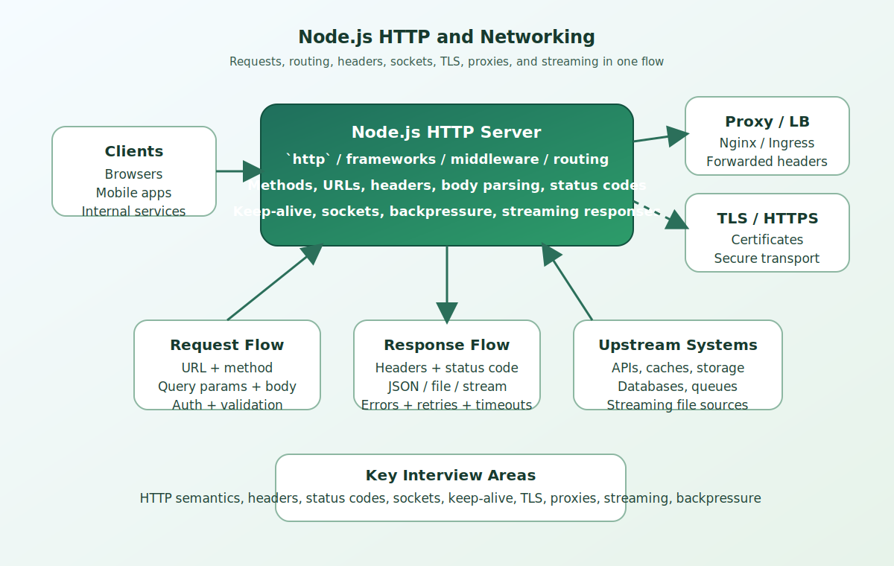

# Node.js HTTP and Networking Interview Questions


This guide covers node.js http and networking from interview basics to tricky production scenarios. It follows the corrected format of **100 interview questions for each subtopic**, and every answer includes a real Node.js code example with rotated real-world scenarios so the examples do not repeat verbatim.

## How To Use This Page

- Questions 1-100 cover HTTP Foundations.
- Questions 101-200 cover Node HTTP Module & Server Basics.
- Questions 201-300 cover Request Lifecycle.
- Questions 301-400 cover HTTP Methods & Semantics.
- Questions 401-500 cover Headers & Content Negotiation.
- Questions 501-600 cover Status Codes & Error Responses.
- Questions 601-700 cover URL Paths Query Params & Routing.
- Questions 701-800 cover Connections Keep-Alive & Sockets.
- Questions 801-900 cover HTTPS TLS & Security Basics.
- Questions 901-1000 cover Proxies Load Balancers & Forwarded Headers.
- Questions 1001-1100 cover Streaming Uploads Downloads & Large Payloads.

## 1. HTTP Foundations

### Q1.1 What is http foundations in Node.js?

**Answer:**

HTTP Foundations matters in Node.js because it affects how http foundations affects runtime behavior and delivery decisions. In a real system like a high-traffic Node.js API serving customer traffic behind a load balancer, a strong answer should connect the concept to runtime behavior, delivery trade-offs, production debugging, and the way Node.js applications behave under load or failure. A senior-level answer also explains the operational impact so the answer reflects real Node.js engineering instead of textbook definitions.

**Code Example:**

```js
const http = require('node:http');
const server = http.createServer((req, res) => {
  res.writeHead(200, { 'content-type': 'application/json' });
  res.end(JSON.stringify({ ok: true }));
});
```

### Q1.2 Why does http foundations fundamentals matter in real Node.js applications?

**Answer:**

HTTP Foundations fundamentals matters in Node.js because it affects how http foundations should be understood before tackling deeper production issues. In a real system like a background worker processing queues and scheduled jobs in production, a strong answer should connect the concept to runtime behavior, delivery trade-offs, production debugging, and the way Node.js applications behave under load or failure. A senior-level answer also explains the operational impact so teams can connect the concept to runtime behavior and operational impact.

**Code Example:**

```js
const https = require('node:https');
https.get('https://example.com', res => {
  console.log(res.statusCode);
});
```

### Q1.3 When should a team focus on http foundations design?

**Answer:**

HTTP Foundations design matters in Node.js because it affects how http foundations influences code structure and operational outcomes. In a real system like a CMS platform handling uploads, downloads, and rich admin workflows, a strong answer should connect the concept to runtime behavior, delivery trade-offs, production debugging, and the way Node.js applications behave under load or failure. A senior-level answer also explains the operational impact so production debugging becomes easier because the mechanics are clearer.

**Code Example:**

```js
const url = new URL('https://api.example.com/orders?page=2');
console.log(url.searchParams.get('page'));
```

### Q1.4 How would you explain http foundations debugging in a production discussion?

**Answer:**

HTTP Foundations debugging matters in Node.js because it affects how teams investigate problems related to http foundations in production. In a real system like a banking integration service where reliability and observability are tightly controlled, a strong answer should connect the concept to runtime behavior, delivery trade-offs, production debugging, and the way Node.js applications behave under load or failure. A senior-level answer also explains the operational impact so architecture choices become easier to defend in interviews and reviews.

**Code Example:**

```js
const server = require('node:http').createServer();
server.keepAliveTimeout = 60000;
```

### Q1.5 What is a common interview trap around http foundations trade-offs?

**Answer:**

HTTP Foundations trade-offs matters in Node.js because it affects how http foundations shapes performance, maintainability, or reliability decisions. In a real system like a healthcare backend where safe error handling and data validation matter deeply, a strong answer should connect the concept to runtime behavior, delivery trade-offs, production debugging, and the way Node.js applications behave under load or failure. A senior-level answer also explains the operational impact so performance, correctness, and maintainability are discussed together.

**Code Example:**

```js
app.set('trust proxy', true);
app.get('/ip', (req, res) => res.send(req.ip));
```

### Q1.6 How do you apply http foundations safely in practice?

**Answer:**

HTTP Foundations matters in Node.js because it affects how http foundations affects runtime behavior and delivery decisions. In a real system like a logistics platform coordinating events, retries, and distributed workflows, a strong answer should connect the concept to runtime behavior, delivery trade-offs, production debugging, and the way Node.js applications behave under load or failure. A senior-level answer also explains the operational impact so common Node.js pitfalls are easier to prevent before release.

**Code Example:**

```js
const http = require('node:http');
const server = http.createServer((req, res) => {
  res.writeHead(200, { 'content-type': 'application/json' });
  res.end(JSON.stringify({ ok: true }));
});
```

### Q1.7 What production issue usually exposes weak understanding of http foundations fundamentals?

**Answer:**

HTTP Foundations fundamentals matters in Node.js because it affects how http foundations should be understood before tackling deeper production issues. In a real system like an enterprise Express application with many middlewares and shared modules, a strong answer should connect the concept to runtime behavior, delivery trade-offs, production debugging, and the way Node.js applications behave under load or failure. A senior-level answer also explains the operational impact so the codebase stays easier to evolve as traffic and complexity grow.

**Code Example:**

```js
const https = require('node:https');
https.get('https://example.com', res => {
  console.log(res.statusCode);
});
```

### Q1.8 How would a senior engineer justify http foundations design to a team?

**Answer:**

HTTP Foundations design matters in Node.js because it affects how http foundations influences code structure and operational outcomes. In a real system like a real-time dashboard service where event-loop behavior affects user experience, a strong answer should connect the concept to runtime behavior, delivery trade-offs, production debugging, and the way Node.js applications behave under load or failure. A senior-level answer also explains the operational impact so operational trade-offs are visible instead of hidden behind abstractions.

**Code Example:**

```js
const url = new URL('https://api.example.com/orders?page=2');
console.log(url.searchParams.get('page'));
```

### Q1.9 What trade-off does http foundations debugging introduce?

**Answer:**

HTTP Foundations debugging matters in Node.js because it affects how teams investigate problems related to http foundations in production. In a real system like a containerized Node.js deployment where startup, memory, and scaling all matter, a strong answer should connect the concept to runtime behavior, delivery trade-offs, production debugging, and the way Node.js applications behave under load or failure. A senior-level answer also explains the operational impact so the example ties Node.js internals to practical delivery concerns.

**Code Example:**

```js
const server = require('node:http').createServer();
server.keepAliveTimeout = 60000;
```

### Q1.10 How do you answer a tricky follow-up about http foundations trade-offs?

**Answer:**

HTTP Foundations trade-offs matters in Node.js because it affects how http foundations shapes performance, maintainability, or reliability decisions. In a real system like a migration effort from ad hoc scripts to a more maintainable Node.js architecture, a strong answer should connect the concept to runtime behavior, delivery trade-offs, production debugging, and the way Node.js applications behave under load or failure. A senior-level answer also explains the operational impact so new team members can understand the concept from both code and behavior.

**Code Example:**

```js
app.set('trust proxy', true);
app.get('/ip', (req, res) => res.send(req.ip));
```

### Q1.11 What is http foundations in Node.js?

**Answer:**

HTTP Foundations matters in Node.js because it affects how http foundations affects runtime behavior and delivery decisions. In a real system like a high-traffic Node.js API serving customer traffic behind a load balancer, a strong answer should connect the concept to runtime behavior, delivery trade-offs, production debugging, and the way Node.js applications behave under load or failure. A senior-level answer also explains the operational impact so the answer reflects real Node.js engineering instead of textbook definitions.

**Code Example:**

```js
const http = require('node:http');
const server = http.createServer((req, res) => {
  res.writeHead(200, { 'content-type': 'application/json' });
  res.end(JSON.stringify({ ok: true }));
});
```

### Q1.12 Why does http foundations fundamentals matter in real Node.js applications?

**Answer:**

HTTP Foundations fundamentals matters in Node.js because it affects how http foundations should be understood before tackling deeper production issues. In a real system like a background worker processing queues and scheduled jobs in production, a strong answer should connect the concept to runtime behavior, delivery trade-offs, production debugging, and the way Node.js applications behave under load or failure. A senior-level answer also explains the operational impact so teams can connect the concept to runtime behavior and operational impact.

**Code Example:**

```js
const https = require('node:https');
https.get('https://example.com', res => {
  console.log(res.statusCode);
});
```

### Q1.13 When should a team focus on http foundations design?

**Answer:**

HTTP Foundations design matters in Node.js because it affects how http foundations influences code structure and operational outcomes. In a real system like a CMS platform handling uploads, downloads, and rich admin workflows, a strong answer should connect the concept to runtime behavior, delivery trade-offs, production debugging, and the way Node.js applications behave under load or failure. A senior-level answer also explains the operational impact so production debugging becomes easier because the mechanics are clearer.

**Code Example:**

```js
const url = new URL('https://api.example.com/orders?page=2');
console.log(url.searchParams.get('page'));
```

### Q1.14 How would you explain http foundations debugging in a production discussion?

**Answer:**

HTTP Foundations debugging matters in Node.js because it affects how teams investigate problems related to http foundations in production. In a real system like a banking integration service where reliability and observability are tightly controlled, a strong answer should connect the concept to runtime behavior, delivery trade-offs, production debugging, and the way Node.js applications behave under load or failure. A senior-level answer also explains the operational impact so architecture choices become easier to defend in interviews and reviews.

**Code Example:**

```js
const server = require('node:http').createServer();
server.keepAliveTimeout = 60000;
```

### Q1.15 What is a common interview trap around http foundations trade-offs?

**Answer:**

HTTP Foundations trade-offs matters in Node.js because it affects how http foundations shapes performance, maintainability, or reliability decisions. In a real system like a healthcare backend where safe error handling and data validation matter deeply, a strong answer should connect the concept to runtime behavior, delivery trade-offs, production debugging, and the way Node.js applications behave under load or failure. A senior-level answer also explains the operational impact so performance, correctness, and maintainability are discussed together.

**Code Example:**

```js
app.set('trust proxy', true);
app.get('/ip', (req, res) => res.send(req.ip));
```

### Q1.16 How do you apply http foundations safely in practice?

**Answer:**

HTTP Foundations matters in Node.js because it affects how http foundations affects runtime behavior and delivery decisions. In a real system like a logistics platform coordinating events, retries, and distributed workflows, a strong answer should connect the concept to runtime behavior, delivery trade-offs, production debugging, and the way Node.js applications behave under load or failure. A senior-level answer also explains the operational impact so common Node.js pitfalls are easier to prevent before release.

**Code Example:**

```js
const http = require('node:http');
const server = http.createServer((req, res) => {
  res.writeHead(200, { 'content-type': 'application/json' });
  res.end(JSON.stringify({ ok: true }));
});
```

### Q1.17 What production issue usually exposes weak understanding of http foundations fundamentals?

**Answer:**

HTTP Foundations fundamentals matters in Node.js because it affects how http foundations should be understood before tackling deeper production issues. In a real system like an enterprise Express application with many middlewares and shared modules, a strong answer should connect the concept to runtime behavior, delivery trade-offs, production debugging, and the way Node.js applications behave under load or failure. A senior-level answer also explains the operational impact so the codebase stays easier to evolve as traffic and complexity grow.

**Code Example:**

```js
const https = require('node:https');
https.get('https://example.com', res => {
  console.log(res.statusCode);
});
```

### Q1.18 How would a senior engineer justify http foundations design to a team?

**Answer:**

HTTP Foundations design matters in Node.js because it affects how http foundations influences code structure and operational outcomes. In a real system like a real-time dashboard service where event-loop behavior affects user experience, a strong answer should connect the concept to runtime behavior, delivery trade-offs, production debugging, and the way Node.js applications behave under load or failure. A senior-level answer also explains the operational impact so operational trade-offs are visible instead of hidden behind abstractions.

**Code Example:**

```js
const url = new URL('https://api.example.com/orders?page=2');
console.log(url.searchParams.get('page'));
```

### Q1.19 What trade-off does http foundations debugging introduce?

**Answer:**

HTTP Foundations debugging matters in Node.js because it affects how teams investigate problems related to http foundations in production. In a real system like a containerized Node.js deployment where startup, memory, and scaling all matter, a strong answer should connect the concept to runtime behavior, delivery trade-offs, production debugging, and the way Node.js applications behave under load or failure. A senior-level answer also explains the operational impact so the example ties Node.js internals to practical delivery concerns.

**Code Example:**

```js
const server = require('node:http').createServer();
server.keepAliveTimeout = 60000;
```

### Q1.20 How do you answer a tricky follow-up about http foundations trade-offs?

**Answer:**

HTTP Foundations trade-offs matters in Node.js because it affects how http foundations shapes performance, maintainability, or reliability decisions. In a real system like a migration effort from ad hoc scripts to a more maintainable Node.js architecture, a strong answer should connect the concept to runtime behavior, delivery trade-offs, production debugging, and the way Node.js applications behave under load or failure. A senior-level answer also explains the operational impact so new team members can understand the concept from both code and behavior.

**Code Example:**

```js
app.set('trust proxy', true);
app.get('/ip', (req, res) => res.send(req.ip));
```

### Q1.21 What is http foundations in Node.js?

**Answer:**

HTTP Foundations matters in Node.js because it affects how http foundations affects runtime behavior and delivery decisions. In a real system like a high-traffic Node.js API serving customer traffic behind a load balancer, a strong answer should connect the concept to runtime behavior, delivery trade-offs, production debugging, and the way Node.js applications behave under load or failure. A senior-level answer also explains the operational impact so the answer reflects real Node.js engineering instead of textbook definitions.

**Code Example:**

```js
const http = require('node:http');
const server = http.createServer((req, res) => {
  res.writeHead(200, { 'content-type': 'application/json' });
  res.end(JSON.stringify({ ok: true }));
});
```

### Q1.22 Why does http foundations fundamentals matter in real Node.js applications?

**Answer:**

HTTP Foundations fundamentals matters in Node.js because it affects how http foundations should be understood before tackling deeper production issues. In a real system like a background worker processing queues and scheduled jobs in production, a strong answer should connect the concept to runtime behavior, delivery trade-offs, production debugging, and the way Node.js applications behave under load or failure. A senior-level answer also explains the operational impact so teams can connect the concept to runtime behavior and operational impact.

**Code Example:**

```js
const https = require('node:https');
https.get('https://example.com', res => {
  console.log(res.statusCode);
});
```

### Q1.23 When should a team focus on http foundations design?

**Answer:**

HTTP Foundations design matters in Node.js because it affects how http foundations influences code structure and operational outcomes. In a real system like a CMS platform handling uploads, downloads, and rich admin workflows, a strong answer should connect the concept to runtime behavior, delivery trade-offs, production debugging, and the way Node.js applications behave under load or failure. A senior-level answer also explains the operational impact so production debugging becomes easier because the mechanics are clearer.

**Code Example:**

```js
const url = new URL('https://api.example.com/orders?page=2');
console.log(url.searchParams.get('page'));
```

### Q1.24 How would you explain http foundations debugging in a production discussion?

**Answer:**

HTTP Foundations debugging matters in Node.js because it affects how teams investigate problems related to http foundations in production. In a real system like a banking integration service where reliability and observability are tightly controlled, a strong answer should connect the concept to runtime behavior, delivery trade-offs, production debugging, and the way Node.js applications behave under load or failure. A senior-level answer also explains the operational impact so architecture choices become easier to defend in interviews and reviews.

**Code Example:**

```js
const server = require('node:http').createServer();
server.keepAliveTimeout = 60000;
```

### Q1.25 What is a common interview trap around http foundations trade-offs?

**Answer:**

HTTP Foundations trade-offs matters in Node.js because it affects how http foundations shapes performance, maintainability, or reliability decisions. In a real system like a healthcare backend where safe error handling and data validation matter deeply, a strong answer should connect the concept to runtime behavior, delivery trade-offs, production debugging, and the way Node.js applications behave under load or failure. A senior-level answer also explains the operational impact so performance, correctness, and maintainability are discussed together.

**Code Example:**

```js
app.set('trust proxy', true);
app.get('/ip', (req, res) => res.send(req.ip));
```

### Q1.26 How do you apply http foundations safely in practice?

**Answer:**

HTTP Foundations matters in Node.js because it affects how http foundations affects runtime behavior and delivery decisions. In a real system like a logistics platform coordinating events, retries, and distributed workflows, a strong answer should connect the concept to runtime behavior, delivery trade-offs, production debugging, and the way Node.js applications behave under load or failure. A senior-level answer also explains the operational impact so common Node.js pitfalls are easier to prevent before release.

**Code Example:**

```js
const http = require('node:http');
const server = http.createServer((req, res) => {
  res.writeHead(200, { 'content-type': 'application/json' });
  res.end(JSON.stringify({ ok: true }));
});
```

### Q1.27 What production issue usually exposes weak understanding of http foundations fundamentals?

**Answer:**

HTTP Foundations fundamentals matters in Node.js because it affects how http foundations should be understood before tackling deeper production issues. In a real system like an enterprise Express application with many middlewares and shared modules, a strong answer should connect the concept to runtime behavior, delivery trade-offs, production debugging, and the way Node.js applications behave under load or failure. A senior-level answer also explains the operational impact so the codebase stays easier to evolve as traffic and complexity grow.

**Code Example:**

```js
const https = require('node:https');
https.get('https://example.com', res => {
  console.log(res.statusCode);
});
```

### Q1.28 How would a senior engineer justify http foundations design to a team?

**Answer:**

HTTP Foundations design matters in Node.js because it affects how http foundations influences code structure and operational outcomes. In a real system like a real-time dashboard service where event-loop behavior affects user experience, a strong answer should connect the concept to runtime behavior, delivery trade-offs, production debugging, and the way Node.js applications behave under load or failure. A senior-level answer also explains the operational impact so operational trade-offs are visible instead of hidden behind abstractions.

**Code Example:**

```js
const url = new URL('https://api.example.com/orders?page=2');
console.log(url.searchParams.get('page'));
```

### Q1.29 What trade-off does http foundations debugging introduce?

**Answer:**

HTTP Foundations debugging matters in Node.js because it affects how teams investigate problems related to http foundations in production. In a real system like a containerized Node.js deployment where startup, memory, and scaling all matter, a strong answer should connect the concept to runtime behavior, delivery trade-offs, production debugging, and the way Node.js applications behave under load or failure. A senior-level answer also explains the operational impact so the example ties Node.js internals to practical delivery concerns.

**Code Example:**

```js
const server = require('node:http').createServer();
server.keepAliveTimeout = 60000;
```

### Q1.30 How do you answer a tricky follow-up about http foundations trade-offs?

**Answer:**

HTTP Foundations trade-offs matters in Node.js because it affects how http foundations shapes performance, maintainability, or reliability decisions. In a real system like a migration effort from ad hoc scripts to a more maintainable Node.js architecture, a strong answer should connect the concept to runtime behavior, delivery trade-offs, production debugging, and the way Node.js applications behave under load or failure. A senior-level answer also explains the operational impact so new team members can understand the concept from both code and behavior.

**Code Example:**

```js
app.set('trust proxy', true);
app.get('/ip', (req, res) => res.send(req.ip));
```

### Q1.31 What is http foundations in Node.js?

**Answer:**

HTTP Foundations matters in Node.js because it affects how http foundations affects runtime behavior and delivery decisions. In a real system like a high-traffic Node.js API serving customer traffic behind a load balancer, a strong answer should connect the concept to runtime behavior, delivery trade-offs, production debugging, and the way Node.js applications behave under load or failure. A senior-level answer also explains the operational impact so the answer reflects real Node.js engineering instead of textbook definitions.

**Code Example:**

```js
const http = require('node:http');
const server = http.createServer((req, res) => {
  res.writeHead(200, { 'content-type': 'application/json' });
  res.end(JSON.stringify({ ok: true }));
});
```

### Q1.32 Why does http foundations fundamentals matter in real Node.js applications?

**Answer:**

HTTP Foundations fundamentals matters in Node.js because it affects how http foundations should be understood before tackling deeper production issues. In a real system like a background worker processing queues and scheduled jobs in production, a strong answer should connect the concept to runtime behavior, delivery trade-offs, production debugging, and the way Node.js applications behave under load or failure. A senior-level answer also explains the operational impact so teams can connect the concept to runtime behavior and operational impact.

**Code Example:**

```js
const https = require('node:https');
https.get('https://example.com', res => {
  console.log(res.statusCode);
});
```

### Q1.33 When should a team focus on http foundations design?

**Answer:**

HTTP Foundations design matters in Node.js because it affects how http foundations influences code structure and operational outcomes. In a real system like a CMS platform handling uploads, downloads, and rich admin workflows, a strong answer should connect the concept to runtime behavior, delivery trade-offs, production debugging, and the way Node.js applications behave under load or failure. A senior-level answer also explains the operational impact so production debugging becomes easier because the mechanics are clearer.

**Code Example:**

```js
const url = new URL('https://api.example.com/orders?page=2');
console.log(url.searchParams.get('page'));
```

### Q1.34 How would you explain http foundations debugging in a production discussion?

**Answer:**

HTTP Foundations debugging matters in Node.js because it affects how teams investigate problems related to http foundations in production. In a real system like a banking integration service where reliability and observability are tightly controlled, a strong answer should connect the concept to runtime behavior, delivery trade-offs, production debugging, and the way Node.js applications behave under load or failure. A senior-level answer also explains the operational impact so architecture choices become easier to defend in interviews and reviews.

**Code Example:**

```js
const server = require('node:http').createServer();
server.keepAliveTimeout = 60000;
```

### Q1.35 What is a common interview trap around http foundations trade-offs?

**Answer:**

HTTP Foundations trade-offs matters in Node.js because it affects how http foundations shapes performance, maintainability, or reliability decisions. In a real system like a healthcare backend where safe error handling and data validation matter deeply, a strong answer should connect the concept to runtime behavior, delivery trade-offs, production debugging, and the way Node.js applications behave under load or failure. A senior-level answer also explains the operational impact so performance, correctness, and maintainability are discussed together.

**Code Example:**

```js
app.set('trust proxy', true);
app.get('/ip', (req, res) => res.send(req.ip));
```

### Q1.36 How do you apply http foundations safely in practice?

**Answer:**

HTTP Foundations matters in Node.js because it affects how http foundations affects runtime behavior and delivery decisions. In a real system like a logistics platform coordinating events, retries, and distributed workflows, a strong answer should connect the concept to runtime behavior, delivery trade-offs, production debugging, and the way Node.js applications behave under load or failure. A senior-level answer also explains the operational impact so common Node.js pitfalls are easier to prevent before release.

**Code Example:**

```js
const http = require('node:http');
const server = http.createServer((req, res) => {
  res.writeHead(200, { 'content-type': 'application/json' });
  res.end(JSON.stringify({ ok: true }));
});
```

### Q1.37 What production issue usually exposes weak understanding of http foundations fundamentals?

**Answer:**

HTTP Foundations fundamentals matters in Node.js because it affects how http foundations should be understood before tackling deeper production issues. In a real system like an enterprise Express application with many middlewares and shared modules, a strong answer should connect the concept to runtime behavior, delivery trade-offs, production debugging, and the way Node.js applications behave under load or failure. A senior-level answer also explains the operational impact so the codebase stays easier to evolve as traffic and complexity grow.

**Code Example:**

```js
const https = require('node:https');
https.get('https://example.com', res => {
  console.log(res.statusCode);
});
```

### Q1.38 How would a senior engineer justify http foundations design to a team?

**Answer:**

HTTP Foundations design matters in Node.js because it affects how http foundations influences code structure and operational outcomes. In a real system like a real-time dashboard service where event-loop behavior affects user experience, a strong answer should connect the concept to runtime behavior, delivery trade-offs, production debugging, and the way Node.js applications behave under load or failure. A senior-level answer also explains the operational impact so operational trade-offs are visible instead of hidden behind abstractions.

**Code Example:**

```js
const url = new URL('https://api.example.com/orders?page=2');
console.log(url.searchParams.get('page'));
```

### Q1.39 What trade-off does http foundations debugging introduce?

**Answer:**

HTTP Foundations debugging matters in Node.js because it affects how teams investigate problems related to http foundations in production. In a real system like a containerized Node.js deployment where startup, memory, and scaling all matter, a strong answer should connect the concept to runtime behavior, delivery trade-offs, production debugging, and the way Node.js applications behave under load or failure. A senior-level answer also explains the operational impact so the example ties Node.js internals to practical delivery concerns.

**Code Example:**

```js
const server = require('node:http').createServer();
server.keepAliveTimeout = 60000;
```

### Q1.40 How do you answer a tricky follow-up about http foundations trade-offs?

**Answer:**

HTTP Foundations trade-offs matters in Node.js because it affects how http foundations shapes performance, maintainability, or reliability decisions. In a real system like a migration effort from ad hoc scripts to a more maintainable Node.js architecture, a strong answer should connect the concept to runtime behavior, delivery trade-offs, production debugging, and the way Node.js applications behave under load or failure. A senior-level answer also explains the operational impact so new team members can understand the concept from both code and behavior.

**Code Example:**

```js
app.set('trust proxy', true);
app.get('/ip', (req, res) => res.send(req.ip));
```

### Q1.41 What is http foundations in Node.js?

**Answer:**

HTTP Foundations matters in Node.js because it affects how http foundations affects runtime behavior and delivery decisions. In a real system like a high-traffic Node.js API serving customer traffic behind a load balancer, a strong answer should connect the concept to runtime behavior, delivery trade-offs, production debugging, and the way Node.js applications behave under load or failure. A senior-level answer also explains the operational impact so the answer reflects real Node.js engineering instead of textbook definitions.

**Code Example:**

```js
const http = require('node:http');
const server = http.createServer((req, res) => {
  res.writeHead(200, { 'content-type': 'application/json' });
  res.end(JSON.stringify({ ok: true }));
});
```

### Q1.42 Why does http foundations fundamentals matter in real Node.js applications?

**Answer:**

HTTP Foundations fundamentals matters in Node.js because it affects how http foundations should be understood before tackling deeper production issues. In a real system like a background worker processing queues and scheduled jobs in production, a strong answer should connect the concept to runtime behavior, delivery trade-offs, production debugging, and the way Node.js applications behave under load or failure. A senior-level answer also explains the operational impact so teams can connect the concept to runtime behavior and operational impact.

**Code Example:**

```js
const https = require('node:https');
https.get('https://example.com', res => {
  console.log(res.statusCode);
});
```

### Q1.43 When should a team focus on http foundations design?

**Answer:**

HTTP Foundations design matters in Node.js because it affects how http foundations influences code structure and operational outcomes. In a real system like a CMS platform handling uploads, downloads, and rich admin workflows, a strong answer should connect the concept to runtime behavior, delivery trade-offs, production debugging, and the way Node.js applications behave under load or failure. A senior-level answer also explains the operational impact so production debugging becomes easier because the mechanics are clearer.

**Code Example:**

```js
const url = new URL('https://api.example.com/orders?page=2');
console.log(url.searchParams.get('page'));
```

### Q1.44 How would you explain http foundations debugging in a production discussion?

**Answer:**

HTTP Foundations debugging matters in Node.js because it affects how teams investigate problems related to http foundations in production. In a real system like a banking integration service where reliability and observability are tightly controlled, a strong answer should connect the concept to runtime behavior, delivery trade-offs, production debugging, and the way Node.js applications behave under load or failure. A senior-level answer also explains the operational impact so architecture choices become easier to defend in interviews and reviews.

**Code Example:**

```js
const server = require('node:http').createServer();
server.keepAliveTimeout = 60000;
```

### Q1.45 What is a common interview trap around http foundations trade-offs?

**Answer:**

HTTP Foundations trade-offs matters in Node.js because it affects how http foundations shapes performance, maintainability, or reliability decisions. In a real system like a healthcare backend where safe error handling and data validation matter deeply, a strong answer should connect the concept to runtime behavior, delivery trade-offs, production debugging, and the way Node.js applications behave under load or failure. A senior-level answer also explains the operational impact so performance, correctness, and maintainability are discussed together.

**Code Example:**

```js
app.set('trust proxy', true);
app.get('/ip', (req, res) => res.send(req.ip));
```

### Q1.46 How do you apply http foundations safely in practice?

**Answer:**

HTTP Foundations matters in Node.js because it affects how http foundations affects runtime behavior and delivery decisions. In a real system like a logistics platform coordinating events, retries, and distributed workflows, a strong answer should connect the concept to runtime behavior, delivery trade-offs, production debugging, and the way Node.js applications behave under load or failure. A senior-level answer also explains the operational impact so common Node.js pitfalls are easier to prevent before release.

**Code Example:**

```js
const http = require('node:http');
const server = http.createServer((req, res) => {
  res.writeHead(200, { 'content-type': 'application/json' });
  res.end(JSON.stringify({ ok: true }));
});
```

### Q1.47 What production issue usually exposes weak understanding of http foundations fundamentals?

**Answer:**

HTTP Foundations fundamentals matters in Node.js because it affects how http foundations should be understood before tackling deeper production issues. In a real system like an enterprise Express application with many middlewares and shared modules, a strong answer should connect the concept to runtime behavior, delivery trade-offs, production debugging, and the way Node.js applications behave under load or failure. A senior-level answer also explains the operational impact so the codebase stays easier to evolve as traffic and complexity grow.

**Code Example:**

```js
const https = require('node:https');
https.get('https://example.com', res => {
  console.log(res.statusCode);
});
```

### Q1.48 How would a senior engineer justify http foundations design to a team?

**Answer:**

HTTP Foundations design matters in Node.js because it affects how http foundations influences code structure and operational outcomes. In a real system like a real-time dashboard service where event-loop behavior affects user experience, a strong answer should connect the concept to runtime behavior, delivery trade-offs, production debugging, and the way Node.js applications behave under load or failure. A senior-level answer also explains the operational impact so operational trade-offs are visible instead of hidden behind abstractions.

**Code Example:**

```js
const url = new URL('https://api.example.com/orders?page=2');
console.log(url.searchParams.get('page'));
```

### Q1.49 What trade-off does http foundations debugging introduce?

**Answer:**

HTTP Foundations debugging matters in Node.js because it affects how teams investigate problems related to http foundations in production. In a real system like a containerized Node.js deployment where startup, memory, and scaling all matter, a strong answer should connect the concept to runtime behavior, delivery trade-offs, production debugging, and the way Node.js applications behave under load or failure. A senior-level answer also explains the operational impact so the example ties Node.js internals to practical delivery concerns.

**Code Example:**

```js
const server = require('node:http').createServer();
server.keepAliveTimeout = 60000;
```

### Q1.50 How do you answer a tricky follow-up about http foundations trade-offs?

**Answer:**

HTTP Foundations trade-offs matters in Node.js because it affects how http foundations shapes performance, maintainability, or reliability decisions. In a real system like a migration effort from ad hoc scripts to a more maintainable Node.js architecture, a strong answer should connect the concept to runtime behavior, delivery trade-offs, production debugging, and the way Node.js applications behave under load or failure. A senior-level answer also explains the operational impact so new team members can understand the concept from both code and behavior.

**Code Example:**

```js
app.set('trust proxy', true);
app.get('/ip', (req, res) => res.send(req.ip));
```

### Q1.51 What is http foundations in Node.js?

**Answer:**

HTTP Foundations matters in Node.js because it affects how http foundations affects runtime behavior and delivery decisions. In a real system like a high-traffic Node.js API serving customer traffic behind a load balancer, a strong answer should connect the concept to runtime behavior, delivery trade-offs, production debugging, and the way Node.js applications behave under load or failure. A senior-level answer also explains the operational impact so the answer reflects real Node.js engineering instead of textbook definitions.

**Code Example:**

```js
const http = require('node:http');
const server = http.createServer((req, res) => {
  res.writeHead(200, { 'content-type': 'application/json' });
  res.end(JSON.stringify({ ok: true }));
});
```

### Q1.52 Why does http foundations fundamentals matter in real Node.js applications?

**Answer:**

HTTP Foundations fundamentals matters in Node.js because it affects how http foundations should be understood before tackling deeper production issues. In a real system like a background worker processing queues and scheduled jobs in production, a strong answer should connect the concept to runtime behavior, delivery trade-offs, production debugging, and the way Node.js applications behave under load or failure. A senior-level answer also explains the operational impact so teams can connect the concept to runtime behavior and operational impact.

**Code Example:**

```js
const https = require('node:https');
https.get('https://example.com', res => {
  console.log(res.statusCode);
});
```

### Q1.53 When should a team focus on http foundations design?

**Answer:**

HTTP Foundations design matters in Node.js because it affects how http foundations influences code structure and operational outcomes. In a real system like a CMS platform handling uploads, downloads, and rich admin workflows, a strong answer should connect the concept to runtime behavior, delivery trade-offs, production debugging, and the way Node.js applications behave under load or failure. A senior-level answer also explains the operational impact so production debugging becomes easier because the mechanics are clearer.

**Code Example:**

```js
const url = new URL('https://api.example.com/orders?page=2');
console.log(url.searchParams.get('page'));
```

### Q1.54 How would you explain http foundations debugging in a production discussion?

**Answer:**

HTTP Foundations debugging matters in Node.js because it affects how teams investigate problems related to http foundations in production. In a real system like a banking integration service where reliability and observability are tightly controlled, a strong answer should connect the concept to runtime behavior, delivery trade-offs, production debugging, and the way Node.js applications behave under load or failure. A senior-level answer also explains the operational impact so architecture choices become easier to defend in interviews and reviews.

**Code Example:**

```js
const server = require('node:http').createServer();
server.keepAliveTimeout = 60000;
```

### Q1.55 What is a common interview trap around http foundations trade-offs?

**Answer:**

HTTP Foundations trade-offs matters in Node.js because it affects how http foundations shapes performance, maintainability, or reliability decisions. In a real system like a healthcare backend where safe error handling and data validation matter deeply, a strong answer should connect the concept to runtime behavior, delivery trade-offs, production debugging, and the way Node.js applications behave under load or failure. A senior-level answer also explains the operational impact so performance, correctness, and maintainability are discussed together.

**Code Example:**

```js
app.set('trust proxy', true);
app.get('/ip', (req, res) => res.send(req.ip));
```

### Q1.56 How do you apply http foundations safely in practice?

**Answer:**

HTTP Foundations matters in Node.js because it affects how http foundations affects runtime behavior and delivery decisions. In a real system like a logistics platform coordinating events, retries, and distributed workflows, a strong answer should connect the concept to runtime behavior, delivery trade-offs, production debugging, and the way Node.js applications behave under load or failure. A senior-level answer also explains the operational impact so common Node.js pitfalls are easier to prevent before release.

**Code Example:**

```js
const http = require('node:http');
const server = http.createServer((req, res) => {
  res.writeHead(200, { 'content-type': 'application/json' });
  res.end(JSON.stringify({ ok: true }));
});
```

### Q1.57 What production issue usually exposes weak understanding of http foundations fundamentals?

**Answer:**

HTTP Foundations fundamentals matters in Node.js because it affects how http foundations should be understood before tackling deeper production issues. In a real system like an enterprise Express application with many middlewares and shared modules, a strong answer should connect the concept to runtime behavior, delivery trade-offs, production debugging, and the way Node.js applications behave under load or failure. A senior-level answer also explains the operational impact so the codebase stays easier to evolve as traffic and complexity grow.

**Code Example:**

```js
const https = require('node:https');
https.get('https://example.com', res => {
  console.log(res.statusCode);
});
```

### Q1.58 How would a senior engineer justify http foundations design to a team?

**Answer:**

HTTP Foundations design matters in Node.js because it affects how http foundations influences code structure and operational outcomes. In a real system like a real-time dashboard service where event-loop behavior affects user experience, a strong answer should connect the concept to runtime behavior, delivery trade-offs, production debugging, and the way Node.js applications behave under load or failure. A senior-level answer also explains the operational impact so operational trade-offs are visible instead of hidden behind abstractions.

**Code Example:**

```js
const url = new URL('https://api.example.com/orders?page=2');
console.log(url.searchParams.get('page'));
```

### Q1.59 What trade-off does http foundations debugging introduce?

**Answer:**

HTTP Foundations debugging matters in Node.js because it affects how teams investigate problems related to http foundations in production. In a real system like a containerized Node.js deployment where startup, memory, and scaling all matter, a strong answer should connect the concept to runtime behavior, delivery trade-offs, production debugging, and the way Node.js applications behave under load or failure. A senior-level answer also explains the operational impact so the example ties Node.js internals to practical delivery concerns.

**Code Example:**

```js
const server = require('node:http').createServer();
server.keepAliveTimeout = 60000;
```

### Q1.60 How do you answer a tricky follow-up about http foundations trade-offs?

**Answer:**

HTTP Foundations trade-offs matters in Node.js because it affects how http foundations shapes performance, maintainability, or reliability decisions. In a real system like a migration effort from ad hoc scripts to a more maintainable Node.js architecture, a strong answer should connect the concept to runtime behavior, delivery trade-offs, production debugging, and the way Node.js applications behave under load or failure. A senior-level answer also explains the operational impact so new team members can understand the concept from both code and behavior.

**Code Example:**

```js
app.set('trust proxy', true);
app.get('/ip', (req, res) => res.send(req.ip));
```

### Q1.61 What is http foundations in Node.js?

**Answer:**

HTTP Foundations matters in Node.js because it affects how http foundations affects runtime behavior and delivery decisions. In a real system like a high-traffic Node.js API serving customer traffic behind a load balancer, a strong answer should connect the concept to runtime behavior, delivery trade-offs, production debugging, and the way Node.js applications behave under load or failure. A senior-level answer also explains the operational impact so the answer reflects real Node.js engineering instead of textbook definitions.

**Code Example:**

```js
const http = require('node:http');
const server = http.createServer((req, res) => {
  res.writeHead(200, { 'content-type': 'application/json' });
  res.end(JSON.stringify({ ok: true }));
});
```

### Q1.62 Why does http foundations fundamentals matter in real Node.js applications?

**Answer:**

HTTP Foundations fundamentals matters in Node.js because it affects how http foundations should be understood before tackling deeper production issues. In a real system like a background worker processing queues and scheduled jobs in production, a strong answer should connect the concept to runtime behavior, delivery trade-offs, production debugging, and the way Node.js applications behave under load or failure. A senior-level answer also explains the operational impact so teams can connect the concept to runtime behavior and operational impact.

**Code Example:**

```js
const https = require('node:https');
https.get('https://example.com', res => {
  console.log(res.statusCode);
});
```

### Q1.63 When should a team focus on http foundations design?

**Answer:**

HTTP Foundations design matters in Node.js because it affects how http foundations influences code structure and operational outcomes. In a real system like a CMS platform handling uploads, downloads, and rich admin workflows, a strong answer should connect the concept to runtime behavior, delivery trade-offs, production debugging, and the way Node.js applications behave under load or failure. A senior-level answer also explains the operational impact so production debugging becomes easier because the mechanics are clearer.

**Code Example:**

```js
const url = new URL('https://api.example.com/orders?page=2');
console.log(url.searchParams.get('page'));
```

### Q1.64 How would you explain http foundations debugging in a production discussion?

**Answer:**

HTTP Foundations debugging matters in Node.js because it affects how teams investigate problems related to http foundations in production. In a real system like a banking integration service where reliability and observability are tightly controlled, a strong answer should connect the concept to runtime behavior, delivery trade-offs, production debugging, and the way Node.js applications behave under load or failure. A senior-level answer also explains the operational impact so architecture choices become easier to defend in interviews and reviews.

**Code Example:**

```js
const server = require('node:http').createServer();
server.keepAliveTimeout = 60000;
```

### Q1.65 What is a common interview trap around http foundations trade-offs?

**Answer:**

HTTP Foundations trade-offs matters in Node.js because it affects how http foundations shapes performance, maintainability, or reliability decisions. In a real system like a healthcare backend where safe error handling and data validation matter deeply, a strong answer should connect the concept to runtime behavior, delivery trade-offs, production debugging, and the way Node.js applications behave under load or failure. A senior-level answer also explains the operational impact so performance, correctness, and maintainability are discussed together.

**Code Example:**

```js
app.set('trust proxy', true);
app.get('/ip', (req, res) => res.send(req.ip));
```

### Q1.66 How do you apply http foundations safely in practice?

**Answer:**

HTTP Foundations matters in Node.js because it affects how http foundations affects runtime behavior and delivery decisions. In a real system like a logistics platform coordinating events, retries, and distributed workflows, a strong answer should connect the concept to runtime behavior, delivery trade-offs, production debugging, and the way Node.js applications behave under load or failure. A senior-level answer also explains the operational impact so common Node.js pitfalls are easier to prevent before release.

**Code Example:**

```js
const http = require('node:http');
const server = http.createServer((req, res) => {
  res.writeHead(200, { 'content-type': 'application/json' });
  res.end(JSON.stringify({ ok: true }));
});
```

### Q1.67 What production issue usually exposes weak understanding of http foundations fundamentals?

**Answer:**

HTTP Foundations fundamentals matters in Node.js because it affects how http foundations should be understood before tackling deeper production issues. In a real system like an enterprise Express application with many middlewares and shared modules, a strong answer should connect the concept to runtime behavior, delivery trade-offs, production debugging, and the way Node.js applications behave under load or failure. A senior-level answer also explains the operational impact so the codebase stays easier to evolve as traffic and complexity grow.

**Code Example:**

```js
const https = require('node:https');
https.get('https://example.com', res => {
  console.log(res.statusCode);
});
```

### Q1.68 How would a senior engineer justify http foundations design to a team?

**Answer:**

HTTP Foundations design matters in Node.js because it affects how http foundations influences code structure and operational outcomes. In a real system like a real-time dashboard service where event-loop behavior affects user experience, a strong answer should connect the concept to runtime behavior, delivery trade-offs, production debugging, and the way Node.js applications behave under load or failure. A senior-level answer also explains the operational impact so operational trade-offs are visible instead of hidden behind abstractions.

**Code Example:**

```js
const url = new URL('https://api.example.com/orders?page=2');
console.log(url.searchParams.get('page'));
```

### Q1.69 What trade-off does http foundations debugging introduce?

**Answer:**

HTTP Foundations debugging matters in Node.js because it affects how teams investigate problems related to http foundations in production. In a real system like a containerized Node.js deployment where startup, memory, and scaling all matter, a strong answer should connect the concept to runtime behavior, delivery trade-offs, production debugging, and the way Node.js applications behave under load or failure. A senior-level answer also explains the operational impact so the example ties Node.js internals to practical delivery concerns.

**Code Example:**

```js
const server = require('node:http').createServer();
server.keepAliveTimeout = 60000;
```

### Q1.70 How do you answer a tricky follow-up about http foundations trade-offs?

**Answer:**

HTTP Foundations trade-offs matters in Node.js because it affects how http foundations shapes performance, maintainability, or reliability decisions. In a real system like a migration effort from ad hoc scripts to a more maintainable Node.js architecture, a strong answer should connect the concept to runtime behavior, delivery trade-offs, production debugging, and the way Node.js applications behave under load or failure. A senior-level answer also explains the operational impact so new team members can understand the concept from both code and behavior.

**Code Example:**

```js
app.set('trust proxy', true);
app.get('/ip', (req, res) => res.send(req.ip));
```

### Q1.71 What is http foundations in Node.js?

**Answer:**

HTTP Foundations matters in Node.js because it affects how http foundations affects runtime behavior and delivery decisions. In a real system like a high-traffic Node.js API serving customer traffic behind a load balancer, a strong answer should connect the concept to runtime behavior, delivery trade-offs, production debugging, and the way Node.js applications behave under load or failure. A senior-level answer also explains the operational impact so the answer reflects real Node.js engineering instead of textbook definitions.

**Code Example:**

```js
const http = require('node:http');
const server = http.createServer((req, res) => {
  res.writeHead(200, { 'content-type': 'application/json' });
  res.end(JSON.stringify({ ok: true }));
});
```

### Q1.72 Why does http foundations fundamentals matter in real Node.js applications?

**Answer:**

HTTP Foundations fundamentals matters in Node.js because it affects how http foundations should be understood before tackling deeper production issues. In a real system like a background worker processing queues and scheduled jobs in production, a strong answer should connect the concept to runtime behavior, delivery trade-offs, production debugging, and the way Node.js applications behave under load or failure. A senior-level answer also explains the operational impact so teams can connect the concept to runtime behavior and operational impact.

**Code Example:**

```js
const https = require('node:https');
https.get('https://example.com', res => {
  console.log(res.statusCode);
});
```

### Q1.73 When should a team focus on http foundations design?

**Answer:**

HTTP Foundations design matters in Node.js because it affects how http foundations influences code structure and operational outcomes. In a real system like a CMS platform handling uploads, downloads, and rich admin workflows, a strong answer should connect the concept to runtime behavior, delivery trade-offs, production debugging, and the way Node.js applications behave under load or failure. A senior-level answer also explains the operational impact so production debugging becomes easier because the mechanics are clearer.

**Code Example:**

```js
const url = new URL('https://api.example.com/orders?page=2');
console.log(url.searchParams.get('page'));
```

### Q1.74 How would you explain http foundations debugging in a production discussion?

**Answer:**

HTTP Foundations debugging matters in Node.js because it affects how teams investigate problems related to http foundations in production. In a real system like a banking integration service where reliability and observability are tightly controlled, a strong answer should connect the concept to runtime behavior, delivery trade-offs, production debugging, and the way Node.js applications behave under load or failure. A senior-level answer also explains the operational impact so architecture choices become easier to defend in interviews and reviews.

**Code Example:**

```js
const server = require('node:http').createServer();
server.keepAliveTimeout = 60000;
```

### Q1.75 What is a common interview trap around http foundations trade-offs?

**Answer:**

HTTP Foundations trade-offs matters in Node.js because it affects how http foundations shapes performance, maintainability, or reliability decisions. In a real system like a healthcare backend where safe error handling and data validation matter deeply, a strong answer should connect the concept to runtime behavior, delivery trade-offs, production debugging, and the way Node.js applications behave under load or failure. A senior-level answer also explains the operational impact so performance, correctness, and maintainability are discussed together.

**Code Example:**

```js
app.set('trust proxy', true);
app.get('/ip', (req, res) => res.send(req.ip));
```

### Q1.76 How do you apply http foundations safely in practice?

**Answer:**

HTTP Foundations matters in Node.js because it affects how http foundations affects runtime behavior and delivery decisions. In a real system like a logistics platform coordinating events, retries, and distributed workflows, a strong answer should connect the concept to runtime behavior, delivery trade-offs, production debugging, and the way Node.js applications behave under load or failure. A senior-level answer also explains the operational impact so common Node.js pitfalls are easier to prevent before release.

**Code Example:**

```js
const http = require('node:http');
const server = http.createServer((req, res) => {
  res.writeHead(200, { 'content-type': 'application/json' });
  res.end(JSON.stringify({ ok: true }));
});
```

### Q1.77 What production issue usually exposes weak understanding of http foundations fundamentals?

**Answer:**

HTTP Foundations fundamentals matters in Node.js because it affects how http foundations should be understood before tackling deeper production issues. In a real system like an enterprise Express application with many middlewares and shared modules, a strong answer should connect the concept to runtime behavior, delivery trade-offs, production debugging, and the way Node.js applications behave under load or failure. A senior-level answer also explains the operational impact so the codebase stays easier to evolve as traffic and complexity grow.

**Code Example:**

```js
const https = require('node:https');
https.get('https://example.com', res => {
  console.log(res.statusCode);
});
```

### Q1.78 How would a senior engineer justify http foundations design to a team?

**Answer:**

HTTP Foundations design matters in Node.js because it affects how http foundations influences code structure and operational outcomes. In a real system like a real-time dashboard service where event-loop behavior affects user experience, a strong answer should connect the concept to runtime behavior, delivery trade-offs, production debugging, and the way Node.js applications behave under load or failure. A senior-level answer also explains the operational impact so operational trade-offs are visible instead of hidden behind abstractions.

**Code Example:**

```js
const url = new URL('https://api.example.com/orders?page=2');
console.log(url.searchParams.get('page'));
```

### Q1.79 What trade-off does http foundations debugging introduce?

**Answer:**

HTTP Foundations debugging matters in Node.js because it affects how teams investigate problems related to http foundations in production. In a real system like a containerized Node.js deployment where startup, memory, and scaling all matter, a strong answer should connect the concept to runtime behavior, delivery trade-offs, production debugging, and the way Node.js applications behave under load or failure. A senior-level answer also explains the operational impact so the example ties Node.js internals to practical delivery concerns.

**Code Example:**

```js
const server = require('node:http').createServer();
server.keepAliveTimeout = 60000;
```

### Q1.80 How do you answer a tricky follow-up about http foundations trade-offs?

**Answer:**

HTTP Foundations trade-offs matters in Node.js because it affects how http foundations shapes performance, maintainability, or reliability decisions. In a real system like a migration effort from ad hoc scripts to a more maintainable Node.js architecture, a strong answer should connect the concept to runtime behavior, delivery trade-offs, production debugging, and the way Node.js applications behave under load or failure. A senior-level answer also explains the operational impact so new team members can understand the concept from both code and behavior.

**Code Example:**

```js
app.set('trust proxy', true);
app.get('/ip', (req, res) => res.send(req.ip));
```

### Q1.81 What is http foundations in Node.js?

**Answer:**

HTTP Foundations matters in Node.js because it affects how http foundations affects runtime behavior and delivery decisions. In a real system like a high-traffic Node.js API serving customer traffic behind a load balancer, a strong answer should connect the concept to runtime behavior, delivery trade-offs, production debugging, and the way Node.js applications behave under load or failure. A senior-level answer also explains the operational impact so the answer reflects real Node.js engineering instead of textbook definitions.

**Code Example:**

```js
const http = require('node:http');
const server = http.createServer((req, res) => {
  res.writeHead(200, { 'content-type': 'application/json' });
  res.end(JSON.stringify({ ok: true }));
});
```

### Q1.82 Why does http foundations fundamentals matter in real Node.js applications?

**Answer:**

HTTP Foundations fundamentals matters in Node.js because it affects how http foundations should be understood before tackling deeper production issues. In a real system like a background worker processing queues and scheduled jobs in production, a strong answer should connect the concept to runtime behavior, delivery trade-offs, production debugging, and the way Node.js applications behave under load or failure. A senior-level answer also explains the operational impact so teams can connect the concept to runtime behavior and operational impact.

**Code Example:**

```js
const https = require('node:https');
https.get('https://example.com', res => {
  console.log(res.statusCode);
});
```

### Q1.83 When should a team focus on http foundations design?

**Answer:**

HTTP Foundations design matters in Node.js because it affects how http foundations influences code structure and operational outcomes. In a real system like a CMS platform handling uploads, downloads, and rich admin workflows, a strong answer should connect the concept to runtime behavior, delivery trade-offs, production debugging, and the way Node.js applications behave under load or failure. A senior-level answer also explains the operational impact so production debugging becomes easier because the mechanics are clearer.

**Code Example:**

```js
const url = new URL('https://api.example.com/orders?page=2');
console.log(url.searchParams.get('page'));
```

### Q1.84 How would you explain http foundations debugging in a production discussion?

**Answer:**

HTTP Foundations debugging matters in Node.js because it affects how teams investigate problems related to http foundations in production. In a real system like a banking integration service where reliability and observability are tightly controlled, a strong answer should connect the concept to runtime behavior, delivery trade-offs, production debugging, and the way Node.js applications behave under load or failure. A senior-level answer also explains the operational impact so architecture choices become easier to defend in interviews and reviews.

**Code Example:**

```js
const server = require('node:http').createServer();
server.keepAliveTimeout = 60000;
```

### Q1.85 What is a common interview trap around http foundations trade-offs?

**Answer:**

HTTP Foundations trade-offs matters in Node.js because it affects how http foundations shapes performance, maintainability, or reliability decisions. In a real system like a healthcare backend where safe error handling and data validation matter deeply, a strong answer should connect the concept to runtime behavior, delivery trade-offs, production debugging, and the way Node.js applications behave under load or failure. A senior-level answer also explains the operational impact so performance, correctness, and maintainability are discussed together.

**Code Example:**

```js
app.set('trust proxy', true);
app.get('/ip', (req, res) => res.send(req.ip));
```

### Q1.86 How do you apply http foundations safely in practice?

**Answer:**

HTTP Foundations matters in Node.js because it affects how http foundations affects runtime behavior and delivery decisions. In a real system like a logistics platform coordinating events, retries, and distributed workflows, a strong answer should connect the concept to runtime behavior, delivery trade-offs, production debugging, and the way Node.js applications behave under load or failure. A senior-level answer also explains the operational impact so common Node.js pitfalls are easier to prevent before release.

**Code Example:**

```js
const http = require('node:http');
const server = http.createServer((req, res) => {
  res.writeHead(200, { 'content-type': 'application/json' });
  res.end(JSON.stringify({ ok: true }));
});
```

### Q1.87 What production issue usually exposes weak understanding of http foundations fundamentals?

**Answer:**

HTTP Foundations fundamentals matters in Node.js because it affects how http foundations should be understood before tackling deeper production issues. In a real system like an enterprise Express application with many middlewares and shared modules, a strong answer should connect the concept to runtime behavior, delivery trade-offs, production debugging, and the way Node.js applications behave under load or failure. A senior-level answer also explains the operational impact so the codebase stays easier to evolve as traffic and complexity grow.

**Code Example:**

```js
const https = require('node:https');
https.get('https://example.com', res => {
  console.log(res.statusCode);
});
```

### Q1.88 How would a senior engineer justify http foundations design to a team?

**Answer:**

HTTP Foundations design matters in Node.js because it affects how http foundations influences code structure and operational outcomes. In a real system like a real-time dashboard service where event-loop behavior affects user experience, a strong answer should connect the concept to runtime behavior, delivery trade-offs, production debugging, and the way Node.js applications behave under load or failure. A senior-level answer also explains the operational impact so operational trade-offs are visible instead of hidden behind abstractions.

**Code Example:**

```js
const url = new URL('https://api.example.com/orders?page=2');
console.log(url.searchParams.get('page'));
```

### Q1.89 What trade-off does http foundations debugging introduce?

**Answer:**

HTTP Foundations debugging matters in Node.js because it affects how teams investigate problems related to http foundations in production. In a real system like a containerized Node.js deployment where startup, memory, and scaling all matter, a strong answer should connect the concept to runtime behavior, delivery trade-offs, production debugging, and the way Node.js applications behave under load or failure. A senior-level answer also explains the operational impact so the example ties Node.js internals to practical delivery concerns.

**Code Example:**

```js
const server = require('node:http').createServer();
server.keepAliveTimeout = 60000;
```

### Q1.90 How do you answer a tricky follow-up about http foundations trade-offs?

**Answer:**

HTTP Foundations trade-offs matters in Node.js because it affects how http foundations shapes performance, maintainability, or reliability decisions. In a real system like a migration effort from ad hoc scripts to a more maintainable Node.js architecture, a strong answer should connect the concept to runtime behavior, delivery trade-offs, production debugging, and the way Node.js applications behave under load or failure. A senior-level answer also explains the operational impact so new team members can understand the concept from both code and behavior.

**Code Example:**

```js
app.set('trust proxy', true);
app.get('/ip', (req, res) => res.send(req.ip));
```

### Q1.91 What is http foundations in Node.js?

**Answer:**

HTTP Foundations matters in Node.js because it affects how http foundations affects runtime behavior and delivery decisions. In a real system like a high-traffic Node.js API serving customer traffic behind a load balancer, a strong answer should connect the concept to runtime behavior, delivery trade-offs, production debugging, and the way Node.js applications behave under load or failure. A senior-level answer also explains the operational impact so the answer reflects real Node.js engineering instead of textbook definitions.

**Code Example:**

```js
const http = require('node:http');
const server = http.createServer((req, res) => {
  res.writeHead(200, { 'content-type': 'application/json' });
  res.end(JSON.stringify({ ok: true }));
});
```

### Q1.92 Why does http foundations fundamentals matter in real Node.js applications?

**Answer:**

HTTP Foundations fundamentals matters in Node.js because it affects how http foundations should be understood before tackling deeper production issues. In a real system like a background worker processing queues and scheduled jobs in production, a strong answer should connect the concept to runtime behavior, delivery trade-offs, production debugging, and the way Node.js applications behave under load or failure. A senior-level answer also explains the operational impact so teams can connect the concept to runtime behavior and operational impact.

**Code Example:**

```js
const https = require('node:https');
https.get('https://example.com', res => {
  console.log(res.statusCode);
});
```

### Q1.93 When should a team focus on http foundations design?

**Answer:**

HTTP Foundations design matters in Node.js because it affects how http foundations influences code structure and operational outcomes. In a real system like a CMS platform handling uploads, downloads, and rich admin workflows, a strong answer should connect the concept to runtime behavior, delivery trade-offs, production debugging, and the way Node.js applications behave under load or failure. A senior-level answer also explains the operational impact so production debugging becomes easier because the mechanics are clearer.

**Code Example:**

```js
const url = new URL('https://api.example.com/orders?page=2');
console.log(url.searchParams.get('page'));
```

### Q1.94 How would you explain http foundations debugging in a production discussion?

**Answer:**

HTTP Foundations debugging matters in Node.js because it affects how teams investigate problems related to http foundations in production. In a real system like a banking integration service where reliability and observability are tightly controlled, a strong answer should connect the concept to runtime behavior, delivery trade-offs, production debugging, and the way Node.js applications behave under load or failure. A senior-level answer also explains the operational impact so architecture choices become easier to defend in interviews and reviews.

**Code Example:**

```js
const server = require('node:http').createServer();
server.keepAliveTimeout = 60000;
```

### Q1.95 What is a common interview trap around http foundations trade-offs?

**Answer:**

HTTP Foundations trade-offs matters in Node.js because it affects how http foundations shapes performance, maintainability, or reliability decisions. In a real system like a healthcare backend where safe error handling and data validation matter deeply, a strong answer should connect the concept to runtime behavior, delivery trade-offs, production debugging, and the way Node.js applications behave under load or failure. A senior-level answer also explains the operational impact so performance, correctness, and maintainability are discussed together.

**Code Example:**

```js
app.set('trust proxy', true);
app.get('/ip', (req, res) => res.send(req.ip));
```

### Q1.96 How do you apply http foundations safely in practice?

**Answer:**

HTTP Foundations matters in Node.js because it affects how http foundations affects runtime behavior and delivery decisions. In a real system like a logistics platform coordinating events, retries, and distributed workflows, a strong answer should connect the concept to runtime behavior, delivery trade-offs, production debugging, and the way Node.js applications behave under load or failure. A senior-level answer also explains the operational impact so common Node.js pitfalls are easier to prevent before release.

**Code Example:**

```js
const http = require('node:http');
const server = http.createServer((req, res) => {
  res.writeHead(200, { 'content-type': 'application/json' });
  res.end(JSON.stringify({ ok: true }));
});
```

### Q1.97 What production issue usually exposes weak understanding of http foundations fundamentals?

**Answer:**

HTTP Foundations fundamentals matters in Node.js because it affects how http foundations should be understood before tackling deeper production issues. In a real system like an enterprise Express application with many middlewares and shared modules, a strong answer should connect the concept to runtime behavior, delivery trade-offs, production debugging, and the way Node.js applications behave under load or failure. A senior-level answer also explains the operational impact so the codebase stays easier to evolve as traffic and complexity grow.

**Code Example:**

```js
const https = require('node:https');
https.get('https://example.com', res => {
  console.log(res.statusCode);
});
```

### Q1.98 How would a senior engineer justify http foundations design to a team?

**Answer:**

HTTP Foundations design matters in Node.js because it affects how http foundations influences code structure and operational outcomes. In a real system like a real-time dashboard service where event-loop behavior affects user experience, a strong answer should connect the concept to runtime behavior, delivery trade-offs, production debugging, and the way Node.js applications behave under load or failure. A senior-level answer also explains the operational impact so operational trade-offs are visible instead of hidden behind abstractions.

**Code Example:**

```js
const url = new URL('https://api.example.com/orders?page=2');
console.log(url.searchParams.get('page'));
```

### Q1.99 What trade-off does http foundations debugging introduce?

**Answer:**

HTTP Foundations debugging matters in Node.js because it affects how teams investigate problems related to http foundations in production. In a real system like a containerized Node.js deployment where startup, memory, and scaling all matter, a strong answer should connect the concept to runtime behavior, delivery trade-offs, production debugging, and the way Node.js applications behave under load or failure. A senior-level answer also explains the operational impact so the example ties Node.js internals to practical delivery concerns.

**Code Example:**

```js
const server = require('node:http').createServer();
server.keepAliveTimeout = 60000;
```

### Q1.100 How do you answer a tricky follow-up about http foundations trade-offs?

**Answer:**

HTTP Foundations trade-offs matters in Node.js because it affects how http foundations shapes performance, maintainability, or reliability decisions. In a real system like a migration effort from ad hoc scripts to a more maintainable Node.js architecture, a strong answer should connect the concept to runtime behavior, delivery trade-offs, production debugging, and the way Node.js applications behave under load or failure. A senior-level answer also explains the operational impact so new team members can understand the concept from both code and behavior.

**Code Example:**

```js
app.set('trust proxy', true);
app.get('/ip', (req, res) => res.send(req.ip));
```

## 2. Node HTTP Module & Server Basics

### Q2.1 What is node http module & server basics in Node.js?

**Answer:**

Node HTTP Module & Server Basics matters in Node.js because it affects how node http module & server basics affects runtime behavior and delivery decisions. In a real system like a high-traffic Node.js API serving customer traffic behind a load balancer, a strong answer should connect the concept to runtime behavior, delivery trade-offs, production debugging, and the way Node.js applications behave under load or failure. A senior-level answer also explains the operational impact so the answer reflects real Node.js engineering instead of textbook definitions.

**Code Example:**

```js
const math = require('./math');
console.log(math.add(2, 3));
```

### Q2.2 Why does node http module & server basics fundamentals matter in real Node.js applications?

**Answer:**

Node HTTP Module & Server Basics fundamentals matters in Node.js because it affects how node http module & server basics should be understood before tackling deeper production issues. In a real system like a background worker processing queues and scheduled jobs in production, a strong answer should connect the concept to runtime behavior, delivery trade-offs, production debugging, and the way Node.js applications behave under load or failure. A senior-level answer also explains the operational impact so teams can connect the concept to runtime behavior and operational impact.

**Code Example:**

```js
export function formatUser(user) {
  return `${user.firstName} ${user.lastName}`;
}
```

### Q2.3 When should a team focus on node http module & server basics design?

**Answer:**

Node HTTP Module & Server Basics design matters in Node.js because it affects how node http module & server basics influences code structure and operational outcomes. In a real system like a CMS platform handling uploads, downloads, and rich admin workflows, a strong answer should connect the concept to runtime behavior, delivery trade-offs, production debugging, and the way Node.js applications behave under load or failure. A senior-level answer also explains the operational impact so production debugging becomes easier because the mechanics are clearer.

**Code Example:**

```js
import path from 'node:path';
console.log(path.basename(import.meta.url));
```

### Q2.4 How would you explain node http module & server basics debugging in a production discussion?

**Answer:**

Node HTTP Module & Server Basics debugging matters in Node.js because it affects how teams investigate problems related to node http module & server basics in production. In a real system like a banking integration service where reliability and observability are tightly controlled, a strong answer should connect the concept to runtime behavior, delivery trade-offs, production debugging, and the way Node.js applications behave under load or failure. A senior-level answer also explains the operational impact so architecture choices become easier to defend in interviews and reviews.

**Code Example:**

```js
const { createRequire } = require('node:module');
const requireFromHere = createRequire(__filename);
const pkg = requireFromHere('./package.json');
```

### Q2.5 What is a common interview trap around node http module & server basics trade-offs?

**Answer:**

Node HTTP Module & Server Basics trade-offs matters in Node.js because it affects how node http module & server basics shapes performance, maintainability, or reliability decisions. In a real system like a healthcare backend where safe error handling and data validation matter deeply, a strong answer should connect the concept to runtime behavior, delivery trade-offs, production debugging, and the way Node.js applications behave under load or failure. A senior-level answer also explains the operational impact so performance, correctness, and maintainability are discussed together.

**Code Example:**

```js
delete require.cache[require.resolve('./config')];
const freshConfig = require('./config');
```

### Q2.6 How do you apply node http module & server basics safely in practice?

**Answer:**

Node HTTP Module & Server Basics matters in Node.js because it affects how node http module & server basics affects runtime behavior and delivery decisions. In a real system like a logistics platform coordinating events, retries, and distributed workflows, a strong answer should connect the concept to runtime behavior, delivery trade-offs, production debugging, and the way Node.js applications behave under load or failure. A senior-level answer also explains the operational impact so common Node.js pitfalls are easier to prevent before release.

**Code Example:**

```js
const math = require('./math');
console.log(math.add(2, 3));
```

### Q2.7 What production issue usually exposes weak understanding of node http module & server basics fundamentals?

**Answer:**

Node HTTP Module & Server Basics fundamentals matters in Node.js because it affects how node http module & server basics should be understood before tackling deeper production issues. In a real system like an enterprise Express application with many middlewares and shared modules, a strong answer should connect the concept to runtime behavior, delivery trade-offs, production debugging, and the way Node.js applications behave under load or failure. A senior-level answer also explains the operational impact so the codebase stays easier to evolve as traffic and complexity grow.

**Code Example:**

```js
export function formatUser(user) {
  return `${user.firstName} ${user.lastName}`;
}
```

### Q2.8 How would a senior engineer justify node http module & server basics design to a team?

**Answer:**

Node HTTP Module & Server Basics design matters in Node.js because it affects how node http module & server basics influences code structure and operational outcomes. In a real system like a real-time dashboard service where event-loop behavior affects user experience, a strong answer should connect the concept to runtime behavior, delivery trade-offs, production debugging, and the way Node.js applications behave under load or failure. A senior-level answer also explains the operational impact so operational trade-offs are visible instead of hidden behind abstractions.

**Code Example:**

```js
import path from 'node:path';
console.log(path.basename(import.meta.url));
```

### Q2.9 What trade-off does node http module & server basics debugging introduce?

**Answer:**

Node HTTP Module & Server Basics debugging matters in Node.js because it affects how teams investigate problems related to node http module & server basics in production. In a real system like a containerized Node.js deployment where startup, memory, and scaling all matter, a strong answer should connect the concept to runtime behavior, delivery trade-offs, production debugging, and the way Node.js applications behave under load or failure. A senior-level answer also explains the operational impact so the example ties Node.js internals to practical delivery concerns.

**Code Example:**

```js
const { createRequire } = require('node:module');
const requireFromHere = createRequire(__filename);
const pkg = requireFromHere('./package.json');
```

### Q2.10 How do you answer a tricky follow-up about node http module & server basics trade-offs?

**Answer:**

Node HTTP Module & Server Basics trade-offs matters in Node.js because it affects how node http module & server basics shapes performance, maintainability, or reliability decisions. In a real system like a migration effort from ad hoc scripts to a more maintainable Node.js architecture, a strong answer should connect the concept to runtime behavior, delivery trade-offs, production debugging, and the way Node.js applications behave under load or failure. A senior-level answer also explains the operational impact so new team members can understand the concept from both code and behavior.

**Code Example:**

```js
delete require.cache[require.resolve('./config')];
const freshConfig = require('./config');
```

### Q2.11 What is node http module & server basics in Node.js?

**Answer:**

Node HTTP Module & Server Basics matters in Node.js because it affects how node http module & server basics affects runtime behavior and delivery decisions. In a real system like a high-traffic Node.js API serving customer traffic behind a load balancer, a strong answer should connect the concept to runtime behavior, delivery trade-offs, production debugging, and the way Node.js applications behave under load or failure. A senior-level answer also explains the operational impact so the answer reflects real Node.js engineering instead of textbook definitions.

**Code Example:**

```js
const math = require('./math');
console.log(math.add(2, 3));
```

### Q2.12 Why does node http module & server basics fundamentals matter in real Node.js applications?

**Answer:**

Node HTTP Module & Server Basics fundamentals matters in Node.js because it affects how node http module & server basics should be understood before tackling deeper production issues. In a real system like a background worker processing queues and scheduled jobs in production, a strong answer should connect the concept to runtime behavior, delivery trade-offs, production debugging, and the way Node.js applications behave under load or failure. A senior-level answer also explains the operational impact so teams can connect the concept to runtime behavior and operational impact.

**Code Example:**

```js
export function formatUser(user) {
  return `${user.firstName} ${user.lastName}`;
}
```

### Q2.13 When should a team focus on node http module & server basics design?

**Answer:**

Node HTTP Module & Server Basics design matters in Node.js because it affects how node http module & server basics influences code structure and operational outcomes. In a real system like a CMS platform handling uploads, downloads, and rich admin workflows, a strong answer should connect the concept to runtime behavior, delivery trade-offs, production debugging, and the way Node.js applications behave under load or failure. A senior-level answer also explains the operational impact so production debugging becomes easier because the mechanics are clearer.

**Code Example:**

```js
import path from 'node:path';
console.log(path.basename(import.meta.url));
```

### Q2.14 How would you explain node http module & server basics debugging in a production discussion?

**Answer:**

Node HTTP Module & Server Basics debugging matters in Node.js because it affects how teams investigate problems related to node http module & server basics in production. In a real system like a banking integration service where reliability and observability are tightly controlled, a strong answer should connect the concept to runtime behavior, delivery trade-offs, production debugging, and the way Node.js applications behave under load or failure. A senior-level answer also explains the operational impact so architecture choices become easier to defend in interviews and reviews.

**Code Example:**

```js
const { createRequire } = require('node:module');
const requireFromHere = createRequire(__filename);
const pkg = requireFromHere('./package.json');
```

### Q2.15 What is a common interview trap around node http module & server basics trade-offs?

**Answer:**

Node HTTP Module & Server Basics trade-offs matters in Node.js because it affects how node http module & server basics shapes performance, maintainability, or reliability decisions. In a real system like a healthcare backend where safe error handling and data validation matter deeply, a strong answer should connect the concept to runtime behavior, delivery trade-offs, production debugging, and the way Node.js applications behave under load or failure. A senior-level answer also explains the operational impact so performance, correctness, and maintainability are discussed together.

**Code Example:**

```js
delete require.cache[require.resolve('./config')];
const freshConfig = require('./config');
```

### Q2.16 How do you apply node http module & server basics safely in practice?

**Answer:**

Node HTTP Module & Server Basics matters in Node.js because it affects how node http module & server basics affects runtime behavior and delivery decisions. In a real system like a logistics platform coordinating events, retries, and distributed workflows, a strong answer should connect the concept to runtime behavior, delivery trade-offs, production debugging, and the way Node.js applications behave under load or failure. A senior-level answer also explains the operational impact so common Node.js pitfalls are easier to prevent before release.

**Code Example:**

```js
const math = require('./math');
console.log(math.add(2, 3));
```

### Q2.17 What production issue usually exposes weak understanding of node http module & server basics fundamentals?

**Answer:**

Node HTTP Module & Server Basics fundamentals matters in Node.js because it affects how node http module & server basics should be understood before tackling deeper production issues. In a real system like an enterprise Express application with many middlewares and shared modules, a strong answer should connect the concept to runtime behavior, delivery trade-offs, production debugging, and the way Node.js applications behave under load or failure. A senior-level answer also explains the operational impact so the codebase stays easier to evolve as traffic and complexity grow.

**Code Example:**

```js
export function formatUser(user) {
  return `${user.firstName} ${user.lastName}`;
}
```

### Q2.18 How would a senior engineer justify node http module & server basics design to a team?

**Answer:**

Node HTTP Module & Server Basics design matters in Node.js because it affects how node http module & server basics influences code structure and operational outcomes. In a real system like a real-time dashboard service where event-loop behavior affects user experience, a strong answer should connect the concept to runtime behavior, delivery trade-offs, production debugging, and the way Node.js applications behave under load or failure. A senior-level answer also explains the operational impact so operational trade-offs are visible instead of hidden behind abstractions.

**Code Example:**

```js
import path from 'node:path';
console.log(path.basename(import.meta.url));
```

### Q2.19 What trade-off does node http module & server basics debugging introduce?

**Answer:**

Node HTTP Module & Server Basics debugging matters in Node.js because it affects how teams investigate problems related to node http module & server basics in production. In a real system like a containerized Node.js deployment where startup, memory, and scaling all matter, a strong answer should connect the concept to runtime behavior, delivery trade-offs, production debugging, and the way Node.js applications behave under load or failure. A senior-level answer also explains the operational impact so the example ties Node.js internals to practical delivery concerns.

**Code Example:**

```js
const { createRequire } = require('node:module');
const requireFromHere = createRequire(__filename);
const pkg = requireFromHere('./package.json');
```

### Q2.20 How do you answer a tricky follow-up about node http module & server basics trade-offs?

**Answer:**

Node HTTP Module & Server Basics trade-offs matters in Node.js because it affects how node http module & server basics shapes performance, maintainability, or reliability decisions. In a real system like a migration effort from ad hoc scripts to a more maintainable Node.js architecture, a strong answer should connect the concept to runtime behavior, delivery trade-offs, production debugging, and the way Node.js applications behave under load or failure. A senior-level answer also explains the operational impact so new team members can understand the concept from both code and behavior.

**Code Example:**

```js
delete require.cache[require.resolve('./config')];
const freshConfig = require('./config');
```

### Q2.21 What is node http module & server basics in Node.js?

**Answer:**

Node HTTP Module & Server Basics matters in Node.js because it affects how node http module & server basics affects runtime behavior and delivery decisions. In a real system like a high-traffic Node.js API serving customer traffic behind a load balancer, a strong answer should connect the concept to runtime behavior, delivery trade-offs, production debugging, and the way Node.js applications behave under load or failure. A senior-level answer also explains the operational impact so the answer reflects real Node.js engineering instead of textbook definitions.

**Code Example:**

```js
const math = require('./math');
console.log(math.add(2, 3));
```

### Q2.22 Why does node http module & server basics fundamentals matter in real Node.js applications?

**Answer:**

Node HTTP Module & Server Basics fundamentals matters in Node.js because it affects how node http module & server basics should be understood before tackling deeper production issues. In a real system like a background worker processing queues and scheduled jobs in production, a strong answer should connect the concept to runtime behavior, delivery trade-offs, production debugging, and the way Node.js applications behave under load or failure. A senior-level answer also explains the operational impact so teams can connect the concept to runtime behavior and operational impact.

**Code Example:**

```js
export function formatUser(user) {
  return `${user.firstName} ${user.lastName}`;
}
```

### Q2.23 When should a team focus on node http module & server basics design?

**Answer:**

Node HTTP Module & Server Basics design matters in Node.js because it affects how node http module & server basics influences code structure and operational outcomes. In a real system like a CMS platform handling uploads, downloads, and rich admin workflows, a strong answer should connect the concept to runtime behavior, delivery trade-offs, production debugging, and the way Node.js applications behave under load or failure. A senior-level answer also explains the operational impact so production debugging becomes easier because the mechanics are clearer.

**Code Example:**

```js
import path from 'node:path';
console.log(path.basename(import.meta.url));
```

### Q2.24 How would you explain node http module & server basics debugging in a production discussion?

**Answer:**

Node HTTP Module & Server Basics debugging matters in Node.js because it affects how teams investigate problems related to node http module & server basics in production. In a real system like a banking integration service where reliability and observability are tightly controlled, a strong answer should connect the concept to runtime behavior, delivery trade-offs, production debugging, and the way Node.js applications behave under load or failure. A senior-level answer also explains the operational impact so architecture choices become easier to defend in interviews and reviews.

**Code Example:**

```js
const { createRequire } = require('node:module');
const requireFromHere = createRequire(__filename);
const pkg = requireFromHere('./package.json');
```

### Q2.25 What is a common interview trap around node http module & server basics trade-offs?

**Answer:**

Node HTTP Module & Server Basics trade-offs matters in Node.js because it affects how node http module & server basics shapes performance, maintainability, or reliability decisions. In a real system like a healthcare backend where safe error handling and data validation matter deeply, a strong answer should connect the concept to runtime behavior, delivery trade-offs, production debugging, and the way Node.js applications behave under load or failure. A senior-level answer also explains the operational impact so performance, correctness, and maintainability are discussed together.

**Code Example:**

```js
delete require.cache[require.resolve('./config')];
const freshConfig = require('./config');
```

### Q2.26 How do you apply node http module & server basics safely in practice?

**Answer:**

Node HTTP Module & Server Basics matters in Node.js because it affects how node http module & server basics affects runtime behavior and delivery decisions. In a real system like a logistics platform coordinating events, retries, and distributed workflows, a strong answer should connect the concept to runtime behavior, delivery trade-offs, production debugging, and the way Node.js applications behave under load or failure. A senior-level answer also explains the operational impact so common Node.js pitfalls are easier to prevent before release.

**Code Example:**

```js
const math = require('./math');
console.log(math.add(2, 3));
```

### Q2.27 What production issue usually exposes weak understanding of node http module & server basics fundamentals?

**Answer:**

Node HTTP Module & Server Basics fundamentals matters in Node.js because it affects how node http module & server basics should be understood before tackling deeper production issues. In a real system like an enterprise Express application with many middlewares and shared modules, a strong answer should connect the concept to runtime behavior, delivery trade-offs, production debugging, and the way Node.js applications behave under load or failure. A senior-level answer also explains the operational impact so the codebase stays easier to evolve as traffic and complexity grow.

**Code Example:**

```js
export function formatUser(user) {
  return `${user.firstName} ${user.lastName}`;
}
```

### Q2.28 How would a senior engineer justify node http module & server basics design to a team?

**Answer:**

Node HTTP Module & Server Basics design matters in Node.js because it affects how node http module & server basics influences code structure and operational outcomes. In a real system like a real-time dashboard service where event-loop behavior affects user experience, a strong answer should connect the concept to runtime behavior, delivery trade-offs, production debugging, and the way Node.js applications behave under load or failure. A senior-level answer also explains the operational impact so operational trade-offs are visible instead of hidden behind abstractions.

**Code Example:**

```js
import path from 'node:path';
console.log(path.basename(import.meta.url));
```

### Q2.29 What trade-off does node http module & server basics debugging introduce?

**Answer:**

Node HTTP Module & Server Basics debugging matters in Node.js because it affects how teams investigate problems related to node http module & server basics in production. In a real system like a containerized Node.js deployment where startup, memory, and scaling all matter, a strong answer should connect the concept to runtime behavior, delivery trade-offs, production debugging, and the way Node.js applications behave under load or failure. A senior-level answer also explains the operational impact so the example ties Node.js internals to practical delivery concerns.

**Code Example:**

```js
const { createRequire } = require('node:module');
const requireFromHere = createRequire(__filename);
const pkg = requireFromHere('./package.json');
```

### Q2.30 How do you answer a tricky follow-up about node http module & server basics trade-offs?

**Answer:**

Node HTTP Module & Server Basics trade-offs matters in Node.js because it affects how node http module & server basics shapes performance, maintainability, or reliability decisions. In a real system like a migration effort from ad hoc scripts to a more maintainable Node.js architecture, a strong answer should connect the concept to runtime behavior, delivery trade-offs, production debugging, and the way Node.js applications behave under load or failure. A senior-level answer also explains the operational impact so new team members can understand the concept from both code and behavior.

**Code Example:**

```js
delete require.cache[require.resolve('./config')];
const freshConfig = require('./config');
```

### Q2.31 What is node http module & server basics in Node.js?

**Answer:**

Node HTTP Module & Server Basics matters in Node.js because it affects how node http module & server basics affects runtime behavior and delivery decisions. In a real system like a high-traffic Node.js API serving customer traffic behind a load balancer, a strong answer should connect the concept to runtime behavior, delivery trade-offs, production debugging, and the way Node.js applications behave under load or failure. A senior-level answer also explains the operational impact so the answer reflects real Node.js engineering instead of textbook definitions.

**Code Example:**

```js
const math = require('./math');
console.log(math.add(2, 3));
```

### Q2.32 Why does node http module & server basics fundamentals matter in real Node.js applications?

**Answer:**

Node HTTP Module & Server Basics fundamentals matters in Node.js because it affects how node http module & server basics should be understood before tackling deeper production issues. In a real system like a background worker processing queues and scheduled jobs in production, a strong answer should connect the concept to runtime behavior, delivery trade-offs, production debugging, and the way Node.js applications behave under load or failure. A senior-level answer also explains the operational impact so teams can connect the concept to runtime behavior and operational impact.

**Code Example:**

```js
export function formatUser(user) {
  return `${user.firstName} ${user.lastName}`;
}
```

### Q2.33 When should a team focus on node http module & server basics design?

**Answer:**

Node HTTP Module & Server Basics design matters in Node.js because it affects how node http module & server basics influences code structure and operational outcomes. In a real system like a CMS platform handling uploads, downloads, and rich admin workflows, a strong answer should connect the concept to runtime behavior, delivery trade-offs, production debugging, and the way Node.js applications behave under load or failure. A senior-level answer also explains the operational impact so production debugging becomes easier because the mechanics are clearer.

**Code Example:**

```js
import path from 'node:path';
console.log(path.basename(import.meta.url));
```

### Q2.34 How would you explain node http module & server basics debugging in a production discussion?

**Answer:**

Node HTTP Module & Server Basics debugging matters in Node.js because it affects how teams investigate problems related to node http module & server basics in production. In a real system like a banking integration service where reliability and observability are tightly controlled, a strong answer should connect the concept to runtime behavior, delivery trade-offs, production debugging, and the way Node.js applications behave under load or failure. A senior-level answer also explains the operational impact so architecture choices become easier to defend in interviews and reviews.

**Code Example:**

```js
const { createRequire } = require('node:module');
const requireFromHere = createRequire(__filename);
const pkg = requireFromHere('./package.json');
```

### Q2.35 What is a common interview trap around node http module & server basics trade-offs?

**Answer:**

Node HTTP Module & Server Basics trade-offs matters in Node.js because it affects how node http module & server basics shapes performance, maintainability, or reliability decisions. In a real system like a healthcare backend where safe error handling and data validation matter deeply, a strong answer should connect the concept to runtime behavior, delivery trade-offs, production debugging, and the way Node.js applications behave under load or failure. A senior-level answer also explains the operational impact so performance, correctness, and maintainability are discussed together.

**Code Example:**

```js
delete require.cache[require.resolve('./config')];
const freshConfig = require('./config');
```

### Q2.36 How do you apply node http module & server basics safely in practice?

**Answer:**

Node HTTP Module & Server Basics matters in Node.js because it affects how node http module & server basics affects runtime behavior and delivery decisions. In a real system like a logistics platform coordinating events, retries, and distributed workflows, a strong answer should connect the concept to runtime behavior, delivery trade-offs, production debugging, and the way Node.js applications behave under load or failure. A senior-level answer also explains the operational impact so common Node.js pitfalls are easier to prevent before release.

**Code Example:**

```js
const math = require('./math');
console.log(math.add(2, 3));
```

### Q2.37 What production issue usually exposes weak understanding of node http module & server basics fundamentals?

**Answer:**

Node HTTP Module & Server Basics fundamentals matters in Node.js because it affects how node http module & server basics should be understood before tackling deeper production issues. In a real system like an enterprise Express application with many middlewares and shared modules, a strong answer should connect the concept to runtime behavior, delivery trade-offs, production debugging, and the way Node.js applications behave under load or failure. A senior-level answer also explains the operational impact so the codebase stays easier to evolve as traffic and complexity grow.

**Code Example:**

```js
export function formatUser(user) {
  return `${user.firstName} ${user.lastName}`;
}
```

### Q2.38 How would a senior engineer justify node http module & server basics design to a team?

**Answer:**

Node HTTP Module & Server Basics design matters in Node.js because it affects how node http module & server basics influences code structure and operational outcomes. In a real system like a real-time dashboard service where event-loop behavior affects user experience, a strong answer should connect the concept to runtime behavior, delivery trade-offs, production debugging, and the way Node.js applications behave under load or failure. A senior-level answer also explains the operational impact so operational trade-offs are visible instead of hidden behind abstractions.

**Code Example:**

```js
import path from 'node:path';
console.log(path.basename(import.meta.url));
```

### Q2.39 What trade-off does node http module & server basics debugging introduce?

**Answer:**

Node HTTP Module & Server Basics debugging matters in Node.js because it affects how teams investigate problems related to node http module & server basics in production. In a real system like a containerized Node.js deployment where startup, memory, and scaling all matter, a strong answer should connect the concept to runtime behavior, delivery trade-offs, production debugging, and the way Node.js applications behave under load or failure. A senior-level answer also explains the operational impact so the example ties Node.js internals to practical delivery concerns.

**Code Example:**

```js
const { createRequire } = require('node:module');
const requireFromHere = createRequire(__filename);
const pkg = requireFromHere('./package.json');
```

### Q2.40 How do you answer a tricky follow-up about node http module & server basics trade-offs?

**Answer:**

Node HTTP Module & Server Basics trade-offs matters in Node.js because it affects how node http module & server basics shapes performance, maintainability, or reliability decisions. In a real system like a migration effort from ad hoc scripts to a more maintainable Node.js architecture, a strong answer should connect the concept to runtime behavior, delivery trade-offs, production debugging, and the way Node.js applications behave under load or failure. A senior-level answer also explains the operational impact so new team members can understand the concept from both code and behavior.

**Code Example:**

```js
delete require.cache[require.resolve('./config')];
const freshConfig = require('./config');
```

### Q2.41 What is node http module & server basics in Node.js?

**Answer:**

Node HTTP Module & Server Basics matters in Node.js because it affects how node http module & server basics affects runtime behavior and delivery decisions. In a real system like a high-traffic Node.js API serving customer traffic behind a load balancer, a strong answer should connect the concept to runtime behavior, delivery trade-offs, production debugging, and the way Node.js applications behave under load or failure. A senior-level answer also explains the operational impact so the answer reflects real Node.js engineering instead of textbook definitions.

**Code Example:**

```js
const math = require('./math');
console.log(math.add(2, 3));
```

### Q2.42 Why does node http module & server basics fundamentals matter in real Node.js applications?

**Answer:**

Node HTTP Module & Server Basics fundamentals matters in Node.js because it affects how node http module & server basics should be understood before tackling deeper production issues. In a real system like a background worker processing queues and scheduled jobs in production, a strong answer should connect the concept to runtime behavior, delivery trade-offs, production debugging, and the way Node.js applications behave under load or failure. A senior-level answer also explains the operational impact so teams can connect the concept to runtime behavior and operational impact.

**Code Example:**

```js
export function formatUser(user) {
  return `${user.firstName} ${user.lastName}`;
}
```

### Q2.43 When should a team focus on node http module & server basics design?

**Answer:**

Node HTTP Module & Server Basics design matters in Node.js because it affects how node http module & server basics influences code structure and operational outcomes. In a real system like a CMS platform handling uploads, downloads, and rich admin workflows, a strong answer should connect the concept to runtime behavior, delivery trade-offs, production debugging, and the way Node.js applications behave under load or failure. A senior-level answer also explains the operational impact so production debugging becomes easier because the mechanics are clearer.

**Code Example:**

```js
import path from 'node:path';
console.log(path.basename(import.meta.url));
```

### Q2.44 How would you explain node http module & server basics debugging in a production discussion?

**Answer:**

Node HTTP Module & Server Basics debugging matters in Node.js because it affects how teams investigate problems related to node http module & server basics in production. In a real system like a banking integration service where reliability and observability are tightly controlled, a strong answer should connect the concept to runtime behavior, delivery trade-offs, production debugging, and the way Node.js applications behave under load or failure. A senior-level answer also explains the operational impact so architecture choices become easier to defend in interviews and reviews.

**Code Example:**

```js
const { createRequire } = require('node:module');
const requireFromHere = createRequire(__filename);
const pkg = requireFromHere('./package.json');
```

### Q2.45 What is a common interview trap around node http module & server basics trade-offs?

**Answer:**

Node HTTP Module & Server Basics trade-offs matters in Node.js because it affects how node http module & server basics shapes performance, maintainability, or reliability decisions. In a real system like a healthcare backend where safe error handling and data validation matter deeply, a strong answer should connect the concept to runtime behavior, delivery trade-offs, production debugging, and the way Node.js applications behave under load or failure. A senior-level answer also explains the operational impact so performance, correctness, and maintainability are discussed together.

**Code Example:**

```js
delete require.cache[require.resolve('./config')];
const freshConfig = require('./config');
```

### Q2.46 How do you apply node http module & server basics safely in practice?

**Answer:**

Node HTTP Module & Server Basics matters in Node.js because it affects how node http module & server basics affects runtime behavior and delivery decisions. In a real system like a logistics platform coordinating events, retries, and distributed workflows, a strong answer should connect the concept to runtime behavior, delivery trade-offs, production debugging, and the way Node.js applications behave under load or failure. A senior-level answer also explains the operational impact so common Node.js pitfalls are easier to prevent before release.

**Code Example:**

```js
const math = require('./math');
console.log(math.add(2, 3));
```

### Q2.47 What production issue usually exposes weak understanding of node http module & server basics fundamentals?

**Answer:**

Node HTTP Module & Server Basics fundamentals matters in Node.js because it affects how node http module & server basics should be understood before tackling deeper production issues. In a real system like an enterprise Express application with many middlewares and shared modules, a strong answer should connect the concept to runtime behavior, delivery trade-offs, production debugging, and the way Node.js applications behave under load or failure. A senior-level answer also explains the operational impact so the codebase stays easier to evolve as traffic and complexity grow.

**Code Example:**

```js
export function formatUser(user) {
  return `${user.firstName} ${user.lastName}`;
}
```

### Q2.48 How would a senior engineer justify node http module & server basics design to a team?

**Answer:**

Node HTTP Module & Server Basics design matters in Node.js because it affects how node http module & server basics influences code structure and operational outcomes. In a real system like a real-time dashboard service where event-loop behavior affects user experience, a strong answer should connect the concept to runtime behavior, delivery trade-offs, production debugging, and the way Node.js applications behave under load or failure. A senior-level answer also explains the operational impact so operational trade-offs are visible instead of hidden behind abstractions.

**Code Example:**

```js
import path from 'node:path';
console.log(path.basename(import.meta.url));
```

### Q2.49 What trade-off does node http module & server basics debugging introduce?

**Answer:**

Node HTTP Module & Server Basics debugging matters in Node.js because it affects how teams investigate problems related to node http module & server basics in production. In a real system like a containerized Node.js deployment where startup, memory, and scaling all matter, a strong answer should connect the concept to runtime behavior, delivery trade-offs, production debugging, and the way Node.js applications behave under load or failure. A senior-level answer also explains the operational impact so the example ties Node.js internals to practical delivery concerns.

**Code Example:**

```js
const { createRequire } = require('node:module');
const requireFromHere = createRequire(__filename);
const pkg = requireFromHere('./package.json');
```

### Q2.50 How do you answer a tricky follow-up about node http module & server basics trade-offs?

**Answer:**

Node HTTP Module & Server Basics trade-offs matters in Node.js because it affects how node http module & server basics shapes performance, maintainability, or reliability decisions. In a real system like a migration effort from ad hoc scripts to a more maintainable Node.js architecture, a strong answer should connect the concept to runtime behavior, delivery trade-offs, production debugging, and the way Node.js applications behave under load or failure. A senior-level answer also explains the operational impact so new team members can understand the concept from both code and behavior.

**Code Example:**

```js
delete require.cache[require.resolve('./config')];
const freshConfig = require('./config');
```

### Q2.51 What is node http module & server basics in Node.js?

**Answer:**

Node HTTP Module & Server Basics matters in Node.js because it affects how node http module & server basics affects runtime behavior and delivery decisions. In a real system like a high-traffic Node.js API serving customer traffic behind a load balancer, a strong answer should connect the concept to runtime behavior, delivery trade-offs, production debugging, and the way Node.js applications behave under load or failure. A senior-level answer also explains the operational impact so the answer reflects real Node.js engineering instead of textbook definitions.

**Code Example:**

```js
const math = require('./math');
console.log(math.add(2, 3));
```

### Q2.52 Why does node http module & server basics fundamentals matter in real Node.js applications?

**Answer:**

Node HTTP Module & Server Basics fundamentals matters in Node.js because it affects how node http module & server basics should be understood before tackling deeper production issues. In a real system like a background worker processing queues and scheduled jobs in production, a strong answer should connect the concept to runtime behavior, delivery trade-offs, production debugging, and the way Node.js applications behave under load or failure. A senior-level answer also explains the operational impact so teams can connect the concept to runtime behavior and operational impact.

**Code Example:**

```js
export function formatUser(user) {
  return `${user.firstName} ${user.lastName}`;
}
```

### Q2.53 When should a team focus on node http module & server basics design?

**Answer:**

Node HTTP Module & Server Basics design matters in Node.js because it affects how node http module & server basics influences code structure and operational outcomes. In a real system like a CMS platform handling uploads, downloads, and rich admin workflows, a strong answer should connect the concept to runtime behavior, delivery trade-offs, production debugging, and the way Node.js applications behave under load or failure. A senior-level answer also explains the operational impact so production debugging becomes easier because the mechanics are clearer.

**Code Example:**

```js
import path from 'node:path';
console.log(path.basename(import.meta.url));
```

### Q2.54 How would you explain node http module & server basics debugging in a production discussion?

**Answer:**

Node HTTP Module & Server Basics debugging matters in Node.js because it affects how teams investigate problems related to node http module & server basics in production. In a real system like a banking integration service where reliability and observability are tightly controlled, a strong answer should connect the concept to runtime behavior, delivery trade-offs, production debugging, and the way Node.js applications behave under load or failure. A senior-level answer also explains the operational impact so architecture choices become easier to defend in interviews and reviews.

**Code Example:**

```js
const { createRequire } = require('node:module');
const requireFromHere = createRequire(__filename);
const pkg = requireFromHere('./package.json');
```

### Q2.55 What is a common interview trap around node http module & server basics trade-offs?

**Answer:**

Node HTTP Module & Server Basics trade-offs matters in Node.js because it affects how node http module & server basics shapes performance, maintainability, or reliability decisions. In a real system like a healthcare backend where safe error handling and data validation matter deeply, a strong answer should connect the concept to runtime behavior, delivery trade-offs, production debugging, and the way Node.js applications behave under load or failure. A senior-level answer also explains the operational impact so performance, correctness, and maintainability are discussed together.

**Code Example:**

```js
delete require.cache[require.resolve('./config')];
const freshConfig = require('./config');
```

### Q2.56 How do you apply node http module & server basics safely in practice?

**Answer:**

Node HTTP Module & Server Basics matters in Node.js because it affects how node http module & server basics affects runtime behavior and delivery decisions. In a real system like a logistics platform coordinating events, retries, and distributed workflows, a strong answer should connect the concept to runtime behavior, delivery trade-offs, production debugging, and the way Node.js applications behave under load or failure. A senior-level answer also explains the operational impact so common Node.js pitfalls are easier to prevent before release.

**Code Example:**

```js
const math = require('./math');
console.log(math.add(2, 3));
```

### Q2.57 What production issue usually exposes weak understanding of node http module & server basics fundamentals?

**Answer:**

Node HTTP Module & Server Basics fundamentals matters in Node.js because it affects how node http module & server basics should be understood before tackling deeper production issues. In a real system like an enterprise Express application with many middlewares and shared modules, a strong answer should connect the concept to runtime behavior, delivery trade-offs, production debugging, and the way Node.js applications behave under load or failure. A senior-level answer also explains the operational impact so the codebase stays easier to evolve as traffic and complexity grow.

**Code Example:**

```js
export function formatUser(user) {
  return `${user.firstName} ${user.lastName}`;
}
```

### Q2.58 How would a senior engineer justify node http module & server basics design to a team?

**Answer:**

Node HTTP Module & Server Basics design matters in Node.js because it affects how node http module & server basics influences code structure and operational outcomes. In a real system like a real-time dashboard service where event-loop behavior affects user experience, a strong answer should connect the concept to runtime behavior, delivery trade-offs, production debugging, and the way Node.js applications behave under load or failure. A senior-level answer also explains the operational impact so operational trade-offs are visible instead of hidden behind abstractions.

**Code Example:**

```js
import path from 'node:path';
console.log(path.basename(import.meta.url));
```

### Q2.59 What trade-off does node http module & server basics debugging introduce?

**Answer:**

Node HTTP Module & Server Basics debugging matters in Node.js because it affects how teams investigate problems related to node http module & server basics in production. In a real system like a containerized Node.js deployment where startup, memory, and scaling all matter, a strong answer should connect the concept to runtime behavior, delivery trade-offs, production debugging, and the way Node.js applications behave under load or failure. A senior-level answer also explains the operational impact so the example ties Node.js internals to practical delivery concerns.

**Code Example:**

```js
const { createRequire } = require('node:module');
const requireFromHere = createRequire(__filename);
const pkg = requireFromHere('./package.json');
```

### Q2.60 How do you answer a tricky follow-up about node http module & server basics trade-offs?

**Answer:**

Node HTTP Module & Server Basics trade-offs matters in Node.js because it affects how node http module & server basics shapes performance, maintainability, or reliability decisions. In a real system like a migration effort from ad hoc scripts to a more maintainable Node.js architecture, a strong answer should connect the concept to runtime behavior, delivery trade-offs, production debugging, and the way Node.js applications behave under load or failure. A senior-level answer also explains the operational impact so new team members can understand the concept from both code and behavior.

**Code Example:**

```js
delete require.cache[require.resolve('./config')];
const freshConfig = require('./config');
```

### Q2.61 What is node http module & server basics in Node.js?

**Answer:**

Node HTTP Module & Server Basics matters in Node.js because it affects how node http module & server basics affects runtime behavior and delivery decisions. In a real system like a high-traffic Node.js API serving customer traffic behind a load balancer, a strong answer should connect the concept to runtime behavior, delivery trade-offs, production debugging, and the way Node.js applications behave under load or failure. A senior-level answer also explains the operational impact so the answer reflects real Node.js engineering instead of textbook definitions.

**Code Example:**

```js
const math = require('./math');
console.log(math.add(2, 3));
```

### Q2.62 Why does node http module & server basics fundamentals matter in real Node.js applications?

**Answer:**

Node HTTP Module & Server Basics fundamentals matters in Node.js because it affects how node http module & server basics should be understood before tackling deeper production issues. In a real system like a background worker processing queues and scheduled jobs in production, a strong answer should connect the concept to runtime behavior, delivery trade-offs, production debugging, and the way Node.js applications behave under load or failure. A senior-level answer also explains the operational impact so teams can connect the concept to runtime behavior and operational impact.

**Code Example:**

```js
export function formatUser(user) {
  return `${user.firstName} ${user.lastName}`;
}
```

### Q2.63 When should a team focus on node http module & server basics design?

**Answer:**

Node HTTP Module & Server Basics design matters in Node.js because it affects how node http module & server basics influences code structure and operational outcomes. In a real system like a CMS platform handling uploads, downloads, and rich admin workflows, a strong answer should connect the concept to runtime behavior, delivery trade-offs, production debugging, and the way Node.js applications behave under load or failure. A senior-level answer also explains the operational impact so production debugging becomes easier because the mechanics are clearer.

**Code Example:**

```js
import path from 'node:path';
console.log(path.basename(import.meta.url));
```

### Q2.64 How would you explain node http module & server basics debugging in a production discussion?

**Answer:**

Node HTTP Module & Server Basics debugging matters in Node.js because it affects how teams investigate problems related to node http module & server basics in production. In a real system like a banking integration service where reliability and observability are tightly controlled, a strong answer should connect the concept to runtime behavior, delivery trade-offs, production debugging, and the way Node.js applications behave under load or failure. A senior-level answer also explains the operational impact so architecture choices become easier to defend in interviews and reviews.

**Code Example:**

```js
const { createRequire } = require('node:module');
const requireFromHere = createRequire(__filename);
const pkg = requireFromHere('./package.json');
```

### Q2.65 What is a common interview trap around node http module & server basics trade-offs?

**Answer:**

Node HTTP Module & Server Basics trade-offs matters in Node.js because it affects how node http module & server basics shapes performance, maintainability, or reliability decisions. In a real system like a healthcare backend where safe error handling and data validation matter deeply, a strong answer should connect the concept to runtime behavior, delivery trade-offs, production debugging, and the way Node.js applications behave under load or failure. A senior-level answer also explains the operational impact so performance, correctness, and maintainability are discussed together.

**Code Example:**

```js
delete require.cache[require.resolve('./config')];
const freshConfig = require('./config');
```

### Q2.66 How do you apply node http module & server basics safely in practice?

**Answer:**

Node HTTP Module & Server Basics matters in Node.js because it affects how node http module & server basics affects runtime behavior and delivery decisions. In a real system like a logistics platform coordinating events, retries, and distributed workflows, a strong answer should connect the concept to runtime behavior, delivery trade-offs, production debugging, and the way Node.js applications behave under load or failure. A senior-level answer also explains the operational impact so common Node.js pitfalls are easier to prevent before release.

**Code Example:**

```js
const math = require('./math');
console.log(math.add(2, 3));
```

### Q2.67 What production issue usually exposes weak understanding of node http module & server basics fundamentals?

**Answer:**

Node HTTP Module & Server Basics fundamentals matters in Node.js because it affects how node http module & server basics should be understood before tackling deeper production issues. In a real system like an enterprise Express application with many middlewares and shared modules, a strong answer should connect the concept to runtime behavior, delivery trade-offs, production debugging, and the way Node.js applications behave under load or failure. A senior-level answer also explains the operational impact so the codebase stays easier to evolve as traffic and complexity grow.

**Code Example:**

```js
export function formatUser(user) {
  return `${user.firstName} ${user.lastName}`;
}
```

### Q2.68 How would a senior engineer justify node http module & server basics design to a team?

**Answer:**

Node HTTP Module & Server Basics design matters in Node.js because it affects how node http module & server basics influences code structure and operational outcomes. In a real system like a real-time dashboard service where event-loop behavior affects user experience, a strong answer should connect the concept to runtime behavior, delivery trade-offs, production debugging, and the way Node.js applications behave under load or failure. A senior-level answer also explains the operational impact so operational trade-offs are visible instead of hidden behind abstractions.

**Code Example:**

```js
import path from 'node:path';
console.log(path.basename(import.meta.url));
```

### Q2.69 What trade-off does node http module & server basics debugging introduce?

**Answer:**

Node HTTP Module & Server Basics debugging matters in Node.js because it affects how teams investigate problems related to node http module & server basics in production. In a real system like a containerized Node.js deployment where startup, memory, and scaling all matter, a strong answer should connect the concept to runtime behavior, delivery trade-offs, production debugging, and the way Node.js applications behave under load or failure. A senior-level answer also explains the operational impact so the example ties Node.js internals to practical delivery concerns.

**Code Example:**

```js
const { createRequire } = require('node:module');
const requireFromHere = createRequire(__filename);
const pkg = requireFromHere('./package.json');
```

### Q2.70 How do you answer a tricky follow-up about node http module & server basics trade-offs?

**Answer:**

Node HTTP Module & Server Basics trade-offs matters in Node.js because it affects how node http module & server basics shapes performance, maintainability, or reliability decisions. In a real system like a migration effort from ad hoc scripts to a more maintainable Node.js architecture, a strong answer should connect the concept to runtime behavior, delivery trade-offs, production debugging, and the way Node.js applications behave under load or failure. A senior-level answer also explains the operational impact so new team members can understand the concept from both code and behavior.

**Code Example:**

```js
delete require.cache[require.resolve('./config')];
const freshConfig = require('./config');
```

### Q2.71 What is node http module & server basics in Node.js?

**Answer:**

Node HTTP Module & Server Basics matters in Node.js because it affects how node http module & server basics affects runtime behavior and delivery decisions. In a real system like a high-traffic Node.js API serving customer traffic behind a load balancer, a strong answer should connect the concept to runtime behavior, delivery trade-offs, production debugging, and the way Node.js applications behave under load or failure. A senior-level answer also explains the operational impact so the answer reflects real Node.js engineering instead of textbook definitions.

**Code Example:**

```js
const math = require('./math');
console.log(math.add(2, 3));
```

### Q2.72 Why does node http module & server basics fundamentals matter in real Node.js applications?

**Answer:**

Node HTTP Module & Server Basics fundamentals matters in Node.js because it affects how node http module & server basics should be understood before tackling deeper production issues. In a real system like a background worker processing queues and scheduled jobs in production, a strong answer should connect the concept to runtime behavior, delivery trade-offs, production debugging, and the way Node.js applications behave under load or failure. A senior-level answer also explains the operational impact so teams can connect the concept to runtime behavior and operational impact.

**Code Example:**

```js
export function formatUser(user) {
  return `${user.firstName} ${user.lastName}`;
}
```

### Q2.73 When should a team focus on node http module & server basics design?

**Answer:**

Node HTTP Module & Server Basics design matters in Node.js because it affects how node http module & server basics influences code structure and operational outcomes. In a real system like a CMS platform handling uploads, downloads, and rich admin workflows, a strong answer should connect the concept to runtime behavior, delivery trade-offs, production debugging, and the way Node.js applications behave under load or failure. A senior-level answer also explains the operational impact so production debugging becomes easier because the mechanics are clearer.

**Code Example:**

```js
import path from 'node:path';
console.log(path.basename(import.meta.url));
```

### Q2.74 How would you explain node http module & server basics debugging in a production discussion?

**Answer:**

Node HTTP Module & Server Basics debugging matters in Node.js because it affects how teams investigate problems related to node http module & server basics in production. In a real system like a banking integration service where reliability and observability are tightly controlled, a strong answer should connect the concept to runtime behavior, delivery trade-offs, production debugging, and the way Node.js applications behave under load or failure. A senior-level answer also explains the operational impact so architecture choices become easier to defend in interviews and reviews.

**Code Example:**

```js
const { createRequire } = require('node:module');
const requireFromHere = createRequire(__filename);
const pkg = requireFromHere('./package.json');
```

### Q2.75 What is a common interview trap around node http module & server basics trade-offs?

**Answer:**

Node HTTP Module & Server Basics trade-offs matters in Node.js because it affects how node http module & server basics shapes performance, maintainability, or reliability decisions. In a real system like a healthcare backend where safe error handling and data validation matter deeply, a strong answer should connect the concept to runtime behavior, delivery trade-offs, production debugging, and the way Node.js applications behave under load or failure. A senior-level answer also explains the operational impact so performance, correctness, and maintainability are discussed together.

**Code Example:**

```js
delete require.cache[require.resolve('./config')];
const freshConfig = require('./config');
```

### Q2.76 How do you apply node http module & server basics safely in practice?

**Answer:**

Node HTTP Module & Server Basics matters in Node.js because it affects how node http module & server basics affects runtime behavior and delivery decisions. In a real system like a logistics platform coordinating events, retries, and distributed workflows, a strong answer should connect the concept to runtime behavior, delivery trade-offs, production debugging, and the way Node.js applications behave under load or failure. A senior-level answer also explains the operational impact so common Node.js pitfalls are easier to prevent before release.

**Code Example:**

```js
const math = require('./math');
console.log(math.add(2, 3));
```

### Q2.77 What production issue usually exposes weak understanding of node http module & server basics fundamentals?

**Answer:**

Node HTTP Module & Server Basics fundamentals matters in Node.js because it affects how node http module & server basics should be understood before tackling deeper production issues. In a real system like an enterprise Express application with many middlewares and shared modules, a strong answer should connect the concept to runtime behavior, delivery trade-offs, production debugging, and the way Node.js applications behave under load or failure. A senior-level answer also explains the operational impact so the codebase stays easier to evolve as traffic and complexity grow.

**Code Example:**

```js
export function formatUser(user) {
  return `${user.firstName} ${user.lastName}`;
}
```

### Q2.78 How would a senior engineer justify node http module & server basics design to a team?

**Answer:**

Node HTTP Module & Server Basics design matters in Node.js because it affects how node http module & server basics influences code structure and operational outcomes. In a real system like a real-time dashboard service where event-loop behavior affects user experience, a strong answer should connect the concept to runtime behavior, delivery trade-offs, production debugging, and the way Node.js applications behave under load or failure. A senior-level answer also explains the operational impact so operational trade-offs are visible instead of hidden behind abstractions.

**Code Example:**

```js
import path from 'node:path';
console.log(path.basename(import.meta.url));
```

### Q2.79 What trade-off does node http module & server basics debugging introduce?

**Answer:**

Node HTTP Module & Server Basics debugging matters in Node.js because it affects how teams investigate problems related to node http module & server basics in production. In a real system like a containerized Node.js deployment where startup, memory, and scaling all matter, a strong answer should connect the concept to runtime behavior, delivery trade-offs, production debugging, and the way Node.js applications behave under load or failure. A senior-level answer also explains the operational impact so the example ties Node.js internals to practical delivery concerns.

**Code Example:**

```js
const { createRequire } = require('node:module');
const requireFromHere = createRequire(__filename);
const pkg = requireFromHere('./package.json');
```

### Q2.80 How do you answer a tricky follow-up about node http module & server basics trade-offs?

**Answer:**

Node HTTP Module & Server Basics trade-offs matters in Node.js because it affects how node http module & server basics shapes performance, maintainability, or reliability decisions. In a real system like a migration effort from ad hoc scripts to a more maintainable Node.js architecture, a strong answer should connect the concept to runtime behavior, delivery trade-offs, production debugging, and the way Node.js applications behave under load or failure. A senior-level answer also explains the operational impact so new team members can understand the concept from both code and behavior.

**Code Example:**

```js
delete require.cache[require.resolve('./config')];
const freshConfig = require('./config');
```

### Q2.81 What is node http module & server basics in Node.js?

**Answer:**

Node HTTP Module & Server Basics matters in Node.js because it affects how node http module & server basics affects runtime behavior and delivery decisions. In a real system like a high-traffic Node.js API serving customer traffic behind a load balancer, a strong answer should connect the concept to runtime behavior, delivery trade-offs, production debugging, and the way Node.js applications behave under load or failure. A senior-level answer also explains the operational impact so the answer reflects real Node.js engineering instead of textbook definitions.

**Code Example:**

```js
const math = require('./math');
console.log(math.add(2, 3));
```

### Q2.82 Why does node http module & server basics fundamentals matter in real Node.js applications?

**Answer:**

Node HTTP Module & Server Basics fundamentals matters in Node.js because it affects how node http module & server basics should be understood before tackling deeper production issues. In a real system like a background worker processing queues and scheduled jobs in production, a strong answer should connect the concept to runtime behavior, delivery trade-offs, production debugging, and the way Node.js applications behave under load or failure. A senior-level answer also explains the operational impact so teams can connect the concept to runtime behavior and operational impact.

**Code Example:**

```js
export function formatUser(user) {
  return `${user.firstName} ${user.lastName}`;
}
```

### Q2.83 When should a team focus on node http module & server basics design?

**Answer:**

Node HTTP Module & Server Basics design matters in Node.js because it affects how node http module & server basics influences code structure and operational outcomes. In a real system like a CMS platform handling uploads, downloads, and rich admin workflows, a strong answer should connect the concept to runtime behavior, delivery trade-offs, production debugging, and the way Node.js applications behave under load or failure. A senior-level answer also explains the operational impact so production debugging becomes easier because the mechanics are clearer.

**Code Example:**

```js
import path from 'node:path';
console.log(path.basename(import.meta.url));
```

### Q2.84 How would you explain node http module & server basics debugging in a production discussion?

**Answer:**

Node HTTP Module & Server Basics debugging matters in Node.js because it affects how teams investigate problems related to node http module & server basics in production. In a real system like a banking integration service where reliability and observability are tightly controlled, a strong answer should connect the concept to runtime behavior, delivery trade-offs, production debugging, and the way Node.js applications behave under load or failure. A senior-level answer also explains the operational impact so architecture choices become easier to defend in interviews and reviews.

**Code Example:**

```js
const { createRequire } = require('node:module');
const requireFromHere = createRequire(__filename);
const pkg = requireFromHere('./package.json');
```

### Q2.85 What is a common interview trap around node http module & server basics trade-offs?

**Answer:**

Node HTTP Module & Server Basics trade-offs matters in Node.js because it affects how node http module & server basics shapes performance, maintainability, or reliability decisions. In a real system like a healthcare backend where safe error handling and data validation matter deeply, a strong answer should connect the concept to runtime behavior, delivery trade-offs, production debugging, and the way Node.js applications behave under load or failure. A senior-level answer also explains the operational impact so performance, correctness, and maintainability are discussed together.

**Code Example:**

```js
delete require.cache[require.resolve('./config')];
const freshConfig = require('./config');
```

### Q2.86 How do you apply node http module & server basics safely in practice?

**Answer:**

Node HTTP Module & Server Basics matters in Node.js because it affects how node http module & server basics affects runtime behavior and delivery decisions. In a real system like a logistics platform coordinating events, retries, and distributed workflows, a strong answer should connect the concept to runtime behavior, delivery trade-offs, production debugging, and the way Node.js applications behave under load or failure. A senior-level answer also explains the operational impact so common Node.js pitfalls are easier to prevent before release.

**Code Example:**

```js
const math = require('./math');
console.log(math.add(2, 3));
```

### Q2.87 What production issue usually exposes weak understanding of node http module & server basics fundamentals?

**Answer:**

Node HTTP Module & Server Basics fundamentals matters in Node.js because it affects how node http module & server basics should be understood before tackling deeper production issues. In a real system like an enterprise Express application with many middlewares and shared modules, a strong answer should connect the concept to runtime behavior, delivery trade-offs, production debugging, and the way Node.js applications behave under load or failure. A senior-level answer also explains the operational impact so the codebase stays easier to evolve as traffic and complexity grow.

**Code Example:**

```js
export function formatUser(user) {
  return `${user.firstName} ${user.lastName}`;
}
```

### Q2.88 How would a senior engineer justify node http module & server basics design to a team?

**Answer:**

Node HTTP Module & Server Basics design matters in Node.js because it affects how node http module & server basics influences code structure and operational outcomes. In a real system like a real-time dashboard service where event-loop behavior affects user experience, a strong answer should connect the concept to runtime behavior, delivery trade-offs, production debugging, and the way Node.js applications behave under load or failure. A senior-level answer also explains the operational impact so operational trade-offs are visible instead of hidden behind abstractions.

**Code Example:**

```js
import path from 'node:path';
console.log(path.basename(import.meta.url));
```

### Q2.89 What trade-off does node http module & server basics debugging introduce?

**Answer:**

Node HTTP Module & Server Basics debugging matters in Node.js because it affects how teams investigate problems related to node http module & server basics in production. In a real system like a containerized Node.js deployment where startup, memory, and scaling all matter, a strong answer should connect the concept to runtime behavior, delivery trade-offs, production debugging, and the way Node.js applications behave under load or failure. A senior-level answer also explains the operational impact so the example ties Node.js internals to practical delivery concerns.

**Code Example:**

```js
const { createRequire } = require('node:module');
const requireFromHere = createRequire(__filename);
const pkg = requireFromHere('./package.json');
```

### Q2.90 How do you answer a tricky follow-up about node http module & server basics trade-offs?

**Answer:**

Node HTTP Module & Server Basics trade-offs matters in Node.js because it affects how node http module & server basics shapes performance, maintainability, or reliability decisions. In a real system like a migration effort from ad hoc scripts to a more maintainable Node.js architecture, a strong answer should connect the concept to runtime behavior, delivery trade-offs, production debugging, and the way Node.js applications behave under load or failure. A senior-level answer also explains the operational impact so new team members can understand the concept from both code and behavior.

**Code Example:**

```js
delete require.cache[require.resolve('./config')];
const freshConfig = require('./config');
```

### Q2.91 What is node http module & server basics in Node.js?

**Answer:**

Node HTTP Module & Server Basics matters in Node.js because it affects how node http module & server basics affects runtime behavior and delivery decisions. In a real system like a high-traffic Node.js API serving customer traffic behind a load balancer, a strong answer should connect the concept to runtime behavior, delivery trade-offs, production debugging, and the way Node.js applications behave under load or failure. A senior-level answer also explains the operational impact so the answer reflects real Node.js engineering instead of textbook definitions.

**Code Example:**

```js
const math = require('./math');
console.log(math.add(2, 3));
```

### Q2.92 Why does node http module & server basics fundamentals matter in real Node.js applications?

**Answer:**

Node HTTP Module & Server Basics fundamentals matters in Node.js because it affects how node http module & server basics should be understood before tackling deeper production issues. In a real system like a background worker processing queues and scheduled jobs in production, a strong answer should connect the concept to runtime behavior, delivery trade-offs, production debugging, and the way Node.js applications behave under load or failure. A senior-level answer also explains the operational impact so teams can connect the concept to runtime behavior and operational impact.

**Code Example:**

```js
export function formatUser(user) {
  return `${user.firstName} ${user.lastName}`;
}
```

### Q2.93 When should a team focus on node http module & server basics design?

**Answer:**

Node HTTP Module & Server Basics design matters in Node.js because it affects how node http module & server basics influences code structure and operational outcomes. In a real system like a CMS platform handling uploads, downloads, and rich admin workflows, a strong answer should connect the concept to runtime behavior, delivery trade-offs, production debugging, and the way Node.js applications behave under load or failure. A senior-level answer also explains the operational impact so production debugging becomes easier because the mechanics are clearer.

**Code Example:**

```js
import path from 'node:path';
console.log(path.basename(import.meta.url));
```

### Q2.94 How would you explain node http module & server basics debugging in a production discussion?

**Answer:**

Node HTTP Module & Server Basics debugging matters in Node.js because it affects how teams investigate problems related to node http module & server basics in production. In a real system like a banking integration service where reliability and observability are tightly controlled, a strong answer should connect the concept to runtime behavior, delivery trade-offs, production debugging, and the way Node.js applications behave under load or failure. A senior-level answer also explains the operational impact so architecture choices become easier to defend in interviews and reviews.

**Code Example:**

```js
const { createRequire } = require('node:module');
const requireFromHere = createRequire(__filename);
const pkg = requireFromHere('./package.json');
```

### Q2.95 What is a common interview trap around node http module & server basics trade-offs?

**Answer:**

Node HTTP Module & Server Basics trade-offs matters in Node.js because it affects how node http module & server basics shapes performance, maintainability, or reliability decisions. In a real system like a healthcare backend where safe error handling and data validation matter deeply, a strong answer should connect the concept to runtime behavior, delivery trade-offs, production debugging, and the way Node.js applications behave under load or failure. A senior-level answer also explains the operational impact so performance, correctness, and maintainability are discussed together.

**Code Example:**

```js
delete require.cache[require.resolve('./config')];
const freshConfig = require('./config');
```

### Q2.96 How do you apply node http module & server basics safely in practice?

**Answer:**

Node HTTP Module & Server Basics matters in Node.js because it affects how node http module & server basics affects runtime behavior and delivery decisions. In a real system like a logistics platform coordinating events, retries, and distributed workflows, a strong answer should connect the concept to runtime behavior, delivery trade-offs, production debugging, and the way Node.js applications behave under load or failure. A senior-level answer also explains the operational impact so common Node.js pitfalls are easier to prevent before release.

**Code Example:**

```js
const math = require('./math');
console.log(math.add(2, 3));
```

### Q2.97 What production issue usually exposes weak understanding of node http module & server basics fundamentals?

**Answer:**

Node HTTP Module & Server Basics fundamentals matters in Node.js because it affects how node http module & server basics should be understood before tackling deeper production issues. In a real system like an enterprise Express application with many middlewares and shared modules, a strong answer should connect the concept to runtime behavior, delivery trade-offs, production debugging, and the way Node.js applications behave under load or failure. A senior-level answer also explains the operational impact so the codebase stays easier to evolve as traffic and complexity grow.

**Code Example:**

```js
export function formatUser(user) {
  return `${user.firstName} ${user.lastName}`;
}
```

### Q2.98 How would a senior engineer justify node http module & server basics design to a team?

**Answer:**

Node HTTP Module & Server Basics design matters in Node.js because it affects how node http module & server basics influences code structure and operational outcomes. In a real system like a real-time dashboard service where event-loop behavior affects user experience, a strong answer should connect the concept to runtime behavior, delivery trade-offs, production debugging, and the way Node.js applications behave under load or failure. A senior-level answer also explains the operational impact so operational trade-offs are visible instead of hidden behind abstractions.

**Code Example:**

```js
import path from 'node:path';
console.log(path.basename(import.meta.url));
```

### Q2.99 What trade-off does node http module & server basics debugging introduce?

**Answer:**

Node HTTP Module & Server Basics debugging matters in Node.js because it affects how teams investigate problems related to node http module & server basics in production. In a real system like a containerized Node.js deployment where startup, memory, and scaling all matter, a strong answer should connect the concept to runtime behavior, delivery trade-offs, production debugging, and the way Node.js applications behave under load or failure. A senior-level answer also explains the operational impact so the example ties Node.js internals to practical delivery concerns.

**Code Example:**

```js
const { createRequire } = require('node:module');
const requireFromHere = createRequire(__filename);
const pkg = requireFromHere('./package.json');
```

### Q2.100 How do you answer a tricky follow-up about node http module & server basics trade-offs?

**Answer:**

Node HTTP Module & Server Basics trade-offs matters in Node.js because it affects how node http module & server basics shapes performance, maintainability, or reliability decisions. In a real system like a migration effort from ad hoc scripts to a more maintainable Node.js architecture, a strong answer should connect the concept to runtime behavior, delivery trade-offs, production debugging, and the way Node.js applications behave under load or failure. A senior-level answer also explains the operational impact so new team members can understand the concept from both code and behavior.

**Code Example:**

```js
delete require.cache[require.resolve('./config')];
const freshConfig = require('./config');
```

## 3. Request Lifecycle

### Q3.1 What is request lifecycle in Node.js?

**Answer:**

Request Lifecycle matters in Node.js because it affects how request lifecycle affects runtime behavior and delivery decisions. In a real system like a high-traffic Node.js API serving customer traffic behind a load balancer, a strong answer should connect the concept to runtime behavior, delivery trade-offs, production debugging, and the way Node.js applications behave under load or failure. A senior-level answer also explains the operational impact so the answer reflects real Node.js engineering instead of textbook definitions.

**Code Example:**

```js
console.log({ topic: 'Request Lifecycle', question: 201 });
```

### Q3.2 Why does request lifecycle fundamentals matter in real Node.js applications?

**Answer:**

Request Lifecycle fundamentals matters in Node.js because it affects how request lifecycle should be understood before tackling deeper production issues. In a real system like a background worker processing queues and scheduled jobs in production, a strong answer should connect the concept to runtime behavior, delivery trade-offs, production debugging, and the way Node.js applications behave under load or failure. A senior-level answer also explains the operational impact so teams can connect the concept to runtime behavior and operational impact.

**Code Example:**

```js
function explainRequestLifecycle() {
  return 'Request Lifecycle';
}
```

### Q3.3 When should a team focus on request lifecycle design?

**Answer:**

Request Lifecycle design matters in Node.js because it affects how request lifecycle influences code structure and operational outcomes. In a real system like a CMS platform handling uploads, downloads, and rich admin workflows, a strong answer should connect the concept to runtime behavior, delivery trade-offs, production debugging, and the way Node.js applications behave under load or failure. A senior-level answer also explains the operational impact so production debugging becomes easier because the mechanics are clearer.

**Code Example:**

```js
const data = ['alpha', 'beta', 'gamma'];
console.log(data.join(','));
```

### Q3.4 How would you explain request lifecycle debugging in a production discussion?

**Answer:**

Request Lifecycle debugging matters in Node.js because it affects how teams investigate problems related to request lifecycle in production. In a real system like a banking integration service where reliability and observability are tightly controlled, a strong answer should connect the concept to runtime behavior, delivery trade-offs, production debugging, and the way Node.js applications behave under load or failure. A senior-level answer also explains the operational impact so architecture choices become easier to defend in interviews and reviews.

**Code Example:**

```js
const config = { enabled: true, retries: 3 };
console.log(config);
```

### Q3.5 What is a common interview trap around request lifecycle trade-offs?

**Answer:**

Request Lifecycle trade-offs matters in Node.js because it affects how request lifecycle shapes performance, maintainability, or reliability decisions. In a real system like a healthcare backend where safe error handling and data validation matter deeply, a strong answer should connect the concept to runtime behavior, delivery trade-offs, production debugging, and the way Node.js applications behave under load or failure. A senior-level answer also explains the operational impact so performance, correctness, and maintainability are discussed together.

**Code Example:**

```js
setTimeout(() => console.log('node example executed'), 10);
```

### Q3.6 How do you apply request lifecycle safely in practice?

**Answer:**

Request Lifecycle matters in Node.js because it affects how request lifecycle affects runtime behavior and delivery decisions. In a real system like a logistics platform coordinating events, retries, and distributed workflows, a strong answer should connect the concept to runtime behavior, delivery trade-offs, production debugging, and the way Node.js applications behave under load or failure. A senior-level answer also explains the operational impact so common Node.js pitfalls are easier to prevent before release.

**Code Example:**

```js
console.log({ topic: 'Request Lifecycle', question: 206 });
```

### Q3.7 What production issue usually exposes weak understanding of request lifecycle fundamentals?

**Answer:**

Request Lifecycle fundamentals matters in Node.js because it affects how request lifecycle should be understood before tackling deeper production issues. In a real system like an enterprise Express application with many middlewares and shared modules, a strong answer should connect the concept to runtime behavior, delivery trade-offs, production debugging, and the way Node.js applications behave under load or failure. A senior-level answer also explains the operational impact so the codebase stays easier to evolve as traffic and complexity grow.

**Code Example:**

```js
function explainRequestLifecycle() {
  return 'Request Lifecycle';
}
```

### Q3.8 How would a senior engineer justify request lifecycle design to a team?

**Answer:**

Request Lifecycle design matters in Node.js because it affects how request lifecycle influences code structure and operational outcomes. In a real system like a real-time dashboard service where event-loop behavior affects user experience, a strong answer should connect the concept to runtime behavior, delivery trade-offs, production debugging, and the way Node.js applications behave under load or failure. A senior-level answer also explains the operational impact so operational trade-offs are visible instead of hidden behind abstractions.

**Code Example:**

```js
const data = ['alpha', 'beta', 'gamma'];
console.log(data.join(','));
```

### Q3.9 What trade-off does request lifecycle debugging introduce?

**Answer:**

Request Lifecycle debugging matters in Node.js because it affects how teams investigate problems related to request lifecycle in production. In a real system like a containerized Node.js deployment where startup, memory, and scaling all matter, a strong answer should connect the concept to runtime behavior, delivery trade-offs, production debugging, and the way Node.js applications behave under load or failure. A senior-level answer also explains the operational impact so the example ties Node.js internals to practical delivery concerns.

**Code Example:**

```js
const config = { enabled: true, retries: 3 };
console.log(config);
```

### Q3.10 How do you answer a tricky follow-up about request lifecycle trade-offs?

**Answer:**

Request Lifecycle trade-offs matters in Node.js because it affects how request lifecycle shapes performance, maintainability, or reliability decisions. In a real system like a migration effort from ad hoc scripts to a more maintainable Node.js architecture, a strong answer should connect the concept to runtime behavior, delivery trade-offs, production debugging, and the way Node.js applications behave under load or failure. A senior-level answer also explains the operational impact so new team members can understand the concept from both code and behavior.

**Code Example:**

```js
setTimeout(() => console.log('node example executed'), 10);
```

### Q3.11 What is request lifecycle in Node.js?

**Answer:**

Request Lifecycle matters in Node.js because it affects how request lifecycle affects runtime behavior and delivery decisions. In a real system like a high-traffic Node.js API serving customer traffic behind a load balancer, a strong answer should connect the concept to runtime behavior, delivery trade-offs, production debugging, and the way Node.js applications behave under load or failure. A senior-level answer also explains the operational impact so the answer reflects real Node.js engineering instead of textbook definitions.

**Code Example:**

```js
console.log({ topic: 'Request Lifecycle', question: 211 });
```

### Q3.12 Why does request lifecycle fundamentals matter in real Node.js applications?

**Answer:**

Request Lifecycle fundamentals matters in Node.js because it affects how request lifecycle should be understood before tackling deeper production issues. In a real system like a background worker processing queues and scheduled jobs in production, a strong answer should connect the concept to runtime behavior, delivery trade-offs, production debugging, and the way Node.js applications behave under load or failure. A senior-level answer also explains the operational impact so teams can connect the concept to runtime behavior and operational impact.

**Code Example:**

```js
function explainRequestLifecycle() {
  return 'Request Lifecycle';
}
```

### Q3.13 When should a team focus on request lifecycle design?

**Answer:**

Request Lifecycle design matters in Node.js because it affects how request lifecycle influences code structure and operational outcomes. In a real system like a CMS platform handling uploads, downloads, and rich admin workflows, a strong answer should connect the concept to runtime behavior, delivery trade-offs, production debugging, and the way Node.js applications behave under load or failure. A senior-level answer also explains the operational impact so production debugging becomes easier because the mechanics are clearer.

**Code Example:**

```js
const data = ['alpha', 'beta', 'gamma'];
console.log(data.join(','));
```

### Q3.14 How would you explain request lifecycle debugging in a production discussion?

**Answer:**

Request Lifecycle debugging matters in Node.js because it affects how teams investigate problems related to request lifecycle in production. In a real system like a banking integration service where reliability and observability are tightly controlled, a strong answer should connect the concept to runtime behavior, delivery trade-offs, production debugging, and the way Node.js applications behave under load or failure. A senior-level answer also explains the operational impact so architecture choices become easier to defend in interviews and reviews.

**Code Example:**

```js
const config = { enabled: true, retries: 3 };
console.log(config);
```

### Q3.15 What is a common interview trap around request lifecycle trade-offs?

**Answer:**

Request Lifecycle trade-offs matters in Node.js because it affects how request lifecycle shapes performance, maintainability, or reliability decisions. In a real system like a healthcare backend where safe error handling and data validation matter deeply, a strong answer should connect the concept to runtime behavior, delivery trade-offs, production debugging, and the way Node.js applications behave under load or failure. A senior-level answer also explains the operational impact so performance, correctness, and maintainability are discussed together.

**Code Example:**

```js
setTimeout(() => console.log('node example executed'), 10);
```

### Q3.16 How do you apply request lifecycle safely in practice?

**Answer:**

Request Lifecycle matters in Node.js because it affects how request lifecycle affects runtime behavior and delivery decisions. In a real system like a logistics platform coordinating events, retries, and distributed workflows, a strong answer should connect the concept to runtime behavior, delivery trade-offs, production debugging, and the way Node.js applications behave under load or failure. A senior-level answer also explains the operational impact so common Node.js pitfalls are easier to prevent before release.

**Code Example:**

```js
console.log({ topic: 'Request Lifecycle', question: 216 });
```

### Q3.17 What production issue usually exposes weak understanding of request lifecycle fundamentals?

**Answer:**

Request Lifecycle fundamentals matters in Node.js because it affects how request lifecycle should be understood before tackling deeper production issues. In a real system like an enterprise Express application with many middlewares and shared modules, a strong answer should connect the concept to runtime behavior, delivery trade-offs, production debugging, and the way Node.js applications behave under load or failure. A senior-level answer also explains the operational impact so the codebase stays easier to evolve as traffic and complexity grow.

**Code Example:**

```js
function explainRequestLifecycle() {
  return 'Request Lifecycle';
}
```

### Q3.18 How would a senior engineer justify request lifecycle design to a team?

**Answer:**

Request Lifecycle design matters in Node.js because it affects how request lifecycle influences code structure and operational outcomes. In a real system like a real-time dashboard service where event-loop behavior affects user experience, a strong answer should connect the concept to runtime behavior, delivery trade-offs, production debugging, and the way Node.js applications behave under load or failure. A senior-level answer also explains the operational impact so operational trade-offs are visible instead of hidden behind abstractions.

**Code Example:**

```js
const data = ['alpha', 'beta', 'gamma'];
console.log(data.join(','));
```

### Q3.19 What trade-off does request lifecycle debugging introduce?

**Answer:**

Request Lifecycle debugging matters in Node.js because it affects how teams investigate problems related to request lifecycle in production. In a real system like a containerized Node.js deployment where startup, memory, and scaling all matter, a strong answer should connect the concept to runtime behavior, delivery trade-offs, production debugging, and the way Node.js applications behave under load or failure. A senior-level answer also explains the operational impact so the example ties Node.js internals to practical delivery concerns.

**Code Example:**

```js
const config = { enabled: true, retries: 3 };
console.log(config);
```

### Q3.20 How do you answer a tricky follow-up about request lifecycle trade-offs?

**Answer:**

Request Lifecycle trade-offs matters in Node.js because it affects how request lifecycle shapes performance, maintainability, or reliability decisions. In a real system like a migration effort from ad hoc scripts to a more maintainable Node.js architecture, a strong answer should connect the concept to runtime behavior, delivery trade-offs, production debugging, and the way Node.js applications behave under load or failure. A senior-level answer also explains the operational impact so new team members can understand the concept from both code and behavior.

**Code Example:**

```js
setTimeout(() => console.log('node example executed'), 10);
```

### Q3.21 What is request lifecycle in Node.js?

**Answer:**

Request Lifecycle matters in Node.js because it affects how request lifecycle affects runtime behavior and delivery decisions. In a real system like a high-traffic Node.js API serving customer traffic behind a load balancer, a strong answer should connect the concept to runtime behavior, delivery trade-offs, production debugging, and the way Node.js applications behave under load or failure. A senior-level answer also explains the operational impact so the answer reflects real Node.js engineering instead of textbook definitions.

**Code Example:**

```js
console.log({ topic: 'Request Lifecycle', question: 221 });
```

### Q3.22 Why does request lifecycle fundamentals matter in real Node.js applications?

**Answer:**

Request Lifecycle fundamentals matters in Node.js because it affects how request lifecycle should be understood before tackling deeper production issues. In a real system like a background worker processing queues and scheduled jobs in production, a strong answer should connect the concept to runtime behavior, delivery trade-offs, production debugging, and the way Node.js applications behave under load or failure. A senior-level answer also explains the operational impact so teams can connect the concept to runtime behavior and operational impact.

**Code Example:**

```js
function explainRequestLifecycle() {
  return 'Request Lifecycle';
}
```

### Q3.23 When should a team focus on request lifecycle design?

**Answer:**

Request Lifecycle design matters in Node.js because it affects how request lifecycle influences code structure and operational outcomes. In a real system like a CMS platform handling uploads, downloads, and rich admin workflows, a strong answer should connect the concept to runtime behavior, delivery trade-offs, production debugging, and the way Node.js applications behave under load or failure. A senior-level answer also explains the operational impact so production debugging becomes easier because the mechanics are clearer.

**Code Example:**

```js
const data = ['alpha', 'beta', 'gamma'];
console.log(data.join(','));
```

### Q3.24 How would you explain request lifecycle debugging in a production discussion?

**Answer:**

Request Lifecycle debugging matters in Node.js because it affects how teams investigate problems related to request lifecycle in production. In a real system like a banking integration service where reliability and observability are tightly controlled, a strong answer should connect the concept to runtime behavior, delivery trade-offs, production debugging, and the way Node.js applications behave under load or failure. A senior-level answer also explains the operational impact so architecture choices become easier to defend in interviews and reviews.

**Code Example:**

```js
const config = { enabled: true, retries: 3 };
console.log(config);
```

### Q3.25 What is a common interview trap around request lifecycle trade-offs?

**Answer:**

Request Lifecycle trade-offs matters in Node.js because it affects how request lifecycle shapes performance, maintainability, or reliability decisions. In a real system like a healthcare backend where safe error handling and data validation matter deeply, a strong answer should connect the concept to runtime behavior, delivery trade-offs, production debugging, and the way Node.js applications behave under load or failure. A senior-level answer also explains the operational impact so performance, correctness, and maintainability are discussed together.

**Code Example:**

```js
setTimeout(() => console.log('node example executed'), 10);
```

### Q3.26 How do you apply request lifecycle safely in practice?

**Answer:**

Request Lifecycle matters in Node.js because it affects how request lifecycle affects runtime behavior and delivery decisions. In a real system like a logistics platform coordinating events, retries, and distributed workflows, a strong answer should connect the concept to runtime behavior, delivery trade-offs, production debugging, and the way Node.js applications behave under load or failure. A senior-level answer also explains the operational impact so common Node.js pitfalls are easier to prevent before release.

**Code Example:**

```js
console.log({ topic: 'Request Lifecycle', question: 226 });
```

### Q3.27 What production issue usually exposes weak understanding of request lifecycle fundamentals?

**Answer:**

Request Lifecycle fundamentals matters in Node.js because it affects how request lifecycle should be understood before tackling deeper production issues. In a real system like an enterprise Express application with many middlewares and shared modules, a strong answer should connect the concept to runtime behavior, delivery trade-offs, production debugging, and the way Node.js applications behave under load or failure. A senior-level answer also explains the operational impact so the codebase stays easier to evolve as traffic and complexity grow.

**Code Example:**

```js
function explainRequestLifecycle() {
  return 'Request Lifecycle';
}
```

### Q3.28 How would a senior engineer justify request lifecycle design to a team?

**Answer:**

Request Lifecycle design matters in Node.js because it affects how request lifecycle influences code structure and operational outcomes. In a real system like a real-time dashboard service where event-loop behavior affects user experience, a strong answer should connect the concept to runtime behavior, delivery trade-offs, production debugging, and the way Node.js applications behave under load or failure. A senior-level answer also explains the operational impact so operational trade-offs are visible instead of hidden behind abstractions.

**Code Example:**

```js
const data = ['alpha', 'beta', 'gamma'];
console.log(data.join(','));
```

### Q3.29 What trade-off does request lifecycle debugging introduce?

**Answer:**

Request Lifecycle debugging matters in Node.js because it affects how teams investigate problems related to request lifecycle in production. In a real system like a containerized Node.js deployment where startup, memory, and scaling all matter, a strong answer should connect the concept to runtime behavior, delivery trade-offs, production debugging, and the way Node.js applications behave under load or failure. A senior-level answer also explains the operational impact so the example ties Node.js internals to practical delivery concerns.

**Code Example:**

```js
const config = { enabled: true, retries: 3 };
console.log(config);
```

### Q3.30 How do you answer a tricky follow-up about request lifecycle trade-offs?

**Answer:**

Request Lifecycle trade-offs matters in Node.js because it affects how request lifecycle shapes performance, maintainability, or reliability decisions. In a real system like a migration effort from ad hoc scripts to a more maintainable Node.js architecture, a strong answer should connect the concept to runtime behavior, delivery trade-offs, production debugging, and the way Node.js applications behave under load or failure. A senior-level answer also explains the operational impact so new team members can understand the concept from both code and behavior.

**Code Example:**

```js
setTimeout(() => console.log('node example executed'), 10);
```

### Q3.31 What is request lifecycle in Node.js?

**Answer:**

Request Lifecycle matters in Node.js because it affects how request lifecycle affects runtime behavior and delivery decisions. In a real system like a high-traffic Node.js API serving customer traffic behind a load balancer, a strong answer should connect the concept to runtime behavior, delivery trade-offs, production debugging, and the way Node.js applications behave under load or failure. A senior-level answer also explains the operational impact so the answer reflects real Node.js engineering instead of textbook definitions.

**Code Example:**

```js
console.log({ topic: 'Request Lifecycle', question: 231 });
```

### Q3.32 Why does request lifecycle fundamentals matter in real Node.js applications?

**Answer:**

Request Lifecycle fundamentals matters in Node.js because it affects how request lifecycle should be understood before tackling deeper production issues. In a real system like a background worker processing queues and scheduled jobs in production, a strong answer should connect the concept to runtime behavior, delivery trade-offs, production debugging, and the way Node.js applications behave under load or failure. A senior-level answer also explains the operational impact so teams can connect the concept to runtime behavior and operational impact.

**Code Example:**

```js
function explainRequestLifecycle() {
  return 'Request Lifecycle';
}
```

### Q3.33 When should a team focus on request lifecycle design?

**Answer:**

Request Lifecycle design matters in Node.js because it affects how request lifecycle influences code structure and operational outcomes. In a real system like a CMS platform handling uploads, downloads, and rich admin workflows, a strong answer should connect the concept to runtime behavior, delivery trade-offs, production debugging, and the way Node.js applications behave under load or failure. A senior-level answer also explains the operational impact so production debugging becomes easier because the mechanics are clearer.

**Code Example:**

```js
const data = ['alpha', 'beta', 'gamma'];
console.log(data.join(','));
```

### Q3.34 How would you explain request lifecycle debugging in a production discussion?

**Answer:**

Request Lifecycle debugging matters in Node.js because it affects how teams investigate problems related to request lifecycle in production. In a real system like a banking integration service where reliability and observability are tightly controlled, a strong answer should connect the concept to runtime behavior, delivery trade-offs, production debugging, and the way Node.js applications behave under load or failure. A senior-level answer also explains the operational impact so architecture choices become easier to defend in interviews and reviews.

**Code Example:**

```js
const config = { enabled: true, retries: 3 };
console.log(config);
```

### Q3.35 What is a common interview trap around request lifecycle trade-offs?

**Answer:**

Request Lifecycle trade-offs matters in Node.js because it affects how request lifecycle shapes performance, maintainability, or reliability decisions. In a real system like a healthcare backend where safe error handling and data validation matter deeply, a strong answer should connect the concept to runtime behavior, delivery trade-offs, production debugging, and the way Node.js applications behave under load or failure. A senior-level answer also explains the operational impact so performance, correctness, and maintainability are discussed together.

**Code Example:**

```js
setTimeout(() => console.log('node example executed'), 10);
```

### Q3.36 How do you apply request lifecycle safely in practice?

**Answer:**

Request Lifecycle matters in Node.js because it affects how request lifecycle affects runtime behavior and delivery decisions. In a real system like a logistics platform coordinating events, retries, and distributed workflows, a strong answer should connect the concept to runtime behavior, delivery trade-offs, production debugging, and the way Node.js applications behave under load or failure. A senior-level answer also explains the operational impact so common Node.js pitfalls are easier to prevent before release.

**Code Example:**

```js
console.log({ topic: 'Request Lifecycle', question: 236 });
```

### Q3.37 What production issue usually exposes weak understanding of request lifecycle fundamentals?

**Answer:**

Request Lifecycle fundamentals matters in Node.js because it affects how request lifecycle should be understood before tackling deeper production issues. In a real system like an enterprise Express application with many middlewares and shared modules, a strong answer should connect the concept to runtime behavior, delivery trade-offs, production debugging, and the way Node.js applications behave under load or failure. A senior-level answer also explains the operational impact so the codebase stays easier to evolve as traffic and complexity grow.

**Code Example:**

```js
function explainRequestLifecycle() {
  return 'Request Lifecycle';
}
```

### Q3.38 How would a senior engineer justify request lifecycle design to a team?

**Answer:**

Request Lifecycle design matters in Node.js because it affects how request lifecycle influences code structure and operational outcomes. In a real system like a real-time dashboard service where event-loop behavior affects user experience, a strong answer should connect the concept to runtime behavior, delivery trade-offs, production debugging, and the way Node.js applications behave under load or failure. A senior-level answer also explains the operational impact so operational trade-offs are visible instead of hidden behind abstractions.

**Code Example:**

```js
const data = ['alpha', 'beta', 'gamma'];
console.log(data.join(','));
```

### Q3.39 What trade-off does request lifecycle debugging introduce?

**Answer:**

Request Lifecycle debugging matters in Node.js because it affects how teams investigate problems related to request lifecycle in production. In a real system like a containerized Node.js deployment where startup, memory, and scaling all matter, a strong answer should connect the concept to runtime behavior, delivery trade-offs, production debugging, and the way Node.js applications behave under load or failure. A senior-level answer also explains the operational impact so the example ties Node.js internals to practical delivery concerns.

**Code Example:**

```js
const config = { enabled: true, retries: 3 };
console.log(config);
```

### Q3.40 How do you answer a tricky follow-up about request lifecycle trade-offs?

**Answer:**

Request Lifecycle trade-offs matters in Node.js because it affects how request lifecycle shapes performance, maintainability, or reliability decisions. In a real system like a migration effort from ad hoc scripts to a more maintainable Node.js architecture, a strong answer should connect the concept to runtime behavior, delivery trade-offs, production debugging, and the way Node.js applications behave under load or failure. A senior-level answer also explains the operational impact so new team members can understand the concept from both code and behavior.

**Code Example:**

```js
setTimeout(() => console.log('node example executed'), 10);
```

### Q3.41 What is request lifecycle in Node.js?

**Answer:**

Request Lifecycle matters in Node.js because it affects how request lifecycle affects runtime behavior and delivery decisions. In a real system like a high-traffic Node.js API serving customer traffic behind a load balancer, a strong answer should connect the concept to runtime behavior, delivery trade-offs, production debugging, and the way Node.js applications behave under load or failure. A senior-level answer also explains the operational impact so the answer reflects real Node.js engineering instead of textbook definitions.

**Code Example:**

```js
console.log({ topic: 'Request Lifecycle', question: 241 });
```

### Q3.42 Why does request lifecycle fundamentals matter in real Node.js applications?

**Answer:**

Request Lifecycle fundamentals matters in Node.js because it affects how request lifecycle should be understood before tackling deeper production issues. In a real system like a background worker processing queues and scheduled jobs in production, a strong answer should connect the concept to runtime behavior, delivery trade-offs, production debugging, and the way Node.js applications behave under load or failure. A senior-level answer also explains the operational impact so teams can connect the concept to runtime behavior and operational impact.

**Code Example:**

```js
function explainRequestLifecycle() {
  return 'Request Lifecycle';
}
```

### Q3.43 When should a team focus on request lifecycle design?

**Answer:**

Request Lifecycle design matters in Node.js because it affects how request lifecycle influences code structure and operational outcomes. In a real system like a CMS platform handling uploads, downloads, and rich admin workflows, a strong answer should connect the concept to runtime behavior, delivery trade-offs, production debugging, and the way Node.js applications behave under load or failure. A senior-level answer also explains the operational impact so production debugging becomes easier because the mechanics are clearer.

**Code Example:**

```js
const data = ['alpha', 'beta', 'gamma'];
console.log(data.join(','));
```

### Q3.44 How would you explain request lifecycle debugging in a production discussion?

**Answer:**

Request Lifecycle debugging matters in Node.js because it affects how teams investigate problems related to request lifecycle in production. In a real system like a banking integration service where reliability and observability are tightly controlled, a strong answer should connect the concept to runtime behavior, delivery trade-offs, production debugging, and the way Node.js applications behave under load or failure. A senior-level answer also explains the operational impact so architecture choices become easier to defend in interviews and reviews.

**Code Example:**

```js
const config = { enabled: true, retries: 3 };
console.log(config);
```

### Q3.45 What is a common interview trap around request lifecycle trade-offs?

**Answer:**

Request Lifecycle trade-offs matters in Node.js because it affects how request lifecycle shapes performance, maintainability, or reliability decisions. In a real system like a healthcare backend where safe error handling and data validation matter deeply, a strong answer should connect the concept to runtime behavior, delivery trade-offs, production debugging, and the way Node.js applications behave under load or failure. A senior-level answer also explains the operational impact so performance, correctness, and maintainability are discussed together.

**Code Example:**

```js
setTimeout(() => console.log('node example executed'), 10);
```

### Q3.46 How do you apply request lifecycle safely in practice?

**Answer:**

Request Lifecycle matters in Node.js because it affects how request lifecycle affects runtime behavior and delivery decisions. In a real system like a logistics platform coordinating events, retries, and distributed workflows, a strong answer should connect the concept to runtime behavior, delivery trade-offs, production debugging, and the way Node.js applications behave under load or failure. A senior-level answer also explains the operational impact so common Node.js pitfalls are easier to prevent before release.

**Code Example:**

```js
console.log({ topic: 'Request Lifecycle', question: 246 });
```

### Q3.47 What production issue usually exposes weak understanding of request lifecycle fundamentals?

**Answer:**

Request Lifecycle fundamentals matters in Node.js because it affects how request lifecycle should be understood before tackling deeper production issues. In a real system like an enterprise Express application with many middlewares and shared modules, a strong answer should connect the concept to runtime behavior, delivery trade-offs, production debugging, and the way Node.js applications behave under load or failure. A senior-level answer also explains the operational impact so the codebase stays easier to evolve as traffic and complexity grow.

**Code Example:**

```js
function explainRequestLifecycle() {
  return 'Request Lifecycle';
}
```

### Q3.48 How would a senior engineer justify request lifecycle design to a team?

**Answer:**

Request Lifecycle design matters in Node.js because it affects how request lifecycle influences code structure and operational outcomes. In a real system like a real-time dashboard service where event-loop behavior affects user experience, a strong answer should connect the concept to runtime behavior, delivery trade-offs, production debugging, and the way Node.js applications behave under load or failure. A senior-level answer also explains the operational impact so operational trade-offs are visible instead of hidden behind abstractions.

**Code Example:**

```js
const data = ['alpha', 'beta', 'gamma'];
console.log(data.join(','));
```

### Q3.49 What trade-off does request lifecycle debugging introduce?

**Answer:**

Request Lifecycle debugging matters in Node.js because it affects how teams investigate problems related to request lifecycle in production. In a real system like a containerized Node.js deployment where startup, memory, and scaling all matter, a strong answer should connect the concept to runtime behavior, delivery trade-offs, production debugging, and the way Node.js applications behave under load or failure. A senior-level answer also explains the operational impact so the example ties Node.js internals to practical delivery concerns.

**Code Example:**

```js
const config = { enabled: true, retries: 3 };
console.log(config);
```

### Q3.50 How do you answer a tricky follow-up about request lifecycle trade-offs?

**Answer:**

Request Lifecycle trade-offs matters in Node.js because it affects how request lifecycle shapes performance, maintainability, or reliability decisions. In a real system like a migration effort from ad hoc scripts to a more maintainable Node.js architecture, a strong answer should connect the concept to runtime behavior, delivery trade-offs, production debugging, and the way Node.js applications behave under load or failure. A senior-level answer also explains the operational impact so new team members can understand the concept from both code and behavior.

**Code Example:**

```js
setTimeout(() => console.log('node example executed'), 10);
```

### Q3.51 What is request lifecycle in Node.js?

**Answer:**

Request Lifecycle matters in Node.js because it affects how request lifecycle affects runtime behavior and delivery decisions. In a real system like a high-traffic Node.js API serving customer traffic behind a load balancer, a strong answer should connect the concept to runtime behavior, delivery trade-offs, production debugging, and the way Node.js applications behave under load or failure. A senior-level answer also explains the operational impact so the answer reflects real Node.js engineering instead of textbook definitions.

**Code Example:**

```js
console.log({ topic: 'Request Lifecycle', question: 251 });
```

### Q3.52 Why does request lifecycle fundamentals matter in real Node.js applications?

**Answer:**

Request Lifecycle fundamentals matters in Node.js because it affects how request lifecycle should be understood before tackling deeper production issues. In a real system like a background worker processing queues and scheduled jobs in production, a strong answer should connect the concept to runtime behavior, delivery trade-offs, production debugging, and the way Node.js applications behave under load or failure. A senior-level answer also explains the operational impact so teams can connect the concept to runtime behavior and operational impact.

**Code Example:**

```js
function explainRequestLifecycle() {
  return 'Request Lifecycle';
}
```

### Q3.53 When should a team focus on request lifecycle design?

**Answer:**

Request Lifecycle design matters in Node.js because it affects how request lifecycle influences code structure and operational outcomes. In a real system like a CMS platform handling uploads, downloads, and rich admin workflows, a strong answer should connect the concept to runtime behavior, delivery trade-offs, production debugging, and the way Node.js applications behave under load or failure. A senior-level answer also explains the operational impact so production debugging becomes easier because the mechanics are clearer.

**Code Example:**

```js
const data = ['alpha', 'beta', 'gamma'];
console.log(data.join(','));
```

### Q3.54 How would you explain request lifecycle debugging in a production discussion?

**Answer:**

Request Lifecycle debugging matters in Node.js because it affects how teams investigate problems related to request lifecycle in production. In a real system like a banking integration service where reliability and observability are tightly controlled, a strong answer should connect the concept to runtime behavior, delivery trade-offs, production debugging, and the way Node.js applications behave under load or failure. A senior-level answer also explains the operational impact so architecture choices become easier to defend in interviews and reviews.

**Code Example:**

```js
const config = { enabled: true, retries: 3 };
console.log(config);
```

### Q3.55 What is a common interview trap around request lifecycle trade-offs?

**Answer:**

Request Lifecycle trade-offs matters in Node.js because it affects how request lifecycle shapes performance, maintainability, or reliability decisions. In a real system like a healthcare backend where safe error handling and data validation matter deeply, a strong answer should connect the concept to runtime behavior, delivery trade-offs, production debugging, and the way Node.js applications behave under load or failure. A senior-level answer also explains the operational impact so performance, correctness, and maintainability are discussed together.

**Code Example:**

```js
setTimeout(() => console.log('node example executed'), 10);
```

### Q3.56 How do you apply request lifecycle safely in practice?

**Answer:**

Request Lifecycle matters in Node.js because it affects how request lifecycle affects runtime behavior and delivery decisions. In a real system like a logistics platform coordinating events, retries, and distributed workflows, a strong answer should connect the concept to runtime behavior, delivery trade-offs, production debugging, and the way Node.js applications behave under load or failure. A senior-level answer also explains the operational impact so common Node.js pitfalls are easier to prevent before release.

**Code Example:**

```js
console.log({ topic: 'Request Lifecycle', question: 256 });
```

### Q3.57 What production issue usually exposes weak understanding of request lifecycle fundamentals?

**Answer:**

Request Lifecycle fundamentals matters in Node.js because it affects how request lifecycle should be understood before tackling deeper production issues. In a real system like an enterprise Express application with many middlewares and shared modules, a strong answer should connect the concept to runtime behavior, delivery trade-offs, production debugging, and the way Node.js applications behave under load or failure. A senior-level answer also explains the operational impact so the codebase stays easier to evolve as traffic and complexity grow.

**Code Example:**

```js
function explainRequestLifecycle() {
  return 'Request Lifecycle';
}
```

### Q3.58 How would a senior engineer justify request lifecycle design to a team?

**Answer:**

Request Lifecycle design matters in Node.js because it affects how request lifecycle influences code structure and operational outcomes. In a real system like a real-time dashboard service where event-loop behavior affects user experience, a strong answer should connect the concept to runtime behavior, delivery trade-offs, production debugging, and the way Node.js applications behave under load or failure. A senior-level answer also explains the operational impact so operational trade-offs are visible instead of hidden behind abstractions.

**Code Example:**

```js
const data = ['alpha', 'beta', 'gamma'];
console.log(data.join(','));
```

### Q3.59 What trade-off does request lifecycle debugging introduce?

**Answer:**

Request Lifecycle debugging matters in Node.js because it affects how teams investigate problems related to request lifecycle in production. In a real system like a containerized Node.js deployment where startup, memory, and scaling all matter, a strong answer should connect the concept to runtime behavior, delivery trade-offs, production debugging, and the way Node.js applications behave under load or failure. A senior-level answer also explains the operational impact so the example ties Node.js internals to practical delivery concerns.

**Code Example:**

```js
const config = { enabled: true, retries: 3 };
console.log(config);
```

### Q3.60 How do you answer a tricky follow-up about request lifecycle trade-offs?

**Answer:**

Request Lifecycle trade-offs matters in Node.js because it affects how request lifecycle shapes performance, maintainability, or reliability decisions. In a real system like a migration effort from ad hoc scripts to a more maintainable Node.js architecture, a strong answer should connect the concept to runtime behavior, delivery trade-offs, production debugging, and the way Node.js applications behave under load or failure. A senior-level answer also explains the operational impact so new team members can understand the concept from both code and behavior.

**Code Example:**

```js
setTimeout(() => console.log('node example executed'), 10);
```

### Q3.61 What is request lifecycle in Node.js?

**Answer:**

Request Lifecycle matters in Node.js because it affects how request lifecycle affects runtime behavior and delivery decisions. In a real system like a high-traffic Node.js API serving customer traffic behind a load balancer, a strong answer should connect the concept to runtime behavior, delivery trade-offs, production debugging, and the way Node.js applications behave under load or failure. A senior-level answer also explains the operational impact so the answer reflects real Node.js engineering instead of textbook definitions.

**Code Example:**

```js
console.log({ topic: 'Request Lifecycle', question: 261 });
```

### Q3.62 Why does request lifecycle fundamentals matter in real Node.js applications?

**Answer:**

Request Lifecycle fundamentals matters in Node.js because it affects how request lifecycle should be understood before tackling deeper production issues. In a real system like a background worker processing queues and scheduled jobs in production, a strong answer should connect the concept to runtime behavior, delivery trade-offs, production debugging, and the way Node.js applications behave under load or failure. A senior-level answer also explains the operational impact so teams can connect the concept to runtime behavior and operational impact.

**Code Example:**

```js
function explainRequestLifecycle() {
  return 'Request Lifecycle';
}
```

### Q3.63 When should a team focus on request lifecycle design?

**Answer:**

Request Lifecycle design matters in Node.js because it affects how request lifecycle influences code structure and operational outcomes. In a real system like a CMS platform handling uploads, downloads, and rich admin workflows, a strong answer should connect the concept to runtime behavior, delivery trade-offs, production debugging, and the way Node.js applications behave under load or failure. A senior-level answer also explains the operational impact so production debugging becomes easier because the mechanics are clearer.

**Code Example:**

```js
const data = ['alpha', 'beta', 'gamma'];
console.log(data.join(','));
```

### Q3.64 How would you explain request lifecycle debugging in a production discussion?

**Answer:**

Request Lifecycle debugging matters in Node.js because it affects how teams investigate problems related to request lifecycle in production. In a real system like a banking integration service where reliability and observability are tightly controlled, a strong answer should connect the concept to runtime behavior, delivery trade-offs, production debugging, and the way Node.js applications behave under load or failure. A senior-level answer also explains the operational impact so architecture choices become easier to defend in interviews and reviews.

**Code Example:**

```js
const config = { enabled: true, retries: 3 };
console.log(config);
```

### Q3.65 What is a common interview trap around request lifecycle trade-offs?

**Answer:**

Request Lifecycle trade-offs matters in Node.js because it affects how request lifecycle shapes performance, maintainability, or reliability decisions. In a real system like a healthcare backend where safe error handling and data validation matter deeply, a strong answer should connect the concept to runtime behavior, delivery trade-offs, production debugging, and the way Node.js applications behave under load or failure. A senior-level answer also explains the operational impact so performance, correctness, and maintainability are discussed together.

**Code Example:**

```js
setTimeout(() => console.log('node example executed'), 10);
```

### Q3.66 How do you apply request lifecycle safely in practice?

**Answer:**

Request Lifecycle matters in Node.js because it affects how request lifecycle affects runtime behavior and delivery decisions. In a real system like a logistics platform coordinating events, retries, and distributed workflows, a strong answer should connect the concept to runtime behavior, delivery trade-offs, production debugging, and the way Node.js applications behave under load or failure. A senior-level answer also explains the operational impact so common Node.js pitfalls are easier to prevent before release.

**Code Example:**

```js
console.log({ topic: 'Request Lifecycle', question: 266 });
```

### Q3.67 What production issue usually exposes weak understanding of request lifecycle fundamentals?

**Answer:**

Request Lifecycle fundamentals matters in Node.js because it affects how request lifecycle should be understood before tackling deeper production issues. In a real system like an enterprise Express application with many middlewares and shared modules, a strong answer should connect the concept to runtime behavior, delivery trade-offs, production debugging, and the way Node.js applications behave under load or failure. A senior-level answer also explains the operational impact so the codebase stays easier to evolve as traffic and complexity grow.

**Code Example:**

```js
function explainRequestLifecycle() {
  return 'Request Lifecycle';
}
```

### Q3.68 How would a senior engineer justify request lifecycle design to a team?

**Answer:**

Request Lifecycle design matters in Node.js because it affects how request lifecycle influences code structure and operational outcomes. In a real system like a real-time dashboard service where event-loop behavior affects user experience, a strong answer should connect the concept to runtime behavior, delivery trade-offs, production debugging, and the way Node.js applications behave under load or failure. A senior-level answer also explains the operational impact so operational trade-offs are visible instead of hidden behind abstractions.

**Code Example:**

```js
const data = ['alpha', 'beta', 'gamma'];
console.log(data.join(','));
```

### Q3.69 What trade-off does request lifecycle debugging introduce?

**Answer:**

Request Lifecycle debugging matters in Node.js because it affects how teams investigate problems related to request lifecycle in production. In a real system like a containerized Node.js deployment where startup, memory, and scaling all matter, a strong answer should connect the concept to runtime behavior, delivery trade-offs, production debugging, and the way Node.js applications behave under load or failure. A senior-level answer also explains the operational impact so the example ties Node.js internals to practical delivery concerns.

**Code Example:**

```js
const config = { enabled: true, retries: 3 };
console.log(config);
```

### Q3.70 How do you answer a tricky follow-up about request lifecycle trade-offs?

**Answer:**

Request Lifecycle trade-offs matters in Node.js because it affects how request lifecycle shapes performance, maintainability, or reliability decisions. In a real system like a migration effort from ad hoc scripts to a more maintainable Node.js architecture, a strong answer should connect the concept to runtime behavior, delivery trade-offs, production debugging, and the way Node.js applications behave under load or failure. A senior-level answer also explains the operational impact so new team members can understand the concept from both code and behavior.

**Code Example:**

```js
setTimeout(() => console.log('node example executed'), 10);
```

### Q3.71 What is request lifecycle in Node.js?

**Answer:**

Request Lifecycle matters in Node.js because it affects how request lifecycle affects runtime behavior and delivery decisions. In a real system like a high-traffic Node.js API serving customer traffic behind a load balancer, a strong answer should connect the concept to runtime behavior, delivery trade-offs, production debugging, and the way Node.js applications behave under load or failure. A senior-level answer also explains the operational impact so the answer reflects real Node.js engineering instead of textbook definitions.

**Code Example:**

```js
console.log({ topic: 'Request Lifecycle', question: 271 });
```

### Q3.72 Why does request lifecycle fundamentals matter in real Node.js applications?

**Answer:**

Request Lifecycle fundamentals matters in Node.js because it affects how request lifecycle should be understood before tackling deeper production issues. In a real system like a background worker processing queues and scheduled jobs in production, a strong answer should connect the concept to runtime behavior, delivery trade-offs, production debugging, and the way Node.js applications behave under load or failure. A senior-level answer also explains the operational impact so teams can connect the concept to runtime behavior and operational impact.

**Code Example:**

```js
function explainRequestLifecycle() {
  return 'Request Lifecycle';
}
```

### Q3.73 When should a team focus on request lifecycle design?

**Answer:**

Request Lifecycle design matters in Node.js because it affects how request lifecycle influences code structure and operational outcomes. In a real system like a CMS platform handling uploads, downloads, and rich admin workflows, a strong answer should connect the concept to runtime behavior, delivery trade-offs, production debugging, and the way Node.js applications behave under load or failure. A senior-level answer also explains the operational impact so production debugging becomes easier because the mechanics are clearer.

**Code Example:**

```js
const data = ['alpha', 'beta', 'gamma'];
console.log(data.join(','));
```

### Q3.74 How would you explain request lifecycle debugging in a production discussion?

**Answer:**

Request Lifecycle debugging matters in Node.js because it affects how teams investigate problems related to request lifecycle in production. In a real system like a banking integration service where reliability and observability are tightly controlled, a strong answer should connect the concept to runtime behavior, delivery trade-offs, production debugging, and the way Node.js applications behave under load or failure. A senior-level answer also explains the operational impact so architecture choices become easier to defend in interviews and reviews.

**Code Example:**

```js
const config = { enabled: true, retries: 3 };
console.log(config);
```

### Q3.75 What is a common interview trap around request lifecycle trade-offs?

**Answer:**

Request Lifecycle trade-offs matters in Node.js because it affects how request lifecycle shapes performance, maintainability, or reliability decisions. In a real system like a healthcare backend where safe error handling and data validation matter deeply, a strong answer should connect the concept to runtime behavior, delivery trade-offs, production debugging, and the way Node.js applications behave under load or failure. A senior-level answer also explains the operational impact so performance, correctness, and maintainability are discussed together.

**Code Example:**

```js
setTimeout(() => console.log('node example executed'), 10);
```

### Q3.76 How do you apply request lifecycle safely in practice?

**Answer:**

Request Lifecycle matters in Node.js because it affects how request lifecycle affects runtime behavior and delivery decisions. In a real system like a logistics platform coordinating events, retries, and distributed workflows, a strong answer should connect the concept to runtime behavior, delivery trade-offs, production debugging, and the way Node.js applications behave under load or failure. A senior-level answer also explains the operational impact so common Node.js pitfalls are easier to prevent before release.

**Code Example:**

```js
console.log({ topic: 'Request Lifecycle', question: 276 });
```

### Q3.77 What production issue usually exposes weak understanding of request lifecycle fundamentals?

**Answer:**

Request Lifecycle fundamentals matters in Node.js because it affects how request lifecycle should be understood before tackling deeper production issues. In a real system like an enterprise Express application with many middlewares and shared modules, a strong answer should connect the concept to runtime behavior, delivery trade-offs, production debugging, and the way Node.js applications behave under load or failure. A senior-level answer also explains the operational impact so the codebase stays easier to evolve as traffic and complexity grow.

**Code Example:**

```js
function explainRequestLifecycle() {
  return 'Request Lifecycle';
}
```

### Q3.78 How would a senior engineer justify request lifecycle design to a team?

**Answer:**

Request Lifecycle design matters in Node.js because it affects how request lifecycle influences code structure and operational outcomes. In a real system like a real-time dashboard service where event-loop behavior affects user experience, a strong answer should connect the concept to runtime behavior, delivery trade-offs, production debugging, and the way Node.js applications behave under load or failure. A senior-level answer also explains the operational impact so operational trade-offs are visible instead of hidden behind abstractions.

**Code Example:**

```js
const data = ['alpha', 'beta', 'gamma'];
console.log(data.join(','));
```

### Q3.79 What trade-off does request lifecycle debugging introduce?

**Answer:**

Request Lifecycle debugging matters in Node.js because it affects how teams investigate problems related to request lifecycle in production. In a real system like a containerized Node.js deployment where startup, memory, and scaling all matter, a strong answer should connect the concept to runtime behavior, delivery trade-offs, production debugging, and the way Node.js applications behave under load or failure. A senior-level answer also explains the operational impact so the example ties Node.js internals to practical delivery concerns.

**Code Example:**

```js
const config = { enabled: true, retries: 3 };
console.log(config);
```

### Q3.80 How do you answer a tricky follow-up about request lifecycle trade-offs?

**Answer:**

Request Lifecycle trade-offs matters in Node.js because it affects how request lifecycle shapes performance, maintainability, or reliability decisions. In a real system like a migration effort from ad hoc scripts to a more maintainable Node.js architecture, a strong answer should connect the concept to runtime behavior, delivery trade-offs, production debugging, and the way Node.js applications behave under load or failure. A senior-level answer also explains the operational impact so new team members can understand the concept from both code and behavior.

**Code Example:**

```js
setTimeout(() => console.log('node example executed'), 10);
```

### Q3.81 What is request lifecycle in Node.js?

**Answer:**

Request Lifecycle matters in Node.js because it affects how request lifecycle affects runtime behavior and delivery decisions. In a real system like a high-traffic Node.js API serving customer traffic behind a load balancer, a strong answer should connect the concept to runtime behavior, delivery trade-offs, production debugging, and the way Node.js applications behave under load or failure. A senior-level answer also explains the operational impact so the answer reflects real Node.js engineering instead of textbook definitions.

**Code Example:**

```js
console.log({ topic: 'Request Lifecycle', question: 281 });
```

### Q3.82 Why does request lifecycle fundamentals matter in real Node.js applications?

**Answer:**

Request Lifecycle fundamentals matters in Node.js because it affects how request lifecycle should be understood before tackling deeper production issues. In a real system like a background worker processing queues and scheduled jobs in production, a strong answer should connect the concept to runtime behavior, delivery trade-offs, production debugging, and the way Node.js applications behave under load or failure. A senior-level answer also explains the operational impact so teams can connect the concept to runtime behavior and operational impact.

**Code Example:**

```js
function explainRequestLifecycle() {
  return 'Request Lifecycle';
}
```

### Q3.83 When should a team focus on request lifecycle design?

**Answer:**

Request Lifecycle design matters in Node.js because it affects how request lifecycle influences code structure and operational outcomes. In a real system like a CMS platform handling uploads, downloads, and rich admin workflows, a strong answer should connect the concept to runtime behavior, delivery trade-offs, production debugging, and the way Node.js applications behave under load or failure. A senior-level answer also explains the operational impact so production debugging becomes easier because the mechanics are clearer.

**Code Example:**

```js
const data = ['alpha', 'beta', 'gamma'];
console.log(data.join(','));
```

### Q3.84 How would you explain request lifecycle debugging in a production discussion?

**Answer:**

Request Lifecycle debugging matters in Node.js because it affects how teams investigate problems related to request lifecycle in production. In a real system like a banking integration service where reliability and observability are tightly controlled, a strong answer should connect the concept to runtime behavior, delivery trade-offs, production debugging, and the way Node.js applications behave under load or failure. A senior-level answer also explains the operational impact so architecture choices become easier to defend in interviews and reviews.

**Code Example:**

```js
const config = { enabled: true, retries: 3 };
console.log(config);
```

### Q3.85 What is a common interview trap around request lifecycle trade-offs?

**Answer:**

Request Lifecycle trade-offs matters in Node.js because it affects how request lifecycle shapes performance, maintainability, or reliability decisions. In a real system like a healthcare backend where safe error handling and data validation matter deeply, a strong answer should connect the concept to runtime behavior, delivery trade-offs, production debugging, and the way Node.js applications behave under load or failure. A senior-level answer also explains the operational impact so performance, correctness, and maintainability are discussed together.

**Code Example:**

```js
setTimeout(() => console.log('node example executed'), 10);
```

### Q3.86 How do you apply request lifecycle safely in practice?

**Answer:**

Request Lifecycle matters in Node.js because it affects how request lifecycle affects runtime behavior and delivery decisions. In a real system like a logistics platform coordinating events, retries, and distributed workflows, a strong answer should connect the concept to runtime behavior, delivery trade-offs, production debugging, and the way Node.js applications behave under load or failure. A senior-level answer also explains the operational impact so common Node.js pitfalls are easier to prevent before release.

**Code Example:**

```js
console.log({ topic: 'Request Lifecycle', question: 286 });
```

### Q3.87 What production issue usually exposes weak understanding of request lifecycle fundamentals?

**Answer:**

Request Lifecycle fundamentals matters in Node.js because it affects how request lifecycle should be understood before tackling deeper production issues. In a real system like an enterprise Express application with many middlewares and shared modules, a strong answer should connect the concept to runtime behavior, delivery trade-offs, production debugging, and the way Node.js applications behave under load or failure. A senior-level answer also explains the operational impact so the codebase stays easier to evolve as traffic and complexity grow.

**Code Example:**

```js
function explainRequestLifecycle() {
  return 'Request Lifecycle';
}
```

### Q3.88 How would a senior engineer justify request lifecycle design to a team?

**Answer:**

Request Lifecycle design matters in Node.js because it affects how request lifecycle influences code structure and operational outcomes. In a real system like a real-time dashboard service where event-loop behavior affects user experience, a strong answer should connect the concept to runtime behavior, delivery trade-offs, production debugging, and the way Node.js applications behave under load or failure. A senior-level answer also explains the operational impact so operational trade-offs are visible instead of hidden behind abstractions.

**Code Example:**

```js
const data = ['alpha', 'beta', 'gamma'];
console.log(data.join(','));
```

### Q3.89 What trade-off does request lifecycle debugging introduce?

**Answer:**

Request Lifecycle debugging matters in Node.js because it affects how teams investigate problems related to request lifecycle in production. In a real system like a containerized Node.js deployment where startup, memory, and scaling all matter, a strong answer should connect the concept to runtime behavior, delivery trade-offs, production debugging, and the way Node.js applications behave under load or failure. A senior-level answer also explains the operational impact so the example ties Node.js internals to practical delivery concerns.

**Code Example:**

```js
const config = { enabled: true, retries: 3 };
console.log(config);
```

### Q3.90 How do you answer a tricky follow-up about request lifecycle trade-offs?

**Answer:**

Request Lifecycle trade-offs matters in Node.js because it affects how request lifecycle shapes performance, maintainability, or reliability decisions. In a real system like a migration effort from ad hoc scripts to a more maintainable Node.js architecture, a strong answer should connect the concept to runtime behavior, delivery trade-offs, production debugging, and the way Node.js applications behave under load or failure. A senior-level answer also explains the operational impact so new team members can understand the concept from both code and behavior.

**Code Example:**

```js
setTimeout(() => console.log('node example executed'), 10);
```

### Q3.91 What is request lifecycle in Node.js?

**Answer:**

Request Lifecycle matters in Node.js because it affects how request lifecycle affects runtime behavior and delivery decisions. In a real system like a high-traffic Node.js API serving customer traffic behind a load balancer, a strong answer should connect the concept to runtime behavior, delivery trade-offs, production debugging, and the way Node.js applications behave under load or failure. A senior-level answer also explains the operational impact so the answer reflects real Node.js engineering instead of textbook definitions.

**Code Example:**

```js
console.log({ topic: 'Request Lifecycle', question: 291 });
```

### Q3.92 Why does request lifecycle fundamentals matter in real Node.js applications?

**Answer:**

Request Lifecycle fundamentals matters in Node.js because it affects how request lifecycle should be understood before tackling deeper production issues. In a real system like a background worker processing queues and scheduled jobs in production, a strong answer should connect the concept to runtime behavior, delivery trade-offs, production debugging, and the way Node.js applications behave under load or failure. A senior-level answer also explains the operational impact so teams can connect the concept to runtime behavior and operational impact.

**Code Example:**

```js
function explainRequestLifecycle() {
  return 'Request Lifecycle';
}
```

### Q3.93 When should a team focus on request lifecycle design?

**Answer:**

Request Lifecycle design matters in Node.js because it affects how request lifecycle influences code structure and operational outcomes. In a real system like a CMS platform handling uploads, downloads, and rich admin workflows, a strong answer should connect the concept to runtime behavior, delivery trade-offs, production debugging, and the way Node.js applications behave under load or failure. A senior-level answer also explains the operational impact so production debugging becomes easier because the mechanics are clearer.

**Code Example:**

```js
const data = ['alpha', 'beta', 'gamma'];
console.log(data.join(','));
```

### Q3.94 How would you explain request lifecycle debugging in a production discussion?

**Answer:**

Request Lifecycle debugging matters in Node.js because it affects how teams investigate problems related to request lifecycle in production. In a real system like a banking integration service where reliability and observability are tightly controlled, a strong answer should connect the concept to runtime behavior, delivery trade-offs, production debugging, and the way Node.js applications behave under load or failure. A senior-level answer also explains the operational impact so architecture choices become easier to defend in interviews and reviews.

**Code Example:**

```js
const config = { enabled: true, retries: 3 };
console.log(config);
```

### Q3.95 What is a common interview trap around request lifecycle trade-offs?

**Answer:**

Request Lifecycle trade-offs matters in Node.js because it affects how request lifecycle shapes performance, maintainability, or reliability decisions. In a real system like a healthcare backend where safe error handling and data validation matter deeply, a strong answer should connect the concept to runtime behavior, delivery trade-offs, production debugging, and the way Node.js applications behave under load or failure. A senior-level answer also explains the operational impact so performance, correctness, and maintainability are discussed together.

**Code Example:**

```js
setTimeout(() => console.log('node example executed'), 10);
```

### Q3.96 How do you apply request lifecycle safely in practice?

**Answer:**

Request Lifecycle matters in Node.js because it affects how request lifecycle affects runtime behavior and delivery decisions. In a real system like a logistics platform coordinating events, retries, and distributed workflows, a strong answer should connect the concept to runtime behavior, delivery trade-offs, production debugging, and the way Node.js applications behave under load or failure. A senior-level answer also explains the operational impact so common Node.js pitfalls are easier to prevent before release.

**Code Example:**

```js
console.log({ topic: 'Request Lifecycle', question: 296 });
```

### Q3.97 What production issue usually exposes weak understanding of request lifecycle fundamentals?

**Answer:**

Request Lifecycle fundamentals matters in Node.js because it affects how request lifecycle should be understood before tackling deeper production issues. In a real system like an enterprise Express application with many middlewares and shared modules, a strong answer should connect the concept to runtime behavior, delivery trade-offs, production debugging, and the way Node.js applications behave under load or failure. A senior-level answer also explains the operational impact so the codebase stays easier to evolve as traffic and complexity grow.

**Code Example:**

```js
function explainRequestLifecycle() {
  return 'Request Lifecycle';
}
```

### Q3.98 How would a senior engineer justify request lifecycle design to a team?

**Answer:**

Request Lifecycle design matters in Node.js because it affects how request lifecycle influences code structure and operational outcomes. In a real system like a real-time dashboard service where event-loop behavior affects user experience, a strong answer should connect the concept to runtime behavior, delivery trade-offs, production debugging, and the way Node.js applications behave under load or failure. A senior-level answer also explains the operational impact so operational trade-offs are visible instead of hidden behind abstractions.

**Code Example:**

```js
const data = ['alpha', 'beta', 'gamma'];
console.log(data.join(','));
```

### Q3.99 What trade-off does request lifecycle debugging introduce?

**Answer:**

Request Lifecycle debugging matters in Node.js because it affects how teams investigate problems related to request lifecycle in production. In a real system like a containerized Node.js deployment where startup, memory, and scaling all matter, a strong answer should connect the concept to runtime behavior, delivery trade-offs, production debugging, and the way Node.js applications behave under load or failure. A senior-level answer also explains the operational impact so the example ties Node.js internals to practical delivery concerns.

**Code Example:**

```js
const config = { enabled: true, retries: 3 };
console.log(config);
```

### Q3.100 How do you answer a tricky follow-up about request lifecycle trade-offs?

**Answer:**

Request Lifecycle trade-offs matters in Node.js because it affects how request lifecycle shapes performance, maintainability, or reliability decisions. In a real system like a migration effort from ad hoc scripts to a more maintainable Node.js architecture, a strong answer should connect the concept to runtime behavior, delivery trade-offs, production debugging, and the way Node.js applications behave under load or failure. A senior-level answer also explains the operational impact so new team members can understand the concept from both code and behavior.

**Code Example:**

```js
setTimeout(() => console.log('node example executed'), 10);
```

## 4. HTTP Methods & Semantics

### Q4.1 What is http methods & semantics in Node.js?

**Answer:**

HTTP Methods & Semantics matters in Node.js because it affects how http methods & semantics affects runtime behavior and delivery decisions. In a real system like a high-traffic Node.js API serving customer traffic behind a load balancer, a strong answer should connect the concept to runtime behavior, delivery trade-offs, production debugging, and the way Node.js applications behave under load or failure. A senior-level answer also explains the operational impact so the answer reflects real Node.js engineering instead of textbook definitions.

**Code Example:**

```js
const http = require('node:http');
const server = http.createServer((req, res) => {
  res.writeHead(200, { 'content-type': 'application/json' });
  res.end(JSON.stringify({ ok: true }));
});
```

### Q4.2 Why does http methods & semantics fundamentals matter in real Node.js applications?

**Answer:**

HTTP Methods & Semantics fundamentals matters in Node.js because it affects how http methods & semantics should be understood before tackling deeper production issues. In a real system like a background worker processing queues and scheduled jobs in production, a strong answer should connect the concept to runtime behavior, delivery trade-offs, production debugging, and the way Node.js applications behave under load or failure. A senior-level answer also explains the operational impact so teams can connect the concept to runtime behavior and operational impact.

**Code Example:**

```js
const https = require('node:https');
https.get('https://example.com', res => {
  console.log(res.statusCode);
});
```

### Q4.3 When should a team focus on http methods & semantics design?

**Answer:**

HTTP Methods & Semantics design matters in Node.js because it affects how http methods & semantics influences code structure and operational outcomes. In a real system like a CMS platform handling uploads, downloads, and rich admin workflows, a strong answer should connect the concept to runtime behavior, delivery trade-offs, production debugging, and the way Node.js applications behave under load or failure. A senior-level answer also explains the operational impact so production debugging becomes easier because the mechanics are clearer.

**Code Example:**

```js
const url = new URL('https://api.example.com/orders?page=2');
console.log(url.searchParams.get('page'));
```

### Q4.4 How would you explain http methods & semantics debugging in a production discussion?

**Answer:**

HTTP Methods & Semantics debugging matters in Node.js because it affects how teams investigate problems related to http methods & semantics in production. In a real system like a banking integration service where reliability and observability are tightly controlled, a strong answer should connect the concept to runtime behavior, delivery trade-offs, production debugging, and the way Node.js applications behave under load or failure. A senior-level answer also explains the operational impact so architecture choices become easier to defend in interviews and reviews.

**Code Example:**

```js
const server = require('node:http').createServer();
server.keepAliveTimeout = 60000;
```

### Q4.5 What is a common interview trap around http methods & semantics trade-offs?

**Answer:**

HTTP Methods & Semantics trade-offs matters in Node.js because it affects how http methods & semantics shapes performance, maintainability, or reliability decisions. In a real system like a healthcare backend where safe error handling and data validation matter deeply, a strong answer should connect the concept to runtime behavior, delivery trade-offs, production debugging, and the way Node.js applications behave under load or failure. A senior-level answer also explains the operational impact so performance, correctness, and maintainability are discussed together.

**Code Example:**

```js
app.set('trust proxy', true);
app.get('/ip', (req, res) => res.send(req.ip));
```

### Q4.6 How do you apply http methods & semantics safely in practice?

**Answer:**

HTTP Methods & Semantics matters in Node.js because it affects how http methods & semantics affects runtime behavior and delivery decisions. In a real system like a logistics platform coordinating events, retries, and distributed workflows, a strong answer should connect the concept to runtime behavior, delivery trade-offs, production debugging, and the way Node.js applications behave under load or failure. A senior-level answer also explains the operational impact so common Node.js pitfalls are easier to prevent before release.

**Code Example:**

```js
const http = require('node:http');
const server = http.createServer((req, res) => {
  res.writeHead(200, { 'content-type': 'application/json' });
  res.end(JSON.stringify({ ok: true }));
});
```

### Q4.7 What production issue usually exposes weak understanding of http methods & semantics fundamentals?

**Answer:**

HTTP Methods & Semantics fundamentals matters in Node.js because it affects how http methods & semantics should be understood before tackling deeper production issues. In a real system like an enterprise Express application with many middlewares and shared modules, a strong answer should connect the concept to runtime behavior, delivery trade-offs, production debugging, and the way Node.js applications behave under load or failure. A senior-level answer also explains the operational impact so the codebase stays easier to evolve as traffic and complexity grow.

**Code Example:**

```js
const https = require('node:https');
https.get('https://example.com', res => {
  console.log(res.statusCode);
});
```

### Q4.8 How would a senior engineer justify http methods & semantics design to a team?

**Answer:**

HTTP Methods & Semantics design matters in Node.js because it affects how http methods & semantics influences code structure and operational outcomes. In a real system like a real-time dashboard service where event-loop behavior affects user experience, a strong answer should connect the concept to runtime behavior, delivery trade-offs, production debugging, and the way Node.js applications behave under load or failure. A senior-level answer also explains the operational impact so operational trade-offs are visible instead of hidden behind abstractions.

**Code Example:**

```js
const url = new URL('https://api.example.com/orders?page=2');
console.log(url.searchParams.get('page'));
```

### Q4.9 What trade-off does http methods & semantics debugging introduce?

**Answer:**

HTTP Methods & Semantics debugging matters in Node.js because it affects how teams investigate problems related to http methods & semantics in production. In a real system like a containerized Node.js deployment where startup, memory, and scaling all matter, a strong answer should connect the concept to runtime behavior, delivery trade-offs, production debugging, and the way Node.js applications behave under load or failure. A senior-level answer also explains the operational impact so the example ties Node.js internals to practical delivery concerns.

**Code Example:**

```js
const server = require('node:http').createServer();
server.keepAliveTimeout = 60000;
```

### Q4.10 How do you answer a tricky follow-up about http methods & semantics trade-offs?

**Answer:**

HTTP Methods & Semantics trade-offs matters in Node.js because it affects how http methods & semantics shapes performance, maintainability, or reliability decisions. In a real system like a migration effort from ad hoc scripts to a more maintainable Node.js architecture, a strong answer should connect the concept to runtime behavior, delivery trade-offs, production debugging, and the way Node.js applications behave under load or failure. A senior-level answer also explains the operational impact so new team members can understand the concept from both code and behavior.

**Code Example:**

```js
app.set('trust proxy', true);
app.get('/ip', (req, res) => res.send(req.ip));
```

### Q4.11 What is http methods & semantics in Node.js?

**Answer:**

HTTP Methods & Semantics matters in Node.js because it affects how http methods & semantics affects runtime behavior and delivery decisions. In a real system like a high-traffic Node.js API serving customer traffic behind a load balancer, a strong answer should connect the concept to runtime behavior, delivery trade-offs, production debugging, and the way Node.js applications behave under load or failure. A senior-level answer also explains the operational impact so the answer reflects real Node.js engineering instead of textbook definitions.

**Code Example:**

```js
const http = require('node:http');
const server = http.createServer((req, res) => {
  res.writeHead(200, { 'content-type': 'application/json' });
  res.end(JSON.stringify({ ok: true }));
});
```

### Q4.12 Why does http methods & semantics fundamentals matter in real Node.js applications?

**Answer:**

HTTP Methods & Semantics fundamentals matters in Node.js because it affects how http methods & semantics should be understood before tackling deeper production issues. In a real system like a background worker processing queues and scheduled jobs in production, a strong answer should connect the concept to runtime behavior, delivery trade-offs, production debugging, and the way Node.js applications behave under load or failure. A senior-level answer also explains the operational impact so teams can connect the concept to runtime behavior and operational impact.

**Code Example:**

```js
const https = require('node:https');
https.get('https://example.com', res => {
  console.log(res.statusCode);
});
```

### Q4.13 When should a team focus on http methods & semantics design?

**Answer:**

HTTP Methods & Semantics design matters in Node.js because it affects how http methods & semantics influences code structure and operational outcomes. In a real system like a CMS platform handling uploads, downloads, and rich admin workflows, a strong answer should connect the concept to runtime behavior, delivery trade-offs, production debugging, and the way Node.js applications behave under load or failure. A senior-level answer also explains the operational impact so production debugging becomes easier because the mechanics are clearer.

**Code Example:**

```js
const url = new URL('https://api.example.com/orders?page=2');
console.log(url.searchParams.get('page'));
```

### Q4.14 How would you explain http methods & semantics debugging in a production discussion?

**Answer:**

HTTP Methods & Semantics debugging matters in Node.js because it affects how teams investigate problems related to http methods & semantics in production. In a real system like a banking integration service where reliability and observability are tightly controlled, a strong answer should connect the concept to runtime behavior, delivery trade-offs, production debugging, and the way Node.js applications behave under load or failure. A senior-level answer also explains the operational impact so architecture choices become easier to defend in interviews and reviews.

**Code Example:**

```js
const server = require('node:http').createServer();
server.keepAliveTimeout = 60000;
```

### Q4.15 What is a common interview trap around http methods & semantics trade-offs?

**Answer:**

HTTP Methods & Semantics trade-offs matters in Node.js because it affects how http methods & semantics shapes performance, maintainability, or reliability decisions. In a real system like a healthcare backend where safe error handling and data validation matter deeply, a strong answer should connect the concept to runtime behavior, delivery trade-offs, production debugging, and the way Node.js applications behave under load or failure. A senior-level answer also explains the operational impact so performance, correctness, and maintainability are discussed together.

**Code Example:**

```js
app.set('trust proxy', true);
app.get('/ip', (req, res) => res.send(req.ip));
```

### Q4.16 How do you apply http methods & semantics safely in practice?

**Answer:**

HTTP Methods & Semantics matters in Node.js because it affects how http methods & semantics affects runtime behavior and delivery decisions. In a real system like a logistics platform coordinating events, retries, and distributed workflows, a strong answer should connect the concept to runtime behavior, delivery trade-offs, production debugging, and the way Node.js applications behave under load or failure. A senior-level answer also explains the operational impact so common Node.js pitfalls are easier to prevent before release.

**Code Example:**

```js
const http = require('node:http');
const server = http.createServer((req, res) => {
  res.writeHead(200, { 'content-type': 'application/json' });
  res.end(JSON.stringify({ ok: true }));
});
```

### Q4.17 What production issue usually exposes weak understanding of http methods & semantics fundamentals?

**Answer:**

HTTP Methods & Semantics fundamentals matters in Node.js because it affects how http methods & semantics should be understood before tackling deeper production issues. In a real system like an enterprise Express application with many middlewares and shared modules, a strong answer should connect the concept to runtime behavior, delivery trade-offs, production debugging, and the way Node.js applications behave under load or failure. A senior-level answer also explains the operational impact so the codebase stays easier to evolve as traffic and complexity grow.

**Code Example:**

```js
const https = require('node:https');
https.get('https://example.com', res => {
  console.log(res.statusCode);
});
```

### Q4.18 How would a senior engineer justify http methods & semantics design to a team?

**Answer:**

HTTP Methods & Semantics design matters in Node.js because it affects how http methods & semantics influences code structure and operational outcomes. In a real system like a real-time dashboard service where event-loop behavior affects user experience, a strong answer should connect the concept to runtime behavior, delivery trade-offs, production debugging, and the way Node.js applications behave under load or failure. A senior-level answer also explains the operational impact so operational trade-offs are visible instead of hidden behind abstractions.

**Code Example:**

```js
const url = new URL('https://api.example.com/orders?page=2');
console.log(url.searchParams.get('page'));
```

### Q4.19 What trade-off does http methods & semantics debugging introduce?

**Answer:**

HTTP Methods & Semantics debugging matters in Node.js because it affects how teams investigate problems related to http methods & semantics in production. In a real system like a containerized Node.js deployment where startup, memory, and scaling all matter, a strong answer should connect the concept to runtime behavior, delivery trade-offs, production debugging, and the way Node.js applications behave under load or failure. A senior-level answer also explains the operational impact so the example ties Node.js internals to practical delivery concerns.

**Code Example:**

```js
const server = require('node:http').createServer();
server.keepAliveTimeout = 60000;
```

### Q4.20 How do you answer a tricky follow-up about http methods & semantics trade-offs?

**Answer:**

HTTP Methods & Semantics trade-offs matters in Node.js because it affects how http methods & semantics shapes performance, maintainability, or reliability decisions. In a real system like a migration effort from ad hoc scripts to a more maintainable Node.js architecture, a strong answer should connect the concept to runtime behavior, delivery trade-offs, production debugging, and the way Node.js applications behave under load or failure. A senior-level answer also explains the operational impact so new team members can understand the concept from both code and behavior.

**Code Example:**

```js
app.set('trust proxy', true);
app.get('/ip', (req, res) => res.send(req.ip));
```

### Q4.21 What is http methods & semantics in Node.js?

**Answer:**

HTTP Methods & Semantics matters in Node.js because it affects how http methods & semantics affects runtime behavior and delivery decisions. In a real system like a high-traffic Node.js API serving customer traffic behind a load balancer, a strong answer should connect the concept to runtime behavior, delivery trade-offs, production debugging, and the way Node.js applications behave under load or failure. A senior-level answer also explains the operational impact so the answer reflects real Node.js engineering instead of textbook definitions.

**Code Example:**

```js
const http = require('node:http');
const server = http.createServer((req, res) => {
  res.writeHead(200, { 'content-type': 'application/json' });
  res.end(JSON.stringify({ ok: true }));
});
```

### Q4.22 Why does http methods & semantics fundamentals matter in real Node.js applications?

**Answer:**

HTTP Methods & Semantics fundamentals matters in Node.js because it affects how http methods & semantics should be understood before tackling deeper production issues. In a real system like a background worker processing queues and scheduled jobs in production, a strong answer should connect the concept to runtime behavior, delivery trade-offs, production debugging, and the way Node.js applications behave under load or failure. A senior-level answer also explains the operational impact so teams can connect the concept to runtime behavior and operational impact.

**Code Example:**

```js
const https = require('node:https');
https.get('https://example.com', res => {
  console.log(res.statusCode);
});
```

### Q4.23 When should a team focus on http methods & semantics design?

**Answer:**

HTTP Methods & Semantics design matters in Node.js because it affects how http methods & semantics influences code structure and operational outcomes. In a real system like a CMS platform handling uploads, downloads, and rich admin workflows, a strong answer should connect the concept to runtime behavior, delivery trade-offs, production debugging, and the way Node.js applications behave under load or failure. A senior-level answer also explains the operational impact so production debugging becomes easier because the mechanics are clearer.

**Code Example:**

```js
const url = new URL('https://api.example.com/orders?page=2');
console.log(url.searchParams.get('page'));
```

### Q4.24 How would you explain http methods & semantics debugging in a production discussion?

**Answer:**

HTTP Methods & Semantics debugging matters in Node.js because it affects how teams investigate problems related to http methods & semantics in production. In a real system like a banking integration service where reliability and observability are tightly controlled, a strong answer should connect the concept to runtime behavior, delivery trade-offs, production debugging, and the way Node.js applications behave under load or failure. A senior-level answer also explains the operational impact so architecture choices become easier to defend in interviews and reviews.

**Code Example:**

```js
const server = require('node:http').createServer();
server.keepAliveTimeout = 60000;
```

### Q4.25 What is a common interview trap around http methods & semantics trade-offs?

**Answer:**

HTTP Methods & Semantics trade-offs matters in Node.js because it affects how http methods & semantics shapes performance, maintainability, or reliability decisions. In a real system like a healthcare backend where safe error handling and data validation matter deeply, a strong answer should connect the concept to runtime behavior, delivery trade-offs, production debugging, and the way Node.js applications behave under load or failure. A senior-level answer also explains the operational impact so performance, correctness, and maintainability are discussed together.

**Code Example:**

```js
app.set('trust proxy', true);
app.get('/ip', (req, res) => res.send(req.ip));
```

### Q4.26 How do you apply http methods & semantics safely in practice?

**Answer:**

HTTP Methods & Semantics matters in Node.js because it affects how http methods & semantics affects runtime behavior and delivery decisions. In a real system like a logistics platform coordinating events, retries, and distributed workflows, a strong answer should connect the concept to runtime behavior, delivery trade-offs, production debugging, and the way Node.js applications behave under load or failure. A senior-level answer also explains the operational impact so common Node.js pitfalls are easier to prevent before release.

**Code Example:**

```js
const http = require('node:http');
const server = http.createServer((req, res) => {
  res.writeHead(200, { 'content-type': 'application/json' });
  res.end(JSON.stringify({ ok: true }));
});
```

### Q4.27 What production issue usually exposes weak understanding of http methods & semantics fundamentals?

**Answer:**

HTTP Methods & Semantics fundamentals matters in Node.js because it affects how http methods & semantics should be understood before tackling deeper production issues. In a real system like an enterprise Express application with many middlewares and shared modules, a strong answer should connect the concept to runtime behavior, delivery trade-offs, production debugging, and the way Node.js applications behave under load or failure. A senior-level answer also explains the operational impact so the codebase stays easier to evolve as traffic and complexity grow.

**Code Example:**

```js
const https = require('node:https');
https.get('https://example.com', res => {
  console.log(res.statusCode);
});
```

### Q4.28 How would a senior engineer justify http methods & semantics design to a team?

**Answer:**

HTTP Methods & Semantics design matters in Node.js because it affects how http methods & semantics influences code structure and operational outcomes. In a real system like a real-time dashboard service where event-loop behavior affects user experience, a strong answer should connect the concept to runtime behavior, delivery trade-offs, production debugging, and the way Node.js applications behave under load or failure. A senior-level answer also explains the operational impact so operational trade-offs are visible instead of hidden behind abstractions.

**Code Example:**

```js
const url = new URL('https://api.example.com/orders?page=2');
console.log(url.searchParams.get('page'));
```

### Q4.29 What trade-off does http methods & semantics debugging introduce?

**Answer:**

HTTP Methods & Semantics debugging matters in Node.js because it affects how teams investigate problems related to http methods & semantics in production. In a real system like a containerized Node.js deployment where startup, memory, and scaling all matter, a strong answer should connect the concept to runtime behavior, delivery trade-offs, production debugging, and the way Node.js applications behave under load or failure. A senior-level answer also explains the operational impact so the example ties Node.js internals to practical delivery concerns.

**Code Example:**

```js
const server = require('node:http').createServer();
server.keepAliveTimeout = 60000;
```

### Q4.30 How do you answer a tricky follow-up about http methods & semantics trade-offs?

**Answer:**

HTTP Methods & Semantics trade-offs matters in Node.js because it affects how http methods & semantics shapes performance, maintainability, or reliability decisions. In a real system like a migration effort from ad hoc scripts to a more maintainable Node.js architecture, a strong answer should connect the concept to runtime behavior, delivery trade-offs, production debugging, and the way Node.js applications behave under load or failure. A senior-level answer also explains the operational impact so new team members can understand the concept from both code and behavior.

**Code Example:**

```js
app.set('trust proxy', true);
app.get('/ip', (req, res) => res.send(req.ip));
```

### Q4.31 What is http methods & semantics in Node.js?

**Answer:**

HTTP Methods & Semantics matters in Node.js because it affects how http methods & semantics affects runtime behavior and delivery decisions. In a real system like a high-traffic Node.js API serving customer traffic behind a load balancer, a strong answer should connect the concept to runtime behavior, delivery trade-offs, production debugging, and the way Node.js applications behave under load or failure. A senior-level answer also explains the operational impact so the answer reflects real Node.js engineering instead of textbook definitions.

**Code Example:**

```js
const http = require('node:http');
const server = http.createServer((req, res) => {
  res.writeHead(200, { 'content-type': 'application/json' });
  res.end(JSON.stringify({ ok: true }));
});
```

### Q4.32 Why does http methods & semantics fundamentals matter in real Node.js applications?

**Answer:**

HTTP Methods & Semantics fundamentals matters in Node.js because it affects how http methods & semantics should be understood before tackling deeper production issues. In a real system like a background worker processing queues and scheduled jobs in production, a strong answer should connect the concept to runtime behavior, delivery trade-offs, production debugging, and the way Node.js applications behave under load or failure. A senior-level answer also explains the operational impact so teams can connect the concept to runtime behavior and operational impact.

**Code Example:**

```js
const https = require('node:https');
https.get('https://example.com', res => {
  console.log(res.statusCode);
});
```

### Q4.33 When should a team focus on http methods & semantics design?

**Answer:**

HTTP Methods & Semantics design matters in Node.js because it affects how http methods & semantics influences code structure and operational outcomes. In a real system like a CMS platform handling uploads, downloads, and rich admin workflows, a strong answer should connect the concept to runtime behavior, delivery trade-offs, production debugging, and the way Node.js applications behave under load or failure. A senior-level answer also explains the operational impact so production debugging becomes easier because the mechanics are clearer.

**Code Example:**

```js
const url = new URL('https://api.example.com/orders?page=2');
console.log(url.searchParams.get('page'));
```

### Q4.34 How would you explain http methods & semantics debugging in a production discussion?

**Answer:**

HTTP Methods & Semantics debugging matters in Node.js because it affects how teams investigate problems related to http methods & semantics in production. In a real system like a banking integration service where reliability and observability are tightly controlled, a strong answer should connect the concept to runtime behavior, delivery trade-offs, production debugging, and the way Node.js applications behave under load or failure. A senior-level answer also explains the operational impact so architecture choices become easier to defend in interviews and reviews.

**Code Example:**

```js
const server = require('node:http').createServer();
server.keepAliveTimeout = 60000;
```

### Q4.35 What is a common interview trap around http methods & semantics trade-offs?

**Answer:**

HTTP Methods & Semantics trade-offs matters in Node.js because it affects how http methods & semantics shapes performance, maintainability, or reliability decisions. In a real system like a healthcare backend where safe error handling and data validation matter deeply, a strong answer should connect the concept to runtime behavior, delivery trade-offs, production debugging, and the way Node.js applications behave under load or failure. A senior-level answer also explains the operational impact so performance, correctness, and maintainability are discussed together.

**Code Example:**

```js
app.set('trust proxy', true);
app.get('/ip', (req, res) => res.send(req.ip));
```

### Q4.36 How do you apply http methods & semantics safely in practice?

**Answer:**

HTTP Methods & Semantics matters in Node.js because it affects how http methods & semantics affects runtime behavior and delivery decisions. In a real system like a logistics platform coordinating events, retries, and distributed workflows, a strong answer should connect the concept to runtime behavior, delivery trade-offs, production debugging, and the way Node.js applications behave under load or failure. A senior-level answer also explains the operational impact so common Node.js pitfalls are easier to prevent before release.

**Code Example:**

```js
const http = require('node:http');
const server = http.createServer((req, res) => {
  res.writeHead(200, { 'content-type': 'application/json' });
  res.end(JSON.stringify({ ok: true }));
});
```

### Q4.37 What production issue usually exposes weak understanding of http methods & semantics fundamentals?

**Answer:**

HTTP Methods & Semantics fundamentals matters in Node.js because it affects how http methods & semantics should be understood before tackling deeper production issues. In a real system like an enterprise Express application with many middlewares and shared modules, a strong answer should connect the concept to runtime behavior, delivery trade-offs, production debugging, and the way Node.js applications behave under load or failure. A senior-level answer also explains the operational impact so the codebase stays easier to evolve as traffic and complexity grow.

**Code Example:**

```js
const https = require('node:https');
https.get('https://example.com', res => {
  console.log(res.statusCode);
});
```

### Q4.38 How would a senior engineer justify http methods & semantics design to a team?

**Answer:**

HTTP Methods & Semantics design matters in Node.js because it affects how http methods & semantics influences code structure and operational outcomes. In a real system like a real-time dashboard service where event-loop behavior affects user experience, a strong answer should connect the concept to runtime behavior, delivery trade-offs, production debugging, and the way Node.js applications behave under load or failure. A senior-level answer also explains the operational impact so operational trade-offs are visible instead of hidden behind abstractions.

**Code Example:**

```js
const url = new URL('https://api.example.com/orders?page=2');
console.log(url.searchParams.get('page'));
```

### Q4.39 What trade-off does http methods & semantics debugging introduce?

**Answer:**

HTTP Methods & Semantics debugging matters in Node.js because it affects how teams investigate problems related to http methods & semantics in production. In a real system like a containerized Node.js deployment where startup, memory, and scaling all matter, a strong answer should connect the concept to runtime behavior, delivery trade-offs, production debugging, and the way Node.js applications behave under load or failure. A senior-level answer also explains the operational impact so the example ties Node.js internals to practical delivery concerns.

**Code Example:**

```js
const server = require('node:http').createServer();
server.keepAliveTimeout = 60000;
```

### Q4.40 How do you answer a tricky follow-up about http methods & semantics trade-offs?

**Answer:**

HTTP Methods & Semantics trade-offs matters in Node.js because it affects how http methods & semantics shapes performance, maintainability, or reliability decisions. In a real system like a migration effort from ad hoc scripts to a more maintainable Node.js architecture, a strong answer should connect the concept to runtime behavior, delivery trade-offs, production debugging, and the way Node.js applications behave under load or failure. A senior-level answer also explains the operational impact so new team members can understand the concept from both code and behavior.

**Code Example:**

```js
app.set('trust proxy', true);
app.get('/ip', (req, res) => res.send(req.ip));
```

### Q4.41 What is http methods & semantics in Node.js?

**Answer:**

HTTP Methods & Semantics matters in Node.js because it affects how http methods & semantics affects runtime behavior and delivery decisions. In a real system like a high-traffic Node.js API serving customer traffic behind a load balancer, a strong answer should connect the concept to runtime behavior, delivery trade-offs, production debugging, and the way Node.js applications behave under load or failure. A senior-level answer also explains the operational impact so the answer reflects real Node.js engineering instead of textbook definitions.

**Code Example:**

```js
const http = require('node:http');
const server = http.createServer((req, res) => {
  res.writeHead(200, { 'content-type': 'application/json' });
  res.end(JSON.stringify({ ok: true }));
});
```

### Q4.42 Why does http methods & semantics fundamentals matter in real Node.js applications?

**Answer:**

HTTP Methods & Semantics fundamentals matters in Node.js because it affects how http methods & semantics should be understood before tackling deeper production issues. In a real system like a background worker processing queues and scheduled jobs in production, a strong answer should connect the concept to runtime behavior, delivery trade-offs, production debugging, and the way Node.js applications behave under load or failure. A senior-level answer also explains the operational impact so teams can connect the concept to runtime behavior and operational impact.

**Code Example:**

```js
const https = require('node:https');
https.get('https://example.com', res => {
  console.log(res.statusCode);
});
```

### Q4.43 When should a team focus on http methods & semantics design?

**Answer:**

HTTP Methods & Semantics design matters in Node.js because it affects how http methods & semantics influences code structure and operational outcomes. In a real system like a CMS platform handling uploads, downloads, and rich admin workflows, a strong answer should connect the concept to runtime behavior, delivery trade-offs, production debugging, and the way Node.js applications behave under load or failure. A senior-level answer also explains the operational impact so production debugging becomes easier because the mechanics are clearer.

**Code Example:**

```js
const url = new URL('https://api.example.com/orders?page=2');
console.log(url.searchParams.get('page'));
```

### Q4.44 How would you explain http methods & semantics debugging in a production discussion?

**Answer:**

HTTP Methods & Semantics debugging matters in Node.js because it affects how teams investigate problems related to http methods & semantics in production. In a real system like a banking integration service where reliability and observability are tightly controlled, a strong answer should connect the concept to runtime behavior, delivery trade-offs, production debugging, and the way Node.js applications behave under load or failure. A senior-level answer also explains the operational impact so architecture choices become easier to defend in interviews and reviews.

**Code Example:**

```js
const server = require('node:http').createServer();
server.keepAliveTimeout = 60000;
```

### Q4.45 What is a common interview trap around http methods & semantics trade-offs?

**Answer:**

HTTP Methods & Semantics trade-offs matters in Node.js because it affects how http methods & semantics shapes performance, maintainability, or reliability decisions. In a real system like a healthcare backend where safe error handling and data validation matter deeply, a strong answer should connect the concept to runtime behavior, delivery trade-offs, production debugging, and the way Node.js applications behave under load or failure. A senior-level answer also explains the operational impact so performance, correctness, and maintainability are discussed together.

**Code Example:**

```js
app.set('trust proxy', true);
app.get('/ip', (req, res) => res.send(req.ip));
```

### Q4.46 How do you apply http methods & semantics safely in practice?

**Answer:**

HTTP Methods & Semantics matters in Node.js because it affects how http methods & semantics affects runtime behavior and delivery decisions. In a real system like a logistics platform coordinating events, retries, and distributed workflows, a strong answer should connect the concept to runtime behavior, delivery trade-offs, production debugging, and the way Node.js applications behave under load or failure. A senior-level answer also explains the operational impact so common Node.js pitfalls are easier to prevent before release.

**Code Example:**

```js
const http = require('node:http');
const server = http.createServer((req, res) => {
  res.writeHead(200, { 'content-type': 'application/json' });
  res.end(JSON.stringify({ ok: true }));
});
```

### Q4.47 What production issue usually exposes weak understanding of http methods & semantics fundamentals?

**Answer:**

HTTP Methods & Semantics fundamentals matters in Node.js because it affects how http methods & semantics should be understood before tackling deeper production issues. In a real system like an enterprise Express application with many middlewares and shared modules, a strong answer should connect the concept to runtime behavior, delivery trade-offs, production debugging, and the way Node.js applications behave under load or failure. A senior-level answer also explains the operational impact so the codebase stays easier to evolve as traffic and complexity grow.

**Code Example:**

```js
const https = require('node:https');
https.get('https://example.com', res => {
  console.log(res.statusCode);
});
```

### Q4.48 How would a senior engineer justify http methods & semantics design to a team?

**Answer:**

HTTP Methods & Semantics design matters in Node.js because it affects how http methods & semantics influences code structure and operational outcomes. In a real system like a real-time dashboard service where event-loop behavior affects user experience, a strong answer should connect the concept to runtime behavior, delivery trade-offs, production debugging, and the way Node.js applications behave under load or failure. A senior-level answer also explains the operational impact so operational trade-offs are visible instead of hidden behind abstractions.

**Code Example:**

```js
const url = new URL('https://api.example.com/orders?page=2');
console.log(url.searchParams.get('page'));
```

### Q4.49 What trade-off does http methods & semantics debugging introduce?

**Answer:**

HTTP Methods & Semantics debugging matters in Node.js because it affects how teams investigate problems related to http methods & semantics in production. In a real system like a containerized Node.js deployment where startup, memory, and scaling all matter, a strong answer should connect the concept to runtime behavior, delivery trade-offs, production debugging, and the way Node.js applications behave under load or failure. A senior-level answer also explains the operational impact so the example ties Node.js internals to practical delivery concerns.

**Code Example:**

```js
const server = require('node:http').createServer();
server.keepAliveTimeout = 60000;
```

### Q4.50 How do you answer a tricky follow-up about http methods & semantics trade-offs?

**Answer:**

HTTP Methods & Semantics trade-offs matters in Node.js because it affects how http methods & semantics shapes performance, maintainability, or reliability decisions. In a real system like a migration effort from ad hoc scripts to a more maintainable Node.js architecture, a strong answer should connect the concept to runtime behavior, delivery trade-offs, production debugging, and the way Node.js applications behave under load or failure. A senior-level answer also explains the operational impact so new team members can understand the concept from both code and behavior.

**Code Example:**

```js
app.set('trust proxy', true);
app.get('/ip', (req, res) => res.send(req.ip));
```

### Q4.51 What is http methods & semantics in Node.js?

**Answer:**

HTTP Methods & Semantics matters in Node.js because it affects how http methods & semantics affects runtime behavior and delivery decisions. In a real system like a high-traffic Node.js API serving customer traffic behind a load balancer, a strong answer should connect the concept to runtime behavior, delivery trade-offs, production debugging, and the way Node.js applications behave under load or failure. A senior-level answer also explains the operational impact so the answer reflects real Node.js engineering instead of textbook definitions.

**Code Example:**

```js
const http = require('node:http');
const server = http.createServer((req, res) => {
  res.writeHead(200, { 'content-type': 'application/json' });
  res.end(JSON.stringify({ ok: true }));
});
```

### Q4.52 Why does http methods & semantics fundamentals matter in real Node.js applications?

**Answer:**

HTTP Methods & Semantics fundamentals matters in Node.js because it affects how http methods & semantics should be understood before tackling deeper production issues. In a real system like a background worker processing queues and scheduled jobs in production, a strong answer should connect the concept to runtime behavior, delivery trade-offs, production debugging, and the way Node.js applications behave under load or failure. A senior-level answer also explains the operational impact so teams can connect the concept to runtime behavior and operational impact.

**Code Example:**

```js
const https = require('node:https');
https.get('https://example.com', res => {
  console.log(res.statusCode);
});
```

### Q4.53 When should a team focus on http methods & semantics design?

**Answer:**

HTTP Methods & Semantics design matters in Node.js because it affects how http methods & semantics influences code structure and operational outcomes. In a real system like a CMS platform handling uploads, downloads, and rich admin workflows, a strong answer should connect the concept to runtime behavior, delivery trade-offs, production debugging, and the way Node.js applications behave under load or failure. A senior-level answer also explains the operational impact so production debugging becomes easier because the mechanics are clearer.

**Code Example:**

```js
const url = new URL('https://api.example.com/orders?page=2');
console.log(url.searchParams.get('page'));
```

### Q4.54 How would you explain http methods & semantics debugging in a production discussion?

**Answer:**

HTTP Methods & Semantics debugging matters in Node.js because it affects how teams investigate problems related to http methods & semantics in production. In a real system like a banking integration service where reliability and observability are tightly controlled, a strong answer should connect the concept to runtime behavior, delivery trade-offs, production debugging, and the way Node.js applications behave under load or failure. A senior-level answer also explains the operational impact so architecture choices become easier to defend in interviews and reviews.

**Code Example:**

```js
const server = require('node:http').createServer();
server.keepAliveTimeout = 60000;
```

### Q4.55 What is a common interview trap around http methods & semantics trade-offs?

**Answer:**

HTTP Methods & Semantics trade-offs matters in Node.js because it affects how http methods & semantics shapes performance, maintainability, or reliability decisions. In a real system like a healthcare backend where safe error handling and data validation matter deeply, a strong answer should connect the concept to runtime behavior, delivery trade-offs, production debugging, and the way Node.js applications behave under load or failure. A senior-level answer also explains the operational impact so performance, correctness, and maintainability are discussed together.

**Code Example:**

```js
app.set('trust proxy', true);
app.get('/ip', (req, res) => res.send(req.ip));
```

### Q4.56 How do you apply http methods & semantics safely in practice?

**Answer:**

HTTP Methods & Semantics matters in Node.js because it affects how http methods & semantics affects runtime behavior and delivery decisions. In a real system like a logistics platform coordinating events, retries, and distributed workflows, a strong answer should connect the concept to runtime behavior, delivery trade-offs, production debugging, and the way Node.js applications behave under load or failure. A senior-level answer also explains the operational impact so common Node.js pitfalls are easier to prevent before release.

**Code Example:**

```js
const http = require('node:http');
const server = http.createServer((req, res) => {
  res.writeHead(200, { 'content-type': 'application/json' });
  res.end(JSON.stringify({ ok: true }));
});
```

### Q4.57 What production issue usually exposes weak understanding of http methods & semantics fundamentals?

**Answer:**

HTTP Methods & Semantics fundamentals matters in Node.js because it affects how http methods & semantics should be understood before tackling deeper production issues. In a real system like an enterprise Express application with many middlewares and shared modules, a strong answer should connect the concept to runtime behavior, delivery trade-offs, production debugging, and the way Node.js applications behave under load or failure. A senior-level answer also explains the operational impact so the codebase stays easier to evolve as traffic and complexity grow.

**Code Example:**

```js
const https = require('node:https');
https.get('https://example.com', res => {
  console.log(res.statusCode);
});
```

### Q4.58 How would a senior engineer justify http methods & semantics design to a team?

**Answer:**

HTTP Methods & Semantics design matters in Node.js because it affects how http methods & semantics influences code structure and operational outcomes. In a real system like a real-time dashboard service where event-loop behavior affects user experience, a strong answer should connect the concept to runtime behavior, delivery trade-offs, production debugging, and the way Node.js applications behave under load or failure. A senior-level answer also explains the operational impact so operational trade-offs are visible instead of hidden behind abstractions.

**Code Example:**

```js
const url = new URL('https://api.example.com/orders?page=2');
console.log(url.searchParams.get('page'));
```

### Q4.59 What trade-off does http methods & semantics debugging introduce?

**Answer:**

HTTP Methods & Semantics debugging matters in Node.js because it affects how teams investigate problems related to http methods & semantics in production. In a real system like a containerized Node.js deployment where startup, memory, and scaling all matter, a strong answer should connect the concept to runtime behavior, delivery trade-offs, production debugging, and the way Node.js applications behave under load or failure. A senior-level answer also explains the operational impact so the example ties Node.js internals to practical delivery concerns.

**Code Example:**

```js
const server = require('node:http').createServer();
server.keepAliveTimeout = 60000;
```

### Q4.60 How do you answer a tricky follow-up about http methods & semantics trade-offs?

**Answer:**

HTTP Methods & Semantics trade-offs matters in Node.js because it affects how http methods & semantics shapes performance, maintainability, or reliability decisions. In a real system like a migration effort from ad hoc scripts to a more maintainable Node.js architecture, a strong answer should connect the concept to runtime behavior, delivery trade-offs, production debugging, and the way Node.js applications behave under load or failure. A senior-level answer also explains the operational impact so new team members can understand the concept from both code and behavior.

**Code Example:**

```js
app.set('trust proxy', true);
app.get('/ip', (req, res) => res.send(req.ip));
```

### Q4.61 What is http methods & semantics in Node.js?

**Answer:**

HTTP Methods & Semantics matters in Node.js because it affects how http methods & semantics affects runtime behavior and delivery decisions. In a real system like a high-traffic Node.js API serving customer traffic behind a load balancer, a strong answer should connect the concept to runtime behavior, delivery trade-offs, production debugging, and the way Node.js applications behave under load or failure. A senior-level answer also explains the operational impact so the answer reflects real Node.js engineering instead of textbook definitions.

**Code Example:**

```js
const http = require('node:http');
const server = http.createServer((req, res) => {
  res.writeHead(200, { 'content-type': 'application/json' });
  res.end(JSON.stringify({ ok: true }));
});
```

### Q4.62 Why does http methods & semantics fundamentals matter in real Node.js applications?

**Answer:**

HTTP Methods & Semantics fundamentals matters in Node.js because it affects how http methods & semantics should be understood before tackling deeper production issues. In a real system like a background worker processing queues and scheduled jobs in production, a strong answer should connect the concept to runtime behavior, delivery trade-offs, production debugging, and the way Node.js applications behave under load or failure. A senior-level answer also explains the operational impact so teams can connect the concept to runtime behavior and operational impact.

**Code Example:**

```js
const https = require('node:https');
https.get('https://example.com', res => {
  console.log(res.statusCode);
});
```

### Q4.63 When should a team focus on http methods & semantics design?

**Answer:**

HTTP Methods & Semantics design matters in Node.js because it affects how http methods & semantics influences code structure and operational outcomes. In a real system like a CMS platform handling uploads, downloads, and rich admin workflows, a strong answer should connect the concept to runtime behavior, delivery trade-offs, production debugging, and the way Node.js applications behave under load or failure. A senior-level answer also explains the operational impact so production debugging becomes easier because the mechanics are clearer.

**Code Example:**

```js
const url = new URL('https://api.example.com/orders?page=2');
console.log(url.searchParams.get('page'));
```

### Q4.64 How would you explain http methods & semantics debugging in a production discussion?

**Answer:**

HTTP Methods & Semantics debugging matters in Node.js because it affects how teams investigate problems related to http methods & semantics in production. In a real system like a banking integration service where reliability and observability are tightly controlled, a strong answer should connect the concept to runtime behavior, delivery trade-offs, production debugging, and the way Node.js applications behave under load or failure. A senior-level answer also explains the operational impact so architecture choices become easier to defend in interviews and reviews.

**Code Example:**

```js
const server = require('node:http').createServer();
server.keepAliveTimeout = 60000;
```

### Q4.65 What is a common interview trap around http methods & semantics trade-offs?

**Answer:**

HTTP Methods & Semantics trade-offs matters in Node.js because it affects how http methods & semantics shapes performance, maintainability, or reliability decisions. In a real system like a healthcare backend where safe error handling and data validation matter deeply, a strong answer should connect the concept to runtime behavior, delivery trade-offs, production debugging, and the way Node.js applications behave under load or failure. A senior-level answer also explains the operational impact so performance, correctness, and maintainability are discussed together.

**Code Example:**

```js
app.set('trust proxy', true);
app.get('/ip', (req, res) => res.send(req.ip));
```

### Q4.66 How do you apply http methods & semantics safely in practice?

**Answer:**

HTTP Methods & Semantics matters in Node.js because it affects how http methods & semantics affects runtime behavior and delivery decisions. In a real system like a logistics platform coordinating events, retries, and distributed workflows, a strong answer should connect the concept to runtime behavior, delivery trade-offs, production debugging, and the way Node.js applications behave under load or failure. A senior-level answer also explains the operational impact so common Node.js pitfalls are easier to prevent before release.

**Code Example:**

```js
const http = require('node:http');
const server = http.createServer((req, res) => {
  res.writeHead(200, { 'content-type': 'application/json' });
  res.end(JSON.stringify({ ok: true }));
});
```

### Q4.67 What production issue usually exposes weak understanding of http methods & semantics fundamentals?

**Answer:**

HTTP Methods & Semantics fundamentals matters in Node.js because it affects how http methods & semantics should be understood before tackling deeper production issues. In a real system like an enterprise Express application with many middlewares and shared modules, a strong answer should connect the concept to runtime behavior, delivery trade-offs, production debugging, and the way Node.js applications behave under load or failure. A senior-level answer also explains the operational impact so the codebase stays easier to evolve as traffic and complexity grow.

**Code Example:**

```js
const https = require('node:https');
https.get('https://example.com', res => {
  console.log(res.statusCode);
});
```

### Q4.68 How would a senior engineer justify http methods & semantics design to a team?

**Answer:**

HTTP Methods & Semantics design matters in Node.js because it affects how http methods & semantics influences code structure and operational outcomes. In a real system like a real-time dashboard service where event-loop behavior affects user experience, a strong answer should connect the concept to runtime behavior, delivery trade-offs, production debugging, and the way Node.js applications behave under load or failure. A senior-level answer also explains the operational impact so operational trade-offs are visible instead of hidden behind abstractions.

**Code Example:**

```js
const url = new URL('https://api.example.com/orders?page=2');
console.log(url.searchParams.get('page'));
```

### Q4.69 What trade-off does http methods & semantics debugging introduce?

**Answer:**

HTTP Methods & Semantics debugging matters in Node.js because it affects how teams investigate problems related to http methods & semantics in production. In a real system like a containerized Node.js deployment where startup, memory, and scaling all matter, a strong answer should connect the concept to runtime behavior, delivery trade-offs, production debugging, and the way Node.js applications behave under load or failure. A senior-level answer also explains the operational impact so the example ties Node.js internals to practical delivery concerns.

**Code Example:**

```js
const server = require('node:http').createServer();
server.keepAliveTimeout = 60000;
```

### Q4.70 How do you answer a tricky follow-up about http methods & semantics trade-offs?

**Answer:**

HTTP Methods & Semantics trade-offs matters in Node.js because it affects how http methods & semantics shapes performance, maintainability, or reliability decisions. In a real system like a migration effort from ad hoc scripts to a more maintainable Node.js architecture, a strong answer should connect the concept to runtime behavior, delivery trade-offs, production debugging, and the way Node.js applications behave under load or failure. A senior-level answer also explains the operational impact so new team members can understand the concept from both code and behavior.

**Code Example:**

```js
app.set('trust proxy', true);
app.get('/ip', (req, res) => res.send(req.ip));
```

### Q4.71 What is http methods & semantics in Node.js?

**Answer:**

HTTP Methods & Semantics matters in Node.js because it affects how http methods & semantics affects runtime behavior and delivery decisions. In a real system like a high-traffic Node.js API serving customer traffic behind a load balancer, a strong answer should connect the concept to runtime behavior, delivery trade-offs, production debugging, and the way Node.js applications behave under load or failure. A senior-level answer also explains the operational impact so the answer reflects real Node.js engineering instead of textbook definitions.

**Code Example:**

```js
const http = require('node:http');
const server = http.createServer((req, res) => {
  res.writeHead(200, { 'content-type': 'application/json' });
  res.end(JSON.stringify({ ok: true }));
});
```

### Q4.72 Why does http methods & semantics fundamentals matter in real Node.js applications?

**Answer:**

HTTP Methods & Semantics fundamentals matters in Node.js because it affects how http methods & semantics should be understood before tackling deeper production issues. In a real system like a background worker processing queues and scheduled jobs in production, a strong answer should connect the concept to runtime behavior, delivery trade-offs, production debugging, and the way Node.js applications behave under load or failure. A senior-level answer also explains the operational impact so teams can connect the concept to runtime behavior and operational impact.

**Code Example:**

```js
const https = require('node:https');
https.get('https://example.com', res => {
  console.log(res.statusCode);
});
```

### Q4.73 When should a team focus on http methods & semantics design?

**Answer:**

HTTP Methods & Semantics design matters in Node.js because it affects how http methods & semantics influences code structure and operational outcomes. In a real system like a CMS platform handling uploads, downloads, and rich admin workflows, a strong answer should connect the concept to runtime behavior, delivery trade-offs, production debugging, and the way Node.js applications behave under load or failure. A senior-level answer also explains the operational impact so production debugging becomes easier because the mechanics are clearer.

**Code Example:**

```js
const url = new URL('https://api.example.com/orders?page=2');
console.log(url.searchParams.get('page'));
```

### Q4.74 How would you explain http methods & semantics debugging in a production discussion?

**Answer:**

HTTP Methods & Semantics debugging matters in Node.js because it affects how teams investigate problems related to http methods & semantics in production. In a real system like a banking integration service where reliability and observability are tightly controlled, a strong answer should connect the concept to runtime behavior, delivery trade-offs, production debugging, and the way Node.js applications behave under load or failure. A senior-level answer also explains the operational impact so architecture choices become easier to defend in interviews and reviews.

**Code Example:**

```js
const server = require('node:http').createServer();
server.keepAliveTimeout = 60000;
```

### Q4.75 What is a common interview trap around http methods & semantics trade-offs?

**Answer:**

HTTP Methods & Semantics trade-offs matters in Node.js because it affects how http methods & semantics shapes performance, maintainability, or reliability decisions. In a real system like a healthcare backend where safe error handling and data validation matter deeply, a strong answer should connect the concept to runtime behavior, delivery trade-offs, production debugging, and the way Node.js applications behave under load or failure. A senior-level answer also explains the operational impact so performance, correctness, and maintainability are discussed together.

**Code Example:**

```js
app.set('trust proxy', true);
app.get('/ip', (req, res) => res.send(req.ip));
```

### Q4.76 How do you apply http methods & semantics safely in practice?

**Answer:**

HTTP Methods & Semantics matters in Node.js because it affects how http methods & semantics affects runtime behavior and delivery decisions. In a real system like a logistics platform coordinating events, retries, and distributed workflows, a strong answer should connect the concept to runtime behavior, delivery trade-offs, production debugging, and the way Node.js applications behave under load or failure. A senior-level answer also explains the operational impact so common Node.js pitfalls are easier to prevent before release.

**Code Example:**

```js
const http = require('node:http');
const server = http.createServer((req, res) => {
  res.writeHead(200, { 'content-type': 'application/json' });
  res.end(JSON.stringify({ ok: true }));
});
```

### Q4.77 What production issue usually exposes weak understanding of http methods & semantics fundamentals?

**Answer:**

HTTP Methods & Semantics fundamentals matters in Node.js because it affects how http methods & semantics should be understood before tackling deeper production issues. In a real system like an enterprise Express application with many middlewares and shared modules, a strong answer should connect the concept to runtime behavior, delivery trade-offs, production debugging, and the way Node.js applications behave under load or failure. A senior-level answer also explains the operational impact so the codebase stays easier to evolve as traffic and complexity grow.

**Code Example:**

```js
const https = require('node:https');
https.get('https://example.com', res => {
  console.log(res.statusCode);
});
```

### Q4.78 How would a senior engineer justify http methods & semantics design to a team?

**Answer:**

HTTP Methods & Semantics design matters in Node.js because it affects how http methods & semantics influences code structure and operational outcomes. In a real system like a real-time dashboard service where event-loop behavior affects user experience, a strong answer should connect the concept to runtime behavior, delivery trade-offs, production debugging, and the way Node.js applications behave under load or failure. A senior-level answer also explains the operational impact so operational trade-offs are visible instead of hidden behind abstractions.

**Code Example:**

```js
const url = new URL('https://api.example.com/orders?page=2');
console.log(url.searchParams.get('page'));
```

### Q4.79 What trade-off does http methods & semantics debugging introduce?

**Answer:**

HTTP Methods & Semantics debugging matters in Node.js because it affects how teams investigate problems related to http methods & semantics in production. In a real system like a containerized Node.js deployment where startup, memory, and scaling all matter, a strong answer should connect the concept to runtime behavior, delivery trade-offs, production debugging, and the way Node.js applications behave under load or failure. A senior-level answer also explains the operational impact so the example ties Node.js internals to practical delivery concerns.

**Code Example:**

```js
const server = require('node:http').createServer();
server.keepAliveTimeout = 60000;
```

### Q4.80 How do you answer a tricky follow-up about http methods & semantics trade-offs?

**Answer:**

HTTP Methods & Semantics trade-offs matters in Node.js because it affects how http methods & semantics shapes performance, maintainability, or reliability decisions. In a real system like a migration effort from ad hoc scripts to a more maintainable Node.js architecture, a strong answer should connect the concept to runtime behavior, delivery trade-offs, production debugging, and the way Node.js applications behave under load or failure. A senior-level answer also explains the operational impact so new team members can understand the concept from both code and behavior.

**Code Example:**

```js
app.set('trust proxy', true);
app.get('/ip', (req, res) => res.send(req.ip));
```

### Q4.81 What is http methods & semantics in Node.js?

**Answer:**

HTTP Methods & Semantics matters in Node.js because it affects how http methods & semantics affects runtime behavior and delivery decisions. In a real system like a high-traffic Node.js API serving customer traffic behind a load balancer, a strong answer should connect the concept to runtime behavior, delivery trade-offs, production debugging, and the way Node.js applications behave under load or failure. A senior-level answer also explains the operational impact so the answer reflects real Node.js engineering instead of textbook definitions.

**Code Example:**

```js
const http = require('node:http');
const server = http.createServer((req, res) => {
  res.writeHead(200, { 'content-type': 'application/json' });
  res.end(JSON.stringify({ ok: true }));
});
```

### Q4.82 Why does http methods & semantics fundamentals matter in real Node.js applications?

**Answer:**

HTTP Methods & Semantics fundamentals matters in Node.js because it affects how http methods & semantics should be understood before tackling deeper production issues. In a real system like a background worker processing queues and scheduled jobs in production, a strong answer should connect the concept to runtime behavior, delivery trade-offs, production debugging, and the way Node.js applications behave under load or failure. A senior-level answer also explains the operational impact so teams can connect the concept to runtime behavior and operational impact.

**Code Example:**

```js
const https = require('node:https');
https.get('https://example.com', res => {
  console.log(res.statusCode);
});
```

### Q4.83 When should a team focus on http methods & semantics design?

**Answer:**

HTTP Methods & Semantics design matters in Node.js because it affects how http methods & semantics influences code structure and operational outcomes. In a real system like a CMS platform handling uploads, downloads, and rich admin workflows, a strong answer should connect the concept to runtime behavior, delivery trade-offs, production debugging, and the way Node.js applications behave under load or failure. A senior-level answer also explains the operational impact so production debugging becomes easier because the mechanics are clearer.

**Code Example:**

```js
const url = new URL('https://api.example.com/orders?page=2');
console.log(url.searchParams.get('page'));
```

### Q4.84 How would you explain http methods & semantics debugging in a production discussion?

**Answer:**

HTTP Methods & Semantics debugging matters in Node.js because it affects how teams investigate problems related to http methods & semantics in production. In a real system like a banking integration service where reliability and observability are tightly controlled, a strong answer should connect the concept to runtime behavior, delivery trade-offs, production debugging, and the way Node.js applications behave under load or failure. A senior-level answer also explains the operational impact so architecture choices become easier to defend in interviews and reviews.

**Code Example:**

```js
const server = require('node:http').createServer();
server.keepAliveTimeout = 60000;
```

### Q4.85 What is a common interview trap around http methods & semantics trade-offs?

**Answer:**

HTTP Methods & Semantics trade-offs matters in Node.js because it affects how http methods & semantics shapes performance, maintainability, or reliability decisions. In a real system like a healthcare backend where safe error handling and data validation matter deeply, a strong answer should connect the concept to runtime behavior, delivery trade-offs, production debugging, and the way Node.js applications behave under load or failure. A senior-level answer also explains the operational impact so performance, correctness, and maintainability are discussed together.

**Code Example:**

```js
app.set('trust proxy', true);
app.get('/ip', (req, res) => res.send(req.ip));
```

### Q4.86 How do you apply http methods & semantics safely in practice?

**Answer:**

HTTP Methods & Semantics matters in Node.js because it affects how http methods & semantics affects runtime behavior and delivery decisions. In a real system like a logistics platform coordinating events, retries, and distributed workflows, a strong answer should connect the concept to runtime behavior, delivery trade-offs, production debugging, and the way Node.js applications behave under load or failure. A senior-level answer also explains the operational impact so common Node.js pitfalls are easier to prevent before release.

**Code Example:**

```js
const http = require('node:http');
const server = http.createServer((req, res) => {
  res.writeHead(200, { 'content-type': 'application/json' });
  res.end(JSON.stringify({ ok: true }));
});
```

### Q4.87 What production issue usually exposes weak understanding of http methods & semantics fundamentals?

**Answer:**

HTTP Methods & Semantics fundamentals matters in Node.js because it affects how http methods & semantics should be understood before tackling deeper production issues. In a real system like an enterprise Express application with many middlewares and shared modules, a strong answer should connect the concept to runtime behavior, delivery trade-offs, production debugging, and the way Node.js applications behave under load or failure. A senior-level answer also explains the operational impact so the codebase stays easier to evolve as traffic and complexity grow.

**Code Example:**

```js
const https = require('node:https');
https.get('https://example.com', res => {
  console.log(res.statusCode);
});
```

### Q4.88 How would a senior engineer justify http methods & semantics design to a team?

**Answer:**

HTTP Methods & Semantics design matters in Node.js because it affects how http methods & semantics influences code structure and operational outcomes. In a real system like a real-time dashboard service where event-loop behavior affects user experience, a strong answer should connect the concept to runtime behavior, delivery trade-offs, production debugging, and the way Node.js applications behave under load or failure. A senior-level answer also explains the operational impact so operational trade-offs are visible instead of hidden behind abstractions.

**Code Example:**

```js
const url = new URL('https://api.example.com/orders?page=2');
console.log(url.searchParams.get('page'));
```

### Q4.89 What trade-off does http methods & semantics debugging introduce?

**Answer:**

HTTP Methods & Semantics debugging matters in Node.js because it affects how teams investigate problems related to http methods & semantics in production. In a real system like a containerized Node.js deployment where startup, memory, and scaling all matter, a strong answer should connect the concept to runtime behavior, delivery trade-offs, production debugging, and the way Node.js applications behave under load or failure. A senior-level answer also explains the operational impact so the example ties Node.js internals to practical delivery concerns.

**Code Example:**

```js
const server = require('node:http').createServer();
server.keepAliveTimeout = 60000;
```

### Q4.90 How do you answer a tricky follow-up about http methods & semantics trade-offs?

**Answer:**

HTTP Methods & Semantics trade-offs matters in Node.js because it affects how http methods & semantics shapes performance, maintainability, or reliability decisions. In a real system like a migration effort from ad hoc scripts to a more maintainable Node.js architecture, a strong answer should connect the concept to runtime behavior, delivery trade-offs, production debugging, and the way Node.js applications behave under load or failure. A senior-level answer also explains the operational impact so new team members can understand the concept from both code and behavior.

**Code Example:**

```js
app.set('trust proxy', true);
app.get('/ip', (req, res) => res.send(req.ip));
```

### Q4.91 What is http methods & semantics in Node.js?

**Answer:**

HTTP Methods & Semantics matters in Node.js because it affects how http methods & semantics affects runtime behavior and delivery decisions. In a real system like a high-traffic Node.js API serving customer traffic behind a load balancer, a strong answer should connect the concept to runtime behavior, delivery trade-offs, production debugging, and the way Node.js applications behave under load or failure. A senior-level answer also explains the operational impact so the answer reflects real Node.js engineering instead of textbook definitions.

**Code Example:**

```js
const http = require('node:http');
const server = http.createServer((req, res) => {
  res.writeHead(200, { 'content-type': 'application/json' });
  res.end(JSON.stringify({ ok: true }));
});
```

### Q4.92 Why does http methods & semantics fundamentals matter in real Node.js applications?

**Answer:**

HTTP Methods & Semantics fundamentals matters in Node.js because it affects how http methods & semantics should be understood before tackling deeper production issues. In a real system like a background worker processing queues and scheduled jobs in production, a strong answer should connect the concept to runtime behavior, delivery trade-offs, production debugging, and the way Node.js applications behave under load or failure. A senior-level answer also explains the operational impact so teams can connect the concept to runtime behavior and operational impact.

**Code Example:**

```js
const https = require('node:https');
https.get('https://example.com', res => {
  console.log(res.statusCode);
});
```

### Q4.93 When should a team focus on http methods & semantics design?

**Answer:**

HTTP Methods & Semantics design matters in Node.js because it affects how http methods & semantics influences code structure and operational outcomes. In a real system like a CMS platform handling uploads, downloads, and rich admin workflows, a strong answer should connect the concept to runtime behavior, delivery trade-offs, production debugging, and the way Node.js applications behave under load or failure. A senior-level answer also explains the operational impact so production debugging becomes easier because the mechanics are clearer.

**Code Example:**

```js
const url = new URL('https://api.example.com/orders?page=2');
console.log(url.searchParams.get('page'));
```

### Q4.94 How would you explain http methods & semantics debugging in a production discussion?

**Answer:**

HTTP Methods & Semantics debugging matters in Node.js because it affects how teams investigate problems related to http methods & semantics in production. In a real system like a banking integration service where reliability and observability are tightly controlled, a strong answer should connect the concept to runtime behavior, delivery trade-offs, production debugging, and the way Node.js applications behave under load or failure. A senior-level answer also explains the operational impact so architecture choices become easier to defend in interviews and reviews.

**Code Example:**

```js
const server = require('node:http').createServer();
server.keepAliveTimeout = 60000;
```

### Q4.95 What is a common interview trap around http methods & semantics trade-offs?

**Answer:**

HTTP Methods & Semantics trade-offs matters in Node.js because it affects how http methods & semantics shapes performance, maintainability, or reliability decisions. In a real system like a healthcare backend where safe error handling and data validation matter deeply, a strong answer should connect the concept to runtime behavior, delivery trade-offs, production debugging, and the way Node.js applications behave under load or failure. A senior-level answer also explains the operational impact so performance, correctness, and maintainability are discussed together.

**Code Example:**

```js
app.set('trust proxy', true);
app.get('/ip', (req, res) => res.send(req.ip));
```

### Q4.96 How do you apply http methods & semantics safely in practice?

**Answer:**

HTTP Methods & Semantics matters in Node.js because it affects how http methods & semantics affects runtime behavior and delivery decisions. In a real system like a logistics platform coordinating events, retries, and distributed workflows, a strong answer should connect the concept to runtime behavior, delivery trade-offs, production debugging, and the way Node.js applications behave under load or failure. A senior-level answer also explains the operational impact so common Node.js pitfalls are easier to prevent before release.

**Code Example:**

```js
const http = require('node:http');
const server = http.createServer((req, res) => {
  res.writeHead(200, { 'content-type': 'application/json' });
  res.end(JSON.stringify({ ok: true }));
});
```

### Q4.97 What production issue usually exposes weak understanding of http methods & semantics fundamentals?

**Answer:**

HTTP Methods & Semantics fundamentals matters in Node.js because it affects how http methods & semantics should be understood before tackling deeper production issues. In a real system like an enterprise Express application with many middlewares and shared modules, a strong answer should connect the concept to runtime behavior, delivery trade-offs, production debugging, and the way Node.js applications behave under load or failure. A senior-level answer also explains the operational impact so the codebase stays easier to evolve as traffic and complexity grow.

**Code Example:**

```js
const https = require('node:https');
https.get('https://example.com', res => {
  console.log(res.statusCode);
});
```

### Q4.98 How would a senior engineer justify http methods & semantics design to a team?

**Answer:**

HTTP Methods & Semantics design matters in Node.js because it affects how http methods & semantics influences code structure and operational outcomes. In a real system like a real-time dashboard service where event-loop behavior affects user experience, a strong answer should connect the concept to runtime behavior, delivery trade-offs, production debugging, and the way Node.js applications behave under load or failure. A senior-level answer also explains the operational impact so operational trade-offs are visible instead of hidden behind abstractions.

**Code Example:**

```js
const url = new URL('https://api.example.com/orders?page=2');
console.log(url.searchParams.get('page'));
```

### Q4.99 What trade-off does http methods & semantics debugging introduce?

**Answer:**

HTTP Methods & Semantics debugging matters in Node.js because it affects how teams investigate problems related to http methods & semantics in production. In a real system like a containerized Node.js deployment where startup, memory, and scaling all matter, a strong answer should connect the concept to runtime behavior, delivery trade-offs, production debugging, and the way Node.js applications behave under load or failure. A senior-level answer also explains the operational impact so the example ties Node.js internals to practical delivery concerns.

**Code Example:**

```js
const server = require('node:http').createServer();
server.keepAliveTimeout = 60000;
```

### Q4.100 How do you answer a tricky follow-up about http methods & semantics trade-offs?

**Answer:**

HTTP Methods & Semantics trade-offs matters in Node.js because it affects how http methods & semantics shapes performance, maintainability, or reliability decisions. In a real system like a migration effort from ad hoc scripts to a more maintainable Node.js architecture, a strong answer should connect the concept to runtime behavior, delivery trade-offs, production debugging, and the way Node.js applications behave under load or failure. A senior-level answer also explains the operational impact so new team members can understand the concept from both code and behavior.

**Code Example:**

```js
app.set('trust proxy', true);
app.get('/ip', (req, res) => res.send(req.ip));
```

## 5. Headers & Content Negotiation

### Q5.1 What is headers & content negotiation in Node.js?

**Answer:**

Headers & Content Negotiation matters in Node.js because it affects how headers & content negotiation affects runtime behavior and delivery decisions. In a real system like a high-traffic Node.js API serving customer traffic behind a load balancer, a strong answer should connect the concept to runtime behavior, delivery trade-offs, production debugging, and the way Node.js applications behave under load or failure. A senior-level answer also explains the operational impact so the answer reflects real Node.js engineering instead of textbook definitions.

**Code Example:**

```js
const http = require('node:http');
const server = http.createServer((req, res) => {
  res.writeHead(200, { 'content-type': 'application/json' });
  res.end(JSON.stringify({ ok: true }));
});
```

### Q5.2 Why does headers & content negotiation fundamentals matter in real Node.js applications?

**Answer:**

Headers & Content Negotiation fundamentals matters in Node.js because it affects how headers & content negotiation should be understood before tackling deeper production issues. In a real system like a background worker processing queues and scheduled jobs in production, a strong answer should connect the concept to runtime behavior, delivery trade-offs, production debugging, and the way Node.js applications behave under load or failure. A senior-level answer also explains the operational impact so teams can connect the concept to runtime behavior and operational impact.

**Code Example:**

```js
const https = require('node:https');
https.get('https://example.com', res => {
  console.log(res.statusCode);
});
```

### Q5.3 When should a team focus on headers & content negotiation design?

**Answer:**

Headers & Content Negotiation design matters in Node.js because it affects how headers & content negotiation influences code structure and operational outcomes. In a real system like a CMS platform handling uploads, downloads, and rich admin workflows, a strong answer should connect the concept to runtime behavior, delivery trade-offs, production debugging, and the way Node.js applications behave under load or failure. A senior-level answer also explains the operational impact so production debugging becomes easier because the mechanics are clearer.

**Code Example:**

```js
const url = new URL('https://api.example.com/orders?page=2');
console.log(url.searchParams.get('page'));
```

### Q5.4 How would you explain headers & content negotiation debugging in a production discussion?

**Answer:**

Headers & Content Negotiation debugging matters in Node.js because it affects how teams investigate problems related to headers & content negotiation in production. In a real system like a banking integration service where reliability and observability are tightly controlled, a strong answer should connect the concept to runtime behavior, delivery trade-offs, production debugging, and the way Node.js applications behave under load or failure. A senior-level answer also explains the operational impact so architecture choices become easier to defend in interviews and reviews.

**Code Example:**

```js
const server = require('node:http').createServer();
server.keepAliveTimeout = 60000;
```

### Q5.5 What is a common interview trap around headers & content negotiation trade-offs?

**Answer:**

Headers & Content Negotiation trade-offs matters in Node.js because it affects how headers & content negotiation shapes performance, maintainability, or reliability decisions. In a real system like a healthcare backend where safe error handling and data validation matter deeply, a strong answer should connect the concept to runtime behavior, delivery trade-offs, production debugging, and the way Node.js applications behave under load or failure. A senior-level answer also explains the operational impact so performance, correctness, and maintainability are discussed together.

**Code Example:**

```js
app.set('trust proxy', true);
app.get('/ip', (req, res) => res.send(req.ip));
```

### Q5.6 How do you apply headers & content negotiation safely in practice?

**Answer:**

Headers & Content Negotiation matters in Node.js because it affects how headers & content negotiation affects runtime behavior and delivery decisions. In a real system like a logistics platform coordinating events, retries, and distributed workflows, a strong answer should connect the concept to runtime behavior, delivery trade-offs, production debugging, and the way Node.js applications behave under load or failure. A senior-level answer also explains the operational impact so common Node.js pitfalls are easier to prevent before release.

**Code Example:**

```js
const http = require('node:http');
const server = http.createServer((req, res) => {
  res.writeHead(200, { 'content-type': 'application/json' });
  res.end(JSON.stringify({ ok: true }));
});
```

### Q5.7 What production issue usually exposes weak understanding of headers & content negotiation fundamentals?

**Answer:**

Headers & Content Negotiation fundamentals matters in Node.js because it affects how headers & content negotiation should be understood before tackling deeper production issues. In a real system like an enterprise Express application with many middlewares and shared modules, a strong answer should connect the concept to runtime behavior, delivery trade-offs, production debugging, and the way Node.js applications behave under load or failure. A senior-level answer also explains the operational impact so the codebase stays easier to evolve as traffic and complexity grow.

**Code Example:**

```js
const https = require('node:https');
https.get('https://example.com', res => {
  console.log(res.statusCode);
});
```

### Q5.8 How would a senior engineer justify headers & content negotiation design to a team?

**Answer:**

Headers & Content Negotiation design matters in Node.js because it affects how headers & content negotiation influences code structure and operational outcomes. In a real system like a real-time dashboard service where event-loop behavior affects user experience, a strong answer should connect the concept to runtime behavior, delivery trade-offs, production debugging, and the way Node.js applications behave under load or failure. A senior-level answer also explains the operational impact so operational trade-offs are visible instead of hidden behind abstractions.

**Code Example:**

```js
const url = new URL('https://api.example.com/orders?page=2');
console.log(url.searchParams.get('page'));
```

### Q5.9 What trade-off does headers & content negotiation debugging introduce?

**Answer:**

Headers & Content Negotiation debugging matters in Node.js because it affects how teams investigate problems related to headers & content negotiation in production. In a real system like a containerized Node.js deployment where startup, memory, and scaling all matter, a strong answer should connect the concept to runtime behavior, delivery trade-offs, production debugging, and the way Node.js applications behave under load or failure. A senior-level answer also explains the operational impact so the example ties Node.js internals to practical delivery concerns.

**Code Example:**

```js
const server = require('node:http').createServer();
server.keepAliveTimeout = 60000;
```

### Q5.10 How do you answer a tricky follow-up about headers & content negotiation trade-offs?

**Answer:**

Headers & Content Negotiation trade-offs matters in Node.js because it affects how headers & content negotiation shapes performance, maintainability, or reliability decisions. In a real system like a migration effort from ad hoc scripts to a more maintainable Node.js architecture, a strong answer should connect the concept to runtime behavior, delivery trade-offs, production debugging, and the way Node.js applications behave under load or failure. A senior-level answer also explains the operational impact so new team members can understand the concept from both code and behavior.

**Code Example:**

```js
app.set('trust proxy', true);
app.get('/ip', (req, res) => res.send(req.ip));
```

### Q5.11 What is headers & content negotiation in Node.js?

**Answer:**

Headers & Content Negotiation matters in Node.js because it affects how headers & content negotiation affects runtime behavior and delivery decisions. In a real system like a high-traffic Node.js API serving customer traffic behind a load balancer, a strong answer should connect the concept to runtime behavior, delivery trade-offs, production debugging, and the way Node.js applications behave under load or failure. A senior-level answer also explains the operational impact so the answer reflects real Node.js engineering instead of textbook definitions.

**Code Example:**

```js
const http = require('node:http');
const server = http.createServer((req, res) => {
  res.writeHead(200, { 'content-type': 'application/json' });
  res.end(JSON.stringify({ ok: true }));
});
```

### Q5.12 Why does headers & content negotiation fundamentals matter in real Node.js applications?

**Answer:**

Headers & Content Negotiation fundamentals matters in Node.js because it affects how headers & content negotiation should be understood before tackling deeper production issues. In a real system like a background worker processing queues and scheduled jobs in production, a strong answer should connect the concept to runtime behavior, delivery trade-offs, production debugging, and the way Node.js applications behave under load or failure. A senior-level answer also explains the operational impact so teams can connect the concept to runtime behavior and operational impact.

**Code Example:**

```js
const https = require('node:https');
https.get('https://example.com', res => {
  console.log(res.statusCode);
});
```

### Q5.13 When should a team focus on headers & content negotiation design?

**Answer:**

Headers & Content Negotiation design matters in Node.js because it affects how headers & content negotiation influences code structure and operational outcomes. In a real system like a CMS platform handling uploads, downloads, and rich admin workflows, a strong answer should connect the concept to runtime behavior, delivery trade-offs, production debugging, and the way Node.js applications behave under load or failure. A senior-level answer also explains the operational impact so production debugging becomes easier because the mechanics are clearer.

**Code Example:**

```js
const url = new URL('https://api.example.com/orders?page=2');
console.log(url.searchParams.get('page'));
```

### Q5.14 How would you explain headers & content negotiation debugging in a production discussion?

**Answer:**

Headers & Content Negotiation debugging matters in Node.js because it affects how teams investigate problems related to headers & content negotiation in production. In a real system like a banking integration service where reliability and observability are tightly controlled, a strong answer should connect the concept to runtime behavior, delivery trade-offs, production debugging, and the way Node.js applications behave under load or failure. A senior-level answer also explains the operational impact so architecture choices become easier to defend in interviews and reviews.

**Code Example:**

```js
const server = require('node:http').createServer();
server.keepAliveTimeout = 60000;
```

### Q5.15 What is a common interview trap around headers & content negotiation trade-offs?

**Answer:**

Headers & Content Negotiation trade-offs matters in Node.js because it affects how headers & content negotiation shapes performance, maintainability, or reliability decisions. In a real system like a healthcare backend where safe error handling and data validation matter deeply, a strong answer should connect the concept to runtime behavior, delivery trade-offs, production debugging, and the way Node.js applications behave under load or failure. A senior-level answer also explains the operational impact so performance, correctness, and maintainability are discussed together.

**Code Example:**

```js
app.set('trust proxy', true);
app.get('/ip', (req, res) => res.send(req.ip));
```

### Q5.16 How do you apply headers & content negotiation safely in practice?

**Answer:**

Headers & Content Negotiation matters in Node.js because it affects how headers & content negotiation affects runtime behavior and delivery decisions. In a real system like a logistics platform coordinating events, retries, and distributed workflows, a strong answer should connect the concept to runtime behavior, delivery trade-offs, production debugging, and the way Node.js applications behave under load or failure. A senior-level answer also explains the operational impact so common Node.js pitfalls are easier to prevent before release.

**Code Example:**

```js
const http = require('node:http');
const server = http.createServer((req, res) => {
  res.writeHead(200, { 'content-type': 'application/json' });
  res.end(JSON.stringify({ ok: true }));
});
```

### Q5.17 What production issue usually exposes weak understanding of headers & content negotiation fundamentals?

**Answer:**

Headers & Content Negotiation fundamentals matters in Node.js because it affects how headers & content negotiation should be understood before tackling deeper production issues. In a real system like an enterprise Express application with many middlewares and shared modules, a strong answer should connect the concept to runtime behavior, delivery trade-offs, production debugging, and the way Node.js applications behave under load or failure. A senior-level answer also explains the operational impact so the codebase stays easier to evolve as traffic and complexity grow.

**Code Example:**

```js
const https = require('node:https');
https.get('https://example.com', res => {
  console.log(res.statusCode);
});
```

### Q5.18 How would a senior engineer justify headers & content negotiation design to a team?

**Answer:**

Headers & Content Negotiation design matters in Node.js because it affects how headers & content negotiation influences code structure and operational outcomes. In a real system like a real-time dashboard service where event-loop behavior affects user experience, a strong answer should connect the concept to runtime behavior, delivery trade-offs, production debugging, and the way Node.js applications behave under load or failure. A senior-level answer also explains the operational impact so operational trade-offs are visible instead of hidden behind abstractions.

**Code Example:**

```js
const url = new URL('https://api.example.com/orders?page=2');
console.log(url.searchParams.get('page'));
```

### Q5.19 What trade-off does headers & content negotiation debugging introduce?

**Answer:**

Headers & Content Negotiation debugging matters in Node.js because it affects how teams investigate problems related to headers & content negotiation in production. In a real system like a containerized Node.js deployment where startup, memory, and scaling all matter, a strong answer should connect the concept to runtime behavior, delivery trade-offs, production debugging, and the way Node.js applications behave under load or failure. A senior-level answer also explains the operational impact so the example ties Node.js internals to practical delivery concerns.

**Code Example:**

```js
const server = require('node:http').createServer();
server.keepAliveTimeout = 60000;
```

### Q5.20 How do you answer a tricky follow-up about headers & content negotiation trade-offs?

**Answer:**

Headers & Content Negotiation trade-offs matters in Node.js because it affects how headers & content negotiation shapes performance, maintainability, or reliability decisions. In a real system like a migration effort from ad hoc scripts to a more maintainable Node.js architecture, a strong answer should connect the concept to runtime behavior, delivery trade-offs, production debugging, and the way Node.js applications behave under load or failure. A senior-level answer also explains the operational impact so new team members can understand the concept from both code and behavior.

**Code Example:**

```js
app.set('trust proxy', true);
app.get('/ip', (req, res) => res.send(req.ip));
```

### Q5.21 What is headers & content negotiation in Node.js?

**Answer:**

Headers & Content Negotiation matters in Node.js because it affects how headers & content negotiation affects runtime behavior and delivery decisions. In a real system like a high-traffic Node.js API serving customer traffic behind a load balancer, a strong answer should connect the concept to runtime behavior, delivery trade-offs, production debugging, and the way Node.js applications behave under load or failure. A senior-level answer also explains the operational impact so the answer reflects real Node.js engineering instead of textbook definitions.

**Code Example:**

```js
const http = require('node:http');
const server = http.createServer((req, res) => {
  res.writeHead(200, { 'content-type': 'application/json' });
  res.end(JSON.stringify({ ok: true }));
});
```

### Q5.22 Why does headers & content negotiation fundamentals matter in real Node.js applications?

**Answer:**

Headers & Content Negotiation fundamentals matters in Node.js because it affects how headers & content negotiation should be understood before tackling deeper production issues. In a real system like a background worker processing queues and scheduled jobs in production, a strong answer should connect the concept to runtime behavior, delivery trade-offs, production debugging, and the way Node.js applications behave under load or failure. A senior-level answer also explains the operational impact so teams can connect the concept to runtime behavior and operational impact.

**Code Example:**

```js
const https = require('node:https');
https.get('https://example.com', res => {
  console.log(res.statusCode);
});
```

### Q5.23 When should a team focus on headers & content negotiation design?

**Answer:**

Headers & Content Negotiation design matters in Node.js because it affects how headers & content negotiation influences code structure and operational outcomes. In a real system like a CMS platform handling uploads, downloads, and rich admin workflows, a strong answer should connect the concept to runtime behavior, delivery trade-offs, production debugging, and the way Node.js applications behave under load or failure. A senior-level answer also explains the operational impact so production debugging becomes easier because the mechanics are clearer.

**Code Example:**

```js
const url = new URL('https://api.example.com/orders?page=2');
console.log(url.searchParams.get('page'));
```

### Q5.24 How would you explain headers & content negotiation debugging in a production discussion?

**Answer:**

Headers & Content Negotiation debugging matters in Node.js because it affects how teams investigate problems related to headers & content negotiation in production. In a real system like a banking integration service where reliability and observability are tightly controlled, a strong answer should connect the concept to runtime behavior, delivery trade-offs, production debugging, and the way Node.js applications behave under load or failure. A senior-level answer also explains the operational impact so architecture choices become easier to defend in interviews and reviews.

**Code Example:**

```js
const server = require('node:http').createServer();
server.keepAliveTimeout = 60000;
```

### Q5.25 What is a common interview trap around headers & content negotiation trade-offs?

**Answer:**

Headers & Content Negotiation trade-offs matters in Node.js because it affects how headers & content negotiation shapes performance, maintainability, or reliability decisions. In a real system like a healthcare backend where safe error handling and data validation matter deeply, a strong answer should connect the concept to runtime behavior, delivery trade-offs, production debugging, and the way Node.js applications behave under load or failure. A senior-level answer also explains the operational impact so performance, correctness, and maintainability are discussed together.

**Code Example:**

```js
app.set('trust proxy', true);
app.get('/ip', (req, res) => res.send(req.ip));
```

### Q5.26 How do you apply headers & content negotiation safely in practice?

**Answer:**

Headers & Content Negotiation matters in Node.js because it affects how headers & content negotiation affects runtime behavior and delivery decisions. In a real system like a logistics platform coordinating events, retries, and distributed workflows, a strong answer should connect the concept to runtime behavior, delivery trade-offs, production debugging, and the way Node.js applications behave under load or failure. A senior-level answer also explains the operational impact so common Node.js pitfalls are easier to prevent before release.

**Code Example:**

```js
const http = require('node:http');
const server = http.createServer((req, res) => {
  res.writeHead(200, { 'content-type': 'application/json' });
  res.end(JSON.stringify({ ok: true }));
});
```

### Q5.27 What production issue usually exposes weak understanding of headers & content negotiation fundamentals?

**Answer:**

Headers & Content Negotiation fundamentals matters in Node.js because it affects how headers & content negotiation should be understood before tackling deeper production issues. In a real system like an enterprise Express application with many middlewares and shared modules, a strong answer should connect the concept to runtime behavior, delivery trade-offs, production debugging, and the way Node.js applications behave under load or failure. A senior-level answer also explains the operational impact so the codebase stays easier to evolve as traffic and complexity grow.

**Code Example:**

```js
const https = require('node:https');
https.get('https://example.com', res => {
  console.log(res.statusCode);
});
```

### Q5.28 How would a senior engineer justify headers & content negotiation design to a team?

**Answer:**

Headers & Content Negotiation design matters in Node.js because it affects how headers & content negotiation influences code structure and operational outcomes. In a real system like a real-time dashboard service where event-loop behavior affects user experience, a strong answer should connect the concept to runtime behavior, delivery trade-offs, production debugging, and the way Node.js applications behave under load or failure. A senior-level answer also explains the operational impact so operational trade-offs are visible instead of hidden behind abstractions.

**Code Example:**

```js
const url = new URL('https://api.example.com/orders?page=2');
console.log(url.searchParams.get('page'));
```

### Q5.29 What trade-off does headers & content negotiation debugging introduce?

**Answer:**

Headers & Content Negotiation debugging matters in Node.js because it affects how teams investigate problems related to headers & content negotiation in production. In a real system like a containerized Node.js deployment where startup, memory, and scaling all matter, a strong answer should connect the concept to runtime behavior, delivery trade-offs, production debugging, and the way Node.js applications behave under load or failure. A senior-level answer also explains the operational impact so the example ties Node.js internals to practical delivery concerns.

**Code Example:**

```js
const server = require('node:http').createServer();
server.keepAliveTimeout = 60000;
```

### Q5.30 How do you answer a tricky follow-up about headers & content negotiation trade-offs?

**Answer:**

Headers & Content Negotiation trade-offs matters in Node.js because it affects how headers & content negotiation shapes performance, maintainability, or reliability decisions. In a real system like a migration effort from ad hoc scripts to a more maintainable Node.js architecture, a strong answer should connect the concept to runtime behavior, delivery trade-offs, production debugging, and the way Node.js applications behave under load or failure. A senior-level answer also explains the operational impact so new team members can understand the concept from both code and behavior.

**Code Example:**

```js
app.set('trust proxy', true);
app.get('/ip', (req, res) => res.send(req.ip));
```

### Q5.31 What is headers & content negotiation in Node.js?

**Answer:**

Headers & Content Negotiation matters in Node.js because it affects how headers & content negotiation affects runtime behavior and delivery decisions. In a real system like a high-traffic Node.js API serving customer traffic behind a load balancer, a strong answer should connect the concept to runtime behavior, delivery trade-offs, production debugging, and the way Node.js applications behave under load or failure. A senior-level answer also explains the operational impact so the answer reflects real Node.js engineering instead of textbook definitions.

**Code Example:**

```js
const http = require('node:http');
const server = http.createServer((req, res) => {
  res.writeHead(200, { 'content-type': 'application/json' });
  res.end(JSON.stringify({ ok: true }));
});
```

### Q5.32 Why does headers & content negotiation fundamentals matter in real Node.js applications?

**Answer:**

Headers & Content Negotiation fundamentals matters in Node.js because it affects how headers & content negotiation should be understood before tackling deeper production issues. In a real system like a background worker processing queues and scheduled jobs in production, a strong answer should connect the concept to runtime behavior, delivery trade-offs, production debugging, and the way Node.js applications behave under load or failure. A senior-level answer also explains the operational impact so teams can connect the concept to runtime behavior and operational impact.

**Code Example:**

```js
const https = require('node:https');
https.get('https://example.com', res => {
  console.log(res.statusCode);
});
```

### Q5.33 When should a team focus on headers & content negotiation design?

**Answer:**

Headers & Content Negotiation design matters in Node.js because it affects how headers & content negotiation influences code structure and operational outcomes. In a real system like a CMS platform handling uploads, downloads, and rich admin workflows, a strong answer should connect the concept to runtime behavior, delivery trade-offs, production debugging, and the way Node.js applications behave under load or failure. A senior-level answer also explains the operational impact so production debugging becomes easier because the mechanics are clearer.

**Code Example:**

```js
const url = new URL('https://api.example.com/orders?page=2');
console.log(url.searchParams.get('page'));
```

### Q5.34 How would you explain headers & content negotiation debugging in a production discussion?

**Answer:**

Headers & Content Negotiation debugging matters in Node.js because it affects how teams investigate problems related to headers & content negotiation in production. In a real system like a banking integration service where reliability and observability are tightly controlled, a strong answer should connect the concept to runtime behavior, delivery trade-offs, production debugging, and the way Node.js applications behave under load or failure. A senior-level answer also explains the operational impact so architecture choices become easier to defend in interviews and reviews.

**Code Example:**

```js
const server = require('node:http').createServer();
server.keepAliveTimeout = 60000;
```

### Q5.35 What is a common interview trap around headers & content negotiation trade-offs?

**Answer:**

Headers & Content Negotiation trade-offs matters in Node.js because it affects how headers & content negotiation shapes performance, maintainability, or reliability decisions. In a real system like a healthcare backend where safe error handling and data validation matter deeply, a strong answer should connect the concept to runtime behavior, delivery trade-offs, production debugging, and the way Node.js applications behave under load or failure. A senior-level answer also explains the operational impact so performance, correctness, and maintainability are discussed together.

**Code Example:**

```js
app.set('trust proxy', true);
app.get('/ip', (req, res) => res.send(req.ip));
```

### Q5.36 How do you apply headers & content negotiation safely in practice?

**Answer:**

Headers & Content Negotiation matters in Node.js because it affects how headers & content negotiation affects runtime behavior and delivery decisions. In a real system like a logistics platform coordinating events, retries, and distributed workflows, a strong answer should connect the concept to runtime behavior, delivery trade-offs, production debugging, and the way Node.js applications behave under load or failure. A senior-level answer also explains the operational impact so common Node.js pitfalls are easier to prevent before release.

**Code Example:**

```js
const http = require('node:http');
const server = http.createServer((req, res) => {
  res.writeHead(200, { 'content-type': 'application/json' });
  res.end(JSON.stringify({ ok: true }));
});
```

### Q5.37 What production issue usually exposes weak understanding of headers & content negotiation fundamentals?

**Answer:**

Headers & Content Negotiation fundamentals matters in Node.js because it affects how headers & content negotiation should be understood before tackling deeper production issues. In a real system like an enterprise Express application with many middlewares and shared modules, a strong answer should connect the concept to runtime behavior, delivery trade-offs, production debugging, and the way Node.js applications behave under load or failure. A senior-level answer also explains the operational impact so the codebase stays easier to evolve as traffic and complexity grow.

**Code Example:**

```js
const https = require('node:https');
https.get('https://example.com', res => {
  console.log(res.statusCode);
});
```

### Q5.38 How would a senior engineer justify headers & content negotiation design to a team?

**Answer:**

Headers & Content Negotiation design matters in Node.js because it affects how headers & content negotiation influences code structure and operational outcomes. In a real system like a real-time dashboard service where event-loop behavior affects user experience, a strong answer should connect the concept to runtime behavior, delivery trade-offs, production debugging, and the way Node.js applications behave under load or failure. A senior-level answer also explains the operational impact so operational trade-offs are visible instead of hidden behind abstractions.

**Code Example:**

```js
const url = new URL('https://api.example.com/orders?page=2');
console.log(url.searchParams.get('page'));
```

### Q5.39 What trade-off does headers & content negotiation debugging introduce?

**Answer:**

Headers & Content Negotiation debugging matters in Node.js because it affects how teams investigate problems related to headers & content negotiation in production. In a real system like a containerized Node.js deployment where startup, memory, and scaling all matter, a strong answer should connect the concept to runtime behavior, delivery trade-offs, production debugging, and the way Node.js applications behave under load or failure. A senior-level answer also explains the operational impact so the example ties Node.js internals to practical delivery concerns.

**Code Example:**

```js
const server = require('node:http').createServer();
server.keepAliveTimeout = 60000;
```

### Q5.40 How do you answer a tricky follow-up about headers & content negotiation trade-offs?

**Answer:**

Headers & Content Negotiation trade-offs matters in Node.js because it affects how headers & content negotiation shapes performance, maintainability, or reliability decisions. In a real system like a migration effort from ad hoc scripts to a more maintainable Node.js architecture, a strong answer should connect the concept to runtime behavior, delivery trade-offs, production debugging, and the way Node.js applications behave under load or failure. A senior-level answer also explains the operational impact so new team members can understand the concept from both code and behavior.

**Code Example:**

```js
app.set('trust proxy', true);
app.get('/ip', (req, res) => res.send(req.ip));
```

### Q5.41 What is headers & content negotiation in Node.js?

**Answer:**

Headers & Content Negotiation matters in Node.js because it affects how headers & content negotiation affects runtime behavior and delivery decisions. In a real system like a high-traffic Node.js API serving customer traffic behind a load balancer, a strong answer should connect the concept to runtime behavior, delivery trade-offs, production debugging, and the way Node.js applications behave under load or failure. A senior-level answer also explains the operational impact so the answer reflects real Node.js engineering instead of textbook definitions.

**Code Example:**

```js
const http = require('node:http');
const server = http.createServer((req, res) => {
  res.writeHead(200, { 'content-type': 'application/json' });
  res.end(JSON.stringify({ ok: true }));
});
```

### Q5.42 Why does headers & content negotiation fundamentals matter in real Node.js applications?

**Answer:**

Headers & Content Negotiation fundamentals matters in Node.js because it affects how headers & content negotiation should be understood before tackling deeper production issues. In a real system like a background worker processing queues and scheduled jobs in production, a strong answer should connect the concept to runtime behavior, delivery trade-offs, production debugging, and the way Node.js applications behave under load or failure. A senior-level answer also explains the operational impact so teams can connect the concept to runtime behavior and operational impact.

**Code Example:**

```js
const https = require('node:https');
https.get('https://example.com', res => {
  console.log(res.statusCode);
});
```

### Q5.43 When should a team focus on headers & content negotiation design?

**Answer:**

Headers & Content Negotiation design matters in Node.js because it affects how headers & content negotiation influences code structure and operational outcomes. In a real system like a CMS platform handling uploads, downloads, and rich admin workflows, a strong answer should connect the concept to runtime behavior, delivery trade-offs, production debugging, and the way Node.js applications behave under load or failure. A senior-level answer also explains the operational impact so production debugging becomes easier because the mechanics are clearer.

**Code Example:**

```js
const url = new URL('https://api.example.com/orders?page=2');
console.log(url.searchParams.get('page'));
```

### Q5.44 How would you explain headers & content negotiation debugging in a production discussion?

**Answer:**

Headers & Content Negotiation debugging matters in Node.js because it affects how teams investigate problems related to headers & content negotiation in production. In a real system like a banking integration service where reliability and observability are tightly controlled, a strong answer should connect the concept to runtime behavior, delivery trade-offs, production debugging, and the way Node.js applications behave under load or failure. A senior-level answer also explains the operational impact so architecture choices become easier to defend in interviews and reviews.

**Code Example:**

```js
const server = require('node:http').createServer();
server.keepAliveTimeout = 60000;
```

### Q5.45 What is a common interview trap around headers & content negotiation trade-offs?

**Answer:**

Headers & Content Negotiation trade-offs matters in Node.js because it affects how headers & content negotiation shapes performance, maintainability, or reliability decisions. In a real system like a healthcare backend where safe error handling and data validation matter deeply, a strong answer should connect the concept to runtime behavior, delivery trade-offs, production debugging, and the way Node.js applications behave under load or failure. A senior-level answer also explains the operational impact so performance, correctness, and maintainability are discussed together.

**Code Example:**

```js
app.set('trust proxy', true);
app.get('/ip', (req, res) => res.send(req.ip));
```

### Q5.46 How do you apply headers & content negotiation safely in practice?

**Answer:**

Headers & Content Negotiation matters in Node.js because it affects how headers & content negotiation affects runtime behavior and delivery decisions. In a real system like a logistics platform coordinating events, retries, and distributed workflows, a strong answer should connect the concept to runtime behavior, delivery trade-offs, production debugging, and the way Node.js applications behave under load or failure. A senior-level answer also explains the operational impact so common Node.js pitfalls are easier to prevent before release.

**Code Example:**

```js
const http = require('node:http');
const server = http.createServer((req, res) => {
  res.writeHead(200, { 'content-type': 'application/json' });
  res.end(JSON.stringify({ ok: true }));
});
```

### Q5.47 What production issue usually exposes weak understanding of headers & content negotiation fundamentals?

**Answer:**

Headers & Content Negotiation fundamentals matters in Node.js because it affects how headers & content negotiation should be understood before tackling deeper production issues. In a real system like an enterprise Express application with many middlewares and shared modules, a strong answer should connect the concept to runtime behavior, delivery trade-offs, production debugging, and the way Node.js applications behave under load or failure. A senior-level answer also explains the operational impact so the codebase stays easier to evolve as traffic and complexity grow.

**Code Example:**

```js
const https = require('node:https');
https.get('https://example.com', res => {
  console.log(res.statusCode);
});
```

### Q5.48 How would a senior engineer justify headers & content negotiation design to a team?

**Answer:**

Headers & Content Negotiation design matters in Node.js because it affects how headers & content negotiation influences code structure and operational outcomes. In a real system like a real-time dashboard service where event-loop behavior affects user experience, a strong answer should connect the concept to runtime behavior, delivery trade-offs, production debugging, and the way Node.js applications behave under load or failure. A senior-level answer also explains the operational impact so operational trade-offs are visible instead of hidden behind abstractions.

**Code Example:**

```js
const url = new URL('https://api.example.com/orders?page=2');
console.log(url.searchParams.get('page'));
```

### Q5.49 What trade-off does headers & content negotiation debugging introduce?

**Answer:**

Headers & Content Negotiation debugging matters in Node.js because it affects how teams investigate problems related to headers & content negotiation in production. In a real system like a containerized Node.js deployment where startup, memory, and scaling all matter, a strong answer should connect the concept to runtime behavior, delivery trade-offs, production debugging, and the way Node.js applications behave under load or failure. A senior-level answer also explains the operational impact so the example ties Node.js internals to practical delivery concerns.

**Code Example:**

```js
const server = require('node:http').createServer();
server.keepAliveTimeout = 60000;
```

### Q5.50 How do you answer a tricky follow-up about headers & content negotiation trade-offs?

**Answer:**

Headers & Content Negotiation trade-offs matters in Node.js because it affects how headers & content negotiation shapes performance, maintainability, or reliability decisions. In a real system like a migration effort from ad hoc scripts to a more maintainable Node.js architecture, a strong answer should connect the concept to runtime behavior, delivery trade-offs, production debugging, and the way Node.js applications behave under load or failure. A senior-level answer also explains the operational impact so new team members can understand the concept from both code and behavior.

**Code Example:**

```js
app.set('trust proxy', true);
app.get('/ip', (req, res) => res.send(req.ip));
```

### Q5.51 What is headers & content negotiation in Node.js?

**Answer:**

Headers & Content Negotiation matters in Node.js because it affects how headers & content negotiation affects runtime behavior and delivery decisions. In a real system like a high-traffic Node.js API serving customer traffic behind a load balancer, a strong answer should connect the concept to runtime behavior, delivery trade-offs, production debugging, and the way Node.js applications behave under load or failure. A senior-level answer also explains the operational impact so the answer reflects real Node.js engineering instead of textbook definitions.

**Code Example:**

```js
const http = require('node:http');
const server = http.createServer((req, res) => {
  res.writeHead(200, { 'content-type': 'application/json' });
  res.end(JSON.stringify({ ok: true }));
});
```

### Q5.52 Why does headers & content negotiation fundamentals matter in real Node.js applications?

**Answer:**

Headers & Content Negotiation fundamentals matters in Node.js because it affects how headers & content negotiation should be understood before tackling deeper production issues. In a real system like a background worker processing queues and scheduled jobs in production, a strong answer should connect the concept to runtime behavior, delivery trade-offs, production debugging, and the way Node.js applications behave under load or failure. A senior-level answer also explains the operational impact so teams can connect the concept to runtime behavior and operational impact.

**Code Example:**

```js
const https = require('node:https');
https.get('https://example.com', res => {
  console.log(res.statusCode);
});
```

### Q5.53 When should a team focus on headers & content negotiation design?

**Answer:**

Headers & Content Negotiation design matters in Node.js because it affects how headers & content negotiation influences code structure and operational outcomes. In a real system like a CMS platform handling uploads, downloads, and rich admin workflows, a strong answer should connect the concept to runtime behavior, delivery trade-offs, production debugging, and the way Node.js applications behave under load or failure. A senior-level answer also explains the operational impact so production debugging becomes easier because the mechanics are clearer.

**Code Example:**

```js
const url = new URL('https://api.example.com/orders?page=2');
console.log(url.searchParams.get('page'));
```

### Q5.54 How would you explain headers & content negotiation debugging in a production discussion?

**Answer:**

Headers & Content Negotiation debugging matters in Node.js because it affects how teams investigate problems related to headers & content negotiation in production. In a real system like a banking integration service where reliability and observability are tightly controlled, a strong answer should connect the concept to runtime behavior, delivery trade-offs, production debugging, and the way Node.js applications behave under load or failure. A senior-level answer also explains the operational impact so architecture choices become easier to defend in interviews and reviews.

**Code Example:**

```js
const server = require('node:http').createServer();
server.keepAliveTimeout = 60000;
```

### Q5.55 What is a common interview trap around headers & content negotiation trade-offs?

**Answer:**

Headers & Content Negotiation trade-offs matters in Node.js because it affects how headers & content negotiation shapes performance, maintainability, or reliability decisions. In a real system like a healthcare backend where safe error handling and data validation matter deeply, a strong answer should connect the concept to runtime behavior, delivery trade-offs, production debugging, and the way Node.js applications behave under load or failure. A senior-level answer also explains the operational impact so performance, correctness, and maintainability are discussed together.

**Code Example:**

```js
app.set('trust proxy', true);
app.get('/ip', (req, res) => res.send(req.ip));
```

### Q5.56 How do you apply headers & content negotiation safely in practice?

**Answer:**

Headers & Content Negotiation matters in Node.js because it affects how headers & content negotiation affects runtime behavior and delivery decisions. In a real system like a logistics platform coordinating events, retries, and distributed workflows, a strong answer should connect the concept to runtime behavior, delivery trade-offs, production debugging, and the way Node.js applications behave under load or failure. A senior-level answer also explains the operational impact so common Node.js pitfalls are easier to prevent before release.

**Code Example:**

```js
const http = require('node:http');
const server = http.createServer((req, res) => {
  res.writeHead(200, { 'content-type': 'application/json' });
  res.end(JSON.stringify({ ok: true }));
});
```

### Q5.57 What production issue usually exposes weak understanding of headers & content negotiation fundamentals?

**Answer:**

Headers & Content Negotiation fundamentals matters in Node.js because it affects how headers & content negotiation should be understood before tackling deeper production issues. In a real system like an enterprise Express application with many middlewares and shared modules, a strong answer should connect the concept to runtime behavior, delivery trade-offs, production debugging, and the way Node.js applications behave under load or failure. A senior-level answer also explains the operational impact so the codebase stays easier to evolve as traffic and complexity grow.

**Code Example:**

```js
const https = require('node:https');
https.get('https://example.com', res => {
  console.log(res.statusCode);
});
```

### Q5.58 How would a senior engineer justify headers & content negotiation design to a team?

**Answer:**

Headers & Content Negotiation design matters in Node.js because it affects how headers & content negotiation influences code structure and operational outcomes. In a real system like a real-time dashboard service where event-loop behavior affects user experience, a strong answer should connect the concept to runtime behavior, delivery trade-offs, production debugging, and the way Node.js applications behave under load or failure. A senior-level answer also explains the operational impact so operational trade-offs are visible instead of hidden behind abstractions.

**Code Example:**

```js
const url = new URL('https://api.example.com/orders?page=2');
console.log(url.searchParams.get('page'));
```

### Q5.59 What trade-off does headers & content negotiation debugging introduce?

**Answer:**

Headers & Content Negotiation debugging matters in Node.js because it affects how teams investigate problems related to headers & content negotiation in production. In a real system like a containerized Node.js deployment where startup, memory, and scaling all matter, a strong answer should connect the concept to runtime behavior, delivery trade-offs, production debugging, and the way Node.js applications behave under load or failure. A senior-level answer also explains the operational impact so the example ties Node.js internals to practical delivery concerns.

**Code Example:**

```js
const server = require('node:http').createServer();
server.keepAliveTimeout = 60000;
```

### Q5.60 How do you answer a tricky follow-up about headers & content negotiation trade-offs?

**Answer:**

Headers & Content Negotiation trade-offs matters in Node.js because it affects how headers & content negotiation shapes performance, maintainability, or reliability decisions. In a real system like a migration effort from ad hoc scripts to a more maintainable Node.js architecture, a strong answer should connect the concept to runtime behavior, delivery trade-offs, production debugging, and the way Node.js applications behave under load or failure. A senior-level answer also explains the operational impact so new team members can understand the concept from both code and behavior.

**Code Example:**

```js
app.set('trust proxy', true);
app.get('/ip', (req, res) => res.send(req.ip));
```

### Q5.61 What is headers & content negotiation in Node.js?

**Answer:**

Headers & Content Negotiation matters in Node.js because it affects how headers & content negotiation affects runtime behavior and delivery decisions. In a real system like a high-traffic Node.js API serving customer traffic behind a load balancer, a strong answer should connect the concept to runtime behavior, delivery trade-offs, production debugging, and the way Node.js applications behave under load or failure. A senior-level answer also explains the operational impact so the answer reflects real Node.js engineering instead of textbook definitions.

**Code Example:**

```js
const http = require('node:http');
const server = http.createServer((req, res) => {
  res.writeHead(200, { 'content-type': 'application/json' });
  res.end(JSON.stringify({ ok: true }));
});
```

### Q5.62 Why does headers & content negotiation fundamentals matter in real Node.js applications?

**Answer:**

Headers & Content Negotiation fundamentals matters in Node.js because it affects how headers & content negotiation should be understood before tackling deeper production issues. In a real system like a background worker processing queues and scheduled jobs in production, a strong answer should connect the concept to runtime behavior, delivery trade-offs, production debugging, and the way Node.js applications behave under load or failure. A senior-level answer also explains the operational impact so teams can connect the concept to runtime behavior and operational impact.

**Code Example:**

```js
const https = require('node:https');
https.get('https://example.com', res => {
  console.log(res.statusCode);
});
```

### Q5.63 When should a team focus on headers & content negotiation design?

**Answer:**

Headers & Content Negotiation design matters in Node.js because it affects how headers & content negotiation influences code structure and operational outcomes. In a real system like a CMS platform handling uploads, downloads, and rich admin workflows, a strong answer should connect the concept to runtime behavior, delivery trade-offs, production debugging, and the way Node.js applications behave under load or failure. A senior-level answer also explains the operational impact so production debugging becomes easier because the mechanics are clearer.

**Code Example:**

```js
const url = new URL('https://api.example.com/orders?page=2');
console.log(url.searchParams.get('page'));
```

### Q5.64 How would you explain headers & content negotiation debugging in a production discussion?

**Answer:**

Headers & Content Negotiation debugging matters in Node.js because it affects how teams investigate problems related to headers & content negotiation in production. In a real system like a banking integration service where reliability and observability are tightly controlled, a strong answer should connect the concept to runtime behavior, delivery trade-offs, production debugging, and the way Node.js applications behave under load or failure. A senior-level answer also explains the operational impact so architecture choices become easier to defend in interviews and reviews.

**Code Example:**

```js
const server = require('node:http').createServer();
server.keepAliveTimeout = 60000;
```

### Q5.65 What is a common interview trap around headers & content negotiation trade-offs?

**Answer:**

Headers & Content Negotiation trade-offs matters in Node.js because it affects how headers & content negotiation shapes performance, maintainability, or reliability decisions. In a real system like a healthcare backend where safe error handling and data validation matter deeply, a strong answer should connect the concept to runtime behavior, delivery trade-offs, production debugging, and the way Node.js applications behave under load or failure. A senior-level answer also explains the operational impact so performance, correctness, and maintainability are discussed together.

**Code Example:**

```js
app.set('trust proxy', true);
app.get('/ip', (req, res) => res.send(req.ip));
```

### Q5.66 How do you apply headers & content negotiation safely in practice?

**Answer:**

Headers & Content Negotiation matters in Node.js because it affects how headers & content negotiation affects runtime behavior and delivery decisions. In a real system like a logistics platform coordinating events, retries, and distributed workflows, a strong answer should connect the concept to runtime behavior, delivery trade-offs, production debugging, and the way Node.js applications behave under load or failure. A senior-level answer also explains the operational impact so common Node.js pitfalls are easier to prevent before release.

**Code Example:**

```js
const http = require('node:http');
const server = http.createServer((req, res) => {
  res.writeHead(200, { 'content-type': 'application/json' });
  res.end(JSON.stringify({ ok: true }));
});
```

### Q5.67 What production issue usually exposes weak understanding of headers & content negotiation fundamentals?

**Answer:**

Headers & Content Negotiation fundamentals matters in Node.js because it affects how headers & content negotiation should be understood before tackling deeper production issues. In a real system like an enterprise Express application with many middlewares and shared modules, a strong answer should connect the concept to runtime behavior, delivery trade-offs, production debugging, and the way Node.js applications behave under load or failure. A senior-level answer also explains the operational impact so the codebase stays easier to evolve as traffic and complexity grow.

**Code Example:**

```js
const https = require('node:https');
https.get('https://example.com', res => {
  console.log(res.statusCode);
});
```

### Q5.68 How would a senior engineer justify headers & content negotiation design to a team?

**Answer:**

Headers & Content Negotiation design matters in Node.js because it affects how headers & content negotiation influences code structure and operational outcomes. In a real system like a real-time dashboard service where event-loop behavior affects user experience, a strong answer should connect the concept to runtime behavior, delivery trade-offs, production debugging, and the way Node.js applications behave under load or failure. A senior-level answer also explains the operational impact so operational trade-offs are visible instead of hidden behind abstractions.

**Code Example:**

```js
const url = new URL('https://api.example.com/orders?page=2');
console.log(url.searchParams.get('page'));
```

### Q5.69 What trade-off does headers & content negotiation debugging introduce?

**Answer:**

Headers & Content Negotiation debugging matters in Node.js because it affects how teams investigate problems related to headers & content negotiation in production. In a real system like a containerized Node.js deployment where startup, memory, and scaling all matter, a strong answer should connect the concept to runtime behavior, delivery trade-offs, production debugging, and the way Node.js applications behave under load or failure. A senior-level answer also explains the operational impact so the example ties Node.js internals to practical delivery concerns.

**Code Example:**

```js
const server = require('node:http').createServer();
server.keepAliveTimeout = 60000;
```

### Q5.70 How do you answer a tricky follow-up about headers & content negotiation trade-offs?

**Answer:**

Headers & Content Negotiation trade-offs matters in Node.js because it affects how headers & content negotiation shapes performance, maintainability, or reliability decisions. In a real system like a migration effort from ad hoc scripts to a more maintainable Node.js architecture, a strong answer should connect the concept to runtime behavior, delivery trade-offs, production debugging, and the way Node.js applications behave under load or failure. A senior-level answer also explains the operational impact so new team members can understand the concept from both code and behavior.

**Code Example:**

```js
app.set('trust proxy', true);
app.get('/ip', (req, res) => res.send(req.ip));
```

### Q5.71 What is headers & content negotiation in Node.js?

**Answer:**

Headers & Content Negotiation matters in Node.js because it affects how headers & content negotiation affects runtime behavior and delivery decisions. In a real system like a high-traffic Node.js API serving customer traffic behind a load balancer, a strong answer should connect the concept to runtime behavior, delivery trade-offs, production debugging, and the way Node.js applications behave under load or failure. A senior-level answer also explains the operational impact so the answer reflects real Node.js engineering instead of textbook definitions.

**Code Example:**

```js
const http = require('node:http');
const server = http.createServer((req, res) => {
  res.writeHead(200, { 'content-type': 'application/json' });
  res.end(JSON.stringify({ ok: true }));
});
```

### Q5.72 Why does headers & content negotiation fundamentals matter in real Node.js applications?

**Answer:**

Headers & Content Negotiation fundamentals matters in Node.js because it affects how headers & content negotiation should be understood before tackling deeper production issues. In a real system like a background worker processing queues and scheduled jobs in production, a strong answer should connect the concept to runtime behavior, delivery trade-offs, production debugging, and the way Node.js applications behave under load or failure. A senior-level answer also explains the operational impact so teams can connect the concept to runtime behavior and operational impact.

**Code Example:**

```js
const https = require('node:https');
https.get('https://example.com', res => {
  console.log(res.statusCode);
});
```

### Q5.73 When should a team focus on headers & content negotiation design?

**Answer:**

Headers & Content Negotiation design matters in Node.js because it affects how headers & content negotiation influences code structure and operational outcomes. In a real system like a CMS platform handling uploads, downloads, and rich admin workflows, a strong answer should connect the concept to runtime behavior, delivery trade-offs, production debugging, and the way Node.js applications behave under load or failure. A senior-level answer also explains the operational impact so production debugging becomes easier because the mechanics are clearer.

**Code Example:**

```js
const url = new URL('https://api.example.com/orders?page=2');
console.log(url.searchParams.get('page'));
```

### Q5.74 How would you explain headers & content negotiation debugging in a production discussion?

**Answer:**

Headers & Content Negotiation debugging matters in Node.js because it affects how teams investigate problems related to headers & content negotiation in production. In a real system like a banking integration service where reliability and observability are tightly controlled, a strong answer should connect the concept to runtime behavior, delivery trade-offs, production debugging, and the way Node.js applications behave under load or failure. A senior-level answer also explains the operational impact so architecture choices become easier to defend in interviews and reviews.

**Code Example:**

```js
const server = require('node:http').createServer();
server.keepAliveTimeout = 60000;
```

### Q5.75 What is a common interview trap around headers & content negotiation trade-offs?

**Answer:**

Headers & Content Negotiation trade-offs matters in Node.js because it affects how headers & content negotiation shapes performance, maintainability, or reliability decisions. In a real system like a healthcare backend where safe error handling and data validation matter deeply, a strong answer should connect the concept to runtime behavior, delivery trade-offs, production debugging, and the way Node.js applications behave under load or failure. A senior-level answer also explains the operational impact so performance, correctness, and maintainability are discussed together.

**Code Example:**

```js
app.set('trust proxy', true);
app.get('/ip', (req, res) => res.send(req.ip));
```

### Q5.76 How do you apply headers & content negotiation safely in practice?

**Answer:**

Headers & Content Negotiation matters in Node.js because it affects how headers & content negotiation affects runtime behavior and delivery decisions. In a real system like a logistics platform coordinating events, retries, and distributed workflows, a strong answer should connect the concept to runtime behavior, delivery trade-offs, production debugging, and the way Node.js applications behave under load or failure. A senior-level answer also explains the operational impact so common Node.js pitfalls are easier to prevent before release.

**Code Example:**

```js
const http = require('node:http');
const server = http.createServer((req, res) => {
  res.writeHead(200, { 'content-type': 'application/json' });
  res.end(JSON.stringify({ ok: true }));
});
```

### Q5.77 What production issue usually exposes weak understanding of headers & content negotiation fundamentals?

**Answer:**

Headers & Content Negotiation fundamentals matters in Node.js because it affects how headers & content negotiation should be understood before tackling deeper production issues. In a real system like an enterprise Express application with many middlewares and shared modules, a strong answer should connect the concept to runtime behavior, delivery trade-offs, production debugging, and the way Node.js applications behave under load or failure. A senior-level answer also explains the operational impact so the codebase stays easier to evolve as traffic and complexity grow.

**Code Example:**

```js
const https = require('node:https');
https.get('https://example.com', res => {
  console.log(res.statusCode);
});
```

### Q5.78 How would a senior engineer justify headers & content negotiation design to a team?

**Answer:**

Headers & Content Negotiation design matters in Node.js because it affects how headers & content negotiation influences code structure and operational outcomes. In a real system like a real-time dashboard service where event-loop behavior affects user experience, a strong answer should connect the concept to runtime behavior, delivery trade-offs, production debugging, and the way Node.js applications behave under load or failure. A senior-level answer also explains the operational impact so operational trade-offs are visible instead of hidden behind abstractions.

**Code Example:**

```js
const url = new URL('https://api.example.com/orders?page=2');
console.log(url.searchParams.get('page'));
```

### Q5.79 What trade-off does headers & content negotiation debugging introduce?

**Answer:**

Headers & Content Negotiation debugging matters in Node.js because it affects how teams investigate problems related to headers & content negotiation in production. In a real system like a containerized Node.js deployment where startup, memory, and scaling all matter, a strong answer should connect the concept to runtime behavior, delivery trade-offs, production debugging, and the way Node.js applications behave under load or failure. A senior-level answer also explains the operational impact so the example ties Node.js internals to practical delivery concerns.

**Code Example:**

```js
const server = require('node:http').createServer();
server.keepAliveTimeout = 60000;
```

### Q5.80 How do you answer a tricky follow-up about headers & content negotiation trade-offs?

**Answer:**

Headers & Content Negotiation trade-offs matters in Node.js because it affects how headers & content negotiation shapes performance, maintainability, or reliability decisions. In a real system like a migration effort from ad hoc scripts to a more maintainable Node.js architecture, a strong answer should connect the concept to runtime behavior, delivery trade-offs, production debugging, and the way Node.js applications behave under load or failure. A senior-level answer also explains the operational impact so new team members can understand the concept from both code and behavior.

**Code Example:**

```js
app.set('trust proxy', true);
app.get('/ip', (req, res) => res.send(req.ip));
```

### Q5.81 What is headers & content negotiation in Node.js?

**Answer:**

Headers & Content Negotiation matters in Node.js because it affects how headers & content negotiation affects runtime behavior and delivery decisions. In a real system like a high-traffic Node.js API serving customer traffic behind a load balancer, a strong answer should connect the concept to runtime behavior, delivery trade-offs, production debugging, and the way Node.js applications behave under load or failure. A senior-level answer also explains the operational impact so the answer reflects real Node.js engineering instead of textbook definitions.

**Code Example:**

```js
const http = require('node:http');
const server = http.createServer((req, res) => {
  res.writeHead(200, { 'content-type': 'application/json' });
  res.end(JSON.stringify({ ok: true }));
});
```

### Q5.82 Why does headers & content negotiation fundamentals matter in real Node.js applications?

**Answer:**

Headers & Content Negotiation fundamentals matters in Node.js because it affects how headers & content negotiation should be understood before tackling deeper production issues. In a real system like a background worker processing queues and scheduled jobs in production, a strong answer should connect the concept to runtime behavior, delivery trade-offs, production debugging, and the way Node.js applications behave under load or failure. A senior-level answer also explains the operational impact so teams can connect the concept to runtime behavior and operational impact.

**Code Example:**

```js
const https = require('node:https');
https.get('https://example.com', res => {
  console.log(res.statusCode);
});
```

### Q5.83 When should a team focus on headers & content negotiation design?

**Answer:**

Headers & Content Negotiation design matters in Node.js because it affects how headers & content negotiation influences code structure and operational outcomes. In a real system like a CMS platform handling uploads, downloads, and rich admin workflows, a strong answer should connect the concept to runtime behavior, delivery trade-offs, production debugging, and the way Node.js applications behave under load or failure. A senior-level answer also explains the operational impact so production debugging becomes easier because the mechanics are clearer.

**Code Example:**

```js
const url = new URL('https://api.example.com/orders?page=2');
console.log(url.searchParams.get('page'));
```

### Q5.84 How would you explain headers & content negotiation debugging in a production discussion?

**Answer:**

Headers & Content Negotiation debugging matters in Node.js because it affects how teams investigate problems related to headers & content negotiation in production. In a real system like a banking integration service where reliability and observability are tightly controlled, a strong answer should connect the concept to runtime behavior, delivery trade-offs, production debugging, and the way Node.js applications behave under load or failure. A senior-level answer also explains the operational impact so architecture choices become easier to defend in interviews and reviews.

**Code Example:**

```js
const server = require('node:http').createServer();
server.keepAliveTimeout = 60000;
```

### Q5.85 What is a common interview trap around headers & content negotiation trade-offs?

**Answer:**

Headers & Content Negotiation trade-offs matters in Node.js because it affects how headers & content negotiation shapes performance, maintainability, or reliability decisions. In a real system like a healthcare backend where safe error handling and data validation matter deeply, a strong answer should connect the concept to runtime behavior, delivery trade-offs, production debugging, and the way Node.js applications behave under load or failure. A senior-level answer also explains the operational impact so performance, correctness, and maintainability are discussed together.

**Code Example:**

```js
app.set('trust proxy', true);
app.get('/ip', (req, res) => res.send(req.ip));
```

### Q5.86 How do you apply headers & content negotiation safely in practice?

**Answer:**

Headers & Content Negotiation matters in Node.js because it affects how headers & content negotiation affects runtime behavior and delivery decisions. In a real system like a logistics platform coordinating events, retries, and distributed workflows, a strong answer should connect the concept to runtime behavior, delivery trade-offs, production debugging, and the way Node.js applications behave under load or failure. A senior-level answer also explains the operational impact so common Node.js pitfalls are easier to prevent before release.

**Code Example:**

```js
const http = require('node:http');
const server = http.createServer((req, res) => {
  res.writeHead(200, { 'content-type': 'application/json' });
  res.end(JSON.stringify({ ok: true }));
});
```

### Q5.87 What production issue usually exposes weak understanding of headers & content negotiation fundamentals?

**Answer:**

Headers & Content Negotiation fundamentals matters in Node.js because it affects how headers & content negotiation should be understood before tackling deeper production issues. In a real system like an enterprise Express application with many middlewares and shared modules, a strong answer should connect the concept to runtime behavior, delivery trade-offs, production debugging, and the way Node.js applications behave under load or failure. A senior-level answer also explains the operational impact so the codebase stays easier to evolve as traffic and complexity grow.

**Code Example:**

```js
const https = require('node:https');
https.get('https://example.com', res => {
  console.log(res.statusCode);
});
```

### Q5.88 How would a senior engineer justify headers & content negotiation design to a team?

**Answer:**

Headers & Content Negotiation design matters in Node.js because it affects how headers & content negotiation influences code structure and operational outcomes. In a real system like a real-time dashboard service where event-loop behavior affects user experience, a strong answer should connect the concept to runtime behavior, delivery trade-offs, production debugging, and the way Node.js applications behave under load or failure. A senior-level answer also explains the operational impact so operational trade-offs are visible instead of hidden behind abstractions.

**Code Example:**

```js
const url = new URL('https://api.example.com/orders?page=2');
console.log(url.searchParams.get('page'));
```

### Q5.89 What trade-off does headers & content negotiation debugging introduce?

**Answer:**

Headers & Content Negotiation debugging matters in Node.js because it affects how teams investigate problems related to headers & content negotiation in production. In a real system like a containerized Node.js deployment where startup, memory, and scaling all matter, a strong answer should connect the concept to runtime behavior, delivery trade-offs, production debugging, and the way Node.js applications behave under load or failure. A senior-level answer also explains the operational impact so the example ties Node.js internals to practical delivery concerns.

**Code Example:**

```js
const server = require('node:http').createServer();
server.keepAliveTimeout = 60000;
```

### Q5.90 How do you answer a tricky follow-up about headers & content negotiation trade-offs?

**Answer:**

Headers & Content Negotiation trade-offs matters in Node.js because it affects how headers & content negotiation shapes performance, maintainability, or reliability decisions. In a real system like a migration effort from ad hoc scripts to a more maintainable Node.js architecture, a strong answer should connect the concept to runtime behavior, delivery trade-offs, production debugging, and the way Node.js applications behave under load or failure. A senior-level answer also explains the operational impact so new team members can understand the concept from both code and behavior.

**Code Example:**

```js
app.set('trust proxy', true);
app.get('/ip', (req, res) => res.send(req.ip));
```

### Q5.91 What is headers & content negotiation in Node.js?

**Answer:**

Headers & Content Negotiation matters in Node.js because it affects how headers & content negotiation affects runtime behavior and delivery decisions. In a real system like a high-traffic Node.js API serving customer traffic behind a load balancer, a strong answer should connect the concept to runtime behavior, delivery trade-offs, production debugging, and the way Node.js applications behave under load or failure. A senior-level answer also explains the operational impact so the answer reflects real Node.js engineering instead of textbook definitions.

**Code Example:**

```js
const http = require('node:http');
const server = http.createServer((req, res) => {
  res.writeHead(200, { 'content-type': 'application/json' });
  res.end(JSON.stringify({ ok: true }));
});
```

### Q5.92 Why does headers & content negotiation fundamentals matter in real Node.js applications?

**Answer:**

Headers & Content Negotiation fundamentals matters in Node.js because it affects how headers & content negotiation should be understood before tackling deeper production issues. In a real system like a background worker processing queues and scheduled jobs in production, a strong answer should connect the concept to runtime behavior, delivery trade-offs, production debugging, and the way Node.js applications behave under load or failure. A senior-level answer also explains the operational impact so teams can connect the concept to runtime behavior and operational impact.

**Code Example:**

```js
const https = require('node:https');
https.get('https://example.com', res => {
  console.log(res.statusCode);
});
```

### Q5.93 When should a team focus on headers & content negotiation design?

**Answer:**

Headers & Content Negotiation design matters in Node.js because it affects how headers & content negotiation influences code structure and operational outcomes. In a real system like a CMS platform handling uploads, downloads, and rich admin workflows, a strong answer should connect the concept to runtime behavior, delivery trade-offs, production debugging, and the way Node.js applications behave under load or failure. A senior-level answer also explains the operational impact so production debugging becomes easier because the mechanics are clearer.

**Code Example:**

```js
const url = new URL('https://api.example.com/orders?page=2');
console.log(url.searchParams.get('page'));
```

### Q5.94 How would you explain headers & content negotiation debugging in a production discussion?

**Answer:**

Headers & Content Negotiation debugging matters in Node.js because it affects how teams investigate problems related to headers & content negotiation in production. In a real system like a banking integration service where reliability and observability are tightly controlled, a strong answer should connect the concept to runtime behavior, delivery trade-offs, production debugging, and the way Node.js applications behave under load or failure. A senior-level answer also explains the operational impact so architecture choices become easier to defend in interviews and reviews.

**Code Example:**

```js
const server = require('node:http').createServer();
server.keepAliveTimeout = 60000;
```

### Q5.95 What is a common interview trap around headers & content negotiation trade-offs?

**Answer:**

Headers & Content Negotiation trade-offs matters in Node.js because it affects how headers & content negotiation shapes performance, maintainability, or reliability decisions. In a real system like a healthcare backend where safe error handling and data validation matter deeply, a strong answer should connect the concept to runtime behavior, delivery trade-offs, production debugging, and the way Node.js applications behave under load or failure. A senior-level answer also explains the operational impact so performance, correctness, and maintainability are discussed together.

**Code Example:**

```js
app.set('trust proxy', true);
app.get('/ip', (req, res) => res.send(req.ip));
```

### Q5.96 How do you apply headers & content negotiation safely in practice?

**Answer:**

Headers & Content Negotiation matters in Node.js because it affects how headers & content negotiation affects runtime behavior and delivery decisions. In a real system like a logistics platform coordinating events, retries, and distributed workflows, a strong answer should connect the concept to runtime behavior, delivery trade-offs, production debugging, and the way Node.js applications behave under load or failure. A senior-level answer also explains the operational impact so common Node.js pitfalls are easier to prevent before release.

**Code Example:**

```js
const http = require('node:http');
const server = http.createServer((req, res) => {
  res.writeHead(200, { 'content-type': 'application/json' });
  res.end(JSON.stringify({ ok: true }));
});
```

### Q5.97 What production issue usually exposes weak understanding of headers & content negotiation fundamentals?

**Answer:**

Headers & Content Negotiation fundamentals matters in Node.js because it affects how headers & content negotiation should be understood before tackling deeper production issues. In a real system like an enterprise Express application with many middlewares and shared modules, a strong answer should connect the concept to runtime behavior, delivery trade-offs, production debugging, and the way Node.js applications behave under load or failure. A senior-level answer also explains the operational impact so the codebase stays easier to evolve as traffic and complexity grow.

**Code Example:**

```js
const https = require('node:https');
https.get('https://example.com', res => {
  console.log(res.statusCode);
});
```

### Q5.98 How would a senior engineer justify headers & content negotiation design to a team?

**Answer:**

Headers & Content Negotiation design matters in Node.js because it affects how headers & content negotiation influences code structure and operational outcomes. In a real system like a real-time dashboard service where event-loop behavior affects user experience, a strong answer should connect the concept to runtime behavior, delivery trade-offs, production debugging, and the way Node.js applications behave under load or failure. A senior-level answer also explains the operational impact so operational trade-offs are visible instead of hidden behind abstractions.

**Code Example:**

```js
const url = new URL('https://api.example.com/orders?page=2');
console.log(url.searchParams.get('page'));
```

### Q5.99 What trade-off does headers & content negotiation debugging introduce?

**Answer:**

Headers & Content Negotiation debugging matters in Node.js because it affects how teams investigate problems related to headers & content negotiation in production. In a real system like a containerized Node.js deployment where startup, memory, and scaling all matter, a strong answer should connect the concept to runtime behavior, delivery trade-offs, production debugging, and the way Node.js applications behave under load or failure. A senior-level answer also explains the operational impact so the example ties Node.js internals to practical delivery concerns.

**Code Example:**

```js
const server = require('node:http').createServer();
server.keepAliveTimeout = 60000;
```

### Q5.100 How do you answer a tricky follow-up about headers & content negotiation trade-offs?

**Answer:**

Headers & Content Negotiation trade-offs matters in Node.js because it affects how headers & content negotiation shapes performance, maintainability, or reliability decisions. In a real system like a migration effort from ad hoc scripts to a more maintainable Node.js architecture, a strong answer should connect the concept to runtime behavior, delivery trade-offs, production debugging, and the way Node.js applications behave under load or failure. A senior-level answer also explains the operational impact so new team members can understand the concept from both code and behavior.

**Code Example:**

```js
app.set('trust proxy', true);
app.get('/ip', (req, res) => res.send(req.ip));
```

## 6. Status Codes & Error Responses

### Q6.1 What is status codes & error responses in Node.js?

**Answer:**

Status Codes & Error Responses matters in Node.js because it affects how status codes & error responses affects runtime behavior and delivery decisions. In a real system like a high-traffic Node.js API serving customer traffic behind a load balancer, a strong answer should connect the concept to runtime behavior, delivery trade-offs, production debugging, and the way Node.js applications behave under load or failure. A senior-level answer also explains the operational impact so the answer reflects real Node.js engineering instead of textbook definitions.

**Code Example:**

```js
try {
  JSON.parse('invalid');
} catch (error) {
  console.error(error.message);
}
```

### Q6.2 Why does status codes & error responses fundamentals matter in real Node.js applications?

**Answer:**

Status Codes & Error Responses fundamentals matters in Node.js because it affects how status codes & error responses should be understood before tackling deeper production issues. In a real system like a background worker processing queues and scheduled jobs in production, a strong answer should connect the concept to runtime behavior, delivery trade-offs, production debugging, and the way Node.js applications behave under load or failure. A senior-level answer also explains the operational impact so teams can connect the concept to runtime behavior and operational impact.

**Code Example:**

```js
process.on('unhandledRejection', reason => {
  console.error('Unhandled rejection', reason);
});
```

### Q6.3 When should a team focus on status codes & error responses design?

**Answer:**

Status Codes & Error Responses design matters in Node.js because it affects how status codes & error responses influences code structure and operational outcomes. In a real system like a CMS platform handling uploads, downloads, and rich admin workflows, a strong answer should connect the concept to runtime behavior, delivery trade-offs, production debugging, and the way Node.js applications behave under load or failure. A senior-level answer also explains the operational impact so production debugging becomes easier because the mechanics are clearer.

**Code Example:**

```js
const asyncHandler = fn => (req, res, next) =>
  Promise.resolve(fn(req, res, next)).catch(next);
```

### Q6.4 How would you explain status codes & error responses debugging in a production discussion?

**Answer:**

Status Codes & Error Responses debugging matters in Node.js because it affects how teams investigate problems related to status codes & error responses in production. In a real system like a banking integration service where reliability and observability are tightly controlled, a strong answer should connect the concept to runtime behavior, delivery trade-offs, production debugging, and the way Node.js applications behave under load or failure. A senior-level answer also explains the operational impact so architecture choices become easier to defend in interviews and reviews.

**Code Example:**

```js
const { pipeline } = require('node:stream');
pipeline(readStream, writeStream, err => {
  if (err) console.error(err);
});
```

### Q6.5 What is a common interview trap around status codes & error responses trade-offs?

**Answer:**

Status Codes & Error Responses trade-offs matters in Node.js because it affects how status codes & error responses shapes performance, maintainability, or reliability decisions. In a real system like a healthcare backend where safe error handling and data validation matter deeply, a strong answer should connect the concept to runtime behavior, delivery trade-offs, production debugging, and the way Node.js applications behave under load or failure. A senior-level answer also explains the operational impact so performance, correctness, and maintainability are discussed together.

**Code Example:**

```js
process.on('SIGTERM', () => {
  server.close(() => console.log('graceful shutdown complete'));
});
```

### Q6.6 How do you apply status codes & error responses safely in practice?

**Answer:**

Status Codes & Error Responses matters in Node.js because it affects how status codes & error responses affects runtime behavior and delivery decisions. In a real system like a logistics platform coordinating events, retries, and distributed workflows, a strong answer should connect the concept to runtime behavior, delivery trade-offs, production debugging, and the way Node.js applications behave under load or failure. A senior-level answer also explains the operational impact so common Node.js pitfalls are easier to prevent before release.

**Code Example:**

```js
try {
  JSON.parse('invalid');
} catch (error) {
  console.error(error.message);
}
```

### Q6.7 What production issue usually exposes weak understanding of status codes & error responses fundamentals?

**Answer:**

Status Codes & Error Responses fundamentals matters in Node.js because it affects how status codes & error responses should be understood before tackling deeper production issues. In a real system like an enterprise Express application with many middlewares and shared modules, a strong answer should connect the concept to runtime behavior, delivery trade-offs, production debugging, and the way Node.js applications behave under load or failure. A senior-level answer also explains the operational impact so the codebase stays easier to evolve as traffic and complexity grow.

**Code Example:**

```js
process.on('unhandledRejection', reason => {
  console.error('Unhandled rejection', reason);
});
```

### Q6.8 How would a senior engineer justify status codes & error responses design to a team?

**Answer:**

Status Codes & Error Responses design matters in Node.js because it affects how status codes & error responses influences code structure and operational outcomes. In a real system like a real-time dashboard service where event-loop behavior affects user experience, a strong answer should connect the concept to runtime behavior, delivery trade-offs, production debugging, and the way Node.js applications behave under load or failure. A senior-level answer also explains the operational impact so operational trade-offs are visible instead of hidden behind abstractions.

**Code Example:**

```js
const asyncHandler = fn => (req, res, next) =>
  Promise.resolve(fn(req, res, next)).catch(next);
```

### Q6.9 What trade-off does status codes & error responses debugging introduce?

**Answer:**

Status Codes & Error Responses debugging matters in Node.js because it affects how teams investigate problems related to status codes & error responses in production. In a real system like a containerized Node.js deployment where startup, memory, and scaling all matter, a strong answer should connect the concept to runtime behavior, delivery trade-offs, production debugging, and the way Node.js applications behave under load or failure. A senior-level answer also explains the operational impact so the example ties Node.js internals to practical delivery concerns.

**Code Example:**

```js
const { pipeline } = require('node:stream');
pipeline(readStream, writeStream, err => {
  if (err) console.error(err);
});
```

### Q6.10 How do you answer a tricky follow-up about status codes & error responses trade-offs?

**Answer:**

Status Codes & Error Responses trade-offs matters in Node.js because it affects how status codes & error responses shapes performance, maintainability, or reliability decisions. In a real system like a migration effort from ad hoc scripts to a more maintainable Node.js architecture, a strong answer should connect the concept to runtime behavior, delivery trade-offs, production debugging, and the way Node.js applications behave under load or failure. A senior-level answer also explains the operational impact so new team members can understand the concept from both code and behavior.

**Code Example:**

```js
process.on('SIGTERM', () => {
  server.close(() => console.log('graceful shutdown complete'));
});
```

### Q6.11 What is status codes & error responses in Node.js?

**Answer:**

Status Codes & Error Responses matters in Node.js because it affects how status codes & error responses affects runtime behavior and delivery decisions. In a real system like a high-traffic Node.js API serving customer traffic behind a load balancer, a strong answer should connect the concept to runtime behavior, delivery trade-offs, production debugging, and the way Node.js applications behave under load or failure. A senior-level answer also explains the operational impact so the answer reflects real Node.js engineering instead of textbook definitions.

**Code Example:**

```js
try {
  JSON.parse('invalid');
} catch (error) {
  console.error(error.message);
}
```

### Q6.12 Why does status codes & error responses fundamentals matter in real Node.js applications?

**Answer:**

Status Codes & Error Responses fundamentals matters in Node.js because it affects how status codes & error responses should be understood before tackling deeper production issues. In a real system like a background worker processing queues and scheduled jobs in production, a strong answer should connect the concept to runtime behavior, delivery trade-offs, production debugging, and the way Node.js applications behave under load or failure. A senior-level answer also explains the operational impact so teams can connect the concept to runtime behavior and operational impact.

**Code Example:**

```js
process.on('unhandledRejection', reason => {
  console.error('Unhandled rejection', reason);
});
```

### Q6.13 When should a team focus on status codes & error responses design?

**Answer:**

Status Codes & Error Responses design matters in Node.js because it affects how status codes & error responses influences code structure and operational outcomes. In a real system like a CMS platform handling uploads, downloads, and rich admin workflows, a strong answer should connect the concept to runtime behavior, delivery trade-offs, production debugging, and the way Node.js applications behave under load or failure. A senior-level answer also explains the operational impact so production debugging becomes easier because the mechanics are clearer.

**Code Example:**

```js
const asyncHandler = fn => (req, res, next) =>
  Promise.resolve(fn(req, res, next)).catch(next);
```

### Q6.14 How would you explain status codes & error responses debugging in a production discussion?

**Answer:**

Status Codes & Error Responses debugging matters in Node.js because it affects how teams investigate problems related to status codes & error responses in production. In a real system like a banking integration service where reliability and observability are tightly controlled, a strong answer should connect the concept to runtime behavior, delivery trade-offs, production debugging, and the way Node.js applications behave under load or failure. A senior-level answer also explains the operational impact so architecture choices become easier to defend in interviews and reviews.

**Code Example:**

```js
const { pipeline } = require('node:stream');
pipeline(readStream, writeStream, err => {
  if (err) console.error(err);
});
```

### Q6.15 What is a common interview trap around status codes & error responses trade-offs?

**Answer:**

Status Codes & Error Responses trade-offs matters in Node.js because it affects how status codes & error responses shapes performance, maintainability, or reliability decisions. In a real system like a healthcare backend where safe error handling and data validation matter deeply, a strong answer should connect the concept to runtime behavior, delivery trade-offs, production debugging, and the way Node.js applications behave under load or failure. A senior-level answer also explains the operational impact so performance, correctness, and maintainability are discussed together.

**Code Example:**

```js
process.on('SIGTERM', () => {
  server.close(() => console.log('graceful shutdown complete'));
});
```

### Q6.16 How do you apply status codes & error responses safely in practice?

**Answer:**

Status Codes & Error Responses matters in Node.js because it affects how status codes & error responses affects runtime behavior and delivery decisions. In a real system like a logistics platform coordinating events, retries, and distributed workflows, a strong answer should connect the concept to runtime behavior, delivery trade-offs, production debugging, and the way Node.js applications behave under load or failure. A senior-level answer also explains the operational impact so common Node.js pitfalls are easier to prevent before release.

**Code Example:**

```js
try {
  JSON.parse('invalid');
} catch (error) {
  console.error(error.message);
}
```

### Q6.17 What production issue usually exposes weak understanding of status codes & error responses fundamentals?

**Answer:**

Status Codes & Error Responses fundamentals matters in Node.js because it affects how status codes & error responses should be understood before tackling deeper production issues. In a real system like an enterprise Express application with many middlewares and shared modules, a strong answer should connect the concept to runtime behavior, delivery trade-offs, production debugging, and the way Node.js applications behave under load or failure. A senior-level answer also explains the operational impact so the codebase stays easier to evolve as traffic and complexity grow.

**Code Example:**

```js
process.on('unhandledRejection', reason => {
  console.error('Unhandled rejection', reason);
});
```

### Q6.18 How would a senior engineer justify status codes & error responses design to a team?

**Answer:**

Status Codes & Error Responses design matters in Node.js because it affects how status codes & error responses influences code structure and operational outcomes. In a real system like a real-time dashboard service where event-loop behavior affects user experience, a strong answer should connect the concept to runtime behavior, delivery trade-offs, production debugging, and the way Node.js applications behave under load or failure. A senior-level answer also explains the operational impact so operational trade-offs are visible instead of hidden behind abstractions.

**Code Example:**

```js
const asyncHandler = fn => (req, res, next) =>
  Promise.resolve(fn(req, res, next)).catch(next);
```

### Q6.19 What trade-off does status codes & error responses debugging introduce?

**Answer:**

Status Codes & Error Responses debugging matters in Node.js because it affects how teams investigate problems related to status codes & error responses in production. In a real system like a containerized Node.js deployment where startup, memory, and scaling all matter, a strong answer should connect the concept to runtime behavior, delivery trade-offs, production debugging, and the way Node.js applications behave under load or failure. A senior-level answer also explains the operational impact so the example ties Node.js internals to practical delivery concerns.

**Code Example:**

```js
const { pipeline } = require('node:stream');
pipeline(readStream, writeStream, err => {
  if (err) console.error(err);
});
```

### Q6.20 How do you answer a tricky follow-up about status codes & error responses trade-offs?

**Answer:**

Status Codes & Error Responses trade-offs matters in Node.js because it affects how status codes & error responses shapes performance, maintainability, or reliability decisions. In a real system like a migration effort from ad hoc scripts to a more maintainable Node.js architecture, a strong answer should connect the concept to runtime behavior, delivery trade-offs, production debugging, and the way Node.js applications behave under load or failure. A senior-level answer also explains the operational impact so new team members can understand the concept from both code and behavior.

**Code Example:**

```js
process.on('SIGTERM', () => {
  server.close(() => console.log('graceful shutdown complete'));
});
```

### Q6.21 What is status codes & error responses in Node.js?

**Answer:**

Status Codes & Error Responses matters in Node.js because it affects how status codes & error responses affects runtime behavior and delivery decisions. In a real system like a high-traffic Node.js API serving customer traffic behind a load balancer, a strong answer should connect the concept to runtime behavior, delivery trade-offs, production debugging, and the way Node.js applications behave under load or failure. A senior-level answer also explains the operational impact so the answer reflects real Node.js engineering instead of textbook definitions.

**Code Example:**

```js
try {
  JSON.parse('invalid');
} catch (error) {
  console.error(error.message);
}
```

### Q6.22 Why does status codes & error responses fundamentals matter in real Node.js applications?

**Answer:**

Status Codes & Error Responses fundamentals matters in Node.js because it affects how status codes & error responses should be understood before tackling deeper production issues. In a real system like a background worker processing queues and scheduled jobs in production, a strong answer should connect the concept to runtime behavior, delivery trade-offs, production debugging, and the way Node.js applications behave under load or failure. A senior-level answer also explains the operational impact so teams can connect the concept to runtime behavior and operational impact.

**Code Example:**

```js
process.on('unhandledRejection', reason => {
  console.error('Unhandled rejection', reason);
});
```

### Q6.23 When should a team focus on status codes & error responses design?

**Answer:**

Status Codes & Error Responses design matters in Node.js because it affects how status codes & error responses influences code structure and operational outcomes. In a real system like a CMS platform handling uploads, downloads, and rich admin workflows, a strong answer should connect the concept to runtime behavior, delivery trade-offs, production debugging, and the way Node.js applications behave under load or failure. A senior-level answer also explains the operational impact so production debugging becomes easier because the mechanics are clearer.

**Code Example:**

```js
const asyncHandler = fn => (req, res, next) =>
  Promise.resolve(fn(req, res, next)).catch(next);
```

### Q6.24 How would you explain status codes & error responses debugging in a production discussion?

**Answer:**

Status Codes & Error Responses debugging matters in Node.js because it affects how teams investigate problems related to status codes & error responses in production. In a real system like a banking integration service where reliability and observability are tightly controlled, a strong answer should connect the concept to runtime behavior, delivery trade-offs, production debugging, and the way Node.js applications behave under load or failure. A senior-level answer also explains the operational impact so architecture choices become easier to defend in interviews and reviews.

**Code Example:**

```js
const { pipeline } = require('node:stream');
pipeline(readStream, writeStream, err => {
  if (err) console.error(err);
});
```

### Q6.25 What is a common interview trap around status codes & error responses trade-offs?

**Answer:**

Status Codes & Error Responses trade-offs matters in Node.js because it affects how status codes & error responses shapes performance, maintainability, or reliability decisions. In a real system like a healthcare backend where safe error handling and data validation matter deeply, a strong answer should connect the concept to runtime behavior, delivery trade-offs, production debugging, and the way Node.js applications behave under load or failure. A senior-level answer also explains the operational impact so performance, correctness, and maintainability are discussed together.

**Code Example:**

```js
process.on('SIGTERM', () => {
  server.close(() => console.log('graceful shutdown complete'));
});
```

### Q6.26 How do you apply status codes & error responses safely in practice?

**Answer:**

Status Codes & Error Responses matters in Node.js because it affects how status codes & error responses affects runtime behavior and delivery decisions. In a real system like a logistics platform coordinating events, retries, and distributed workflows, a strong answer should connect the concept to runtime behavior, delivery trade-offs, production debugging, and the way Node.js applications behave under load or failure. A senior-level answer also explains the operational impact so common Node.js pitfalls are easier to prevent before release.

**Code Example:**

```js
try {
  JSON.parse('invalid');
} catch (error) {
  console.error(error.message);
}
```

### Q6.27 What production issue usually exposes weak understanding of status codes & error responses fundamentals?

**Answer:**

Status Codes & Error Responses fundamentals matters in Node.js because it affects how status codes & error responses should be understood before tackling deeper production issues. In a real system like an enterprise Express application with many middlewares and shared modules, a strong answer should connect the concept to runtime behavior, delivery trade-offs, production debugging, and the way Node.js applications behave under load or failure. A senior-level answer also explains the operational impact so the codebase stays easier to evolve as traffic and complexity grow.

**Code Example:**

```js
process.on('unhandledRejection', reason => {
  console.error('Unhandled rejection', reason);
});
```

### Q6.28 How would a senior engineer justify status codes & error responses design to a team?

**Answer:**

Status Codes & Error Responses design matters in Node.js because it affects how status codes & error responses influences code structure and operational outcomes. In a real system like a real-time dashboard service where event-loop behavior affects user experience, a strong answer should connect the concept to runtime behavior, delivery trade-offs, production debugging, and the way Node.js applications behave under load or failure. A senior-level answer also explains the operational impact so operational trade-offs are visible instead of hidden behind abstractions.

**Code Example:**

```js
const asyncHandler = fn => (req, res, next) =>
  Promise.resolve(fn(req, res, next)).catch(next);
```

### Q6.29 What trade-off does status codes & error responses debugging introduce?

**Answer:**

Status Codes & Error Responses debugging matters in Node.js because it affects how teams investigate problems related to status codes & error responses in production. In a real system like a containerized Node.js deployment where startup, memory, and scaling all matter, a strong answer should connect the concept to runtime behavior, delivery trade-offs, production debugging, and the way Node.js applications behave under load or failure. A senior-level answer also explains the operational impact so the example ties Node.js internals to practical delivery concerns.

**Code Example:**

```js
const { pipeline } = require('node:stream');
pipeline(readStream, writeStream, err => {
  if (err) console.error(err);
});
```

### Q6.30 How do you answer a tricky follow-up about status codes & error responses trade-offs?

**Answer:**

Status Codes & Error Responses trade-offs matters in Node.js because it affects how status codes & error responses shapes performance, maintainability, or reliability decisions. In a real system like a migration effort from ad hoc scripts to a more maintainable Node.js architecture, a strong answer should connect the concept to runtime behavior, delivery trade-offs, production debugging, and the way Node.js applications behave under load or failure. A senior-level answer also explains the operational impact so new team members can understand the concept from both code and behavior.

**Code Example:**

```js
process.on('SIGTERM', () => {
  server.close(() => console.log('graceful shutdown complete'));
});
```

### Q6.31 What is status codes & error responses in Node.js?

**Answer:**

Status Codes & Error Responses matters in Node.js because it affects how status codes & error responses affects runtime behavior and delivery decisions. In a real system like a high-traffic Node.js API serving customer traffic behind a load balancer, a strong answer should connect the concept to runtime behavior, delivery trade-offs, production debugging, and the way Node.js applications behave under load or failure. A senior-level answer also explains the operational impact so the answer reflects real Node.js engineering instead of textbook definitions.

**Code Example:**

```js
try {
  JSON.parse('invalid');
} catch (error) {
  console.error(error.message);
}
```

### Q6.32 Why does status codes & error responses fundamentals matter in real Node.js applications?

**Answer:**

Status Codes & Error Responses fundamentals matters in Node.js because it affects how status codes & error responses should be understood before tackling deeper production issues. In a real system like a background worker processing queues and scheduled jobs in production, a strong answer should connect the concept to runtime behavior, delivery trade-offs, production debugging, and the way Node.js applications behave under load or failure. A senior-level answer also explains the operational impact so teams can connect the concept to runtime behavior and operational impact.

**Code Example:**

```js
process.on('unhandledRejection', reason => {
  console.error('Unhandled rejection', reason);
});
```

### Q6.33 When should a team focus on status codes & error responses design?

**Answer:**

Status Codes & Error Responses design matters in Node.js because it affects how status codes & error responses influences code structure and operational outcomes. In a real system like a CMS platform handling uploads, downloads, and rich admin workflows, a strong answer should connect the concept to runtime behavior, delivery trade-offs, production debugging, and the way Node.js applications behave under load or failure. A senior-level answer also explains the operational impact so production debugging becomes easier because the mechanics are clearer.

**Code Example:**

```js
const asyncHandler = fn => (req, res, next) =>
  Promise.resolve(fn(req, res, next)).catch(next);
```

### Q6.34 How would you explain status codes & error responses debugging in a production discussion?

**Answer:**

Status Codes & Error Responses debugging matters in Node.js because it affects how teams investigate problems related to status codes & error responses in production. In a real system like a banking integration service where reliability and observability are tightly controlled, a strong answer should connect the concept to runtime behavior, delivery trade-offs, production debugging, and the way Node.js applications behave under load or failure. A senior-level answer also explains the operational impact so architecture choices become easier to defend in interviews and reviews.

**Code Example:**

```js
const { pipeline } = require('node:stream');
pipeline(readStream, writeStream, err => {
  if (err) console.error(err);
});
```

### Q6.35 What is a common interview trap around status codes & error responses trade-offs?

**Answer:**

Status Codes & Error Responses trade-offs matters in Node.js because it affects how status codes & error responses shapes performance, maintainability, or reliability decisions. In a real system like a healthcare backend where safe error handling and data validation matter deeply, a strong answer should connect the concept to runtime behavior, delivery trade-offs, production debugging, and the way Node.js applications behave under load or failure. A senior-level answer also explains the operational impact so performance, correctness, and maintainability are discussed together.

**Code Example:**

```js
process.on('SIGTERM', () => {
  server.close(() => console.log('graceful shutdown complete'));
});
```

### Q6.36 How do you apply status codes & error responses safely in practice?

**Answer:**

Status Codes & Error Responses matters in Node.js because it affects how status codes & error responses affects runtime behavior and delivery decisions. In a real system like a logistics platform coordinating events, retries, and distributed workflows, a strong answer should connect the concept to runtime behavior, delivery trade-offs, production debugging, and the way Node.js applications behave under load or failure. A senior-level answer also explains the operational impact so common Node.js pitfalls are easier to prevent before release.

**Code Example:**

```js
try {
  JSON.parse('invalid');
} catch (error) {
  console.error(error.message);
}
```

### Q6.37 What production issue usually exposes weak understanding of status codes & error responses fundamentals?

**Answer:**

Status Codes & Error Responses fundamentals matters in Node.js because it affects how status codes & error responses should be understood before tackling deeper production issues. In a real system like an enterprise Express application with many middlewares and shared modules, a strong answer should connect the concept to runtime behavior, delivery trade-offs, production debugging, and the way Node.js applications behave under load or failure. A senior-level answer also explains the operational impact so the codebase stays easier to evolve as traffic and complexity grow.

**Code Example:**

```js
process.on('unhandledRejection', reason => {
  console.error('Unhandled rejection', reason);
});
```

### Q6.38 How would a senior engineer justify status codes & error responses design to a team?

**Answer:**

Status Codes & Error Responses design matters in Node.js because it affects how status codes & error responses influences code structure and operational outcomes. In a real system like a real-time dashboard service where event-loop behavior affects user experience, a strong answer should connect the concept to runtime behavior, delivery trade-offs, production debugging, and the way Node.js applications behave under load or failure. A senior-level answer also explains the operational impact so operational trade-offs are visible instead of hidden behind abstractions.

**Code Example:**

```js
const asyncHandler = fn => (req, res, next) =>
  Promise.resolve(fn(req, res, next)).catch(next);
```

### Q6.39 What trade-off does status codes & error responses debugging introduce?

**Answer:**

Status Codes & Error Responses debugging matters in Node.js because it affects how teams investigate problems related to status codes & error responses in production. In a real system like a containerized Node.js deployment where startup, memory, and scaling all matter, a strong answer should connect the concept to runtime behavior, delivery trade-offs, production debugging, and the way Node.js applications behave under load or failure. A senior-level answer also explains the operational impact so the example ties Node.js internals to practical delivery concerns.

**Code Example:**

```js
const { pipeline } = require('node:stream');
pipeline(readStream, writeStream, err => {
  if (err) console.error(err);
});
```

### Q6.40 How do you answer a tricky follow-up about status codes & error responses trade-offs?

**Answer:**

Status Codes & Error Responses trade-offs matters in Node.js because it affects how status codes & error responses shapes performance, maintainability, or reliability decisions. In a real system like a migration effort from ad hoc scripts to a more maintainable Node.js architecture, a strong answer should connect the concept to runtime behavior, delivery trade-offs, production debugging, and the way Node.js applications behave under load or failure. A senior-level answer also explains the operational impact so new team members can understand the concept from both code and behavior.

**Code Example:**

```js
process.on('SIGTERM', () => {
  server.close(() => console.log('graceful shutdown complete'));
});
```

### Q6.41 What is status codes & error responses in Node.js?

**Answer:**

Status Codes & Error Responses matters in Node.js because it affects how status codes & error responses affects runtime behavior and delivery decisions. In a real system like a high-traffic Node.js API serving customer traffic behind a load balancer, a strong answer should connect the concept to runtime behavior, delivery trade-offs, production debugging, and the way Node.js applications behave under load or failure. A senior-level answer also explains the operational impact so the answer reflects real Node.js engineering instead of textbook definitions.

**Code Example:**

```js
try {
  JSON.parse('invalid');
} catch (error) {
  console.error(error.message);
}
```

### Q6.42 Why does status codes & error responses fundamentals matter in real Node.js applications?

**Answer:**

Status Codes & Error Responses fundamentals matters in Node.js because it affects how status codes & error responses should be understood before tackling deeper production issues. In a real system like a background worker processing queues and scheduled jobs in production, a strong answer should connect the concept to runtime behavior, delivery trade-offs, production debugging, and the way Node.js applications behave under load or failure. A senior-level answer also explains the operational impact so teams can connect the concept to runtime behavior and operational impact.

**Code Example:**

```js
process.on('unhandledRejection', reason => {
  console.error('Unhandled rejection', reason);
});
```

### Q6.43 When should a team focus on status codes & error responses design?

**Answer:**

Status Codes & Error Responses design matters in Node.js because it affects how status codes & error responses influences code structure and operational outcomes. In a real system like a CMS platform handling uploads, downloads, and rich admin workflows, a strong answer should connect the concept to runtime behavior, delivery trade-offs, production debugging, and the way Node.js applications behave under load or failure. A senior-level answer also explains the operational impact so production debugging becomes easier because the mechanics are clearer.

**Code Example:**

```js
const asyncHandler = fn => (req, res, next) =>
  Promise.resolve(fn(req, res, next)).catch(next);
```

### Q6.44 How would you explain status codes & error responses debugging in a production discussion?

**Answer:**

Status Codes & Error Responses debugging matters in Node.js because it affects how teams investigate problems related to status codes & error responses in production. In a real system like a banking integration service where reliability and observability are tightly controlled, a strong answer should connect the concept to runtime behavior, delivery trade-offs, production debugging, and the way Node.js applications behave under load or failure. A senior-level answer also explains the operational impact so architecture choices become easier to defend in interviews and reviews.

**Code Example:**

```js
const { pipeline } = require('node:stream');
pipeline(readStream, writeStream, err => {
  if (err) console.error(err);
});
```

### Q6.45 What is a common interview trap around status codes & error responses trade-offs?

**Answer:**

Status Codes & Error Responses trade-offs matters in Node.js because it affects how status codes & error responses shapes performance, maintainability, or reliability decisions. In a real system like a healthcare backend where safe error handling and data validation matter deeply, a strong answer should connect the concept to runtime behavior, delivery trade-offs, production debugging, and the way Node.js applications behave under load or failure. A senior-level answer also explains the operational impact so performance, correctness, and maintainability are discussed together.

**Code Example:**

```js
process.on('SIGTERM', () => {
  server.close(() => console.log('graceful shutdown complete'));
});
```

### Q6.46 How do you apply status codes & error responses safely in practice?

**Answer:**

Status Codes & Error Responses matters in Node.js because it affects how status codes & error responses affects runtime behavior and delivery decisions. In a real system like a logistics platform coordinating events, retries, and distributed workflows, a strong answer should connect the concept to runtime behavior, delivery trade-offs, production debugging, and the way Node.js applications behave under load or failure. A senior-level answer also explains the operational impact so common Node.js pitfalls are easier to prevent before release.

**Code Example:**

```js
try {
  JSON.parse('invalid');
} catch (error) {
  console.error(error.message);
}
```

### Q6.47 What production issue usually exposes weak understanding of status codes & error responses fundamentals?

**Answer:**

Status Codes & Error Responses fundamentals matters in Node.js because it affects how status codes & error responses should be understood before tackling deeper production issues. In a real system like an enterprise Express application with many middlewares and shared modules, a strong answer should connect the concept to runtime behavior, delivery trade-offs, production debugging, and the way Node.js applications behave under load or failure. A senior-level answer also explains the operational impact so the codebase stays easier to evolve as traffic and complexity grow.

**Code Example:**

```js
process.on('unhandledRejection', reason => {
  console.error('Unhandled rejection', reason);
});
```

### Q6.48 How would a senior engineer justify status codes & error responses design to a team?

**Answer:**

Status Codes & Error Responses design matters in Node.js because it affects how status codes & error responses influences code structure and operational outcomes. In a real system like a real-time dashboard service where event-loop behavior affects user experience, a strong answer should connect the concept to runtime behavior, delivery trade-offs, production debugging, and the way Node.js applications behave under load or failure. A senior-level answer also explains the operational impact so operational trade-offs are visible instead of hidden behind abstractions.

**Code Example:**

```js
const asyncHandler = fn => (req, res, next) =>
  Promise.resolve(fn(req, res, next)).catch(next);
```

### Q6.49 What trade-off does status codes & error responses debugging introduce?

**Answer:**

Status Codes & Error Responses debugging matters in Node.js because it affects how teams investigate problems related to status codes & error responses in production. In a real system like a containerized Node.js deployment where startup, memory, and scaling all matter, a strong answer should connect the concept to runtime behavior, delivery trade-offs, production debugging, and the way Node.js applications behave under load or failure. A senior-level answer also explains the operational impact so the example ties Node.js internals to practical delivery concerns.

**Code Example:**

```js
const { pipeline } = require('node:stream');
pipeline(readStream, writeStream, err => {
  if (err) console.error(err);
});
```

### Q6.50 How do you answer a tricky follow-up about status codes & error responses trade-offs?

**Answer:**

Status Codes & Error Responses trade-offs matters in Node.js because it affects how status codes & error responses shapes performance, maintainability, or reliability decisions. In a real system like a migration effort from ad hoc scripts to a more maintainable Node.js architecture, a strong answer should connect the concept to runtime behavior, delivery trade-offs, production debugging, and the way Node.js applications behave under load or failure. A senior-level answer also explains the operational impact so new team members can understand the concept from both code and behavior.

**Code Example:**

```js
process.on('SIGTERM', () => {
  server.close(() => console.log('graceful shutdown complete'));
});
```

### Q6.51 What is status codes & error responses in Node.js?

**Answer:**

Status Codes & Error Responses matters in Node.js because it affects how status codes & error responses affects runtime behavior and delivery decisions. In a real system like a high-traffic Node.js API serving customer traffic behind a load balancer, a strong answer should connect the concept to runtime behavior, delivery trade-offs, production debugging, and the way Node.js applications behave under load or failure. A senior-level answer also explains the operational impact so the answer reflects real Node.js engineering instead of textbook definitions.

**Code Example:**

```js
try {
  JSON.parse('invalid');
} catch (error) {
  console.error(error.message);
}
```

### Q6.52 Why does status codes & error responses fundamentals matter in real Node.js applications?

**Answer:**

Status Codes & Error Responses fundamentals matters in Node.js because it affects how status codes & error responses should be understood before tackling deeper production issues. In a real system like a background worker processing queues and scheduled jobs in production, a strong answer should connect the concept to runtime behavior, delivery trade-offs, production debugging, and the way Node.js applications behave under load or failure. A senior-level answer also explains the operational impact so teams can connect the concept to runtime behavior and operational impact.

**Code Example:**

```js
process.on('unhandledRejection', reason => {
  console.error('Unhandled rejection', reason);
});
```

### Q6.53 When should a team focus on status codes & error responses design?

**Answer:**

Status Codes & Error Responses design matters in Node.js because it affects how status codes & error responses influences code structure and operational outcomes. In a real system like a CMS platform handling uploads, downloads, and rich admin workflows, a strong answer should connect the concept to runtime behavior, delivery trade-offs, production debugging, and the way Node.js applications behave under load or failure. A senior-level answer also explains the operational impact so production debugging becomes easier because the mechanics are clearer.

**Code Example:**

```js
const asyncHandler = fn => (req, res, next) =>
  Promise.resolve(fn(req, res, next)).catch(next);
```

### Q6.54 How would you explain status codes & error responses debugging in a production discussion?

**Answer:**

Status Codes & Error Responses debugging matters in Node.js because it affects how teams investigate problems related to status codes & error responses in production. In a real system like a banking integration service where reliability and observability are tightly controlled, a strong answer should connect the concept to runtime behavior, delivery trade-offs, production debugging, and the way Node.js applications behave under load or failure. A senior-level answer also explains the operational impact so architecture choices become easier to defend in interviews and reviews.

**Code Example:**

```js
const { pipeline } = require('node:stream');
pipeline(readStream, writeStream, err => {
  if (err) console.error(err);
});
```

### Q6.55 What is a common interview trap around status codes & error responses trade-offs?

**Answer:**

Status Codes & Error Responses trade-offs matters in Node.js because it affects how status codes & error responses shapes performance, maintainability, or reliability decisions. In a real system like a healthcare backend where safe error handling and data validation matter deeply, a strong answer should connect the concept to runtime behavior, delivery trade-offs, production debugging, and the way Node.js applications behave under load or failure. A senior-level answer also explains the operational impact so performance, correctness, and maintainability are discussed together.

**Code Example:**

```js
process.on('SIGTERM', () => {
  server.close(() => console.log('graceful shutdown complete'));
});
```

### Q6.56 How do you apply status codes & error responses safely in practice?

**Answer:**

Status Codes & Error Responses matters in Node.js because it affects how status codes & error responses affects runtime behavior and delivery decisions. In a real system like a logistics platform coordinating events, retries, and distributed workflows, a strong answer should connect the concept to runtime behavior, delivery trade-offs, production debugging, and the way Node.js applications behave under load or failure. A senior-level answer also explains the operational impact so common Node.js pitfalls are easier to prevent before release.

**Code Example:**

```js
try {
  JSON.parse('invalid');
} catch (error) {
  console.error(error.message);
}
```

### Q6.57 What production issue usually exposes weak understanding of status codes & error responses fundamentals?

**Answer:**

Status Codes & Error Responses fundamentals matters in Node.js because it affects how status codes & error responses should be understood before tackling deeper production issues. In a real system like an enterprise Express application with many middlewares and shared modules, a strong answer should connect the concept to runtime behavior, delivery trade-offs, production debugging, and the way Node.js applications behave under load or failure. A senior-level answer also explains the operational impact so the codebase stays easier to evolve as traffic and complexity grow.

**Code Example:**

```js
process.on('unhandledRejection', reason => {
  console.error('Unhandled rejection', reason);
});
```

### Q6.58 How would a senior engineer justify status codes & error responses design to a team?

**Answer:**

Status Codes & Error Responses design matters in Node.js because it affects how status codes & error responses influences code structure and operational outcomes. In a real system like a real-time dashboard service where event-loop behavior affects user experience, a strong answer should connect the concept to runtime behavior, delivery trade-offs, production debugging, and the way Node.js applications behave under load or failure. A senior-level answer also explains the operational impact so operational trade-offs are visible instead of hidden behind abstractions.

**Code Example:**

```js
const asyncHandler = fn => (req, res, next) =>
  Promise.resolve(fn(req, res, next)).catch(next);
```

### Q6.59 What trade-off does status codes & error responses debugging introduce?

**Answer:**

Status Codes & Error Responses debugging matters in Node.js because it affects how teams investigate problems related to status codes & error responses in production. In a real system like a containerized Node.js deployment where startup, memory, and scaling all matter, a strong answer should connect the concept to runtime behavior, delivery trade-offs, production debugging, and the way Node.js applications behave under load or failure. A senior-level answer also explains the operational impact so the example ties Node.js internals to practical delivery concerns.

**Code Example:**

```js
const { pipeline } = require('node:stream');
pipeline(readStream, writeStream, err => {
  if (err) console.error(err);
});
```

### Q6.60 How do you answer a tricky follow-up about status codes & error responses trade-offs?

**Answer:**

Status Codes & Error Responses trade-offs matters in Node.js because it affects how status codes & error responses shapes performance, maintainability, or reliability decisions. In a real system like a migration effort from ad hoc scripts to a more maintainable Node.js architecture, a strong answer should connect the concept to runtime behavior, delivery trade-offs, production debugging, and the way Node.js applications behave under load or failure. A senior-level answer also explains the operational impact so new team members can understand the concept from both code and behavior.

**Code Example:**

```js
process.on('SIGTERM', () => {
  server.close(() => console.log('graceful shutdown complete'));
});
```

### Q6.61 What is status codes & error responses in Node.js?

**Answer:**

Status Codes & Error Responses matters in Node.js because it affects how status codes & error responses affects runtime behavior and delivery decisions. In a real system like a high-traffic Node.js API serving customer traffic behind a load balancer, a strong answer should connect the concept to runtime behavior, delivery trade-offs, production debugging, and the way Node.js applications behave under load or failure. A senior-level answer also explains the operational impact so the answer reflects real Node.js engineering instead of textbook definitions.

**Code Example:**

```js
try {
  JSON.parse('invalid');
} catch (error) {
  console.error(error.message);
}
```

### Q6.62 Why does status codes & error responses fundamentals matter in real Node.js applications?

**Answer:**

Status Codes & Error Responses fundamentals matters in Node.js because it affects how status codes & error responses should be understood before tackling deeper production issues. In a real system like a background worker processing queues and scheduled jobs in production, a strong answer should connect the concept to runtime behavior, delivery trade-offs, production debugging, and the way Node.js applications behave under load or failure. A senior-level answer also explains the operational impact so teams can connect the concept to runtime behavior and operational impact.

**Code Example:**

```js
process.on('unhandledRejection', reason => {
  console.error('Unhandled rejection', reason);
});
```

### Q6.63 When should a team focus on status codes & error responses design?

**Answer:**

Status Codes & Error Responses design matters in Node.js because it affects how status codes & error responses influences code structure and operational outcomes. In a real system like a CMS platform handling uploads, downloads, and rich admin workflows, a strong answer should connect the concept to runtime behavior, delivery trade-offs, production debugging, and the way Node.js applications behave under load or failure. A senior-level answer also explains the operational impact so production debugging becomes easier because the mechanics are clearer.

**Code Example:**

```js
const asyncHandler = fn => (req, res, next) =>
  Promise.resolve(fn(req, res, next)).catch(next);
```

### Q6.64 How would you explain status codes & error responses debugging in a production discussion?

**Answer:**

Status Codes & Error Responses debugging matters in Node.js because it affects how teams investigate problems related to status codes & error responses in production. In a real system like a banking integration service where reliability and observability are tightly controlled, a strong answer should connect the concept to runtime behavior, delivery trade-offs, production debugging, and the way Node.js applications behave under load or failure. A senior-level answer also explains the operational impact so architecture choices become easier to defend in interviews and reviews.

**Code Example:**

```js
const { pipeline } = require('node:stream');
pipeline(readStream, writeStream, err => {
  if (err) console.error(err);
});
```

### Q6.65 What is a common interview trap around status codes & error responses trade-offs?

**Answer:**

Status Codes & Error Responses trade-offs matters in Node.js because it affects how status codes & error responses shapes performance, maintainability, or reliability decisions. In a real system like a healthcare backend where safe error handling and data validation matter deeply, a strong answer should connect the concept to runtime behavior, delivery trade-offs, production debugging, and the way Node.js applications behave under load or failure. A senior-level answer also explains the operational impact so performance, correctness, and maintainability are discussed together.

**Code Example:**

```js
process.on('SIGTERM', () => {
  server.close(() => console.log('graceful shutdown complete'));
});
```

### Q6.66 How do you apply status codes & error responses safely in practice?

**Answer:**

Status Codes & Error Responses matters in Node.js because it affects how status codes & error responses affects runtime behavior and delivery decisions. In a real system like a logistics platform coordinating events, retries, and distributed workflows, a strong answer should connect the concept to runtime behavior, delivery trade-offs, production debugging, and the way Node.js applications behave under load or failure. A senior-level answer also explains the operational impact so common Node.js pitfalls are easier to prevent before release.

**Code Example:**

```js
try {
  JSON.parse('invalid');
} catch (error) {
  console.error(error.message);
}
```

### Q6.67 What production issue usually exposes weak understanding of status codes & error responses fundamentals?

**Answer:**

Status Codes & Error Responses fundamentals matters in Node.js because it affects how status codes & error responses should be understood before tackling deeper production issues. In a real system like an enterprise Express application with many middlewares and shared modules, a strong answer should connect the concept to runtime behavior, delivery trade-offs, production debugging, and the way Node.js applications behave under load or failure. A senior-level answer also explains the operational impact so the codebase stays easier to evolve as traffic and complexity grow.

**Code Example:**

```js
process.on('unhandledRejection', reason => {
  console.error('Unhandled rejection', reason);
});
```

### Q6.68 How would a senior engineer justify status codes & error responses design to a team?

**Answer:**

Status Codes & Error Responses design matters in Node.js because it affects how status codes & error responses influences code structure and operational outcomes. In a real system like a real-time dashboard service where event-loop behavior affects user experience, a strong answer should connect the concept to runtime behavior, delivery trade-offs, production debugging, and the way Node.js applications behave under load or failure. A senior-level answer also explains the operational impact so operational trade-offs are visible instead of hidden behind abstractions.

**Code Example:**

```js
const asyncHandler = fn => (req, res, next) =>
  Promise.resolve(fn(req, res, next)).catch(next);
```

### Q6.69 What trade-off does status codes & error responses debugging introduce?

**Answer:**

Status Codes & Error Responses debugging matters in Node.js because it affects how teams investigate problems related to status codes & error responses in production. In a real system like a containerized Node.js deployment where startup, memory, and scaling all matter, a strong answer should connect the concept to runtime behavior, delivery trade-offs, production debugging, and the way Node.js applications behave under load or failure. A senior-level answer also explains the operational impact so the example ties Node.js internals to practical delivery concerns.

**Code Example:**

```js
const { pipeline } = require('node:stream');
pipeline(readStream, writeStream, err => {
  if (err) console.error(err);
});
```

### Q6.70 How do you answer a tricky follow-up about status codes & error responses trade-offs?

**Answer:**

Status Codes & Error Responses trade-offs matters in Node.js because it affects how status codes & error responses shapes performance, maintainability, or reliability decisions. In a real system like a migration effort from ad hoc scripts to a more maintainable Node.js architecture, a strong answer should connect the concept to runtime behavior, delivery trade-offs, production debugging, and the way Node.js applications behave under load or failure. A senior-level answer also explains the operational impact so new team members can understand the concept from both code and behavior.

**Code Example:**

```js
process.on('SIGTERM', () => {
  server.close(() => console.log('graceful shutdown complete'));
});
```

### Q6.71 What is status codes & error responses in Node.js?

**Answer:**

Status Codes & Error Responses matters in Node.js because it affects how status codes & error responses affects runtime behavior and delivery decisions. In a real system like a high-traffic Node.js API serving customer traffic behind a load balancer, a strong answer should connect the concept to runtime behavior, delivery trade-offs, production debugging, and the way Node.js applications behave under load or failure. A senior-level answer also explains the operational impact so the answer reflects real Node.js engineering instead of textbook definitions.

**Code Example:**

```js
try {
  JSON.parse('invalid');
} catch (error) {
  console.error(error.message);
}
```

### Q6.72 Why does status codes & error responses fundamentals matter in real Node.js applications?

**Answer:**

Status Codes & Error Responses fundamentals matters in Node.js because it affects how status codes & error responses should be understood before tackling deeper production issues. In a real system like a background worker processing queues and scheduled jobs in production, a strong answer should connect the concept to runtime behavior, delivery trade-offs, production debugging, and the way Node.js applications behave under load or failure. A senior-level answer also explains the operational impact so teams can connect the concept to runtime behavior and operational impact.

**Code Example:**

```js
process.on('unhandledRejection', reason => {
  console.error('Unhandled rejection', reason);
});
```

### Q6.73 When should a team focus on status codes & error responses design?

**Answer:**

Status Codes & Error Responses design matters in Node.js because it affects how status codes & error responses influences code structure and operational outcomes. In a real system like a CMS platform handling uploads, downloads, and rich admin workflows, a strong answer should connect the concept to runtime behavior, delivery trade-offs, production debugging, and the way Node.js applications behave under load or failure. A senior-level answer also explains the operational impact so production debugging becomes easier because the mechanics are clearer.

**Code Example:**

```js
const asyncHandler = fn => (req, res, next) =>
  Promise.resolve(fn(req, res, next)).catch(next);
```

### Q6.74 How would you explain status codes & error responses debugging in a production discussion?

**Answer:**

Status Codes & Error Responses debugging matters in Node.js because it affects how teams investigate problems related to status codes & error responses in production. In a real system like a banking integration service where reliability and observability are tightly controlled, a strong answer should connect the concept to runtime behavior, delivery trade-offs, production debugging, and the way Node.js applications behave under load or failure. A senior-level answer also explains the operational impact so architecture choices become easier to defend in interviews and reviews.

**Code Example:**

```js
const { pipeline } = require('node:stream');
pipeline(readStream, writeStream, err => {
  if (err) console.error(err);
});
```

### Q6.75 What is a common interview trap around status codes & error responses trade-offs?

**Answer:**

Status Codes & Error Responses trade-offs matters in Node.js because it affects how status codes & error responses shapes performance, maintainability, or reliability decisions. In a real system like a healthcare backend where safe error handling and data validation matter deeply, a strong answer should connect the concept to runtime behavior, delivery trade-offs, production debugging, and the way Node.js applications behave under load or failure. A senior-level answer also explains the operational impact so performance, correctness, and maintainability are discussed together.

**Code Example:**

```js
process.on('SIGTERM', () => {
  server.close(() => console.log('graceful shutdown complete'));
});
```

### Q6.76 How do you apply status codes & error responses safely in practice?

**Answer:**

Status Codes & Error Responses matters in Node.js because it affects how status codes & error responses affects runtime behavior and delivery decisions. In a real system like a logistics platform coordinating events, retries, and distributed workflows, a strong answer should connect the concept to runtime behavior, delivery trade-offs, production debugging, and the way Node.js applications behave under load or failure. A senior-level answer also explains the operational impact so common Node.js pitfalls are easier to prevent before release.

**Code Example:**

```js
try {
  JSON.parse('invalid');
} catch (error) {
  console.error(error.message);
}
```

### Q6.77 What production issue usually exposes weak understanding of status codes & error responses fundamentals?

**Answer:**

Status Codes & Error Responses fundamentals matters in Node.js because it affects how status codes & error responses should be understood before tackling deeper production issues. In a real system like an enterprise Express application with many middlewares and shared modules, a strong answer should connect the concept to runtime behavior, delivery trade-offs, production debugging, and the way Node.js applications behave under load or failure. A senior-level answer also explains the operational impact so the codebase stays easier to evolve as traffic and complexity grow.

**Code Example:**

```js
process.on('unhandledRejection', reason => {
  console.error('Unhandled rejection', reason);
});
```

### Q6.78 How would a senior engineer justify status codes & error responses design to a team?

**Answer:**

Status Codes & Error Responses design matters in Node.js because it affects how status codes & error responses influences code structure and operational outcomes. In a real system like a real-time dashboard service where event-loop behavior affects user experience, a strong answer should connect the concept to runtime behavior, delivery trade-offs, production debugging, and the way Node.js applications behave under load or failure. A senior-level answer also explains the operational impact so operational trade-offs are visible instead of hidden behind abstractions.

**Code Example:**

```js
const asyncHandler = fn => (req, res, next) =>
  Promise.resolve(fn(req, res, next)).catch(next);
```

### Q6.79 What trade-off does status codes & error responses debugging introduce?

**Answer:**

Status Codes & Error Responses debugging matters in Node.js because it affects how teams investigate problems related to status codes & error responses in production. In a real system like a containerized Node.js deployment where startup, memory, and scaling all matter, a strong answer should connect the concept to runtime behavior, delivery trade-offs, production debugging, and the way Node.js applications behave under load or failure. A senior-level answer also explains the operational impact so the example ties Node.js internals to practical delivery concerns.

**Code Example:**

```js
const { pipeline } = require('node:stream');
pipeline(readStream, writeStream, err => {
  if (err) console.error(err);
});
```

### Q6.80 How do you answer a tricky follow-up about status codes & error responses trade-offs?

**Answer:**

Status Codes & Error Responses trade-offs matters in Node.js because it affects how status codes & error responses shapes performance, maintainability, or reliability decisions. In a real system like a migration effort from ad hoc scripts to a more maintainable Node.js architecture, a strong answer should connect the concept to runtime behavior, delivery trade-offs, production debugging, and the way Node.js applications behave under load or failure. A senior-level answer also explains the operational impact so new team members can understand the concept from both code and behavior.

**Code Example:**

```js
process.on('SIGTERM', () => {
  server.close(() => console.log('graceful shutdown complete'));
});
```

### Q6.81 What is status codes & error responses in Node.js?

**Answer:**

Status Codes & Error Responses matters in Node.js because it affects how status codes & error responses affects runtime behavior and delivery decisions. In a real system like a high-traffic Node.js API serving customer traffic behind a load balancer, a strong answer should connect the concept to runtime behavior, delivery trade-offs, production debugging, and the way Node.js applications behave under load or failure. A senior-level answer also explains the operational impact so the answer reflects real Node.js engineering instead of textbook definitions.

**Code Example:**

```js
try {
  JSON.parse('invalid');
} catch (error) {
  console.error(error.message);
}
```

### Q6.82 Why does status codes & error responses fundamentals matter in real Node.js applications?

**Answer:**

Status Codes & Error Responses fundamentals matters in Node.js because it affects how status codes & error responses should be understood before tackling deeper production issues. In a real system like a background worker processing queues and scheduled jobs in production, a strong answer should connect the concept to runtime behavior, delivery trade-offs, production debugging, and the way Node.js applications behave under load or failure. A senior-level answer also explains the operational impact so teams can connect the concept to runtime behavior and operational impact.

**Code Example:**

```js
process.on('unhandledRejection', reason => {
  console.error('Unhandled rejection', reason);
});
```

### Q6.83 When should a team focus on status codes & error responses design?

**Answer:**

Status Codes & Error Responses design matters in Node.js because it affects how status codes & error responses influences code structure and operational outcomes. In a real system like a CMS platform handling uploads, downloads, and rich admin workflows, a strong answer should connect the concept to runtime behavior, delivery trade-offs, production debugging, and the way Node.js applications behave under load or failure. A senior-level answer also explains the operational impact so production debugging becomes easier because the mechanics are clearer.

**Code Example:**

```js
const asyncHandler = fn => (req, res, next) =>
  Promise.resolve(fn(req, res, next)).catch(next);
```

### Q6.84 How would you explain status codes & error responses debugging in a production discussion?

**Answer:**

Status Codes & Error Responses debugging matters in Node.js because it affects how teams investigate problems related to status codes & error responses in production. In a real system like a banking integration service where reliability and observability are tightly controlled, a strong answer should connect the concept to runtime behavior, delivery trade-offs, production debugging, and the way Node.js applications behave under load or failure. A senior-level answer also explains the operational impact so architecture choices become easier to defend in interviews and reviews.

**Code Example:**

```js
const { pipeline } = require('node:stream');
pipeline(readStream, writeStream, err => {
  if (err) console.error(err);
});
```

### Q6.85 What is a common interview trap around status codes & error responses trade-offs?

**Answer:**

Status Codes & Error Responses trade-offs matters in Node.js because it affects how status codes & error responses shapes performance, maintainability, or reliability decisions. In a real system like a healthcare backend where safe error handling and data validation matter deeply, a strong answer should connect the concept to runtime behavior, delivery trade-offs, production debugging, and the way Node.js applications behave under load or failure. A senior-level answer also explains the operational impact so performance, correctness, and maintainability are discussed together.

**Code Example:**

```js
process.on('SIGTERM', () => {
  server.close(() => console.log('graceful shutdown complete'));
});
```

### Q6.86 How do you apply status codes & error responses safely in practice?

**Answer:**

Status Codes & Error Responses matters in Node.js because it affects how status codes & error responses affects runtime behavior and delivery decisions. In a real system like a logistics platform coordinating events, retries, and distributed workflows, a strong answer should connect the concept to runtime behavior, delivery trade-offs, production debugging, and the way Node.js applications behave under load or failure. A senior-level answer also explains the operational impact so common Node.js pitfalls are easier to prevent before release.

**Code Example:**

```js
try {
  JSON.parse('invalid');
} catch (error) {
  console.error(error.message);
}
```

### Q6.87 What production issue usually exposes weak understanding of status codes & error responses fundamentals?

**Answer:**

Status Codes & Error Responses fundamentals matters in Node.js because it affects how status codes & error responses should be understood before tackling deeper production issues. In a real system like an enterprise Express application with many middlewares and shared modules, a strong answer should connect the concept to runtime behavior, delivery trade-offs, production debugging, and the way Node.js applications behave under load or failure. A senior-level answer also explains the operational impact so the codebase stays easier to evolve as traffic and complexity grow.

**Code Example:**

```js
process.on('unhandledRejection', reason => {
  console.error('Unhandled rejection', reason);
});
```

### Q6.88 How would a senior engineer justify status codes & error responses design to a team?

**Answer:**

Status Codes & Error Responses design matters in Node.js because it affects how status codes & error responses influences code structure and operational outcomes. In a real system like a real-time dashboard service where event-loop behavior affects user experience, a strong answer should connect the concept to runtime behavior, delivery trade-offs, production debugging, and the way Node.js applications behave under load or failure. A senior-level answer also explains the operational impact so operational trade-offs are visible instead of hidden behind abstractions.

**Code Example:**

```js
const asyncHandler = fn => (req, res, next) =>
  Promise.resolve(fn(req, res, next)).catch(next);
```

### Q6.89 What trade-off does status codes & error responses debugging introduce?

**Answer:**

Status Codes & Error Responses debugging matters in Node.js because it affects how teams investigate problems related to status codes & error responses in production. In a real system like a containerized Node.js deployment where startup, memory, and scaling all matter, a strong answer should connect the concept to runtime behavior, delivery trade-offs, production debugging, and the way Node.js applications behave under load or failure. A senior-level answer also explains the operational impact so the example ties Node.js internals to practical delivery concerns.

**Code Example:**

```js
const { pipeline } = require('node:stream');
pipeline(readStream, writeStream, err => {
  if (err) console.error(err);
});
```

### Q6.90 How do you answer a tricky follow-up about status codes & error responses trade-offs?

**Answer:**

Status Codes & Error Responses trade-offs matters in Node.js because it affects how status codes & error responses shapes performance, maintainability, or reliability decisions. In a real system like a migration effort from ad hoc scripts to a more maintainable Node.js architecture, a strong answer should connect the concept to runtime behavior, delivery trade-offs, production debugging, and the way Node.js applications behave under load or failure. A senior-level answer also explains the operational impact so new team members can understand the concept from both code and behavior.

**Code Example:**

```js
process.on('SIGTERM', () => {
  server.close(() => console.log('graceful shutdown complete'));
});
```

### Q6.91 What is status codes & error responses in Node.js?

**Answer:**

Status Codes & Error Responses matters in Node.js because it affects how status codes & error responses affects runtime behavior and delivery decisions. In a real system like a high-traffic Node.js API serving customer traffic behind a load balancer, a strong answer should connect the concept to runtime behavior, delivery trade-offs, production debugging, and the way Node.js applications behave under load or failure. A senior-level answer also explains the operational impact so the answer reflects real Node.js engineering instead of textbook definitions.

**Code Example:**

```js
try {
  JSON.parse('invalid');
} catch (error) {
  console.error(error.message);
}
```

### Q6.92 Why does status codes & error responses fundamentals matter in real Node.js applications?

**Answer:**

Status Codes & Error Responses fundamentals matters in Node.js because it affects how status codes & error responses should be understood before tackling deeper production issues. In a real system like a background worker processing queues and scheduled jobs in production, a strong answer should connect the concept to runtime behavior, delivery trade-offs, production debugging, and the way Node.js applications behave under load or failure. A senior-level answer also explains the operational impact so teams can connect the concept to runtime behavior and operational impact.

**Code Example:**

```js
process.on('unhandledRejection', reason => {
  console.error('Unhandled rejection', reason);
});
```

### Q6.93 When should a team focus on status codes & error responses design?

**Answer:**

Status Codes & Error Responses design matters in Node.js because it affects how status codes & error responses influences code structure and operational outcomes. In a real system like a CMS platform handling uploads, downloads, and rich admin workflows, a strong answer should connect the concept to runtime behavior, delivery trade-offs, production debugging, and the way Node.js applications behave under load or failure. A senior-level answer also explains the operational impact so production debugging becomes easier because the mechanics are clearer.

**Code Example:**

```js
const asyncHandler = fn => (req, res, next) =>
  Promise.resolve(fn(req, res, next)).catch(next);
```

### Q6.94 How would you explain status codes & error responses debugging in a production discussion?

**Answer:**

Status Codes & Error Responses debugging matters in Node.js because it affects how teams investigate problems related to status codes & error responses in production. In a real system like a banking integration service where reliability and observability are tightly controlled, a strong answer should connect the concept to runtime behavior, delivery trade-offs, production debugging, and the way Node.js applications behave under load or failure. A senior-level answer also explains the operational impact so architecture choices become easier to defend in interviews and reviews.

**Code Example:**

```js
const { pipeline } = require('node:stream');
pipeline(readStream, writeStream, err => {
  if (err) console.error(err);
});
```

### Q6.95 What is a common interview trap around status codes & error responses trade-offs?

**Answer:**

Status Codes & Error Responses trade-offs matters in Node.js because it affects how status codes & error responses shapes performance, maintainability, or reliability decisions. In a real system like a healthcare backend where safe error handling and data validation matter deeply, a strong answer should connect the concept to runtime behavior, delivery trade-offs, production debugging, and the way Node.js applications behave under load or failure. A senior-level answer also explains the operational impact so performance, correctness, and maintainability are discussed together.

**Code Example:**

```js
process.on('SIGTERM', () => {
  server.close(() => console.log('graceful shutdown complete'));
});
```

### Q6.96 How do you apply status codes & error responses safely in practice?

**Answer:**

Status Codes & Error Responses matters in Node.js because it affects how status codes & error responses affects runtime behavior and delivery decisions. In a real system like a logistics platform coordinating events, retries, and distributed workflows, a strong answer should connect the concept to runtime behavior, delivery trade-offs, production debugging, and the way Node.js applications behave under load or failure. A senior-level answer also explains the operational impact so common Node.js pitfalls are easier to prevent before release.

**Code Example:**

```js
try {
  JSON.parse('invalid');
} catch (error) {
  console.error(error.message);
}
```

### Q6.97 What production issue usually exposes weak understanding of status codes & error responses fundamentals?

**Answer:**

Status Codes & Error Responses fundamentals matters in Node.js because it affects how status codes & error responses should be understood before tackling deeper production issues. In a real system like an enterprise Express application with many middlewares and shared modules, a strong answer should connect the concept to runtime behavior, delivery trade-offs, production debugging, and the way Node.js applications behave under load or failure. A senior-level answer also explains the operational impact so the codebase stays easier to evolve as traffic and complexity grow.

**Code Example:**

```js
process.on('unhandledRejection', reason => {
  console.error('Unhandled rejection', reason);
});
```

### Q6.98 How would a senior engineer justify status codes & error responses design to a team?

**Answer:**

Status Codes & Error Responses design matters in Node.js because it affects how status codes & error responses influences code structure and operational outcomes. In a real system like a real-time dashboard service where event-loop behavior affects user experience, a strong answer should connect the concept to runtime behavior, delivery trade-offs, production debugging, and the way Node.js applications behave under load or failure. A senior-level answer also explains the operational impact so operational trade-offs are visible instead of hidden behind abstractions.

**Code Example:**

```js
const asyncHandler = fn => (req, res, next) =>
  Promise.resolve(fn(req, res, next)).catch(next);
```

### Q6.99 What trade-off does status codes & error responses debugging introduce?

**Answer:**

Status Codes & Error Responses debugging matters in Node.js because it affects how teams investigate problems related to status codes & error responses in production. In a real system like a containerized Node.js deployment where startup, memory, and scaling all matter, a strong answer should connect the concept to runtime behavior, delivery trade-offs, production debugging, and the way Node.js applications behave under load or failure. A senior-level answer also explains the operational impact so the example ties Node.js internals to practical delivery concerns.

**Code Example:**

```js
const { pipeline } = require('node:stream');
pipeline(readStream, writeStream, err => {
  if (err) console.error(err);
});
```

### Q6.100 How do you answer a tricky follow-up about status codes & error responses trade-offs?

**Answer:**

Status Codes & Error Responses trade-offs matters in Node.js because it affects how status codes & error responses shapes performance, maintainability, or reliability decisions. In a real system like a migration effort from ad hoc scripts to a more maintainable Node.js architecture, a strong answer should connect the concept to runtime behavior, delivery trade-offs, production debugging, and the way Node.js applications behave under load or failure. A senior-level answer also explains the operational impact so new team members can understand the concept from both code and behavior.

**Code Example:**

```js
process.on('SIGTERM', () => {
  server.close(() => console.log('graceful shutdown complete'));
});
```

## 7. URL Paths Query Params & Routing

### Q7.1 What is url paths query params & routing in Node.js?

**Answer:**

URL Paths Query Params & Routing matters in Node.js because it affects how url paths query params & routing affects runtime behavior and delivery decisions. In a real system like a high-traffic Node.js API serving customer traffic behind a load balancer, a strong answer should connect the concept to runtime behavior, delivery trade-offs, production debugging, and the way Node.js applications behave under load or failure. A senior-level answer also explains the operational impact so the answer reflects real Node.js engineering instead of textbook definitions.

**Code Example:**

```js
console.log({ topic: 'URL Paths Query Params & Routing', question: 601 });
```

### Q7.2 Why does url paths query params & routing fundamentals matter in real Node.js applications?

**Answer:**

URL Paths Query Params & Routing fundamentals matters in Node.js because it affects how url paths query params & routing should be understood before tackling deeper production issues. In a real system like a background worker processing queues and scheduled jobs in production, a strong answer should connect the concept to runtime behavior, delivery trade-offs, production debugging, and the way Node.js applications behave under load or failure. A senior-level answer also explains the operational impact so teams can connect the concept to runtime behavior and operational impact.

**Code Example:**

```js
function explainUrlPathsQueryParamsRouting() {
  return 'URL Paths Query Params & Routing';
}
```

### Q7.3 When should a team focus on url paths query params & routing design?

**Answer:**

URL Paths Query Params & Routing design matters in Node.js because it affects how url paths query params & routing influences code structure and operational outcomes. In a real system like a CMS platform handling uploads, downloads, and rich admin workflows, a strong answer should connect the concept to runtime behavior, delivery trade-offs, production debugging, and the way Node.js applications behave under load or failure. A senior-level answer also explains the operational impact so production debugging becomes easier because the mechanics are clearer.

**Code Example:**

```js
const data = ['alpha', 'beta', 'gamma'];
console.log(data.join(','));
```

### Q7.4 How would you explain url paths query params & routing debugging in a production discussion?

**Answer:**

URL Paths Query Params & Routing debugging matters in Node.js because it affects how teams investigate problems related to url paths query params & routing in production. In a real system like a banking integration service where reliability and observability are tightly controlled, a strong answer should connect the concept to runtime behavior, delivery trade-offs, production debugging, and the way Node.js applications behave under load or failure. A senior-level answer also explains the operational impact so architecture choices become easier to defend in interviews and reviews.

**Code Example:**

```js
const config = { enabled: true, retries: 3 };
console.log(config);
```

### Q7.5 What is a common interview trap around url paths query params & routing trade-offs?

**Answer:**

URL Paths Query Params & Routing trade-offs matters in Node.js because it affects how url paths query params & routing shapes performance, maintainability, or reliability decisions. In a real system like a healthcare backend where safe error handling and data validation matter deeply, a strong answer should connect the concept to runtime behavior, delivery trade-offs, production debugging, and the way Node.js applications behave under load or failure. A senior-level answer also explains the operational impact so performance, correctness, and maintainability are discussed together.

**Code Example:**

```js
setTimeout(() => console.log('node example executed'), 10);
```

### Q7.6 How do you apply url paths query params & routing safely in practice?

**Answer:**

URL Paths Query Params & Routing matters in Node.js because it affects how url paths query params & routing affects runtime behavior and delivery decisions. In a real system like a logistics platform coordinating events, retries, and distributed workflows, a strong answer should connect the concept to runtime behavior, delivery trade-offs, production debugging, and the way Node.js applications behave under load or failure. A senior-level answer also explains the operational impact so common Node.js pitfalls are easier to prevent before release.

**Code Example:**

```js
console.log({ topic: 'URL Paths Query Params & Routing', question: 606 });
```

### Q7.7 What production issue usually exposes weak understanding of url paths query params & routing fundamentals?

**Answer:**

URL Paths Query Params & Routing fundamentals matters in Node.js because it affects how url paths query params & routing should be understood before tackling deeper production issues. In a real system like an enterprise Express application with many middlewares and shared modules, a strong answer should connect the concept to runtime behavior, delivery trade-offs, production debugging, and the way Node.js applications behave under load or failure. A senior-level answer also explains the operational impact so the codebase stays easier to evolve as traffic and complexity grow.

**Code Example:**

```js
function explainUrlPathsQueryParamsRouting() {
  return 'URL Paths Query Params & Routing';
}
```

### Q7.8 How would a senior engineer justify url paths query params & routing design to a team?

**Answer:**

URL Paths Query Params & Routing design matters in Node.js because it affects how url paths query params & routing influences code structure and operational outcomes. In a real system like a real-time dashboard service where event-loop behavior affects user experience, a strong answer should connect the concept to runtime behavior, delivery trade-offs, production debugging, and the way Node.js applications behave under load or failure. A senior-level answer also explains the operational impact so operational trade-offs are visible instead of hidden behind abstractions.

**Code Example:**

```js
const data = ['alpha', 'beta', 'gamma'];
console.log(data.join(','));
```

### Q7.9 What trade-off does url paths query params & routing debugging introduce?

**Answer:**

URL Paths Query Params & Routing debugging matters in Node.js because it affects how teams investigate problems related to url paths query params & routing in production. In a real system like a containerized Node.js deployment where startup, memory, and scaling all matter, a strong answer should connect the concept to runtime behavior, delivery trade-offs, production debugging, and the way Node.js applications behave under load or failure. A senior-level answer also explains the operational impact so the example ties Node.js internals to practical delivery concerns.

**Code Example:**

```js
const config = { enabled: true, retries: 3 };
console.log(config);
```

### Q7.10 How do you answer a tricky follow-up about url paths query params & routing trade-offs?

**Answer:**

URL Paths Query Params & Routing trade-offs matters in Node.js because it affects how url paths query params & routing shapes performance, maintainability, or reliability decisions. In a real system like a migration effort from ad hoc scripts to a more maintainable Node.js architecture, a strong answer should connect the concept to runtime behavior, delivery trade-offs, production debugging, and the way Node.js applications behave under load or failure. A senior-level answer also explains the operational impact so new team members can understand the concept from both code and behavior.

**Code Example:**

```js
setTimeout(() => console.log('node example executed'), 10);
```

### Q7.11 What is url paths query params & routing in Node.js?

**Answer:**

URL Paths Query Params & Routing matters in Node.js because it affects how url paths query params & routing affects runtime behavior and delivery decisions. In a real system like a high-traffic Node.js API serving customer traffic behind a load balancer, a strong answer should connect the concept to runtime behavior, delivery trade-offs, production debugging, and the way Node.js applications behave under load or failure. A senior-level answer also explains the operational impact so the answer reflects real Node.js engineering instead of textbook definitions.

**Code Example:**

```js
console.log({ topic: 'URL Paths Query Params & Routing', question: 611 });
```

### Q7.12 Why does url paths query params & routing fundamentals matter in real Node.js applications?

**Answer:**

URL Paths Query Params & Routing fundamentals matters in Node.js because it affects how url paths query params & routing should be understood before tackling deeper production issues. In a real system like a background worker processing queues and scheduled jobs in production, a strong answer should connect the concept to runtime behavior, delivery trade-offs, production debugging, and the way Node.js applications behave under load or failure. A senior-level answer also explains the operational impact so teams can connect the concept to runtime behavior and operational impact.

**Code Example:**

```js
function explainUrlPathsQueryParamsRouting() {
  return 'URL Paths Query Params & Routing';
}
```

### Q7.13 When should a team focus on url paths query params & routing design?

**Answer:**

URL Paths Query Params & Routing design matters in Node.js because it affects how url paths query params & routing influences code structure and operational outcomes. In a real system like a CMS platform handling uploads, downloads, and rich admin workflows, a strong answer should connect the concept to runtime behavior, delivery trade-offs, production debugging, and the way Node.js applications behave under load or failure. A senior-level answer also explains the operational impact so production debugging becomes easier because the mechanics are clearer.

**Code Example:**

```js
const data = ['alpha', 'beta', 'gamma'];
console.log(data.join(','));
```

### Q7.14 How would you explain url paths query params & routing debugging in a production discussion?

**Answer:**

URL Paths Query Params & Routing debugging matters in Node.js because it affects how teams investigate problems related to url paths query params & routing in production. In a real system like a banking integration service where reliability and observability are tightly controlled, a strong answer should connect the concept to runtime behavior, delivery trade-offs, production debugging, and the way Node.js applications behave under load or failure. A senior-level answer also explains the operational impact so architecture choices become easier to defend in interviews and reviews.

**Code Example:**

```js
const config = { enabled: true, retries: 3 };
console.log(config);
```

### Q7.15 What is a common interview trap around url paths query params & routing trade-offs?

**Answer:**

URL Paths Query Params & Routing trade-offs matters in Node.js because it affects how url paths query params & routing shapes performance, maintainability, or reliability decisions. In a real system like a healthcare backend where safe error handling and data validation matter deeply, a strong answer should connect the concept to runtime behavior, delivery trade-offs, production debugging, and the way Node.js applications behave under load or failure. A senior-level answer also explains the operational impact so performance, correctness, and maintainability are discussed together.

**Code Example:**

```js
setTimeout(() => console.log('node example executed'), 10);
```

### Q7.16 How do you apply url paths query params & routing safely in practice?

**Answer:**

URL Paths Query Params & Routing matters in Node.js because it affects how url paths query params & routing affects runtime behavior and delivery decisions. In a real system like a logistics platform coordinating events, retries, and distributed workflows, a strong answer should connect the concept to runtime behavior, delivery trade-offs, production debugging, and the way Node.js applications behave under load or failure. A senior-level answer also explains the operational impact so common Node.js pitfalls are easier to prevent before release.

**Code Example:**

```js
console.log({ topic: 'URL Paths Query Params & Routing', question: 616 });
```

### Q7.17 What production issue usually exposes weak understanding of url paths query params & routing fundamentals?

**Answer:**

URL Paths Query Params & Routing fundamentals matters in Node.js because it affects how url paths query params & routing should be understood before tackling deeper production issues. In a real system like an enterprise Express application with many middlewares and shared modules, a strong answer should connect the concept to runtime behavior, delivery trade-offs, production debugging, and the way Node.js applications behave under load or failure. A senior-level answer also explains the operational impact so the codebase stays easier to evolve as traffic and complexity grow.

**Code Example:**

```js
function explainUrlPathsQueryParamsRouting() {
  return 'URL Paths Query Params & Routing';
}
```

### Q7.18 How would a senior engineer justify url paths query params & routing design to a team?

**Answer:**

URL Paths Query Params & Routing design matters in Node.js because it affects how url paths query params & routing influences code structure and operational outcomes. In a real system like a real-time dashboard service where event-loop behavior affects user experience, a strong answer should connect the concept to runtime behavior, delivery trade-offs, production debugging, and the way Node.js applications behave under load or failure. A senior-level answer also explains the operational impact so operational trade-offs are visible instead of hidden behind abstractions.

**Code Example:**

```js
const data = ['alpha', 'beta', 'gamma'];
console.log(data.join(','));
```

### Q7.19 What trade-off does url paths query params & routing debugging introduce?

**Answer:**

URL Paths Query Params & Routing debugging matters in Node.js because it affects how teams investigate problems related to url paths query params & routing in production. In a real system like a containerized Node.js deployment where startup, memory, and scaling all matter, a strong answer should connect the concept to runtime behavior, delivery trade-offs, production debugging, and the way Node.js applications behave under load or failure. A senior-level answer also explains the operational impact so the example ties Node.js internals to practical delivery concerns.

**Code Example:**

```js
const config = { enabled: true, retries: 3 };
console.log(config);
```

### Q7.20 How do you answer a tricky follow-up about url paths query params & routing trade-offs?

**Answer:**

URL Paths Query Params & Routing trade-offs matters in Node.js because it affects how url paths query params & routing shapes performance, maintainability, or reliability decisions. In a real system like a migration effort from ad hoc scripts to a more maintainable Node.js architecture, a strong answer should connect the concept to runtime behavior, delivery trade-offs, production debugging, and the way Node.js applications behave under load or failure. A senior-level answer also explains the operational impact so new team members can understand the concept from both code and behavior.

**Code Example:**

```js
setTimeout(() => console.log('node example executed'), 10);
```

### Q7.21 What is url paths query params & routing in Node.js?

**Answer:**

URL Paths Query Params & Routing matters in Node.js because it affects how url paths query params & routing affects runtime behavior and delivery decisions. In a real system like a high-traffic Node.js API serving customer traffic behind a load balancer, a strong answer should connect the concept to runtime behavior, delivery trade-offs, production debugging, and the way Node.js applications behave under load or failure. A senior-level answer also explains the operational impact so the answer reflects real Node.js engineering instead of textbook definitions.

**Code Example:**

```js
console.log({ topic: 'URL Paths Query Params & Routing', question: 621 });
```

### Q7.22 Why does url paths query params & routing fundamentals matter in real Node.js applications?

**Answer:**

URL Paths Query Params & Routing fundamentals matters in Node.js because it affects how url paths query params & routing should be understood before tackling deeper production issues. In a real system like a background worker processing queues and scheduled jobs in production, a strong answer should connect the concept to runtime behavior, delivery trade-offs, production debugging, and the way Node.js applications behave under load or failure. A senior-level answer also explains the operational impact so teams can connect the concept to runtime behavior and operational impact.

**Code Example:**

```js
function explainUrlPathsQueryParamsRouting() {
  return 'URL Paths Query Params & Routing';
}
```

### Q7.23 When should a team focus on url paths query params & routing design?

**Answer:**

URL Paths Query Params & Routing design matters in Node.js because it affects how url paths query params & routing influences code structure and operational outcomes. In a real system like a CMS platform handling uploads, downloads, and rich admin workflows, a strong answer should connect the concept to runtime behavior, delivery trade-offs, production debugging, and the way Node.js applications behave under load or failure. A senior-level answer also explains the operational impact so production debugging becomes easier because the mechanics are clearer.

**Code Example:**

```js
const data = ['alpha', 'beta', 'gamma'];
console.log(data.join(','));
```

### Q7.24 How would you explain url paths query params & routing debugging in a production discussion?

**Answer:**

URL Paths Query Params & Routing debugging matters in Node.js because it affects how teams investigate problems related to url paths query params & routing in production. In a real system like a banking integration service where reliability and observability are tightly controlled, a strong answer should connect the concept to runtime behavior, delivery trade-offs, production debugging, and the way Node.js applications behave under load or failure. A senior-level answer also explains the operational impact so architecture choices become easier to defend in interviews and reviews.

**Code Example:**

```js
const config = { enabled: true, retries: 3 };
console.log(config);
```

### Q7.25 What is a common interview trap around url paths query params & routing trade-offs?

**Answer:**

URL Paths Query Params & Routing trade-offs matters in Node.js because it affects how url paths query params & routing shapes performance, maintainability, or reliability decisions. In a real system like a healthcare backend where safe error handling and data validation matter deeply, a strong answer should connect the concept to runtime behavior, delivery trade-offs, production debugging, and the way Node.js applications behave under load or failure. A senior-level answer also explains the operational impact so performance, correctness, and maintainability are discussed together.

**Code Example:**

```js
setTimeout(() => console.log('node example executed'), 10);
```

### Q7.26 How do you apply url paths query params & routing safely in practice?

**Answer:**

URL Paths Query Params & Routing matters in Node.js because it affects how url paths query params & routing affects runtime behavior and delivery decisions. In a real system like a logistics platform coordinating events, retries, and distributed workflows, a strong answer should connect the concept to runtime behavior, delivery trade-offs, production debugging, and the way Node.js applications behave under load or failure. A senior-level answer also explains the operational impact so common Node.js pitfalls are easier to prevent before release.

**Code Example:**

```js
console.log({ topic: 'URL Paths Query Params & Routing', question: 626 });
```

### Q7.27 What production issue usually exposes weak understanding of url paths query params & routing fundamentals?

**Answer:**

URL Paths Query Params & Routing fundamentals matters in Node.js because it affects how url paths query params & routing should be understood before tackling deeper production issues. In a real system like an enterprise Express application with many middlewares and shared modules, a strong answer should connect the concept to runtime behavior, delivery trade-offs, production debugging, and the way Node.js applications behave under load or failure. A senior-level answer also explains the operational impact so the codebase stays easier to evolve as traffic and complexity grow.

**Code Example:**

```js
function explainUrlPathsQueryParamsRouting() {
  return 'URL Paths Query Params & Routing';
}
```

### Q7.28 How would a senior engineer justify url paths query params & routing design to a team?

**Answer:**

URL Paths Query Params & Routing design matters in Node.js because it affects how url paths query params & routing influences code structure and operational outcomes. In a real system like a real-time dashboard service where event-loop behavior affects user experience, a strong answer should connect the concept to runtime behavior, delivery trade-offs, production debugging, and the way Node.js applications behave under load or failure. A senior-level answer also explains the operational impact so operational trade-offs are visible instead of hidden behind abstractions.

**Code Example:**

```js
const data = ['alpha', 'beta', 'gamma'];
console.log(data.join(','));
```

### Q7.29 What trade-off does url paths query params & routing debugging introduce?

**Answer:**

URL Paths Query Params & Routing debugging matters in Node.js because it affects how teams investigate problems related to url paths query params & routing in production. In a real system like a containerized Node.js deployment where startup, memory, and scaling all matter, a strong answer should connect the concept to runtime behavior, delivery trade-offs, production debugging, and the way Node.js applications behave under load or failure. A senior-level answer also explains the operational impact so the example ties Node.js internals to practical delivery concerns.

**Code Example:**

```js
const config = { enabled: true, retries: 3 };
console.log(config);
```

### Q7.30 How do you answer a tricky follow-up about url paths query params & routing trade-offs?

**Answer:**

URL Paths Query Params & Routing trade-offs matters in Node.js because it affects how url paths query params & routing shapes performance, maintainability, or reliability decisions. In a real system like a migration effort from ad hoc scripts to a more maintainable Node.js architecture, a strong answer should connect the concept to runtime behavior, delivery trade-offs, production debugging, and the way Node.js applications behave under load or failure. A senior-level answer also explains the operational impact so new team members can understand the concept from both code and behavior.

**Code Example:**

```js
setTimeout(() => console.log('node example executed'), 10);
```

### Q7.31 What is url paths query params & routing in Node.js?

**Answer:**

URL Paths Query Params & Routing matters in Node.js because it affects how url paths query params & routing affects runtime behavior and delivery decisions. In a real system like a high-traffic Node.js API serving customer traffic behind a load balancer, a strong answer should connect the concept to runtime behavior, delivery trade-offs, production debugging, and the way Node.js applications behave under load or failure. A senior-level answer also explains the operational impact so the answer reflects real Node.js engineering instead of textbook definitions.

**Code Example:**

```js
console.log({ topic: 'URL Paths Query Params & Routing', question: 631 });
```

### Q7.32 Why does url paths query params & routing fundamentals matter in real Node.js applications?

**Answer:**

URL Paths Query Params & Routing fundamentals matters in Node.js because it affects how url paths query params & routing should be understood before tackling deeper production issues. In a real system like a background worker processing queues and scheduled jobs in production, a strong answer should connect the concept to runtime behavior, delivery trade-offs, production debugging, and the way Node.js applications behave under load or failure. A senior-level answer also explains the operational impact so teams can connect the concept to runtime behavior and operational impact.

**Code Example:**

```js
function explainUrlPathsQueryParamsRouting() {
  return 'URL Paths Query Params & Routing';
}
```

### Q7.33 When should a team focus on url paths query params & routing design?

**Answer:**

URL Paths Query Params & Routing design matters in Node.js because it affects how url paths query params & routing influences code structure and operational outcomes. In a real system like a CMS platform handling uploads, downloads, and rich admin workflows, a strong answer should connect the concept to runtime behavior, delivery trade-offs, production debugging, and the way Node.js applications behave under load or failure. A senior-level answer also explains the operational impact so production debugging becomes easier because the mechanics are clearer.

**Code Example:**

```js
const data = ['alpha', 'beta', 'gamma'];
console.log(data.join(','));
```

### Q7.34 How would you explain url paths query params & routing debugging in a production discussion?

**Answer:**

URL Paths Query Params & Routing debugging matters in Node.js because it affects how teams investigate problems related to url paths query params & routing in production. In a real system like a banking integration service where reliability and observability are tightly controlled, a strong answer should connect the concept to runtime behavior, delivery trade-offs, production debugging, and the way Node.js applications behave under load or failure. A senior-level answer also explains the operational impact so architecture choices become easier to defend in interviews and reviews.

**Code Example:**

```js
const config = { enabled: true, retries: 3 };
console.log(config);
```

### Q7.35 What is a common interview trap around url paths query params & routing trade-offs?

**Answer:**

URL Paths Query Params & Routing trade-offs matters in Node.js because it affects how url paths query params & routing shapes performance, maintainability, or reliability decisions. In a real system like a healthcare backend where safe error handling and data validation matter deeply, a strong answer should connect the concept to runtime behavior, delivery trade-offs, production debugging, and the way Node.js applications behave under load or failure. A senior-level answer also explains the operational impact so performance, correctness, and maintainability are discussed together.

**Code Example:**

```js
setTimeout(() => console.log('node example executed'), 10);
```

### Q7.36 How do you apply url paths query params & routing safely in practice?

**Answer:**

URL Paths Query Params & Routing matters in Node.js because it affects how url paths query params & routing affects runtime behavior and delivery decisions. In a real system like a logistics platform coordinating events, retries, and distributed workflows, a strong answer should connect the concept to runtime behavior, delivery trade-offs, production debugging, and the way Node.js applications behave under load or failure. A senior-level answer also explains the operational impact so common Node.js pitfalls are easier to prevent before release.

**Code Example:**

```js
console.log({ topic: 'URL Paths Query Params & Routing', question: 636 });
```

### Q7.37 What production issue usually exposes weak understanding of url paths query params & routing fundamentals?

**Answer:**

URL Paths Query Params & Routing fundamentals matters in Node.js because it affects how url paths query params & routing should be understood before tackling deeper production issues. In a real system like an enterprise Express application with many middlewares and shared modules, a strong answer should connect the concept to runtime behavior, delivery trade-offs, production debugging, and the way Node.js applications behave under load or failure. A senior-level answer also explains the operational impact so the codebase stays easier to evolve as traffic and complexity grow.

**Code Example:**

```js
function explainUrlPathsQueryParamsRouting() {
  return 'URL Paths Query Params & Routing';
}
```

### Q7.38 How would a senior engineer justify url paths query params & routing design to a team?

**Answer:**

URL Paths Query Params & Routing design matters in Node.js because it affects how url paths query params & routing influences code structure and operational outcomes. In a real system like a real-time dashboard service where event-loop behavior affects user experience, a strong answer should connect the concept to runtime behavior, delivery trade-offs, production debugging, and the way Node.js applications behave under load or failure. A senior-level answer also explains the operational impact so operational trade-offs are visible instead of hidden behind abstractions.

**Code Example:**

```js
const data = ['alpha', 'beta', 'gamma'];
console.log(data.join(','));
```

### Q7.39 What trade-off does url paths query params & routing debugging introduce?

**Answer:**

URL Paths Query Params & Routing debugging matters in Node.js because it affects how teams investigate problems related to url paths query params & routing in production. In a real system like a containerized Node.js deployment where startup, memory, and scaling all matter, a strong answer should connect the concept to runtime behavior, delivery trade-offs, production debugging, and the way Node.js applications behave under load or failure. A senior-level answer also explains the operational impact so the example ties Node.js internals to practical delivery concerns.

**Code Example:**

```js
const config = { enabled: true, retries: 3 };
console.log(config);
```

### Q7.40 How do you answer a tricky follow-up about url paths query params & routing trade-offs?

**Answer:**

URL Paths Query Params & Routing trade-offs matters in Node.js because it affects how url paths query params & routing shapes performance, maintainability, or reliability decisions. In a real system like a migration effort from ad hoc scripts to a more maintainable Node.js architecture, a strong answer should connect the concept to runtime behavior, delivery trade-offs, production debugging, and the way Node.js applications behave under load or failure. A senior-level answer also explains the operational impact so new team members can understand the concept from both code and behavior.

**Code Example:**

```js
setTimeout(() => console.log('node example executed'), 10);
```

### Q7.41 What is url paths query params & routing in Node.js?

**Answer:**

URL Paths Query Params & Routing matters in Node.js because it affects how url paths query params & routing affects runtime behavior and delivery decisions. In a real system like a high-traffic Node.js API serving customer traffic behind a load balancer, a strong answer should connect the concept to runtime behavior, delivery trade-offs, production debugging, and the way Node.js applications behave under load or failure. A senior-level answer also explains the operational impact so the answer reflects real Node.js engineering instead of textbook definitions.

**Code Example:**

```js
console.log({ topic: 'URL Paths Query Params & Routing', question: 641 });
```

### Q7.42 Why does url paths query params & routing fundamentals matter in real Node.js applications?

**Answer:**

URL Paths Query Params & Routing fundamentals matters in Node.js because it affects how url paths query params & routing should be understood before tackling deeper production issues. In a real system like a background worker processing queues and scheduled jobs in production, a strong answer should connect the concept to runtime behavior, delivery trade-offs, production debugging, and the way Node.js applications behave under load or failure. A senior-level answer also explains the operational impact so teams can connect the concept to runtime behavior and operational impact.

**Code Example:**

```js
function explainUrlPathsQueryParamsRouting() {
  return 'URL Paths Query Params & Routing';
}
```

### Q7.43 When should a team focus on url paths query params & routing design?

**Answer:**

URL Paths Query Params & Routing design matters in Node.js because it affects how url paths query params & routing influences code structure and operational outcomes. In a real system like a CMS platform handling uploads, downloads, and rich admin workflows, a strong answer should connect the concept to runtime behavior, delivery trade-offs, production debugging, and the way Node.js applications behave under load or failure. A senior-level answer also explains the operational impact so production debugging becomes easier because the mechanics are clearer.

**Code Example:**

```js
const data = ['alpha', 'beta', 'gamma'];
console.log(data.join(','));
```

### Q7.44 How would you explain url paths query params & routing debugging in a production discussion?

**Answer:**

URL Paths Query Params & Routing debugging matters in Node.js because it affects how teams investigate problems related to url paths query params & routing in production. In a real system like a banking integration service where reliability and observability are tightly controlled, a strong answer should connect the concept to runtime behavior, delivery trade-offs, production debugging, and the way Node.js applications behave under load or failure. A senior-level answer also explains the operational impact so architecture choices become easier to defend in interviews and reviews.

**Code Example:**

```js
const config = { enabled: true, retries: 3 };
console.log(config);
```

### Q7.45 What is a common interview trap around url paths query params & routing trade-offs?

**Answer:**

URL Paths Query Params & Routing trade-offs matters in Node.js because it affects how url paths query params & routing shapes performance, maintainability, or reliability decisions. In a real system like a healthcare backend where safe error handling and data validation matter deeply, a strong answer should connect the concept to runtime behavior, delivery trade-offs, production debugging, and the way Node.js applications behave under load or failure. A senior-level answer also explains the operational impact so performance, correctness, and maintainability are discussed together.

**Code Example:**

```js
setTimeout(() => console.log('node example executed'), 10);
```

### Q7.46 How do you apply url paths query params & routing safely in practice?

**Answer:**

URL Paths Query Params & Routing matters in Node.js because it affects how url paths query params & routing affects runtime behavior and delivery decisions. In a real system like a logistics platform coordinating events, retries, and distributed workflows, a strong answer should connect the concept to runtime behavior, delivery trade-offs, production debugging, and the way Node.js applications behave under load or failure. A senior-level answer also explains the operational impact so common Node.js pitfalls are easier to prevent before release.

**Code Example:**

```js
console.log({ topic: 'URL Paths Query Params & Routing', question: 646 });
```

### Q7.47 What production issue usually exposes weak understanding of url paths query params & routing fundamentals?

**Answer:**

URL Paths Query Params & Routing fundamentals matters in Node.js because it affects how url paths query params & routing should be understood before tackling deeper production issues. In a real system like an enterprise Express application with many middlewares and shared modules, a strong answer should connect the concept to runtime behavior, delivery trade-offs, production debugging, and the way Node.js applications behave under load or failure. A senior-level answer also explains the operational impact so the codebase stays easier to evolve as traffic and complexity grow.

**Code Example:**

```js
function explainUrlPathsQueryParamsRouting() {
  return 'URL Paths Query Params & Routing';
}
```

### Q7.48 How would a senior engineer justify url paths query params & routing design to a team?

**Answer:**

URL Paths Query Params & Routing design matters in Node.js because it affects how url paths query params & routing influences code structure and operational outcomes. In a real system like a real-time dashboard service where event-loop behavior affects user experience, a strong answer should connect the concept to runtime behavior, delivery trade-offs, production debugging, and the way Node.js applications behave under load or failure. A senior-level answer also explains the operational impact so operational trade-offs are visible instead of hidden behind abstractions.

**Code Example:**

```js
const data = ['alpha', 'beta', 'gamma'];
console.log(data.join(','));
```

### Q7.49 What trade-off does url paths query params & routing debugging introduce?

**Answer:**

URL Paths Query Params & Routing debugging matters in Node.js because it affects how teams investigate problems related to url paths query params & routing in production. In a real system like a containerized Node.js deployment where startup, memory, and scaling all matter, a strong answer should connect the concept to runtime behavior, delivery trade-offs, production debugging, and the way Node.js applications behave under load or failure. A senior-level answer also explains the operational impact so the example ties Node.js internals to practical delivery concerns.

**Code Example:**

```js
const config = { enabled: true, retries: 3 };
console.log(config);
```

### Q7.50 How do you answer a tricky follow-up about url paths query params & routing trade-offs?

**Answer:**

URL Paths Query Params & Routing trade-offs matters in Node.js because it affects how url paths query params & routing shapes performance, maintainability, or reliability decisions. In a real system like a migration effort from ad hoc scripts to a more maintainable Node.js architecture, a strong answer should connect the concept to runtime behavior, delivery trade-offs, production debugging, and the way Node.js applications behave under load or failure. A senior-level answer also explains the operational impact so new team members can understand the concept from both code and behavior.

**Code Example:**

```js
setTimeout(() => console.log('node example executed'), 10);
```

### Q7.51 What is url paths query params & routing in Node.js?

**Answer:**

URL Paths Query Params & Routing matters in Node.js because it affects how url paths query params & routing affects runtime behavior and delivery decisions. In a real system like a high-traffic Node.js API serving customer traffic behind a load balancer, a strong answer should connect the concept to runtime behavior, delivery trade-offs, production debugging, and the way Node.js applications behave under load or failure. A senior-level answer also explains the operational impact so the answer reflects real Node.js engineering instead of textbook definitions.

**Code Example:**

```js
console.log({ topic: 'URL Paths Query Params & Routing', question: 651 });
```

### Q7.52 Why does url paths query params & routing fundamentals matter in real Node.js applications?

**Answer:**

URL Paths Query Params & Routing fundamentals matters in Node.js because it affects how url paths query params & routing should be understood before tackling deeper production issues. In a real system like a background worker processing queues and scheduled jobs in production, a strong answer should connect the concept to runtime behavior, delivery trade-offs, production debugging, and the way Node.js applications behave under load or failure. A senior-level answer also explains the operational impact so teams can connect the concept to runtime behavior and operational impact.

**Code Example:**

```js
function explainUrlPathsQueryParamsRouting() {
  return 'URL Paths Query Params & Routing';
}
```

### Q7.53 When should a team focus on url paths query params & routing design?

**Answer:**

URL Paths Query Params & Routing design matters in Node.js because it affects how url paths query params & routing influences code structure and operational outcomes. In a real system like a CMS platform handling uploads, downloads, and rich admin workflows, a strong answer should connect the concept to runtime behavior, delivery trade-offs, production debugging, and the way Node.js applications behave under load or failure. A senior-level answer also explains the operational impact so production debugging becomes easier because the mechanics are clearer.

**Code Example:**

```js
const data = ['alpha', 'beta', 'gamma'];
console.log(data.join(','));
```

### Q7.54 How would you explain url paths query params & routing debugging in a production discussion?

**Answer:**

URL Paths Query Params & Routing debugging matters in Node.js because it affects how teams investigate problems related to url paths query params & routing in production. In a real system like a banking integration service where reliability and observability are tightly controlled, a strong answer should connect the concept to runtime behavior, delivery trade-offs, production debugging, and the way Node.js applications behave under load or failure. A senior-level answer also explains the operational impact so architecture choices become easier to defend in interviews and reviews.

**Code Example:**

```js
const config = { enabled: true, retries: 3 };
console.log(config);
```

### Q7.55 What is a common interview trap around url paths query params & routing trade-offs?

**Answer:**

URL Paths Query Params & Routing trade-offs matters in Node.js because it affects how url paths query params & routing shapes performance, maintainability, or reliability decisions. In a real system like a healthcare backend where safe error handling and data validation matter deeply, a strong answer should connect the concept to runtime behavior, delivery trade-offs, production debugging, and the way Node.js applications behave under load or failure. A senior-level answer also explains the operational impact so performance, correctness, and maintainability are discussed together.

**Code Example:**

```js
setTimeout(() => console.log('node example executed'), 10);
```

### Q7.56 How do you apply url paths query params & routing safely in practice?

**Answer:**

URL Paths Query Params & Routing matters in Node.js because it affects how url paths query params & routing affects runtime behavior and delivery decisions. In a real system like a logistics platform coordinating events, retries, and distributed workflows, a strong answer should connect the concept to runtime behavior, delivery trade-offs, production debugging, and the way Node.js applications behave under load or failure. A senior-level answer also explains the operational impact so common Node.js pitfalls are easier to prevent before release.

**Code Example:**

```js
console.log({ topic: 'URL Paths Query Params & Routing', question: 656 });
```

### Q7.57 What production issue usually exposes weak understanding of url paths query params & routing fundamentals?

**Answer:**

URL Paths Query Params & Routing fundamentals matters in Node.js because it affects how url paths query params & routing should be understood before tackling deeper production issues. In a real system like an enterprise Express application with many middlewares and shared modules, a strong answer should connect the concept to runtime behavior, delivery trade-offs, production debugging, and the way Node.js applications behave under load or failure. A senior-level answer also explains the operational impact so the codebase stays easier to evolve as traffic and complexity grow.

**Code Example:**

```js
function explainUrlPathsQueryParamsRouting() {
  return 'URL Paths Query Params & Routing';
}
```

### Q7.58 How would a senior engineer justify url paths query params & routing design to a team?

**Answer:**

URL Paths Query Params & Routing design matters in Node.js because it affects how url paths query params & routing influences code structure and operational outcomes. In a real system like a real-time dashboard service where event-loop behavior affects user experience, a strong answer should connect the concept to runtime behavior, delivery trade-offs, production debugging, and the way Node.js applications behave under load or failure. A senior-level answer also explains the operational impact so operational trade-offs are visible instead of hidden behind abstractions.

**Code Example:**

```js
const data = ['alpha', 'beta', 'gamma'];
console.log(data.join(','));
```

### Q7.59 What trade-off does url paths query params & routing debugging introduce?

**Answer:**

URL Paths Query Params & Routing debugging matters in Node.js because it affects how teams investigate problems related to url paths query params & routing in production. In a real system like a containerized Node.js deployment where startup, memory, and scaling all matter, a strong answer should connect the concept to runtime behavior, delivery trade-offs, production debugging, and the way Node.js applications behave under load or failure. A senior-level answer also explains the operational impact so the example ties Node.js internals to practical delivery concerns.

**Code Example:**

```js
const config = { enabled: true, retries: 3 };
console.log(config);
```

### Q7.60 How do you answer a tricky follow-up about url paths query params & routing trade-offs?

**Answer:**

URL Paths Query Params & Routing trade-offs matters in Node.js because it affects how url paths query params & routing shapes performance, maintainability, or reliability decisions. In a real system like a migration effort from ad hoc scripts to a more maintainable Node.js architecture, a strong answer should connect the concept to runtime behavior, delivery trade-offs, production debugging, and the way Node.js applications behave under load or failure. A senior-level answer also explains the operational impact so new team members can understand the concept from both code and behavior.

**Code Example:**

```js
setTimeout(() => console.log('node example executed'), 10);
```

### Q7.61 What is url paths query params & routing in Node.js?

**Answer:**

URL Paths Query Params & Routing matters in Node.js because it affects how url paths query params & routing affects runtime behavior and delivery decisions. In a real system like a high-traffic Node.js API serving customer traffic behind a load balancer, a strong answer should connect the concept to runtime behavior, delivery trade-offs, production debugging, and the way Node.js applications behave under load or failure. A senior-level answer also explains the operational impact so the answer reflects real Node.js engineering instead of textbook definitions.

**Code Example:**

```js
console.log({ topic: 'URL Paths Query Params & Routing', question: 661 });
```

### Q7.62 Why does url paths query params & routing fundamentals matter in real Node.js applications?

**Answer:**

URL Paths Query Params & Routing fundamentals matters in Node.js because it affects how url paths query params & routing should be understood before tackling deeper production issues. In a real system like a background worker processing queues and scheduled jobs in production, a strong answer should connect the concept to runtime behavior, delivery trade-offs, production debugging, and the way Node.js applications behave under load or failure. A senior-level answer also explains the operational impact so teams can connect the concept to runtime behavior and operational impact.

**Code Example:**

```js
function explainUrlPathsQueryParamsRouting() {
  return 'URL Paths Query Params & Routing';
}
```

### Q7.63 When should a team focus on url paths query params & routing design?

**Answer:**

URL Paths Query Params & Routing design matters in Node.js because it affects how url paths query params & routing influences code structure and operational outcomes. In a real system like a CMS platform handling uploads, downloads, and rich admin workflows, a strong answer should connect the concept to runtime behavior, delivery trade-offs, production debugging, and the way Node.js applications behave under load or failure. A senior-level answer also explains the operational impact so production debugging becomes easier because the mechanics are clearer.

**Code Example:**

```js
const data = ['alpha', 'beta', 'gamma'];
console.log(data.join(','));
```

### Q7.64 How would you explain url paths query params & routing debugging in a production discussion?

**Answer:**

URL Paths Query Params & Routing debugging matters in Node.js because it affects how teams investigate problems related to url paths query params & routing in production. In a real system like a banking integration service where reliability and observability are tightly controlled, a strong answer should connect the concept to runtime behavior, delivery trade-offs, production debugging, and the way Node.js applications behave under load or failure. A senior-level answer also explains the operational impact so architecture choices become easier to defend in interviews and reviews.

**Code Example:**

```js
const config = { enabled: true, retries: 3 };
console.log(config);
```

### Q7.65 What is a common interview trap around url paths query params & routing trade-offs?

**Answer:**

URL Paths Query Params & Routing trade-offs matters in Node.js because it affects how url paths query params & routing shapes performance, maintainability, or reliability decisions. In a real system like a healthcare backend where safe error handling and data validation matter deeply, a strong answer should connect the concept to runtime behavior, delivery trade-offs, production debugging, and the way Node.js applications behave under load or failure. A senior-level answer also explains the operational impact so performance, correctness, and maintainability are discussed together.

**Code Example:**

```js
setTimeout(() => console.log('node example executed'), 10);
```

### Q7.66 How do you apply url paths query params & routing safely in practice?

**Answer:**

URL Paths Query Params & Routing matters in Node.js because it affects how url paths query params & routing affects runtime behavior and delivery decisions. In a real system like a logistics platform coordinating events, retries, and distributed workflows, a strong answer should connect the concept to runtime behavior, delivery trade-offs, production debugging, and the way Node.js applications behave under load or failure. A senior-level answer also explains the operational impact so common Node.js pitfalls are easier to prevent before release.

**Code Example:**

```js
console.log({ topic: 'URL Paths Query Params & Routing', question: 666 });
```

### Q7.67 What production issue usually exposes weak understanding of url paths query params & routing fundamentals?

**Answer:**

URL Paths Query Params & Routing fundamentals matters in Node.js because it affects how url paths query params & routing should be understood before tackling deeper production issues. In a real system like an enterprise Express application with many middlewares and shared modules, a strong answer should connect the concept to runtime behavior, delivery trade-offs, production debugging, and the way Node.js applications behave under load or failure. A senior-level answer also explains the operational impact so the codebase stays easier to evolve as traffic and complexity grow.

**Code Example:**

```js
function explainUrlPathsQueryParamsRouting() {
  return 'URL Paths Query Params & Routing';
}
```

### Q7.68 How would a senior engineer justify url paths query params & routing design to a team?

**Answer:**

URL Paths Query Params & Routing design matters in Node.js because it affects how url paths query params & routing influences code structure and operational outcomes. In a real system like a real-time dashboard service where event-loop behavior affects user experience, a strong answer should connect the concept to runtime behavior, delivery trade-offs, production debugging, and the way Node.js applications behave under load or failure. A senior-level answer also explains the operational impact so operational trade-offs are visible instead of hidden behind abstractions.

**Code Example:**

```js
const data = ['alpha', 'beta', 'gamma'];
console.log(data.join(','));
```

### Q7.69 What trade-off does url paths query params & routing debugging introduce?

**Answer:**

URL Paths Query Params & Routing debugging matters in Node.js because it affects how teams investigate problems related to url paths query params & routing in production. In a real system like a containerized Node.js deployment where startup, memory, and scaling all matter, a strong answer should connect the concept to runtime behavior, delivery trade-offs, production debugging, and the way Node.js applications behave under load or failure. A senior-level answer also explains the operational impact so the example ties Node.js internals to practical delivery concerns.

**Code Example:**

```js
const config = { enabled: true, retries: 3 };
console.log(config);
```

### Q7.70 How do you answer a tricky follow-up about url paths query params & routing trade-offs?

**Answer:**

URL Paths Query Params & Routing trade-offs matters in Node.js because it affects how url paths query params & routing shapes performance, maintainability, or reliability decisions. In a real system like a migration effort from ad hoc scripts to a more maintainable Node.js architecture, a strong answer should connect the concept to runtime behavior, delivery trade-offs, production debugging, and the way Node.js applications behave under load or failure. A senior-level answer also explains the operational impact so new team members can understand the concept from both code and behavior.

**Code Example:**

```js
setTimeout(() => console.log('node example executed'), 10);
```

### Q7.71 What is url paths query params & routing in Node.js?

**Answer:**

URL Paths Query Params & Routing matters in Node.js because it affects how url paths query params & routing affects runtime behavior and delivery decisions. In a real system like a high-traffic Node.js API serving customer traffic behind a load balancer, a strong answer should connect the concept to runtime behavior, delivery trade-offs, production debugging, and the way Node.js applications behave under load or failure. A senior-level answer also explains the operational impact so the answer reflects real Node.js engineering instead of textbook definitions.

**Code Example:**

```js
console.log({ topic: 'URL Paths Query Params & Routing', question: 671 });
```

### Q7.72 Why does url paths query params & routing fundamentals matter in real Node.js applications?

**Answer:**

URL Paths Query Params & Routing fundamentals matters in Node.js because it affects how url paths query params & routing should be understood before tackling deeper production issues. In a real system like a background worker processing queues and scheduled jobs in production, a strong answer should connect the concept to runtime behavior, delivery trade-offs, production debugging, and the way Node.js applications behave under load or failure. A senior-level answer also explains the operational impact so teams can connect the concept to runtime behavior and operational impact.

**Code Example:**

```js
function explainUrlPathsQueryParamsRouting() {
  return 'URL Paths Query Params & Routing';
}
```

### Q7.73 When should a team focus on url paths query params & routing design?

**Answer:**

URL Paths Query Params & Routing design matters in Node.js because it affects how url paths query params & routing influences code structure and operational outcomes. In a real system like a CMS platform handling uploads, downloads, and rich admin workflows, a strong answer should connect the concept to runtime behavior, delivery trade-offs, production debugging, and the way Node.js applications behave under load or failure. A senior-level answer also explains the operational impact so production debugging becomes easier because the mechanics are clearer.

**Code Example:**

```js
const data = ['alpha', 'beta', 'gamma'];
console.log(data.join(','));
```

### Q7.74 How would you explain url paths query params & routing debugging in a production discussion?

**Answer:**

URL Paths Query Params & Routing debugging matters in Node.js because it affects how teams investigate problems related to url paths query params & routing in production. In a real system like a banking integration service where reliability and observability are tightly controlled, a strong answer should connect the concept to runtime behavior, delivery trade-offs, production debugging, and the way Node.js applications behave under load or failure. A senior-level answer also explains the operational impact so architecture choices become easier to defend in interviews and reviews.

**Code Example:**

```js
const config = { enabled: true, retries: 3 };
console.log(config);
```

### Q7.75 What is a common interview trap around url paths query params & routing trade-offs?

**Answer:**

URL Paths Query Params & Routing trade-offs matters in Node.js because it affects how url paths query params & routing shapes performance, maintainability, or reliability decisions. In a real system like a healthcare backend where safe error handling and data validation matter deeply, a strong answer should connect the concept to runtime behavior, delivery trade-offs, production debugging, and the way Node.js applications behave under load or failure. A senior-level answer also explains the operational impact so performance, correctness, and maintainability are discussed together.

**Code Example:**

```js
setTimeout(() => console.log('node example executed'), 10);
```

### Q7.76 How do you apply url paths query params & routing safely in practice?

**Answer:**

URL Paths Query Params & Routing matters in Node.js because it affects how url paths query params & routing affects runtime behavior and delivery decisions. In a real system like a logistics platform coordinating events, retries, and distributed workflows, a strong answer should connect the concept to runtime behavior, delivery trade-offs, production debugging, and the way Node.js applications behave under load or failure. A senior-level answer also explains the operational impact so common Node.js pitfalls are easier to prevent before release.

**Code Example:**

```js
console.log({ topic: 'URL Paths Query Params & Routing', question: 676 });
```

### Q7.77 What production issue usually exposes weak understanding of url paths query params & routing fundamentals?

**Answer:**

URL Paths Query Params & Routing fundamentals matters in Node.js because it affects how url paths query params & routing should be understood before tackling deeper production issues. In a real system like an enterprise Express application with many middlewares and shared modules, a strong answer should connect the concept to runtime behavior, delivery trade-offs, production debugging, and the way Node.js applications behave under load or failure. A senior-level answer also explains the operational impact so the codebase stays easier to evolve as traffic and complexity grow.

**Code Example:**

```js
function explainUrlPathsQueryParamsRouting() {
  return 'URL Paths Query Params & Routing';
}
```

### Q7.78 How would a senior engineer justify url paths query params & routing design to a team?

**Answer:**

URL Paths Query Params & Routing design matters in Node.js because it affects how url paths query params & routing influences code structure and operational outcomes. In a real system like a real-time dashboard service where event-loop behavior affects user experience, a strong answer should connect the concept to runtime behavior, delivery trade-offs, production debugging, and the way Node.js applications behave under load or failure. A senior-level answer also explains the operational impact so operational trade-offs are visible instead of hidden behind abstractions.

**Code Example:**

```js
const data = ['alpha', 'beta', 'gamma'];
console.log(data.join(','));
```

### Q7.79 What trade-off does url paths query params & routing debugging introduce?

**Answer:**

URL Paths Query Params & Routing debugging matters in Node.js because it affects how teams investigate problems related to url paths query params & routing in production. In a real system like a containerized Node.js deployment where startup, memory, and scaling all matter, a strong answer should connect the concept to runtime behavior, delivery trade-offs, production debugging, and the way Node.js applications behave under load or failure. A senior-level answer also explains the operational impact so the example ties Node.js internals to practical delivery concerns.

**Code Example:**

```js
const config = { enabled: true, retries: 3 };
console.log(config);
```

### Q7.80 How do you answer a tricky follow-up about url paths query params & routing trade-offs?

**Answer:**

URL Paths Query Params & Routing trade-offs matters in Node.js because it affects how url paths query params & routing shapes performance, maintainability, or reliability decisions. In a real system like a migration effort from ad hoc scripts to a more maintainable Node.js architecture, a strong answer should connect the concept to runtime behavior, delivery trade-offs, production debugging, and the way Node.js applications behave under load or failure. A senior-level answer also explains the operational impact so new team members can understand the concept from both code and behavior.

**Code Example:**

```js
setTimeout(() => console.log('node example executed'), 10);
```

### Q7.81 What is url paths query params & routing in Node.js?

**Answer:**

URL Paths Query Params & Routing matters in Node.js because it affects how url paths query params & routing affects runtime behavior and delivery decisions. In a real system like a high-traffic Node.js API serving customer traffic behind a load balancer, a strong answer should connect the concept to runtime behavior, delivery trade-offs, production debugging, and the way Node.js applications behave under load or failure. A senior-level answer also explains the operational impact so the answer reflects real Node.js engineering instead of textbook definitions.

**Code Example:**

```js
console.log({ topic: 'URL Paths Query Params & Routing', question: 681 });
```

### Q7.82 Why does url paths query params & routing fundamentals matter in real Node.js applications?

**Answer:**

URL Paths Query Params & Routing fundamentals matters in Node.js because it affects how url paths query params & routing should be understood before tackling deeper production issues. In a real system like a background worker processing queues and scheduled jobs in production, a strong answer should connect the concept to runtime behavior, delivery trade-offs, production debugging, and the way Node.js applications behave under load or failure. A senior-level answer also explains the operational impact so teams can connect the concept to runtime behavior and operational impact.

**Code Example:**

```js
function explainUrlPathsQueryParamsRouting() {
  return 'URL Paths Query Params & Routing';
}
```

### Q7.83 When should a team focus on url paths query params & routing design?

**Answer:**

URL Paths Query Params & Routing design matters in Node.js because it affects how url paths query params & routing influences code structure and operational outcomes. In a real system like a CMS platform handling uploads, downloads, and rich admin workflows, a strong answer should connect the concept to runtime behavior, delivery trade-offs, production debugging, and the way Node.js applications behave under load or failure. A senior-level answer also explains the operational impact so production debugging becomes easier because the mechanics are clearer.

**Code Example:**

```js
const data = ['alpha', 'beta', 'gamma'];
console.log(data.join(','));
```

### Q7.84 How would you explain url paths query params & routing debugging in a production discussion?

**Answer:**

URL Paths Query Params & Routing debugging matters in Node.js because it affects how teams investigate problems related to url paths query params & routing in production. In a real system like a banking integration service where reliability and observability are tightly controlled, a strong answer should connect the concept to runtime behavior, delivery trade-offs, production debugging, and the way Node.js applications behave under load or failure. A senior-level answer also explains the operational impact so architecture choices become easier to defend in interviews and reviews.

**Code Example:**

```js
const config = { enabled: true, retries: 3 };
console.log(config);
```

### Q7.85 What is a common interview trap around url paths query params & routing trade-offs?

**Answer:**

URL Paths Query Params & Routing trade-offs matters in Node.js because it affects how url paths query params & routing shapes performance, maintainability, or reliability decisions. In a real system like a healthcare backend where safe error handling and data validation matter deeply, a strong answer should connect the concept to runtime behavior, delivery trade-offs, production debugging, and the way Node.js applications behave under load or failure. A senior-level answer also explains the operational impact so performance, correctness, and maintainability are discussed together.

**Code Example:**

```js
setTimeout(() => console.log('node example executed'), 10);
```

### Q7.86 How do you apply url paths query params & routing safely in practice?

**Answer:**

URL Paths Query Params & Routing matters in Node.js because it affects how url paths query params & routing affects runtime behavior and delivery decisions. In a real system like a logistics platform coordinating events, retries, and distributed workflows, a strong answer should connect the concept to runtime behavior, delivery trade-offs, production debugging, and the way Node.js applications behave under load or failure. A senior-level answer also explains the operational impact so common Node.js pitfalls are easier to prevent before release.

**Code Example:**

```js
console.log({ topic: 'URL Paths Query Params & Routing', question: 686 });
```

### Q7.87 What production issue usually exposes weak understanding of url paths query params & routing fundamentals?

**Answer:**

URL Paths Query Params & Routing fundamentals matters in Node.js because it affects how url paths query params & routing should be understood before tackling deeper production issues. In a real system like an enterprise Express application with many middlewares and shared modules, a strong answer should connect the concept to runtime behavior, delivery trade-offs, production debugging, and the way Node.js applications behave under load or failure. A senior-level answer also explains the operational impact so the codebase stays easier to evolve as traffic and complexity grow.

**Code Example:**

```js
function explainUrlPathsQueryParamsRouting() {
  return 'URL Paths Query Params & Routing';
}
```

### Q7.88 How would a senior engineer justify url paths query params & routing design to a team?

**Answer:**

URL Paths Query Params & Routing design matters in Node.js because it affects how url paths query params & routing influences code structure and operational outcomes. In a real system like a real-time dashboard service where event-loop behavior affects user experience, a strong answer should connect the concept to runtime behavior, delivery trade-offs, production debugging, and the way Node.js applications behave under load or failure. A senior-level answer also explains the operational impact so operational trade-offs are visible instead of hidden behind abstractions.

**Code Example:**

```js
const data = ['alpha', 'beta', 'gamma'];
console.log(data.join(','));
```

### Q7.89 What trade-off does url paths query params & routing debugging introduce?

**Answer:**

URL Paths Query Params & Routing debugging matters in Node.js because it affects how teams investigate problems related to url paths query params & routing in production. In a real system like a containerized Node.js deployment where startup, memory, and scaling all matter, a strong answer should connect the concept to runtime behavior, delivery trade-offs, production debugging, and the way Node.js applications behave under load or failure. A senior-level answer also explains the operational impact so the example ties Node.js internals to practical delivery concerns.

**Code Example:**

```js
const config = { enabled: true, retries: 3 };
console.log(config);
```

### Q7.90 How do you answer a tricky follow-up about url paths query params & routing trade-offs?

**Answer:**

URL Paths Query Params & Routing trade-offs matters in Node.js because it affects how url paths query params & routing shapes performance, maintainability, or reliability decisions. In a real system like a migration effort from ad hoc scripts to a more maintainable Node.js architecture, a strong answer should connect the concept to runtime behavior, delivery trade-offs, production debugging, and the way Node.js applications behave under load or failure. A senior-level answer also explains the operational impact so new team members can understand the concept from both code and behavior.

**Code Example:**

```js
setTimeout(() => console.log('node example executed'), 10);
```

### Q7.91 What is url paths query params & routing in Node.js?

**Answer:**

URL Paths Query Params & Routing matters in Node.js because it affects how url paths query params & routing affects runtime behavior and delivery decisions. In a real system like a high-traffic Node.js API serving customer traffic behind a load balancer, a strong answer should connect the concept to runtime behavior, delivery trade-offs, production debugging, and the way Node.js applications behave under load or failure. A senior-level answer also explains the operational impact so the answer reflects real Node.js engineering instead of textbook definitions.

**Code Example:**

```js
console.log({ topic: 'URL Paths Query Params & Routing', question: 691 });
```

### Q7.92 Why does url paths query params & routing fundamentals matter in real Node.js applications?

**Answer:**

URL Paths Query Params & Routing fundamentals matters in Node.js because it affects how url paths query params & routing should be understood before tackling deeper production issues. In a real system like a background worker processing queues and scheduled jobs in production, a strong answer should connect the concept to runtime behavior, delivery trade-offs, production debugging, and the way Node.js applications behave under load or failure. A senior-level answer also explains the operational impact so teams can connect the concept to runtime behavior and operational impact.

**Code Example:**

```js
function explainUrlPathsQueryParamsRouting() {
  return 'URL Paths Query Params & Routing';
}
```

### Q7.93 When should a team focus on url paths query params & routing design?

**Answer:**

URL Paths Query Params & Routing design matters in Node.js because it affects how url paths query params & routing influences code structure and operational outcomes. In a real system like a CMS platform handling uploads, downloads, and rich admin workflows, a strong answer should connect the concept to runtime behavior, delivery trade-offs, production debugging, and the way Node.js applications behave under load or failure. A senior-level answer also explains the operational impact so production debugging becomes easier because the mechanics are clearer.

**Code Example:**

```js
const data = ['alpha', 'beta', 'gamma'];
console.log(data.join(','));
```

### Q7.94 How would you explain url paths query params & routing debugging in a production discussion?

**Answer:**

URL Paths Query Params & Routing debugging matters in Node.js because it affects how teams investigate problems related to url paths query params & routing in production. In a real system like a banking integration service where reliability and observability are tightly controlled, a strong answer should connect the concept to runtime behavior, delivery trade-offs, production debugging, and the way Node.js applications behave under load or failure. A senior-level answer also explains the operational impact so architecture choices become easier to defend in interviews and reviews.

**Code Example:**

```js
const config = { enabled: true, retries: 3 };
console.log(config);
```

### Q7.95 What is a common interview trap around url paths query params & routing trade-offs?

**Answer:**

URL Paths Query Params & Routing trade-offs matters in Node.js because it affects how url paths query params & routing shapes performance, maintainability, or reliability decisions. In a real system like a healthcare backend where safe error handling and data validation matter deeply, a strong answer should connect the concept to runtime behavior, delivery trade-offs, production debugging, and the way Node.js applications behave under load or failure. A senior-level answer also explains the operational impact so performance, correctness, and maintainability are discussed together.

**Code Example:**

```js
setTimeout(() => console.log('node example executed'), 10);
```

### Q7.96 How do you apply url paths query params & routing safely in practice?

**Answer:**

URL Paths Query Params & Routing matters in Node.js because it affects how url paths query params & routing affects runtime behavior and delivery decisions. In a real system like a logistics platform coordinating events, retries, and distributed workflows, a strong answer should connect the concept to runtime behavior, delivery trade-offs, production debugging, and the way Node.js applications behave under load or failure. A senior-level answer also explains the operational impact so common Node.js pitfalls are easier to prevent before release.

**Code Example:**

```js
console.log({ topic: 'URL Paths Query Params & Routing', question: 696 });
```

### Q7.97 What production issue usually exposes weak understanding of url paths query params & routing fundamentals?

**Answer:**

URL Paths Query Params & Routing fundamentals matters in Node.js because it affects how url paths query params & routing should be understood before tackling deeper production issues. In a real system like an enterprise Express application with many middlewares and shared modules, a strong answer should connect the concept to runtime behavior, delivery trade-offs, production debugging, and the way Node.js applications behave under load or failure. A senior-level answer also explains the operational impact so the codebase stays easier to evolve as traffic and complexity grow.

**Code Example:**

```js
function explainUrlPathsQueryParamsRouting() {
  return 'URL Paths Query Params & Routing';
}
```

### Q7.98 How would a senior engineer justify url paths query params & routing design to a team?

**Answer:**

URL Paths Query Params & Routing design matters in Node.js because it affects how url paths query params & routing influences code structure and operational outcomes. In a real system like a real-time dashboard service where event-loop behavior affects user experience, a strong answer should connect the concept to runtime behavior, delivery trade-offs, production debugging, and the way Node.js applications behave under load or failure. A senior-level answer also explains the operational impact so operational trade-offs are visible instead of hidden behind abstractions.

**Code Example:**

```js
const data = ['alpha', 'beta', 'gamma'];
console.log(data.join(','));
```

### Q7.99 What trade-off does url paths query params & routing debugging introduce?

**Answer:**

URL Paths Query Params & Routing debugging matters in Node.js because it affects how teams investigate problems related to url paths query params & routing in production. In a real system like a containerized Node.js deployment where startup, memory, and scaling all matter, a strong answer should connect the concept to runtime behavior, delivery trade-offs, production debugging, and the way Node.js applications behave under load or failure. A senior-level answer also explains the operational impact so the example ties Node.js internals to practical delivery concerns.

**Code Example:**

```js
const config = { enabled: true, retries: 3 };
console.log(config);
```

### Q7.100 How do you answer a tricky follow-up about url paths query params & routing trade-offs?

**Answer:**

URL Paths Query Params & Routing trade-offs matters in Node.js because it affects how url paths query params & routing shapes performance, maintainability, or reliability decisions. In a real system like a migration effort from ad hoc scripts to a more maintainable Node.js architecture, a strong answer should connect the concept to runtime behavior, delivery trade-offs, production debugging, and the way Node.js applications behave under load or failure. A senior-level answer also explains the operational impact so new team members can understand the concept from both code and behavior.

**Code Example:**

```js
setTimeout(() => console.log('node example executed'), 10);
```

## 8. Connections Keep-Alive & Sockets

### Q8.1 What is connections keep-alive & sockets in Node.js?

**Answer:**

Connections Keep-Alive & Sockets matters in Node.js because it affects how connections keep-alive & sockets affects runtime behavior and delivery decisions. In a real system like a high-traffic Node.js API serving customer traffic behind a load balancer, a strong answer should connect the concept to runtime behavior, delivery trade-offs, production debugging, and the way Node.js applications behave under load or failure. A senior-level answer also explains the operational impact so the answer reflects real Node.js engineering instead of textbook definitions.

**Code Example:**

```js
const http = require('node:http');
const server = http.createServer((req, res) => {
  res.writeHead(200, { 'content-type': 'application/json' });
  res.end(JSON.stringify({ ok: true }));
});
```

### Q8.2 Why does connections keep-alive & sockets fundamentals matter in real Node.js applications?

**Answer:**

Connections Keep-Alive & Sockets fundamentals matters in Node.js because it affects how connections keep-alive & sockets should be understood before tackling deeper production issues. In a real system like a background worker processing queues and scheduled jobs in production, a strong answer should connect the concept to runtime behavior, delivery trade-offs, production debugging, and the way Node.js applications behave under load or failure. A senior-level answer also explains the operational impact so teams can connect the concept to runtime behavior and operational impact.

**Code Example:**

```js
const https = require('node:https');
https.get('https://example.com', res => {
  console.log(res.statusCode);
});
```

### Q8.3 When should a team focus on connections keep-alive & sockets design?

**Answer:**

Connections Keep-Alive & Sockets design matters in Node.js because it affects how connections keep-alive & sockets influences code structure and operational outcomes. In a real system like a CMS platform handling uploads, downloads, and rich admin workflows, a strong answer should connect the concept to runtime behavior, delivery trade-offs, production debugging, and the way Node.js applications behave under load or failure. A senior-level answer also explains the operational impact so production debugging becomes easier because the mechanics are clearer.

**Code Example:**

```js
const url = new URL('https://api.example.com/orders?page=2');
console.log(url.searchParams.get('page'));
```

### Q8.4 How would you explain connections keep-alive & sockets debugging in a production discussion?

**Answer:**

Connections Keep-Alive & Sockets debugging matters in Node.js because it affects how teams investigate problems related to connections keep-alive & sockets in production. In a real system like a banking integration service where reliability and observability are tightly controlled, a strong answer should connect the concept to runtime behavior, delivery trade-offs, production debugging, and the way Node.js applications behave under load or failure. A senior-level answer also explains the operational impact so architecture choices become easier to defend in interviews and reviews.

**Code Example:**

```js
const server = require('node:http').createServer();
server.keepAliveTimeout = 60000;
```

### Q8.5 What is a common interview trap around connections keep-alive & sockets trade-offs?

**Answer:**

Connections Keep-Alive & Sockets trade-offs matters in Node.js because it affects how connections keep-alive & sockets shapes performance, maintainability, or reliability decisions. In a real system like a healthcare backend where safe error handling and data validation matter deeply, a strong answer should connect the concept to runtime behavior, delivery trade-offs, production debugging, and the way Node.js applications behave under load or failure. A senior-level answer also explains the operational impact so performance, correctness, and maintainability are discussed together.

**Code Example:**

```js
app.set('trust proxy', true);
app.get('/ip', (req, res) => res.send(req.ip));
```

### Q8.6 How do you apply connections keep-alive & sockets safely in practice?

**Answer:**

Connections Keep-Alive & Sockets matters in Node.js because it affects how connections keep-alive & sockets affects runtime behavior and delivery decisions. In a real system like a logistics platform coordinating events, retries, and distributed workflows, a strong answer should connect the concept to runtime behavior, delivery trade-offs, production debugging, and the way Node.js applications behave under load or failure. A senior-level answer also explains the operational impact so common Node.js pitfalls are easier to prevent before release.

**Code Example:**

```js
const http = require('node:http');
const server = http.createServer((req, res) => {
  res.writeHead(200, { 'content-type': 'application/json' });
  res.end(JSON.stringify({ ok: true }));
});
```

### Q8.7 What production issue usually exposes weak understanding of connections keep-alive & sockets fundamentals?

**Answer:**

Connections Keep-Alive & Sockets fundamentals matters in Node.js because it affects how connections keep-alive & sockets should be understood before tackling deeper production issues. In a real system like an enterprise Express application with many middlewares and shared modules, a strong answer should connect the concept to runtime behavior, delivery trade-offs, production debugging, and the way Node.js applications behave under load or failure. A senior-level answer also explains the operational impact so the codebase stays easier to evolve as traffic and complexity grow.

**Code Example:**

```js
const https = require('node:https');
https.get('https://example.com', res => {
  console.log(res.statusCode);
});
```

### Q8.8 How would a senior engineer justify connections keep-alive & sockets design to a team?

**Answer:**

Connections Keep-Alive & Sockets design matters in Node.js because it affects how connections keep-alive & sockets influences code structure and operational outcomes. In a real system like a real-time dashboard service where event-loop behavior affects user experience, a strong answer should connect the concept to runtime behavior, delivery trade-offs, production debugging, and the way Node.js applications behave under load or failure. A senior-level answer also explains the operational impact so operational trade-offs are visible instead of hidden behind abstractions.

**Code Example:**

```js
const url = new URL('https://api.example.com/orders?page=2');
console.log(url.searchParams.get('page'));
```

### Q8.9 What trade-off does connections keep-alive & sockets debugging introduce?

**Answer:**

Connections Keep-Alive & Sockets debugging matters in Node.js because it affects how teams investigate problems related to connections keep-alive & sockets in production. In a real system like a containerized Node.js deployment where startup, memory, and scaling all matter, a strong answer should connect the concept to runtime behavior, delivery trade-offs, production debugging, and the way Node.js applications behave under load or failure. A senior-level answer also explains the operational impact so the example ties Node.js internals to practical delivery concerns.

**Code Example:**

```js
const server = require('node:http').createServer();
server.keepAliveTimeout = 60000;
```

### Q8.10 How do you answer a tricky follow-up about connections keep-alive & sockets trade-offs?

**Answer:**

Connections Keep-Alive & Sockets trade-offs matters in Node.js because it affects how connections keep-alive & sockets shapes performance, maintainability, or reliability decisions. In a real system like a migration effort from ad hoc scripts to a more maintainable Node.js architecture, a strong answer should connect the concept to runtime behavior, delivery trade-offs, production debugging, and the way Node.js applications behave under load or failure. A senior-level answer also explains the operational impact so new team members can understand the concept from both code and behavior.

**Code Example:**

```js
app.set('trust proxy', true);
app.get('/ip', (req, res) => res.send(req.ip));
```

### Q8.11 What is connections keep-alive & sockets in Node.js?

**Answer:**

Connections Keep-Alive & Sockets matters in Node.js because it affects how connections keep-alive & sockets affects runtime behavior and delivery decisions. In a real system like a high-traffic Node.js API serving customer traffic behind a load balancer, a strong answer should connect the concept to runtime behavior, delivery trade-offs, production debugging, and the way Node.js applications behave under load or failure. A senior-level answer also explains the operational impact so the answer reflects real Node.js engineering instead of textbook definitions.

**Code Example:**

```js
const http = require('node:http');
const server = http.createServer((req, res) => {
  res.writeHead(200, { 'content-type': 'application/json' });
  res.end(JSON.stringify({ ok: true }));
});
```

### Q8.12 Why does connections keep-alive & sockets fundamentals matter in real Node.js applications?

**Answer:**

Connections Keep-Alive & Sockets fundamentals matters in Node.js because it affects how connections keep-alive & sockets should be understood before tackling deeper production issues. In a real system like a background worker processing queues and scheduled jobs in production, a strong answer should connect the concept to runtime behavior, delivery trade-offs, production debugging, and the way Node.js applications behave under load or failure. A senior-level answer also explains the operational impact so teams can connect the concept to runtime behavior and operational impact.

**Code Example:**

```js
const https = require('node:https');
https.get('https://example.com', res => {
  console.log(res.statusCode);
});
```

### Q8.13 When should a team focus on connections keep-alive & sockets design?

**Answer:**

Connections Keep-Alive & Sockets design matters in Node.js because it affects how connections keep-alive & sockets influences code structure and operational outcomes. In a real system like a CMS platform handling uploads, downloads, and rich admin workflows, a strong answer should connect the concept to runtime behavior, delivery trade-offs, production debugging, and the way Node.js applications behave under load or failure. A senior-level answer also explains the operational impact so production debugging becomes easier because the mechanics are clearer.

**Code Example:**

```js
const url = new URL('https://api.example.com/orders?page=2');
console.log(url.searchParams.get('page'));
```

### Q8.14 How would you explain connections keep-alive & sockets debugging in a production discussion?

**Answer:**

Connections Keep-Alive & Sockets debugging matters in Node.js because it affects how teams investigate problems related to connections keep-alive & sockets in production. In a real system like a banking integration service where reliability and observability are tightly controlled, a strong answer should connect the concept to runtime behavior, delivery trade-offs, production debugging, and the way Node.js applications behave under load or failure. A senior-level answer also explains the operational impact so architecture choices become easier to defend in interviews and reviews.

**Code Example:**

```js
const server = require('node:http').createServer();
server.keepAliveTimeout = 60000;
```

### Q8.15 What is a common interview trap around connections keep-alive & sockets trade-offs?

**Answer:**

Connections Keep-Alive & Sockets trade-offs matters in Node.js because it affects how connections keep-alive & sockets shapes performance, maintainability, or reliability decisions. In a real system like a healthcare backend where safe error handling and data validation matter deeply, a strong answer should connect the concept to runtime behavior, delivery trade-offs, production debugging, and the way Node.js applications behave under load or failure. A senior-level answer also explains the operational impact so performance, correctness, and maintainability are discussed together.

**Code Example:**

```js
app.set('trust proxy', true);
app.get('/ip', (req, res) => res.send(req.ip));
```

### Q8.16 How do you apply connections keep-alive & sockets safely in practice?

**Answer:**

Connections Keep-Alive & Sockets matters in Node.js because it affects how connections keep-alive & sockets affects runtime behavior and delivery decisions. In a real system like a logistics platform coordinating events, retries, and distributed workflows, a strong answer should connect the concept to runtime behavior, delivery trade-offs, production debugging, and the way Node.js applications behave under load or failure. A senior-level answer also explains the operational impact so common Node.js pitfalls are easier to prevent before release.

**Code Example:**

```js
const http = require('node:http');
const server = http.createServer((req, res) => {
  res.writeHead(200, { 'content-type': 'application/json' });
  res.end(JSON.stringify({ ok: true }));
});
```

### Q8.17 What production issue usually exposes weak understanding of connections keep-alive & sockets fundamentals?

**Answer:**

Connections Keep-Alive & Sockets fundamentals matters in Node.js because it affects how connections keep-alive & sockets should be understood before tackling deeper production issues. In a real system like an enterprise Express application with many middlewares and shared modules, a strong answer should connect the concept to runtime behavior, delivery trade-offs, production debugging, and the way Node.js applications behave under load or failure. A senior-level answer also explains the operational impact so the codebase stays easier to evolve as traffic and complexity grow.

**Code Example:**

```js
const https = require('node:https');
https.get('https://example.com', res => {
  console.log(res.statusCode);
});
```

### Q8.18 How would a senior engineer justify connections keep-alive & sockets design to a team?

**Answer:**

Connections Keep-Alive & Sockets design matters in Node.js because it affects how connections keep-alive & sockets influences code structure and operational outcomes. In a real system like a real-time dashboard service where event-loop behavior affects user experience, a strong answer should connect the concept to runtime behavior, delivery trade-offs, production debugging, and the way Node.js applications behave under load or failure. A senior-level answer also explains the operational impact so operational trade-offs are visible instead of hidden behind abstractions.

**Code Example:**

```js
const url = new URL('https://api.example.com/orders?page=2');
console.log(url.searchParams.get('page'));
```

### Q8.19 What trade-off does connections keep-alive & sockets debugging introduce?

**Answer:**

Connections Keep-Alive & Sockets debugging matters in Node.js because it affects how teams investigate problems related to connections keep-alive & sockets in production. In a real system like a containerized Node.js deployment where startup, memory, and scaling all matter, a strong answer should connect the concept to runtime behavior, delivery trade-offs, production debugging, and the way Node.js applications behave under load or failure. A senior-level answer also explains the operational impact so the example ties Node.js internals to practical delivery concerns.

**Code Example:**

```js
const server = require('node:http').createServer();
server.keepAliveTimeout = 60000;
```

### Q8.20 How do you answer a tricky follow-up about connections keep-alive & sockets trade-offs?

**Answer:**

Connections Keep-Alive & Sockets trade-offs matters in Node.js because it affects how connections keep-alive & sockets shapes performance, maintainability, or reliability decisions. In a real system like a migration effort from ad hoc scripts to a more maintainable Node.js architecture, a strong answer should connect the concept to runtime behavior, delivery trade-offs, production debugging, and the way Node.js applications behave under load or failure. A senior-level answer also explains the operational impact so new team members can understand the concept from both code and behavior.

**Code Example:**

```js
app.set('trust proxy', true);
app.get('/ip', (req, res) => res.send(req.ip));
```

### Q8.21 What is connections keep-alive & sockets in Node.js?

**Answer:**

Connections Keep-Alive & Sockets matters in Node.js because it affects how connections keep-alive & sockets affects runtime behavior and delivery decisions. In a real system like a high-traffic Node.js API serving customer traffic behind a load balancer, a strong answer should connect the concept to runtime behavior, delivery trade-offs, production debugging, and the way Node.js applications behave under load or failure. A senior-level answer also explains the operational impact so the answer reflects real Node.js engineering instead of textbook definitions.

**Code Example:**

```js
const http = require('node:http');
const server = http.createServer((req, res) => {
  res.writeHead(200, { 'content-type': 'application/json' });
  res.end(JSON.stringify({ ok: true }));
});
```

### Q8.22 Why does connections keep-alive & sockets fundamentals matter in real Node.js applications?

**Answer:**

Connections Keep-Alive & Sockets fundamentals matters in Node.js because it affects how connections keep-alive & sockets should be understood before tackling deeper production issues. In a real system like a background worker processing queues and scheduled jobs in production, a strong answer should connect the concept to runtime behavior, delivery trade-offs, production debugging, and the way Node.js applications behave under load or failure. A senior-level answer also explains the operational impact so teams can connect the concept to runtime behavior and operational impact.

**Code Example:**

```js
const https = require('node:https');
https.get('https://example.com', res => {
  console.log(res.statusCode);
});
```

### Q8.23 When should a team focus on connections keep-alive & sockets design?

**Answer:**

Connections Keep-Alive & Sockets design matters in Node.js because it affects how connections keep-alive & sockets influences code structure and operational outcomes. In a real system like a CMS platform handling uploads, downloads, and rich admin workflows, a strong answer should connect the concept to runtime behavior, delivery trade-offs, production debugging, and the way Node.js applications behave under load or failure. A senior-level answer also explains the operational impact so production debugging becomes easier because the mechanics are clearer.

**Code Example:**

```js
const url = new URL('https://api.example.com/orders?page=2');
console.log(url.searchParams.get('page'));
```

### Q8.24 How would you explain connections keep-alive & sockets debugging in a production discussion?

**Answer:**

Connections Keep-Alive & Sockets debugging matters in Node.js because it affects how teams investigate problems related to connections keep-alive & sockets in production. In a real system like a banking integration service where reliability and observability are tightly controlled, a strong answer should connect the concept to runtime behavior, delivery trade-offs, production debugging, and the way Node.js applications behave under load or failure. A senior-level answer also explains the operational impact so architecture choices become easier to defend in interviews and reviews.

**Code Example:**

```js
const server = require('node:http').createServer();
server.keepAliveTimeout = 60000;
```

### Q8.25 What is a common interview trap around connections keep-alive & sockets trade-offs?

**Answer:**

Connections Keep-Alive & Sockets trade-offs matters in Node.js because it affects how connections keep-alive & sockets shapes performance, maintainability, or reliability decisions. In a real system like a healthcare backend where safe error handling and data validation matter deeply, a strong answer should connect the concept to runtime behavior, delivery trade-offs, production debugging, and the way Node.js applications behave under load or failure. A senior-level answer also explains the operational impact so performance, correctness, and maintainability are discussed together.

**Code Example:**

```js
app.set('trust proxy', true);
app.get('/ip', (req, res) => res.send(req.ip));
```

### Q8.26 How do you apply connections keep-alive & sockets safely in practice?

**Answer:**

Connections Keep-Alive & Sockets matters in Node.js because it affects how connections keep-alive & sockets affects runtime behavior and delivery decisions. In a real system like a logistics platform coordinating events, retries, and distributed workflows, a strong answer should connect the concept to runtime behavior, delivery trade-offs, production debugging, and the way Node.js applications behave under load or failure. A senior-level answer also explains the operational impact so common Node.js pitfalls are easier to prevent before release.

**Code Example:**

```js
const http = require('node:http');
const server = http.createServer((req, res) => {
  res.writeHead(200, { 'content-type': 'application/json' });
  res.end(JSON.stringify({ ok: true }));
});
```

### Q8.27 What production issue usually exposes weak understanding of connections keep-alive & sockets fundamentals?

**Answer:**

Connections Keep-Alive & Sockets fundamentals matters in Node.js because it affects how connections keep-alive & sockets should be understood before tackling deeper production issues. In a real system like an enterprise Express application with many middlewares and shared modules, a strong answer should connect the concept to runtime behavior, delivery trade-offs, production debugging, and the way Node.js applications behave under load or failure. A senior-level answer also explains the operational impact so the codebase stays easier to evolve as traffic and complexity grow.

**Code Example:**

```js
const https = require('node:https');
https.get('https://example.com', res => {
  console.log(res.statusCode);
});
```

### Q8.28 How would a senior engineer justify connections keep-alive & sockets design to a team?

**Answer:**

Connections Keep-Alive & Sockets design matters in Node.js because it affects how connections keep-alive & sockets influences code structure and operational outcomes. In a real system like a real-time dashboard service where event-loop behavior affects user experience, a strong answer should connect the concept to runtime behavior, delivery trade-offs, production debugging, and the way Node.js applications behave under load or failure. A senior-level answer also explains the operational impact so operational trade-offs are visible instead of hidden behind abstractions.

**Code Example:**

```js
const url = new URL('https://api.example.com/orders?page=2');
console.log(url.searchParams.get('page'));
```

### Q8.29 What trade-off does connections keep-alive & sockets debugging introduce?

**Answer:**

Connections Keep-Alive & Sockets debugging matters in Node.js because it affects how teams investigate problems related to connections keep-alive & sockets in production. In a real system like a containerized Node.js deployment where startup, memory, and scaling all matter, a strong answer should connect the concept to runtime behavior, delivery trade-offs, production debugging, and the way Node.js applications behave under load or failure. A senior-level answer also explains the operational impact so the example ties Node.js internals to practical delivery concerns.

**Code Example:**

```js
const server = require('node:http').createServer();
server.keepAliveTimeout = 60000;
```

### Q8.30 How do you answer a tricky follow-up about connections keep-alive & sockets trade-offs?

**Answer:**

Connections Keep-Alive & Sockets trade-offs matters in Node.js because it affects how connections keep-alive & sockets shapes performance, maintainability, or reliability decisions. In a real system like a migration effort from ad hoc scripts to a more maintainable Node.js architecture, a strong answer should connect the concept to runtime behavior, delivery trade-offs, production debugging, and the way Node.js applications behave under load or failure. A senior-level answer also explains the operational impact so new team members can understand the concept from both code and behavior.

**Code Example:**

```js
app.set('trust proxy', true);
app.get('/ip', (req, res) => res.send(req.ip));
```

### Q8.31 What is connections keep-alive & sockets in Node.js?

**Answer:**

Connections Keep-Alive & Sockets matters in Node.js because it affects how connections keep-alive & sockets affects runtime behavior and delivery decisions. In a real system like a high-traffic Node.js API serving customer traffic behind a load balancer, a strong answer should connect the concept to runtime behavior, delivery trade-offs, production debugging, and the way Node.js applications behave under load or failure. A senior-level answer also explains the operational impact so the answer reflects real Node.js engineering instead of textbook definitions.

**Code Example:**

```js
const http = require('node:http');
const server = http.createServer((req, res) => {
  res.writeHead(200, { 'content-type': 'application/json' });
  res.end(JSON.stringify({ ok: true }));
});
```

### Q8.32 Why does connections keep-alive & sockets fundamentals matter in real Node.js applications?

**Answer:**

Connections Keep-Alive & Sockets fundamentals matters in Node.js because it affects how connections keep-alive & sockets should be understood before tackling deeper production issues. In a real system like a background worker processing queues and scheduled jobs in production, a strong answer should connect the concept to runtime behavior, delivery trade-offs, production debugging, and the way Node.js applications behave under load or failure. A senior-level answer also explains the operational impact so teams can connect the concept to runtime behavior and operational impact.

**Code Example:**

```js
const https = require('node:https');
https.get('https://example.com', res => {
  console.log(res.statusCode);
});
```

### Q8.33 When should a team focus on connections keep-alive & sockets design?

**Answer:**

Connections Keep-Alive & Sockets design matters in Node.js because it affects how connections keep-alive & sockets influences code structure and operational outcomes. In a real system like a CMS platform handling uploads, downloads, and rich admin workflows, a strong answer should connect the concept to runtime behavior, delivery trade-offs, production debugging, and the way Node.js applications behave under load or failure. A senior-level answer also explains the operational impact so production debugging becomes easier because the mechanics are clearer.

**Code Example:**

```js
const url = new URL('https://api.example.com/orders?page=2');
console.log(url.searchParams.get('page'));
```

### Q8.34 How would you explain connections keep-alive & sockets debugging in a production discussion?

**Answer:**

Connections Keep-Alive & Sockets debugging matters in Node.js because it affects how teams investigate problems related to connections keep-alive & sockets in production. In a real system like a banking integration service where reliability and observability are tightly controlled, a strong answer should connect the concept to runtime behavior, delivery trade-offs, production debugging, and the way Node.js applications behave under load or failure. A senior-level answer also explains the operational impact so architecture choices become easier to defend in interviews and reviews.

**Code Example:**

```js
const server = require('node:http').createServer();
server.keepAliveTimeout = 60000;
```

### Q8.35 What is a common interview trap around connections keep-alive & sockets trade-offs?

**Answer:**

Connections Keep-Alive & Sockets trade-offs matters in Node.js because it affects how connections keep-alive & sockets shapes performance, maintainability, or reliability decisions. In a real system like a healthcare backend where safe error handling and data validation matter deeply, a strong answer should connect the concept to runtime behavior, delivery trade-offs, production debugging, and the way Node.js applications behave under load or failure. A senior-level answer also explains the operational impact so performance, correctness, and maintainability are discussed together.

**Code Example:**

```js
app.set('trust proxy', true);
app.get('/ip', (req, res) => res.send(req.ip));
```

### Q8.36 How do you apply connections keep-alive & sockets safely in practice?

**Answer:**

Connections Keep-Alive & Sockets matters in Node.js because it affects how connections keep-alive & sockets affects runtime behavior and delivery decisions. In a real system like a logistics platform coordinating events, retries, and distributed workflows, a strong answer should connect the concept to runtime behavior, delivery trade-offs, production debugging, and the way Node.js applications behave under load or failure. A senior-level answer also explains the operational impact so common Node.js pitfalls are easier to prevent before release.

**Code Example:**

```js
const http = require('node:http');
const server = http.createServer((req, res) => {
  res.writeHead(200, { 'content-type': 'application/json' });
  res.end(JSON.stringify({ ok: true }));
});
```

### Q8.37 What production issue usually exposes weak understanding of connections keep-alive & sockets fundamentals?

**Answer:**

Connections Keep-Alive & Sockets fundamentals matters in Node.js because it affects how connections keep-alive & sockets should be understood before tackling deeper production issues. In a real system like an enterprise Express application with many middlewares and shared modules, a strong answer should connect the concept to runtime behavior, delivery trade-offs, production debugging, and the way Node.js applications behave under load or failure. A senior-level answer also explains the operational impact so the codebase stays easier to evolve as traffic and complexity grow.

**Code Example:**

```js
const https = require('node:https');
https.get('https://example.com', res => {
  console.log(res.statusCode);
});
```

### Q8.38 How would a senior engineer justify connections keep-alive & sockets design to a team?

**Answer:**

Connections Keep-Alive & Sockets design matters in Node.js because it affects how connections keep-alive & sockets influences code structure and operational outcomes. In a real system like a real-time dashboard service where event-loop behavior affects user experience, a strong answer should connect the concept to runtime behavior, delivery trade-offs, production debugging, and the way Node.js applications behave under load or failure. A senior-level answer also explains the operational impact so operational trade-offs are visible instead of hidden behind abstractions.

**Code Example:**

```js
const url = new URL('https://api.example.com/orders?page=2');
console.log(url.searchParams.get('page'));
```

### Q8.39 What trade-off does connections keep-alive & sockets debugging introduce?

**Answer:**

Connections Keep-Alive & Sockets debugging matters in Node.js because it affects how teams investigate problems related to connections keep-alive & sockets in production. In a real system like a containerized Node.js deployment where startup, memory, and scaling all matter, a strong answer should connect the concept to runtime behavior, delivery trade-offs, production debugging, and the way Node.js applications behave under load or failure. A senior-level answer also explains the operational impact so the example ties Node.js internals to practical delivery concerns.

**Code Example:**

```js
const server = require('node:http').createServer();
server.keepAliveTimeout = 60000;
```

### Q8.40 How do you answer a tricky follow-up about connections keep-alive & sockets trade-offs?

**Answer:**

Connections Keep-Alive & Sockets trade-offs matters in Node.js because it affects how connections keep-alive & sockets shapes performance, maintainability, or reliability decisions. In a real system like a migration effort from ad hoc scripts to a more maintainable Node.js architecture, a strong answer should connect the concept to runtime behavior, delivery trade-offs, production debugging, and the way Node.js applications behave under load or failure. A senior-level answer also explains the operational impact so new team members can understand the concept from both code and behavior.

**Code Example:**

```js
app.set('trust proxy', true);
app.get('/ip', (req, res) => res.send(req.ip));
```

### Q8.41 What is connections keep-alive & sockets in Node.js?

**Answer:**

Connections Keep-Alive & Sockets matters in Node.js because it affects how connections keep-alive & sockets affects runtime behavior and delivery decisions. In a real system like a high-traffic Node.js API serving customer traffic behind a load balancer, a strong answer should connect the concept to runtime behavior, delivery trade-offs, production debugging, and the way Node.js applications behave under load or failure. A senior-level answer also explains the operational impact so the answer reflects real Node.js engineering instead of textbook definitions.

**Code Example:**

```js
const http = require('node:http');
const server = http.createServer((req, res) => {
  res.writeHead(200, { 'content-type': 'application/json' });
  res.end(JSON.stringify({ ok: true }));
});
```

### Q8.42 Why does connections keep-alive & sockets fundamentals matter in real Node.js applications?

**Answer:**

Connections Keep-Alive & Sockets fundamentals matters in Node.js because it affects how connections keep-alive & sockets should be understood before tackling deeper production issues. In a real system like a background worker processing queues and scheduled jobs in production, a strong answer should connect the concept to runtime behavior, delivery trade-offs, production debugging, and the way Node.js applications behave under load or failure. A senior-level answer also explains the operational impact so teams can connect the concept to runtime behavior and operational impact.

**Code Example:**

```js
const https = require('node:https');
https.get('https://example.com', res => {
  console.log(res.statusCode);
});
```

### Q8.43 When should a team focus on connections keep-alive & sockets design?

**Answer:**

Connections Keep-Alive & Sockets design matters in Node.js because it affects how connections keep-alive & sockets influences code structure and operational outcomes. In a real system like a CMS platform handling uploads, downloads, and rich admin workflows, a strong answer should connect the concept to runtime behavior, delivery trade-offs, production debugging, and the way Node.js applications behave under load or failure. A senior-level answer also explains the operational impact so production debugging becomes easier because the mechanics are clearer.

**Code Example:**

```js
const url = new URL('https://api.example.com/orders?page=2');
console.log(url.searchParams.get('page'));
```

### Q8.44 How would you explain connections keep-alive & sockets debugging in a production discussion?

**Answer:**

Connections Keep-Alive & Sockets debugging matters in Node.js because it affects how teams investigate problems related to connections keep-alive & sockets in production. In a real system like a banking integration service where reliability and observability are tightly controlled, a strong answer should connect the concept to runtime behavior, delivery trade-offs, production debugging, and the way Node.js applications behave under load or failure. A senior-level answer also explains the operational impact so architecture choices become easier to defend in interviews and reviews.

**Code Example:**

```js
const server = require('node:http').createServer();
server.keepAliveTimeout = 60000;
```

### Q8.45 What is a common interview trap around connections keep-alive & sockets trade-offs?

**Answer:**

Connections Keep-Alive & Sockets trade-offs matters in Node.js because it affects how connections keep-alive & sockets shapes performance, maintainability, or reliability decisions. In a real system like a healthcare backend where safe error handling and data validation matter deeply, a strong answer should connect the concept to runtime behavior, delivery trade-offs, production debugging, and the way Node.js applications behave under load or failure. A senior-level answer also explains the operational impact so performance, correctness, and maintainability are discussed together.

**Code Example:**

```js
app.set('trust proxy', true);
app.get('/ip', (req, res) => res.send(req.ip));
```

### Q8.46 How do you apply connections keep-alive & sockets safely in practice?

**Answer:**

Connections Keep-Alive & Sockets matters in Node.js because it affects how connections keep-alive & sockets affects runtime behavior and delivery decisions. In a real system like a logistics platform coordinating events, retries, and distributed workflows, a strong answer should connect the concept to runtime behavior, delivery trade-offs, production debugging, and the way Node.js applications behave under load or failure. A senior-level answer also explains the operational impact so common Node.js pitfalls are easier to prevent before release.

**Code Example:**

```js
const http = require('node:http');
const server = http.createServer((req, res) => {
  res.writeHead(200, { 'content-type': 'application/json' });
  res.end(JSON.stringify({ ok: true }));
});
```

### Q8.47 What production issue usually exposes weak understanding of connections keep-alive & sockets fundamentals?

**Answer:**

Connections Keep-Alive & Sockets fundamentals matters in Node.js because it affects how connections keep-alive & sockets should be understood before tackling deeper production issues. In a real system like an enterprise Express application with many middlewares and shared modules, a strong answer should connect the concept to runtime behavior, delivery trade-offs, production debugging, and the way Node.js applications behave under load or failure. A senior-level answer also explains the operational impact so the codebase stays easier to evolve as traffic and complexity grow.

**Code Example:**

```js
const https = require('node:https');
https.get('https://example.com', res => {
  console.log(res.statusCode);
});
```

### Q8.48 How would a senior engineer justify connections keep-alive & sockets design to a team?

**Answer:**

Connections Keep-Alive & Sockets design matters in Node.js because it affects how connections keep-alive & sockets influences code structure and operational outcomes. In a real system like a real-time dashboard service where event-loop behavior affects user experience, a strong answer should connect the concept to runtime behavior, delivery trade-offs, production debugging, and the way Node.js applications behave under load or failure. A senior-level answer also explains the operational impact so operational trade-offs are visible instead of hidden behind abstractions.

**Code Example:**

```js
const url = new URL('https://api.example.com/orders?page=2');
console.log(url.searchParams.get('page'));
```

### Q8.49 What trade-off does connections keep-alive & sockets debugging introduce?

**Answer:**

Connections Keep-Alive & Sockets debugging matters in Node.js because it affects how teams investigate problems related to connections keep-alive & sockets in production. In a real system like a containerized Node.js deployment where startup, memory, and scaling all matter, a strong answer should connect the concept to runtime behavior, delivery trade-offs, production debugging, and the way Node.js applications behave under load or failure. A senior-level answer also explains the operational impact so the example ties Node.js internals to practical delivery concerns.

**Code Example:**

```js
const server = require('node:http').createServer();
server.keepAliveTimeout = 60000;
```

### Q8.50 How do you answer a tricky follow-up about connections keep-alive & sockets trade-offs?

**Answer:**

Connections Keep-Alive & Sockets trade-offs matters in Node.js because it affects how connections keep-alive & sockets shapes performance, maintainability, or reliability decisions. In a real system like a migration effort from ad hoc scripts to a more maintainable Node.js architecture, a strong answer should connect the concept to runtime behavior, delivery trade-offs, production debugging, and the way Node.js applications behave under load or failure. A senior-level answer also explains the operational impact so new team members can understand the concept from both code and behavior.

**Code Example:**

```js
app.set('trust proxy', true);
app.get('/ip', (req, res) => res.send(req.ip));
```

### Q8.51 What is connections keep-alive & sockets in Node.js?

**Answer:**

Connections Keep-Alive & Sockets matters in Node.js because it affects how connections keep-alive & sockets affects runtime behavior and delivery decisions. In a real system like a high-traffic Node.js API serving customer traffic behind a load balancer, a strong answer should connect the concept to runtime behavior, delivery trade-offs, production debugging, and the way Node.js applications behave under load or failure. A senior-level answer also explains the operational impact so the answer reflects real Node.js engineering instead of textbook definitions.

**Code Example:**

```js
const http = require('node:http');
const server = http.createServer((req, res) => {
  res.writeHead(200, { 'content-type': 'application/json' });
  res.end(JSON.stringify({ ok: true }));
});
```

### Q8.52 Why does connections keep-alive & sockets fundamentals matter in real Node.js applications?

**Answer:**

Connections Keep-Alive & Sockets fundamentals matters in Node.js because it affects how connections keep-alive & sockets should be understood before tackling deeper production issues. In a real system like a background worker processing queues and scheduled jobs in production, a strong answer should connect the concept to runtime behavior, delivery trade-offs, production debugging, and the way Node.js applications behave under load or failure. A senior-level answer also explains the operational impact so teams can connect the concept to runtime behavior and operational impact.

**Code Example:**

```js
const https = require('node:https');
https.get('https://example.com', res => {
  console.log(res.statusCode);
});
```

### Q8.53 When should a team focus on connections keep-alive & sockets design?

**Answer:**

Connections Keep-Alive & Sockets design matters in Node.js because it affects how connections keep-alive & sockets influences code structure and operational outcomes. In a real system like a CMS platform handling uploads, downloads, and rich admin workflows, a strong answer should connect the concept to runtime behavior, delivery trade-offs, production debugging, and the way Node.js applications behave under load or failure. A senior-level answer also explains the operational impact so production debugging becomes easier because the mechanics are clearer.

**Code Example:**

```js
const url = new URL('https://api.example.com/orders?page=2');
console.log(url.searchParams.get('page'));
```

### Q8.54 How would you explain connections keep-alive & sockets debugging in a production discussion?

**Answer:**

Connections Keep-Alive & Sockets debugging matters in Node.js because it affects how teams investigate problems related to connections keep-alive & sockets in production. In a real system like a banking integration service where reliability and observability are tightly controlled, a strong answer should connect the concept to runtime behavior, delivery trade-offs, production debugging, and the way Node.js applications behave under load or failure. A senior-level answer also explains the operational impact so architecture choices become easier to defend in interviews and reviews.

**Code Example:**

```js
const server = require('node:http').createServer();
server.keepAliveTimeout = 60000;
```

### Q8.55 What is a common interview trap around connections keep-alive & sockets trade-offs?

**Answer:**

Connections Keep-Alive & Sockets trade-offs matters in Node.js because it affects how connections keep-alive & sockets shapes performance, maintainability, or reliability decisions. In a real system like a healthcare backend where safe error handling and data validation matter deeply, a strong answer should connect the concept to runtime behavior, delivery trade-offs, production debugging, and the way Node.js applications behave under load or failure. A senior-level answer also explains the operational impact so performance, correctness, and maintainability are discussed together.

**Code Example:**

```js
app.set('trust proxy', true);
app.get('/ip', (req, res) => res.send(req.ip));
```

### Q8.56 How do you apply connections keep-alive & sockets safely in practice?

**Answer:**

Connections Keep-Alive & Sockets matters in Node.js because it affects how connections keep-alive & sockets affects runtime behavior and delivery decisions. In a real system like a logistics platform coordinating events, retries, and distributed workflows, a strong answer should connect the concept to runtime behavior, delivery trade-offs, production debugging, and the way Node.js applications behave under load or failure. A senior-level answer also explains the operational impact so common Node.js pitfalls are easier to prevent before release.

**Code Example:**

```js
const http = require('node:http');
const server = http.createServer((req, res) => {
  res.writeHead(200, { 'content-type': 'application/json' });
  res.end(JSON.stringify({ ok: true }));
});
```

### Q8.57 What production issue usually exposes weak understanding of connections keep-alive & sockets fundamentals?

**Answer:**

Connections Keep-Alive & Sockets fundamentals matters in Node.js because it affects how connections keep-alive & sockets should be understood before tackling deeper production issues. In a real system like an enterprise Express application with many middlewares and shared modules, a strong answer should connect the concept to runtime behavior, delivery trade-offs, production debugging, and the way Node.js applications behave under load or failure. A senior-level answer also explains the operational impact so the codebase stays easier to evolve as traffic and complexity grow.

**Code Example:**

```js
const https = require('node:https');
https.get('https://example.com', res => {
  console.log(res.statusCode);
});
```

### Q8.58 How would a senior engineer justify connections keep-alive & sockets design to a team?

**Answer:**

Connections Keep-Alive & Sockets design matters in Node.js because it affects how connections keep-alive & sockets influences code structure and operational outcomes. In a real system like a real-time dashboard service where event-loop behavior affects user experience, a strong answer should connect the concept to runtime behavior, delivery trade-offs, production debugging, and the way Node.js applications behave under load or failure. A senior-level answer also explains the operational impact so operational trade-offs are visible instead of hidden behind abstractions.

**Code Example:**

```js
const url = new URL('https://api.example.com/orders?page=2');
console.log(url.searchParams.get('page'));
```

### Q8.59 What trade-off does connections keep-alive & sockets debugging introduce?

**Answer:**

Connections Keep-Alive & Sockets debugging matters in Node.js because it affects how teams investigate problems related to connections keep-alive & sockets in production. In a real system like a containerized Node.js deployment where startup, memory, and scaling all matter, a strong answer should connect the concept to runtime behavior, delivery trade-offs, production debugging, and the way Node.js applications behave under load or failure. A senior-level answer also explains the operational impact so the example ties Node.js internals to practical delivery concerns.

**Code Example:**

```js
const server = require('node:http').createServer();
server.keepAliveTimeout = 60000;
```

### Q8.60 How do you answer a tricky follow-up about connections keep-alive & sockets trade-offs?

**Answer:**

Connections Keep-Alive & Sockets trade-offs matters in Node.js because it affects how connections keep-alive & sockets shapes performance, maintainability, or reliability decisions. In a real system like a migration effort from ad hoc scripts to a more maintainable Node.js architecture, a strong answer should connect the concept to runtime behavior, delivery trade-offs, production debugging, and the way Node.js applications behave under load or failure. A senior-level answer also explains the operational impact so new team members can understand the concept from both code and behavior.

**Code Example:**

```js
app.set('trust proxy', true);
app.get('/ip', (req, res) => res.send(req.ip));
```

### Q8.61 What is connections keep-alive & sockets in Node.js?

**Answer:**

Connections Keep-Alive & Sockets matters in Node.js because it affects how connections keep-alive & sockets affects runtime behavior and delivery decisions. In a real system like a high-traffic Node.js API serving customer traffic behind a load balancer, a strong answer should connect the concept to runtime behavior, delivery trade-offs, production debugging, and the way Node.js applications behave under load or failure. A senior-level answer also explains the operational impact so the answer reflects real Node.js engineering instead of textbook definitions.

**Code Example:**

```js
const http = require('node:http');
const server = http.createServer((req, res) => {
  res.writeHead(200, { 'content-type': 'application/json' });
  res.end(JSON.stringify({ ok: true }));
});
```

### Q8.62 Why does connections keep-alive & sockets fundamentals matter in real Node.js applications?

**Answer:**

Connections Keep-Alive & Sockets fundamentals matters in Node.js because it affects how connections keep-alive & sockets should be understood before tackling deeper production issues. In a real system like a background worker processing queues and scheduled jobs in production, a strong answer should connect the concept to runtime behavior, delivery trade-offs, production debugging, and the way Node.js applications behave under load or failure. A senior-level answer also explains the operational impact so teams can connect the concept to runtime behavior and operational impact.

**Code Example:**

```js
const https = require('node:https');
https.get('https://example.com', res => {
  console.log(res.statusCode);
});
```

### Q8.63 When should a team focus on connections keep-alive & sockets design?

**Answer:**

Connections Keep-Alive & Sockets design matters in Node.js because it affects how connections keep-alive & sockets influences code structure and operational outcomes. In a real system like a CMS platform handling uploads, downloads, and rich admin workflows, a strong answer should connect the concept to runtime behavior, delivery trade-offs, production debugging, and the way Node.js applications behave under load or failure. A senior-level answer also explains the operational impact so production debugging becomes easier because the mechanics are clearer.

**Code Example:**

```js
const url = new URL('https://api.example.com/orders?page=2');
console.log(url.searchParams.get('page'));
```

### Q8.64 How would you explain connections keep-alive & sockets debugging in a production discussion?

**Answer:**

Connections Keep-Alive & Sockets debugging matters in Node.js because it affects how teams investigate problems related to connections keep-alive & sockets in production. In a real system like a banking integration service where reliability and observability are tightly controlled, a strong answer should connect the concept to runtime behavior, delivery trade-offs, production debugging, and the way Node.js applications behave under load or failure. A senior-level answer also explains the operational impact so architecture choices become easier to defend in interviews and reviews.

**Code Example:**

```js
const server = require('node:http').createServer();
server.keepAliveTimeout = 60000;
```

### Q8.65 What is a common interview trap around connections keep-alive & sockets trade-offs?

**Answer:**

Connections Keep-Alive & Sockets trade-offs matters in Node.js because it affects how connections keep-alive & sockets shapes performance, maintainability, or reliability decisions. In a real system like a healthcare backend where safe error handling and data validation matter deeply, a strong answer should connect the concept to runtime behavior, delivery trade-offs, production debugging, and the way Node.js applications behave under load or failure. A senior-level answer also explains the operational impact so performance, correctness, and maintainability are discussed together.

**Code Example:**

```js
app.set('trust proxy', true);
app.get('/ip', (req, res) => res.send(req.ip));
```

### Q8.66 How do you apply connections keep-alive & sockets safely in practice?

**Answer:**

Connections Keep-Alive & Sockets matters in Node.js because it affects how connections keep-alive & sockets affects runtime behavior and delivery decisions. In a real system like a logistics platform coordinating events, retries, and distributed workflows, a strong answer should connect the concept to runtime behavior, delivery trade-offs, production debugging, and the way Node.js applications behave under load or failure. A senior-level answer also explains the operational impact so common Node.js pitfalls are easier to prevent before release.

**Code Example:**

```js
const http = require('node:http');
const server = http.createServer((req, res) => {
  res.writeHead(200, { 'content-type': 'application/json' });
  res.end(JSON.stringify({ ok: true }));
});
```

### Q8.67 What production issue usually exposes weak understanding of connections keep-alive & sockets fundamentals?

**Answer:**

Connections Keep-Alive & Sockets fundamentals matters in Node.js because it affects how connections keep-alive & sockets should be understood before tackling deeper production issues. In a real system like an enterprise Express application with many middlewares and shared modules, a strong answer should connect the concept to runtime behavior, delivery trade-offs, production debugging, and the way Node.js applications behave under load or failure. A senior-level answer also explains the operational impact so the codebase stays easier to evolve as traffic and complexity grow.

**Code Example:**

```js
const https = require('node:https');
https.get('https://example.com', res => {
  console.log(res.statusCode);
});
```

### Q8.68 How would a senior engineer justify connections keep-alive & sockets design to a team?

**Answer:**

Connections Keep-Alive & Sockets design matters in Node.js because it affects how connections keep-alive & sockets influences code structure and operational outcomes. In a real system like a real-time dashboard service where event-loop behavior affects user experience, a strong answer should connect the concept to runtime behavior, delivery trade-offs, production debugging, and the way Node.js applications behave under load or failure. A senior-level answer also explains the operational impact so operational trade-offs are visible instead of hidden behind abstractions.

**Code Example:**

```js
const url = new URL('https://api.example.com/orders?page=2');
console.log(url.searchParams.get('page'));
```

### Q8.69 What trade-off does connections keep-alive & sockets debugging introduce?

**Answer:**

Connections Keep-Alive & Sockets debugging matters in Node.js because it affects how teams investigate problems related to connections keep-alive & sockets in production. In a real system like a containerized Node.js deployment where startup, memory, and scaling all matter, a strong answer should connect the concept to runtime behavior, delivery trade-offs, production debugging, and the way Node.js applications behave under load or failure. A senior-level answer also explains the operational impact so the example ties Node.js internals to practical delivery concerns.

**Code Example:**

```js
const server = require('node:http').createServer();
server.keepAliveTimeout = 60000;
```

### Q8.70 How do you answer a tricky follow-up about connections keep-alive & sockets trade-offs?

**Answer:**

Connections Keep-Alive & Sockets trade-offs matters in Node.js because it affects how connections keep-alive & sockets shapes performance, maintainability, or reliability decisions. In a real system like a migration effort from ad hoc scripts to a more maintainable Node.js architecture, a strong answer should connect the concept to runtime behavior, delivery trade-offs, production debugging, and the way Node.js applications behave under load or failure. A senior-level answer also explains the operational impact so new team members can understand the concept from both code and behavior.

**Code Example:**

```js
app.set('trust proxy', true);
app.get('/ip', (req, res) => res.send(req.ip));
```

### Q8.71 What is connections keep-alive & sockets in Node.js?

**Answer:**

Connections Keep-Alive & Sockets matters in Node.js because it affects how connections keep-alive & sockets affects runtime behavior and delivery decisions. In a real system like a high-traffic Node.js API serving customer traffic behind a load balancer, a strong answer should connect the concept to runtime behavior, delivery trade-offs, production debugging, and the way Node.js applications behave under load or failure. A senior-level answer also explains the operational impact so the answer reflects real Node.js engineering instead of textbook definitions.

**Code Example:**

```js
const http = require('node:http');
const server = http.createServer((req, res) => {
  res.writeHead(200, { 'content-type': 'application/json' });
  res.end(JSON.stringify({ ok: true }));
});
```

### Q8.72 Why does connections keep-alive & sockets fundamentals matter in real Node.js applications?

**Answer:**

Connections Keep-Alive & Sockets fundamentals matters in Node.js because it affects how connections keep-alive & sockets should be understood before tackling deeper production issues. In a real system like a background worker processing queues and scheduled jobs in production, a strong answer should connect the concept to runtime behavior, delivery trade-offs, production debugging, and the way Node.js applications behave under load or failure. A senior-level answer also explains the operational impact so teams can connect the concept to runtime behavior and operational impact.

**Code Example:**

```js
const https = require('node:https');
https.get('https://example.com', res => {
  console.log(res.statusCode);
});
```

### Q8.73 When should a team focus on connections keep-alive & sockets design?

**Answer:**

Connections Keep-Alive & Sockets design matters in Node.js because it affects how connections keep-alive & sockets influences code structure and operational outcomes. In a real system like a CMS platform handling uploads, downloads, and rich admin workflows, a strong answer should connect the concept to runtime behavior, delivery trade-offs, production debugging, and the way Node.js applications behave under load or failure. A senior-level answer also explains the operational impact so production debugging becomes easier because the mechanics are clearer.

**Code Example:**

```js
const url = new URL('https://api.example.com/orders?page=2');
console.log(url.searchParams.get('page'));
```

### Q8.74 How would you explain connections keep-alive & sockets debugging in a production discussion?

**Answer:**

Connections Keep-Alive & Sockets debugging matters in Node.js because it affects how teams investigate problems related to connections keep-alive & sockets in production. In a real system like a banking integration service where reliability and observability are tightly controlled, a strong answer should connect the concept to runtime behavior, delivery trade-offs, production debugging, and the way Node.js applications behave under load or failure. A senior-level answer also explains the operational impact so architecture choices become easier to defend in interviews and reviews.

**Code Example:**

```js
const server = require('node:http').createServer();
server.keepAliveTimeout = 60000;
```

### Q8.75 What is a common interview trap around connections keep-alive & sockets trade-offs?

**Answer:**

Connections Keep-Alive & Sockets trade-offs matters in Node.js because it affects how connections keep-alive & sockets shapes performance, maintainability, or reliability decisions. In a real system like a healthcare backend where safe error handling and data validation matter deeply, a strong answer should connect the concept to runtime behavior, delivery trade-offs, production debugging, and the way Node.js applications behave under load or failure. A senior-level answer also explains the operational impact so performance, correctness, and maintainability are discussed together.

**Code Example:**

```js
app.set('trust proxy', true);
app.get('/ip', (req, res) => res.send(req.ip));
```

### Q8.76 How do you apply connections keep-alive & sockets safely in practice?

**Answer:**

Connections Keep-Alive & Sockets matters in Node.js because it affects how connections keep-alive & sockets affects runtime behavior and delivery decisions. In a real system like a logistics platform coordinating events, retries, and distributed workflows, a strong answer should connect the concept to runtime behavior, delivery trade-offs, production debugging, and the way Node.js applications behave under load or failure. A senior-level answer also explains the operational impact so common Node.js pitfalls are easier to prevent before release.

**Code Example:**

```js
const http = require('node:http');
const server = http.createServer((req, res) => {
  res.writeHead(200, { 'content-type': 'application/json' });
  res.end(JSON.stringify({ ok: true }));
});
```

### Q8.77 What production issue usually exposes weak understanding of connections keep-alive & sockets fundamentals?

**Answer:**

Connections Keep-Alive & Sockets fundamentals matters in Node.js because it affects how connections keep-alive & sockets should be understood before tackling deeper production issues. In a real system like an enterprise Express application with many middlewares and shared modules, a strong answer should connect the concept to runtime behavior, delivery trade-offs, production debugging, and the way Node.js applications behave under load or failure. A senior-level answer also explains the operational impact so the codebase stays easier to evolve as traffic and complexity grow.

**Code Example:**

```js
const https = require('node:https');
https.get('https://example.com', res => {
  console.log(res.statusCode);
});
```

### Q8.78 How would a senior engineer justify connections keep-alive & sockets design to a team?

**Answer:**

Connections Keep-Alive & Sockets design matters in Node.js because it affects how connections keep-alive & sockets influences code structure and operational outcomes. In a real system like a real-time dashboard service where event-loop behavior affects user experience, a strong answer should connect the concept to runtime behavior, delivery trade-offs, production debugging, and the way Node.js applications behave under load or failure. A senior-level answer also explains the operational impact so operational trade-offs are visible instead of hidden behind abstractions.

**Code Example:**

```js
const url = new URL('https://api.example.com/orders?page=2');
console.log(url.searchParams.get('page'));
```

### Q8.79 What trade-off does connections keep-alive & sockets debugging introduce?

**Answer:**

Connections Keep-Alive & Sockets debugging matters in Node.js because it affects how teams investigate problems related to connections keep-alive & sockets in production. In a real system like a containerized Node.js deployment where startup, memory, and scaling all matter, a strong answer should connect the concept to runtime behavior, delivery trade-offs, production debugging, and the way Node.js applications behave under load or failure. A senior-level answer also explains the operational impact so the example ties Node.js internals to practical delivery concerns.

**Code Example:**

```js
const server = require('node:http').createServer();
server.keepAliveTimeout = 60000;
```

### Q8.80 How do you answer a tricky follow-up about connections keep-alive & sockets trade-offs?

**Answer:**

Connections Keep-Alive & Sockets trade-offs matters in Node.js because it affects how connections keep-alive & sockets shapes performance, maintainability, or reliability decisions. In a real system like a migration effort from ad hoc scripts to a more maintainable Node.js architecture, a strong answer should connect the concept to runtime behavior, delivery trade-offs, production debugging, and the way Node.js applications behave under load or failure. A senior-level answer also explains the operational impact so new team members can understand the concept from both code and behavior.

**Code Example:**

```js
app.set('trust proxy', true);
app.get('/ip', (req, res) => res.send(req.ip));
```

### Q8.81 What is connections keep-alive & sockets in Node.js?

**Answer:**

Connections Keep-Alive & Sockets matters in Node.js because it affects how connections keep-alive & sockets affects runtime behavior and delivery decisions. In a real system like a high-traffic Node.js API serving customer traffic behind a load balancer, a strong answer should connect the concept to runtime behavior, delivery trade-offs, production debugging, and the way Node.js applications behave under load or failure. A senior-level answer also explains the operational impact so the answer reflects real Node.js engineering instead of textbook definitions.

**Code Example:**

```js
const http = require('node:http');
const server = http.createServer((req, res) => {
  res.writeHead(200, { 'content-type': 'application/json' });
  res.end(JSON.stringify({ ok: true }));
});
```

### Q8.82 Why does connections keep-alive & sockets fundamentals matter in real Node.js applications?

**Answer:**

Connections Keep-Alive & Sockets fundamentals matters in Node.js because it affects how connections keep-alive & sockets should be understood before tackling deeper production issues. In a real system like a background worker processing queues and scheduled jobs in production, a strong answer should connect the concept to runtime behavior, delivery trade-offs, production debugging, and the way Node.js applications behave under load or failure. A senior-level answer also explains the operational impact so teams can connect the concept to runtime behavior and operational impact.

**Code Example:**

```js
const https = require('node:https');
https.get('https://example.com', res => {
  console.log(res.statusCode);
});
```

### Q8.83 When should a team focus on connections keep-alive & sockets design?

**Answer:**

Connections Keep-Alive & Sockets design matters in Node.js because it affects how connections keep-alive & sockets influences code structure and operational outcomes. In a real system like a CMS platform handling uploads, downloads, and rich admin workflows, a strong answer should connect the concept to runtime behavior, delivery trade-offs, production debugging, and the way Node.js applications behave under load or failure. A senior-level answer also explains the operational impact so production debugging becomes easier because the mechanics are clearer.

**Code Example:**

```js
const url = new URL('https://api.example.com/orders?page=2');
console.log(url.searchParams.get('page'));
```

### Q8.84 How would you explain connections keep-alive & sockets debugging in a production discussion?

**Answer:**

Connections Keep-Alive & Sockets debugging matters in Node.js because it affects how teams investigate problems related to connections keep-alive & sockets in production. In a real system like a banking integration service where reliability and observability are tightly controlled, a strong answer should connect the concept to runtime behavior, delivery trade-offs, production debugging, and the way Node.js applications behave under load or failure. A senior-level answer also explains the operational impact so architecture choices become easier to defend in interviews and reviews.

**Code Example:**

```js
const server = require('node:http').createServer();
server.keepAliveTimeout = 60000;
```

### Q8.85 What is a common interview trap around connections keep-alive & sockets trade-offs?

**Answer:**

Connections Keep-Alive & Sockets trade-offs matters in Node.js because it affects how connections keep-alive & sockets shapes performance, maintainability, or reliability decisions. In a real system like a healthcare backend where safe error handling and data validation matter deeply, a strong answer should connect the concept to runtime behavior, delivery trade-offs, production debugging, and the way Node.js applications behave under load or failure. A senior-level answer also explains the operational impact so performance, correctness, and maintainability are discussed together.

**Code Example:**

```js
app.set('trust proxy', true);
app.get('/ip', (req, res) => res.send(req.ip));
```

### Q8.86 How do you apply connections keep-alive & sockets safely in practice?

**Answer:**

Connections Keep-Alive & Sockets matters in Node.js because it affects how connections keep-alive & sockets affects runtime behavior and delivery decisions. In a real system like a logistics platform coordinating events, retries, and distributed workflows, a strong answer should connect the concept to runtime behavior, delivery trade-offs, production debugging, and the way Node.js applications behave under load or failure. A senior-level answer also explains the operational impact so common Node.js pitfalls are easier to prevent before release.

**Code Example:**

```js
const http = require('node:http');
const server = http.createServer((req, res) => {
  res.writeHead(200, { 'content-type': 'application/json' });
  res.end(JSON.stringify({ ok: true }));
});
```

### Q8.87 What production issue usually exposes weak understanding of connections keep-alive & sockets fundamentals?

**Answer:**

Connections Keep-Alive & Sockets fundamentals matters in Node.js because it affects how connections keep-alive & sockets should be understood before tackling deeper production issues. In a real system like an enterprise Express application with many middlewares and shared modules, a strong answer should connect the concept to runtime behavior, delivery trade-offs, production debugging, and the way Node.js applications behave under load or failure. A senior-level answer also explains the operational impact so the codebase stays easier to evolve as traffic and complexity grow.

**Code Example:**

```js
const https = require('node:https');
https.get('https://example.com', res => {
  console.log(res.statusCode);
});
```

### Q8.88 How would a senior engineer justify connections keep-alive & sockets design to a team?

**Answer:**

Connections Keep-Alive & Sockets design matters in Node.js because it affects how connections keep-alive & sockets influences code structure and operational outcomes. In a real system like a real-time dashboard service where event-loop behavior affects user experience, a strong answer should connect the concept to runtime behavior, delivery trade-offs, production debugging, and the way Node.js applications behave under load or failure. A senior-level answer also explains the operational impact so operational trade-offs are visible instead of hidden behind abstractions.

**Code Example:**

```js
const url = new URL('https://api.example.com/orders?page=2');
console.log(url.searchParams.get('page'));
```

### Q8.89 What trade-off does connections keep-alive & sockets debugging introduce?

**Answer:**

Connections Keep-Alive & Sockets debugging matters in Node.js because it affects how teams investigate problems related to connections keep-alive & sockets in production. In a real system like a containerized Node.js deployment where startup, memory, and scaling all matter, a strong answer should connect the concept to runtime behavior, delivery trade-offs, production debugging, and the way Node.js applications behave under load or failure. A senior-level answer also explains the operational impact so the example ties Node.js internals to practical delivery concerns.

**Code Example:**

```js
const server = require('node:http').createServer();
server.keepAliveTimeout = 60000;
```

### Q8.90 How do you answer a tricky follow-up about connections keep-alive & sockets trade-offs?

**Answer:**

Connections Keep-Alive & Sockets trade-offs matters in Node.js because it affects how connections keep-alive & sockets shapes performance, maintainability, or reliability decisions. In a real system like a migration effort from ad hoc scripts to a more maintainable Node.js architecture, a strong answer should connect the concept to runtime behavior, delivery trade-offs, production debugging, and the way Node.js applications behave under load or failure. A senior-level answer also explains the operational impact so new team members can understand the concept from both code and behavior.

**Code Example:**

```js
app.set('trust proxy', true);
app.get('/ip', (req, res) => res.send(req.ip));
```

### Q8.91 What is connections keep-alive & sockets in Node.js?

**Answer:**

Connections Keep-Alive & Sockets matters in Node.js because it affects how connections keep-alive & sockets affects runtime behavior and delivery decisions. In a real system like a high-traffic Node.js API serving customer traffic behind a load balancer, a strong answer should connect the concept to runtime behavior, delivery trade-offs, production debugging, and the way Node.js applications behave under load or failure. A senior-level answer also explains the operational impact so the answer reflects real Node.js engineering instead of textbook definitions.

**Code Example:**

```js
const http = require('node:http');
const server = http.createServer((req, res) => {
  res.writeHead(200, { 'content-type': 'application/json' });
  res.end(JSON.stringify({ ok: true }));
});
```

### Q8.92 Why does connections keep-alive & sockets fundamentals matter in real Node.js applications?

**Answer:**

Connections Keep-Alive & Sockets fundamentals matters in Node.js because it affects how connections keep-alive & sockets should be understood before tackling deeper production issues. In a real system like a background worker processing queues and scheduled jobs in production, a strong answer should connect the concept to runtime behavior, delivery trade-offs, production debugging, and the way Node.js applications behave under load or failure. A senior-level answer also explains the operational impact so teams can connect the concept to runtime behavior and operational impact.

**Code Example:**

```js
const https = require('node:https');
https.get('https://example.com', res => {
  console.log(res.statusCode);
});
```

### Q8.93 When should a team focus on connections keep-alive & sockets design?

**Answer:**

Connections Keep-Alive & Sockets design matters in Node.js because it affects how connections keep-alive & sockets influences code structure and operational outcomes. In a real system like a CMS platform handling uploads, downloads, and rich admin workflows, a strong answer should connect the concept to runtime behavior, delivery trade-offs, production debugging, and the way Node.js applications behave under load or failure. A senior-level answer also explains the operational impact so production debugging becomes easier because the mechanics are clearer.

**Code Example:**

```js
const url = new URL('https://api.example.com/orders?page=2');
console.log(url.searchParams.get('page'));
```

### Q8.94 How would you explain connections keep-alive & sockets debugging in a production discussion?

**Answer:**

Connections Keep-Alive & Sockets debugging matters in Node.js because it affects how teams investigate problems related to connections keep-alive & sockets in production. In a real system like a banking integration service where reliability and observability are tightly controlled, a strong answer should connect the concept to runtime behavior, delivery trade-offs, production debugging, and the way Node.js applications behave under load or failure. A senior-level answer also explains the operational impact so architecture choices become easier to defend in interviews and reviews.

**Code Example:**

```js
const server = require('node:http').createServer();
server.keepAliveTimeout = 60000;
```

### Q8.95 What is a common interview trap around connections keep-alive & sockets trade-offs?

**Answer:**

Connections Keep-Alive & Sockets trade-offs matters in Node.js because it affects how connections keep-alive & sockets shapes performance, maintainability, or reliability decisions. In a real system like a healthcare backend where safe error handling and data validation matter deeply, a strong answer should connect the concept to runtime behavior, delivery trade-offs, production debugging, and the way Node.js applications behave under load or failure. A senior-level answer also explains the operational impact so performance, correctness, and maintainability are discussed together.

**Code Example:**

```js
app.set('trust proxy', true);
app.get('/ip', (req, res) => res.send(req.ip));
```

### Q8.96 How do you apply connections keep-alive & sockets safely in practice?

**Answer:**

Connections Keep-Alive & Sockets matters in Node.js because it affects how connections keep-alive & sockets affects runtime behavior and delivery decisions. In a real system like a logistics platform coordinating events, retries, and distributed workflows, a strong answer should connect the concept to runtime behavior, delivery trade-offs, production debugging, and the way Node.js applications behave under load or failure. A senior-level answer also explains the operational impact so common Node.js pitfalls are easier to prevent before release.

**Code Example:**

```js
const http = require('node:http');
const server = http.createServer((req, res) => {
  res.writeHead(200, { 'content-type': 'application/json' });
  res.end(JSON.stringify({ ok: true }));
});
```

### Q8.97 What production issue usually exposes weak understanding of connections keep-alive & sockets fundamentals?

**Answer:**

Connections Keep-Alive & Sockets fundamentals matters in Node.js because it affects how connections keep-alive & sockets should be understood before tackling deeper production issues. In a real system like an enterprise Express application with many middlewares and shared modules, a strong answer should connect the concept to runtime behavior, delivery trade-offs, production debugging, and the way Node.js applications behave under load or failure. A senior-level answer also explains the operational impact so the codebase stays easier to evolve as traffic and complexity grow.

**Code Example:**

```js
const https = require('node:https');
https.get('https://example.com', res => {
  console.log(res.statusCode);
});
```

### Q8.98 How would a senior engineer justify connections keep-alive & sockets design to a team?

**Answer:**

Connections Keep-Alive & Sockets design matters in Node.js because it affects how connections keep-alive & sockets influences code structure and operational outcomes. In a real system like a real-time dashboard service where event-loop behavior affects user experience, a strong answer should connect the concept to runtime behavior, delivery trade-offs, production debugging, and the way Node.js applications behave under load or failure. A senior-level answer also explains the operational impact so operational trade-offs are visible instead of hidden behind abstractions.

**Code Example:**

```js
const url = new URL('https://api.example.com/orders?page=2');
console.log(url.searchParams.get('page'));
```

### Q8.99 What trade-off does connections keep-alive & sockets debugging introduce?

**Answer:**

Connections Keep-Alive & Sockets debugging matters in Node.js because it affects how teams investigate problems related to connections keep-alive & sockets in production. In a real system like a containerized Node.js deployment where startup, memory, and scaling all matter, a strong answer should connect the concept to runtime behavior, delivery trade-offs, production debugging, and the way Node.js applications behave under load or failure. A senior-level answer also explains the operational impact so the example ties Node.js internals to practical delivery concerns.

**Code Example:**

```js
const server = require('node:http').createServer();
server.keepAliveTimeout = 60000;
```

### Q8.100 How do you answer a tricky follow-up about connections keep-alive & sockets trade-offs?

**Answer:**

Connections Keep-Alive & Sockets trade-offs matters in Node.js because it affects how connections keep-alive & sockets shapes performance, maintainability, or reliability decisions. In a real system like a migration effort from ad hoc scripts to a more maintainable Node.js architecture, a strong answer should connect the concept to runtime behavior, delivery trade-offs, production debugging, and the way Node.js applications behave under load or failure. A senior-level answer also explains the operational impact so new team members can understand the concept from both code and behavior.

**Code Example:**

```js
app.set('trust proxy', true);
app.get('/ip', (req, res) => res.send(req.ip));
```

## 9. HTTPS TLS & Security Basics

### Q9.1 What is https tls & security basics in Node.js?

**Answer:**

HTTPS TLS & Security Basics matters in Node.js because it affects how https tls & security basics affects runtime behavior and delivery decisions. In a real system like a high-traffic Node.js API serving customer traffic behind a load balancer, a strong answer should connect the concept to runtime behavior, delivery trade-offs, production debugging, and the way Node.js applications behave under load or failure. A senior-level answer also explains the operational impact so the answer reflects real Node.js engineering instead of textbook definitions.

**Code Example:**

```js
const jwt = require('jsonwebtoken');
const token = jwt.sign({ sub: 'user-42' }, process.env.JWT_SECRET, { expiresIn: '15m' });
```

### Q9.2 Why does https tls & security basics fundamentals matter in real Node.js applications?

**Answer:**

HTTPS TLS & Security Basics fundamentals matters in Node.js because it affects how https tls & security basics should be understood before tackling deeper production issues. In a real system like a background worker processing queues and scheduled jobs in production, a strong answer should connect the concept to runtime behavior, delivery trade-offs, production debugging, and the way Node.js applications behave under load or failure. A senior-level answer also explains the operational impact so teams can connect the concept to runtime behavior and operational impact.

**Code Example:**

```js
const bcrypt = require('bcrypt');
async function hashPassword(password) {
  return bcrypt.hash(password, 12);
}
```

### Q9.3 When should a team focus on https tls & security basics design?

**Answer:**

HTTPS TLS & Security Basics design matters in Node.js because it affects how https tls & security basics influences code structure and operational outcomes. In a real system like a CMS platform handling uploads, downloads, and rich admin workflows, a strong answer should connect the concept to runtime behavior, delivery trade-offs, production debugging, and the way Node.js applications behave under load or failure. A senior-level answer also explains the operational impact so production debugging becomes easier because the mechanics are clearer.

**Code Example:**

```js
const rateLimit = require('express-rate-limit');
const limiter = rateLimit({ windowMs: 15 * 60 * 1000, max: 100 });
```

### Q9.4 How would you explain https tls & security basics debugging in a production discussion?

**Answer:**

HTTPS TLS & Security Basics debugging matters in Node.js because it affects how teams investigate problems related to https tls & security basics in production. In a real system like a banking integration service where reliability and observability are tightly controlled, a strong answer should connect the concept to runtime behavior, delivery trade-offs, production debugging, and the way Node.js applications behave under load or failure. A senior-level answer also explains the operational impact so architecture choices become easier to defend in interviews and reviews.

**Code Example:**

```js
const cors = require('cors');
app.use(cors({ origin: 'https://app.example.com', credentials: true }));
```

### Q9.5 What is a common interview trap around https tls & security basics trade-offs?

**Answer:**

HTTPS TLS & Security Basics trade-offs matters in Node.js because it affects how https tls & security basics shapes performance, maintainability, or reliability decisions. In a real system like a healthcare backend where safe error handling and data validation matter deeply, a strong answer should connect the concept to runtime behavior, delivery trade-offs, production debugging, and the way Node.js applications behave under load or failure. A senior-level answer also explains the operational impact so performance, correctness, and maintainability are discussed together.

**Code Example:**

```js
const helmet = require('helmet');
app.use(helmet());
```

### Q9.6 How do you apply https tls & security basics safely in practice?

**Answer:**

HTTPS TLS & Security Basics matters in Node.js because it affects how https tls & security basics affects runtime behavior and delivery decisions. In a real system like a logistics platform coordinating events, retries, and distributed workflows, a strong answer should connect the concept to runtime behavior, delivery trade-offs, production debugging, and the way Node.js applications behave under load or failure. A senior-level answer also explains the operational impact so common Node.js pitfalls are easier to prevent before release.

**Code Example:**

```js
const jwt = require('jsonwebtoken');
const token = jwt.sign({ sub: 'user-42' }, process.env.JWT_SECRET, { expiresIn: '15m' });
```

### Q9.7 What production issue usually exposes weak understanding of https tls & security basics fundamentals?

**Answer:**

HTTPS TLS & Security Basics fundamentals matters in Node.js because it affects how https tls & security basics should be understood before tackling deeper production issues. In a real system like an enterprise Express application with many middlewares and shared modules, a strong answer should connect the concept to runtime behavior, delivery trade-offs, production debugging, and the way Node.js applications behave under load or failure. A senior-level answer also explains the operational impact so the codebase stays easier to evolve as traffic and complexity grow.

**Code Example:**

```js
const bcrypt = require('bcrypt');
async function hashPassword(password) {
  return bcrypt.hash(password, 12);
}
```

### Q9.8 How would a senior engineer justify https tls & security basics design to a team?

**Answer:**

HTTPS TLS & Security Basics design matters in Node.js because it affects how https tls & security basics influences code structure and operational outcomes. In a real system like a real-time dashboard service where event-loop behavior affects user experience, a strong answer should connect the concept to runtime behavior, delivery trade-offs, production debugging, and the way Node.js applications behave under load or failure. A senior-level answer also explains the operational impact so operational trade-offs are visible instead of hidden behind abstractions.

**Code Example:**

```js
const rateLimit = require('express-rate-limit');
const limiter = rateLimit({ windowMs: 15 * 60 * 1000, max: 100 });
```

### Q9.9 What trade-off does https tls & security basics debugging introduce?

**Answer:**

HTTPS TLS & Security Basics debugging matters in Node.js because it affects how teams investigate problems related to https tls & security basics in production. In a real system like a containerized Node.js deployment where startup, memory, and scaling all matter, a strong answer should connect the concept to runtime behavior, delivery trade-offs, production debugging, and the way Node.js applications behave under load or failure. A senior-level answer also explains the operational impact so the example ties Node.js internals to practical delivery concerns.

**Code Example:**

```js
const cors = require('cors');
app.use(cors({ origin: 'https://app.example.com', credentials: true }));
```

### Q9.10 How do you answer a tricky follow-up about https tls & security basics trade-offs?

**Answer:**

HTTPS TLS & Security Basics trade-offs matters in Node.js because it affects how https tls & security basics shapes performance, maintainability, or reliability decisions. In a real system like a migration effort from ad hoc scripts to a more maintainable Node.js architecture, a strong answer should connect the concept to runtime behavior, delivery trade-offs, production debugging, and the way Node.js applications behave under load or failure. A senior-level answer also explains the operational impact so new team members can understand the concept from both code and behavior.

**Code Example:**

```js
const helmet = require('helmet');
app.use(helmet());
```

### Q9.11 What is https tls & security basics in Node.js?

**Answer:**

HTTPS TLS & Security Basics matters in Node.js because it affects how https tls & security basics affects runtime behavior and delivery decisions. In a real system like a high-traffic Node.js API serving customer traffic behind a load balancer, a strong answer should connect the concept to runtime behavior, delivery trade-offs, production debugging, and the way Node.js applications behave under load or failure. A senior-level answer also explains the operational impact so the answer reflects real Node.js engineering instead of textbook definitions.

**Code Example:**

```js
const jwt = require('jsonwebtoken');
const token = jwt.sign({ sub: 'user-42' }, process.env.JWT_SECRET, { expiresIn: '15m' });
```

### Q9.12 Why does https tls & security basics fundamentals matter in real Node.js applications?

**Answer:**

HTTPS TLS & Security Basics fundamentals matters in Node.js because it affects how https tls & security basics should be understood before tackling deeper production issues. In a real system like a background worker processing queues and scheduled jobs in production, a strong answer should connect the concept to runtime behavior, delivery trade-offs, production debugging, and the way Node.js applications behave under load or failure. A senior-level answer also explains the operational impact so teams can connect the concept to runtime behavior and operational impact.

**Code Example:**

```js
const bcrypt = require('bcrypt');
async function hashPassword(password) {
  return bcrypt.hash(password, 12);
}
```

### Q9.13 When should a team focus on https tls & security basics design?

**Answer:**

HTTPS TLS & Security Basics design matters in Node.js because it affects how https tls & security basics influences code structure and operational outcomes. In a real system like a CMS platform handling uploads, downloads, and rich admin workflows, a strong answer should connect the concept to runtime behavior, delivery trade-offs, production debugging, and the way Node.js applications behave under load or failure. A senior-level answer also explains the operational impact so production debugging becomes easier because the mechanics are clearer.

**Code Example:**

```js
const rateLimit = require('express-rate-limit');
const limiter = rateLimit({ windowMs: 15 * 60 * 1000, max: 100 });
```

### Q9.14 How would you explain https tls & security basics debugging in a production discussion?

**Answer:**

HTTPS TLS & Security Basics debugging matters in Node.js because it affects how teams investigate problems related to https tls & security basics in production. In a real system like a banking integration service where reliability and observability are tightly controlled, a strong answer should connect the concept to runtime behavior, delivery trade-offs, production debugging, and the way Node.js applications behave under load or failure. A senior-level answer also explains the operational impact so architecture choices become easier to defend in interviews and reviews.

**Code Example:**

```js
const cors = require('cors');
app.use(cors({ origin: 'https://app.example.com', credentials: true }));
```

### Q9.15 What is a common interview trap around https tls & security basics trade-offs?

**Answer:**

HTTPS TLS & Security Basics trade-offs matters in Node.js because it affects how https tls & security basics shapes performance, maintainability, or reliability decisions. In a real system like a healthcare backend where safe error handling and data validation matter deeply, a strong answer should connect the concept to runtime behavior, delivery trade-offs, production debugging, and the way Node.js applications behave under load or failure. A senior-level answer also explains the operational impact so performance, correctness, and maintainability are discussed together.

**Code Example:**

```js
const helmet = require('helmet');
app.use(helmet());
```

### Q9.16 How do you apply https tls & security basics safely in practice?

**Answer:**

HTTPS TLS & Security Basics matters in Node.js because it affects how https tls & security basics affects runtime behavior and delivery decisions. In a real system like a logistics platform coordinating events, retries, and distributed workflows, a strong answer should connect the concept to runtime behavior, delivery trade-offs, production debugging, and the way Node.js applications behave under load or failure. A senior-level answer also explains the operational impact so common Node.js pitfalls are easier to prevent before release.

**Code Example:**

```js
const jwt = require('jsonwebtoken');
const token = jwt.sign({ sub: 'user-42' }, process.env.JWT_SECRET, { expiresIn: '15m' });
```

### Q9.17 What production issue usually exposes weak understanding of https tls & security basics fundamentals?

**Answer:**

HTTPS TLS & Security Basics fundamentals matters in Node.js because it affects how https tls & security basics should be understood before tackling deeper production issues. In a real system like an enterprise Express application with many middlewares and shared modules, a strong answer should connect the concept to runtime behavior, delivery trade-offs, production debugging, and the way Node.js applications behave under load or failure. A senior-level answer also explains the operational impact so the codebase stays easier to evolve as traffic and complexity grow.

**Code Example:**

```js
const bcrypt = require('bcrypt');
async function hashPassword(password) {
  return bcrypt.hash(password, 12);
}
```

### Q9.18 How would a senior engineer justify https tls & security basics design to a team?

**Answer:**

HTTPS TLS & Security Basics design matters in Node.js because it affects how https tls & security basics influences code structure and operational outcomes. In a real system like a real-time dashboard service where event-loop behavior affects user experience, a strong answer should connect the concept to runtime behavior, delivery trade-offs, production debugging, and the way Node.js applications behave under load or failure. A senior-level answer also explains the operational impact so operational trade-offs are visible instead of hidden behind abstractions.

**Code Example:**

```js
const rateLimit = require('express-rate-limit');
const limiter = rateLimit({ windowMs: 15 * 60 * 1000, max: 100 });
```

### Q9.19 What trade-off does https tls & security basics debugging introduce?

**Answer:**

HTTPS TLS & Security Basics debugging matters in Node.js because it affects how teams investigate problems related to https tls & security basics in production. In a real system like a containerized Node.js deployment where startup, memory, and scaling all matter, a strong answer should connect the concept to runtime behavior, delivery trade-offs, production debugging, and the way Node.js applications behave under load or failure. A senior-level answer also explains the operational impact so the example ties Node.js internals to practical delivery concerns.

**Code Example:**

```js
const cors = require('cors');
app.use(cors({ origin: 'https://app.example.com', credentials: true }));
```

### Q9.20 How do you answer a tricky follow-up about https tls & security basics trade-offs?

**Answer:**

HTTPS TLS & Security Basics trade-offs matters in Node.js because it affects how https tls & security basics shapes performance, maintainability, or reliability decisions. In a real system like a migration effort from ad hoc scripts to a more maintainable Node.js architecture, a strong answer should connect the concept to runtime behavior, delivery trade-offs, production debugging, and the way Node.js applications behave under load or failure. A senior-level answer also explains the operational impact so new team members can understand the concept from both code and behavior.

**Code Example:**

```js
const helmet = require('helmet');
app.use(helmet());
```

### Q9.21 What is https tls & security basics in Node.js?

**Answer:**

HTTPS TLS & Security Basics matters in Node.js because it affects how https tls & security basics affects runtime behavior and delivery decisions. In a real system like a high-traffic Node.js API serving customer traffic behind a load balancer, a strong answer should connect the concept to runtime behavior, delivery trade-offs, production debugging, and the way Node.js applications behave under load or failure. A senior-level answer also explains the operational impact so the answer reflects real Node.js engineering instead of textbook definitions.

**Code Example:**

```js
const jwt = require('jsonwebtoken');
const token = jwt.sign({ sub: 'user-42' }, process.env.JWT_SECRET, { expiresIn: '15m' });
```

### Q9.22 Why does https tls & security basics fundamentals matter in real Node.js applications?

**Answer:**

HTTPS TLS & Security Basics fundamentals matters in Node.js because it affects how https tls & security basics should be understood before tackling deeper production issues. In a real system like a background worker processing queues and scheduled jobs in production, a strong answer should connect the concept to runtime behavior, delivery trade-offs, production debugging, and the way Node.js applications behave under load or failure. A senior-level answer also explains the operational impact so teams can connect the concept to runtime behavior and operational impact.

**Code Example:**

```js
const bcrypt = require('bcrypt');
async function hashPassword(password) {
  return bcrypt.hash(password, 12);
}
```

### Q9.23 When should a team focus on https tls & security basics design?

**Answer:**

HTTPS TLS & Security Basics design matters in Node.js because it affects how https tls & security basics influences code structure and operational outcomes. In a real system like a CMS platform handling uploads, downloads, and rich admin workflows, a strong answer should connect the concept to runtime behavior, delivery trade-offs, production debugging, and the way Node.js applications behave under load or failure. A senior-level answer also explains the operational impact so production debugging becomes easier because the mechanics are clearer.

**Code Example:**

```js
const rateLimit = require('express-rate-limit');
const limiter = rateLimit({ windowMs: 15 * 60 * 1000, max: 100 });
```

### Q9.24 How would you explain https tls & security basics debugging in a production discussion?

**Answer:**

HTTPS TLS & Security Basics debugging matters in Node.js because it affects how teams investigate problems related to https tls & security basics in production. In a real system like a banking integration service where reliability and observability are tightly controlled, a strong answer should connect the concept to runtime behavior, delivery trade-offs, production debugging, and the way Node.js applications behave under load or failure. A senior-level answer also explains the operational impact so architecture choices become easier to defend in interviews and reviews.

**Code Example:**

```js
const cors = require('cors');
app.use(cors({ origin: 'https://app.example.com', credentials: true }));
```

### Q9.25 What is a common interview trap around https tls & security basics trade-offs?

**Answer:**

HTTPS TLS & Security Basics trade-offs matters in Node.js because it affects how https tls & security basics shapes performance, maintainability, or reliability decisions. In a real system like a healthcare backend where safe error handling and data validation matter deeply, a strong answer should connect the concept to runtime behavior, delivery trade-offs, production debugging, and the way Node.js applications behave under load or failure. A senior-level answer also explains the operational impact so performance, correctness, and maintainability are discussed together.

**Code Example:**

```js
const helmet = require('helmet');
app.use(helmet());
```

### Q9.26 How do you apply https tls & security basics safely in practice?

**Answer:**

HTTPS TLS & Security Basics matters in Node.js because it affects how https tls & security basics affects runtime behavior and delivery decisions. In a real system like a logistics platform coordinating events, retries, and distributed workflows, a strong answer should connect the concept to runtime behavior, delivery trade-offs, production debugging, and the way Node.js applications behave under load or failure. A senior-level answer also explains the operational impact so common Node.js pitfalls are easier to prevent before release.

**Code Example:**

```js
const jwt = require('jsonwebtoken');
const token = jwt.sign({ sub: 'user-42' }, process.env.JWT_SECRET, { expiresIn: '15m' });
```

### Q9.27 What production issue usually exposes weak understanding of https tls & security basics fundamentals?

**Answer:**

HTTPS TLS & Security Basics fundamentals matters in Node.js because it affects how https tls & security basics should be understood before tackling deeper production issues. In a real system like an enterprise Express application with many middlewares and shared modules, a strong answer should connect the concept to runtime behavior, delivery trade-offs, production debugging, and the way Node.js applications behave under load or failure. A senior-level answer also explains the operational impact so the codebase stays easier to evolve as traffic and complexity grow.

**Code Example:**

```js
const bcrypt = require('bcrypt');
async function hashPassword(password) {
  return bcrypt.hash(password, 12);
}
```

### Q9.28 How would a senior engineer justify https tls & security basics design to a team?

**Answer:**

HTTPS TLS & Security Basics design matters in Node.js because it affects how https tls & security basics influences code structure and operational outcomes. In a real system like a real-time dashboard service where event-loop behavior affects user experience, a strong answer should connect the concept to runtime behavior, delivery trade-offs, production debugging, and the way Node.js applications behave under load or failure. A senior-level answer also explains the operational impact so operational trade-offs are visible instead of hidden behind abstractions.

**Code Example:**

```js
const rateLimit = require('express-rate-limit');
const limiter = rateLimit({ windowMs: 15 * 60 * 1000, max: 100 });
```

### Q9.29 What trade-off does https tls & security basics debugging introduce?

**Answer:**

HTTPS TLS & Security Basics debugging matters in Node.js because it affects how teams investigate problems related to https tls & security basics in production. In a real system like a containerized Node.js deployment where startup, memory, and scaling all matter, a strong answer should connect the concept to runtime behavior, delivery trade-offs, production debugging, and the way Node.js applications behave under load or failure. A senior-level answer also explains the operational impact so the example ties Node.js internals to practical delivery concerns.

**Code Example:**

```js
const cors = require('cors');
app.use(cors({ origin: 'https://app.example.com', credentials: true }));
```

### Q9.30 How do you answer a tricky follow-up about https tls & security basics trade-offs?

**Answer:**

HTTPS TLS & Security Basics trade-offs matters in Node.js because it affects how https tls & security basics shapes performance, maintainability, or reliability decisions. In a real system like a migration effort from ad hoc scripts to a more maintainable Node.js architecture, a strong answer should connect the concept to runtime behavior, delivery trade-offs, production debugging, and the way Node.js applications behave under load or failure. A senior-level answer also explains the operational impact so new team members can understand the concept from both code and behavior.

**Code Example:**

```js
const helmet = require('helmet');
app.use(helmet());
```

### Q9.31 What is https tls & security basics in Node.js?

**Answer:**

HTTPS TLS & Security Basics matters in Node.js because it affects how https tls & security basics affects runtime behavior and delivery decisions. In a real system like a high-traffic Node.js API serving customer traffic behind a load balancer, a strong answer should connect the concept to runtime behavior, delivery trade-offs, production debugging, and the way Node.js applications behave under load or failure. A senior-level answer also explains the operational impact so the answer reflects real Node.js engineering instead of textbook definitions.

**Code Example:**

```js
const jwt = require('jsonwebtoken');
const token = jwt.sign({ sub: 'user-42' }, process.env.JWT_SECRET, { expiresIn: '15m' });
```

### Q9.32 Why does https tls & security basics fundamentals matter in real Node.js applications?

**Answer:**

HTTPS TLS & Security Basics fundamentals matters in Node.js because it affects how https tls & security basics should be understood before tackling deeper production issues. In a real system like a background worker processing queues and scheduled jobs in production, a strong answer should connect the concept to runtime behavior, delivery trade-offs, production debugging, and the way Node.js applications behave under load or failure. A senior-level answer also explains the operational impact so teams can connect the concept to runtime behavior and operational impact.

**Code Example:**

```js
const bcrypt = require('bcrypt');
async function hashPassword(password) {
  return bcrypt.hash(password, 12);
}
```

### Q9.33 When should a team focus on https tls & security basics design?

**Answer:**

HTTPS TLS & Security Basics design matters in Node.js because it affects how https tls & security basics influences code structure and operational outcomes. In a real system like a CMS platform handling uploads, downloads, and rich admin workflows, a strong answer should connect the concept to runtime behavior, delivery trade-offs, production debugging, and the way Node.js applications behave under load or failure. A senior-level answer also explains the operational impact so production debugging becomes easier because the mechanics are clearer.

**Code Example:**

```js
const rateLimit = require('express-rate-limit');
const limiter = rateLimit({ windowMs: 15 * 60 * 1000, max: 100 });
```

### Q9.34 How would you explain https tls & security basics debugging in a production discussion?

**Answer:**

HTTPS TLS & Security Basics debugging matters in Node.js because it affects how teams investigate problems related to https tls & security basics in production. In a real system like a banking integration service where reliability and observability are tightly controlled, a strong answer should connect the concept to runtime behavior, delivery trade-offs, production debugging, and the way Node.js applications behave under load or failure. A senior-level answer also explains the operational impact so architecture choices become easier to defend in interviews and reviews.

**Code Example:**

```js
const cors = require('cors');
app.use(cors({ origin: 'https://app.example.com', credentials: true }));
```

### Q9.35 What is a common interview trap around https tls & security basics trade-offs?

**Answer:**

HTTPS TLS & Security Basics trade-offs matters in Node.js because it affects how https tls & security basics shapes performance, maintainability, or reliability decisions. In a real system like a healthcare backend where safe error handling and data validation matter deeply, a strong answer should connect the concept to runtime behavior, delivery trade-offs, production debugging, and the way Node.js applications behave under load or failure. A senior-level answer also explains the operational impact so performance, correctness, and maintainability are discussed together.

**Code Example:**

```js
const helmet = require('helmet');
app.use(helmet());
```

### Q9.36 How do you apply https tls & security basics safely in practice?

**Answer:**

HTTPS TLS & Security Basics matters in Node.js because it affects how https tls & security basics affects runtime behavior and delivery decisions. In a real system like a logistics platform coordinating events, retries, and distributed workflows, a strong answer should connect the concept to runtime behavior, delivery trade-offs, production debugging, and the way Node.js applications behave under load or failure. A senior-level answer also explains the operational impact so common Node.js pitfalls are easier to prevent before release.

**Code Example:**

```js
const jwt = require('jsonwebtoken');
const token = jwt.sign({ sub: 'user-42' }, process.env.JWT_SECRET, { expiresIn: '15m' });
```

### Q9.37 What production issue usually exposes weak understanding of https tls & security basics fundamentals?

**Answer:**

HTTPS TLS & Security Basics fundamentals matters in Node.js because it affects how https tls & security basics should be understood before tackling deeper production issues. In a real system like an enterprise Express application with many middlewares and shared modules, a strong answer should connect the concept to runtime behavior, delivery trade-offs, production debugging, and the way Node.js applications behave under load or failure. A senior-level answer also explains the operational impact so the codebase stays easier to evolve as traffic and complexity grow.

**Code Example:**

```js
const bcrypt = require('bcrypt');
async function hashPassword(password) {
  return bcrypt.hash(password, 12);
}
```

### Q9.38 How would a senior engineer justify https tls & security basics design to a team?

**Answer:**

HTTPS TLS & Security Basics design matters in Node.js because it affects how https tls & security basics influences code structure and operational outcomes. In a real system like a real-time dashboard service where event-loop behavior affects user experience, a strong answer should connect the concept to runtime behavior, delivery trade-offs, production debugging, and the way Node.js applications behave under load or failure. A senior-level answer also explains the operational impact so operational trade-offs are visible instead of hidden behind abstractions.

**Code Example:**

```js
const rateLimit = require('express-rate-limit');
const limiter = rateLimit({ windowMs: 15 * 60 * 1000, max: 100 });
```

### Q9.39 What trade-off does https tls & security basics debugging introduce?

**Answer:**

HTTPS TLS & Security Basics debugging matters in Node.js because it affects how teams investigate problems related to https tls & security basics in production. In a real system like a containerized Node.js deployment where startup, memory, and scaling all matter, a strong answer should connect the concept to runtime behavior, delivery trade-offs, production debugging, and the way Node.js applications behave under load or failure. A senior-level answer also explains the operational impact so the example ties Node.js internals to practical delivery concerns.

**Code Example:**

```js
const cors = require('cors');
app.use(cors({ origin: 'https://app.example.com', credentials: true }));
```

### Q9.40 How do you answer a tricky follow-up about https tls & security basics trade-offs?

**Answer:**

HTTPS TLS & Security Basics trade-offs matters in Node.js because it affects how https tls & security basics shapes performance, maintainability, or reliability decisions. In a real system like a migration effort from ad hoc scripts to a more maintainable Node.js architecture, a strong answer should connect the concept to runtime behavior, delivery trade-offs, production debugging, and the way Node.js applications behave under load or failure. A senior-level answer also explains the operational impact so new team members can understand the concept from both code and behavior.

**Code Example:**

```js
const helmet = require('helmet');
app.use(helmet());
```

### Q9.41 What is https tls & security basics in Node.js?

**Answer:**

HTTPS TLS & Security Basics matters in Node.js because it affects how https tls & security basics affects runtime behavior and delivery decisions. In a real system like a high-traffic Node.js API serving customer traffic behind a load balancer, a strong answer should connect the concept to runtime behavior, delivery trade-offs, production debugging, and the way Node.js applications behave under load or failure. A senior-level answer also explains the operational impact so the answer reflects real Node.js engineering instead of textbook definitions.

**Code Example:**

```js
const jwt = require('jsonwebtoken');
const token = jwt.sign({ sub: 'user-42' }, process.env.JWT_SECRET, { expiresIn: '15m' });
```

### Q9.42 Why does https tls & security basics fundamentals matter in real Node.js applications?

**Answer:**

HTTPS TLS & Security Basics fundamentals matters in Node.js because it affects how https tls & security basics should be understood before tackling deeper production issues. In a real system like a background worker processing queues and scheduled jobs in production, a strong answer should connect the concept to runtime behavior, delivery trade-offs, production debugging, and the way Node.js applications behave under load or failure. A senior-level answer also explains the operational impact so teams can connect the concept to runtime behavior and operational impact.

**Code Example:**

```js
const bcrypt = require('bcrypt');
async function hashPassword(password) {
  return bcrypt.hash(password, 12);
}
```

### Q9.43 When should a team focus on https tls & security basics design?

**Answer:**

HTTPS TLS & Security Basics design matters in Node.js because it affects how https tls & security basics influences code structure and operational outcomes. In a real system like a CMS platform handling uploads, downloads, and rich admin workflows, a strong answer should connect the concept to runtime behavior, delivery trade-offs, production debugging, and the way Node.js applications behave under load or failure. A senior-level answer also explains the operational impact so production debugging becomes easier because the mechanics are clearer.

**Code Example:**

```js
const rateLimit = require('express-rate-limit');
const limiter = rateLimit({ windowMs: 15 * 60 * 1000, max: 100 });
```

### Q9.44 How would you explain https tls & security basics debugging in a production discussion?

**Answer:**

HTTPS TLS & Security Basics debugging matters in Node.js because it affects how teams investigate problems related to https tls & security basics in production. In a real system like a banking integration service where reliability and observability are tightly controlled, a strong answer should connect the concept to runtime behavior, delivery trade-offs, production debugging, and the way Node.js applications behave under load or failure. A senior-level answer also explains the operational impact so architecture choices become easier to defend in interviews and reviews.

**Code Example:**

```js
const cors = require('cors');
app.use(cors({ origin: 'https://app.example.com', credentials: true }));
```

### Q9.45 What is a common interview trap around https tls & security basics trade-offs?

**Answer:**

HTTPS TLS & Security Basics trade-offs matters in Node.js because it affects how https tls & security basics shapes performance, maintainability, or reliability decisions. In a real system like a healthcare backend where safe error handling and data validation matter deeply, a strong answer should connect the concept to runtime behavior, delivery trade-offs, production debugging, and the way Node.js applications behave under load or failure. A senior-level answer also explains the operational impact so performance, correctness, and maintainability are discussed together.

**Code Example:**

```js
const helmet = require('helmet');
app.use(helmet());
```

### Q9.46 How do you apply https tls & security basics safely in practice?

**Answer:**

HTTPS TLS & Security Basics matters in Node.js because it affects how https tls & security basics affects runtime behavior and delivery decisions. In a real system like a logistics platform coordinating events, retries, and distributed workflows, a strong answer should connect the concept to runtime behavior, delivery trade-offs, production debugging, and the way Node.js applications behave under load or failure. A senior-level answer also explains the operational impact so common Node.js pitfalls are easier to prevent before release.

**Code Example:**

```js
const jwt = require('jsonwebtoken');
const token = jwt.sign({ sub: 'user-42' }, process.env.JWT_SECRET, { expiresIn: '15m' });
```

### Q9.47 What production issue usually exposes weak understanding of https tls & security basics fundamentals?

**Answer:**

HTTPS TLS & Security Basics fundamentals matters in Node.js because it affects how https tls & security basics should be understood before tackling deeper production issues. In a real system like an enterprise Express application with many middlewares and shared modules, a strong answer should connect the concept to runtime behavior, delivery trade-offs, production debugging, and the way Node.js applications behave under load or failure. A senior-level answer also explains the operational impact so the codebase stays easier to evolve as traffic and complexity grow.

**Code Example:**

```js
const bcrypt = require('bcrypt');
async function hashPassword(password) {
  return bcrypt.hash(password, 12);
}
```

### Q9.48 How would a senior engineer justify https tls & security basics design to a team?

**Answer:**

HTTPS TLS & Security Basics design matters in Node.js because it affects how https tls & security basics influences code structure and operational outcomes. In a real system like a real-time dashboard service where event-loop behavior affects user experience, a strong answer should connect the concept to runtime behavior, delivery trade-offs, production debugging, and the way Node.js applications behave under load or failure. A senior-level answer also explains the operational impact so operational trade-offs are visible instead of hidden behind abstractions.

**Code Example:**

```js
const rateLimit = require('express-rate-limit');
const limiter = rateLimit({ windowMs: 15 * 60 * 1000, max: 100 });
```

### Q9.49 What trade-off does https tls & security basics debugging introduce?

**Answer:**

HTTPS TLS & Security Basics debugging matters in Node.js because it affects how teams investigate problems related to https tls & security basics in production. In a real system like a containerized Node.js deployment where startup, memory, and scaling all matter, a strong answer should connect the concept to runtime behavior, delivery trade-offs, production debugging, and the way Node.js applications behave under load or failure. A senior-level answer also explains the operational impact so the example ties Node.js internals to practical delivery concerns.

**Code Example:**

```js
const cors = require('cors');
app.use(cors({ origin: 'https://app.example.com', credentials: true }));
```

### Q9.50 How do you answer a tricky follow-up about https tls & security basics trade-offs?

**Answer:**

HTTPS TLS & Security Basics trade-offs matters in Node.js because it affects how https tls & security basics shapes performance, maintainability, or reliability decisions. In a real system like a migration effort from ad hoc scripts to a more maintainable Node.js architecture, a strong answer should connect the concept to runtime behavior, delivery trade-offs, production debugging, and the way Node.js applications behave under load or failure. A senior-level answer also explains the operational impact so new team members can understand the concept from both code and behavior.

**Code Example:**

```js
const helmet = require('helmet');
app.use(helmet());
```

### Q9.51 What is https tls & security basics in Node.js?

**Answer:**

HTTPS TLS & Security Basics matters in Node.js because it affects how https tls & security basics affects runtime behavior and delivery decisions. In a real system like a high-traffic Node.js API serving customer traffic behind a load balancer, a strong answer should connect the concept to runtime behavior, delivery trade-offs, production debugging, and the way Node.js applications behave under load or failure. A senior-level answer also explains the operational impact so the answer reflects real Node.js engineering instead of textbook definitions.

**Code Example:**

```js
const jwt = require('jsonwebtoken');
const token = jwt.sign({ sub: 'user-42' }, process.env.JWT_SECRET, { expiresIn: '15m' });
```

### Q9.52 Why does https tls & security basics fundamentals matter in real Node.js applications?

**Answer:**

HTTPS TLS & Security Basics fundamentals matters in Node.js because it affects how https tls & security basics should be understood before tackling deeper production issues. In a real system like a background worker processing queues and scheduled jobs in production, a strong answer should connect the concept to runtime behavior, delivery trade-offs, production debugging, and the way Node.js applications behave under load or failure. A senior-level answer also explains the operational impact so teams can connect the concept to runtime behavior and operational impact.

**Code Example:**

```js
const bcrypt = require('bcrypt');
async function hashPassword(password) {
  return bcrypt.hash(password, 12);
}
```

### Q9.53 When should a team focus on https tls & security basics design?

**Answer:**

HTTPS TLS & Security Basics design matters in Node.js because it affects how https tls & security basics influences code structure and operational outcomes. In a real system like a CMS platform handling uploads, downloads, and rich admin workflows, a strong answer should connect the concept to runtime behavior, delivery trade-offs, production debugging, and the way Node.js applications behave under load or failure. A senior-level answer also explains the operational impact so production debugging becomes easier because the mechanics are clearer.

**Code Example:**

```js
const rateLimit = require('express-rate-limit');
const limiter = rateLimit({ windowMs: 15 * 60 * 1000, max: 100 });
```

### Q9.54 How would you explain https tls & security basics debugging in a production discussion?

**Answer:**

HTTPS TLS & Security Basics debugging matters in Node.js because it affects how teams investigate problems related to https tls & security basics in production. In a real system like a banking integration service where reliability and observability are tightly controlled, a strong answer should connect the concept to runtime behavior, delivery trade-offs, production debugging, and the way Node.js applications behave under load or failure. A senior-level answer also explains the operational impact so architecture choices become easier to defend in interviews and reviews.

**Code Example:**

```js
const cors = require('cors');
app.use(cors({ origin: 'https://app.example.com', credentials: true }));
```

### Q9.55 What is a common interview trap around https tls & security basics trade-offs?

**Answer:**

HTTPS TLS & Security Basics trade-offs matters in Node.js because it affects how https tls & security basics shapes performance, maintainability, or reliability decisions. In a real system like a healthcare backend where safe error handling and data validation matter deeply, a strong answer should connect the concept to runtime behavior, delivery trade-offs, production debugging, and the way Node.js applications behave under load or failure. A senior-level answer also explains the operational impact so performance, correctness, and maintainability are discussed together.

**Code Example:**

```js
const helmet = require('helmet');
app.use(helmet());
```

### Q9.56 How do you apply https tls & security basics safely in practice?

**Answer:**

HTTPS TLS & Security Basics matters in Node.js because it affects how https tls & security basics affects runtime behavior and delivery decisions. In a real system like a logistics platform coordinating events, retries, and distributed workflows, a strong answer should connect the concept to runtime behavior, delivery trade-offs, production debugging, and the way Node.js applications behave under load or failure. A senior-level answer also explains the operational impact so common Node.js pitfalls are easier to prevent before release.

**Code Example:**

```js
const jwt = require('jsonwebtoken');
const token = jwt.sign({ sub: 'user-42' }, process.env.JWT_SECRET, { expiresIn: '15m' });
```

### Q9.57 What production issue usually exposes weak understanding of https tls & security basics fundamentals?

**Answer:**

HTTPS TLS & Security Basics fundamentals matters in Node.js because it affects how https tls & security basics should be understood before tackling deeper production issues. In a real system like an enterprise Express application with many middlewares and shared modules, a strong answer should connect the concept to runtime behavior, delivery trade-offs, production debugging, and the way Node.js applications behave under load or failure. A senior-level answer also explains the operational impact so the codebase stays easier to evolve as traffic and complexity grow.

**Code Example:**

```js
const bcrypt = require('bcrypt');
async function hashPassword(password) {
  return bcrypt.hash(password, 12);
}
```

### Q9.58 How would a senior engineer justify https tls & security basics design to a team?

**Answer:**

HTTPS TLS & Security Basics design matters in Node.js because it affects how https tls & security basics influences code structure and operational outcomes. In a real system like a real-time dashboard service where event-loop behavior affects user experience, a strong answer should connect the concept to runtime behavior, delivery trade-offs, production debugging, and the way Node.js applications behave under load or failure. A senior-level answer also explains the operational impact so operational trade-offs are visible instead of hidden behind abstractions.

**Code Example:**

```js
const rateLimit = require('express-rate-limit');
const limiter = rateLimit({ windowMs: 15 * 60 * 1000, max: 100 });
```

### Q9.59 What trade-off does https tls & security basics debugging introduce?

**Answer:**

HTTPS TLS & Security Basics debugging matters in Node.js because it affects how teams investigate problems related to https tls & security basics in production. In a real system like a containerized Node.js deployment where startup, memory, and scaling all matter, a strong answer should connect the concept to runtime behavior, delivery trade-offs, production debugging, and the way Node.js applications behave under load or failure. A senior-level answer also explains the operational impact so the example ties Node.js internals to practical delivery concerns.

**Code Example:**

```js
const cors = require('cors');
app.use(cors({ origin: 'https://app.example.com', credentials: true }));
```

### Q9.60 How do you answer a tricky follow-up about https tls & security basics trade-offs?

**Answer:**

HTTPS TLS & Security Basics trade-offs matters in Node.js because it affects how https tls & security basics shapes performance, maintainability, or reliability decisions. In a real system like a migration effort from ad hoc scripts to a more maintainable Node.js architecture, a strong answer should connect the concept to runtime behavior, delivery trade-offs, production debugging, and the way Node.js applications behave under load or failure. A senior-level answer also explains the operational impact so new team members can understand the concept from both code and behavior.

**Code Example:**

```js
const helmet = require('helmet');
app.use(helmet());
```

### Q9.61 What is https tls & security basics in Node.js?

**Answer:**

HTTPS TLS & Security Basics matters in Node.js because it affects how https tls & security basics affects runtime behavior and delivery decisions. In a real system like a high-traffic Node.js API serving customer traffic behind a load balancer, a strong answer should connect the concept to runtime behavior, delivery trade-offs, production debugging, and the way Node.js applications behave under load or failure. A senior-level answer also explains the operational impact so the answer reflects real Node.js engineering instead of textbook definitions.

**Code Example:**

```js
const jwt = require('jsonwebtoken');
const token = jwt.sign({ sub: 'user-42' }, process.env.JWT_SECRET, { expiresIn: '15m' });
```

### Q9.62 Why does https tls & security basics fundamentals matter in real Node.js applications?

**Answer:**

HTTPS TLS & Security Basics fundamentals matters in Node.js because it affects how https tls & security basics should be understood before tackling deeper production issues. In a real system like a background worker processing queues and scheduled jobs in production, a strong answer should connect the concept to runtime behavior, delivery trade-offs, production debugging, and the way Node.js applications behave under load or failure. A senior-level answer also explains the operational impact so teams can connect the concept to runtime behavior and operational impact.

**Code Example:**

```js
const bcrypt = require('bcrypt');
async function hashPassword(password) {
  return bcrypt.hash(password, 12);
}
```

### Q9.63 When should a team focus on https tls & security basics design?

**Answer:**

HTTPS TLS & Security Basics design matters in Node.js because it affects how https tls & security basics influences code structure and operational outcomes. In a real system like a CMS platform handling uploads, downloads, and rich admin workflows, a strong answer should connect the concept to runtime behavior, delivery trade-offs, production debugging, and the way Node.js applications behave under load or failure. A senior-level answer also explains the operational impact so production debugging becomes easier because the mechanics are clearer.

**Code Example:**

```js
const rateLimit = require('express-rate-limit');
const limiter = rateLimit({ windowMs: 15 * 60 * 1000, max: 100 });
```

### Q9.64 How would you explain https tls & security basics debugging in a production discussion?

**Answer:**

HTTPS TLS & Security Basics debugging matters in Node.js because it affects how teams investigate problems related to https tls & security basics in production. In a real system like a banking integration service where reliability and observability are tightly controlled, a strong answer should connect the concept to runtime behavior, delivery trade-offs, production debugging, and the way Node.js applications behave under load or failure. A senior-level answer also explains the operational impact so architecture choices become easier to defend in interviews and reviews.

**Code Example:**

```js
const cors = require('cors');
app.use(cors({ origin: 'https://app.example.com', credentials: true }));
```

### Q9.65 What is a common interview trap around https tls & security basics trade-offs?

**Answer:**

HTTPS TLS & Security Basics trade-offs matters in Node.js because it affects how https tls & security basics shapes performance, maintainability, or reliability decisions. In a real system like a healthcare backend where safe error handling and data validation matter deeply, a strong answer should connect the concept to runtime behavior, delivery trade-offs, production debugging, and the way Node.js applications behave under load or failure. A senior-level answer also explains the operational impact so performance, correctness, and maintainability are discussed together.

**Code Example:**

```js
const helmet = require('helmet');
app.use(helmet());
```

### Q9.66 How do you apply https tls & security basics safely in practice?

**Answer:**

HTTPS TLS & Security Basics matters in Node.js because it affects how https tls & security basics affects runtime behavior and delivery decisions. In a real system like a logistics platform coordinating events, retries, and distributed workflows, a strong answer should connect the concept to runtime behavior, delivery trade-offs, production debugging, and the way Node.js applications behave under load or failure. A senior-level answer also explains the operational impact so common Node.js pitfalls are easier to prevent before release.

**Code Example:**

```js
const jwt = require('jsonwebtoken');
const token = jwt.sign({ sub: 'user-42' }, process.env.JWT_SECRET, { expiresIn: '15m' });
```

### Q9.67 What production issue usually exposes weak understanding of https tls & security basics fundamentals?

**Answer:**

HTTPS TLS & Security Basics fundamentals matters in Node.js because it affects how https tls & security basics should be understood before tackling deeper production issues. In a real system like an enterprise Express application with many middlewares and shared modules, a strong answer should connect the concept to runtime behavior, delivery trade-offs, production debugging, and the way Node.js applications behave under load or failure. A senior-level answer also explains the operational impact so the codebase stays easier to evolve as traffic and complexity grow.

**Code Example:**

```js
const bcrypt = require('bcrypt');
async function hashPassword(password) {
  return bcrypt.hash(password, 12);
}
```

### Q9.68 How would a senior engineer justify https tls & security basics design to a team?

**Answer:**

HTTPS TLS & Security Basics design matters in Node.js because it affects how https tls & security basics influences code structure and operational outcomes. In a real system like a real-time dashboard service where event-loop behavior affects user experience, a strong answer should connect the concept to runtime behavior, delivery trade-offs, production debugging, and the way Node.js applications behave under load or failure. A senior-level answer also explains the operational impact so operational trade-offs are visible instead of hidden behind abstractions.

**Code Example:**

```js
const rateLimit = require('express-rate-limit');
const limiter = rateLimit({ windowMs: 15 * 60 * 1000, max: 100 });
```

### Q9.69 What trade-off does https tls & security basics debugging introduce?

**Answer:**

HTTPS TLS & Security Basics debugging matters in Node.js because it affects how teams investigate problems related to https tls & security basics in production. In a real system like a containerized Node.js deployment where startup, memory, and scaling all matter, a strong answer should connect the concept to runtime behavior, delivery trade-offs, production debugging, and the way Node.js applications behave under load or failure. A senior-level answer also explains the operational impact so the example ties Node.js internals to practical delivery concerns.

**Code Example:**

```js
const cors = require('cors');
app.use(cors({ origin: 'https://app.example.com', credentials: true }));
```

### Q9.70 How do you answer a tricky follow-up about https tls & security basics trade-offs?

**Answer:**

HTTPS TLS & Security Basics trade-offs matters in Node.js because it affects how https tls & security basics shapes performance, maintainability, or reliability decisions. In a real system like a migration effort from ad hoc scripts to a more maintainable Node.js architecture, a strong answer should connect the concept to runtime behavior, delivery trade-offs, production debugging, and the way Node.js applications behave under load or failure. A senior-level answer also explains the operational impact so new team members can understand the concept from both code and behavior.

**Code Example:**

```js
const helmet = require('helmet');
app.use(helmet());
```

### Q9.71 What is https tls & security basics in Node.js?

**Answer:**

HTTPS TLS & Security Basics matters in Node.js because it affects how https tls & security basics affects runtime behavior and delivery decisions. In a real system like a high-traffic Node.js API serving customer traffic behind a load balancer, a strong answer should connect the concept to runtime behavior, delivery trade-offs, production debugging, and the way Node.js applications behave under load or failure. A senior-level answer also explains the operational impact so the answer reflects real Node.js engineering instead of textbook definitions.

**Code Example:**

```js
const jwt = require('jsonwebtoken');
const token = jwt.sign({ sub: 'user-42' }, process.env.JWT_SECRET, { expiresIn: '15m' });
```

### Q9.72 Why does https tls & security basics fundamentals matter in real Node.js applications?

**Answer:**

HTTPS TLS & Security Basics fundamentals matters in Node.js because it affects how https tls & security basics should be understood before tackling deeper production issues. In a real system like a background worker processing queues and scheduled jobs in production, a strong answer should connect the concept to runtime behavior, delivery trade-offs, production debugging, and the way Node.js applications behave under load or failure. A senior-level answer also explains the operational impact so teams can connect the concept to runtime behavior and operational impact.

**Code Example:**

```js
const bcrypt = require('bcrypt');
async function hashPassword(password) {
  return bcrypt.hash(password, 12);
}
```

### Q9.73 When should a team focus on https tls & security basics design?

**Answer:**

HTTPS TLS & Security Basics design matters in Node.js because it affects how https tls & security basics influences code structure and operational outcomes. In a real system like a CMS platform handling uploads, downloads, and rich admin workflows, a strong answer should connect the concept to runtime behavior, delivery trade-offs, production debugging, and the way Node.js applications behave under load or failure. A senior-level answer also explains the operational impact so production debugging becomes easier because the mechanics are clearer.

**Code Example:**

```js
const rateLimit = require('express-rate-limit');
const limiter = rateLimit({ windowMs: 15 * 60 * 1000, max: 100 });
```

### Q9.74 How would you explain https tls & security basics debugging in a production discussion?

**Answer:**

HTTPS TLS & Security Basics debugging matters in Node.js because it affects how teams investigate problems related to https tls & security basics in production. In a real system like a banking integration service where reliability and observability are tightly controlled, a strong answer should connect the concept to runtime behavior, delivery trade-offs, production debugging, and the way Node.js applications behave under load or failure. A senior-level answer also explains the operational impact so architecture choices become easier to defend in interviews and reviews.

**Code Example:**

```js
const cors = require('cors');
app.use(cors({ origin: 'https://app.example.com', credentials: true }));
```

### Q9.75 What is a common interview trap around https tls & security basics trade-offs?

**Answer:**

HTTPS TLS & Security Basics trade-offs matters in Node.js because it affects how https tls & security basics shapes performance, maintainability, or reliability decisions. In a real system like a healthcare backend where safe error handling and data validation matter deeply, a strong answer should connect the concept to runtime behavior, delivery trade-offs, production debugging, and the way Node.js applications behave under load or failure. A senior-level answer also explains the operational impact so performance, correctness, and maintainability are discussed together.

**Code Example:**

```js
const helmet = require('helmet');
app.use(helmet());
```

### Q9.76 How do you apply https tls & security basics safely in practice?

**Answer:**

HTTPS TLS & Security Basics matters in Node.js because it affects how https tls & security basics affects runtime behavior and delivery decisions. In a real system like a logistics platform coordinating events, retries, and distributed workflows, a strong answer should connect the concept to runtime behavior, delivery trade-offs, production debugging, and the way Node.js applications behave under load or failure. A senior-level answer also explains the operational impact so common Node.js pitfalls are easier to prevent before release.

**Code Example:**

```js
const jwt = require('jsonwebtoken');
const token = jwt.sign({ sub: 'user-42' }, process.env.JWT_SECRET, { expiresIn: '15m' });
```

### Q9.77 What production issue usually exposes weak understanding of https tls & security basics fundamentals?

**Answer:**

HTTPS TLS & Security Basics fundamentals matters in Node.js because it affects how https tls & security basics should be understood before tackling deeper production issues. In a real system like an enterprise Express application with many middlewares and shared modules, a strong answer should connect the concept to runtime behavior, delivery trade-offs, production debugging, and the way Node.js applications behave under load or failure. A senior-level answer also explains the operational impact so the codebase stays easier to evolve as traffic and complexity grow.

**Code Example:**

```js
const bcrypt = require('bcrypt');
async function hashPassword(password) {
  return bcrypt.hash(password, 12);
}
```

### Q9.78 How would a senior engineer justify https tls & security basics design to a team?

**Answer:**

HTTPS TLS & Security Basics design matters in Node.js because it affects how https tls & security basics influences code structure and operational outcomes. In a real system like a real-time dashboard service where event-loop behavior affects user experience, a strong answer should connect the concept to runtime behavior, delivery trade-offs, production debugging, and the way Node.js applications behave under load or failure. A senior-level answer also explains the operational impact so operational trade-offs are visible instead of hidden behind abstractions.

**Code Example:**

```js
const rateLimit = require('express-rate-limit');
const limiter = rateLimit({ windowMs: 15 * 60 * 1000, max: 100 });
```

### Q9.79 What trade-off does https tls & security basics debugging introduce?

**Answer:**

HTTPS TLS & Security Basics debugging matters in Node.js because it affects how teams investigate problems related to https tls & security basics in production. In a real system like a containerized Node.js deployment where startup, memory, and scaling all matter, a strong answer should connect the concept to runtime behavior, delivery trade-offs, production debugging, and the way Node.js applications behave under load or failure. A senior-level answer also explains the operational impact so the example ties Node.js internals to practical delivery concerns.

**Code Example:**

```js
const cors = require('cors');
app.use(cors({ origin: 'https://app.example.com', credentials: true }));
```

### Q9.80 How do you answer a tricky follow-up about https tls & security basics trade-offs?

**Answer:**

HTTPS TLS & Security Basics trade-offs matters in Node.js because it affects how https tls & security basics shapes performance, maintainability, or reliability decisions. In a real system like a migration effort from ad hoc scripts to a more maintainable Node.js architecture, a strong answer should connect the concept to runtime behavior, delivery trade-offs, production debugging, and the way Node.js applications behave under load or failure. A senior-level answer also explains the operational impact so new team members can understand the concept from both code and behavior.

**Code Example:**

```js
const helmet = require('helmet');
app.use(helmet());
```

### Q9.81 What is https tls & security basics in Node.js?

**Answer:**

HTTPS TLS & Security Basics matters in Node.js because it affects how https tls & security basics affects runtime behavior and delivery decisions. In a real system like a high-traffic Node.js API serving customer traffic behind a load balancer, a strong answer should connect the concept to runtime behavior, delivery trade-offs, production debugging, and the way Node.js applications behave under load or failure. A senior-level answer also explains the operational impact so the answer reflects real Node.js engineering instead of textbook definitions.

**Code Example:**

```js
const jwt = require('jsonwebtoken');
const token = jwt.sign({ sub: 'user-42' }, process.env.JWT_SECRET, { expiresIn: '15m' });
```

### Q9.82 Why does https tls & security basics fundamentals matter in real Node.js applications?

**Answer:**

HTTPS TLS & Security Basics fundamentals matters in Node.js because it affects how https tls & security basics should be understood before tackling deeper production issues. In a real system like a background worker processing queues and scheduled jobs in production, a strong answer should connect the concept to runtime behavior, delivery trade-offs, production debugging, and the way Node.js applications behave under load or failure. A senior-level answer also explains the operational impact so teams can connect the concept to runtime behavior and operational impact.

**Code Example:**

```js
const bcrypt = require('bcrypt');
async function hashPassword(password) {
  return bcrypt.hash(password, 12);
}
```

### Q9.83 When should a team focus on https tls & security basics design?

**Answer:**

HTTPS TLS & Security Basics design matters in Node.js because it affects how https tls & security basics influences code structure and operational outcomes. In a real system like a CMS platform handling uploads, downloads, and rich admin workflows, a strong answer should connect the concept to runtime behavior, delivery trade-offs, production debugging, and the way Node.js applications behave under load or failure. A senior-level answer also explains the operational impact so production debugging becomes easier because the mechanics are clearer.

**Code Example:**

```js
const rateLimit = require('express-rate-limit');
const limiter = rateLimit({ windowMs: 15 * 60 * 1000, max: 100 });
```

### Q9.84 How would you explain https tls & security basics debugging in a production discussion?

**Answer:**

HTTPS TLS & Security Basics debugging matters in Node.js because it affects how teams investigate problems related to https tls & security basics in production. In a real system like a banking integration service where reliability and observability are tightly controlled, a strong answer should connect the concept to runtime behavior, delivery trade-offs, production debugging, and the way Node.js applications behave under load or failure. A senior-level answer also explains the operational impact so architecture choices become easier to defend in interviews and reviews.

**Code Example:**

```js
const cors = require('cors');
app.use(cors({ origin: 'https://app.example.com', credentials: true }));
```

### Q9.85 What is a common interview trap around https tls & security basics trade-offs?

**Answer:**

HTTPS TLS & Security Basics trade-offs matters in Node.js because it affects how https tls & security basics shapes performance, maintainability, or reliability decisions. In a real system like a healthcare backend where safe error handling and data validation matter deeply, a strong answer should connect the concept to runtime behavior, delivery trade-offs, production debugging, and the way Node.js applications behave under load or failure. A senior-level answer also explains the operational impact so performance, correctness, and maintainability are discussed together.

**Code Example:**

```js
const helmet = require('helmet');
app.use(helmet());
```

### Q9.86 How do you apply https tls & security basics safely in practice?

**Answer:**

HTTPS TLS & Security Basics matters in Node.js because it affects how https tls & security basics affects runtime behavior and delivery decisions. In a real system like a logistics platform coordinating events, retries, and distributed workflows, a strong answer should connect the concept to runtime behavior, delivery trade-offs, production debugging, and the way Node.js applications behave under load or failure. A senior-level answer also explains the operational impact so common Node.js pitfalls are easier to prevent before release.

**Code Example:**

```js
const jwt = require('jsonwebtoken');
const token = jwt.sign({ sub: 'user-42' }, process.env.JWT_SECRET, { expiresIn: '15m' });
```

### Q9.87 What production issue usually exposes weak understanding of https tls & security basics fundamentals?

**Answer:**

HTTPS TLS & Security Basics fundamentals matters in Node.js because it affects how https tls & security basics should be understood before tackling deeper production issues. In a real system like an enterprise Express application with many middlewares and shared modules, a strong answer should connect the concept to runtime behavior, delivery trade-offs, production debugging, and the way Node.js applications behave under load or failure. A senior-level answer also explains the operational impact so the codebase stays easier to evolve as traffic and complexity grow.

**Code Example:**

```js
const bcrypt = require('bcrypt');
async function hashPassword(password) {
  return bcrypt.hash(password, 12);
}
```

### Q9.88 How would a senior engineer justify https tls & security basics design to a team?

**Answer:**

HTTPS TLS & Security Basics design matters in Node.js because it affects how https tls & security basics influences code structure and operational outcomes. In a real system like a real-time dashboard service where event-loop behavior affects user experience, a strong answer should connect the concept to runtime behavior, delivery trade-offs, production debugging, and the way Node.js applications behave under load or failure. A senior-level answer also explains the operational impact so operational trade-offs are visible instead of hidden behind abstractions.

**Code Example:**

```js
const rateLimit = require('express-rate-limit');
const limiter = rateLimit({ windowMs: 15 * 60 * 1000, max: 100 });
```

### Q9.89 What trade-off does https tls & security basics debugging introduce?

**Answer:**

HTTPS TLS & Security Basics debugging matters in Node.js because it affects how teams investigate problems related to https tls & security basics in production. In a real system like a containerized Node.js deployment where startup, memory, and scaling all matter, a strong answer should connect the concept to runtime behavior, delivery trade-offs, production debugging, and the way Node.js applications behave under load or failure. A senior-level answer also explains the operational impact so the example ties Node.js internals to practical delivery concerns.

**Code Example:**

```js
const cors = require('cors');
app.use(cors({ origin: 'https://app.example.com', credentials: true }));
```

### Q9.90 How do you answer a tricky follow-up about https tls & security basics trade-offs?

**Answer:**

HTTPS TLS & Security Basics trade-offs matters in Node.js because it affects how https tls & security basics shapes performance, maintainability, or reliability decisions. In a real system like a migration effort from ad hoc scripts to a more maintainable Node.js architecture, a strong answer should connect the concept to runtime behavior, delivery trade-offs, production debugging, and the way Node.js applications behave under load or failure. A senior-level answer also explains the operational impact so new team members can understand the concept from both code and behavior.

**Code Example:**

```js
const helmet = require('helmet');
app.use(helmet());
```

### Q9.91 What is https tls & security basics in Node.js?

**Answer:**

HTTPS TLS & Security Basics matters in Node.js because it affects how https tls & security basics affects runtime behavior and delivery decisions. In a real system like a high-traffic Node.js API serving customer traffic behind a load balancer, a strong answer should connect the concept to runtime behavior, delivery trade-offs, production debugging, and the way Node.js applications behave under load or failure. A senior-level answer also explains the operational impact so the answer reflects real Node.js engineering instead of textbook definitions.

**Code Example:**

```js
const jwt = require('jsonwebtoken');
const token = jwt.sign({ sub: 'user-42' }, process.env.JWT_SECRET, { expiresIn: '15m' });
```

### Q9.92 Why does https tls & security basics fundamentals matter in real Node.js applications?

**Answer:**

HTTPS TLS & Security Basics fundamentals matters in Node.js because it affects how https tls & security basics should be understood before tackling deeper production issues. In a real system like a background worker processing queues and scheduled jobs in production, a strong answer should connect the concept to runtime behavior, delivery trade-offs, production debugging, and the way Node.js applications behave under load or failure. A senior-level answer also explains the operational impact so teams can connect the concept to runtime behavior and operational impact.

**Code Example:**

```js
const bcrypt = require('bcrypt');
async function hashPassword(password) {
  return bcrypt.hash(password, 12);
}
```

### Q9.93 When should a team focus on https tls & security basics design?

**Answer:**

HTTPS TLS & Security Basics design matters in Node.js because it affects how https tls & security basics influences code structure and operational outcomes. In a real system like a CMS platform handling uploads, downloads, and rich admin workflows, a strong answer should connect the concept to runtime behavior, delivery trade-offs, production debugging, and the way Node.js applications behave under load or failure. A senior-level answer also explains the operational impact so production debugging becomes easier because the mechanics are clearer.

**Code Example:**

```js
const rateLimit = require('express-rate-limit');
const limiter = rateLimit({ windowMs: 15 * 60 * 1000, max: 100 });
```

### Q9.94 How would you explain https tls & security basics debugging in a production discussion?

**Answer:**

HTTPS TLS & Security Basics debugging matters in Node.js because it affects how teams investigate problems related to https tls & security basics in production. In a real system like a banking integration service where reliability and observability are tightly controlled, a strong answer should connect the concept to runtime behavior, delivery trade-offs, production debugging, and the way Node.js applications behave under load or failure. A senior-level answer also explains the operational impact so architecture choices become easier to defend in interviews and reviews.

**Code Example:**

```js
const cors = require('cors');
app.use(cors({ origin: 'https://app.example.com', credentials: true }));
```

### Q9.95 What is a common interview trap around https tls & security basics trade-offs?

**Answer:**

HTTPS TLS & Security Basics trade-offs matters in Node.js because it affects how https tls & security basics shapes performance, maintainability, or reliability decisions. In a real system like a healthcare backend where safe error handling and data validation matter deeply, a strong answer should connect the concept to runtime behavior, delivery trade-offs, production debugging, and the way Node.js applications behave under load or failure. A senior-level answer also explains the operational impact so performance, correctness, and maintainability are discussed together.

**Code Example:**

```js
const helmet = require('helmet');
app.use(helmet());
```

### Q9.96 How do you apply https tls & security basics safely in practice?

**Answer:**

HTTPS TLS & Security Basics matters in Node.js because it affects how https tls & security basics affects runtime behavior and delivery decisions. In a real system like a logistics platform coordinating events, retries, and distributed workflows, a strong answer should connect the concept to runtime behavior, delivery trade-offs, production debugging, and the way Node.js applications behave under load or failure. A senior-level answer also explains the operational impact so common Node.js pitfalls are easier to prevent before release.

**Code Example:**

```js
const jwt = require('jsonwebtoken');
const token = jwt.sign({ sub: 'user-42' }, process.env.JWT_SECRET, { expiresIn: '15m' });
```

### Q9.97 What production issue usually exposes weak understanding of https tls & security basics fundamentals?

**Answer:**

HTTPS TLS & Security Basics fundamentals matters in Node.js because it affects how https tls & security basics should be understood before tackling deeper production issues. In a real system like an enterprise Express application with many middlewares and shared modules, a strong answer should connect the concept to runtime behavior, delivery trade-offs, production debugging, and the way Node.js applications behave under load or failure. A senior-level answer also explains the operational impact so the codebase stays easier to evolve as traffic and complexity grow.

**Code Example:**

```js
const bcrypt = require('bcrypt');
async function hashPassword(password) {
  return bcrypt.hash(password, 12);
}
```

### Q9.98 How would a senior engineer justify https tls & security basics design to a team?

**Answer:**

HTTPS TLS & Security Basics design matters in Node.js because it affects how https tls & security basics influences code structure and operational outcomes. In a real system like a real-time dashboard service where event-loop behavior affects user experience, a strong answer should connect the concept to runtime behavior, delivery trade-offs, production debugging, and the way Node.js applications behave under load or failure. A senior-level answer also explains the operational impact so operational trade-offs are visible instead of hidden behind abstractions.

**Code Example:**

```js
const rateLimit = require('express-rate-limit');
const limiter = rateLimit({ windowMs: 15 * 60 * 1000, max: 100 });
```

### Q9.99 What trade-off does https tls & security basics debugging introduce?

**Answer:**

HTTPS TLS & Security Basics debugging matters in Node.js because it affects how teams investigate problems related to https tls & security basics in production. In a real system like a containerized Node.js deployment where startup, memory, and scaling all matter, a strong answer should connect the concept to runtime behavior, delivery trade-offs, production debugging, and the way Node.js applications behave under load or failure. A senior-level answer also explains the operational impact so the example ties Node.js internals to practical delivery concerns.

**Code Example:**

```js
const cors = require('cors');
app.use(cors({ origin: 'https://app.example.com', credentials: true }));
```

### Q9.100 How do you answer a tricky follow-up about https tls & security basics trade-offs?

**Answer:**

HTTPS TLS & Security Basics trade-offs matters in Node.js because it affects how https tls & security basics shapes performance, maintainability, or reliability decisions. In a real system like a migration effort from ad hoc scripts to a more maintainable Node.js architecture, a strong answer should connect the concept to runtime behavior, delivery trade-offs, production debugging, and the way Node.js applications behave under load or failure. A senior-level answer also explains the operational impact so new team members can understand the concept from both code and behavior.

**Code Example:**

```js
const helmet = require('helmet');
app.use(helmet());
```

## 10. Proxies Load Balancers & Forwarded Headers

### Q10.1 What is proxies load balancers & forwarded headers in Node.js?

**Answer:**

Proxies Load Balancers & Forwarded Headers matters in Node.js because it affects how proxies load balancers & forwarded headers affects runtime behavior and delivery decisions. In a real system like a high-traffic Node.js API serving customer traffic behind a load balancer, a strong answer should connect the concept to runtime behavior, delivery trade-offs, production debugging, and the way Node.js applications behave under load or failure. A senior-level answer also explains the operational impact so the answer reflects real Node.js engineering instead of textbook definitions.

**Code Example:**

```js
const http = require('node:http');
const server = http.createServer((req, res) => {
  res.writeHead(200, { 'content-type': 'application/json' });
  res.end(JSON.stringify({ ok: true }));
});
```

### Q10.2 Why does proxies load balancers & forwarded headers fundamentals matter in real Node.js applications?

**Answer:**

Proxies Load Balancers & Forwarded Headers fundamentals matters in Node.js because it affects how proxies load balancers & forwarded headers should be understood before tackling deeper production issues. In a real system like a background worker processing queues and scheduled jobs in production, a strong answer should connect the concept to runtime behavior, delivery trade-offs, production debugging, and the way Node.js applications behave under load or failure. A senior-level answer also explains the operational impact so teams can connect the concept to runtime behavior and operational impact.

**Code Example:**

```js
const https = require('node:https');
https.get('https://example.com', res => {
  console.log(res.statusCode);
});
```

### Q10.3 When should a team focus on proxies load balancers & forwarded headers design?

**Answer:**

Proxies Load Balancers & Forwarded Headers design matters in Node.js because it affects how proxies load balancers & forwarded headers influences code structure and operational outcomes. In a real system like a CMS platform handling uploads, downloads, and rich admin workflows, a strong answer should connect the concept to runtime behavior, delivery trade-offs, production debugging, and the way Node.js applications behave under load or failure. A senior-level answer also explains the operational impact so production debugging becomes easier because the mechanics are clearer.

**Code Example:**

```js
const url = new URL('https://api.example.com/orders?page=2');
console.log(url.searchParams.get('page'));
```

### Q10.4 How would you explain proxies load balancers & forwarded headers debugging in a production discussion?

**Answer:**

Proxies Load Balancers & Forwarded Headers debugging matters in Node.js because it affects how teams investigate problems related to proxies load balancers & forwarded headers in production. In a real system like a banking integration service where reliability and observability are tightly controlled, a strong answer should connect the concept to runtime behavior, delivery trade-offs, production debugging, and the way Node.js applications behave under load or failure. A senior-level answer also explains the operational impact so architecture choices become easier to defend in interviews and reviews.

**Code Example:**

```js
const server = require('node:http').createServer();
server.keepAliveTimeout = 60000;
```

### Q10.5 What is a common interview trap around proxies load balancers & forwarded headers trade-offs?

**Answer:**

Proxies Load Balancers & Forwarded Headers trade-offs matters in Node.js because it affects how proxies load balancers & forwarded headers shapes performance, maintainability, or reliability decisions. In a real system like a healthcare backend where safe error handling and data validation matter deeply, a strong answer should connect the concept to runtime behavior, delivery trade-offs, production debugging, and the way Node.js applications behave under load or failure. A senior-level answer also explains the operational impact so performance, correctness, and maintainability are discussed together.

**Code Example:**

```js
app.set('trust proxy', true);
app.get('/ip', (req, res) => res.send(req.ip));
```

### Q10.6 How do you apply proxies load balancers & forwarded headers safely in practice?

**Answer:**

Proxies Load Balancers & Forwarded Headers matters in Node.js because it affects how proxies load balancers & forwarded headers affects runtime behavior and delivery decisions. In a real system like a logistics platform coordinating events, retries, and distributed workflows, a strong answer should connect the concept to runtime behavior, delivery trade-offs, production debugging, and the way Node.js applications behave under load or failure. A senior-level answer also explains the operational impact so common Node.js pitfalls are easier to prevent before release.

**Code Example:**

```js
const http = require('node:http');
const server = http.createServer((req, res) => {
  res.writeHead(200, { 'content-type': 'application/json' });
  res.end(JSON.stringify({ ok: true }));
});
```

### Q10.7 What production issue usually exposes weak understanding of proxies load balancers & forwarded headers fundamentals?

**Answer:**

Proxies Load Balancers & Forwarded Headers fundamentals matters in Node.js because it affects how proxies load balancers & forwarded headers should be understood before tackling deeper production issues. In a real system like an enterprise Express application with many middlewares and shared modules, a strong answer should connect the concept to runtime behavior, delivery trade-offs, production debugging, and the way Node.js applications behave under load or failure. A senior-level answer also explains the operational impact so the codebase stays easier to evolve as traffic and complexity grow.

**Code Example:**

```js
const https = require('node:https');
https.get('https://example.com', res => {
  console.log(res.statusCode);
});
```

### Q10.8 How would a senior engineer justify proxies load balancers & forwarded headers design to a team?

**Answer:**

Proxies Load Balancers & Forwarded Headers design matters in Node.js because it affects how proxies load balancers & forwarded headers influences code structure and operational outcomes. In a real system like a real-time dashboard service where event-loop behavior affects user experience, a strong answer should connect the concept to runtime behavior, delivery trade-offs, production debugging, and the way Node.js applications behave under load or failure. A senior-level answer also explains the operational impact so operational trade-offs are visible instead of hidden behind abstractions.

**Code Example:**

```js
const url = new URL('https://api.example.com/orders?page=2');
console.log(url.searchParams.get('page'));
```

### Q10.9 What trade-off does proxies load balancers & forwarded headers debugging introduce?

**Answer:**

Proxies Load Balancers & Forwarded Headers debugging matters in Node.js because it affects how teams investigate problems related to proxies load balancers & forwarded headers in production. In a real system like a containerized Node.js deployment where startup, memory, and scaling all matter, a strong answer should connect the concept to runtime behavior, delivery trade-offs, production debugging, and the way Node.js applications behave under load or failure. A senior-level answer also explains the operational impact so the example ties Node.js internals to practical delivery concerns.

**Code Example:**

```js
const server = require('node:http').createServer();
server.keepAliveTimeout = 60000;
```

### Q10.10 How do you answer a tricky follow-up about proxies load balancers & forwarded headers trade-offs?

**Answer:**

Proxies Load Balancers & Forwarded Headers trade-offs matters in Node.js because it affects how proxies load balancers & forwarded headers shapes performance, maintainability, or reliability decisions. In a real system like a migration effort from ad hoc scripts to a more maintainable Node.js architecture, a strong answer should connect the concept to runtime behavior, delivery trade-offs, production debugging, and the way Node.js applications behave under load or failure. A senior-level answer also explains the operational impact so new team members can understand the concept from both code and behavior.

**Code Example:**

```js
app.set('trust proxy', true);
app.get('/ip', (req, res) => res.send(req.ip));
```

### Q10.11 What is proxies load balancers & forwarded headers in Node.js?

**Answer:**

Proxies Load Balancers & Forwarded Headers matters in Node.js because it affects how proxies load balancers & forwarded headers affects runtime behavior and delivery decisions. In a real system like a high-traffic Node.js API serving customer traffic behind a load balancer, a strong answer should connect the concept to runtime behavior, delivery trade-offs, production debugging, and the way Node.js applications behave under load or failure. A senior-level answer also explains the operational impact so the answer reflects real Node.js engineering instead of textbook definitions.

**Code Example:**

```js
const http = require('node:http');
const server = http.createServer((req, res) => {
  res.writeHead(200, { 'content-type': 'application/json' });
  res.end(JSON.stringify({ ok: true }));
});
```

### Q10.12 Why does proxies load balancers & forwarded headers fundamentals matter in real Node.js applications?

**Answer:**

Proxies Load Balancers & Forwarded Headers fundamentals matters in Node.js because it affects how proxies load balancers & forwarded headers should be understood before tackling deeper production issues. In a real system like a background worker processing queues and scheduled jobs in production, a strong answer should connect the concept to runtime behavior, delivery trade-offs, production debugging, and the way Node.js applications behave under load or failure. A senior-level answer also explains the operational impact so teams can connect the concept to runtime behavior and operational impact.

**Code Example:**

```js
const https = require('node:https');
https.get('https://example.com', res => {
  console.log(res.statusCode);
});
```

### Q10.13 When should a team focus on proxies load balancers & forwarded headers design?

**Answer:**

Proxies Load Balancers & Forwarded Headers design matters in Node.js because it affects how proxies load balancers & forwarded headers influences code structure and operational outcomes. In a real system like a CMS platform handling uploads, downloads, and rich admin workflows, a strong answer should connect the concept to runtime behavior, delivery trade-offs, production debugging, and the way Node.js applications behave under load or failure. A senior-level answer also explains the operational impact so production debugging becomes easier because the mechanics are clearer.

**Code Example:**

```js
const url = new URL('https://api.example.com/orders?page=2');
console.log(url.searchParams.get('page'));
```

### Q10.14 How would you explain proxies load balancers & forwarded headers debugging in a production discussion?

**Answer:**

Proxies Load Balancers & Forwarded Headers debugging matters in Node.js because it affects how teams investigate problems related to proxies load balancers & forwarded headers in production. In a real system like a banking integration service where reliability and observability are tightly controlled, a strong answer should connect the concept to runtime behavior, delivery trade-offs, production debugging, and the way Node.js applications behave under load or failure. A senior-level answer also explains the operational impact so architecture choices become easier to defend in interviews and reviews.

**Code Example:**

```js
const server = require('node:http').createServer();
server.keepAliveTimeout = 60000;
```

### Q10.15 What is a common interview trap around proxies load balancers & forwarded headers trade-offs?

**Answer:**

Proxies Load Balancers & Forwarded Headers trade-offs matters in Node.js because it affects how proxies load balancers & forwarded headers shapes performance, maintainability, or reliability decisions. In a real system like a healthcare backend where safe error handling and data validation matter deeply, a strong answer should connect the concept to runtime behavior, delivery trade-offs, production debugging, and the way Node.js applications behave under load or failure. A senior-level answer also explains the operational impact so performance, correctness, and maintainability are discussed together.

**Code Example:**

```js
app.set('trust proxy', true);
app.get('/ip', (req, res) => res.send(req.ip));
```

### Q10.16 How do you apply proxies load balancers & forwarded headers safely in practice?

**Answer:**

Proxies Load Balancers & Forwarded Headers matters in Node.js because it affects how proxies load balancers & forwarded headers affects runtime behavior and delivery decisions. In a real system like a logistics platform coordinating events, retries, and distributed workflows, a strong answer should connect the concept to runtime behavior, delivery trade-offs, production debugging, and the way Node.js applications behave under load or failure. A senior-level answer also explains the operational impact so common Node.js pitfalls are easier to prevent before release.

**Code Example:**

```js
const http = require('node:http');
const server = http.createServer((req, res) => {
  res.writeHead(200, { 'content-type': 'application/json' });
  res.end(JSON.stringify({ ok: true }));
});
```

### Q10.17 What production issue usually exposes weak understanding of proxies load balancers & forwarded headers fundamentals?

**Answer:**

Proxies Load Balancers & Forwarded Headers fundamentals matters in Node.js because it affects how proxies load balancers & forwarded headers should be understood before tackling deeper production issues. In a real system like an enterprise Express application with many middlewares and shared modules, a strong answer should connect the concept to runtime behavior, delivery trade-offs, production debugging, and the way Node.js applications behave under load or failure. A senior-level answer also explains the operational impact so the codebase stays easier to evolve as traffic and complexity grow.

**Code Example:**

```js
const https = require('node:https');
https.get('https://example.com', res => {
  console.log(res.statusCode);
});
```

### Q10.18 How would a senior engineer justify proxies load balancers & forwarded headers design to a team?

**Answer:**

Proxies Load Balancers & Forwarded Headers design matters in Node.js because it affects how proxies load balancers & forwarded headers influences code structure and operational outcomes. In a real system like a real-time dashboard service where event-loop behavior affects user experience, a strong answer should connect the concept to runtime behavior, delivery trade-offs, production debugging, and the way Node.js applications behave under load or failure. A senior-level answer also explains the operational impact so operational trade-offs are visible instead of hidden behind abstractions.

**Code Example:**

```js
const url = new URL('https://api.example.com/orders?page=2');
console.log(url.searchParams.get('page'));
```

### Q10.19 What trade-off does proxies load balancers & forwarded headers debugging introduce?

**Answer:**

Proxies Load Balancers & Forwarded Headers debugging matters in Node.js because it affects how teams investigate problems related to proxies load balancers & forwarded headers in production. In a real system like a containerized Node.js deployment where startup, memory, and scaling all matter, a strong answer should connect the concept to runtime behavior, delivery trade-offs, production debugging, and the way Node.js applications behave under load or failure. A senior-level answer also explains the operational impact so the example ties Node.js internals to practical delivery concerns.

**Code Example:**

```js
const server = require('node:http').createServer();
server.keepAliveTimeout = 60000;
```

### Q10.20 How do you answer a tricky follow-up about proxies load balancers & forwarded headers trade-offs?

**Answer:**

Proxies Load Balancers & Forwarded Headers trade-offs matters in Node.js because it affects how proxies load balancers & forwarded headers shapes performance, maintainability, or reliability decisions. In a real system like a migration effort from ad hoc scripts to a more maintainable Node.js architecture, a strong answer should connect the concept to runtime behavior, delivery trade-offs, production debugging, and the way Node.js applications behave under load or failure. A senior-level answer also explains the operational impact so new team members can understand the concept from both code and behavior.

**Code Example:**

```js
app.set('trust proxy', true);
app.get('/ip', (req, res) => res.send(req.ip));
```

### Q10.21 What is proxies load balancers & forwarded headers in Node.js?

**Answer:**

Proxies Load Balancers & Forwarded Headers matters in Node.js because it affects how proxies load balancers & forwarded headers affects runtime behavior and delivery decisions. In a real system like a high-traffic Node.js API serving customer traffic behind a load balancer, a strong answer should connect the concept to runtime behavior, delivery trade-offs, production debugging, and the way Node.js applications behave under load or failure. A senior-level answer also explains the operational impact so the answer reflects real Node.js engineering instead of textbook definitions.

**Code Example:**

```js
const http = require('node:http');
const server = http.createServer((req, res) => {
  res.writeHead(200, { 'content-type': 'application/json' });
  res.end(JSON.stringify({ ok: true }));
});
```

### Q10.22 Why does proxies load balancers & forwarded headers fundamentals matter in real Node.js applications?

**Answer:**

Proxies Load Balancers & Forwarded Headers fundamentals matters in Node.js because it affects how proxies load balancers & forwarded headers should be understood before tackling deeper production issues. In a real system like a background worker processing queues and scheduled jobs in production, a strong answer should connect the concept to runtime behavior, delivery trade-offs, production debugging, and the way Node.js applications behave under load or failure. A senior-level answer also explains the operational impact so teams can connect the concept to runtime behavior and operational impact.

**Code Example:**

```js
const https = require('node:https');
https.get('https://example.com', res => {
  console.log(res.statusCode);
});
```

### Q10.23 When should a team focus on proxies load balancers & forwarded headers design?

**Answer:**

Proxies Load Balancers & Forwarded Headers design matters in Node.js because it affects how proxies load balancers & forwarded headers influences code structure and operational outcomes. In a real system like a CMS platform handling uploads, downloads, and rich admin workflows, a strong answer should connect the concept to runtime behavior, delivery trade-offs, production debugging, and the way Node.js applications behave under load or failure. A senior-level answer also explains the operational impact so production debugging becomes easier because the mechanics are clearer.

**Code Example:**

```js
const url = new URL('https://api.example.com/orders?page=2');
console.log(url.searchParams.get('page'));
```

### Q10.24 How would you explain proxies load balancers & forwarded headers debugging in a production discussion?

**Answer:**

Proxies Load Balancers & Forwarded Headers debugging matters in Node.js because it affects how teams investigate problems related to proxies load balancers & forwarded headers in production. In a real system like a banking integration service where reliability and observability are tightly controlled, a strong answer should connect the concept to runtime behavior, delivery trade-offs, production debugging, and the way Node.js applications behave under load or failure. A senior-level answer also explains the operational impact so architecture choices become easier to defend in interviews and reviews.

**Code Example:**

```js
const server = require('node:http').createServer();
server.keepAliveTimeout = 60000;
```

### Q10.25 What is a common interview trap around proxies load balancers & forwarded headers trade-offs?

**Answer:**

Proxies Load Balancers & Forwarded Headers trade-offs matters in Node.js because it affects how proxies load balancers & forwarded headers shapes performance, maintainability, or reliability decisions. In a real system like a healthcare backend where safe error handling and data validation matter deeply, a strong answer should connect the concept to runtime behavior, delivery trade-offs, production debugging, and the way Node.js applications behave under load or failure. A senior-level answer also explains the operational impact so performance, correctness, and maintainability are discussed together.

**Code Example:**

```js
app.set('trust proxy', true);
app.get('/ip', (req, res) => res.send(req.ip));
```

### Q10.26 How do you apply proxies load balancers & forwarded headers safely in practice?

**Answer:**

Proxies Load Balancers & Forwarded Headers matters in Node.js because it affects how proxies load balancers & forwarded headers affects runtime behavior and delivery decisions. In a real system like a logistics platform coordinating events, retries, and distributed workflows, a strong answer should connect the concept to runtime behavior, delivery trade-offs, production debugging, and the way Node.js applications behave under load or failure. A senior-level answer also explains the operational impact so common Node.js pitfalls are easier to prevent before release.

**Code Example:**

```js
const http = require('node:http');
const server = http.createServer((req, res) => {
  res.writeHead(200, { 'content-type': 'application/json' });
  res.end(JSON.stringify({ ok: true }));
});
```

### Q10.27 What production issue usually exposes weak understanding of proxies load balancers & forwarded headers fundamentals?

**Answer:**

Proxies Load Balancers & Forwarded Headers fundamentals matters in Node.js because it affects how proxies load balancers & forwarded headers should be understood before tackling deeper production issues. In a real system like an enterprise Express application with many middlewares and shared modules, a strong answer should connect the concept to runtime behavior, delivery trade-offs, production debugging, and the way Node.js applications behave under load or failure. A senior-level answer also explains the operational impact so the codebase stays easier to evolve as traffic and complexity grow.

**Code Example:**

```js
const https = require('node:https');
https.get('https://example.com', res => {
  console.log(res.statusCode);
});
```

### Q10.28 How would a senior engineer justify proxies load balancers & forwarded headers design to a team?

**Answer:**

Proxies Load Balancers & Forwarded Headers design matters in Node.js because it affects how proxies load balancers & forwarded headers influences code structure and operational outcomes. In a real system like a real-time dashboard service where event-loop behavior affects user experience, a strong answer should connect the concept to runtime behavior, delivery trade-offs, production debugging, and the way Node.js applications behave under load or failure. A senior-level answer also explains the operational impact so operational trade-offs are visible instead of hidden behind abstractions.

**Code Example:**

```js
const url = new URL('https://api.example.com/orders?page=2');
console.log(url.searchParams.get('page'));
```

### Q10.29 What trade-off does proxies load balancers & forwarded headers debugging introduce?

**Answer:**

Proxies Load Balancers & Forwarded Headers debugging matters in Node.js because it affects how teams investigate problems related to proxies load balancers & forwarded headers in production. In a real system like a containerized Node.js deployment where startup, memory, and scaling all matter, a strong answer should connect the concept to runtime behavior, delivery trade-offs, production debugging, and the way Node.js applications behave under load or failure. A senior-level answer also explains the operational impact so the example ties Node.js internals to practical delivery concerns.

**Code Example:**

```js
const server = require('node:http').createServer();
server.keepAliveTimeout = 60000;
```

### Q10.30 How do you answer a tricky follow-up about proxies load balancers & forwarded headers trade-offs?

**Answer:**

Proxies Load Balancers & Forwarded Headers trade-offs matters in Node.js because it affects how proxies load balancers & forwarded headers shapes performance, maintainability, or reliability decisions. In a real system like a migration effort from ad hoc scripts to a more maintainable Node.js architecture, a strong answer should connect the concept to runtime behavior, delivery trade-offs, production debugging, and the way Node.js applications behave under load or failure. A senior-level answer also explains the operational impact so new team members can understand the concept from both code and behavior.

**Code Example:**

```js
app.set('trust proxy', true);
app.get('/ip', (req, res) => res.send(req.ip));
```

### Q10.31 What is proxies load balancers & forwarded headers in Node.js?

**Answer:**

Proxies Load Balancers & Forwarded Headers matters in Node.js because it affects how proxies load balancers & forwarded headers affects runtime behavior and delivery decisions. In a real system like a high-traffic Node.js API serving customer traffic behind a load balancer, a strong answer should connect the concept to runtime behavior, delivery trade-offs, production debugging, and the way Node.js applications behave under load or failure. A senior-level answer also explains the operational impact so the answer reflects real Node.js engineering instead of textbook definitions.

**Code Example:**

```js
const http = require('node:http');
const server = http.createServer((req, res) => {
  res.writeHead(200, { 'content-type': 'application/json' });
  res.end(JSON.stringify({ ok: true }));
});
```

### Q10.32 Why does proxies load balancers & forwarded headers fundamentals matter in real Node.js applications?

**Answer:**

Proxies Load Balancers & Forwarded Headers fundamentals matters in Node.js because it affects how proxies load balancers & forwarded headers should be understood before tackling deeper production issues. In a real system like a background worker processing queues and scheduled jobs in production, a strong answer should connect the concept to runtime behavior, delivery trade-offs, production debugging, and the way Node.js applications behave under load or failure. A senior-level answer also explains the operational impact so teams can connect the concept to runtime behavior and operational impact.

**Code Example:**

```js
const https = require('node:https');
https.get('https://example.com', res => {
  console.log(res.statusCode);
});
```

### Q10.33 When should a team focus on proxies load balancers & forwarded headers design?

**Answer:**

Proxies Load Balancers & Forwarded Headers design matters in Node.js because it affects how proxies load balancers & forwarded headers influences code structure and operational outcomes. In a real system like a CMS platform handling uploads, downloads, and rich admin workflows, a strong answer should connect the concept to runtime behavior, delivery trade-offs, production debugging, and the way Node.js applications behave under load or failure. A senior-level answer also explains the operational impact so production debugging becomes easier because the mechanics are clearer.

**Code Example:**

```js
const url = new URL('https://api.example.com/orders?page=2');
console.log(url.searchParams.get('page'));
```

### Q10.34 How would you explain proxies load balancers & forwarded headers debugging in a production discussion?

**Answer:**

Proxies Load Balancers & Forwarded Headers debugging matters in Node.js because it affects how teams investigate problems related to proxies load balancers & forwarded headers in production. In a real system like a banking integration service where reliability and observability are tightly controlled, a strong answer should connect the concept to runtime behavior, delivery trade-offs, production debugging, and the way Node.js applications behave under load or failure. A senior-level answer also explains the operational impact so architecture choices become easier to defend in interviews and reviews.

**Code Example:**

```js
const server = require('node:http').createServer();
server.keepAliveTimeout = 60000;
```

### Q10.35 What is a common interview trap around proxies load balancers & forwarded headers trade-offs?

**Answer:**

Proxies Load Balancers & Forwarded Headers trade-offs matters in Node.js because it affects how proxies load balancers & forwarded headers shapes performance, maintainability, or reliability decisions. In a real system like a healthcare backend where safe error handling and data validation matter deeply, a strong answer should connect the concept to runtime behavior, delivery trade-offs, production debugging, and the way Node.js applications behave under load or failure. A senior-level answer also explains the operational impact so performance, correctness, and maintainability are discussed together.

**Code Example:**

```js
app.set('trust proxy', true);
app.get('/ip', (req, res) => res.send(req.ip));
```

### Q10.36 How do you apply proxies load balancers & forwarded headers safely in practice?

**Answer:**

Proxies Load Balancers & Forwarded Headers matters in Node.js because it affects how proxies load balancers & forwarded headers affects runtime behavior and delivery decisions. In a real system like a logistics platform coordinating events, retries, and distributed workflows, a strong answer should connect the concept to runtime behavior, delivery trade-offs, production debugging, and the way Node.js applications behave under load or failure. A senior-level answer also explains the operational impact so common Node.js pitfalls are easier to prevent before release.

**Code Example:**

```js
const http = require('node:http');
const server = http.createServer((req, res) => {
  res.writeHead(200, { 'content-type': 'application/json' });
  res.end(JSON.stringify({ ok: true }));
});
```

### Q10.37 What production issue usually exposes weak understanding of proxies load balancers & forwarded headers fundamentals?

**Answer:**

Proxies Load Balancers & Forwarded Headers fundamentals matters in Node.js because it affects how proxies load balancers & forwarded headers should be understood before tackling deeper production issues. In a real system like an enterprise Express application with many middlewares and shared modules, a strong answer should connect the concept to runtime behavior, delivery trade-offs, production debugging, and the way Node.js applications behave under load or failure. A senior-level answer also explains the operational impact so the codebase stays easier to evolve as traffic and complexity grow.

**Code Example:**

```js
const https = require('node:https');
https.get('https://example.com', res => {
  console.log(res.statusCode);
});
```

### Q10.38 How would a senior engineer justify proxies load balancers & forwarded headers design to a team?

**Answer:**

Proxies Load Balancers & Forwarded Headers design matters in Node.js because it affects how proxies load balancers & forwarded headers influences code structure and operational outcomes. In a real system like a real-time dashboard service where event-loop behavior affects user experience, a strong answer should connect the concept to runtime behavior, delivery trade-offs, production debugging, and the way Node.js applications behave under load or failure. A senior-level answer also explains the operational impact so operational trade-offs are visible instead of hidden behind abstractions.

**Code Example:**

```js
const url = new URL('https://api.example.com/orders?page=2');
console.log(url.searchParams.get('page'));
```

### Q10.39 What trade-off does proxies load balancers & forwarded headers debugging introduce?

**Answer:**

Proxies Load Balancers & Forwarded Headers debugging matters in Node.js because it affects how teams investigate problems related to proxies load balancers & forwarded headers in production. In a real system like a containerized Node.js deployment where startup, memory, and scaling all matter, a strong answer should connect the concept to runtime behavior, delivery trade-offs, production debugging, and the way Node.js applications behave under load or failure. A senior-level answer also explains the operational impact so the example ties Node.js internals to practical delivery concerns.

**Code Example:**

```js
const server = require('node:http').createServer();
server.keepAliveTimeout = 60000;
```

### Q10.40 How do you answer a tricky follow-up about proxies load balancers & forwarded headers trade-offs?

**Answer:**

Proxies Load Balancers & Forwarded Headers trade-offs matters in Node.js because it affects how proxies load balancers & forwarded headers shapes performance, maintainability, or reliability decisions. In a real system like a migration effort from ad hoc scripts to a more maintainable Node.js architecture, a strong answer should connect the concept to runtime behavior, delivery trade-offs, production debugging, and the way Node.js applications behave under load or failure. A senior-level answer also explains the operational impact so new team members can understand the concept from both code and behavior.

**Code Example:**

```js
app.set('trust proxy', true);
app.get('/ip', (req, res) => res.send(req.ip));
```

### Q10.41 What is proxies load balancers & forwarded headers in Node.js?

**Answer:**

Proxies Load Balancers & Forwarded Headers matters in Node.js because it affects how proxies load balancers & forwarded headers affects runtime behavior and delivery decisions. In a real system like a high-traffic Node.js API serving customer traffic behind a load balancer, a strong answer should connect the concept to runtime behavior, delivery trade-offs, production debugging, and the way Node.js applications behave under load or failure. A senior-level answer also explains the operational impact so the answer reflects real Node.js engineering instead of textbook definitions.

**Code Example:**

```js
const http = require('node:http');
const server = http.createServer((req, res) => {
  res.writeHead(200, { 'content-type': 'application/json' });
  res.end(JSON.stringify({ ok: true }));
});
```

### Q10.42 Why does proxies load balancers & forwarded headers fundamentals matter in real Node.js applications?

**Answer:**

Proxies Load Balancers & Forwarded Headers fundamentals matters in Node.js because it affects how proxies load balancers & forwarded headers should be understood before tackling deeper production issues. In a real system like a background worker processing queues and scheduled jobs in production, a strong answer should connect the concept to runtime behavior, delivery trade-offs, production debugging, and the way Node.js applications behave under load or failure. A senior-level answer also explains the operational impact so teams can connect the concept to runtime behavior and operational impact.

**Code Example:**

```js
const https = require('node:https');
https.get('https://example.com', res => {
  console.log(res.statusCode);
});
```

### Q10.43 When should a team focus on proxies load balancers & forwarded headers design?

**Answer:**

Proxies Load Balancers & Forwarded Headers design matters in Node.js because it affects how proxies load balancers & forwarded headers influences code structure and operational outcomes. In a real system like a CMS platform handling uploads, downloads, and rich admin workflows, a strong answer should connect the concept to runtime behavior, delivery trade-offs, production debugging, and the way Node.js applications behave under load or failure. A senior-level answer also explains the operational impact so production debugging becomes easier because the mechanics are clearer.

**Code Example:**

```js
const url = new URL('https://api.example.com/orders?page=2');
console.log(url.searchParams.get('page'));
```

### Q10.44 How would you explain proxies load balancers & forwarded headers debugging in a production discussion?

**Answer:**

Proxies Load Balancers & Forwarded Headers debugging matters in Node.js because it affects how teams investigate problems related to proxies load balancers & forwarded headers in production. In a real system like a banking integration service where reliability and observability are tightly controlled, a strong answer should connect the concept to runtime behavior, delivery trade-offs, production debugging, and the way Node.js applications behave under load or failure. A senior-level answer also explains the operational impact so architecture choices become easier to defend in interviews and reviews.

**Code Example:**

```js
const server = require('node:http').createServer();
server.keepAliveTimeout = 60000;
```

### Q10.45 What is a common interview trap around proxies load balancers & forwarded headers trade-offs?

**Answer:**

Proxies Load Balancers & Forwarded Headers trade-offs matters in Node.js because it affects how proxies load balancers & forwarded headers shapes performance, maintainability, or reliability decisions. In a real system like a healthcare backend where safe error handling and data validation matter deeply, a strong answer should connect the concept to runtime behavior, delivery trade-offs, production debugging, and the way Node.js applications behave under load or failure. A senior-level answer also explains the operational impact so performance, correctness, and maintainability are discussed together.

**Code Example:**

```js
app.set('trust proxy', true);
app.get('/ip', (req, res) => res.send(req.ip));
```

### Q10.46 How do you apply proxies load balancers & forwarded headers safely in practice?

**Answer:**

Proxies Load Balancers & Forwarded Headers matters in Node.js because it affects how proxies load balancers & forwarded headers affects runtime behavior and delivery decisions. In a real system like a logistics platform coordinating events, retries, and distributed workflows, a strong answer should connect the concept to runtime behavior, delivery trade-offs, production debugging, and the way Node.js applications behave under load or failure. A senior-level answer also explains the operational impact so common Node.js pitfalls are easier to prevent before release.

**Code Example:**

```js
const http = require('node:http');
const server = http.createServer((req, res) => {
  res.writeHead(200, { 'content-type': 'application/json' });
  res.end(JSON.stringify({ ok: true }));
});
```

### Q10.47 What production issue usually exposes weak understanding of proxies load balancers & forwarded headers fundamentals?

**Answer:**

Proxies Load Balancers & Forwarded Headers fundamentals matters in Node.js because it affects how proxies load balancers & forwarded headers should be understood before tackling deeper production issues. In a real system like an enterprise Express application with many middlewares and shared modules, a strong answer should connect the concept to runtime behavior, delivery trade-offs, production debugging, and the way Node.js applications behave under load or failure. A senior-level answer also explains the operational impact so the codebase stays easier to evolve as traffic and complexity grow.

**Code Example:**

```js
const https = require('node:https');
https.get('https://example.com', res => {
  console.log(res.statusCode);
});
```

### Q10.48 How would a senior engineer justify proxies load balancers & forwarded headers design to a team?

**Answer:**

Proxies Load Balancers & Forwarded Headers design matters in Node.js because it affects how proxies load balancers & forwarded headers influences code structure and operational outcomes. In a real system like a real-time dashboard service where event-loop behavior affects user experience, a strong answer should connect the concept to runtime behavior, delivery trade-offs, production debugging, and the way Node.js applications behave under load or failure. A senior-level answer also explains the operational impact so operational trade-offs are visible instead of hidden behind abstractions.

**Code Example:**

```js
const url = new URL('https://api.example.com/orders?page=2');
console.log(url.searchParams.get('page'));
```

### Q10.49 What trade-off does proxies load balancers & forwarded headers debugging introduce?

**Answer:**

Proxies Load Balancers & Forwarded Headers debugging matters in Node.js because it affects how teams investigate problems related to proxies load balancers & forwarded headers in production. In a real system like a containerized Node.js deployment where startup, memory, and scaling all matter, a strong answer should connect the concept to runtime behavior, delivery trade-offs, production debugging, and the way Node.js applications behave under load or failure. A senior-level answer also explains the operational impact so the example ties Node.js internals to practical delivery concerns.

**Code Example:**

```js
const server = require('node:http').createServer();
server.keepAliveTimeout = 60000;
```

### Q10.50 How do you answer a tricky follow-up about proxies load balancers & forwarded headers trade-offs?

**Answer:**

Proxies Load Balancers & Forwarded Headers trade-offs matters in Node.js because it affects how proxies load balancers & forwarded headers shapes performance, maintainability, or reliability decisions. In a real system like a migration effort from ad hoc scripts to a more maintainable Node.js architecture, a strong answer should connect the concept to runtime behavior, delivery trade-offs, production debugging, and the way Node.js applications behave under load or failure. A senior-level answer also explains the operational impact so new team members can understand the concept from both code and behavior.

**Code Example:**

```js
app.set('trust proxy', true);
app.get('/ip', (req, res) => res.send(req.ip));
```

### Q10.51 What is proxies load balancers & forwarded headers in Node.js?

**Answer:**

Proxies Load Balancers & Forwarded Headers matters in Node.js because it affects how proxies load balancers & forwarded headers affects runtime behavior and delivery decisions. In a real system like a high-traffic Node.js API serving customer traffic behind a load balancer, a strong answer should connect the concept to runtime behavior, delivery trade-offs, production debugging, and the way Node.js applications behave under load or failure. A senior-level answer also explains the operational impact so the answer reflects real Node.js engineering instead of textbook definitions.

**Code Example:**

```js
const http = require('node:http');
const server = http.createServer((req, res) => {
  res.writeHead(200, { 'content-type': 'application/json' });
  res.end(JSON.stringify({ ok: true }));
});
```

### Q10.52 Why does proxies load balancers & forwarded headers fundamentals matter in real Node.js applications?

**Answer:**

Proxies Load Balancers & Forwarded Headers fundamentals matters in Node.js because it affects how proxies load balancers & forwarded headers should be understood before tackling deeper production issues. In a real system like a background worker processing queues and scheduled jobs in production, a strong answer should connect the concept to runtime behavior, delivery trade-offs, production debugging, and the way Node.js applications behave under load or failure. A senior-level answer also explains the operational impact so teams can connect the concept to runtime behavior and operational impact.

**Code Example:**

```js
const https = require('node:https');
https.get('https://example.com', res => {
  console.log(res.statusCode);
});
```

### Q10.53 When should a team focus on proxies load balancers & forwarded headers design?

**Answer:**

Proxies Load Balancers & Forwarded Headers design matters in Node.js because it affects how proxies load balancers & forwarded headers influences code structure and operational outcomes. In a real system like a CMS platform handling uploads, downloads, and rich admin workflows, a strong answer should connect the concept to runtime behavior, delivery trade-offs, production debugging, and the way Node.js applications behave under load or failure. A senior-level answer also explains the operational impact so production debugging becomes easier because the mechanics are clearer.

**Code Example:**

```js
const url = new URL('https://api.example.com/orders?page=2');
console.log(url.searchParams.get('page'));
```

### Q10.54 How would you explain proxies load balancers & forwarded headers debugging in a production discussion?

**Answer:**

Proxies Load Balancers & Forwarded Headers debugging matters in Node.js because it affects how teams investigate problems related to proxies load balancers & forwarded headers in production. In a real system like a banking integration service where reliability and observability are tightly controlled, a strong answer should connect the concept to runtime behavior, delivery trade-offs, production debugging, and the way Node.js applications behave under load or failure. A senior-level answer also explains the operational impact so architecture choices become easier to defend in interviews and reviews.

**Code Example:**

```js
const server = require('node:http').createServer();
server.keepAliveTimeout = 60000;
```

### Q10.55 What is a common interview trap around proxies load balancers & forwarded headers trade-offs?

**Answer:**

Proxies Load Balancers & Forwarded Headers trade-offs matters in Node.js because it affects how proxies load balancers & forwarded headers shapes performance, maintainability, or reliability decisions. In a real system like a healthcare backend where safe error handling and data validation matter deeply, a strong answer should connect the concept to runtime behavior, delivery trade-offs, production debugging, and the way Node.js applications behave under load or failure. A senior-level answer also explains the operational impact so performance, correctness, and maintainability are discussed together.

**Code Example:**

```js
app.set('trust proxy', true);
app.get('/ip', (req, res) => res.send(req.ip));
```

### Q10.56 How do you apply proxies load balancers & forwarded headers safely in practice?

**Answer:**

Proxies Load Balancers & Forwarded Headers matters in Node.js because it affects how proxies load balancers & forwarded headers affects runtime behavior and delivery decisions. In a real system like a logistics platform coordinating events, retries, and distributed workflows, a strong answer should connect the concept to runtime behavior, delivery trade-offs, production debugging, and the way Node.js applications behave under load or failure. A senior-level answer also explains the operational impact so common Node.js pitfalls are easier to prevent before release.

**Code Example:**

```js
const http = require('node:http');
const server = http.createServer((req, res) => {
  res.writeHead(200, { 'content-type': 'application/json' });
  res.end(JSON.stringify({ ok: true }));
});
```

### Q10.57 What production issue usually exposes weak understanding of proxies load balancers & forwarded headers fundamentals?

**Answer:**

Proxies Load Balancers & Forwarded Headers fundamentals matters in Node.js because it affects how proxies load balancers & forwarded headers should be understood before tackling deeper production issues. In a real system like an enterprise Express application with many middlewares and shared modules, a strong answer should connect the concept to runtime behavior, delivery trade-offs, production debugging, and the way Node.js applications behave under load or failure. A senior-level answer also explains the operational impact so the codebase stays easier to evolve as traffic and complexity grow.

**Code Example:**

```js
const https = require('node:https');
https.get('https://example.com', res => {
  console.log(res.statusCode);
});
```

### Q10.58 How would a senior engineer justify proxies load balancers & forwarded headers design to a team?

**Answer:**

Proxies Load Balancers & Forwarded Headers design matters in Node.js because it affects how proxies load balancers & forwarded headers influences code structure and operational outcomes. In a real system like a real-time dashboard service where event-loop behavior affects user experience, a strong answer should connect the concept to runtime behavior, delivery trade-offs, production debugging, and the way Node.js applications behave under load or failure. A senior-level answer also explains the operational impact so operational trade-offs are visible instead of hidden behind abstractions.

**Code Example:**

```js
const url = new URL('https://api.example.com/orders?page=2');
console.log(url.searchParams.get('page'));
```

### Q10.59 What trade-off does proxies load balancers & forwarded headers debugging introduce?

**Answer:**

Proxies Load Balancers & Forwarded Headers debugging matters in Node.js because it affects how teams investigate problems related to proxies load balancers & forwarded headers in production. In a real system like a containerized Node.js deployment where startup, memory, and scaling all matter, a strong answer should connect the concept to runtime behavior, delivery trade-offs, production debugging, and the way Node.js applications behave under load or failure. A senior-level answer also explains the operational impact so the example ties Node.js internals to practical delivery concerns.

**Code Example:**

```js
const server = require('node:http').createServer();
server.keepAliveTimeout = 60000;
```

### Q10.60 How do you answer a tricky follow-up about proxies load balancers & forwarded headers trade-offs?

**Answer:**

Proxies Load Balancers & Forwarded Headers trade-offs matters in Node.js because it affects how proxies load balancers & forwarded headers shapes performance, maintainability, or reliability decisions. In a real system like a migration effort from ad hoc scripts to a more maintainable Node.js architecture, a strong answer should connect the concept to runtime behavior, delivery trade-offs, production debugging, and the way Node.js applications behave under load or failure. A senior-level answer also explains the operational impact so new team members can understand the concept from both code and behavior.

**Code Example:**

```js
app.set('trust proxy', true);
app.get('/ip', (req, res) => res.send(req.ip));
```

### Q10.61 What is proxies load balancers & forwarded headers in Node.js?

**Answer:**

Proxies Load Balancers & Forwarded Headers matters in Node.js because it affects how proxies load balancers & forwarded headers affects runtime behavior and delivery decisions. In a real system like a high-traffic Node.js API serving customer traffic behind a load balancer, a strong answer should connect the concept to runtime behavior, delivery trade-offs, production debugging, and the way Node.js applications behave under load or failure. A senior-level answer also explains the operational impact so the answer reflects real Node.js engineering instead of textbook definitions.

**Code Example:**

```js
const http = require('node:http');
const server = http.createServer((req, res) => {
  res.writeHead(200, { 'content-type': 'application/json' });
  res.end(JSON.stringify({ ok: true }));
});
```

### Q10.62 Why does proxies load balancers & forwarded headers fundamentals matter in real Node.js applications?

**Answer:**

Proxies Load Balancers & Forwarded Headers fundamentals matters in Node.js because it affects how proxies load balancers & forwarded headers should be understood before tackling deeper production issues. In a real system like a background worker processing queues and scheduled jobs in production, a strong answer should connect the concept to runtime behavior, delivery trade-offs, production debugging, and the way Node.js applications behave under load or failure. A senior-level answer also explains the operational impact so teams can connect the concept to runtime behavior and operational impact.

**Code Example:**

```js
const https = require('node:https');
https.get('https://example.com', res => {
  console.log(res.statusCode);
});
```

### Q10.63 When should a team focus on proxies load balancers & forwarded headers design?

**Answer:**

Proxies Load Balancers & Forwarded Headers design matters in Node.js because it affects how proxies load balancers & forwarded headers influences code structure and operational outcomes. In a real system like a CMS platform handling uploads, downloads, and rich admin workflows, a strong answer should connect the concept to runtime behavior, delivery trade-offs, production debugging, and the way Node.js applications behave under load or failure. A senior-level answer also explains the operational impact so production debugging becomes easier because the mechanics are clearer.

**Code Example:**

```js
const url = new URL('https://api.example.com/orders?page=2');
console.log(url.searchParams.get('page'));
```

### Q10.64 How would you explain proxies load balancers & forwarded headers debugging in a production discussion?

**Answer:**

Proxies Load Balancers & Forwarded Headers debugging matters in Node.js because it affects how teams investigate problems related to proxies load balancers & forwarded headers in production. In a real system like a banking integration service where reliability and observability are tightly controlled, a strong answer should connect the concept to runtime behavior, delivery trade-offs, production debugging, and the way Node.js applications behave under load or failure. A senior-level answer also explains the operational impact so architecture choices become easier to defend in interviews and reviews.

**Code Example:**

```js
const server = require('node:http').createServer();
server.keepAliveTimeout = 60000;
```

### Q10.65 What is a common interview trap around proxies load balancers & forwarded headers trade-offs?

**Answer:**

Proxies Load Balancers & Forwarded Headers trade-offs matters in Node.js because it affects how proxies load balancers & forwarded headers shapes performance, maintainability, or reliability decisions. In a real system like a healthcare backend where safe error handling and data validation matter deeply, a strong answer should connect the concept to runtime behavior, delivery trade-offs, production debugging, and the way Node.js applications behave under load or failure. A senior-level answer also explains the operational impact so performance, correctness, and maintainability are discussed together.

**Code Example:**

```js
app.set('trust proxy', true);
app.get('/ip', (req, res) => res.send(req.ip));
```

### Q10.66 How do you apply proxies load balancers & forwarded headers safely in practice?

**Answer:**

Proxies Load Balancers & Forwarded Headers matters in Node.js because it affects how proxies load balancers & forwarded headers affects runtime behavior and delivery decisions. In a real system like a logistics platform coordinating events, retries, and distributed workflows, a strong answer should connect the concept to runtime behavior, delivery trade-offs, production debugging, and the way Node.js applications behave under load or failure. A senior-level answer also explains the operational impact so common Node.js pitfalls are easier to prevent before release.

**Code Example:**

```js
const http = require('node:http');
const server = http.createServer((req, res) => {
  res.writeHead(200, { 'content-type': 'application/json' });
  res.end(JSON.stringify({ ok: true }));
});
```

### Q10.67 What production issue usually exposes weak understanding of proxies load balancers & forwarded headers fundamentals?

**Answer:**

Proxies Load Balancers & Forwarded Headers fundamentals matters in Node.js because it affects how proxies load balancers & forwarded headers should be understood before tackling deeper production issues. In a real system like an enterprise Express application with many middlewares and shared modules, a strong answer should connect the concept to runtime behavior, delivery trade-offs, production debugging, and the way Node.js applications behave under load or failure. A senior-level answer also explains the operational impact so the codebase stays easier to evolve as traffic and complexity grow.

**Code Example:**

```js
const https = require('node:https');
https.get('https://example.com', res => {
  console.log(res.statusCode);
});
```

### Q10.68 How would a senior engineer justify proxies load balancers & forwarded headers design to a team?

**Answer:**

Proxies Load Balancers & Forwarded Headers design matters in Node.js because it affects how proxies load balancers & forwarded headers influences code structure and operational outcomes. In a real system like a real-time dashboard service where event-loop behavior affects user experience, a strong answer should connect the concept to runtime behavior, delivery trade-offs, production debugging, and the way Node.js applications behave under load or failure. A senior-level answer also explains the operational impact so operational trade-offs are visible instead of hidden behind abstractions.

**Code Example:**

```js
const url = new URL('https://api.example.com/orders?page=2');
console.log(url.searchParams.get('page'));
```

### Q10.69 What trade-off does proxies load balancers & forwarded headers debugging introduce?

**Answer:**

Proxies Load Balancers & Forwarded Headers debugging matters in Node.js because it affects how teams investigate problems related to proxies load balancers & forwarded headers in production. In a real system like a containerized Node.js deployment where startup, memory, and scaling all matter, a strong answer should connect the concept to runtime behavior, delivery trade-offs, production debugging, and the way Node.js applications behave under load or failure. A senior-level answer also explains the operational impact so the example ties Node.js internals to practical delivery concerns.

**Code Example:**

```js
const server = require('node:http').createServer();
server.keepAliveTimeout = 60000;
```

### Q10.70 How do you answer a tricky follow-up about proxies load balancers & forwarded headers trade-offs?

**Answer:**

Proxies Load Balancers & Forwarded Headers trade-offs matters in Node.js because it affects how proxies load balancers & forwarded headers shapes performance, maintainability, or reliability decisions. In a real system like a migration effort from ad hoc scripts to a more maintainable Node.js architecture, a strong answer should connect the concept to runtime behavior, delivery trade-offs, production debugging, and the way Node.js applications behave under load or failure. A senior-level answer also explains the operational impact so new team members can understand the concept from both code and behavior.

**Code Example:**

```js
app.set('trust proxy', true);
app.get('/ip', (req, res) => res.send(req.ip));
```

### Q10.71 What is proxies load balancers & forwarded headers in Node.js?

**Answer:**

Proxies Load Balancers & Forwarded Headers matters in Node.js because it affects how proxies load balancers & forwarded headers affects runtime behavior and delivery decisions. In a real system like a high-traffic Node.js API serving customer traffic behind a load balancer, a strong answer should connect the concept to runtime behavior, delivery trade-offs, production debugging, and the way Node.js applications behave under load or failure. A senior-level answer also explains the operational impact so the answer reflects real Node.js engineering instead of textbook definitions.

**Code Example:**

```js
const http = require('node:http');
const server = http.createServer((req, res) => {
  res.writeHead(200, { 'content-type': 'application/json' });
  res.end(JSON.stringify({ ok: true }));
});
```

### Q10.72 Why does proxies load balancers & forwarded headers fundamentals matter in real Node.js applications?

**Answer:**

Proxies Load Balancers & Forwarded Headers fundamentals matters in Node.js because it affects how proxies load balancers & forwarded headers should be understood before tackling deeper production issues. In a real system like a background worker processing queues and scheduled jobs in production, a strong answer should connect the concept to runtime behavior, delivery trade-offs, production debugging, and the way Node.js applications behave under load or failure. A senior-level answer also explains the operational impact so teams can connect the concept to runtime behavior and operational impact.

**Code Example:**

```js
const https = require('node:https');
https.get('https://example.com', res => {
  console.log(res.statusCode);
});
```

### Q10.73 When should a team focus on proxies load balancers & forwarded headers design?

**Answer:**

Proxies Load Balancers & Forwarded Headers design matters in Node.js because it affects how proxies load balancers & forwarded headers influences code structure and operational outcomes. In a real system like a CMS platform handling uploads, downloads, and rich admin workflows, a strong answer should connect the concept to runtime behavior, delivery trade-offs, production debugging, and the way Node.js applications behave under load or failure. A senior-level answer also explains the operational impact so production debugging becomes easier because the mechanics are clearer.

**Code Example:**

```js
const url = new URL('https://api.example.com/orders?page=2');
console.log(url.searchParams.get('page'));
```

### Q10.74 How would you explain proxies load balancers & forwarded headers debugging in a production discussion?

**Answer:**

Proxies Load Balancers & Forwarded Headers debugging matters in Node.js because it affects how teams investigate problems related to proxies load balancers & forwarded headers in production. In a real system like a banking integration service where reliability and observability are tightly controlled, a strong answer should connect the concept to runtime behavior, delivery trade-offs, production debugging, and the way Node.js applications behave under load or failure. A senior-level answer also explains the operational impact so architecture choices become easier to defend in interviews and reviews.

**Code Example:**

```js
const server = require('node:http').createServer();
server.keepAliveTimeout = 60000;
```

### Q10.75 What is a common interview trap around proxies load balancers & forwarded headers trade-offs?

**Answer:**

Proxies Load Balancers & Forwarded Headers trade-offs matters in Node.js because it affects how proxies load balancers & forwarded headers shapes performance, maintainability, or reliability decisions. In a real system like a healthcare backend where safe error handling and data validation matter deeply, a strong answer should connect the concept to runtime behavior, delivery trade-offs, production debugging, and the way Node.js applications behave under load or failure. A senior-level answer also explains the operational impact so performance, correctness, and maintainability are discussed together.

**Code Example:**

```js
app.set('trust proxy', true);
app.get('/ip', (req, res) => res.send(req.ip));
```

### Q10.76 How do you apply proxies load balancers & forwarded headers safely in practice?

**Answer:**

Proxies Load Balancers & Forwarded Headers matters in Node.js because it affects how proxies load balancers & forwarded headers affects runtime behavior and delivery decisions. In a real system like a logistics platform coordinating events, retries, and distributed workflows, a strong answer should connect the concept to runtime behavior, delivery trade-offs, production debugging, and the way Node.js applications behave under load or failure. A senior-level answer also explains the operational impact so common Node.js pitfalls are easier to prevent before release.

**Code Example:**

```js
const http = require('node:http');
const server = http.createServer((req, res) => {
  res.writeHead(200, { 'content-type': 'application/json' });
  res.end(JSON.stringify({ ok: true }));
});
```

### Q10.77 What production issue usually exposes weak understanding of proxies load balancers & forwarded headers fundamentals?

**Answer:**

Proxies Load Balancers & Forwarded Headers fundamentals matters in Node.js because it affects how proxies load balancers & forwarded headers should be understood before tackling deeper production issues. In a real system like an enterprise Express application with many middlewares and shared modules, a strong answer should connect the concept to runtime behavior, delivery trade-offs, production debugging, and the way Node.js applications behave under load or failure. A senior-level answer also explains the operational impact so the codebase stays easier to evolve as traffic and complexity grow.

**Code Example:**

```js
const https = require('node:https');
https.get('https://example.com', res => {
  console.log(res.statusCode);
});
```

### Q10.78 How would a senior engineer justify proxies load balancers & forwarded headers design to a team?

**Answer:**

Proxies Load Balancers & Forwarded Headers design matters in Node.js because it affects how proxies load balancers & forwarded headers influences code structure and operational outcomes. In a real system like a real-time dashboard service where event-loop behavior affects user experience, a strong answer should connect the concept to runtime behavior, delivery trade-offs, production debugging, and the way Node.js applications behave under load or failure. A senior-level answer also explains the operational impact so operational trade-offs are visible instead of hidden behind abstractions.

**Code Example:**

```js
const url = new URL('https://api.example.com/orders?page=2');
console.log(url.searchParams.get('page'));
```

### Q10.79 What trade-off does proxies load balancers & forwarded headers debugging introduce?

**Answer:**

Proxies Load Balancers & Forwarded Headers debugging matters in Node.js because it affects how teams investigate problems related to proxies load balancers & forwarded headers in production. In a real system like a containerized Node.js deployment where startup, memory, and scaling all matter, a strong answer should connect the concept to runtime behavior, delivery trade-offs, production debugging, and the way Node.js applications behave under load or failure. A senior-level answer also explains the operational impact so the example ties Node.js internals to practical delivery concerns.

**Code Example:**

```js
const server = require('node:http').createServer();
server.keepAliveTimeout = 60000;
```

### Q10.80 How do you answer a tricky follow-up about proxies load balancers & forwarded headers trade-offs?

**Answer:**

Proxies Load Balancers & Forwarded Headers trade-offs matters in Node.js because it affects how proxies load balancers & forwarded headers shapes performance, maintainability, or reliability decisions. In a real system like a migration effort from ad hoc scripts to a more maintainable Node.js architecture, a strong answer should connect the concept to runtime behavior, delivery trade-offs, production debugging, and the way Node.js applications behave under load or failure. A senior-level answer also explains the operational impact so new team members can understand the concept from both code and behavior.

**Code Example:**

```js
app.set('trust proxy', true);
app.get('/ip', (req, res) => res.send(req.ip));
```

### Q10.81 What is proxies load balancers & forwarded headers in Node.js?

**Answer:**

Proxies Load Balancers & Forwarded Headers matters in Node.js because it affects how proxies load balancers & forwarded headers affects runtime behavior and delivery decisions. In a real system like a high-traffic Node.js API serving customer traffic behind a load balancer, a strong answer should connect the concept to runtime behavior, delivery trade-offs, production debugging, and the way Node.js applications behave under load or failure. A senior-level answer also explains the operational impact so the answer reflects real Node.js engineering instead of textbook definitions.

**Code Example:**

```js
const http = require('node:http');
const server = http.createServer((req, res) => {
  res.writeHead(200, { 'content-type': 'application/json' });
  res.end(JSON.stringify({ ok: true }));
});
```

### Q10.82 Why does proxies load balancers & forwarded headers fundamentals matter in real Node.js applications?

**Answer:**

Proxies Load Balancers & Forwarded Headers fundamentals matters in Node.js because it affects how proxies load balancers & forwarded headers should be understood before tackling deeper production issues. In a real system like a background worker processing queues and scheduled jobs in production, a strong answer should connect the concept to runtime behavior, delivery trade-offs, production debugging, and the way Node.js applications behave under load or failure. A senior-level answer also explains the operational impact so teams can connect the concept to runtime behavior and operational impact.

**Code Example:**

```js
const https = require('node:https');
https.get('https://example.com', res => {
  console.log(res.statusCode);
});
```

### Q10.83 When should a team focus on proxies load balancers & forwarded headers design?

**Answer:**

Proxies Load Balancers & Forwarded Headers design matters in Node.js because it affects how proxies load balancers & forwarded headers influences code structure and operational outcomes. In a real system like a CMS platform handling uploads, downloads, and rich admin workflows, a strong answer should connect the concept to runtime behavior, delivery trade-offs, production debugging, and the way Node.js applications behave under load or failure. A senior-level answer also explains the operational impact so production debugging becomes easier because the mechanics are clearer.

**Code Example:**

```js
const url = new URL('https://api.example.com/orders?page=2');
console.log(url.searchParams.get('page'));
```

### Q10.84 How would you explain proxies load balancers & forwarded headers debugging in a production discussion?

**Answer:**

Proxies Load Balancers & Forwarded Headers debugging matters in Node.js because it affects how teams investigate problems related to proxies load balancers & forwarded headers in production. In a real system like a banking integration service where reliability and observability are tightly controlled, a strong answer should connect the concept to runtime behavior, delivery trade-offs, production debugging, and the way Node.js applications behave under load or failure. A senior-level answer also explains the operational impact so architecture choices become easier to defend in interviews and reviews.

**Code Example:**

```js
const server = require('node:http').createServer();
server.keepAliveTimeout = 60000;
```

### Q10.85 What is a common interview trap around proxies load balancers & forwarded headers trade-offs?

**Answer:**

Proxies Load Balancers & Forwarded Headers trade-offs matters in Node.js because it affects how proxies load balancers & forwarded headers shapes performance, maintainability, or reliability decisions. In a real system like a healthcare backend where safe error handling and data validation matter deeply, a strong answer should connect the concept to runtime behavior, delivery trade-offs, production debugging, and the way Node.js applications behave under load or failure. A senior-level answer also explains the operational impact so performance, correctness, and maintainability are discussed together.

**Code Example:**

```js
app.set('trust proxy', true);
app.get('/ip', (req, res) => res.send(req.ip));
```

### Q10.86 How do you apply proxies load balancers & forwarded headers safely in practice?

**Answer:**

Proxies Load Balancers & Forwarded Headers matters in Node.js because it affects how proxies load balancers & forwarded headers affects runtime behavior and delivery decisions. In a real system like a logistics platform coordinating events, retries, and distributed workflows, a strong answer should connect the concept to runtime behavior, delivery trade-offs, production debugging, and the way Node.js applications behave under load or failure. A senior-level answer also explains the operational impact so common Node.js pitfalls are easier to prevent before release.

**Code Example:**

```js
const http = require('node:http');
const server = http.createServer((req, res) => {
  res.writeHead(200, { 'content-type': 'application/json' });
  res.end(JSON.stringify({ ok: true }));
});
```

### Q10.87 What production issue usually exposes weak understanding of proxies load balancers & forwarded headers fundamentals?

**Answer:**

Proxies Load Balancers & Forwarded Headers fundamentals matters in Node.js because it affects how proxies load balancers & forwarded headers should be understood before tackling deeper production issues. In a real system like an enterprise Express application with many middlewares and shared modules, a strong answer should connect the concept to runtime behavior, delivery trade-offs, production debugging, and the way Node.js applications behave under load or failure. A senior-level answer also explains the operational impact so the codebase stays easier to evolve as traffic and complexity grow.

**Code Example:**

```js
const https = require('node:https');
https.get('https://example.com', res => {
  console.log(res.statusCode);
});
```

### Q10.88 How would a senior engineer justify proxies load balancers & forwarded headers design to a team?

**Answer:**

Proxies Load Balancers & Forwarded Headers design matters in Node.js because it affects how proxies load balancers & forwarded headers influences code structure and operational outcomes. In a real system like a real-time dashboard service where event-loop behavior affects user experience, a strong answer should connect the concept to runtime behavior, delivery trade-offs, production debugging, and the way Node.js applications behave under load or failure. A senior-level answer also explains the operational impact so operational trade-offs are visible instead of hidden behind abstractions.

**Code Example:**

```js
const url = new URL('https://api.example.com/orders?page=2');
console.log(url.searchParams.get('page'));
```

### Q10.89 What trade-off does proxies load balancers & forwarded headers debugging introduce?

**Answer:**

Proxies Load Balancers & Forwarded Headers debugging matters in Node.js because it affects how teams investigate problems related to proxies load balancers & forwarded headers in production. In a real system like a containerized Node.js deployment where startup, memory, and scaling all matter, a strong answer should connect the concept to runtime behavior, delivery trade-offs, production debugging, and the way Node.js applications behave under load or failure. A senior-level answer also explains the operational impact so the example ties Node.js internals to practical delivery concerns.

**Code Example:**

```js
const server = require('node:http').createServer();
server.keepAliveTimeout = 60000;
```

### Q10.90 How do you answer a tricky follow-up about proxies load balancers & forwarded headers trade-offs?

**Answer:**

Proxies Load Balancers & Forwarded Headers trade-offs matters in Node.js because it affects how proxies load balancers & forwarded headers shapes performance, maintainability, or reliability decisions. In a real system like a migration effort from ad hoc scripts to a more maintainable Node.js architecture, a strong answer should connect the concept to runtime behavior, delivery trade-offs, production debugging, and the way Node.js applications behave under load or failure. A senior-level answer also explains the operational impact so new team members can understand the concept from both code and behavior.

**Code Example:**

```js
app.set('trust proxy', true);
app.get('/ip', (req, res) => res.send(req.ip));
```

### Q10.91 What is proxies load balancers & forwarded headers in Node.js?

**Answer:**

Proxies Load Balancers & Forwarded Headers matters in Node.js because it affects how proxies load balancers & forwarded headers affects runtime behavior and delivery decisions. In a real system like a high-traffic Node.js API serving customer traffic behind a load balancer, a strong answer should connect the concept to runtime behavior, delivery trade-offs, production debugging, and the way Node.js applications behave under load or failure. A senior-level answer also explains the operational impact so the answer reflects real Node.js engineering instead of textbook definitions.

**Code Example:**

```js
const http = require('node:http');
const server = http.createServer((req, res) => {
  res.writeHead(200, { 'content-type': 'application/json' });
  res.end(JSON.stringify({ ok: true }));
});
```

### Q10.92 Why does proxies load balancers & forwarded headers fundamentals matter in real Node.js applications?

**Answer:**

Proxies Load Balancers & Forwarded Headers fundamentals matters in Node.js because it affects how proxies load balancers & forwarded headers should be understood before tackling deeper production issues. In a real system like a background worker processing queues and scheduled jobs in production, a strong answer should connect the concept to runtime behavior, delivery trade-offs, production debugging, and the way Node.js applications behave under load or failure. A senior-level answer also explains the operational impact so teams can connect the concept to runtime behavior and operational impact.

**Code Example:**

```js
const https = require('node:https');
https.get('https://example.com', res => {
  console.log(res.statusCode);
});
```

### Q10.93 When should a team focus on proxies load balancers & forwarded headers design?

**Answer:**

Proxies Load Balancers & Forwarded Headers design matters in Node.js because it affects how proxies load balancers & forwarded headers influences code structure and operational outcomes. In a real system like a CMS platform handling uploads, downloads, and rich admin workflows, a strong answer should connect the concept to runtime behavior, delivery trade-offs, production debugging, and the way Node.js applications behave under load or failure. A senior-level answer also explains the operational impact so production debugging becomes easier because the mechanics are clearer.

**Code Example:**

```js
const url = new URL('https://api.example.com/orders?page=2');
console.log(url.searchParams.get('page'));
```

### Q10.94 How would you explain proxies load balancers & forwarded headers debugging in a production discussion?

**Answer:**

Proxies Load Balancers & Forwarded Headers debugging matters in Node.js because it affects how teams investigate problems related to proxies load balancers & forwarded headers in production. In a real system like a banking integration service where reliability and observability are tightly controlled, a strong answer should connect the concept to runtime behavior, delivery trade-offs, production debugging, and the way Node.js applications behave under load or failure. A senior-level answer also explains the operational impact so architecture choices become easier to defend in interviews and reviews.

**Code Example:**

```js
const server = require('node:http').createServer();
server.keepAliveTimeout = 60000;
```

### Q10.95 What is a common interview trap around proxies load balancers & forwarded headers trade-offs?

**Answer:**

Proxies Load Balancers & Forwarded Headers trade-offs matters in Node.js because it affects how proxies load balancers & forwarded headers shapes performance, maintainability, or reliability decisions. In a real system like a healthcare backend where safe error handling and data validation matter deeply, a strong answer should connect the concept to runtime behavior, delivery trade-offs, production debugging, and the way Node.js applications behave under load or failure. A senior-level answer also explains the operational impact so performance, correctness, and maintainability are discussed together.

**Code Example:**

```js
app.set('trust proxy', true);
app.get('/ip', (req, res) => res.send(req.ip));
```

### Q10.96 How do you apply proxies load balancers & forwarded headers safely in practice?

**Answer:**

Proxies Load Balancers & Forwarded Headers matters in Node.js because it affects how proxies load balancers & forwarded headers affects runtime behavior and delivery decisions. In a real system like a logistics platform coordinating events, retries, and distributed workflows, a strong answer should connect the concept to runtime behavior, delivery trade-offs, production debugging, and the way Node.js applications behave under load or failure. A senior-level answer also explains the operational impact so common Node.js pitfalls are easier to prevent before release.

**Code Example:**

```js
const http = require('node:http');
const server = http.createServer((req, res) => {
  res.writeHead(200, { 'content-type': 'application/json' });
  res.end(JSON.stringify({ ok: true }));
});
```

### Q10.97 What production issue usually exposes weak understanding of proxies load balancers & forwarded headers fundamentals?

**Answer:**

Proxies Load Balancers & Forwarded Headers fundamentals matters in Node.js because it affects how proxies load balancers & forwarded headers should be understood before tackling deeper production issues. In a real system like an enterprise Express application with many middlewares and shared modules, a strong answer should connect the concept to runtime behavior, delivery trade-offs, production debugging, and the way Node.js applications behave under load or failure. A senior-level answer also explains the operational impact so the codebase stays easier to evolve as traffic and complexity grow.

**Code Example:**

```js
const https = require('node:https');
https.get('https://example.com', res => {
  console.log(res.statusCode);
});
```

### Q10.98 How would a senior engineer justify proxies load balancers & forwarded headers design to a team?

**Answer:**

Proxies Load Balancers & Forwarded Headers design matters in Node.js because it affects how proxies load balancers & forwarded headers influences code structure and operational outcomes. In a real system like a real-time dashboard service where event-loop behavior affects user experience, a strong answer should connect the concept to runtime behavior, delivery trade-offs, production debugging, and the way Node.js applications behave under load or failure. A senior-level answer also explains the operational impact so operational trade-offs are visible instead of hidden behind abstractions.

**Code Example:**

```js
const url = new URL('https://api.example.com/orders?page=2');
console.log(url.searchParams.get('page'));
```

### Q10.99 What trade-off does proxies load balancers & forwarded headers debugging introduce?

**Answer:**

Proxies Load Balancers & Forwarded Headers debugging matters in Node.js because it affects how teams investigate problems related to proxies load balancers & forwarded headers in production. In a real system like a containerized Node.js deployment where startup, memory, and scaling all matter, a strong answer should connect the concept to runtime behavior, delivery trade-offs, production debugging, and the way Node.js applications behave under load or failure. A senior-level answer also explains the operational impact so the example ties Node.js internals to practical delivery concerns.

**Code Example:**

```js
const server = require('node:http').createServer();
server.keepAliveTimeout = 60000;
```

### Q10.100 How do you answer a tricky follow-up about proxies load balancers & forwarded headers trade-offs?

**Answer:**

Proxies Load Balancers & Forwarded Headers trade-offs matters in Node.js because it affects how proxies load balancers & forwarded headers shapes performance, maintainability, or reliability decisions. In a real system like a migration effort from ad hoc scripts to a more maintainable Node.js architecture, a strong answer should connect the concept to runtime behavior, delivery trade-offs, production debugging, and the way Node.js applications behave under load or failure. A senior-level answer also explains the operational impact so new team members can understand the concept from both code and behavior.

**Code Example:**

```js
app.set('trust proxy', true);
app.get('/ip', (req, res) => res.send(req.ip));
```

## 11. Streaming Uploads Downloads & Large Payloads

### Q11.1 What is streaming uploads downloads & large payloads in Node.js?

**Answer:**

Streaming Uploads Downloads & Large Payloads matters in Node.js because it affects how streaming uploads downloads & large payloads affects runtime behavior and delivery decisions. In a real system like a high-traffic Node.js API serving customer traffic behind a load balancer, a strong answer should connect the concept to runtime behavior, delivery trade-offs, production debugging, and the way Node.js applications behave under load or failure. A senior-level answer also explains the operational impact so the answer reflects real Node.js engineering instead of textbook definitions.

**Code Example:**

```js
const fs = require('fs');
const stream = fs.createReadStream('large-file.log', { encoding: 'utf8' });

stream.on('data', chunk => {
  console.log(chunk.length);
});
```

### Q11.2 Why does streaming uploads downloads & large payloads fundamentals matter in real Node.js applications?

**Answer:**

Streaming Uploads Downloads & Large Payloads fundamentals matters in Node.js because it affects how streaming uploads downloads & large payloads should be understood before tackling deeper production issues. In a real system like a background worker processing queues and scheduled jobs in production, a strong answer should connect the concept to runtime behavior, delivery trade-offs, production debugging, and the way Node.js applications behave under load or failure. A senior-level answer also explains the operational impact so teams can connect the concept to runtime behavior and operational impact.

**Code Example:**

```js
const { pipeline } = require('stream');
const fs = require('fs');
const zlib = require('zlib');

pipeline(
  fs.createReadStream('input.txt'),
  zlib.createGzip(),
  fs.createWriteStream('input.txt.gz'),
  err => err && console.error(err)
);
```

### Q11.3 When should a team focus on streaming uploads downloads & large payloads design?

**Answer:**

Streaming Uploads Downloads & Large Payloads design matters in Node.js because it affects how streaming uploads downloads & large payloads influences code structure and operational outcomes. In a real system like a CMS platform handling uploads, downloads, and rich admin workflows, a strong answer should connect the concept to runtime behavior, delivery trade-offs, production debugging, and the way Node.js applications behave under load or failure. A senior-level answer also explains the operational impact so production debugging becomes easier because the mechanics are clearer.

**Code Example:**

```js
const buffer = Buffer.from('nodejs');
console.log(buffer.toString('hex'));
```

### Q11.4 How would you explain streaming uploads downloads & large payloads debugging in a production discussion?

**Answer:**

Streaming Uploads Downloads & Large Payloads debugging matters in Node.js because it affects how teams investigate problems related to streaming uploads downloads & large payloads in production. In a real system like a banking integration service where reliability and observability are tightly controlled, a strong answer should connect the concept to runtime behavior, delivery trade-offs, production debugging, and the way Node.js applications behave under load or failure. A senior-level answer also explains the operational impact so architecture choices become easier to defend in interviews and reviews.

**Code Example:**

```js
const fs = require('fs');
const writeStream = fs.createWriteStream('out.log');

if (!writeStream.write('chunk\n')) {
  writeStream.once('drain', () => console.log('resume writes'));
}
```

### Q11.5 What is a common interview trap around streaming uploads downloads & large payloads trade-offs?

**Answer:**

Streaming Uploads Downloads & Large Payloads trade-offs matters in Node.js because it affects how streaming uploads downloads & large payloads shapes performance, maintainability, or reliability decisions. In a real system like a healthcare backend where safe error handling and data validation matter deeply, a strong answer should connect the concept to runtime behavior, delivery trade-offs, production debugging, and the way Node.js applications behave under load or failure. A senior-level answer also explains the operational impact so performance, correctness, and maintainability are discussed together.

**Code Example:**

```js
const { Transform } = require('stream');
const upper = new Transform({
  transform(chunk, enc, cb) {
    cb(null, chunk.toString().toUpperCase());
  }
});
```

### Q11.6 How do you apply streaming uploads downloads & large payloads safely in practice?

**Answer:**

Streaming Uploads Downloads & Large Payloads matters in Node.js because it affects how streaming uploads downloads & large payloads affects runtime behavior and delivery decisions. In a real system like a logistics platform coordinating events, retries, and distributed workflows, a strong answer should connect the concept to runtime behavior, delivery trade-offs, production debugging, and the way Node.js applications behave under load or failure. A senior-level answer also explains the operational impact so common Node.js pitfalls are easier to prevent before release.

**Code Example:**

```js
const fs = require('fs');
const stream = fs.createReadStream('large-file.log', { encoding: 'utf8' });

stream.on('data', chunk => {
  console.log(chunk.length);
});
```

### Q11.7 What production issue usually exposes weak understanding of streaming uploads downloads & large payloads fundamentals?

**Answer:**

Streaming Uploads Downloads & Large Payloads fundamentals matters in Node.js because it affects how streaming uploads downloads & large payloads should be understood before tackling deeper production issues. In a real system like an enterprise Express application with many middlewares and shared modules, a strong answer should connect the concept to runtime behavior, delivery trade-offs, production debugging, and the way Node.js applications behave under load or failure. A senior-level answer also explains the operational impact so the codebase stays easier to evolve as traffic and complexity grow.

**Code Example:**

```js
const { pipeline } = require('stream');
const fs = require('fs');
const zlib = require('zlib');

pipeline(
  fs.createReadStream('input.txt'),
  zlib.createGzip(),
  fs.createWriteStream('input.txt.gz'),
  err => err && console.error(err)
);
```

### Q11.8 How would a senior engineer justify streaming uploads downloads & large payloads design to a team?

**Answer:**

Streaming Uploads Downloads & Large Payloads design matters in Node.js because it affects how streaming uploads downloads & large payloads influences code structure and operational outcomes. In a real system like a real-time dashboard service where event-loop behavior affects user experience, a strong answer should connect the concept to runtime behavior, delivery trade-offs, production debugging, and the way Node.js applications behave under load or failure. A senior-level answer also explains the operational impact so operational trade-offs are visible instead of hidden behind abstractions.

**Code Example:**

```js
const buffer = Buffer.from('nodejs');
console.log(buffer.toString('hex'));
```

### Q11.9 What trade-off does streaming uploads downloads & large payloads debugging introduce?

**Answer:**

Streaming Uploads Downloads & Large Payloads debugging matters in Node.js because it affects how teams investigate problems related to streaming uploads downloads & large payloads in production. In a real system like a containerized Node.js deployment where startup, memory, and scaling all matter, a strong answer should connect the concept to runtime behavior, delivery trade-offs, production debugging, and the way Node.js applications behave under load or failure. A senior-level answer also explains the operational impact so the example ties Node.js internals to practical delivery concerns.

**Code Example:**

```js
const fs = require('fs');
const writeStream = fs.createWriteStream('out.log');

if (!writeStream.write('chunk\n')) {
  writeStream.once('drain', () => console.log('resume writes'));
}
```

### Q11.10 How do you answer a tricky follow-up about streaming uploads downloads & large payloads trade-offs?

**Answer:**

Streaming Uploads Downloads & Large Payloads trade-offs matters in Node.js because it affects how streaming uploads downloads & large payloads shapes performance, maintainability, or reliability decisions. In a real system like a migration effort from ad hoc scripts to a more maintainable Node.js architecture, a strong answer should connect the concept to runtime behavior, delivery trade-offs, production debugging, and the way Node.js applications behave under load or failure. A senior-level answer also explains the operational impact so new team members can understand the concept from both code and behavior.

**Code Example:**

```js
const { Transform } = require('stream');
const upper = new Transform({
  transform(chunk, enc, cb) {
    cb(null, chunk.toString().toUpperCase());
  }
});
```

### Q11.11 What is streaming uploads downloads & large payloads in Node.js?

**Answer:**

Streaming Uploads Downloads & Large Payloads matters in Node.js because it affects how streaming uploads downloads & large payloads affects runtime behavior and delivery decisions. In a real system like a high-traffic Node.js API serving customer traffic behind a load balancer, a strong answer should connect the concept to runtime behavior, delivery trade-offs, production debugging, and the way Node.js applications behave under load or failure. A senior-level answer also explains the operational impact so the answer reflects real Node.js engineering instead of textbook definitions.

**Code Example:**

```js
const fs = require('fs');
const stream = fs.createReadStream('large-file.log', { encoding: 'utf8' });

stream.on('data', chunk => {
  console.log(chunk.length);
});
```

### Q11.12 Why does streaming uploads downloads & large payloads fundamentals matter in real Node.js applications?

**Answer:**

Streaming Uploads Downloads & Large Payloads fundamentals matters in Node.js because it affects how streaming uploads downloads & large payloads should be understood before tackling deeper production issues. In a real system like a background worker processing queues and scheduled jobs in production, a strong answer should connect the concept to runtime behavior, delivery trade-offs, production debugging, and the way Node.js applications behave under load or failure. A senior-level answer also explains the operational impact so teams can connect the concept to runtime behavior and operational impact.

**Code Example:**

```js
const { pipeline } = require('stream');
const fs = require('fs');
const zlib = require('zlib');

pipeline(
  fs.createReadStream('input.txt'),
  zlib.createGzip(),
  fs.createWriteStream('input.txt.gz'),
  err => err && console.error(err)
);
```

### Q11.13 When should a team focus on streaming uploads downloads & large payloads design?

**Answer:**

Streaming Uploads Downloads & Large Payloads design matters in Node.js because it affects how streaming uploads downloads & large payloads influences code structure and operational outcomes. In a real system like a CMS platform handling uploads, downloads, and rich admin workflows, a strong answer should connect the concept to runtime behavior, delivery trade-offs, production debugging, and the way Node.js applications behave under load or failure. A senior-level answer also explains the operational impact so production debugging becomes easier because the mechanics are clearer.

**Code Example:**

```js
const buffer = Buffer.from('nodejs');
console.log(buffer.toString('hex'));
```

### Q11.14 How would you explain streaming uploads downloads & large payloads debugging in a production discussion?

**Answer:**

Streaming Uploads Downloads & Large Payloads debugging matters in Node.js because it affects how teams investigate problems related to streaming uploads downloads & large payloads in production. In a real system like a banking integration service where reliability and observability are tightly controlled, a strong answer should connect the concept to runtime behavior, delivery trade-offs, production debugging, and the way Node.js applications behave under load or failure. A senior-level answer also explains the operational impact so architecture choices become easier to defend in interviews and reviews.

**Code Example:**

```js
const fs = require('fs');
const writeStream = fs.createWriteStream('out.log');

if (!writeStream.write('chunk\n')) {
  writeStream.once('drain', () => console.log('resume writes'));
}
```

### Q11.15 What is a common interview trap around streaming uploads downloads & large payloads trade-offs?

**Answer:**

Streaming Uploads Downloads & Large Payloads trade-offs matters in Node.js because it affects how streaming uploads downloads & large payloads shapes performance, maintainability, or reliability decisions. In a real system like a healthcare backend where safe error handling and data validation matter deeply, a strong answer should connect the concept to runtime behavior, delivery trade-offs, production debugging, and the way Node.js applications behave under load or failure. A senior-level answer also explains the operational impact so performance, correctness, and maintainability are discussed together.

**Code Example:**

```js
const { Transform } = require('stream');
const upper = new Transform({
  transform(chunk, enc, cb) {
    cb(null, chunk.toString().toUpperCase());
  }
});
```

### Q11.16 How do you apply streaming uploads downloads & large payloads safely in practice?

**Answer:**

Streaming Uploads Downloads & Large Payloads matters in Node.js because it affects how streaming uploads downloads & large payloads affects runtime behavior and delivery decisions. In a real system like a logistics platform coordinating events, retries, and distributed workflows, a strong answer should connect the concept to runtime behavior, delivery trade-offs, production debugging, and the way Node.js applications behave under load or failure. A senior-level answer also explains the operational impact so common Node.js pitfalls are easier to prevent before release.

**Code Example:**

```js
const fs = require('fs');
const stream = fs.createReadStream('large-file.log', { encoding: 'utf8' });

stream.on('data', chunk => {
  console.log(chunk.length);
});
```

### Q11.17 What production issue usually exposes weak understanding of streaming uploads downloads & large payloads fundamentals?

**Answer:**

Streaming Uploads Downloads & Large Payloads fundamentals matters in Node.js because it affects how streaming uploads downloads & large payloads should be understood before tackling deeper production issues. In a real system like an enterprise Express application with many middlewares and shared modules, a strong answer should connect the concept to runtime behavior, delivery trade-offs, production debugging, and the way Node.js applications behave under load or failure. A senior-level answer also explains the operational impact so the codebase stays easier to evolve as traffic and complexity grow.

**Code Example:**

```js
const { pipeline } = require('stream');
const fs = require('fs');
const zlib = require('zlib');

pipeline(
  fs.createReadStream('input.txt'),
  zlib.createGzip(),
  fs.createWriteStream('input.txt.gz'),
  err => err && console.error(err)
);
```

### Q11.18 How would a senior engineer justify streaming uploads downloads & large payloads design to a team?

**Answer:**

Streaming Uploads Downloads & Large Payloads design matters in Node.js because it affects how streaming uploads downloads & large payloads influences code structure and operational outcomes. In a real system like a real-time dashboard service where event-loop behavior affects user experience, a strong answer should connect the concept to runtime behavior, delivery trade-offs, production debugging, and the way Node.js applications behave under load or failure. A senior-level answer also explains the operational impact so operational trade-offs are visible instead of hidden behind abstractions.

**Code Example:**

```js
const buffer = Buffer.from('nodejs');
console.log(buffer.toString('hex'));
```

### Q11.19 What trade-off does streaming uploads downloads & large payloads debugging introduce?

**Answer:**

Streaming Uploads Downloads & Large Payloads debugging matters in Node.js because it affects how teams investigate problems related to streaming uploads downloads & large payloads in production. In a real system like a containerized Node.js deployment where startup, memory, and scaling all matter, a strong answer should connect the concept to runtime behavior, delivery trade-offs, production debugging, and the way Node.js applications behave under load or failure. A senior-level answer also explains the operational impact so the example ties Node.js internals to practical delivery concerns.

**Code Example:**

```js
const fs = require('fs');
const writeStream = fs.createWriteStream('out.log');

if (!writeStream.write('chunk\n')) {
  writeStream.once('drain', () => console.log('resume writes'));
}
```

### Q11.20 How do you answer a tricky follow-up about streaming uploads downloads & large payloads trade-offs?

**Answer:**

Streaming Uploads Downloads & Large Payloads trade-offs matters in Node.js because it affects how streaming uploads downloads & large payloads shapes performance, maintainability, or reliability decisions. In a real system like a migration effort from ad hoc scripts to a more maintainable Node.js architecture, a strong answer should connect the concept to runtime behavior, delivery trade-offs, production debugging, and the way Node.js applications behave under load or failure. A senior-level answer also explains the operational impact so new team members can understand the concept from both code and behavior.

**Code Example:**

```js
const { Transform } = require('stream');
const upper = new Transform({
  transform(chunk, enc, cb) {
    cb(null, chunk.toString().toUpperCase());
  }
});
```

### Q11.21 What is streaming uploads downloads & large payloads in Node.js?

**Answer:**

Streaming Uploads Downloads & Large Payloads matters in Node.js because it affects how streaming uploads downloads & large payloads affects runtime behavior and delivery decisions. In a real system like a high-traffic Node.js API serving customer traffic behind a load balancer, a strong answer should connect the concept to runtime behavior, delivery trade-offs, production debugging, and the way Node.js applications behave under load or failure. A senior-level answer also explains the operational impact so the answer reflects real Node.js engineering instead of textbook definitions.

**Code Example:**

```js
const fs = require('fs');
const stream = fs.createReadStream('large-file.log', { encoding: 'utf8' });

stream.on('data', chunk => {
  console.log(chunk.length);
});
```

### Q11.22 Why does streaming uploads downloads & large payloads fundamentals matter in real Node.js applications?

**Answer:**

Streaming Uploads Downloads & Large Payloads fundamentals matters in Node.js because it affects how streaming uploads downloads & large payloads should be understood before tackling deeper production issues. In a real system like a background worker processing queues and scheduled jobs in production, a strong answer should connect the concept to runtime behavior, delivery trade-offs, production debugging, and the way Node.js applications behave under load or failure. A senior-level answer also explains the operational impact so teams can connect the concept to runtime behavior and operational impact.

**Code Example:**

```js
const { pipeline } = require('stream');
const fs = require('fs');
const zlib = require('zlib');

pipeline(
  fs.createReadStream('input.txt'),
  zlib.createGzip(),
  fs.createWriteStream('input.txt.gz'),
  err => err && console.error(err)
);
```

### Q11.23 When should a team focus on streaming uploads downloads & large payloads design?

**Answer:**

Streaming Uploads Downloads & Large Payloads design matters in Node.js because it affects how streaming uploads downloads & large payloads influences code structure and operational outcomes. In a real system like a CMS platform handling uploads, downloads, and rich admin workflows, a strong answer should connect the concept to runtime behavior, delivery trade-offs, production debugging, and the way Node.js applications behave under load or failure. A senior-level answer also explains the operational impact so production debugging becomes easier because the mechanics are clearer.

**Code Example:**

```js
const buffer = Buffer.from('nodejs');
console.log(buffer.toString('hex'));
```

### Q11.24 How would you explain streaming uploads downloads & large payloads debugging in a production discussion?

**Answer:**

Streaming Uploads Downloads & Large Payloads debugging matters in Node.js because it affects how teams investigate problems related to streaming uploads downloads & large payloads in production. In a real system like a banking integration service where reliability and observability are tightly controlled, a strong answer should connect the concept to runtime behavior, delivery trade-offs, production debugging, and the way Node.js applications behave under load or failure. A senior-level answer also explains the operational impact so architecture choices become easier to defend in interviews and reviews.

**Code Example:**

```js
const fs = require('fs');
const writeStream = fs.createWriteStream('out.log');

if (!writeStream.write('chunk\n')) {
  writeStream.once('drain', () => console.log('resume writes'));
}
```

### Q11.25 What is a common interview trap around streaming uploads downloads & large payloads trade-offs?

**Answer:**

Streaming Uploads Downloads & Large Payloads trade-offs matters in Node.js because it affects how streaming uploads downloads & large payloads shapes performance, maintainability, or reliability decisions. In a real system like a healthcare backend where safe error handling and data validation matter deeply, a strong answer should connect the concept to runtime behavior, delivery trade-offs, production debugging, and the way Node.js applications behave under load or failure. A senior-level answer also explains the operational impact so performance, correctness, and maintainability are discussed together.

**Code Example:**

```js
const { Transform } = require('stream');
const upper = new Transform({
  transform(chunk, enc, cb) {
    cb(null, chunk.toString().toUpperCase());
  }
});
```

### Q11.26 How do you apply streaming uploads downloads & large payloads safely in practice?

**Answer:**

Streaming Uploads Downloads & Large Payloads matters in Node.js because it affects how streaming uploads downloads & large payloads affects runtime behavior and delivery decisions. In a real system like a logistics platform coordinating events, retries, and distributed workflows, a strong answer should connect the concept to runtime behavior, delivery trade-offs, production debugging, and the way Node.js applications behave under load or failure. A senior-level answer also explains the operational impact so common Node.js pitfalls are easier to prevent before release.

**Code Example:**

```js
const fs = require('fs');
const stream = fs.createReadStream('large-file.log', { encoding: 'utf8' });

stream.on('data', chunk => {
  console.log(chunk.length);
});
```

### Q11.27 What production issue usually exposes weak understanding of streaming uploads downloads & large payloads fundamentals?

**Answer:**

Streaming Uploads Downloads & Large Payloads fundamentals matters in Node.js because it affects how streaming uploads downloads & large payloads should be understood before tackling deeper production issues. In a real system like an enterprise Express application with many middlewares and shared modules, a strong answer should connect the concept to runtime behavior, delivery trade-offs, production debugging, and the way Node.js applications behave under load or failure. A senior-level answer also explains the operational impact so the codebase stays easier to evolve as traffic and complexity grow.

**Code Example:**

```js
const { pipeline } = require('stream');
const fs = require('fs');
const zlib = require('zlib');

pipeline(
  fs.createReadStream('input.txt'),
  zlib.createGzip(),
  fs.createWriteStream('input.txt.gz'),
  err => err && console.error(err)
);
```

### Q11.28 How would a senior engineer justify streaming uploads downloads & large payloads design to a team?

**Answer:**

Streaming Uploads Downloads & Large Payloads design matters in Node.js because it affects how streaming uploads downloads & large payloads influences code structure and operational outcomes. In a real system like a real-time dashboard service where event-loop behavior affects user experience, a strong answer should connect the concept to runtime behavior, delivery trade-offs, production debugging, and the way Node.js applications behave under load or failure. A senior-level answer also explains the operational impact so operational trade-offs are visible instead of hidden behind abstractions.

**Code Example:**

```js
const buffer = Buffer.from('nodejs');
console.log(buffer.toString('hex'));
```

### Q11.29 What trade-off does streaming uploads downloads & large payloads debugging introduce?

**Answer:**

Streaming Uploads Downloads & Large Payloads debugging matters in Node.js because it affects how teams investigate problems related to streaming uploads downloads & large payloads in production. In a real system like a containerized Node.js deployment where startup, memory, and scaling all matter, a strong answer should connect the concept to runtime behavior, delivery trade-offs, production debugging, and the way Node.js applications behave under load or failure. A senior-level answer also explains the operational impact so the example ties Node.js internals to practical delivery concerns.

**Code Example:**

```js
const fs = require('fs');
const writeStream = fs.createWriteStream('out.log');

if (!writeStream.write('chunk\n')) {
  writeStream.once('drain', () => console.log('resume writes'));
}
```

### Q11.30 How do you answer a tricky follow-up about streaming uploads downloads & large payloads trade-offs?

**Answer:**

Streaming Uploads Downloads & Large Payloads trade-offs matters in Node.js because it affects how streaming uploads downloads & large payloads shapes performance, maintainability, or reliability decisions. In a real system like a migration effort from ad hoc scripts to a more maintainable Node.js architecture, a strong answer should connect the concept to runtime behavior, delivery trade-offs, production debugging, and the way Node.js applications behave under load or failure. A senior-level answer also explains the operational impact so new team members can understand the concept from both code and behavior.

**Code Example:**

```js
const { Transform } = require('stream');
const upper = new Transform({
  transform(chunk, enc, cb) {
    cb(null, chunk.toString().toUpperCase());
  }
});
```

### Q11.31 What is streaming uploads downloads & large payloads in Node.js?

**Answer:**

Streaming Uploads Downloads & Large Payloads matters in Node.js because it affects how streaming uploads downloads & large payloads affects runtime behavior and delivery decisions. In a real system like a high-traffic Node.js API serving customer traffic behind a load balancer, a strong answer should connect the concept to runtime behavior, delivery trade-offs, production debugging, and the way Node.js applications behave under load or failure. A senior-level answer also explains the operational impact so the answer reflects real Node.js engineering instead of textbook definitions.

**Code Example:**

```js
const fs = require('fs');
const stream = fs.createReadStream('large-file.log', { encoding: 'utf8' });

stream.on('data', chunk => {
  console.log(chunk.length);
});
```

### Q11.32 Why does streaming uploads downloads & large payloads fundamentals matter in real Node.js applications?

**Answer:**

Streaming Uploads Downloads & Large Payloads fundamentals matters in Node.js because it affects how streaming uploads downloads & large payloads should be understood before tackling deeper production issues. In a real system like a background worker processing queues and scheduled jobs in production, a strong answer should connect the concept to runtime behavior, delivery trade-offs, production debugging, and the way Node.js applications behave under load or failure. A senior-level answer also explains the operational impact so teams can connect the concept to runtime behavior and operational impact.

**Code Example:**

```js
const { pipeline } = require('stream');
const fs = require('fs');
const zlib = require('zlib');

pipeline(
  fs.createReadStream('input.txt'),
  zlib.createGzip(),
  fs.createWriteStream('input.txt.gz'),
  err => err && console.error(err)
);
```

### Q11.33 When should a team focus on streaming uploads downloads & large payloads design?

**Answer:**

Streaming Uploads Downloads & Large Payloads design matters in Node.js because it affects how streaming uploads downloads & large payloads influences code structure and operational outcomes. In a real system like a CMS platform handling uploads, downloads, and rich admin workflows, a strong answer should connect the concept to runtime behavior, delivery trade-offs, production debugging, and the way Node.js applications behave under load or failure. A senior-level answer also explains the operational impact so production debugging becomes easier because the mechanics are clearer.

**Code Example:**

```js
const buffer = Buffer.from('nodejs');
console.log(buffer.toString('hex'));
```

### Q11.34 How would you explain streaming uploads downloads & large payloads debugging in a production discussion?

**Answer:**

Streaming Uploads Downloads & Large Payloads debugging matters in Node.js because it affects how teams investigate problems related to streaming uploads downloads & large payloads in production. In a real system like a banking integration service where reliability and observability are tightly controlled, a strong answer should connect the concept to runtime behavior, delivery trade-offs, production debugging, and the way Node.js applications behave under load or failure. A senior-level answer also explains the operational impact so architecture choices become easier to defend in interviews and reviews.

**Code Example:**

```js
const fs = require('fs');
const writeStream = fs.createWriteStream('out.log');

if (!writeStream.write('chunk\n')) {
  writeStream.once('drain', () => console.log('resume writes'));
}
```

### Q11.35 What is a common interview trap around streaming uploads downloads & large payloads trade-offs?

**Answer:**

Streaming Uploads Downloads & Large Payloads trade-offs matters in Node.js because it affects how streaming uploads downloads & large payloads shapes performance, maintainability, or reliability decisions. In a real system like a healthcare backend where safe error handling and data validation matter deeply, a strong answer should connect the concept to runtime behavior, delivery trade-offs, production debugging, and the way Node.js applications behave under load or failure. A senior-level answer also explains the operational impact so performance, correctness, and maintainability are discussed together.

**Code Example:**

```js
const { Transform } = require('stream');
const upper = new Transform({
  transform(chunk, enc, cb) {
    cb(null, chunk.toString().toUpperCase());
  }
});
```

### Q11.36 How do you apply streaming uploads downloads & large payloads safely in practice?

**Answer:**

Streaming Uploads Downloads & Large Payloads matters in Node.js because it affects how streaming uploads downloads & large payloads affects runtime behavior and delivery decisions. In a real system like a logistics platform coordinating events, retries, and distributed workflows, a strong answer should connect the concept to runtime behavior, delivery trade-offs, production debugging, and the way Node.js applications behave under load or failure. A senior-level answer also explains the operational impact so common Node.js pitfalls are easier to prevent before release.

**Code Example:**

```js
const fs = require('fs');
const stream = fs.createReadStream('large-file.log', { encoding: 'utf8' });

stream.on('data', chunk => {
  console.log(chunk.length);
});
```

### Q11.37 What production issue usually exposes weak understanding of streaming uploads downloads & large payloads fundamentals?

**Answer:**

Streaming Uploads Downloads & Large Payloads fundamentals matters in Node.js because it affects how streaming uploads downloads & large payloads should be understood before tackling deeper production issues. In a real system like an enterprise Express application with many middlewares and shared modules, a strong answer should connect the concept to runtime behavior, delivery trade-offs, production debugging, and the way Node.js applications behave under load or failure. A senior-level answer also explains the operational impact so the codebase stays easier to evolve as traffic and complexity grow.

**Code Example:**

```js
const { pipeline } = require('stream');
const fs = require('fs');
const zlib = require('zlib');

pipeline(
  fs.createReadStream('input.txt'),
  zlib.createGzip(),
  fs.createWriteStream('input.txt.gz'),
  err => err && console.error(err)
);
```

### Q11.38 How would a senior engineer justify streaming uploads downloads & large payloads design to a team?

**Answer:**

Streaming Uploads Downloads & Large Payloads design matters in Node.js because it affects how streaming uploads downloads & large payloads influences code structure and operational outcomes. In a real system like a real-time dashboard service where event-loop behavior affects user experience, a strong answer should connect the concept to runtime behavior, delivery trade-offs, production debugging, and the way Node.js applications behave under load or failure. A senior-level answer also explains the operational impact so operational trade-offs are visible instead of hidden behind abstractions.

**Code Example:**

```js
const buffer = Buffer.from('nodejs');
console.log(buffer.toString('hex'));
```

### Q11.39 What trade-off does streaming uploads downloads & large payloads debugging introduce?

**Answer:**

Streaming Uploads Downloads & Large Payloads debugging matters in Node.js because it affects how teams investigate problems related to streaming uploads downloads & large payloads in production. In a real system like a containerized Node.js deployment where startup, memory, and scaling all matter, a strong answer should connect the concept to runtime behavior, delivery trade-offs, production debugging, and the way Node.js applications behave under load or failure. A senior-level answer also explains the operational impact so the example ties Node.js internals to practical delivery concerns.

**Code Example:**

```js
const fs = require('fs');
const writeStream = fs.createWriteStream('out.log');

if (!writeStream.write('chunk\n')) {
  writeStream.once('drain', () => console.log('resume writes'));
}
```

### Q11.40 How do you answer a tricky follow-up about streaming uploads downloads & large payloads trade-offs?

**Answer:**

Streaming Uploads Downloads & Large Payloads trade-offs matters in Node.js because it affects how streaming uploads downloads & large payloads shapes performance, maintainability, or reliability decisions. In a real system like a migration effort from ad hoc scripts to a more maintainable Node.js architecture, a strong answer should connect the concept to runtime behavior, delivery trade-offs, production debugging, and the way Node.js applications behave under load or failure. A senior-level answer also explains the operational impact so new team members can understand the concept from both code and behavior.

**Code Example:**

```js
const { Transform } = require('stream');
const upper = new Transform({
  transform(chunk, enc, cb) {
    cb(null, chunk.toString().toUpperCase());
  }
});
```

### Q11.41 What is streaming uploads downloads & large payloads in Node.js?

**Answer:**

Streaming Uploads Downloads & Large Payloads matters in Node.js because it affects how streaming uploads downloads & large payloads affects runtime behavior and delivery decisions. In a real system like a high-traffic Node.js API serving customer traffic behind a load balancer, a strong answer should connect the concept to runtime behavior, delivery trade-offs, production debugging, and the way Node.js applications behave under load or failure. A senior-level answer also explains the operational impact so the answer reflects real Node.js engineering instead of textbook definitions.

**Code Example:**

```js
const fs = require('fs');
const stream = fs.createReadStream('large-file.log', { encoding: 'utf8' });

stream.on('data', chunk => {
  console.log(chunk.length);
});
```

### Q11.42 Why does streaming uploads downloads & large payloads fundamentals matter in real Node.js applications?

**Answer:**

Streaming Uploads Downloads & Large Payloads fundamentals matters in Node.js because it affects how streaming uploads downloads & large payloads should be understood before tackling deeper production issues. In a real system like a background worker processing queues and scheduled jobs in production, a strong answer should connect the concept to runtime behavior, delivery trade-offs, production debugging, and the way Node.js applications behave under load or failure. A senior-level answer also explains the operational impact so teams can connect the concept to runtime behavior and operational impact.

**Code Example:**

```js
const { pipeline } = require('stream');
const fs = require('fs');
const zlib = require('zlib');

pipeline(
  fs.createReadStream('input.txt'),
  zlib.createGzip(),
  fs.createWriteStream('input.txt.gz'),
  err => err && console.error(err)
);
```

### Q11.43 When should a team focus on streaming uploads downloads & large payloads design?

**Answer:**

Streaming Uploads Downloads & Large Payloads design matters in Node.js because it affects how streaming uploads downloads & large payloads influences code structure and operational outcomes. In a real system like a CMS platform handling uploads, downloads, and rich admin workflows, a strong answer should connect the concept to runtime behavior, delivery trade-offs, production debugging, and the way Node.js applications behave under load or failure. A senior-level answer also explains the operational impact so production debugging becomes easier because the mechanics are clearer.

**Code Example:**

```js
const buffer = Buffer.from('nodejs');
console.log(buffer.toString('hex'));
```

### Q11.44 How would you explain streaming uploads downloads & large payloads debugging in a production discussion?

**Answer:**

Streaming Uploads Downloads & Large Payloads debugging matters in Node.js because it affects how teams investigate problems related to streaming uploads downloads & large payloads in production. In a real system like a banking integration service where reliability and observability are tightly controlled, a strong answer should connect the concept to runtime behavior, delivery trade-offs, production debugging, and the way Node.js applications behave under load or failure. A senior-level answer also explains the operational impact so architecture choices become easier to defend in interviews and reviews.

**Code Example:**

```js
const fs = require('fs');
const writeStream = fs.createWriteStream('out.log');

if (!writeStream.write('chunk\n')) {
  writeStream.once('drain', () => console.log('resume writes'));
}
```

### Q11.45 What is a common interview trap around streaming uploads downloads & large payloads trade-offs?

**Answer:**

Streaming Uploads Downloads & Large Payloads trade-offs matters in Node.js because it affects how streaming uploads downloads & large payloads shapes performance, maintainability, or reliability decisions. In a real system like a healthcare backend where safe error handling and data validation matter deeply, a strong answer should connect the concept to runtime behavior, delivery trade-offs, production debugging, and the way Node.js applications behave under load or failure. A senior-level answer also explains the operational impact so performance, correctness, and maintainability are discussed together.

**Code Example:**

```js
const { Transform } = require('stream');
const upper = new Transform({
  transform(chunk, enc, cb) {
    cb(null, chunk.toString().toUpperCase());
  }
});
```

### Q11.46 How do you apply streaming uploads downloads & large payloads safely in practice?

**Answer:**

Streaming Uploads Downloads & Large Payloads matters in Node.js because it affects how streaming uploads downloads & large payloads affects runtime behavior and delivery decisions. In a real system like a logistics platform coordinating events, retries, and distributed workflows, a strong answer should connect the concept to runtime behavior, delivery trade-offs, production debugging, and the way Node.js applications behave under load or failure. A senior-level answer also explains the operational impact so common Node.js pitfalls are easier to prevent before release.

**Code Example:**

```js
const fs = require('fs');
const stream = fs.createReadStream('large-file.log', { encoding: 'utf8' });

stream.on('data', chunk => {
  console.log(chunk.length);
});
```

### Q11.47 What production issue usually exposes weak understanding of streaming uploads downloads & large payloads fundamentals?

**Answer:**

Streaming Uploads Downloads & Large Payloads fundamentals matters in Node.js because it affects how streaming uploads downloads & large payloads should be understood before tackling deeper production issues. In a real system like an enterprise Express application with many middlewares and shared modules, a strong answer should connect the concept to runtime behavior, delivery trade-offs, production debugging, and the way Node.js applications behave under load or failure. A senior-level answer also explains the operational impact so the codebase stays easier to evolve as traffic and complexity grow.

**Code Example:**

```js
const { pipeline } = require('stream');
const fs = require('fs');
const zlib = require('zlib');

pipeline(
  fs.createReadStream('input.txt'),
  zlib.createGzip(),
  fs.createWriteStream('input.txt.gz'),
  err => err && console.error(err)
);
```

### Q11.48 How would a senior engineer justify streaming uploads downloads & large payloads design to a team?

**Answer:**

Streaming Uploads Downloads & Large Payloads design matters in Node.js because it affects how streaming uploads downloads & large payloads influences code structure and operational outcomes. In a real system like a real-time dashboard service where event-loop behavior affects user experience, a strong answer should connect the concept to runtime behavior, delivery trade-offs, production debugging, and the way Node.js applications behave under load or failure. A senior-level answer also explains the operational impact so operational trade-offs are visible instead of hidden behind abstractions.

**Code Example:**

```js
const buffer = Buffer.from('nodejs');
console.log(buffer.toString('hex'));
```

### Q11.49 What trade-off does streaming uploads downloads & large payloads debugging introduce?

**Answer:**

Streaming Uploads Downloads & Large Payloads debugging matters in Node.js because it affects how teams investigate problems related to streaming uploads downloads & large payloads in production. In a real system like a containerized Node.js deployment where startup, memory, and scaling all matter, a strong answer should connect the concept to runtime behavior, delivery trade-offs, production debugging, and the way Node.js applications behave under load or failure. A senior-level answer also explains the operational impact so the example ties Node.js internals to practical delivery concerns.

**Code Example:**

```js
const fs = require('fs');
const writeStream = fs.createWriteStream('out.log');

if (!writeStream.write('chunk\n')) {
  writeStream.once('drain', () => console.log('resume writes'));
}
```

### Q11.50 How do you answer a tricky follow-up about streaming uploads downloads & large payloads trade-offs?

**Answer:**

Streaming Uploads Downloads & Large Payloads trade-offs matters in Node.js because it affects how streaming uploads downloads & large payloads shapes performance, maintainability, or reliability decisions. In a real system like a migration effort from ad hoc scripts to a more maintainable Node.js architecture, a strong answer should connect the concept to runtime behavior, delivery trade-offs, production debugging, and the way Node.js applications behave under load or failure. A senior-level answer also explains the operational impact so new team members can understand the concept from both code and behavior.

**Code Example:**

```js
const { Transform } = require('stream');
const upper = new Transform({
  transform(chunk, enc, cb) {
    cb(null, chunk.toString().toUpperCase());
  }
});
```

### Q11.51 What is streaming uploads downloads & large payloads in Node.js?

**Answer:**

Streaming Uploads Downloads & Large Payloads matters in Node.js because it affects how streaming uploads downloads & large payloads affects runtime behavior and delivery decisions. In a real system like a high-traffic Node.js API serving customer traffic behind a load balancer, a strong answer should connect the concept to runtime behavior, delivery trade-offs, production debugging, and the way Node.js applications behave under load or failure. A senior-level answer also explains the operational impact so the answer reflects real Node.js engineering instead of textbook definitions.

**Code Example:**

```js
const fs = require('fs');
const stream = fs.createReadStream('large-file.log', { encoding: 'utf8' });

stream.on('data', chunk => {
  console.log(chunk.length);
});
```

### Q11.52 Why does streaming uploads downloads & large payloads fundamentals matter in real Node.js applications?

**Answer:**

Streaming Uploads Downloads & Large Payloads fundamentals matters in Node.js because it affects how streaming uploads downloads & large payloads should be understood before tackling deeper production issues. In a real system like a background worker processing queues and scheduled jobs in production, a strong answer should connect the concept to runtime behavior, delivery trade-offs, production debugging, and the way Node.js applications behave under load or failure. A senior-level answer also explains the operational impact so teams can connect the concept to runtime behavior and operational impact.

**Code Example:**

```js
const { pipeline } = require('stream');
const fs = require('fs');
const zlib = require('zlib');

pipeline(
  fs.createReadStream('input.txt'),
  zlib.createGzip(),
  fs.createWriteStream('input.txt.gz'),
  err => err && console.error(err)
);
```

### Q11.53 When should a team focus on streaming uploads downloads & large payloads design?

**Answer:**

Streaming Uploads Downloads & Large Payloads design matters in Node.js because it affects how streaming uploads downloads & large payloads influences code structure and operational outcomes. In a real system like a CMS platform handling uploads, downloads, and rich admin workflows, a strong answer should connect the concept to runtime behavior, delivery trade-offs, production debugging, and the way Node.js applications behave under load or failure. A senior-level answer also explains the operational impact so production debugging becomes easier because the mechanics are clearer.

**Code Example:**

```js
const buffer = Buffer.from('nodejs');
console.log(buffer.toString('hex'));
```

### Q11.54 How would you explain streaming uploads downloads & large payloads debugging in a production discussion?

**Answer:**

Streaming Uploads Downloads & Large Payloads debugging matters in Node.js because it affects how teams investigate problems related to streaming uploads downloads & large payloads in production. In a real system like a banking integration service where reliability and observability are tightly controlled, a strong answer should connect the concept to runtime behavior, delivery trade-offs, production debugging, and the way Node.js applications behave under load or failure. A senior-level answer also explains the operational impact so architecture choices become easier to defend in interviews and reviews.

**Code Example:**

```js
const fs = require('fs');
const writeStream = fs.createWriteStream('out.log');

if (!writeStream.write('chunk\n')) {
  writeStream.once('drain', () => console.log('resume writes'));
}
```

### Q11.55 What is a common interview trap around streaming uploads downloads & large payloads trade-offs?

**Answer:**

Streaming Uploads Downloads & Large Payloads trade-offs matters in Node.js because it affects how streaming uploads downloads & large payloads shapes performance, maintainability, or reliability decisions. In a real system like a healthcare backend where safe error handling and data validation matter deeply, a strong answer should connect the concept to runtime behavior, delivery trade-offs, production debugging, and the way Node.js applications behave under load or failure. A senior-level answer also explains the operational impact so performance, correctness, and maintainability are discussed together.

**Code Example:**

```js
const { Transform } = require('stream');
const upper = new Transform({
  transform(chunk, enc, cb) {
    cb(null, chunk.toString().toUpperCase());
  }
});
```

### Q11.56 How do you apply streaming uploads downloads & large payloads safely in practice?

**Answer:**

Streaming Uploads Downloads & Large Payloads matters in Node.js because it affects how streaming uploads downloads & large payloads affects runtime behavior and delivery decisions. In a real system like a logistics platform coordinating events, retries, and distributed workflows, a strong answer should connect the concept to runtime behavior, delivery trade-offs, production debugging, and the way Node.js applications behave under load or failure. A senior-level answer also explains the operational impact so common Node.js pitfalls are easier to prevent before release.

**Code Example:**

```js
const fs = require('fs');
const stream = fs.createReadStream('large-file.log', { encoding: 'utf8' });

stream.on('data', chunk => {
  console.log(chunk.length);
});
```

### Q11.57 What production issue usually exposes weak understanding of streaming uploads downloads & large payloads fundamentals?

**Answer:**

Streaming Uploads Downloads & Large Payloads fundamentals matters in Node.js because it affects how streaming uploads downloads & large payloads should be understood before tackling deeper production issues. In a real system like an enterprise Express application with many middlewares and shared modules, a strong answer should connect the concept to runtime behavior, delivery trade-offs, production debugging, and the way Node.js applications behave under load or failure. A senior-level answer also explains the operational impact so the codebase stays easier to evolve as traffic and complexity grow.

**Code Example:**

```js
const { pipeline } = require('stream');
const fs = require('fs');
const zlib = require('zlib');

pipeline(
  fs.createReadStream('input.txt'),
  zlib.createGzip(),
  fs.createWriteStream('input.txt.gz'),
  err => err && console.error(err)
);
```

### Q11.58 How would a senior engineer justify streaming uploads downloads & large payloads design to a team?

**Answer:**

Streaming Uploads Downloads & Large Payloads design matters in Node.js because it affects how streaming uploads downloads & large payloads influences code structure and operational outcomes. In a real system like a real-time dashboard service where event-loop behavior affects user experience, a strong answer should connect the concept to runtime behavior, delivery trade-offs, production debugging, and the way Node.js applications behave under load or failure. A senior-level answer also explains the operational impact so operational trade-offs are visible instead of hidden behind abstractions.

**Code Example:**

```js
const buffer = Buffer.from('nodejs');
console.log(buffer.toString('hex'));
```

### Q11.59 What trade-off does streaming uploads downloads & large payloads debugging introduce?

**Answer:**

Streaming Uploads Downloads & Large Payloads debugging matters in Node.js because it affects how teams investigate problems related to streaming uploads downloads & large payloads in production. In a real system like a containerized Node.js deployment where startup, memory, and scaling all matter, a strong answer should connect the concept to runtime behavior, delivery trade-offs, production debugging, and the way Node.js applications behave under load or failure. A senior-level answer also explains the operational impact so the example ties Node.js internals to practical delivery concerns.

**Code Example:**

```js
const fs = require('fs');
const writeStream = fs.createWriteStream('out.log');

if (!writeStream.write('chunk\n')) {
  writeStream.once('drain', () => console.log('resume writes'));
}
```

### Q11.60 How do you answer a tricky follow-up about streaming uploads downloads & large payloads trade-offs?

**Answer:**

Streaming Uploads Downloads & Large Payloads trade-offs matters in Node.js because it affects how streaming uploads downloads & large payloads shapes performance, maintainability, or reliability decisions. In a real system like a migration effort from ad hoc scripts to a more maintainable Node.js architecture, a strong answer should connect the concept to runtime behavior, delivery trade-offs, production debugging, and the way Node.js applications behave under load or failure. A senior-level answer also explains the operational impact so new team members can understand the concept from both code and behavior.

**Code Example:**

```js
const { Transform } = require('stream');
const upper = new Transform({
  transform(chunk, enc, cb) {
    cb(null, chunk.toString().toUpperCase());
  }
});
```

### Q11.61 What is streaming uploads downloads & large payloads in Node.js?

**Answer:**

Streaming Uploads Downloads & Large Payloads matters in Node.js because it affects how streaming uploads downloads & large payloads affects runtime behavior and delivery decisions. In a real system like a high-traffic Node.js API serving customer traffic behind a load balancer, a strong answer should connect the concept to runtime behavior, delivery trade-offs, production debugging, and the way Node.js applications behave under load or failure. A senior-level answer also explains the operational impact so the answer reflects real Node.js engineering instead of textbook definitions.

**Code Example:**

```js
const fs = require('fs');
const stream = fs.createReadStream('large-file.log', { encoding: 'utf8' });

stream.on('data', chunk => {
  console.log(chunk.length);
});
```

### Q11.62 Why does streaming uploads downloads & large payloads fundamentals matter in real Node.js applications?

**Answer:**

Streaming Uploads Downloads & Large Payloads fundamentals matters in Node.js because it affects how streaming uploads downloads & large payloads should be understood before tackling deeper production issues. In a real system like a background worker processing queues and scheduled jobs in production, a strong answer should connect the concept to runtime behavior, delivery trade-offs, production debugging, and the way Node.js applications behave under load or failure. A senior-level answer also explains the operational impact so teams can connect the concept to runtime behavior and operational impact.

**Code Example:**

```js
const { pipeline } = require('stream');
const fs = require('fs');
const zlib = require('zlib');

pipeline(
  fs.createReadStream('input.txt'),
  zlib.createGzip(),
  fs.createWriteStream('input.txt.gz'),
  err => err && console.error(err)
);
```

### Q11.63 When should a team focus on streaming uploads downloads & large payloads design?

**Answer:**

Streaming Uploads Downloads & Large Payloads design matters in Node.js because it affects how streaming uploads downloads & large payloads influences code structure and operational outcomes. In a real system like a CMS platform handling uploads, downloads, and rich admin workflows, a strong answer should connect the concept to runtime behavior, delivery trade-offs, production debugging, and the way Node.js applications behave under load or failure. A senior-level answer also explains the operational impact so production debugging becomes easier because the mechanics are clearer.

**Code Example:**

```js
const buffer = Buffer.from('nodejs');
console.log(buffer.toString('hex'));
```

### Q11.64 How would you explain streaming uploads downloads & large payloads debugging in a production discussion?

**Answer:**

Streaming Uploads Downloads & Large Payloads debugging matters in Node.js because it affects how teams investigate problems related to streaming uploads downloads & large payloads in production. In a real system like a banking integration service where reliability and observability are tightly controlled, a strong answer should connect the concept to runtime behavior, delivery trade-offs, production debugging, and the way Node.js applications behave under load or failure. A senior-level answer also explains the operational impact so architecture choices become easier to defend in interviews and reviews.

**Code Example:**

```js
const fs = require('fs');
const writeStream = fs.createWriteStream('out.log');

if (!writeStream.write('chunk\n')) {
  writeStream.once('drain', () => console.log('resume writes'));
}
```

### Q11.65 What is a common interview trap around streaming uploads downloads & large payloads trade-offs?

**Answer:**

Streaming Uploads Downloads & Large Payloads trade-offs matters in Node.js because it affects how streaming uploads downloads & large payloads shapes performance, maintainability, or reliability decisions. In a real system like a healthcare backend where safe error handling and data validation matter deeply, a strong answer should connect the concept to runtime behavior, delivery trade-offs, production debugging, and the way Node.js applications behave under load or failure. A senior-level answer also explains the operational impact so performance, correctness, and maintainability are discussed together.

**Code Example:**

```js
const { Transform } = require('stream');
const upper = new Transform({
  transform(chunk, enc, cb) {
    cb(null, chunk.toString().toUpperCase());
  }
});
```

### Q11.66 How do you apply streaming uploads downloads & large payloads safely in practice?

**Answer:**

Streaming Uploads Downloads & Large Payloads matters in Node.js because it affects how streaming uploads downloads & large payloads affects runtime behavior and delivery decisions. In a real system like a logistics platform coordinating events, retries, and distributed workflows, a strong answer should connect the concept to runtime behavior, delivery trade-offs, production debugging, and the way Node.js applications behave under load or failure. A senior-level answer also explains the operational impact so common Node.js pitfalls are easier to prevent before release.

**Code Example:**

```js
const fs = require('fs');
const stream = fs.createReadStream('large-file.log', { encoding: 'utf8' });

stream.on('data', chunk => {
  console.log(chunk.length);
});
```

### Q11.67 What production issue usually exposes weak understanding of streaming uploads downloads & large payloads fundamentals?

**Answer:**

Streaming Uploads Downloads & Large Payloads fundamentals matters in Node.js because it affects how streaming uploads downloads & large payloads should be understood before tackling deeper production issues. In a real system like an enterprise Express application with many middlewares and shared modules, a strong answer should connect the concept to runtime behavior, delivery trade-offs, production debugging, and the way Node.js applications behave under load or failure. A senior-level answer also explains the operational impact so the codebase stays easier to evolve as traffic and complexity grow.

**Code Example:**

```js
const { pipeline } = require('stream');
const fs = require('fs');
const zlib = require('zlib');

pipeline(
  fs.createReadStream('input.txt'),
  zlib.createGzip(),
  fs.createWriteStream('input.txt.gz'),
  err => err && console.error(err)
);
```

### Q11.68 How would a senior engineer justify streaming uploads downloads & large payloads design to a team?

**Answer:**

Streaming Uploads Downloads & Large Payloads design matters in Node.js because it affects how streaming uploads downloads & large payloads influences code structure and operational outcomes. In a real system like a real-time dashboard service where event-loop behavior affects user experience, a strong answer should connect the concept to runtime behavior, delivery trade-offs, production debugging, and the way Node.js applications behave under load or failure. A senior-level answer also explains the operational impact so operational trade-offs are visible instead of hidden behind abstractions.

**Code Example:**

```js
const buffer = Buffer.from('nodejs');
console.log(buffer.toString('hex'));
```

### Q11.69 What trade-off does streaming uploads downloads & large payloads debugging introduce?

**Answer:**

Streaming Uploads Downloads & Large Payloads debugging matters in Node.js because it affects how teams investigate problems related to streaming uploads downloads & large payloads in production. In a real system like a containerized Node.js deployment where startup, memory, and scaling all matter, a strong answer should connect the concept to runtime behavior, delivery trade-offs, production debugging, and the way Node.js applications behave under load or failure. A senior-level answer also explains the operational impact so the example ties Node.js internals to practical delivery concerns.

**Code Example:**

```js
const fs = require('fs');
const writeStream = fs.createWriteStream('out.log');

if (!writeStream.write('chunk\n')) {
  writeStream.once('drain', () => console.log('resume writes'));
}
```

### Q11.70 How do you answer a tricky follow-up about streaming uploads downloads & large payloads trade-offs?

**Answer:**

Streaming Uploads Downloads & Large Payloads trade-offs matters in Node.js because it affects how streaming uploads downloads & large payloads shapes performance, maintainability, or reliability decisions. In a real system like a migration effort from ad hoc scripts to a more maintainable Node.js architecture, a strong answer should connect the concept to runtime behavior, delivery trade-offs, production debugging, and the way Node.js applications behave under load or failure. A senior-level answer also explains the operational impact so new team members can understand the concept from both code and behavior.

**Code Example:**

```js
const { Transform } = require('stream');
const upper = new Transform({
  transform(chunk, enc, cb) {
    cb(null, chunk.toString().toUpperCase());
  }
});
```

### Q11.71 What is streaming uploads downloads & large payloads in Node.js?

**Answer:**

Streaming Uploads Downloads & Large Payloads matters in Node.js because it affects how streaming uploads downloads & large payloads affects runtime behavior and delivery decisions. In a real system like a high-traffic Node.js API serving customer traffic behind a load balancer, a strong answer should connect the concept to runtime behavior, delivery trade-offs, production debugging, and the way Node.js applications behave under load or failure. A senior-level answer also explains the operational impact so the answer reflects real Node.js engineering instead of textbook definitions.

**Code Example:**

```js
const fs = require('fs');
const stream = fs.createReadStream('large-file.log', { encoding: 'utf8' });

stream.on('data', chunk => {
  console.log(chunk.length);
});
```

### Q11.72 Why does streaming uploads downloads & large payloads fundamentals matter in real Node.js applications?

**Answer:**

Streaming Uploads Downloads & Large Payloads fundamentals matters in Node.js because it affects how streaming uploads downloads & large payloads should be understood before tackling deeper production issues. In a real system like a background worker processing queues and scheduled jobs in production, a strong answer should connect the concept to runtime behavior, delivery trade-offs, production debugging, and the way Node.js applications behave under load or failure. A senior-level answer also explains the operational impact so teams can connect the concept to runtime behavior and operational impact.

**Code Example:**

```js
const { pipeline } = require('stream');
const fs = require('fs');
const zlib = require('zlib');

pipeline(
  fs.createReadStream('input.txt'),
  zlib.createGzip(),
  fs.createWriteStream('input.txt.gz'),
  err => err && console.error(err)
);
```

### Q11.73 When should a team focus on streaming uploads downloads & large payloads design?

**Answer:**

Streaming Uploads Downloads & Large Payloads design matters in Node.js because it affects how streaming uploads downloads & large payloads influences code structure and operational outcomes. In a real system like a CMS platform handling uploads, downloads, and rich admin workflows, a strong answer should connect the concept to runtime behavior, delivery trade-offs, production debugging, and the way Node.js applications behave under load or failure. A senior-level answer also explains the operational impact so production debugging becomes easier because the mechanics are clearer.

**Code Example:**

```js
const buffer = Buffer.from('nodejs');
console.log(buffer.toString('hex'));
```

### Q11.74 How would you explain streaming uploads downloads & large payloads debugging in a production discussion?

**Answer:**

Streaming Uploads Downloads & Large Payloads debugging matters in Node.js because it affects how teams investigate problems related to streaming uploads downloads & large payloads in production. In a real system like a banking integration service where reliability and observability are tightly controlled, a strong answer should connect the concept to runtime behavior, delivery trade-offs, production debugging, and the way Node.js applications behave under load or failure. A senior-level answer also explains the operational impact so architecture choices become easier to defend in interviews and reviews.

**Code Example:**

```js
const fs = require('fs');
const writeStream = fs.createWriteStream('out.log');

if (!writeStream.write('chunk\n')) {
  writeStream.once('drain', () => console.log('resume writes'));
}
```

### Q11.75 What is a common interview trap around streaming uploads downloads & large payloads trade-offs?

**Answer:**

Streaming Uploads Downloads & Large Payloads trade-offs matters in Node.js because it affects how streaming uploads downloads & large payloads shapes performance, maintainability, or reliability decisions. In a real system like a healthcare backend where safe error handling and data validation matter deeply, a strong answer should connect the concept to runtime behavior, delivery trade-offs, production debugging, and the way Node.js applications behave under load or failure. A senior-level answer also explains the operational impact so performance, correctness, and maintainability are discussed together.

**Code Example:**

```js
const { Transform } = require('stream');
const upper = new Transform({
  transform(chunk, enc, cb) {
    cb(null, chunk.toString().toUpperCase());
  }
});
```

### Q11.76 How do you apply streaming uploads downloads & large payloads safely in practice?

**Answer:**

Streaming Uploads Downloads & Large Payloads matters in Node.js because it affects how streaming uploads downloads & large payloads affects runtime behavior and delivery decisions. In a real system like a logistics platform coordinating events, retries, and distributed workflows, a strong answer should connect the concept to runtime behavior, delivery trade-offs, production debugging, and the way Node.js applications behave under load or failure. A senior-level answer also explains the operational impact so common Node.js pitfalls are easier to prevent before release.

**Code Example:**

```js
const fs = require('fs');
const stream = fs.createReadStream('large-file.log', { encoding: 'utf8' });

stream.on('data', chunk => {
  console.log(chunk.length);
});
```

### Q11.77 What production issue usually exposes weak understanding of streaming uploads downloads & large payloads fundamentals?

**Answer:**

Streaming Uploads Downloads & Large Payloads fundamentals matters in Node.js because it affects how streaming uploads downloads & large payloads should be understood before tackling deeper production issues. In a real system like an enterprise Express application with many middlewares and shared modules, a strong answer should connect the concept to runtime behavior, delivery trade-offs, production debugging, and the way Node.js applications behave under load or failure. A senior-level answer also explains the operational impact so the codebase stays easier to evolve as traffic and complexity grow.

**Code Example:**

```js
const { pipeline } = require('stream');
const fs = require('fs');
const zlib = require('zlib');

pipeline(
  fs.createReadStream('input.txt'),
  zlib.createGzip(),
  fs.createWriteStream('input.txt.gz'),
  err => err && console.error(err)
);
```

### Q11.78 How would a senior engineer justify streaming uploads downloads & large payloads design to a team?

**Answer:**

Streaming Uploads Downloads & Large Payloads design matters in Node.js because it affects how streaming uploads downloads & large payloads influences code structure and operational outcomes. In a real system like a real-time dashboard service where event-loop behavior affects user experience, a strong answer should connect the concept to runtime behavior, delivery trade-offs, production debugging, and the way Node.js applications behave under load or failure. A senior-level answer also explains the operational impact so operational trade-offs are visible instead of hidden behind abstractions.

**Code Example:**

```js
const buffer = Buffer.from('nodejs');
console.log(buffer.toString('hex'));
```

### Q11.79 What trade-off does streaming uploads downloads & large payloads debugging introduce?

**Answer:**

Streaming Uploads Downloads & Large Payloads debugging matters in Node.js because it affects how teams investigate problems related to streaming uploads downloads & large payloads in production. In a real system like a containerized Node.js deployment where startup, memory, and scaling all matter, a strong answer should connect the concept to runtime behavior, delivery trade-offs, production debugging, and the way Node.js applications behave under load or failure. A senior-level answer also explains the operational impact so the example ties Node.js internals to practical delivery concerns.

**Code Example:**

```js
const fs = require('fs');
const writeStream = fs.createWriteStream('out.log');

if (!writeStream.write('chunk\n')) {
  writeStream.once('drain', () => console.log('resume writes'));
}
```

### Q11.80 How do you answer a tricky follow-up about streaming uploads downloads & large payloads trade-offs?

**Answer:**

Streaming Uploads Downloads & Large Payloads trade-offs matters in Node.js because it affects how streaming uploads downloads & large payloads shapes performance, maintainability, or reliability decisions. In a real system like a migration effort from ad hoc scripts to a more maintainable Node.js architecture, a strong answer should connect the concept to runtime behavior, delivery trade-offs, production debugging, and the way Node.js applications behave under load or failure. A senior-level answer also explains the operational impact so new team members can understand the concept from both code and behavior.

**Code Example:**

```js
const { Transform } = require('stream');
const upper = new Transform({
  transform(chunk, enc, cb) {
    cb(null, chunk.toString().toUpperCase());
  }
});
```

### Q11.81 What is streaming uploads downloads & large payloads in Node.js?

**Answer:**

Streaming Uploads Downloads & Large Payloads matters in Node.js because it affects how streaming uploads downloads & large payloads affects runtime behavior and delivery decisions. In a real system like a high-traffic Node.js API serving customer traffic behind a load balancer, a strong answer should connect the concept to runtime behavior, delivery trade-offs, production debugging, and the way Node.js applications behave under load or failure. A senior-level answer also explains the operational impact so the answer reflects real Node.js engineering instead of textbook definitions.

**Code Example:**

```js
const fs = require('fs');
const stream = fs.createReadStream('large-file.log', { encoding: 'utf8' });

stream.on('data', chunk => {
  console.log(chunk.length);
});
```

### Q11.82 Why does streaming uploads downloads & large payloads fundamentals matter in real Node.js applications?

**Answer:**

Streaming Uploads Downloads & Large Payloads fundamentals matters in Node.js because it affects how streaming uploads downloads & large payloads should be understood before tackling deeper production issues. In a real system like a background worker processing queues and scheduled jobs in production, a strong answer should connect the concept to runtime behavior, delivery trade-offs, production debugging, and the way Node.js applications behave under load or failure. A senior-level answer also explains the operational impact so teams can connect the concept to runtime behavior and operational impact.

**Code Example:**

```js
const { pipeline } = require('stream');
const fs = require('fs');
const zlib = require('zlib');

pipeline(
  fs.createReadStream('input.txt'),
  zlib.createGzip(),
  fs.createWriteStream('input.txt.gz'),
  err => err && console.error(err)
);
```

### Q11.83 When should a team focus on streaming uploads downloads & large payloads design?

**Answer:**

Streaming Uploads Downloads & Large Payloads design matters in Node.js because it affects how streaming uploads downloads & large payloads influences code structure and operational outcomes. In a real system like a CMS platform handling uploads, downloads, and rich admin workflows, a strong answer should connect the concept to runtime behavior, delivery trade-offs, production debugging, and the way Node.js applications behave under load or failure. A senior-level answer also explains the operational impact so production debugging becomes easier because the mechanics are clearer.

**Code Example:**

```js
const buffer = Buffer.from('nodejs');
console.log(buffer.toString('hex'));
```

### Q11.84 How would you explain streaming uploads downloads & large payloads debugging in a production discussion?

**Answer:**

Streaming Uploads Downloads & Large Payloads debugging matters in Node.js because it affects how teams investigate problems related to streaming uploads downloads & large payloads in production. In a real system like a banking integration service where reliability and observability are tightly controlled, a strong answer should connect the concept to runtime behavior, delivery trade-offs, production debugging, and the way Node.js applications behave under load or failure. A senior-level answer also explains the operational impact so architecture choices become easier to defend in interviews and reviews.

**Code Example:**

```js
const fs = require('fs');
const writeStream = fs.createWriteStream('out.log');

if (!writeStream.write('chunk\n')) {
  writeStream.once('drain', () => console.log('resume writes'));
}
```

### Q11.85 What is a common interview trap around streaming uploads downloads & large payloads trade-offs?

**Answer:**

Streaming Uploads Downloads & Large Payloads trade-offs matters in Node.js because it affects how streaming uploads downloads & large payloads shapes performance, maintainability, or reliability decisions. In a real system like a healthcare backend where safe error handling and data validation matter deeply, a strong answer should connect the concept to runtime behavior, delivery trade-offs, production debugging, and the way Node.js applications behave under load or failure. A senior-level answer also explains the operational impact so performance, correctness, and maintainability are discussed together.

**Code Example:**

```js
const { Transform } = require('stream');
const upper = new Transform({
  transform(chunk, enc, cb) {
    cb(null, chunk.toString().toUpperCase());
  }
});
```

### Q11.86 How do you apply streaming uploads downloads & large payloads safely in practice?

**Answer:**

Streaming Uploads Downloads & Large Payloads matters in Node.js because it affects how streaming uploads downloads & large payloads affects runtime behavior and delivery decisions. In a real system like a logistics platform coordinating events, retries, and distributed workflows, a strong answer should connect the concept to runtime behavior, delivery trade-offs, production debugging, and the way Node.js applications behave under load or failure. A senior-level answer also explains the operational impact so common Node.js pitfalls are easier to prevent before release.

**Code Example:**

```js
const fs = require('fs');
const stream = fs.createReadStream('large-file.log', { encoding: 'utf8' });

stream.on('data', chunk => {
  console.log(chunk.length);
});
```

### Q11.87 What production issue usually exposes weak understanding of streaming uploads downloads & large payloads fundamentals?

**Answer:**

Streaming Uploads Downloads & Large Payloads fundamentals matters in Node.js because it affects how streaming uploads downloads & large payloads should be understood before tackling deeper production issues. In a real system like an enterprise Express application with many middlewares and shared modules, a strong answer should connect the concept to runtime behavior, delivery trade-offs, production debugging, and the way Node.js applications behave under load or failure. A senior-level answer also explains the operational impact so the codebase stays easier to evolve as traffic and complexity grow.

**Code Example:**

```js
const { pipeline } = require('stream');
const fs = require('fs');
const zlib = require('zlib');

pipeline(
  fs.createReadStream('input.txt'),
  zlib.createGzip(),
  fs.createWriteStream('input.txt.gz'),
  err => err && console.error(err)
);
```

### Q11.88 How would a senior engineer justify streaming uploads downloads & large payloads design to a team?

**Answer:**

Streaming Uploads Downloads & Large Payloads design matters in Node.js because it affects how streaming uploads downloads & large payloads influences code structure and operational outcomes. In a real system like a real-time dashboard service where event-loop behavior affects user experience, a strong answer should connect the concept to runtime behavior, delivery trade-offs, production debugging, and the way Node.js applications behave under load or failure. A senior-level answer also explains the operational impact so operational trade-offs are visible instead of hidden behind abstractions.

**Code Example:**

```js
const buffer = Buffer.from('nodejs');
console.log(buffer.toString('hex'));
```

### Q11.89 What trade-off does streaming uploads downloads & large payloads debugging introduce?

**Answer:**

Streaming Uploads Downloads & Large Payloads debugging matters in Node.js because it affects how teams investigate problems related to streaming uploads downloads & large payloads in production. In a real system like a containerized Node.js deployment where startup, memory, and scaling all matter, a strong answer should connect the concept to runtime behavior, delivery trade-offs, production debugging, and the way Node.js applications behave under load or failure. A senior-level answer also explains the operational impact so the example ties Node.js internals to practical delivery concerns.

**Code Example:**

```js
const fs = require('fs');
const writeStream = fs.createWriteStream('out.log');

if (!writeStream.write('chunk\n')) {
  writeStream.once('drain', () => console.log('resume writes'));
}
```

### Q11.90 How do you answer a tricky follow-up about streaming uploads downloads & large payloads trade-offs?

**Answer:**

Streaming Uploads Downloads & Large Payloads trade-offs matters in Node.js because it affects how streaming uploads downloads & large payloads shapes performance, maintainability, or reliability decisions. In a real system like a migration effort from ad hoc scripts to a more maintainable Node.js architecture, a strong answer should connect the concept to runtime behavior, delivery trade-offs, production debugging, and the way Node.js applications behave under load or failure. A senior-level answer also explains the operational impact so new team members can understand the concept from both code and behavior.

**Code Example:**

```js
const { Transform } = require('stream');
const upper = new Transform({
  transform(chunk, enc, cb) {
    cb(null, chunk.toString().toUpperCase());
  }
});
```

### Q11.91 What is streaming uploads downloads & large payloads in Node.js?

**Answer:**

Streaming Uploads Downloads & Large Payloads matters in Node.js because it affects how streaming uploads downloads & large payloads affects runtime behavior and delivery decisions. In a real system like a high-traffic Node.js API serving customer traffic behind a load balancer, a strong answer should connect the concept to runtime behavior, delivery trade-offs, production debugging, and the way Node.js applications behave under load or failure. A senior-level answer also explains the operational impact so the answer reflects real Node.js engineering instead of textbook definitions.

**Code Example:**

```js
const fs = require('fs');
const stream = fs.createReadStream('large-file.log', { encoding: 'utf8' });

stream.on('data', chunk => {
  console.log(chunk.length);
});
```

### Q11.92 Why does streaming uploads downloads & large payloads fundamentals matter in real Node.js applications?

**Answer:**

Streaming Uploads Downloads & Large Payloads fundamentals matters in Node.js because it affects how streaming uploads downloads & large payloads should be understood before tackling deeper production issues. In a real system like a background worker processing queues and scheduled jobs in production, a strong answer should connect the concept to runtime behavior, delivery trade-offs, production debugging, and the way Node.js applications behave under load or failure. A senior-level answer also explains the operational impact so teams can connect the concept to runtime behavior and operational impact.

**Code Example:**

```js
const { pipeline } = require('stream');
const fs = require('fs');
const zlib = require('zlib');

pipeline(
  fs.createReadStream('input.txt'),
  zlib.createGzip(),
  fs.createWriteStream('input.txt.gz'),
  err => err && console.error(err)
);
```

### Q11.93 When should a team focus on streaming uploads downloads & large payloads design?

**Answer:**

Streaming Uploads Downloads & Large Payloads design matters in Node.js because it affects how streaming uploads downloads & large payloads influences code structure and operational outcomes. In a real system like a CMS platform handling uploads, downloads, and rich admin workflows, a strong answer should connect the concept to runtime behavior, delivery trade-offs, production debugging, and the way Node.js applications behave under load or failure. A senior-level answer also explains the operational impact so production debugging becomes easier because the mechanics are clearer.

**Code Example:**

```js
const buffer = Buffer.from('nodejs');
console.log(buffer.toString('hex'));
```

### Q11.94 How would you explain streaming uploads downloads & large payloads debugging in a production discussion?

**Answer:**

Streaming Uploads Downloads & Large Payloads debugging matters in Node.js because it affects how teams investigate problems related to streaming uploads downloads & large payloads in production. In a real system like a banking integration service where reliability and observability are tightly controlled, a strong answer should connect the concept to runtime behavior, delivery trade-offs, production debugging, and the way Node.js applications behave under load or failure. A senior-level answer also explains the operational impact so architecture choices become easier to defend in interviews and reviews.

**Code Example:**

```js
const fs = require('fs');
const writeStream = fs.createWriteStream('out.log');

if (!writeStream.write('chunk\n')) {
  writeStream.once('drain', () => console.log('resume writes'));
}
```

### Q11.95 What is a common interview trap around streaming uploads downloads & large payloads trade-offs?

**Answer:**

Streaming Uploads Downloads & Large Payloads trade-offs matters in Node.js because it affects how streaming uploads downloads & large payloads shapes performance, maintainability, or reliability decisions. In a real system like a healthcare backend where safe error handling and data validation matter deeply, a strong answer should connect the concept to runtime behavior, delivery trade-offs, production debugging, and the way Node.js applications behave under load or failure. A senior-level answer also explains the operational impact so performance, correctness, and maintainability are discussed together.

**Code Example:**

```js
const { Transform } = require('stream');
const upper = new Transform({
  transform(chunk, enc, cb) {
    cb(null, chunk.toString().toUpperCase());
  }
});
```

### Q11.96 How do you apply streaming uploads downloads & large payloads safely in practice?

**Answer:**

Streaming Uploads Downloads & Large Payloads matters in Node.js because it affects how streaming uploads downloads & large payloads affects runtime behavior and delivery decisions. In a real system like a logistics platform coordinating events, retries, and distributed workflows, a strong answer should connect the concept to runtime behavior, delivery trade-offs, production debugging, and the way Node.js applications behave under load or failure. A senior-level answer also explains the operational impact so common Node.js pitfalls are easier to prevent before release.

**Code Example:**

```js
const fs = require('fs');
const stream = fs.createReadStream('large-file.log', { encoding: 'utf8' });

stream.on('data', chunk => {
  console.log(chunk.length);
});
```

### Q11.97 What production issue usually exposes weak understanding of streaming uploads downloads & large payloads fundamentals?

**Answer:**

Streaming Uploads Downloads & Large Payloads fundamentals matters in Node.js because it affects how streaming uploads downloads & large payloads should be understood before tackling deeper production issues. In a real system like an enterprise Express application with many middlewares and shared modules, a strong answer should connect the concept to runtime behavior, delivery trade-offs, production debugging, and the way Node.js applications behave under load or failure. A senior-level answer also explains the operational impact so the codebase stays easier to evolve as traffic and complexity grow.

**Code Example:**

```js
const { pipeline } = require('stream');
const fs = require('fs');
const zlib = require('zlib');

pipeline(
  fs.createReadStream('input.txt'),
  zlib.createGzip(),
  fs.createWriteStream('input.txt.gz'),
  err => err && console.error(err)
);
```

### Q11.98 How would a senior engineer justify streaming uploads downloads & large payloads design to a team?

**Answer:**

Streaming Uploads Downloads & Large Payloads design matters in Node.js because it affects how streaming uploads downloads & large payloads influences code structure and operational outcomes. In a real system like a real-time dashboard service where event-loop behavior affects user experience, a strong answer should connect the concept to runtime behavior, delivery trade-offs, production debugging, and the way Node.js applications behave under load or failure. A senior-level answer also explains the operational impact so operational trade-offs are visible instead of hidden behind abstractions.

**Code Example:**

```js
const buffer = Buffer.from('nodejs');
console.log(buffer.toString('hex'));
```

### Q11.99 What trade-off does streaming uploads downloads & large payloads debugging introduce?

**Answer:**

Streaming Uploads Downloads & Large Payloads debugging matters in Node.js because it affects how teams investigate problems related to streaming uploads downloads & large payloads in production. In a real system like a containerized Node.js deployment where startup, memory, and scaling all matter, a strong answer should connect the concept to runtime behavior, delivery trade-offs, production debugging, and the way Node.js applications behave under load or failure. A senior-level answer also explains the operational impact so the example ties Node.js internals to practical delivery concerns.

**Code Example:**

```js
const fs = require('fs');
const writeStream = fs.createWriteStream('out.log');

if (!writeStream.write('chunk\n')) {
  writeStream.once('drain', () => console.log('resume writes'));
}
```

### Q11.100 How do you answer a tricky follow-up about streaming uploads downloads & large payloads trade-offs?

**Answer:**

Streaming Uploads Downloads & Large Payloads trade-offs matters in Node.js because it affects how streaming uploads downloads & large payloads shapes performance, maintainability, or reliability decisions. In a real system like a migration effort from ad hoc scripts to a more maintainable Node.js architecture, a strong answer should connect the concept to runtime behavior, delivery trade-offs, production debugging, and the way Node.js applications behave under load or failure. A senior-level answer also explains the operational impact so new team members can understand the concept from both code and behavior.

**Code Example:**

```js
const { Transform } = require('stream');
const upper = new Transform({
  transform(chunk, enc, cb) {
    cb(null, chunk.toString().toUpperCase());
  }
});
```
