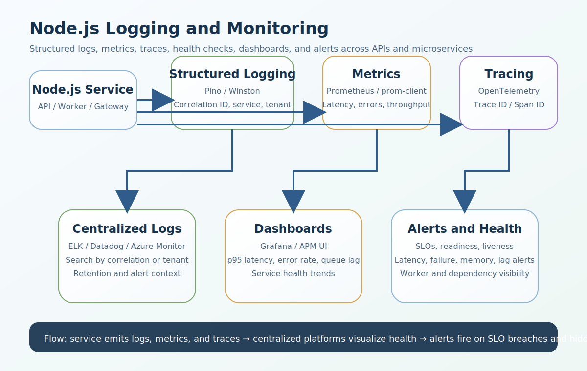

# Node.js Logging and Monitoring Interview Questions


This guide covers logging and monitoring in Node.js from interview basics to tricky production scenarios. It follows the corrected format of **100 interview questions for each subtopic**, and every answer includes a real Node.js code example plus a real-time example so the scenarios and snippets do not repeat verbatim.

## How To Use This Page

- Questions 1-100 cover Why logging and monitoring matter.
- Questions 101-200 cover What should be logged in a Node.js app.
- Questions 201-300 cover Logging levels.
- Questions 301-400 cover Logging libraries in Node.js.
- Questions 401-500 cover Winston vs Pino.
- Questions 501-600 cover Structured logging.
- Questions 601-700 cover Why console.log() is not enough.
- Questions 701-800 cover Correlation IDs.
- Questions 801-900 cover Request logging in Express.
- Questions 901-1000 cover Error logging.
- Questions 1001-1100 cover Sensitive data: what not to log.
- Questions 1101-1200 cover Log rotation and retention.
- Questions 1201-1300 cover Centralized logging.
- Questions 1301-1400 cover Monitoring vs logging.
- Questions 1401-1500 cover Prometheus in Node.js.
- Questions 1501-1600 cover Grafana.
- Questions 1601-1700 cover Useful Node.js app metrics to monitor.
- Questions 1701-1800 cover APM tools.
- Questions 1801-1900 cover Distributed tracing.
- Questions 1901-2000 cover OpenTelemetry in Node.js.
- Questions 2001-2100 cover Alerts and SLO thinking.
- Questions 2101-2200 cover Health checks.
- Questions 2201-2300 cover Monitoring background jobs and queues.
- Questions 2301-2400 cover Best practices for logging and monitoring in Node.js.
- Questions 2401-2500 cover Common interview questions.
- Questions 2501-2600 cover Topics you should not miss.
- Questions 2601-2700 cover Strong real-world architecture answer.

## 1. Why logging and monitoring matter

### Q1.1 What is logging value in production in Node.js logging and monitoring?

**Answer:**

Logging value in production matters in Node.js logging and monitoring because it affects incident response, performance analysis, request tracing, production reliability, and the ability to understand what the system is doing under load. In a real system like a high-traffic Node.js API where slow database calls and retry storms create noisy production behavior, a strong answer should connect the concept to structured logging, metrics, traceability, alerting, and operational decision-making. A more senior answer also explains the practical trade-off so the answer stays grounded in real observability design instead of only definitions.

**Code Example:**

```js
const observabilityReason1 = ['debug issues', 'detect failures early', 'trace requests'];
console.log(observabilityReason1);
```

**Real-Time Example:** In a high-traffic Node.js API where slow database calls and retry storms create noisy production behavior, the team used this concept so the answer stays grounded in real observability design instead of only definitions.

### Q1.2 Why does monitoring value in production matter in real production systems?

**Answer:**

Monitoring value in production matters in Node.js logging and monitoring because it affects incident response, performance analysis, request tracing, production reliability, and the ability to understand what the system is doing under load. In a real system like a microservices platform where auth, billing, notifications, and reporting services must be debugged together, a strong answer should connect the concept to structured logging, metrics, traceability, alerting, and operational decision-making. A more senior answer also explains the practical trade-off so teams can connect logs, metrics, and traces to incident response and production safety.

**Code Example:**

```js
const loggerDecision2 = { needLogs: true, needMetrics: true, needAlerts: true, requestId: 'req-2' };
console.log(loggerDecision2);
```

**Real-Time Example:** In a microservices platform where auth, billing, notifications, and reporting services must be debugged together, the team used this concept so teams can connect logs, metrics, and traces to incident response and production safety.

### Q1.3 When should a backend team use alerting purpose?

**Answer:**

Alerting purpose matters in Node.js logging and monitoring because it affects incident response, performance analysis, request tracing, production reliability, and the ability to understand what the system is doing under load. In a real system like a multi-tenant SaaS where request tracing and log search must work per tenant and per correlation ID, a strong answer should connect the concept to structured logging, metrics, traceability, alerting, and operational decision-making. A more senior answer also explains the practical trade-off so latency, failures, and dependency problems become easier to detect and explain.

**Code Example:**

```js
function explainObservability3() { return 'logs + metrics + traces together'; }
```

**Real-Time Example:** In a multi-tenant SaaS where request tracing and log search must work per tenant and per correlation ID, the team used this concept so latency, failures, and dependency problems become easier to detect and explain.

### Q1.4 How would you explain observability basics in an interview?

**Answer:**

Observability basics matters in Node.js logging and monitoring because it affects incident response, performance analysis, request tracing, production reliability, and the ability to understand what the system is doing under load. In a real system like a containerized deployment where stdout logs are collected centrally and local disk is unreliable, a strong answer should connect the concept to structured logging, metrics, traceability, alerting, and operational decision-making. A more senior answer also explains the practical trade-off so distributed debugging becomes practical instead of guesswork.

**Code Example:**

```js
const monitoringImpact4 = { incidentsShorter: true, mttrLower: true, productionClarityHigher: true };
console.log(monitoringImpact4);
```

**Real-Time Example:** In a containerized deployment where stdout logs are collected centrally and local disk is unreliable, the team used this concept so distributed debugging becomes practical instead of guesswork.

### Q1.5 What is a common interview trap around production debugging benefits?

**Answer:**

Production debugging benefits matters in Node.js logging and monitoring because it affects incident response, performance analysis, request tracing, production reliability, and the ability to understand what the system is doing under load. In a real system like a CMS platform where uploads, background jobs, and third-party callbacks all need visibility, a strong answer should connect the concept to structured logging, metrics, traceability, alerting, and operational decision-making. A more senior answer also explains the practical trade-off so the examples sound like production Node.js systems instead of textbook monitoring notes.

**Code Example:**

```js
const alertUseCase5 = { errorRateThreshold: 0.05, notifyOnBreach: true };
console.log(alertUseCase5);
```

**Real-Time Example:** In a CMS platform where uploads, background jobs, and third-party callbacks all need visibility, the team used this concept so the examples sound like production Node.js systems instead of textbook monitoring notes.

### Q1.6 How is logging value in production implemented safely in Node.js?

**Answer:**

Logging value in production matters in Node.js logging and monitoring because it affects incident response, performance analysis, request tracing, production reliability, and the ability to understand what the system is doing under load. In a real system like a queue-driven architecture where healthy APIs can still hide broken worker pipelines, a strong answer should connect the concept to structured logging, metrics, traceability, alerting, and operational decision-making. A more senior answer also explains the practical trade-off so alerting decisions are tied to user impact and operational risk.

**Code Example:**

```js
const observabilityReason6 = ['debug issues', 'detect failures early', 'trace requests'];
console.log(observabilityReason6);
```

**Real-Time Example:** In a queue-driven architecture where healthy APIs can still hide broken worker pipelines, the team used this concept so alerting decisions are tied to user impact and operational risk.

### Q1.7 What production problem usually exposes weak understanding of monitoring value in production?

**Answer:**

Monitoring value in production matters in Node.js logging and monitoring because it affects incident response, performance analysis, request tracing, production reliability, and the ability to understand what the system is doing under load. In a real system like a security incident investigation where login failures and token misuse must be reconstructed from logs, a strong answer should connect the concept to structured logging, metrics, traceability, alerting, and operational decision-making. A more senior answer also explains the practical trade-off so structured logging and instrumentation choices can be justified by scale and throughput.

**Code Example:**

```js
const loggerDecision7 = { needLogs: true, needMetrics: true, needAlerts: true, requestId: 'req-7' };
console.log(loggerDecision7);
```

**Real-Time Example:** In a security incident investigation where login failures and token misuse must be reconstructed from logs, the team used this concept so structured logging and instrumentation choices can be justified by scale and throughput.

### Q1.8 How would a senior engineer justify alerting purpose to a team?

**Answer:**

Alerting purpose matters in Node.js logging and monitoring because it affects incident response, performance analysis, request tracing, production reliability, and the ability to understand what the system is doing under load. In a real system like a performance incident where p95 latency rose even though average latency looked acceptable, a strong answer should connect the concept to structured logging, metrics, traceability, alerting, and operational decision-making. A more senior answer also explains the practical trade-off so security and compliance concerns are treated as part of logging design, not an afterthought.

**Code Example:**

```js
function explainObservability8() { return 'logs + metrics + traces together'; }
```

**Real-Time Example:** In a performance incident where p95 latency rose even though average latency looked acceptable, the team used this concept so security and compliance concerns are treated as part of logging design, not an afterthought.

### Q1.9 What trade-off does observability basics introduce?

**Answer:**

Observability basics matters in Node.js logging and monitoring because it affects incident response, performance analysis, request tracing, production reliability, and the ability to understand what the system is doing under load. In a real system like a Kubernetes deployment where readiness, liveness, and downstream dependency health all matter, a strong answer should connect the concept to structured logging, metrics, traceability, alerting, and operational decision-making. A more senior answer also explains the practical trade-off so the trade-offs between detail, cost, noise, and performance become clearer.

**Code Example:**

```js
const monitoringImpact9 = { incidentsShorter: true, mttrLower: true, productionClarityHigher: true };
console.log(monitoringImpact9);
```

**Real-Time Example:** In a Kubernetes deployment where readiness, liveness, and downstream dependency health all matter, the team used this concept so the trade-offs between detail, cost, noise, and performance become clearer.

### Q1.10 How do you answer a tricky follow-up about production debugging benefits?

**Answer:**

Production debugging benefits matters in Node.js logging and monitoring because it affects incident response, performance analysis, request tracing, production reliability, and the ability to understand what the system is doing under load. In a real system like an enterprise platform where Datadog, Grafana, and OpenTelemetry are used together for observability, a strong answer should connect the concept to structured logging, metrics, traceability, alerting, and operational decision-making. A more senior answer also explains the practical trade-off so the answer reflects senior-level thinking about observability as a system capability.

**Code Example:**

```js
const alertUseCase10 = { errorRateThreshold: 0.05, notifyOnBreach: true };
console.log(alertUseCase10);
```

**Real-Time Example:** In an enterprise platform where Datadog, Grafana, and OpenTelemetry are used together for observability, the team used this concept so the answer reflects senior-level thinking about observability as a system capability.

### Q1.11 What is logging value in production in Node.js logging and monitoring?

**Answer:**

Logging value in production matters in Node.js logging and monitoring because it affects incident response, performance analysis, request tracing, production reliability, and the ability to understand what the system is doing under load. In a real system like a high-traffic Node.js API where slow database calls and retry storms create noisy production behavior, a strong answer should connect the concept to structured logging, metrics, traceability, alerting, and operational decision-making. A more senior answer also explains the practical trade-off so the answer stays grounded in real observability design instead of only definitions.

**Code Example:**

```js
const observabilityReason11 = ['debug issues', 'detect failures early', 'trace requests'];
console.log(observabilityReason11);
```

**Real-Time Example:** In a high-traffic Node.js API where slow database calls and retry storms create noisy production behavior, the team used this concept so the answer stays grounded in real observability design instead of only definitions.

### Q1.12 Why does monitoring value in production matter in real production systems?

**Answer:**

Monitoring value in production matters in Node.js logging and monitoring because it affects incident response, performance analysis, request tracing, production reliability, and the ability to understand what the system is doing under load. In a real system like a microservices platform where auth, billing, notifications, and reporting services must be debugged together, a strong answer should connect the concept to structured logging, metrics, traceability, alerting, and operational decision-making. A more senior answer also explains the practical trade-off so teams can connect logs, metrics, and traces to incident response and production safety.

**Code Example:**

```js
const loggerDecision12 = { needLogs: true, needMetrics: true, needAlerts: true, requestId: 'req-12' };
console.log(loggerDecision12);
```

**Real-Time Example:** In a microservices platform where auth, billing, notifications, and reporting services must be debugged together, the team used this concept so teams can connect logs, metrics, and traces to incident response and production safety.

### Q1.13 When should a backend team use alerting purpose?

**Answer:**

Alerting purpose matters in Node.js logging and monitoring because it affects incident response, performance analysis, request tracing, production reliability, and the ability to understand what the system is doing under load. In a real system like a multi-tenant SaaS where request tracing and log search must work per tenant and per correlation ID, a strong answer should connect the concept to structured logging, metrics, traceability, alerting, and operational decision-making. A more senior answer also explains the practical trade-off so latency, failures, and dependency problems become easier to detect and explain.

**Code Example:**

```js
function explainObservability13() { return 'logs + metrics + traces together'; }
```

**Real-Time Example:** In a multi-tenant SaaS where request tracing and log search must work per tenant and per correlation ID, the team used this concept so latency, failures, and dependency problems become easier to detect and explain.

### Q1.14 How would you explain observability basics in an interview?

**Answer:**

Observability basics matters in Node.js logging and monitoring because it affects incident response, performance analysis, request tracing, production reliability, and the ability to understand what the system is doing under load. In a real system like a containerized deployment where stdout logs are collected centrally and local disk is unreliable, a strong answer should connect the concept to structured logging, metrics, traceability, alerting, and operational decision-making. A more senior answer also explains the practical trade-off so distributed debugging becomes practical instead of guesswork.

**Code Example:**

```js
const monitoringImpact14 = { incidentsShorter: true, mttrLower: true, productionClarityHigher: true };
console.log(monitoringImpact14);
```

**Real-Time Example:** In a containerized deployment where stdout logs are collected centrally and local disk is unreliable, the team used this concept so distributed debugging becomes practical instead of guesswork.

### Q1.15 What is a common interview trap around production debugging benefits?

**Answer:**

Production debugging benefits matters in Node.js logging and monitoring because it affects incident response, performance analysis, request tracing, production reliability, and the ability to understand what the system is doing under load. In a real system like a CMS platform where uploads, background jobs, and third-party callbacks all need visibility, a strong answer should connect the concept to structured logging, metrics, traceability, alerting, and operational decision-making. A more senior answer also explains the practical trade-off so the examples sound like production Node.js systems instead of textbook monitoring notes.

**Code Example:**

```js
const alertUseCase15 = { errorRateThreshold: 0.05, notifyOnBreach: true };
console.log(alertUseCase15);
```

**Real-Time Example:** In a CMS platform where uploads, background jobs, and third-party callbacks all need visibility, the team used this concept so the examples sound like production Node.js systems instead of textbook monitoring notes.

### Q1.16 How is logging value in production implemented safely in Node.js?

**Answer:**

Logging value in production matters in Node.js logging and monitoring because it affects incident response, performance analysis, request tracing, production reliability, and the ability to understand what the system is doing under load. In a real system like a queue-driven architecture where healthy APIs can still hide broken worker pipelines, a strong answer should connect the concept to structured logging, metrics, traceability, alerting, and operational decision-making. A more senior answer also explains the practical trade-off so alerting decisions are tied to user impact and operational risk.

**Code Example:**

```js
const observabilityReason16 = ['debug issues', 'detect failures early', 'trace requests'];
console.log(observabilityReason16);
```

**Real-Time Example:** In a queue-driven architecture where healthy APIs can still hide broken worker pipelines, the team used this concept so alerting decisions are tied to user impact and operational risk.

### Q1.17 What production problem usually exposes weak understanding of monitoring value in production?

**Answer:**

Monitoring value in production matters in Node.js logging and monitoring because it affects incident response, performance analysis, request tracing, production reliability, and the ability to understand what the system is doing under load. In a real system like a security incident investigation where login failures and token misuse must be reconstructed from logs, a strong answer should connect the concept to structured logging, metrics, traceability, alerting, and operational decision-making. A more senior answer also explains the practical trade-off so structured logging and instrumentation choices can be justified by scale and throughput.

**Code Example:**

```js
const loggerDecision17 = { needLogs: true, needMetrics: true, needAlerts: true, requestId: 'req-17' };
console.log(loggerDecision17);
```

**Real-Time Example:** In a security incident investigation where login failures and token misuse must be reconstructed from logs, the team used this concept so structured logging and instrumentation choices can be justified by scale and throughput.

### Q1.18 How would a senior engineer justify alerting purpose to a team?

**Answer:**

Alerting purpose matters in Node.js logging and monitoring because it affects incident response, performance analysis, request tracing, production reliability, and the ability to understand what the system is doing under load. In a real system like a performance incident where p95 latency rose even though average latency looked acceptable, a strong answer should connect the concept to structured logging, metrics, traceability, alerting, and operational decision-making. A more senior answer also explains the practical trade-off so security and compliance concerns are treated as part of logging design, not an afterthought.

**Code Example:**

```js
function explainObservability18() { return 'logs + metrics + traces together'; }
```

**Real-Time Example:** In a performance incident where p95 latency rose even though average latency looked acceptable, the team used this concept so security and compliance concerns are treated as part of logging design, not an afterthought.

### Q1.19 What trade-off does observability basics introduce?

**Answer:**

Observability basics matters in Node.js logging and monitoring because it affects incident response, performance analysis, request tracing, production reliability, and the ability to understand what the system is doing under load. In a real system like a Kubernetes deployment where readiness, liveness, and downstream dependency health all matter, a strong answer should connect the concept to structured logging, metrics, traceability, alerting, and operational decision-making. A more senior answer also explains the practical trade-off so the trade-offs between detail, cost, noise, and performance become clearer.

**Code Example:**

```js
const monitoringImpact19 = { incidentsShorter: true, mttrLower: true, productionClarityHigher: true };
console.log(monitoringImpact19);
```

**Real-Time Example:** In a Kubernetes deployment where readiness, liveness, and downstream dependency health all matter, the team used this concept so the trade-offs between detail, cost, noise, and performance become clearer.

### Q1.20 How do you answer a tricky follow-up about production debugging benefits?

**Answer:**

Production debugging benefits matters in Node.js logging and monitoring because it affects incident response, performance analysis, request tracing, production reliability, and the ability to understand what the system is doing under load. In a real system like an enterprise platform where Datadog, Grafana, and OpenTelemetry are used together for observability, a strong answer should connect the concept to structured logging, metrics, traceability, alerting, and operational decision-making. A more senior answer also explains the practical trade-off so the answer reflects senior-level thinking about observability as a system capability.

**Code Example:**

```js
const alertUseCase20 = { errorRateThreshold: 0.05, notifyOnBreach: true };
console.log(alertUseCase20);
```

**Real-Time Example:** In an enterprise platform where Datadog, Grafana, and OpenTelemetry are used together for observability, the team used this concept so the answer reflects senior-level thinking about observability as a system capability.

### Q1.21 What is logging value in production in Node.js logging and monitoring?

**Answer:**

Logging value in production matters in Node.js logging and monitoring because it affects incident response, performance analysis, request tracing, production reliability, and the ability to understand what the system is doing under load. In a real system like a high-traffic Node.js API where slow database calls and retry storms create noisy production behavior, a strong answer should connect the concept to structured logging, metrics, traceability, alerting, and operational decision-making. A more senior answer also explains the practical trade-off so the answer stays grounded in real observability design instead of only definitions.

**Code Example:**

```js
const observabilityReason21 = ['debug issues', 'detect failures early', 'trace requests'];
console.log(observabilityReason21);
```

**Real-Time Example:** In a high-traffic Node.js API where slow database calls and retry storms create noisy production behavior, the team used this concept so the answer stays grounded in real observability design instead of only definitions.

### Q1.22 Why does monitoring value in production matter in real production systems?

**Answer:**

Monitoring value in production matters in Node.js logging and monitoring because it affects incident response, performance analysis, request tracing, production reliability, and the ability to understand what the system is doing under load. In a real system like a microservices platform where auth, billing, notifications, and reporting services must be debugged together, a strong answer should connect the concept to structured logging, metrics, traceability, alerting, and operational decision-making. A more senior answer also explains the practical trade-off so teams can connect logs, metrics, and traces to incident response and production safety.

**Code Example:**

```js
const loggerDecision22 = { needLogs: true, needMetrics: true, needAlerts: true, requestId: 'req-22' };
console.log(loggerDecision22);
```

**Real-Time Example:** In a microservices platform where auth, billing, notifications, and reporting services must be debugged together, the team used this concept so teams can connect logs, metrics, and traces to incident response and production safety.

### Q1.23 When should a backend team use alerting purpose?

**Answer:**

Alerting purpose matters in Node.js logging and monitoring because it affects incident response, performance analysis, request tracing, production reliability, and the ability to understand what the system is doing under load. In a real system like a multi-tenant SaaS where request tracing and log search must work per tenant and per correlation ID, a strong answer should connect the concept to structured logging, metrics, traceability, alerting, and operational decision-making. A more senior answer also explains the practical trade-off so latency, failures, and dependency problems become easier to detect and explain.

**Code Example:**

```js
function explainObservability23() { return 'logs + metrics + traces together'; }
```

**Real-Time Example:** In a multi-tenant SaaS where request tracing and log search must work per tenant and per correlation ID, the team used this concept so latency, failures, and dependency problems become easier to detect and explain.

### Q1.24 How would you explain observability basics in an interview?

**Answer:**

Observability basics matters in Node.js logging and monitoring because it affects incident response, performance analysis, request tracing, production reliability, and the ability to understand what the system is doing under load. In a real system like a containerized deployment where stdout logs are collected centrally and local disk is unreliable, a strong answer should connect the concept to structured logging, metrics, traceability, alerting, and operational decision-making. A more senior answer also explains the practical trade-off so distributed debugging becomes practical instead of guesswork.

**Code Example:**

```js
const monitoringImpact24 = { incidentsShorter: true, mttrLower: true, productionClarityHigher: true };
console.log(monitoringImpact24);
```

**Real-Time Example:** In a containerized deployment where stdout logs are collected centrally and local disk is unreliable, the team used this concept so distributed debugging becomes practical instead of guesswork.

### Q1.25 What is a common interview trap around production debugging benefits?

**Answer:**

Production debugging benefits matters in Node.js logging and monitoring because it affects incident response, performance analysis, request tracing, production reliability, and the ability to understand what the system is doing under load. In a real system like a CMS platform where uploads, background jobs, and third-party callbacks all need visibility, a strong answer should connect the concept to structured logging, metrics, traceability, alerting, and operational decision-making. A more senior answer also explains the practical trade-off so the examples sound like production Node.js systems instead of textbook monitoring notes.

**Code Example:**

```js
const alertUseCase25 = { errorRateThreshold: 0.05, notifyOnBreach: true };
console.log(alertUseCase25);
```

**Real-Time Example:** In a CMS platform where uploads, background jobs, and third-party callbacks all need visibility, the team used this concept so the examples sound like production Node.js systems instead of textbook monitoring notes.

### Q1.26 How is logging value in production implemented safely in Node.js?

**Answer:**

Logging value in production matters in Node.js logging and monitoring because it affects incident response, performance analysis, request tracing, production reliability, and the ability to understand what the system is doing under load. In a real system like a queue-driven architecture where healthy APIs can still hide broken worker pipelines, a strong answer should connect the concept to structured logging, metrics, traceability, alerting, and operational decision-making. A more senior answer also explains the practical trade-off so alerting decisions are tied to user impact and operational risk.

**Code Example:**

```js
const observabilityReason26 = ['debug issues', 'detect failures early', 'trace requests'];
console.log(observabilityReason26);
```

**Real-Time Example:** In a queue-driven architecture where healthy APIs can still hide broken worker pipelines, the team used this concept so alerting decisions are tied to user impact and operational risk.

### Q1.27 What production problem usually exposes weak understanding of monitoring value in production?

**Answer:**

Monitoring value in production matters in Node.js logging and monitoring because it affects incident response, performance analysis, request tracing, production reliability, and the ability to understand what the system is doing under load. In a real system like a security incident investigation where login failures and token misuse must be reconstructed from logs, a strong answer should connect the concept to structured logging, metrics, traceability, alerting, and operational decision-making. A more senior answer also explains the practical trade-off so structured logging and instrumentation choices can be justified by scale and throughput.

**Code Example:**

```js
const loggerDecision27 = { needLogs: true, needMetrics: true, needAlerts: true, requestId: 'req-27' };
console.log(loggerDecision27);
```

**Real-Time Example:** In a security incident investigation where login failures and token misuse must be reconstructed from logs, the team used this concept so structured logging and instrumentation choices can be justified by scale and throughput.

### Q1.28 How would a senior engineer justify alerting purpose to a team?

**Answer:**

Alerting purpose matters in Node.js logging and monitoring because it affects incident response, performance analysis, request tracing, production reliability, and the ability to understand what the system is doing under load. In a real system like a performance incident where p95 latency rose even though average latency looked acceptable, a strong answer should connect the concept to structured logging, metrics, traceability, alerting, and operational decision-making. A more senior answer also explains the practical trade-off so security and compliance concerns are treated as part of logging design, not an afterthought.

**Code Example:**

```js
function explainObservability28() { return 'logs + metrics + traces together'; }
```

**Real-Time Example:** In a performance incident where p95 latency rose even though average latency looked acceptable, the team used this concept so security and compliance concerns are treated as part of logging design, not an afterthought.

### Q1.29 What trade-off does observability basics introduce?

**Answer:**

Observability basics matters in Node.js logging and monitoring because it affects incident response, performance analysis, request tracing, production reliability, and the ability to understand what the system is doing under load. In a real system like a Kubernetes deployment where readiness, liveness, and downstream dependency health all matter, a strong answer should connect the concept to structured logging, metrics, traceability, alerting, and operational decision-making. A more senior answer also explains the practical trade-off so the trade-offs between detail, cost, noise, and performance become clearer.

**Code Example:**

```js
const monitoringImpact29 = { incidentsShorter: true, mttrLower: true, productionClarityHigher: true };
console.log(monitoringImpact29);
```

**Real-Time Example:** In a Kubernetes deployment where readiness, liveness, and downstream dependency health all matter, the team used this concept so the trade-offs between detail, cost, noise, and performance become clearer.

### Q1.30 How do you answer a tricky follow-up about production debugging benefits?

**Answer:**

Production debugging benefits matters in Node.js logging and monitoring because it affects incident response, performance analysis, request tracing, production reliability, and the ability to understand what the system is doing under load. In a real system like an enterprise platform where Datadog, Grafana, and OpenTelemetry are used together for observability, a strong answer should connect the concept to structured logging, metrics, traceability, alerting, and operational decision-making. A more senior answer also explains the practical trade-off so the answer reflects senior-level thinking about observability as a system capability.

**Code Example:**

```js
const alertUseCase30 = { errorRateThreshold: 0.05, notifyOnBreach: true };
console.log(alertUseCase30);
```

**Real-Time Example:** In an enterprise platform where Datadog, Grafana, and OpenTelemetry are used together for observability, the team used this concept so the answer reflects senior-level thinking about observability as a system capability.

### Q1.31 What is logging value in production in Node.js logging and monitoring?

**Answer:**

Logging value in production matters in Node.js logging and monitoring because it affects incident response, performance analysis, request tracing, production reliability, and the ability to understand what the system is doing under load. In a real system like a high-traffic Node.js API where slow database calls and retry storms create noisy production behavior, a strong answer should connect the concept to structured logging, metrics, traceability, alerting, and operational decision-making. A more senior answer also explains the practical trade-off so the answer stays grounded in real observability design instead of only definitions.

**Code Example:**

```js
const observabilityReason31 = ['debug issues', 'detect failures early', 'trace requests'];
console.log(observabilityReason31);
```

**Real-Time Example:** In a high-traffic Node.js API where slow database calls and retry storms create noisy production behavior, the team used this concept so the answer stays grounded in real observability design instead of only definitions.

### Q1.32 Why does monitoring value in production matter in real production systems?

**Answer:**

Monitoring value in production matters in Node.js logging and monitoring because it affects incident response, performance analysis, request tracing, production reliability, and the ability to understand what the system is doing under load. In a real system like a microservices platform where auth, billing, notifications, and reporting services must be debugged together, a strong answer should connect the concept to structured logging, metrics, traceability, alerting, and operational decision-making. A more senior answer also explains the practical trade-off so teams can connect logs, metrics, and traces to incident response and production safety.

**Code Example:**

```js
const loggerDecision32 = { needLogs: true, needMetrics: true, needAlerts: true, requestId: 'req-32' };
console.log(loggerDecision32);
```

**Real-Time Example:** In a microservices platform where auth, billing, notifications, and reporting services must be debugged together, the team used this concept so teams can connect logs, metrics, and traces to incident response and production safety.

### Q1.33 When should a backend team use alerting purpose?

**Answer:**

Alerting purpose matters in Node.js logging and monitoring because it affects incident response, performance analysis, request tracing, production reliability, and the ability to understand what the system is doing under load. In a real system like a multi-tenant SaaS where request tracing and log search must work per tenant and per correlation ID, a strong answer should connect the concept to structured logging, metrics, traceability, alerting, and operational decision-making. A more senior answer also explains the practical trade-off so latency, failures, and dependency problems become easier to detect and explain.

**Code Example:**

```js
function explainObservability33() { return 'logs + metrics + traces together'; }
```

**Real-Time Example:** In a multi-tenant SaaS where request tracing and log search must work per tenant and per correlation ID, the team used this concept so latency, failures, and dependency problems become easier to detect and explain.

### Q1.34 How would you explain observability basics in an interview?

**Answer:**

Observability basics matters in Node.js logging and monitoring because it affects incident response, performance analysis, request tracing, production reliability, and the ability to understand what the system is doing under load. In a real system like a containerized deployment where stdout logs are collected centrally and local disk is unreliable, a strong answer should connect the concept to structured logging, metrics, traceability, alerting, and operational decision-making. A more senior answer also explains the practical trade-off so distributed debugging becomes practical instead of guesswork.

**Code Example:**

```js
const monitoringImpact34 = { incidentsShorter: true, mttrLower: true, productionClarityHigher: true };
console.log(monitoringImpact34);
```

**Real-Time Example:** In a containerized deployment where stdout logs are collected centrally and local disk is unreliable, the team used this concept so distributed debugging becomes practical instead of guesswork.

### Q1.35 What is a common interview trap around production debugging benefits?

**Answer:**

Production debugging benefits matters in Node.js logging and monitoring because it affects incident response, performance analysis, request tracing, production reliability, and the ability to understand what the system is doing under load. In a real system like a CMS platform where uploads, background jobs, and third-party callbacks all need visibility, a strong answer should connect the concept to structured logging, metrics, traceability, alerting, and operational decision-making. A more senior answer also explains the practical trade-off so the examples sound like production Node.js systems instead of textbook monitoring notes.

**Code Example:**

```js
const alertUseCase35 = { errorRateThreshold: 0.05, notifyOnBreach: true };
console.log(alertUseCase35);
```

**Real-Time Example:** In a CMS platform where uploads, background jobs, and third-party callbacks all need visibility, the team used this concept so the examples sound like production Node.js systems instead of textbook monitoring notes.

### Q1.36 How is logging value in production implemented safely in Node.js?

**Answer:**

Logging value in production matters in Node.js logging and monitoring because it affects incident response, performance analysis, request tracing, production reliability, and the ability to understand what the system is doing under load. In a real system like a queue-driven architecture where healthy APIs can still hide broken worker pipelines, a strong answer should connect the concept to structured logging, metrics, traceability, alerting, and operational decision-making. A more senior answer also explains the practical trade-off so alerting decisions are tied to user impact and operational risk.

**Code Example:**

```js
const observabilityReason36 = ['debug issues', 'detect failures early', 'trace requests'];
console.log(observabilityReason36);
```

**Real-Time Example:** In a queue-driven architecture where healthy APIs can still hide broken worker pipelines, the team used this concept so alerting decisions are tied to user impact and operational risk.

### Q1.37 What production problem usually exposes weak understanding of monitoring value in production?

**Answer:**

Monitoring value in production matters in Node.js logging and monitoring because it affects incident response, performance analysis, request tracing, production reliability, and the ability to understand what the system is doing under load. In a real system like a security incident investigation where login failures and token misuse must be reconstructed from logs, a strong answer should connect the concept to structured logging, metrics, traceability, alerting, and operational decision-making. A more senior answer also explains the practical trade-off so structured logging and instrumentation choices can be justified by scale and throughput.

**Code Example:**

```js
const loggerDecision37 = { needLogs: true, needMetrics: true, needAlerts: true, requestId: 'req-37' };
console.log(loggerDecision37);
```

**Real-Time Example:** In a security incident investigation where login failures and token misuse must be reconstructed from logs, the team used this concept so structured logging and instrumentation choices can be justified by scale and throughput.

### Q1.38 How would a senior engineer justify alerting purpose to a team?

**Answer:**

Alerting purpose matters in Node.js logging and monitoring because it affects incident response, performance analysis, request tracing, production reliability, and the ability to understand what the system is doing under load. In a real system like a performance incident where p95 latency rose even though average latency looked acceptable, a strong answer should connect the concept to structured logging, metrics, traceability, alerting, and operational decision-making. A more senior answer also explains the practical trade-off so security and compliance concerns are treated as part of logging design, not an afterthought.

**Code Example:**

```js
function explainObservability38() { return 'logs + metrics + traces together'; }
```

**Real-Time Example:** In a performance incident where p95 latency rose even though average latency looked acceptable, the team used this concept so security and compliance concerns are treated as part of logging design, not an afterthought.

### Q1.39 What trade-off does observability basics introduce?

**Answer:**

Observability basics matters in Node.js logging and monitoring because it affects incident response, performance analysis, request tracing, production reliability, and the ability to understand what the system is doing under load. In a real system like a Kubernetes deployment where readiness, liveness, and downstream dependency health all matter, a strong answer should connect the concept to structured logging, metrics, traceability, alerting, and operational decision-making. A more senior answer also explains the practical trade-off so the trade-offs between detail, cost, noise, and performance become clearer.

**Code Example:**

```js
const monitoringImpact39 = { incidentsShorter: true, mttrLower: true, productionClarityHigher: true };
console.log(monitoringImpact39);
```

**Real-Time Example:** In a Kubernetes deployment where readiness, liveness, and downstream dependency health all matter, the team used this concept so the trade-offs between detail, cost, noise, and performance become clearer.

### Q1.40 How do you answer a tricky follow-up about production debugging benefits?

**Answer:**

Production debugging benefits matters in Node.js logging and monitoring because it affects incident response, performance analysis, request tracing, production reliability, and the ability to understand what the system is doing under load. In a real system like an enterprise platform where Datadog, Grafana, and OpenTelemetry are used together for observability, a strong answer should connect the concept to structured logging, metrics, traceability, alerting, and operational decision-making. A more senior answer also explains the practical trade-off so the answer reflects senior-level thinking about observability as a system capability.

**Code Example:**

```js
const alertUseCase40 = { errorRateThreshold: 0.05, notifyOnBreach: true };
console.log(alertUseCase40);
```

**Real-Time Example:** In an enterprise platform where Datadog, Grafana, and OpenTelemetry are used together for observability, the team used this concept so the answer reflects senior-level thinking about observability as a system capability.

### Q1.41 What is logging value in production in Node.js logging and monitoring?

**Answer:**

Logging value in production matters in Node.js logging and monitoring because it affects incident response, performance analysis, request tracing, production reliability, and the ability to understand what the system is doing under load. In a real system like a high-traffic Node.js API where slow database calls and retry storms create noisy production behavior, a strong answer should connect the concept to structured logging, metrics, traceability, alerting, and operational decision-making. A more senior answer also explains the practical trade-off so the answer stays grounded in real observability design instead of only definitions.

**Code Example:**

```js
const observabilityReason41 = ['debug issues', 'detect failures early', 'trace requests'];
console.log(observabilityReason41);
```

**Real-Time Example:** In a high-traffic Node.js API where slow database calls and retry storms create noisy production behavior, the team used this concept so the answer stays grounded in real observability design instead of only definitions.

### Q1.42 Why does monitoring value in production matter in real production systems?

**Answer:**

Monitoring value in production matters in Node.js logging and monitoring because it affects incident response, performance analysis, request tracing, production reliability, and the ability to understand what the system is doing under load. In a real system like a microservices platform where auth, billing, notifications, and reporting services must be debugged together, a strong answer should connect the concept to structured logging, metrics, traceability, alerting, and operational decision-making. A more senior answer also explains the practical trade-off so teams can connect logs, metrics, and traces to incident response and production safety.

**Code Example:**

```js
const loggerDecision42 = { needLogs: true, needMetrics: true, needAlerts: true, requestId: 'req-42' };
console.log(loggerDecision42);
```

**Real-Time Example:** In a microservices platform where auth, billing, notifications, and reporting services must be debugged together, the team used this concept so teams can connect logs, metrics, and traces to incident response and production safety.

### Q1.43 When should a backend team use alerting purpose?

**Answer:**

Alerting purpose matters in Node.js logging and monitoring because it affects incident response, performance analysis, request tracing, production reliability, and the ability to understand what the system is doing under load. In a real system like a multi-tenant SaaS where request tracing and log search must work per tenant and per correlation ID, a strong answer should connect the concept to structured logging, metrics, traceability, alerting, and operational decision-making. A more senior answer also explains the practical trade-off so latency, failures, and dependency problems become easier to detect and explain.

**Code Example:**

```js
function explainObservability43() { return 'logs + metrics + traces together'; }
```

**Real-Time Example:** In a multi-tenant SaaS where request tracing and log search must work per tenant and per correlation ID, the team used this concept so latency, failures, and dependency problems become easier to detect and explain.

### Q1.44 How would you explain observability basics in an interview?

**Answer:**

Observability basics matters in Node.js logging and monitoring because it affects incident response, performance analysis, request tracing, production reliability, and the ability to understand what the system is doing under load. In a real system like a containerized deployment where stdout logs are collected centrally and local disk is unreliable, a strong answer should connect the concept to structured logging, metrics, traceability, alerting, and operational decision-making. A more senior answer also explains the practical trade-off so distributed debugging becomes practical instead of guesswork.

**Code Example:**

```js
const monitoringImpact44 = { incidentsShorter: true, mttrLower: true, productionClarityHigher: true };
console.log(monitoringImpact44);
```

**Real-Time Example:** In a containerized deployment where stdout logs are collected centrally and local disk is unreliable, the team used this concept so distributed debugging becomes practical instead of guesswork.

### Q1.45 What is a common interview trap around production debugging benefits?

**Answer:**

Production debugging benefits matters in Node.js logging and monitoring because it affects incident response, performance analysis, request tracing, production reliability, and the ability to understand what the system is doing under load. In a real system like a CMS platform where uploads, background jobs, and third-party callbacks all need visibility, a strong answer should connect the concept to structured logging, metrics, traceability, alerting, and operational decision-making. A more senior answer also explains the practical trade-off so the examples sound like production Node.js systems instead of textbook monitoring notes.

**Code Example:**

```js
const alertUseCase45 = { errorRateThreshold: 0.05, notifyOnBreach: true };
console.log(alertUseCase45);
```

**Real-Time Example:** In a CMS platform where uploads, background jobs, and third-party callbacks all need visibility, the team used this concept so the examples sound like production Node.js systems instead of textbook monitoring notes.

### Q1.46 How is logging value in production implemented safely in Node.js?

**Answer:**

Logging value in production matters in Node.js logging and monitoring because it affects incident response, performance analysis, request tracing, production reliability, and the ability to understand what the system is doing under load. In a real system like a queue-driven architecture where healthy APIs can still hide broken worker pipelines, a strong answer should connect the concept to structured logging, metrics, traceability, alerting, and operational decision-making. A more senior answer also explains the practical trade-off so alerting decisions are tied to user impact and operational risk.

**Code Example:**

```js
const observabilityReason46 = ['debug issues', 'detect failures early', 'trace requests'];
console.log(observabilityReason46);
```

**Real-Time Example:** In a queue-driven architecture where healthy APIs can still hide broken worker pipelines, the team used this concept so alerting decisions are tied to user impact and operational risk.

### Q1.47 What production problem usually exposes weak understanding of monitoring value in production?

**Answer:**

Monitoring value in production matters in Node.js logging and monitoring because it affects incident response, performance analysis, request tracing, production reliability, and the ability to understand what the system is doing under load. In a real system like a security incident investigation where login failures and token misuse must be reconstructed from logs, a strong answer should connect the concept to structured logging, metrics, traceability, alerting, and operational decision-making. A more senior answer also explains the practical trade-off so structured logging and instrumentation choices can be justified by scale and throughput.

**Code Example:**

```js
const loggerDecision47 = { needLogs: true, needMetrics: true, needAlerts: true, requestId: 'req-47' };
console.log(loggerDecision47);
```

**Real-Time Example:** In a security incident investigation where login failures and token misuse must be reconstructed from logs, the team used this concept so structured logging and instrumentation choices can be justified by scale and throughput.

### Q1.48 How would a senior engineer justify alerting purpose to a team?

**Answer:**

Alerting purpose matters in Node.js logging and monitoring because it affects incident response, performance analysis, request tracing, production reliability, and the ability to understand what the system is doing under load. In a real system like a performance incident where p95 latency rose even though average latency looked acceptable, a strong answer should connect the concept to structured logging, metrics, traceability, alerting, and operational decision-making. A more senior answer also explains the practical trade-off so security and compliance concerns are treated as part of logging design, not an afterthought.

**Code Example:**

```js
function explainObservability48() { return 'logs + metrics + traces together'; }
```

**Real-Time Example:** In a performance incident where p95 latency rose even though average latency looked acceptable, the team used this concept so security and compliance concerns are treated as part of logging design, not an afterthought.

### Q1.49 What trade-off does observability basics introduce?

**Answer:**

Observability basics matters in Node.js logging and monitoring because it affects incident response, performance analysis, request tracing, production reliability, and the ability to understand what the system is doing under load. In a real system like a Kubernetes deployment where readiness, liveness, and downstream dependency health all matter, a strong answer should connect the concept to structured logging, metrics, traceability, alerting, and operational decision-making. A more senior answer also explains the practical trade-off so the trade-offs between detail, cost, noise, and performance become clearer.

**Code Example:**

```js
const monitoringImpact49 = { incidentsShorter: true, mttrLower: true, productionClarityHigher: true };
console.log(monitoringImpact49);
```

**Real-Time Example:** In a Kubernetes deployment where readiness, liveness, and downstream dependency health all matter, the team used this concept so the trade-offs between detail, cost, noise, and performance become clearer.

### Q1.50 How do you answer a tricky follow-up about production debugging benefits?

**Answer:**

Production debugging benefits matters in Node.js logging and monitoring because it affects incident response, performance analysis, request tracing, production reliability, and the ability to understand what the system is doing under load. In a real system like an enterprise platform where Datadog, Grafana, and OpenTelemetry are used together for observability, a strong answer should connect the concept to structured logging, metrics, traceability, alerting, and operational decision-making. A more senior answer also explains the practical trade-off so the answer reflects senior-level thinking about observability as a system capability.

**Code Example:**

```js
const alertUseCase50 = { errorRateThreshold: 0.05, notifyOnBreach: true };
console.log(alertUseCase50);
```

**Real-Time Example:** In an enterprise platform where Datadog, Grafana, and OpenTelemetry are used together for observability, the team used this concept so the answer reflects senior-level thinking about observability as a system capability.

### Q1.51 What is logging value in production in Node.js logging and monitoring?

**Answer:**

Logging value in production matters in Node.js logging and monitoring because it affects incident response, performance analysis, request tracing, production reliability, and the ability to understand what the system is doing under load. In a real system like a high-traffic Node.js API where slow database calls and retry storms create noisy production behavior, a strong answer should connect the concept to structured logging, metrics, traceability, alerting, and operational decision-making. A more senior answer also explains the practical trade-off so the answer stays grounded in real observability design instead of only definitions.

**Code Example:**

```js
const observabilityReason51 = ['debug issues', 'detect failures early', 'trace requests'];
console.log(observabilityReason51);
```

**Real-Time Example:** In a high-traffic Node.js API where slow database calls and retry storms create noisy production behavior, the team used this concept so the answer stays grounded in real observability design instead of only definitions.

### Q1.52 Why does monitoring value in production matter in real production systems?

**Answer:**

Monitoring value in production matters in Node.js logging and monitoring because it affects incident response, performance analysis, request tracing, production reliability, and the ability to understand what the system is doing under load. In a real system like a microservices platform where auth, billing, notifications, and reporting services must be debugged together, a strong answer should connect the concept to structured logging, metrics, traceability, alerting, and operational decision-making. A more senior answer also explains the practical trade-off so teams can connect logs, metrics, and traces to incident response and production safety.

**Code Example:**

```js
const loggerDecision52 = { needLogs: true, needMetrics: true, needAlerts: true, requestId: 'req-52' };
console.log(loggerDecision52);
```

**Real-Time Example:** In a microservices platform where auth, billing, notifications, and reporting services must be debugged together, the team used this concept so teams can connect logs, metrics, and traces to incident response and production safety.

### Q1.53 When should a backend team use alerting purpose?

**Answer:**

Alerting purpose matters in Node.js logging and monitoring because it affects incident response, performance analysis, request tracing, production reliability, and the ability to understand what the system is doing under load. In a real system like a multi-tenant SaaS where request tracing and log search must work per tenant and per correlation ID, a strong answer should connect the concept to structured logging, metrics, traceability, alerting, and operational decision-making. A more senior answer also explains the practical trade-off so latency, failures, and dependency problems become easier to detect and explain.

**Code Example:**

```js
function explainObservability53() { return 'logs + metrics + traces together'; }
```

**Real-Time Example:** In a multi-tenant SaaS where request tracing and log search must work per tenant and per correlation ID, the team used this concept so latency, failures, and dependency problems become easier to detect and explain.

### Q1.54 How would you explain observability basics in an interview?

**Answer:**

Observability basics matters in Node.js logging and monitoring because it affects incident response, performance analysis, request tracing, production reliability, and the ability to understand what the system is doing under load. In a real system like a containerized deployment where stdout logs are collected centrally and local disk is unreliable, a strong answer should connect the concept to structured logging, metrics, traceability, alerting, and operational decision-making. A more senior answer also explains the practical trade-off so distributed debugging becomes practical instead of guesswork.

**Code Example:**

```js
const monitoringImpact54 = { incidentsShorter: true, mttrLower: true, productionClarityHigher: true };
console.log(monitoringImpact54);
```

**Real-Time Example:** In a containerized deployment where stdout logs are collected centrally and local disk is unreliable, the team used this concept so distributed debugging becomes practical instead of guesswork.

### Q1.55 What is a common interview trap around production debugging benefits?

**Answer:**

Production debugging benefits matters in Node.js logging and monitoring because it affects incident response, performance analysis, request tracing, production reliability, and the ability to understand what the system is doing under load. In a real system like a CMS platform where uploads, background jobs, and third-party callbacks all need visibility, a strong answer should connect the concept to structured logging, metrics, traceability, alerting, and operational decision-making. A more senior answer also explains the practical trade-off so the examples sound like production Node.js systems instead of textbook monitoring notes.

**Code Example:**

```js
const alertUseCase55 = { errorRateThreshold: 0.05, notifyOnBreach: true };
console.log(alertUseCase55);
```

**Real-Time Example:** In a CMS platform where uploads, background jobs, and third-party callbacks all need visibility, the team used this concept so the examples sound like production Node.js systems instead of textbook monitoring notes.

### Q1.56 How is logging value in production implemented safely in Node.js?

**Answer:**

Logging value in production matters in Node.js logging and monitoring because it affects incident response, performance analysis, request tracing, production reliability, and the ability to understand what the system is doing under load. In a real system like a queue-driven architecture where healthy APIs can still hide broken worker pipelines, a strong answer should connect the concept to structured logging, metrics, traceability, alerting, and operational decision-making. A more senior answer also explains the practical trade-off so alerting decisions are tied to user impact and operational risk.

**Code Example:**

```js
const observabilityReason56 = ['debug issues', 'detect failures early', 'trace requests'];
console.log(observabilityReason56);
```

**Real-Time Example:** In a queue-driven architecture where healthy APIs can still hide broken worker pipelines, the team used this concept so alerting decisions are tied to user impact and operational risk.

### Q1.57 What production problem usually exposes weak understanding of monitoring value in production?

**Answer:**

Monitoring value in production matters in Node.js logging and monitoring because it affects incident response, performance analysis, request tracing, production reliability, and the ability to understand what the system is doing under load. In a real system like a security incident investigation where login failures and token misuse must be reconstructed from logs, a strong answer should connect the concept to structured logging, metrics, traceability, alerting, and operational decision-making. A more senior answer also explains the practical trade-off so structured logging and instrumentation choices can be justified by scale and throughput.

**Code Example:**

```js
const loggerDecision57 = { needLogs: true, needMetrics: true, needAlerts: true, requestId: 'req-57' };
console.log(loggerDecision57);
```

**Real-Time Example:** In a security incident investigation where login failures and token misuse must be reconstructed from logs, the team used this concept so structured logging and instrumentation choices can be justified by scale and throughput.

### Q1.58 How would a senior engineer justify alerting purpose to a team?

**Answer:**

Alerting purpose matters in Node.js logging and monitoring because it affects incident response, performance analysis, request tracing, production reliability, and the ability to understand what the system is doing under load. In a real system like a performance incident where p95 latency rose even though average latency looked acceptable, a strong answer should connect the concept to structured logging, metrics, traceability, alerting, and operational decision-making. A more senior answer also explains the practical trade-off so security and compliance concerns are treated as part of logging design, not an afterthought.

**Code Example:**

```js
function explainObservability58() { return 'logs + metrics + traces together'; }
```

**Real-Time Example:** In a performance incident where p95 latency rose even though average latency looked acceptable, the team used this concept so security and compliance concerns are treated as part of logging design, not an afterthought.

### Q1.59 What trade-off does observability basics introduce?

**Answer:**

Observability basics matters in Node.js logging and monitoring because it affects incident response, performance analysis, request tracing, production reliability, and the ability to understand what the system is doing under load. In a real system like a Kubernetes deployment where readiness, liveness, and downstream dependency health all matter, a strong answer should connect the concept to structured logging, metrics, traceability, alerting, and operational decision-making. A more senior answer also explains the practical trade-off so the trade-offs between detail, cost, noise, and performance become clearer.

**Code Example:**

```js
const monitoringImpact59 = { incidentsShorter: true, mttrLower: true, productionClarityHigher: true };
console.log(monitoringImpact59);
```

**Real-Time Example:** In a Kubernetes deployment where readiness, liveness, and downstream dependency health all matter, the team used this concept so the trade-offs between detail, cost, noise, and performance become clearer.

### Q1.60 How do you answer a tricky follow-up about production debugging benefits?

**Answer:**

Production debugging benefits matters in Node.js logging and monitoring because it affects incident response, performance analysis, request tracing, production reliability, and the ability to understand what the system is doing under load. In a real system like an enterprise platform where Datadog, Grafana, and OpenTelemetry are used together for observability, a strong answer should connect the concept to structured logging, metrics, traceability, alerting, and operational decision-making. A more senior answer also explains the practical trade-off so the answer reflects senior-level thinking about observability as a system capability.

**Code Example:**

```js
const alertUseCase60 = { errorRateThreshold: 0.05, notifyOnBreach: true };
console.log(alertUseCase60);
```

**Real-Time Example:** In an enterprise platform where Datadog, Grafana, and OpenTelemetry are used together for observability, the team used this concept so the answer reflects senior-level thinking about observability as a system capability.

### Q1.61 What is logging value in production in Node.js logging and monitoring?

**Answer:**

Logging value in production matters in Node.js logging and monitoring because it affects incident response, performance analysis, request tracing, production reliability, and the ability to understand what the system is doing under load. In a real system like a high-traffic Node.js API where slow database calls and retry storms create noisy production behavior, a strong answer should connect the concept to structured logging, metrics, traceability, alerting, and operational decision-making. A more senior answer also explains the practical trade-off so the answer stays grounded in real observability design instead of only definitions.

**Code Example:**

```js
const observabilityReason61 = ['debug issues', 'detect failures early', 'trace requests'];
console.log(observabilityReason61);
```

**Real-Time Example:** In a high-traffic Node.js API where slow database calls and retry storms create noisy production behavior, the team used this concept so the answer stays grounded in real observability design instead of only definitions.

### Q1.62 Why does monitoring value in production matter in real production systems?

**Answer:**

Monitoring value in production matters in Node.js logging and monitoring because it affects incident response, performance analysis, request tracing, production reliability, and the ability to understand what the system is doing under load. In a real system like a microservices platform where auth, billing, notifications, and reporting services must be debugged together, a strong answer should connect the concept to structured logging, metrics, traceability, alerting, and operational decision-making. A more senior answer also explains the practical trade-off so teams can connect logs, metrics, and traces to incident response and production safety.

**Code Example:**

```js
const loggerDecision62 = { needLogs: true, needMetrics: true, needAlerts: true, requestId: 'req-62' };
console.log(loggerDecision62);
```

**Real-Time Example:** In a microservices platform where auth, billing, notifications, and reporting services must be debugged together, the team used this concept so teams can connect logs, metrics, and traces to incident response and production safety.

### Q1.63 When should a backend team use alerting purpose?

**Answer:**

Alerting purpose matters in Node.js logging and monitoring because it affects incident response, performance analysis, request tracing, production reliability, and the ability to understand what the system is doing under load. In a real system like a multi-tenant SaaS where request tracing and log search must work per tenant and per correlation ID, a strong answer should connect the concept to structured logging, metrics, traceability, alerting, and operational decision-making. A more senior answer also explains the practical trade-off so latency, failures, and dependency problems become easier to detect and explain.

**Code Example:**

```js
function explainObservability63() { return 'logs + metrics + traces together'; }
```

**Real-Time Example:** In a multi-tenant SaaS where request tracing and log search must work per tenant and per correlation ID, the team used this concept so latency, failures, and dependency problems become easier to detect and explain.

### Q1.64 How would you explain observability basics in an interview?

**Answer:**

Observability basics matters in Node.js logging and monitoring because it affects incident response, performance analysis, request tracing, production reliability, and the ability to understand what the system is doing under load. In a real system like a containerized deployment where stdout logs are collected centrally and local disk is unreliable, a strong answer should connect the concept to structured logging, metrics, traceability, alerting, and operational decision-making. A more senior answer also explains the practical trade-off so distributed debugging becomes practical instead of guesswork.

**Code Example:**

```js
const monitoringImpact64 = { incidentsShorter: true, mttrLower: true, productionClarityHigher: true };
console.log(monitoringImpact64);
```

**Real-Time Example:** In a containerized deployment where stdout logs are collected centrally and local disk is unreliable, the team used this concept so distributed debugging becomes practical instead of guesswork.

### Q1.65 What is a common interview trap around production debugging benefits?

**Answer:**

Production debugging benefits matters in Node.js logging and monitoring because it affects incident response, performance analysis, request tracing, production reliability, and the ability to understand what the system is doing under load. In a real system like a CMS platform where uploads, background jobs, and third-party callbacks all need visibility, a strong answer should connect the concept to structured logging, metrics, traceability, alerting, and operational decision-making. A more senior answer also explains the practical trade-off so the examples sound like production Node.js systems instead of textbook monitoring notes.

**Code Example:**

```js
const alertUseCase65 = { errorRateThreshold: 0.05, notifyOnBreach: true };
console.log(alertUseCase65);
```

**Real-Time Example:** In a CMS platform where uploads, background jobs, and third-party callbacks all need visibility, the team used this concept so the examples sound like production Node.js systems instead of textbook monitoring notes.

### Q1.66 How is logging value in production implemented safely in Node.js?

**Answer:**

Logging value in production matters in Node.js logging and monitoring because it affects incident response, performance analysis, request tracing, production reliability, and the ability to understand what the system is doing under load. In a real system like a queue-driven architecture where healthy APIs can still hide broken worker pipelines, a strong answer should connect the concept to structured logging, metrics, traceability, alerting, and operational decision-making. A more senior answer also explains the practical trade-off so alerting decisions are tied to user impact and operational risk.

**Code Example:**

```js
const observabilityReason66 = ['debug issues', 'detect failures early', 'trace requests'];
console.log(observabilityReason66);
```

**Real-Time Example:** In a queue-driven architecture where healthy APIs can still hide broken worker pipelines, the team used this concept so alerting decisions are tied to user impact and operational risk.

### Q1.67 What production problem usually exposes weak understanding of monitoring value in production?

**Answer:**

Monitoring value in production matters in Node.js logging and monitoring because it affects incident response, performance analysis, request tracing, production reliability, and the ability to understand what the system is doing under load. In a real system like a security incident investigation where login failures and token misuse must be reconstructed from logs, a strong answer should connect the concept to structured logging, metrics, traceability, alerting, and operational decision-making. A more senior answer also explains the practical trade-off so structured logging and instrumentation choices can be justified by scale and throughput.

**Code Example:**

```js
const loggerDecision67 = { needLogs: true, needMetrics: true, needAlerts: true, requestId: 'req-67' };
console.log(loggerDecision67);
```

**Real-Time Example:** In a security incident investigation where login failures and token misuse must be reconstructed from logs, the team used this concept so structured logging and instrumentation choices can be justified by scale and throughput.

### Q1.68 How would a senior engineer justify alerting purpose to a team?

**Answer:**

Alerting purpose matters in Node.js logging and monitoring because it affects incident response, performance analysis, request tracing, production reliability, and the ability to understand what the system is doing under load. In a real system like a performance incident where p95 latency rose even though average latency looked acceptable, a strong answer should connect the concept to structured logging, metrics, traceability, alerting, and operational decision-making. A more senior answer also explains the practical trade-off so security and compliance concerns are treated as part of logging design, not an afterthought.

**Code Example:**

```js
function explainObservability68() { return 'logs + metrics + traces together'; }
```

**Real-Time Example:** In a performance incident where p95 latency rose even though average latency looked acceptable, the team used this concept so security and compliance concerns are treated as part of logging design, not an afterthought.

### Q1.69 What trade-off does observability basics introduce?

**Answer:**

Observability basics matters in Node.js logging and monitoring because it affects incident response, performance analysis, request tracing, production reliability, and the ability to understand what the system is doing under load. In a real system like a Kubernetes deployment where readiness, liveness, and downstream dependency health all matter, a strong answer should connect the concept to structured logging, metrics, traceability, alerting, and operational decision-making. A more senior answer also explains the practical trade-off so the trade-offs between detail, cost, noise, and performance become clearer.

**Code Example:**

```js
const monitoringImpact69 = { incidentsShorter: true, mttrLower: true, productionClarityHigher: true };
console.log(monitoringImpact69);
```

**Real-Time Example:** In a Kubernetes deployment where readiness, liveness, and downstream dependency health all matter, the team used this concept so the trade-offs between detail, cost, noise, and performance become clearer.

### Q1.70 How do you answer a tricky follow-up about production debugging benefits?

**Answer:**

Production debugging benefits matters in Node.js logging and monitoring because it affects incident response, performance analysis, request tracing, production reliability, and the ability to understand what the system is doing under load. In a real system like an enterprise platform where Datadog, Grafana, and OpenTelemetry are used together for observability, a strong answer should connect the concept to structured logging, metrics, traceability, alerting, and operational decision-making. A more senior answer also explains the practical trade-off so the answer reflects senior-level thinking about observability as a system capability.

**Code Example:**

```js
const alertUseCase70 = { errorRateThreshold: 0.05, notifyOnBreach: true };
console.log(alertUseCase70);
```

**Real-Time Example:** In an enterprise platform where Datadog, Grafana, and OpenTelemetry are used together for observability, the team used this concept so the answer reflects senior-level thinking about observability as a system capability.

### Q1.71 What is logging value in production in Node.js logging and monitoring?

**Answer:**

Logging value in production matters in Node.js logging and monitoring because it affects incident response, performance analysis, request tracing, production reliability, and the ability to understand what the system is doing under load. In a real system like a high-traffic Node.js API where slow database calls and retry storms create noisy production behavior, a strong answer should connect the concept to structured logging, metrics, traceability, alerting, and operational decision-making. A more senior answer also explains the practical trade-off so the answer stays grounded in real observability design instead of only definitions.

**Code Example:**

```js
const observabilityReason71 = ['debug issues', 'detect failures early', 'trace requests'];
console.log(observabilityReason71);
```

**Real-Time Example:** In a high-traffic Node.js API where slow database calls and retry storms create noisy production behavior, the team used this concept so the answer stays grounded in real observability design instead of only definitions.

### Q1.72 Why does monitoring value in production matter in real production systems?

**Answer:**

Monitoring value in production matters in Node.js logging and monitoring because it affects incident response, performance analysis, request tracing, production reliability, and the ability to understand what the system is doing under load. In a real system like a microservices platform where auth, billing, notifications, and reporting services must be debugged together, a strong answer should connect the concept to structured logging, metrics, traceability, alerting, and operational decision-making. A more senior answer also explains the practical trade-off so teams can connect logs, metrics, and traces to incident response and production safety.

**Code Example:**

```js
const loggerDecision72 = { needLogs: true, needMetrics: true, needAlerts: true, requestId: 'req-72' };
console.log(loggerDecision72);
```

**Real-Time Example:** In a microservices platform where auth, billing, notifications, and reporting services must be debugged together, the team used this concept so teams can connect logs, metrics, and traces to incident response and production safety.

### Q1.73 When should a backend team use alerting purpose?

**Answer:**

Alerting purpose matters in Node.js logging and monitoring because it affects incident response, performance analysis, request tracing, production reliability, and the ability to understand what the system is doing under load. In a real system like a multi-tenant SaaS where request tracing and log search must work per tenant and per correlation ID, a strong answer should connect the concept to structured logging, metrics, traceability, alerting, and operational decision-making. A more senior answer also explains the practical trade-off so latency, failures, and dependency problems become easier to detect and explain.

**Code Example:**

```js
function explainObservability73() { return 'logs + metrics + traces together'; }
```

**Real-Time Example:** In a multi-tenant SaaS where request tracing and log search must work per tenant and per correlation ID, the team used this concept so latency, failures, and dependency problems become easier to detect and explain.

### Q1.74 How would you explain observability basics in an interview?

**Answer:**

Observability basics matters in Node.js logging and monitoring because it affects incident response, performance analysis, request tracing, production reliability, and the ability to understand what the system is doing under load. In a real system like a containerized deployment where stdout logs are collected centrally and local disk is unreliable, a strong answer should connect the concept to structured logging, metrics, traceability, alerting, and operational decision-making. A more senior answer also explains the practical trade-off so distributed debugging becomes practical instead of guesswork.

**Code Example:**

```js
const monitoringImpact74 = { incidentsShorter: true, mttrLower: true, productionClarityHigher: true };
console.log(monitoringImpact74);
```

**Real-Time Example:** In a containerized deployment where stdout logs are collected centrally and local disk is unreliable, the team used this concept so distributed debugging becomes practical instead of guesswork.

### Q1.75 What is a common interview trap around production debugging benefits?

**Answer:**

Production debugging benefits matters in Node.js logging and monitoring because it affects incident response, performance analysis, request tracing, production reliability, and the ability to understand what the system is doing under load. In a real system like a CMS platform where uploads, background jobs, and third-party callbacks all need visibility, a strong answer should connect the concept to structured logging, metrics, traceability, alerting, and operational decision-making. A more senior answer also explains the practical trade-off so the examples sound like production Node.js systems instead of textbook monitoring notes.

**Code Example:**

```js
const alertUseCase75 = { errorRateThreshold: 0.05, notifyOnBreach: true };
console.log(alertUseCase75);
```

**Real-Time Example:** In a CMS platform where uploads, background jobs, and third-party callbacks all need visibility, the team used this concept so the examples sound like production Node.js systems instead of textbook monitoring notes.

### Q1.76 How is logging value in production implemented safely in Node.js?

**Answer:**

Logging value in production matters in Node.js logging and monitoring because it affects incident response, performance analysis, request tracing, production reliability, and the ability to understand what the system is doing under load. In a real system like a queue-driven architecture where healthy APIs can still hide broken worker pipelines, a strong answer should connect the concept to structured logging, metrics, traceability, alerting, and operational decision-making. A more senior answer also explains the practical trade-off so alerting decisions are tied to user impact and operational risk.

**Code Example:**

```js
const observabilityReason76 = ['debug issues', 'detect failures early', 'trace requests'];
console.log(observabilityReason76);
```

**Real-Time Example:** In a queue-driven architecture where healthy APIs can still hide broken worker pipelines, the team used this concept so alerting decisions are tied to user impact and operational risk.

### Q1.77 What production problem usually exposes weak understanding of monitoring value in production?

**Answer:**

Monitoring value in production matters in Node.js logging and monitoring because it affects incident response, performance analysis, request tracing, production reliability, and the ability to understand what the system is doing under load. In a real system like a security incident investigation where login failures and token misuse must be reconstructed from logs, a strong answer should connect the concept to structured logging, metrics, traceability, alerting, and operational decision-making. A more senior answer also explains the practical trade-off so structured logging and instrumentation choices can be justified by scale and throughput.

**Code Example:**

```js
const loggerDecision77 = { needLogs: true, needMetrics: true, needAlerts: true, requestId: 'req-77' };
console.log(loggerDecision77);
```

**Real-Time Example:** In a security incident investigation where login failures and token misuse must be reconstructed from logs, the team used this concept so structured logging and instrumentation choices can be justified by scale and throughput.

### Q1.78 How would a senior engineer justify alerting purpose to a team?

**Answer:**

Alerting purpose matters in Node.js logging and monitoring because it affects incident response, performance analysis, request tracing, production reliability, and the ability to understand what the system is doing under load. In a real system like a performance incident where p95 latency rose even though average latency looked acceptable, a strong answer should connect the concept to structured logging, metrics, traceability, alerting, and operational decision-making. A more senior answer also explains the practical trade-off so security and compliance concerns are treated as part of logging design, not an afterthought.

**Code Example:**

```js
function explainObservability78() { return 'logs + metrics + traces together'; }
```

**Real-Time Example:** In a performance incident where p95 latency rose even though average latency looked acceptable, the team used this concept so security and compliance concerns are treated as part of logging design, not an afterthought.

### Q1.79 What trade-off does observability basics introduce?

**Answer:**

Observability basics matters in Node.js logging and monitoring because it affects incident response, performance analysis, request tracing, production reliability, and the ability to understand what the system is doing under load. In a real system like a Kubernetes deployment where readiness, liveness, and downstream dependency health all matter, a strong answer should connect the concept to structured logging, metrics, traceability, alerting, and operational decision-making. A more senior answer also explains the practical trade-off so the trade-offs between detail, cost, noise, and performance become clearer.

**Code Example:**

```js
const monitoringImpact79 = { incidentsShorter: true, mttrLower: true, productionClarityHigher: true };
console.log(monitoringImpact79);
```

**Real-Time Example:** In a Kubernetes deployment where readiness, liveness, and downstream dependency health all matter, the team used this concept so the trade-offs between detail, cost, noise, and performance become clearer.

### Q1.80 How do you answer a tricky follow-up about production debugging benefits?

**Answer:**

Production debugging benefits matters in Node.js logging and monitoring because it affects incident response, performance analysis, request tracing, production reliability, and the ability to understand what the system is doing under load. In a real system like an enterprise platform where Datadog, Grafana, and OpenTelemetry are used together for observability, a strong answer should connect the concept to structured logging, metrics, traceability, alerting, and operational decision-making. A more senior answer also explains the practical trade-off so the answer reflects senior-level thinking about observability as a system capability.

**Code Example:**

```js
const alertUseCase80 = { errorRateThreshold: 0.05, notifyOnBreach: true };
console.log(alertUseCase80);
```

**Real-Time Example:** In an enterprise platform where Datadog, Grafana, and OpenTelemetry are used together for observability, the team used this concept so the answer reflects senior-level thinking about observability as a system capability.

### Q1.81 What is logging value in production in Node.js logging and monitoring?

**Answer:**

Logging value in production matters in Node.js logging and monitoring because it affects incident response, performance analysis, request tracing, production reliability, and the ability to understand what the system is doing under load. In a real system like a high-traffic Node.js API where slow database calls and retry storms create noisy production behavior, a strong answer should connect the concept to structured logging, metrics, traceability, alerting, and operational decision-making. A more senior answer also explains the practical trade-off so the answer stays grounded in real observability design instead of only definitions.

**Code Example:**

```js
const observabilityReason81 = ['debug issues', 'detect failures early', 'trace requests'];
console.log(observabilityReason81);
```

**Real-Time Example:** In a high-traffic Node.js API where slow database calls and retry storms create noisy production behavior, the team used this concept so the answer stays grounded in real observability design instead of only definitions.

### Q1.82 Why does monitoring value in production matter in real production systems?

**Answer:**

Monitoring value in production matters in Node.js logging and monitoring because it affects incident response, performance analysis, request tracing, production reliability, and the ability to understand what the system is doing under load. In a real system like a microservices platform where auth, billing, notifications, and reporting services must be debugged together, a strong answer should connect the concept to structured logging, metrics, traceability, alerting, and operational decision-making. A more senior answer also explains the practical trade-off so teams can connect logs, metrics, and traces to incident response and production safety.

**Code Example:**

```js
const loggerDecision82 = { needLogs: true, needMetrics: true, needAlerts: true, requestId: 'req-82' };
console.log(loggerDecision82);
```

**Real-Time Example:** In a microservices platform where auth, billing, notifications, and reporting services must be debugged together, the team used this concept so teams can connect logs, metrics, and traces to incident response and production safety.

### Q1.83 When should a backend team use alerting purpose?

**Answer:**

Alerting purpose matters in Node.js logging and monitoring because it affects incident response, performance analysis, request tracing, production reliability, and the ability to understand what the system is doing under load. In a real system like a multi-tenant SaaS where request tracing and log search must work per tenant and per correlation ID, a strong answer should connect the concept to structured logging, metrics, traceability, alerting, and operational decision-making. A more senior answer also explains the practical trade-off so latency, failures, and dependency problems become easier to detect and explain.

**Code Example:**

```js
function explainObservability83() { return 'logs + metrics + traces together'; }
```

**Real-Time Example:** In a multi-tenant SaaS where request tracing and log search must work per tenant and per correlation ID, the team used this concept so latency, failures, and dependency problems become easier to detect and explain.

### Q1.84 How would you explain observability basics in an interview?

**Answer:**

Observability basics matters in Node.js logging and monitoring because it affects incident response, performance analysis, request tracing, production reliability, and the ability to understand what the system is doing under load. In a real system like a containerized deployment where stdout logs are collected centrally and local disk is unreliable, a strong answer should connect the concept to structured logging, metrics, traceability, alerting, and operational decision-making. A more senior answer also explains the practical trade-off so distributed debugging becomes practical instead of guesswork.

**Code Example:**

```js
const monitoringImpact84 = { incidentsShorter: true, mttrLower: true, productionClarityHigher: true };
console.log(monitoringImpact84);
```

**Real-Time Example:** In a containerized deployment where stdout logs are collected centrally and local disk is unreliable, the team used this concept so distributed debugging becomes practical instead of guesswork.

### Q1.85 What is a common interview trap around production debugging benefits?

**Answer:**

Production debugging benefits matters in Node.js logging and monitoring because it affects incident response, performance analysis, request tracing, production reliability, and the ability to understand what the system is doing under load. In a real system like a CMS platform where uploads, background jobs, and third-party callbacks all need visibility, a strong answer should connect the concept to structured logging, metrics, traceability, alerting, and operational decision-making. A more senior answer also explains the practical trade-off so the examples sound like production Node.js systems instead of textbook monitoring notes.

**Code Example:**

```js
const alertUseCase85 = { errorRateThreshold: 0.05, notifyOnBreach: true };
console.log(alertUseCase85);
```

**Real-Time Example:** In a CMS platform where uploads, background jobs, and third-party callbacks all need visibility, the team used this concept so the examples sound like production Node.js systems instead of textbook monitoring notes.

### Q1.86 How is logging value in production implemented safely in Node.js?

**Answer:**

Logging value in production matters in Node.js logging and monitoring because it affects incident response, performance analysis, request tracing, production reliability, and the ability to understand what the system is doing under load. In a real system like a queue-driven architecture where healthy APIs can still hide broken worker pipelines, a strong answer should connect the concept to structured logging, metrics, traceability, alerting, and operational decision-making. A more senior answer also explains the practical trade-off so alerting decisions are tied to user impact and operational risk.

**Code Example:**

```js
const observabilityReason86 = ['debug issues', 'detect failures early', 'trace requests'];
console.log(observabilityReason86);
```

**Real-Time Example:** In a queue-driven architecture where healthy APIs can still hide broken worker pipelines, the team used this concept so alerting decisions are tied to user impact and operational risk.

### Q1.87 What production problem usually exposes weak understanding of monitoring value in production?

**Answer:**

Monitoring value in production matters in Node.js logging and monitoring because it affects incident response, performance analysis, request tracing, production reliability, and the ability to understand what the system is doing under load. In a real system like a security incident investigation where login failures and token misuse must be reconstructed from logs, a strong answer should connect the concept to structured logging, metrics, traceability, alerting, and operational decision-making. A more senior answer also explains the practical trade-off so structured logging and instrumentation choices can be justified by scale and throughput.

**Code Example:**

```js
const loggerDecision87 = { needLogs: true, needMetrics: true, needAlerts: true, requestId: 'req-87' };
console.log(loggerDecision87);
```

**Real-Time Example:** In a security incident investigation where login failures and token misuse must be reconstructed from logs, the team used this concept so structured logging and instrumentation choices can be justified by scale and throughput.

### Q1.88 How would a senior engineer justify alerting purpose to a team?

**Answer:**

Alerting purpose matters in Node.js logging and monitoring because it affects incident response, performance analysis, request tracing, production reliability, and the ability to understand what the system is doing under load. In a real system like a performance incident where p95 latency rose even though average latency looked acceptable, a strong answer should connect the concept to structured logging, metrics, traceability, alerting, and operational decision-making. A more senior answer also explains the practical trade-off so security and compliance concerns are treated as part of logging design, not an afterthought.

**Code Example:**

```js
function explainObservability88() { return 'logs + metrics + traces together'; }
```

**Real-Time Example:** In a performance incident where p95 latency rose even though average latency looked acceptable, the team used this concept so security and compliance concerns are treated as part of logging design, not an afterthought.

### Q1.89 What trade-off does observability basics introduce?

**Answer:**

Observability basics matters in Node.js logging and monitoring because it affects incident response, performance analysis, request tracing, production reliability, and the ability to understand what the system is doing under load. In a real system like a Kubernetes deployment where readiness, liveness, and downstream dependency health all matter, a strong answer should connect the concept to structured logging, metrics, traceability, alerting, and operational decision-making. A more senior answer also explains the practical trade-off so the trade-offs between detail, cost, noise, and performance become clearer.

**Code Example:**

```js
const monitoringImpact89 = { incidentsShorter: true, mttrLower: true, productionClarityHigher: true };
console.log(monitoringImpact89);
```

**Real-Time Example:** In a Kubernetes deployment where readiness, liveness, and downstream dependency health all matter, the team used this concept so the trade-offs between detail, cost, noise, and performance become clearer.

### Q1.90 How do you answer a tricky follow-up about production debugging benefits?

**Answer:**

Production debugging benefits matters in Node.js logging and monitoring because it affects incident response, performance analysis, request tracing, production reliability, and the ability to understand what the system is doing under load. In a real system like an enterprise platform where Datadog, Grafana, and OpenTelemetry are used together for observability, a strong answer should connect the concept to structured logging, metrics, traceability, alerting, and operational decision-making. A more senior answer also explains the practical trade-off so the answer reflects senior-level thinking about observability as a system capability.

**Code Example:**

```js
const alertUseCase90 = { errorRateThreshold: 0.05, notifyOnBreach: true };
console.log(alertUseCase90);
```

**Real-Time Example:** In an enterprise platform where Datadog, Grafana, and OpenTelemetry are used together for observability, the team used this concept so the answer reflects senior-level thinking about observability as a system capability.

### Q1.91 What is logging value in production in Node.js logging and monitoring?

**Answer:**

Logging value in production matters in Node.js logging and monitoring because it affects incident response, performance analysis, request tracing, production reliability, and the ability to understand what the system is doing under load. In a real system like a high-traffic Node.js API where slow database calls and retry storms create noisy production behavior, a strong answer should connect the concept to structured logging, metrics, traceability, alerting, and operational decision-making. A more senior answer also explains the practical trade-off so the answer stays grounded in real observability design instead of only definitions.

**Code Example:**

```js
const observabilityReason91 = ['debug issues', 'detect failures early', 'trace requests'];
console.log(observabilityReason91);
```

**Real-Time Example:** In a high-traffic Node.js API where slow database calls and retry storms create noisy production behavior, the team used this concept so the answer stays grounded in real observability design instead of only definitions.

### Q1.92 Why does monitoring value in production matter in real production systems?

**Answer:**

Monitoring value in production matters in Node.js logging and monitoring because it affects incident response, performance analysis, request tracing, production reliability, and the ability to understand what the system is doing under load. In a real system like a microservices platform where auth, billing, notifications, and reporting services must be debugged together, a strong answer should connect the concept to structured logging, metrics, traceability, alerting, and operational decision-making. A more senior answer also explains the practical trade-off so teams can connect logs, metrics, and traces to incident response and production safety.

**Code Example:**

```js
const loggerDecision92 = { needLogs: true, needMetrics: true, needAlerts: true, requestId: 'req-92' };
console.log(loggerDecision92);
```

**Real-Time Example:** In a microservices platform where auth, billing, notifications, and reporting services must be debugged together, the team used this concept so teams can connect logs, metrics, and traces to incident response and production safety.

### Q1.93 When should a backend team use alerting purpose?

**Answer:**

Alerting purpose matters in Node.js logging and monitoring because it affects incident response, performance analysis, request tracing, production reliability, and the ability to understand what the system is doing under load. In a real system like a multi-tenant SaaS where request tracing and log search must work per tenant and per correlation ID, a strong answer should connect the concept to structured logging, metrics, traceability, alerting, and operational decision-making. A more senior answer also explains the practical trade-off so latency, failures, and dependency problems become easier to detect and explain.

**Code Example:**

```js
function explainObservability93() { return 'logs + metrics + traces together'; }
```

**Real-Time Example:** In a multi-tenant SaaS where request tracing and log search must work per tenant and per correlation ID, the team used this concept so latency, failures, and dependency problems become easier to detect and explain.

### Q1.94 How would you explain observability basics in an interview?

**Answer:**

Observability basics matters in Node.js logging and monitoring because it affects incident response, performance analysis, request tracing, production reliability, and the ability to understand what the system is doing under load. In a real system like a containerized deployment where stdout logs are collected centrally and local disk is unreliable, a strong answer should connect the concept to structured logging, metrics, traceability, alerting, and operational decision-making. A more senior answer also explains the practical trade-off so distributed debugging becomes practical instead of guesswork.

**Code Example:**

```js
const monitoringImpact94 = { incidentsShorter: true, mttrLower: true, productionClarityHigher: true };
console.log(monitoringImpact94);
```

**Real-Time Example:** In a containerized deployment where stdout logs are collected centrally and local disk is unreliable, the team used this concept so distributed debugging becomes practical instead of guesswork.

### Q1.95 What is a common interview trap around production debugging benefits?

**Answer:**

Production debugging benefits matters in Node.js logging and monitoring because it affects incident response, performance analysis, request tracing, production reliability, and the ability to understand what the system is doing under load. In a real system like a CMS platform where uploads, background jobs, and third-party callbacks all need visibility, a strong answer should connect the concept to structured logging, metrics, traceability, alerting, and operational decision-making. A more senior answer also explains the practical trade-off so the examples sound like production Node.js systems instead of textbook monitoring notes.

**Code Example:**

```js
const alertUseCase95 = { errorRateThreshold: 0.05, notifyOnBreach: true };
console.log(alertUseCase95);
```

**Real-Time Example:** In a CMS platform where uploads, background jobs, and third-party callbacks all need visibility, the team used this concept so the examples sound like production Node.js systems instead of textbook monitoring notes.

### Q1.96 How is logging value in production implemented safely in Node.js?

**Answer:**

Logging value in production matters in Node.js logging and monitoring because it affects incident response, performance analysis, request tracing, production reliability, and the ability to understand what the system is doing under load. In a real system like a queue-driven architecture where healthy APIs can still hide broken worker pipelines, a strong answer should connect the concept to structured logging, metrics, traceability, alerting, and operational decision-making. A more senior answer also explains the practical trade-off so alerting decisions are tied to user impact and operational risk.

**Code Example:**

```js
const observabilityReason96 = ['debug issues', 'detect failures early', 'trace requests'];
console.log(observabilityReason96);
```

**Real-Time Example:** In a queue-driven architecture where healthy APIs can still hide broken worker pipelines, the team used this concept so alerting decisions are tied to user impact and operational risk.

### Q1.97 What production problem usually exposes weak understanding of monitoring value in production?

**Answer:**

Monitoring value in production matters in Node.js logging and monitoring because it affects incident response, performance analysis, request tracing, production reliability, and the ability to understand what the system is doing under load. In a real system like a security incident investigation where login failures and token misuse must be reconstructed from logs, a strong answer should connect the concept to structured logging, metrics, traceability, alerting, and operational decision-making. A more senior answer also explains the practical trade-off so structured logging and instrumentation choices can be justified by scale and throughput.

**Code Example:**

```js
const loggerDecision97 = { needLogs: true, needMetrics: true, needAlerts: true, requestId: 'req-97' };
console.log(loggerDecision97);
```

**Real-Time Example:** In a security incident investigation where login failures and token misuse must be reconstructed from logs, the team used this concept so structured logging and instrumentation choices can be justified by scale and throughput.

### Q1.98 How would a senior engineer justify alerting purpose to a team?

**Answer:**

Alerting purpose matters in Node.js logging and monitoring because it affects incident response, performance analysis, request tracing, production reliability, and the ability to understand what the system is doing under load. In a real system like a performance incident where p95 latency rose even though average latency looked acceptable, a strong answer should connect the concept to structured logging, metrics, traceability, alerting, and operational decision-making. A more senior answer also explains the practical trade-off so security and compliance concerns are treated as part of logging design, not an afterthought.

**Code Example:**

```js
function explainObservability98() { return 'logs + metrics + traces together'; }
```

**Real-Time Example:** In a performance incident where p95 latency rose even though average latency looked acceptable, the team used this concept so security and compliance concerns are treated as part of logging design, not an afterthought.

### Q1.99 What trade-off does observability basics introduce?

**Answer:**

Observability basics matters in Node.js logging and monitoring because it affects incident response, performance analysis, request tracing, production reliability, and the ability to understand what the system is doing under load. In a real system like a Kubernetes deployment where readiness, liveness, and downstream dependency health all matter, a strong answer should connect the concept to structured logging, metrics, traceability, alerting, and operational decision-making. A more senior answer also explains the practical trade-off so the trade-offs between detail, cost, noise, and performance become clearer.

**Code Example:**

```js
const monitoringImpact99 = { incidentsShorter: true, mttrLower: true, productionClarityHigher: true };
console.log(monitoringImpact99);
```

**Real-Time Example:** In a Kubernetes deployment where readiness, liveness, and downstream dependency health all matter, the team used this concept so the trade-offs between detail, cost, noise, and performance become clearer.

### Q1.100 How do you answer a tricky follow-up about production debugging benefits?

**Answer:**

Production debugging benefits matters in Node.js logging and monitoring because it affects incident response, performance analysis, request tracing, production reliability, and the ability to understand what the system is doing under load. In a real system like an enterprise platform where Datadog, Grafana, and OpenTelemetry are used together for observability, a strong answer should connect the concept to structured logging, metrics, traceability, alerting, and operational decision-making. A more senior answer also explains the practical trade-off so the answer reflects senior-level thinking about observability as a system capability.

**Code Example:**

```js
const alertUseCase100 = { errorRateThreshold: 0.05, notifyOnBreach: true };
console.log(alertUseCase100);
```

**Real-Time Example:** In an enterprise platform where Datadog, Grafana, and OpenTelemetry are used together for observability, the team used this concept so the answer reflects senior-level thinking about observability as a system capability.

## 2. What should be logged in a Node.js app

### Q2.1 What is startup and shutdown logging in Node.js logging and monitoring?

**Answer:**

Startup and shutdown logging matters in Node.js logging and monitoring because it affects incident response, performance analysis, request tracing, production reliability, and the ability to understand what the system is doing under load. In a real system like a high-traffic Node.js API where slow database calls and retry storms create noisy production behavior, a strong answer should connect the concept to structured logging, metrics, traceability, alerting, and operational decision-making. A more senior answer also explains the practical trade-off so the answer stays grounded in real observability design instead of only definitions.

**Code Example:**

```js
logger.info({ event: 'startup', service: 'api-101' }, 'Service started');
```

**Real-Time Example:** In a high-traffic Node.js API where slow database calls and retry storms create noisy production behavior, the team used this concept so the answer stays grounded in real observability design instead of only definitions.

### Q2.2 Why does request and response logging matter in real production systems?

**Answer:**

Request and response logging matters in Node.js logging and monitoring because it affects incident response, performance analysis, request tracing, production reliability, and the ability to understand what the system is doing under load. In a real system like a microservices platform where auth, billing, notifications, and reporting services must be debugged together, a strong answer should connect the concept to structured logging, metrics, traceability, alerting, and operational decision-making. A more senior answer also explains the practical trade-off so teams can connect logs, metrics, and traces to incident response and production safety.

**Code Example:**

```js
logger.info({ method: 'GET', route: '/users/102', statusCode: 200 }, 'Request completed');
```

**Real-Time Example:** In a microservices platform where auth, billing, notifications, and reporting services must be debugged together, the team used this concept so teams can connect logs, metrics, and traces to incident response and production safety.

### Q2.3 When should a backend team use error and exception logging?

**Answer:**

Error and exception logging matters in Node.js logging and monitoring because it affects incident response, performance analysis, request tracing, production reliability, and the ability to understand what the system is doing under load. In a real system like a multi-tenant SaaS where request tracing and log search must work per tenant and per correlation ID, a strong answer should connect the concept to structured logging, metrics, traceability, alerting, and operational decision-making. A more senior answer also explains the practical trade-off so latency, failures, and dependency problems become easier to detect and explain.

**Code Example:**

```js
logger.error({ event: 'db_failure', errorCode: 'ECONNRESET', correlationId: 'corr-103' }, 'Database call failed');
```

**Real-Time Example:** In a multi-tenant SaaS where request tracing and log search must work per tenant and per correlation ID, the team used this concept so latency, failures, and dependency problems become easier to detect and explain.

### Q2.4 How would you explain business event logging in an interview?

**Answer:**

Business event logging matters in Node.js logging and monitoring because it affects incident response, performance analysis, request tracing, production reliability, and the ability to understand what the system is doing under load. In a real system like a containerized deployment where stdout logs are collected centrally and local disk is unreliable, a strong answer should connect the concept to structured logging, metrics, traceability, alerting, and operational decision-making. A more senior answer also explains the practical trade-off so distributed debugging becomes practical instead of guesswork.

**Code Example:**

```js
logger.info({ event: 'payment_initiated', orderId: 'ord-104', userId: 104 }, 'Business event');
```

**Real-Time Example:** In a containerized deployment where stdout logs are collected centrally and local disk is unreliable, the team used this concept so distributed debugging becomes practical instead of guesswork.

### Q2.5 What is a common interview trap around performance timing logs?

**Answer:**

Performance timing logs matters in Node.js logging and monitoring because it affects incident response, performance analysis, request tracing, production reliability, and the ability to understand what the system is doing under load. In a real system like a CMS platform where uploads, background jobs, and third-party callbacks all need visibility, a strong answer should connect the concept to structured logging, metrics, traceability, alerting, and operational decision-making. A more senior answer also explains the practical trade-off so the examples sound like production Node.js systems instead of textbook monitoring notes.

**Code Example:**

```js
logger.warn({ event: 'slow_request', durationMs: 2105 }, 'Slow request detected');
```

**Real-Time Example:** In a CMS platform where uploads, background jobs, and third-party callbacks all need visibility, the team used this concept so the examples sound like production Node.js systems instead of textbook monitoring notes.

### Q2.6 How is startup and shutdown logging implemented safely in Node.js?

**Answer:**

Startup and shutdown logging matters in Node.js logging and monitoring because it affects incident response, performance analysis, request tracing, production reliability, and the ability to understand what the system is doing under load. In a real system like a queue-driven architecture where healthy APIs can still hide broken worker pipelines, a strong answer should connect the concept to structured logging, metrics, traceability, alerting, and operational decision-making. A more senior answer also explains the practical trade-off so alerting decisions are tied to user impact and operational risk.

**Code Example:**

```js
logger.info({ event: 'startup', service: 'api-106' }, 'Service started');
```

**Real-Time Example:** In a queue-driven architecture where healthy APIs can still hide broken worker pipelines, the team used this concept so alerting decisions are tied to user impact and operational risk.

### Q2.7 What production problem usually exposes weak understanding of request and response logging?

**Answer:**

Request and response logging matters in Node.js logging and monitoring because it affects incident response, performance analysis, request tracing, production reliability, and the ability to understand what the system is doing under load. In a real system like a security incident investigation where login failures and token misuse must be reconstructed from logs, a strong answer should connect the concept to structured logging, metrics, traceability, alerting, and operational decision-making. A more senior answer also explains the practical trade-off so structured logging and instrumentation choices can be justified by scale and throughput.

**Code Example:**

```js
logger.info({ method: 'GET', route: '/users/107', statusCode: 200 }, 'Request completed');
```

**Real-Time Example:** In a security incident investigation where login failures and token misuse must be reconstructed from logs, the team used this concept so structured logging and instrumentation choices can be justified by scale and throughput.

### Q2.8 How would a senior engineer justify error and exception logging to a team?

**Answer:**

Error and exception logging matters in Node.js logging and monitoring because it affects incident response, performance analysis, request tracing, production reliability, and the ability to understand what the system is doing under load. In a real system like a performance incident where p95 latency rose even though average latency looked acceptable, a strong answer should connect the concept to structured logging, metrics, traceability, alerting, and operational decision-making. A more senior answer also explains the practical trade-off so security and compliance concerns are treated as part of logging design, not an afterthought.

**Code Example:**

```js
logger.error({ event: 'db_failure', errorCode: 'ECONNRESET', correlationId: 'corr-108' }, 'Database call failed');
```

**Real-Time Example:** In a performance incident where p95 latency rose even though average latency looked acceptable, the team used this concept so security and compliance concerns are treated as part of logging design, not an afterthought.

### Q2.9 What trade-off does business event logging introduce?

**Answer:**

Business event logging matters in Node.js logging and monitoring because it affects incident response, performance analysis, request tracing, production reliability, and the ability to understand what the system is doing under load. In a real system like a Kubernetes deployment where readiness, liveness, and downstream dependency health all matter, a strong answer should connect the concept to structured logging, metrics, traceability, alerting, and operational decision-making. A more senior answer also explains the practical trade-off so the trade-offs between detail, cost, noise, and performance become clearer.

**Code Example:**

```js
logger.info({ event: 'payment_initiated', orderId: 'ord-109', userId: 109 }, 'Business event');
```

**Real-Time Example:** In a Kubernetes deployment where readiness, liveness, and downstream dependency health all matter, the team used this concept so the trade-offs between detail, cost, noise, and performance become clearer.

### Q2.10 How do you answer a tricky follow-up about performance timing logs?

**Answer:**

Performance timing logs matters in Node.js logging and monitoring because it affects incident response, performance analysis, request tracing, production reliability, and the ability to understand what the system is doing under load. In a real system like an enterprise platform where Datadog, Grafana, and OpenTelemetry are used together for observability, a strong answer should connect the concept to structured logging, metrics, traceability, alerting, and operational decision-making. A more senior answer also explains the practical trade-off so the answer reflects senior-level thinking about observability as a system capability.

**Code Example:**

```js
logger.warn({ event: 'slow_request', durationMs: 2110 }, 'Slow request detected');
```

**Real-Time Example:** In an enterprise platform where Datadog, Grafana, and OpenTelemetry are used together for observability, the team used this concept so the answer reflects senior-level thinking about observability as a system capability.

### Q2.11 What is startup and shutdown logging in Node.js logging and monitoring?

**Answer:**

Startup and shutdown logging matters in Node.js logging and monitoring because it affects incident response, performance analysis, request tracing, production reliability, and the ability to understand what the system is doing under load. In a real system like a high-traffic Node.js API where slow database calls and retry storms create noisy production behavior, a strong answer should connect the concept to structured logging, metrics, traceability, alerting, and operational decision-making. A more senior answer also explains the practical trade-off so the answer stays grounded in real observability design instead of only definitions.

**Code Example:**

```js
logger.info({ event: 'startup', service: 'api-111' }, 'Service started');
```

**Real-Time Example:** In a high-traffic Node.js API where slow database calls and retry storms create noisy production behavior, the team used this concept so the answer stays grounded in real observability design instead of only definitions.

### Q2.12 Why does request and response logging matter in real production systems?

**Answer:**

Request and response logging matters in Node.js logging and monitoring because it affects incident response, performance analysis, request tracing, production reliability, and the ability to understand what the system is doing under load. In a real system like a microservices platform where auth, billing, notifications, and reporting services must be debugged together, a strong answer should connect the concept to structured logging, metrics, traceability, alerting, and operational decision-making. A more senior answer also explains the practical trade-off so teams can connect logs, metrics, and traces to incident response and production safety.

**Code Example:**

```js
logger.info({ method: 'GET', route: '/users/112', statusCode: 200 }, 'Request completed');
```

**Real-Time Example:** In a microservices platform where auth, billing, notifications, and reporting services must be debugged together, the team used this concept so teams can connect logs, metrics, and traces to incident response and production safety.

### Q2.13 When should a backend team use error and exception logging?

**Answer:**

Error and exception logging matters in Node.js logging and monitoring because it affects incident response, performance analysis, request tracing, production reliability, and the ability to understand what the system is doing under load. In a real system like a multi-tenant SaaS where request tracing and log search must work per tenant and per correlation ID, a strong answer should connect the concept to structured logging, metrics, traceability, alerting, and operational decision-making. A more senior answer also explains the practical trade-off so latency, failures, and dependency problems become easier to detect and explain.

**Code Example:**

```js
logger.error({ event: 'db_failure', errorCode: 'ECONNRESET', correlationId: 'corr-113' }, 'Database call failed');
```

**Real-Time Example:** In a multi-tenant SaaS where request tracing and log search must work per tenant and per correlation ID, the team used this concept so latency, failures, and dependency problems become easier to detect and explain.

### Q2.14 How would you explain business event logging in an interview?

**Answer:**

Business event logging matters in Node.js logging and monitoring because it affects incident response, performance analysis, request tracing, production reliability, and the ability to understand what the system is doing under load. In a real system like a containerized deployment where stdout logs are collected centrally and local disk is unreliable, a strong answer should connect the concept to structured logging, metrics, traceability, alerting, and operational decision-making. A more senior answer also explains the practical trade-off so distributed debugging becomes practical instead of guesswork.

**Code Example:**

```js
logger.info({ event: 'payment_initiated', orderId: 'ord-114', userId: 114 }, 'Business event');
```

**Real-Time Example:** In a containerized deployment where stdout logs are collected centrally and local disk is unreliable, the team used this concept so distributed debugging becomes practical instead of guesswork.

### Q2.15 What is a common interview trap around performance timing logs?

**Answer:**

Performance timing logs matters in Node.js logging and monitoring because it affects incident response, performance analysis, request tracing, production reliability, and the ability to understand what the system is doing under load. In a real system like a CMS platform where uploads, background jobs, and third-party callbacks all need visibility, a strong answer should connect the concept to structured logging, metrics, traceability, alerting, and operational decision-making. A more senior answer also explains the practical trade-off so the examples sound like production Node.js systems instead of textbook monitoring notes.

**Code Example:**

```js
logger.warn({ event: 'slow_request', durationMs: 2115 }, 'Slow request detected');
```

**Real-Time Example:** In a CMS platform where uploads, background jobs, and third-party callbacks all need visibility, the team used this concept so the examples sound like production Node.js systems instead of textbook monitoring notes.

### Q2.16 How is startup and shutdown logging implemented safely in Node.js?

**Answer:**

Startup and shutdown logging matters in Node.js logging and monitoring because it affects incident response, performance analysis, request tracing, production reliability, and the ability to understand what the system is doing under load. In a real system like a queue-driven architecture where healthy APIs can still hide broken worker pipelines, a strong answer should connect the concept to structured logging, metrics, traceability, alerting, and operational decision-making. A more senior answer also explains the practical trade-off so alerting decisions are tied to user impact and operational risk.

**Code Example:**

```js
logger.info({ event: 'startup', service: 'api-116' }, 'Service started');
```

**Real-Time Example:** In a queue-driven architecture where healthy APIs can still hide broken worker pipelines, the team used this concept so alerting decisions are tied to user impact and operational risk.

### Q2.17 What production problem usually exposes weak understanding of request and response logging?

**Answer:**

Request and response logging matters in Node.js logging and monitoring because it affects incident response, performance analysis, request tracing, production reliability, and the ability to understand what the system is doing under load. In a real system like a security incident investigation where login failures and token misuse must be reconstructed from logs, a strong answer should connect the concept to structured logging, metrics, traceability, alerting, and operational decision-making. A more senior answer also explains the practical trade-off so structured logging and instrumentation choices can be justified by scale and throughput.

**Code Example:**

```js
logger.info({ method: 'GET', route: '/users/117', statusCode: 200 }, 'Request completed');
```

**Real-Time Example:** In a security incident investigation where login failures and token misuse must be reconstructed from logs, the team used this concept so structured logging and instrumentation choices can be justified by scale and throughput.

### Q2.18 How would a senior engineer justify error and exception logging to a team?

**Answer:**

Error and exception logging matters in Node.js logging and monitoring because it affects incident response, performance analysis, request tracing, production reliability, and the ability to understand what the system is doing under load. In a real system like a performance incident where p95 latency rose even though average latency looked acceptable, a strong answer should connect the concept to structured logging, metrics, traceability, alerting, and operational decision-making. A more senior answer also explains the practical trade-off so security and compliance concerns are treated as part of logging design, not an afterthought.

**Code Example:**

```js
logger.error({ event: 'db_failure', errorCode: 'ECONNRESET', correlationId: 'corr-118' }, 'Database call failed');
```

**Real-Time Example:** In a performance incident where p95 latency rose even though average latency looked acceptable, the team used this concept so security and compliance concerns are treated as part of logging design, not an afterthought.

### Q2.19 What trade-off does business event logging introduce?

**Answer:**

Business event logging matters in Node.js logging and monitoring because it affects incident response, performance analysis, request tracing, production reliability, and the ability to understand what the system is doing under load. In a real system like a Kubernetes deployment where readiness, liveness, and downstream dependency health all matter, a strong answer should connect the concept to structured logging, metrics, traceability, alerting, and operational decision-making. A more senior answer also explains the practical trade-off so the trade-offs between detail, cost, noise, and performance become clearer.

**Code Example:**

```js
logger.info({ event: 'payment_initiated', orderId: 'ord-119', userId: 119 }, 'Business event');
```

**Real-Time Example:** In a Kubernetes deployment where readiness, liveness, and downstream dependency health all matter, the team used this concept so the trade-offs between detail, cost, noise, and performance become clearer.

### Q2.20 How do you answer a tricky follow-up about performance timing logs?

**Answer:**

Performance timing logs matters in Node.js logging and monitoring because it affects incident response, performance analysis, request tracing, production reliability, and the ability to understand what the system is doing under load. In a real system like an enterprise platform where Datadog, Grafana, and OpenTelemetry are used together for observability, a strong answer should connect the concept to structured logging, metrics, traceability, alerting, and operational decision-making. A more senior answer also explains the practical trade-off so the answer reflects senior-level thinking about observability as a system capability.

**Code Example:**

```js
logger.warn({ event: 'slow_request', durationMs: 2120 }, 'Slow request detected');
```

**Real-Time Example:** In an enterprise platform where Datadog, Grafana, and OpenTelemetry are used together for observability, the team used this concept so the answer reflects senior-level thinking about observability as a system capability.

### Q2.21 What is startup and shutdown logging in Node.js logging and monitoring?

**Answer:**

Startup and shutdown logging matters in Node.js logging and monitoring because it affects incident response, performance analysis, request tracing, production reliability, and the ability to understand what the system is doing under load. In a real system like a high-traffic Node.js API where slow database calls and retry storms create noisy production behavior, a strong answer should connect the concept to structured logging, metrics, traceability, alerting, and operational decision-making. A more senior answer also explains the practical trade-off so the answer stays grounded in real observability design instead of only definitions.

**Code Example:**

```js
logger.info({ event: 'startup', service: 'api-121' }, 'Service started');
```

**Real-Time Example:** In a high-traffic Node.js API where slow database calls and retry storms create noisy production behavior, the team used this concept so the answer stays grounded in real observability design instead of only definitions.

### Q2.22 Why does request and response logging matter in real production systems?

**Answer:**

Request and response logging matters in Node.js logging and monitoring because it affects incident response, performance analysis, request tracing, production reliability, and the ability to understand what the system is doing under load. In a real system like a microservices platform where auth, billing, notifications, and reporting services must be debugged together, a strong answer should connect the concept to structured logging, metrics, traceability, alerting, and operational decision-making. A more senior answer also explains the practical trade-off so teams can connect logs, metrics, and traces to incident response and production safety.

**Code Example:**

```js
logger.info({ method: 'GET', route: '/users/122', statusCode: 200 }, 'Request completed');
```

**Real-Time Example:** In a microservices platform where auth, billing, notifications, and reporting services must be debugged together, the team used this concept so teams can connect logs, metrics, and traces to incident response and production safety.

### Q2.23 When should a backend team use error and exception logging?

**Answer:**

Error and exception logging matters in Node.js logging and monitoring because it affects incident response, performance analysis, request tracing, production reliability, and the ability to understand what the system is doing under load. In a real system like a multi-tenant SaaS where request tracing and log search must work per tenant and per correlation ID, a strong answer should connect the concept to structured logging, metrics, traceability, alerting, and operational decision-making. A more senior answer also explains the practical trade-off so latency, failures, and dependency problems become easier to detect and explain.

**Code Example:**

```js
logger.error({ event: 'db_failure', errorCode: 'ECONNRESET', correlationId: 'corr-123' }, 'Database call failed');
```

**Real-Time Example:** In a multi-tenant SaaS where request tracing and log search must work per tenant and per correlation ID, the team used this concept so latency, failures, and dependency problems become easier to detect and explain.

### Q2.24 How would you explain business event logging in an interview?

**Answer:**

Business event logging matters in Node.js logging and monitoring because it affects incident response, performance analysis, request tracing, production reliability, and the ability to understand what the system is doing under load. In a real system like a containerized deployment where stdout logs are collected centrally and local disk is unreliable, a strong answer should connect the concept to structured logging, metrics, traceability, alerting, and operational decision-making. A more senior answer also explains the practical trade-off so distributed debugging becomes practical instead of guesswork.

**Code Example:**

```js
logger.info({ event: 'payment_initiated', orderId: 'ord-124', userId: 124 }, 'Business event');
```

**Real-Time Example:** In a containerized deployment where stdout logs are collected centrally and local disk is unreliable, the team used this concept so distributed debugging becomes practical instead of guesswork.

### Q2.25 What is a common interview trap around performance timing logs?

**Answer:**

Performance timing logs matters in Node.js logging and monitoring because it affects incident response, performance analysis, request tracing, production reliability, and the ability to understand what the system is doing under load. In a real system like a CMS platform where uploads, background jobs, and third-party callbacks all need visibility, a strong answer should connect the concept to structured logging, metrics, traceability, alerting, and operational decision-making. A more senior answer also explains the practical trade-off so the examples sound like production Node.js systems instead of textbook monitoring notes.

**Code Example:**

```js
logger.warn({ event: 'slow_request', durationMs: 2125 }, 'Slow request detected');
```

**Real-Time Example:** In a CMS platform where uploads, background jobs, and third-party callbacks all need visibility, the team used this concept so the examples sound like production Node.js systems instead of textbook monitoring notes.

### Q2.26 How is startup and shutdown logging implemented safely in Node.js?

**Answer:**

Startup and shutdown logging matters in Node.js logging and monitoring because it affects incident response, performance analysis, request tracing, production reliability, and the ability to understand what the system is doing under load. In a real system like a queue-driven architecture where healthy APIs can still hide broken worker pipelines, a strong answer should connect the concept to structured logging, metrics, traceability, alerting, and operational decision-making. A more senior answer also explains the practical trade-off so alerting decisions are tied to user impact and operational risk.

**Code Example:**

```js
logger.info({ event: 'startup', service: 'api-126' }, 'Service started');
```

**Real-Time Example:** In a queue-driven architecture where healthy APIs can still hide broken worker pipelines, the team used this concept so alerting decisions are tied to user impact and operational risk.

### Q2.27 What production problem usually exposes weak understanding of request and response logging?

**Answer:**

Request and response logging matters in Node.js logging and monitoring because it affects incident response, performance analysis, request tracing, production reliability, and the ability to understand what the system is doing under load. In a real system like a security incident investigation where login failures and token misuse must be reconstructed from logs, a strong answer should connect the concept to structured logging, metrics, traceability, alerting, and operational decision-making. A more senior answer also explains the practical trade-off so structured logging and instrumentation choices can be justified by scale and throughput.

**Code Example:**

```js
logger.info({ method: 'GET', route: '/users/127', statusCode: 200 }, 'Request completed');
```

**Real-Time Example:** In a security incident investigation where login failures and token misuse must be reconstructed from logs, the team used this concept so structured logging and instrumentation choices can be justified by scale and throughput.

### Q2.28 How would a senior engineer justify error and exception logging to a team?

**Answer:**

Error and exception logging matters in Node.js logging and monitoring because it affects incident response, performance analysis, request tracing, production reliability, and the ability to understand what the system is doing under load. In a real system like a performance incident where p95 latency rose even though average latency looked acceptable, a strong answer should connect the concept to structured logging, metrics, traceability, alerting, and operational decision-making. A more senior answer also explains the practical trade-off so security and compliance concerns are treated as part of logging design, not an afterthought.

**Code Example:**

```js
logger.error({ event: 'db_failure', errorCode: 'ECONNRESET', correlationId: 'corr-128' }, 'Database call failed');
```

**Real-Time Example:** In a performance incident where p95 latency rose even though average latency looked acceptable, the team used this concept so security and compliance concerns are treated as part of logging design, not an afterthought.

### Q2.29 What trade-off does business event logging introduce?

**Answer:**

Business event logging matters in Node.js logging and monitoring because it affects incident response, performance analysis, request tracing, production reliability, and the ability to understand what the system is doing under load. In a real system like a Kubernetes deployment where readiness, liveness, and downstream dependency health all matter, a strong answer should connect the concept to structured logging, metrics, traceability, alerting, and operational decision-making. A more senior answer also explains the practical trade-off so the trade-offs between detail, cost, noise, and performance become clearer.

**Code Example:**

```js
logger.info({ event: 'payment_initiated', orderId: 'ord-129', userId: 129 }, 'Business event');
```

**Real-Time Example:** In a Kubernetes deployment where readiness, liveness, and downstream dependency health all matter, the team used this concept so the trade-offs between detail, cost, noise, and performance become clearer.

### Q2.30 How do you answer a tricky follow-up about performance timing logs?

**Answer:**

Performance timing logs matters in Node.js logging and monitoring because it affects incident response, performance analysis, request tracing, production reliability, and the ability to understand what the system is doing under load. In a real system like an enterprise platform where Datadog, Grafana, and OpenTelemetry are used together for observability, a strong answer should connect the concept to structured logging, metrics, traceability, alerting, and operational decision-making. A more senior answer also explains the practical trade-off so the answer reflects senior-level thinking about observability as a system capability.

**Code Example:**

```js
logger.warn({ event: 'slow_request', durationMs: 2130 }, 'Slow request detected');
```

**Real-Time Example:** In an enterprise platform where Datadog, Grafana, and OpenTelemetry are used together for observability, the team used this concept so the answer reflects senior-level thinking about observability as a system capability.

### Q2.31 What is startup and shutdown logging in Node.js logging and monitoring?

**Answer:**

Startup and shutdown logging matters in Node.js logging and monitoring because it affects incident response, performance analysis, request tracing, production reliability, and the ability to understand what the system is doing under load. In a real system like a high-traffic Node.js API where slow database calls and retry storms create noisy production behavior, a strong answer should connect the concept to structured logging, metrics, traceability, alerting, and operational decision-making. A more senior answer also explains the practical trade-off so the answer stays grounded in real observability design instead of only definitions.

**Code Example:**

```js
logger.info({ event: 'startup', service: 'api-131' }, 'Service started');
```

**Real-Time Example:** In a high-traffic Node.js API where slow database calls and retry storms create noisy production behavior, the team used this concept so the answer stays grounded in real observability design instead of only definitions.

### Q2.32 Why does request and response logging matter in real production systems?

**Answer:**

Request and response logging matters in Node.js logging and monitoring because it affects incident response, performance analysis, request tracing, production reliability, and the ability to understand what the system is doing under load. In a real system like a microservices platform where auth, billing, notifications, and reporting services must be debugged together, a strong answer should connect the concept to structured logging, metrics, traceability, alerting, and operational decision-making. A more senior answer also explains the practical trade-off so teams can connect logs, metrics, and traces to incident response and production safety.

**Code Example:**

```js
logger.info({ method: 'GET', route: '/users/132', statusCode: 200 }, 'Request completed');
```

**Real-Time Example:** In a microservices platform where auth, billing, notifications, and reporting services must be debugged together, the team used this concept so teams can connect logs, metrics, and traces to incident response and production safety.

### Q2.33 When should a backend team use error and exception logging?

**Answer:**

Error and exception logging matters in Node.js logging and monitoring because it affects incident response, performance analysis, request tracing, production reliability, and the ability to understand what the system is doing under load. In a real system like a multi-tenant SaaS where request tracing and log search must work per tenant and per correlation ID, a strong answer should connect the concept to structured logging, metrics, traceability, alerting, and operational decision-making. A more senior answer also explains the practical trade-off so latency, failures, and dependency problems become easier to detect and explain.

**Code Example:**

```js
logger.error({ event: 'db_failure', errorCode: 'ECONNRESET', correlationId: 'corr-133' }, 'Database call failed');
```

**Real-Time Example:** In a multi-tenant SaaS where request tracing and log search must work per tenant and per correlation ID, the team used this concept so latency, failures, and dependency problems become easier to detect and explain.

### Q2.34 How would you explain business event logging in an interview?

**Answer:**

Business event logging matters in Node.js logging and monitoring because it affects incident response, performance analysis, request tracing, production reliability, and the ability to understand what the system is doing under load. In a real system like a containerized deployment where stdout logs are collected centrally and local disk is unreliable, a strong answer should connect the concept to structured logging, metrics, traceability, alerting, and operational decision-making. A more senior answer also explains the practical trade-off so distributed debugging becomes practical instead of guesswork.

**Code Example:**

```js
logger.info({ event: 'payment_initiated', orderId: 'ord-134', userId: 134 }, 'Business event');
```

**Real-Time Example:** In a containerized deployment where stdout logs are collected centrally and local disk is unreliable, the team used this concept so distributed debugging becomes practical instead of guesswork.

### Q2.35 What is a common interview trap around performance timing logs?

**Answer:**

Performance timing logs matters in Node.js logging and monitoring because it affects incident response, performance analysis, request tracing, production reliability, and the ability to understand what the system is doing under load. In a real system like a CMS platform where uploads, background jobs, and third-party callbacks all need visibility, a strong answer should connect the concept to structured logging, metrics, traceability, alerting, and operational decision-making. A more senior answer also explains the practical trade-off so the examples sound like production Node.js systems instead of textbook monitoring notes.

**Code Example:**

```js
logger.warn({ event: 'slow_request', durationMs: 2135 }, 'Slow request detected');
```

**Real-Time Example:** In a CMS platform where uploads, background jobs, and third-party callbacks all need visibility, the team used this concept so the examples sound like production Node.js systems instead of textbook monitoring notes.

### Q2.36 How is startup and shutdown logging implemented safely in Node.js?

**Answer:**

Startup and shutdown logging matters in Node.js logging and monitoring because it affects incident response, performance analysis, request tracing, production reliability, and the ability to understand what the system is doing under load. In a real system like a queue-driven architecture where healthy APIs can still hide broken worker pipelines, a strong answer should connect the concept to structured logging, metrics, traceability, alerting, and operational decision-making. A more senior answer also explains the practical trade-off so alerting decisions are tied to user impact and operational risk.

**Code Example:**

```js
logger.info({ event: 'startup', service: 'api-136' }, 'Service started');
```

**Real-Time Example:** In a queue-driven architecture where healthy APIs can still hide broken worker pipelines, the team used this concept so alerting decisions are tied to user impact and operational risk.

### Q2.37 What production problem usually exposes weak understanding of request and response logging?

**Answer:**

Request and response logging matters in Node.js logging and monitoring because it affects incident response, performance analysis, request tracing, production reliability, and the ability to understand what the system is doing under load. In a real system like a security incident investigation where login failures and token misuse must be reconstructed from logs, a strong answer should connect the concept to structured logging, metrics, traceability, alerting, and operational decision-making. A more senior answer also explains the practical trade-off so structured logging and instrumentation choices can be justified by scale and throughput.

**Code Example:**

```js
logger.info({ method: 'GET', route: '/users/137', statusCode: 200 }, 'Request completed');
```

**Real-Time Example:** In a security incident investigation where login failures and token misuse must be reconstructed from logs, the team used this concept so structured logging and instrumentation choices can be justified by scale and throughput.

### Q2.38 How would a senior engineer justify error and exception logging to a team?

**Answer:**

Error and exception logging matters in Node.js logging and monitoring because it affects incident response, performance analysis, request tracing, production reliability, and the ability to understand what the system is doing under load. In a real system like a performance incident where p95 latency rose even though average latency looked acceptable, a strong answer should connect the concept to structured logging, metrics, traceability, alerting, and operational decision-making. A more senior answer also explains the practical trade-off so security and compliance concerns are treated as part of logging design, not an afterthought.

**Code Example:**

```js
logger.error({ event: 'db_failure', errorCode: 'ECONNRESET', correlationId: 'corr-138' }, 'Database call failed');
```

**Real-Time Example:** In a performance incident where p95 latency rose even though average latency looked acceptable, the team used this concept so security and compliance concerns are treated as part of logging design, not an afterthought.

### Q2.39 What trade-off does business event logging introduce?

**Answer:**

Business event logging matters in Node.js logging and monitoring because it affects incident response, performance analysis, request tracing, production reliability, and the ability to understand what the system is doing under load. In a real system like a Kubernetes deployment where readiness, liveness, and downstream dependency health all matter, a strong answer should connect the concept to structured logging, metrics, traceability, alerting, and operational decision-making. A more senior answer also explains the practical trade-off so the trade-offs between detail, cost, noise, and performance become clearer.

**Code Example:**

```js
logger.info({ event: 'payment_initiated', orderId: 'ord-139', userId: 139 }, 'Business event');
```

**Real-Time Example:** In a Kubernetes deployment where readiness, liveness, and downstream dependency health all matter, the team used this concept so the trade-offs between detail, cost, noise, and performance become clearer.

### Q2.40 How do you answer a tricky follow-up about performance timing logs?

**Answer:**

Performance timing logs matters in Node.js logging and monitoring because it affects incident response, performance analysis, request tracing, production reliability, and the ability to understand what the system is doing under load. In a real system like an enterprise platform where Datadog, Grafana, and OpenTelemetry are used together for observability, a strong answer should connect the concept to structured logging, metrics, traceability, alerting, and operational decision-making. A more senior answer also explains the practical trade-off so the answer reflects senior-level thinking about observability as a system capability.

**Code Example:**

```js
logger.warn({ event: 'slow_request', durationMs: 2140 }, 'Slow request detected');
```

**Real-Time Example:** In an enterprise platform where Datadog, Grafana, and OpenTelemetry are used together for observability, the team used this concept so the answer reflects senior-level thinking about observability as a system capability.

### Q2.41 What is startup and shutdown logging in Node.js logging and monitoring?

**Answer:**

Startup and shutdown logging matters in Node.js logging and monitoring because it affects incident response, performance analysis, request tracing, production reliability, and the ability to understand what the system is doing under load. In a real system like a high-traffic Node.js API where slow database calls and retry storms create noisy production behavior, a strong answer should connect the concept to structured logging, metrics, traceability, alerting, and operational decision-making. A more senior answer also explains the practical trade-off so the answer stays grounded in real observability design instead of only definitions.

**Code Example:**

```js
logger.info({ event: 'startup', service: 'api-141' }, 'Service started');
```

**Real-Time Example:** In a high-traffic Node.js API where slow database calls and retry storms create noisy production behavior, the team used this concept so the answer stays grounded in real observability design instead of only definitions.

### Q2.42 Why does request and response logging matter in real production systems?

**Answer:**

Request and response logging matters in Node.js logging and monitoring because it affects incident response, performance analysis, request tracing, production reliability, and the ability to understand what the system is doing under load. In a real system like a microservices platform where auth, billing, notifications, and reporting services must be debugged together, a strong answer should connect the concept to structured logging, metrics, traceability, alerting, and operational decision-making. A more senior answer also explains the practical trade-off so teams can connect logs, metrics, and traces to incident response and production safety.

**Code Example:**

```js
logger.info({ method: 'GET', route: '/users/142', statusCode: 200 }, 'Request completed');
```

**Real-Time Example:** In a microservices platform where auth, billing, notifications, and reporting services must be debugged together, the team used this concept so teams can connect logs, metrics, and traces to incident response and production safety.

### Q2.43 When should a backend team use error and exception logging?

**Answer:**

Error and exception logging matters in Node.js logging and monitoring because it affects incident response, performance analysis, request tracing, production reliability, and the ability to understand what the system is doing under load. In a real system like a multi-tenant SaaS where request tracing and log search must work per tenant and per correlation ID, a strong answer should connect the concept to structured logging, metrics, traceability, alerting, and operational decision-making. A more senior answer also explains the practical trade-off so latency, failures, and dependency problems become easier to detect and explain.

**Code Example:**

```js
logger.error({ event: 'db_failure', errorCode: 'ECONNRESET', correlationId: 'corr-143' }, 'Database call failed');
```

**Real-Time Example:** In a multi-tenant SaaS where request tracing and log search must work per tenant and per correlation ID, the team used this concept so latency, failures, and dependency problems become easier to detect and explain.

### Q2.44 How would you explain business event logging in an interview?

**Answer:**

Business event logging matters in Node.js logging and monitoring because it affects incident response, performance analysis, request tracing, production reliability, and the ability to understand what the system is doing under load. In a real system like a containerized deployment where stdout logs are collected centrally and local disk is unreliable, a strong answer should connect the concept to structured logging, metrics, traceability, alerting, and operational decision-making. A more senior answer also explains the practical trade-off so distributed debugging becomes practical instead of guesswork.

**Code Example:**

```js
logger.info({ event: 'payment_initiated', orderId: 'ord-144', userId: 144 }, 'Business event');
```

**Real-Time Example:** In a containerized deployment where stdout logs are collected centrally and local disk is unreliable, the team used this concept so distributed debugging becomes practical instead of guesswork.

### Q2.45 What is a common interview trap around performance timing logs?

**Answer:**

Performance timing logs matters in Node.js logging and monitoring because it affects incident response, performance analysis, request tracing, production reliability, and the ability to understand what the system is doing under load. In a real system like a CMS platform where uploads, background jobs, and third-party callbacks all need visibility, a strong answer should connect the concept to structured logging, metrics, traceability, alerting, and operational decision-making. A more senior answer also explains the practical trade-off so the examples sound like production Node.js systems instead of textbook monitoring notes.

**Code Example:**

```js
logger.warn({ event: 'slow_request', durationMs: 2145 }, 'Slow request detected');
```

**Real-Time Example:** In a CMS platform where uploads, background jobs, and third-party callbacks all need visibility, the team used this concept so the examples sound like production Node.js systems instead of textbook monitoring notes.

### Q2.46 How is startup and shutdown logging implemented safely in Node.js?

**Answer:**

Startup and shutdown logging matters in Node.js logging and monitoring because it affects incident response, performance analysis, request tracing, production reliability, and the ability to understand what the system is doing under load. In a real system like a queue-driven architecture where healthy APIs can still hide broken worker pipelines, a strong answer should connect the concept to structured logging, metrics, traceability, alerting, and operational decision-making. A more senior answer also explains the practical trade-off so alerting decisions are tied to user impact and operational risk.

**Code Example:**

```js
logger.info({ event: 'startup', service: 'api-146' }, 'Service started');
```

**Real-Time Example:** In a queue-driven architecture where healthy APIs can still hide broken worker pipelines, the team used this concept so alerting decisions are tied to user impact and operational risk.

### Q2.47 What production problem usually exposes weak understanding of request and response logging?

**Answer:**

Request and response logging matters in Node.js logging and monitoring because it affects incident response, performance analysis, request tracing, production reliability, and the ability to understand what the system is doing under load. In a real system like a security incident investigation where login failures and token misuse must be reconstructed from logs, a strong answer should connect the concept to structured logging, metrics, traceability, alerting, and operational decision-making. A more senior answer also explains the practical trade-off so structured logging and instrumentation choices can be justified by scale and throughput.

**Code Example:**

```js
logger.info({ method: 'GET', route: '/users/147', statusCode: 200 }, 'Request completed');
```

**Real-Time Example:** In a security incident investigation where login failures and token misuse must be reconstructed from logs, the team used this concept so structured logging and instrumentation choices can be justified by scale and throughput.

### Q2.48 How would a senior engineer justify error and exception logging to a team?

**Answer:**

Error and exception logging matters in Node.js logging and monitoring because it affects incident response, performance analysis, request tracing, production reliability, and the ability to understand what the system is doing under load. In a real system like a performance incident where p95 latency rose even though average latency looked acceptable, a strong answer should connect the concept to structured logging, metrics, traceability, alerting, and operational decision-making. A more senior answer also explains the practical trade-off so security and compliance concerns are treated as part of logging design, not an afterthought.

**Code Example:**

```js
logger.error({ event: 'db_failure', errorCode: 'ECONNRESET', correlationId: 'corr-148' }, 'Database call failed');
```

**Real-Time Example:** In a performance incident where p95 latency rose even though average latency looked acceptable, the team used this concept so security and compliance concerns are treated as part of logging design, not an afterthought.

### Q2.49 What trade-off does business event logging introduce?

**Answer:**

Business event logging matters in Node.js logging and monitoring because it affects incident response, performance analysis, request tracing, production reliability, and the ability to understand what the system is doing under load. In a real system like a Kubernetes deployment where readiness, liveness, and downstream dependency health all matter, a strong answer should connect the concept to structured logging, metrics, traceability, alerting, and operational decision-making. A more senior answer also explains the practical trade-off so the trade-offs between detail, cost, noise, and performance become clearer.

**Code Example:**

```js
logger.info({ event: 'payment_initiated', orderId: 'ord-149', userId: 149 }, 'Business event');
```

**Real-Time Example:** In a Kubernetes deployment where readiness, liveness, and downstream dependency health all matter, the team used this concept so the trade-offs between detail, cost, noise, and performance become clearer.

### Q2.50 How do you answer a tricky follow-up about performance timing logs?

**Answer:**

Performance timing logs matters in Node.js logging and monitoring because it affects incident response, performance analysis, request tracing, production reliability, and the ability to understand what the system is doing under load. In a real system like an enterprise platform where Datadog, Grafana, and OpenTelemetry are used together for observability, a strong answer should connect the concept to structured logging, metrics, traceability, alerting, and operational decision-making. A more senior answer also explains the practical trade-off so the answer reflects senior-level thinking about observability as a system capability.

**Code Example:**

```js
logger.warn({ event: 'slow_request', durationMs: 2150 }, 'Slow request detected');
```

**Real-Time Example:** In an enterprise platform where Datadog, Grafana, and OpenTelemetry are used together for observability, the team used this concept so the answer reflects senior-level thinking about observability as a system capability.

### Q2.51 What is startup and shutdown logging in Node.js logging and monitoring?

**Answer:**

Startup and shutdown logging matters in Node.js logging and monitoring because it affects incident response, performance analysis, request tracing, production reliability, and the ability to understand what the system is doing under load. In a real system like a high-traffic Node.js API where slow database calls and retry storms create noisy production behavior, a strong answer should connect the concept to structured logging, metrics, traceability, alerting, and operational decision-making. A more senior answer also explains the practical trade-off so the answer stays grounded in real observability design instead of only definitions.

**Code Example:**

```js
logger.info({ event: 'startup', service: 'api-151' }, 'Service started');
```

**Real-Time Example:** In a high-traffic Node.js API where slow database calls and retry storms create noisy production behavior, the team used this concept so the answer stays grounded in real observability design instead of only definitions.

### Q2.52 Why does request and response logging matter in real production systems?

**Answer:**

Request and response logging matters in Node.js logging and monitoring because it affects incident response, performance analysis, request tracing, production reliability, and the ability to understand what the system is doing under load. In a real system like a microservices platform where auth, billing, notifications, and reporting services must be debugged together, a strong answer should connect the concept to structured logging, metrics, traceability, alerting, and operational decision-making. A more senior answer also explains the practical trade-off so teams can connect logs, metrics, and traces to incident response and production safety.

**Code Example:**

```js
logger.info({ method: 'GET', route: '/users/152', statusCode: 200 }, 'Request completed');
```

**Real-Time Example:** In a microservices platform where auth, billing, notifications, and reporting services must be debugged together, the team used this concept so teams can connect logs, metrics, and traces to incident response and production safety.

### Q2.53 When should a backend team use error and exception logging?

**Answer:**

Error and exception logging matters in Node.js logging and monitoring because it affects incident response, performance analysis, request tracing, production reliability, and the ability to understand what the system is doing under load. In a real system like a multi-tenant SaaS where request tracing and log search must work per tenant and per correlation ID, a strong answer should connect the concept to structured logging, metrics, traceability, alerting, and operational decision-making. A more senior answer also explains the practical trade-off so latency, failures, and dependency problems become easier to detect and explain.

**Code Example:**

```js
logger.error({ event: 'db_failure', errorCode: 'ECONNRESET', correlationId: 'corr-153' }, 'Database call failed');
```

**Real-Time Example:** In a multi-tenant SaaS where request tracing and log search must work per tenant and per correlation ID, the team used this concept so latency, failures, and dependency problems become easier to detect and explain.

### Q2.54 How would you explain business event logging in an interview?

**Answer:**

Business event logging matters in Node.js logging and monitoring because it affects incident response, performance analysis, request tracing, production reliability, and the ability to understand what the system is doing under load. In a real system like a containerized deployment where stdout logs are collected centrally and local disk is unreliable, a strong answer should connect the concept to structured logging, metrics, traceability, alerting, and operational decision-making. A more senior answer also explains the practical trade-off so distributed debugging becomes practical instead of guesswork.

**Code Example:**

```js
logger.info({ event: 'payment_initiated', orderId: 'ord-154', userId: 154 }, 'Business event');
```

**Real-Time Example:** In a containerized deployment where stdout logs are collected centrally and local disk is unreliable, the team used this concept so distributed debugging becomes practical instead of guesswork.

### Q2.55 What is a common interview trap around performance timing logs?

**Answer:**

Performance timing logs matters in Node.js logging and monitoring because it affects incident response, performance analysis, request tracing, production reliability, and the ability to understand what the system is doing under load. In a real system like a CMS platform where uploads, background jobs, and third-party callbacks all need visibility, a strong answer should connect the concept to structured logging, metrics, traceability, alerting, and operational decision-making. A more senior answer also explains the practical trade-off so the examples sound like production Node.js systems instead of textbook monitoring notes.

**Code Example:**

```js
logger.warn({ event: 'slow_request', durationMs: 2155 }, 'Slow request detected');
```

**Real-Time Example:** In a CMS platform where uploads, background jobs, and third-party callbacks all need visibility, the team used this concept so the examples sound like production Node.js systems instead of textbook monitoring notes.

### Q2.56 How is startup and shutdown logging implemented safely in Node.js?

**Answer:**

Startup and shutdown logging matters in Node.js logging and monitoring because it affects incident response, performance analysis, request tracing, production reliability, and the ability to understand what the system is doing under load. In a real system like a queue-driven architecture where healthy APIs can still hide broken worker pipelines, a strong answer should connect the concept to structured logging, metrics, traceability, alerting, and operational decision-making. A more senior answer also explains the practical trade-off so alerting decisions are tied to user impact and operational risk.

**Code Example:**

```js
logger.info({ event: 'startup', service: 'api-156' }, 'Service started');
```

**Real-Time Example:** In a queue-driven architecture where healthy APIs can still hide broken worker pipelines, the team used this concept so alerting decisions are tied to user impact and operational risk.

### Q2.57 What production problem usually exposes weak understanding of request and response logging?

**Answer:**

Request and response logging matters in Node.js logging and monitoring because it affects incident response, performance analysis, request tracing, production reliability, and the ability to understand what the system is doing under load. In a real system like a security incident investigation where login failures and token misuse must be reconstructed from logs, a strong answer should connect the concept to structured logging, metrics, traceability, alerting, and operational decision-making. A more senior answer also explains the practical trade-off so structured logging and instrumentation choices can be justified by scale and throughput.

**Code Example:**

```js
logger.info({ method: 'GET', route: '/users/157', statusCode: 200 }, 'Request completed');
```

**Real-Time Example:** In a security incident investigation where login failures and token misuse must be reconstructed from logs, the team used this concept so structured logging and instrumentation choices can be justified by scale and throughput.

### Q2.58 How would a senior engineer justify error and exception logging to a team?

**Answer:**

Error and exception logging matters in Node.js logging and monitoring because it affects incident response, performance analysis, request tracing, production reliability, and the ability to understand what the system is doing under load. In a real system like a performance incident where p95 latency rose even though average latency looked acceptable, a strong answer should connect the concept to structured logging, metrics, traceability, alerting, and operational decision-making. A more senior answer also explains the practical trade-off so security and compliance concerns are treated as part of logging design, not an afterthought.

**Code Example:**

```js
logger.error({ event: 'db_failure', errorCode: 'ECONNRESET', correlationId: 'corr-158' }, 'Database call failed');
```

**Real-Time Example:** In a performance incident where p95 latency rose even though average latency looked acceptable, the team used this concept so security and compliance concerns are treated as part of logging design, not an afterthought.

### Q2.59 What trade-off does business event logging introduce?

**Answer:**

Business event logging matters in Node.js logging and monitoring because it affects incident response, performance analysis, request tracing, production reliability, and the ability to understand what the system is doing under load. In a real system like a Kubernetes deployment where readiness, liveness, and downstream dependency health all matter, a strong answer should connect the concept to structured logging, metrics, traceability, alerting, and operational decision-making. A more senior answer also explains the practical trade-off so the trade-offs between detail, cost, noise, and performance become clearer.

**Code Example:**

```js
logger.info({ event: 'payment_initiated', orderId: 'ord-159', userId: 159 }, 'Business event');
```

**Real-Time Example:** In a Kubernetes deployment where readiness, liveness, and downstream dependency health all matter, the team used this concept so the trade-offs between detail, cost, noise, and performance become clearer.

### Q2.60 How do you answer a tricky follow-up about performance timing logs?

**Answer:**

Performance timing logs matters in Node.js logging and monitoring because it affects incident response, performance analysis, request tracing, production reliability, and the ability to understand what the system is doing under load. In a real system like an enterprise platform where Datadog, Grafana, and OpenTelemetry are used together for observability, a strong answer should connect the concept to structured logging, metrics, traceability, alerting, and operational decision-making. A more senior answer also explains the practical trade-off so the answer reflects senior-level thinking about observability as a system capability.

**Code Example:**

```js
logger.warn({ event: 'slow_request', durationMs: 2160 }, 'Slow request detected');
```

**Real-Time Example:** In an enterprise platform where Datadog, Grafana, and OpenTelemetry are used together for observability, the team used this concept so the answer reflects senior-level thinking about observability as a system capability.

### Q2.61 What is startup and shutdown logging in Node.js logging and monitoring?

**Answer:**

Startup and shutdown logging matters in Node.js logging and monitoring because it affects incident response, performance analysis, request tracing, production reliability, and the ability to understand what the system is doing under load. In a real system like a high-traffic Node.js API where slow database calls and retry storms create noisy production behavior, a strong answer should connect the concept to structured logging, metrics, traceability, alerting, and operational decision-making. A more senior answer also explains the practical trade-off so the answer stays grounded in real observability design instead of only definitions.

**Code Example:**

```js
logger.info({ event: 'startup', service: 'api-161' }, 'Service started');
```

**Real-Time Example:** In a high-traffic Node.js API where slow database calls and retry storms create noisy production behavior, the team used this concept so the answer stays grounded in real observability design instead of only definitions.

### Q2.62 Why does request and response logging matter in real production systems?

**Answer:**

Request and response logging matters in Node.js logging and monitoring because it affects incident response, performance analysis, request tracing, production reliability, and the ability to understand what the system is doing under load. In a real system like a microservices platform where auth, billing, notifications, and reporting services must be debugged together, a strong answer should connect the concept to structured logging, metrics, traceability, alerting, and operational decision-making. A more senior answer also explains the practical trade-off so teams can connect logs, metrics, and traces to incident response and production safety.

**Code Example:**

```js
logger.info({ method: 'GET', route: '/users/162', statusCode: 200 }, 'Request completed');
```

**Real-Time Example:** In a microservices platform where auth, billing, notifications, and reporting services must be debugged together, the team used this concept so teams can connect logs, metrics, and traces to incident response and production safety.

### Q2.63 When should a backend team use error and exception logging?

**Answer:**

Error and exception logging matters in Node.js logging and monitoring because it affects incident response, performance analysis, request tracing, production reliability, and the ability to understand what the system is doing under load. In a real system like a multi-tenant SaaS where request tracing and log search must work per tenant and per correlation ID, a strong answer should connect the concept to structured logging, metrics, traceability, alerting, and operational decision-making. A more senior answer also explains the practical trade-off so latency, failures, and dependency problems become easier to detect and explain.

**Code Example:**

```js
logger.error({ event: 'db_failure', errorCode: 'ECONNRESET', correlationId: 'corr-163' }, 'Database call failed');
```

**Real-Time Example:** In a multi-tenant SaaS where request tracing and log search must work per tenant and per correlation ID, the team used this concept so latency, failures, and dependency problems become easier to detect and explain.

### Q2.64 How would you explain business event logging in an interview?

**Answer:**

Business event logging matters in Node.js logging and monitoring because it affects incident response, performance analysis, request tracing, production reliability, and the ability to understand what the system is doing under load. In a real system like a containerized deployment where stdout logs are collected centrally and local disk is unreliable, a strong answer should connect the concept to structured logging, metrics, traceability, alerting, and operational decision-making. A more senior answer also explains the practical trade-off so distributed debugging becomes practical instead of guesswork.

**Code Example:**

```js
logger.info({ event: 'payment_initiated', orderId: 'ord-164', userId: 164 }, 'Business event');
```

**Real-Time Example:** In a containerized deployment where stdout logs are collected centrally and local disk is unreliable, the team used this concept so distributed debugging becomes practical instead of guesswork.

### Q2.65 What is a common interview trap around performance timing logs?

**Answer:**

Performance timing logs matters in Node.js logging and monitoring because it affects incident response, performance analysis, request tracing, production reliability, and the ability to understand what the system is doing under load. In a real system like a CMS platform where uploads, background jobs, and third-party callbacks all need visibility, a strong answer should connect the concept to structured logging, metrics, traceability, alerting, and operational decision-making. A more senior answer also explains the practical trade-off so the examples sound like production Node.js systems instead of textbook monitoring notes.

**Code Example:**

```js
logger.warn({ event: 'slow_request', durationMs: 2165 }, 'Slow request detected');
```

**Real-Time Example:** In a CMS platform where uploads, background jobs, and third-party callbacks all need visibility, the team used this concept so the examples sound like production Node.js systems instead of textbook monitoring notes.

### Q2.66 How is startup and shutdown logging implemented safely in Node.js?

**Answer:**

Startup and shutdown logging matters in Node.js logging and monitoring because it affects incident response, performance analysis, request tracing, production reliability, and the ability to understand what the system is doing under load. In a real system like a queue-driven architecture where healthy APIs can still hide broken worker pipelines, a strong answer should connect the concept to structured logging, metrics, traceability, alerting, and operational decision-making. A more senior answer also explains the practical trade-off so alerting decisions are tied to user impact and operational risk.

**Code Example:**

```js
logger.info({ event: 'startup', service: 'api-166' }, 'Service started');
```

**Real-Time Example:** In a queue-driven architecture where healthy APIs can still hide broken worker pipelines, the team used this concept so alerting decisions are tied to user impact and operational risk.

### Q2.67 What production problem usually exposes weak understanding of request and response logging?

**Answer:**

Request and response logging matters in Node.js logging and monitoring because it affects incident response, performance analysis, request tracing, production reliability, and the ability to understand what the system is doing under load. In a real system like a security incident investigation where login failures and token misuse must be reconstructed from logs, a strong answer should connect the concept to structured logging, metrics, traceability, alerting, and operational decision-making. A more senior answer also explains the practical trade-off so structured logging and instrumentation choices can be justified by scale and throughput.

**Code Example:**

```js
logger.info({ method: 'GET', route: '/users/167', statusCode: 200 }, 'Request completed');
```

**Real-Time Example:** In a security incident investigation where login failures and token misuse must be reconstructed from logs, the team used this concept so structured logging and instrumentation choices can be justified by scale and throughput.

### Q2.68 How would a senior engineer justify error and exception logging to a team?

**Answer:**

Error and exception logging matters in Node.js logging and monitoring because it affects incident response, performance analysis, request tracing, production reliability, and the ability to understand what the system is doing under load. In a real system like a performance incident where p95 latency rose even though average latency looked acceptable, a strong answer should connect the concept to structured logging, metrics, traceability, alerting, and operational decision-making. A more senior answer also explains the practical trade-off so security and compliance concerns are treated as part of logging design, not an afterthought.

**Code Example:**

```js
logger.error({ event: 'db_failure', errorCode: 'ECONNRESET', correlationId: 'corr-168' }, 'Database call failed');
```

**Real-Time Example:** In a performance incident where p95 latency rose even though average latency looked acceptable, the team used this concept so security and compliance concerns are treated as part of logging design, not an afterthought.

### Q2.69 What trade-off does business event logging introduce?

**Answer:**

Business event logging matters in Node.js logging and monitoring because it affects incident response, performance analysis, request tracing, production reliability, and the ability to understand what the system is doing under load. In a real system like a Kubernetes deployment where readiness, liveness, and downstream dependency health all matter, a strong answer should connect the concept to structured logging, metrics, traceability, alerting, and operational decision-making. A more senior answer also explains the practical trade-off so the trade-offs between detail, cost, noise, and performance become clearer.

**Code Example:**

```js
logger.info({ event: 'payment_initiated', orderId: 'ord-169', userId: 169 }, 'Business event');
```

**Real-Time Example:** In a Kubernetes deployment where readiness, liveness, and downstream dependency health all matter, the team used this concept so the trade-offs between detail, cost, noise, and performance become clearer.

### Q2.70 How do you answer a tricky follow-up about performance timing logs?

**Answer:**

Performance timing logs matters in Node.js logging and monitoring because it affects incident response, performance analysis, request tracing, production reliability, and the ability to understand what the system is doing under load. In a real system like an enterprise platform where Datadog, Grafana, and OpenTelemetry are used together for observability, a strong answer should connect the concept to structured logging, metrics, traceability, alerting, and operational decision-making. A more senior answer also explains the practical trade-off so the answer reflects senior-level thinking about observability as a system capability.

**Code Example:**

```js
logger.warn({ event: 'slow_request', durationMs: 2170 }, 'Slow request detected');
```

**Real-Time Example:** In an enterprise platform where Datadog, Grafana, and OpenTelemetry are used together for observability, the team used this concept so the answer reflects senior-level thinking about observability as a system capability.

### Q2.71 What is startup and shutdown logging in Node.js logging and monitoring?

**Answer:**

Startup and shutdown logging matters in Node.js logging and monitoring because it affects incident response, performance analysis, request tracing, production reliability, and the ability to understand what the system is doing under load. In a real system like a high-traffic Node.js API where slow database calls and retry storms create noisy production behavior, a strong answer should connect the concept to structured logging, metrics, traceability, alerting, and operational decision-making. A more senior answer also explains the practical trade-off so the answer stays grounded in real observability design instead of only definitions.

**Code Example:**

```js
logger.info({ event: 'startup', service: 'api-171' }, 'Service started');
```

**Real-Time Example:** In a high-traffic Node.js API where slow database calls and retry storms create noisy production behavior, the team used this concept so the answer stays grounded in real observability design instead of only definitions.

### Q2.72 Why does request and response logging matter in real production systems?

**Answer:**

Request and response logging matters in Node.js logging and monitoring because it affects incident response, performance analysis, request tracing, production reliability, and the ability to understand what the system is doing under load. In a real system like a microservices platform where auth, billing, notifications, and reporting services must be debugged together, a strong answer should connect the concept to structured logging, metrics, traceability, alerting, and operational decision-making. A more senior answer also explains the practical trade-off so teams can connect logs, metrics, and traces to incident response and production safety.

**Code Example:**

```js
logger.info({ method: 'GET', route: '/users/172', statusCode: 200 }, 'Request completed');
```

**Real-Time Example:** In a microservices platform where auth, billing, notifications, and reporting services must be debugged together, the team used this concept so teams can connect logs, metrics, and traces to incident response and production safety.

### Q2.73 When should a backend team use error and exception logging?

**Answer:**

Error and exception logging matters in Node.js logging and monitoring because it affects incident response, performance analysis, request tracing, production reliability, and the ability to understand what the system is doing under load. In a real system like a multi-tenant SaaS where request tracing and log search must work per tenant and per correlation ID, a strong answer should connect the concept to structured logging, metrics, traceability, alerting, and operational decision-making. A more senior answer also explains the practical trade-off so latency, failures, and dependency problems become easier to detect and explain.

**Code Example:**

```js
logger.error({ event: 'db_failure', errorCode: 'ECONNRESET', correlationId: 'corr-173' }, 'Database call failed');
```

**Real-Time Example:** In a multi-tenant SaaS where request tracing and log search must work per tenant and per correlation ID, the team used this concept so latency, failures, and dependency problems become easier to detect and explain.

### Q2.74 How would you explain business event logging in an interview?

**Answer:**

Business event logging matters in Node.js logging and monitoring because it affects incident response, performance analysis, request tracing, production reliability, and the ability to understand what the system is doing under load. In a real system like a containerized deployment where stdout logs are collected centrally and local disk is unreliable, a strong answer should connect the concept to structured logging, metrics, traceability, alerting, and operational decision-making. A more senior answer also explains the practical trade-off so distributed debugging becomes practical instead of guesswork.

**Code Example:**

```js
logger.info({ event: 'payment_initiated', orderId: 'ord-174', userId: 174 }, 'Business event');
```

**Real-Time Example:** In a containerized deployment where stdout logs are collected centrally and local disk is unreliable, the team used this concept so distributed debugging becomes practical instead of guesswork.

### Q2.75 What is a common interview trap around performance timing logs?

**Answer:**

Performance timing logs matters in Node.js logging and monitoring because it affects incident response, performance analysis, request tracing, production reliability, and the ability to understand what the system is doing under load. In a real system like a CMS platform where uploads, background jobs, and third-party callbacks all need visibility, a strong answer should connect the concept to structured logging, metrics, traceability, alerting, and operational decision-making. A more senior answer also explains the practical trade-off so the examples sound like production Node.js systems instead of textbook monitoring notes.

**Code Example:**

```js
logger.warn({ event: 'slow_request', durationMs: 2175 }, 'Slow request detected');
```

**Real-Time Example:** In a CMS platform where uploads, background jobs, and third-party callbacks all need visibility, the team used this concept so the examples sound like production Node.js systems instead of textbook monitoring notes.

### Q2.76 How is startup and shutdown logging implemented safely in Node.js?

**Answer:**

Startup and shutdown logging matters in Node.js logging and monitoring because it affects incident response, performance analysis, request tracing, production reliability, and the ability to understand what the system is doing under load. In a real system like a queue-driven architecture where healthy APIs can still hide broken worker pipelines, a strong answer should connect the concept to structured logging, metrics, traceability, alerting, and operational decision-making. A more senior answer also explains the practical trade-off so alerting decisions are tied to user impact and operational risk.

**Code Example:**

```js
logger.info({ event: 'startup', service: 'api-176' }, 'Service started');
```

**Real-Time Example:** In a queue-driven architecture where healthy APIs can still hide broken worker pipelines, the team used this concept so alerting decisions are tied to user impact and operational risk.

### Q2.77 What production problem usually exposes weak understanding of request and response logging?

**Answer:**

Request and response logging matters in Node.js logging and monitoring because it affects incident response, performance analysis, request tracing, production reliability, and the ability to understand what the system is doing under load. In a real system like a security incident investigation where login failures and token misuse must be reconstructed from logs, a strong answer should connect the concept to structured logging, metrics, traceability, alerting, and operational decision-making. A more senior answer also explains the practical trade-off so structured logging and instrumentation choices can be justified by scale and throughput.

**Code Example:**

```js
logger.info({ method: 'GET', route: '/users/177', statusCode: 200 }, 'Request completed');
```

**Real-Time Example:** In a security incident investigation where login failures and token misuse must be reconstructed from logs, the team used this concept so structured logging and instrumentation choices can be justified by scale and throughput.

### Q2.78 How would a senior engineer justify error and exception logging to a team?

**Answer:**

Error and exception logging matters in Node.js logging and monitoring because it affects incident response, performance analysis, request tracing, production reliability, and the ability to understand what the system is doing under load. In a real system like a performance incident where p95 latency rose even though average latency looked acceptable, a strong answer should connect the concept to structured logging, metrics, traceability, alerting, and operational decision-making. A more senior answer also explains the practical trade-off so security and compliance concerns are treated as part of logging design, not an afterthought.

**Code Example:**

```js
logger.error({ event: 'db_failure', errorCode: 'ECONNRESET', correlationId: 'corr-178' }, 'Database call failed');
```

**Real-Time Example:** In a performance incident where p95 latency rose even though average latency looked acceptable, the team used this concept so security and compliance concerns are treated as part of logging design, not an afterthought.

### Q2.79 What trade-off does business event logging introduce?

**Answer:**

Business event logging matters in Node.js logging and monitoring because it affects incident response, performance analysis, request tracing, production reliability, and the ability to understand what the system is doing under load. In a real system like a Kubernetes deployment where readiness, liveness, and downstream dependency health all matter, a strong answer should connect the concept to structured logging, metrics, traceability, alerting, and operational decision-making. A more senior answer also explains the practical trade-off so the trade-offs between detail, cost, noise, and performance become clearer.

**Code Example:**

```js
logger.info({ event: 'payment_initiated', orderId: 'ord-179', userId: 179 }, 'Business event');
```

**Real-Time Example:** In a Kubernetes deployment where readiness, liveness, and downstream dependency health all matter, the team used this concept so the trade-offs between detail, cost, noise, and performance become clearer.

### Q2.80 How do you answer a tricky follow-up about performance timing logs?

**Answer:**

Performance timing logs matters in Node.js logging and monitoring because it affects incident response, performance analysis, request tracing, production reliability, and the ability to understand what the system is doing under load. In a real system like an enterprise platform where Datadog, Grafana, and OpenTelemetry are used together for observability, a strong answer should connect the concept to structured logging, metrics, traceability, alerting, and operational decision-making. A more senior answer also explains the practical trade-off so the answer reflects senior-level thinking about observability as a system capability.

**Code Example:**

```js
logger.warn({ event: 'slow_request', durationMs: 2180 }, 'Slow request detected');
```

**Real-Time Example:** In an enterprise platform where Datadog, Grafana, and OpenTelemetry are used together for observability, the team used this concept so the answer reflects senior-level thinking about observability as a system capability.

### Q2.81 What is startup and shutdown logging in Node.js logging and monitoring?

**Answer:**

Startup and shutdown logging matters in Node.js logging and monitoring because it affects incident response, performance analysis, request tracing, production reliability, and the ability to understand what the system is doing under load. In a real system like a high-traffic Node.js API where slow database calls and retry storms create noisy production behavior, a strong answer should connect the concept to structured logging, metrics, traceability, alerting, and operational decision-making. A more senior answer also explains the practical trade-off so the answer stays grounded in real observability design instead of only definitions.

**Code Example:**

```js
logger.info({ event: 'startup', service: 'api-181' }, 'Service started');
```

**Real-Time Example:** In a high-traffic Node.js API where slow database calls and retry storms create noisy production behavior, the team used this concept so the answer stays grounded in real observability design instead of only definitions.

### Q2.82 Why does request and response logging matter in real production systems?

**Answer:**

Request and response logging matters in Node.js logging and monitoring because it affects incident response, performance analysis, request tracing, production reliability, and the ability to understand what the system is doing under load. In a real system like a microservices platform where auth, billing, notifications, and reporting services must be debugged together, a strong answer should connect the concept to structured logging, metrics, traceability, alerting, and operational decision-making. A more senior answer also explains the practical trade-off so teams can connect logs, metrics, and traces to incident response and production safety.

**Code Example:**

```js
logger.info({ method: 'GET', route: '/users/182', statusCode: 200 }, 'Request completed');
```

**Real-Time Example:** In a microservices platform where auth, billing, notifications, and reporting services must be debugged together, the team used this concept so teams can connect logs, metrics, and traces to incident response and production safety.

### Q2.83 When should a backend team use error and exception logging?

**Answer:**

Error and exception logging matters in Node.js logging and monitoring because it affects incident response, performance analysis, request tracing, production reliability, and the ability to understand what the system is doing under load. In a real system like a multi-tenant SaaS where request tracing and log search must work per tenant and per correlation ID, a strong answer should connect the concept to structured logging, metrics, traceability, alerting, and operational decision-making. A more senior answer also explains the practical trade-off so latency, failures, and dependency problems become easier to detect and explain.

**Code Example:**

```js
logger.error({ event: 'db_failure', errorCode: 'ECONNRESET', correlationId: 'corr-183' }, 'Database call failed');
```

**Real-Time Example:** In a multi-tenant SaaS where request tracing and log search must work per tenant and per correlation ID, the team used this concept so latency, failures, and dependency problems become easier to detect and explain.

### Q2.84 How would you explain business event logging in an interview?

**Answer:**

Business event logging matters in Node.js logging and monitoring because it affects incident response, performance analysis, request tracing, production reliability, and the ability to understand what the system is doing under load. In a real system like a containerized deployment where stdout logs are collected centrally and local disk is unreliable, a strong answer should connect the concept to structured logging, metrics, traceability, alerting, and operational decision-making. A more senior answer also explains the practical trade-off so distributed debugging becomes practical instead of guesswork.

**Code Example:**

```js
logger.info({ event: 'payment_initiated', orderId: 'ord-184', userId: 184 }, 'Business event');
```

**Real-Time Example:** In a containerized deployment where stdout logs are collected centrally and local disk is unreliable, the team used this concept so distributed debugging becomes practical instead of guesswork.

### Q2.85 What is a common interview trap around performance timing logs?

**Answer:**

Performance timing logs matters in Node.js logging and monitoring because it affects incident response, performance analysis, request tracing, production reliability, and the ability to understand what the system is doing under load. In a real system like a CMS platform where uploads, background jobs, and third-party callbacks all need visibility, a strong answer should connect the concept to structured logging, metrics, traceability, alerting, and operational decision-making. A more senior answer also explains the practical trade-off so the examples sound like production Node.js systems instead of textbook monitoring notes.

**Code Example:**

```js
logger.warn({ event: 'slow_request', durationMs: 2185 }, 'Slow request detected');
```

**Real-Time Example:** In a CMS platform where uploads, background jobs, and third-party callbacks all need visibility, the team used this concept so the examples sound like production Node.js systems instead of textbook monitoring notes.

### Q2.86 How is startup and shutdown logging implemented safely in Node.js?

**Answer:**

Startup and shutdown logging matters in Node.js logging and monitoring because it affects incident response, performance analysis, request tracing, production reliability, and the ability to understand what the system is doing under load. In a real system like a queue-driven architecture where healthy APIs can still hide broken worker pipelines, a strong answer should connect the concept to structured logging, metrics, traceability, alerting, and operational decision-making. A more senior answer also explains the practical trade-off so alerting decisions are tied to user impact and operational risk.

**Code Example:**

```js
logger.info({ event: 'startup', service: 'api-186' }, 'Service started');
```

**Real-Time Example:** In a queue-driven architecture where healthy APIs can still hide broken worker pipelines, the team used this concept so alerting decisions are tied to user impact and operational risk.

### Q2.87 What production problem usually exposes weak understanding of request and response logging?

**Answer:**

Request and response logging matters in Node.js logging and monitoring because it affects incident response, performance analysis, request tracing, production reliability, and the ability to understand what the system is doing under load. In a real system like a security incident investigation where login failures and token misuse must be reconstructed from logs, a strong answer should connect the concept to structured logging, metrics, traceability, alerting, and operational decision-making. A more senior answer also explains the practical trade-off so structured logging and instrumentation choices can be justified by scale and throughput.

**Code Example:**

```js
logger.info({ method: 'GET', route: '/users/187', statusCode: 200 }, 'Request completed');
```

**Real-Time Example:** In a security incident investigation where login failures and token misuse must be reconstructed from logs, the team used this concept so structured logging and instrumentation choices can be justified by scale and throughput.

### Q2.88 How would a senior engineer justify error and exception logging to a team?

**Answer:**

Error and exception logging matters in Node.js logging and monitoring because it affects incident response, performance analysis, request tracing, production reliability, and the ability to understand what the system is doing under load. In a real system like a performance incident where p95 latency rose even though average latency looked acceptable, a strong answer should connect the concept to structured logging, metrics, traceability, alerting, and operational decision-making. A more senior answer also explains the practical trade-off so security and compliance concerns are treated as part of logging design, not an afterthought.

**Code Example:**

```js
logger.error({ event: 'db_failure', errorCode: 'ECONNRESET', correlationId: 'corr-188' }, 'Database call failed');
```

**Real-Time Example:** In a performance incident where p95 latency rose even though average latency looked acceptable, the team used this concept so security and compliance concerns are treated as part of logging design, not an afterthought.

### Q2.89 What trade-off does business event logging introduce?

**Answer:**

Business event logging matters in Node.js logging and monitoring because it affects incident response, performance analysis, request tracing, production reliability, and the ability to understand what the system is doing under load. In a real system like a Kubernetes deployment where readiness, liveness, and downstream dependency health all matter, a strong answer should connect the concept to structured logging, metrics, traceability, alerting, and operational decision-making. A more senior answer also explains the practical trade-off so the trade-offs between detail, cost, noise, and performance become clearer.

**Code Example:**

```js
logger.info({ event: 'payment_initiated', orderId: 'ord-189', userId: 189 }, 'Business event');
```

**Real-Time Example:** In a Kubernetes deployment where readiness, liveness, and downstream dependency health all matter, the team used this concept so the trade-offs between detail, cost, noise, and performance become clearer.

### Q2.90 How do you answer a tricky follow-up about performance timing logs?

**Answer:**

Performance timing logs matters in Node.js logging and monitoring because it affects incident response, performance analysis, request tracing, production reliability, and the ability to understand what the system is doing under load. In a real system like an enterprise platform where Datadog, Grafana, and OpenTelemetry are used together for observability, a strong answer should connect the concept to structured logging, metrics, traceability, alerting, and operational decision-making. A more senior answer also explains the practical trade-off so the answer reflects senior-level thinking about observability as a system capability.

**Code Example:**

```js
logger.warn({ event: 'slow_request', durationMs: 2190 }, 'Slow request detected');
```

**Real-Time Example:** In an enterprise platform where Datadog, Grafana, and OpenTelemetry are used together for observability, the team used this concept so the answer reflects senior-level thinking about observability as a system capability.

### Q2.91 What is startup and shutdown logging in Node.js logging and monitoring?

**Answer:**

Startup and shutdown logging matters in Node.js logging and monitoring because it affects incident response, performance analysis, request tracing, production reliability, and the ability to understand what the system is doing under load. In a real system like a high-traffic Node.js API where slow database calls and retry storms create noisy production behavior, a strong answer should connect the concept to structured logging, metrics, traceability, alerting, and operational decision-making. A more senior answer also explains the practical trade-off so the answer stays grounded in real observability design instead of only definitions.

**Code Example:**

```js
logger.info({ event: 'startup', service: 'api-191' }, 'Service started');
```

**Real-Time Example:** In a high-traffic Node.js API where slow database calls and retry storms create noisy production behavior, the team used this concept so the answer stays grounded in real observability design instead of only definitions.

### Q2.92 Why does request and response logging matter in real production systems?

**Answer:**

Request and response logging matters in Node.js logging and monitoring because it affects incident response, performance analysis, request tracing, production reliability, and the ability to understand what the system is doing under load. In a real system like a microservices platform where auth, billing, notifications, and reporting services must be debugged together, a strong answer should connect the concept to structured logging, metrics, traceability, alerting, and operational decision-making. A more senior answer also explains the practical trade-off so teams can connect logs, metrics, and traces to incident response and production safety.

**Code Example:**

```js
logger.info({ method: 'GET', route: '/users/192', statusCode: 200 }, 'Request completed');
```

**Real-Time Example:** In a microservices platform where auth, billing, notifications, and reporting services must be debugged together, the team used this concept so teams can connect logs, metrics, and traces to incident response and production safety.

### Q2.93 When should a backend team use error and exception logging?

**Answer:**

Error and exception logging matters in Node.js logging and monitoring because it affects incident response, performance analysis, request tracing, production reliability, and the ability to understand what the system is doing under load. In a real system like a multi-tenant SaaS where request tracing and log search must work per tenant and per correlation ID, a strong answer should connect the concept to structured logging, metrics, traceability, alerting, and operational decision-making. A more senior answer also explains the practical trade-off so latency, failures, and dependency problems become easier to detect and explain.

**Code Example:**

```js
logger.error({ event: 'db_failure', errorCode: 'ECONNRESET', correlationId: 'corr-193' }, 'Database call failed');
```

**Real-Time Example:** In a multi-tenant SaaS where request tracing and log search must work per tenant and per correlation ID, the team used this concept so latency, failures, and dependency problems become easier to detect and explain.

### Q2.94 How would you explain business event logging in an interview?

**Answer:**

Business event logging matters in Node.js logging and monitoring because it affects incident response, performance analysis, request tracing, production reliability, and the ability to understand what the system is doing under load. In a real system like a containerized deployment where stdout logs are collected centrally and local disk is unreliable, a strong answer should connect the concept to structured logging, metrics, traceability, alerting, and operational decision-making. A more senior answer also explains the practical trade-off so distributed debugging becomes practical instead of guesswork.

**Code Example:**

```js
logger.info({ event: 'payment_initiated', orderId: 'ord-194', userId: 194 }, 'Business event');
```

**Real-Time Example:** In a containerized deployment where stdout logs are collected centrally and local disk is unreliable, the team used this concept so distributed debugging becomes practical instead of guesswork.

### Q2.95 What is a common interview trap around performance timing logs?

**Answer:**

Performance timing logs matters in Node.js logging and monitoring because it affects incident response, performance analysis, request tracing, production reliability, and the ability to understand what the system is doing under load. In a real system like a CMS platform where uploads, background jobs, and third-party callbacks all need visibility, a strong answer should connect the concept to structured logging, metrics, traceability, alerting, and operational decision-making. A more senior answer also explains the practical trade-off so the examples sound like production Node.js systems instead of textbook monitoring notes.

**Code Example:**

```js
logger.warn({ event: 'slow_request', durationMs: 2195 }, 'Slow request detected');
```

**Real-Time Example:** In a CMS platform where uploads, background jobs, and third-party callbacks all need visibility, the team used this concept so the examples sound like production Node.js systems instead of textbook monitoring notes.

### Q2.96 How is startup and shutdown logging implemented safely in Node.js?

**Answer:**

Startup and shutdown logging matters in Node.js logging and monitoring because it affects incident response, performance analysis, request tracing, production reliability, and the ability to understand what the system is doing under load. In a real system like a queue-driven architecture where healthy APIs can still hide broken worker pipelines, a strong answer should connect the concept to structured logging, metrics, traceability, alerting, and operational decision-making. A more senior answer also explains the practical trade-off so alerting decisions are tied to user impact and operational risk.

**Code Example:**

```js
logger.info({ event: 'startup', service: 'api-196' }, 'Service started');
```

**Real-Time Example:** In a queue-driven architecture where healthy APIs can still hide broken worker pipelines, the team used this concept so alerting decisions are tied to user impact and operational risk.

### Q2.97 What production problem usually exposes weak understanding of request and response logging?

**Answer:**

Request and response logging matters in Node.js logging and monitoring because it affects incident response, performance analysis, request tracing, production reliability, and the ability to understand what the system is doing under load. In a real system like a security incident investigation where login failures and token misuse must be reconstructed from logs, a strong answer should connect the concept to structured logging, metrics, traceability, alerting, and operational decision-making. A more senior answer also explains the practical trade-off so structured logging and instrumentation choices can be justified by scale and throughput.

**Code Example:**

```js
logger.info({ method: 'GET', route: '/users/197', statusCode: 200 }, 'Request completed');
```

**Real-Time Example:** In a security incident investigation where login failures and token misuse must be reconstructed from logs, the team used this concept so structured logging and instrumentation choices can be justified by scale and throughput.

### Q2.98 How would a senior engineer justify error and exception logging to a team?

**Answer:**

Error and exception logging matters in Node.js logging and monitoring because it affects incident response, performance analysis, request tracing, production reliability, and the ability to understand what the system is doing under load. In a real system like a performance incident where p95 latency rose even though average latency looked acceptable, a strong answer should connect the concept to structured logging, metrics, traceability, alerting, and operational decision-making. A more senior answer also explains the practical trade-off so security and compliance concerns are treated as part of logging design, not an afterthought.

**Code Example:**

```js
logger.error({ event: 'db_failure', errorCode: 'ECONNRESET', correlationId: 'corr-198' }, 'Database call failed');
```

**Real-Time Example:** In a performance incident where p95 latency rose even though average latency looked acceptable, the team used this concept so security and compliance concerns are treated as part of logging design, not an afterthought.

### Q2.99 What trade-off does business event logging introduce?

**Answer:**

Business event logging matters in Node.js logging and monitoring because it affects incident response, performance analysis, request tracing, production reliability, and the ability to understand what the system is doing under load. In a real system like a Kubernetes deployment where readiness, liveness, and downstream dependency health all matter, a strong answer should connect the concept to structured logging, metrics, traceability, alerting, and operational decision-making. A more senior answer also explains the practical trade-off so the trade-offs between detail, cost, noise, and performance become clearer.

**Code Example:**

```js
logger.info({ event: 'payment_initiated', orderId: 'ord-199', userId: 199 }, 'Business event');
```

**Real-Time Example:** In a Kubernetes deployment where readiness, liveness, and downstream dependency health all matter, the team used this concept so the trade-offs between detail, cost, noise, and performance become clearer.

### Q2.100 How do you answer a tricky follow-up about performance timing logs?

**Answer:**

Performance timing logs matters in Node.js logging and monitoring because it affects incident response, performance analysis, request tracing, production reliability, and the ability to understand what the system is doing under load. In a real system like an enterprise platform where Datadog, Grafana, and OpenTelemetry are used together for observability, a strong answer should connect the concept to structured logging, metrics, traceability, alerting, and operational decision-making. A more senior answer also explains the practical trade-off so the answer reflects senior-level thinking about observability as a system capability.

**Code Example:**

```js
logger.warn({ event: 'slow_request', durationMs: 2200 }, 'Slow request detected');
```

**Real-Time Example:** In an enterprise platform where Datadog, Grafana, and OpenTelemetry are used together for observability, the team used this concept so the answer reflects senior-level thinking about observability as a system capability.

## 3. Logging levels

### Q3.1 What is fatal log level in Node.js logging and monitoring?

**Answer:**

fatal log level matters in Node.js logging and monitoring because it affects incident response, performance analysis, request tracing, production reliability, and the ability to understand what the system is doing under load. In a real system like a high-traffic Node.js API where slow database calls and retry storms create noisy production behavior, a strong answer should connect the concept to structured logging, metrics, traceability, alerting, and operational decision-making. A more senior answer also explains the practical trade-off so the answer stays grounded in real observability design instead of only definitions.

**Code Example:**

```js
logger.fatal({ service: 'api-201', reason: 'config missing' }, 'Cannot continue');
```

**Real-Time Example:** In a high-traffic Node.js API where slow database calls and retry storms create noisy production behavior, the team used this concept so the answer stays grounded in real observability design instead of only definitions.

### Q3.2 Why does error log level matter in real production systems?

**Answer:**

error log level matters in Node.js logging and monitoring because it affects incident response, performance analysis, request tracing, production reliability, and the ability to understand what the system is doing under load. In a real system like a microservices platform where auth, billing, notifications, and reporting services must be debugged together, a strong answer should connect the concept to structured logging, metrics, traceability, alerting, and operational decision-making. A more senior answer also explains the practical trade-off so teams can connect logs, metrics, and traces to incident response and production safety.

**Code Example:**

```js
logger.error({ requestId: 'req-202', route: '/login' }, 'Authentication provider failed');
```

**Real-Time Example:** In a microservices platform where auth, billing, notifications, and reporting services must be debugged together, the team used this concept so teams can connect logs, metrics, and traces to incident response and production safety.

### Q3.3 When should a backend team use warn log level?

**Answer:**

warn log level matters in Node.js logging and monitoring because it affects incident response, performance analysis, request tracing, production reliability, and the ability to understand what the system is doing under load. In a real system like a multi-tenant SaaS where request tracing and log search must work per tenant and per correlation ID, a strong answer should connect the concept to structured logging, metrics, traceability, alerting, and operational decision-making. A more senior answer also explains the practical trade-off so latency, failures, and dependency problems become easier to detect and explain.

**Code Example:**

```js
logger.warn({ retryAttempt: 3, jobId: 'job-203' }, 'Retry scheduled');
```

**Real-Time Example:** In a multi-tenant SaaS where request tracing and log search must work per tenant and per correlation ID, the team used this concept so latency, failures, and dependency problems become easier to detect and explain.

### Q3.4 How would you explain info log level in an interview?

**Answer:**

info log level matters in Node.js logging and monitoring because it affects incident response, performance analysis, request tracing, production reliability, and the ability to understand what the system is doing under load. In a real system like a containerized deployment where stdout logs are collected centrally and local disk is unreliable, a strong answer should connect the concept to structured logging, metrics, traceability, alerting, and operational decision-making. A more senior answer also explains the practical trade-off so distributed debugging becomes practical instead of guesswork.

**Code Example:**

```js
logger.info({ port: 3004 }, 'Server started');
```

**Real-Time Example:** In a containerized deployment where stdout logs are collected centrally and local disk is unreliable, the team used this concept so distributed debugging becomes practical instead of guesswork.

### Q3.5 What is a common interview trap around debug and trace log levels?

**Answer:**

debug and trace log levels matters in Node.js logging and monitoring because it affects incident response, performance analysis, request tracing, production reliability, and the ability to understand what the system is doing under load. In a real system like a CMS platform where uploads, background jobs, and third-party callbacks all need visibility, a strong answer should connect the concept to structured logging, metrics, traceability, alerting, and operational decision-making. A more senior answer also explains the practical trade-off so the examples sound like production Node.js systems instead of textbook monitoring notes.

**Code Example:**

```js
logger.debug({ payloadSize: 1435, env: 'development' }, 'Debug request payload');
```

**Real-Time Example:** In a CMS platform where uploads, background jobs, and third-party callbacks all need visibility, the team used this concept so the examples sound like production Node.js systems instead of textbook monitoring notes.

### Q3.6 How is fatal log level implemented safely in Node.js?

**Answer:**

fatal log level matters in Node.js logging and monitoring because it affects incident response, performance analysis, request tracing, production reliability, and the ability to understand what the system is doing under load. In a real system like a queue-driven architecture where healthy APIs can still hide broken worker pipelines, a strong answer should connect the concept to structured logging, metrics, traceability, alerting, and operational decision-making. A more senior answer also explains the practical trade-off so alerting decisions are tied to user impact and operational risk.

**Code Example:**

```js
logger.fatal({ service: 'api-206', reason: 'config missing' }, 'Cannot continue');
```

**Real-Time Example:** In a queue-driven architecture where healthy APIs can still hide broken worker pipelines, the team used this concept so alerting decisions are tied to user impact and operational risk.

### Q3.7 What production problem usually exposes weak understanding of error log level?

**Answer:**

error log level matters in Node.js logging and monitoring because it affects incident response, performance analysis, request tracing, production reliability, and the ability to understand what the system is doing under load. In a real system like a security incident investigation where login failures and token misuse must be reconstructed from logs, a strong answer should connect the concept to structured logging, metrics, traceability, alerting, and operational decision-making. A more senior answer also explains the practical trade-off so structured logging and instrumentation choices can be justified by scale and throughput.

**Code Example:**

```js
logger.error({ requestId: 'req-207', route: '/login' }, 'Authentication provider failed');
```

**Real-Time Example:** In a security incident investigation where login failures and token misuse must be reconstructed from logs, the team used this concept so structured logging and instrumentation choices can be justified by scale and throughput.

### Q3.8 How would a senior engineer justify warn log level to a team?

**Answer:**

warn log level matters in Node.js logging and monitoring because it affects incident response, performance analysis, request tracing, production reliability, and the ability to understand what the system is doing under load. In a real system like a performance incident where p95 latency rose even though average latency looked acceptable, a strong answer should connect the concept to structured logging, metrics, traceability, alerting, and operational decision-making. A more senior answer also explains the practical trade-off so security and compliance concerns are treated as part of logging design, not an afterthought.

**Code Example:**

```js
logger.warn({ retryAttempt: 2, jobId: 'job-208' }, 'Retry scheduled');
```

**Real-Time Example:** In a performance incident where p95 latency rose even though average latency looked acceptable, the team used this concept so security and compliance concerns are treated as part of logging design, not an afterthought.

### Q3.9 What trade-off does info log level introduce?

**Answer:**

info log level matters in Node.js logging and monitoring because it affects incident response, performance analysis, request tracing, production reliability, and the ability to understand what the system is doing under load. In a real system like a Kubernetes deployment where readiness, liveness, and downstream dependency health all matter, a strong answer should connect the concept to structured logging, metrics, traceability, alerting, and operational decision-making. A more senior answer also explains the practical trade-off so the trade-offs between detail, cost, noise, and performance become clearer.

**Code Example:**

```js
logger.info({ port: 3009 }, 'Server started');
```

**Real-Time Example:** In a Kubernetes deployment where readiness, liveness, and downstream dependency health all matter, the team used this concept so the trade-offs between detail, cost, noise, and performance become clearer.

### Q3.10 How do you answer a tricky follow-up about debug and trace log levels?

**Answer:**

debug and trace log levels matters in Node.js logging and monitoring because it affects incident response, performance analysis, request tracing, production reliability, and the ability to understand what the system is doing under load. In a real system like an enterprise platform where Datadog, Grafana, and OpenTelemetry are used together for observability, a strong answer should connect the concept to structured logging, metrics, traceability, alerting, and operational decision-making. A more senior answer also explains the practical trade-off so the answer reflects senior-level thinking about observability as a system capability.

**Code Example:**

```js
logger.debug({ payloadSize: 1470, env: 'development' }, 'Debug request payload');
```

**Real-Time Example:** In an enterprise platform where Datadog, Grafana, and OpenTelemetry are used together for observability, the team used this concept so the answer reflects senior-level thinking about observability as a system capability.

### Q3.11 What is fatal log level in Node.js logging and monitoring?

**Answer:**

fatal log level matters in Node.js logging and monitoring because it affects incident response, performance analysis, request tracing, production reliability, and the ability to understand what the system is doing under load. In a real system like a high-traffic Node.js API where slow database calls and retry storms create noisy production behavior, a strong answer should connect the concept to structured logging, metrics, traceability, alerting, and operational decision-making. A more senior answer also explains the practical trade-off so the answer stays grounded in real observability design instead of only definitions.

**Code Example:**

```js
logger.fatal({ service: 'api-211', reason: 'config missing' }, 'Cannot continue');
```

**Real-Time Example:** In a high-traffic Node.js API where slow database calls and retry storms create noisy production behavior, the team used this concept so the answer stays grounded in real observability design instead of only definitions.

### Q3.12 Why does error log level matter in real production systems?

**Answer:**

error log level matters in Node.js logging and monitoring because it affects incident response, performance analysis, request tracing, production reliability, and the ability to understand what the system is doing under load. In a real system like a microservices platform where auth, billing, notifications, and reporting services must be debugged together, a strong answer should connect the concept to structured logging, metrics, traceability, alerting, and operational decision-making. A more senior answer also explains the practical trade-off so teams can connect logs, metrics, and traces to incident response and production safety.

**Code Example:**

```js
logger.error({ requestId: 'req-212', route: '/login' }, 'Authentication provider failed');
```

**Real-Time Example:** In a microservices platform where auth, billing, notifications, and reporting services must be debugged together, the team used this concept so teams can connect logs, metrics, and traces to incident response and production safety.

### Q3.13 When should a backend team use warn log level?

**Answer:**

warn log level matters in Node.js logging and monitoring because it affects incident response, performance analysis, request tracing, production reliability, and the ability to understand what the system is doing under load. In a real system like a multi-tenant SaaS where request tracing and log search must work per tenant and per correlation ID, a strong answer should connect the concept to structured logging, metrics, traceability, alerting, and operational decision-making. A more senior answer also explains the practical trade-off so latency, failures, and dependency problems become easier to detect and explain.

**Code Example:**

```js
logger.warn({ retryAttempt: 1, jobId: 'job-213' }, 'Retry scheduled');
```

**Real-Time Example:** In a multi-tenant SaaS where request tracing and log search must work per tenant and per correlation ID, the team used this concept so latency, failures, and dependency problems become easier to detect and explain.

### Q3.14 How would you explain info log level in an interview?

**Answer:**

info log level matters in Node.js logging and monitoring because it affects incident response, performance analysis, request tracing, production reliability, and the ability to understand what the system is doing under load. In a real system like a containerized deployment where stdout logs are collected centrally and local disk is unreliable, a strong answer should connect the concept to structured logging, metrics, traceability, alerting, and operational decision-making. A more senior answer also explains the practical trade-off so distributed debugging becomes practical instead of guesswork.

**Code Example:**

```js
logger.info({ port: 3014 }, 'Server started');
```

**Real-Time Example:** In a containerized deployment where stdout logs are collected centrally and local disk is unreliable, the team used this concept so distributed debugging becomes practical instead of guesswork.

### Q3.15 What is a common interview trap around debug and trace log levels?

**Answer:**

debug and trace log levels matters in Node.js logging and monitoring because it affects incident response, performance analysis, request tracing, production reliability, and the ability to understand what the system is doing under load. In a real system like a CMS platform where uploads, background jobs, and third-party callbacks all need visibility, a strong answer should connect the concept to structured logging, metrics, traceability, alerting, and operational decision-making. A more senior answer also explains the practical trade-off so the examples sound like production Node.js systems instead of textbook monitoring notes.

**Code Example:**

```js
logger.debug({ payloadSize: 1505, env: 'development' }, 'Debug request payload');
```

**Real-Time Example:** In a CMS platform where uploads, background jobs, and third-party callbacks all need visibility, the team used this concept so the examples sound like production Node.js systems instead of textbook monitoring notes.

### Q3.16 How is fatal log level implemented safely in Node.js?

**Answer:**

fatal log level matters in Node.js logging and monitoring because it affects incident response, performance analysis, request tracing, production reliability, and the ability to understand what the system is doing under load. In a real system like a queue-driven architecture where healthy APIs can still hide broken worker pipelines, a strong answer should connect the concept to structured logging, metrics, traceability, alerting, and operational decision-making. A more senior answer also explains the practical trade-off so alerting decisions are tied to user impact and operational risk.

**Code Example:**

```js
logger.fatal({ service: 'api-216', reason: 'config missing' }, 'Cannot continue');
```

**Real-Time Example:** In a queue-driven architecture where healthy APIs can still hide broken worker pipelines, the team used this concept so alerting decisions are tied to user impact and operational risk.

### Q3.17 What production problem usually exposes weak understanding of error log level?

**Answer:**

error log level matters in Node.js logging and monitoring because it affects incident response, performance analysis, request tracing, production reliability, and the ability to understand what the system is doing under load. In a real system like a security incident investigation where login failures and token misuse must be reconstructed from logs, a strong answer should connect the concept to structured logging, metrics, traceability, alerting, and operational decision-making. A more senior answer also explains the practical trade-off so structured logging and instrumentation choices can be justified by scale and throughput.

**Code Example:**

```js
logger.error({ requestId: 'req-217', route: '/login' }, 'Authentication provider failed');
```

**Real-Time Example:** In a security incident investigation where login failures and token misuse must be reconstructed from logs, the team used this concept so structured logging and instrumentation choices can be justified by scale and throughput.

### Q3.18 How would a senior engineer justify warn log level to a team?

**Answer:**

warn log level matters in Node.js logging and monitoring because it affects incident response, performance analysis, request tracing, production reliability, and the ability to understand what the system is doing under load. In a real system like a performance incident where p95 latency rose even though average latency looked acceptable, a strong answer should connect the concept to structured logging, metrics, traceability, alerting, and operational decision-making. A more senior answer also explains the practical trade-off so security and compliance concerns are treated as part of logging design, not an afterthought.

**Code Example:**

```js
logger.warn({ retryAttempt: 3, jobId: 'job-218' }, 'Retry scheduled');
```

**Real-Time Example:** In a performance incident where p95 latency rose even though average latency looked acceptable, the team used this concept so security and compliance concerns are treated as part of logging design, not an afterthought.

### Q3.19 What trade-off does info log level introduce?

**Answer:**

info log level matters in Node.js logging and monitoring because it affects incident response, performance analysis, request tracing, production reliability, and the ability to understand what the system is doing under load. In a real system like a Kubernetes deployment where readiness, liveness, and downstream dependency health all matter, a strong answer should connect the concept to structured logging, metrics, traceability, alerting, and operational decision-making. A more senior answer also explains the practical trade-off so the trade-offs between detail, cost, noise, and performance become clearer.

**Code Example:**

```js
logger.info({ port: 3019 }, 'Server started');
```

**Real-Time Example:** In a Kubernetes deployment where readiness, liveness, and downstream dependency health all matter, the team used this concept so the trade-offs between detail, cost, noise, and performance become clearer.

### Q3.20 How do you answer a tricky follow-up about debug and trace log levels?

**Answer:**

debug and trace log levels matters in Node.js logging and monitoring because it affects incident response, performance analysis, request tracing, production reliability, and the ability to understand what the system is doing under load. In a real system like an enterprise platform where Datadog, Grafana, and OpenTelemetry are used together for observability, a strong answer should connect the concept to structured logging, metrics, traceability, alerting, and operational decision-making. A more senior answer also explains the practical trade-off so the answer reflects senior-level thinking about observability as a system capability.

**Code Example:**

```js
logger.debug({ payloadSize: 1540, env: 'development' }, 'Debug request payload');
```

**Real-Time Example:** In an enterprise platform where Datadog, Grafana, and OpenTelemetry are used together for observability, the team used this concept so the answer reflects senior-level thinking about observability as a system capability.

### Q3.21 What is fatal log level in Node.js logging and monitoring?

**Answer:**

fatal log level matters in Node.js logging and monitoring because it affects incident response, performance analysis, request tracing, production reliability, and the ability to understand what the system is doing under load. In a real system like a high-traffic Node.js API where slow database calls and retry storms create noisy production behavior, a strong answer should connect the concept to structured logging, metrics, traceability, alerting, and operational decision-making. A more senior answer also explains the practical trade-off so the answer stays grounded in real observability design instead of only definitions.

**Code Example:**

```js
logger.fatal({ service: 'api-221', reason: 'config missing' }, 'Cannot continue');
```

**Real-Time Example:** In a high-traffic Node.js API where slow database calls and retry storms create noisy production behavior, the team used this concept so the answer stays grounded in real observability design instead of only definitions.

### Q3.22 Why does error log level matter in real production systems?

**Answer:**

error log level matters in Node.js logging and monitoring because it affects incident response, performance analysis, request tracing, production reliability, and the ability to understand what the system is doing under load. In a real system like a microservices platform where auth, billing, notifications, and reporting services must be debugged together, a strong answer should connect the concept to structured logging, metrics, traceability, alerting, and operational decision-making. A more senior answer also explains the practical trade-off so teams can connect logs, metrics, and traces to incident response and production safety.

**Code Example:**

```js
logger.error({ requestId: 'req-222', route: '/login' }, 'Authentication provider failed');
```

**Real-Time Example:** In a microservices platform where auth, billing, notifications, and reporting services must be debugged together, the team used this concept so teams can connect logs, metrics, and traces to incident response and production safety.

### Q3.23 When should a backend team use warn log level?

**Answer:**

warn log level matters in Node.js logging and monitoring because it affects incident response, performance analysis, request tracing, production reliability, and the ability to understand what the system is doing under load. In a real system like a multi-tenant SaaS where request tracing and log search must work per tenant and per correlation ID, a strong answer should connect the concept to structured logging, metrics, traceability, alerting, and operational decision-making. A more senior answer also explains the practical trade-off so latency, failures, and dependency problems become easier to detect and explain.

**Code Example:**

```js
logger.warn({ retryAttempt: 2, jobId: 'job-223' }, 'Retry scheduled');
```

**Real-Time Example:** In a multi-tenant SaaS where request tracing and log search must work per tenant and per correlation ID, the team used this concept so latency, failures, and dependency problems become easier to detect and explain.

### Q3.24 How would you explain info log level in an interview?

**Answer:**

info log level matters in Node.js logging and monitoring because it affects incident response, performance analysis, request tracing, production reliability, and the ability to understand what the system is doing under load. In a real system like a containerized deployment where stdout logs are collected centrally and local disk is unreliable, a strong answer should connect the concept to structured logging, metrics, traceability, alerting, and operational decision-making. A more senior answer also explains the practical trade-off so distributed debugging becomes practical instead of guesswork.

**Code Example:**

```js
logger.info({ port: 3004 }, 'Server started');
```

**Real-Time Example:** In a containerized deployment where stdout logs are collected centrally and local disk is unreliable, the team used this concept so distributed debugging becomes practical instead of guesswork.

### Q3.25 What is a common interview trap around debug and trace log levels?

**Answer:**

debug and trace log levels matters in Node.js logging and monitoring because it affects incident response, performance analysis, request tracing, production reliability, and the ability to understand what the system is doing under load. In a real system like a CMS platform where uploads, background jobs, and third-party callbacks all need visibility, a strong answer should connect the concept to structured logging, metrics, traceability, alerting, and operational decision-making. A more senior answer also explains the practical trade-off so the examples sound like production Node.js systems instead of textbook monitoring notes.

**Code Example:**

```js
logger.debug({ payloadSize: 1575, env: 'development' }, 'Debug request payload');
```

**Real-Time Example:** In a CMS platform where uploads, background jobs, and third-party callbacks all need visibility, the team used this concept so the examples sound like production Node.js systems instead of textbook monitoring notes.

### Q3.26 How is fatal log level implemented safely in Node.js?

**Answer:**

fatal log level matters in Node.js logging and monitoring because it affects incident response, performance analysis, request tracing, production reliability, and the ability to understand what the system is doing under load. In a real system like a queue-driven architecture where healthy APIs can still hide broken worker pipelines, a strong answer should connect the concept to structured logging, metrics, traceability, alerting, and operational decision-making. A more senior answer also explains the practical trade-off so alerting decisions are tied to user impact and operational risk.

**Code Example:**

```js
logger.fatal({ service: 'api-226', reason: 'config missing' }, 'Cannot continue');
```

**Real-Time Example:** In a queue-driven architecture where healthy APIs can still hide broken worker pipelines, the team used this concept so alerting decisions are tied to user impact and operational risk.

### Q3.27 What production problem usually exposes weak understanding of error log level?

**Answer:**

error log level matters in Node.js logging and monitoring because it affects incident response, performance analysis, request tracing, production reliability, and the ability to understand what the system is doing under load. In a real system like a security incident investigation where login failures and token misuse must be reconstructed from logs, a strong answer should connect the concept to structured logging, metrics, traceability, alerting, and operational decision-making. A more senior answer also explains the practical trade-off so structured logging and instrumentation choices can be justified by scale and throughput.

**Code Example:**

```js
logger.error({ requestId: 'req-227', route: '/login' }, 'Authentication provider failed');
```

**Real-Time Example:** In a security incident investigation where login failures and token misuse must be reconstructed from logs, the team used this concept so structured logging and instrumentation choices can be justified by scale and throughput.

### Q3.28 How would a senior engineer justify warn log level to a team?

**Answer:**

warn log level matters in Node.js logging and monitoring because it affects incident response, performance analysis, request tracing, production reliability, and the ability to understand what the system is doing under load. In a real system like a performance incident where p95 latency rose even though average latency looked acceptable, a strong answer should connect the concept to structured logging, metrics, traceability, alerting, and operational decision-making. A more senior answer also explains the practical trade-off so security and compliance concerns are treated as part of logging design, not an afterthought.

**Code Example:**

```js
logger.warn({ retryAttempt: 1, jobId: 'job-228' }, 'Retry scheduled');
```

**Real-Time Example:** In a performance incident where p95 latency rose even though average latency looked acceptable, the team used this concept so security and compliance concerns are treated as part of logging design, not an afterthought.

### Q3.29 What trade-off does info log level introduce?

**Answer:**

info log level matters in Node.js logging and monitoring because it affects incident response, performance analysis, request tracing, production reliability, and the ability to understand what the system is doing under load. In a real system like a Kubernetes deployment where readiness, liveness, and downstream dependency health all matter, a strong answer should connect the concept to structured logging, metrics, traceability, alerting, and operational decision-making. A more senior answer also explains the practical trade-off so the trade-offs between detail, cost, noise, and performance become clearer.

**Code Example:**

```js
logger.info({ port: 3009 }, 'Server started');
```

**Real-Time Example:** In a Kubernetes deployment where readiness, liveness, and downstream dependency health all matter, the team used this concept so the trade-offs between detail, cost, noise, and performance become clearer.

### Q3.30 How do you answer a tricky follow-up about debug and trace log levels?

**Answer:**

debug and trace log levels matters in Node.js logging and monitoring because it affects incident response, performance analysis, request tracing, production reliability, and the ability to understand what the system is doing under load. In a real system like an enterprise platform where Datadog, Grafana, and OpenTelemetry are used together for observability, a strong answer should connect the concept to structured logging, metrics, traceability, alerting, and operational decision-making. A more senior answer also explains the practical trade-off so the answer reflects senior-level thinking about observability as a system capability.

**Code Example:**

```js
logger.debug({ payloadSize: 1610, env: 'development' }, 'Debug request payload');
```

**Real-Time Example:** In an enterprise platform where Datadog, Grafana, and OpenTelemetry are used together for observability, the team used this concept so the answer reflects senior-level thinking about observability as a system capability.

### Q3.31 What is fatal log level in Node.js logging and monitoring?

**Answer:**

fatal log level matters in Node.js logging and monitoring because it affects incident response, performance analysis, request tracing, production reliability, and the ability to understand what the system is doing under load. In a real system like a high-traffic Node.js API where slow database calls and retry storms create noisy production behavior, a strong answer should connect the concept to structured logging, metrics, traceability, alerting, and operational decision-making. A more senior answer also explains the practical trade-off so the answer stays grounded in real observability design instead of only definitions.

**Code Example:**

```js
logger.fatal({ service: 'api-231', reason: 'config missing' }, 'Cannot continue');
```

**Real-Time Example:** In a high-traffic Node.js API where slow database calls and retry storms create noisy production behavior, the team used this concept so the answer stays grounded in real observability design instead of only definitions.

### Q3.32 Why does error log level matter in real production systems?

**Answer:**

error log level matters in Node.js logging and monitoring because it affects incident response, performance analysis, request tracing, production reliability, and the ability to understand what the system is doing under load. In a real system like a microservices platform where auth, billing, notifications, and reporting services must be debugged together, a strong answer should connect the concept to structured logging, metrics, traceability, alerting, and operational decision-making. A more senior answer also explains the practical trade-off so teams can connect logs, metrics, and traces to incident response and production safety.

**Code Example:**

```js
logger.error({ requestId: 'req-232', route: '/login' }, 'Authentication provider failed');
```

**Real-Time Example:** In a microservices platform where auth, billing, notifications, and reporting services must be debugged together, the team used this concept so teams can connect logs, metrics, and traces to incident response and production safety.

### Q3.33 When should a backend team use warn log level?

**Answer:**

warn log level matters in Node.js logging and monitoring because it affects incident response, performance analysis, request tracing, production reliability, and the ability to understand what the system is doing under load. In a real system like a multi-tenant SaaS where request tracing and log search must work per tenant and per correlation ID, a strong answer should connect the concept to structured logging, metrics, traceability, alerting, and operational decision-making. A more senior answer also explains the practical trade-off so latency, failures, and dependency problems become easier to detect and explain.

**Code Example:**

```js
logger.warn({ retryAttempt: 3, jobId: 'job-233' }, 'Retry scheduled');
```

**Real-Time Example:** In a multi-tenant SaaS where request tracing and log search must work per tenant and per correlation ID, the team used this concept so latency, failures, and dependency problems become easier to detect and explain.

### Q3.34 How would you explain info log level in an interview?

**Answer:**

info log level matters in Node.js logging and monitoring because it affects incident response, performance analysis, request tracing, production reliability, and the ability to understand what the system is doing under load. In a real system like a containerized deployment where stdout logs are collected centrally and local disk is unreliable, a strong answer should connect the concept to structured logging, metrics, traceability, alerting, and operational decision-making. A more senior answer also explains the practical trade-off so distributed debugging becomes practical instead of guesswork.

**Code Example:**

```js
logger.info({ port: 3014 }, 'Server started');
```

**Real-Time Example:** In a containerized deployment where stdout logs are collected centrally and local disk is unreliable, the team used this concept so distributed debugging becomes practical instead of guesswork.

### Q3.35 What is a common interview trap around debug and trace log levels?

**Answer:**

debug and trace log levels matters in Node.js logging and monitoring because it affects incident response, performance analysis, request tracing, production reliability, and the ability to understand what the system is doing under load. In a real system like a CMS platform where uploads, background jobs, and third-party callbacks all need visibility, a strong answer should connect the concept to structured logging, metrics, traceability, alerting, and operational decision-making. A more senior answer also explains the practical trade-off so the examples sound like production Node.js systems instead of textbook monitoring notes.

**Code Example:**

```js
logger.debug({ payloadSize: 1645, env: 'development' }, 'Debug request payload');
```

**Real-Time Example:** In a CMS platform where uploads, background jobs, and third-party callbacks all need visibility, the team used this concept so the examples sound like production Node.js systems instead of textbook monitoring notes.

### Q3.36 How is fatal log level implemented safely in Node.js?

**Answer:**

fatal log level matters in Node.js logging and monitoring because it affects incident response, performance analysis, request tracing, production reliability, and the ability to understand what the system is doing under load. In a real system like a queue-driven architecture where healthy APIs can still hide broken worker pipelines, a strong answer should connect the concept to structured logging, metrics, traceability, alerting, and operational decision-making. A more senior answer also explains the practical trade-off so alerting decisions are tied to user impact and operational risk.

**Code Example:**

```js
logger.fatal({ service: 'api-236', reason: 'config missing' }, 'Cannot continue');
```

**Real-Time Example:** In a queue-driven architecture where healthy APIs can still hide broken worker pipelines, the team used this concept so alerting decisions are tied to user impact and operational risk.

### Q3.37 What production problem usually exposes weak understanding of error log level?

**Answer:**

error log level matters in Node.js logging and monitoring because it affects incident response, performance analysis, request tracing, production reliability, and the ability to understand what the system is doing under load. In a real system like a security incident investigation where login failures and token misuse must be reconstructed from logs, a strong answer should connect the concept to structured logging, metrics, traceability, alerting, and operational decision-making. A more senior answer also explains the practical trade-off so structured logging and instrumentation choices can be justified by scale and throughput.

**Code Example:**

```js
logger.error({ requestId: 'req-237', route: '/login' }, 'Authentication provider failed');
```

**Real-Time Example:** In a security incident investigation where login failures and token misuse must be reconstructed from logs, the team used this concept so structured logging and instrumentation choices can be justified by scale and throughput.

### Q3.38 How would a senior engineer justify warn log level to a team?

**Answer:**

warn log level matters in Node.js logging and monitoring because it affects incident response, performance analysis, request tracing, production reliability, and the ability to understand what the system is doing under load. In a real system like a performance incident where p95 latency rose even though average latency looked acceptable, a strong answer should connect the concept to structured logging, metrics, traceability, alerting, and operational decision-making. A more senior answer also explains the practical trade-off so security and compliance concerns are treated as part of logging design, not an afterthought.

**Code Example:**

```js
logger.warn({ retryAttempt: 2, jobId: 'job-238' }, 'Retry scheduled');
```

**Real-Time Example:** In a performance incident where p95 latency rose even though average latency looked acceptable, the team used this concept so security and compliance concerns are treated as part of logging design, not an afterthought.

### Q3.39 What trade-off does info log level introduce?

**Answer:**

info log level matters in Node.js logging and monitoring because it affects incident response, performance analysis, request tracing, production reliability, and the ability to understand what the system is doing under load. In a real system like a Kubernetes deployment where readiness, liveness, and downstream dependency health all matter, a strong answer should connect the concept to structured logging, metrics, traceability, alerting, and operational decision-making. A more senior answer also explains the practical trade-off so the trade-offs between detail, cost, noise, and performance become clearer.

**Code Example:**

```js
logger.info({ port: 3019 }, 'Server started');
```

**Real-Time Example:** In a Kubernetes deployment where readiness, liveness, and downstream dependency health all matter, the team used this concept so the trade-offs between detail, cost, noise, and performance become clearer.

### Q3.40 How do you answer a tricky follow-up about debug and trace log levels?

**Answer:**

debug and trace log levels matters in Node.js logging and monitoring because it affects incident response, performance analysis, request tracing, production reliability, and the ability to understand what the system is doing under load. In a real system like an enterprise platform where Datadog, Grafana, and OpenTelemetry are used together for observability, a strong answer should connect the concept to structured logging, metrics, traceability, alerting, and operational decision-making. A more senior answer also explains the practical trade-off so the answer reflects senior-level thinking about observability as a system capability.

**Code Example:**

```js
logger.debug({ payloadSize: 1680, env: 'development' }, 'Debug request payload');
```

**Real-Time Example:** In an enterprise platform where Datadog, Grafana, and OpenTelemetry are used together for observability, the team used this concept so the answer reflects senior-level thinking about observability as a system capability.

### Q3.41 What is fatal log level in Node.js logging and monitoring?

**Answer:**

fatal log level matters in Node.js logging and monitoring because it affects incident response, performance analysis, request tracing, production reliability, and the ability to understand what the system is doing under load. In a real system like a high-traffic Node.js API where slow database calls and retry storms create noisy production behavior, a strong answer should connect the concept to structured logging, metrics, traceability, alerting, and operational decision-making. A more senior answer also explains the practical trade-off so the answer stays grounded in real observability design instead of only definitions.

**Code Example:**

```js
logger.fatal({ service: 'api-241', reason: 'config missing' }, 'Cannot continue');
```

**Real-Time Example:** In a high-traffic Node.js API where slow database calls and retry storms create noisy production behavior, the team used this concept so the answer stays grounded in real observability design instead of only definitions.

### Q3.42 Why does error log level matter in real production systems?

**Answer:**

error log level matters in Node.js logging and monitoring because it affects incident response, performance analysis, request tracing, production reliability, and the ability to understand what the system is doing under load. In a real system like a microservices platform where auth, billing, notifications, and reporting services must be debugged together, a strong answer should connect the concept to structured logging, metrics, traceability, alerting, and operational decision-making. A more senior answer also explains the practical trade-off so teams can connect logs, metrics, and traces to incident response and production safety.

**Code Example:**

```js
logger.error({ requestId: 'req-242', route: '/login' }, 'Authentication provider failed');
```

**Real-Time Example:** In a microservices platform where auth, billing, notifications, and reporting services must be debugged together, the team used this concept so teams can connect logs, metrics, and traces to incident response and production safety.

### Q3.43 When should a backend team use warn log level?

**Answer:**

warn log level matters in Node.js logging and monitoring because it affects incident response, performance analysis, request tracing, production reliability, and the ability to understand what the system is doing under load. In a real system like a multi-tenant SaaS where request tracing and log search must work per tenant and per correlation ID, a strong answer should connect the concept to structured logging, metrics, traceability, alerting, and operational decision-making. A more senior answer also explains the practical trade-off so latency, failures, and dependency problems become easier to detect and explain.

**Code Example:**

```js
logger.warn({ retryAttempt: 1, jobId: 'job-243' }, 'Retry scheduled');
```

**Real-Time Example:** In a multi-tenant SaaS where request tracing and log search must work per tenant and per correlation ID, the team used this concept so latency, failures, and dependency problems become easier to detect and explain.

### Q3.44 How would you explain info log level in an interview?

**Answer:**

info log level matters in Node.js logging and monitoring because it affects incident response, performance analysis, request tracing, production reliability, and the ability to understand what the system is doing under load. In a real system like a containerized deployment where stdout logs are collected centrally and local disk is unreliable, a strong answer should connect the concept to structured logging, metrics, traceability, alerting, and operational decision-making. A more senior answer also explains the practical trade-off so distributed debugging becomes practical instead of guesswork.

**Code Example:**

```js
logger.info({ port: 3004 }, 'Server started');
```

**Real-Time Example:** In a containerized deployment where stdout logs are collected centrally and local disk is unreliable, the team used this concept so distributed debugging becomes practical instead of guesswork.

### Q3.45 What is a common interview trap around debug and trace log levels?

**Answer:**

debug and trace log levels matters in Node.js logging and monitoring because it affects incident response, performance analysis, request tracing, production reliability, and the ability to understand what the system is doing under load. In a real system like a CMS platform where uploads, background jobs, and third-party callbacks all need visibility, a strong answer should connect the concept to structured logging, metrics, traceability, alerting, and operational decision-making. A more senior answer also explains the practical trade-off so the examples sound like production Node.js systems instead of textbook monitoring notes.

**Code Example:**

```js
logger.debug({ payloadSize: 1715, env: 'development' }, 'Debug request payload');
```

**Real-Time Example:** In a CMS platform where uploads, background jobs, and third-party callbacks all need visibility, the team used this concept so the examples sound like production Node.js systems instead of textbook monitoring notes.

### Q3.46 How is fatal log level implemented safely in Node.js?

**Answer:**

fatal log level matters in Node.js logging and monitoring because it affects incident response, performance analysis, request tracing, production reliability, and the ability to understand what the system is doing under load. In a real system like a queue-driven architecture where healthy APIs can still hide broken worker pipelines, a strong answer should connect the concept to structured logging, metrics, traceability, alerting, and operational decision-making. A more senior answer also explains the practical trade-off so alerting decisions are tied to user impact and operational risk.

**Code Example:**

```js
logger.fatal({ service: 'api-246', reason: 'config missing' }, 'Cannot continue');
```

**Real-Time Example:** In a queue-driven architecture where healthy APIs can still hide broken worker pipelines, the team used this concept so alerting decisions are tied to user impact and operational risk.

### Q3.47 What production problem usually exposes weak understanding of error log level?

**Answer:**

error log level matters in Node.js logging and monitoring because it affects incident response, performance analysis, request tracing, production reliability, and the ability to understand what the system is doing under load. In a real system like a security incident investigation where login failures and token misuse must be reconstructed from logs, a strong answer should connect the concept to structured logging, metrics, traceability, alerting, and operational decision-making. A more senior answer also explains the practical trade-off so structured logging and instrumentation choices can be justified by scale and throughput.

**Code Example:**

```js
logger.error({ requestId: 'req-247', route: '/login' }, 'Authentication provider failed');
```

**Real-Time Example:** In a security incident investigation where login failures and token misuse must be reconstructed from logs, the team used this concept so structured logging and instrumentation choices can be justified by scale and throughput.

### Q3.48 How would a senior engineer justify warn log level to a team?

**Answer:**

warn log level matters in Node.js logging and monitoring because it affects incident response, performance analysis, request tracing, production reliability, and the ability to understand what the system is doing under load. In a real system like a performance incident where p95 latency rose even though average latency looked acceptable, a strong answer should connect the concept to structured logging, metrics, traceability, alerting, and operational decision-making. A more senior answer also explains the practical trade-off so security and compliance concerns are treated as part of logging design, not an afterthought.

**Code Example:**

```js
logger.warn({ retryAttempt: 3, jobId: 'job-248' }, 'Retry scheduled');
```

**Real-Time Example:** In a performance incident where p95 latency rose even though average latency looked acceptable, the team used this concept so security and compliance concerns are treated as part of logging design, not an afterthought.

### Q3.49 What trade-off does info log level introduce?

**Answer:**

info log level matters in Node.js logging and monitoring because it affects incident response, performance analysis, request tracing, production reliability, and the ability to understand what the system is doing under load. In a real system like a Kubernetes deployment where readiness, liveness, and downstream dependency health all matter, a strong answer should connect the concept to structured logging, metrics, traceability, alerting, and operational decision-making. A more senior answer also explains the practical trade-off so the trade-offs between detail, cost, noise, and performance become clearer.

**Code Example:**

```js
logger.info({ port: 3009 }, 'Server started');
```

**Real-Time Example:** In a Kubernetes deployment where readiness, liveness, and downstream dependency health all matter, the team used this concept so the trade-offs between detail, cost, noise, and performance become clearer.

### Q3.50 How do you answer a tricky follow-up about debug and trace log levels?

**Answer:**

debug and trace log levels matters in Node.js logging and monitoring because it affects incident response, performance analysis, request tracing, production reliability, and the ability to understand what the system is doing under load. In a real system like an enterprise platform where Datadog, Grafana, and OpenTelemetry are used together for observability, a strong answer should connect the concept to structured logging, metrics, traceability, alerting, and operational decision-making. A more senior answer also explains the practical trade-off so the answer reflects senior-level thinking about observability as a system capability.

**Code Example:**

```js
logger.debug({ payloadSize: 1750, env: 'development' }, 'Debug request payload');
```

**Real-Time Example:** In an enterprise platform where Datadog, Grafana, and OpenTelemetry are used together for observability, the team used this concept so the answer reflects senior-level thinking about observability as a system capability.

### Q3.51 What is fatal log level in Node.js logging and monitoring?

**Answer:**

fatal log level matters in Node.js logging and monitoring because it affects incident response, performance analysis, request tracing, production reliability, and the ability to understand what the system is doing under load. In a real system like a high-traffic Node.js API where slow database calls and retry storms create noisy production behavior, a strong answer should connect the concept to structured logging, metrics, traceability, alerting, and operational decision-making. A more senior answer also explains the practical trade-off so the answer stays grounded in real observability design instead of only definitions.

**Code Example:**

```js
logger.fatal({ service: 'api-251', reason: 'config missing' }, 'Cannot continue');
```

**Real-Time Example:** In a high-traffic Node.js API where slow database calls and retry storms create noisy production behavior, the team used this concept so the answer stays grounded in real observability design instead of only definitions.

### Q3.52 Why does error log level matter in real production systems?

**Answer:**

error log level matters in Node.js logging and monitoring because it affects incident response, performance analysis, request tracing, production reliability, and the ability to understand what the system is doing under load. In a real system like a microservices platform where auth, billing, notifications, and reporting services must be debugged together, a strong answer should connect the concept to structured logging, metrics, traceability, alerting, and operational decision-making. A more senior answer also explains the practical trade-off so teams can connect logs, metrics, and traces to incident response and production safety.

**Code Example:**

```js
logger.error({ requestId: 'req-252', route: '/login' }, 'Authentication provider failed');
```

**Real-Time Example:** In a microservices platform where auth, billing, notifications, and reporting services must be debugged together, the team used this concept so teams can connect logs, metrics, and traces to incident response and production safety.

### Q3.53 When should a backend team use warn log level?

**Answer:**

warn log level matters in Node.js logging and monitoring because it affects incident response, performance analysis, request tracing, production reliability, and the ability to understand what the system is doing under load. In a real system like a multi-tenant SaaS where request tracing and log search must work per tenant and per correlation ID, a strong answer should connect the concept to structured logging, metrics, traceability, alerting, and operational decision-making. A more senior answer also explains the practical trade-off so latency, failures, and dependency problems become easier to detect and explain.

**Code Example:**

```js
logger.warn({ retryAttempt: 2, jobId: 'job-253' }, 'Retry scheduled');
```

**Real-Time Example:** In a multi-tenant SaaS where request tracing and log search must work per tenant and per correlation ID, the team used this concept so latency, failures, and dependency problems become easier to detect and explain.

### Q3.54 How would you explain info log level in an interview?

**Answer:**

info log level matters in Node.js logging and monitoring because it affects incident response, performance analysis, request tracing, production reliability, and the ability to understand what the system is doing under load. In a real system like a containerized deployment where stdout logs are collected centrally and local disk is unreliable, a strong answer should connect the concept to structured logging, metrics, traceability, alerting, and operational decision-making. A more senior answer also explains the practical trade-off so distributed debugging becomes practical instead of guesswork.

**Code Example:**

```js
logger.info({ port: 3014 }, 'Server started');
```

**Real-Time Example:** In a containerized deployment where stdout logs are collected centrally and local disk is unreliable, the team used this concept so distributed debugging becomes practical instead of guesswork.

### Q3.55 What is a common interview trap around debug and trace log levels?

**Answer:**

debug and trace log levels matters in Node.js logging and monitoring because it affects incident response, performance analysis, request tracing, production reliability, and the ability to understand what the system is doing under load. In a real system like a CMS platform where uploads, background jobs, and third-party callbacks all need visibility, a strong answer should connect the concept to structured logging, metrics, traceability, alerting, and operational decision-making. A more senior answer also explains the practical trade-off so the examples sound like production Node.js systems instead of textbook monitoring notes.

**Code Example:**

```js
logger.debug({ payloadSize: 1785, env: 'development' }, 'Debug request payload');
```

**Real-Time Example:** In a CMS platform where uploads, background jobs, and third-party callbacks all need visibility, the team used this concept so the examples sound like production Node.js systems instead of textbook monitoring notes.

### Q3.56 How is fatal log level implemented safely in Node.js?

**Answer:**

fatal log level matters in Node.js logging and monitoring because it affects incident response, performance analysis, request tracing, production reliability, and the ability to understand what the system is doing under load. In a real system like a queue-driven architecture where healthy APIs can still hide broken worker pipelines, a strong answer should connect the concept to structured logging, metrics, traceability, alerting, and operational decision-making. A more senior answer also explains the practical trade-off so alerting decisions are tied to user impact and operational risk.

**Code Example:**

```js
logger.fatal({ service: 'api-256', reason: 'config missing' }, 'Cannot continue');
```

**Real-Time Example:** In a queue-driven architecture where healthy APIs can still hide broken worker pipelines, the team used this concept so alerting decisions are tied to user impact and operational risk.

### Q3.57 What production problem usually exposes weak understanding of error log level?

**Answer:**

error log level matters in Node.js logging and monitoring because it affects incident response, performance analysis, request tracing, production reliability, and the ability to understand what the system is doing under load. In a real system like a security incident investigation where login failures and token misuse must be reconstructed from logs, a strong answer should connect the concept to structured logging, metrics, traceability, alerting, and operational decision-making. A more senior answer also explains the practical trade-off so structured logging and instrumentation choices can be justified by scale and throughput.

**Code Example:**

```js
logger.error({ requestId: 'req-257', route: '/login' }, 'Authentication provider failed');
```

**Real-Time Example:** In a security incident investigation where login failures and token misuse must be reconstructed from logs, the team used this concept so structured logging and instrumentation choices can be justified by scale and throughput.

### Q3.58 How would a senior engineer justify warn log level to a team?

**Answer:**

warn log level matters in Node.js logging and monitoring because it affects incident response, performance analysis, request tracing, production reliability, and the ability to understand what the system is doing under load. In a real system like a performance incident where p95 latency rose even though average latency looked acceptable, a strong answer should connect the concept to structured logging, metrics, traceability, alerting, and operational decision-making. A more senior answer also explains the practical trade-off so security and compliance concerns are treated as part of logging design, not an afterthought.

**Code Example:**

```js
logger.warn({ retryAttempt: 1, jobId: 'job-258' }, 'Retry scheduled');
```

**Real-Time Example:** In a performance incident where p95 latency rose even though average latency looked acceptable, the team used this concept so security and compliance concerns are treated as part of logging design, not an afterthought.

### Q3.59 What trade-off does info log level introduce?

**Answer:**

info log level matters in Node.js logging and monitoring because it affects incident response, performance analysis, request tracing, production reliability, and the ability to understand what the system is doing under load. In a real system like a Kubernetes deployment where readiness, liveness, and downstream dependency health all matter, a strong answer should connect the concept to structured logging, metrics, traceability, alerting, and operational decision-making. A more senior answer also explains the practical trade-off so the trade-offs between detail, cost, noise, and performance become clearer.

**Code Example:**

```js
logger.info({ port: 3019 }, 'Server started');
```

**Real-Time Example:** In a Kubernetes deployment where readiness, liveness, and downstream dependency health all matter, the team used this concept so the trade-offs between detail, cost, noise, and performance become clearer.

### Q3.60 How do you answer a tricky follow-up about debug and trace log levels?

**Answer:**

debug and trace log levels matters in Node.js logging and monitoring because it affects incident response, performance analysis, request tracing, production reliability, and the ability to understand what the system is doing under load. In a real system like an enterprise platform where Datadog, Grafana, and OpenTelemetry are used together for observability, a strong answer should connect the concept to structured logging, metrics, traceability, alerting, and operational decision-making. A more senior answer also explains the practical trade-off so the answer reflects senior-level thinking about observability as a system capability.

**Code Example:**

```js
logger.debug({ payloadSize: 1820, env: 'development' }, 'Debug request payload');
```

**Real-Time Example:** In an enterprise platform where Datadog, Grafana, and OpenTelemetry are used together for observability, the team used this concept so the answer reflects senior-level thinking about observability as a system capability.

### Q3.61 What is fatal log level in Node.js logging and monitoring?

**Answer:**

fatal log level matters in Node.js logging and monitoring because it affects incident response, performance analysis, request tracing, production reliability, and the ability to understand what the system is doing under load. In a real system like a high-traffic Node.js API where slow database calls and retry storms create noisy production behavior, a strong answer should connect the concept to structured logging, metrics, traceability, alerting, and operational decision-making. A more senior answer also explains the practical trade-off so the answer stays grounded in real observability design instead of only definitions.

**Code Example:**

```js
logger.fatal({ service: 'api-261', reason: 'config missing' }, 'Cannot continue');
```

**Real-Time Example:** In a high-traffic Node.js API where slow database calls and retry storms create noisy production behavior, the team used this concept so the answer stays grounded in real observability design instead of only definitions.

### Q3.62 Why does error log level matter in real production systems?

**Answer:**

error log level matters in Node.js logging and monitoring because it affects incident response, performance analysis, request tracing, production reliability, and the ability to understand what the system is doing under load. In a real system like a microservices platform where auth, billing, notifications, and reporting services must be debugged together, a strong answer should connect the concept to structured logging, metrics, traceability, alerting, and operational decision-making. A more senior answer also explains the practical trade-off so teams can connect logs, metrics, and traces to incident response and production safety.

**Code Example:**

```js
logger.error({ requestId: 'req-262', route: '/login' }, 'Authentication provider failed');
```

**Real-Time Example:** In a microservices platform where auth, billing, notifications, and reporting services must be debugged together, the team used this concept so teams can connect logs, metrics, and traces to incident response and production safety.

### Q3.63 When should a backend team use warn log level?

**Answer:**

warn log level matters in Node.js logging and monitoring because it affects incident response, performance analysis, request tracing, production reliability, and the ability to understand what the system is doing under load. In a real system like a multi-tenant SaaS where request tracing and log search must work per tenant and per correlation ID, a strong answer should connect the concept to structured logging, metrics, traceability, alerting, and operational decision-making. A more senior answer also explains the practical trade-off so latency, failures, and dependency problems become easier to detect and explain.

**Code Example:**

```js
logger.warn({ retryAttempt: 3, jobId: 'job-263' }, 'Retry scheduled');
```

**Real-Time Example:** In a multi-tenant SaaS where request tracing and log search must work per tenant and per correlation ID, the team used this concept so latency, failures, and dependency problems become easier to detect and explain.

### Q3.64 How would you explain info log level in an interview?

**Answer:**

info log level matters in Node.js logging and monitoring because it affects incident response, performance analysis, request tracing, production reliability, and the ability to understand what the system is doing under load. In a real system like a containerized deployment where stdout logs are collected centrally and local disk is unreliable, a strong answer should connect the concept to structured logging, metrics, traceability, alerting, and operational decision-making. A more senior answer also explains the practical trade-off so distributed debugging becomes practical instead of guesswork.

**Code Example:**

```js
logger.info({ port: 3004 }, 'Server started');
```

**Real-Time Example:** In a containerized deployment where stdout logs are collected centrally and local disk is unreliable, the team used this concept so distributed debugging becomes practical instead of guesswork.

### Q3.65 What is a common interview trap around debug and trace log levels?

**Answer:**

debug and trace log levels matters in Node.js logging and monitoring because it affects incident response, performance analysis, request tracing, production reliability, and the ability to understand what the system is doing under load. In a real system like a CMS platform where uploads, background jobs, and third-party callbacks all need visibility, a strong answer should connect the concept to structured logging, metrics, traceability, alerting, and operational decision-making. A more senior answer also explains the practical trade-off so the examples sound like production Node.js systems instead of textbook monitoring notes.

**Code Example:**

```js
logger.debug({ payloadSize: 1855, env: 'development' }, 'Debug request payload');
```

**Real-Time Example:** In a CMS platform where uploads, background jobs, and third-party callbacks all need visibility, the team used this concept so the examples sound like production Node.js systems instead of textbook monitoring notes.

### Q3.66 How is fatal log level implemented safely in Node.js?

**Answer:**

fatal log level matters in Node.js logging and monitoring because it affects incident response, performance analysis, request tracing, production reliability, and the ability to understand what the system is doing under load. In a real system like a queue-driven architecture where healthy APIs can still hide broken worker pipelines, a strong answer should connect the concept to structured logging, metrics, traceability, alerting, and operational decision-making. A more senior answer also explains the practical trade-off so alerting decisions are tied to user impact and operational risk.

**Code Example:**

```js
logger.fatal({ service: 'api-266', reason: 'config missing' }, 'Cannot continue');
```

**Real-Time Example:** In a queue-driven architecture where healthy APIs can still hide broken worker pipelines, the team used this concept so alerting decisions are tied to user impact and operational risk.

### Q3.67 What production problem usually exposes weak understanding of error log level?

**Answer:**

error log level matters in Node.js logging and monitoring because it affects incident response, performance analysis, request tracing, production reliability, and the ability to understand what the system is doing under load. In a real system like a security incident investigation where login failures and token misuse must be reconstructed from logs, a strong answer should connect the concept to structured logging, metrics, traceability, alerting, and operational decision-making. A more senior answer also explains the practical trade-off so structured logging and instrumentation choices can be justified by scale and throughput.

**Code Example:**

```js
logger.error({ requestId: 'req-267', route: '/login' }, 'Authentication provider failed');
```

**Real-Time Example:** In a security incident investigation where login failures and token misuse must be reconstructed from logs, the team used this concept so structured logging and instrumentation choices can be justified by scale and throughput.

### Q3.68 How would a senior engineer justify warn log level to a team?

**Answer:**

warn log level matters in Node.js logging and monitoring because it affects incident response, performance analysis, request tracing, production reliability, and the ability to understand what the system is doing under load. In a real system like a performance incident where p95 latency rose even though average latency looked acceptable, a strong answer should connect the concept to structured logging, metrics, traceability, alerting, and operational decision-making. A more senior answer also explains the practical trade-off so security and compliance concerns are treated as part of logging design, not an afterthought.

**Code Example:**

```js
logger.warn({ retryAttempt: 2, jobId: 'job-268' }, 'Retry scheduled');
```

**Real-Time Example:** In a performance incident where p95 latency rose even though average latency looked acceptable, the team used this concept so security and compliance concerns are treated as part of logging design, not an afterthought.

### Q3.69 What trade-off does info log level introduce?

**Answer:**

info log level matters in Node.js logging and monitoring because it affects incident response, performance analysis, request tracing, production reliability, and the ability to understand what the system is doing under load. In a real system like a Kubernetes deployment where readiness, liveness, and downstream dependency health all matter, a strong answer should connect the concept to structured logging, metrics, traceability, alerting, and operational decision-making. A more senior answer also explains the practical trade-off so the trade-offs between detail, cost, noise, and performance become clearer.

**Code Example:**

```js
logger.info({ port: 3009 }, 'Server started');
```

**Real-Time Example:** In a Kubernetes deployment where readiness, liveness, and downstream dependency health all matter, the team used this concept so the trade-offs between detail, cost, noise, and performance become clearer.

### Q3.70 How do you answer a tricky follow-up about debug and trace log levels?

**Answer:**

debug and trace log levels matters in Node.js logging and monitoring because it affects incident response, performance analysis, request tracing, production reliability, and the ability to understand what the system is doing under load. In a real system like an enterprise platform where Datadog, Grafana, and OpenTelemetry are used together for observability, a strong answer should connect the concept to structured logging, metrics, traceability, alerting, and operational decision-making. A more senior answer also explains the practical trade-off so the answer reflects senior-level thinking about observability as a system capability.

**Code Example:**

```js
logger.debug({ payloadSize: 1890, env: 'development' }, 'Debug request payload');
```

**Real-Time Example:** In an enterprise platform where Datadog, Grafana, and OpenTelemetry are used together for observability, the team used this concept so the answer reflects senior-level thinking about observability as a system capability.

### Q3.71 What is fatal log level in Node.js logging and monitoring?

**Answer:**

fatal log level matters in Node.js logging and monitoring because it affects incident response, performance analysis, request tracing, production reliability, and the ability to understand what the system is doing under load. In a real system like a high-traffic Node.js API where slow database calls and retry storms create noisy production behavior, a strong answer should connect the concept to structured logging, metrics, traceability, alerting, and operational decision-making. A more senior answer also explains the practical trade-off so the answer stays grounded in real observability design instead of only definitions.

**Code Example:**

```js
logger.fatal({ service: 'api-271', reason: 'config missing' }, 'Cannot continue');
```

**Real-Time Example:** In a high-traffic Node.js API where slow database calls and retry storms create noisy production behavior, the team used this concept so the answer stays grounded in real observability design instead of only definitions.

### Q3.72 Why does error log level matter in real production systems?

**Answer:**

error log level matters in Node.js logging and monitoring because it affects incident response, performance analysis, request tracing, production reliability, and the ability to understand what the system is doing under load. In a real system like a microservices platform where auth, billing, notifications, and reporting services must be debugged together, a strong answer should connect the concept to structured logging, metrics, traceability, alerting, and operational decision-making. A more senior answer also explains the practical trade-off so teams can connect logs, metrics, and traces to incident response and production safety.

**Code Example:**

```js
logger.error({ requestId: 'req-272', route: '/login' }, 'Authentication provider failed');
```

**Real-Time Example:** In a microservices platform where auth, billing, notifications, and reporting services must be debugged together, the team used this concept so teams can connect logs, metrics, and traces to incident response and production safety.

### Q3.73 When should a backend team use warn log level?

**Answer:**

warn log level matters in Node.js logging and monitoring because it affects incident response, performance analysis, request tracing, production reliability, and the ability to understand what the system is doing under load. In a real system like a multi-tenant SaaS where request tracing and log search must work per tenant and per correlation ID, a strong answer should connect the concept to structured logging, metrics, traceability, alerting, and operational decision-making. A more senior answer also explains the practical trade-off so latency, failures, and dependency problems become easier to detect and explain.

**Code Example:**

```js
logger.warn({ retryAttempt: 1, jobId: 'job-273' }, 'Retry scheduled');
```

**Real-Time Example:** In a multi-tenant SaaS where request tracing and log search must work per tenant and per correlation ID, the team used this concept so latency, failures, and dependency problems become easier to detect and explain.

### Q3.74 How would you explain info log level in an interview?

**Answer:**

info log level matters in Node.js logging and monitoring because it affects incident response, performance analysis, request tracing, production reliability, and the ability to understand what the system is doing under load. In a real system like a containerized deployment where stdout logs are collected centrally and local disk is unreliable, a strong answer should connect the concept to structured logging, metrics, traceability, alerting, and operational decision-making. A more senior answer also explains the practical trade-off so distributed debugging becomes practical instead of guesswork.

**Code Example:**

```js
logger.info({ port: 3014 }, 'Server started');
```

**Real-Time Example:** In a containerized deployment where stdout logs are collected centrally and local disk is unreliable, the team used this concept so distributed debugging becomes practical instead of guesswork.

### Q3.75 What is a common interview trap around debug and trace log levels?

**Answer:**

debug and trace log levels matters in Node.js logging and monitoring because it affects incident response, performance analysis, request tracing, production reliability, and the ability to understand what the system is doing under load. In a real system like a CMS platform where uploads, background jobs, and third-party callbacks all need visibility, a strong answer should connect the concept to structured logging, metrics, traceability, alerting, and operational decision-making. A more senior answer also explains the practical trade-off so the examples sound like production Node.js systems instead of textbook monitoring notes.

**Code Example:**

```js
logger.debug({ payloadSize: 1925, env: 'development' }, 'Debug request payload');
```

**Real-Time Example:** In a CMS platform where uploads, background jobs, and third-party callbacks all need visibility, the team used this concept so the examples sound like production Node.js systems instead of textbook monitoring notes.

### Q3.76 How is fatal log level implemented safely in Node.js?

**Answer:**

fatal log level matters in Node.js logging and monitoring because it affects incident response, performance analysis, request tracing, production reliability, and the ability to understand what the system is doing under load. In a real system like a queue-driven architecture where healthy APIs can still hide broken worker pipelines, a strong answer should connect the concept to structured logging, metrics, traceability, alerting, and operational decision-making. A more senior answer also explains the practical trade-off so alerting decisions are tied to user impact and operational risk.

**Code Example:**

```js
logger.fatal({ service: 'api-276', reason: 'config missing' }, 'Cannot continue');
```

**Real-Time Example:** In a queue-driven architecture where healthy APIs can still hide broken worker pipelines, the team used this concept so alerting decisions are tied to user impact and operational risk.

### Q3.77 What production problem usually exposes weak understanding of error log level?

**Answer:**

error log level matters in Node.js logging and monitoring because it affects incident response, performance analysis, request tracing, production reliability, and the ability to understand what the system is doing under load. In a real system like a security incident investigation where login failures and token misuse must be reconstructed from logs, a strong answer should connect the concept to structured logging, metrics, traceability, alerting, and operational decision-making. A more senior answer also explains the practical trade-off so structured logging and instrumentation choices can be justified by scale and throughput.

**Code Example:**

```js
logger.error({ requestId: 'req-277', route: '/login' }, 'Authentication provider failed');
```

**Real-Time Example:** In a security incident investigation where login failures and token misuse must be reconstructed from logs, the team used this concept so structured logging and instrumentation choices can be justified by scale and throughput.

### Q3.78 How would a senior engineer justify warn log level to a team?

**Answer:**

warn log level matters in Node.js logging and monitoring because it affects incident response, performance analysis, request tracing, production reliability, and the ability to understand what the system is doing under load. In a real system like a performance incident where p95 latency rose even though average latency looked acceptable, a strong answer should connect the concept to structured logging, metrics, traceability, alerting, and operational decision-making. A more senior answer also explains the practical trade-off so security and compliance concerns are treated as part of logging design, not an afterthought.

**Code Example:**

```js
logger.warn({ retryAttempt: 3, jobId: 'job-278' }, 'Retry scheduled');
```

**Real-Time Example:** In a performance incident where p95 latency rose even though average latency looked acceptable, the team used this concept so security and compliance concerns are treated as part of logging design, not an afterthought.

### Q3.79 What trade-off does info log level introduce?

**Answer:**

info log level matters in Node.js logging and monitoring because it affects incident response, performance analysis, request tracing, production reliability, and the ability to understand what the system is doing under load. In a real system like a Kubernetes deployment where readiness, liveness, and downstream dependency health all matter, a strong answer should connect the concept to structured logging, metrics, traceability, alerting, and operational decision-making. A more senior answer also explains the practical trade-off so the trade-offs between detail, cost, noise, and performance become clearer.

**Code Example:**

```js
logger.info({ port: 3019 }, 'Server started');
```

**Real-Time Example:** In a Kubernetes deployment where readiness, liveness, and downstream dependency health all matter, the team used this concept so the trade-offs between detail, cost, noise, and performance become clearer.

### Q3.80 How do you answer a tricky follow-up about debug and trace log levels?

**Answer:**

debug and trace log levels matters in Node.js logging and monitoring because it affects incident response, performance analysis, request tracing, production reliability, and the ability to understand what the system is doing under load. In a real system like an enterprise platform where Datadog, Grafana, and OpenTelemetry are used together for observability, a strong answer should connect the concept to structured logging, metrics, traceability, alerting, and operational decision-making. A more senior answer also explains the practical trade-off so the answer reflects senior-level thinking about observability as a system capability.

**Code Example:**

```js
logger.debug({ payloadSize: 1960, env: 'development' }, 'Debug request payload');
```

**Real-Time Example:** In an enterprise platform where Datadog, Grafana, and OpenTelemetry are used together for observability, the team used this concept so the answer reflects senior-level thinking about observability as a system capability.

### Q3.81 What is fatal log level in Node.js logging and monitoring?

**Answer:**

fatal log level matters in Node.js logging and monitoring because it affects incident response, performance analysis, request tracing, production reliability, and the ability to understand what the system is doing under load. In a real system like a high-traffic Node.js API where slow database calls and retry storms create noisy production behavior, a strong answer should connect the concept to structured logging, metrics, traceability, alerting, and operational decision-making. A more senior answer also explains the practical trade-off so the answer stays grounded in real observability design instead of only definitions.

**Code Example:**

```js
logger.fatal({ service: 'api-281', reason: 'config missing' }, 'Cannot continue');
```

**Real-Time Example:** In a high-traffic Node.js API where slow database calls and retry storms create noisy production behavior, the team used this concept so the answer stays grounded in real observability design instead of only definitions.

### Q3.82 Why does error log level matter in real production systems?

**Answer:**

error log level matters in Node.js logging and monitoring because it affects incident response, performance analysis, request tracing, production reliability, and the ability to understand what the system is doing under load. In a real system like a microservices platform where auth, billing, notifications, and reporting services must be debugged together, a strong answer should connect the concept to structured logging, metrics, traceability, alerting, and operational decision-making. A more senior answer also explains the practical trade-off so teams can connect logs, metrics, and traces to incident response and production safety.

**Code Example:**

```js
logger.error({ requestId: 'req-282', route: '/login' }, 'Authentication provider failed');
```

**Real-Time Example:** In a microservices platform where auth, billing, notifications, and reporting services must be debugged together, the team used this concept so teams can connect logs, metrics, and traces to incident response and production safety.

### Q3.83 When should a backend team use warn log level?

**Answer:**

warn log level matters in Node.js logging and monitoring because it affects incident response, performance analysis, request tracing, production reliability, and the ability to understand what the system is doing under load. In a real system like a multi-tenant SaaS where request tracing and log search must work per tenant and per correlation ID, a strong answer should connect the concept to structured logging, metrics, traceability, alerting, and operational decision-making. A more senior answer also explains the practical trade-off so latency, failures, and dependency problems become easier to detect and explain.

**Code Example:**

```js
logger.warn({ retryAttempt: 2, jobId: 'job-283' }, 'Retry scheduled');
```

**Real-Time Example:** In a multi-tenant SaaS where request tracing and log search must work per tenant and per correlation ID, the team used this concept so latency, failures, and dependency problems become easier to detect and explain.

### Q3.84 How would you explain info log level in an interview?

**Answer:**

info log level matters in Node.js logging and monitoring because it affects incident response, performance analysis, request tracing, production reliability, and the ability to understand what the system is doing under load. In a real system like a containerized deployment where stdout logs are collected centrally and local disk is unreliable, a strong answer should connect the concept to structured logging, metrics, traceability, alerting, and operational decision-making. A more senior answer also explains the practical trade-off so distributed debugging becomes practical instead of guesswork.

**Code Example:**

```js
logger.info({ port: 3004 }, 'Server started');
```

**Real-Time Example:** In a containerized deployment where stdout logs are collected centrally and local disk is unreliable, the team used this concept so distributed debugging becomes practical instead of guesswork.

### Q3.85 What is a common interview trap around debug and trace log levels?

**Answer:**

debug and trace log levels matters in Node.js logging and monitoring because it affects incident response, performance analysis, request tracing, production reliability, and the ability to understand what the system is doing under load. In a real system like a CMS platform where uploads, background jobs, and third-party callbacks all need visibility, a strong answer should connect the concept to structured logging, metrics, traceability, alerting, and operational decision-making. A more senior answer also explains the practical trade-off so the examples sound like production Node.js systems instead of textbook monitoring notes.

**Code Example:**

```js
logger.debug({ payloadSize: 1995, env: 'development' }, 'Debug request payload');
```

**Real-Time Example:** In a CMS platform where uploads, background jobs, and third-party callbacks all need visibility, the team used this concept so the examples sound like production Node.js systems instead of textbook monitoring notes.

### Q3.86 How is fatal log level implemented safely in Node.js?

**Answer:**

fatal log level matters in Node.js logging and monitoring because it affects incident response, performance analysis, request tracing, production reliability, and the ability to understand what the system is doing under load. In a real system like a queue-driven architecture where healthy APIs can still hide broken worker pipelines, a strong answer should connect the concept to structured logging, metrics, traceability, alerting, and operational decision-making. A more senior answer also explains the practical trade-off so alerting decisions are tied to user impact and operational risk.

**Code Example:**

```js
logger.fatal({ service: 'api-286', reason: 'config missing' }, 'Cannot continue');
```

**Real-Time Example:** In a queue-driven architecture where healthy APIs can still hide broken worker pipelines, the team used this concept so alerting decisions are tied to user impact and operational risk.

### Q3.87 What production problem usually exposes weak understanding of error log level?

**Answer:**

error log level matters in Node.js logging and monitoring because it affects incident response, performance analysis, request tracing, production reliability, and the ability to understand what the system is doing under load. In a real system like a security incident investigation where login failures and token misuse must be reconstructed from logs, a strong answer should connect the concept to structured logging, metrics, traceability, alerting, and operational decision-making. A more senior answer also explains the practical trade-off so structured logging and instrumentation choices can be justified by scale and throughput.

**Code Example:**

```js
logger.error({ requestId: 'req-287', route: '/login' }, 'Authentication provider failed');
```

**Real-Time Example:** In a security incident investigation where login failures and token misuse must be reconstructed from logs, the team used this concept so structured logging and instrumentation choices can be justified by scale and throughput.

### Q3.88 How would a senior engineer justify warn log level to a team?

**Answer:**

warn log level matters in Node.js logging and monitoring because it affects incident response, performance analysis, request tracing, production reliability, and the ability to understand what the system is doing under load. In a real system like a performance incident where p95 latency rose even though average latency looked acceptable, a strong answer should connect the concept to structured logging, metrics, traceability, alerting, and operational decision-making. A more senior answer also explains the practical trade-off so security and compliance concerns are treated as part of logging design, not an afterthought.

**Code Example:**

```js
logger.warn({ retryAttempt: 1, jobId: 'job-288' }, 'Retry scheduled');
```

**Real-Time Example:** In a performance incident where p95 latency rose even though average latency looked acceptable, the team used this concept so security and compliance concerns are treated as part of logging design, not an afterthought.

### Q3.89 What trade-off does info log level introduce?

**Answer:**

info log level matters in Node.js logging and monitoring because it affects incident response, performance analysis, request tracing, production reliability, and the ability to understand what the system is doing under load. In a real system like a Kubernetes deployment where readiness, liveness, and downstream dependency health all matter, a strong answer should connect the concept to structured logging, metrics, traceability, alerting, and operational decision-making. A more senior answer also explains the practical trade-off so the trade-offs between detail, cost, noise, and performance become clearer.

**Code Example:**

```js
logger.info({ port: 3009 }, 'Server started');
```

**Real-Time Example:** In a Kubernetes deployment where readiness, liveness, and downstream dependency health all matter, the team used this concept so the trade-offs between detail, cost, noise, and performance become clearer.

### Q3.90 How do you answer a tricky follow-up about debug and trace log levels?

**Answer:**

debug and trace log levels matters in Node.js logging and monitoring because it affects incident response, performance analysis, request tracing, production reliability, and the ability to understand what the system is doing under load. In a real system like an enterprise platform where Datadog, Grafana, and OpenTelemetry are used together for observability, a strong answer should connect the concept to structured logging, metrics, traceability, alerting, and operational decision-making. A more senior answer also explains the practical trade-off so the answer reflects senior-level thinking about observability as a system capability.

**Code Example:**

```js
logger.debug({ payloadSize: 2030, env: 'development' }, 'Debug request payload');
```

**Real-Time Example:** In an enterprise platform where Datadog, Grafana, and OpenTelemetry are used together for observability, the team used this concept so the answer reflects senior-level thinking about observability as a system capability.

### Q3.91 What is fatal log level in Node.js logging and monitoring?

**Answer:**

fatal log level matters in Node.js logging and monitoring because it affects incident response, performance analysis, request tracing, production reliability, and the ability to understand what the system is doing under load. In a real system like a high-traffic Node.js API where slow database calls and retry storms create noisy production behavior, a strong answer should connect the concept to structured logging, metrics, traceability, alerting, and operational decision-making. A more senior answer also explains the practical trade-off so the answer stays grounded in real observability design instead of only definitions.

**Code Example:**

```js
logger.fatal({ service: 'api-291', reason: 'config missing' }, 'Cannot continue');
```

**Real-Time Example:** In a high-traffic Node.js API where slow database calls and retry storms create noisy production behavior, the team used this concept so the answer stays grounded in real observability design instead of only definitions.

### Q3.92 Why does error log level matter in real production systems?

**Answer:**

error log level matters in Node.js logging and monitoring because it affects incident response, performance analysis, request tracing, production reliability, and the ability to understand what the system is doing under load. In a real system like a microservices platform where auth, billing, notifications, and reporting services must be debugged together, a strong answer should connect the concept to structured logging, metrics, traceability, alerting, and operational decision-making. A more senior answer also explains the practical trade-off so teams can connect logs, metrics, and traces to incident response and production safety.

**Code Example:**

```js
logger.error({ requestId: 'req-292', route: '/login' }, 'Authentication provider failed');
```

**Real-Time Example:** In a microservices platform where auth, billing, notifications, and reporting services must be debugged together, the team used this concept so teams can connect logs, metrics, and traces to incident response and production safety.

### Q3.93 When should a backend team use warn log level?

**Answer:**

warn log level matters in Node.js logging and monitoring because it affects incident response, performance analysis, request tracing, production reliability, and the ability to understand what the system is doing under load. In a real system like a multi-tenant SaaS where request tracing and log search must work per tenant and per correlation ID, a strong answer should connect the concept to structured logging, metrics, traceability, alerting, and operational decision-making. A more senior answer also explains the practical trade-off so latency, failures, and dependency problems become easier to detect and explain.

**Code Example:**

```js
logger.warn({ retryAttempt: 3, jobId: 'job-293' }, 'Retry scheduled');
```

**Real-Time Example:** In a multi-tenant SaaS where request tracing and log search must work per tenant and per correlation ID, the team used this concept so latency, failures, and dependency problems become easier to detect and explain.

### Q3.94 How would you explain info log level in an interview?

**Answer:**

info log level matters in Node.js logging and monitoring because it affects incident response, performance analysis, request tracing, production reliability, and the ability to understand what the system is doing under load. In a real system like a containerized deployment where stdout logs are collected centrally and local disk is unreliable, a strong answer should connect the concept to structured logging, metrics, traceability, alerting, and operational decision-making. A more senior answer also explains the practical trade-off so distributed debugging becomes practical instead of guesswork.

**Code Example:**

```js
logger.info({ port: 3014 }, 'Server started');
```

**Real-Time Example:** In a containerized deployment where stdout logs are collected centrally and local disk is unreliable, the team used this concept so distributed debugging becomes practical instead of guesswork.

### Q3.95 What is a common interview trap around debug and trace log levels?

**Answer:**

debug and trace log levels matters in Node.js logging and monitoring because it affects incident response, performance analysis, request tracing, production reliability, and the ability to understand what the system is doing under load. In a real system like a CMS platform where uploads, background jobs, and third-party callbacks all need visibility, a strong answer should connect the concept to structured logging, metrics, traceability, alerting, and operational decision-making. A more senior answer also explains the practical trade-off so the examples sound like production Node.js systems instead of textbook monitoring notes.

**Code Example:**

```js
logger.debug({ payloadSize: 2065, env: 'development' }, 'Debug request payload');
```

**Real-Time Example:** In a CMS platform where uploads, background jobs, and third-party callbacks all need visibility, the team used this concept so the examples sound like production Node.js systems instead of textbook monitoring notes.

### Q3.96 How is fatal log level implemented safely in Node.js?

**Answer:**

fatal log level matters in Node.js logging and monitoring because it affects incident response, performance analysis, request tracing, production reliability, and the ability to understand what the system is doing under load. In a real system like a queue-driven architecture where healthy APIs can still hide broken worker pipelines, a strong answer should connect the concept to structured logging, metrics, traceability, alerting, and operational decision-making. A more senior answer also explains the practical trade-off so alerting decisions are tied to user impact and operational risk.

**Code Example:**

```js
logger.fatal({ service: 'api-296', reason: 'config missing' }, 'Cannot continue');
```

**Real-Time Example:** In a queue-driven architecture where healthy APIs can still hide broken worker pipelines, the team used this concept so alerting decisions are tied to user impact and operational risk.

### Q3.97 What production problem usually exposes weak understanding of error log level?

**Answer:**

error log level matters in Node.js logging and monitoring because it affects incident response, performance analysis, request tracing, production reliability, and the ability to understand what the system is doing under load. In a real system like a security incident investigation where login failures and token misuse must be reconstructed from logs, a strong answer should connect the concept to structured logging, metrics, traceability, alerting, and operational decision-making. A more senior answer also explains the practical trade-off so structured logging and instrumentation choices can be justified by scale and throughput.

**Code Example:**

```js
logger.error({ requestId: 'req-297', route: '/login' }, 'Authentication provider failed');
```

**Real-Time Example:** In a security incident investigation where login failures and token misuse must be reconstructed from logs, the team used this concept so structured logging and instrumentation choices can be justified by scale and throughput.

### Q3.98 How would a senior engineer justify warn log level to a team?

**Answer:**

warn log level matters in Node.js logging and monitoring because it affects incident response, performance analysis, request tracing, production reliability, and the ability to understand what the system is doing under load. In a real system like a performance incident where p95 latency rose even though average latency looked acceptable, a strong answer should connect the concept to structured logging, metrics, traceability, alerting, and operational decision-making. A more senior answer also explains the practical trade-off so security and compliance concerns are treated as part of logging design, not an afterthought.

**Code Example:**

```js
logger.warn({ retryAttempt: 2, jobId: 'job-298' }, 'Retry scheduled');
```

**Real-Time Example:** In a performance incident where p95 latency rose even though average latency looked acceptable, the team used this concept so security and compliance concerns are treated as part of logging design, not an afterthought.

### Q3.99 What trade-off does info log level introduce?

**Answer:**

info log level matters in Node.js logging and monitoring because it affects incident response, performance analysis, request tracing, production reliability, and the ability to understand what the system is doing under load. In a real system like a Kubernetes deployment where readiness, liveness, and downstream dependency health all matter, a strong answer should connect the concept to structured logging, metrics, traceability, alerting, and operational decision-making. A more senior answer also explains the practical trade-off so the trade-offs between detail, cost, noise, and performance become clearer.

**Code Example:**

```js
logger.info({ port: 3019 }, 'Server started');
```

**Real-Time Example:** In a Kubernetes deployment where readiness, liveness, and downstream dependency health all matter, the team used this concept so the trade-offs between detail, cost, noise, and performance become clearer.

### Q3.100 How do you answer a tricky follow-up about debug and trace log levels?

**Answer:**

debug and trace log levels matters in Node.js logging and monitoring because it affects incident response, performance analysis, request tracing, production reliability, and the ability to understand what the system is doing under load. In a real system like an enterprise platform where Datadog, Grafana, and OpenTelemetry are used together for observability, a strong answer should connect the concept to structured logging, metrics, traceability, alerting, and operational decision-making. A more senior answer also explains the practical trade-off so the answer reflects senior-level thinking about observability as a system capability.

**Code Example:**

```js
logger.debug({ payloadSize: 2100, env: 'development' }, 'Debug request payload');
```

**Real-Time Example:** In an enterprise platform where Datadog, Grafana, and OpenTelemetry are used together for observability, the team used this concept so the answer reflects senior-level thinking about observability as a system capability.

## 4. Logging libraries in Node.js

### Q4.1 What is winston basics in Node.js logging and monitoring?

**Answer:**

Winston basics matters in Node.js logging and monitoring because it affects incident response, performance analysis, request tracing, production reliability, and the ability to understand what the system is doing under load. In a real system like a high-traffic Node.js API where slow database calls and retry storms create noisy production behavior, a strong answer should connect the concept to structured logging, metrics, traceability, alerting, and operational decision-making. A more senior answer also explains the practical trade-off so the answer stays grounded in real observability design instead of only definitions.

**Code Example:**

```js
const winston = require('winston');
const logger301 = winston.createLogger({ level: 'info', transports: [new winston.transports.Console()] });
```

**Real-Time Example:** In a high-traffic Node.js API where slow database calls and retry storms create noisy production behavior, the team used this concept so the answer stays grounded in real observability design instead of only definitions.

### Q4.2 Why does pino basics matter in real production systems?

**Answer:**

Pino basics matters in Node.js logging and monitoring because it affects incident response, performance analysis, request tracing, production reliability, and the ability to understand what the system is doing under load. In a real system like a microservices platform where auth, billing, notifications, and reporting services must be debugged together, a strong answer should connect the concept to structured logging, metrics, traceability, alerting, and operational decision-making. A more senior answer also explains the practical trade-off so teams can connect logs, metrics, and traces to incident response and production safety.

**Code Example:**

```js
const pino = require('pino');
const logger302 = pino({ level: 'info' });
logger302.info('service started');
```

**Real-Time Example:** In a microservices platform where auth, billing, notifications, and reporting services must be debugged together, the team used this concept so teams can connect logs, metrics, and traces to incident response and production safety.

### Q4.3 When should a backend team use library selection?

**Answer:**

Library selection matters in Node.js logging and monitoring because it affects incident response, performance analysis, request tracing, production reliability, and the ability to understand what the system is doing under load. In a real system like a multi-tenant SaaS where request tracing and log search must work per tenant and per correlation ID, a strong answer should connect the concept to structured logging, metrics, traceability, alerting, and operational decision-making. A more senior answer also explains the practical trade-off so latency, failures, and dependency problems become easier to detect and explain.

**Code Example:**

```js
const pinoHttp = require('pino-http');
app.use(pinoHttp());
app.get('/health-303', (req, res) => { req.log.info('health check'); res.send('ok'); });
```

**Real-Time Example:** In a multi-tenant SaaS where request tracing and log search must work per tenant and per correlation ID, the team used this concept so latency, failures, and dependency problems become easier to detect and explain.

### Q4.4 How would you explain transport support in an interview?

**Answer:**

Transport support matters in Node.js logging and monitoring because it affects incident response, performance analysis, request tracing, production reliability, and the ability to understand what the system is doing under load. In a real system like a containerized deployment where stdout logs are collected centrally and local disk is unreliable, a strong answer should connect the concept to structured logging, metrics, traceability, alerting, and operational decision-making. A more senior answer also explains the practical trade-off so distributed debugging becomes practical instead of guesswork.

**Code Example:**

```js
const loggerChoice304 = { library: 'winston', needFileTransport: true };
console.log(loggerChoice304);
```

**Real-Time Example:** In a containerized deployment where stdout logs are collected centrally and local disk is unreliable, the team used this concept so distributed debugging becomes practical instead of guesswork.

### Q4.5 What is a common interview trap around http logging integration?

**Answer:**

HTTP logging integration matters in Node.js logging and monitoring because it affects incident response, performance analysis, request tracing, production reliability, and the ability to understand what the system is doing under load. In a real system like a CMS platform where uploads, background jobs, and third-party callbacks all need visibility, a strong answer should connect the concept to structured logging, metrics, traceability, alerting, and operational decision-making. A more senior answer also explains the practical trade-off so the examples sound like production Node.js systems instead of textbook monitoring notes.

**Code Example:**

```js
const transportMatrix305 = ['console', 'file', 'HTTP transport'];
console.log(transportMatrix305);
```

**Real-Time Example:** In a CMS platform where uploads, background jobs, and third-party callbacks all need visibility, the team used this concept so the examples sound like production Node.js systems instead of textbook monitoring notes.

### Q4.6 How is winston basics implemented safely in Node.js?

**Answer:**

Winston basics matters in Node.js logging and monitoring because it affects incident response, performance analysis, request tracing, production reliability, and the ability to understand what the system is doing under load. In a real system like a queue-driven architecture where healthy APIs can still hide broken worker pipelines, a strong answer should connect the concept to structured logging, metrics, traceability, alerting, and operational decision-making. A more senior answer also explains the practical trade-off so alerting decisions are tied to user impact and operational risk.

**Code Example:**

```js
const winston = require('winston');
const logger306 = winston.createLogger({ level: 'info', transports: [new winston.transports.Console()] });
```

**Real-Time Example:** In a queue-driven architecture where healthy APIs can still hide broken worker pipelines, the team used this concept so alerting decisions are tied to user impact and operational risk.

### Q4.7 What production problem usually exposes weak understanding of pino basics?

**Answer:**

Pino basics matters in Node.js logging and monitoring because it affects incident response, performance analysis, request tracing, production reliability, and the ability to understand what the system is doing under load. In a real system like a security incident investigation where login failures and token misuse must be reconstructed from logs, a strong answer should connect the concept to structured logging, metrics, traceability, alerting, and operational decision-making. A more senior answer also explains the practical trade-off so structured logging and instrumentation choices can be justified by scale and throughput.

**Code Example:**

```js
const pino = require('pino');
const logger307 = pino({ level: 'info' });
logger307.info('service started');
```

**Real-Time Example:** In a security incident investigation where login failures and token misuse must be reconstructed from logs, the team used this concept so structured logging and instrumentation choices can be justified by scale and throughput.

### Q4.8 How would a senior engineer justify library selection to a team?

**Answer:**

Library selection matters in Node.js logging and monitoring because it affects incident response, performance analysis, request tracing, production reliability, and the ability to understand what the system is doing under load. In a real system like a performance incident where p95 latency rose even though average latency looked acceptable, a strong answer should connect the concept to structured logging, metrics, traceability, alerting, and operational decision-making. A more senior answer also explains the practical trade-off so security and compliance concerns are treated as part of logging design, not an afterthought.

**Code Example:**

```js
const pinoHttp = require('pino-http');
app.use(pinoHttp());
app.get('/health-308', (req, res) => { req.log.info('health check'); res.send('ok'); });
```

**Real-Time Example:** In a performance incident where p95 latency rose even though average latency looked acceptable, the team used this concept so security and compliance concerns are treated as part of logging design, not an afterthought.

### Q4.9 What trade-off does transport support introduce?

**Answer:**

Transport support matters in Node.js logging and monitoring because it affects incident response, performance analysis, request tracing, production reliability, and the ability to understand what the system is doing under load. In a real system like a Kubernetes deployment where readiness, liveness, and downstream dependency health all matter, a strong answer should connect the concept to structured logging, metrics, traceability, alerting, and operational decision-making. A more senior answer also explains the practical trade-off so the trade-offs between detail, cost, noise, and performance become clearer.

**Code Example:**

```js
const loggerChoice309 = { library: 'winston', needFileTransport: true };
console.log(loggerChoice309);
```

**Real-Time Example:** In a Kubernetes deployment where readiness, liveness, and downstream dependency health all matter, the team used this concept so the trade-offs between detail, cost, noise, and performance become clearer.

### Q4.10 How do you answer a tricky follow-up about http logging integration?

**Answer:**

HTTP logging integration matters in Node.js logging and monitoring because it affects incident response, performance analysis, request tracing, production reliability, and the ability to understand what the system is doing under load. In a real system like an enterprise platform where Datadog, Grafana, and OpenTelemetry are used together for observability, a strong answer should connect the concept to structured logging, metrics, traceability, alerting, and operational decision-making. A more senior answer also explains the practical trade-off so the answer reflects senior-level thinking about observability as a system capability.

**Code Example:**

```js
const transportMatrix310 = ['console', 'file', 'HTTP transport'];
console.log(transportMatrix310);
```

**Real-Time Example:** In an enterprise platform where Datadog, Grafana, and OpenTelemetry are used together for observability, the team used this concept so the answer reflects senior-level thinking about observability as a system capability.

### Q4.11 What is winston basics in Node.js logging and monitoring?

**Answer:**

Winston basics matters in Node.js logging and monitoring because it affects incident response, performance analysis, request tracing, production reliability, and the ability to understand what the system is doing under load. In a real system like a high-traffic Node.js API where slow database calls and retry storms create noisy production behavior, a strong answer should connect the concept to structured logging, metrics, traceability, alerting, and operational decision-making. A more senior answer also explains the practical trade-off so the answer stays grounded in real observability design instead of only definitions.

**Code Example:**

```js
const winston = require('winston');
const logger311 = winston.createLogger({ level: 'info', transports: [new winston.transports.Console()] });
```

**Real-Time Example:** In a high-traffic Node.js API where slow database calls and retry storms create noisy production behavior, the team used this concept so the answer stays grounded in real observability design instead of only definitions.

### Q4.12 Why does pino basics matter in real production systems?

**Answer:**

Pino basics matters in Node.js logging and monitoring because it affects incident response, performance analysis, request tracing, production reliability, and the ability to understand what the system is doing under load. In a real system like a microservices platform where auth, billing, notifications, and reporting services must be debugged together, a strong answer should connect the concept to structured logging, metrics, traceability, alerting, and operational decision-making. A more senior answer also explains the practical trade-off so teams can connect logs, metrics, and traces to incident response and production safety.

**Code Example:**

```js
const pino = require('pino');
const logger312 = pino({ level: 'info' });
logger312.info('service started');
```

**Real-Time Example:** In a microservices platform where auth, billing, notifications, and reporting services must be debugged together, the team used this concept so teams can connect logs, metrics, and traces to incident response and production safety.

### Q4.13 When should a backend team use library selection?

**Answer:**

Library selection matters in Node.js logging and monitoring because it affects incident response, performance analysis, request tracing, production reliability, and the ability to understand what the system is doing under load. In a real system like a multi-tenant SaaS where request tracing and log search must work per tenant and per correlation ID, a strong answer should connect the concept to structured logging, metrics, traceability, alerting, and operational decision-making. A more senior answer also explains the practical trade-off so latency, failures, and dependency problems become easier to detect and explain.

**Code Example:**

```js
const pinoHttp = require('pino-http');
app.use(pinoHttp());
app.get('/health-313', (req, res) => { req.log.info('health check'); res.send('ok'); });
```

**Real-Time Example:** In a multi-tenant SaaS where request tracing and log search must work per tenant and per correlation ID, the team used this concept so latency, failures, and dependency problems become easier to detect and explain.

### Q4.14 How would you explain transport support in an interview?

**Answer:**

Transport support matters in Node.js logging and monitoring because it affects incident response, performance analysis, request tracing, production reliability, and the ability to understand what the system is doing under load. In a real system like a containerized deployment where stdout logs are collected centrally and local disk is unreliable, a strong answer should connect the concept to structured logging, metrics, traceability, alerting, and operational decision-making. A more senior answer also explains the practical trade-off so distributed debugging becomes practical instead of guesswork.

**Code Example:**

```js
const loggerChoice314 = { library: 'winston', needFileTransport: true };
console.log(loggerChoice314);
```

**Real-Time Example:** In a containerized deployment where stdout logs are collected centrally and local disk is unreliable, the team used this concept so distributed debugging becomes practical instead of guesswork.

### Q4.15 What is a common interview trap around http logging integration?

**Answer:**

HTTP logging integration matters in Node.js logging and monitoring because it affects incident response, performance analysis, request tracing, production reliability, and the ability to understand what the system is doing under load. In a real system like a CMS platform where uploads, background jobs, and third-party callbacks all need visibility, a strong answer should connect the concept to structured logging, metrics, traceability, alerting, and operational decision-making. A more senior answer also explains the practical trade-off so the examples sound like production Node.js systems instead of textbook monitoring notes.

**Code Example:**

```js
const transportMatrix315 = ['console', 'file', 'HTTP transport'];
console.log(transportMatrix315);
```

**Real-Time Example:** In a CMS platform where uploads, background jobs, and third-party callbacks all need visibility, the team used this concept so the examples sound like production Node.js systems instead of textbook monitoring notes.

### Q4.16 How is winston basics implemented safely in Node.js?

**Answer:**

Winston basics matters in Node.js logging and monitoring because it affects incident response, performance analysis, request tracing, production reliability, and the ability to understand what the system is doing under load. In a real system like a queue-driven architecture where healthy APIs can still hide broken worker pipelines, a strong answer should connect the concept to structured logging, metrics, traceability, alerting, and operational decision-making. A more senior answer also explains the practical trade-off so alerting decisions are tied to user impact and operational risk.

**Code Example:**

```js
const winston = require('winston');
const logger316 = winston.createLogger({ level: 'info', transports: [new winston.transports.Console()] });
```

**Real-Time Example:** In a queue-driven architecture where healthy APIs can still hide broken worker pipelines, the team used this concept so alerting decisions are tied to user impact and operational risk.

### Q4.17 What production problem usually exposes weak understanding of pino basics?

**Answer:**

Pino basics matters in Node.js logging and monitoring because it affects incident response, performance analysis, request tracing, production reliability, and the ability to understand what the system is doing under load. In a real system like a security incident investigation where login failures and token misuse must be reconstructed from logs, a strong answer should connect the concept to structured logging, metrics, traceability, alerting, and operational decision-making. A more senior answer also explains the practical trade-off so structured logging and instrumentation choices can be justified by scale and throughput.

**Code Example:**

```js
const pino = require('pino');
const logger317 = pino({ level: 'info' });
logger317.info('service started');
```

**Real-Time Example:** In a security incident investigation where login failures and token misuse must be reconstructed from logs, the team used this concept so structured logging and instrumentation choices can be justified by scale and throughput.

### Q4.18 How would a senior engineer justify library selection to a team?

**Answer:**

Library selection matters in Node.js logging and monitoring because it affects incident response, performance analysis, request tracing, production reliability, and the ability to understand what the system is doing under load. In a real system like a performance incident where p95 latency rose even though average latency looked acceptable, a strong answer should connect the concept to structured logging, metrics, traceability, alerting, and operational decision-making. A more senior answer also explains the practical trade-off so security and compliance concerns are treated as part of logging design, not an afterthought.

**Code Example:**

```js
const pinoHttp = require('pino-http');
app.use(pinoHttp());
app.get('/health-318', (req, res) => { req.log.info('health check'); res.send('ok'); });
```

**Real-Time Example:** In a performance incident where p95 latency rose even though average latency looked acceptable, the team used this concept so security and compliance concerns are treated as part of logging design, not an afterthought.

### Q4.19 What trade-off does transport support introduce?

**Answer:**

Transport support matters in Node.js logging and monitoring because it affects incident response, performance analysis, request tracing, production reliability, and the ability to understand what the system is doing under load. In a real system like a Kubernetes deployment where readiness, liveness, and downstream dependency health all matter, a strong answer should connect the concept to structured logging, metrics, traceability, alerting, and operational decision-making. A more senior answer also explains the practical trade-off so the trade-offs between detail, cost, noise, and performance become clearer.

**Code Example:**

```js
const loggerChoice319 = { library: 'winston', needFileTransport: true };
console.log(loggerChoice319);
```

**Real-Time Example:** In a Kubernetes deployment where readiness, liveness, and downstream dependency health all matter, the team used this concept so the trade-offs between detail, cost, noise, and performance become clearer.

### Q4.20 How do you answer a tricky follow-up about http logging integration?

**Answer:**

HTTP logging integration matters in Node.js logging and monitoring because it affects incident response, performance analysis, request tracing, production reliability, and the ability to understand what the system is doing under load. In a real system like an enterprise platform where Datadog, Grafana, and OpenTelemetry are used together for observability, a strong answer should connect the concept to structured logging, metrics, traceability, alerting, and operational decision-making. A more senior answer also explains the practical trade-off so the answer reflects senior-level thinking about observability as a system capability.

**Code Example:**

```js
const transportMatrix320 = ['console', 'file', 'HTTP transport'];
console.log(transportMatrix320);
```

**Real-Time Example:** In an enterprise platform where Datadog, Grafana, and OpenTelemetry are used together for observability, the team used this concept so the answer reflects senior-level thinking about observability as a system capability.

### Q4.21 What is winston basics in Node.js logging and monitoring?

**Answer:**

Winston basics matters in Node.js logging and monitoring because it affects incident response, performance analysis, request tracing, production reliability, and the ability to understand what the system is doing under load. In a real system like a high-traffic Node.js API where slow database calls and retry storms create noisy production behavior, a strong answer should connect the concept to structured logging, metrics, traceability, alerting, and operational decision-making. A more senior answer also explains the practical trade-off so the answer stays grounded in real observability design instead of only definitions.

**Code Example:**

```js
const winston = require('winston');
const logger321 = winston.createLogger({ level: 'info', transports: [new winston.transports.Console()] });
```

**Real-Time Example:** In a high-traffic Node.js API where slow database calls and retry storms create noisy production behavior, the team used this concept so the answer stays grounded in real observability design instead of only definitions.

### Q4.22 Why does pino basics matter in real production systems?

**Answer:**

Pino basics matters in Node.js logging and monitoring because it affects incident response, performance analysis, request tracing, production reliability, and the ability to understand what the system is doing under load. In a real system like a microservices platform where auth, billing, notifications, and reporting services must be debugged together, a strong answer should connect the concept to structured logging, metrics, traceability, alerting, and operational decision-making. A more senior answer also explains the practical trade-off so teams can connect logs, metrics, and traces to incident response and production safety.

**Code Example:**

```js
const pino = require('pino');
const logger322 = pino({ level: 'info' });
logger322.info('service started');
```

**Real-Time Example:** In a microservices platform where auth, billing, notifications, and reporting services must be debugged together, the team used this concept so teams can connect logs, metrics, and traces to incident response and production safety.

### Q4.23 When should a backend team use library selection?

**Answer:**

Library selection matters in Node.js logging and monitoring because it affects incident response, performance analysis, request tracing, production reliability, and the ability to understand what the system is doing under load. In a real system like a multi-tenant SaaS where request tracing and log search must work per tenant and per correlation ID, a strong answer should connect the concept to structured logging, metrics, traceability, alerting, and operational decision-making. A more senior answer also explains the practical trade-off so latency, failures, and dependency problems become easier to detect and explain.

**Code Example:**

```js
const pinoHttp = require('pino-http');
app.use(pinoHttp());
app.get('/health-323', (req, res) => { req.log.info('health check'); res.send('ok'); });
```

**Real-Time Example:** In a multi-tenant SaaS where request tracing and log search must work per tenant and per correlation ID, the team used this concept so latency, failures, and dependency problems become easier to detect and explain.

### Q4.24 How would you explain transport support in an interview?

**Answer:**

Transport support matters in Node.js logging and monitoring because it affects incident response, performance analysis, request tracing, production reliability, and the ability to understand what the system is doing under load. In a real system like a containerized deployment where stdout logs are collected centrally and local disk is unreliable, a strong answer should connect the concept to structured logging, metrics, traceability, alerting, and operational decision-making. A more senior answer also explains the practical trade-off so distributed debugging becomes practical instead of guesswork.

**Code Example:**

```js
const loggerChoice324 = { library: 'winston', needFileTransport: true };
console.log(loggerChoice324);
```

**Real-Time Example:** In a containerized deployment where stdout logs are collected centrally and local disk is unreliable, the team used this concept so distributed debugging becomes practical instead of guesswork.

### Q4.25 What is a common interview trap around http logging integration?

**Answer:**

HTTP logging integration matters in Node.js logging and monitoring because it affects incident response, performance analysis, request tracing, production reliability, and the ability to understand what the system is doing under load. In a real system like a CMS platform where uploads, background jobs, and third-party callbacks all need visibility, a strong answer should connect the concept to structured logging, metrics, traceability, alerting, and operational decision-making. A more senior answer also explains the practical trade-off so the examples sound like production Node.js systems instead of textbook monitoring notes.

**Code Example:**

```js
const transportMatrix325 = ['console', 'file', 'HTTP transport'];
console.log(transportMatrix325);
```

**Real-Time Example:** In a CMS platform where uploads, background jobs, and third-party callbacks all need visibility, the team used this concept so the examples sound like production Node.js systems instead of textbook monitoring notes.

### Q4.26 How is winston basics implemented safely in Node.js?

**Answer:**

Winston basics matters in Node.js logging and monitoring because it affects incident response, performance analysis, request tracing, production reliability, and the ability to understand what the system is doing under load. In a real system like a queue-driven architecture where healthy APIs can still hide broken worker pipelines, a strong answer should connect the concept to structured logging, metrics, traceability, alerting, and operational decision-making. A more senior answer also explains the practical trade-off so alerting decisions are tied to user impact and operational risk.

**Code Example:**

```js
const winston = require('winston');
const logger326 = winston.createLogger({ level: 'info', transports: [new winston.transports.Console()] });
```

**Real-Time Example:** In a queue-driven architecture where healthy APIs can still hide broken worker pipelines, the team used this concept so alerting decisions are tied to user impact and operational risk.

### Q4.27 What production problem usually exposes weak understanding of pino basics?

**Answer:**

Pino basics matters in Node.js logging and monitoring because it affects incident response, performance analysis, request tracing, production reliability, and the ability to understand what the system is doing under load. In a real system like a security incident investigation where login failures and token misuse must be reconstructed from logs, a strong answer should connect the concept to structured logging, metrics, traceability, alerting, and operational decision-making. A more senior answer also explains the practical trade-off so structured logging and instrumentation choices can be justified by scale and throughput.

**Code Example:**

```js
const pino = require('pino');
const logger327 = pino({ level: 'info' });
logger327.info('service started');
```

**Real-Time Example:** In a security incident investigation where login failures and token misuse must be reconstructed from logs, the team used this concept so structured logging and instrumentation choices can be justified by scale and throughput.

### Q4.28 How would a senior engineer justify library selection to a team?

**Answer:**

Library selection matters in Node.js logging and monitoring because it affects incident response, performance analysis, request tracing, production reliability, and the ability to understand what the system is doing under load. In a real system like a performance incident where p95 latency rose even though average latency looked acceptable, a strong answer should connect the concept to structured logging, metrics, traceability, alerting, and operational decision-making. A more senior answer also explains the practical trade-off so security and compliance concerns are treated as part of logging design, not an afterthought.

**Code Example:**

```js
const pinoHttp = require('pino-http');
app.use(pinoHttp());
app.get('/health-328', (req, res) => { req.log.info('health check'); res.send('ok'); });
```

**Real-Time Example:** In a performance incident where p95 latency rose even though average latency looked acceptable, the team used this concept so security and compliance concerns are treated as part of logging design, not an afterthought.

### Q4.29 What trade-off does transport support introduce?

**Answer:**

Transport support matters in Node.js logging and monitoring because it affects incident response, performance analysis, request tracing, production reliability, and the ability to understand what the system is doing under load. In a real system like a Kubernetes deployment where readiness, liveness, and downstream dependency health all matter, a strong answer should connect the concept to structured logging, metrics, traceability, alerting, and operational decision-making. A more senior answer also explains the practical trade-off so the trade-offs between detail, cost, noise, and performance become clearer.

**Code Example:**

```js
const loggerChoice329 = { library: 'winston', needFileTransport: true };
console.log(loggerChoice329);
```

**Real-Time Example:** In a Kubernetes deployment where readiness, liveness, and downstream dependency health all matter, the team used this concept so the trade-offs between detail, cost, noise, and performance become clearer.

### Q4.30 How do you answer a tricky follow-up about http logging integration?

**Answer:**

HTTP logging integration matters in Node.js logging and monitoring because it affects incident response, performance analysis, request tracing, production reliability, and the ability to understand what the system is doing under load. In a real system like an enterprise platform where Datadog, Grafana, and OpenTelemetry are used together for observability, a strong answer should connect the concept to structured logging, metrics, traceability, alerting, and operational decision-making. A more senior answer also explains the practical trade-off so the answer reflects senior-level thinking about observability as a system capability.

**Code Example:**

```js
const transportMatrix330 = ['console', 'file', 'HTTP transport'];
console.log(transportMatrix330);
```

**Real-Time Example:** In an enterprise platform where Datadog, Grafana, and OpenTelemetry are used together for observability, the team used this concept so the answer reflects senior-level thinking about observability as a system capability.

### Q4.31 What is winston basics in Node.js logging and monitoring?

**Answer:**

Winston basics matters in Node.js logging and monitoring because it affects incident response, performance analysis, request tracing, production reliability, and the ability to understand what the system is doing under load. In a real system like a high-traffic Node.js API where slow database calls and retry storms create noisy production behavior, a strong answer should connect the concept to structured logging, metrics, traceability, alerting, and operational decision-making. A more senior answer also explains the practical trade-off so the answer stays grounded in real observability design instead of only definitions.

**Code Example:**

```js
const winston = require('winston');
const logger331 = winston.createLogger({ level: 'info', transports: [new winston.transports.Console()] });
```

**Real-Time Example:** In a high-traffic Node.js API where slow database calls and retry storms create noisy production behavior, the team used this concept so the answer stays grounded in real observability design instead of only definitions.

### Q4.32 Why does pino basics matter in real production systems?

**Answer:**

Pino basics matters in Node.js logging and monitoring because it affects incident response, performance analysis, request tracing, production reliability, and the ability to understand what the system is doing under load. In a real system like a microservices platform where auth, billing, notifications, and reporting services must be debugged together, a strong answer should connect the concept to structured logging, metrics, traceability, alerting, and operational decision-making. A more senior answer also explains the practical trade-off so teams can connect logs, metrics, and traces to incident response and production safety.

**Code Example:**

```js
const pino = require('pino');
const logger332 = pino({ level: 'info' });
logger332.info('service started');
```

**Real-Time Example:** In a microservices platform where auth, billing, notifications, and reporting services must be debugged together, the team used this concept so teams can connect logs, metrics, and traces to incident response and production safety.

### Q4.33 When should a backend team use library selection?

**Answer:**

Library selection matters in Node.js logging and monitoring because it affects incident response, performance analysis, request tracing, production reliability, and the ability to understand what the system is doing under load. In a real system like a multi-tenant SaaS where request tracing and log search must work per tenant and per correlation ID, a strong answer should connect the concept to structured logging, metrics, traceability, alerting, and operational decision-making. A more senior answer also explains the practical trade-off so latency, failures, and dependency problems become easier to detect and explain.

**Code Example:**

```js
const pinoHttp = require('pino-http');
app.use(pinoHttp());
app.get('/health-333', (req, res) => { req.log.info('health check'); res.send('ok'); });
```

**Real-Time Example:** In a multi-tenant SaaS where request tracing and log search must work per tenant and per correlation ID, the team used this concept so latency, failures, and dependency problems become easier to detect and explain.

### Q4.34 How would you explain transport support in an interview?

**Answer:**

Transport support matters in Node.js logging and monitoring because it affects incident response, performance analysis, request tracing, production reliability, and the ability to understand what the system is doing under load. In a real system like a containerized deployment where stdout logs are collected centrally and local disk is unreliable, a strong answer should connect the concept to structured logging, metrics, traceability, alerting, and operational decision-making. A more senior answer also explains the practical trade-off so distributed debugging becomes practical instead of guesswork.

**Code Example:**

```js
const loggerChoice334 = { library: 'winston', needFileTransport: true };
console.log(loggerChoice334);
```

**Real-Time Example:** In a containerized deployment where stdout logs are collected centrally and local disk is unreliable, the team used this concept so distributed debugging becomes practical instead of guesswork.

### Q4.35 What is a common interview trap around http logging integration?

**Answer:**

HTTP logging integration matters in Node.js logging and monitoring because it affects incident response, performance analysis, request tracing, production reliability, and the ability to understand what the system is doing under load. In a real system like a CMS platform where uploads, background jobs, and third-party callbacks all need visibility, a strong answer should connect the concept to structured logging, metrics, traceability, alerting, and operational decision-making. A more senior answer also explains the practical trade-off so the examples sound like production Node.js systems instead of textbook monitoring notes.

**Code Example:**

```js
const transportMatrix335 = ['console', 'file', 'HTTP transport'];
console.log(transportMatrix335);
```

**Real-Time Example:** In a CMS platform where uploads, background jobs, and third-party callbacks all need visibility, the team used this concept so the examples sound like production Node.js systems instead of textbook monitoring notes.

### Q4.36 How is winston basics implemented safely in Node.js?

**Answer:**

Winston basics matters in Node.js logging and monitoring because it affects incident response, performance analysis, request tracing, production reliability, and the ability to understand what the system is doing under load. In a real system like a queue-driven architecture where healthy APIs can still hide broken worker pipelines, a strong answer should connect the concept to structured logging, metrics, traceability, alerting, and operational decision-making. A more senior answer also explains the practical trade-off so alerting decisions are tied to user impact and operational risk.

**Code Example:**

```js
const winston = require('winston');
const logger336 = winston.createLogger({ level: 'info', transports: [new winston.transports.Console()] });
```

**Real-Time Example:** In a queue-driven architecture where healthy APIs can still hide broken worker pipelines, the team used this concept so alerting decisions are tied to user impact and operational risk.

### Q4.37 What production problem usually exposes weak understanding of pino basics?

**Answer:**

Pino basics matters in Node.js logging and monitoring because it affects incident response, performance analysis, request tracing, production reliability, and the ability to understand what the system is doing under load. In a real system like a security incident investigation where login failures and token misuse must be reconstructed from logs, a strong answer should connect the concept to structured logging, metrics, traceability, alerting, and operational decision-making. A more senior answer also explains the practical trade-off so structured logging and instrumentation choices can be justified by scale and throughput.

**Code Example:**

```js
const pino = require('pino');
const logger337 = pino({ level: 'info' });
logger337.info('service started');
```

**Real-Time Example:** In a security incident investigation where login failures and token misuse must be reconstructed from logs, the team used this concept so structured logging and instrumentation choices can be justified by scale and throughput.

### Q4.38 How would a senior engineer justify library selection to a team?

**Answer:**

Library selection matters in Node.js logging and monitoring because it affects incident response, performance analysis, request tracing, production reliability, and the ability to understand what the system is doing under load. In a real system like a performance incident where p95 latency rose even though average latency looked acceptable, a strong answer should connect the concept to structured logging, metrics, traceability, alerting, and operational decision-making. A more senior answer also explains the practical trade-off so security and compliance concerns are treated as part of logging design, not an afterthought.

**Code Example:**

```js
const pinoHttp = require('pino-http');
app.use(pinoHttp());
app.get('/health-338', (req, res) => { req.log.info('health check'); res.send('ok'); });
```

**Real-Time Example:** In a performance incident where p95 latency rose even though average latency looked acceptable, the team used this concept so security and compliance concerns are treated as part of logging design, not an afterthought.

### Q4.39 What trade-off does transport support introduce?

**Answer:**

Transport support matters in Node.js logging and monitoring because it affects incident response, performance analysis, request tracing, production reliability, and the ability to understand what the system is doing under load. In a real system like a Kubernetes deployment where readiness, liveness, and downstream dependency health all matter, a strong answer should connect the concept to structured logging, metrics, traceability, alerting, and operational decision-making. A more senior answer also explains the practical trade-off so the trade-offs between detail, cost, noise, and performance become clearer.

**Code Example:**

```js
const loggerChoice339 = { library: 'winston', needFileTransport: true };
console.log(loggerChoice339);
```

**Real-Time Example:** In a Kubernetes deployment where readiness, liveness, and downstream dependency health all matter, the team used this concept so the trade-offs between detail, cost, noise, and performance become clearer.

### Q4.40 How do you answer a tricky follow-up about http logging integration?

**Answer:**

HTTP logging integration matters in Node.js logging and monitoring because it affects incident response, performance analysis, request tracing, production reliability, and the ability to understand what the system is doing under load. In a real system like an enterprise platform where Datadog, Grafana, and OpenTelemetry are used together for observability, a strong answer should connect the concept to structured logging, metrics, traceability, alerting, and operational decision-making. A more senior answer also explains the practical trade-off so the answer reflects senior-level thinking about observability as a system capability.

**Code Example:**

```js
const transportMatrix340 = ['console', 'file', 'HTTP transport'];
console.log(transportMatrix340);
```

**Real-Time Example:** In an enterprise platform where Datadog, Grafana, and OpenTelemetry are used together for observability, the team used this concept so the answer reflects senior-level thinking about observability as a system capability.

### Q4.41 What is winston basics in Node.js logging and monitoring?

**Answer:**

Winston basics matters in Node.js logging and monitoring because it affects incident response, performance analysis, request tracing, production reliability, and the ability to understand what the system is doing under load. In a real system like a high-traffic Node.js API where slow database calls and retry storms create noisy production behavior, a strong answer should connect the concept to structured logging, metrics, traceability, alerting, and operational decision-making. A more senior answer also explains the practical trade-off so the answer stays grounded in real observability design instead of only definitions.

**Code Example:**

```js
const winston = require('winston');
const logger341 = winston.createLogger({ level: 'info', transports: [new winston.transports.Console()] });
```

**Real-Time Example:** In a high-traffic Node.js API where slow database calls and retry storms create noisy production behavior, the team used this concept so the answer stays grounded in real observability design instead of only definitions.

### Q4.42 Why does pino basics matter in real production systems?

**Answer:**

Pino basics matters in Node.js logging and monitoring because it affects incident response, performance analysis, request tracing, production reliability, and the ability to understand what the system is doing under load. In a real system like a microservices platform where auth, billing, notifications, and reporting services must be debugged together, a strong answer should connect the concept to structured logging, metrics, traceability, alerting, and operational decision-making. A more senior answer also explains the practical trade-off so teams can connect logs, metrics, and traces to incident response and production safety.

**Code Example:**

```js
const pino = require('pino');
const logger342 = pino({ level: 'info' });
logger342.info('service started');
```

**Real-Time Example:** In a microservices platform where auth, billing, notifications, and reporting services must be debugged together, the team used this concept so teams can connect logs, metrics, and traces to incident response and production safety.

### Q4.43 When should a backend team use library selection?

**Answer:**

Library selection matters in Node.js logging and monitoring because it affects incident response, performance analysis, request tracing, production reliability, and the ability to understand what the system is doing under load. In a real system like a multi-tenant SaaS where request tracing and log search must work per tenant and per correlation ID, a strong answer should connect the concept to structured logging, metrics, traceability, alerting, and operational decision-making. A more senior answer also explains the practical trade-off so latency, failures, and dependency problems become easier to detect and explain.

**Code Example:**

```js
const pinoHttp = require('pino-http');
app.use(pinoHttp());
app.get('/health-343', (req, res) => { req.log.info('health check'); res.send('ok'); });
```

**Real-Time Example:** In a multi-tenant SaaS where request tracing and log search must work per tenant and per correlation ID, the team used this concept so latency, failures, and dependency problems become easier to detect and explain.

### Q4.44 How would you explain transport support in an interview?

**Answer:**

Transport support matters in Node.js logging and monitoring because it affects incident response, performance analysis, request tracing, production reliability, and the ability to understand what the system is doing under load. In a real system like a containerized deployment where stdout logs are collected centrally and local disk is unreliable, a strong answer should connect the concept to structured logging, metrics, traceability, alerting, and operational decision-making. A more senior answer also explains the practical trade-off so distributed debugging becomes practical instead of guesswork.

**Code Example:**

```js
const loggerChoice344 = { library: 'winston', needFileTransport: true };
console.log(loggerChoice344);
```

**Real-Time Example:** In a containerized deployment where stdout logs are collected centrally and local disk is unreliable, the team used this concept so distributed debugging becomes practical instead of guesswork.

### Q4.45 What is a common interview trap around http logging integration?

**Answer:**

HTTP logging integration matters in Node.js logging and monitoring because it affects incident response, performance analysis, request tracing, production reliability, and the ability to understand what the system is doing under load. In a real system like a CMS platform where uploads, background jobs, and third-party callbacks all need visibility, a strong answer should connect the concept to structured logging, metrics, traceability, alerting, and operational decision-making. A more senior answer also explains the practical trade-off so the examples sound like production Node.js systems instead of textbook monitoring notes.

**Code Example:**

```js
const transportMatrix345 = ['console', 'file', 'HTTP transport'];
console.log(transportMatrix345);
```

**Real-Time Example:** In a CMS platform where uploads, background jobs, and third-party callbacks all need visibility, the team used this concept so the examples sound like production Node.js systems instead of textbook monitoring notes.

### Q4.46 How is winston basics implemented safely in Node.js?

**Answer:**

Winston basics matters in Node.js logging and monitoring because it affects incident response, performance analysis, request tracing, production reliability, and the ability to understand what the system is doing under load. In a real system like a queue-driven architecture where healthy APIs can still hide broken worker pipelines, a strong answer should connect the concept to structured logging, metrics, traceability, alerting, and operational decision-making. A more senior answer also explains the practical trade-off so alerting decisions are tied to user impact and operational risk.

**Code Example:**

```js
const winston = require('winston');
const logger346 = winston.createLogger({ level: 'info', transports: [new winston.transports.Console()] });
```

**Real-Time Example:** In a queue-driven architecture where healthy APIs can still hide broken worker pipelines, the team used this concept so alerting decisions are tied to user impact and operational risk.

### Q4.47 What production problem usually exposes weak understanding of pino basics?

**Answer:**

Pino basics matters in Node.js logging and monitoring because it affects incident response, performance analysis, request tracing, production reliability, and the ability to understand what the system is doing under load. In a real system like a security incident investigation where login failures and token misuse must be reconstructed from logs, a strong answer should connect the concept to structured logging, metrics, traceability, alerting, and operational decision-making. A more senior answer also explains the practical trade-off so structured logging and instrumentation choices can be justified by scale and throughput.

**Code Example:**

```js
const pino = require('pino');
const logger347 = pino({ level: 'info' });
logger347.info('service started');
```

**Real-Time Example:** In a security incident investigation where login failures and token misuse must be reconstructed from logs, the team used this concept so structured logging and instrumentation choices can be justified by scale and throughput.

### Q4.48 How would a senior engineer justify library selection to a team?

**Answer:**

Library selection matters in Node.js logging and monitoring because it affects incident response, performance analysis, request tracing, production reliability, and the ability to understand what the system is doing under load. In a real system like a performance incident where p95 latency rose even though average latency looked acceptable, a strong answer should connect the concept to structured logging, metrics, traceability, alerting, and operational decision-making. A more senior answer also explains the practical trade-off so security and compliance concerns are treated as part of logging design, not an afterthought.

**Code Example:**

```js
const pinoHttp = require('pino-http');
app.use(pinoHttp());
app.get('/health-348', (req, res) => { req.log.info('health check'); res.send('ok'); });
```

**Real-Time Example:** In a performance incident where p95 latency rose even though average latency looked acceptable, the team used this concept so security and compliance concerns are treated as part of logging design, not an afterthought.

### Q4.49 What trade-off does transport support introduce?

**Answer:**

Transport support matters in Node.js logging and monitoring because it affects incident response, performance analysis, request tracing, production reliability, and the ability to understand what the system is doing under load. In a real system like a Kubernetes deployment where readiness, liveness, and downstream dependency health all matter, a strong answer should connect the concept to structured logging, metrics, traceability, alerting, and operational decision-making. A more senior answer also explains the practical trade-off so the trade-offs between detail, cost, noise, and performance become clearer.

**Code Example:**

```js
const loggerChoice349 = { library: 'winston', needFileTransport: true };
console.log(loggerChoice349);
```

**Real-Time Example:** In a Kubernetes deployment where readiness, liveness, and downstream dependency health all matter, the team used this concept so the trade-offs between detail, cost, noise, and performance become clearer.

### Q4.50 How do you answer a tricky follow-up about http logging integration?

**Answer:**

HTTP logging integration matters in Node.js logging and monitoring because it affects incident response, performance analysis, request tracing, production reliability, and the ability to understand what the system is doing under load. In a real system like an enterprise platform where Datadog, Grafana, and OpenTelemetry are used together for observability, a strong answer should connect the concept to structured logging, metrics, traceability, alerting, and operational decision-making. A more senior answer also explains the practical trade-off so the answer reflects senior-level thinking about observability as a system capability.

**Code Example:**

```js
const transportMatrix350 = ['console', 'file', 'HTTP transport'];
console.log(transportMatrix350);
```

**Real-Time Example:** In an enterprise platform where Datadog, Grafana, and OpenTelemetry are used together for observability, the team used this concept so the answer reflects senior-level thinking about observability as a system capability.

### Q4.51 What is winston basics in Node.js logging and monitoring?

**Answer:**

Winston basics matters in Node.js logging and monitoring because it affects incident response, performance analysis, request tracing, production reliability, and the ability to understand what the system is doing under load. In a real system like a high-traffic Node.js API where slow database calls and retry storms create noisy production behavior, a strong answer should connect the concept to structured logging, metrics, traceability, alerting, and operational decision-making. A more senior answer also explains the practical trade-off so the answer stays grounded in real observability design instead of only definitions.

**Code Example:**

```js
const winston = require('winston');
const logger351 = winston.createLogger({ level: 'info', transports: [new winston.transports.Console()] });
```

**Real-Time Example:** In a high-traffic Node.js API where slow database calls and retry storms create noisy production behavior, the team used this concept so the answer stays grounded in real observability design instead of only definitions.

### Q4.52 Why does pino basics matter in real production systems?

**Answer:**

Pino basics matters in Node.js logging and monitoring because it affects incident response, performance analysis, request tracing, production reliability, and the ability to understand what the system is doing under load. In a real system like a microservices platform where auth, billing, notifications, and reporting services must be debugged together, a strong answer should connect the concept to structured logging, metrics, traceability, alerting, and operational decision-making. A more senior answer also explains the practical trade-off so teams can connect logs, metrics, and traces to incident response and production safety.

**Code Example:**

```js
const pino = require('pino');
const logger352 = pino({ level: 'info' });
logger352.info('service started');
```

**Real-Time Example:** In a microservices platform where auth, billing, notifications, and reporting services must be debugged together, the team used this concept so teams can connect logs, metrics, and traces to incident response and production safety.

### Q4.53 When should a backend team use library selection?

**Answer:**

Library selection matters in Node.js logging and monitoring because it affects incident response, performance analysis, request tracing, production reliability, and the ability to understand what the system is doing under load. In a real system like a multi-tenant SaaS where request tracing and log search must work per tenant and per correlation ID, a strong answer should connect the concept to structured logging, metrics, traceability, alerting, and operational decision-making. A more senior answer also explains the practical trade-off so latency, failures, and dependency problems become easier to detect and explain.

**Code Example:**

```js
const pinoHttp = require('pino-http');
app.use(pinoHttp());
app.get('/health-353', (req, res) => { req.log.info('health check'); res.send('ok'); });
```

**Real-Time Example:** In a multi-tenant SaaS where request tracing and log search must work per tenant and per correlation ID, the team used this concept so latency, failures, and dependency problems become easier to detect and explain.

### Q4.54 How would you explain transport support in an interview?

**Answer:**

Transport support matters in Node.js logging and monitoring because it affects incident response, performance analysis, request tracing, production reliability, and the ability to understand what the system is doing under load. In a real system like a containerized deployment where stdout logs are collected centrally and local disk is unreliable, a strong answer should connect the concept to structured logging, metrics, traceability, alerting, and operational decision-making. A more senior answer also explains the practical trade-off so distributed debugging becomes practical instead of guesswork.

**Code Example:**

```js
const loggerChoice354 = { library: 'winston', needFileTransport: true };
console.log(loggerChoice354);
```

**Real-Time Example:** In a containerized deployment where stdout logs are collected centrally and local disk is unreliable, the team used this concept so distributed debugging becomes practical instead of guesswork.

### Q4.55 What is a common interview trap around http logging integration?

**Answer:**

HTTP logging integration matters in Node.js logging and monitoring because it affects incident response, performance analysis, request tracing, production reliability, and the ability to understand what the system is doing under load. In a real system like a CMS platform where uploads, background jobs, and third-party callbacks all need visibility, a strong answer should connect the concept to structured logging, metrics, traceability, alerting, and operational decision-making. A more senior answer also explains the practical trade-off so the examples sound like production Node.js systems instead of textbook monitoring notes.

**Code Example:**

```js
const transportMatrix355 = ['console', 'file', 'HTTP transport'];
console.log(transportMatrix355);
```

**Real-Time Example:** In a CMS platform where uploads, background jobs, and third-party callbacks all need visibility, the team used this concept so the examples sound like production Node.js systems instead of textbook monitoring notes.

### Q4.56 How is winston basics implemented safely in Node.js?

**Answer:**

Winston basics matters in Node.js logging and monitoring because it affects incident response, performance analysis, request tracing, production reliability, and the ability to understand what the system is doing under load. In a real system like a queue-driven architecture where healthy APIs can still hide broken worker pipelines, a strong answer should connect the concept to structured logging, metrics, traceability, alerting, and operational decision-making. A more senior answer also explains the practical trade-off so alerting decisions are tied to user impact and operational risk.

**Code Example:**

```js
const winston = require('winston');
const logger356 = winston.createLogger({ level: 'info', transports: [new winston.transports.Console()] });
```

**Real-Time Example:** In a queue-driven architecture where healthy APIs can still hide broken worker pipelines, the team used this concept so alerting decisions are tied to user impact and operational risk.

### Q4.57 What production problem usually exposes weak understanding of pino basics?

**Answer:**

Pino basics matters in Node.js logging and monitoring because it affects incident response, performance analysis, request tracing, production reliability, and the ability to understand what the system is doing under load. In a real system like a security incident investigation where login failures and token misuse must be reconstructed from logs, a strong answer should connect the concept to structured logging, metrics, traceability, alerting, and operational decision-making. A more senior answer also explains the practical trade-off so structured logging and instrumentation choices can be justified by scale and throughput.

**Code Example:**

```js
const pino = require('pino');
const logger357 = pino({ level: 'info' });
logger357.info('service started');
```

**Real-Time Example:** In a security incident investigation where login failures and token misuse must be reconstructed from logs, the team used this concept so structured logging and instrumentation choices can be justified by scale and throughput.

### Q4.58 How would a senior engineer justify library selection to a team?

**Answer:**

Library selection matters in Node.js logging and monitoring because it affects incident response, performance analysis, request tracing, production reliability, and the ability to understand what the system is doing under load. In a real system like a performance incident where p95 latency rose even though average latency looked acceptable, a strong answer should connect the concept to structured logging, metrics, traceability, alerting, and operational decision-making. A more senior answer also explains the practical trade-off so security and compliance concerns are treated as part of logging design, not an afterthought.

**Code Example:**

```js
const pinoHttp = require('pino-http');
app.use(pinoHttp());
app.get('/health-358', (req, res) => { req.log.info('health check'); res.send('ok'); });
```

**Real-Time Example:** In a performance incident where p95 latency rose even though average latency looked acceptable, the team used this concept so security and compliance concerns are treated as part of logging design, not an afterthought.

### Q4.59 What trade-off does transport support introduce?

**Answer:**

Transport support matters in Node.js logging and monitoring because it affects incident response, performance analysis, request tracing, production reliability, and the ability to understand what the system is doing under load. In a real system like a Kubernetes deployment where readiness, liveness, and downstream dependency health all matter, a strong answer should connect the concept to structured logging, metrics, traceability, alerting, and operational decision-making. A more senior answer also explains the practical trade-off so the trade-offs between detail, cost, noise, and performance become clearer.

**Code Example:**

```js
const loggerChoice359 = { library: 'winston', needFileTransport: true };
console.log(loggerChoice359);
```

**Real-Time Example:** In a Kubernetes deployment where readiness, liveness, and downstream dependency health all matter, the team used this concept so the trade-offs between detail, cost, noise, and performance become clearer.

### Q4.60 How do you answer a tricky follow-up about http logging integration?

**Answer:**

HTTP logging integration matters in Node.js logging and monitoring because it affects incident response, performance analysis, request tracing, production reliability, and the ability to understand what the system is doing under load. In a real system like an enterprise platform where Datadog, Grafana, and OpenTelemetry are used together for observability, a strong answer should connect the concept to structured logging, metrics, traceability, alerting, and operational decision-making. A more senior answer also explains the practical trade-off so the answer reflects senior-level thinking about observability as a system capability.

**Code Example:**

```js
const transportMatrix360 = ['console', 'file', 'HTTP transport'];
console.log(transportMatrix360);
```

**Real-Time Example:** In an enterprise platform where Datadog, Grafana, and OpenTelemetry are used together for observability, the team used this concept so the answer reflects senior-level thinking about observability as a system capability.

### Q4.61 What is winston basics in Node.js logging and monitoring?

**Answer:**

Winston basics matters in Node.js logging and monitoring because it affects incident response, performance analysis, request tracing, production reliability, and the ability to understand what the system is doing under load. In a real system like a high-traffic Node.js API where slow database calls and retry storms create noisy production behavior, a strong answer should connect the concept to structured logging, metrics, traceability, alerting, and operational decision-making. A more senior answer also explains the practical trade-off so the answer stays grounded in real observability design instead of only definitions.

**Code Example:**

```js
const winston = require('winston');
const logger361 = winston.createLogger({ level: 'info', transports: [new winston.transports.Console()] });
```

**Real-Time Example:** In a high-traffic Node.js API where slow database calls and retry storms create noisy production behavior, the team used this concept so the answer stays grounded in real observability design instead of only definitions.

### Q4.62 Why does pino basics matter in real production systems?

**Answer:**

Pino basics matters in Node.js logging and monitoring because it affects incident response, performance analysis, request tracing, production reliability, and the ability to understand what the system is doing under load. In a real system like a microservices platform where auth, billing, notifications, and reporting services must be debugged together, a strong answer should connect the concept to structured logging, metrics, traceability, alerting, and operational decision-making. A more senior answer also explains the practical trade-off so teams can connect logs, metrics, and traces to incident response and production safety.

**Code Example:**

```js
const pino = require('pino');
const logger362 = pino({ level: 'info' });
logger362.info('service started');
```

**Real-Time Example:** In a microservices platform where auth, billing, notifications, and reporting services must be debugged together, the team used this concept so teams can connect logs, metrics, and traces to incident response and production safety.

### Q4.63 When should a backend team use library selection?

**Answer:**

Library selection matters in Node.js logging and monitoring because it affects incident response, performance analysis, request tracing, production reliability, and the ability to understand what the system is doing under load. In a real system like a multi-tenant SaaS where request tracing and log search must work per tenant and per correlation ID, a strong answer should connect the concept to structured logging, metrics, traceability, alerting, and operational decision-making. A more senior answer also explains the practical trade-off so latency, failures, and dependency problems become easier to detect and explain.

**Code Example:**

```js
const pinoHttp = require('pino-http');
app.use(pinoHttp());
app.get('/health-363', (req, res) => { req.log.info('health check'); res.send('ok'); });
```

**Real-Time Example:** In a multi-tenant SaaS where request tracing and log search must work per tenant and per correlation ID, the team used this concept so latency, failures, and dependency problems become easier to detect and explain.

### Q4.64 How would you explain transport support in an interview?

**Answer:**

Transport support matters in Node.js logging and monitoring because it affects incident response, performance analysis, request tracing, production reliability, and the ability to understand what the system is doing under load. In a real system like a containerized deployment where stdout logs are collected centrally and local disk is unreliable, a strong answer should connect the concept to structured logging, metrics, traceability, alerting, and operational decision-making. A more senior answer also explains the practical trade-off so distributed debugging becomes practical instead of guesswork.

**Code Example:**

```js
const loggerChoice364 = { library: 'winston', needFileTransport: true };
console.log(loggerChoice364);
```

**Real-Time Example:** In a containerized deployment where stdout logs are collected centrally and local disk is unreliable, the team used this concept so distributed debugging becomes practical instead of guesswork.

### Q4.65 What is a common interview trap around http logging integration?

**Answer:**

HTTP logging integration matters in Node.js logging and monitoring because it affects incident response, performance analysis, request tracing, production reliability, and the ability to understand what the system is doing under load. In a real system like a CMS platform where uploads, background jobs, and third-party callbacks all need visibility, a strong answer should connect the concept to structured logging, metrics, traceability, alerting, and operational decision-making. A more senior answer also explains the practical trade-off so the examples sound like production Node.js systems instead of textbook monitoring notes.

**Code Example:**

```js
const transportMatrix365 = ['console', 'file', 'HTTP transport'];
console.log(transportMatrix365);
```

**Real-Time Example:** In a CMS platform where uploads, background jobs, and third-party callbacks all need visibility, the team used this concept so the examples sound like production Node.js systems instead of textbook monitoring notes.

### Q4.66 How is winston basics implemented safely in Node.js?

**Answer:**

Winston basics matters in Node.js logging and monitoring because it affects incident response, performance analysis, request tracing, production reliability, and the ability to understand what the system is doing under load. In a real system like a queue-driven architecture where healthy APIs can still hide broken worker pipelines, a strong answer should connect the concept to structured logging, metrics, traceability, alerting, and operational decision-making. A more senior answer also explains the practical trade-off so alerting decisions are tied to user impact and operational risk.

**Code Example:**

```js
const winston = require('winston');
const logger366 = winston.createLogger({ level: 'info', transports: [new winston.transports.Console()] });
```

**Real-Time Example:** In a queue-driven architecture where healthy APIs can still hide broken worker pipelines, the team used this concept so alerting decisions are tied to user impact and operational risk.

### Q4.67 What production problem usually exposes weak understanding of pino basics?

**Answer:**

Pino basics matters in Node.js logging and monitoring because it affects incident response, performance analysis, request tracing, production reliability, and the ability to understand what the system is doing under load. In a real system like a security incident investigation where login failures and token misuse must be reconstructed from logs, a strong answer should connect the concept to structured logging, metrics, traceability, alerting, and operational decision-making. A more senior answer also explains the practical trade-off so structured logging and instrumentation choices can be justified by scale and throughput.

**Code Example:**

```js
const pino = require('pino');
const logger367 = pino({ level: 'info' });
logger367.info('service started');
```

**Real-Time Example:** In a security incident investigation where login failures and token misuse must be reconstructed from logs, the team used this concept so structured logging and instrumentation choices can be justified by scale and throughput.

### Q4.68 How would a senior engineer justify library selection to a team?

**Answer:**

Library selection matters in Node.js logging and monitoring because it affects incident response, performance analysis, request tracing, production reliability, and the ability to understand what the system is doing under load. In a real system like a performance incident where p95 latency rose even though average latency looked acceptable, a strong answer should connect the concept to structured logging, metrics, traceability, alerting, and operational decision-making. A more senior answer also explains the practical trade-off so security and compliance concerns are treated as part of logging design, not an afterthought.

**Code Example:**

```js
const pinoHttp = require('pino-http');
app.use(pinoHttp());
app.get('/health-368', (req, res) => { req.log.info('health check'); res.send('ok'); });
```

**Real-Time Example:** In a performance incident where p95 latency rose even though average latency looked acceptable, the team used this concept so security and compliance concerns are treated as part of logging design, not an afterthought.

### Q4.69 What trade-off does transport support introduce?

**Answer:**

Transport support matters in Node.js logging and monitoring because it affects incident response, performance analysis, request tracing, production reliability, and the ability to understand what the system is doing under load. In a real system like a Kubernetes deployment where readiness, liveness, and downstream dependency health all matter, a strong answer should connect the concept to structured logging, metrics, traceability, alerting, and operational decision-making. A more senior answer also explains the practical trade-off so the trade-offs between detail, cost, noise, and performance become clearer.

**Code Example:**

```js
const loggerChoice369 = { library: 'winston', needFileTransport: true };
console.log(loggerChoice369);
```

**Real-Time Example:** In a Kubernetes deployment where readiness, liveness, and downstream dependency health all matter, the team used this concept so the trade-offs between detail, cost, noise, and performance become clearer.

### Q4.70 How do you answer a tricky follow-up about http logging integration?

**Answer:**

HTTP logging integration matters in Node.js logging and monitoring because it affects incident response, performance analysis, request tracing, production reliability, and the ability to understand what the system is doing under load. In a real system like an enterprise platform where Datadog, Grafana, and OpenTelemetry are used together for observability, a strong answer should connect the concept to structured logging, metrics, traceability, alerting, and operational decision-making. A more senior answer also explains the practical trade-off so the answer reflects senior-level thinking about observability as a system capability.

**Code Example:**

```js
const transportMatrix370 = ['console', 'file', 'HTTP transport'];
console.log(transportMatrix370);
```

**Real-Time Example:** In an enterprise platform where Datadog, Grafana, and OpenTelemetry are used together for observability, the team used this concept so the answer reflects senior-level thinking about observability as a system capability.

### Q4.71 What is winston basics in Node.js logging and monitoring?

**Answer:**

Winston basics matters in Node.js logging and monitoring because it affects incident response, performance analysis, request tracing, production reliability, and the ability to understand what the system is doing under load. In a real system like a high-traffic Node.js API where slow database calls and retry storms create noisy production behavior, a strong answer should connect the concept to structured logging, metrics, traceability, alerting, and operational decision-making. A more senior answer also explains the practical trade-off so the answer stays grounded in real observability design instead of only definitions.

**Code Example:**

```js
const winston = require('winston');
const logger371 = winston.createLogger({ level: 'info', transports: [new winston.transports.Console()] });
```

**Real-Time Example:** In a high-traffic Node.js API where slow database calls and retry storms create noisy production behavior, the team used this concept so the answer stays grounded in real observability design instead of only definitions.

### Q4.72 Why does pino basics matter in real production systems?

**Answer:**

Pino basics matters in Node.js logging and monitoring because it affects incident response, performance analysis, request tracing, production reliability, and the ability to understand what the system is doing under load. In a real system like a microservices platform where auth, billing, notifications, and reporting services must be debugged together, a strong answer should connect the concept to structured logging, metrics, traceability, alerting, and operational decision-making. A more senior answer also explains the practical trade-off so teams can connect logs, metrics, and traces to incident response and production safety.

**Code Example:**

```js
const pino = require('pino');
const logger372 = pino({ level: 'info' });
logger372.info('service started');
```

**Real-Time Example:** In a microservices platform where auth, billing, notifications, and reporting services must be debugged together, the team used this concept so teams can connect logs, metrics, and traces to incident response and production safety.

### Q4.73 When should a backend team use library selection?

**Answer:**

Library selection matters in Node.js logging and monitoring because it affects incident response, performance analysis, request tracing, production reliability, and the ability to understand what the system is doing under load. In a real system like a multi-tenant SaaS where request tracing and log search must work per tenant and per correlation ID, a strong answer should connect the concept to structured logging, metrics, traceability, alerting, and operational decision-making. A more senior answer also explains the practical trade-off so latency, failures, and dependency problems become easier to detect and explain.

**Code Example:**

```js
const pinoHttp = require('pino-http');
app.use(pinoHttp());
app.get('/health-373', (req, res) => { req.log.info('health check'); res.send('ok'); });
```

**Real-Time Example:** In a multi-tenant SaaS where request tracing and log search must work per tenant and per correlation ID, the team used this concept so latency, failures, and dependency problems become easier to detect and explain.

### Q4.74 How would you explain transport support in an interview?

**Answer:**

Transport support matters in Node.js logging and monitoring because it affects incident response, performance analysis, request tracing, production reliability, and the ability to understand what the system is doing under load. In a real system like a containerized deployment where stdout logs are collected centrally and local disk is unreliable, a strong answer should connect the concept to structured logging, metrics, traceability, alerting, and operational decision-making. A more senior answer also explains the practical trade-off so distributed debugging becomes practical instead of guesswork.

**Code Example:**

```js
const loggerChoice374 = { library: 'winston', needFileTransport: true };
console.log(loggerChoice374);
```

**Real-Time Example:** In a containerized deployment where stdout logs are collected centrally and local disk is unreliable, the team used this concept so distributed debugging becomes practical instead of guesswork.

### Q4.75 What is a common interview trap around http logging integration?

**Answer:**

HTTP logging integration matters in Node.js logging and monitoring because it affects incident response, performance analysis, request tracing, production reliability, and the ability to understand what the system is doing under load. In a real system like a CMS platform where uploads, background jobs, and third-party callbacks all need visibility, a strong answer should connect the concept to structured logging, metrics, traceability, alerting, and operational decision-making. A more senior answer also explains the practical trade-off so the examples sound like production Node.js systems instead of textbook monitoring notes.

**Code Example:**

```js
const transportMatrix375 = ['console', 'file', 'HTTP transport'];
console.log(transportMatrix375);
```

**Real-Time Example:** In a CMS platform where uploads, background jobs, and third-party callbacks all need visibility, the team used this concept so the examples sound like production Node.js systems instead of textbook monitoring notes.

### Q4.76 How is winston basics implemented safely in Node.js?

**Answer:**

Winston basics matters in Node.js logging and monitoring because it affects incident response, performance analysis, request tracing, production reliability, and the ability to understand what the system is doing under load. In a real system like a queue-driven architecture where healthy APIs can still hide broken worker pipelines, a strong answer should connect the concept to structured logging, metrics, traceability, alerting, and operational decision-making. A more senior answer also explains the practical trade-off so alerting decisions are tied to user impact and operational risk.

**Code Example:**

```js
const winston = require('winston');
const logger376 = winston.createLogger({ level: 'info', transports: [new winston.transports.Console()] });
```

**Real-Time Example:** In a queue-driven architecture where healthy APIs can still hide broken worker pipelines, the team used this concept so alerting decisions are tied to user impact and operational risk.

### Q4.77 What production problem usually exposes weak understanding of pino basics?

**Answer:**

Pino basics matters in Node.js logging and monitoring because it affects incident response, performance analysis, request tracing, production reliability, and the ability to understand what the system is doing under load. In a real system like a security incident investigation where login failures and token misuse must be reconstructed from logs, a strong answer should connect the concept to structured logging, metrics, traceability, alerting, and operational decision-making. A more senior answer also explains the practical trade-off so structured logging and instrumentation choices can be justified by scale and throughput.

**Code Example:**

```js
const pino = require('pino');
const logger377 = pino({ level: 'info' });
logger377.info('service started');
```

**Real-Time Example:** In a security incident investigation where login failures and token misuse must be reconstructed from logs, the team used this concept so structured logging and instrumentation choices can be justified by scale and throughput.

### Q4.78 How would a senior engineer justify library selection to a team?

**Answer:**

Library selection matters in Node.js logging and monitoring because it affects incident response, performance analysis, request tracing, production reliability, and the ability to understand what the system is doing under load. In a real system like a performance incident where p95 latency rose even though average latency looked acceptable, a strong answer should connect the concept to structured logging, metrics, traceability, alerting, and operational decision-making. A more senior answer also explains the practical trade-off so security and compliance concerns are treated as part of logging design, not an afterthought.

**Code Example:**

```js
const pinoHttp = require('pino-http');
app.use(pinoHttp());
app.get('/health-378', (req, res) => { req.log.info('health check'); res.send('ok'); });
```

**Real-Time Example:** In a performance incident where p95 latency rose even though average latency looked acceptable, the team used this concept so security and compliance concerns are treated as part of logging design, not an afterthought.

### Q4.79 What trade-off does transport support introduce?

**Answer:**

Transport support matters in Node.js logging and monitoring because it affects incident response, performance analysis, request tracing, production reliability, and the ability to understand what the system is doing under load. In a real system like a Kubernetes deployment where readiness, liveness, and downstream dependency health all matter, a strong answer should connect the concept to structured logging, metrics, traceability, alerting, and operational decision-making. A more senior answer also explains the practical trade-off so the trade-offs between detail, cost, noise, and performance become clearer.

**Code Example:**

```js
const loggerChoice379 = { library: 'winston', needFileTransport: true };
console.log(loggerChoice379);
```

**Real-Time Example:** In a Kubernetes deployment where readiness, liveness, and downstream dependency health all matter, the team used this concept so the trade-offs between detail, cost, noise, and performance become clearer.

### Q4.80 How do you answer a tricky follow-up about http logging integration?

**Answer:**

HTTP logging integration matters in Node.js logging and monitoring because it affects incident response, performance analysis, request tracing, production reliability, and the ability to understand what the system is doing under load. In a real system like an enterprise platform where Datadog, Grafana, and OpenTelemetry are used together for observability, a strong answer should connect the concept to structured logging, metrics, traceability, alerting, and operational decision-making. A more senior answer also explains the practical trade-off so the answer reflects senior-level thinking about observability as a system capability.

**Code Example:**

```js
const transportMatrix380 = ['console', 'file', 'HTTP transport'];
console.log(transportMatrix380);
```

**Real-Time Example:** In an enterprise platform where Datadog, Grafana, and OpenTelemetry are used together for observability, the team used this concept so the answer reflects senior-level thinking about observability as a system capability.

### Q4.81 What is winston basics in Node.js logging and monitoring?

**Answer:**

Winston basics matters in Node.js logging and monitoring because it affects incident response, performance analysis, request tracing, production reliability, and the ability to understand what the system is doing under load. In a real system like a high-traffic Node.js API where slow database calls and retry storms create noisy production behavior, a strong answer should connect the concept to structured logging, metrics, traceability, alerting, and operational decision-making. A more senior answer also explains the practical trade-off so the answer stays grounded in real observability design instead of only definitions.

**Code Example:**

```js
const winston = require('winston');
const logger381 = winston.createLogger({ level: 'info', transports: [new winston.transports.Console()] });
```

**Real-Time Example:** In a high-traffic Node.js API where slow database calls and retry storms create noisy production behavior, the team used this concept so the answer stays grounded in real observability design instead of only definitions.

### Q4.82 Why does pino basics matter in real production systems?

**Answer:**

Pino basics matters in Node.js logging and monitoring because it affects incident response, performance analysis, request tracing, production reliability, and the ability to understand what the system is doing under load. In a real system like a microservices platform where auth, billing, notifications, and reporting services must be debugged together, a strong answer should connect the concept to structured logging, metrics, traceability, alerting, and operational decision-making. A more senior answer also explains the practical trade-off so teams can connect logs, metrics, and traces to incident response and production safety.

**Code Example:**

```js
const pino = require('pino');
const logger382 = pino({ level: 'info' });
logger382.info('service started');
```

**Real-Time Example:** In a microservices platform where auth, billing, notifications, and reporting services must be debugged together, the team used this concept so teams can connect logs, metrics, and traces to incident response and production safety.

### Q4.83 When should a backend team use library selection?

**Answer:**

Library selection matters in Node.js logging and monitoring because it affects incident response, performance analysis, request tracing, production reliability, and the ability to understand what the system is doing under load. In a real system like a multi-tenant SaaS where request tracing and log search must work per tenant and per correlation ID, a strong answer should connect the concept to structured logging, metrics, traceability, alerting, and operational decision-making. A more senior answer also explains the practical trade-off so latency, failures, and dependency problems become easier to detect and explain.

**Code Example:**

```js
const pinoHttp = require('pino-http');
app.use(pinoHttp());
app.get('/health-383', (req, res) => { req.log.info('health check'); res.send('ok'); });
```

**Real-Time Example:** In a multi-tenant SaaS where request tracing and log search must work per tenant and per correlation ID, the team used this concept so latency, failures, and dependency problems become easier to detect and explain.

### Q4.84 How would you explain transport support in an interview?

**Answer:**

Transport support matters in Node.js logging and monitoring because it affects incident response, performance analysis, request tracing, production reliability, and the ability to understand what the system is doing under load. In a real system like a containerized deployment where stdout logs are collected centrally and local disk is unreliable, a strong answer should connect the concept to structured logging, metrics, traceability, alerting, and operational decision-making. A more senior answer also explains the practical trade-off so distributed debugging becomes practical instead of guesswork.

**Code Example:**

```js
const loggerChoice384 = { library: 'winston', needFileTransport: true };
console.log(loggerChoice384);
```

**Real-Time Example:** In a containerized deployment where stdout logs are collected centrally and local disk is unreliable, the team used this concept so distributed debugging becomes practical instead of guesswork.

### Q4.85 What is a common interview trap around http logging integration?

**Answer:**

HTTP logging integration matters in Node.js logging and monitoring because it affects incident response, performance analysis, request tracing, production reliability, and the ability to understand what the system is doing under load. In a real system like a CMS platform where uploads, background jobs, and third-party callbacks all need visibility, a strong answer should connect the concept to structured logging, metrics, traceability, alerting, and operational decision-making. A more senior answer also explains the practical trade-off so the examples sound like production Node.js systems instead of textbook monitoring notes.

**Code Example:**

```js
const transportMatrix385 = ['console', 'file', 'HTTP transport'];
console.log(transportMatrix385);
```

**Real-Time Example:** In a CMS platform where uploads, background jobs, and third-party callbacks all need visibility, the team used this concept so the examples sound like production Node.js systems instead of textbook monitoring notes.

### Q4.86 How is winston basics implemented safely in Node.js?

**Answer:**

Winston basics matters in Node.js logging and monitoring because it affects incident response, performance analysis, request tracing, production reliability, and the ability to understand what the system is doing under load. In a real system like a queue-driven architecture where healthy APIs can still hide broken worker pipelines, a strong answer should connect the concept to structured logging, metrics, traceability, alerting, and operational decision-making. A more senior answer also explains the practical trade-off so alerting decisions are tied to user impact and operational risk.

**Code Example:**

```js
const winston = require('winston');
const logger386 = winston.createLogger({ level: 'info', transports: [new winston.transports.Console()] });
```

**Real-Time Example:** In a queue-driven architecture where healthy APIs can still hide broken worker pipelines, the team used this concept so alerting decisions are tied to user impact and operational risk.

### Q4.87 What production problem usually exposes weak understanding of pino basics?

**Answer:**

Pino basics matters in Node.js logging and monitoring because it affects incident response, performance analysis, request tracing, production reliability, and the ability to understand what the system is doing under load. In a real system like a security incident investigation where login failures and token misuse must be reconstructed from logs, a strong answer should connect the concept to structured logging, metrics, traceability, alerting, and operational decision-making. A more senior answer also explains the practical trade-off so structured logging and instrumentation choices can be justified by scale and throughput.

**Code Example:**

```js
const pino = require('pino');
const logger387 = pino({ level: 'info' });
logger387.info('service started');
```

**Real-Time Example:** In a security incident investigation where login failures and token misuse must be reconstructed from logs, the team used this concept so structured logging and instrumentation choices can be justified by scale and throughput.

### Q4.88 How would a senior engineer justify library selection to a team?

**Answer:**

Library selection matters in Node.js logging and monitoring because it affects incident response, performance analysis, request tracing, production reliability, and the ability to understand what the system is doing under load. In a real system like a performance incident where p95 latency rose even though average latency looked acceptable, a strong answer should connect the concept to structured logging, metrics, traceability, alerting, and operational decision-making. A more senior answer also explains the practical trade-off so security and compliance concerns are treated as part of logging design, not an afterthought.

**Code Example:**

```js
const pinoHttp = require('pino-http');
app.use(pinoHttp());
app.get('/health-388', (req, res) => { req.log.info('health check'); res.send('ok'); });
```

**Real-Time Example:** In a performance incident where p95 latency rose even though average latency looked acceptable, the team used this concept so security and compliance concerns are treated as part of logging design, not an afterthought.

### Q4.89 What trade-off does transport support introduce?

**Answer:**

Transport support matters in Node.js logging and monitoring because it affects incident response, performance analysis, request tracing, production reliability, and the ability to understand what the system is doing under load. In a real system like a Kubernetes deployment where readiness, liveness, and downstream dependency health all matter, a strong answer should connect the concept to structured logging, metrics, traceability, alerting, and operational decision-making. A more senior answer also explains the practical trade-off so the trade-offs between detail, cost, noise, and performance become clearer.

**Code Example:**

```js
const loggerChoice389 = { library: 'winston', needFileTransport: true };
console.log(loggerChoice389);
```

**Real-Time Example:** In a Kubernetes deployment where readiness, liveness, and downstream dependency health all matter, the team used this concept so the trade-offs between detail, cost, noise, and performance become clearer.

### Q4.90 How do you answer a tricky follow-up about http logging integration?

**Answer:**

HTTP logging integration matters in Node.js logging and monitoring because it affects incident response, performance analysis, request tracing, production reliability, and the ability to understand what the system is doing under load. In a real system like an enterprise platform where Datadog, Grafana, and OpenTelemetry are used together for observability, a strong answer should connect the concept to structured logging, metrics, traceability, alerting, and operational decision-making. A more senior answer also explains the practical trade-off so the answer reflects senior-level thinking about observability as a system capability.

**Code Example:**

```js
const transportMatrix390 = ['console', 'file', 'HTTP transport'];
console.log(transportMatrix390);
```

**Real-Time Example:** In an enterprise platform where Datadog, Grafana, and OpenTelemetry are used together for observability, the team used this concept so the answer reflects senior-level thinking about observability as a system capability.

### Q4.91 What is winston basics in Node.js logging and monitoring?

**Answer:**

Winston basics matters in Node.js logging and monitoring because it affects incident response, performance analysis, request tracing, production reliability, and the ability to understand what the system is doing under load. In a real system like a high-traffic Node.js API where slow database calls and retry storms create noisy production behavior, a strong answer should connect the concept to structured logging, metrics, traceability, alerting, and operational decision-making. A more senior answer also explains the practical trade-off so the answer stays grounded in real observability design instead of only definitions.

**Code Example:**

```js
const winston = require('winston');
const logger391 = winston.createLogger({ level: 'info', transports: [new winston.transports.Console()] });
```

**Real-Time Example:** In a high-traffic Node.js API where slow database calls and retry storms create noisy production behavior, the team used this concept so the answer stays grounded in real observability design instead of only definitions.

### Q4.92 Why does pino basics matter in real production systems?

**Answer:**

Pino basics matters in Node.js logging and monitoring because it affects incident response, performance analysis, request tracing, production reliability, and the ability to understand what the system is doing under load. In a real system like a microservices platform where auth, billing, notifications, and reporting services must be debugged together, a strong answer should connect the concept to structured logging, metrics, traceability, alerting, and operational decision-making. A more senior answer also explains the practical trade-off so teams can connect logs, metrics, and traces to incident response and production safety.

**Code Example:**

```js
const pino = require('pino');
const logger392 = pino({ level: 'info' });
logger392.info('service started');
```

**Real-Time Example:** In a microservices platform where auth, billing, notifications, and reporting services must be debugged together, the team used this concept so teams can connect logs, metrics, and traces to incident response and production safety.

### Q4.93 When should a backend team use library selection?

**Answer:**

Library selection matters in Node.js logging and monitoring because it affects incident response, performance analysis, request tracing, production reliability, and the ability to understand what the system is doing under load. In a real system like a multi-tenant SaaS where request tracing and log search must work per tenant and per correlation ID, a strong answer should connect the concept to structured logging, metrics, traceability, alerting, and operational decision-making. A more senior answer also explains the practical trade-off so latency, failures, and dependency problems become easier to detect and explain.

**Code Example:**

```js
const pinoHttp = require('pino-http');
app.use(pinoHttp());
app.get('/health-393', (req, res) => { req.log.info('health check'); res.send('ok'); });
```

**Real-Time Example:** In a multi-tenant SaaS where request tracing and log search must work per tenant and per correlation ID, the team used this concept so latency, failures, and dependency problems become easier to detect and explain.

### Q4.94 How would you explain transport support in an interview?

**Answer:**

Transport support matters in Node.js logging and monitoring because it affects incident response, performance analysis, request tracing, production reliability, and the ability to understand what the system is doing under load. In a real system like a containerized deployment where stdout logs are collected centrally and local disk is unreliable, a strong answer should connect the concept to structured logging, metrics, traceability, alerting, and operational decision-making. A more senior answer also explains the practical trade-off so distributed debugging becomes practical instead of guesswork.

**Code Example:**

```js
const loggerChoice394 = { library: 'winston', needFileTransport: true };
console.log(loggerChoice394);
```

**Real-Time Example:** In a containerized deployment where stdout logs are collected centrally and local disk is unreliable, the team used this concept so distributed debugging becomes practical instead of guesswork.

### Q4.95 What is a common interview trap around http logging integration?

**Answer:**

HTTP logging integration matters in Node.js logging and monitoring because it affects incident response, performance analysis, request tracing, production reliability, and the ability to understand what the system is doing under load. In a real system like a CMS platform where uploads, background jobs, and third-party callbacks all need visibility, a strong answer should connect the concept to structured logging, metrics, traceability, alerting, and operational decision-making. A more senior answer also explains the practical trade-off so the examples sound like production Node.js systems instead of textbook monitoring notes.

**Code Example:**

```js
const transportMatrix395 = ['console', 'file', 'HTTP transport'];
console.log(transportMatrix395);
```

**Real-Time Example:** In a CMS platform where uploads, background jobs, and third-party callbacks all need visibility, the team used this concept so the examples sound like production Node.js systems instead of textbook monitoring notes.

### Q4.96 How is winston basics implemented safely in Node.js?

**Answer:**

Winston basics matters in Node.js logging and monitoring because it affects incident response, performance analysis, request tracing, production reliability, and the ability to understand what the system is doing under load. In a real system like a queue-driven architecture where healthy APIs can still hide broken worker pipelines, a strong answer should connect the concept to structured logging, metrics, traceability, alerting, and operational decision-making. A more senior answer also explains the practical trade-off so alerting decisions are tied to user impact and operational risk.

**Code Example:**

```js
const winston = require('winston');
const logger396 = winston.createLogger({ level: 'info', transports: [new winston.transports.Console()] });
```

**Real-Time Example:** In a queue-driven architecture where healthy APIs can still hide broken worker pipelines, the team used this concept so alerting decisions are tied to user impact and operational risk.

### Q4.97 What production problem usually exposes weak understanding of pino basics?

**Answer:**

Pino basics matters in Node.js logging and monitoring because it affects incident response, performance analysis, request tracing, production reliability, and the ability to understand what the system is doing under load. In a real system like a security incident investigation where login failures and token misuse must be reconstructed from logs, a strong answer should connect the concept to structured logging, metrics, traceability, alerting, and operational decision-making. A more senior answer also explains the practical trade-off so structured logging and instrumentation choices can be justified by scale and throughput.

**Code Example:**

```js
const pino = require('pino');
const logger397 = pino({ level: 'info' });
logger397.info('service started');
```

**Real-Time Example:** In a security incident investigation where login failures and token misuse must be reconstructed from logs, the team used this concept so structured logging and instrumentation choices can be justified by scale and throughput.

### Q4.98 How would a senior engineer justify library selection to a team?

**Answer:**

Library selection matters in Node.js logging and monitoring because it affects incident response, performance analysis, request tracing, production reliability, and the ability to understand what the system is doing under load. In a real system like a performance incident where p95 latency rose even though average latency looked acceptable, a strong answer should connect the concept to structured logging, metrics, traceability, alerting, and operational decision-making. A more senior answer also explains the practical trade-off so security and compliance concerns are treated as part of logging design, not an afterthought.

**Code Example:**

```js
const pinoHttp = require('pino-http');
app.use(pinoHttp());
app.get('/health-398', (req, res) => { req.log.info('health check'); res.send('ok'); });
```

**Real-Time Example:** In a performance incident where p95 latency rose even though average latency looked acceptable, the team used this concept so security and compliance concerns are treated as part of logging design, not an afterthought.

### Q4.99 What trade-off does transport support introduce?

**Answer:**

Transport support matters in Node.js logging and monitoring because it affects incident response, performance analysis, request tracing, production reliability, and the ability to understand what the system is doing under load. In a real system like a Kubernetes deployment where readiness, liveness, and downstream dependency health all matter, a strong answer should connect the concept to structured logging, metrics, traceability, alerting, and operational decision-making. A more senior answer also explains the practical trade-off so the trade-offs between detail, cost, noise, and performance become clearer.

**Code Example:**

```js
const loggerChoice399 = { library: 'winston', needFileTransport: true };
console.log(loggerChoice399);
```

**Real-Time Example:** In a Kubernetes deployment where readiness, liveness, and downstream dependency health all matter, the team used this concept so the trade-offs between detail, cost, noise, and performance become clearer.

### Q4.100 How do you answer a tricky follow-up about http logging integration?

**Answer:**

HTTP logging integration matters in Node.js logging and monitoring because it affects incident response, performance analysis, request tracing, production reliability, and the ability to understand what the system is doing under load. In a real system like an enterprise platform where Datadog, Grafana, and OpenTelemetry are used together for observability, a strong answer should connect the concept to structured logging, metrics, traceability, alerting, and operational decision-making. A more senior answer also explains the practical trade-off so the answer reflects senior-level thinking about observability as a system capability.

**Code Example:**

```js
const transportMatrix400 = ['console', 'file', 'HTTP transport'];
console.log(transportMatrix400);
```

**Real-Time Example:** In an enterprise platform where Datadog, Grafana, and OpenTelemetry are used together for observability, the team used this concept so the answer reflects senior-level thinking about observability as a system capability.

## 5. Winston vs Pino

### Q5.1 What is performance comparison in Node.js logging and monitoring?

**Answer:**

Performance comparison matters in Node.js logging and monitoring because it affects incident response, performance analysis, request tracing, production reliability, and the ability to understand what the system is doing under load. In a real system like a high-traffic Node.js API where slow database calls and retry storms create noisy production behavior, a strong answer should connect the concept to structured logging, metrics, traceability, alerting, and operational decision-making. A more senior answer also explains the practical trade-off so the answer stays grounded in real observability design instead of only definitions.

**Code Example:**

```js
const comparison401 = { winston: 'flexible transports', pino: 'high throughput', selected: 'pino' };
console.log(comparison401);
```

**Real-Time Example:** In a high-traffic Node.js API where slow database calls and retry storms create noisy production behavior, the team used this concept so the answer stays grounded in real observability design instead of only definitions.

### Q5.2 Why does transport flexibility comparison matter in real production systems?

**Answer:**

Transport flexibility comparison matters in Node.js logging and monitoring because it affects incident response, performance analysis, request tracing, production reliability, and the ability to understand what the system is doing under load. In a real system like a microservices platform where auth, billing, notifications, and reporting services must be debugged together, a strong answer should connect the concept to structured logging, metrics, traceability, alerting, and operational decision-making. A more senior answer also explains the practical trade-off so teams can connect logs, metrics, and traces to incident response and production safety.

**Code Example:**

```js
function chooseLogger402(needsFileTransport) { return needsFileTransport ? 'winston' : 'pino'; }
```

**Real-Time Example:** In a microservices platform where auth, billing, notifications, and reporting services must be debugged together, the team used this concept so teams can connect logs, metrics, and traces to incident response and production safety.

### Q5.3 When should a backend team use json logging comparison?

**Answer:**

JSON logging comparison matters in Node.js logging and monitoring because it affects incident response, performance analysis, request tracing, production reliability, and the ability to understand what the system is doing under load. In a real system like a multi-tenant SaaS where request tracing and log search must work per tenant and per correlation ID, a strong answer should connect the concept to structured logging, metrics, traceability, alerting, and operational decision-making. A more senior answer also explains the practical trade-off so latency, failures, and dependency problems become easier to detect and explain.

**Code Example:**

```js
const perfFocus403 = { qpsSensitive: true, logger: 'pino' };
console.log(perfFocus403);
```

**Real-Time Example:** In a multi-tenant SaaS where request tracing and log search must work per tenant and per correlation ID, the team used this concept so latency, failures, and dependency problems become easier to detect and explain.

### Q5.4 How would you explain enterprise fit comparison in an interview?

**Answer:**

Enterprise fit comparison matters in Node.js logging and monitoring because it affects incident response, performance analysis, request tracing, production reliability, and the ability to understand what the system is doing under load. In a real system like a containerized deployment where stdout logs are collected centrally and local disk is unreliable, a strong answer should connect the concept to structured logging, metrics, traceability, alerting, and operational decision-making. A more senior answer also explains the practical trade-off so distributed debugging becomes practical instead of guesswork.

**Code Example:**

```js
const enterpriseNeed404 = { multipleDestinations: true, logger: 'winston' };
console.log(enterpriseNeed404);
```

**Real-Time Example:** In a containerized deployment where stdout logs are collected centrally and local disk is unreliable, the team used this concept so distributed debugging becomes practical instead of guesswork.

### Q5.5 What is a common interview trap around when to choose winston or pino?

**Answer:**

When to choose Winston or Pino matters in Node.js logging and monitoring because it affects incident response, performance analysis, request tracing, production reliability, and the ability to understand what the system is doing under load. In a real system like a CMS platform where uploads, background jobs, and third-party callbacks all need visibility, a strong answer should connect the concept to structured logging, metrics, traceability, alerting, and operational decision-making. A more senior answer also explains the practical trade-off so the examples sound like production Node.js systems instead of textbook monitoring notes.

**Code Example:**

```js
const jsonFit405 = ['pino excels at JSON', 'winston supports JSON too'];
console.log(jsonFit405);
```

**Real-Time Example:** In a CMS platform where uploads, background jobs, and third-party callbacks all need visibility, the team used this concept so the examples sound like production Node.js systems instead of textbook monitoring notes.

### Q5.6 How is performance comparison implemented safely in Node.js?

**Answer:**

Performance comparison matters in Node.js logging and monitoring because it affects incident response, performance analysis, request tracing, production reliability, and the ability to understand what the system is doing under load. In a real system like a queue-driven architecture where healthy APIs can still hide broken worker pipelines, a strong answer should connect the concept to structured logging, metrics, traceability, alerting, and operational decision-making. A more senior answer also explains the practical trade-off so alerting decisions are tied to user impact and operational risk.

**Code Example:**

```js
const comparison406 = { winston: 'flexible transports', pino: 'high throughput', selected: 'pino' };
console.log(comparison406);
```

**Real-Time Example:** In a queue-driven architecture where healthy APIs can still hide broken worker pipelines, the team used this concept so alerting decisions are tied to user impact and operational risk.

### Q5.7 What production problem usually exposes weak understanding of transport flexibility comparison?

**Answer:**

Transport flexibility comparison matters in Node.js logging and monitoring because it affects incident response, performance analysis, request tracing, production reliability, and the ability to understand what the system is doing under load. In a real system like a security incident investigation where login failures and token misuse must be reconstructed from logs, a strong answer should connect the concept to structured logging, metrics, traceability, alerting, and operational decision-making. A more senior answer also explains the practical trade-off so structured logging and instrumentation choices can be justified by scale and throughput.

**Code Example:**

```js
function chooseLogger407(needsFileTransport) { return needsFileTransport ? 'winston' : 'pino'; }
```

**Real-Time Example:** In a security incident investigation where login failures and token misuse must be reconstructed from logs, the team used this concept so structured logging and instrumentation choices can be justified by scale and throughput.

### Q5.8 How would a senior engineer justify json logging comparison to a team?

**Answer:**

JSON logging comparison matters in Node.js logging and monitoring because it affects incident response, performance analysis, request tracing, production reliability, and the ability to understand what the system is doing under load. In a real system like a performance incident where p95 latency rose even though average latency looked acceptable, a strong answer should connect the concept to structured logging, metrics, traceability, alerting, and operational decision-making. A more senior answer also explains the practical trade-off so security and compliance concerns are treated as part of logging design, not an afterthought.

**Code Example:**

```js
const perfFocus408 = { qpsSensitive: true, logger: 'pino' };
console.log(perfFocus408);
```

**Real-Time Example:** In a performance incident where p95 latency rose even though average latency looked acceptable, the team used this concept so security and compliance concerns are treated as part of logging design, not an afterthought.

### Q5.9 What trade-off does enterprise fit comparison introduce?

**Answer:**

Enterprise fit comparison matters in Node.js logging and monitoring because it affects incident response, performance analysis, request tracing, production reliability, and the ability to understand what the system is doing under load. In a real system like a Kubernetes deployment where readiness, liveness, and downstream dependency health all matter, a strong answer should connect the concept to structured logging, metrics, traceability, alerting, and operational decision-making. A more senior answer also explains the practical trade-off so the trade-offs between detail, cost, noise, and performance become clearer.

**Code Example:**

```js
const enterpriseNeed409 = { multipleDestinations: true, logger: 'winston' };
console.log(enterpriseNeed409);
```

**Real-Time Example:** In a Kubernetes deployment where readiness, liveness, and downstream dependency health all matter, the team used this concept so the trade-offs between detail, cost, noise, and performance become clearer.

### Q5.10 How do you answer a tricky follow-up about when to choose winston or pino?

**Answer:**

When to choose Winston or Pino matters in Node.js logging and monitoring because it affects incident response, performance analysis, request tracing, production reliability, and the ability to understand what the system is doing under load. In a real system like an enterprise platform where Datadog, Grafana, and OpenTelemetry are used together for observability, a strong answer should connect the concept to structured logging, metrics, traceability, alerting, and operational decision-making. A more senior answer also explains the practical trade-off so the answer reflects senior-level thinking about observability as a system capability.

**Code Example:**

```js
const jsonFit410 = ['pino excels at JSON', 'winston supports JSON too'];
console.log(jsonFit410);
```

**Real-Time Example:** In an enterprise platform where Datadog, Grafana, and OpenTelemetry are used together for observability, the team used this concept so the answer reflects senior-level thinking about observability as a system capability.

### Q5.11 What is performance comparison in Node.js logging and monitoring?

**Answer:**

Performance comparison matters in Node.js logging and monitoring because it affects incident response, performance analysis, request tracing, production reliability, and the ability to understand what the system is doing under load. In a real system like a high-traffic Node.js API where slow database calls and retry storms create noisy production behavior, a strong answer should connect the concept to structured logging, metrics, traceability, alerting, and operational decision-making. A more senior answer also explains the practical trade-off so the answer stays grounded in real observability design instead of only definitions.

**Code Example:**

```js
const comparison411 = { winston: 'flexible transports', pino: 'high throughput', selected: 'pino' };
console.log(comparison411);
```

**Real-Time Example:** In a high-traffic Node.js API where slow database calls and retry storms create noisy production behavior, the team used this concept so the answer stays grounded in real observability design instead of only definitions.

### Q5.12 Why does transport flexibility comparison matter in real production systems?

**Answer:**

Transport flexibility comparison matters in Node.js logging and monitoring because it affects incident response, performance analysis, request tracing, production reliability, and the ability to understand what the system is doing under load. In a real system like a microservices platform where auth, billing, notifications, and reporting services must be debugged together, a strong answer should connect the concept to structured logging, metrics, traceability, alerting, and operational decision-making. A more senior answer also explains the practical trade-off so teams can connect logs, metrics, and traces to incident response and production safety.

**Code Example:**

```js
function chooseLogger412(needsFileTransport) { return needsFileTransport ? 'winston' : 'pino'; }
```

**Real-Time Example:** In a microservices platform where auth, billing, notifications, and reporting services must be debugged together, the team used this concept so teams can connect logs, metrics, and traces to incident response and production safety.

### Q5.13 When should a backend team use json logging comparison?

**Answer:**

JSON logging comparison matters in Node.js logging and monitoring because it affects incident response, performance analysis, request tracing, production reliability, and the ability to understand what the system is doing under load. In a real system like a multi-tenant SaaS where request tracing and log search must work per tenant and per correlation ID, a strong answer should connect the concept to structured logging, metrics, traceability, alerting, and operational decision-making. A more senior answer also explains the practical trade-off so latency, failures, and dependency problems become easier to detect and explain.

**Code Example:**

```js
const perfFocus413 = { qpsSensitive: true, logger: 'pino' };
console.log(perfFocus413);
```

**Real-Time Example:** In a multi-tenant SaaS where request tracing and log search must work per tenant and per correlation ID, the team used this concept so latency, failures, and dependency problems become easier to detect and explain.

### Q5.14 How would you explain enterprise fit comparison in an interview?

**Answer:**

Enterprise fit comparison matters in Node.js logging and monitoring because it affects incident response, performance analysis, request tracing, production reliability, and the ability to understand what the system is doing under load. In a real system like a containerized deployment where stdout logs are collected centrally and local disk is unreliable, a strong answer should connect the concept to structured logging, metrics, traceability, alerting, and operational decision-making. A more senior answer also explains the practical trade-off so distributed debugging becomes practical instead of guesswork.

**Code Example:**

```js
const enterpriseNeed414 = { multipleDestinations: true, logger: 'winston' };
console.log(enterpriseNeed414);
```

**Real-Time Example:** In a containerized deployment where stdout logs are collected centrally and local disk is unreliable, the team used this concept so distributed debugging becomes practical instead of guesswork.

### Q5.15 What is a common interview trap around when to choose winston or pino?

**Answer:**

When to choose Winston or Pino matters in Node.js logging and monitoring because it affects incident response, performance analysis, request tracing, production reliability, and the ability to understand what the system is doing under load. In a real system like a CMS platform where uploads, background jobs, and third-party callbacks all need visibility, a strong answer should connect the concept to structured logging, metrics, traceability, alerting, and operational decision-making. A more senior answer also explains the practical trade-off so the examples sound like production Node.js systems instead of textbook monitoring notes.

**Code Example:**

```js
const jsonFit415 = ['pino excels at JSON', 'winston supports JSON too'];
console.log(jsonFit415);
```

**Real-Time Example:** In a CMS platform where uploads, background jobs, and third-party callbacks all need visibility, the team used this concept so the examples sound like production Node.js systems instead of textbook monitoring notes.

### Q5.16 How is performance comparison implemented safely in Node.js?

**Answer:**

Performance comparison matters in Node.js logging and monitoring because it affects incident response, performance analysis, request tracing, production reliability, and the ability to understand what the system is doing under load. In a real system like a queue-driven architecture where healthy APIs can still hide broken worker pipelines, a strong answer should connect the concept to structured logging, metrics, traceability, alerting, and operational decision-making. A more senior answer also explains the practical trade-off so alerting decisions are tied to user impact and operational risk.

**Code Example:**

```js
const comparison416 = { winston: 'flexible transports', pino: 'high throughput', selected: 'pino' };
console.log(comparison416);
```

**Real-Time Example:** In a queue-driven architecture where healthy APIs can still hide broken worker pipelines, the team used this concept so alerting decisions are tied to user impact and operational risk.

### Q5.17 What production problem usually exposes weak understanding of transport flexibility comparison?

**Answer:**

Transport flexibility comparison matters in Node.js logging and monitoring because it affects incident response, performance analysis, request tracing, production reliability, and the ability to understand what the system is doing under load. In a real system like a security incident investigation where login failures and token misuse must be reconstructed from logs, a strong answer should connect the concept to structured logging, metrics, traceability, alerting, and operational decision-making. A more senior answer also explains the practical trade-off so structured logging and instrumentation choices can be justified by scale and throughput.

**Code Example:**

```js
function chooseLogger417(needsFileTransport) { return needsFileTransport ? 'winston' : 'pino'; }
```

**Real-Time Example:** In a security incident investigation where login failures and token misuse must be reconstructed from logs, the team used this concept so structured logging and instrumentation choices can be justified by scale and throughput.

### Q5.18 How would a senior engineer justify json logging comparison to a team?

**Answer:**

JSON logging comparison matters in Node.js logging and monitoring because it affects incident response, performance analysis, request tracing, production reliability, and the ability to understand what the system is doing under load. In a real system like a performance incident where p95 latency rose even though average latency looked acceptable, a strong answer should connect the concept to structured logging, metrics, traceability, alerting, and operational decision-making. A more senior answer also explains the practical trade-off so security and compliance concerns are treated as part of logging design, not an afterthought.

**Code Example:**

```js
const perfFocus418 = { qpsSensitive: true, logger: 'pino' };
console.log(perfFocus418);
```

**Real-Time Example:** In a performance incident where p95 latency rose even though average latency looked acceptable, the team used this concept so security and compliance concerns are treated as part of logging design, not an afterthought.

### Q5.19 What trade-off does enterprise fit comparison introduce?

**Answer:**

Enterprise fit comparison matters in Node.js logging and monitoring because it affects incident response, performance analysis, request tracing, production reliability, and the ability to understand what the system is doing under load. In a real system like a Kubernetes deployment where readiness, liveness, and downstream dependency health all matter, a strong answer should connect the concept to structured logging, metrics, traceability, alerting, and operational decision-making. A more senior answer also explains the practical trade-off so the trade-offs between detail, cost, noise, and performance become clearer.

**Code Example:**

```js
const enterpriseNeed419 = { multipleDestinations: true, logger: 'winston' };
console.log(enterpriseNeed419);
```

**Real-Time Example:** In a Kubernetes deployment where readiness, liveness, and downstream dependency health all matter, the team used this concept so the trade-offs between detail, cost, noise, and performance become clearer.

### Q5.20 How do you answer a tricky follow-up about when to choose winston or pino?

**Answer:**

When to choose Winston or Pino matters in Node.js logging and monitoring because it affects incident response, performance analysis, request tracing, production reliability, and the ability to understand what the system is doing under load. In a real system like an enterprise platform where Datadog, Grafana, and OpenTelemetry are used together for observability, a strong answer should connect the concept to structured logging, metrics, traceability, alerting, and operational decision-making. A more senior answer also explains the practical trade-off so the answer reflects senior-level thinking about observability as a system capability.

**Code Example:**

```js
const jsonFit420 = ['pino excels at JSON', 'winston supports JSON too'];
console.log(jsonFit420);
```

**Real-Time Example:** In an enterprise platform where Datadog, Grafana, and OpenTelemetry are used together for observability, the team used this concept so the answer reflects senior-level thinking about observability as a system capability.

### Q5.21 What is performance comparison in Node.js logging and monitoring?

**Answer:**

Performance comparison matters in Node.js logging and monitoring because it affects incident response, performance analysis, request tracing, production reliability, and the ability to understand what the system is doing under load. In a real system like a high-traffic Node.js API where slow database calls and retry storms create noisy production behavior, a strong answer should connect the concept to structured logging, metrics, traceability, alerting, and operational decision-making. A more senior answer also explains the practical trade-off so the answer stays grounded in real observability design instead of only definitions.

**Code Example:**

```js
const comparison421 = { winston: 'flexible transports', pino: 'high throughput', selected: 'pino' };
console.log(comparison421);
```

**Real-Time Example:** In a high-traffic Node.js API where slow database calls and retry storms create noisy production behavior, the team used this concept so the answer stays grounded in real observability design instead of only definitions.

### Q5.22 Why does transport flexibility comparison matter in real production systems?

**Answer:**

Transport flexibility comparison matters in Node.js logging and monitoring because it affects incident response, performance analysis, request tracing, production reliability, and the ability to understand what the system is doing under load. In a real system like a microservices platform where auth, billing, notifications, and reporting services must be debugged together, a strong answer should connect the concept to structured logging, metrics, traceability, alerting, and operational decision-making. A more senior answer also explains the practical trade-off so teams can connect logs, metrics, and traces to incident response and production safety.

**Code Example:**

```js
function chooseLogger422(needsFileTransport) { return needsFileTransport ? 'winston' : 'pino'; }
```

**Real-Time Example:** In a microservices platform where auth, billing, notifications, and reporting services must be debugged together, the team used this concept so teams can connect logs, metrics, and traces to incident response and production safety.

### Q5.23 When should a backend team use json logging comparison?

**Answer:**

JSON logging comparison matters in Node.js logging and monitoring because it affects incident response, performance analysis, request tracing, production reliability, and the ability to understand what the system is doing under load. In a real system like a multi-tenant SaaS where request tracing and log search must work per tenant and per correlation ID, a strong answer should connect the concept to structured logging, metrics, traceability, alerting, and operational decision-making. A more senior answer also explains the practical trade-off so latency, failures, and dependency problems become easier to detect and explain.

**Code Example:**

```js
const perfFocus423 = { qpsSensitive: true, logger: 'pino' };
console.log(perfFocus423);
```

**Real-Time Example:** In a multi-tenant SaaS where request tracing and log search must work per tenant and per correlation ID, the team used this concept so latency, failures, and dependency problems become easier to detect and explain.

### Q5.24 How would you explain enterprise fit comparison in an interview?

**Answer:**

Enterprise fit comparison matters in Node.js logging and monitoring because it affects incident response, performance analysis, request tracing, production reliability, and the ability to understand what the system is doing under load. In a real system like a containerized deployment where stdout logs are collected centrally and local disk is unreliable, a strong answer should connect the concept to structured logging, metrics, traceability, alerting, and operational decision-making. A more senior answer also explains the practical trade-off so distributed debugging becomes practical instead of guesswork.

**Code Example:**

```js
const enterpriseNeed424 = { multipleDestinations: true, logger: 'winston' };
console.log(enterpriseNeed424);
```

**Real-Time Example:** In a containerized deployment where stdout logs are collected centrally and local disk is unreliable, the team used this concept so distributed debugging becomes practical instead of guesswork.

### Q5.25 What is a common interview trap around when to choose winston or pino?

**Answer:**

When to choose Winston or Pino matters in Node.js logging and monitoring because it affects incident response, performance analysis, request tracing, production reliability, and the ability to understand what the system is doing under load. In a real system like a CMS platform where uploads, background jobs, and third-party callbacks all need visibility, a strong answer should connect the concept to structured logging, metrics, traceability, alerting, and operational decision-making. A more senior answer also explains the practical trade-off so the examples sound like production Node.js systems instead of textbook monitoring notes.

**Code Example:**

```js
const jsonFit425 = ['pino excels at JSON', 'winston supports JSON too'];
console.log(jsonFit425);
```

**Real-Time Example:** In a CMS platform where uploads, background jobs, and third-party callbacks all need visibility, the team used this concept so the examples sound like production Node.js systems instead of textbook monitoring notes.

### Q5.26 How is performance comparison implemented safely in Node.js?

**Answer:**

Performance comparison matters in Node.js logging and monitoring because it affects incident response, performance analysis, request tracing, production reliability, and the ability to understand what the system is doing under load. In a real system like a queue-driven architecture where healthy APIs can still hide broken worker pipelines, a strong answer should connect the concept to structured logging, metrics, traceability, alerting, and operational decision-making. A more senior answer also explains the practical trade-off so alerting decisions are tied to user impact and operational risk.

**Code Example:**

```js
const comparison426 = { winston: 'flexible transports', pino: 'high throughput', selected: 'pino' };
console.log(comparison426);
```

**Real-Time Example:** In a queue-driven architecture where healthy APIs can still hide broken worker pipelines, the team used this concept so alerting decisions are tied to user impact and operational risk.

### Q5.27 What production problem usually exposes weak understanding of transport flexibility comparison?

**Answer:**

Transport flexibility comparison matters in Node.js logging and monitoring because it affects incident response, performance analysis, request tracing, production reliability, and the ability to understand what the system is doing under load. In a real system like a security incident investigation where login failures and token misuse must be reconstructed from logs, a strong answer should connect the concept to structured logging, metrics, traceability, alerting, and operational decision-making. A more senior answer also explains the practical trade-off so structured logging and instrumentation choices can be justified by scale and throughput.

**Code Example:**

```js
function chooseLogger427(needsFileTransport) { return needsFileTransport ? 'winston' : 'pino'; }
```

**Real-Time Example:** In a security incident investigation where login failures and token misuse must be reconstructed from logs, the team used this concept so structured logging and instrumentation choices can be justified by scale and throughput.

### Q5.28 How would a senior engineer justify json logging comparison to a team?

**Answer:**

JSON logging comparison matters in Node.js logging and monitoring because it affects incident response, performance analysis, request tracing, production reliability, and the ability to understand what the system is doing under load. In a real system like a performance incident where p95 latency rose even though average latency looked acceptable, a strong answer should connect the concept to structured logging, metrics, traceability, alerting, and operational decision-making. A more senior answer also explains the practical trade-off so security and compliance concerns are treated as part of logging design, not an afterthought.

**Code Example:**

```js
const perfFocus428 = { qpsSensitive: true, logger: 'pino' };
console.log(perfFocus428);
```

**Real-Time Example:** In a performance incident where p95 latency rose even though average latency looked acceptable, the team used this concept so security and compliance concerns are treated as part of logging design, not an afterthought.

### Q5.29 What trade-off does enterprise fit comparison introduce?

**Answer:**

Enterprise fit comparison matters in Node.js logging and monitoring because it affects incident response, performance analysis, request tracing, production reliability, and the ability to understand what the system is doing under load. In a real system like a Kubernetes deployment where readiness, liveness, and downstream dependency health all matter, a strong answer should connect the concept to structured logging, metrics, traceability, alerting, and operational decision-making. A more senior answer also explains the practical trade-off so the trade-offs between detail, cost, noise, and performance become clearer.

**Code Example:**

```js
const enterpriseNeed429 = { multipleDestinations: true, logger: 'winston' };
console.log(enterpriseNeed429);
```

**Real-Time Example:** In a Kubernetes deployment where readiness, liveness, and downstream dependency health all matter, the team used this concept so the trade-offs between detail, cost, noise, and performance become clearer.

### Q5.30 How do you answer a tricky follow-up about when to choose winston or pino?

**Answer:**

When to choose Winston or Pino matters in Node.js logging and monitoring because it affects incident response, performance analysis, request tracing, production reliability, and the ability to understand what the system is doing under load. In a real system like an enterprise platform where Datadog, Grafana, and OpenTelemetry are used together for observability, a strong answer should connect the concept to structured logging, metrics, traceability, alerting, and operational decision-making. A more senior answer also explains the practical trade-off so the answer reflects senior-level thinking about observability as a system capability.

**Code Example:**

```js
const jsonFit430 = ['pino excels at JSON', 'winston supports JSON too'];
console.log(jsonFit430);
```

**Real-Time Example:** In an enterprise platform where Datadog, Grafana, and OpenTelemetry are used together for observability, the team used this concept so the answer reflects senior-level thinking about observability as a system capability.

### Q5.31 What is performance comparison in Node.js logging and monitoring?

**Answer:**

Performance comparison matters in Node.js logging and monitoring because it affects incident response, performance analysis, request tracing, production reliability, and the ability to understand what the system is doing under load. In a real system like a high-traffic Node.js API where slow database calls and retry storms create noisy production behavior, a strong answer should connect the concept to structured logging, metrics, traceability, alerting, and operational decision-making. A more senior answer also explains the practical trade-off so the answer stays grounded in real observability design instead of only definitions.

**Code Example:**

```js
const comparison431 = { winston: 'flexible transports', pino: 'high throughput', selected: 'pino' };
console.log(comparison431);
```

**Real-Time Example:** In a high-traffic Node.js API where slow database calls and retry storms create noisy production behavior, the team used this concept so the answer stays grounded in real observability design instead of only definitions.

### Q5.32 Why does transport flexibility comparison matter in real production systems?

**Answer:**

Transport flexibility comparison matters in Node.js logging and monitoring because it affects incident response, performance analysis, request tracing, production reliability, and the ability to understand what the system is doing under load. In a real system like a microservices platform where auth, billing, notifications, and reporting services must be debugged together, a strong answer should connect the concept to structured logging, metrics, traceability, alerting, and operational decision-making. A more senior answer also explains the practical trade-off so teams can connect logs, metrics, and traces to incident response and production safety.

**Code Example:**

```js
function chooseLogger432(needsFileTransport) { return needsFileTransport ? 'winston' : 'pino'; }
```

**Real-Time Example:** In a microservices platform where auth, billing, notifications, and reporting services must be debugged together, the team used this concept so teams can connect logs, metrics, and traces to incident response and production safety.

### Q5.33 When should a backend team use json logging comparison?

**Answer:**

JSON logging comparison matters in Node.js logging and monitoring because it affects incident response, performance analysis, request tracing, production reliability, and the ability to understand what the system is doing under load. In a real system like a multi-tenant SaaS where request tracing and log search must work per tenant and per correlation ID, a strong answer should connect the concept to structured logging, metrics, traceability, alerting, and operational decision-making. A more senior answer also explains the practical trade-off so latency, failures, and dependency problems become easier to detect and explain.

**Code Example:**

```js
const perfFocus433 = { qpsSensitive: true, logger: 'pino' };
console.log(perfFocus433);
```

**Real-Time Example:** In a multi-tenant SaaS where request tracing and log search must work per tenant and per correlation ID, the team used this concept so latency, failures, and dependency problems become easier to detect and explain.

### Q5.34 How would you explain enterprise fit comparison in an interview?

**Answer:**

Enterprise fit comparison matters in Node.js logging and monitoring because it affects incident response, performance analysis, request tracing, production reliability, and the ability to understand what the system is doing under load. In a real system like a containerized deployment where stdout logs are collected centrally and local disk is unreliable, a strong answer should connect the concept to structured logging, metrics, traceability, alerting, and operational decision-making. A more senior answer also explains the practical trade-off so distributed debugging becomes practical instead of guesswork.

**Code Example:**

```js
const enterpriseNeed434 = { multipleDestinations: true, logger: 'winston' };
console.log(enterpriseNeed434);
```

**Real-Time Example:** In a containerized deployment where stdout logs are collected centrally and local disk is unreliable, the team used this concept so distributed debugging becomes practical instead of guesswork.

### Q5.35 What is a common interview trap around when to choose winston or pino?

**Answer:**

When to choose Winston or Pino matters in Node.js logging and monitoring because it affects incident response, performance analysis, request tracing, production reliability, and the ability to understand what the system is doing under load. In a real system like a CMS platform where uploads, background jobs, and third-party callbacks all need visibility, a strong answer should connect the concept to structured logging, metrics, traceability, alerting, and operational decision-making. A more senior answer also explains the practical trade-off so the examples sound like production Node.js systems instead of textbook monitoring notes.

**Code Example:**

```js
const jsonFit435 = ['pino excels at JSON', 'winston supports JSON too'];
console.log(jsonFit435);
```

**Real-Time Example:** In a CMS platform where uploads, background jobs, and third-party callbacks all need visibility, the team used this concept so the examples sound like production Node.js systems instead of textbook monitoring notes.

### Q5.36 How is performance comparison implemented safely in Node.js?

**Answer:**

Performance comparison matters in Node.js logging and monitoring because it affects incident response, performance analysis, request tracing, production reliability, and the ability to understand what the system is doing under load. In a real system like a queue-driven architecture where healthy APIs can still hide broken worker pipelines, a strong answer should connect the concept to structured logging, metrics, traceability, alerting, and operational decision-making. A more senior answer also explains the practical trade-off so alerting decisions are tied to user impact and operational risk.

**Code Example:**

```js
const comparison436 = { winston: 'flexible transports', pino: 'high throughput', selected: 'pino' };
console.log(comparison436);
```

**Real-Time Example:** In a queue-driven architecture where healthy APIs can still hide broken worker pipelines, the team used this concept so alerting decisions are tied to user impact and operational risk.

### Q5.37 What production problem usually exposes weak understanding of transport flexibility comparison?

**Answer:**

Transport flexibility comparison matters in Node.js logging and monitoring because it affects incident response, performance analysis, request tracing, production reliability, and the ability to understand what the system is doing under load. In a real system like a security incident investigation where login failures and token misuse must be reconstructed from logs, a strong answer should connect the concept to structured logging, metrics, traceability, alerting, and operational decision-making. A more senior answer also explains the practical trade-off so structured logging and instrumentation choices can be justified by scale and throughput.

**Code Example:**

```js
function chooseLogger437(needsFileTransport) { return needsFileTransport ? 'winston' : 'pino'; }
```

**Real-Time Example:** In a security incident investigation where login failures and token misuse must be reconstructed from logs, the team used this concept so structured logging and instrumentation choices can be justified by scale and throughput.

### Q5.38 How would a senior engineer justify json logging comparison to a team?

**Answer:**

JSON logging comparison matters in Node.js logging and monitoring because it affects incident response, performance analysis, request tracing, production reliability, and the ability to understand what the system is doing under load. In a real system like a performance incident where p95 latency rose even though average latency looked acceptable, a strong answer should connect the concept to structured logging, metrics, traceability, alerting, and operational decision-making. A more senior answer also explains the practical trade-off so security and compliance concerns are treated as part of logging design, not an afterthought.

**Code Example:**

```js
const perfFocus438 = { qpsSensitive: true, logger: 'pino' };
console.log(perfFocus438);
```

**Real-Time Example:** In a performance incident where p95 latency rose even though average latency looked acceptable, the team used this concept so security and compliance concerns are treated as part of logging design, not an afterthought.

### Q5.39 What trade-off does enterprise fit comparison introduce?

**Answer:**

Enterprise fit comparison matters in Node.js logging and monitoring because it affects incident response, performance analysis, request tracing, production reliability, and the ability to understand what the system is doing under load. In a real system like a Kubernetes deployment where readiness, liveness, and downstream dependency health all matter, a strong answer should connect the concept to structured logging, metrics, traceability, alerting, and operational decision-making. A more senior answer also explains the practical trade-off so the trade-offs between detail, cost, noise, and performance become clearer.

**Code Example:**

```js
const enterpriseNeed439 = { multipleDestinations: true, logger: 'winston' };
console.log(enterpriseNeed439);
```

**Real-Time Example:** In a Kubernetes deployment where readiness, liveness, and downstream dependency health all matter, the team used this concept so the trade-offs between detail, cost, noise, and performance become clearer.

### Q5.40 How do you answer a tricky follow-up about when to choose winston or pino?

**Answer:**

When to choose Winston or Pino matters in Node.js logging and monitoring because it affects incident response, performance analysis, request tracing, production reliability, and the ability to understand what the system is doing under load. In a real system like an enterprise platform where Datadog, Grafana, and OpenTelemetry are used together for observability, a strong answer should connect the concept to structured logging, metrics, traceability, alerting, and operational decision-making. A more senior answer also explains the practical trade-off so the answer reflects senior-level thinking about observability as a system capability.

**Code Example:**

```js
const jsonFit440 = ['pino excels at JSON', 'winston supports JSON too'];
console.log(jsonFit440);
```

**Real-Time Example:** In an enterprise platform where Datadog, Grafana, and OpenTelemetry are used together for observability, the team used this concept so the answer reflects senior-level thinking about observability as a system capability.

### Q5.41 What is performance comparison in Node.js logging and monitoring?

**Answer:**

Performance comparison matters in Node.js logging and monitoring because it affects incident response, performance analysis, request tracing, production reliability, and the ability to understand what the system is doing under load. In a real system like a high-traffic Node.js API where slow database calls and retry storms create noisy production behavior, a strong answer should connect the concept to structured logging, metrics, traceability, alerting, and operational decision-making. A more senior answer also explains the practical trade-off so the answer stays grounded in real observability design instead of only definitions.

**Code Example:**

```js
const comparison441 = { winston: 'flexible transports', pino: 'high throughput', selected: 'pino' };
console.log(comparison441);
```

**Real-Time Example:** In a high-traffic Node.js API where slow database calls and retry storms create noisy production behavior, the team used this concept so the answer stays grounded in real observability design instead of only definitions.

### Q5.42 Why does transport flexibility comparison matter in real production systems?

**Answer:**

Transport flexibility comparison matters in Node.js logging and monitoring because it affects incident response, performance analysis, request tracing, production reliability, and the ability to understand what the system is doing under load. In a real system like a microservices platform where auth, billing, notifications, and reporting services must be debugged together, a strong answer should connect the concept to structured logging, metrics, traceability, alerting, and operational decision-making. A more senior answer also explains the practical trade-off so teams can connect logs, metrics, and traces to incident response and production safety.

**Code Example:**

```js
function chooseLogger442(needsFileTransport) { return needsFileTransport ? 'winston' : 'pino'; }
```

**Real-Time Example:** In a microservices platform where auth, billing, notifications, and reporting services must be debugged together, the team used this concept so teams can connect logs, metrics, and traces to incident response and production safety.

### Q5.43 When should a backend team use json logging comparison?

**Answer:**

JSON logging comparison matters in Node.js logging and monitoring because it affects incident response, performance analysis, request tracing, production reliability, and the ability to understand what the system is doing under load. In a real system like a multi-tenant SaaS where request tracing and log search must work per tenant and per correlation ID, a strong answer should connect the concept to structured logging, metrics, traceability, alerting, and operational decision-making. A more senior answer also explains the practical trade-off so latency, failures, and dependency problems become easier to detect and explain.

**Code Example:**

```js
const perfFocus443 = { qpsSensitive: true, logger: 'pino' };
console.log(perfFocus443);
```

**Real-Time Example:** In a multi-tenant SaaS where request tracing and log search must work per tenant and per correlation ID, the team used this concept so latency, failures, and dependency problems become easier to detect and explain.

### Q5.44 How would you explain enterprise fit comparison in an interview?

**Answer:**

Enterprise fit comparison matters in Node.js logging and monitoring because it affects incident response, performance analysis, request tracing, production reliability, and the ability to understand what the system is doing under load. In a real system like a containerized deployment where stdout logs are collected centrally and local disk is unreliable, a strong answer should connect the concept to structured logging, metrics, traceability, alerting, and operational decision-making. A more senior answer also explains the practical trade-off so distributed debugging becomes practical instead of guesswork.

**Code Example:**

```js
const enterpriseNeed444 = { multipleDestinations: true, logger: 'winston' };
console.log(enterpriseNeed444);
```

**Real-Time Example:** In a containerized deployment where stdout logs are collected centrally and local disk is unreliable, the team used this concept so distributed debugging becomes practical instead of guesswork.

### Q5.45 What is a common interview trap around when to choose winston or pino?

**Answer:**

When to choose Winston or Pino matters in Node.js logging and monitoring because it affects incident response, performance analysis, request tracing, production reliability, and the ability to understand what the system is doing under load. In a real system like a CMS platform where uploads, background jobs, and third-party callbacks all need visibility, a strong answer should connect the concept to structured logging, metrics, traceability, alerting, and operational decision-making. A more senior answer also explains the practical trade-off so the examples sound like production Node.js systems instead of textbook monitoring notes.

**Code Example:**

```js
const jsonFit445 = ['pino excels at JSON', 'winston supports JSON too'];
console.log(jsonFit445);
```

**Real-Time Example:** In a CMS platform where uploads, background jobs, and third-party callbacks all need visibility, the team used this concept so the examples sound like production Node.js systems instead of textbook monitoring notes.

### Q5.46 How is performance comparison implemented safely in Node.js?

**Answer:**

Performance comparison matters in Node.js logging and monitoring because it affects incident response, performance analysis, request tracing, production reliability, and the ability to understand what the system is doing under load. In a real system like a queue-driven architecture where healthy APIs can still hide broken worker pipelines, a strong answer should connect the concept to structured logging, metrics, traceability, alerting, and operational decision-making. A more senior answer also explains the practical trade-off so alerting decisions are tied to user impact and operational risk.

**Code Example:**

```js
const comparison446 = { winston: 'flexible transports', pino: 'high throughput', selected: 'pino' };
console.log(comparison446);
```

**Real-Time Example:** In a queue-driven architecture where healthy APIs can still hide broken worker pipelines, the team used this concept so alerting decisions are tied to user impact and operational risk.

### Q5.47 What production problem usually exposes weak understanding of transport flexibility comparison?

**Answer:**

Transport flexibility comparison matters in Node.js logging and monitoring because it affects incident response, performance analysis, request tracing, production reliability, and the ability to understand what the system is doing under load. In a real system like a security incident investigation where login failures and token misuse must be reconstructed from logs, a strong answer should connect the concept to structured logging, metrics, traceability, alerting, and operational decision-making. A more senior answer also explains the practical trade-off so structured logging and instrumentation choices can be justified by scale and throughput.

**Code Example:**

```js
function chooseLogger447(needsFileTransport) { return needsFileTransport ? 'winston' : 'pino'; }
```

**Real-Time Example:** In a security incident investigation where login failures and token misuse must be reconstructed from logs, the team used this concept so structured logging and instrumentation choices can be justified by scale and throughput.

### Q5.48 How would a senior engineer justify json logging comparison to a team?

**Answer:**

JSON logging comparison matters in Node.js logging and monitoring because it affects incident response, performance analysis, request tracing, production reliability, and the ability to understand what the system is doing under load. In a real system like a performance incident where p95 latency rose even though average latency looked acceptable, a strong answer should connect the concept to structured logging, metrics, traceability, alerting, and operational decision-making. A more senior answer also explains the practical trade-off so security and compliance concerns are treated as part of logging design, not an afterthought.

**Code Example:**

```js
const perfFocus448 = { qpsSensitive: true, logger: 'pino' };
console.log(perfFocus448);
```

**Real-Time Example:** In a performance incident where p95 latency rose even though average latency looked acceptable, the team used this concept so security and compliance concerns are treated as part of logging design, not an afterthought.

### Q5.49 What trade-off does enterprise fit comparison introduce?

**Answer:**

Enterprise fit comparison matters in Node.js logging and monitoring because it affects incident response, performance analysis, request tracing, production reliability, and the ability to understand what the system is doing under load. In a real system like a Kubernetes deployment where readiness, liveness, and downstream dependency health all matter, a strong answer should connect the concept to structured logging, metrics, traceability, alerting, and operational decision-making. A more senior answer also explains the practical trade-off so the trade-offs between detail, cost, noise, and performance become clearer.

**Code Example:**

```js
const enterpriseNeed449 = { multipleDestinations: true, logger: 'winston' };
console.log(enterpriseNeed449);
```

**Real-Time Example:** In a Kubernetes deployment where readiness, liveness, and downstream dependency health all matter, the team used this concept so the trade-offs between detail, cost, noise, and performance become clearer.

### Q5.50 How do you answer a tricky follow-up about when to choose winston or pino?

**Answer:**

When to choose Winston or Pino matters in Node.js logging and monitoring because it affects incident response, performance analysis, request tracing, production reliability, and the ability to understand what the system is doing under load. In a real system like an enterprise platform where Datadog, Grafana, and OpenTelemetry are used together for observability, a strong answer should connect the concept to structured logging, metrics, traceability, alerting, and operational decision-making. A more senior answer also explains the practical trade-off so the answer reflects senior-level thinking about observability as a system capability.

**Code Example:**

```js
const jsonFit450 = ['pino excels at JSON', 'winston supports JSON too'];
console.log(jsonFit450);
```

**Real-Time Example:** In an enterprise platform where Datadog, Grafana, and OpenTelemetry are used together for observability, the team used this concept so the answer reflects senior-level thinking about observability as a system capability.

### Q5.51 What is performance comparison in Node.js logging and monitoring?

**Answer:**

Performance comparison matters in Node.js logging and monitoring because it affects incident response, performance analysis, request tracing, production reliability, and the ability to understand what the system is doing under load. In a real system like a high-traffic Node.js API where slow database calls and retry storms create noisy production behavior, a strong answer should connect the concept to structured logging, metrics, traceability, alerting, and operational decision-making. A more senior answer also explains the practical trade-off so the answer stays grounded in real observability design instead of only definitions.

**Code Example:**

```js
const comparison451 = { winston: 'flexible transports', pino: 'high throughput', selected: 'pino' };
console.log(comparison451);
```

**Real-Time Example:** In a high-traffic Node.js API where slow database calls and retry storms create noisy production behavior, the team used this concept so the answer stays grounded in real observability design instead of only definitions.

### Q5.52 Why does transport flexibility comparison matter in real production systems?

**Answer:**

Transport flexibility comparison matters in Node.js logging and monitoring because it affects incident response, performance analysis, request tracing, production reliability, and the ability to understand what the system is doing under load. In a real system like a microservices platform where auth, billing, notifications, and reporting services must be debugged together, a strong answer should connect the concept to structured logging, metrics, traceability, alerting, and operational decision-making. A more senior answer also explains the practical trade-off so teams can connect logs, metrics, and traces to incident response and production safety.

**Code Example:**

```js
function chooseLogger452(needsFileTransport) { return needsFileTransport ? 'winston' : 'pino'; }
```

**Real-Time Example:** In a microservices platform where auth, billing, notifications, and reporting services must be debugged together, the team used this concept so teams can connect logs, metrics, and traces to incident response and production safety.

### Q5.53 When should a backend team use json logging comparison?

**Answer:**

JSON logging comparison matters in Node.js logging and monitoring because it affects incident response, performance analysis, request tracing, production reliability, and the ability to understand what the system is doing under load. In a real system like a multi-tenant SaaS where request tracing and log search must work per tenant and per correlation ID, a strong answer should connect the concept to structured logging, metrics, traceability, alerting, and operational decision-making. A more senior answer also explains the practical trade-off so latency, failures, and dependency problems become easier to detect and explain.

**Code Example:**

```js
const perfFocus453 = { qpsSensitive: true, logger: 'pino' };
console.log(perfFocus453);
```

**Real-Time Example:** In a multi-tenant SaaS where request tracing and log search must work per tenant and per correlation ID, the team used this concept so latency, failures, and dependency problems become easier to detect and explain.

### Q5.54 How would you explain enterprise fit comparison in an interview?

**Answer:**

Enterprise fit comparison matters in Node.js logging and monitoring because it affects incident response, performance analysis, request tracing, production reliability, and the ability to understand what the system is doing under load. In a real system like a containerized deployment where stdout logs are collected centrally and local disk is unreliable, a strong answer should connect the concept to structured logging, metrics, traceability, alerting, and operational decision-making. A more senior answer also explains the practical trade-off so distributed debugging becomes practical instead of guesswork.

**Code Example:**

```js
const enterpriseNeed454 = { multipleDestinations: true, logger: 'winston' };
console.log(enterpriseNeed454);
```

**Real-Time Example:** In a containerized deployment where stdout logs are collected centrally and local disk is unreliable, the team used this concept so distributed debugging becomes practical instead of guesswork.

### Q5.55 What is a common interview trap around when to choose winston or pino?

**Answer:**

When to choose Winston or Pino matters in Node.js logging and monitoring because it affects incident response, performance analysis, request tracing, production reliability, and the ability to understand what the system is doing under load. In a real system like a CMS platform where uploads, background jobs, and third-party callbacks all need visibility, a strong answer should connect the concept to structured logging, metrics, traceability, alerting, and operational decision-making. A more senior answer also explains the practical trade-off so the examples sound like production Node.js systems instead of textbook monitoring notes.

**Code Example:**

```js
const jsonFit455 = ['pino excels at JSON', 'winston supports JSON too'];
console.log(jsonFit455);
```

**Real-Time Example:** In a CMS platform where uploads, background jobs, and third-party callbacks all need visibility, the team used this concept so the examples sound like production Node.js systems instead of textbook monitoring notes.

### Q5.56 How is performance comparison implemented safely in Node.js?

**Answer:**

Performance comparison matters in Node.js logging and monitoring because it affects incident response, performance analysis, request tracing, production reliability, and the ability to understand what the system is doing under load. In a real system like a queue-driven architecture where healthy APIs can still hide broken worker pipelines, a strong answer should connect the concept to structured logging, metrics, traceability, alerting, and operational decision-making. A more senior answer also explains the practical trade-off so alerting decisions are tied to user impact and operational risk.

**Code Example:**

```js
const comparison456 = { winston: 'flexible transports', pino: 'high throughput', selected: 'pino' };
console.log(comparison456);
```

**Real-Time Example:** In a queue-driven architecture where healthy APIs can still hide broken worker pipelines, the team used this concept so alerting decisions are tied to user impact and operational risk.

### Q5.57 What production problem usually exposes weak understanding of transport flexibility comparison?

**Answer:**

Transport flexibility comparison matters in Node.js logging and monitoring because it affects incident response, performance analysis, request tracing, production reliability, and the ability to understand what the system is doing under load. In a real system like a security incident investigation where login failures and token misuse must be reconstructed from logs, a strong answer should connect the concept to structured logging, metrics, traceability, alerting, and operational decision-making. A more senior answer also explains the practical trade-off so structured logging and instrumentation choices can be justified by scale and throughput.

**Code Example:**

```js
function chooseLogger457(needsFileTransport) { return needsFileTransport ? 'winston' : 'pino'; }
```

**Real-Time Example:** In a security incident investigation where login failures and token misuse must be reconstructed from logs, the team used this concept so structured logging and instrumentation choices can be justified by scale and throughput.

### Q5.58 How would a senior engineer justify json logging comparison to a team?

**Answer:**

JSON logging comparison matters in Node.js logging and monitoring because it affects incident response, performance analysis, request tracing, production reliability, and the ability to understand what the system is doing under load. In a real system like a performance incident where p95 latency rose even though average latency looked acceptable, a strong answer should connect the concept to structured logging, metrics, traceability, alerting, and operational decision-making. A more senior answer also explains the practical trade-off so security and compliance concerns are treated as part of logging design, not an afterthought.

**Code Example:**

```js
const perfFocus458 = { qpsSensitive: true, logger: 'pino' };
console.log(perfFocus458);
```

**Real-Time Example:** In a performance incident where p95 latency rose even though average latency looked acceptable, the team used this concept so security and compliance concerns are treated as part of logging design, not an afterthought.

### Q5.59 What trade-off does enterprise fit comparison introduce?

**Answer:**

Enterprise fit comparison matters in Node.js logging and monitoring because it affects incident response, performance analysis, request tracing, production reliability, and the ability to understand what the system is doing under load. In a real system like a Kubernetes deployment where readiness, liveness, and downstream dependency health all matter, a strong answer should connect the concept to structured logging, metrics, traceability, alerting, and operational decision-making. A more senior answer also explains the practical trade-off so the trade-offs between detail, cost, noise, and performance become clearer.

**Code Example:**

```js
const enterpriseNeed459 = { multipleDestinations: true, logger: 'winston' };
console.log(enterpriseNeed459);
```

**Real-Time Example:** In a Kubernetes deployment where readiness, liveness, and downstream dependency health all matter, the team used this concept so the trade-offs between detail, cost, noise, and performance become clearer.

### Q5.60 How do you answer a tricky follow-up about when to choose winston or pino?

**Answer:**

When to choose Winston or Pino matters in Node.js logging and monitoring because it affects incident response, performance analysis, request tracing, production reliability, and the ability to understand what the system is doing under load. In a real system like an enterprise platform where Datadog, Grafana, and OpenTelemetry are used together for observability, a strong answer should connect the concept to structured logging, metrics, traceability, alerting, and operational decision-making. A more senior answer also explains the practical trade-off so the answer reflects senior-level thinking about observability as a system capability.

**Code Example:**

```js
const jsonFit460 = ['pino excels at JSON', 'winston supports JSON too'];
console.log(jsonFit460);
```

**Real-Time Example:** In an enterprise platform where Datadog, Grafana, and OpenTelemetry are used together for observability, the team used this concept so the answer reflects senior-level thinking about observability as a system capability.

### Q5.61 What is performance comparison in Node.js logging and monitoring?

**Answer:**

Performance comparison matters in Node.js logging and monitoring because it affects incident response, performance analysis, request tracing, production reliability, and the ability to understand what the system is doing under load. In a real system like a high-traffic Node.js API where slow database calls and retry storms create noisy production behavior, a strong answer should connect the concept to structured logging, metrics, traceability, alerting, and operational decision-making. A more senior answer also explains the practical trade-off so the answer stays grounded in real observability design instead of only definitions.

**Code Example:**

```js
const comparison461 = { winston: 'flexible transports', pino: 'high throughput', selected: 'pino' };
console.log(comparison461);
```

**Real-Time Example:** In a high-traffic Node.js API where slow database calls and retry storms create noisy production behavior, the team used this concept so the answer stays grounded in real observability design instead of only definitions.

### Q5.62 Why does transport flexibility comparison matter in real production systems?

**Answer:**

Transport flexibility comparison matters in Node.js logging and monitoring because it affects incident response, performance analysis, request tracing, production reliability, and the ability to understand what the system is doing under load. In a real system like a microservices platform where auth, billing, notifications, and reporting services must be debugged together, a strong answer should connect the concept to structured logging, metrics, traceability, alerting, and operational decision-making. A more senior answer also explains the practical trade-off so teams can connect logs, metrics, and traces to incident response and production safety.

**Code Example:**

```js
function chooseLogger462(needsFileTransport) { return needsFileTransport ? 'winston' : 'pino'; }
```

**Real-Time Example:** In a microservices platform where auth, billing, notifications, and reporting services must be debugged together, the team used this concept so teams can connect logs, metrics, and traces to incident response and production safety.

### Q5.63 When should a backend team use json logging comparison?

**Answer:**

JSON logging comparison matters in Node.js logging and monitoring because it affects incident response, performance analysis, request tracing, production reliability, and the ability to understand what the system is doing under load. In a real system like a multi-tenant SaaS where request tracing and log search must work per tenant and per correlation ID, a strong answer should connect the concept to structured logging, metrics, traceability, alerting, and operational decision-making. A more senior answer also explains the practical trade-off so latency, failures, and dependency problems become easier to detect and explain.

**Code Example:**

```js
const perfFocus463 = { qpsSensitive: true, logger: 'pino' };
console.log(perfFocus463);
```

**Real-Time Example:** In a multi-tenant SaaS where request tracing and log search must work per tenant and per correlation ID, the team used this concept so latency, failures, and dependency problems become easier to detect and explain.

### Q5.64 How would you explain enterprise fit comparison in an interview?

**Answer:**

Enterprise fit comparison matters in Node.js logging and monitoring because it affects incident response, performance analysis, request tracing, production reliability, and the ability to understand what the system is doing under load. In a real system like a containerized deployment where stdout logs are collected centrally and local disk is unreliable, a strong answer should connect the concept to structured logging, metrics, traceability, alerting, and operational decision-making. A more senior answer also explains the practical trade-off so distributed debugging becomes practical instead of guesswork.

**Code Example:**

```js
const enterpriseNeed464 = { multipleDestinations: true, logger: 'winston' };
console.log(enterpriseNeed464);
```

**Real-Time Example:** In a containerized deployment where stdout logs are collected centrally and local disk is unreliable, the team used this concept so distributed debugging becomes practical instead of guesswork.

### Q5.65 What is a common interview trap around when to choose winston or pino?

**Answer:**

When to choose Winston or Pino matters in Node.js logging and monitoring because it affects incident response, performance analysis, request tracing, production reliability, and the ability to understand what the system is doing under load. In a real system like a CMS platform where uploads, background jobs, and third-party callbacks all need visibility, a strong answer should connect the concept to structured logging, metrics, traceability, alerting, and operational decision-making. A more senior answer also explains the practical trade-off so the examples sound like production Node.js systems instead of textbook monitoring notes.

**Code Example:**

```js
const jsonFit465 = ['pino excels at JSON', 'winston supports JSON too'];
console.log(jsonFit465);
```

**Real-Time Example:** In a CMS platform where uploads, background jobs, and third-party callbacks all need visibility, the team used this concept so the examples sound like production Node.js systems instead of textbook monitoring notes.

### Q5.66 How is performance comparison implemented safely in Node.js?

**Answer:**

Performance comparison matters in Node.js logging and monitoring because it affects incident response, performance analysis, request tracing, production reliability, and the ability to understand what the system is doing under load. In a real system like a queue-driven architecture where healthy APIs can still hide broken worker pipelines, a strong answer should connect the concept to structured logging, metrics, traceability, alerting, and operational decision-making. A more senior answer also explains the practical trade-off so alerting decisions are tied to user impact and operational risk.

**Code Example:**

```js
const comparison466 = { winston: 'flexible transports', pino: 'high throughput', selected: 'pino' };
console.log(comparison466);
```

**Real-Time Example:** In a queue-driven architecture where healthy APIs can still hide broken worker pipelines, the team used this concept so alerting decisions are tied to user impact and operational risk.

### Q5.67 What production problem usually exposes weak understanding of transport flexibility comparison?

**Answer:**

Transport flexibility comparison matters in Node.js logging and monitoring because it affects incident response, performance analysis, request tracing, production reliability, and the ability to understand what the system is doing under load. In a real system like a security incident investigation where login failures and token misuse must be reconstructed from logs, a strong answer should connect the concept to structured logging, metrics, traceability, alerting, and operational decision-making. A more senior answer also explains the practical trade-off so structured logging and instrumentation choices can be justified by scale and throughput.

**Code Example:**

```js
function chooseLogger467(needsFileTransport) { return needsFileTransport ? 'winston' : 'pino'; }
```

**Real-Time Example:** In a security incident investigation where login failures and token misuse must be reconstructed from logs, the team used this concept so structured logging and instrumentation choices can be justified by scale and throughput.

### Q5.68 How would a senior engineer justify json logging comparison to a team?

**Answer:**

JSON logging comparison matters in Node.js logging and monitoring because it affects incident response, performance analysis, request tracing, production reliability, and the ability to understand what the system is doing under load. In a real system like a performance incident where p95 latency rose even though average latency looked acceptable, a strong answer should connect the concept to structured logging, metrics, traceability, alerting, and operational decision-making. A more senior answer also explains the practical trade-off so security and compliance concerns are treated as part of logging design, not an afterthought.

**Code Example:**

```js
const perfFocus468 = { qpsSensitive: true, logger: 'pino' };
console.log(perfFocus468);
```

**Real-Time Example:** In a performance incident where p95 latency rose even though average latency looked acceptable, the team used this concept so security and compliance concerns are treated as part of logging design, not an afterthought.

### Q5.69 What trade-off does enterprise fit comparison introduce?

**Answer:**

Enterprise fit comparison matters in Node.js logging and monitoring because it affects incident response, performance analysis, request tracing, production reliability, and the ability to understand what the system is doing under load. In a real system like a Kubernetes deployment where readiness, liveness, and downstream dependency health all matter, a strong answer should connect the concept to structured logging, metrics, traceability, alerting, and operational decision-making. A more senior answer also explains the practical trade-off so the trade-offs between detail, cost, noise, and performance become clearer.

**Code Example:**

```js
const enterpriseNeed469 = { multipleDestinations: true, logger: 'winston' };
console.log(enterpriseNeed469);
```

**Real-Time Example:** In a Kubernetes deployment where readiness, liveness, and downstream dependency health all matter, the team used this concept so the trade-offs between detail, cost, noise, and performance become clearer.

### Q5.70 How do you answer a tricky follow-up about when to choose winston or pino?

**Answer:**

When to choose Winston or Pino matters in Node.js logging and monitoring because it affects incident response, performance analysis, request tracing, production reliability, and the ability to understand what the system is doing under load. In a real system like an enterprise platform where Datadog, Grafana, and OpenTelemetry are used together for observability, a strong answer should connect the concept to structured logging, metrics, traceability, alerting, and operational decision-making. A more senior answer also explains the practical trade-off so the answer reflects senior-level thinking about observability as a system capability.

**Code Example:**

```js
const jsonFit470 = ['pino excels at JSON', 'winston supports JSON too'];
console.log(jsonFit470);
```

**Real-Time Example:** In an enterprise platform where Datadog, Grafana, and OpenTelemetry are used together for observability, the team used this concept so the answer reflects senior-level thinking about observability as a system capability.

### Q5.71 What is performance comparison in Node.js logging and monitoring?

**Answer:**

Performance comparison matters in Node.js logging and monitoring because it affects incident response, performance analysis, request tracing, production reliability, and the ability to understand what the system is doing under load. In a real system like a high-traffic Node.js API where slow database calls and retry storms create noisy production behavior, a strong answer should connect the concept to structured logging, metrics, traceability, alerting, and operational decision-making. A more senior answer also explains the practical trade-off so the answer stays grounded in real observability design instead of only definitions.

**Code Example:**

```js
const comparison471 = { winston: 'flexible transports', pino: 'high throughput', selected: 'pino' };
console.log(comparison471);
```

**Real-Time Example:** In a high-traffic Node.js API where slow database calls and retry storms create noisy production behavior, the team used this concept so the answer stays grounded in real observability design instead of only definitions.

### Q5.72 Why does transport flexibility comparison matter in real production systems?

**Answer:**

Transport flexibility comparison matters in Node.js logging and monitoring because it affects incident response, performance analysis, request tracing, production reliability, and the ability to understand what the system is doing under load. In a real system like a microservices platform where auth, billing, notifications, and reporting services must be debugged together, a strong answer should connect the concept to structured logging, metrics, traceability, alerting, and operational decision-making. A more senior answer also explains the practical trade-off so teams can connect logs, metrics, and traces to incident response and production safety.

**Code Example:**

```js
function chooseLogger472(needsFileTransport) { return needsFileTransport ? 'winston' : 'pino'; }
```

**Real-Time Example:** In a microservices platform where auth, billing, notifications, and reporting services must be debugged together, the team used this concept so teams can connect logs, metrics, and traces to incident response and production safety.

### Q5.73 When should a backend team use json logging comparison?

**Answer:**

JSON logging comparison matters in Node.js logging and monitoring because it affects incident response, performance analysis, request tracing, production reliability, and the ability to understand what the system is doing under load. In a real system like a multi-tenant SaaS where request tracing and log search must work per tenant and per correlation ID, a strong answer should connect the concept to structured logging, metrics, traceability, alerting, and operational decision-making. A more senior answer also explains the practical trade-off so latency, failures, and dependency problems become easier to detect and explain.

**Code Example:**

```js
const perfFocus473 = { qpsSensitive: true, logger: 'pino' };
console.log(perfFocus473);
```

**Real-Time Example:** In a multi-tenant SaaS where request tracing and log search must work per tenant and per correlation ID, the team used this concept so latency, failures, and dependency problems become easier to detect and explain.

### Q5.74 How would you explain enterprise fit comparison in an interview?

**Answer:**

Enterprise fit comparison matters in Node.js logging and monitoring because it affects incident response, performance analysis, request tracing, production reliability, and the ability to understand what the system is doing under load. In a real system like a containerized deployment where stdout logs are collected centrally and local disk is unreliable, a strong answer should connect the concept to structured logging, metrics, traceability, alerting, and operational decision-making. A more senior answer also explains the practical trade-off so distributed debugging becomes practical instead of guesswork.

**Code Example:**

```js
const enterpriseNeed474 = { multipleDestinations: true, logger: 'winston' };
console.log(enterpriseNeed474);
```

**Real-Time Example:** In a containerized deployment where stdout logs are collected centrally and local disk is unreliable, the team used this concept so distributed debugging becomes practical instead of guesswork.

### Q5.75 What is a common interview trap around when to choose winston or pino?

**Answer:**

When to choose Winston or Pino matters in Node.js logging and monitoring because it affects incident response, performance analysis, request tracing, production reliability, and the ability to understand what the system is doing under load. In a real system like a CMS platform where uploads, background jobs, and third-party callbacks all need visibility, a strong answer should connect the concept to structured logging, metrics, traceability, alerting, and operational decision-making. A more senior answer also explains the practical trade-off so the examples sound like production Node.js systems instead of textbook monitoring notes.

**Code Example:**

```js
const jsonFit475 = ['pino excels at JSON', 'winston supports JSON too'];
console.log(jsonFit475);
```

**Real-Time Example:** In a CMS platform where uploads, background jobs, and third-party callbacks all need visibility, the team used this concept so the examples sound like production Node.js systems instead of textbook monitoring notes.

### Q5.76 How is performance comparison implemented safely in Node.js?

**Answer:**

Performance comparison matters in Node.js logging and monitoring because it affects incident response, performance analysis, request tracing, production reliability, and the ability to understand what the system is doing under load. In a real system like a queue-driven architecture where healthy APIs can still hide broken worker pipelines, a strong answer should connect the concept to structured logging, metrics, traceability, alerting, and operational decision-making. A more senior answer also explains the practical trade-off so alerting decisions are tied to user impact and operational risk.

**Code Example:**

```js
const comparison476 = { winston: 'flexible transports', pino: 'high throughput', selected: 'pino' };
console.log(comparison476);
```

**Real-Time Example:** In a queue-driven architecture where healthy APIs can still hide broken worker pipelines, the team used this concept so alerting decisions are tied to user impact and operational risk.

### Q5.77 What production problem usually exposes weak understanding of transport flexibility comparison?

**Answer:**

Transport flexibility comparison matters in Node.js logging and monitoring because it affects incident response, performance analysis, request tracing, production reliability, and the ability to understand what the system is doing under load. In a real system like a security incident investigation where login failures and token misuse must be reconstructed from logs, a strong answer should connect the concept to structured logging, metrics, traceability, alerting, and operational decision-making. A more senior answer also explains the practical trade-off so structured logging and instrumentation choices can be justified by scale and throughput.

**Code Example:**

```js
function chooseLogger477(needsFileTransport) { return needsFileTransport ? 'winston' : 'pino'; }
```

**Real-Time Example:** In a security incident investigation where login failures and token misuse must be reconstructed from logs, the team used this concept so structured logging and instrumentation choices can be justified by scale and throughput.

### Q5.78 How would a senior engineer justify json logging comparison to a team?

**Answer:**

JSON logging comparison matters in Node.js logging and monitoring because it affects incident response, performance analysis, request tracing, production reliability, and the ability to understand what the system is doing under load. In a real system like a performance incident where p95 latency rose even though average latency looked acceptable, a strong answer should connect the concept to structured logging, metrics, traceability, alerting, and operational decision-making. A more senior answer also explains the practical trade-off so security and compliance concerns are treated as part of logging design, not an afterthought.

**Code Example:**

```js
const perfFocus478 = { qpsSensitive: true, logger: 'pino' };
console.log(perfFocus478);
```

**Real-Time Example:** In a performance incident where p95 latency rose even though average latency looked acceptable, the team used this concept so security and compliance concerns are treated as part of logging design, not an afterthought.

### Q5.79 What trade-off does enterprise fit comparison introduce?

**Answer:**

Enterprise fit comparison matters in Node.js logging and monitoring because it affects incident response, performance analysis, request tracing, production reliability, and the ability to understand what the system is doing under load. In a real system like a Kubernetes deployment where readiness, liveness, and downstream dependency health all matter, a strong answer should connect the concept to structured logging, metrics, traceability, alerting, and operational decision-making. A more senior answer also explains the practical trade-off so the trade-offs between detail, cost, noise, and performance become clearer.

**Code Example:**

```js
const enterpriseNeed479 = { multipleDestinations: true, logger: 'winston' };
console.log(enterpriseNeed479);
```

**Real-Time Example:** In a Kubernetes deployment where readiness, liveness, and downstream dependency health all matter, the team used this concept so the trade-offs between detail, cost, noise, and performance become clearer.

### Q5.80 How do you answer a tricky follow-up about when to choose winston or pino?

**Answer:**

When to choose Winston or Pino matters in Node.js logging and monitoring because it affects incident response, performance analysis, request tracing, production reliability, and the ability to understand what the system is doing under load. In a real system like an enterprise platform where Datadog, Grafana, and OpenTelemetry are used together for observability, a strong answer should connect the concept to structured logging, metrics, traceability, alerting, and operational decision-making. A more senior answer also explains the practical trade-off so the answer reflects senior-level thinking about observability as a system capability.

**Code Example:**

```js
const jsonFit480 = ['pino excels at JSON', 'winston supports JSON too'];
console.log(jsonFit480);
```

**Real-Time Example:** In an enterprise platform where Datadog, Grafana, and OpenTelemetry are used together for observability, the team used this concept so the answer reflects senior-level thinking about observability as a system capability.

### Q5.81 What is performance comparison in Node.js logging and monitoring?

**Answer:**

Performance comparison matters in Node.js logging and monitoring because it affects incident response, performance analysis, request tracing, production reliability, and the ability to understand what the system is doing under load. In a real system like a high-traffic Node.js API where slow database calls and retry storms create noisy production behavior, a strong answer should connect the concept to structured logging, metrics, traceability, alerting, and operational decision-making. A more senior answer also explains the practical trade-off so the answer stays grounded in real observability design instead of only definitions.

**Code Example:**

```js
const comparison481 = { winston: 'flexible transports', pino: 'high throughput', selected: 'pino' };
console.log(comparison481);
```

**Real-Time Example:** In a high-traffic Node.js API where slow database calls and retry storms create noisy production behavior, the team used this concept so the answer stays grounded in real observability design instead of only definitions.

### Q5.82 Why does transport flexibility comparison matter in real production systems?

**Answer:**

Transport flexibility comparison matters in Node.js logging and monitoring because it affects incident response, performance analysis, request tracing, production reliability, and the ability to understand what the system is doing under load. In a real system like a microservices platform where auth, billing, notifications, and reporting services must be debugged together, a strong answer should connect the concept to structured logging, metrics, traceability, alerting, and operational decision-making. A more senior answer also explains the practical trade-off so teams can connect logs, metrics, and traces to incident response and production safety.

**Code Example:**

```js
function chooseLogger482(needsFileTransport) { return needsFileTransport ? 'winston' : 'pino'; }
```

**Real-Time Example:** In a microservices platform where auth, billing, notifications, and reporting services must be debugged together, the team used this concept so teams can connect logs, metrics, and traces to incident response and production safety.

### Q5.83 When should a backend team use json logging comparison?

**Answer:**

JSON logging comparison matters in Node.js logging and monitoring because it affects incident response, performance analysis, request tracing, production reliability, and the ability to understand what the system is doing under load. In a real system like a multi-tenant SaaS where request tracing and log search must work per tenant and per correlation ID, a strong answer should connect the concept to structured logging, metrics, traceability, alerting, and operational decision-making. A more senior answer also explains the practical trade-off so latency, failures, and dependency problems become easier to detect and explain.

**Code Example:**

```js
const perfFocus483 = { qpsSensitive: true, logger: 'pino' };
console.log(perfFocus483);
```

**Real-Time Example:** In a multi-tenant SaaS where request tracing and log search must work per tenant and per correlation ID, the team used this concept so latency, failures, and dependency problems become easier to detect and explain.

### Q5.84 How would you explain enterprise fit comparison in an interview?

**Answer:**

Enterprise fit comparison matters in Node.js logging and monitoring because it affects incident response, performance analysis, request tracing, production reliability, and the ability to understand what the system is doing under load. In a real system like a containerized deployment where stdout logs are collected centrally and local disk is unreliable, a strong answer should connect the concept to structured logging, metrics, traceability, alerting, and operational decision-making. A more senior answer also explains the practical trade-off so distributed debugging becomes practical instead of guesswork.

**Code Example:**

```js
const enterpriseNeed484 = { multipleDestinations: true, logger: 'winston' };
console.log(enterpriseNeed484);
```

**Real-Time Example:** In a containerized deployment where stdout logs are collected centrally and local disk is unreliable, the team used this concept so distributed debugging becomes practical instead of guesswork.

### Q5.85 What is a common interview trap around when to choose winston or pino?

**Answer:**

When to choose Winston or Pino matters in Node.js logging and monitoring because it affects incident response, performance analysis, request tracing, production reliability, and the ability to understand what the system is doing under load. In a real system like a CMS platform where uploads, background jobs, and third-party callbacks all need visibility, a strong answer should connect the concept to structured logging, metrics, traceability, alerting, and operational decision-making. A more senior answer also explains the practical trade-off so the examples sound like production Node.js systems instead of textbook monitoring notes.

**Code Example:**

```js
const jsonFit485 = ['pino excels at JSON', 'winston supports JSON too'];
console.log(jsonFit485);
```

**Real-Time Example:** In a CMS platform where uploads, background jobs, and third-party callbacks all need visibility, the team used this concept so the examples sound like production Node.js systems instead of textbook monitoring notes.

### Q5.86 How is performance comparison implemented safely in Node.js?

**Answer:**

Performance comparison matters in Node.js logging and monitoring because it affects incident response, performance analysis, request tracing, production reliability, and the ability to understand what the system is doing under load. In a real system like a queue-driven architecture where healthy APIs can still hide broken worker pipelines, a strong answer should connect the concept to structured logging, metrics, traceability, alerting, and operational decision-making. A more senior answer also explains the practical trade-off so alerting decisions are tied to user impact and operational risk.

**Code Example:**

```js
const comparison486 = { winston: 'flexible transports', pino: 'high throughput', selected: 'pino' };
console.log(comparison486);
```

**Real-Time Example:** In a queue-driven architecture where healthy APIs can still hide broken worker pipelines, the team used this concept so alerting decisions are tied to user impact and operational risk.

### Q5.87 What production problem usually exposes weak understanding of transport flexibility comparison?

**Answer:**

Transport flexibility comparison matters in Node.js logging and monitoring because it affects incident response, performance analysis, request tracing, production reliability, and the ability to understand what the system is doing under load. In a real system like a security incident investigation where login failures and token misuse must be reconstructed from logs, a strong answer should connect the concept to structured logging, metrics, traceability, alerting, and operational decision-making. A more senior answer also explains the practical trade-off so structured logging and instrumentation choices can be justified by scale and throughput.

**Code Example:**

```js
function chooseLogger487(needsFileTransport) { return needsFileTransport ? 'winston' : 'pino'; }
```

**Real-Time Example:** In a security incident investigation where login failures and token misuse must be reconstructed from logs, the team used this concept so structured logging and instrumentation choices can be justified by scale and throughput.

### Q5.88 How would a senior engineer justify json logging comparison to a team?

**Answer:**

JSON logging comparison matters in Node.js logging and monitoring because it affects incident response, performance analysis, request tracing, production reliability, and the ability to understand what the system is doing under load. In a real system like a performance incident where p95 latency rose even though average latency looked acceptable, a strong answer should connect the concept to structured logging, metrics, traceability, alerting, and operational decision-making. A more senior answer also explains the practical trade-off so security and compliance concerns are treated as part of logging design, not an afterthought.

**Code Example:**

```js
const perfFocus488 = { qpsSensitive: true, logger: 'pino' };
console.log(perfFocus488);
```

**Real-Time Example:** In a performance incident where p95 latency rose even though average latency looked acceptable, the team used this concept so security and compliance concerns are treated as part of logging design, not an afterthought.

### Q5.89 What trade-off does enterprise fit comparison introduce?

**Answer:**

Enterprise fit comparison matters in Node.js logging and monitoring because it affects incident response, performance analysis, request tracing, production reliability, and the ability to understand what the system is doing under load. In a real system like a Kubernetes deployment where readiness, liveness, and downstream dependency health all matter, a strong answer should connect the concept to structured logging, metrics, traceability, alerting, and operational decision-making. A more senior answer also explains the practical trade-off so the trade-offs between detail, cost, noise, and performance become clearer.

**Code Example:**

```js
const enterpriseNeed489 = { multipleDestinations: true, logger: 'winston' };
console.log(enterpriseNeed489);
```

**Real-Time Example:** In a Kubernetes deployment where readiness, liveness, and downstream dependency health all matter, the team used this concept so the trade-offs between detail, cost, noise, and performance become clearer.

### Q5.90 How do you answer a tricky follow-up about when to choose winston or pino?

**Answer:**

When to choose Winston or Pino matters in Node.js logging and monitoring because it affects incident response, performance analysis, request tracing, production reliability, and the ability to understand what the system is doing under load. In a real system like an enterprise platform where Datadog, Grafana, and OpenTelemetry are used together for observability, a strong answer should connect the concept to structured logging, metrics, traceability, alerting, and operational decision-making. A more senior answer also explains the practical trade-off so the answer reflects senior-level thinking about observability as a system capability.

**Code Example:**

```js
const jsonFit490 = ['pino excels at JSON', 'winston supports JSON too'];
console.log(jsonFit490);
```

**Real-Time Example:** In an enterprise platform where Datadog, Grafana, and OpenTelemetry are used together for observability, the team used this concept so the answer reflects senior-level thinking about observability as a system capability.

### Q5.91 What is performance comparison in Node.js logging and monitoring?

**Answer:**

Performance comparison matters in Node.js logging and monitoring because it affects incident response, performance analysis, request tracing, production reliability, and the ability to understand what the system is doing under load. In a real system like a high-traffic Node.js API where slow database calls and retry storms create noisy production behavior, a strong answer should connect the concept to structured logging, metrics, traceability, alerting, and operational decision-making. A more senior answer also explains the practical trade-off so the answer stays grounded in real observability design instead of only definitions.

**Code Example:**

```js
const comparison491 = { winston: 'flexible transports', pino: 'high throughput', selected: 'pino' };
console.log(comparison491);
```

**Real-Time Example:** In a high-traffic Node.js API where slow database calls and retry storms create noisy production behavior, the team used this concept so the answer stays grounded in real observability design instead of only definitions.

### Q5.92 Why does transport flexibility comparison matter in real production systems?

**Answer:**

Transport flexibility comparison matters in Node.js logging and monitoring because it affects incident response, performance analysis, request tracing, production reliability, and the ability to understand what the system is doing under load. In a real system like a microservices platform where auth, billing, notifications, and reporting services must be debugged together, a strong answer should connect the concept to structured logging, metrics, traceability, alerting, and operational decision-making. A more senior answer also explains the practical trade-off so teams can connect logs, metrics, and traces to incident response and production safety.

**Code Example:**

```js
function chooseLogger492(needsFileTransport) { return needsFileTransport ? 'winston' : 'pino'; }
```

**Real-Time Example:** In a microservices platform where auth, billing, notifications, and reporting services must be debugged together, the team used this concept so teams can connect logs, metrics, and traces to incident response and production safety.

### Q5.93 When should a backend team use json logging comparison?

**Answer:**

JSON logging comparison matters in Node.js logging and monitoring because it affects incident response, performance analysis, request tracing, production reliability, and the ability to understand what the system is doing under load. In a real system like a multi-tenant SaaS where request tracing and log search must work per tenant and per correlation ID, a strong answer should connect the concept to structured logging, metrics, traceability, alerting, and operational decision-making. A more senior answer also explains the practical trade-off so latency, failures, and dependency problems become easier to detect and explain.

**Code Example:**

```js
const perfFocus493 = { qpsSensitive: true, logger: 'pino' };
console.log(perfFocus493);
```

**Real-Time Example:** In a multi-tenant SaaS where request tracing and log search must work per tenant and per correlation ID, the team used this concept so latency, failures, and dependency problems become easier to detect and explain.

### Q5.94 How would you explain enterprise fit comparison in an interview?

**Answer:**

Enterprise fit comparison matters in Node.js logging and monitoring because it affects incident response, performance analysis, request tracing, production reliability, and the ability to understand what the system is doing under load. In a real system like a containerized deployment where stdout logs are collected centrally and local disk is unreliable, a strong answer should connect the concept to structured logging, metrics, traceability, alerting, and operational decision-making. A more senior answer also explains the practical trade-off so distributed debugging becomes practical instead of guesswork.

**Code Example:**

```js
const enterpriseNeed494 = { multipleDestinations: true, logger: 'winston' };
console.log(enterpriseNeed494);
```

**Real-Time Example:** In a containerized deployment where stdout logs are collected centrally and local disk is unreliable, the team used this concept so distributed debugging becomes practical instead of guesswork.

### Q5.95 What is a common interview trap around when to choose winston or pino?

**Answer:**

When to choose Winston or Pino matters in Node.js logging and monitoring because it affects incident response, performance analysis, request tracing, production reliability, and the ability to understand what the system is doing under load. In a real system like a CMS platform where uploads, background jobs, and third-party callbacks all need visibility, a strong answer should connect the concept to structured logging, metrics, traceability, alerting, and operational decision-making. A more senior answer also explains the practical trade-off so the examples sound like production Node.js systems instead of textbook monitoring notes.

**Code Example:**

```js
const jsonFit495 = ['pino excels at JSON', 'winston supports JSON too'];
console.log(jsonFit495);
```

**Real-Time Example:** In a CMS platform where uploads, background jobs, and third-party callbacks all need visibility, the team used this concept so the examples sound like production Node.js systems instead of textbook monitoring notes.

### Q5.96 How is performance comparison implemented safely in Node.js?

**Answer:**

Performance comparison matters in Node.js logging and monitoring because it affects incident response, performance analysis, request tracing, production reliability, and the ability to understand what the system is doing under load. In a real system like a queue-driven architecture where healthy APIs can still hide broken worker pipelines, a strong answer should connect the concept to structured logging, metrics, traceability, alerting, and operational decision-making. A more senior answer also explains the practical trade-off so alerting decisions are tied to user impact and operational risk.

**Code Example:**

```js
const comparison496 = { winston: 'flexible transports', pino: 'high throughput', selected: 'pino' };
console.log(comparison496);
```

**Real-Time Example:** In a queue-driven architecture where healthy APIs can still hide broken worker pipelines, the team used this concept so alerting decisions are tied to user impact and operational risk.

### Q5.97 What production problem usually exposes weak understanding of transport flexibility comparison?

**Answer:**

Transport flexibility comparison matters in Node.js logging and monitoring because it affects incident response, performance analysis, request tracing, production reliability, and the ability to understand what the system is doing under load. In a real system like a security incident investigation where login failures and token misuse must be reconstructed from logs, a strong answer should connect the concept to structured logging, metrics, traceability, alerting, and operational decision-making. A more senior answer also explains the practical trade-off so structured logging and instrumentation choices can be justified by scale and throughput.

**Code Example:**

```js
function chooseLogger497(needsFileTransport) { return needsFileTransport ? 'winston' : 'pino'; }
```

**Real-Time Example:** In a security incident investigation where login failures and token misuse must be reconstructed from logs, the team used this concept so structured logging and instrumentation choices can be justified by scale and throughput.

### Q5.98 How would a senior engineer justify json logging comparison to a team?

**Answer:**

JSON logging comparison matters in Node.js logging and monitoring because it affects incident response, performance analysis, request tracing, production reliability, and the ability to understand what the system is doing under load. In a real system like a performance incident where p95 latency rose even though average latency looked acceptable, a strong answer should connect the concept to structured logging, metrics, traceability, alerting, and operational decision-making. A more senior answer also explains the practical trade-off so security and compliance concerns are treated as part of logging design, not an afterthought.

**Code Example:**

```js
const perfFocus498 = { qpsSensitive: true, logger: 'pino' };
console.log(perfFocus498);
```

**Real-Time Example:** In a performance incident where p95 latency rose even though average latency looked acceptable, the team used this concept so security and compliance concerns are treated as part of logging design, not an afterthought.

### Q5.99 What trade-off does enterprise fit comparison introduce?

**Answer:**

Enterprise fit comparison matters in Node.js logging and monitoring because it affects incident response, performance analysis, request tracing, production reliability, and the ability to understand what the system is doing under load. In a real system like a Kubernetes deployment where readiness, liveness, and downstream dependency health all matter, a strong answer should connect the concept to structured logging, metrics, traceability, alerting, and operational decision-making. A more senior answer also explains the practical trade-off so the trade-offs between detail, cost, noise, and performance become clearer.

**Code Example:**

```js
const enterpriseNeed499 = { multipleDestinations: true, logger: 'winston' };
console.log(enterpriseNeed499);
```

**Real-Time Example:** In a Kubernetes deployment where readiness, liveness, and downstream dependency health all matter, the team used this concept so the trade-offs between detail, cost, noise, and performance become clearer.

### Q5.100 How do you answer a tricky follow-up about when to choose winston or pino?

**Answer:**

When to choose Winston or Pino matters in Node.js logging and monitoring because it affects incident response, performance analysis, request tracing, production reliability, and the ability to understand what the system is doing under load. In a real system like an enterprise platform where Datadog, Grafana, and OpenTelemetry are used together for observability, a strong answer should connect the concept to structured logging, metrics, traceability, alerting, and operational decision-making. A more senior answer also explains the practical trade-off so the answer reflects senior-level thinking about observability as a system capability.

**Code Example:**

```js
const jsonFit500 = ['pino excels at JSON', 'winston supports JSON too'];
console.log(jsonFit500);
```

**Real-Time Example:** In an enterprise platform where Datadog, Grafana, and OpenTelemetry are used together for observability, the team used this concept so the answer reflects senior-level thinking about observability as a system capability.

## 6. Structured logging

### Q6.1 What is structured json logs in Node.js logging and monitoring?

**Answer:**

Structured JSON logs matters in Node.js logging and monitoring because it affects incident response, performance analysis, request tracing, production reliability, and the ability to understand what the system is doing under load. In a real system like a high-traffic Node.js API where slow database calls and retry storms create noisy production behavior, a strong answer should connect the concept to structured logging, metrics, traceability, alerting, and operational decision-making. A more senior answer also explains the practical trade-off so the answer stays grounded in real observability design instead of only definitions.

**Code Example:**

```js
logger.info({ event: 'user_login', userId: 501, tenantId: 'tenant-6' }, 'User login successful');
```

**Real-Time Example:** In a high-traffic Node.js API where slow database calls and retry storms create noisy production behavior, the team used this concept so the answer stays grounded in real observability design instead of only definitions.

### Q6.2 Why does searchable log fields matter in real production systems?

**Answer:**

Searchable log fields matters in Node.js logging and monitoring because it affects incident response, performance analysis, request tracing, production reliability, and the ability to understand what the system is doing under load. In a real system like a microservices platform where auth, billing, notifications, and reporting services must be debugged together, a strong answer should connect the concept to structured logging, metrics, traceability, alerting, and operational decision-making. A more senior answer also explains the practical trade-off so teams can connect logs, metrics, and traces to incident response and production safety.

**Code Example:**

```js
const structuredLog502 = { level: 'info', service: 'auth-service', correlationId: 'corr-502', durationMs: 602 };
console.log(JSON.stringify(structuredLog502));
```

**Real-Time Example:** In a microservices platform where auth, billing, notifications, and reporting services must be debugged together, the team used this concept so teams can connect logs, metrics, and traces to incident response and production safety.

### Q6.3 When should a backend team use service and environment fields?

**Answer:**

Service and environment fields matters in Node.js logging and monitoring because it affects incident response, performance analysis, request tracing, production reliability, and the ability to understand what the system is doing under load. In a real system like a multi-tenant SaaS where request tracing and log search must work per tenant and per correlation ID, a strong answer should connect the concept to structured logging, metrics, traceability, alerting, and operational decision-making. A more senior answer also explains the practical trade-off so latency, failures, and dependency problems become easier to detect and explain.

**Code Example:**

```js
logger.warn({ event: 'slow_query', table: 'users', elapsedMs: 903 }, 'Slow query');
```

**Real-Time Example:** In a multi-tenant SaaS where request tracing and log search must work per tenant and per correlation ID, the team used this concept so latency, failures, and dependency problems become easier to detect and explain.

### Q6.4 How would you explain request and tenant identifiers in an interview?

**Answer:**

Request and tenant identifiers matters in Node.js logging and monitoring because it affects incident response, performance analysis, request tracing, production reliability, and the ability to understand what the system is doing under load. In a real system like a containerized deployment where stdout logs are collected centrally and local disk is unreliable, a strong answer should connect the concept to structured logging, metrics, traceability, alerting, and operational decision-making. A more senior answer also explains the practical trade-off so distributed debugging becomes practical instead of guesswork.

**Code Example:**

```js
const fields504 = ['timestamp', 'level', 'message', 'service', 'environment'];
console.log(fields504);
```

**Real-Time Example:** In a containerized deployment where stdout logs are collected centrally and local disk is unreliable, the team used this concept so distributed debugging becomes practical instead of guesswork.

### Q6.5 What is a common interview trap around duration and error code fields?

**Answer:**

Duration and error code fields matters in Node.js logging and monitoring because it affects incident response, performance analysis, request tracing, production reliability, and the ability to understand what the system is doing under load. In a real system like a CMS platform where uploads, background jobs, and third-party callbacks all need visibility, a strong answer should connect the concept to structured logging, metrics, traceability, alerting, and operational decision-making. A more senior answer also explains the practical trade-off so the examples sound like production Node.js systems instead of textbook monitoring notes.

**Code Example:**

```js
logger.error({ event: 'token_validation_failed', code: 'JWT_EXPIRED', requestId: 'req-505' }, 'Token validation failed');
```

**Real-Time Example:** In a CMS platform where uploads, background jobs, and third-party callbacks all need visibility, the team used this concept so the examples sound like production Node.js systems instead of textbook monitoring notes.

### Q6.6 How is structured json logs implemented safely in Node.js?

**Answer:**

Structured JSON logs matters in Node.js logging and monitoring because it affects incident response, performance analysis, request tracing, production reliability, and the ability to understand what the system is doing under load. In a real system like a queue-driven architecture where healthy APIs can still hide broken worker pipelines, a strong answer should connect the concept to structured logging, metrics, traceability, alerting, and operational decision-making. A more senior answer also explains the practical trade-off so alerting decisions are tied to user impact and operational risk.

**Code Example:**

```js
logger.info({ event: 'user_login', userId: 506, tenantId: 'tenant-0' }, 'User login successful');
```

**Real-Time Example:** In a queue-driven architecture where healthy APIs can still hide broken worker pipelines, the team used this concept so alerting decisions are tied to user impact and operational risk.

### Q6.7 What production problem usually exposes weak understanding of searchable log fields?

**Answer:**

Searchable log fields matters in Node.js logging and monitoring because it affects incident response, performance analysis, request tracing, production reliability, and the ability to understand what the system is doing under load. In a real system like a security incident investigation where login failures and token misuse must be reconstructed from logs, a strong answer should connect the concept to structured logging, metrics, traceability, alerting, and operational decision-making. A more senior answer also explains the practical trade-off so structured logging and instrumentation choices can be justified by scale and throughput.

**Code Example:**

```js
const structuredLog507 = { level: 'info', service: 'auth-service', correlationId: 'corr-507', durationMs: 607 };
console.log(JSON.stringify(structuredLog507));
```

**Real-Time Example:** In a security incident investigation where login failures and token misuse must be reconstructed from logs, the team used this concept so structured logging and instrumentation choices can be justified by scale and throughput.

### Q6.8 How would a senior engineer justify service and environment fields to a team?

**Answer:**

Service and environment fields matters in Node.js logging and monitoring because it affects incident response, performance analysis, request tracing, production reliability, and the ability to understand what the system is doing under load. In a real system like a performance incident where p95 latency rose even though average latency looked acceptable, a strong answer should connect the concept to structured logging, metrics, traceability, alerting, and operational decision-making. A more senior answer also explains the practical trade-off so security and compliance concerns are treated as part of logging design, not an afterthought.

**Code Example:**

```js
logger.warn({ event: 'slow_query', table: 'users', elapsedMs: 908 }, 'Slow query');
```

**Real-Time Example:** In a performance incident where p95 latency rose even though average latency looked acceptable, the team used this concept so security and compliance concerns are treated as part of logging design, not an afterthought.

### Q6.9 What trade-off does request and tenant identifiers introduce?

**Answer:**

Request and tenant identifiers matters in Node.js logging and monitoring because it affects incident response, performance analysis, request tracing, production reliability, and the ability to understand what the system is doing under load. In a real system like a Kubernetes deployment where readiness, liveness, and downstream dependency health all matter, a strong answer should connect the concept to structured logging, metrics, traceability, alerting, and operational decision-making. A more senior answer also explains the practical trade-off so the trade-offs between detail, cost, noise, and performance become clearer.

**Code Example:**

```js
const fields509 = ['timestamp', 'level', 'message', 'service', 'environment'];
console.log(fields509);
```

**Real-Time Example:** In a Kubernetes deployment where readiness, liveness, and downstream dependency health all matter, the team used this concept so the trade-offs between detail, cost, noise, and performance become clearer.

### Q6.10 How do you answer a tricky follow-up about duration and error code fields?

**Answer:**

Duration and error code fields matters in Node.js logging and monitoring because it affects incident response, performance analysis, request tracing, production reliability, and the ability to understand what the system is doing under load. In a real system like an enterprise platform where Datadog, Grafana, and OpenTelemetry are used together for observability, a strong answer should connect the concept to structured logging, metrics, traceability, alerting, and operational decision-making. A more senior answer also explains the practical trade-off so the answer reflects senior-level thinking about observability as a system capability.

**Code Example:**

```js
logger.error({ event: 'token_validation_failed', code: 'JWT_EXPIRED', requestId: 'req-510' }, 'Token validation failed');
```

**Real-Time Example:** In an enterprise platform where Datadog, Grafana, and OpenTelemetry are used together for observability, the team used this concept so the answer reflects senior-level thinking about observability as a system capability.

### Q6.11 What is structured json logs in Node.js logging and monitoring?

**Answer:**

Structured JSON logs matters in Node.js logging and monitoring because it affects incident response, performance analysis, request tracing, production reliability, and the ability to understand what the system is doing under load. In a real system like a high-traffic Node.js API where slow database calls and retry storms create noisy production behavior, a strong answer should connect the concept to structured logging, metrics, traceability, alerting, and operational decision-making. A more senior answer also explains the practical trade-off so the answer stays grounded in real observability design instead of only definitions.

**Code Example:**

```js
logger.info({ event: 'user_login', userId: 511, tenantId: 'tenant-5' }, 'User login successful');
```

**Real-Time Example:** In a high-traffic Node.js API where slow database calls and retry storms create noisy production behavior, the team used this concept so the answer stays grounded in real observability design instead of only definitions.

### Q6.12 Why does searchable log fields matter in real production systems?

**Answer:**

Searchable log fields matters in Node.js logging and monitoring because it affects incident response, performance analysis, request tracing, production reliability, and the ability to understand what the system is doing under load. In a real system like a microservices platform where auth, billing, notifications, and reporting services must be debugged together, a strong answer should connect the concept to structured logging, metrics, traceability, alerting, and operational decision-making. A more senior answer also explains the practical trade-off so teams can connect logs, metrics, and traces to incident response and production safety.

**Code Example:**

```js
const structuredLog512 = { level: 'info', service: 'auth-service', correlationId: 'corr-512', durationMs: 612 };
console.log(JSON.stringify(structuredLog512));
```

**Real-Time Example:** In a microservices platform where auth, billing, notifications, and reporting services must be debugged together, the team used this concept so teams can connect logs, metrics, and traces to incident response and production safety.

### Q6.13 When should a backend team use service and environment fields?

**Answer:**

Service and environment fields matters in Node.js logging and monitoring because it affects incident response, performance analysis, request tracing, production reliability, and the ability to understand what the system is doing under load. In a real system like a multi-tenant SaaS where request tracing and log search must work per tenant and per correlation ID, a strong answer should connect the concept to structured logging, metrics, traceability, alerting, and operational decision-making. A more senior answer also explains the practical trade-off so latency, failures, and dependency problems become easier to detect and explain.

**Code Example:**

```js
logger.warn({ event: 'slow_query', table: 'users', elapsedMs: 913 }, 'Slow query');
```

**Real-Time Example:** In a multi-tenant SaaS where request tracing and log search must work per tenant and per correlation ID, the team used this concept so latency, failures, and dependency problems become easier to detect and explain.

### Q6.14 How would you explain request and tenant identifiers in an interview?

**Answer:**

Request and tenant identifiers matters in Node.js logging and monitoring because it affects incident response, performance analysis, request tracing, production reliability, and the ability to understand what the system is doing under load. In a real system like a containerized deployment where stdout logs are collected centrally and local disk is unreliable, a strong answer should connect the concept to structured logging, metrics, traceability, alerting, and operational decision-making. A more senior answer also explains the practical trade-off so distributed debugging becomes practical instead of guesswork.

**Code Example:**

```js
const fields514 = ['timestamp', 'level', 'message', 'service', 'environment'];
console.log(fields514);
```

**Real-Time Example:** In a containerized deployment where stdout logs are collected centrally and local disk is unreliable, the team used this concept so distributed debugging becomes practical instead of guesswork.

### Q6.15 What is a common interview trap around duration and error code fields?

**Answer:**

Duration and error code fields matters in Node.js logging and monitoring because it affects incident response, performance analysis, request tracing, production reliability, and the ability to understand what the system is doing under load. In a real system like a CMS platform where uploads, background jobs, and third-party callbacks all need visibility, a strong answer should connect the concept to structured logging, metrics, traceability, alerting, and operational decision-making. A more senior answer also explains the practical trade-off so the examples sound like production Node.js systems instead of textbook monitoring notes.

**Code Example:**

```js
logger.error({ event: 'token_validation_failed', code: 'JWT_EXPIRED', requestId: 'req-515' }, 'Token validation failed');
```

**Real-Time Example:** In a CMS platform where uploads, background jobs, and third-party callbacks all need visibility, the team used this concept so the examples sound like production Node.js systems instead of textbook monitoring notes.

### Q6.16 How is structured json logs implemented safely in Node.js?

**Answer:**

Structured JSON logs matters in Node.js logging and monitoring because it affects incident response, performance analysis, request tracing, production reliability, and the ability to understand what the system is doing under load. In a real system like a queue-driven architecture where healthy APIs can still hide broken worker pipelines, a strong answer should connect the concept to structured logging, metrics, traceability, alerting, and operational decision-making. A more senior answer also explains the practical trade-off so alerting decisions are tied to user impact and operational risk.

**Code Example:**

```js
logger.info({ event: 'user_login', userId: 516, tenantId: 'tenant-10' }, 'User login successful');
```

**Real-Time Example:** In a queue-driven architecture where healthy APIs can still hide broken worker pipelines, the team used this concept so alerting decisions are tied to user impact and operational risk.

### Q6.17 What production problem usually exposes weak understanding of searchable log fields?

**Answer:**

Searchable log fields matters in Node.js logging and monitoring because it affects incident response, performance analysis, request tracing, production reliability, and the ability to understand what the system is doing under load. In a real system like a security incident investigation where login failures and token misuse must be reconstructed from logs, a strong answer should connect the concept to structured logging, metrics, traceability, alerting, and operational decision-making. A more senior answer also explains the practical trade-off so structured logging and instrumentation choices can be justified by scale and throughput.

**Code Example:**

```js
const structuredLog517 = { level: 'info', service: 'auth-service', correlationId: 'corr-517', durationMs: 617 };
console.log(JSON.stringify(structuredLog517));
```

**Real-Time Example:** In a security incident investigation where login failures and token misuse must be reconstructed from logs, the team used this concept so structured logging and instrumentation choices can be justified by scale and throughput.

### Q6.18 How would a senior engineer justify service and environment fields to a team?

**Answer:**

Service and environment fields matters in Node.js logging and monitoring because it affects incident response, performance analysis, request tracing, production reliability, and the ability to understand what the system is doing under load. In a real system like a performance incident where p95 latency rose even though average latency looked acceptable, a strong answer should connect the concept to structured logging, metrics, traceability, alerting, and operational decision-making. A more senior answer also explains the practical trade-off so security and compliance concerns are treated as part of logging design, not an afterthought.

**Code Example:**

```js
logger.warn({ event: 'slow_query', table: 'users', elapsedMs: 918 }, 'Slow query');
```

**Real-Time Example:** In a performance incident where p95 latency rose even though average latency looked acceptable, the team used this concept so security and compliance concerns are treated as part of logging design, not an afterthought.

### Q6.19 What trade-off does request and tenant identifiers introduce?

**Answer:**

Request and tenant identifiers matters in Node.js logging and monitoring because it affects incident response, performance analysis, request tracing, production reliability, and the ability to understand what the system is doing under load. In a real system like a Kubernetes deployment where readiness, liveness, and downstream dependency health all matter, a strong answer should connect the concept to structured logging, metrics, traceability, alerting, and operational decision-making. A more senior answer also explains the practical trade-off so the trade-offs between detail, cost, noise, and performance become clearer.

**Code Example:**

```js
const fields519 = ['timestamp', 'level', 'message', 'service', 'environment'];
console.log(fields519);
```

**Real-Time Example:** In a Kubernetes deployment where readiness, liveness, and downstream dependency health all matter, the team used this concept so the trade-offs between detail, cost, noise, and performance become clearer.

### Q6.20 How do you answer a tricky follow-up about duration and error code fields?

**Answer:**

Duration and error code fields matters in Node.js logging and monitoring because it affects incident response, performance analysis, request tracing, production reliability, and the ability to understand what the system is doing under load. In a real system like an enterprise platform where Datadog, Grafana, and OpenTelemetry are used together for observability, a strong answer should connect the concept to structured logging, metrics, traceability, alerting, and operational decision-making. A more senior answer also explains the practical trade-off so the answer reflects senior-level thinking about observability as a system capability.

**Code Example:**

```js
logger.error({ event: 'token_validation_failed', code: 'JWT_EXPIRED', requestId: 'req-520' }, 'Token validation failed');
```

**Real-Time Example:** In an enterprise platform where Datadog, Grafana, and OpenTelemetry are used together for observability, the team used this concept so the answer reflects senior-level thinking about observability as a system capability.

### Q6.21 What is structured json logs in Node.js logging and monitoring?

**Answer:**

Structured JSON logs matters in Node.js logging and monitoring because it affects incident response, performance analysis, request tracing, production reliability, and the ability to understand what the system is doing under load. In a real system like a high-traffic Node.js API where slow database calls and retry storms create noisy production behavior, a strong answer should connect the concept to structured logging, metrics, traceability, alerting, and operational decision-making. A more senior answer also explains the practical trade-off so the answer stays grounded in real observability design instead of only definitions.

**Code Example:**

```js
logger.info({ event: 'user_login', userId: 521, tenantId: 'tenant-4' }, 'User login successful');
```

**Real-Time Example:** In a high-traffic Node.js API where slow database calls and retry storms create noisy production behavior, the team used this concept so the answer stays grounded in real observability design instead of only definitions.

### Q6.22 Why does searchable log fields matter in real production systems?

**Answer:**

Searchable log fields matters in Node.js logging and monitoring because it affects incident response, performance analysis, request tracing, production reliability, and the ability to understand what the system is doing under load. In a real system like a microservices platform where auth, billing, notifications, and reporting services must be debugged together, a strong answer should connect the concept to structured logging, metrics, traceability, alerting, and operational decision-making. A more senior answer also explains the practical trade-off so teams can connect logs, metrics, and traces to incident response and production safety.

**Code Example:**

```js
const structuredLog522 = { level: 'info', service: 'auth-service', correlationId: 'corr-522', durationMs: 622 };
console.log(JSON.stringify(structuredLog522));
```

**Real-Time Example:** In a microservices platform where auth, billing, notifications, and reporting services must be debugged together, the team used this concept so teams can connect logs, metrics, and traces to incident response and production safety.

### Q6.23 When should a backend team use service and environment fields?

**Answer:**

Service and environment fields matters in Node.js logging and monitoring because it affects incident response, performance analysis, request tracing, production reliability, and the ability to understand what the system is doing under load. In a real system like a multi-tenant SaaS where request tracing and log search must work per tenant and per correlation ID, a strong answer should connect the concept to structured logging, metrics, traceability, alerting, and operational decision-making. A more senior answer also explains the practical trade-off so latency, failures, and dependency problems become easier to detect and explain.

**Code Example:**

```js
logger.warn({ event: 'slow_query', table: 'users', elapsedMs: 923 }, 'Slow query');
```

**Real-Time Example:** In a multi-tenant SaaS where request tracing and log search must work per tenant and per correlation ID, the team used this concept so latency, failures, and dependency problems become easier to detect and explain.

### Q6.24 How would you explain request and tenant identifiers in an interview?

**Answer:**

Request and tenant identifiers matters in Node.js logging and monitoring because it affects incident response, performance analysis, request tracing, production reliability, and the ability to understand what the system is doing under load. In a real system like a containerized deployment where stdout logs are collected centrally and local disk is unreliable, a strong answer should connect the concept to structured logging, metrics, traceability, alerting, and operational decision-making. A more senior answer also explains the practical trade-off so distributed debugging becomes practical instead of guesswork.

**Code Example:**

```js
const fields524 = ['timestamp', 'level', 'message', 'service', 'environment'];
console.log(fields524);
```

**Real-Time Example:** In a containerized deployment where stdout logs are collected centrally and local disk is unreliable, the team used this concept so distributed debugging becomes practical instead of guesswork.

### Q6.25 What is a common interview trap around duration and error code fields?

**Answer:**

Duration and error code fields matters in Node.js logging and monitoring because it affects incident response, performance analysis, request tracing, production reliability, and the ability to understand what the system is doing under load. In a real system like a CMS platform where uploads, background jobs, and third-party callbacks all need visibility, a strong answer should connect the concept to structured logging, metrics, traceability, alerting, and operational decision-making. A more senior answer also explains the practical trade-off so the examples sound like production Node.js systems instead of textbook monitoring notes.

**Code Example:**

```js
logger.error({ event: 'token_validation_failed', code: 'JWT_EXPIRED', requestId: 'req-525' }, 'Token validation failed');
```

**Real-Time Example:** In a CMS platform where uploads, background jobs, and third-party callbacks all need visibility, the team used this concept so the examples sound like production Node.js systems instead of textbook monitoring notes.

### Q6.26 How is structured json logs implemented safely in Node.js?

**Answer:**

Structured JSON logs matters in Node.js logging and monitoring because it affects incident response, performance analysis, request tracing, production reliability, and the ability to understand what the system is doing under load. In a real system like a queue-driven architecture where healthy APIs can still hide broken worker pipelines, a strong answer should connect the concept to structured logging, metrics, traceability, alerting, and operational decision-making. A more senior answer also explains the practical trade-off so alerting decisions are tied to user impact and operational risk.

**Code Example:**

```js
logger.info({ event: 'user_login', userId: 526, tenantId: 'tenant-9' }, 'User login successful');
```

**Real-Time Example:** In a queue-driven architecture where healthy APIs can still hide broken worker pipelines, the team used this concept so alerting decisions are tied to user impact and operational risk.

### Q6.27 What production problem usually exposes weak understanding of searchable log fields?

**Answer:**

Searchable log fields matters in Node.js logging and monitoring because it affects incident response, performance analysis, request tracing, production reliability, and the ability to understand what the system is doing under load. In a real system like a security incident investigation where login failures and token misuse must be reconstructed from logs, a strong answer should connect the concept to structured logging, metrics, traceability, alerting, and operational decision-making. A more senior answer also explains the practical trade-off so structured logging and instrumentation choices can be justified by scale and throughput.

**Code Example:**

```js
const structuredLog527 = { level: 'info', service: 'auth-service', correlationId: 'corr-527', durationMs: 627 };
console.log(JSON.stringify(structuredLog527));
```

**Real-Time Example:** In a security incident investigation where login failures and token misuse must be reconstructed from logs, the team used this concept so structured logging and instrumentation choices can be justified by scale and throughput.

### Q6.28 How would a senior engineer justify service and environment fields to a team?

**Answer:**

Service and environment fields matters in Node.js logging and monitoring because it affects incident response, performance analysis, request tracing, production reliability, and the ability to understand what the system is doing under load. In a real system like a performance incident where p95 latency rose even though average latency looked acceptable, a strong answer should connect the concept to structured logging, metrics, traceability, alerting, and operational decision-making. A more senior answer also explains the practical trade-off so security and compliance concerns are treated as part of logging design, not an afterthought.

**Code Example:**

```js
logger.warn({ event: 'slow_query', table: 'users', elapsedMs: 928 }, 'Slow query');
```

**Real-Time Example:** In a performance incident where p95 latency rose even though average latency looked acceptable, the team used this concept so security and compliance concerns are treated as part of logging design, not an afterthought.

### Q6.29 What trade-off does request and tenant identifiers introduce?

**Answer:**

Request and tenant identifiers matters in Node.js logging and monitoring because it affects incident response, performance analysis, request tracing, production reliability, and the ability to understand what the system is doing under load. In a real system like a Kubernetes deployment where readiness, liveness, and downstream dependency health all matter, a strong answer should connect the concept to structured logging, metrics, traceability, alerting, and operational decision-making. A more senior answer also explains the practical trade-off so the trade-offs between detail, cost, noise, and performance become clearer.

**Code Example:**

```js
const fields529 = ['timestamp', 'level', 'message', 'service', 'environment'];
console.log(fields529);
```

**Real-Time Example:** In a Kubernetes deployment where readiness, liveness, and downstream dependency health all matter, the team used this concept so the trade-offs between detail, cost, noise, and performance become clearer.

### Q6.30 How do you answer a tricky follow-up about duration and error code fields?

**Answer:**

Duration and error code fields matters in Node.js logging and monitoring because it affects incident response, performance analysis, request tracing, production reliability, and the ability to understand what the system is doing under load. In a real system like an enterprise platform where Datadog, Grafana, and OpenTelemetry are used together for observability, a strong answer should connect the concept to structured logging, metrics, traceability, alerting, and operational decision-making. A more senior answer also explains the practical trade-off so the answer reflects senior-level thinking about observability as a system capability.

**Code Example:**

```js
logger.error({ event: 'token_validation_failed', code: 'JWT_EXPIRED', requestId: 'req-530' }, 'Token validation failed');
```

**Real-Time Example:** In an enterprise platform where Datadog, Grafana, and OpenTelemetry are used together for observability, the team used this concept so the answer reflects senior-level thinking about observability as a system capability.

### Q6.31 What is structured json logs in Node.js logging and monitoring?

**Answer:**

Structured JSON logs matters in Node.js logging and monitoring because it affects incident response, performance analysis, request tracing, production reliability, and the ability to understand what the system is doing under load. In a real system like a high-traffic Node.js API where slow database calls and retry storms create noisy production behavior, a strong answer should connect the concept to structured logging, metrics, traceability, alerting, and operational decision-making. A more senior answer also explains the practical trade-off so the answer stays grounded in real observability design instead of only definitions.

**Code Example:**

```js
logger.info({ event: 'user_login', userId: 531, tenantId: 'tenant-3' }, 'User login successful');
```

**Real-Time Example:** In a high-traffic Node.js API where slow database calls and retry storms create noisy production behavior, the team used this concept so the answer stays grounded in real observability design instead of only definitions.

### Q6.32 Why does searchable log fields matter in real production systems?

**Answer:**

Searchable log fields matters in Node.js logging and monitoring because it affects incident response, performance analysis, request tracing, production reliability, and the ability to understand what the system is doing under load. In a real system like a microservices platform where auth, billing, notifications, and reporting services must be debugged together, a strong answer should connect the concept to structured logging, metrics, traceability, alerting, and operational decision-making. A more senior answer also explains the practical trade-off so teams can connect logs, metrics, and traces to incident response and production safety.

**Code Example:**

```js
const structuredLog532 = { level: 'info', service: 'auth-service', correlationId: 'corr-532', durationMs: 632 };
console.log(JSON.stringify(structuredLog532));
```

**Real-Time Example:** In a microservices platform where auth, billing, notifications, and reporting services must be debugged together, the team used this concept so teams can connect logs, metrics, and traces to incident response and production safety.

### Q6.33 When should a backend team use service and environment fields?

**Answer:**

Service and environment fields matters in Node.js logging and monitoring because it affects incident response, performance analysis, request tracing, production reliability, and the ability to understand what the system is doing under load. In a real system like a multi-tenant SaaS where request tracing and log search must work per tenant and per correlation ID, a strong answer should connect the concept to structured logging, metrics, traceability, alerting, and operational decision-making. A more senior answer also explains the practical trade-off so latency, failures, and dependency problems become easier to detect and explain.

**Code Example:**

```js
logger.warn({ event: 'slow_query', table: 'users', elapsedMs: 933 }, 'Slow query');
```

**Real-Time Example:** In a multi-tenant SaaS where request tracing and log search must work per tenant and per correlation ID, the team used this concept so latency, failures, and dependency problems become easier to detect and explain.

### Q6.34 How would you explain request and tenant identifiers in an interview?

**Answer:**

Request and tenant identifiers matters in Node.js logging and monitoring because it affects incident response, performance analysis, request tracing, production reliability, and the ability to understand what the system is doing under load. In a real system like a containerized deployment where stdout logs are collected centrally and local disk is unreliable, a strong answer should connect the concept to structured logging, metrics, traceability, alerting, and operational decision-making. A more senior answer also explains the practical trade-off so distributed debugging becomes practical instead of guesswork.

**Code Example:**

```js
const fields534 = ['timestamp', 'level', 'message', 'service', 'environment'];
console.log(fields534);
```

**Real-Time Example:** In a containerized deployment where stdout logs are collected centrally and local disk is unreliable, the team used this concept so distributed debugging becomes practical instead of guesswork.

### Q6.35 What is a common interview trap around duration and error code fields?

**Answer:**

Duration and error code fields matters in Node.js logging and monitoring because it affects incident response, performance analysis, request tracing, production reliability, and the ability to understand what the system is doing under load. In a real system like a CMS platform where uploads, background jobs, and third-party callbacks all need visibility, a strong answer should connect the concept to structured logging, metrics, traceability, alerting, and operational decision-making. A more senior answer also explains the practical trade-off so the examples sound like production Node.js systems instead of textbook monitoring notes.

**Code Example:**

```js
logger.error({ event: 'token_validation_failed', code: 'JWT_EXPIRED', requestId: 'req-535' }, 'Token validation failed');
```

**Real-Time Example:** In a CMS platform where uploads, background jobs, and third-party callbacks all need visibility, the team used this concept so the examples sound like production Node.js systems instead of textbook monitoring notes.

### Q6.36 How is structured json logs implemented safely in Node.js?

**Answer:**

Structured JSON logs matters in Node.js logging and monitoring because it affects incident response, performance analysis, request tracing, production reliability, and the ability to understand what the system is doing under load. In a real system like a queue-driven architecture where healthy APIs can still hide broken worker pipelines, a strong answer should connect the concept to structured logging, metrics, traceability, alerting, and operational decision-making. A more senior answer also explains the practical trade-off so alerting decisions are tied to user impact and operational risk.

**Code Example:**

```js
logger.info({ event: 'user_login', userId: 536, tenantId: 'tenant-8' }, 'User login successful');
```

**Real-Time Example:** In a queue-driven architecture where healthy APIs can still hide broken worker pipelines, the team used this concept so alerting decisions are tied to user impact and operational risk.

### Q6.37 What production problem usually exposes weak understanding of searchable log fields?

**Answer:**

Searchable log fields matters in Node.js logging and monitoring because it affects incident response, performance analysis, request tracing, production reliability, and the ability to understand what the system is doing under load. In a real system like a security incident investigation where login failures and token misuse must be reconstructed from logs, a strong answer should connect the concept to structured logging, metrics, traceability, alerting, and operational decision-making. A more senior answer also explains the practical trade-off so structured logging and instrumentation choices can be justified by scale and throughput.

**Code Example:**

```js
const structuredLog537 = { level: 'info', service: 'auth-service', correlationId: 'corr-537', durationMs: 637 };
console.log(JSON.stringify(structuredLog537));
```

**Real-Time Example:** In a security incident investigation where login failures and token misuse must be reconstructed from logs, the team used this concept so structured logging and instrumentation choices can be justified by scale and throughput.

### Q6.38 How would a senior engineer justify service and environment fields to a team?

**Answer:**

Service and environment fields matters in Node.js logging and monitoring because it affects incident response, performance analysis, request tracing, production reliability, and the ability to understand what the system is doing under load. In a real system like a performance incident where p95 latency rose even though average latency looked acceptable, a strong answer should connect the concept to structured logging, metrics, traceability, alerting, and operational decision-making. A more senior answer also explains the practical trade-off so security and compliance concerns are treated as part of logging design, not an afterthought.

**Code Example:**

```js
logger.warn({ event: 'slow_query', table: 'users', elapsedMs: 938 }, 'Slow query');
```

**Real-Time Example:** In a performance incident where p95 latency rose even though average latency looked acceptable, the team used this concept so security and compliance concerns are treated as part of logging design, not an afterthought.

### Q6.39 What trade-off does request and tenant identifiers introduce?

**Answer:**

Request and tenant identifiers matters in Node.js logging and monitoring because it affects incident response, performance analysis, request tracing, production reliability, and the ability to understand what the system is doing under load. In a real system like a Kubernetes deployment where readiness, liveness, and downstream dependency health all matter, a strong answer should connect the concept to structured logging, metrics, traceability, alerting, and operational decision-making. A more senior answer also explains the practical trade-off so the trade-offs between detail, cost, noise, and performance become clearer.

**Code Example:**

```js
const fields539 = ['timestamp', 'level', 'message', 'service', 'environment'];
console.log(fields539);
```

**Real-Time Example:** In a Kubernetes deployment where readiness, liveness, and downstream dependency health all matter, the team used this concept so the trade-offs between detail, cost, noise, and performance become clearer.

### Q6.40 How do you answer a tricky follow-up about duration and error code fields?

**Answer:**

Duration and error code fields matters in Node.js logging and monitoring because it affects incident response, performance analysis, request tracing, production reliability, and the ability to understand what the system is doing under load. In a real system like an enterprise platform where Datadog, Grafana, and OpenTelemetry are used together for observability, a strong answer should connect the concept to structured logging, metrics, traceability, alerting, and operational decision-making. A more senior answer also explains the practical trade-off so the answer reflects senior-level thinking about observability as a system capability.

**Code Example:**

```js
logger.error({ event: 'token_validation_failed', code: 'JWT_EXPIRED', requestId: 'req-540' }, 'Token validation failed');
```

**Real-Time Example:** In an enterprise platform where Datadog, Grafana, and OpenTelemetry are used together for observability, the team used this concept so the answer reflects senior-level thinking about observability as a system capability.

### Q6.41 What is structured json logs in Node.js logging and monitoring?

**Answer:**

Structured JSON logs matters in Node.js logging and monitoring because it affects incident response, performance analysis, request tracing, production reliability, and the ability to understand what the system is doing under load. In a real system like a high-traffic Node.js API where slow database calls and retry storms create noisy production behavior, a strong answer should connect the concept to structured logging, metrics, traceability, alerting, and operational decision-making. A more senior answer also explains the practical trade-off so the answer stays grounded in real observability design instead of only definitions.

**Code Example:**

```js
logger.info({ event: 'user_login', userId: 541, tenantId: 'tenant-2' }, 'User login successful');
```

**Real-Time Example:** In a high-traffic Node.js API where slow database calls and retry storms create noisy production behavior, the team used this concept so the answer stays grounded in real observability design instead of only definitions.

### Q6.42 Why does searchable log fields matter in real production systems?

**Answer:**

Searchable log fields matters in Node.js logging and monitoring because it affects incident response, performance analysis, request tracing, production reliability, and the ability to understand what the system is doing under load. In a real system like a microservices platform where auth, billing, notifications, and reporting services must be debugged together, a strong answer should connect the concept to structured logging, metrics, traceability, alerting, and operational decision-making. A more senior answer also explains the practical trade-off so teams can connect logs, metrics, and traces to incident response and production safety.

**Code Example:**

```js
const structuredLog542 = { level: 'info', service: 'auth-service', correlationId: 'corr-542', durationMs: 642 };
console.log(JSON.stringify(structuredLog542));
```

**Real-Time Example:** In a microservices platform where auth, billing, notifications, and reporting services must be debugged together, the team used this concept so teams can connect logs, metrics, and traces to incident response and production safety.

### Q6.43 When should a backend team use service and environment fields?

**Answer:**

Service and environment fields matters in Node.js logging and monitoring because it affects incident response, performance analysis, request tracing, production reliability, and the ability to understand what the system is doing under load. In a real system like a multi-tenant SaaS where request tracing and log search must work per tenant and per correlation ID, a strong answer should connect the concept to structured logging, metrics, traceability, alerting, and operational decision-making. A more senior answer also explains the practical trade-off so latency, failures, and dependency problems become easier to detect and explain.

**Code Example:**

```js
logger.warn({ event: 'slow_query', table: 'users', elapsedMs: 943 }, 'Slow query');
```

**Real-Time Example:** In a multi-tenant SaaS where request tracing and log search must work per tenant and per correlation ID, the team used this concept so latency, failures, and dependency problems become easier to detect and explain.

### Q6.44 How would you explain request and tenant identifiers in an interview?

**Answer:**

Request and tenant identifiers matters in Node.js logging and monitoring because it affects incident response, performance analysis, request tracing, production reliability, and the ability to understand what the system is doing under load. In a real system like a containerized deployment where stdout logs are collected centrally and local disk is unreliable, a strong answer should connect the concept to structured logging, metrics, traceability, alerting, and operational decision-making. A more senior answer also explains the practical trade-off so distributed debugging becomes practical instead of guesswork.

**Code Example:**

```js
const fields544 = ['timestamp', 'level', 'message', 'service', 'environment'];
console.log(fields544);
```

**Real-Time Example:** In a containerized deployment where stdout logs are collected centrally and local disk is unreliable, the team used this concept so distributed debugging becomes practical instead of guesswork.

### Q6.45 What is a common interview trap around duration and error code fields?

**Answer:**

Duration and error code fields matters in Node.js logging and monitoring because it affects incident response, performance analysis, request tracing, production reliability, and the ability to understand what the system is doing under load. In a real system like a CMS platform where uploads, background jobs, and third-party callbacks all need visibility, a strong answer should connect the concept to structured logging, metrics, traceability, alerting, and operational decision-making. A more senior answer also explains the practical trade-off so the examples sound like production Node.js systems instead of textbook monitoring notes.

**Code Example:**

```js
logger.error({ event: 'token_validation_failed', code: 'JWT_EXPIRED', requestId: 'req-545' }, 'Token validation failed');
```

**Real-Time Example:** In a CMS platform where uploads, background jobs, and third-party callbacks all need visibility, the team used this concept so the examples sound like production Node.js systems instead of textbook monitoring notes.

### Q6.46 How is structured json logs implemented safely in Node.js?

**Answer:**

Structured JSON logs matters in Node.js logging and monitoring because it affects incident response, performance analysis, request tracing, production reliability, and the ability to understand what the system is doing under load. In a real system like a queue-driven architecture where healthy APIs can still hide broken worker pipelines, a strong answer should connect the concept to structured logging, metrics, traceability, alerting, and operational decision-making. A more senior answer also explains the practical trade-off so alerting decisions are tied to user impact and operational risk.

**Code Example:**

```js
logger.info({ event: 'user_login', userId: 546, tenantId: 'tenant-7' }, 'User login successful');
```

**Real-Time Example:** In a queue-driven architecture where healthy APIs can still hide broken worker pipelines, the team used this concept so alerting decisions are tied to user impact and operational risk.

### Q6.47 What production problem usually exposes weak understanding of searchable log fields?

**Answer:**

Searchable log fields matters in Node.js logging and monitoring because it affects incident response, performance analysis, request tracing, production reliability, and the ability to understand what the system is doing under load. In a real system like a security incident investigation where login failures and token misuse must be reconstructed from logs, a strong answer should connect the concept to structured logging, metrics, traceability, alerting, and operational decision-making. A more senior answer also explains the practical trade-off so structured logging and instrumentation choices can be justified by scale and throughput.

**Code Example:**

```js
const structuredLog547 = { level: 'info', service: 'auth-service', correlationId: 'corr-547', durationMs: 647 };
console.log(JSON.stringify(structuredLog547));
```

**Real-Time Example:** In a security incident investigation where login failures and token misuse must be reconstructed from logs, the team used this concept so structured logging and instrumentation choices can be justified by scale and throughput.

### Q6.48 How would a senior engineer justify service and environment fields to a team?

**Answer:**

Service and environment fields matters in Node.js logging and monitoring because it affects incident response, performance analysis, request tracing, production reliability, and the ability to understand what the system is doing under load. In a real system like a performance incident where p95 latency rose even though average latency looked acceptable, a strong answer should connect the concept to structured logging, metrics, traceability, alerting, and operational decision-making. A more senior answer also explains the practical trade-off so security and compliance concerns are treated as part of logging design, not an afterthought.

**Code Example:**

```js
logger.warn({ event: 'slow_query', table: 'users', elapsedMs: 948 }, 'Slow query');
```

**Real-Time Example:** In a performance incident where p95 latency rose even though average latency looked acceptable, the team used this concept so security and compliance concerns are treated as part of logging design, not an afterthought.

### Q6.49 What trade-off does request and tenant identifiers introduce?

**Answer:**

Request and tenant identifiers matters in Node.js logging and monitoring because it affects incident response, performance analysis, request tracing, production reliability, and the ability to understand what the system is doing under load. In a real system like a Kubernetes deployment where readiness, liveness, and downstream dependency health all matter, a strong answer should connect the concept to structured logging, metrics, traceability, alerting, and operational decision-making. A more senior answer also explains the practical trade-off so the trade-offs between detail, cost, noise, and performance become clearer.

**Code Example:**

```js
const fields549 = ['timestamp', 'level', 'message', 'service', 'environment'];
console.log(fields549);
```

**Real-Time Example:** In a Kubernetes deployment where readiness, liveness, and downstream dependency health all matter, the team used this concept so the trade-offs between detail, cost, noise, and performance become clearer.

### Q6.50 How do you answer a tricky follow-up about duration and error code fields?

**Answer:**

Duration and error code fields matters in Node.js logging and monitoring because it affects incident response, performance analysis, request tracing, production reliability, and the ability to understand what the system is doing under load. In a real system like an enterprise platform where Datadog, Grafana, and OpenTelemetry are used together for observability, a strong answer should connect the concept to structured logging, metrics, traceability, alerting, and operational decision-making. A more senior answer also explains the practical trade-off so the answer reflects senior-level thinking about observability as a system capability.

**Code Example:**

```js
logger.error({ event: 'token_validation_failed', code: 'JWT_EXPIRED', requestId: 'req-550' }, 'Token validation failed');
```

**Real-Time Example:** In an enterprise platform where Datadog, Grafana, and OpenTelemetry are used together for observability, the team used this concept so the answer reflects senior-level thinking about observability as a system capability.

### Q6.51 What is structured json logs in Node.js logging and monitoring?

**Answer:**

Structured JSON logs matters in Node.js logging and monitoring because it affects incident response, performance analysis, request tracing, production reliability, and the ability to understand what the system is doing under load. In a real system like a high-traffic Node.js API where slow database calls and retry storms create noisy production behavior, a strong answer should connect the concept to structured logging, metrics, traceability, alerting, and operational decision-making. A more senior answer also explains the practical trade-off so the answer stays grounded in real observability design instead of only definitions.

**Code Example:**

```js
logger.info({ event: 'user_login', userId: 551, tenantId: 'tenant-1' }, 'User login successful');
```

**Real-Time Example:** In a high-traffic Node.js API where slow database calls and retry storms create noisy production behavior, the team used this concept so the answer stays grounded in real observability design instead of only definitions.

### Q6.52 Why does searchable log fields matter in real production systems?

**Answer:**

Searchable log fields matters in Node.js logging and monitoring because it affects incident response, performance analysis, request tracing, production reliability, and the ability to understand what the system is doing under load. In a real system like a microservices platform where auth, billing, notifications, and reporting services must be debugged together, a strong answer should connect the concept to structured logging, metrics, traceability, alerting, and operational decision-making. A more senior answer also explains the practical trade-off so teams can connect logs, metrics, and traces to incident response and production safety.

**Code Example:**

```js
const structuredLog552 = { level: 'info', service: 'auth-service', correlationId: 'corr-552', durationMs: 652 };
console.log(JSON.stringify(structuredLog552));
```

**Real-Time Example:** In a microservices platform where auth, billing, notifications, and reporting services must be debugged together, the team used this concept so teams can connect logs, metrics, and traces to incident response and production safety.

### Q6.53 When should a backend team use service and environment fields?

**Answer:**

Service and environment fields matters in Node.js logging and monitoring because it affects incident response, performance analysis, request tracing, production reliability, and the ability to understand what the system is doing under load. In a real system like a multi-tenant SaaS where request tracing and log search must work per tenant and per correlation ID, a strong answer should connect the concept to structured logging, metrics, traceability, alerting, and operational decision-making. A more senior answer also explains the practical trade-off so latency, failures, and dependency problems become easier to detect and explain.

**Code Example:**

```js
logger.warn({ event: 'slow_query', table: 'users', elapsedMs: 953 }, 'Slow query');
```

**Real-Time Example:** In a multi-tenant SaaS where request tracing and log search must work per tenant and per correlation ID, the team used this concept so latency, failures, and dependency problems become easier to detect and explain.

### Q6.54 How would you explain request and tenant identifiers in an interview?

**Answer:**

Request and tenant identifiers matters in Node.js logging and monitoring because it affects incident response, performance analysis, request tracing, production reliability, and the ability to understand what the system is doing under load. In a real system like a containerized deployment where stdout logs are collected centrally and local disk is unreliable, a strong answer should connect the concept to structured logging, metrics, traceability, alerting, and operational decision-making. A more senior answer also explains the practical trade-off so distributed debugging becomes practical instead of guesswork.

**Code Example:**

```js
const fields554 = ['timestamp', 'level', 'message', 'service', 'environment'];
console.log(fields554);
```

**Real-Time Example:** In a containerized deployment where stdout logs are collected centrally and local disk is unreliable, the team used this concept so distributed debugging becomes practical instead of guesswork.

### Q6.55 What is a common interview trap around duration and error code fields?

**Answer:**

Duration and error code fields matters in Node.js logging and monitoring because it affects incident response, performance analysis, request tracing, production reliability, and the ability to understand what the system is doing under load. In a real system like a CMS platform where uploads, background jobs, and third-party callbacks all need visibility, a strong answer should connect the concept to structured logging, metrics, traceability, alerting, and operational decision-making. A more senior answer also explains the practical trade-off so the examples sound like production Node.js systems instead of textbook monitoring notes.

**Code Example:**

```js
logger.error({ event: 'token_validation_failed', code: 'JWT_EXPIRED', requestId: 'req-555' }, 'Token validation failed');
```

**Real-Time Example:** In a CMS platform where uploads, background jobs, and third-party callbacks all need visibility, the team used this concept so the examples sound like production Node.js systems instead of textbook monitoring notes.

### Q6.56 How is structured json logs implemented safely in Node.js?

**Answer:**

Structured JSON logs matters in Node.js logging and monitoring because it affects incident response, performance analysis, request tracing, production reliability, and the ability to understand what the system is doing under load. In a real system like a queue-driven architecture where healthy APIs can still hide broken worker pipelines, a strong answer should connect the concept to structured logging, metrics, traceability, alerting, and operational decision-making. A more senior answer also explains the practical trade-off so alerting decisions are tied to user impact and operational risk.

**Code Example:**

```js
logger.info({ event: 'user_login', userId: 556, tenantId: 'tenant-6' }, 'User login successful');
```

**Real-Time Example:** In a queue-driven architecture where healthy APIs can still hide broken worker pipelines, the team used this concept so alerting decisions are tied to user impact and operational risk.

### Q6.57 What production problem usually exposes weak understanding of searchable log fields?

**Answer:**

Searchable log fields matters in Node.js logging and monitoring because it affects incident response, performance analysis, request tracing, production reliability, and the ability to understand what the system is doing under load. In a real system like a security incident investigation where login failures and token misuse must be reconstructed from logs, a strong answer should connect the concept to structured logging, metrics, traceability, alerting, and operational decision-making. A more senior answer also explains the practical trade-off so structured logging and instrumentation choices can be justified by scale and throughput.

**Code Example:**

```js
const structuredLog557 = { level: 'info', service: 'auth-service', correlationId: 'corr-557', durationMs: 657 };
console.log(JSON.stringify(structuredLog557));
```

**Real-Time Example:** In a security incident investigation where login failures and token misuse must be reconstructed from logs, the team used this concept so structured logging and instrumentation choices can be justified by scale and throughput.

### Q6.58 How would a senior engineer justify service and environment fields to a team?

**Answer:**

Service and environment fields matters in Node.js logging and monitoring because it affects incident response, performance analysis, request tracing, production reliability, and the ability to understand what the system is doing under load. In a real system like a performance incident where p95 latency rose even though average latency looked acceptable, a strong answer should connect the concept to structured logging, metrics, traceability, alerting, and operational decision-making. A more senior answer also explains the practical trade-off so security and compliance concerns are treated as part of logging design, not an afterthought.

**Code Example:**

```js
logger.warn({ event: 'slow_query', table: 'users', elapsedMs: 958 }, 'Slow query');
```

**Real-Time Example:** In a performance incident where p95 latency rose even though average latency looked acceptable, the team used this concept so security and compliance concerns are treated as part of logging design, not an afterthought.

### Q6.59 What trade-off does request and tenant identifiers introduce?

**Answer:**

Request and tenant identifiers matters in Node.js logging and monitoring because it affects incident response, performance analysis, request tracing, production reliability, and the ability to understand what the system is doing under load. In a real system like a Kubernetes deployment where readiness, liveness, and downstream dependency health all matter, a strong answer should connect the concept to structured logging, metrics, traceability, alerting, and operational decision-making. A more senior answer also explains the practical trade-off so the trade-offs between detail, cost, noise, and performance become clearer.

**Code Example:**

```js
const fields559 = ['timestamp', 'level', 'message', 'service', 'environment'];
console.log(fields559);
```

**Real-Time Example:** In a Kubernetes deployment where readiness, liveness, and downstream dependency health all matter, the team used this concept so the trade-offs between detail, cost, noise, and performance become clearer.

### Q6.60 How do you answer a tricky follow-up about duration and error code fields?

**Answer:**

Duration and error code fields matters in Node.js logging and monitoring because it affects incident response, performance analysis, request tracing, production reliability, and the ability to understand what the system is doing under load. In a real system like an enterprise platform where Datadog, Grafana, and OpenTelemetry are used together for observability, a strong answer should connect the concept to structured logging, metrics, traceability, alerting, and operational decision-making. A more senior answer also explains the practical trade-off so the answer reflects senior-level thinking about observability as a system capability.

**Code Example:**

```js
logger.error({ event: 'token_validation_failed', code: 'JWT_EXPIRED', requestId: 'req-560' }, 'Token validation failed');
```

**Real-Time Example:** In an enterprise platform where Datadog, Grafana, and OpenTelemetry are used together for observability, the team used this concept so the answer reflects senior-level thinking about observability as a system capability.

### Q6.61 What is structured json logs in Node.js logging and monitoring?

**Answer:**

Structured JSON logs matters in Node.js logging and monitoring because it affects incident response, performance analysis, request tracing, production reliability, and the ability to understand what the system is doing under load. In a real system like a high-traffic Node.js API where slow database calls and retry storms create noisy production behavior, a strong answer should connect the concept to structured logging, metrics, traceability, alerting, and operational decision-making. A more senior answer also explains the practical trade-off so the answer stays grounded in real observability design instead of only definitions.

**Code Example:**

```js
logger.info({ event: 'user_login', userId: 561, tenantId: 'tenant-0' }, 'User login successful');
```

**Real-Time Example:** In a high-traffic Node.js API where slow database calls and retry storms create noisy production behavior, the team used this concept so the answer stays grounded in real observability design instead of only definitions.

### Q6.62 Why does searchable log fields matter in real production systems?

**Answer:**

Searchable log fields matters in Node.js logging and monitoring because it affects incident response, performance analysis, request tracing, production reliability, and the ability to understand what the system is doing under load. In a real system like a microservices platform where auth, billing, notifications, and reporting services must be debugged together, a strong answer should connect the concept to structured logging, metrics, traceability, alerting, and operational decision-making. A more senior answer also explains the practical trade-off so teams can connect logs, metrics, and traces to incident response and production safety.

**Code Example:**

```js
const structuredLog562 = { level: 'info', service: 'auth-service', correlationId: 'corr-562', durationMs: 662 };
console.log(JSON.stringify(structuredLog562));
```

**Real-Time Example:** In a microservices platform where auth, billing, notifications, and reporting services must be debugged together, the team used this concept so teams can connect logs, metrics, and traces to incident response and production safety.

### Q6.63 When should a backend team use service and environment fields?

**Answer:**

Service and environment fields matters in Node.js logging and monitoring because it affects incident response, performance analysis, request tracing, production reliability, and the ability to understand what the system is doing under load. In a real system like a multi-tenant SaaS where request tracing and log search must work per tenant and per correlation ID, a strong answer should connect the concept to structured logging, metrics, traceability, alerting, and operational decision-making. A more senior answer also explains the practical trade-off so latency, failures, and dependency problems become easier to detect and explain.

**Code Example:**

```js
logger.warn({ event: 'slow_query', table: 'users', elapsedMs: 963 }, 'Slow query');
```

**Real-Time Example:** In a multi-tenant SaaS where request tracing and log search must work per tenant and per correlation ID, the team used this concept so latency, failures, and dependency problems become easier to detect and explain.

### Q6.64 How would you explain request and tenant identifiers in an interview?

**Answer:**

Request and tenant identifiers matters in Node.js logging and monitoring because it affects incident response, performance analysis, request tracing, production reliability, and the ability to understand what the system is doing under load. In a real system like a containerized deployment where stdout logs are collected centrally and local disk is unreliable, a strong answer should connect the concept to structured logging, metrics, traceability, alerting, and operational decision-making. A more senior answer also explains the practical trade-off so distributed debugging becomes practical instead of guesswork.

**Code Example:**

```js
const fields564 = ['timestamp', 'level', 'message', 'service', 'environment'];
console.log(fields564);
```

**Real-Time Example:** In a containerized deployment where stdout logs are collected centrally and local disk is unreliable, the team used this concept so distributed debugging becomes practical instead of guesswork.

### Q6.65 What is a common interview trap around duration and error code fields?

**Answer:**

Duration and error code fields matters in Node.js logging and monitoring because it affects incident response, performance analysis, request tracing, production reliability, and the ability to understand what the system is doing under load. In a real system like a CMS platform where uploads, background jobs, and third-party callbacks all need visibility, a strong answer should connect the concept to structured logging, metrics, traceability, alerting, and operational decision-making. A more senior answer also explains the practical trade-off so the examples sound like production Node.js systems instead of textbook monitoring notes.

**Code Example:**

```js
logger.error({ event: 'token_validation_failed', code: 'JWT_EXPIRED', requestId: 'req-565' }, 'Token validation failed');
```

**Real-Time Example:** In a CMS platform where uploads, background jobs, and third-party callbacks all need visibility, the team used this concept so the examples sound like production Node.js systems instead of textbook monitoring notes.

### Q6.66 How is structured json logs implemented safely in Node.js?

**Answer:**

Structured JSON logs matters in Node.js logging and monitoring because it affects incident response, performance analysis, request tracing, production reliability, and the ability to understand what the system is doing under load. In a real system like a queue-driven architecture where healthy APIs can still hide broken worker pipelines, a strong answer should connect the concept to structured logging, metrics, traceability, alerting, and operational decision-making. A more senior answer also explains the practical trade-off so alerting decisions are tied to user impact and operational risk.

**Code Example:**

```js
logger.info({ event: 'user_login', userId: 566, tenantId: 'tenant-5' }, 'User login successful');
```

**Real-Time Example:** In a queue-driven architecture where healthy APIs can still hide broken worker pipelines, the team used this concept so alerting decisions are tied to user impact and operational risk.

### Q6.67 What production problem usually exposes weak understanding of searchable log fields?

**Answer:**

Searchable log fields matters in Node.js logging and monitoring because it affects incident response, performance analysis, request tracing, production reliability, and the ability to understand what the system is doing under load. In a real system like a security incident investigation where login failures and token misuse must be reconstructed from logs, a strong answer should connect the concept to structured logging, metrics, traceability, alerting, and operational decision-making. A more senior answer also explains the practical trade-off so structured logging and instrumentation choices can be justified by scale and throughput.

**Code Example:**

```js
const structuredLog567 = { level: 'info', service: 'auth-service', correlationId: 'corr-567', durationMs: 667 };
console.log(JSON.stringify(structuredLog567));
```

**Real-Time Example:** In a security incident investigation where login failures and token misuse must be reconstructed from logs, the team used this concept so structured logging and instrumentation choices can be justified by scale and throughput.

### Q6.68 How would a senior engineer justify service and environment fields to a team?

**Answer:**

Service and environment fields matters in Node.js logging and monitoring because it affects incident response, performance analysis, request tracing, production reliability, and the ability to understand what the system is doing under load. In a real system like a performance incident where p95 latency rose even though average latency looked acceptable, a strong answer should connect the concept to structured logging, metrics, traceability, alerting, and operational decision-making. A more senior answer also explains the practical trade-off so security and compliance concerns are treated as part of logging design, not an afterthought.

**Code Example:**

```js
logger.warn({ event: 'slow_query', table: 'users', elapsedMs: 968 }, 'Slow query');
```

**Real-Time Example:** In a performance incident where p95 latency rose even though average latency looked acceptable, the team used this concept so security and compliance concerns are treated as part of logging design, not an afterthought.

### Q6.69 What trade-off does request and tenant identifiers introduce?

**Answer:**

Request and tenant identifiers matters in Node.js logging and monitoring because it affects incident response, performance analysis, request tracing, production reliability, and the ability to understand what the system is doing under load. In a real system like a Kubernetes deployment where readiness, liveness, and downstream dependency health all matter, a strong answer should connect the concept to structured logging, metrics, traceability, alerting, and operational decision-making. A more senior answer also explains the practical trade-off so the trade-offs between detail, cost, noise, and performance become clearer.

**Code Example:**

```js
const fields569 = ['timestamp', 'level', 'message', 'service', 'environment'];
console.log(fields569);
```

**Real-Time Example:** In a Kubernetes deployment where readiness, liveness, and downstream dependency health all matter, the team used this concept so the trade-offs between detail, cost, noise, and performance become clearer.

### Q6.70 How do you answer a tricky follow-up about duration and error code fields?

**Answer:**

Duration and error code fields matters in Node.js logging and monitoring because it affects incident response, performance analysis, request tracing, production reliability, and the ability to understand what the system is doing under load. In a real system like an enterprise platform where Datadog, Grafana, and OpenTelemetry are used together for observability, a strong answer should connect the concept to structured logging, metrics, traceability, alerting, and operational decision-making. A more senior answer also explains the practical trade-off so the answer reflects senior-level thinking about observability as a system capability.

**Code Example:**

```js
logger.error({ event: 'token_validation_failed', code: 'JWT_EXPIRED', requestId: 'req-570' }, 'Token validation failed');
```

**Real-Time Example:** In an enterprise platform where Datadog, Grafana, and OpenTelemetry are used together for observability, the team used this concept so the answer reflects senior-level thinking about observability as a system capability.

### Q6.71 What is structured json logs in Node.js logging and monitoring?

**Answer:**

Structured JSON logs matters in Node.js logging and monitoring because it affects incident response, performance analysis, request tracing, production reliability, and the ability to understand what the system is doing under load. In a real system like a high-traffic Node.js API where slow database calls and retry storms create noisy production behavior, a strong answer should connect the concept to structured logging, metrics, traceability, alerting, and operational decision-making. A more senior answer also explains the practical trade-off so the answer stays grounded in real observability design instead of only definitions.

**Code Example:**

```js
logger.info({ event: 'user_login', userId: 571, tenantId: 'tenant-10' }, 'User login successful');
```

**Real-Time Example:** In a high-traffic Node.js API where slow database calls and retry storms create noisy production behavior, the team used this concept so the answer stays grounded in real observability design instead of only definitions.

### Q6.72 Why does searchable log fields matter in real production systems?

**Answer:**

Searchable log fields matters in Node.js logging and monitoring because it affects incident response, performance analysis, request tracing, production reliability, and the ability to understand what the system is doing under load. In a real system like a microservices platform where auth, billing, notifications, and reporting services must be debugged together, a strong answer should connect the concept to structured logging, metrics, traceability, alerting, and operational decision-making. A more senior answer also explains the practical trade-off so teams can connect logs, metrics, and traces to incident response and production safety.

**Code Example:**

```js
const structuredLog572 = { level: 'info', service: 'auth-service', correlationId: 'corr-572', durationMs: 672 };
console.log(JSON.stringify(structuredLog572));
```

**Real-Time Example:** In a microservices platform where auth, billing, notifications, and reporting services must be debugged together, the team used this concept so teams can connect logs, metrics, and traces to incident response and production safety.

### Q6.73 When should a backend team use service and environment fields?

**Answer:**

Service and environment fields matters in Node.js logging and monitoring because it affects incident response, performance analysis, request tracing, production reliability, and the ability to understand what the system is doing under load. In a real system like a multi-tenant SaaS where request tracing and log search must work per tenant and per correlation ID, a strong answer should connect the concept to structured logging, metrics, traceability, alerting, and operational decision-making. A more senior answer also explains the practical trade-off so latency, failures, and dependency problems become easier to detect and explain.

**Code Example:**

```js
logger.warn({ event: 'slow_query', table: 'users', elapsedMs: 973 }, 'Slow query');
```

**Real-Time Example:** In a multi-tenant SaaS where request tracing and log search must work per tenant and per correlation ID, the team used this concept so latency, failures, and dependency problems become easier to detect and explain.

### Q6.74 How would you explain request and tenant identifiers in an interview?

**Answer:**

Request and tenant identifiers matters in Node.js logging and monitoring because it affects incident response, performance analysis, request tracing, production reliability, and the ability to understand what the system is doing under load. In a real system like a containerized deployment where stdout logs are collected centrally and local disk is unreliable, a strong answer should connect the concept to structured logging, metrics, traceability, alerting, and operational decision-making. A more senior answer also explains the practical trade-off so distributed debugging becomes practical instead of guesswork.

**Code Example:**

```js
const fields574 = ['timestamp', 'level', 'message', 'service', 'environment'];
console.log(fields574);
```

**Real-Time Example:** In a containerized deployment where stdout logs are collected centrally and local disk is unreliable, the team used this concept so distributed debugging becomes practical instead of guesswork.

### Q6.75 What is a common interview trap around duration and error code fields?

**Answer:**

Duration and error code fields matters in Node.js logging and monitoring because it affects incident response, performance analysis, request tracing, production reliability, and the ability to understand what the system is doing under load. In a real system like a CMS platform where uploads, background jobs, and third-party callbacks all need visibility, a strong answer should connect the concept to structured logging, metrics, traceability, alerting, and operational decision-making. A more senior answer also explains the practical trade-off so the examples sound like production Node.js systems instead of textbook monitoring notes.

**Code Example:**

```js
logger.error({ event: 'token_validation_failed', code: 'JWT_EXPIRED', requestId: 'req-575' }, 'Token validation failed');
```

**Real-Time Example:** In a CMS platform where uploads, background jobs, and third-party callbacks all need visibility, the team used this concept so the examples sound like production Node.js systems instead of textbook monitoring notes.

### Q6.76 How is structured json logs implemented safely in Node.js?

**Answer:**

Structured JSON logs matters in Node.js logging and monitoring because it affects incident response, performance analysis, request tracing, production reliability, and the ability to understand what the system is doing under load. In a real system like a queue-driven architecture where healthy APIs can still hide broken worker pipelines, a strong answer should connect the concept to structured logging, metrics, traceability, alerting, and operational decision-making. A more senior answer also explains the practical trade-off so alerting decisions are tied to user impact and operational risk.

**Code Example:**

```js
logger.info({ event: 'user_login', userId: 576, tenantId: 'tenant-4' }, 'User login successful');
```

**Real-Time Example:** In a queue-driven architecture where healthy APIs can still hide broken worker pipelines, the team used this concept so alerting decisions are tied to user impact and operational risk.

### Q6.77 What production problem usually exposes weak understanding of searchable log fields?

**Answer:**

Searchable log fields matters in Node.js logging and monitoring because it affects incident response, performance analysis, request tracing, production reliability, and the ability to understand what the system is doing under load. In a real system like a security incident investigation where login failures and token misuse must be reconstructed from logs, a strong answer should connect the concept to structured logging, metrics, traceability, alerting, and operational decision-making. A more senior answer also explains the practical trade-off so structured logging and instrumentation choices can be justified by scale and throughput.

**Code Example:**

```js
const structuredLog577 = { level: 'info', service: 'auth-service', correlationId: 'corr-577', durationMs: 677 };
console.log(JSON.stringify(structuredLog577));
```

**Real-Time Example:** In a security incident investigation where login failures and token misuse must be reconstructed from logs, the team used this concept so structured logging and instrumentation choices can be justified by scale and throughput.

### Q6.78 How would a senior engineer justify service and environment fields to a team?

**Answer:**

Service and environment fields matters in Node.js logging and monitoring because it affects incident response, performance analysis, request tracing, production reliability, and the ability to understand what the system is doing under load. In a real system like a performance incident where p95 latency rose even though average latency looked acceptable, a strong answer should connect the concept to structured logging, metrics, traceability, alerting, and operational decision-making. A more senior answer also explains the practical trade-off so security and compliance concerns are treated as part of logging design, not an afterthought.

**Code Example:**

```js
logger.warn({ event: 'slow_query', table: 'users', elapsedMs: 978 }, 'Slow query');
```

**Real-Time Example:** In a performance incident where p95 latency rose even though average latency looked acceptable, the team used this concept so security and compliance concerns are treated as part of logging design, not an afterthought.

### Q6.79 What trade-off does request and tenant identifiers introduce?

**Answer:**

Request and tenant identifiers matters in Node.js logging and monitoring because it affects incident response, performance analysis, request tracing, production reliability, and the ability to understand what the system is doing under load. In a real system like a Kubernetes deployment where readiness, liveness, and downstream dependency health all matter, a strong answer should connect the concept to structured logging, metrics, traceability, alerting, and operational decision-making. A more senior answer also explains the practical trade-off so the trade-offs between detail, cost, noise, and performance become clearer.

**Code Example:**

```js
const fields579 = ['timestamp', 'level', 'message', 'service', 'environment'];
console.log(fields579);
```

**Real-Time Example:** In a Kubernetes deployment where readiness, liveness, and downstream dependency health all matter, the team used this concept so the trade-offs between detail, cost, noise, and performance become clearer.

### Q6.80 How do you answer a tricky follow-up about duration and error code fields?

**Answer:**

Duration and error code fields matters in Node.js logging and monitoring because it affects incident response, performance analysis, request tracing, production reliability, and the ability to understand what the system is doing under load. In a real system like an enterprise platform where Datadog, Grafana, and OpenTelemetry are used together for observability, a strong answer should connect the concept to structured logging, metrics, traceability, alerting, and operational decision-making. A more senior answer also explains the practical trade-off so the answer reflects senior-level thinking about observability as a system capability.

**Code Example:**

```js
logger.error({ event: 'token_validation_failed', code: 'JWT_EXPIRED', requestId: 'req-580' }, 'Token validation failed');
```

**Real-Time Example:** In an enterprise platform where Datadog, Grafana, and OpenTelemetry are used together for observability, the team used this concept so the answer reflects senior-level thinking about observability as a system capability.

### Q6.81 What is structured json logs in Node.js logging and monitoring?

**Answer:**

Structured JSON logs matters in Node.js logging and monitoring because it affects incident response, performance analysis, request tracing, production reliability, and the ability to understand what the system is doing under load. In a real system like a high-traffic Node.js API where slow database calls and retry storms create noisy production behavior, a strong answer should connect the concept to structured logging, metrics, traceability, alerting, and operational decision-making. A more senior answer also explains the practical trade-off so the answer stays grounded in real observability design instead of only definitions.

**Code Example:**

```js
logger.info({ event: 'user_login', userId: 581, tenantId: 'tenant-9' }, 'User login successful');
```

**Real-Time Example:** In a high-traffic Node.js API where slow database calls and retry storms create noisy production behavior, the team used this concept so the answer stays grounded in real observability design instead of only definitions.

### Q6.82 Why does searchable log fields matter in real production systems?

**Answer:**

Searchable log fields matters in Node.js logging and monitoring because it affects incident response, performance analysis, request tracing, production reliability, and the ability to understand what the system is doing under load. In a real system like a microservices platform where auth, billing, notifications, and reporting services must be debugged together, a strong answer should connect the concept to structured logging, metrics, traceability, alerting, and operational decision-making. A more senior answer also explains the practical trade-off so teams can connect logs, metrics, and traces to incident response and production safety.

**Code Example:**

```js
const structuredLog582 = { level: 'info', service: 'auth-service', correlationId: 'corr-582', durationMs: 682 };
console.log(JSON.stringify(structuredLog582));
```

**Real-Time Example:** In a microservices platform where auth, billing, notifications, and reporting services must be debugged together, the team used this concept so teams can connect logs, metrics, and traces to incident response and production safety.

### Q6.83 When should a backend team use service and environment fields?

**Answer:**

Service and environment fields matters in Node.js logging and monitoring because it affects incident response, performance analysis, request tracing, production reliability, and the ability to understand what the system is doing under load. In a real system like a multi-tenant SaaS where request tracing and log search must work per tenant and per correlation ID, a strong answer should connect the concept to structured logging, metrics, traceability, alerting, and operational decision-making. A more senior answer also explains the practical trade-off so latency, failures, and dependency problems become easier to detect and explain.

**Code Example:**

```js
logger.warn({ event: 'slow_query', table: 'users', elapsedMs: 983 }, 'Slow query');
```

**Real-Time Example:** In a multi-tenant SaaS where request tracing and log search must work per tenant and per correlation ID, the team used this concept so latency, failures, and dependency problems become easier to detect and explain.

### Q6.84 How would you explain request and tenant identifiers in an interview?

**Answer:**

Request and tenant identifiers matters in Node.js logging and monitoring because it affects incident response, performance analysis, request tracing, production reliability, and the ability to understand what the system is doing under load. In a real system like a containerized deployment where stdout logs are collected centrally and local disk is unreliable, a strong answer should connect the concept to structured logging, metrics, traceability, alerting, and operational decision-making. A more senior answer also explains the practical trade-off so distributed debugging becomes practical instead of guesswork.

**Code Example:**

```js
const fields584 = ['timestamp', 'level', 'message', 'service', 'environment'];
console.log(fields584);
```

**Real-Time Example:** In a containerized deployment where stdout logs are collected centrally and local disk is unreliable, the team used this concept so distributed debugging becomes practical instead of guesswork.

### Q6.85 What is a common interview trap around duration and error code fields?

**Answer:**

Duration and error code fields matters in Node.js logging and monitoring because it affects incident response, performance analysis, request tracing, production reliability, and the ability to understand what the system is doing under load. In a real system like a CMS platform where uploads, background jobs, and third-party callbacks all need visibility, a strong answer should connect the concept to structured logging, metrics, traceability, alerting, and operational decision-making. A more senior answer also explains the practical trade-off so the examples sound like production Node.js systems instead of textbook monitoring notes.

**Code Example:**

```js
logger.error({ event: 'token_validation_failed', code: 'JWT_EXPIRED', requestId: 'req-585' }, 'Token validation failed');
```

**Real-Time Example:** In a CMS platform where uploads, background jobs, and third-party callbacks all need visibility, the team used this concept so the examples sound like production Node.js systems instead of textbook monitoring notes.

### Q6.86 How is structured json logs implemented safely in Node.js?

**Answer:**

Structured JSON logs matters in Node.js logging and monitoring because it affects incident response, performance analysis, request tracing, production reliability, and the ability to understand what the system is doing under load. In a real system like a queue-driven architecture where healthy APIs can still hide broken worker pipelines, a strong answer should connect the concept to structured logging, metrics, traceability, alerting, and operational decision-making. A more senior answer also explains the practical trade-off so alerting decisions are tied to user impact and operational risk.

**Code Example:**

```js
logger.info({ event: 'user_login', userId: 586, tenantId: 'tenant-3' }, 'User login successful');
```

**Real-Time Example:** In a queue-driven architecture where healthy APIs can still hide broken worker pipelines, the team used this concept so alerting decisions are tied to user impact and operational risk.

### Q6.87 What production problem usually exposes weak understanding of searchable log fields?

**Answer:**

Searchable log fields matters in Node.js logging and monitoring because it affects incident response, performance analysis, request tracing, production reliability, and the ability to understand what the system is doing under load. In a real system like a security incident investigation where login failures and token misuse must be reconstructed from logs, a strong answer should connect the concept to structured logging, metrics, traceability, alerting, and operational decision-making. A more senior answer also explains the practical trade-off so structured logging and instrumentation choices can be justified by scale and throughput.

**Code Example:**

```js
const structuredLog587 = { level: 'info', service: 'auth-service', correlationId: 'corr-587', durationMs: 687 };
console.log(JSON.stringify(structuredLog587));
```

**Real-Time Example:** In a security incident investigation where login failures and token misuse must be reconstructed from logs, the team used this concept so structured logging and instrumentation choices can be justified by scale and throughput.

### Q6.88 How would a senior engineer justify service and environment fields to a team?

**Answer:**

Service and environment fields matters in Node.js logging and monitoring because it affects incident response, performance analysis, request tracing, production reliability, and the ability to understand what the system is doing under load. In a real system like a performance incident where p95 latency rose even though average latency looked acceptable, a strong answer should connect the concept to structured logging, metrics, traceability, alerting, and operational decision-making. A more senior answer also explains the practical trade-off so security and compliance concerns are treated as part of logging design, not an afterthought.

**Code Example:**

```js
logger.warn({ event: 'slow_query', table: 'users', elapsedMs: 988 }, 'Slow query');
```

**Real-Time Example:** In a performance incident where p95 latency rose even though average latency looked acceptable, the team used this concept so security and compliance concerns are treated as part of logging design, not an afterthought.

### Q6.89 What trade-off does request and tenant identifiers introduce?

**Answer:**

Request and tenant identifiers matters in Node.js logging and monitoring because it affects incident response, performance analysis, request tracing, production reliability, and the ability to understand what the system is doing under load. In a real system like a Kubernetes deployment where readiness, liveness, and downstream dependency health all matter, a strong answer should connect the concept to structured logging, metrics, traceability, alerting, and operational decision-making. A more senior answer also explains the practical trade-off so the trade-offs between detail, cost, noise, and performance become clearer.

**Code Example:**

```js
const fields589 = ['timestamp', 'level', 'message', 'service', 'environment'];
console.log(fields589);
```

**Real-Time Example:** In a Kubernetes deployment where readiness, liveness, and downstream dependency health all matter, the team used this concept so the trade-offs between detail, cost, noise, and performance become clearer.

### Q6.90 How do you answer a tricky follow-up about duration and error code fields?

**Answer:**

Duration and error code fields matters in Node.js logging and monitoring because it affects incident response, performance analysis, request tracing, production reliability, and the ability to understand what the system is doing under load. In a real system like an enterprise platform where Datadog, Grafana, and OpenTelemetry are used together for observability, a strong answer should connect the concept to structured logging, metrics, traceability, alerting, and operational decision-making. A more senior answer also explains the practical trade-off so the answer reflects senior-level thinking about observability as a system capability.

**Code Example:**

```js
logger.error({ event: 'token_validation_failed', code: 'JWT_EXPIRED', requestId: 'req-590' }, 'Token validation failed');
```

**Real-Time Example:** In an enterprise platform where Datadog, Grafana, and OpenTelemetry are used together for observability, the team used this concept so the answer reflects senior-level thinking about observability as a system capability.

### Q6.91 What is structured json logs in Node.js logging and monitoring?

**Answer:**

Structured JSON logs matters in Node.js logging and monitoring because it affects incident response, performance analysis, request tracing, production reliability, and the ability to understand what the system is doing under load. In a real system like a high-traffic Node.js API where slow database calls and retry storms create noisy production behavior, a strong answer should connect the concept to structured logging, metrics, traceability, alerting, and operational decision-making. A more senior answer also explains the practical trade-off so the answer stays grounded in real observability design instead of only definitions.

**Code Example:**

```js
logger.info({ event: 'user_login', userId: 591, tenantId: 'tenant-8' }, 'User login successful');
```

**Real-Time Example:** In a high-traffic Node.js API where slow database calls and retry storms create noisy production behavior, the team used this concept so the answer stays grounded in real observability design instead of only definitions.

### Q6.92 Why does searchable log fields matter in real production systems?

**Answer:**

Searchable log fields matters in Node.js logging and monitoring because it affects incident response, performance analysis, request tracing, production reliability, and the ability to understand what the system is doing under load. In a real system like a microservices platform where auth, billing, notifications, and reporting services must be debugged together, a strong answer should connect the concept to structured logging, metrics, traceability, alerting, and operational decision-making. A more senior answer also explains the practical trade-off so teams can connect logs, metrics, and traces to incident response and production safety.

**Code Example:**

```js
const structuredLog592 = { level: 'info', service: 'auth-service', correlationId: 'corr-592', durationMs: 692 };
console.log(JSON.stringify(structuredLog592));
```

**Real-Time Example:** In a microservices platform where auth, billing, notifications, and reporting services must be debugged together, the team used this concept so teams can connect logs, metrics, and traces to incident response and production safety.

### Q6.93 When should a backend team use service and environment fields?

**Answer:**

Service and environment fields matters in Node.js logging and monitoring because it affects incident response, performance analysis, request tracing, production reliability, and the ability to understand what the system is doing under load. In a real system like a multi-tenant SaaS where request tracing and log search must work per tenant and per correlation ID, a strong answer should connect the concept to structured logging, metrics, traceability, alerting, and operational decision-making. A more senior answer also explains the practical trade-off so latency, failures, and dependency problems become easier to detect and explain.

**Code Example:**

```js
logger.warn({ event: 'slow_query', table: 'users', elapsedMs: 993 }, 'Slow query');
```

**Real-Time Example:** In a multi-tenant SaaS where request tracing and log search must work per tenant and per correlation ID, the team used this concept so latency, failures, and dependency problems become easier to detect and explain.

### Q6.94 How would you explain request and tenant identifiers in an interview?

**Answer:**

Request and tenant identifiers matters in Node.js logging and monitoring because it affects incident response, performance analysis, request tracing, production reliability, and the ability to understand what the system is doing under load. In a real system like a containerized deployment where stdout logs are collected centrally and local disk is unreliable, a strong answer should connect the concept to structured logging, metrics, traceability, alerting, and operational decision-making. A more senior answer also explains the practical trade-off so distributed debugging becomes practical instead of guesswork.

**Code Example:**

```js
const fields594 = ['timestamp', 'level', 'message', 'service', 'environment'];
console.log(fields594);
```

**Real-Time Example:** In a containerized deployment where stdout logs are collected centrally and local disk is unreliable, the team used this concept so distributed debugging becomes practical instead of guesswork.

### Q6.95 What is a common interview trap around duration and error code fields?

**Answer:**

Duration and error code fields matters in Node.js logging and monitoring because it affects incident response, performance analysis, request tracing, production reliability, and the ability to understand what the system is doing under load. In a real system like a CMS platform where uploads, background jobs, and third-party callbacks all need visibility, a strong answer should connect the concept to structured logging, metrics, traceability, alerting, and operational decision-making. A more senior answer also explains the practical trade-off so the examples sound like production Node.js systems instead of textbook monitoring notes.

**Code Example:**

```js
logger.error({ event: 'token_validation_failed', code: 'JWT_EXPIRED', requestId: 'req-595' }, 'Token validation failed');
```

**Real-Time Example:** In a CMS platform where uploads, background jobs, and third-party callbacks all need visibility, the team used this concept so the examples sound like production Node.js systems instead of textbook monitoring notes.

### Q6.96 How is structured json logs implemented safely in Node.js?

**Answer:**

Structured JSON logs matters in Node.js logging and monitoring because it affects incident response, performance analysis, request tracing, production reliability, and the ability to understand what the system is doing under load. In a real system like a queue-driven architecture where healthy APIs can still hide broken worker pipelines, a strong answer should connect the concept to structured logging, metrics, traceability, alerting, and operational decision-making. A more senior answer also explains the practical trade-off so alerting decisions are tied to user impact and operational risk.

**Code Example:**

```js
logger.info({ event: 'user_login', userId: 596, tenantId: 'tenant-2' }, 'User login successful');
```

**Real-Time Example:** In a queue-driven architecture where healthy APIs can still hide broken worker pipelines, the team used this concept so alerting decisions are tied to user impact and operational risk.

### Q6.97 What production problem usually exposes weak understanding of searchable log fields?

**Answer:**

Searchable log fields matters in Node.js logging and monitoring because it affects incident response, performance analysis, request tracing, production reliability, and the ability to understand what the system is doing under load. In a real system like a security incident investigation where login failures and token misuse must be reconstructed from logs, a strong answer should connect the concept to structured logging, metrics, traceability, alerting, and operational decision-making. A more senior answer also explains the practical trade-off so structured logging and instrumentation choices can be justified by scale and throughput.

**Code Example:**

```js
const structuredLog597 = { level: 'info', service: 'auth-service', correlationId: 'corr-597', durationMs: 697 };
console.log(JSON.stringify(structuredLog597));
```

**Real-Time Example:** In a security incident investigation where login failures and token misuse must be reconstructed from logs, the team used this concept so structured logging and instrumentation choices can be justified by scale and throughput.

### Q6.98 How would a senior engineer justify service and environment fields to a team?

**Answer:**

Service and environment fields matters in Node.js logging and monitoring because it affects incident response, performance analysis, request tracing, production reliability, and the ability to understand what the system is doing under load. In a real system like a performance incident where p95 latency rose even though average latency looked acceptable, a strong answer should connect the concept to structured logging, metrics, traceability, alerting, and operational decision-making. A more senior answer also explains the practical trade-off so security and compliance concerns are treated as part of logging design, not an afterthought.

**Code Example:**

```js
logger.warn({ event: 'slow_query', table: 'users', elapsedMs: 998 }, 'Slow query');
```

**Real-Time Example:** In a performance incident where p95 latency rose even though average latency looked acceptable, the team used this concept so security and compliance concerns are treated as part of logging design, not an afterthought.

### Q6.99 What trade-off does request and tenant identifiers introduce?

**Answer:**

Request and tenant identifiers matters in Node.js logging and monitoring because it affects incident response, performance analysis, request tracing, production reliability, and the ability to understand what the system is doing under load. In a real system like a Kubernetes deployment where readiness, liveness, and downstream dependency health all matter, a strong answer should connect the concept to structured logging, metrics, traceability, alerting, and operational decision-making. A more senior answer also explains the practical trade-off so the trade-offs between detail, cost, noise, and performance become clearer.

**Code Example:**

```js
const fields599 = ['timestamp', 'level', 'message', 'service', 'environment'];
console.log(fields599);
```

**Real-Time Example:** In a Kubernetes deployment where readiness, liveness, and downstream dependency health all matter, the team used this concept so the trade-offs between detail, cost, noise, and performance become clearer.

### Q6.100 How do you answer a tricky follow-up about duration and error code fields?

**Answer:**

Duration and error code fields matters in Node.js logging and monitoring because it affects incident response, performance analysis, request tracing, production reliability, and the ability to understand what the system is doing under load. In a real system like an enterprise platform where Datadog, Grafana, and OpenTelemetry are used together for observability, a strong answer should connect the concept to structured logging, metrics, traceability, alerting, and operational decision-making. A more senior answer also explains the practical trade-off so the answer reflects senior-level thinking about observability as a system capability.

**Code Example:**

```js
logger.error({ event: 'token_validation_failed', code: 'JWT_EXPIRED', requestId: 'req-600' }, 'Token validation failed');
```

**Real-Time Example:** In an enterprise platform where Datadog, Grafana, and OpenTelemetry are used together for observability, the team used this concept so the answer reflects senior-level thinking about observability as a system capability.

## 7. Why console.log() is not enough

### Q7.1 What is lack of log levels in Node.js logging and monitoring?

**Answer:**

Lack of log levels matters in Node.js logging and monitoring because it affects incident response, performance analysis, request tracing, production reliability, and the ability to understand what the system is doing under load. In a real system like a high-traffic Node.js API where slow database calls and retry storms create noisy production behavior, a strong answer should connect the concept to structured logging, metrics, traceability, alerting, and operational decision-making. A more senior answer also explains the practical trade-off so the answer stays grounded in real observability design instead of only definitions.

**Code Example:**

```js
console.log('debug only local 601');
```

**Real-Time Example:** In a high-traffic Node.js API where slow database calls and retry storms create noisy production behavior, the team used this concept so the answer stays grounded in real observability design instead of only definitions.

### Q7.2 Why does inconsistent formatting matter in real production systems?

**Answer:**

Inconsistent formatting matters in Node.js logging and monitoring because it affects incident response, performance analysis, request tracing, production reliability, and the ability to understand what the system is doing under load. In a real system like a microservices platform where auth, billing, notifications, and reporting services must be debugged together, a strong answer should connect the concept to structured logging, metrics, traceability, alerting, and operational decision-making. A more senior answer also explains the practical trade-off so teams can connect logs, metrics, and traces to incident response and production safety.

**Code Example:**

```js
const weakness602 = { levelsMissing: true, structureMissing: true, centralSearchHard: true };
console.log(weakness602);
```

**Real-Time Example:** In a microservices platform where auth, billing, notifications, and reporting services must be debugged together, the team used this concept so teams can connect logs, metrics, and traces to incident response and production safety.

### Q7.3 When should a backend team use search and aggregation limits?

**Answer:**

Search and aggregation limits matters in Node.js logging and monitoring because it affects incident response, performance analysis, request tracing, production reliability, and the ability to understand what the system is doing under load. In a real system like a multi-tenant SaaS where request tracing and log search must work per tenant and per correlation ID, a strong answer should connect the concept to structured logging, metrics, traceability, alerting, and operational decision-making. A more senior answer also explains the practical trade-off so latency, failures, and dependency problems become easier to detect and explain.

**Code Example:**

```js
function productionLoggingNeed603() { return 'use structured logger, not plain console.log'; }
```

**Real-Time Example:** In a multi-tenant SaaS where request tracing and log search must work per tenant and per correlation ID, the team used this concept so latency, failures, and dependency problems become easier to detect and explain.

### Q7.4 How would you explain missing structured fields in an interview?

**Answer:**

Missing structured fields matters in Node.js logging and monitoring because it affects incident response, performance analysis, request tracing, production reliability, and the ability to understand what the system is doing under load. In a real system like a containerized deployment where stdout logs are collected centrally and local disk is unreliable, a strong answer should connect the concept to structured logging, metrics, traceability, alerting, and operational decision-making. A more senior answer also explains the practical trade-off so distributed debugging becomes practical instead of guesswork.

**Code Example:**

```js
const integrationGap604 = ['no metadata', 'no transports', 'poor filtering'];
console.log(integrationGap604);
```

**Real-Time Example:** In a containerized deployment where stdout logs are collected centrally and local disk is unreliable, the team used this concept so distributed debugging becomes practical instead of guesswork.

### Q7.5 What is a common interview trap around weak production integration?

**Answer:**

Weak production integration matters in Node.js logging and monitoring because it affects incident response, performance analysis, request tracing, production reliability, and the ability to understand what the system is doing under load. In a real system like a CMS platform where uploads, background jobs, and third-party callbacks all need visibility, a strong answer should connect the concept to structured logging, metrics, traceability, alerting, and operational decision-making. A more senior answer also explains the practical trade-off so the examples sound like production Node.js systems instead of textbook monitoring notes.

**Code Example:**

```js
const logPolicy605 = { localDebug: 'console.log ok', production: 'structured logger required' };
console.log(logPolicy605);
```

**Real-Time Example:** In a CMS platform where uploads, background jobs, and third-party callbacks all need visibility, the team used this concept so the examples sound like production Node.js systems instead of textbook monitoring notes.

### Q7.6 How is lack of log levels implemented safely in Node.js?

**Answer:**

Lack of log levels matters in Node.js logging and monitoring because it affects incident response, performance analysis, request tracing, production reliability, and the ability to understand what the system is doing under load. In a real system like a queue-driven architecture where healthy APIs can still hide broken worker pipelines, a strong answer should connect the concept to structured logging, metrics, traceability, alerting, and operational decision-making. A more senior answer also explains the practical trade-off so alerting decisions are tied to user impact and operational risk.

**Code Example:**

```js
console.log('debug only local 606');
```

**Real-Time Example:** In a queue-driven architecture where healthy APIs can still hide broken worker pipelines, the team used this concept so alerting decisions are tied to user impact and operational risk.

### Q7.7 What production problem usually exposes weak understanding of inconsistent formatting?

**Answer:**

Inconsistent formatting matters in Node.js logging and monitoring because it affects incident response, performance analysis, request tracing, production reliability, and the ability to understand what the system is doing under load. In a real system like a security incident investigation where login failures and token misuse must be reconstructed from logs, a strong answer should connect the concept to structured logging, metrics, traceability, alerting, and operational decision-making. A more senior answer also explains the practical trade-off so structured logging and instrumentation choices can be justified by scale and throughput.

**Code Example:**

```js
const weakness607 = { levelsMissing: true, structureMissing: true, centralSearchHard: true };
console.log(weakness607);
```

**Real-Time Example:** In a security incident investigation where login failures and token misuse must be reconstructed from logs, the team used this concept so structured logging and instrumentation choices can be justified by scale and throughput.

### Q7.8 How would a senior engineer justify search and aggregation limits to a team?

**Answer:**

Search and aggregation limits matters in Node.js logging and monitoring because it affects incident response, performance analysis, request tracing, production reliability, and the ability to understand what the system is doing under load. In a real system like a performance incident where p95 latency rose even though average latency looked acceptable, a strong answer should connect the concept to structured logging, metrics, traceability, alerting, and operational decision-making. A more senior answer also explains the practical trade-off so security and compliance concerns are treated as part of logging design, not an afterthought.

**Code Example:**

```js
function productionLoggingNeed608() { return 'use structured logger, not plain console.log'; }
```

**Real-Time Example:** In a performance incident where p95 latency rose even though average latency looked acceptable, the team used this concept so security and compliance concerns are treated as part of logging design, not an afterthought.

### Q7.9 What trade-off does missing structured fields introduce?

**Answer:**

Missing structured fields matters in Node.js logging and monitoring because it affects incident response, performance analysis, request tracing, production reliability, and the ability to understand what the system is doing under load. In a real system like a Kubernetes deployment where readiness, liveness, and downstream dependency health all matter, a strong answer should connect the concept to structured logging, metrics, traceability, alerting, and operational decision-making. A more senior answer also explains the practical trade-off so the trade-offs between detail, cost, noise, and performance become clearer.

**Code Example:**

```js
const integrationGap609 = ['no metadata', 'no transports', 'poor filtering'];
console.log(integrationGap609);
```

**Real-Time Example:** In a Kubernetes deployment where readiness, liveness, and downstream dependency health all matter, the team used this concept so the trade-offs between detail, cost, noise, and performance become clearer.

### Q7.10 How do you answer a tricky follow-up about weak production integration?

**Answer:**

Weak production integration matters in Node.js logging and monitoring because it affects incident response, performance analysis, request tracing, production reliability, and the ability to understand what the system is doing under load. In a real system like an enterprise platform where Datadog, Grafana, and OpenTelemetry are used together for observability, a strong answer should connect the concept to structured logging, metrics, traceability, alerting, and operational decision-making. A more senior answer also explains the practical trade-off so the answer reflects senior-level thinking about observability as a system capability.

**Code Example:**

```js
const logPolicy610 = { localDebug: 'console.log ok', production: 'structured logger required' };
console.log(logPolicy610);
```

**Real-Time Example:** In an enterprise platform where Datadog, Grafana, and OpenTelemetry are used together for observability, the team used this concept so the answer reflects senior-level thinking about observability as a system capability.

### Q7.11 What is lack of log levels in Node.js logging and monitoring?

**Answer:**

Lack of log levels matters in Node.js logging and monitoring because it affects incident response, performance analysis, request tracing, production reliability, and the ability to understand what the system is doing under load. In a real system like a high-traffic Node.js API where slow database calls and retry storms create noisy production behavior, a strong answer should connect the concept to structured logging, metrics, traceability, alerting, and operational decision-making. A more senior answer also explains the practical trade-off so the answer stays grounded in real observability design instead of only definitions.

**Code Example:**

```js
console.log('debug only local 611');
```

**Real-Time Example:** In a high-traffic Node.js API where slow database calls and retry storms create noisy production behavior, the team used this concept so the answer stays grounded in real observability design instead of only definitions.

### Q7.12 Why does inconsistent formatting matter in real production systems?

**Answer:**

Inconsistent formatting matters in Node.js logging and monitoring because it affects incident response, performance analysis, request tracing, production reliability, and the ability to understand what the system is doing under load. In a real system like a microservices platform where auth, billing, notifications, and reporting services must be debugged together, a strong answer should connect the concept to structured logging, metrics, traceability, alerting, and operational decision-making. A more senior answer also explains the practical trade-off so teams can connect logs, metrics, and traces to incident response and production safety.

**Code Example:**

```js
const weakness612 = { levelsMissing: true, structureMissing: true, centralSearchHard: true };
console.log(weakness612);
```

**Real-Time Example:** In a microservices platform where auth, billing, notifications, and reporting services must be debugged together, the team used this concept so teams can connect logs, metrics, and traces to incident response and production safety.

### Q7.13 When should a backend team use search and aggregation limits?

**Answer:**

Search and aggregation limits matters in Node.js logging and monitoring because it affects incident response, performance analysis, request tracing, production reliability, and the ability to understand what the system is doing under load. In a real system like a multi-tenant SaaS where request tracing and log search must work per tenant and per correlation ID, a strong answer should connect the concept to structured logging, metrics, traceability, alerting, and operational decision-making. A more senior answer also explains the practical trade-off so latency, failures, and dependency problems become easier to detect and explain.

**Code Example:**

```js
function productionLoggingNeed613() { return 'use structured logger, not plain console.log'; }
```

**Real-Time Example:** In a multi-tenant SaaS where request tracing and log search must work per tenant and per correlation ID, the team used this concept so latency, failures, and dependency problems become easier to detect and explain.

### Q7.14 How would you explain missing structured fields in an interview?

**Answer:**

Missing structured fields matters in Node.js logging and monitoring because it affects incident response, performance analysis, request tracing, production reliability, and the ability to understand what the system is doing under load. In a real system like a containerized deployment where stdout logs are collected centrally and local disk is unreliable, a strong answer should connect the concept to structured logging, metrics, traceability, alerting, and operational decision-making. A more senior answer also explains the practical trade-off so distributed debugging becomes practical instead of guesswork.

**Code Example:**

```js
const integrationGap614 = ['no metadata', 'no transports', 'poor filtering'];
console.log(integrationGap614);
```

**Real-Time Example:** In a containerized deployment where stdout logs are collected centrally and local disk is unreliable, the team used this concept so distributed debugging becomes practical instead of guesswork.

### Q7.15 What is a common interview trap around weak production integration?

**Answer:**

Weak production integration matters in Node.js logging and monitoring because it affects incident response, performance analysis, request tracing, production reliability, and the ability to understand what the system is doing under load. In a real system like a CMS platform where uploads, background jobs, and third-party callbacks all need visibility, a strong answer should connect the concept to structured logging, metrics, traceability, alerting, and operational decision-making. A more senior answer also explains the practical trade-off so the examples sound like production Node.js systems instead of textbook monitoring notes.

**Code Example:**

```js
const logPolicy615 = { localDebug: 'console.log ok', production: 'structured logger required' };
console.log(logPolicy615);
```

**Real-Time Example:** In a CMS platform where uploads, background jobs, and third-party callbacks all need visibility, the team used this concept so the examples sound like production Node.js systems instead of textbook monitoring notes.

### Q7.16 How is lack of log levels implemented safely in Node.js?

**Answer:**

Lack of log levels matters in Node.js logging and monitoring because it affects incident response, performance analysis, request tracing, production reliability, and the ability to understand what the system is doing under load. In a real system like a queue-driven architecture where healthy APIs can still hide broken worker pipelines, a strong answer should connect the concept to structured logging, metrics, traceability, alerting, and operational decision-making. A more senior answer also explains the practical trade-off so alerting decisions are tied to user impact and operational risk.

**Code Example:**

```js
console.log('debug only local 616');
```

**Real-Time Example:** In a queue-driven architecture where healthy APIs can still hide broken worker pipelines, the team used this concept so alerting decisions are tied to user impact and operational risk.

### Q7.17 What production problem usually exposes weak understanding of inconsistent formatting?

**Answer:**

Inconsistent formatting matters in Node.js logging and monitoring because it affects incident response, performance analysis, request tracing, production reliability, and the ability to understand what the system is doing under load. In a real system like a security incident investigation where login failures and token misuse must be reconstructed from logs, a strong answer should connect the concept to structured logging, metrics, traceability, alerting, and operational decision-making. A more senior answer also explains the practical trade-off so structured logging and instrumentation choices can be justified by scale and throughput.

**Code Example:**

```js
const weakness617 = { levelsMissing: true, structureMissing: true, centralSearchHard: true };
console.log(weakness617);
```

**Real-Time Example:** In a security incident investigation where login failures and token misuse must be reconstructed from logs, the team used this concept so structured logging and instrumentation choices can be justified by scale and throughput.

### Q7.18 How would a senior engineer justify search and aggregation limits to a team?

**Answer:**

Search and aggregation limits matters in Node.js logging and monitoring because it affects incident response, performance analysis, request tracing, production reliability, and the ability to understand what the system is doing under load. In a real system like a performance incident where p95 latency rose even though average latency looked acceptable, a strong answer should connect the concept to structured logging, metrics, traceability, alerting, and operational decision-making. A more senior answer also explains the practical trade-off so security and compliance concerns are treated as part of logging design, not an afterthought.

**Code Example:**

```js
function productionLoggingNeed618() { return 'use structured logger, not plain console.log'; }
```

**Real-Time Example:** In a performance incident where p95 latency rose even though average latency looked acceptable, the team used this concept so security and compliance concerns are treated as part of logging design, not an afterthought.

### Q7.19 What trade-off does missing structured fields introduce?

**Answer:**

Missing structured fields matters in Node.js logging and monitoring because it affects incident response, performance analysis, request tracing, production reliability, and the ability to understand what the system is doing under load. In a real system like a Kubernetes deployment where readiness, liveness, and downstream dependency health all matter, a strong answer should connect the concept to structured logging, metrics, traceability, alerting, and operational decision-making. A more senior answer also explains the practical trade-off so the trade-offs between detail, cost, noise, and performance become clearer.

**Code Example:**

```js
const integrationGap619 = ['no metadata', 'no transports', 'poor filtering'];
console.log(integrationGap619);
```

**Real-Time Example:** In a Kubernetes deployment where readiness, liveness, and downstream dependency health all matter, the team used this concept so the trade-offs between detail, cost, noise, and performance become clearer.

### Q7.20 How do you answer a tricky follow-up about weak production integration?

**Answer:**

Weak production integration matters in Node.js logging and monitoring because it affects incident response, performance analysis, request tracing, production reliability, and the ability to understand what the system is doing under load. In a real system like an enterprise platform where Datadog, Grafana, and OpenTelemetry are used together for observability, a strong answer should connect the concept to structured logging, metrics, traceability, alerting, and operational decision-making. A more senior answer also explains the practical trade-off so the answer reflects senior-level thinking about observability as a system capability.

**Code Example:**

```js
const logPolicy620 = { localDebug: 'console.log ok', production: 'structured logger required' };
console.log(logPolicy620);
```

**Real-Time Example:** In an enterprise platform where Datadog, Grafana, and OpenTelemetry are used together for observability, the team used this concept so the answer reflects senior-level thinking about observability as a system capability.

### Q7.21 What is lack of log levels in Node.js logging and monitoring?

**Answer:**

Lack of log levels matters in Node.js logging and monitoring because it affects incident response, performance analysis, request tracing, production reliability, and the ability to understand what the system is doing under load. In a real system like a high-traffic Node.js API where slow database calls and retry storms create noisy production behavior, a strong answer should connect the concept to structured logging, metrics, traceability, alerting, and operational decision-making. A more senior answer also explains the practical trade-off so the answer stays grounded in real observability design instead of only definitions.

**Code Example:**

```js
console.log('debug only local 621');
```

**Real-Time Example:** In a high-traffic Node.js API where slow database calls and retry storms create noisy production behavior, the team used this concept so the answer stays grounded in real observability design instead of only definitions.

### Q7.22 Why does inconsistent formatting matter in real production systems?

**Answer:**

Inconsistent formatting matters in Node.js logging and monitoring because it affects incident response, performance analysis, request tracing, production reliability, and the ability to understand what the system is doing under load. In a real system like a microservices platform where auth, billing, notifications, and reporting services must be debugged together, a strong answer should connect the concept to structured logging, metrics, traceability, alerting, and operational decision-making. A more senior answer also explains the practical trade-off so teams can connect logs, metrics, and traces to incident response and production safety.

**Code Example:**

```js
const weakness622 = { levelsMissing: true, structureMissing: true, centralSearchHard: true };
console.log(weakness622);
```

**Real-Time Example:** In a microservices platform where auth, billing, notifications, and reporting services must be debugged together, the team used this concept so teams can connect logs, metrics, and traces to incident response and production safety.

### Q7.23 When should a backend team use search and aggregation limits?

**Answer:**

Search and aggregation limits matters in Node.js logging and monitoring because it affects incident response, performance analysis, request tracing, production reliability, and the ability to understand what the system is doing under load. In a real system like a multi-tenant SaaS where request tracing and log search must work per tenant and per correlation ID, a strong answer should connect the concept to structured logging, metrics, traceability, alerting, and operational decision-making. A more senior answer also explains the practical trade-off so latency, failures, and dependency problems become easier to detect and explain.

**Code Example:**

```js
function productionLoggingNeed623() { return 'use structured logger, not plain console.log'; }
```

**Real-Time Example:** In a multi-tenant SaaS where request tracing and log search must work per tenant and per correlation ID, the team used this concept so latency, failures, and dependency problems become easier to detect and explain.

### Q7.24 How would you explain missing structured fields in an interview?

**Answer:**

Missing structured fields matters in Node.js logging and monitoring because it affects incident response, performance analysis, request tracing, production reliability, and the ability to understand what the system is doing under load. In a real system like a containerized deployment where stdout logs are collected centrally and local disk is unreliable, a strong answer should connect the concept to structured logging, metrics, traceability, alerting, and operational decision-making. A more senior answer also explains the practical trade-off so distributed debugging becomes practical instead of guesswork.

**Code Example:**

```js
const integrationGap624 = ['no metadata', 'no transports', 'poor filtering'];
console.log(integrationGap624);
```

**Real-Time Example:** In a containerized deployment where stdout logs are collected centrally and local disk is unreliable, the team used this concept so distributed debugging becomes practical instead of guesswork.

### Q7.25 What is a common interview trap around weak production integration?

**Answer:**

Weak production integration matters in Node.js logging and monitoring because it affects incident response, performance analysis, request tracing, production reliability, and the ability to understand what the system is doing under load. In a real system like a CMS platform where uploads, background jobs, and third-party callbacks all need visibility, a strong answer should connect the concept to structured logging, metrics, traceability, alerting, and operational decision-making. A more senior answer also explains the practical trade-off so the examples sound like production Node.js systems instead of textbook monitoring notes.

**Code Example:**

```js
const logPolicy625 = { localDebug: 'console.log ok', production: 'structured logger required' };
console.log(logPolicy625);
```

**Real-Time Example:** In a CMS platform where uploads, background jobs, and third-party callbacks all need visibility, the team used this concept so the examples sound like production Node.js systems instead of textbook monitoring notes.

### Q7.26 How is lack of log levels implemented safely in Node.js?

**Answer:**

Lack of log levels matters in Node.js logging and monitoring because it affects incident response, performance analysis, request tracing, production reliability, and the ability to understand what the system is doing under load. In a real system like a queue-driven architecture where healthy APIs can still hide broken worker pipelines, a strong answer should connect the concept to structured logging, metrics, traceability, alerting, and operational decision-making. A more senior answer also explains the practical trade-off so alerting decisions are tied to user impact and operational risk.

**Code Example:**

```js
console.log('debug only local 626');
```

**Real-Time Example:** In a queue-driven architecture where healthy APIs can still hide broken worker pipelines, the team used this concept so alerting decisions are tied to user impact and operational risk.

### Q7.27 What production problem usually exposes weak understanding of inconsistent formatting?

**Answer:**

Inconsistent formatting matters in Node.js logging and monitoring because it affects incident response, performance analysis, request tracing, production reliability, and the ability to understand what the system is doing under load. In a real system like a security incident investigation where login failures and token misuse must be reconstructed from logs, a strong answer should connect the concept to structured logging, metrics, traceability, alerting, and operational decision-making. A more senior answer also explains the practical trade-off so structured logging and instrumentation choices can be justified by scale and throughput.

**Code Example:**

```js
const weakness627 = { levelsMissing: true, structureMissing: true, centralSearchHard: true };
console.log(weakness627);
```

**Real-Time Example:** In a security incident investigation where login failures and token misuse must be reconstructed from logs, the team used this concept so structured logging and instrumentation choices can be justified by scale and throughput.

### Q7.28 How would a senior engineer justify search and aggregation limits to a team?

**Answer:**

Search and aggregation limits matters in Node.js logging and monitoring because it affects incident response, performance analysis, request tracing, production reliability, and the ability to understand what the system is doing under load. In a real system like a performance incident where p95 latency rose even though average latency looked acceptable, a strong answer should connect the concept to structured logging, metrics, traceability, alerting, and operational decision-making. A more senior answer also explains the practical trade-off so security and compliance concerns are treated as part of logging design, not an afterthought.

**Code Example:**

```js
function productionLoggingNeed628() { return 'use structured logger, not plain console.log'; }
```

**Real-Time Example:** In a performance incident where p95 latency rose even though average latency looked acceptable, the team used this concept so security and compliance concerns are treated as part of logging design, not an afterthought.

### Q7.29 What trade-off does missing structured fields introduce?

**Answer:**

Missing structured fields matters in Node.js logging and monitoring because it affects incident response, performance analysis, request tracing, production reliability, and the ability to understand what the system is doing under load. In a real system like a Kubernetes deployment where readiness, liveness, and downstream dependency health all matter, a strong answer should connect the concept to structured logging, metrics, traceability, alerting, and operational decision-making. A more senior answer also explains the practical trade-off so the trade-offs between detail, cost, noise, and performance become clearer.

**Code Example:**

```js
const integrationGap629 = ['no metadata', 'no transports', 'poor filtering'];
console.log(integrationGap629);
```

**Real-Time Example:** In a Kubernetes deployment where readiness, liveness, and downstream dependency health all matter, the team used this concept so the trade-offs between detail, cost, noise, and performance become clearer.

### Q7.30 How do you answer a tricky follow-up about weak production integration?

**Answer:**

Weak production integration matters in Node.js logging and monitoring because it affects incident response, performance analysis, request tracing, production reliability, and the ability to understand what the system is doing under load. In a real system like an enterprise platform where Datadog, Grafana, and OpenTelemetry are used together for observability, a strong answer should connect the concept to structured logging, metrics, traceability, alerting, and operational decision-making. A more senior answer also explains the practical trade-off so the answer reflects senior-level thinking about observability as a system capability.

**Code Example:**

```js
const logPolicy630 = { localDebug: 'console.log ok', production: 'structured logger required' };
console.log(logPolicy630);
```

**Real-Time Example:** In an enterprise platform where Datadog, Grafana, and OpenTelemetry are used together for observability, the team used this concept so the answer reflects senior-level thinking about observability as a system capability.

### Q7.31 What is lack of log levels in Node.js logging and monitoring?

**Answer:**

Lack of log levels matters in Node.js logging and monitoring because it affects incident response, performance analysis, request tracing, production reliability, and the ability to understand what the system is doing under load. In a real system like a high-traffic Node.js API where slow database calls and retry storms create noisy production behavior, a strong answer should connect the concept to structured logging, metrics, traceability, alerting, and operational decision-making. A more senior answer also explains the practical trade-off so the answer stays grounded in real observability design instead of only definitions.

**Code Example:**

```js
console.log('debug only local 631');
```

**Real-Time Example:** In a high-traffic Node.js API where slow database calls and retry storms create noisy production behavior, the team used this concept so the answer stays grounded in real observability design instead of only definitions.

### Q7.32 Why does inconsistent formatting matter in real production systems?

**Answer:**

Inconsistent formatting matters in Node.js logging and monitoring because it affects incident response, performance analysis, request tracing, production reliability, and the ability to understand what the system is doing under load. In a real system like a microservices platform where auth, billing, notifications, and reporting services must be debugged together, a strong answer should connect the concept to structured logging, metrics, traceability, alerting, and operational decision-making. A more senior answer also explains the practical trade-off so teams can connect logs, metrics, and traces to incident response and production safety.

**Code Example:**

```js
const weakness632 = { levelsMissing: true, structureMissing: true, centralSearchHard: true };
console.log(weakness632);
```

**Real-Time Example:** In a microservices platform where auth, billing, notifications, and reporting services must be debugged together, the team used this concept so teams can connect logs, metrics, and traces to incident response and production safety.

### Q7.33 When should a backend team use search and aggregation limits?

**Answer:**

Search and aggregation limits matters in Node.js logging and monitoring because it affects incident response, performance analysis, request tracing, production reliability, and the ability to understand what the system is doing under load. In a real system like a multi-tenant SaaS where request tracing and log search must work per tenant and per correlation ID, a strong answer should connect the concept to structured logging, metrics, traceability, alerting, and operational decision-making. A more senior answer also explains the practical trade-off so latency, failures, and dependency problems become easier to detect and explain.

**Code Example:**

```js
function productionLoggingNeed633() { return 'use structured logger, not plain console.log'; }
```

**Real-Time Example:** In a multi-tenant SaaS where request tracing and log search must work per tenant and per correlation ID, the team used this concept so latency, failures, and dependency problems become easier to detect and explain.

### Q7.34 How would you explain missing structured fields in an interview?

**Answer:**

Missing structured fields matters in Node.js logging and monitoring because it affects incident response, performance analysis, request tracing, production reliability, and the ability to understand what the system is doing under load. In a real system like a containerized deployment where stdout logs are collected centrally and local disk is unreliable, a strong answer should connect the concept to structured logging, metrics, traceability, alerting, and operational decision-making. A more senior answer also explains the practical trade-off so distributed debugging becomes practical instead of guesswork.

**Code Example:**

```js
const integrationGap634 = ['no metadata', 'no transports', 'poor filtering'];
console.log(integrationGap634);
```

**Real-Time Example:** In a containerized deployment where stdout logs are collected centrally and local disk is unreliable, the team used this concept so distributed debugging becomes practical instead of guesswork.

### Q7.35 What is a common interview trap around weak production integration?

**Answer:**

Weak production integration matters in Node.js logging and monitoring because it affects incident response, performance analysis, request tracing, production reliability, and the ability to understand what the system is doing under load. In a real system like a CMS platform where uploads, background jobs, and third-party callbacks all need visibility, a strong answer should connect the concept to structured logging, metrics, traceability, alerting, and operational decision-making. A more senior answer also explains the practical trade-off so the examples sound like production Node.js systems instead of textbook monitoring notes.

**Code Example:**

```js
const logPolicy635 = { localDebug: 'console.log ok', production: 'structured logger required' };
console.log(logPolicy635);
```

**Real-Time Example:** In a CMS platform where uploads, background jobs, and third-party callbacks all need visibility, the team used this concept so the examples sound like production Node.js systems instead of textbook monitoring notes.

### Q7.36 How is lack of log levels implemented safely in Node.js?

**Answer:**

Lack of log levels matters in Node.js logging and monitoring because it affects incident response, performance analysis, request tracing, production reliability, and the ability to understand what the system is doing under load. In a real system like a queue-driven architecture where healthy APIs can still hide broken worker pipelines, a strong answer should connect the concept to structured logging, metrics, traceability, alerting, and operational decision-making. A more senior answer also explains the practical trade-off so alerting decisions are tied to user impact and operational risk.

**Code Example:**

```js
console.log('debug only local 636');
```

**Real-Time Example:** In a queue-driven architecture where healthy APIs can still hide broken worker pipelines, the team used this concept so alerting decisions are tied to user impact and operational risk.

### Q7.37 What production problem usually exposes weak understanding of inconsistent formatting?

**Answer:**

Inconsistent formatting matters in Node.js logging and monitoring because it affects incident response, performance analysis, request tracing, production reliability, and the ability to understand what the system is doing under load. In a real system like a security incident investigation where login failures and token misuse must be reconstructed from logs, a strong answer should connect the concept to structured logging, metrics, traceability, alerting, and operational decision-making. A more senior answer also explains the practical trade-off so structured logging and instrumentation choices can be justified by scale and throughput.

**Code Example:**

```js
const weakness637 = { levelsMissing: true, structureMissing: true, centralSearchHard: true };
console.log(weakness637);
```

**Real-Time Example:** In a security incident investigation where login failures and token misuse must be reconstructed from logs, the team used this concept so structured logging and instrumentation choices can be justified by scale and throughput.

### Q7.38 How would a senior engineer justify search and aggregation limits to a team?

**Answer:**

Search and aggregation limits matters in Node.js logging and monitoring because it affects incident response, performance analysis, request tracing, production reliability, and the ability to understand what the system is doing under load. In a real system like a performance incident where p95 latency rose even though average latency looked acceptable, a strong answer should connect the concept to structured logging, metrics, traceability, alerting, and operational decision-making. A more senior answer also explains the practical trade-off so security and compliance concerns are treated as part of logging design, not an afterthought.

**Code Example:**

```js
function productionLoggingNeed638() { return 'use structured logger, not plain console.log'; }
```

**Real-Time Example:** In a performance incident where p95 latency rose even though average latency looked acceptable, the team used this concept so security and compliance concerns are treated as part of logging design, not an afterthought.

### Q7.39 What trade-off does missing structured fields introduce?

**Answer:**

Missing structured fields matters in Node.js logging and monitoring because it affects incident response, performance analysis, request tracing, production reliability, and the ability to understand what the system is doing under load. In a real system like a Kubernetes deployment where readiness, liveness, and downstream dependency health all matter, a strong answer should connect the concept to structured logging, metrics, traceability, alerting, and operational decision-making. A more senior answer also explains the practical trade-off so the trade-offs between detail, cost, noise, and performance become clearer.

**Code Example:**

```js
const integrationGap639 = ['no metadata', 'no transports', 'poor filtering'];
console.log(integrationGap639);
```

**Real-Time Example:** In a Kubernetes deployment where readiness, liveness, and downstream dependency health all matter, the team used this concept so the trade-offs between detail, cost, noise, and performance become clearer.

### Q7.40 How do you answer a tricky follow-up about weak production integration?

**Answer:**

Weak production integration matters in Node.js logging and monitoring because it affects incident response, performance analysis, request tracing, production reliability, and the ability to understand what the system is doing under load. In a real system like an enterprise platform where Datadog, Grafana, and OpenTelemetry are used together for observability, a strong answer should connect the concept to structured logging, metrics, traceability, alerting, and operational decision-making. A more senior answer also explains the practical trade-off so the answer reflects senior-level thinking about observability as a system capability.

**Code Example:**

```js
const logPolicy640 = { localDebug: 'console.log ok', production: 'structured logger required' };
console.log(logPolicy640);
```

**Real-Time Example:** In an enterprise platform where Datadog, Grafana, and OpenTelemetry are used together for observability, the team used this concept so the answer reflects senior-level thinking about observability as a system capability.

### Q7.41 What is lack of log levels in Node.js logging and monitoring?

**Answer:**

Lack of log levels matters in Node.js logging and monitoring because it affects incident response, performance analysis, request tracing, production reliability, and the ability to understand what the system is doing under load. In a real system like a high-traffic Node.js API where slow database calls and retry storms create noisy production behavior, a strong answer should connect the concept to structured logging, metrics, traceability, alerting, and operational decision-making. A more senior answer also explains the practical trade-off so the answer stays grounded in real observability design instead of only definitions.

**Code Example:**

```js
console.log('debug only local 641');
```

**Real-Time Example:** In a high-traffic Node.js API where slow database calls and retry storms create noisy production behavior, the team used this concept so the answer stays grounded in real observability design instead of only definitions.

### Q7.42 Why does inconsistent formatting matter in real production systems?

**Answer:**

Inconsistent formatting matters in Node.js logging and monitoring because it affects incident response, performance analysis, request tracing, production reliability, and the ability to understand what the system is doing under load. In a real system like a microservices platform where auth, billing, notifications, and reporting services must be debugged together, a strong answer should connect the concept to structured logging, metrics, traceability, alerting, and operational decision-making. A more senior answer also explains the practical trade-off so teams can connect logs, metrics, and traces to incident response and production safety.

**Code Example:**

```js
const weakness642 = { levelsMissing: true, structureMissing: true, centralSearchHard: true };
console.log(weakness642);
```

**Real-Time Example:** In a microservices platform where auth, billing, notifications, and reporting services must be debugged together, the team used this concept so teams can connect logs, metrics, and traces to incident response and production safety.

### Q7.43 When should a backend team use search and aggregation limits?

**Answer:**

Search and aggregation limits matters in Node.js logging and monitoring because it affects incident response, performance analysis, request tracing, production reliability, and the ability to understand what the system is doing under load. In a real system like a multi-tenant SaaS where request tracing and log search must work per tenant and per correlation ID, a strong answer should connect the concept to structured logging, metrics, traceability, alerting, and operational decision-making. A more senior answer also explains the practical trade-off so latency, failures, and dependency problems become easier to detect and explain.

**Code Example:**

```js
function productionLoggingNeed643() { return 'use structured logger, not plain console.log'; }
```

**Real-Time Example:** In a multi-tenant SaaS where request tracing and log search must work per tenant and per correlation ID, the team used this concept so latency, failures, and dependency problems become easier to detect and explain.

### Q7.44 How would you explain missing structured fields in an interview?

**Answer:**

Missing structured fields matters in Node.js logging and monitoring because it affects incident response, performance analysis, request tracing, production reliability, and the ability to understand what the system is doing under load. In a real system like a containerized deployment where stdout logs are collected centrally and local disk is unreliable, a strong answer should connect the concept to structured logging, metrics, traceability, alerting, and operational decision-making. A more senior answer also explains the practical trade-off so distributed debugging becomes practical instead of guesswork.

**Code Example:**

```js
const integrationGap644 = ['no metadata', 'no transports', 'poor filtering'];
console.log(integrationGap644);
```

**Real-Time Example:** In a containerized deployment where stdout logs are collected centrally and local disk is unreliable, the team used this concept so distributed debugging becomes practical instead of guesswork.

### Q7.45 What is a common interview trap around weak production integration?

**Answer:**

Weak production integration matters in Node.js logging and monitoring because it affects incident response, performance analysis, request tracing, production reliability, and the ability to understand what the system is doing under load. In a real system like a CMS platform where uploads, background jobs, and third-party callbacks all need visibility, a strong answer should connect the concept to structured logging, metrics, traceability, alerting, and operational decision-making. A more senior answer also explains the practical trade-off so the examples sound like production Node.js systems instead of textbook monitoring notes.

**Code Example:**

```js
const logPolicy645 = { localDebug: 'console.log ok', production: 'structured logger required' };
console.log(logPolicy645);
```

**Real-Time Example:** In a CMS platform where uploads, background jobs, and third-party callbacks all need visibility, the team used this concept so the examples sound like production Node.js systems instead of textbook monitoring notes.

### Q7.46 How is lack of log levels implemented safely in Node.js?

**Answer:**

Lack of log levels matters in Node.js logging and monitoring because it affects incident response, performance analysis, request tracing, production reliability, and the ability to understand what the system is doing under load. In a real system like a queue-driven architecture where healthy APIs can still hide broken worker pipelines, a strong answer should connect the concept to structured logging, metrics, traceability, alerting, and operational decision-making. A more senior answer also explains the practical trade-off so alerting decisions are tied to user impact and operational risk.

**Code Example:**

```js
console.log('debug only local 646');
```

**Real-Time Example:** In a queue-driven architecture where healthy APIs can still hide broken worker pipelines, the team used this concept so alerting decisions are tied to user impact and operational risk.

### Q7.47 What production problem usually exposes weak understanding of inconsistent formatting?

**Answer:**

Inconsistent formatting matters in Node.js logging and monitoring because it affects incident response, performance analysis, request tracing, production reliability, and the ability to understand what the system is doing under load. In a real system like a security incident investigation where login failures and token misuse must be reconstructed from logs, a strong answer should connect the concept to structured logging, metrics, traceability, alerting, and operational decision-making. A more senior answer also explains the practical trade-off so structured logging and instrumentation choices can be justified by scale and throughput.

**Code Example:**

```js
const weakness647 = { levelsMissing: true, structureMissing: true, centralSearchHard: true };
console.log(weakness647);
```

**Real-Time Example:** In a security incident investigation where login failures and token misuse must be reconstructed from logs, the team used this concept so structured logging and instrumentation choices can be justified by scale and throughput.

### Q7.48 How would a senior engineer justify search and aggregation limits to a team?

**Answer:**

Search and aggregation limits matters in Node.js logging and monitoring because it affects incident response, performance analysis, request tracing, production reliability, and the ability to understand what the system is doing under load. In a real system like a performance incident where p95 latency rose even though average latency looked acceptable, a strong answer should connect the concept to structured logging, metrics, traceability, alerting, and operational decision-making. A more senior answer also explains the practical trade-off so security and compliance concerns are treated as part of logging design, not an afterthought.

**Code Example:**

```js
function productionLoggingNeed648() { return 'use structured logger, not plain console.log'; }
```

**Real-Time Example:** In a performance incident where p95 latency rose even though average latency looked acceptable, the team used this concept so security and compliance concerns are treated as part of logging design, not an afterthought.

### Q7.49 What trade-off does missing structured fields introduce?

**Answer:**

Missing structured fields matters in Node.js logging and monitoring because it affects incident response, performance analysis, request tracing, production reliability, and the ability to understand what the system is doing under load. In a real system like a Kubernetes deployment where readiness, liveness, and downstream dependency health all matter, a strong answer should connect the concept to structured logging, metrics, traceability, alerting, and operational decision-making. A more senior answer also explains the practical trade-off so the trade-offs between detail, cost, noise, and performance become clearer.

**Code Example:**

```js
const integrationGap649 = ['no metadata', 'no transports', 'poor filtering'];
console.log(integrationGap649);
```

**Real-Time Example:** In a Kubernetes deployment where readiness, liveness, and downstream dependency health all matter, the team used this concept so the trade-offs between detail, cost, noise, and performance become clearer.

### Q7.50 How do you answer a tricky follow-up about weak production integration?

**Answer:**

Weak production integration matters in Node.js logging and monitoring because it affects incident response, performance analysis, request tracing, production reliability, and the ability to understand what the system is doing under load. In a real system like an enterprise platform where Datadog, Grafana, and OpenTelemetry are used together for observability, a strong answer should connect the concept to structured logging, metrics, traceability, alerting, and operational decision-making. A more senior answer also explains the practical trade-off so the answer reflects senior-level thinking about observability as a system capability.

**Code Example:**

```js
const logPolicy650 = { localDebug: 'console.log ok', production: 'structured logger required' };
console.log(logPolicy650);
```

**Real-Time Example:** In an enterprise platform where Datadog, Grafana, and OpenTelemetry are used together for observability, the team used this concept so the answer reflects senior-level thinking about observability as a system capability.

### Q7.51 What is lack of log levels in Node.js logging and monitoring?

**Answer:**

Lack of log levels matters in Node.js logging and monitoring because it affects incident response, performance analysis, request tracing, production reliability, and the ability to understand what the system is doing under load. In a real system like a high-traffic Node.js API where slow database calls and retry storms create noisy production behavior, a strong answer should connect the concept to structured logging, metrics, traceability, alerting, and operational decision-making. A more senior answer also explains the practical trade-off so the answer stays grounded in real observability design instead of only definitions.

**Code Example:**

```js
console.log('debug only local 651');
```

**Real-Time Example:** In a high-traffic Node.js API where slow database calls and retry storms create noisy production behavior, the team used this concept so the answer stays grounded in real observability design instead of only definitions.

### Q7.52 Why does inconsistent formatting matter in real production systems?

**Answer:**

Inconsistent formatting matters in Node.js logging and monitoring because it affects incident response, performance analysis, request tracing, production reliability, and the ability to understand what the system is doing under load. In a real system like a microservices platform where auth, billing, notifications, and reporting services must be debugged together, a strong answer should connect the concept to structured logging, metrics, traceability, alerting, and operational decision-making. A more senior answer also explains the practical trade-off so teams can connect logs, metrics, and traces to incident response and production safety.

**Code Example:**

```js
const weakness652 = { levelsMissing: true, structureMissing: true, centralSearchHard: true };
console.log(weakness652);
```

**Real-Time Example:** In a microservices platform where auth, billing, notifications, and reporting services must be debugged together, the team used this concept so teams can connect logs, metrics, and traces to incident response and production safety.

### Q7.53 When should a backend team use search and aggregation limits?

**Answer:**

Search and aggregation limits matters in Node.js logging and monitoring because it affects incident response, performance analysis, request tracing, production reliability, and the ability to understand what the system is doing under load. In a real system like a multi-tenant SaaS where request tracing and log search must work per tenant and per correlation ID, a strong answer should connect the concept to structured logging, metrics, traceability, alerting, and operational decision-making. A more senior answer also explains the practical trade-off so latency, failures, and dependency problems become easier to detect and explain.

**Code Example:**

```js
function productionLoggingNeed653() { return 'use structured logger, not plain console.log'; }
```

**Real-Time Example:** In a multi-tenant SaaS where request tracing and log search must work per tenant and per correlation ID, the team used this concept so latency, failures, and dependency problems become easier to detect and explain.

### Q7.54 How would you explain missing structured fields in an interview?

**Answer:**

Missing structured fields matters in Node.js logging and monitoring because it affects incident response, performance analysis, request tracing, production reliability, and the ability to understand what the system is doing under load. In a real system like a containerized deployment where stdout logs are collected centrally and local disk is unreliable, a strong answer should connect the concept to structured logging, metrics, traceability, alerting, and operational decision-making. A more senior answer also explains the practical trade-off so distributed debugging becomes practical instead of guesswork.

**Code Example:**

```js
const integrationGap654 = ['no metadata', 'no transports', 'poor filtering'];
console.log(integrationGap654);
```

**Real-Time Example:** In a containerized deployment where stdout logs are collected centrally and local disk is unreliable, the team used this concept so distributed debugging becomes practical instead of guesswork.

### Q7.55 What is a common interview trap around weak production integration?

**Answer:**

Weak production integration matters in Node.js logging and monitoring because it affects incident response, performance analysis, request tracing, production reliability, and the ability to understand what the system is doing under load. In a real system like a CMS platform where uploads, background jobs, and third-party callbacks all need visibility, a strong answer should connect the concept to structured logging, metrics, traceability, alerting, and operational decision-making. A more senior answer also explains the practical trade-off so the examples sound like production Node.js systems instead of textbook monitoring notes.

**Code Example:**

```js
const logPolicy655 = { localDebug: 'console.log ok', production: 'structured logger required' };
console.log(logPolicy655);
```

**Real-Time Example:** In a CMS platform where uploads, background jobs, and third-party callbacks all need visibility, the team used this concept so the examples sound like production Node.js systems instead of textbook monitoring notes.

### Q7.56 How is lack of log levels implemented safely in Node.js?

**Answer:**

Lack of log levels matters in Node.js logging and monitoring because it affects incident response, performance analysis, request tracing, production reliability, and the ability to understand what the system is doing under load. In a real system like a queue-driven architecture where healthy APIs can still hide broken worker pipelines, a strong answer should connect the concept to structured logging, metrics, traceability, alerting, and operational decision-making. A more senior answer also explains the practical trade-off so alerting decisions are tied to user impact and operational risk.

**Code Example:**

```js
console.log('debug only local 656');
```

**Real-Time Example:** In a queue-driven architecture where healthy APIs can still hide broken worker pipelines, the team used this concept so alerting decisions are tied to user impact and operational risk.

### Q7.57 What production problem usually exposes weak understanding of inconsistent formatting?

**Answer:**

Inconsistent formatting matters in Node.js logging and monitoring because it affects incident response, performance analysis, request tracing, production reliability, and the ability to understand what the system is doing under load. In a real system like a security incident investigation where login failures and token misuse must be reconstructed from logs, a strong answer should connect the concept to structured logging, metrics, traceability, alerting, and operational decision-making. A more senior answer also explains the practical trade-off so structured logging and instrumentation choices can be justified by scale and throughput.

**Code Example:**

```js
const weakness657 = { levelsMissing: true, structureMissing: true, centralSearchHard: true };
console.log(weakness657);
```

**Real-Time Example:** In a security incident investigation where login failures and token misuse must be reconstructed from logs, the team used this concept so structured logging and instrumentation choices can be justified by scale and throughput.

### Q7.58 How would a senior engineer justify search and aggregation limits to a team?

**Answer:**

Search and aggregation limits matters in Node.js logging and monitoring because it affects incident response, performance analysis, request tracing, production reliability, and the ability to understand what the system is doing under load. In a real system like a performance incident where p95 latency rose even though average latency looked acceptable, a strong answer should connect the concept to structured logging, metrics, traceability, alerting, and operational decision-making. A more senior answer also explains the practical trade-off so security and compliance concerns are treated as part of logging design, not an afterthought.

**Code Example:**

```js
function productionLoggingNeed658() { return 'use structured logger, not plain console.log'; }
```

**Real-Time Example:** In a performance incident where p95 latency rose even though average latency looked acceptable, the team used this concept so security and compliance concerns are treated as part of logging design, not an afterthought.

### Q7.59 What trade-off does missing structured fields introduce?

**Answer:**

Missing structured fields matters in Node.js logging and monitoring because it affects incident response, performance analysis, request tracing, production reliability, and the ability to understand what the system is doing under load. In a real system like a Kubernetes deployment where readiness, liveness, and downstream dependency health all matter, a strong answer should connect the concept to structured logging, metrics, traceability, alerting, and operational decision-making. A more senior answer also explains the practical trade-off so the trade-offs between detail, cost, noise, and performance become clearer.

**Code Example:**

```js
const integrationGap659 = ['no metadata', 'no transports', 'poor filtering'];
console.log(integrationGap659);
```

**Real-Time Example:** In a Kubernetes deployment where readiness, liveness, and downstream dependency health all matter, the team used this concept so the trade-offs between detail, cost, noise, and performance become clearer.

### Q7.60 How do you answer a tricky follow-up about weak production integration?

**Answer:**

Weak production integration matters in Node.js logging and monitoring because it affects incident response, performance analysis, request tracing, production reliability, and the ability to understand what the system is doing under load. In a real system like an enterprise platform where Datadog, Grafana, and OpenTelemetry are used together for observability, a strong answer should connect the concept to structured logging, metrics, traceability, alerting, and operational decision-making. A more senior answer also explains the practical trade-off so the answer reflects senior-level thinking about observability as a system capability.

**Code Example:**

```js
const logPolicy660 = { localDebug: 'console.log ok', production: 'structured logger required' };
console.log(logPolicy660);
```

**Real-Time Example:** In an enterprise platform where Datadog, Grafana, and OpenTelemetry are used together for observability, the team used this concept so the answer reflects senior-level thinking about observability as a system capability.

### Q7.61 What is lack of log levels in Node.js logging and monitoring?

**Answer:**

Lack of log levels matters in Node.js logging and monitoring because it affects incident response, performance analysis, request tracing, production reliability, and the ability to understand what the system is doing under load. In a real system like a high-traffic Node.js API where slow database calls and retry storms create noisy production behavior, a strong answer should connect the concept to structured logging, metrics, traceability, alerting, and operational decision-making. A more senior answer also explains the practical trade-off so the answer stays grounded in real observability design instead of only definitions.

**Code Example:**

```js
console.log('debug only local 661');
```

**Real-Time Example:** In a high-traffic Node.js API where slow database calls and retry storms create noisy production behavior, the team used this concept so the answer stays grounded in real observability design instead of only definitions.

### Q7.62 Why does inconsistent formatting matter in real production systems?

**Answer:**

Inconsistent formatting matters in Node.js logging and monitoring because it affects incident response, performance analysis, request tracing, production reliability, and the ability to understand what the system is doing under load. In a real system like a microservices platform where auth, billing, notifications, and reporting services must be debugged together, a strong answer should connect the concept to structured logging, metrics, traceability, alerting, and operational decision-making. A more senior answer also explains the practical trade-off so teams can connect logs, metrics, and traces to incident response and production safety.

**Code Example:**

```js
const weakness662 = { levelsMissing: true, structureMissing: true, centralSearchHard: true };
console.log(weakness662);
```

**Real-Time Example:** In a microservices platform where auth, billing, notifications, and reporting services must be debugged together, the team used this concept so teams can connect logs, metrics, and traces to incident response and production safety.

### Q7.63 When should a backend team use search and aggregation limits?

**Answer:**

Search and aggregation limits matters in Node.js logging and monitoring because it affects incident response, performance analysis, request tracing, production reliability, and the ability to understand what the system is doing under load. In a real system like a multi-tenant SaaS where request tracing and log search must work per tenant and per correlation ID, a strong answer should connect the concept to structured logging, metrics, traceability, alerting, and operational decision-making. A more senior answer also explains the practical trade-off so latency, failures, and dependency problems become easier to detect and explain.

**Code Example:**

```js
function productionLoggingNeed663() { return 'use structured logger, not plain console.log'; }
```

**Real-Time Example:** In a multi-tenant SaaS where request tracing and log search must work per tenant and per correlation ID, the team used this concept so latency, failures, and dependency problems become easier to detect and explain.

### Q7.64 How would you explain missing structured fields in an interview?

**Answer:**

Missing structured fields matters in Node.js logging and monitoring because it affects incident response, performance analysis, request tracing, production reliability, and the ability to understand what the system is doing under load. In a real system like a containerized deployment where stdout logs are collected centrally and local disk is unreliable, a strong answer should connect the concept to structured logging, metrics, traceability, alerting, and operational decision-making. A more senior answer also explains the practical trade-off so distributed debugging becomes practical instead of guesswork.

**Code Example:**

```js
const integrationGap664 = ['no metadata', 'no transports', 'poor filtering'];
console.log(integrationGap664);
```

**Real-Time Example:** In a containerized deployment where stdout logs are collected centrally and local disk is unreliable, the team used this concept so distributed debugging becomes practical instead of guesswork.

### Q7.65 What is a common interview trap around weak production integration?

**Answer:**

Weak production integration matters in Node.js logging and monitoring because it affects incident response, performance analysis, request tracing, production reliability, and the ability to understand what the system is doing under load. In a real system like a CMS platform where uploads, background jobs, and third-party callbacks all need visibility, a strong answer should connect the concept to structured logging, metrics, traceability, alerting, and operational decision-making. A more senior answer also explains the practical trade-off so the examples sound like production Node.js systems instead of textbook monitoring notes.

**Code Example:**

```js
const logPolicy665 = { localDebug: 'console.log ok', production: 'structured logger required' };
console.log(logPolicy665);
```

**Real-Time Example:** In a CMS platform where uploads, background jobs, and third-party callbacks all need visibility, the team used this concept so the examples sound like production Node.js systems instead of textbook monitoring notes.

### Q7.66 How is lack of log levels implemented safely in Node.js?

**Answer:**

Lack of log levels matters in Node.js logging and monitoring because it affects incident response, performance analysis, request tracing, production reliability, and the ability to understand what the system is doing under load. In a real system like a queue-driven architecture where healthy APIs can still hide broken worker pipelines, a strong answer should connect the concept to structured logging, metrics, traceability, alerting, and operational decision-making. A more senior answer also explains the practical trade-off so alerting decisions are tied to user impact and operational risk.

**Code Example:**

```js
console.log('debug only local 666');
```

**Real-Time Example:** In a queue-driven architecture where healthy APIs can still hide broken worker pipelines, the team used this concept so alerting decisions are tied to user impact and operational risk.

### Q7.67 What production problem usually exposes weak understanding of inconsistent formatting?

**Answer:**

Inconsistent formatting matters in Node.js logging and monitoring because it affects incident response, performance analysis, request tracing, production reliability, and the ability to understand what the system is doing under load. In a real system like a security incident investigation where login failures and token misuse must be reconstructed from logs, a strong answer should connect the concept to structured logging, metrics, traceability, alerting, and operational decision-making. A more senior answer also explains the practical trade-off so structured logging and instrumentation choices can be justified by scale and throughput.

**Code Example:**

```js
const weakness667 = { levelsMissing: true, structureMissing: true, centralSearchHard: true };
console.log(weakness667);
```

**Real-Time Example:** In a security incident investigation where login failures and token misuse must be reconstructed from logs, the team used this concept so structured logging and instrumentation choices can be justified by scale and throughput.

### Q7.68 How would a senior engineer justify search and aggregation limits to a team?

**Answer:**

Search and aggregation limits matters in Node.js logging and monitoring because it affects incident response, performance analysis, request tracing, production reliability, and the ability to understand what the system is doing under load. In a real system like a performance incident where p95 latency rose even though average latency looked acceptable, a strong answer should connect the concept to structured logging, metrics, traceability, alerting, and operational decision-making. A more senior answer also explains the practical trade-off so security and compliance concerns are treated as part of logging design, not an afterthought.

**Code Example:**

```js
function productionLoggingNeed668() { return 'use structured logger, not plain console.log'; }
```

**Real-Time Example:** In a performance incident where p95 latency rose even though average latency looked acceptable, the team used this concept so security and compliance concerns are treated as part of logging design, not an afterthought.

### Q7.69 What trade-off does missing structured fields introduce?

**Answer:**

Missing structured fields matters in Node.js logging and monitoring because it affects incident response, performance analysis, request tracing, production reliability, and the ability to understand what the system is doing under load. In a real system like a Kubernetes deployment where readiness, liveness, and downstream dependency health all matter, a strong answer should connect the concept to structured logging, metrics, traceability, alerting, and operational decision-making. A more senior answer also explains the practical trade-off so the trade-offs between detail, cost, noise, and performance become clearer.

**Code Example:**

```js
const integrationGap669 = ['no metadata', 'no transports', 'poor filtering'];
console.log(integrationGap669);
```

**Real-Time Example:** In a Kubernetes deployment where readiness, liveness, and downstream dependency health all matter, the team used this concept so the trade-offs between detail, cost, noise, and performance become clearer.

### Q7.70 How do you answer a tricky follow-up about weak production integration?

**Answer:**

Weak production integration matters in Node.js logging and monitoring because it affects incident response, performance analysis, request tracing, production reliability, and the ability to understand what the system is doing under load. In a real system like an enterprise platform where Datadog, Grafana, and OpenTelemetry are used together for observability, a strong answer should connect the concept to structured logging, metrics, traceability, alerting, and operational decision-making. A more senior answer also explains the practical trade-off so the answer reflects senior-level thinking about observability as a system capability.

**Code Example:**

```js
const logPolicy670 = { localDebug: 'console.log ok', production: 'structured logger required' };
console.log(logPolicy670);
```

**Real-Time Example:** In an enterprise platform where Datadog, Grafana, and OpenTelemetry are used together for observability, the team used this concept so the answer reflects senior-level thinking about observability as a system capability.

### Q7.71 What is lack of log levels in Node.js logging and monitoring?

**Answer:**

Lack of log levels matters in Node.js logging and monitoring because it affects incident response, performance analysis, request tracing, production reliability, and the ability to understand what the system is doing under load. In a real system like a high-traffic Node.js API where slow database calls and retry storms create noisy production behavior, a strong answer should connect the concept to structured logging, metrics, traceability, alerting, and operational decision-making. A more senior answer also explains the practical trade-off so the answer stays grounded in real observability design instead of only definitions.

**Code Example:**

```js
console.log('debug only local 671');
```

**Real-Time Example:** In a high-traffic Node.js API where slow database calls and retry storms create noisy production behavior, the team used this concept so the answer stays grounded in real observability design instead of only definitions.

### Q7.72 Why does inconsistent formatting matter in real production systems?

**Answer:**

Inconsistent formatting matters in Node.js logging and monitoring because it affects incident response, performance analysis, request tracing, production reliability, and the ability to understand what the system is doing under load. In a real system like a microservices platform where auth, billing, notifications, and reporting services must be debugged together, a strong answer should connect the concept to structured logging, metrics, traceability, alerting, and operational decision-making. A more senior answer also explains the practical trade-off so teams can connect logs, metrics, and traces to incident response and production safety.

**Code Example:**

```js
const weakness672 = { levelsMissing: true, structureMissing: true, centralSearchHard: true };
console.log(weakness672);
```

**Real-Time Example:** In a microservices platform where auth, billing, notifications, and reporting services must be debugged together, the team used this concept so teams can connect logs, metrics, and traces to incident response and production safety.

### Q7.73 When should a backend team use search and aggregation limits?

**Answer:**

Search and aggregation limits matters in Node.js logging and monitoring because it affects incident response, performance analysis, request tracing, production reliability, and the ability to understand what the system is doing under load. In a real system like a multi-tenant SaaS where request tracing and log search must work per tenant and per correlation ID, a strong answer should connect the concept to structured logging, metrics, traceability, alerting, and operational decision-making. A more senior answer also explains the practical trade-off so latency, failures, and dependency problems become easier to detect and explain.

**Code Example:**

```js
function productionLoggingNeed673() { return 'use structured logger, not plain console.log'; }
```

**Real-Time Example:** In a multi-tenant SaaS where request tracing and log search must work per tenant and per correlation ID, the team used this concept so latency, failures, and dependency problems become easier to detect and explain.

### Q7.74 How would you explain missing structured fields in an interview?

**Answer:**

Missing structured fields matters in Node.js logging and monitoring because it affects incident response, performance analysis, request tracing, production reliability, and the ability to understand what the system is doing under load. In a real system like a containerized deployment where stdout logs are collected centrally and local disk is unreliable, a strong answer should connect the concept to structured logging, metrics, traceability, alerting, and operational decision-making. A more senior answer also explains the practical trade-off so distributed debugging becomes practical instead of guesswork.

**Code Example:**

```js
const integrationGap674 = ['no metadata', 'no transports', 'poor filtering'];
console.log(integrationGap674);
```

**Real-Time Example:** In a containerized deployment where stdout logs are collected centrally and local disk is unreliable, the team used this concept so distributed debugging becomes practical instead of guesswork.

### Q7.75 What is a common interview trap around weak production integration?

**Answer:**

Weak production integration matters in Node.js logging and monitoring because it affects incident response, performance analysis, request tracing, production reliability, and the ability to understand what the system is doing under load. In a real system like a CMS platform where uploads, background jobs, and third-party callbacks all need visibility, a strong answer should connect the concept to structured logging, metrics, traceability, alerting, and operational decision-making. A more senior answer also explains the practical trade-off so the examples sound like production Node.js systems instead of textbook monitoring notes.

**Code Example:**

```js
const logPolicy675 = { localDebug: 'console.log ok', production: 'structured logger required' };
console.log(logPolicy675);
```

**Real-Time Example:** In a CMS platform where uploads, background jobs, and third-party callbacks all need visibility, the team used this concept so the examples sound like production Node.js systems instead of textbook monitoring notes.

### Q7.76 How is lack of log levels implemented safely in Node.js?

**Answer:**

Lack of log levels matters in Node.js logging and monitoring because it affects incident response, performance analysis, request tracing, production reliability, and the ability to understand what the system is doing under load. In a real system like a queue-driven architecture where healthy APIs can still hide broken worker pipelines, a strong answer should connect the concept to structured logging, metrics, traceability, alerting, and operational decision-making. A more senior answer also explains the practical trade-off so alerting decisions are tied to user impact and operational risk.

**Code Example:**

```js
console.log('debug only local 676');
```

**Real-Time Example:** In a queue-driven architecture where healthy APIs can still hide broken worker pipelines, the team used this concept so alerting decisions are tied to user impact and operational risk.

### Q7.77 What production problem usually exposes weak understanding of inconsistent formatting?

**Answer:**

Inconsistent formatting matters in Node.js logging and monitoring because it affects incident response, performance analysis, request tracing, production reliability, and the ability to understand what the system is doing under load. In a real system like a security incident investigation where login failures and token misuse must be reconstructed from logs, a strong answer should connect the concept to structured logging, metrics, traceability, alerting, and operational decision-making. A more senior answer also explains the practical trade-off so structured logging and instrumentation choices can be justified by scale and throughput.

**Code Example:**

```js
const weakness677 = { levelsMissing: true, structureMissing: true, centralSearchHard: true };
console.log(weakness677);
```

**Real-Time Example:** In a security incident investigation where login failures and token misuse must be reconstructed from logs, the team used this concept so structured logging and instrumentation choices can be justified by scale and throughput.

### Q7.78 How would a senior engineer justify search and aggregation limits to a team?

**Answer:**

Search and aggregation limits matters in Node.js logging and monitoring because it affects incident response, performance analysis, request tracing, production reliability, and the ability to understand what the system is doing under load. In a real system like a performance incident where p95 latency rose even though average latency looked acceptable, a strong answer should connect the concept to structured logging, metrics, traceability, alerting, and operational decision-making. A more senior answer also explains the practical trade-off so security and compliance concerns are treated as part of logging design, not an afterthought.

**Code Example:**

```js
function productionLoggingNeed678() { return 'use structured logger, not plain console.log'; }
```

**Real-Time Example:** In a performance incident where p95 latency rose even though average latency looked acceptable, the team used this concept so security and compliance concerns are treated as part of logging design, not an afterthought.

### Q7.79 What trade-off does missing structured fields introduce?

**Answer:**

Missing structured fields matters in Node.js logging and monitoring because it affects incident response, performance analysis, request tracing, production reliability, and the ability to understand what the system is doing under load. In a real system like a Kubernetes deployment where readiness, liveness, and downstream dependency health all matter, a strong answer should connect the concept to structured logging, metrics, traceability, alerting, and operational decision-making. A more senior answer also explains the practical trade-off so the trade-offs between detail, cost, noise, and performance become clearer.

**Code Example:**

```js
const integrationGap679 = ['no metadata', 'no transports', 'poor filtering'];
console.log(integrationGap679);
```

**Real-Time Example:** In a Kubernetes deployment where readiness, liveness, and downstream dependency health all matter, the team used this concept so the trade-offs between detail, cost, noise, and performance become clearer.

### Q7.80 How do you answer a tricky follow-up about weak production integration?

**Answer:**

Weak production integration matters in Node.js logging and monitoring because it affects incident response, performance analysis, request tracing, production reliability, and the ability to understand what the system is doing under load. In a real system like an enterprise platform where Datadog, Grafana, and OpenTelemetry are used together for observability, a strong answer should connect the concept to structured logging, metrics, traceability, alerting, and operational decision-making. A more senior answer also explains the practical trade-off so the answer reflects senior-level thinking about observability as a system capability.

**Code Example:**

```js
const logPolicy680 = { localDebug: 'console.log ok', production: 'structured logger required' };
console.log(logPolicy680);
```

**Real-Time Example:** In an enterprise platform where Datadog, Grafana, and OpenTelemetry are used together for observability, the team used this concept so the answer reflects senior-level thinking about observability as a system capability.

### Q7.81 What is lack of log levels in Node.js logging and monitoring?

**Answer:**

Lack of log levels matters in Node.js logging and monitoring because it affects incident response, performance analysis, request tracing, production reliability, and the ability to understand what the system is doing under load. In a real system like a high-traffic Node.js API where slow database calls and retry storms create noisy production behavior, a strong answer should connect the concept to structured logging, metrics, traceability, alerting, and operational decision-making. A more senior answer also explains the practical trade-off so the answer stays grounded in real observability design instead of only definitions.

**Code Example:**

```js
console.log('debug only local 681');
```

**Real-Time Example:** In a high-traffic Node.js API where slow database calls and retry storms create noisy production behavior, the team used this concept so the answer stays grounded in real observability design instead of only definitions.

### Q7.82 Why does inconsistent formatting matter in real production systems?

**Answer:**

Inconsistent formatting matters in Node.js logging and monitoring because it affects incident response, performance analysis, request tracing, production reliability, and the ability to understand what the system is doing under load. In a real system like a microservices platform where auth, billing, notifications, and reporting services must be debugged together, a strong answer should connect the concept to structured logging, metrics, traceability, alerting, and operational decision-making. A more senior answer also explains the practical trade-off so teams can connect logs, metrics, and traces to incident response and production safety.

**Code Example:**

```js
const weakness682 = { levelsMissing: true, structureMissing: true, centralSearchHard: true };
console.log(weakness682);
```

**Real-Time Example:** In a microservices platform where auth, billing, notifications, and reporting services must be debugged together, the team used this concept so teams can connect logs, metrics, and traces to incident response and production safety.

### Q7.83 When should a backend team use search and aggregation limits?

**Answer:**

Search and aggregation limits matters in Node.js logging and monitoring because it affects incident response, performance analysis, request tracing, production reliability, and the ability to understand what the system is doing under load. In a real system like a multi-tenant SaaS where request tracing and log search must work per tenant and per correlation ID, a strong answer should connect the concept to structured logging, metrics, traceability, alerting, and operational decision-making. A more senior answer also explains the practical trade-off so latency, failures, and dependency problems become easier to detect and explain.

**Code Example:**

```js
function productionLoggingNeed683() { return 'use structured logger, not plain console.log'; }
```

**Real-Time Example:** In a multi-tenant SaaS where request tracing and log search must work per tenant and per correlation ID, the team used this concept so latency, failures, and dependency problems become easier to detect and explain.

### Q7.84 How would you explain missing structured fields in an interview?

**Answer:**

Missing structured fields matters in Node.js logging and monitoring because it affects incident response, performance analysis, request tracing, production reliability, and the ability to understand what the system is doing under load. In a real system like a containerized deployment where stdout logs are collected centrally and local disk is unreliable, a strong answer should connect the concept to structured logging, metrics, traceability, alerting, and operational decision-making. A more senior answer also explains the practical trade-off so distributed debugging becomes practical instead of guesswork.

**Code Example:**

```js
const integrationGap684 = ['no metadata', 'no transports', 'poor filtering'];
console.log(integrationGap684);
```

**Real-Time Example:** In a containerized deployment where stdout logs are collected centrally and local disk is unreliable, the team used this concept so distributed debugging becomes practical instead of guesswork.

### Q7.85 What is a common interview trap around weak production integration?

**Answer:**

Weak production integration matters in Node.js logging and monitoring because it affects incident response, performance analysis, request tracing, production reliability, and the ability to understand what the system is doing under load. In a real system like a CMS platform where uploads, background jobs, and third-party callbacks all need visibility, a strong answer should connect the concept to structured logging, metrics, traceability, alerting, and operational decision-making. A more senior answer also explains the practical trade-off so the examples sound like production Node.js systems instead of textbook monitoring notes.

**Code Example:**

```js
const logPolicy685 = { localDebug: 'console.log ok', production: 'structured logger required' };
console.log(logPolicy685);
```

**Real-Time Example:** In a CMS platform where uploads, background jobs, and third-party callbacks all need visibility, the team used this concept so the examples sound like production Node.js systems instead of textbook monitoring notes.

### Q7.86 How is lack of log levels implemented safely in Node.js?

**Answer:**

Lack of log levels matters in Node.js logging and monitoring because it affects incident response, performance analysis, request tracing, production reliability, and the ability to understand what the system is doing under load. In a real system like a queue-driven architecture where healthy APIs can still hide broken worker pipelines, a strong answer should connect the concept to structured logging, metrics, traceability, alerting, and operational decision-making. A more senior answer also explains the practical trade-off so alerting decisions are tied to user impact and operational risk.

**Code Example:**

```js
console.log('debug only local 686');
```

**Real-Time Example:** In a queue-driven architecture where healthy APIs can still hide broken worker pipelines, the team used this concept so alerting decisions are tied to user impact and operational risk.

### Q7.87 What production problem usually exposes weak understanding of inconsistent formatting?

**Answer:**

Inconsistent formatting matters in Node.js logging and monitoring because it affects incident response, performance analysis, request tracing, production reliability, and the ability to understand what the system is doing under load. In a real system like a security incident investigation where login failures and token misuse must be reconstructed from logs, a strong answer should connect the concept to structured logging, metrics, traceability, alerting, and operational decision-making. A more senior answer also explains the practical trade-off so structured logging and instrumentation choices can be justified by scale and throughput.

**Code Example:**

```js
const weakness687 = { levelsMissing: true, structureMissing: true, centralSearchHard: true };
console.log(weakness687);
```

**Real-Time Example:** In a security incident investigation where login failures and token misuse must be reconstructed from logs, the team used this concept so structured logging and instrumentation choices can be justified by scale and throughput.

### Q7.88 How would a senior engineer justify search and aggregation limits to a team?

**Answer:**

Search and aggregation limits matters in Node.js logging and monitoring because it affects incident response, performance analysis, request tracing, production reliability, and the ability to understand what the system is doing under load. In a real system like a performance incident where p95 latency rose even though average latency looked acceptable, a strong answer should connect the concept to structured logging, metrics, traceability, alerting, and operational decision-making. A more senior answer also explains the practical trade-off so security and compliance concerns are treated as part of logging design, not an afterthought.

**Code Example:**

```js
function productionLoggingNeed688() { return 'use structured logger, not plain console.log'; }
```

**Real-Time Example:** In a performance incident where p95 latency rose even though average latency looked acceptable, the team used this concept so security and compliance concerns are treated as part of logging design, not an afterthought.

### Q7.89 What trade-off does missing structured fields introduce?

**Answer:**

Missing structured fields matters in Node.js logging and monitoring because it affects incident response, performance analysis, request tracing, production reliability, and the ability to understand what the system is doing under load. In a real system like a Kubernetes deployment where readiness, liveness, and downstream dependency health all matter, a strong answer should connect the concept to structured logging, metrics, traceability, alerting, and operational decision-making. A more senior answer also explains the practical trade-off so the trade-offs between detail, cost, noise, and performance become clearer.

**Code Example:**

```js
const integrationGap689 = ['no metadata', 'no transports', 'poor filtering'];
console.log(integrationGap689);
```

**Real-Time Example:** In a Kubernetes deployment where readiness, liveness, and downstream dependency health all matter, the team used this concept so the trade-offs between detail, cost, noise, and performance become clearer.

### Q7.90 How do you answer a tricky follow-up about weak production integration?

**Answer:**

Weak production integration matters in Node.js logging and monitoring because it affects incident response, performance analysis, request tracing, production reliability, and the ability to understand what the system is doing under load. In a real system like an enterprise platform where Datadog, Grafana, and OpenTelemetry are used together for observability, a strong answer should connect the concept to structured logging, metrics, traceability, alerting, and operational decision-making. A more senior answer also explains the practical trade-off so the answer reflects senior-level thinking about observability as a system capability.

**Code Example:**

```js
const logPolicy690 = { localDebug: 'console.log ok', production: 'structured logger required' };
console.log(logPolicy690);
```

**Real-Time Example:** In an enterprise platform where Datadog, Grafana, and OpenTelemetry are used together for observability, the team used this concept so the answer reflects senior-level thinking about observability as a system capability.

### Q7.91 What is lack of log levels in Node.js logging and monitoring?

**Answer:**

Lack of log levels matters in Node.js logging and monitoring because it affects incident response, performance analysis, request tracing, production reliability, and the ability to understand what the system is doing under load. In a real system like a high-traffic Node.js API where slow database calls and retry storms create noisy production behavior, a strong answer should connect the concept to structured logging, metrics, traceability, alerting, and operational decision-making. A more senior answer also explains the practical trade-off so the answer stays grounded in real observability design instead of only definitions.

**Code Example:**

```js
console.log('debug only local 691');
```

**Real-Time Example:** In a high-traffic Node.js API where slow database calls and retry storms create noisy production behavior, the team used this concept so the answer stays grounded in real observability design instead of only definitions.

### Q7.92 Why does inconsistent formatting matter in real production systems?

**Answer:**

Inconsistent formatting matters in Node.js logging and monitoring because it affects incident response, performance analysis, request tracing, production reliability, and the ability to understand what the system is doing under load. In a real system like a microservices platform where auth, billing, notifications, and reporting services must be debugged together, a strong answer should connect the concept to structured logging, metrics, traceability, alerting, and operational decision-making. A more senior answer also explains the practical trade-off so teams can connect logs, metrics, and traces to incident response and production safety.

**Code Example:**

```js
const weakness692 = { levelsMissing: true, structureMissing: true, centralSearchHard: true };
console.log(weakness692);
```

**Real-Time Example:** In a microservices platform where auth, billing, notifications, and reporting services must be debugged together, the team used this concept so teams can connect logs, metrics, and traces to incident response and production safety.

### Q7.93 When should a backend team use search and aggregation limits?

**Answer:**

Search and aggregation limits matters in Node.js logging and monitoring because it affects incident response, performance analysis, request tracing, production reliability, and the ability to understand what the system is doing under load. In a real system like a multi-tenant SaaS where request tracing and log search must work per tenant and per correlation ID, a strong answer should connect the concept to structured logging, metrics, traceability, alerting, and operational decision-making. A more senior answer also explains the practical trade-off so latency, failures, and dependency problems become easier to detect and explain.

**Code Example:**

```js
function productionLoggingNeed693() { return 'use structured logger, not plain console.log'; }
```

**Real-Time Example:** In a multi-tenant SaaS where request tracing and log search must work per tenant and per correlation ID, the team used this concept so latency, failures, and dependency problems become easier to detect and explain.

### Q7.94 How would you explain missing structured fields in an interview?

**Answer:**

Missing structured fields matters in Node.js logging and monitoring because it affects incident response, performance analysis, request tracing, production reliability, and the ability to understand what the system is doing under load. In a real system like a containerized deployment where stdout logs are collected centrally and local disk is unreliable, a strong answer should connect the concept to structured logging, metrics, traceability, alerting, and operational decision-making. A more senior answer also explains the practical trade-off so distributed debugging becomes practical instead of guesswork.

**Code Example:**

```js
const integrationGap694 = ['no metadata', 'no transports', 'poor filtering'];
console.log(integrationGap694);
```

**Real-Time Example:** In a containerized deployment where stdout logs are collected centrally and local disk is unreliable, the team used this concept so distributed debugging becomes practical instead of guesswork.

### Q7.95 What is a common interview trap around weak production integration?

**Answer:**

Weak production integration matters in Node.js logging and monitoring because it affects incident response, performance analysis, request tracing, production reliability, and the ability to understand what the system is doing under load. In a real system like a CMS platform where uploads, background jobs, and third-party callbacks all need visibility, a strong answer should connect the concept to structured logging, metrics, traceability, alerting, and operational decision-making. A more senior answer also explains the practical trade-off so the examples sound like production Node.js systems instead of textbook monitoring notes.

**Code Example:**

```js
const logPolicy695 = { localDebug: 'console.log ok', production: 'structured logger required' };
console.log(logPolicy695);
```

**Real-Time Example:** In a CMS platform where uploads, background jobs, and third-party callbacks all need visibility, the team used this concept so the examples sound like production Node.js systems instead of textbook monitoring notes.

### Q7.96 How is lack of log levels implemented safely in Node.js?

**Answer:**

Lack of log levels matters in Node.js logging and monitoring because it affects incident response, performance analysis, request tracing, production reliability, and the ability to understand what the system is doing under load. In a real system like a queue-driven architecture where healthy APIs can still hide broken worker pipelines, a strong answer should connect the concept to structured logging, metrics, traceability, alerting, and operational decision-making. A more senior answer also explains the practical trade-off so alerting decisions are tied to user impact and operational risk.

**Code Example:**

```js
console.log('debug only local 696');
```

**Real-Time Example:** In a queue-driven architecture where healthy APIs can still hide broken worker pipelines, the team used this concept so alerting decisions are tied to user impact and operational risk.

### Q7.97 What production problem usually exposes weak understanding of inconsistent formatting?

**Answer:**

Inconsistent formatting matters in Node.js logging and monitoring because it affects incident response, performance analysis, request tracing, production reliability, and the ability to understand what the system is doing under load. In a real system like a security incident investigation where login failures and token misuse must be reconstructed from logs, a strong answer should connect the concept to structured logging, metrics, traceability, alerting, and operational decision-making. A more senior answer also explains the practical trade-off so structured logging and instrumentation choices can be justified by scale and throughput.

**Code Example:**

```js
const weakness697 = { levelsMissing: true, structureMissing: true, centralSearchHard: true };
console.log(weakness697);
```

**Real-Time Example:** In a security incident investigation where login failures and token misuse must be reconstructed from logs, the team used this concept so structured logging and instrumentation choices can be justified by scale and throughput.

### Q7.98 How would a senior engineer justify search and aggregation limits to a team?

**Answer:**

Search and aggregation limits matters in Node.js logging and monitoring because it affects incident response, performance analysis, request tracing, production reliability, and the ability to understand what the system is doing under load. In a real system like a performance incident where p95 latency rose even though average latency looked acceptable, a strong answer should connect the concept to structured logging, metrics, traceability, alerting, and operational decision-making. A more senior answer also explains the practical trade-off so security and compliance concerns are treated as part of logging design, not an afterthought.

**Code Example:**

```js
function productionLoggingNeed698() { return 'use structured logger, not plain console.log'; }
```

**Real-Time Example:** In a performance incident where p95 latency rose even though average latency looked acceptable, the team used this concept so security and compliance concerns are treated as part of logging design, not an afterthought.

### Q7.99 What trade-off does missing structured fields introduce?

**Answer:**

Missing structured fields matters in Node.js logging and monitoring because it affects incident response, performance analysis, request tracing, production reliability, and the ability to understand what the system is doing under load. In a real system like a Kubernetes deployment where readiness, liveness, and downstream dependency health all matter, a strong answer should connect the concept to structured logging, metrics, traceability, alerting, and operational decision-making. A more senior answer also explains the practical trade-off so the trade-offs between detail, cost, noise, and performance become clearer.

**Code Example:**

```js
const integrationGap699 = ['no metadata', 'no transports', 'poor filtering'];
console.log(integrationGap699);
```

**Real-Time Example:** In a Kubernetes deployment where readiness, liveness, and downstream dependency health all matter, the team used this concept so the trade-offs between detail, cost, noise, and performance become clearer.

### Q7.100 How do you answer a tricky follow-up about weak production integration?

**Answer:**

Weak production integration matters in Node.js logging and monitoring because it affects incident response, performance analysis, request tracing, production reliability, and the ability to understand what the system is doing under load. In a real system like an enterprise platform where Datadog, Grafana, and OpenTelemetry are used together for observability, a strong answer should connect the concept to structured logging, metrics, traceability, alerting, and operational decision-making. A more senior answer also explains the practical trade-off so the answer reflects senior-level thinking about observability as a system capability.

**Code Example:**

```js
const logPolicy700 = { localDebug: 'console.log ok', production: 'structured logger required' };
console.log(logPolicy700);
```

**Real-Time Example:** In an enterprise platform where Datadog, Grafana, and OpenTelemetry are used together for observability, the team used this concept so the answer reflects senior-level thinking about observability as a system capability.

## 8. Correlation IDs

### Q8.1 What is correlation id generation in Node.js logging and monitoring?

**Answer:**

Correlation ID generation matters in Node.js logging and monitoring because it affects incident response, performance analysis, request tracing, production reliability, and the ability to understand what the system is doing under load. In a real system like a high-traffic Node.js API where slow database calls and retry storms create noisy production behavior, a strong answer should connect the concept to structured logging, metrics, traceability, alerting, and operational decision-making. A more senior answer also explains the practical trade-off so the answer stays grounded in real observability design instead of only definitions.

**Code Example:**

```js
const { randomUUID } = require('crypto');
const correlationId701 = randomUUID();
console.log(correlationId701);
```

**Real-Time Example:** In a high-traffic Node.js API where slow database calls and retry storms create noisy production behavior, the team used this concept so the answer stays grounded in real observability design instead of only definitions.

### Q8.2 Why does propagating correlation ids matter in real production systems?

**Answer:**

Propagating correlation IDs matters in Node.js logging and monitoring because it affects incident response, performance analysis, request tracing, production reliability, and the ability to understand what the system is doing under load. In a real system like a microservices platform where auth, billing, notifications, and reporting services must be debugged together, a strong answer should connect the concept to structured logging, metrics, traceability, alerting, and operational decision-making. A more senior answer also explains the practical trade-off so teams can connect logs, metrics, and traces to incident response and production safety.

**Code Example:**

```js
app.use((req, res, next) => { req.correlationId = req.headers['x-correlation-id'] || 'corr-702'; res.setHeader('x-correlation-id', req.correlationId); next(); });
```

**Real-Time Example:** In a microservices platform where auth, billing, notifications, and reporting services must be debugged together, the team used this concept so teams can connect logs, metrics, and traces to incident response and production safety.

### Q8.3 When should a backend team use child loggers with request context?

**Answer:**

Child loggers with request context matters in Node.js logging and monitoring because it affects incident response, performance analysis, request tracing, production reliability, and the ability to understand what the system is doing under load. In a real system like a multi-tenant SaaS where request tracing and log search must work per tenant and per correlation ID, a strong answer should connect the concept to structured logging, metrics, traceability, alerting, and operational decision-making. A more senior answer also explains the practical trade-off so latency, failures, and dependency problems become easier to detect and explain.

**Code Example:**

```js
app.use((req, res, next) => { req.logger = logger.child({ correlationId: req.correlationId }); next(); });
```

**Real-Time Example:** In a multi-tenant SaaS where request tracing and log search must work per tenant and per correlation ID, the team used this concept so latency, failures, and dependency problems become easier to detect and explain.

### Q8.4 How would you explain cross-service request tracing in an interview?

**Answer:**

Cross-service request tracing matters in Node.js logging and monitoring because it affects incident response, performance analysis, request tracing, production reliability, and the ability to understand what the system is doing under load. In a real system like a containerized deployment where stdout logs are collected centrally and local disk is unreliable, a strong answer should connect the concept to structured logging, metrics, traceability, alerting, and operational decision-making. A more senior answer also explains the practical trade-off so distributed debugging becomes practical instead of guesswork.

**Code Example:**

```js
const propagatedHeaders704 = { 'x-correlation-id': 'corr-704', 'x-tenant-id': 'tenant-2' };
console.log(propagatedHeaders704);
```

**Real-Time Example:** In a containerized deployment where stdout logs are collected centrally and local disk is unreliable, the team used this concept so distributed debugging becomes practical instead of guesswork.

### Q8.5 What is a common interview trap around correlation id middleware design?

**Answer:**

Correlation ID middleware design matters in Node.js logging and monitoring because it affects incident response, performance analysis, request tracing, production reliability, and the ability to understand what the system is doing under load. In a real system like a CMS platform where uploads, background jobs, and third-party callbacks all need visibility, a strong answer should connect the concept to structured logging, metrics, traceability, alerting, and operational decision-making. A more senior answer also explains the practical trade-off so the examples sound like production Node.js systems instead of textbook monitoring notes.

**Code Example:**

```js
const hopPath705 = ['gateway', 'auth-service', 'user-service', 'db'];
console.log({ correlationId: 'corr-705', hopPath: hopPath705 });
```

**Real-Time Example:** In a CMS platform where uploads, background jobs, and third-party callbacks all need visibility, the team used this concept so the examples sound like production Node.js systems instead of textbook monitoring notes.

### Q8.6 How is correlation id generation implemented safely in Node.js?

**Answer:**

Correlation ID generation matters in Node.js logging and monitoring because it affects incident response, performance analysis, request tracing, production reliability, and the ability to understand what the system is doing under load. In a real system like a queue-driven architecture where healthy APIs can still hide broken worker pipelines, a strong answer should connect the concept to structured logging, metrics, traceability, alerting, and operational decision-making. A more senior answer also explains the practical trade-off so alerting decisions are tied to user impact and operational risk.

**Code Example:**

```js
const { randomUUID } = require('crypto');
const correlationId706 = randomUUID();
console.log(correlationId706);
```

**Real-Time Example:** In a queue-driven architecture where healthy APIs can still hide broken worker pipelines, the team used this concept so alerting decisions are tied to user impact and operational risk.

### Q8.7 What production problem usually exposes weak understanding of propagating correlation ids?

**Answer:**

Propagating correlation IDs matters in Node.js logging and monitoring because it affects incident response, performance analysis, request tracing, production reliability, and the ability to understand what the system is doing under load. In a real system like a security incident investigation where login failures and token misuse must be reconstructed from logs, a strong answer should connect the concept to structured logging, metrics, traceability, alerting, and operational decision-making. A more senior answer also explains the practical trade-off so structured logging and instrumentation choices can be justified by scale and throughput.

**Code Example:**

```js
app.use((req, res, next) => { req.correlationId = req.headers['x-correlation-id'] || 'corr-707'; res.setHeader('x-correlation-id', req.correlationId); next(); });
```

**Real-Time Example:** In a security incident investigation where login failures and token misuse must be reconstructed from logs, the team used this concept so structured logging and instrumentation choices can be justified by scale and throughput.

### Q8.8 How would a senior engineer justify child loggers with request context to a team?

**Answer:**

Child loggers with request context matters in Node.js logging and monitoring because it affects incident response, performance analysis, request tracing, production reliability, and the ability to understand what the system is doing under load. In a real system like a performance incident where p95 latency rose even though average latency looked acceptable, a strong answer should connect the concept to structured logging, metrics, traceability, alerting, and operational decision-making. A more senior answer also explains the practical trade-off so security and compliance concerns are treated as part of logging design, not an afterthought.

**Code Example:**

```js
app.use((req, res, next) => { req.logger = logger.child({ correlationId: req.correlationId }); next(); });
```

**Real-Time Example:** In a performance incident where p95 latency rose even though average latency looked acceptable, the team used this concept so security and compliance concerns are treated as part of logging design, not an afterthought.

### Q8.9 What trade-off does cross-service request tracing introduce?

**Answer:**

Cross-service request tracing matters in Node.js logging and monitoring because it affects incident response, performance analysis, request tracing, production reliability, and the ability to understand what the system is doing under load. In a real system like a Kubernetes deployment where readiness, liveness, and downstream dependency health all matter, a strong answer should connect the concept to structured logging, metrics, traceability, alerting, and operational decision-making. A more senior answer also explains the practical trade-off so the trade-offs between detail, cost, noise, and performance become clearer.

**Code Example:**

```js
const propagatedHeaders709 = { 'x-correlation-id': 'corr-709', 'x-tenant-id': 'tenant-7' };
console.log(propagatedHeaders709);
```

**Real-Time Example:** In a Kubernetes deployment where readiness, liveness, and downstream dependency health all matter, the team used this concept so the trade-offs between detail, cost, noise, and performance become clearer.

### Q8.10 How do you answer a tricky follow-up about correlation id middleware design?

**Answer:**

Correlation ID middleware design matters in Node.js logging and monitoring because it affects incident response, performance analysis, request tracing, production reliability, and the ability to understand what the system is doing under load. In a real system like an enterprise platform where Datadog, Grafana, and OpenTelemetry are used together for observability, a strong answer should connect the concept to structured logging, metrics, traceability, alerting, and operational decision-making. A more senior answer also explains the practical trade-off so the answer reflects senior-level thinking about observability as a system capability.

**Code Example:**

```js
const hopPath710 = ['gateway', 'auth-service', 'user-service', 'db'];
console.log({ correlationId: 'corr-710', hopPath: hopPath710 });
```

**Real-Time Example:** In an enterprise platform where Datadog, Grafana, and OpenTelemetry are used together for observability, the team used this concept so the answer reflects senior-level thinking about observability as a system capability.

### Q8.11 What is correlation id generation in Node.js logging and monitoring?

**Answer:**

Correlation ID generation matters in Node.js logging and monitoring because it affects incident response, performance analysis, request tracing, production reliability, and the ability to understand what the system is doing under load. In a real system like a high-traffic Node.js API where slow database calls and retry storms create noisy production behavior, a strong answer should connect the concept to structured logging, metrics, traceability, alerting, and operational decision-making. A more senior answer also explains the practical trade-off so the answer stays grounded in real observability design instead of only definitions.

**Code Example:**

```js
const { randomUUID } = require('crypto');
const correlationId711 = randomUUID();
console.log(correlationId711);
```

**Real-Time Example:** In a high-traffic Node.js API where slow database calls and retry storms create noisy production behavior, the team used this concept so the answer stays grounded in real observability design instead of only definitions.

### Q8.12 Why does propagating correlation ids matter in real production systems?

**Answer:**

Propagating correlation IDs matters in Node.js logging and monitoring because it affects incident response, performance analysis, request tracing, production reliability, and the ability to understand what the system is doing under load. In a real system like a microservices platform where auth, billing, notifications, and reporting services must be debugged together, a strong answer should connect the concept to structured logging, metrics, traceability, alerting, and operational decision-making. A more senior answer also explains the practical trade-off so teams can connect logs, metrics, and traces to incident response and production safety.

**Code Example:**

```js
app.use((req, res, next) => { req.correlationId = req.headers['x-correlation-id'] || 'corr-712'; res.setHeader('x-correlation-id', req.correlationId); next(); });
```

**Real-Time Example:** In a microservices platform where auth, billing, notifications, and reporting services must be debugged together, the team used this concept so teams can connect logs, metrics, and traces to incident response and production safety.

### Q8.13 When should a backend team use child loggers with request context?

**Answer:**

Child loggers with request context matters in Node.js logging and monitoring because it affects incident response, performance analysis, request tracing, production reliability, and the ability to understand what the system is doing under load. In a real system like a multi-tenant SaaS where request tracing and log search must work per tenant and per correlation ID, a strong answer should connect the concept to structured logging, metrics, traceability, alerting, and operational decision-making. A more senior answer also explains the practical trade-off so latency, failures, and dependency problems become easier to detect and explain.

**Code Example:**

```js
app.use((req, res, next) => { req.logger = logger.child({ correlationId: req.correlationId }); next(); });
```

**Real-Time Example:** In a multi-tenant SaaS where request tracing and log search must work per tenant and per correlation ID, the team used this concept so latency, failures, and dependency problems become easier to detect and explain.

### Q8.14 How would you explain cross-service request tracing in an interview?

**Answer:**

Cross-service request tracing matters in Node.js logging and monitoring because it affects incident response, performance analysis, request tracing, production reliability, and the ability to understand what the system is doing under load. In a real system like a containerized deployment where stdout logs are collected centrally and local disk is unreliable, a strong answer should connect the concept to structured logging, metrics, traceability, alerting, and operational decision-making. A more senior answer also explains the practical trade-off so distributed debugging becomes practical instead of guesswork.

**Code Example:**

```js
const propagatedHeaders714 = { 'x-correlation-id': 'corr-714', 'x-tenant-id': 'tenant-3' };
console.log(propagatedHeaders714);
```

**Real-Time Example:** In a containerized deployment where stdout logs are collected centrally and local disk is unreliable, the team used this concept so distributed debugging becomes practical instead of guesswork.

### Q8.15 What is a common interview trap around correlation id middleware design?

**Answer:**

Correlation ID middleware design matters in Node.js logging and monitoring because it affects incident response, performance analysis, request tracing, production reliability, and the ability to understand what the system is doing under load. In a real system like a CMS platform where uploads, background jobs, and third-party callbacks all need visibility, a strong answer should connect the concept to structured logging, metrics, traceability, alerting, and operational decision-making. A more senior answer also explains the practical trade-off so the examples sound like production Node.js systems instead of textbook monitoring notes.

**Code Example:**

```js
const hopPath715 = ['gateway', 'auth-service', 'user-service', 'db'];
console.log({ correlationId: 'corr-715', hopPath: hopPath715 });
```

**Real-Time Example:** In a CMS platform where uploads, background jobs, and third-party callbacks all need visibility, the team used this concept so the examples sound like production Node.js systems instead of textbook monitoring notes.

### Q8.16 How is correlation id generation implemented safely in Node.js?

**Answer:**

Correlation ID generation matters in Node.js logging and monitoring because it affects incident response, performance analysis, request tracing, production reliability, and the ability to understand what the system is doing under load. In a real system like a queue-driven architecture where healthy APIs can still hide broken worker pipelines, a strong answer should connect the concept to structured logging, metrics, traceability, alerting, and operational decision-making. A more senior answer also explains the practical trade-off so alerting decisions are tied to user impact and operational risk.

**Code Example:**

```js
const { randomUUID } = require('crypto');
const correlationId716 = randomUUID();
console.log(correlationId716);
```

**Real-Time Example:** In a queue-driven architecture where healthy APIs can still hide broken worker pipelines, the team used this concept so alerting decisions are tied to user impact and operational risk.

### Q8.17 What production problem usually exposes weak understanding of propagating correlation ids?

**Answer:**

Propagating correlation IDs matters in Node.js logging and monitoring because it affects incident response, performance analysis, request tracing, production reliability, and the ability to understand what the system is doing under load. In a real system like a security incident investigation where login failures and token misuse must be reconstructed from logs, a strong answer should connect the concept to structured logging, metrics, traceability, alerting, and operational decision-making. A more senior answer also explains the practical trade-off so structured logging and instrumentation choices can be justified by scale and throughput.

**Code Example:**

```js
app.use((req, res, next) => { req.correlationId = req.headers['x-correlation-id'] || 'corr-717'; res.setHeader('x-correlation-id', req.correlationId); next(); });
```

**Real-Time Example:** In a security incident investigation where login failures and token misuse must be reconstructed from logs, the team used this concept so structured logging and instrumentation choices can be justified by scale and throughput.

### Q8.18 How would a senior engineer justify child loggers with request context to a team?

**Answer:**

Child loggers with request context matters in Node.js logging and monitoring because it affects incident response, performance analysis, request tracing, production reliability, and the ability to understand what the system is doing under load. In a real system like a performance incident where p95 latency rose even though average latency looked acceptable, a strong answer should connect the concept to structured logging, metrics, traceability, alerting, and operational decision-making. A more senior answer also explains the practical trade-off so security and compliance concerns are treated as part of logging design, not an afterthought.

**Code Example:**

```js
app.use((req, res, next) => { req.logger = logger.child({ correlationId: req.correlationId }); next(); });
```

**Real-Time Example:** In a performance incident where p95 latency rose even though average latency looked acceptable, the team used this concept so security and compliance concerns are treated as part of logging design, not an afterthought.

### Q8.19 What trade-off does cross-service request tracing introduce?

**Answer:**

Cross-service request tracing matters in Node.js logging and monitoring because it affects incident response, performance analysis, request tracing, production reliability, and the ability to understand what the system is doing under load. In a real system like a Kubernetes deployment where readiness, liveness, and downstream dependency health all matter, a strong answer should connect the concept to structured logging, metrics, traceability, alerting, and operational decision-making. A more senior answer also explains the practical trade-off so the trade-offs between detail, cost, noise, and performance become clearer.

**Code Example:**

```js
const propagatedHeaders719 = { 'x-correlation-id': 'corr-719', 'x-tenant-id': 'tenant-8' };
console.log(propagatedHeaders719);
```

**Real-Time Example:** In a Kubernetes deployment where readiness, liveness, and downstream dependency health all matter, the team used this concept so the trade-offs between detail, cost, noise, and performance become clearer.

### Q8.20 How do you answer a tricky follow-up about correlation id middleware design?

**Answer:**

Correlation ID middleware design matters in Node.js logging and monitoring because it affects incident response, performance analysis, request tracing, production reliability, and the ability to understand what the system is doing under load. In a real system like an enterprise platform where Datadog, Grafana, and OpenTelemetry are used together for observability, a strong answer should connect the concept to structured logging, metrics, traceability, alerting, and operational decision-making. A more senior answer also explains the practical trade-off so the answer reflects senior-level thinking about observability as a system capability.

**Code Example:**

```js
const hopPath720 = ['gateway', 'auth-service', 'user-service', 'db'];
console.log({ correlationId: 'corr-720', hopPath: hopPath720 });
```

**Real-Time Example:** In an enterprise platform where Datadog, Grafana, and OpenTelemetry are used together for observability, the team used this concept so the answer reflects senior-level thinking about observability as a system capability.

### Q8.21 What is correlation id generation in Node.js logging and monitoring?

**Answer:**

Correlation ID generation matters in Node.js logging and monitoring because it affects incident response, performance analysis, request tracing, production reliability, and the ability to understand what the system is doing under load. In a real system like a high-traffic Node.js API where slow database calls and retry storms create noisy production behavior, a strong answer should connect the concept to structured logging, metrics, traceability, alerting, and operational decision-making. A more senior answer also explains the practical trade-off so the answer stays grounded in real observability design instead of only definitions.

**Code Example:**

```js
const { randomUUID } = require('crypto');
const correlationId721 = randomUUID();
console.log(correlationId721);
```

**Real-Time Example:** In a high-traffic Node.js API where slow database calls and retry storms create noisy production behavior, the team used this concept so the answer stays grounded in real observability design instead of only definitions.

### Q8.22 Why does propagating correlation ids matter in real production systems?

**Answer:**

Propagating correlation IDs matters in Node.js logging and monitoring because it affects incident response, performance analysis, request tracing, production reliability, and the ability to understand what the system is doing under load. In a real system like a microservices platform where auth, billing, notifications, and reporting services must be debugged together, a strong answer should connect the concept to structured logging, metrics, traceability, alerting, and operational decision-making. A more senior answer also explains the practical trade-off so teams can connect logs, metrics, and traces to incident response and production safety.

**Code Example:**

```js
app.use((req, res, next) => { req.correlationId = req.headers['x-correlation-id'] || 'corr-722'; res.setHeader('x-correlation-id', req.correlationId); next(); });
```

**Real-Time Example:** In a microservices platform where auth, billing, notifications, and reporting services must be debugged together, the team used this concept so teams can connect logs, metrics, and traces to incident response and production safety.

### Q8.23 When should a backend team use child loggers with request context?

**Answer:**

Child loggers with request context matters in Node.js logging and monitoring because it affects incident response, performance analysis, request tracing, production reliability, and the ability to understand what the system is doing under load. In a real system like a multi-tenant SaaS where request tracing and log search must work per tenant and per correlation ID, a strong answer should connect the concept to structured logging, metrics, traceability, alerting, and operational decision-making. A more senior answer also explains the practical trade-off so latency, failures, and dependency problems become easier to detect and explain.

**Code Example:**

```js
app.use((req, res, next) => { req.logger = logger.child({ correlationId: req.correlationId }); next(); });
```

**Real-Time Example:** In a multi-tenant SaaS where request tracing and log search must work per tenant and per correlation ID, the team used this concept so latency, failures, and dependency problems become easier to detect and explain.

### Q8.24 How would you explain cross-service request tracing in an interview?

**Answer:**

Cross-service request tracing matters in Node.js logging and monitoring because it affects incident response, performance analysis, request tracing, production reliability, and the ability to understand what the system is doing under load. In a real system like a containerized deployment where stdout logs are collected centrally and local disk is unreliable, a strong answer should connect the concept to structured logging, metrics, traceability, alerting, and operational decision-making. A more senior answer also explains the practical trade-off so distributed debugging becomes practical instead of guesswork.

**Code Example:**

```js
const propagatedHeaders724 = { 'x-correlation-id': 'corr-724', 'x-tenant-id': 'tenant-4' };
console.log(propagatedHeaders724);
```

**Real-Time Example:** In a containerized deployment where stdout logs are collected centrally and local disk is unreliable, the team used this concept so distributed debugging becomes practical instead of guesswork.

### Q8.25 What is a common interview trap around correlation id middleware design?

**Answer:**

Correlation ID middleware design matters in Node.js logging and monitoring because it affects incident response, performance analysis, request tracing, production reliability, and the ability to understand what the system is doing under load. In a real system like a CMS platform where uploads, background jobs, and third-party callbacks all need visibility, a strong answer should connect the concept to structured logging, metrics, traceability, alerting, and operational decision-making. A more senior answer also explains the practical trade-off so the examples sound like production Node.js systems instead of textbook monitoring notes.

**Code Example:**

```js
const hopPath725 = ['gateway', 'auth-service', 'user-service', 'db'];
console.log({ correlationId: 'corr-725', hopPath: hopPath725 });
```

**Real-Time Example:** In a CMS platform where uploads, background jobs, and third-party callbacks all need visibility, the team used this concept so the examples sound like production Node.js systems instead of textbook monitoring notes.

### Q8.26 How is correlation id generation implemented safely in Node.js?

**Answer:**

Correlation ID generation matters in Node.js logging and monitoring because it affects incident response, performance analysis, request tracing, production reliability, and the ability to understand what the system is doing under load. In a real system like a queue-driven architecture where healthy APIs can still hide broken worker pipelines, a strong answer should connect the concept to structured logging, metrics, traceability, alerting, and operational decision-making. A more senior answer also explains the practical trade-off so alerting decisions are tied to user impact and operational risk.

**Code Example:**

```js
const { randomUUID } = require('crypto');
const correlationId726 = randomUUID();
console.log(correlationId726);
```

**Real-Time Example:** In a queue-driven architecture where healthy APIs can still hide broken worker pipelines, the team used this concept so alerting decisions are tied to user impact and operational risk.

### Q8.27 What production problem usually exposes weak understanding of propagating correlation ids?

**Answer:**

Propagating correlation IDs matters in Node.js logging and monitoring because it affects incident response, performance analysis, request tracing, production reliability, and the ability to understand what the system is doing under load. In a real system like a security incident investigation where login failures and token misuse must be reconstructed from logs, a strong answer should connect the concept to structured logging, metrics, traceability, alerting, and operational decision-making. A more senior answer also explains the practical trade-off so structured logging and instrumentation choices can be justified by scale and throughput.

**Code Example:**

```js
app.use((req, res, next) => { req.correlationId = req.headers['x-correlation-id'] || 'corr-727'; res.setHeader('x-correlation-id', req.correlationId); next(); });
```

**Real-Time Example:** In a security incident investigation where login failures and token misuse must be reconstructed from logs, the team used this concept so structured logging and instrumentation choices can be justified by scale and throughput.

### Q8.28 How would a senior engineer justify child loggers with request context to a team?

**Answer:**

Child loggers with request context matters in Node.js logging and monitoring because it affects incident response, performance analysis, request tracing, production reliability, and the ability to understand what the system is doing under load. In a real system like a performance incident where p95 latency rose even though average latency looked acceptable, a strong answer should connect the concept to structured logging, metrics, traceability, alerting, and operational decision-making. A more senior answer also explains the practical trade-off so security and compliance concerns are treated as part of logging design, not an afterthought.

**Code Example:**

```js
app.use((req, res, next) => { req.logger = logger.child({ correlationId: req.correlationId }); next(); });
```

**Real-Time Example:** In a performance incident where p95 latency rose even though average latency looked acceptable, the team used this concept so security and compliance concerns are treated as part of logging design, not an afterthought.

### Q8.29 What trade-off does cross-service request tracing introduce?

**Answer:**

Cross-service request tracing matters in Node.js logging and monitoring because it affects incident response, performance analysis, request tracing, production reliability, and the ability to understand what the system is doing under load. In a real system like a Kubernetes deployment where readiness, liveness, and downstream dependency health all matter, a strong answer should connect the concept to structured logging, metrics, traceability, alerting, and operational decision-making. A more senior answer also explains the practical trade-off so the trade-offs between detail, cost, noise, and performance become clearer.

**Code Example:**

```js
const propagatedHeaders729 = { 'x-correlation-id': 'corr-729', 'x-tenant-id': 'tenant-0' };
console.log(propagatedHeaders729);
```

**Real-Time Example:** In a Kubernetes deployment where readiness, liveness, and downstream dependency health all matter, the team used this concept so the trade-offs between detail, cost, noise, and performance become clearer.

### Q8.30 How do you answer a tricky follow-up about correlation id middleware design?

**Answer:**

Correlation ID middleware design matters in Node.js logging and monitoring because it affects incident response, performance analysis, request tracing, production reliability, and the ability to understand what the system is doing under load. In a real system like an enterprise platform where Datadog, Grafana, and OpenTelemetry are used together for observability, a strong answer should connect the concept to structured logging, metrics, traceability, alerting, and operational decision-making. A more senior answer also explains the practical trade-off so the answer reflects senior-level thinking about observability as a system capability.

**Code Example:**

```js
const hopPath730 = ['gateway', 'auth-service', 'user-service', 'db'];
console.log({ correlationId: 'corr-730', hopPath: hopPath730 });
```

**Real-Time Example:** In an enterprise platform where Datadog, Grafana, and OpenTelemetry are used together for observability, the team used this concept so the answer reflects senior-level thinking about observability as a system capability.

### Q8.31 What is correlation id generation in Node.js logging and monitoring?

**Answer:**

Correlation ID generation matters in Node.js logging and monitoring because it affects incident response, performance analysis, request tracing, production reliability, and the ability to understand what the system is doing under load. In a real system like a high-traffic Node.js API where slow database calls and retry storms create noisy production behavior, a strong answer should connect the concept to structured logging, metrics, traceability, alerting, and operational decision-making. A more senior answer also explains the practical trade-off so the answer stays grounded in real observability design instead of only definitions.

**Code Example:**

```js
const { randomUUID } = require('crypto');
const correlationId731 = randomUUID();
console.log(correlationId731);
```

**Real-Time Example:** In a high-traffic Node.js API where slow database calls and retry storms create noisy production behavior, the team used this concept so the answer stays grounded in real observability design instead of only definitions.

### Q8.32 Why does propagating correlation ids matter in real production systems?

**Answer:**

Propagating correlation IDs matters in Node.js logging and monitoring because it affects incident response, performance analysis, request tracing, production reliability, and the ability to understand what the system is doing under load. In a real system like a microservices platform where auth, billing, notifications, and reporting services must be debugged together, a strong answer should connect the concept to structured logging, metrics, traceability, alerting, and operational decision-making. A more senior answer also explains the practical trade-off so teams can connect logs, metrics, and traces to incident response and production safety.

**Code Example:**

```js
app.use((req, res, next) => { req.correlationId = req.headers['x-correlation-id'] || 'corr-732'; res.setHeader('x-correlation-id', req.correlationId); next(); });
```

**Real-Time Example:** In a microservices platform where auth, billing, notifications, and reporting services must be debugged together, the team used this concept so teams can connect logs, metrics, and traces to incident response and production safety.

### Q8.33 When should a backend team use child loggers with request context?

**Answer:**

Child loggers with request context matters in Node.js logging and monitoring because it affects incident response, performance analysis, request tracing, production reliability, and the ability to understand what the system is doing under load. In a real system like a multi-tenant SaaS where request tracing and log search must work per tenant and per correlation ID, a strong answer should connect the concept to structured logging, metrics, traceability, alerting, and operational decision-making. A more senior answer also explains the practical trade-off so latency, failures, and dependency problems become easier to detect and explain.

**Code Example:**

```js
app.use((req, res, next) => { req.logger = logger.child({ correlationId: req.correlationId }); next(); });
```

**Real-Time Example:** In a multi-tenant SaaS where request tracing and log search must work per tenant and per correlation ID, the team used this concept so latency, failures, and dependency problems become easier to detect and explain.

### Q8.34 How would you explain cross-service request tracing in an interview?

**Answer:**

Cross-service request tracing matters in Node.js logging and monitoring because it affects incident response, performance analysis, request tracing, production reliability, and the ability to understand what the system is doing under load. In a real system like a containerized deployment where stdout logs are collected centrally and local disk is unreliable, a strong answer should connect the concept to structured logging, metrics, traceability, alerting, and operational decision-making. A more senior answer also explains the practical trade-off so distributed debugging becomes practical instead of guesswork.

**Code Example:**

```js
const propagatedHeaders734 = { 'x-correlation-id': 'corr-734', 'x-tenant-id': 'tenant-5' };
console.log(propagatedHeaders734);
```

**Real-Time Example:** In a containerized deployment where stdout logs are collected centrally and local disk is unreliable, the team used this concept so distributed debugging becomes practical instead of guesswork.

### Q8.35 What is a common interview trap around correlation id middleware design?

**Answer:**

Correlation ID middleware design matters in Node.js logging and monitoring because it affects incident response, performance analysis, request tracing, production reliability, and the ability to understand what the system is doing under load. In a real system like a CMS platform where uploads, background jobs, and third-party callbacks all need visibility, a strong answer should connect the concept to structured logging, metrics, traceability, alerting, and operational decision-making. A more senior answer also explains the practical trade-off so the examples sound like production Node.js systems instead of textbook monitoring notes.

**Code Example:**

```js
const hopPath735 = ['gateway', 'auth-service', 'user-service', 'db'];
console.log({ correlationId: 'corr-735', hopPath: hopPath735 });
```

**Real-Time Example:** In a CMS platform where uploads, background jobs, and third-party callbacks all need visibility, the team used this concept so the examples sound like production Node.js systems instead of textbook monitoring notes.

### Q8.36 How is correlation id generation implemented safely in Node.js?

**Answer:**

Correlation ID generation matters in Node.js logging and monitoring because it affects incident response, performance analysis, request tracing, production reliability, and the ability to understand what the system is doing under load. In a real system like a queue-driven architecture where healthy APIs can still hide broken worker pipelines, a strong answer should connect the concept to structured logging, metrics, traceability, alerting, and operational decision-making. A more senior answer also explains the practical trade-off so alerting decisions are tied to user impact and operational risk.

**Code Example:**

```js
const { randomUUID } = require('crypto');
const correlationId736 = randomUUID();
console.log(correlationId736);
```

**Real-Time Example:** In a queue-driven architecture where healthy APIs can still hide broken worker pipelines, the team used this concept so alerting decisions are tied to user impact and operational risk.

### Q8.37 What production problem usually exposes weak understanding of propagating correlation ids?

**Answer:**

Propagating correlation IDs matters in Node.js logging and monitoring because it affects incident response, performance analysis, request tracing, production reliability, and the ability to understand what the system is doing under load. In a real system like a security incident investigation where login failures and token misuse must be reconstructed from logs, a strong answer should connect the concept to structured logging, metrics, traceability, alerting, and operational decision-making. A more senior answer also explains the practical trade-off so structured logging and instrumentation choices can be justified by scale and throughput.

**Code Example:**

```js
app.use((req, res, next) => { req.correlationId = req.headers['x-correlation-id'] || 'corr-737'; res.setHeader('x-correlation-id', req.correlationId); next(); });
```

**Real-Time Example:** In a security incident investigation where login failures and token misuse must be reconstructed from logs, the team used this concept so structured logging and instrumentation choices can be justified by scale and throughput.

### Q8.38 How would a senior engineer justify child loggers with request context to a team?

**Answer:**

Child loggers with request context matters in Node.js logging and monitoring because it affects incident response, performance analysis, request tracing, production reliability, and the ability to understand what the system is doing under load. In a real system like a performance incident where p95 latency rose even though average latency looked acceptable, a strong answer should connect the concept to structured logging, metrics, traceability, alerting, and operational decision-making. A more senior answer also explains the practical trade-off so security and compliance concerns are treated as part of logging design, not an afterthought.

**Code Example:**

```js
app.use((req, res, next) => { req.logger = logger.child({ correlationId: req.correlationId }); next(); });
```

**Real-Time Example:** In a performance incident where p95 latency rose even though average latency looked acceptable, the team used this concept so security and compliance concerns are treated as part of logging design, not an afterthought.

### Q8.39 What trade-off does cross-service request tracing introduce?

**Answer:**

Cross-service request tracing matters in Node.js logging and monitoring because it affects incident response, performance analysis, request tracing, production reliability, and the ability to understand what the system is doing under load. In a real system like a Kubernetes deployment where readiness, liveness, and downstream dependency health all matter, a strong answer should connect the concept to structured logging, metrics, traceability, alerting, and operational decision-making. A more senior answer also explains the practical trade-off so the trade-offs between detail, cost, noise, and performance become clearer.

**Code Example:**

```js
const propagatedHeaders739 = { 'x-correlation-id': 'corr-739', 'x-tenant-id': 'tenant-1' };
console.log(propagatedHeaders739);
```

**Real-Time Example:** In a Kubernetes deployment where readiness, liveness, and downstream dependency health all matter, the team used this concept so the trade-offs between detail, cost, noise, and performance become clearer.

### Q8.40 How do you answer a tricky follow-up about correlation id middleware design?

**Answer:**

Correlation ID middleware design matters in Node.js logging and monitoring because it affects incident response, performance analysis, request tracing, production reliability, and the ability to understand what the system is doing under load. In a real system like an enterprise platform where Datadog, Grafana, and OpenTelemetry are used together for observability, a strong answer should connect the concept to structured logging, metrics, traceability, alerting, and operational decision-making. A more senior answer also explains the practical trade-off so the answer reflects senior-level thinking about observability as a system capability.

**Code Example:**

```js
const hopPath740 = ['gateway', 'auth-service', 'user-service', 'db'];
console.log({ correlationId: 'corr-740', hopPath: hopPath740 });
```

**Real-Time Example:** In an enterprise platform where Datadog, Grafana, and OpenTelemetry are used together for observability, the team used this concept so the answer reflects senior-level thinking about observability as a system capability.

### Q8.41 What is correlation id generation in Node.js logging and monitoring?

**Answer:**

Correlation ID generation matters in Node.js logging and monitoring because it affects incident response, performance analysis, request tracing, production reliability, and the ability to understand what the system is doing under load. In a real system like a high-traffic Node.js API where slow database calls and retry storms create noisy production behavior, a strong answer should connect the concept to structured logging, metrics, traceability, alerting, and operational decision-making. A more senior answer also explains the practical trade-off so the answer stays grounded in real observability design instead of only definitions.

**Code Example:**

```js
const { randomUUID } = require('crypto');
const correlationId741 = randomUUID();
console.log(correlationId741);
```

**Real-Time Example:** In a high-traffic Node.js API where slow database calls and retry storms create noisy production behavior, the team used this concept so the answer stays grounded in real observability design instead of only definitions.

### Q8.42 Why does propagating correlation ids matter in real production systems?

**Answer:**

Propagating correlation IDs matters in Node.js logging and monitoring because it affects incident response, performance analysis, request tracing, production reliability, and the ability to understand what the system is doing under load. In a real system like a microservices platform where auth, billing, notifications, and reporting services must be debugged together, a strong answer should connect the concept to structured logging, metrics, traceability, alerting, and operational decision-making. A more senior answer also explains the practical trade-off so teams can connect logs, metrics, and traces to incident response and production safety.

**Code Example:**

```js
app.use((req, res, next) => { req.correlationId = req.headers['x-correlation-id'] || 'corr-742'; res.setHeader('x-correlation-id', req.correlationId); next(); });
```

**Real-Time Example:** In a microservices platform where auth, billing, notifications, and reporting services must be debugged together, the team used this concept so teams can connect logs, metrics, and traces to incident response and production safety.

### Q8.43 When should a backend team use child loggers with request context?

**Answer:**

Child loggers with request context matters in Node.js logging and monitoring because it affects incident response, performance analysis, request tracing, production reliability, and the ability to understand what the system is doing under load. In a real system like a multi-tenant SaaS where request tracing and log search must work per tenant and per correlation ID, a strong answer should connect the concept to structured logging, metrics, traceability, alerting, and operational decision-making. A more senior answer also explains the practical trade-off so latency, failures, and dependency problems become easier to detect and explain.

**Code Example:**

```js
app.use((req, res, next) => { req.logger = logger.child({ correlationId: req.correlationId }); next(); });
```

**Real-Time Example:** In a multi-tenant SaaS where request tracing and log search must work per tenant and per correlation ID, the team used this concept so latency, failures, and dependency problems become easier to detect and explain.

### Q8.44 How would you explain cross-service request tracing in an interview?

**Answer:**

Cross-service request tracing matters in Node.js logging and monitoring because it affects incident response, performance analysis, request tracing, production reliability, and the ability to understand what the system is doing under load. In a real system like a containerized deployment where stdout logs are collected centrally and local disk is unreliable, a strong answer should connect the concept to structured logging, metrics, traceability, alerting, and operational decision-making. A more senior answer also explains the practical trade-off so distributed debugging becomes practical instead of guesswork.

**Code Example:**

```js
const propagatedHeaders744 = { 'x-correlation-id': 'corr-744', 'x-tenant-id': 'tenant-6' };
console.log(propagatedHeaders744);
```

**Real-Time Example:** In a containerized deployment where stdout logs are collected centrally and local disk is unreliable, the team used this concept so distributed debugging becomes practical instead of guesswork.

### Q8.45 What is a common interview trap around correlation id middleware design?

**Answer:**

Correlation ID middleware design matters in Node.js logging and monitoring because it affects incident response, performance analysis, request tracing, production reliability, and the ability to understand what the system is doing under load. In a real system like a CMS platform where uploads, background jobs, and third-party callbacks all need visibility, a strong answer should connect the concept to structured logging, metrics, traceability, alerting, and operational decision-making. A more senior answer also explains the practical trade-off so the examples sound like production Node.js systems instead of textbook monitoring notes.

**Code Example:**

```js
const hopPath745 = ['gateway', 'auth-service', 'user-service', 'db'];
console.log({ correlationId: 'corr-745', hopPath: hopPath745 });
```

**Real-Time Example:** In a CMS platform where uploads, background jobs, and third-party callbacks all need visibility, the team used this concept so the examples sound like production Node.js systems instead of textbook monitoring notes.

### Q8.46 How is correlation id generation implemented safely in Node.js?

**Answer:**

Correlation ID generation matters in Node.js logging and monitoring because it affects incident response, performance analysis, request tracing, production reliability, and the ability to understand what the system is doing under load. In a real system like a queue-driven architecture where healthy APIs can still hide broken worker pipelines, a strong answer should connect the concept to structured logging, metrics, traceability, alerting, and operational decision-making. A more senior answer also explains the practical trade-off so alerting decisions are tied to user impact and operational risk.

**Code Example:**

```js
const { randomUUID } = require('crypto');
const correlationId746 = randomUUID();
console.log(correlationId746);
```

**Real-Time Example:** In a queue-driven architecture where healthy APIs can still hide broken worker pipelines, the team used this concept so alerting decisions are tied to user impact and operational risk.

### Q8.47 What production problem usually exposes weak understanding of propagating correlation ids?

**Answer:**

Propagating correlation IDs matters in Node.js logging and monitoring because it affects incident response, performance analysis, request tracing, production reliability, and the ability to understand what the system is doing under load. In a real system like a security incident investigation where login failures and token misuse must be reconstructed from logs, a strong answer should connect the concept to structured logging, metrics, traceability, alerting, and operational decision-making. A more senior answer also explains the practical trade-off so structured logging and instrumentation choices can be justified by scale and throughput.

**Code Example:**

```js
app.use((req, res, next) => { req.correlationId = req.headers['x-correlation-id'] || 'corr-747'; res.setHeader('x-correlation-id', req.correlationId); next(); });
```

**Real-Time Example:** In a security incident investigation where login failures and token misuse must be reconstructed from logs, the team used this concept so structured logging and instrumentation choices can be justified by scale and throughput.

### Q8.48 How would a senior engineer justify child loggers with request context to a team?

**Answer:**

Child loggers with request context matters in Node.js logging and monitoring because it affects incident response, performance analysis, request tracing, production reliability, and the ability to understand what the system is doing under load. In a real system like a performance incident where p95 latency rose even though average latency looked acceptable, a strong answer should connect the concept to structured logging, metrics, traceability, alerting, and operational decision-making. A more senior answer also explains the practical trade-off so security and compliance concerns are treated as part of logging design, not an afterthought.

**Code Example:**

```js
app.use((req, res, next) => { req.logger = logger.child({ correlationId: req.correlationId }); next(); });
```

**Real-Time Example:** In a performance incident where p95 latency rose even though average latency looked acceptable, the team used this concept so security and compliance concerns are treated as part of logging design, not an afterthought.

### Q8.49 What trade-off does cross-service request tracing introduce?

**Answer:**

Cross-service request tracing matters in Node.js logging and monitoring because it affects incident response, performance analysis, request tracing, production reliability, and the ability to understand what the system is doing under load. In a real system like a Kubernetes deployment where readiness, liveness, and downstream dependency health all matter, a strong answer should connect the concept to structured logging, metrics, traceability, alerting, and operational decision-making. A more senior answer also explains the practical trade-off so the trade-offs between detail, cost, noise, and performance become clearer.

**Code Example:**

```js
const propagatedHeaders749 = { 'x-correlation-id': 'corr-749', 'x-tenant-id': 'tenant-2' };
console.log(propagatedHeaders749);
```

**Real-Time Example:** In a Kubernetes deployment where readiness, liveness, and downstream dependency health all matter, the team used this concept so the trade-offs between detail, cost, noise, and performance become clearer.

### Q8.50 How do you answer a tricky follow-up about correlation id middleware design?

**Answer:**

Correlation ID middleware design matters in Node.js logging and monitoring because it affects incident response, performance analysis, request tracing, production reliability, and the ability to understand what the system is doing under load. In a real system like an enterprise platform where Datadog, Grafana, and OpenTelemetry are used together for observability, a strong answer should connect the concept to structured logging, metrics, traceability, alerting, and operational decision-making. A more senior answer also explains the practical trade-off so the answer reflects senior-level thinking about observability as a system capability.

**Code Example:**

```js
const hopPath750 = ['gateway', 'auth-service', 'user-service', 'db'];
console.log({ correlationId: 'corr-750', hopPath: hopPath750 });
```

**Real-Time Example:** In an enterprise platform where Datadog, Grafana, and OpenTelemetry are used together for observability, the team used this concept so the answer reflects senior-level thinking about observability as a system capability.

### Q8.51 What is correlation id generation in Node.js logging and monitoring?

**Answer:**

Correlation ID generation matters in Node.js logging and monitoring because it affects incident response, performance analysis, request tracing, production reliability, and the ability to understand what the system is doing under load. In a real system like a high-traffic Node.js API where slow database calls and retry storms create noisy production behavior, a strong answer should connect the concept to structured logging, metrics, traceability, alerting, and operational decision-making. A more senior answer also explains the practical trade-off so the answer stays grounded in real observability design instead of only definitions.

**Code Example:**

```js
const { randomUUID } = require('crypto');
const correlationId751 = randomUUID();
console.log(correlationId751);
```

**Real-Time Example:** In a high-traffic Node.js API where slow database calls and retry storms create noisy production behavior, the team used this concept so the answer stays grounded in real observability design instead of only definitions.

### Q8.52 Why does propagating correlation ids matter in real production systems?

**Answer:**

Propagating correlation IDs matters in Node.js logging and monitoring because it affects incident response, performance analysis, request tracing, production reliability, and the ability to understand what the system is doing under load. In a real system like a microservices platform where auth, billing, notifications, and reporting services must be debugged together, a strong answer should connect the concept to structured logging, metrics, traceability, alerting, and operational decision-making. A more senior answer also explains the practical trade-off so teams can connect logs, metrics, and traces to incident response and production safety.

**Code Example:**

```js
app.use((req, res, next) => { req.correlationId = req.headers['x-correlation-id'] || 'corr-752'; res.setHeader('x-correlation-id', req.correlationId); next(); });
```

**Real-Time Example:** In a microservices platform where auth, billing, notifications, and reporting services must be debugged together, the team used this concept so teams can connect logs, metrics, and traces to incident response and production safety.

### Q8.53 When should a backend team use child loggers with request context?

**Answer:**

Child loggers with request context matters in Node.js logging and monitoring because it affects incident response, performance analysis, request tracing, production reliability, and the ability to understand what the system is doing under load. In a real system like a multi-tenant SaaS where request tracing and log search must work per tenant and per correlation ID, a strong answer should connect the concept to structured logging, metrics, traceability, alerting, and operational decision-making. A more senior answer also explains the practical trade-off so latency, failures, and dependency problems become easier to detect and explain.

**Code Example:**

```js
app.use((req, res, next) => { req.logger = logger.child({ correlationId: req.correlationId }); next(); });
```

**Real-Time Example:** In a multi-tenant SaaS where request tracing and log search must work per tenant and per correlation ID, the team used this concept so latency, failures, and dependency problems become easier to detect and explain.

### Q8.54 How would you explain cross-service request tracing in an interview?

**Answer:**

Cross-service request tracing matters in Node.js logging and monitoring because it affects incident response, performance analysis, request tracing, production reliability, and the ability to understand what the system is doing under load. In a real system like a containerized deployment where stdout logs are collected centrally and local disk is unreliable, a strong answer should connect the concept to structured logging, metrics, traceability, alerting, and operational decision-making. A more senior answer also explains the practical trade-off so distributed debugging becomes practical instead of guesswork.

**Code Example:**

```js
const propagatedHeaders754 = { 'x-correlation-id': 'corr-754', 'x-tenant-id': 'tenant-7' };
console.log(propagatedHeaders754);
```

**Real-Time Example:** In a containerized deployment where stdout logs are collected centrally and local disk is unreliable, the team used this concept so distributed debugging becomes practical instead of guesswork.

### Q8.55 What is a common interview trap around correlation id middleware design?

**Answer:**

Correlation ID middleware design matters in Node.js logging and monitoring because it affects incident response, performance analysis, request tracing, production reliability, and the ability to understand what the system is doing under load. In a real system like a CMS platform where uploads, background jobs, and third-party callbacks all need visibility, a strong answer should connect the concept to structured logging, metrics, traceability, alerting, and operational decision-making. A more senior answer also explains the practical trade-off so the examples sound like production Node.js systems instead of textbook monitoring notes.

**Code Example:**

```js
const hopPath755 = ['gateway', 'auth-service', 'user-service', 'db'];
console.log({ correlationId: 'corr-755', hopPath: hopPath755 });
```

**Real-Time Example:** In a CMS platform where uploads, background jobs, and third-party callbacks all need visibility, the team used this concept so the examples sound like production Node.js systems instead of textbook monitoring notes.

### Q8.56 How is correlation id generation implemented safely in Node.js?

**Answer:**

Correlation ID generation matters in Node.js logging and monitoring because it affects incident response, performance analysis, request tracing, production reliability, and the ability to understand what the system is doing under load. In a real system like a queue-driven architecture where healthy APIs can still hide broken worker pipelines, a strong answer should connect the concept to structured logging, metrics, traceability, alerting, and operational decision-making. A more senior answer also explains the practical trade-off so alerting decisions are tied to user impact and operational risk.

**Code Example:**

```js
const { randomUUID } = require('crypto');
const correlationId756 = randomUUID();
console.log(correlationId756);
```

**Real-Time Example:** In a queue-driven architecture where healthy APIs can still hide broken worker pipelines, the team used this concept so alerting decisions are tied to user impact and operational risk.

### Q8.57 What production problem usually exposes weak understanding of propagating correlation ids?

**Answer:**

Propagating correlation IDs matters in Node.js logging and monitoring because it affects incident response, performance analysis, request tracing, production reliability, and the ability to understand what the system is doing under load. In a real system like a security incident investigation where login failures and token misuse must be reconstructed from logs, a strong answer should connect the concept to structured logging, metrics, traceability, alerting, and operational decision-making. A more senior answer also explains the practical trade-off so structured logging and instrumentation choices can be justified by scale and throughput.

**Code Example:**

```js
app.use((req, res, next) => { req.correlationId = req.headers['x-correlation-id'] || 'corr-757'; res.setHeader('x-correlation-id', req.correlationId); next(); });
```

**Real-Time Example:** In a security incident investigation where login failures and token misuse must be reconstructed from logs, the team used this concept so structured logging and instrumentation choices can be justified by scale and throughput.

### Q8.58 How would a senior engineer justify child loggers with request context to a team?

**Answer:**

Child loggers with request context matters in Node.js logging and monitoring because it affects incident response, performance analysis, request tracing, production reliability, and the ability to understand what the system is doing under load. In a real system like a performance incident where p95 latency rose even though average latency looked acceptable, a strong answer should connect the concept to structured logging, metrics, traceability, alerting, and operational decision-making. A more senior answer also explains the practical trade-off so security and compliance concerns are treated as part of logging design, not an afterthought.

**Code Example:**

```js
app.use((req, res, next) => { req.logger = logger.child({ correlationId: req.correlationId }); next(); });
```

**Real-Time Example:** In a performance incident where p95 latency rose even though average latency looked acceptable, the team used this concept so security and compliance concerns are treated as part of logging design, not an afterthought.

### Q8.59 What trade-off does cross-service request tracing introduce?

**Answer:**

Cross-service request tracing matters in Node.js logging and monitoring because it affects incident response, performance analysis, request tracing, production reliability, and the ability to understand what the system is doing under load. In a real system like a Kubernetes deployment where readiness, liveness, and downstream dependency health all matter, a strong answer should connect the concept to structured logging, metrics, traceability, alerting, and operational decision-making. A more senior answer also explains the practical trade-off so the trade-offs between detail, cost, noise, and performance become clearer.

**Code Example:**

```js
const propagatedHeaders759 = { 'x-correlation-id': 'corr-759', 'x-tenant-id': 'tenant-3' };
console.log(propagatedHeaders759);
```

**Real-Time Example:** In a Kubernetes deployment where readiness, liveness, and downstream dependency health all matter, the team used this concept so the trade-offs between detail, cost, noise, and performance become clearer.

### Q8.60 How do you answer a tricky follow-up about correlation id middleware design?

**Answer:**

Correlation ID middleware design matters in Node.js logging and monitoring because it affects incident response, performance analysis, request tracing, production reliability, and the ability to understand what the system is doing under load. In a real system like an enterprise platform where Datadog, Grafana, and OpenTelemetry are used together for observability, a strong answer should connect the concept to structured logging, metrics, traceability, alerting, and operational decision-making. A more senior answer also explains the practical trade-off so the answer reflects senior-level thinking about observability as a system capability.

**Code Example:**

```js
const hopPath760 = ['gateway', 'auth-service', 'user-service', 'db'];
console.log({ correlationId: 'corr-760', hopPath: hopPath760 });
```

**Real-Time Example:** In an enterprise platform where Datadog, Grafana, and OpenTelemetry are used together for observability, the team used this concept so the answer reflects senior-level thinking about observability as a system capability.

### Q8.61 What is correlation id generation in Node.js logging and monitoring?

**Answer:**

Correlation ID generation matters in Node.js logging and monitoring because it affects incident response, performance analysis, request tracing, production reliability, and the ability to understand what the system is doing under load. In a real system like a high-traffic Node.js API where slow database calls and retry storms create noisy production behavior, a strong answer should connect the concept to structured logging, metrics, traceability, alerting, and operational decision-making. A more senior answer also explains the practical trade-off so the answer stays grounded in real observability design instead of only definitions.

**Code Example:**

```js
const { randomUUID } = require('crypto');
const correlationId761 = randomUUID();
console.log(correlationId761);
```

**Real-Time Example:** In a high-traffic Node.js API where slow database calls and retry storms create noisy production behavior, the team used this concept so the answer stays grounded in real observability design instead of only definitions.

### Q8.62 Why does propagating correlation ids matter in real production systems?

**Answer:**

Propagating correlation IDs matters in Node.js logging and monitoring because it affects incident response, performance analysis, request tracing, production reliability, and the ability to understand what the system is doing under load. In a real system like a microservices platform where auth, billing, notifications, and reporting services must be debugged together, a strong answer should connect the concept to structured logging, metrics, traceability, alerting, and operational decision-making. A more senior answer also explains the practical trade-off so teams can connect logs, metrics, and traces to incident response and production safety.

**Code Example:**

```js
app.use((req, res, next) => { req.correlationId = req.headers['x-correlation-id'] || 'corr-762'; res.setHeader('x-correlation-id', req.correlationId); next(); });
```

**Real-Time Example:** In a microservices platform where auth, billing, notifications, and reporting services must be debugged together, the team used this concept so teams can connect logs, metrics, and traces to incident response and production safety.

### Q8.63 When should a backend team use child loggers with request context?

**Answer:**

Child loggers with request context matters in Node.js logging and monitoring because it affects incident response, performance analysis, request tracing, production reliability, and the ability to understand what the system is doing under load. In a real system like a multi-tenant SaaS where request tracing and log search must work per tenant and per correlation ID, a strong answer should connect the concept to structured logging, metrics, traceability, alerting, and operational decision-making. A more senior answer also explains the practical trade-off so latency, failures, and dependency problems become easier to detect and explain.

**Code Example:**

```js
app.use((req, res, next) => { req.logger = logger.child({ correlationId: req.correlationId }); next(); });
```

**Real-Time Example:** In a multi-tenant SaaS where request tracing and log search must work per tenant and per correlation ID, the team used this concept so latency, failures, and dependency problems become easier to detect and explain.

### Q8.64 How would you explain cross-service request tracing in an interview?

**Answer:**

Cross-service request tracing matters in Node.js logging and monitoring because it affects incident response, performance analysis, request tracing, production reliability, and the ability to understand what the system is doing under load. In a real system like a containerized deployment where stdout logs are collected centrally and local disk is unreliable, a strong answer should connect the concept to structured logging, metrics, traceability, alerting, and operational decision-making. A more senior answer also explains the practical trade-off so distributed debugging becomes practical instead of guesswork.

**Code Example:**

```js
const propagatedHeaders764 = { 'x-correlation-id': 'corr-764', 'x-tenant-id': 'tenant-8' };
console.log(propagatedHeaders764);
```

**Real-Time Example:** In a containerized deployment where stdout logs are collected centrally and local disk is unreliable, the team used this concept so distributed debugging becomes practical instead of guesswork.

### Q8.65 What is a common interview trap around correlation id middleware design?

**Answer:**

Correlation ID middleware design matters in Node.js logging and monitoring because it affects incident response, performance analysis, request tracing, production reliability, and the ability to understand what the system is doing under load. In a real system like a CMS platform where uploads, background jobs, and third-party callbacks all need visibility, a strong answer should connect the concept to structured logging, metrics, traceability, alerting, and operational decision-making. A more senior answer also explains the practical trade-off so the examples sound like production Node.js systems instead of textbook monitoring notes.

**Code Example:**

```js
const hopPath765 = ['gateway', 'auth-service', 'user-service', 'db'];
console.log({ correlationId: 'corr-765', hopPath: hopPath765 });
```

**Real-Time Example:** In a CMS platform where uploads, background jobs, and third-party callbacks all need visibility, the team used this concept so the examples sound like production Node.js systems instead of textbook monitoring notes.

### Q8.66 How is correlation id generation implemented safely in Node.js?

**Answer:**

Correlation ID generation matters in Node.js logging and monitoring because it affects incident response, performance analysis, request tracing, production reliability, and the ability to understand what the system is doing under load. In a real system like a queue-driven architecture where healthy APIs can still hide broken worker pipelines, a strong answer should connect the concept to structured logging, metrics, traceability, alerting, and operational decision-making. A more senior answer also explains the practical trade-off so alerting decisions are tied to user impact and operational risk.

**Code Example:**

```js
const { randomUUID } = require('crypto');
const correlationId766 = randomUUID();
console.log(correlationId766);
```

**Real-Time Example:** In a queue-driven architecture where healthy APIs can still hide broken worker pipelines, the team used this concept so alerting decisions are tied to user impact and operational risk.

### Q8.67 What production problem usually exposes weak understanding of propagating correlation ids?

**Answer:**

Propagating correlation IDs matters in Node.js logging and monitoring because it affects incident response, performance analysis, request tracing, production reliability, and the ability to understand what the system is doing under load. In a real system like a security incident investigation where login failures and token misuse must be reconstructed from logs, a strong answer should connect the concept to structured logging, metrics, traceability, alerting, and operational decision-making. A more senior answer also explains the practical trade-off so structured logging and instrumentation choices can be justified by scale and throughput.

**Code Example:**

```js
app.use((req, res, next) => { req.correlationId = req.headers['x-correlation-id'] || 'corr-767'; res.setHeader('x-correlation-id', req.correlationId); next(); });
```

**Real-Time Example:** In a security incident investigation where login failures and token misuse must be reconstructed from logs, the team used this concept so structured logging and instrumentation choices can be justified by scale and throughput.

### Q8.68 How would a senior engineer justify child loggers with request context to a team?

**Answer:**

Child loggers with request context matters in Node.js logging and monitoring because it affects incident response, performance analysis, request tracing, production reliability, and the ability to understand what the system is doing under load. In a real system like a performance incident where p95 latency rose even though average latency looked acceptable, a strong answer should connect the concept to structured logging, metrics, traceability, alerting, and operational decision-making. A more senior answer also explains the practical trade-off so security and compliance concerns are treated as part of logging design, not an afterthought.

**Code Example:**

```js
app.use((req, res, next) => { req.logger = logger.child({ correlationId: req.correlationId }); next(); });
```

**Real-Time Example:** In a performance incident where p95 latency rose even though average latency looked acceptable, the team used this concept so security and compliance concerns are treated as part of logging design, not an afterthought.

### Q8.69 What trade-off does cross-service request tracing introduce?

**Answer:**

Cross-service request tracing matters in Node.js logging and monitoring because it affects incident response, performance analysis, request tracing, production reliability, and the ability to understand what the system is doing under load. In a real system like a Kubernetes deployment where readiness, liveness, and downstream dependency health all matter, a strong answer should connect the concept to structured logging, metrics, traceability, alerting, and operational decision-making. A more senior answer also explains the practical trade-off so the trade-offs between detail, cost, noise, and performance become clearer.

**Code Example:**

```js
const propagatedHeaders769 = { 'x-correlation-id': 'corr-769', 'x-tenant-id': 'tenant-4' };
console.log(propagatedHeaders769);
```

**Real-Time Example:** In a Kubernetes deployment where readiness, liveness, and downstream dependency health all matter, the team used this concept so the trade-offs between detail, cost, noise, and performance become clearer.

### Q8.70 How do you answer a tricky follow-up about correlation id middleware design?

**Answer:**

Correlation ID middleware design matters in Node.js logging and monitoring because it affects incident response, performance analysis, request tracing, production reliability, and the ability to understand what the system is doing under load. In a real system like an enterprise platform where Datadog, Grafana, and OpenTelemetry are used together for observability, a strong answer should connect the concept to structured logging, metrics, traceability, alerting, and operational decision-making. A more senior answer also explains the practical trade-off so the answer reflects senior-level thinking about observability as a system capability.

**Code Example:**

```js
const hopPath770 = ['gateway', 'auth-service', 'user-service', 'db'];
console.log({ correlationId: 'corr-770', hopPath: hopPath770 });
```

**Real-Time Example:** In an enterprise platform where Datadog, Grafana, and OpenTelemetry are used together for observability, the team used this concept so the answer reflects senior-level thinking about observability as a system capability.

### Q8.71 What is correlation id generation in Node.js logging and monitoring?

**Answer:**

Correlation ID generation matters in Node.js logging and monitoring because it affects incident response, performance analysis, request tracing, production reliability, and the ability to understand what the system is doing under load. In a real system like a high-traffic Node.js API where slow database calls and retry storms create noisy production behavior, a strong answer should connect the concept to structured logging, metrics, traceability, alerting, and operational decision-making. A more senior answer also explains the practical trade-off so the answer stays grounded in real observability design instead of only definitions.

**Code Example:**

```js
const { randomUUID } = require('crypto');
const correlationId771 = randomUUID();
console.log(correlationId771);
```

**Real-Time Example:** In a high-traffic Node.js API where slow database calls and retry storms create noisy production behavior, the team used this concept so the answer stays grounded in real observability design instead of only definitions.

### Q8.72 Why does propagating correlation ids matter in real production systems?

**Answer:**

Propagating correlation IDs matters in Node.js logging and monitoring because it affects incident response, performance analysis, request tracing, production reliability, and the ability to understand what the system is doing under load. In a real system like a microservices platform where auth, billing, notifications, and reporting services must be debugged together, a strong answer should connect the concept to structured logging, metrics, traceability, alerting, and operational decision-making. A more senior answer also explains the practical trade-off so teams can connect logs, metrics, and traces to incident response and production safety.

**Code Example:**

```js
app.use((req, res, next) => { req.correlationId = req.headers['x-correlation-id'] || 'corr-772'; res.setHeader('x-correlation-id', req.correlationId); next(); });
```

**Real-Time Example:** In a microservices platform where auth, billing, notifications, and reporting services must be debugged together, the team used this concept so teams can connect logs, metrics, and traces to incident response and production safety.

### Q8.73 When should a backend team use child loggers with request context?

**Answer:**

Child loggers with request context matters in Node.js logging and monitoring because it affects incident response, performance analysis, request tracing, production reliability, and the ability to understand what the system is doing under load. In a real system like a multi-tenant SaaS where request tracing and log search must work per tenant and per correlation ID, a strong answer should connect the concept to structured logging, metrics, traceability, alerting, and operational decision-making. A more senior answer also explains the practical trade-off so latency, failures, and dependency problems become easier to detect and explain.

**Code Example:**

```js
app.use((req, res, next) => { req.logger = logger.child({ correlationId: req.correlationId }); next(); });
```

**Real-Time Example:** In a multi-tenant SaaS where request tracing and log search must work per tenant and per correlation ID, the team used this concept so latency, failures, and dependency problems become easier to detect and explain.

### Q8.74 How would you explain cross-service request tracing in an interview?

**Answer:**

Cross-service request tracing matters in Node.js logging and monitoring because it affects incident response, performance analysis, request tracing, production reliability, and the ability to understand what the system is doing under load. In a real system like a containerized deployment where stdout logs are collected centrally and local disk is unreliable, a strong answer should connect the concept to structured logging, metrics, traceability, alerting, and operational decision-making. A more senior answer also explains the practical trade-off so distributed debugging becomes practical instead of guesswork.

**Code Example:**

```js
const propagatedHeaders774 = { 'x-correlation-id': 'corr-774', 'x-tenant-id': 'tenant-0' };
console.log(propagatedHeaders774);
```

**Real-Time Example:** In a containerized deployment where stdout logs are collected centrally and local disk is unreliable, the team used this concept so distributed debugging becomes practical instead of guesswork.

### Q8.75 What is a common interview trap around correlation id middleware design?

**Answer:**

Correlation ID middleware design matters in Node.js logging and monitoring because it affects incident response, performance analysis, request tracing, production reliability, and the ability to understand what the system is doing under load. In a real system like a CMS platform where uploads, background jobs, and third-party callbacks all need visibility, a strong answer should connect the concept to structured logging, metrics, traceability, alerting, and operational decision-making. A more senior answer also explains the practical trade-off so the examples sound like production Node.js systems instead of textbook monitoring notes.

**Code Example:**

```js
const hopPath775 = ['gateway', 'auth-service', 'user-service', 'db'];
console.log({ correlationId: 'corr-775', hopPath: hopPath775 });
```

**Real-Time Example:** In a CMS platform where uploads, background jobs, and third-party callbacks all need visibility, the team used this concept so the examples sound like production Node.js systems instead of textbook monitoring notes.

### Q8.76 How is correlation id generation implemented safely in Node.js?

**Answer:**

Correlation ID generation matters in Node.js logging and monitoring because it affects incident response, performance analysis, request tracing, production reliability, and the ability to understand what the system is doing under load. In a real system like a queue-driven architecture where healthy APIs can still hide broken worker pipelines, a strong answer should connect the concept to structured logging, metrics, traceability, alerting, and operational decision-making. A more senior answer also explains the practical trade-off so alerting decisions are tied to user impact and operational risk.

**Code Example:**

```js
const { randomUUID } = require('crypto');
const correlationId776 = randomUUID();
console.log(correlationId776);
```

**Real-Time Example:** In a queue-driven architecture where healthy APIs can still hide broken worker pipelines, the team used this concept so alerting decisions are tied to user impact and operational risk.

### Q8.77 What production problem usually exposes weak understanding of propagating correlation ids?

**Answer:**

Propagating correlation IDs matters in Node.js logging and monitoring because it affects incident response, performance analysis, request tracing, production reliability, and the ability to understand what the system is doing under load. In a real system like a security incident investigation where login failures and token misuse must be reconstructed from logs, a strong answer should connect the concept to structured logging, metrics, traceability, alerting, and operational decision-making. A more senior answer also explains the practical trade-off so structured logging and instrumentation choices can be justified by scale and throughput.

**Code Example:**

```js
app.use((req, res, next) => { req.correlationId = req.headers['x-correlation-id'] || 'corr-777'; res.setHeader('x-correlation-id', req.correlationId); next(); });
```

**Real-Time Example:** In a security incident investigation where login failures and token misuse must be reconstructed from logs, the team used this concept so structured logging and instrumentation choices can be justified by scale and throughput.

### Q8.78 How would a senior engineer justify child loggers with request context to a team?

**Answer:**

Child loggers with request context matters in Node.js logging and monitoring because it affects incident response, performance analysis, request tracing, production reliability, and the ability to understand what the system is doing under load. In a real system like a performance incident where p95 latency rose even though average latency looked acceptable, a strong answer should connect the concept to structured logging, metrics, traceability, alerting, and operational decision-making. A more senior answer also explains the practical trade-off so security and compliance concerns are treated as part of logging design, not an afterthought.

**Code Example:**

```js
app.use((req, res, next) => { req.logger = logger.child({ correlationId: req.correlationId }); next(); });
```

**Real-Time Example:** In a performance incident where p95 latency rose even though average latency looked acceptable, the team used this concept so security and compliance concerns are treated as part of logging design, not an afterthought.

### Q8.79 What trade-off does cross-service request tracing introduce?

**Answer:**

Cross-service request tracing matters in Node.js logging and monitoring because it affects incident response, performance analysis, request tracing, production reliability, and the ability to understand what the system is doing under load. In a real system like a Kubernetes deployment where readiness, liveness, and downstream dependency health all matter, a strong answer should connect the concept to structured logging, metrics, traceability, alerting, and operational decision-making. A more senior answer also explains the practical trade-off so the trade-offs between detail, cost, noise, and performance become clearer.

**Code Example:**

```js
const propagatedHeaders779 = { 'x-correlation-id': 'corr-779', 'x-tenant-id': 'tenant-5' };
console.log(propagatedHeaders779);
```

**Real-Time Example:** In a Kubernetes deployment where readiness, liveness, and downstream dependency health all matter, the team used this concept so the trade-offs between detail, cost, noise, and performance become clearer.

### Q8.80 How do you answer a tricky follow-up about correlation id middleware design?

**Answer:**

Correlation ID middleware design matters in Node.js logging and monitoring because it affects incident response, performance analysis, request tracing, production reliability, and the ability to understand what the system is doing under load. In a real system like an enterprise platform where Datadog, Grafana, and OpenTelemetry are used together for observability, a strong answer should connect the concept to structured logging, metrics, traceability, alerting, and operational decision-making. A more senior answer also explains the practical trade-off so the answer reflects senior-level thinking about observability as a system capability.

**Code Example:**

```js
const hopPath780 = ['gateway', 'auth-service', 'user-service', 'db'];
console.log({ correlationId: 'corr-780', hopPath: hopPath780 });
```

**Real-Time Example:** In an enterprise platform where Datadog, Grafana, and OpenTelemetry are used together for observability, the team used this concept so the answer reflects senior-level thinking about observability as a system capability.

### Q8.81 What is correlation id generation in Node.js logging and monitoring?

**Answer:**

Correlation ID generation matters in Node.js logging and monitoring because it affects incident response, performance analysis, request tracing, production reliability, and the ability to understand what the system is doing under load. In a real system like a high-traffic Node.js API where slow database calls and retry storms create noisy production behavior, a strong answer should connect the concept to structured logging, metrics, traceability, alerting, and operational decision-making. A more senior answer also explains the practical trade-off so the answer stays grounded in real observability design instead of only definitions.

**Code Example:**

```js
const { randomUUID } = require('crypto');
const correlationId781 = randomUUID();
console.log(correlationId781);
```

**Real-Time Example:** In a high-traffic Node.js API where slow database calls and retry storms create noisy production behavior, the team used this concept so the answer stays grounded in real observability design instead of only definitions.

### Q8.82 Why does propagating correlation ids matter in real production systems?

**Answer:**

Propagating correlation IDs matters in Node.js logging and monitoring because it affects incident response, performance analysis, request tracing, production reliability, and the ability to understand what the system is doing under load. In a real system like a microservices platform where auth, billing, notifications, and reporting services must be debugged together, a strong answer should connect the concept to structured logging, metrics, traceability, alerting, and operational decision-making. A more senior answer also explains the practical trade-off so teams can connect logs, metrics, and traces to incident response and production safety.

**Code Example:**

```js
app.use((req, res, next) => { req.correlationId = req.headers['x-correlation-id'] || 'corr-782'; res.setHeader('x-correlation-id', req.correlationId); next(); });
```

**Real-Time Example:** In a microservices platform where auth, billing, notifications, and reporting services must be debugged together, the team used this concept so teams can connect logs, metrics, and traces to incident response and production safety.

### Q8.83 When should a backend team use child loggers with request context?

**Answer:**

Child loggers with request context matters in Node.js logging and monitoring because it affects incident response, performance analysis, request tracing, production reliability, and the ability to understand what the system is doing under load. In a real system like a multi-tenant SaaS where request tracing and log search must work per tenant and per correlation ID, a strong answer should connect the concept to structured logging, metrics, traceability, alerting, and operational decision-making. A more senior answer also explains the practical trade-off so latency, failures, and dependency problems become easier to detect and explain.

**Code Example:**

```js
app.use((req, res, next) => { req.logger = logger.child({ correlationId: req.correlationId }); next(); });
```

**Real-Time Example:** In a multi-tenant SaaS where request tracing and log search must work per tenant and per correlation ID, the team used this concept so latency, failures, and dependency problems become easier to detect and explain.

### Q8.84 How would you explain cross-service request tracing in an interview?

**Answer:**

Cross-service request tracing matters in Node.js logging and monitoring because it affects incident response, performance analysis, request tracing, production reliability, and the ability to understand what the system is doing under load. In a real system like a containerized deployment where stdout logs are collected centrally and local disk is unreliable, a strong answer should connect the concept to structured logging, metrics, traceability, alerting, and operational decision-making. A more senior answer also explains the practical trade-off so distributed debugging becomes practical instead of guesswork.

**Code Example:**

```js
const propagatedHeaders784 = { 'x-correlation-id': 'corr-784', 'x-tenant-id': 'tenant-1' };
console.log(propagatedHeaders784);
```

**Real-Time Example:** In a containerized deployment where stdout logs are collected centrally and local disk is unreliable, the team used this concept so distributed debugging becomes practical instead of guesswork.

### Q8.85 What is a common interview trap around correlation id middleware design?

**Answer:**

Correlation ID middleware design matters in Node.js logging and monitoring because it affects incident response, performance analysis, request tracing, production reliability, and the ability to understand what the system is doing under load. In a real system like a CMS platform where uploads, background jobs, and third-party callbacks all need visibility, a strong answer should connect the concept to structured logging, metrics, traceability, alerting, and operational decision-making. A more senior answer also explains the practical trade-off so the examples sound like production Node.js systems instead of textbook monitoring notes.

**Code Example:**

```js
const hopPath785 = ['gateway', 'auth-service', 'user-service', 'db'];
console.log({ correlationId: 'corr-785', hopPath: hopPath785 });
```

**Real-Time Example:** In a CMS platform where uploads, background jobs, and third-party callbacks all need visibility, the team used this concept so the examples sound like production Node.js systems instead of textbook monitoring notes.

### Q8.86 How is correlation id generation implemented safely in Node.js?

**Answer:**

Correlation ID generation matters in Node.js logging and monitoring because it affects incident response, performance analysis, request tracing, production reliability, and the ability to understand what the system is doing under load. In a real system like a queue-driven architecture where healthy APIs can still hide broken worker pipelines, a strong answer should connect the concept to structured logging, metrics, traceability, alerting, and operational decision-making. A more senior answer also explains the practical trade-off so alerting decisions are tied to user impact and operational risk.

**Code Example:**

```js
const { randomUUID } = require('crypto');
const correlationId786 = randomUUID();
console.log(correlationId786);
```

**Real-Time Example:** In a queue-driven architecture where healthy APIs can still hide broken worker pipelines, the team used this concept so alerting decisions are tied to user impact and operational risk.

### Q8.87 What production problem usually exposes weak understanding of propagating correlation ids?

**Answer:**

Propagating correlation IDs matters in Node.js logging and monitoring because it affects incident response, performance analysis, request tracing, production reliability, and the ability to understand what the system is doing under load. In a real system like a security incident investigation where login failures and token misuse must be reconstructed from logs, a strong answer should connect the concept to structured logging, metrics, traceability, alerting, and operational decision-making. A more senior answer also explains the practical trade-off so structured logging and instrumentation choices can be justified by scale and throughput.

**Code Example:**

```js
app.use((req, res, next) => { req.correlationId = req.headers['x-correlation-id'] || 'corr-787'; res.setHeader('x-correlation-id', req.correlationId); next(); });
```

**Real-Time Example:** In a security incident investigation where login failures and token misuse must be reconstructed from logs, the team used this concept so structured logging and instrumentation choices can be justified by scale and throughput.

### Q8.88 How would a senior engineer justify child loggers with request context to a team?

**Answer:**

Child loggers with request context matters in Node.js logging and monitoring because it affects incident response, performance analysis, request tracing, production reliability, and the ability to understand what the system is doing under load. In a real system like a performance incident where p95 latency rose even though average latency looked acceptable, a strong answer should connect the concept to structured logging, metrics, traceability, alerting, and operational decision-making. A more senior answer also explains the practical trade-off so security and compliance concerns are treated as part of logging design, not an afterthought.

**Code Example:**

```js
app.use((req, res, next) => { req.logger = logger.child({ correlationId: req.correlationId }); next(); });
```

**Real-Time Example:** In a performance incident where p95 latency rose even though average latency looked acceptable, the team used this concept so security and compliance concerns are treated as part of logging design, not an afterthought.

### Q8.89 What trade-off does cross-service request tracing introduce?

**Answer:**

Cross-service request tracing matters in Node.js logging and monitoring because it affects incident response, performance analysis, request tracing, production reliability, and the ability to understand what the system is doing under load. In a real system like a Kubernetes deployment where readiness, liveness, and downstream dependency health all matter, a strong answer should connect the concept to structured logging, metrics, traceability, alerting, and operational decision-making. A more senior answer also explains the practical trade-off so the trade-offs between detail, cost, noise, and performance become clearer.

**Code Example:**

```js
const propagatedHeaders789 = { 'x-correlation-id': 'corr-789', 'x-tenant-id': 'tenant-6' };
console.log(propagatedHeaders789);
```

**Real-Time Example:** In a Kubernetes deployment where readiness, liveness, and downstream dependency health all matter, the team used this concept so the trade-offs between detail, cost, noise, and performance become clearer.

### Q8.90 How do you answer a tricky follow-up about correlation id middleware design?

**Answer:**

Correlation ID middleware design matters in Node.js logging and monitoring because it affects incident response, performance analysis, request tracing, production reliability, and the ability to understand what the system is doing under load. In a real system like an enterprise platform where Datadog, Grafana, and OpenTelemetry are used together for observability, a strong answer should connect the concept to structured logging, metrics, traceability, alerting, and operational decision-making. A more senior answer also explains the practical trade-off so the answer reflects senior-level thinking about observability as a system capability.

**Code Example:**

```js
const hopPath790 = ['gateway', 'auth-service', 'user-service', 'db'];
console.log({ correlationId: 'corr-790', hopPath: hopPath790 });
```

**Real-Time Example:** In an enterprise platform where Datadog, Grafana, and OpenTelemetry are used together for observability, the team used this concept so the answer reflects senior-level thinking about observability as a system capability.

### Q8.91 What is correlation id generation in Node.js logging and monitoring?

**Answer:**

Correlation ID generation matters in Node.js logging and monitoring because it affects incident response, performance analysis, request tracing, production reliability, and the ability to understand what the system is doing under load. In a real system like a high-traffic Node.js API where slow database calls and retry storms create noisy production behavior, a strong answer should connect the concept to structured logging, metrics, traceability, alerting, and operational decision-making. A more senior answer also explains the practical trade-off so the answer stays grounded in real observability design instead of only definitions.

**Code Example:**

```js
const { randomUUID } = require('crypto');
const correlationId791 = randomUUID();
console.log(correlationId791);
```

**Real-Time Example:** In a high-traffic Node.js API where slow database calls and retry storms create noisy production behavior, the team used this concept so the answer stays grounded in real observability design instead of only definitions.

### Q8.92 Why does propagating correlation ids matter in real production systems?

**Answer:**

Propagating correlation IDs matters in Node.js logging and monitoring because it affects incident response, performance analysis, request tracing, production reliability, and the ability to understand what the system is doing under load. In a real system like a microservices platform where auth, billing, notifications, and reporting services must be debugged together, a strong answer should connect the concept to structured logging, metrics, traceability, alerting, and operational decision-making. A more senior answer also explains the practical trade-off so teams can connect logs, metrics, and traces to incident response and production safety.

**Code Example:**

```js
app.use((req, res, next) => { req.correlationId = req.headers['x-correlation-id'] || 'corr-792'; res.setHeader('x-correlation-id', req.correlationId); next(); });
```

**Real-Time Example:** In a microservices platform where auth, billing, notifications, and reporting services must be debugged together, the team used this concept so teams can connect logs, metrics, and traces to incident response and production safety.

### Q8.93 When should a backend team use child loggers with request context?

**Answer:**

Child loggers with request context matters in Node.js logging and monitoring because it affects incident response, performance analysis, request tracing, production reliability, and the ability to understand what the system is doing under load. In a real system like a multi-tenant SaaS where request tracing and log search must work per tenant and per correlation ID, a strong answer should connect the concept to structured logging, metrics, traceability, alerting, and operational decision-making. A more senior answer also explains the practical trade-off so latency, failures, and dependency problems become easier to detect and explain.

**Code Example:**

```js
app.use((req, res, next) => { req.logger = logger.child({ correlationId: req.correlationId }); next(); });
```

**Real-Time Example:** In a multi-tenant SaaS where request tracing and log search must work per tenant and per correlation ID, the team used this concept so latency, failures, and dependency problems become easier to detect and explain.

### Q8.94 How would you explain cross-service request tracing in an interview?

**Answer:**

Cross-service request tracing matters in Node.js logging and monitoring because it affects incident response, performance analysis, request tracing, production reliability, and the ability to understand what the system is doing under load. In a real system like a containerized deployment where stdout logs are collected centrally and local disk is unreliable, a strong answer should connect the concept to structured logging, metrics, traceability, alerting, and operational decision-making. A more senior answer also explains the practical trade-off so distributed debugging becomes practical instead of guesswork.

**Code Example:**

```js
const propagatedHeaders794 = { 'x-correlation-id': 'corr-794', 'x-tenant-id': 'tenant-2' };
console.log(propagatedHeaders794);
```

**Real-Time Example:** In a containerized deployment where stdout logs are collected centrally and local disk is unreliable, the team used this concept so distributed debugging becomes practical instead of guesswork.

### Q8.95 What is a common interview trap around correlation id middleware design?

**Answer:**

Correlation ID middleware design matters in Node.js logging and monitoring because it affects incident response, performance analysis, request tracing, production reliability, and the ability to understand what the system is doing under load. In a real system like a CMS platform where uploads, background jobs, and third-party callbacks all need visibility, a strong answer should connect the concept to structured logging, metrics, traceability, alerting, and operational decision-making. A more senior answer also explains the practical trade-off so the examples sound like production Node.js systems instead of textbook monitoring notes.

**Code Example:**

```js
const hopPath795 = ['gateway', 'auth-service', 'user-service', 'db'];
console.log({ correlationId: 'corr-795', hopPath: hopPath795 });
```

**Real-Time Example:** In a CMS platform where uploads, background jobs, and third-party callbacks all need visibility, the team used this concept so the examples sound like production Node.js systems instead of textbook monitoring notes.

### Q8.96 How is correlation id generation implemented safely in Node.js?

**Answer:**

Correlation ID generation matters in Node.js logging and monitoring because it affects incident response, performance analysis, request tracing, production reliability, and the ability to understand what the system is doing under load. In a real system like a queue-driven architecture where healthy APIs can still hide broken worker pipelines, a strong answer should connect the concept to structured logging, metrics, traceability, alerting, and operational decision-making. A more senior answer also explains the practical trade-off so alerting decisions are tied to user impact and operational risk.

**Code Example:**

```js
const { randomUUID } = require('crypto');
const correlationId796 = randomUUID();
console.log(correlationId796);
```

**Real-Time Example:** In a queue-driven architecture where healthy APIs can still hide broken worker pipelines, the team used this concept so alerting decisions are tied to user impact and operational risk.

### Q8.97 What production problem usually exposes weak understanding of propagating correlation ids?

**Answer:**

Propagating correlation IDs matters in Node.js logging and monitoring because it affects incident response, performance analysis, request tracing, production reliability, and the ability to understand what the system is doing under load. In a real system like a security incident investigation where login failures and token misuse must be reconstructed from logs, a strong answer should connect the concept to structured logging, metrics, traceability, alerting, and operational decision-making. A more senior answer also explains the practical trade-off so structured logging and instrumentation choices can be justified by scale and throughput.

**Code Example:**

```js
app.use((req, res, next) => { req.correlationId = req.headers['x-correlation-id'] || 'corr-797'; res.setHeader('x-correlation-id', req.correlationId); next(); });
```

**Real-Time Example:** In a security incident investigation where login failures and token misuse must be reconstructed from logs, the team used this concept so structured logging and instrumentation choices can be justified by scale and throughput.

### Q8.98 How would a senior engineer justify child loggers with request context to a team?

**Answer:**

Child loggers with request context matters in Node.js logging and monitoring because it affects incident response, performance analysis, request tracing, production reliability, and the ability to understand what the system is doing under load. In a real system like a performance incident where p95 latency rose even though average latency looked acceptable, a strong answer should connect the concept to structured logging, metrics, traceability, alerting, and operational decision-making. A more senior answer also explains the practical trade-off so security and compliance concerns are treated as part of logging design, not an afterthought.

**Code Example:**

```js
app.use((req, res, next) => { req.logger = logger.child({ correlationId: req.correlationId }); next(); });
```

**Real-Time Example:** In a performance incident where p95 latency rose even though average latency looked acceptable, the team used this concept so security and compliance concerns are treated as part of logging design, not an afterthought.

### Q8.99 What trade-off does cross-service request tracing introduce?

**Answer:**

Cross-service request tracing matters in Node.js logging and monitoring because it affects incident response, performance analysis, request tracing, production reliability, and the ability to understand what the system is doing under load. In a real system like a Kubernetes deployment where readiness, liveness, and downstream dependency health all matter, a strong answer should connect the concept to structured logging, metrics, traceability, alerting, and operational decision-making. A more senior answer also explains the practical trade-off so the trade-offs between detail, cost, noise, and performance become clearer.

**Code Example:**

```js
const propagatedHeaders799 = { 'x-correlation-id': 'corr-799', 'x-tenant-id': 'tenant-7' };
console.log(propagatedHeaders799);
```

**Real-Time Example:** In a Kubernetes deployment where readiness, liveness, and downstream dependency health all matter, the team used this concept so the trade-offs between detail, cost, noise, and performance become clearer.

### Q8.100 How do you answer a tricky follow-up about correlation id middleware design?

**Answer:**

Correlation ID middleware design matters in Node.js logging and monitoring because it affects incident response, performance analysis, request tracing, production reliability, and the ability to understand what the system is doing under load. In a real system like an enterprise platform where Datadog, Grafana, and OpenTelemetry are used together for observability, a strong answer should connect the concept to structured logging, metrics, traceability, alerting, and operational decision-making. A more senior answer also explains the practical trade-off so the answer reflects senior-level thinking about observability as a system capability.

**Code Example:**

```js
const hopPath800 = ['gateway', 'auth-service', 'user-service', 'db'];
console.log({ correlationId: 'corr-800', hopPath: hopPath800 });
```

**Real-Time Example:** In an enterprise platform where Datadog, Grafana, and OpenTelemetry are used together for observability, the team used this concept so the answer reflects senior-level thinking about observability as a system capability.

## 9. Request logging in Express

### Q9.1 What is method and url logging in Node.js logging and monitoring?

**Answer:**

Method and URL logging matters in Node.js logging and monitoring because it affects incident response, performance analysis, request tracing, production reliability, and the ability to understand what the system is doing under load. In a real system like a high-traffic Node.js API where slow database calls and retry storms create noisy production behavior, a strong answer should connect the concept to structured logging, metrics, traceability, alerting, and operational decision-making. A more senior answer also explains the practical trade-off so the answer stays grounded in real observability design instead of only definitions.

**Code Example:**

```js
app.use((req, res, next) => { const start = Date.now(); res.on('finish', () => logger.info({ method: req.method, url: req.originalUrl, statusCode: res.statusCode, durationMs: Date.now() - start })); next(); });
```

**Real-Time Example:** In a high-traffic Node.js API where slow database calls and retry storms create noisy production behavior, the team used this concept so the answer stays grounded in real observability design instead of only definitions.

### Q9.2 Why does status code logging matter in real production systems?

**Answer:**

Status code logging matters in Node.js logging and monitoring because it affects incident response, performance analysis, request tracing, production reliability, and the ability to understand what the system is doing under load. In a real system like a microservices platform where auth, billing, notifications, and reporting services must be debugged together, a strong answer should connect the concept to structured logging, metrics, traceability, alerting, and operational decision-making. A more senior answer also explains the practical trade-off so teams can connect logs, metrics, and traces to incident response and production safety.

**Code Example:**

```js
const requestLog802 = { method: 'POST', route: '/upload', ip: '10.0.0.37', correlationId: 'corr-802' };
console.log(requestLog802);
```

**Real-Time Example:** In a microservices platform where auth, billing, notifications, and reporting services must be debugged together, the team used this concept so teams can connect logs, metrics, and traces to incident response and production safety.

### Q9.3 When should a backend team use duration measurement?

**Answer:**

Duration measurement matters in Node.js logging and monitoring because it affects incident response, performance analysis, request tracing, production reliability, and the ability to understand what the system is doing under load. In a real system like a multi-tenant SaaS where request tracing and log search must work per tenant and per correlation ID, a strong answer should connect the concept to structured logging, metrics, traceability, alerting, and operational decision-making. A more senior answer also explains the practical trade-off so latency, failures, and dependency problems become easier to detect and explain.

**Code Example:**

```js
const userAwareLog803 = { userId: 803, route: '/profile', statusCode: 200 };
console.log(userAwareLog803);
```

**Real-Time Example:** In a multi-tenant SaaS where request tracing and log search must work per tenant and per correlation ID, the team used this concept so latency, failures, and dependency problems become easier to detect and explain.

### Q9.4 How would you explain authenticated user logging in an interview?

**Answer:**

Authenticated user logging matters in Node.js logging and monitoring because it affects incident response, performance analysis, request tracing, production reliability, and the ability to understand what the system is doing under load. In a real system like a containerized deployment where stdout logs are collected centrally and local disk is unreliable, a strong answer should connect the concept to structured logging, metrics, traceability, alerting, and operational decision-making. A more senior answer also explains the practical trade-off so distributed debugging becomes practical instead of guesswork.

**Code Example:**

```js
function requestDuration804(start) { return Date.now() - start; }
```

**Real-Time Example:** In a containerized deployment where stdout logs are collected centrally and local disk is unreliable, the team used this concept so distributed debugging becomes practical instead of guesswork.

### Q9.5 What is a common interview trap around express request logger middleware?

**Answer:**

Express request logger middleware matters in Node.js logging and monitoring because it affects incident response, performance analysis, request tracing, production reliability, and the ability to understand what the system is doing under load. In a real system like a CMS platform where uploads, background jobs, and third-party callbacks all need visibility, a strong answer should connect the concept to structured logging, metrics, traceability, alerting, and operational decision-making. A more senior answer also explains the practical trade-off so the examples sound like production Node.js systems instead of textbook monitoring notes.

**Code Example:**

```js
logger.info({ method: 'GET', route: '/reports', durationMs: 925, requestId: 'req-805' }, 'Request completed');
```

**Real-Time Example:** In a CMS platform where uploads, background jobs, and third-party callbacks all need visibility, the team used this concept so the examples sound like production Node.js systems instead of textbook monitoring notes.

### Q9.6 How is method and url logging implemented safely in Node.js?

**Answer:**

Method and URL logging matters in Node.js logging and monitoring because it affects incident response, performance analysis, request tracing, production reliability, and the ability to understand what the system is doing under load. In a real system like a queue-driven architecture where healthy APIs can still hide broken worker pipelines, a strong answer should connect the concept to structured logging, metrics, traceability, alerting, and operational decision-making. A more senior answer also explains the practical trade-off so alerting decisions are tied to user impact and operational risk.

**Code Example:**

```js
app.use((req, res, next) => { const start = Date.now(); res.on('finish', () => logger.info({ method: req.method, url: req.originalUrl, statusCode: res.statusCode, durationMs: Date.now() - start })); next(); });
```

**Real-Time Example:** In a queue-driven architecture where healthy APIs can still hide broken worker pipelines, the team used this concept so alerting decisions are tied to user impact and operational risk.

### Q9.7 What production problem usually exposes weak understanding of status code logging?

**Answer:**

Status code logging matters in Node.js logging and monitoring because it affects incident response, performance analysis, request tracing, production reliability, and the ability to understand what the system is doing under load. In a real system like a security incident investigation where login failures and token misuse must be reconstructed from logs, a strong answer should connect the concept to structured logging, metrics, traceability, alerting, and operational decision-making. A more senior answer also explains the practical trade-off so structured logging and instrumentation choices can be justified by scale and throughput.

**Code Example:**

```js
const requestLog807 = { method: 'POST', route: '/upload', ip: '10.0.0.42', correlationId: 'corr-807' };
console.log(requestLog807);
```

**Real-Time Example:** In a security incident investigation where login failures and token misuse must be reconstructed from logs, the team used this concept so structured logging and instrumentation choices can be justified by scale and throughput.

### Q9.8 How would a senior engineer justify duration measurement to a team?

**Answer:**

Duration measurement matters in Node.js logging and monitoring because it affects incident response, performance analysis, request tracing, production reliability, and the ability to understand what the system is doing under load. In a real system like a performance incident where p95 latency rose even though average latency looked acceptable, a strong answer should connect the concept to structured logging, metrics, traceability, alerting, and operational decision-making. A more senior answer also explains the practical trade-off so security and compliance concerns are treated as part of logging design, not an afterthought.

**Code Example:**

```js
const userAwareLog808 = { userId: 808, route: '/profile', statusCode: 200 };
console.log(userAwareLog808);
```

**Real-Time Example:** In a performance incident where p95 latency rose even though average latency looked acceptable, the team used this concept so security and compliance concerns are treated as part of logging design, not an afterthought.

### Q9.9 What trade-off does authenticated user logging introduce?

**Answer:**

Authenticated user logging matters in Node.js logging and monitoring because it affects incident response, performance analysis, request tracing, production reliability, and the ability to understand what the system is doing under load. In a real system like a Kubernetes deployment where readiness, liveness, and downstream dependency health all matter, a strong answer should connect the concept to structured logging, metrics, traceability, alerting, and operational decision-making. A more senior answer also explains the practical trade-off so the trade-offs between detail, cost, noise, and performance become clearer.

**Code Example:**

```js
function requestDuration809(start) { return Date.now() - start; }
```

**Real-Time Example:** In a Kubernetes deployment where readiness, liveness, and downstream dependency health all matter, the team used this concept so the trade-offs between detail, cost, noise, and performance become clearer.

### Q9.10 How do you answer a tricky follow-up about express request logger middleware?

**Answer:**

Express request logger middleware matters in Node.js logging and monitoring because it affects incident response, performance analysis, request tracing, production reliability, and the ability to understand what the system is doing under load. In a real system like an enterprise platform where Datadog, Grafana, and OpenTelemetry are used together for observability, a strong answer should connect the concept to structured logging, metrics, traceability, alerting, and operational decision-making. A more senior answer also explains the practical trade-off so the answer reflects senior-level thinking about observability as a system capability.

**Code Example:**

```js
logger.info({ method: 'GET', route: '/reports', durationMs: 930, requestId: 'req-810' }, 'Request completed');
```

**Real-Time Example:** In an enterprise platform where Datadog, Grafana, and OpenTelemetry are used together for observability, the team used this concept so the answer reflects senior-level thinking about observability as a system capability.

### Q9.11 What is method and url logging in Node.js logging and monitoring?

**Answer:**

Method and URL logging matters in Node.js logging and monitoring because it affects incident response, performance analysis, request tracing, production reliability, and the ability to understand what the system is doing under load. In a real system like a high-traffic Node.js API where slow database calls and retry storms create noisy production behavior, a strong answer should connect the concept to structured logging, metrics, traceability, alerting, and operational decision-making. A more senior answer also explains the practical trade-off so the answer stays grounded in real observability design instead of only definitions.

**Code Example:**

```js
app.use((req, res, next) => { const start = Date.now(); res.on('finish', () => logger.info({ method: req.method, url: req.originalUrl, statusCode: res.statusCode, durationMs: Date.now() - start })); next(); });
```

**Real-Time Example:** In a high-traffic Node.js API where slow database calls and retry storms create noisy production behavior, the team used this concept so the answer stays grounded in real observability design instead of only definitions.

### Q9.12 Why does status code logging matter in real production systems?

**Answer:**

Status code logging matters in Node.js logging and monitoring because it affects incident response, performance analysis, request tracing, production reliability, and the ability to understand what the system is doing under load. In a real system like a microservices platform where auth, billing, notifications, and reporting services must be debugged together, a strong answer should connect the concept to structured logging, metrics, traceability, alerting, and operational decision-making. A more senior answer also explains the practical trade-off so teams can connect logs, metrics, and traces to incident response and production safety.

**Code Example:**

```js
const requestLog812 = { method: 'POST', route: '/upload', ip: '10.0.0.47', correlationId: 'corr-812' };
console.log(requestLog812);
```

**Real-Time Example:** In a microservices platform where auth, billing, notifications, and reporting services must be debugged together, the team used this concept so teams can connect logs, metrics, and traces to incident response and production safety.

### Q9.13 When should a backend team use duration measurement?

**Answer:**

Duration measurement matters in Node.js logging and monitoring because it affects incident response, performance analysis, request tracing, production reliability, and the ability to understand what the system is doing under load. In a real system like a multi-tenant SaaS where request tracing and log search must work per tenant and per correlation ID, a strong answer should connect the concept to structured logging, metrics, traceability, alerting, and operational decision-making. A more senior answer also explains the practical trade-off so latency, failures, and dependency problems become easier to detect and explain.

**Code Example:**

```js
const userAwareLog813 = { userId: 813, route: '/profile', statusCode: 200 };
console.log(userAwareLog813);
```

**Real-Time Example:** In a multi-tenant SaaS where request tracing and log search must work per tenant and per correlation ID, the team used this concept so latency, failures, and dependency problems become easier to detect and explain.

### Q9.14 How would you explain authenticated user logging in an interview?

**Answer:**

Authenticated user logging matters in Node.js logging and monitoring because it affects incident response, performance analysis, request tracing, production reliability, and the ability to understand what the system is doing under load. In a real system like a containerized deployment where stdout logs are collected centrally and local disk is unreliable, a strong answer should connect the concept to structured logging, metrics, traceability, alerting, and operational decision-making. A more senior answer also explains the practical trade-off so distributed debugging becomes practical instead of guesswork.

**Code Example:**

```js
function requestDuration814(start) { return Date.now() - start; }
```

**Real-Time Example:** In a containerized deployment where stdout logs are collected centrally and local disk is unreliable, the team used this concept so distributed debugging becomes practical instead of guesswork.

### Q9.15 What is a common interview trap around express request logger middleware?

**Answer:**

Express request logger middleware matters in Node.js logging and monitoring because it affects incident response, performance analysis, request tracing, production reliability, and the ability to understand what the system is doing under load. In a real system like a CMS platform where uploads, background jobs, and third-party callbacks all need visibility, a strong answer should connect the concept to structured logging, metrics, traceability, alerting, and operational decision-making. A more senior answer also explains the practical trade-off so the examples sound like production Node.js systems instead of textbook monitoring notes.

**Code Example:**

```js
logger.info({ method: 'GET', route: '/reports', durationMs: 935, requestId: 'req-815' }, 'Request completed');
```

**Real-Time Example:** In a CMS platform where uploads, background jobs, and third-party callbacks all need visibility, the team used this concept so the examples sound like production Node.js systems instead of textbook monitoring notes.

### Q9.16 How is method and url logging implemented safely in Node.js?

**Answer:**

Method and URL logging matters in Node.js logging and monitoring because it affects incident response, performance analysis, request tracing, production reliability, and the ability to understand what the system is doing under load. In a real system like a queue-driven architecture where healthy APIs can still hide broken worker pipelines, a strong answer should connect the concept to structured logging, metrics, traceability, alerting, and operational decision-making. A more senior answer also explains the practical trade-off so alerting decisions are tied to user impact and operational risk.

**Code Example:**

```js
app.use((req, res, next) => { const start = Date.now(); res.on('finish', () => logger.info({ method: req.method, url: req.originalUrl, statusCode: res.statusCode, durationMs: Date.now() - start })); next(); });
```

**Real-Time Example:** In a queue-driven architecture where healthy APIs can still hide broken worker pipelines, the team used this concept so alerting decisions are tied to user impact and operational risk.

### Q9.17 What production problem usually exposes weak understanding of status code logging?

**Answer:**

Status code logging matters in Node.js logging and monitoring because it affects incident response, performance analysis, request tracing, production reliability, and the ability to understand what the system is doing under load. In a real system like a security incident investigation where login failures and token misuse must be reconstructed from logs, a strong answer should connect the concept to structured logging, metrics, traceability, alerting, and operational decision-making. A more senior answer also explains the practical trade-off so structured logging and instrumentation choices can be justified by scale and throughput.

**Code Example:**

```js
const requestLog817 = { method: 'POST', route: '/upload', ip: '10.0.0.52', correlationId: 'corr-817' };
console.log(requestLog817);
```

**Real-Time Example:** In a security incident investigation where login failures and token misuse must be reconstructed from logs, the team used this concept so structured logging and instrumentation choices can be justified by scale and throughput.

### Q9.18 How would a senior engineer justify duration measurement to a team?

**Answer:**

Duration measurement matters in Node.js logging and monitoring because it affects incident response, performance analysis, request tracing, production reliability, and the ability to understand what the system is doing under load. In a real system like a performance incident where p95 latency rose even though average latency looked acceptable, a strong answer should connect the concept to structured logging, metrics, traceability, alerting, and operational decision-making. A more senior answer also explains the practical trade-off so security and compliance concerns are treated as part of logging design, not an afterthought.

**Code Example:**

```js
const userAwareLog818 = { userId: 818, route: '/profile', statusCode: 200 };
console.log(userAwareLog818);
```

**Real-Time Example:** In a performance incident where p95 latency rose even though average latency looked acceptable, the team used this concept so security and compliance concerns are treated as part of logging design, not an afterthought.

### Q9.19 What trade-off does authenticated user logging introduce?

**Answer:**

Authenticated user logging matters in Node.js logging and monitoring because it affects incident response, performance analysis, request tracing, production reliability, and the ability to understand what the system is doing under load. In a real system like a Kubernetes deployment where readiness, liveness, and downstream dependency health all matter, a strong answer should connect the concept to structured logging, metrics, traceability, alerting, and operational decision-making. A more senior answer also explains the practical trade-off so the trade-offs between detail, cost, noise, and performance become clearer.

**Code Example:**

```js
function requestDuration819(start) { return Date.now() - start; }
```

**Real-Time Example:** In a Kubernetes deployment where readiness, liveness, and downstream dependency health all matter, the team used this concept so the trade-offs between detail, cost, noise, and performance become clearer.

### Q9.20 How do you answer a tricky follow-up about express request logger middleware?

**Answer:**

Express request logger middleware matters in Node.js logging and monitoring because it affects incident response, performance analysis, request tracing, production reliability, and the ability to understand what the system is doing under load. In a real system like an enterprise platform where Datadog, Grafana, and OpenTelemetry are used together for observability, a strong answer should connect the concept to structured logging, metrics, traceability, alerting, and operational decision-making. A more senior answer also explains the practical trade-off so the answer reflects senior-level thinking about observability as a system capability.

**Code Example:**

```js
logger.info({ method: 'GET', route: '/reports', durationMs: 940, requestId: 'req-820' }, 'Request completed');
```

**Real-Time Example:** In an enterprise platform where Datadog, Grafana, and OpenTelemetry are used together for observability, the team used this concept so the answer reflects senior-level thinking about observability as a system capability.

### Q9.21 What is method and url logging in Node.js logging and monitoring?

**Answer:**

Method and URL logging matters in Node.js logging and monitoring because it affects incident response, performance analysis, request tracing, production reliability, and the ability to understand what the system is doing under load. In a real system like a high-traffic Node.js API where slow database calls and retry storms create noisy production behavior, a strong answer should connect the concept to structured logging, metrics, traceability, alerting, and operational decision-making. A more senior answer also explains the practical trade-off so the answer stays grounded in real observability design instead of only definitions.

**Code Example:**

```js
app.use((req, res, next) => { const start = Date.now(); res.on('finish', () => logger.info({ method: req.method, url: req.originalUrl, statusCode: res.statusCode, durationMs: Date.now() - start })); next(); });
```

**Real-Time Example:** In a high-traffic Node.js API where slow database calls and retry storms create noisy production behavior, the team used this concept so the answer stays grounded in real observability design instead of only definitions.

### Q9.22 Why does status code logging matter in real production systems?

**Answer:**

Status code logging matters in Node.js logging and monitoring because it affects incident response, performance analysis, request tracing, production reliability, and the ability to understand what the system is doing under load. In a real system like a microservices platform where auth, billing, notifications, and reporting services must be debugged together, a strong answer should connect the concept to structured logging, metrics, traceability, alerting, and operational decision-making. A more senior answer also explains the practical trade-off so teams can connect logs, metrics, and traces to incident response and production safety.

**Code Example:**

```js
const requestLog822 = { method: 'POST', route: '/upload', ip: '10.0.0.57', correlationId: 'corr-822' };
console.log(requestLog822);
```

**Real-Time Example:** In a microservices platform where auth, billing, notifications, and reporting services must be debugged together, the team used this concept so teams can connect logs, metrics, and traces to incident response and production safety.

### Q9.23 When should a backend team use duration measurement?

**Answer:**

Duration measurement matters in Node.js logging and monitoring because it affects incident response, performance analysis, request tracing, production reliability, and the ability to understand what the system is doing under load. In a real system like a multi-tenant SaaS where request tracing and log search must work per tenant and per correlation ID, a strong answer should connect the concept to structured logging, metrics, traceability, alerting, and operational decision-making. A more senior answer also explains the practical trade-off so latency, failures, and dependency problems become easier to detect and explain.

**Code Example:**

```js
const userAwareLog823 = { userId: 823, route: '/profile', statusCode: 200 };
console.log(userAwareLog823);
```

**Real-Time Example:** In a multi-tenant SaaS where request tracing and log search must work per tenant and per correlation ID, the team used this concept so latency, failures, and dependency problems become easier to detect and explain.

### Q9.24 How would you explain authenticated user logging in an interview?

**Answer:**

Authenticated user logging matters in Node.js logging and monitoring because it affects incident response, performance analysis, request tracing, production reliability, and the ability to understand what the system is doing under load. In a real system like a containerized deployment where stdout logs are collected centrally and local disk is unreliable, a strong answer should connect the concept to structured logging, metrics, traceability, alerting, and operational decision-making. A more senior answer also explains the practical trade-off so distributed debugging becomes practical instead of guesswork.

**Code Example:**

```js
function requestDuration824(start) { return Date.now() - start; }
```

**Real-Time Example:** In a containerized deployment where stdout logs are collected centrally and local disk is unreliable, the team used this concept so distributed debugging becomes practical instead of guesswork.

### Q9.25 What is a common interview trap around express request logger middleware?

**Answer:**

Express request logger middleware matters in Node.js logging and monitoring because it affects incident response, performance analysis, request tracing, production reliability, and the ability to understand what the system is doing under load. In a real system like a CMS platform where uploads, background jobs, and third-party callbacks all need visibility, a strong answer should connect the concept to structured logging, metrics, traceability, alerting, and operational decision-making. A more senior answer also explains the practical trade-off so the examples sound like production Node.js systems instead of textbook monitoring notes.

**Code Example:**

```js
logger.info({ method: 'GET', route: '/reports', durationMs: 945, requestId: 'req-825' }, 'Request completed');
```

**Real-Time Example:** In a CMS platform where uploads, background jobs, and third-party callbacks all need visibility, the team used this concept so the examples sound like production Node.js systems instead of textbook monitoring notes.

### Q9.26 How is method and url logging implemented safely in Node.js?

**Answer:**

Method and URL logging matters in Node.js logging and monitoring because it affects incident response, performance analysis, request tracing, production reliability, and the ability to understand what the system is doing under load. In a real system like a queue-driven architecture where healthy APIs can still hide broken worker pipelines, a strong answer should connect the concept to structured logging, metrics, traceability, alerting, and operational decision-making. A more senior answer also explains the practical trade-off so alerting decisions are tied to user impact and operational risk.

**Code Example:**

```js
app.use((req, res, next) => { const start = Date.now(); res.on('finish', () => logger.info({ method: req.method, url: req.originalUrl, statusCode: res.statusCode, durationMs: Date.now() - start })); next(); });
```

**Real-Time Example:** In a queue-driven architecture where healthy APIs can still hide broken worker pipelines, the team used this concept so alerting decisions are tied to user impact and operational risk.

### Q9.27 What production problem usually exposes weak understanding of status code logging?

**Answer:**

Status code logging matters in Node.js logging and monitoring because it affects incident response, performance analysis, request tracing, production reliability, and the ability to understand what the system is doing under load. In a real system like a security incident investigation where login failures and token misuse must be reconstructed from logs, a strong answer should connect the concept to structured logging, metrics, traceability, alerting, and operational decision-making. A more senior answer also explains the practical trade-off so structured logging and instrumentation choices can be justified by scale and throughput.

**Code Example:**

```js
const requestLog827 = { method: 'POST', route: '/upload', ip: '10.0.0.62', correlationId: 'corr-827' };
console.log(requestLog827);
```

**Real-Time Example:** In a security incident investigation where login failures and token misuse must be reconstructed from logs, the team used this concept so structured logging and instrumentation choices can be justified by scale and throughput.

### Q9.28 How would a senior engineer justify duration measurement to a team?

**Answer:**

Duration measurement matters in Node.js logging and monitoring because it affects incident response, performance analysis, request tracing, production reliability, and the ability to understand what the system is doing under load. In a real system like a performance incident where p95 latency rose even though average latency looked acceptable, a strong answer should connect the concept to structured logging, metrics, traceability, alerting, and operational decision-making. A more senior answer also explains the practical trade-off so security and compliance concerns are treated as part of logging design, not an afterthought.

**Code Example:**

```js
const userAwareLog828 = { userId: 828, route: '/profile', statusCode: 200 };
console.log(userAwareLog828);
```

**Real-Time Example:** In a performance incident where p95 latency rose even though average latency looked acceptable, the team used this concept so security and compliance concerns are treated as part of logging design, not an afterthought.

### Q9.29 What trade-off does authenticated user logging introduce?

**Answer:**

Authenticated user logging matters in Node.js logging and monitoring because it affects incident response, performance analysis, request tracing, production reliability, and the ability to understand what the system is doing under load. In a real system like a Kubernetes deployment where readiness, liveness, and downstream dependency health all matter, a strong answer should connect the concept to structured logging, metrics, traceability, alerting, and operational decision-making. A more senior answer also explains the practical trade-off so the trade-offs between detail, cost, noise, and performance become clearer.

**Code Example:**

```js
function requestDuration829(start) { return Date.now() - start; }
```

**Real-Time Example:** In a Kubernetes deployment where readiness, liveness, and downstream dependency health all matter, the team used this concept so the trade-offs between detail, cost, noise, and performance become clearer.

### Q9.30 How do you answer a tricky follow-up about express request logger middleware?

**Answer:**

Express request logger middleware matters in Node.js logging and monitoring because it affects incident response, performance analysis, request tracing, production reliability, and the ability to understand what the system is doing under load. In a real system like an enterprise platform where Datadog, Grafana, and OpenTelemetry are used together for observability, a strong answer should connect the concept to structured logging, metrics, traceability, alerting, and operational decision-making. A more senior answer also explains the practical trade-off so the answer reflects senior-level thinking about observability as a system capability.

**Code Example:**

```js
logger.info({ method: 'GET', route: '/reports', durationMs: 950, requestId: 'req-830' }, 'Request completed');
```

**Real-Time Example:** In an enterprise platform where Datadog, Grafana, and OpenTelemetry are used together for observability, the team used this concept so the answer reflects senior-level thinking about observability as a system capability.

### Q9.31 What is method and url logging in Node.js logging and monitoring?

**Answer:**

Method and URL logging matters in Node.js logging and monitoring because it affects incident response, performance analysis, request tracing, production reliability, and the ability to understand what the system is doing under load. In a real system like a high-traffic Node.js API where slow database calls and retry storms create noisy production behavior, a strong answer should connect the concept to structured logging, metrics, traceability, alerting, and operational decision-making. A more senior answer also explains the practical trade-off so the answer stays grounded in real observability design instead of only definitions.

**Code Example:**

```js
app.use((req, res, next) => { const start = Date.now(); res.on('finish', () => logger.info({ method: req.method, url: req.originalUrl, statusCode: res.statusCode, durationMs: Date.now() - start })); next(); });
```

**Real-Time Example:** In a high-traffic Node.js API where slow database calls and retry storms create noisy production behavior, the team used this concept so the answer stays grounded in real observability design instead of only definitions.

### Q9.32 Why does status code logging matter in real production systems?

**Answer:**

Status code logging matters in Node.js logging and monitoring because it affects incident response, performance analysis, request tracing, production reliability, and the ability to understand what the system is doing under load. In a real system like a microservices platform where auth, billing, notifications, and reporting services must be debugged together, a strong answer should connect the concept to structured logging, metrics, traceability, alerting, and operational decision-making. A more senior answer also explains the practical trade-off so teams can connect logs, metrics, and traces to incident response and production safety.

**Code Example:**

```js
const requestLog832 = { method: 'POST', route: '/upload', ip: '10.0.0.67', correlationId: 'corr-832' };
console.log(requestLog832);
```

**Real-Time Example:** In a microservices platform where auth, billing, notifications, and reporting services must be debugged together, the team used this concept so teams can connect logs, metrics, and traces to incident response and production safety.

### Q9.33 When should a backend team use duration measurement?

**Answer:**

Duration measurement matters in Node.js logging and monitoring because it affects incident response, performance analysis, request tracing, production reliability, and the ability to understand what the system is doing under load. In a real system like a multi-tenant SaaS where request tracing and log search must work per tenant and per correlation ID, a strong answer should connect the concept to structured logging, metrics, traceability, alerting, and operational decision-making. A more senior answer also explains the practical trade-off so latency, failures, and dependency problems become easier to detect and explain.

**Code Example:**

```js
const userAwareLog833 = { userId: 833, route: '/profile', statusCode: 200 };
console.log(userAwareLog833);
```

**Real-Time Example:** In a multi-tenant SaaS where request tracing and log search must work per tenant and per correlation ID, the team used this concept so latency, failures, and dependency problems become easier to detect and explain.

### Q9.34 How would you explain authenticated user logging in an interview?

**Answer:**

Authenticated user logging matters in Node.js logging and monitoring because it affects incident response, performance analysis, request tracing, production reliability, and the ability to understand what the system is doing under load. In a real system like a containerized deployment where stdout logs are collected centrally and local disk is unreliable, a strong answer should connect the concept to structured logging, metrics, traceability, alerting, and operational decision-making. A more senior answer also explains the practical trade-off so distributed debugging becomes practical instead of guesswork.

**Code Example:**

```js
function requestDuration834(start) { return Date.now() - start; }
```

**Real-Time Example:** In a containerized deployment where stdout logs are collected centrally and local disk is unreliable, the team used this concept so distributed debugging becomes practical instead of guesswork.

### Q9.35 What is a common interview trap around express request logger middleware?

**Answer:**

Express request logger middleware matters in Node.js logging and monitoring because it affects incident response, performance analysis, request tracing, production reliability, and the ability to understand what the system is doing under load. In a real system like a CMS platform where uploads, background jobs, and third-party callbacks all need visibility, a strong answer should connect the concept to structured logging, metrics, traceability, alerting, and operational decision-making. A more senior answer also explains the practical trade-off so the examples sound like production Node.js systems instead of textbook monitoring notes.

**Code Example:**

```js
logger.info({ method: 'GET', route: '/reports', durationMs: 955, requestId: 'req-835' }, 'Request completed');
```

**Real-Time Example:** In a CMS platform where uploads, background jobs, and third-party callbacks all need visibility, the team used this concept so the examples sound like production Node.js systems instead of textbook monitoring notes.

### Q9.36 How is method and url logging implemented safely in Node.js?

**Answer:**

Method and URL logging matters in Node.js logging and monitoring because it affects incident response, performance analysis, request tracing, production reliability, and the ability to understand what the system is doing under load. In a real system like a queue-driven architecture where healthy APIs can still hide broken worker pipelines, a strong answer should connect the concept to structured logging, metrics, traceability, alerting, and operational decision-making. A more senior answer also explains the practical trade-off so alerting decisions are tied to user impact and operational risk.

**Code Example:**

```js
app.use((req, res, next) => { const start = Date.now(); res.on('finish', () => logger.info({ method: req.method, url: req.originalUrl, statusCode: res.statusCode, durationMs: Date.now() - start })); next(); });
```

**Real-Time Example:** In a queue-driven architecture where healthy APIs can still hide broken worker pipelines, the team used this concept so alerting decisions are tied to user impact and operational risk.

### Q9.37 What production problem usually exposes weak understanding of status code logging?

**Answer:**

Status code logging matters in Node.js logging and monitoring because it affects incident response, performance analysis, request tracing, production reliability, and the ability to understand what the system is doing under load. In a real system like a security incident investigation where login failures and token misuse must be reconstructed from logs, a strong answer should connect the concept to structured logging, metrics, traceability, alerting, and operational decision-making. A more senior answer also explains the practical trade-off so structured logging and instrumentation choices can be justified by scale and throughput.

**Code Example:**

```js
const requestLog837 = { method: 'POST', route: '/upload', ip: '10.0.0.72', correlationId: 'corr-837' };
console.log(requestLog837);
```

**Real-Time Example:** In a security incident investigation where login failures and token misuse must be reconstructed from logs, the team used this concept so structured logging and instrumentation choices can be justified by scale and throughput.

### Q9.38 How would a senior engineer justify duration measurement to a team?

**Answer:**

Duration measurement matters in Node.js logging and monitoring because it affects incident response, performance analysis, request tracing, production reliability, and the ability to understand what the system is doing under load. In a real system like a performance incident where p95 latency rose even though average latency looked acceptable, a strong answer should connect the concept to structured logging, metrics, traceability, alerting, and operational decision-making. A more senior answer also explains the practical trade-off so security and compliance concerns are treated as part of logging design, not an afterthought.

**Code Example:**

```js
const userAwareLog838 = { userId: 838, route: '/profile', statusCode: 200 };
console.log(userAwareLog838);
```

**Real-Time Example:** In a performance incident where p95 latency rose even though average latency looked acceptable, the team used this concept so security and compliance concerns are treated as part of logging design, not an afterthought.

### Q9.39 What trade-off does authenticated user logging introduce?

**Answer:**

Authenticated user logging matters in Node.js logging and monitoring because it affects incident response, performance analysis, request tracing, production reliability, and the ability to understand what the system is doing under load. In a real system like a Kubernetes deployment where readiness, liveness, and downstream dependency health all matter, a strong answer should connect the concept to structured logging, metrics, traceability, alerting, and operational decision-making. A more senior answer also explains the practical trade-off so the trade-offs between detail, cost, noise, and performance become clearer.

**Code Example:**

```js
function requestDuration839(start) { return Date.now() - start; }
```

**Real-Time Example:** In a Kubernetes deployment where readiness, liveness, and downstream dependency health all matter, the team used this concept so the trade-offs between detail, cost, noise, and performance become clearer.

### Q9.40 How do you answer a tricky follow-up about express request logger middleware?

**Answer:**

Express request logger middleware matters in Node.js logging and monitoring because it affects incident response, performance analysis, request tracing, production reliability, and the ability to understand what the system is doing under load. In a real system like an enterprise platform where Datadog, Grafana, and OpenTelemetry are used together for observability, a strong answer should connect the concept to structured logging, metrics, traceability, alerting, and operational decision-making. A more senior answer also explains the practical trade-off so the answer reflects senior-level thinking about observability as a system capability.

**Code Example:**

```js
logger.info({ method: 'GET', route: '/reports', durationMs: 960, requestId: 'req-840' }, 'Request completed');
```

**Real-Time Example:** In an enterprise platform where Datadog, Grafana, and OpenTelemetry are used together for observability, the team used this concept so the answer reflects senior-level thinking about observability as a system capability.

### Q9.41 What is method and url logging in Node.js logging and monitoring?

**Answer:**

Method and URL logging matters in Node.js logging and monitoring because it affects incident response, performance analysis, request tracing, production reliability, and the ability to understand what the system is doing under load. In a real system like a high-traffic Node.js API where slow database calls and retry storms create noisy production behavior, a strong answer should connect the concept to structured logging, metrics, traceability, alerting, and operational decision-making. A more senior answer also explains the practical trade-off so the answer stays grounded in real observability design instead of only definitions.

**Code Example:**

```js
app.use((req, res, next) => { const start = Date.now(); res.on('finish', () => logger.info({ method: req.method, url: req.originalUrl, statusCode: res.statusCode, durationMs: Date.now() - start })); next(); });
```

**Real-Time Example:** In a high-traffic Node.js API where slow database calls and retry storms create noisy production behavior, the team used this concept so the answer stays grounded in real observability design instead of only definitions.

### Q9.42 Why does status code logging matter in real production systems?

**Answer:**

Status code logging matters in Node.js logging and monitoring because it affects incident response, performance analysis, request tracing, production reliability, and the ability to understand what the system is doing under load. In a real system like a microservices platform where auth, billing, notifications, and reporting services must be debugged together, a strong answer should connect the concept to structured logging, metrics, traceability, alerting, and operational decision-making. A more senior answer also explains the practical trade-off so teams can connect logs, metrics, and traces to incident response and production safety.

**Code Example:**

```js
const requestLog842 = { method: 'POST', route: '/upload', ip: '10.0.0.77', correlationId: 'corr-842' };
console.log(requestLog842);
```

**Real-Time Example:** In a microservices platform where auth, billing, notifications, and reporting services must be debugged together, the team used this concept so teams can connect logs, metrics, and traces to incident response and production safety.

### Q9.43 When should a backend team use duration measurement?

**Answer:**

Duration measurement matters in Node.js logging and monitoring because it affects incident response, performance analysis, request tracing, production reliability, and the ability to understand what the system is doing under load. In a real system like a multi-tenant SaaS where request tracing and log search must work per tenant and per correlation ID, a strong answer should connect the concept to structured logging, metrics, traceability, alerting, and operational decision-making. A more senior answer also explains the practical trade-off so latency, failures, and dependency problems become easier to detect and explain.

**Code Example:**

```js
const userAwareLog843 = { userId: 843, route: '/profile', statusCode: 200 };
console.log(userAwareLog843);
```

**Real-Time Example:** In a multi-tenant SaaS where request tracing and log search must work per tenant and per correlation ID, the team used this concept so latency, failures, and dependency problems become easier to detect and explain.

### Q9.44 How would you explain authenticated user logging in an interview?

**Answer:**

Authenticated user logging matters in Node.js logging and monitoring because it affects incident response, performance analysis, request tracing, production reliability, and the ability to understand what the system is doing under load. In a real system like a containerized deployment where stdout logs are collected centrally and local disk is unreliable, a strong answer should connect the concept to structured logging, metrics, traceability, alerting, and operational decision-making. A more senior answer also explains the practical trade-off so distributed debugging becomes practical instead of guesswork.

**Code Example:**

```js
function requestDuration844(start) { return Date.now() - start; }
```

**Real-Time Example:** In a containerized deployment where stdout logs are collected centrally and local disk is unreliable, the team used this concept so distributed debugging becomes practical instead of guesswork.

### Q9.45 What is a common interview trap around express request logger middleware?

**Answer:**

Express request logger middleware matters in Node.js logging and monitoring because it affects incident response, performance analysis, request tracing, production reliability, and the ability to understand what the system is doing under load. In a real system like a CMS platform where uploads, background jobs, and third-party callbacks all need visibility, a strong answer should connect the concept to structured logging, metrics, traceability, alerting, and operational decision-making. A more senior answer also explains the practical trade-off so the examples sound like production Node.js systems instead of textbook monitoring notes.

**Code Example:**

```js
logger.info({ method: 'GET', route: '/reports', durationMs: 965, requestId: 'req-845' }, 'Request completed');
```

**Real-Time Example:** In a CMS platform where uploads, background jobs, and third-party callbacks all need visibility, the team used this concept so the examples sound like production Node.js systems instead of textbook monitoring notes.

### Q9.46 How is method and url logging implemented safely in Node.js?

**Answer:**

Method and URL logging matters in Node.js logging and monitoring because it affects incident response, performance analysis, request tracing, production reliability, and the ability to understand what the system is doing under load. In a real system like a queue-driven architecture where healthy APIs can still hide broken worker pipelines, a strong answer should connect the concept to structured logging, metrics, traceability, alerting, and operational decision-making. A more senior answer also explains the practical trade-off so alerting decisions are tied to user impact and operational risk.

**Code Example:**

```js
app.use((req, res, next) => { const start = Date.now(); res.on('finish', () => logger.info({ method: req.method, url: req.originalUrl, statusCode: res.statusCode, durationMs: Date.now() - start })); next(); });
```

**Real-Time Example:** In a queue-driven architecture where healthy APIs can still hide broken worker pipelines, the team used this concept so alerting decisions are tied to user impact and operational risk.

### Q9.47 What production problem usually exposes weak understanding of status code logging?

**Answer:**

Status code logging matters in Node.js logging and monitoring because it affects incident response, performance analysis, request tracing, production reliability, and the ability to understand what the system is doing under load. In a real system like a security incident investigation where login failures and token misuse must be reconstructed from logs, a strong answer should connect the concept to structured logging, metrics, traceability, alerting, and operational decision-making. A more senior answer also explains the practical trade-off so structured logging and instrumentation choices can be justified by scale and throughput.

**Code Example:**

```js
const requestLog847 = { method: 'POST', route: '/upload', ip: '10.0.0.82', correlationId: 'corr-847' };
console.log(requestLog847);
```

**Real-Time Example:** In a security incident investigation where login failures and token misuse must be reconstructed from logs, the team used this concept so structured logging and instrumentation choices can be justified by scale and throughput.

### Q9.48 How would a senior engineer justify duration measurement to a team?

**Answer:**

Duration measurement matters in Node.js logging and monitoring because it affects incident response, performance analysis, request tracing, production reliability, and the ability to understand what the system is doing under load. In a real system like a performance incident where p95 latency rose even though average latency looked acceptable, a strong answer should connect the concept to structured logging, metrics, traceability, alerting, and operational decision-making. A more senior answer also explains the practical trade-off so security and compliance concerns are treated as part of logging design, not an afterthought.

**Code Example:**

```js
const userAwareLog848 = { userId: 848, route: '/profile', statusCode: 200 };
console.log(userAwareLog848);
```

**Real-Time Example:** In a performance incident where p95 latency rose even though average latency looked acceptable, the team used this concept so security and compliance concerns are treated as part of logging design, not an afterthought.

### Q9.49 What trade-off does authenticated user logging introduce?

**Answer:**

Authenticated user logging matters in Node.js logging and monitoring because it affects incident response, performance analysis, request tracing, production reliability, and the ability to understand what the system is doing under load. In a real system like a Kubernetes deployment where readiness, liveness, and downstream dependency health all matter, a strong answer should connect the concept to structured logging, metrics, traceability, alerting, and operational decision-making. A more senior answer also explains the practical trade-off so the trade-offs between detail, cost, noise, and performance become clearer.

**Code Example:**

```js
function requestDuration849(start) { return Date.now() - start; }
```

**Real-Time Example:** In a Kubernetes deployment where readiness, liveness, and downstream dependency health all matter, the team used this concept so the trade-offs between detail, cost, noise, and performance become clearer.

### Q9.50 How do you answer a tricky follow-up about express request logger middleware?

**Answer:**

Express request logger middleware matters in Node.js logging and monitoring because it affects incident response, performance analysis, request tracing, production reliability, and the ability to understand what the system is doing under load. In a real system like an enterprise platform where Datadog, Grafana, and OpenTelemetry are used together for observability, a strong answer should connect the concept to structured logging, metrics, traceability, alerting, and operational decision-making. A more senior answer also explains the practical trade-off so the answer reflects senior-level thinking about observability as a system capability.

**Code Example:**

```js
logger.info({ method: 'GET', route: '/reports', durationMs: 970, requestId: 'req-850' }, 'Request completed');
```

**Real-Time Example:** In an enterprise platform where Datadog, Grafana, and OpenTelemetry are used together for observability, the team used this concept so the answer reflects senior-level thinking about observability as a system capability.

### Q9.51 What is method and url logging in Node.js logging and monitoring?

**Answer:**

Method and URL logging matters in Node.js logging and monitoring because it affects incident response, performance analysis, request tracing, production reliability, and the ability to understand what the system is doing under load. In a real system like a high-traffic Node.js API where slow database calls and retry storms create noisy production behavior, a strong answer should connect the concept to structured logging, metrics, traceability, alerting, and operational decision-making. A more senior answer also explains the practical trade-off so the answer stays grounded in real observability design instead of only definitions.

**Code Example:**

```js
app.use((req, res, next) => { const start = Date.now(); res.on('finish', () => logger.info({ method: req.method, url: req.originalUrl, statusCode: res.statusCode, durationMs: Date.now() - start })); next(); });
```

**Real-Time Example:** In a high-traffic Node.js API where slow database calls and retry storms create noisy production behavior, the team used this concept so the answer stays grounded in real observability design instead of only definitions.

### Q9.52 Why does status code logging matter in real production systems?

**Answer:**

Status code logging matters in Node.js logging and monitoring because it affects incident response, performance analysis, request tracing, production reliability, and the ability to understand what the system is doing under load. In a real system like a microservices platform where auth, billing, notifications, and reporting services must be debugged together, a strong answer should connect the concept to structured logging, metrics, traceability, alerting, and operational decision-making. A more senior answer also explains the practical trade-off so teams can connect logs, metrics, and traces to incident response and production safety.

**Code Example:**

```js
const requestLog852 = { method: 'POST', route: '/upload', ip: '10.0.0.87', correlationId: 'corr-852' };
console.log(requestLog852);
```

**Real-Time Example:** In a microservices platform where auth, billing, notifications, and reporting services must be debugged together, the team used this concept so teams can connect logs, metrics, and traces to incident response and production safety.

### Q9.53 When should a backend team use duration measurement?

**Answer:**

Duration measurement matters in Node.js logging and monitoring because it affects incident response, performance analysis, request tracing, production reliability, and the ability to understand what the system is doing under load. In a real system like a multi-tenant SaaS where request tracing and log search must work per tenant and per correlation ID, a strong answer should connect the concept to structured logging, metrics, traceability, alerting, and operational decision-making. A more senior answer also explains the practical trade-off so latency, failures, and dependency problems become easier to detect and explain.

**Code Example:**

```js
const userAwareLog853 = { userId: 853, route: '/profile', statusCode: 200 };
console.log(userAwareLog853);
```

**Real-Time Example:** In a multi-tenant SaaS where request tracing and log search must work per tenant and per correlation ID, the team used this concept so latency, failures, and dependency problems become easier to detect and explain.

### Q9.54 How would you explain authenticated user logging in an interview?

**Answer:**

Authenticated user logging matters in Node.js logging and monitoring because it affects incident response, performance analysis, request tracing, production reliability, and the ability to understand what the system is doing under load. In a real system like a containerized deployment where stdout logs are collected centrally and local disk is unreliable, a strong answer should connect the concept to structured logging, metrics, traceability, alerting, and operational decision-making. A more senior answer also explains the practical trade-off so distributed debugging becomes practical instead of guesswork.

**Code Example:**

```js
function requestDuration854(start) { return Date.now() - start; }
```

**Real-Time Example:** In a containerized deployment where stdout logs are collected centrally and local disk is unreliable, the team used this concept so distributed debugging becomes practical instead of guesswork.

### Q9.55 What is a common interview trap around express request logger middleware?

**Answer:**

Express request logger middleware matters in Node.js logging and monitoring because it affects incident response, performance analysis, request tracing, production reliability, and the ability to understand what the system is doing under load. In a real system like a CMS platform where uploads, background jobs, and third-party callbacks all need visibility, a strong answer should connect the concept to structured logging, metrics, traceability, alerting, and operational decision-making. A more senior answer also explains the practical trade-off so the examples sound like production Node.js systems instead of textbook monitoring notes.

**Code Example:**

```js
logger.info({ method: 'GET', route: '/reports', durationMs: 975, requestId: 'req-855' }, 'Request completed');
```

**Real-Time Example:** In a CMS platform where uploads, background jobs, and third-party callbacks all need visibility, the team used this concept so the examples sound like production Node.js systems instead of textbook monitoring notes.

### Q9.56 How is method and url logging implemented safely in Node.js?

**Answer:**

Method and URL logging matters in Node.js logging and monitoring because it affects incident response, performance analysis, request tracing, production reliability, and the ability to understand what the system is doing under load. In a real system like a queue-driven architecture where healthy APIs can still hide broken worker pipelines, a strong answer should connect the concept to structured logging, metrics, traceability, alerting, and operational decision-making. A more senior answer also explains the practical trade-off so alerting decisions are tied to user impact and operational risk.

**Code Example:**

```js
app.use((req, res, next) => { const start = Date.now(); res.on('finish', () => logger.info({ method: req.method, url: req.originalUrl, statusCode: res.statusCode, durationMs: Date.now() - start })); next(); });
```

**Real-Time Example:** In a queue-driven architecture where healthy APIs can still hide broken worker pipelines, the team used this concept so alerting decisions are tied to user impact and operational risk.

### Q9.57 What production problem usually exposes weak understanding of status code logging?

**Answer:**

Status code logging matters in Node.js logging and monitoring because it affects incident response, performance analysis, request tracing, production reliability, and the ability to understand what the system is doing under load. In a real system like a security incident investigation where login failures and token misuse must be reconstructed from logs, a strong answer should connect the concept to structured logging, metrics, traceability, alerting, and operational decision-making. A more senior answer also explains the practical trade-off so structured logging and instrumentation choices can be justified by scale and throughput.

**Code Example:**

```js
const requestLog857 = { method: 'POST', route: '/upload', ip: '10.0.0.92', correlationId: 'corr-857' };
console.log(requestLog857);
```

**Real-Time Example:** In a security incident investigation where login failures and token misuse must be reconstructed from logs, the team used this concept so structured logging and instrumentation choices can be justified by scale and throughput.

### Q9.58 How would a senior engineer justify duration measurement to a team?

**Answer:**

Duration measurement matters in Node.js logging and monitoring because it affects incident response, performance analysis, request tracing, production reliability, and the ability to understand what the system is doing under load. In a real system like a performance incident where p95 latency rose even though average latency looked acceptable, a strong answer should connect the concept to structured logging, metrics, traceability, alerting, and operational decision-making. A more senior answer also explains the practical trade-off so security and compliance concerns are treated as part of logging design, not an afterthought.

**Code Example:**

```js
const userAwareLog858 = { userId: 858, route: '/profile', statusCode: 200 };
console.log(userAwareLog858);
```

**Real-Time Example:** In a performance incident where p95 latency rose even though average latency looked acceptable, the team used this concept so security and compliance concerns are treated as part of logging design, not an afterthought.

### Q9.59 What trade-off does authenticated user logging introduce?

**Answer:**

Authenticated user logging matters in Node.js logging and monitoring because it affects incident response, performance analysis, request tracing, production reliability, and the ability to understand what the system is doing under load. In a real system like a Kubernetes deployment where readiness, liveness, and downstream dependency health all matter, a strong answer should connect the concept to structured logging, metrics, traceability, alerting, and operational decision-making. A more senior answer also explains the practical trade-off so the trade-offs between detail, cost, noise, and performance become clearer.

**Code Example:**

```js
function requestDuration859(start) { return Date.now() - start; }
```

**Real-Time Example:** In a Kubernetes deployment where readiness, liveness, and downstream dependency health all matter, the team used this concept so the trade-offs between detail, cost, noise, and performance become clearer.

### Q9.60 How do you answer a tricky follow-up about express request logger middleware?

**Answer:**

Express request logger middleware matters in Node.js logging and monitoring because it affects incident response, performance analysis, request tracing, production reliability, and the ability to understand what the system is doing under load. In a real system like an enterprise platform where Datadog, Grafana, and OpenTelemetry are used together for observability, a strong answer should connect the concept to structured logging, metrics, traceability, alerting, and operational decision-making. A more senior answer also explains the practical trade-off so the answer reflects senior-level thinking about observability as a system capability.

**Code Example:**

```js
logger.info({ method: 'GET', route: '/reports', durationMs: 980, requestId: 'req-860' }, 'Request completed');
```

**Real-Time Example:** In an enterprise platform where Datadog, Grafana, and OpenTelemetry are used together for observability, the team used this concept so the answer reflects senior-level thinking about observability as a system capability.

### Q9.61 What is method and url logging in Node.js logging and monitoring?

**Answer:**

Method and URL logging matters in Node.js logging and monitoring because it affects incident response, performance analysis, request tracing, production reliability, and the ability to understand what the system is doing under load. In a real system like a high-traffic Node.js API where slow database calls and retry storms create noisy production behavior, a strong answer should connect the concept to structured logging, metrics, traceability, alerting, and operational decision-making. A more senior answer also explains the practical trade-off so the answer stays grounded in real observability design instead of only definitions.

**Code Example:**

```js
app.use((req, res, next) => { const start = Date.now(); res.on('finish', () => logger.info({ method: req.method, url: req.originalUrl, statusCode: res.statusCode, durationMs: Date.now() - start })); next(); });
```

**Real-Time Example:** In a high-traffic Node.js API where slow database calls and retry storms create noisy production behavior, the team used this concept so the answer stays grounded in real observability design instead of only definitions.

### Q9.62 Why does status code logging matter in real production systems?

**Answer:**

Status code logging matters in Node.js logging and monitoring because it affects incident response, performance analysis, request tracing, production reliability, and the ability to understand what the system is doing under load. In a real system like a microservices platform where auth, billing, notifications, and reporting services must be debugged together, a strong answer should connect the concept to structured logging, metrics, traceability, alerting, and operational decision-making. A more senior answer also explains the practical trade-off so teams can connect logs, metrics, and traces to incident response and production safety.

**Code Example:**

```js
const requestLog862 = { method: 'POST', route: '/upload', ip: '10.0.0.97', correlationId: 'corr-862' };
console.log(requestLog862);
```

**Real-Time Example:** In a microservices platform where auth, billing, notifications, and reporting services must be debugged together, the team used this concept so teams can connect logs, metrics, and traces to incident response and production safety.

### Q9.63 When should a backend team use duration measurement?

**Answer:**

Duration measurement matters in Node.js logging and monitoring because it affects incident response, performance analysis, request tracing, production reliability, and the ability to understand what the system is doing under load. In a real system like a multi-tenant SaaS where request tracing and log search must work per tenant and per correlation ID, a strong answer should connect the concept to structured logging, metrics, traceability, alerting, and operational decision-making. A more senior answer also explains the practical trade-off so latency, failures, and dependency problems become easier to detect and explain.

**Code Example:**

```js
const userAwareLog863 = { userId: 863, route: '/profile', statusCode: 200 };
console.log(userAwareLog863);
```

**Real-Time Example:** In a multi-tenant SaaS where request tracing and log search must work per tenant and per correlation ID, the team used this concept so latency, failures, and dependency problems become easier to detect and explain.

### Q9.64 How would you explain authenticated user logging in an interview?

**Answer:**

Authenticated user logging matters in Node.js logging and monitoring because it affects incident response, performance analysis, request tracing, production reliability, and the ability to understand what the system is doing under load. In a real system like a containerized deployment where stdout logs are collected centrally and local disk is unreliable, a strong answer should connect the concept to structured logging, metrics, traceability, alerting, and operational decision-making. A more senior answer also explains the practical trade-off so distributed debugging becomes practical instead of guesswork.

**Code Example:**

```js
function requestDuration864(start) { return Date.now() - start; }
```

**Real-Time Example:** In a containerized deployment where stdout logs are collected centrally and local disk is unreliable, the team used this concept so distributed debugging becomes practical instead of guesswork.

### Q9.65 What is a common interview trap around express request logger middleware?

**Answer:**

Express request logger middleware matters in Node.js logging and monitoring because it affects incident response, performance analysis, request tracing, production reliability, and the ability to understand what the system is doing under load. In a real system like a CMS platform where uploads, background jobs, and third-party callbacks all need visibility, a strong answer should connect the concept to structured logging, metrics, traceability, alerting, and operational decision-making. A more senior answer also explains the practical trade-off so the examples sound like production Node.js systems instead of textbook monitoring notes.

**Code Example:**

```js
logger.info({ method: 'GET', route: '/reports', durationMs: 985, requestId: 'req-865' }, 'Request completed');
```

**Real-Time Example:** In a CMS platform where uploads, background jobs, and third-party callbacks all need visibility, the team used this concept so the examples sound like production Node.js systems instead of textbook monitoring notes.

### Q9.66 How is method and url logging implemented safely in Node.js?

**Answer:**

Method and URL logging matters in Node.js logging and monitoring because it affects incident response, performance analysis, request tracing, production reliability, and the ability to understand what the system is doing under load. In a real system like a queue-driven architecture where healthy APIs can still hide broken worker pipelines, a strong answer should connect the concept to structured logging, metrics, traceability, alerting, and operational decision-making. A more senior answer also explains the practical trade-off so alerting decisions are tied to user impact and operational risk.

**Code Example:**

```js
app.use((req, res, next) => { const start = Date.now(); res.on('finish', () => logger.info({ method: req.method, url: req.originalUrl, statusCode: res.statusCode, durationMs: Date.now() - start })); next(); });
```

**Real-Time Example:** In a queue-driven architecture where healthy APIs can still hide broken worker pipelines, the team used this concept so alerting decisions are tied to user impact and operational risk.

### Q9.67 What production problem usually exposes weak understanding of status code logging?

**Answer:**

Status code logging matters in Node.js logging and monitoring because it affects incident response, performance analysis, request tracing, production reliability, and the ability to understand what the system is doing under load. In a real system like a security incident investigation where login failures and token misuse must be reconstructed from logs, a strong answer should connect the concept to structured logging, metrics, traceability, alerting, and operational decision-making. A more senior answer also explains the practical trade-off so structured logging and instrumentation choices can be justified by scale and throughput.

**Code Example:**

```js
const requestLog867 = { method: 'POST', route: '/upload', ip: '10.0.0.102', correlationId: 'corr-867' };
console.log(requestLog867);
```

**Real-Time Example:** In a security incident investigation where login failures and token misuse must be reconstructed from logs, the team used this concept so structured logging and instrumentation choices can be justified by scale and throughput.

### Q9.68 How would a senior engineer justify duration measurement to a team?

**Answer:**

Duration measurement matters in Node.js logging and monitoring because it affects incident response, performance analysis, request tracing, production reliability, and the ability to understand what the system is doing under load. In a real system like a performance incident where p95 latency rose even though average latency looked acceptable, a strong answer should connect the concept to structured logging, metrics, traceability, alerting, and operational decision-making. A more senior answer also explains the practical trade-off so security and compliance concerns are treated as part of logging design, not an afterthought.

**Code Example:**

```js
const userAwareLog868 = { userId: 868, route: '/profile', statusCode: 200 };
console.log(userAwareLog868);
```

**Real-Time Example:** In a performance incident where p95 latency rose even though average latency looked acceptable, the team used this concept so security and compliance concerns are treated as part of logging design, not an afterthought.

### Q9.69 What trade-off does authenticated user logging introduce?

**Answer:**

Authenticated user logging matters in Node.js logging and monitoring because it affects incident response, performance analysis, request tracing, production reliability, and the ability to understand what the system is doing under load. In a real system like a Kubernetes deployment where readiness, liveness, and downstream dependency health all matter, a strong answer should connect the concept to structured logging, metrics, traceability, alerting, and operational decision-making. A more senior answer also explains the practical trade-off so the trade-offs between detail, cost, noise, and performance become clearer.

**Code Example:**

```js
function requestDuration869(start) { return Date.now() - start; }
```

**Real-Time Example:** In a Kubernetes deployment where readiness, liveness, and downstream dependency health all matter, the team used this concept so the trade-offs between detail, cost, noise, and performance become clearer.

### Q9.70 How do you answer a tricky follow-up about express request logger middleware?

**Answer:**

Express request logger middleware matters in Node.js logging and monitoring because it affects incident response, performance analysis, request tracing, production reliability, and the ability to understand what the system is doing under load. In a real system like an enterprise platform where Datadog, Grafana, and OpenTelemetry are used together for observability, a strong answer should connect the concept to structured logging, metrics, traceability, alerting, and operational decision-making. A more senior answer also explains the practical trade-off so the answer reflects senior-level thinking about observability as a system capability.

**Code Example:**

```js
logger.info({ method: 'GET', route: '/reports', durationMs: 990, requestId: 'req-870' }, 'Request completed');
```

**Real-Time Example:** In an enterprise platform where Datadog, Grafana, and OpenTelemetry are used together for observability, the team used this concept so the answer reflects senior-level thinking about observability as a system capability.

### Q9.71 What is method and url logging in Node.js logging and monitoring?

**Answer:**

Method and URL logging matters in Node.js logging and monitoring because it affects incident response, performance analysis, request tracing, production reliability, and the ability to understand what the system is doing under load. In a real system like a high-traffic Node.js API where slow database calls and retry storms create noisy production behavior, a strong answer should connect the concept to structured logging, metrics, traceability, alerting, and operational decision-making. A more senior answer also explains the practical trade-off so the answer stays grounded in real observability design instead of only definitions.

**Code Example:**

```js
app.use((req, res, next) => { const start = Date.now(); res.on('finish', () => logger.info({ method: req.method, url: req.originalUrl, statusCode: res.statusCode, durationMs: Date.now() - start })); next(); });
```

**Real-Time Example:** In a high-traffic Node.js API where slow database calls and retry storms create noisy production behavior, the team used this concept so the answer stays grounded in real observability design instead of only definitions.

### Q9.72 Why does status code logging matter in real production systems?

**Answer:**

Status code logging matters in Node.js logging and monitoring because it affects incident response, performance analysis, request tracing, production reliability, and the ability to understand what the system is doing under load. In a real system like a microservices platform where auth, billing, notifications, and reporting services must be debugged together, a strong answer should connect the concept to structured logging, metrics, traceability, alerting, and operational decision-making. A more senior answer also explains the practical trade-off so teams can connect logs, metrics, and traces to incident response and production safety.

**Code Example:**

```js
const requestLog872 = { method: 'POST', route: '/upload', ip: '10.0.0.107', correlationId: 'corr-872' };
console.log(requestLog872);
```

**Real-Time Example:** In a microservices platform where auth, billing, notifications, and reporting services must be debugged together, the team used this concept so teams can connect logs, metrics, and traces to incident response and production safety.

### Q9.73 When should a backend team use duration measurement?

**Answer:**

Duration measurement matters in Node.js logging and monitoring because it affects incident response, performance analysis, request tracing, production reliability, and the ability to understand what the system is doing under load. In a real system like a multi-tenant SaaS where request tracing and log search must work per tenant and per correlation ID, a strong answer should connect the concept to structured logging, metrics, traceability, alerting, and operational decision-making. A more senior answer also explains the practical trade-off so latency, failures, and dependency problems become easier to detect and explain.

**Code Example:**

```js
const userAwareLog873 = { userId: 873, route: '/profile', statusCode: 200 };
console.log(userAwareLog873);
```

**Real-Time Example:** In a multi-tenant SaaS where request tracing and log search must work per tenant and per correlation ID, the team used this concept so latency, failures, and dependency problems become easier to detect and explain.

### Q9.74 How would you explain authenticated user logging in an interview?

**Answer:**

Authenticated user logging matters in Node.js logging and monitoring because it affects incident response, performance analysis, request tracing, production reliability, and the ability to understand what the system is doing under load. In a real system like a containerized deployment where stdout logs are collected centrally and local disk is unreliable, a strong answer should connect the concept to structured logging, metrics, traceability, alerting, and operational decision-making. A more senior answer also explains the practical trade-off so distributed debugging becomes practical instead of guesswork.

**Code Example:**

```js
function requestDuration874(start) { return Date.now() - start; }
```

**Real-Time Example:** In a containerized deployment where stdout logs are collected centrally and local disk is unreliable, the team used this concept so distributed debugging becomes practical instead of guesswork.

### Q9.75 What is a common interview trap around express request logger middleware?

**Answer:**

Express request logger middleware matters in Node.js logging and monitoring because it affects incident response, performance analysis, request tracing, production reliability, and the ability to understand what the system is doing under load. In a real system like a CMS platform where uploads, background jobs, and third-party callbacks all need visibility, a strong answer should connect the concept to structured logging, metrics, traceability, alerting, and operational decision-making. A more senior answer also explains the practical trade-off so the examples sound like production Node.js systems instead of textbook monitoring notes.

**Code Example:**

```js
logger.info({ method: 'GET', route: '/reports', durationMs: 995, requestId: 'req-875' }, 'Request completed');
```

**Real-Time Example:** In a CMS platform where uploads, background jobs, and third-party callbacks all need visibility, the team used this concept so the examples sound like production Node.js systems instead of textbook monitoring notes.

### Q9.76 How is method and url logging implemented safely in Node.js?

**Answer:**

Method and URL logging matters in Node.js logging and monitoring because it affects incident response, performance analysis, request tracing, production reliability, and the ability to understand what the system is doing under load. In a real system like a queue-driven architecture where healthy APIs can still hide broken worker pipelines, a strong answer should connect the concept to structured logging, metrics, traceability, alerting, and operational decision-making. A more senior answer also explains the practical trade-off so alerting decisions are tied to user impact and operational risk.

**Code Example:**

```js
app.use((req, res, next) => { const start = Date.now(); res.on('finish', () => logger.info({ method: req.method, url: req.originalUrl, statusCode: res.statusCode, durationMs: Date.now() - start })); next(); });
```

**Real-Time Example:** In a queue-driven architecture where healthy APIs can still hide broken worker pipelines, the team used this concept so alerting decisions are tied to user impact and operational risk.

### Q9.77 What production problem usually exposes weak understanding of status code logging?

**Answer:**

Status code logging matters in Node.js logging and monitoring because it affects incident response, performance analysis, request tracing, production reliability, and the ability to understand what the system is doing under load. In a real system like a security incident investigation where login failures and token misuse must be reconstructed from logs, a strong answer should connect the concept to structured logging, metrics, traceability, alerting, and operational decision-making. A more senior answer also explains the practical trade-off so structured logging and instrumentation choices can be justified by scale and throughput.

**Code Example:**

```js
const requestLog877 = { method: 'POST', route: '/upload', ip: '10.0.0.112', correlationId: 'corr-877' };
console.log(requestLog877);
```

**Real-Time Example:** In a security incident investigation where login failures and token misuse must be reconstructed from logs, the team used this concept so structured logging and instrumentation choices can be justified by scale and throughput.

### Q9.78 How would a senior engineer justify duration measurement to a team?

**Answer:**

Duration measurement matters in Node.js logging and monitoring because it affects incident response, performance analysis, request tracing, production reliability, and the ability to understand what the system is doing under load. In a real system like a performance incident where p95 latency rose even though average latency looked acceptable, a strong answer should connect the concept to structured logging, metrics, traceability, alerting, and operational decision-making. A more senior answer also explains the practical trade-off so security and compliance concerns are treated as part of logging design, not an afterthought.

**Code Example:**

```js
const userAwareLog878 = { userId: 878, route: '/profile', statusCode: 200 };
console.log(userAwareLog878);
```

**Real-Time Example:** In a performance incident where p95 latency rose even though average latency looked acceptable, the team used this concept so security and compliance concerns are treated as part of logging design, not an afterthought.

### Q9.79 What trade-off does authenticated user logging introduce?

**Answer:**

Authenticated user logging matters in Node.js logging and monitoring because it affects incident response, performance analysis, request tracing, production reliability, and the ability to understand what the system is doing under load. In a real system like a Kubernetes deployment where readiness, liveness, and downstream dependency health all matter, a strong answer should connect the concept to structured logging, metrics, traceability, alerting, and operational decision-making. A more senior answer also explains the practical trade-off so the trade-offs between detail, cost, noise, and performance become clearer.

**Code Example:**

```js
function requestDuration879(start) { return Date.now() - start; }
```

**Real-Time Example:** In a Kubernetes deployment where readiness, liveness, and downstream dependency health all matter, the team used this concept so the trade-offs between detail, cost, noise, and performance become clearer.

### Q9.80 How do you answer a tricky follow-up about express request logger middleware?

**Answer:**

Express request logger middleware matters in Node.js logging and monitoring because it affects incident response, performance analysis, request tracing, production reliability, and the ability to understand what the system is doing under load. In a real system like an enterprise platform where Datadog, Grafana, and OpenTelemetry are used together for observability, a strong answer should connect the concept to structured logging, metrics, traceability, alerting, and operational decision-making. A more senior answer also explains the practical trade-off so the answer reflects senior-level thinking about observability as a system capability.

**Code Example:**

```js
logger.info({ method: 'GET', route: '/reports', durationMs: 1000, requestId: 'req-880' }, 'Request completed');
```

**Real-Time Example:** In an enterprise platform where Datadog, Grafana, and OpenTelemetry are used together for observability, the team used this concept so the answer reflects senior-level thinking about observability as a system capability.

### Q9.81 What is method and url logging in Node.js logging and monitoring?

**Answer:**

Method and URL logging matters in Node.js logging and monitoring because it affects incident response, performance analysis, request tracing, production reliability, and the ability to understand what the system is doing under load. In a real system like a high-traffic Node.js API where slow database calls and retry storms create noisy production behavior, a strong answer should connect the concept to structured logging, metrics, traceability, alerting, and operational decision-making. A more senior answer also explains the practical trade-off so the answer stays grounded in real observability design instead of only definitions.

**Code Example:**

```js
app.use((req, res, next) => { const start = Date.now(); res.on('finish', () => logger.info({ method: req.method, url: req.originalUrl, statusCode: res.statusCode, durationMs: Date.now() - start })); next(); });
```

**Real-Time Example:** In a high-traffic Node.js API where slow database calls and retry storms create noisy production behavior, the team used this concept so the answer stays grounded in real observability design instead of only definitions.

### Q9.82 Why does status code logging matter in real production systems?

**Answer:**

Status code logging matters in Node.js logging and monitoring because it affects incident response, performance analysis, request tracing, production reliability, and the ability to understand what the system is doing under load. In a real system like a microservices platform where auth, billing, notifications, and reporting services must be debugged together, a strong answer should connect the concept to structured logging, metrics, traceability, alerting, and operational decision-making. A more senior answer also explains the practical trade-off so teams can connect logs, metrics, and traces to incident response and production safety.

**Code Example:**

```js
const requestLog882 = { method: 'POST', route: '/upload', ip: '10.0.0.117', correlationId: 'corr-882' };
console.log(requestLog882);
```

**Real-Time Example:** In a microservices platform where auth, billing, notifications, and reporting services must be debugged together, the team used this concept so teams can connect logs, metrics, and traces to incident response and production safety.

### Q9.83 When should a backend team use duration measurement?

**Answer:**

Duration measurement matters in Node.js logging and monitoring because it affects incident response, performance analysis, request tracing, production reliability, and the ability to understand what the system is doing under load. In a real system like a multi-tenant SaaS where request tracing and log search must work per tenant and per correlation ID, a strong answer should connect the concept to structured logging, metrics, traceability, alerting, and operational decision-making. A more senior answer also explains the practical trade-off so latency, failures, and dependency problems become easier to detect and explain.

**Code Example:**

```js
const userAwareLog883 = { userId: 883, route: '/profile', statusCode: 200 };
console.log(userAwareLog883);
```

**Real-Time Example:** In a multi-tenant SaaS where request tracing and log search must work per tenant and per correlation ID, the team used this concept so latency, failures, and dependency problems become easier to detect and explain.

### Q9.84 How would you explain authenticated user logging in an interview?

**Answer:**

Authenticated user logging matters in Node.js logging and monitoring because it affects incident response, performance analysis, request tracing, production reliability, and the ability to understand what the system is doing under load. In a real system like a containerized deployment where stdout logs are collected centrally and local disk is unreliable, a strong answer should connect the concept to structured logging, metrics, traceability, alerting, and operational decision-making. A more senior answer also explains the practical trade-off so distributed debugging becomes practical instead of guesswork.

**Code Example:**

```js
function requestDuration884(start) { return Date.now() - start; }
```

**Real-Time Example:** In a containerized deployment where stdout logs are collected centrally and local disk is unreliable, the team used this concept so distributed debugging becomes practical instead of guesswork.

### Q9.85 What is a common interview trap around express request logger middleware?

**Answer:**

Express request logger middleware matters in Node.js logging and monitoring because it affects incident response, performance analysis, request tracing, production reliability, and the ability to understand what the system is doing under load. In a real system like a CMS platform where uploads, background jobs, and third-party callbacks all need visibility, a strong answer should connect the concept to structured logging, metrics, traceability, alerting, and operational decision-making. A more senior answer also explains the practical trade-off so the examples sound like production Node.js systems instead of textbook monitoring notes.

**Code Example:**

```js
logger.info({ method: 'GET', route: '/reports', durationMs: 1005, requestId: 'req-885' }, 'Request completed');
```

**Real-Time Example:** In a CMS platform where uploads, background jobs, and third-party callbacks all need visibility, the team used this concept so the examples sound like production Node.js systems instead of textbook monitoring notes.

### Q9.86 How is method and url logging implemented safely in Node.js?

**Answer:**

Method and URL logging matters in Node.js logging and monitoring because it affects incident response, performance analysis, request tracing, production reliability, and the ability to understand what the system is doing under load. In a real system like a queue-driven architecture where healthy APIs can still hide broken worker pipelines, a strong answer should connect the concept to structured logging, metrics, traceability, alerting, and operational decision-making. A more senior answer also explains the practical trade-off so alerting decisions are tied to user impact and operational risk.

**Code Example:**

```js
app.use((req, res, next) => { const start = Date.now(); res.on('finish', () => logger.info({ method: req.method, url: req.originalUrl, statusCode: res.statusCode, durationMs: Date.now() - start })); next(); });
```

**Real-Time Example:** In a queue-driven architecture where healthy APIs can still hide broken worker pipelines, the team used this concept so alerting decisions are tied to user impact and operational risk.

### Q9.87 What production problem usually exposes weak understanding of status code logging?

**Answer:**

Status code logging matters in Node.js logging and monitoring because it affects incident response, performance analysis, request tracing, production reliability, and the ability to understand what the system is doing under load. In a real system like a security incident investigation where login failures and token misuse must be reconstructed from logs, a strong answer should connect the concept to structured logging, metrics, traceability, alerting, and operational decision-making. A more senior answer also explains the practical trade-off so structured logging and instrumentation choices can be justified by scale and throughput.

**Code Example:**

```js
const requestLog887 = { method: 'POST', route: '/upload', ip: '10.0.0.122', correlationId: 'corr-887' };
console.log(requestLog887);
```

**Real-Time Example:** In a security incident investigation where login failures and token misuse must be reconstructed from logs, the team used this concept so structured logging and instrumentation choices can be justified by scale and throughput.

### Q9.88 How would a senior engineer justify duration measurement to a team?

**Answer:**

Duration measurement matters in Node.js logging and monitoring because it affects incident response, performance analysis, request tracing, production reliability, and the ability to understand what the system is doing under load. In a real system like a performance incident where p95 latency rose even though average latency looked acceptable, a strong answer should connect the concept to structured logging, metrics, traceability, alerting, and operational decision-making. A more senior answer also explains the practical trade-off so security and compliance concerns are treated as part of logging design, not an afterthought.

**Code Example:**

```js
const userAwareLog888 = { userId: 888, route: '/profile', statusCode: 200 };
console.log(userAwareLog888);
```

**Real-Time Example:** In a performance incident where p95 latency rose even though average latency looked acceptable, the team used this concept so security and compliance concerns are treated as part of logging design, not an afterthought.

### Q9.89 What trade-off does authenticated user logging introduce?

**Answer:**

Authenticated user logging matters in Node.js logging and monitoring because it affects incident response, performance analysis, request tracing, production reliability, and the ability to understand what the system is doing under load. In a real system like a Kubernetes deployment where readiness, liveness, and downstream dependency health all matter, a strong answer should connect the concept to structured logging, metrics, traceability, alerting, and operational decision-making. A more senior answer also explains the practical trade-off so the trade-offs between detail, cost, noise, and performance become clearer.

**Code Example:**

```js
function requestDuration889(start) { return Date.now() - start; }
```

**Real-Time Example:** In a Kubernetes deployment where readiness, liveness, and downstream dependency health all matter, the team used this concept so the trade-offs between detail, cost, noise, and performance become clearer.

### Q9.90 How do you answer a tricky follow-up about express request logger middleware?

**Answer:**

Express request logger middleware matters in Node.js logging and monitoring because it affects incident response, performance analysis, request tracing, production reliability, and the ability to understand what the system is doing under load. In a real system like an enterprise platform where Datadog, Grafana, and OpenTelemetry are used together for observability, a strong answer should connect the concept to structured logging, metrics, traceability, alerting, and operational decision-making. A more senior answer also explains the practical trade-off so the answer reflects senior-level thinking about observability as a system capability.

**Code Example:**

```js
logger.info({ method: 'GET', route: '/reports', durationMs: 1010, requestId: 'req-890' }, 'Request completed');
```

**Real-Time Example:** In an enterprise platform where Datadog, Grafana, and OpenTelemetry are used together for observability, the team used this concept so the answer reflects senior-level thinking about observability as a system capability.

### Q9.91 What is method and url logging in Node.js logging and monitoring?

**Answer:**

Method and URL logging matters in Node.js logging and monitoring because it affects incident response, performance analysis, request tracing, production reliability, and the ability to understand what the system is doing under load. In a real system like a high-traffic Node.js API where slow database calls and retry storms create noisy production behavior, a strong answer should connect the concept to structured logging, metrics, traceability, alerting, and operational decision-making. A more senior answer also explains the practical trade-off so the answer stays grounded in real observability design instead of only definitions.

**Code Example:**

```js
app.use((req, res, next) => { const start = Date.now(); res.on('finish', () => logger.info({ method: req.method, url: req.originalUrl, statusCode: res.statusCode, durationMs: Date.now() - start })); next(); });
```

**Real-Time Example:** In a high-traffic Node.js API where slow database calls and retry storms create noisy production behavior, the team used this concept so the answer stays grounded in real observability design instead of only definitions.

### Q9.92 Why does status code logging matter in real production systems?

**Answer:**

Status code logging matters in Node.js logging and monitoring because it affects incident response, performance analysis, request tracing, production reliability, and the ability to understand what the system is doing under load. In a real system like a microservices platform where auth, billing, notifications, and reporting services must be debugged together, a strong answer should connect the concept to structured logging, metrics, traceability, alerting, and operational decision-making. A more senior answer also explains the practical trade-off so teams can connect logs, metrics, and traces to incident response and production safety.

**Code Example:**

```js
const requestLog892 = { method: 'POST', route: '/upload', ip: '10.0.0.127', correlationId: 'corr-892' };
console.log(requestLog892);
```

**Real-Time Example:** In a microservices platform where auth, billing, notifications, and reporting services must be debugged together, the team used this concept so teams can connect logs, metrics, and traces to incident response and production safety.

### Q9.93 When should a backend team use duration measurement?

**Answer:**

Duration measurement matters in Node.js logging and monitoring because it affects incident response, performance analysis, request tracing, production reliability, and the ability to understand what the system is doing under load. In a real system like a multi-tenant SaaS where request tracing and log search must work per tenant and per correlation ID, a strong answer should connect the concept to structured logging, metrics, traceability, alerting, and operational decision-making. A more senior answer also explains the practical trade-off so latency, failures, and dependency problems become easier to detect and explain.

**Code Example:**

```js
const userAwareLog893 = { userId: 893, route: '/profile', statusCode: 200 };
console.log(userAwareLog893);
```

**Real-Time Example:** In a multi-tenant SaaS where request tracing and log search must work per tenant and per correlation ID, the team used this concept so latency, failures, and dependency problems become easier to detect and explain.

### Q9.94 How would you explain authenticated user logging in an interview?

**Answer:**

Authenticated user logging matters in Node.js logging and monitoring because it affects incident response, performance analysis, request tracing, production reliability, and the ability to understand what the system is doing under load. In a real system like a containerized deployment where stdout logs are collected centrally and local disk is unreliable, a strong answer should connect the concept to structured logging, metrics, traceability, alerting, and operational decision-making. A more senior answer also explains the practical trade-off so distributed debugging becomes practical instead of guesswork.

**Code Example:**

```js
function requestDuration894(start) { return Date.now() - start; }
```

**Real-Time Example:** In a containerized deployment where stdout logs are collected centrally and local disk is unreliable, the team used this concept so distributed debugging becomes practical instead of guesswork.

### Q9.95 What is a common interview trap around express request logger middleware?

**Answer:**

Express request logger middleware matters in Node.js logging and monitoring because it affects incident response, performance analysis, request tracing, production reliability, and the ability to understand what the system is doing under load. In a real system like a CMS platform where uploads, background jobs, and third-party callbacks all need visibility, a strong answer should connect the concept to structured logging, metrics, traceability, alerting, and operational decision-making. A more senior answer also explains the practical trade-off so the examples sound like production Node.js systems instead of textbook monitoring notes.

**Code Example:**

```js
logger.info({ method: 'GET', route: '/reports', durationMs: 1015, requestId: 'req-895' }, 'Request completed');
```

**Real-Time Example:** In a CMS platform where uploads, background jobs, and third-party callbacks all need visibility, the team used this concept so the examples sound like production Node.js systems instead of textbook monitoring notes.

### Q9.96 How is method and url logging implemented safely in Node.js?

**Answer:**

Method and URL logging matters in Node.js logging and monitoring because it affects incident response, performance analysis, request tracing, production reliability, and the ability to understand what the system is doing under load. In a real system like a queue-driven architecture where healthy APIs can still hide broken worker pipelines, a strong answer should connect the concept to structured logging, metrics, traceability, alerting, and operational decision-making. A more senior answer also explains the practical trade-off so alerting decisions are tied to user impact and operational risk.

**Code Example:**

```js
app.use((req, res, next) => { const start = Date.now(); res.on('finish', () => logger.info({ method: req.method, url: req.originalUrl, statusCode: res.statusCode, durationMs: Date.now() - start })); next(); });
```

**Real-Time Example:** In a queue-driven architecture where healthy APIs can still hide broken worker pipelines, the team used this concept so alerting decisions are tied to user impact and operational risk.

### Q9.97 What production problem usually exposes weak understanding of status code logging?

**Answer:**

Status code logging matters in Node.js logging and monitoring because it affects incident response, performance analysis, request tracing, production reliability, and the ability to understand what the system is doing under load. In a real system like a security incident investigation where login failures and token misuse must be reconstructed from logs, a strong answer should connect the concept to structured logging, metrics, traceability, alerting, and operational decision-making. A more senior answer also explains the practical trade-off so structured logging and instrumentation choices can be justified by scale and throughput.

**Code Example:**

```js
const requestLog897 = { method: 'POST', route: '/upload', ip: '10.0.0.132', correlationId: 'corr-897' };
console.log(requestLog897);
```

**Real-Time Example:** In a security incident investigation where login failures and token misuse must be reconstructed from logs, the team used this concept so structured logging and instrumentation choices can be justified by scale and throughput.

### Q9.98 How would a senior engineer justify duration measurement to a team?

**Answer:**

Duration measurement matters in Node.js logging and monitoring because it affects incident response, performance analysis, request tracing, production reliability, and the ability to understand what the system is doing under load. In a real system like a performance incident where p95 latency rose even though average latency looked acceptable, a strong answer should connect the concept to structured logging, metrics, traceability, alerting, and operational decision-making. A more senior answer also explains the practical trade-off so security and compliance concerns are treated as part of logging design, not an afterthought.

**Code Example:**

```js
const userAwareLog898 = { userId: 898, route: '/profile', statusCode: 200 };
console.log(userAwareLog898);
```

**Real-Time Example:** In a performance incident where p95 latency rose even though average latency looked acceptable, the team used this concept so security and compliance concerns are treated as part of logging design, not an afterthought.

### Q9.99 What trade-off does authenticated user logging introduce?

**Answer:**

Authenticated user logging matters in Node.js logging and monitoring because it affects incident response, performance analysis, request tracing, production reliability, and the ability to understand what the system is doing under load. In a real system like a Kubernetes deployment where readiness, liveness, and downstream dependency health all matter, a strong answer should connect the concept to structured logging, metrics, traceability, alerting, and operational decision-making. A more senior answer also explains the practical trade-off so the trade-offs between detail, cost, noise, and performance become clearer.

**Code Example:**

```js
function requestDuration899(start) { return Date.now() - start; }
```

**Real-Time Example:** In a Kubernetes deployment where readiness, liveness, and downstream dependency health all matter, the team used this concept so the trade-offs between detail, cost, noise, and performance become clearer.

### Q9.100 How do you answer a tricky follow-up about express request logger middleware?

**Answer:**

Express request logger middleware matters in Node.js logging and monitoring because it affects incident response, performance analysis, request tracing, production reliability, and the ability to understand what the system is doing under load. In a real system like an enterprise platform where Datadog, Grafana, and OpenTelemetry are used together for observability, a strong answer should connect the concept to structured logging, metrics, traceability, alerting, and operational decision-making. A more senior answer also explains the practical trade-off so the answer reflects senior-level thinking about observability as a system capability.

**Code Example:**

```js
logger.info({ method: 'GET', route: '/reports', durationMs: 1020, requestId: 'req-900' }, 'Request completed');
```

**Real-Time Example:** In an enterprise platform where Datadog, Grafana, and OpenTelemetry are used together for observability, the team used this concept so the answer reflects senior-level thinking about observability as a system capability.

## 10. Error logging

### Q10.1 What is unhandled error logging in Node.js logging and monitoring?

**Answer:**

Unhandled error logging matters in Node.js logging and monitoring because it affects incident response, performance analysis, request tracing, production reliability, and the ability to understand what the system is doing under load. In a real system like a high-traffic Node.js API where slow database calls and retry storms create noisy production behavior, a strong answer should connect the concept to structured logging, metrics, traceability, alerting, and operational decision-making. A more senior answer also explains the practical trade-off so the answer stays grounded in real observability design instead of only definitions.

**Code Example:**

```js
app.use((err, req, res, next) => { logger.error({ message: err.message, stack: err.stack, correlationId: req.correlationId }); res.status(500).json({ message: 'Internal Server Error' }); });
```

**Real-Time Example:** In a high-traffic Node.js API where slow database calls and retry storms create noisy production behavior, the team used this concept so the answer stays grounded in real observability design instead of only definitions.

### Q10.2 Why does structured stack logging matter in real production systems?

**Answer:**

Structured stack logging matters in Node.js logging and monitoring because it affects incident response, performance analysis, request tracing, production reliability, and the ability to understand what the system is doing under load. In a real system like a microservices platform where auth, billing, notifications, and reporting services must be debugged together, a strong answer should connect the concept to structured logging, metrics, traceability, alerting, and operational decision-making. A more senior answer also explains the practical trade-off so teams can connect logs, metrics, and traces to incident response and production safety.

**Code Example:**

```js
logger.error({ route: '/payments', requestId: 'req-902', code: 'PAYMENT_TIMEOUT' }, 'Unhandled error');
```

**Real-Time Example:** In a microservices platform where auth, billing, notifications, and reporting services must be debugged together, the team used this concept so teams can connect logs, metrics, and traces to incident response and production safety.

### Q10.3 When should a backend team use route-aware error logging?

**Answer:**

Route-aware error logging matters in Node.js logging and monitoring because it affects incident response, performance analysis, request tracing, production reliability, and the ability to understand what the system is doing under load. In a real system like a multi-tenant SaaS where request tracing and log search must work per tenant and per correlation ID, a strong answer should connect the concept to structured logging, metrics, traceability, alerting, and operational decision-making. A more senior answer also explains the practical trade-off so latency, failures, and dependency problems become easier to detect and explain.

**Code Example:**

```js
const errorRecord903 = { service: 'billing', severity: 'error', stackCaptured: true };
console.log(errorRecord903);
```

**Real-Time Example:** In a multi-tenant SaaS where request tracing and log search must work per tenant and per correlation ID, the team used this concept so latency, failures, and dependency problems become easier to detect and explain.

### Q10.4 How would you explain error response separation in an interview?

**Answer:**

Error response separation matters in Node.js logging and monitoring because it affects incident response, performance analysis, request tracing, production reliability, and the ability to understand what the system is doing under load. In a real system like a containerized deployment where stdout logs are collected centrally and local disk is unreliable, a strong answer should connect the concept to structured logging, metrics, traceability, alerting, and operational decision-making. A more senior answer also explains the practical trade-off so distributed debugging becomes practical instead of guesswork.

**Code Example:**

```js
const safeClientError904 = { clientMessage: 'Internal Server Error', internalStackLogged: true };
console.log(safeClientError904);
```

**Real-Time Example:** In a containerized deployment where stdout logs are collected centrally and local disk is unreliable, the team used this concept so distributed debugging becomes practical instead of guesswork.

### Q10.5 What is a common interview trap around operational error context?

**Answer:**

Operational error context matters in Node.js logging and monitoring because it affects incident response, performance analysis, request tracing, production reliability, and the ability to understand what the system is doing under load. In a real system like a CMS platform where uploads, background jobs, and third-party callbacks all need visibility, a strong answer should connect the concept to structured logging, metrics, traceability, alerting, and operational decision-making. A more senior answer also explains the practical trade-off so the examples sound like production Node.js systems instead of textbook monitoring notes.

**Code Example:**

```js
function enrichErrorLog905(err) { return { message: err.message, requestId: 'req-905', route: '/orders' }; }
```

**Real-Time Example:** In a CMS platform where uploads, background jobs, and third-party callbacks all need visibility, the team used this concept so the examples sound like production Node.js systems instead of textbook monitoring notes.

### Q10.6 How is unhandled error logging implemented safely in Node.js?

**Answer:**

Unhandled error logging matters in Node.js logging and monitoring because it affects incident response, performance analysis, request tracing, production reliability, and the ability to understand what the system is doing under load. In a real system like a queue-driven architecture where healthy APIs can still hide broken worker pipelines, a strong answer should connect the concept to structured logging, metrics, traceability, alerting, and operational decision-making. A more senior answer also explains the practical trade-off so alerting decisions are tied to user impact and operational risk.

**Code Example:**

```js
app.use((err, req, res, next) => { logger.error({ message: err.message, stack: err.stack, correlationId: req.correlationId }); res.status(500).json({ message: 'Internal Server Error' }); });
```

**Real-Time Example:** In a queue-driven architecture where healthy APIs can still hide broken worker pipelines, the team used this concept so alerting decisions are tied to user impact and operational risk.

### Q10.7 What production problem usually exposes weak understanding of structured stack logging?

**Answer:**

Structured stack logging matters in Node.js logging and monitoring because it affects incident response, performance analysis, request tracing, production reliability, and the ability to understand what the system is doing under load. In a real system like a security incident investigation where login failures and token misuse must be reconstructed from logs, a strong answer should connect the concept to structured logging, metrics, traceability, alerting, and operational decision-making. A more senior answer also explains the practical trade-off so structured logging and instrumentation choices can be justified by scale and throughput.

**Code Example:**

```js
logger.error({ route: '/payments', requestId: 'req-907', code: 'PAYMENT_TIMEOUT' }, 'Unhandled error');
```

**Real-Time Example:** In a security incident investigation where login failures and token misuse must be reconstructed from logs, the team used this concept so structured logging and instrumentation choices can be justified by scale and throughput.

### Q10.8 How would a senior engineer justify route-aware error logging to a team?

**Answer:**

Route-aware error logging matters in Node.js logging and monitoring because it affects incident response, performance analysis, request tracing, production reliability, and the ability to understand what the system is doing under load. In a real system like a performance incident where p95 latency rose even though average latency looked acceptable, a strong answer should connect the concept to structured logging, metrics, traceability, alerting, and operational decision-making. A more senior answer also explains the practical trade-off so security and compliance concerns are treated as part of logging design, not an afterthought.

**Code Example:**

```js
const errorRecord908 = { service: 'billing', severity: 'error', stackCaptured: true };
console.log(errorRecord908);
```

**Real-Time Example:** In a performance incident where p95 latency rose even though average latency looked acceptable, the team used this concept so security and compliance concerns are treated as part of logging design, not an afterthought.

### Q10.9 What trade-off does error response separation introduce?

**Answer:**

Error response separation matters in Node.js logging and monitoring because it affects incident response, performance analysis, request tracing, production reliability, and the ability to understand what the system is doing under load. In a real system like a Kubernetes deployment where readiness, liveness, and downstream dependency health all matter, a strong answer should connect the concept to structured logging, metrics, traceability, alerting, and operational decision-making. A more senior answer also explains the practical trade-off so the trade-offs between detail, cost, noise, and performance become clearer.

**Code Example:**

```js
const safeClientError909 = { clientMessage: 'Internal Server Error', internalStackLogged: true };
console.log(safeClientError909);
```

**Real-Time Example:** In a Kubernetes deployment where readiness, liveness, and downstream dependency health all matter, the team used this concept so the trade-offs between detail, cost, noise, and performance become clearer.

### Q10.10 How do you answer a tricky follow-up about operational error context?

**Answer:**

Operational error context matters in Node.js logging and monitoring because it affects incident response, performance analysis, request tracing, production reliability, and the ability to understand what the system is doing under load. In a real system like an enterprise platform where Datadog, Grafana, and OpenTelemetry are used together for observability, a strong answer should connect the concept to structured logging, metrics, traceability, alerting, and operational decision-making. A more senior answer also explains the practical trade-off so the answer reflects senior-level thinking about observability as a system capability.

**Code Example:**

```js
function enrichErrorLog910(err) { return { message: err.message, requestId: 'req-910', route: '/orders' }; }
```

**Real-Time Example:** In an enterprise platform where Datadog, Grafana, and OpenTelemetry are used together for observability, the team used this concept so the answer reflects senior-level thinking about observability as a system capability.

### Q10.11 What is unhandled error logging in Node.js logging and monitoring?

**Answer:**

Unhandled error logging matters in Node.js logging and monitoring because it affects incident response, performance analysis, request tracing, production reliability, and the ability to understand what the system is doing under load. In a real system like a high-traffic Node.js API where slow database calls and retry storms create noisy production behavior, a strong answer should connect the concept to structured logging, metrics, traceability, alerting, and operational decision-making. A more senior answer also explains the practical trade-off so the answer stays grounded in real observability design instead of only definitions.

**Code Example:**

```js
app.use((err, req, res, next) => { logger.error({ message: err.message, stack: err.stack, correlationId: req.correlationId }); res.status(500).json({ message: 'Internal Server Error' }); });
```

**Real-Time Example:** In a high-traffic Node.js API where slow database calls and retry storms create noisy production behavior, the team used this concept so the answer stays grounded in real observability design instead of only definitions.

### Q10.12 Why does structured stack logging matter in real production systems?

**Answer:**

Structured stack logging matters in Node.js logging and monitoring because it affects incident response, performance analysis, request tracing, production reliability, and the ability to understand what the system is doing under load. In a real system like a microservices platform where auth, billing, notifications, and reporting services must be debugged together, a strong answer should connect the concept to structured logging, metrics, traceability, alerting, and operational decision-making. A more senior answer also explains the practical trade-off so teams can connect logs, metrics, and traces to incident response and production safety.

**Code Example:**

```js
logger.error({ route: '/payments', requestId: 'req-912', code: 'PAYMENT_TIMEOUT' }, 'Unhandled error');
```

**Real-Time Example:** In a microservices platform where auth, billing, notifications, and reporting services must be debugged together, the team used this concept so teams can connect logs, metrics, and traces to incident response and production safety.

### Q10.13 When should a backend team use route-aware error logging?

**Answer:**

Route-aware error logging matters in Node.js logging and monitoring because it affects incident response, performance analysis, request tracing, production reliability, and the ability to understand what the system is doing under load. In a real system like a multi-tenant SaaS where request tracing and log search must work per tenant and per correlation ID, a strong answer should connect the concept to structured logging, metrics, traceability, alerting, and operational decision-making. A more senior answer also explains the practical trade-off so latency, failures, and dependency problems become easier to detect and explain.

**Code Example:**

```js
const errorRecord913 = { service: 'billing', severity: 'error', stackCaptured: true };
console.log(errorRecord913);
```

**Real-Time Example:** In a multi-tenant SaaS where request tracing and log search must work per tenant and per correlation ID, the team used this concept so latency, failures, and dependency problems become easier to detect and explain.

### Q10.14 How would you explain error response separation in an interview?

**Answer:**

Error response separation matters in Node.js logging and monitoring because it affects incident response, performance analysis, request tracing, production reliability, and the ability to understand what the system is doing under load. In a real system like a containerized deployment where stdout logs are collected centrally and local disk is unreliable, a strong answer should connect the concept to structured logging, metrics, traceability, alerting, and operational decision-making. A more senior answer also explains the practical trade-off so distributed debugging becomes practical instead of guesswork.

**Code Example:**

```js
const safeClientError914 = { clientMessage: 'Internal Server Error', internalStackLogged: true };
console.log(safeClientError914);
```

**Real-Time Example:** In a containerized deployment where stdout logs are collected centrally and local disk is unreliable, the team used this concept so distributed debugging becomes practical instead of guesswork.

### Q10.15 What is a common interview trap around operational error context?

**Answer:**

Operational error context matters in Node.js logging and monitoring because it affects incident response, performance analysis, request tracing, production reliability, and the ability to understand what the system is doing under load. In a real system like a CMS platform where uploads, background jobs, and third-party callbacks all need visibility, a strong answer should connect the concept to structured logging, metrics, traceability, alerting, and operational decision-making. A more senior answer also explains the practical trade-off so the examples sound like production Node.js systems instead of textbook monitoring notes.

**Code Example:**

```js
function enrichErrorLog915(err) { return { message: err.message, requestId: 'req-915', route: '/orders' }; }
```

**Real-Time Example:** In a CMS platform where uploads, background jobs, and third-party callbacks all need visibility, the team used this concept so the examples sound like production Node.js systems instead of textbook monitoring notes.

### Q10.16 How is unhandled error logging implemented safely in Node.js?

**Answer:**

Unhandled error logging matters in Node.js logging and monitoring because it affects incident response, performance analysis, request tracing, production reliability, and the ability to understand what the system is doing under load. In a real system like a queue-driven architecture where healthy APIs can still hide broken worker pipelines, a strong answer should connect the concept to structured logging, metrics, traceability, alerting, and operational decision-making. A more senior answer also explains the practical trade-off so alerting decisions are tied to user impact and operational risk.

**Code Example:**

```js
app.use((err, req, res, next) => { logger.error({ message: err.message, stack: err.stack, correlationId: req.correlationId }); res.status(500).json({ message: 'Internal Server Error' }); });
```

**Real-Time Example:** In a queue-driven architecture where healthy APIs can still hide broken worker pipelines, the team used this concept so alerting decisions are tied to user impact and operational risk.

### Q10.17 What production problem usually exposes weak understanding of structured stack logging?

**Answer:**

Structured stack logging matters in Node.js logging and monitoring because it affects incident response, performance analysis, request tracing, production reliability, and the ability to understand what the system is doing under load. In a real system like a security incident investigation where login failures and token misuse must be reconstructed from logs, a strong answer should connect the concept to structured logging, metrics, traceability, alerting, and operational decision-making. A more senior answer also explains the practical trade-off so structured logging and instrumentation choices can be justified by scale and throughput.

**Code Example:**

```js
logger.error({ route: '/payments', requestId: 'req-917', code: 'PAYMENT_TIMEOUT' }, 'Unhandled error');
```

**Real-Time Example:** In a security incident investigation where login failures and token misuse must be reconstructed from logs, the team used this concept so structured logging and instrumentation choices can be justified by scale and throughput.

### Q10.18 How would a senior engineer justify route-aware error logging to a team?

**Answer:**

Route-aware error logging matters in Node.js logging and monitoring because it affects incident response, performance analysis, request tracing, production reliability, and the ability to understand what the system is doing under load. In a real system like a performance incident where p95 latency rose even though average latency looked acceptable, a strong answer should connect the concept to structured logging, metrics, traceability, alerting, and operational decision-making. A more senior answer also explains the practical trade-off so security and compliance concerns are treated as part of logging design, not an afterthought.

**Code Example:**

```js
const errorRecord918 = { service: 'billing', severity: 'error', stackCaptured: true };
console.log(errorRecord918);
```

**Real-Time Example:** In a performance incident where p95 latency rose even though average latency looked acceptable, the team used this concept so security and compliance concerns are treated as part of logging design, not an afterthought.

### Q10.19 What trade-off does error response separation introduce?

**Answer:**

Error response separation matters in Node.js logging and monitoring because it affects incident response, performance analysis, request tracing, production reliability, and the ability to understand what the system is doing under load. In a real system like a Kubernetes deployment where readiness, liveness, and downstream dependency health all matter, a strong answer should connect the concept to structured logging, metrics, traceability, alerting, and operational decision-making. A more senior answer also explains the practical trade-off so the trade-offs between detail, cost, noise, and performance become clearer.

**Code Example:**

```js
const safeClientError919 = { clientMessage: 'Internal Server Error', internalStackLogged: true };
console.log(safeClientError919);
```

**Real-Time Example:** In a Kubernetes deployment where readiness, liveness, and downstream dependency health all matter, the team used this concept so the trade-offs between detail, cost, noise, and performance become clearer.

### Q10.20 How do you answer a tricky follow-up about operational error context?

**Answer:**

Operational error context matters in Node.js logging and monitoring because it affects incident response, performance analysis, request tracing, production reliability, and the ability to understand what the system is doing under load. In a real system like an enterprise platform where Datadog, Grafana, and OpenTelemetry are used together for observability, a strong answer should connect the concept to structured logging, metrics, traceability, alerting, and operational decision-making. A more senior answer also explains the practical trade-off so the answer reflects senior-level thinking about observability as a system capability.

**Code Example:**

```js
function enrichErrorLog920(err) { return { message: err.message, requestId: 'req-920', route: '/orders' }; }
```

**Real-Time Example:** In an enterprise platform where Datadog, Grafana, and OpenTelemetry are used together for observability, the team used this concept so the answer reflects senior-level thinking about observability as a system capability.

### Q10.21 What is unhandled error logging in Node.js logging and monitoring?

**Answer:**

Unhandled error logging matters in Node.js logging and monitoring because it affects incident response, performance analysis, request tracing, production reliability, and the ability to understand what the system is doing under load. In a real system like a high-traffic Node.js API where slow database calls and retry storms create noisy production behavior, a strong answer should connect the concept to structured logging, metrics, traceability, alerting, and operational decision-making. A more senior answer also explains the practical trade-off so the answer stays grounded in real observability design instead of only definitions.

**Code Example:**

```js
app.use((err, req, res, next) => { logger.error({ message: err.message, stack: err.stack, correlationId: req.correlationId }); res.status(500).json({ message: 'Internal Server Error' }); });
```

**Real-Time Example:** In a high-traffic Node.js API where slow database calls and retry storms create noisy production behavior, the team used this concept so the answer stays grounded in real observability design instead of only definitions.

### Q10.22 Why does structured stack logging matter in real production systems?

**Answer:**

Structured stack logging matters in Node.js logging and monitoring because it affects incident response, performance analysis, request tracing, production reliability, and the ability to understand what the system is doing under load. In a real system like a microservices platform where auth, billing, notifications, and reporting services must be debugged together, a strong answer should connect the concept to structured logging, metrics, traceability, alerting, and operational decision-making. A more senior answer also explains the practical trade-off so teams can connect logs, metrics, and traces to incident response and production safety.

**Code Example:**

```js
logger.error({ route: '/payments', requestId: 'req-922', code: 'PAYMENT_TIMEOUT' }, 'Unhandled error');
```

**Real-Time Example:** In a microservices platform where auth, billing, notifications, and reporting services must be debugged together, the team used this concept so teams can connect logs, metrics, and traces to incident response and production safety.

### Q10.23 When should a backend team use route-aware error logging?

**Answer:**

Route-aware error logging matters in Node.js logging and monitoring because it affects incident response, performance analysis, request tracing, production reliability, and the ability to understand what the system is doing under load. In a real system like a multi-tenant SaaS where request tracing and log search must work per tenant and per correlation ID, a strong answer should connect the concept to structured logging, metrics, traceability, alerting, and operational decision-making. A more senior answer also explains the practical trade-off so latency, failures, and dependency problems become easier to detect and explain.

**Code Example:**

```js
const errorRecord923 = { service: 'billing', severity: 'error', stackCaptured: true };
console.log(errorRecord923);
```

**Real-Time Example:** In a multi-tenant SaaS where request tracing and log search must work per tenant and per correlation ID, the team used this concept so latency, failures, and dependency problems become easier to detect and explain.

### Q10.24 How would you explain error response separation in an interview?

**Answer:**

Error response separation matters in Node.js logging and monitoring because it affects incident response, performance analysis, request tracing, production reliability, and the ability to understand what the system is doing under load. In a real system like a containerized deployment where stdout logs are collected centrally and local disk is unreliable, a strong answer should connect the concept to structured logging, metrics, traceability, alerting, and operational decision-making. A more senior answer also explains the practical trade-off so distributed debugging becomes practical instead of guesswork.

**Code Example:**

```js
const safeClientError924 = { clientMessage: 'Internal Server Error', internalStackLogged: true };
console.log(safeClientError924);
```

**Real-Time Example:** In a containerized deployment where stdout logs are collected centrally and local disk is unreliable, the team used this concept so distributed debugging becomes practical instead of guesswork.

### Q10.25 What is a common interview trap around operational error context?

**Answer:**

Operational error context matters in Node.js logging and monitoring because it affects incident response, performance analysis, request tracing, production reliability, and the ability to understand what the system is doing under load. In a real system like a CMS platform where uploads, background jobs, and third-party callbacks all need visibility, a strong answer should connect the concept to structured logging, metrics, traceability, alerting, and operational decision-making. A more senior answer also explains the practical trade-off so the examples sound like production Node.js systems instead of textbook monitoring notes.

**Code Example:**

```js
function enrichErrorLog925(err) { return { message: err.message, requestId: 'req-925', route: '/orders' }; }
```

**Real-Time Example:** In a CMS platform where uploads, background jobs, and third-party callbacks all need visibility, the team used this concept so the examples sound like production Node.js systems instead of textbook monitoring notes.

### Q10.26 How is unhandled error logging implemented safely in Node.js?

**Answer:**

Unhandled error logging matters in Node.js logging and monitoring because it affects incident response, performance analysis, request tracing, production reliability, and the ability to understand what the system is doing under load. In a real system like a queue-driven architecture where healthy APIs can still hide broken worker pipelines, a strong answer should connect the concept to structured logging, metrics, traceability, alerting, and operational decision-making. A more senior answer also explains the practical trade-off so alerting decisions are tied to user impact and operational risk.

**Code Example:**

```js
app.use((err, req, res, next) => { logger.error({ message: err.message, stack: err.stack, correlationId: req.correlationId }); res.status(500).json({ message: 'Internal Server Error' }); });
```

**Real-Time Example:** In a queue-driven architecture where healthy APIs can still hide broken worker pipelines, the team used this concept so alerting decisions are tied to user impact and operational risk.

### Q10.27 What production problem usually exposes weak understanding of structured stack logging?

**Answer:**

Structured stack logging matters in Node.js logging and monitoring because it affects incident response, performance analysis, request tracing, production reliability, and the ability to understand what the system is doing under load. In a real system like a security incident investigation where login failures and token misuse must be reconstructed from logs, a strong answer should connect the concept to structured logging, metrics, traceability, alerting, and operational decision-making. A more senior answer also explains the practical trade-off so structured logging and instrumentation choices can be justified by scale and throughput.

**Code Example:**

```js
logger.error({ route: '/payments', requestId: 'req-927', code: 'PAYMENT_TIMEOUT' }, 'Unhandled error');
```

**Real-Time Example:** In a security incident investigation where login failures and token misuse must be reconstructed from logs, the team used this concept so structured logging and instrumentation choices can be justified by scale and throughput.

### Q10.28 How would a senior engineer justify route-aware error logging to a team?

**Answer:**

Route-aware error logging matters in Node.js logging and monitoring because it affects incident response, performance analysis, request tracing, production reliability, and the ability to understand what the system is doing under load. In a real system like a performance incident where p95 latency rose even though average latency looked acceptable, a strong answer should connect the concept to structured logging, metrics, traceability, alerting, and operational decision-making. A more senior answer also explains the practical trade-off so security and compliance concerns are treated as part of logging design, not an afterthought.

**Code Example:**

```js
const errorRecord928 = { service: 'billing', severity: 'error', stackCaptured: true };
console.log(errorRecord928);
```

**Real-Time Example:** In a performance incident where p95 latency rose even though average latency looked acceptable, the team used this concept so security and compliance concerns are treated as part of logging design, not an afterthought.

### Q10.29 What trade-off does error response separation introduce?

**Answer:**

Error response separation matters in Node.js logging and monitoring because it affects incident response, performance analysis, request tracing, production reliability, and the ability to understand what the system is doing under load. In a real system like a Kubernetes deployment where readiness, liveness, and downstream dependency health all matter, a strong answer should connect the concept to structured logging, metrics, traceability, alerting, and operational decision-making. A more senior answer also explains the practical trade-off so the trade-offs between detail, cost, noise, and performance become clearer.

**Code Example:**

```js
const safeClientError929 = { clientMessage: 'Internal Server Error', internalStackLogged: true };
console.log(safeClientError929);
```

**Real-Time Example:** In a Kubernetes deployment where readiness, liveness, and downstream dependency health all matter, the team used this concept so the trade-offs between detail, cost, noise, and performance become clearer.

### Q10.30 How do you answer a tricky follow-up about operational error context?

**Answer:**

Operational error context matters in Node.js logging and monitoring because it affects incident response, performance analysis, request tracing, production reliability, and the ability to understand what the system is doing under load. In a real system like an enterprise platform where Datadog, Grafana, and OpenTelemetry are used together for observability, a strong answer should connect the concept to structured logging, metrics, traceability, alerting, and operational decision-making. A more senior answer also explains the practical trade-off so the answer reflects senior-level thinking about observability as a system capability.

**Code Example:**

```js
function enrichErrorLog930(err) { return { message: err.message, requestId: 'req-930', route: '/orders' }; }
```

**Real-Time Example:** In an enterprise platform where Datadog, Grafana, and OpenTelemetry are used together for observability, the team used this concept so the answer reflects senior-level thinking about observability as a system capability.

### Q10.31 What is unhandled error logging in Node.js logging and monitoring?

**Answer:**

Unhandled error logging matters in Node.js logging and monitoring because it affects incident response, performance analysis, request tracing, production reliability, and the ability to understand what the system is doing under load. In a real system like a high-traffic Node.js API where slow database calls and retry storms create noisy production behavior, a strong answer should connect the concept to structured logging, metrics, traceability, alerting, and operational decision-making. A more senior answer also explains the practical trade-off so the answer stays grounded in real observability design instead of only definitions.

**Code Example:**

```js
app.use((err, req, res, next) => { logger.error({ message: err.message, stack: err.stack, correlationId: req.correlationId }); res.status(500).json({ message: 'Internal Server Error' }); });
```

**Real-Time Example:** In a high-traffic Node.js API where slow database calls and retry storms create noisy production behavior, the team used this concept so the answer stays grounded in real observability design instead of only definitions.

### Q10.32 Why does structured stack logging matter in real production systems?

**Answer:**

Structured stack logging matters in Node.js logging and monitoring because it affects incident response, performance analysis, request tracing, production reliability, and the ability to understand what the system is doing under load. In a real system like a microservices platform where auth, billing, notifications, and reporting services must be debugged together, a strong answer should connect the concept to structured logging, metrics, traceability, alerting, and operational decision-making. A more senior answer also explains the practical trade-off so teams can connect logs, metrics, and traces to incident response and production safety.

**Code Example:**

```js
logger.error({ route: '/payments', requestId: 'req-932', code: 'PAYMENT_TIMEOUT' }, 'Unhandled error');
```

**Real-Time Example:** In a microservices platform where auth, billing, notifications, and reporting services must be debugged together, the team used this concept so teams can connect logs, metrics, and traces to incident response and production safety.

### Q10.33 When should a backend team use route-aware error logging?

**Answer:**

Route-aware error logging matters in Node.js logging and monitoring because it affects incident response, performance analysis, request tracing, production reliability, and the ability to understand what the system is doing under load. In a real system like a multi-tenant SaaS where request tracing and log search must work per tenant and per correlation ID, a strong answer should connect the concept to structured logging, metrics, traceability, alerting, and operational decision-making. A more senior answer also explains the practical trade-off so latency, failures, and dependency problems become easier to detect and explain.

**Code Example:**

```js
const errorRecord933 = { service: 'billing', severity: 'error', stackCaptured: true };
console.log(errorRecord933);
```

**Real-Time Example:** In a multi-tenant SaaS where request tracing and log search must work per tenant and per correlation ID, the team used this concept so latency, failures, and dependency problems become easier to detect and explain.

### Q10.34 How would you explain error response separation in an interview?

**Answer:**

Error response separation matters in Node.js logging and monitoring because it affects incident response, performance analysis, request tracing, production reliability, and the ability to understand what the system is doing under load. In a real system like a containerized deployment where stdout logs are collected centrally and local disk is unreliable, a strong answer should connect the concept to structured logging, metrics, traceability, alerting, and operational decision-making. A more senior answer also explains the practical trade-off so distributed debugging becomes practical instead of guesswork.

**Code Example:**

```js
const safeClientError934 = { clientMessage: 'Internal Server Error', internalStackLogged: true };
console.log(safeClientError934);
```

**Real-Time Example:** In a containerized deployment where stdout logs are collected centrally and local disk is unreliable, the team used this concept so distributed debugging becomes practical instead of guesswork.

### Q10.35 What is a common interview trap around operational error context?

**Answer:**

Operational error context matters in Node.js logging and monitoring because it affects incident response, performance analysis, request tracing, production reliability, and the ability to understand what the system is doing under load. In a real system like a CMS platform where uploads, background jobs, and third-party callbacks all need visibility, a strong answer should connect the concept to structured logging, metrics, traceability, alerting, and operational decision-making. A more senior answer also explains the practical trade-off so the examples sound like production Node.js systems instead of textbook monitoring notes.

**Code Example:**

```js
function enrichErrorLog935(err) { return { message: err.message, requestId: 'req-935', route: '/orders' }; }
```

**Real-Time Example:** In a CMS platform where uploads, background jobs, and third-party callbacks all need visibility, the team used this concept so the examples sound like production Node.js systems instead of textbook monitoring notes.

### Q10.36 How is unhandled error logging implemented safely in Node.js?

**Answer:**

Unhandled error logging matters in Node.js logging and monitoring because it affects incident response, performance analysis, request tracing, production reliability, and the ability to understand what the system is doing under load. In a real system like a queue-driven architecture where healthy APIs can still hide broken worker pipelines, a strong answer should connect the concept to structured logging, metrics, traceability, alerting, and operational decision-making. A more senior answer also explains the practical trade-off so alerting decisions are tied to user impact and operational risk.

**Code Example:**

```js
app.use((err, req, res, next) => { logger.error({ message: err.message, stack: err.stack, correlationId: req.correlationId }); res.status(500).json({ message: 'Internal Server Error' }); });
```

**Real-Time Example:** In a queue-driven architecture where healthy APIs can still hide broken worker pipelines, the team used this concept so alerting decisions are tied to user impact and operational risk.

### Q10.37 What production problem usually exposes weak understanding of structured stack logging?

**Answer:**

Structured stack logging matters in Node.js logging and monitoring because it affects incident response, performance analysis, request tracing, production reliability, and the ability to understand what the system is doing under load. In a real system like a security incident investigation where login failures and token misuse must be reconstructed from logs, a strong answer should connect the concept to structured logging, metrics, traceability, alerting, and operational decision-making. A more senior answer also explains the practical trade-off so structured logging and instrumentation choices can be justified by scale and throughput.

**Code Example:**

```js
logger.error({ route: '/payments', requestId: 'req-937', code: 'PAYMENT_TIMEOUT' }, 'Unhandled error');
```

**Real-Time Example:** In a security incident investigation where login failures and token misuse must be reconstructed from logs, the team used this concept so structured logging and instrumentation choices can be justified by scale and throughput.

### Q10.38 How would a senior engineer justify route-aware error logging to a team?

**Answer:**

Route-aware error logging matters in Node.js logging and monitoring because it affects incident response, performance analysis, request tracing, production reliability, and the ability to understand what the system is doing under load. In a real system like a performance incident where p95 latency rose even though average latency looked acceptable, a strong answer should connect the concept to structured logging, metrics, traceability, alerting, and operational decision-making. A more senior answer also explains the practical trade-off so security and compliance concerns are treated as part of logging design, not an afterthought.

**Code Example:**

```js
const errorRecord938 = { service: 'billing', severity: 'error', stackCaptured: true };
console.log(errorRecord938);
```

**Real-Time Example:** In a performance incident where p95 latency rose even though average latency looked acceptable, the team used this concept so security and compliance concerns are treated as part of logging design, not an afterthought.

### Q10.39 What trade-off does error response separation introduce?

**Answer:**

Error response separation matters in Node.js logging and monitoring because it affects incident response, performance analysis, request tracing, production reliability, and the ability to understand what the system is doing under load. In a real system like a Kubernetes deployment where readiness, liveness, and downstream dependency health all matter, a strong answer should connect the concept to structured logging, metrics, traceability, alerting, and operational decision-making. A more senior answer also explains the practical trade-off so the trade-offs between detail, cost, noise, and performance become clearer.

**Code Example:**

```js
const safeClientError939 = { clientMessage: 'Internal Server Error', internalStackLogged: true };
console.log(safeClientError939);
```

**Real-Time Example:** In a Kubernetes deployment where readiness, liveness, and downstream dependency health all matter, the team used this concept so the trade-offs between detail, cost, noise, and performance become clearer.

### Q10.40 How do you answer a tricky follow-up about operational error context?

**Answer:**

Operational error context matters in Node.js logging and monitoring because it affects incident response, performance analysis, request tracing, production reliability, and the ability to understand what the system is doing under load. In a real system like an enterprise platform where Datadog, Grafana, and OpenTelemetry are used together for observability, a strong answer should connect the concept to structured logging, metrics, traceability, alerting, and operational decision-making. A more senior answer also explains the practical trade-off so the answer reflects senior-level thinking about observability as a system capability.

**Code Example:**

```js
function enrichErrorLog940(err) { return { message: err.message, requestId: 'req-940', route: '/orders' }; }
```

**Real-Time Example:** In an enterprise platform where Datadog, Grafana, and OpenTelemetry are used together for observability, the team used this concept so the answer reflects senior-level thinking about observability as a system capability.

### Q10.41 What is unhandled error logging in Node.js logging and monitoring?

**Answer:**

Unhandled error logging matters in Node.js logging and monitoring because it affects incident response, performance analysis, request tracing, production reliability, and the ability to understand what the system is doing under load. In a real system like a high-traffic Node.js API where slow database calls and retry storms create noisy production behavior, a strong answer should connect the concept to structured logging, metrics, traceability, alerting, and operational decision-making. A more senior answer also explains the practical trade-off so the answer stays grounded in real observability design instead of only definitions.

**Code Example:**

```js
app.use((err, req, res, next) => { logger.error({ message: err.message, stack: err.stack, correlationId: req.correlationId }); res.status(500).json({ message: 'Internal Server Error' }); });
```

**Real-Time Example:** In a high-traffic Node.js API where slow database calls and retry storms create noisy production behavior, the team used this concept so the answer stays grounded in real observability design instead of only definitions.

### Q10.42 Why does structured stack logging matter in real production systems?

**Answer:**

Structured stack logging matters in Node.js logging and monitoring because it affects incident response, performance analysis, request tracing, production reliability, and the ability to understand what the system is doing under load. In a real system like a microservices platform where auth, billing, notifications, and reporting services must be debugged together, a strong answer should connect the concept to structured logging, metrics, traceability, alerting, and operational decision-making. A more senior answer also explains the practical trade-off so teams can connect logs, metrics, and traces to incident response and production safety.

**Code Example:**

```js
logger.error({ route: '/payments', requestId: 'req-942', code: 'PAYMENT_TIMEOUT' }, 'Unhandled error');
```

**Real-Time Example:** In a microservices platform where auth, billing, notifications, and reporting services must be debugged together, the team used this concept so teams can connect logs, metrics, and traces to incident response and production safety.

### Q10.43 When should a backend team use route-aware error logging?

**Answer:**

Route-aware error logging matters in Node.js logging and monitoring because it affects incident response, performance analysis, request tracing, production reliability, and the ability to understand what the system is doing under load. In a real system like a multi-tenant SaaS where request tracing and log search must work per tenant and per correlation ID, a strong answer should connect the concept to structured logging, metrics, traceability, alerting, and operational decision-making. A more senior answer also explains the practical trade-off so latency, failures, and dependency problems become easier to detect and explain.

**Code Example:**

```js
const errorRecord943 = { service: 'billing', severity: 'error', stackCaptured: true };
console.log(errorRecord943);
```

**Real-Time Example:** In a multi-tenant SaaS where request tracing and log search must work per tenant and per correlation ID, the team used this concept so latency, failures, and dependency problems become easier to detect and explain.

### Q10.44 How would you explain error response separation in an interview?

**Answer:**

Error response separation matters in Node.js logging and monitoring because it affects incident response, performance analysis, request tracing, production reliability, and the ability to understand what the system is doing under load. In a real system like a containerized deployment where stdout logs are collected centrally and local disk is unreliable, a strong answer should connect the concept to structured logging, metrics, traceability, alerting, and operational decision-making. A more senior answer also explains the practical trade-off so distributed debugging becomes practical instead of guesswork.

**Code Example:**

```js
const safeClientError944 = { clientMessage: 'Internal Server Error', internalStackLogged: true };
console.log(safeClientError944);
```

**Real-Time Example:** In a containerized deployment where stdout logs are collected centrally and local disk is unreliable, the team used this concept so distributed debugging becomes practical instead of guesswork.

### Q10.45 What is a common interview trap around operational error context?

**Answer:**

Operational error context matters in Node.js logging and monitoring because it affects incident response, performance analysis, request tracing, production reliability, and the ability to understand what the system is doing under load. In a real system like a CMS platform where uploads, background jobs, and third-party callbacks all need visibility, a strong answer should connect the concept to structured logging, metrics, traceability, alerting, and operational decision-making. A more senior answer also explains the practical trade-off so the examples sound like production Node.js systems instead of textbook monitoring notes.

**Code Example:**

```js
function enrichErrorLog945(err) { return { message: err.message, requestId: 'req-945', route: '/orders' }; }
```

**Real-Time Example:** In a CMS platform where uploads, background jobs, and third-party callbacks all need visibility, the team used this concept so the examples sound like production Node.js systems instead of textbook monitoring notes.

### Q10.46 How is unhandled error logging implemented safely in Node.js?

**Answer:**

Unhandled error logging matters in Node.js logging and monitoring because it affects incident response, performance analysis, request tracing, production reliability, and the ability to understand what the system is doing under load. In a real system like a queue-driven architecture where healthy APIs can still hide broken worker pipelines, a strong answer should connect the concept to structured logging, metrics, traceability, alerting, and operational decision-making. A more senior answer also explains the practical trade-off so alerting decisions are tied to user impact and operational risk.

**Code Example:**

```js
app.use((err, req, res, next) => { logger.error({ message: err.message, stack: err.stack, correlationId: req.correlationId }); res.status(500).json({ message: 'Internal Server Error' }); });
```

**Real-Time Example:** In a queue-driven architecture where healthy APIs can still hide broken worker pipelines, the team used this concept so alerting decisions are tied to user impact and operational risk.

### Q10.47 What production problem usually exposes weak understanding of structured stack logging?

**Answer:**

Structured stack logging matters in Node.js logging and monitoring because it affects incident response, performance analysis, request tracing, production reliability, and the ability to understand what the system is doing under load. In a real system like a security incident investigation where login failures and token misuse must be reconstructed from logs, a strong answer should connect the concept to structured logging, metrics, traceability, alerting, and operational decision-making. A more senior answer also explains the practical trade-off so structured logging and instrumentation choices can be justified by scale and throughput.

**Code Example:**

```js
logger.error({ route: '/payments', requestId: 'req-947', code: 'PAYMENT_TIMEOUT' }, 'Unhandled error');
```

**Real-Time Example:** In a security incident investigation where login failures and token misuse must be reconstructed from logs, the team used this concept so structured logging and instrumentation choices can be justified by scale and throughput.

### Q10.48 How would a senior engineer justify route-aware error logging to a team?

**Answer:**

Route-aware error logging matters in Node.js logging and monitoring because it affects incident response, performance analysis, request tracing, production reliability, and the ability to understand what the system is doing under load. In a real system like a performance incident where p95 latency rose even though average latency looked acceptable, a strong answer should connect the concept to structured logging, metrics, traceability, alerting, and operational decision-making. A more senior answer also explains the practical trade-off so security and compliance concerns are treated as part of logging design, not an afterthought.

**Code Example:**

```js
const errorRecord948 = { service: 'billing', severity: 'error', stackCaptured: true };
console.log(errorRecord948);
```

**Real-Time Example:** In a performance incident where p95 latency rose even though average latency looked acceptable, the team used this concept so security and compliance concerns are treated as part of logging design, not an afterthought.

### Q10.49 What trade-off does error response separation introduce?

**Answer:**

Error response separation matters in Node.js logging and monitoring because it affects incident response, performance analysis, request tracing, production reliability, and the ability to understand what the system is doing under load. In a real system like a Kubernetes deployment where readiness, liveness, and downstream dependency health all matter, a strong answer should connect the concept to structured logging, metrics, traceability, alerting, and operational decision-making. A more senior answer also explains the practical trade-off so the trade-offs between detail, cost, noise, and performance become clearer.

**Code Example:**

```js
const safeClientError949 = { clientMessage: 'Internal Server Error', internalStackLogged: true };
console.log(safeClientError949);
```

**Real-Time Example:** In a Kubernetes deployment where readiness, liveness, and downstream dependency health all matter, the team used this concept so the trade-offs between detail, cost, noise, and performance become clearer.

### Q10.50 How do you answer a tricky follow-up about operational error context?

**Answer:**

Operational error context matters in Node.js logging and monitoring because it affects incident response, performance analysis, request tracing, production reliability, and the ability to understand what the system is doing under load. In a real system like an enterprise platform where Datadog, Grafana, and OpenTelemetry are used together for observability, a strong answer should connect the concept to structured logging, metrics, traceability, alerting, and operational decision-making. A more senior answer also explains the practical trade-off so the answer reflects senior-level thinking about observability as a system capability.

**Code Example:**

```js
function enrichErrorLog950(err) { return { message: err.message, requestId: 'req-950', route: '/orders' }; }
```

**Real-Time Example:** In an enterprise platform where Datadog, Grafana, and OpenTelemetry are used together for observability, the team used this concept so the answer reflects senior-level thinking about observability as a system capability.

### Q10.51 What is unhandled error logging in Node.js logging and monitoring?

**Answer:**

Unhandled error logging matters in Node.js logging and monitoring because it affects incident response, performance analysis, request tracing, production reliability, and the ability to understand what the system is doing under load. In a real system like a high-traffic Node.js API where slow database calls and retry storms create noisy production behavior, a strong answer should connect the concept to structured logging, metrics, traceability, alerting, and operational decision-making. A more senior answer also explains the practical trade-off so the answer stays grounded in real observability design instead of only definitions.

**Code Example:**

```js
app.use((err, req, res, next) => { logger.error({ message: err.message, stack: err.stack, correlationId: req.correlationId }); res.status(500).json({ message: 'Internal Server Error' }); });
```

**Real-Time Example:** In a high-traffic Node.js API where slow database calls and retry storms create noisy production behavior, the team used this concept so the answer stays grounded in real observability design instead of only definitions.

### Q10.52 Why does structured stack logging matter in real production systems?

**Answer:**

Structured stack logging matters in Node.js logging and monitoring because it affects incident response, performance analysis, request tracing, production reliability, and the ability to understand what the system is doing under load. In a real system like a microservices platform where auth, billing, notifications, and reporting services must be debugged together, a strong answer should connect the concept to structured logging, metrics, traceability, alerting, and operational decision-making. A more senior answer also explains the practical trade-off so teams can connect logs, metrics, and traces to incident response and production safety.

**Code Example:**

```js
logger.error({ route: '/payments', requestId: 'req-952', code: 'PAYMENT_TIMEOUT' }, 'Unhandled error');
```

**Real-Time Example:** In a microservices platform where auth, billing, notifications, and reporting services must be debugged together, the team used this concept so teams can connect logs, metrics, and traces to incident response and production safety.

### Q10.53 When should a backend team use route-aware error logging?

**Answer:**

Route-aware error logging matters in Node.js logging and monitoring because it affects incident response, performance analysis, request tracing, production reliability, and the ability to understand what the system is doing under load. In a real system like a multi-tenant SaaS where request tracing and log search must work per tenant and per correlation ID, a strong answer should connect the concept to structured logging, metrics, traceability, alerting, and operational decision-making. A more senior answer also explains the practical trade-off so latency, failures, and dependency problems become easier to detect and explain.

**Code Example:**

```js
const errorRecord953 = { service: 'billing', severity: 'error', stackCaptured: true };
console.log(errorRecord953);
```

**Real-Time Example:** In a multi-tenant SaaS where request tracing and log search must work per tenant and per correlation ID, the team used this concept so latency, failures, and dependency problems become easier to detect and explain.

### Q10.54 How would you explain error response separation in an interview?

**Answer:**

Error response separation matters in Node.js logging and monitoring because it affects incident response, performance analysis, request tracing, production reliability, and the ability to understand what the system is doing under load. In a real system like a containerized deployment where stdout logs are collected centrally and local disk is unreliable, a strong answer should connect the concept to structured logging, metrics, traceability, alerting, and operational decision-making. A more senior answer also explains the practical trade-off so distributed debugging becomes practical instead of guesswork.

**Code Example:**

```js
const safeClientError954 = { clientMessage: 'Internal Server Error', internalStackLogged: true };
console.log(safeClientError954);
```

**Real-Time Example:** In a containerized deployment where stdout logs are collected centrally and local disk is unreliable, the team used this concept so distributed debugging becomes practical instead of guesswork.

### Q10.55 What is a common interview trap around operational error context?

**Answer:**

Operational error context matters in Node.js logging and monitoring because it affects incident response, performance analysis, request tracing, production reliability, and the ability to understand what the system is doing under load. In a real system like a CMS platform where uploads, background jobs, and third-party callbacks all need visibility, a strong answer should connect the concept to structured logging, metrics, traceability, alerting, and operational decision-making. A more senior answer also explains the practical trade-off so the examples sound like production Node.js systems instead of textbook monitoring notes.

**Code Example:**

```js
function enrichErrorLog955(err) { return { message: err.message, requestId: 'req-955', route: '/orders' }; }
```

**Real-Time Example:** In a CMS platform where uploads, background jobs, and third-party callbacks all need visibility, the team used this concept so the examples sound like production Node.js systems instead of textbook monitoring notes.

### Q10.56 How is unhandled error logging implemented safely in Node.js?

**Answer:**

Unhandled error logging matters in Node.js logging and monitoring because it affects incident response, performance analysis, request tracing, production reliability, and the ability to understand what the system is doing under load. In a real system like a queue-driven architecture where healthy APIs can still hide broken worker pipelines, a strong answer should connect the concept to structured logging, metrics, traceability, alerting, and operational decision-making. A more senior answer also explains the practical trade-off so alerting decisions are tied to user impact and operational risk.

**Code Example:**

```js
app.use((err, req, res, next) => { logger.error({ message: err.message, stack: err.stack, correlationId: req.correlationId }); res.status(500).json({ message: 'Internal Server Error' }); });
```

**Real-Time Example:** In a queue-driven architecture where healthy APIs can still hide broken worker pipelines, the team used this concept so alerting decisions are tied to user impact and operational risk.

### Q10.57 What production problem usually exposes weak understanding of structured stack logging?

**Answer:**

Structured stack logging matters in Node.js logging and monitoring because it affects incident response, performance analysis, request tracing, production reliability, and the ability to understand what the system is doing under load. In a real system like a security incident investigation where login failures and token misuse must be reconstructed from logs, a strong answer should connect the concept to structured logging, metrics, traceability, alerting, and operational decision-making. A more senior answer also explains the practical trade-off so structured logging and instrumentation choices can be justified by scale and throughput.

**Code Example:**

```js
logger.error({ route: '/payments', requestId: 'req-957', code: 'PAYMENT_TIMEOUT' }, 'Unhandled error');
```

**Real-Time Example:** In a security incident investigation where login failures and token misuse must be reconstructed from logs, the team used this concept so structured logging and instrumentation choices can be justified by scale and throughput.

### Q10.58 How would a senior engineer justify route-aware error logging to a team?

**Answer:**

Route-aware error logging matters in Node.js logging and monitoring because it affects incident response, performance analysis, request tracing, production reliability, and the ability to understand what the system is doing under load. In a real system like a performance incident where p95 latency rose even though average latency looked acceptable, a strong answer should connect the concept to structured logging, metrics, traceability, alerting, and operational decision-making. A more senior answer also explains the practical trade-off so security and compliance concerns are treated as part of logging design, not an afterthought.

**Code Example:**

```js
const errorRecord958 = { service: 'billing', severity: 'error', stackCaptured: true };
console.log(errorRecord958);
```

**Real-Time Example:** In a performance incident where p95 latency rose even though average latency looked acceptable, the team used this concept so security and compliance concerns are treated as part of logging design, not an afterthought.

### Q10.59 What trade-off does error response separation introduce?

**Answer:**

Error response separation matters in Node.js logging and monitoring because it affects incident response, performance analysis, request tracing, production reliability, and the ability to understand what the system is doing under load. In a real system like a Kubernetes deployment where readiness, liveness, and downstream dependency health all matter, a strong answer should connect the concept to structured logging, metrics, traceability, alerting, and operational decision-making. A more senior answer also explains the practical trade-off so the trade-offs between detail, cost, noise, and performance become clearer.

**Code Example:**

```js
const safeClientError959 = { clientMessage: 'Internal Server Error', internalStackLogged: true };
console.log(safeClientError959);
```

**Real-Time Example:** In a Kubernetes deployment where readiness, liveness, and downstream dependency health all matter, the team used this concept so the trade-offs between detail, cost, noise, and performance become clearer.

### Q10.60 How do you answer a tricky follow-up about operational error context?

**Answer:**

Operational error context matters in Node.js logging and monitoring because it affects incident response, performance analysis, request tracing, production reliability, and the ability to understand what the system is doing under load. In a real system like an enterprise platform where Datadog, Grafana, and OpenTelemetry are used together for observability, a strong answer should connect the concept to structured logging, metrics, traceability, alerting, and operational decision-making. A more senior answer also explains the practical trade-off so the answer reflects senior-level thinking about observability as a system capability.

**Code Example:**

```js
function enrichErrorLog960(err) { return { message: err.message, requestId: 'req-960', route: '/orders' }; }
```

**Real-Time Example:** In an enterprise platform where Datadog, Grafana, and OpenTelemetry are used together for observability, the team used this concept so the answer reflects senior-level thinking about observability as a system capability.

### Q10.61 What is unhandled error logging in Node.js logging and monitoring?

**Answer:**

Unhandled error logging matters in Node.js logging and monitoring because it affects incident response, performance analysis, request tracing, production reliability, and the ability to understand what the system is doing under load. In a real system like a high-traffic Node.js API where slow database calls and retry storms create noisy production behavior, a strong answer should connect the concept to structured logging, metrics, traceability, alerting, and operational decision-making. A more senior answer also explains the practical trade-off so the answer stays grounded in real observability design instead of only definitions.

**Code Example:**

```js
app.use((err, req, res, next) => { logger.error({ message: err.message, stack: err.stack, correlationId: req.correlationId }); res.status(500).json({ message: 'Internal Server Error' }); });
```

**Real-Time Example:** In a high-traffic Node.js API where slow database calls and retry storms create noisy production behavior, the team used this concept so the answer stays grounded in real observability design instead of only definitions.

### Q10.62 Why does structured stack logging matter in real production systems?

**Answer:**

Structured stack logging matters in Node.js logging and monitoring because it affects incident response, performance analysis, request tracing, production reliability, and the ability to understand what the system is doing under load. In a real system like a microservices platform where auth, billing, notifications, and reporting services must be debugged together, a strong answer should connect the concept to structured logging, metrics, traceability, alerting, and operational decision-making. A more senior answer also explains the practical trade-off so teams can connect logs, metrics, and traces to incident response and production safety.

**Code Example:**

```js
logger.error({ route: '/payments', requestId: 'req-962', code: 'PAYMENT_TIMEOUT' }, 'Unhandled error');
```

**Real-Time Example:** In a microservices platform where auth, billing, notifications, and reporting services must be debugged together, the team used this concept so teams can connect logs, metrics, and traces to incident response and production safety.

### Q10.63 When should a backend team use route-aware error logging?

**Answer:**

Route-aware error logging matters in Node.js logging and monitoring because it affects incident response, performance analysis, request tracing, production reliability, and the ability to understand what the system is doing under load. In a real system like a multi-tenant SaaS where request tracing and log search must work per tenant and per correlation ID, a strong answer should connect the concept to structured logging, metrics, traceability, alerting, and operational decision-making. A more senior answer also explains the practical trade-off so latency, failures, and dependency problems become easier to detect and explain.

**Code Example:**

```js
const errorRecord963 = { service: 'billing', severity: 'error', stackCaptured: true };
console.log(errorRecord963);
```

**Real-Time Example:** In a multi-tenant SaaS where request tracing and log search must work per tenant and per correlation ID, the team used this concept so latency, failures, and dependency problems become easier to detect and explain.

### Q10.64 How would you explain error response separation in an interview?

**Answer:**

Error response separation matters in Node.js logging and monitoring because it affects incident response, performance analysis, request tracing, production reliability, and the ability to understand what the system is doing under load. In a real system like a containerized deployment where stdout logs are collected centrally and local disk is unreliable, a strong answer should connect the concept to structured logging, metrics, traceability, alerting, and operational decision-making. A more senior answer also explains the practical trade-off so distributed debugging becomes practical instead of guesswork.

**Code Example:**

```js
const safeClientError964 = { clientMessage: 'Internal Server Error', internalStackLogged: true };
console.log(safeClientError964);
```

**Real-Time Example:** In a containerized deployment where stdout logs are collected centrally and local disk is unreliable, the team used this concept so distributed debugging becomes practical instead of guesswork.

### Q10.65 What is a common interview trap around operational error context?

**Answer:**

Operational error context matters in Node.js logging and monitoring because it affects incident response, performance analysis, request tracing, production reliability, and the ability to understand what the system is doing under load. In a real system like a CMS platform where uploads, background jobs, and third-party callbacks all need visibility, a strong answer should connect the concept to structured logging, metrics, traceability, alerting, and operational decision-making. A more senior answer also explains the practical trade-off so the examples sound like production Node.js systems instead of textbook monitoring notes.

**Code Example:**

```js
function enrichErrorLog965(err) { return { message: err.message, requestId: 'req-965', route: '/orders' }; }
```

**Real-Time Example:** In a CMS platform where uploads, background jobs, and third-party callbacks all need visibility, the team used this concept so the examples sound like production Node.js systems instead of textbook monitoring notes.

### Q10.66 How is unhandled error logging implemented safely in Node.js?

**Answer:**

Unhandled error logging matters in Node.js logging and monitoring because it affects incident response, performance analysis, request tracing, production reliability, and the ability to understand what the system is doing under load. In a real system like a queue-driven architecture where healthy APIs can still hide broken worker pipelines, a strong answer should connect the concept to structured logging, metrics, traceability, alerting, and operational decision-making. A more senior answer also explains the practical trade-off so alerting decisions are tied to user impact and operational risk.

**Code Example:**

```js
app.use((err, req, res, next) => { logger.error({ message: err.message, stack: err.stack, correlationId: req.correlationId }); res.status(500).json({ message: 'Internal Server Error' }); });
```

**Real-Time Example:** In a queue-driven architecture where healthy APIs can still hide broken worker pipelines, the team used this concept so alerting decisions are tied to user impact and operational risk.

### Q10.67 What production problem usually exposes weak understanding of structured stack logging?

**Answer:**

Structured stack logging matters in Node.js logging and monitoring because it affects incident response, performance analysis, request tracing, production reliability, and the ability to understand what the system is doing under load. In a real system like a security incident investigation where login failures and token misuse must be reconstructed from logs, a strong answer should connect the concept to structured logging, metrics, traceability, alerting, and operational decision-making. A more senior answer also explains the practical trade-off so structured logging and instrumentation choices can be justified by scale and throughput.

**Code Example:**

```js
logger.error({ route: '/payments', requestId: 'req-967', code: 'PAYMENT_TIMEOUT' }, 'Unhandled error');
```

**Real-Time Example:** In a security incident investigation where login failures and token misuse must be reconstructed from logs, the team used this concept so structured logging and instrumentation choices can be justified by scale and throughput.

### Q10.68 How would a senior engineer justify route-aware error logging to a team?

**Answer:**

Route-aware error logging matters in Node.js logging and monitoring because it affects incident response, performance analysis, request tracing, production reliability, and the ability to understand what the system is doing under load. In a real system like a performance incident where p95 latency rose even though average latency looked acceptable, a strong answer should connect the concept to structured logging, metrics, traceability, alerting, and operational decision-making. A more senior answer also explains the practical trade-off so security and compliance concerns are treated as part of logging design, not an afterthought.

**Code Example:**

```js
const errorRecord968 = { service: 'billing', severity: 'error', stackCaptured: true };
console.log(errorRecord968);
```

**Real-Time Example:** In a performance incident where p95 latency rose even though average latency looked acceptable, the team used this concept so security and compliance concerns are treated as part of logging design, not an afterthought.

### Q10.69 What trade-off does error response separation introduce?

**Answer:**

Error response separation matters in Node.js logging and monitoring because it affects incident response, performance analysis, request tracing, production reliability, and the ability to understand what the system is doing under load. In a real system like a Kubernetes deployment where readiness, liveness, and downstream dependency health all matter, a strong answer should connect the concept to structured logging, metrics, traceability, alerting, and operational decision-making. A more senior answer also explains the practical trade-off so the trade-offs between detail, cost, noise, and performance become clearer.

**Code Example:**

```js
const safeClientError969 = { clientMessage: 'Internal Server Error', internalStackLogged: true };
console.log(safeClientError969);
```

**Real-Time Example:** In a Kubernetes deployment where readiness, liveness, and downstream dependency health all matter, the team used this concept so the trade-offs between detail, cost, noise, and performance become clearer.

### Q10.70 How do you answer a tricky follow-up about operational error context?

**Answer:**

Operational error context matters in Node.js logging and monitoring because it affects incident response, performance analysis, request tracing, production reliability, and the ability to understand what the system is doing under load. In a real system like an enterprise platform where Datadog, Grafana, and OpenTelemetry are used together for observability, a strong answer should connect the concept to structured logging, metrics, traceability, alerting, and operational decision-making. A more senior answer also explains the practical trade-off so the answer reflects senior-level thinking about observability as a system capability.

**Code Example:**

```js
function enrichErrorLog970(err) { return { message: err.message, requestId: 'req-970', route: '/orders' }; }
```

**Real-Time Example:** In an enterprise platform where Datadog, Grafana, and OpenTelemetry are used together for observability, the team used this concept so the answer reflects senior-level thinking about observability as a system capability.

### Q10.71 What is unhandled error logging in Node.js logging and monitoring?

**Answer:**

Unhandled error logging matters in Node.js logging and monitoring because it affects incident response, performance analysis, request tracing, production reliability, and the ability to understand what the system is doing under load. In a real system like a high-traffic Node.js API where slow database calls and retry storms create noisy production behavior, a strong answer should connect the concept to structured logging, metrics, traceability, alerting, and operational decision-making. A more senior answer also explains the practical trade-off so the answer stays grounded in real observability design instead of only definitions.

**Code Example:**

```js
app.use((err, req, res, next) => { logger.error({ message: err.message, stack: err.stack, correlationId: req.correlationId }); res.status(500).json({ message: 'Internal Server Error' }); });
```

**Real-Time Example:** In a high-traffic Node.js API where slow database calls and retry storms create noisy production behavior, the team used this concept so the answer stays grounded in real observability design instead of only definitions.

### Q10.72 Why does structured stack logging matter in real production systems?

**Answer:**

Structured stack logging matters in Node.js logging and monitoring because it affects incident response, performance analysis, request tracing, production reliability, and the ability to understand what the system is doing under load. In a real system like a microservices platform where auth, billing, notifications, and reporting services must be debugged together, a strong answer should connect the concept to structured logging, metrics, traceability, alerting, and operational decision-making. A more senior answer also explains the practical trade-off so teams can connect logs, metrics, and traces to incident response and production safety.

**Code Example:**

```js
logger.error({ route: '/payments', requestId: 'req-972', code: 'PAYMENT_TIMEOUT' }, 'Unhandled error');
```

**Real-Time Example:** In a microservices platform where auth, billing, notifications, and reporting services must be debugged together, the team used this concept so teams can connect logs, metrics, and traces to incident response and production safety.

### Q10.73 When should a backend team use route-aware error logging?

**Answer:**

Route-aware error logging matters in Node.js logging and monitoring because it affects incident response, performance analysis, request tracing, production reliability, and the ability to understand what the system is doing under load. In a real system like a multi-tenant SaaS where request tracing and log search must work per tenant and per correlation ID, a strong answer should connect the concept to structured logging, metrics, traceability, alerting, and operational decision-making. A more senior answer also explains the practical trade-off so latency, failures, and dependency problems become easier to detect and explain.

**Code Example:**

```js
const errorRecord973 = { service: 'billing', severity: 'error', stackCaptured: true };
console.log(errorRecord973);
```

**Real-Time Example:** In a multi-tenant SaaS where request tracing and log search must work per tenant and per correlation ID, the team used this concept so latency, failures, and dependency problems become easier to detect and explain.

### Q10.74 How would you explain error response separation in an interview?

**Answer:**

Error response separation matters in Node.js logging and monitoring because it affects incident response, performance analysis, request tracing, production reliability, and the ability to understand what the system is doing under load. In a real system like a containerized deployment where stdout logs are collected centrally and local disk is unreliable, a strong answer should connect the concept to structured logging, metrics, traceability, alerting, and operational decision-making. A more senior answer also explains the practical trade-off so distributed debugging becomes practical instead of guesswork.

**Code Example:**

```js
const safeClientError974 = { clientMessage: 'Internal Server Error', internalStackLogged: true };
console.log(safeClientError974);
```

**Real-Time Example:** In a containerized deployment where stdout logs are collected centrally and local disk is unreliable, the team used this concept so distributed debugging becomes practical instead of guesswork.

### Q10.75 What is a common interview trap around operational error context?

**Answer:**

Operational error context matters in Node.js logging and monitoring because it affects incident response, performance analysis, request tracing, production reliability, and the ability to understand what the system is doing under load. In a real system like a CMS platform where uploads, background jobs, and third-party callbacks all need visibility, a strong answer should connect the concept to structured logging, metrics, traceability, alerting, and operational decision-making. A more senior answer also explains the practical trade-off so the examples sound like production Node.js systems instead of textbook monitoring notes.

**Code Example:**

```js
function enrichErrorLog975(err) { return { message: err.message, requestId: 'req-975', route: '/orders' }; }
```

**Real-Time Example:** In a CMS platform where uploads, background jobs, and third-party callbacks all need visibility, the team used this concept so the examples sound like production Node.js systems instead of textbook monitoring notes.

### Q10.76 How is unhandled error logging implemented safely in Node.js?

**Answer:**

Unhandled error logging matters in Node.js logging and monitoring because it affects incident response, performance analysis, request tracing, production reliability, and the ability to understand what the system is doing under load. In a real system like a queue-driven architecture where healthy APIs can still hide broken worker pipelines, a strong answer should connect the concept to structured logging, metrics, traceability, alerting, and operational decision-making. A more senior answer also explains the practical trade-off so alerting decisions are tied to user impact and operational risk.

**Code Example:**

```js
app.use((err, req, res, next) => { logger.error({ message: err.message, stack: err.stack, correlationId: req.correlationId }); res.status(500).json({ message: 'Internal Server Error' }); });
```

**Real-Time Example:** In a queue-driven architecture where healthy APIs can still hide broken worker pipelines, the team used this concept so alerting decisions are tied to user impact and operational risk.

### Q10.77 What production problem usually exposes weak understanding of structured stack logging?

**Answer:**

Structured stack logging matters in Node.js logging and monitoring because it affects incident response, performance analysis, request tracing, production reliability, and the ability to understand what the system is doing under load. In a real system like a security incident investigation where login failures and token misuse must be reconstructed from logs, a strong answer should connect the concept to structured logging, metrics, traceability, alerting, and operational decision-making. A more senior answer also explains the practical trade-off so structured logging and instrumentation choices can be justified by scale and throughput.

**Code Example:**

```js
logger.error({ route: '/payments', requestId: 'req-977', code: 'PAYMENT_TIMEOUT' }, 'Unhandled error');
```

**Real-Time Example:** In a security incident investigation where login failures and token misuse must be reconstructed from logs, the team used this concept so structured logging and instrumentation choices can be justified by scale and throughput.

### Q10.78 How would a senior engineer justify route-aware error logging to a team?

**Answer:**

Route-aware error logging matters in Node.js logging and monitoring because it affects incident response, performance analysis, request tracing, production reliability, and the ability to understand what the system is doing under load. In a real system like a performance incident where p95 latency rose even though average latency looked acceptable, a strong answer should connect the concept to structured logging, metrics, traceability, alerting, and operational decision-making. A more senior answer also explains the practical trade-off so security and compliance concerns are treated as part of logging design, not an afterthought.

**Code Example:**

```js
const errorRecord978 = { service: 'billing', severity: 'error', stackCaptured: true };
console.log(errorRecord978);
```

**Real-Time Example:** In a performance incident where p95 latency rose even though average latency looked acceptable, the team used this concept so security and compliance concerns are treated as part of logging design, not an afterthought.

### Q10.79 What trade-off does error response separation introduce?

**Answer:**

Error response separation matters in Node.js logging and monitoring because it affects incident response, performance analysis, request tracing, production reliability, and the ability to understand what the system is doing under load. In a real system like a Kubernetes deployment where readiness, liveness, and downstream dependency health all matter, a strong answer should connect the concept to structured logging, metrics, traceability, alerting, and operational decision-making. A more senior answer also explains the practical trade-off so the trade-offs between detail, cost, noise, and performance become clearer.

**Code Example:**

```js
const safeClientError979 = { clientMessage: 'Internal Server Error', internalStackLogged: true };
console.log(safeClientError979);
```

**Real-Time Example:** In a Kubernetes deployment where readiness, liveness, and downstream dependency health all matter, the team used this concept so the trade-offs between detail, cost, noise, and performance become clearer.

### Q10.80 How do you answer a tricky follow-up about operational error context?

**Answer:**

Operational error context matters in Node.js logging and monitoring because it affects incident response, performance analysis, request tracing, production reliability, and the ability to understand what the system is doing under load. In a real system like an enterprise platform where Datadog, Grafana, and OpenTelemetry are used together for observability, a strong answer should connect the concept to structured logging, metrics, traceability, alerting, and operational decision-making. A more senior answer also explains the practical trade-off so the answer reflects senior-level thinking about observability as a system capability.

**Code Example:**

```js
function enrichErrorLog980(err) { return { message: err.message, requestId: 'req-980', route: '/orders' }; }
```

**Real-Time Example:** In an enterprise platform where Datadog, Grafana, and OpenTelemetry are used together for observability, the team used this concept so the answer reflects senior-level thinking about observability as a system capability.

### Q10.81 What is unhandled error logging in Node.js logging and monitoring?

**Answer:**

Unhandled error logging matters in Node.js logging and monitoring because it affects incident response, performance analysis, request tracing, production reliability, and the ability to understand what the system is doing under load. In a real system like a high-traffic Node.js API where slow database calls and retry storms create noisy production behavior, a strong answer should connect the concept to structured logging, metrics, traceability, alerting, and operational decision-making. A more senior answer also explains the practical trade-off so the answer stays grounded in real observability design instead of only definitions.

**Code Example:**

```js
app.use((err, req, res, next) => { logger.error({ message: err.message, stack: err.stack, correlationId: req.correlationId }); res.status(500).json({ message: 'Internal Server Error' }); });
```

**Real-Time Example:** In a high-traffic Node.js API where slow database calls and retry storms create noisy production behavior, the team used this concept so the answer stays grounded in real observability design instead of only definitions.

### Q10.82 Why does structured stack logging matter in real production systems?

**Answer:**

Structured stack logging matters in Node.js logging and monitoring because it affects incident response, performance analysis, request tracing, production reliability, and the ability to understand what the system is doing under load. In a real system like a microservices platform where auth, billing, notifications, and reporting services must be debugged together, a strong answer should connect the concept to structured logging, metrics, traceability, alerting, and operational decision-making. A more senior answer also explains the practical trade-off so teams can connect logs, metrics, and traces to incident response and production safety.

**Code Example:**

```js
logger.error({ route: '/payments', requestId: 'req-982', code: 'PAYMENT_TIMEOUT' }, 'Unhandled error');
```

**Real-Time Example:** In a microservices platform where auth, billing, notifications, and reporting services must be debugged together, the team used this concept so teams can connect logs, metrics, and traces to incident response and production safety.

### Q10.83 When should a backend team use route-aware error logging?

**Answer:**

Route-aware error logging matters in Node.js logging and monitoring because it affects incident response, performance analysis, request tracing, production reliability, and the ability to understand what the system is doing under load. In a real system like a multi-tenant SaaS where request tracing and log search must work per tenant and per correlation ID, a strong answer should connect the concept to structured logging, metrics, traceability, alerting, and operational decision-making. A more senior answer also explains the practical trade-off so latency, failures, and dependency problems become easier to detect and explain.

**Code Example:**

```js
const errorRecord983 = { service: 'billing', severity: 'error', stackCaptured: true };
console.log(errorRecord983);
```

**Real-Time Example:** In a multi-tenant SaaS where request tracing and log search must work per tenant and per correlation ID, the team used this concept so latency, failures, and dependency problems become easier to detect and explain.

### Q10.84 How would you explain error response separation in an interview?

**Answer:**

Error response separation matters in Node.js logging and monitoring because it affects incident response, performance analysis, request tracing, production reliability, and the ability to understand what the system is doing under load. In a real system like a containerized deployment where stdout logs are collected centrally and local disk is unreliable, a strong answer should connect the concept to structured logging, metrics, traceability, alerting, and operational decision-making. A more senior answer also explains the practical trade-off so distributed debugging becomes practical instead of guesswork.

**Code Example:**

```js
const safeClientError984 = { clientMessage: 'Internal Server Error', internalStackLogged: true };
console.log(safeClientError984);
```

**Real-Time Example:** In a containerized deployment where stdout logs are collected centrally and local disk is unreliable, the team used this concept so distributed debugging becomes practical instead of guesswork.

### Q10.85 What is a common interview trap around operational error context?

**Answer:**

Operational error context matters in Node.js logging and monitoring because it affects incident response, performance analysis, request tracing, production reliability, and the ability to understand what the system is doing under load. In a real system like a CMS platform where uploads, background jobs, and third-party callbacks all need visibility, a strong answer should connect the concept to structured logging, metrics, traceability, alerting, and operational decision-making. A more senior answer also explains the practical trade-off so the examples sound like production Node.js systems instead of textbook monitoring notes.

**Code Example:**

```js
function enrichErrorLog985(err) { return { message: err.message, requestId: 'req-985', route: '/orders' }; }
```

**Real-Time Example:** In a CMS platform where uploads, background jobs, and third-party callbacks all need visibility, the team used this concept so the examples sound like production Node.js systems instead of textbook monitoring notes.

### Q10.86 How is unhandled error logging implemented safely in Node.js?

**Answer:**

Unhandled error logging matters in Node.js logging and monitoring because it affects incident response, performance analysis, request tracing, production reliability, and the ability to understand what the system is doing under load. In a real system like a queue-driven architecture where healthy APIs can still hide broken worker pipelines, a strong answer should connect the concept to structured logging, metrics, traceability, alerting, and operational decision-making. A more senior answer also explains the practical trade-off so alerting decisions are tied to user impact and operational risk.

**Code Example:**

```js
app.use((err, req, res, next) => { logger.error({ message: err.message, stack: err.stack, correlationId: req.correlationId }); res.status(500).json({ message: 'Internal Server Error' }); });
```

**Real-Time Example:** In a queue-driven architecture where healthy APIs can still hide broken worker pipelines, the team used this concept so alerting decisions are tied to user impact and operational risk.

### Q10.87 What production problem usually exposes weak understanding of structured stack logging?

**Answer:**

Structured stack logging matters in Node.js logging and monitoring because it affects incident response, performance analysis, request tracing, production reliability, and the ability to understand what the system is doing under load. In a real system like a security incident investigation where login failures and token misuse must be reconstructed from logs, a strong answer should connect the concept to structured logging, metrics, traceability, alerting, and operational decision-making. A more senior answer also explains the practical trade-off so structured logging and instrumentation choices can be justified by scale and throughput.

**Code Example:**

```js
logger.error({ route: '/payments', requestId: 'req-987', code: 'PAYMENT_TIMEOUT' }, 'Unhandled error');
```

**Real-Time Example:** In a security incident investigation where login failures and token misuse must be reconstructed from logs, the team used this concept so structured logging and instrumentation choices can be justified by scale and throughput.

### Q10.88 How would a senior engineer justify route-aware error logging to a team?

**Answer:**

Route-aware error logging matters in Node.js logging and monitoring because it affects incident response, performance analysis, request tracing, production reliability, and the ability to understand what the system is doing under load. In a real system like a performance incident where p95 latency rose even though average latency looked acceptable, a strong answer should connect the concept to structured logging, metrics, traceability, alerting, and operational decision-making. A more senior answer also explains the practical trade-off so security and compliance concerns are treated as part of logging design, not an afterthought.

**Code Example:**

```js
const errorRecord988 = { service: 'billing', severity: 'error', stackCaptured: true };
console.log(errorRecord988);
```

**Real-Time Example:** In a performance incident where p95 latency rose even though average latency looked acceptable, the team used this concept so security and compliance concerns are treated as part of logging design, not an afterthought.

### Q10.89 What trade-off does error response separation introduce?

**Answer:**

Error response separation matters in Node.js logging and monitoring because it affects incident response, performance analysis, request tracing, production reliability, and the ability to understand what the system is doing under load. In a real system like a Kubernetes deployment where readiness, liveness, and downstream dependency health all matter, a strong answer should connect the concept to structured logging, metrics, traceability, alerting, and operational decision-making. A more senior answer also explains the practical trade-off so the trade-offs between detail, cost, noise, and performance become clearer.

**Code Example:**

```js
const safeClientError989 = { clientMessage: 'Internal Server Error', internalStackLogged: true };
console.log(safeClientError989);
```

**Real-Time Example:** In a Kubernetes deployment where readiness, liveness, and downstream dependency health all matter, the team used this concept so the trade-offs between detail, cost, noise, and performance become clearer.

### Q10.90 How do you answer a tricky follow-up about operational error context?

**Answer:**

Operational error context matters in Node.js logging and monitoring because it affects incident response, performance analysis, request tracing, production reliability, and the ability to understand what the system is doing under load. In a real system like an enterprise platform where Datadog, Grafana, and OpenTelemetry are used together for observability, a strong answer should connect the concept to structured logging, metrics, traceability, alerting, and operational decision-making. A more senior answer also explains the practical trade-off so the answer reflects senior-level thinking about observability as a system capability.

**Code Example:**

```js
function enrichErrorLog990(err) { return { message: err.message, requestId: 'req-990', route: '/orders' }; }
```

**Real-Time Example:** In an enterprise platform where Datadog, Grafana, and OpenTelemetry are used together for observability, the team used this concept so the answer reflects senior-level thinking about observability as a system capability.

### Q10.91 What is unhandled error logging in Node.js logging and monitoring?

**Answer:**

Unhandled error logging matters in Node.js logging and monitoring because it affects incident response, performance analysis, request tracing, production reliability, and the ability to understand what the system is doing under load. In a real system like a high-traffic Node.js API where slow database calls and retry storms create noisy production behavior, a strong answer should connect the concept to structured logging, metrics, traceability, alerting, and operational decision-making. A more senior answer also explains the practical trade-off so the answer stays grounded in real observability design instead of only definitions.

**Code Example:**

```js
app.use((err, req, res, next) => { logger.error({ message: err.message, stack: err.stack, correlationId: req.correlationId }); res.status(500).json({ message: 'Internal Server Error' }); });
```

**Real-Time Example:** In a high-traffic Node.js API where slow database calls and retry storms create noisy production behavior, the team used this concept so the answer stays grounded in real observability design instead of only definitions.

### Q10.92 Why does structured stack logging matter in real production systems?

**Answer:**

Structured stack logging matters in Node.js logging and monitoring because it affects incident response, performance analysis, request tracing, production reliability, and the ability to understand what the system is doing under load. In a real system like a microservices platform where auth, billing, notifications, and reporting services must be debugged together, a strong answer should connect the concept to structured logging, metrics, traceability, alerting, and operational decision-making. A more senior answer also explains the practical trade-off so teams can connect logs, metrics, and traces to incident response and production safety.

**Code Example:**

```js
logger.error({ route: '/payments', requestId: 'req-992', code: 'PAYMENT_TIMEOUT' }, 'Unhandled error');
```

**Real-Time Example:** In a microservices platform where auth, billing, notifications, and reporting services must be debugged together, the team used this concept so teams can connect logs, metrics, and traces to incident response and production safety.

### Q10.93 When should a backend team use route-aware error logging?

**Answer:**

Route-aware error logging matters in Node.js logging and monitoring because it affects incident response, performance analysis, request tracing, production reliability, and the ability to understand what the system is doing under load. In a real system like a multi-tenant SaaS where request tracing and log search must work per tenant and per correlation ID, a strong answer should connect the concept to structured logging, metrics, traceability, alerting, and operational decision-making. A more senior answer also explains the practical trade-off so latency, failures, and dependency problems become easier to detect and explain.

**Code Example:**

```js
const errorRecord993 = { service: 'billing', severity: 'error', stackCaptured: true };
console.log(errorRecord993);
```

**Real-Time Example:** In a multi-tenant SaaS where request tracing and log search must work per tenant and per correlation ID, the team used this concept so latency, failures, and dependency problems become easier to detect and explain.

### Q10.94 How would you explain error response separation in an interview?

**Answer:**

Error response separation matters in Node.js logging and monitoring because it affects incident response, performance analysis, request tracing, production reliability, and the ability to understand what the system is doing under load. In a real system like a containerized deployment where stdout logs are collected centrally and local disk is unreliable, a strong answer should connect the concept to structured logging, metrics, traceability, alerting, and operational decision-making. A more senior answer also explains the practical trade-off so distributed debugging becomes practical instead of guesswork.

**Code Example:**

```js
const safeClientError994 = { clientMessage: 'Internal Server Error', internalStackLogged: true };
console.log(safeClientError994);
```

**Real-Time Example:** In a containerized deployment where stdout logs are collected centrally and local disk is unreliable, the team used this concept so distributed debugging becomes practical instead of guesswork.

### Q10.95 What is a common interview trap around operational error context?

**Answer:**

Operational error context matters in Node.js logging and monitoring because it affects incident response, performance analysis, request tracing, production reliability, and the ability to understand what the system is doing under load. In a real system like a CMS platform where uploads, background jobs, and third-party callbacks all need visibility, a strong answer should connect the concept to structured logging, metrics, traceability, alerting, and operational decision-making. A more senior answer also explains the practical trade-off so the examples sound like production Node.js systems instead of textbook monitoring notes.

**Code Example:**

```js
function enrichErrorLog995(err) { return { message: err.message, requestId: 'req-995', route: '/orders' }; }
```

**Real-Time Example:** In a CMS platform where uploads, background jobs, and third-party callbacks all need visibility, the team used this concept so the examples sound like production Node.js systems instead of textbook monitoring notes.

### Q10.96 How is unhandled error logging implemented safely in Node.js?

**Answer:**

Unhandled error logging matters in Node.js logging and monitoring because it affects incident response, performance analysis, request tracing, production reliability, and the ability to understand what the system is doing under load. In a real system like a queue-driven architecture where healthy APIs can still hide broken worker pipelines, a strong answer should connect the concept to structured logging, metrics, traceability, alerting, and operational decision-making. A more senior answer also explains the practical trade-off so alerting decisions are tied to user impact and operational risk.

**Code Example:**

```js
app.use((err, req, res, next) => { logger.error({ message: err.message, stack: err.stack, correlationId: req.correlationId }); res.status(500).json({ message: 'Internal Server Error' }); });
```

**Real-Time Example:** In a queue-driven architecture where healthy APIs can still hide broken worker pipelines, the team used this concept so alerting decisions are tied to user impact and operational risk.

### Q10.97 What production problem usually exposes weak understanding of structured stack logging?

**Answer:**

Structured stack logging matters in Node.js logging and monitoring because it affects incident response, performance analysis, request tracing, production reliability, and the ability to understand what the system is doing under load. In a real system like a security incident investigation where login failures and token misuse must be reconstructed from logs, a strong answer should connect the concept to structured logging, metrics, traceability, alerting, and operational decision-making. A more senior answer also explains the practical trade-off so structured logging and instrumentation choices can be justified by scale and throughput.

**Code Example:**

```js
logger.error({ route: '/payments', requestId: 'req-997', code: 'PAYMENT_TIMEOUT' }, 'Unhandled error');
```

**Real-Time Example:** In a security incident investigation where login failures and token misuse must be reconstructed from logs, the team used this concept so structured logging and instrumentation choices can be justified by scale and throughput.

### Q10.98 How would a senior engineer justify route-aware error logging to a team?

**Answer:**

Route-aware error logging matters in Node.js logging and monitoring because it affects incident response, performance analysis, request tracing, production reliability, and the ability to understand what the system is doing under load. In a real system like a performance incident where p95 latency rose even though average latency looked acceptable, a strong answer should connect the concept to structured logging, metrics, traceability, alerting, and operational decision-making. A more senior answer also explains the practical trade-off so security and compliance concerns are treated as part of logging design, not an afterthought.

**Code Example:**

```js
const errorRecord998 = { service: 'billing', severity: 'error', stackCaptured: true };
console.log(errorRecord998);
```

**Real-Time Example:** In a performance incident where p95 latency rose even though average latency looked acceptable, the team used this concept so security and compliance concerns are treated as part of logging design, not an afterthought.

### Q10.99 What trade-off does error response separation introduce?

**Answer:**

Error response separation matters in Node.js logging and monitoring because it affects incident response, performance analysis, request tracing, production reliability, and the ability to understand what the system is doing under load. In a real system like a Kubernetes deployment where readiness, liveness, and downstream dependency health all matter, a strong answer should connect the concept to structured logging, metrics, traceability, alerting, and operational decision-making. A more senior answer also explains the practical trade-off so the trade-offs between detail, cost, noise, and performance become clearer.

**Code Example:**

```js
const safeClientError999 = { clientMessage: 'Internal Server Error', internalStackLogged: true };
console.log(safeClientError999);
```

**Real-Time Example:** In a Kubernetes deployment where readiness, liveness, and downstream dependency health all matter, the team used this concept so the trade-offs between detail, cost, noise, and performance become clearer.

### Q10.100 How do you answer a tricky follow-up about operational error context?

**Answer:**

Operational error context matters in Node.js logging and monitoring because it affects incident response, performance analysis, request tracing, production reliability, and the ability to understand what the system is doing under load. In a real system like an enterprise platform where Datadog, Grafana, and OpenTelemetry are used together for observability, a strong answer should connect the concept to structured logging, metrics, traceability, alerting, and operational decision-making. A more senior answer also explains the practical trade-off so the answer reflects senior-level thinking about observability as a system capability.

**Code Example:**

```js
function enrichErrorLog1000(err) { return { message: err.message, requestId: 'req-1000', route: '/orders' }; }
```

**Real-Time Example:** In an enterprise platform where Datadog, Grafana, and OpenTelemetry are used together for observability, the team used this concept so the answer reflects senior-level thinking about observability as a system capability.

## 11. Sensitive data: what not to log

### Q11.1 What is password redaction in Node.js logging and monitoring?

**Answer:**

Password redaction matters in Node.js logging and monitoring because it affects incident response, performance analysis, request tracing, production reliability, and the ability to understand what the system is doing under load. In a real system like a high-traffic Node.js API where slow database calls and retry storms create noisy production behavior, a strong answer should connect the concept to structured logging, metrics, traceability, alerting, and operational decision-making. A more senior answer also explains the practical trade-off so the answer stays grounded in real observability design instead of only definitions.

**Code Example:**

```js
const redacted1001 = { username: 'user1001', password: '[REDACTED]' };
console.log(redacted1001);
```

**Real-Time Example:** In a high-traffic Node.js API where slow database calls and retry storms create noisy production behavior, the team used this concept so the answer stays grounded in real observability design instead of only definitions.

### Q11.2 Why does token redaction matter in real production systems?

**Answer:**

Token redaction matters in Node.js logging and monitoring because it affects incident response, performance analysis, request tracing, production reliability, and the ability to understand what the system is doing under load. In a real system like a microservices platform where auth, billing, notifications, and reporting services must be debugged together, a strong answer should connect the concept to structured logging, metrics, traceability, alerting, and operational decision-making. A more senior answer also explains the practical trade-off so teams can connect logs, metrics, and traces to incident response and production safety.

**Code Example:**

```js
const unsafeFields1002 = ['password', 'refreshToken', 'otp', 'connectionString'];
console.log(unsafeFields1002);
```

**Real-Time Example:** In a microservices platform where auth, billing, notifications, and reporting services must be debugged together, the team used this concept so teams can connect logs, metrics, and traces to incident response and production safety.

### Q11.3 When should a backend team use secret management in logs?

**Answer:**

Secret management in logs matters in Node.js logging and monitoring because it affects incident response, performance analysis, request tracing, production reliability, and the ability to understand what the system is doing under load. In a real system like a multi-tenant SaaS where request tracing and log search must work per tenant and per correlation ID, a strong answer should connect the concept to structured logging, metrics, traceability, alerting, and operational decision-making. A more senior answer also explains the practical trade-off so latency, failures, and dependency problems become easier to detect and explain.

**Code Example:**

```js
function redactToken1003(value) { return value ? '[REDACTED]' : value; }
```

**Real-Time Example:** In a multi-tenant SaaS where request tracing and log search must work per tenant and per correlation ID, the team used this concept so latency, failures, and dependency problems become easier to detect and explain.

### Q11.4 How would you explain pii logging controls in an interview?

**Answer:**

PII logging controls matters in Node.js logging and monitoring because it affects incident response, performance analysis, request tracing, production reliability, and the ability to understand what the system is doing under load. In a real system like a containerized deployment where stdout logs are collected centrally and local disk is unreliable, a strong answer should connect the concept to structured logging, metrics, traceability, alerting, and operational decision-making. A more senior answer also explains the practical trade-off so distributed debugging becomes practical instead of guesswork.

**Code Example:**

```js
const piiPolicy1004 = { cardNumberLogged: false, fullSSNLogged: false, compliance: 'strict' };
console.log(piiPolicy1004);
```

**Real-Time Example:** In a containerized deployment where stdout logs are collected centrally and local disk is unreliable, the team used this concept so distributed debugging becomes practical instead of guesswork.

### Q11.5 What is a common interview trap around compliance-aware logging?

**Answer:**

Compliance-aware logging matters in Node.js logging and monitoring because it affects incident response, performance analysis, request tracing, production reliability, and the ability to understand what the system is doing under load. In a real system like a CMS platform where uploads, background jobs, and third-party callbacks all need visibility, a strong answer should connect the concept to structured logging, metrics, traceability, alerting, and operational decision-making. A more senior answer also explains the practical trade-off so the examples sound like production Node.js systems instead of textbook monitoring notes.

**Code Example:**

```js
logger.info({ username: 'user1005@example.com' }, 'Login attempt');
```

**Real-Time Example:** In a CMS platform where uploads, background jobs, and third-party callbacks all need visibility, the team used this concept so the examples sound like production Node.js systems instead of textbook monitoring notes.

### Q11.6 How is password redaction implemented safely in Node.js?

**Answer:**

Password redaction matters in Node.js logging and monitoring because it affects incident response, performance analysis, request tracing, production reliability, and the ability to understand what the system is doing under load. In a real system like a queue-driven architecture where healthy APIs can still hide broken worker pipelines, a strong answer should connect the concept to structured logging, metrics, traceability, alerting, and operational decision-making. A more senior answer also explains the practical trade-off so alerting decisions are tied to user impact and operational risk.

**Code Example:**

```js
const redacted1006 = { username: 'user1006', password: '[REDACTED]' };
console.log(redacted1006);
```

**Real-Time Example:** In a queue-driven architecture where healthy APIs can still hide broken worker pipelines, the team used this concept so alerting decisions are tied to user impact and operational risk.

### Q11.7 What production problem usually exposes weak understanding of token redaction?

**Answer:**

Token redaction matters in Node.js logging and monitoring because it affects incident response, performance analysis, request tracing, production reliability, and the ability to understand what the system is doing under load. In a real system like a security incident investigation where login failures and token misuse must be reconstructed from logs, a strong answer should connect the concept to structured logging, metrics, traceability, alerting, and operational decision-making. A more senior answer also explains the practical trade-off so structured logging and instrumentation choices can be justified by scale and throughput.

**Code Example:**

```js
const unsafeFields1007 = ['password', 'refreshToken', 'otp', 'connectionString'];
console.log(unsafeFields1007);
```

**Real-Time Example:** In a security incident investigation where login failures and token misuse must be reconstructed from logs, the team used this concept so structured logging and instrumentation choices can be justified by scale and throughput.

### Q11.8 How would a senior engineer justify secret management in logs to a team?

**Answer:**

Secret management in logs matters in Node.js logging and monitoring because it affects incident response, performance analysis, request tracing, production reliability, and the ability to understand what the system is doing under load. In a real system like a performance incident where p95 latency rose even though average latency looked acceptable, a strong answer should connect the concept to structured logging, metrics, traceability, alerting, and operational decision-making. A more senior answer also explains the practical trade-off so security and compliance concerns are treated as part of logging design, not an afterthought.

**Code Example:**

```js
function redactToken1008(value) { return value ? '[REDACTED]' : value; }
```

**Real-Time Example:** In a performance incident where p95 latency rose even though average latency looked acceptable, the team used this concept so security and compliance concerns are treated as part of logging design, not an afterthought.

### Q11.9 What trade-off does pii logging controls introduce?

**Answer:**

PII logging controls matters in Node.js logging and monitoring because it affects incident response, performance analysis, request tracing, production reliability, and the ability to understand what the system is doing under load. In a real system like a Kubernetes deployment where readiness, liveness, and downstream dependency health all matter, a strong answer should connect the concept to structured logging, metrics, traceability, alerting, and operational decision-making. A more senior answer also explains the practical trade-off so the trade-offs between detail, cost, noise, and performance become clearer.

**Code Example:**

```js
const piiPolicy1009 = { cardNumberLogged: false, fullSSNLogged: false, compliance: 'strict' };
console.log(piiPolicy1009);
```

**Real-Time Example:** In a Kubernetes deployment where readiness, liveness, and downstream dependency health all matter, the team used this concept so the trade-offs between detail, cost, noise, and performance become clearer.

### Q11.10 How do you answer a tricky follow-up about compliance-aware logging?

**Answer:**

Compliance-aware logging matters in Node.js logging and monitoring because it affects incident response, performance analysis, request tracing, production reliability, and the ability to understand what the system is doing under load. In a real system like an enterprise platform where Datadog, Grafana, and OpenTelemetry are used together for observability, a strong answer should connect the concept to structured logging, metrics, traceability, alerting, and operational decision-making. A more senior answer also explains the practical trade-off so the answer reflects senior-level thinking about observability as a system capability.

**Code Example:**

```js
logger.info({ username: 'user1010@example.com' }, 'Login attempt');
```

**Real-Time Example:** In an enterprise platform where Datadog, Grafana, and OpenTelemetry are used together for observability, the team used this concept so the answer reflects senior-level thinking about observability as a system capability.

### Q11.11 What is password redaction in Node.js logging and monitoring?

**Answer:**

Password redaction matters in Node.js logging and monitoring because it affects incident response, performance analysis, request tracing, production reliability, and the ability to understand what the system is doing under load. In a real system like a high-traffic Node.js API where slow database calls and retry storms create noisy production behavior, a strong answer should connect the concept to structured logging, metrics, traceability, alerting, and operational decision-making. A more senior answer also explains the practical trade-off so the answer stays grounded in real observability design instead of only definitions.

**Code Example:**

```js
const redacted1011 = { username: 'user1011', password: '[REDACTED]' };
console.log(redacted1011);
```

**Real-Time Example:** In a high-traffic Node.js API where slow database calls and retry storms create noisy production behavior, the team used this concept so the answer stays grounded in real observability design instead of only definitions.

### Q11.12 Why does token redaction matter in real production systems?

**Answer:**

Token redaction matters in Node.js logging and monitoring because it affects incident response, performance analysis, request tracing, production reliability, and the ability to understand what the system is doing under load. In a real system like a microservices platform where auth, billing, notifications, and reporting services must be debugged together, a strong answer should connect the concept to structured logging, metrics, traceability, alerting, and operational decision-making. A more senior answer also explains the practical trade-off so teams can connect logs, metrics, and traces to incident response and production safety.

**Code Example:**

```js
const unsafeFields1012 = ['password', 'refreshToken', 'otp', 'connectionString'];
console.log(unsafeFields1012);
```

**Real-Time Example:** In a microservices platform where auth, billing, notifications, and reporting services must be debugged together, the team used this concept so teams can connect logs, metrics, and traces to incident response and production safety.

### Q11.13 When should a backend team use secret management in logs?

**Answer:**

Secret management in logs matters in Node.js logging and monitoring because it affects incident response, performance analysis, request tracing, production reliability, and the ability to understand what the system is doing under load. In a real system like a multi-tenant SaaS where request tracing and log search must work per tenant and per correlation ID, a strong answer should connect the concept to structured logging, metrics, traceability, alerting, and operational decision-making. A more senior answer also explains the practical trade-off so latency, failures, and dependency problems become easier to detect and explain.

**Code Example:**

```js
function redactToken1013(value) { return value ? '[REDACTED]' : value; }
```

**Real-Time Example:** In a multi-tenant SaaS where request tracing and log search must work per tenant and per correlation ID, the team used this concept so latency, failures, and dependency problems become easier to detect and explain.

### Q11.14 How would you explain pii logging controls in an interview?

**Answer:**

PII logging controls matters in Node.js logging and monitoring because it affects incident response, performance analysis, request tracing, production reliability, and the ability to understand what the system is doing under load. In a real system like a containerized deployment where stdout logs are collected centrally and local disk is unreliable, a strong answer should connect the concept to structured logging, metrics, traceability, alerting, and operational decision-making. A more senior answer also explains the practical trade-off so distributed debugging becomes practical instead of guesswork.

**Code Example:**

```js
const piiPolicy1014 = { cardNumberLogged: false, fullSSNLogged: false, compliance: 'strict' };
console.log(piiPolicy1014);
```

**Real-Time Example:** In a containerized deployment where stdout logs are collected centrally and local disk is unreliable, the team used this concept so distributed debugging becomes practical instead of guesswork.

### Q11.15 What is a common interview trap around compliance-aware logging?

**Answer:**

Compliance-aware logging matters in Node.js logging and monitoring because it affects incident response, performance analysis, request tracing, production reliability, and the ability to understand what the system is doing under load. In a real system like a CMS platform where uploads, background jobs, and third-party callbacks all need visibility, a strong answer should connect the concept to structured logging, metrics, traceability, alerting, and operational decision-making. A more senior answer also explains the practical trade-off so the examples sound like production Node.js systems instead of textbook monitoring notes.

**Code Example:**

```js
logger.info({ username: 'user1015@example.com' }, 'Login attempt');
```

**Real-Time Example:** In a CMS platform where uploads, background jobs, and third-party callbacks all need visibility, the team used this concept so the examples sound like production Node.js systems instead of textbook monitoring notes.

### Q11.16 How is password redaction implemented safely in Node.js?

**Answer:**

Password redaction matters in Node.js logging and monitoring because it affects incident response, performance analysis, request tracing, production reliability, and the ability to understand what the system is doing under load. In a real system like a queue-driven architecture where healthy APIs can still hide broken worker pipelines, a strong answer should connect the concept to structured logging, metrics, traceability, alerting, and operational decision-making. A more senior answer also explains the practical trade-off so alerting decisions are tied to user impact and operational risk.

**Code Example:**

```js
const redacted1016 = { username: 'user1016', password: '[REDACTED]' };
console.log(redacted1016);
```

**Real-Time Example:** In a queue-driven architecture where healthy APIs can still hide broken worker pipelines, the team used this concept so alerting decisions are tied to user impact and operational risk.

### Q11.17 What production problem usually exposes weak understanding of token redaction?

**Answer:**

Token redaction matters in Node.js logging and monitoring because it affects incident response, performance analysis, request tracing, production reliability, and the ability to understand what the system is doing under load. In a real system like a security incident investigation where login failures and token misuse must be reconstructed from logs, a strong answer should connect the concept to structured logging, metrics, traceability, alerting, and operational decision-making. A more senior answer also explains the practical trade-off so structured logging and instrumentation choices can be justified by scale and throughput.

**Code Example:**

```js
const unsafeFields1017 = ['password', 'refreshToken', 'otp', 'connectionString'];
console.log(unsafeFields1017);
```

**Real-Time Example:** In a security incident investigation where login failures and token misuse must be reconstructed from logs, the team used this concept so structured logging and instrumentation choices can be justified by scale and throughput.

### Q11.18 How would a senior engineer justify secret management in logs to a team?

**Answer:**

Secret management in logs matters in Node.js logging and monitoring because it affects incident response, performance analysis, request tracing, production reliability, and the ability to understand what the system is doing under load. In a real system like a performance incident where p95 latency rose even though average latency looked acceptable, a strong answer should connect the concept to structured logging, metrics, traceability, alerting, and operational decision-making. A more senior answer also explains the practical trade-off so security and compliance concerns are treated as part of logging design, not an afterthought.

**Code Example:**

```js
function redactToken1018(value) { return value ? '[REDACTED]' : value; }
```

**Real-Time Example:** In a performance incident where p95 latency rose even though average latency looked acceptable, the team used this concept so security and compliance concerns are treated as part of logging design, not an afterthought.

### Q11.19 What trade-off does pii logging controls introduce?

**Answer:**

PII logging controls matters in Node.js logging and monitoring because it affects incident response, performance analysis, request tracing, production reliability, and the ability to understand what the system is doing under load. In a real system like a Kubernetes deployment where readiness, liveness, and downstream dependency health all matter, a strong answer should connect the concept to structured logging, metrics, traceability, alerting, and operational decision-making. A more senior answer also explains the practical trade-off so the trade-offs between detail, cost, noise, and performance become clearer.

**Code Example:**

```js
const piiPolicy1019 = { cardNumberLogged: false, fullSSNLogged: false, compliance: 'strict' };
console.log(piiPolicy1019);
```

**Real-Time Example:** In a Kubernetes deployment where readiness, liveness, and downstream dependency health all matter, the team used this concept so the trade-offs between detail, cost, noise, and performance become clearer.

### Q11.20 How do you answer a tricky follow-up about compliance-aware logging?

**Answer:**

Compliance-aware logging matters in Node.js logging and monitoring because it affects incident response, performance analysis, request tracing, production reliability, and the ability to understand what the system is doing under load. In a real system like an enterprise platform where Datadog, Grafana, and OpenTelemetry are used together for observability, a strong answer should connect the concept to structured logging, metrics, traceability, alerting, and operational decision-making. A more senior answer also explains the practical trade-off so the answer reflects senior-level thinking about observability as a system capability.

**Code Example:**

```js
logger.info({ username: 'user1020@example.com' }, 'Login attempt');
```

**Real-Time Example:** In an enterprise platform where Datadog, Grafana, and OpenTelemetry are used together for observability, the team used this concept so the answer reflects senior-level thinking about observability as a system capability.

### Q11.21 What is password redaction in Node.js logging and monitoring?

**Answer:**

Password redaction matters in Node.js logging and monitoring because it affects incident response, performance analysis, request tracing, production reliability, and the ability to understand what the system is doing under load. In a real system like a high-traffic Node.js API where slow database calls and retry storms create noisy production behavior, a strong answer should connect the concept to structured logging, metrics, traceability, alerting, and operational decision-making. A more senior answer also explains the practical trade-off so the answer stays grounded in real observability design instead of only definitions.

**Code Example:**

```js
const redacted1021 = { username: 'user1021', password: '[REDACTED]' };
console.log(redacted1021);
```

**Real-Time Example:** In a high-traffic Node.js API where slow database calls and retry storms create noisy production behavior, the team used this concept so the answer stays grounded in real observability design instead of only definitions.

### Q11.22 Why does token redaction matter in real production systems?

**Answer:**

Token redaction matters in Node.js logging and monitoring because it affects incident response, performance analysis, request tracing, production reliability, and the ability to understand what the system is doing under load. In a real system like a microservices platform where auth, billing, notifications, and reporting services must be debugged together, a strong answer should connect the concept to structured logging, metrics, traceability, alerting, and operational decision-making. A more senior answer also explains the practical trade-off so teams can connect logs, metrics, and traces to incident response and production safety.

**Code Example:**

```js
const unsafeFields1022 = ['password', 'refreshToken', 'otp', 'connectionString'];
console.log(unsafeFields1022);
```

**Real-Time Example:** In a microservices platform where auth, billing, notifications, and reporting services must be debugged together, the team used this concept so teams can connect logs, metrics, and traces to incident response and production safety.

### Q11.23 When should a backend team use secret management in logs?

**Answer:**

Secret management in logs matters in Node.js logging and monitoring because it affects incident response, performance analysis, request tracing, production reliability, and the ability to understand what the system is doing under load. In a real system like a multi-tenant SaaS where request tracing and log search must work per tenant and per correlation ID, a strong answer should connect the concept to structured logging, metrics, traceability, alerting, and operational decision-making. A more senior answer also explains the practical trade-off so latency, failures, and dependency problems become easier to detect and explain.

**Code Example:**

```js
function redactToken1023(value) { return value ? '[REDACTED]' : value; }
```

**Real-Time Example:** In a multi-tenant SaaS where request tracing and log search must work per tenant and per correlation ID, the team used this concept so latency, failures, and dependency problems become easier to detect and explain.

### Q11.24 How would you explain pii logging controls in an interview?

**Answer:**

PII logging controls matters in Node.js logging and monitoring because it affects incident response, performance analysis, request tracing, production reliability, and the ability to understand what the system is doing under load. In a real system like a containerized deployment where stdout logs are collected centrally and local disk is unreliable, a strong answer should connect the concept to structured logging, metrics, traceability, alerting, and operational decision-making. A more senior answer also explains the practical trade-off so distributed debugging becomes practical instead of guesswork.

**Code Example:**

```js
const piiPolicy1024 = { cardNumberLogged: false, fullSSNLogged: false, compliance: 'strict' };
console.log(piiPolicy1024);
```

**Real-Time Example:** In a containerized deployment where stdout logs are collected centrally and local disk is unreliable, the team used this concept so distributed debugging becomes practical instead of guesswork.

### Q11.25 What is a common interview trap around compliance-aware logging?

**Answer:**

Compliance-aware logging matters in Node.js logging and monitoring because it affects incident response, performance analysis, request tracing, production reliability, and the ability to understand what the system is doing under load. In a real system like a CMS platform where uploads, background jobs, and third-party callbacks all need visibility, a strong answer should connect the concept to structured logging, metrics, traceability, alerting, and operational decision-making. A more senior answer also explains the practical trade-off so the examples sound like production Node.js systems instead of textbook monitoring notes.

**Code Example:**

```js
logger.info({ username: 'user1025@example.com' }, 'Login attempt');
```

**Real-Time Example:** In a CMS platform where uploads, background jobs, and third-party callbacks all need visibility, the team used this concept so the examples sound like production Node.js systems instead of textbook monitoring notes.

### Q11.26 How is password redaction implemented safely in Node.js?

**Answer:**

Password redaction matters in Node.js logging and monitoring because it affects incident response, performance analysis, request tracing, production reliability, and the ability to understand what the system is doing under load. In a real system like a queue-driven architecture where healthy APIs can still hide broken worker pipelines, a strong answer should connect the concept to structured logging, metrics, traceability, alerting, and operational decision-making. A more senior answer also explains the practical trade-off so alerting decisions are tied to user impact and operational risk.

**Code Example:**

```js
const redacted1026 = { username: 'user1026', password: '[REDACTED]' };
console.log(redacted1026);
```

**Real-Time Example:** In a queue-driven architecture where healthy APIs can still hide broken worker pipelines, the team used this concept so alerting decisions are tied to user impact and operational risk.

### Q11.27 What production problem usually exposes weak understanding of token redaction?

**Answer:**

Token redaction matters in Node.js logging and monitoring because it affects incident response, performance analysis, request tracing, production reliability, and the ability to understand what the system is doing under load. In a real system like a security incident investigation where login failures and token misuse must be reconstructed from logs, a strong answer should connect the concept to structured logging, metrics, traceability, alerting, and operational decision-making. A more senior answer also explains the practical trade-off so structured logging and instrumentation choices can be justified by scale and throughput.

**Code Example:**

```js
const unsafeFields1027 = ['password', 'refreshToken', 'otp', 'connectionString'];
console.log(unsafeFields1027);
```

**Real-Time Example:** In a security incident investigation where login failures and token misuse must be reconstructed from logs, the team used this concept so structured logging and instrumentation choices can be justified by scale and throughput.

### Q11.28 How would a senior engineer justify secret management in logs to a team?

**Answer:**

Secret management in logs matters in Node.js logging and monitoring because it affects incident response, performance analysis, request tracing, production reliability, and the ability to understand what the system is doing under load. In a real system like a performance incident where p95 latency rose even though average latency looked acceptable, a strong answer should connect the concept to structured logging, metrics, traceability, alerting, and operational decision-making. A more senior answer also explains the practical trade-off so security and compliance concerns are treated as part of logging design, not an afterthought.

**Code Example:**

```js
function redactToken1028(value) { return value ? '[REDACTED]' : value; }
```

**Real-Time Example:** In a performance incident where p95 latency rose even though average latency looked acceptable, the team used this concept so security and compliance concerns are treated as part of logging design, not an afterthought.

### Q11.29 What trade-off does pii logging controls introduce?

**Answer:**

PII logging controls matters in Node.js logging and monitoring because it affects incident response, performance analysis, request tracing, production reliability, and the ability to understand what the system is doing under load. In a real system like a Kubernetes deployment where readiness, liveness, and downstream dependency health all matter, a strong answer should connect the concept to structured logging, metrics, traceability, alerting, and operational decision-making. A more senior answer also explains the practical trade-off so the trade-offs between detail, cost, noise, and performance become clearer.

**Code Example:**

```js
const piiPolicy1029 = { cardNumberLogged: false, fullSSNLogged: false, compliance: 'strict' };
console.log(piiPolicy1029);
```

**Real-Time Example:** In a Kubernetes deployment where readiness, liveness, and downstream dependency health all matter, the team used this concept so the trade-offs between detail, cost, noise, and performance become clearer.

### Q11.30 How do you answer a tricky follow-up about compliance-aware logging?

**Answer:**

Compliance-aware logging matters in Node.js logging and monitoring because it affects incident response, performance analysis, request tracing, production reliability, and the ability to understand what the system is doing under load. In a real system like an enterprise platform where Datadog, Grafana, and OpenTelemetry are used together for observability, a strong answer should connect the concept to structured logging, metrics, traceability, alerting, and operational decision-making. A more senior answer also explains the practical trade-off so the answer reflects senior-level thinking about observability as a system capability.

**Code Example:**

```js
logger.info({ username: 'user1030@example.com' }, 'Login attempt');
```

**Real-Time Example:** In an enterprise platform where Datadog, Grafana, and OpenTelemetry are used together for observability, the team used this concept so the answer reflects senior-level thinking about observability as a system capability.

### Q11.31 What is password redaction in Node.js logging and monitoring?

**Answer:**

Password redaction matters in Node.js logging and monitoring because it affects incident response, performance analysis, request tracing, production reliability, and the ability to understand what the system is doing under load. In a real system like a high-traffic Node.js API where slow database calls and retry storms create noisy production behavior, a strong answer should connect the concept to structured logging, metrics, traceability, alerting, and operational decision-making. A more senior answer also explains the practical trade-off so the answer stays grounded in real observability design instead of only definitions.

**Code Example:**

```js
const redacted1031 = { username: 'user1031', password: '[REDACTED]' };
console.log(redacted1031);
```

**Real-Time Example:** In a high-traffic Node.js API where slow database calls and retry storms create noisy production behavior, the team used this concept so the answer stays grounded in real observability design instead of only definitions.

### Q11.32 Why does token redaction matter in real production systems?

**Answer:**

Token redaction matters in Node.js logging and monitoring because it affects incident response, performance analysis, request tracing, production reliability, and the ability to understand what the system is doing under load. In a real system like a microservices platform where auth, billing, notifications, and reporting services must be debugged together, a strong answer should connect the concept to structured logging, metrics, traceability, alerting, and operational decision-making. A more senior answer also explains the practical trade-off so teams can connect logs, metrics, and traces to incident response and production safety.

**Code Example:**

```js
const unsafeFields1032 = ['password', 'refreshToken', 'otp', 'connectionString'];
console.log(unsafeFields1032);
```

**Real-Time Example:** In a microservices platform where auth, billing, notifications, and reporting services must be debugged together, the team used this concept so teams can connect logs, metrics, and traces to incident response and production safety.

### Q11.33 When should a backend team use secret management in logs?

**Answer:**

Secret management in logs matters in Node.js logging and monitoring because it affects incident response, performance analysis, request tracing, production reliability, and the ability to understand what the system is doing under load. In a real system like a multi-tenant SaaS where request tracing and log search must work per tenant and per correlation ID, a strong answer should connect the concept to structured logging, metrics, traceability, alerting, and operational decision-making. A more senior answer also explains the practical trade-off so latency, failures, and dependency problems become easier to detect and explain.

**Code Example:**

```js
function redactToken1033(value) { return value ? '[REDACTED]' : value; }
```

**Real-Time Example:** In a multi-tenant SaaS where request tracing and log search must work per tenant and per correlation ID, the team used this concept so latency, failures, and dependency problems become easier to detect and explain.

### Q11.34 How would you explain pii logging controls in an interview?

**Answer:**

PII logging controls matters in Node.js logging and monitoring because it affects incident response, performance analysis, request tracing, production reliability, and the ability to understand what the system is doing under load. In a real system like a containerized deployment where stdout logs are collected centrally and local disk is unreliable, a strong answer should connect the concept to structured logging, metrics, traceability, alerting, and operational decision-making. A more senior answer also explains the practical trade-off so distributed debugging becomes practical instead of guesswork.

**Code Example:**

```js
const piiPolicy1034 = { cardNumberLogged: false, fullSSNLogged: false, compliance: 'strict' };
console.log(piiPolicy1034);
```

**Real-Time Example:** In a containerized deployment where stdout logs are collected centrally and local disk is unreliable, the team used this concept so distributed debugging becomes practical instead of guesswork.

### Q11.35 What is a common interview trap around compliance-aware logging?

**Answer:**

Compliance-aware logging matters in Node.js logging and monitoring because it affects incident response, performance analysis, request tracing, production reliability, and the ability to understand what the system is doing under load. In a real system like a CMS platform where uploads, background jobs, and third-party callbacks all need visibility, a strong answer should connect the concept to structured logging, metrics, traceability, alerting, and operational decision-making. A more senior answer also explains the practical trade-off so the examples sound like production Node.js systems instead of textbook monitoring notes.

**Code Example:**

```js
logger.info({ username: 'user1035@example.com' }, 'Login attempt');
```

**Real-Time Example:** In a CMS platform where uploads, background jobs, and third-party callbacks all need visibility, the team used this concept so the examples sound like production Node.js systems instead of textbook monitoring notes.

### Q11.36 How is password redaction implemented safely in Node.js?

**Answer:**

Password redaction matters in Node.js logging and monitoring because it affects incident response, performance analysis, request tracing, production reliability, and the ability to understand what the system is doing under load. In a real system like a queue-driven architecture where healthy APIs can still hide broken worker pipelines, a strong answer should connect the concept to structured logging, metrics, traceability, alerting, and operational decision-making. A more senior answer also explains the practical trade-off so alerting decisions are tied to user impact and operational risk.

**Code Example:**

```js
const redacted1036 = { username: 'user1036', password: '[REDACTED]' };
console.log(redacted1036);
```

**Real-Time Example:** In a queue-driven architecture where healthy APIs can still hide broken worker pipelines, the team used this concept so alerting decisions are tied to user impact and operational risk.

### Q11.37 What production problem usually exposes weak understanding of token redaction?

**Answer:**

Token redaction matters in Node.js logging and monitoring because it affects incident response, performance analysis, request tracing, production reliability, and the ability to understand what the system is doing under load. In a real system like a security incident investigation where login failures and token misuse must be reconstructed from logs, a strong answer should connect the concept to structured logging, metrics, traceability, alerting, and operational decision-making. A more senior answer also explains the practical trade-off so structured logging and instrumentation choices can be justified by scale and throughput.

**Code Example:**

```js
const unsafeFields1037 = ['password', 'refreshToken', 'otp', 'connectionString'];
console.log(unsafeFields1037);
```

**Real-Time Example:** In a security incident investigation where login failures and token misuse must be reconstructed from logs, the team used this concept so structured logging and instrumentation choices can be justified by scale and throughput.

### Q11.38 How would a senior engineer justify secret management in logs to a team?

**Answer:**

Secret management in logs matters in Node.js logging and monitoring because it affects incident response, performance analysis, request tracing, production reliability, and the ability to understand what the system is doing under load. In a real system like a performance incident where p95 latency rose even though average latency looked acceptable, a strong answer should connect the concept to structured logging, metrics, traceability, alerting, and operational decision-making. A more senior answer also explains the practical trade-off so security and compliance concerns are treated as part of logging design, not an afterthought.

**Code Example:**

```js
function redactToken1038(value) { return value ? '[REDACTED]' : value; }
```

**Real-Time Example:** In a performance incident where p95 latency rose even though average latency looked acceptable, the team used this concept so security and compliance concerns are treated as part of logging design, not an afterthought.

### Q11.39 What trade-off does pii logging controls introduce?

**Answer:**

PII logging controls matters in Node.js logging and monitoring because it affects incident response, performance analysis, request tracing, production reliability, and the ability to understand what the system is doing under load. In a real system like a Kubernetes deployment where readiness, liveness, and downstream dependency health all matter, a strong answer should connect the concept to structured logging, metrics, traceability, alerting, and operational decision-making. A more senior answer also explains the practical trade-off so the trade-offs between detail, cost, noise, and performance become clearer.

**Code Example:**

```js
const piiPolicy1039 = { cardNumberLogged: false, fullSSNLogged: false, compliance: 'strict' };
console.log(piiPolicy1039);
```

**Real-Time Example:** In a Kubernetes deployment where readiness, liveness, and downstream dependency health all matter, the team used this concept so the trade-offs between detail, cost, noise, and performance become clearer.

### Q11.40 How do you answer a tricky follow-up about compliance-aware logging?

**Answer:**

Compliance-aware logging matters in Node.js logging and monitoring because it affects incident response, performance analysis, request tracing, production reliability, and the ability to understand what the system is doing under load. In a real system like an enterprise platform where Datadog, Grafana, and OpenTelemetry are used together for observability, a strong answer should connect the concept to structured logging, metrics, traceability, alerting, and operational decision-making. A more senior answer also explains the practical trade-off so the answer reflects senior-level thinking about observability as a system capability.

**Code Example:**

```js
logger.info({ username: 'user1040@example.com' }, 'Login attempt');
```

**Real-Time Example:** In an enterprise platform where Datadog, Grafana, and OpenTelemetry are used together for observability, the team used this concept so the answer reflects senior-level thinking about observability as a system capability.

### Q11.41 What is password redaction in Node.js logging and monitoring?

**Answer:**

Password redaction matters in Node.js logging and monitoring because it affects incident response, performance analysis, request tracing, production reliability, and the ability to understand what the system is doing under load. In a real system like a high-traffic Node.js API where slow database calls and retry storms create noisy production behavior, a strong answer should connect the concept to structured logging, metrics, traceability, alerting, and operational decision-making. A more senior answer also explains the practical trade-off so the answer stays grounded in real observability design instead of only definitions.

**Code Example:**

```js
const redacted1041 = { username: 'user1041', password: '[REDACTED]' };
console.log(redacted1041);
```

**Real-Time Example:** In a high-traffic Node.js API where slow database calls and retry storms create noisy production behavior, the team used this concept so the answer stays grounded in real observability design instead of only definitions.

### Q11.42 Why does token redaction matter in real production systems?

**Answer:**

Token redaction matters in Node.js logging and monitoring because it affects incident response, performance analysis, request tracing, production reliability, and the ability to understand what the system is doing under load. In a real system like a microservices platform where auth, billing, notifications, and reporting services must be debugged together, a strong answer should connect the concept to structured logging, metrics, traceability, alerting, and operational decision-making. A more senior answer also explains the practical trade-off so teams can connect logs, metrics, and traces to incident response and production safety.

**Code Example:**

```js
const unsafeFields1042 = ['password', 'refreshToken', 'otp', 'connectionString'];
console.log(unsafeFields1042);
```

**Real-Time Example:** In a microservices platform where auth, billing, notifications, and reporting services must be debugged together, the team used this concept so teams can connect logs, metrics, and traces to incident response and production safety.

### Q11.43 When should a backend team use secret management in logs?

**Answer:**

Secret management in logs matters in Node.js logging and monitoring because it affects incident response, performance analysis, request tracing, production reliability, and the ability to understand what the system is doing under load. In a real system like a multi-tenant SaaS where request tracing and log search must work per tenant and per correlation ID, a strong answer should connect the concept to structured logging, metrics, traceability, alerting, and operational decision-making. A more senior answer also explains the practical trade-off so latency, failures, and dependency problems become easier to detect and explain.

**Code Example:**

```js
function redactToken1043(value) { return value ? '[REDACTED]' : value; }
```

**Real-Time Example:** In a multi-tenant SaaS where request tracing and log search must work per tenant and per correlation ID, the team used this concept so latency, failures, and dependency problems become easier to detect and explain.

### Q11.44 How would you explain pii logging controls in an interview?

**Answer:**

PII logging controls matters in Node.js logging and monitoring because it affects incident response, performance analysis, request tracing, production reliability, and the ability to understand what the system is doing under load. In a real system like a containerized deployment where stdout logs are collected centrally and local disk is unreliable, a strong answer should connect the concept to structured logging, metrics, traceability, alerting, and operational decision-making. A more senior answer also explains the practical trade-off so distributed debugging becomes practical instead of guesswork.

**Code Example:**

```js
const piiPolicy1044 = { cardNumberLogged: false, fullSSNLogged: false, compliance: 'strict' };
console.log(piiPolicy1044);
```

**Real-Time Example:** In a containerized deployment where stdout logs are collected centrally and local disk is unreliable, the team used this concept so distributed debugging becomes practical instead of guesswork.

### Q11.45 What is a common interview trap around compliance-aware logging?

**Answer:**

Compliance-aware logging matters in Node.js logging and monitoring because it affects incident response, performance analysis, request tracing, production reliability, and the ability to understand what the system is doing under load. In a real system like a CMS platform where uploads, background jobs, and third-party callbacks all need visibility, a strong answer should connect the concept to structured logging, metrics, traceability, alerting, and operational decision-making. A more senior answer also explains the practical trade-off so the examples sound like production Node.js systems instead of textbook monitoring notes.

**Code Example:**

```js
logger.info({ username: 'user1045@example.com' }, 'Login attempt');
```

**Real-Time Example:** In a CMS platform where uploads, background jobs, and third-party callbacks all need visibility, the team used this concept so the examples sound like production Node.js systems instead of textbook monitoring notes.

### Q11.46 How is password redaction implemented safely in Node.js?

**Answer:**

Password redaction matters in Node.js logging and monitoring because it affects incident response, performance analysis, request tracing, production reliability, and the ability to understand what the system is doing under load. In a real system like a queue-driven architecture where healthy APIs can still hide broken worker pipelines, a strong answer should connect the concept to structured logging, metrics, traceability, alerting, and operational decision-making. A more senior answer also explains the practical trade-off so alerting decisions are tied to user impact and operational risk.

**Code Example:**

```js
const redacted1046 = { username: 'user1046', password: '[REDACTED]' };
console.log(redacted1046);
```

**Real-Time Example:** In a queue-driven architecture where healthy APIs can still hide broken worker pipelines, the team used this concept so alerting decisions are tied to user impact and operational risk.

### Q11.47 What production problem usually exposes weak understanding of token redaction?

**Answer:**

Token redaction matters in Node.js logging and monitoring because it affects incident response, performance analysis, request tracing, production reliability, and the ability to understand what the system is doing under load. In a real system like a security incident investigation where login failures and token misuse must be reconstructed from logs, a strong answer should connect the concept to structured logging, metrics, traceability, alerting, and operational decision-making. A more senior answer also explains the practical trade-off so structured logging and instrumentation choices can be justified by scale and throughput.

**Code Example:**

```js
const unsafeFields1047 = ['password', 'refreshToken', 'otp', 'connectionString'];
console.log(unsafeFields1047);
```

**Real-Time Example:** In a security incident investigation where login failures and token misuse must be reconstructed from logs, the team used this concept so structured logging and instrumentation choices can be justified by scale and throughput.

### Q11.48 How would a senior engineer justify secret management in logs to a team?

**Answer:**

Secret management in logs matters in Node.js logging and monitoring because it affects incident response, performance analysis, request tracing, production reliability, and the ability to understand what the system is doing under load. In a real system like a performance incident where p95 latency rose even though average latency looked acceptable, a strong answer should connect the concept to structured logging, metrics, traceability, alerting, and operational decision-making. A more senior answer also explains the practical trade-off so security and compliance concerns are treated as part of logging design, not an afterthought.

**Code Example:**

```js
function redactToken1048(value) { return value ? '[REDACTED]' : value; }
```

**Real-Time Example:** In a performance incident where p95 latency rose even though average latency looked acceptable, the team used this concept so security and compliance concerns are treated as part of logging design, not an afterthought.

### Q11.49 What trade-off does pii logging controls introduce?

**Answer:**

PII logging controls matters in Node.js logging and monitoring because it affects incident response, performance analysis, request tracing, production reliability, and the ability to understand what the system is doing under load. In a real system like a Kubernetes deployment where readiness, liveness, and downstream dependency health all matter, a strong answer should connect the concept to structured logging, metrics, traceability, alerting, and operational decision-making. A more senior answer also explains the practical trade-off so the trade-offs between detail, cost, noise, and performance become clearer.

**Code Example:**

```js
const piiPolicy1049 = { cardNumberLogged: false, fullSSNLogged: false, compliance: 'strict' };
console.log(piiPolicy1049);
```

**Real-Time Example:** In a Kubernetes deployment where readiness, liveness, and downstream dependency health all matter, the team used this concept so the trade-offs between detail, cost, noise, and performance become clearer.

### Q11.50 How do you answer a tricky follow-up about compliance-aware logging?

**Answer:**

Compliance-aware logging matters in Node.js logging and monitoring because it affects incident response, performance analysis, request tracing, production reliability, and the ability to understand what the system is doing under load. In a real system like an enterprise platform where Datadog, Grafana, and OpenTelemetry are used together for observability, a strong answer should connect the concept to structured logging, metrics, traceability, alerting, and operational decision-making. A more senior answer also explains the practical trade-off so the answer reflects senior-level thinking about observability as a system capability.

**Code Example:**

```js
logger.info({ username: 'user1050@example.com' }, 'Login attempt');
```

**Real-Time Example:** In an enterprise platform where Datadog, Grafana, and OpenTelemetry are used together for observability, the team used this concept so the answer reflects senior-level thinking about observability as a system capability.

### Q11.51 What is password redaction in Node.js logging and monitoring?

**Answer:**

Password redaction matters in Node.js logging and monitoring because it affects incident response, performance analysis, request tracing, production reliability, and the ability to understand what the system is doing under load. In a real system like a high-traffic Node.js API where slow database calls and retry storms create noisy production behavior, a strong answer should connect the concept to structured logging, metrics, traceability, alerting, and operational decision-making. A more senior answer also explains the practical trade-off so the answer stays grounded in real observability design instead of only definitions.

**Code Example:**

```js
const redacted1051 = { username: 'user1051', password: '[REDACTED]' };
console.log(redacted1051);
```

**Real-Time Example:** In a high-traffic Node.js API where slow database calls and retry storms create noisy production behavior, the team used this concept so the answer stays grounded in real observability design instead of only definitions.

### Q11.52 Why does token redaction matter in real production systems?

**Answer:**

Token redaction matters in Node.js logging and monitoring because it affects incident response, performance analysis, request tracing, production reliability, and the ability to understand what the system is doing under load. In a real system like a microservices platform where auth, billing, notifications, and reporting services must be debugged together, a strong answer should connect the concept to structured logging, metrics, traceability, alerting, and operational decision-making. A more senior answer also explains the practical trade-off so teams can connect logs, metrics, and traces to incident response and production safety.

**Code Example:**

```js
const unsafeFields1052 = ['password', 'refreshToken', 'otp', 'connectionString'];
console.log(unsafeFields1052);
```

**Real-Time Example:** In a microservices platform where auth, billing, notifications, and reporting services must be debugged together, the team used this concept so teams can connect logs, metrics, and traces to incident response and production safety.

### Q11.53 When should a backend team use secret management in logs?

**Answer:**

Secret management in logs matters in Node.js logging and monitoring because it affects incident response, performance analysis, request tracing, production reliability, and the ability to understand what the system is doing under load. In a real system like a multi-tenant SaaS where request tracing and log search must work per tenant and per correlation ID, a strong answer should connect the concept to structured logging, metrics, traceability, alerting, and operational decision-making. A more senior answer also explains the practical trade-off so latency, failures, and dependency problems become easier to detect and explain.

**Code Example:**

```js
function redactToken1053(value) { return value ? '[REDACTED]' : value; }
```

**Real-Time Example:** In a multi-tenant SaaS where request tracing and log search must work per tenant and per correlation ID, the team used this concept so latency, failures, and dependency problems become easier to detect and explain.

### Q11.54 How would you explain pii logging controls in an interview?

**Answer:**

PII logging controls matters in Node.js logging and monitoring because it affects incident response, performance analysis, request tracing, production reliability, and the ability to understand what the system is doing under load. In a real system like a containerized deployment where stdout logs are collected centrally and local disk is unreliable, a strong answer should connect the concept to structured logging, metrics, traceability, alerting, and operational decision-making. A more senior answer also explains the practical trade-off so distributed debugging becomes practical instead of guesswork.

**Code Example:**

```js
const piiPolicy1054 = { cardNumberLogged: false, fullSSNLogged: false, compliance: 'strict' };
console.log(piiPolicy1054);
```

**Real-Time Example:** In a containerized deployment where stdout logs are collected centrally and local disk is unreliable, the team used this concept so distributed debugging becomes practical instead of guesswork.

### Q11.55 What is a common interview trap around compliance-aware logging?

**Answer:**

Compliance-aware logging matters in Node.js logging and monitoring because it affects incident response, performance analysis, request tracing, production reliability, and the ability to understand what the system is doing under load. In a real system like a CMS platform where uploads, background jobs, and third-party callbacks all need visibility, a strong answer should connect the concept to structured logging, metrics, traceability, alerting, and operational decision-making. A more senior answer also explains the practical trade-off so the examples sound like production Node.js systems instead of textbook monitoring notes.

**Code Example:**

```js
logger.info({ username: 'user1055@example.com' }, 'Login attempt');
```

**Real-Time Example:** In a CMS platform where uploads, background jobs, and third-party callbacks all need visibility, the team used this concept so the examples sound like production Node.js systems instead of textbook monitoring notes.

### Q11.56 How is password redaction implemented safely in Node.js?

**Answer:**

Password redaction matters in Node.js logging and monitoring because it affects incident response, performance analysis, request tracing, production reliability, and the ability to understand what the system is doing under load. In a real system like a queue-driven architecture where healthy APIs can still hide broken worker pipelines, a strong answer should connect the concept to structured logging, metrics, traceability, alerting, and operational decision-making. A more senior answer also explains the practical trade-off so alerting decisions are tied to user impact and operational risk.

**Code Example:**

```js
const redacted1056 = { username: 'user1056', password: '[REDACTED]' };
console.log(redacted1056);
```

**Real-Time Example:** In a queue-driven architecture where healthy APIs can still hide broken worker pipelines, the team used this concept so alerting decisions are tied to user impact and operational risk.

### Q11.57 What production problem usually exposes weak understanding of token redaction?

**Answer:**

Token redaction matters in Node.js logging and monitoring because it affects incident response, performance analysis, request tracing, production reliability, and the ability to understand what the system is doing under load. In a real system like a security incident investigation where login failures and token misuse must be reconstructed from logs, a strong answer should connect the concept to structured logging, metrics, traceability, alerting, and operational decision-making. A more senior answer also explains the practical trade-off so structured logging and instrumentation choices can be justified by scale and throughput.

**Code Example:**

```js
const unsafeFields1057 = ['password', 'refreshToken', 'otp', 'connectionString'];
console.log(unsafeFields1057);
```

**Real-Time Example:** In a security incident investigation where login failures and token misuse must be reconstructed from logs, the team used this concept so structured logging and instrumentation choices can be justified by scale and throughput.

### Q11.58 How would a senior engineer justify secret management in logs to a team?

**Answer:**

Secret management in logs matters in Node.js logging and monitoring because it affects incident response, performance analysis, request tracing, production reliability, and the ability to understand what the system is doing under load. In a real system like a performance incident where p95 latency rose even though average latency looked acceptable, a strong answer should connect the concept to structured logging, metrics, traceability, alerting, and operational decision-making. A more senior answer also explains the practical trade-off so security and compliance concerns are treated as part of logging design, not an afterthought.

**Code Example:**

```js
function redactToken1058(value) { return value ? '[REDACTED]' : value; }
```

**Real-Time Example:** In a performance incident where p95 latency rose even though average latency looked acceptable, the team used this concept so security and compliance concerns are treated as part of logging design, not an afterthought.

### Q11.59 What trade-off does pii logging controls introduce?

**Answer:**

PII logging controls matters in Node.js logging and monitoring because it affects incident response, performance analysis, request tracing, production reliability, and the ability to understand what the system is doing under load. In a real system like a Kubernetes deployment where readiness, liveness, and downstream dependency health all matter, a strong answer should connect the concept to structured logging, metrics, traceability, alerting, and operational decision-making. A more senior answer also explains the practical trade-off so the trade-offs between detail, cost, noise, and performance become clearer.

**Code Example:**

```js
const piiPolicy1059 = { cardNumberLogged: false, fullSSNLogged: false, compliance: 'strict' };
console.log(piiPolicy1059);
```

**Real-Time Example:** In a Kubernetes deployment where readiness, liveness, and downstream dependency health all matter, the team used this concept so the trade-offs between detail, cost, noise, and performance become clearer.

### Q11.60 How do you answer a tricky follow-up about compliance-aware logging?

**Answer:**

Compliance-aware logging matters in Node.js logging and monitoring because it affects incident response, performance analysis, request tracing, production reliability, and the ability to understand what the system is doing under load. In a real system like an enterprise platform where Datadog, Grafana, and OpenTelemetry are used together for observability, a strong answer should connect the concept to structured logging, metrics, traceability, alerting, and operational decision-making. A more senior answer also explains the practical trade-off so the answer reflects senior-level thinking about observability as a system capability.

**Code Example:**

```js
logger.info({ username: 'user1060@example.com' }, 'Login attempt');
```

**Real-Time Example:** In an enterprise platform where Datadog, Grafana, and OpenTelemetry are used together for observability, the team used this concept so the answer reflects senior-level thinking about observability as a system capability.

### Q11.61 What is password redaction in Node.js logging and monitoring?

**Answer:**

Password redaction matters in Node.js logging and monitoring because it affects incident response, performance analysis, request tracing, production reliability, and the ability to understand what the system is doing under load. In a real system like a high-traffic Node.js API where slow database calls and retry storms create noisy production behavior, a strong answer should connect the concept to structured logging, metrics, traceability, alerting, and operational decision-making. A more senior answer also explains the practical trade-off so the answer stays grounded in real observability design instead of only definitions.

**Code Example:**

```js
const redacted1061 = { username: 'user1061', password: '[REDACTED]' };
console.log(redacted1061);
```

**Real-Time Example:** In a high-traffic Node.js API where slow database calls and retry storms create noisy production behavior, the team used this concept so the answer stays grounded in real observability design instead of only definitions.

### Q11.62 Why does token redaction matter in real production systems?

**Answer:**

Token redaction matters in Node.js logging and monitoring because it affects incident response, performance analysis, request tracing, production reliability, and the ability to understand what the system is doing under load. In a real system like a microservices platform where auth, billing, notifications, and reporting services must be debugged together, a strong answer should connect the concept to structured logging, metrics, traceability, alerting, and operational decision-making. A more senior answer also explains the practical trade-off so teams can connect logs, metrics, and traces to incident response and production safety.

**Code Example:**

```js
const unsafeFields1062 = ['password', 'refreshToken', 'otp', 'connectionString'];
console.log(unsafeFields1062);
```

**Real-Time Example:** In a microservices platform where auth, billing, notifications, and reporting services must be debugged together, the team used this concept so teams can connect logs, metrics, and traces to incident response and production safety.

### Q11.63 When should a backend team use secret management in logs?

**Answer:**

Secret management in logs matters in Node.js logging and monitoring because it affects incident response, performance analysis, request tracing, production reliability, and the ability to understand what the system is doing under load. In a real system like a multi-tenant SaaS where request tracing and log search must work per tenant and per correlation ID, a strong answer should connect the concept to structured logging, metrics, traceability, alerting, and operational decision-making. A more senior answer also explains the practical trade-off so latency, failures, and dependency problems become easier to detect and explain.

**Code Example:**

```js
function redactToken1063(value) { return value ? '[REDACTED]' : value; }
```

**Real-Time Example:** In a multi-tenant SaaS where request tracing and log search must work per tenant and per correlation ID, the team used this concept so latency, failures, and dependency problems become easier to detect and explain.

### Q11.64 How would you explain pii logging controls in an interview?

**Answer:**

PII logging controls matters in Node.js logging and monitoring because it affects incident response, performance analysis, request tracing, production reliability, and the ability to understand what the system is doing under load. In a real system like a containerized deployment where stdout logs are collected centrally and local disk is unreliable, a strong answer should connect the concept to structured logging, metrics, traceability, alerting, and operational decision-making. A more senior answer also explains the practical trade-off so distributed debugging becomes practical instead of guesswork.

**Code Example:**

```js
const piiPolicy1064 = { cardNumberLogged: false, fullSSNLogged: false, compliance: 'strict' };
console.log(piiPolicy1064);
```

**Real-Time Example:** In a containerized deployment where stdout logs are collected centrally and local disk is unreliable, the team used this concept so distributed debugging becomes practical instead of guesswork.

### Q11.65 What is a common interview trap around compliance-aware logging?

**Answer:**

Compliance-aware logging matters in Node.js logging and monitoring because it affects incident response, performance analysis, request tracing, production reliability, and the ability to understand what the system is doing under load. In a real system like a CMS platform where uploads, background jobs, and third-party callbacks all need visibility, a strong answer should connect the concept to structured logging, metrics, traceability, alerting, and operational decision-making. A more senior answer also explains the practical trade-off so the examples sound like production Node.js systems instead of textbook monitoring notes.

**Code Example:**

```js
logger.info({ username: 'user1065@example.com' }, 'Login attempt');
```

**Real-Time Example:** In a CMS platform where uploads, background jobs, and third-party callbacks all need visibility, the team used this concept so the examples sound like production Node.js systems instead of textbook monitoring notes.

### Q11.66 How is password redaction implemented safely in Node.js?

**Answer:**

Password redaction matters in Node.js logging and monitoring because it affects incident response, performance analysis, request tracing, production reliability, and the ability to understand what the system is doing under load. In a real system like a queue-driven architecture where healthy APIs can still hide broken worker pipelines, a strong answer should connect the concept to structured logging, metrics, traceability, alerting, and operational decision-making. A more senior answer also explains the practical trade-off so alerting decisions are tied to user impact and operational risk.

**Code Example:**

```js
const redacted1066 = { username: 'user1066', password: '[REDACTED]' };
console.log(redacted1066);
```

**Real-Time Example:** In a queue-driven architecture where healthy APIs can still hide broken worker pipelines, the team used this concept so alerting decisions are tied to user impact and operational risk.

### Q11.67 What production problem usually exposes weak understanding of token redaction?

**Answer:**

Token redaction matters in Node.js logging and monitoring because it affects incident response, performance analysis, request tracing, production reliability, and the ability to understand what the system is doing under load. In a real system like a security incident investigation where login failures and token misuse must be reconstructed from logs, a strong answer should connect the concept to structured logging, metrics, traceability, alerting, and operational decision-making. A more senior answer also explains the practical trade-off so structured logging and instrumentation choices can be justified by scale and throughput.

**Code Example:**

```js
const unsafeFields1067 = ['password', 'refreshToken', 'otp', 'connectionString'];
console.log(unsafeFields1067);
```

**Real-Time Example:** In a security incident investigation where login failures and token misuse must be reconstructed from logs, the team used this concept so structured logging and instrumentation choices can be justified by scale and throughput.

### Q11.68 How would a senior engineer justify secret management in logs to a team?

**Answer:**

Secret management in logs matters in Node.js logging and monitoring because it affects incident response, performance analysis, request tracing, production reliability, and the ability to understand what the system is doing under load. In a real system like a performance incident where p95 latency rose even though average latency looked acceptable, a strong answer should connect the concept to structured logging, metrics, traceability, alerting, and operational decision-making. A more senior answer also explains the practical trade-off so security and compliance concerns are treated as part of logging design, not an afterthought.

**Code Example:**

```js
function redactToken1068(value) { return value ? '[REDACTED]' : value; }
```

**Real-Time Example:** In a performance incident where p95 latency rose even though average latency looked acceptable, the team used this concept so security and compliance concerns are treated as part of logging design, not an afterthought.

### Q11.69 What trade-off does pii logging controls introduce?

**Answer:**

PII logging controls matters in Node.js logging and monitoring because it affects incident response, performance analysis, request tracing, production reliability, and the ability to understand what the system is doing under load. In a real system like a Kubernetes deployment where readiness, liveness, and downstream dependency health all matter, a strong answer should connect the concept to structured logging, metrics, traceability, alerting, and operational decision-making. A more senior answer also explains the practical trade-off so the trade-offs between detail, cost, noise, and performance become clearer.

**Code Example:**

```js
const piiPolicy1069 = { cardNumberLogged: false, fullSSNLogged: false, compliance: 'strict' };
console.log(piiPolicy1069);
```

**Real-Time Example:** In a Kubernetes deployment where readiness, liveness, and downstream dependency health all matter, the team used this concept so the trade-offs between detail, cost, noise, and performance become clearer.

### Q11.70 How do you answer a tricky follow-up about compliance-aware logging?

**Answer:**

Compliance-aware logging matters in Node.js logging and monitoring because it affects incident response, performance analysis, request tracing, production reliability, and the ability to understand what the system is doing under load. In a real system like an enterprise platform where Datadog, Grafana, and OpenTelemetry are used together for observability, a strong answer should connect the concept to structured logging, metrics, traceability, alerting, and operational decision-making. A more senior answer also explains the practical trade-off so the answer reflects senior-level thinking about observability as a system capability.

**Code Example:**

```js
logger.info({ username: 'user1070@example.com' }, 'Login attempt');
```

**Real-Time Example:** In an enterprise platform where Datadog, Grafana, and OpenTelemetry are used together for observability, the team used this concept so the answer reflects senior-level thinking about observability as a system capability.

### Q11.71 What is password redaction in Node.js logging and monitoring?

**Answer:**

Password redaction matters in Node.js logging and monitoring because it affects incident response, performance analysis, request tracing, production reliability, and the ability to understand what the system is doing under load. In a real system like a high-traffic Node.js API where slow database calls and retry storms create noisy production behavior, a strong answer should connect the concept to structured logging, metrics, traceability, alerting, and operational decision-making. A more senior answer also explains the practical trade-off so the answer stays grounded in real observability design instead of only definitions.

**Code Example:**

```js
const redacted1071 = { username: 'user1071', password: '[REDACTED]' };
console.log(redacted1071);
```

**Real-Time Example:** In a high-traffic Node.js API where slow database calls and retry storms create noisy production behavior, the team used this concept so the answer stays grounded in real observability design instead of only definitions.

### Q11.72 Why does token redaction matter in real production systems?

**Answer:**

Token redaction matters in Node.js logging and monitoring because it affects incident response, performance analysis, request tracing, production reliability, and the ability to understand what the system is doing under load. In a real system like a microservices platform where auth, billing, notifications, and reporting services must be debugged together, a strong answer should connect the concept to structured logging, metrics, traceability, alerting, and operational decision-making. A more senior answer also explains the practical trade-off so teams can connect logs, metrics, and traces to incident response and production safety.

**Code Example:**

```js
const unsafeFields1072 = ['password', 'refreshToken', 'otp', 'connectionString'];
console.log(unsafeFields1072);
```

**Real-Time Example:** In a microservices platform where auth, billing, notifications, and reporting services must be debugged together, the team used this concept so teams can connect logs, metrics, and traces to incident response and production safety.

### Q11.73 When should a backend team use secret management in logs?

**Answer:**

Secret management in logs matters in Node.js logging and monitoring because it affects incident response, performance analysis, request tracing, production reliability, and the ability to understand what the system is doing under load. In a real system like a multi-tenant SaaS where request tracing and log search must work per tenant and per correlation ID, a strong answer should connect the concept to structured logging, metrics, traceability, alerting, and operational decision-making. A more senior answer also explains the practical trade-off so latency, failures, and dependency problems become easier to detect and explain.

**Code Example:**

```js
function redactToken1073(value) { return value ? '[REDACTED]' : value; }
```

**Real-Time Example:** In a multi-tenant SaaS where request tracing and log search must work per tenant and per correlation ID, the team used this concept so latency, failures, and dependency problems become easier to detect and explain.

### Q11.74 How would you explain pii logging controls in an interview?

**Answer:**

PII logging controls matters in Node.js logging and monitoring because it affects incident response, performance analysis, request tracing, production reliability, and the ability to understand what the system is doing under load. In a real system like a containerized deployment where stdout logs are collected centrally and local disk is unreliable, a strong answer should connect the concept to structured logging, metrics, traceability, alerting, and operational decision-making. A more senior answer also explains the practical trade-off so distributed debugging becomes practical instead of guesswork.

**Code Example:**

```js
const piiPolicy1074 = { cardNumberLogged: false, fullSSNLogged: false, compliance: 'strict' };
console.log(piiPolicy1074);
```

**Real-Time Example:** In a containerized deployment where stdout logs are collected centrally and local disk is unreliable, the team used this concept so distributed debugging becomes practical instead of guesswork.

### Q11.75 What is a common interview trap around compliance-aware logging?

**Answer:**

Compliance-aware logging matters in Node.js logging and monitoring because it affects incident response, performance analysis, request tracing, production reliability, and the ability to understand what the system is doing under load. In a real system like a CMS platform where uploads, background jobs, and third-party callbacks all need visibility, a strong answer should connect the concept to structured logging, metrics, traceability, alerting, and operational decision-making. A more senior answer also explains the practical trade-off so the examples sound like production Node.js systems instead of textbook monitoring notes.

**Code Example:**

```js
logger.info({ username: 'user1075@example.com' }, 'Login attempt');
```

**Real-Time Example:** In a CMS platform where uploads, background jobs, and third-party callbacks all need visibility, the team used this concept so the examples sound like production Node.js systems instead of textbook monitoring notes.

### Q11.76 How is password redaction implemented safely in Node.js?

**Answer:**

Password redaction matters in Node.js logging and monitoring because it affects incident response, performance analysis, request tracing, production reliability, and the ability to understand what the system is doing under load. In a real system like a queue-driven architecture where healthy APIs can still hide broken worker pipelines, a strong answer should connect the concept to structured logging, metrics, traceability, alerting, and operational decision-making. A more senior answer also explains the practical trade-off so alerting decisions are tied to user impact and operational risk.

**Code Example:**

```js
const redacted1076 = { username: 'user1076', password: '[REDACTED]' };
console.log(redacted1076);
```

**Real-Time Example:** In a queue-driven architecture where healthy APIs can still hide broken worker pipelines, the team used this concept so alerting decisions are tied to user impact and operational risk.

### Q11.77 What production problem usually exposes weak understanding of token redaction?

**Answer:**

Token redaction matters in Node.js logging and monitoring because it affects incident response, performance analysis, request tracing, production reliability, and the ability to understand what the system is doing under load. In a real system like a security incident investigation where login failures and token misuse must be reconstructed from logs, a strong answer should connect the concept to structured logging, metrics, traceability, alerting, and operational decision-making. A more senior answer also explains the practical trade-off so structured logging and instrumentation choices can be justified by scale and throughput.

**Code Example:**

```js
const unsafeFields1077 = ['password', 'refreshToken', 'otp', 'connectionString'];
console.log(unsafeFields1077);
```

**Real-Time Example:** In a security incident investigation where login failures and token misuse must be reconstructed from logs, the team used this concept so structured logging and instrumentation choices can be justified by scale and throughput.

### Q11.78 How would a senior engineer justify secret management in logs to a team?

**Answer:**

Secret management in logs matters in Node.js logging and monitoring because it affects incident response, performance analysis, request tracing, production reliability, and the ability to understand what the system is doing under load. In a real system like a performance incident where p95 latency rose even though average latency looked acceptable, a strong answer should connect the concept to structured logging, metrics, traceability, alerting, and operational decision-making. A more senior answer also explains the practical trade-off so security and compliance concerns are treated as part of logging design, not an afterthought.

**Code Example:**

```js
function redactToken1078(value) { return value ? '[REDACTED]' : value; }
```

**Real-Time Example:** In a performance incident where p95 latency rose even though average latency looked acceptable, the team used this concept so security and compliance concerns are treated as part of logging design, not an afterthought.

### Q11.79 What trade-off does pii logging controls introduce?

**Answer:**

PII logging controls matters in Node.js logging and monitoring because it affects incident response, performance analysis, request tracing, production reliability, and the ability to understand what the system is doing under load. In a real system like a Kubernetes deployment where readiness, liveness, and downstream dependency health all matter, a strong answer should connect the concept to structured logging, metrics, traceability, alerting, and operational decision-making. A more senior answer also explains the practical trade-off so the trade-offs between detail, cost, noise, and performance become clearer.

**Code Example:**

```js
const piiPolicy1079 = { cardNumberLogged: false, fullSSNLogged: false, compliance: 'strict' };
console.log(piiPolicy1079);
```

**Real-Time Example:** In a Kubernetes deployment where readiness, liveness, and downstream dependency health all matter, the team used this concept so the trade-offs between detail, cost, noise, and performance become clearer.

### Q11.80 How do you answer a tricky follow-up about compliance-aware logging?

**Answer:**

Compliance-aware logging matters in Node.js logging and monitoring because it affects incident response, performance analysis, request tracing, production reliability, and the ability to understand what the system is doing under load. In a real system like an enterprise platform where Datadog, Grafana, and OpenTelemetry are used together for observability, a strong answer should connect the concept to structured logging, metrics, traceability, alerting, and operational decision-making. A more senior answer also explains the practical trade-off so the answer reflects senior-level thinking about observability as a system capability.

**Code Example:**

```js
logger.info({ username: 'user1080@example.com' }, 'Login attempt');
```

**Real-Time Example:** In an enterprise platform where Datadog, Grafana, and OpenTelemetry are used together for observability, the team used this concept so the answer reflects senior-level thinking about observability as a system capability.

### Q11.81 What is password redaction in Node.js logging and monitoring?

**Answer:**

Password redaction matters in Node.js logging and monitoring because it affects incident response, performance analysis, request tracing, production reliability, and the ability to understand what the system is doing under load. In a real system like a high-traffic Node.js API where slow database calls and retry storms create noisy production behavior, a strong answer should connect the concept to structured logging, metrics, traceability, alerting, and operational decision-making. A more senior answer also explains the practical trade-off so the answer stays grounded in real observability design instead of only definitions.

**Code Example:**

```js
const redacted1081 = { username: 'user1081', password: '[REDACTED]' };
console.log(redacted1081);
```

**Real-Time Example:** In a high-traffic Node.js API where slow database calls and retry storms create noisy production behavior, the team used this concept so the answer stays grounded in real observability design instead of only definitions.

### Q11.82 Why does token redaction matter in real production systems?

**Answer:**

Token redaction matters in Node.js logging and monitoring because it affects incident response, performance analysis, request tracing, production reliability, and the ability to understand what the system is doing under load. In a real system like a microservices platform where auth, billing, notifications, and reporting services must be debugged together, a strong answer should connect the concept to structured logging, metrics, traceability, alerting, and operational decision-making. A more senior answer also explains the practical trade-off so teams can connect logs, metrics, and traces to incident response and production safety.

**Code Example:**

```js
const unsafeFields1082 = ['password', 'refreshToken', 'otp', 'connectionString'];
console.log(unsafeFields1082);
```

**Real-Time Example:** In a microservices platform where auth, billing, notifications, and reporting services must be debugged together, the team used this concept so teams can connect logs, metrics, and traces to incident response and production safety.

### Q11.83 When should a backend team use secret management in logs?

**Answer:**

Secret management in logs matters in Node.js logging and monitoring because it affects incident response, performance analysis, request tracing, production reliability, and the ability to understand what the system is doing under load. In a real system like a multi-tenant SaaS where request tracing and log search must work per tenant and per correlation ID, a strong answer should connect the concept to structured logging, metrics, traceability, alerting, and operational decision-making. A more senior answer also explains the practical trade-off so latency, failures, and dependency problems become easier to detect and explain.

**Code Example:**

```js
function redactToken1083(value) { return value ? '[REDACTED]' : value; }
```

**Real-Time Example:** In a multi-tenant SaaS where request tracing and log search must work per tenant and per correlation ID, the team used this concept so latency, failures, and dependency problems become easier to detect and explain.

### Q11.84 How would you explain pii logging controls in an interview?

**Answer:**

PII logging controls matters in Node.js logging and monitoring because it affects incident response, performance analysis, request tracing, production reliability, and the ability to understand what the system is doing under load. In a real system like a containerized deployment where stdout logs are collected centrally and local disk is unreliable, a strong answer should connect the concept to structured logging, metrics, traceability, alerting, and operational decision-making. A more senior answer also explains the practical trade-off so distributed debugging becomes practical instead of guesswork.

**Code Example:**

```js
const piiPolicy1084 = { cardNumberLogged: false, fullSSNLogged: false, compliance: 'strict' };
console.log(piiPolicy1084);
```

**Real-Time Example:** In a containerized deployment where stdout logs are collected centrally and local disk is unreliable, the team used this concept so distributed debugging becomes practical instead of guesswork.

### Q11.85 What is a common interview trap around compliance-aware logging?

**Answer:**

Compliance-aware logging matters in Node.js logging and monitoring because it affects incident response, performance analysis, request tracing, production reliability, and the ability to understand what the system is doing under load. In a real system like a CMS platform where uploads, background jobs, and third-party callbacks all need visibility, a strong answer should connect the concept to structured logging, metrics, traceability, alerting, and operational decision-making. A more senior answer also explains the practical trade-off so the examples sound like production Node.js systems instead of textbook monitoring notes.

**Code Example:**

```js
logger.info({ username: 'user1085@example.com' }, 'Login attempt');
```

**Real-Time Example:** In a CMS platform where uploads, background jobs, and third-party callbacks all need visibility, the team used this concept so the examples sound like production Node.js systems instead of textbook monitoring notes.

### Q11.86 How is password redaction implemented safely in Node.js?

**Answer:**

Password redaction matters in Node.js logging and monitoring because it affects incident response, performance analysis, request tracing, production reliability, and the ability to understand what the system is doing under load. In a real system like a queue-driven architecture where healthy APIs can still hide broken worker pipelines, a strong answer should connect the concept to structured logging, metrics, traceability, alerting, and operational decision-making. A more senior answer also explains the practical trade-off so alerting decisions are tied to user impact and operational risk.

**Code Example:**

```js
const redacted1086 = { username: 'user1086', password: '[REDACTED]' };
console.log(redacted1086);
```

**Real-Time Example:** In a queue-driven architecture where healthy APIs can still hide broken worker pipelines, the team used this concept so alerting decisions are tied to user impact and operational risk.

### Q11.87 What production problem usually exposes weak understanding of token redaction?

**Answer:**

Token redaction matters in Node.js logging and monitoring because it affects incident response, performance analysis, request tracing, production reliability, and the ability to understand what the system is doing under load. In a real system like a security incident investigation where login failures and token misuse must be reconstructed from logs, a strong answer should connect the concept to structured logging, metrics, traceability, alerting, and operational decision-making. A more senior answer also explains the practical trade-off so structured logging and instrumentation choices can be justified by scale and throughput.

**Code Example:**

```js
const unsafeFields1087 = ['password', 'refreshToken', 'otp', 'connectionString'];
console.log(unsafeFields1087);
```

**Real-Time Example:** In a security incident investigation where login failures and token misuse must be reconstructed from logs, the team used this concept so structured logging and instrumentation choices can be justified by scale and throughput.

### Q11.88 How would a senior engineer justify secret management in logs to a team?

**Answer:**

Secret management in logs matters in Node.js logging and monitoring because it affects incident response, performance analysis, request tracing, production reliability, and the ability to understand what the system is doing under load. In a real system like a performance incident where p95 latency rose even though average latency looked acceptable, a strong answer should connect the concept to structured logging, metrics, traceability, alerting, and operational decision-making. A more senior answer also explains the practical trade-off so security and compliance concerns are treated as part of logging design, not an afterthought.

**Code Example:**

```js
function redactToken1088(value) { return value ? '[REDACTED]' : value; }
```

**Real-Time Example:** In a performance incident where p95 latency rose even though average latency looked acceptable, the team used this concept so security and compliance concerns are treated as part of logging design, not an afterthought.

### Q11.89 What trade-off does pii logging controls introduce?

**Answer:**

PII logging controls matters in Node.js logging and monitoring because it affects incident response, performance analysis, request tracing, production reliability, and the ability to understand what the system is doing under load. In a real system like a Kubernetes deployment where readiness, liveness, and downstream dependency health all matter, a strong answer should connect the concept to structured logging, metrics, traceability, alerting, and operational decision-making. A more senior answer also explains the practical trade-off so the trade-offs between detail, cost, noise, and performance become clearer.

**Code Example:**

```js
const piiPolicy1089 = { cardNumberLogged: false, fullSSNLogged: false, compliance: 'strict' };
console.log(piiPolicy1089);
```

**Real-Time Example:** In a Kubernetes deployment where readiness, liveness, and downstream dependency health all matter, the team used this concept so the trade-offs between detail, cost, noise, and performance become clearer.

### Q11.90 How do you answer a tricky follow-up about compliance-aware logging?

**Answer:**

Compliance-aware logging matters in Node.js logging and monitoring because it affects incident response, performance analysis, request tracing, production reliability, and the ability to understand what the system is doing under load. In a real system like an enterprise platform where Datadog, Grafana, and OpenTelemetry are used together for observability, a strong answer should connect the concept to structured logging, metrics, traceability, alerting, and operational decision-making. A more senior answer also explains the practical trade-off so the answer reflects senior-level thinking about observability as a system capability.

**Code Example:**

```js
logger.info({ username: 'user1090@example.com' }, 'Login attempt');
```

**Real-Time Example:** In an enterprise platform where Datadog, Grafana, and OpenTelemetry are used together for observability, the team used this concept so the answer reflects senior-level thinking about observability as a system capability.

### Q11.91 What is password redaction in Node.js logging and monitoring?

**Answer:**

Password redaction matters in Node.js logging and monitoring because it affects incident response, performance analysis, request tracing, production reliability, and the ability to understand what the system is doing under load. In a real system like a high-traffic Node.js API where slow database calls and retry storms create noisy production behavior, a strong answer should connect the concept to structured logging, metrics, traceability, alerting, and operational decision-making. A more senior answer also explains the practical trade-off so the answer stays grounded in real observability design instead of only definitions.

**Code Example:**

```js
const redacted1091 = { username: 'user1091', password: '[REDACTED]' };
console.log(redacted1091);
```

**Real-Time Example:** In a high-traffic Node.js API where slow database calls and retry storms create noisy production behavior, the team used this concept so the answer stays grounded in real observability design instead of only definitions.

### Q11.92 Why does token redaction matter in real production systems?

**Answer:**

Token redaction matters in Node.js logging and monitoring because it affects incident response, performance analysis, request tracing, production reliability, and the ability to understand what the system is doing under load. In a real system like a microservices platform where auth, billing, notifications, and reporting services must be debugged together, a strong answer should connect the concept to structured logging, metrics, traceability, alerting, and operational decision-making. A more senior answer also explains the practical trade-off so teams can connect logs, metrics, and traces to incident response and production safety.

**Code Example:**

```js
const unsafeFields1092 = ['password', 'refreshToken', 'otp', 'connectionString'];
console.log(unsafeFields1092);
```

**Real-Time Example:** In a microservices platform where auth, billing, notifications, and reporting services must be debugged together, the team used this concept so teams can connect logs, metrics, and traces to incident response and production safety.

### Q11.93 When should a backend team use secret management in logs?

**Answer:**

Secret management in logs matters in Node.js logging and monitoring because it affects incident response, performance analysis, request tracing, production reliability, and the ability to understand what the system is doing under load. In a real system like a multi-tenant SaaS where request tracing and log search must work per tenant and per correlation ID, a strong answer should connect the concept to structured logging, metrics, traceability, alerting, and operational decision-making. A more senior answer also explains the practical trade-off so latency, failures, and dependency problems become easier to detect and explain.

**Code Example:**

```js
function redactToken1093(value) { return value ? '[REDACTED]' : value; }
```

**Real-Time Example:** In a multi-tenant SaaS where request tracing and log search must work per tenant and per correlation ID, the team used this concept so latency, failures, and dependency problems become easier to detect and explain.

### Q11.94 How would you explain pii logging controls in an interview?

**Answer:**

PII logging controls matters in Node.js logging and monitoring because it affects incident response, performance analysis, request tracing, production reliability, and the ability to understand what the system is doing under load. In a real system like a containerized deployment where stdout logs are collected centrally and local disk is unreliable, a strong answer should connect the concept to structured logging, metrics, traceability, alerting, and operational decision-making. A more senior answer also explains the practical trade-off so distributed debugging becomes practical instead of guesswork.

**Code Example:**

```js
const piiPolicy1094 = { cardNumberLogged: false, fullSSNLogged: false, compliance: 'strict' };
console.log(piiPolicy1094);
```

**Real-Time Example:** In a containerized deployment where stdout logs are collected centrally and local disk is unreliable, the team used this concept so distributed debugging becomes practical instead of guesswork.

### Q11.95 What is a common interview trap around compliance-aware logging?

**Answer:**

Compliance-aware logging matters in Node.js logging and monitoring because it affects incident response, performance analysis, request tracing, production reliability, and the ability to understand what the system is doing under load. In a real system like a CMS platform where uploads, background jobs, and third-party callbacks all need visibility, a strong answer should connect the concept to structured logging, metrics, traceability, alerting, and operational decision-making. A more senior answer also explains the practical trade-off so the examples sound like production Node.js systems instead of textbook monitoring notes.

**Code Example:**

```js
logger.info({ username: 'user1095@example.com' }, 'Login attempt');
```

**Real-Time Example:** In a CMS platform where uploads, background jobs, and third-party callbacks all need visibility, the team used this concept so the examples sound like production Node.js systems instead of textbook monitoring notes.

### Q11.96 How is password redaction implemented safely in Node.js?

**Answer:**

Password redaction matters in Node.js logging and monitoring because it affects incident response, performance analysis, request tracing, production reliability, and the ability to understand what the system is doing under load. In a real system like a queue-driven architecture where healthy APIs can still hide broken worker pipelines, a strong answer should connect the concept to structured logging, metrics, traceability, alerting, and operational decision-making. A more senior answer also explains the practical trade-off so alerting decisions are tied to user impact and operational risk.

**Code Example:**

```js
const redacted1096 = { username: 'user1096', password: '[REDACTED]' };
console.log(redacted1096);
```

**Real-Time Example:** In a queue-driven architecture where healthy APIs can still hide broken worker pipelines, the team used this concept so alerting decisions are tied to user impact and operational risk.

### Q11.97 What production problem usually exposes weak understanding of token redaction?

**Answer:**

Token redaction matters in Node.js logging and monitoring because it affects incident response, performance analysis, request tracing, production reliability, and the ability to understand what the system is doing under load. In a real system like a security incident investigation where login failures and token misuse must be reconstructed from logs, a strong answer should connect the concept to structured logging, metrics, traceability, alerting, and operational decision-making. A more senior answer also explains the practical trade-off so structured logging and instrumentation choices can be justified by scale and throughput.

**Code Example:**

```js
const unsafeFields1097 = ['password', 'refreshToken', 'otp', 'connectionString'];
console.log(unsafeFields1097);
```

**Real-Time Example:** In a security incident investigation where login failures and token misuse must be reconstructed from logs, the team used this concept so structured logging and instrumentation choices can be justified by scale and throughput.

### Q11.98 How would a senior engineer justify secret management in logs to a team?

**Answer:**

Secret management in logs matters in Node.js logging and monitoring because it affects incident response, performance analysis, request tracing, production reliability, and the ability to understand what the system is doing under load. In a real system like a performance incident where p95 latency rose even though average latency looked acceptable, a strong answer should connect the concept to structured logging, metrics, traceability, alerting, and operational decision-making. A more senior answer also explains the practical trade-off so security and compliance concerns are treated as part of logging design, not an afterthought.

**Code Example:**

```js
function redactToken1098(value) { return value ? '[REDACTED]' : value; }
```

**Real-Time Example:** In a performance incident where p95 latency rose even though average latency looked acceptable, the team used this concept so security and compliance concerns are treated as part of logging design, not an afterthought.

### Q11.99 What trade-off does pii logging controls introduce?

**Answer:**

PII logging controls matters in Node.js logging and monitoring because it affects incident response, performance analysis, request tracing, production reliability, and the ability to understand what the system is doing under load. In a real system like a Kubernetes deployment where readiness, liveness, and downstream dependency health all matter, a strong answer should connect the concept to structured logging, metrics, traceability, alerting, and operational decision-making. A more senior answer also explains the practical trade-off so the trade-offs between detail, cost, noise, and performance become clearer.

**Code Example:**

```js
const piiPolicy1099 = { cardNumberLogged: false, fullSSNLogged: false, compliance: 'strict' };
console.log(piiPolicy1099);
```

**Real-Time Example:** In a Kubernetes deployment where readiness, liveness, and downstream dependency health all matter, the team used this concept so the trade-offs between detail, cost, noise, and performance become clearer.

### Q11.100 How do you answer a tricky follow-up about compliance-aware logging?

**Answer:**

Compliance-aware logging matters in Node.js logging and monitoring because it affects incident response, performance analysis, request tracing, production reliability, and the ability to understand what the system is doing under load. In a real system like an enterprise platform where Datadog, Grafana, and OpenTelemetry are used together for observability, a strong answer should connect the concept to structured logging, metrics, traceability, alerting, and operational decision-making. A more senior answer also explains the practical trade-off so the answer reflects senior-level thinking about observability as a system capability.

**Code Example:**

```js
logger.info({ username: 'user1100@example.com' }, 'Login attempt');
```

**Real-Time Example:** In an enterprise platform where Datadog, Grafana, and OpenTelemetry are used together for observability, the team used this concept so the answer reflects senior-level thinking about observability as a system capability.

## 12. Log rotation and retention

### Q12.1 What is daily rotation in Node.js logging and monitoring?

**Answer:**

Daily rotation matters in Node.js logging and monitoring because it affects incident response, performance analysis, request tracing, production reliability, and the ability to understand what the system is doing under load. In a real system like a high-traffic Node.js API where slow database calls and retry storms create noisy production behavior, a strong answer should connect the concept to structured logging, metrics, traceability, alerting, and operational decision-making. A more senior answer also explains the practical trade-off so the answer stays grounded in real observability design instead of only definitions.

**Code Example:**

```js
const DailyRotateFile = require('winston-daily-rotate-file');
const transport1101 = new DailyRotateFile({ filename: 'logs/app-%DATE%.log', datePattern: 'YYYY-MM-DD' });
```

**Real-Time Example:** In a high-traffic Node.js API where slow database calls and retry storms create noisy production behavior, the team used this concept so the answer stays grounded in real observability design instead of only definitions.

### Q12.2 Why does size-based rotation matter in real production systems?

**Answer:**

Size-based rotation matters in Node.js logging and monitoring because it affects incident response, performance analysis, request tracing, production reliability, and the ability to understand what the system is doing under load. In a real system like a microservices platform where auth, billing, notifications, and reporting services must be debugged together, a strong answer should connect the concept to structured logging, metrics, traceability, alerting, and operational decision-making. A more senior answer also explains the practical trade-off so teams can connect logs, metrics, and traces to incident response and production safety.

**Code Example:**

```js
const retentionPolicy1102 = { rotateDaily: true, keepDays: 14, archive: true };
console.log(retentionPolicy1102);
```

**Real-Time Example:** In a microservices platform where auth, billing, notifications, and reporting services must be debugged together, the team used this concept so teams can connect logs, metrics, and traces to incident response and production safety.

### Q12.3 When should a backend team use retention windows?

**Answer:**

Retention windows matters in Node.js logging and monitoring because it affects incident response, performance analysis, request tracing, production reliability, and the ability to understand what the system is doing under load. In a real system like a multi-tenant SaaS where request tracing and log search must work per tenant and per correlation ID, a strong answer should connect the concept to structured logging, metrics, traceability, alerting, and operational decision-making. A more senior answer also explains the practical trade-off so latency, failures, and dependency problems become easier to detect and explain.

**Code Example:**

```js
const sizePolicy1103 = { maxSize: '20m', maxFiles: '7d' };
console.log(sizePolicy1103);
```

**Real-Time Example:** In a multi-tenant SaaS where request tracing and log search must work per tenant and per correlation ID, the team used this concept so latency, failures, and dependency problems become easier to detect and explain.

### Q12.4 How would you explain container log strategy in an interview?

**Answer:**

Container log strategy matters in Node.js logging and monitoring because it affects incident response, performance analysis, request tracing, production reliability, and the ability to understand what the system is doing under load. In a real system like a containerized deployment where stdout logs are collected centrally and local disk is unreliable, a strong answer should connect the concept to structured logging, metrics, traceability, alerting, and operational decision-making. A more senior answer also explains the practical trade-off so distributed debugging becomes practical instead of guesswork.

**Code Example:**

```js
const containerLogStrategy1104 = { writeToStdout: true, platformCollectsLogs: true };
console.log(containerLogStrategy1104);
```

**Real-Time Example:** In a containerized deployment where stdout logs are collected centrally and local disk is unreliable, the team used this concept so distributed debugging becomes practical instead of guesswork.

### Q12.5 What is a common interview trap around archival planning?

**Answer:**

Archival planning matters in Node.js logging and monitoring because it affects incident response, performance analysis, request tracing, production reliability, and the ability to understand what the system is doing under load. In a real system like a CMS platform where uploads, background jobs, and third-party callbacks all need visibility, a strong answer should connect the concept to structured logging, metrics, traceability, alerting, and operational decision-making. A more senior answer also explains the practical trade-off so the examples sound like production Node.js systems instead of textbook monitoring notes.

**Code Example:**

```js
function shouldUseLocalFiles1105(isContainerized) { return !isContainerized; }
```

**Real-Time Example:** In a CMS platform where uploads, background jobs, and third-party callbacks all need visibility, the team used this concept so the examples sound like production Node.js systems instead of textbook monitoring notes.

### Q12.6 How is daily rotation implemented safely in Node.js?

**Answer:**

Daily rotation matters in Node.js logging and monitoring because it affects incident response, performance analysis, request tracing, production reliability, and the ability to understand what the system is doing under load. In a real system like a queue-driven architecture where healthy APIs can still hide broken worker pipelines, a strong answer should connect the concept to structured logging, metrics, traceability, alerting, and operational decision-making. A more senior answer also explains the practical trade-off so alerting decisions are tied to user impact and operational risk.

**Code Example:**

```js
const DailyRotateFile = require('winston-daily-rotate-file');
const transport1106 = new DailyRotateFile({ filename: 'logs/app-%DATE%.log', datePattern: 'YYYY-MM-DD' });
```

**Real-Time Example:** In a queue-driven architecture where healthy APIs can still hide broken worker pipelines, the team used this concept so alerting decisions are tied to user impact and operational risk.

### Q12.7 What production problem usually exposes weak understanding of size-based rotation?

**Answer:**

Size-based rotation matters in Node.js logging and monitoring because it affects incident response, performance analysis, request tracing, production reliability, and the ability to understand what the system is doing under load. In a real system like a security incident investigation where login failures and token misuse must be reconstructed from logs, a strong answer should connect the concept to structured logging, metrics, traceability, alerting, and operational decision-making. A more senior answer also explains the practical trade-off so structured logging and instrumentation choices can be justified by scale and throughput.

**Code Example:**

```js
const retentionPolicy1107 = { rotateDaily: true, keepDays: 14, archive: true };
console.log(retentionPolicy1107);
```

**Real-Time Example:** In a security incident investigation where login failures and token misuse must be reconstructed from logs, the team used this concept so structured logging and instrumentation choices can be justified by scale and throughput.

### Q12.8 How would a senior engineer justify retention windows to a team?

**Answer:**

Retention windows matters in Node.js logging and monitoring because it affects incident response, performance analysis, request tracing, production reliability, and the ability to understand what the system is doing under load. In a real system like a performance incident where p95 latency rose even though average latency looked acceptable, a strong answer should connect the concept to structured logging, metrics, traceability, alerting, and operational decision-making. A more senior answer also explains the practical trade-off so security and compliance concerns are treated as part of logging design, not an afterthought.

**Code Example:**

```js
const sizePolicy1108 = { maxSize: '20m', maxFiles: '7d' };
console.log(sizePolicy1108);
```

**Real-Time Example:** In a performance incident where p95 latency rose even though average latency looked acceptable, the team used this concept so security and compliance concerns are treated as part of logging design, not an afterthought.

### Q12.9 What trade-off does container log strategy introduce?

**Answer:**

Container log strategy matters in Node.js logging and monitoring because it affects incident response, performance analysis, request tracing, production reliability, and the ability to understand what the system is doing under load. In a real system like a Kubernetes deployment where readiness, liveness, and downstream dependency health all matter, a strong answer should connect the concept to structured logging, metrics, traceability, alerting, and operational decision-making. A more senior answer also explains the practical trade-off so the trade-offs between detail, cost, noise, and performance become clearer.

**Code Example:**

```js
const containerLogStrategy1109 = { writeToStdout: true, platformCollectsLogs: true };
console.log(containerLogStrategy1109);
```

**Real-Time Example:** In a Kubernetes deployment where readiness, liveness, and downstream dependency health all matter, the team used this concept so the trade-offs between detail, cost, noise, and performance become clearer.

### Q12.10 How do you answer a tricky follow-up about archival planning?

**Answer:**

Archival planning matters in Node.js logging and monitoring because it affects incident response, performance analysis, request tracing, production reliability, and the ability to understand what the system is doing under load. In a real system like an enterprise platform where Datadog, Grafana, and OpenTelemetry are used together for observability, a strong answer should connect the concept to structured logging, metrics, traceability, alerting, and operational decision-making. A more senior answer also explains the practical trade-off so the answer reflects senior-level thinking about observability as a system capability.

**Code Example:**

```js
function shouldUseLocalFiles1110(isContainerized) { return !isContainerized; }
```

**Real-Time Example:** In an enterprise platform where Datadog, Grafana, and OpenTelemetry are used together for observability, the team used this concept so the answer reflects senior-level thinking about observability as a system capability.

### Q12.11 What is daily rotation in Node.js logging and monitoring?

**Answer:**

Daily rotation matters in Node.js logging and monitoring because it affects incident response, performance analysis, request tracing, production reliability, and the ability to understand what the system is doing under load. In a real system like a high-traffic Node.js API where slow database calls and retry storms create noisy production behavior, a strong answer should connect the concept to structured logging, metrics, traceability, alerting, and operational decision-making. A more senior answer also explains the practical trade-off so the answer stays grounded in real observability design instead of only definitions.

**Code Example:**

```js
const DailyRotateFile = require('winston-daily-rotate-file');
const transport1111 = new DailyRotateFile({ filename: 'logs/app-%DATE%.log', datePattern: 'YYYY-MM-DD' });
```

**Real-Time Example:** In a high-traffic Node.js API where slow database calls and retry storms create noisy production behavior, the team used this concept so the answer stays grounded in real observability design instead of only definitions.

### Q12.12 Why does size-based rotation matter in real production systems?

**Answer:**

Size-based rotation matters in Node.js logging and monitoring because it affects incident response, performance analysis, request tracing, production reliability, and the ability to understand what the system is doing under load. In a real system like a microservices platform where auth, billing, notifications, and reporting services must be debugged together, a strong answer should connect the concept to structured logging, metrics, traceability, alerting, and operational decision-making. A more senior answer also explains the practical trade-off so teams can connect logs, metrics, and traces to incident response and production safety.

**Code Example:**

```js
const retentionPolicy1112 = { rotateDaily: true, keepDays: 14, archive: true };
console.log(retentionPolicy1112);
```

**Real-Time Example:** In a microservices platform where auth, billing, notifications, and reporting services must be debugged together, the team used this concept so teams can connect logs, metrics, and traces to incident response and production safety.

### Q12.13 When should a backend team use retention windows?

**Answer:**

Retention windows matters in Node.js logging and monitoring because it affects incident response, performance analysis, request tracing, production reliability, and the ability to understand what the system is doing under load. In a real system like a multi-tenant SaaS where request tracing and log search must work per tenant and per correlation ID, a strong answer should connect the concept to structured logging, metrics, traceability, alerting, and operational decision-making. A more senior answer also explains the practical trade-off so latency, failures, and dependency problems become easier to detect and explain.

**Code Example:**

```js
const sizePolicy1113 = { maxSize: '20m', maxFiles: '7d' };
console.log(sizePolicy1113);
```

**Real-Time Example:** In a multi-tenant SaaS where request tracing and log search must work per tenant and per correlation ID, the team used this concept so latency, failures, and dependency problems become easier to detect and explain.

### Q12.14 How would you explain container log strategy in an interview?

**Answer:**

Container log strategy matters in Node.js logging and monitoring because it affects incident response, performance analysis, request tracing, production reliability, and the ability to understand what the system is doing under load. In a real system like a containerized deployment where stdout logs are collected centrally and local disk is unreliable, a strong answer should connect the concept to structured logging, metrics, traceability, alerting, and operational decision-making. A more senior answer also explains the practical trade-off so distributed debugging becomes practical instead of guesswork.

**Code Example:**

```js
const containerLogStrategy1114 = { writeToStdout: true, platformCollectsLogs: true };
console.log(containerLogStrategy1114);
```

**Real-Time Example:** In a containerized deployment where stdout logs are collected centrally and local disk is unreliable, the team used this concept so distributed debugging becomes practical instead of guesswork.

### Q12.15 What is a common interview trap around archival planning?

**Answer:**

Archival planning matters in Node.js logging and monitoring because it affects incident response, performance analysis, request tracing, production reliability, and the ability to understand what the system is doing under load. In a real system like a CMS platform where uploads, background jobs, and third-party callbacks all need visibility, a strong answer should connect the concept to structured logging, metrics, traceability, alerting, and operational decision-making. A more senior answer also explains the practical trade-off so the examples sound like production Node.js systems instead of textbook monitoring notes.

**Code Example:**

```js
function shouldUseLocalFiles1115(isContainerized) { return !isContainerized; }
```

**Real-Time Example:** In a CMS platform where uploads, background jobs, and third-party callbacks all need visibility, the team used this concept so the examples sound like production Node.js systems instead of textbook monitoring notes.

### Q12.16 How is daily rotation implemented safely in Node.js?

**Answer:**

Daily rotation matters in Node.js logging and monitoring because it affects incident response, performance analysis, request tracing, production reliability, and the ability to understand what the system is doing under load. In a real system like a queue-driven architecture where healthy APIs can still hide broken worker pipelines, a strong answer should connect the concept to structured logging, metrics, traceability, alerting, and operational decision-making. A more senior answer also explains the practical trade-off so alerting decisions are tied to user impact and operational risk.

**Code Example:**

```js
const DailyRotateFile = require('winston-daily-rotate-file');
const transport1116 = new DailyRotateFile({ filename: 'logs/app-%DATE%.log', datePattern: 'YYYY-MM-DD' });
```

**Real-Time Example:** In a queue-driven architecture where healthy APIs can still hide broken worker pipelines, the team used this concept so alerting decisions are tied to user impact and operational risk.

### Q12.17 What production problem usually exposes weak understanding of size-based rotation?

**Answer:**

Size-based rotation matters in Node.js logging and monitoring because it affects incident response, performance analysis, request tracing, production reliability, and the ability to understand what the system is doing under load. In a real system like a security incident investigation where login failures and token misuse must be reconstructed from logs, a strong answer should connect the concept to structured logging, metrics, traceability, alerting, and operational decision-making. A more senior answer also explains the practical trade-off so structured logging and instrumentation choices can be justified by scale and throughput.

**Code Example:**

```js
const retentionPolicy1117 = { rotateDaily: true, keepDays: 14, archive: true };
console.log(retentionPolicy1117);
```

**Real-Time Example:** In a security incident investigation where login failures and token misuse must be reconstructed from logs, the team used this concept so structured logging and instrumentation choices can be justified by scale and throughput.

### Q12.18 How would a senior engineer justify retention windows to a team?

**Answer:**

Retention windows matters in Node.js logging and monitoring because it affects incident response, performance analysis, request tracing, production reliability, and the ability to understand what the system is doing under load. In a real system like a performance incident where p95 latency rose even though average latency looked acceptable, a strong answer should connect the concept to structured logging, metrics, traceability, alerting, and operational decision-making. A more senior answer also explains the practical trade-off so security and compliance concerns are treated as part of logging design, not an afterthought.

**Code Example:**

```js
const sizePolicy1118 = { maxSize: '20m', maxFiles: '7d' };
console.log(sizePolicy1118);
```

**Real-Time Example:** In a performance incident where p95 latency rose even though average latency looked acceptable, the team used this concept so security and compliance concerns are treated as part of logging design, not an afterthought.

### Q12.19 What trade-off does container log strategy introduce?

**Answer:**

Container log strategy matters in Node.js logging and monitoring because it affects incident response, performance analysis, request tracing, production reliability, and the ability to understand what the system is doing under load. In a real system like a Kubernetes deployment where readiness, liveness, and downstream dependency health all matter, a strong answer should connect the concept to structured logging, metrics, traceability, alerting, and operational decision-making. A more senior answer also explains the practical trade-off so the trade-offs between detail, cost, noise, and performance become clearer.

**Code Example:**

```js
const containerLogStrategy1119 = { writeToStdout: true, platformCollectsLogs: true };
console.log(containerLogStrategy1119);
```

**Real-Time Example:** In a Kubernetes deployment where readiness, liveness, and downstream dependency health all matter, the team used this concept so the trade-offs between detail, cost, noise, and performance become clearer.

### Q12.20 How do you answer a tricky follow-up about archival planning?

**Answer:**

Archival planning matters in Node.js logging and monitoring because it affects incident response, performance analysis, request tracing, production reliability, and the ability to understand what the system is doing under load. In a real system like an enterprise platform where Datadog, Grafana, and OpenTelemetry are used together for observability, a strong answer should connect the concept to structured logging, metrics, traceability, alerting, and operational decision-making. A more senior answer also explains the practical trade-off so the answer reflects senior-level thinking about observability as a system capability.

**Code Example:**

```js
function shouldUseLocalFiles1120(isContainerized) { return !isContainerized; }
```

**Real-Time Example:** In an enterprise platform where Datadog, Grafana, and OpenTelemetry are used together for observability, the team used this concept so the answer reflects senior-level thinking about observability as a system capability.

### Q12.21 What is daily rotation in Node.js logging and monitoring?

**Answer:**

Daily rotation matters in Node.js logging and monitoring because it affects incident response, performance analysis, request tracing, production reliability, and the ability to understand what the system is doing under load. In a real system like a high-traffic Node.js API where slow database calls and retry storms create noisy production behavior, a strong answer should connect the concept to structured logging, metrics, traceability, alerting, and operational decision-making. A more senior answer also explains the practical trade-off so the answer stays grounded in real observability design instead of only definitions.

**Code Example:**

```js
const DailyRotateFile = require('winston-daily-rotate-file');
const transport1121 = new DailyRotateFile({ filename: 'logs/app-%DATE%.log', datePattern: 'YYYY-MM-DD' });
```

**Real-Time Example:** In a high-traffic Node.js API where slow database calls and retry storms create noisy production behavior, the team used this concept so the answer stays grounded in real observability design instead of only definitions.

### Q12.22 Why does size-based rotation matter in real production systems?

**Answer:**

Size-based rotation matters in Node.js logging and monitoring because it affects incident response, performance analysis, request tracing, production reliability, and the ability to understand what the system is doing under load. In a real system like a microservices platform where auth, billing, notifications, and reporting services must be debugged together, a strong answer should connect the concept to structured logging, metrics, traceability, alerting, and operational decision-making. A more senior answer also explains the practical trade-off so teams can connect logs, metrics, and traces to incident response and production safety.

**Code Example:**

```js
const retentionPolicy1122 = { rotateDaily: true, keepDays: 14, archive: true };
console.log(retentionPolicy1122);
```

**Real-Time Example:** In a microservices platform where auth, billing, notifications, and reporting services must be debugged together, the team used this concept so teams can connect logs, metrics, and traces to incident response and production safety.

### Q12.23 When should a backend team use retention windows?

**Answer:**

Retention windows matters in Node.js logging and monitoring because it affects incident response, performance analysis, request tracing, production reliability, and the ability to understand what the system is doing under load. In a real system like a multi-tenant SaaS where request tracing and log search must work per tenant and per correlation ID, a strong answer should connect the concept to structured logging, metrics, traceability, alerting, and operational decision-making. A more senior answer also explains the practical trade-off so latency, failures, and dependency problems become easier to detect and explain.

**Code Example:**

```js
const sizePolicy1123 = { maxSize: '20m', maxFiles: '7d' };
console.log(sizePolicy1123);
```

**Real-Time Example:** In a multi-tenant SaaS where request tracing and log search must work per tenant and per correlation ID, the team used this concept so latency, failures, and dependency problems become easier to detect and explain.

### Q12.24 How would you explain container log strategy in an interview?

**Answer:**

Container log strategy matters in Node.js logging and monitoring because it affects incident response, performance analysis, request tracing, production reliability, and the ability to understand what the system is doing under load. In a real system like a containerized deployment where stdout logs are collected centrally and local disk is unreliable, a strong answer should connect the concept to structured logging, metrics, traceability, alerting, and operational decision-making. A more senior answer also explains the practical trade-off so distributed debugging becomes practical instead of guesswork.

**Code Example:**

```js
const containerLogStrategy1124 = { writeToStdout: true, platformCollectsLogs: true };
console.log(containerLogStrategy1124);
```

**Real-Time Example:** In a containerized deployment where stdout logs are collected centrally and local disk is unreliable, the team used this concept so distributed debugging becomes practical instead of guesswork.

### Q12.25 What is a common interview trap around archival planning?

**Answer:**

Archival planning matters in Node.js logging and monitoring because it affects incident response, performance analysis, request tracing, production reliability, and the ability to understand what the system is doing under load. In a real system like a CMS platform where uploads, background jobs, and third-party callbacks all need visibility, a strong answer should connect the concept to structured logging, metrics, traceability, alerting, and operational decision-making. A more senior answer also explains the practical trade-off so the examples sound like production Node.js systems instead of textbook monitoring notes.

**Code Example:**

```js
function shouldUseLocalFiles1125(isContainerized) { return !isContainerized; }
```

**Real-Time Example:** In a CMS platform where uploads, background jobs, and third-party callbacks all need visibility, the team used this concept so the examples sound like production Node.js systems instead of textbook monitoring notes.

### Q12.26 How is daily rotation implemented safely in Node.js?

**Answer:**

Daily rotation matters in Node.js logging and monitoring because it affects incident response, performance analysis, request tracing, production reliability, and the ability to understand what the system is doing under load. In a real system like a queue-driven architecture where healthy APIs can still hide broken worker pipelines, a strong answer should connect the concept to structured logging, metrics, traceability, alerting, and operational decision-making. A more senior answer also explains the practical trade-off so alerting decisions are tied to user impact and operational risk.

**Code Example:**

```js
const DailyRotateFile = require('winston-daily-rotate-file');
const transport1126 = new DailyRotateFile({ filename: 'logs/app-%DATE%.log', datePattern: 'YYYY-MM-DD' });
```

**Real-Time Example:** In a queue-driven architecture where healthy APIs can still hide broken worker pipelines, the team used this concept so alerting decisions are tied to user impact and operational risk.

### Q12.27 What production problem usually exposes weak understanding of size-based rotation?

**Answer:**

Size-based rotation matters in Node.js logging and monitoring because it affects incident response, performance analysis, request tracing, production reliability, and the ability to understand what the system is doing under load. In a real system like a security incident investigation where login failures and token misuse must be reconstructed from logs, a strong answer should connect the concept to structured logging, metrics, traceability, alerting, and operational decision-making. A more senior answer also explains the practical trade-off so structured logging and instrumentation choices can be justified by scale and throughput.

**Code Example:**

```js
const retentionPolicy1127 = { rotateDaily: true, keepDays: 14, archive: true };
console.log(retentionPolicy1127);
```

**Real-Time Example:** In a security incident investigation where login failures and token misuse must be reconstructed from logs, the team used this concept so structured logging and instrumentation choices can be justified by scale and throughput.

### Q12.28 How would a senior engineer justify retention windows to a team?

**Answer:**

Retention windows matters in Node.js logging and monitoring because it affects incident response, performance analysis, request tracing, production reliability, and the ability to understand what the system is doing under load. In a real system like a performance incident where p95 latency rose even though average latency looked acceptable, a strong answer should connect the concept to structured logging, metrics, traceability, alerting, and operational decision-making. A more senior answer also explains the practical trade-off so security and compliance concerns are treated as part of logging design, not an afterthought.

**Code Example:**

```js
const sizePolicy1128 = { maxSize: '20m', maxFiles: '7d' };
console.log(sizePolicy1128);
```

**Real-Time Example:** In a performance incident where p95 latency rose even though average latency looked acceptable, the team used this concept so security and compliance concerns are treated as part of logging design, not an afterthought.

### Q12.29 What trade-off does container log strategy introduce?

**Answer:**

Container log strategy matters in Node.js logging and monitoring because it affects incident response, performance analysis, request tracing, production reliability, and the ability to understand what the system is doing under load. In a real system like a Kubernetes deployment where readiness, liveness, and downstream dependency health all matter, a strong answer should connect the concept to structured logging, metrics, traceability, alerting, and operational decision-making. A more senior answer also explains the practical trade-off so the trade-offs between detail, cost, noise, and performance become clearer.

**Code Example:**

```js
const containerLogStrategy1129 = { writeToStdout: true, platformCollectsLogs: true };
console.log(containerLogStrategy1129);
```

**Real-Time Example:** In a Kubernetes deployment where readiness, liveness, and downstream dependency health all matter, the team used this concept so the trade-offs between detail, cost, noise, and performance become clearer.

### Q12.30 How do you answer a tricky follow-up about archival planning?

**Answer:**

Archival planning matters in Node.js logging and monitoring because it affects incident response, performance analysis, request tracing, production reliability, and the ability to understand what the system is doing under load. In a real system like an enterprise platform where Datadog, Grafana, and OpenTelemetry are used together for observability, a strong answer should connect the concept to structured logging, metrics, traceability, alerting, and operational decision-making. A more senior answer also explains the practical trade-off so the answer reflects senior-level thinking about observability as a system capability.

**Code Example:**

```js
function shouldUseLocalFiles1130(isContainerized) { return !isContainerized; }
```

**Real-Time Example:** In an enterprise platform where Datadog, Grafana, and OpenTelemetry are used together for observability, the team used this concept so the answer reflects senior-level thinking about observability as a system capability.

### Q12.31 What is daily rotation in Node.js logging and monitoring?

**Answer:**

Daily rotation matters in Node.js logging and monitoring because it affects incident response, performance analysis, request tracing, production reliability, and the ability to understand what the system is doing under load. In a real system like a high-traffic Node.js API where slow database calls and retry storms create noisy production behavior, a strong answer should connect the concept to structured logging, metrics, traceability, alerting, and operational decision-making. A more senior answer also explains the practical trade-off so the answer stays grounded in real observability design instead of only definitions.

**Code Example:**

```js
const DailyRotateFile = require('winston-daily-rotate-file');
const transport1131 = new DailyRotateFile({ filename: 'logs/app-%DATE%.log', datePattern: 'YYYY-MM-DD' });
```

**Real-Time Example:** In a high-traffic Node.js API where slow database calls and retry storms create noisy production behavior, the team used this concept so the answer stays grounded in real observability design instead of only definitions.

### Q12.32 Why does size-based rotation matter in real production systems?

**Answer:**

Size-based rotation matters in Node.js logging and monitoring because it affects incident response, performance analysis, request tracing, production reliability, and the ability to understand what the system is doing under load. In a real system like a microservices platform where auth, billing, notifications, and reporting services must be debugged together, a strong answer should connect the concept to structured logging, metrics, traceability, alerting, and operational decision-making. A more senior answer also explains the practical trade-off so teams can connect logs, metrics, and traces to incident response and production safety.

**Code Example:**

```js
const retentionPolicy1132 = { rotateDaily: true, keepDays: 14, archive: true };
console.log(retentionPolicy1132);
```

**Real-Time Example:** In a microservices platform where auth, billing, notifications, and reporting services must be debugged together, the team used this concept so teams can connect logs, metrics, and traces to incident response and production safety.

### Q12.33 When should a backend team use retention windows?

**Answer:**

Retention windows matters in Node.js logging and monitoring because it affects incident response, performance analysis, request tracing, production reliability, and the ability to understand what the system is doing under load. In a real system like a multi-tenant SaaS where request tracing and log search must work per tenant and per correlation ID, a strong answer should connect the concept to structured logging, metrics, traceability, alerting, and operational decision-making. A more senior answer also explains the practical trade-off so latency, failures, and dependency problems become easier to detect and explain.

**Code Example:**

```js
const sizePolicy1133 = { maxSize: '20m', maxFiles: '7d' };
console.log(sizePolicy1133);
```

**Real-Time Example:** In a multi-tenant SaaS where request tracing and log search must work per tenant and per correlation ID, the team used this concept so latency, failures, and dependency problems become easier to detect and explain.

### Q12.34 How would you explain container log strategy in an interview?

**Answer:**

Container log strategy matters in Node.js logging and monitoring because it affects incident response, performance analysis, request tracing, production reliability, and the ability to understand what the system is doing under load. In a real system like a containerized deployment where stdout logs are collected centrally and local disk is unreliable, a strong answer should connect the concept to structured logging, metrics, traceability, alerting, and operational decision-making. A more senior answer also explains the practical trade-off so distributed debugging becomes practical instead of guesswork.

**Code Example:**

```js
const containerLogStrategy1134 = { writeToStdout: true, platformCollectsLogs: true };
console.log(containerLogStrategy1134);
```

**Real-Time Example:** In a containerized deployment where stdout logs are collected centrally and local disk is unreliable, the team used this concept so distributed debugging becomes practical instead of guesswork.

### Q12.35 What is a common interview trap around archival planning?

**Answer:**

Archival planning matters in Node.js logging and monitoring because it affects incident response, performance analysis, request tracing, production reliability, and the ability to understand what the system is doing under load. In a real system like a CMS platform where uploads, background jobs, and third-party callbacks all need visibility, a strong answer should connect the concept to structured logging, metrics, traceability, alerting, and operational decision-making. A more senior answer also explains the practical trade-off so the examples sound like production Node.js systems instead of textbook monitoring notes.

**Code Example:**

```js
function shouldUseLocalFiles1135(isContainerized) { return !isContainerized; }
```

**Real-Time Example:** In a CMS platform where uploads, background jobs, and third-party callbacks all need visibility, the team used this concept so the examples sound like production Node.js systems instead of textbook monitoring notes.

### Q12.36 How is daily rotation implemented safely in Node.js?

**Answer:**

Daily rotation matters in Node.js logging and monitoring because it affects incident response, performance analysis, request tracing, production reliability, and the ability to understand what the system is doing under load. In a real system like a queue-driven architecture where healthy APIs can still hide broken worker pipelines, a strong answer should connect the concept to structured logging, metrics, traceability, alerting, and operational decision-making. A more senior answer also explains the practical trade-off so alerting decisions are tied to user impact and operational risk.

**Code Example:**

```js
const DailyRotateFile = require('winston-daily-rotate-file');
const transport1136 = new DailyRotateFile({ filename: 'logs/app-%DATE%.log', datePattern: 'YYYY-MM-DD' });
```

**Real-Time Example:** In a queue-driven architecture where healthy APIs can still hide broken worker pipelines, the team used this concept so alerting decisions are tied to user impact and operational risk.

### Q12.37 What production problem usually exposes weak understanding of size-based rotation?

**Answer:**

Size-based rotation matters in Node.js logging and monitoring because it affects incident response, performance analysis, request tracing, production reliability, and the ability to understand what the system is doing under load. In a real system like a security incident investigation where login failures and token misuse must be reconstructed from logs, a strong answer should connect the concept to structured logging, metrics, traceability, alerting, and operational decision-making. A more senior answer also explains the practical trade-off so structured logging and instrumentation choices can be justified by scale and throughput.

**Code Example:**

```js
const retentionPolicy1137 = { rotateDaily: true, keepDays: 14, archive: true };
console.log(retentionPolicy1137);
```

**Real-Time Example:** In a security incident investigation where login failures and token misuse must be reconstructed from logs, the team used this concept so structured logging and instrumentation choices can be justified by scale and throughput.

### Q12.38 How would a senior engineer justify retention windows to a team?

**Answer:**

Retention windows matters in Node.js logging and monitoring because it affects incident response, performance analysis, request tracing, production reliability, and the ability to understand what the system is doing under load. In a real system like a performance incident where p95 latency rose even though average latency looked acceptable, a strong answer should connect the concept to structured logging, metrics, traceability, alerting, and operational decision-making. A more senior answer also explains the practical trade-off so security and compliance concerns are treated as part of logging design, not an afterthought.

**Code Example:**

```js
const sizePolicy1138 = { maxSize: '20m', maxFiles: '7d' };
console.log(sizePolicy1138);
```

**Real-Time Example:** In a performance incident where p95 latency rose even though average latency looked acceptable, the team used this concept so security and compliance concerns are treated as part of logging design, not an afterthought.

### Q12.39 What trade-off does container log strategy introduce?

**Answer:**

Container log strategy matters in Node.js logging and monitoring because it affects incident response, performance analysis, request tracing, production reliability, and the ability to understand what the system is doing under load. In a real system like a Kubernetes deployment where readiness, liveness, and downstream dependency health all matter, a strong answer should connect the concept to structured logging, metrics, traceability, alerting, and operational decision-making. A more senior answer also explains the practical trade-off so the trade-offs between detail, cost, noise, and performance become clearer.

**Code Example:**

```js
const containerLogStrategy1139 = { writeToStdout: true, platformCollectsLogs: true };
console.log(containerLogStrategy1139);
```

**Real-Time Example:** In a Kubernetes deployment where readiness, liveness, and downstream dependency health all matter, the team used this concept so the trade-offs between detail, cost, noise, and performance become clearer.

### Q12.40 How do you answer a tricky follow-up about archival planning?

**Answer:**

Archival planning matters in Node.js logging and monitoring because it affects incident response, performance analysis, request tracing, production reliability, and the ability to understand what the system is doing under load. In a real system like an enterprise platform where Datadog, Grafana, and OpenTelemetry are used together for observability, a strong answer should connect the concept to structured logging, metrics, traceability, alerting, and operational decision-making. A more senior answer also explains the practical trade-off so the answer reflects senior-level thinking about observability as a system capability.

**Code Example:**

```js
function shouldUseLocalFiles1140(isContainerized) { return !isContainerized; }
```

**Real-Time Example:** In an enterprise platform where Datadog, Grafana, and OpenTelemetry are used together for observability, the team used this concept so the answer reflects senior-level thinking about observability as a system capability.

### Q12.41 What is daily rotation in Node.js logging and monitoring?

**Answer:**

Daily rotation matters in Node.js logging and monitoring because it affects incident response, performance analysis, request tracing, production reliability, and the ability to understand what the system is doing under load. In a real system like a high-traffic Node.js API where slow database calls and retry storms create noisy production behavior, a strong answer should connect the concept to structured logging, metrics, traceability, alerting, and operational decision-making. A more senior answer also explains the practical trade-off so the answer stays grounded in real observability design instead of only definitions.

**Code Example:**

```js
const DailyRotateFile = require('winston-daily-rotate-file');
const transport1141 = new DailyRotateFile({ filename: 'logs/app-%DATE%.log', datePattern: 'YYYY-MM-DD' });
```

**Real-Time Example:** In a high-traffic Node.js API where slow database calls and retry storms create noisy production behavior, the team used this concept so the answer stays grounded in real observability design instead of only definitions.

### Q12.42 Why does size-based rotation matter in real production systems?

**Answer:**

Size-based rotation matters in Node.js logging and monitoring because it affects incident response, performance analysis, request tracing, production reliability, and the ability to understand what the system is doing under load. In a real system like a microservices platform where auth, billing, notifications, and reporting services must be debugged together, a strong answer should connect the concept to structured logging, metrics, traceability, alerting, and operational decision-making. A more senior answer also explains the practical trade-off so teams can connect logs, metrics, and traces to incident response and production safety.

**Code Example:**

```js
const retentionPolicy1142 = { rotateDaily: true, keepDays: 14, archive: true };
console.log(retentionPolicy1142);
```

**Real-Time Example:** In a microservices platform where auth, billing, notifications, and reporting services must be debugged together, the team used this concept so teams can connect logs, metrics, and traces to incident response and production safety.

### Q12.43 When should a backend team use retention windows?

**Answer:**

Retention windows matters in Node.js logging and monitoring because it affects incident response, performance analysis, request tracing, production reliability, and the ability to understand what the system is doing under load. In a real system like a multi-tenant SaaS where request tracing and log search must work per tenant and per correlation ID, a strong answer should connect the concept to structured logging, metrics, traceability, alerting, and operational decision-making. A more senior answer also explains the practical trade-off so latency, failures, and dependency problems become easier to detect and explain.

**Code Example:**

```js
const sizePolicy1143 = { maxSize: '20m', maxFiles: '7d' };
console.log(sizePolicy1143);
```

**Real-Time Example:** In a multi-tenant SaaS where request tracing and log search must work per tenant and per correlation ID, the team used this concept so latency, failures, and dependency problems become easier to detect and explain.

### Q12.44 How would you explain container log strategy in an interview?

**Answer:**

Container log strategy matters in Node.js logging and monitoring because it affects incident response, performance analysis, request tracing, production reliability, and the ability to understand what the system is doing under load. In a real system like a containerized deployment where stdout logs are collected centrally and local disk is unreliable, a strong answer should connect the concept to structured logging, metrics, traceability, alerting, and operational decision-making. A more senior answer also explains the practical trade-off so distributed debugging becomes practical instead of guesswork.

**Code Example:**

```js
const containerLogStrategy1144 = { writeToStdout: true, platformCollectsLogs: true };
console.log(containerLogStrategy1144);
```

**Real-Time Example:** In a containerized deployment where stdout logs are collected centrally and local disk is unreliable, the team used this concept so distributed debugging becomes practical instead of guesswork.

### Q12.45 What is a common interview trap around archival planning?

**Answer:**

Archival planning matters in Node.js logging and monitoring because it affects incident response, performance analysis, request tracing, production reliability, and the ability to understand what the system is doing under load. In a real system like a CMS platform where uploads, background jobs, and third-party callbacks all need visibility, a strong answer should connect the concept to structured logging, metrics, traceability, alerting, and operational decision-making. A more senior answer also explains the practical trade-off so the examples sound like production Node.js systems instead of textbook monitoring notes.

**Code Example:**

```js
function shouldUseLocalFiles1145(isContainerized) { return !isContainerized; }
```

**Real-Time Example:** In a CMS platform where uploads, background jobs, and third-party callbacks all need visibility, the team used this concept so the examples sound like production Node.js systems instead of textbook monitoring notes.

### Q12.46 How is daily rotation implemented safely in Node.js?

**Answer:**

Daily rotation matters in Node.js logging and monitoring because it affects incident response, performance analysis, request tracing, production reliability, and the ability to understand what the system is doing under load. In a real system like a queue-driven architecture where healthy APIs can still hide broken worker pipelines, a strong answer should connect the concept to structured logging, metrics, traceability, alerting, and operational decision-making. A more senior answer also explains the practical trade-off so alerting decisions are tied to user impact and operational risk.

**Code Example:**

```js
const DailyRotateFile = require('winston-daily-rotate-file');
const transport1146 = new DailyRotateFile({ filename: 'logs/app-%DATE%.log', datePattern: 'YYYY-MM-DD' });
```

**Real-Time Example:** In a queue-driven architecture where healthy APIs can still hide broken worker pipelines, the team used this concept so alerting decisions are tied to user impact and operational risk.

### Q12.47 What production problem usually exposes weak understanding of size-based rotation?

**Answer:**

Size-based rotation matters in Node.js logging and monitoring because it affects incident response, performance analysis, request tracing, production reliability, and the ability to understand what the system is doing under load. In a real system like a security incident investigation where login failures and token misuse must be reconstructed from logs, a strong answer should connect the concept to structured logging, metrics, traceability, alerting, and operational decision-making. A more senior answer also explains the practical trade-off so structured logging and instrumentation choices can be justified by scale and throughput.

**Code Example:**

```js
const retentionPolicy1147 = { rotateDaily: true, keepDays: 14, archive: true };
console.log(retentionPolicy1147);
```

**Real-Time Example:** In a security incident investigation where login failures and token misuse must be reconstructed from logs, the team used this concept so structured logging and instrumentation choices can be justified by scale and throughput.

### Q12.48 How would a senior engineer justify retention windows to a team?

**Answer:**

Retention windows matters in Node.js logging and monitoring because it affects incident response, performance analysis, request tracing, production reliability, and the ability to understand what the system is doing under load. In a real system like a performance incident where p95 latency rose even though average latency looked acceptable, a strong answer should connect the concept to structured logging, metrics, traceability, alerting, and operational decision-making. A more senior answer also explains the practical trade-off so security and compliance concerns are treated as part of logging design, not an afterthought.

**Code Example:**

```js
const sizePolicy1148 = { maxSize: '20m', maxFiles: '7d' };
console.log(sizePolicy1148);
```

**Real-Time Example:** In a performance incident where p95 latency rose even though average latency looked acceptable, the team used this concept so security and compliance concerns are treated as part of logging design, not an afterthought.

### Q12.49 What trade-off does container log strategy introduce?

**Answer:**

Container log strategy matters in Node.js logging and monitoring because it affects incident response, performance analysis, request tracing, production reliability, and the ability to understand what the system is doing under load. In a real system like a Kubernetes deployment where readiness, liveness, and downstream dependency health all matter, a strong answer should connect the concept to structured logging, metrics, traceability, alerting, and operational decision-making. A more senior answer also explains the practical trade-off so the trade-offs between detail, cost, noise, and performance become clearer.

**Code Example:**

```js
const containerLogStrategy1149 = { writeToStdout: true, platformCollectsLogs: true };
console.log(containerLogStrategy1149);
```

**Real-Time Example:** In a Kubernetes deployment where readiness, liveness, and downstream dependency health all matter, the team used this concept so the trade-offs between detail, cost, noise, and performance become clearer.

### Q12.50 How do you answer a tricky follow-up about archival planning?

**Answer:**

Archival planning matters in Node.js logging and monitoring because it affects incident response, performance analysis, request tracing, production reliability, and the ability to understand what the system is doing under load. In a real system like an enterprise platform where Datadog, Grafana, and OpenTelemetry are used together for observability, a strong answer should connect the concept to structured logging, metrics, traceability, alerting, and operational decision-making. A more senior answer also explains the practical trade-off so the answer reflects senior-level thinking about observability as a system capability.

**Code Example:**

```js
function shouldUseLocalFiles1150(isContainerized) { return !isContainerized; }
```

**Real-Time Example:** In an enterprise platform where Datadog, Grafana, and OpenTelemetry are used together for observability, the team used this concept so the answer reflects senior-level thinking about observability as a system capability.

### Q12.51 What is daily rotation in Node.js logging and monitoring?

**Answer:**

Daily rotation matters in Node.js logging and monitoring because it affects incident response, performance analysis, request tracing, production reliability, and the ability to understand what the system is doing under load. In a real system like a high-traffic Node.js API where slow database calls and retry storms create noisy production behavior, a strong answer should connect the concept to structured logging, metrics, traceability, alerting, and operational decision-making. A more senior answer also explains the practical trade-off so the answer stays grounded in real observability design instead of only definitions.

**Code Example:**

```js
const DailyRotateFile = require('winston-daily-rotate-file');
const transport1151 = new DailyRotateFile({ filename: 'logs/app-%DATE%.log', datePattern: 'YYYY-MM-DD' });
```

**Real-Time Example:** In a high-traffic Node.js API where slow database calls and retry storms create noisy production behavior, the team used this concept so the answer stays grounded in real observability design instead of only definitions.

### Q12.52 Why does size-based rotation matter in real production systems?

**Answer:**

Size-based rotation matters in Node.js logging and monitoring because it affects incident response, performance analysis, request tracing, production reliability, and the ability to understand what the system is doing under load. In a real system like a microservices platform where auth, billing, notifications, and reporting services must be debugged together, a strong answer should connect the concept to structured logging, metrics, traceability, alerting, and operational decision-making. A more senior answer also explains the practical trade-off so teams can connect logs, metrics, and traces to incident response and production safety.

**Code Example:**

```js
const retentionPolicy1152 = { rotateDaily: true, keepDays: 14, archive: true };
console.log(retentionPolicy1152);
```

**Real-Time Example:** In a microservices platform where auth, billing, notifications, and reporting services must be debugged together, the team used this concept so teams can connect logs, metrics, and traces to incident response and production safety.

### Q12.53 When should a backend team use retention windows?

**Answer:**

Retention windows matters in Node.js logging and monitoring because it affects incident response, performance analysis, request tracing, production reliability, and the ability to understand what the system is doing under load. In a real system like a multi-tenant SaaS where request tracing and log search must work per tenant and per correlation ID, a strong answer should connect the concept to structured logging, metrics, traceability, alerting, and operational decision-making. A more senior answer also explains the practical trade-off so latency, failures, and dependency problems become easier to detect and explain.

**Code Example:**

```js
const sizePolicy1153 = { maxSize: '20m', maxFiles: '7d' };
console.log(sizePolicy1153);
```

**Real-Time Example:** In a multi-tenant SaaS where request tracing and log search must work per tenant and per correlation ID, the team used this concept so latency, failures, and dependency problems become easier to detect and explain.

### Q12.54 How would you explain container log strategy in an interview?

**Answer:**

Container log strategy matters in Node.js logging and monitoring because it affects incident response, performance analysis, request tracing, production reliability, and the ability to understand what the system is doing under load. In a real system like a containerized deployment where stdout logs are collected centrally and local disk is unreliable, a strong answer should connect the concept to structured logging, metrics, traceability, alerting, and operational decision-making. A more senior answer also explains the practical trade-off so distributed debugging becomes practical instead of guesswork.

**Code Example:**

```js
const containerLogStrategy1154 = { writeToStdout: true, platformCollectsLogs: true };
console.log(containerLogStrategy1154);
```

**Real-Time Example:** In a containerized deployment where stdout logs are collected centrally and local disk is unreliable, the team used this concept so distributed debugging becomes practical instead of guesswork.

### Q12.55 What is a common interview trap around archival planning?

**Answer:**

Archival planning matters in Node.js logging and monitoring because it affects incident response, performance analysis, request tracing, production reliability, and the ability to understand what the system is doing under load. In a real system like a CMS platform where uploads, background jobs, and third-party callbacks all need visibility, a strong answer should connect the concept to structured logging, metrics, traceability, alerting, and operational decision-making. A more senior answer also explains the practical trade-off so the examples sound like production Node.js systems instead of textbook monitoring notes.

**Code Example:**

```js
function shouldUseLocalFiles1155(isContainerized) { return !isContainerized; }
```

**Real-Time Example:** In a CMS platform where uploads, background jobs, and third-party callbacks all need visibility, the team used this concept so the examples sound like production Node.js systems instead of textbook monitoring notes.

### Q12.56 How is daily rotation implemented safely in Node.js?

**Answer:**

Daily rotation matters in Node.js logging and monitoring because it affects incident response, performance analysis, request tracing, production reliability, and the ability to understand what the system is doing under load. In a real system like a queue-driven architecture where healthy APIs can still hide broken worker pipelines, a strong answer should connect the concept to structured logging, metrics, traceability, alerting, and operational decision-making. A more senior answer also explains the practical trade-off so alerting decisions are tied to user impact and operational risk.

**Code Example:**

```js
const DailyRotateFile = require('winston-daily-rotate-file');
const transport1156 = new DailyRotateFile({ filename: 'logs/app-%DATE%.log', datePattern: 'YYYY-MM-DD' });
```

**Real-Time Example:** In a queue-driven architecture where healthy APIs can still hide broken worker pipelines, the team used this concept so alerting decisions are tied to user impact and operational risk.

### Q12.57 What production problem usually exposes weak understanding of size-based rotation?

**Answer:**

Size-based rotation matters in Node.js logging and monitoring because it affects incident response, performance analysis, request tracing, production reliability, and the ability to understand what the system is doing under load. In a real system like a security incident investigation where login failures and token misuse must be reconstructed from logs, a strong answer should connect the concept to structured logging, metrics, traceability, alerting, and operational decision-making. A more senior answer also explains the practical trade-off so structured logging and instrumentation choices can be justified by scale and throughput.

**Code Example:**

```js
const retentionPolicy1157 = { rotateDaily: true, keepDays: 14, archive: true };
console.log(retentionPolicy1157);
```

**Real-Time Example:** In a security incident investigation where login failures and token misuse must be reconstructed from logs, the team used this concept so structured logging and instrumentation choices can be justified by scale and throughput.

### Q12.58 How would a senior engineer justify retention windows to a team?

**Answer:**

Retention windows matters in Node.js logging and monitoring because it affects incident response, performance analysis, request tracing, production reliability, and the ability to understand what the system is doing under load. In a real system like a performance incident where p95 latency rose even though average latency looked acceptable, a strong answer should connect the concept to structured logging, metrics, traceability, alerting, and operational decision-making. A more senior answer also explains the practical trade-off so security and compliance concerns are treated as part of logging design, not an afterthought.

**Code Example:**

```js
const sizePolicy1158 = { maxSize: '20m', maxFiles: '7d' };
console.log(sizePolicy1158);
```

**Real-Time Example:** In a performance incident where p95 latency rose even though average latency looked acceptable, the team used this concept so security and compliance concerns are treated as part of logging design, not an afterthought.

### Q12.59 What trade-off does container log strategy introduce?

**Answer:**

Container log strategy matters in Node.js logging and monitoring because it affects incident response, performance analysis, request tracing, production reliability, and the ability to understand what the system is doing under load. In a real system like a Kubernetes deployment where readiness, liveness, and downstream dependency health all matter, a strong answer should connect the concept to structured logging, metrics, traceability, alerting, and operational decision-making. A more senior answer also explains the practical trade-off so the trade-offs between detail, cost, noise, and performance become clearer.

**Code Example:**

```js
const containerLogStrategy1159 = { writeToStdout: true, platformCollectsLogs: true };
console.log(containerLogStrategy1159);
```

**Real-Time Example:** In a Kubernetes deployment where readiness, liveness, and downstream dependency health all matter, the team used this concept so the trade-offs between detail, cost, noise, and performance become clearer.

### Q12.60 How do you answer a tricky follow-up about archival planning?

**Answer:**

Archival planning matters in Node.js logging and monitoring because it affects incident response, performance analysis, request tracing, production reliability, and the ability to understand what the system is doing under load. In a real system like an enterprise platform where Datadog, Grafana, and OpenTelemetry are used together for observability, a strong answer should connect the concept to structured logging, metrics, traceability, alerting, and operational decision-making. A more senior answer also explains the practical trade-off so the answer reflects senior-level thinking about observability as a system capability.

**Code Example:**

```js
function shouldUseLocalFiles1160(isContainerized) { return !isContainerized; }
```

**Real-Time Example:** In an enterprise platform where Datadog, Grafana, and OpenTelemetry are used together for observability, the team used this concept so the answer reflects senior-level thinking about observability as a system capability.

### Q12.61 What is daily rotation in Node.js logging and monitoring?

**Answer:**

Daily rotation matters in Node.js logging and monitoring because it affects incident response, performance analysis, request tracing, production reliability, and the ability to understand what the system is doing under load. In a real system like a high-traffic Node.js API where slow database calls and retry storms create noisy production behavior, a strong answer should connect the concept to structured logging, metrics, traceability, alerting, and operational decision-making. A more senior answer also explains the practical trade-off so the answer stays grounded in real observability design instead of only definitions.

**Code Example:**

```js
const DailyRotateFile = require('winston-daily-rotate-file');
const transport1161 = new DailyRotateFile({ filename: 'logs/app-%DATE%.log', datePattern: 'YYYY-MM-DD' });
```

**Real-Time Example:** In a high-traffic Node.js API where slow database calls and retry storms create noisy production behavior, the team used this concept so the answer stays grounded in real observability design instead of only definitions.

### Q12.62 Why does size-based rotation matter in real production systems?

**Answer:**

Size-based rotation matters in Node.js logging and monitoring because it affects incident response, performance analysis, request tracing, production reliability, and the ability to understand what the system is doing under load. In a real system like a microservices platform where auth, billing, notifications, and reporting services must be debugged together, a strong answer should connect the concept to structured logging, metrics, traceability, alerting, and operational decision-making. A more senior answer also explains the practical trade-off so teams can connect logs, metrics, and traces to incident response and production safety.

**Code Example:**

```js
const retentionPolicy1162 = { rotateDaily: true, keepDays: 14, archive: true };
console.log(retentionPolicy1162);
```

**Real-Time Example:** In a microservices platform where auth, billing, notifications, and reporting services must be debugged together, the team used this concept so teams can connect logs, metrics, and traces to incident response and production safety.

### Q12.63 When should a backend team use retention windows?

**Answer:**

Retention windows matters in Node.js logging and monitoring because it affects incident response, performance analysis, request tracing, production reliability, and the ability to understand what the system is doing under load. In a real system like a multi-tenant SaaS where request tracing and log search must work per tenant and per correlation ID, a strong answer should connect the concept to structured logging, metrics, traceability, alerting, and operational decision-making. A more senior answer also explains the practical trade-off so latency, failures, and dependency problems become easier to detect and explain.

**Code Example:**

```js
const sizePolicy1163 = { maxSize: '20m', maxFiles: '7d' };
console.log(sizePolicy1163);
```

**Real-Time Example:** In a multi-tenant SaaS where request tracing and log search must work per tenant and per correlation ID, the team used this concept so latency, failures, and dependency problems become easier to detect and explain.

### Q12.64 How would you explain container log strategy in an interview?

**Answer:**

Container log strategy matters in Node.js logging and monitoring because it affects incident response, performance analysis, request tracing, production reliability, and the ability to understand what the system is doing under load. In a real system like a containerized deployment where stdout logs are collected centrally and local disk is unreliable, a strong answer should connect the concept to structured logging, metrics, traceability, alerting, and operational decision-making. A more senior answer also explains the practical trade-off so distributed debugging becomes practical instead of guesswork.

**Code Example:**

```js
const containerLogStrategy1164 = { writeToStdout: true, platformCollectsLogs: true };
console.log(containerLogStrategy1164);
```

**Real-Time Example:** In a containerized deployment where stdout logs are collected centrally and local disk is unreliable, the team used this concept so distributed debugging becomes practical instead of guesswork.

### Q12.65 What is a common interview trap around archival planning?

**Answer:**

Archival planning matters in Node.js logging and monitoring because it affects incident response, performance analysis, request tracing, production reliability, and the ability to understand what the system is doing under load. In a real system like a CMS platform where uploads, background jobs, and third-party callbacks all need visibility, a strong answer should connect the concept to structured logging, metrics, traceability, alerting, and operational decision-making. A more senior answer also explains the practical trade-off so the examples sound like production Node.js systems instead of textbook monitoring notes.

**Code Example:**

```js
function shouldUseLocalFiles1165(isContainerized) { return !isContainerized; }
```

**Real-Time Example:** In a CMS platform where uploads, background jobs, and third-party callbacks all need visibility, the team used this concept so the examples sound like production Node.js systems instead of textbook monitoring notes.

### Q12.66 How is daily rotation implemented safely in Node.js?

**Answer:**

Daily rotation matters in Node.js logging and monitoring because it affects incident response, performance analysis, request tracing, production reliability, and the ability to understand what the system is doing under load. In a real system like a queue-driven architecture where healthy APIs can still hide broken worker pipelines, a strong answer should connect the concept to structured logging, metrics, traceability, alerting, and operational decision-making. A more senior answer also explains the practical trade-off so alerting decisions are tied to user impact and operational risk.

**Code Example:**

```js
const DailyRotateFile = require('winston-daily-rotate-file');
const transport1166 = new DailyRotateFile({ filename: 'logs/app-%DATE%.log', datePattern: 'YYYY-MM-DD' });
```

**Real-Time Example:** In a queue-driven architecture where healthy APIs can still hide broken worker pipelines, the team used this concept so alerting decisions are tied to user impact and operational risk.

### Q12.67 What production problem usually exposes weak understanding of size-based rotation?

**Answer:**

Size-based rotation matters in Node.js logging and monitoring because it affects incident response, performance analysis, request tracing, production reliability, and the ability to understand what the system is doing under load. In a real system like a security incident investigation where login failures and token misuse must be reconstructed from logs, a strong answer should connect the concept to structured logging, metrics, traceability, alerting, and operational decision-making. A more senior answer also explains the practical trade-off so structured logging and instrumentation choices can be justified by scale and throughput.

**Code Example:**

```js
const retentionPolicy1167 = { rotateDaily: true, keepDays: 14, archive: true };
console.log(retentionPolicy1167);
```

**Real-Time Example:** In a security incident investigation where login failures and token misuse must be reconstructed from logs, the team used this concept so structured logging and instrumentation choices can be justified by scale and throughput.

### Q12.68 How would a senior engineer justify retention windows to a team?

**Answer:**

Retention windows matters in Node.js logging and monitoring because it affects incident response, performance analysis, request tracing, production reliability, and the ability to understand what the system is doing under load. In a real system like a performance incident where p95 latency rose even though average latency looked acceptable, a strong answer should connect the concept to structured logging, metrics, traceability, alerting, and operational decision-making. A more senior answer also explains the practical trade-off so security and compliance concerns are treated as part of logging design, not an afterthought.

**Code Example:**

```js
const sizePolicy1168 = { maxSize: '20m', maxFiles: '7d' };
console.log(sizePolicy1168);
```

**Real-Time Example:** In a performance incident where p95 latency rose even though average latency looked acceptable, the team used this concept so security and compliance concerns are treated as part of logging design, not an afterthought.

### Q12.69 What trade-off does container log strategy introduce?

**Answer:**

Container log strategy matters in Node.js logging and monitoring because it affects incident response, performance analysis, request tracing, production reliability, and the ability to understand what the system is doing under load. In a real system like a Kubernetes deployment where readiness, liveness, and downstream dependency health all matter, a strong answer should connect the concept to structured logging, metrics, traceability, alerting, and operational decision-making. A more senior answer also explains the practical trade-off so the trade-offs between detail, cost, noise, and performance become clearer.

**Code Example:**

```js
const containerLogStrategy1169 = { writeToStdout: true, platformCollectsLogs: true };
console.log(containerLogStrategy1169);
```

**Real-Time Example:** In a Kubernetes deployment where readiness, liveness, and downstream dependency health all matter, the team used this concept so the trade-offs between detail, cost, noise, and performance become clearer.

### Q12.70 How do you answer a tricky follow-up about archival planning?

**Answer:**

Archival planning matters in Node.js logging and monitoring because it affects incident response, performance analysis, request tracing, production reliability, and the ability to understand what the system is doing under load. In a real system like an enterprise platform where Datadog, Grafana, and OpenTelemetry are used together for observability, a strong answer should connect the concept to structured logging, metrics, traceability, alerting, and operational decision-making. A more senior answer also explains the practical trade-off so the answer reflects senior-level thinking about observability as a system capability.

**Code Example:**

```js
function shouldUseLocalFiles1170(isContainerized) { return !isContainerized; }
```

**Real-Time Example:** In an enterprise platform where Datadog, Grafana, and OpenTelemetry are used together for observability, the team used this concept so the answer reflects senior-level thinking about observability as a system capability.

### Q12.71 What is daily rotation in Node.js logging and monitoring?

**Answer:**

Daily rotation matters in Node.js logging and monitoring because it affects incident response, performance analysis, request tracing, production reliability, and the ability to understand what the system is doing under load. In a real system like a high-traffic Node.js API where slow database calls and retry storms create noisy production behavior, a strong answer should connect the concept to structured logging, metrics, traceability, alerting, and operational decision-making. A more senior answer also explains the practical trade-off so the answer stays grounded in real observability design instead of only definitions.

**Code Example:**

```js
const DailyRotateFile = require('winston-daily-rotate-file');
const transport1171 = new DailyRotateFile({ filename: 'logs/app-%DATE%.log', datePattern: 'YYYY-MM-DD' });
```

**Real-Time Example:** In a high-traffic Node.js API where slow database calls and retry storms create noisy production behavior, the team used this concept so the answer stays grounded in real observability design instead of only definitions.

### Q12.72 Why does size-based rotation matter in real production systems?

**Answer:**

Size-based rotation matters in Node.js logging and monitoring because it affects incident response, performance analysis, request tracing, production reliability, and the ability to understand what the system is doing under load. In a real system like a microservices platform where auth, billing, notifications, and reporting services must be debugged together, a strong answer should connect the concept to structured logging, metrics, traceability, alerting, and operational decision-making. A more senior answer also explains the practical trade-off so teams can connect logs, metrics, and traces to incident response and production safety.

**Code Example:**

```js
const retentionPolicy1172 = { rotateDaily: true, keepDays: 14, archive: true };
console.log(retentionPolicy1172);
```

**Real-Time Example:** In a microservices platform where auth, billing, notifications, and reporting services must be debugged together, the team used this concept so teams can connect logs, metrics, and traces to incident response and production safety.

### Q12.73 When should a backend team use retention windows?

**Answer:**

Retention windows matters in Node.js logging and monitoring because it affects incident response, performance analysis, request tracing, production reliability, and the ability to understand what the system is doing under load. In a real system like a multi-tenant SaaS where request tracing and log search must work per tenant and per correlation ID, a strong answer should connect the concept to structured logging, metrics, traceability, alerting, and operational decision-making. A more senior answer also explains the practical trade-off so latency, failures, and dependency problems become easier to detect and explain.

**Code Example:**

```js
const sizePolicy1173 = { maxSize: '20m', maxFiles: '7d' };
console.log(sizePolicy1173);
```

**Real-Time Example:** In a multi-tenant SaaS where request tracing and log search must work per tenant and per correlation ID, the team used this concept so latency, failures, and dependency problems become easier to detect and explain.

### Q12.74 How would you explain container log strategy in an interview?

**Answer:**

Container log strategy matters in Node.js logging and monitoring because it affects incident response, performance analysis, request tracing, production reliability, and the ability to understand what the system is doing under load. In a real system like a containerized deployment where stdout logs are collected centrally and local disk is unreliable, a strong answer should connect the concept to structured logging, metrics, traceability, alerting, and operational decision-making. A more senior answer also explains the practical trade-off so distributed debugging becomes practical instead of guesswork.

**Code Example:**

```js
const containerLogStrategy1174 = { writeToStdout: true, platformCollectsLogs: true };
console.log(containerLogStrategy1174);
```

**Real-Time Example:** In a containerized deployment where stdout logs are collected centrally and local disk is unreliable, the team used this concept so distributed debugging becomes practical instead of guesswork.

### Q12.75 What is a common interview trap around archival planning?

**Answer:**

Archival planning matters in Node.js logging and monitoring because it affects incident response, performance analysis, request tracing, production reliability, and the ability to understand what the system is doing under load. In a real system like a CMS platform where uploads, background jobs, and third-party callbacks all need visibility, a strong answer should connect the concept to structured logging, metrics, traceability, alerting, and operational decision-making. A more senior answer also explains the practical trade-off so the examples sound like production Node.js systems instead of textbook monitoring notes.

**Code Example:**

```js
function shouldUseLocalFiles1175(isContainerized) { return !isContainerized; }
```

**Real-Time Example:** In a CMS platform where uploads, background jobs, and third-party callbacks all need visibility, the team used this concept so the examples sound like production Node.js systems instead of textbook monitoring notes.

### Q12.76 How is daily rotation implemented safely in Node.js?

**Answer:**

Daily rotation matters in Node.js logging and monitoring because it affects incident response, performance analysis, request tracing, production reliability, and the ability to understand what the system is doing under load. In a real system like a queue-driven architecture where healthy APIs can still hide broken worker pipelines, a strong answer should connect the concept to structured logging, metrics, traceability, alerting, and operational decision-making. A more senior answer also explains the practical trade-off so alerting decisions are tied to user impact and operational risk.

**Code Example:**

```js
const DailyRotateFile = require('winston-daily-rotate-file');
const transport1176 = new DailyRotateFile({ filename: 'logs/app-%DATE%.log', datePattern: 'YYYY-MM-DD' });
```

**Real-Time Example:** In a queue-driven architecture where healthy APIs can still hide broken worker pipelines, the team used this concept so alerting decisions are tied to user impact and operational risk.

### Q12.77 What production problem usually exposes weak understanding of size-based rotation?

**Answer:**

Size-based rotation matters in Node.js logging and monitoring because it affects incident response, performance analysis, request tracing, production reliability, and the ability to understand what the system is doing under load. In a real system like a security incident investigation where login failures and token misuse must be reconstructed from logs, a strong answer should connect the concept to structured logging, metrics, traceability, alerting, and operational decision-making. A more senior answer also explains the practical trade-off so structured logging and instrumentation choices can be justified by scale and throughput.

**Code Example:**

```js
const retentionPolicy1177 = { rotateDaily: true, keepDays: 14, archive: true };
console.log(retentionPolicy1177);
```

**Real-Time Example:** In a security incident investigation where login failures and token misuse must be reconstructed from logs, the team used this concept so structured logging and instrumentation choices can be justified by scale and throughput.

### Q12.78 How would a senior engineer justify retention windows to a team?

**Answer:**

Retention windows matters in Node.js logging and monitoring because it affects incident response, performance analysis, request tracing, production reliability, and the ability to understand what the system is doing under load. In a real system like a performance incident where p95 latency rose even though average latency looked acceptable, a strong answer should connect the concept to structured logging, metrics, traceability, alerting, and operational decision-making. A more senior answer also explains the practical trade-off so security and compliance concerns are treated as part of logging design, not an afterthought.

**Code Example:**

```js
const sizePolicy1178 = { maxSize: '20m', maxFiles: '7d' };
console.log(sizePolicy1178);
```

**Real-Time Example:** In a performance incident where p95 latency rose even though average latency looked acceptable, the team used this concept so security and compliance concerns are treated as part of logging design, not an afterthought.

### Q12.79 What trade-off does container log strategy introduce?

**Answer:**

Container log strategy matters in Node.js logging and monitoring because it affects incident response, performance analysis, request tracing, production reliability, and the ability to understand what the system is doing under load. In a real system like a Kubernetes deployment where readiness, liveness, and downstream dependency health all matter, a strong answer should connect the concept to structured logging, metrics, traceability, alerting, and operational decision-making. A more senior answer also explains the practical trade-off so the trade-offs between detail, cost, noise, and performance become clearer.

**Code Example:**

```js
const containerLogStrategy1179 = { writeToStdout: true, platformCollectsLogs: true };
console.log(containerLogStrategy1179);
```

**Real-Time Example:** In a Kubernetes deployment where readiness, liveness, and downstream dependency health all matter, the team used this concept so the trade-offs between detail, cost, noise, and performance become clearer.

### Q12.80 How do you answer a tricky follow-up about archival planning?

**Answer:**

Archival planning matters in Node.js logging and monitoring because it affects incident response, performance analysis, request tracing, production reliability, and the ability to understand what the system is doing under load. In a real system like an enterprise platform where Datadog, Grafana, and OpenTelemetry are used together for observability, a strong answer should connect the concept to structured logging, metrics, traceability, alerting, and operational decision-making. A more senior answer also explains the practical trade-off so the answer reflects senior-level thinking about observability as a system capability.

**Code Example:**

```js
function shouldUseLocalFiles1180(isContainerized) { return !isContainerized; }
```

**Real-Time Example:** In an enterprise platform where Datadog, Grafana, and OpenTelemetry are used together for observability, the team used this concept so the answer reflects senior-level thinking about observability as a system capability.

### Q12.81 What is daily rotation in Node.js logging and monitoring?

**Answer:**

Daily rotation matters in Node.js logging and monitoring because it affects incident response, performance analysis, request tracing, production reliability, and the ability to understand what the system is doing under load. In a real system like a high-traffic Node.js API where slow database calls and retry storms create noisy production behavior, a strong answer should connect the concept to structured logging, metrics, traceability, alerting, and operational decision-making. A more senior answer also explains the practical trade-off so the answer stays grounded in real observability design instead of only definitions.

**Code Example:**

```js
const DailyRotateFile = require('winston-daily-rotate-file');
const transport1181 = new DailyRotateFile({ filename: 'logs/app-%DATE%.log', datePattern: 'YYYY-MM-DD' });
```

**Real-Time Example:** In a high-traffic Node.js API where slow database calls and retry storms create noisy production behavior, the team used this concept so the answer stays grounded in real observability design instead of only definitions.

### Q12.82 Why does size-based rotation matter in real production systems?

**Answer:**

Size-based rotation matters in Node.js logging and monitoring because it affects incident response, performance analysis, request tracing, production reliability, and the ability to understand what the system is doing under load. In a real system like a microservices platform where auth, billing, notifications, and reporting services must be debugged together, a strong answer should connect the concept to structured logging, metrics, traceability, alerting, and operational decision-making. A more senior answer also explains the practical trade-off so teams can connect logs, metrics, and traces to incident response and production safety.

**Code Example:**

```js
const retentionPolicy1182 = { rotateDaily: true, keepDays: 14, archive: true };
console.log(retentionPolicy1182);
```

**Real-Time Example:** In a microservices platform where auth, billing, notifications, and reporting services must be debugged together, the team used this concept so teams can connect logs, metrics, and traces to incident response and production safety.

### Q12.83 When should a backend team use retention windows?

**Answer:**

Retention windows matters in Node.js logging and monitoring because it affects incident response, performance analysis, request tracing, production reliability, and the ability to understand what the system is doing under load. In a real system like a multi-tenant SaaS where request tracing and log search must work per tenant and per correlation ID, a strong answer should connect the concept to structured logging, metrics, traceability, alerting, and operational decision-making. A more senior answer also explains the practical trade-off so latency, failures, and dependency problems become easier to detect and explain.

**Code Example:**

```js
const sizePolicy1183 = { maxSize: '20m', maxFiles: '7d' };
console.log(sizePolicy1183);
```

**Real-Time Example:** In a multi-tenant SaaS where request tracing and log search must work per tenant and per correlation ID, the team used this concept so latency, failures, and dependency problems become easier to detect and explain.

### Q12.84 How would you explain container log strategy in an interview?

**Answer:**

Container log strategy matters in Node.js logging and monitoring because it affects incident response, performance analysis, request tracing, production reliability, and the ability to understand what the system is doing under load. In a real system like a containerized deployment where stdout logs are collected centrally and local disk is unreliable, a strong answer should connect the concept to structured logging, metrics, traceability, alerting, and operational decision-making. A more senior answer also explains the practical trade-off so distributed debugging becomes practical instead of guesswork.

**Code Example:**

```js
const containerLogStrategy1184 = { writeToStdout: true, platformCollectsLogs: true };
console.log(containerLogStrategy1184);
```

**Real-Time Example:** In a containerized deployment where stdout logs are collected centrally and local disk is unreliable, the team used this concept so distributed debugging becomes practical instead of guesswork.

### Q12.85 What is a common interview trap around archival planning?

**Answer:**

Archival planning matters in Node.js logging and monitoring because it affects incident response, performance analysis, request tracing, production reliability, and the ability to understand what the system is doing under load. In a real system like a CMS platform where uploads, background jobs, and third-party callbacks all need visibility, a strong answer should connect the concept to structured logging, metrics, traceability, alerting, and operational decision-making. A more senior answer also explains the practical trade-off so the examples sound like production Node.js systems instead of textbook monitoring notes.

**Code Example:**

```js
function shouldUseLocalFiles1185(isContainerized) { return !isContainerized; }
```

**Real-Time Example:** In a CMS platform where uploads, background jobs, and third-party callbacks all need visibility, the team used this concept so the examples sound like production Node.js systems instead of textbook monitoring notes.

### Q12.86 How is daily rotation implemented safely in Node.js?

**Answer:**

Daily rotation matters in Node.js logging and monitoring because it affects incident response, performance analysis, request tracing, production reliability, and the ability to understand what the system is doing under load. In a real system like a queue-driven architecture where healthy APIs can still hide broken worker pipelines, a strong answer should connect the concept to structured logging, metrics, traceability, alerting, and operational decision-making. A more senior answer also explains the practical trade-off so alerting decisions are tied to user impact and operational risk.

**Code Example:**

```js
const DailyRotateFile = require('winston-daily-rotate-file');
const transport1186 = new DailyRotateFile({ filename: 'logs/app-%DATE%.log', datePattern: 'YYYY-MM-DD' });
```

**Real-Time Example:** In a queue-driven architecture where healthy APIs can still hide broken worker pipelines, the team used this concept so alerting decisions are tied to user impact and operational risk.

### Q12.87 What production problem usually exposes weak understanding of size-based rotation?

**Answer:**

Size-based rotation matters in Node.js logging and monitoring because it affects incident response, performance analysis, request tracing, production reliability, and the ability to understand what the system is doing under load. In a real system like a security incident investigation where login failures and token misuse must be reconstructed from logs, a strong answer should connect the concept to structured logging, metrics, traceability, alerting, and operational decision-making. A more senior answer also explains the practical trade-off so structured logging and instrumentation choices can be justified by scale and throughput.

**Code Example:**

```js
const retentionPolicy1187 = { rotateDaily: true, keepDays: 14, archive: true };
console.log(retentionPolicy1187);
```

**Real-Time Example:** In a security incident investigation where login failures and token misuse must be reconstructed from logs, the team used this concept so structured logging and instrumentation choices can be justified by scale and throughput.

### Q12.88 How would a senior engineer justify retention windows to a team?

**Answer:**

Retention windows matters in Node.js logging and monitoring because it affects incident response, performance analysis, request tracing, production reliability, and the ability to understand what the system is doing under load. In a real system like a performance incident where p95 latency rose even though average latency looked acceptable, a strong answer should connect the concept to structured logging, metrics, traceability, alerting, and operational decision-making. A more senior answer also explains the practical trade-off so security and compliance concerns are treated as part of logging design, not an afterthought.

**Code Example:**

```js
const sizePolicy1188 = { maxSize: '20m', maxFiles: '7d' };
console.log(sizePolicy1188);
```

**Real-Time Example:** In a performance incident where p95 latency rose even though average latency looked acceptable, the team used this concept so security and compliance concerns are treated as part of logging design, not an afterthought.

### Q12.89 What trade-off does container log strategy introduce?

**Answer:**

Container log strategy matters in Node.js logging and monitoring because it affects incident response, performance analysis, request tracing, production reliability, and the ability to understand what the system is doing under load. In a real system like a Kubernetes deployment where readiness, liveness, and downstream dependency health all matter, a strong answer should connect the concept to structured logging, metrics, traceability, alerting, and operational decision-making. A more senior answer also explains the practical trade-off so the trade-offs between detail, cost, noise, and performance become clearer.

**Code Example:**

```js
const containerLogStrategy1189 = { writeToStdout: true, platformCollectsLogs: true };
console.log(containerLogStrategy1189);
```

**Real-Time Example:** In a Kubernetes deployment where readiness, liveness, and downstream dependency health all matter, the team used this concept so the trade-offs between detail, cost, noise, and performance become clearer.

### Q12.90 How do you answer a tricky follow-up about archival planning?

**Answer:**

Archival planning matters in Node.js logging and monitoring because it affects incident response, performance analysis, request tracing, production reliability, and the ability to understand what the system is doing under load. In a real system like an enterprise platform where Datadog, Grafana, and OpenTelemetry are used together for observability, a strong answer should connect the concept to structured logging, metrics, traceability, alerting, and operational decision-making. A more senior answer also explains the practical trade-off so the answer reflects senior-level thinking about observability as a system capability.

**Code Example:**

```js
function shouldUseLocalFiles1190(isContainerized) { return !isContainerized; }
```

**Real-Time Example:** In an enterprise platform where Datadog, Grafana, and OpenTelemetry are used together for observability, the team used this concept so the answer reflects senior-level thinking about observability as a system capability.

### Q12.91 What is daily rotation in Node.js logging and monitoring?

**Answer:**

Daily rotation matters in Node.js logging and monitoring because it affects incident response, performance analysis, request tracing, production reliability, and the ability to understand what the system is doing under load. In a real system like a high-traffic Node.js API where slow database calls and retry storms create noisy production behavior, a strong answer should connect the concept to structured logging, metrics, traceability, alerting, and operational decision-making. A more senior answer also explains the practical trade-off so the answer stays grounded in real observability design instead of only definitions.

**Code Example:**

```js
const DailyRotateFile = require('winston-daily-rotate-file');
const transport1191 = new DailyRotateFile({ filename: 'logs/app-%DATE%.log', datePattern: 'YYYY-MM-DD' });
```

**Real-Time Example:** In a high-traffic Node.js API where slow database calls and retry storms create noisy production behavior, the team used this concept so the answer stays grounded in real observability design instead of only definitions.

### Q12.92 Why does size-based rotation matter in real production systems?

**Answer:**

Size-based rotation matters in Node.js logging and monitoring because it affects incident response, performance analysis, request tracing, production reliability, and the ability to understand what the system is doing under load. In a real system like a microservices platform where auth, billing, notifications, and reporting services must be debugged together, a strong answer should connect the concept to structured logging, metrics, traceability, alerting, and operational decision-making. A more senior answer also explains the practical trade-off so teams can connect logs, metrics, and traces to incident response and production safety.

**Code Example:**

```js
const retentionPolicy1192 = { rotateDaily: true, keepDays: 14, archive: true };
console.log(retentionPolicy1192);
```

**Real-Time Example:** In a microservices platform where auth, billing, notifications, and reporting services must be debugged together, the team used this concept so teams can connect logs, metrics, and traces to incident response and production safety.

### Q12.93 When should a backend team use retention windows?

**Answer:**

Retention windows matters in Node.js logging and monitoring because it affects incident response, performance analysis, request tracing, production reliability, and the ability to understand what the system is doing under load. In a real system like a multi-tenant SaaS where request tracing and log search must work per tenant and per correlation ID, a strong answer should connect the concept to structured logging, metrics, traceability, alerting, and operational decision-making. A more senior answer also explains the practical trade-off so latency, failures, and dependency problems become easier to detect and explain.

**Code Example:**

```js
const sizePolicy1193 = { maxSize: '20m', maxFiles: '7d' };
console.log(sizePolicy1193);
```

**Real-Time Example:** In a multi-tenant SaaS where request tracing and log search must work per tenant and per correlation ID, the team used this concept so latency, failures, and dependency problems become easier to detect and explain.

### Q12.94 How would you explain container log strategy in an interview?

**Answer:**

Container log strategy matters in Node.js logging and monitoring because it affects incident response, performance analysis, request tracing, production reliability, and the ability to understand what the system is doing under load. In a real system like a containerized deployment where stdout logs are collected centrally and local disk is unreliable, a strong answer should connect the concept to structured logging, metrics, traceability, alerting, and operational decision-making. A more senior answer also explains the practical trade-off so distributed debugging becomes practical instead of guesswork.

**Code Example:**

```js
const containerLogStrategy1194 = { writeToStdout: true, platformCollectsLogs: true };
console.log(containerLogStrategy1194);
```

**Real-Time Example:** In a containerized deployment where stdout logs are collected centrally and local disk is unreliable, the team used this concept so distributed debugging becomes practical instead of guesswork.

### Q12.95 What is a common interview trap around archival planning?

**Answer:**

Archival planning matters in Node.js logging and monitoring because it affects incident response, performance analysis, request tracing, production reliability, and the ability to understand what the system is doing under load. In a real system like a CMS platform where uploads, background jobs, and third-party callbacks all need visibility, a strong answer should connect the concept to structured logging, metrics, traceability, alerting, and operational decision-making. A more senior answer also explains the practical trade-off so the examples sound like production Node.js systems instead of textbook monitoring notes.

**Code Example:**

```js
function shouldUseLocalFiles1195(isContainerized) { return !isContainerized; }
```

**Real-Time Example:** In a CMS platform where uploads, background jobs, and third-party callbacks all need visibility, the team used this concept so the examples sound like production Node.js systems instead of textbook monitoring notes.

### Q12.96 How is daily rotation implemented safely in Node.js?

**Answer:**

Daily rotation matters in Node.js logging and monitoring because it affects incident response, performance analysis, request tracing, production reliability, and the ability to understand what the system is doing under load. In a real system like a queue-driven architecture where healthy APIs can still hide broken worker pipelines, a strong answer should connect the concept to structured logging, metrics, traceability, alerting, and operational decision-making. A more senior answer also explains the practical trade-off so alerting decisions are tied to user impact and operational risk.

**Code Example:**

```js
const DailyRotateFile = require('winston-daily-rotate-file');
const transport1196 = new DailyRotateFile({ filename: 'logs/app-%DATE%.log', datePattern: 'YYYY-MM-DD' });
```

**Real-Time Example:** In a queue-driven architecture where healthy APIs can still hide broken worker pipelines, the team used this concept so alerting decisions are tied to user impact and operational risk.

### Q12.97 What production problem usually exposes weak understanding of size-based rotation?

**Answer:**

Size-based rotation matters in Node.js logging and monitoring because it affects incident response, performance analysis, request tracing, production reliability, and the ability to understand what the system is doing under load. In a real system like a security incident investigation where login failures and token misuse must be reconstructed from logs, a strong answer should connect the concept to structured logging, metrics, traceability, alerting, and operational decision-making. A more senior answer also explains the practical trade-off so structured logging and instrumentation choices can be justified by scale and throughput.

**Code Example:**

```js
const retentionPolicy1197 = { rotateDaily: true, keepDays: 14, archive: true };
console.log(retentionPolicy1197);
```

**Real-Time Example:** In a security incident investigation where login failures and token misuse must be reconstructed from logs, the team used this concept so structured logging and instrumentation choices can be justified by scale and throughput.

### Q12.98 How would a senior engineer justify retention windows to a team?

**Answer:**

Retention windows matters in Node.js logging and monitoring because it affects incident response, performance analysis, request tracing, production reliability, and the ability to understand what the system is doing under load. In a real system like a performance incident where p95 latency rose even though average latency looked acceptable, a strong answer should connect the concept to structured logging, metrics, traceability, alerting, and operational decision-making. A more senior answer also explains the practical trade-off so security and compliance concerns are treated as part of logging design, not an afterthought.

**Code Example:**

```js
const sizePolicy1198 = { maxSize: '20m', maxFiles: '7d' };
console.log(sizePolicy1198);
```

**Real-Time Example:** In a performance incident where p95 latency rose even though average latency looked acceptable, the team used this concept so security and compliance concerns are treated as part of logging design, not an afterthought.

### Q12.99 What trade-off does container log strategy introduce?

**Answer:**

Container log strategy matters in Node.js logging and monitoring because it affects incident response, performance analysis, request tracing, production reliability, and the ability to understand what the system is doing under load. In a real system like a Kubernetes deployment where readiness, liveness, and downstream dependency health all matter, a strong answer should connect the concept to structured logging, metrics, traceability, alerting, and operational decision-making. A more senior answer also explains the practical trade-off so the trade-offs between detail, cost, noise, and performance become clearer.

**Code Example:**

```js
const containerLogStrategy1199 = { writeToStdout: true, platformCollectsLogs: true };
console.log(containerLogStrategy1199);
```

**Real-Time Example:** In a Kubernetes deployment where readiness, liveness, and downstream dependency health all matter, the team used this concept so the trade-offs between detail, cost, noise, and performance become clearer.

### Q12.100 How do you answer a tricky follow-up about archival planning?

**Answer:**

Archival planning matters in Node.js logging and monitoring because it affects incident response, performance analysis, request tracing, production reliability, and the ability to understand what the system is doing under load. In a real system like an enterprise platform where Datadog, Grafana, and OpenTelemetry are used together for observability, a strong answer should connect the concept to structured logging, metrics, traceability, alerting, and operational decision-making. A more senior answer also explains the practical trade-off so the answer reflects senior-level thinking about observability as a system capability.

**Code Example:**

```js
function shouldUseLocalFiles1200(isContainerized) { return !isContainerized; }
```

**Real-Time Example:** In an enterprise platform where Datadog, Grafana, and OpenTelemetry are used together for observability, the team used this concept so the answer reflects senior-level thinking about observability as a system capability.

## 13. Centralized logging

### Q13.1 What is elk usage in Node.js logging and monitoring?

**Answer:**

ELK usage matters in Node.js logging and monitoring because it affects incident response, performance analysis, request tracing, production reliability, and the ability to understand what the system is doing under load. In a real system like a high-traffic Node.js API where slow database calls and retry storms create noisy production behavior, a strong answer should connect the concept to structured logging, metrics, traceability, alerting, and operational decision-making. A more senior answer also explains the practical trade-off so the answer stays grounded in real observability design instead of only definitions.

**Code Example:**

```js
const centralizedTarget1201 = { platform: 'ELK', service: 'auth-service', env: 'prod' };
console.log(centralizedTarget1201);
```

**Real-Time Example:** In a high-traffic Node.js API where slow database calls and retry storms create noisy production behavior, the team used this concept so the answer stays grounded in real observability design instead of only definitions.

### Q13.2 Why does datadog and cloud log platforms matter in real production systems?

**Answer:**

Datadog and cloud log platforms matters in Node.js logging and monitoring because it affects incident response, performance analysis, request tracing, production reliability, and the ability to understand what the system is doing under load. In a real system like a microservices platform where auth, billing, notifications, and reporting services must be debugged together, a strong answer should connect the concept to structured logging, metrics, traceability, alerting, and operational decision-making. A more senior answer also explains the practical trade-off so teams can connect logs, metrics, and traces to incident response and production safety.

**Code Example:**

```js
const searchQuery1202 = { correlationId: 'corr-1202', service: 'notification-service' };
console.log(searchQuery1202);
```

**Real-Time Example:** In a microservices platform where auth, billing, notifications, and reporting services must be debugged together, the team used this concept so teams can connect logs, metrics, and traces to incident response and production safety.

### Q13.3 When should a backend team use cross-service search?

**Answer:**

Cross-service search matters in Node.js logging and monitoring because it affects incident response, performance analysis, request tracing, production reliability, and the ability to understand what the system is doing under load. In a real system like a multi-tenant SaaS where request tracing and log search must work per tenant and per correlation ID, a strong answer should connect the concept to structured logging, metrics, traceability, alerting, and operational decision-making. A more senior answer also explains the practical trade-off so latency, failures, and dependency problems become easier to detect and explain.

**Code Example:**

```js
const retentionBenefit1203 = ['cross-service search', 'dashboards', 'alerting'];
console.log(retentionBenefit1203);
```

**Real-Time Example:** In a multi-tenant SaaS where request tracing and log search must work per tenant and per correlation ID, the team used this concept so latency, failures, and dependency problems become easier to detect and explain.

### Q13.4 How would you explain central retention and dashboards in an interview?

**Answer:**

Central retention and dashboards matters in Node.js logging and monitoring because it affects incident response, performance analysis, request tracing, production reliability, and the ability to understand what the system is doing under load. In a real system like a containerized deployment where stdout logs are collected centrally and local disk is unreliable, a strong answer should connect the concept to structured logging, metrics, traceability, alerting, and operational decision-making. A more senior answer also explains the practical trade-off so distributed debugging becomes practical instead of guesswork.

**Code Example:**

```js
const cloudLogs1204 = { provider: 'Azure Monitor', workspace: 'obs-1204' };
console.log(cloudLogs1204);
```

**Real-Time Example:** In a containerized deployment where stdout logs are collected centrally and local disk is unreliable, the team used this concept so distributed debugging becomes practical instead of guesswork.

### Q13.5 What is a common interview trap around multi-service debugging?

**Answer:**

Multi-service debugging matters in Node.js logging and monitoring because it affects incident response, performance analysis, request tracing, production reliability, and the ability to understand what the system is doing under load. In a real system like a CMS platform where uploads, background jobs, and third-party callbacks all need visibility, a strong answer should connect the concept to structured logging, metrics, traceability, alerting, and operational decision-making. A more senior answer also explains the practical trade-off so the examples sound like production Node.js systems instead of textbook monitoring notes.

**Code Example:**

```js
function centralLoggingReason1205() { return 'many services need one searchable log plane'; }
```

**Real-Time Example:** In a CMS platform where uploads, background jobs, and third-party callbacks all need visibility, the team used this concept so the examples sound like production Node.js systems instead of textbook monitoring notes.

### Q13.6 How is elk usage implemented safely in Node.js?

**Answer:**

ELK usage matters in Node.js logging and monitoring because it affects incident response, performance analysis, request tracing, production reliability, and the ability to understand what the system is doing under load. In a real system like a queue-driven architecture where healthy APIs can still hide broken worker pipelines, a strong answer should connect the concept to structured logging, metrics, traceability, alerting, and operational decision-making. A more senior answer also explains the practical trade-off so alerting decisions are tied to user impact and operational risk.

**Code Example:**

```js
const centralizedTarget1206 = { platform: 'ELK', service: 'auth-service', env: 'prod' };
console.log(centralizedTarget1206);
```

**Real-Time Example:** In a queue-driven architecture where healthy APIs can still hide broken worker pipelines, the team used this concept so alerting decisions are tied to user impact and operational risk.

### Q13.7 What production problem usually exposes weak understanding of datadog and cloud log platforms?

**Answer:**

Datadog and cloud log platforms matters in Node.js logging and monitoring because it affects incident response, performance analysis, request tracing, production reliability, and the ability to understand what the system is doing under load. In a real system like a security incident investigation where login failures and token misuse must be reconstructed from logs, a strong answer should connect the concept to structured logging, metrics, traceability, alerting, and operational decision-making. A more senior answer also explains the practical trade-off so structured logging and instrumentation choices can be justified by scale and throughput.

**Code Example:**

```js
const searchQuery1207 = { correlationId: 'corr-1207', service: 'notification-service' };
console.log(searchQuery1207);
```

**Real-Time Example:** In a security incident investigation where login failures and token misuse must be reconstructed from logs, the team used this concept so structured logging and instrumentation choices can be justified by scale and throughput.

### Q13.8 How would a senior engineer justify cross-service search to a team?

**Answer:**

Cross-service search matters in Node.js logging and monitoring because it affects incident response, performance analysis, request tracing, production reliability, and the ability to understand what the system is doing under load. In a real system like a performance incident where p95 latency rose even though average latency looked acceptable, a strong answer should connect the concept to structured logging, metrics, traceability, alerting, and operational decision-making. A more senior answer also explains the practical trade-off so security and compliance concerns are treated as part of logging design, not an afterthought.

**Code Example:**

```js
const retentionBenefit1208 = ['cross-service search', 'dashboards', 'alerting'];
console.log(retentionBenefit1208);
```

**Real-Time Example:** In a performance incident where p95 latency rose even though average latency looked acceptable, the team used this concept so security and compliance concerns are treated as part of logging design, not an afterthought.

### Q13.9 What trade-off does central retention and dashboards introduce?

**Answer:**

Central retention and dashboards matters in Node.js logging and monitoring because it affects incident response, performance analysis, request tracing, production reliability, and the ability to understand what the system is doing under load. In a real system like a Kubernetes deployment where readiness, liveness, and downstream dependency health all matter, a strong answer should connect the concept to structured logging, metrics, traceability, alerting, and operational decision-making. A more senior answer also explains the practical trade-off so the trade-offs between detail, cost, noise, and performance become clearer.

**Code Example:**

```js
const cloudLogs1209 = { provider: 'Azure Monitor', workspace: 'obs-1209' };
console.log(cloudLogs1209);
```

**Real-Time Example:** In a Kubernetes deployment where readiness, liveness, and downstream dependency health all matter, the team used this concept so the trade-offs between detail, cost, noise, and performance become clearer.

### Q13.10 How do you answer a tricky follow-up about multi-service debugging?

**Answer:**

Multi-service debugging matters in Node.js logging and monitoring because it affects incident response, performance analysis, request tracing, production reliability, and the ability to understand what the system is doing under load. In a real system like an enterprise platform where Datadog, Grafana, and OpenTelemetry are used together for observability, a strong answer should connect the concept to structured logging, metrics, traceability, alerting, and operational decision-making. A more senior answer also explains the practical trade-off so the answer reflects senior-level thinking about observability as a system capability.

**Code Example:**

```js
function centralLoggingReason1210() { return 'many services need one searchable log plane'; }
```

**Real-Time Example:** In an enterprise platform where Datadog, Grafana, and OpenTelemetry are used together for observability, the team used this concept so the answer reflects senior-level thinking about observability as a system capability.

### Q13.11 What is elk usage in Node.js logging and monitoring?

**Answer:**

ELK usage matters in Node.js logging and monitoring because it affects incident response, performance analysis, request tracing, production reliability, and the ability to understand what the system is doing under load. In a real system like a high-traffic Node.js API where slow database calls and retry storms create noisy production behavior, a strong answer should connect the concept to structured logging, metrics, traceability, alerting, and operational decision-making. A more senior answer also explains the practical trade-off so the answer stays grounded in real observability design instead of only definitions.

**Code Example:**

```js
const centralizedTarget1211 = { platform: 'ELK', service: 'auth-service', env: 'prod' };
console.log(centralizedTarget1211);
```

**Real-Time Example:** In a high-traffic Node.js API where slow database calls and retry storms create noisy production behavior, the team used this concept so the answer stays grounded in real observability design instead of only definitions.

### Q13.12 Why does datadog and cloud log platforms matter in real production systems?

**Answer:**

Datadog and cloud log platforms matters in Node.js logging and monitoring because it affects incident response, performance analysis, request tracing, production reliability, and the ability to understand what the system is doing under load. In a real system like a microservices platform where auth, billing, notifications, and reporting services must be debugged together, a strong answer should connect the concept to structured logging, metrics, traceability, alerting, and operational decision-making. A more senior answer also explains the practical trade-off so teams can connect logs, metrics, and traces to incident response and production safety.

**Code Example:**

```js
const searchQuery1212 = { correlationId: 'corr-1212', service: 'notification-service' };
console.log(searchQuery1212);
```

**Real-Time Example:** In a microservices platform where auth, billing, notifications, and reporting services must be debugged together, the team used this concept so teams can connect logs, metrics, and traces to incident response and production safety.

### Q13.13 When should a backend team use cross-service search?

**Answer:**

Cross-service search matters in Node.js logging and monitoring because it affects incident response, performance analysis, request tracing, production reliability, and the ability to understand what the system is doing under load. In a real system like a multi-tenant SaaS where request tracing and log search must work per tenant and per correlation ID, a strong answer should connect the concept to structured logging, metrics, traceability, alerting, and operational decision-making. A more senior answer also explains the practical trade-off so latency, failures, and dependency problems become easier to detect and explain.

**Code Example:**

```js
const retentionBenefit1213 = ['cross-service search', 'dashboards', 'alerting'];
console.log(retentionBenefit1213);
```

**Real-Time Example:** In a multi-tenant SaaS where request tracing and log search must work per tenant and per correlation ID, the team used this concept so latency, failures, and dependency problems become easier to detect and explain.

### Q13.14 How would you explain central retention and dashboards in an interview?

**Answer:**

Central retention and dashboards matters in Node.js logging and monitoring because it affects incident response, performance analysis, request tracing, production reliability, and the ability to understand what the system is doing under load. In a real system like a containerized deployment where stdout logs are collected centrally and local disk is unreliable, a strong answer should connect the concept to structured logging, metrics, traceability, alerting, and operational decision-making. A more senior answer also explains the practical trade-off so distributed debugging becomes practical instead of guesswork.

**Code Example:**

```js
const cloudLogs1214 = { provider: 'Azure Monitor', workspace: 'obs-1214' };
console.log(cloudLogs1214);
```

**Real-Time Example:** In a containerized deployment where stdout logs are collected centrally and local disk is unreliable, the team used this concept so distributed debugging becomes practical instead of guesswork.

### Q13.15 What is a common interview trap around multi-service debugging?

**Answer:**

Multi-service debugging matters in Node.js logging and monitoring because it affects incident response, performance analysis, request tracing, production reliability, and the ability to understand what the system is doing under load. In a real system like a CMS platform where uploads, background jobs, and third-party callbacks all need visibility, a strong answer should connect the concept to structured logging, metrics, traceability, alerting, and operational decision-making. A more senior answer also explains the practical trade-off so the examples sound like production Node.js systems instead of textbook monitoring notes.

**Code Example:**

```js
function centralLoggingReason1215() { return 'many services need one searchable log plane'; }
```

**Real-Time Example:** In a CMS platform where uploads, background jobs, and third-party callbacks all need visibility, the team used this concept so the examples sound like production Node.js systems instead of textbook monitoring notes.

### Q13.16 How is elk usage implemented safely in Node.js?

**Answer:**

ELK usage matters in Node.js logging and monitoring because it affects incident response, performance analysis, request tracing, production reliability, and the ability to understand what the system is doing under load. In a real system like a queue-driven architecture where healthy APIs can still hide broken worker pipelines, a strong answer should connect the concept to structured logging, metrics, traceability, alerting, and operational decision-making. A more senior answer also explains the practical trade-off so alerting decisions are tied to user impact and operational risk.

**Code Example:**

```js
const centralizedTarget1216 = { platform: 'ELK', service: 'auth-service', env: 'prod' };
console.log(centralizedTarget1216);
```

**Real-Time Example:** In a queue-driven architecture where healthy APIs can still hide broken worker pipelines, the team used this concept so alerting decisions are tied to user impact and operational risk.

### Q13.17 What production problem usually exposes weak understanding of datadog and cloud log platforms?

**Answer:**

Datadog and cloud log platforms matters in Node.js logging and monitoring because it affects incident response, performance analysis, request tracing, production reliability, and the ability to understand what the system is doing under load. In a real system like a security incident investigation where login failures and token misuse must be reconstructed from logs, a strong answer should connect the concept to structured logging, metrics, traceability, alerting, and operational decision-making. A more senior answer also explains the practical trade-off so structured logging and instrumentation choices can be justified by scale and throughput.

**Code Example:**

```js
const searchQuery1217 = { correlationId: 'corr-1217', service: 'notification-service' };
console.log(searchQuery1217);
```

**Real-Time Example:** In a security incident investigation where login failures and token misuse must be reconstructed from logs, the team used this concept so structured logging and instrumentation choices can be justified by scale and throughput.

### Q13.18 How would a senior engineer justify cross-service search to a team?

**Answer:**

Cross-service search matters in Node.js logging and monitoring because it affects incident response, performance analysis, request tracing, production reliability, and the ability to understand what the system is doing under load. In a real system like a performance incident where p95 latency rose even though average latency looked acceptable, a strong answer should connect the concept to structured logging, metrics, traceability, alerting, and operational decision-making. A more senior answer also explains the practical trade-off so security and compliance concerns are treated as part of logging design, not an afterthought.

**Code Example:**

```js
const retentionBenefit1218 = ['cross-service search', 'dashboards', 'alerting'];
console.log(retentionBenefit1218);
```

**Real-Time Example:** In a performance incident where p95 latency rose even though average latency looked acceptable, the team used this concept so security and compliance concerns are treated as part of logging design, not an afterthought.

### Q13.19 What trade-off does central retention and dashboards introduce?

**Answer:**

Central retention and dashboards matters in Node.js logging and monitoring because it affects incident response, performance analysis, request tracing, production reliability, and the ability to understand what the system is doing under load. In a real system like a Kubernetes deployment where readiness, liveness, and downstream dependency health all matter, a strong answer should connect the concept to structured logging, metrics, traceability, alerting, and operational decision-making. A more senior answer also explains the practical trade-off so the trade-offs between detail, cost, noise, and performance become clearer.

**Code Example:**

```js
const cloudLogs1219 = { provider: 'Azure Monitor', workspace: 'obs-1219' };
console.log(cloudLogs1219);
```

**Real-Time Example:** In a Kubernetes deployment where readiness, liveness, and downstream dependency health all matter, the team used this concept so the trade-offs between detail, cost, noise, and performance become clearer.

### Q13.20 How do you answer a tricky follow-up about multi-service debugging?

**Answer:**

Multi-service debugging matters in Node.js logging and monitoring because it affects incident response, performance analysis, request tracing, production reliability, and the ability to understand what the system is doing under load. In a real system like an enterprise platform where Datadog, Grafana, and OpenTelemetry are used together for observability, a strong answer should connect the concept to structured logging, metrics, traceability, alerting, and operational decision-making. A more senior answer also explains the practical trade-off so the answer reflects senior-level thinking about observability as a system capability.

**Code Example:**

```js
function centralLoggingReason1220() { return 'many services need one searchable log plane'; }
```

**Real-Time Example:** In an enterprise platform where Datadog, Grafana, and OpenTelemetry are used together for observability, the team used this concept so the answer reflects senior-level thinking about observability as a system capability.

### Q13.21 What is elk usage in Node.js logging and monitoring?

**Answer:**

ELK usage matters in Node.js logging and monitoring because it affects incident response, performance analysis, request tracing, production reliability, and the ability to understand what the system is doing under load. In a real system like a high-traffic Node.js API where slow database calls and retry storms create noisy production behavior, a strong answer should connect the concept to structured logging, metrics, traceability, alerting, and operational decision-making. A more senior answer also explains the practical trade-off so the answer stays grounded in real observability design instead of only definitions.

**Code Example:**

```js
const centralizedTarget1221 = { platform: 'ELK', service: 'auth-service', env: 'prod' };
console.log(centralizedTarget1221);
```

**Real-Time Example:** In a high-traffic Node.js API where slow database calls and retry storms create noisy production behavior, the team used this concept so the answer stays grounded in real observability design instead of only definitions.

### Q13.22 Why does datadog and cloud log platforms matter in real production systems?

**Answer:**

Datadog and cloud log platforms matters in Node.js logging and monitoring because it affects incident response, performance analysis, request tracing, production reliability, and the ability to understand what the system is doing under load. In a real system like a microservices platform where auth, billing, notifications, and reporting services must be debugged together, a strong answer should connect the concept to structured logging, metrics, traceability, alerting, and operational decision-making. A more senior answer also explains the practical trade-off so teams can connect logs, metrics, and traces to incident response and production safety.

**Code Example:**

```js
const searchQuery1222 = { correlationId: 'corr-1222', service: 'notification-service' };
console.log(searchQuery1222);
```

**Real-Time Example:** In a microservices platform where auth, billing, notifications, and reporting services must be debugged together, the team used this concept so teams can connect logs, metrics, and traces to incident response and production safety.

### Q13.23 When should a backend team use cross-service search?

**Answer:**

Cross-service search matters in Node.js logging and monitoring because it affects incident response, performance analysis, request tracing, production reliability, and the ability to understand what the system is doing under load. In a real system like a multi-tenant SaaS where request tracing and log search must work per tenant and per correlation ID, a strong answer should connect the concept to structured logging, metrics, traceability, alerting, and operational decision-making. A more senior answer also explains the practical trade-off so latency, failures, and dependency problems become easier to detect and explain.

**Code Example:**

```js
const retentionBenefit1223 = ['cross-service search', 'dashboards', 'alerting'];
console.log(retentionBenefit1223);
```

**Real-Time Example:** In a multi-tenant SaaS where request tracing and log search must work per tenant and per correlation ID, the team used this concept so latency, failures, and dependency problems become easier to detect and explain.

### Q13.24 How would you explain central retention and dashboards in an interview?

**Answer:**

Central retention and dashboards matters in Node.js logging and monitoring because it affects incident response, performance analysis, request tracing, production reliability, and the ability to understand what the system is doing under load. In a real system like a containerized deployment where stdout logs are collected centrally and local disk is unreliable, a strong answer should connect the concept to structured logging, metrics, traceability, alerting, and operational decision-making. A more senior answer also explains the practical trade-off so distributed debugging becomes practical instead of guesswork.

**Code Example:**

```js
const cloudLogs1224 = { provider: 'Azure Monitor', workspace: 'obs-1224' };
console.log(cloudLogs1224);
```

**Real-Time Example:** In a containerized deployment where stdout logs are collected centrally and local disk is unreliable, the team used this concept so distributed debugging becomes practical instead of guesswork.

### Q13.25 What is a common interview trap around multi-service debugging?

**Answer:**

Multi-service debugging matters in Node.js logging and monitoring because it affects incident response, performance analysis, request tracing, production reliability, and the ability to understand what the system is doing under load. In a real system like a CMS platform where uploads, background jobs, and third-party callbacks all need visibility, a strong answer should connect the concept to structured logging, metrics, traceability, alerting, and operational decision-making. A more senior answer also explains the practical trade-off so the examples sound like production Node.js systems instead of textbook monitoring notes.

**Code Example:**

```js
function centralLoggingReason1225() { return 'many services need one searchable log plane'; }
```

**Real-Time Example:** In a CMS platform where uploads, background jobs, and third-party callbacks all need visibility, the team used this concept so the examples sound like production Node.js systems instead of textbook monitoring notes.

### Q13.26 How is elk usage implemented safely in Node.js?

**Answer:**

ELK usage matters in Node.js logging and monitoring because it affects incident response, performance analysis, request tracing, production reliability, and the ability to understand what the system is doing under load. In a real system like a queue-driven architecture where healthy APIs can still hide broken worker pipelines, a strong answer should connect the concept to structured logging, metrics, traceability, alerting, and operational decision-making. A more senior answer also explains the practical trade-off so alerting decisions are tied to user impact and operational risk.

**Code Example:**

```js
const centralizedTarget1226 = { platform: 'ELK', service: 'auth-service', env: 'prod' };
console.log(centralizedTarget1226);
```

**Real-Time Example:** In a queue-driven architecture where healthy APIs can still hide broken worker pipelines, the team used this concept so alerting decisions are tied to user impact and operational risk.

### Q13.27 What production problem usually exposes weak understanding of datadog and cloud log platforms?

**Answer:**

Datadog and cloud log platforms matters in Node.js logging and monitoring because it affects incident response, performance analysis, request tracing, production reliability, and the ability to understand what the system is doing under load. In a real system like a security incident investigation where login failures and token misuse must be reconstructed from logs, a strong answer should connect the concept to structured logging, metrics, traceability, alerting, and operational decision-making. A more senior answer also explains the practical trade-off so structured logging and instrumentation choices can be justified by scale and throughput.

**Code Example:**

```js
const searchQuery1227 = { correlationId: 'corr-1227', service: 'notification-service' };
console.log(searchQuery1227);
```

**Real-Time Example:** In a security incident investigation where login failures and token misuse must be reconstructed from logs, the team used this concept so structured logging and instrumentation choices can be justified by scale and throughput.

### Q13.28 How would a senior engineer justify cross-service search to a team?

**Answer:**

Cross-service search matters in Node.js logging and monitoring because it affects incident response, performance analysis, request tracing, production reliability, and the ability to understand what the system is doing under load. In a real system like a performance incident where p95 latency rose even though average latency looked acceptable, a strong answer should connect the concept to structured logging, metrics, traceability, alerting, and operational decision-making. A more senior answer also explains the practical trade-off so security and compliance concerns are treated as part of logging design, not an afterthought.

**Code Example:**

```js
const retentionBenefit1228 = ['cross-service search', 'dashboards', 'alerting'];
console.log(retentionBenefit1228);
```

**Real-Time Example:** In a performance incident where p95 latency rose even though average latency looked acceptable, the team used this concept so security and compliance concerns are treated as part of logging design, not an afterthought.

### Q13.29 What trade-off does central retention and dashboards introduce?

**Answer:**

Central retention and dashboards matters in Node.js logging and monitoring because it affects incident response, performance analysis, request tracing, production reliability, and the ability to understand what the system is doing under load. In a real system like a Kubernetes deployment where readiness, liveness, and downstream dependency health all matter, a strong answer should connect the concept to structured logging, metrics, traceability, alerting, and operational decision-making. A more senior answer also explains the practical trade-off so the trade-offs between detail, cost, noise, and performance become clearer.

**Code Example:**

```js
const cloudLogs1229 = { provider: 'Azure Monitor', workspace: 'obs-1229' };
console.log(cloudLogs1229);
```

**Real-Time Example:** In a Kubernetes deployment where readiness, liveness, and downstream dependency health all matter, the team used this concept so the trade-offs between detail, cost, noise, and performance become clearer.

### Q13.30 How do you answer a tricky follow-up about multi-service debugging?

**Answer:**

Multi-service debugging matters in Node.js logging and monitoring because it affects incident response, performance analysis, request tracing, production reliability, and the ability to understand what the system is doing under load. In a real system like an enterprise platform where Datadog, Grafana, and OpenTelemetry are used together for observability, a strong answer should connect the concept to structured logging, metrics, traceability, alerting, and operational decision-making. A more senior answer also explains the practical trade-off so the answer reflects senior-level thinking about observability as a system capability.

**Code Example:**

```js
function centralLoggingReason1230() { return 'many services need one searchable log plane'; }
```

**Real-Time Example:** In an enterprise platform where Datadog, Grafana, and OpenTelemetry are used together for observability, the team used this concept so the answer reflects senior-level thinking about observability as a system capability.

### Q13.31 What is elk usage in Node.js logging and monitoring?

**Answer:**

ELK usage matters in Node.js logging and monitoring because it affects incident response, performance analysis, request tracing, production reliability, and the ability to understand what the system is doing under load. In a real system like a high-traffic Node.js API where slow database calls and retry storms create noisy production behavior, a strong answer should connect the concept to structured logging, metrics, traceability, alerting, and operational decision-making. A more senior answer also explains the practical trade-off so the answer stays grounded in real observability design instead of only definitions.

**Code Example:**

```js
const centralizedTarget1231 = { platform: 'ELK', service: 'auth-service', env: 'prod' };
console.log(centralizedTarget1231);
```

**Real-Time Example:** In a high-traffic Node.js API where slow database calls and retry storms create noisy production behavior, the team used this concept so the answer stays grounded in real observability design instead of only definitions.

### Q13.32 Why does datadog and cloud log platforms matter in real production systems?

**Answer:**

Datadog and cloud log platforms matters in Node.js logging and monitoring because it affects incident response, performance analysis, request tracing, production reliability, and the ability to understand what the system is doing under load. In a real system like a microservices platform where auth, billing, notifications, and reporting services must be debugged together, a strong answer should connect the concept to structured logging, metrics, traceability, alerting, and operational decision-making. A more senior answer also explains the practical trade-off so teams can connect logs, metrics, and traces to incident response and production safety.

**Code Example:**

```js
const searchQuery1232 = { correlationId: 'corr-1232', service: 'notification-service' };
console.log(searchQuery1232);
```

**Real-Time Example:** In a microservices platform where auth, billing, notifications, and reporting services must be debugged together, the team used this concept so teams can connect logs, metrics, and traces to incident response and production safety.

### Q13.33 When should a backend team use cross-service search?

**Answer:**

Cross-service search matters in Node.js logging and monitoring because it affects incident response, performance analysis, request tracing, production reliability, and the ability to understand what the system is doing under load. In a real system like a multi-tenant SaaS where request tracing and log search must work per tenant and per correlation ID, a strong answer should connect the concept to structured logging, metrics, traceability, alerting, and operational decision-making. A more senior answer also explains the practical trade-off so latency, failures, and dependency problems become easier to detect and explain.

**Code Example:**

```js
const retentionBenefit1233 = ['cross-service search', 'dashboards', 'alerting'];
console.log(retentionBenefit1233);
```

**Real-Time Example:** In a multi-tenant SaaS where request tracing and log search must work per tenant and per correlation ID, the team used this concept so latency, failures, and dependency problems become easier to detect and explain.

### Q13.34 How would you explain central retention and dashboards in an interview?

**Answer:**

Central retention and dashboards matters in Node.js logging and monitoring because it affects incident response, performance analysis, request tracing, production reliability, and the ability to understand what the system is doing under load. In a real system like a containerized deployment where stdout logs are collected centrally and local disk is unreliable, a strong answer should connect the concept to structured logging, metrics, traceability, alerting, and operational decision-making. A more senior answer also explains the practical trade-off so distributed debugging becomes practical instead of guesswork.

**Code Example:**

```js
const cloudLogs1234 = { provider: 'Azure Monitor', workspace: 'obs-1234' };
console.log(cloudLogs1234);
```

**Real-Time Example:** In a containerized deployment where stdout logs are collected centrally and local disk is unreliable, the team used this concept so distributed debugging becomes practical instead of guesswork.

### Q13.35 What is a common interview trap around multi-service debugging?

**Answer:**

Multi-service debugging matters in Node.js logging and monitoring because it affects incident response, performance analysis, request tracing, production reliability, and the ability to understand what the system is doing under load. In a real system like a CMS platform where uploads, background jobs, and third-party callbacks all need visibility, a strong answer should connect the concept to structured logging, metrics, traceability, alerting, and operational decision-making. A more senior answer also explains the practical trade-off so the examples sound like production Node.js systems instead of textbook monitoring notes.

**Code Example:**

```js
function centralLoggingReason1235() { return 'many services need one searchable log plane'; }
```

**Real-Time Example:** In a CMS platform where uploads, background jobs, and third-party callbacks all need visibility, the team used this concept so the examples sound like production Node.js systems instead of textbook monitoring notes.

### Q13.36 How is elk usage implemented safely in Node.js?

**Answer:**

ELK usage matters in Node.js logging and monitoring because it affects incident response, performance analysis, request tracing, production reliability, and the ability to understand what the system is doing under load. In a real system like a queue-driven architecture where healthy APIs can still hide broken worker pipelines, a strong answer should connect the concept to structured logging, metrics, traceability, alerting, and operational decision-making. A more senior answer also explains the practical trade-off so alerting decisions are tied to user impact and operational risk.

**Code Example:**

```js
const centralizedTarget1236 = { platform: 'ELK', service: 'auth-service', env: 'prod' };
console.log(centralizedTarget1236);
```

**Real-Time Example:** In a queue-driven architecture where healthy APIs can still hide broken worker pipelines, the team used this concept so alerting decisions are tied to user impact and operational risk.

### Q13.37 What production problem usually exposes weak understanding of datadog and cloud log platforms?

**Answer:**

Datadog and cloud log platforms matters in Node.js logging and monitoring because it affects incident response, performance analysis, request tracing, production reliability, and the ability to understand what the system is doing under load. In a real system like a security incident investigation where login failures and token misuse must be reconstructed from logs, a strong answer should connect the concept to structured logging, metrics, traceability, alerting, and operational decision-making. A more senior answer also explains the practical trade-off so structured logging and instrumentation choices can be justified by scale and throughput.

**Code Example:**

```js
const searchQuery1237 = { correlationId: 'corr-1237', service: 'notification-service' };
console.log(searchQuery1237);
```

**Real-Time Example:** In a security incident investigation where login failures and token misuse must be reconstructed from logs, the team used this concept so structured logging and instrumentation choices can be justified by scale and throughput.

### Q13.38 How would a senior engineer justify cross-service search to a team?

**Answer:**

Cross-service search matters in Node.js logging and monitoring because it affects incident response, performance analysis, request tracing, production reliability, and the ability to understand what the system is doing under load. In a real system like a performance incident where p95 latency rose even though average latency looked acceptable, a strong answer should connect the concept to structured logging, metrics, traceability, alerting, and operational decision-making. A more senior answer also explains the practical trade-off so security and compliance concerns are treated as part of logging design, not an afterthought.

**Code Example:**

```js
const retentionBenefit1238 = ['cross-service search', 'dashboards', 'alerting'];
console.log(retentionBenefit1238);
```

**Real-Time Example:** In a performance incident where p95 latency rose even though average latency looked acceptable, the team used this concept so security and compliance concerns are treated as part of logging design, not an afterthought.

### Q13.39 What trade-off does central retention and dashboards introduce?

**Answer:**

Central retention and dashboards matters in Node.js logging and monitoring because it affects incident response, performance analysis, request tracing, production reliability, and the ability to understand what the system is doing under load. In a real system like a Kubernetes deployment where readiness, liveness, and downstream dependency health all matter, a strong answer should connect the concept to structured logging, metrics, traceability, alerting, and operational decision-making. A more senior answer also explains the practical trade-off so the trade-offs between detail, cost, noise, and performance become clearer.

**Code Example:**

```js
const cloudLogs1239 = { provider: 'Azure Monitor', workspace: 'obs-1239' };
console.log(cloudLogs1239);
```

**Real-Time Example:** In a Kubernetes deployment where readiness, liveness, and downstream dependency health all matter, the team used this concept so the trade-offs between detail, cost, noise, and performance become clearer.

### Q13.40 How do you answer a tricky follow-up about multi-service debugging?

**Answer:**

Multi-service debugging matters in Node.js logging and monitoring because it affects incident response, performance analysis, request tracing, production reliability, and the ability to understand what the system is doing under load. In a real system like an enterprise platform where Datadog, Grafana, and OpenTelemetry are used together for observability, a strong answer should connect the concept to structured logging, metrics, traceability, alerting, and operational decision-making. A more senior answer also explains the practical trade-off so the answer reflects senior-level thinking about observability as a system capability.

**Code Example:**

```js
function centralLoggingReason1240() { return 'many services need one searchable log plane'; }
```

**Real-Time Example:** In an enterprise platform where Datadog, Grafana, and OpenTelemetry are used together for observability, the team used this concept so the answer reflects senior-level thinking about observability as a system capability.

### Q13.41 What is elk usage in Node.js logging and monitoring?

**Answer:**

ELK usage matters in Node.js logging and monitoring because it affects incident response, performance analysis, request tracing, production reliability, and the ability to understand what the system is doing under load. In a real system like a high-traffic Node.js API where slow database calls and retry storms create noisy production behavior, a strong answer should connect the concept to structured logging, metrics, traceability, alerting, and operational decision-making. A more senior answer also explains the practical trade-off so the answer stays grounded in real observability design instead of only definitions.

**Code Example:**

```js
const centralizedTarget1241 = { platform: 'ELK', service: 'auth-service', env: 'prod' };
console.log(centralizedTarget1241);
```

**Real-Time Example:** In a high-traffic Node.js API where slow database calls and retry storms create noisy production behavior, the team used this concept so the answer stays grounded in real observability design instead of only definitions.

### Q13.42 Why does datadog and cloud log platforms matter in real production systems?

**Answer:**

Datadog and cloud log platforms matters in Node.js logging and monitoring because it affects incident response, performance analysis, request tracing, production reliability, and the ability to understand what the system is doing under load. In a real system like a microservices platform where auth, billing, notifications, and reporting services must be debugged together, a strong answer should connect the concept to structured logging, metrics, traceability, alerting, and operational decision-making. A more senior answer also explains the practical trade-off so teams can connect logs, metrics, and traces to incident response and production safety.

**Code Example:**

```js
const searchQuery1242 = { correlationId: 'corr-1242', service: 'notification-service' };
console.log(searchQuery1242);
```

**Real-Time Example:** In a microservices platform where auth, billing, notifications, and reporting services must be debugged together, the team used this concept so teams can connect logs, metrics, and traces to incident response and production safety.

### Q13.43 When should a backend team use cross-service search?

**Answer:**

Cross-service search matters in Node.js logging and monitoring because it affects incident response, performance analysis, request tracing, production reliability, and the ability to understand what the system is doing under load. In a real system like a multi-tenant SaaS where request tracing and log search must work per tenant and per correlation ID, a strong answer should connect the concept to structured logging, metrics, traceability, alerting, and operational decision-making. A more senior answer also explains the practical trade-off so latency, failures, and dependency problems become easier to detect and explain.

**Code Example:**

```js
const retentionBenefit1243 = ['cross-service search', 'dashboards', 'alerting'];
console.log(retentionBenefit1243);
```

**Real-Time Example:** In a multi-tenant SaaS where request tracing and log search must work per tenant and per correlation ID, the team used this concept so latency, failures, and dependency problems become easier to detect and explain.

### Q13.44 How would you explain central retention and dashboards in an interview?

**Answer:**

Central retention and dashboards matters in Node.js logging and monitoring because it affects incident response, performance analysis, request tracing, production reliability, and the ability to understand what the system is doing under load. In a real system like a containerized deployment where stdout logs are collected centrally and local disk is unreliable, a strong answer should connect the concept to structured logging, metrics, traceability, alerting, and operational decision-making. A more senior answer also explains the practical trade-off so distributed debugging becomes practical instead of guesswork.

**Code Example:**

```js
const cloudLogs1244 = { provider: 'Azure Monitor', workspace: 'obs-1244' };
console.log(cloudLogs1244);
```

**Real-Time Example:** In a containerized deployment where stdout logs are collected centrally and local disk is unreliable, the team used this concept so distributed debugging becomes practical instead of guesswork.

### Q13.45 What is a common interview trap around multi-service debugging?

**Answer:**

Multi-service debugging matters in Node.js logging and monitoring because it affects incident response, performance analysis, request tracing, production reliability, and the ability to understand what the system is doing under load. In a real system like a CMS platform where uploads, background jobs, and third-party callbacks all need visibility, a strong answer should connect the concept to structured logging, metrics, traceability, alerting, and operational decision-making. A more senior answer also explains the practical trade-off so the examples sound like production Node.js systems instead of textbook monitoring notes.

**Code Example:**

```js
function centralLoggingReason1245() { return 'many services need one searchable log plane'; }
```

**Real-Time Example:** In a CMS platform where uploads, background jobs, and third-party callbacks all need visibility, the team used this concept so the examples sound like production Node.js systems instead of textbook monitoring notes.

### Q13.46 How is elk usage implemented safely in Node.js?

**Answer:**

ELK usage matters in Node.js logging and monitoring because it affects incident response, performance analysis, request tracing, production reliability, and the ability to understand what the system is doing under load. In a real system like a queue-driven architecture where healthy APIs can still hide broken worker pipelines, a strong answer should connect the concept to structured logging, metrics, traceability, alerting, and operational decision-making. A more senior answer also explains the practical trade-off so alerting decisions are tied to user impact and operational risk.

**Code Example:**

```js
const centralizedTarget1246 = { platform: 'ELK', service: 'auth-service', env: 'prod' };
console.log(centralizedTarget1246);
```

**Real-Time Example:** In a queue-driven architecture where healthy APIs can still hide broken worker pipelines, the team used this concept so alerting decisions are tied to user impact and operational risk.

### Q13.47 What production problem usually exposes weak understanding of datadog and cloud log platforms?

**Answer:**

Datadog and cloud log platforms matters in Node.js logging and monitoring because it affects incident response, performance analysis, request tracing, production reliability, and the ability to understand what the system is doing under load. In a real system like a security incident investigation where login failures and token misuse must be reconstructed from logs, a strong answer should connect the concept to structured logging, metrics, traceability, alerting, and operational decision-making. A more senior answer also explains the practical trade-off so structured logging and instrumentation choices can be justified by scale and throughput.

**Code Example:**

```js
const searchQuery1247 = { correlationId: 'corr-1247', service: 'notification-service' };
console.log(searchQuery1247);
```

**Real-Time Example:** In a security incident investigation where login failures and token misuse must be reconstructed from logs, the team used this concept so structured logging and instrumentation choices can be justified by scale and throughput.

### Q13.48 How would a senior engineer justify cross-service search to a team?

**Answer:**

Cross-service search matters in Node.js logging and monitoring because it affects incident response, performance analysis, request tracing, production reliability, and the ability to understand what the system is doing under load. In a real system like a performance incident where p95 latency rose even though average latency looked acceptable, a strong answer should connect the concept to structured logging, metrics, traceability, alerting, and operational decision-making. A more senior answer also explains the practical trade-off so security and compliance concerns are treated as part of logging design, not an afterthought.

**Code Example:**

```js
const retentionBenefit1248 = ['cross-service search', 'dashboards', 'alerting'];
console.log(retentionBenefit1248);
```

**Real-Time Example:** In a performance incident where p95 latency rose even though average latency looked acceptable, the team used this concept so security and compliance concerns are treated as part of logging design, not an afterthought.

### Q13.49 What trade-off does central retention and dashboards introduce?

**Answer:**

Central retention and dashboards matters in Node.js logging and monitoring because it affects incident response, performance analysis, request tracing, production reliability, and the ability to understand what the system is doing under load. In a real system like a Kubernetes deployment where readiness, liveness, and downstream dependency health all matter, a strong answer should connect the concept to structured logging, metrics, traceability, alerting, and operational decision-making. A more senior answer also explains the practical trade-off so the trade-offs between detail, cost, noise, and performance become clearer.

**Code Example:**

```js
const cloudLogs1249 = { provider: 'Azure Monitor', workspace: 'obs-1249' };
console.log(cloudLogs1249);
```

**Real-Time Example:** In a Kubernetes deployment where readiness, liveness, and downstream dependency health all matter, the team used this concept so the trade-offs between detail, cost, noise, and performance become clearer.

### Q13.50 How do you answer a tricky follow-up about multi-service debugging?

**Answer:**

Multi-service debugging matters in Node.js logging and monitoring because it affects incident response, performance analysis, request tracing, production reliability, and the ability to understand what the system is doing under load. In a real system like an enterprise platform where Datadog, Grafana, and OpenTelemetry are used together for observability, a strong answer should connect the concept to structured logging, metrics, traceability, alerting, and operational decision-making. A more senior answer also explains the practical trade-off so the answer reflects senior-level thinking about observability as a system capability.

**Code Example:**

```js
function centralLoggingReason1250() { return 'many services need one searchable log plane'; }
```

**Real-Time Example:** In an enterprise platform where Datadog, Grafana, and OpenTelemetry are used together for observability, the team used this concept so the answer reflects senior-level thinking about observability as a system capability.

### Q13.51 What is elk usage in Node.js logging and monitoring?

**Answer:**

ELK usage matters in Node.js logging and monitoring because it affects incident response, performance analysis, request tracing, production reliability, and the ability to understand what the system is doing under load. In a real system like a high-traffic Node.js API where slow database calls and retry storms create noisy production behavior, a strong answer should connect the concept to structured logging, metrics, traceability, alerting, and operational decision-making. A more senior answer also explains the practical trade-off so the answer stays grounded in real observability design instead of only definitions.

**Code Example:**

```js
const centralizedTarget1251 = { platform: 'ELK', service: 'auth-service', env: 'prod' };
console.log(centralizedTarget1251);
```

**Real-Time Example:** In a high-traffic Node.js API where slow database calls and retry storms create noisy production behavior, the team used this concept so the answer stays grounded in real observability design instead of only definitions.

### Q13.52 Why does datadog and cloud log platforms matter in real production systems?

**Answer:**

Datadog and cloud log platforms matters in Node.js logging and monitoring because it affects incident response, performance analysis, request tracing, production reliability, and the ability to understand what the system is doing under load. In a real system like a microservices platform where auth, billing, notifications, and reporting services must be debugged together, a strong answer should connect the concept to structured logging, metrics, traceability, alerting, and operational decision-making. A more senior answer also explains the practical trade-off so teams can connect logs, metrics, and traces to incident response and production safety.

**Code Example:**

```js
const searchQuery1252 = { correlationId: 'corr-1252', service: 'notification-service' };
console.log(searchQuery1252);
```

**Real-Time Example:** In a microservices platform where auth, billing, notifications, and reporting services must be debugged together, the team used this concept so teams can connect logs, metrics, and traces to incident response and production safety.

### Q13.53 When should a backend team use cross-service search?

**Answer:**

Cross-service search matters in Node.js logging and monitoring because it affects incident response, performance analysis, request tracing, production reliability, and the ability to understand what the system is doing under load. In a real system like a multi-tenant SaaS where request tracing and log search must work per tenant and per correlation ID, a strong answer should connect the concept to structured logging, metrics, traceability, alerting, and operational decision-making. A more senior answer also explains the practical trade-off so latency, failures, and dependency problems become easier to detect and explain.

**Code Example:**

```js
const retentionBenefit1253 = ['cross-service search', 'dashboards', 'alerting'];
console.log(retentionBenefit1253);
```

**Real-Time Example:** In a multi-tenant SaaS where request tracing and log search must work per tenant and per correlation ID, the team used this concept so latency, failures, and dependency problems become easier to detect and explain.

### Q13.54 How would you explain central retention and dashboards in an interview?

**Answer:**

Central retention and dashboards matters in Node.js logging and monitoring because it affects incident response, performance analysis, request tracing, production reliability, and the ability to understand what the system is doing under load. In a real system like a containerized deployment where stdout logs are collected centrally and local disk is unreliable, a strong answer should connect the concept to structured logging, metrics, traceability, alerting, and operational decision-making. A more senior answer also explains the practical trade-off so distributed debugging becomes practical instead of guesswork.

**Code Example:**

```js
const cloudLogs1254 = { provider: 'Azure Monitor', workspace: 'obs-1254' };
console.log(cloudLogs1254);
```

**Real-Time Example:** In a containerized deployment where stdout logs are collected centrally and local disk is unreliable, the team used this concept so distributed debugging becomes practical instead of guesswork.

### Q13.55 What is a common interview trap around multi-service debugging?

**Answer:**

Multi-service debugging matters in Node.js logging and monitoring because it affects incident response, performance analysis, request tracing, production reliability, and the ability to understand what the system is doing under load. In a real system like a CMS platform where uploads, background jobs, and third-party callbacks all need visibility, a strong answer should connect the concept to structured logging, metrics, traceability, alerting, and operational decision-making. A more senior answer also explains the practical trade-off so the examples sound like production Node.js systems instead of textbook monitoring notes.

**Code Example:**

```js
function centralLoggingReason1255() { return 'many services need one searchable log plane'; }
```

**Real-Time Example:** In a CMS platform where uploads, background jobs, and third-party callbacks all need visibility, the team used this concept so the examples sound like production Node.js systems instead of textbook monitoring notes.

### Q13.56 How is elk usage implemented safely in Node.js?

**Answer:**

ELK usage matters in Node.js logging and monitoring because it affects incident response, performance analysis, request tracing, production reliability, and the ability to understand what the system is doing under load. In a real system like a queue-driven architecture where healthy APIs can still hide broken worker pipelines, a strong answer should connect the concept to structured logging, metrics, traceability, alerting, and operational decision-making. A more senior answer also explains the practical trade-off so alerting decisions are tied to user impact and operational risk.

**Code Example:**

```js
const centralizedTarget1256 = { platform: 'ELK', service: 'auth-service', env: 'prod' };
console.log(centralizedTarget1256);
```

**Real-Time Example:** In a queue-driven architecture where healthy APIs can still hide broken worker pipelines, the team used this concept so alerting decisions are tied to user impact and operational risk.

### Q13.57 What production problem usually exposes weak understanding of datadog and cloud log platforms?

**Answer:**

Datadog and cloud log platforms matters in Node.js logging and monitoring because it affects incident response, performance analysis, request tracing, production reliability, and the ability to understand what the system is doing under load. In a real system like a security incident investigation where login failures and token misuse must be reconstructed from logs, a strong answer should connect the concept to structured logging, metrics, traceability, alerting, and operational decision-making. A more senior answer also explains the practical trade-off so structured logging and instrumentation choices can be justified by scale and throughput.

**Code Example:**

```js
const searchQuery1257 = { correlationId: 'corr-1257', service: 'notification-service' };
console.log(searchQuery1257);
```

**Real-Time Example:** In a security incident investigation where login failures and token misuse must be reconstructed from logs, the team used this concept so structured logging and instrumentation choices can be justified by scale and throughput.

### Q13.58 How would a senior engineer justify cross-service search to a team?

**Answer:**

Cross-service search matters in Node.js logging and monitoring because it affects incident response, performance analysis, request tracing, production reliability, and the ability to understand what the system is doing under load. In a real system like a performance incident where p95 latency rose even though average latency looked acceptable, a strong answer should connect the concept to structured logging, metrics, traceability, alerting, and operational decision-making. A more senior answer also explains the practical trade-off so security and compliance concerns are treated as part of logging design, not an afterthought.

**Code Example:**

```js
const retentionBenefit1258 = ['cross-service search', 'dashboards', 'alerting'];
console.log(retentionBenefit1258);
```

**Real-Time Example:** In a performance incident where p95 latency rose even though average latency looked acceptable, the team used this concept so security and compliance concerns are treated as part of logging design, not an afterthought.

### Q13.59 What trade-off does central retention and dashboards introduce?

**Answer:**

Central retention and dashboards matters in Node.js logging and monitoring because it affects incident response, performance analysis, request tracing, production reliability, and the ability to understand what the system is doing under load. In a real system like a Kubernetes deployment where readiness, liveness, and downstream dependency health all matter, a strong answer should connect the concept to structured logging, metrics, traceability, alerting, and operational decision-making. A more senior answer also explains the practical trade-off so the trade-offs between detail, cost, noise, and performance become clearer.

**Code Example:**

```js
const cloudLogs1259 = { provider: 'Azure Monitor', workspace: 'obs-1259' };
console.log(cloudLogs1259);
```

**Real-Time Example:** In a Kubernetes deployment where readiness, liveness, and downstream dependency health all matter, the team used this concept so the trade-offs between detail, cost, noise, and performance become clearer.

### Q13.60 How do you answer a tricky follow-up about multi-service debugging?

**Answer:**

Multi-service debugging matters in Node.js logging and monitoring because it affects incident response, performance analysis, request tracing, production reliability, and the ability to understand what the system is doing under load. In a real system like an enterprise platform where Datadog, Grafana, and OpenTelemetry are used together for observability, a strong answer should connect the concept to structured logging, metrics, traceability, alerting, and operational decision-making. A more senior answer also explains the practical trade-off so the answer reflects senior-level thinking about observability as a system capability.

**Code Example:**

```js
function centralLoggingReason1260() { return 'many services need one searchable log plane'; }
```

**Real-Time Example:** In an enterprise platform where Datadog, Grafana, and OpenTelemetry are used together for observability, the team used this concept so the answer reflects senior-level thinking about observability as a system capability.

### Q13.61 What is elk usage in Node.js logging and monitoring?

**Answer:**

ELK usage matters in Node.js logging and monitoring because it affects incident response, performance analysis, request tracing, production reliability, and the ability to understand what the system is doing under load. In a real system like a high-traffic Node.js API where slow database calls and retry storms create noisy production behavior, a strong answer should connect the concept to structured logging, metrics, traceability, alerting, and operational decision-making. A more senior answer also explains the practical trade-off so the answer stays grounded in real observability design instead of only definitions.

**Code Example:**

```js
const centralizedTarget1261 = { platform: 'ELK', service: 'auth-service', env: 'prod' };
console.log(centralizedTarget1261);
```

**Real-Time Example:** In a high-traffic Node.js API where slow database calls and retry storms create noisy production behavior, the team used this concept so the answer stays grounded in real observability design instead of only definitions.

### Q13.62 Why does datadog and cloud log platforms matter in real production systems?

**Answer:**

Datadog and cloud log platforms matters in Node.js logging and monitoring because it affects incident response, performance analysis, request tracing, production reliability, and the ability to understand what the system is doing under load. In a real system like a microservices platform where auth, billing, notifications, and reporting services must be debugged together, a strong answer should connect the concept to structured logging, metrics, traceability, alerting, and operational decision-making. A more senior answer also explains the practical trade-off so teams can connect logs, metrics, and traces to incident response and production safety.

**Code Example:**

```js
const searchQuery1262 = { correlationId: 'corr-1262', service: 'notification-service' };
console.log(searchQuery1262);
```

**Real-Time Example:** In a microservices platform where auth, billing, notifications, and reporting services must be debugged together, the team used this concept so teams can connect logs, metrics, and traces to incident response and production safety.

### Q13.63 When should a backend team use cross-service search?

**Answer:**

Cross-service search matters in Node.js logging and monitoring because it affects incident response, performance analysis, request tracing, production reliability, and the ability to understand what the system is doing under load. In a real system like a multi-tenant SaaS where request tracing and log search must work per tenant and per correlation ID, a strong answer should connect the concept to structured logging, metrics, traceability, alerting, and operational decision-making. A more senior answer also explains the practical trade-off so latency, failures, and dependency problems become easier to detect and explain.

**Code Example:**

```js
const retentionBenefit1263 = ['cross-service search', 'dashboards', 'alerting'];
console.log(retentionBenefit1263);
```

**Real-Time Example:** In a multi-tenant SaaS where request tracing and log search must work per tenant and per correlation ID, the team used this concept so latency, failures, and dependency problems become easier to detect and explain.

### Q13.64 How would you explain central retention and dashboards in an interview?

**Answer:**

Central retention and dashboards matters in Node.js logging and monitoring because it affects incident response, performance analysis, request tracing, production reliability, and the ability to understand what the system is doing under load. In a real system like a containerized deployment where stdout logs are collected centrally and local disk is unreliable, a strong answer should connect the concept to structured logging, metrics, traceability, alerting, and operational decision-making. A more senior answer also explains the practical trade-off so distributed debugging becomes practical instead of guesswork.

**Code Example:**

```js
const cloudLogs1264 = { provider: 'Azure Monitor', workspace: 'obs-1264' };
console.log(cloudLogs1264);
```

**Real-Time Example:** In a containerized deployment where stdout logs are collected centrally and local disk is unreliable, the team used this concept so distributed debugging becomes practical instead of guesswork.

### Q13.65 What is a common interview trap around multi-service debugging?

**Answer:**

Multi-service debugging matters in Node.js logging and monitoring because it affects incident response, performance analysis, request tracing, production reliability, and the ability to understand what the system is doing under load. In a real system like a CMS platform where uploads, background jobs, and third-party callbacks all need visibility, a strong answer should connect the concept to structured logging, metrics, traceability, alerting, and operational decision-making. A more senior answer also explains the practical trade-off so the examples sound like production Node.js systems instead of textbook monitoring notes.

**Code Example:**

```js
function centralLoggingReason1265() { return 'many services need one searchable log plane'; }
```

**Real-Time Example:** In a CMS platform where uploads, background jobs, and third-party callbacks all need visibility, the team used this concept so the examples sound like production Node.js systems instead of textbook monitoring notes.

### Q13.66 How is elk usage implemented safely in Node.js?

**Answer:**

ELK usage matters in Node.js logging and monitoring because it affects incident response, performance analysis, request tracing, production reliability, and the ability to understand what the system is doing under load. In a real system like a queue-driven architecture where healthy APIs can still hide broken worker pipelines, a strong answer should connect the concept to structured logging, metrics, traceability, alerting, and operational decision-making. A more senior answer also explains the practical trade-off so alerting decisions are tied to user impact and operational risk.

**Code Example:**

```js
const centralizedTarget1266 = { platform: 'ELK', service: 'auth-service', env: 'prod' };
console.log(centralizedTarget1266);
```

**Real-Time Example:** In a queue-driven architecture where healthy APIs can still hide broken worker pipelines, the team used this concept so alerting decisions are tied to user impact and operational risk.

### Q13.67 What production problem usually exposes weak understanding of datadog and cloud log platforms?

**Answer:**

Datadog and cloud log platforms matters in Node.js logging and monitoring because it affects incident response, performance analysis, request tracing, production reliability, and the ability to understand what the system is doing under load. In a real system like a security incident investigation where login failures and token misuse must be reconstructed from logs, a strong answer should connect the concept to structured logging, metrics, traceability, alerting, and operational decision-making. A more senior answer also explains the practical trade-off so structured logging and instrumentation choices can be justified by scale and throughput.

**Code Example:**

```js
const searchQuery1267 = { correlationId: 'corr-1267', service: 'notification-service' };
console.log(searchQuery1267);
```

**Real-Time Example:** In a security incident investigation where login failures and token misuse must be reconstructed from logs, the team used this concept so structured logging and instrumentation choices can be justified by scale and throughput.

### Q13.68 How would a senior engineer justify cross-service search to a team?

**Answer:**

Cross-service search matters in Node.js logging and monitoring because it affects incident response, performance analysis, request tracing, production reliability, and the ability to understand what the system is doing under load. In a real system like a performance incident where p95 latency rose even though average latency looked acceptable, a strong answer should connect the concept to structured logging, metrics, traceability, alerting, and operational decision-making. A more senior answer also explains the practical trade-off so security and compliance concerns are treated as part of logging design, not an afterthought.

**Code Example:**

```js
const retentionBenefit1268 = ['cross-service search', 'dashboards', 'alerting'];
console.log(retentionBenefit1268);
```

**Real-Time Example:** In a performance incident where p95 latency rose even though average latency looked acceptable, the team used this concept so security and compliance concerns are treated as part of logging design, not an afterthought.

### Q13.69 What trade-off does central retention and dashboards introduce?

**Answer:**

Central retention and dashboards matters in Node.js logging and monitoring because it affects incident response, performance analysis, request tracing, production reliability, and the ability to understand what the system is doing under load. In a real system like a Kubernetes deployment where readiness, liveness, and downstream dependency health all matter, a strong answer should connect the concept to structured logging, metrics, traceability, alerting, and operational decision-making. A more senior answer also explains the practical trade-off so the trade-offs between detail, cost, noise, and performance become clearer.

**Code Example:**

```js
const cloudLogs1269 = { provider: 'Azure Monitor', workspace: 'obs-1269' };
console.log(cloudLogs1269);
```

**Real-Time Example:** In a Kubernetes deployment where readiness, liveness, and downstream dependency health all matter, the team used this concept so the trade-offs between detail, cost, noise, and performance become clearer.

### Q13.70 How do you answer a tricky follow-up about multi-service debugging?

**Answer:**

Multi-service debugging matters in Node.js logging and monitoring because it affects incident response, performance analysis, request tracing, production reliability, and the ability to understand what the system is doing under load. In a real system like an enterprise platform where Datadog, Grafana, and OpenTelemetry are used together for observability, a strong answer should connect the concept to structured logging, metrics, traceability, alerting, and operational decision-making. A more senior answer also explains the practical trade-off so the answer reflects senior-level thinking about observability as a system capability.

**Code Example:**

```js
function centralLoggingReason1270() { return 'many services need one searchable log plane'; }
```

**Real-Time Example:** In an enterprise platform where Datadog, Grafana, and OpenTelemetry are used together for observability, the team used this concept so the answer reflects senior-level thinking about observability as a system capability.

### Q13.71 What is elk usage in Node.js logging and monitoring?

**Answer:**

ELK usage matters in Node.js logging and monitoring because it affects incident response, performance analysis, request tracing, production reliability, and the ability to understand what the system is doing under load. In a real system like a high-traffic Node.js API where slow database calls and retry storms create noisy production behavior, a strong answer should connect the concept to structured logging, metrics, traceability, alerting, and operational decision-making. A more senior answer also explains the practical trade-off so the answer stays grounded in real observability design instead of only definitions.

**Code Example:**

```js
const centralizedTarget1271 = { platform: 'ELK', service: 'auth-service', env: 'prod' };
console.log(centralizedTarget1271);
```

**Real-Time Example:** In a high-traffic Node.js API where slow database calls and retry storms create noisy production behavior, the team used this concept so the answer stays grounded in real observability design instead of only definitions.

### Q13.72 Why does datadog and cloud log platforms matter in real production systems?

**Answer:**

Datadog and cloud log platforms matters in Node.js logging and monitoring because it affects incident response, performance analysis, request tracing, production reliability, and the ability to understand what the system is doing under load. In a real system like a microservices platform where auth, billing, notifications, and reporting services must be debugged together, a strong answer should connect the concept to structured logging, metrics, traceability, alerting, and operational decision-making. A more senior answer also explains the practical trade-off so teams can connect logs, metrics, and traces to incident response and production safety.

**Code Example:**

```js
const searchQuery1272 = { correlationId: 'corr-1272', service: 'notification-service' };
console.log(searchQuery1272);
```

**Real-Time Example:** In a microservices platform where auth, billing, notifications, and reporting services must be debugged together, the team used this concept so teams can connect logs, metrics, and traces to incident response and production safety.

### Q13.73 When should a backend team use cross-service search?

**Answer:**

Cross-service search matters in Node.js logging and monitoring because it affects incident response, performance analysis, request tracing, production reliability, and the ability to understand what the system is doing under load. In a real system like a multi-tenant SaaS where request tracing and log search must work per tenant and per correlation ID, a strong answer should connect the concept to structured logging, metrics, traceability, alerting, and operational decision-making. A more senior answer also explains the practical trade-off so latency, failures, and dependency problems become easier to detect and explain.

**Code Example:**

```js
const retentionBenefit1273 = ['cross-service search', 'dashboards', 'alerting'];
console.log(retentionBenefit1273);
```

**Real-Time Example:** In a multi-tenant SaaS where request tracing and log search must work per tenant and per correlation ID, the team used this concept so latency, failures, and dependency problems become easier to detect and explain.

### Q13.74 How would you explain central retention and dashboards in an interview?

**Answer:**

Central retention and dashboards matters in Node.js logging and monitoring because it affects incident response, performance analysis, request tracing, production reliability, and the ability to understand what the system is doing under load. In a real system like a containerized deployment where stdout logs are collected centrally and local disk is unreliable, a strong answer should connect the concept to structured logging, metrics, traceability, alerting, and operational decision-making. A more senior answer also explains the practical trade-off so distributed debugging becomes practical instead of guesswork.

**Code Example:**

```js
const cloudLogs1274 = { provider: 'Azure Monitor', workspace: 'obs-1274' };
console.log(cloudLogs1274);
```

**Real-Time Example:** In a containerized deployment where stdout logs are collected centrally and local disk is unreliable, the team used this concept so distributed debugging becomes practical instead of guesswork.

### Q13.75 What is a common interview trap around multi-service debugging?

**Answer:**

Multi-service debugging matters in Node.js logging and monitoring because it affects incident response, performance analysis, request tracing, production reliability, and the ability to understand what the system is doing under load. In a real system like a CMS platform where uploads, background jobs, and third-party callbacks all need visibility, a strong answer should connect the concept to structured logging, metrics, traceability, alerting, and operational decision-making. A more senior answer also explains the practical trade-off so the examples sound like production Node.js systems instead of textbook monitoring notes.

**Code Example:**

```js
function centralLoggingReason1275() { return 'many services need one searchable log plane'; }
```

**Real-Time Example:** In a CMS platform where uploads, background jobs, and third-party callbacks all need visibility, the team used this concept so the examples sound like production Node.js systems instead of textbook monitoring notes.

### Q13.76 How is elk usage implemented safely in Node.js?

**Answer:**

ELK usage matters in Node.js logging and monitoring because it affects incident response, performance analysis, request tracing, production reliability, and the ability to understand what the system is doing under load. In a real system like a queue-driven architecture where healthy APIs can still hide broken worker pipelines, a strong answer should connect the concept to structured logging, metrics, traceability, alerting, and operational decision-making. A more senior answer also explains the practical trade-off so alerting decisions are tied to user impact and operational risk.

**Code Example:**

```js
const centralizedTarget1276 = { platform: 'ELK', service: 'auth-service', env: 'prod' };
console.log(centralizedTarget1276);
```

**Real-Time Example:** In a queue-driven architecture where healthy APIs can still hide broken worker pipelines, the team used this concept so alerting decisions are tied to user impact and operational risk.

### Q13.77 What production problem usually exposes weak understanding of datadog and cloud log platforms?

**Answer:**

Datadog and cloud log platforms matters in Node.js logging and monitoring because it affects incident response, performance analysis, request tracing, production reliability, and the ability to understand what the system is doing under load. In a real system like a security incident investigation where login failures and token misuse must be reconstructed from logs, a strong answer should connect the concept to structured logging, metrics, traceability, alerting, and operational decision-making. A more senior answer also explains the practical trade-off so structured logging and instrumentation choices can be justified by scale and throughput.

**Code Example:**

```js
const searchQuery1277 = { correlationId: 'corr-1277', service: 'notification-service' };
console.log(searchQuery1277);
```

**Real-Time Example:** In a security incident investigation where login failures and token misuse must be reconstructed from logs, the team used this concept so structured logging and instrumentation choices can be justified by scale and throughput.

### Q13.78 How would a senior engineer justify cross-service search to a team?

**Answer:**

Cross-service search matters in Node.js logging and monitoring because it affects incident response, performance analysis, request tracing, production reliability, and the ability to understand what the system is doing under load. In a real system like a performance incident where p95 latency rose even though average latency looked acceptable, a strong answer should connect the concept to structured logging, metrics, traceability, alerting, and operational decision-making. A more senior answer also explains the practical trade-off so security and compliance concerns are treated as part of logging design, not an afterthought.

**Code Example:**

```js
const retentionBenefit1278 = ['cross-service search', 'dashboards', 'alerting'];
console.log(retentionBenefit1278);
```

**Real-Time Example:** In a performance incident where p95 latency rose even though average latency looked acceptable, the team used this concept so security and compliance concerns are treated as part of logging design, not an afterthought.

### Q13.79 What trade-off does central retention and dashboards introduce?

**Answer:**

Central retention and dashboards matters in Node.js logging and monitoring because it affects incident response, performance analysis, request tracing, production reliability, and the ability to understand what the system is doing under load. In a real system like a Kubernetes deployment where readiness, liveness, and downstream dependency health all matter, a strong answer should connect the concept to structured logging, metrics, traceability, alerting, and operational decision-making. A more senior answer also explains the practical trade-off so the trade-offs between detail, cost, noise, and performance become clearer.

**Code Example:**

```js
const cloudLogs1279 = { provider: 'Azure Monitor', workspace: 'obs-1279' };
console.log(cloudLogs1279);
```

**Real-Time Example:** In a Kubernetes deployment where readiness, liveness, and downstream dependency health all matter, the team used this concept so the trade-offs between detail, cost, noise, and performance become clearer.

### Q13.80 How do you answer a tricky follow-up about multi-service debugging?

**Answer:**

Multi-service debugging matters in Node.js logging and monitoring because it affects incident response, performance analysis, request tracing, production reliability, and the ability to understand what the system is doing under load. In a real system like an enterprise platform where Datadog, Grafana, and OpenTelemetry are used together for observability, a strong answer should connect the concept to structured logging, metrics, traceability, alerting, and operational decision-making. A more senior answer also explains the practical trade-off so the answer reflects senior-level thinking about observability as a system capability.

**Code Example:**

```js
function centralLoggingReason1280() { return 'many services need one searchable log plane'; }
```

**Real-Time Example:** In an enterprise platform where Datadog, Grafana, and OpenTelemetry are used together for observability, the team used this concept so the answer reflects senior-level thinking about observability as a system capability.

### Q13.81 What is elk usage in Node.js logging and monitoring?

**Answer:**

ELK usage matters in Node.js logging and monitoring because it affects incident response, performance analysis, request tracing, production reliability, and the ability to understand what the system is doing under load. In a real system like a high-traffic Node.js API where slow database calls and retry storms create noisy production behavior, a strong answer should connect the concept to structured logging, metrics, traceability, alerting, and operational decision-making. A more senior answer also explains the practical trade-off so the answer stays grounded in real observability design instead of only definitions.

**Code Example:**

```js
const centralizedTarget1281 = { platform: 'ELK', service: 'auth-service', env: 'prod' };
console.log(centralizedTarget1281);
```

**Real-Time Example:** In a high-traffic Node.js API where slow database calls and retry storms create noisy production behavior, the team used this concept so the answer stays grounded in real observability design instead of only definitions.

### Q13.82 Why does datadog and cloud log platforms matter in real production systems?

**Answer:**

Datadog and cloud log platforms matters in Node.js logging and monitoring because it affects incident response, performance analysis, request tracing, production reliability, and the ability to understand what the system is doing under load. In a real system like a microservices platform where auth, billing, notifications, and reporting services must be debugged together, a strong answer should connect the concept to structured logging, metrics, traceability, alerting, and operational decision-making. A more senior answer also explains the practical trade-off so teams can connect logs, metrics, and traces to incident response and production safety.

**Code Example:**

```js
const searchQuery1282 = { correlationId: 'corr-1282', service: 'notification-service' };
console.log(searchQuery1282);
```

**Real-Time Example:** In a microservices platform where auth, billing, notifications, and reporting services must be debugged together, the team used this concept so teams can connect logs, metrics, and traces to incident response and production safety.

### Q13.83 When should a backend team use cross-service search?

**Answer:**

Cross-service search matters in Node.js logging and monitoring because it affects incident response, performance analysis, request tracing, production reliability, and the ability to understand what the system is doing under load. In a real system like a multi-tenant SaaS where request tracing and log search must work per tenant and per correlation ID, a strong answer should connect the concept to structured logging, metrics, traceability, alerting, and operational decision-making. A more senior answer also explains the practical trade-off so latency, failures, and dependency problems become easier to detect and explain.

**Code Example:**

```js
const retentionBenefit1283 = ['cross-service search', 'dashboards', 'alerting'];
console.log(retentionBenefit1283);
```

**Real-Time Example:** In a multi-tenant SaaS where request tracing and log search must work per tenant and per correlation ID, the team used this concept so latency, failures, and dependency problems become easier to detect and explain.

### Q13.84 How would you explain central retention and dashboards in an interview?

**Answer:**

Central retention and dashboards matters in Node.js logging and monitoring because it affects incident response, performance analysis, request tracing, production reliability, and the ability to understand what the system is doing under load. In a real system like a containerized deployment where stdout logs are collected centrally and local disk is unreliable, a strong answer should connect the concept to structured logging, metrics, traceability, alerting, and operational decision-making. A more senior answer also explains the practical trade-off so distributed debugging becomes practical instead of guesswork.

**Code Example:**

```js
const cloudLogs1284 = { provider: 'Azure Monitor', workspace: 'obs-1284' };
console.log(cloudLogs1284);
```

**Real-Time Example:** In a containerized deployment where stdout logs are collected centrally and local disk is unreliable, the team used this concept so distributed debugging becomes practical instead of guesswork.

### Q13.85 What is a common interview trap around multi-service debugging?

**Answer:**

Multi-service debugging matters in Node.js logging and monitoring because it affects incident response, performance analysis, request tracing, production reliability, and the ability to understand what the system is doing under load. In a real system like a CMS platform where uploads, background jobs, and third-party callbacks all need visibility, a strong answer should connect the concept to structured logging, metrics, traceability, alerting, and operational decision-making. A more senior answer also explains the practical trade-off so the examples sound like production Node.js systems instead of textbook monitoring notes.

**Code Example:**

```js
function centralLoggingReason1285() { return 'many services need one searchable log plane'; }
```

**Real-Time Example:** In a CMS platform where uploads, background jobs, and third-party callbacks all need visibility, the team used this concept so the examples sound like production Node.js systems instead of textbook monitoring notes.

### Q13.86 How is elk usage implemented safely in Node.js?

**Answer:**

ELK usage matters in Node.js logging and monitoring because it affects incident response, performance analysis, request tracing, production reliability, and the ability to understand what the system is doing under load. In a real system like a queue-driven architecture where healthy APIs can still hide broken worker pipelines, a strong answer should connect the concept to structured logging, metrics, traceability, alerting, and operational decision-making. A more senior answer also explains the practical trade-off so alerting decisions are tied to user impact and operational risk.

**Code Example:**

```js
const centralizedTarget1286 = { platform: 'ELK', service: 'auth-service', env: 'prod' };
console.log(centralizedTarget1286);
```

**Real-Time Example:** In a queue-driven architecture where healthy APIs can still hide broken worker pipelines, the team used this concept so alerting decisions are tied to user impact and operational risk.

### Q13.87 What production problem usually exposes weak understanding of datadog and cloud log platforms?

**Answer:**

Datadog and cloud log platforms matters in Node.js logging and monitoring because it affects incident response, performance analysis, request tracing, production reliability, and the ability to understand what the system is doing under load. In a real system like a security incident investigation where login failures and token misuse must be reconstructed from logs, a strong answer should connect the concept to structured logging, metrics, traceability, alerting, and operational decision-making. A more senior answer also explains the practical trade-off so structured logging and instrumentation choices can be justified by scale and throughput.

**Code Example:**

```js
const searchQuery1287 = { correlationId: 'corr-1287', service: 'notification-service' };
console.log(searchQuery1287);
```

**Real-Time Example:** In a security incident investigation where login failures and token misuse must be reconstructed from logs, the team used this concept so structured logging and instrumentation choices can be justified by scale and throughput.

### Q13.88 How would a senior engineer justify cross-service search to a team?

**Answer:**

Cross-service search matters in Node.js logging and monitoring because it affects incident response, performance analysis, request tracing, production reliability, and the ability to understand what the system is doing under load. In a real system like a performance incident where p95 latency rose even though average latency looked acceptable, a strong answer should connect the concept to structured logging, metrics, traceability, alerting, and operational decision-making. A more senior answer also explains the practical trade-off so security and compliance concerns are treated as part of logging design, not an afterthought.

**Code Example:**

```js
const retentionBenefit1288 = ['cross-service search', 'dashboards', 'alerting'];
console.log(retentionBenefit1288);
```

**Real-Time Example:** In a performance incident where p95 latency rose even though average latency looked acceptable, the team used this concept so security and compliance concerns are treated as part of logging design, not an afterthought.

### Q13.89 What trade-off does central retention and dashboards introduce?

**Answer:**

Central retention and dashboards matters in Node.js logging and monitoring because it affects incident response, performance analysis, request tracing, production reliability, and the ability to understand what the system is doing under load. In a real system like a Kubernetes deployment where readiness, liveness, and downstream dependency health all matter, a strong answer should connect the concept to structured logging, metrics, traceability, alerting, and operational decision-making. A more senior answer also explains the practical trade-off so the trade-offs between detail, cost, noise, and performance become clearer.

**Code Example:**

```js
const cloudLogs1289 = { provider: 'Azure Monitor', workspace: 'obs-1289' };
console.log(cloudLogs1289);
```

**Real-Time Example:** In a Kubernetes deployment where readiness, liveness, and downstream dependency health all matter, the team used this concept so the trade-offs between detail, cost, noise, and performance become clearer.

### Q13.90 How do you answer a tricky follow-up about multi-service debugging?

**Answer:**

Multi-service debugging matters in Node.js logging and monitoring because it affects incident response, performance analysis, request tracing, production reliability, and the ability to understand what the system is doing under load. In a real system like an enterprise platform where Datadog, Grafana, and OpenTelemetry are used together for observability, a strong answer should connect the concept to structured logging, metrics, traceability, alerting, and operational decision-making. A more senior answer also explains the practical trade-off so the answer reflects senior-level thinking about observability as a system capability.

**Code Example:**

```js
function centralLoggingReason1290() { return 'many services need one searchable log plane'; }
```

**Real-Time Example:** In an enterprise platform where Datadog, Grafana, and OpenTelemetry are used together for observability, the team used this concept so the answer reflects senior-level thinking about observability as a system capability.

### Q13.91 What is elk usage in Node.js logging and monitoring?

**Answer:**

ELK usage matters in Node.js logging and monitoring because it affects incident response, performance analysis, request tracing, production reliability, and the ability to understand what the system is doing under load. In a real system like a high-traffic Node.js API where slow database calls and retry storms create noisy production behavior, a strong answer should connect the concept to structured logging, metrics, traceability, alerting, and operational decision-making. A more senior answer also explains the practical trade-off so the answer stays grounded in real observability design instead of only definitions.

**Code Example:**

```js
const centralizedTarget1291 = { platform: 'ELK', service: 'auth-service', env: 'prod' };
console.log(centralizedTarget1291);
```

**Real-Time Example:** In a high-traffic Node.js API where slow database calls and retry storms create noisy production behavior, the team used this concept so the answer stays grounded in real observability design instead of only definitions.

### Q13.92 Why does datadog and cloud log platforms matter in real production systems?

**Answer:**

Datadog and cloud log platforms matters in Node.js logging and monitoring because it affects incident response, performance analysis, request tracing, production reliability, and the ability to understand what the system is doing under load. In a real system like a microservices platform where auth, billing, notifications, and reporting services must be debugged together, a strong answer should connect the concept to structured logging, metrics, traceability, alerting, and operational decision-making. A more senior answer also explains the practical trade-off so teams can connect logs, metrics, and traces to incident response and production safety.

**Code Example:**

```js
const searchQuery1292 = { correlationId: 'corr-1292', service: 'notification-service' };
console.log(searchQuery1292);
```

**Real-Time Example:** In a microservices platform where auth, billing, notifications, and reporting services must be debugged together, the team used this concept so teams can connect logs, metrics, and traces to incident response and production safety.

### Q13.93 When should a backend team use cross-service search?

**Answer:**

Cross-service search matters in Node.js logging and monitoring because it affects incident response, performance analysis, request tracing, production reliability, and the ability to understand what the system is doing under load. In a real system like a multi-tenant SaaS where request tracing and log search must work per tenant and per correlation ID, a strong answer should connect the concept to structured logging, metrics, traceability, alerting, and operational decision-making. A more senior answer also explains the practical trade-off so latency, failures, and dependency problems become easier to detect and explain.

**Code Example:**

```js
const retentionBenefit1293 = ['cross-service search', 'dashboards', 'alerting'];
console.log(retentionBenefit1293);
```

**Real-Time Example:** In a multi-tenant SaaS where request tracing and log search must work per tenant and per correlation ID, the team used this concept so latency, failures, and dependency problems become easier to detect and explain.

### Q13.94 How would you explain central retention and dashboards in an interview?

**Answer:**

Central retention and dashboards matters in Node.js logging and monitoring because it affects incident response, performance analysis, request tracing, production reliability, and the ability to understand what the system is doing under load. In a real system like a containerized deployment where stdout logs are collected centrally and local disk is unreliable, a strong answer should connect the concept to structured logging, metrics, traceability, alerting, and operational decision-making. A more senior answer also explains the practical trade-off so distributed debugging becomes practical instead of guesswork.

**Code Example:**

```js
const cloudLogs1294 = { provider: 'Azure Monitor', workspace: 'obs-1294' };
console.log(cloudLogs1294);
```

**Real-Time Example:** In a containerized deployment where stdout logs are collected centrally and local disk is unreliable, the team used this concept so distributed debugging becomes practical instead of guesswork.

### Q13.95 What is a common interview trap around multi-service debugging?

**Answer:**

Multi-service debugging matters in Node.js logging and monitoring because it affects incident response, performance analysis, request tracing, production reliability, and the ability to understand what the system is doing under load. In a real system like a CMS platform where uploads, background jobs, and third-party callbacks all need visibility, a strong answer should connect the concept to structured logging, metrics, traceability, alerting, and operational decision-making. A more senior answer also explains the practical trade-off so the examples sound like production Node.js systems instead of textbook monitoring notes.

**Code Example:**

```js
function centralLoggingReason1295() { return 'many services need one searchable log plane'; }
```

**Real-Time Example:** In a CMS platform where uploads, background jobs, and third-party callbacks all need visibility, the team used this concept so the examples sound like production Node.js systems instead of textbook monitoring notes.

### Q13.96 How is elk usage implemented safely in Node.js?

**Answer:**

ELK usage matters in Node.js logging and monitoring because it affects incident response, performance analysis, request tracing, production reliability, and the ability to understand what the system is doing under load. In a real system like a queue-driven architecture where healthy APIs can still hide broken worker pipelines, a strong answer should connect the concept to structured logging, metrics, traceability, alerting, and operational decision-making. A more senior answer also explains the practical trade-off so alerting decisions are tied to user impact and operational risk.

**Code Example:**

```js
const centralizedTarget1296 = { platform: 'ELK', service: 'auth-service', env: 'prod' };
console.log(centralizedTarget1296);
```

**Real-Time Example:** In a queue-driven architecture where healthy APIs can still hide broken worker pipelines, the team used this concept so alerting decisions are tied to user impact and operational risk.

### Q13.97 What production problem usually exposes weak understanding of datadog and cloud log platforms?

**Answer:**

Datadog and cloud log platforms matters in Node.js logging and monitoring because it affects incident response, performance analysis, request tracing, production reliability, and the ability to understand what the system is doing under load. In a real system like a security incident investigation where login failures and token misuse must be reconstructed from logs, a strong answer should connect the concept to structured logging, metrics, traceability, alerting, and operational decision-making. A more senior answer also explains the practical trade-off so structured logging and instrumentation choices can be justified by scale and throughput.

**Code Example:**

```js
const searchQuery1297 = { correlationId: 'corr-1297', service: 'notification-service' };
console.log(searchQuery1297);
```

**Real-Time Example:** In a security incident investigation where login failures and token misuse must be reconstructed from logs, the team used this concept so structured logging and instrumentation choices can be justified by scale and throughput.

### Q13.98 How would a senior engineer justify cross-service search to a team?

**Answer:**

Cross-service search matters in Node.js logging and monitoring because it affects incident response, performance analysis, request tracing, production reliability, and the ability to understand what the system is doing under load. In a real system like a performance incident where p95 latency rose even though average latency looked acceptable, a strong answer should connect the concept to structured logging, metrics, traceability, alerting, and operational decision-making. A more senior answer also explains the practical trade-off so security and compliance concerns are treated as part of logging design, not an afterthought.

**Code Example:**

```js
const retentionBenefit1298 = ['cross-service search', 'dashboards', 'alerting'];
console.log(retentionBenefit1298);
```

**Real-Time Example:** In a performance incident where p95 latency rose even though average latency looked acceptable, the team used this concept so security and compliance concerns are treated as part of logging design, not an afterthought.

### Q13.99 What trade-off does central retention and dashboards introduce?

**Answer:**

Central retention and dashboards matters in Node.js logging and monitoring because it affects incident response, performance analysis, request tracing, production reliability, and the ability to understand what the system is doing under load. In a real system like a Kubernetes deployment where readiness, liveness, and downstream dependency health all matter, a strong answer should connect the concept to structured logging, metrics, traceability, alerting, and operational decision-making. A more senior answer also explains the practical trade-off so the trade-offs between detail, cost, noise, and performance become clearer.

**Code Example:**

```js
const cloudLogs1299 = { provider: 'Azure Monitor', workspace: 'obs-1299' };
console.log(cloudLogs1299);
```

**Real-Time Example:** In a Kubernetes deployment where readiness, liveness, and downstream dependency health all matter, the team used this concept so the trade-offs between detail, cost, noise, and performance become clearer.

### Q13.100 How do you answer a tricky follow-up about multi-service debugging?

**Answer:**

Multi-service debugging matters in Node.js logging and monitoring because it affects incident response, performance analysis, request tracing, production reliability, and the ability to understand what the system is doing under load. In a real system like an enterprise platform where Datadog, Grafana, and OpenTelemetry are used together for observability, a strong answer should connect the concept to structured logging, metrics, traceability, alerting, and operational decision-making. A more senior answer also explains the practical trade-off so the answer reflects senior-level thinking about observability as a system capability.

**Code Example:**

```js
function centralLoggingReason1300() { return 'many services need one searchable log plane'; }
```

**Real-Time Example:** In an enterprise platform where Datadog, Grafana, and OpenTelemetry are used together for observability, the team used this concept so the answer reflects senior-level thinking about observability as a system capability.

## 14. Monitoring vs logging

### Q14.1 What is logs vs metrics in Node.js logging and monitoring?

**Answer:**

Logs vs metrics matters in Node.js logging and monitoring because it affects incident response, performance analysis, request tracing, production reliability, and the ability to understand what the system is doing under load. In a real system like a high-traffic Node.js API where slow database calls and retry storms create noisy production behavior, a strong answer should connect the concept to structured logging, metrics, traceability, alerting, and operational decision-making. A more senior answer also explains the practical trade-off so the answer stays grounded in real observability design instead of only definitions.

**Code Example:**

```js
const distinction1301 = { logs: 'what happened', metrics: 'how system behaves', traces: 'path across services' };
console.log(distinction1301);
```

**Real-Time Example:** In a high-traffic Node.js API where slow database calls and retry storms create noisy production behavior, the team used this concept so the answer stays grounded in real observability design instead of only definitions.

### Q14.2 Why does health trends over time matter in real production systems?

**Answer:**

Health trends over time matters in Node.js logging and monitoring because it affects incident response, performance analysis, request tracing, production reliability, and the ability to understand what the system is doing under load. In a real system like a microservices platform where auth, billing, notifications, and reporting services must be debugged together, a strong answer should connect the concept to structured logging, metrics, traceability, alerting, and operational decision-making. A more senior answer also explains the practical trade-off so teams can connect logs, metrics, and traces to incident response and production safety.

**Code Example:**

```js
const metricExample1302 = { cpu: 0.62, errorRate: 0.01, throughput: 280 + 1302 };
console.log(metricExample1302);
```

**Real-Time Example:** In a microservices platform where auth, billing, notifications, and reporting services must be debugged together, the team used this concept so teams can connect logs, metrics, and traces to incident response and production safety.

### Q14.3 When should a backend team use event details vs aggregates?

**Answer:**

Event details vs aggregates matters in Node.js logging and monitoring because it affects incident response, performance analysis, request tracing, production reliability, and the ability to understand what the system is doing under load. In a real system like a multi-tenant SaaS where request tracing and log search must work per tenant and per correlation ID, a strong answer should connect the concept to structured logging, metrics, traceability, alerting, and operational decision-making. A more senior answer also explains the practical trade-off so latency, failures, and dependency problems become easier to detect and explain.

**Code Example:**

```js
logger.info({ event: 'cache_miss', key: 'user:1303' }, 'Log event');
```

**Real-Time Example:** In a multi-tenant SaaS where request tracing and log search must work per tenant and per correlation ID, the team used this concept so latency, failures, and dependency problems become easier to detect and explain.

### Q14.4 How would you explain combining logs and metrics in an interview?

**Answer:**

Combining logs and metrics matters in Node.js logging and monitoring because it affects incident response, performance analysis, request tracing, production reliability, and the ability to understand what the system is doing under load. In a real system like a containerized deployment where stdout logs are collected centrally and local disk is unreliable, a strong answer should connect the concept to structured logging, metrics, traceability, alerting, and operational decision-making. A more senior answer also explains the practical trade-off so distributed debugging becomes practical instead of guesswork.

**Code Example:**

```js
function chooseSignal1304(needTrend) { return needTrend ? 'metric' : 'log'; }
```

**Real-Time Example:** In a containerized deployment where stdout logs are collected centrally and local disk is unreliable, the team used this concept so distributed debugging becomes practical instead of guesswork.

### Q14.5 What is a common interview trap around operations decision support?

**Answer:**

Operations decision support matters in Node.js logging and monitoring because it affects incident response, performance analysis, request tracing, production reliability, and the ability to understand what the system is doing under load. In a real system like a CMS platform where uploads, background jobs, and third-party callbacks all need visibility, a strong answer should connect the concept to structured logging, metrics, traceability, alerting, and operational decision-making. A more senior answer also explains the practical trade-off so the examples sound like production Node.js systems instead of textbook monitoring notes.

**Code Example:**

```js
const opsView1305 = ['event records', 'trend lines', 'trace spans'];
console.log(opsView1305);
```

**Real-Time Example:** In a CMS platform where uploads, background jobs, and third-party callbacks all need visibility, the team used this concept so the examples sound like production Node.js systems instead of textbook monitoring notes.

### Q14.6 How is logs vs metrics implemented safely in Node.js?

**Answer:**

Logs vs metrics matters in Node.js logging and monitoring because it affects incident response, performance analysis, request tracing, production reliability, and the ability to understand what the system is doing under load. In a real system like a queue-driven architecture where healthy APIs can still hide broken worker pipelines, a strong answer should connect the concept to structured logging, metrics, traceability, alerting, and operational decision-making. A more senior answer also explains the practical trade-off so alerting decisions are tied to user impact and operational risk.

**Code Example:**

```js
const distinction1306 = { logs: 'what happened', metrics: 'how system behaves', traces: 'path across services' };
console.log(distinction1306);
```

**Real-Time Example:** In a queue-driven architecture where healthy APIs can still hide broken worker pipelines, the team used this concept so alerting decisions are tied to user impact and operational risk.

### Q14.7 What production problem usually exposes weak understanding of health trends over time?

**Answer:**

Health trends over time matters in Node.js logging and monitoring because it affects incident response, performance analysis, request tracing, production reliability, and the ability to understand what the system is doing under load. In a real system like a security incident investigation where login failures and token misuse must be reconstructed from logs, a strong answer should connect the concept to structured logging, metrics, traceability, alerting, and operational decision-making. A more senior answer also explains the practical trade-off so structured logging and instrumentation choices can be justified by scale and throughput.

**Code Example:**

```js
const metricExample1307 = { cpu: 0.62, errorRate: 0.01, throughput: 280 + 1307 };
console.log(metricExample1307);
```

**Real-Time Example:** In a security incident investigation where login failures and token misuse must be reconstructed from logs, the team used this concept so structured logging and instrumentation choices can be justified by scale and throughput.

### Q14.8 How would a senior engineer justify event details vs aggregates to a team?

**Answer:**

Event details vs aggregates matters in Node.js logging and monitoring because it affects incident response, performance analysis, request tracing, production reliability, and the ability to understand what the system is doing under load. In a real system like a performance incident where p95 latency rose even though average latency looked acceptable, a strong answer should connect the concept to structured logging, metrics, traceability, alerting, and operational decision-making. A more senior answer also explains the practical trade-off so security and compliance concerns are treated as part of logging design, not an afterthought.

**Code Example:**

```js
logger.info({ event: 'cache_miss', key: 'user:1308' }, 'Log event');
```

**Real-Time Example:** In a performance incident where p95 latency rose even though average latency looked acceptable, the team used this concept so security and compliance concerns are treated as part of logging design, not an afterthought.

### Q14.9 What trade-off does combining logs and metrics introduce?

**Answer:**

Combining logs and metrics matters in Node.js logging and monitoring because it affects incident response, performance analysis, request tracing, production reliability, and the ability to understand what the system is doing under load. In a real system like a Kubernetes deployment where readiness, liveness, and downstream dependency health all matter, a strong answer should connect the concept to structured logging, metrics, traceability, alerting, and operational decision-making. A more senior answer also explains the practical trade-off so the trade-offs between detail, cost, noise, and performance become clearer.

**Code Example:**

```js
function chooseSignal1309(needTrend) { return needTrend ? 'metric' : 'log'; }
```

**Real-Time Example:** In a Kubernetes deployment where readiness, liveness, and downstream dependency health all matter, the team used this concept so the trade-offs between detail, cost, noise, and performance become clearer.

### Q14.10 How do you answer a tricky follow-up about operations decision support?

**Answer:**

Operations decision support matters in Node.js logging and monitoring because it affects incident response, performance analysis, request tracing, production reliability, and the ability to understand what the system is doing under load. In a real system like an enterprise platform where Datadog, Grafana, and OpenTelemetry are used together for observability, a strong answer should connect the concept to structured logging, metrics, traceability, alerting, and operational decision-making. A more senior answer also explains the practical trade-off so the answer reflects senior-level thinking about observability as a system capability.

**Code Example:**

```js
const opsView1310 = ['event records', 'trend lines', 'trace spans'];
console.log(opsView1310);
```

**Real-Time Example:** In an enterprise platform where Datadog, Grafana, and OpenTelemetry are used together for observability, the team used this concept so the answer reflects senior-level thinking about observability as a system capability.

### Q14.11 What is logs vs metrics in Node.js logging and monitoring?

**Answer:**

Logs vs metrics matters in Node.js logging and monitoring because it affects incident response, performance analysis, request tracing, production reliability, and the ability to understand what the system is doing under load. In a real system like a high-traffic Node.js API where slow database calls and retry storms create noisy production behavior, a strong answer should connect the concept to structured logging, metrics, traceability, alerting, and operational decision-making. A more senior answer also explains the practical trade-off so the answer stays grounded in real observability design instead of only definitions.

**Code Example:**

```js
const distinction1311 = { logs: 'what happened', metrics: 'how system behaves', traces: 'path across services' };
console.log(distinction1311);
```

**Real-Time Example:** In a high-traffic Node.js API where slow database calls and retry storms create noisy production behavior, the team used this concept so the answer stays grounded in real observability design instead of only definitions.

### Q14.12 Why does health trends over time matter in real production systems?

**Answer:**

Health trends over time matters in Node.js logging and monitoring because it affects incident response, performance analysis, request tracing, production reliability, and the ability to understand what the system is doing under load. In a real system like a microservices platform where auth, billing, notifications, and reporting services must be debugged together, a strong answer should connect the concept to structured logging, metrics, traceability, alerting, and operational decision-making. A more senior answer also explains the practical trade-off so teams can connect logs, metrics, and traces to incident response and production safety.

**Code Example:**

```js
const metricExample1312 = { cpu: 0.62, errorRate: 0.01, throughput: 280 + 1312 };
console.log(metricExample1312);
```

**Real-Time Example:** In a microservices platform where auth, billing, notifications, and reporting services must be debugged together, the team used this concept so teams can connect logs, metrics, and traces to incident response and production safety.

### Q14.13 When should a backend team use event details vs aggregates?

**Answer:**

Event details vs aggregates matters in Node.js logging and monitoring because it affects incident response, performance analysis, request tracing, production reliability, and the ability to understand what the system is doing under load. In a real system like a multi-tenant SaaS where request tracing and log search must work per tenant and per correlation ID, a strong answer should connect the concept to structured logging, metrics, traceability, alerting, and operational decision-making. A more senior answer also explains the practical trade-off so latency, failures, and dependency problems become easier to detect and explain.

**Code Example:**

```js
logger.info({ event: 'cache_miss', key: 'user:1313' }, 'Log event');
```

**Real-Time Example:** In a multi-tenant SaaS where request tracing and log search must work per tenant and per correlation ID, the team used this concept so latency, failures, and dependency problems become easier to detect and explain.

### Q14.14 How would you explain combining logs and metrics in an interview?

**Answer:**

Combining logs and metrics matters in Node.js logging and monitoring because it affects incident response, performance analysis, request tracing, production reliability, and the ability to understand what the system is doing under load. In a real system like a containerized deployment where stdout logs are collected centrally and local disk is unreliable, a strong answer should connect the concept to structured logging, metrics, traceability, alerting, and operational decision-making. A more senior answer also explains the practical trade-off so distributed debugging becomes practical instead of guesswork.

**Code Example:**

```js
function chooseSignal1314(needTrend) { return needTrend ? 'metric' : 'log'; }
```

**Real-Time Example:** In a containerized deployment where stdout logs are collected centrally and local disk is unreliable, the team used this concept so distributed debugging becomes practical instead of guesswork.

### Q14.15 What is a common interview trap around operations decision support?

**Answer:**

Operations decision support matters in Node.js logging and monitoring because it affects incident response, performance analysis, request tracing, production reliability, and the ability to understand what the system is doing under load. In a real system like a CMS platform where uploads, background jobs, and third-party callbacks all need visibility, a strong answer should connect the concept to structured logging, metrics, traceability, alerting, and operational decision-making. A more senior answer also explains the practical trade-off so the examples sound like production Node.js systems instead of textbook monitoring notes.

**Code Example:**

```js
const opsView1315 = ['event records', 'trend lines', 'trace spans'];
console.log(opsView1315);
```

**Real-Time Example:** In a CMS platform where uploads, background jobs, and third-party callbacks all need visibility, the team used this concept so the examples sound like production Node.js systems instead of textbook monitoring notes.

### Q14.16 How is logs vs metrics implemented safely in Node.js?

**Answer:**

Logs vs metrics matters in Node.js logging and monitoring because it affects incident response, performance analysis, request tracing, production reliability, and the ability to understand what the system is doing under load. In a real system like a queue-driven architecture where healthy APIs can still hide broken worker pipelines, a strong answer should connect the concept to structured logging, metrics, traceability, alerting, and operational decision-making. A more senior answer also explains the practical trade-off so alerting decisions are tied to user impact and operational risk.

**Code Example:**

```js
const distinction1316 = { logs: 'what happened', metrics: 'how system behaves', traces: 'path across services' };
console.log(distinction1316);
```

**Real-Time Example:** In a queue-driven architecture where healthy APIs can still hide broken worker pipelines, the team used this concept so alerting decisions are tied to user impact and operational risk.

### Q14.17 What production problem usually exposes weak understanding of health trends over time?

**Answer:**

Health trends over time matters in Node.js logging and monitoring because it affects incident response, performance analysis, request tracing, production reliability, and the ability to understand what the system is doing under load. In a real system like a security incident investigation where login failures and token misuse must be reconstructed from logs, a strong answer should connect the concept to structured logging, metrics, traceability, alerting, and operational decision-making. A more senior answer also explains the practical trade-off so structured logging and instrumentation choices can be justified by scale and throughput.

**Code Example:**

```js
const metricExample1317 = { cpu: 0.62, errorRate: 0.01, throughput: 280 + 1317 };
console.log(metricExample1317);
```

**Real-Time Example:** In a security incident investigation where login failures and token misuse must be reconstructed from logs, the team used this concept so structured logging and instrumentation choices can be justified by scale and throughput.

### Q14.18 How would a senior engineer justify event details vs aggregates to a team?

**Answer:**

Event details vs aggregates matters in Node.js logging and monitoring because it affects incident response, performance analysis, request tracing, production reliability, and the ability to understand what the system is doing under load. In a real system like a performance incident where p95 latency rose even though average latency looked acceptable, a strong answer should connect the concept to structured logging, metrics, traceability, alerting, and operational decision-making. A more senior answer also explains the practical trade-off so security and compliance concerns are treated as part of logging design, not an afterthought.

**Code Example:**

```js
logger.info({ event: 'cache_miss', key: 'user:1318' }, 'Log event');
```

**Real-Time Example:** In a performance incident where p95 latency rose even though average latency looked acceptable, the team used this concept so security and compliance concerns are treated as part of logging design, not an afterthought.

### Q14.19 What trade-off does combining logs and metrics introduce?

**Answer:**

Combining logs and metrics matters in Node.js logging and monitoring because it affects incident response, performance analysis, request tracing, production reliability, and the ability to understand what the system is doing under load. In a real system like a Kubernetes deployment where readiness, liveness, and downstream dependency health all matter, a strong answer should connect the concept to structured logging, metrics, traceability, alerting, and operational decision-making. A more senior answer also explains the practical trade-off so the trade-offs between detail, cost, noise, and performance become clearer.

**Code Example:**

```js
function chooseSignal1319(needTrend) { return needTrend ? 'metric' : 'log'; }
```

**Real-Time Example:** In a Kubernetes deployment where readiness, liveness, and downstream dependency health all matter, the team used this concept so the trade-offs between detail, cost, noise, and performance become clearer.

### Q14.20 How do you answer a tricky follow-up about operations decision support?

**Answer:**

Operations decision support matters in Node.js logging and monitoring because it affects incident response, performance analysis, request tracing, production reliability, and the ability to understand what the system is doing under load. In a real system like an enterprise platform where Datadog, Grafana, and OpenTelemetry are used together for observability, a strong answer should connect the concept to structured logging, metrics, traceability, alerting, and operational decision-making. A more senior answer also explains the practical trade-off so the answer reflects senior-level thinking about observability as a system capability.

**Code Example:**

```js
const opsView1320 = ['event records', 'trend lines', 'trace spans'];
console.log(opsView1320);
```

**Real-Time Example:** In an enterprise platform where Datadog, Grafana, and OpenTelemetry are used together for observability, the team used this concept so the answer reflects senior-level thinking about observability as a system capability.

### Q14.21 What is logs vs metrics in Node.js logging and monitoring?

**Answer:**

Logs vs metrics matters in Node.js logging and monitoring because it affects incident response, performance analysis, request tracing, production reliability, and the ability to understand what the system is doing under load. In a real system like a high-traffic Node.js API where slow database calls and retry storms create noisy production behavior, a strong answer should connect the concept to structured logging, metrics, traceability, alerting, and operational decision-making. A more senior answer also explains the practical trade-off so the answer stays grounded in real observability design instead of only definitions.

**Code Example:**

```js
const distinction1321 = { logs: 'what happened', metrics: 'how system behaves', traces: 'path across services' };
console.log(distinction1321);
```

**Real-Time Example:** In a high-traffic Node.js API where slow database calls and retry storms create noisy production behavior, the team used this concept so the answer stays grounded in real observability design instead of only definitions.

### Q14.22 Why does health trends over time matter in real production systems?

**Answer:**

Health trends over time matters in Node.js logging and monitoring because it affects incident response, performance analysis, request tracing, production reliability, and the ability to understand what the system is doing under load. In a real system like a microservices platform where auth, billing, notifications, and reporting services must be debugged together, a strong answer should connect the concept to structured logging, metrics, traceability, alerting, and operational decision-making. A more senior answer also explains the practical trade-off so teams can connect logs, metrics, and traces to incident response and production safety.

**Code Example:**

```js
const metricExample1322 = { cpu: 0.62, errorRate: 0.01, throughput: 280 + 1322 };
console.log(metricExample1322);
```

**Real-Time Example:** In a microservices platform where auth, billing, notifications, and reporting services must be debugged together, the team used this concept so teams can connect logs, metrics, and traces to incident response and production safety.

### Q14.23 When should a backend team use event details vs aggregates?

**Answer:**

Event details vs aggregates matters in Node.js logging and monitoring because it affects incident response, performance analysis, request tracing, production reliability, and the ability to understand what the system is doing under load. In a real system like a multi-tenant SaaS where request tracing and log search must work per tenant and per correlation ID, a strong answer should connect the concept to structured logging, metrics, traceability, alerting, and operational decision-making. A more senior answer also explains the practical trade-off so latency, failures, and dependency problems become easier to detect and explain.

**Code Example:**

```js
logger.info({ event: 'cache_miss', key: 'user:1323' }, 'Log event');
```

**Real-Time Example:** In a multi-tenant SaaS where request tracing and log search must work per tenant and per correlation ID, the team used this concept so latency, failures, and dependency problems become easier to detect and explain.

### Q14.24 How would you explain combining logs and metrics in an interview?

**Answer:**

Combining logs and metrics matters in Node.js logging and monitoring because it affects incident response, performance analysis, request tracing, production reliability, and the ability to understand what the system is doing under load. In a real system like a containerized deployment where stdout logs are collected centrally and local disk is unreliable, a strong answer should connect the concept to structured logging, metrics, traceability, alerting, and operational decision-making. A more senior answer also explains the practical trade-off so distributed debugging becomes practical instead of guesswork.

**Code Example:**

```js
function chooseSignal1324(needTrend) { return needTrend ? 'metric' : 'log'; }
```

**Real-Time Example:** In a containerized deployment where stdout logs are collected centrally and local disk is unreliable, the team used this concept so distributed debugging becomes practical instead of guesswork.

### Q14.25 What is a common interview trap around operations decision support?

**Answer:**

Operations decision support matters in Node.js logging and monitoring because it affects incident response, performance analysis, request tracing, production reliability, and the ability to understand what the system is doing under load. In a real system like a CMS platform where uploads, background jobs, and third-party callbacks all need visibility, a strong answer should connect the concept to structured logging, metrics, traceability, alerting, and operational decision-making. A more senior answer also explains the practical trade-off so the examples sound like production Node.js systems instead of textbook monitoring notes.

**Code Example:**

```js
const opsView1325 = ['event records', 'trend lines', 'trace spans'];
console.log(opsView1325);
```

**Real-Time Example:** In a CMS platform where uploads, background jobs, and third-party callbacks all need visibility, the team used this concept so the examples sound like production Node.js systems instead of textbook monitoring notes.

### Q14.26 How is logs vs metrics implemented safely in Node.js?

**Answer:**

Logs vs metrics matters in Node.js logging and monitoring because it affects incident response, performance analysis, request tracing, production reliability, and the ability to understand what the system is doing under load. In a real system like a queue-driven architecture where healthy APIs can still hide broken worker pipelines, a strong answer should connect the concept to structured logging, metrics, traceability, alerting, and operational decision-making. A more senior answer also explains the practical trade-off so alerting decisions are tied to user impact and operational risk.

**Code Example:**

```js
const distinction1326 = { logs: 'what happened', metrics: 'how system behaves', traces: 'path across services' };
console.log(distinction1326);
```

**Real-Time Example:** In a queue-driven architecture where healthy APIs can still hide broken worker pipelines, the team used this concept so alerting decisions are tied to user impact and operational risk.

### Q14.27 What production problem usually exposes weak understanding of health trends over time?

**Answer:**

Health trends over time matters in Node.js logging and monitoring because it affects incident response, performance analysis, request tracing, production reliability, and the ability to understand what the system is doing under load. In a real system like a security incident investigation where login failures and token misuse must be reconstructed from logs, a strong answer should connect the concept to structured logging, metrics, traceability, alerting, and operational decision-making. A more senior answer also explains the practical trade-off so structured logging and instrumentation choices can be justified by scale and throughput.

**Code Example:**

```js
const metricExample1327 = { cpu: 0.62, errorRate: 0.01, throughput: 280 + 1327 };
console.log(metricExample1327);
```

**Real-Time Example:** In a security incident investigation where login failures and token misuse must be reconstructed from logs, the team used this concept so structured logging and instrumentation choices can be justified by scale and throughput.

### Q14.28 How would a senior engineer justify event details vs aggregates to a team?

**Answer:**

Event details vs aggregates matters in Node.js logging and monitoring because it affects incident response, performance analysis, request tracing, production reliability, and the ability to understand what the system is doing under load. In a real system like a performance incident where p95 latency rose even though average latency looked acceptable, a strong answer should connect the concept to structured logging, metrics, traceability, alerting, and operational decision-making. A more senior answer also explains the practical trade-off so security and compliance concerns are treated as part of logging design, not an afterthought.

**Code Example:**

```js
logger.info({ event: 'cache_miss', key: 'user:1328' }, 'Log event');
```

**Real-Time Example:** In a performance incident where p95 latency rose even though average latency looked acceptable, the team used this concept so security and compliance concerns are treated as part of logging design, not an afterthought.

### Q14.29 What trade-off does combining logs and metrics introduce?

**Answer:**

Combining logs and metrics matters in Node.js logging and monitoring because it affects incident response, performance analysis, request tracing, production reliability, and the ability to understand what the system is doing under load. In a real system like a Kubernetes deployment where readiness, liveness, and downstream dependency health all matter, a strong answer should connect the concept to structured logging, metrics, traceability, alerting, and operational decision-making. A more senior answer also explains the practical trade-off so the trade-offs between detail, cost, noise, and performance become clearer.

**Code Example:**

```js
function chooseSignal1329(needTrend) { return needTrend ? 'metric' : 'log'; }
```

**Real-Time Example:** In a Kubernetes deployment where readiness, liveness, and downstream dependency health all matter, the team used this concept so the trade-offs between detail, cost, noise, and performance become clearer.

### Q14.30 How do you answer a tricky follow-up about operations decision support?

**Answer:**

Operations decision support matters in Node.js logging and monitoring because it affects incident response, performance analysis, request tracing, production reliability, and the ability to understand what the system is doing under load. In a real system like an enterprise platform where Datadog, Grafana, and OpenTelemetry are used together for observability, a strong answer should connect the concept to structured logging, metrics, traceability, alerting, and operational decision-making. A more senior answer also explains the practical trade-off so the answer reflects senior-level thinking about observability as a system capability.

**Code Example:**

```js
const opsView1330 = ['event records', 'trend lines', 'trace spans'];
console.log(opsView1330);
```

**Real-Time Example:** In an enterprise platform where Datadog, Grafana, and OpenTelemetry are used together for observability, the team used this concept so the answer reflects senior-level thinking about observability as a system capability.

### Q14.31 What is logs vs metrics in Node.js logging and monitoring?

**Answer:**

Logs vs metrics matters in Node.js logging and monitoring because it affects incident response, performance analysis, request tracing, production reliability, and the ability to understand what the system is doing under load. In a real system like a high-traffic Node.js API where slow database calls and retry storms create noisy production behavior, a strong answer should connect the concept to structured logging, metrics, traceability, alerting, and operational decision-making. A more senior answer also explains the practical trade-off so the answer stays grounded in real observability design instead of only definitions.

**Code Example:**

```js
const distinction1331 = { logs: 'what happened', metrics: 'how system behaves', traces: 'path across services' };
console.log(distinction1331);
```

**Real-Time Example:** In a high-traffic Node.js API where slow database calls and retry storms create noisy production behavior, the team used this concept so the answer stays grounded in real observability design instead of only definitions.

### Q14.32 Why does health trends over time matter in real production systems?

**Answer:**

Health trends over time matters in Node.js logging and monitoring because it affects incident response, performance analysis, request tracing, production reliability, and the ability to understand what the system is doing under load. In a real system like a microservices platform where auth, billing, notifications, and reporting services must be debugged together, a strong answer should connect the concept to structured logging, metrics, traceability, alerting, and operational decision-making. A more senior answer also explains the practical trade-off so teams can connect logs, metrics, and traces to incident response and production safety.

**Code Example:**

```js
const metricExample1332 = { cpu: 0.62, errorRate: 0.01, throughput: 280 + 1332 };
console.log(metricExample1332);
```

**Real-Time Example:** In a microservices platform where auth, billing, notifications, and reporting services must be debugged together, the team used this concept so teams can connect logs, metrics, and traces to incident response and production safety.

### Q14.33 When should a backend team use event details vs aggregates?

**Answer:**

Event details vs aggregates matters in Node.js logging and monitoring because it affects incident response, performance analysis, request tracing, production reliability, and the ability to understand what the system is doing under load. In a real system like a multi-tenant SaaS where request tracing and log search must work per tenant and per correlation ID, a strong answer should connect the concept to structured logging, metrics, traceability, alerting, and operational decision-making. A more senior answer also explains the practical trade-off so latency, failures, and dependency problems become easier to detect and explain.

**Code Example:**

```js
logger.info({ event: 'cache_miss', key: 'user:1333' }, 'Log event');
```

**Real-Time Example:** In a multi-tenant SaaS where request tracing and log search must work per tenant and per correlation ID, the team used this concept so latency, failures, and dependency problems become easier to detect and explain.

### Q14.34 How would you explain combining logs and metrics in an interview?

**Answer:**

Combining logs and metrics matters in Node.js logging and monitoring because it affects incident response, performance analysis, request tracing, production reliability, and the ability to understand what the system is doing under load. In a real system like a containerized deployment where stdout logs are collected centrally and local disk is unreliable, a strong answer should connect the concept to structured logging, metrics, traceability, alerting, and operational decision-making. A more senior answer also explains the practical trade-off so distributed debugging becomes practical instead of guesswork.

**Code Example:**

```js
function chooseSignal1334(needTrend) { return needTrend ? 'metric' : 'log'; }
```

**Real-Time Example:** In a containerized deployment where stdout logs are collected centrally and local disk is unreliable, the team used this concept so distributed debugging becomes practical instead of guesswork.

### Q14.35 What is a common interview trap around operations decision support?

**Answer:**

Operations decision support matters in Node.js logging and monitoring because it affects incident response, performance analysis, request tracing, production reliability, and the ability to understand what the system is doing under load. In a real system like a CMS platform where uploads, background jobs, and third-party callbacks all need visibility, a strong answer should connect the concept to structured logging, metrics, traceability, alerting, and operational decision-making. A more senior answer also explains the practical trade-off so the examples sound like production Node.js systems instead of textbook monitoring notes.

**Code Example:**

```js
const opsView1335 = ['event records', 'trend lines', 'trace spans'];
console.log(opsView1335);
```

**Real-Time Example:** In a CMS platform where uploads, background jobs, and third-party callbacks all need visibility, the team used this concept so the examples sound like production Node.js systems instead of textbook monitoring notes.

### Q14.36 How is logs vs metrics implemented safely in Node.js?

**Answer:**

Logs vs metrics matters in Node.js logging and monitoring because it affects incident response, performance analysis, request tracing, production reliability, and the ability to understand what the system is doing under load. In a real system like a queue-driven architecture where healthy APIs can still hide broken worker pipelines, a strong answer should connect the concept to structured logging, metrics, traceability, alerting, and operational decision-making. A more senior answer also explains the practical trade-off so alerting decisions are tied to user impact and operational risk.

**Code Example:**

```js
const distinction1336 = { logs: 'what happened', metrics: 'how system behaves', traces: 'path across services' };
console.log(distinction1336);
```

**Real-Time Example:** In a queue-driven architecture where healthy APIs can still hide broken worker pipelines, the team used this concept so alerting decisions are tied to user impact and operational risk.

### Q14.37 What production problem usually exposes weak understanding of health trends over time?

**Answer:**

Health trends over time matters in Node.js logging and monitoring because it affects incident response, performance analysis, request tracing, production reliability, and the ability to understand what the system is doing under load. In a real system like a security incident investigation where login failures and token misuse must be reconstructed from logs, a strong answer should connect the concept to structured logging, metrics, traceability, alerting, and operational decision-making. A more senior answer also explains the practical trade-off so structured logging and instrumentation choices can be justified by scale and throughput.

**Code Example:**

```js
const metricExample1337 = { cpu: 0.62, errorRate: 0.01, throughput: 280 + 1337 };
console.log(metricExample1337);
```

**Real-Time Example:** In a security incident investigation where login failures and token misuse must be reconstructed from logs, the team used this concept so structured logging and instrumentation choices can be justified by scale and throughput.

### Q14.38 How would a senior engineer justify event details vs aggregates to a team?

**Answer:**

Event details vs aggregates matters in Node.js logging and monitoring because it affects incident response, performance analysis, request tracing, production reliability, and the ability to understand what the system is doing under load. In a real system like a performance incident where p95 latency rose even though average latency looked acceptable, a strong answer should connect the concept to structured logging, metrics, traceability, alerting, and operational decision-making. A more senior answer also explains the practical trade-off so security and compliance concerns are treated as part of logging design, not an afterthought.

**Code Example:**

```js
logger.info({ event: 'cache_miss', key: 'user:1338' }, 'Log event');
```

**Real-Time Example:** In a performance incident where p95 latency rose even though average latency looked acceptable, the team used this concept so security and compliance concerns are treated as part of logging design, not an afterthought.

### Q14.39 What trade-off does combining logs and metrics introduce?

**Answer:**

Combining logs and metrics matters in Node.js logging and monitoring because it affects incident response, performance analysis, request tracing, production reliability, and the ability to understand what the system is doing under load. In a real system like a Kubernetes deployment where readiness, liveness, and downstream dependency health all matter, a strong answer should connect the concept to structured logging, metrics, traceability, alerting, and operational decision-making. A more senior answer also explains the practical trade-off so the trade-offs between detail, cost, noise, and performance become clearer.

**Code Example:**

```js
function chooseSignal1339(needTrend) { return needTrend ? 'metric' : 'log'; }
```

**Real-Time Example:** In a Kubernetes deployment where readiness, liveness, and downstream dependency health all matter, the team used this concept so the trade-offs between detail, cost, noise, and performance become clearer.

### Q14.40 How do you answer a tricky follow-up about operations decision support?

**Answer:**

Operations decision support matters in Node.js logging and monitoring because it affects incident response, performance analysis, request tracing, production reliability, and the ability to understand what the system is doing under load. In a real system like an enterprise platform where Datadog, Grafana, and OpenTelemetry are used together for observability, a strong answer should connect the concept to structured logging, metrics, traceability, alerting, and operational decision-making. A more senior answer also explains the practical trade-off so the answer reflects senior-level thinking about observability as a system capability.

**Code Example:**

```js
const opsView1340 = ['event records', 'trend lines', 'trace spans'];
console.log(opsView1340);
```

**Real-Time Example:** In an enterprise platform where Datadog, Grafana, and OpenTelemetry are used together for observability, the team used this concept so the answer reflects senior-level thinking about observability as a system capability.

### Q14.41 What is logs vs metrics in Node.js logging and monitoring?

**Answer:**

Logs vs metrics matters in Node.js logging and monitoring because it affects incident response, performance analysis, request tracing, production reliability, and the ability to understand what the system is doing under load. In a real system like a high-traffic Node.js API where slow database calls and retry storms create noisy production behavior, a strong answer should connect the concept to structured logging, metrics, traceability, alerting, and operational decision-making. A more senior answer also explains the practical trade-off so the answer stays grounded in real observability design instead of only definitions.

**Code Example:**

```js
const distinction1341 = { logs: 'what happened', metrics: 'how system behaves', traces: 'path across services' };
console.log(distinction1341);
```

**Real-Time Example:** In a high-traffic Node.js API where slow database calls and retry storms create noisy production behavior, the team used this concept so the answer stays grounded in real observability design instead of only definitions.

### Q14.42 Why does health trends over time matter in real production systems?

**Answer:**

Health trends over time matters in Node.js logging and monitoring because it affects incident response, performance analysis, request tracing, production reliability, and the ability to understand what the system is doing under load. In a real system like a microservices platform where auth, billing, notifications, and reporting services must be debugged together, a strong answer should connect the concept to structured logging, metrics, traceability, alerting, and operational decision-making. A more senior answer also explains the practical trade-off so teams can connect logs, metrics, and traces to incident response and production safety.

**Code Example:**

```js
const metricExample1342 = { cpu: 0.62, errorRate: 0.01, throughput: 280 + 1342 };
console.log(metricExample1342);
```

**Real-Time Example:** In a microservices platform where auth, billing, notifications, and reporting services must be debugged together, the team used this concept so teams can connect logs, metrics, and traces to incident response and production safety.

### Q14.43 When should a backend team use event details vs aggregates?

**Answer:**

Event details vs aggregates matters in Node.js logging and monitoring because it affects incident response, performance analysis, request tracing, production reliability, and the ability to understand what the system is doing under load. In a real system like a multi-tenant SaaS where request tracing and log search must work per tenant and per correlation ID, a strong answer should connect the concept to structured logging, metrics, traceability, alerting, and operational decision-making. A more senior answer also explains the practical trade-off so latency, failures, and dependency problems become easier to detect and explain.

**Code Example:**

```js
logger.info({ event: 'cache_miss', key: 'user:1343' }, 'Log event');
```

**Real-Time Example:** In a multi-tenant SaaS where request tracing and log search must work per tenant and per correlation ID, the team used this concept so latency, failures, and dependency problems become easier to detect and explain.

### Q14.44 How would you explain combining logs and metrics in an interview?

**Answer:**

Combining logs and metrics matters in Node.js logging and monitoring because it affects incident response, performance analysis, request tracing, production reliability, and the ability to understand what the system is doing under load. In a real system like a containerized deployment where stdout logs are collected centrally and local disk is unreliable, a strong answer should connect the concept to structured logging, metrics, traceability, alerting, and operational decision-making. A more senior answer also explains the practical trade-off so distributed debugging becomes practical instead of guesswork.

**Code Example:**

```js
function chooseSignal1344(needTrend) { return needTrend ? 'metric' : 'log'; }
```

**Real-Time Example:** In a containerized deployment where stdout logs are collected centrally and local disk is unreliable, the team used this concept so distributed debugging becomes practical instead of guesswork.

### Q14.45 What is a common interview trap around operations decision support?

**Answer:**

Operations decision support matters in Node.js logging and monitoring because it affects incident response, performance analysis, request tracing, production reliability, and the ability to understand what the system is doing under load. In a real system like a CMS platform where uploads, background jobs, and third-party callbacks all need visibility, a strong answer should connect the concept to structured logging, metrics, traceability, alerting, and operational decision-making. A more senior answer also explains the practical trade-off so the examples sound like production Node.js systems instead of textbook monitoring notes.

**Code Example:**

```js
const opsView1345 = ['event records', 'trend lines', 'trace spans'];
console.log(opsView1345);
```

**Real-Time Example:** In a CMS platform where uploads, background jobs, and third-party callbacks all need visibility, the team used this concept so the examples sound like production Node.js systems instead of textbook monitoring notes.

### Q14.46 How is logs vs metrics implemented safely in Node.js?

**Answer:**

Logs vs metrics matters in Node.js logging and monitoring because it affects incident response, performance analysis, request tracing, production reliability, and the ability to understand what the system is doing under load. In a real system like a queue-driven architecture where healthy APIs can still hide broken worker pipelines, a strong answer should connect the concept to structured logging, metrics, traceability, alerting, and operational decision-making. A more senior answer also explains the practical trade-off so alerting decisions are tied to user impact and operational risk.

**Code Example:**

```js
const distinction1346 = { logs: 'what happened', metrics: 'how system behaves', traces: 'path across services' };
console.log(distinction1346);
```

**Real-Time Example:** In a queue-driven architecture where healthy APIs can still hide broken worker pipelines, the team used this concept so alerting decisions are tied to user impact and operational risk.

### Q14.47 What production problem usually exposes weak understanding of health trends over time?

**Answer:**

Health trends over time matters in Node.js logging and monitoring because it affects incident response, performance analysis, request tracing, production reliability, and the ability to understand what the system is doing under load. In a real system like a security incident investigation where login failures and token misuse must be reconstructed from logs, a strong answer should connect the concept to structured logging, metrics, traceability, alerting, and operational decision-making. A more senior answer also explains the practical trade-off so structured logging and instrumentation choices can be justified by scale and throughput.

**Code Example:**

```js
const metricExample1347 = { cpu: 0.62, errorRate: 0.01, throughput: 280 + 1347 };
console.log(metricExample1347);
```

**Real-Time Example:** In a security incident investigation where login failures and token misuse must be reconstructed from logs, the team used this concept so structured logging and instrumentation choices can be justified by scale and throughput.

### Q14.48 How would a senior engineer justify event details vs aggregates to a team?

**Answer:**

Event details vs aggregates matters in Node.js logging and monitoring because it affects incident response, performance analysis, request tracing, production reliability, and the ability to understand what the system is doing under load. In a real system like a performance incident where p95 latency rose even though average latency looked acceptable, a strong answer should connect the concept to structured logging, metrics, traceability, alerting, and operational decision-making. A more senior answer also explains the practical trade-off so security and compliance concerns are treated as part of logging design, not an afterthought.

**Code Example:**

```js
logger.info({ event: 'cache_miss', key: 'user:1348' }, 'Log event');
```

**Real-Time Example:** In a performance incident where p95 latency rose even though average latency looked acceptable, the team used this concept so security and compliance concerns are treated as part of logging design, not an afterthought.

### Q14.49 What trade-off does combining logs and metrics introduce?

**Answer:**

Combining logs and metrics matters in Node.js logging and monitoring because it affects incident response, performance analysis, request tracing, production reliability, and the ability to understand what the system is doing under load. In a real system like a Kubernetes deployment where readiness, liveness, and downstream dependency health all matter, a strong answer should connect the concept to structured logging, metrics, traceability, alerting, and operational decision-making. A more senior answer also explains the practical trade-off so the trade-offs between detail, cost, noise, and performance become clearer.

**Code Example:**

```js
function chooseSignal1349(needTrend) { return needTrend ? 'metric' : 'log'; }
```

**Real-Time Example:** In a Kubernetes deployment where readiness, liveness, and downstream dependency health all matter, the team used this concept so the trade-offs between detail, cost, noise, and performance become clearer.

### Q14.50 How do you answer a tricky follow-up about operations decision support?

**Answer:**

Operations decision support matters in Node.js logging and monitoring because it affects incident response, performance analysis, request tracing, production reliability, and the ability to understand what the system is doing under load. In a real system like an enterprise platform where Datadog, Grafana, and OpenTelemetry are used together for observability, a strong answer should connect the concept to structured logging, metrics, traceability, alerting, and operational decision-making. A more senior answer also explains the practical trade-off so the answer reflects senior-level thinking about observability as a system capability.

**Code Example:**

```js
const opsView1350 = ['event records', 'trend lines', 'trace spans'];
console.log(opsView1350);
```

**Real-Time Example:** In an enterprise platform where Datadog, Grafana, and OpenTelemetry are used together for observability, the team used this concept so the answer reflects senior-level thinking about observability as a system capability.

### Q14.51 What is logs vs metrics in Node.js logging and monitoring?

**Answer:**

Logs vs metrics matters in Node.js logging and monitoring because it affects incident response, performance analysis, request tracing, production reliability, and the ability to understand what the system is doing under load. In a real system like a high-traffic Node.js API where slow database calls and retry storms create noisy production behavior, a strong answer should connect the concept to structured logging, metrics, traceability, alerting, and operational decision-making. A more senior answer also explains the practical trade-off so the answer stays grounded in real observability design instead of only definitions.

**Code Example:**

```js
const distinction1351 = { logs: 'what happened', metrics: 'how system behaves', traces: 'path across services' };
console.log(distinction1351);
```

**Real-Time Example:** In a high-traffic Node.js API where slow database calls and retry storms create noisy production behavior, the team used this concept so the answer stays grounded in real observability design instead of only definitions.

### Q14.52 Why does health trends over time matter in real production systems?

**Answer:**

Health trends over time matters in Node.js logging and monitoring because it affects incident response, performance analysis, request tracing, production reliability, and the ability to understand what the system is doing under load. In a real system like a microservices platform where auth, billing, notifications, and reporting services must be debugged together, a strong answer should connect the concept to structured logging, metrics, traceability, alerting, and operational decision-making. A more senior answer also explains the practical trade-off so teams can connect logs, metrics, and traces to incident response and production safety.

**Code Example:**

```js
const metricExample1352 = { cpu: 0.62, errorRate: 0.01, throughput: 280 + 1352 };
console.log(metricExample1352);
```

**Real-Time Example:** In a microservices platform where auth, billing, notifications, and reporting services must be debugged together, the team used this concept so teams can connect logs, metrics, and traces to incident response and production safety.

### Q14.53 When should a backend team use event details vs aggregates?

**Answer:**

Event details vs aggregates matters in Node.js logging and monitoring because it affects incident response, performance analysis, request tracing, production reliability, and the ability to understand what the system is doing under load. In a real system like a multi-tenant SaaS where request tracing and log search must work per tenant and per correlation ID, a strong answer should connect the concept to structured logging, metrics, traceability, alerting, and operational decision-making. A more senior answer also explains the practical trade-off so latency, failures, and dependency problems become easier to detect and explain.

**Code Example:**

```js
logger.info({ event: 'cache_miss', key: 'user:1353' }, 'Log event');
```

**Real-Time Example:** In a multi-tenant SaaS where request tracing and log search must work per tenant and per correlation ID, the team used this concept so latency, failures, and dependency problems become easier to detect and explain.

### Q14.54 How would you explain combining logs and metrics in an interview?

**Answer:**

Combining logs and metrics matters in Node.js logging and monitoring because it affects incident response, performance analysis, request tracing, production reliability, and the ability to understand what the system is doing under load. In a real system like a containerized deployment where stdout logs are collected centrally and local disk is unreliable, a strong answer should connect the concept to structured logging, metrics, traceability, alerting, and operational decision-making. A more senior answer also explains the practical trade-off so distributed debugging becomes practical instead of guesswork.

**Code Example:**

```js
function chooseSignal1354(needTrend) { return needTrend ? 'metric' : 'log'; }
```

**Real-Time Example:** In a containerized deployment where stdout logs are collected centrally and local disk is unreliable, the team used this concept so distributed debugging becomes practical instead of guesswork.

### Q14.55 What is a common interview trap around operations decision support?

**Answer:**

Operations decision support matters in Node.js logging and monitoring because it affects incident response, performance analysis, request tracing, production reliability, and the ability to understand what the system is doing under load. In a real system like a CMS platform where uploads, background jobs, and third-party callbacks all need visibility, a strong answer should connect the concept to structured logging, metrics, traceability, alerting, and operational decision-making. A more senior answer also explains the practical trade-off so the examples sound like production Node.js systems instead of textbook monitoring notes.

**Code Example:**

```js
const opsView1355 = ['event records', 'trend lines', 'trace spans'];
console.log(opsView1355);
```

**Real-Time Example:** In a CMS platform where uploads, background jobs, and third-party callbacks all need visibility, the team used this concept so the examples sound like production Node.js systems instead of textbook monitoring notes.

### Q14.56 How is logs vs metrics implemented safely in Node.js?

**Answer:**

Logs vs metrics matters in Node.js logging and monitoring because it affects incident response, performance analysis, request tracing, production reliability, and the ability to understand what the system is doing under load. In a real system like a queue-driven architecture where healthy APIs can still hide broken worker pipelines, a strong answer should connect the concept to structured logging, metrics, traceability, alerting, and operational decision-making. A more senior answer also explains the practical trade-off so alerting decisions are tied to user impact and operational risk.

**Code Example:**

```js
const distinction1356 = { logs: 'what happened', metrics: 'how system behaves', traces: 'path across services' };
console.log(distinction1356);
```

**Real-Time Example:** In a queue-driven architecture where healthy APIs can still hide broken worker pipelines, the team used this concept so alerting decisions are tied to user impact and operational risk.

### Q14.57 What production problem usually exposes weak understanding of health trends over time?

**Answer:**

Health trends over time matters in Node.js logging and monitoring because it affects incident response, performance analysis, request tracing, production reliability, and the ability to understand what the system is doing under load. In a real system like a security incident investigation where login failures and token misuse must be reconstructed from logs, a strong answer should connect the concept to structured logging, metrics, traceability, alerting, and operational decision-making. A more senior answer also explains the practical trade-off so structured logging and instrumentation choices can be justified by scale and throughput.

**Code Example:**

```js
const metricExample1357 = { cpu: 0.62, errorRate: 0.01, throughput: 280 + 1357 };
console.log(metricExample1357);
```

**Real-Time Example:** In a security incident investigation where login failures and token misuse must be reconstructed from logs, the team used this concept so structured logging and instrumentation choices can be justified by scale and throughput.

### Q14.58 How would a senior engineer justify event details vs aggregates to a team?

**Answer:**

Event details vs aggregates matters in Node.js logging and monitoring because it affects incident response, performance analysis, request tracing, production reliability, and the ability to understand what the system is doing under load. In a real system like a performance incident where p95 latency rose even though average latency looked acceptable, a strong answer should connect the concept to structured logging, metrics, traceability, alerting, and operational decision-making. A more senior answer also explains the practical trade-off so security and compliance concerns are treated as part of logging design, not an afterthought.

**Code Example:**

```js
logger.info({ event: 'cache_miss', key: 'user:1358' }, 'Log event');
```

**Real-Time Example:** In a performance incident where p95 latency rose even though average latency looked acceptable, the team used this concept so security and compliance concerns are treated as part of logging design, not an afterthought.

### Q14.59 What trade-off does combining logs and metrics introduce?

**Answer:**

Combining logs and metrics matters in Node.js logging and monitoring because it affects incident response, performance analysis, request tracing, production reliability, and the ability to understand what the system is doing under load. In a real system like a Kubernetes deployment where readiness, liveness, and downstream dependency health all matter, a strong answer should connect the concept to structured logging, metrics, traceability, alerting, and operational decision-making. A more senior answer also explains the practical trade-off so the trade-offs between detail, cost, noise, and performance become clearer.

**Code Example:**

```js
function chooseSignal1359(needTrend) { return needTrend ? 'metric' : 'log'; }
```

**Real-Time Example:** In a Kubernetes deployment where readiness, liveness, and downstream dependency health all matter, the team used this concept so the trade-offs between detail, cost, noise, and performance become clearer.

### Q14.60 How do you answer a tricky follow-up about operations decision support?

**Answer:**

Operations decision support matters in Node.js logging and monitoring because it affects incident response, performance analysis, request tracing, production reliability, and the ability to understand what the system is doing under load. In a real system like an enterprise platform where Datadog, Grafana, and OpenTelemetry are used together for observability, a strong answer should connect the concept to structured logging, metrics, traceability, alerting, and operational decision-making. A more senior answer also explains the practical trade-off so the answer reflects senior-level thinking about observability as a system capability.

**Code Example:**

```js
const opsView1360 = ['event records', 'trend lines', 'trace spans'];
console.log(opsView1360);
```

**Real-Time Example:** In an enterprise platform where Datadog, Grafana, and OpenTelemetry are used together for observability, the team used this concept so the answer reflects senior-level thinking about observability as a system capability.

### Q14.61 What is logs vs metrics in Node.js logging and monitoring?

**Answer:**

Logs vs metrics matters in Node.js logging and monitoring because it affects incident response, performance analysis, request tracing, production reliability, and the ability to understand what the system is doing under load. In a real system like a high-traffic Node.js API where slow database calls and retry storms create noisy production behavior, a strong answer should connect the concept to structured logging, metrics, traceability, alerting, and operational decision-making. A more senior answer also explains the practical trade-off so the answer stays grounded in real observability design instead of only definitions.

**Code Example:**

```js
const distinction1361 = { logs: 'what happened', metrics: 'how system behaves', traces: 'path across services' };
console.log(distinction1361);
```

**Real-Time Example:** In a high-traffic Node.js API where slow database calls and retry storms create noisy production behavior, the team used this concept so the answer stays grounded in real observability design instead of only definitions.

### Q14.62 Why does health trends over time matter in real production systems?

**Answer:**

Health trends over time matters in Node.js logging and monitoring because it affects incident response, performance analysis, request tracing, production reliability, and the ability to understand what the system is doing under load. In a real system like a microservices platform where auth, billing, notifications, and reporting services must be debugged together, a strong answer should connect the concept to structured logging, metrics, traceability, alerting, and operational decision-making. A more senior answer also explains the practical trade-off so teams can connect logs, metrics, and traces to incident response and production safety.

**Code Example:**

```js
const metricExample1362 = { cpu: 0.62, errorRate: 0.01, throughput: 280 + 1362 };
console.log(metricExample1362);
```

**Real-Time Example:** In a microservices platform where auth, billing, notifications, and reporting services must be debugged together, the team used this concept so teams can connect logs, metrics, and traces to incident response and production safety.

### Q14.63 When should a backend team use event details vs aggregates?

**Answer:**

Event details vs aggregates matters in Node.js logging and monitoring because it affects incident response, performance analysis, request tracing, production reliability, and the ability to understand what the system is doing under load. In a real system like a multi-tenant SaaS where request tracing and log search must work per tenant and per correlation ID, a strong answer should connect the concept to structured logging, metrics, traceability, alerting, and operational decision-making. A more senior answer also explains the practical trade-off so latency, failures, and dependency problems become easier to detect and explain.

**Code Example:**

```js
logger.info({ event: 'cache_miss', key: 'user:1363' }, 'Log event');
```

**Real-Time Example:** In a multi-tenant SaaS where request tracing and log search must work per tenant and per correlation ID, the team used this concept so latency, failures, and dependency problems become easier to detect and explain.

### Q14.64 How would you explain combining logs and metrics in an interview?

**Answer:**

Combining logs and metrics matters in Node.js logging and monitoring because it affects incident response, performance analysis, request tracing, production reliability, and the ability to understand what the system is doing under load. In a real system like a containerized deployment where stdout logs are collected centrally and local disk is unreliable, a strong answer should connect the concept to structured logging, metrics, traceability, alerting, and operational decision-making. A more senior answer also explains the practical trade-off so distributed debugging becomes practical instead of guesswork.

**Code Example:**

```js
function chooseSignal1364(needTrend) { return needTrend ? 'metric' : 'log'; }
```

**Real-Time Example:** In a containerized deployment where stdout logs are collected centrally and local disk is unreliable, the team used this concept so distributed debugging becomes practical instead of guesswork.

### Q14.65 What is a common interview trap around operations decision support?

**Answer:**

Operations decision support matters in Node.js logging and monitoring because it affects incident response, performance analysis, request tracing, production reliability, and the ability to understand what the system is doing under load. In a real system like a CMS platform where uploads, background jobs, and third-party callbacks all need visibility, a strong answer should connect the concept to structured logging, metrics, traceability, alerting, and operational decision-making. A more senior answer also explains the practical trade-off so the examples sound like production Node.js systems instead of textbook monitoring notes.

**Code Example:**

```js
const opsView1365 = ['event records', 'trend lines', 'trace spans'];
console.log(opsView1365);
```

**Real-Time Example:** In a CMS platform where uploads, background jobs, and third-party callbacks all need visibility, the team used this concept so the examples sound like production Node.js systems instead of textbook monitoring notes.

### Q14.66 How is logs vs metrics implemented safely in Node.js?

**Answer:**

Logs vs metrics matters in Node.js logging and monitoring because it affects incident response, performance analysis, request tracing, production reliability, and the ability to understand what the system is doing under load. In a real system like a queue-driven architecture where healthy APIs can still hide broken worker pipelines, a strong answer should connect the concept to structured logging, metrics, traceability, alerting, and operational decision-making. A more senior answer also explains the practical trade-off so alerting decisions are tied to user impact and operational risk.

**Code Example:**

```js
const distinction1366 = { logs: 'what happened', metrics: 'how system behaves', traces: 'path across services' };
console.log(distinction1366);
```

**Real-Time Example:** In a queue-driven architecture where healthy APIs can still hide broken worker pipelines, the team used this concept so alerting decisions are tied to user impact and operational risk.

### Q14.67 What production problem usually exposes weak understanding of health trends over time?

**Answer:**

Health trends over time matters in Node.js logging and monitoring because it affects incident response, performance analysis, request tracing, production reliability, and the ability to understand what the system is doing under load. In a real system like a security incident investigation where login failures and token misuse must be reconstructed from logs, a strong answer should connect the concept to structured logging, metrics, traceability, alerting, and operational decision-making. A more senior answer also explains the practical trade-off so structured logging and instrumentation choices can be justified by scale and throughput.

**Code Example:**

```js
const metricExample1367 = { cpu: 0.62, errorRate: 0.01, throughput: 280 + 1367 };
console.log(metricExample1367);
```

**Real-Time Example:** In a security incident investigation where login failures and token misuse must be reconstructed from logs, the team used this concept so structured logging and instrumentation choices can be justified by scale and throughput.

### Q14.68 How would a senior engineer justify event details vs aggregates to a team?

**Answer:**

Event details vs aggregates matters in Node.js logging and monitoring because it affects incident response, performance analysis, request tracing, production reliability, and the ability to understand what the system is doing under load. In a real system like a performance incident where p95 latency rose even though average latency looked acceptable, a strong answer should connect the concept to structured logging, metrics, traceability, alerting, and operational decision-making. A more senior answer also explains the practical trade-off so security and compliance concerns are treated as part of logging design, not an afterthought.

**Code Example:**

```js
logger.info({ event: 'cache_miss', key: 'user:1368' }, 'Log event');
```

**Real-Time Example:** In a performance incident where p95 latency rose even though average latency looked acceptable, the team used this concept so security and compliance concerns are treated as part of logging design, not an afterthought.

### Q14.69 What trade-off does combining logs and metrics introduce?

**Answer:**

Combining logs and metrics matters in Node.js logging and monitoring because it affects incident response, performance analysis, request tracing, production reliability, and the ability to understand what the system is doing under load. In a real system like a Kubernetes deployment where readiness, liveness, and downstream dependency health all matter, a strong answer should connect the concept to structured logging, metrics, traceability, alerting, and operational decision-making. A more senior answer also explains the practical trade-off so the trade-offs between detail, cost, noise, and performance become clearer.

**Code Example:**

```js
function chooseSignal1369(needTrend) { return needTrend ? 'metric' : 'log'; }
```

**Real-Time Example:** In a Kubernetes deployment where readiness, liveness, and downstream dependency health all matter, the team used this concept so the trade-offs between detail, cost, noise, and performance become clearer.

### Q14.70 How do you answer a tricky follow-up about operations decision support?

**Answer:**

Operations decision support matters in Node.js logging and monitoring because it affects incident response, performance analysis, request tracing, production reliability, and the ability to understand what the system is doing under load. In a real system like an enterprise platform where Datadog, Grafana, and OpenTelemetry are used together for observability, a strong answer should connect the concept to structured logging, metrics, traceability, alerting, and operational decision-making. A more senior answer also explains the practical trade-off so the answer reflects senior-level thinking about observability as a system capability.

**Code Example:**

```js
const opsView1370 = ['event records', 'trend lines', 'trace spans'];
console.log(opsView1370);
```

**Real-Time Example:** In an enterprise platform where Datadog, Grafana, and OpenTelemetry are used together for observability, the team used this concept so the answer reflects senior-level thinking about observability as a system capability.

### Q14.71 What is logs vs metrics in Node.js logging and monitoring?

**Answer:**

Logs vs metrics matters in Node.js logging and monitoring because it affects incident response, performance analysis, request tracing, production reliability, and the ability to understand what the system is doing under load. In a real system like a high-traffic Node.js API where slow database calls and retry storms create noisy production behavior, a strong answer should connect the concept to structured logging, metrics, traceability, alerting, and operational decision-making. A more senior answer also explains the practical trade-off so the answer stays grounded in real observability design instead of only definitions.

**Code Example:**

```js
const distinction1371 = { logs: 'what happened', metrics: 'how system behaves', traces: 'path across services' };
console.log(distinction1371);
```

**Real-Time Example:** In a high-traffic Node.js API where slow database calls and retry storms create noisy production behavior, the team used this concept so the answer stays grounded in real observability design instead of only definitions.

### Q14.72 Why does health trends over time matter in real production systems?

**Answer:**

Health trends over time matters in Node.js logging and monitoring because it affects incident response, performance analysis, request tracing, production reliability, and the ability to understand what the system is doing under load. In a real system like a microservices platform where auth, billing, notifications, and reporting services must be debugged together, a strong answer should connect the concept to structured logging, metrics, traceability, alerting, and operational decision-making. A more senior answer also explains the practical trade-off so teams can connect logs, metrics, and traces to incident response and production safety.

**Code Example:**

```js
const metricExample1372 = { cpu: 0.62, errorRate: 0.01, throughput: 280 + 1372 };
console.log(metricExample1372);
```

**Real-Time Example:** In a microservices platform where auth, billing, notifications, and reporting services must be debugged together, the team used this concept so teams can connect logs, metrics, and traces to incident response and production safety.

### Q14.73 When should a backend team use event details vs aggregates?

**Answer:**

Event details vs aggregates matters in Node.js logging and monitoring because it affects incident response, performance analysis, request tracing, production reliability, and the ability to understand what the system is doing under load. In a real system like a multi-tenant SaaS where request tracing and log search must work per tenant and per correlation ID, a strong answer should connect the concept to structured logging, metrics, traceability, alerting, and operational decision-making. A more senior answer also explains the practical trade-off so latency, failures, and dependency problems become easier to detect and explain.

**Code Example:**

```js
logger.info({ event: 'cache_miss', key: 'user:1373' }, 'Log event');
```

**Real-Time Example:** In a multi-tenant SaaS where request tracing and log search must work per tenant and per correlation ID, the team used this concept so latency, failures, and dependency problems become easier to detect and explain.

### Q14.74 How would you explain combining logs and metrics in an interview?

**Answer:**

Combining logs and metrics matters in Node.js logging and monitoring because it affects incident response, performance analysis, request tracing, production reliability, and the ability to understand what the system is doing under load. In a real system like a containerized deployment where stdout logs are collected centrally and local disk is unreliable, a strong answer should connect the concept to structured logging, metrics, traceability, alerting, and operational decision-making. A more senior answer also explains the practical trade-off so distributed debugging becomes practical instead of guesswork.

**Code Example:**

```js
function chooseSignal1374(needTrend) { return needTrend ? 'metric' : 'log'; }
```

**Real-Time Example:** In a containerized deployment where stdout logs are collected centrally and local disk is unreliable, the team used this concept so distributed debugging becomes practical instead of guesswork.

### Q14.75 What is a common interview trap around operations decision support?

**Answer:**

Operations decision support matters in Node.js logging and monitoring because it affects incident response, performance analysis, request tracing, production reliability, and the ability to understand what the system is doing under load. In a real system like a CMS platform where uploads, background jobs, and third-party callbacks all need visibility, a strong answer should connect the concept to structured logging, metrics, traceability, alerting, and operational decision-making. A more senior answer also explains the practical trade-off so the examples sound like production Node.js systems instead of textbook monitoring notes.

**Code Example:**

```js
const opsView1375 = ['event records', 'trend lines', 'trace spans'];
console.log(opsView1375);
```

**Real-Time Example:** In a CMS platform where uploads, background jobs, and third-party callbacks all need visibility, the team used this concept so the examples sound like production Node.js systems instead of textbook monitoring notes.

### Q14.76 How is logs vs metrics implemented safely in Node.js?

**Answer:**

Logs vs metrics matters in Node.js logging and monitoring because it affects incident response, performance analysis, request tracing, production reliability, and the ability to understand what the system is doing under load. In a real system like a queue-driven architecture where healthy APIs can still hide broken worker pipelines, a strong answer should connect the concept to structured logging, metrics, traceability, alerting, and operational decision-making. A more senior answer also explains the practical trade-off so alerting decisions are tied to user impact and operational risk.

**Code Example:**

```js
const distinction1376 = { logs: 'what happened', metrics: 'how system behaves', traces: 'path across services' };
console.log(distinction1376);
```

**Real-Time Example:** In a queue-driven architecture where healthy APIs can still hide broken worker pipelines, the team used this concept so alerting decisions are tied to user impact and operational risk.

### Q14.77 What production problem usually exposes weak understanding of health trends over time?

**Answer:**

Health trends over time matters in Node.js logging and monitoring because it affects incident response, performance analysis, request tracing, production reliability, and the ability to understand what the system is doing under load. In a real system like a security incident investigation where login failures and token misuse must be reconstructed from logs, a strong answer should connect the concept to structured logging, metrics, traceability, alerting, and operational decision-making. A more senior answer also explains the practical trade-off so structured logging and instrumentation choices can be justified by scale and throughput.

**Code Example:**

```js
const metricExample1377 = { cpu: 0.62, errorRate: 0.01, throughput: 280 + 1377 };
console.log(metricExample1377);
```

**Real-Time Example:** In a security incident investigation where login failures and token misuse must be reconstructed from logs, the team used this concept so structured logging and instrumentation choices can be justified by scale and throughput.

### Q14.78 How would a senior engineer justify event details vs aggregates to a team?

**Answer:**

Event details vs aggregates matters in Node.js logging and monitoring because it affects incident response, performance analysis, request tracing, production reliability, and the ability to understand what the system is doing under load. In a real system like a performance incident where p95 latency rose even though average latency looked acceptable, a strong answer should connect the concept to structured logging, metrics, traceability, alerting, and operational decision-making. A more senior answer also explains the practical trade-off so security and compliance concerns are treated as part of logging design, not an afterthought.

**Code Example:**

```js
logger.info({ event: 'cache_miss', key: 'user:1378' }, 'Log event');
```

**Real-Time Example:** In a performance incident where p95 latency rose even though average latency looked acceptable, the team used this concept so security and compliance concerns are treated as part of logging design, not an afterthought.

### Q14.79 What trade-off does combining logs and metrics introduce?

**Answer:**

Combining logs and metrics matters in Node.js logging and monitoring because it affects incident response, performance analysis, request tracing, production reliability, and the ability to understand what the system is doing under load. In a real system like a Kubernetes deployment where readiness, liveness, and downstream dependency health all matter, a strong answer should connect the concept to structured logging, metrics, traceability, alerting, and operational decision-making. A more senior answer also explains the practical trade-off so the trade-offs between detail, cost, noise, and performance become clearer.

**Code Example:**

```js
function chooseSignal1379(needTrend) { return needTrend ? 'metric' : 'log'; }
```

**Real-Time Example:** In a Kubernetes deployment where readiness, liveness, and downstream dependency health all matter, the team used this concept so the trade-offs between detail, cost, noise, and performance become clearer.

### Q14.80 How do you answer a tricky follow-up about operations decision support?

**Answer:**

Operations decision support matters in Node.js logging and monitoring because it affects incident response, performance analysis, request tracing, production reliability, and the ability to understand what the system is doing under load. In a real system like an enterprise platform where Datadog, Grafana, and OpenTelemetry are used together for observability, a strong answer should connect the concept to structured logging, metrics, traceability, alerting, and operational decision-making. A more senior answer also explains the practical trade-off so the answer reflects senior-level thinking about observability as a system capability.

**Code Example:**

```js
const opsView1380 = ['event records', 'trend lines', 'trace spans'];
console.log(opsView1380);
```

**Real-Time Example:** In an enterprise platform where Datadog, Grafana, and OpenTelemetry are used together for observability, the team used this concept so the answer reflects senior-level thinking about observability as a system capability.

### Q14.81 What is logs vs metrics in Node.js logging and monitoring?

**Answer:**

Logs vs metrics matters in Node.js logging and monitoring because it affects incident response, performance analysis, request tracing, production reliability, and the ability to understand what the system is doing under load. In a real system like a high-traffic Node.js API where slow database calls and retry storms create noisy production behavior, a strong answer should connect the concept to structured logging, metrics, traceability, alerting, and operational decision-making. A more senior answer also explains the practical trade-off so the answer stays grounded in real observability design instead of only definitions.

**Code Example:**

```js
const distinction1381 = { logs: 'what happened', metrics: 'how system behaves', traces: 'path across services' };
console.log(distinction1381);
```

**Real-Time Example:** In a high-traffic Node.js API where slow database calls and retry storms create noisy production behavior, the team used this concept so the answer stays grounded in real observability design instead of only definitions.

### Q14.82 Why does health trends over time matter in real production systems?

**Answer:**

Health trends over time matters in Node.js logging and monitoring because it affects incident response, performance analysis, request tracing, production reliability, and the ability to understand what the system is doing under load. In a real system like a microservices platform where auth, billing, notifications, and reporting services must be debugged together, a strong answer should connect the concept to structured logging, metrics, traceability, alerting, and operational decision-making. A more senior answer also explains the practical trade-off so teams can connect logs, metrics, and traces to incident response and production safety.

**Code Example:**

```js
const metricExample1382 = { cpu: 0.62, errorRate: 0.01, throughput: 280 + 1382 };
console.log(metricExample1382);
```

**Real-Time Example:** In a microservices platform where auth, billing, notifications, and reporting services must be debugged together, the team used this concept so teams can connect logs, metrics, and traces to incident response and production safety.

### Q14.83 When should a backend team use event details vs aggregates?

**Answer:**

Event details vs aggregates matters in Node.js logging and monitoring because it affects incident response, performance analysis, request tracing, production reliability, and the ability to understand what the system is doing under load. In a real system like a multi-tenant SaaS where request tracing and log search must work per tenant and per correlation ID, a strong answer should connect the concept to structured logging, metrics, traceability, alerting, and operational decision-making. A more senior answer also explains the practical trade-off so latency, failures, and dependency problems become easier to detect and explain.

**Code Example:**

```js
logger.info({ event: 'cache_miss', key: 'user:1383' }, 'Log event');
```

**Real-Time Example:** In a multi-tenant SaaS where request tracing and log search must work per tenant and per correlation ID, the team used this concept so latency, failures, and dependency problems become easier to detect and explain.

### Q14.84 How would you explain combining logs and metrics in an interview?

**Answer:**

Combining logs and metrics matters in Node.js logging and monitoring because it affects incident response, performance analysis, request tracing, production reliability, and the ability to understand what the system is doing under load. In a real system like a containerized deployment where stdout logs are collected centrally and local disk is unreliable, a strong answer should connect the concept to structured logging, metrics, traceability, alerting, and operational decision-making. A more senior answer also explains the practical trade-off so distributed debugging becomes practical instead of guesswork.

**Code Example:**

```js
function chooseSignal1384(needTrend) { return needTrend ? 'metric' : 'log'; }
```

**Real-Time Example:** In a containerized deployment where stdout logs are collected centrally and local disk is unreliable, the team used this concept so distributed debugging becomes practical instead of guesswork.

### Q14.85 What is a common interview trap around operations decision support?

**Answer:**

Operations decision support matters in Node.js logging and monitoring because it affects incident response, performance analysis, request tracing, production reliability, and the ability to understand what the system is doing under load. In a real system like a CMS platform where uploads, background jobs, and third-party callbacks all need visibility, a strong answer should connect the concept to structured logging, metrics, traceability, alerting, and operational decision-making. A more senior answer also explains the practical trade-off so the examples sound like production Node.js systems instead of textbook monitoring notes.

**Code Example:**

```js
const opsView1385 = ['event records', 'trend lines', 'trace spans'];
console.log(opsView1385);
```

**Real-Time Example:** In a CMS platform where uploads, background jobs, and third-party callbacks all need visibility, the team used this concept so the examples sound like production Node.js systems instead of textbook monitoring notes.

### Q14.86 How is logs vs metrics implemented safely in Node.js?

**Answer:**

Logs vs metrics matters in Node.js logging and monitoring because it affects incident response, performance analysis, request tracing, production reliability, and the ability to understand what the system is doing under load. In a real system like a queue-driven architecture where healthy APIs can still hide broken worker pipelines, a strong answer should connect the concept to structured logging, metrics, traceability, alerting, and operational decision-making. A more senior answer also explains the practical trade-off so alerting decisions are tied to user impact and operational risk.

**Code Example:**

```js
const distinction1386 = { logs: 'what happened', metrics: 'how system behaves', traces: 'path across services' };
console.log(distinction1386);
```

**Real-Time Example:** In a queue-driven architecture where healthy APIs can still hide broken worker pipelines, the team used this concept so alerting decisions are tied to user impact and operational risk.

### Q14.87 What production problem usually exposes weak understanding of health trends over time?

**Answer:**

Health trends over time matters in Node.js logging and monitoring because it affects incident response, performance analysis, request tracing, production reliability, and the ability to understand what the system is doing under load. In a real system like a security incident investigation where login failures and token misuse must be reconstructed from logs, a strong answer should connect the concept to structured logging, metrics, traceability, alerting, and operational decision-making. A more senior answer also explains the practical trade-off so structured logging and instrumentation choices can be justified by scale and throughput.

**Code Example:**

```js
const metricExample1387 = { cpu: 0.62, errorRate: 0.01, throughput: 280 + 1387 };
console.log(metricExample1387);
```

**Real-Time Example:** In a security incident investigation where login failures and token misuse must be reconstructed from logs, the team used this concept so structured logging and instrumentation choices can be justified by scale and throughput.

### Q14.88 How would a senior engineer justify event details vs aggregates to a team?

**Answer:**

Event details vs aggregates matters in Node.js logging and monitoring because it affects incident response, performance analysis, request tracing, production reliability, and the ability to understand what the system is doing under load. In a real system like a performance incident where p95 latency rose even though average latency looked acceptable, a strong answer should connect the concept to structured logging, metrics, traceability, alerting, and operational decision-making. A more senior answer also explains the practical trade-off so security and compliance concerns are treated as part of logging design, not an afterthought.

**Code Example:**

```js
logger.info({ event: 'cache_miss', key: 'user:1388' }, 'Log event');
```

**Real-Time Example:** In a performance incident where p95 latency rose even though average latency looked acceptable, the team used this concept so security and compliance concerns are treated as part of logging design, not an afterthought.

### Q14.89 What trade-off does combining logs and metrics introduce?

**Answer:**

Combining logs and metrics matters in Node.js logging and monitoring because it affects incident response, performance analysis, request tracing, production reliability, and the ability to understand what the system is doing under load. In a real system like a Kubernetes deployment where readiness, liveness, and downstream dependency health all matter, a strong answer should connect the concept to structured logging, metrics, traceability, alerting, and operational decision-making. A more senior answer also explains the practical trade-off so the trade-offs between detail, cost, noise, and performance become clearer.

**Code Example:**

```js
function chooseSignal1389(needTrend) { return needTrend ? 'metric' : 'log'; }
```

**Real-Time Example:** In a Kubernetes deployment where readiness, liveness, and downstream dependency health all matter, the team used this concept so the trade-offs between detail, cost, noise, and performance become clearer.

### Q14.90 How do you answer a tricky follow-up about operations decision support?

**Answer:**

Operations decision support matters in Node.js logging and monitoring because it affects incident response, performance analysis, request tracing, production reliability, and the ability to understand what the system is doing under load. In a real system like an enterprise platform where Datadog, Grafana, and OpenTelemetry are used together for observability, a strong answer should connect the concept to structured logging, metrics, traceability, alerting, and operational decision-making. A more senior answer also explains the practical trade-off so the answer reflects senior-level thinking about observability as a system capability.

**Code Example:**

```js
const opsView1390 = ['event records', 'trend lines', 'trace spans'];
console.log(opsView1390);
```

**Real-Time Example:** In an enterprise platform where Datadog, Grafana, and OpenTelemetry are used together for observability, the team used this concept so the answer reflects senior-level thinking about observability as a system capability.

### Q14.91 What is logs vs metrics in Node.js logging and monitoring?

**Answer:**

Logs vs metrics matters in Node.js logging and monitoring because it affects incident response, performance analysis, request tracing, production reliability, and the ability to understand what the system is doing under load. In a real system like a high-traffic Node.js API where slow database calls and retry storms create noisy production behavior, a strong answer should connect the concept to structured logging, metrics, traceability, alerting, and operational decision-making. A more senior answer also explains the practical trade-off so the answer stays grounded in real observability design instead of only definitions.

**Code Example:**

```js
const distinction1391 = { logs: 'what happened', metrics: 'how system behaves', traces: 'path across services' };
console.log(distinction1391);
```

**Real-Time Example:** In a high-traffic Node.js API where slow database calls and retry storms create noisy production behavior, the team used this concept so the answer stays grounded in real observability design instead of only definitions.

### Q14.92 Why does health trends over time matter in real production systems?

**Answer:**

Health trends over time matters in Node.js logging and monitoring because it affects incident response, performance analysis, request tracing, production reliability, and the ability to understand what the system is doing under load. In a real system like a microservices platform where auth, billing, notifications, and reporting services must be debugged together, a strong answer should connect the concept to structured logging, metrics, traceability, alerting, and operational decision-making. A more senior answer also explains the practical trade-off so teams can connect logs, metrics, and traces to incident response and production safety.

**Code Example:**

```js
const metricExample1392 = { cpu: 0.62, errorRate: 0.01, throughput: 280 + 1392 };
console.log(metricExample1392);
```

**Real-Time Example:** In a microservices platform where auth, billing, notifications, and reporting services must be debugged together, the team used this concept so teams can connect logs, metrics, and traces to incident response and production safety.

### Q14.93 When should a backend team use event details vs aggregates?

**Answer:**

Event details vs aggregates matters in Node.js logging and monitoring because it affects incident response, performance analysis, request tracing, production reliability, and the ability to understand what the system is doing under load. In a real system like a multi-tenant SaaS where request tracing and log search must work per tenant and per correlation ID, a strong answer should connect the concept to structured logging, metrics, traceability, alerting, and operational decision-making. A more senior answer also explains the practical trade-off so latency, failures, and dependency problems become easier to detect and explain.

**Code Example:**

```js
logger.info({ event: 'cache_miss', key: 'user:1393' }, 'Log event');
```

**Real-Time Example:** In a multi-tenant SaaS where request tracing and log search must work per tenant and per correlation ID, the team used this concept so latency, failures, and dependency problems become easier to detect and explain.

### Q14.94 How would you explain combining logs and metrics in an interview?

**Answer:**

Combining logs and metrics matters in Node.js logging and monitoring because it affects incident response, performance analysis, request tracing, production reliability, and the ability to understand what the system is doing under load. In a real system like a containerized deployment where stdout logs are collected centrally and local disk is unreliable, a strong answer should connect the concept to structured logging, metrics, traceability, alerting, and operational decision-making. A more senior answer also explains the practical trade-off so distributed debugging becomes practical instead of guesswork.

**Code Example:**

```js
function chooseSignal1394(needTrend) { return needTrend ? 'metric' : 'log'; }
```

**Real-Time Example:** In a containerized deployment where stdout logs are collected centrally and local disk is unreliable, the team used this concept so distributed debugging becomes practical instead of guesswork.

### Q14.95 What is a common interview trap around operations decision support?

**Answer:**

Operations decision support matters in Node.js logging and monitoring because it affects incident response, performance analysis, request tracing, production reliability, and the ability to understand what the system is doing under load. In a real system like a CMS platform where uploads, background jobs, and third-party callbacks all need visibility, a strong answer should connect the concept to structured logging, metrics, traceability, alerting, and operational decision-making. A more senior answer also explains the practical trade-off so the examples sound like production Node.js systems instead of textbook monitoring notes.

**Code Example:**

```js
const opsView1395 = ['event records', 'trend lines', 'trace spans'];
console.log(opsView1395);
```

**Real-Time Example:** In a CMS platform where uploads, background jobs, and third-party callbacks all need visibility, the team used this concept so the examples sound like production Node.js systems instead of textbook monitoring notes.

### Q14.96 How is logs vs metrics implemented safely in Node.js?

**Answer:**

Logs vs metrics matters in Node.js logging and monitoring because it affects incident response, performance analysis, request tracing, production reliability, and the ability to understand what the system is doing under load. In a real system like a queue-driven architecture where healthy APIs can still hide broken worker pipelines, a strong answer should connect the concept to structured logging, metrics, traceability, alerting, and operational decision-making. A more senior answer also explains the practical trade-off so alerting decisions are tied to user impact and operational risk.

**Code Example:**

```js
const distinction1396 = { logs: 'what happened', metrics: 'how system behaves', traces: 'path across services' };
console.log(distinction1396);
```

**Real-Time Example:** In a queue-driven architecture where healthy APIs can still hide broken worker pipelines, the team used this concept so alerting decisions are tied to user impact and operational risk.

### Q14.97 What production problem usually exposes weak understanding of health trends over time?

**Answer:**

Health trends over time matters in Node.js logging and monitoring because it affects incident response, performance analysis, request tracing, production reliability, and the ability to understand what the system is doing under load. In a real system like a security incident investigation where login failures and token misuse must be reconstructed from logs, a strong answer should connect the concept to structured logging, metrics, traceability, alerting, and operational decision-making. A more senior answer also explains the practical trade-off so structured logging and instrumentation choices can be justified by scale and throughput.

**Code Example:**

```js
const metricExample1397 = { cpu: 0.62, errorRate: 0.01, throughput: 280 + 1397 };
console.log(metricExample1397);
```

**Real-Time Example:** In a security incident investigation where login failures and token misuse must be reconstructed from logs, the team used this concept so structured logging and instrumentation choices can be justified by scale and throughput.

### Q14.98 How would a senior engineer justify event details vs aggregates to a team?

**Answer:**

Event details vs aggregates matters in Node.js logging and monitoring because it affects incident response, performance analysis, request tracing, production reliability, and the ability to understand what the system is doing under load. In a real system like a performance incident where p95 latency rose even though average latency looked acceptable, a strong answer should connect the concept to structured logging, metrics, traceability, alerting, and operational decision-making. A more senior answer also explains the practical trade-off so security and compliance concerns are treated as part of logging design, not an afterthought.

**Code Example:**

```js
logger.info({ event: 'cache_miss', key: 'user:1398' }, 'Log event');
```

**Real-Time Example:** In a performance incident where p95 latency rose even though average latency looked acceptable, the team used this concept so security and compliance concerns are treated as part of logging design, not an afterthought.

### Q14.99 What trade-off does combining logs and metrics introduce?

**Answer:**

Combining logs and metrics matters in Node.js logging and monitoring because it affects incident response, performance analysis, request tracing, production reliability, and the ability to understand what the system is doing under load. In a real system like a Kubernetes deployment where readiness, liveness, and downstream dependency health all matter, a strong answer should connect the concept to structured logging, metrics, traceability, alerting, and operational decision-making. A more senior answer also explains the practical trade-off so the trade-offs between detail, cost, noise, and performance become clearer.

**Code Example:**

```js
function chooseSignal1399(needTrend) { return needTrend ? 'metric' : 'log'; }
```

**Real-Time Example:** In a Kubernetes deployment where readiness, liveness, and downstream dependency health all matter, the team used this concept so the trade-offs between detail, cost, noise, and performance become clearer.

### Q14.100 How do you answer a tricky follow-up about operations decision support?

**Answer:**

Operations decision support matters in Node.js logging and monitoring because it affects incident response, performance analysis, request tracing, production reliability, and the ability to understand what the system is doing under load. In a real system like an enterprise platform where Datadog, Grafana, and OpenTelemetry are used together for observability, a strong answer should connect the concept to structured logging, metrics, traceability, alerting, and operational decision-making. A more senior answer also explains the practical trade-off so the answer reflects senior-level thinking about observability as a system capability.

**Code Example:**

```js
const opsView1400 = ['event records', 'trend lines', 'trace spans'];
console.log(opsView1400);
```

**Real-Time Example:** In an enterprise platform where Datadog, Grafana, and OpenTelemetry are used together for observability, the team used this concept so the answer reflects senior-level thinking about observability as a system capability.

## 15. Prometheus in Node.js

### Q15.1 What is prom-client basics in Node.js logging and monitoring?

**Answer:**

prom-client basics matters in Node.js logging and monitoring because it affects incident response, performance analysis, request tracing, production reliability, and the ability to understand what the system is doing under load. In a real system like a high-traffic Node.js API where slow database calls and retry storms create noisy production behavior, a strong answer should connect the concept to structured logging, metrics, traceability, alerting, and operational decision-making. A more senior answer also explains the practical trade-off so the answer stays grounded in real observability design instead of only definitions.

**Code Example:**

```js
const client = require('prom-client');
const register1401 = new client.Registry();
client.collectDefaultMetrics({ register: register1401 });
```

**Real-Time Example:** In a high-traffic Node.js API where slow database calls and retry storms create noisy production behavior, the team used this concept so the answer stays grounded in real observability design instead of only definitions.

### Q15.2 Why does default metrics collection matter in real production systems?

**Answer:**

Default metrics collection matters in Node.js logging and monitoring because it affects incident response, performance analysis, request tracing, production reliability, and the ability to understand what the system is doing under load. In a real system like a microservices platform where auth, billing, notifications, and reporting services must be debugged together, a strong answer should connect the concept to structured logging, metrics, traceability, alerting, and operational decision-making. A more senior answer also explains the practical trade-off so teams can connect logs, metrics, and traces to incident response and production safety.

**Code Example:**

```js
const httpRequestsTotal1402 = new (require('prom-client').Counter)({ name: 'http_requests_total_1402', help: 'Total requests', labelNames: ['method','route','status'] });
```

**Real-Time Example:** In a microservices platform where auth, billing, notifications, and reporting services must be debugged together, the team used this concept so teams can connect logs, metrics, and traces to incident response and production safety.

### Q15.3 When should a backend team use custom counters?

**Answer:**

Custom counters matters in Node.js logging and monitoring because it affects incident response, performance analysis, request tracing, production reliability, and the ability to understand what the system is doing under load. In a real system like a multi-tenant SaaS where request tracing and log search must work per tenant and per correlation ID, a strong answer should connect the concept to structured logging, metrics, traceability, alerting, and operational decision-making. A more senior answer also explains the practical trade-off so latency, failures, and dependency problems become easier to detect and explain.

**Code Example:**

```js
const durationHist1403 = new (require('prom-client').Histogram)({ name: 'http_request_duration_seconds_1403', help: 'Request duration', labelNames: ['method','route','status'] });
```

**Real-Time Example:** In a multi-tenant SaaS where request tracing and log search must work per tenant and per correlation ID, the team used this concept so latency, failures, and dependency problems become easier to detect and explain.

### Q15.4 How would you explain custom histograms in an interview?

**Answer:**

Custom histograms matters in Node.js logging and monitoring because it affects incident response, performance analysis, request tracing, production reliability, and the ability to understand what the system is doing under load. In a real system like a containerized deployment where stdout logs are collected centrally and local disk is unreliable, a strong answer should connect the concept to structured logging, metrics, traceability, alerting, and operational decision-making. A more senior answer also explains the practical trade-off so distributed debugging becomes practical instead of guesswork.

**Code Example:**

```js
app.get('/metrics-1404', async (req, res) => { res.set('Content-Type', register.contentType); res.end(await register.metrics()); });
```

**Real-Time Example:** In a containerized deployment where stdout logs are collected centrally and local disk is unreliable, the team used this concept so distributed debugging becomes practical instead of guesswork.

### Q15.5 What is a common interview trap around metrics endpoint design?

**Answer:**

Metrics endpoint design matters in Node.js logging and monitoring because it affects incident response, performance analysis, request tracing, production reliability, and the ability to understand what the system is doing under load. In a real system like a CMS platform where uploads, background jobs, and third-party callbacks all need visibility, a strong answer should connect the concept to structured logging, metrics, traceability, alerting, and operational decision-making. A more senior answer also explains the practical trade-off so the examples sound like production Node.js systems instead of textbook monitoring notes.

**Code Example:**

```js
httpRequestsTotal1405.inc({ method: 'GET', route: '/users', status: '200' });
```

**Real-Time Example:** In a CMS platform where uploads, background jobs, and third-party callbacks all need visibility, the team used this concept so the examples sound like production Node.js systems instead of textbook monitoring notes.

### Q15.6 How is prom-client basics implemented safely in Node.js?

**Answer:**

prom-client basics matters in Node.js logging and monitoring because it affects incident response, performance analysis, request tracing, production reliability, and the ability to understand what the system is doing under load. In a real system like a queue-driven architecture where healthy APIs can still hide broken worker pipelines, a strong answer should connect the concept to structured logging, metrics, traceability, alerting, and operational decision-making. A more senior answer also explains the practical trade-off so alerting decisions are tied to user impact and operational risk.

**Code Example:**

```js
const client = require('prom-client');
const register1406 = new client.Registry();
client.collectDefaultMetrics({ register: register1406 });
```

**Real-Time Example:** In a queue-driven architecture where healthy APIs can still hide broken worker pipelines, the team used this concept so alerting decisions are tied to user impact and operational risk.

### Q15.7 What production problem usually exposes weak understanding of default metrics collection?

**Answer:**

Default metrics collection matters in Node.js logging and monitoring because it affects incident response, performance analysis, request tracing, production reliability, and the ability to understand what the system is doing under load. In a real system like a security incident investigation where login failures and token misuse must be reconstructed from logs, a strong answer should connect the concept to structured logging, metrics, traceability, alerting, and operational decision-making. A more senior answer also explains the practical trade-off so structured logging and instrumentation choices can be justified by scale and throughput.

**Code Example:**

```js
const httpRequestsTotal1407 = new (require('prom-client').Counter)({ name: 'http_requests_total_1407', help: 'Total requests', labelNames: ['method','route','status'] });
```

**Real-Time Example:** In a security incident investigation where login failures and token misuse must be reconstructed from logs, the team used this concept so structured logging and instrumentation choices can be justified by scale and throughput.

### Q15.8 How would a senior engineer justify custom counters to a team?

**Answer:**

Custom counters matters in Node.js logging and monitoring because it affects incident response, performance analysis, request tracing, production reliability, and the ability to understand what the system is doing under load. In a real system like a performance incident where p95 latency rose even though average latency looked acceptable, a strong answer should connect the concept to structured logging, metrics, traceability, alerting, and operational decision-making. A more senior answer also explains the practical trade-off so security and compliance concerns are treated as part of logging design, not an afterthought.

**Code Example:**

```js
const durationHist1408 = new (require('prom-client').Histogram)({ name: 'http_request_duration_seconds_1408', help: 'Request duration', labelNames: ['method','route','status'] });
```

**Real-Time Example:** In a performance incident where p95 latency rose even though average latency looked acceptable, the team used this concept so security and compliance concerns are treated as part of logging design, not an afterthought.

### Q15.9 What trade-off does custom histograms introduce?

**Answer:**

Custom histograms matters in Node.js logging and monitoring because it affects incident response, performance analysis, request tracing, production reliability, and the ability to understand what the system is doing under load. In a real system like a Kubernetes deployment where readiness, liveness, and downstream dependency health all matter, a strong answer should connect the concept to structured logging, metrics, traceability, alerting, and operational decision-making. A more senior answer also explains the practical trade-off so the trade-offs between detail, cost, noise, and performance become clearer.

**Code Example:**

```js
app.get('/metrics-1409', async (req, res) => { res.set('Content-Type', register.contentType); res.end(await register.metrics()); });
```

**Real-Time Example:** In a Kubernetes deployment where readiness, liveness, and downstream dependency health all matter, the team used this concept so the trade-offs between detail, cost, noise, and performance become clearer.

### Q15.10 How do you answer a tricky follow-up about metrics endpoint design?

**Answer:**

Metrics endpoint design matters in Node.js logging and monitoring because it affects incident response, performance analysis, request tracing, production reliability, and the ability to understand what the system is doing under load. In a real system like an enterprise platform where Datadog, Grafana, and OpenTelemetry are used together for observability, a strong answer should connect the concept to structured logging, metrics, traceability, alerting, and operational decision-making. A more senior answer also explains the practical trade-off so the answer reflects senior-level thinking about observability as a system capability.

**Code Example:**

```js
httpRequestsTotal1410.inc({ method: 'GET', route: '/users', status: '200' });
```

**Real-Time Example:** In an enterprise platform where Datadog, Grafana, and OpenTelemetry are used together for observability, the team used this concept so the answer reflects senior-level thinking about observability as a system capability.

### Q15.11 What is prom-client basics in Node.js logging and monitoring?

**Answer:**

prom-client basics matters in Node.js logging and monitoring because it affects incident response, performance analysis, request tracing, production reliability, and the ability to understand what the system is doing under load. In a real system like a high-traffic Node.js API where slow database calls and retry storms create noisy production behavior, a strong answer should connect the concept to structured logging, metrics, traceability, alerting, and operational decision-making. A more senior answer also explains the practical trade-off so the answer stays grounded in real observability design instead of only definitions.

**Code Example:**

```js
const client = require('prom-client');
const register1411 = new client.Registry();
client.collectDefaultMetrics({ register: register1411 });
```

**Real-Time Example:** In a high-traffic Node.js API where slow database calls and retry storms create noisy production behavior, the team used this concept so the answer stays grounded in real observability design instead of only definitions.

### Q15.12 Why does default metrics collection matter in real production systems?

**Answer:**

Default metrics collection matters in Node.js logging and monitoring because it affects incident response, performance analysis, request tracing, production reliability, and the ability to understand what the system is doing under load. In a real system like a microservices platform where auth, billing, notifications, and reporting services must be debugged together, a strong answer should connect the concept to structured logging, metrics, traceability, alerting, and operational decision-making. A more senior answer also explains the practical trade-off so teams can connect logs, metrics, and traces to incident response and production safety.

**Code Example:**

```js
const httpRequestsTotal1412 = new (require('prom-client').Counter)({ name: 'http_requests_total_1412', help: 'Total requests', labelNames: ['method','route','status'] });
```

**Real-Time Example:** In a microservices platform where auth, billing, notifications, and reporting services must be debugged together, the team used this concept so teams can connect logs, metrics, and traces to incident response and production safety.

### Q15.13 When should a backend team use custom counters?

**Answer:**

Custom counters matters in Node.js logging and monitoring because it affects incident response, performance analysis, request tracing, production reliability, and the ability to understand what the system is doing under load. In a real system like a multi-tenant SaaS where request tracing and log search must work per tenant and per correlation ID, a strong answer should connect the concept to structured logging, metrics, traceability, alerting, and operational decision-making. A more senior answer also explains the practical trade-off so latency, failures, and dependency problems become easier to detect and explain.

**Code Example:**

```js
const durationHist1413 = new (require('prom-client').Histogram)({ name: 'http_request_duration_seconds_1413', help: 'Request duration', labelNames: ['method','route','status'] });
```

**Real-Time Example:** In a multi-tenant SaaS where request tracing and log search must work per tenant and per correlation ID, the team used this concept so latency, failures, and dependency problems become easier to detect and explain.

### Q15.14 How would you explain custom histograms in an interview?

**Answer:**

Custom histograms matters in Node.js logging and monitoring because it affects incident response, performance analysis, request tracing, production reliability, and the ability to understand what the system is doing under load. In a real system like a containerized deployment where stdout logs are collected centrally and local disk is unreliable, a strong answer should connect the concept to structured logging, metrics, traceability, alerting, and operational decision-making. A more senior answer also explains the practical trade-off so distributed debugging becomes practical instead of guesswork.

**Code Example:**

```js
app.get('/metrics-1414', async (req, res) => { res.set('Content-Type', register.contentType); res.end(await register.metrics()); });
```

**Real-Time Example:** In a containerized deployment where stdout logs are collected centrally and local disk is unreliable, the team used this concept so distributed debugging becomes practical instead of guesswork.

### Q15.15 What is a common interview trap around metrics endpoint design?

**Answer:**

Metrics endpoint design matters in Node.js logging and monitoring because it affects incident response, performance analysis, request tracing, production reliability, and the ability to understand what the system is doing under load. In a real system like a CMS platform where uploads, background jobs, and third-party callbacks all need visibility, a strong answer should connect the concept to structured logging, metrics, traceability, alerting, and operational decision-making. A more senior answer also explains the practical trade-off so the examples sound like production Node.js systems instead of textbook monitoring notes.

**Code Example:**

```js
httpRequestsTotal1415.inc({ method: 'GET', route: '/users', status: '200' });
```

**Real-Time Example:** In a CMS platform where uploads, background jobs, and third-party callbacks all need visibility, the team used this concept so the examples sound like production Node.js systems instead of textbook monitoring notes.

### Q15.16 How is prom-client basics implemented safely in Node.js?

**Answer:**

prom-client basics matters in Node.js logging and monitoring because it affects incident response, performance analysis, request tracing, production reliability, and the ability to understand what the system is doing under load. In a real system like a queue-driven architecture where healthy APIs can still hide broken worker pipelines, a strong answer should connect the concept to structured logging, metrics, traceability, alerting, and operational decision-making. A more senior answer also explains the practical trade-off so alerting decisions are tied to user impact and operational risk.

**Code Example:**

```js
const client = require('prom-client');
const register1416 = new client.Registry();
client.collectDefaultMetrics({ register: register1416 });
```

**Real-Time Example:** In a queue-driven architecture where healthy APIs can still hide broken worker pipelines, the team used this concept so alerting decisions are tied to user impact and operational risk.

### Q15.17 What production problem usually exposes weak understanding of default metrics collection?

**Answer:**

Default metrics collection matters in Node.js logging and monitoring because it affects incident response, performance analysis, request tracing, production reliability, and the ability to understand what the system is doing under load. In a real system like a security incident investigation where login failures and token misuse must be reconstructed from logs, a strong answer should connect the concept to structured logging, metrics, traceability, alerting, and operational decision-making. A more senior answer also explains the practical trade-off so structured logging and instrumentation choices can be justified by scale and throughput.

**Code Example:**

```js
const httpRequestsTotal1417 = new (require('prom-client').Counter)({ name: 'http_requests_total_1417', help: 'Total requests', labelNames: ['method','route','status'] });
```

**Real-Time Example:** In a security incident investigation where login failures and token misuse must be reconstructed from logs, the team used this concept so structured logging and instrumentation choices can be justified by scale and throughput.

### Q15.18 How would a senior engineer justify custom counters to a team?

**Answer:**

Custom counters matters in Node.js logging and monitoring because it affects incident response, performance analysis, request tracing, production reliability, and the ability to understand what the system is doing under load. In a real system like a performance incident where p95 latency rose even though average latency looked acceptable, a strong answer should connect the concept to structured logging, metrics, traceability, alerting, and operational decision-making. A more senior answer also explains the practical trade-off so security and compliance concerns are treated as part of logging design, not an afterthought.

**Code Example:**

```js
const durationHist1418 = new (require('prom-client').Histogram)({ name: 'http_request_duration_seconds_1418', help: 'Request duration', labelNames: ['method','route','status'] });
```

**Real-Time Example:** In a performance incident where p95 latency rose even though average latency looked acceptable, the team used this concept so security and compliance concerns are treated as part of logging design, not an afterthought.

### Q15.19 What trade-off does custom histograms introduce?

**Answer:**

Custom histograms matters in Node.js logging and monitoring because it affects incident response, performance analysis, request tracing, production reliability, and the ability to understand what the system is doing under load. In a real system like a Kubernetes deployment where readiness, liveness, and downstream dependency health all matter, a strong answer should connect the concept to structured logging, metrics, traceability, alerting, and operational decision-making. A more senior answer also explains the practical trade-off so the trade-offs between detail, cost, noise, and performance become clearer.

**Code Example:**

```js
app.get('/metrics-1419', async (req, res) => { res.set('Content-Type', register.contentType); res.end(await register.metrics()); });
```

**Real-Time Example:** In a Kubernetes deployment where readiness, liveness, and downstream dependency health all matter, the team used this concept so the trade-offs between detail, cost, noise, and performance become clearer.

### Q15.20 How do you answer a tricky follow-up about metrics endpoint design?

**Answer:**

Metrics endpoint design matters in Node.js logging and monitoring because it affects incident response, performance analysis, request tracing, production reliability, and the ability to understand what the system is doing under load. In a real system like an enterprise platform where Datadog, Grafana, and OpenTelemetry are used together for observability, a strong answer should connect the concept to structured logging, metrics, traceability, alerting, and operational decision-making. A more senior answer also explains the practical trade-off so the answer reflects senior-level thinking about observability as a system capability.

**Code Example:**

```js
httpRequestsTotal1420.inc({ method: 'GET', route: '/users', status: '200' });
```

**Real-Time Example:** In an enterprise platform where Datadog, Grafana, and OpenTelemetry are used together for observability, the team used this concept so the answer reflects senior-level thinking about observability as a system capability.

### Q15.21 What is prom-client basics in Node.js logging and monitoring?

**Answer:**

prom-client basics matters in Node.js logging and monitoring because it affects incident response, performance analysis, request tracing, production reliability, and the ability to understand what the system is doing under load. In a real system like a high-traffic Node.js API where slow database calls and retry storms create noisy production behavior, a strong answer should connect the concept to structured logging, metrics, traceability, alerting, and operational decision-making. A more senior answer also explains the practical trade-off so the answer stays grounded in real observability design instead of only definitions.

**Code Example:**

```js
const client = require('prom-client');
const register1421 = new client.Registry();
client.collectDefaultMetrics({ register: register1421 });
```

**Real-Time Example:** In a high-traffic Node.js API where slow database calls and retry storms create noisy production behavior, the team used this concept so the answer stays grounded in real observability design instead of only definitions.

### Q15.22 Why does default metrics collection matter in real production systems?

**Answer:**

Default metrics collection matters in Node.js logging and monitoring because it affects incident response, performance analysis, request tracing, production reliability, and the ability to understand what the system is doing under load. In a real system like a microservices platform where auth, billing, notifications, and reporting services must be debugged together, a strong answer should connect the concept to structured logging, metrics, traceability, alerting, and operational decision-making. A more senior answer also explains the practical trade-off so teams can connect logs, metrics, and traces to incident response and production safety.

**Code Example:**

```js
const httpRequestsTotal1422 = new (require('prom-client').Counter)({ name: 'http_requests_total_1422', help: 'Total requests', labelNames: ['method','route','status'] });
```

**Real-Time Example:** In a microservices platform where auth, billing, notifications, and reporting services must be debugged together, the team used this concept so teams can connect logs, metrics, and traces to incident response and production safety.

### Q15.23 When should a backend team use custom counters?

**Answer:**

Custom counters matters in Node.js logging and monitoring because it affects incident response, performance analysis, request tracing, production reliability, and the ability to understand what the system is doing under load. In a real system like a multi-tenant SaaS where request tracing and log search must work per tenant and per correlation ID, a strong answer should connect the concept to structured logging, metrics, traceability, alerting, and operational decision-making. A more senior answer also explains the practical trade-off so latency, failures, and dependency problems become easier to detect and explain.

**Code Example:**

```js
const durationHist1423 = new (require('prom-client').Histogram)({ name: 'http_request_duration_seconds_1423', help: 'Request duration', labelNames: ['method','route','status'] });
```

**Real-Time Example:** In a multi-tenant SaaS where request tracing and log search must work per tenant and per correlation ID, the team used this concept so latency, failures, and dependency problems become easier to detect and explain.

### Q15.24 How would you explain custom histograms in an interview?

**Answer:**

Custom histograms matters in Node.js logging and monitoring because it affects incident response, performance analysis, request tracing, production reliability, and the ability to understand what the system is doing under load. In a real system like a containerized deployment where stdout logs are collected centrally and local disk is unreliable, a strong answer should connect the concept to structured logging, metrics, traceability, alerting, and operational decision-making. A more senior answer also explains the practical trade-off so distributed debugging becomes practical instead of guesswork.

**Code Example:**

```js
app.get('/metrics-1424', async (req, res) => { res.set('Content-Type', register.contentType); res.end(await register.metrics()); });
```

**Real-Time Example:** In a containerized deployment where stdout logs are collected centrally and local disk is unreliable, the team used this concept so distributed debugging becomes practical instead of guesswork.

### Q15.25 What is a common interview trap around metrics endpoint design?

**Answer:**

Metrics endpoint design matters in Node.js logging and monitoring because it affects incident response, performance analysis, request tracing, production reliability, and the ability to understand what the system is doing under load. In a real system like a CMS platform where uploads, background jobs, and third-party callbacks all need visibility, a strong answer should connect the concept to structured logging, metrics, traceability, alerting, and operational decision-making. A more senior answer also explains the practical trade-off so the examples sound like production Node.js systems instead of textbook monitoring notes.

**Code Example:**

```js
httpRequestsTotal1425.inc({ method: 'GET', route: '/users', status: '200' });
```

**Real-Time Example:** In a CMS platform where uploads, background jobs, and third-party callbacks all need visibility, the team used this concept so the examples sound like production Node.js systems instead of textbook monitoring notes.

### Q15.26 How is prom-client basics implemented safely in Node.js?

**Answer:**

prom-client basics matters in Node.js logging and monitoring because it affects incident response, performance analysis, request tracing, production reliability, and the ability to understand what the system is doing under load. In a real system like a queue-driven architecture where healthy APIs can still hide broken worker pipelines, a strong answer should connect the concept to structured logging, metrics, traceability, alerting, and operational decision-making. A more senior answer also explains the practical trade-off so alerting decisions are tied to user impact and operational risk.

**Code Example:**

```js
const client = require('prom-client');
const register1426 = new client.Registry();
client.collectDefaultMetrics({ register: register1426 });
```

**Real-Time Example:** In a queue-driven architecture where healthy APIs can still hide broken worker pipelines, the team used this concept so alerting decisions are tied to user impact and operational risk.

### Q15.27 What production problem usually exposes weak understanding of default metrics collection?

**Answer:**

Default metrics collection matters in Node.js logging and monitoring because it affects incident response, performance analysis, request tracing, production reliability, and the ability to understand what the system is doing under load. In a real system like a security incident investigation where login failures and token misuse must be reconstructed from logs, a strong answer should connect the concept to structured logging, metrics, traceability, alerting, and operational decision-making. A more senior answer also explains the practical trade-off so structured logging and instrumentation choices can be justified by scale and throughput.

**Code Example:**

```js
const httpRequestsTotal1427 = new (require('prom-client').Counter)({ name: 'http_requests_total_1427', help: 'Total requests', labelNames: ['method','route','status'] });
```

**Real-Time Example:** In a security incident investigation where login failures and token misuse must be reconstructed from logs, the team used this concept so structured logging and instrumentation choices can be justified by scale and throughput.

### Q15.28 How would a senior engineer justify custom counters to a team?

**Answer:**

Custom counters matters in Node.js logging and monitoring because it affects incident response, performance analysis, request tracing, production reliability, and the ability to understand what the system is doing under load. In a real system like a performance incident where p95 latency rose even though average latency looked acceptable, a strong answer should connect the concept to structured logging, metrics, traceability, alerting, and operational decision-making. A more senior answer also explains the practical trade-off so security and compliance concerns are treated as part of logging design, not an afterthought.

**Code Example:**

```js
const durationHist1428 = new (require('prom-client').Histogram)({ name: 'http_request_duration_seconds_1428', help: 'Request duration', labelNames: ['method','route','status'] });
```

**Real-Time Example:** In a performance incident where p95 latency rose even though average latency looked acceptable, the team used this concept so security and compliance concerns are treated as part of logging design, not an afterthought.

### Q15.29 What trade-off does custom histograms introduce?

**Answer:**

Custom histograms matters in Node.js logging and monitoring because it affects incident response, performance analysis, request tracing, production reliability, and the ability to understand what the system is doing under load. In a real system like a Kubernetes deployment where readiness, liveness, and downstream dependency health all matter, a strong answer should connect the concept to structured logging, metrics, traceability, alerting, and operational decision-making. A more senior answer also explains the practical trade-off so the trade-offs between detail, cost, noise, and performance become clearer.

**Code Example:**

```js
app.get('/metrics-1429', async (req, res) => { res.set('Content-Type', register.contentType); res.end(await register.metrics()); });
```

**Real-Time Example:** In a Kubernetes deployment where readiness, liveness, and downstream dependency health all matter, the team used this concept so the trade-offs between detail, cost, noise, and performance become clearer.

### Q15.30 How do you answer a tricky follow-up about metrics endpoint design?

**Answer:**

Metrics endpoint design matters in Node.js logging and monitoring because it affects incident response, performance analysis, request tracing, production reliability, and the ability to understand what the system is doing under load. In a real system like an enterprise platform where Datadog, Grafana, and OpenTelemetry are used together for observability, a strong answer should connect the concept to structured logging, metrics, traceability, alerting, and operational decision-making. A more senior answer also explains the practical trade-off so the answer reflects senior-level thinking about observability as a system capability.

**Code Example:**

```js
httpRequestsTotal1430.inc({ method: 'GET', route: '/users', status: '200' });
```

**Real-Time Example:** In an enterprise platform where Datadog, Grafana, and OpenTelemetry are used together for observability, the team used this concept so the answer reflects senior-level thinking about observability as a system capability.

### Q15.31 What is prom-client basics in Node.js logging and monitoring?

**Answer:**

prom-client basics matters in Node.js logging and monitoring because it affects incident response, performance analysis, request tracing, production reliability, and the ability to understand what the system is doing under load. In a real system like a high-traffic Node.js API where slow database calls and retry storms create noisy production behavior, a strong answer should connect the concept to structured logging, metrics, traceability, alerting, and operational decision-making. A more senior answer also explains the practical trade-off so the answer stays grounded in real observability design instead of only definitions.

**Code Example:**

```js
const client = require('prom-client');
const register1431 = new client.Registry();
client.collectDefaultMetrics({ register: register1431 });
```

**Real-Time Example:** In a high-traffic Node.js API where slow database calls and retry storms create noisy production behavior, the team used this concept so the answer stays grounded in real observability design instead of only definitions.

### Q15.32 Why does default metrics collection matter in real production systems?

**Answer:**

Default metrics collection matters in Node.js logging and monitoring because it affects incident response, performance analysis, request tracing, production reliability, and the ability to understand what the system is doing under load. In a real system like a microservices platform where auth, billing, notifications, and reporting services must be debugged together, a strong answer should connect the concept to structured logging, metrics, traceability, alerting, and operational decision-making. A more senior answer also explains the practical trade-off so teams can connect logs, metrics, and traces to incident response and production safety.

**Code Example:**

```js
const httpRequestsTotal1432 = new (require('prom-client').Counter)({ name: 'http_requests_total_1432', help: 'Total requests', labelNames: ['method','route','status'] });
```

**Real-Time Example:** In a microservices platform where auth, billing, notifications, and reporting services must be debugged together, the team used this concept so teams can connect logs, metrics, and traces to incident response and production safety.

### Q15.33 When should a backend team use custom counters?

**Answer:**

Custom counters matters in Node.js logging and monitoring because it affects incident response, performance analysis, request tracing, production reliability, and the ability to understand what the system is doing under load. In a real system like a multi-tenant SaaS where request tracing and log search must work per tenant and per correlation ID, a strong answer should connect the concept to structured logging, metrics, traceability, alerting, and operational decision-making. A more senior answer also explains the practical trade-off so latency, failures, and dependency problems become easier to detect and explain.

**Code Example:**

```js
const durationHist1433 = new (require('prom-client').Histogram)({ name: 'http_request_duration_seconds_1433', help: 'Request duration', labelNames: ['method','route','status'] });
```

**Real-Time Example:** In a multi-tenant SaaS where request tracing and log search must work per tenant and per correlation ID, the team used this concept so latency, failures, and dependency problems become easier to detect and explain.

### Q15.34 How would you explain custom histograms in an interview?

**Answer:**

Custom histograms matters in Node.js logging and monitoring because it affects incident response, performance analysis, request tracing, production reliability, and the ability to understand what the system is doing under load. In a real system like a containerized deployment where stdout logs are collected centrally and local disk is unreliable, a strong answer should connect the concept to structured logging, metrics, traceability, alerting, and operational decision-making. A more senior answer also explains the practical trade-off so distributed debugging becomes practical instead of guesswork.

**Code Example:**

```js
app.get('/metrics-1434', async (req, res) => { res.set('Content-Type', register.contentType); res.end(await register.metrics()); });
```

**Real-Time Example:** In a containerized deployment where stdout logs are collected centrally and local disk is unreliable, the team used this concept so distributed debugging becomes practical instead of guesswork.

### Q15.35 What is a common interview trap around metrics endpoint design?

**Answer:**

Metrics endpoint design matters in Node.js logging and monitoring because it affects incident response, performance analysis, request tracing, production reliability, and the ability to understand what the system is doing under load. In a real system like a CMS platform where uploads, background jobs, and third-party callbacks all need visibility, a strong answer should connect the concept to structured logging, metrics, traceability, alerting, and operational decision-making. A more senior answer also explains the practical trade-off so the examples sound like production Node.js systems instead of textbook monitoring notes.

**Code Example:**

```js
httpRequestsTotal1435.inc({ method: 'GET', route: '/users', status: '200' });
```

**Real-Time Example:** In a CMS platform where uploads, background jobs, and third-party callbacks all need visibility, the team used this concept so the examples sound like production Node.js systems instead of textbook monitoring notes.

### Q15.36 How is prom-client basics implemented safely in Node.js?

**Answer:**

prom-client basics matters in Node.js logging and monitoring because it affects incident response, performance analysis, request tracing, production reliability, and the ability to understand what the system is doing under load. In a real system like a queue-driven architecture where healthy APIs can still hide broken worker pipelines, a strong answer should connect the concept to structured logging, metrics, traceability, alerting, and operational decision-making. A more senior answer also explains the practical trade-off so alerting decisions are tied to user impact and operational risk.

**Code Example:**

```js
const client = require('prom-client');
const register1436 = new client.Registry();
client.collectDefaultMetrics({ register: register1436 });
```

**Real-Time Example:** In a queue-driven architecture where healthy APIs can still hide broken worker pipelines, the team used this concept so alerting decisions are tied to user impact and operational risk.

### Q15.37 What production problem usually exposes weak understanding of default metrics collection?

**Answer:**

Default metrics collection matters in Node.js logging and monitoring because it affects incident response, performance analysis, request tracing, production reliability, and the ability to understand what the system is doing under load. In a real system like a security incident investigation where login failures and token misuse must be reconstructed from logs, a strong answer should connect the concept to structured logging, metrics, traceability, alerting, and operational decision-making. A more senior answer also explains the practical trade-off so structured logging and instrumentation choices can be justified by scale and throughput.

**Code Example:**

```js
const httpRequestsTotal1437 = new (require('prom-client').Counter)({ name: 'http_requests_total_1437', help: 'Total requests', labelNames: ['method','route','status'] });
```

**Real-Time Example:** In a security incident investigation where login failures and token misuse must be reconstructed from logs, the team used this concept so structured logging and instrumentation choices can be justified by scale and throughput.

### Q15.38 How would a senior engineer justify custom counters to a team?

**Answer:**

Custom counters matters in Node.js logging and monitoring because it affects incident response, performance analysis, request tracing, production reliability, and the ability to understand what the system is doing under load. In a real system like a performance incident where p95 latency rose even though average latency looked acceptable, a strong answer should connect the concept to structured logging, metrics, traceability, alerting, and operational decision-making. A more senior answer also explains the practical trade-off so security and compliance concerns are treated as part of logging design, not an afterthought.

**Code Example:**

```js
const durationHist1438 = new (require('prom-client').Histogram)({ name: 'http_request_duration_seconds_1438', help: 'Request duration', labelNames: ['method','route','status'] });
```

**Real-Time Example:** In a performance incident where p95 latency rose even though average latency looked acceptable, the team used this concept so security and compliance concerns are treated as part of logging design, not an afterthought.

### Q15.39 What trade-off does custom histograms introduce?

**Answer:**

Custom histograms matters in Node.js logging and monitoring because it affects incident response, performance analysis, request tracing, production reliability, and the ability to understand what the system is doing under load. In a real system like a Kubernetes deployment where readiness, liveness, and downstream dependency health all matter, a strong answer should connect the concept to structured logging, metrics, traceability, alerting, and operational decision-making. A more senior answer also explains the practical trade-off so the trade-offs between detail, cost, noise, and performance become clearer.

**Code Example:**

```js
app.get('/metrics-1439', async (req, res) => { res.set('Content-Type', register.contentType); res.end(await register.metrics()); });
```

**Real-Time Example:** In a Kubernetes deployment where readiness, liveness, and downstream dependency health all matter, the team used this concept so the trade-offs between detail, cost, noise, and performance become clearer.

### Q15.40 How do you answer a tricky follow-up about metrics endpoint design?

**Answer:**

Metrics endpoint design matters in Node.js logging and monitoring because it affects incident response, performance analysis, request tracing, production reliability, and the ability to understand what the system is doing under load. In a real system like an enterprise platform where Datadog, Grafana, and OpenTelemetry are used together for observability, a strong answer should connect the concept to structured logging, metrics, traceability, alerting, and operational decision-making. A more senior answer also explains the practical trade-off so the answer reflects senior-level thinking about observability as a system capability.

**Code Example:**

```js
httpRequestsTotal1440.inc({ method: 'GET', route: '/users', status: '200' });
```

**Real-Time Example:** In an enterprise platform where Datadog, Grafana, and OpenTelemetry are used together for observability, the team used this concept so the answer reflects senior-level thinking about observability as a system capability.

### Q15.41 What is prom-client basics in Node.js logging and monitoring?

**Answer:**

prom-client basics matters in Node.js logging and monitoring because it affects incident response, performance analysis, request tracing, production reliability, and the ability to understand what the system is doing under load. In a real system like a high-traffic Node.js API where slow database calls and retry storms create noisy production behavior, a strong answer should connect the concept to structured logging, metrics, traceability, alerting, and operational decision-making. A more senior answer also explains the practical trade-off so the answer stays grounded in real observability design instead of only definitions.

**Code Example:**

```js
const client = require('prom-client');
const register1441 = new client.Registry();
client.collectDefaultMetrics({ register: register1441 });
```

**Real-Time Example:** In a high-traffic Node.js API where slow database calls and retry storms create noisy production behavior, the team used this concept so the answer stays grounded in real observability design instead of only definitions.

### Q15.42 Why does default metrics collection matter in real production systems?

**Answer:**

Default metrics collection matters in Node.js logging and monitoring because it affects incident response, performance analysis, request tracing, production reliability, and the ability to understand what the system is doing under load. In a real system like a microservices platform where auth, billing, notifications, and reporting services must be debugged together, a strong answer should connect the concept to structured logging, metrics, traceability, alerting, and operational decision-making. A more senior answer also explains the practical trade-off so teams can connect logs, metrics, and traces to incident response and production safety.

**Code Example:**

```js
const httpRequestsTotal1442 = new (require('prom-client').Counter)({ name: 'http_requests_total_1442', help: 'Total requests', labelNames: ['method','route','status'] });
```

**Real-Time Example:** In a microservices platform where auth, billing, notifications, and reporting services must be debugged together, the team used this concept so teams can connect logs, metrics, and traces to incident response and production safety.

### Q15.43 When should a backend team use custom counters?

**Answer:**

Custom counters matters in Node.js logging and monitoring because it affects incident response, performance analysis, request tracing, production reliability, and the ability to understand what the system is doing under load. In a real system like a multi-tenant SaaS where request tracing and log search must work per tenant and per correlation ID, a strong answer should connect the concept to structured logging, metrics, traceability, alerting, and operational decision-making. A more senior answer also explains the practical trade-off so latency, failures, and dependency problems become easier to detect and explain.

**Code Example:**

```js
const durationHist1443 = new (require('prom-client').Histogram)({ name: 'http_request_duration_seconds_1443', help: 'Request duration', labelNames: ['method','route','status'] });
```

**Real-Time Example:** In a multi-tenant SaaS where request tracing and log search must work per tenant and per correlation ID, the team used this concept so latency, failures, and dependency problems become easier to detect and explain.

### Q15.44 How would you explain custom histograms in an interview?

**Answer:**

Custom histograms matters in Node.js logging and monitoring because it affects incident response, performance analysis, request tracing, production reliability, and the ability to understand what the system is doing under load. In a real system like a containerized deployment where stdout logs are collected centrally and local disk is unreliable, a strong answer should connect the concept to structured logging, metrics, traceability, alerting, and operational decision-making. A more senior answer also explains the practical trade-off so distributed debugging becomes practical instead of guesswork.

**Code Example:**

```js
app.get('/metrics-1444', async (req, res) => { res.set('Content-Type', register.contentType); res.end(await register.metrics()); });
```

**Real-Time Example:** In a containerized deployment where stdout logs are collected centrally and local disk is unreliable, the team used this concept so distributed debugging becomes practical instead of guesswork.

### Q15.45 What is a common interview trap around metrics endpoint design?

**Answer:**

Metrics endpoint design matters in Node.js logging and monitoring because it affects incident response, performance analysis, request tracing, production reliability, and the ability to understand what the system is doing under load. In a real system like a CMS platform where uploads, background jobs, and third-party callbacks all need visibility, a strong answer should connect the concept to structured logging, metrics, traceability, alerting, and operational decision-making. A more senior answer also explains the practical trade-off so the examples sound like production Node.js systems instead of textbook monitoring notes.

**Code Example:**

```js
httpRequestsTotal1445.inc({ method: 'GET', route: '/users', status: '200' });
```

**Real-Time Example:** In a CMS platform where uploads, background jobs, and third-party callbacks all need visibility, the team used this concept so the examples sound like production Node.js systems instead of textbook monitoring notes.

### Q15.46 How is prom-client basics implemented safely in Node.js?

**Answer:**

prom-client basics matters in Node.js logging and monitoring because it affects incident response, performance analysis, request tracing, production reliability, and the ability to understand what the system is doing under load. In a real system like a queue-driven architecture where healthy APIs can still hide broken worker pipelines, a strong answer should connect the concept to structured logging, metrics, traceability, alerting, and operational decision-making. A more senior answer also explains the practical trade-off so alerting decisions are tied to user impact and operational risk.

**Code Example:**

```js
const client = require('prom-client');
const register1446 = new client.Registry();
client.collectDefaultMetrics({ register: register1446 });
```

**Real-Time Example:** In a queue-driven architecture where healthy APIs can still hide broken worker pipelines, the team used this concept so alerting decisions are tied to user impact and operational risk.

### Q15.47 What production problem usually exposes weak understanding of default metrics collection?

**Answer:**

Default metrics collection matters in Node.js logging and monitoring because it affects incident response, performance analysis, request tracing, production reliability, and the ability to understand what the system is doing under load. In a real system like a security incident investigation where login failures and token misuse must be reconstructed from logs, a strong answer should connect the concept to structured logging, metrics, traceability, alerting, and operational decision-making. A more senior answer also explains the practical trade-off so structured logging and instrumentation choices can be justified by scale and throughput.

**Code Example:**

```js
const httpRequestsTotal1447 = new (require('prom-client').Counter)({ name: 'http_requests_total_1447', help: 'Total requests', labelNames: ['method','route','status'] });
```

**Real-Time Example:** In a security incident investigation where login failures and token misuse must be reconstructed from logs, the team used this concept so structured logging and instrumentation choices can be justified by scale and throughput.

### Q15.48 How would a senior engineer justify custom counters to a team?

**Answer:**

Custom counters matters in Node.js logging and monitoring because it affects incident response, performance analysis, request tracing, production reliability, and the ability to understand what the system is doing under load. In a real system like a performance incident where p95 latency rose even though average latency looked acceptable, a strong answer should connect the concept to structured logging, metrics, traceability, alerting, and operational decision-making. A more senior answer also explains the practical trade-off so security and compliance concerns are treated as part of logging design, not an afterthought.

**Code Example:**

```js
const durationHist1448 = new (require('prom-client').Histogram)({ name: 'http_request_duration_seconds_1448', help: 'Request duration', labelNames: ['method','route','status'] });
```

**Real-Time Example:** In a performance incident where p95 latency rose even though average latency looked acceptable, the team used this concept so security and compliance concerns are treated as part of logging design, not an afterthought.

### Q15.49 What trade-off does custom histograms introduce?

**Answer:**

Custom histograms matters in Node.js logging and monitoring because it affects incident response, performance analysis, request tracing, production reliability, and the ability to understand what the system is doing under load. In a real system like a Kubernetes deployment where readiness, liveness, and downstream dependency health all matter, a strong answer should connect the concept to structured logging, metrics, traceability, alerting, and operational decision-making. A more senior answer also explains the practical trade-off so the trade-offs between detail, cost, noise, and performance become clearer.

**Code Example:**

```js
app.get('/metrics-1449', async (req, res) => { res.set('Content-Type', register.contentType); res.end(await register.metrics()); });
```

**Real-Time Example:** In a Kubernetes deployment where readiness, liveness, and downstream dependency health all matter, the team used this concept so the trade-offs between detail, cost, noise, and performance become clearer.

### Q15.50 How do you answer a tricky follow-up about metrics endpoint design?

**Answer:**

Metrics endpoint design matters in Node.js logging and monitoring because it affects incident response, performance analysis, request tracing, production reliability, and the ability to understand what the system is doing under load. In a real system like an enterprise platform where Datadog, Grafana, and OpenTelemetry are used together for observability, a strong answer should connect the concept to structured logging, metrics, traceability, alerting, and operational decision-making. A more senior answer also explains the practical trade-off so the answer reflects senior-level thinking about observability as a system capability.

**Code Example:**

```js
httpRequestsTotal1450.inc({ method: 'GET', route: '/users', status: '200' });
```

**Real-Time Example:** In an enterprise platform where Datadog, Grafana, and OpenTelemetry are used together for observability, the team used this concept so the answer reflects senior-level thinking about observability as a system capability.

### Q15.51 What is prom-client basics in Node.js logging and monitoring?

**Answer:**

prom-client basics matters in Node.js logging and monitoring because it affects incident response, performance analysis, request tracing, production reliability, and the ability to understand what the system is doing under load. In a real system like a high-traffic Node.js API where slow database calls and retry storms create noisy production behavior, a strong answer should connect the concept to structured logging, metrics, traceability, alerting, and operational decision-making. A more senior answer also explains the practical trade-off so the answer stays grounded in real observability design instead of only definitions.

**Code Example:**

```js
const client = require('prom-client');
const register1451 = new client.Registry();
client.collectDefaultMetrics({ register: register1451 });
```

**Real-Time Example:** In a high-traffic Node.js API where slow database calls and retry storms create noisy production behavior, the team used this concept so the answer stays grounded in real observability design instead of only definitions.

### Q15.52 Why does default metrics collection matter in real production systems?

**Answer:**

Default metrics collection matters in Node.js logging and monitoring because it affects incident response, performance analysis, request tracing, production reliability, and the ability to understand what the system is doing under load. In a real system like a microservices platform where auth, billing, notifications, and reporting services must be debugged together, a strong answer should connect the concept to structured logging, metrics, traceability, alerting, and operational decision-making. A more senior answer also explains the practical trade-off so teams can connect logs, metrics, and traces to incident response and production safety.

**Code Example:**

```js
const httpRequestsTotal1452 = new (require('prom-client').Counter)({ name: 'http_requests_total_1452', help: 'Total requests', labelNames: ['method','route','status'] });
```

**Real-Time Example:** In a microservices platform where auth, billing, notifications, and reporting services must be debugged together, the team used this concept so teams can connect logs, metrics, and traces to incident response and production safety.

### Q15.53 When should a backend team use custom counters?

**Answer:**

Custom counters matters in Node.js logging and monitoring because it affects incident response, performance analysis, request tracing, production reliability, and the ability to understand what the system is doing under load. In a real system like a multi-tenant SaaS where request tracing and log search must work per tenant and per correlation ID, a strong answer should connect the concept to structured logging, metrics, traceability, alerting, and operational decision-making. A more senior answer also explains the practical trade-off so latency, failures, and dependency problems become easier to detect and explain.

**Code Example:**

```js
const durationHist1453 = new (require('prom-client').Histogram)({ name: 'http_request_duration_seconds_1453', help: 'Request duration', labelNames: ['method','route','status'] });
```

**Real-Time Example:** In a multi-tenant SaaS where request tracing and log search must work per tenant and per correlation ID, the team used this concept so latency, failures, and dependency problems become easier to detect and explain.

### Q15.54 How would you explain custom histograms in an interview?

**Answer:**

Custom histograms matters in Node.js logging and monitoring because it affects incident response, performance analysis, request tracing, production reliability, and the ability to understand what the system is doing under load. In a real system like a containerized deployment where stdout logs are collected centrally and local disk is unreliable, a strong answer should connect the concept to structured logging, metrics, traceability, alerting, and operational decision-making. A more senior answer also explains the practical trade-off so distributed debugging becomes practical instead of guesswork.

**Code Example:**

```js
app.get('/metrics-1454', async (req, res) => { res.set('Content-Type', register.contentType); res.end(await register.metrics()); });
```

**Real-Time Example:** In a containerized deployment where stdout logs are collected centrally and local disk is unreliable, the team used this concept so distributed debugging becomes practical instead of guesswork.

### Q15.55 What is a common interview trap around metrics endpoint design?

**Answer:**

Metrics endpoint design matters in Node.js logging and monitoring because it affects incident response, performance analysis, request tracing, production reliability, and the ability to understand what the system is doing under load. In a real system like a CMS platform where uploads, background jobs, and third-party callbacks all need visibility, a strong answer should connect the concept to structured logging, metrics, traceability, alerting, and operational decision-making. A more senior answer also explains the practical trade-off so the examples sound like production Node.js systems instead of textbook monitoring notes.

**Code Example:**

```js
httpRequestsTotal1455.inc({ method: 'GET', route: '/users', status: '200' });
```

**Real-Time Example:** In a CMS platform where uploads, background jobs, and third-party callbacks all need visibility, the team used this concept so the examples sound like production Node.js systems instead of textbook monitoring notes.

### Q15.56 How is prom-client basics implemented safely in Node.js?

**Answer:**

prom-client basics matters in Node.js logging and monitoring because it affects incident response, performance analysis, request tracing, production reliability, and the ability to understand what the system is doing under load. In a real system like a queue-driven architecture where healthy APIs can still hide broken worker pipelines, a strong answer should connect the concept to structured logging, metrics, traceability, alerting, and operational decision-making. A more senior answer also explains the practical trade-off so alerting decisions are tied to user impact and operational risk.

**Code Example:**

```js
const client = require('prom-client');
const register1456 = new client.Registry();
client.collectDefaultMetrics({ register: register1456 });
```

**Real-Time Example:** In a queue-driven architecture where healthy APIs can still hide broken worker pipelines, the team used this concept so alerting decisions are tied to user impact and operational risk.

### Q15.57 What production problem usually exposes weak understanding of default metrics collection?

**Answer:**

Default metrics collection matters in Node.js logging and monitoring because it affects incident response, performance analysis, request tracing, production reliability, and the ability to understand what the system is doing under load. In a real system like a security incident investigation where login failures and token misuse must be reconstructed from logs, a strong answer should connect the concept to structured logging, metrics, traceability, alerting, and operational decision-making. A more senior answer also explains the practical trade-off so structured logging and instrumentation choices can be justified by scale and throughput.

**Code Example:**

```js
const httpRequestsTotal1457 = new (require('prom-client').Counter)({ name: 'http_requests_total_1457', help: 'Total requests', labelNames: ['method','route','status'] });
```

**Real-Time Example:** In a security incident investigation where login failures and token misuse must be reconstructed from logs, the team used this concept so structured logging and instrumentation choices can be justified by scale and throughput.

### Q15.58 How would a senior engineer justify custom counters to a team?

**Answer:**

Custom counters matters in Node.js logging and monitoring because it affects incident response, performance analysis, request tracing, production reliability, and the ability to understand what the system is doing under load. In a real system like a performance incident where p95 latency rose even though average latency looked acceptable, a strong answer should connect the concept to structured logging, metrics, traceability, alerting, and operational decision-making. A more senior answer also explains the practical trade-off so security and compliance concerns are treated as part of logging design, not an afterthought.

**Code Example:**

```js
const durationHist1458 = new (require('prom-client').Histogram)({ name: 'http_request_duration_seconds_1458', help: 'Request duration', labelNames: ['method','route','status'] });
```

**Real-Time Example:** In a performance incident where p95 latency rose even though average latency looked acceptable, the team used this concept so security and compliance concerns are treated as part of logging design, not an afterthought.

### Q15.59 What trade-off does custom histograms introduce?

**Answer:**

Custom histograms matters in Node.js logging and monitoring because it affects incident response, performance analysis, request tracing, production reliability, and the ability to understand what the system is doing under load. In a real system like a Kubernetes deployment where readiness, liveness, and downstream dependency health all matter, a strong answer should connect the concept to structured logging, metrics, traceability, alerting, and operational decision-making. A more senior answer also explains the practical trade-off so the trade-offs between detail, cost, noise, and performance become clearer.

**Code Example:**

```js
app.get('/metrics-1459', async (req, res) => { res.set('Content-Type', register.contentType); res.end(await register.metrics()); });
```

**Real-Time Example:** In a Kubernetes deployment where readiness, liveness, and downstream dependency health all matter, the team used this concept so the trade-offs between detail, cost, noise, and performance become clearer.

### Q15.60 How do you answer a tricky follow-up about metrics endpoint design?

**Answer:**

Metrics endpoint design matters in Node.js logging and monitoring because it affects incident response, performance analysis, request tracing, production reliability, and the ability to understand what the system is doing under load. In a real system like an enterprise platform where Datadog, Grafana, and OpenTelemetry are used together for observability, a strong answer should connect the concept to structured logging, metrics, traceability, alerting, and operational decision-making. A more senior answer also explains the practical trade-off so the answer reflects senior-level thinking about observability as a system capability.

**Code Example:**

```js
httpRequestsTotal1460.inc({ method: 'GET', route: '/users', status: '200' });
```

**Real-Time Example:** In an enterprise platform where Datadog, Grafana, and OpenTelemetry are used together for observability, the team used this concept so the answer reflects senior-level thinking about observability as a system capability.

### Q15.61 What is prom-client basics in Node.js logging and monitoring?

**Answer:**

prom-client basics matters in Node.js logging and monitoring because it affects incident response, performance analysis, request tracing, production reliability, and the ability to understand what the system is doing under load. In a real system like a high-traffic Node.js API where slow database calls and retry storms create noisy production behavior, a strong answer should connect the concept to structured logging, metrics, traceability, alerting, and operational decision-making. A more senior answer also explains the practical trade-off so the answer stays grounded in real observability design instead of only definitions.

**Code Example:**

```js
const client = require('prom-client');
const register1461 = new client.Registry();
client.collectDefaultMetrics({ register: register1461 });
```

**Real-Time Example:** In a high-traffic Node.js API where slow database calls and retry storms create noisy production behavior, the team used this concept so the answer stays grounded in real observability design instead of only definitions.

### Q15.62 Why does default metrics collection matter in real production systems?

**Answer:**

Default metrics collection matters in Node.js logging and monitoring because it affects incident response, performance analysis, request tracing, production reliability, and the ability to understand what the system is doing under load. In a real system like a microservices platform where auth, billing, notifications, and reporting services must be debugged together, a strong answer should connect the concept to structured logging, metrics, traceability, alerting, and operational decision-making. A more senior answer also explains the practical trade-off so teams can connect logs, metrics, and traces to incident response and production safety.

**Code Example:**

```js
const httpRequestsTotal1462 = new (require('prom-client').Counter)({ name: 'http_requests_total_1462', help: 'Total requests', labelNames: ['method','route','status'] });
```

**Real-Time Example:** In a microservices platform where auth, billing, notifications, and reporting services must be debugged together, the team used this concept so teams can connect logs, metrics, and traces to incident response and production safety.

### Q15.63 When should a backend team use custom counters?

**Answer:**

Custom counters matters in Node.js logging and monitoring because it affects incident response, performance analysis, request tracing, production reliability, and the ability to understand what the system is doing under load. In a real system like a multi-tenant SaaS where request tracing and log search must work per tenant and per correlation ID, a strong answer should connect the concept to structured logging, metrics, traceability, alerting, and operational decision-making. A more senior answer also explains the practical trade-off so latency, failures, and dependency problems become easier to detect and explain.

**Code Example:**

```js
const durationHist1463 = new (require('prom-client').Histogram)({ name: 'http_request_duration_seconds_1463', help: 'Request duration', labelNames: ['method','route','status'] });
```

**Real-Time Example:** In a multi-tenant SaaS where request tracing and log search must work per tenant and per correlation ID, the team used this concept so latency, failures, and dependency problems become easier to detect and explain.

### Q15.64 How would you explain custom histograms in an interview?

**Answer:**

Custom histograms matters in Node.js logging and monitoring because it affects incident response, performance analysis, request tracing, production reliability, and the ability to understand what the system is doing under load. In a real system like a containerized deployment where stdout logs are collected centrally and local disk is unreliable, a strong answer should connect the concept to structured logging, metrics, traceability, alerting, and operational decision-making. A more senior answer also explains the practical trade-off so distributed debugging becomes practical instead of guesswork.

**Code Example:**

```js
app.get('/metrics-1464', async (req, res) => { res.set('Content-Type', register.contentType); res.end(await register.metrics()); });
```

**Real-Time Example:** In a containerized deployment where stdout logs are collected centrally and local disk is unreliable, the team used this concept so distributed debugging becomes practical instead of guesswork.

### Q15.65 What is a common interview trap around metrics endpoint design?

**Answer:**

Metrics endpoint design matters in Node.js logging and monitoring because it affects incident response, performance analysis, request tracing, production reliability, and the ability to understand what the system is doing under load. In a real system like a CMS platform where uploads, background jobs, and third-party callbacks all need visibility, a strong answer should connect the concept to structured logging, metrics, traceability, alerting, and operational decision-making. A more senior answer also explains the practical trade-off so the examples sound like production Node.js systems instead of textbook monitoring notes.

**Code Example:**

```js
httpRequestsTotal1465.inc({ method: 'GET', route: '/users', status: '200' });
```

**Real-Time Example:** In a CMS platform where uploads, background jobs, and third-party callbacks all need visibility, the team used this concept so the examples sound like production Node.js systems instead of textbook monitoring notes.

### Q15.66 How is prom-client basics implemented safely in Node.js?

**Answer:**

prom-client basics matters in Node.js logging and monitoring because it affects incident response, performance analysis, request tracing, production reliability, and the ability to understand what the system is doing under load. In a real system like a queue-driven architecture where healthy APIs can still hide broken worker pipelines, a strong answer should connect the concept to structured logging, metrics, traceability, alerting, and operational decision-making. A more senior answer also explains the practical trade-off so alerting decisions are tied to user impact and operational risk.

**Code Example:**

```js
const client = require('prom-client');
const register1466 = new client.Registry();
client.collectDefaultMetrics({ register: register1466 });
```

**Real-Time Example:** In a queue-driven architecture where healthy APIs can still hide broken worker pipelines, the team used this concept so alerting decisions are tied to user impact and operational risk.

### Q15.67 What production problem usually exposes weak understanding of default metrics collection?

**Answer:**

Default metrics collection matters in Node.js logging and monitoring because it affects incident response, performance analysis, request tracing, production reliability, and the ability to understand what the system is doing under load. In a real system like a security incident investigation where login failures and token misuse must be reconstructed from logs, a strong answer should connect the concept to structured logging, metrics, traceability, alerting, and operational decision-making. A more senior answer also explains the practical trade-off so structured logging and instrumentation choices can be justified by scale and throughput.

**Code Example:**

```js
const httpRequestsTotal1467 = new (require('prom-client').Counter)({ name: 'http_requests_total_1467', help: 'Total requests', labelNames: ['method','route','status'] });
```

**Real-Time Example:** In a security incident investigation where login failures and token misuse must be reconstructed from logs, the team used this concept so structured logging and instrumentation choices can be justified by scale and throughput.

### Q15.68 How would a senior engineer justify custom counters to a team?

**Answer:**

Custom counters matters in Node.js logging and monitoring because it affects incident response, performance analysis, request tracing, production reliability, and the ability to understand what the system is doing under load. In a real system like a performance incident where p95 latency rose even though average latency looked acceptable, a strong answer should connect the concept to structured logging, metrics, traceability, alerting, and operational decision-making. A more senior answer also explains the practical trade-off so security and compliance concerns are treated as part of logging design, not an afterthought.

**Code Example:**

```js
const durationHist1468 = new (require('prom-client').Histogram)({ name: 'http_request_duration_seconds_1468', help: 'Request duration', labelNames: ['method','route','status'] });
```

**Real-Time Example:** In a performance incident where p95 latency rose even though average latency looked acceptable, the team used this concept so security and compliance concerns are treated as part of logging design, not an afterthought.

### Q15.69 What trade-off does custom histograms introduce?

**Answer:**

Custom histograms matters in Node.js logging and monitoring because it affects incident response, performance analysis, request tracing, production reliability, and the ability to understand what the system is doing under load. In a real system like a Kubernetes deployment where readiness, liveness, and downstream dependency health all matter, a strong answer should connect the concept to structured logging, metrics, traceability, alerting, and operational decision-making. A more senior answer also explains the practical trade-off so the trade-offs between detail, cost, noise, and performance become clearer.

**Code Example:**

```js
app.get('/metrics-1469', async (req, res) => { res.set('Content-Type', register.contentType); res.end(await register.metrics()); });
```

**Real-Time Example:** In a Kubernetes deployment where readiness, liveness, and downstream dependency health all matter, the team used this concept so the trade-offs between detail, cost, noise, and performance become clearer.

### Q15.70 How do you answer a tricky follow-up about metrics endpoint design?

**Answer:**

Metrics endpoint design matters in Node.js logging and monitoring because it affects incident response, performance analysis, request tracing, production reliability, and the ability to understand what the system is doing under load. In a real system like an enterprise platform where Datadog, Grafana, and OpenTelemetry are used together for observability, a strong answer should connect the concept to structured logging, metrics, traceability, alerting, and operational decision-making. A more senior answer also explains the practical trade-off so the answer reflects senior-level thinking about observability as a system capability.

**Code Example:**

```js
httpRequestsTotal1470.inc({ method: 'GET', route: '/users', status: '200' });
```

**Real-Time Example:** In an enterprise platform where Datadog, Grafana, and OpenTelemetry are used together for observability, the team used this concept so the answer reflects senior-level thinking about observability as a system capability.

### Q15.71 What is prom-client basics in Node.js logging and monitoring?

**Answer:**

prom-client basics matters in Node.js logging and monitoring because it affects incident response, performance analysis, request tracing, production reliability, and the ability to understand what the system is doing under load. In a real system like a high-traffic Node.js API where slow database calls and retry storms create noisy production behavior, a strong answer should connect the concept to structured logging, metrics, traceability, alerting, and operational decision-making. A more senior answer also explains the practical trade-off so the answer stays grounded in real observability design instead of only definitions.

**Code Example:**

```js
const client = require('prom-client');
const register1471 = new client.Registry();
client.collectDefaultMetrics({ register: register1471 });
```

**Real-Time Example:** In a high-traffic Node.js API where slow database calls and retry storms create noisy production behavior, the team used this concept so the answer stays grounded in real observability design instead of only definitions.

### Q15.72 Why does default metrics collection matter in real production systems?

**Answer:**

Default metrics collection matters in Node.js logging and monitoring because it affects incident response, performance analysis, request tracing, production reliability, and the ability to understand what the system is doing under load. In a real system like a microservices platform where auth, billing, notifications, and reporting services must be debugged together, a strong answer should connect the concept to structured logging, metrics, traceability, alerting, and operational decision-making. A more senior answer also explains the practical trade-off so teams can connect logs, metrics, and traces to incident response and production safety.

**Code Example:**

```js
const httpRequestsTotal1472 = new (require('prom-client').Counter)({ name: 'http_requests_total_1472', help: 'Total requests', labelNames: ['method','route','status'] });
```

**Real-Time Example:** In a microservices platform where auth, billing, notifications, and reporting services must be debugged together, the team used this concept so teams can connect logs, metrics, and traces to incident response and production safety.

### Q15.73 When should a backend team use custom counters?

**Answer:**

Custom counters matters in Node.js logging and monitoring because it affects incident response, performance analysis, request tracing, production reliability, and the ability to understand what the system is doing under load. In a real system like a multi-tenant SaaS where request tracing and log search must work per tenant and per correlation ID, a strong answer should connect the concept to structured logging, metrics, traceability, alerting, and operational decision-making. A more senior answer also explains the practical trade-off so latency, failures, and dependency problems become easier to detect and explain.

**Code Example:**

```js
const durationHist1473 = new (require('prom-client').Histogram)({ name: 'http_request_duration_seconds_1473', help: 'Request duration', labelNames: ['method','route','status'] });
```

**Real-Time Example:** In a multi-tenant SaaS where request tracing and log search must work per tenant and per correlation ID, the team used this concept so latency, failures, and dependency problems become easier to detect and explain.

### Q15.74 How would you explain custom histograms in an interview?

**Answer:**

Custom histograms matters in Node.js logging and monitoring because it affects incident response, performance analysis, request tracing, production reliability, and the ability to understand what the system is doing under load. In a real system like a containerized deployment where stdout logs are collected centrally and local disk is unreliable, a strong answer should connect the concept to structured logging, metrics, traceability, alerting, and operational decision-making. A more senior answer also explains the practical trade-off so distributed debugging becomes practical instead of guesswork.

**Code Example:**

```js
app.get('/metrics-1474', async (req, res) => { res.set('Content-Type', register.contentType); res.end(await register.metrics()); });
```

**Real-Time Example:** In a containerized deployment where stdout logs are collected centrally and local disk is unreliable, the team used this concept so distributed debugging becomes practical instead of guesswork.

### Q15.75 What is a common interview trap around metrics endpoint design?

**Answer:**

Metrics endpoint design matters in Node.js logging and monitoring because it affects incident response, performance analysis, request tracing, production reliability, and the ability to understand what the system is doing under load. In a real system like a CMS platform where uploads, background jobs, and third-party callbacks all need visibility, a strong answer should connect the concept to structured logging, metrics, traceability, alerting, and operational decision-making. A more senior answer also explains the practical trade-off so the examples sound like production Node.js systems instead of textbook monitoring notes.

**Code Example:**

```js
httpRequestsTotal1475.inc({ method: 'GET', route: '/users', status: '200' });
```

**Real-Time Example:** In a CMS platform where uploads, background jobs, and third-party callbacks all need visibility, the team used this concept so the examples sound like production Node.js systems instead of textbook monitoring notes.

### Q15.76 How is prom-client basics implemented safely in Node.js?

**Answer:**

prom-client basics matters in Node.js logging and monitoring because it affects incident response, performance analysis, request tracing, production reliability, and the ability to understand what the system is doing under load. In a real system like a queue-driven architecture where healthy APIs can still hide broken worker pipelines, a strong answer should connect the concept to structured logging, metrics, traceability, alerting, and operational decision-making. A more senior answer also explains the practical trade-off so alerting decisions are tied to user impact and operational risk.

**Code Example:**

```js
const client = require('prom-client');
const register1476 = new client.Registry();
client.collectDefaultMetrics({ register: register1476 });
```

**Real-Time Example:** In a queue-driven architecture where healthy APIs can still hide broken worker pipelines, the team used this concept so alerting decisions are tied to user impact and operational risk.

### Q15.77 What production problem usually exposes weak understanding of default metrics collection?

**Answer:**

Default metrics collection matters in Node.js logging and monitoring because it affects incident response, performance analysis, request tracing, production reliability, and the ability to understand what the system is doing under load. In a real system like a security incident investigation where login failures and token misuse must be reconstructed from logs, a strong answer should connect the concept to structured logging, metrics, traceability, alerting, and operational decision-making. A more senior answer also explains the practical trade-off so structured logging and instrumentation choices can be justified by scale and throughput.

**Code Example:**

```js
const httpRequestsTotal1477 = new (require('prom-client').Counter)({ name: 'http_requests_total_1477', help: 'Total requests', labelNames: ['method','route','status'] });
```

**Real-Time Example:** In a security incident investigation where login failures and token misuse must be reconstructed from logs, the team used this concept so structured logging and instrumentation choices can be justified by scale and throughput.

### Q15.78 How would a senior engineer justify custom counters to a team?

**Answer:**

Custom counters matters in Node.js logging and monitoring because it affects incident response, performance analysis, request tracing, production reliability, and the ability to understand what the system is doing under load. In a real system like a performance incident where p95 latency rose even though average latency looked acceptable, a strong answer should connect the concept to structured logging, metrics, traceability, alerting, and operational decision-making. A more senior answer also explains the practical trade-off so security and compliance concerns are treated as part of logging design, not an afterthought.

**Code Example:**

```js
const durationHist1478 = new (require('prom-client').Histogram)({ name: 'http_request_duration_seconds_1478', help: 'Request duration', labelNames: ['method','route','status'] });
```

**Real-Time Example:** In a performance incident where p95 latency rose even though average latency looked acceptable, the team used this concept so security and compliance concerns are treated as part of logging design, not an afterthought.

### Q15.79 What trade-off does custom histograms introduce?

**Answer:**

Custom histograms matters in Node.js logging and monitoring because it affects incident response, performance analysis, request tracing, production reliability, and the ability to understand what the system is doing under load. In a real system like a Kubernetes deployment where readiness, liveness, and downstream dependency health all matter, a strong answer should connect the concept to structured logging, metrics, traceability, alerting, and operational decision-making. A more senior answer also explains the practical trade-off so the trade-offs between detail, cost, noise, and performance become clearer.

**Code Example:**

```js
app.get('/metrics-1479', async (req, res) => { res.set('Content-Type', register.contentType); res.end(await register.metrics()); });
```

**Real-Time Example:** In a Kubernetes deployment where readiness, liveness, and downstream dependency health all matter, the team used this concept so the trade-offs between detail, cost, noise, and performance become clearer.

### Q15.80 How do you answer a tricky follow-up about metrics endpoint design?

**Answer:**

Metrics endpoint design matters in Node.js logging and monitoring because it affects incident response, performance analysis, request tracing, production reliability, and the ability to understand what the system is doing under load. In a real system like an enterprise platform where Datadog, Grafana, and OpenTelemetry are used together for observability, a strong answer should connect the concept to structured logging, metrics, traceability, alerting, and operational decision-making. A more senior answer also explains the practical trade-off so the answer reflects senior-level thinking about observability as a system capability.

**Code Example:**

```js
httpRequestsTotal1480.inc({ method: 'GET', route: '/users', status: '200' });
```

**Real-Time Example:** In an enterprise platform where Datadog, Grafana, and OpenTelemetry are used together for observability, the team used this concept so the answer reflects senior-level thinking about observability as a system capability.

### Q15.81 What is prom-client basics in Node.js logging and monitoring?

**Answer:**

prom-client basics matters in Node.js logging and monitoring because it affects incident response, performance analysis, request tracing, production reliability, and the ability to understand what the system is doing under load. In a real system like a high-traffic Node.js API where slow database calls and retry storms create noisy production behavior, a strong answer should connect the concept to structured logging, metrics, traceability, alerting, and operational decision-making. A more senior answer also explains the practical trade-off so the answer stays grounded in real observability design instead of only definitions.

**Code Example:**

```js
const client = require('prom-client');
const register1481 = new client.Registry();
client.collectDefaultMetrics({ register: register1481 });
```

**Real-Time Example:** In a high-traffic Node.js API where slow database calls and retry storms create noisy production behavior, the team used this concept so the answer stays grounded in real observability design instead of only definitions.

### Q15.82 Why does default metrics collection matter in real production systems?

**Answer:**

Default metrics collection matters in Node.js logging and monitoring because it affects incident response, performance analysis, request tracing, production reliability, and the ability to understand what the system is doing under load. In a real system like a microservices platform where auth, billing, notifications, and reporting services must be debugged together, a strong answer should connect the concept to structured logging, metrics, traceability, alerting, and operational decision-making. A more senior answer also explains the practical trade-off so teams can connect logs, metrics, and traces to incident response and production safety.

**Code Example:**

```js
const httpRequestsTotal1482 = new (require('prom-client').Counter)({ name: 'http_requests_total_1482', help: 'Total requests', labelNames: ['method','route','status'] });
```

**Real-Time Example:** In a microservices platform where auth, billing, notifications, and reporting services must be debugged together, the team used this concept so teams can connect logs, metrics, and traces to incident response and production safety.

### Q15.83 When should a backend team use custom counters?

**Answer:**

Custom counters matters in Node.js logging and monitoring because it affects incident response, performance analysis, request tracing, production reliability, and the ability to understand what the system is doing under load. In a real system like a multi-tenant SaaS where request tracing and log search must work per tenant and per correlation ID, a strong answer should connect the concept to structured logging, metrics, traceability, alerting, and operational decision-making. A more senior answer also explains the practical trade-off so latency, failures, and dependency problems become easier to detect and explain.

**Code Example:**

```js
const durationHist1483 = new (require('prom-client').Histogram)({ name: 'http_request_duration_seconds_1483', help: 'Request duration', labelNames: ['method','route','status'] });
```

**Real-Time Example:** In a multi-tenant SaaS where request tracing and log search must work per tenant and per correlation ID, the team used this concept so latency, failures, and dependency problems become easier to detect and explain.

### Q15.84 How would you explain custom histograms in an interview?

**Answer:**

Custom histograms matters in Node.js logging and monitoring because it affects incident response, performance analysis, request tracing, production reliability, and the ability to understand what the system is doing under load. In a real system like a containerized deployment where stdout logs are collected centrally and local disk is unreliable, a strong answer should connect the concept to structured logging, metrics, traceability, alerting, and operational decision-making. A more senior answer also explains the practical trade-off so distributed debugging becomes practical instead of guesswork.

**Code Example:**

```js
app.get('/metrics-1484', async (req, res) => { res.set('Content-Type', register.contentType); res.end(await register.metrics()); });
```

**Real-Time Example:** In a containerized deployment where stdout logs are collected centrally and local disk is unreliable, the team used this concept so distributed debugging becomes practical instead of guesswork.

### Q15.85 What is a common interview trap around metrics endpoint design?

**Answer:**

Metrics endpoint design matters in Node.js logging and monitoring because it affects incident response, performance analysis, request tracing, production reliability, and the ability to understand what the system is doing under load. In a real system like a CMS platform where uploads, background jobs, and third-party callbacks all need visibility, a strong answer should connect the concept to structured logging, metrics, traceability, alerting, and operational decision-making. A more senior answer also explains the practical trade-off so the examples sound like production Node.js systems instead of textbook monitoring notes.

**Code Example:**

```js
httpRequestsTotal1485.inc({ method: 'GET', route: '/users', status: '200' });
```

**Real-Time Example:** In a CMS platform where uploads, background jobs, and third-party callbacks all need visibility, the team used this concept so the examples sound like production Node.js systems instead of textbook monitoring notes.

### Q15.86 How is prom-client basics implemented safely in Node.js?

**Answer:**

prom-client basics matters in Node.js logging and monitoring because it affects incident response, performance analysis, request tracing, production reliability, and the ability to understand what the system is doing under load. In a real system like a queue-driven architecture where healthy APIs can still hide broken worker pipelines, a strong answer should connect the concept to structured logging, metrics, traceability, alerting, and operational decision-making. A more senior answer also explains the practical trade-off so alerting decisions are tied to user impact and operational risk.

**Code Example:**

```js
const client = require('prom-client');
const register1486 = new client.Registry();
client.collectDefaultMetrics({ register: register1486 });
```

**Real-Time Example:** In a queue-driven architecture where healthy APIs can still hide broken worker pipelines, the team used this concept so alerting decisions are tied to user impact and operational risk.

### Q15.87 What production problem usually exposes weak understanding of default metrics collection?

**Answer:**

Default metrics collection matters in Node.js logging and monitoring because it affects incident response, performance analysis, request tracing, production reliability, and the ability to understand what the system is doing under load. In a real system like a security incident investigation where login failures and token misuse must be reconstructed from logs, a strong answer should connect the concept to structured logging, metrics, traceability, alerting, and operational decision-making. A more senior answer also explains the practical trade-off so structured logging and instrumentation choices can be justified by scale and throughput.

**Code Example:**

```js
const httpRequestsTotal1487 = new (require('prom-client').Counter)({ name: 'http_requests_total_1487', help: 'Total requests', labelNames: ['method','route','status'] });
```

**Real-Time Example:** In a security incident investigation where login failures and token misuse must be reconstructed from logs, the team used this concept so structured logging and instrumentation choices can be justified by scale and throughput.

### Q15.88 How would a senior engineer justify custom counters to a team?

**Answer:**

Custom counters matters in Node.js logging and monitoring because it affects incident response, performance analysis, request tracing, production reliability, and the ability to understand what the system is doing under load. In a real system like a performance incident where p95 latency rose even though average latency looked acceptable, a strong answer should connect the concept to structured logging, metrics, traceability, alerting, and operational decision-making. A more senior answer also explains the practical trade-off so security and compliance concerns are treated as part of logging design, not an afterthought.

**Code Example:**

```js
const durationHist1488 = new (require('prom-client').Histogram)({ name: 'http_request_duration_seconds_1488', help: 'Request duration', labelNames: ['method','route','status'] });
```

**Real-Time Example:** In a performance incident where p95 latency rose even though average latency looked acceptable, the team used this concept so security and compliance concerns are treated as part of logging design, not an afterthought.

### Q15.89 What trade-off does custom histograms introduce?

**Answer:**

Custom histograms matters in Node.js logging and monitoring because it affects incident response, performance analysis, request tracing, production reliability, and the ability to understand what the system is doing under load. In a real system like a Kubernetes deployment where readiness, liveness, and downstream dependency health all matter, a strong answer should connect the concept to structured logging, metrics, traceability, alerting, and operational decision-making. A more senior answer also explains the practical trade-off so the trade-offs between detail, cost, noise, and performance become clearer.

**Code Example:**

```js
app.get('/metrics-1489', async (req, res) => { res.set('Content-Type', register.contentType); res.end(await register.metrics()); });
```

**Real-Time Example:** In a Kubernetes deployment where readiness, liveness, and downstream dependency health all matter, the team used this concept so the trade-offs between detail, cost, noise, and performance become clearer.

### Q15.90 How do you answer a tricky follow-up about metrics endpoint design?

**Answer:**

Metrics endpoint design matters in Node.js logging and monitoring because it affects incident response, performance analysis, request tracing, production reliability, and the ability to understand what the system is doing under load. In a real system like an enterprise platform where Datadog, Grafana, and OpenTelemetry are used together for observability, a strong answer should connect the concept to structured logging, metrics, traceability, alerting, and operational decision-making. A more senior answer also explains the practical trade-off so the answer reflects senior-level thinking about observability as a system capability.

**Code Example:**

```js
httpRequestsTotal1490.inc({ method: 'GET', route: '/users', status: '200' });
```

**Real-Time Example:** In an enterprise platform where Datadog, Grafana, and OpenTelemetry are used together for observability, the team used this concept so the answer reflects senior-level thinking about observability as a system capability.

### Q15.91 What is prom-client basics in Node.js logging and monitoring?

**Answer:**

prom-client basics matters in Node.js logging and monitoring because it affects incident response, performance analysis, request tracing, production reliability, and the ability to understand what the system is doing under load. In a real system like a high-traffic Node.js API where slow database calls and retry storms create noisy production behavior, a strong answer should connect the concept to structured logging, metrics, traceability, alerting, and operational decision-making. A more senior answer also explains the practical trade-off so the answer stays grounded in real observability design instead of only definitions.

**Code Example:**

```js
const client = require('prom-client');
const register1491 = new client.Registry();
client.collectDefaultMetrics({ register: register1491 });
```

**Real-Time Example:** In a high-traffic Node.js API where slow database calls and retry storms create noisy production behavior, the team used this concept so the answer stays grounded in real observability design instead of only definitions.

### Q15.92 Why does default metrics collection matter in real production systems?

**Answer:**

Default metrics collection matters in Node.js logging and monitoring because it affects incident response, performance analysis, request tracing, production reliability, and the ability to understand what the system is doing under load. In a real system like a microservices platform where auth, billing, notifications, and reporting services must be debugged together, a strong answer should connect the concept to structured logging, metrics, traceability, alerting, and operational decision-making. A more senior answer also explains the practical trade-off so teams can connect logs, metrics, and traces to incident response and production safety.

**Code Example:**

```js
const httpRequestsTotal1492 = new (require('prom-client').Counter)({ name: 'http_requests_total_1492', help: 'Total requests', labelNames: ['method','route','status'] });
```

**Real-Time Example:** In a microservices platform where auth, billing, notifications, and reporting services must be debugged together, the team used this concept so teams can connect logs, metrics, and traces to incident response and production safety.

### Q15.93 When should a backend team use custom counters?

**Answer:**

Custom counters matters in Node.js logging and monitoring because it affects incident response, performance analysis, request tracing, production reliability, and the ability to understand what the system is doing under load. In a real system like a multi-tenant SaaS where request tracing and log search must work per tenant and per correlation ID, a strong answer should connect the concept to structured logging, metrics, traceability, alerting, and operational decision-making. A more senior answer also explains the practical trade-off so latency, failures, and dependency problems become easier to detect and explain.

**Code Example:**

```js
const durationHist1493 = new (require('prom-client').Histogram)({ name: 'http_request_duration_seconds_1493', help: 'Request duration', labelNames: ['method','route','status'] });
```

**Real-Time Example:** In a multi-tenant SaaS where request tracing and log search must work per tenant and per correlation ID, the team used this concept so latency, failures, and dependency problems become easier to detect and explain.

### Q15.94 How would you explain custom histograms in an interview?

**Answer:**

Custom histograms matters in Node.js logging and monitoring because it affects incident response, performance analysis, request tracing, production reliability, and the ability to understand what the system is doing under load. In a real system like a containerized deployment where stdout logs are collected centrally and local disk is unreliable, a strong answer should connect the concept to structured logging, metrics, traceability, alerting, and operational decision-making. A more senior answer also explains the practical trade-off so distributed debugging becomes practical instead of guesswork.

**Code Example:**

```js
app.get('/metrics-1494', async (req, res) => { res.set('Content-Type', register.contentType); res.end(await register.metrics()); });
```

**Real-Time Example:** In a containerized deployment where stdout logs are collected centrally and local disk is unreliable, the team used this concept so distributed debugging becomes practical instead of guesswork.

### Q15.95 What is a common interview trap around metrics endpoint design?

**Answer:**

Metrics endpoint design matters in Node.js logging and monitoring because it affects incident response, performance analysis, request tracing, production reliability, and the ability to understand what the system is doing under load. In a real system like a CMS platform where uploads, background jobs, and third-party callbacks all need visibility, a strong answer should connect the concept to structured logging, metrics, traceability, alerting, and operational decision-making. A more senior answer also explains the practical trade-off so the examples sound like production Node.js systems instead of textbook monitoring notes.

**Code Example:**

```js
httpRequestsTotal1495.inc({ method: 'GET', route: '/users', status: '200' });
```

**Real-Time Example:** In a CMS platform where uploads, background jobs, and third-party callbacks all need visibility, the team used this concept so the examples sound like production Node.js systems instead of textbook monitoring notes.

### Q15.96 How is prom-client basics implemented safely in Node.js?

**Answer:**

prom-client basics matters in Node.js logging and monitoring because it affects incident response, performance analysis, request tracing, production reliability, and the ability to understand what the system is doing under load. In a real system like a queue-driven architecture where healthy APIs can still hide broken worker pipelines, a strong answer should connect the concept to structured logging, metrics, traceability, alerting, and operational decision-making. A more senior answer also explains the practical trade-off so alerting decisions are tied to user impact and operational risk.

**Code Example:**

```js
const client = require('prom-client');
const register1496 = new client.Registry();
client.collectDefaultMetrics({ register: register1496 });
```

**Real-Time Example:** In a queue-driven architecture where healthy APIs can still hide broken worker pipelines, the team used this concept so alerting decisions are tied to user impact and operational risk.

### Q15.97 What production problem usually exposes weak understanding of default metrics collection?

**Answer:**

Default metrics collection matters in Node.js logging and monitoring because it affects incident response, performance analysis, request tracing, production reliability, and the ability to understand what the system is doing under load. In a real system like a security incident investigation where login failures and token misuse must be reconstructed from logs, a strong answer should connect the concept to structured logging, metrics, traceability, alerting, and operational decision-making. A more senior answer also explains the practical trade-off so structured logging and instrumentation choices can be justified by scale and throughput.

**Code Example:**

```js
const httpRequestsTotal1497 = new (require('prom-client').Counter)({ name: 'http_requests_total_1497', help: 'Total requests', labelNames: ['method','route','status'] });
```

**Real-Time Example:** In a security incident investigation where login failures and token misuse must be reconstructed from logs, the team used this concept so structured logging and instrumentation choices can be justified by scale and throughput.

### Q15.98 How would a senior engineer justify custom counters to a team?

**Answer:**

Custom counters matters in Node.js logging and monitoring because it affects incident response, performance analysis, request tracing, production reliability, and the ability to understand what the system is doing under load. In a real system like a performance incident where p95 latency rose even though average latency looked acceptable, a strong answer should connect the concept to structured logging, metrics, traceability, alerting, and operational decision-making. A more senior answer also explains the practical trade-off so security and compliance concerns are treated as part of logging design, not an afterthought.

**Code Example:**

```js
const durationHist1498 = new (require('prom-client').Histogram)({ name: 'http_request_duration_seconds_1498', help: 'Request duration', labelNames: ['method','route','status'] });
```

**Real-Time Example:** In a performance incident where p95 latency rose even though average latency looked acceptable, the team used this concept so security and compliance concerns are treated as part of logging design, not an afterthought.

### Q15.99 What trade-off does custom histograms introduce?

**Answer:**

Custom histograms matters in Node.js logging and monitoring because it affects incident response, performance analysis, request tracing, production reliability, and the ability to understand what the system is doing under load. In a real system like a Kubernetes deployment where readiness, liveness, and downstream dependency health all matter, a strong answer should connect the concept to structured logging, metrics, traceability, alerting, and operational decision-making. A more senior answer also explains the practical trade-off so the trade-offs between detail, cost, noise, and performance become clearer.

**Code Example:**

```js
app.get('/metrics-1499', async (req, res) => { res.set('Content-Type', register.contentType); res.end(await register.metrics()); });
```

**Real-Time Example:** In a Kubernetes deployment where readiness, liveness, and downstream dependency health all matter, the team used this concept so the trade-offs between detail, cost, noise, and performance become clearer.

### Q15.100 How do you answer a tricky follow-up about metrics endpoint design?

**Answer:**

Metrics endpoint design matters in Node.js logging and monitoring because it affects incident response, performance analysis, request tracing, production reliability, and the ability to understand what the system is doing under load. In a real system like an enterprise platform where Datadog, Grafana, and OpenTelemetry are used together for observability, a strong answer should connect the concept to structured logging, metrics, traceability, alerting, and operational decision-making. A more senior answer also explains the practical trade-off so the answer reflects senior-level thinking about observability as a system capability.

**Code Example:**

```js
httpRequestsTotal1500.inc({ method: 'GET', route: '/users', status: '200' });
```

**Real-Time Example:** In an enterprise platform where Datadog, Grafana, and OpenTelemetry are used together for observability, the team used this concept so the answer reflects senior-level thinking about observability as a system capability.

## 16. Grafana

### Q16.1 What is dashboard usage in Node.js logging and monitoring?

**Answer:**

Dashboard usage matters in Node.js logging and monitoring because it affects incident response, performance analysis, request tracing, production reliability, and the ability to understand what the system is doing under load. In a real system like a high-traffic Node.js API where slow database calls and retry storms create noisy production behavior, a strong answer should connect the concept to structured logging, metrics, traceability, alerting, and operational decision-making. A more senior answer also explains the practical trade-off so the answer stays grounded in real observability design instead of only definitions.

**Code Example:**

```js
const grafanaPanel1501 = { title: 'API Latency', metric: 'http_request_duration_seconds', percentile: 'p95' };
console.log(grafanaPanel1501);
```

**Real-Time Example:** In a high-traffic Node.js API where slow database calls and retry storms create noisy production behavior, the team used this concept so the answer stays grounded in real observability design instead of only definitions.

### Q16.2 Why does latency visualization matter in real production systems?

**Answer:**

Latency visualization matters in Node.js logging and monitoring because it affects incident response, performance analysis, request tracing, production reliability, and the ability to understand what the system is doing under load. In a real system like a microservices platform where auth, billing, notifications, and reporting services must be debugged together, a strong answer should connect the concept to structured logging, metrics, traceability, alerting, and operational decision-making. A more senior answer also explains the practical trade-off so teams can connect logs, metrics, and traces to incident response and production safety.

**Code Example:**

```js
const dashboard1502 = ['request rate', 'error rate', 'latency', 'memory'];
console.log(dashboard1502);
```

**Real-Time Example:** In a microservices platform where auth, billing, notifications, and reporting services must be debugged together, the team used this concept so teams can connect logs, metrics, and traces to incident response and production safety.

### Q16.3 When should a backend team use error monitoring dashboards?

**Answer:**

Error monitoring dashboards matters in Node.js logging and monitoring because it affects incident response, performance analysis, request tracing, production reliability, and the ability to understand what the system is doing under load. In a real system like a multi-tenant SaaS where request tracing and log search must work per tenant and per correlation ID, a strong answer should connect the concept to structured logging, metrics, traceability, alerting, and operational decision-making. A more senior answer also explains the practical trade-off so latency, failures, and dependency problems become easier to detect and explain.

**Code Example:**

```js
const alertRule1503 = { query: 'p95_latency > 1', action: 'page-oncall' };
console.log(alertRule1503);
```

**Real-Time Example:** In a multi-tenant SaaS where request tracing and log search must work per tenant and per correlation ID, the team used this concept so latency, failures, and dependency problems become easier to detect and explain.

### Q16.4 How would you explain infrastructure and app views in an interview?

**Answer:**

Infrastructure and app views matters in Node.js logging and monitoring because it affects incident response, performance analysis, request tracing, production reliability, and the ability to understand what the system is doing under load. In a real system like a containerized deployment where stdout logs are collected centrally and local disk is unreliable, a strong answer should connect the concept to structured logging, metrics, traceability, alerting, and operational decision-making. A more senior answer also explains the practical trade-off so distributed debugging becomes practical instead of guesswork.

**Code Example:**

```js
function grafanaRole1504() { return 'visualize Prometheus or APM metrics and alert on them'; }
```

**Real-Time Example:** In a containerized deployment where stdout logs are collected centrally and local disk is unreliable, the team used this concept so distributed debugging becomes practical instead of guesswork.

### Q16.5 What is a common interview trap around alerting from dashboards?

**Answer:**

Alerting from dashboards matters in Node.js logging and monitoring because it affects incident response, performance analysis, request tracing, production reliability, and the ability to understand what the system is doing under load. In a real system like a CMS platform where uploads, background jobs, and third-party callbacks all need visibility, a strong answer should connect the concept to structured logging, metrics, traceability, alerting, and operational decision-making. A more senior answer also explains the practical trade-off so the examples sound like production Node.js systems instead of textbook monitoring notes.

**Code Example:**

```js
const incidentView1505 = { dashboardName: 'checkout-service', shows: ['errors', 'restarts', 'cpu'] };
console.log(incidentView1505);
```

**Real-Time Example:** In a CMS platform where uploads, background jobs, and third-party callbacks all need visibility, the team used this concept so the examples sound like production Node.js systems instead of textbook monitoring notes.

### Q16.6 How is dashboard usage implemented safely in Node.js?

**Answer:**

Dashboard usage matters in Node.js logging and monitoring because it affects incident response, performance analysis, request tracing, production reliability, and the ability to understand what the system is doing under load. In a real system like a queue-driven architecture where healthy APIs can still hide broken worker pipelines, a strong answer should connect the concept to structured logging, metrics, traceability, alerting, and operational decision-making. A more senior answer also explains the practical trade-off so alerting decisions are tied to user impact and operational risk.

**Code Example:**

```js
const grafanaPanel1506 = { title: 'API Latency', metric: 'http_request_duration_seconds', percentile: 'p95' };
console.log(grafanaPanel1506);
```

**Real-Time Example:** In a queue-driven architecture where healthy APIs can still hide broken worker pipelines, the team used this concept so alerting decisions are tied to user impact and operational risk.

### Q16.7 What production problem usually exposes weak understanding of latency visualization?

**Answer:**

Latency visualization matters in Node.js logging and monitoring because it affects incident response, performance analysis, request tracing, production reliability, and the ability to understand what the system is doing under load. In a real system like a security incident investigation where login failures and token misuse must be reconstructed from logs, a strong answer should connect the concept to structured logging, metrics, traceability, alerting, and operational decision-making. A more senior answer also explains the practical trade-off so structured logging and instrumentation choices can be justified by scale and throughput.

**Code Example:**

```js
const dashboard1507 = ['request rate', 'error rate', 'latency', 'memory'];
console.log(dashboard1507);
```

**Real-Time Example:** In a security incident investigation where login failures and token misuse must be reconstructed from logs, the team used this concept so structured logging and instrumentation choices can be justified by scale and throughput.

### Q16.8 How would a senior engineer justify error monitoring dashboards to a team?

**Answer:**

Error monitoring dashboards matters in Node.js logging and monitoring because it affects incident response, performance analysis, request tracing, production reliability, and the ability to understand what the system is doing under load. In a real system like a performance incident where p95 latency rose even though average latency looked acceptable, a strong answer should connect the concept to structured logging, metrics, traceability, alerting, and operational decision-making. A more senior answer also explains the practical trade-off so security and compliance concerns are treated as part of logging design, not an afterthought.

**Code Example:**

```js
const alertRule1508 = { query: 'p95_latency > 1', action: 'page-oncall' };
console.log(alertRule1508);
```

**Real-Time Example:** In a performance incident where p95 latency rose even though average latency looked acceptable, the team used this concept so security and compliance concerns are treated as part of logging design, not an afterthought.

### Q16.9 What trade-off does infrastructure and app views introduce?

**Answer:**

Infrastructure and app views matters in Node.js logging and monitoring because it affects incident response, performance analysis, request tracing, production reliability, and the ability to understand what the system is doing under load. In a real system like a Kubernetes deployment where readiness, liveness, and downstream dependency health all matter, a strong answer should connect the concept to structured logging, metrics, traceability, alerting, and operational decision-making. A more senior answer also explains the practical trade-off so the trade-offs between detail, cost, noise, and performance become clearer.

**Code Example:**

```js
function grafanaRole1509() { return 'visualize Prometheus or APM metrics and alert on them'; }
```

**Real-Time Example:** In a Kubernetes deployment where readiness, liveness, and downstream dependency health all matter, the team used this concept so the trade-offs between detail, cost, noise, and performance become clearer.

### Q16.10 How do you answer a tricky follow-up about alerting from dashboards?

**Answer:**

Alerting from dashboards matters in Node.js logging and monitoring because it affects incident response, performance analysis, request tracing, production reliability, and the ability to understand what the system is doing under load. In a real system like an enterprise platform where Datadog, Grafana, and OpenTelemetry are used together for observability, a strong answer should connect the concept to structured logging, metrics, traceability, alerting, and operational decision-making. A more senior answer also explains the practical trade-off so the answer reflects senior-level thinking about observability as a system capability.

**Code Example:**

```js
const incidentView1510 = { dashboardName: 'checkout-service', shows: ['errors', 'restarts', 'cpu'] };
console.log(incidentView1510);
```

**Real-Time Example:** In an enterprise platform where Datadog, Grafana, and OpenTelemetry are used together for observability, the team used this concept so the answer reflects senior-level thinking about observability as a system capability.

### Q16.11 What is dashboard usage in Node.js logging and monitoring?

**Answer:**

Dashboard usage matters in Node.js logging and monitoring because it affects incident response, performance analysis, request tracing, production reliability, and the ability to understand what the system is doing under load. In a real system like a high-traffic Node.js API where slow database calls and retry storms create noisy production behavior, a strong answer should connect the concept to structured logging, metrics, traceability, alerting, and operational decision-making. A more senior answer also explains the practical trade-off so the answer stays grounded in real observability design instead of only definitions.

**Code Example:**

```js
const grafanaPanel1511 = { title: 'API Latency', metric: 'http_request_duration_seconds', percentile: 'p95' };
console.log(grafanaPanel1511);
```

**Real-Time Example:** In a high-traffic Node.js API where slow database calls and retry storms create noisy production behavior, the team used this concept so the answer stays grounded in real observability design instead of only definitions.

### Q16.12 Why does latency visualization matter in real production systems?

**Answer:**

Latency visualization matters in Node.js logging and monitoring because it affects incident response, performance analysis, request tracing, production reliability, and the ability to understand what the system is doing under load. In a real system like a microservices platform where auth, billing, notifications, and reporting services must be debugged together, a strong answer should connect the concept to structured logging, metrics, traceability, alerting, and operational decision-making. A more senior answer also explains the practical trade-off so teams can connect logs, metrics, and traces to incident response and production safety.

**Code Example:**

```js
const dashboard1512 = ['request rate', 'error rate', 'latency', 'memory'];
console.log(dashboard1512);
```

**Real-Time Example:** In a microservices platform where auth, billing, notifications, and reporting services must be debugged together, the team used this concept so teams can connect logs, metrics, and traces to incident response and production safety.

### Q16.13 When should a backend team use error monitoring dashboards?

**Answer:**

Error monitoring dashboards matters in Node.js logging and monitoring because it affects incident response, performance analysis, request tracing, production reliability, and the ability to understand what the system is doing under load. In a real system like a multi-tenant SaaS where request tracing and log search must work per tenant and per correlation ID, a strong answer should connect the concept to structured logging, metrics, traceability, alerting, and operational decision-making. A more senior answer also explains the practical trade-off so latency, failures, and dependency problems become easier to detect and explain.

**Code Example:**

```js
const alertRule1513 = { query: 'p95_latency > 1', action: 'page-oncall' };
console.log(alertRule1513);
```

**Real-Time Example:** In a multi-tenant SaaS where request tracing and log search must work per tenant and per correlation ID, the team used this concept so latency, failures, and dependency problems become easier to detect and explain.

### Q16.14 How would you explain infrastructure and app views in an interview?

**Answer:**

Infrastructure and app views matters in Node.js logging and monitoring because it affects incident response, performance analysis, request tracing, production reliability, and the ability to understand what the system is doing under load. In a real system like a containerized deployment where stdout logs are collected centrally and local disk is unreliable, a strong answer should connect the concept to structured logging, metrics, traceability, alerting, and operational decision-making. A more senior answer also explains the practical trade-off so distributed debugging becomes practical instead of guesswork.

**Code Example:**

```js
function grafanaRole1514() { return 'visualize Prometheus or APM metrics and alert on them'; }
```

**Real-Time Example:** In a containerized deployment where stdout logs are collected centrally and local disk is unreliable, the team used this concept so distributed debugging becomes practical instead of guesswork.

### Q16.15 What is a common interview trap around alerting from dashboards?

**Answer:**

Alerting from dashboards matters in Node.js logging and monitoring because it affects incident response, performance analysis, request tracing, production reliability, and the ability to understand what the system is doing under load. In a real system like a CMS platform where uploads, background jobs, and third-party callbacks all need visibility, a strong answer should connect the concept to structured logging, metrics, traceability, alerting, and operational decision-making. A more senior answer also explains the practical trade-off so the examples sound like production Node.js systems instead of textbook monitoring notes.

**Code Example:**

```js
const incidentView1515 = { dashboardName: 'checkout-service', shows: ['errors', 'restarts', 'cpu'] };
console.log(incidentView1515);
```

**Real-Time Example:** In a CMS platform where uploads, background jobs, and third-party callbacks all need visibility, the team used this concept so the examples sound like production Node.js systems instead of textbook monitoring notes.

### Q16.16 How is dashboard usage implemented safely in Node.js?

**Answer:**

Dashboard usage matters in Node.js logging and monitoring because it affects incident response, performance analysis, request tracing, production reliability, and the ability to understand what the system is doing under load. In a real system like a queue-driven architecture where healthy APIs can still hide broken worker pipelines, a strong answer should connect the concept to structured logging, metrics, traceability, alerting, and operational decision-making. A more senior answer also explains the practical trade-off so alerting decisions are tied to user impact and operational risk.

**Code Example:**

```js
const grafanaPanel1516 = { title: 'API Latency', metric: 'http_request_duration_seconds', percentile: 'p95' };
console.log(grafanaPanel1516);
```

**Real-Time Example:** In a queue-driven architecture where healthy APIs can still hide broken worker pipelines, the team used this concept so alerting decisions are tied to user impact and operational risk.

### Q16.17 What production problem usually exposes weak understanding of latency visualization?

**Answer:**

Latency visualization matters in Node.js logging and monitoring because it affects incident response, performance analysis, request tracing, production reliability, and the ability to understand what the system is doing under load. In a real system like a security incident investigation where login failures and token misuse must be reconstructed from logs, a strong answer should connect the concept to structured logging, metrics, traceability, alerting, and operational decision-making. A more senior answer also explains the practical trade-off so structured logging and instrumentation choices can be justified by scale and throughput.

**Code Example:**

```js
const dashboard1517 = ['request rate', 'error rate', 'latency', 'memory'];
console.log(dashboard1517);
```

**Real-Time Example:** In a security incident investigation where login failures and token misuse must be reconstructed from logs, the team used this concept so structured logging and instrumentation choices can be justified by scale and throughput.

### Q16.18 How would a senior engineer justify error monitoring dashboards to a team?

**Answer:**

Error monitoring dashboards matters in Node.js logging and monitoring because it affects incident response, performance analysis, request tracing, production reliability, and the ability to understand what the system is doing under load. In a real system like a performance incident where p95 latency rose even though average latency looked acceptable, a strong answer should connect the concept to structured logging, metrics, traceability, alerting, and operational decision-making. A more senior answer also explains the practical trade-off so security and compliance concerns are treated as part of logging design, not an afterthought.

**Code Example:**

```js
const alertRule1518 = { query: 'p95_latency > 1', action: 'page-oncall' };
console.log(alertRule1518);
```

**Real-Time Example:** In a performance incident where p95 latency rose even though average latency looked acceptable, the team used this concept so security and compliance concerns are treated as part of logging design, not an afterthought.

### Q16.19 What trade-off does infrastructure and app views introduce?

**Answer:**

Infrastructure and app views matters in Node.js logging and monitoring because it affects incident response, performance analysis, request tracing, production reliability, and the ability to understand what the system is doing under load. In a real system like a Kubernetes deployment where readiness, liveness, and downstream dependency health all matter, a strong answer should connect the concept to structured logging, metrics, traceability, alerting, and operational decision-making. A more senior answer also explains the practical trade-off so the trade-offs between detail, cost, noise, and performance become clearer.

**Code Example:**

```js
function grafanaRole1519() { return 'visualize Prometheus or APM metrics and alert on them'; }
```

**Real-Time Example:** In a Kubernetes deployment where readiness, liveness, and downstream dependency health all matter, the team used this concept so the trade-offs between detail, cost, noise, and performance become clearer.

### Q16.20 How do you answer a tricky follow-up about alerting from dashboards?

**Answer:**

Alerting from dashboards matters in Node.js logging and monitoring because it affects incident response, performance analysis, request tracing, production reliability, and the ability to understand what the system is doing under load. In a real system like an enterprise platform where Datadog, Grafana, and OpenTelemetry are used together for observability, a strong answer should connect the concept to structured logging, metrics, traceability, alerting, and operational decision-making. A more senior answer also explains the practical trade-off so the answer reflects senior-level thinking about observability as a system capability.

**Code Example:**

```js
const incidentView1520 = { dashboardName: 'checkout-service', shows: ['errors', 'restarts', 'cpu'] };
console.log(incidentView1520);
```

**Real-Time Example:** In an enterprise platform where Datadog, Grafana, and OpenTelemetry are used together for observability, the team used this concept so the answer reflects senior-level thinking about observability as a system capability.

### Q16.21 What is dashboard usage in Node.js logging and monitoring?

**Answer:**

Dashboard usage matters in Node.js logging and monitoring because it affects incident response, performance analysis, request tracing, production reliability, and the ability to understand what the system is doing under load. In a real system like a high-traffic Node.js API where slow database calls and retry storms create noisy production behavior, a strong answer should connect the concept to structured logging, metrics, traceability, alerting, and operational decision-making. A more senior answer also explains the practical trade-off so the answer stays grounded in real observability design instead of only definitions.

**Code Example:**

```js
const grafanaPanel1521 = { title: 'API Latency', metric: 'http_request_duration_seconds', percentile: 'p95' };
console.log(grafanaPanel1521);
```

**Real-Time Example:** In a high-traffic Node.js API where slow database calls and retry storms create noisy production behavior, the team used this concept so the answer stays grounded in real observability design instead of only definitions.

### Q16.22 Why does latency visualization matter in real production systems?

**Answer:**

Latency visualization matters in Node.js logging and monitoring because it affects incident response, performance analysis, request tracing, production reliability, and the ability to understand what the system is doing under load. In a real system like a microservices platform where auth, billing, notifications, and reporting services must be debugged together, a strong answer should connect the concept to structured logging, metrics, traceability, alerting, and operational decision-making. A more senior answer also explains the practical trade-off so teams can connect logs, metrics, and traces to incident response and production safety.

**Code Example:**

```js
const dashboard1522 = ['request rate', 'error rate', 'latency', 'memory'];
console.log(dashboard1522);
```

**Real-Time Example:** In a microservices platform where auth, billing, notifications, and reporting services must be debugged together, the team used this concept so teams can connect logs, metrics, and traces to incident response and production safety.

### Q16.23 When should a backend team use error monitoring dashboards?

**Answer:**

Error monitoring dashboards matters in Node.js logging and monitoring because it affects incident response, performance analysis, request tracing, production reliability, and the ability to understand what the system is doing under load. In a real system like a multi-tenant SaaS where request tracing and log search must work per tenant and per correlation ID, a strong answer should connect the concept to structured logging, metrics, traceability, alerting, and operational decision-making. A more senior answer also explains the practical trade-off so latency, failures, and dependency problems become easier to detect and explain.

**Code Example:**

```js
const alertRule1523 = { query: 'p95_latency > 1', action: 'page-oncall' };
console.log(alertRule1523);
```

**Real-Time Example:** In a multi-tenant SaaS where request tracing and log search must work per tenant and per correlation ID, the team used this concept so latency, failures, and dependency problems become easier to detect and explain.

### Q16.24 How would you explain infrastructure and app views in an interview?

**Answer:**

Infrastructure and app views matters in Node.js logging and monitoring because it affects incident response, performance analysis, request tracing, production reliability, and the ability to understand what the system is doing under load. In a real system like a containerized deployment where stdout logs are collected centrally and local disk is unreliable, a strong answer should connect the concept to structured logging, metrics, traceability, alerting, and operational decision-making. A more senior answer also explains the practical trade-off so distributed debugging becomes practical instead of guesswork.

**Code Example:**

```js
function grafanaRole1524() { return 'visualize Prometheus or APM metrics and alert on them'; }
```

**Real-Time Example:** In a containerized deployment where stdout logs are collected centrally and local disk is unreliable, the team used this concept so distributed debugging becomes practical instead of guesswork.

### Q16.25 What is a common interview trap around alerting from dashboards?

**Answer:**

Alerting from dashboards matters in Node.js logging and monitoring because it affects incident response, performance analysis, request tracing, production reliability, and the ability to understand what the system is doing under load. In a real system like a CMS platform where uploads, background jobs, and third-party callbacks all need visibility, a strong answer should connect the concept to structured logging, metrics, traceability, alerting, and operational decision-making. A more senior answer also explains the practical trade-off so the examples sound like production Node.js systems instead of textbook monitoring notes.

**Code Example:**

```js
const incidentView1525 = { dashboardName: 'checkout-service', shows: ['errors', 'restarts', 'cpu'] };
console.log(incidentView1525);
```

**Real-Time Example:** In a CMS platform where uploads, background jobs, and third-party callbacks all need visibility, the team used this concept so the examples sound like production Node.js systems instead of textbook monitoring notes.

### Q16.26 How is dashboard usage implemented safely in Node.js?

**Answer:**

Dashboard usage matters in Node.js logging and monitoring because it affects incident response, performance analysis, request tracing, production reliability, and the ability to understand what the system is doing under load. In a real system like a queue-driven architecture where healthy APIs can still hide broken worker pipelines, a strong answer should connect the concept to structured logging, metrics, traceability, alerting, and operational decision-making. A more senior answer also explains the practical trade-off so alerting decisions are tied to user impact and operational risk.

**Code Example:**

```js
const grafanaPanel1526 = { title: 'API Latency', metric: 'http_request_duration_seconds', percentile: 'p95' };
console.log(grafanaPanel1526);
```

**Real-Time Example:** In a queue-driven architecture where healthy APIs can still hide broken worker pipelines, the team used this concept so alerting decisions are tied to user impact and operational risk.

### Q16.27 What production problem usually exposes weak understanding of latency visualization?

**Answer:**

Latency visualization matters in Node.js logging and monitoring because it affects incident response, performance analysis, request tracing, production reliability, and the ability to understand what the system is doing under load. In a real system like a security incident investigation where login failures and token misuse must be reconstructed from logs, a strong answer should connect the concept to structured logging, metrics, traceability, alerting, and operational decision-making. A more senior answer also explains the practical trade-off so structured logging and instrumentation choices can be justified by scale and throughput.

**Code Example:**

```js
const dashboard1527 = ['request rate', 'error rate', 'latency', 'memory'];
console.log(dashboard1527);
```

**Real-Time Example:** In a security incident investigation where login failures and token misuse must be reconstructed from logs, the team used this concept so structured logging and instrumentation choices can be justified by scale and throughput.

### Q16.28 How would a senior engineer justify error monitoring dashboards to a team?

**Answer:**

Error monitoring dashboards matters in Node.js logging and monitoring because it affects incident response, performance analysis, request tracing, production reliability, and the ability to understand what the system is doing under load. In a real system like a performance incident where p95 latency rose even though average latency looked acceptable, a strong answer should connect the concept to structured logging, metrics, traceability, alerting, and operational decision-making. A more senior answer also explains the practical trade-off so security and compliance concerns are treated as part of logging design, not an afterthought.

**Code Example:**

```js
const alertRule1528 = { query: 'p95_latency > 1', action: 'page-oncall' };
console.log(alertRule1528);
```

**Real-Time Example:** In a performance incident where p95 latency rose even though average latency looked acceptable, the team used this concept so security and compliance concerns are treated as part of logging design, not an afterthought.

### Q16.29 What trade-off does infrastructure and app views introduce?

**Answer:**

Infrastructure and app views matters in Node.js logging and monitoring because it affects incident response, performance analysis, request tracing, production reliability, and the ability to understand what the system is doing under load. In a real system like a Kubernetes deployment where readiness, liveness, and downstream dependency health all matter, a strong answer should connect the concept to structured logging, metrics, traceability, alerting, and operational decision-making. A more senior answer also explains the practical trade-off so the trade-offs between detail, cost, noise, and performance become clearer.

**Code Example:**

```js
function grafanaRole1529() { return 'visualize Prometheus or APM metrics and alert on them'; }
```

**Real-Time Example:** In a Kubernetes deployment where readiness, liveness, and downstream dependency health all matter, the team used this concept so the trade-offs between detail, cost, noise, and performance become clearer.

### Q16.30 How do you answer a tricky follow-up about alerting from dashboards?

**Answer:**

Alerting from dashboards matters in Node.js logging and monitoring because it affects incident response, performance analysis, request tracing, production reliability, and the ability to understand what the system is doing under load. In a real system like an enterprise platform where Datadog, Grafana, and OpenTelemetry are used together for observability, a strong answer should connect the concept to structured logging, metrics, traceability, alerting, and operational decision-making. A more senior answer also explains the practical trade-off so the answer reflects senior-level thinking about observability as a system capability.

**Code Example:**

```js
const incidentView1530 = { dashboardName: 'checkout-service', shows: ['errors', 'restarts', 'cpu'] };
console.log(incidentView1530);
```

**Real-Time Example:** In an enterprise platform where Datadog, Grafana, and OpenTelemetry are used together for observability, the team used this concept so the answer reflects senior-level thinking about observability as a system capability.

### Q16.31 What is dashboard usage in Node.js logging and monitoring?

**Answer:**

Dashboard usage matters in Node.js logging and monitoring because it affects incident response, performance analysis, request tracing, production reliability, and the ability to understand what the system is doing under load. In a real system like a high-traffic Node.js API where slow database calls and retry storms create noisy production behavior, a strong answer should connect the concept to structured logging, metrics, traceability, alerting, and operational decision-making. A more senior answer also explains the practical trade-off so the answer stays grounded in real observability design instead of only definitions.

**Code Example:**

```js
const grafanaPanel1531 = { title: 'API Latency', metric: 'http_request_duration_seconds', percentile: 'p95' };
console.log(grafanaPanel1531);
```

**Real-Time Example:** In a high-traffic Node.js API where slow database calls and retry storms create noisy production behavior, the team used this concept so the answer stays grounded in real observability design instead of only definitions.

### Q16.32 Why does latency visualization matter in real production systems?

**Answer:**

Latency visualization matters in Node.js logging and monitoring because it affects incident response, performance analysis, request tracing, production reliability, and the ability to understand what the system is doing under load. In a real system like a microservices platform where auth, billing, notifications, and reporting services must be debugged together, a strong answer should connect the concept to structured logging, metrics, traceability, alerting, and operational decision-making. A more senior answer also explains the practical trade-off so teams can connect logs, metrics, and traces to incident response and production safety.

**Code Example:**

```js
const dashboard1532 = ['request rate', 'error rate', 'latency', 'memory'];
console.log(dashboard1532);
```

**Real-Time Example:** In a microservices platform where auth, billing, notifications, and reporting services must be debugged together, the team used this concept so teams can connect logs, metrics, and traces to incident response and production safety.

### Q16.33 When should a backend team use error monitoring dashboards?

**Answer:**

Error monitoring dashboards matters in Node.js logging and monitoring because it affects incident response, performance analysis, request tracing, production reliability, and the ability to understand what the system is doing under load. In a real system like a multi-tenant SaaS where request tracing and log search must work per tenant and per correlation ID, a strong answer should connect the concept to structured logging, metrics, traceability, alerting, and operational decision-making. A more senior answer also explains the practical trade-off so latency, failures, and dependency problems become easier to detect and explain.

**Code Example:**

```js
const alertRule1533 = { query: 'p95_latency > 1', action: 'page-oncall' };
console.log(alertRule1533);
```

**Real-Time Example:** In a multi-tenant SaaS where request tracing and log search must work per tenant and per correlation ID, the team used this concept so latency, failures, and dependency problems become easier to detect and explain.

### Q16.34 How would you explain infrastructure and app views in an interview?

**Answer:**

Infrastructure and app views matters in Node.js logging and monitoring because it affects incident response, performance analysis, request tracing, production reliability, and the ability to understand what the system is doing under load. In a real system like a containerized deployment where stdout logs are collected centrally and local disk is unreliable, a strong answer should connect the concept to structured logging, metrics, traceability, alerting, and operational decision-making. A more senior answer also explains the practical trade-off so distributed debugging becomes practical instead of guesswork.

**Code Example:**

```js
function grafanaRole1534() { return 'visualize Prometheus or APM metrics and alert on them'; }
```

**Real-Time Example:** In a containerized deployment where stdout logs are collected centrally and local disk is unreliable, the team used this concept so distributed debugging becomes practical instead of guesswork.

### Q16.35 What is a common interview trap around alerting from dashboards?

**Answer:**

Alerting from dashboards matters in Node.js logging and monitoring because it affects incident response, performance analysis, request tracing, production reliability, and the ability to understand what the system is doing under load. In a real system like a CMS platform where uploads, background jobs, and third-party callbacks all need visibility, a strong answer should connect the concept to structured logging, metrics, traceability, alerting, and operational decision-making. A more senior answer also explains the practical trade-off so the examples sound like production Node.js systems instead of textbook monitoring notes.

**Code Example:**

```js
const incidentView1535 = { dashboardName: 'checkout-service', shows: ['errors', 'restarts', 'cpu'] };
console.log(incidentView1535);
```

**Real-Time Example:** In a CMS platform where uploads, background jobs, and third-party callbacks all need visibility, the team used this concept so the examples sound like production Node.js systems instead of textbook monitoring notes.

### Q16.36 How is dashboard usage implemented safely in Node.js?

**Answer:**

Dashboard usage matters in Node.js logging and monitoring because it affects incident response, performance analysis, request tracing, production reliability, and the ability to understand what the system is doing under load. In a real system like a queue-driven architecture where healthy APIs can still hide broken worker pipelines, a strong answer should connect the concept to structured logging, metrics, traceability, alerting, and operational decision-making. A more senior answer also explains the practical trade-off so alerting decisions are tied to user impact and operational risk.

**Code Example:**

```js
const grafanaPanel1536 = { title: 'API Latency', metric: 'http_request_duration_seconds', percentile: 'p95' };
console.log(grafanaPanel1536);
```

**Real-Time Example:** In a queue-driven architecture where healthy APIs can still hide broken worker pipelines, the team used this concept so alerting decisions are tied to user impact and operational risk.

### Q16.37 What production problem usually exposes weak understanding of latency visualization?

**Answer:**

Latency visualization matters in Node.js logging and monitoring because it affects incident response, performance analysis, request tracing, production reliability, and the ability to understand what the system is doing under load. In a real system like a security incident investigation where login failures and token misuse must be reconstructed from logs, a strong answer should connect the concept to structured logging, metrics, traceability, alerting, and operational decision-making. A more senior answer also explains the practical trade-off so structured logging and instrumentation choices can be justified by scale and throughput.

**Code Example:**

```js
const dashboard1537 = ['request rate', 'error rate', 'latency', 'memory'];
console.log(dashboard1537);
```

**Real-Time Example:** In a security incident investigation where login failures and token misuse must be reconstructed from logs, the team used this concept so structured logging and instrumentation choices can be justified by scale and throughput.

### Q16.38 How would a senior engineer justify error monitoring dashboards to a team?

**Answer:**

Error monitoring dashboards matters in Node.js logging and monitoring because it affects incident response, performance analysis, request tracing, production reliability, and the ability to understand what the system is doing under load. In a real system like a performance incident where p95 latency rose even though average latency looked acceptable, a strong answer should connect the concept to structured logging, metrics, traceability, alerting, and operational decision-making. A more senior answer also explains the practical trade-off so security and compliance concerns are treated as part of logging design, not an afterthought.

**Code Example:**

```js
const alertRule1538 = { query: 'p95_latency > 1', action: 'page-oncall' };
console.log(alertRule1538);
```

**Real-Time Example:** In a performance incident where p95 latency rose even though average latency looked acceptable, the team used this concept so security and compliance concerns are treated as part of logging design, not an afterthought.

### Q16.39 What trade-off does infrastructure and app views introduce?

**Answer:**

Infrastructure and app views matters in Node.js logging and monitoring because it affects incident response, performance analysis, request tracing, production reliability, and the ability to understand what the system is doing under load. In a real system like a Kubernetes deployment where readiness, liveness, and downstream dependency health all matter, a strong answer should connect the concept to structured logging, metrics, traceability, alerting, and operational decision-making. A more senior answer also explains the practical trade-off so the trade-offs between detail, cost, noise, and performance become clearer.

**Code Example:**

```js
function grafanaRole1539() { return 'visualize Prometheus or APM metrics and alert on them'; }
```

**Real-Time Example:** In a Kubernetes deployment where readiness, liveness, and downstream dependency health all matter, the team used this concept so the trade-offs between detail, cost, noise, and performance become clearer.

### Q16.40 How do you answer a tricky follow-up about alerting from dashboards?

**Answer:**

Alerting from dashboards matters in Node.js logging and monitoring because it affects incident response, performance analysis, request tracing, production reliability, and the ability to understand what the system is doing under load. In a real system like an enterprise platform where Datadog, Grafana, and OpenTelemetry are used together for observability, a strong answer should connect the concept to structured logging, metrics, traceability, alerting, and operational decision-making. A more senior answer also explains the practical trade-off so the answer reflects senior-level thinking about observability as a system capability.

**Code Example:**

```js
const incidentView1540 = { dashboardName: 'checkout-service', shows: ['errors', 'restarts', 'cpu'] };
console.log(incidentView1540);
```

**Real-Time Example:** In an enterprise platform where Datadog, Grafana, and OpenTelemetry are used together for observability, the team used this concept so the answer reflects senior-level thinking about observability as a system capability.

### Q16.41 What is dashboard usage in Node.js logging and monitoring?

**Answer:**

Dashboard usage matters in Node.js logging and monitoring because it affects incident response, performance analysis, request tracing, production reliability, and the ability to understand what the system is doing under load. In a real system like a high-traffic Node.js API where slow database calls and retry storms create noisy production behavior, a strong answer should connect the concept to structured logging, metrics, traceability, alerting, and operational decision-making. A more senior answer also explains the practical trade-off so the answer stays grounded in real observability design instead of only definitions.

**Code Example:**

```js
const grafanaPanel1541 = { title: 'API Latency', metric: 'http_request_duration_seconds', percentile: 'p95' };
console.log(grafanaPanel1541);
```

**Real-Time Example:** In a high-traffic Node.js API where slow database calls and retry storms create noisy production behavior, the team used this concept so the answer stays grounded in real observability design instead of only definitions.

### Q16.42 Why does latency visualization matter in real production systems?

**Answer:**

Latency visualization matters in Node.js logging and monitoring because it affects incident response, performance analysis, request tracing, production reliability, and the ability to understand what the system is doing under load. In a real system like a microservices platform where auth, billing, notifications, and reporting services must be debugged together, a strong answer should connect the concept to structured logging, metrics, traceability, alerting, and operational decision-making. A more senior answer also explains the practical trade-off so teams can connect logs, metrics, and traces to incident response and production safety.

**Code Example:**

```js
const dashboard1542 = ['request rate', 'error rate', 'latency', 'memory'];
console.log(dashboard1542);
```

**Real-Time Example:** In a microservices platform where auth, billing, notifications, and reporting services must be debugged together, the team used this concept so teams can connect logs, metrics, and traces to incident response and production safety.

### Q16.43 When should a backend team use error monitoring dashboards?

**Answer:**

Error monitoring dashboards matters in Node.js logging and monitoring because it affects incident response, performance analysis, request tracing, production reliability, and the ability to understand what the system is doing under load. In a real system like a multi-tenant SaaS where request tracing and log search must work per tenant and per correlation ID, a strong answer should connect the concept to structured logging, metrics, traceability, alerting, and operational decision-making. A more senior answer also explains the practical trade-off so latency, failures, and dependency problems become easier to detect and explain.

**Code Example:**

```js
const alertRule1543 = { query: 'p95_latency > 1', action: 'page-oncall' };
console.log(alertRule1543);
```

**Real-Time Example:** In a multi-tenant SaaS where request tracing and log search must work per tenant and per correlation ID, the team used this concept so latency, failures, and dependency problems become easier to detect and explain.

### Q16.44 How would you explain infrastructure and app views in an interview?

**Answer:**

Infrastructure and app views matters in Node.js logging and monitoring because it affects incident response, performance analysis, request tracing, production reliability, and the ability to understand what the system is doing under load. In a real system like a containerized deployment where stdout logs are collected centrally and local disk is unreliable, a strong answer should connect the concept to structured logging, metrics, traceability, alerting, and operational decision-making. A more senior answer also explains the practical trade-off so distributed debugging becomes practical instead of guesswork.

**Code Example:**

```js
function grafanaRole1544() { return 'visualize Prometheus or APM metrics and alert on them'; }
```

**Real-Time Example:** In a containerized deployment where stdout logs are collected centrally and local disk is unreliable, the team used this concept so distributed debugging becomes practical instead of guesswork.

### Q16.45 What is a common interview trap around alerting from dashboards?

**Answer:**

Alerting from dashboards matters in Node.js logging and monitoring because it affects incident response, performance analysis, request tracing, production reliability, and the ability to understand what the system is doing under load. In a real system like a CMS platform where uploads, background jobs, and third-party callbacks all need visibility, a strong answer should connect the concept to structured logging, metrics, traceability, alerting, and operational decision-making. A more senior answer also explains the practical trade-off so the examples sound like production Node.js systems instead of textbook monitoring notes.

**Code Example:**

```js
const incidentView1545 = { dashboardName: 'checkout-service', shows: ['errors', 'restarts', 'cpu'] };
console.log(incidentView1545);
```

**Real-Time Example:** In a CMS platform where uploads, background jobs, and third-party callbacks all need visibility, the team used this concept so the examples sound like production Node.js systems instead of textbook monitoring notes.

### Q16.46 How is dashboard usage implemented safely in Node.js?

**Answer:**

Dashboard usage matters in Node.js logging and monitoring because it affects incident response, performance analysis, request tracing, production reliability, and the ability to understand what the system is doing under load. In a real system like a queue-driven architecture where healthy APIs can still hide broken worker pipelines, a strong answer should connect the concept to structured logging, metrics, traceability, alerting, and operational decision-making. A more senior answer also explains the practical trade-off so alerting decisions are tied to user impact and operational risk.

**Code Example:**

```js
const grafanaPanel1546 = { title: 'API Latency', metric: 'http_request_duration_seconds', percentile: 'p95' };
console.log(grafanaPanel1546);
```

**Real-Time Example:** In a queue-driven architecture where healthy APIs can still hide broken worker pipelines, the team used this concept so alerting decisions are tied to user impact and operational risk.

### Q16.47 What production problem usually exposes weak understanding of latency visualization?

**Answer:**

Latency visualization matters in Node.js logging and monitoring because it affects incident response, performance analysis, request tracing, production reliability, and the ability to understand what the system is doing under load. In a real system like a security incident investigation where login failures and token misuse must be reconstructed from logs, a strong answer should connect the concept to structured logging, metrics, traceability, alerting, and operational decision-making. A more senior answer also explains the practical trade-off so structured logging and instrumentation choices can be justified by scale and throughput.

**Code Example:**

```js
const dashboard1547 = ['request rate', 'error rate', 'latency', 'memory'];
console.log(dashboard1547);
```

**Real-Time Example:** In a security incident investigation where login failures and token misuse must be reconstructed from logs, the team used this concept so structured logging and instrumentation choices can be justified by scale and throughput.

### Q16.48 How would a senior engineer justify error monitoring dashboards to a team?

**Answer:**

Error monitoring dashboards matters in Node.js logging and monitoring because it affects incident response, performance analysis, request tracing, production reliability, and the ability to understand what the system is doing under load. In a real system like a performance incident where p95 latency rose even though average latency looked acceptable, a strong answer should connect the concept to structured logging, metrics, traceability, alerting, and operational decision-making. A more senior answer also explains the practical trade-off so security and compliance concerns are treated as part of logging design, not an afterthought.

**Code Example:**

```js
const alertRule1548 = { query: 'p95_latency > 1', action: 'page-oncall' };
console.log(alertRule1548);
```

**Real-Time Example:** In a performance incident where p95 latency rose even though average latency looked acceptable, the team used this concept so security and compliance concerns are treated as part of logging design, not an afterthought.

### Q16.49 What trade-off does infrastructure and app views introduce?

**Answer:**

Infrastructure and app views matters in Node.js logging and monitoring because it affects incident response, performance analysis, request tracing, production reliability, and the ability to understand what the system is doing under load. In a real system like a Kubernetes deployment where readiness, liveness, and downstream dependency health all matter, a strong answer should connect the concept to structured logging, metrics, traceability, alerting, and operational decision-making. A more senior answer also explains the practical trade-off so the trade-offs between detail, cost, noise, and performance become clearer.

**Code Example:**

```js
function grafanaRole1549() { return 'visualize Prometheus or APM metrics and alert on them'; }
```

**Real-Time Example:** In a Kubernetes deployment where readiness, liveness, and downstream dependency health all matter, the team used this concept so the trade-offs between detail, cost, noise, and performance become clearer.

### Q16.50 How do you answer a tricky follow-up about alerting from dashboards?

**Answer:**

Alerting from dashboards matters in Node.js logging and monitoring because it affects incident response, performance analysis, request tracing, production reliability, and the ability to understand what the system is doing under load. In a real system like an enterprise platform where Datadog, Grafana, and OpenTelemetry are used together for observability, a strong answer should connect the concept to structured logging, metrics, traceability, alerting, and operational decision-making. A more senior answer also explains the practical trade-off so the answer reflects senior-level thinking about observability as a system capability.

**Code Example:**

```js
const incidentView1550 = { dashboardName: 'checkout-service', shows: ['errors', 'restarts', 'cpu'] };
console.log(incidentView1550);
```

**Real-Time Example:** In an enterprise platform where Datadog, Grafana, and OpenTelemetry are used together for observability, the team used this concept so the answer reflects senior-level thinking about observability as a system capability.

### Q16.51 What is dashboard usage in Node.js logging and monitoring?

**Answer:**

Dashboard usage matters in Node.js logging and monitoring because it affects incident response, performance analysis, request tracing, production reliability, and the ability to understand what the system is doing under load. In a real system like a high-traffic Node.js API where slow database calls and retry storms create noisy production behavior, a strong answer should connect the concept to structured logging, metrics, traceability, alerting, and operational decision-making. A more senior answer also explains the practical trade-off so the answer stays grounded in real observability design instead of only definitions.

**Code Example:**

```js
const grafanaPanel1551 = { title: 'API Latency', metric: 'http_request_duration_seconds', percentile: 'p95' };
console.log(grafanaPanel1551);
```

**Real-Time Example:** In a high-traffic Node.js API where slow database calls and retry storms create noisy production behavior, the team used this concept so the answer stays grounded in real observability design instead of only definitions.

### Q16.52 Why does latency visualization matter in real production systems?

**Answer:**

Latency visualization matters in Node.js logging and monitoring because it affects incident response, performance analysis, request tracing, production reliability, and the ability to understand what the system is doing under load. In a real system like a microservices platform where auth, billing, notifications, and reporting services must be debugged together, a strong answer should connect the concept to structured logging, metrics, traceability, alerting, and operational decision-making. A more senior answer also explains the practical trade-off so teams can connect logs, metrics, and traces to incident response and production safety.

**Code Example:**

```js
const dashboard1552 = ['request rate', 'error rate', 'latency', 'memory'];
console.log(dashboard1552);
```

**Real-Time Example:** In a microservices platform where auth, billing, notifications, and reporting services must be debugged together, the team used this concept so teams can connect logs, metrics, and traces to incident response and production safety.

### Q16.53 When should a backend team use error monitoring dashboards?

**Answer:**

Error monitoring dashboards matters in Node.js logging and monitoring because it affects incident response, performance analysis, request tracing, production reliability, and the ability to understand what the system is doing under load. In a real system like a multi-tenant SaaS where request tracing and log search must work per tenant and per correlation ID, a strong answer should connect the concept to structured logging, metrics, traceability, alerting, and operational decision-making. A more senior answer also explains the practical trade-off so latency, failures, and dependency problems become easier to detect and explain.

**Code Example:**

```js
const alertRule1553 = { query: 'p95_latency > 1', action: 'page-oncall' };
console.log(alertRule1553);
```

**Real-Time Example:** In a multi-tenant SaaS where request tracing and log search must work per tenant and per correlation ID, the team used this concept so latency, failures, and dependency problems become easier to detect and explain.

### Q16.54 How would you explain infrastructure and app views in an interview?

**Answer:**

Infrastructure and app views matters in Node.js logging and monitoring because it affects incident response, performance analysis, request tracing, production reliability, and the ability to understand what the system is doing under load. In a real system like a containerized deployment where stdout logs are collected centrally and local disk is unreliable, a strong answer should connect the concept to structured logging, metrics, traceability, alerting, and operational decision-making. A more senior answer also explains the practical trade-off so distributed debugging becomes practical instead of guesswork.

**Code Example:**

```js
function grafanaRole1554() { return 'visualize Prometheus or APM metrics and alert on them'; }
```

**Real-Time Example:** In a containerized deployment where stdout logs are collected centrally and local disk is unreliable, the team used this concept so distributed debugging becomes practical instead of guesswork.

### Q16.55 What is a common interview trap around alerting from dashboards?

**Answer:**

Alerting from dashboards matters in Node.js logging and monitoring because it affects incident response, performance analysis, request tracing, production reliability, and the ability to understand what the system is doing under load. In a real system like a CMS platform where uploads, background jobs, and third-party callbacks all need visibility, a strong answer should connect the concept to structured logging, metrics, traceability, alerting, and operational decision-making. A more senior answer also explains the practical trade-off so the examples sound like production Node.js systems instead of textbook monitoring notes.

**Code Example:**

```js
const incidentView1555 = { dashboardName: 'checkout-service', shows: ['errors', 'restarts', 'cpu'] };
console.log(incidentView1555);
```

**Real-Time Example:** In a CMS platform where uploads, background jobs, and third-party callbacks all need visibility, the team used this concept so the examples sound like production Node.js systems instead of textbook monitoring notes.

### Q16.56 How is dashboard usage implemented safely in Node.js?

**Answer:**

Dashboard usage matters in Node.js logging and monitoring because it affects incident response, performance analysis, request tracing, production reliability, and the ability to understand what the system is doing under load. In a real system like a queue-driven architecture where healthy APIs can still hide broken worker pipelines, a strong answer should connect the concept to structured logging, metrics, traceability, alerting, and operational decision-making. A more senior answer also explains the practical trade-off so alerting decisions are tied to user impact and operational risk.

**Code Example:**

```js
const grafanaPanel1556 = { title: 'API Latency', metric: 'http_request_duration_seconds', percentile: 'p95' };
console.log(grafanaPanel1556);
```

**Real-Time Example:** In a queue-driven architecture where healthy APIs can still hide broken worker pipelines, the team used this concept so alerting decisions are tied to user impact and operational risk.

### Q16.57 What production problem usually exposes weak understanding of latency visualization?

**Answer:**

Latency visualization matters in Node.js logging and monitoring because it affects incident response, performance analysis, request tracing, production reliability, and the ability to understand what the system is doing under load. In a real system like a security incident investigation where login failures and token misuse must be reconstructed from logs, a strong answer should connect the concept to structured logging, metrics, traceability, alerting, and operational decision-making. A more senior answer also explains the practical trade-off so structured logging and instrumentation choices can be justified by scale and throughput.

**Code Example:**

```js
const dashboard1557 = ['request rate', 'error rate', 'latency', 'memory'];
console.log(dashboard1557);
```

**Real-Time Example:** In a security incident investigation where login failures and token misuse must be reconstructed from logs, the team used this concept so structured logging and instrumentation choices can be justified by scale and throughput.

### Q16.58 How would a senior engineer justify error monitoring dashboards to a team?

**Answer:**

Error monitoring dashboards matters in Node.js logging and monitoring because it affects incident response, performance analysis, request tracing, production reliability, and the ability to understand what the system is doing under load. In a real system like a performance incident where p95 latency rose even though average latency looked acceptable, a strong answer should connect the concept to structured logging, metrics, traceability, alerting, and operational decision-making. A more senior answer also explains the practical trade-off so security and compliance concerns are treated as part of logging design, not an afterthought.

**Code Example:**

```js
const alertRule1558 = { query: 'p95_latency > 1', action: 'page-oncall' };
console.log(alertRule1558);
```

**Real-Time Example:** In a performance incident where p95 latency rose even though average latency looked acceptable, the team used this concept so security and compliance concerns are treated as part of logging design, not an afterthought.

### Q16.59 What trade-off does infrastructure and app views introduce?

**Answer:**

Infrastructure and app views matters in Node.js logging and monitoring because it affects incident response, performance analysis, request tracing, production reliability, and the ability to understand what the system is doing under load. In a real system like a Kubernetes deployment where readiness, liveness, and downstream dependency health all matter, a strong answer should connect the concept to structured logging, metrics, traceability, alerting, and operational decision-making. A more senior answer also explains the practical trade-off so the trade-offs between detail, cost, noise, and performance become clearer.

**Code Example:**

```js
function grafanaRole1559() { return 'visualize Prometheus or APM metrics and alert on them'; }
```

**Real-Time Example:** In a Kubernetes deployment where readiness, liveness, and downstream dependency health all matter, the team used this concept so the trade-offs between detail, cost, noise, and performance become clearer.

### Q16.60 How do you answer a tricky follow-up about alerting from dashboards?

**Answer:**

Alerting from dashboards matters in Node.js logging and monitoring because it affects incident response, performance analysis, request tracing, production reliability, and the ability to understand what the system is doing under load. In a real system like an enterprise platform where Datadog, Grafana, and OpenTelemetry are used together for observability, a strong answer should connect the concept to structured logging, metrics, traceability, alerting, and operational decision-making. A more senior answer also explains the practical trade-off so the answer reflects senior-level thinking about observability as a system capability.

**Code Example:**

```js
const incidentView1560 = { dashboardName: 'checkout-service', shows: ['errors', 'restarts', 'cpu'] };
console.log(incidentView1560);
```

**Real-Time Example:** In an enterprise platform where Datadog, Grafana, and OpenTelemetry are used together for observability, the team used this concept so the answer reflects senior-level thinking about observability as a system capability.

### Q16.61 What is dashboard usage in Node.js logging and monitoring?

**Answer:**

Dashboard usage matters in Node.js logging and monitoring because it affects incident response, performance analysis, request tracing, production reliability, and the ability to understand what the system is doing under load. In a real system like a high-traffic Node.js API where slow database calls and retry storms create noisy production behavior, a strong answer should connect the concept to structured logging, metrics, traceability, alerting, and operational decision-making. A more senior answer also explains the practical trade-off so the answer stays grounded in real observability design instead of only definitions.

**Code Example:**

```js
const grafanaPanel1561 = { title: 'API Latency', metric: 'http_request_duration_seconds', percentile: 'p95' };
console.log(grafanaPanel1561);
```

**Real-Time Example:** In a high-traffic Node.js API where slow database calls and retry storms create noisy production behavior, the team used this concept so the answer stays grounded in real observability design instead of only definitions.

### Q16.62 Why does latency visualization matter in real production systems?

**Answer:**

Latency visualization matters in Node.js logging and monitoring because it affects incident response, performance analysis, request tracing, production reliability, and the ability to understand what the system is doing under load. In a real system like a microservices platform where auth, billing, notifications, and reporting services must be debugged together, a strong answer should connect the concept to structured logging, metrics, traceability, alerting, and operational decision-making. A more senior answer also explains the practical trade-off so teams can connect logs, metrics, and traces to incident response and production safety.

**Code Example:**

```js
const dashboard1562 = ['request rate', 'error rate', 'latency', 'memory'];
console.log(dashboard1562);
```

**Real-Time Example:** In a microservices platform where auth, billing, notifications, and reporting services must be debugged together, the team used this concept so teams can connect logs, metrics, and traces to incident response and production safety.

### Q16.63 When should a backend team use error monitoring dashboards?

**Answer:**

Error monitoring dashboards matters in Node.js logging and monitoring because it affects incident response, performance analysis, request tracing, production reliability, and the ability to understand what the system is doing under load. In a real system like a multi-tenant SaaS where request tracing and log search must work per tenant and per correlation ID, a strong answer should connect the concept to structured logging, metrics, traceability, alerting, and operational decision-making. A more senior answer also explains the practical trade-off so latency, failures, and dependency problems become easier to detect and explain.

**Code Example:**

```js
const alertRule1563 = { query: 'p95_latency > 1', action: 'page-oncall' };
console.log(alertRule1563);
```

**Real-Time Example:** In a multi-tenant SaaS where request tracing and log search must work per tenant and per correlation ID, the team used this concept so latency, failures, and dependency problems become easier to detect and explain.

### Q16.64 How would you explain infrastructure and app views in an interview?

**Answer:**

Infrastructure and app views matters in Node.js logging and monitoring because it affects incident response, performance analysis, request tracing, production reliability, and the ability to understand what the system is doing under load. In a real system like a containerized deployment where stdout logs are collected centrally and local disk is unreliable, a strong answer should connect the concept to structured logging, metrics, traceability, alerting, and operational decision-making. A more senior answer also explains the practical trade-off so distributed debugging becomes practical instead of guesswork.

**Code Example:**

```js
function grafanaRole1564() { return 'visualize Prometheus or APM metrics and alert on them'; }
```

**Real-Time Example:** In a containerized deployment where stdout logs are collected centrally and local disk is unreliable, the team used this concept so distributed debugging becomes practical instead of guesswork.

### Q16.65 What is a common interview trap around alerting from dashboards?

**Answer:**

Alerting from dashboards matters in Node.js logging and monitoring because it affects incident response, performance analysis, request tracing, production reliability, and the ability to understand what the system is doing under load. In a real system like a CMS platform where uploads, background jobs, and third-party callbacks all need visibility, a strong answer should connect the concept to structured logging, metrics, traceability, alerting, and operational decision-making. A more senior answer also explains the practical trade-off so the examples sound like production Node.js systems instead of textbook monitoring notes.

**Code Example:**

```js
const incidentView1565 = { dashboardName: 'checkout-service', shows: ['errors', 'restarts', 'cpu'] };
console.log(incidentView1565);
```

**Real-Time Example:** In a CMS platform where uploads, background jobs, and third-party callbacks all need visibility, the team used this concept so the examples sound like production Node.js systems instead of textbook monitoring notes.

### Q16.66 How is dashboard usage implemented safely in Node.js?

**Answer:**

Dashboard usage matters in Node.js logging and monitoring because it affects incident response, performance analysis, request tracing, production reliability, and the ability to understand what the system is doing under load. In a real system like a queue-driven architecture where healthy APIs can still hide broken worker pipelines, a strong answer should connect the concept to structured logging, metrics, traceability, alerting, and operational decision-making. A more senior answer also explains the practical trade-off so alerting decisions are tied to user impact and operational risk.

**Code Example:**

```js
const grafanaPanel1566 = { title: 'API Latency', metric: 'http_request_duration_seconds', percentile: 'p95' };
console.log(grafanaPanel1566);
```

**Real-Time Example:** In a queue-driven architecture where healthy APIs can still hide broken worker pipelines, the team used this concept so alerting decisions are tied to user impact and operational risk.

### Q16.67 What production problem usually exposes weak understanding of latency visualization?

**Answer:**

Latency visualization matters in Node.js logging and monitoring because it affects incident response, performance analysis, request tracing, production reliability, and the ability to understand what the system is doing under load. In a real system like a security incident investigation where login failures and token misuse must be reconstructed from logs, a strong answer should connect the concept to structured logging, metrics, traceability, alerting, and operational decision-making. A more senior answer also explains the practical trade-off so structured logging and instrumentation choices can be justified by scale and throughput.

**Code Example:**

```js
const dashboard1567 = ['request rate', 'error rate', 'latency', 'memory'];
console.log(dashboard1567);
```

**Real-Time Example:** In a security incident investigation where login failures and token misuse must be reconstructed from logs, the team used this concept so structured logging and instrumentation choices can be justified by scale and throughput.

### Q16.68 How would a senior engineer justify error monitoring dashboards to a team?

**Answer:**

Error monitoring dashboards matters in Node.js logging and monitoring because it affects incident response, performance analysis, request tracing, production reliability, and the ability to understand what the system is doing under load. In a real system like a performance incident where p95 latency rose even though average latency looked acceptable, a strong answer should connect the concept to structured logging, metrics, traceability, alerting, and operational decision-making. A more senior answer also explains the practical trade-off so security and compliance concerns are treated as part of logging design, not an afterthought.

**Code Example:**

```js
const alertRule1568 = { query: 'p95_latency > 1', action: 'page-oncall' };
console.log(alertRule1568);
```

**Real-Time Example:** In a performance incident where p95 latency rose even though average latency looked acceptable, the team used this concept so security and compliance concerns are treated as part of logging design, not an afterthought.

### Q16.69 What trade-off does infrastructure and app views introduce?

**Answer:**

Infrastructure and app views matters in Node.js logging and monitoring because it affects incident response, performance analysis, request tracing, production reliability, and the ability to understand what the system is doing under load. In a real system like a Kubernetes deployment where readiness, liveness, and downstream dependency health all matter, a strong answer should connect the concept to structured logging, metrics, traceability, alerting, and operational decision-making. A more senior answer also explains the practical trade-off so the trade-offs between detail, cost, noise, and performance become clearer.

**Code Example:**

```js
function grafanaRole1569() { return 'visualize Prometheus or APM metrics and alert on them'; }
```

**Real-Time Example:** In a Kubernetes deployment where readiness, liveness, and downstream dependency health all matter, the team used this concept so the trade-offs between detail, cost, noise, and performance become clearer.

### Q16.70 How do you answer a tricky follow-up about alerting from dashboards?

**Answer:**

Alerting from dashboards matters in Node.js logging and monitoring because it affects incident response, performance analysis, request tracing, production reliability, and the ability to understand what the system is doing under load. In a real system like an enterprise platform where Datadog, Grafana, and OpenTelemetry are used together for observability, a strong answer should connect the concept to structured logging, metrics, traceability, alerting, and operational decision-making. A more senior answer also explains the practical trade-off so the answer reflects senior-level thinking about observability as a system capability.

**Code Example:**

```js
const incidentView1570 = { dashboardName: 'checkout-service', shows: ['errors', 'restarts', 'cpu'] };
console.log(incidentView1570);
```

**Real-Time Example:** In an enterprise platform where Datadog, Grafana, and OpenTelemetry are used together for observability, the team used this concept so the answer reflects senior-level thinking about observability as a system capability.

### Q16.71 What is dashboard usage in Node.js logging and monitoring?

**Answer:**

Dashboard usage matters in Node.js logging and monitoring because it affects incident response, performance analysis, request tracing, production reliability, and the ability to understand what the system is doing under load. In a real system like a high-traffic Node.js API where slow database calls and retry storms create noisy production behavior, a strong answer should connect the concept to structured logging, metrics, traceability, alerting, and operational decision-making. A more senior answer also explains the practical trade-off so the answer stays grounded in real observability design instead of only definitions.

**Code Example:**

```js
const grafanaPanel1571 = { title: 'API Latency', metric: 'http_request_duration_seconds', percentile: 'p95' };
console.log(grafanaPanel1571);
```

**Real-Time Example:** In a high-traffic Node.js API where slow database calls and retry storms create noisy production behavior, the team used this concept so the answer stays grounded in real observability design instead of only definitions.

### Q16.72 Why does latency visualization matter in real production systems?

**Answer:**

Latency visualization matters in Node.js logging and monitoring because it affects incident response, performance analysis, request tracing, production reliability, and the ability to understand what the system is doing under load. In a real system like a microservices platform where auth, billing, notifications, and reporting services must be debugged together, a strong answer should connect the concept to structured logging, metrics, traceability, alerting, and operational decision-making. A more senior answer also explains the practical trade-off so teams can connect logs, metrics, and traces to incident response and production safety.

**Code Example:**

```js
const dashboard1572 = ['request rate', 'error rate', 'latency', 'memory'];
console.log(dashboard1572);
```

**Real-Time Example:** In a microservices platform where auth, billing, notifications, and reporting services must be debugged together, the team used this concept so teams can connect logs, metrics, and traces to incident response and production safety.

### Q16.73 When should a backend team use error monitoring dashboards?

**Answer:**

Error monitoring dashboards matters in Node.js logging and monitoring because it affects incident response, performance analysis, request tracing, production reliability, and the ability to understand what the system is doing under load. In a real system like a multi-tenant SaaS where request tracing and log search must work per tenant and per correlation ID, a strong answer should connect the concept to structured logging, metrics, traceability, alerting, and operational decision-making. A more senior answer also explains the practical trade-off so latency, failures, and dependency problems become easier to detect and explain.

**Code Example:**

```js
const alertRule1573 = { query: 'p95_latency > 1', action: 'page-oncall' };
console.log(alertRule1573);
```

**Real-Time Example:** In a multi-tenant SaaS where request tracing and log search must work per tenant and per correlation ID, the team used this concept so latency, failures, and dependency problems become easier to detect and explain.

### Q16.74 How would you explain infrastructure and app views in an interview?

**Answer:**

Infrastructure and app views matters in Node.js logging and monitoring because it affects incident response, performance analysis, request tracing, production reliability, and the ability to understand what the system is doing under load. In a real system like a containerized deployment where stdout logs are collected centrally and local disk is unreliable, a strong answer should connect the concept to structured logging, metrics, traceability, alerting, and operational decision-making. A more senior answer also explains the practical trade-off so distributed debugging becomes practical instead of guesswork.

**Code Example:**

```js
function grafanaRole1574() { return 'visualize Prometheus or APM metrics and alert on them'; }
```

**Real-Time Example:** In a containerized deployment where stdout logs are collected centrally and local disk is unreliable, the team used this concept so distributed debugging becomes practical instead of guesswork.

### Q16.75 What is a common interview trap around alerting from dashboards?

**Answer:**

Alerting from dashboards matters in Node.js logging and monitoring because it affects incident response, performance analysis, request tracing, production reliability, and the ability to understand what the system is doing under load. In a real system like a CMS platform where uploads, background jobs, and third-party callbacks all need visibility, a strong answer should connect the concept to structured logging, metrics, traceability, alerting, and operational decision-making. A more senior answer also explains the practical trade-off so the examples sound like production Node.js systems instead of textbook monitoring notes.

**Code Example:**

```js
const incidentView1575 = { dashboardName: 'checkout-service', shows: ['errors', 'restarts', 'cpu'] };
console.log(incidentView1575);
```

**Real-Time Example:** In a CMS platform where uploads, background jobs, and third-party callbacks all need visibility, the team used this concept so the examples sound like production Node.js systems instead of textbook monitoring notes.

### Q16.76 How is dashboard usage implemented safely in Node.js?

**Answer:**

Dashboard usage matters in Node.js logging and monitoring because it affects incident response, performance analysis, request tracing, production reliability, and the ability to understand what the system is doing under load. In a real system like a queue-driven architecture where healthy APIs can still hide broken worker pipelines, a strong answer should connect the concept to structured logging, metrics, traceability, alerting, and operational decision-making. A more senior answer also explains the practical trade-off so alerting decisions are tied to user impact and operational risk.

**Code Example:**

```js
const grafanaPanel1576 = { title: 'API Latency', metric: 'http_request_duration_seconds', percentile: 'p95' };
console.log(grafanaPanel1576);
```

**Real-Time Example:** In a queue-driven architecture where healthy APIs can still hide broken worker pipelines, the team used this concept so alerting decisions are tied to user impact and operational risk.

### Q16.77 What production problem usually exposes weak understanding of latency visualization?

**Answer:**

Latency visualization matters in Node.js logging and monitoring because it affects incident response, performance analysis, request tracing, production reliability, and the ability to understand what the system is doing under load. In a real system like a security incident investigation where login failures and token misuse must be reconstructed from logs, a strong answer should connect the concept to structured logging, metrics, traceability, alerting, and operational decision-making. A more senior answer also explains the practical trade-off so structured logging and instrumentation choices can be justified by scale and throughput.

**Code Example:**

```js
const dashboard1577 = ['request rate', 'error rate', 'latency', 'memory'];
console.log(dashboard1577);
```

**Real-Time Example:** In a security incident investigation where login failures and token misuse must be reconstructed from logs, the team used this concept so structured logging and instrumentation choices can be justified by scale and throughput.

### Q16.78 How would a senior engineer justify error monitoring dashboards to a team?

**Answer:**

Error monitoring dashboards matters in Node.js logging and monitoring because it affects incident response, performance analysis, request tracing, production reliability, and the ability to understand what the system is doing under load. In a real system like a performance incident where p95 latency rose even though average latency looked acceptable, a strong answer should connect the concept to structured logging, metrics, traceability, alerting, and operational decision-making. A more senior answer also explains the practical trade-off so security and compliance concerns are treated as part of logging design, not an afterthought.

**Code Example:**

```js
const alertRule1578 = { query: 'p95_latency > 1', action: 'page-oncall' };
console.log(alertRule1578);
```

**Real-Time Example:** In a performance incident where p95 latency rose even though average latency looked acceptable, the team used this concept so security and compliance concerns are treated as part of logging design, not an afterthought.

### Q16.79 What trade-off does infrastructure and app views introduce?

**Answer:**

Infrastructure and app views matters in Node.js logging and monitoring because it affects incident response, performance analysis, request tracing, production reliability, and the ability to understand what the system is doing under load. In a real system like a Kubernetes deployment where readiness, liveness, and downstream dependency health all matter, a strong answer should connect the concept to structured logging, metrics, traceability, alerting, and operational decision-making. A more senior answer also explains the practical trade-off so the trade-offs between detail, cost, noise, and performance become clearer.

**Code Example:**

```js
function grafanaRole1579() { return 'visualize Prometheus or APM metrics and alert on them'; }
```

**Real-Time Example:** In a Kubernetes deployment where readiness, liveness, and downstream dependency health all matter, the team used this concept so the trade-offs between detail, cost, noise, and performance become clearer.

### Q16.80 How do you answer a tricky follow-up about alerting from dashboards?

**Answer:**

Alerting from dashboards matters in Node.js logging and monitoring because it affects incident response, performance analysis, request tracing, production reliability, and the ability to understand what the system is doing under load. In a real system like an enterprise platform where Datadog, Grafana, and OpenTelemetry are used together for observability, a strong answer should connect the concept to structured logging, metrics, traceability, alerting, and operational decision-making. A more senior answer also explains the practical trade-off so the answer reflects senior-level thinking about observability as a system capability.

**Code Example:**

```js
const incidentView1580 = { dashboardName: 'checkout-service', shows: ['errors', 'restarts', 'cpu'] };
console.log(incidentView1580);
```

**Real-Time Example:** In an enterprise platform where Datadog, Grafana, and OpenTelemetry are used together for observability, the team used this concept so the answer reflects senior-level thinking about observability as a system capability.

### Q16.81 What is dashboard usage in Node.js logging and monitoring?

**Answer:**

Dashboard usage matters in Node.js logging and monitoring because it affects incident response, performance analysis, request tracing, production reliability, and the ability to understand what the system is doing under load. In a real system like a high-traffic Node.js API where slow database calls and retry storms create noisy production behavior, a strong answer should connect the concept to structured logging, metrics, traceability, alerting, and operational decision-making. A more senior answer also explains the practical trade-off so the answer stays grounded in real observability design instead of only definitions.

**Code Example:**

```js
const grafanaPanel1581 = { title: 'API Latency', metric: 'http_request_duration_seconds', percentile: 'p95' };
console.log(grafanaPanel1581);
```

**Real-Time Example:** In a high-traffic Node.js API where slow database calls and retry storms create noisy production behavior, the team used this concept so the answer stays grounded in real observability design instead of only definitions.

### Q16.82 Why does latency visualization matter in real production systems?

**Answer:**

Latency visualization matters in Node.js logging and monitoring because it affects incident response, performance analysis, request tracing, production reliability, and the ability to understand what the system is doing under load. In a real system like a microservices platform where auth, billing, notifications, and reporting services must be debugged together, a strong answer should connect the concept to structured logging, metrics, traceability, alerting, and operational decision-making. A more senior answer also explains the practical trade-off so teams can connect logs, metrics, and traces to incident response and production safety.

**Code Example:**

```js
const dashboard1582 = ['request rate', 'error rate', 'latency', 'memory'];
console.log(dashboard1582);
```

**Real-Time Example:** In a microservices platform where auth, billing, notifications, and reporting services must be debugged together, the team used this concept so teams can connect logs, metrics, and traces to incident response and production safety.

### Q16.83 When should a backend team use error monitoring dashboards?

**Answer:**

Error monitoring dashboards matters in Node.js logging and monitoring because it affects incident response, performance analysis, request tracing, production reliability, and the ability to understand what the system is doing under load. In a real system like a multi-tenant SaaS where request tracing and log search must work per tenant and per correlation ID, a strong answer should connect the concept to structured logging, metrics, traceability, alerting, and operational decision-making. A more senior answer also explains the practical trade-off so latency, failures, and dependency problems become easier to detect and explain.

**Code Example:**

```js
const alertRule1583 = { query: 'p95_latency > 1', action: 'page-oncall' };
console.log(alertRule1583);
```

**Real-Time Example:** In a multi-tenant SaaS where request tracing and log search must work per tenant and per correlation ID, the team used this concept so latency, failures, and dependency problems become easier to detect and explain.

### Q16.84 How would you explain infrastructure and app views in an interview?

**Answer:**

Infrastructure and app views matters in Node.js logging and monitoring because it affects incident response, performance analysis, request tracing, production reliability, and the ability to understand what the system is doing under load. In a real system like a containerized deployment where stdout logs are collected centrally and local disk is unreliable, a strong answer should connect the concept to structured logging, metrics, traceability, alerting, and operational decision-making. A more senior answer also explains the practical trade-off so distributed debugging becomes practical instead of guesswork.

**Code Example:**

```js
function grafanaRole1584() { return 'visualize Prometheus or APM metrics and alert on them'; }
```

**Real-Time Example:** In a containerized deployment where stdout logs are collected centrally and local disk is unreliable, the team used this concept so distributed debugging becomes practical instead of guesswork.

### Q16.85 What is a common interview trap around alerting from dashboards?

**Answer:**

Alerting from dashboards matters in Node.js logging and monitoring because it affects incident response, performance analysis, request tracing, production reliability, and the ability to understand what the system is doing under load. In a real system like a CMS platform where uploads, background jobs, and third-party callbacks all need visibility, a strong answer should connect the concept to structured logging, metrics, traceability, alerting, and operational decision-making. A more senior answer also explains the practical trade-off so the examples sound like production Node.js systems instead of textbook monitoring notes.

**Code Example:**

```js
const incidentView1585 = { dashboardName: 'checkout-service', shows: ['errors', 'restarts', 'cpu'] };
console.log(incidentView1585);
```

**Real-Time Example:** In a CMS platform where uploads, background jobs, and third-party callbacks all need visibility, the team used this concept so the examples sound like production Node.js systems instead of textbook monitoring notes.

### Q16.86 How is dashboard usage implemented safely in Node.js?

**Answer:**

Dashboard usage matters in Node.js logging and monitoring because it affects incident response, performance analysis, request tracing, production reliability, and the ability to understand what the system is doing under load. In a real system like a queue-driven architecture where healthy APIs can still hide broken worker pipelines, a strong answer should connect the concept to structured logging, metrics, traceability, alerting, and operational decision-making. A more senior answer also explains the practical trade-off so alerting decisions are tied to user impact and operational risk.

**Code Example:**

```js
const grafanaPanel1586 = { title: 'API Latency', metric: 'http_request_duration_seconds', percentile: 'p95' };
console.log(grafanaPanel1586);
```

**Real-Time Example:** In a queue-driven architecture where healthy APIs can still hide broken worker pipelines, the team used this concept so alerting decisions are tied to user impact and operational risk.

### Q16.87 What production problem usually exposes weak understanding of latency visualization?

**Answer:**

Latency visualization matters in Node.js logging and monitoring because it affects incident response, performance analysis, request tracing, production reliability, and the ability to understand what the system is doing under load. In a real system like a security incident investigation where login failures and token misuse must be reconstructed from logs, a strong answer should connect the concept to structured logging, metrics, traceability, alerting, and operational decision-making. A more senior answer also explains the practical trade-off so structured logging and instrumentation choices can be justified by scale and throughput.

**Code Example:**

```js
const dashboard1587 = ['request rate', 'error rate', 'latency', 'memory'];
console.log(dashboard1587);
```

**Real-Time Example:** In a security incident investigation where login failures and token misuse must be reconstructed from logs, the team used this concept so structured logging and instrumentation choices can be justified by scale and throughput.

### Q16.88 How would a senior engineer justify error monitoring dashboards to a team?

**Answer:**

Error monitoring dashboards matters in Node.js logging and monitoring because it affects incident response, performance analysis, request tracing, production reliability, and the ability to understand what the system is doing under load. In a real system like a performance incident where p95 latency rose even though average latency looked acceptable, a strong answer should connect the concept to structured logging, metrics, traceability, alerting, and operational decision-making. A more senior answer also explains the practical trade-off so security and compliance concerns are treated as part of logging design, not an afterthought.

**Code Example:**

```js
const alertRule1588 = { query: 'p95_latency > 1', action: 'page-oncall' };
console.log(alertRule1588);
```

**Real-Time Example:** In a performance incident where p95 latency rose even though average latency looked acceptable, the team used this concept so security and compliance concerns are treated as part of logging design, not an afterthought.

### Q16.89 What trade-off does infrastructure and app views introduce?

**Answer:**

Infrastructure and app views matters in Node.js logging and monitoring because it affects incident response, performance analysis, request tracing, production reliability, and the ability to understand what the system is doing under load. In a real system like a Kubernetes deployment where readiness, liveness, and downstream dependency health all matter, a strong answer should connect the concept to structured logging, metrics, traceability, alerting, and operational decision-making. A more senior answer also explains the practical trade-off so the trade-offs between detail, cost, noise, and performance become clearer.

**Code Example:**

```js
function grafanaRole1589() { return 'visualize Prometheus or APM metrics and alert on them'; }
```

**Real-Time Example:** In a Kubernetes deployment where readiness, liveness, and downstream dependency health all matter, the team used this concept so the trade-offs between detail, cost, noise, and performance become clearer.

### Q16.90 How do you answer a tricky follow-up about alerting from dashboards?

**Answer:**

Alerting from dashboards matters in Node.js logging and monitoring because it affects incident response, performance analysis, request tracing, production reliability, and the ability to understand what the system is doing under load. In a real system like an enterprise platform where Datadog, Grafana, and OpenTelemetry are used together for observability, a strong answer should connect the concept to structured logging, metrics, traceability, alerting, and operational decision-making. A more senior answer also explains the practical trade-off so the answer reflects senior-level thinking about observability as a system capability.

**Code Example:**

```js
const incidentView1590 = { dashboardName: 'checkout-service', shows: ['errors', 'restarts', 'cpu'] };
console.log(incidentView1590);
```

**Real-Time Example:** In an enterprise platform where Datadog, Grafana, and OpenTelemetry are used together for observability, the team used this concept so the answer reflects senior-level thinking about observability as a system capability.

### Q16.91 What is dashboard usage in Node.js logging and monitoring?

**Answer:**

Dashboard usage matters in Node.js logging and monitoring because it affects incident response, performance analysis, request tracing, production reliability, and the ability to understand what the system is doing under load. In a real system like a high-traffic Node.js API where slow database calls and retry storms create noisy production behavior, a strong answer should connect the concept to structured logging, metrics, traceability, alerting, and operational decision-making. A more senior answer also explains the practical trade-off so the answer stays grounded in real observability design instead of only definitions.

**Code Example:**

```js
const grafanaPanel1591 = { title: 'API Latency', metric: 'http_request_duration_seconds', percentile: 'p95' };
console.log(grafanaPanel1591);
```

**Real-Time Example:** In a high-traffic Node.js API where slow database calls and retry storms create noisy production behavior, the team used this concept so the answer stays grounded in real observability design instead of only definitions.

### Q16.92 Why does latency visualization matter in real production systems?

**Answer:**

Latency visualization matters in Node.js logging and monitoring because it affects incident response, performance analysis, request tracing, production reliability, and the ability to understand what the system is doing under load. In a real system like a microservices platform where auth, billing, notifications, and reporting services must be debugged together, a strong answer should connect the concept to structured logging, metrics, traceability, alerting, and operational decision-making. A more senior answer also explains the practical trade-off so teams can connect logs, metrics, and traces to incident response and production safety.

**Code Example:**

```js
const dashboard1592 = ['request rate', 'error rate', 'latency', 'memory'];
console.log(dashboard1592);
```

**Real-Time Example:** In a microservices platform where auth, billing, notifications, and reporting services must be debugged together, the team used this concept so teams can connect logs, metrics, and traces to incident response and production safety.

### Q16.93 When should a backend team use error monitoring dashboards?

**Answer:**

Error monitoring dashboards matters in Node.js logging and monitoring because it affects incident response, performance analysis, request tracing, production reliability, and the ability to understand what the system is doing under load. In a real system like a multi-tenant SaaS where request tracing and log search must work per tenant and per correlation ID, a strong answer should connect the concept to structured logging, metrics, traceability, alerting, and operational decision-making. A more senior answer also explains the practical trade-off so latency, failures, and dependency problems become easier to detect and explain.

**Code Example:**

```js
const alertRule1593 = { query: 'p95_latency > 1', action: 'page-oncall' };
console.log(alertRule1593);
```

**Real-Time Example:** In a multi-tenant SaaS where request tracing and log search must work per tenant and per correlation ID, the team used this concept so latency, failures, and dependency problems become easier to detect and explain.

### Q16.94 How would you explain infrastructure and app views in an interview?

**Answer:**

Infrastructure and app views matters in Node.js logging and monitoring because it affects incident response, performance analysis, request tracing, production reliability, and the ability to understand what the system is doing under load. In a real system like a containerized deployment where stdout logs are collected centrally and local disk is unreliable, a strong answer should connect the concept to structured logging, metrics, traceability, alerting, and operational decision-making. A more senior answer also explains the practical trade-off so distributed debugging becomes practical instead of guesswork.

**Code Example:**

```js
function grafanaRole1594() { return 'visualize Prometheus or APM metrics and alert on them'; }
```

**Real-Time Example:** In a containerized deployment where stdout logs are collected centrally and local disk is unreliable, the team used this concept so distributed debugging becomes practical instead of guesswork.

### Q16.95 What is a common interview trap around alerting from dashboards?

**Answer:**

Alerting from dashboards matters in Node.js logging and monitoring because it affects incident response, performance analysis, request tracing, production reliability, and the ability to understand what the system is doing under load. In a real system like a CMS platform where uploads, background jobs, and third-party callbacks all need visibility, a strong answer should connect the concept to structured logging, metrics, traceability, alerting, and operational decision-making. A more senior answer also explains the practical trade-off so the examples sound like production Node.js systems instead of textbook monitoring notes.

**Code Example:**

```js
const incidentView1595 = { dashboardName: 'checkout-service', shows: ['errors', 'restarts', 'cpu'] };
console.log(incidentView1595);
```

**Real-Time Example:** In a CMS platform where uploads, background jobs, and third-party callbacks all need visibility, the team used this concept so the examples sound like production Node.js systems instead of textbook monitoring notes.

### Q16.96 How is dashboard usage implemented safely in Node.js?

**Answer:**

Dashboard usage matters in Node.js logging and monitoring because it affects incident response, performance analysis, request tracing, production reliability, and the ability to understand what the system is doing under load. In a real system like a queue-driven architecture where healthy APIs can still hide broken worker pipelines, a strong answer should connect the concept to structured logging, metrics, traceability, alerting, and operational decision-making. A more senior answer also explains the practical trade-off so alerting decisions are tied to user impact and operational risk.

**Code Example:**

```js
const grafanaPanel1596 = { title: 'API Latency', metric: 'http_request_duration_seconds', percentile: 'p95' };
console.log(grafanaPanel1596);
```

**Real-Time Example:** In a queue-driven architecture where healthy APIs can still hide broken worker pipelines, the team used this concept so alerting decisions are tied to user impact and operational risk.

### Q16.97 What production problem usually exposes weak understanding of latency visualization?

**Answer:**

Latency visualization matters in Node.js logging and monitoring because it affects incident response, performance analysis, request tracing, production reliability, and the ability to understand what the system is doing under load. In a real system like a security incident investigation where login failures and token misuse must be reconstructed from logs, a strong answer should connect the concept to structured logging, metrics, traceability, alerting, and operational decision-making. A more senior answer also explains the practical trade-off so structured logging and instrumentation choices can be justified by scale and throughput.

**Code Example:**

```js
const dashboard1597 = ['request rate', 'error rate', 'latency', 'memory'];
console.log(dashboard1597);
```

**Real-Time Example:** In a security incident investigation where login failures and token misuse must be reconstructed from logs, the team used this concept so structured logging and instrumentation choices can be justified by scale and throughput.

### Q16.98 How would a senior engineer justify error monitoring dashboards to a team?

**Answer:**

Error monitoring dashboards matters in Node.js logging and monitoring because it affects incident response, performance analysis, request tracing, production reliability, and the ability to understand what the system is doing under load. In a real system like a performance incident where p95 latency rose even though average latency looked acceptable, a strong answer should connect the concept to structured logging, metrics, traceability, alerting, and operational decision-making. A more senior answer also explains the practical trade-off so security and compliance concerns are treated as part of logging design, not an afterthought.

**Code Example:**

```js
const alertRule1598 = { query: 'p95_latency > 1', action: 'page-oncall' };
console.log(alertRule1598);
```

**Real-Time Example:** In a performance incident where p95 latency rose even though average latency looked acceptable, the team used this concept so security and compliance concerns are treated as part of logging design, not an afterthought.

### Q16.99 What trade-off does infrastructure and app views introduce?

**Answer:**

Infrastructure and app views matters in Node.js logging and monitoring because it affects incident response, performance analysis, request tracing, production reliability, and the ability to understand what the system is doing under load. In a real system like a Kubernetes deployment where readiness, liveness, and downstream dependency health all matter, a strong answer should connect the concept to structured logging, metrics, traceability, alerting, and operational decision-making. A more senior answer also explains the practical trade-off so the trade-offs between detail, cost, noise, and performance become clearer.

**Code Example:**

```js
function grafanaRole1599() { return 'visualize Prometheus or APM metrics and alert on them'; }
```

**Real-Time Example:** In a Kubernetes deployment where readiness, liveness, and downstream dependency health all matter, the team used this concept so the trade-offs between detail, cost, noise, and performance become clearer.

### Q16.100 How do you answer a tricky follow-up about alerting from dashboards?

**Answer:**

Alerting from dashboards matters in Node.js logging and monitoring because it affects incident response, performance analysis, request tracing, production reliability, and the ability to understand what the system is doing under load. In a real system like an enterprise platform where Datadog, Grafana, and OpenTelemetry are used together for observability, a strong answer should connect the concept to structured logging, metrics, traceability, alerting, and operational decision-making. A more senior answer also explains the practical trade-off so the answer reflects senior-level thinking about observability as a system capability.

**Code Example:**

```js
const incidentView1600 = { dashboardName: 'checkout-service', shows: ['errors', 'restarts', 'cpu'] };
console.log(incidentView1600);
```

**Real-Time Example:** In an enterprise platform where Datadog, Grafana, and OpenTelemetry are used together for observability, the team used this concept so the answer reflects senior-level thinking about observability as a system capability.

## 17. Useful Node.js app metrics to monitor

### Q17.1 What is event loop lag in Node.js logging and monitoring?

**Answer:**

Event loop lag matters in Node.js logging and monitoring because it affects incident response, performance analysis, request tracing, production reliability, and the ability to understand what the system is doing under load. In a real system like a high-traffic Node.js API where slow database calls and retry storms create noisy production behavior, a strong answer should connect the concept to structured logging, metrics, traceability, alerting, and operational decision-making. A more senior answer also explains the practical trade-off so the answer stays grounded in real observability design instead of only definitions.

**Code Example:**

```js
const metrics1601 = { eventLoopLagMs: 6, heapUsedMb: 1751, p95LatencyMs: 1801 };
console.log(metrics1601);
```

**Real-Time Example:** In a high-traffic Node.js API where slow database calls and retry storms create noisy production behavior, the team used this concept so the answer stays grounded in real observability design instead of only definitions.

### Q17.2 Why does memory and heap usage matter in real production systems?

**Answer:**

Memory and heap usage matters in Node.js logging and monitoring because it affects incident response, performance analysis, request tracing, production reliability, and the ability to understand what the system is doing under load. In a real system like a microservices platform where auth, billing, notifications, and reporting services must be debugged together, a strong answer should connect the concept to structured logging, metrics, traceability, alerting, and operational decision-making. A more senior answer also explains the practical trade-off so teams can connect logs, metrics, and traces to incident response and production safety.

**Code Example:**

```js
const queueMetrics1602 = { consumerLag: 2, retryCount: 6, dlqSize: 2 };
console.log(queueMetrics1602);
```

**Real-Time Example:** In a microservices platform where auth, billing, notifications, and reporting services must be debugged together, the team used this concept so teams can connect logs, metrics, and traces to incident response and production safety.

### Q17.3 When should a backend team use latency percentiles?

**Answer:**

Latency percentiles matters in Node.js logging and monitoring because it affects incident response, performance analysis, request tracing, production reliability, and the ability to understand what the system is doing under load. In a real system like a multi-tenant SaaS where request tracing and log search must work per tenant and per correlation ID, a strong answer should connect the concept to structured logging, metrics, traceability, alerting, and operational decision-making. A more senior answer also explains the practical trade-off so latency, failures, and dependency problems become easier to detect and explain.

**Code Example:**

```js
const dependencyMetrics1603 = { dbLatencyMs: 1643, externalApiFailureRate: 0.02 };
console.log(dependencyMetrics1603);
```

**Real-Time Example:** In a multi-tenant SaaS where request tracing and log search must work per tenant and per correlation ID, the team used this concept so latency, failures, and dependency problems become easier to detect and explain.

### Q17.4 How would you explain error rate and throughput in an interview?

**Answer:**

Error rate and throughput matters in Node.js logging and monitoring because it affects incident response, performance analysis, request tracing, production reliability, and the ability to understand what the system is doing under load. In a real system like a containerized deployment where stdout logs are collected centrally and local disk is unreliable, a strong answer should connect the concept to structured logging, metrics, traceability, alerting, and operational decision-making. A more senior answer also explains the practical trade-off so distributed debugging becomes practical instead of guesswork.

**Code Example:**

```js
function percentilePriority1604() { return 'p95 and p99 show tail latency better than averages'; }
```

**Real-Time Example:** In a containerized deployment where stdout logs are collected centrally and local disk is unreliable, the team used this concept so distributed debugging becomes practical instead of guesswork.

### Q17.5 What is a common interview trap around queue and dependency metrics?

**Answer:**

Queue and dependency metrics matters in Node.js logging and monitoring because it affects incident response, performance analysis, request tracing, production reliability, and the ability to understand what the system is doing under load. In a real system like a CMS platform where uploads, background jobs, and third-party callbacks all need visibility, a strong answer should connect the concept to structured logging, metrics, traceability, alerting, and operational decision-making. A more senior answer also explains the practical trade-off so the examples sound like production Node.js systems instead of textbook monitoring notes.

**Code Example:**

```js
const throughputError1605 = { requestsPerMinute: 2605, errorRate: 0.01 + (0 * 0.01) };
console.log(throughputError1605);
```

**Real-Time Example:** In a CMS platform where uploads, background jobs, and third-party callbacks all need visibility, the team used this concept so the examples sound like production Node.js systems instead of textbook monitoring notes.

### Q17.6 How is event loop lag implemented safely in Node.js?

**Answer:**

Event loop lag matters in Node.js logging and monitoring because it affects incident response, performance analysis, request tracing, production reliability, and the ability to understand what the system is doing under load. In a real system like a queue-driven architecture where healthy APIs can still hide broken worker pipelines, a strong answer should connect the concept to structured logging, metrics, traceability, alerting, and operational decision-making. A more senior answer also explains the practical trade-off so alerting decisions are tied to user impact and operational risk.

**Code Example:**

```js
const metrics1606 = { eventLoopLagMs: 11, heapUsedMb: 1756, p95LatencyMs: 1806 };
console.log(metrics1606);
```

**Real-Time Example:** In a queue-driven architecture where healthy APIs can still hide broken worker pipelines, the team used this concept so alerting decisions are tied to user impact and operational risk.

### Q17.7 What production problem usually exposes weak understanding of memory and heap usage?

**Answer:**

Memory and heap usage matters in Node.js logging and monitoring because it affects incident response, performance analysis, request tracing, production reliability, and the ability to understand what the system is doing under load. In a real system like a security incident investigation where login failures and token misuse must be reconstructed from logs, a strong answer should connect the concept to structured logging, metrics, traceability, alerting, and operational decision-making. A more senior answer also explains the practical trade-off so structured logging and instrumentation choices can be justified by scale and throughput.

**Code Example:**

```js
const queueMetrics1607 = { consumerLag: 7, retryCount: 4, dlqSize: 2 };
console.log(queueMetrics1607);
```

**Real-Time Example:** In a security incident investigation where login failures and token misuse must be reconstructed from logs, the team used this concept so structured logging and instrumentation choices can be justified by scale and throughput.

### Q17.8 How would a senior engineer justify latency percentiles to a team?

**Answer:**

Latency percentiles matters in Node.js logging and monitoring because it affects incident response, performance analysis, request tracing, production reliability, and the ability to understand what the system is doing under load. In a real system like a performance incident where p95 latency rose even though average latency looked acceptable, a strong answer should connect the concept to structured logging, metrics, traceability, alerting, and operational decision-making. A more senior answer also explains the practical trade-off so security and compliance concerns are treated as part of logging design, not an afterthought.

**Code Example:**

```js
const dependencyMetrics1608 = { dbLatencyMs: 1648, externalApiFailureRate: 0.02 };
console.log(dependencyMetrics1608);
```

**Real-Time Example:** In a performance incident where p95 latency rose even though average latency looked acceptable, the team used this concept so security and compliance concerns are treated as part of logging design, not an afterthought.

### Q17.9 What trade-off does error rate and throughput introduce?

**Answer:**

Error rate and throughput matters in Node.js logging and monitoring because it affects incident response, performance analysis, request tracing, production reliability, and the ability to understand what the system is doing under load. In a real system like a Kubernetes deployment where readiness, liveness, and downstream dependency health all matter, a strong answer should connect the concept to structured logging, metrics, traceability, alerting, and operational decision-making. A more senior answer also explains the practical trade-off so the trade-offs between detail, cost, noise, and performance become clearer.

**Code Example:**

```js
function percentilePriority1609() { return 'p95 and p99 show tail latency better than averages'; }
```

**Real-Time Example:** In a Kubernetes deployment where readiness, liveness, and downstream dependency health all matter, the team used this concept so the trade-offs between detail, cost, noise, and performance become clearer.

### Q17.10 How do you answer a tricky follow-up about queue and dependency metrics?

**Answer:**

Queue and dependency metrics matters in Node.js logging and monitoring because it affects incident response, performance analysis, request tracing, production reliability, and the ability to understand what the system is doing under load. In a real system like an enterprise platform where Datadog, Grafana, and OpenTelemetry are used together for observability, a strong answer should connect the concept to structured logging, metrics, traceability, alerting, and operational decision-making. A more senior answer also explains the practical trade-off so the answer reflects senior-level thinking about observability as a system capability.

**Code Example:**

```js
const throughputError1610 = { requestsPerMinute: 2610, errorRate: 0.01 + (2 * 0.01) };
console.log(throughputError1610);
```

**Real-Time Example:** In an enterprise platform where Datadog, Grafana, and OpenTelemetry are used together for observability, the team used this concept so the answer reflects senior-level thinking about observability as a system capability.

### Q17.11 What is event loop lag in Node.js logging and monitoring?

**Answer:**

Event loop lag matters in Node.js logging and monitoring because it affects incident response, performance analysis, request tracing, production reliability, and the ability to understand what the system is doing under load. In a real system like a high-traffic Node.js API where slow database calls and retry storms create noisy production behavior, a strong answer should connect the concept to structured logging, metrics, traceability, alerting, and operational decision-making. A more senior answer also explains the practical trade-off so the answer stays grounded in real observability design instead of only definitions.

**Code Example:**

```js
const metrics1611 = { eventLoopLagMs: 16, heapUsedMb: 1761, p95LatencyMs: 1811 };
console.log(metrics1611);
```

**Real-Time Example:** In a high-traffic Node.js API where slow database calls and retry storms create noisy production behavior, the team used this concept so the answer stays grounded in real observability design instead of only definitions.

### Q17.12 Why does memory and heap usage matter in real production systems?

**Answer:**

Memory and heap usage matters in Node.js logging and monitoring because it affects incident response, performance analysis, request tracing, production reliability, and the ability to understand what the system is doing under load. In a real system like a microservices platform where auth, billing, notifications, and reporting services must be debugged together, a strong answer should connect the concept to structured logging, metrics, traceability, alerting, and operational decision-making. A more senior answer also explains the practical trade-off so teams can connect logs, metrics, and traces to incident response and production safety.

**Code Example:**

```js
const queueMetrics1612 = { consumerLag: 12, retryCount: 2, dlqSize: 2 };
console.log(queueMetrics1612);
```

**Real-Time Example:** In a microservices platform where auth, billing, notifications, and reporting services must be debugged together, the team used this concept so teams can connect logs, metrics, and traces to incident response and production safety.

### Q17.13 When should a backend team use latency percentiles?

**Answer:**

Latency percentiles matters in Node.js logging and monitoring because it affects incident response, performance analysis, request tracing, production reliability, and the ability to understand what the system is doing under load. In a real system like a multi-tenant SaaS where request tracing and log search must work per tenant and per correlation ID, a strong answer should connect the concept to structured logging, metrics, traceability, alerting, and operational decision-making. A more senior answer also explains the practical trade-off so latency, failures, and dependency problems become easier to detect and explain.

**Code Example:**

```js
const dependencyMetrics1613 = { dbLatencyMs: 1653, externalApiFailureRate: 0.02 };
console.log(dependencyMetrics1613);
```

**Real-Time Example:** In a multi-tenant SaaS where request tracing and log search must work per tenant and per correlation ID, the team used this concept so latency, failures, and dependency problems become easier to detect and explain.

### Q17.14 How would you explain error rate and throughput in an interview?

**Answer:**

Error rate and throughput matters in Node.js logging and monitoring because it affects incident response, performance analysis, request tracing, production reliability, and the ability to understand what the system is doing under load. In a real system like a containerized deployment where stdout logs are collected centrally and local disk is unreliable, a strong answer should connect the concept to structured logging, metrics, traceability, alerting, and operational decision-making. A more senior answer also explains the practical trade-off so distributed debugging becomes practical instead of guesswork.

**Code Example:**

```js
function percentilePriority1614() { return 'p95 and p99 show tail latency better than averages'; }
```

**Real-Time Example:** In a containerized deployment where stdout logs are collected centrally and local disk is unreliable, the team used this concept so distributed debugging becomes practical instead of guesswork.

### Q17.15 What is a common interview trap around queue and dependency metrics?

**Answer:**

Queue and dependency metrics matters in Node.js logging and monitoring because it affects incident response, performance analysis, request tracing, production reliability, and the ability to understand what the system is doing under load. In a real system like a CMS platform where uploads, background jobs, and third-party callbacks all need visibility, a strong answer should connect the concept to structured logging, metrics, traceability, alerting, and operational decision-making. A more senior answer also explains the practical trade-off so the examples sound like production Node.js systems instead of textbook monitoring notes.

**Code Example:**

```js
const throughputError1615 = { requestsPerMinute: 2615, errorRate: 0.01 + (1 * 0.01) };
console.log(throughputError1615);
```

**Real-Time Example:** In a CMS platform where uploads, background jobs, and third-party callbacks all need visibility, the team used this concept so the examples sound like production Node.js systems instead of textbook monitoring notes.

### Q17.16 How is event loop lag implemented safely in Node.js?

**Answer:**

Event loop lag matters in Node.js logging and monitoring because it affects incident response, performance analysis, request tracing, production reliability, and the ability to understand what the system is doing under load. In a real system like a queue-driven architecture where healthy APIs can still hide broken worker pipelines, a strong answer should connect the concept to structured logging, metrics, traceability, alerting, and operational decision-making. A more senior answer also explains the practical trade-off so alerting decisions are tied to user impact and operational risk.

**Code Example:**

```js
const metrics1616 = { eventLoopLagMs: 21, heapUsedMb: 1766, p95LatencyMs: 1816 };
console.log(metrics1616);
```

**Real-Time Example:** In a queue-driven architecture where healthy APIs can still hide broken worker pipelines, the team used this concept so alerting decisions are tied to user impact and operational risk.

### Q17.17 What production problem usually exposes weak understanding of memory and heap usage?

**Answer:**

Memory and heap usage matters in Node.js logging and monitoring because it affects incident response, performance analysis, request tracing, production reliability, and the ability to understand what the system is doing under load. In a real system like a security incident investigation where login failures and token misuse must be reconstructed from logs, a strong answer should connect the concept to structured logging, metrics, traceability, alerting, and operational decision-making. A more senior answer also explains the practical trade-off so structured logging and instrumentation choices can be justified by scale and throughput.

**Code Example:**

```js
const queueMetrics1617 = { consumerLag: 17, retryCount: 0, dlqSize: 2 };
console.log(queueMetrics1617);
```

**Real-Time Example:** In a security incident investigation where login failures and token misuse must be reconstructed from logs, the team used this concept so structured logging and instrumentation choices can be justified by scale and throughput.

### Q17.18 How would a senior engineer justify latency percentiles to a team?

**Answer:**

Latency percentiles matters in Node.js logging and monitoring because it affects incident response, performance analysis, request tracing, production reliability, and the ability to understand what the system is doing under load. In a real system like a performance incident where p95 latency rose even though average latency looked acceptable, a strong answer should connect the concept to structured logging, metrics, traceability, alerting, and operational decision-making. A more senior answer also explains the practical trade-off so security and compliance concerns are treated as part of logging design, not an afterthought.

**Code Example:**

```js
const dependencyMetrics1618 = { dbLatencyMs: 1658, externalApiFailureRate: 0.02 };
console.log(dependencyMetrics1618);
```

**Real-Time Example:** In a performance incident where p95 latency rose even though average latency looked acceptable, the team used this concept so security and compliance concerns are treated as part of logging design, not an afterthought.

### Q17.19 What trade-off does error rate and throughput introduce?

**Answer:**

Error rate and throughput matters in Node.js logging and monitoring because it affects incident response, performance analysis, request tracing, production reliability, and the ability to understand what the system is doing under load. In a real system like a Kubernetes deployment where readiness, liveness, and downstream dependency health all matter, a strong answer should connect the concept to structured logging, metrics, traceability, alerting, and operational decision-making. A more senior answer also explains the practical trade-off so the trade-offs between detail, cost, noise, and performance become clearer.

**Code Example:**

```js
function percentilePriority1619() { return 'p95 and p99 show tail latency better than averages'; }
```

**Real-Time Example:** In a Kubernetes deployment where readiness, liveness, and downstream dependency health all matter, the team used this concept so the trade-offs between detail, cost, noise, and performance become clearer.

### Q17.20 How do you answer a tricky follow-up about queue and dependency metrics?

**Answer:**

Queue and dependency metrics matters in Node.js logging and monitoring because it affects incident response, performance analysis, request tracing, production reliability, and the ability to understand what the system is doing under load. In a real system like an enterprise platform where Datadog, Grafana, and OpenTelemetry are used together for observability, a strong answer should connect the concept to structured logging, metrics, traceability, alerting, and operational decision-making. A more senior answer also explains the practical trade-off so the answer reflects senior-level thinking about observability as a system capability.

**Code Example:**

```js
const throughputError1620 = { requestsPerMinute: 2620, errorRate: 0.01 + (0 * 0.01) };
console.log(throughputError1620);
```

**Real-Time Example:** In an enterprise platform where Datadog, Grafana, and OpenTelemetry are used together for observability, the team used this concept so the answer reflects senior-level thinking about observability as a system capability.

### Q17.21 What is event loop lag in Node.js logging and monitoring?

**Answer:**

Event loop lag matters in Node.js logging and monitoring because it affects incident response, performance analysis, request tracing, production reliability, and the ability to understand what the system is doing under load. In a real system like a high-traffic Node.js API where slow database calls and retry storms create noisy production behavior, a strong answer should connect the concept to structured logging, metrics, traceability, alerting, and operational decision-making. A more senior answer also explains the practical trade-off so the answer stays grounded in real observability design instead of only definitions.

**Code Example:**

```js
const metrics1621 = { eventLoopLagMs: 6, heapUsedMb: 1771, p95LatencyMs: 1821 };
console.log(metrics1621);
```

**Real-Time Example:** In a high-traffic Node.js API where slow database calls and retry storms create noisy production behavior, the team used this concept so the answer stays grounded in real observability design instead of only definitions.

### Q17.22 Why does memory and heap usage matter in real production systems?

**Answer:**

Memory and heap usage matters in Node.js logging and monitoring because it affects incident response, performance analysis, request tracing, production reliability, and the ability to understand what the system is doing under load. In a real system like a microservices platform where auth, billing, notifications, and reporting services must be debugged together, a strong answer should connect the concept to structured logging, metrics, traceability, alerting, and operational decision-making. A more senior answer also explains the practical trade-off so teams can connect logs, metrics, and traces to incident response and production safety.

**Code Example:**

```js
const queueMetrics1622 = { consumerLag: 22, retryCount: 5, dlqSize: 2 };
console.log(queueMetrics1622);
```

**Real-Time Example:** In a microservices platform where auth, billing, notifications, and reporting services must be debugged together, the team used this concept so teams can connect logs, metrics, and traces to incident response and production safety.

### Q17.23 When should a backend team use latency percentiles?

**Answer:**

Latency percentiles matters in Node.js logging and monitoring because it affects incident response, performance analysis, request tracing, production reliability, and the ability to understand what the system is doing under load. In a real system like a multi-tenant SaaS where request tracing and log search must work per tenant and per correlation ID, a strong answer should connect the concept to structured logging, metrics, traceability, alerting, and operational decision-making. A more senior answer also explains the practical trade-off so latency, failures, and dependency problems become easier to detect and explain.

**Code Example:**

```js
const dependencyMetrics1623 = { dbLatencyMs: 1663, externalApiFailureRate: 0.02 };
console.log(dependencyMetrics1623);
```

**Real-Time Example:** In a multi-tenant SaaS where request tracing and log search must work per tenant and per correlation ID, the team used this concept so latency, failures, and dependency problems become easier to detect and explain.

### Q17.24 How would you explain error rate and throughput in an interview?

**Answer:**

Error rate and throughput matters in Node.js logging and monitoring because it affects incident response, performance analysis, request tracing, production reliability, and the ability to understand what the system is doing under load. In a real system like a containerized deployment where stdout logs are collected centrally and local disk is unreliable, a strong answer should connect the concept to structured logging, metrics, traceability, alerting, and operational decision-making. A more senior answer also explains the practical trade-off so distributed debugging becomes practical instead of guesswork.

**Code Example:**

```js
function percentilePriority1624() { return 'p95 and p99 show tail latency better than averages'; }
```

**Real-Time Example:** In a containerized deployment where stdout logs are collected centrally and local disk is unreliable, the team used this concept so distributed debugging becomes practical instead of guesswork.

### Q17.25 What is a common interview trap around queue and dependency metrics?

**Answer:**

Queue and dependency metrics matters in Node.js logging and monitoring because it affects incident response, performance analysis, request tracing, production reliability, and the ability to understand what the system is doing under load. In a real system like a CMS platform where uploads, background jobs, and third-party callbacks all need visibility, a strong answer should connect the concept to structured logging, metrics, traceability, alerting, and operational decision-making. A more senior answer also explains the practical trade-off so the examples sound like production Node.js systems instead of textbook monitoring notes.

**Code Example:**

```js
const throughputError1625 = { requestsPerMinute: 2625, errorRate: 0.01 + (2 * 0.01) };
console.log(throughputError1625);
```

**Real-Time Example:** In a CMS platform where uploads, background jobs, and third-party callbacks all need visibility, the team used this concept so the examples sound like production Node.js systems instead of textbook monitoring notes.

### Q17.26 How is event loop lag implemented safely in Node.js?

**Answer:**

Event loop lag matters in Node.js logging and monitoring because it affects incident response, performance analysis, request tracing, production reliability, and the ability to understand what the system is doing under load. In a real system like a queue-driven architecture where healthy APIs can still hide broken worker pipelines, a strong answer should connect the concept to structured logging, metrics, traceability, alerting, and operational decision-making. A more senior answer also explains the practical trade-off so alerting decisions are tied to user impact and operational risk.

**Code Example:**

```js
const metrics1626 = { eventLoopLagMs: 11, heapUsedMb: 1776, p95LatencyMs: 1826 };
console.log(metrics1626);
```

**Real-Time Example:** In a queue-driven architecture where healthy APIs can still hide broken worker pipelines, the team used this concept so alerting decisions are tied to user impact and operational risk.

### Q17.27 What production problem usually exposes weak understanding of memory and heap usage?

**Answer:**

Memory and heap usage matters in Node.js logging and monitoring because it affects incident response, performance analysis, request tracing, production reliability, and the ability to understand what the system is doing under load. In a real system like a security incident investigation where login failures and token misuse must be reconstructed from logs, a strong answer should connect the concept to structured logging, metrics, traceability, alerting, and operational decision-making. A more senior answer also explains the practical trade-off so structured logging and instrumentation choices can be justified by scale and throughput.

**Code Example:**

```js
const queueMetrics1627 = { consumerLag: 27, retryCount: 3, dlqSize: 2 };
console.log(queueMetrics1627);
```

**Real-Time Example:** In a security incident investigation where login failures and token misuse must be reconstructed from logs, the team used this concept so structured logging and instrumentation choices can be justified by scale and throughput.

### Q17.28 How would a senior engineer justify latency percentiles to a team?

**Answer:**

Latency percentiles matters in Node.js logging and monitoring because it affects incident response, performance analysis, request tracing, production reliability, and the ability to understand what the system is doing under load. In a real system like a performance incident where p95 latency rose even though average latency looked acceptable, a strong answer should connect the concept to structured logging, metrics, traceability, alerting, and operational decision-making. A more senior answer also explains the practical trade-off so security and compliance concerns are treated as part of logging design, not an afterthought.

**Code Example:**

```js
const dependencyMetrics1628 = { dbLatencyMs: 1668, externalApiFailureRate: 0.02 };
console.log(dependencyMetrics1628);
```

**Real-Time Example:** In a performance incident where p95 latency rose even though average latency looked acceptable, the team used this concept so security and compliance concerns are treated as part of logging design, not an afterthought.

### Q17.29 What trade-off does error rate and throughput introduce?

**Answer:**

Error rate and throughput matters in Node.js logging and monitoring because it affects incident response, performance analysis, request tracing, production reliability, and the ability to understand what the system is doing under load. In a real system like a Kubernetes deployment where readiness, liveness, and downstream dependency health all matter, a strong answer should connect the concept to structured logging, metrics, traceability, alerting, and operational decision-making. A more senior answer also explains the practical trade-off so the trade-offs between detail, cost, noise, and performance become clearer.

**Code Example:**

```js
function percentilePriority1629() { return 'p95 and p99 show tail latency better than averages'; }
```

**Real-Time Example:** In a Kubernetes deployment where readiness, liveness, and downstream dependency health all matter, the team used this concept so the trade-offs between detail, cost, noise, and performance become clearer.

### Q17.30 How do you answer a tricky follow-up about queue and dependency metrics?

**Answer:**

Queue and dependency metrics matters in Node.js logging and monitoring because it affects incident response, performance analysis, request tracing, production reliability, and the ability to understand what the system is doing under load. In a real system like an enterprise platform where Datadog, Grafana, and OpenTelemetry are used together for observability, a strong answer should connect the concept to structured logging, metrics, traceability, alerting, and operational decision-making. A more senior answer also explains the practical trade-off so the answer reflects senior-level thinking about observability as a system capability.

**Code Example:**

```js
const throughputError1630 = { requestsPerMinute: 2630, errorRate: 0.01 + (1 * 0.01) };
console.log(throughputError1630);
```

**Real-Time Example:** In an enterprise platform where Datadog, Grafana, and OpenTelemetry are used together for observability, the team used this concept so the answer reflects senior-level thinking about observability as a system capability.

### Q17.31 What is event loop lag in Node.js logging and monitoring?

**Answer:**

Event loop lag matters in Node.js logging and monitoring because it affects incident response, performance analysis, request tracing, production reliability, and the ability to understand what the system is doing under load. In a real system like a high-traffic Node.js API where slow database calls and retry storms create noisy production behavior, a strong answer should connect the concept to structured logging, metrics, traceability, alerting, and operational decision-making. A more senior answer also explains the practical trade-off so the answer stays grounded in real observability design instead of only definitions.

**Code Example:**

```js
const metrics1631 = { eventLoopLagMs: 16, heapUsedMb: 1781, p95LatencyMs: 1831 };
console.log(metrics1631);
```

**Real-Time Example:** In a high-traffic Node.js API where slow database calls and retry storms create noisy production behavior, the team used this concept so the answer stays grounded in real observability design instead of only definitions.

### Q17.32 Why does memory and heap usage matter in real production systems?

**Answer:**

Memory and heap usage matters in Node.js logging and monitoring because it affects incident response, performance analysis, request tracing, production reliability, and the ability to understand what the system is doing under load. In a real system like a microservices platform where auth, billing, notifications, and reporting services must be debugged together, a strong answer should connect the concept to structured logging, metrics, traceability, alerting, and operational decision-making. A more senior answer also explains the practical trade-off so teams can connect logs, metrics, and traces to incident response and production safety.

**Code Example:**

```js
const queueMetrics1632 = { consumerLag: 32, retryCount: 1, dlqSize: 2 };
console.log(queueMetrics1632);
```

**Real-Time Example:** In a microservices platform where auth, billing, notifications, and reporting services must be debugged together, the team used this concept so teams can connect logs, metrics, and traces to incident response and production safety.

### Q17.33 When should a backend team use latency percentiles?

**Answer:**

Latency percentiles matters in Node.js logging and monitoring because it affects incident response, performance analysis, request tracing, production reliability, and the ability to understand what the system is doing under load. In a real system like a multi-tenant SaaS where request tracing and log search must work per tenant and per correlation ID, a strong answer should connect the concept to structured logging, metrics, traceability, alerting, and operational decision-making. A more senior answer also explains the practical trade-off so latency, failures, and dependency problems become easier to detect and explain.

**Code Example:**

```js
const dependencyMetrics1633 = { dbLatencyMs: 1673, externalApiFailureRate: 0.02 };
console.log(dependencyMetrics1633);
```

**Real-Time Example:** In a multi-tenant SaaS where request tracing and log search must work per tenant and per correlation ID, the team used this concept so latency, failures, and dependency problems become easier to detect and explain.

### Q17.34 How would you explain error rate and throughput in an interview?

**Answer:**

Error rate and throughput matters in Node.js logging and monitoring because it affects incident response, performance analysis, request tracing, production reliability, and the ability to understand what the system is doing under load. In a real system like a containerized deployment where stdout logs are collected centrally and local disk is unreliable, a strong answer should connect the concept to structured logging, metrics, traceability, alerting, and operational decision-making. A more senior answer also explains the practical trade-off so distributed debugging becomes practical instead of guesswork.

**Code Example:**

```js
function percentilePriority1634() { return 'p95 and p99 show tail latency better than averages'; }
```

**Real-Time Example:** In a containerized deployment where stdout logs are collected centrally and local disk is unreliable, the team used this concept so distributed debugging becomes practical instead of guesswork.

### Q17.35 What is a common interview trap around queue and dependency metrics?

**Answer:**

Queue and dependency metrics matters in Node.js logging and monitoring because it affects incident response, performance analysis, request tracing, production reliability, and the ability to understand what the system is doing under load. In a real system like a CMS platform where uploads, background jobs, and third-party callbacks all need visibility, a strong answer should connect the concept to structured logging, metrics, traceability, alerting, and operational decision-making. A more senior answer also explains the practical trade-off so the examples sound like production Node.js systems instead of textbook monitoring notes.

**Code Example:**

```js
const throughputError1635 = { requestsPerMinute: 2635, errorRate: 0.01 + (0 * 0.01) };
console.log(throughputError1635);
```

**Real-Time Example:** In a CMS platform where uploads, background jobs, and third-party callbacks all need visibility, the team used this concept so the examples sound like production Node.js systems instead of textbook monitoring notes.

### Q17.36 How is event loop lag implemented safely in Node.js?

**Answer:**

Event loop lag matters in Node.js logging and monitoring because it affects incident response, performance analysis, request tracing, production reliability, and the ability to understand what the system is doing under load. In a real system like a queue-driven architecture where healthy APIs can still hide broken worker pipelines, a strong answer should connect the concept to structured logging, metrics, traceability, alerting, and operational decision-making. A more senior answer also explains the practical trade-off so alerting decisions are tied to user impact and operational risk.

**Code Example:**

```js
const metrics1636 = { eventLoopLagMs: 21, heapUsedMb: 1786, p95LatencyMs: 1836 };
console.log(metrics1636);
```

**Real-Time Example:** In a queue-driven architecture where healthy APIs can still hide broken worker pipelines, the team used this concept so alerting decisions are tied to user impact and operational risk.

### Q17.37 What production problem usually exposes weak understanding of memory and heap usage?

**Answer:**

Memory and heap usage matters in Node.js logging and monitoring because it affects incident response, performance analysis, request tracing, production reliability, and the ability to understand what the system is doing under load. In a real system like a security incident investigation where login failures and token misuse must be reconstructed from logs, a strong answer should connect the concept to structured logging, metrics, traceability, alerting, and operational decision-making. A more senior answer also explains the practical trade-off so structured logging and instrumentation choices can be justified by scale and throughput.

**Code Example:**

```js
const queueMetrics1637 = { consumerLag: 37, retryCount: 6, dlqSize: 2 };
console.log(queueMetrics1637);
```

**Real-Time Example:** In a security incident investigation where login failures and token misuse must be reconstructed from logs, the team used this concept so structured logging and instrumentation choices can be justified by scale and throughput.

### Q17.38 How would a senior engineer justify latency percentiles to a team?

**Answer:**

Latency percentiles matters in Node.js logging and monitoring because it affects incident response, performance analysis, request tracing, production reliability, and the ability to understand what the system is doing under load. In a real system like a performance incident where p95 latency rose even though average latency looked acceptable, a strong answer should connect the concept to structured logging, metrics, traceability, alerting, and operational decision-making. A more senior answer also explains the practical trade-off so security and compliance concerns are treated as part of logging design, not an afterthought.

**Code Example:**

```js
const dependencyMetrics1638 = { dbLatencyMs: 1678, externalApiFailureRate: 0.02 };
console.log(dependencyMetrics1638);
```

**Real-Time Example:** In a performance incident where p95 latency rose even though average latency looked acceptable, the team used this concept so security and compliance concerns are treated as part of logging design, not an afterthought.

### Q17.39 What trade-off does error rate and throughput introduce?

**Answer:**

Error rate and throughput matters in Node.js logging and monitoring because it affects incident response, performance analysis, request tracing, production reliability, and the ability to understand what the system is doing under load. In a real system like a Kubernetes deployment where readiness, liveness, and downstream dependency health all matter, a strong answer should connect the concept to structured logging, metrics, traceability, alerting, and operational decision-making. A more senior answer also explains the practical trade-off so the trade-offs between detail, cost, noise, and performance become clearer.

**Code Example:**

```js
function percentilePriority1639() { return 'p95 and p99 show tail latency better than averages'; }
```

**Real-Time Example:** In a Kubernetes deployment where readiness, liveness, and downstream dependency health all matter, the team used this concept so the trade-offs between detail, cost, noise, and performance become clearer.

### Q17.40 How do you answer a tricky follow-up about queue and dependency metrics?

**Answer:**

Queue and dependency metrics matters in Node.js logging and monitoring because it affects incident response, performance analysis, request tracing, production reliability, and the ability to understand what the system is doing under load. In a real system like an enterprise platform where Datadog, Grafana, and OpenTelemetry are used together for observability, a strong answer should connect the concept to structured logging, metrics, traceability, alerting, and operational decision-making. A more senior answer also explains the practical trade-off so the answer reflects senior-level thinking about observability as a system capability.

**Code Example:**

```js
const throughputError1640 = { requestsPerMinute: 2640, errorRate: 0.01 + (2 * 0.01) };
console.log(throughputError1640);
```

**Real-Time Example:** In an enterprise platform where Datadog, Grafana, and OpenTelemetry are used together for observability, the team used this concept so the answer reflects senior-level thinking about observability as a system capability.

### Q17.41 What is event loop lag in Node.js logging and monitoring?

**Answer:**

Event loop lag matters in Node.js logging and monitoring because it affects incident response, performance analysis, request tracing, production reliability, and the ability to understand what the system is doing under load. In a real system like a high-traffic Node.js API where slow database calls and retry storms create noisy production behavior, a strong answer should connect the concept to structured logging, metrics, traceability, alerting, and operational decision-making. A more senior answer also explains the practical trade-off so the answer stays grounded in real observability design instead of only definitions.

**Code Example:**

```js
const metrics1641 = { eventLoopLagMs: 6, heapUsedMb: 1791, p95LatencyMs: 1841 };
console.log(metrics1641);
```

**Real-Time Example:** In a high-traffic Node.js API where slow database calls and retry storms create noisy production behavior, the team used this concept so the answer stays grounded in real observability design instead of only definitions.

### Q17.42 Why does memory and heap usage matter in real production systems?

**Answer:**

Memory and heap usage matters in Node.js logging and monitoring because it affects incident response, performance analysis, request tracing, production reliability, and the ability to understand what the system is doing under load. In a real system like a microservices platform where auth, billing, notifications, and reporting services must be debugged together, a strong answer should connect the concept to structured logging, metrics, traceability, alerting, and operational decision-making. A more senior answer also explains the practical trade-off so teams can connect logs, metrics, and traces to incident response and production safety.

**Code Example:**

```js
const queueMetrics1642 = { consumerLag: 42, retryCount: 4, dlqSize: 2 };
console.log(queueMetrics1642);
```

**Real-Time Example:** In a microservices platform where auth, billing, notifications, and reporting services must be debugged together, the team used this concept so teams can connect logs, metrics, and traces to incident response and production safety.

### Q17.43 When should a backend team use latency percentiles?

**Answer:**

Latency percentiles matters in Node.js logging and monitoring because it affects incident response, performance analysis, request tracing, production reliability, and the ability to understand what the system is doing under load. In a real system like a multi-tenant SaaS where request tracing and log search must work per tenant and per correlation ID, a strong answer should connect the concept to structured logging, metrics, traceability, alerting, and operational decision-making. A more senior answer also explains the practical trade-off so latency, failures, and dependency problems become easier to detect and explain.

**Code Example:**

```js
const dependencyMetrics1643 = { dbLatencyMs: 1683, externalApiFailureRate: 0.02 };
console.log(dependencyMetrics1643);
```

**Real-Time Example:** In a multi-tenant SaaS where request tracing and log search must work per tenant and per correlation ID, the team used this concept so latency, failures, and dependency problems become easier to detect and explain.

### Q17.44 How would you explain error rate and throughput in an interview?

**Answer:**

Error rate and throughput matters in Node.js logging and monitoring because it affects incident response, performance analysis, request tracing, production reliability, and the ability to understand what the system is doing under load. In a real system like a containerized deployment where stdout logs are collected centrally and local disk is unreliable, a strong answer should connect the concept to structured logging, metrics, traceability, alerting, and operational decision-making. A more senior answer also explains the practical trade-off so distributed debugging becomes practical instead of guesswork.

**Code Example:**

```js
function percentilePriority1644() { return 'p95 and p99 show tail latency better than averages'; }
```

**Real-Time Example:** In a containerized deployment where stdout logs are collected centrally and local disk is unreliable, the team used this concept so distributed debugging becomes practical instead of guesswork.

### Q17.45 What is a common interview trap around queue and dependency metrics?

**Answer:**

Queue and dependency metrics matters in Node.js logging and monitoring because it affects incident response, performance analysis, request tracing, production reliability, and the ability to understand what the system is doing under load. In a real system like a CMS platform where uploads, background jobs, and third-party callbacks all need visibility, a strong answer should connect the concept to structured logging, metrics, traceability, alerting, and operational decision-making. A more senior answer also explains the practical trade-off so the examples sound like production Node.js systems instead of textbook monitoring notes.

**Code Example:**

```js
const throughputError1645 = { requestsPerMinute: 2645, errorRate: 0.01 + (1 * 0.01) };
console.log(throughputError1645);
```

**Real-Time Example:** In a CMS platform where uploads, background jobs, and third-party callbacks all need visibility, the team used this concept so the examples sound like production Node.js systems instead of textbook monitoring notes.

### Q17.46 How is event loop lag implemented safely in Node.js?

**Answer:**

Event loop lag matters in Node.js logging and monitoring because it affects incident response, performance analysis, request tracing, production reliability, and the ability to understand what the system is doing under load. In a real system like a queue-driven architecture where healthy APIs can still hide broken worker pipelines, a strong answer should connect the concept to structured logging, metrics, traceability, alerting, and operational decision-making. A more senior answer also explains the practical trade-off so alerting decisions are tied to user impact and operational risk.

**Code Example:**

```js
const metrics1646 = { eventLoopLagMs: 11, heapUsedMb: 1796, p95LatencyMs: 1846 };
console.log(metrics1646);
```

**Real-Time Example:** In a queue-driven architecture where healthy APIs can still hide broken worker pipelines, the team used this concept so alerting decisions are tied to user impact and operational risk.

### Q17.47 What production problem usually exposes weak understanding of memory and heap usage?

**Answer:**

Memory and heap usage matters in Node.js logging and monitoring because it affects incident response, performance analysis, request tracing, production reliability, and the ability to understand what the system is doing under load. In a real system like a security incident investigation where login failures and token misuse must be reconstructed from logs, a strong answer should connect the concept to structured logging, metrics, traceability, alerting, and operational decision-making. A more senior answer also explains the practical trade-off so structured logging and instrumentation choices can be justified by scale and throughput.

**Code Example:**

```js
const queueMetrics1647 = { consumerLag: 47, retryCount: 2, dlqSize: 2 };
console.log(queueMetrics1647);
```

**Real-Time Example:** In a security incident investigation where login failures and token misuse must be reconstructed from logs, the team used this concept so structured logging and instrumentation choices can be justified by scale and throughput.

### Q17.48 How would a senior engineer justify latency percentiles to a team?

**Answer:**

Latency percentiles matters in Node.js logging and monitoring because it affects incident response, performance analysis, request tracing, production reliability, and the ability to understand what the system is doing under load. In a real system like a performance incident where p95 latency rose even though average latency looked acceptable, a strong answer should connect the concept to structured logging, metrics, traceability, alerting, and operational decision-making. A more senior answer also explains the practical trade-off so security and compliance concerns are treated as part of logging design, not an afterthought.

**Code Example:**

```js
const dependencyMetrics1648 = { dbLatencyMs: 1688, externalApiFailureRate: 0.02 };
console.log(dependencyMetrics1648);
```

**Real-Time Example:** In a performance incident where p95 latency rose even though average latency looked acceptable, the team used this concept so security and compliance concerns are treated as part of logging design, not an afterthought.

### Q17.49 What trade-off does error rate and throughput introduce?

**Answer:**

Error rate and throughput matters in Node.js logging and monitoring because it affects incident response, performance analysis, request tracing, production reliability, and the ability to understand what the system is doing under load. In a real system like a Kubernetes deployment where readiness, liveness, and downstream dependency health all matter, a strong answer should connect the concept to structured logging, metrics, traceability, alerting, and operational decision-making. A more senior answer also explains the practical trade-off so the trade-offs between detail, cost, noise, and performance become clearer.

**Code Example:**

```js
function percentilePriority1649() { return 'p95 and p99 show tail latency better than averages'; }
```

**Real-Time Example:** In a Kubernetes deployment where readiness, liveness, and downstream dependency health all matter, the team used this concept so the trade-offs between detail, cost, noise, and performance become clearer.

### Q17.50 How do you answer a tricky follow-up about queue and dependency metrics?

**Answer:**

Queue and dependency metrics matters in Node.js logging and monitoring because it affects incident response, performance analysis, request tracing, production reliability, and the ability to understand what the system is doing under load. In a real system like an enterprise platform where Datadog, Grafana, and OpenTelemetry are used together for observability, a strong answer should connect the concept to structured logging, metrics, traceability, alerting, and operational decision-making. A more senior answer also explains the practical trade-off so the answer reflects senior-level thinking about observability as a system capability.

**Code Example:**

```js
const throughputError1650 = { requestsPerMinute: 2650, errorRate: 0.01 + (0 * 0.01) };
console.log(throughputError1650);
```

**Real-Time Example:** In an enterprise platform where Datadog, Grafana, and OpenTelemetry are used together for observability, the team used this concept so the answer reflects senior-level thinking about observability as a system capability.

### Q17.51 What is event loop lag in Node.js logging and monitoring?

**Answer:**

Event loop lag matters in Node.js logging and monitoring because it affects incident response, performance analysis, request tracing, production reliability, and the ability to understand what the system is doing under load. In a real system like a high-traffic Node.js API where slow database calls and retry storms create noisy production behavior, a strong answer should connect the concept to structured logging, metrics, traceability, alerting, and operational decision-making. A more senior answer also explains the practical trade-off so the answer stays grounded in real observability design instead of only definitions.

**Code Example:**

```js
const metrics1651 = { eventLoopLagMs: 16, heapUsedMb: 1801, p95LatencyMs: 1851 };
console.log(metrics1651);
```

**Real-Time Example:** In a high-traffic Node.js API where slow database calls and retry storms create noisy production behavior, the team used this concept so the answer stays grounded in real observability design instead of only definitions.

### Q17.52 Why does memory and heap usage matter in real production systems?

**Answer:**

Memory and heap usage matters in Node.js logging and monitoring because it affects incident response, performance analysis, request tracing, production reliability, and the ability to understand what the system is doing under load. In a real system like a microservices platform where auth, billing, notifications, and reporting services must be debugged together, a strong answer should connect the concept to structured logging, metrics, traceability, alerting, and operational decision-making. A more senior answer also explains the practical trade-off so teams can connect logs, metrics, and traces to incident response and production safety.

**Code Example:**

```js
const queueMetrics1652 = { consumerLag: 2, retryCount: 0, dlqSize: 2 };
console.log(queueMetrics1652);
```

**Real-Time Example:** In a microservices platform where auth, billing, notifications, and reporting services must be debugged together, the team used this concept so teams can connect logs, metrics, and traces to incident response and production safety.

### Q17.53 When should a backend team use latency percentiles?

**Answer:**

Latency percentiles matters in Node.js logging and monitoring because it affects incident response, performance analysis, request tracing, production reliability, and the ability to understand what the system is doing under load. In a real system like a multi-tenant SaaS where request tracing and log search must work per tenant and per correlation ID, a strong answer should connect the concept to structured logging, metrics, traceability, alerting, and operational decision-making. A more senior answer also explains the practical trade-off so latency, failures, and dependency problems become easier to detect and explain.

**Code Example:**

```js
const dependencyMetrics1653 = { dbLatencyMs: 1693, externalApiFailureRate: 0.02 };
console.log(dependencyMetrics1653);
```

**Real-Time Example:** In a multi-tenant SaaS where request tracing and log search must work per tenant and per correlation ID, the team used this concept so latency, failures, and dependency problems become easier to detect and explain.

### Q17.54 How would you explain error rate and throughput in an interview?

**Answer:**

Error rate and throughput matters in Node.js logging and monitoring because it affects incident response, performance analysis, request tracing, production reliability, and the ability to understand what the system is doing under load. In a real system like a containerized deployment where stdout logs are collected centrally and local disk is unreliable, a strong answer should connect the concept to structured logging, metrics, traceability, alerting, and operational decision-making. A more senior answer also explains the practical trade-off so distributed debugging becomes practical instead of guesswork.

**Code Example:**

```js
function percentilePriority1654() { return 'p95 and p99 show tail latency better than averages'; }
```

**Real-Time Example:** In a containerized deployment where stdout logs are collected centrally and local disk is unreliable, the team used this concept so distributed debugging becomes practical instead of guesswork.

### Q17.55 What is a common interview trap around queue and dependency metrics?

**Answer:**

Queue and dependency metrics matters in Node.js logging and monitoring because it affects incident response, performance analysis, request tracing, production reliability, and the ability to understand what the system is doing under load. In a real system like a CMS platform where uploads, background jobs, and third-party callbacks all need visibility, a strong answer should connect the concept to structured logging, metrics, traceability, alerting, and operational decision-making. A more senior answer also explains the practical trade-off so the examples sound like production Node.js systems instead of textbook monitoring notes.

**Code Example:**

```js
const throughputError1655 = { requestsPerMinute: 2655, errorRate: 0.01 + (2 * 0.01) };
console.log(throughputError1655);
```

**Real-Time Example:** In a CMS platform where uploads, background jobs, and third-party callbacks all need visibility, the team used this concept so the examples sound like production Node.js systems instead of textbook monitoring notes.

### Q17.56 How is event loop lag implemented safely in Node.js?

**Answer:**

Event loop lag matters in Node.js logging and monitoring because it affects incident response, performance analysis, request tracing, production reliability, and the ability to understand what the system is doing under load. In a real system like a queue-driven architecture where healthy APIs can still hide broken worker pipelines, a strong answer should connect the concept to structured logging, metrics, traceability, alerting, and operational decision-making. A more senior answer also explains the practical trade-off so alerting decisions are tied to user impact and operational risk.

**Code Example:**

```js
const metrics1656 = { eventLoopLagMs: 21, heapUsedMb: 1806, p95LatencyMs: 1856 };
console.log(metrics1656);
```

**Real-Time Example:** In a queue-driven architecture where healthy APIs can still hide broken worker pipelines, the team used this concept so alerting decisions are tied to user impact and operational risk.

### Q17.57 What production problem usually exposes weak understanding of memory and heap usage?

**Answer:**

Memory and heap usage matters in Node.js logging and monitoring because it affects incident response, performance analysis, request tracing, production reliability, and the ability to understand what the system is doing under load. In a real system like a security incident investigation where login failures and token misuse must be reconstructed from logs, a strong answer should connect the concept to structured logging, metrics, traceability, alerting, and operational decision-making. A more senior answer also explains the practical trade-off so structured logging and instrumentation choices can be justified by scale and throughput.

**Code Example:**

```js
const queueMetrics1657 = { consumerLag: 7, retryCount: 5, dlqSize: 2 };
console.log(queueMetrics1657);
```

**Real-Time Example:** In a security incident investigation where login failures and token misuse must be reconstructed from logs, the team used this concept so structured logging and instrumentation choices can be justified by scale and throughput.

### Q17.58 How would a senior engineer justify latency percentiles to a team?

**Answer:**

Latency percentiles matters in Node.js logging and monitoring because it affects incident response, performance analysis, request tracing, production reliability, and the ability to understand what the system is doing under load. In a real system like a performance incident where p95 latency rose even though average latency looked acceptable, a strong answer should connect the concept to structured logging, metrics, traceability, alerting, and operational decision-making. A more senior answer also explains the practical trade-off so security and compliance concerns are treated as part of logging design, not an afterthought.

**Code Example:**

```js
const dependencyMetrics1658 = { dbLatencyMs: 1698, externalApiFailureRate: 0.02 };
console.log(dependencyMetrics1658);
```

**Real-Time Example:** In a performance incident where p95 latency rose even though average latency looked acceptable, the team used this concept so security and compliance concerns are treated as part of logging design, not an afterthought.

### Q17.59 What trade-off does error rate and throughput introduce?

**Answer:**

Error rate and throughput matters in Node.js logging and monitoring because it affects incident response, performance analysis, request tracing, production reliability, and the ability to understand what the system is doing under load. In a real system like a Kubernetes deployment where readiness, liveness, and downstream dependency health all matter, a strong answer should connect the concept to structured logging, metrics, traceability, alerting, and operational decision-making. A more senior answer also explains the practical trade-off so the trade-offs between detail, cost, noise, and performance become clearer.

**Code Example:**

```js
function percentilePriority1659() { return 'p95 and p99 show tail latency better than averages'; }
```

**Real-Time Example:** In a Kubernetes deployment where readiness, liveness, and downstream dependency health all matter, the team used this concept so the trade-offs between detail, cost, noise, and performance become clearer.

### Q17.60 How do you answer a tricky follow-up about queue and dependency metrics?

**Answer:**

Queue and dependency metrics matters in Node.js logging and monitoring because it affects incident response, performance analysis, request tracing, production reliability, and the ability to understand what the system is doing under load. In a real system like an enterprise platform where Datadog, Grafana, and OpenTelemetry are used together for observability, a strong answer should connect the concept to structured logging, metrics, traceability, alerting, and operational decision-making. A more senior answer also explains the practical trade-off so the answer reflects senior-level thinking about observability as a system capability.

**Code Example:**

```js
const throughputError1660 = { requestsPerMinute: 2660, errorRate: 0.01 + (1 * 0.01) };
console.log(throughputError1660);
```

**Real-Time Example:** In an enterprise platform where Datadog, Grafana, and OpenTelemetry are used together for observability, the team used this concept so the answer reflects senior-level thinking about observability as a system capability.

### Q17.61 What is event loop lag in Node.js logging and monitoring?

**Answer:**

Event loop lag matters in Node.js logging and monitoring because it affects incident response, performance analysis, request tracing, production reliability, and the ability to understand what the system is doing under load. In a real system like a high-traffic Node.js API where slow database calls and retry storms create noisy production behavior, a strong answer should connect the concept to structured logging, metrics, traceability, alerting, and operational decision-making. A more senior answer also explains the practical trade-off so the answer stays grounded in real observability design instead of only definitions.

**Code Example:**

```js
const metrics1661 = { eventLoopLagMs: 6, heapUsedMb: 1811, p95LatencyMs: 1861 };
console.log(metrics1661);
```

**Real-Time Example:** In a high-traffic Node.js API where slow database calls and retry storms create noisy production behavior, the team used this concept so the answer stays grounded in real observability design instead of only definitions.

### Q17.62 Why does memory and heap usage matter in real production systems?

**Answer:**

Memory and heap usage matters in Node.js logging and monitoring because it affects incident response, performance analysis, request tracing, production reliability, and the ability to understand what the system is doing under load. In a real system like a microservices platform where auth, billing, notifications, and reporting services must be debugged together, a strong answer should connect the concept to structured logging, metrics, traceability, alerting, and operational decision-making. A more senior answer also explains the practical trade-off so teams can connect logs, metrics, and traces to incident response and production safety.

**Code Example:**

```js
const queueMetrics1662 = { consumerLag: 12, retryCount: 3, dlqSize: 2 };
console.log(queueMetrics1662);
```

**Real-Time Example:** In a microservices platform where auth, billing, notifications, and reporting services must be debugged together, the team used this concept so teams can connect logs, metrics, and traces to incident response and production safety.

### Q17.63 When should a backend team use latency percentiles?

**Answer:**

Latency percentiles matters in Node.js logging and monitoring because it affects incident response, performance analysis, request tracing, production reliability, and the ability to understand what the system is doing under load. In a real system like a multi-tenant SaaS where request tracing and log search must work per tenant and per correlation ID, a strong answer should connect the concept to structured logging, metrics, traceability, alerting, and operational decision-making. A more senior answer also explains the practical trade-off so latency, failures, and dependency problems become easier to detect and explain.

**Code Example:**

```js
const dependencyMetrics1663 = { dbLatencyMs: 1703, externalApiFailureRate: 0.02 };
console.log(dependencyMetrics1663);
```

**Real-Time Example:** In a multi-tenant SaaS where request tracing and log search must work per tenant and per correlation ID, the team used this concept so latency, failures, and dependency problems become easier to detect and explain.

### Q17.64 How would you explain error rate and throughput in an interview?

**Answer:**

Error rate and throughput matters in Node.js logging and monitoring because it affects incident response, performance analysis, request tracing, production reliability, and the ability to understand what the system is doing under load. In a real system like a containerized deployment where stdout logs are collected centrally and local disk is unreliable, a strong answer should connect the concept to structured logging, metrics, traceability, alerting, and operational decision-making. A more senior answer also explains the practical trade-off so distributed debugging becomes practical instead of guesswork.

**Code Example:**

```js
function percentilePriority1664() { return 'p95 and p99 show tail latency better than averages'; }
```

**Real-Time Example:** In a containerized deployment where stdout logs are collected centrally and local disk is unreliable, the team used this concept so distributed debugging becomes practical instead of guesswork.

### Q17.65 What is a common interview trap around queue and dependency metrics?

**Answer:**

Queue and dependency metrics matters in Node.js logging and monitoring because it affects incident response, performance analysis, request tracing, production reliability, and the ability to understand what the system is doing under load. In a real system like a CMS platform where uploads, background jobs, and third-party callbacks all need visibility, a strong answer should connect the concept to structured logging, metrics, traceability, alerting, and operational decision-making. A more senior answer also explains the practical trade-off so the examples sound like production Node.js systems instead of textbook monitoring notes.

**Code Example:**

```js
const throughputError1665 = { requestsPerMinute: 2665, errorRate: 0.01 + (0 * 0.01) };
console.log(throughputError1665);
```

**Real-Time Example:** In a CMS platform where uploads, background jobs, and third-party callbacks all need visibility, the team used this concept so the examples sound like production Node.js systems instead of textbook monitoring notes.

### Q17.66 How is event loop lag implemented safely in Node.js?

**Answer:**

Event loop lag matters in Node.js logging and monitoring because it affects incident response, performance analysis, request tracing, production reliability, and the ability to understand what the system is doing under load. In a real system like a queue-driven architecture where healthy APIs can still hide broken worker pipelines, a strong answer should connect the concept to structured logging, metrics, traceability, alerting, and operational decision-making. A more senior answer also explains the practical trade-off so alerting decisions are tied to user impact and operational risk.

**Code Example:**

```js
const metrics1666 = { eventLoopLagMs: 11, heapUsedMb: 1816, p95LatencyMs: 1866 };
console.log(metrics1666);
```

**Real-Time Example:** In a queue-driven architecture where healthy APIs can still hide broken worker pipelines, the team used this concept so alerting decisions are tied to user impact and operational risk.

### Q17.67 What production problem usually exposes weak understanding of memory and heap usage?

**Answer:**

Memory and heap usage matters in Node.js logging and monitoring because it affects incident response, performance analysis, request tracing, production reliability, and the ability to understand what the system is doing under load. In a real system like a security incident investigation where login failures and token misuse must be reconstructed from logs, a strong answer should connect the concept to structured logging, metrics, traceability, alerting, and operational decision-making. A more senior answer also explains the practical trade-off so structured logging and instrumentation choices can be justified by scale and throughput.

**Code Example:**

```js
const queueMetrics1667 = { consumerLag: 17, retryCount: 1, dlqSize: 2 };
console.log(queueMetrics1667);
```

**Real-Time Example:** In a security incident investigation where login failures and token misuse must be reconstructed from logs, the team used this concept so structured logging and instrumentation choices can be justified by scale and throughput.

### Q17.68 How would a senior engineer justify latency percentiles to a team?

**Answer:**

Latency percentiles matters in Node.js logging and monitoring because it affects incident response, performance analysis, request tracing, production reliability, and the ability to understand what the system is doing under load. In a real system like a performance incident where p95 latency rose even though average latency looked acceptable, a strong answer should connect the concept to structured logging, metrics, traceability, alerting, and operational decision-making. A more senior answer also explains the practical trade-off so security and compliance concerns are treated as part of logging design, not an afterthought.

**Code Example:**

```js
const dependencyMetrics1668 = { dbLatencyMs: 1708, externalApiFailureRate: 0.02 };
console.log(dependencyMetrics1668);
```

**Real-Time Example:** In a performance incident where p95 latency rose even though average latency looked acceptable, the team used this concept so security and compliance concerns are treated as part of logging design, not an afterthought.

### Q17.69 What trade-off does error rate and throughput introduce?

**Answer:**

Error rate and throughput matters in Node.js logging and monitoring because it affects incident response, performance analysis, request tracing, production reliability, and the ability to understand what the system is doing under load. In a real system like a Kubernetes deployment where readiness, liveness, and downstream dependency health all matter, a strong answer should connect the concept to structured logging, metrics, traceability, alerting, and operational decision-making. A more senior answer also explains the practical trade-off so the trade-offs between detail, cost, noise, and performance become clearer.

**Code Example:**

```js
function percentilePriority1669() { return 'p95 and p99 show tail latency better than averages'; }
```

**Real-Time Example:** In a Kubernetes deployment where readiness, liveness, and downstream dependency health all matter, the team used this concept so the trade-offs between detail, cost, noise, and performance become clearer.

### Q17.70 How do you answer a tricky follow-up about queue and dependency metrics?

**Answer:**

Queue and dependency metrics matters in Node.js logging and monitoring because it affects incident response, performance analysis, request tracing, production reliability, and the ability to understand what the system is doing under load. In a real system like an enterprise platform where Datadog, Grafana, and OpenTelemetry are used together for observability, a strong answer should connect the concept to structured logging, metrics, traceability, alerting, and operational decision-making. A more senior answer also explains the practical trade-off so the answer reflects senior-level thinking about observability as a system capability.

**Code Example:**

```js
const throughputError1670 = { requestsPerMinute: 2670, errorRate: 0.01 + (2 * 0.01) };
console.log(throughputError1670);
```

**Real-Time Example:** In an enterprise platform where Datadog, Grafana, and OpenTelemetry are used together for observability, the team used this concept so the answer reflects senior-level thinking about observability as a system capability.

### Q17.71 What is event loop lag in Node.js logging and monitoring?

**Answer:**

Event loop lag matters in Node.js logging and monitoring because it affects incident response, performance analysis, request tracing, production reliability, and the ability to understand what the system is doing under load. In a real system like a high-traffic Node.js API where slow database calls and retry storms create noisy production behavior, a strong answer should connect the concept to structured logging, metrics, traceability, alerting, and operational decision-making. A more senior answer also explains the practical trade-off so the answer stays grounded in real observability design instead of only definitions.

**Code Example:**

```js
const metrics1671 = { eventLoopLagMs: 16, heapUsedMb: 1821, p95LatencyMs: 1871 };
console.log(metrics1671);
```

**Real-Time Example:** In a high-traffic Node.js API where slow database calls and retry storms create noisy production behavior, the team used this concept so the answer stays grounded in real observability design instead of only definitions.

### Q17.72 Why does memory and heap usage matter in real production systems?

**Answer:**

Memory and heap usage matters in Node.js logging and monitoring because it affects incident response, performance analysis, request tracing, production reliability, and the ability to understand what the system is doing under load. In a real system like a microservices platform where auth, billing, notifications, and reporting services must be debugged together, a strong answer should connect the concept to structured logging, metrics, traceability, alerting, and operational decision-making. A more senior answer also explains the practical trade-off so teams can connect logs, metrics, and traces to incident response and production safety.

**Code Example:**

```js
const queueMetrics1672 = { consumerLag: 22, retryCount: 6, dlqSize: 2 };
console.log(queueMetrics1672);
```

**Real-Time Example:** In a microservices platform where auth, billing, notifications, and reporting services must be debugged together, the team used this concept so teams can connect logs, metrics, and traces to incident response and production safety.

### Q17.73 When should a backend team use latency percentiles?

**Answer:**

Latency percentiles matters in Node.js logging and monitoring because it affects incident response, performance analysis, request tracing, production reliability, and the ability to understand what the system is doing under load. In a real system like a multi-tenant SaaS where request tracing and log search must work per tenant and per correlation ID, a strong answer should connect the concept to structured logging, metrics, traceability, alerting, and operational decision-making. A more senior answer also explains the practical trade-off so latency, failures, and dependency problems become easier to detect and explain.

**Code Example:**

```js
const dependencyMetrics1673 = { dbLatencyMs: 1713, externalApiFailureRate: 0.02 };
console.log(dependencyMetrics1673);
```

**Real-Time Example:** In a multi-tenant SaaS where request tracing and log search must work per tenant and per correlation ID, the team used this concept so latency, failures, and dependency problems become easier to detect and explain.

### Q17.74 How would you explain error rate and throughput in an interview?

**Answer:**

Error rate and throughput matters in Node.js logging and monitoring because it affects incident response, performance analysis, request tracing, production reliability, and the ability to understand what the system is doing under load. In a real system like a containerized deployment where stdout logs are collected centrally and local disk is unreliable, a strong answer should connect the concept to structured logging, metrics, traceability, alerting, and operational decision-making. A more senior answer also explains the practical trade-off so distributed debugging becomes practical instead of guesswork.

**Code Example:**

```js
function percentilePriority1674() { return 'p95 and p99 show tail latency better than averages'; }
```

**Real-Time Example:** In a containerized deployment where stdout logs are collected centrally and local disk is unreliable, the team used this concept so distributed debugging becomes practical instead of guesswork.

### Q17.75 What is a common interview trap around queue and dependency metrics?

**Answer:**

Queue and dependency metrics matters in Node.js logging and monitoring because it affects incident response, performance analysis, request tracing, production reliability, and the ability to understand what the system is doing under load. In a real system like a CMS platform where uploads, background jobs, and third-party callbacks all need visibility, a strong answer should connect the concept to structured logging, metrics, traceability, alerting, and operational decision-making. A more senior answer also explains the practical trade-off so the examples sound like production Node.js systems instead of textbook monitoring notes.

**Code Example:**

```js
const throughputError1675 = { requestsPerMinute: 2675, errorRate: 0.01 + (1 * 0.01) };
console.log(throughputError1675);
```

**Real-Time Example:** In a CMS platform where uploads, background jobs, and third-party callbacks all need visibility, the team used this concept so the examples sound like production Node.js systems instead of textbook monitoring notes.

### Q17.76 How is event loop lag implemented safely in Node.js?

**Answer:**

Event loop lag matters in Node.js logging and monitoring because it affects incident response, performance analysis, request tracing, production reliability, and the ability to understand what the system is doing under load. In a real system like a queue-driven architecture where healthy APIs can still hide broken worker pipelines, a strong answer should connect the concept to structured logging, metrics, traceability, alerting, and operational decision-making. A more senior answer also explains the practical trade-off so alerting decisions are tied to user impact and operational risk.

**Code Example:**

```js
const metrics1676 = { eventLoopLagMs: 21, heapUsedMb: 1826, p95LatencyMs: 1876 };
console.log(metrics1676);
```

**Real-Time Example:** In a queue-driven architecture where healthy APIs can still hide broken worker pipelines, the team used this concept so alerting decisions are tied to user impact and operational risk.

### Q17.77 What production problem usually exposes weak understanding of memory and heap usage?

**Answer:**

Memory and heap usage matters in Node.js logging and monitoring because it affects incident response, performance analysis, request tracing, production reliability, and the ability to understand what the system is doing under load. In a real system like a security incident investigation where login failures and token misuse must be reconstructed from logs, a strong answer should connect the concept to structured logging, metrics, traceability, alerting, and operational decision-making. A more senior answer also explains the practical trade-off so structured logging and instrumentation choices can be justified by scale and throughput.

**Code Example:**

```js
const queueMetrics1677 = { consumerLag: 27, retryCount: 4, dlqSize: 2 };
console.log(queueMetrics1677);
```

**Real-Time Example:** In a security incident investigation where login failures and token misuse must be reconstructed from logs, the team used this concept so structured logging and instrumentation choices can be justified by scale and throughput.

### Q17.78 How would a senior engineer justify latency percentiles to a team?

**Answer:**

Latency percentiles matters in Node.js logging and monitoring because it affects incident response, performance analysis, request tracing, production reliability, and the ability to understand what the system is doing under load. In a real system like a performance incident where p95 latency rose even though average latency looked acceptable, a strong answer should connect the concept to structured logging, metrics, traceability, alerting, and operational decision-making. A more senior answer also explains the practical trade-off so security and compliance concerns are treated as part of logging design, not an afterthought.

**Code Example:**

```js
const dependencyMetrics1678 = { dbLatencyMs: 1718, externalApiFailureRate: 0.02 };
console.log(dependencyMetrics1678);
```

**Real-Time Example:** In a performance incident where p95 latency rose even though average latency looked acceptable, the team used this concept so security and compliance concerns are treated as part of logging design, not an afterthought.

### Q17.79 What trade-off does error rate and throughput introduce?

**Answer:**

Error rate and throughput matters in Node.js logging and monitoring because it affects incident response, performance analysis, request tracing, production reliability, and the ability to understand what the system is doing under load. In a real system like a Kubernetes deployment where readiness, liveness, and downstream dependency health all matter, a strong answer should connect the concept to structured logging, metrics, traceability, alerting, and operational decision-making. A more senior answer also explains the practical trade-off so the trade-offs between detail, cost, noise, and performance become clearer.

**Code Example:**

```js
function percentilePriority1679() { return 'p95 and p99 show tail latency better than averages'; }
```

**Real-Time Example:** In a Kubernetes deployment where readiness, liveness, and downstream dependency health all matter, the team used this concept so the trade-offs between detail, cost, noise, and performance become clearer.

### Q17.80 How do you answer a tricky follow-up about queue and dependency metrics?

**Answer:**

Queue and dependency metrics matters in Node.js logging and monitoring because it affects incident response, performance analysis, request tracing, production reliability, and the ability to understand what the system is doing under load. In a real system like an enterprise platform where Datadog, Grafana, and OpenTelemetry are used together for observability, a strong answer should connect the concept to structured logging, metrics, traceability, alerting, and operational decision-making. A more senior answer also explains the practical trade-off so the answer reflects senior-level thinking about observability as a system capability.

**Code Example:**

```js
const throughputError1680 = { requestsPerMinute: 2680, errorRate: 0.01 + (0 * 0.01) };
console.log(throughputError1680);
```

**Real-Time Example:** In an enterprise platform where Datadog, Grafana, and OpenTelemetry are used together for observability, the team used this concept so the answer reflects senior-level thinking about observability as a system capability.

### Q17.81 What is event loop lag in Node.js logging and monitoring?

**Answer:**

Event loop lag matters in Node.js logging and monitoring because it affects incident response, performance analysis, request tracing, production reliability, and the ability to understand what the system is doing under load. In a real system like a high-traffic Node.js API where slow database calls and retry storms create noisy production behavior, a strong answer should connect the concept to structured logging, metrics, traceability, alerting, and operational decision-making. A more senior answer also explains the practical trade-off so the answer stays grounded in real observability design instead of only definitions.

**Code Example:**

```js
const metrics1681 = { eventLoopLagMs: 6, heapUsedMb: 1831, p95LatencyMs: 1881 };
console.log(metrics1681);
```

**Real-Time Example:** In a high-traffic Node.js API where slow database calls and retry storms create noisy production behavior, the team used this concept so the answer stays grounded in real observability design instead of only definitions.

### Q17.82 Why does memory and heap usage matter in real production systems?

**Answer:**

Memory and heap usage matters in Node.js logging and monitoring because it affects incident response, performance analysis, request tracing, production reliability, and the ability to understand what the system is doing under load. In a real system like a microservices platform where auth, billing, notifications, and reporting services must be debugged together, a strong answer should connect the concept to structured logging, metrics, traceability, alerting, and operational decision-making. A more senior answer also explains the practical trade-off so teams can connect logs, metrics, and traces to incident response and production safety.

**Code Example:**

```js
const queueMetrics1682 = { consumerLag: 32, retryCount: 2, dlqSize: 2 };
console.log(queueMetrics1682);
```

**Real-Time Example:** In a microservices platform where auth, billing, notifications, and reporting services must be debugged together, the team used this concept so teams can connect logs, metrics, and traces to incident response and production safety.

### Q17.83 When should a backend team use latency percentiles?

**Answer:**

Latency percentiles matters in Node.js logging and monitoring because it affects incident response, performance analysis, request tracing, production reliability, and the ability to understand what the system is doing under load. In a real system like a multi-tenant SaaS where request tracing and log search must work per tenant and per correlation ID, a strong answer should connect the concept to structured logging, metrics, traceability, alerting, and operational decision-making. A more senior answer also explains the practical trade-off so latency, failures, and dependency problems become easier to detect and explain.

**Code Example:**

```js
const dependencyMetrics1683 = { dbLatencyMs: 1723, externalApiFailureRate: 0.02 };
console.log(dependencyMetrics1683);
```

**Real-Time Example:** In a multi-tenant SaaS where request tracing and log search must work per tenant and per correlation ID, the team used this concept so latency, failures, and dependency problems become easier to detect and explain.

### Q17.84 How would you explain error rate and throughput in an interview?

**Answer:**

Error rate and throughput matters in Node.js logging and monitoring because it affects incident response, performance analysis, request tracing, production reliability, and the ability to understand what the system is doing under load. In a real system like a containerized deployment where stdout logs are collected centrally and local disk is unreliable, a strong answer should connect the concept to structured logging, metrics, traceability, alerting, and operational decision-making. A more senior answer also explains the practical trade-off so distributed debugging becomes practical instead of guesswork.

**Code Example:**

```js
function percentilePriority1684() { return 'p95 and p99 show tail latency better than averages'; }
```

**Real-Time Example:** In a containerized deployment where stdout logs are collected centrally and local disk is unreliable, the team used this concept so distributed debugging becomes practical instead of guesswork.

### Q17.85 What is a common interview trap around queue and dependency metrics?

**Answer:**

Queue and dependency metrics matters in Node.js logging and monitoring because it affects incident response, performance analysis, request tracing, production reliability, and the ability to understand what the system is doing under load. In a real system like a CMS platform where uploads, background jobs, and third-party callbacks all need visibility, a strong answer should connect the concept to structured logging, metrics, traceability, alerting, and operational decision-making. A more senior answer also explains the practical trade-off so the examples sound like production Node.js systems instead of textbook monitoring notes.

**Code Example:**

```js
const throughputError1685 = { requestsPerMinute: 2685, errorRate: 0.01 + (2 * 0.01) };
console.log(throughputError1685);
```

**Real-Time Example:** In a CMS platform where uploads, background jobs, and third-party callbacks all need visibility, the team used this concept so the examples sound like production Node.js systems instead of textbook monitoring notes.

### Q17.86 How is event loop lag implemented safely in Node.js?

**Answer:**

Event loop lag matters in Node.js logging and monitoring because it affects incident response, performance analysis, request tracing, production reliability, and the ability to understand what the system is doing under load. In a real system like a queue-driven architecture where healthy APIs can still hide broken worker pipelines, a strong answer should connect the concept to structured logging, metrics, traceability, alerting, and operational decision-making. A more senior answer also explains the practical trade-off so alerting decisions are tied to user impact and operational risk.

**Code Example:**

```js
const metrics1686 = { eventLoopLagMs: 11, heapUsedMb: 1836, p95LatencyMs: 1886 };
console.log(metrics1686);
```

**Real-Time Example:** In a queue-driven architecture where healthy APIs can still hide broken worker pipelines, the team used this concept so alerting decisions are tied to user impact and operational risk.

### Q17.87 What production problem usually exposes weak understanding of memory and heap usage?

**Answer:**

Memory and heap usage matters in Node.js logging and monitoring because it affects incident response, performance analysis, request tracing, production reliability, and the ability to understand what the system is doing under load. In a real system like a security incident investigation where login failures and token misuse must be reconstructed from logs, a strong answer should connect the concept to structured logging, metrics, traceability, alerting, and operational decision-making. A more senior answer also explains the practical trade-off so structured logging and instrumentation choices can be justified by scale and throughput.

**Code Example:**

```js
const queueMetrics1687 = { consumerLag: 37, retryCount: 0, dlqSize: 2 };
console.log(queueMetrics1687);
```

**Real-Time Example:** In a security incident investigation where login failures and token misuse must be reconstructed from logs, the team used this concept so structured logging and instrumentation choices can be justified by scale and throughput.

### Q17.88 How would a senior engineer justify latency percentiles to a team?

**Answer:**

Latency percentiles matters in Node.js logging and monitoring because it affects incident response, performance analysis, request tracing, production reliability, and the ability to understand what the system is doing under load. In a real system like a performance incident where p95 latency rose even though average latency looked acceptable, a strong answer should connect the concept to structured logging, metrics, traceability, alerting, and operational decision-making. A more senior answer also explains the practical trade-off so security and compliance concerns are treated as part of logging design, not an afterthought.

**Code Example:**

```js
const dependencyMetrics1688 = { dbLatencyMs: 1728, externalApiFailureRate: 0.02 };
console.log(dependencyMetrics1688);
```

**Real-Time Example:** In a performance incident where p95 latency rose even though average latency looked acceptable, the team used this concept so security and compliance concerns are treated as part of logging design, not an afterthought.

### Q17.89 What trade-off does error rate and throughput introduce?

**Answer:**

Error rate and throughput matters in Node.js logging and monitoring because it affects incident response, performance analysis, request tracing, production reliability, and the ability to understand what the system is doing under load. In a real system like a Kubernetes deployment where readiness, liveness, and downstream dependency health all matter, a strong answer should connect the concept to structured logging, metrics, traceability, alerting, and operational decision-making. A more senior answer also explains the practical trade-off so the trade-offs between detail, cost, noise, and performance become clearer.

**Code Example:**

```js
function percentilePriority1689() { return 'p95 and p99 show tail latency better than averages'; }
```

**Real-Time Example:** In a Kubernetes deployment where readiness, liveness, and downstream dependency health all matter, the team used this concept so the trade-offs between detail, cost, noise, and performance become clearer.

### Q17.90 How do you answer a tricky follow-up about queue and dependency metrics?

**Answer:**

Queue and dependency metrics matters in Node.js logging and monitoring because it affects incident response, performance analysis, request tracing, production reliability, and the ability to understand what the system is doing under load. In a real system like an enterprise platform where Datadog, Grafana, and OpenTelemetry are used together for observability, a strong answer should connect the concept to structured logging, metrics, traceability, alerting, and operational decision-making. A more senior answer also explains the practical trade-off so the answer reflects senior-level thinking about observability as a system capability.

**Code Example:**

```js
const throughputError1690 = { requestsPerMinute: 2690, errorRate: 0.01 + (1 * 0.01) };
console.log(throughputError1690);
```

**Real-Time Example:** In an enterprise platform where Datadog, Grafana, and OpenTelemetry are used together for observability, the team used this concept so the answer reflects senior-level thinking about observability as a system capability.

### Q17.91 What is event loop lag in Node.js logging and monitoring?

**Answer:**

Event loop lag matters in Node.js logging and monitoring because it affects incident response, performance analysis, request tracing, production reliability, and the ability to understand what the system is doing under load. In a real system like a high-traffic Node.js API where slow database calls and retry storms create noisy production behavior, a strong answer should connect the concept to structured logging, metrics, traceability, alerting, and operational decision-making. A more senior answer also explains the practical trade-off so the answer stays grounded in real observability design instead of only definitions.

**Code Example:**

```js
const metrics1691 = { eventLoopLagMs: 16, heapUsedMb: 1841, p95LatencyMs: 1891 };
console.log(metrics1691);
```

**Real-Time Example:** In a high-traffic Node.js API where slow database calls and retry storms create noisy production behavior, the team used this concept so the answer stays grounded in real observability design instead of only definitions.

### Q17.92 Why does memory and heap usage matter in real production systems?

**Answer:**

Memory and heap usage matters in Node.js logging and monitoring because it affects incident response, performance analysis, request tracing, production reliability, and the ability to understand what the system is doing under load. In a real system like a microservices platform where auth, billing, notifications, and reporting services must be debugged together, a strong answer should connect the concept to structured logging, metrics, traceability, alerting, and operational decision-making. A more senior answer also explains the practical trade-off so teams can connect logs, metrics, and traces to incident response and production safety.

**Code Example:**

```js
const queueMetrics1692 = { consumerLag: 42, retryCount: 5, dlqSize: 2 };
console.log(queueMetrics1692);
```

**Real-Time Example:** In a microservices platform where auth, billing, notifications, and reporting services must be debugged together, the team used this concept so teams can connect logs, metrics, and traces to incident response and production safety.

### Q17.93 When should a backend team use latency percentiles?

**Answer:**

Latency percentiles matters in Node.js logging and monitoring because it affects incident response, performance analysis, request tracing, production reliability, and the ability to understand what the system is doing under load. In a real system like a multi-tenant SaaS where request tracing and log search must work per tenant and per correlation ID, a strong answer should connect the concept to structured logging, metrics, traceability, alerting, and operational decision-making. A more senior answer also explains the practical trade-off so latency, failures, and dependency problems become easier to detect and explain.

**Code Example:**

```js
const dependencyMetrics1693 = { dbLatencyMs: 1733, externalApiFailureRate: 0.02 };
console.log(dependencyMetrics1693);
```

**Real-Time Example:** In a multi-tenant SaaS where request tracing and log search must work per tenant and per correlation ID, the team used this concept so latency, failures, and dependency problems become easier to detect and explain.

### Q17.94 How would you explain error rate and throughput in an interview?

**Answer:**

Error rate and throughput matters in Node.js logging and monitoring because it affects incident response, performance analysis, request tracing, production reliability, and the ability to understand what the system is doing under load. In a real system like a containerized deployment where stdout logs are collected centrally and local disk is unreliable, a strong answer should connect the concept to structured logging, metrics, traceability, alerting, and operational decision-making. A more senior answer also explains the practical trade-off so distributed debugging becomes practical instead of guesswork.

**Code Example:**

```js
function percentilePriority1694() { return 'p95 and p99 show tail latency better than averages'; }
```

**Real-Time Example:** In a containerized deployment where stdout logs are collected centrally and local disk is unreliable, the team used this concept so distributed debugging becomes practical instead of guesswork.

### Q17.95 What is a common interview trap around queue and dependency metrics?

**Answer:**

Queue and dependency metrics matters in Node.js logging and monitoring because it affects incident response, performance analysis, request tracing, production reliability, and the ability to understand what the system is doing under load. In a real system like a CMS platform where uploads, background jobs, and third-party callbacks all need visibility, a strong answer should connect the concept to structured logging, metrics, traceability, alerting, and operational decision-making. A more senior answer also explains the practical trade-off so the examples sound like production Node.js systems instead of textbook monitoring notes.

**Code Example:**

```js
const throughputError1695 = { requestsPerMinute: 2695, errorRate: 0.01 + (0 * 0.01) };
console.log(throughputError1695);
```

**Real-Time Example:** In a CMS platform where uploads, background jobs, and third-party callbacks all need visibility, the team used this concept so the examples sound like production Node.js systems instead of textbook monitoring notes.

### Q17.96 How is event loop lag implemented safely in Node.js?

**Answer:**

Event loop lag matters in Node.js logging and monitoring because it affects incident response, performance analysis, request tracing, production reliability, and the ability to understand what the system is doing under load. In a real system like a queue-driven architecture where healthy APIs can still hide broken worker pipelines, a strong answer should connect the concept to structured logging, metrics, traceability, alerting, and operational decision-making. A more senior answer also explains the practical trade-off so alerting decisions are tied to user impact and operational risk.

**Code Example:**

```js
const metrics1696 = { eventLoopLagMs: 21, heapUsedMb: 1846, p95LatencyMs: 1896 };
console.log(metrics1696);
```

**Real-Time Example:** In a queue-driven architecture where healthy APIs can still hide broken worker pipelines, the team used this concept so alerting decisions are tied to user impact and operational risk.

### Q17.97 What production problem usually exposes weak understanding of memory and heap usage?

**Answer:**

Memory and heap usage matters in Node.js logging and monitoring because it affects incident response, performance analysis, request tracing, production reliability, and the ability to understand what the system is doing under load. In a real system like a security incident investigation where login failures and token misuse must be reconstructed from logs, a strong answer should connect the concept to structured logging, metrics, traceability, alerting, and operational decision-making. A more senior answer also explains the practical trade-off so structured logging and instrumentation choices can be justified by scale and throughput.

**Code Example:**

```js
const queueMetrics1697 = { consumerLag: 47, retryCount: 3, dlqSize: 2 };
console.log(queueMetrics1697);
```

**Real-Time Example:** In a security incident investigation where login failures and token misuse must be reconstructed from logs, the team used this concept so structured logging and instrumentation choices can be justified by scale and throughput.

### Q17.98 How would a senior engineer justify latency percentiles to a team?

**Answer:**

Latency percentiles matters in Node.js logging and monitoring because it affects incident response, performance analysis, request tracing, production reliability, and the ability to understand what the system is doing under load. In a real system like a performance incident where p95 latency rose even though average latency looked acceptable, a strong answer should connect the concept to structured logging, metrics, traceability, alerting, and operational decision-making. A more senior answer also explains the practical trade-off so security and compliance concerns are treated as part of logging design, not an afterthought.

**Code Example:**

```js
const dependencyMetrics1698 = { dbLatencyMs: 1738, externalApiFailureRate: 0.02 };
console.log(dependencyMetrics1698);
```

**Real-Time Example:** In a performance incident where p95 latency rose even though average latency looked acceptable, the team used this concept so security and compliance concerns are treated as part of logging design, not an afterthought.

### Q17.99 What trade-off does error rate and throughput introduce?

**Answer:**

Error rate and throughput matters in Node.js logging and monitoring because it affects incident response, performance analysis, request tracing, production reliability, and the ability to understand what the system is doing under load. In a real system like a Kubernetes deployment where readiness, liveness, and downstream dependency health all matter, a strong answer should connect the concept to structured logging, metrics, traceability, alerting, and operational decision-making. A more senior answer also explains the practical trade-off so the trade-offs between detail, cost, noise, and performance become clearer.

**Code Example:**

```js
function percentilePriority1699() { return 'p95 and p99 show tail latency better than averages'; }
```

**Real-Time Example:** In a Kubernetes deployment where readiness, liveness, and downstream dependency health all matter, the team used this concept so the trade-offs between detail, cost, noise, and performance become clearer.

### Q17.100 How do you answer a tricky follow-up about queue and dependency metrics?

**Answer:**

Queue and dependency metrics matters in Node.js logging and monitoring because it affects incident response, performance analysis, request tracing, production reliability, and the ability to understand what the system is doing under load. In a real system like an enterprise platform where Datadog, Grafana, and OpenTelemetry are used together for observability, a strong answer should connect the concept to structured logging, metrics, traceability, alerting, and operational decision-making. A more senior answer also explains the practical trade-off so the answer reflects senior-level thinking about observability as a system capability.

**Code Example:**

```js
const throughputError1700 = { requestsPerMinute: 2700, errorRate: 0.01 + (2 * 0.01) };
console.log(throughputError1700);
```

**Real-Time Example:** In an enterprise platform where Datadog, Grafana, and OpenTelemetry are used together for observability, the team used this concept so the answer reflects senior-level thinking about observability as a system capability.

## 18. APM tools

### Q18.1 What is transaction tracing in Node.js logging and monitoring?

**Answer:**

Transaction tracing matters in Node.js logging and monitoring because it affects incident response, performance analysis, request tracing, production reliability, and the ability to understand what the system is doing under load. In a real system like a high-traffic Node.js API where slow database calls and retry storms create noisy production behavior, a strong answer should connect the concept to structured logging, metrics, traceability, alerting, and operational decision-making. A more senior answer also explains the practical trade-off so the answer stays grounded in real observability design instead of only definitions.

**Code Example:**

```js
const apmTrace1701 = { tool: 'Datadog', endpoint: '/login', breakdown: ['db', 'redis', 'jwt'] };
console.log(apmTrace1701);
```

**Real-Time Example:** In a high-traffic Node.js API where slow database calls and retry storms create noisy production behavior, the team used this concept so the answer stays grounded in real observability design instead of only definitions.

### Q18.2 Why does dependency timing breakdown matter in real production systems?

**Answer:**

Dependency timing breakdown matters in Node.js logging and monitoring because it affects incident response, performance analysis, request tracing, production reliability, and the ability to understand what the system is doing under load. In a real system like a microservices platform where auth, billing, notifications, and reporting services must be debugged together, a strong answer should connect the concept to structured logging, metrics, traceability, alerting, and operational decision-making. A more senior answer also explains the practical trade-off so teams can connect logs, metrics, and traces to incident response and production safety.

**Code Example:**

```js
const dependencySpan1702 = { service: 'auth-service', dependency: 'postgres', durationMs: 1722 };
console.log(dependencySpan1702);
```

**Real-Time Example:** In a microservices platform where auth, billing, notifications, and reporting services must be debugged together, the team used this concept so teams can connect logs, metrics, and traces to incident response and production safety.

### Q18.3 When should a backend team use slow endpoint analysis?

**Answer:**

Slow endpoint analysis matters in Node.js logging and monitoring because it affects incident response, performance analysis, request tracing, production reliability, and the ability to understand what the system is doing under load. In a real system like a multi-tenant SaaS where request tracing and log search must work per tenant and per correlation ID, a strong answer should connect the concept to structured logging, metrics, traceability, alerting, and operational decision-making. A more senior answer also explains the practical trade-off so latency, failures, and dependency problems become easier to detect and explain.

**Code Example:**

```js
const appInsightsStyle1703 = { requestName: 'GET /users', success: true, durationMs: 1823 };
console.log(appInsightsStyle1703);
```

**Real-Time Example:** In a multi-tenant SaaS where request tracing and log search must work per tenant and per correlation ID, the team used this concept so latency, failures, and dependency problems become easier to detect and explain.

### Q18.4 How would you explain exception tracking in an interview?

**Answer:**

Exception tracking matters in Node.js logging and monitoring because it affects incident response, performance analysis, request tracing, production reliability, and the ability to understand what the system is doing under load. In a real system like a containerized deployment where stdout logs are collected centrally and local disk is unreliable, a strong answer should connect the concept to structured logging, metrics, traceability, alerting, and operational decision-making. A more senior answer also explains the practical trade-off so distributed debugging becomes practical instead of guesswork.

**Code Example:**

```js
function apmValue1704() { return 'pinpoint where latency is spent across code and dependencies'; }
```

**Real-Time Example:** In a containerized deployment where stdout logs are collected centrally and local disk is unreliable, the team used this concept so distributed debugging becomes practical instead of guesswork.

### Q18.5 What is a common interview trap around service maps?

**Answer:**

Service maps matters in Node.js logging and monitoring because it affects incident response, performance analysis, request tracing, production reliability, and the ability to understand what the system is doing under load. In a real system like a CMS platform where uploads, background jobs, and third-party callbacks all need visibility, a strong answer should connect the concept to structured logging, metrics, traceability, alerting, and operational decision-making. A more senior answer also explains the practical trade-off so the examples sound like production Node.js systems instead of textbook monitoring notes.

**Code Example:**

```js
const serviceMap1705 = ['gateway', 'auth', 'user-service', 'notification'];
console.log(serviceMap1705);
```

**Real-Time Example:** In a CMS platform where uploads, background jobs, and third-party callbacks all need visibility, the team used this concept so the examples sound like production Node.js systems instead of textbook monitoring notes.

### Q18.6 How is transaction tracing implemented safely in Node.js?

**Answer:**

Transaction tracing matters in Node.js logging and monitoring because it affects incident response, performance analysis, request tracing, production reliability, and the ability to understand what the system is doing under load. In a real system like a queue-driven architecture where healthy APIs can still hide broken worker pipelines, a strong answer should connect the concept to structured logging, metrics, traceability, alerting, and operational decision-making. A more senior answer also explains the practical trade-off so alerting decisions are tied to user impact and operational risk.

**Code Example:**

```js
const apmTrace1706 = { tool: 'Datadog', endpoint: '/login', breakdown: ['db', 'redis', 'jwt'] };
console.log(apmTrace1706);
```

**Real-Time Example:** In a queue-driven architecture where healthy APIs can still hide broken worker pipelines, the team used this concept so alerting decisions are tied to user impact and operational risk.

### Q18.7 What production problem usually exposes weak understanding of dependency timing breakdown?

**Answer:**

Dependency timing breakdown matters in Node.js logging and monitoring because it affects incident response, performance analysis, request tracing, production reliability, and the ability to understand what the system is doing under load. In a real system like a security incident investigation where login failures and token misuse must be reconstructed from logs, a strong answer should connect the concept to structured logging, metrics, traceability, alerting, and operational decision-making. A more senior answer also explains the practical trade-off so structured logging and instrumentation choices can be justified by scale and throughput.

**Code Example:**

```js
const dependencySpan1707 = { service: 'auth-service', dependency: 'postgres', durationMs: 1727 };
console.log(dependencySpan1707);
```

**Real-Time Example:** In a security incident investigation where login failures and token misuse must be reconstructed from logs, the team used this concept so structured logging and instrumentation choices can be justified by scale and throughput.

### Q18.8 How would a senior engineer justify slow endpoint analysis to a team?

**Answer:**

Slow endpoint analysis matters in Node.js logging and monitoring because it affects incident response, performance analysis, request tracing, production reliability, and the ability to understand what the system is doing under load. In a real system like a performance incident where p95 latency rose even though average latency looked acceptable, a strong answer should connect the concept to structured logging, metrics, traceability, alerting, and operational decision-making. A more senior answer also explains the practical trade-off so security and compliance concerns are treated as part of logging design, not an afterthought.

**Code Example:**

```js
const appInsightsStyle1708 = { requestName: 'GET /users', success: true, durationMs: 1828 };
console.log(appInsightsStyle1708);
```

**Real-Time Example:** In a performance incident where p95 latency rose even though average latency looked acceptable, the team used this concept so security and compliance concerns are treated as part of logging design, not an afterthought.

### Q18.9 What trade-off does exception tracking introduce?

**Answer:**

Exception tracking matters in Node.js logging and monitoring because it affects incident response, performance analysis, request tracing, production reliability, and the ability to understand what the system is doing under load. In a real system like a Kubernetes deployment where readiness, liveness, and downstream dependency health all matter, a strong answer should connect the concept to structured logging, metrics, traceability, alerting, and operational decision-making. A more senior answer also explains the practical trade-off so the trade-offs between detail, cost, noise, and performance become clearer.

**Code Example:**

```js
function apmValue1709() { return 'pinpoint where latency is spent across code and dependencies'; }
```

**Real-Time Example:** In a Kubernetes deployment where readiness, liveness, and downstream dependency health all matter, the team used this concept so the trade-offs between detail, cost, noise, and performance become clearer.

### Q18.10 How do you answer a tricky follow-up about service maps?

**Answer:**

Service maps matters in Node.js logging and monitoring because it affects incident response, performance analysis, request tracing, production reliability, and the ability to understand what the system is doing under load. In a real system like an enterprise platform where Datadog, Grafana, and OpenTelemetry are used together for observability, a strong answer should connect the concept to structured logging, metrics, traceability, alerting, and operational decision-making. A more senior answer also explains the practical trade-off so the answer reflects senior-level thinking about observability as a system capability.

**Code Example:**

```js
const serviceMap1710 = ['gateway', 'auth', 'user-service', 'notification'];
console.log(serviceMap1710);
```

**Real-Time Example:** In an enterprise platform where Datadog, Grafana, and OpenTelemetry are used together for observability, the team used this concept so the answer reflects senior-level thinking about observability as a system capability.

### Q18.11 What is transaction tracing in Node.js logging and monitoring?

**Answer:**

Transaction tracing matters in Node.js logging and monitoring because it affects incident response, performance analysis, request tracing, production reliability, and the ability to understand what the system is doing under load. In a real system like a high-traffic Node.js API where slow database calls and retry storms create noisy production behavior, a strong answer should connect the concept to structured logging, metrics, traceability, alerting, and operational decision-making. A more senior answer also explains the practical trade-off so the answer stays grounded in real observability design instead of only definitions.

**Code Example:**

```js
const apmTrace1711 = { tool: 'Datadog', endpoint: '/login', breakdown: ['db', 'redis', 'jwt'] };
console.log(apmTrace1711);
```

**Real-Time Example:** In a high-traffic Node.js API where slow database calls and retry storms create noisy production behavior, the team used this concept so the answer stays grounded in real observability design instead of only definitions.

### Q18.12 Why does dependency timing breakdown matter in real production systems?

**Answer:**

Dependency timing breakdown matters in Node.js logging and monitoring because it affects incident response, performance analysis, request tracing, production reliability, and the ability to understand what the system is doing under load. In a real system like a microservices platform where auth, billing, notifications, and reporting services must be debugged together, a strong answer should connect the concept to structured logging, metrics, traceability, alerting, and operational decision-making. A more senior answer also explains the practical trade-off so teams can connect logs, metrics, and traces to incident response and production safety.

**Code Example:**

```js
const dependencySpan1712 = { service: 'auth-service', dependency: 'postgres', durationMs: 1732 };
console.log(dependencySpan1712);
```

**Real-Time Example:** In a microservices platform where auth, billing, notifications, and reporting services must be debugged together, the team used this concept so teams can connect logs, metrics, and traces to incident response and production safety.

### Q18.13 When should a backend team use slow endpoint analysis?

**Answer:**

Slow endpoint analysis matters in Node.js logging and monitoring because it affects incident response, performance analysis, request tracing, production reliability, and the ability to understand what the system is doing under load. In a real system like a multi-tenant SaaS where request tracing and log search must work per tenant and per correlation ID, a strong answer should connect the concept to structured logging, metrics, traceability, alerting, and operational decision-making. A more senior answer also explains the practical trade-off so latency, failures, and dependency problems become easier to detect and explain.

**Code Example:**

```js
const appInsightsStyle1713 = { requestName: 'GET /users', success: true, durationMs: 1833 };
console.log(appInsightsStyle1713);
```

**Real-Time Example:** In a multi-tenant SaaS where request tracing and log search must work per tenant and per correlation ID, the team used this concept so latency, failures, and dependency problems become easier to detect and explain.

### Q18.14 How would you explain exception tracking in an interview?

**Answer:**

Exception tracking matters in Node.js logging and monitoring because it affects incident response, performance analysis, request tracing, production reliability, and the ability to understand what the system is doing under load. In a real system like a containerized deployment where stdout logs are collected centrally and local disk is unreliable, a strong answer should connect the concept to structured logging, metrics, traceability, alerting, and operational decision-making. A more senior answer also explains the practical trade-off so distributed debugging becomes practical instead of guesswork.

**Code Example:**

```js
function apmValue1714() { return 'pinpoint where latency is spent across code and dependencies'; }
```

**Real-Time Example:** In a containerized deployment where stdout logs are collected centrally and local disk is unreliable, the team used this concept so distributed debugging becomes practical instead of guesswork.

### Q18.15 What is a common interview trap around service maps?

**Answer:**

Service maps matters in Node.js logging and monitoring because it affects incident response, performance analysis, request tracing, production reliability, and the ability to understand what the system is doing under load. In a real system like a CMS platform where uploads, background jobs, and third-party callbacks all need visibility, a strong answer should connect the concept to structured logging, metrics, traceability, alerting, and operational decision-making. A more senior answer also explains the practical trade-off so the examples sound like production Node.js systems instead of textbook monitoring notes.

**Code Example:**

```js
const serviceMap1715 = ['gateway', 'auth', 'user-service', 'notification'];
console.log(serviceMap1715);
```

**Real-Time Example:** In a CMS platform where uploads, background jobs, and third-party callbacks all need visibility, the team used this concept so the examples sound like production Node.js systems instead of textbook monitoring notes.

### Q18.16 How is transaction tracing implemented safely in Node.js?

**Answer:**

Transaction tracing matters in Node.js logging and monitoring because it affects incident response, performance analysis, request tracing, production reliability, and the ability to understand what the system is doing under load. In a real system like a queue-driven architecture where healthy APIs can still hide broken worker pipelines, a strong answer should connect the concept to structured logging, metrics, traceability, alerting, and operational decision-making. A more senior answer also explains the practical trade-off so alerting decisions are tied to user impact and operational risk.

**Code Example:**

```js
const apmTrace1716 = { tool: 'Datadog', endpoint: '/login', breakdown: ['db', 'redis', 'jwt'] };
console.log(apmTrace1716);
```

**Real-Time Example:** In a queue-driven architecture where healthy APIs can still hide broken worker pipelines, the team used this concept so alerting decisions are tied to user impact and operational risk.

### Q18.17 What production problem usually exposes weak understanding of dependency timing breakdown?

**Answer:**

Dependency timing breakdown matters in Node.js logging and monitoring because it affects incident response, performance analysis, request tracing, production reliability, and the ability to understand what the system is doing under load. In a real system like a security incident investigation where login failures and token misuse must be reconstructed from logs, a strong answer should connect the concept to structured logging, metrics, traceability, alerting, and operational decision-making. A more senior answer also explains the practical trade-off so structured logging and instrumentation choices can be justified by scale and throughput.

**Code Example:**

```js
const dependencySpan1717 = { service: 'auth-service', dependency: 'postgres', durationMs: 1737 };
console.log(dependencySpan1717);
```

**Real-Time Example:** In a security incident investigation where login failures and token misuse must be reconstructed from logs, the team used this concept so structured logging and instrumentation choices can be justified by scale and throughput.

### Q18.18 How would a senior engineer justify slow endpoint analysis to a team?

**Answer:**

Slow endpoint analysis matters in Node.js logging and monitoring because it affects incident response, performance analysis, request tracing, production reliability, and the ability to understand what the system is doing under load. In a real system like a performance incident where p95 latency rose even though average latency looked acceptable, a strong answer should connect the concept to structured logging, metrics, traceability, alerting, and operational decision-making. A more senior answer also explains the practical trade-off so security and compliance concerns are treated as part of logging design, not an afterthought.

**Code Example:**

```js
const appInsightsStyle1718 = { requestName: 'GET /users', success: true, durationMs: 1838 };
console.log(appInsightsStyle1718);
```

**Real-Time Example:** In a performance incident where p95 latency rose even though average latency looked acceptable, the team used this concept so security and compliance concerns are treated as part of logging design, not an afterthought.

### Q18.19 What trade-off does exception tracking introduce?

**Answer:**

Exception tracking matters in Node.js logging and monitoring because it affects incident response, performance analysis, request tracing, production reliability, and the ability to understand what the system is doing under load. In a real system like a Kubernetes deployment where readiness, liveness, and downstream dependency health all matter, a strong answer should connect the concept to structured logging, metrics, traceability, alerting, and operational decision-making. A more senior answer also explains the practical trade-off so the trade-offs between detail, cost, noise, and performance become clearer.

**Code Example:**

```js
function apmValue1719() { return 'pinpoint where latency is spent across code and dependencies'; }
```

**Real-Time Example:** In a Kubernetes deployment where readiness, liveness, and downstream dependency health all matter, the team used this concept so the trade-offs between detail, cost, noise, and performance become clearer.

### Q18.20 How do you answer a tricky follow-up about service maps?

**Answer:**

Service maps matters in Node.js logging and monitoring because it affects incident response, performance analysis, request tracing, production reliability, and the ability to understand what the system is doing under load. In a real system like an enterprise platform where Datadog, Grafana, and OpenTelemetry are used together for observability, a strong answer should connect the concept to structured logging, metrics, traceability, alerting, and operational decision-making. A more senior answer also explains the practical trade-off so the answer reflects senior-level thinking about observability as a system capability.

**Code Example:**

```js
const serviceMap1720 = ['gateway', 'auth', 'user-service', 'notification'];
console.log(serviceMap1720);
```

**Real-Time Example:** In an enterprise platform where Datadog, Grafana, and OpenTelemetry are used together for observability, the team used this concept so the answer reflects senior-level thinking about observability as a system capability.

### Q18.21 What is transaction tracing in Node.js logging and monitoring?

**Answer:**

Transaction tracing matters in Node.js logging and monitoring because it affects incident response, performance analysis, request tracing, production reliability, and the ability to understand what the system is doing under load. In a real system like a high-traffic Node.js API where slow database calls and retry storms create noisy production behavior, a strong answer should connect the concept to structured logging, metrics, traceability, alerting, and operational decision-making. A more senior answer also explains the practical trade-off so the answer stays grounded in real observability design instead of only definitions.

**Code Example:**

```js
const apmTrace1721 = { tool: 'Datadog', endpoint: '/login', breakdown: ['db', 'redis', 'jwt'] };
console.log(apmTrace1721);
```

**Real-Time Example:** In a high-traffic Node.js API where slow database calls and retry storms create noisy production behavior, the team used this concept so the answer stays grounded in real observability design instead of only definitions.

### Q18.22 Why does dependency timing breakdown matter in real production systems?

**Answer:**

Dependency timing breakdown matters in Node.js logging and monitoring because it affects incident response, performance analysis, request tracing, production reliability, and the ability to understand what the system is doing under load. In a real system like a microservices platform where auth, billing, notifications, and reporting services must be debugged together, a strong answer should connect the concept to structured logging, metrics, traceability, alerting, and operational decision-making. A more senior answer also explains the practical trade-off so teams can connect logs, metrics, and traces to incident response and production safety.

**Code Example:**

```js
const dependencySpan1722 = { service: 'auth-service', dependency: 'postgres', durationMs: 1742 };
console.log(dependencySpan1722);
```

**Real-Time Example:** In a microservices platform where auth, billing, notifications, and reporting services must be debugged together, the team used this concept so teams can connect logs, metrics, and traces to incident response and production safety.

### Q18.23 When should a backend team use slow endpoint analysis?

**Answer:**

Slow endpoint analysis matters in Node.js logging and monitoring because it affects incident response, performance analysis, request tracing, production reliability, and the ability to understand what the system is doing under load. In a real system like a multi-tenant SaaS where request tracing and log search must work per tenant and per correlation ID, a strong answer should connect the concept to structured logging, metrics, traceability, alerting, and operational decision-making. A more senior answer also explains the practical trade-off so latency, failures, and dependency problems become easier to detect and explain.

**Code Example:**

```js
const appInsightsStyle1723 = { requestName: 'GET /users', success: true, durationMs: 1843 };
console.log(appInsightsStyle1723);
```

**Real-Time Example:** In a multi-tenant SaaS where request tracing and log search must work per tenant and per correlation ID, the team used this concept so latency, failures, and dependency problems become easier to detect and explain.

### Q18.24 How would you explain exception tracking in an interview?

**Answer:**

Exception tracking matters in Node.js logging and monitoring because it affects incident response, performance analysis, request tracing, production reliability, and the ability to understand what the system is doing under load. In a real system like a containerized deployment where stdout logs are collected centrally and local disk is unreliable, a strong answer should connect the concept to structured logging, metrics, traceability, alerting, and operational decision-making. A more senior answer also explains the practical trade-off so distributed debugging becomes practical instead of guesswork.

**Code Example:**

```js
function apmValue1724() { return 'pinpoint where latency is spent across code and dependencies'; }
```

**Real-Time Example:** In a containerized deployment where stdout logs are collected centrally and local disk is unreliable, the team used this concept so distributed debugging becomes practical instead of guesswork.

### Q18.25 What is a common interview trap around service maps?

**Answer:**

Service maps matters in Node.js logging and monitoring because it affects incident response, performance analysis, request tracing, production reliability, and the ability to understand what the system is doing under load. In a real system like a CMS platform where uploads, background jobs, and third-party callbacks all need visibility, a strong answer should connect the concept to structured logging, metrics, traceability, alerting, and operational decision-making. A more senior answer also explains the practical trade-off so the examples sound like production Node.js systems instead of textbook monitoring notes.

**Code Example:**

```js
const serviceMap1725 = ['gateway', 'auth', 'user-service', 'notification'];
console.log(serviceMap1725);
```

**Real-Time Example:** In a CMS platform where uploads, background jobs, and third-party callbacks all need visibility, the team used this concept so the examples sound like production Node.js systems instead of textbook monitoring notes.

### Q18.26 How is transaction tracing implemented safely in Node.js?

**Answer:**

Transaction tracing matters in Node.js logging and monitoring because it affects incident response, performance analysis, request tracing, production reliability, and the ability to understand what the system is doing under load. In a real system like a queue-driven architecture where healthy APIs can still hide broken worker pipelines, a strong answer should connect the concept to structured logging, metrics, traceability, alerting, and operational decision-making. A more senior answer also explains the practical trade-off so alerting decisions are tied to user impact and operational risk.

**Code Example:**

```js
const apmTrace1726 = { tool: 'Datadog', endpoint: '/login', breakdown: ['db', 'redis', 'jwt'] };
console.log(apmTrace1726);
```

**Real-Time Example:** In a queue-driven architecture where healthy APIs can still hide broken worker pipelines, the team used this concept so alerting decisions are tied to user impact and operational risk.

### Q18.27 What production problem usually exposes weak understanding of dependency timing breakdown?

**Answer:**

Dependency timing breakdown matters in Node.js logging and monitoring because it affects incident response, performance analysis, request tracing, production reliability, and the ability to understand what the system is doing under load. In a real system like a security incident investigation where login failures and token misuse must be reconstructed from logs, a strong answer should connect the concept to structured logging, metrics, traceability, alerting, and operational decision-making. A more senior answer also explains the practical trade-off so structured logging and instrumentation choices can be justified by scale and throughput.

**Code Example:**

```js
const dependencySpan1727 = { service: 'auth-service', dependency: 'postgres', durationMs: 1747 };
console.log(dependencySpan1727);
```

**Real-Time Example:** In a security incident investigation where login failures and token misuse must be reconstructed from logs, the team used this concept so structured logging and instrumentation choices can be justified by scale and throughput.

### Q18.28 How would a senior engineer justify slow endpoint analysis to a team?

**Answer:**

Slow endpoint analysis matters in Node.js logging and monitoring because it affects incident response, performance analysis, request tracing, production reliability, and the ability to understand what the system is doing under load. In a real system like a performance incident where p95 latency rose even though average latency looked acceptable, a strong answer should connect the concept to structured logging, metrics, traceability, alerting, and operational decision-making. A more senior answer also explains the practical trade-off so security and compliance concerns are treated as part of logging design, not an afterthought.

**Code Example:**

```js
const appInsightsStyle1728 = { requestName: 'GET /users', success: true, durationMs: 1848 };
console.log(appInsightsStyle1728);
```

**Real-Time Example:** In a performance incident where p95 latency rose even though average latency looked acceptable, the team used this concept so security and compliance concerns are treated as part of logging design, not an afterthought.

### Q18.29 What trade-off does exception tracking introduce?

**Answer:**

Exception tracking matters in Node.js logging and monitoring because it affects incident response, performance analysis, request tracing, production reliability, and the ability to understand what the system is doing under load. In a real system like a Kubernetes deployment where readiness, liveness, and downstream dependency health all matter, a strong answer should connect the concept to structured logging, metrics, traceability, alerting, and operational decision-making. A more senior answer also explains the practical trade-off so the trade-offs between detail, cost, noise, and performance become clearer.

**Code Example:**

```js
function apmValue1729() { return 'pinpoint where latency is spent across code and dependencies'; }
```

**Real-Time Example:** In a Kubernetes deployment where readiness, liveness, and downstream dependency health all matter, the team used this concept so the trade-offs between detail, cost, noise, and performance become clearer.

### Q18.30 How do you answer a tricky follow-up about service maps?

**Answer:**

Service maps matters in Node.js logging and monitoring because it affects incident response, performance analysis, request tracing, production reliability, and the ability to understand what the system is doing under load. In a real system like an enterprise platform where Datadog, Grafana, and OpenTelemetry are used together for observability, a strong answer should connect the concept to structured logging, metrics, traceability, alerting, and operational decision-making. A more senior answer also explains the practical trade-off so the answer reflects senior-level thinking about observability as a system capability.

**Code Example:**

```js
const serviceMap1730 = ['gateway', 'auth', 'user-service', 'notification'];
console.log(serviceMap1730);
```

**Real-Time Example:** In an enterprise platform where Datadog, Grafana, and OpenTelemetry are used together for observability, the team used this concept so the answer reflects senior-level thinking about observability as a system capability.

### Q18.31 What is transaction tracing in Node.js logging and monitoring?

**Answer:**

Transaction tracing matters in Node.js logging and monitoring because it affects incident response, performance analysis, request tracing, production reliability, and the ability to understand what the system is doing under load. In a real system like a high-traffic Node.js API where slow database calls and retry storms create noisy production behavior, a strong answer should connect the concept to structured logging, metrics, traceability, alerting, and operational decision-making. A more senior answer also explains the practical trade-off so the answer stays grounded in real observability design instead of only definitions.

**Code Example:**

```js
const apmTrace1731 = { tool: 'Datadog', endpoint: '/login', breakdown: ['db', 'redis', 'jwt'] };
console.log(apmTrace1731);
```

**Real-Time Example:** In a high-traffic Node.js API where slow database calls and retry storms create noisy production behavior, the team used this concept so the answer stays grounded in real observability design instead of only definitions.

### Q18.32 Why does dependency timing breakdown matter in real production systems?

**Answer:**

Dependency timing breakdown matters in Node.js logging and monitoring because it affects incident response, performance analysis, request tracing, production reliability, and the ability to understand what the system is doing under load. In a real system like a microservices platform where auth, billing, notifications, and reporting services must be debugged together, a strong answer should connect the concept to structured logging, metrics, traceability, alerting, and operational decision-making. A more senior answer also explains the practical trade-off so teams can connect logs, metrics, and traces to incident response and production safety.

**Code Example:**

```js
const dependencySpan1732 = { service: 'auth-service', dependency: 'postgres', durationMs: 1752 };
console.log(dependencySpan1732);
```

**Real-Time Example:** In a microservices platform where auth, billing, notifications, and reporting services must be debugged together, the team used this concept so teams can connect logs, metrics, and traces to incident response and production safety.

### Q18.33 When should a backend team use slow endpoint analysis?

**Answer:**

Slow endpoint analysis matters in Node.js logging and monitoring because it affects incident response, performance analysis, request tracing, production reliability, and the ability to understand what the system is doing under load. In a real system like a multi-tenant SaaS where request tracing and log search must work per tenant and per correlation ID, a strong answer should connect the concept to structured logging, metrics, traceability, alerting, and operational decision-making. A more senior answer also explains the practical trade-off so latency, failures, and dependency problems become easier to detect and explain.

**Code Example:**

```js
const appInsightsStyle1733 = { requestName: 'GET /users', success: true, durationMs: 1853 };
console.log(appInsightsStyle1733);
```

**Real-Time Example:** In a multi-tenant SaaS where request tracing and log search must work per tenant and per correlation ID, the team used this concept so latency, failures, and dependency problems become easier to detect and explain.

### Q18.34 How would you explain exception tracking in an interview?

**Answer:**

Exception tracking matters in Node.js logging and monitoring because it affects incident response, performance analysis, request tracing, production reliability, and the ability to understand what the system is doing under load. In a real system like a containerized deployment where stdout logs are collected centrally and local disk is unreliable, a strong answer should connect the concept to structured logging, metrics, traceability, alerting, and operational decision-making. A more senior answer also explains the practical trade-off so distributed debugging becomes practical instead of guesswork.

**Code Example:**

```js
function apmValue1734() { return 'pinpoint where latency is spent across code and dependencies'; }
```

**Real-Time Example:** In a containerized deployment where stdout logs are collected centrally and local disk is unreliable, the team used this concept so distributed debugging becomes practical instead of guesswork.

### Q18.35 What is a common interview trap around service maps?

**Answer:**

Service maps matters in Node.js logging and monitoring because it affects incident response, performance analysis, request tracing, production reliability, and the ability to understand what the system is doing under load. In a real system like a CMS platform where uploads, background jobs, and third-party callbacks all need visibility, a strong answer should connect the concept to structured logging, metrics, traceability, alerting, and operational decision-making. A more senior answer also explains the practical trade-off so the examples sound like production Node.js systems instead of textbook monitoring notes.

**Code Example:**

```js
const serviceMap1735 = ['gateway', 'auth', 'user-service', 'notification'];
console.log(serviceMap1735);
```

**Real-Time Example:** In a CMS platform where uploads, background jobs, and third-party callbacks all need visibility, the team used this concept so the examples sound like production Node.js systems instead of textbook monitoring notes.

### Q18.36 How is transaction tracing implemented safely in Node.js?

**Answer:**

Transaction tracing matters in Node.js logging and monitoring because it affects incident response, performance analysis, request tracing, production reliability, and the ability to understand what the system is doing under load. In a real system like a queue-driven architecture where healthy APIs can still hide broken worker pipelines, a strong answer should connect the concept to structured logging, metrics, traceability, alerting, and operational decision-making. A more senior answer also explains the practical trade-off so alerting decisions are tied to user impact and operational risk.

**Code Example:**

```js
const apmTrace1736 = { tool: 'Datadog', endpoint: '/login', breakdown: ['db', 'redis', 'jwt'] };
console.log(apmTrace1736);
```

**Real-Time Example:** In a queue-driven architecture where healthy APIs can still hide broken worker pipelines, the team used this concept so alerting decisions are tied to user impact and operational risk.

### Q18.37 What production problem usually exposes weak understanding of dependency timing breakdown?

**Answer:**

Dependency timing breakdown matters in Node.js logging and monitoring because it affects incident response, performance analysis, request tracing, production reliability, and the ability to understand what the system is doing under load. In a real system like a security incident investigation where login failures and token misuse must be reconstructed from logs, a strong answer should connect the concept to structured logging, metrics, traceability, alerting, and operational decision-making. A more senior answer also explains the practical trade-off so structured logging and instrumentation choices can be justified by scale and throughput.

**Code Example:**

```js
const dependencySpan1737 = { service: 'auth-service', dependency: 'postgres', durationMs: 1757 };
console.log(dependencySpan1737);
```

**Real-Time Example:** In a security incident investigation where login failures and token misuse must be reconstructed from logs, the team used this concept so structured logging and instrumentation choices can be justified by scale and throughput.

### Q18.38 How would a senior engineer justify slow endpoint analysis to a team?

**Answer:**

Slow endpoint analysis matters in Node.js logging and monitoring because it affects incident response, performance analysis, request tracing, production reliability, and the ability to understand what the system is doing under load. In a real system like a performance incident where p95 latency rose even though average latency looked acceptable, a strong answer should connect the concept to structured logging, metrics, traceability, alerting, and operational decision-making. A more senior answer also explains the practical trade-off so security and compliance concerns are treated as part of logging design, not an afterthought.

**Code Example:**

```js
const appInsightsStyle1738 = { requestName: 'GET /users', success: true, durationMs: 1858 };
console.log(appInsightsStyle1738);
```

**Real-Time Example:** In a performance incident where p95 latency rose even though average latency looked acceptable, the team used this concept so security and compliance concerns are treated as part of logging design, not an afterthought.

### Q18.39 What trade-off does exception tracking introduce?

**Answer:**

Exception tracking matters in Node.js logging and monitoring because it affects incident response, performance analysis, request tracing, production reliability, and the ability to understand what the system is doing under load. In a real system like a Kubernetes deployment where readiness, liveness, and downstream dependency health all matter, a strong answer should connect the concept to structured logging, metrics, traceability, alerting, and operational decision-making. A more senior answer also explains the practical trade-off so the trade-offs between detail, cost, noise, and performance become clearer.

**Code Example:**

```js
function apmValue1739() { return 'pinpoint where latency is spent across code and dependencies'; }
```

**Real-Time Example:** In a Kubernetes deployment where readiness, liveness, and downstream dependency health all matter, the team used this concept so the trade-offs between detail, cost, noise, and performance become clearer.

### Q18.40 How do you answer a tricky follow-up about service maps?

**Answer:**

Service maps matters in Node.js logging and monitoring because it affects incident response, performance analysis, request tracing, production reliability, and the ability to understand what the system is doing under load. In a real system like an enterprise platform where Datadog, Grafana, and OpenTelemetry are used together for observability, a strong answer should connect the concept to structured logging, metrics, traceability, alerting, and operational decision-making. A more senior answer also explains the practical trade-off so the answer reflects senior-level thinking about observability as a system capability.

**Code Example:**

```js
const serviceMap1740 = ['gateway', 'auth', 'user-service', 'notification'];
console.log(serviceMap1740);
```

**Real-Time Example:** In an enterprise platform where Datadog, Grafana, and OpenTelemetry are used together for observability, the team used this concept so the answer reflects senior-level thinking about observability as a system capability.

### Q18.41 What is transaction tracing in Node.js logging and monitoring?

**Answer:**

Transaction tracing matters in Node.js logging and monitoring because it affects incident response, performance analysis, request tracing, production reliability, and the ability to understand what the system is doing under load. In a real system like a high-traffic Node.js API where slow database calls and retry storms create noisy production behavior, a strong answer should connect the concept to structured logging, metrics, traceability, alerting, and operational decision-making. A more senior answer also explains the practical trade-off so the answer stays grounded in real observability design instead of only definitions.

**Code Example:**

```js
const apmTrace1741 = { tool: 'Datadog', endpoint: '/login', breakdown: ['db', 'redis', 'jwt'] };
console.log(apmTrace1741);
```

**Real-Time Example:** In a high-traffic Node.js API where slow database calls and retry storms create noisy production behavior, the team used this concept so the answer stays grounded in real observability design instead of only definitions.

### Q18.42 Why does dependency timing breakdown matter in real production systems?

**Answer:**

Dependency timing breakdown matters in Node.js logging and monitoring because it affects incident response, performance analysis, request tracing, production reliability, and the ability to understand what the system is doing under load. In a real system like a microservices platform where auth, billing, notifications, and reporting services must be debugged together, a strong answer should connect the concept to structured logging, metrics, traceability, alerting, and operational decision-making. A more senior answer also explains the practical trade-off so teams can connect logs, metrics, and traces to incident response and production safety.

**Code Example:**

```js
const dependencySpan1742 = { service: 'auth-service', dependency: 'postgres', durationMs: 1762 };
console.log(dependencySpan1742);
```

**Real-Time Example:** In a microservices platform where auth, billing, notifications, and reporting services must be debugged together, the team used this concept so teams can connect logs, metrics, and traces to incident response and production safety.

### Q18.43 When should a backend team use slow endpoint analysis?

**Answer:**

Slow endpoint analysis matters in Node.js logging and monitoring because it affects incident response, performance analysis, request tracing, production reliability, and the ability to understand what the system is doing under load. In a real system like a multi-tenant SaaS where request tracing and log search must work per tenant and per correlation ID, a strong answer should connect the concept to structured logging, metrics, traceability, alerting, and operational decision-making. A more senior answer also explains the practical trade-off so latency, failures, and dependency problems become easier to detect and explain.

**Code Example:**

```js
const appInsightsStyle1743 = { requestName: 'GET /users', success: true, durationMs: 1863 };
console.log(appInsightsStyle1743);
```

**Real-Time Example:** In a multi-tenant SaaS where request tracing and log search must work per tenant and per correlation ID, the team used this concept so latency, failures, and dependency problems become easier to detect and explain.

### Q18.44 How would you explain exception tracking in an interview?

**Answer:**

Exception tracking matters in Node.js logging and monitoring because it affects incident response, performance analysis, request tracing, production reliability, and the ability to understand what the system is doing under load. In a real system like a containerized deployment where stdout logs are collected centrally and local disk is unreliable, a strong answer should connect the concept to structured logging, metrics, traceability, alerting, and operational decision-making. A more senior answer also explains the practical trade-off so distributed debugging becomes practical instead of guesswork.

**Code Example:**

```js
function apmValue1744() { return 'pinpoint where latency is spent across code and dependencies'; }
```

**Real-Time Example:** In a containerized deployment where stdout logs are collected centrally and local disk is unreliable, the team used this concept so distributed debugging becomes practical instead of guesswork.

### Q18.45 What is a common interview trap around service maps?

**Answer:**

Service maps matters in Node.js logging and monitoring because it affects incident response, performance analysis, request tracing, production reliability, and the ability to understand what the system is doing under load. In a real system like a CMS platform where uploads, background jobs, and third-party callbacks all need visibility, a strong answer should connect the concept to structured logging, metrics, traceability, alerting, and operational decision-making. A more senior answer also explains the practical trade-off so the examples sound like production Node.js systems instead of textbook monitoring notes.

**Code Example:**

```js
const serviceMap1745 = ['gateway', 'auth', 'user-service', 'notification'];
console.log(serviceMap1745);
```

**Real-Time Example:** In a CMS platform where uploads, background jobs, and third-party callbacks all need visibility, the team used this concept so the examples sound like production Node.js systems instead of textbook monitoring notes.

### Q18.46 How is transaction tracing implemented safely in Node.js?

**Answer:**

Transaction tracing matters in Node.js logging and monitoring because it affects incident response, performance analysis, request tracing, production reliability, and the ability to understand what the system is doing under load. In a real system like a queue-driven architecture where healthy APIs can still hide broken worker pipelines, a strong answer should connect the concept to structured logging, metrics, traceability, alerting, and operational decision-making. A more senior answer also explains the practical trade-off so alerting decisions are tied to user impact and operational risk.

**Code Example:**

```js
const apmTrace1746 = { tool: 'Datadog', endpoint: '/login', breakdown: ['db', 'redis', 'jwt'] };
console.log(apmTrace1746);
```

**Real-Time Example:** In a queue-driven architecture where healthy APIs can still hide broken worker pipelines, the team used this concept so alerting decisions are tied to user impact and operational risk.

### Q18.47 What production problem usually exposes weak understanding of dependency timing breakdown?

**Answer:**

Dependency timing breakdown matters in Node.js logging and monitoring because it affects incident response, performance analysis, request tracing, production reliability, and the ability to understand what the system is doing under load. In a real system like a security incident investigation where login failures and token misuse must be reconstructed from logs, a strong answer should connect the concept to structured logging, metrics, traceability, alerting, and operational decision-making. A more senior answer also explains the practical trade-off so structured logging and instrumentation choices can be justified by scale and throughput.

**Code Example:**

```js
const dependencySpan1747 = { service: 'auth-service', dependency: 'postgres', durationMs: 1767 };
console.log(dependencySpan1747);
```

**Real-Time Example:** In a security incident investigation where login failures and token misuse must be reconstructed from logs, the team used this concept so structured logging and instrumentation choices can be justified by scale and throughput.

### Q18.48 How would a senior engineer justify slow endpoint analysis to a team?

**Answer:**

Slow endpoint analysis matters in Node.js logging and monitoring because it affects incident response, performance analysis, request tracing, production reliability, and the ability to understand what the system is doing under load. In a real system like a performance incident where p95 latency rose even though average latency looked acceptable, a strong answer should connect the concept to structured logging, metrics, traceability, alerting, and operational decision-making. A more senior answer also explains the practical trade-off so security and compliance concerns are treated as part of logging design, not an afterthought.

**Code Example:**

```js
const appInsightsStyle1748 = { requestName: 'GET /users', success: true, durationMs: 1868 };
console.log(appInsightsStyle1748);
```

**Real-Time Example:** In a performance incident where p95 latency rose even though average latency looked acceptable, the team used this concept so security and compliance concerns are treated as part of logging design, not an afterthought.

### Q18.49 What trade-off does exception tracking introduce?

**Answer:**

Exception tracking matters in Node.js logging and monitoring because it affects incident response, performance analysis, request tracing, production reliability, and the ability to understand what the system is doing under load. In a real system like a Kubernetes deployment where readiness, liveness, and downstream dependency health all matter, a strong answer should connect the concept to structured logging, metrics, traceability, alerting, and operational decision-making. A more senior answer also explains the practical trade-off so the trade-offs between detail, cost, noise, and performance become clearer.

**Code Example:**

```js
function apmValue1749() { return 'pinpoint where latency is spent across code and dependencies'; }
```

**Real-Time Example:** In a Kubernetes deployment where readiness, liveness, and downstream dependency health all matter, the team used this concept so the trade-offs between detail, cost, noise, and performance become clearer.

### Q18.50 How do you answer a tricky follow-up about service maps?

**Answer:**

Service maps matters in Node.js logging and monitoring because it affects incident response, performance analysis, request tracing, production reliability, and the ability to understand what the system is doing under load. In a real system like an enterprise platform where Datadog, Grafana, and OpenTelemetry are used together for observability, a strong answer should connect the concept to structured logging, metrics, traceability, alerting, and operational decision-making. A more senior answer also explains the practical trade-off so the answer reflects senior-level thinking about observability as a system capability.

**Code Example:**

```js
const serviceMap1750 = ['gateway', 'auth', 'user-service', 'notification'];
console.log(serviceMap1750);
```

**Real-Time Example:** In an enterprise platform where Datadog, Grafana, and OpenTelemetry are used together for observability, the team used this concept so the answer reflects senior-level thinking about observability as a system capability.

### Q18.51 What is transaction tracing in Node.js logging and monitoring?

**Answer:**

Transaction tracing matters in Node.js logging and monitoring because it affects incident response, performance analysis, request tracing, production reliability, and the ability to understand what the system is doing under load. In a real system like a high-traffic Node.js API where slow database calls and retry storms create noisy production behavior, a strong answer should connect the concept to structured logging, metrics, traceability, alerting, and operational decision-making. A more senior answer also explains the practical trade-off so the answer stays grounded in real observability design instead of only definitions.

**Code Example:**

```js
const apmTrace1751 = { tool: 'Datadog', endpoint: '/login', breakdown: ['db', 'redis', 'jwt'] };
console.log(apmTrace1751);
```

**Real-Time Example:** In a high-traffic Node.js API where slow database calls and retry storms create noisy production behavior, the team used this concept so the answer stays grounded in real observability design instead of only definitions.

### Q18.52 Why does dependency timing breakdown matter in real production systems?

**Answer:**

Dependency timing breakdown matters in Node.js logging and monitoring because it affects incident response, performance analysis, request tracing, production reliability, and the ability to understand what the system is doing under load. In a real system like a microservices platform where auth, billing, notifications, and reporting services must be debugged together, a strong answer should connect the concept to structured logging, metrics, traceability, alerting, and operational decision-making. A more senior answer also explains the practical trade-off so teams can connect logs, metrics, and traces to incident response and production safety.

**Code Example:**

```js
const dependencySpan1752 = { service: 'auth-service', dependency: 'postgres', durationMs: 1772 };
console.log(dependencySpan1752);
```

**Real-Time Example:** In a microservices platform where auth, billing, notifications, and reporting services must be debugged together, the team used this concept so teams can connect logs, metrics, and traces to incident response and production safety.

### Q18.53 When should a backend team use slow endpoint analysis?

**Answer:**

Slow endpoint analysis matters in Node.js logging and monitoring because it affects incident response, performance analysis, request tracing, production reliability, and the ability to understand what the system is doing under load. In a real system like a multi-tenant SaaS where request tracing and log search must work per tenant and per correlation ID, a strong answer should connect the concept to structured logging, metrics, traceability, alerting, and operational decision-making. A more senior answer also explains the practical trade-off so latency, failures, and dependency problems become easier to detect and explain.

**Code Example:**

```js
const appInsightsStyle1753 = { requestName: 'GET /users', success: true, durationMs: 1873 };
console.log(appInsightsStyle1753);
```

**Real-Time Example:** In a multi-tenant SaaS where request tracing and log search must work per tenant and per correlation ID, the team used this concept so latency, failures, and dependency problems become easier to detect and explain.

### Q18.54 How would you explain exception tracking in an interview?

**Answer:**

Exception tracking matters in Node.js logging and monitoring because it affects incident response, performance analysis, request tracing, production reliability, and the ability to understand what the system is doing under load. In a real system like a containerized deployment where stdout logs are collected centrally and local disk is unreliable, a strong answer should connect the concept to structured logging, metrics, traceability, alerting, and operational decision-making. A more senior answer also explains the practical trade-off so distributed debugging becomes practical instead of guesswork.

**Code Example:**

```js
function apmValue1754() { return 'pinpoint where latency is spent across code and dependencies'; }
```

**Real-Time Example:** In a containerized deployment where stdout logs are collected centrally and local disk is unreliable, the team used this concept so distributed debugging becomes practical instead of guesswork.

### Q18.55 What is a common interview trap around service maps?

**Answer:**

Service maps matters in Node.js logging and monitoring because it affects incident response, performance analysis, request tracing, production reliability, and the ability to understand what the system is doing under load. In a real system like a CMS platform where uploads, background jobs, and third-party callbacks all need visibility, a strong answer should connect the concept to structured logging, metrics, traceability, alerting, and operational decision-making. A more senior answer also explains the practical trade-off so the examples sound like production Node.js systems instead of textbook monitoring notes.

**Code Example:**

```js
const serviceMap1755 = ['gateway', 'auth', 'user-service', 'notification'];
console.log(serviceMap1755);
```

**Real-Time Example:** In a CMS platform where uploads, background jobs, and third-party callbacks all need visibility, the team used this concept so the examples sound like production Node.js systems instead of textbook monitoring notes.

### Q18.56 How is transaction tracing implemented safely in Node.js?

**Answer:**

Transaction tracing matters in Node.js logging and monitoring because it affects incident response, performance analysis, request tracing, production reliability, and the ability to understand what the system is doing under load. In a real system like a queue-driven architecture where healthy APIs can still hide broken worker pipelines, a strong answer should connect the concept to structured logging, metrics, traceability, alerting, and operational decision-making. A more senior answer also explains the practical trade-off so alerting decisions are tied to user impact and operational risk.

**Code Example:**

```js
const apmTrace1756 = { tool: 'Datadog', endpoint: '/login', breakdown: ['db', 'redis', 'jwt'] };
console.log(apmTrace1756);
```

**Real-Time Example:** In a queue-driven architecture where healthy APIs can still hide broken worker pipelines, the team used this concept so alerting decisions are tied to user impact and operational risk.

### Q18.57 What production problem usually exposes weak understanding of dependency timing breakdown?

**Answer:**

Dependency timing breakdown matters in Node.js logging and monitoring because it affects incident response, performance analysis, request tracing, production reliability, and the ability to understand what the system is doing under load. In a real system like a security incident investigation where login failures and token misuse must be reconstructed from logs, a strong answer should connect the concept to structured logging, metrics, traceability, alerting, and operational decision-making. A more senior answer also explains the practical trade-off so structured logging and instrumentation choices can be justified by scale and throughput.

**Code Example:**

```js
const dependencySpan1757 = { service: 'auth-service', dependency: 'postgres', durationMs: 1777 };
console.log(dependencySpan1757);
```

**Real-Time Example:** In a security incident investigation where login failures and token misuse must be reconstructed from logs, the team used this concept so structured logging and instrumentation choices can be justified by scale and throughput.

### Q18.58 How would a senior engineer justify slow endpoint analysis to a team?

**Answer:**

Slow endpoint analysis matters in Node.js logging and monitoring because it affects incident response, performance analysis, request tracing, production reliability, and the ability to understand what the system is doing under load. In a real system like a performance incident where p95 latency rose even though average latency looked acceptable, a strong answer should connect the concept to structured logging, metrics, traceability, alerting, and operational decision-making. A more senior answer also explains the practical trade-off so security and compliance concerns are treated as part of logging design, not an afterthought.

**Code Example:**

```js
const appInsightsStyle1758 = { requestName: 'GET /users', success: true, durationMs: 1878 };
console.log(appInsightsStyle1758);
```

**Real-Time Example:** In a performance incident where p95 latency rose even though average latency looked acceptable, the team used this concept so security and compliance concerns are treated as part of logging design, not an afterthought.

### Q18.59 What trade-off does exception tracking introduce?

**Answer:**

Exception tracking matters in Node.js logging and monitoring because it affects incident response, performance analysis, request tracing, production reliability, and the ability to understand what the system is doing under load. In a real system like a Kubernetes deployment where readiness, liveness, and downstream dependency health all matter, a strong answer should connect the concept to structured logging, metrics, traceability, alerting, and operational decision-making. A more senior answer also explains the practical trade-off so the trade-offs between detail, cost, noise, and performance become clearer.

**Code Example:**

```js
function apmValue1759() { return 'pinpoint where latency is spent across code and dependencies'; }
```

**Real-Time Example:** In a Kubernetes deployment where readiness, liveness, and downstream dependency health all matter, the team used this concept so the trade-offs between detail, cost, noise, and performance become clearer.

### Q18.60 How do you answer a tricky follow-up about service maps?

**Answer:**

Service maps matters in Node.js logging and monitoring because it affects incident response, performance analysis, request tracing, production reliability, and the ability to understand what the system is doing under load. In a real system like an enterprise platform where Datadog, Grafana, and OpenTelemetry are used together for observability, a strong answer should connect the concept to structured logging, metrics, traceability, alerting, and operational decision-making. A more senior answer also explains the practical trade-off so the answer reflects senior-level thinking about observability as a system capability.

**Code Example:**

```js
const serviceMap1760 = ['gateway', 'auth', 'user-service', 'notification'];
console.log(serviceMap1760);
```

**Real-Time Example:** In an enterprise platform where Datadog, Grafana, and OpenTelemetry are used together for observability, the team used this concept so the answer reflects senior-level thinking about observability as a system capability.

### Q18.61 What is transaction tracing in Node.js logging and monitoring?

**Answer:**

Transaction tracing matters in Node.js logging and monitoring because it affects incident response, performance analysis, request tracing, production reliability, and the ability to understand what the system is doing under load. In a real system like a high-traffic Node.js API where slow database calls and retry storms create noisy production behavior, a strong answer should connect the concept to structured logging, metrics, traceability, alerting, and operational decision-making. A more senior answer also explains the practical trade-off so the answer stays grounded in real observability design instead of only definitions.

**Code Example:**

```js
const apmTrace1761 = { tool: 'Datadog', endpoint: '/login', breakdown: ['db', 'redis', 'jwt'] };
console.log(apmTrace1761);
```

**Real-Time Example:** In a high-traffic Node.js API where slow database calls and retry storms create noisy production behavior, the team used this concept so the answer stays grounded in real observability design instead of only definitions.

### Q18.62 Why does dependency timing breakdown matter in real production systems?

**Answer:**

Dependency timing breakdown matters in Node.js logging and monitoring because it affects incident response, performance analysis, request tracing, production reliability, and the ability to understand what the system is doing under load. In a real system like a microservices platform where auth, billing, notifications, and reporting services must be debugged together, a strong answer should connect the concept to structured logging, metrics, traceability, alerting, and operational decision-making. A more senior answer also explains the practical trade-off so teams can connect logs, metrics, and traces to incident response and production safety.

**Code Example:**

```js
const dependencySpan1762 = { service: 'auth-service', dependency: 'postgres', durationMs: 1782 };
console.log(dependencySpan1762);
```

**Real-Time Example:** In a microservices platform where auth, billing, notifications, and reporting services must be debugged together, the team used this concept so teams can connect logs, metrics, and traces to incident response and production safety.

### Q18.63 When should a backend team use slow endpoint analysis?

**Answer:**

Slow endpoint analysis matters in Node.js logging and monitoring because it affects incident response, performance analysis, request tracing, production reliability, and the ability to understand what the system is doing under load. In a real system like a multi-tenant SaaS where request tracing and log search must work per tenant and per correlation ID, a strong answer should connect the concept to structured logging, metrics, traceability, alerting, and operational decision-making. A more senior answer also explains the practical trade-off so latency, failures, and dependency problems become easier to detect and explain.

**Code Example:**

```js
const appInsightsStyle1763 = { requestName: 'GET /users', success: true, durationMs: 1883 };
console.log(appInsightsStyle1763);
```

**Real-Time Example:** In a multi-tenant SaaS where request tracing and log search must work per tenant and per correlation ID, the team used this concept so latency, failures, and dependency problems become easier to detect and explain.

### Q18.64 How would you explain exception tracking in an interview?

**Answer:**

Exception tracking matters in Node.js logging and monitoring because it affects incident response, performance analysis, request tracing, production reliability, and the ability to understand what the system is doing under load. In a real system like a containerized deployment where stdout logs are collected centrally and local disk is unreliable, a strong answer should connect the concept to structured logging, metrics, traceability, alerting, and operational decision-making. A more senior answer also explains the practical trade-off so distributed debugging becomes practical instead of guesswork.

**Code Example:**

```js
function apmValue1764() { return 'pinpoint where latency is spent across code and dependencies'; }
```

**Real-Time Example:** In a containerized deployment where stdout logs are collected centrally and local disk is unreliable, the team used this concept so distributed debugging becomes practical instead of guesswork.

### Q18.65 What is a common interview trap around service maps?

**Answer:**

Service maps matters in Node.js logging and monitoring because it affects incident response, performance analysis, request tracing, production reliability, and the ability to understand what the system is doing under load. In a real system like a CMS platform where uploads, background jobs, and third-party callbacks all need visibility, a strong answer should connect the concept to structured logging, metrics, traceability, alerting, and operational decision-making. A more senior answer also explains the practical trade-off so the examples sound like production Node.js systems instead of textbook monitoring notes.

**Code Example:**

```js
const serviceMap1765 = ['gateway', 'auth', 'user-service', 'notification'];
console.log(serviceMap1765);
```

**Real-Time Example:** In a CMS platform where uploads, background jobs, and third-party callbacks all need visibility, the team used this concept so the examples sound like production Node.js systems instead of textbook monitoring notes.

### Q18.66 How is transaction tracing implemented safely in Node.js?

**Answer:**

Transaction tracing matters in Node.js logging and monitoring because it affects incident response, performance analysis, request tracing, production reliability, and the ability to understand what the system is doing under load. In a real system like a queue-driven architecture where healthy APIs can still hide broken worker pipelines, a strong answer should connect the concept to structured logging, metrics, traceability, alerting, and operational decision-making. A more senior answer also explains the practical trade-off so alerting decisions are tied to user impact and operational risk.

**Code Example:**

```js
const apmTrace1766 = { tool: 'Datadog', endpoint: '/login', breakdown: ['db', 'redis', 'jwt'] };
console.log(apmTrace1766);
```

**Real-Time Example:** In a queue-driven architecture where healthy APIs can still hide broken worker pipelines, the team used this concept so alerting decisions are tied to user impact and operational risk.

### Q18.67 What production problem usually exposes weak understanding of dependency timing breakdown?

**Answer:**

Dependency timing breakdown matters in Node.js logging and monitoring because it affects incident response, performance analysis, request tracing, production reliability, and the ability to understand what the system is doing under load. In a real system like a security incident investigation where login failures and token misuse must be reconstructed from logs, a strong answer should connect the concept to structured logging, metrics, traceability, alerting, and operational decision-making. A more senior answer also explains the practical trade-off so structured logging and instrumentation choices can be justified by scale and throughput.

**Code Example:**

```js
const dependencySpan1767 = { service: 'auth-service', dependency: 'postgres', durationMs: 1787 };
console.log(dependencySpan1767);
```

**Real-Time Example:** In a security incident investigation where login failures and token misuse must be reconstructed from logs, the team used this concept so structured logging and instrumentation choices can be justified by scale and throughput.

### Q18.68 How would a senior engineer justify slow endpoint analysis to a team?

**Answer:**

Slow endpoint analysis matters in Node.js logging and monitoring because it affects incident response, performance analysis, request tracing, production reliability, and the ability to understand what the system is doing under load. In a real system like a performance incident where p95 latency rose even though average latency looked acceptable, a strong answer should connect the concept to structured logging, metrics, traceability, alerting, and operational decision-making. A more senior answer also explains the practical trade-off so security and compliance concerns are treated as part of logging design, not an afterthought.

**Code Example:**

```js
const appInsightsStyle1768 = { requestName: 'GET /users', success: true, durationMs: 1888 };
console.log(appInsightsStyle1768);
```

**Real-Time Example:** In a performance incident where p95 latency rose even though average latency looked acceptable, the team used this concept so security and compliance concerns are treated as part of logging design, not an afterthought.

### Q18.69 What trade-off does exception tracking introduce?

**Answer:**

Exception tracking matters in Node.js logging and monitoring because it affects incident response, performance analysis, request tracing, production reliability, and the ability to understand what the system is doing under load. In a real system like a Kubernetes deployment where readiness, liveness, and downstream dependency health all matter, a strong answer should connect the concept to structured logging, metrics, traceability, alerting, and operational decision-making. A more senior answer also explains the practical trade-off so the trade-offs between detail, cost, noise, and performance become clearer.

**Code Example:**

```js
function apmValue1769() { return 'pinpoint where latency is spent across code and dependencies'; }
```

**Real-Time Example:** In a Kubernetes deployment where readiness, liveness, and downstream dependency health all matter, the team used this concept so the trade-offs between detail, cost, noise, and performance become clearer.

### Q18.70 How do you answer a tricky follow-up about service maps?

**Answer:**

Service maps matters in Node.js logging and monitoring because it affects incident response, performance analysis, request tracing, production reliability, and the ability to understand what the system is doing under load. In a real system like an enterprise platform where Datadog, Grafana, and OpenTelemetry are used together for observability, a strong answer should connect the concept to structured logging, metrics, traceability, alerting, and operational decision-making. A more senior answer also explains the practical trade-off so the answer reflects senior-level thinking about observability as a system capability.

**Code Example:**

```js
const serviceMap1770 = ['gateway', 'auth', 'user-service', 'notification'];
console.log(serviceMap1770);
```

**Real-Time Example:** In an enterprise platform where Datadog, Grafana, and OpenTelemetry are used together for observability, the team used this concept so the answer reflects senior-level thinking about observability as a system capability.

### Q18.71 What is transaction tracing in Node.js logging and monitoring?

**Answer:**

Transaction tracing matters in Node.js logging and monitoring because it affects incident response, performance analysis, request tracing, production reliability, and the ability to understand what the system is doing under load. In a real system like a high-traffic Node.js API where slow database calls and retry storms create noisy production behavior, a strong answer should connect the concept to structured logging, metrics, traceability, alerting, and operational decision-making. A more senior answer also explains the practical trade-off so the answer stays grounded in real observability design instead of only definitions.

**Code Example:**

```js
const apmTrace1771 = { tool: 'Datadog', endpoint: '/login', breakdown: ['db', 'redis', 'jwt'] };
console.log(apmTrace1771);
```

**Real-Time Example:** In a high-traffic Node.js API where slow database calls and retry storms create noisy production behavior, the team used this concept so the answer stays grounded in real observability design instead of only definitions.

### Q18.72 Why does dependency timing breakdown matter in real production systems?

**Answer:**

Dependency timing breakdown matters in Node.js logging and monitoring because it affects incident response, performance analysis, request tracing, production reliability, and the ability to understand what the system is doing under load. In a real system like a microservices platform where auth, billing, notifications, and reporting services must be debugged together, a strong answer should connect the concept to structured logging, metrics, traceability, alerting, and operational decision-making. A more senior answer also explains the practical trade-off so teams can connect logs, metrics, and traces to incident response and production safety.

**Code Example:**

```js
const dependencySpan1772 = { service: 'auth-service', dependency: 'postgres', durationMs: 1792 };
console.log(dependencySpan1772);
```

**Real-Time Example:** In a microservices platform where auth, billing, notifications, and reporting services must be debugged together, the team used this concept so teams can connect logs, metrics, and traces to incident response and production safety.

### Q18.73 When should a backend team use slow endpoint analysis?

**Answer:**

Slow endpoint analysis matters in Node.js logging and monitoring because it affects incident response, performance analysis, request tracing, production reliability, and the ability to understand what the system is doing under load. In a real system like a multi-tenant SaaS where request tracing and log search must work per tenant and per correlation ID, a strong answer should connect the concept to structured logging, metrics, traceability, alerting, and operational decision-making. A more senior answer also explains the practical trade-off so latency, failures, and dependency problems become easier to detect and explain.

**Code Example:**

```js
const appInsightsStyle1773 = { requestName: 'GET /users', success: true, durationMs: 1893 };
console.log(appInsightsStyle1773);
```

**Real-Time Example:** In a multi-tenant SaaS where request tracing and log search must work per tenant and per correlation ID, the team used this concept so latency, failures, and dependency problems become easier to detect and explain.

### Q18.74 How would you explain exception tracking in an interview?

**Answer:**

Exception tracking matters in Node.js logging and monitoring because it affects incident response, performance analysis, request tracing, production reliability, and the ability to understand what the system is doing under load. In a real system like a containerized deployment where stdout logs are collected centrally and local disk is unreliable, a strong answer should connect the concept to structured logging, metrics, traceability, alerting, and operational decision-making. A more senior answer also explains the practical trade-off so distributed debugging becomes practical instead of guesswork.

**Code Example:**

```js
function apmValue1774() { return 'pinpoint where latency is spent across code and dependencies'; }
```

**Real-Time Example:** In a containerized deployment where stdout logs are collected centrally and local disk is unreliable, the team used this concept so distributed debugging becomes practical instead of guesswork.

### Q18.75 What is a common interview trap around service maps?

**Answer:**

Service maps matters in Node.js logging and monitoring because it affects incident response, performance analysis, request tracing, production reliability, and the ability to understand what the system is doing under load. In a real system like a CMS platform where uploads, background jobs, and third-party callbacks all need visibility, a strong answer should connect the concept to structured logging, metrics, traceability, alerting, and operational decision-making. A more senior answer also explains the practical trade-off so the examples sound like production Node.js systems instead of textbook monitoring notes.

**Code Example:**

```js
const serviceMap1775 = ['gateway', 'auth', 'user-service', 'notification'];
console.log(serviceMap1775);
```

**Real-Time Example:** In a CMS platform where uploads, background jobs, and third-party callbacks all need visibility, the team used this concept so the examples sound like production Node.js systems instead of textbook monitoring notes.

### Q18.76 How is transaction tracing implemented safely in Node.js?

**Answer:**

Transaction tracing matters in Node.js logging and monitoring because it affects incident response, performance analysis, request tracing, production reliability, and the ability to understand what the system is doing under load. In a real system like a queue-driven architecture where healthy APIs can still hide broken worker pipelines, a strong answer should connect the concept to structured logging, metrics, traceability, alerting, and operational decision-making. A more senior answer also explains the practical trade-off so alerting decisions are tied to user impact and operational risk.

**Code Example:**

```js
const apmTrace1776 = { tool: 'Datadog', endpoint: '/login', breakdown: ['db', 'redis', 'jwt'] };
console.log(apmTrace1776);
```

**Real-Time Example:** In a queue-driven architecture where healthy APIs can still hide broken worker pipelines, the team used this concept so alerting decisions are tied to user impact and operational risk.

### Q18.77 What production problem usually exposes weak understanding of dependency timing breakdown?

**Answer:**

Dependency timing breakdown matters in Node.js logging and monitoring because it affects incident response, performance analysis, request tracing, production reliability, and the ability to understand what the system is doing under load. In a real system like a security incident investigation where login failures and token misuse must be reconstructed from logs, a strong answer should connect the concept to structured logging, metrics, traceability, alerting, and operational decision-making. A more senior answer also explains the practical trade-off so structured logging and instrumentation choices can be justified by scale and throughput.

**Code Example:**

```js
const dependencySpan1777 = { service: 'auth-service', dependency: 'postgres', durationMs: 1797 };
console.log(dependencySpan1777);
```

**Real-Time Example:** In a security incident investigation where login failures and token misuse must be reconstructed from logs, the team used this concept so structured logging and instrumentation choices can be justified by scale and throughput.

### Q18.78 How would a senior engineer justify slow endpoint analysis to a team?

**Answer:**

Slow endpoint analysis matters in Node.js logging and monitoring because it affects incident response, performance analysis, request tracing, production reliability, and the ability to understand what the system is doing under load. In a real system like a performance incident where p95 latency rose even though average latency looked acceptable, a strong answer should connect the concept to structured logging, metrics, traceability, alerting, and operational decision-making. A more senior answer also explains the practical trade-off so security and compliance concerns are treated as part of logging design, not an afterthought.

**Code Example:**

```js
const appInsightsStyle1778 = { requestName: 'GET /users', success: true, durationMs: 1898 };
console.log(appInsightsStyle1778);
```

**Real-Time Example:** In a performance incident where p95 latency rose even though average latency looked acceptable, the team used this concept so security and compliance concerns are treated as part of logging design, not an afterthought.

### Q18.79 What trade-off does exception tracking introduce?

**Answer:**

Exception tracking matters in Node.js logging and monitoring because it affects incident response, performance analysis, request tracing, production reliability, and the ability to understand what the system is doing under load. In a real system like a Kubernetes deployment where readiness, liveness, and downstream dependency health all matter, a strong answer should connect the concept to structured logging, metrics, traceability, alerting, and operational decision-making. A more senior answer also explains the practical trade-off so the trade-offs between detail, cost, noise, and performance become clearer.

**Code Example:**

```js
function apmValue1779() { return 'pinpoint where latency is spent across code and dependencies'; }
```

**Real-Time Example:** In a Kubernetes deployment where readiness, liveness, and downstream dependency health all matter, the team used this concept so the trade-offs between detail, cost, noise, and performance become clearer.

### Q18.80 How do you answer a tricky follow-up about service maps?

**Answer:**

Service maps matters in Node.js logging and monitoring because it affects incident response, performance analysis, request tracing, production reliability, and the ability to understand what the system is doing under load. In a real system like an enterprise platform where Datadog, Grafana, and OpenTelemetry are used together for observability, a strong answer should connect the concept to structured logging, metrics, traceability, alerting, and operational decision-making. A more senior answer also explains the practical trade-off so the answer reflects senior-level thinking about observability as a system capability.

**Code Example:**

```js
const serviceMap1780 = ['gateway', 'auth', 'user-service', 'notification'];
console.log(serviceMap1780);
```

**Real-Time Example:** In an enterprise platform where Datadog, Grafana, and OpenTelemetry are used together for observability, the team used this concept so the answer reflects senior-level thinking about observability as a system capability.

### Q18.81 What is transaction tracing in Node.js logging and monitoring?

**Answer:**

Transaction tracing matters in Node.js logging and monitoring because it affects incident response, performance analysis, request tracing, production reliability, and the ability to understand what the system is doing under load. In a real system like a high-traffic Node.js API where slow database calls and retry storms create noisy production behavior, a strong answer should connect the concept to structured logging, metrics, traceability, alerting, and operational decision-making. A more senior answer also explains the practical trade-off so the answer stays grounded in real observability design instead of only definitions.

**Code Example:**

```js
const apmTrace1781 = { tool: 'Datadog', endpoint: '/login', breakdown: ['db', 'redis', 'jwt'] };
console.log(apmTrace1781);
```

**Real-Time Example:** In a high-traffic Node.js API where slow database calls and retry storms create noisy production behavior, the team used this concept so the answer stays grounded in real observability design instead of only definitions.

### Q18.82 Why does dependency timing breakdown matter in real production systems?

**Answer:**

Dependency timing breakdown matters in Node.js logging and monitoring because it affects incident response, performance analysis, request tracing, production reliability, and the ability to understand what the system is doing under load. In a real system like a microservices platform where auth, billing, notifications, and reporting services must be debugged together, a strong answer should connect the concept to structured logging, metrics, traceability, alerting, and operational decision-making. A more senior answer also explains the practical trade-off so teams can connect logs, metrics, and traces to incident response and production safety.

**Code Example:**

```js
const dependencySpan1782 = { service: 'auth-service', dependency: 'postgres', durationMs: 1802 };
console.log(dependencySpan1782);
```

**Real-Time Example:** In a microservices platform where auth, billing, notifications, and reporting services must be debugged together, the team used this concept so teams can connect logs, metrics, and traces to incident response and production safety.

### Q18.83 When should a backend team use slow endpoint analysis?

**Answer:**

Slow endpoint analysis matters in Node.js logging and monitoring because it affects incident response, performance analysis, request tracing, production reliability, and the ability to understand what the system is doing under load. In a real system like a multi-tenant SaaS where request tracing and log search must work per tenant and per correlation ID, a strong answer should connect the concept to structured logging, metrics, traceability, alerting, and operational decision-making. A more senior answer also explains the practical trade-off so latency, failures, and dependency problems become easier to detect and explain.

**Code Example:**

```js
const appInsightsStyle1783 = { requestName: 'GET /users', success: true, durationMs: 1903 };
console.log(appInsightsStyle1783);
```

**Real-Time Example:** In a multi-tenant SaaS where request tracing and log search must work per tenant and per correlation ID, the team used this concept so latency, failures, and dependency problems become easier to detect and explain.

### Q18.84 How would you explain exception tracking in an interview?

**Answer:**

Exception tracking matters in Node.js logging and monitoring because it affects incident response, performance analysis, request tracing, production reliability, and the ability to understand what the system is doing under load. In a real system like a containerized deployment where stdout logs are collected centrally and local disk is unreliable, a strong answer should connect the concept to structured logging, metrics, traceability, alerting, and operational decision-making. A more senior answer also explains the practical trade-off so distributed debugging becomes practical instead of guesswork.

**Code Example:**

```js
function apmValue1784() { return 'pinpoint where latency is spent across code and dependencies'; }
```

**Real-Time Example:** In a containerized deployment where stdout logs are collected centrally and local disk is unreliable, the team used this concept so distributed debugging becomes practical instead of guesswork.

### Q18.85 What is a common interview trap around service maps?

**Answer:**

Service maps matters in Node.js logging and monitoring because it affects incident response, performance analysis, request tracing, production reliability, and the ability to understand what the system is doing under load. In a real system like a CMS platform where uploads, background jobs, and third-party callbacks all need visibility, a strong answer should connect the concept to structured logging, metrics, traceability, alerting, and operational decision-making. A more senior answer also explains the practical trade-off so the examples sound like production Node.js systems instead of textbook monitoring notes.

**Code Example:**

```js
const serviceMap1785 = ['gateway', 'auth', 'user-service', 'notification'];
console.log(serviceMap1785);
```

**Real-Time Example:** In a CMS platform where uploads, background jobs, and third-party callbacks all need visibility, the team used this concept so the examples sound like production Node.js systems instead of textbook monitoring notes.

### Q18.86 How is transaction tracing implemented safely in Node.js?

**Answer:**

Transaction tracing matters in Node.js logging and monitoring because it affects incident response, performance analysis, request tracing, production reliability, and the ability to understand what the system is doing under load. In a real system like a queue-driven architecture where healthy APIs can still hide broken worker pipelines, a strong answer should connect the concept to structured logging, metrics, traceability, alerting, and operational decision-making. A more senior answer also explains the practical trade-off so alerting decisions are tied to user impact and operational risk.

**Code Example:**

```js
const apmTrace1786 = { tool: 'Datadog', endpoint: '/login', breakdown: ['db', 'redis', 'jwt'] };
console.log(apmTrace1786);
```

**Real-Time Example:** In a queue-driven architecture where healthy APIs can still hide broken worker pipelines, the team used this concept so alerting decisions are tied to user impact and operational risk.

### Q18.87 What production problem usually exposes weak understanding of dependency timing breakdown?

**Answer:**

Dependency timing breakdown matters in Node.js logging and monitoring because it affects incident response, performance analysis, request tracing, production reliability, and the ability to understand what the system is doing under load. In a real system like a security incident investigation where login failures and token misuse must be reconstructed from logs, a strong answer should connect the concept to structured logging, metrics, traceability, alerting, and operational decision-making. A more senior answer also explains the practical trade-off so structured logging and instrumentation choices can be justified by scale and throughput.

**Code Example:**

```js
const dependencySpan1787 = { service: 'auth-service', dependency: 'postgres', durationMs: 1807 };
console.log(dependencySpan1787);
```

**Real-Time Example:** In a security incident investigation where login failures and token misuse must be reconstructed from logs, the team used this concept so structured logging and instrumentation choices can be justified by scale and throughput.

### Q18.88 How would a senior engineer justify slow endpoint analysis to a team?

**Answer:**

Slow endpoint analysis matters in Node.js logging and monitoring because it affects incident response, performance analysis, request tracing, production reliability, and the ability to understand what the system is doing under load. In a real system like a performance incident where p95 latency rose even though average latency looked acceptable, a strong answer should connect the concept to structured logging, metrics, traceability, alerting, and operational decision-making. A more senior answer also explains the practical trade-off so security and compliance concerns are treated as part of logging design, not an afterthought.

**Code Example:**

```js
const appInsightsStyle1788 = { requestName: 'GET /users', success: true, durationMs: 1908 };
console.log(appInsightsStyle1788);
```

**Real-Time Example:** In a performance incident where p95 latency rose even though average latency looked acceptable, the team used this concept so security and compliance concerns are treated as part of logging design, not an afterthought.

### Q18.89 What trade-off does exception tracking introduce?

**Answer:**

Exception tracking matters in Node.js logging and monitoring because it affects incident response, performance analysis, request tracing, production reliability, and the ability to understand what the system is doing under load. In a real system like a Kubernetes deployment where readiness, liveness, and downstream dependency health all matter, a strong answer should connect the concept to structured logging, metrics, traceability, alerting, and operational decision-making. A more senior answer also explains the practical trade-off so the trade-offs between detail, cost, noise, and performance become clearer.

**Code Example:**

```js
function apmValue1789() { return 'pinpoint where latency is spent across code and dependencies'; }
```

**Real-Time Example:** In a Kubernetes deployment where readiness, liveness, and downstream dependency health all matter, the team used this concept so the trade-offs between detail, cost, noise, and performance become clearer.

### Q18.90 How do you answer a tricky follow-up about service maps?

**Answer:**

Service maps matters in Node.js logging and monitoring because it affects incident response, performance analysis, request tracing, production reliability, and the ability to understand what the system is doing under load. In a real system like an enterprise platform where Datadog, Grafana, and OpenTelemetry are used together for observability, a strong answer should connect the concept to structured logging, metrics, traceability, alerting, and operational decision-making. A more senior answer also explains the practical trade-off so the answer reflects senior-level thinking about observability as a system capability.

**Code Example:**

```js
const serviceMap1790 = ['gateway', 'auth', 'user-service', 'notification'];
console.log(serviceMap1790);
```

**Real-Time Example:** In an enterprise platform where Datadog, Grafana, and OpenTelemetry are used together for observability, the team used this concept so the answer reflects senior-level thinking about observability as a system capability.

### Q18.91 What is transaction tracing in Node.js logging and monitoring?

**Answer:**

Transaction tracing matters in Node.js logging and monitoring because it affects incident response, performance analysis, request tracing, production reliability, and the ability to understand what the system is doing under load. In a real system like a high-traffic Node.js API where slow database calls and retry storms create noisy production behavior, a strong answer should connect the concept to structured logging, metrics, traceability, alerting, and operational decision-making. A more senior answer also explains the practical trade-off so the answer stays grounded in real observability design instead of only definitions.

**Code Example:**

```js
const apmTrace1791 = { tool: 'Datadog', endpoint: '/login', breakdown: ['db', 'redis', 'jwt'] };
console.log(apmTrace1791);
```

**Real-Time Example:** In a high-traffic Node.js API where slow database calls and retry storms create noisy production behavior, the team used this concept so the answer stays grounded in real observability design instead of only definitions.

### Q18.92 Why does dependency timing breakdown matter in real production systems?

**Answer:**

Dependency timing breakdown matters in Node.js logging and monitoring because it affects incident response, performance analysis, request tracing, production reliability, and the ability to understand what the system is doing under load. In a real system like a microservices platform where auth, billing, notifications, and reporting services must be debugged together, a strong answer should connect the concept to structured logging, metrics, traceability, alerting, and operational decision-making. A more senior answer also explains the practical trade-off so teams can connect logs, metrics, and traces to incident response and production safety.

**Code Example:**

```js
const dependencySpan1792 = { service: 'auth-service', dependency: 'postgres', durationMs: 1812 };
console.log(dependencySpan1792);
```

**Real-Time Example:** In a microservices platform where auth, billing, notifications, and reporting services must be debugged together, the team used this concept so teams can connect logs, metrics, and traces to incident response and production safety.

### Q18.93 When should a backend team use slow endpoint analysis?

**Answer:**

Slow endpoint analysis matters in Node.js logging and monitoring because it affects incident response, performance analysis, request tracing, production reliability, and the ability to understand what the system is doing under load. In a real system like a multi-tenant SaaS where request tracing and log search must work per tenant and per correlation ID, a strong answer should connect the concept to structured logging, metrics, traceability, alerting, and operational decision-making. A more senior answer also explains the practical trade-off so latency, failures, and dependency problems become easier to detect and explain.

**Code Example:**

```js
const appInsightsStyle1793 = { requestName: 'GET /users', success: true, durationMs: 1913 };
console.log(appInsightsStyle1793);
```

**Real-Time Example:** In a multi-tenant SaaS where request tracing and log search must work per tenant and per correlation ID, the team used this concept so latency, failures, and dependency problems become easier to detect and explain.

### Q18.94 How would you explain exception tracking in an interview?

**Answer:**

Exception tracking matters in Node.js logging and monitoring because it affects incident response, performance analysis, request tracing, production reliability, and the ability to understand what the system is doing under load. In a real system like a containerized deployment where stdout logs are collected centrally and local disk is unreliable, a strong answer should connect the concept to structured logging, metrics, traceability, alerting, and operational decision-making. A more senior answer also explains the practical trade-off so distributed debugging becomes practical instead of guesswork.

**Code Example:**

```js
function apmValue1794() { return 'pinpoint where latency is spent across code and dependencies'; }
```

**Real-Time Example:** In a containerized deployment where stdout logs are collected centrally and local disk is unreliable, the team used this concept so distributed debugging becomes practical instead of guesswork.

### Q18.95 What is a common interview trap around service maps?

**Answer:**

Service maps matters in Node.js logging and monitoring because it affects incident response, performance analysis, request tracing, production reliability, and the ability to understand what the system is doing under load. In a real system like a CMS platform where uploads, background jobs, and third-party callbacks all need visibility, a strong answer should connect the concept to structured logging, metrics, traceability, alerting, and operational decision-making. A more senior answer also explains the practical trade-off so the examples sound like production Node.js systems instead of textbook monitoring notes.

**Code Example:**

```js
const serviceMap1795 = ['gateway', 'auth', 'user-service', 'notification'];
console.log(serviceMap1795);
```

**Real-Time Example:** In a CMS platform where uploads, background jobs, and third-party callbacks all need visibility, the team used this concept so the examples sound like production Node.js systems instead of textbook monitoring notes.

### Q18.96 How is transaction tracing implemented safely in Node.js?

**Answer:**

Transaction tracing matters in Node.js logging and monitoring because it affects incident response, performance analysis, request tracing, production reliability, and the ability to understand what the system is doing under load. In a real system like a queue-driven architecture where healthy APIs can still hide broken worker pipelines, a strong answer should connect the concept to structured logging, metrics, traceability, alerting, and operational decision-making. A more senior answer also explains the practical trade-off so alerting decisions are tied to user impact and operational risk.

**Code Example:**

```js
const apmTrace1796 = { tool: 'Datadog', endpoint: '/login', breakdown: ['db', 'redis', 'jwt'] };
console.log(apmTrace1796);
```

**Real-Time Example:** In a queue-driven architecture where healthy APIs can still hide broken worker pipelines, the team used this concept so alerting decisions are tied to user impact and operational risk.

### Q18.97 What production problem usually exposes weak understanding of dependency timing breakdown?

**Answer:**

Dependency timing breakdown matters in Node.js logging and monitoring because it affects incident response, performance analysis, request tracing, production reliability, and the ability to understand what the system is doing under load. In a real system like a security incident investigation where login failures and token misuse must be reconstructed from logs, a strong answer should connect the concept to structured logging, metrics, traceability, alerting, and operational decision-making. A more senior answer also explains the practical trade-off so structured logging and instrumentation choices can be justified by scale and throughput.

**Code Example:**

```js
const dependencySpan1797 = { service: 'auth-service', dependency: 'postgres', durationMs: 1817 };
console.log(dependencySpan1797);
```

**Real-Time Example:** In a security incident investigation where login failures and token misuse must be reconstructed from logs, the team used this concept so structured logging and instrumentation choices can be justified by scale and throughput.

### Q18.98 How would a senior engineer justify slow endpoint analysis to a team?

**Answer:**

Slow endpoint analysis matters in Node.js logging and monitoring because it affects incident response, performance analysis, request tracing, production reliability, and the ability to understand what the system is doing under load. In a real system like a performance incident where p95 latency rose even though average latency looked acceptable, a strong answer should connect the concept to structured logging, metrics, traceability, alerting, and operational decision-making. A more senior answer also explains the practical trade-off so security and compliance concerns are treated as part of logging design, not an afterthought.

**Code Example:**

```js
const appInsightsStyle1798 = { requestName: 'GET /users', success: true, durationMs: 1918 };
console.log(appInsightsStyle1798);
```

**Real-Time Example:** In a performance incident where p95 latency rose even though average latency looked acceptable, the team used this concept so security and compliance concerns are treated as part of logging design, not an afterthought.

### Q18.99 What trade-off does exception tracking introduce?

**Answer:**

Exception tracking matters in Node.js logging and monitoring because it affects incident response, performance analysis, request tracing, production reliability, and the ability to understand what the system is doing under load. In a real system like a Kubernetes deployment where readiness, liveness, and downstream dependency health all matter, a strong answer should connect the concept to structured logging, metrics, traceability, alerting, and operational decision-making. A more senior answer also explains the practical trade-off so the trade-offs between detail, cost, noise, and performance become clearer.

**Code Example:**

```js
function apmValue1799() { return 'pinpoint where latency is spent across code and dependencies'; }
```

**Real-Time Example:** In a Kubernetes deployment where readiness, liveness, and downstream dependency health all matter, the team used this concept so the trade-offs between detail, cost, noise, and performance become clearer.

### Q18.100 How do you answer a tricky follow-up about service maps?

**Answer:**

Service maps matters in Node.js logging and monitoring because it affects incident response, performance analysis, request tracing, production reliability, and the ability to understand what the system is doing under load. In a real system like an enterprise platform where Datadog, Grafana, and OpenTelemetry are used together for observability, a strong answer should connect the concept to structured logging, metrics, traceability, alerting, and operational decision-making. A more senior answer also explains the practical trade-off so the answer reflects senior-level thinking about observability as a system capability.

**Code Example:**

```js
const serviceMap1800 = ['gateway', 'auth', 'user-service', 'notification'];
console.log(serviceMap1800);
```

**Real-Time Example:** In an enterprise platform where Datadog, Grafana, and OpenTelemetry are used together for observability, the team used this concept so the answer reflects senior-level thinking about observability as a system capability.

## 19. Distributed tracing

### Q19.1 What is trace ids and span ids in Node.js logging and monitoring?

**Answer:**

Trace IDs and span IDs matters in Node.js logging and monitoring because it affects incident response, performance analysis, request tracing, production reliability, and the ability to understand what the system is doing under load. In a real system like a high-traffic Node.js API where slow database calls and retry storms create noisy production behavior, a strong answer should connect the concept to structured logging, metrics, traceability, alerting, and operational decision-making. A more senior answer also explains the practical trade-off so the answer stays grounded in real observability design instead of only definitions.

**Code Example:**

```js
const trace1801 = { traceId: 'trace-1801', spanId: 'span-1801', parentSpanId: 'root-1801' };
console.log(trace1801);
```

**Real-Time Example:** In a high-traffic Node.js API where slow database calls and retry storms create noisy production behavior, the team used this concept so the answer stays grounded in real observability design instead of only definitions.

### Q19.2 Why does parent and child spans matter in real production systems?

**Answer:**

Parent and child spans matters in Node.js logging and monitoring because it affects incident response, performance analysis, request tracing, production reliability, and the ability to understand what the system is doing under load. In a real system like a microservices platform where auth, billing, notifications, and reporting services must be debugged together, a strong answer should connect the concept to structured logging, metrics, traceability, alerting, and operational decision-making. A more senior answer also explains the practical trade-off so teams can connect logs, metrics, and traces to incident response and production safety.

**Code Example:**

```js
const spanTree1802 = ['gateway', 'auth-service', 'user-service', 'notification-service'];
console.log({ traceId: 'trace-1802', spans: spanTree1802 });
```

**Real-Time Example:** In a microservices platform where auth, billing, notifications, and reporting services must be debugged together, the team used this concept so teams can connect logs, metrics, and traces to incident response and production safety.

### Q19.3 When should a backend team use multi-service trace flow?

**Answer:**

Multi-service trace flow matters in Node.js logging and monitoring because it affects incident response, performance analysis, request tracing, production reliability, and the ability to understand what the system is doing under load. In a real system like a multi-tenant SaaS where request tracing and log search must work per tenant and per correlation ID, a strong answer should connect the concept to structured logging, metrics, traceability, alerting, and operational decision-making. A more senior answer also explains the practical trade-off so latency, failures, and dependency problems become easier to detect and explain.

**Code Example:**

```js
function explainTracing1803() { return 'tracing follows one request across services with spans'; }
```

**Real-Time Example:** In a multi-tenant SaaS where request tracing and log search must work per tenant and per correlation ID, the team used this concept so latency, failures, and dependency problems become easier to detect and explain.

### Q19.4 How would you explain tracing vs correlation logs in an interview?

**Answer:**

Tracing vs correlation logs matters in Node.js logging and monitoring because it affects incident response, performance analysis, request tracing, production reliability, and the ability to understand what the system is doing under load. In a real system like a containerized deployment where stdout logs are collected centrally and local disk is unreliable, a strong answer should connect the concept to structured logging, metrics, traceability, alerting, and operational decision-making. A more senior answer also explains the practical trade-off so distributed debugging becomes practical instead of guesswork.

**Code Example:**

```js
const traceVsLog1804 = { correlationId: 'for logs', traceId: 'for spans across services' };
console.log(traceVsLog1804);
```

**Real-Time Example:** In a containerized deployment where stdout logs are collected centrally and local disk is unreliable, the team used this concept so distributed debugging becomes practical instead of guesswork.

### Q19.5 What is a common interview trap around trace sampling trade-offs?

**Answer:**

Trace sampling trade-offs matters in Node.js logging and monitoring because it affects incident response, performance analysis, request tracing, production reliability, and the ability to understand what the system is doing under load. In a real system like a CMS platform where uploads, background jobs, and third-party callbacks all need visibility, a strong answer should connect the concept to structured logging, metrics, traceability, alerting, and operational decision-making. A more senior answer also explains the practical trade-off so the examples sound like production Node.js systems instead of textbook monitoring notes.

**Code Example:**

```js
const sampling1805 = { rate: 0.2, reason: 'control cost while preserving useful traces' };
console.log(sampling1805);
```

**Real-Time Example:** In a CMS platform where uploads, background jobs, and third-party callbacks all need visibility, the team used this concept so the examples sound like production Node.js systems instead of textbook monitoring notes.

### Q19.6 How is trace ids and span ids implemented safely in Node.js?

**Answer:**

Trace IDs and span IDs matters in Node.js logging and monitoring because it affects incident response, performance analysis, request tracing, production reliability, and the ability to understand what the system is doing under load. In a real system like a queue-driven architecture where healthy APIs can still hide broken worker pipelines, a strong answer should connect the concept to structured logging, metrics, traceability, alerting, and operational decision-making. A more senior answer also explains the practical trade-off so alerting decisions are tied to user impact and operational risk.

**Code Example:**

```js
const trace1806 = { traceId: 'trace-1806', spanId: 'span-1806', parentSpanId: 'root-1806' };
console.log(trace1806);
```

**Real-Time Example:** In a queue-driven architecture where healthy APIs can still hide broken worker pipelines, the team used this concept so alerting decisions are tied to user impact and operational risk.

### Q19.7 What production problem usually exposes weak understanding of parent and child spans?

**Answer:**

Parent and child spans matters in Node.js logging and monitoring because it affects incident response, performance analysis, request tracing, production reliability, and the ability to understand what the system is doing under load. In a real system like a security incident investigation where login failures and token misuse must be reconstructed from logs, a strong answer should connect the concept to structured logging, metrics, traceability, alerting, and operational decision-making. A more senior answer also explains the practical trade-off so structured logging and instrumentation choices can be justified by scale and throughput.

**Code Example:**

```js
const spanTree1807 = ['gateway', 'auth-service', 'user-service', 'notification-service'];
console.log({ traceId: 'trace-1807', spans: spanTree1807 });
```

**Real-Time Example:** In a security incident investigation where login failures and token misuse must be reconstructed from logs, the team used this concept so structured logging and instrumentation choices can be justified by scale and throughput.

### Q19.8 How would a senior engineer justify multi-service trace flow to a team?

**Answer:**

Multi-service trace flow matters in Node.js logging and monitoring because it affects incident response, performance analysis, request tracing, production reliability, and the ability to understand what the system is doing under load. In a real system like a performance incident where p95 latency rose even though average latency looked acceptable, a strong answer should connect the concept to structured logging, metrics, traceability, alerting, and operational decision-making. A more senior answer also explains the practical trade-off so security and compliance concerns are treated as part of logging design, not an afterthought.

**Code Example:**

```js
function explainTracing1808() { return 'tracing follows one request across services with spans'; }
```

**Real-Time Example:** In a performance incident where p95 latency rose even though average latency looked acceptable, the team used this concept so security and compliance concerns are treated as part of logging design, not an afterthought.

### Q19.9 What trade-off does tracing vs correlation logs introduce?

**Answer:**

Tracing vs correlation logs matters in Node.js logging and monitoring because it affects incident response, performance analysis, request tracing, production reliability, and the ability to understand what the system is doing under load. In a real system like a Kubernetes deployment where readiness, liveness, and downstream dependency health all matter, a strong answer should connect the concept to structured logging, metrics, traceability, alerting, and operational decision-making. A more senior answer also explains the practical trade-off so the trade-offs between detail, cost, noise, and performance become clearer.

**Code Example:**

```js
const traceVsLog1809 = { correlationId: 'for logs', traceId: 'for spans across services' };
console.log(traceVsLog1809);
```

**Real-Time Example:** In a Kubernetes deployment where readiness, liveness, and downstream dependency health all matter, the team used this concept so the trade-offs between detail, cost, noise, and performance become clearer.

### Q19.10 How do you answer a tricky follow-up about trace sampling trade-offs?

**Answer:**

Trace sampling trade-offs matters in Node.js logging and monitoring because it affects incident response, performance analysis, request tracing, production reliability, and the ability to understand what the system is doing under load. In a real system like an enterprise platform where Datadog, Grafana, and OpenTelemetry are used together for observability, a strong answer should connect the concept to structured logging, metrics, traceability, alerting, and operational decision-making. A more senior answer also explains the practical trade-off so the answer reflects senior-level thinking about observability as a system capability.

**Code Example:**

```js
const sampling1810 = { rate: 0.2, reason: 'control cost while preserving useful traces' };
console.log(sampling1810);
```

**Real-Time Example:** In an enterprise platform where Datadog, Grafana, and OpenTelemetry are used together for observability, the team used this concept so the answer reflects senior-level thinking about observability as a system capability.

### Q19.11 What is trace ids and span ids in Node.js logging and monitoring?

**Answer:**

Trace IDs and span IDs matters in Node.js logging and monitoring because it affects incident response, performance analysis, request tracing, production reliability, and the ability to understand what the system is doing under load. In a real system like a high-traffic Node.js API where slow database calls and retry storms create noisy production behavior, a strong answer should connect the concept to structured logging, metrics, traceability, alerting, and operational decision-making. A more senior answer also explains the practical trade-off so the answer stays grounded in real observability design instead of only definitions.

**Code Example:**

```js
const trace1811 = { traceId: 'trace-1811', spanId: 'span-1811', parentSpanId: 'root-1811' };
console.log(trace1811);
```

**Real-Time Example:** In a high-traffic Node.js API where slow database calls and retry storms create noisy production behavior, the team used this concept so the answer stays grounded in real observability design instead of only definitions.

### Q19.12 Why does parent and child spans matter in real production systems?

**Answer:**

Parent and child spans matters in Node.js logging and monitoring because it affects incident response, performance analysis, request tracing, production reliability, and the ability to understand what the system is doing under load. In a real system like a microservices platform where auth, billing, notifications, and reporting services must be debugged together, a strong answer should connect the concept to structured logging, metrics, traceability, alerting, and operational decision-making. A more senior answer also explains the practical trade-off so teams can connect logs, metrics, and traces to incident response and production safety.

**Code Example:**

```js
const spanTree1812 = ['gateway', 'auth-service', 'user-service', 'notification-service'];
console.log({ traceId: 'trace-1812', spans: spanTree1812 });
```

**Real-Time Example:** In a microservices platform where auth, billing, notifications, and reporting services must be debugged together, the team used this concept so teams can connect logs, metrics, and traces to incident response and production safety.

### Q19.13 When should a backend team use multi-service trace flow?

**Answer:**

Multi-service trace flow matters in Node.js logging and monitoring because it affects incident response, performance analysis, request tracing, production reliability, and the ability to understand what the system is doing under load. In a real system like a multi-tenant SaaS where request tracing and log search must work per tenant and per correlation ID, a strong answer should connect the concept to structured logging, metrics, traceability, alerting, and operational decision-making. A more senior answer also explains the practical trade-off so latency, failures, and dependency problems become easier to detect and explain.

**Code Example:**

```js
function explainTracing1813() { return 'tracing follows one request across services with spans'; }
```

**Real-Time Example:** In a multi-tenant SaaS where request tracing and log search must work per tenant and per correlation ID, the team used this concept so latency, failures, and dependency problems become easier to detect and explain.

### Q19.14 How would you explain tracing vs correlation logs in an interview?

**Answer:**

Tracing vs correlation logs matters in Node.js logging and monitoring because it affects incident response, performance analysis, request tracing, production reliability, and the ability to understand what the system is doing under load. In a real system like a containerized deployment where stdout logs are collected centrally and local disk is unreliable, a strong answer should connect the concept to structured logging, metrics, traceability, alerting, and operational decision-making. A more senior answer also explains the practical trade-off so distributed debugging becomes practical instead of guesswork.

**Code Example:**

```js
const traceVsLog1814 = { correlationId: 'for logs', traceId: 'for spans across services' };
console.log(traceVsLog1814);
```

**Real-Time Example:** In a containerized deployment where stdout logs are collected centrally and local disk is unreliable, the team used this concept so distributed debugging becomes practical instead of guesswork.

### Q19.15 What is a common interview trap around trace sampling trade-offs?

**Answer:**

Trace sampling trade-offs matters in Node.js logging and monitoring because it affects incident response, performance analysis, request tracing, production reliability, and the ability to understand what the system is doing under load. In a real system like a CMS platform where uploads, background jobs, and third-party callbacks all need visibility, a strong answer should connect the concept to structured logging, metrics, traceability, alerting, and operational decision-making. A more senior answer also explains the practical trade-off so the examples sound like production Node.js systems instead of textbook monitoring notes.

**Code Example:**

```js
const sampling1815 = { rate: 0.2, reason: 'control cost while preserving useful traces' };
console.log(sampling1815);
```

**Real-Time Example:** In a CMS platform where uploads, background jobs, and third-party callbacks all need visibility, the team used this concept so the examples sound like production Node.js systems instead of textbook monitoring notes.

### Q19.16 How is trace ids and span ids implemented safely in Node.js?

**Answer:**

Trace IDs and span IDs matters in Node.js logging and monitoring because it affects incident response, performance analysis, request tracing, production reliability, and the ability to understand what the system is doing under load. In a real system like a queue-driven architecture where healthy APIs can still hide broken worker pipelines, a strong answer should connect the concept to structured logging, metrics, traceability, alerting, and operational decision-making. A more senior answer also explains the practical trade-off so alerting decisions are tied to user impact and operational risk.

**Code Example:**

```js
const trace1816 = { traceId: 'trace-1816', spanId: 'span-1816', parentSpanId: 'root-1816' };
console.log(trace1816);
```

**Real-Time Example:** In a queue-driven architecture where healthy APIs can still hide broken worker pipelines, the team used this concept so alerting decisions are tied to user impact and operational risk.

### Q19.17 What production problem usually exposes weak understanding of parent and child spans?

**Answer:**

Parent and child spans matters in Node.js logging and monitoring because it affects incident response, performance analysis, request tracing, production reliability, and the ability to understand what the system is doing under load. In a real system like a security incident investigation where login failures and token misuse must be reconstructed from logs, a strong answer should connect the concept to structured logging, metrics, traceability, alerting, and operational decision-making. A more senior answer also explains the practical trade-off so structured logging and instrumentation choices can be justified by scale and throughput.

**Code Example:**

```js
const spanTree1817 = ['gateway', 'auth-service', 'user-service', 'notification-service'];
console.log({ traceId: 'trace-1817', spans: spanTree1817 });
```

**Real-Time Example:** In a security incident investigation where login failures and token misuse must be reconstructed from logs, the team used this concept so structured logging and instrumentation choices can be justified by scale and throughput.

### Q19.18 How would a senior engineer justify multi-service trace flow to a team?

**Answer:**

Multi-service trace flow matters in Node.js logging and monitoring because it affects incident response, performance analysis, request tracing, production reliability, and the ability to understand what the system is doing under load. In a real system like a performance incident where p95 latency rose even though average latency looked acceptable, a strong answer should connect the concept to structured logging, metrics, traceability, alerting, and operational decision-making. A more senior answer also explains the practical trade-off so security and compliance concerns are treated as part of logging design, not an afterthought.

**Code Example:**

```js
function explainTracing1818() { return 'tracing follows one request across services with spans'; }
```

**Real-Time Example:** In a performance incident where p95 latency rose even though average latency looked acceptable, the team used this concept so security and compliance concerns are treated as part of logging design, not an afterthought.

### Q19.19 What trade-off does tracing vs correlation logs introduce?

**Answer:**

Tracing vs correlation logs matters in Node.js logging and monitoring because it affects incident response, performance analysis, request tracing, production reliability, and the ability to understand what the system is doing under load. In a real system like a Kubernetes deployment where readiness, liveness, and downstream dependency health all matter, a strong answer should connect the concept to structured logging, metrics, traceability, alerting, and operational decision-making. A more senior answer also explains the practical trade-off so the trade-offs between detail, cost, noise, and performance become clearer.

**Code Example:**

```js
const traceVsLog1819 = { correlationId: 'for logs', traceId: 'for spans across services' };
console.log(traceVsLog1819);
```

**Real-Time Example:** In a Kubernetes deployment where readiness, liveness, and downstream dependency health all matter, the team used this concept so the trade-offs between detail, cost, noise, and performance become clearer.

### Q19.20 How do you answer a tricky follow-up about trace sampling trade-offs?

**Answer:**

Trace sampling trade-offs matters in Node.js logging and monitoring because it affects incident response, performance analysis, request tracing, production reliability, and the ability to understand what the system is doing under load. In a real system like an enterprise platform where Datadog, Grafana, and OpenTelemetry are used together for observability, a strong answer should connect the concept to structured logging, metrics, traceability, alerting, and operational decision-making. A more senior answer also explains the practical trade-off so the answer reflects senior-level thinking about observability as a system capability.

**Code Example:**

```js
const sampling1820 = { rate: 0.2, reason: 'control cost while preserving useful traces' };
console.log(sampling1820);
```

**Real-Time Example:** In an enterprise platform where Datadog, Grafana, and OpenTelemetry are used together for observability, the team used this concept so the answer reflects senior-level thinking about observability as a system capability.

### Q19.21 What is trace ids and span ids in Node.js logging and monitoring?

**Answer:**

Trace IDs and span IDs matters in Node.js logging and monitoring because it affects incident response, performance analysis, request tracing, production reliability, and the ability to understand what the system is doing under load. In a real system like a high-traffic Node.js API where slow database calls and retry storms create noisy production behavior, a strong answer should connect the concept to structured logging, metrics, traceability, alerting, and operational decision-making. A more senior answer also explains the practical trade-off so the answer stays grounded in real observability design instead of only definitions.

**Code Example:**

```js
const trace1821 = { traceId: 'trace-1821', spanId: 'span-1821', parentSpanId: 'root-1821' };
console.log(trace1821);
```

**Real-Time Example:** In a high-traffic Node.js API where slow database calls and retry storms create noisy production behavior, the team used this concept so the answer stays grounded in real observability design instead of only definitions.

### Q19.22 Why does parent and child spans matter in real production systems?

**Answer:**

Parent and child spans matters in Node.js logging and monitoring because it affects incident response, performance analysis, request tracing, production reliability, and the ability to understand what the system is doing under load. In a real system like a microservices platform where auth, billing, notifications, and reporting services must be debugged together, a strong answer should connect the concept to structured logging, metrics, traceability, alerting, and operational decision-making. A more senior answer also explains the practical trade-off so teams can connect logs, metrics, and traces to incident response and production safety.

**Code Example:**

```js
const spanTree1822 = ['gateway', 'auth-service', 'user-service', 'notification-service'];
console.log({ traceId: 'trace-1822', spans: spanTree1822 });
```

**Real-Time Example:** In a microservices platform where auth, billing, notifications, and reporting services must be debugged together, the team used this concept so teams can connect logs, metrics, and traces to incident response and production safety.

### Q19.23 When should a backend team use multi-service trace flow?

**Answer:**

Multi-service trace flow matters in Node.js logging and monitoring because it affects incident response, performance analysis, request tracing, production reliability, and the ability to understand what the system is doing under load. In a real system like a multi-tenant SaaS where request tracing and log search must work per tenant and per correlation ID, a strong answer should connect the concept to structured logging, metrics, traceability, alerting, and operational decision-making. A more senior answer also explains the practical trade-off so latency, failures, and dependency problems become easier to detect and explain.

**Code Example:**

```js
function explainTracing1823() { return 'tracing follows one request across services with spans'; }
```

**Real-Time Example:** In a multi-tenant SaaS where request tracing and log search must work per tenant and per correlation ID, the team used this concept so latency, failures, and dependency problems become easier to detect and explain.

### Q19.24 How would you explain tracing vs correlation logs in an interview?

**Answer:**

Tracing vs correlation logs matters in Node.js logging and monitoring because it affects incident response, performance analysis, request tracing, production reliability, and the ability to understand what the system is doing under load. In a real system like a containerized deployment where stdout logs are collected centrally and local disk is unreliable, a strong answer should connect the concept to structured logging, metrics, traceability, alerting, and operational decision-making. A more senior answer also explains the practical trade-off so distributed debugging becomes practical instead of guesswork.

**Code Example:**

```js
const traceVsLog1824 = { correlationId: 'for logs', traceId: 'for spans across services' };
console.log(traceVsLog1824);
```

**Real-Time Example:** In a containerized deployment where stdout logs are collected centrally and local disk is unreliable, the team used this concept so distributed debugging becomes practical instead of guesswork.

### Q19.25 What is a common interview trap around trace sampling trade-offs?

**Answer:**

Trace sampling trade-offs matters in Node.js logging and monitoring because it affects incident response, performance analysis, request tracing, production reliability, and the ability to understand what the system is doing under load. In a real system like a CMS platform where uploads, background jobs, and third-party callbacks all need visibility, a strong answer should connect the concept to structured logging, metrics, traceability, alerting, and operational decision-making. A more senior answer also explains the practical trade-off so the examples sound like production Node.js systems instead of textbook monitoring notes.

**Code Example:**

```js
const sampling1825 = { rate: 0.2, reason: 'control cost while preserving useful traces' };
console.log(sampling1825);
```

**Real-Time Example:** In a CMS platform where uploads, background jobs, and third-party callbacks all need visibility, the team used this concept so the examples sound like production Node.js systems instead of textbook monitoring notes.

### Q19.26 How is trace ids and span ids implemented safely in Node.js?

**Answer:**

Trace IDs and span IDs matters in Node.js logging and monitoring because it affects incident response, performance analysis, request tracing, production reliability, and the ability to understand what the system is doing under load. In a real system like a queue-driven architecture where healthy APIs can still hide broken worker pipelines, a strong answer should connect the concept to structured logging, metrics, traceability, alerting, and operational decision-making. A more senior answer also explains the practical trade-off so alerting decisions are tied to user impact and operational risk.

**Code Example:**

```js
const trace1826 = { traceId: 'trace-1826', spanId: 'span-1826', parentSpanId: 'root-1826' };
console.log(trace1826);
```

**Real-Time Example:** In a queue-driven architecture where healthy APIs can still hide broken worker pipelines, the team used this concept so alerting decisions are tied to user impact and operational risk.

### Q19.27 What production problem usually exposes weak understanding of parent and child spans?

**Answer:**

Parent and child spans matters in Node.js logging and monitoring because it affects incident response, performance analysis, request tracing, production reliability, and the ability to understand what the system is doing under load. In a real system like a security incident investigation where login failures and token misuse must be reconstructed from logs, a strong answer should connect the concept to structured logging, metrics, traceability, alerting, and operational decision-making. A more senior answer also explains the practical trade-off so structured logging and instrumentation choices can be justified by scale and throughput.

**Code Example:**

```js
const spanTree1827 = ['gateway', 'auth-service', 'user-service', 'notification-service'];
console.log({ traceId: 'trace-1827', spans: spanTree1827 });
```

**Real-Time Example:** In a security incident investigation where login failures and token misuse must be reconstructed from logs, the team used this concept so structured logging and instrumentation choices can be justified by scale and throughput.

### Q19.28 How would a senior engineer justify multi-service trace flow to a team?

**Answer:**

Multi-service trace flow matters in Node.js logging and monitoring because it affects incident response, performance analysis, request tracing, production reliability, and the ability to understand what the system is doing under load. In a real system like a performance incident where p95 latency rose even though average latency looked acceptable, a strong answer should connect the concept to structured logging, metrics, traceability, alerting, and operational decision-making. A more senior answer also explains the practical trade-off so security and compliance concerns are treated as part of logging design, not an afterthought.

**Code Example:**

```js
function explainTracing1828() { return 'tracing follows one request across services with spans'; }
```

**Real-Time Example:** In a performance incident where p95 latency rose even though average latency looked acceptable, the team used this concept so security and compliance concerns are treated as part of logging design, not an afterthought.

### Q19.29 What trade-off does tracing vs correlation logs introduce?

**Answer:**

Tracing vs correlation logs matters in Node.js logging and monitoring because it affects incident response, performance analysis, request tracing, production reliability, and the ability to understand what the system is doing under load. In a real system like a Kubernetes deployment where readiness, liveness, and downstream dependency health all matter, a strong answer should connect the concept to structured logging, metrics, traceability, alerting, and operational decision-making. A more senior answer also explains the practical trade-off so the trade-offs between detail, cost, noise, and performance become clearer.

**Code Example:**

```js
const traceVsLog1829 = { correlationId: 'for logs', traceId: 'for spans across services' };
console.log(traceVsLog1829);
```

**Real-Time Example:** In a Kubernetes deployment where readiness, liveness, and downstream dependency health all matter, the team used this concept so the trade-offs between detail, cost, noise, and performance become clearer.

### Q19.30 How do you answer a tricky follow-up about trace sampling trade-offs?

**Answer:**

Trace sampling trade-offs matters in Node.js logging and monitoring because it affects incident response, performance analysis, request tracing, production reliability, and the ability to understand what the system is doing under load. In a real system like an enterprise platform where Datadog, Grafana, and OpenTelemetry are used together for observability, a strong answer should connect the concept to structured logging, metrics, traceability, alerting, and operational decision-making. A more senior answer also explains the practical trade-off so the answer reflects senior-level thinking about observability as a system capability.

**Code Example:**

```js
const sampling1830 = { rate: 0.2, reason: 'control cost while preserving useful traces' };
console.log(sampling1830);
```

**Real-Time Example:** In an enterprise platform where Datadog, Grafana, and OpenTelemetry are used together for observability, the team used this concept so the answer reflects senior-level thinking about observability as a system capability.

### Q19.31 What is trace ids and span ids in Node.js logging and monitoring?

**Answer:**

Trace IDs and span IDs matters in Node.js logging and monitoring because it affects incident response, performance analysis, request tracing, production reliability, and the ability to understand what the system is doing under load. In a real system like a high-traffic Node.js API where slow database calls and retry storms create noisy production behavior, a strong answer should connect the concept to structured logging, metrics, traceability, alerting, and operational decision-making. A more senior answer also explains the practical trade-off so the answer stays grounded in real observability design instead of only definitions.

**Code Example:**

```js
const trace1831 = { traceId: 'trace-1831', spanId: 'span-1831', parentSpanId: 'root-1831' };
console.log(trace1831);
```

**Real-Time Example:** In a high-traffic Node.js API where slow database calls and retry storms create noisy production behavior, the team used this concept so the answer stays grounded in real observability design instead of only definitions.

### Q19.32 Why does parent and child spans matter in real production systems?

**Answer:**

Parent and child spans matters in Node.js logging and monitoring because it affects incident response, performance analysis, request tracing, production reliability, and the ability to understand what the system is doing under load. In a real system like a microservices platform where auth, billing, notifications, and reporting services must be debugged together, a strong answer should connect the concept to structured logging, metrics, traceability, alerting, and operational decision-making. A more senior answer also explains the practical trade-off so teams can connect logs, metrics, and traces to incident response and production safety.

**Code Example:**

```js
const spanTree1832 = ['gateway', 'auth-service', 'user-service', 'notification-service'];
console.log({ traceId: 'trace-1832', spans: spanTree1832 });
```

**Real-Time Example:** In a microservices platform where auth, billing, notifications, and reporting services must be debugged together, the team used this concept so teams can connect logs, metrics, and traces to incident response and production safety.

### Q19.33 When should a backend team use multi-service trace flow?

**Answer:**

Multi-service trace flow matters in Node.js logging and monitoring because it affects incident response, performance analysis, request tracing, production reliability, and the ability to understand what the system is doing under load. In a real system like a multi-tenant SaaS where request tracing and log search must work per tenant and per correlation ID, a strong answer should connect the concept to structured logging, metrics, traceability, alerting, and operational decision-making. A more senior answer also explains the practical trade-off so latency, failures, and dependency problems become easier to detect and explain.

**Code Example:**

```js
function explainTracing1833() { return 'tracing follows one request across services with spans'; }
```

**Real-Time Example:** In a multi-tenant SaaS where request tracing and log search must work per tenant and per correlation ID, the team used this concept so latency, failures, and dependency problems become easier to detect and explain.

### Q19.34 How would you explain tracing vs correlation logs in an interview?

**Answer:**

Tracing vs correlation logs matters in Node.js logging and monitoring because it affects incident response, performance analysis, request tracing, production reliability, and the ability to understand what the system is doing under load. In a real system like a containerized deployment where stdout logs are collected centrally and local disk is unreliable, a strong answer should connect the concept to structured logging, metrics, traceability, alerting, and operational decision-making. A more senior answer also explains the practical trade-off so distributed debugging becomes practical instead of guesswork.

**Code Example:**

```js
const traceVsLog1834 = { correlationId: 'for logs', traceId: 'for spans across services' };
console.log(traceVsLog1834);
```

**Real-Time Example:** In a containerized deployment where stdout logs are collected centrally and local disk is unreliable, the team used this concept so distributed debugging becomes practical instead of guesswork.

### Q19.35 What is a common interview trap around trace sampling trade-offs?

**Answer:**

Trace sampling trade-offs matters in Node.js logging and monitoring because it affects incident response, performance analysis, request tracing, production reliability, and the ability to understand what the system is doing under load. In a real system like a CMS platform where uploads, background jobs, and third-party callbacks all need visibility, a strong answer should connect the concept to structured logging, metrics, traceability, alerting, and operational decision-making. A more senior answer also explains the practical trade-off so the examples sound like production Node.js systems instead of textbook monitoring notes.

**Code Example:**

```js
const sampling1835 = { rate: 0.2, reason: 'control cost while preserving useful traces' };
console.log(sampling1835);
```

**Real-Time Example:** In a CMS platform where uploads, background jobs, and third-party callbacks all need visibility, the team used this concept so the examples sound like production Node.js systems instead of textbook monitoring notes.

### Q19.36 How is trace ids and span ids implemented safely in Node.js?

**Answer:**

Trace IDs and span IDs matters in Node.js logging and monitoring because it affects incident response, performance analysis, request tracing, production reliability, and the ability to understand what the system is doing under load. In a real system like a queue-driven architecture where healthy APIs can still hide broken worker pipelines, a strong answer should connect the concept to structured logging, metrics, traceability, alerting, and operational decision-making. A more senior answer also explains the practical trade-off so alerting decisions are tied to user impact and operational risk.

**Code Example:**

```js
const trace1836 = { traceId: 'trace-1836', spanId: 'span-1836', parentSpanId: 'root-1836' };
console.log(trace1836);
```

**Real-Time Example:** In a queue-driven architecture where healthy APIs can still hide broken worker pipelines, the team used this concept so alerting decisions are tied to user impact and operational risk.

### Q19.37 What production problem usually exposes weak understanding of parent and child spans?

**Answer:**

Parent and child spans matters in Node.js logging and monitoring because it affects incident response, performance analysis, request tracing, production reliability, and the ability to understand what the system is doing under load. In a real system like a security incident investigation where login failures and token misuse must be reconstructed from logs, a strong answer should connect the concept to structured logging, metrics, traceability, alerting, and operational decision-making. A more senior answer also explains the practical trade-off so structured logging and instrumentation choices can be justified by scale and throughput.

**Code Example:**

```js
const spanTree1837 = ['gateway', 'auth-service', 'user-service', 'notification-service'];
console.log({ traceId: 'trace-1837', spans: spanTree1837 });
```

**Real-Time Example:** In a security incident investigation where login failures and token misuse must be reconstructed from logs, the team used this concept so structured logging and instrumentation choices can be justified by scale and throughput.

### Q19.38 How would a senior engineer justify multi-service trace flow to a team?

**Answer:**

Multi-service trace flow matters in Node.js logging and monitoring because it affects incident response, performance analysis, request tracing, production reliability, and the ability to understand what the system is doing under load. In a real system like a performance incident where p95 latency rose even though average latency looked acceptable, a strong answer should connect the concept to structured logging, metrics, traceability, alerting, and operational decision-making. A more senior answer also explains the practical trade-off so security and compliance concerns are treated as part of logging design, not an afterthought.

**Code Example:**

```js
function explainTracing1838() { return 'tracing follows one request across services with spans'; }
```

**Real-Time Example:** In a performance incident where p95 latency rose even though average latency looked acceptable, the team used this concept so security and compliance concerns are treated as part of logging design, not an afterthought.

### Q19.39 What trade-off does tracing vs correlation logs introduce?

**Answer:**

Tracing vs correlation logs matters in Node.js logging and monitoring because it affects incident response, performance analysis, request tracing, production reliability, and the ability to understand what the system is doing under load. In a real system like a Kubernetes deployment where readiness, liveness, and downstream dependency health all matter, a strong answer should connect the concept to structured logging, metrics, traceability, alerting, and operational decision-making. A more senior answer also explains the practical trade-off so the trade-offs between detail, cost, noise, and performance become clearer.

**Code Example:**

```js
const traceVsLog1839 = { correlationId: 'for logs', traceId: 'for spans across services' };
console.log(traceVsLog1839);
```

**Real-Time Example:** In a Kubernetes deployment where readiness, liveness, and downstream dependency health all matter, the team used this concept so the trade-offs between detail, cost, noise, and performance become clearer.

### Q19.40 How do you answer a tricky follow-up about trace sampling trade-offs?

**Answer:**

Trace sampling trade-offs matters in Node.js logging and monitoring because it affects incident response, performance analysis, request tracing, production reliability, and the ability to understand what the system is doing under load. In a real system like an enterprise platform where Datadog, Grafana, and OpenTelemetry are used together for observability, a strong answer should connect the concept to structured logging, metrics, traceability, alerting, and operational decision-making. A more senior answer also explains the practical trade-off so the answer reflects senior-level thinking about observability as a system capability.

**Code Example:**

```js
const sampling1840 = { rate: 0.2, reason: 'control cost while preserving useful traces' };
console.log(sampling1840);
```

**Real-Time Example:** In an enterprise platform where Datadog, Grafana, and OpenTelemetry are used together for observability, the team used this concept so the answer reflects senior-level thinking about observability as a system capability.

### Q19.41 What is trace ids and span ids in Node.js logging and monitoring?

**Answer:**

Trace IDs and span IDs matters in Node.js logging and monitoring because it affects incident response, performance analysis, request tracing, production reliability, and the ability to understand what the system is doing under load. In a real system like a high-traffic Node.js API where slow database calls and retry storms create noisy production behavior, a strong answer should connect the concept to structured logging, metrics, traceability, alerting, and operational decision-making. A more senior answer also explains the practical trade-off so the answer stays grounded in real observability design instead of only definitions.

**Code Example:**

```js
const trace1841 = { traceId: 'trace-1841', spanId: 'span-1841', parentSpanId: 'root-1841' };
console.log(trace1841);
```

**Real-Time Example:** In a high-traffic Node.js API where slow database calls and retry storms create noisy production behavior, the team used this concept so the answer stays grounded in real observability design instead of only definitions.

### Q19.42 Why does parent and child spans matter in real production systems?

**Answer:**

Parent and child spans matters in Node.js logging and monitoring because it affects incident response, performance analysis, request tracing, production reliability, and the ability to understand what the system is doing under load. In a real system like a microservices platform where auth, billing, notifications, and reporting services must be debugged together, a strong answer should connect the concept to structured logging, metrics, traceability, alerting, and operational decision-making. A more senior answer also explains the practical trade-off so teams can connect logs, metrics, and traces to incident response and production safety.

**Code Example:**

```js
const spanTree1842 = ['gateway', 'auth-service', 'user-service', 'notification-service'];
console.log({ traceId: 'trace-1842', spans: spanTree1842 });
```

**Real-Time Example:** In a microservices platform where auth, billing, notifications, and reporting services must be debugged together, the team used this concept so teams can connect logs, metrics, and traces to incident response and production safety.

### Q19.43 When should a backend team use multi-service trace flow?

**Answer:**

Multi-service trace flow matters in Node.js logging and monitoring because it affects incident response, performance analysis, request tracing, production reliability, and the ability to understand what the system is doing under load. In a real system like a multi-tenant SaaS where request tracing and log search must work per tenant and per correlation ID, a strong answer should connect the concept to structured logging, metrics, traceability, alerting, and operational decision-making. A more senior answer also explains the practical trade-off so latency, failures, and dependency problems become easier to detect and explain.

**Code Example:**

```js
function explainTracing1843() { return 'tracing follows one request across services with spans'; }
```

**Real-Time Example:** In a multi-tenant SaaS where request tracing and log search must work per tenant and per correlation ID, the team used this concept so latency, failures, and dependency problems become easier to detect and explain.

### Q19.44 How would you explain tracing vs correlation logs in an interview?

**Answer:**

Tracing vs correlation logs matters in Node.js logging and monitoring because it affects incident response, performance analysis, request tracing, production reliability, and the ability to understand what the system is doing under load. In a real system like a containerized deployment where stdout logs are collected centrally and local disk is unreliable, a strong answer should connect the concept to structured logging, metrics, traceability, alerting, and operational decision-making. A more senior answer also explains the practical trade-off so distributed debugging becomes practical instead of guesswork.

**Code Example:**

```js
const traceVsLog1844 = { correlationId: 'for logs', traceId: 'for spans across services' };
console.log(traceVsLog1844);
```

**Real-Time Example:** In a containerized deployment where stdout logs are collected centrally and local disk is unreliable, the team used this concept so distributed debugging becomes practical instead of guesswork.

### Q19.45 What is a common interview trap around trace sampling trade-offs?

**Answer:**

Trace sampling trade-offs matters in Node.js logging and monitoring because it affects incident response, performance analysis, request tracing, production reliability, and the ability to understand what the system is doing under load. In a real system like a CMS platform where uploads, background jobs, and third-party callbacks all need visibility, a strong answer should connect the concept to structured logging, metrics, traceability, alerting, and operational decision-making. A more senior answer also explains the practical trade-off so the examples sound like production Node.js systems instead of textbook monitoring notes.

**Code Example:**

```js
const sampling1845 = { rate: 0.2, reason: 'control cost while preserving useful traces' };
console.log(sampling1845);
```

**Real-Time Example:** In a CMS platform where uploads, background jobs, and third-party callbacks all need visibility, the team used this concept so the examples sound like production Node.js systems instead of textbook monitoring notes.

### Q19.46 How is trace ids and span ids implemented safely in Node.js?

**Answer:**

Trace IDs and span IDs matters in Node.js logging and monitoring because it affects incident response, performance analysis, request tracing, production reliability, and the ability to understand what the system is doing under load. In a real system like a queue-driven architecture where healthy APIs can still hide broken worker pipelines, a strong answer should connect the concept to structured logging, metrics, traceability, alerting, and operational decision-making. A more senior answer also explains the practical trade-off so alerting decisions are tied to user impact and operational risk.

**Code Example:**

```js
const trace1846 = { traceId: 'trace-1846', spanId: 'span-1846', parentSpanId: 'root-1846' };
console.log(trace1846);
```

**Real-Time Example:** In a queue-driven architecture where healthy APIs can still hide broken worker pipelines, the team used this concept so alerting decisions are tied to user impact and operational risk.

### Q19.47 What production problem usually exposes weak understanding of parent and child spans?

**Answer:**

Parent and child spans matters in Node.js logging and monitoring because it affects incident response, performance analysis, request tracing, production reliability, and the ability to understand what the system is doing under load. In a real system like a security incident investigation where login failures and token misuse must be reconstructed from logs, a strong answer should connect the concept to structured logging, metrics, traceability, alerting, and operational decision-making. A more senior answer also explains the practical trade-off so structured logging and instrumentation choices can be justified by scale and throughput.

**Code Example:**

```js
const spanTree1847 = ['gateway', 'auth-service', 'user-service', 'notification-service'];
console.log({ traceId: 'trace-1847', spans: spanTree1847 });
```

**Real-Time Example:** In a security incident investigation where login failures and token misuse must be reconstructed from logs, the team used this concept so structured logging and instrumentation choices can be justified by scale and throughput.

### Q19.48 How would a senior engineer justify multi-service trace flow to a team?

**Answer:**

Multi-service trace flow matters in Node.js logging and monitoring because it affects incident response, performance analysis, request tracing, production reliability, and the ability to understand what the system is doing under load. In a real system like a performance incident where p95 latency rose even though average latency looked acceptable, a strong answer should connect the concept to structured logging, metrics, traceability, alerting, and operational decision-making. A more senior answer also explains the practical trade-off so security and compliance concerns are treated as part of logging design, not an afterthought.

**Code Example:**

```js
function explainTracing1848() { return 'tracing follows one request across services with spans'; }
```

**Real-Time Example:** In a performance incident where p95 latency rose even though average latency looked acceptable, the team used this concept so security and compliance concerns are treated as part of logging design, not an afterthought.

### Q19.49 What trade-off does tracing vs correlation logs introduce?

**Answer:**

Tracing vs correlation logs matters in Node.js logging and monitoring because it affects incident response, performance analysis, request tracing, production reliability, and the ability to understand what the system is doing under load. In a real system like a Kubernetes deployment where readiness, liveness, and downstream dependency health all matter, a strong answer should connect the concept to structured logging, metrics, traceability, alerting, and operational decision-making. A more senior answer also explains the practical trade-off so the trade-offs between detail, cost, noise, and performance become clearer.

**Code Example:**

```js
const traceVsLog1849 = { correlationId: 'for logs', traceId: 'for spans across services' };
console.log(traceVsLog1849);
```

**Real-Time Example:** In a Kubernetes deployment where readiness, liveness, and downstream dependency health all matter, the team used this concept so the trade-offs between detail, cost, noise, and performance become clearer.

### Q19.50 How do you answer a tricky follow-up about trace sampling trade-offs?

**Answer:**

Trace sampling trade-offs matters in Node.js logging and monitoring because it affects incident response, performance analysis, request tracing, production reliability, and the ability to understand what the system is doing under load. In a real system like an enterprise platform where Datadog, Grafana, and OpenTelemetry are used together for observability, a strong answer should connect the concept to structured logging, metrics, traceability, alerting, and operational decision-making. A more senior answer also explains the practical trade-off so the answer reflects senior-level thinking about observability as a system capability.

**Code Example:**

```js
const sampling1850 = { rate: 0.2, reason: 'control cost while preserving useful traces' };
console.log(sampling1850);
```

**Real-Time Example:** In an enterprise platform where Datadog, Grafana, and OpenTelemetry are used together for observability, the team used this concept so the answer reflects senior-level thinking about observability as a system capability.

### Q19.51 What is trace ids and span ids in Node.js logging and monitoring?

**Answer:**

Trace IDs and span IDs matters in Node.js logging and monitoring because it affects incident response, performance analysis, request tracing, production reliability, and the ability to understand what the system is doing under load. In a real system like a high-traffic Node.js API where slow database calls and retry storms create noisy production behavior, a strong answer should connect the concept to structured logging, metrics, traceability, alerting, and operational decision-making. A more senior answer also explains the practical trade-off so the answer stays grounded in real observability design instead of only definitions.

**Code Example:**

```js
const trace1851 = { traceId: 'trace-1851', spanId: 'span-1851', parentSpanId: 'root-1851' };
console.log(trace1851);
```

**Real-Time Example:** In a high-traffic Node.js API where slow database calls and retry storms create noisy production behavior, the team used this concept so the answer stays grounded in real observability design instead of only definitions.

### Q19.52 Why does parent and child spans matter in real production systems?

**Answer:**

Parent and child spans matters in Node.js logging and monitoring because it affects incident response, performance analysis, request tracing, production reliability, and the ability to understand what the system is doing under load. In a real system like a microservices platform where auth, billing, notifications, and reporting services must be debugged together, a strong answer should connect the concept to structured logging, metrics, traceability, alerting, and operational decision-making. A more senior answer also explains the practical trade-off so teams can connect logs, metrics, and traces to incident response and production safety.

**Code Example:**

```js
const spanTree1852 = ['gateway', 'auth-service', 'user-service', 'notification-service'];
console.log({ traceId: 'trace-1852', spans: spanTree1852 });
```

**Real-Time Example:** In a microservices platform where auth, billing, notifications, and reporting services must be debugged together, the team used this concept so teams can connect logs, metrics, and traces to incident response and production safety.

### Q19.53 When should a backend team use multi-service trace flow?

**Answer:**

Multi-service trace flow matters in Node.js logging and monitoring because it affects incident response, performance analysis, request tracing, production reliability, and the ability to understand what the system is doing under load. In a real system like a multi-tenant SaaS where request tracing and log search must work per tenant and per correlation ID, a strong answer should connect the concept to structured logging, metrics, traceability, alerting, and operational decision-making. A more senior answer also explains the practical trade-off so latency, failures, and dependency problems become easier to detect and explain.

**Code Example:**

```js
function explainTracing1853() { return 'tracing follows one request across services with spans'; }
```

**Real-Time Example:** In a multi-tenant SaaS where request tracing and log search must work per tenant and per correlation ID, the team used this concept so latency, failures, and dependency problems become easier to detect and explain.

### Q19.54 How would you explain tracing vs correlation logs in an interview?

**Answer:**

Tracing vs correlation logs matters in Node.js logging and monitoring because it affects incident response, performance analysis, request tracing, production reliability, and the ability to understand what the system is doing under load. In a real system like a containerized deployment where stdout logs are collected centrally and local disk is unreliable, a strong answer should connect the concept to structured logging, metrics, traceability, alerting, and operational decision-making. A more senior answer also explains the practical trade-off so distributed debugging becomes practical instead of guesswork.

**Code Example:**

```js
const traceVsLog1854 = { correlationId: 'for logs', traceId: 'for spans across services' };
console.log(traceVsLog1854);
```

**Real-Time Example:** In a containerized deployment where stdout logs are collected centrally and local disk is unreliable, the team used this concept so distributed debugging becomes practical instead of guesswork.

### Q19.55 What is a common interview trap around trace sampling trade-offs?

**Answer:**

Trace sampling trade-offs matters in Node.js logging and monitoring because it affects incident response, performance analysis, request tracing, production reliability, and the ability to understand what the system is doing under load. In a real system like a CMS platform where uploads, background jobs, and third-party callbacks all need visibility, a strong answer should connect the concept to structured logging, metrics, traceability, alerting, and operational decision-making. A more senior answer also explains the practical trade-off so the examples sound like production Node.js systems instead of textbook monitoring notes.

**Code Example:**

```js
const sampling1855 = { rate: 0.2, reason: 'control cost while preserving useful traces' };
console.log(sampling1855);
```

**Real-Time Example:** In a CMS platform where uploads, background jobs, and third-party callbacks all need visibility, the team used this concept so the examples sound like production Node.js systems instead of textbook monitoring notes.

### Q19.56 How is trace ids and span ids implemented safely in Node.js?

**Answer:**

Trace IDs and span IDs matters in Node.js logging and monitoring because it affects incident response, performance analysis, request tracing, production reliability, and the ability to understand what the system is doing under load. In a real system like a queue-driven architecture where healthy APIs can still hide broken worker pipelines, a strong answer should connect the concept to structured logging, metrics, traceability, alerting, and operational decision-making. A more senior answer also explains the practical trade-off so alerting decisions are tied to user impact and operational risk.

**Code Example:**

```js
const trace1856 = { traceId: 'trace-1856', spanId: 'span-1856', parentSpanId: 'root-1856' };
console.log(trace1856);
```

**Real-Time Example:** In a queue-driven architecture where healthy APIs can still hide broken worker pipelines, the team used this concept so alerting decisions are tied to user impact and operational risk.

### Q19.57 What production problem usually exposes weak understanding of parent and child spans?

**Answer:**

Parent and child spans matters in Node.js logging and monitoring because it affects incident response, performance analysis, request tracing, production reliability, and the ability to understand what the system is doing under load. In a real system like a security incident investigation where login failures and token misuse must be reconstructed from logs, a strong answer should connect the concept to structured logging, metrics, traceability, alerting, and operational decision-making. A more senior answer also explains the practical trade-off so structured logging and instrumentation choices can be justified by scale and throughput.

**Code Example:**

```js
const spanTree1857 = ['gateway', 'auth-service', 'user-service', 'notification-service'];
console.log({ traceId: 'trace-1857', spans: spanTree1857 });
```

**Real-Time Example:** In a security incident investigation where login failures and token misuse must be reconstructed from logs, the team used this concept so structured logging and instrumentation choices can be justified by scale and throughput.

### Q19.58 How would a senior engineer justify multi-service trace flow to a team?

**Answer:**

Multi-service trace flow matters in Node.js logging and monitoring because it affects incident response, performance analysis, request tracing, production reliability, and the ability to understand what the system is doing under load. In a real system like a performance incident where p95 latency rose even though average latency looked acceptable, a strong answer should connect the concept to structured logging, metrics, traceability, alerting, and operational decision-making. A more senior answer also explains the practical trade-off so security and compliance concerns are treated as part of logging design, not an afterthought.

**Code Example:**

```js
function explainTracing1858() { return 'tracing follows one request across services with spans'; }
```

**Real-Time Example:** In a performance incident where p95 latency rose even though average latency looked acceptable, the team used this concept so security and compliance concerns are treated as part of logging design, not an afterthought.

### Q19.59 What trade-off does tracing vs correlation logs introduce?

**Answer:**

Tracing vs correlation logs matters in Node.js logging and monitoring because it affects incident response, performance analysis, request tracing, production reliability, and the ability to understand what the system is doing under load. In a real system like a Kubernetes deployment where readiness, liveness, and downstream dependency health all matter, a strong answer should connect the concept to structured logging, metrics, traceability, alerting, and operational decision-making. A more senior answer also explains the practical trade-off so the trade-offs between detail, cost, noise, and performance become clearer.

**Code Example:**

```js
const traceVsLog1859 = { correlationId: 'for logs', traceId: 'for spans across services' };
console.log(traceVsLog1859);
```

**Real-Time Example:** In a Kubernetes deployment where readiness, liveness, and downstream dependency health all matter, the team used this concept so the trade-offs between detail, cost, noise, and performance become clearer.

### Q19.60 How do you answer a tricky follow-up about trace sampling trade-offs?

**Answer:**

Trace sampling trade-offs matters in Node.js logging and monitoring because it affects incident response, performance analysis, request tracing, production reliability, and the ability to understand what the system is doing under load. In a real system like an enterprise platform where Datadog, Grafana, and OpenTelemetry are used together for observability, a strong answer should connect the concept to structured logging, metrics, traceability, alerting, and operational decision-making. A more senior answer also explains the practical trade-off so the answer reflects senior-level thinking about observability as a system capability.

**Code Example:**

```js
const sampling1860 = { rate: 0.2, reason: 'control cost while preserving useful traces' };
console.log(sampling1860);
```

**Real-Time Example:** In an enterprise platform where Datadog, Grafana, and OpenTelemetry are used together for observability, the team used this concept so the answer reflects senior-level thinking about observability as a system capability.

### Q19.61 What is trace ids and span ids in Node.js logging and monitoring?

**Answer:**

Trace IDs and span IDs matters in Node.js logging and monitoring because it affects incident response, performance analysis, request tracing, production reliability, and the ability to understand what the system is doing under load. In a real system like a high-traffic Node.js API where slow database calls and retry storms create noisy production behavior, a strong answer should connect the concept to structured logging, metrics, traceability, alerting, and operational decision-making. A more senior answer also explains the practical trade-off so the answer stays grounded in real observability design instead of only definitions.

**Code Example:**

```js
const trace1861 = { traceId: 'trace-1861', spanId: 'span-1861', parentSpanId: 'root-1861' };
console.log(trace1861);
```

**Real-Time Example:** In a high-traffic Node.js API where slow database calls and retry storms create noisy production behavior, the team used this concept so the answer stays grounded in real observability design instead of only definitions.

### Q19.62 Why does parent and child spans matter in real production systems?

**Answer:**

Parent and child spans matters in Node.js logging and monitoring because it affects incident response, performance analysis, request tracing, production reliability, and the ability to understand what the system is doing under load. In a real system like a microservices platform where auth, billing, notifications, and reporting services must be debugged together, a strong answer should connect the concept to structured logging, metrics, traceability, alerting, and operational decision-making. A more senior answer also explains the practical trade-off so teams can connect logs, metrics, and traces to incident response and production safety.

**Code Example:**

```js
const spanTree1862 = ['gateway', 'auth-service', 'user-service', 'notification-service'];
console.log({ traceId: 'trace-1862', spans: spanTree1862 });
```

**Real-Time Example:** In a microservices platform where auth, billing, notifications, and reporting services must be debugged together, the team used this concept so teams can connect logs, metrics, and traces to incident response and production safety.

### Q19.63 When should a backend team use multi-service trace flow?

**Answer:**

Multi-service trace flow matters in Node.js logging and monitoring because it affects incident response, performance analysis, request tracing, production reliability, and the ability to understand what the system is doing under load. In a real system like a multi-tenant SaaS where request tracing and log search must work per tenant and per correlation ID, a strong answer should connect the concept to structured logging, metrics, traceability, alerting, and operational decision-making. A more senior answer also explains the practical trade-off so latency, failures, and dependency problems become easier to detect and explain.

**Code Example:**

```js
function explainTracing1863() { return 'tracing follows one request across services with spans'; }
```

**Real-Time Example:** In a multi-tenant SaaS where request tracing and log search must work per tenant and per correlation ID, the team used this concept so latency, failures, and dependency problems become easier to detect and explain.

### Q19.64 How would you explain tracing vs correlation logs in an interview?

**Answer:**

Tracing vs correlation logs matters in Node.js logging and monitoring because it affects incident response, performance analysis, request tracing, production reliability, and the ability to understand what the system is doing under load. In a real system like a containerized deployment where stdout logs are collected centrally and local disk is unreliable, a strong answer should connect the concept to structured logging, metrics, traceability, alerting, and operational decision-making. A more senior answer also explains the practical trade-off so distributed debugging becomes practical instead of guesswork.

**Code Example:**

```js
const traceVsLog1864 = { correlationId: 'for logs', traceId: 'for spans across services' };
console.log(traceVsLog1864);
```

**Real-Time Example:** In a containerized deployment where stdout logs are collected centrally and local disk is unreliable, the team used this concept so distributed debugging becomes practical instead of guesswork.

### Q19.65 What is a common interview trap around trace sampling trade-offs?

**Answer:**

Trace sampling trade-offs matters in Node.js logging and monitoring because it affects incident response, performance analysis, request tracing, production reliability, and the ability to understand what the system is doing under load. In a real system like a CMS platform where uploads, background jobs, and third-party callbacks all need visibility, a strong answer should connect the concept to structured logging, metrics, traceability, alerting, and operational decision-making. A more senior answer also explains the practical trade-off so the examples sound like production Node.js systems instead of textbook monitoring notes.

**Code Example:**

```js
const sampling1865 = { rate: 0.2, reason: 'control cost while preserving useful traces' };
console.log(sampling1865);
```

**Real-Time Example:** In a CMS platform where uploads, background jobs, and third-party callbacks all need visibility, the team used this concept so the examples sound like production Node.js systems instead of textbook monitoring notes.

### Q19.66 How is trace ids and span ids implemented safely in Node.js?

**Answer:**

Trace IDs and span IDs matters in Node.js logging and monitoring because it affects incident response, performance analysis, request tracing, production reliability, and the ability to understand what the system is doing under load. In a real system like a queue-driven architecture where healthy APIs can still hide broken worker pipelines, a strong answer should connect the concept to structured logging, metrics, traceability, alerting, and operational decision-making. A more senior answer also explains the practical trade-off so alerting decisions are tied to user impact and operational risk.

**Code Example:**

```js
const trace1866 = { traceId: 'trace-1866', spanId: 'span-1866', parentSpanId: 'root-1866' };
console.log(trace1866);
```

**Real-Time Example:** In a queue-driven architecture where healthy APIs can still hide broken worker pipelines, the team used this concept so alerting decisions are tied to user impact and operational risk.

### Q19.67 What production problem usually exposes weak understanding of parent and child spans?

**Answer:**

Parent and child spans matters in Node.js logging and monitoring because it affects incident response, performance analysis, request tracing, production reliability, and the ability to understand what the system is doing under load. In a real system like a security incident investigation where login failures and token misuse must be reconstructed from logs, a strong answer should connect the concept to structured logging, metrics, traceability, alerting, and operational decision-making. A more senior answer also explains the practical trade-off so structured logging and instrumentation choices can be justified by scale and throughput.

**Code Example:**

```js
const spanTree1867 = ['gateway', 'auth-service', 'user-service', 'notification-service'];
console.log({ traceId: 'trace-1867', spans: spanTree1867 });
```

**Real-Time Example:** In a security incident investigation where login failures and token misuse must be reconstructed from logs, the team used this concept so structured logging and instrumentation choices can be justified by scale and throughput.

### Q19.68 How would a senior engineer justify multi-service trace flow to a team?

**Answer:**

Multi-service trace flow matters in Node.js logging and monitoring because it affects incident response, performance analysis, request tracing, production reliability, and the ability to understand what the system is doing under load. In a real system like a performance incident where p95 latency rose even though average latency looked acceptable, a strong answer should connect the concept to structured logging, metrics, traceability, alerting, and operational decision-making. A more senior answer also explains the practical trade-off so security and compliance concerns are treated as part of logging design, not an afterthought.

**Code Example:**

```js
function explainTracing1868() { return 'tracing follows one request across services with spans'; }
```

**Real-Time Example:** In a performance incident where p95 latency rose even though average latency looked acceptable, the team used this concept so security and compliance concerns are treated as part of logging design, not an afterthought.

### Q19.69 What trade-off does tracing vs correlation logs introduce?

**Answer:**

Tracing vs correlation logs matters in Node.js logging and monitoring because it affects incident response, performance analysis, request tracing, production reliability, and the ability to understand what the system is doing under load. In a real system like a Kubernetes deployment where readiness, liveness, and downstream dependency health all matter, a strong answer should connect the concept to structured logging, metrics, traceability, alerting, and operational decision-making. A more senior answer also explains the practical trade-off so the trade-offs between detail, cost, noise, and performance become clearer.

**Code Example:**

```js
const traceVsLog1869 = { correlationId: 'for logs', traceId: 'for spans across services' };
console.log(traceVsLog1869);
```

**Real-Time Example:** In a Kubernetes deployment where readiness, liveness, and downstream dependency health all matter, the team used this concept so the trade-offs between detail, cost, noise, and performance become clearer.

### Q19.70 How do you answer a tricky follow-up about trace sampling trade-offs?

**Answer:**

Trace sampling trade-offs matters in Node.js logging and monitoring because it affects incident response, performance analysis, request tracing, production reliability, and the ability to understand what the system is doing under load. In a real system like an enterprise platform where Datadog, Grafana, and OpenTelemetry are used together for observability, a strong answer should connect the concept to structured logging, metrics, traceability, alerting, and operational decision-making. A more senior answer also explains the practical trade-off so the answer reflects senior-level thinking about observability as a system capability.

**Code Example:**

```js
const sampling1870 = { rate: 0.2, reason: 'control cost while preserving useful traces' };
console.log(sampling1870);
```

**Real-Time Example:** In an enterprise platform where Datadog, Grafana, and OpenTelemetry are used together for observability, the team used this concept so the answer reflects senior-level thinking about observability as a system capability.

### Q19.71 What is trace ids and span ids in Node.js logging and monitoring?

**Answer:**

Trace IDs and span IDs matters in Node.js logging and monitoring because it affects incident response, performance analysis, request tracing, production reliability, and the ability to understand what the system is doing under load. In a real system like a high-traffic Node.js API where slow database calls and retry storms create noisy production behavior, a strong answer should connect the concept to structured logging, metrics, traceability, alerting, and operational decision-making. A more senior answer also explains the practical trade-off so the answer stays grounded in real observability design instead of only definitions.

**Code Example:**

```js
const trace1871 = { traceId: 'trace-1871', spanId: 'span-1871', parentSpanId: 'root-1871' };
console.log(trace1871);
```

**Real-Time Example:** In a high-traffic Node.js API where slow database calls and retry storms create noisy production behavior, the team used this concept so the answer stays grounded in real observability design instead of only definitions.

### Q19.72 Why does parent and child spans matter in real production systems?

**Answer:**

Parent and child spans matters in Node.js logging and monitoring because it affects incident response, performance analysis, request tracing, production reliability, and the ability to understand what the system is doing under load. In a real system like a microservices platform where auth, billing, notifications, and reporting services must be debugged together, a strong answer should connect the concept to structured logging, metrics, traceability, alerting, and operational decision-making. A more senior answer also explains the practical trade-off so teams can connect logs, metrics, and traces to incident response and production safety.

**Code Example:**

```js
const spanTree1872 = ['gateway', 'auth-service', 'user-service', 'notification-service'];
console.log({ traceId: 'trace-1872', spans: spanTree1872 });
```

**Real-Time Example:** In a microservices platform where auth, billing, notifications, and reporting services must be debugged together, the team used this concept so teams can connect logs, metrics, and traces to incident response and production safety.

### Q19.73 When should a backend team use multi-service trace flow?

**Answer:**

Multi-service trace flow matters in Node.js logging and monitoring because it affects incident response, performance analysis, request tracing, production reliability, and the ability to understand what the system is doing under load. In a real system like a multi-tenant SaaS where request tracing and log search must work per tenant and per correlation ID, a strong answer should connect the concept to structured logging, metrics, traceability, alerting, and operational decision-making. A more senior answer also explains the practical trade-off so latency, failures, and dependency problems become easier to detect and explain.

**Code Example:**

```js
function explainTracing1873() { return 'tracing follows one request across services with spans'; }
```

**Real-Time Example:** In a multi-tenant SaaS where request tracing and log search must work per tenant and per correlation ID, the team used this concept so latency, failures, and dependency problems become easier to detect and explain.

### Q19.74 How would you explain tracing vs correlation logs in an interview?

**Answer:**

Tracing vs correlation logs matters in Node.js logging and monitoring because it affects incident response, performance analysis, request tracing, production reliability, and the ability to understand what the system is doing under load. In a real system like a containerized deployment where stdout logs are collected centrally and local disk is unreliable, a strong answer should connect the concept to structured logging, metrics, traceability, alerting, and operational decision-making. A more senior answer also explains the practical trade-off so distributed debugging becomes practical instead of guesswork.

**Code Example:**

```js
const traceVsLog1874 = { correlationId: 'for logs', traceId: 'for spans across services' };
console.log(traceVsLog1874);
```

**Real-Time Example:** In a containerized deployment where stdout logs are collected centrally and local disk is unreliable, the team used this concept so distributed debugging becomes practical instead of guesswork.

### Q19.75 What is a common interview trap around trace sampling trade-offs?

**Answer:**

Trace sampling trade-offs matters in Node.js logging and monitoring because it affects incident response, performance analysis, request tracing, production reliability, and the ability to understand what the system is doing under load. In a real system like a CMS platform where uploads, background jobs, and third-party callbacks all need visibility, a strong answer should connect the concept to structured logging, metrics, traceability, alerting, and operational decision-making. A more senior answer also explains the practical trade-off so the examples sound like production Node.js systems instead of textbook monitoring notes.

**Code Example:**

```js
const sampling1875 = { rate: 0.2, reason: 'control cost while preserving useful traces' };
console.log(sampling1875);
```

**Real-Time Example:** In a CMS platform where uploads, background jobs, and third-party callbacks all need visibility, the team used this concept so the examples sound like production Node.js systems instead of textbook monitoring notes.

### Q19.76 How is trace ids and span ids implemented safely in Node.js?

**Answer:**

Trace IDs and span IDs matters in Node.js logging and monitoring because it affects incident response, performance analysis, request tracing, production reliability, and the ability to understand what the system is doing under load. In a real system like a queue-driven architecture where healthy APIs can still hide broken worker pipelines, a strong answer should connect the concept to structured logging, metrics, traceability, alerting, and operational decision-making. A more senior answer also explains the practical trade-off so alerting decisions are tied to user impact and operational risk.

**Code Example:**

```js
const trace1876 = { traceId: 'trace-1876', spanId: 'span-1876', parentSpanId: 'root-1876' };
console.log(trace1876);
```

**Real-Time Example:** In a queue-driven architecture where healthy APIs can still hide broken worker pipelines, the team used this concept so alerting decisions are tied to user impact and operational risk.

### Q19.77 What production problem usually exposes weak understanding of parent and child spans?

**Answer:**

Parent and child spans matters in Node.js logging and monitoring because it affects incident response, performance analysis, request tracing, production reliability, and the ability to understand what the system is doing under load. In a real system like a security incident investigation where login failures and token misuse must be reconstructed from logs, a strong answer should connect the concept to structured logging, metrics, traceability, alerting, and operational decision-making. A more senior answer also explains the practical trade-off so structured logging and instrumentation choices can be justified by scale and throughput.

**Code Example:**

```js
const spanTree1877 = ['gateway', 'auth-service', 'user-service', 'notification-service'];
console.log({ traceId: 'trace-1877', spans: spanTree1877 });
```

**Real-Time Example:** In a security incident investigation where login failures and token misuse must be reconstructed from logs, the team used this concept so structured logging and instrumentation choices can be justified by scale and throughput.

### Q19.78 How would a senior engineer justify multi-service trace flow to a team?

**Answer:**

Multi-service trace flow matters in Node.js logging and monitoring because it affects incident response, performance analysis, request tracing, production reliability, and the ability to understand what the system is doing under load. In a real system like a performance incident where p95 latency rose even though average latency looked acceptable, a strong answer should connect the concept to structured logging, metrics, traceability, alerting, and operational decision-making. A more senior answer also explains the practical trade-off so security and compliance concerns are treated as part of logging design, not an afterthought.

**Code Example:**

```js
function explainTracing1878() { return 'tracing follows one request across services with spans'; }
```

**Real-Time Example:** In a performance incident where p95 latency rose even though average latency looked acceptable, the team used this concept so security and compliance concerns are treated as part of logging design, not an afterthought.

### Q19.79 What trade-off does tracing vs correlation logs introduce?

**Answer:**

Tracing vs correlation logs matters in Node.js logging and monitoring because it affects incident response, performance analysis, request tracing, production reliability, and the ability to understand what the system is doing under load. In a real system like a Kubernetes deployment where readiness, liveness, and downstream dependency health all matter, a strong answer should connect the concept to structured logging, metrics, traceability, alerting, and operational decision-making. A more senior answer also explains the practical trade-off so the trade-offs between detail, cost, noise, and performance become clearer.

**Code Example:**

```js
const traceVsLog1879 = { correlationId: 'for logs', traceId: 'for spans across services' };
console.log(traceVsLog1879);
```

**Real-Time Example:** In a Kubernetes deployment where readiness, liveness, and downstream dependency health all matter, the team used this concept so the trade-offs between detail, cost, noise, and performance become clearer.

### Q19.80 How do you answer a tricky follow-up about trace sampling trade-offs?

**Answer:**

Trace sampling trade-offs matters in Node.js logging and monitoring because it affects incident response, performance analysis, request tracing, production reliability, and the ability to understand what the system is doing under load. In a real system like an enterprise platform where Datadog, Grafana, and OpenTelemetry are used together for observability, a strong answer should connect the concept to structured logging, metrics, traceability, alerting, and operational decision-making. A more senior answer also explains the practical trade-off so the answer reflects senior-level thinking about observability as a system capability.

**Code Example:**

```js
const sampling1880 = { rate: 0.2, reason: 'control cost while preserving useful traces' };
console.log(sampling1880);
```

**Real-Time Example:** In an enterprise platform where Datadog, Grafana, and OpenTelemetry are used together for observability, the team used this concept so the answer reflects senior-level thinking about observability as a system capability.

### Q19.81 What is trace ids and span ids in Node.js logging and monitoring?

**Answer:**

Trace IDs and span IDs matters in Node.js logging and monitoring because it affects incident response, performance analysis, request tracing, production reliability, and the ability to understand what the system is doing under load. In a real system like a high-traffic Node.js API where slow database calls and retry storms create noisy production behavior, a strong answer should connect the concept to structured logging, metrics, traceability, alerting, and operational decision-making. A more senior answer also explains the practical trade-off so the answer stays grounded in real observability design instead of only definitions.

**Code Example:**

```js
const trace1881 = { traceId: 'trace-1881', spanId: 'span-1881', parentSpanId: 'root-1881' };
console.log(trace1881);
```

**Real-Time Example:** In a high-traffic Node.js API where slow database calls and retry storms create noisy production behavior, the team used this concept so the answer stays grounded in real observability design instead of only definitions.

### Q19.82 Why does parent and child spans matter in real production systems?

**Answer:**

Parent and child spans matters in Node.js logging and monitoring because it affects incident response, performance analysis, request tracing, production reliability, and the ability to understand what the system is doing under load. In a real system like a microservices platform where auth, billing, notifications, and reporting services must be debugged together, a strong answer should connect the concept to structured logging, metrics, traceability, alerting, and operational decision-making. A more senior answer also explains the practical trade-off so teams can connect logs, metrics, and traces to incident response and production safety.

**Code Example:**

```js
const spanTree1882 = ['gateway', 'auth-service', 'user-service', 'notification-service'];
console.log({ traceId: 'trace-1882', spans: spanTree1882 });
```

**Real-Time Example:** In a microservices platform where auth, billing, notifications, and reporting services must be debugged together, the team used this concept so teams can connect logs, metrics, and traces to incident response and production safety.

### Q19.83 When should a backend team use multi-service trace flow?

**Answer:**

Multi-service trace flow matters in Node.js logging and monitoring because it affects incident response, performance analysis, request tracing, production reliability, and the ability to understand what the system is doing under load. In a real system like a multi-tenant SaaS where request tracing and log search must work per tenant and per correlation ID, a strong answer should connect the concept to structured logging, metrics, traceability, alerting, and operational decision-making. A more senior answer also explains the practical trade-off so latency, failures, and dependency problems become easier to detect and explain.

**Code Example:**

```js
function explainTracing1883() { return 'tracing follows one request across services with spans'; }
```

**Real-Time Example:** In a multi-tenant SaaS where request tracing and log search must work per tenant and per correlation ID, the team used this concept so latency, failures, and dependency problems become easier to detect and explain.

### Q19.84 How would you explain tracing vs correlation logs in an interview?

**Answer:**

Tracing vs correlation logs matters in Node.js logging and monitoring because it affects incident response, performance analysis, request tracing, production reliability, and the ability to understand what the system is doing under load. In a real system like a containerized deployment where stdout logs are collected centrally and local disk is unreliable, a strong answer should connect the concept to structured logging, metrics, traceability, alerting, and operational decision-making. A more senior answer also explains the practical trade-off so distributed debugging becomes practical instead of guesswork.

**Code Example:**

```js
const traceVsLog1884 = { correlationId: 'for logs', traceId: 'for spans across services' };
console.log(traceVsLog1884);
```

**Real-Time Example:** In a containerized deployment where stdout logs are collected centrally and local disk is unreliable, the team used this concept so distributed debugging becomes practical instead of guesswork.

### Q19.85 What is a common interview trap around trace sampling trade-offs?

**Answer:**

Trace sampling trade-offs matters in Node.js logging and monitoring because it affects incident response, performance analysis, request tracing, production reliability, and the ability to understand what the system is doing under load. In a real system like a CMS platform where uploads, background jobs, and third-party callbacks all need visibility, a strong answer should connect the concept to structured logging, metrics, traceability, alerting, and operational decision-making. A more senior answer also explains the practical trade-off so the examples sound like production Node.js systems instead of textbook monitoring notes.

**Code Example:**

```js
const sampling1885 = { rate: 0.2, reason: 'control cost while preserving useful traces' };
console.log(sampling1885);
```

**Real-Time Example:** In a CMS platform where uploads, background jobs, and third-party callbacks all need visibility, the team used this concept so the examples sound like production Node.js systems instead of textbook monitoring notes.

### Q19.86 How is trace ids and span ids implemented safely in Node.js?

**Answer:**

Trace IDs and span IDs matters in Node.js logging and monitoring because it affects incident response, performance analysis, request tracing, production reliability, and the ability to understand what the system is doing under load. In a real system like a queue-driven architecture where healthy APIs can still hide broken worker pipelines, a strong answer should connect the concept to structured logging, metrics, traceability, alerting, and operational decision-making. A more senior answer also explains the practical trade-off so alerting decisions are tied to user impact and operational risk.

**Code Example:**

```js
const trace1886 = { traceId: 'trace-1886', spanId: 'span-1886', parentSpanId: 'root-1886' };
console.log(trace1886);
```

**Real-Time Example:** In a queue-driven architecture where healthy APIs can still hide broken worker pipelines, the team used this concept so alerting decisions are tied to user impact and operational risk.

### Q19.87 What production problem usually exposes weak understanding of parent and child spans?

**Answer:**

Parent and child spans matters in Node.js logging and monitoring because it affects incident response, performance analysis, request tracing, production reliability, and the ability to understand what the system is doing under load. In a real system like a security incident investigation where login failures and token misuse must be reconstructed from logs, a strong answer should connect the concept to structured logging, metrics, traceability, alerting, and operational decision-making. A more senior answer also explains the practical trade-off so structured logging and instrumentation choices can be justified by scale and throughput.

**Code Example:**

```js
const spanTree1887 = ['gateway', 'auth-service', 'user-service', 'notification-service'];
console.log({ traceId: 'trace-1887', spans: spanTree1887 });
```

**Real-Time Example:** In a security incident investigation where login failures and token misuse must be reconstructed from logs, the team used this concept so structured logging and instrumentation choices can be justified by scale and throughput.

### Q19.88 How would a senior engineer justify multi-service trace flow to a team?

**Answer:**

Multi-service trace flow matters in Node.js logging and monitoring because it affects incident response, performance analysis, request tracing, production reliability, and the ability to understand what the system is doing under load. In a real system like a performance incident where p95 latency rose even though average latency looked acceptable, a strong answer should connect the concept to structured logging, metrics, traceability, alerting, and operational decision-making. A more senior answer also explains the practical trade-off so security and compliance concerns are treated as part of logging design, not an afterthought.

**Code Example:**

```js
function explainTracing1888() { return 'tracing follows one request across services with spans'; }
```

**Real-Time Example:** In a performance incident where p95 latency rose even though average latency looked acceptable, the team used this concept so security and compliance concerns are treated as part of logging design, not an afterthought.

### Q19.89 What trade-off does tracing vs correlation logs introduce?

**Answer:**

Tracing vs correlation logs matters in Node.js logging and monitoring because it affects incident response, performance analysis, request tracing, production reliability, and the ability to understand what the system is doing under load. In a real system like a Kubernetes deployment where readiness, liveness, and downstream dependency health all matter, a strong answer should connect the concept to structured logging, metrics, traceability, alerting, and operational decision-making. A more senior answer also explains the practical trade-off so the trade-offs between detail, cost, noise, and performance become clearer.

**Code Example:**

```js
const traceVsLog1889 = { correlationId: 'for logs', traceId: 'for spans across services' };
console.log(traceVsLog1889);
```

**Real-Time Example:** In a Kubernetes deployment where readiness, liveness, and downstream dependency health all matter, the team used this concept so the trade-offs between detail, cost, noise, and performance become clearer.

### Q19.90 How do you answer a tricky follow-up about trace sampling trade-offs?

**Answer:**

Trace sampling trade-offs matters in Node.js logging and monitoring because it affects incident response, performance analysis, request tracing, production reliability, and the ability to understand what the system is doing under load. In a real system like an enterprise platform where Datadog, Grafana, and OpenTelemetry are used together for observability, a strong answer should connect the concept to structured logging, metrics, traceability, alerting, and operational decision-making. A more senior answer also explains the practical trade-off so the answer reflects senior-level thinking about observability as a system capability.

**Code Example:**

```js
const sampling1890 = { rate: 0.2, reason: 'control cost while preserving useful traces' };
console.log(sampling1890);
```

**Real-Time Example:** In an enterprise platform where Datadog, Grafana, and OpenTelemetry are used together for observability, the team used this concept so the answer reflects senior-level thinking about observability as a system capability.

### Q19.91 What is trace ids and span ids in Node.js logging and monitoring?

**Answer:**

Trace IDs and span IDs matters in Node.js logging and monitoring because it affects incident response, performance analysis, request tracing, production reliability, and the ability to understand what the system is doing under load. In a real system like a high-traffic Node.js API where slow database calls and retry storms create noisy production behavior, a strong answer should connect the concept to structured logging, metrics, traceability, alerting, and operational decision-making. A more senior answer also explains the practical trade-off so the answer stays grounded in real observability design instead of only definitions.

**Code Example:**

```js
const trace1891 = { traceId: 'trace-1891', spanId: 'span-1891', parentSpanId: 'root-1891' };
console.log(trace1891);
```

**Real-Time Example:** In a high-traffic Node.js API where slow database calls and retry storms create noisy production behavior, the team used this concept so the answer stays grounded in real observability design instead of only definitions.

### Q19.92 Why does parent and child spans matter in real production systems?

**Answer:**

Parent and child spans matters in Node.js logging and monitoring because it affects incident response, performance analysis, request tracing, production reliability, and the ability to understand what the system is doing under load. In a real system like a microservices platform where auth, billing, notifications, and reporting services must be debugged together, a strong answer should connect the concept to structured logging, metrics, traceability, alerting, and operational decision-making. A more senior answer also explains the practical trade-off so teams can connect logs, metrics, and traces to incident response and production safety.

**Code Example:**

```js
const spanTree1892 = ['gateway', 'auth-service', 'user-service', 'notification-service'];
console.log({ traceId: 'trace-1892', spans: spanTree1892 });
```

**Real-Time Example:** In a microservices platform where auth, billing, notifications, and reporting services must be debugged together, the team used this concept so teams can connect logs, metrics, and traces to incident response and production safety.

### Q19.93 When should a backend team use multi-service trace flow?

**Answer:**

Multi-service trace flow matters in Node.js logging and monitoring because it affects incident response, performance analysis, request tracing, production reliability, and the ability to understand what the system is doing under load. In a real system like a multi-tenant SaaS where request tracing and log search must work per tenant and per correlation ID, a strong answer should connect the concept to structured logging, metrics, traceability, alerting, and operational decision-making. A more senior answer also explains the practical trade-off so latency, failures, and dependency problems become easier to detect and explain.

**Code Example:**

```js
function explainTracing1893() { return 'tracing follows one request across services with spans'; }
```

**Real-Time Example:** In a multi-tenant SaaS where request tracing and log search must work per tenant and per correlation ID, the team used this concept so latency, failures, and dependency problems become easier to detect and explain.

### Q19.94 How would you explain tracing vs correlation logs in an interview?

**Answer:**

Tracing vs correlation logs matters in Node.js logging and monitoring because it affects incident response, performance analysis, request tracing, production reliability, and the ability to understand what the system is doing under load. In a real system like a containerized deployment where stdout logs are collected centrally and local disk is unreliable, a strong answer should connect the concept to structured logging, metrics, traceability, alerting, and operational decision-making. A more senior answer also explains the practical trade-off so distributed debugging becomes practical instead of guesswork.

**Code Example:**

```js
const traceVsLog1894 = { correlationId: 'for logs', traceId: 'for spans across services' };
console.log(traceVsLog1894);
```

**Real-Time Example:** In a containerized deployment where stdout logs are collected centrally and local disk is unreliable, the team used this concept so distributed debugging becomes practical instead of guesswork.

### Q19.95 What is a common interview trap around trace sampling trade-offs?

**Answer:**

Trace sampling trade-offs matters in Node.js logging and monitoring because it affects incident response, performance analysis, request tracing, production reliability, and the ability to understand what the system is doing under load. In a real system like a CMS platform where uploads, background jobs, and third-party callbacks all need visibility, a strong answer should connect the concept to structured logging, metrics, traceability, alerting, and operational decision-making. A more senior answer also explains the practical trade-off so the examples sound like production Node.js systems instead of textbook monitoring notes.

**Code Example:**

```js
const sampling1895 = { rate: 0.2, reason: 'control cost while preserving useful traces' };
console.log(sampling1895);
```

**Real-Time Example:** In a CMS platform where uploads, background jobs, and third-party callbacks all need visibility, the team used this concept so the examples sound like production Node.js systems instead of textbook monitoring notes.

### Q19.96 How is trace ids and span ids implemented safely in Node.js?

**Answer:**

Trace IDs and span IDs matters in Node.js logging and monitoring because it affects incident response, performance analysis, request tracing, production reliability, and the ability to understand what the system is doing under load. In a real system like a queue-driven architecture where healthy APIs can still hide broken worker pipelines, a strong answer should connect the concept to structured logging, metrics, traceability, alerting, and operational decision-making. A more senior answer also explains the practical trade-off so alerting decisions are tied to user impact and operational risk.

**Code Example:**

```js
const trace1896 = { traceId: 'trace-1896', spanId: 'span-1896', parentSpanId: 'root-1896' };
console.log(trace1896);
```

**Real-Time Example:** In a queue-driven architecture where healthy APIs can still hide broken worker pipelines, the team used this concept so alerting decisions are tied to user impact and operational risk.

### Q19.97 What production problem usually exposes weak understanding of parent and child spans?

**Answer:**

Parent and child spans matters in Node.js logging and monitoring because it affects incident response, performance analysis, request tracing, production reliability, and the ability to understand what the system is doing under load. In a real system like a security incident investigation where login failures and token misuse must be reconstructed from logs, a strong answer should connect the concept to structured logging, metrics, traceability, alerting, and operational decision-making. A more senior answer also explains the practical trade-off so structured logging and instrumentation choices can be justified by scale and throughput.

**Code Example:**

```js
const spanTree1897 = ['gateway', 'auth-service', 'user-service', 'notification-service'];
console.log({ traceId: 'trace-1897', spans: spanTree1897 });
```

**Real-Time Example:** In a security incident investigation where login failures and token misuse must be reconstructed from logs, the team used this concept so structured logging and instrumentation choices can be justified by scale and throughput.

### Q19.98 How would a senior engineer justify multi-service trace flow to a team?

**Answer:**

Multi-service trace flow matters in Node.js logging and monitoring because it affects incident response, performance analysis, request tracing, production reliability, and the ability to understand what the system is doing under load. In a real system like a performance incident where p95 latency rose even though average latency looked acceptable, a strong answer should connect the concept to structured logging, metrics, traceability, alerting, and operational decision-making. A more senior answer also explains the practical trade-off so security and compliance concerns are treated as part of logging design, not an afterthought.

**Code Example:**

```js
function explainTracing1898() { return 'tracing follows one request across services with spans'; }
```

**Real-Time Example:** In a performance incident where p95 latency rose even though average latency looked acceptable, the team used this concept so security and compliance concerns are treated as part of logging design, not an afterthought.

### Q19.99 What trade-off does tracing vs correlation logs introduce?

**Answer:**

Tracing vs correlation logs matters in Node.js logging and monitoring because it affects incident response, performance analysis, request tracing, production reliability, and the ability to understand what the system is doing under load. In a real system like a Kubernetes deployment where readiness, liveness, and downstream dependency health all matter, a strong answer should connect the concept to structured logging, metrics, traceability, alerting, and operational decision-making. A more senior answer also explains the practical trade-off so the trade-offs between detail, cost, noise, and performance become clearer.

**Code Example:**

```js
const traceVsLog1899 = { correlationId: 'for logs', traceId: 'for spans across services' };
console.log(traceVsLog1899);
```

**Real-Time Example:** In a Kubernetes deployment where readiness, liveness, and downstream dependency health all matter, the team used this concept so the trade-offs between detail, cost, noise, and performance become clearer.

### Q19.100 How do you answer a tricky follow-up about trace sampling trade-offs?

**Answer:**

Trace sampling trade-offs matters in Node.js logging and monitoring because it affects incident response, performance analysis, request tracing, production reliability, and the ability to understand what the system is doing under load. In a real system like an enterprise platform where Datadog, Grafana, and OpenTelemetry are used together for observability, a strong answer should connect the concept to structured logging, metrics, traceability, alerting, and operational decision-making. A more senior answer also explains the practical trade-off so the answer reflects senior-level thinking about observability as a system capability.

**Code Example:**

```js
const sampling1900 = { rate: 0.2, reason: 'control cost while preserving useful traces' };
console.log(sampling1900);
```

**Real-Time Example:** In an enterprise platform where Datadog, Grafana, and OpenTelemetry are used together for observability, the team used this concept so the answer reflects senior-level thinking about observability as a system capability.

## 20. OpenTelemetry in Node.js

### Q20.1 What is opentelemetry basics in Node.js logging and monitoring?

**Answer:**

OpenTelemetry basics matters in Node.js logging and monitoring because it affects incident response, performance analysis, request tracing, production reliability, and the ability to understand what the system is doing under load. In a real system like a high-traffic Node.js API where slow database calls and retry storms create noisy production behavior, a strong answer should connect the concept to structured logging, metrics, traceability, alerting, and operational decision-making. A more senior answer also explains the practical trade-off so the answer stays grounded in real observability design instead of only definitions.

**Code Example:**

```js
const otel1901 = { standard: 'OpenTelemetry', vendorNeutral: true, exportsTo: 'OTLP collector' };
console.log(otel1901);
```

**Real-Time Example:** In a high-traffic Node.js API where slow database calls and retry storms create noisy production behavior, the team used this concept so the answer stays grounded in real observability design instead of only definitions.

### Q20.2 Why does vendor-neutral instrumentation matter in real production systems?

**Answer:**

Vendor-neutral instrumentation matters in Node.js logging and monitoring because it affects incident response, performance analysis, request tracing, production reliability, and the ability to understand what the system is doing under load. In a real system like a microservices platform where auth, billing, notifications, and reporting services must be debugged together, a strong answer should connect the concept to structured logging, metrics, traceability, alerting, and operational decision-making. A more senior answer also explains the practical trade-off so teams can connect logs, metrics, and traces to incident response and production safety.

**Code Example:**

```js
const instrumentationPlan1902 = { traces: true, metrics: true, logs: 'optional pipeline' };
console.log(instrumentationPlan1902);
```

**Real-Time Example:** In a microservices platform where auth, billing, notifications, and reporting services must be debugged together, the team used this concept so teams can connect logs, metrics, and traces to incident response and production safety.

### Q20.3 When should a backend team use trace export pipelines?

**Answer:**

Trace export pipelines matters in Node.js logging and monitoring because it affects incident response, performance analysis, request tracing, production reliability, and the ability to understand what the system is doing under load. In a real system like a multi-tenant SaaS where request tracing and log search must work per tenant and per correlation ID, a strong answer should connect the concept to structured logging, metrics, traceability, alerting, and operational decision-making. A more senior answer also explains the practical trade-off so latency, failures, and dependency problems become easier to detect and explain.

**Code Example:**

```js
function otelReason1903() { return 'instrument once, send to different backends'; }
```

**Real-Time Example:** In a multi-tenant SaaS where request tracing and log search must work per tenant and per correlation ID, the team used this concept so latency, failures, and dependency problems become easier to detect and explain.

### Q20.4 How would you explain metric instrumentation in an interview?

**Answer:**

Metric instrumentation matters in Node.js logging and monitoring because it affects incident response, performance analysis, request tracing, production reliability, and the ability to understand what the system is doing under load. In a real system like a containerized deployment where stdout logs are collected centrally and local disk is unreliable, a strong answer should connect the concept to structured logging, metrics, traceability, alerting, and operational decision-making. A more senior answer also explains the practical trade-off so distributed debugging becomes practical instead of guesswork.

**Code Example:**

```js
const collectorFlow1904 = ['node app', 'otel sdk', 'collector', 'backend'];
console.log(collectorFlow1904);
```

**Real-Time Example:** In a containerized deployment where stdout logs are collected centrally and local disk is unreliable, the team used this concept so distributed debugging becomes practical instead of guesswork.

### Q20.5 What is a common interview trap around instrumentation strategy?

**Answer:**

Instrumentation strategy matters in Node.js logging and monitoring because it affects incident response, performance analysis, request tracing, production reliability, and the ability to understand what the system is doing under load. In a real system like a CMS platform where uploads, background jobs, and third-party callbacks all need visibility, a strong answer should connect the concept to structured logging, metrics, traceability, alerting, and operational decision-making. A more senior answer also explains the practical trade-off so the examples sound like production Node.js systems instead of textbook monitoring notes.

**Code Example:**

```js
const vendorSwap1905 = { backendA: 'Datadog', backendB: 'Jaeger', sameInstrumentation: true };
console.log(vendorSwap1905);
```

**Real-Time Example:** In a CMS platform where uploads, background jobs, and third-party callbacks all need visibility, the team used this concept so the examples sound like production Node.js systems instead of textbook monitoring notes.

### Q20.6 How is opentelemetry basics implemented safely in Node.js?

**Answer:**

OpenTelemetry basics matters in Node.js logging and monitoring because it affects incident response, performance analysis, request tracing, production reliability, and the ability to understand what the system is doing under load. In a real system like a queue-driven architecture where healthy APIs can still hide broken worker pipelines, a strong answer should connect the concept to structured logging, metrics, traceability, alerting, and operational decision-making. A more senior answer also explains the practical trade-off so alerting decisions are tied to user impact and operational risk.

**Code Example:**

```js
const otel1906 = { standard: 'OpenTelemetry', vendorNeutral: true, exportsTo: 'OTLP collector' };
console.log(otel1906);
```

**Real-Time Example:** In a queue-driven architecture where healthy APIs can still hide broken worker pipelines, the team used this concept so alerting decisions are tied to user impact and operational risk.

### Q20.7 What production problem usually exposes weak understanding of vendor-neutral instrumentation?

**Answer:**

Vendor-neutral instrumentation matters in Node.js logging and monitoring because it affects incident response, performance analysis, request tracing, production reliability, and the ability to understand what the system is doing under load. In a real system like a security incident investigation where login failures and token misuse must be reconstructed from logs, a strong answer should connect the concept to structured logging, metrics, traceability, alerting, and operational decision-making. A more senior answer also explains the practical trade-off so structured logging and instrumentation choices can be justified by scale and throughput.

**Code Example:**

```js
const instrumentationPlan1907 = { traces: true, metrics: true, logs: 'optional pipeline' };
console.log(instrumentationPlan1907);
```

**Real-Time Example:** In a security incident investigation where login failures and token misuse must be reconstructed from logs, the team used this concept so structured logging and instrumentation choices can be justified by scale and throughput.

### Q20.8 How would a senior engineer justify trace export pipelines to a team?

**Answer:**

Trace export pipelines matters in Node.js logging and monitoring because it affects incident response, performance analysis, request tracing, production reliability, and the ability to understand what the system is doing under load. In a real system like a performance incident where p95 latency rose even though average latency looked acceptable, a strong answer should connect the concept to structured logging, metrics, traceability, alerting, and operational decision-making. A more senior answer also explains the practical trade-off so security and compliance concerns are treated as part of logging design, not an afterthought.

**Code Example:**

```js
function otelReason1908() { return 'instrument once, send to different backends'; }
```

**Real-Time Example:** In a performance incident where p95 latency rose even though average latency looked acceptable, the team used this concept so security and compliance concerns are treated as part of logging design, not an afterthought.

### Q20.9 What trade-off does metric instrumentation introduce?

**Answer:**

Metric instrumentation matters in Node.js logging and monitoring because it affects incident response, performance analysis, request tracing, production reliability, and the ability to understand what the system is doing under load. In a real system like a Kubernetes deployment where readiness, liveness, and downstream dependency health all matter, a strong answer should connect the concept to structured logging, metrics, traceability, alerting, and operational decision-making. A more senior answer also explains the practical trade-off so the trade-offs between detail, cost, noise, and performance become clearer.

**Code Example:**

```js
const collectorFlow1909 = ['node app', 'otel sdk', 'collector', 'backend'];
console.log(collectorFlow1909);
```

**Real-Time Example:** In a Kubernetes deployment where readiness, liveness, and downstream dependency health all matter, the team used this concept so the trade-offs between detail, cost, noise, and performance become clearer.

### Q20.10 How do you answer a tricky follow-up about instrumentation strategy?

**Answer:**

Instrumentation strategy matters in Node.js logging and monitoring because it affects incident response, performance analysis, request tracing, production reliability, and the ability to understand what the system is doing under load. In a real system like an enterprise platform where Datadog, Grafana, and OpenTelemetry are used together for observability, a strong answer should connect the concept to structured logging, metrics, traceability, alerting, and operational decision-making. A more senior answer also explains the practical trade-off so the answer reflects senior-level thinking about observability as a system capability.

**Code Example:**

```js
const vendorSwap1910 = { backendA: 'Datadog', backendB: 'Jaeger', sameInstrumentation: true };
console.log(vendorSwap1910);
```

**Real-Time Example:** In an enterprise platform where Datadog, Grafana, and OpenTelemetry are used together for observability, the team used this concept so the answer reflects senior-level thinking about observability as a system capability.

### Q20.11 What is opentelemetry basics in Node.js logging and monitoring?

**Answer:**

OpenTelemetry basics matters in Node.js logging and monitoring because it affects incident response, performance analysis, request tracing, production reliability, and the ability to understand what the system is doing under load. In a real system like a high-traffic Node.js API where slow database calls and retry storms create noisy production behavior, a strong answer should connect the concept to structured logging, metrics, traceability, alerting, and operational decision-making. A more senior answer also explains the practical trade-off so the answer stays grounded in real observability design instead of only definitions.

**Code Example:**

```js
const otel1911 = { standard: 'OpenTelemetry', vendorNeutral: true, exportsTo: 'OTLP collector' };
console.log(otel1911);
```

**Real-Time Example:** In a high-traffic Node.js API where slow database calls and retry storms create noisy production behavior, the team used this concept so the answer stays grounded in real observability design instead of only definitions.

### Q20.12 Why does vendor-neutral instrumentation matter in real production systems?

**Answer:**

Vendor-neutral instrumentation matters in Node.js logging and monitoring because it affects incident response, performance analysis, request tracing, production reliability, and the ability to understand what the system is doing under load. In a real system like a microservices platform where auth, billing, notifications, and reporting services must be debugged together, a strong answer should connect the concept to structured logging, metrics, traceability, alerting, and operational decision-making. A more senior answer also explains the practical trade-off so teams can connect logs, metrics, and traces to incident response and production safety.

**Code Example:**

```js
const instrumentationPlan1912 = { traces: true, metrics: true, logs: 'optional pipeline' };
console.log(instrumentationPlan1912);
```

**Real-Time Example:** In a microservices platform where auth, billing, notifications, and reporting services must be debugged together, the team used this concept so teams can connect logs, metrics, and traces to incident response and production safety.

### Q20.13 When should a backend team use trace export pipelines?

**Answer:**

Trace export pipelines matters in Node.js logging and monitoring because it affects incident response, performance analysis, request tracing, production reliability, and the ability to understand what the system is doing under load. In a real system like a multi-tenant SaaS where request tracing and log search must work per tenant and per correlation ID, a strong answer should connect the concept to structured logging, metrics, traceability, alerting, and operational decision-making. A more senior answer also explains the practical trade-off so latency, failures, and dependency problems become easier to detect and explain.

**Code Example:**

```js
function otelReason1913() { return 'instrument once, send to different backends'; }
```

**Real-Time Example:** In a multi-tenant SaaS where request tracing and log search must work per tenant and per correlation ID, the team used this concept so latency, failures, and dependency problems become easier to detect and explain.

### Q20.14 How would you explain metric instrumentation in an interview?

**Answer:**

Metric instrumentation matters in Node.js logging and monitoring because it affects incident response, performance analysis, request tracing, production reliability, and the ability to understand what the system is doing under load. In a real system like a containerized deployment where stdout logs are collected centrally and local disk is unreliable, a strong answer should connect the concept to structured logging, metrics, traceability, alerting, and operational decision-making. A more senior answer also explains the practical trade-off so distributed debugging becomes practical instead of guesswork.

**Code Example:**

```js
const collectorFlow1914 = ['node app', 'otel sdk', 'collector', 'backend'];
console.log(collectorFlow1914);
```

**Real-Time Example:** In a containerized deployment where stdout logs are collected centrally and local disk is unreliable, the team used this concept so distributed debugging becomes practical instead of guesswork.

### Q20.15 What is a common interview trap around instrumentation strategy?

**Answer:**

Instrumentation strategy matters in Node.js logging and monitoring because it affects incident response, performance analysis, request tracing, production reliability, and the ability to understand what the system is doing under load. In a real system like a CMS platform where uploads, background jobs, and third-party callbacks all need visibility, a strong answer should connect the concept to structured logging, metrics, traceability, alerting, and operational decision-making. A more senior answer also explains the practical trade-off so the examples sound like production Node.js systems instead of textbook monitoring notes.

**Code Example:**

```js
const vendorSwap1915 = { backendA: 'Datadog', backendB: 'Jaeger', sameInstrumentation: true };
console.log(vendorSwap1915);
```

**Real-Time Example:** In a CMS platform where uploads, background jobs, and third-party callbacks all need visibility, the team used this concept so the examples sound like production Node.js systems instead of textbook monitoring notes.

### Q20.16 How is opentelemetry basics implemented safely in Node.js?

**Answer:**

OpenTelemetry basics matters in Node.js logging and monitoring because it affects incident response, performance analysis, request tracing, production reliability, and the ability to understand what the system is doing under load. In a real system like a queue-driven architecture where healthy APIs can still hide broken worker pipelines, a strong answer should connect the concept to structured logging, metrics, traceability, alerting, and operational decision-making. A more senior answer also explains the practical trade-off so alerting decisions are tied to user impact and operational risk.

**Code Example:**

```js
const otel1916 = { standard: 'OpenTelemetry', vendorNeutral: true, exportsTo: 'OTLP collector' };
console.log(otel1916);
```

**Real-Time Example:** In a queue-driven architecture where healthy APIs can still hide broken worker pipelines, the team used this concept so alerting decisions are tied to user impact and operational risk.

### Q20.17 What production problem usually exposes weak understanding of vendor-neutral instrumentation?

**Answer:**

Vendor-neutral instrumentation matters in Node.js logging and monitoring because it affects incident response, performance analysis, request tracing, production reliability, and the ability to understand what the system is doing under load. In a real system like a security incident investigation where login failures and token misuse must be reconstructed from logs, a strong answer should connect the concept to structured logging, metrics, traceability, alerting, and operational decision-making. A more senior answer also explains the practical trade-off so structured logging and instrumentation choices can be justified by scale and throughput.

**Code Example:**

```js
const instrumentationPlan1917 = { traces: true, metrics: true, logs: 'optional pipeline' };
console.log(instrumentationPlan1917);
```

**Real-Time Example:** In a security incident investigation where login failures and token misuse must be reconstructed from logs, the team used this concept so structured logging and instrumentation choices can be justified by scale and throughput.

### Q20.18 How would a senior engineer justify trace export pipelines to a team?

**Answer:**

Trace export pipelines matters in Node.js logging and monitoring because it affects incident response, performance analysis, request tracing, production reliability, and the ability to understand what the system is doing under load. In a real system like a performance incident where p95 latency rose even though average latency looked acceptable, a strong answer should connect the concept to structured logging, metrics, traceability, alerting, and operational decision-making. A more senior answer also explains the practical trade-off so security and compliance concerns are treated as part of logging design, not an afterthought.

**Code Example:**

```js
function otelReason1918() { return 'instrument once, send to different backends'; }
```

**Real-Time Example:** In a performance incident where p95 latency rose even though average latency looked acceptable, the team used this concept so security and compliance concerns are treated as part of logging design, not an afterthought.

### Q20.19 What trade-off does metric instrumentation introduce?

**Answer:**

Metric instrumentation matters in Node.js logging and monitoring because it affects incident response, performance analysis, request tracing, production reliability, and the ability to understand what the system is doing under load. In a real system like a Kubernetes deployment where readiness, liveness, and downstream dependency health all matter, a strong answer should connect the concept to structured logging, metrics, traceability, alerting, and operational decision-making. A more senior answer also explains the practical trade-off so the trade-offs between detail, cost, noise, and performance become clearer.

**Code Example:**

```js
const collectorFlow1919 = ['node app', 'otel sdk', 'collector', 'backend'];
console.log(collectorFlow1919);
```

**Real-Time Example:** In a Kubernetes deployment where readiness, liveness, and downstream dependency health all matter, the team used this concept so the trade-offs between detail, cost, noise, and performance become clearer.

### Q20.20 How do you answer a tricky follow-up about instrumentation strategy?

**Answer:**

Instrumentation strategy matters in Node.js logging and monitoring because it affects incident response, performance analysis, request tracing, production reliability, and the ability to understand what the system is doing under load. In a real system like an enterprise platform where Datadog, Grafana, and OpenTelemetry are used together for observability, a strong answer should connect the concept to structured logging, metrics, traceability, alerting, and operational decision-making. A more senior answer also explains the practical trade-off so the answer reflects senior-level thinking about observability as a system capability.

**Code Example:**

```js
const vendorSwap1920 = { backendA: 'Datadog', backendB: 'Jaeger', sameInstrumentation: true };
console.log(vendorSwap1920);
```

**Real-Time Example:** In an enterprise platform where Datadog, Grafana, and OpenTelemetry are used together for observability, the team used this concept so the answer reflects senior-level thinking about observability as a system capability.

### Q20.21 What is opentelemetry basics in Node.js logging and monitoring?

**Answer:**

OpenTelemetry basics matters in Node.js logging and monitoring because it affects incident response, performance analysis, request tracing, production reliability, and the ability to understand what the system is doing under load. In a real system like a high-traffic Node.js API where slow database calls and retry storms create noisy production behavior, a strong answer should connect the concept to structured logging, metrics, traceability, alerting, and operational decision-making. A more senior answer also explains the practical trade-off so the answer stays grounded in real observability design instead of only definitions.

**Code Example:**

```js
const otel1921 = { standard: 'OpenTelemetry', vendorNeutral: true, exportsTo: 'OTLP collector' };
console.log(otel1921);
```

**Real-Time Example:** In a high-traffic Node.js API where slow database calls and retry storms create noisy production behavior, the team used this concept so the answer stays grounded in real observability design instead of only definitions.

### Q20.22 Why does vendor-neutral instrumentation matter in real production systems?

**Answer:**

Vendor-neutral instrumentation matters in Node.js logging and monitoring because it affects incident response, performance analysis, request tracing, production reliability, and the ability to understand what the system is doing under load. In a real system like a microservices platform where auth, billing, notifications, and reporting services must be debugged together, a strong answer should connect the concept to structured logging, metrics, traceability, alerting, and operational decision-making. A more senior answer also explains the practical trade-off so teams can connect logs, metrics, and traces to incident response and production safety.

**Code Example:**

```js
const instrumentationPlan1922 = { traces: true, metrics: true, logs: 'optional pipeline' };
console.log(instrumentationPlan1922);
```

**Real-Time Example:** In a microservices platform where auth, billing, notifications, and reporting services must be debugged together, the team used this concept so teams can connect logs, metrics, and traces to incident response and production safety.

### Q20.23 When should a backend team use trace export pipelines?

**Answer:**

Trace export pipelines matters in Node.js logging and monitoring because it affects incident response, performance analysis, request tracing, production reliability, and the ability to understand what the system is doing under load. In a real system like a multi-tenant SaaS where request tracing and log search must work per tenant and per correlation ID, a strong answer should connect the concept to structured logging, metrics, traceability, alerting, and operational decision-making. A more senior answer also explains the practical trade-off so latency, failures, and dependency problems become easier to detect and explain.

**Code Example:**

```js
function otelReason1923() { return 'instrument once, send to different backends'; }
```

**Real-Time Example:** In a multi-tenant SaaS where request tracing and log search must work per tenant and per correlation ID, the team used this concept so latency, failures, and dependency problems become easier to detect and explain.

### Q20.24 How would you explain metric instrumentation in an interview?

**Answer:**

Metric instrumentation matters in Node.js logging and monitoring because it affects incident response, performance analysis, request tracing, production reliability, and the ability to understand what the system is doing under load. In a real system like a containerized deployment where stdout logs are collected centrally and local disk is unreliable, a strong answer should connect the concept to structured logging, metrics, traceability, alerting, and operational decision-making. A more senior answer also explains the practical trade-off so distributed debugging becomes practical instead of guesswork.

**Code Example:**

```js
const collectorFlow1924 = ['node app', 'otel sdk', 'collector', 'backend'];
console.log(collectorFlow1924);
```

**Real-Time Example:** In a containerized deployment where stdout logs are collected centrally and local disk is unreliable, the team used this concept so distributed debugging becomes practical instead of guesswork.

### Q20.25 What is a common interview trap around instrumentation strategy?

**Answer:**

Instrumentation strategy matters in Node.js logging and monitoring because it affects incident response, performance analysis, request tracing, production reliability, and the ability to understand what the system is doing under load. In a real system like a CMS platform where uploads, background jobs, and third-party callbacks all need visibility, a strong answer should connect the concept to structured logging, metrics, traceability, alerting, and operational decision-making. A more senior answer also explains the practical trade-off so the examples sound like production Node.js systems instead of textbook monitoring notes.

**Code Example:**

```js
const vendorSwap1925 = { backendA: 'Datadog', backendB: 'Jaeger', sameInstrumentation: true };
console.log(vendorSwap1925);
```

**Real-Time Example:** In a CMS platform where uploads, background jobs, and third-party callbacks all need visibility, the team used this concept so the examples sound like production Node.js systems instead of textbook monitoring notes.

### Q20.26 How is opentelemetry basics implemented safely in Node.js?

**Answer:**

OpenTelemetry basics matters in Node.js logging and monitoring because it affects incident response, performance analysis, request tracing, production reliability, and the ability to understand what the system is doing under load. In a real system like a queue-driven architecture where healthy APIs can still hide broken worker pipelines, a strong answer should connect the concept to structured logging, metrics, traceability, alerting, and operational decision-making. A more senior answer also explains the practical trade-off so alerting decisions are tied to user impact and operational risk.

**Code Example:**

```js
const otel1926 = { standard: 'OpenTelemetry', vendorNeutral: true, exportsTo: 'OTLP collector' };
console.log(otel1926);
```

**Real-Time Example:** In a queue-driven architecture where healthy APIs can still hide broken worker pipelines, the team used this concept so alerting decisions are tied to user impact and operational risk.

### Q20.27 What production problem usually exposes weak understanding of vendor-neutral instrumentation?

**Answer:**

Vendor-neutral instrumentation matters in Node.js logging and monitoring because it affects incident response, performance analysis, request tracing, production reliability, and the ability to understand what the system is doing under load. In a real system like a security incident investigation where login failures and token misuse must be reconstructed from logs, a strong answer should connect the concept to structured logging, metrics, traceability, alerting, and operational decision-making. A more senior answer also explains the practical trade-off so structured logging and instrumentation choices can be justified by scale and throughput.

**Code Example:**

```js
const instrumentationPlan1927 = { traces: true, metrics: true, logs: 'optional pipeline' };
console.log(instrumentationPlan1927);
```

**Real-Time Example:** In a security incident investigation where login failures and token misuse must be reconstructed from logs, the team used this concept so structured logging and instrumentation choices can be justified by scale and throughput.

### Q20.28 How would a senior engineer justify trace export pipelines to a team?

**Answer:**

Trace export pipelines matters in Node.js logging and monitoring because it affects incident response, performance analysis, request tracing, production reliability, and the ability to understand what the system is doing under load. In a real system like a performance incident where p95 latency rose even though average latency looked acceptable, a strong answer should connect the concept to structured logging, metrics, traceability, alerting, and operational decision-making. A more senior answer also explains the practical trade-off so security and compliance concerns are treated as part of logging design, not an afterthought.

**Code Example:**

```js
function otelReason1928() { return 'instrument once, send to different backends'; }
```

**Real-Time Example:** In a performance incident where p95 latency rose even though average latency looked acceptable, the team used this concept so security and compliance concerns are treated as part of logging design, not an afterthought.

### Q20.29 What trade-off does metric instrumentation introduce?

**Answer:**

Metric instrumentation matters in Node.js logging and monitoring because it affects incident response, performance analysis, request tracing, production reliability, and the ability to understand what the system is doing under load. In a real system like a Kubernetes deployment where readiness, liveness, and downstream dependency health all matter, a strong answer should connect the concept to structured logging, metrics, traceability, alerting, and operational decision-making. A more senior answer also explains the practical trade-off so the trade-offs between detail, cost, noise, and performance become clearer.

**Code Example:**

```js
const collectorFlow1929 = ['node app', 'otel sdk', 'collector', 'backend'];
console.log(collectorFlow1929);
```

**Real-Time Example:** In a Kubernetes deployment where readiness, liveness, and downstream dependency health all matter, the team used this concept so the trade-offs between detail, cost, noise, and performance become clearer.

### Q20.30 How do you answer a tricky follow-up about instrumentation strategy?

**Answer:**

Instrumentation strategy matters in Node.js logging and monitoring because it affects incident response, performance analysis, request tracing, production reliability, and the ability to understand what the system is doing under load. In a real system like an enterprise platform where Datadog, Grafana, and OpenTelemetry are used together for observability, a strong answer should connect the concept to structured logging, metrics, traceability, alerting, and operational decision-making. A more senior answer also explains the practical trade-off so the answer reflects senior-level thinking about observability as a system capability.

**Code Example:**

```js
const vendorSwap1930 = { backendA: 'Datadog', backendB: 'Jaeger', sameInstrumentation: true };
console.log(vendorSwap1930);
```

**Real-Time Example:** In an enterprise platform where Datadog, Grafana, and OpenTelemetry are used together for observability, the team used this concept so the answer reflects senior-level thinking about observability as a system capability.

### Q20.31 What is opentelemetry basics in Node.js logging and monitoring?

**Answer:**

OpenTelemetry basics matters in Node.js logging and monitoring because it affects incident response, performance analysis, request tracing, production reliability, and the ability to understand what the system is doing under load. In a real system like a high-traffic Node.js API where slow database calls and retry storms create noisy production behavior, a strong answer should connect the concept to structured logging, metrics, traceability, alerting, and operational decision-making. A more senior answer also explains the practical trade-off so the answer stays grounded in real observability design instead of only definitions.

**Code Example:**

```js
const otel1931 = { standard: 'OpenTelemetry', vendorNeutral: true, exportsTo: 'OTLP collector' };
console.log(otel1931);
```

**Real-Time Example:** In a high-traffic Node.js API where slow database calls and retry storms create noisy production behavior, the team used this concept so the answer stays grounded in real observability design instead of only definitions.

### Q20.32 Why does vendor-neutral instrumentation matter in real production systems?

**Answer:**

Vendor-neutral instrumentation matters in Node.js logging and monitoring because it affects incident response, performance analysis, request tracing, production reliability, and the ability to understand what the system is doing under load. In a real system like a microservices platform where auth, billing, notifications, and reporting services must be debugged together, a strong answer should connect the concept to structured logging, metrics, traceability, alerting, and operational decision-making. A more senior answer also explains the practical trade-off so teams can connect logs, metrics, and traces to incident response and production safety.

**Code Example:**

```js
const instrumentationPlan1932 = { traces: true, metrics: true, logs: 'optional pipeline' };
console.log(instrumentationPlan1932);
```

**Real-Time Example:** In a microservices platform where auth, billing, notifications, and reporting services must be debugged together, the team used this concept so teams can connect logs, metrics, and traces to incident response and production safety.

### Q20.33 When should a backend team use trace export pipelines?

**Answer:**

Trace export pipelines matters in Node.js logging and monitoring because it affects incident response, performance analysis, request tracing, production reliability, and the ability to understand what the system is doing under load. In a real system like a multi-tenant SaaS where request tracing and log search must work per tenant and per correlation ID, a strong answer should connect the concept to structured logging, metrics, traceability, alerting, and operational decision-making. A more senior answer also explains the practical trade-off so latency, failures, and dependency problems become easier to detect and explain.

**Code Example:**

```js
function otelReason1933() { return 'instrument once, send to different backends'; }
```

**Real-Time Example:** In a multi-tenant SaaS where request tracing and log search must work per tenant and per correlation ID, the team used this concept so latency, failures, and dependency problems become easier to detect and explain.

### Q20.34 How would you explain metric instrumentation in an interview?

**Answer:**

Metric instrumentation matters in Node.js logging and monitoring because it affects incident response, performance analysis, request tracing, production reliability, and the ability to understand what the system is doing under load. In a real system like a containerized deployment where stdout logs are collected centrally and local disk is unreliable, a strong answer should connect the concept to structured logging, metrics, traceability, alerting, and operational decision-making. A more senior answer also explains the practical trade-off so distributed debugging becomes practical instead of guesswork.

**Code Example:**

```js
const collectorFlow1934 = ['node app', 'otel sdk', 'collector', 'backend'];
console.log(collectorFlow1934);
```

**Real-Time Example:** In a containerized deployment where stdout logs are collected centrally and local disk is unreliable, the team used this concept so distributed debugging becomes practical instead of guesswork.

### Q20.35 What is a common interview trap around instrumentation strategy?

**Answer:**

Instrumentation strategy matters in Node.js logging and monitoring because it affects incident response, performance analysis, request tracing, production reliability, and the ability to understand what the system is doing under load. In a real system like a CMS platform where uploads, background jobs, and third-party callbacks all need visibility, a strong answer should connect the concept to structured logging, metrics, traceability, alerting, and operational decision-making. A more senior answer also explains the practical trade-off so the examples sound like production Node.js systems instead of textbook monitoring notes.

**Code Example:**

```js
const vendorSwap1935 = { backendA: 'Datadog', backendB: 'Jaeger', sameInstrumentation: true };
console.log(vendorSwap1935);
```

**Real-Time Example:** In a CMS platform where uploads, background jobs, and third-party callbacks all need visibility, the team used this concept so the examples sound like production Node.js systems instead of textbook monitoring notes.

### Q20.36 How is opentelemetry basics implemented safely in Node.js?

**Answer:**

OpenTelemetry basics matters in Node.js logging and monitoring because it affects incident response, performance analysis, request tracing, production reliability, and the ability to understand what the system is doing under load. In a real system like a queue-driven architecture where healthy APIs can still hide broken worker pipelines, a strong answer should connect the concept to structured logging, metrics, traceability, alerting, and operational decision-making. A more senior answer also explains the practical trade-off so alerting decisions are tied to user impact and operational risk.

**Code Example:**

```js
const otel1936 = { standard: 'OpenTelemetry', vendorNeutral: true, exportsTo: 'OTLP collector' };
console.log(otel1936);
```

**Real-Time Example:** In a queue-driven architecture where healthy APIs can still hide broken worker pipelines, the team used this concept so alerting decisions are tied to user impact and operational risk.

### Q20.37 What production problem usually exposes weak understanding of vendor-neutral instrumentation?

**Answer:**

Vendor-neutral instrumentation matters in Node.js logging and monitoring because it affects incident response, performance analysis, request tracing, production reliability, and the ability to understand what the system is doing under load. In a real system like a security incident investigation where login failures and token misuse must be reconstructed from logs, a strong answer should connect the concept to structured logging, metrics, traceability, alerting, and operational decision-making. A more senior answer also explains the practical trade-off so structured logging and instrumentation choices can be justified by scale and throughput.

**Code Example:**

```js
const instrumentationPlan1937 = { traces: true, metrics: true, logs: 'optional pipeline' };
console.log(instrumentationPlan1937);
```

**Real-Time Example:** In a security incident investigation where login failures and token misuse must be reconstructed from logs, the team used this concept so structured logging and instrumentation choices can be justified by scale and throughput.

### Q20.38 How would a senior engineer justify trace export pipelines to a team?

**Answer:**

Trace export pipelines matters in Node.js logging and monitoring because it affects incident response, performance analysis, request tracing, production reliability, and the ability to understand what the system is doing under load. In a real system like a performance incident where p95 latency rose even though average latency looked acceptable, a strong answer should connect the concept to structured logging, metrics, traceability, alerting, and operational decision-making. A more senior answer also explains the practical trade-off so security and compliance concerns are treated as part of logging design, not an afterthought.

**Code Example:**

```js
function otelReason1938() { return 'instrument once, send to different backends'; }
```

**Real-Time Example:** In a performance incident where p95 latency rose even though average latency looked acceptable, the team used this concept so security and compliance concerns are treated as part of logging design, not an afterthought.

### Q20.39 What trade-off does metric instrumentation introduce?

**Answer:**

Metric instrumentation matters in Node.js logging and monitoring because it affects incident response, performance analysis, request tracing, production reliability, and the ability to understand what the system is doing under load. In a real system like a Kubernetes deployment where readiness, liveness, and downstream dependency health all matter, a strong answer should connect the concept to structured logging, metrics, traceability, alerting, and operational decision-making. A more senior answer also explains the practical trade-off so the trade-offs between detail, cost, noise, and performance become clearer.

**Code Example:**

```js
const collectorFlow1939 = ['node app', 'otel sdk', 'collector', 'backend'];
console.log(collectorFlow1939);
```

**Real-Time Example:** In a Kubernetes deployment where readiness, liveness, and downstream dependency health all matter, the team used this concept so the trade-offs between detail, cost, noise, and performance become clearer.

### Q20.40 How do you answer a tricky follow-up about instrumentation strategy?

**Answer:**

Instrumentation strategy matters in Node.js logging and monitoring because it affects incident response, performance analysis, request tracing, production reliability, and the ability to understand what the system is doing under load. In a real system like an enterprise platform where Datadog, Grafana, and OpenTelemetry are used together for observability, a strong answer should connect the concept to structured logging, metrics, traceability, alerting, and operational decision-making. A more senior answer also explains the practical trade-off so the answer reflects senior-level thinking about observability as a system capability.

**Code Example:**

```js
const vendorSwap1940 = { backendA: 'Datadog', backendB: 'Jaeger', sameInstrumentation: true };
console.log(vendorSwap1940);
```

**Real-Time Example:** In an enterprise platform where Datadog, Grafana, and OpenTelemetry are used together for observability, the team used this concept so the answer reflects senior-level thinking about observability as a system capability.

### Q20.41 What is opentelemetry basics in Node.js logging and monitoring?

**Answer:**

OpenTelemetry basics matters in Node.js logging and monitoring because it affects incident response, performance analysis, request tracing, production reliability, and the ability to understand what the system is doing under load. In a real system like a high-traffic Node.js API where slow database calls and retry storms create noisy production behavior, a strong answer should connect the concept to structured logging, metrics, traceability, alerting, and operational decision-making. A more senior answer also explains the practical trade-off so the answer stays grounded in real observability design instead of only definitions.

**Code Example:**

```js
const otel1941 = { standard: 'OpenTelemetry', vendorNeutral: true, exportsTo: 'OTLP collector' };
console.log(otel1941);
```

**Real-Time Example:** In a high-traffic Node.js API where slow database calls and retry storms create noisy production behavior, the team used this concept so the answer stays grounded in real observability design instead of only definitions.

### Q20.42 Why does vendor-neutral instrumentation matter in real production systems?

**Answer:**

Vendor-neutral instrumentation matters in Node.js logging and monitoring because it affects incident response, performance analysis, request tracing, production reliability, and the ability to understand what the system is doing under load. In a real system like a microservices platform where auth, billing, notifications, and reporting services must be debugged together, a strong answer should connect the concept to structured logging, metrics, traceability, alerting, and operational decision-making. A more senior answer also explains the practical trade-off so teams can connect logs, metrics, and traces to incident response and production safety.

**Code Example:**

```js
const instrumentationPlan1942 = { traces: true, metrics: true, logs: 'optional pipeline' };
console.log(instrumentationPlan1942);
```

**Real-Time Example:** In a microservices platform where auth, billing, notifications, and reporting services must be debugged together, the team used this concept so teams can connect logs, metrics, and traces to incident response and production safety.

### Q20.43 When should a backend team use trace export pipelines?

**Answer:**

Trace export pipelines matters in Node.js logging and monitoring because it affects incident response, performance analysis, request tracing, production reliability, and the ability to understand what the system is doing under load. In a real system like a multi-tenant SaaS where request tracing and log search must work per tenant and per correlation ID, a strong answer should connect the concept to structured logging, metrics, traceability, alerting, and operational decision-making. A more senior answer also explains the practical trade-off so latency, failures, and dependency problems become easier to detect and explain.

**Code Example:**

```js
function otelReason1943() { return 'instrument once, send to different backends'; }
```

**Real-Time Example:** In a multi-tenant SaaS where request tracing and log search must work per tenant and per correlation ID, the team used this concept so latency, failures, and dependency problems become easier to detect and explain.

### Q20.44 How would you explain metric instrumentation in an interview?

**Answer:**

Metric instrumentation matters in Node.js logging and monitoring because it affects incident response, performance analysis, request tracing, production reliability, and the ability to understand what the system is doing under load. In a real system like a containerized deployment where stdout logs are collected centrally and local disk is unreliable, a strong answer should connect the concept to structured logging, metrics, traceability, alerting, and operational decision-making. A more senior answer also explains the practical trade-off so distributed debugging becomes practical instead of guesswork.

**Code Example:**

```js
const collectorFlow1944 = ['node app', 'otel sdk', 'collector', 'backend'];
console.log(collectorFlow1944);
```

**Real-Time Example:** In a containerized deployment where stdout logs are collected centrally and local disk is unreliable, the team used this concept so distributed debugging becomes practical instead of guesswork.

### Q20.45 What is a common interview trap around instrumentation strategy?

**Answer:**

Instrumentation strategy matters in Node.js logging and monitoring because it affects incident response, performance analysis, request tracing, production reliability, and the ability to understand what the system is doing under load. In a real system like a CMS platform where uploads, background jobs, and third-party callbacks all need visibility, a strong answer should connect the concept to structured logging, metrics, traceability, alerting, and operational decision-making. A more senior answer also explains the practical trade-off so the examples sound like production Node.js systems instead of textbook monitoring notes.

**Code Example:**

```js
const vendorSwap1945 = { backendA: 'Datadog', backendB: 'Jaeger', sameInstrumentation: true };
console.log(vendorSwap1945);
```

**Real-Time Example:** In a CMS platform where uploads, background jobs, and third-party callbacks all need visibility, the team used this concept so the examples sound like production Node.js systems instead of textbook monitoring notes.

### Q20.46 How is opentelemetry basics implemented safely in Node.js?

**Answer:**

OpenTelemetry basics matters in Node.js logging and monitoring because it affects incident response, performance analysis, request tracing, production reliability, and the ability to understand what the system is doing under load. In a real system like a queue-driven architecture where healthy APIs can still hide broken worker pipelines, a strong answer should connect the concept to structured logging, metrics, traceability, alerting, and operational decision-making. A more senior answer also explains the practical trade-off so alerting decisions are tied to user impact and operational risk.

**Code Example:**

```js
const otel1946 = { standard: 'OpenTelemetry', vendorNeutral: true, exportsTo: 'OTLP collector' };
console.log(otel1946);
```

**Real-Time Example:** In a queue-driven architecture where healthy APIs can still hide broken worker pipelines, the team used this concept so alerting decisions are tied to user impact and operational risk.

### Q20.47 What production problem usually exposes weak understanding of vendor-neutral instrumentation?

**Answer:**

Vendor-neutral instrumentation matters in Node.js logging and monitoring because it affects incident response, performance analysis, request tracing, production reliability, and the ability to understand what the system is doing under load. In a real system like a security incident investigation where login failures and token misuse must be reconstructed from logs, a strong answer should connect the concept to structured logging, metrics, traceability, alerting, and operational decision-making. A more senior answer also explains the practical trade-off so structured logging and instrumentation choices can be justified by scale and throughput.

**Code Example:**

```js
const instrumentationPlan1947 = { traces: true, metrics: true, logs: 'optional pipeline' };
console.log(instrumentationPlan1947);
```

**Real-Time Example:** In a security incident investigation where login failures and token misuse must be reconstructed from logs, the team used this concept so structured logging and instrumentation choices can be justified by scale and throughput.

### Q20.48 How would a senior engineer justify trace export pipelines to a team?

**Answer:**

Trace export pipelines matters in Node.js logging and monitoring because it affects incident response, performance analysis, request tracing, production reliability, and the ability to understand what the system is doing under load. In a real system like a performance incident where p95 latency rose even though average latency looked acceptable, a strong answer should connect the concept to structured logging, metrics, traceability, alerting, and operational decision-making. A more senior answer also explains the practical trade-off so security and compliance concerns are treated as part of logging design, not an afterthought.

**Code Example:**

```js
function otelReason1948() { return 'instrument once, send to different backends'; }
```

**Real-Time Example:** In a performance incident where p95 latency rose even though average latency looked acceptable, the team used this concept so security and compliance concerns are treated as part of logging design, not an afterthought.

### Q20.49 What trade-off does metric instrumentation introduce?

**Answer:**

Metric instrumentation matters in Node.js logging and monitoring because it affects incident response, performance analysis, request tracing, production reliability, and the ability to understand what the system is doing under load. In a real system like a Kubernetes deployment where readiness, liveness, and downstream dependency health all matter, a strong answer should connect the concept to structured logging, metrics, traceability, alerting, and operational decision-making. A more senior answer also explains the practical trade-off so the trade-offs between detail, cost, noise, and performance become clearer.

**Code Example:**

```js
const collectorFlow1949 = ['node app', 'otel sdk', 'collector', 'backend'];
console.log(collectorFlow1949);
```

**Real-Time Example:** In a Kubernetes deployment where readiness, liveness, and downstream dependency health all matter, the team used this concept so the trade-offs between detail, cost, noise, and performance become clearer.

### Q20.50 How do you answer a tricky follow-up about instrumentation strategy?

**Answer:**

Instrumentation strategy matters in Node.js logging and monitoring because it affects incident response, performance analysis, request tracing, production reliability, and the ability to understand what the system is doing under load. In a real system like an enterprise platform where Datadog, Grafana, and OpenTelemetry are used together for observability, a strong answer should connect the concept to structured logging, metrics, traceability, alerting, and operational decision-making. A more senior answer also explains the practical trade-off so the answer reflects senior-level thinking about observability as a system capability.

**Code Example:**

```js
const vendorSwap1950 = { backendA: 'Datadog', backendB: 'Jaeger', sameInstrumentation: true };
console.log(vendorSwap1950);
```

**Real-Time Example:** In an enterprise platform where Datadog, Grafana, and OpenTelemetry are used together for observability, the team used this concept so the answer reflects senior-level thinking about observability as a system capability.

### Q20.51 What is opentelemetry basics in Node.js logging and monitoring?

**Answer:**

OpenTelemetry basics matters in Node.js logging and monitoring because it affects incident response, performance analysis, request tracing, production reliability, and the ability to understand what the system is doing under load. In a real system like a high-traffic Node.js API where slow database calls and retry storms create noisy production behavior, a strong answer should connect the concept to structured logging, metrics, traceability, alerting, and operational decision-making. A more senior answer also explains the practical trade-off so the answer stays grounded in real observability design instead of only definitions.

**Code Example:**

```js
const otel1951 = { standard: 'OpenTelemetry', vendorNeutral: true, exportsTo: 'OTLP collector' };
console.log(otel1951);
```

**Real-Time Example:** In a high-traffic Node.js API where slow database calls and retry storms create noisy production behavior, the team used this concept so the answer stays grounded in real observability design instead of only definitions.

### Q20.52 Why does vendor-neutral instrumentation matter in real production systems?

**Answer:**

Vendor-neutral instrumentation matters in Node.js logging and monitoring because it affects incident response, performance analysis, request tracing, production reliability, and the ability to understand what the system is doing under load. In a real system like a microservices platform where auth, billing, notifications, and reporting services must be debugged together, a strong answer should connect the concept to structured logging, metrics, traceability, alerting, and operational decision-making. A more senior answer also explains the practical trade-off so teams can connect logs, metrics, and traces to incident response and production safety.

**Code Example:**

```js
const instrumentationPlan1952 = { traces: true, metrics: true, logs: 'optional pipeline' };
console.log(instrumentationPlan1952);
```

**Real-Time Example:** In a microservices platform where auth, billing, notifications, and reporting services must be debugged together, the team used this concept so teams can connect logs, metrics, and traces to incident response and production safety.

### Q20.53 When should a backend team use trace export pipelines?

**Answer:**

Trace export pipelines matters in Node.js logging and monitoring because it affects incident response, performance analysis, request tracing, production reliability, and the ability to understand what the system is doing under load. In a real system like a multi-tenant SaaS where request tracing and log search must work per tenant and per correlation ID, a strong answer should connect the concept to structured logging, metrics, traceability, alerting, and operational decision-making. A more senior answer also explains the practical trade-off so latency, failures, and dependency problems become easier to detect and explain.

**Code Example:**

```js
function otelReason1953() { return 'instrument once, send to different backends'; }
```

**Real-Time Example:** In a multi-tenant SaaS where request tracing and log search must work per tenant and per correlation ID, the team used this concept so latency, failures, and dependency problems become easier to detect and explain.

### Q20.54 How would you explain metric instrumentation in an interview?

**Answer:**

Metric instrumentation matters in Node.js logging and monitoring because it affects incident response, performance analysis, request tracing, production reliability, and the ability to understand what the system is doing under load. In a real system like a containerized deployment where stdout logs are collected centrally and local disk is unreliable, a strong answer should connect the concept to structured logging, metrics, traceability, alerting, and operational decision-making. A more senior answer also explains the practical trade-off so distributed debugging becomes practical instead of guesswork.

**Code Example:**

```js
const collectorFlow1954 = ['node app', 'otel sdk', 'collector', 'backend'];
console.log(collectorFlow1954);
```

**Real-Time Example:** In a containerized deployment where stdout logs are collected centrally and local disk is unreliable, the team used this concept so distributed debugging becomes practical instead of guesswork.

### Q20.55 What is a common interview trap around instrumentation strategy?

**Answer:**

Instrumentation strategy matters in Node.js logging and monitoring because it affects incident response, performance analysis, request tracing, production reliability, and the ability to understand what the system is doing under load. In a real system like a CMS platform where uploads, background jobs, and third-party callbacks all need visibility, a strong answer should connect the concept to structured logging, metrics, traceability, alerting, and operational decision-making. A more senior answer also explains the practical trade-off so the examples sound like production Node.js systems instead of textbook monitoring notes.

**Code Example:**

```js
const vendorSwap1955 = { backendA: 'Datadog', backendB: 'Jaeger', sameInstrumentation: true };
console.log(vendorSwap1955);
```

**Real-Time Example:** In a CMS platform where uploads, background jobs, and third-party callbacks all need visibility, the team used this concept so the examples sound like production Node.js systems instead of textbook monitoring notes.

### Q20.56 How is opentelemetry basics implemented safely in Node.js?

**Answer:**

OpenTelemetry basics matters in Node.js logging and monitoring because it affects incident response, performance analysis, request tracing, production reliability, and the ability to understand what the system is doing under load. In a real system like a queue-driven architecture where healthy APIs can still hide broken worker pipelines, a strong answer should connect the concept to structured logging, metrics, traceability, alerting, and operational decision-making. A more senior answer also explains the practical trade-off so alerting decisions are tied to user impact and operational risk.

**Code Example:**

```js
const otel1956 = { standard: 'OpenTelemetry', vendorNeutral: true, exportsTo: 'OTLP collector' };
console.log(otel1956);
```

**Real-Time Example:** In a queue-driven architecture where healthy APIs can still hide broken worker pipelines, the team used this concept so alerting decisions are tied to user impact and operational risk.

### Q20.57 What production problem usually exposes weak understanding of vendor-neutral instrumentation?

**Answer:**

Vendor-neutral instrumentation matters in Node.js logging and monitoring because it affects incident response, performance analysis, request tracing, production reliability, and the ability to understand what the system is doing under load. In a real system like a security incident investigation where login failures and token misuse must be reconstructed from logs, a strong answer should connect the concept to structured logging, metrics, traceability, alerting, and operational decision-making. A more senior answer also explains the practical trade-off so structured logging and instrumentation choices can be justified by scale and throughput.

**Code Example:**

```js
const instrumentationPlan1957 = { traces: true, metrics: true, logs: 'optional pipeline' };
console.log(instrumentationPlan1957);
```

**Real-Time Example:** In a security incident investigation where login failures and token misuse must be reconstructed from logs, the team used this concept so structured logging and instrumentation choices can be justified by scale and throughput.

### Q20.58 How would a senior engineer justify trace export pipelines to a team?

**Answer:**

Trace export pipelines matters in Node.js logging and monitoring because it affects incident response, performance analysis, request tracing, production reliability, and the ability to understand what the system is doing under load. In a real system like a performance incident where p95 latency rose even though average latency looked acceptable, a strong answer should connect the concept to structured logging, metrics, traceability, alerting, and operational decision-making. A more senior answer also explains the practical trade-off so security and compliance concerns are treated as part of logging design, not an afterthought.

**Code Example:**

```js
function otelReason1958() { return 'instrument once, send to different backends'; }
```

**Real-Time Example:** In a performance incident where p95 latency rose even though average latency looked acceptable, the team used this concept so security and compliance concerns are treated as part of logging design, not an afterthought.

### Q20.59 What trade-off does metric instrumentation introduce?

**Answer:**

Metric instrumentation matters in Node.js logging and monitoring because it affects incident response, performance analysis, request tracing, production reliability, and the ability to understand what the system is doing under load. In a real system like a Kubernetes deployment where readiness, liveness, and downstream dependency health all matter, a strong answer should connect the concept to structured logging, metrics, traceability, alerting, and operational decision-making. A more senior answer also explains the practical trade-off so the trade-offs between detail, cost, noise, and performance become clearer.

**Code Example:**

```js
const collectorFlow1959 = ['node app', 'otel sdk', 'collector', 'backend'];
console.log(collectorFlow1959);
```

**Real-Time Example:** In a Kubernetes deployment where readiness, liveness, and downstream dependency health all matter, the team used this concept so the trade-offs between detail, cost, noise, and performance become clearer.

### Q20.60 How do you answer a tricky follow-up about instrumentation strategy?

**Answer:**

Instrumentation strategy matters in Node.js logging and monitoring because it affects incident response, performance analysis, request tracing, production reliability, and the ability to understand what the system is doing under load. In a real system like an enterprise platform where Datadog, Grafana, and OpenTelemetry are used together for observability, a strong answer should connect the concept to structured logging, metrics, traceability, alerting, and operational decision-making. A more senior answer also explains the practical trade-off so the answer reflects senior-level thinking about observability as a system capability.

**Code Example:**

```js
const vendorSwap1960 = { backendA: 'Datadog', backendB: 'Jaeger', sameInstrumentation: true };
console.log(vendorSwap1960);
```

**Real-Time Example:** In an enterprise platform where Datadog, Grafana, and OpenTelemetry are used together for observability, the team used this concept so the answer reflects senior-level thinking about observability as a system capability.

### Q20.61 What is opentelemetry basics in Node.js logging and monitoring?

**Answer:**

OpenTelemetry basics matters in Node.js logging and monitoring because it affects incident response, performance analysis, request tracing, production reliability, and the ability to understand what the system is doing under load. In a real system like a high-traffic Node.js API where slow database calls and retry storms create noisy production behavior, a strong answer should connect the concept to structured logging, metrics, traceability, alerting, and operational decision-making. A more senior answer also explains the practical trade-off so the answer stays grounded in real observability design instead of only definitions.

**Code Example:**

```js
const otel1961 = { standard: 'OpenTelemetry', vendorNeutral: true, exportsTo: 'OTLP collector' };
console.log(otel1961);
```

**Real-Time Example:** In a high-traffic Node.js API where slow database calls and retry storms create noisy production behavior, the team used this concept so the answer stays grounded in real observability design instead of only definitions.

### Q20.62 Why does vendor-neutral instrumentation matter in real production systems?

**Answer:**

Vendor-neutral instrumentation matters in Node.js logging and monitoring because it affects incident response, performance analysis, request tracing, production reliability, and the ability to understand what the system is doing under load. In a real system like a microservices platform where auth, billing, notifications, and reporting services must be debugged together, a strong answer should connect the concept to structured logging, metrics, traceability, alerting, and operational decision-making. A more senior answer also explains the practical trade-off so teams can connect logs, metrics, and traces to incident response and production safety.

**Code Example:**

```js
const instrumentationPlan1962 = { traces: true, metrics: true, logs: 'optional pipeline' };
console.log(instrumentationPlan1962);
```

**Real-Time Example:** In a microservices platform where auth, billing, notifications, and reporting services must be debugged together, the team used this concept so teams can connect logs, metrics, and traces to incident response and production safety.

### Q20.63 When should a backend team use trace export pipelines?

**Answer:**

Trace export pipelines matters in Node.js logging and monitoring because it affects incident response, performance analysis, request tracing, production reliability, and the ability to understand what the system is doing under load. In a real system like a multi-tenant SaaS where request tracing and log search must work per tenant and per correlation ID, a strong answer should connect the concept to structured logging, metrics, traceability, alerting, and operational decision-making. A more senior answer also explains the practical trade-off so latency, failures, and dependency problems become easier to detect and explain.

**Code Example:**

```js
function otelReason1963() { return 'instrument once, send to different backends'; }
```

**Real-Time Example:** In a multi-tenant SaaS where request tracing and log search must work per tenant and per correlation ID, the team used this concept so latency, failures, and dependency problems become easier to detect and explain.

### Q20.64 How would you explain metric instrumentation in an interview?

**Answer:**

Metric instrumentation matters in Node.js logging and monitoring because it affects incident response, performance analysis, request tracing, production reliability, and the ability to understand what the system is doing under load. In a real system like a containerized deployment where stdout logs are collected centrally and local disk is unreliable, a strong answer should connect the concept to structured logging, metrics, traceability, alerting, and operational decision-making. A more senior answer also explains the practical trade-off so distributed debugging becomes practical instead of guesswork.

**Code Example:**

```js
const collectorFlow1964 = ['node app', 'otel sdk', 'collector', 'backend'];
console.log(collectorFlow1964);
```

**Real-Time Example:** In a containerized deployment where stdout logs are collected centrally and local disk is unreliable, the team used this concept so distributed debugging becomes practical instead of guesswork.

### Q20.65 What is a common interview trap around instrumentation strategy?

**Answer:**

Instrumentation strategy matters in Node.js logging and monitoring because it affects incident response, performance analysis, request tracing, production reliability, and the ability to understand what the system is doing under load. In a real system like a CMS platform where uploads, background jobs, and third-party callbacks all need visibility, a strong answer should connect the concept to structured logging, metrics, traceability, alerting, and operational decision-making. A more senior answer also explains the practical trade-off so the examples sound like production Node.js systems instead of textbook monitoring notes.

**Code Example:**

```js
const vendorSwap1965 = { backendA: 'Datadog', backendB: 'Jaeger', sameInstrumentation: true };
console.log(vendorSwap1965);
```

**Real-Time Example:** In a CMS platform where uploads, background jobs, and third-party callbacks all need visibility, the team used this concept so the examples sound like production Node.js systems instead of textbook monitoring notes.

### Q20.66 How is opentelemetry basics implemented safely in Node.js?

**Answer:**

OpenTelemetry basics matters in Node.js logging and monitoring because it affects incident response, performance analysis, request tracing, production reliability, and the ability to understand what the system is doing under load. In a real system like a queue-driven architecture where healthy APIs can still hide broken worker pipelines, a strong answer should connect the concept to structured logging, metrics, traceability, alerting, and operational decision-making. A more senior answer also explains the practical trade-off so alerting decisions are tied to user impact and operational risk.

**Code Example:**

```js
const otel1966 = { standard: 'OpenTelemetry', vendorNeutral: true, exportsTo: 'OTLP collector' };
console.log(otel1966);
```

**Real-Time Example:** In a queue-driven architecture where healthy APIs can still hide broken worker pipelines, the team used this concept so alerting decisions are tied to user impact and operational risk.

### Q20.67 What production problem usually exposes weak understanding of vendor-neutral instrumentation?

**Answer:**

Vendor-neutral instrumentation matters in Node.js logging and monitoring because it affects incident response, performance analysis, request tracing, production reliability, and the ability to understand what the system is doing under load. In a real system like a security incident investigation where login failures and token misuse must be reconstructed from logs, a strong answer should connect the concept to structured logging, metrics, traceability, alerting, and operational decision-making. A more senior answer also explains the practical trade-off so structured logging and instrumentation choices can be justified by scale and throughput.

**Code Example:**

```js
const instrumentationPlan1967 = { traces: true, metrics: true, logs: 'optional pipeline' };
console.log(instrumentationPlan1967);
```

**Real-Time Example:** In a security incident investigation where login failures and token misuse must be reconstructed from logs, the team used this concept so structured logging and instrumentation choices can be justified by scale and throughput.

### Q20.68 How would a senior engineer justify trace export pipelines to a team?

**Answer:**

Trace export pipelines matters in Node.js logging and monitoring because it affects incident response, performance analysis, request tracing, production reliability, and the ability to understand what the system is doing under load. In a real system like a performance incident where p95 latency rose even though average latency looked acceptable, a strong answer should connect the concept to structured logging, metrics, traceability, alerting, and operational decision-making. A more senior answer also explains the practical trade-off so security and compliance concerns are treated as part of logging design, not an afterthought.

**Code Example:**

```js
function otelReason1968() { return 'instrument once, send to different backends'; }
```

**Real-Time Example:** In a performance incident where p95 latency rose even though average latency looked acceptable, the team used this concept so security and compliance concerns are treated as part of logging design, not an afterthought.

### Q20.69 What trade-off does metric instrumentation introduce?

**Answer:**

Metric instrumentation matters in Node.js logging and monitoring because it affects incident response, performance analysis, request tracing, production reliability, and the ability to understand what the system is doing under load. In a real system like a Kubernetes deployment where readiness, liveness, and downstream dependency health all matter, a strong answer should connect the concept to structured logging, metrics, traceability, alerting, and operational decision-making. A more senior answer also explains the practical trade-off so the trade-offs between detail, cost, noise, and performance become clearer.

**Code Example:**

```js
const collectorFlow1969 = ['node app', 'otel sdk', 'collector', 'backend'];
console.log(collectorFlow1969);
```

**Real-Time Example:** In a Kubernetes deployment where readiness, liveness, and downstream dependency health all matter, the team used this concept so the trade-offs between detail, cost, noise, and performance become clearer.

### Q20.70 How do you answer a tricky follow-up about instrumentation strategy?

**Answer:**

Instrumentation strategy matters in Node.js logging and monitoring because it affects incident response, performance analysis, request tracing, production reliability, and the ability to understand what the system is doing under load. In a real system like an enterprise platform where Datadog, Grafana, and OpenTelemetry are used together for observability, a strong answer should connect the concept to structured logging, metrics, traceability, alerting, and operational decision-making. A more senior answer also explains the practical trade-off so the answer reflects senior-level thinking about observability as a system capability.

**Code Example:**

```js
const vendorSwap1970 = { backendA: 'Datadog', backendB: 'Jaeger', sameInstrumentation: true };
console.log(vendorSwap1970);
```

**Real-Time Example:** In an enterprise platform where Datadog, Grafana, and OpenTelemetry are used together for observability, the team used this concept so the answer reflects senior-level thinking about observability as a system capability.

### Q20.71 What is opentelemetry basics in Node.js logging and monitoring?

**Answer:**

OpenTelemetry basics matters in Node.js logging and monitoring because it affects incident response, performance analysis, request tracing, production reliability, and the ability to understand what the system is doing under load. In a real system like a high-traffic Node.js API where slow database calls and retry storms create noisy production behavior, a strong answer should connect the concept to structured logging, metrics, traceability, alerting, and operational decision-making. A more senior answer also explains the practical trade-off so the answer stays grounded in real observability design instead of only definitions.

**Code Example:**

```js
const otel1971 = { standard: 'OpenTelemetry', vendorNeutral: true, exportsTo: 'OTLP collector' };
console.log(otel1971);
```

**Real-Time Example:** In a high-traffic Node.js API where slow database calls and retry storms create noisy production behavior, the team used this concept so the answer stays grounded in real observability design instead of only definitions.

### Q20.72 Why does vendor-neutral instrumentation matter in real production systems?

**Answer:**

Vendor-neutral instrumentation matters in Node.js logging and monitoring because it affects incident response, performance analysis, request tracing, production reliability, and the ability to understand what the system is doing under load. In a real system like a microservices platform where auth, billing, notifications, and reporting services must be debugged together, a strong answer should connect the concept to structured logging, metrics, traceability, alerting, and operational decision-making. A more senior answer also explains the practical trade-off so teams can connect logs, metrics, and traces to incident response and production safety.

**Code Example:**

```js
const instrumentationPlan1972 = { traces: true, metrics: true, logs: 'optional pipeline' };
console.log(instrumentationPlan1972);
```

**Real-Time Example:** In a microservices platform where auth, billing, notifications, and reporting services must be debugged together, the team used this concept so teams can connect logs, metrics, and traces to incident response and production safety.

### Q20.73 When should a backend team use trace export pipelines?

**Answer:**

Trace export pipelines matters in Node.js logging and monitoring because it affects incident response, performance analysis, request tracing, production reliability, and the ability to understand what the system is doing under load. In a real system like a multi-tenant SaaS where request tracing and log search must work per tenant and per correlation ID, a strong answer should connect the concept to structured logging, metrics, traceability, alerting, and operational decision-making. A more senior answer also explains the practical trade-off so latency, failures, and dependency problems become easier to detect and explain.

**Code Example:**

```js
function otelReason1973() { return 'instrument once, send to different backends'; }
```

**Real-Time Example:** In a multi-tenant SaaS where request tracing and log search must work per tenant and per correlation ID, the team used this concept so latency, failures, and dependency problems become easier to detect and explain.

### Q20.74 How would you explain metric instrumentation in an interview?

**Answer:**

Metric instrumentation matters in Node.js logging and monitoring because it affects incident response, performance analysis, request tracing, production reliability, and the ability to understand what the system is doing under load. In a real system like a containerized deployment where stdout logs are collected centrally and local disk is unreliable, a strong answer should connect the concept to structured logging, metrics, traceability, alerting, and operational decision-making. A more senior answer also explains the practical trade-off so distributed debugging becomes practical instead of guesswork.

**Code Example:**

```js
const collectorFlow1974 = ['node app', 'otel sdk', 'collector', 'backend'];
console.log(collectorFlow1974);
```

**Real-Time Example:** In a containerized deployment where stdout logs are collected centrally and local disk is unreliable, the team used this concept so distributed debugging becomes practical instead of guesswork.

### Q20.75 What is a common interview trap around instrumentation strategy?

**Answer:**

Instrumentation strategy matters in Node.js logging and monitoring because it affects incident response, performance analysis, request tracing, production reliability, and the ability to understand what the system is doing under load. In a real system like a CMS platform where uploads, background jobs, and third-party callbacks all need visibility, a strong answer should connect the concept to structured logging, metrics, traceability, alerting, and operational decision-making. A more senior answer also explains the practical trade-off so the examples sound like production Node.js systems instead of textbook monitoring notes.

**Code Example:**

```js
const vendorSwap1975 = { backendA: 'Datadog', backendB: 'Jaeger', sameInstrumentation: true };
console.log(vendorSwap1975);
```

**Real-Time Example:** In a CMS platform where uploads, background jobs, and third-party callbacks all need visibility, the team used this concept so the examples sound like production Node.js systems instead of textbook monitoring notes.

### Q20.76 How is opentelemetry basics implemented safely in Node.js?

**Answer:**

OpenTelemetry basics matters in Node.js logging and monitoring because it affects incident response, performance analysis, request tracing, production reliability, and the ability to understand what the system is doing under load. In a real system like a queue-driven architecture where healthy APIs can still hide broken worker pipelines, a strong answer should connect the concept to structured logging, metrics, traceability, alerting, and operational decision-making. A more senior answer also explains the practical trade-off so alerting decisions are tied to user impact and operational risk.

**Code Example:**

```js
const otel1976 = { standard: 'OpenTelemetry', vendorNeutral: true, exportsTo: 'OTLP collector' };
console.log(otel1976);
```

**Real-Time Example:** In a queue-driven architecture where healthy APIs can still hide broken worker pipelines, the team used this concept so alerting decisions are tied to user impact and operational risk.

### Q20.77 What production problem usually exposes weak understanding of vendor-neutral instrumentation?

**Answer:**

Vendor-neutral instrumentation matters in Node.js logging and monitoring because it affects incident response, performance analysis, request tracing, production reliability, and the ability to understand what the system is doing under load. In a real system like a security incident investigation where login failures and token misuse must be reconstructed from logs, a strong answer should connect the concept to structured logging, metrics, traceability, alerting, and operational decision-making. A more senior answer also explains the practical trade-off so structured logging and instrumentation choices can be justified by scale and throughput.

**Code Example:**

```js
const instrumentationPlan1977 = { traces: true, metrics: true, logs: 'optional pipeline' };
console.log(instrumentationPlan1977);
```

**Real-Time Example:** In a security incident investigation where login failures and token misuse must be reconstructed from logs, the team used this concept so structured logging and instrumentation choices can be justified by scale and throughput.

### Q20.78 How would a senior engineer justify trace export pipelines to a team?

**Answer:**

Trace export pipelines matters in Node.js logging and monitoring because it affects incident response, performance analysis, request tracing, production reliability, and the ability to understand what the system is doing under load. In a real system like a performance incident where p95 latency rose even though average latency looked acceptable, a strong answer should connect the concept to structured logging, metrics, traceability, alerting, and operational decision-making. A more senior answer also explains the practical trade-off so security and compliance concerns are treated as part of logging design, not an afterthought.

**Code Example:**

```js
function otelReason1978() { return 'instrument once, send to different backends'; }
```

**Real-Time Example:** In a performance incident where p95 latency rose even though average latency looked acceptable, the team used this concept so security and compliance concerns are treated as part of logging design, not an afterthought.

### Q20.79 What trade-off does metric instrumentation introduce?

**Answer:**

Metric instrumentation matters in Node.js logging and monitoring because it affects incident response, performance analysis, request tracing, production reliability, and the ability to understand what the system is doing under load. In a real system like a Kubernetes deployment where readiness, liveness, and downstream dependency health all matter, a strong answer should connect the concept to structured logging, metrics, traceability, alerting, and operational decision-making. A more senior answer also explains the practical trade-off so the trade-offs between detail, cost, noise, and performance become clearer.

**Code Example:**

```js
const collectorFlow1979 = ['node app', 'otel sdk', 'collector', 'backend'];
console.log(collectorFlow1979);
```

**Real-Time Example:** In a Kubernetes deployment where readiness, liveness, and downstream dependency health all matter, the team used this concept so the trade-offs between detail, cost, noise, and performance become clearer.

### Q20.80 How do you answer a tricky follow-up about instrumentation strategy?

**Answer:**

Instrumentation strategy matters in Node.js logging and monitoring because it affects incident response, performance analysis, request tracing, production reliability, and the ability to understand what the system is doing under load. In a real system like an enterprise platform where Datadog, Grafana, and OpenTelemetry are used together for observability, a strong answer should connect the concept to structured logging, metrics, traceability, alerting, and operational decision-making. A more senior answer also explains the practical trade-off so the answer reflects senior-level thinking about observability as a system capability.

**Code Example:**

```js
const vendorSwap1980 = { backendA: 'Datadog', backendB: 'Jaeger', sameInstrumentation: true };
console.log(vendorSwap1980);
```

**Real-Time Example:** In an enterprise platform where Datadog, Grafana, and OpenTelemetry are used together for observability, the team used this concept so the answer reflects senior-level thinking about observability as a system capability.

### Q20.81 What is opentelemetry basics in Node.js logging and monitoring?

**Answer:**

OpenTelemetry basics matters in Node.js logging and monitoring because it affects incident response, performance analysis, request tracing, production reliability, and the ability to understand what the system is doing under load. In a real system like a high-traffic Node.js API where slow database calls and retry storms create noisy production behavior, a strong answer should connect the concept to structured logging, metrics, traceability, alerting, and operational decision-making. A more senior answer also explains the practical trade-off so the answer stays grounded in real observability design instead of only definitions.

**Code Example:**

```js
const otel1981 = { standard: 'OpenTelemetry', vendorNeutral: true, exportsTo: 'OTLP collector' };
console.log(otel1981);
```

**Real-Time Example:** In a high-traffic Node.js API where slow database calls and retry storms create noisy production behavior, the team used this concept so the answer stays grounded in real observability design instead of only definitions.

### Q20.82 Why does vendor-neutral instrumentation matter in real production systems?

**Answer:**

Vendor-neutral instrumentation matters in Node.js logging and monitoring because it affects incident response, performance analysis, request tracing, production reliability, and the ability to understand what the system is doing under load. In a real system like a microservices platform where auth, billing, notifications, and reporting services must be debugged together, a strong answer should connect the concept to structured logging, metrics, traceability, alerting, and operational decision-making. A more senior answer also explains the practical trade-off so teams can connect logs, metrics, and traces to incident response and production safety.

**Code Example:**

```js
const instrumentationPlan1982 = { traces: true, metrics: true, logs: 'optional pipeline' };
console.log(instrumentationPlan1982);
```

**Real-Time Example:** In a microservices platform where auth, billing, notifications, and reporting services must be debugged together, the team used this concept so teams can connect logs, metrics, and traces to incident response and production safety.

### Q20.83 When should a backend team use trace export pipelines?

**Answer:**

Trace export pipelines matters in Node.js logging and monitoring because it affects incident response, performance analysis, request tracing, production reliability, and the ability to understand what the system is doing under load. In a real system like a multi-tenant SaaS where request tracing and log search must work per tenant and per correlation ID, a strong answer should connect the concept to structured logging, metrics, traceability, alerting, and operational decision-making. A more senior answer also explains the practical trade-off so latency, failures, and dependency problems become easier to detect and explain.

**Code Example:**

```js
function otelReason1983() { return 'instrument once, send to different backends'; }
```

**Real-Time Example:** In a multi-tenant SaaS where request tracing and log search must work per tenant and per correlation ID, the team used this concept so latency, failures, and dependency problems become easier to detect and explain.

### Q20.84 How would you explain metric instrumentation in an interview?

**Answer:**

Metric instrumentation matters in Node.js logging and monitoring because it affects incident response, performance analysis, request tracing, production reliability, and the ability to understand what the system is doing under load. In a real system like a containerized deployment where stdout logs are collected centrally and local disk is unreliable, a strong answer should connect the concept to structured logging, metrics, traceability, alerting, and operational decision-making. A more senior answer also explains the practical trade-off so distributed debugging becomes practical instead of guesswork.

**Code Example:**

```js
const collectorFlow1984 = ['node app', 'otel sdk', 'collector', 'backend'];
console.log(collectorFlow1984);
```

**Real-Time Example:** In a containerized deployment where stdout logs are collected centrally and local disk is unreliable, the team used this concept so distributed debugging becomes practical instead of guesswork.

### Q20.85 What is a common interview trap around instrumentation strategy?

**Answer:**

Instrumentation strategy matters in Node.js logging and monitoring because it affects incident response, performance analysis, request tracing, production reliability, and the ability to understand what the system is doing under load. In a real system like a CMS platform where uploads, background jobs, and third-party callbacks all need visibility, a strong answer should connect the concept to structured logging, metrics, traceability, alerting, and operational decision-making. A more senior answer also explains the practical trade-off so the examples sound like production Node.js systems instead of textbook monitoring notes.

**Code Example:**

```js
const vendorSwap1985 = { backendA: 'Datadog', backendB: 'Jaeger', sameInstrumentation: true };
console.log(vendorSwap1985);
```

**Real-Time Example:** In a CMS platform where uploads, background jobs, and third-party callbacks all need visibility, the team used this concept so the examples sound like production Node.js systems instead of textbook monitoring notes.

### Q20.86 How is opentelemetry basics implemented safely in Node.js?

**Answer:**

OpenTelemetry basics matters in Node.js logging and monitoring because it affects incident response, performance analysis, request tracing, production reliability, and the ability to understand what the system is doing under load. In a real system like a queue-driven architecture where healthy APIs can still hide broken worker pipelines, a strong answer should connect the concept to structured logging, metrics, traceability, alerting, and operational decision-making. A more senior answer also explains the practical trade-off so alerting decisions are tied to user impact and operational risk.

**Code Example:**

```js
const otel1986 = { standard: 'OpenTelemetry', vendorNeutral: true, exportsTo: 'OTLP collector' };
console.log(otel1986);
```

**Real-Time Example:** In a queue-driven architecture where healthy APIs can still hide broken worker pipelines, the team used this concept so alerting decisions are tied to user impact and operational risk.

### Q20.87 What production problem usually exposes weak understanding of vendor-neutral instrumentation?

**Answer:**

Vendor-neutral instrumentation matters in Node.js logging and monitoring because it affects incident response, performance analysis, request tracing, production reliability, and the ability to understand what the system is doing under load. In a real system like a security incident investigation where login failures and token misuse must be reconstructed from logs, a strong answer should connect the concept to structured logging, metrics, traceability, alerting, and operational decision-making. A more senior answer also explains the practical trade-off so structured logging and instrumentation choices can be justified by scale and throughput.

**Code Example:**

```js
const instrumentationPlan1987 = { traces: true, metrics: true, logs: 'optional pipeline' };
console.log(instrumentationPlan1987);
```

**Real-Time Example:** In a security incident investigation where login failures and token misuse must be reconstructed from logs, the team used this concept so structured logging and instrumentation choices can be justified by scale and throughput.

### Q20.88 How would a senior engineer justify trace export pipelines to a team?

**Answer:**

Trace export pipelines matters in Node.js logging and monitoring because it affects incident response, performance analysis, request tracing, production reliability, and the ability to understand what the system is doing under load. In a real system like a performance incident where p95 latency rose even though average latency looked acceptable, a strong answer should connect the concept to structured logging, metrics, traceability, alerting, and operational decision-making. A more senior answer also explains the practical trade-off so security and compliance concerns are treated as part of logging design, not an afterthought.

**Code Example:**

```js
function otelReason1988() { return 'instrument once, send to different backends'; }
```

**Real-Time Example:** In a performance incident where p95 latency rose even though average latency looked acceptable, the team used this concept so security and compliance concerns are treated as part of logging design, not an afterthought.

### Q20.89 What trade-off does metric instrumentation introduce?

**Answer:**

Metric instrumentation matters in Node.js logging and monitoring because it affects incident response, performance analysis, request tracing, production reliability, and the ability to understand what the system is doing under load. In a real system like a Kubernetes deployment where readiness, liveness, and downstream dependency health all matter, a strong answer should connect the concept to structured logging, metrics, traceability, alerting, and operational decision-making. A more senior answer also explains the practical trade-off so the trade-offs between detail, cost, noise, and performance become clearer.

**Code Example:**

```js
const collectorFlow1989 = ['node app', 'otel sdk', 'collector', 'backend'];
console.log(collectorFlow1989);
```

**Real-Time Example:** In a Kubernetes deployment where readiness, liveness, and downstream dependency health all matter, the team used this concept so the trade-offs between detail, cost, noise, and performance become clearer.

### Q20.90 How do you answer a tricky follow-up about instrumentation strategy?

**Answer:**

Instrumentation strategy matters in Node.js logging and monitoring because it affects incident response, performance analysis, request tracing, production reliability, and the ability to understand what the system is doing under load. In a real system like an enterprise platform where Datadog, Grafana, and OpenTelemetry are used together for observability, a strong answer should connect the concept to structured logging, metrics, traceability, alerting, and operational decision-making. A more senior answer also explains the practical trade-off so the answer reflects senior-level thinking about observability as a system capability.

**Code Example:**

```js
const vendorSwap1990 = { backendA: 'Datadog', backendB: 'Jaeger', sameInstrumentation: true };
console.log(vendorSwap1990);
```

**Real-Time Example:** In an enterprise platform where Datadog, Grafana, and OpenTelemetry are used together for observability, the team used this concept so the answer reflects senior-level thinking about observability as a system capability.

### Q20.91 What is opentelemetry basics in Node.js logging and monitoring?

**Answer:**

OpenTelemetry basics matters in Node.js logging and monitoring because it affects incident response, performance analysis, request tracing, production reliability, and the ability to understand what the system is doing under load. In a real system like a high-traffic Node.js API where slow database calls and retry storms create noisy production behavior, a strong answer should connect the concept to structured logging, metrics, traceability, alerting, and operational decision-making. A more senior answer also explains the practical trade-off so the answer stays grounded in real observability design instead of only definitions.

**Code Example:**

```js
const otel1991 = { standard: 'OpenTelemetry', vendorNeutral: true, exportsTo: 'OTLP collector' };
console.log(otel1991);
```

**Real-Time Example:** In a high-traffic Node.js API where slow database calls and retry storms create noisy production behavior, the team used this concept so the answer stays grounded in real observability design instead of only definitions.

### Q20.92 Why does vendor-neutral instrumentation matter in real production systems?

**Answer:**

Vendor-neutral instrumentation matters in Node.js logging and monitoring because it affects incident response, performance analysis, request tracing, production reliability, and the ability to understand what the system is doing under load. In a real system like a microservices platform where auth, billing, notifications, and reporting services must be debugged together, a strong answer should connect the concept to structured logging, metrics, traceability, alerting, and operational decision-making. A more senior answer also explains the practical trade-off so teams can connect logs, metrics, and traces to incident response and production safety.

**Code Example:**

```js
const instrumentationPlan1992 = { traces: true, metrics: true, logs: 'optional pipeline' };
console.log(instrumentationPlan1992);
```

**Real-Time Example:** In a microservices platform where auth, billing, notifications, and reporting services must be debugged together, the team used this concept so teams can connect logs, metrics, and traces to incident response and production safety.

### Q20.93 When should a backend team use trace export pipelines?

**Answer:**

Trace export pipelines matters in Node.js logging and monitoring because it affects incident response, performance analysis, request tracing, production reliability, and the ability to understand what the system is doing under load. In a real system like a multi-tenant SaaS where request tracing and log search must work per tenant and per correlation ID, a strong answer should connect the concept to structured logging, metrics, traceability, alerting, and operational decision-making. A more senior answer also explains the practical trade-off so latency, failures, and dependency problems become easier to detect and explain.

**Code Example:**

```js
function otelReason1993() { return 'instrument once, send to different backends'; }
```

**Real-Time Example:** In a multi-tenant SaaS where request tracing and log search must work per tenant and per correlation ID, the team used this concept so latency, failures, and dependency problems become easier to detect and explain.

### Q20.94 How would you explain metric instrumentation in an interview?

**Answer:**

Metric instrumentation matters in Node.js logging and monitoring because it affects incident response, performance analysis, request tracing, production reliability, and the ability to understand what the system is doing under load. In a real system like a containerized deployment where stdout logs are collected centrally and local disk is unreliable, a strong answer should connect the concept to structured logging, metrics, traceability, alerting, and operational decision-making. A more senior answer also explains the practical trade-off so distributed debugging becomes practical instead of guesswork.

**Code Example:**

```js
const collectorFlow1994 = ['node app', 'otel sdk', 'collector', 'backend'];
console.log(collectorFlow1994);
```

**Real-Time Example:** In a containerized deployment where stdout logs are collected centrally and local disk is unreliable, the team used this concept so distributed debugging becomes practical instead of guesswork.

### Q20.95 What is a common interview trap around instrumentation strategy?

**Answer:**

Instrumentation strategy matters in Node.js logging and monitoring because it affects incident response, performance analysis, request tracing, production reliability, and the ability to understand what the system is doing under load. In a real system like a CMS platform where uploads, background jobs, and third-party callbacks all need visibility, a strong answer should connect the concept to structured logging, metrics, traceability, alerting, and operational decision-making. A more senior answer also explains the practical trade-off so the examples sound like production Node.js systems instead of textbook monitoring notes.

**Code Example:**

```js
const vendorSwap1995 = { backendA: 'Datadog', backendB: 'Jaeger', sameInstrumentation: true };
console.log(vendorSwap1995);
```

**Real-Time Example:** In a CMS platform where uploads, background jobs, and third-party callbacks all need visibility, the team used this concept so the examples sound like production Node.js systems instead of textbook monitoring notes.

### Q20.96 How is opentelemetry basics implemented safely in Node.js?

**Answer:**

OpenTelemetry basics matters in Node.js logging and monitoring because it affects incident response, performance analysis, request tracing, production reliability, and the ability to understand what the system is doing under load. In a real system like a queue-driven architecture where healthy APIs can still hide broken worker pipelines, a strong answer should connect the concept to structured logging, metrics, traceability, alerting, and operational decision-making. A more senior answer also explains the practical trade-off so alerting decisions are tied to user impact and operational risk.

**Code Example:**

```js
const otel1996 = { standard: 'OpenTelemetry', vendorNeutral: true, exportsTo: 'OTLP collector' };
console.log(otel1996);
```

**Real-Time Example:** In a queue-driven architecture where healthy APIs can still hide broken worker pipelines, the team used this concept so alerting decisions are tied to user impact and operational risk.

### Q20.97 What production problem usually exposes weak understanding of vendor-neutral instrumentation?

**Answer:**

Vendor-neutral instrumentation matters in Node.js logging and monitoring because it affects incident response, performance analysis, request tracing, production reliability, and the ability to understand what the system is doing under load. In a real system like a security incident investigation where login failures and token misuse must be reconstructed from logs, a strong answer should connect the concept to structured logging, metrics, traceability, alerting, and operational decision-making. A more senior answer also explains the practical trade-off so structured logging and instrumentation choices can be justified by scale and throughput.

**Code Example:**

```js
const instrumentationPlan1997 = { traces: true, metrics: true, logs: 'optional pipeline' };
console.log(instrumentationPlan1997);
```

**Real-Time Example:** In a security incident investigation where login failures and token misuse must be reconstructed from logs, the team used this concept so structured logging and instrumentation choices can be justified by scale and throughput.

### Q20.98 How would a senior engineer justify trace export pipelines to a team?

**Answer:**

Trace export pipelines matters in Node.js logging and monitoring because it affects incident response, performance analysis, request tracing, production reliability, and the ability to understand what the system is doing under load. In a real system like a performance incident where p95 latency rose even though average latency looked acceptable, a strong answer should connect the concept to structured logging, metrics, traceability, alerting, and operational decision-making. A more senior answer also explains the practical trade-off so security and compliance concerns are treated as part of logging design, not an afterthought.

**Code Example:**

```js
function otelReason1998() { return 'instrument once, send to different backends'; }
```

**Real-Time Example:** In a performance incident where p95 latency rose even though average latency looked acceptable, the team used this concept so security and compliance concerns are treated as part of logging design, not an afterthought.

### Q20.99 What trade-off does metric instrumentation introduce?

**Answer:**

Metric instrumentation matters in Node.js logging and monitoring because it affects incident response, performance analysis, request tracing, production reliability, and the ability to understand what the system is doing under load. In a real system like a Kubernetes deployment where readiness, liveness, and downstream dependency health all matter, a strong answer should connect the concept to structured logging, metrics, traceability, alerting, and operational decision-making. A more senior answer also explains the practical trade-off so the trade-offs between detail, cost, noise, and performance become clearer.

**Code Example:**

```js
const collectorFlow1999 = ['node app', 'otel sdk', 'collector', 'backend'];
console.log(collectorFlow1999);
```

**Real-Time Example:** In a Kubernetes deployment where readiness, liveness, and downstream dependency health all matter, the team used this concept so the trade-offs between detail, cost, noise, and performance become clearer.

### Q20.100 How do you answer a tricky follow-up about instrumentation strategy?

**Answer:**

Instrumentation strategy matters in Node.js logging and monitoring because it affects incident response, performance analysis, request tracing, production reliability, and the ability to understand what the system is doing under load. In a real system like an enterprise platform where Datadog, Grafana, and OpenTelemetry are used together for observability, a strong answer should connect the concept to structured logging, metrics, traceability, alerting, and operational decision-making. A more senior answer also explains the practical trade-off so the answer reflects senior-level thinking about observability as a system capability.

**Code Example:**

```js
const vendorSwap2000 = { backendA: 'Datadog', backendB: 'Jaeger', sameInstrumentation: true };
console.log(vendorSwap2000);
```

**Real-Time Example:** In an enterprise platform where Datadog, Grafana, and OpenTelemetry are used together for observability, the team used this concept so the answer reflects senior-level thinking about observability as a system capability.

## 21. Alerts and SLO thinking

### Q21.1 What is alert thresholds in Node.js logging and monitoring?

**Answer:**

Alert thresholds matters in Node.js logging and monitoring because it affects incident response, performance analysis, request tracing, production reliability, and the ability to understand what the system is doing under load. In a real system like a high-traffic Node.js API where slow database calls and retry storms create noisy production behavior, a strong answer should connect the concept to structured logging, metrics, traceability, alerting, and operational decision-making. A more senior answer also explains the practical trade-off so the answer stays grounded in real observability design instead of only definitions.

**Code Example:**

```js
const alert2001 = { metric: 'error_rate', threshold: 0.05, windowMinutes: 5 };
console.log(alert2001);
```

**Real-Time Example:** In a high-traffic Node.js API where slow database calls and retry storms create noisy production behavior, the team used this concept so the answer stays grounded in real observability design instead of only definitions.

### Q21.2 Why does sli basics matter in real production systems?

**Answer:**

SLI basics matters in Node.js logging and monitoring because it affects incident response, performance analysis, request tracing, production reliability, and the ability to understand what the system is doing under load. In a real system like a microservices platform where auth, billing, notifications, and reporting services must be debugged together, a strong answer should connect the concept to structured logging, metrics, traceability, alerting, and operational decision-making. A more senior answer also explains the practical trade-off so teams can connect logs, metrics, and traces to incident response and production safety.

**Code Example:**

```js
const slo2002 = { sli: 'p95 latency', targetMs: 500, window: '30d' };
console.log(slo2002);
```

**Real-Time Example:** In a microservices platform where auth, billing, notifications, and reporting services must be debugged together, the team used this concept so teams can connect logs, metrics, and traces to incident response and production safety.

### Q21.3 When should a backend team use slo targets?

**Answer:**

SLO targets matters in Node.js logging and monitoring because it affects incident response, performance analysis, request tracing, production reliability, and the ability to understand what the system is doing under load. In a real system like a multi-tenant SaaS where request tracing and log search must work per tenant and per correlation ID, a strong answer should connect the concept to structured logging, metrics, traceability, alerting, and operational decision-making. A more senior answer also explains the practical trade-off so latency, failures, and dependency problems become easier to detect and explain.

**Code Example:**

```js
const slaNote2003 = { formalCommitment: true, customerFacing: true };
console.log(slaNote2003);
```

**Real-Time Example:** In a multi-tenant SaaS where request tracing and log search must work per tenant and per correlation ID, the team used this concept so latency, failures, and dependency problems become easier to detect and explain.

### Q21.4 How would you explain sla awareness in an interview?

**Answer:**

SLA awareness matters in Node.js logging and monitoring because it affects incident response, performance analysis, request tracing, production reliability, and the ability to understand what the system is doing under load. In a real system like a containerized deployment where stdout logs are collected centrally and local disk is unreliable, a strong answer should connect the concept to structured logging, metrics, traceability, alerting, and operational decision-making. A more senior answer also explains the practical trade-off so distributed debugging becomes practical instead of guesswork.

**Code Example:**

```js
function alertPriority2004(userImpactHigh) { return userImpactHigh ? 'page immediately' : 'ticket or warn'; }
```

**Real-Time Example:** In a containerized deployment where stdout logs are collected centrally and local disk is unreliable, the team used this concept so distributed debugging becomes practical instead of guesswork.

### Q21.5 What is a common interview trap around latency and failure alerts?

**Answer:**

Latency and failure alerts matters in Node.js logging and monitoring because it affects incident response, performance analysis, request tracing, production reliability, and the ability to understand what the system is doing under load. In a real system like a CMS platform where uploads, background jobs, and third-party callbacks all need visibility, a strong answer should connect the concept to structured logging, metrics, traceability, alerting, and operational decision-making. A more senior answer also explains the practical trade-off so the examples sound like production Node.js systems instead of textbook monitoring notes.

**Code Example:**

```js
const queueLagAlert2005 = { metric: 'consumer_lag', threshold: 2105, severity: 'warning' };
console.log(queueLagAlert2005);
```

**Real-Time Example:** In a CMS platform where uploads, background jobs, and third-party callbacks all need visibility, the team used this concept so the examples sound like production Node.js systems instead of textbook monitoring notes.

### Q21.6 How is alert thresholds implemented safely in Node.js?

**Answer:**

Alert thresholds matters in Node.js logging and monitoring because it affects incident response, performance analysis, request tracing, production reliability, and the ability to understand what the system is doing under load. In a real system like a queue-driven architecture where healthy APIs can still hide broken worker pipelines, a strong answer should connect the concept to structured logging, metrics, traceability, alerting, and operational decision-making. A more senior answer also explains the practical trade-off so alerting decisions are tied to user impact and operational risk.

**Code Example:**

```js
const alert2006 = { metric: 'error_rate', threshold: 0.05, windowMinutes: 5 };
console.log(alert2006);
```

**Real-Time Example:** In a queue-driven architecture where healthy APIs can still hide broken worker pipelines, the team used this concept so alerting decisions are tied to user impact and operational risk.

### Q21.7 What production problem usually exposes weak understanding of sli basics?

**Answer:**

SLI basics matters in Node.js logging and monitoring because it affects incident response, performance analysis, request tracing, production reliability, and the ability to understand what the system is doing under load. In a real system like a security incident investigation where login failures and token misuse must be reconstructed from logs, a strong answer should connect the concept to structured logging, metrics, traceability, alerting, and operational decision-making. A more senior answer also explains the practical trade-off so structured logging and instrumentation choices can be justified by scale and throughput.

**Code Example:**

```js
const slo2007 = { sli: 'p95 latency', targetMs: 500, window: '30d' };
console.log(slo2007);
```

**Real-Time Example:** In a security incident investigation where login failures and token misuse must be reconstructed from logs, the team used this concept so structured logging and instrumentation choices can be justified by scale and throughput.

### Q21.8 How would a senior engineer justify slo targets to a team?

**Answer:**

SLO targets matters in Node.js logging and monitoring because it affects incident response, performance analysis, request tracing, production reliability, and the ability to understand what the system is doing under load. In a real system like a performance incident where p95 latency rose even though average latency looked acceptable, a strong answer should connect the concept to structured logging, metrics, traceability, alerting, and operational decision-making. A more senior answer also explains the practical trade-off so security and compliance concerns are treated as part of logging design, not an afterthought.

**Code Example:**

```js
const slaNote2008 = { formalCommitment: true, customerFacing: true };
console.log(slaNote2008);
```

**Real-Time Example:** In a performance incident where p95 latency rose even though average latency looked acceptable, the team used this concept so security and compliance concerns are treated as part of logging design, not an afterthought.

### Q21.9 What trade-off does sla awareness introduce?

**Answer:**

SLA awareness matters in Node.js logging and monitoring because it affects incident response, performance analysis, request tracing, production reliability, and the ability to understand what the system is doing under load. In a real system like a Kubernetes deployment where readiness, liveness, and downstream dependency health all matter, a strong answer should connect the concept to structured logging, metrics, traceability, alerting, and operational decision-making. A more senior answer also explains the practical trade-off so the trade-offs between detail, cost, noise, and performance become clearer.

**Code Example:**

```js
function alertPriority2009(userImpactHigh) { return userImpactHigh ? 'page immediately' : 'ticket or warn'; }
```

**Real-Time Example:** In a Kubernetes deployment where readiness, liveness, and downstream dependency health all matter, the team used this concept so the trade-offs between detail, cost, noise, and performance become clearer.

### Q21.10 How do you answer a tricky follow-up about latency and failure alerts?

**Answer:**

Latency and failure alerts matters in Node.js logging and monitoring because it affects incident response, performance analysis, request tracing, production reliability, and the ability to understand what the system is doing under load. In a real system like an enterprise platform where Datadog, Grafana, and OpenTelemetry are used together for observability, a strong answer should connect the concept to structured logging, metrics, traceability, alerting, and operational decision-making. A more senior answer also explains the practical trade-off so the answer reflects senior-level thinking about observability as a system capability.

**Code Example:**

```js
const queueLagAlert2010 = { metric: 'consumer_lag', threshold: 2110, severity: 'warning' };
console.log(queueLagAlert2010);
```

**Real-Time Example:** In an enterprise platform where Datadog, Grafana, and OpenTelemetry are used together for observability, the team used this concept so the answer reflects senior-level thinking about observability as a system capability.

### Q21.11 What is alert thresholds in Node.js logging and monitoring?

**Answer:**

Alert thresholds matters in Node.js logging and monitoring because it affects incident response, performance analysis, request tracing, production reliability, and the ability to understand what the system is doing under load. In a real system like a high-traffic Node.js API where slow database calls and retry storms create noisy production behavior, a strong answer should connect the concept to structured logging, metrics, traceability, alerting, and operational decision-making. A more senior answer also explains the practical trade-off so the answer stays grounded in real observability design instead of only definitions.

**Code Example:**

```js
const alert2011 = { metric: 'error_rate', threshold: 0.05, windowMinutes: 5 };
console.log(alert2011);
```

**Real-Time Example:** In a high-traffic Node.js API where slow database calls and retry storms create noisy production behavior, the team used this concept so the answer stays grounded in real observability design instead of only definitions.

### Q21.12 Why does sli basics matter in real production systems?

**Answer:**

SLI basics matters in Node.js logging and monitoring because it affects incident response, performance analysis, request tracing, production reliability, and the ability to understand what the system is doing under load. In a real system like a microservices platform where auth, billing, notifications, and reporting services must be debugged together, a strong answer should connect the concept to structured logging, metrics, traceability, alerting, and operational decision-making. A more senior answer also explains the practical trade-off so teams can connect logs, metrics, and traces to incident response and production safety.

**Code Example:**

```js
const slo2012 = { sli: 'p95 latency', targetMs: 500, window: '30d' };
console.log(slo2012);
```

**Real-Time Example:** In a microservices platform where auth, billing, notifications, and reporting services must be debugged together, the team used this concept so teams can connect logs, metrics, and traces to incident response and production safety.

### Q21.13 When should a backend team use slo targets?

**Answer:**

SLO targets matters in Node.js logging and monitoring because it affects incident response, performance analysis, request tracing, production reliability, and the ability to understand what the system is doing under load. In a real system like a multi-tenant SaaS where request tracing and log search must work per tenant and per correlation ID, a strong answer should connect the concept to structured logging, metrics, traceability, alerting, and operational decision-making. A more senior answer also explains the practical trade-off so latency, failures, and dependency problems become easier to detect and explain.

**Code Example:**

```js
const slaNote2013 = { formalCommitment: true, customerFacing: true };
console.log(slaNote2013);
```

**Real-Time Example:** In a multi-tenant SaaS where request tracing and log search must work per tenant and per correlation ID, the team used this concept so latency, failures, and dependency problems become easier to detect and explain.

### Q21.14 How would you explain sla awareness in an interview?

**Answer:**

SLA awareness matters in Node.js logging and monitoring because it affects incident response, performance analysis, request tracing, production reliability, and the ability to understand what the system is doing under load. In a real system like a containerized deployment where stdout logs are collected centrally and local disk is unreliable, a strong answer should connect the concept to structured logging, metrics, traceability, alerting, and operational decision-making. A more senior answer also explains the practical trade-off so distributed debugging becomes practical instead of guesswork.

**Code Example:**

```js
function alertPriority2014(userImpactHigh) { return userImpactHigh ? 'page immediately' : 'ticket or warn'; }
```

**Real-Time Example:** In a containerized deployment where stdout logs are collected centrally and local disk is unreliable, the team used this concept so distributed debugging becomes practical instead of guesswork.

### Q21.15 What is a common interview trap around latency and failure alerts?

**Answer:**

Latency and failure alerts matters in Node.js logging and monitoring because it affects incident response, performance analysis, request tracing, production reliability, and the ability to understand what the system is doing under load. In a real system like a CMS platform where uploads, background jobs, and third-party callbacks all need visibility, a strong answer should connect the concept to structured logging, metrics, traceability, alerting, and operational decision-making. A more senior answer also explains the practical trade-off so the examples sound like production Node.js systems instead of textbook monitoring notes.

**Code Example:**

```js
const queueLagAlert2015 = { metric: 'consumer_lag', threshold: 2115, severity: 'warning' };
console.log(queueLagAlert2015);
```

**Real-Time Example:** In a CMS platform where uploads, background jobs, and third-party callbacks all need visibility, the team used this concept so the examples sound like production Node.js systems instead of textbook monitoring notes.

### Q21.16 How is alert thresholds implemented safely in Node.js?

**Answer:**

Alert thresholds matters in Node.js logging and monitoring because it affects incident response, performance analysis, request tracing, production reliability, and the ability to understand what the system is doing under load. In a real system like a queue-driven architecture where healthy APIs can still hide broken worker pipelines, a strong answer should connect the concept to structured logging, metrics, traceability, alerting, and operational decision-making. A more senior answer also explains the practical trade-off so alerting decisions are tied to user impact and operational risk.

**Code Example:**

```js
const alert2016 = { metric: 'error_rate', threshold: 0.05, windowMinutes: 5 };
console.log(alert2016);
```

**Real-Time Example:** In a queue-driven architecture where healthy APIs can still hide broken worker pipelines, the team used this concept so alerting decisions are tied to user impact and operational risk.

### Q21.17 What production problem usually exposes weak understanding of sli basics?

**Answer:**

SLI basics matters in Node.js logging and monitoring because it affects incident response, performance analysis, request tracing, production reliability, and the ability to understand what the system is doing under load. In a real system like a security incident investigation where login failures and token misuse must be reconstructed from logs, a strong answer should connect the concept to structured logging, metrics, traceability, alerting, and operational decision-making. A more senior answer also explains the practical trade-off so structured logging and instrumentation choices can be justified by scale and throughput.

**Code Example:**

```js
const slo2017 = { sli: 'p95 latency', targetMs: 500, window: '30d' };
console.log(slo2017);
```

**Real-Time Example:** In a security incident investigation where login failures and token misuse must be reconstructed from logs, the team used this concept so structured logging and instrumentation choices can be justified by scale and throughput.

### Q21.18 How would a senior engineer justify slo targets to a team?

**Answer:**

SLO targets matters in Node.js logging and monitoring because it affects incident response, performance analysis, request tracing, production reliability, and the ability to understand what the system is doing under load. In a real system like a performance incident where p95 latency rose even though average latency looked acceptable, a strong answer should connect the concept to structured logging, metrics, traceability, alerting, and operational decision-making. A more senior answer also explains the practical trade-off so security and compliance concerns are treated as part of logging design, not an afterthought.

**Code Example:**

```js
const slaNote2018 = { formalCommitment: true, customerFacing: true };
console.log(slaNote2018);
```

**Real-Time Example:** In a performance incident where p95 latency rose even though average latency looked acceptable, the team used this concept so security and compliance concerns are treated as part of logging design, not an afterthought.

### Q21.19 What trade-off does sla awareness introduce?

**Answer:**

SLA awareness matters in Node.js logging and monitoring because it affects incident response, performance analysis, request tracing, production reliability, and the ability to understand what the system is doing under load. In a real system like a Kubernetes deployment where readiness, liveness, and downstream dependency health all matter, a strong answer should connect the concept to structured logging, metrics, traceability, alerting, and operational decision-making. A more senior answer also explains the practical trade-off so the trade-offs between detail, cost, noise, and performance become clearer.

**Code Example:**

```js
function alertPriority2019(userImpactHigh) { return userImpactHigh ? 'page immediately' : 'ticket or warn'; }
```

**Real-Time Example:** In a Kubernetes deployment where readiness, liveness, and downstream dependency health all matter, the team used this concept so the trade-offs between detail, cost, noise, and performance become clearer.

### Q21.20 How do you answer a tricky follow-up about latency and failure alerts?

**Answer:**

Latency and failure alerts matters in Node.js logging and monitoring because it affects incident response, performance analysis, request tracing, production reliability, and the ability to understand what the system is doing under load. In a real system like an enterprise platform where Datadog, Grafana, and OpenTelemetry are used together for observability, a strong answer should connect the concept to structured logging, metrics, traceability, alerting, and operational decision-making. A more senior answer also explains the practical trade-off so the answer reflects senior-level thinking about observability as a system capability.

**Code Example:**

```js
const queueLagAlert2020 = { metric: 'consumer_lag', threshold: 2120, severity: 'warning' };
console.log(queueLagAlert2020);
```

**Real-Time Example:** In an enterprise platform where Datadog, Grafana, and OpenTelemetry are used together for observability, the team used this concept so the answer reflects senior-level thinking about observability as a system capability.

### Q21.21 What is alert thresholds in Node.js logging and monitoring?

**Answer:**

Alert thresholds matters in Node.js logging and monitoring because it affects incident response, performance analysis, request tracing, production reliability, and the ability to understand what the system is doing under load. In a real system like a high-traffic Node.js API where slow database calls and retry storms create noisy production behavior, a strong answer should connect the concept to structured logging, metrics, traceability, alerting, and operational decision-making. A more senior answer also explains the practical trade-off so the answer stays grounded in real observability design instead of only definitions.

**Code Example:**

```js
const alert2021 = { metric: 'error_rate', threshold: 0.05, windowMinutes: 5 };
console.log(alert2021);
```

**Real-Time Example:** In a high-traffic Node.js API where slow database calls and retry storms create noisy production behavior, the team used this concept so the answer stays grounded in real observability design instead of only definitions.

### Q21.22 Why does sli basics matter in real production systems?

**Answer:**

SLI basics matters in Node.js logging and monitoring because it affects incident response, performance analysis, request tracing, production reliability, and the ability to understand what the system is doing under load. In a real system like a microservices platform where auth, billing, notifications, and reporting services must be debugged together, a strong answer should connect the concept to structured logging, metrics, traceability, alerting, and operational decision-making. A more senior answer also explains the practical trade-off so teams can connect logs, metrics, and traces to incident response and production safety.

**Code Example:**

```js
const slo2022 = { sli: 'p95 latency', targetMs: 500, window: '30d' };
console.log(slo2022);
```

**Real-Time Example:** In a microservices platform where auth, billing, notifications, and reporting services must be debugged together, the team used this concept so teams can connect logs, metrics, and traces to incident response and production safety.

### Q21.23 When should a backend team use slo targets?

**Answer:**

SLO targets matters in Node.js logging and monitoring because it affects incident response, performance analysis, request tracing, production reliability, and the ability to understand what the system is doing under load. In a real system like a multi-tenant SaaS where request tracing and log search must work per tenant and per correlation ID, a strong answer should connect the concept to structured logging, metrics, traceability, alerting, and operational decision-making. A more senior answer also explains the practical trade-off so latency, failures, and dependency problems become easier to detect and explain.

**Code Example:**

```js
const slaNote2023 = { formalCommitment: true, customerFacing: true };
console.log(slaNote2023);
```

**Real-Time Example:** In a multi-tenant SaaS where request tracing and log search must work per tenant and per correlation ID, the team used this concept so latency, failures, and dependency problems become easier to detect and explain.

### Q21.24 How would you explain sla awareness in an interview?

**Answer:**

SLA awareness matters in Node.js logging and monitoring because it affects incident response, performance analysis, request tracing, production reliability, and the ability to understand what the system is doing under load. In a real system like a containerized deployment where stdout logs are collected centrally and local disk is unreliable, a strong answer should connect the concept to structured logging, metrics, traceability, alerting, and operational decision-making. A more senior answer also explains the practical trade-off so distributed debugging becomes practical instead of guesswork.

**Code Example:**

```js
function alertPriority2024(userImpactHigh) { return userImpactHigh ? 'page immediately' : 'ticket or warn'; }
```

**Real-Time Example:** In a containerized deployment where stdout logs are collected centrally and local disk is unreliable, the team used this concept so distributed debugging becomes practical instead of guesswork.

### Q21.25 What is a common interview trap around latency and failure alerts?

**Answer:**

Latency and failure alerts matters in Node.js logging and monitoring because it affects incident response, performance analysis, request tracing, production reliability, and the ability to understand what the system is doing under load. In a real system like a CMS platform where uploads, background jobs, and third-party callbacks all need visibility, a strong answer should connect the concept to structured logging, metrics, traceability, alerting, and operational decision-making. A more senior answer also explains the practical trade-off so the examples sound like production Node.js systems instead of textbook monitoring notes.

**Code Example:**

```js
const queueLagAlert2025 = { metric: 'consumer_lag', threshold: 2125, severity: 'warning' };
console.log(queueLagAlert2025);
```

**Real-Time Example:** In a CMS platform where uploads, background jobs, and third-party callbacks all need visibility, the team used this concept so the examples sound like production Node.js systems instead of textbook monitoring notes.

### Q21.26 How is alert thresholds implemented safely in Node.js?

**Answer:**

Alert thresholds matters in Node.js logging and monitoring because it affects incident response, performance analysis, request tracing, production reliability, and the ability to understand what the system is doing under load. In a real system like a queue-driven architecture where healthy APIs can still hide broken worker pipelines, a strong answer should connect the concept to structured logging, metrics, traceability, alerting, and operational decision-making. A more senior answer also explains the practical trade-off so alerting decisions are tied to user impact and operational risk.

**Code Example:**

```js
const alert2026 = { metric: 'error_rate', threshold: 0.05, windowMinutes: 5 };
console.log(alert2026);
```

**Real-Time Example:** In a queue-driven architecture where healthy APIs can still hide broken worker pipelines, the team used this concept so alerting decisions are tied to user impact and operational risk.

### Q21.27 What production problem usually exposes weak understanding of sli basics?

**Answer:**

SLI basics matters in Node.js logging and monitoring because it affects incident response, performance analysis, request tracing, production reliability, and the ability to understand what the system is doing under load. In a real system like a security incident investigation where login failures and token misuse must be reconstructed from logs, a strong answer should connect the concept to structured logging, metrics, traceability, alerting, and operational decision-making. A more senior answer also explains the practical trade-off so structured logging and instrumentation choices can be justified by scale and throughput.

**Code Example:**

```js
const slo2027 = { sli: 'p95 latency', targetMs: 500, window: '30d' };
console.log(slo2027);
```

**Real-Time Example:** In a security incident investigation where login failures and token misuse must be reconstructed from logs, the team used this concept so structured logging and instrumentation choices can be justified by scale and throughput.

### Q21.28 How would a senior engineer justify slo targets to a team?

**Answer:**

SLO targets matters in Node.js logging and monitoring because it affects incident response, performance analysis, request tracing, production reliability, and the ability to understand what the system is doing under load. In a real system like a performance incident where p95 latency rose even though average latency looked acceptable, a strong answer should connect the concept to structured logging, metrics, traceability, alerting, and operational decision-making. A more senior answer also explains the practical trade-off so security and compliance concerns are treated as part of logging design, not an afterthought.

**Code Example:**

```js
const slaNote2028 = { formalCommitment: true, customerFacing: true };
console.log(slaNote2028);
```

**Real-Time Example:** In a performance incident where p95 latency rose even though average latency looked acceptable, the team used this concept so security and compliance concerns are treated as part of logging design, not an afterthought.

### Q21.29 What trade-off does sla awareness introduce?

**Answer:**

SLA awareness matters in Node.js logging and monitoring because it affects incident response, performance analysis, request tracing, production reliability, and the ability to understand what the system is doing under load. In a real system like a Kubernetes deployment where readiness, liveness, and downstream dependency health all matter, a strong answer should connect the concept to structured logging, metrics, traceability, alerting, and operational decision-making. A more senior answer also explains the practical trade-off so the trade-offs between detail, cost, noise, and performance become clearer.

**Code Example:**

```js
function alertPriority2029(userImpactHigh) { return userImpactHigh ? 'page immediately' : 'ticket or warn'; }
```

**Real-Time Example:** In a Kubernetes deployment where readiness, liveness, and downstream dependency health all matter, the team used this concept so the trade-offs between detail, cost, noise, and performance become clearer.

### Q21.30 How do you answer a tricky follow-up about latency and failure alerts?

**Answer:**

Latency and failure alerts matters in Node.js logging and monitoring because it affects incident response, performance analysis, request tracing, production reliability, and the ability to understand what the system is doing under load. In a real system like an enterprise platform where Datadog, Grafana, and OpenTelemetry are used together for observability, a strong answer should connect the concept to structured logging, metrics, traceability, alerting, and operational decision-making. A more senior answer also explains the practical trade-off so the answer reflects senior-level thinking about observability as a system capability.

**Code Example:**

```js
const queueLagAlert2030 = { metric: 'consumer_lag', threshold: 2130, severity: 'warning' };
console.log(queueLagAlert2030);
```

**Real-Time Example:** In an enterprise platform where Datadog, Grafana, and OpenTelemetry are used together for observability, the team used this concept so the answer reflects senior-level thinking about observability as a system capability.

### Q21.31 What is alert thresholds in Node.js logging and monitoring?

**Answer:**

Alert thresholds matters in Node.js logging and monitoring because it affects incident response, performance analysis, request tracing, production reliability, and the ability to understand what the system is doing under load. In a real system like a high-traffic Node.js API where slow database calls and retry storms create noisy production behavior, a strong answer should connect the concept to structured logging, metrics, traceability, alerting, and operational decision-making. A more senior answer also explains the practical trade-off so the answer stays grounded in real observability design instead of only definitions.

**Code Example:**

```js
const alert2031 = { metric: 'error_rate', threshold: 0.05, windowMinutes: 5 };
console.log(alert2031);
```

**Real-Time Example:** In a high-traffic Node.js API where slow database calls and retry storms create noisy production behavior, the team used this concept so the answer stays grounded in real observability design instead of only definitions.

### Q21.32 Why does sli basics matter in real production systems?

**Answer:**

SLI basics matters in Node.js logging and monitoring because it affects incident response, performance analysis, request tracing, production reliability, and the ability to understand what the system is doing under load. In a real system like a microservices platform where auth, billing, notifications, and reporting services must be debugged together, a strong answer should connect the concept to structured logging, metrics, traceability, alerting, and operational decision-making. A more senior answer also explains the practical trade-off so teams can connect logs, metrics, and traces to incident response and production safety.

**Code Example:**

```js
const slo2032 = { sli: 'p95 latency', targetMs: 500, window: '30d' };
console.log(slo2032);
```

**Real-Time Example:** In a microservices platform where auth, billing, notifications, and reporting services must be debugged together, the team used this concept so teams can connect logs, metrics, and traces to incident response and production safety.

### Q21.33 When should a backend team use slo targets?

**Answer:**

SLO targets matters in Node.js logging and monitoring because it affects incident response, performance analysis, request tracing, production reliability, and the ability to understand what the system is doing under load. In a real system like a multi-tenant SaaS where request tracing and log search must work per tenant and per correlation ID, a strong answer should connect the concept to structured logging, metrics, traceability, alerting, and operational decision-making. A more senior answer also explains the practical trade-off so latency, failures, and dependency problems become easier to detect and explain.

**Code Example:**

```js
const slaNote2033 = { formalCommitment: true, customerFacing: true };
console.log(slaNote2033);
```

**Real-Time Example:** In a multi-tenant SaaS where request tracing and log search must work per tenant and per correlation ID, the team used this concept so latency, failures, and dependency problems become easier to detect and explain.

### Q21.34 How would you explain sla awareness in an interview?

**Answer:**

SLA awareness matters in Node.js logging and monitoring because it affects incident response, performance analysis, request tracing, production reliability, and the ability to understand what the system is doing under load. In a real system like a containerized deployment where stdout logs are collected centrally and local disk is unreliable, a strong answer should connect the concept to structured logging, metrics, traceability, alerting, and operational decision-making. A more senior answer also explains the practical trade-off so distributed debugging becomes practical instead of guesswork.

**Code Example:**

```js
function alertPriority2034(userImpactHigh) { return userImpactHigh ? 'page immediately' : 'ticket or warn'; }
```

**Real-Time Example:** In a containerized deployment where stdout logs are collected centrally and local disk is unreliable, the team used this concept so distributed debugging becomes practical instead of guesswork.

### Q21.35 What is a common interview trap around latency and failure alerts?

**Answer:**

Latency and failure alerts matters in Node.js logging and monitoring because it affects incident response, performance analysis, request tracing, production reliability, and the ability to understand what the system is doing under load. In a real system like a CMS platform where uploads, background jobs, and third-party callbacks all need visibility, a strong answer should connect the concept to structured logging, metrics, traceability, alerting, and operational decision-making. A more senior answer also explains the practical trade-off so the examples sound like production Node.js systems instead of textbook monitoring notes.

**Code Example:**

```js
const queueLagAlert2035 = { metric: 'consumer_lag', threshold: 2135, severity: 'warning' };
console.log(queueLagAlert2035);
```

**Real-Time Example:** In a CMS platform where uploads, background jobs, and third-party callbacks all need visibility, the team used this concept so the examples sound like production Node.js systems instead of textbook monitoring notes.

### Q21.36 How is alert thresholds implemented safely in Node.js?

**Answer:**

Alert thresholds matters in Node.js logging and monitoring because it affects incident response, performance analysis, request tracing, production reliability, and the ability to understand what the system is doing under load. In a real system like a queue-driven architecture where healthy APIs can still hide broken worker pipelines, a strong answer should connect the concept to structured logging, metrics, traceability, alerting, and operational decision-making. A more senior answer also explains the practical trade-off so alerting decisions are tied to user impact and operational risk.

**Code Example:**

```js
const alert2036 = { metric: 'error_rate', threshold: 0.05, windowMinutes: 5 };
console.log(alert2036);
```

**Real-Time Example:** In a queue-driven architecture where healthy APIs can still hide broken worker pipelines, the team used this concept so alerting decisions are tied to user impact and operational risk.

### Q21.37 What production problem usually exposes weak understanding of sli basics?

**Answer:**

SLI basics matters in Node.js logging and monitoring because it affects incident response, performance analysis, request tracing, production reliability, and the ability to understand what the system is doing under load. In a real system like a security incident investigation where login failures and token misuse must be reconstructed from logs, a strong answer should connect the concept to structured logging, metrics, traceability, alerting, and operational decision-making. A more senior answer also explains the practical trade-off so structured logging and instrumentation choices can be justified by scale and throughput.

**Code Example:**

```js
const slo2037 = { sli: 'p95 latency', targetMs: 500, window: '30d' };
console.log(slo2037);
```

**Real-Time Example:** In a security incident investigation where login failures and token misuse must be reconstructed from logs, the team used this concept so structured logging and instrumentation choices can be justified by scale and throughput.

### Q21.38 How would a senior engineer justify slo targets to a team?

**Answer:**

SLO targets matters in Node.js logging and monitoring because it affects incident response, performance analysis, request tracing, production reliability, and the ability to understand what the system is doing under load. In a real system like a performance incident where p95 latency rose even though average latency looked acceptable, a strong answer should connect the concept to structured logging, metrics, traceability, alerting, and operational decision-making. A more senior answer also explains the practical trade-off so security and compliance concerns are treated as part of logging design, not an afterthought.

**Code Example:**

```js
const slaNote2038 = { formalCommitment: true, customerFacing: true };
console.log(slaNote2038);
```

**Real-Time Example:** In a performance incident where p95 latency rose even though average latency looked acceptable, the team used this concept so security and compliance concerns are treated as part of logging design, not an afterthought.

### Q21.39 What trade-off does sla awareness introduce?

**Answer:**

SLA awareness matters in Node.js logging and monitoring because it affects incident response, performance analysis, request tracing, production reliability, and the ability to understand what the system is doing under load. In a real system like a Kubernetes deployment where readiness, liveness, and downstream dependency health all matter, a strong answer should connect the concept to structured logging, metrics, traceability, alerting, and operational decision-making. A more senior answer also explains the practical trade-off so the trade-offs between detail, cost, noise, and performance become clearer.

**Code Example:**

```js
function alertPriority2039(userImpactHigh) { return userImpactHigh ? 'page immediately' : 'ticket or warn'; }
```

**Real-Time Example:** In a Kubernetes deployment where readiness, liveness, and downstream dependency health all matter, the team used this concept so the trade-offs between detail, cost, noise, and performance become clearer.

### Q21.40 How do you answer a tricky follow-up about latency and failure alerts?

**Answer:**

Latency and failure alerts matters in Node.js logging and monitoring because it affects incident response, performance analysis, request tracing, production reliability, and the ability to understand what the system is doing under load. In a real system like an enterprise platform where Datadog, Grafana, and OpenTelemetry are used together for observability, a strong answer should connect the concept to structured logging, metrics, traceability, alerting, and operational decision-making. A more senior answer also explains the practical trade-off so the answer reflects senior-level thinking about observability as a system capability.

**Code Example:**

```js
const queueLagAlert2040 = { metric: 'consumer_lag', threshold: 2140, severity: 'warning' };
console.log(queueLagAlert2040);
```

**Real-Time Example:** In an enterprise platform where Datadog, Grafana, and OpenTelemetry are used together for observability, the team used this concept so the answer reflects senior-level thinking about observability as a system capability.

### Q21.41 What is alert thresholds in Node.js logging and monitoring?

**Answer:**

Alert thresholds matters in Node.js logging and monitoring because it affects incident response, performance analysis, request tracing, production reliability, and the ability to understand what the system is doing under load. In a real system like a high-traffic Node.js API where slow database calls and retry storms create noisy production behavior, a strong answer should connect the concept to structured logging, metrics, traceability, alerting, and operational decision-making. A more senior answer also explains the practical trade-off so the answer stays grounded in real observability design instead of only definitions.

**Code Example:**

```js
const alert2041 = { metric: 'error_rate', threshold: 0.05, windowMinutes: 5 };
console.log(alert2041);
```

**Real-Time Example:** In a high-traffic Node.js API where slow database calls and retry storms create noisy production behavior, the team used this concept so the answer stays grounded in real observability design instead of only definitions.

### Q21.42 Why does sli basics matter in real production systems?

**Answer:**

SLI basics matters in Node.js logging and monitoring because it affects incident response, performance analysis, request tracing, production reliability, and the ability to understand what the system is doing under load. In a real system like a microservices platform where auth, billing, notifications, and reporting services must be debugged together, a strong answer should connect the concept to structured logging, metrics, traceability, alerting, and operational decision-making. A more senior answer also explains the practical trade-off so teams can connect logs, metrics, and traces to incident response and production safety.

**Code Example:**

```js
const slo2042 = { sli: 'p95 latency', targetMs: 500, window: '30d' };
console.log(slo2042);
```

**Real-Time Example:** In a microservices platform where auth, billing, notifications, and reporting services must be debugged together, the team used this concept so teams can connect logs, metrics, and traces to incident response and production safety.

### Q21.43 When should a backend team use slo targets?

**Answer:**

SLO targets matters in Node.js logging and monitoring because it affects incident response, performance analysis, request tracing, production reliability, and the ability to understand what the system is doing under load. In a real system like a multi-tenant SaaS where request tracing and log search must work per tenant and per correlation ID, a strong answer should connect the concept to structured logging, metrics, traceability, alerting, and operational decision-making. A more senior answer also explains the practical trade-off so latency, failures, and dependency problems become easier to detect and explain.

**Code Example:**

```js
const slaNote2043 = { formalCommitment: true, customerFacing: true };
console.log(slaNote2043);
```

**Real-Time Example:** In a multi-tenant SaaS where request tracing and log search must work per tenant and per correlation ID, the team used this concept so latency, failures, and dependency problems become easier to detect and explain.

### Q21.44 How would you explain sla awareness in an interview?

**Answer:**

SLA awareness matters in Node.js logging and monitoring because it affects incident response, performance analysis, request tracing, production reliability, and the ability to understand what the system is doing under load. In a real system like a containerized deployment where stdout logs are collected centrally and local disk is unreliable, a strong answer should connect the concept to structured logging, metrics, traceability, alerting, and operational decision-making. A more senior answer also explains the practical trade-off so distributed debugging becomes practical instead of guesswork.

**Code Example:**

```js
function alertPriority2044(userImpactHigh) { return userImpactHigh ? 'page immediately' : 'ticket or warn'; }
```

**Real-Time Example:** In a containerized deployment where stdout logs are collected centrally and local disk is unreliable, the team used this concept so distributed debugging becomes practical instead of guesswork.

### Q21.45 What is a common interview trap around latency and failure alerts?

**Answer:**

Latency and failure alerts matters in Node.js logging and monitoring because it affects incident response, performance analysis, request tracing, production reliability, and the ability to understand what the system is doing under load. In a real system like a CMS platform where uploads, background jobs, and third-party callbacks all need visibility, a strong answer should connect the concept to structured logging, metrics, traceability, alerting, and operational decision-making. A more senior answer also explains the practical trade-off so the examples sound like production Node.js systems instead of textbook monitoring notes.

**Code Example:**

```js
const queueLagAlert2045 = { metric: 'consumer_lag', threshold: 2145, severity: 'warning' };
console.log(queueLagAlert2045);
```

**Real-Time Example:** In a CMS platform where uploads, background jobs, and third-party callbacks all need visibility, the team used this concept so the examples sound like production Node.js systems instead of textbook monitoring notes.

### Q21.46 How is alert thresholds implemented safely in Node.js?

**Answer:**

Alert thresholds matters in Node.js logging and monitoring because it affects incident response, performance analysis, request tracing, production reliability, and the ability to understand what the system is doing under load. In a real system like a queue-driven architecture where healthy APIs can still hide broken worker pipelines, a strong answer should connect the concept to structured logging, metrics, traceability, alerting, and operational decision-making. A more senior answer also explains the practical trade-off so alerting decisions are tied to user impact and operational risk.

**Code Example:**

```js
const alert2046 = { metric: 'error_rate', threshold: 0.05, windowMinutes: 5 };
console.log(alert2046);
```

**Real-Time Example:** In a queue-driven architecture where healthy APIs can still hide broken worker pipelines, the team used this concept so alerting decisions are tied to user impact and operational risk.

### Q21.47 What production problem usually exposes weak understanding of sli basics?

**Answer:**

SLI basics matters in Node.js logging and monitoring because it affects incident response, performance analysis, request tracing, production reliability, and the ability to understand what the system is doing under load. In a real system like a security incident investigation where login failures and token misuse must be reconstructed from logs, a strong answer should connect the concept to structured logging, metrics, traceability, alerting, and operational decision-making. A more senior answer also explains the practical trade-off so structured logging and instrumentation choices can be justified by scale and throughput.

**Code Example:**

```js
const slo2047 = { sli: 'p95 latency', targetMs: 500, window: '30d' };
console.log(slo2047);
```

**Real-Time Example:** In a security incident investigation where login failures and token misuse must be reconstructed from logs, the team used this concept so structured logging and instrumentation choices can be justified by scale and throughput.

### Q21.48 How would a senior engineer justify slo targets to a team?

**Answer:**

SLO targets matters in Node.js logging and monitoring because it affects incident response, performance analysis, request tracing, production reliability, and the ability to understand what the system is doing under load. In a real system like a performance incident where p95 latency rose even though average latency looked acceptable, a strong answer should connect the concept to structured logging, metrics, traceability, alerting, and operational decision-making. A more senior answer also explains the practical trade-off so security and compliance concerns are treated as part of logging design, not an afterthought.

**Code Example:**

```js
const slaNote2048 = { formalCommitment: true, customerFacing: true };
console.log(slaNote2048);
```

**Real-Time Example:** In a performance incident where p95 latency rose even though average latency looked acceptable, the team used this concept so security and compliance concerns are treated as part of logging design, not an afterthought.

### Q21.49 What trade-off does sla awareness introduce?

**Answer:**

SLA awareness matters in Node.js logging and monitoring because it affects incident response, performance analysis, request tracing, production reliability, and the ability to understand what the system is doing under load. In a real system like a Kubernetes deployment where readiness, liveness, and downstream dependency health all matter, a strong answer should connect the concept to structured logging, metrics, traceability, alerting, and operational decision-making. A more senior answer also explains the practical trade-off so the trade-offs between detail, cost, noise, and performance become clearer.

**Code Example:**

```js
function alertPriority2049(userImpactHigh) { return userImpactHigh ? 'page immediately' : 'ticket or warn'; }
```

**Real-Time Example:** In a Kubernetes deployment where readiness, liveness, and downstream dependency health all matter, the team used this concept so the trade-offs between detail, cost, noise, and performance become clearer.

### Q21.50 How do you answer a tricky follow-up about latency and failure alerts?

**Answer:**

Latency and failure alerts matters in Node.js logging and monitoring because it affects incident response, performance analysis, request tracing, production reliability, and the ability to understand what the system is doing under load. In a real system like an enterprise platform where Datadog, Grafana, and OpenTelemetry are used together for observability, a strong answer should connect the concept to structured logging, metrics, traceability, alerting, and operational decision-making. A more senior answer also explains the practical trade-off so the answer reflects senior-level thinking about observability as a system capability.

**Code Example:**

```js
const queueLagAlert2050 = { metric: 'consumer_lag', threshold: 2150, severity: 'warning' };
console.log(queueLagAlert2050);
```

**Real-Time Example:** In an enterprise platform where Datadog, Grafana, and OpenTelemetry are used together for observability, the team used this concept so the answer reflects senior-level thinking about observability as a system capability.

### Q21.51 What is alert thresholds in Node.js logging and monitoring?

**Answer:**

Alert thresholds matters in Node.js logging and monitoring because it affects incident response, performance analysis, request tracing, production reliability, and the ability to understand what the system is doing under load. In a real system like a high-traffic Node.js API where slow database calls and retry storms create noisy production behavior, a strong answer should connect the concept to structured logging, metrics, traceability, alerting, and operational decision-making. A more senior answer also explains the practical trade-off so the answer stays grounded in real observability design instead of only definitions.

**Code Example:**

```js
const alert2051 = { metric: 'error_rate', threshold: 0.05, windowMinutes: 5 };
console.log(alert2051);
```

**Real-Time Example:** In a high-traffic Node.js API where slow database calls and retry storms create noisy production behavior, the team used this concept so the answer stays grounded in real observability design instead of only definitions.

### Q21.52 Why does sli basics matter in real production systems?

**Answer:**

SLI basics matters in Node.js logging and monitoring because it affects incident response, performance analysis, request tracing, production reliability, and the ability to understand what the system is doing under load. In a real system like a microservices platform where auth, billing, notifications, and reporting services must be debugged together, a strong answer should connect the concept to structured logging, metrics, traceability, alerting, and operational decision-making. A more senior answer also explains the practical trade-off so teams can connect logs, metrics, and traces to incident response and production safety.

**Code Example:**

```js
const slo2052 = { sli: 'p95 latency', targetMs: 500, window: '30d' };
console.log(slo2052);
```

**Real-Time Example:** In a microservices platform where auth, billing, notifications, and reporting services must be debugged together, the team used this concept so teams can connect logs, metrics, and traces to incident response and production safety.

### Q21.53 When should a backend team use slo targets?

**Answer:**

SLO targets matters in Node.js logging and monitoring because it affects incident response, performance analysis, request tracing, production reliability, and the ability to understand what the system is doing under load. In a real system like a multi-tenant SaaS where request tracing and log search must work per tenant and per correlation ID, a strong answer should connect the concept to structured logging, metrics, traceability, alerting, and operational decision-making. A more senior answer also explains the practical trade-off so latency, failures, and dependency problems become easier to detect and explain.

**Code Example:**

```js
const slaNote2053 = { formalCommitment: true, customerFacing: true };
console.log(slaNote2053);
```

**Real-Time Example:** In a multi-tenant SaaS where request tracing and log search must work per tenant and per correlation ID, the team used this concept so latency, failures, and dependency problems become easier to detect and explain.

### Q21.54 How would you explain sla awareness in an interview?

**Answer:**

SLA awareness matters in Node.js logging and monitoring because it affects incident response, performance analysis, request tracing, production reliability, and the ability to understand what the system is doing under load. In a real system like a containerized deployment where stdout logs are collected centrally and local disk is unreliable, a strong answer should connect the concept to structured logging, metrics, traceability, alerting, and operational decision-making. A more senior answer also explains the practical trade-off so distributed debugging becomes practical instead of guesswork.

**Code Example:**

```js
function alertPriority2054(userImpactHigh) { return userImpactHigh ? 'page immediately' : 'ticket or warn'; }
```

**Real-Time Example:** In a containerized deployment where stdout logs are collected centrally and local disk is unreliable, the team used this concept so distributed debugging becomes practical instead of guesswork.

### Q21.55 What is a common interview trap around latency and failure alerts?

**Answer:**

Latency and failure alerts matters in Node.js logging and monitoring because it affects incident response, performance analysis, request tracing, production reliability, and the ability to understand what the system is doing under load. In a real system like a CMS platform where uploads, background jobs, and third-party callbacks all need visibility, a strong answer should connect the concept to structured logging, metrics, traceability, alerting, and operational decision-making. A more senior answer also explains the practical trade-off so the examples sound like production Node.js systems instead of textbook monitoring notes.

**Code Example:**

```js
const queueLagAlert2055 = { metric: 'consumer_lag', threshold: 2155, severity: 'warning' };
console.log(queueLagAlert2055);
```

**Real-Time Example:** In a CMS platform where uploads, background jobs, and third-party callbacks all need visibility, the team used this concept so the examples sound like production Node.js systems instead of textbook monitoring notes.

### Q21.56 How is alert thresholds implemented safely in Node.js?

**Answer:**

Alert thresholds matters in Node.js logging and monitoring because it affects incident response, performance analysis, request tracing, production reliability, and the ability to understand what the system is doing under load. In a real system like a queue-driven architecture where healthy APIs can still hide broken worker pipelines, a strong answer should connect the concept to structured logging, metrics, traceability, alerting, and operational decision-making. A more senior answer also explains the practical trade-off so alerting decisions are tied to user impact and operational risk.

**Code Example:**

```js
const alert2056 = { metric: 'error_rate', threshold: 0.05, windowMinutes: 5 };
console.log(alert2056);
```

**Real-Time Example:** In a queue-driven architecture where healthy APIs can still hide broken worker pipelines, the team used this concept so alerting decisions are tied to user impact and operational risk.

### Q21.57 What production problem usually exposes weak understanding of sli basics?

**Answer:**

SLI basics matters in Node.js logging and monitoring because it affects incident response, performance analysis, request tracing, production reliability, and the ability to understand what the system is doing under load. In a real system like a security incident investigation where login failures and token misuse must be reconstructed from logs, a strong answer should connect the concept to structured logging, metrics, traceability, alerting, and operational decision-making. A more senior answer also explains the practical trade-off so structured logging and instrumentation choices can be justified by scale and throughput.

**Code Example:**

```js
const slo2057 = { sli: 'p95 latency', targetMs: 500, window: '30d' };
console.log(slo2057);
```

**Real-Time Example:** In a security incident investigation where login failures and token misuse must be reconstructed from logs, the team used this concept so structured logging and instrumentation choices can be justified by scale and throughput.

### Q21.58 How would a senior engineer justify slo targets to a team?

**Answer:**

SLO targets matters in Node.js logging and monitoring because it affects incident response, performance analysis, request tracing, production reliability, and the ability to understand what the system is doing under load. In a real system like a performance incident where p95 latency rose even though average latency looked acceptable, a strong answer should connect the concept to structured logging, metrics, traceability, alerting, and operational decision-making. A more senior answer also explains the practical trade-off so security and compliance concerns are treated as part of logging design, not an afterthought.

**Code Example:**

```js
const slaNote2058 = { formalCommitment: true, customerFacing: true };
console.log(slaNote2058);
```

**Real-Time Example:** In a performance incident where p95 latency rose even though average latency looked acceptable, the team used this concept so security and compliance concerns are treated as part of logging design, not an afterthought.

### Q21.59 What trade-off does sla awareness introduce?

**Answer:**

SLA awareness matters in Node.js logging and monitoring because it affects incident response, performance analysis, request tracing, production reliability, and the ability to understand what the system is doing under load. In a real system like a Kubernetes deployment where readiness, liveness, and downstream dependency health all matter, a strong answer should connect the concept to structured logging, metrics, traceability, alerting, and operational decision-making. A more senior answer also explains the practical trade-off so the trade-offs between detail, cost, noise, and performance become clearer.

**Code Example:**

```js
function alertPriority2059(userImpactHigh) { return userImpactHigh ? 'page immediately' : 'ticket or warn'; }
```

**Real-Time Example:** In a Kubernetes deployment where readiness, liveness, and downstream dependency health all matter, the team used this concept so the trade-offs between detail, cost, noise, and performance become clearer.

### Q21.60 How do you answer a tricky follow-up about latency and failure alerts?

**Answer:**

Latency and failure alerts matters in Node.js logging and monitoring because it affects incident response, performance analysis, request tracing, production reliability, and the ability to understand what the system is doing under load. In a real system like an enterprise platform where Datadog, Grafana, and OpenTelemetry are used together for observability, a strong answer should connect the concept to structured logging, metrics, traceability, alerting, and operational decision-making. A more senior answer also explains the practical trade-off so the answer reflects senior-level thinking about observability as a system capability.

**Code Example:**

```js
const queueLagAlert2060 = { metric: 'consumer_lag', threshold: 2160, severity: 'warning' };
console.log(queueLagAlert2060);
```

**Real-Time Example:** In an enterprise platform where Datadog, Grafana, and OpenTelemetry are used together for observability, the team used this concept so the answer reflects senior-level thinking about observability as a system capability.

### Q21.61 What is alert thresholds in Node.js logging and monitoring?

**Answer:**

Alert thresholds matters in Node.js logging and monitoring because it affects incident response, performance analysis, request tracing, production reliability, and the ability to understand what the system is doing under load. In a real system like a high-traffic Node.js API where slow database calls and retry storms create noisy production behavior, a strong answer should connect the concept to structured logging, metrics, traceability, alerting, and operational decision-making. A more senior answer also explains the practical trade-off so the answer stays grounded in real observability design instead of only definitions.

**Code Example:**

```js
const alert2061 = { metric: 'error_rate', threshold: 0.05, windowMinutes: 5 };
console.log(alert2061);
```

**Real-Time Example:** In a high-traffic Node.js API where slow database calls and retry storms create noisy production behavior, the team used this concept so the answer stays grounded in real observability design instead of only definitions.

### Q21.62 Why does sli basics matter in real production systems?

**Answer:**

SLI basics matters in Node.js logging and monitoring because it affects incident response, performance analysis, request tracing, production reliability, and the ability to understand what the system is doing under load. In a real system like a microservices platform where auth, billing, notifications, and reporting services must be debugged together, a strong answer should connect the concept to structured logging, metrics, traceability, alerting, and operational decision-making. A more senior answer also explains the practical trade-off so teams can connect logs, metrics, and traces to incident response and production safety.

**Code Example:**

```js
const slo2062 = { sli: 'p95 latency', targetMs: 500, window: '30d' };
console.log(slo2062);
```

**Real-Time Example:** In a microservices platform where auth, billing, notifications, and reporting services must be debugged together, the team used this concept so teams can connect logs, metrics, and traces to incident response and production safety.

### Q21.63 When should a backend team use slo targets?

**Answer:**

SLO targets matters in Node.js logging and monitoring because it affects incident response, performance analysis, request tracing, production reliability, and the ability to understand what the system is doing under load. In a real system like a multi-tenant SaaS where request tracing and log search must work per tenant and per correlation ID, a strong answer should connect the concept to structured logging, metrics, traceability, alerting, and operational decision-making. A more senior answer also explains the practical trade-off so latency, failures, and dependency problems become easier to detect and explain.

**Code Example:**

```js
const slaNote2063 = { formalCommitment: true, customerFacing: true };
console.log(slaNote2063);
```

**Real-Time Example:** In a multi-tenant SaaS where request tracing and log search must work per tenant and per correlation ID, the team used this concept so latency, failures, and dependency problems become easier to detect and explain.

### Q21.64 How would you explain sla awareness in an interview?

**Answer:**

SLA awareness matters in Node.js logging and monitoring because it affects incident response, performance analysis, request tracing, production reliability, and the ability to understand what the system is doing under load. In a real system like a containerized deployment where stdout logs are collected centrally and local disk is unreliable, a strong answer should connect the concept to structured logging, metrics, traceability, alerting, and operational decision-making. A more senior answer also explains the practical trade-off so distributed debugging becomes practical instead of guesswork.

**Code Example:**

```js
function alertPriority2064(userImpactHigh) { return userImpactHigh ? 'page immediately' : 'ticket or warn'; }
```

**Real-Time Example:** In a containerized deployment where stdout logs are collected centrally and local disk is unreliable, the team used this concept so distributed debugging becomes practical instead of guesswork.

### Q21.65 What is a common interview trap around latency and failure alerts?

**Answer:**

Latency and failure alerts matters in Node.js logging and monitoring because it affects incident response, performance analysis, request tracing, production reliability, and the ability to understand what the system is doing under load. In a real system like a CMS platform where uploads, background jobs, and third-party callbacks all need visibility, a strong answer should connect the concept to structured logging, metrics, traceability, alerting, and operational decision-making. A more senior answer also explains the practical trade-off so the examples sound like production Node.js systems instead of textbook monitoring notes.

**Code Example:**

```js
const queueLagAlert2065 = { metric: 'consumer_lag', threshold: 2165, severity: 'warning' };
console.log(queueLagAlert2065);
```

**Real-Time Example:** In a CMS platform where uploads, background jobs, and third-party callbacks all need visibility, the team used this concept so the examples sound like production Node.js systems instead of textbook monitoring notes.

### Q21.66 How is alert thresholds implemented safely in Node.js?

**Answer:**

Alert thresholds matters in Node.js logging and monitoring because it affects incident response, performance analysis, request tracing, production reliability, and the ability to understand what the system is doing under load. In a real system like a queue-driven architecture where healthy APIs can still hide broken worker pipelines, a strong answer should connect the concept to structured logging, metrics, traceability, alerting, and operational decision-making. A more senior answer also explains the practical trade-off so alerting decisions are tied to user impact and operational risk.

**Code Example:**

```js
const alert2066 = { metric: 'error_rate', threshold: 0.05, windowMinutes: 5 };
console.log(alert2066);
```

**Real-Time Example:** In a queue-driven architecture where healthy APIs can still hide broken worker pipelines, the team used this concept so alerting decisions are tied to user impact and operational risk.

### Q21.67 What production problem usually exposes weak understanding of sli basics?

**Answer:**

SLI basics matters in Node.js logging and monitoring because it affects incident response, performance analysis, request tracing, production reliability, and the ability to understand what the system is doing under load. In a real system like a security incident investigation where login failures and token misuse must be reconstructed from logs, a strong answer should connect the concept to structured logging, metrics, traceability, alerting, and operational decision-making. A more senior answer also explains the practical trade-off so structured logging and instrumentation choices can be justified by scale and throughput.

**Code Example:**

```js
const slo2067 = { sli: 'p95 latency', targetMs: 500, window: '30d' };
console.log(slo2067);
```

**Real-Time Example:** In a security incident investigation where login failures and token misuse must be reconstructed from logs, the team used this concept so structured logging and instrumentation choices can be justified by scale and throughput.

### Q21.68 How would a senior engineer justify slo targets to a team?

**Answer:**

SLO targets matters in Node.js logging and monitoring because it affects incident response, performance analysis, request tracing, production reliability, and the ability to understand what the system is doing under load. In a real system like a performance incident where p95 latency rose even though average latency looked acceptable, a strong answer should connect the concept to structured logging, metrics, traceability, alerting, and operational decision-making. A more senior answer also explains the practical trade-off so security and compliance concerns are treated as part of logging design, not an afterthought.

**Code Example:**

```js
const slaNote2068 = { formalCommitment: true, customerFacing: true };
console.log(slaNote2068);
```

**Real-Time Example:** In a performance incident where p95 latency rose even though average latency looked acceptable, the team used this concept so security and compliance concerns are treated as part of logging design, not an afterthought.

### Q21.69 What trade-off does sla awareness introduce?

**Answer:**

SLA awareness matters in Node.js logging and monitoring because it affects incident response, performance analysis, request tracing, production reliability, and the ability to understand what the system is doing under load. In a real system like a Kubernetes deployment where readiness, liveness, and downstream dependency health all matter, a strong answer should connect the concept to structured logging, metrics, traceability, alerting, and operational decision-making. A more senior answer also explains the practical trade-off so the trade-offs between detail, cost, noise, and performance become clearer.

**Code Example:**

```js
function alertPriority2069(userImpactHigh) { return userImpactHigh ? 'page immediately' : 'ticket or warn'; }
```

**Real-Time Example:** In a Kubernetes deployment where readiness, liveness, and downstream dependency health all matter, the team used this concept so the trade-offs between detail, cost, noise, and performance become clearer.

### Q21.70 How do you answer a tricky follow-up about latency and failure alerts?

**Answer:**

Latency and failure alerts matters in Node.js logging and monitoring because it affects incident response, performance analysis, request tracing, production reliability, and the ability to understand what the system is doing under load. In a real system like an enterprise platform where Datadog, Grafana, and OpenTelemetry are used together for observability, a strong answer should connect the concept to structured logging, metrics, traceability, alerting, and operational decision-making. A more senior answer also explains the practical trade-off so the answer reflects senior-level thinking about observability as a system capability.

**Code Example:**

```js
const queueLagAlert2070 = { metric: 'consumer_lag', threshold: 2170, severity: 'warning' };
console.log(queueLagAlert2070);
```

**Real-Time Example:** In an enterprise platform where Datadog, Grafana, and OpenTelemetry are used together for observability, the team used this concept so the answer reflects senior-level thinking about observability as a system capability.

### Q21.71 What is alert thresholds in Node.js logging and monitoring?

**Answer:**

Alert thresholds matters in Node.js logging and monitoring because it affects incident response, performance analysis, request tracing, production reliability, and the ability to understand what the system is doing under load. In a real system like a high-traffic Node.js API where slow database calls and retry storms create noisy production behavior, a strong answer should connect the concept to structured logging, metrics, traceability, alerting, and operational decision-making. A more senior answer also explains the practical trade-off so the answer stays grounded in real observability design instead of only definitions.

**Code Example:**

```js
const alert2071 = { metric: 'error_rate', threshold: 0.05, windowMinutes: 5 };
console.log(alert2071);
```

**Real-Time Example:** In a high-traffic Node.js API where slow database calls and retry storms create noisy production behavior, the team used this concept so the answer stays grounded in real observability design instead of only definitions.

### Q21.72 Why does sli basics matter in real production systems?

**Answer:**

SLI basics matters in Node.js logging and monitoring because it affects incident response, performance analysis, request tracing, production reliability, and the ability to understand what the system is doing under load. In a real system like a microservices platform where auth, billing, notifications, and reporting services must be debugged together, a strong answer should connect the concept to structured logging, metrics, traceability, alerting, and operational decision-making. A more senior answer also explains the practical trade-off so teams can connect logs, metrics, and traces to incident response and production safety.

**Code Example:**

```js
const slo2072 = { sli: 'p95 latency', targetMs: 500, window: '30d' };
console.log(slo2072);
```

**Real-Time Example:** In a microservices platform where auth, billing, notifications, and reporting services must be debugged together, the team used this concept so teams can connect logs, metrics, and traces to incident response and production safety.

### Q21.73 When should a backend team use slo targets?

**Answer:**

SLO targets matters in Node.js logging and monitoring because it affects incident response, performance analysis, request tracing, production reliability, and the ability to understand what the system is doing under load. In a real system like a multi-tenant SaaS where request tracing and log search must work per tenant and per correlation ID, a strong answer should connect the concept to structured logging, metrics, traceability, alerting, and operational decision-making. A more senior answer also explains the practical trade-off so latency, failures, and dependency problems become easier to detect and explain.

**Code Example:**

```js
const slaNote2073 = { formalCommitment: true, customerFacing: true };
console.log(slaNote2073);
```

**Real-Time Example:** In a multi-tenant SaaS where request tracing and log search must work per tenant and per correlation ID, the team used this concept so latency, failures, and dependency problems become easier to detect and explain.

### Q21.74 How would you explain sla awareness in an interview?

**Answer:**

SLA awareness matters in Node.js logging and monitoring because it affects incident response, performance analysis, request tracing, production reliability, and the ability to understand what the system is doing under load. In a real system like a containerized deployment where stdout logs are collected centrally and local disk is unreliable, a strong answer should connect the concept to structured logging, metrics, traceability, alerting, and operational decision-making. A more senior answer also explains the practical trade-off so distributed debugging becomes practical instead of guesswork.

**Code Example:**

```js
function alertPriority2074(userImpactHigh) { return userImpactHigh ? 'page immediately' : 'ticket or warn'; }
```

**Real-Time Example:** In a containerized deployment where stdout logs are collected centrally and local disk is unreliable, the team used this concept so distributed debugging becomes practical instead of guesswork.

### Q21.75 What is a common interview trap around latency and failure alerts?

**Answer:**

Latency and failure alerts matters in Node.js logging and monitoring because it affects incident response, performance analysis, request tracing, production reliability, and the ability to understand what the system is doing under load. In a real system like a CMS platform where uploads, background jobs, and third-party callbacks all need visibility, a strong answer should connect the concept to structured logging, metrics, traceability, alerting, and operational decision-making. A more senior answer also explains the practical trade-off so the examples sound like production Node.js systems instead of textbook monitoring notes.

**Code Example:**

```js
const queueLagAlert2075 = { metric: 'consumer_lag', threshold: 2175, severity: 'warning' };
console.log(queueLagAlert2075);
```

**Real-Time Example:** In a CMS platform where uploads, background jobs, and third-party callbacks all need visibility, the team used this concept so the examples sound like production Node.js systems instead of textbook monitoring notes.

### Q21.76 How is alert thresholds implemented safely in Node.js?

**Answer:**

Alert thresholds matters in Node.js logging and monitoring because it affects incident response, performance analysis, request tracing, production reliability, and the ability to understand what the system is doing under load. In a real system like a queue-driven architecture where healthy APIs can still hide broken worker pipelines, a strong answer should connect the concept to structured logging, metrics, traceability, alerting, and operational decision-making. A more senior answer also explains the practical trade-off so alerting decisions are tied to user impact and operational risk.

**Code Example:**

```js
const alert2076 = { metric: 'error_rate', threshold: 0.05, windowMinutes: 5 };
console.log(alert2076);
```

**Real-Time Example:** In a queue-driven architecture where healthy APIs can still hide broken worker pipelines, the team used this concept so alerting decisions are tied to user impact and operational risk.

### Q21.77 What production problem usually exposes weak understanding of sli basics?

**Answer:**

SLI basics matters in Node.js logging and monitoring because it affects incident response, performance analysis, request tracing, production reliability, and the ability to understand what the system is doing under load. In a real system like a security incident investigation where login failures and token misuse must be reconstructed from logs, a strong answer should connect the concept to structured logging, metrics, traceability, alerting, and operational decision-making. A more senior answer also explains the practical trade-off so structured logging and instrumentation choices can be justified by scale and throughput.

**Code Example:**

```js
const slo2077 = { sli: 'p95 latency', targetMs: 500, window: '30d' };
console.log(slo2077);
```

**Real-Time Example:** In a security incident investigation where login failures and token misuse must be reconstructed from logs, the team used this concept so structured logging and instrumentation choices can be justified by scale and throughput.

### Q21.78 How would a senior engineer justify slo targets to a team?

**Answer:**

SLO targets matters in Node.js logging and monitoring because it affects incident response, performance analysis, request tracing, production reliability, and the ability to understand what the system is doing under load. In a real system like a performance incident where p95 latency rose even though average latency looked acceptable, a strong answer should connect the concept to structured logging, metrics, traceability, alerting, and operational decision-making. A more senior answer also explains the practical trade-off so security and compliance concerns are treated as part of logging design, not an afterthought.

**Code Example:**

```js
const slaNote2078 = { formalCommitment: true, customerFacing: true };
console.log(slaNote2078);
```

**Real-Time Example:** In a performance incident where p95 latency rose even though average latency looked acceptable, the team used this concept so security and compliance concerns are treated as part of logging design, not an afterthought.

### Q21.79 What trade-off does sla awareness introduce?

**Answer:**

SLA awareness matters in Node.js logging and monitoring because it affects incident response, performance analysis, request tracing, production reliability, and the ability to understand what the system is doing under load. In a real system like a Kubernetes deployment where readiness, liveness, and downstream dependency health all matter, a strong answer should connect the concept to structured logging, metrics, traceability, alerting, and operational decision-making. A more senior answer also explains the practical trade-off so the trade-offs between detail, cost, noise, and performance become clearer.

**Code Example:**

```js
function alertPriority2079(userImpactHigh) { return userImpactHigh ? 'page immediately' : 'ticket or warn'; }
```

**Real-Time Example:** In a Kubernetes deployment where readiness, liveness, and downstream dependency health all matter, the team used this concept so the trade-offs between detail, cost, noise, and performance become clearer.

### Q21.80 How do you answer a tricky follow-up about latency and failure alerts?

**Answer:**

Latency and failure alerts matters in Node.js logging and monitoring because it affects incident response, performance analysis, request tracing, production reliability, and the ability to understand what the system is doing under load. In a real system like an enterprise platform where Datadog, Grafana, and OpenTelemetry are used together for observability, a strong answer should connect the concept to structured logging, metrics, traceability, alerting, and operational decision-making. A more senior answer also explains the practical trade-off so the answer reflects senior-level thinking about observability as a system capability.

**Code Example:**

```js
const queueLagAlert2080 = { metric: 'consumer_lag', threshold: 2180, severity: 'warning' };
console.log(queueLagAlert2080);
```

**Real-Time Example:** In an enterprise platform where Datadog, Grafana, and OpenTelemetry are used together for observability, the team used this concept so the answer reflects senior-level thinking about observability as a system capability.

### Q21.81 What is alert thresholds in Node.js logging and monitoring?

**Answer:**

Alert thresholds matters in Node.js logging and monitoring because it affects incident response, performance analysis, request tracing, production reliability, and the ability to understand what the system is doing under load. In a real system like a high-traffic Node.js API where slow database calls and retry storms create noisy production behavior, a strong answer should connect the concept to structured logging, metrics, traceability, alerting, and operational decision-making. A more senior answer also explains the practical trade-off so the answer stays grounded in real observability design instead of only definitions.

**Code Example:**

```js
const alert2081 = { metric: 'error_rate', threshold: 0.05, windowMinutes: 5 };
console.log(alert2081);
```

**Real-Time Example:** In a high-traffic Node.js API where slow database calls and retry storms create noisy production behavior, the team used this concept so the answer stays grounded in real observability design instead of only definitions.

### Q21.82 Why does sli basics matter in real production systems?

**Answer:**

SLI basics matters in Node.js logging and monitoring because it affects incident response, performance analysis, request tracing, production reliability, and the ability to understand what the system is doing under load. In a real system like a microservices platform where auth, billing, notifications, and reporting services must be debugged together, a strong answer should connect the concept to structured logging, metrics, traceability, alerting, and operational decision-making. A more senior answer also explains the practical trade-off so teams can connect logs, metrics, and traces to incident response and production safety.

**Code Example:**

```js
const slo2082 = { sli: 'p95 latency', targetMs: 500, window: '30d' };
console.log(slo2082);
```

**Real-Time Example:** In a microservices platform where auth, billing, notifications, and reporting services must be debugged together, the team used this concept so teams can connect logs, metrics, and traces to incident response and production safety.

### Q21.83 When should a backend team use slo targets?

**Answer:**

SLO targets matters in Node.js logging and monitoring because it affects incident response, performance analysis, request tracing, production reliability, and the ability to understand what the system is doing under load. In a real system like a multi-tenant SaaS where request tracing and log search must work per tenant and per correlation ID, a strong answer should connect the concept to structured logging, metrics, traceability, alerting, and operational decision-making. A more senior answer also explains the practical trade-off so latency, failures, and dependency problems become easier to detect and explain.

**Code Example:**

```js
const slaNote2083 = { formalCommitment: true, customerFacing: true };
console.log(slaNote2083);
```

**Real-Time Example:** In a multi-tenant SaaS where request tracing and log search must work per tenant and per correlation ID, the team used this concept so latency, failures, and dependency problems become easier to detect and explain.

### Q21.84 How would you explain sla awareness in an interview?

**Answer:**

SLA awareness matters in Node.js logging and monitoring because it affects incident response, performance analysis, request tracing, production reliability, and the ability to understand what the system is doing under load. In a real system like a containerized deployment where stdout logs are collected centrally and local disk is unreliable, a strong answer should connect the concept to structured logging, metrics, traceability, alerting, and operational decision-making. A more senior answer also explains the practical trade-off so distributed debugging becomes practical instead of guesswork.

**Code Example:**

```js
function alertPriority2084(userImpactHigh) { return userImpactHigh ? 'page immediately' : 'ticket or warn'; }
```

**Real-Time Example:** In a containerized deployment where stdout logs are collected centrally and local disk is unreliable, the team used this concept so distributed debugging becomes practical instead of guesswork.

### Q21.85 What is a common interview trap around latency and failure alerts?

**Answer:**

Latency and failure alerts matters in Node.js logging and monitoring because it affects incident response, performance analysis, request tracing, production reliability, and the ability to understand what the system is doing under load. In a real system like a CMS platform where uploads, background jobs, and third-party callbacks all need visibility, a strong answer should connect the concept to structured logging, metrics, traceability, alerting, and operational decision-making. A more senior answer also explains the practical trade-off so the examples sound like production Node.js systems instead of textbook monitoring notes.

**Code Example:**

```js
const queueLagAlert2085 = { metric: 'consumer_lag', threshold: 2185, severity: 'warning' };
console.log(queueLagAlert2085);
```

**Real-Time Example:** In a CMS platform where uploads, background jobs, and third-party callbacks all need visibility, the team used this concept so the examples sound like production Node.js systems instead of textbook monitoring notes.

### Q21.86 How is alert thresholds implemented safely in Node.js?

**Answer:**

Alert thresholds matters in Node.js logging and monitoring because it affects incident response, performance analysis, request tracing, production reliability, and the ability to understand what the system is doing under load. In a real system like a queue-driven architecture where healthy APIs can still hide broken worker pipelines, a strong answer should connect the concept to structured logging, metrics, traceability, alerting, and operational decision-making. A more senior answer also explains the practical trade-off so alerting decisions are tied to user impact and operational risk.

**Code Example:**

```js
const alert2086 = { metric: 'error_rate', threshold: 0.05, windowMinutes: 5 };
console.log(alert2086);
```

**Real-Time Example:** In a queue-driven architecture where healthy APIs can still hide broken worker pipelines, the team used this concept so alerting decisions are tied to user impact and operational risk.

### Q21.87 What production problem usually exposes weak understanding of sli basics?

**Answer:**

SLI basics matters in Node.js logging and monitoring because it affects incident response, performance analysis, request tracing, production reliability, and the ability to understand what the system is doing under load. In a real system like a security incident investigation where login failures and token misuse must be reconstructed from logs, a strong answer should connect the concept to structured logging, metrics, traceability, alerting, and operational decision-making. A more senior answer also explains the practical trade-off so structured logging and instrumentation choices can be justified by scale and throughput.

**Code Example:**

```js
const slo2087 = { sli: 'p95 latency', targetMs: 500, window: '30d' };
console.log(slo2087);
```

**Real-Time Example:** In a security incident investigation where login failures and token misuse must be reconstructed from logs, the team used this concept so structured logging and instrumentation choices can be justified by scale and throughput.

### Q21.88 How would a senior engineer justify slo targets to a team?

**Answer:**

SLO targets matters in Node.js logging and monitoring because it affects incident response, performance analysis, request tracing, production reliability, and the ability to understand what the system is doing under load. In a real system like a performance incident where p95 latency rose even though average latency looked acceptable, a strong answer should connect the concept to structured logging, metrics, traceability, alerting, and operational decision-making. A more senior answer also explains the practical trade-off so security and compliance concerns are treated as part of logging design, not an afterthought.

**Code Example:**

```js
const slaNote2088 = { formalCommitment: true, customerFacing: true };
console.log(slaNote2088);
```

**Real-Time Example:** In a performance incident where p95 latency rose even though average latency looked acceptable, the team used this concept so security and compliance concerns are treated as part of logging design, not an afterthought.

### Q21.89 What trade-off does sla awareness introduce?

**Answer:**

SLA awareness matters in Node.js logging and monitoring because it affects incident response, performance analysis, request tracing, production reliability, and the ability to understand what the system is doing under load. In a real system like a Kubernetes deployment where readiness, liveness, and downstream dependency health all matter, a strong answer should connect the concept to structured logging, metrics, traceability, alerting, and operational decision-making. A more senior answer also explains the practical trade-off so the trade-offs between detail, cost, noise, and performance become clearer.

**Code Example:**

```js
function alertPriority2089(userImpactHigh) { return userImpactHigh ? 'page immediately' : 'ticket or warn'; }
```

**Real-Time Example:** In a Kubernetes deployment where readiness, liveness, and downstream dependency health all matter, the team used this concept so the trade-offs between detail, cost, noise, and performance become clearer.

### Q21.90 How do you answer a tricky follow-up about latency and failure alerts?

**Answer:**

Latency and failure alerts matters in Node.js logging and monitoring because it affects incident response, performance analysis, request tracing, production reliability, and the ability to understand what the system is doing under load. In a real system like an enterprise platform where Datadog, Grafana, and OpenTelemetry are used together for observability, a strong answer should connect the concept to structured logging, metrics, traceability, alerting, and operational decision-making. A more senior answer also explains the practical trade-off so the answer reflects senior-level thinking about observability as a system capability.

**Code Example:**

```js
const queueLagAlert2090 = { metric: 'consumer_lag', threshold: 2190, severity: 'warning' };
console.log(queueLagAlert2090);
```

**Real-Time Example:** In an enterprise platform where Datadog, Grafana, and OpenTelemetry are used together for observability, the team used this concept so the answer reflects senior-level thinking about observability as a system capability.

### Q21.91 What is alert thresholds in Node.js logging and monitoring?

**Answer:**

Alert thresholds matters in Node.js logging and monitoring because it affects incident response, performance analysis, request tracing, production reliability, and the ability to understand what the system is doing under load. In a real system like a high-traffic Node.js API where slow database calls and retry storms create noisy production behavior, a strong answer should connect the concept to structured logging, metrics, traceability, alerting, and operational decision-making. A more senior answer also explains the practical trade-off so the answer stays grounded in real observability design instead of only definitions.

**Code Example:**

```js
const alert2091 = { metric: 'error_rate', threshold: 0.05, windowMinutes: 5 };
console.log(alert2091);
```

**Real-Time Example:** In a high-traffic Node.js API where slow database calls and retry storms create noisy production behavior, the team used this concept so the answer stays grounded in real observability design instead of only definitions.

### Q21.92 Why does sli basics matter in real production systems?

**Answer:**

SLI basics matters in Node.js logging and monitoring because it affects incident response, performance analysis, request tracing, production reliability, and the ability to understand what the system is doing under load. In a real system like a microservices platform where auth, billing, notifications, and reporting services must be debugged together, a strong answer should connect the concept to structured logging, metrics, traceability, alerting, and operational decision-making. A more senior answer also explains the practical trade-off so teams can connect logs, metrics, and traces to incident response and production safety.

**Code Example:**

```js
const slo2092 = { sli: 'p95 latency', targetMs: 500, window: '30d' };
console.log(slo2092);
```

**Real-Time Example:** In a microservices platform where auth, billing, notifications, and reporting services must be debugged together, the team used this concept so teams can connect logs, metrics, and traces to incident response and production safety.

### Q21.93 When should a backend team use slo targets?

**Answer:**

SLO targets matters in Node.js logging and monitoring because it affects incident response, performance analysis, request tracing, production reliability, and the ability to understand what the system is doing under load. In a real system like a multi-tenant SaaS where request tracing and log search must work per tenant and per correlation ID, a strong answer should connect the concept to structured logging, metrics, traceability, alerting, and operational decision-making. A more senior answer also explains the practical trade-off so latency, failures, and dependency problems become easier to detect and explain.

**Code Example:**

```js
const slaNote2093 = { formalCommitment: true, customerFacing: true };
console.log(slaNote2093);
```

**Real-Time Example:** In a multi-tenant SaaS where request tracing and log search must work per tenant and per correlation ID, the team used this concept so latency, failures, and dependency problems become easier to detect and explain.

### Q21.94 How would you explain sla awareness in an interview?

**Answer:**

SLA awareness matters in Node.js logging and monitoring because it affects incident response, performance analysis, request tracing, production reliability, and the ability to understand what the system is doing under load. In a real system like a containerized deployment where stdout logs are collected centrally and local disk is unreliable, a strong answer should connect the concept to structured logging, metrics, traceability, alerting, and operational decision-making. A more senior answer also explains the practical trade-off so distributed debugging becomes practical instead of guesswork.

**Code Example:**

```js
function alertPriority2094(userImpactHigh) { return userImpactHigh ? 'page immediately' : 'ticket or warn'; }
```

**Real-Time Example:** In a containerized deployment where stdout logs are collected centrally and local disk is unreliable, the team used this concept so distributed debugging becomes practical instead of guesswork.

### Q21.95 What is a common interview trap around latency and failure alerts?

**Answer:**

Latency and failure alerts matters in Node.js logging and monitoring because it affects incident response, performance analysis, request tracing, production reliability, and the ability to understand what the system is doing under load. In a real system like a CMS platform where uploads, background jobs, and third-party callbacks all need visibility, a strong answer should connect the concept to structured logging, metrics, traceability, alerting, and operational decision-making. A more senior answer also explains the practical trade-off so the examples sound like production Node.js systems instead of textbook monitoring notes.

**Code Example:**

```js
const queueLagAlert2095 = { metric: 'consumer_lag', threshold: 2195, severity: 'warning' };
console.log(queueLagAlert2095);
```

**Real-Time Example:** In a CMS platform where uploads, background jobs, and third-party callbacks all need visibility, the team used this concept so the examples sound like production Node.js systems instead of textbook monitoring notes.

### Q21.96 How is alert thresholds implemented safely in Node.js?

**Answer:**

Alert thresholds matters in Node.js logging and monitoring because it affects incident response, performance analysis, request tracing, production reliability, and the ability to understand what the system is doing under load. In a real system like a queue-driven architecture where healthy APIs can still hide broken worker pipelines, a strong answer should connect the concept to structured logging, metrics, traceability, alerting, and operational decision-making. A more senior answer also explains the practical trade-off so alerting decisions are tied to user impact and operational risk.

**Code Example:**

```js
const alert2096 = { metric: 'error_rate', threshold: 0.05, windowMinutes: 5 };
console.log(alert2096);
```

**Real-Time Example:** In a queue-driven architecture where healthy APIs can still hide broken worker pipelines, the team used this concept so alerting decisions are tied to user impact and operational risk.

### Q21.97 What production problem usually exposes weak understanding of sli basics?

**Answer:**

SLI basics matters in Node.js logging and monitoring because it affects incident response, performance analysis, request tracing, production reliability, and the ability to understand what the system is doing under load. In a real system like a security incident investigation where login failures and token misuse must be reconstructed from logs, a strong answer should connect the concept to structured logging, metrics, traceability, alerting, and operational decision-making. A more senior answer also explains the practical trade-off so structured logging and instrumentation choices can be justified by scale and throughput.

**Code Example:**

```js
const slo2097 = { sli: 'p95 latency', targetMs: 500, window: '30d' };
console.log(slo2097);
```

**Real-Time Example:** In a security incident investigation where login failures and token misuse must be reconstructed from logs, the team used this concept so structured logging and instrumentation choices can be justified by scale and throughput.

### Q21.98 How would a senior engineer justify slo targets to a team?

**Answer:**

SLO targets matters in Node.js logging and monitoring because it affects incident response, performance analysis, request tracing, production reliability, and the ability to understand what the system is doing under load. In a real system like a performance incident where p95 latency rose even though average latency looked acceptable, a strong answer should connect the concept to structured logging, metrics, traceability, alerting, and operational decision-making. A more senior answer also explains the practical trade-off so security and compliance concerns are treated as part of logging design, not an afterthought.

**Code Example:**

```js
const slaNote2098 = { formalCommitment: true, customerFacing: true };
console.log(slaNote2098);
```

**Real-Time Example:** In a performance incident where p95 latency rose even though average latency looked acceptable, the team used this concept so security and compliance concerns are treated as part of logging design, not an afterthought.

### Q21.99 What trade-off does sla awareness introduce?

**Answer:**

SLA awareness matters in Node.js logging and monitoring because it affects incident response, performance analysis, request tracing, production reliability, and the ability to understand what the system is doing under load. In a real system like a Kubernetes deployment where readiness, liveness, and downstream dependency health all matter, a strong answer should connect the concept to structured logging, metrics, traceability, alerting, and operational decision-making. A more senior answer also explains the practical trade-off so the trade-offs between detail, cost, noise, and performance become clearer.

**Code Example:**

```js
function alertPriority2099(userImpactHigh) { return userImpactHigh ? 'page immediately' : 'ticket or warn'; }
```

**Real-Time Example:** In a Kubernetes deployment where readiness, liveness, and downstream dependency health all matter, the team used this concept so the trade-offs between detail, cost, noise, and performance become clearer.

### Q21.100 How do you answer a tricky follow-up about latency and failure alerts?

**Answer:**

Latency and failure alerts matters in Node.js logging and monitoring because it affects incident response, performance analysis, request tracing, production reliability, and the ability to understand what the system is doing under load. In a real system like an enterprise platform where Datadog, Grafana, and OpenTelemetry are used together for observability, a strong answer should connect the concept to structured logging, metrics, traceability, alerting, and operational decision-making. A more senior answer also explains the practical trade-off so the answer reflects senior-level thinking about observability as a system capability.

**Code Example:**

```js
const queueLagAlert2100 = { metric: 'consumer_lag', threshold: 2200, severity: 'warning' };
console.log(queueLagAlert2100);
```

**Real-Time Example:** In an enterprise platform where Datadog, Grafana, and OpenTelemetry are used together for observability, the team used this concept so the answer reflects senior-level thinking about observability as a system capability.

## 22. Health checks

### Q22.1 What is liveness checks in Node.js logging and monitoring?

**Answer:**

Liveness checks matters in Node.js logging and monitoring because it affects incident response, performance analysis, request tracing, production reliability, and the ability to understand what the system is doing under load. In a real system like a high-traffic Node.js API where slow database calls and retry storms create noisy production behavior, a strong answer should connect the concept to structured logging, metrics, traceability, alerting, and operational decision-making. A more senior answer also explains the practical trade-off so the answer stays grounded in real observability design instead of only definitions.

**Code Example:**

```js
app.get('/health-2101', (req, res) => res.json({ status: 'ok', service: 'api-2101' }));
```

**Real-Time Example:** In a high-traffic Node.js API where slow database calls and retry storms create noisy production behavior, the team used this concept so the answer stays grounded in real observability design instead of only definitions.

### Q22.2 Why does readiness checks matter in real production systems?

**Answer:**

Readiness checks matters in Node.js logging and monitoring because it affects incident response, performance analysis, request tracing, production reliability, and the ability to understand what the system is doing under load. In a real system like a microservices platform where auth, billing, notifications, and reporting services must be debugged together, a strong answer should connect the concept to structured logging, metrics, traceability, alerting, and operational decision-making. A more senior answer also explains the practical trade-off so teams can connect logs, metrics, and traces to incident response and production safety.

**Code Example:**

```js
app.get('/ready-2102', async (req, res) => res.json({ db: 'ok', cache: 'ok', queue: 'ok' }));
```

**Real-Time Example:** In a microservices platform where auth, billing, notifications, and reporting services must be debugged together, the team used this concept so teams can connect logs, metrics, and traces to incident response and production safety.

### Q22.3 When should a backend team use dependency-aware health endpoints?

**Answer:**

Dependency-aware health endpoints matters in Node.js logging and monitoring because it affects incident response, performance analysis, request tracing, production reliability, and the ability to understand what the system is doing under load. In a real system like a multi-tenant SaaS where request tracing and log search must work per tenant and per correlation ID, a strong answer should connect the concept to structured logging, metrics, traceability, alerting, and operational decision-making. A more senior answer also explains the practical trade-off so latency, failures, and dependency problems become easier to detect and explain.

**Code Example:**

```js
const probeModel2103 = { live: '/live', ready: '/ready', safeForK8s: true };
console.log(probeModel2103);
```

**Real-Time Example:** In a multi-tenant SaaS where request tracing and log search must work per tenant and per correlation ID, the team used this concept so latency, failures, and dependency problems become easier to detect and explain.

### Q22.4 How would you explain kubernetes probe design in an interview?

**Answer:**

Kubernetes probe design matters in Node.js logging and monitoring because it affects incident response, performance analysis, request tracing, production reliability, and the ability to understand what the system is doing under load. In a real system like a containerized deployment where stdout logs are collected centrally and local disk is unreliable, a strong answer should connect the concept to structured logging, metrics, traceability, alerting, and operational decision-making. A more senior answer also explains the practical trade-off so distributed debugging becomes practical instead of guesswork.

**Code Example:**

```js
function dependencyHealth2104(dbOk, queueOk) { return dbOk && queueOk ? 'ready' : 'not-ready'; }
```

**Real-Time Example:** In a containerized deployment where stdout logs are collected centrally and local disk is unreliable, the team used this concept so distributed debugging becomes practical instead of guesswork.

### Q22.5 What is a common interview trap around load balancer health checks?

**Answer:**

Load balancer health checks matters in Node.js logging and monitoring because it affects incident response, performance analysis, request tracing, production reliability, and the ability to understand what the system is doing under load. In a real system like a CMS platform where uploads, background jobs, and third-party callbacks all need visibility, a strong answer should connect the concept to structured logging, metrics, traceability, alerting, and operational decision-making. A more senior answer also explains the practical trade-off so the examples sound like production Node.js systems instead of textbook monitoring notes.

**Code Example:**

```js
const lbCheck2105 = { endpoint: '/health', intervalSeconds: 15, timeoutSeconds: 2 };
console.log(lbCheck2105);
```

**Real-Time Example:** In a CMS platform where uploads, background jobs, and third-party callbacks all need visibility, the team used this concept so the examples sound like production Node.js systems instead of textbook monitoring notes.

### Q22.6 How is liveness checks implemented safely in Node.js?

**Answer:**

Liveness checks matters in Node.js logging and monitoring because it affects incident response, performance analysis, request tracing, production reliability, and the ability to understand what the system is doing under load. In a real system like a queue-driven architecture where healthy APIs can still hide broken worker pipelines, a strong answer should connect the concept to structured logging, metrics, traceability, alerting, and operational decision-making. A more senior answer also explains the practical trade-off so alerting decisions are tied to user impact and operational risk.

**Code Example:**

```js
app.get('/health-2106', (req, res) => res.json({ status: 'ok', service: 'api-2106' }));
```

**Real-Time Example:** In a queue-driven architecture where healthy APIs can still hide broken worker pipelines, the team used this concept so alerting decisions are tied to user impact and operational risk.

### Q22.7 What production problem usually exposes weak understanding of readiness checks?

**Answer:**

Readiness checks matters in Node.js logging and monitoring because it affects incident response, performance analysis, request tracing, production reliability, and the ability to understand what the system is doing under load. In a real system like a security incident investigation where login failures and token misuse must be reconstructed from logs, a strong answer should connect the concept to structured logging, metrics, traceability, alerting, and operational decision-making. A more senior answer also explains the practical trade-off so structured logging and instrumentation choices can be justified by scale and throughput.

**Code Example:**

```js
app.get('/ready-2107', async (req, res) => res.json({ db: 'ok', cache: 'ok', queue: 'ok' }));
```

**Real-Time Example:** In a security incident investigation where login failures and token misuse must be reconstructed from logs, the team used this concept so structured logging and instrumentation choices can be justified by scale and throughput.

### Q22.8 How would a senior engineer justify dependency-aware health endpoints to a team?

**Answer:**

Dependency-aware health endpoints matters in Node.js logging and monitoring because it affects incident response, performance analysis, request tracing, production reliability, and the ability to understand what the system is doing under load. In a real system like a performance incident where p95 latency rose even though average latency looked acceptable, a strong answer should connect the concept to structured logging, metrics, traceability, alerting, and operational decision-making. A more senior answer also explains the practical trade-off so security and compliance concerns are treated as part of logging design, not an afterthought.

**Code Example:**

```js
const probeModel2108 = { live: '/live', ready: '/ready', safeForK8s: true };
console.log(probeModel2108);
```

**Real-Time Example:** In a performance incident where p95 latency rose even though average latency looked acceptable, the team used this concept so security and compliance concerns are treated as part of logging design, not an afterthought.

### Q22.9 What trade-off does kubernetes probe design introduce?

**Answer:**

Kubernetes probe design matters in Node.js logging and monitoring because it affects incident response, performance analysis, request tracing, production reliability, and the ability to understand what the system is doing under load. In a real system like a Kubernetes deployment where readiness, liveness, and downstream dependency health all matter, a strong answer should connect the concept to structured logging, metrics, traceability, alerting, and operational decision-making. A more senior answer also explains the practical trade-off so the trade-offs between detail, cost, noise, and performance become clearer.

**Code Example:**

```js
function dependencyHealth2109(dbOk, queueOk) { return dbOk && queueOk ? 'ready' : 'not-ready'; }
```

**Real-Time Example:** In a Kubernetes deployment where readiness, liveness, and downstream dependency health all matter, the team used this concept so the trade-offs between detail, cost, noise, and performance become clearer.

### Q22.10 How do you answer a tricky follow-up about load balancer health checks?

**Answer:**

Load balancer health checks matters in Node.js logging and monitoring because it affects incident response, performance analysis, request tracing, production reliability, and the ability to understand what the system is doing under load. In a real system like an enterprise platform where Datadog, Grafana, and OpenTelemetry are used together for observability, a strong answer should connect the concept to structured logging, metrics, traceability, alerting, and operational decision-making. A more senior answer also explains the practical trade-off so the answer reflects senior-level thinking about observability as a system capability.

**Code Example:**

```js
const lbCheck2110 = { endpoint: '/health', intervalSeconds: 15, timeoutSeconds: 2 };
console.log(lbCheck2110);
```

**Real-Time Example:** In an enterprise platform where Datadog, Grafana, and OpenTelemetry are used together for observability, the team used this concept so the answer reflects senior-level thinking about observability as a system capability.

### Q22.11 What is liveness checks in Node.js logging and monitoring?

**Answer:**

Liveness checks matters in Node.js logging and monitoring because it affects incident response, performance analysis, request tracing, production reliability, and the ability to understand what the system is doing under load. In a real system like a high-traffic Node.js API where slow database calls and retry storms create noisy production behavior, a strong answer should connect the concept to structured logging, metrics, traceability, alerting, and operational decision-making. A more senior answer also explains the practical trade-off so the answer stays grounded in real observability design instead of only definitions.

**Code Example:**

```js
app.get('/health-2111', (req, res) => res.json({ status: 'ok', service: 'api-2111' }));
```

**Real-Time Example:** In a high-traffic Node.js API where slow database calls and retry storms create noisy production behavior, the team used this concept so the answer stays grounded in real observability design instead of only definitions.

### Q22.12 Why does readiness checks matter in real production systems?

**Answer:**

Readiness checks matters in Node.js logging and monitoring because it affects incident response, performance analysis, request tracing, production reliability, and the ability to understand what the system is doing under load. In a real system like a microservices platform where auth, billing, notifications, and reporting services must be debugged together, a strong answer should connect the concept to structured logging, metrics, traceability, alerting, and operational decision-making. A more senior answer also explains the practical trade-off so teams can connect logs, metrics, and traces to incident response and production safety.

**Code Example:**

```js
app.get('/ready-2112', async (req, res) => res.json({ db: 'ok', cache: 'ok', queue: 'ok' }));
```

**Real-Time Example:** In a microservices platform where auth, billing, notifications, and reporting services must be debugged together, the team used this concept so teams can connect logs, metrics, and traces to incident response and production safety.

### Q22.13 When should a backend team use dependency-aware health endpoints?

**Answer:**

Dependency-aware health endpoints matters in Node.js logging and monitoring because it affects incident response, performance analysis, request tracing, production reliability, and the ability to understand what the system is doing under load. In a real system like a multi-tenant SaaS where request tracing and log search must work per tenant and per correlation ID, a strong answer should connect the concept to structured logging, metrics, traceability, alerting, and operational decision-making. A more senior answer also explains the practical trade-off so latency, failures, and dependency problems become easier to detect and explain.

**Code Example:**

```js
const probeModel2113 = { live: '/live', ready: '/ready', safeForK8s: true };
console.log(probeModel2113);
```

**Real-Time Example:** In a multi-tenant SaaS where request tracing and log search must work per tenant and per correlation ID, the team used this concept so latency, failures, and dependency problems become easier to detect and explain.

### Q22.14 How would you explain kubernetes probe design in an interview?

**Answer:**

Kubernetes probe design matters in Node.js logging and monitoring because it affects incident response, performance analysis, request tracing, production reliability, and the ability to understand what the system is doing under load. In a real system like a containerized deployment where stdout logs are collected centrally and local disk is unreliable, a strong answer should connect the concept to structured logging, metrics, traceability, alerting, and operational decision-making. A more senior answer also explains the practical trade-off so distributed debugging becomes practical instead of guesswork.

**Code Example:**

```js
function dependencyHealth2114(dbOk, queueOk) { return dbOk && queueOk ? 'ready' : 'not-ready'; }
```

**Real-Time Example:** In a containerized deployment where stdout logs are collected centrally and local disk is unreliable, the team used this concept so distributed debugging becomes practical instead of guesswork.

### Q22.15 What is a common interview trap around load balancer health checks?

**Answer:**

Load balancer health checks matters in Node.js logging and monitoring because it affects incident response, performance analysis, request tracing, production reliability, and the ability to understand what the system is doing under load. In a real system like a CMS platform where uploads, background jobs, and third-party callbacks all need visibility, a strong answer should connect the concept to structured logging, metrics, traceability, alerting, and operational decision-making. A more senior answer also explains the practical trade-off so the examples sound like production Node.js systems instead of textbook monitoring notes.

**Code Example:**

```js
const lbCheck2115 = { endpoint: '/health', intervalSeconds: 15, timeoutSeconds: 2 };
console.log(lbCheck2115);
```

**Real-Time Example:** In a CMS platform where uploads, background jobs, and third-party callbacks all need visibility, the team used this concept so the examples sound like production Node.js systems instead of textbook monitoring notes.

### Q22.16 How is liveness checks implemented safely in Node.js?

**Answer:**

Liveness checks matters in Node.js logging and monitoring because it affects incident response, performance analysis, request tracing, production reliability, and the ability to understand what the system is doing under load. In a real system like a queue-driven architecture where healthy APIs can still hide broken worker pipelines, a strong answer should connect the concept to structured logging, metrics, traceability, alerting, and operational decision-making. A more senior answer also explains the practical trade-off so alerting decisions are tied to user impact and operational risk.

**Code Example:**

```js
app.get('/health-2116', (req, res) => res.json({ status: 'ok', service: 'api-2116' }));
```

**Real-Time Example:** In a queue-driven architecture where healthy APIs can still hide broken worker pipelines, the team used this concept so alerting decisions are tied to user impact and operational risk.

### Q22.17 What production problem usually exposes weak understanding of readiness checks?

**Answer:**

Readiness checks matters in Node.js logging and monitoring because it affects incident response, performance analysis, request tracing, production reliability, and the ability to understand what the system is doing under load. In a real system like a security incident investigation where login failures and token misuse must be reconstructed from logs, a strong answer should connect the concept to structured logging, metrics, traceability, alerting, and operational decision-making. A more senior answer also explains the practical trade-off so structured logging and instrumentation choices can be justified by scale and throughput.

**Code Example:**

```js
app.get('/ready-2117', async (req, res) => res.json({ db: 'ok', cache: 'ok', queue: 'ok' }));
```

**Real-Time Example:** In a security incident investigation where login failures and token misuse must be reconstructed from logs, the team used this concept so structured logging and instrumentation choices can be justified by scale and throughput.

### Q22.18 How would a senior engineer justify dependency-aware health endpoints to a team?

**Answer:**

Dependency-aware health endpoints matters in Node.js logging and monitoring because it affects incident response, performance analysis, request tracing, production reliability, and the ability to understand what the system is doing under load. In a real system like a performance incident where p95 latency rose even though average latency looked acceptable, a strong answer should connect the concept to structured logging, metrics, traceability, alerting, and operational decision-making. A more senior answer also explains the practical trade-off so security and compliance concerns are treated as part of logging design, not an afterthought.

**Code Example:**

```js
const probeModel2118 = { live: '/live', ready: '/ready', safeForK8s: true };
console.log(probeModel2118);
```

**Real-Time Example:** In a performance incident where p95 latency rose even though average latency looked acceptable, the team used this concept so security and compliance concerns are treated as part of logging design, not an afterthought.

### Q22.19 What trade-off does kubernetes probe design introduce?

**Answer:**

Kubernetes probe design matters in Node.js logging and monitoring because it affects incident response, performance analysis, request tracing, production reliability, and the ability to understand what the system is doing under load. In a real system like a Kubernetes deployment where readiness, liveness, and downstream dependency health all matter, a strong answer should connect the concept to structured logging, metrics, traceability, alerting, and operational decision-making. A more senior answer also explains the practical trade-off so the trade-offs between detail, cost, noise, and performance become clearer.

**Code Example:**

```js
function dependencyHealth2119(dbOk, queueOk) { return dbOk && queueOk ? 'ready' : 'not-ready'; }
```

**Real-Time Example:** In a Kubernetes deployment where readiness, liveness, and downstream dependency health all matter, the team used this concept so the trade-offs between detail, cost, noise, and performance become clearer.

### Q22.20 How do you answer a tricky follow-up about load balancer health checks?

**Answer:**

Load balancer health checks matters in Node.js logging and monitoring because it affects incident response, performance analysis, request tracing, production reliability, and the ability to understand what the system is doing under load. In a real system like an enterprise platform where Datadog, Grafana, and OpenTelemetry are used together for observability, a strong answer should connect the concept to structured logging, metrics, traceability, alerting, and operational decision-making. A more senior answer also explains the practical trade-off so the answer reflects senior-level thinking about observability as a system capability.

**Code Example:**

```js
const lbCheck2120 = { endpoint: '/health', intervalSeconds: 15, timeoutSeconds: 2 };
console.log(lbCheck2120);
```

**Real-Time Example:** In an enterprise platform where Datadog, Grafana, and OpenTelemetry are used together for observability, the team used this concept so the answer reflects senior-level thinking about observability as a system capability.

### Q22.21 What is liveness checks in Node.js logging and monitoring?

**Answer:**

Liveness checks matters in Node.js logging and monitoring because it affects incident response, performance analysis, request tracing, production reliability, and the ability to understand what the system is doing under load. In a real system like a high-traffic Node.js API where slow database calls and retry storms create noisy production behavior, a strong answer should connect the concept to structured logging, metrics, traceability, alerting, and operational decision-making. A more senior answer also explains the practical trade-off so the answer stays grounded in real observability design instead of only definitions.

**Code Example:**

```js
app.get('/health-2121', (req, res) => res.json({ status: 'ok', service: 'api-2121' }));
```

**Real-Time Example:** In a high-traffic Node.js API where slow database calls and retry storms create noisy production behavior, the team used this concept so the answer stays grounded in real observability design instead of only definitions.

### Q22.22 Why does readiness checks matter in real production systems?

**Answer:**

Readiness checks matters in Node.js logging and monitoring because it affects incident response, performance analysis, request tracing, production reliability, and the ability to understand what the system is doing under load. In a real system like a microservices platform where auth, billing, notifications, and reporting services must be debugged together, a strong answer should connect the concept to structured logging, metrics, traceability, alerting, and operational decision-making. A more senior answer also explains the practical trade-off so teams can connect logs, metrics, and traces to incident response and production safety.

**Code Example:**

```js
app.get('/ready-2122', async (req, res) => res.json({ db: 'ok', cache: 'ok', queue: 'ok' }));
```

**Real-Time Example:** In a microservices platform where auth, billing, notifications, and reporting services must be debugged together, the team used this concept so teams can connect logs, metrics, and traces to incident response and production safety.

### Q22.23 When should a backend team use dependency-aware health endpoints?

**Answer:**

Dependency-aware health endpoints matters in Node.js logging and monitoring because it affects incident response, performance analysis, request tracing, production reliability, and the ability to understand what the system is doing under load. In a real system like a multi-tenant SaaS where request tracing and log search must work per tenant and per correlation ID, a strong answer should connect the concept to structured logging, metrics, traceability, alerting, and operational decision-making. A more senior answer also explains the practical trade-off so latency, failures, and dependency problems become easier to detect and explain.

**Code Example:**

```js
const probeModel2123 = { live: '/live', ready: '/ready', safeForK8s: true };
console.log(probeModel2123);
```

**Real-Time Example:** In a multi-tenant SaaS where request tracing and log search must work per tenant and per correlation ID, the team used this concept so latency, failures, and dependency problems become easier to detect and explain.

### Q22.24 How would you explain kubernetes probe design in an interview?

**Answer:**

Kubernetes probe design matters in Node.js logging and monitoring because it affects incident response, performance analysis, request tracing, production reliability, and the ability to understand what the system is doing under load. In a real system like a containerized deployment where stdout logs are collected centrally and local disk is unreliable, a strong answer should connect the concept to structured logging, metrics, traceability, alerting, and operational decision-making. A more senior answer also explains the practical trade-off so distributed debugging becomes practical instead of guesswork.

**Code Example:**

```js
function dependencyHealth2124(dbOk, queueOk) { return dbOk && queueOk ? 'ready' : 'not-ready'; }
```

**Real-Time Example:** In a containerized deployment where stdout logs are collected centrally and local disk is unreliable, the team used this concept so distributed debugging becomes practical instead of guesswork.

### Q22.25 What is a common interview trap around load balancer health checks?

**Answer:**

Load balancer health checks matters in Node.js logging and monitoring because it affects incident response, performance analysis, request tracing, production reliability, and the ability to understand what the system is doing under load. In a real system like a CMS platform where uploads, background jobs, and third-party callbacks all need visibility, a strong answer should connect the concept to structured logging, metrics, traceability, alerting, and operational decision-making. A more senior answer also explains the practical trade-off so the examples sound like production Node.js systems instead of textbook monitoring notes.

**Code Example:**

```js
const lbCheck2125 = { endpoint: '/health', intervalSeconds: 15, timeoutSeconds: 2 };
console.log(lbCheck2125);
```

**Real-Time Example:** In a CMS platform where uploads, background jobs, and third-party callbacks all need visibility, the team used this concept so the examples sound like production Node.js systems instead of textbook monitoring notes.

### Q22.26 How is liveness checks implemented safely in Node.js?

**Answer:**

Liveness checks matters in Node.js logging and monitoring because it affects incident response, performance analysis, request tracing, production reliability, and the ability to understand what the system is doing under load. In a real system like a queue-driven architecture where healthy APIs can still hide broken worker pipelines, a strong answer should connect the concept to structured logging, metrics, traceability, alerting, and operational decision-making. A more senior answer also explains the practical trade-off so alerting decisions are tied to user impact and operational risk.

**Code Example:**

```js
app.get('/health-2126', (req, res) => res.json({ status: 'ok', service: 'api-2126' }));
```

**Real-Time Example:** In a queue-driven architecture where healthy APIs can still hide broken worker pipelines, the team used this concept so alerting decisions are tied to user impact and operational risk.

### Q22.27 What production problem usually exposes weak understanding of readiness checks?

**Answer:**

Readiness checks matters in Node.js logging and monitoring because it affects incident response, performance analysis, request tracing, production reliability, and the ability to understand what the system is doing under load. In a real system like a security incident investigation where login failures and token misuse must be reconstructed from logs, a strong answer should connect the concept to structured logging, metrics, traceability, alerting, and operational decision-making. A more senior answer also explains the practical trade-off so structured logging and instrumentation choices can be justified by scale and throughput.

**Code Example:**

```js
app.get('/ready-2127', async (req, res) => res.json({ db: 'ok', cache: 'ok', queue: 'ok' }));
```

**Real-Time Example:** In a security incident investigation where login failures and token misuse must be reconstructed from logs, the team used this concept so structured logging and instrumentation choices can be justified by scale and throughput.

### Q22.28 How would a senior engineer justify dependency-aware health endpoints to a team?

**Answer:**

Dependency-aware health endpoints matters in Node.js logging and monitoring because it affects incident response, performance analysis, request tracing, production reliability, and the ability to understand what the system is doing under load. In a real system like a performance incident where p95 latency rose even though average latency looked acceptable, a strong answer should connect the concept to structured logging, metrics, traceability, alerting, and operational decision-making. A more senior answer also explains the practical trade-off so security and compliance concerns are treated as part of logging design, not an afterthought.

**Code Example:**

```js
const probeModel2128 = { live: '/live', ready: '/ready', safeForK8s: true };
console.log(probeModel2128);
```

**Real-Time Example:** In a performance incident where p95 latency rose even though average latency looked acceptable, the team used this concept so security and compliance concerns are treated as part of logging design, not an afterthought.

### Q22.29 What trade-off does kubernetes probe design introduce?

**Answer:**

Kubernetes probe design matters in Node.js logging and monitoring because it affects incident response, performance analysis, request tracing, production reliability, and the ability to understand what the system is doing under load. In a real system like a Kubernetes deployment where readiness, liveness, and downstream dependency health all matter, a strong answer should connect the concept to structured logging, metrics, traceability, alerting, and operational decision-making. A more senior answer also explains the practical trade-off so the trade-offs between detail, cost, noise, and performance become clearer.

**Code Example:**

```js
function dependencyHealth2129(dbOk, queueOk) { return dbOk && queueOk ? 'ready' : 'not-ready'; }
```

**Real-Time Example:** In a Kubernetes deployment where readiness, liveness, and downstream dependency health all matter, the team used this concept so the trade-offs between detail, cost, noise, and performance become clearer.

### Q22.30 How do you answer a tricky follow-up about load balancer health checks?

**Answer:**

Load balancer health checks matters in Node.js logging and monitoring because it affects incident response, performance analysis, request tracing, production reliability, and the ability to understand what the system is doing under load. In a real system like an enterprise platform where Datadog, Grafana, and OpenTelemetry are used together for observability, a strong answer should connect the concept to structured logging, metrics, traceability, alerting, and operational decision-making. A more senior answer also explains the practical trade-off so the answer reflects senior-level thinking about observability as a system capability.

**Code Example:**

```js
const lbCheck2130 = { endpoint: '/health', intervalSeconds: 15, timeoutSeconds: 2 };
console.log(lbCheck2130);
```

**Real-Time Example:** In an enterprise platform where Datadog, Grafana, and OpenTelemetry are used together for observability, the team used this concept so the answer reflects senior-level thinking about observability as a system capability.

### Q22.31 What is liveness checks in Node.js logging and monitoring?

**Answer:**

Liveness checks matters in Node.js logging and monitoring because it affects incident response, performance analysis, request tracing, production reliability, and the ability to understand what the system is doing under load. In a real system like a high-traffic Node.js API where slow database calls and retry storms create noisy production behavior, a strong answer should connect the concept to structured logging, metrics, traceability, alerting, and operational decision-making. A more senior answer also explains the practical trade-off so the answer stays grounded in real observability design instead of only definitions.

**Code Example:**

```js
app.get('/health-2131', (req, res) => res.json({ status: 'ok', service: 'api-2131' }));
```

**Real-Time Example:** In a high-traffic Node.js API where slow database calls and retry storms create noisy production behavior, the team used this concept so the answer stays grounded in real observability design instead of only definitions.

### Q22.32 Why does readiness checks matter in real production systems?

**Answer:**

Readiness checks matters in Node.js logging and monitoring because it affects incident response, performance analysis, request tracing, production reliability, and the ability to understand what the system is doing under load. In a real system like a microservices platform where auth, billing, notifications, and reporting services must be debugged together, a strong answer should connect the concept to structured logging, metrics, traceability, alerting, and operational decision-making. A more senior answer also explains the practical trade-off so teams can connect logs, metrics, and traces to incident response and production safety.

**Code Example:**

```js
app.get('/ready-2132', async (req, res) => res.json({ db: 'ok', cache: 'ok', queue: 'ok' }));
```

**Real-Time Example:** In a microservices platform where auth, billing, notifications, and reporting services must be debugged together, the team used this concept so teams can connect logs, metrics, and traces to incident response and production safety.

### Q22.33 When should a backend team use dependency-aware health endpoints?

**Answer:**

Dependency-aware health endpoints matters in Node.js logging and monitoring because it affects incident response, performance analysis, request tracing, production reliability, and the ability to understand what the system is doing under load. In a real system like a multi-tenant SaaS where request tracing and log search must work per tenant and per correlation ID, a strong answer should connect the concept to structured logging, metrics, traceability, alerting, and operational decision-making. A more senior answer also explains the practical trade-off so latency, failures, and dependency problems become easier to detect and explain.

**Code Example:**

```js
const probeModel2133 = { live: '/live', ready: '/ready', safeForK8s: true };
console.log(probeModel2133);
```

**Real-Time Example:** In a multi-tenant SaaS where request tracing and log search must work per tenant and per correlation ID, the team used this concept so latency, failures, and dependency problems become easier to detect and explain.

### Q22.34 How would you explain kubernetes probe design in an interview?

**Answer:**

Kubernetes probe design matters in Node.js logging and monitoring because it affects incident response, performance analysis, request tracing, production reliability, and the ability to understand what the system is doing under load. In a real system like a containerized deployment where stdout logs are collected centrally and local disk is unreliable, a strong answer should connect the concept to structured logging, metrics, traceability, alerting, and operational decision-making. A more senior answer also explains the practical trade-off so distributed debugging becomes practical instead of guesswork.

**Code Example:**

```js
function dependencyHealth2134(dbOk, queueOk) { return dbOk && queueOk ? 'ready' : 'not-ready'; }
```

**Real-Time Example:** In a containerized deployment where stdout logs are collected centrally and local disk is unreliable, the team used this concept so distributed debugging becomes practical instead of guesswork.

### Q22.35 What is a common interview trap around load balancer health checks?

**Answer:**

Load balancer health checks matters in Node.js logging and monitoring because it affects incident response, performance analysis, request tracing, production reliability, and the ability to understand what the system is doing under load. In a real system like a CMS platform where uploads, background jobs, and third-party callbacks all need visibility, a strong answer should connect the concept to structured logging, metrics, traceability, alerting, and operational decision-making. A more senior answer also explains the practical trade-off so the examples sound like production Node.js systems instead of textbook monitoring notes.

**Code Example:**

```js
const lbCheck2135 = { endpoint: '/health', intervalSeconds: 15, timeoutSeconds: 2 };
console.log(lbCheck2135);
```

**Real-Time Example:** In a CMS platform where uploads, background jobs, and third-party callbacks all need visibility, the team used this concept so the examples sound like production Node.js systems instead of textbook monitoring notes.

### Q22.36 How is liveness checks implemented safely in Node.js?

**Answer:**

Liveness checks matters in Node.js logging and monitoring because it affects incident response, performance analysis, request tracing, production reliability, and the ability to understand what the system is doing under load. In a real system like a queue-driven architecture where healthy APIs can still hide broken worker pipelines, a strong answer should connect the concept to structured logging, metrics, traceability, alerting, and operational decision-making. A more senior answer also explains the practical trade-off so alerting decisions are tied to user impact and operational risk.

**Code Example:**

```js
app.get('/health-2136', (req, res) => res.json({ status: 'ok', service: 'api-2136' }));
```

**Real-Time Example:** In a queue-driven architecture where healthy APIs can still hide broken worker pipelines, the team used this concept so alerting decisions are tied to user impact and operational risk.

### Q22.37 What production problem usually exposes weak understanding of readiness checks?

**Answer:**

Readiness checks matters in Node.js logging and monitoring because it affects incident response, performance analysis, request tracing, production reliability, and the ability to understand what the system is doing under load. In a real system like a security incident investigation where login failures and token misuse must be reconstructed from logs, a strong answer should connect the concept to structured logging, metrics, traceability, alerting, and operational decision-making. A more senior answer also explains the practical trade-off so structured logging and instrumentation choices can be justified by scale and throughput.

**Code Example:**

```js
app.get('/ready-2137', async (req, res) => res.json({ db: 'ok', cache: 'ok', queue: 'ok' }));
```

**Real-Time Example:** In a security incident investigation where login failures and token misuse must be reconstructed from logs, the team used this concept so structured logging and instrumentation choices can be justified by scale and throughput.

### Q22.38 How would a senior engineer justify dependency-aware health endpoints to a team?

**Answer:**

Dependency-aware health endpoints matters in Node.js logging and monitoring because it affects incident response, performance analysis, request tracing, production reliability, and the ability to understand what the system is doing under load. In a real system like a performance incident where p95 latency rose even though average latency looked acceptable, a strong answer should connect the concept to structured logging, metrics, traceability, alerting, and operational decision-making. A more senior answer also explains the practical trade-off so security and compliance concerns are treated as part of logging design, not an afterthought.

**Code Example:**

```js
const probeModel2138 = { live: '/live', ready: '/ready', safeForK8s: true };
console.log(probeModel2138);
```

**Real-Time Example:** In a performance incident where p95 latency rose even though average latency looked acceptable, the team used this concept so security and compliance concerns are treated as part of logging design, not an afterthought.

### Q22.39 What trade-off does kubernetes probe design introduce?

**Answer:**

Kubernetes probe design matters in Node.js logging and monitoring because it affects incident response, performance analysis, request tracing, production reliability, and the ability to understand what the system is doing under load. In a real system like a Kubernetes deployment where readiness, liveness, and downstream dependency health all matter, a strong answer should connect the concept to structured logging, metrics, traceability, alerting, and operational decision-making. A more senior answer also explains the practical trade-off so the trade-offs between detail, cost, noise, and performance become clearer.

**Code Example:**

```js
function dependencyHealth2139(dbOk, queueOk) { return dbOk && queueOk ? 'ready' : 'not-ready'; }
```

**Real-Time Example:** In a Kubernetes deployment where readiness, liveness, and downstream dependency health all matter, the team used this concept so the trade-offs between detail, cost, noise, and performance become clearer.

### Q22.40 How do you answer a tricky follow-up about load balancer health checks?

**Answer:**

Load balancer health checks matters in Node.js logging and monitoring because it affects incident response, performance analysis, request tracing, production reliability, and the ability to understand what the system is doing under load. In a real system like an enterprise platform where Datadog, Grafana, and OpenTelemetry are used together for observability, a strong answer should connect the concept to structured logging, metrics, traceability, alerting, and operational decision-making. A more senior answer also explains the practical trade-off so the answer reflects senior-level thinking about observability as a system capability.

**Code Example:**

```js
const lbCheck2140 = { endpoint: '/health', intervalSeconds: 15, timeoutSeconds: 2 };
console.log(lbCheck2140);
```

**Real-Time Example:** In an enterprise platform where Datadog, Grafana, and OpenTelemetry are used together for observability, the team used this concept so the answer reflects senior-level thinking about observability as a system capability.

### Q22.41 What is liveness checks in Node.js logging and monitoring?

**Answer:**

Liveness checks matters in Node.js logging and monitoring because it affects incident response, performance analysis, request tracing, production reliability, and the ability to understand what the system is doing under load. In a real system like a high-traffic Node.js API where slow database calls and retry storms create noisy production behavior, a strong answer should connect the concept to structured logging, metrics, traceability, alerting, and operational decision-making. A more senior answer also explains the practical trade-off so the answer stays grounded in real observability design instead of only definitions.

**Code Example:**

```js
app.get('/health-2141', (req, res) => res.json({ status: 'ok', service: 'api-2141' }));
```

**Real-Time Example:** In a high-traffic Node.js API where slow database calls and retry storms create noisy production behavior, the team used this concept so the answer stays grounded in real observability design instead of only definitions.

### Q22.42 Why does readiness checks matter in real production systems?

**Answer:**

Readiness checks matters in Node.js logging and monitoring because it affects incident response, performance analysis, request tracing, production reliability, and the ability to understand what the system is doing under load. In a real system like a microservices platform where auth, billing, notifications, and reporting services must be debugged together, a strong answer should connect the concept to structured logging, metrics, traceability, alerting, and operational decision-making. A more senior answer also explains the practical trade-off so teams can connect logs, metrics, and traces to incident response and production safety.

**Code Example:**

```js
app.get('/ready-2142', async (req, res) => res.json({ db: 'ok', cache: 'ok', queue: 'ok' }));
```

**Real-Time Example:** In a microservices platform where auth, billing, notifications, and reporting services must be debugged together, the team used this concept so teams can connect logs, metrics, and traces to incident response and production safety.

### Q22.43 When should a backend team use dependency-aware health endpoints?

**Answer:**

Dependency-aware health endpoints matters in Node.js logging and monitoring because it affects incident response, performance analysis, request tracing, production reliability, and the ability to understand what the system is doing under load. In a real system like a multi-tenant SaaS where request tracing and log search must work per tenant and per correlation ID, a strong answer should connect the concept to structured logging, metrics, traceability, alerting, and operational decision-making. A more senior answer also explains the practical trade-off so latency, failures, and dependency problems become easier to detect and explain.

**Code Example:**

```js
const probeModel2143 = { live: '/live', ready: '/ready', safeForK8s: true };
console.log(probeModel2143);
```

**Real-Time Example:** In a multi-tenant SaaS where request tracing and log search must work per tenant and per correlation ID, the team used this concept so latency, failures, and dependency problems become easier to detect and explain.

### Q22.44 How would you explain kubernetes probe design in an interview?

**Answer:**

Kubernetes probe design matters in Node.js logging and monitoring because it affects incident response, performance analysis, request tracing, production reliability, and the ability to understand what the system is doing under load. In a real system like a containerized deployment where stdout logs are collected centrally and local disk is unreliable, a strong answer should connect the concept to structured logging, metrics, traceability, alerting, and operational decision-making. A more senior answer also explains the practical trade-off so distributed debugging becomes practical instead of guesswork.

**Code Example:**

```js
function dependencyHealth2144(dbOk, queueOk) { return dbOk && queueOk ? 'ready' : 'not-ready'; }
```

**Real-Time Example:** In a containerized deployment where stdout logs are collected centrally and local disk is unreliable, the team used this concept so distributed debugging becomes practical instead of guesswork.

### Q22.45 What is a common interview trap around load balancer health checks?

**Answer:**

Load balancer health checks matters in Node.js logging and monitoring because it affects incident response, performance analysis, request tracing, production reliability, and the ability to understand what the system is doing under load. In a real system like a CMS platform where uploads, background jobs, and third-party callbacks all need visibility, a strong answer should connect the concept to structured logging, metrics, traceability, alerting, and operational decision-making. A more senior answer also explains the practical trade-off so the examples sound like production Node.js systems instead of textbook monitoring notes.

**Code Example:**

```js
const lbCheck2145 = { endpoint: '/health', intervalSeconds: 15, timeoutSeconds: 2 };
console.log(lbCheck2145);
```

**Real-Time Example:** In a CMS platform where uploads, background jobs, and third-party callbacks all need visibility, the team used this concept so the examples sound like production Node.js systems instead of textbook monitoring notes.

### Q22.46 How is liveness checks implemented safely in Node.js?

**Answer:**

Liveness checks matters in Node.js logging and monitoring because it affects incident response, performance analysis, request tracing, production reliability, and the ability to understand what the system is doing under load. In a real system like a queue-driven architecture where healthy APIs can still hide broken worker pipelines, a strong answer should connect the concept to structured logging, metrics, traceability, alerting, and operational decision-making. A more senior answer also explains the practical trade-off so alerting decisions are tied to user impact and operational risk.

**Code Example:**

```js
app.get('/health-2146', (req, res) => res.json({ status: 'ok', service: 'api-2146' }));
```

**Real-Time Example:** In a queue-driven architecture where healthy APIs can still hide broken worker pipelines, the team used this concept so alerting decisions are tied to user impact and operational risk.

### Q22.47 What production problem usually exposes weak understanding of readiness checks?

**Answer:**

Readiness checks matters in Node.js logging and monitoring because it affects incident response, performance analysis, request tracing, production reliability, and the ability to understand what the system is doing under load. In a real system like a security incident investigation where login failures and token misuse must be reconstructed from logs, a strong answer should connect the concept to structured logging, metrics, traceability, alerting, and operational decision-making. A more senior answer also explains the practical trade-off so structured logging and instrumentation choices can be justified by scale and throughput.

**Code Example:**

```js
app.get('/ready-2147', async (req, res) => res.json({ db: 'ok', cache: 'ok', queue: 'ok' }));
```

**Real-Time Example:** In a security incident investigation where login failures and token misuse must be reconstructed from logs, the team used this concept so structured logging and instrumentation choices can be justified by scale and throughput.

### Q22.48 How would a senior engineer justify dependency-aware health endpoints to a team?

**Answer:**

Dependency-aware health endpoints matters in Node.js logging and monitoring because it affects incident response, performance analysis, request tracing, production reliability, and the ability to understand what the system is doing under load. In a real system like a performance incident where p95 latency rose even though average latency looked acceptable, a strong answer should connect the concept to structured logging, metrics, traceability, alerting, and operational decision-making. A more senior answer also explains the practical trade-off so security and compliance concerns are treated as part of logging design, not an afterthought.

**Code Example:**

```js
const probeModel2148 = { live: '/live', ready: '/ready', safeForK8s: true };
console.log(probeModel2148);
```

**Real-Time Example:** In a performance incident where p95 latency rose even though average latency looked acceptable, the team used this concept so security and compliance concerns are treated as part of logging design, not an afterthought.

### Q22.49 What trade-off does kubernetes probe design introduce?

**Answer:**

Kubernetes probe design matters in Node.js logging and monitoring because it affects incident response, performance analysis, request tracing, production reliability, and the ability to understand what the system is doing under load. In a real system like a Kubernetes deployment where readiness, liveness, and downstream dependency health all matter, a strong answer should connect the concept to structured logging, metrics, traceability, alerting, and operational decision-making. A more senior answer also explains the practical trade-off so the trade-offs between detail, cost, noise, and performance become clearer.

**Code Example:**

```js
function dependencyHealth2149(dbOk, queueOk) { return dbOk && queueOk ? 'ready' : 'not-ready'; }
```

**Real-Time Example:** In a Kubernetes deployment where readiness, liveness, and downstream dependency health all matter, the team used this concept so the trade-offs between detail, cost, noise, and performance become clearer.

### Q22.50 How do you answer a tricky follow-up about load balancer health checks?

**Answer:**

Load balancer health checks matters in Node.js logging and monitoring because it affects incident response, performance analysis, request tracing, production reliability, and the ability to understand what the system is doing under load. In a real system like an enterprise platform where Datadog, Grafana, and OpenTelemetry are used together for observability, a strong answer should connect the concept to structured logging, metrics, traceability, alerting, and operational decision-making. A more senior answer also explains the practical trade-off so the answer reflects senior-level thinking about observability as a system capability.

**Code Example:**

```js
const lbCheck2150 = { endpoint: '/health', intervalSeconds: 15, timeoutSeconds: 2 };
console.log(lbCheck2150);
```

**Real-Time Example:** In an enterprise platform where Datadog, Grafana, and OpenTelemetry are used together for observability, the team used this concept so the answer reflects senior-level thinking about observability as a system capability.

### Q22.51 What is liveness checks in Node.js logging and monitoring?

**Answer:**

Liveness checks matters in Node.js logging and monitoring because it affects incident response, performance analysis, request tracing, production reliability, and the ability to understand what the system is doing under load. In a real system like a high-traffic Node.js API where slow database calls and retry storms create noisy production behavior, a strong answer should connect the concept to structured logging, metrics, traceability, alerting, and operational decision-making. A more senior answer also explains the practical trade-off so the answer stays grounded in real observability design instead of only definitions.

**Code Example:**

```js
app.get('/health-2151', (req, res) => res.json({ status: 'ok', service: 'api-2151' }));
```

**Real-Time Example:** In a high-traffic Node.js API where slow database calls and retry storms create noisy production behavior, the team used this concept so the answer stays grounded in real observability design instead of only definitions.

### Q22.52 Why does readiness checks matter in real production systems?

**Answer:**

Readiness checks matters in Node.js logging and monitoring because it affects incident response, performance analysis, request tracing, production reliability, and the ability to understand what the system is doing under load. In a real system like a microservices platform where auth, billing, notifications, and reporting services must be debugged together, a strong answer should connect the concept to structured logging, metrics, traceability, alerting, and operational decision-making. A more senior answer also explains the practical trade-off so teams can connect logs, metrics, and traces to incident response and production safety.

**Code Example:**

```js
app.get('/ready-2152', async (req, res) => res.json({ db: 'ok', cache: 'ok', queue: 'ok' }));
```

**Real-Time Example:** In a microservices platform where auth, billing, notifications, and reporting services must be debugged together, the team used this concept so teams can connect logs, metrics, and traces to incident response and production safety.

### Q22.53 When should a backend team use dependency-aware health endpoints?

**Answer:**

Dependency-aware health endpoints matters in Node.js logging and monitoring because it affects incident response, performance analysis, request tracing, production reliability, and the ability to understand what the system is doing under load. In a real system like a multi-tenant SaaS where request tracing and log search must work per tenant and per correlation ID, a strong answer should connect the concept to structured logging, metrics, traceability, alerting, and operational decision-making. A more senior answer also explains the practical trade-off so latency, failures, and dependency problems become easier to detect and explain.

**Code Example:**

```js
const probeModel2153 = { live: '/live', ready: '/ready', safeForK8s: true };
console.log(probeModel2153);
```

**Real-Time Example:** In a multi-tenant SaaS where request tracing and log search must work per tenant and per correlation ID, the team used this concept so latency, failures, and dependency problems become easier to detect and explain.

### Q22.54 How would you explain kubernetes probe design in an interview?

**Answer:**

Kubernetes probe design matters in Node.js logging and monitoring because it affects incident response, performance analysis, request tracing, production reliability, and the ability to understand what the system is doing under load. In a real system like a containerized deployment where stdout logs are collected centrally and local disk is unreliable, a strong answer should connect the concept to structured logging, metrics, traceability, alerting, and operational decision-making. A more senior answer also explains the practical trade-off so distributed debugging becomes practical instead of guesswork.

**Code Example:**

```js
function dependencyHealth2154(dbOk, queueOk) { return dbOk && queueOk ? 'ready' : 'not-ready'; }
```

**Real-Time Example:** In a containerized deployment where stdout logs are collected centrally and local disk is unreliable, the team used this concept so distributed debugging becomes practical instead of guesswork.

### Q22.55 What is a common interview trap around load balancer health checks?

**Answer:**

Load balancer health checks matters in Node.js logging and monitoring because it affects incident response, performance analysis, request tracing, production reliability, and the ability to understand what the system is doing under load. In a real system like a CMS platform where uploads, background jobs, and third-party callbacks all need visibility, a strong answer should connect the concept to structured logging, metrics, traceability, alerting, and operational decision-making. A more senior answer also explains the practical trade-off so the examples sound like production Node.js systems instead of textbook monitoring notes.

**Code Example:**

```js
const lbCheck2155 = { endpoint: '/health', intervalSeconds: 15, timeoutSeconds: 2 };
console.log(lbCheck2155);
```

**Real-Time Example:** In a CMS platform where uploads, background jobs, and third-party callbacks all need visibility, the team used this concept so the examples sound like production Node.js systems instead of textbook monitoring notes.

### Q22.56 How is liveness checks implemented safely in Node.js?

**Answer:**

Liveness checks matters in Node.js logging and monitoring because it affects incident response, performance analysis, request tracing, production reliability, and the ability to understand what the system is doing under load. In a real system like a queue-driven architecture where healthy APIs can still hide broken worker pipelines, a strong answer should connect the concept to structured logging, metrics, traceability, alerting, and operational decision-making. A more senior answer also explains the practical trade-off so alerting decisions are tied to user impact and operational risk.

**Code Example:**

```js
app.get('/health-2156', (req, res) => res.json({ status: 'ok', service: 'api-2156' }));
```

**Real-Time Example:** In a queue-driven architecture where healthy APIs can still hide broken worker pipelines, the team used this concept so alerting decisions are tied to user impact and operational risk.

### Q22.57 What production problem usually exposes weak understanding of readiness checks?

**Answer:**

Readiness checks matters in Node.js logging and monitoring because it affects incident response, performance analysis, request tracing, production reliability, and the ability to understand what the system is doing under load. In a real system like a security incident investigation where login failures and token misuse must be reconstructed from logs, a strong answer should connect the concept to structured logging, metrics, traceability, alerting, and operational decision-making. A more senior answer also explains the practical trade-off so structured logging and instrumentation choices can be justified by scale and throughput.

**Code Example:**

```js
app.get('/ready-2157', async (req, res) => res.json({ db: 'ok', cache: 'ok', queue: 'ok' }));
```

**Real-Time Example:** In a security incident investigation where login failures and token misuse must be reconstructed from logs, the team used this concept so structured logging and instrumentation choices can be justified by scale and throughput.

### Q22.58 How would a senior engineer justify dependency-aware health endpoints to a team?

**Answer:**

Dependency-aware health endpoints matters in Node.js logging and monitoring because it affects incident response, performance analysis, request tracing, production reliability, and the ability to understand what the system is doing under load. In a real system like a performance incident where p95 latency rose even though average latency looked acceptable, a strong answer should connect the concept to structured logging, metrics, traceability, alerting, and operational decision-making. A more senior answer also explains the practical trade-off so security and compliance concerns are treated as part of logging design, not an afterthought.

**Code Example:**

```js
const probeModel2158 = { live: '/live', ready: '/ready', safeForK8s: true };
console.log(probeModel2158);
```

**Real-Time Example:** In a performance incident where p95 latency rose even though average latency looked acceptable, the team used this concept so security and compliance concerns are treated as part of logging design, not an afterthought.

### Q22.59 What trade-off does kubernetes probe design introduce?

**Answer:**

Kubernetes probe design matters in Node.js logging and monitoring because it affects incident response, performance analysis, request tracing, production reliability, and the ability to understand what the system is doing under load. In a real system like a Kubernetes deployment where readiness, liveness, and downstream dependency health all matter, a strong answer should connect the concept to structured logging, metrics, traceability, alerting, and operational decision-making. A more senior answer also explains the practical trade-off so the trade-offs between detail, cost, noise, and performance become clearer.

**Code Example:**

```js
function dependencyHealth2159(dbOk, queueOk) { return dbOk && queueOk ? 'ready' : 'not-ready'; }
```

**Real-Time Example:** In a Kubernetes deployment where readiness, liveness, and downstream dependency health all matter, the team used this concept so the trade-offs between detail, cost, noise, and performance become clearer.

### Q22.60 How do you answer a tricky follow-up about load balancer health checks?

**Answer:**

Load balancer health checks matters in Node.js logging and monitoring because it affects incident response, performance analysis, request tracing, production reliability, and the ability to understand what the system is doing under load. In a real system like an enterprise platform where Datadog, Grafana, and OpenTelemetry are used together for observability, a strong answer should connect the concept to structured logging, metrics, traceability, alerting, and operational decision-making. A more senior answer also explains the practical trade-off so the answer reflects senior-level thinking about observability as a system capability.

**Code Example:**

```js
const lbCheck2160 = { endpoint: '/health', intervalSeconds: 15, timeoutSeconds: 2 };
console.log(lbCheck2160);
```

**Real-Time Example:** In an enterprise platform where Datadog, Grafana, and OpenTelemetry are used together for observability, the team used this concept so the answer reflects senior-level thinking about observability as a system capability.

### Q22.61 What is liveness checks in Node.js logging and monitoring?

**Answer:**

Liveness checks matters in Node.js logging and monitoring because it affects incident response, performance analysis, request tracing, production reliability, and the ability to understand what the system is doing under load. In a real system like a high-traffic Node.js API where slow database calls and retry storms create noisy production behavior, a strong answer should connect the concept to structured logging, metrics, traceability, alerting, and operational decision-making. A more senior answer also explains the practical trade-off so the answer stays grounded in real observability design instead of only definitions.

**Code Example:**

```js
app.get('/health-2161', (req, res) => res.json({ status: 'ok', service: 'api-2161' }));
```

**Real-Time Example:** In a high-traffic Node.js API where slow database calls and retry storms create noisy production behavior, the team used this concept so the answer stays grounded in real observability design instead of only definitions.

### Q22.62 Why does readiness checks matter in real production systems?

**Answer:**

Readiness checks matters in Node.js logging and monitoring because it affects incident response, performance analysis, request tracing, production reliability, and the ability to understand what the system is doing under load. In a real system like a microservices platform where auth, billing, notifications, and reporting services must be debugged together, a strong answer should connect the concept to structured logging, metrics, traceability, alerting, and operational decision-making. A more senior answer also explains the practical trade-off so teams can connect logs, metrics, and traces to incident response and production safety.

**Code Example:**

```js
app.get('/ready-2162', async (req, res) => res.json({ db: 'ok', cache: 'ok', queue: 'ok' }));
```

**Real-Time Example:** In a microservices platform where auth, billing, notifications, and reporting services must be debugged together, the team used this concept so teams can connect logs, metrics, and traces to incident response and production safety.

### Q22.63 When should a backend team use dependency-aware health endpoints?

**Answer:**

Dependency-aware health endpoints matters in Node.js logging and monitoring because it affects incident response, performance analysis, request tracing, production reliability, and the ability to understand what the system is doing under load. In a real system like a multi-tenant SaaS where request tracing and log search must work per tenant and per correlation ID, a strong answer should connect the concept to structured logging, metrics, traceability, alerting, and operational decision-making. A more senior answer also explains the practical trade-off so latency, failures, and dependency problems become easier to detect and explain.

**Code Example:**

```js
const probeModel2163 = { live: '/live', ready: '/ready', safeForK8s: true };
console.log(probeModel2163);
```

**Real-Time Example:** In a multi-tenant SaaS where request tracing and log search must work per tenant and per correlation ID, the team used this concept so latency, failures, and dependency problems become easier to detect and explain.

### Q22.64 How would you explain kubernetes probe design in an interview?

**Answer:**

Kubernetes probe design matters in Node.js logging and monitoring because it affects incident response, performance analysis, request tracing, production reliability, and the ability to understand what the system is doing under load. In a real system like a containerized deployment where stdout logs are collected centrally and local disk is unreliable, a strong answer should connect the concept to structured logging, metrics, traceability, alerting, and operational decision-making. A more senior answer also explains the practical trade-off so distributed debugging becomes practical instead of guesswork.

**Code Example:**

```js
function dependencyHealth2164(dbOk, queueOk) { return dbOk && queueOk ? 'ready' : 'not-ready'; }
```

**Real-Time Example:** In a containerized deployment where stdout logs are collected centrally and local disk is unreliable, the team used this concept so distributed debugging becomes practical instead of guesswork.

### Q22.65 What is a common interview trap around load balancer health checks?

**Answer:**

Load balancer health checks matters in Node.js logging and monitoring because it affects incident response, performance analysis, request tracing, production reliability, and the ability to understand what the system is doing under load. In a real system like a CMS platform where uploads, background jobs, and third-party callbacks all need visibility, a strong answer should connect the concept to structured logging, metrics, traceability, alerting, and operational decision-making. A more senior answer also explains the practical trade-off so the examples sound like production Node.js systems instead of textbook monitoring notes.

**Code Example:**

```js
const lbCheck2165 = { endpoint: '/health', intervalSeconds: 15, timeoutSeconds: 2 };
console.log(lbCheck2165);
```

**Real-Time Example:** In a CMS platform where uploads, background jobs, and third-party callbacks all need visibility, the team used this concept so the examples sound like production Node.js systems instead of textbook monitoring notes.

### Q22.66 How is liveness checks implemented safely in Node.js?

**Answer:**

Liveness checks matters in Node.js logging and monitoring because it affects incident response, performance analysis, request tracing, production reliability, and the ability to understand what the system is doing under load. In a real system like a queue-driven architecture where healthy APIs can still hide broken worker pipelines, a strong answer should connect the concept to structured logging, metrics, traceability, alerting, and operational decision-making. A more senior answer also explains the practical trade-off so alerting decisions are tied to user impact and operational risk.

**Code Example:**

```js
app.get('/health-2166', (req, res) => res.json({ status: 'ok', service: 'api-2166' }));
```

**Real-Time Example:** In a queue-driven architecture where healthy APIs can still hide broken worker pipelines, the team used this concept so alerting decisions are tied to user impact and operational risk.

### Q22.67 What production problem usually exposes weak understanding of readiness checks?

**Answer:**

Readiness checks matters in Node.js logging and monitoring because it affects incident response, performance analysis, request tracing, production reliability, and the ability to understand what the system is doing under load. In a real system like a security incident investigation where login failures and token misuse must be reconstructed from logs, a strong answer should connect the concept to structured logging, metrics, traceability, alerting, and operational decision-making. A more senior answer also explains the practical trade-off so structured logging and instrumentation choices can be justified by scale and throughput.

**Code Example:**

```js
app.get('/ready-2167', async (req, res) => res.json({ db: 'ok', cache: 'ok', queue: 'ok' }));
```

**Real-Time Example:** In a security incident investigation where login failures and token misuse must be reconstructed from logs, the team used this concept so structured logging and instrumentation choices can be justified by scale and throughput.

### Q22.68 How would a senior engineer justify dependency-aware health endpoints to a team?

**Answer:**

Dependency-aware health endpoints matters in Node.js logging and monitoring because it affects incident response, performance analysis, request tracing, production reliability, and the ability to understand what the system is doing under load. In a real system like a performance incident where p95 latency rose even though average latency looked acceptable, a strong answer should connect the concept to structured logging, metrics, traceability, alerting, and operational decision-making. A more senior answer also explains the practical trade-off so security and compliance concerns are treated as part of logging design, not an afterthought.

**Code Example:**

```js
const probeModel2168 = { live: '/live', ready: '/ready', safeForK8s: true };
console.log(probeModel2168);
```

**Real-Time Example:** In a performance incident where p95 latency rose even though average latency looked acceptable, the team used this concept so security and compliance concerns are treated as part of logging design, not an afterthought.

### Q22.69 What trade-off does kubernetes probe design introduce?

**Answer:**

Kubernetes probe design matters in Node.js logging and monitoring because it affects incident response, performance analysis, request tracing, production reliability, and the ability to understand what the system is doing under load. In a real system like a Kubernetes deployment where readiness, liveness, and downstream dependency health all matter, a strong answer should connect the concept to structured logging, metrics, traceability, alerting, and operational decision-making. A more senior answer also explains the practical trade-off so the trade-offs between detail, cost, noise, and performance become clearer.

**Code Example:**

```js
function dependencyHealth2169(dbOk, queueOk) { return dbOk && queueOk ? 'ready' : 'not-ready'; }
```

**Real-Time Example:** In a Kubernetes deployment where readiness, liveness, and downstream dependency health all matter, the team used this concept so the trade-offs between detail, cost, noise, and performance become clearer.

### Q22.70 How do you answer a tricky follow-up about load balancer health checks?

**Answer:**

Load balancer health checks matters in Node.js logging and monitoring because it affects incident response, performance analysis, request tracing, production reliability, and the ability to understand what the system is doing under load. In a real system like an enterprise platform where Datadog, Grafana, and OpenTelemetry are used together for observability, a strong answer should connect the concept to structured logging, metrics, traceability, alerting, and operational decision-making. A more senior answer also explains the practical trade-off so the answer reflects senior-level thinking about observability as a system capability.

**Code Example:**

```js
const lbCheck2170 = { endpoint: '/health', intervalSeconds: 15, timeoutSeconds: 2 };
console.log(lbCheck2170);
```

**Real-Time Example:** In an enterprise platform where Datadog, Grafana, and OpenTelemetry are used together for observability, the team used this concept so the answer reflects senior-level thinking about observability as a system capability.

### Q22.71 What is liveness checks in Node.js logging and monitoring?

**Answer:**

Liveness checks matters in Node.js logging and monitoring because it affects incident response, performance analysis, request tracing, production reliability, and the ability to understand what the system is doing under load. In a real system like a high-traffic Node.js API where slow database calls and retry storms create noisy production behavior, a strong answer should connect the concept to structured logging, metrics, traceability, alerting, and operational decision-making. A more senior answer also explains the practical trade-off so the answer stays grounded in real observability design instead of only definitions.

**Code Example:**

```js
app.get('/health-2171', (req, res) => res.json({ status: 'ok', service: 'api-2171' }));
```

**Real-Time Example:** In a high-traffic Node.js API where slow database calls and retry storms create noisy production behavior, the team used this concept so the answer stays grounded in real observability design instead of only definitions.

### Q22.72 Why does readiness checks matter in real production systems?

**Answer:**

Readiness checks matters in Node.js logging and monitoring because it affects incident response, performance analysis, request tracing, production reliability, and the ability to understand what the system is doing under load. In a real system like a microservices platform where auth, billing, notifications, and reporting services must be debugged together, a strong answer should connect the concept to structured logging, metrics, traceability, alerting, and operational decision-making. A more senior answer also explains the practical trade-off so teams can connect logs, metrics, and traces to incident response and production safety.

**Code Example:**

```js
app.get('/ready-2172', async (req, res) => res.json({ db: 'ok', cache: 'ok', queue: 'ok' }));
```

**Real-Time Example:** In a microservices platform where auth, billing, notifications, and reporting services must be debugged together, the team used this concept so teams can connect logs, metrics, and traces to incident response and production safety.

### Q22.73 When should a backend team use dependency-aware health endpoints?

**Answer:**

Dependency-aware health endpoints matters in Node.js logging and monitoring because it affects incident response, performance analysis, request tracing, production reliability, and the ability to understand what the system is doing under load. In a real system like a multi-tenant SaaS where request tracing and log search must work per tenant and per correlation ID, a strong answer should connect the concept to structured logging, metrics, traceability, alerting, and operational decision-making. A more senior answer also explains the practical trade-off so latency, failures, and dependency problems become easier to detect and explain.

**Code Example:**

```js
const probeModel2173 = { live: '/live', ready: '/ready', safeForK8s: true };
console.log(probeModel2173);
```

**Real-Time Example:** In a multi-tenant SaaS where request tracing and log search must work per tenant and per correlation ID, the team used this concept so latency, failures, and dependency problems become easier to detect and explain.

### Q22.74 How would you explain kubernetes probe design in an interview?

**Answer:**

Kubernetes probe design matters in Node.js logging and monitoring because it affects incident response, performance analysis, request tracing, production reliability, and the ability to understand what the system is doing under load. In a real system like a containerized deployment where stdout logs are collected centrally and local disk is unreliable, a strong answer should connect the concept to structured logging, metrics, traceability, alerting, and operational decision-making. A more senior answer also explains the practical trade-off so distributed debugging becomes practical instead of guesswork.

**Code Example:**

```js
function dependencyHealth2174(dbOk, queueOk) { return dbOk && queueOk ? 'ready' : 'not-ready'; }
```

**Real-Time Example:** In a containerized deployment where stdout logs are collected centrally and local disk is unreliable, the team used this concept so distributed debugging becomes practical instead of guesswork.

### Q22.75 What is a common interview trap around load balancer health checks?

**Answer:**

Load balancer health checks matters in Node.js logging and monitoring because it affects incident response, performance analysis, request tracing, production reliability, and the ability to understand what the system is doing under load. In a real system like a CMS platform where uploads, background jobs, and third-party callbacks all need visibility, a strong answer should connect the concept to structured logging, metrics, traceability, alerting, and operational decision-making. A more senior answer also explains the practical trade-off so the examples sound like production Node.js systems instead of textbook monitoring notes.

**Code Example:**

```js
const lbCheck2175 = { endpoint: '/health', intervalSeconds: 15, timeoutSeconds: 2 };
console.log(lbCheck2175);
```

**Real-Time Example:** In a CMS platform where uploads, background jobs, and third-party callbacks all need visibility, the team used this concept so the examples sound like production Node.js systems instead of textbook monitoring notes.

### Q22.76 How is liveness checks implemented safely in Node.js?

**Answer:**

Liveness checks matters in Node.js logging and monitoring because it affects incident response, performance analysis, request tracing, production reliability, and the ability to understand what the system is doing under load. In a real system like a queue-driven architecture where healthy APIs can still hide broken worker pipelines, a strong answer should connect the concept to structured logging, metrics, traceability, alerting, and operational decision-making. A more senior answer also explains the practical trade-off so alerting decisions are tied to user impact and operational risk.

**Code Example:**

```js
app.get('/health-2176', (req, res) => res.json({ status: 'ok', service: 'api-2176' }));
```

**Real-Time Example:** In a queue-driven architecture where healthy APIs can still hide broken worker pipelines, the team used this concept so alerting decisions are tied to user impact and operational risk.

### Q22.77 What production problem usually exposes weak understanding of readiness checks?

**Answer:**

Readiness checks matters in Node.js logging and monitoring because it affects incident response, performance analysis, request tracing, production reliability, and the ability to understand what the system is doing under load. In a real system like a security incident investigation where login failures and token misuse must be reconstructed from logs, a strong answer should connect the concept to structured logging, metrics, traceability, alerting, and operational decision-making. A more senior answer also explains the practical trade-off so structured logging and instrumentation choices can be justified by scale and throughput.

**Code Example:**

```js
app.get('/ready-2177', async (req, res) => res.json({ db: 'ok', cache: 'ok', queue: 'ok' }));
```

**Real-Time Example:** In a security incident investigation where login failures and token misuse must be reconstructed from logs, the team used this concept so structured logging and instrumentation choices can be justified by scale and throughput.

### Q22.78 How would a senior engineer justify dependency-aware health endpoints to a team?

**Answer:**

Dependency-aware health endpoints matters in Node.js logging and monitoring because it affects incident response, performance analysis, request tracing, production reliability, and the ability to understand what the system is doing under load. In a real system like a performance incident where p95 latency rose even though average latency looked acceptable, a strong answer should connect the concept to structured logging, metrics, traceability, alerting, and operational decision-making. A more senior answer also explains the practical trade-off so security and compliance concerns are treated as part of logging design, not an afterthought.

**Code Example:**

```js
const probeModel2178 = { live: '/live', ready: '/ready', safeForK8s: true };
console.log(probeModel2178);
```

**Real-Time Example:** In a performance incident where p95 latency rose even though average latency looked acceptable, the team used this concept so security and compliance concerns are treated as part of logging design, not an afterthought.

### Q22.79 What trade-off does kubernetes probe design introduce?

**Answer:**

Kubernetes probe design matters in Node.js logging and monitoring because it affects incident response, performance analysis, request tracing, production reliability, and the ability to understand what the system is doing under load. In a real system like a Kubernetes deployment where readiness, liveness, and downstream dependency health all matter, a strong answer should connect the concept to structured logging, metrics, traceability, alerting, and operational decision-making. A more senior answer also explains the practical trade-off so the trade-offs between detail, cost, noise, and performance become clearer.

**Code Example:**

```js
function dependencyHealth2179(dbOk, queueOk) { return dbOk && queueOk ? 'ready' : 'not-ready'; }
```

**Real-Time Example:** In a Kubernetes deployment where readiness, liveness, and downstream dependency health all matter, the team used this concept so the trade-offs between detail, cost, noise, and performance become clearer.

### Q22.80 How do you answer a tricky follow-up about load balancer health checks?

**Answer:**

Load balancer health checks matters in Node.js logging and monitoring because it affects incident response, performance analysis, request tracing, production reliability, and the ability to understand what the system is doing under load. In a real system like an enterprise platform where Datadog, Grafana, and OpenTelemetry are used together for observability, a strong answer should connect the concept to structured logging, metrics, traceability, alerting, and operational decision-making. A more senior answer also explains the practical trade-off so the answer reflects senior-level thinking about observability as a system capability.

**Code Example:**

```js
const lbCheck2180 = { endpoint: '/health', intervalSeconds: 15, timeoutSeconds: 2 };
console.log(lbCheck2180);
```

**Real-Time Example:** In an enterprise platform where Datadog, Grafana, and OpenTelemetry are used together for observability, the team used this concept so the answer reflects senior-level thinking about observability as a system capability.

### Q22.81 What is liveness checks in Node.js logging and monitoring?

**Answer:**

Liveness checks matters in Node.js logging and monitoring because it affects incident response, performance analysis, request tracing, production reliability, and the ability to understand what the system is doing under load. In a real system like a high-traffic Node.js API where slow database calls and retry storms create noisy production behavior, a strong answer should connect the concept to structured logging, metrics, traceability, alerting, and operational decision-making. A more senior answer also explains the practical trade-off so the answer stays grounded in real observability design instead of only definitions.

**Code Example:**

```js
app.get('/health-2181', (req, res) => res.json({ status: 'ok', service: 'api-2181' }));
```

**Real-Time Example:** In a high-traffic Node.js API where slow database calls and retry storms create noisy production behavior, the team used this concept so the answer stays grounded in real observability design instead of only definitions.

### Q22.82 Why does readiness checks matter in real production systems?

**Answer:**

Readiness checks matters in Node.js logging and monitoring because it affects incident response, performance analysis, request tracing, production reliability, and the ability to understand what the system is doing under load. In a real system like a microservices platform where auth, billing, notifications, and reporting services must be debugged together, a strong answer should connect the concept to structured logging, metrics, traceability, alerting, and operational decision-making. A more senior answer also explains the practical trade-off so teams can connect logs, metrics, and traces to incident response and production safety.

**Code Example:**

```js
app.get('/ready-2182', async (req, res) => res.json({ db: 'ok', cache: 'ok', queue: 'ok' }));
```

**Real-Time Example:** In a microservices platform where auth, billing, notifications, and reporting services must be debugged together, the team used this concept so teams can connect logs, metrics, and traces to incident response and production safety.

### Q22.83 When should a backend team use dependency-aware health endpoints?

**Answer:**

Dependency-aware health endpoints matters in Node.js logging and monitoring because it affects incident response, performance analysis, request tracing, production reliability, and the ability to understand what the system is doing under load. In a real system like a multi-tenant SaaS where request tracing and log search must work per tenant and per correlation ID, a strong answer should connect the concept to structured logging, metrics, traceability, alerting, and operational decision-making. A more senior answer also explains the practical trade-off so latency, failures, and dependency problems become easier to detect and explain.

**Code Example:**

```js
const probeModel2183 = { live: '/live', ready: '/ready', safeForK8s: true };
console.log(probeModel2183);
```

**Real-Time Example:** In a multi-tenant SaaS where request tracing and log search must work per tenant and per correlation ID, the team used this concept so latency, failures, and dependency problems become easier to detect and explain.

### Q22.84 How would you explain kubernetes probe design in an interview?

**Answer:**

Kubernetes probe design matters in Node.js logging and monitoring because it affects incident response, performance analysis, request tracing, production reliability, and the ability to understand what the system is doing under load. In a real system like a containerized deployment where stdout logs are collected centrally and local disk is unreliable, a strong answer should connect the concept to structured logging, metrics, traceability, alerting, and operational decision-making. A more senior answer also explains the practical trade-off so distributed debugging becomes practical instead of guesswork.

**Code Example:**

```js
function dependencyHealth2184(dbOk, queueOk) { return dbOk && queueOk ? 'ready' : 'not-ready'; }
```

**Real-Time Example:** In a containerized deployment where stdout logs are collected centrally and local disk is unreliable, the team used this concept so distributed debugging becomes practical instead of guesswork.

### Q22.85 What is a common interview trap around load balancer health checks?

**Answer:**

Load balancer health checks matters in Node.js logging and monitoring because it affects incident response, performance analysis, request tracing, production reliability, and the ability to understand what the system is doing under load. In a real system like a CMS platform where uploads, background jobs, and third-party callbacks all need visibility, a strong answer should connect the concept to structured logging, metrics, traceability, alerting, and operational decision-making. A more senior answer also explains the practical trade-off so the examples sound like production Node.js systems instead of textbook monitoring notes.

**Code Example:**

```js
const lbCheck2185 = { endpoint: '/health', intervalSeconds: 15, timeoutSeconds: 2 };
console.log(lbCheck2185);
```

**Real-Time Example:** In a CMS platform where uploads, background jobs, and third-party callbacks all need visibility, the team used this concept so the examples sound like production Node.js systems instead of textbook monitoring notes.

### Q22.86 How is liveness checks implemented safely in Node.js?

**Answer:**

Liveness checks matters in Node.js logging and monitoring because it affects incident response, performance analysis, request tracing, production reliability, and the ability to understand what the system is doing under load. In a real system like a queue-driven architecture where healthy APIs can still hide broken worker pipelines, a strong answer should connect the concept to structured logging, metrics, traceability, alerting, and operational decision-making. A more senior answer also explains the practical trade-off so alerting decisions are tied to user impact and operational risk.

**Code Example:**

```js
app.get('/health-2186', (req, res) => res.json({ status: 'ok', service: 'api-2186' }));
```

**Real-Time Example:** In a queue-driven architecture where healthy APIs can still hide broken worker pipelines, the team used this concept so alerting decisions are tied to user impact and operational risk.

### Q22.87 What production problem usually exposes weak understanding of readiness checks?

**Answer:**

Readiness checks matters in Node.js logging and monitoring because it affects incident response, performance analysis, request tracing, production reliability, and the ability to understand what the system is doing under load. In a real system like a security incident investigation where login failures and token misuse must be reconstructed from logs, a strong answer should connect the concept to structured logging, metrics, traceability, alerting, and operational decision-making. A more senior answer also explains the practical trade-off so structured logging and instrumentation choices can be justified by scale and throughput.

**Code Example:**

```js
app.get('/ready-2187', async (req, res) => res.json({ db: 'ok', cache: 'ok', queue: 'ok' }));
```

**Real-Time Example:** In a security incident investigation where login failures and token misuse must be reconstructed from logs, the team used this concept so structured logging and instrumentation choices can be justified by scale and throughput.

### Q22.88 How would a senior engineer justify dependency-aware health endpoints to a team?

**Answer:**

Dependency-aware health endpoints matters in Node.js logging and monitoring because it affects incident response, performance analysis, request tracing, production reliability, and the ability to understand what the system is doing under load. In a real system like a performance incident where p95 latency rose even though average latency looked acceptable, a strong answer should connect the concept to structured logging, metrics, traceability, alerting, and operational decision-making. A more senior answer also explains the practical trade-off so security and compliance concerns are treated as part of logging design, not an afterthought.

**Code Example:**

```js
const probeModel2188 = { live: '/live', ready: '/ready', safeForK8s: true };
console.log(probeModel2188);
```

**Real-Time Example:** In a performance incident where p95 latency rose even though average latency looked acceptable, the team used this concept so security and compliance concerns are treated as part of logging design, not an afterthought.

### Q22.89 What trade-off does kubernetes probe design introduce?

**Answer:**

Kubernetes probe design matters in Node.js logging and monitoring because it affects incident response, performance analysis, request tracing, production reliability, and the ability to understand what the system is doing under load. In a real system like a Kubernetes deployment where readiness, liveness, and downstream dependency health all matter, a strong answer should connect the concept to structured logging, metrics, traceability, alerting, and operational decision-making. A more senior answer also explains the practical trade-off so the trade-offs between detail, cost, noise, and performance become clearer.

**Code Example:**

```js
function dependencyHealth2189(dbOk, queueOk) { return dbOk && queueOk ? 'ready' : 'not-ready'; }
```

**Real-Time Example:** In a Kubernetes deployment where readiness, liveness, and downstream dependency health all matter, the team used this concept so the trade-offs between detail, cost, noise, and performance become clearer.

### Q22.90 How do you answer a tricky follow-up about load balancer health checks?

**Answer:**

Load balancer health checks matters in Node.js logging and monitoring because it affects incident response, performance analysis, request tracing, production reliability, and the ability to understand what the system is doing under load. In a real system like an enterprise platform where Datadog, Grafana, and OpenTelemetry are used together for observability, a strong answer should connect the concept to structured logging, metrics, traceability, alerting, and operational decision-making. A more senior answer also explains the practical trade-off so the answer reflects senior-level thinking about observability as a system capability.

**Code Example:**

```js
const lbCheck2190 = { endpoint: '/health', intervalSeconds: 15, timeoutSeconds: 2 };
console.log(lbCheck2190);
```

**Real-Time Example:** In an enterprise platform where Datadog, Grafana, and OpenTelemetry are used together for observability, the team used this concept so the answer reflects senior-level thinking about observability as a system capability.

### Q22.91 What is liveness checks in Node.js logging and monitoring?

**Answer:**

Liveness checks matters in Node.js logging and monitoring because it affects incident response, performance analysis, request tracing, production reliability, and the ability to understand what the system is doing under load. In a real system like a high-traffic Node.js API where slow database calls and retry storms create noisy production behavior, a strong answer should connect the concept to structured logging, metrics, traceability, alerting, and operational decision-making. A more senior answer also explains the practical trade-off so the answer stays grounded in real observability design instead of only definitions.

**Code Example:**

```js
app.get('/health-2191', (req, res) => res.json({ status: 'ok', service: 'api-2191' }));
```

**Real-Time Example:** In a high-traffic Node.js API where slow database calls and retry storms create noisy production behavior, the team used this concept so the answer stays grounded in real observability design instead of only definitions.

### Q22.92 Why does readiness checks matter in real production systems?

**Answer:**

Readiness checks matters in Node.js logging and monitoring because it affects incident response, performance analysis, request tracing, production reliability, and the ability to understand what the system is doing under load. In a real system like a microservices platform where auth, billing, notifications, and reporting services must be debugged together, a strong answer should connect the concept to structured logging, metrics, traceability, alerting, and operational decision-making. A more senior answer also explains the practical trade-off so teams can connect logs, metrics, and traces to incident response and production safety.

**Code Example:**

```js
app.get('/ready-2192', async (req, res) => res.json({ db: 'ok', cache: 'ok', queue: 'ok' }));
```

**Real-Time Example:** In a microservices platform where auth, billing, notifications, and reporting services must be debugged together, the team used this concept so teams can connect logs, metrics, and traces to incident response and production safety.

### Q22.93 When should a backend team use dependency-aware health endpoints?

**Answer:**

Dependency-aware health endpoints matters in Node.js logging and monitoring because it affects incident response, performance analysis, request tracing, production reliability, and the ability to understand what the system is doing under load. In a real system like a multi-tenant SaaS where request tracing and log search must work per tenant and per correlation ID, a strong answer should connect the concept to structured logging, metrics, traceability, alerting, and operational decision-making. A more senior answer also explains the practical trade-off so latency, failures, and dependency problems become easier to detect and explain.

**Code Example:**

```js
const probeModel2193 = { live: '/live', ready: '/ready', safeForK8s: true };
console.log(probeModel2193);
```

**Real-Time Example:** In a multi-tenant SaaS where request tracing and log search must work per tenant and per correlation ID, the team used this concept so latency, failures, and dependency problems become easier to detect and explain.

### Q22.94 How would you explain kubernetes probe design in an interview?

**Answer:**

Kubernetes probe design matters in Node.js logging and monitoring because it affects incident response, performance analysis, request tracing, production reliability, and the ability to understand what the system is doing under load. In a real system like a containerized deployment where stdout logs are collected centrally and local disk is unreliable, a strong answer should connect the concept to structured logging, metrics, traceability, alerting, and operational decision-making. A more senior answer also explains the practical trade-off so distributed debugging becomes practical instead of guesswork.

**Code Example:**

```js
function dependencyHealth2194(dbOk, queueOk) { return dbOk && queueOk ? 'ready' : 'not-ready'; }
```

**Real-Time Example:** In a containerized deployment where stdout logs are collected centrally and local disk is unreliable, the team used this concept so distributed debugging becomes practical instead of guesswork.

### Q22.95 What is a common interview trap around load balancer health checks?

**Answer:**

Load balancer health checks matters in Node.js logging and monitoring because it affects incident response, performance analysis, request tracing, production reliability, and the ability to understand what the system is doing under load. In a real system like a CMS platform where uploads, background jobs, and third-party callbacks all need visibility, a strong answer should connect the concept to structured logging, metrics, traceability, alerting, and operational decision-making. A more senior answer also explains the practical trade-off so the examples sound like production Node.js systems instead of textbook monitoring notes.

**Code Example:**

```js
const lbCheck2195 = { endpoint: '/health', intervalSeconds: 15, timeoutSeconds: 2 };
console.log(lbCheck2195);
```

**Real-Time Example:** In a CMS platform where uploads, background jobs, and third-party callbacks all need visibility, the team used this concept so the examples sound like production Node.js systems instead of textbook monitoring notes.

### Q22.96 How is liveness checks implemented safely in Node.js?

**Answer:**

Liveness checks matters in Node.js logging and monitoring because it affects incident response, performance analysis, request tracing, production reliability, and the ability to understand what the system is doing under load. In a real system like a queue-driven architecture where healthy APIs can still hide broken worker pipelines, a strong answer should connect the concept to structured logging, metrics, traceability, alerting, and operational decision-making. A more senior answer also explains the practical trade-off so alerting decisions are tied to user impact and operational risk.

**Code Example:**

```js
app.get('/health-2196', (req, res) => res.json({ status: 'ok', service: 'api-2196' }));
```

**Real-Time Example:** In a queue-driven architecture where healthy APIs can still hide broken worker pipelines, the team used this concept so alerting decisions are tied to user impact and operational risk.

### Q22.97 What production problem usually exposes weak understanding of readiness checks?

**Answer:**

Readiness checks matters in Node.js logging and monitoring because it affects incident response, performance analysis, request tracing, production reliability, and the ability to understand what the system is doing under load. In a real system like a security incident investigation where login failures and token misuse must be reconstructed from logs, a strong answer should connect the concept to structured logging, metrics, traceability, alerting, and operational decision-making. A more senior answer also explains the practical trade-off so structured logging and instrumentation choices can be justified by scale and throughput.

**Code Example:**

```js
app.get('/ready-2197', async (req, res) => res.json({ db: 'ok', cache: 'ok', queue: 'ok' }));
```

**Real-Time Example:** In a security incident investigation where login failures and token misuse must be reconstructed from logs, the team used this concept so structured logging and instrumentation choices can be justified by scale and throughput.

### Q22.98 How would a senior engineer justify dependency-aware health endpoints to a team?

**Answer:**

Dependency-aware health endpoints matters in Node.js logging and monitoring because it affects incident response, performance analysis, request tracing, production reliability, and the ability to understand what the system is doing under load. In a real system like a performance incident where p95 latency rose even though average latency looked acceptable, a strong answer should connect the concept to structured logging, metrics, traceability, alerting, and operational decision-making. A more senior answer also explains the practical trade-off so security and compliance concerns are treated as part of logging design, not an afterthought.

**Code Example:**

```js
const probeModel2198 = { live: '/live', ready: '/ready', safeForK8s: true };
console.log(probeModel2198);
```

**Real-Time Example:** In a performance incident where p95 latency rose even though average latency looked acceptable, the team used this concept so security and compliance concerns are treated as part of logging design, not an afterthought.

### Q22.99 What trade-off does kubernetes probe design introduce?

**Answer:**

Kubernetes probe design matters in Node.js logging and monitoring because it affects incident response, performance analysis, request tracing, production reliability, and the ability to understand what the system is doing under load. In a real system like a Kubernetes deployment where readiness, liveness, and downstream dependency health all matter, a strong answer should connect the concept to structured logging, metrics, traceability, alerting, and operational decision-making. A more senior answer also explains the practical trade-off so the trade-offs between detail, cost, noise, and performance become clearer.

**Code Example:**

```js
function dependencyHealth2199(dbOk, queueOk) { return dbOk && queueOk ? 'ready' : 'not-ready'; }
```

**Real-Time Example:** In a Kubernetes deployment where readiness, liveness, and downstream dependency health all matter, the team used this concept so the trade-offs between detail, cost, noise, and performance become clearer.

### Q22.100 How do you answer a tricky follow-up about load balancer health checks?

**Answer:**

Load balancer health checks matters in Node.js logging and monitoring because it affects incident response, performance analysis, request tracing, production reliability, and the ability to understand what the system is doing under load. In a real system like an enterprise platform where Datadog, Grafana, and OpenTelemetry are used together for observability, a strong answer should connect the concept to structured logging, metrics, traceability, alerting, and operational decision-making. A more senior answer also explains the practical trade-off so the answer reflects senior-level thinking about observability as a system capability.

**Code Example:**

```js
const lbCheck2200 = { endpoint: '/health', intervalSeconds: 15, timeoutSeconds: 2 };
console.log(lbCheck2200);
```

**Real-Time Example:** In an enterprise platform where Datadog, Grafana, and OpenTelemetry are used together for observability, the team used this concept so the answer reflects senior-level thinking about observability as a system capability.

## 23. Monitoring background jobs and queues

### Q23.1 What is job lifecycle metrics in Node.js logging and monitoring?

**Answer:**

Job lifecycle metrics matters in Node.js logging and monitoring because it affects incident response, performance analysis, request tracing, production reliability, and the ability to understand what the system is doing under load. In a real system like a high-traffic Node.js API where slow database calls and retry storms create noisy production behavior, a strong answer should connect the concept to structured logging, metrics, traceability, alerting, and operational decision-making. A more senior answer also explains the practical trade-off so the answer stays grounded in real observability design instead of only definitions.

**Code Example:**

```js
const jobMetrics2201 = { started: 2201, completed: 2200, failed: 2 };
console.log(jobMetrics2201);
```

**Real-Time Example:** In a high-traffic Node.js API where slow database calls and retry storms create noisy production behavior, the team used this concept so the answer stays grounded in real observability design instead of only definitions.

### Q23.2 Why does retry tracking matter in real production systems?

**Answer:**

Retry tracking matters in Node.js logging and monitoring because it affects incident response, performance analysis, request tracing, production reliability, and the ability to understand what the system is doing under load. In a real system like a microservices platform where auth, billing, notifications, and reporting services must be debugged together, a strong answer should connect the concept to structured logging, metrics, traceability, alerting, and operational decision-making. A more senior answer also explains the practical trade-off so teams can connect logs, metrics, and traces to incident response and production safety.

**Code Example:**

```js
const dlqState2202 = { queue: 'notifications.dlq', size: 2 };
console.log(dlqState2202);
```

**Real-Time Example:** In a microservices platform where auth, billing, notifications, and reporting services must be debugged together, the team used this concept so teams can connect logs, metrics, and traces to incident response and production safety.

### Q23.3 When should a backend team use dead-letter queue monitoring?

**Answer:**

Dead-letter queue monitoring matters in Node.js logging and monitoring because it affects incident response, performance analysis, request tracing, production reliability, and the ability to understand what the system is doing under load. In a real system like a multi-tenant SaaS where request tracing and log search must work per tenant and per correlation ID, a strong answer should connect the concept to structured logging, metrics, traceability, alerting, and operational decision-making. A more senior answer also explains the practical trade-off so latency, failures, and dependency problems become easier to detect and explain.

**Code Example:**

```js
const workerLag2203 = { consumerGroup: 'billing-workers', lag: 2223 };
console.log(workerLag2203);
```

**Real-Time Example:** In a multi-tenant SaaS where request tracing and log search must work per tenant and per correlation ID, the team used this concept so latency, failures, and dependency problems become easier to detect and explain.

### Q23.4 How would you explain consumer lag monitoring in an interview?

**Answer:**

Consumer lag monitoring matters in Node.js logging and monitoring because it affects incident response, performance analysis, request tracing, production reliability, and the ability to understand what the system is doing under load. In a real system like a containerized deployment where stdout logs are collected centrally and local disk is unreliable, a strong answer should connect the concept to structured logging, metrics, traceability, alerting, and operational decision-making. A more senior answer also explains the practical trade-off so distributed debugging becomes practical instead of guesswork.

**Code Example:**

```js
function workerHealth2204(lastProcessedSecondsAgo) { return lastProcessedSecondsAgo < 30 ? 'healthy' : 'stalled'; }
```

**Real-Time Example:** In a containerized deployment where stdout logs are collected centrally and local disk is unreliable, the team used this concept so distributed debugging becomes practical instead of guesswork.

### Q23.5 What is a common interview trap around worker health visibility?

**Answer:**

Worker health visibility matters in Node.js logging and monitoring because it affects incident response, performance analysis, request tracing, production reliability, and the ability to understand what the system is doing under load. In a real system like a CMS platform where uploads, background jobs, and third-party callbacks all need visibility, a strong answer should connect the concept to structured logging, metrics, traceability, alerting, and operational decision-making. A more senior answer also explains the practical trade-off so the examples sound like production Node.js systems instead of textbook monitoring notes.

**Code Example:**

```js
const retryTelemetry2205 = { jobId: 'job-2205', retryCount: 0, processingMs: 2405 };
console.log(retryTelemetry2205);
```

**Real-Time Example:** In a CMS platform where uploads, background jobs, and third-party callbacks all need visibility, the team used this concept so the examples sound like production Node.js systems instead of textbook monitoring notes.

### Q23.6 How is job lifecycle metrics implemented safely in Node.js?

**Answer:**

Job lifecycle metrics matters in Node.js logging and monitoring because it affects incident response, performance analysis, request tracing, production reliability, and the ability to understand what the system is doing under load. In a real system like a queue-driven architecture where healthy APIs can still hide broken worker pipelines, a strong answer should connect the concept to structured logging, metrics, traceability, alerting, and operational decision-making. A more senior answer also explains the practical trade-off so alerting decisions are tied to user impact and operational risk.

**Code Example:**

```js
const jobMetrics2206 = { started: 2206, completed: 2205, failed: 1 };
console.log(jobMetrics2206);
```

**Real-Time Example:** In a queue-driven architecture where healthy APIs can still hide broken worker pipelines, the team used this concept so alerting decisions are tied to user impact and operational risk.

### Q23.7 What production problem usually exposes weak understanding of retry tracking?

**Answer:**

Retry tracking matters in Node.js logging and monitoring because it affects incident response, performance analysis, request tracing, production reliability, and the ability to understand what the system is doing under load. In a real system like a security incident investigation where login failures and token misuse must be reconstructed from logs, a strong answer should connect the concept to structured logging, metrics, traceability, alerting, and operational decision-making. A more senior answer also explains the practical trade-off so structured logging and instrumentation choices can be justified by scale and throughput.

**Code Example:**

```js
const dlqState2207 = { queue: 'notifications.dlq', size: 7 };
console.log(dlqState2207);
```

**Real-Time Example:** In a security incident investigation where login failures and token misuse must be reconstructed from logs, the team used this concept so structured logging and instrumentation choices can be justified by scale and throughput.

### Q23.8 How would a senior engineer justify dead-letter queue monitoring to a team?

**Answer:**

Dead-letter queue monitoring matters in Node.js logging and monitoring because it affects incident response, performance analysis, request tracing, production reliability, and the ability to understand what the system is doing under load. In a real system like a performance incident where p95 latency rose even though average latency looked acceptable, a strong answer should connect the concept to structured logging, metrics, traceability, alerting, and operational decision-making. A more senior answer also explains the practical trade-off so security and compliance concerns are treated as part of logging design, not an afterthought.

**Code Example:**

```js
const workerLag2208 = { consumerGroup: 'billing-workers', lag: 2228 };
console.log(workerLag2208);
```

**Real-Time Example:** In a performance incident where p95 latency rose even though average latency looked acceptable, the team used this concept so security and compliance concerns are treated as part of logging design, not an afterthought.

### Q23.9 What trade-off does consumer lag monitoring introduce?

**Answer:**

Consumer lag monitoring matters in Node.js logging and monitoring because it affects incident response, performance analysis, request tracing, production reliability, and the ability to understand what the system is doing under load. In a real system like a Kubernetes deployment where readiness, liveness, and downstream dependency health all matter, a strong answer should connect the concept to structured logging, metrics, traceability, alerting, and operational decision-making. A more senior answer also explains the practical trade-off so the trade-offs between detail, cost, noise, and performance become clearer.

**Code Example:**

```js
function workerHealth2209(lastProcessedSecondsAgo) { return lastProcessedSecondsAgo < 30 ? 'healthy' : 'stalled'; }
```

**Real-Time Example:** In a Kubernetes deployment where readiness, liveness, and downstream dependency health all matter, the team used this concept so the trade-offs between detail, cost, noise, and performance become clearer.

### Q23.10 How do you answer a tricky follow-up about worker health visibility?

**Answer:**

Worker health visibility matters in Node.js logging and monitoring because it affects incident response, performance analysis, request tracing, production reliability, and the ability to understand what the system is doing under load. In a real system like an enterprise platform where Datadog, Grafana, and OpenTelemetry are used together for observability, a strong answer should connect the concept to structured logging, metrics, traceability, alerting, and operational decision-making. A more senior answer also explains the practical trade-off so the answer reflects senior-level thinking about observability as a system capability.

**Code Example:**

```js
const retryTelemetry2210 = { jobId: 'job-2210', retryCount: 0, processingMs: 2410 };
console.log(retryTelemetry2210);
```

**Real-Time Example:** In an enterprise platform where Datadog, Grafana, and OpenTelemetry are used together for observability, the team used this concept so the answer reflects senior-level thinking about observability as a system capability.

### Q23.11 What is job lifecycle metrics in Node.js logging and monitoring?

**Answer:**

Job lifecycle metrics matters in Node.js logging and monitoring because it affects incident response, performance analysis, request tracing, production reliability, and the ability to understand what the system is doing under load. In a real system like a high-traffic Node.js API where slow database calls and retry storms create noisy production behavior, a strong answer should connect the concept to structured logging, metrics, traceability, alerting, and operational decision-making. A more senior answer also explains the practical trade-off so the answer stays grounded in real observability design instead of only definitions.

**Code Example:**

```js
const jobMetrics2211 = { started: 2211, completed: 2210, failed: 0 };
console.log(jobMetrics2211);
```

**Real-Time Example:** In a high-traffic Node.js API where slow database calls and retry storms create noisy production behavior, the team used this concept so the answer stays grounded in real observability design instead of only definitions.

### Q23.12 Why does retry tracking matter in real production systems?

**Answer:**

Retry tracking matters in Node.js logging and monitoring because it affects incident response, performance analysis, request tracing, production reliability, and the ability to understand what the system is doing under load. In a real system like a microservices platform where auth, billing, notifications, and reporting services must be debugged together, a strong answer should connect the concept to structured logging, metrics, traceability, alerting, and operational decision-making. A more senior answer also explains the practical trade-off so teams can connect logs, metrics, and traces to incident response and production safety.

**Code Example:**

```js
const dlqState2212 = { queue: 'notifications.dlq', size: 2 };
console.log(dlqState2212);
```

**Real-Time Example:** In a microservices platform where auth, billing, notifications, and reporting services must be debugged together, the team used this concept so teams can connect logs, metrics, and traces to incident response and production safety.

### Q23.13 When should a backend team use dead-letter queue monitoring?

**Answer:**

Dead-letter queue monitoring matters in Node.js logging and monitoring because it affects incident response, performance analysis, request tracing, production reliability, and the ability to understand what the system is doing under load. In a real system like a multi-tenant SaaS where request tracing and log search must work per tenant and per correlation ID, a strong answer should connect the concept to structured logging, metrics, traceability, alerting, and operational decision-making. A more senior answer also explains the practical trade-off so latency, failures, and dependency problems become easier to detect and explain.

**Code Example:**

```js
const workerLag2213 = { consumerGroup: 'billing-workers', lag: 2233 };
console.log(workerLag2213);
```

**Real-Time Example:** In a multi-tenant SaaS where request tracing and log search must work per tenant and per correlation ID, the team used this concept so latency, failures, and dependency problems become easier to detect and explain.

### Q23.14 How would you explain consumer lag monitoring in an interview?

**Answer:**

Consumer lag monitoring matters in Node.js logging and monitoring because it affects incident response, performance analysis, request tracing, production reliability, and the ability to understand what the system is doing under load. In a real system like a containerized deployment where stdout logs are collected centrally and local disk is unreliable, a strong answer should connect the concept to structured logging, metrics, traceability, alerting, and operational decision-making. A more senior answer also explains the practical trade-off so distributed debugging becomes practical instead of guesswork.

**Code Example:**

```js
function workerHealth2214(lastProcessedSecondsAgo) { return lastProcessedSecondsAgo < 30 ? 'healthy' : 'stalled'; }
```

**Real-Time Example:** In a containerized deployment where stdout logs are collected centrally and local disk is unreliable, the team used this concept so distributed debugging becomes practical instead of guesswork.

### Q23.15 What is a common interview trap around worker health visibility?

**Answer:**

Worker health visibility matters in Node.js logging and monitoring because it affects incident response, performance analysis, request tracing, production reliability, and the ability to understand what the system is doing under load. In a real system like a CMS platform where uploads, background jobs, and third-party callbacks all need visibility, a strong answer should connect the concept to structured logging, metrics, traceability, alerting, and operational decision-making. A more senior answer also explains the practical trade-off so the examples sound like production Node.js systems instead of textbook monitoring notes.

**Code Example:**

```js
const retryTelemetry2215 = { jobId: 'job-2215', retryCount: 0, processingMs: 2415 };
console.log(retryTelemetry2215);
```

**Real-Time Example:** In a CMS platform where uploads, background jobs, and third-party callbacks all need visibility, the team used this concept so the examples sound like production Node.js systems instead of textbook monitoring notes.

### Q23.16 How is job lifecycle metrics implemented safely in Node.js?

**Answer:**

Job lifecycle metrics matters in Node.js logging and monitoring because it affects incident response, performance analysis, request tracing, production reliability, and the ability to understand what the system is doing under load. In a real system like a queue-driven architecture where healthy APIs can still hide broken worker pipelines, a strong answer should connect the concept to structured logging, metrics, traceability, alerting, and operational decision-making. A more senior answer also explains the practical trade-off so alerting decisions are tied to user impact and operational risk.

**Code Example:**

```js
const jobMetrics2216 = { started: 2216, completed: 2215, failed: 2 };
console.log(jobMetrics2216);
```

**Real-Time Example:** In a queue-driven architecture where healthy APIs can still hide broken worker pipelines, the team used this concept so alerting decisions are tied to user impact and operational risk.

### Q23.17 What production problem usually exposes weak understanding of retry tracking?

**Answer:**

Retry tracking matters in Node.js logging and monitoring because it affects incident response, performance analysis, request tracing, production reliability, and the ability to understand what the system is doing under load. In a real system like a security incident investigation where login failures and token misuse must be reconstructed from logs, a strong answer should connect the concept to structured logging, metrics, traceability, alerting, and operational decision-making. A more senior answer also explains the practical trade-off so structured logging and instrumentation choices can be justified by scale and throughput.

**Code Example:**

```js
const dlqState2217 = { queue: 'notifications.dlq', size: 7 };
console.log(dlqState2217);
```

**Real-Time Example:** In a security incident investigation where login failures and token misuse must be reconstructed from logs, the team used this concept so structured logging and instrumentation choices can be justified by scale and throughput.

### Q23.18 How would a senior engineer justify dead-letter queue monitoring to a team?

**Answer:**

Dead-letter queue monitoring matters in Node.js logging and monitoring because it affects incident response, performance analysis, request tracing, production reliability, and the ability to understand what the system is doing under load. In a real system like a performance incident where p95 latency rose even though average latency looked acceptable, a strong answer should connect the concept to structured logging, metrics, traceability, alerting, and operational decision-making. A more senior answer also explains the practical trade-off so security and compliance concerns are treated as part of logging design, not an afterthought.

**Code Example:**

```js
const workerLag2218 = { consumerGroup: 'billing-workers', lag: 2238 };
console.log(workerLag2218);
```

**Real-Time Example:** In a performance incident where p95 latency rose even though average latency looked acceptable, the team used this concept so security and compliance concerns are treated as part of logging design, not an afterthought.

### Q23.19 What trade-off does consumer lag monitoring introduce?

**Answer:**

Consumer lag monitoring matters in Node.js logging and monitoring because it affects incident response, performance analysis, request tracing, production reliability, and the ability to understand what the system is doing under load. In a real system like a Kubernetes deployment where readiness, liveness, and downstream dependency health all matter, a strong answer should connect the concept to structured logging, metrics, traceability, alerting, and operational decision-making. A more senior answer also explains the practical trade-off so the trade-offs between detail, cost, noise, and performance become clearer.

**Code Example:**

```js
function workerHealth2219(lastProcessedSecondsAgo) { return lastProcessedSecondsAgo < 30 ? 'healthy' : 'stalled'; }
```

**Real-Time Example:** In a Kubernetes deployment where readiness, liveness, and downstream dependency health all matter, the team used this concept so the trade-offs between detail, cost, noise, and performance become clearer.

### Q23.20 How do you answer a tricky follow-up about worker health visibility?

**Answer:**

Worker health visibility matters in Node.js logging and monitoring because it affects incident response, performance analysis, request tracing, production reliability, and the ability to understand what the system is doing under load. In a real system like an enterprise platform where Datadog, Grafana, and OpenTelemetry are used together for observability, a strong answer should connect the concept to structured logging, metrics, traceability, alerting, and operational decision-making. A more senior answer also explains the practical trade-off so the answer reflects senior-level thinking about observability as a system capability.

**Code Example:**

```js
const retryTelemetry2220 = { jobId: 'job-2220', retryCount: 0, processingMs: 2420 };
console.log(retryTelemetry2220);
```

**Real-Time Example:** In an enterprise platform where Datadog, Grafana, and OpenTelemetry are used together for observability, the team used this concept so the answer reflects senior-level thinking about observability as a system capability.

### Q23.21 What is job lifecycle metrics in Node.js logging and monitoring?

**Answer:**

Job lifecycle metrics matters in Node.js logging and monitoring because it affects incident response, performance analysis, request tracing, production reliability, and the ability to understand what the system is doing under load. In a real system like a high-traffic Node.js API where slow database calls and retry storms create noisy production behavior, a strong answer should connect the concept to structured logging, metrics, traceability, alerting, and operational decision-making. A more senior answer also explains the practical trade-off so the answer stays grounded in real observability design instead of only definitions.

**Code Example:**

```js
const jobMetrics2221 = { started: 2221, completed: 2220, failed: 1 };
console.log(jobMetrics2221);
```

**Real-Time Example:** In a high-traffic Node.js API where slow database calls and retry storms create noisy production behavior, the team used this concept so the answer stays grounded in real observability design instead of only definitions.

### Q23.22 Why does retry tracking matter in real production systems?

**Answer:**

Retry tracking matters in Node.js logging and monitoring because it affects incident response, performance analysis, request tracing, production reliability, and the ability to understand what the system is doing under load. In a real system like a microservices platform where auth, billing, notifications, and reporting services must be debugged together, a strong answer should connect the concept to structured logging, metrics, traceability, alerting, and operational decision-making. A more senior answer also explains the practical trade-off so teams can connect logs, metrics, and traces to incident response and production safety.

**Code Example:**

```js
const dlqState2222 = { queue: 'notifications.dlq', size: 2 };
console.log(dlqState2222);
```

**Real-Time Example:** In a microservices platform where auth, billing, notifications, and reporting services must be debugged together, the team used this concept so teams can connect logs, metrics, and traces to incident response and production safety.

### Q23.23 When should a backend team use dead-letter queue monitoring?

**Answer:**

Dead-letter queue monitoring matters in Node.js logging and monitoring because it affects incident response, performance analysis, request tracing, production reliability, and the ability to understand what the system is doing under load. In a real system like a multi-tenant SaaS where request tracing and log search must work per tenant and per correlation ID, a strong answer should connect the concept to structured logging, metrics, traceability, alerting, and operational decision-making. A more senior answer also explains the practical trade-off so latency, failures, and dependency problems become easier to detect and explain.

**Code Example:**

```js
const workerLag2223 = { consumerGroup: 'billing-workers', lag: 2243 };
console.log(workerLag2223);
```

**Real-Time Example:** In a multi-tenant SaaS where request tracing and log search must work per tenant and per correlation ID, the team used this concept so latency, failures, and dependency problems become easier to detect and explain.

### Q23.24 How would you explain consumer lag monitoring in an interview?

**Answer:**

Consumer lag monitoring matters in Node.js logging and monitoring because it affects incident response, performance analysis, request tracing, production reliability, and the ability to understand what the system is doing under load. In a real system like a containerized deployment where stdout logs are collected centrally and local disk is unreliable, a strong answer should connect the concept to structured logging, metrics, traceability, alerting, and operational decision-making. A more senior answer also explains the practical trade-off so distributed debugging becomes practical instead of guesswork.

**Code Example:**

```js
function workerHealth2224(lastProcessedSecondsAgo) { return lastProcessedSecondsAgo < 30 ? 'healthy' : 'stalled'; }
```

**Real-Time Example:** In a containerized deployment where stdout logs are collected centrally and local disk is unreliable, the team used this concept so distributed debugging becomes practical instead of guesswork.

### Q23.25 What is a common interview trap around worker health visibility?

**Answer:**

Worker health visibility matters in Node.js logging and monitoring because it affects incident response, performance analysis, request tracing, production reliability, and the ability to understand what the system is doing under load. In a real system like a CMS platform where uploads, background jobs, and third-party callbacks all need visibility, a strong answer should connect the concept to structured logging, metrics, traceability, alerting, and operational decision-making. A more senior answer also explains the practical trade-off so the examples sound like production Node.js systems instead of textbook monitoring notes.

**Code Example:**

```js
const retryTelemetry2225 = { jobId: 'job-2225', retryCount: 0, processingMs: 2425 };
console.log(retryTelemetry2225);
```

**Real-Time Example:** In a CMS platform where uploads, background jobs, and third-party callbacks all need visibility, the team used this concept so the examples sound like production Node.js systems instead of textbook monitoring notes.

### Q23.26 How is job lifecycle metrics implemented safely in Node.js?

**Answer:**

Job lifecycle metrics matters in Node.js logging and monitoring because it affects incident response, performance analysis, request tracing, production reliability, and the ability to understand what the system is doing under load. In a real system like a queue-driven architecture where healthy APIs can still hide broken worker pipelines, a strong answer should connect the concept to structured logging, metrics, traceability, alerting, and operational decision-making. A more senior answer also explains the practical trade-off so alerting decisions are tied to user impact and operational risk.

**Code Example:**

```js
const jobMetrics2226 = { started: 2226, completed: 2225, failed: 0 };
console.log(jobMetrics2226);
```

**Real-Time Example:** In a queue-driven architecture where healthy APIs can still hide broken worker pipelines, the team used this concept so alerting decisions are tied to user impact and operational risk.

### Q23.27 What production problem usually exposes weak understanding of retry tracking?

**Answer:**

Retry tracking matters in Node.js logging and monitoring because it affects incident response, performance analysis, request tracing, production reliability, and the ability to understand what the system is doing under load. In a real system like a security incident investigation where login failures and token misuse must be reconstructed from logs, a strong answer should connect the concept to structured logging, metrics, traceability, alerting, and operational decision-making. A more senior answer also explains the practical trade-off so structured logging and instrumentation choices can be justified by scale and throughput.

**Code Example:**

```js
const dlqState2227 = { queue: 'notifications.dlq', size: 7 };
console.log(dlqState2227);
```

**Real-Time Example:** In a security incident investigation where login failures and token misuse must be reconstructed from logs, the team used this concept so structured logging and instrumentation choices can be justified by scale and throughput.

### Q23.28 How would a senior engineer justify dead-letter queue monitoring to a team?

**Answer:**

Dead-letter queue monitoring matters in Node.js logging and monitoring because it affects incident response, performance analysis, request tracing, production reliability, and the ability to understand what the system is doing under load. In a real system like a performance incident where p95 latency rose even though average latency looked acceptable, a strong answer should connect the concept to structured logging, metrics, traceability, alerting, and operational decision-making. A more senior answer also explains the practical trade-off so security and compliance concerns are treated as part of logging design, not an afterthought.

**Code Example:**

```js
const workerLag2228 = { consumerGroup: 'billing-workers', lag: 2248 };
console.log(workerLag2228);
```

**Real-Time Example:** In a performance incident where p95 latency rose even though average latency looked acceptable, the team used this concept so security and compliance concerns are treated as part of logging design, not an afterthought.

### Q23.29 What trade-off does consumer lag monitoring introduce?

**Answer:**

Consumer lag monitoring matters in Node.js logging and monitoring because it affects incident response, performance analysis, request tracing, production reliability, and the ability to understand what the system is doing under load. In a real system like a Kubernetes deployment where readiness, liveness, and downstream dependency health all matter, a strong answer should connect the concept to structured logging, metrics, traceability, alerting, and operational decision-making. A more senior answer also explains the practical trade-off so the trade-offs between detail, cost, noise, and performance become clearer.

**Code Example:**

```js
function workerHealth2229(lastProcessedSecondsAgo) { return lastProcessedSecondsAgo < 30 ? 'healthy' : 'stalled'; }
```

**Real-Time Example:** In a Kubernetes deployment where readiness, liveness, and downstream dependency health all matter, the team used this concept so the trade-offs between detail, cost, noise, and performance become clearer.

### Q23.30 How do you answer a tricky follow-up about worker health visibility?

**Answer:**

Worker health visibility matters in Node.js logging and monitoring because it affects incident response, performance analysis, request tracing, production reliability, and the ability to understand what the system is doing under load. In a real system like an enterprise platform where Datadog, Grafana, and OpenTelemetry are used together for observability, a strong answer should connect the concept to structured logging, metrics, traceability, alerting, and operational decision-making. A more senior answer also explains the practical trade-off so the answer reflects senior-level thinking about observability as a system capability.

**Code Example:**

```js
const retryTelemetry2230 = { jobId: 'job-2230', retryCount: 0, processingMs: 2430 };
console.log(retryTelemetry2230);
```

**Real-Time Example:** In an enterprise platform where Datadog, Grafana, and OpenTelemetry are used together for observability, the team used this concept so the answer reflects senior-level thinking about observability as a system capability.

### Q23.31 What is job lifecycle metrics in Node.js logging and monitoring?

**Answer:**

Job lifecycle metrics matters in Node.js logging and monitoring because it affects incident response, performance analysis, request tracing, production reliability, and the ability to understand what the system is doing under load. In a real system like a high-traffic Node.js API where slow database calls and retry storms create noisy production behavior, a strong answer should connect the concept to structured logging, metrics, traceability, alerting, and operational decision-making. A more senior answer also explains the practical trade-off so the answer stays grounded in real observability design instead of only definitions.

**Code Example:**

```js
const jobMetrics2231 = { started: 2231, completed: 2230, failed: 2 };
console.log(jobMetrics2231);
```

**Real-Time Example:** In a high-traffic Node.js API where slow database calls and retry storms create noisy production behavior, the team used this concept so the answer stays grounded in real observability design instead of only definitions.

### Q23.32 Why does retry tracking matter in real production systems?

**Answer:**

Retry tracking matters in Node.js logging and monitoring because it affects incident response, performance analysis, request tracing, production reliability, and the ability to understand what the system is doing under load. In a real system like a microservices platform where auth, billing, notifications, and reporting services must be debugged together, a strong answer should connect the concept to structured logging, metrics, traceability, alerting, and operational decision-making. A more senior answer also explains the practical trade-off so teams can connect logs, metrics, and traces to incident response and production safety.

**Code Example:**

```js
const dlqState2232 = { queue: 'notifications.dlq', size: 2 };
console.log(dlqState2232);
```

**Real-Time Example:** In a microservices platform where auth, billing, notifications, and reporting services must be debugged together, the team used this concept so teams can connect logs, metrics, and traces to incident response and production safety.

### Q23.33 When should a backend team use dead-letter queue monitoring?

**Answer:**

Dead-letter queue monitoring matters in Node.js logging and monitoring because it affects incident response, performance analysis, request tracing, production reliability, and the ability to understand what the system is doing under load. In a real system like a multi-tenant SaaS where request tracing and log search must work per tenant and per correlation ID, a strong answer should connect the concept to structured logging, metrics, traceability, alerting, and operational decision-making. A more senior answer also explains the practical trade-off so latency, failures, and dependency problems become easier to detect and explain.

**Code Example:**

```js
const workerLag2233 = { consumerGroup: 'billing-workers', lag: 2253 };
console.log(workerLag2233);
```

**Real-Time Example:** In a multi-tenant SaaS where request tracing and log search must work per tenant and per correlation ID, the team used this concept so latency, failures, and dependency problems become easier to detect and explain.

### Q23.34 How would you explain consumer lag monitoring in an interview?

**Answer:**

Consumer lag monitoring matters in Node.js logging and monitoring because it affects incident response, performance analysis, request tracing, production reliability, and the ability to understand what the system is doing under load. In a real system like a containerized deployment where stdout logs are collected centrally and local disk is unreliable, a strong answer should connect the concept to structured logging, metrics, traceability, alerting, and operational decision-making. A more senior answer also explains the practical trade-off so distributed debugging becomes practical instead of guesswork.

**Code Example:**

```js
function workerHealth2234(lastProcessedSecondsAgo) { return lastProcessedSecondsAgo < 30 ? 'healthy' : 'stalled'; }
```

**Real-Time Example:** In a containerized deployment where stdout logs are collected centrally and local disk is unreliable, the team used this concept so distributed debugging becomes practical instead of guesswork.

### Q23.35 What is a common interview trap around worker health visibility?

**Answer:**

Worker health visibility matters in Node.js logging and monitoring because it affects incident response, performance analysis, request tracing, production reliability, and the ability to understand what the system is doing under load. In a real system like a CMS platform where uploads, background jobs, and third-party callbacks all need visibility, a strong answer should connect the concept to structured logging, metrics, traceability, alerting, and operational decision-making. A more senior answer also explains the practical trade-off so the examples sound like production Node.js systems instead of textbook monitoring notes.

**Code Example:**

```js
const retryTelemetry2235 = { jobId: 'job-2235', retryCount: 0, processingMs: 2435 };
console.log(retryTelemetry2235);
```

**Real-Time Example:** In a CMS platform where uploads, background jobs, and third-party callbacks all need visibility, the team used this concept so the examples sound like production Node.js systems instead of textbook monitoring notes.

### Q23.36 How is job lifecycle metrics implemented safely in Node.js?

**Answer:**

Job lifecycle metrics matters in Node.js logging and monitoring because it affects incident response, performance analysis, request tracing, production reliability, and the ability to understand what the system is doing under load. In a real system like a queue-driven architecture where healthy APIs can still hide broken worker pipelines, a strong answer should connect the concept to structured logging, metrics, traceability, alerting, and operational decision-making. A more senior answer also explains the practical trade-off so alerting decisions are tied to user impact and operational risk.

**Code Example:**

```js
const jobMetrics2236 = { started: 2236, completed: 2235, failed: 1 };
console.log(jobMetrics2236);
```

**Real-Time Example:** In a queue-driven architecture where healthy APIs can still hide broken worker pipelines, the team used this concept so alerting decisions are tied to user impact and operational risk.

### Q23.37 What production problem usually exposes weak understanding of retry tracking?

**Answer:**

Retry tracking matters in Node.js logging and monitoring because it affects incident response, performance analysis, request tracing, production reliability, and the ability to understand what the system is doing under load. In a real system like a security incident investigation where login failures and token misuse must be reconstructed from logs, a strong answer should connect the concept to structured logging, metrics, traceability, alerting, and operational decision-making. A more senior answer also explains the practical trade-off so structured logging and instrumentation choices can be justified by scale and throughput.

**Code Example:**

```js
const dlqState2237 = { queue: 'notifications.dlq', size: 7 };
console.log(dlqState2237);
```

**Real-Time Example:** In a security incident investigation where login failures and token misuse must be reconstructed from logs, the team used this concept so structured logging and instrumentation choices can be justified by scale and throughput.

### Q23.38 How would a senior engineer justify dead-letter queue monitoring to a team?

**Answer:**

Dead-letter queue monitoring matters in Node.js logging and monitoring because it affects incident response, performance analysis, request tracing, production reliability, and the ability to understand what the system is doing under load. In a real system like a performance incident where p95 latency rose even though average latency looked acceptable, a strong answer should connect the concept to structured logging, metrics, traceability, alerting, and operational decision-making. A more senior answer also explains the practical trade-off so security and compliance concerns are treated as part of logging design, not an afterthought.

**Code Example:**

```js
const workerLag2238 = { consumerGroup: 'billing-workers', lag: 2258 };
console.log(workerLag2238);
```

**Real-Time Example:** In a performance incident where p95 latency rose even though average latency looked acceptable, the team used this concept so security and compliance concerns are treated as part of logging design, not an afterthought.

### Q23.39 What trade-off does consumer lag monitoring introduce?

**Answer:**

Consumer lag monitoring matters in Node.js logging and monitoring because it affects incident response, performance analysis, request tracing, production reliability, and the ability to understand what the system is doing under load. In a real system like a Kubernetes deployment where readiness, liveness, and downstream dependency health all matter, a strong answer should connect the concept to structured logging, metrics, traceability, alerting, and operational decision-making. A more senior answer also explains the practical trade-off so the trade-offs between detail, cost, noise, and performance become clearer.

**Code Example:**

```js
function workerHealth2239(lastProcessedSecondsAgo) { return lastProcessedSecondsAgo < 30 ? 'healthy' : 'stalled'; }
```

**Real-Time Example:** In a Kubernetes deployment where readiness, liveness, and downstream dependency health all matter, the team used this concept so the trade-offs between detail, cost, noise, and performance become clearer.

### Q23.40 How do you answer a tricky follow-up about worker health visibility?

**Answer:**

Worker health visibility matters in Node.js logging and monitoring because it affects incident response, performance analysis, request tracing, production reliability, and the ability to understand what the system is doing under load. In a real system like an enterprise platform where Datadog, Grafana, and OpenTelemetry are used together for observability, a strong answer should connect the concept to structured logging, metrics, traceability, alerting, and operational decision-making. A more senior answer also explains the practical trade-off so the answer reflects senior-level thinking about observability as a system capability.

**Code Example:**

```js
const retryTelemetry2240 = { jobId: 'job-2240', retryCount: 0, processingMs: 2440 };
console.log(retryTelemetry2240);
```

**Real-Time Example:** In an enterprise platform where Datadog, Grafana, and OpenTelemetry are used together for observability, the team used this concept so the answer reflects senior-level thinking about observability as a system capability.

### Q23.41 What is job lifecycle metrics in Node.js logging and monitoring?

**Answer:**

Job lifecycle metrics matters in Node.js logging and monitoring because it affects incident response, performance analysis, request tracing, production reliability, and the ability to understand what the system is doing under load. In a real system like a high-traffic Node.js API where slow database calls and retry storms create noisy production behavior, a strong answer should connect the concept to structured logging, metrics, traceability, alerting, and operational decision-making. A more senior answer also explains the practical trade-off so the answer stays grounded in real observability design instead of only definitions.

**Code Example:**

```js
const jobMetrics2241 = { started: 2241, completed: 2240, failed: 0 };
console.log(jobMetrics2241);
```

**Real-Time Example:** In a high-traffic Node.js API where slow database calls and retry storms create noisy production behavior, the team used this concept so the answer stays grounded in real observability design instead of only definitions.

### Q23.42 Why does retry tracking matter in real production systems?

**Answer:**

Retry tracking matters in Node.js logging and monitoring because it affects incident response, performance analysis, request tracing, production reliability, and the ability to understand what the system is doing under load. In a real system like a microservices platform where auth, billing, notifications, and reporting services must be debugged together, a strong answer should connect the concept to structured logging, metrics, traceability, alerting, and operational decision-making. A more senior answer also explains the practical trade-off so teams can connect logs, metrics, and traces to incident response and production safety.

**Code Example:**

```js
const dlqState2242 = { queue: 'notifications.dlq', size: 2 };
console.log(dlqState2242);
```

**Real-Time Example:** In a microservices platform where auth, billing, notifications, and reporting services must be debugged together, the team used this concept so teams can connect logs, metrics, and traces to incident response and production safety.

### Q23.43 When should a backend team use dead-letter queue monitoring?

**Answer:**

Dead-letter queue monitoring matters in Node.js logging and monitoring because it affects incident response, performance analysis, request tracing, production reliability, and the ability to understand what the system is doing under load. In a real system like a multi-tenant SaaS where request tracing and log search must work per tenant and per correlation ID, a strong answer should connect the concept to structured logging, metrics, traceability, alerting, and operational decision-making. A more senior answer also explains the practical trade-off so latency, failures, and dependency problems become easier to detect and explain.

**Code Example:**

```js
const workerLag2243 = { consumerGroup: 'billing-workers', lag: 2263 };
console.log(workerLag2243);
```

**Real-Time Example:** In a multi-tenant SaaS where request tracing and log search must work per tenant and per correlation ID, the team used this concept so latency, failures, and dependency problems become easier to detect and explain.

### Q23.44 How would you explain consumer lag monitoring in an interview?

**Answer:**

Consumer lag monitoring matters in Node.js logging and monitoring because it affects incident response, performance analysis, request tracing, production reliability, and the ability to understand what the system is doing under load. In a real system like a containerized deployment where stdout logs are collected centrally and local disk is unreliable, a strong answer should connect the concept to structured logging, metrics, traceability, alerting, and operational decision-making. A more senior answer also explains the practical trade-off so distributed debugging becomes practical instead of guesswork.

**Code Example:**

```js
function workerHealth2244(lastProcessedSecondsAgo) { return lastProcessedSecondsAgo < 30 ? 'healthy' : 'stalled'; }
```

**Real-Time Example:** In a containerized deployment where stdout logs are collected centrally and local disk is unreliable, the team used this concept so distributed debugging becomes practical instead of guesswork.

### Q23.45 What is a common interview trap around worker health visibility?

**Answer:**

Worker health visibility matters in Node.js logging and monitoring because it affects incident response, performance analysis, request tracing, production reliability, and the ability to understand what the system is doing under load. In a real system like a CMS platform where uploads, background jobs, and third-party callbacks all need visibility, a strong answer should connect the concept to structured logging, metrics, traceability, alerting, and operational decision-making. A more senior answer also explains the practical trade-off so the examples sound like production Node.js systems instead of textbook monitoring notes.

**Code Example:**

```js
const retryTelemetry2245 = { jobId: 'job-2245', retryCount: 0, processingMs: 2445 };
console.log(retryTelemetry2245);
```

**Real-Time Example:** In a CMS platform where uploads, background jobs, and third-party callbacks all need visibility, the team used this concept so the examples sound like production Node.js systems instead of textbook monitoring notes.

### Q23.46 How is job lifecycle metrics implemented safely in Node.js?

**Answer:**

Job lifecycle metrics matters in Node.js logging and monitoring because it affects incident response, performance analysis, request tracing, production reliability, and the ability to understand what the system is doing under load. In a real system like a queue-driven architecture where healthy APIs can still hide broken worker pipelines, a strong answer should connect the concept to structured logging, metrics, traceability, alerting, and operational decision-making. A more senior answer also explains the practical trade-off so alerting decisions are tied to user impact and operational risk.

**Code Example:**

```js
const jobMetrics2246 = { started: 2246, completed: 2245, failed: 2 };
console.log(jobMetrics2246);
```

**Real-Time Example:** In a queue-driven architecture where healthy APIs can still hide broken worker pipelines, the team used this concept so alerting decisions are tied to user impact and operational risk.

### Q23.47 What production problem usually exposes weak understanding of retry tracking?

**Answer:**

Retry tracking matters in Node.js logging and monitoring because it affects incident response, performance analysis, request tracing, production reliability, and the ability to understand what the system is doing under load. In a real system like a security incident investigation where login failures and token misuse must be reconstructed from logs, a strong answer should connect the concept to structured logging, metrics, traceability, alerting, and operational decision-making. A more senior answer also explains the practical trade-off so structured logging and instrumentation choices can be justified by scale and throughput.

**Code Example:**

```js
const dlqState2247 = { queue: 'notifications.dlq', size: 7 };
console.log(dlqState2247);
```

**Real-Time Example:** In a security incident investigation where login failures and token misuse must be reconstructed from logs, the team used this concept so structured logging and instrumentation choices can be justified by scale and throughput.

### Q23.48 How would a senior engineer justify dead-letter queue monitoring to a team?

**Answer:**

Dead-letter queue monitoring matters in Node.js logging and monitoring because it affects incident response, performance analysis, request tracing, production reliability, and the ability to understand what the system is doing under load. In a real system like a performance incident where p95 latency rose even though average latency looked acceptable, a strong answer should connect the concept to structured logging, metrics, traceability, alerting, and operational decision-making. A more senior answer also explains the practical trade-off so security and compliance concerns are treated as part of logging design, not an afterthought.

**Code Example:**

```js
const workerLag2248 = { consumerGroup: 'billing-workers', lag: 2268 };
console.log(workerLag2248);
```

**Real-Time Example:** In a performance incident where p95 latency rose even though average latency looked acceptable, the team used this concept so security and compliance concerns are treated as part of logging design, not an afterthought.

### Q23.49 What trade-off does consumer lag monitoring introduce?

**Answer:**

Consumer lag monitoring matters in Node.js logging and monitoring because it affects incident response, performance analysis, request tracing, production reliability, and the ability to understand what the system is doing under load. In a real system like a Kubernetes deployment where readiness, liveness, and downstream dependency health all matter, a strong answer should connect the concept to structured logging, metrics, traceability, alerting, and operational decision-making. A more senior answer also explains the practical trade-off so the trade-offs between detail, cost, noise, and performance become clearer.

**Code Example:**

```js
function workerHealth2249(lastProcessedSecondsAgo) { return lastProcessedSecondsAgo < 30 ? 'healthy' : 'stalled'; }
```

**Real-Time Example:** In a Kubernetes deployment where readiness, liveness, and downstream dependency health all matter, the team used this concept so the trade-offs between detail, cost, noise, and performance become clearer.

### Q23.50 How do you answer a tricky follow-up about worker health visibility?

**Answer:**

Worker health visibility matters in Node.js logging and monitoring because it affects incident response, performance analysis, request tracing, production reliability, and the ability to understand what the system is doing under load. In a real system like an enterprise platform where Datadog, Grafana, and OpenTelemetry are used together for observability, a strong answer should connect the concept to structured logging, metrics, traceability, alerting, and operational decision-making. A more senior answer also explains the practical trade-off so the answer reflects senior-level thinking about observability as a system capability.

**Code Example:**

```js
const retryTelemetry2250 = { jobId: 'job-2250', retryCount: 0, processingMs: 2450 };
console.log(retryTelemetry2250);
```

**Real-Time Example:** In an enterprise platform where Datadog, Grafana, and OpenTelemetry are used together for observability, the team used this concept so the answer reflects senior-level thinking about observability as a system capability.

### Q23.51 What is job lifecycle metrics in Node.js logging and monitoring?

**Answer:**

Job lifecycle metrics matters in Node.js logging and monitoring because it affects incident response, performance analysis, request tracing, production reliability, and the ability to understand what the system is doing under load. In a real system like a high-traffic Node.js API where slow database calls and retry storms create noisy production behavior, a strong answer should connect the concept to structured logging, metrics, traceability, alerting, and operational decision-making. A more senior answer also explains the practical trade-off so the answer stays grounded in real observability design instead of only definitions.

**Code Example:**

```js
const jobMetrics2251 = { started: 2251, completed: 2250, failed: 1 };
console.log(jobMetrics2251);
```

**Real-Time Example:** In a high-traffic Node.js API where slow database calls and retry storms create noisy production behavior, the team used this concept so the answer stays grounded in real observability design instead of only definitions.

### Q23.52 Why does retry tracking matter in real production systems?

**Answer:**

Retry tracking matters in Node.js logging and monitoring because it affects incident response, performance analysis, request tracing, production reliability, and the ability to understand what the system is doing under load. In a real system like a microservices platform where auth, billing, notifications, and reporting services must be debugged together, a strong answer should connect the concept to structured logging, metrics, traceability, alerting, and operational decision-making. A more senior answer also explains the practical trade-off so teams can connect logs, metrics, and traces to incident response and production safety.

**Code Example:**

```js
const dlqState2252 = { queue: 'notifications.dlq', size: 2 };
console.log(dlqState2252);
```

**Real-Time Example:** In a microservices platform where auth, billing, notifications, and reporting services must be debugged together, the team used this concept so teams can connect logs, metrics, and traces to incident response and production safety.

### Q23.53 When should a backend team use dead-letter queue monitoring?

**Answer:**

Dead-letter queue monitoring matters in Node.js logging and monitoring because it affects incident response, performance analysis, request tracing, production reliability, and the ability to understand what the system is doing under load. In a real system like a multi-tenant SaaS where request tracing and log search must work per tenant and per correlation ID, a strong answer should connect the concept to structured logging, metrics, traceability, alerting, and operational decision-making. A more senior answer also explains the practical trade-off so latency, failures, and dependency problems become easier to detect and explain.

**Code Example:**

```js
const workerLag2253 = { consumerGroup: 'billing-workers', lag: 2273 };
console.log(workerLag2253);
```

**Real-Time Example:** In a multi-tenant SaaS where request tracing and log search must work per tenant and per correlation ID, the team used this concept so latency, failures, and dependency problems become easier to detect and explain.

### Q23.54 How would you explain consumer lag monitoring in an interview?

**Answer:**

Consumer lag monitoring matters in Node.js logging and monitoring because it affects incident response, performance analysis, request tracing, production reliability, and the ability to understand what the system is doing under load. In a real system like a containerized deployment where stdout logs are collected centrally and local disk is unreliable, a strong answer should connect the concept to structured logging, metrics, traceability, alerting, and operational decision-making. A more senior answer also explains the practical trade-off so distributed debugging becomes practical instead of guesswork.

**Code Example:**

```js
function workerHealth2254(lastProcessedSecondsAgo) { return lastProcessedSecondsAgo < 30 ? 'healthy' : 'stalled'; }
```

**Real-Time Example:** In a containerized deployment where stdout logs are collected centrally and local disk is unreliable, the team used this concept so distributed debugging becomes practical instead of guesswork.

### Q23.55 What is a common interview trap around worker health visibility?

**Answer:**

Worker health visibility matters in Node.js logging and monitoring because it affects incident response, performance analysis, request tracing, production reliability, and the ability to understand what the system is doing under load. In a real system like a CMS platform where uploads, background jobs, and third-party callbacks all need visibility, a strong answer should connect the concept to structured logging, metrics, traceability, alerting, and operational decision-making. A more senior answer also explains the practical trade-off so the examples sound like production Node.js systems instead of textbook monitoring notes.

**Code Example:**

```js
const retryTelemetry2255 = { jobId: 'job-2255', retryCount: 0, processingMs: 2455 };
console.log(retryTelemetry2255);
```

**Real-Time Example:** In a CMS platform where uploads, background jobs, and third-party callbacks all need visibility, the team used this concept so the examples sound like production Node.js systems instead of textbook monitoring notes.

### Q23.56 How is job lifecycle metrics implemented safely in Node.js?

**Answer:**

Job lifecycle metrics matters in Node.js logging and monitoring because it affects incident response, performance analysis, request tracing, production reliability, and the ability to understand what the system is doing under load. In a real system like a queue-driven architecture where healthy APIs can still hide broken worker pipelines, a strong answer should connect the concept to structured logging, metrics, traceability, alerting, and operational decision-making. A more senior answer also explains the practical trade-off so alerting decisions are tied to user impact and operational risk.

**Code Example:**

```js
const jobMetrics2256 = { started: 2256, completed: 2255, failed: 0 };
console.log(jobMetrics2256);
```

**Real-Time Example:** In a queue-driven architecture where healthy APIs can still hide broken worker pipelines, the team used this concept so alerting decisions are tied to user impact and operational risk.

### Q23.57 What production problem usually exposes weak understanding of retry tracking?

**Answer:**

Retry tracking matters in Node.js logging and monitoring because it affects incident response, performance analysis, request tracing, production reliability, and the ability to understand what the system is doing under load. In a real system like a security incident investigation where login failures and token misuse must be reconstructed from logs, a strong answer should connect the concept to structured logging, metrics, traceability, alerting, and operational decision-making. A more senior answer also explains the practical trade-off so structured logging and instrumentation choices can be justified by scale and throughput.

**Code Example:**

```js
const dlqState2257 = { queue: 'notifications.dlq', size: 7 };
console.log(dlqState2257);
```

**Real-Time Example:** In a security incident investigation where login failures and token misuse must be reconstructed from logs, the team used this concept so structured logging and instrumentation choices can be justified by scale and throughput.

### Q23.58 How would a senior engineer justify dead-letter queue monitoring to a team?

**Answer:**

Dead-letter queue monitoring matters in Node.js logging and monitoring because it affects incident response, performance analysis, request tracing, production reliability, and the ability to understand what the system is doing under load. In a real system like a performance incident where p95 latency rose even though average latency looked acceptable, a strong answer should connect the concept to structured logging, metrics, traceability, alerting, and operational decision-making. A more senior answer also explains the practical trade-off so security and compliance concerns are treated as part of logging design, not an afterthought.

**Code Example:**

```js
const workerLag2258 = { consumerGroup: 'billing-workers', lag: 2278 };
console.log(workerLag2258);
```

**Real-Time Example:** In a performance incident where p95 latency rose even though average latency looked acceptable, the team used this concept so security and compliance concerns are treated as part of logging design, not an afterthought.

### Q23.59 What trade-off does consumer lag monitoring introduce?

**Answer:**

Consumer lag monitoring matters in Node.js logging and monitoring because it affects incident response, performance analysis, request tracing, production reliability, and the ability to understand what the system is doing under load. In a real system like a Kubernetes deployment where readiness, liveness, and downstream dependency health all matter, a strong answer should connect the concept to structured logging, metrics, traceability, alerting, and operational decision-making. A more senior answer also explains the practical trade-off so the trade-offs between detail, cost, noise, and performance become clearer.

**Code Example:**

```js
function workerHealth2259(lastProcessedSecondsAgo) { return lastProcessedSecondsAgo < 30 ? 'healthy' : 'stalled'; }
```

**Real-Time Example:** In a Kubernetes deployment where readiness, liveness, and downstream dependency health all matter, the team used this concept so the trade-offs between detail, cost, noise, and performance become clearer.

### Q23.60 How do you answer a tricky follow-up about worker health visibility?

**Answer:**

Worker health visibility matters in Node.js logging and monitoring because it affects incident response, performance analysis, request tracing, production reliability, and the ability to understand what the system is doing under load. In a real system like an enterprise platform where Datadog, Grafana, and OpenTelemetry are used together for observability, a strong answer should connect the concept to structured logging, metrics, traceability, alerting, and operational decision-making. A more senior answer also explains the practical trade-off so the answer reflects senior-level thinking about observability as a system capability.

**Code Example:**

```js
const retryTelemetry2260 = { jobId: 'job-2260', retryCount: 0, processingMs: 2460 };
console.log(retryTelemetry2260);
```

**Real-Time Example:** In an enterprise platform where Datadog, Grafana, and OpenTelemetry are used together for observability, the team used this concept so the answer reflects senior-level thinking about observability as a system capability.

### Q23.61 What is job lifecycle metrics in Node.js logging and monitoring?

**Answer:**

Job lifecycle metrics matters in Node.js logging and monitoring because it affects incident response, performance analysis, request tracing, production reliability, and the ability to understand what the system is doing under load. In a real system like a high-traffic Node.js API where slow database calls and retry storms create noisy production behavior, a strong answer should connect the concept to structured logging, metrics, traceability, alerting, and operational decision-making. A more senior answer also explains the practical trade-off so the answer stays grounded in real observability design instead of only definitions.

**Code Example:**

```js
const jobMetrics2261 = { started: 2261, completed: 2260, failed: 2 };
console.log(jobMetrics2261);
```

**Real-Time Example:** In a high-traffic Node.js API where slow database calls and retry storms create noisy production behavior, the team used this concept so the answer stays grounded in real observability design instead of only definitions.

### Q23.62 Why does retry tracking matter in real production systems?

**Answer:**

Retry tracking matters in Node.js logging and monitoring because it affects incident response, performance analysis, request tracing, production reliability, and the ability to understand what the system is doing under load. In a real system like a microservices platform where auth, billing, notifications, and reporting services must be debugged together, a strong answer should connect the concept to structured logging, metrics, traceability, alerting, and operational decision-making. A more senior answer also explains the practical trade-off so teams can connect logs, metrics, and traces to incident response and production safety.

**Code Example:**

```js
const dlqState2262 = { queue: 'notifications.dlq', size: 2 };
console.log(dlqState2262);
```

**Real-Time Example:** In a microservices platform where auth, billing, notifications, and reporting services must be debugged together, the team used this concept so teams can connect logs, metrics, and traces to incident response and production safety.

### Q23.63 When should a backend team use dead-letter queue monitoring?

**Answer:**

Dead-letter queue monitoring matters in Node.js logging and monitoring because it affects incident response, performance analysis, request tracing, production reliability, and the ability to understand what the system is doing under load. In a real system like a multi-tenant SaaS where request tracing and log search must work per tenant and per correlation ID, a strong answer should connect the concept to structured logging, metrics, traceability, alerting, and operational decision-making. A more senior answer also explains the practical trade-off so latency, failures, and dependency problems become easier to detect and explain.

**Code Example:**

```js
const workerLag2263 = { consumerGroup: 'billing-workers', lag: 2283 };
console.log(workerLag2263);
```

**Real-Time Example:** In a multi-tenant SaaS where request tracing and log search must work per tenant and per correlation ID, the team used this concept so latency, failures, and dependency problems become easier to detect and explain.

### Q23.64 How would you explain consumer lag monitoring in an interview?

**Answer:**

Consumer lag monitoring matters in Node.js logging and monitoring because it affects incident response, performance analysis, request tracing, production reliability, and the ability to understand what the system is doing under load. In a real system like a containerized deployment where stdout logs are collected centrally and local disk is unreliable, a strong answer should connect the concept to structured logging, metrics, traceability, alerting, and operational decision-making. A more senior answer also explains the practical trade-off so distributed debugging becomes practical instead of guesswork.

**Code Example:**

```js
function workerHealth2264(lastProcessedSecondsAgo) { return lastProcessedSecondsAgo < 30 ? 'healthy' : 'stalled'; }
```

**Real-Time Example:** In a containerized deployment where stdout logs are collected centrally and local disk is unreliable, the team used this concept so distributed debugging becomes practical instead of guesswork.

### Q23.65 What is a common interview trap around worker health visibility?

**Answer:**

Worker health visibility matters in Node.js logging and monitoring because it affects incident response, performance analysis, request tracing, production reliability, and the ability to understand what the system is doing under load. In a real system like a CMS platform where uploads, background jobs, and third-party callbacks all need visibility, a strong answer should connect the concept to structured logging, metrics, traceability, alerting, and operational decision-making. A more senior answer also explains the practical trade-off so the examples sound like production Node.js systems instead of textbook monitoring notes.

**Code Example:**

```js
const retryTelemetry2265 = { jobId: 'job-2265', retryCount: 0, processingMs: 2465 };
console.log(retryTelemetry2265);
```

**Real-Time Example:** In a CMS platform where uploads, background jobs, and third-party callbacks all need visibility, the team used this concept so the examples sound like production Node.js systems instead of textbook monitoring notes.

### Q23.66 How is job lifecycle metrics implemented safely in Node.js?

**Answer:**

Job lifecycle metrics matters in Node.js logging and monitoring because it affects incident response, performance analysis, request tracing, production reliability, and the ability to understand what the system is doing under load. In a real system like a queue-driven architecture where healthy APIs can still hide broken worker pipelines, a strong answer should connect the concept to structured logging, metrics, traceability, alerting, and operational decision-making. A more senior answer also explains the practical trade-off so alerting decisions are tied to user impact and operational risk.

**Code Example:**

```js
const jobMetrics2266 = { started: 2266, completed: 2265, failed: 1 };
console.log(jobMetrics2266);
```

**Real-Time Example:** In a queue-driven architecture where healthy APIs can still hide broken worker pipelines, the team used this concept so alerting decisions are tied to user impact and operational risk.

### Q23.67 What production problem usually exposes weak understanding of retry tracking?

**Answer:**

Retry tracking matters in Node.js logging and monitoring because it affects incident response, performance analysis, request tracing, production reliability, and the ability to understand what the system is doing under load. In a real system like a security incident investigation where login failures and token misuse must be reconstructed from logs, a strong answer should connect the concept to structured logging, metrics, traceability, alerting, and operational decision-making. A more senior answer also explains the practical trade-off so structured logging and instrumentation choices can be justified by scale and throughput.

**Code Example:**

```js
const dlqState2267 = { queue: 'notifications.dlq', size: 7 };
console.log(dlqState2267);
```

**Real-Time Example:** In a security incident investigation where login failures and token misuse must be reconstructed from logs, the team used this concept so structured logging and instrumentation choices can be justified by scale and throughput.

### Q23.68 How would a senior engineer justify dead-letter queue monitoring to a team?

**Answer:**

Dead-letter queue monitoring matters in Node.js logging and monitoring because it affects incident response, performance analysis, request tracing, production reliability, and the ability to understand what the system is doing under load. In a real system like a performance incident where p95 latency rose even though average latency looked acceptable, a strong answer should connect the concept to structured logging, metrics, traceability, alerting, and operational decision-making. A more senior answer also explains the practical trade-off so security and compliance concerns are treated as part of logging design, not an afterthought.

**Code Example:**

```js
const workerLag2268 = { consumerGroup: 'billing-workers', lag: 2288 };
console.log(workerLag2268);
```

**Real-Time Example:** In a performance incident where p95 latency rose even though average latency looked acceptable, the team used this concept so security and compliance concerns are treated as part of logging design, not an afterthought.

### Q23.69 What trade-off does consumer lag monitoring introduce?

**Answer:**

Consumer lag monitoring matters in Node.js logging and monitoring because it affects incident response, performance analysis, request tracing, production reliability, and the ability to understand what the system is doing under load. In a real system like a Kubernetes deployment where readiness, liveness, and downstream dependency health all matter, a strong answer should connect the concept to structured logging, metrics, traceability, alerting, and operational decision-making. A more senior answer also explains the practical trade-off so the trade-offs between detail, cost, noise, and performance become clearer.

**Code Example:**

```js
function workerHealth2269(lastProcessedSecondsAgo) { return lastProcessedSecondsAgo < 30 ? 'healthy' : 'stalled'; }
```

**Real-Time Example:** In a Kubernetes deployment where readiness, liveness, and downstream dependency health all matter, the team used this concept so the trade-offs between detail, cost, noise, and performance become clearer.

### Q23.70 How do you answer a tricky follow-up about worker health visibility?

**Answer:**

Worker health visibility matters in Node.js logging and monitoring because it affects incident response, performance analysis, request tracing, production reliability, and the ability to understand what the system is doing under load. In a real system like an enterprise platform where Datadog, Grafana, and OpenTelemetry are used together for observability, a strong answer should connect the concept to structured logging, metrics, traceability, alerting, and operational decision-making. A more senior answer also explains the practical trade-off so the answer reflects senior-level thinking about observability as a system capability.

**Code Example:**

```js
const retryTelemetry2270 = { jobId: 'job-2270', retryCount: 0, processingMs: 2470 };
console.log(retryTelemetry2270);
```

**Real-Time Example:** In an enterprise platform where Datadog, Grafana, and OpenTelemetry are used together for observability, the team used this concept so the answer reflects senior-level thinking about observability as a system capability.

### Q23.71 What is job lifecycle metrics in Node.js logging and monitoring?

**Answer:**

Job lifecycle metrics matters in Node.js logging and monitoring because it affects incident response, performance analysis, request tracing, production reliability, and the ability to understand what the system is doing under load. In a real system like a high-traffic Node.js API where slow database calls and retry storms create noisy production behavior, a strong answer should connect the concept to structured logging, metrics, traceability, alerting, and operational decision-making. A more senior answer also explains the practical trade-off so the answer stays grounded in real observability design instead of only definitions.

**Code Example:**

```js
const jobMetrics2271 = { started: 2271, completed: 2270, failed: 0 };
console.log(jobMetrics2271);
```

**Real-Time Example:** In a high-traffic Node.js API where slow database calls and retry storms create noisy production behavior, the team used this concept so the answer stays grounded in real observability design instead of only definitions.

### Q23.72 Why does retry tracking matter in real production systems?

**Answer:**

Retry tracking matters in Node.js logging and monitoring because it affects incident response, performance analysis, request tracing, production reliability, and the ability to understand what the system is doing under load. In a real system like a microservices platform where auth, billing, notifications, and reporting services must be debugged together, a strong answer should connect the concept to structured logging, metrics, traceability, alerting, and operational decision-making. A more senior answer also explains the practical trade-off so teams can connect logs, metrics, and traces to incident response and production safety.

**Code Example:**

```js
const dlqState2272 = { queue: 'notifications.dlq', size: 2 };
console.log(dlqState2272);
```

**Real-Time Example:** In a microservices platform where auth, billing, notifications, and reporting services must be debugged together, the team used this concept so teams can connect logs, metrics, and traces to incident response and production safety.

### Q23.73 When should a backend team use dead-letter queue monitoring?

**Answer:**

Dead-letter queue monitoring matters in Node.js logging and monitoring because it affects incident response, performance analysis, request tracing, production reliability, and the ability to understand what the system is doing under load. In a real system like a multi-tenant SaaS where request tracing and log search must work per tenant and per correlation ID, a strong answer should connect the concept to structured logging, metrics, traceability, alerting, and operational decision-making. A more senior answer also explains the practical trade-off so latency, failures, and dependency problems become easier to detect and explain.

**Code Example:**

```js
const workerLag2273 = { consumerGroup: 'billing-workers', lag: 2293 };
console.log(workerLag2273);
```

**Real-Time Example:** In a multi-tenant SaaS where request tracing and log search must work per tenant and per correlation ID, the team used this concept so latency, failures, and dependency problems become easier to detect and explain.

### Q23.74 How would you explain consumer lag monitoring in an interview?

**Answer:**

Consumer lag monitoring matters in Node.js logging and monitoring because it affects incident response, performance analysis, request tracing, production reliability, and the ability to understand what the system is doing under load. In a real system like a containerized deployment where stdout logs are collected centrally and local disk is unreliable, a strong answer should connect the concept to structured logging, metrics, traceability, alerting, and operational decision-making. A more senior answer also explains the practical trade-off so distributed debugging becomes practical instead of guesswork.

**Code Example:**

```js
function workerHealth2274(lastProcessedSecondsAgo) { return lastProcessedSecondsAgo < 30 ? 'healthy' : 'stalled'; }
```

**Real-Time Example:** In a containerized deployment where stdout logs are collected centrally and local disk is unreliable, the team used this concept so distributed debugging becomes practical instead of guesswork.

### Q23.75 What is a common interview trap around worker health visibility?

**Answer:**

Worker health visibility matters in Node.js logging and monitoring because it affects incident response, performance analysis, request tracing, production reliability, and the ability to understand what the system is doing under load. In a real system like a CMS platform where uploads, background jobs, and third-party callbacks all need visibility, a strong answer should connect the concept to structured logging, metrics, traceability, alerting, and operational decision-making. A more senior answer also explains the practical trade-off so the examples sound like production Node.js systems instead of textbook monitoring notes.

**Code Example:**

```js
const retryTelemetry2275 = { jobId: 'job-2275', retryCount: 0, processingMs: 2475 };
console.log(retryTelemetry2275);
```

**Real-Time Example:** In a CMS platform where uploads, background jobs, and third-party callbacks all need visibility, the team used this concept so the examples sound like production Node.js systems instead of textbook monitoring notes.

### Q23.76 How is job lifecycle metrics implemented safely in Node.js?

**Answer:**

Job lifecycle metrics matters in Node.js logging and monitoring because it affects incident response, performance analysis, request tracing, production reliability, and the ability to understand what the system is doing under load. In a real system like a queue-driven architecture where healthy APIs can still hide broken worker pipelines, a strong answer should connect the concept to structured logging, metrics, traceability, alerting, and operational decision-making. A more senior answer also explains the practical trade-off so alerting decisions are tied to user impact and operational risk.

**Code Example:**

```js
const jobMetrics2276 = { started: 2276, completed: 2275, failed: 2 };
console.log(jobMetrics2276);
```

**Real-Time Example:** In a queue-driven architecture where healthy APIs can still hide broken worker pipelines, the team used this concept so alerting decisions are tied to user impact and operational risk.

### Q23.77 What production problem usually exposes weak understanding of retry tracking?

**Answer:**

Retry tracking matters in Node.js logging and monitoring because it affects incident response, performance analysis, request tracing, production reliability, and the ability to understand what the system is doing under load. In a real system like a security incident investigation where login failures and token misuse must be reconstructed from logs, a strong answer should connect the concept to structured logging, metrics, traceability, alerting, and operational decision-making. A more senior answer also explains the practical trade-off so structured logging and instrumentation choices can be justified by scale and throughput.

**Code Example:**

```js
const dlqState2277 = { queue: 'notifications.dlq', size: 7 };
console.log(dlqState2277);
```

**Real-Time Example:** In a security incident investigation where login failures and token misuse must be reconstructed from logs, the team used this concept so structured logging and instrumentation choices can be justified by scale and throughput.

### Q23.78 How would a senior engineer justify dead-letter queue monitoring to a team?

**Answer:**

Dead-letter queue monitoring matters in Node.js logging and monitoring because it affects incident response, performance analysis, request tracing, production reliability, and the ability to understand what the system is doing under load. In a real system like a performance incident where p95 latency rose even though average latency looked acceptable, a strong answer should connect the concept to structured logging, metrics, traceability, alerting, and operational decision-making. A more senior answer also explains the practical trade-off so security and compliance concerns are treated as part of logging design, not an afterthought.

**Code Example:**

```js
const workerLag2278 = { consumerGroup: 'billing-workers', lag: 2298 };
console.log(workerLag2278);
```

**Real-Time Example:** In a performance incident where p95 latency rose even though average latency looked acceptable, the team used this concept so security and compliance concerns are treated as part of logging design, not an afterthought.

### Q23.79 What trade-off does consumer lag monitoring introduce?

**Answer:**

Consumer lag monitoring matters in Node.js logging and monitoring because it affects incident response, performance analysis, request tracing, production reliability, and the ability to understand what the system is doing under load. In a real system like a Kubernetes deployment where readiness, liveness, and downstream dependency health all matter, a strong answer should connect the concept to structured logging, metrics, traceability, alerting, and operational decision-making. A more senior answer also explains the practical trade-off so the trade-offs between detail, cost, noise, and performance become clearer.

**Code Example:**

```js
function workerHealth2279(lastProcessedSecondsAgo) { return lastProcessedSecondsAgo < 30 ? 'healthy' : 'stalled'; }
```

**Real-Time Example:** In a Kubernetes deployment where readiness, liveness, and downstream dependency health all matter, the team used this concept so the trade-offs between detail, cost, noise, and performance become clearer.

### Q23.80 How do you answer a tricky follow-up about worker health visibility?

**Answer:**

Worker health visibility matters in Node.js logging and monitoring because it affects incident response, performance analysis, request tracing, production reliability, and the ability to understand what the system is doing under load. In a real system like an enterprise platform where Datadog, Grafana, and OpenTelemetry are used together for observability, a strong answer should connect the concept to structured logging, metrics, traceability, alerting, and operational decision-making. A more senior answer also explains the practical trade-off so the answer reflects senior-level thinking about observability as a system capability.

**Code Example:**

```js
const retryTelemetry2280 = { jobId: 'job-2280', retryCount: 0, processingMs: 2480 };
console.log(retryTelemetry2280);
```

**Real-Time Example:** In an enterprise platform where Datadog, Grafana, and OpenTelemetry are used together for observability, the team used this concept so the answer reflects senior-level thinking about observability as a system capability.

### Q23.81 What is job lifecycle metrics in Node.js logging and monitoring?

**Answer:**

Job lifecycle metrics matters in Node.js logging and monitoring because it affects incident response, performance analysis, request tracing, production reliability, and the ability to understand what the system is doing under load. In a real system like a high-traffic Node.js API where slow database calls and retry storms create noisy production behavior, a strong answer should connect the concept to structured logging, metrics, traceability, alerting, and operational decision-making. A more senior answer also explains the practical trade-off so the answer stays grounded in real observability design instead of only definitions.

**Code Example:**

```js
const jobMetrics2281 = { started: 2281, completed: 2280, failed: 1 };
console.log(jobMetrics2281);
```

**Real-Time Example:** In a high-traffic Node.js API where slow database calls and retry storms create noisy production behavior, the team used this concept so the answer stays grounded in real observability design instead of only definitions.

### Q23.82 Why does retry tracking matter in real production systems?

**Answer:**

Retry tracking matters in Node.js logging and monitoring because it affects incident response, performance analysis, request tracing, production reliability, and the ability to understand what the system is doing under load. In a real system like a microservices platform where auth, billing, notifications, and reporting services must be debugged together, a strong answer should connect the concept to structured logging, metrics, traceability, alerting, and operational decision-making. A more senior answer also explains the practical trade-off so teams can connect logs, metrics, and traces to incident response and production safety.

**Code Example:**

```js
const dlqState2282 = { queue: 'notifications.dlq', size: 2 };
console.log(dlqState2282);
```

**Real-Time Example:** In a microservices platform where auth, billing, notifications, and reporting services must be debugged together, the team used this concept so teams can connect logs, metrics, and traces to incident response and production safety.

### Q23.83 When should a backend team use dead-letter queue monitoring?

**Answer:**

Dead-letter queue monitoring matters in Node.js logging and monitoring because it affects incident response, performance analysis, request tracing, production reliability, and the ability to understand what the system is doing under load. In a real system like a multi-tenant SaaS where request tracing and log search must work per tenant and per correlation ID, a strong answer should connect the concept to structured logging, metrics, traceability, alerting, and operational decision-making. A more senior answer also explains the practical trade-off so latency, failures, and dependency problems become easier to detect and explain.

**Code Example:**

```js
const workerLag2283 = { consumerGroup: 'billing-workers', lag: 2303 };
console.log(workerLag2283);
```

**Real-Time Example:** In a multi-tenant SaaS where request tracing and log search must work per tenant and per correlation ID, the team used this concept so latency, failures, and dependency problems become easier to detect and explain.

### Q23.84 How would you explain consumer lag monitoring in an interview?

**Answer:**

Consumer lag monitoring matters in Node.js logging and monitoring because it affects incident response, performance analysis, request tracing, production reliability, and the ability to understand what the system is doing under load. In a real system like a containerized deployment where stdout logs are collected centrally and local disk is unreliable, a strong answer should connect the concept to structured logging, metrics, traceability, alerting, and operational decision-making. A more senior answer also explains the practical trade-off so distributed debugging becomes practical instead of guesswork.

**Code Example:**

```js
function workerHealth2284(lastProcessedSecondsAgo) { return lastProcessedSecondsAgo < 30 ? 'healthy' : 'stalled'; }
```

**Real-Time Example:** In a containerized deployment where stdout logs are collected centrally and local disk is unreliable, the team used this concept so distributed debugging becomes practical instead of guesswork.

### Q23.85 What is a common interview trap around worker health visibility?

**Answer:**

Worker health visibility matters in Node.js logging and monitoring because it affects incident response, performance analysis, request tracing, production reliability, and the ability to understand what the system is doing under load. In a real system like a CMS platform where uploads, background jobs, and third-party callbacks all need visibility, a strong answer should connect the concept to structured logging, metrics, traceability, alerting, and operational decision-making. A more senior answer also explains the practical trade-off so the examples sound like production Node.js systems instead of textbook monitoring notes.

**Code Example:**

```js
const retryTelemetry2285 = { jobId: 'job-2285', retryCount: 0, processingMs: 2485 };
console.log(retryTelemetry2285);
```

**Real-Time Example:** In a CMS platform where uploads, background jobs, and third-party callbacks all need visibility, the team used this concept so the examples sound like production Node.js systems instead of textbook monitoring notes.

### Q23.86 How is job lifecycle metrics implemented safely in Node.js?

**Answer:**

Job lifecycle metrics matters in Node.js logging and monitoring because it affects incident response, performance analysis, request tracing, production reliability, and the ability to understand what the system is doing under load. In a real system like a queue-driven architecture where healthy APIs can still hide broken worker pipelines, a strong answer should connect the concept to structured logging, metrics, traceability, alerting, and operational decision-making. A more senior answer also explains the practical trade-off so alerting decisions are tied to user impact and operational risk.

**Code Example:**

```js
const jobMetrics2286 = { started: 2286, completed: 2285, failed: 0 };
console.log(jobMetrics2286);
```

**Real-Time Example:** In a queue-driven architecture where healthy APIs can still hide broken worker pipelines, the team used this concept so alerting decisions are tied to user impact and operational risk.

### Q23.87 What production problem usually exposes weak understanding of retry tracking?

**Answer:**

Retry tracking matters in Node.js logging and monitoring because it affects incident response, performance analysis, request tracing, production reliability, and the ability to understand what the system is doing under load. In a real system like a security incident investigation where login failures and token misuse must be reconstructed from logs, a strong answer should connect the concept to structured logging, metrics, traceability, alerting, and operational decision-making. A more senior answer also explains the practical trade-off so structured logging and instrumentation choices can be justified by scale and throughput.

**Code Example:**

```js
const dlqState2287 = { queue: 'notifications.dlq', size: 7 };
console.log(dlqState2287);
```

**Real-Time Example:** In a security incident investigation where login failures and token misuse must be reconstructed from logs, the team used this concept so structured logging and instrumentation choices can be justified by scale and throughput.

### Q23.88 How would a senior engineer justify dead-letter queue monitoring to a team?

**Answer:**

Dead-letter queue monitoring matters in Node.js logging and monitoring because it affects incident response, performance analysis, request tracing, production reliability, and the ability to understand what the system is doing under load. In a real system like a performance incident where p95 latency rose even though average latency looked acceptable, a strong answer should connect the concept to structured logging, metrics, traceability, alerting, and operational decision-making. A more senior answer also explains the practical trade-off so security and compliance concerns are treated as part of logging design, not an afterthought.

**Code Example:**

```js
const workerLag2288 = { consumerGroup: 'billing-workers', lag: 2308 };
console.log(workerLag2288);
```

**Real-Time Example:** In a performance incident where p95 latency rose even though average latency looked acceptable, the team used this concept so security and compliance concerns are treated as part of logging design, not an afterthought.

### Q23.89 What trade-off does consumer lag monitoring introduce?

**Answer:**

Consumer lag monitoring matters in Node.js logging and monitoring because it affects incident response, performance analysis, request tracing, production reliability, and the ability to understand what the system is doing under load. In a real system like a Kubernetes deployment where readiness, liveness, and downstream dependency health all matter, a strong answer should connect the concept to structured logging, metrics, traceability, alerting, and operational decision-making. A more senior answer also explains the practical trade-off so the trade-offs between detail, cost, noise, and performance become clearer.

**Code Example:**

```js
function workerHealth2289(lastProcessedSecondsAgo) { return lastProcessedSecondsAgo < 30 ? 'healthy' : 'stalled'; }
```

**Real-Time Example:** In a Kubernetes deployment where readiness, liveness, and downstream dependency health all matter, the team used this concept so the trade-offs between detail, cost, noise, and performance become clearer.

### Q23.90 How do you answer a tricky follow-up about worker health visibility?

**Answer:**

Worker health visibility matters in Node.js logging and monitoring because it affects incident response, performance analysis, request tracing, production reliability, and the ability to understand what the system is doing under load. In a real system like an enterprise platform where Datadog, Grafana, and OpenTelemetry are used together for observability, a strong answer should connect the concept to structured logging, metrics, traceability, alerting, and operational decision-making. A more senior answer also explains the practical trade-off so the answer reflects senior-level thinking about observability as a system capability.

**Code Example:**

```js
const retryTelemetry2290 = { jobId: 'job-2290', retryCount: 0, processingMs: 2490 };
console.log(retryTelemetry2290);
```

**Real-Time Example:** In an enterprise platform where Datadog, Grafana, and OpenTelemetry are used together for observability, the team used this concept so the answer reflects senior-level thinking about observability as a system capability.

### Q23.91 What is job lifecycle metrics in Node.js logging and monitoring?

**Answer:**

Job lifecycle metrics matters in Node.js logging and monitoring because it affects incident response, performance analysis, request tracing, production reliability, and the ability to understand what the system is doing under load. In a real system like a high-traffic Node.js API where slow database calls and retry storms create noisy production behavior, a strong answer should connect the concept to structured logging, metrics, traceability, alerting, and operational decision-making. A more senior answer also explains the practical trade-off so the answer stays grounded in real observability design instead of only definitions.

**Code Example:**

```js
const jobMetrics2291 = { started: 2291, completed: 2290, failed: 2 };
console.log(jobMetrics2291);
```

**Real-Time Example:** In a high-traffic Node.js API where slow database calls and retry storms create noisy production behavior, the team used this concept so the answer stays grounded in real observability design instead of only definitions.

### Q23.92 Why does retry tracking matter in real production systems?

**Answer:**

Retry tracking matters in Node.js logging and monitoring because it affects incident response, performance analysis, request tracing, production reliability, and the ability to understand what the system is doing under load. In a real system like a microservices platform where auth, billing, notifications, and reporting services must be debugged together, a strong answer should connect the concept to structured logging, metrics, traceability, alerting, and operational decision-making. A more senior answer also explains the practical trade-off so teams can connect logs, metrics, and traces to incident response and production safety.

**Code Example:**

```js
const dlqState2292 = { queue: 'notifications.dlq', size: 2 };
console.log(dlqState2292);
```

**Real-Time Example:** In a microservices platform where auth, billing, notifications, and reporting services must be debugged together, the team used this concept so teams can connect logs, metrics, and traces to incident response and production safety.

### Q23.93 When should a backend team use dead-letter queue monitoring?

**Answer:**

Dead-letter queue monitoring matters in Node.js logging and monitoring because it affects incident response, performance analysis, request tracing, production reliability, and the ability to understand what the system is doing under load. In a real system like a multi-tenant SaaS where request tracing and log search must work per tenant and per correlation ID, a strong answer should connect the concept to structured logging, metrics, traceability, alerting, and operational decision-making. A more senior answer also explains the practical trade-off so latency, failures, and dependency problems become easier to detect and explain.

**Code Example:**

```js
const workerLag2293 = { consumerGroup: 'billing-workers', lag: 2313 };
console.log(workerLag2293);
```

**Real-Time Example:** In a multi-tenant SaaS where request tracing and log search must work per tenant and per correlation ID, the team used this concept so latency, failures, and dependency problems become easier to detect and explain.

### Q23.94 How would you explain consumer lag monitoring in an interview?

**Answer:**

Consumer lag monitoring matters in Node.js logging and monitoring because it affects incident response, performance analysis, request tracing, production reliability, and the ability to understand what the system is doing under load. In a real system like a containerized deployment where stdout logs are collected centrally and local disk is unreliable, a strong answer should connect the concept to structured logging, metrics, traceability, alerting, and operational decision-making. A more senior answer also explains the practical trade-off so distributed debugging becomes practical instead of guesswork.

**Code Example:**

```js
function workerHealth2294(lastProcessedSecondsAgo) { return lastProcessedSecondsAgo < 30 ? 'healthy' : 'stalled'; }
```

**Real-Time Example:** In a containerized deployment where stdout logs are collected centrally and local disk is unreliable, the team used this concept so distributed debugging becomes practical instead of guesswork.

### Q23.95 What is a common interview trap around worker health visibility?

**Answer:**

Worker health visibility matters in Node.js logging and monitoring because it affects incident response, performance analysis, request tracing, production reliability, and the ability to understand what the system is doing under load. In a real system like a CMS platform where uploads, background jobs, and third-party callbacks all need visibility, a strong answer should connect the concept to structured logging, metrics, traceability, alerting, and operational decision-making. A more senior answer also explains the practical trade-off so the examples sound like production Node.js systems instead of textbook monitoring notes.

**Code Example:**

```js
const retryTelemetry2295 = { jobId: 'job-2295', retryCount: 0, processingMs: 2495 };
console.log(retryTelemetry2295);
```

**Real-Time Example:** In a CMS platform where uploads, background jobs, and third-party callbacks all need visibility, the team used this concept so the examples sound like production Node.js systems instead of textbook monitoring notes.

### Q23.96 How is job lifecycle metrics implemented safely in Node.js?

**Answer:**

Job lifecycle metrics matters in Node.js logging and monitoring because it affects incident response, performance analysis, request tracing, production reliability, and the ability to understand what the system is doing under load. In a real system like a queue-driven architecture where healthy APIs can still hide broken worker pipelines, a strong answer should connect the concept to structured logging, metrics, traceability, alerting, and operational decision-making. A more senior answer also explains the practical trade-off so alerting decisions are tied to user impact and operational risk.

**Code Example:**

```js
const jobMetrics2296 = { started: 2296, completed: 2295, failed: 1 };
console.log(jobMetrics2296);
```

**Real-Time Example:** In a queue-driven architecture where healthy APIs can still hide broken worker pipelines, the team used this concept so alerting decisions are tied to user impact and operational risk.

### Q23.97 What production problem usually exposes weak understanding of retry tracking?

**Answer:**

Retry tracking matters in Node.js logging and monitoring because it affects incident response, performance analysis, request tracing, production reliability, and the ability to understand what the system is doing under load. In a real system like a security incident investigation where login failures and token misuse must be reconstructed from logs, a strong answer should connect the concept to structured logging, metrics, traceability, alerting, and operational decision-making. A more senior answer also explains the practical trade-off so structured logging and instrumentation choices can be justified by scale and throughput.

**Code Example:**

```js
const dlqState2297 = { queue: 'notifications.dlq', size: 7 };
console.log(dlqState2297);
```

**Real-Time Example:** In a security incident investigation where login failures and token misuse must be reconstructed from logs, the team used this concept so structured logging and instrumentation choices can be justified by scale and throughput.

### Q23.98 How would a senior engineer justify dead-letter queue monitoring to a team?

**Answer:**

Dead-letter queue monitoring matters in Node.js logging and monitoring because it affects incident response, performance analysis, request tracing, production reliability, and the ability to understand what the system is doing under load. In a real system like a performance incident where p95 latency rose even though average latency looked acceptable, a strong answer should connect the concept to structured logging, metrics, traceability, alerting, and operational decision-making. A more senior answer also explains the practical trade-off so security and compliance concerns are treated as part of logging design, not an afterthought.

**Code Example:**

```js
const workerLag2298 = { consumerGroup: 'billing-workers', lag: 2318 };
console.log(workerLag2298);
```

**Real-Time Example:** In a performance incident where p95 latency rose even though average latency looked acceptable, the team used this concept so security and compliance concerns are treated as part of logging design, not an afterthought.

### Q23.99 What trade-off does consumer lag monitoring introduce?

**Answer:**

Consumer lag monitoring matters in Node.js logging and monitoring because it affects incident response, performance analysis, request tracing, production reliability, and the ability to understand what the system is doing under load. In a real system like a Kubernetes deployment where readiness, liveness, and downstream dependency health all matter, a strong answer should connect the concept to structured logging, metrics, traceability, alerting, and operational decision-making. A more senior answer also explains the practical trade-off so the trade-offs between detail, cost, noise, and performance become clearer.

**Code Example:**

```js
function workerHealth2299(lastProcessedSecondsAgo) { return lastProcessedSecondsAgo < 30 ? 'healthy' : 'stalled'; }
```

**Real-Time Example:** In a Kubernetes deployment where readiness, liveness, and downstream dependency health all matter, the team used this concept so the trade-offs between detail, cost, noise, and performance become clearer.

### Q23.100 How do you answer a tricky follow-up about worker health visibility?

**Answer:**

Worker health visibility matters in Node.js logging and monitoring because it affects incident response, performance analysis, request tracing, production reliability, and the ability to understand what the system is doing under load. In a real system like an enterprise platform where Datadog, Grafana, and OpenTelemetry are used together for observability, a strong answer should connect the concept to structured logging, metrics, traceability, alerting, and operational decision-making. A more senior answer also explains the practical trade-off so the answer reflects senior-level thinking about observability as a system capability.

**Code Example:**

```js
const retryTelemetry2300 = { jobId: 'job-2300', retryCount: 0, processingMs: 2500 };
console.log(retryTelemetry2300);
```

**Real-Time Example:** In an enterprise platform where Datadog, Grafana, and OpenTelemetry are used together for observability, the team used this concept so the answer reflects senior-level thinking about observability as a system capability.

## 24. Best practices for logging and monitoring in Node.js

### Q24.1 What is structured json best practice in Node.js logging and monitoring?

**Answer:**

Structured JSON best practice matters in Node.js logging and monitoring because it affects incident response, performance analysis, request tracing, production reliability, and the ability to understand what the system is doing under load. In a real system like a high-traffic Node.js API where slow database calls and retry storms create noisy production behavior, a strong answer should connect the concept to structured logging, metrics, traceability, alerting, and operational decision-making. A more senior answer also explains the practical trade-off so the answer stays grounded in real observability design instead of only definitions.

**Code Example:**

```js
const bestPractice2301 = { structuredJson: true, correlationIds: true, secretsRedacted: true };
console.log(bestPractice2301);
```

**Real-Time Example:** In a high-traffic Node.js API where slow database calls and retry storms create noisy production behavior, the team used this concept so the answer stays grounded in real observability design instead of only definitions.

### Q24.2 Why does proper log level usage matter in real production systems?

**Answer:**

Proper log level usage matters in Node.js logging and monitoring because it affects incident response, performance analysis, request tracing, production reliability, and the ability to understand what the system is doing under load. In a real system like a microservices platform where auth, billing, notifications, and reporting services must be debugged together, a strong answer should connect the concept to structured logging, metrics, traceability, alerting, and operational decision-making. A more senior answer also explains the practical trade-off so teams can connect logs, metrics, and traces to incident response and production safety.

**Code Example:**

```js
const metricsCoverage2302 = ['latency', 'error rate', 'throughput', 'event loop lag'];
console.log(metricsCoverage2302);
```

**Real-Time Example:** In a microservices platform where auth, billing, notifications, and reporting services must be debugged together, the team used this concept so teams can connect logs, metrics, and traces to incident response and production safety.

### Q24.3 When should a backend team use correlation and service metadata?

**Answer:**

Correlation and service metadata matters in Node.js logging and monitoring because it affects incident response, performance analysis, request tracing, production reliability, and the ability to understand what the system is doing under load. In a real system like a multi-tenant SaaS where request tracing and log search must work per tenant and per correlation ID, a strong answer should connect the concept to structured logging, metrics, traceability, alerting, and operational decision-making. A more senior answer also explains the practical trade-off so latency, failures, and dependency problems become easier to detect and explain.

**Code Example:**

```js
const alertingPractice2303 = { meaningfulThresholdsOnly: true, lowNoise: true };
console.log(alertingPractice2303);
```

**Real-Time Example:** In a multi-tenant SaaS where request tracing and log search must work per tenant and per correlation ID, the team used this concept so latency, failures, and dependency problems become easier to detect and explain.

### Q24.4 How would you explain metrics and trace coverage in an interview?

**Answer:**

Metrics and trace coverage matters in Node.js logging and monitoring because it affects incident response, performance analysis, request tracing, production reliability, and the ability to understand what the system is doing under load. In a real system like a containerized deployment where stdout logs are collected centrally and local disk is unreliable, a strong answer should connect the concept to structured logging, metrics, traceability, alerting, and operational decision-making. A more senior answer also explains the practical trade-off so distributed debugging becomes practical instead of guesswork.

**Code Example:**

```js
function observabilityChecklist2304() { return 'logs, metrics, traces, health checks, alerts'; }
```

**Real-Time Example:** In a containerized deployment where stdout logs are collected centrally and local disk is unreliable, the team used this concept so distributed debugging becomes practical instead of guesswork.

### Q24.5 What is a common interview trap around alerting on meaningful signals?

**Answer:**

Alerting on meaningful signals matters in Node.js logging and monitoring because it affects incident response, performance analysis, request tracing, production reliability, and the ability to understand what the system is doing under load. In a real system like a CMS platform where uploads, background jobs, and third-party callbacks all need visibility, a strong answer should connect the concept to structured logging, metrics, traceability, alerting, and operational decision-making. A more senior answer also explains the practical trade-off so the examples sound like production Node.js systems instead of textbook monitoring notes.

**Code Example:**

```js
const platformFields2305 = { service: 'orders', env: 'prod', version: '1.5.0' };
console.log(platformFields2305);
```

**Real-Time Example:** In a CMS platform where uploads, background jobs, and third-party callbacks all need visibility, the team used this concept so the examples sound like production Node.js systems instead of textbook monitoring notes.

### Q24.6 How is structured json best practice implemented safely in Node.js?

**Answer:**

Structured JSON best practice matters in Node.js logging and monitoring because it affects incident response, performance analysis, request tracing, production reliability, and the ability to understand what the system is doing under load. In a real system like a queue-driven architecture where healthy APIs can still hide broken worker pipelines, a strong answer should connect the concept to structured logging, metrics, traceability, alerting, and operational decision-making. A more senior answer also explains the practical trade-off so alerting decisions are tied to user impact and operational risk.

**Code Example:**

```js
const bestPractice2306 = { structuredJson: true, correlationIds: true, secretsRedacted: true };
console.log(bestPractice2306);
```

**Real-Time Example:** In a queue-driven architecture where healthy APIs can still hide broken worker pipelines, the team used this concept so alerting decisions are tied to user impact and operational risk.

### Q24.7 What production problem usually exposes weak understanding of proper log level usage?

**Answer:**

Proper log level usage matters in Node.js logging and monitoring because it affects incident response, performance analysis, request tracing, production reliability, and the ability to understand what the system is doing under load. In a real system like a security incident investigation where login failures and token misuse must be reconstructed from logs, a strong answer should connect the concept to structured logging, metrics, traceability, alerting, and operational decision-making. A more senior answer also explains the practical trade-off so structured logging and instrumentation choices can be justified by scale and throughput.

**Code Example:**

```js
const metricsCoverage2307 = ['latency', 'error rate', 'throughput', 'event loop lag'];
console.log(metricsCoverage2307);
```

**Real-Time Example:** In a security incident investigation where login failures and token misuse must be reconstructed from logs, the team used this concept so structured logging and instrumentation choices can be justified by scale and throughput.

### Q24.8 How would a senior engineer justify correlation and service metadata to a team?

**Answer:**

Correlation and service metadata matters in Node.js logging and monitoring because it affects incident response, performance analysis, request tracing, production reliability, and the ability to understand what the system is doing under load. In a real system like a performance incident where p95 latency rose even though average latency looked acceptable, a strong answer should connect the concept to structured logging, metrics, traceability, alerting, and operational decision-making. A more senior answer also explains the practical trade-off so security and compliance concerns are treated as part of logging design, not an afterthought.

**Code Example:**

```js
const alertingPractice2308 = { meaningfulThresholdsOnly: true, lowNoise: true };
console.log(alertingPractice2308);
```

**Real-Time Example:** In a performance incident where p95 latency rose even though average latency looked acceptable, the team used this concept so security and compliance concerns are treated as part of logging design, not an afterthought.

### Q24.9 What trade-off does metrics and trace coverage introduce?

**Answer:**

Metrics and trace coverage matters in Node.js logging and monitoring because it affects incident response, performance analysis, request tracing, production reliability, and the ability to understand what the system is doing under load. In a real system like a Kubernetes deployment where readiness, liveness, and downstream dependency health all matter, a strong answer should connect the concept to structured logging, metrics, traceability, alerting, and operational decision-making. A more senior answer also explains the practical trade-off so the trade-offs between detail, cost, noise, and performance become clearer.

**Code Example:**

```js
function observabilityChecklist2309() { return 'logs, metrics, traces, health checks, alerts'; }
```

**Real-Time Example:** In a Kubernetes deployment where readiness, liveness, and downstream dependency health all matter, the team used this concept so the trade-offs between detail, cost, noise, and performance become clearer.

### Q24.10 How do you answer a tricky follow-up about alerting on meaningful signals?

**Answer:**

Alerting on meaningful signals matters in Node.js logging and monitoring because it affects incident response, performance analysis, request tracing, production reliability, and the ability to understand what the system is doing under load. In a real system like an enterprise platform where Datadog, Grafana, and OpenTelemetry are used together for observability, a strong answer should connect the concept to structured logging, metrics, traceability, alerting, and operational decision-making. A more senior answer also explains the practical trade-off so the answer reflects senior-level thinking about observability as a system capability.

**Code Example:**

```js
const platformFields2310 = { service: 'orders', env: 'prod', version: '1.0.0' };
console.log(platformFields2310);
```

**Real-Time Example:** In an enterprise platform where Datadog, Grafana, and OpenTelemetry are used together for observability, the team used this concept so the answer reflects senior-level thinking about observability as a system capability.

### Q24.11 What is structured json best practice in Node.js logging and monitoring?

**Answer:**

Structured JSON best practice matters in Node.js logging and monitoring because it affects incident response, performance analysis, request tracing, production reliability, and the ability to understand what the system is doing under load. In a real system like a high-traffic Node.js API where slow database calls and retry storms create noisy production behavior, a strong answer should connect the concept to structured logging, metrics, traceability, alerting, and operational decision-making. A more senior answer also explains the practical trade-off so the answer stays grounded in real observability design instead of only definitions.

**Code Example:**

```js
const bestPractice2311 = { structuredJson: true, correlationIds: true, secretsRedacted: true };
console.log(bestPractice2311);
```

**Real-Time Example:** In a high-traffic Node.js API where slow database calls and retry storms create noisy production behavior, the team used this concept so the answer stays grounded in real observability design instead of only definitions.

### Q24.12 Why does proper log level usage matter in real production systems?

**Answer:**

Proper log level usage matters in Node.js logging and monitoring because it affects incident response, performance analysis, request tracing, production reliability, and the ability to understand what the system is doing under load. In a real system like a microservices platform where auth, billing, notifications, and reporting services must be debugged together, a strong answer should connect the concept to structured logging, metrics, traceability, alerting, and operational decision-making. A more senior answer also explains the practical trade-off so teams can connect logs, metrics, and traces to incident response and production safety.

**Code Example:**

```js
const metricsCoverage2312 = ['latency', 'error rate', 'throughput', 'event loop lag'];
console.log(metricsCoverage2312);
```

**Real-Time Example:** In a microservices platform where auth, billing, notifications, and reporting services must be debugged together, the team used this concept so teams can connect logs, metrics, and traces to incident response and production safety.

### Q24.13 When should a backend team use correlation and service metadata?

**Answer:**

Correlation and service metadata matters in Node.js logging and monitoring because it affects incident response, performance analysis, request tracing, production reliability, and the ability to understand what the system is doing under load. In a real system like a multi-tenant SaaS where request tracing and log search must work per tenant and per correlation ID, a strong answer should connect the concept to structured logging, metrics, traceability, alerting, and operational decision-making. A more senior answer also explains the practical trade-off so latency, failures, and dependency problems become easier to detect and explain.

**Code Example:**

```js
const alertingPractice2313 = { meaningfulThresholdsOnly: true, lowNoise: true };
console.log(alertingPractice2313);
```

**Real-Time Example:** In a multi-tenant SaaS where request tracing and log search must work per tenant and per correlation ID, the team used this concept so latency, failures, and dependency problems become easier to detect and explain.

### Q24.14 How would you explain metrics and trace coverage in an interview?

**Answer:**

Metrics and trace coverage matters in Node.js logging and monitoring because it affects incident response, performance analysis, request tracing, production reliability, and the ability to understand what the system is doing under load. In a real system like a containerized deployment where stdout logs are collected centrally and local disk is unreliable, a strong answer should connect the concept to structured logging, metrics, traceability, alerting, and operational decision-making. A more senior answer also explains the practical trade-off so distributed debugging becomes practical instead of guesswork.

**Code Example:**

```js
function observabilityChecklist2314() { return 'logs, metrics, traces, health checks, alerts'; }
```

**Real-Time Example:** In a containerized deployment where stdout logs are collected centrally and local disk is unreliable, the team used this concept so distributed debugging becomes practical instead of guesswork.

### Q24.15 What is a common interview trap around alerting on meaningful signals?

**Answer:**

Alerting on meaningful signals matters in Node.js logging and monitoring because it affects incident response, performance analysis, request tracing, production reliability, and the ability to understand what the system is doing under load. In a real system like a CMS platform where uploads, background jobs, and third-party callbacks all need visibility, a strong answer should connect the concept to structured logging, metrics, traceability, alerting, and operational decision-making. A more senior answer also explains the practical trade-off so the examples sound like production Node.js systems instead of textbook monitoring notes.

**Code Example:**

```js
const platformFields2315 = { service: 'orders', env: 'prod', version: '1.5.0' };
console.log(platformFields2315);
```

**Real-Time Example:** In a CMS platform where uploads, background jobs, and third-party callbacks all need visibility, the team used this concept so the examples sound like production Node.js systems instead of textbook monitoring notes.

### Q24.16 How is structured json best practice implemented safely in Node.js?

**Answer:**

Structured JSON best practice matters in Node.js logging and monitoring because it affects incident response, performance analysis, request tracing, production reliability, and the ability to understand what the system is doing under load. In a real system like a queue-driven architecture where healthy APIs can still hide broken worker pipelines, a strong answer should connect the concept to structured logging, metrics, traceability, alerting, and operational decision-making. A more senior answer also explains the practical trade-off so alerting decisions are tied to user impact and operational risk.

**Code Example:**

```js
const bestPractice2316 = { structuredJson: true, correlationIds: true, secretsRedacted: true };
console.log(bestPractice2316);
```

**Real-Time Example:** In a queue-driven architecture where healthy APIs can still hide broken worker pipelines, the team used this concept so alerting decisions are tied to user impact and operational risk.

### Q24.17 What production problem usually exposes weak understanding of proper log level usage?

**Answer:**

Proper log level usage matters in Node.js logging and monitoring because it affects incident response, performance analysis, request tracing, production reliability, and the ability to understand what the system is doing under load. In a real system like a security incident investigation where login failures and token misuse must be reconstructed from logs, a strong answer should connect the concept to structured logging, metrics, traceability, alerting, and operational decision-making. A more senior answer also explains the practical trade-off so structured logging and instrumentation choices can be justified by scale and throughput.

**Code Example:**

```js
const metricsCoverage2317 = ['latency', 'error rate', 'throughput', 'event loop lag'];
console.log(metricsCoverage2317);
```

**Real-Time Example:** In a security incident investigation where login failures and token misuse must be reconstructed from logs, the team used this concept so structured logging and instrumentation choices can be justified by scale and throughput.

### Q24.18 How would a senior engineer justify correlation and service metadata to a team?

**Answer:**

Correlation and service metadata matters in Node.js logging and monitoring because it affects incident response, performance analysis, request tracing, production reliability, and the ability to understand what the system is doing under load. In a real system like a performance incident where p95 latency rose even though average latency looked acceptable, a strong answer should connect the concept to structured logging, metrics, traceability, alerting, and operational decision-making. A more senior answer also explains the practical trade-off so security and compliance concerns are treated as part of logging design, not an afterthought.

**Code Example:**

```js
const alertingPractice2318 = { meaningfulThresholdsOnly: true, lowNoise: true };
console.log(alertingPractice2318);
```

**Real-Time Example:** In a performance incident where p95 latency rose even though average latency looked acceptable, the team used this concept so security and compliance concerns are treated as part of logging design, not an afterthought.

### Q24.19 What trade-off does metrics and trace coverage introduce?

**Answer:**

Metrics and trace coverage matters in Node.js logging and monitoring because it affects incident response, performance analysis, request tracing, production reliability, and the ability to understand what the system is doing under load. In a real system like a Kubernetes deployment where readiness, liveness, and downstream dependency health all matter, a strong answer should connect the concept to structured logging, metrics, traceability, alerting, and operational decision-making. A more senior answer also explains the practical trade-off so the trade-offs between detail, cost, noise, and performance become clearer.

**Code Example:**

```js
function observabilityChecklist2319() { return 'logs, metrics, traces, health checks, alerts'; }
```

**Real-Time Example:** In a Kubernetes deployment where readiness, liveness, and downstream dependency health all matter, the team used this concept so the trade-offs between detail, cost, noise, and performance become clearer.

### Q24.20 How do you answer a tricky follow-up about alerting on meaningful signals?

**Answer:**

Alerting on meaningful signals matters in Node.js logging and monitoring because it affects incident response, performance analysis, request tracing, production reliability, and the ability to understand what the system is doing under load. In a real system like an enterprise platform where Datadog, Grafana, and OpenTelemetry are used together for observability, a strong answer should connect the concept to structured logging, metrics, traceability, alerting, and operational decision-making. A more senior answer also explains the practical trade-off so the answer reflects senior-level thinking about observability as a system capability.

**Code Example:**

```js
const platformFields2320 = { service: 'orders', env: 'prod', version: '1.0.0' };
console.log(platformFields2320);
```

**Real-Time Example:** In an enterprise platform where Datadog, Grafana, and OpenTelemetry are used together for observability, the team used this concept so the answer reflects senior-level thinking about observability as a system capability.

### Q24.21 What is structured json best practice in Node.js logging and monitoring?

**Answer:**

Structured JSON best practice matters in Node.js logging and monitoring because it affects incident response, performance analysis, request tracing, production reliability, and the ability to understand what the system is doing under load. In a real system like a high-traffic Node.js API where slow database calls and retry storms create noisy production behavior, a strong answer should connect the concept to structured logging, metrics, traceability, alerting, and operational decision-making. A more senior answer also explains the practical trade-off so the answer stays grounded in real observability design instead of only definitions.

**Code Example:**

```js
const bestPractice2321 = { structuredJson: true, correlationIds: true, secretsRedacted: true };
console.log(bestPractice2321);
```

**Real-Time Example:** In a high-traffic Node.js API where slow database calls and retry storms create noisy production behavior, the team used this concept so the answer stays grounded in real observability design instead of only definitions.

### Q24.22 Why does proper log level usage matter in real production systems?

**Answer:**

Proper log level usage matters in Node.js logging and monitoring because it affects incident response, performance analysis, request tracing, production reliability, and the ability to understand what the system is doing under load. In a real system like a microservices platform where auth, billing, notifications, and reporting services must be debugged together, a strong answer should connect the concept to structured logging, metrics, traceability, alerting, and operational decision-making. A more senior answer also explains the practical trade-off so teams can connect logs, metrics, and traces to incident response and production safety.

**Code Example:**

```js
const metricsCoverage2322 = ['latency', 'error rate', 'throughput', 'event loop lag'];
console.log(metricsCoverage2322);
```

**Real-Time Example:** In a microservices platform where auth, billing, notifications, and reporting services must be debugged together, the team used this concept so teams can connect logs, metrics, and traces to incident response and production safety.

### Q24.23 When should a backend team use correlation and service metadata?

**Answer:**

Correlation and service metadata matters in Node.js logging and monitoring because it affects incident response, performance analysis, request tracing, production reliability, and the ability to understand what the system is doing under load. In a real system like a multi-tenant SaaS where request tracing and log search must work per tenant and per correlation ID, a strong answer should connect the concept to structured logging, metrics, traceability, alerting, and operational decision-making. A more senior answer also explains the practical trade-off so latency, failures, and dependency problems become easier to detect and explain.

**Code Example:**

```js
const alertingPractice2323 = { meaningfulThresholdsOnly: true, lowNoise: true };
console.log(alertingPractice2323);
```

**Real-Time Example:** In a multi-tenant SaaS where request tracing and log search must work per tenant and per correlation ID, the team used this concept so latency, failures, and dependency problems become easier to detect and explain.

### Q24.24 How would you explain metrics and trace coverage in an interview?

**Answer:**

Metrics and trace coverage matters in Node.js logging and monitoring because it affects incident response, performance analysis, request tracing, production reliability, and the ability to understand what the system is doing under load. In a real system like a containerized deployment where stdout logs are collected centrally and local disk is unreliable, a strong answer should connect the concept to structured logging, metrics, traceability, alerting, and operational decision-making. A more senior answer also explains the practical trade-off so distributed debugging becomes practical instead of guesswork.

**Code Example:**

```js
function observabilityChecklist2324() { return 'logs, metrics, traces, health checks, alerts'; }
```

**Real-Time Example:** In a containerized deployment where stdout logs are collected centrally and local disk is unreliable, the team used this concept so distributed debugging becomes practical instead of guesswork.

### Q24.25 What is a common interview trap around alerting on meaningful signals?

**Answer:**

Alerting on meaningful signals matters in Node.js logging and monitoring because it affects incident response, performance analysis, request tracing, production reliability, and the ability to understand what the system is doing under load. In a real system like a CMS platform where uploads, background jobs, and third-party callbacks all need visibility, a strong answer should connect the concept to structured logging, metrics, traceability, alerting, and operational decision-making. A more senior answer also explains the practical trade-off so the examples sound like production Node.js systems instead of textbook monitoring notes.

**Code Example:**

```js
const platformFields2325 = { service: 'orders', env: 'prod', version: '1.5.0' };
console.log(platformFields2325);
```

**Real-Time Example:** In a CMS platform where uploads, background jobs, and third-party callbacks all need visibility, the team used this concept so the examples sound like production Node.js systems instead of textbook monitoring notes.

### Q24.26 How is structured json best practice implemented safely in Node.js?

**Answer:**

Structured JSON best practice matters in Node.js logging and monitoring because it affects incident response, performance analysis, request tracing, production reliability, and the ability to understand what the system is doing under load. In a real system like a queue-driven architecture where healthy APIs can still hide broken worker pipelines, a strong answer should connect the concept to structured logging, metrics, traceability, alerting, and operational decision-making. A more senior answer also explains the practical trade-off so alerting decisions are tied to user impact and operational risk.

**Code Example:**

```js
const bestPractice2326 = { structuredJson: true, correlationIds: true, secretsRedacted: true };
console.log(bestPractice2326);
```

**Real-Time Example:** In a queue-driven architecture where healthy APIs can still hide broken worker pipelines, the team used this concept so alerting decisions are tied to user impact and operational risk.

### Q24.27 What production problem usually exposes weak understanding of proper log level usage?

**Answer:**

Proper log level usage matters in Node.js logging and monitoring because it affects incident response, performance analysis, request tracing, production reliability, and the ability to understand what the system is doing under load. In a real system like a security incident investigation where login failures and token misuse must be reconstructed from logs, a strong answer should connect the concept to structured logging, metrics, traceability, alerting, and operational decision-making. A more senior answer also explains the practical trade-off so structured logging and instrumentation choices can be justified by scale and throughput.

**Code Example:**

```js
const metricsCoverage2327 = ['latency', 'error rate', 'throughput', 'event loop lag'];
console.log(metricsCoverage2327);
```

**Real-Time Example:** In a security incident investigation where login failures and token misuse must be reconstructed from logs, the team used this concept so structured logging and instrumentation choices can be justified by scale and throughput.

### Q24.28 How would a senior engineer justify correlation and service metadata to a team?

**Answer:**

Correlation and service metadata matters in Node.js logging and monitoring because it affects incident response, performance analysis, request tracing, production reliability, and the ability to understand what the system is doing under load. In a real system like a performance incident where p95 latency rose even though average latency looked acceptable, a strong answer should connect the concept to structured logging, metrics, traceability, alerting, and operational decision-making. A more senior answer also explains the practical trade-off so security and compliance concerns are treated as part of logging design, not an afterthought.

**Code Example:**

```js
const alertingPractice2328 = { meaningfulThresholdsOnly: true, lowNoise: true };
console.log(alertingPractice2328);
```

**Real-Time Example:** In a performance incident where p95 latency rose even though average latency looked acceptable, the team used this concept so security and compliance concerns are treated as part of logging design, not an afterthought.

### Q24.29 What trade-off does metrics and trace coverage introduce?

**Answer:**

Metrics and trace coverage matters in Node.js logging and monitoring because it affects incident response, performance analysis, request tracing, production reliability, and the ability to understand what the system is doing under load. In a real system like a Kubernetes deployment where readiness, liveness, and downstream dependency health all matter, a strong answer should connect the concept to structured logging, metrics, traceability, alerting, and operational decision-making. A more senior answer also explains the practical trade-off so the trade-offs between detail, cost, noise, and performance become clearer.

**Code Example:**

```js
function observabilityChecklist2329() { return 'logs, metrics, traces, health checks, alerts'; }
```

**Real-Time Example:** In a Kubernetes deployment where readiness, liveness, and downstream dependency health all matter, the team used this concept so the trade-offs between detail, cost, noise, and performance become clearer.

### Q24.30 How do you answer a tricky follow-up about alerting on meaningful signals?

**Answer:**

Alerting on meaningful signals matters in Node.js logging and monitoring because it affects incident response, performance analysis, request tracing, production reliability, and the ability to understand what the system is doing under load. In a real system like an enterprise platform where Datadog, Grafana, and OpenTelemetry are used together for observability, a strong answer should connect the concept to structured logging, metrics, traceability, alerting, and operational decision-making. A more senior answer also explains the practical trade-off so the answer reflects senior-level thinking about observability as a system capability.

**Code Example:**

```js
const platformFields2330 = { service: 'orders', env: 'prod', version: '1.0.0' };
console.log(platformFields2330);
```

**Real-Time Example:** In an enterprise platform where Datadog, Grafana, and OpenTelemetry are used together for observability, the team used this concept so the answer reflects senior-level thinking about observability as a system capability.

### Q24.31 What is structured json best practice in Node.js logging and monitoring?

**Answer:**

Structured JSON best practice matters in Node.js logging and monitoring because it affects incident response, performance analysis, request tracing, production reliability, and the ability to understand what the system is doing under load. In a real system like a high-traffic Node.js API where slow database calls and retry storms create noisy production behavior, a strong answer should connect the concept to structured logging, metrics, traceability, alerting, and operational decision-making. A more senior answer also explains the practical trade-off so the answer stays grounded in real observability design instead of only definitions.

**Code Example:**

```js
const bestPractice2331 = { structuredJson: true, correlationIds: true, secretsRedacted: true };
console.log(bestPractice2331);
```

**Real-Time Example:** In a high-traffic Node.js API where slow database calls and retry storms create noisy production behavior, the team used this concept so the answer stays grounded in real observability design instead of only definitions.

### Q24.32 Why does proper log level usage matter in real production systems?

**Answer:**

Proper log level usage matters in Node.js logging and monitoring because it affects incident response, performance analysis, request tracing, production reliability, and the ability to understand what the system is doing under load. In a real system like a microservices platform where auth, billing, notifications, and reporting services must be debugged together, a strong answer should connect the concept to structured logging, metrics, traceability, alerting, and operational decision-making. A more senior answer also explains the practical trade-off so teams can connect logs, metrics, and traces to incident response and production safety.

**Code Example:**

```js
const metricsCoverage2332 = ['latency', 'error rate', 'throughput', 'event loop lag'];
console.log(metricsCoverage2332);
```

**Real-Time Example:** In a microservices platform where auth, billing, notifications, and reporting services must be debugged together, the team used this concept so teams can connect logs, metrics, and traces to incident response and production safety.

### Q24.33 When should a backend team use correlation and service metadata?

**Answer:**

Correlation and service metadata matters in Node.js logging and monitoring because it affects incident response, performance analysis, request tracing, production reliability, and the ability to understand what the system is doing under load. In a real system like a multi-tenant SaaS where request tracing and log search must work per tenant and per correlation ID, a strong answer should connect the concept to structured logging, metrics, traceability, alerting, and operational decision-making. A more senior answer also explains the practical trade-off so latency, failures, and dependency problems become easier to detect and explain.

**Code Example:**

```js
const alertingPractice2333 = { meaningfulThresholdsOnly: true, lowNoise: true };
console.log(alertingPractice2333);
```

**Real-Time Example:** In a multi-tenant SaaS where request tracing and log search must work per tenant and per correlation ID, the team used this concept so latency, failures, and dependency problems become easier to detect and explain.

### Q24.34 How would you explain metrics and trace coverage in an interview?

**Answer:**

Metrics and trace coverage matters in Node.js logging and monitoring because it affects incident response, performance analysis, request tracing, production reliability, and the ability to understand what the system is doing under load. In a real system like a containerized deployment where stdout logs are collected centrally and local disk is unreliable, a strong answer should connect the concept to structured logging, metrics, traceability, alerting, and operational decision-making. A more senior answer also explains the practical trade-off so distributed debugging becomes practical instead of guesswork.

**Code Example:**

```js
function observabilityChecklist2334() { return 'logs, metrics, traces, health checks, alerts'; }
```

**Real-Time Example:** In a containerized deployment where stdout logs are collected centrally and local disk is unreliable, the team used this concept so distributed debugging becomes practical instead of guesswork.

### Q24.35 What is a common interview trap around alerting on meaningful signals?

**Answer:**

Alerting on meaningful signals matters in Node.js logging and monitoring because it affects incident response, performance analysis, request tracing, production reliability, and the ability to understand what the system is doing under load. In a real system like a CMS platform where uploads, background jobs, and third-party callbacks all need visibility, a strong answer should connect the concept to structured logging, metrics, traceability, alerting, and operational decision-making. A more senior answer also explains the practical trade-off so the examples sound like production Node.js systems instead of textbook monitoring notes.

**Code Example:**

```js
const platformFields2335 = { service: 'orders', env: 'prod', version: '1.5.0' };
console.log(platformFields2335);
```

**Real-Time Example:** In a CMS platform where uploads, background jobs, and third-party callbacks all need visibility, the team used this concept so the examples sound like production Node.js systems instead of textbook monitoring notes.

### Q24.36 How is structured json best practice implemented safely in Node.js?

**Answer:**

Structured JSON best practice matters in Node.js logging and monitoring because it affects incident response, performance analysis, request tracing, production reliability, and the ability to understand what the system is doing under load. In a real system like a queue-driven architecture where healthy APIs can still hide broken worker pipelines, a strong answer should connect the concept to structured logging, metrics, traceability, alerting, and operational decision-making. A more senior answer also explains the practical trade-off so alerting decisions are tied to user impact and operational risk.

**Code Example:**

```js
const bestPractice2336 = { structuredJson: true, correlationIds: true, secretsRedacted: true };
console.log(bestPractice2336);
```

**Real-Time Example:** In a queue-driven architecture where healthy APIs can still hide broken worker pipelines, the team used this concept so alerting decisions are tied to user impact and operational risk.

### Q24.37 What production problem usually exposes weak understanding of proper log level usage?

**Answer:**

Proper log level usage matters in Node.js logging and monitoring because it affects incident response, performance analysis, request tracing, production reliability, and the ability to understand what the system is doing under load. In a real system like a security incident investigation where login failures and token misuse must be reconstructed from logs, a strong answer should connect the concept to structured logging, metrics, traceability, alerting, and operational decision-making. A more senior answer also explains the practical trade-off so structured logging and instrumentation choices can be justified by scale and throughput.

**Code Example:**

```js
const metricsCoverage2337 = ['latency', 'error rate', 'throughput', 'event loop lag'];
console.log(metricsCoverage2337);
```

**Real-Time Example:** In a security incident investigation where login failures and token misuse must be reconstructed from logs, the team used this concept so structured logging and instrumentation choices can be justified by scale and throughput.

### Q24.38 How would a senior engineer justify correlation and service metadata to a team?

**Answer:**

Correlation and service metadata matters in Node.js logging and monitoring because it affects incident response, performance analysis, request tracing, production reliability, and the ability to understand what the system is doing under load. In a real system like a performance incident where p95 latency rose even though average latency looked acceptable, a strong answer should connect the concept to structured logging, metrics, traceability, alerting, and operational decision-making. A more senior answer also explains the practical trade-off so security and compliance concerns are treated as part of logging design, not an afterthought.

**Code Example:**

```js
const alertingPractice2338 = { meaningfulThresholdsOnly: true, lowNoise: true };
console.log(alertingPractice2338);
```

**Real-Time Example:** In a performance incident where p95 latency rose even though average latency looked acceptable, the team used this concept so security and compliance concerns are treated as part of logging design, not an afterthought.

### Q24.39 What trade-off does metrics and trace coverage introduce?

**Answer:**

Metrics and trace coverage matters in Node.js logging and monitoring because it affects incident response, performance analysis, request tracing, production reliability, and the ability to understand what the system is doing under load. In a real system like a Kubernetes deployment where readiness, liveness, and downstream dependency health all matter, a strong answer should connect the concept to structured logging, metrics, traceability, alerting, and operational decision-making. A more senior answer also explains the practical trade-off so the trade-offs between detail, cost, noise, and performance become clearer.

**Code Example:**

```js
function observabilityChecklist2339() { return 'logs, metrics, traces, health checks, alerts'; }
```

**Real-Time Example:** In a Kubernetes deployment where readiness, liveness, and downstream dependency health all matter, the team used this concept so the trade-offs between detail, cost, noise, and performance become clearer.

### Q24.40 How do you answer a tricky follow-up about alerting on meaningful signals?

**Answer:**

Alerting on meaningful signals matters in Node.js logging and monitoring because it affects incident response, performance analysis, request tracing, production reliability, and the ability to understand what the system is doing under load. In a real system like an enterprise platform where Datadog, Grafana, and OpenTelemetry are used together for observability, a strong answer should connect the concept to structured logging, metrics, traceability, alerting, and operational decision-making. A more senior answer also explains the practical trade-off so the answer reflects senior-level thinking about observability as a system capability.

**Code Example:**

```js
const platformFields2340 = { service: 'orders', env: 'prod', version: '1.0.0' };
console.log(platformFields2340);
```

**Real-Time Example:** In an enterprise platform where Datadog, Grafana, and OpenTelemetry are used together for observability, the team used this concept so the answer reflects senior-level thinking about observability as a system capability.

### Q24.41 What is structured json best practice in Node.js logging and monitoring?

**Answer:**

Structured JSON best practice matters in Node.js logging and monitoring because it affects incident response, performance analysis, request tracing, production reliability, and the ability to understand what the system is doing under load. In a real system like a high-traffic Node.js API where slow database calls and retry storms create noisy production behavior, a strong answer should connect the concept to structured logging, metrics, traceability, alerting, and operational decision-making. A more senior answer also explains the practical trade-off so the answer stays grounded in real observability design instead of only definitions.

**Code Example:**

```js
const bestPractice2341 = { structuredJson: true, correlationIds: true, secretsRedacted: true };
console.log(bestPractice2341);
```

**Real-Time Example:** In a high-traffic Node.js API where slow database calls and retry storms create noisy production behavior, the team used this concept so the answer stays grounded in real observability design instead of only definitions.

### Q24.42 Why does proper log level usage matter in real production systems?

**Answer:**

Proper log level usage matters in Node.js logging and monitoring because it affects incident response, performance analysis, request tracing, production reliability, and the ability to understand what the system is doing under load. In a real system like a microservices platform where auth, billing, notifications, and reporting services must be debugged together, a strong answer should connect the concept to structured logging, metrics, traceability, alerting, and operational decision-making. A more senior answer also explains the practical trade-off so teams can connect logs, metrics, and traces to incident response and production safety.

**Code Example:**

```js
const metricsCoverage2342 = ['latency', 'error rate', 'throughput', 'event loop lag'];
console.log(metricsCoverage2342);
```

**Real-Time Example:** In a microservices platform where auth, billing, notifications, and reporting services must be debugged together, the team used this concept so teams can connect logs, metrics, and traces to incident response and production safety.

### Q24.43 When should a backend team use correlation and service metadata?

**Answer:**

Correlation and service metadata matters in Node.js logging and monitoring because it affects incident response, performance analysis, request tracing, production reliability, and the ability to understand what the system is doing under load. In a real system like a multi-tenant SaaS where request tracing and log search must work per tenant and per correlation ID, a strong answer should connect the concept to structured logging, metrics, traceability, alerting, and operational decision-making. A more senior answer also explains the practical trade-off so latency, failures, and dependency problems become easier to detect and explain.

**Code Example:**

```js
const alertingPractice2343 = { meaningfulThresholdsOnly: true, lowNoise: true };
console.log(alertingPractice2343);
```

**Real-Time Example:** In a multi-tenant SaaS where request tracing and log search must work per tenant and per correlation ID, the team used this concept so latency, failures, and dependency problems become easier to detect and explain.

### Q24.44 How would you explain metrics and trace coverage in an interview?

**Answer:**

Metrics and trace coverage matters in Node.js logging and monitoring because it affects incident response, performance analysis, request tracing, production reliability, and the ability to understand what the system is doing under load. In a real system like a containerized deployment where stdout logs are collected centrally and local disk is unreliable, a strong answer should connect the concept to structured logging, metrics, traceability, alerting, and operational decision-making. A more senior answer also explains the practical trade-off so distributed debugging becomes practical instead of guesswork.

**Code Example:**

```js
function observabilityChecklist2344() { return 'logs, metrics, traces, health checks, alerts'; }
```

**Real-Time Example:** In a containerized deployment where stdout logs are collected centrally and local disk is unreliable, the team used this concept so distributed debugging becomes practical instead of guesswork.

### Q24.45 What is a common interview trap around alerting on meaningful signals?

**Answer:**

Alerting on meaningful signals matters in Node.js logging and monitoring because it affects incident response, performance analysis, request tracing, production reliability, and the ability to understand what the system is doing under load. In a real system like a CMS platform where uploads, background jobs, and third-party callbacks all need visibility, a strong answer should connect the concept to structured logging, metrics, traceability, alerting, and operational decision-making. A more senior answer also explains the practical trade-off so the examples sound like production Node.js systems instead of textbook monitoring notes.

**Code Example:**

```js
const platformFields2345 = { service: 'orders', env: 'prod', version: '1.5.0' };
console.log(platformFields2345);
```

**Real-Time Example:** In a CMS platform where uploads, background jobs, and third-party callbacks all need visibility, the team used this concept so the examples sound like production Node.js systems instead of textbook monitoring notes.

### Q24.46 How is structured json best practice implemented safely in Node.js?

**Answer:**

Structured JSON best practice matters in Node.js logging and monitoring because it affects incident response, performance analysis, request tracing, production reliability, and the ability to understand what the system is doing under load. In a real system like a queue-driven architecture where healthy APIs can still hide broken worker pipelines, a strong answer should connect the concept to structured logging, metrics, traceability, alerting, and operational decision-making. A more senior answer also explains the practical trade-off so alerting decisions are tied to user impact and operational risk.

**Code Example:**

```js
const bestPractice2346 = { structuredJson: true, correlationIds: true, secretsRedacted: true };
console.log(bestPractice2346);
```

**Real-Time Example:** In a queue-driven architecture where healthy APIs can still hide broken worker pipelines, the team used this concept so alerting decisions are tied to user impact and operational risk.

### Q24.47 What production problem usually exposes weak understanding of proper log level usage?

**Answer:**

Proper log level usage matters in Node.js logging and monitoring because it affects incident response, performance analysis, request tracing, production reliability, and the ability to understand what the system is doing under load. In a real system like a security incident investigation where login failures and token misuse must be reconstructed from logs, a strong answer should connect the concept to structured logging, metrics, traceability, alerting, and operational decision-making. A more senior answer also explains the practical trade-off so structured logging and instrumentation choices can be justified by scale and throughput.

**Code Example:**

```js
const metricsCoverage2347 = ['latency', 'error rate', 'throughput', 'event loop lag'];
console.log(metricsCoverage2347);
```

**Real-Time Example:** In a security incident investigation where login failures and token misuse must be reconstructed from logs, the team used this concept so structured logging and instrumentation choices can be justified by scale and throughput.

### Q24.48 How would a senior engineer justify correlation and service metadata to a team?

**Answer:**

Correlation and service metadata matters in Node.js logging and monitoring because it affects incident response, performance analysis, request tracing, production reliability, and the ability to understand what the system is doing under load. In a real system like a performance incident where p95 latency rose even though average latency looked acceptable, a strong answer should connect the concept to structured logging, metrics, traceability, alerting, and operational decision-making. A more senior answer also explains the practical trade-off so security and compliance concerns are treated as part of logging design, not an afterthought.

**Code Example:**

```js
const alertingPractice2348 = { meaningfulThresholdsOnly: true, lowNoise: true };
console.log(alertingPractice2348);
```

**Real-Time Example:** In a performance incident where p95 latency rose even though average latency looked acceptable, the team used this concept so security and compliance concerns are treated as part of logging design, not an afterthought.

### Q24.49 What trade-off does metrics and trace coverage introduce?

**Answer:**

Metrics and trace coverage matters in Node.js logging and monitoring because it affects incident response, performance analysis, request tracing, production reliability, and the ability to understand what the system is doing under load. In a real system like a Kubernetes deployment where readiness, liveness, and downstream dependency health all matter, a strong answer should connect the concept to structured logging, metrics, traceability, alerting, and operational decision-making. A more senior answer also explains the practical trade-off so the trade-offs between detail, cost, noise, and performance become clearer.

**Code Example:**

```js
function observabilityChecklist2349() { return 'logs, metrics, traces, health checks, alerts'; }
```

**Real-Time Example:** In a Kubernetes deployment where readiness, liveness, and downstream dependency health all matter, the team used this concept so the trade-offs between detail, cost, noise, and performance become clearer.

### Q24.50 How do you answer a tricky follow-up about alerting on meaningful signals?

**Answer:**

Alerting on meaningful signals matters in Node.js logging and monitoring because it affects incident response, performance analysis, request tracing, production reliability, and the ability to understand what the system is doing under load. In a real system like an enterprise platform where Datadog, Grafana, and OpenTelemetry are used together for observability, a strong answer should connect the concept to structured logging, metrics, traceability, alerting, and operational decision-making. A more senior answer also explains the practical trade-off so the answer reflects senior-level thinking about observability as a system capability.

**Code Example:**

```js
const platformFields2350 = { service: 'orders', env: 'prod', version: '1.0.0' };
console.log(platformFields2350);
```

**Real-Time Example:** In an enterprise platform where Datadog, Grafana, and OpenTelemetry are used together for observability, the team used this concept so the answer reflects senior-level thinking about observability as a system capability.

### Q24.51 What is structured json best practice in Node.js logging and monitoring?

**Answer:**

Structured JSON best practice matters in Node.js logging and monitoring because it affects incident response, performance analysis, request tracing, production reliability, and the ability to understand what the system is doing under load. In a real system like a high-traffic Node.js API where slow database calls and retry storms create noisy production behavior, a strong answer should connect the concept to structured logging, metrics, traceability, alerting, and operational decision-making. A more senior answer also explains the practical trade-off so the answer stays grounded in real observability design instead of only definitions.

**Code Example:**

```js
const bestPractice2351 = { structuredJson: true, correlationIds: true, secretsRedacted: true };
console.log(bestPractice2351);
```

**Real-Time Example:** In a high-traffic Node.js API where slow database calls and retry storms create noisy production behavior, the team used this concept so the answer stays grounded in real observability design instead of only definitions.

### Q24.52 Why does proper log level usage matter in real production systems?

**Answer:**

Proper log level usage matters in Node.js logging and monitoring because it affects incident response, performance analysis, request tracing, production reliability, and the ability to understand what the system is doing under load. In a real system like a microservices platform where auth, billing, notifications, and reporting services must be debugged together, a strong answer should connect the concept to structured logging, metrics, traceability, alerting, and operational decision-making. A more senior answer also explains the practical trade-off so teams can connect logs, metrics, and traces to incident response and production safety.

**Code Example:**

```js
const metricsCoverage2352 = ['latency', 'error rate', 'throughput', 'event loop lag'];
console.log(metricsCoverage2352);
```

**Real-Time Example:** In a microservices platform where auth, billing, notifications, and reporting services must be debugged together, the team used this concept so teams can connect logs, metrics, and traces to incident response and production safety.

### Q24.53 When should a backend team use correlation and service metadata?

**Answer:**

Correlation and service metadata matters in Node.js logging and monitoring because it affects incident response, performance analysis, request tracing, production reliability, and the ability to understand what the system is doing under load. In a real system like a multi-tenant SaaS where request tracing and log search must work per tenant and per correlation ID, a strong answer should connect the concept to structured logging, metrics, traceability, alerting, and operational decision-making. A more senior answer also explains the practical trade-off so latency, failures, and dependency problems become easier to detect and explain.

**Code Example:**

```js
const alertingPractice2353 = { meaningfulThresholdsOnly: true, lowNoise: true };
console.log(alertingPractice2353);
```

**Real-Time Example:** In a multi-tenant SaaS where request tracing and log search must work per tenant and per correlation ID, the team used this concept so latency, failures, and dependency problems become easier to detect and explain.

### Q24.54 How would you explain metrics and trace coverage in an interview?

**Answer:**

Metrics and trace coverage matters in Node.js logging and monitoring because it affects incident response, performance analysis, request tracing, production reliability, and the ability to understand what the system is doing under load. In a real system like a containerized deployment where stdout logs are collected centrally and local disk is unreliable, a strong answer should connect the concept to structured logging, metrics, traceability, alerting, and operational decision-making. A more senior answer also explains the practical trade-off so distributed debugging becomes practical instead of guesswork.

**Code Example:**

```js
function observabilityChecklist2354() { return 'logs, metrics, traces, health checks, alerts'; }
```

**Real-Time Example:** In a containerized deployment where stdout logs are collected centrally and local disk is unreliable, the team used this concept so distributed debugging becomes practical instead of guesswork.

### Q24.55 What is a common interview trap around alerting on meaningful signals?

**Answer:**

Alerting on meaningful signals matters in Node.js logging and monitoring because it affects incident response, performance analysis, request tracing, production reliability, and the ability to understand what the system is doing under load. In a real system like a CMS platform where uploads, background jobs, and third-party callbacks all need visibility, a strong answer should connect the concept to structured logging, metrics, traceability, alerting, and operational decision-making. A more senior answer also explains the practical trade-off so the examples sound like production Node.js systems instead of textbook monitoring notes.

**Code Example:**

```js
const platformFields2355 = { service: 'orders', env: 'prod', version: '1.5.0' };
console.log(platformFields2355);
```

**Real-Time Example:** In a CMS platform where uploads, background jobs, and third-party callbacks all need visibility, the team used this concept so the examples sound like production Node.js systems instead of textbook monitoring notes.

### Q24.56 How is structured json best practice implemented safely in Node.js?

**Answer:**

Structured JSON best practice matters in Node.js logging and monitoring because it affects incident response, performance analysis, request tracing, production reliability, and the ability to understand what the system is doing under load. In a real system like a queue-driven architecture where healthy APIs can still hide broken worker pipelines, a strong answer should connect the concept to structured logging, metrics, traceability, alerting, and operational decision-making. A more senior answer also explains the practical trade-off so alerting decisions are tied to user impact and operational risk.

**Code Example:**

```js
const bestPractice2356 = { structuredJson: true, correlationIds: true, secretsRedacted: true };
console.log(bestPractice2356);
```

**Real-Time Example:** In a queue-driven architecture where healthy APIs can still hide broken worker pipelines, the team used this concept so alerting decisions are tied to user impact and operational risk.

### Q24.57 What production problem usually exposes weak understanding of proper log level usage?

**Answer:**

Proper log level usage matters in Node.js logging and monitoring because it affects incident response, performance analysis, request tracing, production reliability, and the ability to understand what the system is doing under load. In a real system like a security incident investigation where login failures and token misuse must be reconstructed from logs, a strong answer should connect the concept to structured logging, metrics, traceability, alerting, and operational decision-making. A more senior answer also explains the practical trade-off so structured logging and instrumentation choices can be justified by scale and throughput.

**Code Example:**

```js
const metricsCoverage2357 = ['latency', 'error rate', 'throughput', 'event loop lag'];
console.log(metricsCoverage2357);
```

**Real-Time Example:** In a security incident investigation where login failures and token misuse must be reconstructed from logs, the team used this concept so structured logging and instrumentation choices can be justified by scale and throughput.

### Q24.58 How would a senior engineer justify correlation and service metadata to a team?

**Answer:**

Correlation and service metadata matters in Node.js logging and monitoring because it affects incident response, performance analysis, request tracing, production reliability, and the ability to understand what the system is doing under load. In a real system like a performance incident where p95 latency rose even though average latency looked acceptable, a strong answer should connect the concept to structured logging, metrics, traceability, alerting, and operational decision-making. A more senior answer also explains the practical trade-off so security and compliance concerns are treated as part of logging design, not an afterthought.

**Code Example:**

```js
const alertingPractice2358 = { meaningfulThresholdsOnly: true, lowNoise: true };
console.log(alertingPractice2358);
```

**Real-Time Example:** In a performance incident where p95 latency rose even though average latency looked acceptable, the team used this concept so security and compliance concerns are treated as part of logging design, not an afterthought.

### Q24.59 What trade-off does metrics and trace coverage introduce?

**Answer:**

Metrics and trace coverage matters in Node.js logging and monitoring because it affects incident response, performance analysis, request tracing, production reliability, and the ability to understand what the system is doing under load. In a real system like a Kubernetes deployment where readiness, liveness, and downstream dependency health all matter, a strong answer should connect the concept to structured logging, metrics, traceability, alerting, and operational decision-making. A more senior answer also explains the practical trade-off so the trade-offs between detail, cost, noise, and performance become clearer.

**Code Example:**

```js
function observabilityChecklist2359() { return 'logs, metrics, traces, health checks, alerts'; }
```

**Real-Time Example:** In a Kubernetes deployment where readiness, liveness, and downstream dependency health all matter, the team used this concept so the trade-offs between detail, cost, noise, and performance become clearer.

### Q24.60 How do you answer a tricky follow-up about alerting on meaningful signals?

**Answer:**

Alerting on meaningful signals matters in Node.js logging and monitoring because it affects incident response, performance analysis, request tracing, production reliability, and the ability to understand what the system is doing under load. In a real system like an enterprise platform where Datadog, Grafana, and OpenTelemetry are used together for observability, a strong answer should connect the concept to structured logging, metrics, traceability, alerting, and operational decision-making. A more senior answer also explains the practical trade-off so the answer reflects senior-level thinking about observability as a system capability.

**Code Example:**

```js
const platformFields2360 = { service: 'orders', env: 'prod', version: '1.0.0' };
console.log(platformFields2360);
```

**Real-Time Example:** In an enterprise platform where Datadog, Grafana, and OpenTelemetry are used together for observability, the team used this concept so the answer reflects senior-level thinking about observability as a system capability.

### Q24.61 What is structured json best practice in Node.js logging and monitoring?

**Answer:**

Structured JSON best practice matters in Node.js logging and monitoring because it affects incident response, performance analysis, request tracing, production reliability, and the ability to understand what the system is doing under load. In a real system like a high-traffic Node.js API where slow database calls and retry storms create noisy production behavior, a strong answer should connect the concept to structured logging, metrics, traceability, alerting, and operational decision-making. A more senior answer also explains the practical trade-off so the answer stays grounded in real observability design instead of only definitions.

**Code Example:**

```js
const bestPractice2361 = { structuredJson: true, correlationIds: true, secretsRedacted: true };
console.log(bestPractice2361);
```

**Real-Time Example:** In a high-traffic Node.js API where slow database calls and retry storms create noisy production behavior, the team used this concept so the answer stays grounded in real observability design instead of only definitions.

### Q24.62 Why does proper log level usage matter in real production systems?

**Answer:**

Proper log level usage matters in Node.js logging and monitoring because it affects incident response, performance analysis, request tracing, production reliability, and the ability to understand what the system is doing under load. In a real system like a microservices platform where auth, billing, notifications, and reporting services must be debugged together, a strong answer should connect the concept to structured logging, metrics, traceability, alerting, and operational decision-making. A more senior answer also explains the practical trade-off so teams can connect logs, metrics, and traces to incident response and production safety.

**Code Example:**

```js
const metricsCoverage2362 = ['latency', 'error rate', 'throughput', 'event loop lag'];
console.log(metricsCoverage2362);
```

**Real-Time Example:** In a microservices platform where auth, billing, notifications, and reporting services must be debugged together, the team used this concept so teams can connect logs, metrics, and traces to incident response and production safety.

### Q24.63 When should a backend team use correlation and service metadata?

**Answer:**

Correlation and service metadata matters in Node.js logging and monitoring because it affects incident response, performance analysis, request tracing, production reliability, and the ability to understand what the system is doing under load. In a real system like a multi-tenant SaaS where request tracing and log search must work per tenant and per correlation ID, a strong answer should connect the concept to structured logging, metrics, traceability, alerting, and operational decision-making. A more senior answer also explains the practical trade-off so latency, failures, and dependency problems become easier to detect and explain.

**Code Example:**

```js
const alertingPractice2363 = { meaningfulThresholdsOnly: true, lowNoise: true };
console.log(alertingPractice2363);
```

**Real-Time Example:** In a multi-tenant SaaS where request tracing and log search must work per tenant and per correlation ID, the team used this concept so latency, failures, and dependency problems become easier to detect and explain.

### Q24.64 How would you explain metrics and trace coverage in an interview?

**Answer:**

Metrics and trace coverage matters in Node.js logging and monitoring because it affects incident response, performance analysis, request tracing, production reliability, and the ability to understand what the system is doing under load. In a real system like a containerized deployment where stdout logs are collected centrally and local disk is unreliable, a strong answer should connect the concept to structured logging, metrics, traceability, alerting, and operational decision-making. A more senior answer also explains the practical trade-off so distributed debugging becomes practical instead of guesswork.

**Code Example:**

```js
function observabilityChecklist2364() { return 'logs, metrics, traces, health checks, alerts'; }
```

**Real-Time Example:** In a containerized deployment where stdout logs are collected centrally and local disk is unreliable, the team used this concept so distributed debugging becomes practical instead of guesswork.

### Q24.65 What is a common interview trap around alerting on meaningful signals?

**Answer:**

Alerting on meaningful signals matters in Node.js logging and monitoring because it affects incident response, performance analysis, request tracing, production reliability, and the ability to understand what the system is doing under load. In a real system like a CMS platform where uploads, background jobs, and third-party callbacks all need visibility, a strong answer should connect the concept to structured logging, metrics, traceability, alerting, and operational decision-making. A more senior answer also explains the practical trade-off so the examples sound like production Node.js systems instead of textbook monitoring notes.

**Code Example:**

```js
const platformFields2365 = { service: 'orders', env: 'prod', version: '1.5.0' };
console.log(platformFields2365);
```

**Real-Time Example:** In a CMS platform where uploads, background jobs, and third-party callbacks all need visibility, the team used this concept so the examples sound like production Node.js systems instead of textbook monitoring notes.

### Q24.66 How is structured json best practice implemented safely in Node.js?

**Answer:**

Structured JSON best practice matters in Node.js logging and monitoring because it affects incident response, performance analysis, request tracing, production reliability, and the ability to understand what the system is doing under load. In a real system like a queue-driven architecture where healthy APIs can still hide broken worker pipelines, a strong answer should connect the concept to structured logging, metrics, traceability, alerting, and operational decision-making. A more senior answer also explains the practical trade-off so alerting decisions are tied to user impact and operational risk.

**Code Example:**

```js
const bestPractice2366 = { structuredJson: true, correlationIds: true, secretsRedacted: true };
console.log(bestPractice2366);
```

**Real-Time Example:** In a queue-driven architecture where healthy APIs can still hide broken worker pipelines, the team used this concept so alerting decisions are tied to user impact and operational risk.

### Q24.67 What production problem usually exposes weak understanding of proper log level usage?

**Answer:**

Proper log level usage matters in Node.js logging and monitoring because it affects incident response, performance analysis, request tracing, production reliability, and the ability to understand what the system is doing under load. In a real system like a security incident investigation where login failures and token misuse must be reconstructed from logs, a strong answer should connect the concept to structured logging, metrics, traceability, alerting, and operational decision-making. A more senior answer also explains the practical trade-off so structured logging and instrumentation choices can be justified by scale and throughput.

**Code Example:**

```js
const metricsCoverage2367 = ['latency', 'error rate', 'throughput', 'event loop lag'];
console.log(metricsCoverage2367);
```

**Real-Time Example:** In a security incident investigation where login failures and token misuse must be reconstructed from logs, the team used this concept so structured logging and instrumentation choices can be justified by scale and throughput.

### Q24.68 How would a senior engineer justify correlation and service metadata to a team?

**Answer:**

Correlation and service metadata matters in Node.js logging and monitoring because it affects incident response, performance analysis, request tracing, production reliability, and the ability to understand what the system is doing under load. In a real system like a performance incident where p95 latency rose even though average latency looked acceptable, a strong answer should connect the concept to structured logging, metrics, traceability, alerting, and operational decision-making. A more senior answer also explains the practical trade-off so security and compliance concerns are treated as part of logging design, not an afterthought.

**Code Example:**

```js
const alertingPractice2368 = { meaningfulThresholdsOnly: true, lowNoise: true };
console.log(alertingPractice2368);
```

**Real-Time Example:** In a performance incident where p95 latency rose even though average latency looked acceptable, the team used this concept so security and compliance concerns are treated as part of logging design, not an afterthought.

### Q24.69 What trade-off does metrics and trace coverage introduce?

**Answer:**

Metrics and trace coverage matters in Node.js logging and monitoring because it affects incident response, performance analysis, request tracing, production reliability, and the ability to understand what the system is doing under load. In a real system like a Kubernetes deployment where readiness, liveness, and downstream dependency health all matter, a strong answer should connect the concept to structured logging, metrics, traceability, alerting, and operational decision-making. A more senior answer also explains the practical trade-off so the trade-offs between detail, cost, noise, and performance become clearer.

**Code Example:**

```js
function observabilityChecklist2369() { return 'logs, metrics, traces, health checks, alerts'; }
```

**Real-Time Example:** In a Kubernetes deployment where readiness, liveness, and downstream dependency health all matter, the team used this concept so the trade-offs between detail, cost, noise, and performance become clearer.

### Q24.70 How do you answer a tricky follow-up about alerting on meaningful signals?

**Answer:**

Alerting on meaningful signals matters in Node.js logging and monitoring because it affects incident response, performance analysis, request tracing, production reliability, and the ability to understand what the system is doing under load. In a real system like an enterprise platform where Datadog, Grafana, and OpenTelemetry are used together for observability, a strong answer should connect the concept to structured logging, metrics, traceability, alerting, and operational decision-making. A more senior answer also explains the practical trade-off so the answer reflects senior-level thinking about observability as a system capability.

**Code Example:**

```js
const platformFields2370 = { service: 'orders', env: 'prod', version: '1.0.0' };
console.log(platformFields2370);
```

**Real-Time Example:** In an enterprise platform where Datadog, Grafana, and OpenTelemetry are used together for observability, the team used this concept so the answer reflects senior-level thinking about observability as a system capability.

### Q24.71 What is structured json best practice in Node.js logging and monitoring?

**Answer:**

Structured JSON best practice matters in Node.js logging and monitoring because it affects incident response, performance analysis, request tracing, production reliability, and the ability to understand what the system is doing under load. In a real system like a high-traffic Node.js API where slow database calls and retry storms create noisy production behavior, a strong answer should connect the concept to structured logging, metrics, traceability, alerting, and operational decision-making. A more senior answer also explains the practical trade-off so the answer stays grounded in real observability design instead of only definitions.

**Code Example:**

```js
const bestPractice2371 = { structuredJson: true, correlationIds: true, secretsRedacted: true };
console.log(bestPractice2371);
```

**Real-Time Example:** In a high-traffic Node.js API where slow database calls and retry storms create noisy production behavior, the team used this concept so the answer stays grounded in real observability design instead of only definitions.

### Q24.72 Why does proper log level usage matter in real production systems?

**Answer:**

Proper log level usage matters in Node.js logging and monitoring because it affects incident response, performance analysis, request tracing, production reliability, and the ability to understand what the system is doing under load. In a real system like a microservices platform where auth, billing, notifications, and reporting services must be debugged together, a strong answer should connect the concept to structured logging, metrics, traceability, alerting, and operational decision-making. A more senior answer also explains the practical trade-off so teams can connect logs, metrics, and traces to incident response and production safety.

**Code Example:**

```js
const metricsCoverage2372 = ['latency', 'error rate', 'throughput', 'event loop lag'];
console.log(metricsCoverage2372);
```

**Real-Time Example:** In a microservices platform where auth, billing, notifications, and reporting services must be debugged together, the team used this concept so teams can connect logs, metrics, and traces to incident response and production safety.

### Q24.73 When should a backend team use correlation and service metadata?

**Answer:**

Correlation and service metadata matters in Node.js logging and monitoring because it affects incident response, performance analysis, request tracing, production reliability, and the ability to understand what the system is doing under load. In a real system like a multi-tenant SaaS where request tracing and log search must work per tenant and per correlation ID, a strong answer should connect the concept to structured logging, metrics, traceability, alerting, and operational decision-making. A more senior answer also explains the practical trade-off so latency, failures, and dependency problems become easier to detect and explain.

**Code Example:**

```js
const alertingPractice2373 = { meaningfulThresholdsOnly: true, lowNoise: true };
console.log(alertingPractice2373);
```

**Real-Time Example:** In a multi-tenant SaaS where request tracing and log search must work per tenant and per correlation ID, the team used this concept so latency, failures, and dependency problems become easier to detect and explain.

### Q24.74 How would you explain metrics and trace coverage in an interview?

**Answer:**

Metrics and trace coverage matters in Node.js logging and monitoring because it affects incident response, performance analysis, request tracing, production reliability, and the ability to understand what the system is doing under load. In a real system like a containerized deployment where stdout logs are collected centrally and local disk is unreliable, a strong answer should connect the concept to structured logging, metrics, traceability, alerting, and operational decision-making. A more senior answer also explains the practical trade-off so distributed debugging becomes practical instead of guesswork.

**Code Example:**

```js
function observabilityChecklist2374() { return 'logs, metrics, traces, health checks, alerts'; }
```

**Real-Time Example:** In a containerized deployment where stdout logs are collected centrally and local disk is unreliable, the team used this concept so distributed debugging becomes practical instead of guesswork.

### Q24.75 What is a common interview trap around alerting on meaningful signals?

**Answer:**

Alerting on meaningful signals matters in Node.js logging and monitoring because it affects incident response, performance analysis, request tracing, production reliability, and the ability to understand what the system is doing under load. In a real system like a CMS platform where uploads, background jobs, and third-party callbacks all need visibility, a strong answer should connect the concept to structured logging, metrics, traceability, alerting, and operational decision-making. A more senior answer also explains the practical trade-off so the examples sound like production Node.js systems instead of textbook monitoring notes.

**Code Example:**

```js
const platformFields2375 = { service: 'orders', env: 'prod', version: '1.5.0' };
console.log(platformFields2375);
```

**Real-Time Example:** In a CMS platform where uploads, background jobs, and third-party callbacks all need visibility, the team used this concept so the examples sound like production Node.js systems instead of textbook monitoring notes.

### Q24.76 How is structured json best practice implemented safely in Node.js?

**Answer:**

Structured JSON best practice matters in Node.js logging and monitoring because it affects incident response, performance analysis, request tracing, production reliability, and the ability to understand what the system is doing under load. In a real system like a queue-driven architecture where healthy APIs can still hide broken worker pipelines, a strong answer should connect the concept to structured logging, metrics, traceability, alerting, and operational decision-making. A more senior answer also explains the practical trade-off so alerting decisions are tied to user impact and operational risk.

**Code Example:**

```js
const bestPractice2376 = { structuredJson: true, correlationIds: true, secretsRedacted: true };
console.log(bestPractice2376);
```

**Real-Time Example:** In a queue-driven architecture where healthy APIs can still hide broken worker pipelines, the team used this concept so alerting decisions are tied to user impact and operational risk.

### Q24.77 What production problem usually exposes weak understanding of proper log level usage?

**Answer:**

Proper log level usage matters in Node.js logging and monitoring because it affects incident response, performance analysis, request tracing, production reliability, and the ability to understand what the system is doing under load. In a real system like a security incident investigation where login failures and token misuse must be reconstructed from logs, a strong answer should connect the concept to structured logging, metrics, traceability, alerting, and operational decision-making. A more senior answer also explains the practical trade-off so structured logging and instrumentation choices can be justified by scale and throughput.

**Code Example:**

```js
const metricsCoverage2377 = ['latency', 'error rate', 'throughput', 'event loop lag'];
console.log(metricsCoverage2377);
```

**Real-Time Example:** In a security incident investigation where login failures and token misuse must be reconstructed from logs, the team used this concept so structured logging and instrumentation choices can be justified by scale and throughput.

### Q24.78 How would a senior engineer justify correlation and service metadata to a team?

**Answer:**

Correlation and service metadata matters in Node.js logging and monitoring because it affects incident response, performance analysis, request tracing, production reliability, and the ability to understand what the system is doing under load. In a real system like a performance incident where p95 latency rose even though average latency looked acceptable, a strong answer should connect the concept to structured logging, metrics, traceability, alerting, and operational decision-making. A more senior answer also explains the practical trade-off so security and compliance concerns are treated as part of logging design, not an afterthought.

**Code Example:**

```js
const alertingPractice2378 = { meaningfulThresholdsOnly: true, lowNoise: true };
console.log(alertingPractice2378);
```

**Real-Time Example:** In a performance incident where p95 latency rose even though average latency looked acceptable, the team used this concept so security and compliance concerns are treated as part of logging design, not an afterthought.

### Q24.79 What trade-off does metrics and trace coverage introduce?

**Answer:**

Metrics and trace coverage matters in Node.js logging and monitoring because it affects incident response, performance analysis, request tracing, production reliability, and the ability to understand what the system is doing under load. In a real system like a Kubernetes deployment where readiness, liveness, and downstream dependency health all matter, a strong answer should connect the concept to structured logging, metrics, traceability, alerting, and operational decision-making. A more senior answer also explains the practical trade-off so the trade-offs between detail, cost, noise, and performance become clearer.

**Code Example:**

```js
function observabilityChecklist2379() { return 'logs, metrics, traces, health checks, alerts'; }
```

**Real-Time Example:** In a Kubernetes deployment where readiness, liveness, and downstream dependency health all matter, the team used this concept so the trade-offs between detail, cost, noise, and performance become clearer.

### Q24.80 How do you answer a tricky follow-up about alerting on meaningful signals?

**Answer:**

Alerting on meaningful signals matters in Node.js logging and monitoring because it affects incident response, performance analysis, request tracing, production reliability, and the ability to understand what the system is doing under load. In a real system like an enterprise platform where Datadog, Grafana, and OpenTelemetry are used together for observability, a strong answer should connect the concept to structured logging, metrics, traceability, alerting, and operational decision-making. A more senior answer also explains the practical trade-off so the answer reflects senior-level thinking about observability as a system capability.

**Code Example:**

```js
const platformFields2380 = { service: 'orders', env: 'prod', version: '1.0.0' };
console.log(platformFields2380);
```

**Real-Time Example:** In an enterprise platform where Datadog, Grafana, and OpenTelemetry are used together for observability, the team used this concept so the answer reflects senior-level thinking about observability as a system capability.

### Q24.81 What is structured json best practice in Node.js logging and monitoring?

**Answer:**

Structured JSON best practice matters in Node.js logging and monitoring because it affects incident response, performance analysis, request tracing, production reliability, and the ability to understand what the system is doing under load. In a real system like a high-traffic Node.js API where slow database calls and retry storms create noisy production behavior, a strong answer should connect the concept to structured logging, metrics, traceability, alerting, and operational decision-making. A more senior answer also explains the practical trade-off so the answer stays grounded in real observability design instead of only definitions.

**Code Example:**

```js
const bestPractice2381 = { structuredJson: true, correlationIds: true, secretsRedacted: true };
console.log(bestPractice2381);
```

**Real-Time Example:** In a high-traffic Node.js API where slow database calls and retry storms create noisy production behavior, the team used this concept so the answer stays grounded in real observability design instead of only definitions.

### Q24.82 Why does proper log level usage matter in real production systems?

**Answer:**

Proper log level usage matters in Node.js logging and monitoring because it affects incident response, performance analysis, request tracing, production reliability, and the ability to understand what the system is doing under load. In a real system like a microservices platform where auth, billing, notifications, and reporting services must be debugged together, a strong answer should connect the concept to structured logging, metrics, traceability, alerting, and operational decision-making. A more senior answer also explains the practical trade-off so teams can connect logs, metrics, and traces to incident response and production safety.

**Code Example:**

```js
const metricsCoverage2382 = ['latency', 'error rate', 'throughput', 'event loop lag'];
console.log(metricsCoverage2382);
```

**Real-Time Example:** In a microservices platform where auth, billing, notifications, and reporting services must be debugged together, the team used this concept so teams can connect logs, metrics, and traces to incident response and production safety.

### Q24.83 When should a backend team use correlation and service metadata?

**Answer:**

Correlation and service metadata matters in Node.js logging and monitoring because it affects incident response, performance analysis, request tracing, production reliability, and the ability to understand what the system is doing under load. In a real system like a multi-tenant SaaS where request tracing and log search must work per tenant and per correlation ID, a strong answer should connect the concept to structured logging, metrics, traceability, alerting, and operational decision-making. A more senior answer also explains the practical trade-off so latency, failures, and dependency problems become easier to detect and explain.

**Code Example:**

```js
const alertingPractice2383 = { meaningfulThresholdsOnly: true, lowNoise: true };
console.log(alertingPractice2383);
```

**Real-Time Example:** In a multi-tenant SaaS where request tracing and log search must work per tenant and per correlation ID, the team used this concept so latency, failures, and dependency problems become easier to detect and explain.

### Q24.84 How would you explain metrics and trace coverage in an interview?

**Answer:**

Metrics and trace coverage matters in Node.js logging and monitoring because it affects incident response, performance analysis, request tracing, production reliability, and the ability to understand what the system is doing under load. In a real system like a containerized deployment where stdout logs are collected centrally and local disk is unreliable, a strong answer should connect the concept to structured logging, metrics, traceability, alerting, and operational decision-making. A more senior answer also explains the practical trade-off so distributed debugging becomes practical instead of guesswork.

**Code Example:**

```js
function observabilityChecklist2384() { return 'logs, metrics, traces, health checks, alerts'; }
```

**Real-Time Example:** In a containerized deployment where stdout logs are collected centrally and local disk is unreliable, the team used this concept so distributed debugging becomes practical instead of guesswork.

### Q24.85 What is a common interview trap around alerting on meaningful signals?

**Answer:**

Alerting on meaningful signals matters in Node.js logging and monitoring because it affects incident response, performance analysis, request tracing, production reliability, and the ability to understand what the system is doing under load. In a real system like a CMS platform where uploads, background jobs, and third-party callbacks all need visibility, a strong answer should connect the concept to structured logging, metrics, traceability, alerting, and operational decision-making. A more senior answer also explains the practical trade-off so the examples sound like production Node.js systems instead of textbook monitoring notes.

**Code Example:**

```js
const platformFields2385 = { service: 'orders', env: 'prod', version: '1.5.0' };
console.log(platformFields2385);
```

**Real-Time Example:** In a CMS platform where uploads, background jobs, and third-party callbacks all need visibility, the team used this concept so the examples sound like production Node.js systems instead of textbook monitoring notes.

### Q24.86 How is structured json best practice implemented safely in Node.js?

**Answer:**

Structured JSON best practice matters in Node.js logging and monitoring because it affects incident response, performance analysis, request tracing, production reliability, and the ability to understand what the system is doing under load. In a real system like a queue-driven architecture where healthy APIs can still hide broken worker pipelines, a strong answer should connect the concept to structured logging, metrics, traceability, alerting, and operational decision-making. A more senior answer also explains the practical trade-off so alerting decisions are tied to user impact and operational risk.

**Code Example:**

```js
const bestPractice2386 = { structuredJson: true, correlationIds: true, secretsRedacted: true };
console.log(bestPractice2386);
```

**Real-Time Example:** In a queue-driven architecture where healthy APIs can still hide broken worker pipelines, the team used this concept so alerting decisions are tied to user impact and operational risk.

### Q24.87 What production problem usually exposes weak understanding of proper log level usage?

**Answer:**

Proper log level usage matters in Node.js logging and monitoring because it affects incident response, performance analysis, request tracing, production reliability, and the ability to understand what the system is doing under load. In a real system like a security incident investigation where login failures and token misuse must be reconstructed from logs, a strong answer should connect the concept to structured logging, metrics, traceability, alerting, and operational decision-making. A more senior answer also explains the practical trade-off so structured logging and instrumentation choices can be justified by scale and throughput.

**Code Example:**

```js
const metricsCoverage2387 = ['latency', 'error rate', 'throughput', 'event loop lag'];
console.log(metricsCoverage2387);
```

**Real-Time Example:** In a security incident investigation where login failures and token misuse must be reconstructed from logs, the team used this concept so structured logging and instrumentation choices can be justified by scale and throughput.

### Q24.88 How would a senior engineer justify correlation and service metadata to a team?

**Answer:**

Correlation and service metadata matters in Node.js logging and monitoring because it affects incident response, performance analysis, request tracing, production reliability, and the ability to understand what the system is doing under load. In a real system like a performance incident where p95 latency rose even though average latency looked acceptable, a strong answer should connect the concept to structured logging, metrics, traceability, alerting, and operational decision-making. A more senior answer also explains the practical trade-off so security and compliance concerns are treated as part of logging design, not an afterthought.

**Code Example:**

```js
const alertingPractice2388 = { meaningfulThresholdsOnly: true, lowNoise: true };
console.log(alertingPractice2388);
```

**Real-Time Example:** In a performance incident where p95 latency rose even though average latency looked acceptable, the team used this concept so security and compliance concerns are treated as part of logging design, not an afterthought.

### Q24.89 What trade-off does metrics and trace coverage introduce?

**Answer:**

Metrics and trace coverage matters in Node.js logging and monitoring because it affects incident response, performance analysis, request tracing, production reliability, and the ability to understand what the system is doing under load. In a real system like a Kubernetes deployment where readiness, liveness, and downstream dependency health all matter, a strong answer should connect the concept to structured logging, metrics, traceability, alerting, and operational decision-making. A more senior answer also explains the practical trade-off so the trade-offs between detail, cost, noise, and performance become clearer.

**Code Example:**

```js
function observabilityChecklist2389() { return 'logs, metrics, traces, health checks, alerts'; }
```

**Real-Time Example:** In a Kubernetes deployment where readiness, liveness, and downstream dependency health all matter, the team used this concept so the trade-offs between detail, cost, noise, and performance become clearer.

### Q24.90 How do you answer a tricky follow-up about alerting on meaningful signals?

**Answer:**

Alerting on meaningful signals matters in Node.js logging and monitoring because it affects incident response, performance analysis, request tracing, production reliability, and the ability to understand what the system is doing under load. In a real system like an enterprise platform where Datadog, Grafana, and OpenTelemetry are used together for observability, a strong answer should connect the concept to structured logging, metrics, traceability, alerting, and operational decision-making. A more senior answer also explains the practical trade-off so the answer reflects senior-level thinking about observability as a system capability.

**Code Example:**

```js
const platformFields2390 = { service: 'orders', env: 'prod', version: '1.0.0' };
console.log(platformFields2390);
```

**Real-Time Example:** In an enterprise platform where Datadog, Grafana, and OpenTelemetry are used together for observability, the team used this concept so the answer reflects senior-level thinking about observability as a system capability.

### Q24.91 What is structured json best practice in Node.js logging and monitoring?

**Answer:**

Structured JSON best practice matters in Node.js logging and monitoring because it affects incident response, performance analysis, request tracing, production reliability, and the ability to understand what the system is doing under load. In a real system like a high-traffic Node.js API where slow database calls and retry storms create noisy production behavior, a strong answer should connect the concept to structured logging, metrics, traceability, alerting, and operational decision-making. A more senior answer also explains the practical trade-off so the answer stays grounded in real observability design instead of only definitions.

**Code Example:**

```js
const bestPractice2391 = { structuredJson: true, correlationIds: true, secretsRedacted: true };
console.log(bestPractice2391);
```

**Real-Time Example:** In a high-traffic Node.js API where slow database calls and retry storms create noisy production behavior, the team used this concept so the answer stays grounded in real observability design instead of only definitions.

### Q24.92 Why does proper log level usage matter in real production systems?

**Answer:**

Proper log level usage matters in Node.js logging and monitoring because it affects incident response, performance analysis, request tracing, production reliability, and the ability to understand what the system is doing under load. In a real system like a microservices platform where auth, billing, notifications, and reporting services must be debugged together, a strong answer should connect the concept to structured logging, metrics, traceability, alerting, and operational decision-making. A more senior answer also explains the practical trade-off so teams can connect logs, metrics, and traces to incident response and production safety.

**Code Example:**

```js
const metricsCoverage2392 = ['latency', 'error rate', 'throughput', 'event loop lag'];
console.log(metricsCoverage2392);
```

**Real-Time Example:** In a microservices platform where auth, billing, notifications, and reporting services must be debugged together, the team used this concept so teams can connect logs, metrics, and traces to incident response and production safety.

### Q24.93 When should a backend team use correlation and service metadata?

**Answer:**

Correlation and service metadata matters in Node.js logging and monitoring because it affects incident response, performance analysis, request tracing, production reliability, and the ability to understand what the system is doing under load. In a real system like a multi-tenant SaaS where request tracing and log search must work per tenant and per correlation ID, a strong answer should connect the concept to structured logging, metrics, traceability, alerting, and operational decision-making. A more senior answer also explains the practical trade-off so latency, failures, and dependency problems become easier to detect and explain.

**Code Example:**

```js
const alertingPractice2393 = { meaningfulThresholdsOnly: true, lowNoise: true };
console.log(alertingPractice2393);
```

**Real-Time Example:** In a multi-tenant SaaS where request tracing and log search must work per tenant and per correlation ID, the team used this concept so latency, failures, and dependency problems become easier to detect and explain.

### Q24.94 How would you explain metrics and trace coverage in an interview?

**Answer:**

Metrics and trace coverage matters in Node.js logging and monitoring because it affects incident response, performance analysis, request tracing, production reliability, and the ability to understand what the system is doing under load. In a real system like a containerized deployment where stdout logs are collected centrally and local disk is unreliable, a strong answer should connect the concept to structured logging, metrics, traceability, alerting, and operational decision-making. A more senior answer also explains the practical trade-off so distributed debugging becomes practical instead of guesswork.

**Code Example:**

```js
function observabilityChecklist2394() { return 'logs, metrics, traces, health checks, alerts'; }
```

**Real-Time Example:** In a containerized deployment where stdout logs are collected centrally and local disk is unreliable, the team used this concept so distributed debugging becomes practical instead of guesswork.

### Q24.95 What is a common interview trap around alerting on meaningful signals?

**Answer:**

Alerting on meaningful signals matters in Node.js logging and monitoring because it affects incident response, performance analysis, request tracing, production reliability, and the ability to understand what the system is doing under load. In a real system like a CMS platform where uploads, background jobs, and third-party callbacks all need visibility, a strong answer should connect the concept to structured logging, metrics, traceability, alerting, and operational decision-making. A more senior answer also explains the practical trade-off so the examples sound like production Node.js systems instead of textbook monitoring notes.

**Code Example:**

```js
const platformFields2395 = { service: 'orders', env: 'prod', version: '1.5.0' };
console.log(platformFields2395);
```

**Real-Time Example:** In a CMS platform where uploads, background jobs, and third-party callbacks all need visibility, the team used this concept so the examples sound like production Node.js systems instead of textbook monitoring notes.

### Q24.96 How is structured json best practice implemented safely in Node.js?

**Answer:**

Structured JSON best practice matters in Node.js logging and monitoring because it affects incident response, performance analysis, request tracing, production reliability, and the ability to understand what the system is doing under load. In a real system like a queue-driven architecture where healthy APIs can still hide broken worker pipelines, a strong answer should connect the concept to structured logging, metrics, traceability, alerting, and operational decision-making. A more senior answer also explains the practical trade-off so alerting decisions are tied to user impact and operational risk.

**Code Example:**

```js
const bestPractice2396 = { structuredJson: true, correlationIds: true, secretsRedacted: true };
console.log(bestPractice2396);
```

**Real-Time Example:** In a queue-driven architecture where healthy APIs can still hide broken worker pipelines, the team used this concept so alerting decisions are tied to user impact and operational risk.

### Q24.97 What production problem usually exposes weak understanding of proper log level usage?

**Answer:**

Proper log level usage matters in Node.js logging and monitoring because it affects incident response, performance analysis, request tracing, production reliability, and the ability to understand what the system is doing under load. In a real system like a security incident investigation where login failures and token misuse must be reconstructed from logs, a strong answer should connect the concept to structured logging, metrics, traceability, alerting, and operational decision-making. A more senior answer also explains the practical trade-off so structured logging and instrumentation choices can be justified by scale and throughput.

**Code Example:**

```js
const metricsCoverage2397 = ['latency', 'error rate', 'throughput', 'event loop lag'];
console.log(metricsCoverage2397);
```

**Real-Time Example:** In a security incident investigation where login failures and token misuse must be reconstructed from logs, the team used this concept so structured logging and instrumentation choices can be justified by scale and throughput.

### Q24.98 How would a senior engineer justify correlation and service metadata to a team?

**Answer:**

Correlation and service metadata matters in Node.js logging and monitoring because it affects incident response, performance analysis, request tracing, production reliability, and the ability to understand what the system is doing under load. In a real system like a performance incident where p95 latency rose even though average latency looked acceptable, a strong answer should connect the concept to structured logging, metrics, traceability, alerting, and operational decision-making. A more senior answer also explains the practical trade-off so security and compliance concerns are treated as part of logging design, not an afterthought.

**Code Example:**

```js
const alertingPractice2398 = { meaningfulThresholdsOnly: true, lowNoise: true };
console.log(alertingPractice2398);
```

**Real-Time Example:** In a performance incident where p95 latency rose even though average latency looked acceptable, the team used this concept so security and compliance concerns are treated as part of logging design, not an afterthought.

### Q24.99 What trade-off does metrics and trace coverage introduce?

**Answer:**

Metrics and trace coverage matters in Node.js logging and monitoring because it affects incident response, performance analysis, request tracing, production reliability, and the ability to understand what the system is doing under load. In a real system like a Kubernetes deployment where readiness, liveness, and downstream dependency health all matter, a strong answer should connect the concept to structured logging, metrics, traceability, alerting, and operational decision-making. A more senior answer also explains the practical trade-off so the trade-offs between detail, cost, noise, and performance become clearer.

**Code Example:**

```js
function observabilityChecklist2399() { return 'logs, metrics, traces, health checks, alerts'; }
```

**Real-Time Example:** In a Kubernetes deployment where readiness, liveness, and downstream dependency health all matter, the team used this concept so the trade-offs between detail, cost, noise, and performance become clearer.

### Q24.100 How do you answer a tricky follow-up about alerting on meaningful signals?

**Answer:**

Alerting on meaningful signals matters in Node.js logging and monitoring because it affects incident response, performance analysis, request tracing, production reliability, and the ability to understand what the system is doing under load. In a real system like an enterprise platform where Datadog, Grafana, and OpenTelemetry are used together for observability, a strong answer should connect the concept to structured logging, metrics, traceability, alerting, and operational decision-making. A more senior answer also explains the practical trade-off so the answer reflects senior-level thinking about observability as a system capability.

**Code Example:**

```js
const platformFields2400 = { service: 'orders', env: 'prod', version: '1.0.0' };
console.log(platformFields2400);
```

**Real-Time Example:** In an enterprise platform where Datadog, Grafana, and OpenTelemetry are used together for observability, the team used this concept so the answer reflects senior-level thinking about observability as a system capability.

## 25. Common interview questions

### Q25.1 What is console.log in production in Node.js logging and monitoring?

**Answer:**

console.log in production matters in Node.js logging and monitoring because it affects incident response, performance analysis, request tracing, production reliability, and the ability to understand what the system is doing under load. In a real system like a high-traffic Node.js API where slow database calls and retry storms create noisy production behavior, a strong answer should connect the concept to structured logging, metrics, traceability, alerting, and operational decision-making. A more senior answer also explains the practical trade-off so the answer stays grounded in real observability design instead of only definitions.

**Code Example:**

```js
const interviewAnswer2401 = { question: 'Why not console.log?', answer: 'no levels, no structure, poor integration' };
console.log(interviewAnswer2401);
```

**Real-Time Example:** In a high-traffic Node.js API where slow database calls and retry storms create noisy production behavior, the team used this concept so the answer stays grounded in real observability design instead of only definitions.

### Q25.2 Why does structured logging explanation matter in real production systems?

**Answer:**

Structured logging explanation matters in Node.js logging and monitoring because it affects incident response, performance analysis, request tracing, production reliability, and the ability to understand what the system is doing under load. In a real system like a microservices platform where auth, billing, notifications, and reporting services must be debugged together, a strong answer should connect the concept to structured logging, metrics, traceability, alerting, and operational decision-making. A more senior answer also explains the practical trade-off so teams can connect logs, metrics, and traces to incident response and production safety.

**Code Example:**

```js
const structuredExplain2402 = { structuredLogging: 'machine-readable JSON with useful fields' };
console.log(structuredExplain2402);
```

**Real-Time Example:** In a microservices platform where auth, billing, notifications, and reporting services must be debugged together, the team used this concept so teams can connect logs, metrics, and traces to incident response and production safety.

### Q25.3 When should a backend team use winston vs pino interview answer?

**Answer:**

Winston vs Pino interview answer matters in Node.js logging and monitoring because it affects incident response, performance analysis, request tracing, production reliability, and the ability to understand what the system is doing under load. In a real system like a multi-tenant SaaS where request tracing and log search must work per tenant and per correlation ID, a strong answer should connect the concept to structured logging, metrics, traceability, alerting, and operational decision-making. A more senior answer also explains the practical trade-off so latency, failures, and dependency problems become easier to detect and explain.

**Code Example:**

```js
const loggerChoiceAnswer2403 = { winston: 'flexible', pino: 'fast', choose: 'depends on workload' };
console.log(loggerChoiceAnswer2403);
```

**Real-Time Example:** In a multi-tenant SaaS where request tracing and log search must work per tenant and per correlation ID, the team used this concept so latency, failures, and dependency problems become easier to detect and explain.

### Q25.4 How would you explain logs metrics and traces difference in an interview?

**Answer:**

Logs metrics and traces difference matters in Node.js logging and monitoring because it affects incident response, performance analysis, request tracing, production reliability, and the ability to understand what the system is doing under load. In a real system like a containerized deployment where stdout logs are collected centrally and local disk is unreliable, a strong answer should connect the concept to structured logging, metrics, traceability, alerting, and operational decision-making. A more senior answer also explains the practical trade-off so distributed debugging becomes practical instead of guesswork.

**Code Example:**

```js
const signalsAnswer2404 = { logs: 'events', metrics: 'trends', traces: 'cross-service path' };
console.log(signalsAnswer2404);
```

**Real-Time Example:** In a containerized deployment where stdout logs are collected centrally and local disk is unreliable, the team used this concept so distributed debugging becomes practical instead of guesswork.

### Q25.5 What is a common interview trap around multi-tenant logging design?

**Answer:**

Multi-tenant logging design matters in Node.js logging and monitoring because it affects incident response, performance analysis, request tracing, production reliability, and the ability to understand what the system is doing under load. In a real system like a CMS platform where uploads, background jobs, and third-party callbacks all need visibility, a strong answer should connect the concept to structured logging, metrics, traceability, alerting, and operational decision-making. A more senior answer also explains the practical trade-off so the examples sound like production Node.js systems instead of textbook monitoring notes.

**Code Example:**

```js
const tenantDesign2405 = { includeTenantId: true, redactSensitiveData: true, searchableByTenant: true };
console.log(tenantDesign2405);
```

**Real-Time Example:** In a CMS platform where uploads, background jobs, and third-party callbacks all need visibility, the team used this concept so the examples sound like production Node.js systems instead of textbook monitoring notes.

### Q25.6 How is console.log in production implemented safely in Node.js?

**Answer:**

console.log in production matters in Node.js logging and monitoring because it affects incident response, performance analysis, request tracing, production reliability, and the ability to understand what the system is doing under load. In a real system like a queue-driven architecture where healthy APIs can still hide broken worker pipelines, a strong answer should connect the concept to structured logging, metrics, traceability, alerting, and operational decision-making. A more senior answer also explains the practical trade-off so alerting decisions are tied to user impact and operational risk.

**Code Example:**

```js
const interviewAnswer2406 = { question: 'Why not console.log?', answer: 'no levels, no structure, poor integration' };
console.log(interviewAnswer2406);
```

**Real-Time Example:** In a queue-driven architecture where healthy APIs can still hide broken worker pipelines, the team used this concept so alerting decisions are tied to user impact and operational risk.

### Q25.7 What production problem usually exposes weak understanding of structured logging explanation?

**Answer:**

Structured logging explanation matters in Node.js logging and monitoring because it affects incident response, performance analysis, request tracing, production reliability, and the ability to understand what the system is doing under load. In a real system like a security incident investigation where login failures and token misuse must be reconstructed from logs, a strong answer should connect the concept to structured logging, metrics, traceability, alerting, and operational decision-making. A more senior answer also explains the practical trade-off so structured logging and instrumentation choices can be justified by scale and throughput.

**Code Example:**

```js
const structuredExplain2407 = { structuredLogging: 'machine-readable JSON with useful fields' };
console.log(structuredExplain2407);
```

**Real-Time Example:** In a security incident investigation where login failures and token misuse must be reconstructed from logs, the team used this concept so structured logging and instrumentation choices can be justified by scale and throughput.

### Q25.8 How would a senior engineer justify winston vs pino interview answer to a team?

**Answer:**

Winston vs Pino interview answer matters in Node.js logging and monitoring because it affects incident response, performance analysis, request tracing, production reliability, and the ability to understand what the system is doing under load. In a real system like a performance incident where p95 latency rose even though average latency looked acceptable, a strong answer should connect the concept to structured logging, metrics, traceability, alerting, and operational decision-making. A more senior answer also explains the practical trade-off so security and compliance concerns are treated as part of logging design, not an afterthought.

**Code Example:**

```js
const loggerChoiceAnswer2408 = { winston: 'flexible', pino: 'fast', choose: 'depends on workload' };
console.log(loggerChoiceAnswer2408);
```

**Real-Time Example:** In a performance incident where p95 latency rose even though average latency looked acceptable, the team used this concept so security and compliance concerns are treated as part of logging design, not an afterthought.

### Q25.9 What trade-off does logs metrics and traces difference introduce?

**Answer:**

Logs metrics and traces difference matters in Node.js logging and monitoring because it affects incident response, performance analysis, request tracing, production reliability, and the ability to understand what the system is doing under load. In a real system like a Kubernetes deployment where readiness, liveness, and downstream dependency health all matter, a strong answer should connect the concept to structured logging, metrics, traceability, alerting, and operational decision-making. A more senior answer also explains the practical trade-off so the trade-offs between detail, cost, noise, and performance become clearer.

**Code Example:**

```js
const signalsAnswer2409 = { logs: 'events', metrics: 'trends', traces: 'cross-service path' };
console.log(signalsAnswer2409);
```

**Real-Time Example:** In a Kubernetes deployment where readiness, liveness, and downstream dependency health all matter, the team used this concept so the trade-offs between detail, cost, noise, and performance become clearer.

### Q25.10 How do you answer a tricky follow-up about multi-tenant logging design?

**Answer:**

Multi-tenant logging design matters in Node.js logging and monitoring because it affects incident response, performance analysis, request tracing, production reliability, and the ability to understand what the system is doing under load. In a real system like an enterprise platform where Datadog, Grafana, and OpenTelemetry are used together for observability, a strong answer should connect the concept to structured logging, metrics, traceability, alerting, and operational decision-making. A more senior answer also explains the practical trade-off so the answer reflects senior-level thinking about observability as a system capability.

**Code Example:**

```js
const tenantDesign2410 = { includeTenantId: true, redactSensitiveData: true, searchableByTenant: true };
console.log(tenantDesign2410);
```

**Real-Time Example:** In an enterprise platform where Datadog, Grafana, and OpenTelemetry are used together for observability, the team used this concept so the answer reflects senior-level thinking about observability as a system capability.

### Q25.11 What is console.log in production in Node.js logging and monitoring?

**Answer:**

console.log in production matters in Node.js logging and monitoring because it affects incident response, performance analysis, request tracing, production reliability, and the ability to understand what the system is doing under load. In a real system like a high-traffic Node.js API where slow database calls and retry storms create noisy production behavior, a strong answer should connect the concept to structured logging, metrics, traceability, alerting, and operational decision-making. A more senior answer also explains the practical trade-off so the answer stays grounded in real observability design instead of only definitions.

**Code Example:**

```js
const interviewAnswer2411 = { question: 'Why not console.log?', answer: 'no levels, no structure, poor integration' };
console.log(interviewAnswer2411);
```

**Real-Time Example:** In a high-traffic Node.js API where slow database calls and retry storms create noisy production behavior, the team used this concept so the answer stays grounded in real observability design instead of only definitions.

### Q25.12 Why does structured logging explanation matter in real production systems?

**Answer:**

Structured logging explanation matters in Node.js logging and monitoring because it affects incident response, performance analysis, request tracing, production reliability, and the ability to understand what the system is doing under load. In a real system like a microservices platform where auth, billing, notifications, and reporting services must be debugged together, a strong answer should connect the concept to structured logging, metrics, traceability, alerting, and operational decision-making. A more senior answer also explains the practical trade-off so teams can connect logs, metrics, and traces to incident response and production safety.

**Code Example:**

```js
const structuredExplain2412 = { structuredLogging: 'machine-readable JSON with useful fields' };
console.log(structuredExplain2412);
```

**Real-Time Example:** In a microservices platform where auth, billing, notifications, and reporting services must be debugged together, the team used this concept so teams can connect logs, metrics, and traces to incident response and production safety.

### Q25.13 When should a backend team use winston vs pino interview answer?

**Answer:**

Winston vs Pino interview answer matters in Node.js logging and monitoring because it affects incident response, performance analysis, request tracing, production reliability, and the ability to understand what the system is doing under load. In a real system like a multi-tenant SaaS where request tracing and log search must work per tenant and per correlation ID, a strong answer should connect the concept to structured logging, metrics, traceability, alerting, and operational decision-making. A more senior answer also explains the practical trade-off so latency, failures, and dependency problems become easier to detect and explain.

**Code Example:**

```js
const loggerChoiceAnswer2413 = { winston: 'flexible', pino: 'fast', choose: 'depends on workload' };
console.log(loggerChoiceAnswer2413);
```

**Real-Time Example:** In a multi-tenant SaaS where request tracing and log search must work per tenant and per correlation ID, the team used this concept so latency, failures, and dependency problems become easier to detect and explain.

### Q25.14 How would you explain logs metrics and traces difference in an interview?

**Answer:**

Logs metrics and traces difference matters in Node.js logging and monitoring because it affects incident response, performance analysis, request tracing, production reliability, and the ability to understand what the system is doing under load. In a real system like a containerized deployment where stdout logs are collected centrally and local disk is unreliable, a strong answer should connect the concept to structured logging, metrics, traceability, alerting, and operational decision-making. A more senior answer also explains the practical trade-off so distributed debugging becomes practical instead of guesswork.

**Code Example:**

```js
const signalsAnswer2414 = { logs: 'events', metrics: 'trends', traces: 'cross-service path' };
console.log(signalsAnswer2414);
```

**Real-Time Example:** In a containerized deployment where stdout logs are collected centrally and local disk is unreliable, the team used this concept so distributed debugging becomes practical instead of guesswork.

### Q25.15 What is a common interview trap around multi-tenant logging design?

**Answer:**

Multi-tenant logging design matters in Node.js logging and monitoring because it affects incident response, performance analysis, request tracing, production reliability, and the ability to understand what the system is doing under load. In a real system like a CMS platform where uploads, background jobs, and third-party callbacks all need visibility, a strong answer should connect the concept to structured logging, metrics, traceability, alerting, and operational decision-making. A more senior answer also explains the practical trade-off so the examples sound like production Node.js systems instead of textbook monitoring notes.

**Code Example:**

```js
const tenantDesign2415 = { includeTenantId: true, redactSensitiveData: true, searchableByTenant: true };
console.log(tenantDesign2415);
```

**Real-Time Example:** In a CMS platform where uploads, background jobs, and third-party callbacks all need visibility, the team used this concept so the examples sound like production Node.js systems instead of textbook monitoring notes.

### Q25.16 How is console.log in production implemented safely in Node.js?

**Answer:**

console.log in production matters in Node.js logging and monitoring because it affects incident response, performance analysis, request tracing, production reliability, and the ability to understand what the system is doing under load. In a real system like a queue-driven architecture where healthy APIs can still hide broken worker pipelines, a strong answer should connect the concept to structured logging, metrics, traceability, alerting, and operational decision-making. A more senior answer also explains the practical trade-off so alerting decisions are tied to user impact and operational risk.

**Code Example:**

```js
const interviewAnswer2416 = { question: 'Why not console.log?', answer: 'no levels, no structure, poor integration' };
console.log(interviewAnswer2416);
```

**Real-Time Example:** In a queue-driven architecture where healthy APIs can still hide broken worker pipelines, the team used this concept so alerting decisions are tied to user impact and operational risk.

### Q25.17 What production problem usually exposes weak understanding of structured logging explanation?

**Answer:**

Structured logging explanation matters in Node.js logging and monitoring because it affects incident response, performance analysis, request tracing, production reliability, and the ability to understand what the system is doing under load. In a real system like a security incident investigation where login failures and token misuse must be reconstructed from logs, a strong answer should connect the concept to structured logging, metrics, traceability, alerting, and operational decision-making. A more senior answer also explains the practical trade-off so structured logging and instrumentation choices can be justified by scale and throughput.

**Code Example:**

```js
const structuredExplain2417 = { structuredLogging: 'machine-readable JSON with useful fields' };
console.log(structuredExplain2417);
```

**Real-Time Example:** In a security incident investigation where login failures and token misuse must be reconstructed from logs, the team used this concept so structured logging and instrumentation choices can be justified by scale and throughput.

### Q25.18 How would a senior engineer justify winston vs pino interview answer to a team?

**Answer:**

Winston vs Pino interview answer matters in Node.js logging and monitoring because it affects incident response, performance analysis, request tracing, production reliability, and the ability to understand what the system is doing under load. In a real system like a performance incident where p95 latency rose even though average latency looked acceptable, a strong answer should connect the concept to structured logging, metrics, traceability, alerting, and operational decision-making. A more senior answer also explains the practical trade-off so security and compliance concerns are treated as part of logging design, not an afterthought.

**Code Example:**

```js
const loggerChoiceAnswer2418 = { winston: 'flexible', pino: 'fast', choose: 'depends on workload' };
console.log(loggerChoiceAnswer2418);
```

**Real-Time Example:** In a performance incident where p95 latency rose even though average latency looked acceptable, the team used this concept so security and compliance concerns are treated as part of logging design, not an afterthought.

### Q25.19 What trade-off does logs metrics and traces difference introduce?

**Answer:**

Logs metrics and traces difference matters in Node.js logging and monitoring because it affects incident response, performance analysis, request tracing, production reliability, and the ability to understand what the system is doing under load. In a real system like a Kubernetes deployment where readiness, liveness, and downstream dependency health all matter, a strong answer should connect the concept to structured logging, metrics, traceability, alerting, and operational decision-making. A more senior answer also explains the practical trade-off so the trade-offs between detail, cost, noise, and performance become clearer.

**Code Example:**

```js
const signalsAnswer2419 = { logs: 'events', metrics: 'trends', traces: 'cross-service path' };
console.log(signalsAnswer2419);
```

**Real-Time Example:** In a Kubernetes deployment where readiness, liveness, and downstream dependency health all matter, the team used this concept so the trade-offs between detail, cost, noise, and performance become clearer.

### Q25.20 How do you answer a tricky follow-up about multi-tenant logging design?

**Answer:**

Multi-tenant logging design matters in Node.js logging and monitoring because it affects incident response, performance analysis, request tracing, production reliability, and the ability to understand what the system is doing under load. In a real system like an enterprise platform where Datadog, Grafana, and OpenTelemetry are used together for observability, a strong answer should connect the concept to structured logging, metrics, traceability, alerting, and operational decision-making. A more senior answer also explains the practical trade-off so the answer reflects senior-level thinking about observability as a system capability.

**Code Example:**

```js
const tenantDesign2420 = { includeTenantId: true, redactSensitiveData: true, searchableByTenant: true };
console.log(tenantDesign2420);
```

**Real-Time Example:** In an enterprise platform where Datadog, Grafana, and OpenTelemetry are used together for observability, the team used this concept so the answer reflects senior-level thinking about observability as a system capability.

### Q25.21 What is console.log in production in Node.js logging and monitoring?

**Answer:**

console.log in production matters in Node.js logging and monitoring because it affects incident response, performance analysis, request tracing, production reliability, and the ability to understand what the system is doing under load. In a real system like a high-traffic Node.js API where slow database calls and retry storms create noisy production behavior, a strong answer should connect the concept to structured logging, metrics, traceability, alerting, and operational decision-making. A more senior answer also explains the practical trade-off so the answer stays grounded in real observability design instead of only definitions.

**Code Example:**

```js
const interviewAnswer2421 = { question: 'Why not console.log?', answer: 'no levels, no structure, poor integration' };
console.log(interviewAnswer2421);
```

**Real-Time Example:** In a high-traffic Node.js API where slow database calls and retry storms create noisy production behavior, the team used this concept so the answer stays grounded in real observability design instead of only definitions.

### Q25.22 Why does structured logging explanation matter in real production systems?

**Answer:**

Structured logging explanation matters in Node.js logging and monitoring because it affects incident response, performance analysis, request tracing, production reliability, and the ability to understand what the system is doing under load. In a real system like a microservices platform where auth, billing, notifications, and reporting services must be debugged together, a strong answer should connect the concept to structured logging, metrics, traceability, alerting, and operational decision-making. A more senior answer also explains the practical trade-off so teams can connect logs, metrics, and traces to incident response and production safety.

**Code Example:**

```js
const structuredExplain2422 = { structuredLogging: 'machine-readable JSON with useful fields' };
console.log(structuredExplain2422);
```

**Real-Time Example:** In a microservices platform where auth, billing, notifications, and reporting services must be debugged together, the team used this concept so teams can connect logs, metrics, and traces to incident response and production safety.

### Q25.23 When should a backend team use winston vs pino interview answer?

**Answer:**

Winston vs Pino interview answer matters in Node.js logging and monitoring because it affects incident response, performance analysis, request tracing, production reliability, and the ability to understand what the system is doing under load. In a real system like a multi-tenant SaaS where request tracing and log search must work per tenant and per correlation ID, a strong answer should connect the concept to structured logging, metrics, traceability, alerting, and operational decision-making. A more senior answer also explains the practical trade-off so latency, failures, and dependency problems become easier to detect and explain.

**Code Example:**

```js
const loggerChoiceAnswer2423 = { winston: 'flexible', pino: 'fast', choose: 'depends on workload' };
console.log(loggerChoiceAnswer2423);
```

**Real-Time Example:** In a multi-tenant SaaS where request tracing and log search must work per tenant and per correlation ID, the team used this concept so latency, failures, and dependency problems become easier to detect and explain.

### Q25.24 How would you explain logs metrics and traces difference in an interview?

**Answer:**

Logs metrics and traces difference matters in Node.js logging and monitoring because it affects incident response, performance analysis, request tracing, production reliability, and the ability to understand what the system is doing under load. In a real system like a containerized deployment where stdout logs are collected centrally and local disk is unreliable, a strong answer should connect the concept to structured logging, metrics, traceability, alerting, and operational decision-making. A more senior answer also explains the practical trade-off so distributed debugging becomes practical instead of guesswork.

**Code Example:**

```js
const signalsAnswer2424 = { logs: 'events', metrics: 'trends', traces: 'cross-service path' };
console.log(signalsAnswer2424);
```

**Real-Time Example:** In a containerized deployment where stdout logs are collected centrally and local disk is unreliable, the team used this concept so distributed debugging becomes practical instead of guesswork.

### Q25.25 What is a common interview trap around multi-tenant logging design?

**Answer:**

Multi-tenant logging design matters in Node.js logging and monitoring because it affects incident response, performance analysis, request tracing, production reliability, and the ability to understand what the system is doing under load. In a real system like a CMS platform where uploads, background jobs, and third-party callbacks all need visibility, a strong answer should connect the concept to structured logging, metrics, traceability, alerting, and operational decision-making. A more senior answer also explains the practical trade-off so the examples sound like production Node.js systems instead of textbook monitoring notes.

**Code Example:**

```js
const tenantDesign2425 = { includeTenantId: true, redactSensitiveData: true, searchableByTenant: true };
console.log(tenantDesign2425);
```

**Real-Time Example:** In a CMS platform where uploads, background jobs, and third-party callbacks all need visibility, the team used this concept so the examples sound like production Node.js systems instead of textbook monitoring notes.

### Q25.26 How is console.log in production implemented safely in Node.js?

**Answer:**

console.log in production matters in Node.js logging and monitoring because it affects incident response, performance analysis, request tracing, production reliability, and the ability to understand what the system is doing under load. In a real system like a queue-driven architecture where healthy APIs can still hide broken worker pipelines, a strong answer should connect the concept to structured logging, metrics, traceability, alerting, and operational decision-making. A more senior answer also explains the practical trade-off so alerting decisions are tied to user impact and operational risk.

**Code Example:**

```js
const interviewAnswer2426 = { question: 'Why not console.log?', answer: 'no levels, no structure, poor integration' };
console.log(interviewAnswer2426);
```

**Real-Time Example:** In a queue-driven architecture where healthy APIs can still hide broken worker pipelines, the team used this concept so alerting decisions are tied to user impact and operational risk.

### Q25.27 What production problem usually exposes weak understanding of structured logging explanation?

**Answer:**

Structured logging explanation matters in Node.js logging and monitoring because it affects incident response, performance analysis, request tracing, production reliability, and the ability to understand what the system is doing under load. In a real system like a security incident investigation where login failures and token misuse must be reconstructed from logs, a strong answer should connect the concept to structured logging, metrics, traceability, alerting, and operational decision-making. A more senior answer also explains the practical trade-off so structured logging and instrumentation choices can be justified by scale and throughput.

**Code Example:**

```js
const structuredExplain2427 = { structuredLogging: 'machine-readable JSON with useful fields' };
console.log(structuredExplain2427);
```

**Real-Time Example:** In a security incident investigation where login failures and token misuse must be reconstructed from logs, the team used this concept so structured logging and instrumentation choices can be justified by scale and throughput.

### Q25.28 How would a senior engineer justify winston vs pino interview answer to a team?

**Answer:**

Winston vs Pino interview answer matters in Node.js logging and monitoring because it affects incident response, performance analysis, request tracing, production reliability, and the ability to understand what the system is doing under load. In a real system like a performance incident where p95 latency rose even though average latency looked acceptable, a strong answer should connect the concept to structured logging, metrics, traceability, alerting, and operational decision-making. A more senior answer also explains the practical trade-off so security and compliance concerns are treated as part of logging design, not an afterthought.

**Code Example:**

```js
const loggerChoiceAnswer2428 = { winston: 'flexible', pino: 'fast', choose: 'depends on workload' };
console.log(loggerChoiceAnswer2428);
```

**Real-Time Example:** In a performance incident where p95 latency rose even though average latency looked acceptable, the team used this concept so security and compliance concerns are treated as part of logging design, not an afterthought.

### Q25.29 What trade-off does logs metrics and traces difference introduce?

**Answer:**

Logs metrics and traces difference matters in Node.js logging and monitoring because it affects incident response, performance analysis, request tracing, production reliability, and the ability to understand what the system is doing under load. In a real system like a Kubernetes deployment where readiness, liveness, and downstream dependency health all matter, a strong answer should connect the concept to structured logging, metrics, traceability, alerting, and operational decision-making. A more senior answer also explains the practical trade-off so the trade-offs between detail, cost, noise, and performance become clearer.

**Code Example:**

```js
const signalsAnswer2429 = { logs: 'events', metrics: 'trends', traces: 'cross-service path' };
console.log(signalsAnswer2429);
```

**Real-Time Example:** In a Kubernetes deployment where readiness, liveness, and downstream dependency health all matter, the team used this concept so the trade-offs between detail, cost, noise, and performance become clearer.

### Q25.30 How do you answer a tricky follow-up about multi-tenant logging design?

**Answer:**

Multi-tenant logging design matters in Node.js logging and monitoring because it affects incident response, performance analysis, request tracing, production reliability, and the ability to understand what the system is doing under load. In a real system like an enterprise platform where Datadog, Grafana, and OpenTelemetry are used together for observability, a strong answer should connect the concept to structured logging, metrics, traceability, alerting, and operational decision-making. A more senior answer also explains the practical trade-off so the answer reflects senior-level thinking about observability as a system capability.

**Code Example:**

```js
const tenantDesign2430 = { includeTenantId: true, redactSensitiveData: true, searchableByTenant: true };
console.log(tenantDesign2430);
```

**Real-Time Example:** In an enterprise platform where Datadog, Grafana, and OpenTelemetry are used together for observability, the team used this concept so the answer reflects senior-level thinking about observability as a system capability.

### Q25.31 What is console.log in production in Node.js logging and monitoring?

**Answer:**

console.log in production matters in Node.js logging and monitoring because it affects incident response, performance analysis, request tracing, production reliability, and the ability to understand what the system is doing under load. In a real system like a high-traffic Node.js API where slow database calls and retry storms create noisy production behavior, a strong answer should connect the concept to structured logging, metrics, traceability, alerting, and operational decision-making. A more senior answer also explains the practical trade-off so the answer stays grounded in real observability design instead of only definitions.

**Code Example:**

```js
const interviewAnswer2431 = { question: 'Why not console.log?', answer: 'no levels, no structure, poor integration' };
console.log(interviewAnswer2431);
```

**Real-Time Example:** In a high-traffic Node.js API where slow database calls and retry storms create noisy production behavior, the team used this concept so the answer stays grounded in real observability design instead of only definitions.

### Q25.32 Why does structured logging explanation matter in real production systems?

**Answer:**

Structured logging explanation matters in Node.js logging and monitoring because it affects incident response, performance analysis, request tracing, production reliability, and the ability to understand what the system is doing under load. In a real system like a microservices platform where auth, billing, notifications, and reporting services must be debugged together, a strong answer should connect the concept to structured logging, metrics, traceability, alerting, and operational decision-making. A more senior answer also explains the practical trade-off so teams can connect logs, metrics, and traces to incident response and production safety.

**Code Example:**

```js
const structuredExplain2432 = { structuredLogging: 'machine-readable JSON with useful fields' };
console.log(structuredExplain2432);
```

**Real-Time Example:** In a microservices platform where auth, billing, notifications, and reporting services must be debugged together, the team used this concept so teams can connect logs, metrics, and traces to incident response and production safety.

### Q25.33 When should a backend team use winston vs pino interview answer?

**Answer:**

Winston vs Pino interview answer matters in Node.js logging and monitoring because it affects incident response, performance analysis, request tracing, production reliability, and the ability to understand what the system is doing under load. In a real system like a multi-tenant SaaS where request tracing and log search must work per tenant and per correlation ID, a strong answer should connect the concept to structured logging, metrics, traceability, alerting, and operational decision-making. A more senior answer also explains the practical trade-off so latency, failures, and dependency problems become easier to detect and explain.

**Code Example:**

```js
const loggerChoiceAnswer2433 = { winston: 'flexible', pino: 'fast', choose: 'depends on workload' };
console.log(loggerChoiceAnswer2433);
```

**Real-Time Example:** In a multi-tenant SaaS where request tracing and log search must work per tenant and per correlation ID, the team used this concept so latency, failures, and dependency problems become easier to detect and explain.

### Q25.34 How would you explain logs metrics and traces difference in an interview?

**Answer:**

Logs metrics and traces difference matters in Node.js logging and monitoring because it affects incident response, performance analysis, request tracing, production reliability, and the ability to understand what the system is doing under load. In a real system like a containerized deployment where stdout logs are collected centrally and local disk is unreliable, a strong answer should connect the concept to structured logging, metrics, traceability, alerting, and operational decision-making. A more senior answer also explains the practical trade-off so distributed debugging becomes practical instead of guesswork.

**Code Example:**

```js
const signalsAnswer2434 = { logs: 'events', metrics: 'trends', traces: 'cross-service path' };
console.log(signalsAnswer2434);
```

**Real-Time Example:** In a containerized deployment where stdout logs are collected centrally and local disk is unreliable, the team used this concept so distributed debugging becomes practical instead of guesswork.

### Q25.35 What is a common interview trap around multi-tenant logging design?

**Answer:**

Multi-tenant logging design matters in Node.js logging and monitoring because it affects incident response, performance analysis, request tracing, production reliability, and the ability to understand what the system is doing under load. In a real system like a CMS platform where uploads, background jobs, and third-party callbacks all need visibility, a strong answer should connect the concept to structured logging, metrics, traceability, alerting, and operational decision-making. A more senior answer also explains the practical trade-off so the examples sound like production Node.js systems instead of textbook monitoring notes.

**Code Example:**

```js
const tenantDesign2435 = { includeTenantId: true, redactSensitiveData: true, searchableByTenant: true };
console.log(tenantDesign2435);
```

**Real-Time Example:** In a CMS platform where uploads, background jobs, and third-party callbacks all need visibility, the team used this concept so the examples sound like production Node.js systems instead of textbook monitoring notes.

### Q25.36 How is console.log in production implemented safely in Node.js?

**Answer:**

console.log in production matters in Node.js logging and monitoring because it affects incident response, performance analysis, request tracing, production reliability, and the ability to understand what the system is doing under load. In a real system like a queue-driven architecture where healthy APIs can still hide broken worker pipelines, a strong answer should connect the concept to structured logging, metrics, traceability, alerting, and operational decision-making. A more senior answer also explains the practical trade-off so alerting decisions are tied to user impact and operational risk.

**Code Example:**

```js
const interviewAnswer2436 = { question: 'Why not console.log?', answer: 'no levels, no structure, poor integration' };
console.log(interviewAnswer2436);
```

**Real-Time Example:** In a queue-driven architecture where healthy APIs can still hide broken worker pipelines, the team used this concept so alerting decisions are tied to user impact and operational risk.

### Q25.37 What production problem usually exposes weak understanding of structured logging explanation?

**Answer:**

Structured logging explanation matters in Node.js logging and monitoring because it affects incident response, performance analysis, request tracing, production reliability, and the ability to understand what the system is doing under load. In a real system like a security incident investigation where login failures and token misuse must be reconstructed from logs, a strong answer should connect the concept to structured logging, metrics, traceability, alerting, and operational decision-making. A more senior answer also explains the practical trade-off so structured logging and instrumentation choices can be justified by scale and throughput.

**Code Example:**

```js
const structuredExplain2437 = { structuredLogging: 'machine-readable JSON with useful fields' };
console.log(structuredExplain2437);
```

**Real-Time Example:** In a security incident investigation where login failures and token misuse must be reconstructed from logs, the team used this concept so structured logging and instrumentation choices can be justified by scale and throughput.

### Q25.38 How would a senior engineer justify winston vs pino interview answer to a team?

**Answer:**

Winston vs Pino interview answer matters in Node.js logging and monitoring because it affects incident response, performance analysis, request tracing, production reliability, and the ability to understand what the system is doing under load. In a real system like a performance incident where p95 latency rose even though average latency looked acceptable, a strong answer should connect the concept to structured logging, metrics, traceability, alerting, and operational decision-making. A more senior answer also explains the practical trade-off so security and compliance concerns are treated as part of logging design, not an afterthought.

**Code Example:**

```js
const loggerChoiceAnswer2438 = { winston: 'flexible', pino: 'fast', choose: 'depends on workload' };
console.log(loggerChoiceAnswer2438);
```

**Real-Time Example:** In a performance incident where p95 latency rose even though average latency looked acceptable, the team used this concept so security and compliance concerns are treated as part of logging design, not an afterthought.

### Q25.39 What trade-off does logs metrics and traces difference introduce?

**Answer:**

Logs metrics and traces difference matters in Node.js logging and monitoring because it affects incident response, performance analysis, request tracing, production reliability, and the ability to understand what the system is doing under load. In a real system like a Kubernetes deployment where readiness, liveness, and downstream dependency health all matter, a strong answer should connect the concept to structured logging, metrics, traceability, alerting, and operational decision-making. A more senior answer also explains the practical trade-off so the trade-offs between detail, cost, noise, and performance become clearer.

**Code Example:**

```js
const signalsAnswer2439 = { logs: 'events', metrics: 'trends', traces: 'cross-service path' };
console.log(signalsAnswer2439);
```

**Real-Time Example:** In a Kubernetes deployment where readiness, liveness, and downstream dependency health all matter, the team used this concept so the trade-offs between detail, cost, noise, and performance become clearer.

### Q25.40 How do you answer a tricky follow-up about multi-tenant logging design?

**Answer:**

Multi-tenant logging design matters in Node.js logging and monitoring because it affects incident response, performance analysis, request tracing, production reliability, and the ability to understand what the system is doing under load. In a real system like an enterprise platform where Datadog, Grafana, and OpenTelemetry are used together for observability, a strong answer should connect the concept to structured logging, metrics, traceability, alerting, and operational decision-making. A more senior answer also explains the practical trade-off so the answer reflects senior-level thinking about observability as a system capability.

**Code Example:**

```js
const tenantDesign2440 = { includeTenantId: true, redactSensitiveData: true, searchableByTenant: true };
console.log(tenantDesign2440);
```

**Real-Time Example:** In an enterprise platform where Datadog, Grafana, and OpenTelemetry are used together for observability, the team used this concept so the answer reflects senior-level thinking about observability as a system capability.

### Q25.41 What is console.log in production in Node.js logging and monitoring?

**Answer:**

console.log in production matters in Node.js logging and monitoring because it affects incident response, performance analysis, request tracing, production reliability, and the ability to understand what the system is doing under load. In a real system like a high-traffic Node.js API where slow database calls and retry storms create noisy production behavior, a strong answer should connect the concept to structured logging, metrics, traceability, alerting, and operational decision-making. A more senior answer also explains the practical trade-off so the answer stays grounded in real observability design instead of only definitions.

**Code Example:**

```js
const interviewAnswer2441 = { question: 'Why not console.log?', answer: 'no levels, no structure, poor integration' };
console.log(interviewAnswer2441);
```

**Real-Time Example:** In a high-traffic Node.js API where slow database calls and retry storms create noisy production behavior, the team used this concept so the answer stays grounded in real observability design instead of only definitions.

### Q25.42 Why does structured logging explanation matter in real production systems?

**Answer:**

Structured logging explanation matters in Node.js logging and monitoring because it affects incident response, performance analysis, request tracing, production reliability, and the ability to understand what the system is doing under load. In a real system like a microservices platform where auth, billing, notifications, and reporting services must be debugged together, a strong answer should connect the concept to structured logging, metrics, traceability, alerting, and operational decision-making. A more senior answer also explains the practical trade-off so teams can connect logs, metrics, and traces to incident response and production safety.

**Code Example:**

```js
const structuredExplain2442 = { structuredLogging: 'machine-readable JSON with useful fields' };
console.log(structuredExplain2442);
```

**Real-Time Example:** In a microservices platform where auth, billing, notifications, and reporting services must be debugged together, the team used this concept so teams can connect logs, metrics, and traces to incident response and production safety.

### Q25.43 When should a backend team use winston vs pino interview answer?

**Answer:**

Winston vs Pino interview answer matters in Node.js logging and monitoring because it affects incident response, performance analysis, request tracing, production reliability, and the ability to understand what the system is doing under load. In a real system like a multi-tenant SaaS where request tracing and log search must work per tenant and per correlation ID, a strong answer should connect the concept to structured logging, metrics, traceability, alerting, and operational decision-making. A more senior answer also explains the practical trade-off so latency, failures, and dependency problems become easier to detect and explain.

**Code Example:**

```js
const loggerChoiceAnswer2443 = { winston: 'flexible', pino: 'fast', choose: 'depends on workload' };
console.log(loggerChoiceAnswer2443);
```

**Real-Time Example:** In a multi-tenant SaaS where request tracing and log search must work per tenant and per correlation ID, the team used this concept so latency, failures, and dependency problems become easier to detect and explain.

### Q25.44 How would you explain logs metrics and traces difference in an interview?

**Answer:**

Logs metrics and traces difference matters in Node.js logging and monitoring because it affects incident response, performance analysis, request tracing, production reliability, and the ability to understand what the system is doing under load. In a real system like a containerized deployment where stdout logs are collected centrally and local disk is unreliable, a strong answer should connect the concept to structured logging, metrics, traceability, alerting, and operational decision-making. A more senior answer also explains the practical trade-off so distributed debugging becomes practical instead of guesswork.

**Code Example:**

```js
const signalsAnswer2444 = { logs: 'events', metrics: 'trends', traces: 'cross-service path' };
console.log(signalsAnswer2444);
```

**Real-Time Example:** In a containerized deployment where stdout logs are collected centrally and local disk is unreliable, the team used this concept so distributed debugging becomes practical instead of guesswork.

### Q25.45 What is a common interview trap around multi-tenant logging design?

**Answer:**

Multi-tenant logging design matters in Node.js logging and monitoring because it affects incident response, performance analysis, request tracing, production reliability, and the ability to understand what the system is doing under load. In a real system like a CMS platform where uploads, background jobs, and third-party callbacks all need visibility, a strong answer should connect the concept to structured logging, metrics, traceability, alerting, and operational decision-making. A more senior answer also explains the practical trade-off so the examples sound like production Node.js systems instead of textbook monitoring notes.

**Code Example:**

```js
const tenantDesign2445 = { includeTenantId: true, redactSensitiveData: true, searchableByTenant: true };
console.log(tenantDesign2445);
```

**Real-Time Example:** In a CMS platform where uploads, background jobs, and third-party callbacks all need visibility, the team used this concept so the examples sound like production Node.js systems instead of textbook monitoring notes.

### Q25.46 How is console.log in production implemented safely in Node.js?

**Answer:**

console.log in production matters in Node.js logging and monitoring because it affects incident response, performance analysis, request tracing, production reliability, and the ability to understand what the system is doing under load. In a real system like a queue-driven architecture where healthy APIs can still hide broken worker pipelines, a strong answer should connect the concept to structured logging, metrics, traceability, alerting, and operational decision-making. A more senior answer also explains the practical trade-off so alerting decisions are tied to user impact and operational risk.

**Code Example:**

```js
const interviewAnswer2446 = { question: 'Why not console.log?', answer: 'no levels, no structure, poor integration' };
console.log(interviewAnswer2446);
```

**Real-Time Example:** In a queue-driven architecture where healthy APIs can still hide broken worker pipelines, the team used this concept so alerting decisions are tied to user impact and operational risk.

### Q25.47 What production problem usually exposes weak understanding of structured logging explanation?

**Answer:**

Structured logging explanation matters in Node.js logging and monitoring because it affects incident response, performance analysis, request tracing, production reliability, and the ability to understand what the system is doing under load. In a real system like a security incident investigation where login failures and token misuse must be reconstructed from logs, a strong answer should connect the concept to structured logging, metrics, traceability, alerting, and operational decision-making. A more senior answer also explains the practical trade-off so structured logging and instrumentation choices can be justified by scale and throughput.

**Code Example:**

```js
const structuredExplain2447 = { structuredLogging: 'machine-readable JSON with useful fields' };
console.log(structuredExplain2447);
```

**Real-Time Example:** In a security incident investigation where login failures and token misuse must be reconstructed from logs, the team used this concept so structured logging and instrumentation choices can be justified by scale and throughput.

### Q25.48 How would a senior engineer justify winston vs pino interview answer to a team?

**Answer:**

Winston vs Pino interview answer matters in Node.js logging and monitoring because it affects incident response, performance analysis, request tracing, production reliability, and the ability to understand what the system is doing under load. In a real system like a performance incident where p95 latency rose even though average latency looked acceptable, a strong answer should connect the concept to structured logging, metrics, traceability, alerting, and operational decision-making. A more senior answer also explains the practical trade-off so security and compliance concerns are treated as part of logging design, not an afterthought.

**Code Example:**

```js
const loggerChoiceAnswer2448 = { winston: 'flexible', pino: 'fast', choose: 'depends on workload' };
console.log(loggerChoiceAnswer2448);
```

**Real-Time Example:** In a performance incident where p95 latency rose even though average latency looked acceptable, the team used this concept so security and compliance concerns are treated as part of logging design, not an afterthought.

### Q25.49 What trade-off does logs metrics and traces difference introduce?

**Answer:**

Logs metrics and traces difference matters in Node.js logging and monitoring because it affects incident response, performance analysis, request tracing, production reliability, and the ability to understand what the system is doing under load. In a real system like a Kubernetes deployment where readiness, liveness, and downstream dependency health all matter, a strong answer should connect the concept to structured logging, metrics, traceability, alerting, and operational decision-making. A more senior answer also explains the practical trade-off so the trade-offs between detail, cost, noise, and performance become clearer.

**Code Example:**

```js
const signalsAnswer2449 = { logs: 'events', metrics: 'trends', traces: 'cross-service path' };
console.log(signalsAnswer2449);
```

**Real-Time Example:** In a Kubernetes deployment where readiness, liveness, and downstream dependency health all matter, the team used this concept so the trade-offs between detail, cost, noise, and performance become clearer.

### Q25.50 How do you answer a tricky follow-up about multi-tenant logging design?

**Answer:**

Multi-tenant logging design matters in Node.js logging and monitoring because it affects incident response, performance analysis, request tracing, production reliability, and the ability to understand what the system is doing under load. In a real system like an enterprise platform where Datadog, Grafana, and OpenTelemetry are used together for observability, a strong answer should connect the concept to structured logging, metrics, traceability, alerting, and operational decision-making. A more senior answer also explains the practical trade-off so the answer reflects senior-level thinking about observability as a system capability.

**Code Example:**

```js
const tenantDesign2450 = { includeTenantId: true, redactSensitiveData: true, searchableByTenant: true };
console.log(tenantDesign2450);
```

**Real-Time Example:** In an enterprise platform where Datadog, Grafana, and OpenTelemetry are used together for observability, the team used this concept so the answer reflects senior-level thinking about observability as a system capability.

### Q25.51 What is console.log in production in Node.js logging and monitoring?

**Answer:**

console.log in production matters in Node.js logging and monitoring because it affects incident response, performance analysis, request tracing, production reliability, and the ability to understand what the system is doing under load. In a real system like a high-traffic Node.js API where slow database calls and retry storms create noisy production behavior, a strong answer should connect the concept to structured logging, metrics, traceability, alerting, and operational decision-making. A more senior answer also explains the practical trade-off so the answer stays grounded in real observability design instead of only definitions.

**Code Example:**

```js
const interviewAnswer2451 = { question: 'Why not console.log?', answer: 'no levels, no structure, poor integration' };
console.log(interviewAnswer2451);
```

**Real-Time Example:** In a high-traffic Node.js API where slow database calls and retry storms create noisy production behavior, the team used this concept so the answer stays grounded in real observability design instead of only definitions.

### Q25.52 Why does structured logging explanation matter in real production systems?

**Answer:**

Structured logging explanation matters in Node.js logging and monitoring because it affects incident response, performance analysis, request tracing, production reliability, and the ability to understand what the system is doing under load. In a real system like a microservices platform where auth, billing, notifications, and reporting services must be debugged together, a strong answer should connect the concept to structured logging, metrics, traceability, alerting, and operational decision-making. A more senior answer also explains the practical trade-off so teams can connect logs, metrics, and traces to incident response and production safety.

**Code Example:**

```js
const structuredExplain2452 = { structuredLogging: 'machine-readable JSON with useful fields' };
console.log(structuredExplain2452);
```

**Real-Time Example:** In a microservices platform where auth, billing, notifications, and reporting services must be debugged together, the team used this concept so teams can connect logs, metrics, and traces to incident response and production safety.

### Q25.53 When should a backend team use winston vs pino interview answer?

**Answer:**

Winston vs Pino interview answer matters in Node.js logging and monitoring because it affects incident response, performance analysis, request tracing, production reliability, and the ability to understand what the system is doing under load. In a real system like a multi-tenant SaaS where request tracing and log search must work per tenant and per correlation ID, a strong answer should connect the concept to structured logging, metrics, traceability, alerting, and operational decision-making. A more senior answer also explains the practical trade-off so latency, failures, and dependency problems become easier to detect and explain.

**Code Example:**

```js
const loggerChoiceAnswer2453 = { winston: 'flexible', pino: 'fast', choose: 'depends on workload' };
console.log(loggerChoiceAnswer2453);
```

**Real-Time Example:** In a multi-tenant SaaS where request tracing and log search must work per tenant and per correlation ID, the team used this concept so latency, failures, and dependency problems become easier to detect and explain.

### Q25.54 How would you explain logs metrics and traces difference in an interview?

**Answer:**

Logs metrics and traces difference matters in Node.js logging and monitoring because it affects incident response, performance analysis, request tracing, production reliability, and the ability to understand what the system is doing under load. In a real system like a containerized deployment where stdout logs are collected centrally and local disk is unreliable, a strong answer should connect the concept to structured logging, metrics, traceability, alerting, and operational decision-making. A more senior answer also explains the practical trade-off so distributed debugging becomes practical instead of guesswork.

**Code Example:**

```js
const signalsAnswer2454 = { logs: 'events', metrics: 'trends', traces: 'cross-service path' };
console.log(signalsAnswer2454);
```

**Real-Time Example:** In a containerized deployment where stdout logs are collected centrally and local disk is unreliable, the team used this concept so distributed debugging becomes practical instead of guesswork.

### Q25.55 What is a common interview trap around multi-tenant logging design?

**Answer:**

Multi-tenant logging design matters in Node.js logging and monitoring because it affects incident response, performance analysis, request tracing, production reliability, and the ability to understand what the system is doing under load. In a real system like a CMS platform where uploads, background jobs, and third-party callbacks all need visibility, a strong answer should connect the concept to structured logging, metrics, traceability, alerting, and operational decision-making. A more senior answer also explains the practical trade-off so the examples sound like production Node.js systems instead of textbook monitoring notes.

**Code Example:**

```js
const tenantDesign2455 = { includeTenantId: true, redactSensitiveData: true, searchableByTenant: true };
console.log(tenantDesign2455);
```

**Real-Time Example:** In a CMS platform where uploads, background jobs, and third-party callbacks all need visibility, the team used this concept so the examples sound like production Node.js systems instead of textbook monitoring notes.

### Q25.56 How is console.log in production implemented safely in Node.js?

**Answer:**

console.log in production matters in Node.js logging and monitoring because it affects incident response, performance analysis, request tracing, production reliability, and the ability to understand what the system is doing under load. In a real system like a queue-driven architecture where healthy APIs can still hide broken worker pipelines, a strong answer should connect the concept to structured logging, metrics, traceability, alerting, and operational decision-making. A more senior answer also explains the practical trade-off so alerting decisions are tied to user impact and operational risk.

**Code Example:**

```js
const interviewAnswer2456 = { question: 'Why not console.log?', answer: 'no levels, no structure, poor integration' };
console.log(interviewAnswer2456);
```

**Real-Time Example:** In a queue-driven architecture where healthy APIs can still hide broken worker pipelines, the team used this concept so alerting decisions are tied to user impact and operational risk.

### Q25.57 What production problem usually exposes weak understanding of structured logging explanation?

**Answer:**

Structured logging explanation matters in Node.js logging and monitoring because it affects incident response, performance analysis, request tracing, production reliability, and the ability to understand what the system is doing under load. In a real system like a security incident investigation where login failures and token misuse must be reconstructed from logs, a strong answer should connect the concept to structured logging, metrics, traceability, alerting, and operational decision-making. A more senior answer also explains the practical trade-off so structured logging and instrumentation choices can be justified by scale and throughput.

**Code Example:**

```js
const structuredExplain2457 = { structuredLogging: 'machine-readable JSON with useful fields' };
console.log(structuredExplain2457);
```

**Real-Time Example:** In a security incident investigation where login failures and token misuse must be reconstructed from logs, the team used this concept so structured logging and instrumentation choices can be justified by scale and throughput.

### Q25.58 How would a senior engineer justify winston vs pino interview answer to a team?

**Answer:**

Winston vs Pino interview answer matters in Node.js logging and monitoring because it affects incident response, performance analysis, request tracing, production reliability, and the ability to understand what the system is doing under load. In a real system like a performance incident where p95 latency rose even though average latency looked acceptable, a strong answer should connect the concept to structured logging, metrics, traceability, alerting, and operational decision-making. A more senior answer also explains the practical trade-off so security and compliance concerns are treated as part of logging design, not an afterthought.

**Code Example:**

```js
const loggerChoiceAnswer2458 = { winston: 'flexible', pino: 'fast', choose: 'depends on workload' };
console.log(loggerChoiceAnswer2458);
```

**Real-Time Example:** In a performance incident where p95 latency rose even though average latency looked acceptable, the team used this concept so security and compliance concerns are treated as part of logging design, not an afterthought.

### Q25.59 What trade-off does logs metrics and traces difference introduce?

**Answer:**

Logs metrics and traces difference matters in Node.js logging and monitoring because it affects incident response, performance analysis, request tracing, production reliability, and the ability to understand what the system is doing under load. In a real system like a Kubernetes deployment where readiness, liveness, and downstream dependency health all matter, a strong answer should connect the concept to structured logging, metrics, traceability, alerting, and operational decision-making. A more senior answer also explains the practical trade-off so the trade-offs between detail, cost, noise, and performance become clearer.

**Code Example:**

```js
const signalsAnswer2459 = { logs: 'events', metrics: 'trends', traces: 'cross-service path' };
console.log(signalsAnswer2459);
```

**Real-Time Example:** In a Kubernetes deployment where readiness, liveness, and downstream dependency health all matter, the team used this concept so the trade-offs between detail, cost, noise, and performance become clearer.

### Q25.60 How do you answer a tricky follow-up about multi-tenant logging design?

**Answer:**

Multi-tenant logging design matters in Node.js logging and monitoring because it affects incident response, performance analysis, request tracing, production reliability, and the ability to understand what the system is doing under load. In a real system like an enterprise platform where Datadog, Grafana, and OpenTelemetry are used together for observability, a strong answer should connect the concept to structured logging, metrics, traceability, alerting, and operational decision-making. A more senior answer also explains the practical trade-off so the answer reflects senior-level thinking about observability as a system capability.

**Code Example:**

```js
const tenantDesign2460 = { includeTenantId: true, redactSensitiveData: true, searchableByTenant: true };
console.log(tenantDesign2460);
```

**Real-Time Example:** In an enterprise platform where Datadog, Grafana, and OpenTelemetry are used together for observability, the team used this concept so the answer reflects senior-level thinking about observability as a system capability.

### Q25.61 What is console.log in production in Node.js logging and monitoring?

**Answer:**

console.log in production matters in Node.js logging and monitoring because it affects incident response, performance analysis, request tracing, production reliability, and the ability to understand what the system is doing under load. In a real system like a high-traffic Node.js API where slow database calls and retry storms create noisy production behavior, a strong answer should connect the concept to structured logging, metrics, traceability, alerting, and operational decision-making. A more senior answer also explains the practical trade-off so the answer stays grounded in real observability design instead of only definitions.

**Code Example:**

```js
const interviewAnswer2461 = { question: 'Why not console.log?', answer: 'no levels, no structure, poor integration' };
console.log(interviewAnswer2461);
```

**Real-Time Example:** In a high-traffic Node.js API where slow database calls and retry storms create noisy production behavior, the team used this concept so the answer stays grounded in real observability design instead of only definitions.

### Q25.62 Why does structured logging explanation matter in real production systems?

**Answer:**

Structured logging explanation matters in Node.js logging and monitoring because it affects incident response, performance analysis, request tracing, production reliability, and the ability to understand what the system is doing under load. In a real system like a microservices platform where auth, billing, notifications, and reporting services must be debugged together, a strong answer should connect the concept to structured logging, metrics, traceability, alerting, and operational decision-making. A more senior answer also explains the practical trade-off so teams can connect logs, metrics, and traces to incident response and production safety.

**Code Example:**

```js
const structuredExplain2462 = { structuredLogging: 'machine-readable JSON with useful fields' };
console.log(structuredExplain2462);
```

**Real-Time Example:** In a microservices platform where auth, billing, notifications, and reporting services must be debugged together, the team used this concept so teams can connect logs, metrics, and traces to incident response and production safety.

### Q25.63 When should a backend team use winston vs pino interview answer?

**Answer:**

Winston vs Pino interview answer matters in Node.js logging and monitoring because it affects incident response, performance analysis, request tracing, production reliability, and the ability to understand what the system is doing under load. In a real system like a multi-tenant SaaS where request tracing and log search must work per tenant and per correlation ID, a strong answer should connect the concept to structured logging, metrics, traceability, alerting, and operational decision-making. A more senior answer also explains the practical trade-off so latency, failures, and dependency problems become easier to detect and explain.

**Code Example:**

```js
const loggerChoiceAnswer2463 = { winston: 'flexible', pino: 'fast', choose: 'depends on workload' };
console.log(loggerChoiceAnswer2463);
```

**Real-Time Example:** In a multi-tenant SaaS where request tracing and log search must work per tenant and per correlation ID, the team used this concept so latency, failures, and dependency problems become easier to detect and explain.

### Q25.64 How would you explain logs metrics and traces difference in an interview?

**Answer:**

Logs metrics and traces difference matters in Node.js logging and monitoring because it affects incident response, performance analysis, request tracing, production reliability, and the ability to understand what the system is doing under load. In a real system like a containerized deployment where stdout logs are collected centrally and local disk is unreliable, a strong answer should connect the concept to structured logging, metrics, traceability, alerting, and operational decision-making. A more senior answer also explains the practical trade-off so distributed debugging becomes practical instead of guesswork.

**Code Example:**

```js
const signalsAnswer2464 = { logs: 'events', metrics: 'trends', traces: 'cross-service path' };
console.log(signalsAnswer2464);
```

**Real-Time Example:** In a containerized deployment where stdout logs are collected centrally and local disk is unreliable, the team used this concept so distributed debugging becomes practical instead of guesswork.

### Q25.65 What is a common interview trap around multi-tenant logging design?

**Answer:**

Multi-tenant logging design matters in Node.js logging and monitoring because it affects incident response, performance analysis, request tracing, production reliability, and the ability to understand what the system is doing under load. In a real system like a CMS platform where uploads, background jobs, and third-party callbacks all need visibility, a strong answer should connect the concept to structured logging, metrics, traceability, alerting, and operational decision-making. A more senior answer also explains the practical trade-off so the examples sound like production Node.js systems instead of textbook monitoring notes.

**Code Example:**

```js
const tenantDesign2465 = { includeTenantId: true, redactSensitiveData: true, searchableByTenant: true };
console.log(tenantDesign2465);
```

**Real-Time Example:** In a CMS platform where uploads, background jobs, and third-party callbacks all need visibility, the team used this concept so the examples sound like production Node.js systems instead of textbook monitoring notes.

### Q25.66 How is console.log in production implemented safely in Node.js?

**Answer:**

console.log in production matters in Node.js logging and monitoring because it affects incident response, performance analysis, request tracing, production reliability, and the ability to understand what the system is doing under load. In a real system like a queue-driven architecture where healthy APIs can still hide broken worker pipelines, a strong answer should connect the concept to structured logging, metrics, traceability, alerting, and operational decision-making. A more senior answer also explains the practical trade-off so alerting decisions are tied to user impact and operational risk.

**Code Example:**

```js
const interviewAnswer2466 = { question: 'Why not console.log?', answer: 'no levels, no structure, poor integration' };
console.log(interviewAnswer2466);
```

**Real-Time Example:** In a queue-driven architecture where healthy APIs can still hide broken worker pipelines, the team used this concept so alerting decisions are tied to user impact and operational risk.

### Q25.67 What production problem usually exposes weak understanding of structured logging explanation?

**Answer:**

Structured logging explanation matters in Node.js logging and monitoring because it affects incident response, performance analysis, request tracing, production reliability, and the ability to understand what the system is doing under load. In a real system like a security incident investigation where login failures and token misuse must be reconstructed from logs, a strong answer should connect the concept to structured logging, metrics, traceability, alerting, and operational decision-making. A more senior answer also explains the practical trade-off so structured logging and instrumentation choices can be justified by scale and throughput.

**Code Example:**

```js
const structuredExplain2467 = { structuredLogging: 'machine-readable JSON with useful fields' };
console.log(structuredExplain2467);
```

**Real-Time Example:** In a security incident investigation where login failures and token misuse must be reconstructed from logs, the team used this concept so structured logging and instrumentation choices can be justified by scale and throughput.

### Q25.68 How would a senior engineer justify winston vs pino interview answer to a team?

**Answer:**

Winston vs Pino interview answer matters in Node.js logging and monitoring because it affects incident response, performance analysis, request tracing, production reliability, and the ability to understand what the system is doing under load. In a real system like a performance incident where p95 latency rose even though average latency looked acceptable, a strong answer should connect the concept to structured logging, metrics, traceability, alerting, and operational decision-making. A more senior answer also explains the practical trade-off so security and compliance concerns are treated as part of logging design, not an afterthought.

**Code Example:**

```js
const loggerChoiceAnswer2468 = { winston: 'flexible', pino: 'fast', choose: 'depends on workload' };
console.log(loggerChoiceAnswer2468);
```

**Real-Time Example:** In a performance incident where p95 latency rose even though average latency looked acceptable, the team used this concept so security and compliance concerns are treated as part of logging design, not an afterthought.

### Q25.69 What trade-off does logs metrics and traces difference introduce?

**Answer:**

Logs metrics and traces difference matters in Node.js logging and monitoring because it affects incident response, performance analysis, request tracing, production reliability, and the ability to understand what the system is doing under load. In a real system like a Kubernetes deployment where readiness, liveness, and downstream dependency health all matter, a strong answer should connect the concept to structured logging, metrics, traceability, alerting, and operational decision-making. A more senior answer also explains the practical trade-off so the trade-offs between detail, cost, noise, and performance become clearer.

**Code Example:**

```js
const signalsAnswer2469 = { logs: 'events', metrics: 'trends', traces: 'cross-service path' };
console.log(signalsAnswer2469);
```

**Real-Time Example:** In a Kubernetes deployment where readiness, liveness, and downstream dependency health all matter, the team used this concept so the trade-offs between detail, cost, noise, and performance become clearer.

### Q25.70 How do you answer a tricky follow-up about multi-tenant logging design?

**Answer:**

Multi-tenant logging design matters in Node.js logging and monitoring because it affects incident response, performance analysis, request tracing, production reliability, and the ability to understand what the system is doing under load. In a real system like an enterprise platform where Datadog, Grafana, and OpenTelemetry are used together for observability, a strong answer should connect the concept to structured logging, metrics, traceability, alerting, and operational decision-making. A more senior answer also explains the practical trade-off so the answer reflects senior-level thinking about observability as a system capability.

**Code Example:**

```js
const tenantDesign2470 = { includeTenantId: true, redactSensitiveData: true, searchableByTenant: true };
console.log(tenantDesign2470);
```

**Real-Time Example:** In an enterprise platform where Datadog, Grafana, and OpenTelemetry are used together for observability, the team used this concept so the answer reflects senior-level thinking about observability as a system capability.

### Q25.71 What is console.log in production in Node.js logging and monitoring?

**Answer:**

console.log in production matters in Node.js logging and monitoring because it affects incident response, performance analysis, request tracing, production reliability, and the ability to understand what the system is doing under load. In a real system like a high-traffic Node.js API where slow database calls and retry storms create noisy production behavior, a strong answer should connect the concept to structured logging, metrics, traceability, alerting, and operational decision-making. A more senior answer also explains the practical trade-off so the answer stays grounded in real observability design instead of only definitions.

**Code Example:**

```js
const interviewAnswer2471 = { question: 'Why not console.log?', answer: 'no levels, no structure, poor integration' };
console.log(interviewAnswer2471);
```

**Real-Time Example:** In a high-traffic Node.js API where slow database calls and retry storms create noisy production behavior, the team used this concept so the answer stays grounded in real observability design instead of only definitions.

### Q25.72 Why does structured logging explanation matter in real production systems?

**Answer:**

Structured logging explanation matters in Node.js logging and monitoring because it affects incident response, performance analysis, request tracing, production reliability, and the ability to understand what the system is doing under load. In a real system like a microservices platform where auth, billing, notifications, and reporting services must be debugged together, a strong answer should connect the concept to structured logging, metrics, traceability, alerting, and operational decision-making. A more senior answer also explains the practical trade-off so teams can connect logs, metrics, and traces to incident response and production safety.

**Code Example:**

```js
const structuredExplain2472 = { structuredLogging: 'machine-readable JSON with useful fields' };
console.log(structuredExplain2472);
```

**Real-Time Example:** In a microservices platform where auth, billing, notifications, and reporting services must be debugged together, the team used this concept so teams can connect logs, metrics, and traces to incident response and production safety.

### Q25.73 When should a backend team use winston vs pino interview answer?

**Answer:**

Winston vs Pino interview answer matters in Node.js logging and monitoring because it affects incident response, performance analysis, request tracing, production reliability, and the ability to understand what the system is doing under load. In a real system like a multi-tenant SaaS where request tracing and log search must work per tenant and per correlation ID, a strong answer should connect the concept to structured logging, metrics, traceability, alerting, and operational decision-making. A more senior answer also explains the practical trade-off so latency, failures, and dependency problems become easier to detect and explain.

**Code Example:**

```js
const loggerChoiceAnswer2473 = { winston: 'flexible', pino: 'fast', choose: 'depends on workload' };
console.log(loggerChoiceAnswer2473);
```

**Real-Time Example:** In a multi-tenant SaaS where request tracing and log search must work per tenant and per correlation ID, the team used this concept so latency, failures, and dependency problems become easier to detect and explain.

### Q25.74 How would you explain logs metrics and traces difference in an interview?

**Answer:**

Logs metrics and traces difference matters in Node.js logging and monitoring because it affects incident response, performance analysis, request tracing, production reliability, and the ability to understand what the system is doing under load. In a real system like a containerized deployment where stdout logs are collected centrally and local disk is unreliable, a strong answer should connect the concept to structured logging, metrics, traceability, alerting, and operational decision-making. A more senior answer also explains the practical trade-off so distributed debugging becomes practical instead of guesswork.

**Code Example:**

```js
const signalsAnswer2474 = { logs: 'events', metrics: 'trends', traces: 'cross-service path' };
console.log(signalsAnswer2474);
```

**Real-Time Example:** In a containerized deployment where stdout logs are collected centrally and local disk is unreliable, the team used this concept so distributed debugging becomes practical instead of guesswork.

### Q25.75 What is a common interview trap around multi-tenant logging design?

**Answer:**

Multi-tenant logging design matters in Node.js logging and monitoring because it affects incident response, performance analysis, request tracing, production reliability, and the ability to understand what the system is doing under load. In a real system like a CMS platform where uploads, background jobs, and third-party callbacks all need visibility, a strong answer should connect the concept to structured logging, metrics, traceability, alerting, and operational decision-making. A more senior answer also explains the practical trade-off so the examples sound like production Node.js systems instead of textbook monitoring notes.

**Code Example:**

```js
const tenantDesign2475 = { includeTenantId: true, redactSensitiveData: true, searchableByTenant: true };
console.log(tenantDesign2475);
```

**Real-Time Example:** In a CMS platform where uploads, background jobs, and third-party callbacks all need visibility, the team used this concept so the examples sound like production Node.js systems instead of textbook monitoring notes.

### Q25.76 How is console.log in production implemented safely in Node.js?

**Answer:**

console.log in production matters in Node.js logging and monitoring because it affects incident response, performance analysis, request tracing, production reliability, and the ability to understand what the system is doing under load. In a real system like a queue-driven architecture where healthy APIs can still hide broken worker pipelines, a strong answer should connect the concept to structured logging, metrics, traceability, alerting, and operational decision-making. A more senior answer also explains the practical trade-off so alerting decisions are tied to user impact and operational risk.

**Code Example:**

```js
const interviewAnswer2476 = { question: 'Why not console.log?', answer: 'no levels, no structure, poor integration' };
console.log(interviewAnswer2476);
```

**Real-Time Example:** In a queue-driven architecture where healthy APIs can still hide broken worker pipelines, the team used this concept so alerting decisions are tied to user impact and operational risk.

### Q25.77 What production problem usually exposes weak understanding of structured logging explanation?

**Answer:**

Structured logging explanation matters in Node.js logging and monitoring because it affects incident response, performance analysis, request tracing, production reliability, and the ability to understand what the system is doing under load. In a real system like a security incident investigation where login failures and token misuse must be reconstructed from logs, a strong answer should connect the concept to structured logging, metrics, traceability, alerting, and operational decision-making. A more senior answer also explains the practical trade-off so structured logging and instrumentation choices can be justified by scale and throughput.

**Code Example:**

```js
const structuredExplain2477 = { structuredLogging: 'machine-readable JSON with useful fields' };
console.log(structuredExplain2477);
```

**Real-Time Example:** In a security incident investigation where login failures and token misuse must be reconstructed from logs, the team used this concept so structured logging and instrumentation choices can be justified by scale and throughput.

### Q25.78 How would a senior engineer justify winston vs pino interview answer to a team?

**Answer:**

Winston vs Pino interview answer matters in Node.js logging and monitoring because it affects incident response, performance analysis, request tracing, production reliability, and the ability to understand what the system is doing under load. In a real system like a performance incident where p95 latency rose even though average latency looked acceptable, a strong answer should connect the concept to structured logging, metrics, traceability, alerting, and operational decision-making. A more senior answer also explains the practical trade-off so security and compliance concerns are treated as part of logging design, not an afterthought.

**Code Example:**

```js
const loggerChoiceAnswer2478 = { winston: 'flexible', pino: 'fast', choose: 'depends on workload' };
console.log(loggerChoiceAnswer2478);
```

**Real-Time Example:** In a performance incident where p95 latency rose even though average latency looked acceptable, the team used this concept so security and compliance concerns are treated as part of logging design, not an afterthought.

### Q25.79 What trade-off does logs metrics and traces difference introduce?

**Answer:**

Logs metrics and traces difference matters in Node.js logging and monitoring because it affects incident response, performance analysis, request tracing, production reliability, and the ability to understand what the system is doing under load. In a real system like a Kubernetes deployment where readiness, liveness, and downstream dependency health all matter, a strong answer should connect the concept to structured logging, metrics, traceability, alerting, and operational decision-making. A more senior answer also explains the practical trade-off so the trade-offs between detail, cost, noise, and performance become clearer.

**Code Example:**

```js
const signalsAnswer2479 = { logs: 'events', metrics: 'trends', traces: 'cross-service path' };
console.log(signalsAnswer2479);
```

**Real-Time Example:** In a Kubernetes deployment where readiness, liveness, and downstream dependency health all matter, the team used this concept so the trade-offs between detail, cost, noise, and performance become clearer.

### Q25.80 How do you answer a tricky follow-up about multi-tenant logging design?

**Answer:**

Multi-tenant logging design matters in Node.js logging and monitoring because it affects incident response, performance analysis, request tracing, production reliability, and the ability to understand what the system is doing under load. In a real system like an enterprise platform where Datadog, Grafana, and OpenTelemetry are used together for observability, a strong answer should connect the concept to structured logging, metrics, traceability, alerting, and operational decision-making. A more senior answer also explains the practical trade-off so the answer reflects senior-level thinking about observability as a system capability.

**Code Example:**

```js
const tenantDesign2480 = { includeTenantId: true, redactSensitiveData: true, searchableByTenant: true };
console.log(tenantDesign2480);
```

**Real-Time Example:** In an enterprise platform where Datadog, Grafana, and OpenTelemetry are used together for observability, the team used this concept so the answer reflects senior-level thinking about observability as a system capability.

### Q25.81 What is console.log in production in Node.js logging and monitoring?

**Answer:**

console.log in production matters in Node.js logging and monitoring because it affects incident response, performance analysis, request tracing, production reliability, and the ability to understand what the system is doing under load. In a real system like a high-traffic Node.js API where slow database calls and retry storms create noisy production behavior, a strong answer should connect the concept to structured logging, metrics, traceability, alerting, and operational decision-making. A more senior answer also explains the practical trade-off so the answer stays grounded in real observability design instead of only definitions.

**Code Example:**

```js
const interviewAnswer2481 = { question: 'Why not console.log?', answer: 'no levels, no structure, poor integration' };
console.log(interviewAnswer2481);
```

**Real-Time Example:** In a high-traffic Node.js API where slow database calls and retry storms create noisy production behavior, the team used this concept so the answer stays grounded in real observability design instead of only definitions.

### Q25.82 Why does structured logging explanation matter in real production systems?

**Answer:**

Structured logging explanation matters in Node.js logging and monitoring because it affects incident response, performance analysis, request tracing, production reliability, and the ability to understand what the system is doing under load. In a real system like a microservices platform where auth, billing, notifications, and reporting services must be debugged together, a strong answer should connect the concept to structured logging, metrics, traceability, alerting, and operational decision-making. A more senior answer also explains the practical trade-off so teams can connect logs, metrics, and traces to incident response and production safety.

**Code Example:**

```js
const structuredExplain2482 = { structuredLogging: 'machine-readable JSON with useful fields' };
console.log(structuredExplain2482);
```

**Real-Time Example:** In a microservices platform where auth, billing, notifications, and reporting services must be debugged together, the team used this concept so teams can connect logs, metrics, and traces to incident response and production safety.

### Q25.83 When should a backend team use winston vs pino interview answer?

**Answer:**

Winston vs Pino interview answer matters in Node.js logging and monitoring because it affects incident response, performance analysis, request tracing, production reliability, and the ability to understand what the system is doing under load. In a real system like a multi-tenant SaaS where request tracing and log search must work per tenant and per correlation ID, a strong answer should connect the concept to structured logging, metrics, traceability, alerting, and operational decision-making. A more senior answer also explains the practical trade-off so latency, failures, and dependency problems become easier to detect and explain.

**Code Example:**

```js
const loggerChoiceAnswer2483 = { winston: 'flexible', pino: 'fast', choose: 'depends on workload' };
console.log(loggerChoiceAnswer2483);
```

**Real-Time Example:** In a multi-tenant SaaS where request tracing and log search must work per tenant and per correlation ID, the team used this concept so latency, failures, and dependency problems become easier to detect and explain.

### Q25.84 How would you explain logs metrics and traces difference in an interview?

**Answer:**

Logs metrics and traces difference matters in Node.js logging and monitoring because it affects incident response, performance analysis, request tracing, production reliability, and the ability to understand what the system is doing under load. In a real system like a containerized deployment where stdout logs are collected centrally and local disk is unreliable, a strong answer should connect the concept to structured logging, metrics, traceability, alerting, and operational decision-making. A more senior answer also explains the practical trade-off so distributed debugging becomes practical instead of guesswork.

**Code Example:**

```js
const signalsAnswer2484 = { logs: 'events', metrics: 'trends', traces: 'cross-service path' };
console.log(signalsAnswer2484);
```

**Real-Time Example:** In a containerized deployment where stdout logs are collected centrally and local disk is unreliable, the team used this concept so distributed debugging becomes practical instead of guesswork.

### Q25.85 What is a common interview trap around multi-tenant logging design?

**Answer:**

Multi-tenant logging design matters in Node.js logging and monitoring because it affects incident response, performance analysis, request tracing, production reliability, and the ability to understand what the system is doing under load. In a real system like a CMS platform where uploads, background jobs, and third-party callbacks all need visibility, a strong answer should connect the concept to structured logging, metrics, traceability, alerting, and operational decision-making. A more senior answer also explains the practical trade-off so the examples sound like production Node.js systems instead of textbook monitoring notes.

**Code Example:**

```js
const tenantDesign2485 = { includeTenantId: true, redactSensitiveData: true, searchableByTenant: true };
console.log(tenantDesign2485);
```

**Real-Time Example:** In a CMS platform where uploads, background jobs, and third-party callbacks all need visibility, the team used this concept so the examples sound like production Node.js systems instead of textbook monitoring notes.

### Q25.86 How is console.log in production implemented safely in Node.js?

**Answer:**

console.log in production matters in Node.js logging and monitoring because it affects incident response, performance analysis, request tracing, production reliability, and the ability to understand what the system is doing under load. In a real system like a queue-driven architecture where healthy APIs can still hide broken worker pipelines, a strong answer should connect the concept to structured logging, metrics, traceability, alerting, and operational decision-making. A more senior answer also explains the practical trade-off so alerting decisions are tied to user impact and operational risk.

**Code Example:**

```js
const interviewAnswer2486 = { question: 'Why not console.log?', answer: 'no levels, no structure, poor integration' };
console.log(interviewAnswer2486);
```

**Real-Time Example:** In a queue-driven architecture where healthy APIs can still hide broken worker pipelines, the team used this concept so alerting decisions are tied to user impact and operational risk.

### Q25.87 What production problem usually exposes weak understanding of structured logging explanation?

**Answer:**

Structured logging explanation matters in Node.js logging and monitoring because it affects incident response, performance analysis, request tracing, production reliability, and the ability to understand what the system is doing under load. In a real system like a security incident investigation where login failures and token misuse must be reconstructed from logs, a strong answer should connect the concept to structured logging, metrics, traceability, alerting, and operational decision-making. A more senior answer also explains the practical trade-off so structured logging and instrumentation choices can be justified by scale and throughput.

**Code Example:**

```js
const structuredExplain2487 = { structuredLogging: 'machine-readable JSON with useful fields' };
console.log(structuredExplain2487);
```

**Real-Time Example:** In a security incident investigation where login failures and token misuse must be reconstructed from logs, the team used this concept so structured logging and instrumentation choices can be justified by scale and throughput.

### Q25.88 How would a senior engineer justify winston vs pino interview answer to a team?

**Answer:**

Winston vs Pino interview answer matters in Node.js logging and monitoring because it affects incident response, performance analysis, request tracing, production reliability, and the ability to understand what the system is doing under load. In a real system like a performance incident where p95 latency rose even though average latency looked acceptable, a strong answer should connect the concept to structured logging, metrics, traceability, alerting, and operational decision-making. A more senior answer also explains the practical trade-off so security and compliance concerns are treated as part of logging design, not an afterthought.

**Code Example:**

```js
const loggerChoiceAnswer2488 = { winston: 'flexible', pino: 'fast', choose: 'depends on workload' };
console.log(loggerChoiceAnswer2488);
```

**Real-Time Example:** In a performance incident where p95 latency rose even though average latency looked acceptable, the team used this concept so security and compliance concerns are treated as part of logging design, not an afterthought.

### Q25.89 What trade-off does logs metrics and traces difference introduce?

**Answer:**

Logs metrics and traces difference matters in Node.js logging and monitoring because it affects incident response, performance analysis, request tracing, production reliability, and the ability to understand what the system is doing under load. In a real system like a Kubernetes deployment where readiness, liveness, and downstream dependency health all matter, a strong answer should connect the concept to structured logging, metrics, traceability, alerting, and operational decision-making. A more senior answer also explains the practical trade-off so the trade-offs between detail, cost, noise, and performance become clearer.

**Code Example:**

```js
const signalsAnswer2489 = { logs: 'events', metrics: 'trends', traces: 'cross-service path' };
console.log(signalsAnswer2489);
```

**Real-Time Example:** In a Kubernetes deployment where readiness, liveness, and downstream dependency health all matter, the team used this concept so the trade-offs between detail, cost, noise, and performance become clearer.

### Q25.90 How do you answer a tricky follow-up about multi-tenant logging design?

**Answer:**

Multi-tenant logging design matters in Node.js logging and monitoring because it affects incident response, performance analysis, request tracing, production reliability, and the ability to understand what the system is doing under load. In a real system like an enterprise platform where Datadog, Grafana, and OpenTelemetry are used together for observability, a strong answer should connect the concept to structured logging, metrics, traceability, alerting, and operational decision-making. A more senior answer also explains the practical trade-off so the answer reflects senior-level thinking about observability as a system capability.

**Code Example:**

```js
const tenantDesign2490 = { includeTenantId: true, redactSensitiveData: true, searchableByTenant: true };
console.log(tenantDesign2490);
```

**Real-Time Example:** In an enterprise platform where Datadog, Grafana, and OpenTelemetry are used together for observability, the team used this concept so the answer reflects senior-level thinking about observability as a system capability.

### Q25.91 What is console.log in production in Node.js logging and monitoring?

**Answer:**

console.log in production matters in Node.js logging and monitoring because it affects incident response, performance analysis, request tracing, production reliability, and the ability to understand what the system is doing under load. In a real system like a high-traffic Node.js API where slow database calls and retry storms create noisy production behavior, a strong answer should connect the concept to structured logging, metrics, traceability, alerting, and operational decision-making. A more senior answer also explains the practical trade-off so the answer stays grounded in real observability design instead of only definitions.

**Code Example:**

```js
const interviewAnswer2491 = { question: 'Why not console.log?', answer: 'no levels, no structure, poor integration' };
console.log(interviewAnswer2491);
```

**Real-Time Example:** In a high-traffic Node.js API where slow database calls and retry storms create noisy production behavior, the team used this concept so the answer stays grounded in real observability design instead of only definitions.

### Q25.92 Why does structured logging explanation matter in real production systems?

**Answer:**

Structured logging explanation matters in Node.js logging and monitoring because it affects incident response, performance analysis, request tracing, production reliability, and the ability to understand what the system is doing under load. In a real system like a microservices platform where auth, billing, notifications, and reporting services must be debugged together, a strong answer should connect the concept to structured logging, metrics, traceability, alerting, and operational decision-making. A more senior answer also explains the practical trade-off so teams can connect logs, metrics, and traces to incident response and production safety.

**Code Example:**

```js
const structuredExplain2492 = { structuredLogging: 'machine-readable JSON with useful fields' };
console.log(structuredExplain2492);
```

**Real-Time Example:** In a microservices platform where auth, billing, notifications, and reporting services must be debugged together, the team used this concept so teams can connect logs, metrics, and traces to incident response and production safety.

### Q25.93 When should a backend team use winston vs pino interview answer?

**Answer:**

Winston vs Pino interview answer matters in Node.js logging and monitoring because it affects incident response, performance analysis, request tracing, production reliability, and the ability to understand what the system is doing under load. In a real system like a multi-tenant SaaS where request tracing and log search must work per tenant and per correlation ID, a strong answer should connect the concept to structured logging, metrics, traceability, alerting, and operational decision-making. A more senior answer also explains the practical trade-off so latency, failures, and dependency problems become easier to detect and explain.

**Code Example:**

```js
const loggerChoiceAnswer2493 = { winston: 'flexible', pino: 'fast', choose: 'depends on workload' };
console.log(loggerChoiceAnswer2493);
```

**Real-Time Example:** In a multi-tenant SaaS where request tracing and log search must work per tenant and per correlation ID, the team used this concept so latency, failures, and dependency problems become easier to detect and explain.

### Q25.94 How would you explain logs metrics and traces difference in an interview?

**Answer:**

Logs metrics and traces difference matters in Node.js logging and monitoring because it affects incident response, performance analysis, request tracing, production reliability, and the ability to understand what the system is doing under load. In a real system like a containerized deployment where stdout logs are collected centrally and local disk is unreliable, a strong answer should connect the concept to structured logging, metrics, traceability, alerting, and operational decision-making. A more senior answer also explains the practical trade-off so distributed debugging becomes practical instead of guesswork.

**Code Example:**

```js
const signalsAnswer2494 = { logs: 'events', metrics: 'trends', traces: 'cross-service path' };
console.log(signalsAnswer2494);
```

**Real-Time Example:** In a containerized deployment where stdout logs are collected centrally and local disk is unreliable, the team used this concept so distributed debugging becomes practical instead of guesswork.

### Q25.95 What is a common interview trap around multi-tenant logging design?

**Answer:**

Multi-tenant logging design matters in Node.js logging and monitoring because it affects incident response, performance analysis, request tracing, production reliability, and the ability to understand what the system is doing under load. In a real system like a CMS platform where uploads, background jobs, and third-party callbacks all need visibility, a strong answer should connect the concept to structured logging, metrics, traceability, alerting, and operational decision-making. A more senior answer also explains the practical trade-off so the examples sound like production Node.js systems instead of textbook monitoring notes.

**Code Example:**

```js
const tenantDesign2495 = { includeTenantId: true, redactSensitiveData: true, searchableByTenant: true };
console.log(tenantDesign2495);
```

**Real-Time Example:** In a CMS platform where uploads, background jobs, and third-party callbacks all need visibility, the team used this concept so the examples sound like production Node.js systems instead of textbook monitoring notes.

### Q25.96 How is console.log in production implemented safely in Node.js?

**Answer:**

console.log in production matters in Node.js logging and monitoring because it affects incident response, performance analysis, request tracing, production reliability, and the ability to understand what the system is doing under load. In a real system like a queue-driven architecture where healthy APIs can still hide broken worker pipelines, a strong answer should connect the concept to structured logging, metrics, traceability, alerting, and operational decision-making. A more senior answer also explains the practical trade-off so alerting decisions are tied to user impact and operational risk.

**Code Example:**

```js
const interviewAnswer2496 = { question: 'Why not console.log?', answer: 'no levels, no structure, poor integration' };
console.log(interviewAnswer2496);
```

**Real-Time Example:** In a queue-driven architecture where healthy APIs can still hide broken worker pipelines, the team used this concept so alerting decisions are tied to user impact and operational risk.

### Q25.97 What production problem usually exposes weak understanding of structured logging explanation?

**Answer:**

Structured logging explanation matters in Node.js logging and monitoring because it affects incident response, performance analysis, request tracing, production reliability, and the ability to understand what the system is doing under load. In a real system like a security incident investigation where login failures and token misuse must be reconstructed from logs, a strong answer should connect the concept to structured logging, metrics, traceability, alerting, and operational decision-making. A more senior answer also explains the practical trade-off so structured logging and instrumentation choices can be justified by scale and throughput.

**Code Example:**

```js
const structuredExplain2497 = { structuredLogging: 'machine-readable JSON with useful fields' };
console.log(structuredExplain2497);
```

**Real-Time Example:** In a security incident investigation where login failures and token misuse must be reconstructed from logs, the team used this concept so structured logging and instrumentation choices can be justified by scale and throughput.

### Q25.98 How would a senior engineer justify winston vs pino interview answer to a team?

**Answer:**

Winston vs Pino interview answer matters in Node.js logging and monitoring because it affects incident response, performance analysis, request tracing, production reliability, and the ability to understand what the system is doing under load. In a real system like a performance incident where p95 latency rose even though average latency looked acceptable, a strong answer should connect the concept to structured logging, metrics, traceability, alerting, and operational decision-making. A more senior answer also explains the practical trade-off so security and compliance concerns are treated as part of logging design, not an afterthought.

**Code Example:**

```js
const loggerChoiceAnswer2498 = { winston: 'flexible', pino: 'fast', choose: 'depends on workload' };
console.log(loggerChoiceAnswer2498);
```

**Real-Time Example:** In a performance incident where p95 latency rose even though average latency looked acceptable, the team used this concept so security and compliance concerns are treated as part of logging design, not an afterthought.

### Q25.99 What trade-off does logs metrics and traces difference introduce?

**Answer:**

Logs metrics and traces difference matters in Node.js logging and monitoring because it affects incident response, performance analysis, request tracing, production reliability, and the ability to understand what the system is doing under load. In a real system like a Kubernetes deployment where readiness, liveness, and downstream dependency health all matter, a strong answer should connect the concept to structured logging, metrics, traceability, alerting, and operational decision-making. A more senior answer also explains the practical trade-off so the trade-offs between detail, cost, noise, and performance become clearer.

**Code Example:**

```js
const signalsAnswer2499 = { logs: 'events', metrics: 'trends', traces: 'cross-service path' };
console.log(signalsAnswer2499);
```

**Real-Time Example:** In a Kubernetes deployment where readiness, liveness, and downstream dependency health all matter, the team used this concept so the trade-offs between detail, cost, noise, and performance become clearer.

### Q25.100 How do you answer a tricky follow-up about multi-tenant logging design?

**Answer:**

Multi-tenant logging design matters in Node.js logging and monitoring because it affects incident response, performance analysis, request tracing, production reliability, and the ability to understand what the system is doing under load. In a real system like an enterprise platform where Datadog, Grafana, and OpenTelemetry are used together for observability, a strong answer should connect the concept to structured logging, metrics, traceability, alerting, and operational decision-making. A more senior answer also explains the practical trade-off so the answer reflects senior-level thinking about observability as a system capability.

**Code Example:**

```js
const tenantDesign2500 = { includeTenantId: true, redactSensitiveData: true, searchableByTenant: true };
console.log(tenantDesign2500);
```

**Real-Time Example:** In an enterprise platform where Datadog, Grafana, and OpenTelemetry are used together for observability, the team used this concept so the answer reflects senior-level thinking about observability as a system capability.

## 26. Topics you should not miss

### Q26.1 What is logging levels recap in Node.js logging and monitoring?

**Answer:**

Logging levels recap matters in Node.js logging and monitoring because it affects incident response, performance analysis, request tracing, production reliability, and the ability to understand what the system is doing under load. In a real system like a high-traffic Node.js API where slow database calls and retry storms create noisy production behavior, a strong answer should connect the concept to structured logging, metrics, traceability, alerting, and operational decision-making. A more senior answer also explains the practical trade-off so the answer stays grounded in real observability design instead of only definitions.

**Code Example:**

```js
const recapLevels2501 = ['fatal', 'error', 'warn', 'info', 'debug'];
console.log(recapLevels2501);
```

**Real-Time Example:** In a high-traffic Node.js API where slow database calls and retry storms create noisy production behavior, the team used this concept so the answer stays grounded in real observability design instead of only definitions.

### Q26.2 Why does correlation ids recap matter in real production systems?

**Answer:**

Correlation IDs recap matters in Node.js logging and monitoring because it affects incident response, performance analysis, request tracing, production reliability, and the ability to understand what the system is doing under load. In a real system like a microservices platform where auth, billing, notifications, and reporting services must be debugged together, a strong answer should connect the concept to structured logging, metrics, traceability, alerting, and operational decision-making. A more senior answer also explains the practical trade-off so teams can connect logs, metrics, and traces to incident response and production safety.

**Code Example:**

```js
const recapCorrelation2502 = { requestScopedId: true, propagateAcrossServices: true };
console.log(recapCorrelation2502);
```

**Real-Time Example:** In a microservices platform where auth, billing, notifications, and reporting services must be debugged together, the team used this concept so teams can connect logs, metrics, and traces to incident response and production safety.

### Q26.3 When should a backend team use prometheus and grafana recap?

**Answer:**

Prometheus and Grafana recap matters in Node.js logging and monitoring because it affects incident response, performance analysis, request tracing, production reliability, and the ability to understand what the system is doing under load. In a real system like a multi-tenant SaaS where request tracing and log search must work per tenant and per correlation ID, a strong answer should connect the concept to structured logging, metrics, traceability, alerting, and operational decision-making. A more senior answer also explains the practical trade-off so latency, failures, and dependency problems become easier to detect and explain.

**Code Example:**

```js
const recapMetrics2503 = { prometheus: true, grafana: true, p95Important: true };
console.log(recapMetrics2503);
```

**Real-Time Example:** In a multi-tenant SaaS where request tracing and log search must work per tenant and per correlation ID, the team used this concept so latency, failures, and dependency problems become easier to detect and explain.

### Q26.4 How would you explain opentelemetry and tracing recap in an interview?

**Answer:**

OpenTelemetry and tracing recap matters in Node.js logging and monitoring because it affects incident response, performance analysis, request tracing, production reliability, and the ability to understand what the system is doing under load. In a real system like a containerized deployment where stdout logs are collected centrally and local disk is unreliable, a strong answer should connect the concept to structured logging, metrics, traceability, alerting, and operational decision-making. A more senior answer also explains the practical trade-off so distributed debugging becomes practical instead of guesswork.

**Code Example:**

```js
const recapTracing2504 = { otel: true, distributedTracing: true, traceIds: true };
console.log(recapTracing2504);
```

**Real-Time Example:** In a containerized deployment where stdout logs are collected centrally and local disk is unreliable, the team used this concept so distributed debugging becomes practical instead of guesswork.

### Q26.5 What is a common interview trap around security in logging recap?

**Answer:**

Security in logging recap matters in Node.js logging and monitoring because it affects incident response, performance analysis, request tracing, production reliability, and the ability to understand what the system is doing under load. In a real system like a CMS platform where uploads, background jobs, and third-party callbacks all need visibility, a strong answer should connect the concept to structured logging, metrics, traceability, alerting, and operational decision-making. A more senior answer also explains the practical trade-off so the examples sound like production Node.js systems instead of textbook monitoring notes.

**Code Example:**

```js
const recapSecurity2505 = ['never log passwords', 'redact tokens', 'avoid secrets'];
console.log(recapSecurity2505);
```

**Real-Time Example:** In a CMS platform where uploads, background jobs, and third-party callbacks all need visibility, the team used this concept so the examples sound like production Node.js systems instead of textbook monitoring notes.

### Q26.6 How is logging levels recap implemented safely in Node.js?

**Answer:**

Logging levels recap matters in Node.js logging and monitoring because it affects incident response, performance analysis, request tracing, production reliability, and the ability to understand what the system is doing under load. In a real system like a queue-driven architecture where healthy APIs can still hide broken worker pipelines, a strong answer should connect the concept to structured logging, metrics, traceability, alerting, and operational decision-making. A more senior answer also explains the practical trade-off so alerting decisions are tied to user impact and operational risk.

**Code Example:**

```js
const recapLevels2506 = ['fatal', 'error', 'warn', 'info', 'debug'];
console.log(recapLevels2506);
```

**Real-Time Example:** In a queue-driven architecture where healthy APIs can still hide broken worker pipelines, the team used this concept so alerting decisions are tied to user impact and operational risk.

### Q26.7 What production problem usually exposes weak understanding of correlation ids recap?

**Answer:**

Correlation IDs recap matters in Node.js logging and monitoring because it affects incident response, performance analysis, request tracing, production reliability, and the ability to understand what the system is doing under load. In a real system like a security incident investigation where login failures and token misuse must be reconstructed from logs, a strong answer should connect the concept to structured logging, metrics, traceability, alerting, and operational decision-making. A more senior answer also explains the practical trade-off so structured logging and instrumentation choices can be justified by scale and throughput.

**Code Example:**

```js
const recapCorrelation2507 = { requestScopedId: true, propagateAcrossServices: true };
console.log(recapCorrelation2507);
```

**Real-Time Example:** In a security incident investigation where login failures and token misuse must be reconstructed from logs, the team used this concept so structured logging and instrumentation choices can be justified by scale and throughput.

### Q26.8 How would a senior engineer justify prometheus and grafana recap to a team?

**Answer:**

Prometheus and Grafana recap matters in Node.js logging and monitoring because it affects incident response, performance analysis, request tracing, production reliability, and the ability to understand what the system is doing under load. In a real system like a performance incident where p95 latency rose even though average latency looked acceptable, a strong answer should connect the concept to structured logging, metrics, traceability, alerting, and operational decision-making. A more senior answer also explains the practical trade-off so security and compliance concerns are treated as part of logging design, not an afterthought.

**Code Example:**

```js
const recapMetrics2508 = { prometheus: true, grafana: true, p95Important: true };
console.log(recapMetrics2508);
```

**Real-Time Example:** In a performance incident where p95 latency rose even though average latency looked acceptable, the team used this concept so security and compliance concerns are treated as part of logging design, not an afterthought.

### Q26.9 What trade-off does opentelemetry and tracing recap introduce?

**Answer:**

OpenTelemetry and tracing recap matters in Node.js logging and monitoring because it affects incident response, performance analysis, request tracing, production reliability, and the ability to understand what the system is doing under load. In a real system like a Kubernetes deployment where readiness, liveness, and downstream dependency health all matter, a strong answer should connect the concept to structured logging, metrics, traceability, alerting, and operational decision-making. A more senior answer also explains the practical trade-off so the trade-offs between detail, cost, noise, and performance become clearer.

**Code Example:**

```js
const recapTracing2509 = { otel: true, distributedTracing: true, traceIds: true };
console.log(recapTracing2509);
```

**Real-Time Example:** In a Kubernetes deployment where readiness, liveness, and downstream dependency health all matter, the team used this concept so the trade-offs between detail, cost, noise, and performance become clearer.

### Q26.10 How do you answer a tricky follow-up about security in logging recap?

**Answer:**

Security in logging recap matters in Node.js logging and monitoring because it affects incident response, performance analysis, request tracing, production reliability, and the ability to understand what the system is doing under load. In a real system like an enterprise platform where Datadog, Grafana, and OpenTelemetry are used together for observability, a strong answer should connect the concept to structured logging, metrics, traceability, alerting, and operational decision-making. A more senior answer also explains the practical trade-off so the answer reflects senior-level thinking about observability as a system capability.

**Code Example:**

```js
const recapSecurity2510 = ['never log passwords', 'redact tokens', 'avoid secrets'];
console.log(recapSecurity2510);
```

**Real-Time Example:** In an enterprise platform where Datadog, Grafana, and OpenTelemetry are used together for observability, the team used this concept so the answer reflects senior-level thinking about observability as a system capability.

### Q26.11 What is logging levels recap in Node.js logging and monitoring?

**Answer:**

Logging levels recap matters in Node.js logging and monitoring because it affects incident response, performance analysis, request tracing, production reliability, and the ability to understand what the system is doing under load. In a real system like a high-traffic Node.js API where slow database calls and retry storms create noisy production behavior, a strong answer should connect the concept to structured logging, metrics, traceability, alerting, and operational decision-making. A more senior answer also explains the practical trade-off so the answer stays grounded in real observability design instead of only definitions.

**Code Example:**

```js
const recapLevels2511 = ['fatal', 'error', 'warn', 'info', 'debug'];
console.log(recapLevels2511);
```

**Real-Time Example:** In a high-traffic Node.js API where slow database calls and retry storms create noisy production behavior, the team used this concept so the answer stays grounded in real observability design instead of only definitions.

### Q26.12 Why does correlation ids recap matter in real production systems?

**Answer:**

Correlation IDs recap matters in Node.js logging and monitoring because it affects incident response, performance analysis, request tracing, production reliability, and the ability to understand what the system is doing under load. In a real system like a microservices platform where auth, billing, notifications, and reporting services must be debugged together, a strong answer should connect the concept to structured logging, metrics, traceability, alerting, and operational decision-making. A more senior answer also explains the practical trade-off so teams can connect logs, metrics, and traces to incident response and production safety.

**Code Example:**

```js
const recapCorrelation2512 = { requestScopedId: true, propagateAcrossServices: true };
console.log(recapCorrelation2512);
```

**Real-Time Example:** In a microservices platform where auth, billing, notifications, and reporting services must be debugged together, the team used this concept so teams can connect logs, metrics, and traces to incident response and production safety.

### Q26.13 When should a backend team use prometheus and grafana recap?

**Answer:**

Prometheus and Grafana recap matters in Node.js logging and monitoring because it affects incident response, performance analysis, request tracing, production reliability, and the ability to understand what the system is doing under load. In a real system like a multi-tenant SaaS where request tracing and log search must work per tenant and per correlation ID, a strong answer should connect the concept to structured logging, metrics, traceability, alerting, and operational decision-making. A more senior answer also explains the practical trade-off so latency, failures, and dependency problems become easier to detect and explain.

**Code Example:**

```js
const recapMetrics2513 = { prometheus: true, grafana: true, p95Important: true };
console.log(recapMetrics2513);
```

**Real-Time Example:** In a multi-tenant SaaS where request tracing and log search must work per tenant and per correlation ID, the team used this concept so latency, failures, and dependency problems become easier to detect and explain.

### Q26.14 How would you explain opentelemetry and tracing recap in an interview?

**Answer:**

OpenTelemetry and tracing recap matters in Node.js logging and monitoring because it affects incident response, performance analysis, request tracing, production reliability, and the ability to understand what the system is doing under load. In a real system like a containerized deployment where stdout logs are collected centrally and local disk is unreliable, a strong answer should connect the concept to structured logging, metrics, traceability, alerting, and operational decision-making. A more senior answer also explains the practical trade-off so distributed debugging becomes practical instead of guesswork.

**Code Example:**

```js
const recapTracing2514 = { otel: true, distributedTracing: true, traceIds: true };
console.log(recapTracing2514);
```

**Real-Time Example:** In a containerized deployment where stdout logs are collected centrally and local disk is unreliable, the team used this concept so distributed debugging becomes practical instead of guesswork.

### Q26.15 What is a common interview trap around security in logging recap?

**Answer:**

Security in logging recap matters in Node.js logging and monitoring because it affects incident response, performance analysis, request tracing, production reliability, and the ability to understand what the system is doing under load. In a real system like a CMS platform where uploads, background jobs, and third-party callbacks all need visibility, a strong answer should connect the concept to structured logging, metrics, traceability, alerting, and operational decision-making. A more senior answer also explains the practical trade-off so the examples sound like production Node.js systems instead of textbook monitoring notes.

**Code Example:**

```js
const recapSecurity2515 = ['never log passwords', 'redact tokens', 'avoid secrets'];
console.log(recapSecurity2515);
```

**Real-Time Example:** In a CMS platform where uploads, background jobs, and third-party callbacks all need visibility, the team used this concept so the examples sound like production Node.js systems instead of textbook monitoring notes.

### Q26.16 How is logging levels recap implemented safely in Node.js?

**Answer:**

Logging levels recap matters in Node.js logging and monitoring because it affects incident response, performance analysis, request tracing, production reliability, and the ability to understand what the system is doing under load. In a real system like a queue-driven architecture where healthy APIs can still hide broken worker pipelines, a strong answer should connect the concept to structured logging, metrics, traceability, alerting, and operational decision-making. A more senior answer also explains the practical trade-off so alerting decisions are tied to user impact and operational risk.

**Code Example:**

```js
const recapLevels2516 = ['fatal', 'error', 'warn', 'info', 'debug'];
console.log(recapLevels2516);
```

**Real-Time Example:** In a queue-driven architecture where healthy APIs can still hide broken worker pipelines, the team used this concept so alerting decisions are tied to user impact and operational risk.

### Q26.17 What production problem usually exposes weak understanding of correlation ids recap?

**Answer:**

Correlation IDs recap matters in Node.js logging and monitoring because it affects incident response, performance analysis, request tracing, production reliability, and the ability to understand what the system is doing under load. In a real system like a security incident investigation where login failures and token misuse must be reconstructed from logs, a strong answer should connect the concept to structured logging, metrics, traceability, alerting, and operational decision-making. A more senior answer also explains the practical trade-off so structured logging and instrumentation choices can be justified by scale and throughput.

**Code Example:**

```js
const recapCorrelation2517 = { requestScopedId: true, propagateAcrossServices: true };
console.log(recapCorrelation2517);
```

**Real-Time Example:** In a security incident investigation where login failures and token misuse must be reconstructed from logs, the team used this concept so structured logging and instrumentation choices can be justified by scale and throughput.

### Q26.18 How would a senior engineer justify prometheus and grafana recap to a team?

**Answer:**

Prometheus and Grafana recap matters in Node.js logging and monitoring because it affects incident response, performance analysis, request tracing, production reliability, and the ability to understand what the system is doing under load. In a real system like a performance incident where p95 latency rose even though average latency looked acceptable, a strong answer should connect the concept to structured logging, metrics, traceability, alerting, and operational decision-making. A more senior answer also explains the practical trade-off so security and compliance concerns are treated as part of logging design, not an afterthought.

**Code Example:**

```js
const recapMetrics2518 = { prometheus: true, grafana: true, p95Important: true };
console.log(recapMetrics2518);
```

**Real-Time Example:** In a performance incident where p95 latency rose even though average latency looked acceptable, the team used this concept so security and compliance concerns are treated as part of logging design, not an afterthought.

### Q26.19 What trade-off does opentelemetry and tracing recap introduce?

**Answer:**

OpenTelemetry and tracing recap matters in Node.js logging and monitoring because it affects incident response, performance analysis, request tracing, production reliability, and the ability to understand what the system is doing under load. In a real system like a Kubernetes deployment where readiness, liveness, and downstream dependency health all matter, a strong answer should connect the concept to structured logging, metrics, traceability, alerting, and operational decision-making. A more senior answer also explains the practical trade-off so the trade-offs between detail, cost, noise, and performance become clearer.

**Code Example:**

```js
const recapTracing2519 = { otel: true, distributedTracing: true, traceIds: true };
console.log(recapTracing2519);
```

**Real-Time Example:** In a Kubernetes deployment where readiness, liveness, and downstream dependency health all matter, the team used this concept so the trade-offs between detail, cost, noise, and performance become clearer.

### Q26.20 How do you answer a tricky follow-up about security in logging recap?

**Answer:**

Security in logging recap matters in Node.js logging and monitoring because it affects incident response, performance analysis, request tracing, production reliability, and the ability to understand what the system is doing under load. In a real system like an enterprise platform where Datadog, Grafana, and OpenTelemetry are used together for observability, a strong answer should connect the concept to structured logging, metrics, traceability, alerting, and operational decision-making. A more senior answer also explains the practical trade-off so the answer reflects senior-level thinking about observability as a system capability.

**Code Example:**

```js
const recapSecurity2520 = ['never log passwords', 'redact tokens', 'avoid secrets'];
console.log(recapSecurity2520);
```

**Real-Time Example:** In an enterprise platform where Datadog, Grafana, and OpenTelemetry are used together for observability, the team used this concept so the answer reflects senior-level thinking about observability as a system capability.

### Q26.21 What is logging levels recap in Node.js logging and monitoring?

**Answer:**

Logging levels recap matters in Node.js logging and monitoring because it affects incident response, performance analysis, request tracing, production reliability, and the ability to understand what the system is doing under load. In a real system like a high-traffic Node.js API where slow database calls and retry storms create noisy production behavior, a strong answer should connect the concept to structured logging, metrics, traceability, alerting, and operational decision-making. A more senior answer also explains the practical trade-off so the answer stays grounded in real observability design instead of only definitions.

**Code Example:**

```js
const recapLevels2521 = ['fatal', 'error', 'warn', 'info', 'debug'];
console.log(recapLevels2521);
```

**Real-Time Example:** In a high-traffic Node.js API where slow database calls and retry storms create noisy production behavior, the team used this concept so the answer stays grounded in real observability design instead of only definitions.

### Q26.22 Why does correlation ids recap matter in real production systems?

**Answer:**

Correlation IDs recap matters in Node.js logging and monitoring because it affects incident response, performance analysis, request tracing, production reliability, and the ability to understand what the system is doing under load. In a real system like a microservices platform where auth, billing, notifications, and reporting services must be debugged together, a strong answer should connect the concept to structured logging, metrics, traceability, alerting, and operational decision-making. A more senior answer also explains the practical trade-off so teams can connect logs, metrics, and traces to incident response and production safety.

**Code Example:**

```js
const recapCorrelation2522 = { requestScopedId: true, propagateAcrossServices: true };
console.log(recapCorrelation2522);
```

**Real-Time Example:** In a microservices platform where auth, billing, notifications, and reporting services must be debugged together, the team used this concept so teams can connect logs, metrics, and traces to incident response and production safety.

### Q26.23 When should a backend team use prometheus and grafana recap?

**Answer:**

Prometheus and Grafana recap matters in Node.js logging and monitoring because it affects incident response, performance analysis, request tracing, production reliability, and the ability to understand what the system is doing under load. In a real system like a multi-tenant SaaS where request tracing and log search must work per tenant and per correlation ID, a strong answer should connect the concept to structured logging, metrics, traceability, alerting, and operational decision-making. A more senior answer also explains the practical trade-off so latency, failures, and dependency problems become easier to detect and explain.

**Code Example:**

```js
const recapMetrics2523 = { prometheus: true, grafana: true, p95Important: true };
console.log(recapMetrics2523);
```

**Real-Time Example:** In a multi-tenant SaaS where request tracing and log search must work per tenant and per correlation ID, the team used this concept so latency, failures, and dependency problems become easier to detect and explain.

### Q26.24 How would you explain opentelemetry and tracing recap in an interview?

**Answer:**

OpenTelemetry and tracing recap matters in Node.js logging and monitoring because it affects incident response, performance analysis, request tracing, production reliability, and the ability to understand what the system is doing under load. In a real system like a containerized deployment where stdout logs are collected centrally and local disk is unreliable, a strong answer should connect the concept to structured logging, metrics, traceability, alerting, and operational decision-making. A more senior answer also explains the practical trade-off so distributed debugging becomes practical instead of guesswork.

**Code Example:**

```js
const recapTracing2524 = { otel: true, distributedTracing: true, traceIds: true };
console.log(recapTracing2524);
```

**Real-Time Example:** In a containerized deployment where stdout logs are collected centrally and local disk is unreliable, the team used this concept so distributed debugging becomes practical instead of guesswork.

### Q26.25 What is a common interview trap around security in logging recap?

**Answer:**

Security in logging recap matters in Node.js logging and monitoring because it affects incident response, performance analysis, request tracing, production reliability, and the ability to understand what the system is doing under load. In a real system like a CMS platform where uploads, background jobs, and third-party callbacks all need visibility, a strong answer should connect the concept to structured logging, metrics, traceability, alerting, and operational decision-making. A more senior answer also explains the practical trade-off so the examples sound like production Node.js systems instead of textbook monitoring notes.

**Code Example:**

```js
const recapSecurity2525 = ['never log passwords', 'redact tokens', 'avoid secrets'];
console.log(recapSecurity2525);
```

**Real-Time Example:** In a CMS platform where uploads, background jobs, and third-party callbacks all need visibility, the team used this concept so the examples sound like production Node.js systems instead of textbook monitoring notes.

### Q26.26 How is logging levels recap implemented safely in Node.js?

**Answer:**

Logging levels recap matters in Node.js logging and monitoring because it affects incident response, performance analysis, request tracing, production reliability, and the ability to understand what the system is doing under load. In a real system like a queue-driven architecture where healthy APIs can still hide broken worker pipelines, a strong answer should connect the concept to structured logging, metrics, traceability, alerting, and operational decision-making. A more senior answer also explains the practical trade-off so alerting decisions are tied to user impact and operational risk.

**Code Example:**

```js
const recapLevels2526 = ['fatal', 'error', 'warn', 'info', 'debug'];
console.log(recapLevels2526);
```

**Real-Time Example:** In a queue-driven architecture where healthy APIs can still hide broken worker pipelines, the team used this concept so alerting decisions are tied to user impact and operational risk.

### Q26.27 What production problem usually exposes weak understanding of correlation ids recap?

**Answer:**

Correlation IDs recap matters in Node.js logging and monitoring because it affects incident response, performance analysis, request tracing, production reliability, and the ability to understand what the system is doing under load. In a real system like a security incident investigation where login failures and token misuse must be reconstructed from logs, a strong answer should connect the concept to structured logging, metrics, traceability, alerting, and operational decision-making. A more senior answer also explains the practical trade-off so structured logging and instrumentation choices can be justified by scale and throughput.

**Code Example:**

```js
const recapCorrelation2527 = { requestScopedId: true, propagateAcrossServices: true };
console.log(recapCorrelation2527);
```

**Real-Time Example:** In a security incident investigation where login failures and token misuse must be reconstructed from logs, the team used this concept so structured logging and instrumentation choices can be justified by scale and throughput.

### Q26.28 How would a senior engineer justify prometheus and grafana recap to a team?

**Answer:**

Prometheus and Grafana recap matters in Node.js logging and monitoring because it affects incident response, performance analysis, request tracing, production reliability, and the ability to understand what the system is doing under load. In a real system like a performance incident where p95 latency rose even though average latency looked acceptable, a strong answer should connect the concept to structured logging, metrics, traceability, alerting, and operational decision-making. A more senior answer also explains the practical trade-off so security and compliance concerns are treated as part of logging design, not an afterthought.

**Code Example:**

```js
const recapMetrics2528 = { prometheus: true, grafana: true, p95Important: true };
console.log(recapMetrics2528);
```

**Real-Time Example:** In a performance incident where p95 latency rose even though average latency looked acceptable, the team used this concept so security and compliance concerns are treated as part of logging design, not an afterthought.

### Q26.29 What trade-off does opentelemetry and tracing recap introduce?

**Answer:**

OpenTelemetry and tracing recap matters in Node.js logging and monitoring because it affects incident response, performance analysis, request tracing, production reliability, and the ability to understand what the system is doing under load. In a real system like a Kubernetes deployment where readiness, liveness, and downstream dependency health all matter, a strong answer should connect the concept to structured logging, metrics, traceability, alerting, and operational decision-making. A more senior answer also explains the practical trade-off so the trade-offs between detail, cost, noise, and performance become clearer.

**Code Example:**

```js
const recapTracing2529 = { otel: true, distributedTracing: true, traceIds: true };
console.log(recapTracing2529);
```

**Real-Time Example:** In a Kubernetes deployment where readiness, liveness, and downstream dependency health all matter, the team used this concept so the trade-offs between detail, cost, noise, and performance become clearer.

### Q26.30 How do you answer a tricky follow-up about security in logging recap?

**Answer:**

Security in logging recap matters in Node.js logging and monitoring because it affects incident response, performance analysis, request tracing, production reliability, and the ability to understand what the system is doing under load. In a real system like an enterprise platform where Datadog, Grafana, and OpenTelemetry are used together for observability, a strong answer should connect the concept to structured logging, metrics, traceability, alerting, and operational decision-making. A more senior answer also explains the practical trade-off so the answer reflects senior-level thinking about observability as a system capability.

**Code Example:**

```js
const recapSecurity2530 = ['never log passwords', 'redact tokens', 'avoid secrets'];
console.log(recapSecurity2530);
```

**Real-Time Example:** In an enterprise platform where Datadog, Grafana, and OpenTelemetry are used together for observability, the team used this concept so the answer reflects senior-level thinking about observability as a system capability.

### Q26.31 What is logging levels recap in Node.js logging and monitoring?

**Answer:**

Logging levels recap matters in Node.js logging and monitoring because it affects incident response, performance analysis, request tracing, production reliability, and the ability to understand what the system is doing under load. In a real system like a high-traffic Node.js API where slow database calls and retry storms create noisy production behavior, a strong answer should connect the concept to structured logging, metrics, traceability, alerting, and operational decision-making. A more senior answer also explains the practical trade-off so the answer stays grounded in real observability design instead of only definitions.

**Code Example:**

```js
const recapLevels2531 = ['fatal', 'error', 'warn', 'info', 'debug'];
console.log(recapLevels2531);
```

**Real-Time Example:** In a high-traffic Node.js API where slow database calls and retry storms create noisy production behavior, the team used this concept so the answer stays grounded in real observability design instead of only definitions.

### Q26.32 Why does correlation ids recap matter in real production systems?

**Answer:**

Correlation IDs recap matters in Node.js logging and monitoring because it affects incident response, performance analysis, request tracing, production reliability, and the ability to understand what the system is doing under load. In a real system like a microservices platform where auth, billing, notifications, and reporting services must be debugged together, a strong answer should connect the concept to structured logging, metrics, traceability, alerting, and operational decision-making. A more senior answer also explains the practical trade-off so teams can connect logs, metrics, and traces to incident response and production safety.

**Code Example:**

```js
const recapCorrelation2532 = { requestScopedId: true, propagateAcrossServices: true };
console.log(recapCorrelation2532);
```

**Real-Time Example:** In a microservices platform where auth, billing, notifications, and reporting services must be debugged together, the team used this concept so teams can connect logs, metrics, and traces to incident response and production safety.

### Q26.33 When should a backend team use prometheus and grafana recap?

**Answer:**

Prometheus and Grafana recap matters in Node.js logging and monitoring because it affects incident response, performance analysis, request tracing, production reliability, and the ability to understand what the system is doing under load. In a real system like a multi-tenant SaaS where request tracing and log search must work per tenant and per correlation ID, a strong answer should connect the concept to structured logging, metrics, traceability, alerting, and operational decision-making. A more senior answer also explains the practical trade-off so latency, failures, and dependency problems become easier to detect and explain.

**Code Example:**

```js
const recapMetrics2533 = { prometheus: true, grafana: true, p95Important: true };
console.log(recapMetrics2533);
```

**Real-Time Example:** In a multi-tenant SaaS where request tracing and log search must work per tenant and per correlation ID, the team used this concept so latency, failures, and dependency problems become easier to detect and explain.

### Q26.34 How would you explain opentelemetry and tracing recap in an interview?

**Answer:**

OpenTelemetry and tracing recap matters in Node.js logging and monitoring because it affects incident response, performance analysis, request tracing, production reliability, and the ability to understand what the system is doing under load. In a real system like a containerized deployment where stdout logs are collected centrally and local disk is unreliable, a strong answer should connect the concept to structured logging, metrics, traceability, alerting, and operational decision-making. A more senior answer also explains the practical trade-off so distributed debugging becomes practical instead of guesswork.

**Code Example:**

```js
const recapTracing2534 = { otel: true, distributedTracing: true, traceIds: true };
console.log(recapTracing2534);
```

**Real-Time Example:** In a containerized deployment where stdout logs are collected centrally and local disk is unreliable, the team used this concept so distributed debugging becomes practical instead of guesswork.

### Q26.35 What is a common interview trap around security in logging recap?

**Answer:**

Security in logging recap matters in Node.js logging and monitoring because it affects incident response, performance analysis, request tracing, production reliability, and the ability to understand what the system is doing under load. In a real system like a CMS platform where uploads, background jobs, and third-party callbacks all need visibility, a strong answer should connect the concept to structured logging, metrics, traceability, alerting, and operational decision-making. A more senior answer also explains the practical trade-off so the examples sound like production Node.js systems instead of textbook monitoring notes.

**Code Example:**

```js
const recapSecurity2535 = ['never log passwords', 'redact tokens', 'avoid secrets'];
console.log(recapSecurity2535);
```

**Real-Time Example:** In a CMS platform where uploads, background jobs, and third-party callbacks all need visibility, the team used this concept so the examples sound like production Node.js systems instead of textbook monitoring notes.

### Q26.36 How is logging levels recap implemented safely in Node.js?

**Answer:**

Logging levels recap matters in Node.js logging and monitoring because it affects incident response, performance analysis, request tracing, production reliability, and the ability to understand what the system is doing under load. In a real system like a queue-driven architecture where healthy APIs can still hide broken worker pipelines, a strong answer should connect the concept to structured logging, metrics, traceability, alerting, and operational decision-making. A more senior answer also explains the practical trade-off so alerting decisions are tied to user impact and operational risk.

**Code Example:**

```js
const recapLevels2536 = ['fatal', 'error', 'warn', 'info', 'debug'];
console.log(recapLevels2536);
```

**Real-Time Example:** In a queue-driven architecture where healthy APIs can still hide broken worker pipelines, the team used this concept so alerting decisions are tied to user impact and operational risk.

### Q26.37 What production problem usually exposes weak understanding of correlation ids recap?

**Answer:**

Correlation IDs recap matters in Node.js logging and monitoring because it affects incident response, performance analysis, request tracing, production reliability, and the ability to understand what the system is doing under load. In a real system like a security incident investigation where login failures and token misuse must be reconstructed from logs, a strong answer should connect the concept to structured logging, metrics, traceability, alerting, and operational decision-making. A more senior answer also explains the practical trade-off so structured logging and instrumentation choices can be justified by scale and throughput.

**Code Example:**

```js
const recapCorrelation2537 = { requestScopedId: true, propagateAcrossServices: true };
console.log(recapCorrelation2537);
```

**Real-Time Example:** In a security incident investigation where login failures and token misuse must be reconstructed from logs, the team used this concept so structured logging and instrumentation choices can be justified by scale and throughput.

### Q26.38 How would a senior engineer justify prometheus and grafana recap to a team?

**Answer:**

Prometheus and Grafana recap matters in Node.js logging and monitoring because it affects incident response, performance analysis, request tracing, production reliability, and the ability to understand what the system is doing under load. In a real system like a performance incident where p95 latency rose even though average latency looked acceptable, a strong answer should connect the concept to structured logging, metrics, traceability, alerting, and operational decision-making. A more senior answer also explains the practical trade-off so security and compliance concerns are treated as part of logging design, not an afterthought.

**Code Example:**

```js
const recapMetrics2538 = { prometheus: true, grafana: true, p95Important: true };
console.log(recapMetrics2538);
```

**Real-Time Example:** In a performance incident where p95 latency rose even though average latency looked acceptable, the team used this concept so security and compliance concerns are treated as part of logging design, not an afterthought.

### Q26.39 What trade-off does opentelemetry and tracing recap introduce?

**Answer:**

OpenTelemetry and tracing recap matters in Node.js logging and monitoring because it affects incident response, performance analysis, request tracing, production reliability, and the ability to understand what the system is doing under load. In a real system like a Kubernetes deployment where readiness, liveness, and downstream dependency health all matter, a strong answer should connect the concept to structured logging, metrics, traceability, alerting, and operational decision-making. A more senior answer also explains the practical trade-off so the trade-offs between detail, cost, noise, and performance become clearer.

**Code Example:**

```js
const recapTracing2539 = { otel: true, distributedTracing: true, traceIds: true };
console.log(recapTracing2539);
```

**Real-Time Example:** In a Kubernetes deployment where readiness, liveness, and downstream dependency health all matter, the team used this concept so the trade-offs between detail, cost, noise, and performance become clearer.

### Q26.40 How do you answer a tricky follow-up about security in logging recap?

**Answer:**

Security in logging recap matters in Node.js logging and monitoring because it affects incident response, performance analysis, request tracing, production reliability, and the ability to understand what the system is doing under load. In a real system like an enterprise platform where Datadog, Grafana, and OpenTelemetry are used together for observability, a strong answer should connect the concept to structured logging, metrics, traceability, alerting, and operational decision-making. A more senior answer also explains the practical trade-off so the answer reflects senior-level thinking about observability as a system capability.

**Code Example:**

```js
const recapSecurity2540 = ['never log passwords', 'redact tokens', 'avoid secrets'];
console.log(recapSecurity2540);
```

**Real-Time Example:** In an enterprise platform where Datadog, Grafana, and OpenTelemetry are used together for observability, the team used this concept so the answer reflects senior-level thinking about observability as a system capability.

### Q26.41 What is logging levels recap in Node.js logging and monitoring?

**Answer:**

Logging levels recap matters in Node.js logging and monitoring because it affects incident response, performance analysis, request tracing, production reliability, and the ability to understand what the system is doing under load. In a real system like a high-traffic Node.js API where slow database calls and retry storms create noisy production behavior, a strong answer should connect the concept to structured logging, metrics, traceability, alerting, and operational decision-making. A more senior answer also explains the practical trade-off so the answer stays grounded in real observability design instead of only definitions.

**Code Example:**

```js
const recapLevels2541 = ['fatal', 'error', 'warn', 'info', 'debug'];
console.log(recapLevels2541);
```

**Real-Time Example:** In a high-traffic Node.js API where slow database calls and retry storms create noisy production behavior, the team used this concept so the answer stays grounded in real observability design instead of only definitions.

### Q26.42 Why does correlation ids recap matter in real production systems?

**Answer:**

Correlation IDs recap matters in Node.js logging and monitoring because it affects incident response, performance analysis, request tracing, production reliability, and the ability to understand what the system is doing under load. In a real system like a microservices platform where auth, billing, notifications, and reporting services must be debugged together, a strong answer should connect the concept to structured logging, metrics, traceability, alerting, and operational decision-making. A more senior answer also explains the practical trade-off so teams can connect logs, metrics, and traces to incident response and production safety.

**Code Example:**

```js
const recapCorrelation2542 = { requestScopedId: true, propagateAcrossServices: true };
console.log(recapCorrelation2542);
```

**Real-Time Example:** In a microservices platform where auth, billing, notifications, and reporting services must be debugged together, the team used this concept so teams can connect logs, metrics, and traces to incident response and production safety.

### Q26.43 When should a backend team use prometheus and grafana recap?

**Answer:**

Prometheus and Grafana recap matters in Node.js logging and monitoring because it affects incident response, performance analysis, request tracing, production reliability, and the ability to understand what the system is doing under load. In a real system like a multi-tenant SaaS where request tracing and log search must work per tenant and per correlation ID, a strong answer should connect the concept to structured logging, metrics, traceability, alerting, and operational decision-making. A more senior answer also explains the practical trade-off so latency, failures, and dependency problems become easier to detect and explain.

**Code Example:**

```js
const recapMetrics2543 = { prometheus: true, grafana: true, p95Important: true };
console.log(recapMetrics2543);
```

**Real-Time Example:** In a multi-tenant SaaS where request tracing and log search must work per tenant and per correlation ID, the team used this concept so latency, failures, and dependency problems become easier to detect and explain.

### Q26.44 How would you explain opentelemetry and tracing recap in an interview?

**Answer:**

OpenTelemetry and tracing recap matters in Node.js logging and monitoring because it affects incident response, performance analysis, request tracing, production reliability, and the ability to understand what the system is doing under load. In a real system like a containerized deployment where stdout logs are collected centrally and local disk is unreliable, a strong answer should connect the concept to structured logging, metrics, traceability, alerting, and operational decision-making. A more senior answer also explains the practical trade-off so distributed debugging becomes practical instead of guesswork.

**Code Example:**

```js
const recapTracing2544 = { otel: true, distributedTracing: true, traceIds: true };
console.log(recapTracing2544);
```

**Real-Time Example:** In a containerized deployment where stdout logs are collected centrally and local disk is unreliable, the team used this concept so distributed debugging becomes practical instead of guesswork.

### Q26.45 What is a common interview trap around security in logging recap?

**Answer:**

Security in logging recap matters in Node.js logging and monitoring because it affects incident response, performance analysis, request tracing, production reliability, and the ability to understand what the system is doing under load. In a real system like a CMS platform where uploads, background jobs, and third-party callbacks all need visibility, a strong answer should connect the concept to structured logging, metrics, traceability, alerting, and operational decision-making. A more senior answer also explains the practical trade-off so the examples sound like production Node.js systems instead of textbook monitoring notes.

**Code Example:**

```js
const recapSecurity2545 = ['never log passwords', 'redact tokens', 'avoid secrets'];
console.log(recapSecurity2545);
```

**Real-Time Example:** In a CMS platform where uploads, background jobs, and third-party callbacks all need visibility, the team used this concept so the examples sound like production Node.js systems instead of textbook monitoring notes.

### Q26.46 How is logging levels recap implemented safely in Node.js?

**Answer:**

Logging levels recap matters in Node.js logging and monitoring because it affects incident response, performance analysis, request tracing, production reliability, and the ability to understand what the system is doing under load. In a real system like a queue-driven architecture where healthy APIs can still hide broken worker pipelines, a strong answer should connect the concept to structured logging, metrics, traceability, alerting, and operational decision-making. A more senior answer also explains the practical trade-off so alerting decisions are tied to user impact and operational risk.

**Code Example:**

```js
const recapLevels2546 = ['fatal', 'error', 'warn', 'info', 'debug'];
console.log(recapLevels2546);
```

**Real-Time Example:** In a queue-driven architecture where healthy APIs can still hide broken worker pipelines, the team used this concept so alerting decisions are tied to user impact and operational risk.

### Q26.47 What production problem usually exposes weak understanding of correlation ids recap?

**Answer:**

Correlation IDs recap matters in Node.js logging and monitoring because it affects incident response, performance analysis, request tracing, production reliability, and the ability to understand what the system is doing under load. In a real system like a security incident investigation where login failures and token misuse must be reconstructed from logs, a strong answer should connect the concept to structured logging, metrics, traceability, alerting, and operational decision-making. A more senior answer also explains the practical trade-off so structured logging and instrumentation choices can be justified by scale and throughput.

**Code Example:**

```js
const recapCorrelation2547 = { requestScopedId: true, propagateAcrossServices: true };
console.log(recapCorrelation2547);
```

**Real-Time Example:** In a security incident investigation where login failures and token misuse must be reconstructed from logs, the team used this concept so structured logging and instrumentation choices can be justified by scale and throughput.

### Q26.48 How would a senior engineer justify prometheus and grafana recap to a team?

**Answer:**

Prometheus and Grafana recap matters in Node.js logging and monitoring because it affects incident response, performance analysis, request tracing, production reliability, and the ability to understand what the system is doing under load. In a real system like a performance incident where p95 latency rose even though average latency looked acceptable, a strong answer should connect the concept to structured logging, metrics, traceability, alerting, and operational decision-making. A more senior answer also explains the practical trade-off so security and compliance concerns are treated as part of logging design, not an afterthought.

**Code Example:**

```js
const recapMetrics2548 = { prometheus: true, grafana: true, p95Important: true };
console.log(recapMetrics2548);
```

**Real-Time Example:** In a performance incident where p95 latency rose even though average latency looked acceptable, the team used this concept so security and compliance concerns are treated as part of logging design, not an afterthought.

### Q26.49 What trade-off does opentelemetry and tracing recap introduce?

**Answer:**

OpenTelemetry and tracing recap matters in Node.js logging and monitoring because it affects incident response, performance analysis, request tracing, production reliability, and the ability to understand what the system is doing under load. In a real system like a Kubernetes deployment where readiness, liveness, and downstream dependency health all matter, a strong answer should connect the concept to structured logging, metrics, traceability, alerting, and operational decision-making. A more senior answer also explains the practical trade-off so the trade-offs between detail, cost, noise, and performance become clearer.

**Code Example:**

```js
const recapTracing2549 = { otel: true, distributedTracing: true, traceIds: true };
console.log(recapTracing2549);
```

**Real-Time Example:** In a Kubernetes deployment where readiness, liveness, and downstream dependency health all matter, the team used this concept so the trade-offs between detail, cost, noise, and performance become clearer.

### Q26.50 How do you answer a tricky follow-up about security in logging recap?

**Answer:**

Security in logging recap matters in Node.js logging and monitoring because it affects incident response, performance analysis, request tracing, production reliability, and the ability to understand what the system is doing under load. In a real system like an enterprise platform where Datadog, Grafana, and OpenTelemetry are used together for observability, a strong answer should connect the concept to structured logging, metrics, traceability, alerting, and operational decision-making. A more senior answer also explains the practical trade-off so the answer reflects senior-level thinking about observability as a system capability.

**Code Example:**

```js
const recapSecurity2550 = ['never log passwords', 'redact tokens', 'avoid secrets'];
console.log(recapSecurity2550);
```

**Real-Time Example:** In an enterprise platform where Datadog, Grafana, and OpenTelemetry are used together for observability, the team used this concept so the answer reflects senior-level thinking about observability as a system capability.

### Q26.51 What is logging levels recap in Node.js logging and monitoring?

**Answer:**

Logging levels recap matters in Node.js logging and monitoring because it affects incident response, performance analysis, request tracing, production reliability, and the ability to understand what the system is doing under load. In a real system like a high-traffic Node.js API where slow database calls and retry storms create noisy production behavior, a strong answer should connect the concept to structured logging, metrics, traceability, alerting, and operational decision-making. A more senior answer also explains the practical trade-off so the answer stays grounded in real observability design instead of only definitions.

**Code Example:**

```js
const recapLevels2551 = ['fatal', 'error', 'warn', 'info', 'debug'];
console.log(recapLevels2551);
```

**Real-Time Example:** In a high-traffic Node.js API where slow database calls and retry storms create noisy production behavior, the team used this concept so the answer stays grounded in real observability design instead of only definitions.

### Q26.52 Why does correlation ids recap matter in real production systems?

**Answer:**

Correlation IDs recap matters in Node.js logging and monitoring because it affects incident response, performance analysis, request tracing, production reliability, and the ability to understand what the system is doing under load. In a real system like a microservices platform where auth, billing, notifications, and reporting services must be debugged together, a strong answer should connect the concept to structured logging, metrics, traceability, alerting, and operational decision-making. A more senior answer also explains the practical trade-off so teams can connect logs, metrics, and traces to incident response and production safety.

**Code Example:**

```js
const recapCorrelation2552 = { requestScopedId: true, propagateAcrossServices: true };
console.log(recapCorrelation2552);
```

**Real-Time Example:** In a microservices platform where auth, billing, notifications, and reporting services must be debugged together, the team used this concept so teams can connect logs, metrics, and traces to incident response and production safety.

### Q26.53 When should a backend team use prometheus and grafana recap?

**Answer:**

Prometheus and Grafana recap matters in Node.js logging and monitoring because it affects incident response, performance analysis, request tracing, production reliability, and the ability to understand what the system is doing under load. In a real system like a multi-tenant SaaS where request tracing and log search must work per tenant and per correlation ID, a strong answer should connect the concept to structured logging, metrics, traceability, alerting, and operational decision-making. A more senior answer also explains the practical trade-off so latency, failures, and dependency problems become easier to detect and explain.

**Code Example:**

```js
const recapMetrics2553 = { prometheus: true, grafana: true, p95Important: true };
console.log(recapMetrics2553);
```

**Real-Time Example:** In a multi-tenant SaaS where request tracing and log search must work per tenant and per correlation ID, the team used this concept so latency, failures, and dependency problems become easier to detect and explain.

### Q26.54 How would you explain opentelemetry and tracing recap in an interview?

**Answer:**

OpenTelemetry and tracing recap matters in Node.js logging and monitoring because it affects incident response, performance analysis, request tracing, production reliability, and the ability to understand what the system is doing under load. In a real system like a containerized deployment where stdout logs are collected centrally and local disk is unreliable, a strong answer should connect the concept to structured logging, metrics, traceability, alerting, and operational decision-making. A more senior answer also explains the practical trade-off so distributed debugging becomes practical instead of guesswork.

**Code Example:**

```js
const recapTracing2554 = { otel: true, distributedTracing: true, traceIds: true };
console.log(recapTracing2554);
```

**Real-Time Example:** In a containerized deployment where stdout logs are collected centrally and local disk is unreliable, the team used this concept so distributed debugging becomes practical instead of guesswork.

### Q26.55 What is a common interview trap around security in logging recap?

**Answer:**

Security in logging recap matters in Node.js logging and monitoring because it affects incident response, performance analysis, request tracing, production reliability, and the ability to understand what the system is doing under load. In a real system like a CMS platform where uploads, background jobs, and third-party callbacks all need visibility, a strong answer should connect the concept to structured logging, metrics, traceability, alerting, and operational decision-making. A more senior answer also explains the practical trade-off so the examples sound like production Node.js systems instead of textbook monitoring notes.

**Code Example:**

```js
const recapSecurity2555 = ['never log passwords', 'redact tokens', 'avoid secrets'];
console.log(recapSecurity2555);
```

**Real-Time Example:** In a CMS platform where uploads, background jobs, and third-party callbacks all need visibility, the team used this concept so the examples sound like production Node.js systems instead of textbook monitoring notes.

### Q26.56 How is logging levels recap implemented safely in Node.js?

**Answer:**

Logging levels recap matters in Node.js logging and monitoring because it affects incident response, performance analysis, request tracing, production reliability, and the ability to understand what the system is doing under load. In a real system like a queue-driven architecture where healthy APIs can still hide broken worker pipelines, a strong answer should connect the concept to structured logging, metrics, traceability, alerting, and operational decision-making. A more senior answer also explains the practical trade-off so alerting decisions are tied to user impact and operational risk.

**Code Example:**

```js
const recapLevels2556 = ['fatal', 'error', 'warn', 'info', 'debug'];
console.log(recapLevels2556);
```

**Real-Time Example:** In a queue-driven architecture where healthy APIs can still hide broken worker pipelines, the team used this concept so alerting decisions are tied to user impact and operational risk.

### Q26.57 What production problem usually exposes weak understanding of correlation ids recap?

**Answer:**

Correlation IDs recap matters in Node.js logging and monitoring because it affects incident response, performance analysis, request tracing, production reliability, and the ability to understand what the system is doing under load. In a real system like a security incident investigation where login failures and token misuse must be reconstructed from logs, a strong answer should connect the concept to structured logging, metrics, traceability, alerting, and operational decision-making. A more senior answer also explains the practical trade-off so structured logging and instrumentation choices can be justified by scale and throughput.

**Code Example:**

```js
const recapCorrelation2557 = { requestScopedId: true, propagateAcrossServices: true };
console.log(recapCorrelation2557);
```

**Real-Time Example:** In a security incident investigation where login failures and token misuse must be reconstructed from logs, the team used this concept so structured logging and instrumentation choices can be justified by scale and throughput.

### Q26.58 How would a senior engineer justify prometheus and grafana recap to a team?

**Answer:**

Prometheus and Grafana recap matters in Node.js logging and monitoring because it affects incident response, performance analysis, request tracing, production reliability, and the ability to understand what the system is doing under load. In a real system like a performance incident where p95 latency rose even though average latency looked acceptable, a strong answer should connect the concept to structured logging, metrics, traceability, alerting, and operational decision-making. A more senior answer also explains the practical trade-off so security and compliance concerns are treated as part of logging design, not an afterthought.

**Code Example:**

```js
const recapMetrics2558 = { prometheus: true, grafana: true, p95Important: true };
console.log(recapMetrics2558);
```

**Real-Time Example:** In a performance incident where p95 latency rose even though average latency looked acceptable, the team used this concept so security and compliance concerns are treated as part of logging design, not an afterthought.

### Q26.59 What trade-off does opentelemetry and tracing recap introduce?

**Answer:**

OpenTelemetry and tracing recap matters in Node.js logging and monitoring because it affects incident response, performance analysis, request tracing, production reliability, and the ability to understand what the system is doing under load. In a real system like a Kubernetes deployment where readiness, liveness, and downstream dependency health all matter, a strong answer should connect the concept to structured logging, metrics, traceability, alerting, and operational decision-making. A more senior answer also explains the practical trade-off so the trade-offs between detail, cost, noise, and performance become clearer.

**Code Example:**

```js
const recapTracing2559 = { otel: true, distributedTracing: true, traceIds: true };
console.log(recapTracing2559);
```

**Real-Time Example:** In a Kubernetes deployment where readiness, liveness, and downstream dependency health all matter, the team used this concept so the trade-offs between detail, cost, noise, and performance become clearer.

### Q26.60 How do you answer a tricky follow-up about security in logging recap?

**Answer:**

Security in logging recap matters in Node.js logging and monitoring because it affects incident response, performance analysis, request tracing, production reliability, and the ability to understand what the system is doing under load. In a real system like an enterprise platform where Datadog, Grafana, and OpenTelemetry are used together for observability, a strong answer should connect the concept to structured logging, metrics, traceability, alerting, and operational decision-making. A more senior answer also explains the practical trade-off so the answer reflects senior-level thinking about observability as a system capability.

**Code Example:**

```js
const recapSecurity2560 = ['never log passwords', 'redact tokens', 'avoid secrets'];
console.log(recapSecurity2560);
```

**Real-Time Example:** In an enterprise platform where Datadog, Grafana, and OpenTelemetry are used together for observability, the team used this concept so the answer reflects senior-level thinking about observability as a system capability.

### Q26.61 What is logging levels recap in Node.js logging and monitoring?

**Answer:**

Logging levels recap matters in Node.js logging and monitoring because it affects incident response, performance analysis, request tracing, production reliability, and the ability to understand what the system is doing under load. In a real system like a high-traffic Node.js API where slow database calls and retry storms create noisy production behavior, a strong answer should connect the concept to structured logging, metrics, traceability, alerting, and operational decision-making. A more senior answer also explains the practical trade-off so the answer stays grounded in real observability design instead of only definitions.

**Code Example:**

```js
const recapLevels2561 = ['fatal', 'error', 'warn', 'info', 'debug'];
console.log(recapLevels2561);
```

**Real-Time Example:** In a high-traffic Node.js API where slow database calls and retry storms create noisy production behavior, the team used this concept so the answer stays grounded in real observability design instead of only definitions.

### Q26.62 Why does correlation ids recap matter in real production systems?

**Answer:**

Correlation IDs recap matters in Node.js logging and monitoring because it affects incident response, performance analysis, request tracing, production reliability, and the ability to understand what the system is doing under load. In a real system like a microservices platform where auth, billing, notifications, and reporting services must be debugged together, a strong answer should connect the concept to structured logging, metrics, traceability, alerting, and operational decision-making. A more senior answer also explains the practical trade-off so teams can connect logs, metrics, and traces to incident response and production safety.

**Code Example:**

```js
const recapCorrelation2562 = { requestScopedId: true, propagateAcrossServices: true };
console.log(recapCorrelation2562);
```

**Real-Time Example:** In a microservices platform where auth, billing, notifications, and reporting services must be debugged together, the team used this concept so teams can connect logs, metrics, and traces to incident response and production safety.

### Q26.63 When should a backend team use prometheus and grafana recap?

**Answer:**

Prometheus and Grafana recap matters in Node.js logging and monitoring because it affects incident response, performance analysis, request tracing, production reliability, and the ability to understand what the system is doing under load. In a real system like a multi-tenant SaaS where request tracing and log search must work per tenant and per correlation ID, a strong answer should connect the concept to structured logging, metrics, traceability, alerting, and operational decision-making. A more senior answer also explains the practical trade-off so latency, failures, and dependency problems become easier to detect and explain.

**Code Example:**

```js
const recapMetrics2563 = { prometheus: true, grafana: true, p95Important: true };
console.log(recapMetrics2563);
```

**Real-Time Example:** In a multi-tenant SaaS where request tracing and log search must work per tenant and per correlation ID, the team used this concept so latency, failures, and dependency problems become easier to detect and explain.

### Q26.64 How would you explain opentelemetry and tracing recap in an interview?

**Answer:**

OpenTelemetry and tracing recap matters in Node.js logging and monitoring because it affects incident response, performance analysis, request tracing, production reliability, and the ability to understand what the system is doing under load. In a real system like a containerized deployment where stdout logs are collected centrally and local disk is unreliable, a strong answer should connect the concept to structured logging, metrics, traceability, alerting, and operational decision-making. A more senior answer also explains the practical trade-off so distributed debugging becomes practical instead of guesswork.

**Code Example:**

```js
const recapTracing2564 = { otel: true, distributedTracing: true, traceIds: true };
console.log(recapTracing2564);
```

**Real-Time Example:** In a containerized deployment where stdout logs are collected centrally and local disk is unreliable, the team used this concept so distributed debugging becomes practical instead of guesswork.

### Q26.65 What is a common interview trap around security in logging recap?

**Answer:**

Security in logging recap matters in Node.js logging and monitoring because it affects incident response, performance analysis, request tracing, production reliability, and the ability to understand what the system is doing under load. In a real system like a CMS platform where uploads, background jobs, and third-party callbacks all need visibility, a strong answer should connect the concept to structured logging, metrics, traceability, alerting, and operational decision-making. A more senior answer also explains the practical trade-off so the examples sound like production Node.js systems instead of textbook monitoring notes.

**Code Example:**

```js
const recapSecurity2565 = ['never log passwords', 'redact tokens', 'avoid secrets'];
console.log(recapSecurity2565);
```

**Real-Time Example:** In a CMS platform where uploads, background jobs, and third-party callbacks all need visibility, the team used this concept so the examples sound like production Node.js systems instead of textbook monitoring notes.

### Q26.66 How is logging levels recap implemented safely in Node.js?

**Answer:**

Logging levels recap matters in Node.js logging and monitoring because it affects incident response, performance analysis, request tracing, production reliability, and the ability to understand what the system is doing under load. In a real system like a queue-driven architecture where healthy APIs can still hide broken worker pipelines, a strong answer should connect the concept to structured logging, metrics, traceability, alerting, and operational decision-making. A more senior answer also explains the practical trade-off so alerting decisions are tied to user impact and operational risk.

**Code Example:**

```js
const recapLevels2566 = ['fatal', 'error', 'warn', 'info', 'debug'];
console.log(recapLevels2566);
```

**Real-Time Example:** In a queue-driven architecture where healthy APIs can still hide broken worker pipelines, the team used this concept so alerting decisions are tied to user impact and operational risk.

### Q26.67 What production problem usually exposes weak understanding of correlation ids recap?

**Answer:**

Correlation IDs recap matters in Node.js logging and monitoring because it affects incident response, performance analysis, request tracing, production reliability, and the ability to understand what the system is doing under load. In a real system like a security incident investigation where login failures and token misuse must be reconstructed from logs, a strong answer should connect the concept to structured logging, metrics, traceability, alerting, and operational decision-making. A more senior answer also explains the practical trade-off so structured logging and instrumentation choices can be justified by scale and throughput.

**Code Example:**

```js
const recapCorrelation2567 = { requestScopedId: true, propagateAcrossServices: true };
console.log(recapCorrelation2567);
```

**Real-Time Example:** In a security incident investigation where login failures and token misuse must be reconstructed from logs, the team used this concept so structured logging and instrumentation choices can be justified by scale and throughput.

### Q26.68 How would a senior engineer justify prometheus and grafana recap to a team?

**Answer:**

Prometheus and Grafana recap matters in Node.js logging and monitoring because it affects incident response, performance analysis, request tracing, production reliability, and the ability to understand what the system is doing under load. In a real system like a performance incident where p95 latency rose even though average latency looked acceptable, a strong answer should connect the concept to structured logging, metrics, traceability, alerting, and operational decision-making. A more senior answer also explains the practical trade-off so security and compliance concerns are treated as part of logging design, not an afterthought.

**Code Example:**

```js
const recapMetrics2568 = { prometheus: true, grafana: true, p95Important: true };
console.log(recapMetrics2568);
```

**Real-Time Example:** In a performance incident where p95 latency rose even though average latency looked acceptable, the team used this concept so security and compliance concerns are treated as part of logging design, not an afterthought.

### Q26.69 What trade-off does opentelemetry and tracing recap introduce?

**Answer:**

OpenTelemetry and tracing recap matters in Node.js logging and monitoring because it affects incident response, performance analysis, request tracing, production reliability, and the ability to understand what the system is doing under load. In a real system like a Kubernetes deployment where readiness, liveness, and downstream dependency health all matter, a strong answer should connect the concept to structured logging, metrics, traceability, alerting, and operational decision-making. A more senior answer also explains the practical trade-off so the trade-offs between detail, cost, noise, and performance become clearer.

**Code Example:**

```js
const recapTracing2569 = { otel: true, distributedTracing: true, traceIds: true };
console.log(recapTracing2569);
```

**Real-Time Example:** In a Kubernetes deployment where readiness, liveness, and downstream dependency health all matter, the team used this concept so the trade-offs between detail, cost, noise, and performance become clearer.

### Q26.70 How do you answer a tricky follow-up about security in logging recap?

**Answer:**

Security in logging recap matters in Node.js logging and monitoring because it affects incident response, performance analysis, request tracing, production reliability, and the ability to understand what the system is doing under load. In a real system like an enterprise platform where Datadog, Grafana, and OpenTelemetry are used together for observability, a strong answer should connect the concept to structured logging, metrics, traceability, alerting, and operational decision-making. A more senior answer also explains the practical trade-off so the answer reflects senior-level thinking about observability as a system capability.

**Code Example:**

```js
const recapSecurity2570 = ['never log passwords', 'redact tokens', 'avoid secrets'];
console.log(recapSecurity2570);
```

**Real-Time Example:** In an enterprise platform where Datadog, Grafana, and OpenTelemetry are used together for observability, the team used this concept so the answer reflects senior-level thinking about observability as a system capability.

### Q26.71 What is logging levels recap in Node.js logging and monitoring?

**Answer:**

Logging levels recap matters in Node.js logging and monitoring because it affects incident response, performance analysis, request tracing, production reliability, and the ability to understand what the system is doing under load. In a real system like a high-traffic Node.js API where slow database calls and retry storms create noisy production behavior, a strong answer should connect the concept to structured logging, metrics, traceability, alerting, and operational decision-making. A more senior answer also explains the practical trade-off so the answer stays grounded in real observability design instead of only definitions.

**Code Example:**

```js
const recapLevels2571 = ['fatal', 'error', 'warn', 'info', 'debug'];
console.log(recapLevels2571);
```

**Real-Time Example:** In a high-traffic Node.js API where slow database calls and retry storms create noisy production behavior, the team used this concept so the answer stays grounded in real observability design instead of only definitions.

### Q26.72 Why does correlation ids recap matter in real production systems?

**Answer:**

Correlation IDs recap matters in Node.js logging and monitoring because it affects incident response, performance analysis, request tracing, production reliability, and the ability to understand what the system is doing under load. In a real system like a microservices platform where auth, billing, notifications, and reporting services must be debugged together, a strong answer should connect the concept to structured logging, metrics, traceability, alerting, and operational decision-making. A more senior answer also explains the practical trade-off so teams can connect logs, metrics, and traces to incident response and production safety.

**Code Example:**

```js
const recapCorrelation2572 = { requestScopedId: true, propagateAcrossServices: true };
console.log(recapCorrelation2572);
```

**Real-Time Example:** In a microservices platform where auth, billing, notifications, and reporting services must be debugged together, the team used this concept so teams can connect logs, metrics, and traces to incident response and production safety.

### Q26.73 When should a backend team use prometheus and grafana recap?

**Answer:**

Prometheus and Grafana recap matters in Node.js logging and monitoring because it affects incident response, performance analysis, request tracing, production reliability, and the ability to understand what the system is doing under load. In a real system like a multi-tenant SaaS where request tracing and log search must work per tenant and per correlation ID, a strong answer should connect the concept to structured logging, metrics, traceability, alerting, and operational decision-making. A more senior answer also explains the practical trade-off so latency, failures, and dependency problems become easier to detect and explain.

**Code Example:**

```js
const recapMetrics2573 = { prometheus: true, grafana: true, p95Important: true };
console.log(recapMetrics2573);
```

**Real-Time Example:** In a multi-tenant SaaS where request tracing and log search must work per tenant and per correlation ID, the team used this concept so latency, failures, and dependency problems become easier to detect and explain.

### Q26.74 How would you explain opentelemetry and tracing recap in an interview?

**Answer:**

OpenTelemetry and tracing recap matters in Node.js logging and monitoring because it affects incident response, performance analysis, request tracing, production reliability, and the ability to understand what the system is doing under load. In a real system like a containerized deployment where stdout logs are collected centrally and local disk is unreliable, a strong answer should connect the concept to structured logging, metrics, traceability, alerting, and operational decision-making. A more senior answer also explains the practical trade-off so distributed debugging becomes practical instead of guesswork.

**Code Example:**

```js
const recapTracing2574 = { otel: true, distributedTracing: true, traceIds: true };
console.log(recapTracing2574);
```

**Real-Time Example:** In a containerized deployment where stdout logs are collected centrally and local disk is unreliable, the team used this concept so distributed debugging becomes practical instead of guesswork.

### Q26.75 What is a common interview trap around security in logging recap?

**Answer:**

Security in logging recap matters in Node.js logging and monitoring because it affects incident response, performance analysis, request tracing, production reliability, and the ability to understand what the system is doing under load. In a real system like a CMS platform where uploads, background jobs, and third-party callbacks all need visibility, a strong answer should connect the concept to structured logging, metrics, traceability, alerting, and operational decision-making. A more senior answer also explains the practical trade-off so the examples sound like production Node.js systems instead of textbook monitoring notes.

**Code Example:**

```js
const recapSecurity2575 = ['never log passwords', 'redact tokens', 'avoid secrets'];
console.log(recapSecurity2575);
```

**Real-Time Example:** In a CMS platform where uploads, background jobs, and third-party callbacks all need visibility, the team used this concept so the examples sound like production Node.js systems instead of textbook monitoring notes.

### Q26.76 How is logging levels recap implemented safely in Node.js?

**Answer:**

Logging levels recap matters in Node.js logging and monitoring because it affects incident response, performance analysis, request tracing, production reliability, and the ability to understand what the system is doing under load. In a real system like a queue-driven architecture where healthy APIs can still hide broken worker pipelines, a strong answer should connect the concept to structured logging, metrics, traceability, alerting, and operational decision-making. A more senior answer also explains the practical trade-off so alerting decisions are tied to user impact and operational risk.

**Code Example:**

```js
const recapLevels2576 = ['fatal', 'error', 'warn', 'info', 'debug'];
console.log(recapLevels2576);
```

**Real-Time Example:** In a queue-driven architecture where healthy APIs can still hide broken worker pipelines, the team used this concept so alerting decisions are tied to user impact and operational risk.

### Q26.77 What production problem usually exposes weak understanding of correlation ids recap?

**Answer:**

Correlation IDs recap matters in Node.js logging and monitoring because it affects incident response, performance analysis, request tracing, production reliability, and the ability to understand what the system is doing under load. In a real system like a security incident investigation where login failures and token misuse must be reconstructed from logs, a strong answer should connect the concept to structured logging, metrics, traceability, alerting, and operational decision-making. A more senior answer also explains the practical trade-off so structured logging and instrumentation choices can be justified by scale and throughput.

**Code Example:**

```js
const recapCorrelation2577 = { requestScopedId: true, propagateAcrossServices: true };
console.log(recapCorrelation2577);
```

**Real-Time Example:** In a security incident investigation where login failures and token misuse must be reconstructed from logs, the team used this concept so structured logging and instrumentation choices can be justified by scale and throughput.

### Q26.78 How would a senior engineer justify prometheus and grafana recap to a team?

**Answer:**

Prometheus and Grafana recap matters in Node.js logging and monitoring because it affects incident response, performance analysis, request tracing, production reliability, and the ability to understand what the system is doing under load. In a real system like a performance incident where p95 latency rose even though average latency looked acceptable, a strong answer should connect the concept to structured logging, metrics, traceability, alerting, and operational decision-making. A more senior answer also explains the practical trade-off so security and compliance concerns are treated as part of logging design, not an afterthought.

**Code Example:**

```js
const recapMetrics2578 = { prometheus: true, grafana: true, p95Important: true };
console.log(recapMetrics2578);
```

**Real-Time Example:** In a performance incident where p95 latency rose even though average latency looked acceptable, the team used this concept so security and compliance concerns are treated as part of logging design, not an afterthought.

### Q26.79 What trade-off does opentelemetry and tracing recap introduce?

**Answer:**

OpenTelemetry and tracing recap matters in Node.js logging and monitoring because it affects incident response, performance analysis, request tracing, production reliability, and the ability to understand what the system is doing under load. In a real system like a Kubernetes deployment where readiness, liveness, and downstream dependency health all matter, a strong answer should connect the concept to structured logging, metrics, traceability, alerting, and operational decision-making. A more senior answer also explains the practical trade-off so the trade-offs between detail, cost, noise, and performance become clearer.

**Code Example:**

```js
const recapTracing2579 = { otel: true, distributedTracing: true, traceIds: true };
console.log(recapTracing2579);
```

**Real-Time Example:** In a Kubernetes deployment where readiness, liveness, and downstream dependency health all matter, the team used this concept so the trade-offs between detail, cost, noise, and performance become clearer.

### Q26.80 How do you answer a tricky follow-up about security in logging recap?

**Answer:**

Security in logging recap matters in Node.js logging and monitoring because it affects incident response, performance analysis, request tracing, production reliability, and the ability to understand what the system is doing under load. In a real system like an enterprise platform where Datadog, Grafana, and OpenTelemetry are used together for observability, a strong answer should connect the concept to structured logging, metrics, traceability, alerting, and operational decision-making. A more senior answer also explains the practical trade-off so the answer reflects senior-level thinking about observability as a system capability.

**Code Example:**

```js
const recapSecurity2580 = ['never log passwords', 'redact tokens', 'avoid secrets'];
console.log(recapSecurity2580);
```

**Real-Time Example:** In an enterprise platform where Datadog, Grafana, and OpenTelemetry are used together for observability, the team used this concept so the answer reflects senior-level thinking about observability as a system capability.

### Q26.81 What is logging levels recap in Node.js logging and monitoring?

**Answer:**

Logging levels recap matters in Node.js logging and monitoring because it affects incident response, performance analysis, request tracing, production reliability, and the ability to understand what the system is doing under load. In a real system like a high-traffic Node.js API where slow database calls and retry storms create noisy production behavior, a strong answer should connect the concept to structured logging, metrics, traceability, alerting, and operational decision-making. A more senior answer also explains the practical trade-off so the answer stays grounded in real observability design instead of only definitions.

**Code Example:**

```js
const recapLevels2581 = ['fatal', 'error', 'warn', 'info', 'debug'];
console.log(recapLevels2581);
```

**Real-Time Example:** In a high-traffic Node.js API where slow database calls and retry storms create noisy production behavior, the team used this concept so the answer stays grounded in real observability design instead of only definitions.

### Q26.82 Why does correlation ids recap matter in real production systems?

**Answer:**

Correlation IDs recap matters in Node.js logging and monitoring because it affects incident response, performance analysis, request tracing, production reliability, and the ability to understand what the system is doing under load. In a real system like a microservices platform where auth, billing, notifications, and reporting services must be debugged together, a strong answer should connect the concept to structured logging, metrics, traceability, alerting, and operational decision-making. A more senior answer also explains the practical trade-off so teams can connect logs, metrics, and traces to incident response and production safety.

**Code Example:**

```js
const recapCorrelation2582 = { requestScopedId: true, propagateAcrossServices: true };
console.log(recapCorrelation2582);
```

**Real-Time Example:** In a microservices platform where auth, billing, notifications, and reporting services must be debugged together, the team used this concept so teams can connect logs, metrics, and traces to incident response and production safety.

### Q26.83 When should a backend team use prometheus and grafana recap?

**Answer:**

Prometheus and Grafana recap matters in Node.js logging and monitoring because it affects incident response, performance analysis, request tracing, production reliability, and the ability to understand what the system is doing under load. In a real system like a multi-tenant SaaS where request tracing and log search must work per tenant and per correlation ID, a strong answer should connect the concept to structured logging, metrics, traceability, alerting, and operational decision-making. A more senior answer also explains the practical trade-off so latency, failures, and dependency problems become easier to detect and explain.

**Code Example:**

```js
const recapMetrics2583 = { prometheus: true, grafana: true, p95Important: true };
console.log(recapMetrics2583);
```

**Real-Time Example:** In a multi-tenant SaaS where request tracing and log search must work per tenant and per correlation ID, the team used this concept so latency, failures, and dependency problems become easier to detect and explain.

### Q26.84 How would you explain opentelemetry and tracing recap in an interview?

**Answer:**

OpenTelemetry and tracing recap matters in Node.js logging and monitoring because it affects incident response, performance analysis, request tracing, production reliability, and the ability to understand what the system is doing under load. In a real system like a containerized deployment where stdout logs are collected centrally and local disk is unreliable, a strong answer should connect the concept to structured logging, metrics, traceability, alerting, and operational decision-making. A more senior answer also explains the practical trade-off so distributed debugging becomes practical instead of guesswork.

**Code Example:**

```js
const recapTracing2584 = { otel: true, distributedTracing: true, traceIds: true };
console.log(recapTracing2584);
```

**Real-Time Example:** In a containerized deployment where stdout logs are collected centrally and local disk is unreliable, the team used this concept so distributed debugging becomes practical instead of guesswork.

### Q26.85 What is a common interview trap around security in logging recap?

**Answer:**

Security in logging recap matters in Node.js logging and monitoring because it affects incident response, performance analysis, request tracing, production reliability, and the ability to understand what the system is doing under load. In a real system like a CMS platform where uploads, background jobs, and third-party callbacks all need visibility, a strong answer should connect the concept to structured logging, metrics, traceability, alerting, and operational decision-making. A more senior answer also explains the practical trade-off so the examples sound like production Node.js systems instead of textbook monitoring notes.

**Code Example:**

```js
const recapSecurity2585 = ['never log passwords', 'redact tokens', 'avoid secrets'];
console.log(recapSecurity2585);
```

**Real-Time Example:** In a CMS platform where uploads, background jobs, and third-party callbacks all need visibility, the team used this concept so the examples sound like production Node.js systems instead of textbook monitoring notes.

### Q26.86 How is logging levels recap implemented safely in Node.js?

**Answer:**

Logging levels recap matters in Node.js logging and monitoring because it affects incident response, performance analysis, request tracing, production reliability, and the ability to understand what the system is doing under load. In a real system like a queue-driven architecture where healthy APIs can still hide broken worker pipelines, a strong answer should connect the concept to structured logging, metrics, traceability, alerting, and operational decision-making. A more senior answer also explains the practical trade-off so alerting decisions are tied to user impact and operational risk.

**Code Example:**

```js
const recapLevels2586 = ['fatal', 'error', 'warn', 'info', 'debug'];
console.log(recapLevels2586);
```

**Real-Time Example:** In a queue-driven architecture where healthy APIs can still hide broken worker pipelines, the team used this concept so alerting decisions are tied to user impact and operational risk.

### Q26.87 What production problem usually exposes weak understanding of correlation ids recap?

**Answer:**

Correlation IDs recap matters in Node.js logging and monitoring because it affects incident response, performance analysis, request tracing, production reliability, and the ability to understand what the system is doing under load. In a real system like a security incident investigation where login failures and token misuse must be reconstructed from logs, a strong answer should connect the concept to structured logging, metrics, traceability, alerting, and operational decision-making. A more senior answer also explains the practical trade-off so structured logging and instrumentation choices can be justified by scale and throughput.

**Code Example:**

```js
const recapCorrelation2587 = { requestScopedId: true, propagateAcrossServices: true };
console.log(recapCorrelation2587);
```

**Real-Time Example:** In a security incident investigation where login failures and token misuse must be reconstructed from logs, the team used this concept so structured logging and instrumentation choices can be justified by scale and throughput.

### Q26.88 How would a senior engineer justify prometheus and grafana recap to a team?

**Answer:**

Prometheus and Grafana recap matters in Node.js logging and monitoring because it affects incident response, performance analysis, request tracing, production reliability, and the ability to understand what the system is doing under load. In a real system like a performance incident where p95 latency rose even though average latency looked acceptable, a strong answer should connect the concept to structured logging, metrics, traceability, alerting, and operational decision-making. A more senior answer also explains the practical trade-off so security and compliance concerns are treated as part of logging design, not an afterthought.

**Code Example:**

```js
const recapMetrics2588 = { prometheus: true, grafana: true, p95Important: true };
console.log(recapMetrics2588);
```

**Real-Time Example:** In a performance incident where p95 latency rose even though average latency looked acceptable, the team used this concept so security and compliance concerns are treated as part of logging design, not an afterthought.

### Q26.89 What trade-off does opentelemetry and tracing recap introduce?

**Answer:**

OpenTelemetry and tracing recap matters in Node.js logging and monitoring because it affects incident response, performance analysis, request tracing, production reliability, and the ability to understand what the system is doing under load. In a real system like a Kubernetes deployment where readiness, liveness, and downstream dependency health all matter, a strong answer should connect the concept to structured logging, metrics, traceability, alerting, and operational decision-making. A more senior answer also explains the practical trade-off so the trade-offs between detail, cost, noise, and performance become clearer.

**Code Example:**

```js
const recapTracing2589 = { otel: true, distributedTracing: true, traceIds: true };
console.log(recapTracing2589);
```

**Real-Time Example:** In a Kubernetes deployment where readiness, liveness, and downstream dependency health all matter, the team used this concept so the trade-offs between detail, cost, noise, and performance become clearer.

### Q26.90 How do you answer a tricky follow-up about security in logging recap?

**Answer:**

Security in logging recap matters in Node.js logging and monitoring because it affects incident response, performance analysis, request tracing, production reliability, and the ability to understand what the system is doing under load. In a real system like an enterprise platform where Datadog, Grafana, and OpenTelemetry are used together for observability, a strong answer should connect the concept to structured logging, metrics, traceability, alerting, and operational decision-making. A more senior answer also explains the practical trade-off so the answer reflects senior-level thinking about observability as a system capability.

**Code Example:**

```js
const recapSecurity2590 = ['never log passwords', 'redact tokens', 'avoid secrets'];
console.log(recapSecurity2590);
```

**Real-Time Example:** In an enterprise platform where Datadog, Grafana, and OpenTelemetry are used together for observability, the team used this concept so the answer reflects senior-level thinking about observability as a system capability.

### Q26.91 What is logging levels recap in Node.js logging and monitoring?

**Answer:**

Logging levels recap matters in Node.js logging and monitoring because it affects incident response, performance analysis, request tracing, production reliability, and the ability to understand what the system is doing under load. In a real system like a high-traffic Node.js API where slow database calls and retry storms create noisy production behavior, a strong answer should connect the concept to structured logging, metrics, traceability, alerting, and operational decision-making. A more senior answer also explains the practical trade-off so the answer stays grounded in real observability design instead of only definitions.

**Code Example:**

```js
const recapLevels2591 = ['fatal', 'error', 'warn', 'info', 'debug'];
console.log(recapLevels2591);
```

**Real-Time Example:** In a high-traffic Node.js API where slow database calls and retry storms create noisy production behavior, the team used this concept so the answer stays grounded in real observability design instead of only definitions.

### Q26.92 Why does correlation ids recap matter in real production systems?

**Answer:**

Correlation IDs recap matters in Node.js logging and monitoring because it affects incident response, performance analysis, request tracing, production reliability, and the ability to understand what the system is doing under load. In a real system like a microservices platform where auth, billing, notifications, and reporting services must be debugged together, a strong answer should connect the concept to structured logging, metrics, traceability, alerting, and operational decision-making. A more senior answer also explains the practical trade-off so teams can connect logs, metrics, and traces to incident response and production safety.

**Code Example:**

```js
const recapCorrelation2592 = { requestScopedId: true, propagateAcrossServices: true };
console.log(recapCorrelation2592);
```

**Real-Time Example:** In a microservices platform where auth, billing, notifications, and reporting services must be debugged together, the team used this concept so teams can connect logs, metrics, and traces to incident response and production safety.

### Q26.93 When should a backend team use prometheus and grafana recap?

**Answer:**

Prometheus and Grafana recap matters in Node.js logging and monitoring because it affects incident response, performance analysis, request tracing, production reliability, and the ability to understand what the system is doing under load. In a real system like a multi-tenant SaaS where request tracing and log search must work per tenant and per correlation ID, a strong answer should connect the concept to structured logging, metrics, traceability, alerting, and operational decision-making. A more senior answer also explains the practical trade-off so latency, failures, and dependency problems become easier to detect and explain.

**Code Example:**

```js
const recapMetrics2593 = { prometheus: true, grafana: true, p95Important: true };
console.log(recapMetrics2593);
```

**Real-Time Example:** In a multi-tenant SaaS where request tracing and log search must work per tenant and per correlation ID, the team used this concept so latency, failures, and dependency problems become easier to detect and explain.

### Q26.94 How would you explain opentelemetry and tracing recap in an interview?

**Answer:**

OpenTelemetry and tracing recap matters in Node.js logging and monitoring because it affects incident response, performance analysis, request tracing, production reliability, and the ability to understand what the system is doing under load. In a real system like a containerized deployment where stdout logs are collected centrally and local disk is unreliable, a strong answer should connect the concept to structured logging, metrics, traceability, alerting, and operational decision-making. A more senior answer also explains the practical trade-off so distributed debugging becomes practical instead of guesswork.

**Code Example:**

```js
const recapTracing2594 = { otel: true, distributedTracing: true, traceIds: true };
console.log(recapTracing2594);
```

**Real-Time Example:** In a containerized deployment where stdout logs are collected centrally and local disk is unreliable, the team used this concept so distributed debugging becomes practical instead of guesswork.

### Q26.95 What is a common interview trap around security in logging recap?

**Answer:**

Security in logging recap matters in Node.js logging and monitoring because it affects incident response, performance analysis, request tracing, production reliability, and the ability to understand what the system is doing under load. In a real system like a CMS platform where uploads, background jobs, and third-party callbacks all need visibility, a strong answer should connect the concept to structured logging, metrics, traceability, alerting, and operational decision-making. A more senior answer also explains the practical trade-off so the examples sound like production Node.js systems instead of textbook monitoring notes.

**Code Example:**

```js
const recapSecurity2595 = ['never log passwords', 'redact tokens', 'avoid secrets'];
console.log(recapSecurity2595);
```

**Real-Time Example:** In a CMS platform where uploads, background jobs, and third-party callbacks all need visibility, the team used this concept so the examples sound like production Node.js systems instead of textbook monitoring notes.

### Q26.96 How is logging levels recap implemented safely in Node.js?

**Answer:**

Logging levels recap matters in Node.js logging and monitoring because it affects incident response, performance analysis, request tracing, production reliability, and the ability to understand what the system is doing under load. In a real system like a queue-driven architecture where healthy APIs can still hide broken worker pipelines, a strong answer should connect the concept to structured logging, metrics, traceability, alerting, and operational decision-making. A more senior answer also explains the practical trade-off so alerting decisions are tied to user impact and operational risk.

**Code Example:**

```js
const recapLevels2596 = ['fatal', 'error', 'warn', 'info', 'debug'];
console.log(recapLevels2596);
```

**Real-Time Example:** In a queue-driven architecture where healthy APIs can still hide broken worker pipelines, the team used this concept so alerting decisions are tied to user impact and operational risk.

### Q26.97 What production problem usually exposes weak understanding of correlation ids recap?

**Answer:**

Correlation IDs recap matters in Node.js logging and monitoring because it affects incident response, performance analysis, request tracing, production reliability, and the ability to understand what the system is doing under load. In a real system like a security incident investigation where login failures and token misuse must be reconstructed from logs, a strong answer should connect the concept to structured logging, metrics, traceability, alerting, and operational decision-making. A more senior answer also explains the practical trade-off so structured logging and instrumentation choices can be justified by scale and throughput.

**Code Example:**

```js
const recapCorrelation2597 = { requestScopedId: true, propagateAcrossServices: true };
console.log(recapCorrelation2597);
```

**Real-Time Example:** In a security incident investigation where login failures and token misuse must be reconstructed from logs, the team used this concept so structured logging and instrumentation choices can be justified by scale and throughput.

### Q26.98 How would a senior engineer justify prometheus and grafana recap to a team?

**Answer:**

Prometheus and Grafana recap matters in Node.js logging and monitoring because it affects incident response, performance analysis, request tracing, production reliability, and the ability to understand what the system is doing under load. In a real system like a performance incident where p95 latency rose even though average latency looked acceptable, a strong answer should connect the concept to structured logging, metrics, traceability, alerting, and operational decision-making. A more senior answer also explains the practical trade-off so security and compliance concerns are treated as part of logging design, not an afterthought.

**Code Example:**

```js
const recapMetrics2598 = { prometheus: true, grafana: true, p95Important: true };
console.log(recapMetrics2598);
```

**Real-Time Example:** In a performance incident where p95 latency rose even though average latency looked acceptable, the team used this concept so security and compliance concerns are treated as part of logging design, not an afterthought.

### Q26.99 What trade-off does opentelemetry and tracing recap introduce?

**Answer:**

OpenTelemetry and tracing recap matters in Node.js logging and monitoring because it affects incident response, performance analysis, request tracing, production reliability, and the ability to understand what the system is doing under load. In a real system like a Kubernetes deployment where readiness, liveness, and downstream dependency health all matter, a strong answer should connect the concept to structured logging, metrics, traceability, alerting, and operational decision-making. A more senior answer also explains the practical trade-off so the trade-offs between detail, cost, noise, and performance become clearer.

**Code Example:**

```js
const recapTracing2599 = { otel: true, distributedTracing: true, traceIds: true };
console.log(recapTracing2599);
```

**Real-Time Example:** In a Kubernetes deployment where readiness, liveness, and downstream dependency health all matter, the team used this concept so the trade-offs between detail, cost, noise, and performance become clearer.

### Q26.100 How do you answer a tricky follow-up about security in logging recap?

**Answer:**

Security in logging recap matters in Node.js logging and monitoring because it affects incident response, performance analysis, request tracing, production reliability, and the ability to understand what the system is doing under load. In a real system like an enterprise platform where Datadog, Grafana, and OpenTelemetry are used together for observability, a strong answer should connect the concept to structured logging, metrics, traceability, alerting, and operational decision-making. A more senior answer also explains the practical trade-off so the answer reflects senior-level thinking about observability as a system capability.

**Code Example:**

```js
const recapSecurity2600 = ['never log passwords', 'redact tokens', 'avoid secrets'];
console.log(recapSecurity2600);
```

**Real-Time Example:** In an enterprise platform where Datadog, Grafana, and OpenTelemetry are used together for observability, the team used this concept so the answer reflects senior-level thinking about observability as a system capability.

## 27. Strong real-world architecture answer

### Q27.1 What is production logging stack in Node.js logging and monitoring?

**Answer:**

Production logging stack matters in Node.js logging and monitoring because it affects incident response, performance analysis, request tracing, production reliability, and the ability to understand what the system is doing under load. In a real system like a high-traffic Node.js API where slow database calls and retry storms create noisy production behavior, a strong answer should connect the concept to structured logging, metrics, traceability, alerting, and operational decision-making. A more senior answer also explains the practical trade-off so the answer stays grounded in real observability design instead of only definitions.

**Code Example:**

```js
const architecture2601 = { logger: 'pino', metrics: 'prometheus', dashboard: 'grafana', tracing: 'opentelemetry' };
console.log(architecture2601);
```

**Real-Time Example:** In a high-traffic Node.js API where slow database calls and retry storms create noisy production behavior, the team used this concept so the answer stays grounded in real observability design instead of only definitions.

### Q27.2 Why does metrics stack matter in real production systems?

**Answer:**

Metrics stack matters in Node.js logging and monitoring because it affects incident response, performance analysis, request tracing, production reliability, and the ability to understand what the system is doing under load. In a real system like a microservices platform where auth, billing, notifications, and reporting services must be debugged together, a strong answer should connect the concept to structured logging, metrics, traceability, alerting, and operational decision-making. A more senior answer also explains the practical trade-off so teams can connect logs, metrics, and traces to incident response and production safety.

**Code Example:**

```js
const architectureFlow2602 = ['request', 'correlation-id middleware', 'structured log', 'metric update', 'trace export'];
console.log(architectureFlow2602);
```

**Real-Time Example:** In a microservices platform where auth, billing, notifications, and reporting services must be debugged together, the team used this concept so teams can connect logs, metrics, and traces to incident response and production safety.

### Q27.3 When should a backend team use tracing stack?

**Answer:**

Tracing stack matters in Node.js logging and monitoring because it affects incident response, performance analysis, request tracing, production reliability, and the ability to understand what the system is doing under load. In a real system like a multi-tenant SaaS where request tracing and log search must work per tenant and per correlation ID, a strong answer should connect the concept to structured logging, metrics, traceability, alerting, and operational decision-making. A more senior answer also explains the practical trade-off so latency, failures, and dependency problems become easier to detect and explain.

**Code Example:**

```js
const alertMatrix2603 = { latency: 'p95 > 1s', errorRate: '>5%', queueLag: '>1000', memory: '>85%' };
console.log(alertMatrix2603);
```

**Real-Time Example:** In a multi-tenant SaaS where request tracing and log search must work per tenant and per correlation ID, the team used this concept so latency, failures, and dependency problems become easier to detect and explain.

### Q27.4 How would you explain health and alerting architecture in an interview?

**Answer:**

Health and alerting architecture matters in Node.js logging and monitoring because it affects incident response, performance analysis, request tracing, production reliability, and the ability to understand what the system is doing under load. In a real system like a containerized deployment where stdout logs are collected centrally and local disk is unreliable, a strong answer should connect the concept to structured logging, metrics, traceability, alerting, and operational decision-making. A more senior answer also explains the practical trade-off so distributed debugging becomes practical instead of guesswork.

**Code Example:**

```js
function strongAnswer2604() { return 'combine logs, metrics, traces, health checks, and actionable alerts'; }
```

**Real-Time Example:** In a containerized deployment where stdout logs are collected centrally and local disk is unreliable, the team used this concept so distributed debugging becomes practical instead of guesswork.

### Q27.5 What is a common interview trap around end-to-end observability design?

**Answer:**

End-to-end observability design matters in Node.js logging and monitoring because it affects incident response, performance analysis, request tracing, production reliability, and the ability to understand what the system is doing under load. In a real system like a CMS platform where uploads, background jobs, and third-party callbacks all need visibility, a strong answer should connect the concept to structured logging, metrics, traceability, alerting, and operational decision-making. A more senior answer also explains the practical trade-off so the examples sound like production Node.js systems instead of textbook monitoring notes.

**Code Example:**

```js
const platformDesign2605 = { centralizedLogs: 'ELK', apm: 'Datadog', healthEndpoints: true, workerMonitoring: true };
console.log(platformDesign2605);
```

**Real-Time Example:** In a CMS platform where uploads, background jobs, and third-party callbacks all need visibility, the team used this concept so the examples sound like production Node.js systems instead of textbook monitoring notes.

### Q27.6 How is production logging stack implemented safely in Node.js?

**Answer:**

Production logging stack matters in Node.js logging and monitoring because it affects incident response, performance analysis, request tracing, production reliability, and the ability to understand what the system is doing under load. In a real system like a queue-driven architecture where healthy APIs can still hide broken worker pipelines, a strong answer should connect the concept to structured logging, metrics, traceability, alerting, and operational decision-making. A more senior answer also explains the practical trade-off so alerting decisions are tied to user impact and operational risk.

**Code Example:**

```js
const architecture2606 = { logger: 'pino', metrics: 'prometheus', dashboard: 'grafana', tracing: 'opentelemetry' };
console.log(architecture2606);
```

**Real-Time Example:** In a queue-driven architecture where healthy APIs can still hide broken worker pipelines, the team used this concept so alerting decisions are tied to user impact and operational risk.

### Q27.7 What production problem usually exposes weak understanding of metrics stack?

**Answer:**

Metrics stack matters in Node.js logging and monitoring because it affects incident response, performance analysis, request tracing, production reliability, and the ability to understand what the system is doing under load. In a real system like a security incident investigation where login failures and token misuse must be reconstructed from logs, a strong answer should connect the concept to structured logging, metrics, traceability, alerting, and operational decision-making. A more senior answer also explains the practical trade-off so structured logging and instrumentation choices can be justified by scale and throughput.

**Code Example:**

```js
const architectureFlow2607 = ['request', 'correlation-id middleware', 'structured log', 'metric update', 'trace export'];
console.log(architectureFlow2607);
```

**Real-Time Example:** In a security incident investigation where login failures and token misuse must be reconstructed from logs, the team used this concept so structured logging and instrumentation choices can be justified by scale and throughput.

### Q27.8 How would a senior engineer justify tracing stack to a team?

**Answer:**

Tracing stack matters in Node.js logging and monitoring because it affects incident response, performance analysis, request tracing, production reliability, and the ability to understand what the system is doing under load. In a real system like a performance incident where p95 latency rose even though average latency looked acceptable, a strong answer should connect the concept to structured logging, metrics, traceability, alerting, and operational decision-making. A more senior answer also explains the practical trade-off so security and compliance concerns are treated as part of logging design, not an afterthought.

**Code Example:**

```js
const alertMatrix2608 = { latency: 'p95 > 1s', errorRate: '>5%', queueLag: '>1000', memory: '>85%' };
console.log(alertMatrix2608);
```

**Real-Time Example:** In a performance incident where p95 latency rose even though average latency looked acceptable, the team used this concept so security and compliance concerns are treated as part of logging design, not an afterthought.

### Q27.9 What trade-off does health and alerting architecture introduce?

**Answer:**

Health and alerting architecture matters in Node.js logging and monitoring because it affects incident response, performance analysis, request tracing, production reliability, and the ability to understand what the system is doing under load. In a real system like a Kubernetes deployment where readiness, liveness, and downstream dependency health all matter, a strong answer should connect the concept to structured logging, metrics, traceability, alerting, and operational decision-making. A more senior answer also explains the practical trade-off so the trade-offs between detail, cost, noise, and performance become clearer.

**Code Example:**

```js
function strongAnswer2609() { return 'combine logs, metrics, traces, health checks, and actionable alerts'; }
```

**Real-Time Example:** In a Kubernetes deployment where readiness, liveness, and downstream dependency health all matter, the team used this concept so the trade-offs between detail, cost, noise, and performance become clearer.

### Q27.10 How do you answer a tricky follow-up about end-to-end observability design?

**Answer:**

End-to-end observability design matters in Node.js logging and monitoring because it affects incident response, performance analysis, request tracing, production reliability, and the ability to understand what the system is doing under load. In a real system like an enterprise platform where Datadog, Grafana, and OpenTelemetry are used together for observability, a strong answer should connect the concept to structured logging, metrics, traceability, alerting, and operational decision-making. A more senior answer also explains the practical trade-off so the answer reflects senior-level thinking about observability as a system capability.

**Code Example:**

```js
const platformDesign2610 = { centralizedLogs: 'ELK', apm: 'Datadog', healthEndpoints: true, workerMonitoring: true };
console.log(platformDesign2610);
```

**Real-Time Example:** In an enterprise platform where Datadog, Grafana, and OpenTelemetry are used together for observability, the team used this concept so the answer reflects senior-level thinking about observability as a system capability.

### Q27.11 What is production logging stack in Node.js logging and monitoring?

**Answer:**

Production logging stack matters in Node.js logging and monitoring because it affects incident response, performance analysis, request tracing, production reliability, and the ability to understand what the system is doing under load. In a real system like a high-traffic Node.js API where slow database calls and retry storms create noisy production behavior, a strong answer should connect the concept to structured logging, metrics, traceability, alerting, and operational decision-making. A more senior answer also explains the practical trade-off so the answer stays grounded in real observability design instead of only definitions.

**Code Example:**

```js
const architecture2611 = { logger: 'pino', metrics: 'prometheus', dashboard: 'grafana', tracing: 'opentelemetry' };
console.log(architecture2611);
```

**Real-Time Example:** In a high-traffic Node.js API where slow database calls and retry storms create noisy production behavior, the team used this concept so the answer stays grounded in real observability design instead of only definitions.

### Q27.12 Why does metrics stack matter in real production systems?

**Answer:**

Metrics stack matters in Node.js logging and monitoring because it affects incident response, performance analysis, request tracing, production reliability, and the ability to understand what the system is doing under load. In a real system like a microservices platform where auth, billing, notifications, and reporting services must be debugged together, a strong answer should connect the concept to structured logging, metrics, traceability, alerting, and operational decision-making. A more senior answer also explains the practical trade-off so teams can connect logs, metrics, and traces to incident response and production safety.

**Code Example:**

```js
const architectureFlow2612 = ['request', 'correlation-id middleware', 'structured log', 'metric update', 'trace export'];
console.log(architectureFlow2612);
```

**Real-Time Example:** In a microservices platform where auth, billing, notifications, and reporting services must be debugged together, the team used this concept so teams can connect logs, metrics, and traces to incident response and production safety.

### Q27.13 When should a backend team use tracing stack?

**Answer:**

Tracing stack matters in Node.js logging and monitoring because it affects incident response, performance analysis, request tracing, production reliability, and the ability to understand what the system is doing under load. In a real system like a multi-tenant SaaS where request tracing and log search must work per tenant and per correlation ID, a strong answer should connect the concept to structured logging, metrics, traceability, alerting, and operational decision-making. A more senior answer also explains the practical trade-off so latency, failures, and dependency problems become easier to detect and explain.

**Code Example:**

```js
const alertMatrix2613 = { latency: 'p95 > 1s', errorRate: '>5%', queueLag: '>1000', memory: '>85%' };
console.log(alertMatrix2613);
```

**Real-Time Example:** In a multi-tenant SaaS where request tracing and log search must work per tenant and per correlation ID, the team used this concept so latency, failures, and dependency problems become easier to detect and explain.

### Q27.14 How would you explain health and alerting architecture in an interview?

**Answer:**

Health and alerting architecture matters in Node.js logging and monitoring because it affects incident response, performance analysis, request tracing, production reliability, and the ability to understand what the system is doing under load. In a real system like a containerized deployment where stdout logs are collected centrally and local disk is unreliable, a strong answer should connect the concept to structured logging, metrics, traceability, alerting, and operational decision-making. A more senior answer also explains the practical trade-off so distributed debugging becomes practical instead of guesswork.

**Code Example:**

```js
function strongAnswer2614() { return 'combine logs, metrics, traces, health checks, and actionable alerts'; }
```

**Real-Time Example:** In a containerized deployment where stdout logs are collected centrally and local disk is unreliable, the team used this concept so distributed debugging becomes practical instead of guesswork.

### Q27.15 What is a common interview trap around end-to-end observability design?

**Answer:**

End-to-end observability design matters in Node.js logging and monitoring because it affects incident response, performance analysis, request tracing, production reliability, and the ability to understand what the system is doing under load. In a real system like a CMS platform where uploads, background jobs, and third-party callbacks all need visibility, a strong answer should connect the concept to structured logging, metrics, traceability, alerting, and operational decision-making. A more senior answer also explains the practical trade-off so the examples sound like production Node.js systems instead of textbook monitoring notes.

**Code Example:**

```js
const platformDesign2615 = { centralizedLogs: 'ELK', apm: 'Datadog', healthEndpoints: true, workerMonitoring: true };
console.log(platformDesign2615);
```

**Real-Time Example:** In a CMS platform where uploads, background jobs, and third-party callbacks all need visibility, the team used this concept so the examples sound like production Node.js systems instead of textbook monitoring notes.

### Q27.16 How is production logging stack implemented safely in Node.js?

**Answer:**

Production logging stack matters in Node.js logging and monitoring because it affects incident response, performance analysis, request tracing, production reliability, and the ability to understand what the system is doing under load. In a real system like a queue-driven architecture where healthy APIs can still hide broken worker pipelines, a strong answer should connect the concept to structured logging, metrics, traceability, alerting, and operational decision-making. A more senior answer also explains the practical trade-off so alerting decisions are tied to user impact and operational risk.

**Code Example:**

```js
const architecture2616 = { logger: 'pino', metrics: 'prometheus', dashboard: 'grafana', tracing: 'opentelemetry' };
console.log(architecture2616);
```

**Real-Time Example:** In a queue-driven architecture where healthy APIs can still hide broken worker pipelines, the team used this concept so alerting decisions are tied to user impact and operational risk.

### Q27.17 What production problem usually exposes weak understanding of metrics stack?

**Answer:**

Metrics stack matters in Node.js logging and monitoring because it affects incident response, performance analysis, request tracing, production reliability, and the ability to understand what the system is doing under load. In a real system like a security incident investigation where login failures and token misuse must be reconstructed from logs, a strong answer should connect the concept to structured logging, metrics, traceability, alerting, and operational decision-making. A more senior answer also explains the practical trade-off so structured logging and instrumentation choices can be justified by scale and throughput.

**Code Example:**

```js
const architectureFlow2617 = ['request', 'correlation-id middleware', 'structured log', 'metric update', 'trace export'];
console.log(architectureFlow2617);
```

**Real-Time Example:** In a security incident investigation where login failures and token misuse must be reconstructed from logs, the team used this concept so structured logging and instrumentation choices can be justified by scale and throughput.

### Q27.18 How would a senior engineer justify tracing stack to a team?

**Answer:**

Tracing stack matters in Node.js logging and monitoring because it affects incident response, performance analysis, request tracing, production reliability, and the ability to understand what the system is doing under load. In a real system like a performance incident where p95 latency rose even though average latency looked acceptable, a strong answer should connect the concept to structured logging, metrics, traceability, alerting, and operational decision-making. A more senior answer also explains the practical trade-off so security and compliance concerns are treated as part of logging design, not an afterthought.

**Code Example:**

```js
const alertMatrix2618 = { latency: 'p95 > 1s', errorRate: '>5%', queueLag: '>1000', memory: '>85%' };
console.log(alertMatrix2618);
```

**Real-Time Example:** In a performance incident where p95 latency rose even though average latency looked acceptable, the team used this concept so security and compliance concerns are treated as part of logging design, not an afterthought.

### Q27.19 What trade-off does health and alerting architecture introduce?

**Answer:**

Health and alerting architecture matters in Node.js logging and monitoring because it affects incident response, performance analysis, request tracing, production reliability, and the ability to understand what the system is doing under load. In a real system like a Kubernetes deployment where readiness, liveness, and downstream dependency health all matter, a strong answer should connect the concept to structured logging, metrics, traceability, alerting, and operational decision-making. A more senior answer also explains the practical trade-off so the trade-offs between detail, cost, noise, and performance become clearer.

**Code Example:**

```js
function strongAnswer2619() { return 'combine logs, metrics, traces, health checks, and actionable alerts'; }
```

**Real-Time Example:** In a Kubernetes deployment where readiness, liveness, and downstream dependency health all matter, the team used this concept so the trade-offs between detail, cost, noise, and performance become clearer.

### Q27.20 How do you answer a tricky follow-up about end-to-end observability design?

**Answer:**

End-to-end observability design matters in Node.js logging and monitoring because it affects incident response, performance analysis, request tracing, production reliability, and the ability to understand what the system is doing under load. In a real system like an enterprise platform where Datadog, Grafana, and OpenTelemetry are used together for observability, a strong answer should connect the concept to structured logging, metrics, traceability, alerting, and operational decision-making. A more senior answer also explains the practical trade-off so the answer reflects senior-level thinking about observability as a system capability.

**Code Example:**

```js
const platformDesign2620 = { centralizedLogs: 'ELK', apm: 'Datadog', healthEndpoints: true, workerMonitoring: true };
console.log(platformDesign2620);
```

**Real-Time Example:** In an enterprise platform where Datadog, Grafana, and OpenTelemetry are used together for observability, the team used this concept so the answer reflects senior-level thinking about observability as a system capability.

### Q27.21 What is production logging stack in Node.js logging and monitoring?

**Answer:**

Production logging stack matters in Node.js logging and monitoring because it affects incident response, performance analysis, request tracing, production reliability, and the ability to understand what the system is doing under load. In a real system like a high-traffic Node.js API where slow database calls and retry storms create noisy production behavior, a strong answer should connect the concept to structured logging, metrics, traceability, alerting, and operational decision-making. A more senior answer also explains the practical trade-off so the answer stays grounded in real observability design instead of only definitions.

**Code Example:**

```js
const architecture2621 = { logger: 'pino', metrics: 'prometheus', dashboard: 'grafana', tracing: 'opentelemetry' };
console.log(architecture2621);
```

**Real-Time Example:** In a high-traffic Node.js API where slow database calls and retry storms create noisy production behavior, the team used this concept so the answer stays grounded in real observability design instead of only definitions.

### Q27.22 Why does metrics stack matter in real production systems?

**Answer:**

Metrics stack matters in Node.js logging and monitoring because it affects incident response, performance analysis, request tracing, production reliability, and the ability to understand what the system is doing under load. In a real system like a microservices platform where auth, billing, notifications, and reporting services must be debugged together, a strong answer should connect the concept to structured logging, metrics, traceability, alerting, and operational decision-making. A more senior answer also explains the practical trade-off so teams can connect logs, metrics, and traces to incident response and production safety.

**Code Example:**

```js
const architectureFlow2622 = ['request', 'correlation-id middleware', 'structured log', 'metric update', 'trace export'];
console.log(architectureFlow2622);
```

**Real-Time Example:** In a microservices platform where auth, billing, notifications, and reporting services must be debugged together, the team used this concept so teams can connect logs, metrics, and traces to incident response and production safety.

### Q27.23 When should a backend team use tracing stack?

**Answer:**

Tracing stack matters in Node.js logging and monitoring because it affects incident response, performance analysis, request tracing, production reliability, and the ability to understand what the system is doing under load. In a real system like a multi-tenant SaaS where request tracing and log search must work per tenant and per correlation ID, a strong answer should connect the concept to structured logging, metrics, traceability, alerting, and operational decision-making. A more senior answer also explains the practical trade-off so latency, failures, and dependency problems become easier to detect and explain.

**Code Example:**

```js
const alertMatrix2623 = { latency: 'p95 > 1s', errorRate: '>5%', queueLag: '>1000', memory: '>85%' };
console.log(alertMatrix2623);
```

**Real-Time Example:** In a multi-tenant SaaS where request tracing and log search must work per tenant and per correlation ID, the team used this concept so latency, failures, and dependency problems become easier to detect and explain.

### Q27.24 How would you explain health and alerting architecture in an interview?

**Answer:**

Health and alerting architecture matters in Node.js logging and monitoring because it affects incident response, performance analysis, request tracing, production reliability, and the ability to understand what the system is doing under load. In a real system like a containerized deployment where stdout logs are collected centrally and local disk is unreliable, a strong answer should connect the concept to structured logging, metrics, traceability, alerting, and operational decision-making. A more senior answer also explains the practical trade-off so distributed debugging becomes practical instead of guesswork.

**Code Example:**

```js
function strongAnswer2624() { return 'combine logs, metrics, traces, health checks, and actionable alerts'; }
```

**Real-Time Example:** In a containerized deployment where stdout logs are collected centrally and local disk is unreliable, the team used this concept so distributed debugging becomes practical instead of guesswork.

### Q27.25 What is a common interview trap around end-to-end observability design?

**Answer:**

End-to-end observability design matters in Node.js logging and monitoring because it affects incident response, performance analysis, request tracing, production reliability, and the ability to understand what the system is doing under load. In a real system like a CMS platform where uploads, background jobs, and third-party callbacks all need visibility, a strong answer should connect the concept to structured logging, metrics, traceability, alerting, and operational decision-making. A more senior answer also explains the practical trade-off so the examples sound like production Node.js systems instead of textbook monitoring notes.

**Code Example:**

```js
const platformDesign2625 = { centralizedLogs: 'ELK', apm: 'Datadog', healthEndpoints: true, workerMonitoring: true };
console.log(platformDesign2625);
```

**Real-Time Example:** In a CMS platform where uploads, background jobs, and third-party callbacks all need visibility, the team used this concept so the examples sound like production Node.js systems instead of textbook monitoring notes.

### Q27.26 How is production logging stack implemented safely in Node.js?

**Answer:**

Production logging stack matters in Node.js logging and monitoring because it affects incident response, performance analysis, request tracing, production reliability, and the ability to understand what the system is doing under load. In a real system like a queue-driven architecture where healthy APIs can still hide broken worker pipelines, a strong answer should connect the concept to structured logging, metrics, traceability, alerting, and operational decision-making. A more senior answer also explains the practical trade-off so alerting decisions are tied to user impact and operational risk.

**Code Example:**

```js
const architecture2626 = { logger: 'pino', metrics: 'prometheus', dashboard: 'grafana', tracing: 'opentelemetry' };
console.log(architecture2626);
```

**Real-Time Example:** In a queue-driven architecture where healthy APIs can still hide broken worker pipelines, the team used this concept so alerting decisions are tied to user impact and operational risk.

### Q27.27 What production problem usually exposes weak understanding of metrics stack?

**Answer:**

Metrics stack matters in Node.js logging and monitoring because it affects incident response, performance analysis, request tracing, production reliability, and the ability to understand what the system is doing under load. In a real system like a security incident investigation where login failures and token misuse must be reconstructed from logs, a strong answer should connect the concept to structured logging, metrics, traceability, alerting, and operational decision-making. A more senior answer also explains the practical trade-off so structured logging and instrumentation choices can be justified by scale and throughput.

**Code Example:**

```js
const architectureFlow2627 = ['request', 'correlation-id middleware', 'structured log', 'metric update', 'trace export'];
console.log(architectureFlow2627);
```

**Real-Time Example:** In a security incident investigation where login failures and token misuse must be reconstructed from logs, the team used this concept so structured logging and instrumentation choices can be justified by scale and throughput.

### Q27.28 How would a senior engineer justify tracing stack to a team?

**Answer:**

Tracing stack matters in Node.js logging and monitoring because it affects incident response, performance analysis, request tracing, production reliability, and the ability to understand what the system is doing under load. In a real system like a performance incident where p95 latency rose even though average latency looked acceptable, a strong answer should connect the concept to structured logging, metrics, traceability, alerting, and operational decision-making. A more senior answer also explains the practical trade-off so security and compliance concerns are treated as part of logging design, not an afterthought.

**Code Example:**

```js
const alertMatrix2628 = { latency: 'p95 > 1s', errorRate: '>5%', queueLag: '>1000', memory: '>85%' };
console.log(alertMatrix2628);
```

**Real-Time Example:** In a performance incident where p95 latency rose even though average latency looked acceptable, the team used this concept so security and compliance concerns are treated as part of logging design, not an afterthought.

### Q27.29 What trade-off does health and alerting architecture introduce?

**Answer:**

Health and alerting architecture matters in Node.js logging and monitoring because it affects incident response, performance analysis, request tracing, production reliability, and the ability to understand what the system is doing under load. In a real system like a Kubernetes deployment where readiness, liveness, and downstream dependency health all matter, a strong answer should connect the concept to structured logging, metrics, traceability, alerting, and operational decision-making. A more senior answer also explains the practical trade-off so the trade-offs between detail, cost, noise, and performance become clearer.

**Code Example:**

```js
function strongAnswer2629() { return 'combine logs, metrics, traces, health checks, and actionable alerts'; }
```

**Real-Time Example:** In a Kubernetes deployment where readiness, liveness, and downstream dependency health all matter, the team used this concept so the trade-offs between detail, cost, noise, and performance become clearer.

### Q27.30 How do you answer a tricky follow-up about end-to-end observability design?

**Answer:**

End-to-end observability design matters in Node.js logging and monitoring because it affects incident response, performance analysis, request tracing, production reliability, and the ability to understand what the system is doing under load. In a real system like an enterprise platform where Datadog, Grafana, and OpenTelemetry are used together for observability, a strong answer should connect the concept to structured logging, metrics, traceability, alerting, and operational decision-making. A more senior answer also explains the practical trade-off so the answer reflects senior-level thinking about observability as a system capability.

**Code Example:**

```js
const platformDesign2630 = { centralizedLogs: 'ELK', apm: 'Datadog', healthEndpoints: true, workerMonitoring: true };
console.log(platformDesign2630);
```

**Real-Time Example:** In an enterprise platform where Datadog, Grafana, and OpenTelemetry are used together for observability, the team used this concept so the answer reflects senior-level thinking about observability as a system capability.

### Q27.31 What is production logging stack in Node.js logging and monitoring?

**Answer:**

Production logging stack matters in Node.js logging and monitoring because it affects incident response, performance analysis, request tracing, production reliability, and the ability to understand what the system is doing under load. In a real system like a high-traffic Node.js API where slow database calls and retry storms create noisy production behavior, a strong answer should connect the concept to structured logging, metrics, traceability, alerting, and operational decision-making. A more senior answer also explains the practical trade-off so the answer stays grounded in real observability design instead of only definitions.

**Code Example:**

```js
const architecture2631 = { logger: 'pino', metrics: 'prometheus', dashboard: 'grafana', tracing: 'opentelemetry' };
console.log(architecture2631);
```

**Real-Time Example:** In a high-traffic Node.js API where slow database calls and retry storms create noisy production behavior, the team used this concept so the answer stays grounded in real observability design instead of only definitions.

### Q27.32 Why does metrics stack matter in real production systems?

**Answer:**

Metrics stack matters in Node.js logging and monitoring because it affects incident response, performance analysis, request tracing, production reliability, and the ability to understand what the system is doing under load. In a real system like a microservices platform where auth, billing, notifications, and reporting services must be debugged together, a strong answer should connect the concept to structured logging, metrics, traceability, alerting, and operational decision-making. A more senior answer also explains the practical trade-off so teams can connect logs, metrics, and traces to incident response and production safety.

**Code Example:**

```js
const architectureFlow2632 = ['request', 'correlation-id middleware', 'structured log', 'metric update', 'trace export'];
console.log(architectureFlow2632);
```

**Real-Time Example:** In a microservices platform where auth, billing, notifications, and reporting services must be debugged together, the team used this concept so teams can connect logs, metrics, and traces to incident response and production safety.

### Q27.33 When should a backend team use tracing stack?

**Answer:**

Tracing stack matters in Node.js logging and monitoring because it affects incident response, performance analysis, request tracing, production reliability, and the ability to understand what the system is doing under load. In a real system like a multi-tenant SaaS where request tracing and log search must work per tenant and per correlation ID, a strong answer should connect the concept to structured logging, metrics, traceability, alerting, and operational decision-making. A more senior answer also explains the practical trade-off so latency, failures, and dependency problems become easier to detect and explain.

**Code Example:**

```js
const alertMatrix2633 = { latency: 'p95 > 1s', errorRate: '>5%', queueLag: '>1000', memory: '>85%' };
console.log(alertMatrix2633);
```

**Real-Time Example:** In a multi-tenant SaaS where request tracing and log search must work per tenant and per correlation ID, the team used this concept so latency, failures, and dependency problems become easier to detect and explain.

### Q27.34 How would you explain health and alerting architecture in an interview?

**Answer:**

Health and alerting architecture matters in Node.js logging and monitoring because it affects incident response, performance analysis, request tracing, production reliability, and the ability to understand what the system is doing under load. In a real system like a containerized deployment where stdout logs are collected centrally and local disk is unreliable, a strong answer should connect the concept to structured logging, metrics, traceability, alerting, and operational decision-making. A more senior answer also explains the practical trade-off so distributed debugging becomes practical instead of guesswork.

**Code Example:**

```js
function strongAnswer2634() { return 'combine logs, metrics, traces, health checks, and actionable alerts'; }
```

**Real-Time Example:** In a containerized deployment where stdout logs are collected centrally and local disk is unreliable, the team used this concept so distributed debugging becomes practical instead of guesswork.

### Q27.35 What is a common interview trap around end-to-end observability design?

**Answer:**

End-to-end observability design matters in Node.js logging and monitoring because it affects incident response, performance analysis, request tracing, production reliability, and the ability to understand what the system is doing under load. In a real system like a CMS platform where uploads, background jobs, and third-party callbacks all need visibility, a strong answer should connect the concept to structured logging, metrics, traceability, alerting, and operational decision-making. A more senior answer also explains the practical trade-off so the examples sound like production Node.js systems instead of textbook monitoring notes.

**Code Example:**

```js
const platformDesign2635 = { centralizedLogs: 'ELK', apm: 'Datadog', healthEndpoints: true, workerMonitoring: true };
console.log(platformDesign2635);
```

**Real-Time Example:** In a CMS platform where uploads, background jobs, and third-party callbacks all need visibility, the team used this concept so the examples sound like production Node.js systems instead of textbook monitoring notes.

### Q27.36 How is production logging stack implemented safely in Node.js?

**Answer:**

Production logging stack matters in Node.js logging and monitoring because it affects incident response, performance analysis, request tracing, production reliability, and the ability to understand what the system is doing under load. In a real system like a queue-driven architecture where healthy APIs can still hide broken worker pipelines, a strong answer should connect the concept to structured logging, metrics, traceability, alerting, and operational decision-making. A more senior answer also explains the practical trade-off so alerting decisions are tied to user impact and operational risk.

**Code Example:**

```js
const architecture2636 = { logger: 'pino', metrics: 'prometheus', dashboard: 'grafana', tracing: 'opentelemetry' };
console.log(architecture2636);
```

**Real-Time Example:** In a queue-driven architecture where healthy APIs can still hide broken worker pipelines, the team used this concept so alerting decisions are tied to user impact and operational risk.

### Q27.37 What production problem usually exposes weak understanding of metrics stack?

**Answer:**

Metrics stack matters in Node.js logging and monitoring because it affects incident response, performance analysis, request tracing, production reliability, and the ability to understand what the system is doing under load. In a real system like a security incident investigation where login failures and token misuse must be reconstructed from logs, a strong answer should connect the concept to structured logging, metrics, traceability, alerting, and operational decision-making. A more senior answer also explains the practical trade-off so structured logging and instrumentation choices can be justified by scale and throughput.

**Code Example:**

```js
const architectureFlow2637 = ['request', 'correlation-id middleware', 'structured log', 'metric update', 'trace export'];
console.log(architectureFlow2637);
```

**Real-Time Example:** In a security incident investigation where login failures and token misuse must be reconstructed from logs, the team used this concept so structured logging and instrumentation choices can be justified by scale and throughput.

### Q27.38 How would a senior engineer justify tracing stack to a team?

**Answer:**

Tracing stack matters in Node.js logging and monitoring because it affects incident response, performance analysis, request tracing, production reliability, and the ability to understand what the system is doing under load. In a real system like a performance incident where p95 latency rose even though average latency looked acceptable, a strong answer should connect the concept to structured logging, metrics, traceability, alerting, and operational decision-making. A more senior answer also explains the practical trade-off so security and compliance concerns are treated as part of logging design, not an afterthought.

**Code Example:**

```js
const alertMatrix2638 = { latency: 'p95 > 1s', errorRate: '>5%', queueLag: '>1000', memory: '>85%' };
console.log(alertMatrix2638);
```

**Real-Time Example:** In a performance incident where p95 latency rose even though average latency looked acceptable, the team used this concept so security and compliance concerns are treated as part of logging design, not an afterthought.

### Q27.39 What trade-off does health and alerting architecture introduce?

**Answer:**

Health and alerting architecture matters in Node.js logging and monitoring because it affects incident response, performance analysis, request tracing, production reliability, and the ability to understand what the system is doing under load. In a real system like a Kubernetes deployment where readiness, liveness, and downstream dependency health all matter, a strong answer should connect the concept to structured logging, metrics, traceability, alerting, and operational decision-making. A more senior answer also explains the practical trade-off so the trade-offs between detail, cost, noise, and performance become clearer.

**Code Example:**

```js
function strongAnswer2639() { return 'combine logs, metrics, traces, health checks, and actionable alerts'; }
```

**Real-Time Example:** In a Kubernetes deployment where readiness, liveness, and downstream dependency health all matter, the team used this concept so the trade-offs between detail, cost, noise, and performance become clearer.

### Q27.40 How do you answer a tricky follow-up about end-to-end observability design?

**Answer:**

End-to-end observability design matters in Node.js logging and monitoring because it affects incident response, performance analysis, request tracing, production reliability, and the ability to understand what the system is doing under load. In a real system like an enterprise platform where Datadog, Grafana, and OpenTelemetry are used together for observability, a strong answer should connect the concept to structured logging, metrics, traceability, alerting, and operational decision-making. A more senior answer also explains the practical trade-off so the answer reflects senior-level thinking about observability as a system capability.

**Code Example:**

```js
const platformDesign2640 = { centralizedLogs: 'ELK', apm: 'Datadog', healthEndpoints: true, workerMonitoring: true };
console.log(platformDesign2640);
```

**Real-Time Example:** In an enterprise platform where Datadog, Grafana, and OpenTelemetry are used together for observability, the team used this concept so the answer reflects senior-level thinking about observability as a system capability.

### Q27.41 What is production logging stack in Node.js logging and monitoring?

**Answer:**

Production logging stack matters in Node.js logging and monitoring because it affects incident response, performance analysis, request tracing, production reliability, and the ability to understand what the system is doing under load. In a real system like a high-traffic Node.js API where slow database calls and retry storms create noisy production behavior, a strong answer should connect the concept to structured logging, metrics, traceability, alerting, and operational decision-making. A more senior answer also explains the practical trade-off so the answer stays grounded in real observability design instead of only definitions.

**Code Example:**

```js
const architecture2641 = { logger: 'pino', metrics: 'prometheus', dashboard: 'grafana', tracing: 'opentelemetry' };
console.log(architecture2641);
```

**Real-Time Example:** In a high-traffic Node.js API where slow database calls and retry storms create noisy production behavior, the team used this concept so the answer stays grounded in real observability design instead of only definitions.

### Q27.42 Why does metrics stack matter in real production systems?

**Answer:**

Metrics stack matters in Node.js logging and monitoring because it affects incident response, performance analysis, request tracing, production reliability, and the ability to understand what the system is doing under load. In a real system like a microservices platform where auth, billing, notifications, and reporting services must be debugged together, a strong answer should connect the concept to structured logging, metrics, traceability, alerting, and operational decision-making. A more senior answer also explains the practical trade-off so teams can connect logs, metrics, and traces to incident response and production safety.

**Code Example:**

```js
const architectureFlow2642 = ['request', 'correlation-id middleware', 'structured log', 'metric update', 'trace export'];
console.log(architectureFlow2642);
```

**Real-Time Example:** In a microservices platform where auth, billing, notifications, and reporting services must be debugged together, the team used this concept so teams can connect logs, metrics, and traces to incident response and production safety.

### Q27.43 When should a backend team use tracing stack?

**Answer:**

Tracing stack matters in Node.js logging and monitoring because it affects incident response, performance analysis, request tracing, production reliability, and the ability to understand what the system is doing under load. In a real system like a multi-tenant SaaS where request tracing and log search must work per tenant and per correlation ID, a strong answer should connect the concept to structured logging, metrics, traceability, alerting, and operational decision-making. A more senior answer also explains the practical trade-off so latency, failures, and dependency problems become easier to detect and explain.

**Code Example:**

```js
const alertMatrix2643 = { latency: 'p95 > 1s', errorRate: '>5%', queueLag: '>1000', memory: '>85%' };
console.log(alertMatrix2643);
```

**Real-Time Example:** In a multi-tenant SaaS where request tracing and log search must work per tenant and per correlation ID, the team used this concept so latency, failures, and dependency problems become easier to detect and explain.

### Q27.44 How would you explain health and alerting architecture in an interview?

**Answer:**

Health and alerting architecture matters in Node.js logging and monitoring because it affects incident response, performance analysis, request tracing, production reliability, and the ability to understand what the system is doing under load. In a real system like a containerized deployment where stdout logs are collected centrally and local disk is unreliable, a strong answer should connect the concept to structured logging, metrics, traceability, alerting, and operational decision-making. A more senior answer also explains the practical trade-off so distributed debugging becomes practical instead of guesswork.

**Code Example:**

```js
function strongAnswer2644() { return 'combine logs, metrics, traces, health checks, and actionable alerts'; }
```

**Real-Time Example:** In a containerized deployment where stdout logs are collected centrally and local disk is unreliable, the team used this concept so distributed debugging becomes practical instead of guesswork.

### Q27.45 What is a common interview trap around end-to-end observability design?

**Answer:**

End-to-end observability design matters in Node.js logging and monitoring because it affects incident response, performance analysis, request tracing, production reliability, and the ability to understand what the system is doing under load. In a real system like a CMS platform where uploads, background jobs, and third-party callbacks all need visibility, a strong answer should connect the concept to structured logging, metrics, traceability, alerting, and operational decision-making. A more senior answer also explains the practical trade-off so the examples sound like production Node.js systems instead of textbook monitoring notes.

**Code Example:**

```js
const platformDesign2645 = { centralizedLogs: 'ELK', apm: 'Datadog', healthEndpoints: true, workerMonitoring: true };
console.log(platformDesign2645);
```

**Real-Time Example:** In a CMS platform where uploads, background jobs, and third-party callbacks all need visibility, the team used this concept so the examples sound like production Node.js systems instead of textbook monitoring notes.

### Q27.46 How is production logging stack implemented safely in Node.js?

**Answer:**

Production logging stack matters in Node.js logging and monitoring because it affects incident response, performance analysis, request tracing, production reliability, and the ability to understand what the system is doing under load. In a real system like a queue-driven architecture where healthy APIs can still hide broken worker pipelines, a strong answer should connect the concept to structured logging, metrics, traceability, alerting, and operational decision-making. A more senior answer also explains the practical trade-off so alerting decisions are tied to user impact and operational risk.

**Code Example:**

```js
const architecture2646 = { logger: 'pino', metrics: 'prometheus', dashboard: 'grafana', tracing: 'opentelemetry' };
console.log(architecture2646);
```

**Real-Time Example:** In a queue-driven architecture where healthy APIs can still hide broken worker pipelines, the team used this concept so alerting decisions are tied to user impact and operational risk.

### Q27.47 What production problem usually exposes weak understanding of metrics stack?

**Answer:**

Metrics stack matters in Node.js logging and monitoring because it affects incident response, performance analysis, request tracing, production reliability, and the ability to understand what the system is doing under load. In a real system like a security incident investigation where login failures and token misuse must be reconstructed from logs, a strong answer should connect the concept to structured logging, metrics, traceability, alerting, and operational decision-making. A more senior answer also explains the practical trade-off so structured logging and instrumentation choices can be justified by scale and throughput.

**Code Example:**

```js
const architectureFlow2647 = ['request', 'correlation-id middleware', 'structured log', 'metric update', 'trace export'];
console.log(architectureFlow2647);
```

**Real-Time Example:** In a security incident investigation where login failures and token misuse must be reconstructed from logs, the team used this concept so structured logging and instrumentation choices can be justified by scale and throughput.

### Q27.48 How would a senior engineer justify tracing stack to a team?

**Answer:**

Tracing stack matters in Node.js logging and monitoring because it affects incident response, performance analysis, request tracing, production reliability, and the ability to understand what the system is doing under load. In a real system like a performance incident where p95 latency rose even though average latency looked acceptable, a strong answer should connect the concept to structured logging, metrics, traceability, alerting, and operational decision-making. A more senior answer also explains the practical trade-off so security and compliance concerns are treated as part of logging design, not an afterthought.

**Code Example:**

```js
const alertMatrix2648 = { latency: 'p95 > 1s', errorRate: '>5%', queueLag: '>1000', memory: '>85%' };
console.log(alertMatrix2648);
```

**Real-Time Example:** In a performance incident where p95 latency rose even though average latency looked acceptable, the team used this concept so security and compliance concerns are treated as part of logging design, not an afterthought.

### Q27.49 What trade-off does health and alerting architecture introduce?

**Answer:**

Health and alerting architecture matters in Node.js logging and monitoring because it affects incident response, performance analysis, request tracing, production reliability, and the ability to understand what the system is doing under load. In a real system like a Kubernetes deployment where readiness, liveness, and downstream dependency health all matter, a strong answer should connect the concept to structured logging, metrics, traceability, alerting, and operational decision-making. A more senior answer also explains the practical trade-off so the trade-offs between detail, cost, noise, and performance become clearer.

**Code Example:**

```js
function strongAnswer2649() { return 'combine logs, metrics, traces, health checks, and actionable alerts'; }
```

**Real-Time Example:** In a Kubernetes deployment where readiness, liveness, and downstream dependency health all matter, the team used this concept so the trade-offs between detail, cost, noise, and performance become clearer.

### Q27.50 How do you answer a tricky follow-up about end-to-end observability design?

**Answer:**

End-to-end observability design matters in Node.js logging and monitoring because it affects incident response, performance analysis, request tracing, production reliability, and the ability to understand what the system is doing under load. In a real system like an enterprise platform where Datadog, Grafana, and OpenTelemetry are used together for observability, a strong answer should connect the concept to structured logging, metrics, traceability, alerting, and operational decision-making. A more senior answer also explains the practical trade-off so the answer reflects senior-level thinking about observability as a system capability.

**Code Example:**

```js
const platformDesign2650 = { centralizedLogs: 'ELK', apm: 'Datadog', healthEndpoints: true, workerMonitoring: true };
console.log(platformDesign2650);
```

**Real-Time Example:** In an enterprise platform where Datadog, Grafana, and OpenTelemetry are used together for observability, the team used this concept so the answer reflects senior-level thinking about observability as a system capability.

### Q27.51 What is production logging stack in Node.js logging and monitoring?

**Answer:**

Production logging stack matters in Node.js logging and monitoring because it affects incident response, performance analysis, request tracing, production reliability, and the ability to understand what the system is doing under load. In a real system like a high-traffic Node.js API where slow database calls and retry storms create noisy production behavior, a strong answer should connect the concept to structured logging, metrics, traceability, alerting, and operational decision-making. A more senior answer also explains the practical trade-off so the answer stays grounded in real observability design instead of only definitions.

**Code Example:**

```js
const architecture2651 = { logger: 'pino', metrics: 'prometheus', dashboard: 'grafana', tracing: 'opentelemetry' };
console.log(architecture2651);
```

**Real-Time Example:** In a high-traffic Node.js API where slow database calls and retry storms create noisy production behavior, the team used this concept so the answer stays grounded in real observability design instead of only definitions.

### Q27.52 Why does metrics stack matter in real production systems?

**Answer:**

Metrics stack matters in Node.js logging and monitoring because it affects incident response, performance analysis, request tracing, production reliability, and the ability to understand what the system is doing under load. In a real system like a microservices platform where auth, billing, notifications, and reporting services must be debugged together, a strong answer should connect the concept to structured logging, metrics, traceability, alerting, and operational decision-making. A more senior answer also explains the practical trade-off so teams can connect logs, metrics, and traces to incident response and production safety.

**Code Example:**

```js
const architectureFlow2652 = ['request', 'correlation-id middleware', 'structured log', 'metric update', 'trace export'];
console.log(architectureFlow2652);
```

**Real-Time Example:** In a microservices platform where auth, billing, notifications, and reporting services must be debugged together, the team used this concept so teams can connect logs, metrics, and traces to incident response and production safety.

### Q27.53 When should a backend team use tracing stack?

**Answer:**

Tracing stack matters in Node.js logging and monitoring because it affects incident response, performance analysis, request tracing, production reliability, and the ability to understand what the system is doing under load. In a real system like a multi-tenant SaaS where request tracing and log search must work per tenant and per correlation ID, a strong answer should connect the concept to structured logging, metrics, traceability, alerting, and operational decision-making. A more senior answer also explains the practical trade-off so latency, failures, and dependency problems become easier to detect and explain.

**Code Example:**

```js
const alertMatrix2653 = { latency: 'p95 > 1s', errorRate: '>5%', queueLag: '>1000', memory: '>85%' };
console.log(alertMatrix2653);
```

**Real-Time Example:** In a multi-tenant SaaS where request tracing and log search must work per tenant and per correlation ID, the team used this concept so latency, failures, and dependency problems become easier to detect and explain.

### Q27.54 How would you explain health and alerting architecture in an interview?

**Answer:**

Health and alerting architecture matters in Node.js logging and monitoring because it affects incident response, performance analysis, request tracing, production reliability, and the ability to understand what the system is doing under load. In a real system like a containerized deployment where stdout logs are collected centrally and local disk is unreliable, a strong answer should connect the concept to structured logging, metrics, traceability, alerting, and operational decision-making. A more senior answer also explains the practical trade-off so distributed debugging becomes practical instead of guesswork.

**Code Example:**

```js
function strongAnswer2654() { return 'combine logs, metrics, traces, health checks, and actionable alerts'; }
```

**Real-Time Example:** In a containerized deployment where stdout logs are collected centrally and local disk is unreliable, the team used this concept so distributed debugging becomes practical instead of guesswork.

### Q27.55 What is a common interview trap around end-to-end observability design?

**Answer:**

End-to-end observability design matters in Node.js logging and monitoring because it affects incident response, performance analysis, request tracing, production reliability, and the ability to understand what the system is doing under load. In a real system like a CMS platform where uploads, background jobs, and third-party callbacks all need visibility, a strong answer should connect the concept to structured logging, metrics, traceability, alerting, and operational decision-making. A more senior answer also explains the practical trade-off so the examples sound like production Node.js systems instead of textbook monitoring notes.

**Code Example:**

```js
const platformDesign2655 = { centralizedLogs: 'ELK', apm: 'Datadog', healthEndpoints: true, workerMonitoring: true };
console.log(platformDesign2655);
```

**Real-Time Example:** In a CMS platform where uploads, background jobs, and third-party callbacks all need visibility, the team used this concept so the examples sound like production Node.js systems instead of textbook monitoring notes.

### Q27.56 How is production logging stack implemented safely in Node.js?

**Answer:**

Production logging stack matters in Node.js logging and monitoring because it affects incident response, performance analysis, request tracing, production reliability, and the ability to understand what the system is doing under load. In a real system like a queue-driven architecture where healthy APIs can still hide broken worker pipelines, a strong answer should connect the concept to structured logging, metrics, traceability, alerting, and operational decision-making. A more senior answer also explains the practical trade-off so alerting decisions are tied to user impact and operational risk.

**Code Example:**

```js
const architecture2656 = { logger: 'pino', metrics: 'prometheus', dashboard: 'grafana', tracing: 'opentelemetry' };
console.log(architecture2656);
```

**Real-Time Example:** In a queue-driven architecture where healthy APIs can still hide broken worker pipelines, the team used this concept so alerting decisions are tied to user impact and operational risk.

### Q27.57 What production problem usually exposes weak understanding of metrics stack?

**Answer:**

Metrics stack matters in Node.js logging and monitoring because it affects incident response, performance analysis, request tracing, production reliability, and the ability to understand what the system is doing under load. In a real system like a security incident investigation where login failures and token misuse must be reconstructed from logs, a strong answer should connect the concept to structured logging, metrics, traceability, alerting, and operational decision-making. A more senior answer also explains the practical trade-off so structured logging and instrumentation choices can be justified by scale and throughput.

**Code Example:**

```js
const architectureFlow2657 = ['request', 'correlation-id middleware', 'structured log', 'metric update', 'trace export'];
console.log(architectureFlow2657);
```

**Real-Time Example:** In a security incident investigation where login failures and token misuse must be reconstructed from logs, the team used this concept so structured logging and instrumentation choices can be justified by scale and throughput.

### Q27.58 How would a senior engineer justify tracing stack to a team?

**Answer:**

Tracing stack matters in Node.js logging and monitoring because it affects incident response, performance analysis, request tracing, production reliability, and the ability to understand what the system is doing under load. In a real system like a performance incident where p95 latency rose even though average latency looked acceptable, a strong answer should connect the concept to structured logging, metrics, traceability, alerting, and operational decision-making. A more senior answer also explains the practical trade-off so security and compliance concerns are treated as part of logging design, not an afterthought.

**Code Example:**

```js
const alertMatrix2658 = { latency: 'p95 > 1s', errorRate: '>5%', queueLag: '>1000', memory: '>85%' };
console.log(alertMatrix2658);
```

**Real-Time Example:** In a performance incident where p95 latency rose even though average latency looked acceptable, the team used this concept so security and compliance concerns are treated as part of logging design, not an afterthought.

### Q27.59 What trade-off does health and alerting architecture introduce?

**Answer:**

Health and alerting architecture matters in Node.js logging and monitoring because it affects incident response, performance analysis, request tracing, production reliability, and the ability to understand what the system is doing under load. In a real system like a Kubernetes deployment where readiness, liveness, and downstream dependency health all matter, a strong answer should connect the concept to structured logging, metrics, traceability, alerting, and operational decision-making. A more senior answer also explains the practical trade-off so the trade-offs between detail, cost, noise, and performance become clearer.

**Code Example:**

```js
function strongAnswer2659() { return 'combine logs, metrics, traces, health checks, and actionable alerts'; }
```

**Real-Time Example:** In a Kubernetes deployment where readiness, liveness, and downstream dependency health all matter, the team used this concept so the trade-offs between detail, cost, noise, and performance become clearer.

### Q27.60 How do you answer a tricky follow-up about end-to-end observability design?

**Answer:**

End-to-end observability design matters in Node.js logging and monitoring because it affects incident response, performance analysis, request tracing, production reliability, and the ability to understand what the system is doing under load. In a real system like an enterprise platform where Datadog, Grafana, and OpenTelemetry are used together for observability, a strong answer should connect the concept to structured logging, metrics, traceability, alerting, and operational decision-making. A more senior answer also explains the practical trade-off so the answer reflects senior-level thinking about observability as a system capability.

**Code Example:**

```js
const platformDesign2660 = { centralizedLogs: 'ELK', apm: 'Datadog', healthEndpoints: true, workerMonitoring: true };
console.log(platformDesign2660);
```

**Real-Time Example:** In an enterprise platform where Datadog, Grafana, and OpenTelemetry are used together for observability, the team used this concept so the answer reflects senior-level thinking about observability as a system capability.

### Q27.61 What is production logging stack in Node.js logging and monitoring?

**Answer:**

Production logging stack matters in Node.js logging and monitoring because it affects incident response, performance analysis, request tracing, production reliability, and the ability to understand what the system is doing under load. In a real system like a high-traffic Node.js API where slow database calls and retry storms create noisy production behavior, a strong answer should connect the concept to structured logging, metrics, traceability, alerting, and operational decision-making. A more senior answer also explains the practical trade-off so the answer stays grounded in real observability design instead of only definitions.

**Code Example:**

```js
const architecture2661 = { logger: 'pino', metrics: 'prometheus', dashboard: 'grafana', tracing: 'opentelemetry' };
console.log(architecture2661);
```

**Real-Time Example:** In a high-traffic Node.js API where slow database calls and retry storms create noisy production behavior, the team used this concept so the answer stays grounded in real observability design instead of only definitions.

### Q27.62 Why does metrics stack matter in real production systems?

**Answer:**

Metrics stack matters in Node.js logging and monitoring because it affects incident response, performance analysis, request tracing, production reliability, and the ability to understand what the system is doing under load. In a real system like a microservices platform where auth, billing, notifications, and reporting services must be debugged together, a strong answer should connect the concept to structured logging, metrics, traceability, alerting, and operational decision-making. A more senior answer also explains the practical trade-off so teams can connect logs, metrics, and traces to incident response and production safety.

**Code Example:**

```js
const architectureFlow2662 = ['request', 'correlation-id middleware', 'structured log', 'metric update', 'trace export'];
console.log(architectureFlow2662);
```

**Real-Time Example:** In a microservices platform where auth, billing, notifications, and reporting services must be debugged together, the team used this concept so teams can connect logs, metrics, and traces to incident response and production safety.

### Q27.63 When should a backend team use tracing stack?

**Answer:**

Tracing stack matters in Node.js logging and monitoring because it affects incident response, performance analysis, request tracing, production reliability, and the ability to understand what the system is doing under load. In a real system like a multi-tenant SaaS where request tracing and log search must work per tenant and per correlation ID, a strong answer should connect the concept to structured logging, metrics, traceability, alerting, and operational decision-making. A more senior answer also explains the practical trade-off so latency, failures, and dependency problems become easier to detect and explain.

**Code Example:**

```js
const alertMatrix2663 = { latency: 'p95 > 1s', errorRate: '>5%', queueLag: '>1000', memory: '>85%' };
console.log(alertMatrix2663);
```

**Real-Time Example:** In a multi-tenant SaaS where request tracing and log search must work per tenant and per correlation ID, the team used this concept so latency, failures, and dependency problems become easier to detect and explain.

### Q27.64 How would you explain health and alerting architecture in an interview?

**Answer:**

Health and alerting architecture matters in Node.js logging and monitoring because it affects incident response, performance analysis, request tracing, production reliability, and the ability to understand what the system is doing under load. In a real system like a containerized deployment where stdout logs are collected centrally and local disk is unreliable, a strong answer should connect the concept to structured logging, metrics, traceability, alerting, and operational decision-making. A more senior answer also explains the practical trade-off so distributed debugging becomes practical instead of guesswork.

**Code Example:**

```js
function strongAnswer2664() { return 'combine logs, metrics, traces, health checks, and actionable alerts'; }
```

**Real-Time Example:** In a containerized deployment where stdout logs are collected centrally and local disk is unreliable, the team used this concept so distributed debugging becomes practical instead of guesswork.

### Q27.65 What is a common interview trap around end-to-end observability design?

**Answer:**

End-to-end observability design matters in Node.js logging and monitoring because it affects incident response, performance analysis, request tracing, production reliability, and the ability to understand what the system is doing under load. In a real system like a CMS platform where uploads, background jobs, and third-party callbacks all need visibility, a strong answer should connect the concept to structured logging, metrics, traceability, alerting, and operational decision-making. A more senior answer also explains the practical trade-off so the examples sound like production Node.js systems instead of textbook monitoring notes.

**Code Example:**

```js
const platformDesign2665 = { centralizedLogs: 'ELK', apm: 'Datadog', healthEndpoints: true, workerMonitoring: true };
console.log(platformDesign2665);
```

**Real-Time Example:** In a CMS platform where uploads, background jobs, and third-party callbacks all need visibility, the team used this concept so the examples sound like production Node.js systems instead of textbook monitoring notes.

### Q27.66 How is production logging stack implemented safely in Node.js?

**Answer:**

Production logging stack matters in Node.js logging and monitoring because it affects incident response, performance analysis, request tracing, production reliability, and the ability to understand what the system is doing under load. In a real system like a queue-driven architecture where healthy APIs can still hide broken worker pipelines, a strong answer should connect the concept to structured logging, metrics, traceability, alerting, and operational decision-making. A more senior answer also explains the practical trade-off so alerting decisions are tied to user impact and operational risk.

**Code Example:**

```js
const architecture2666 = { logger: 'pino', metrics: 'prometheus', dashboard: 'grafana', tracing: 'opentelemetry' };
console.log(architecture2666);
```

**Real-Time Example:** In a queue-driven architecture where healthy APIs can still hide broken worker pipelines, the team used this concept so alerting decisions are tied to user impact and operational risk.

### Q27.67 What production problem usually exposes weak understanding of metrics stack?

**Answer:**

Metrics stack matters in Node.js logging and monitoring because it affects incident response, performance analysis, request tracing, production reliability, and the ability to understand what the system is doing under load. In a real system like a security incident investigation where login failures and token misuse must be reconstructed from logs, a strong answer should connect the concept to structured logging, metrics, traceability, alerting, and operational decision-making. A more senior answer also explains the practical trade-off so structured logging and instrumentation choices can be justified by scale and throughput.

**Code Example:**

```js
const architectureFlow2667 = ['request', 'correlation-id middleware', 'structured log', 'metric update', 'trace export'];
console.log(architectureFlow2667);
```

**Real-Time Example:** In a security incident investigation where login failures and token misuse must be reconstructed from logs, the team used this concept so structured logging and instrumentation choices can be justified by scale and throughput.

### Q27.68 How would a senior engineer justify tracing stack to a team?

**Answer:**

Tracing stack matters in Node.js logging and monitoring because it affects incident response, performance analysis, request tracing, production reliability, and the ability to understand what the system is doing under load. In a real system like a performance incident where p95 latency rose even though average latency looked acceptable, a strong answer should connect the concept to structured logging, metrics, traceability, alerting, and operational decision-making. A more senior answer also explains the practical trade-off so security and compliance concerns are treated as part of logging design, not an afterthought.

**Code Example:**

```js
const alertMatrix2668 = { latency: 'p95 > 1s', errorRate: '>5%', queueLag: '>1000', memory: '>85%' };
console.log(alertMatrix2668);
```

**Real-Time Example:** In a performance incident where p95 latency rose even though average latency looked acceptable, the team used this concept so security and compliance concerns are treated as part of logging design, not an afterthought.

### Q27.69 What trade-off does health and alerting architecture introduce?

**Answer:**

Health and alerting architecture matters in Node.js logging and monitoring because it affects incident response, performance analysis, request tracing, production reliability, and the ability to understand what the system is doing under load. In a real system like a Kubernetes deployment where readiness, liveness, and downstream dependency health all matter, a strong answer should connect the concept to structured logging, metrics, traceability, alerting, and operational decision-making. A more senior answer also explains the practical trade-off so the trade-offs between detail, cost, noise, and performance become clearer.

**Code Example:**

```js
function strongAnswer2669() { return 'combine logs, metrics, traces, health checks, and actionable alerts'; }
```

**Real-Time Example:** In a Kubernetes deployment where readiness, liveness, and downstream dependency health all matter, the team used this concept so the trade-offs between detail, cost, noise, and performance become clearer.

### Q27.70 How do you answer a tricky follow-up about end-to-end observability design?

**Answer:**

End-to-end observability design matters in Node.js logging and monitoring because it affects incident response, performance analysis, request tracing, production reliability, and the ability to understand what the system is doing under load. In a real system like an enterprise platform where Datadog, Grafana, and OpenTelemetry are used together for observability, a strong answer should connect the concept to structured logging, metrics, traceability, alerting, and operational decision-making. A more senior answer also explains the practical trade-off so the answer reflects senior-level thinking about observability as a system capability.

**Code Example:**

```js
const platformDesign2670 = { centralizedLogs: 'ELK', apm: 'Datadog', healthEndpoints: true, workerMonitoring: true };
console.log(platformDesign2670);
```

**Real-Time Example:** In an enterprise platform where Datadog, Grafana, and OpenTelemetry are used together for observability, the team used this concept so the answer reflects senior-level thinking about observability as a system capability.

### Q27.71 What is production logging stack in Node.js logging and monitoring?

**Answer:**

Production logging stack matters in Node.js logging and monitoring because it affects incident response, performance analysis, request tracing, production reliability, and the ability to understand what the system is doing under load. In a real system like a high-traffic Node.js API where slow database calls and retry storms create noisy production behavior, a strong answer should connect the concept to structured logging, metrics, traceability, alerting, and operational decision-making. A more senior answer also explains the practical trade-off so the answer stays grounded in real observability design instead of only definitions.

**Code Example:**

```js
const architecture2671 = { logger: 'pino', metrics: 'prometheus', dashboard: 'grafana', tracing: 'opentelemetry' };
console.log(architecture2671);
```

**Real-Time Example:** In a high-traffic Node.js API where slow database calls and retry storms create noisy production behavior, the team used this concept so the answer stays grounded in real observability design instead of only definitions.

### Q27.72 Why does metrics stack matter in real production systems?

**Answer:**

Metrics stack matters in Node.js logging and monitoring because it affects incident response, performance analysis, request tracing, production reliability, and the ability to understand what the system is doing under load. In a real system like a microservices platform where auth, billing, notifications, and reporting services must be debugged together, a strong answer should connect the concept to structured logging, metrics, traceability, alerting, and operational decision-making. A more senior answer also explains the practical trade-off so teams can connect logs, metrics, and traces to incident response and production safety.

**Code Example:**

```js
const architectureFlow2672 = ['request', 'correlation-id middleware', 'structured log', 'metric update', 'trace export'];
console.log(architectureFlow2672);
```

**Real-Time Example:** In a microservices platform where auth, billing, notifications, and reporting services must be debugged together, the team used this concept so teams can connect logs, metrics, and traces to incident response and production safety.

### Q27.73 When should a backend team use tracing stack?

**Answer:**

Tracing stack matters in Node.js logging and monitoring because it affects incident response, performance analysis, request tracing, production reliability, and the ability to understand what the system is doing under load. In a real system like a multi-tenant SaaS where request tracing and log search must work per tenant and per correlation ID, a strong answer should connect the concept to structured logging, metrics, traceability, alerting, and operational decision-making. A more senior answer also explains the practical trade-off so latency, failures, and dependency problems become easier to detect and explain.

**Code Example:**

```js
const alertMatrix2673 = { latency: 'p95 > 1s', errorRate: '>5%', queueLag: '>1000', memory: '>85%' };
console.log(alertMatrix2673);
```

**Real-Time Example:** In a multi-tenant SaaS where request tracing and log search must work per tenant and per correlation ID, the team used this concept so latency, failures, and dependency problems become easier to detect and explain.

### Q27.74 How would you explain health and alerting architecture in an interview?

**Answer:**

Health and alerting architecture matters in Node.js logging and monitoring because it affects incident response, performance analysis, request tracing, production reliability, and the ability to understand what the system is doing under load. In a real system like a containerized deployment where stdout logs are collected centrally and local disk is unreliable, a strong answer should connect the concept to structured logging, metrics, traceability, alerting, and operational decision-making. A more senior answer also explains the practical trade-off so distributed debugging becomes practical instead of guesswork.

**Code Example:**

```js
function strongAnswer2674() { return 'combine logs, metrics, traces, health checks, and actionable alerts'; }
```

**Real-Time Example:** In a containerized deployment where stdout logs are collected centrally and local disk is unreliable, the team used this concept so distributed debugging becomes practical instead of guesswork.

### Q27.75 What is a common interview trap around end-to-end observability design?

**Answer:**

End-to-end observability design matters in Node.js logging and monitoring because it affects incident response, performance analysis, request tracing, production reliability, and the ability to understand what the system is doing under load. In a real system like a CMS platform where uploads, background jobs, and third-party callbacks all need visibility, a strong answer should connect the concept to structured logging, metrics, traceability, alerting, and operational decision-making. A more senior answer also explains the practical trade-off so the examples sound like production Node.js systems instead of textbook monitoring notes.

**Code Example:**

```js
const platformDesign2675 = { centralizedLogs: 'ELK', apm: 'Datadog', healthEndpoints: true, workerMonitoring: true };
console.log(platformDesign2675);
```

**Real-Time Example:** In a CMS platform where uploads, background jobs, and third-party callbacks all need visibility, the team used this concept so the examples sound like production Node.js systems instead of textbook monitoring notes.

### Q27.76 How is production logging stack implemented safely in Node.js?

**Answer:**

Production logging stack matters in Node.js logging and monitoring because it affects incident response, performance analysis, request tracing, production reliability, and the ability to understand what the system is doing under load. In a real system like a queue-driven architecture where healthy APIs can still hide broken worker pipelines, a strong answer should connect the concept to structured logging, metrics, traceability, alerting, and operational decision-making. A more senior answer also explains the practical trade-off so alerting decisions are tied to user impact and operational risk.

**Code Example:**

```js
const architecture2676 = { logger: 'pino', metrics: 'prometheus', dashboard: 'grafana', tracing: 'opentelemetry' };
console.log(architecture2676);
```

**Real-Time Example:** In a queue-driven architecture where healthy APIs can still hide broken worker pipelines, the team used this concept so alerting decisions are tied to user impact and operational risk.

### Q27.77 What production problem usually exposes weak understanding of metrics stack?

**Answer:**

Metrics stack matters in Node.js logging and monitoring because it affects incident response, performance analysis, request tracing, production reliability, and the ability to understand what the system is doing under load. In a real system like a security incident investigation where login failures and token misuse must be reconstructed from logs, a strong answer should connect the concept to structured logging, metrics, traceability, alerting, and operational decision-making. A more senior answer also explains the practical trade-off so structured logging and instrumentation choices can be justified by scale and throughput.

**Code Example:**

```js
const architectureFlow2677 = ['request', 'correlation-id middleware', 'structured log', 'metric update', 'trace export'];
console.log(architectureFlow2677);
```

**Real-Time Example:** In a security incident investigation where login failures and token misuse must be reconstructed from logs, the team used this concept so structured logging and instrumentation choices can be justified by scale and throughput.

### Q27.78 How would a senior engineer justify tracing stack to a team?

**Answer:**

Tracing stack matters in Node.js logging and monitoring because it affects incident response, performance analysis, request tracing, production reliability, and the ability to understand what the system is doing under load. In a real system like a performance incident where p95 latency rose even though average latency looked acceptable, a strong answer should connect the concept to structured logging, metrics, traceability, alerting, and operational decision-making. A more senior answer also explains the practical trade-off so security and compliance concerns are treated as part of logging design, not an afterthought.

**Code Example:**

```js
const alertMatrix2678 = { latency: 'p95 > 1s', errorRate: '>5%', queueLag: '>1000', memory: '>85%' };
console.log(alertMatrix2678);
```

**Real-Time Example:** In a performance incident where p95 latency rose even though average latency looked acceptable, the team used this concept so security and compliance concerns are treated as part of logging design, not an afterthought.

### Q27.79 What trade-off does health and alerting architecture introduce?

**Answer:**

Health and alerting architecture matters in Node.js logging and monitoring because it affects incident response, performance analysis, request tracing, production reliability, and the ability to understand what the system is doing under load. In a real system like a Kubernetes deployment where readiness, liveness, and downstream dependency health all matter, a strong answer should connect the concept to structured logging, metrics, traceability, alerting, and operational decision-making. A more senior answer also explains the practical trade-off so the trade-offs between detail, cost, noise, and performance become clearer.

**Code Example:**

```js
function strongAnswer2679() { return 'combine logs, metrics, traces, health checks, and actionable alerts'; }
```

**Real-Time Example:** In a Kubernetes deployment where readiness, liveness, and downstream dependency health all matter, the team used this concept so the trade-offs between detail, cost, noise, and performance become clearer.

### Q27.80 How do you answer a tricky follow-up about end-to-end observability design?

**Answer:**

End-to-end observability design matters in Node.js logging and monitoring because it affects incident response, performance analysis, request tracing, production reliability, and the ability to understand what the system is doing under load. In a real system like an enterprise platform where Datadog, Grafana, and OpenTelemetry are used together for observability, a strong answer should connect the concept to structured logging, metrics, traceability, alerting, and operational decision-making. A more senior answer also explains the practical trade-off so the answer reflects senior-level thinking about observability as a system capability.

**Code Example:**

```js
const platformDesign2680 = { centralizedLogs: 'ELK', apm: 'Datadog', healthEndpoints: true, workerMonitoring: true };
console.log(platformDesign2680);
```

**Real-Time Example:** In an enterprise platform where Datadog, Grafana, and OpenTelemetry are used together for observability, the team used this concept so the answer reflects senior-level thinking about observability as a system capability.

### Q27.81 What is production logging stack in Node.js logging and monitoring?

**Answer:**

Production logging stack matters in Node.js logging and monitoring because it affects incident response, performance analysis, request tracing, production reliability, and the ability to understand what the system is doing under load. In a real system like a high-traffic Node.js API where slow database calls and retry storms create noisy production behavior, a strong answer should connect the concept to structured logging, metrics, traceability, alerting, and operational decision-making. A more senior answer also explains the practical trade-off so the answer stays grounded in real observability design instead of only definitions.

**Code Example:**

```js
const architecture2681 = { logger: 'pino', metrics: 'prometheus', dashboard: 'grafana', tracing: 'opentelemetry' };
console.log(architecture2681);
```

**Real-Time Example:** In a high-traffic Node.js API where slow database calls and retry storms create noisy production behavior, the team used this concept so the answer stays grounded in real observability design instead of only definitions.

### Q27.82 Why does metrics stack matter in real production systems?

**Answer:**

Metrics stack matters in Node.js logging and monitoring because it affects incident response, performance analysis, request tracing, production reliability, and the ability to understand what the system is doing under load. In a real system like a microservices platform where auth, billing, notifications, and reporting services must be debugged together, a strong answer should connect the concept to structured logging, metrics, traceability, alerting, and operational decision-making. A more senior answer also explains the practical trade-off so teams can connect logs, metrics, and traces to incident response and production safety.

**Code Example:**

```js
const architectureFlow2682 = ['request', 'correlation-id middleware', 'structured log', 'metric update', 'trace export'];
console.log(architectureFlow2682);
```

**Real-Time Example:** In a microservices platform where auth, billing, notifications, and reporting services must be debugged together, the team used this concept so teams can connect logs, metrics, and traces to incident response and production safety.

### Q27.83 When should a backend team use tracing stack?

**Answer:**

Tracing stack matters in Node.js logging and monitoring because it affects incident response, performance analysis, request tracing, production reliability, and the ability to understand what the system is doing under load. In a real system like a multi-tenant SaaS where request tracing and log search must work per tenant and per correlation ID, a strong answer should connect the concept to structured logging, metrics, traceability, alerting, and operational decision-making. A more senior answer also explains the practical trade-off so latency, failures, and dependency problems become easier to detect and explain.

**Code Example:**

```js
const alertMatrix2683 = { latency: 'p95 > 1s', errorRate: '>5%', queueLag: '>1000', memory: '>85%' };
console.log(alertMatrix2683);
```

**Real-Time Example:** In a multi-tenant SaaS where request tracing and log search must work per tenant and per correlation ID, the team used this concept so latency, failures, and dependency problems become easier to detect and explain.

### Q27.84 How would you explain health and alerting architecture in an interview?

**Answer:**

Health and alerting architecture matters in Node.js logging and monitoring because it affects incident response, performance analysis, request tracing, production reliability, and the ability to understand what the system is doing under load. In a real system like a containerized deployment where stdout logs are collected centrally and local disk is unreliable, a strong answer should connect the concept to structured logging, metrics, traceability, alerting, and operational decision-making. A more senior answer also explains the practical trade-off so distributed debugging becomes practical instead of guesswork.

**Code Example:**

```js
function strongAnswer2684() { return 'combine logs, metrics, traces, health checks, and actionable alerts'; }
```

**Real-Time Example:** In a containerized deployment where stdout logs are collected centrally and local disk is unreliable, the team used this concept so distributed debugging becomes practical instead of guesswork.

### Q27.85 What is a common interview trap around end-to-end observability design?

**Answer:**

End-to-end observability design matters in Node.js logging and monitoring because it affects incident response, performance analysis, request tracing, production reliability, and the ability to understand what the system is doing under load. In a real system like a CMS platform where uploads, background jobs, and third-party callbacks all need visibility, a strong answer should connect the concept to structured logging, metrics, traceability, alerting, and operational decision-making. A more senior answer also explains the practical trade-off so the examples sound like production Node.js systems instead of textbook monitoring notes.

**Code Example:**

```js
const platformDesign2685 = { centralizedLogs: 'ELK', apm: 'Datadog', healthEndpoints: true, workerMonitoring: true };
console.log(platformDesign2685);
```

**Real-Time Example:** In a CMS platform where uploads, background jobs, and third-party callbacks all need visibility, the team used this concept so the examples sound like production Node.js systems instead of textbook monitoring notes.

### Q27.86 How is production logging stack implemented safely in Node.js?

**Answer:**

Production logging stack matters in Node.js logging and monitoring because it affects incident response, performance analysis, request tracing, production reliability, and the ability to understand what the system is doing under load. In a real system like a queue-driven architecture where healthy APIs can still hide broken worker pipelines, a strong answer should connect the concept to structured logging, metrics, traceability, alerting, and operational decision-making. A more senior answer also explains the practical trade-off so alerting decisions are tied to user impact and operational risk.

**Code Example:**

```js
const architecture2686 = { logger: 'pino', metrics: 'prometheus', dashboard: 'grafana', tracing: 'opentelemetry' };
console.log(architecture2686);
```

**Real-Time Example:** In a queue-driven architecture where healthy APIs can still hide broken worker pipelines, the team used this concept so alerting decisions are tied to user impact and operational risk.

### Q27.87 What production problem usually exposes weak understanding of metrics stack?

**Answer:**

Metrics stack matters in Node.js logging and monitoring because it affects incident response, performance analysis, request tracing, production reliability, and the ability to understand what the system is doing under load. In a real system like a security incident investigation where login failures and token misuse must be reconstructed from logs, a strong answer should connect the concept to structured logging, metrics, traceability, alerting, and operational decision-making. A more senior answer also explains the practical trade-off so structured logging and instrumentation choices can be justified by scale and throughput.

**Code Example:**

```js
const architectureFlow2687 = ['request', 'correlation-id middleware', 'structured log', 'metric update', 'trace export'];
console.log(architectureFlow2687);
```

**Real-Time Example:** In a security incident investigation where login failures and token misuse must be reconstructed from logs, the team used this concept so structured logging and instrumentation choices can be justified by scale and throughput.

### Q27.88 How would a senior engineer justify tracing stack to a team?

**Answer:**

Tracing stack matters in Node.js logging and monitoring because it affects incident response, performance analysis, request tracing, production reliability, and the ability to understand what the system is doing under load. In a real system like a performance incident where p95 latency rose even though average latency looked acceptable, a strong answer should connect the concept to structured logging, metrics, traceability, alerting, and operational decision-making. A more senior answer also explains the practical trade-off so security and compliance concerns are treated as part of logging design, not an afterthought.

**Code Example:**

```js
const alertMatrix2688 = { latency: 'p95 > 1s', errorRate: '>5%', queueLag: '>1000', memory: '>85%' };
console.log(alertMatrix2688);
```

**Real-Time Example:** In a performance incident where p95 latency rose even though average latency looked acceptable, the team used this concept so security and compliance concerns are treated as part of logging design, not an afterthought.

### Q27.89 What trade-off does health and alerting architecture introduce?

**Answer:**

Health and alerting architecture matters in Node.js logging and monitoring because it affects incident response, performance analysis, request tracing, production reliability, and the ability to understand what the system is doing under load. In a real system like a Kubernetes deployment where readiness, liveness, and downstream dependency health all matter, a strong answer should connect the concept to structured logging, metrics, traceability, alerting, and operational decision-making. A more senior answer also explains the practical trade-off so the trade-offs between detail, cost, noise, and performance become clearer.

**Code Example:**

```js
function strongAnswer2689() { return 'combine logs, metrics, traces, health checks, and actionable alerts'; }
```

**Real-Time Example:** In a Kubernetes deployment where readiness, liveness, and downstream dependency health all matter, the team used this concept so the trade-offs between detail, cost, noise, and performance become clearer.

### Q27.90 How do you answer a tricky follow-up about end-to-end observability design?

**Answer:**

End-to-end observability design matters in Node.js logging and monitoring because it affects incident response, performance analysis, request tracing, production reliability, and the ability to understand what the system is doing under load. In a real system like an enterprise platform where Datadog, Grafana, and OpenTelemetry are used together for observability, a strong answer should connect the concept to structured logging, metrics, traceability, alerting, and operational decision-making. A more senior answer also explains the practical trade-off so the answer reflects senior-level thinking about observability as a system capability.

**Code Example:**

```js
const platformDesign2690 = { centralizedLogs: 'ELK', apm: 'Datadog', healthEndpoints: true, workerMonitoring: true };
console.log(platformDesign2690);
```

**Real-Time Example:** In an enterprise platform where Datadog, Grafana, and OpenTelemetry are used together for observability, the team used this concept so the answer reflects senior-level thinking about observability as a system capability.

### Q27.91 What is production logging stack in Node.js logging and monitoring?

**Answer:**

Production logging stack matters in Node.js logging and monitoring because it affects incident response, performance analysis, request tracing, production reliability, and the ability to understand what the system is doing under load. In a real system like a high-traffic Node.js API where slow database calls and retry storms create noisy production behavior, a strong answer should connect the concept to structured logging, metrics, traceability, alerting, and operational decision-making. A more senior answer also explains the practical trade-off so the answer stays grounded in real observability design instead of only definitions.

**Code Example:**

```js
const architecture2691 = { logger: 'pino', metrics: 'prometheus', dashboard: 'grafana', tracing: 'opentelemetry' };
console.log(architecture2691);
```

**Real-Time Example:** In a high-traffic Node.js API where slow database calls and retry storms create noisy production behavior, the team used this concept so the answer stays grounded in real observability design instead of only definitions.

### Q27.92 Why does metrics stack matter in real production systems?

**Answer:**

Metrics stack matters in Node.js logging and monitoring because it affects incident response, performance analysis, request tracing, production reliability, and the ability to understand what the system is doing under load. In a real system like a microservices platform where auth, billing, notifications, and reporting services must be debugged together, a strong answer should connect the concept to structured logging, metrics, traceability, alerting, and operational decision-making. A more senior answer also explains the practical trade-off so teams can connect logs, metrics, and traces to incident response and production safety.

**Code Example:**

```js
const architectureFlow2692 = ['request', 'correlation-id middleware', 'structured log', 'metric update', 'trace export'];
console.log(architectureFlow2692);
```

**Real-Time Example:** In a microservices platform where auth, billing, notifications, and reporting services must be debugged together, the team used this concept so teams can connect logs, metrics, and traces to incident response and production safety.

### Q27.93 When should a backend team use tracing stack?

**Answer:**

Tracing stack matters in Node.js logging and monitoring because it affects incident response, performance analysis, request tracing, production reliability, and the ability to understand what the system is doing under load. In a real system like a multi-tenant SaaS where request tracing and log search must work per tenant and per correlation ID, a strong answer should connect the concept to structured logging, metrics, traceability, alerting, and operational decision-making. A more senior answer also explains the practical trade-off so latency, failures, and dependency problems become easier to detect and explain.

**Code Example:**

```js
const alertMatrix2693 = { latency: 'p95 > 1s', errorRate: '>5%', queueLag: '>1000', memory: '>85%' };
console.log(alertMatrix2693);
```

**Real-Time Example:** In a multi-tenant SaaS where request tracing and log search must work per tenant and per correlation ID, the team used this concept so latency, failures, and dependency problems become easier to detect and explain.

### Q27.94 How would you explain health and alerting architecture in an interview?

**Answer:**

Health and alerting architecture matters in Node.js logging and monitoring because it affects incident response, performance analysis, request tracing, production reliability, and the ability to understand what the system is doing under load. In a real system like a containerized deployment where stdout logs are collected centrally and local disk is unreliable, a strong answer should connect the concept to structured logging, metrics, traceability, alerting, and operational decision-making. A more senior answer also explains the practical trade-off so distributed debugging becomes practical instead of guesswork.

**Code Example:**

```js
function strongAnswer2694() { return 'combine logs, metrics, traces, health checks, and actionable alerts'; }
```

**Real-Time Example:** In a containerized deployment where stdout logs are collected centrally and local disk is unreliable, the team used this concept so distributed debugging becomes practical instead of guesswork.

### Q27.95 What is a common interview trap around end-to-end observability design?

**Answer:**

End-to-end observability design matters in Node.js logging and monitoring because it affects incident response, performance analysis, request tracing, production reliability, and the ability to understand what the system is doing under load. In a real system like a CMS platform where uploads, background jobs, and third-party callbacks all need visibility, a strong answer should connect the concept to structured logging, metrics, traceability, alerting, and operational decision-making. A more senior answer also explains the practical trade-off so the examples sound like production Node.js systems instead of textbook monitoring notes.

**Code Example:**

```js
const platformDesign2695 = { centralizedLogs: 'ELK', apm: 'Datadog', healthEndpoints: true, workerMonitoring: true };
console.log(platformDesign2695);
```

**Real-Time Example:** In a CMS platform where uploads, background jobs, and third-party callbacks all need visibility, the team used this concept so the examples sound like production Node.js systems instead of textbook monitoring notes.

### Q27.96 How is production logging stack implemented safely in Node.js?

**Answer:**

Production logging stack matters in Node.js logging and monitoring because it affects incident response, performance analysis, request tracing, production reliability, and the ability to understand what the system is doing under load. In a real system like a queue-driven architecture where healthy APIs can still hide broken worker pipelines, a strong answer should connect the concept to structured logging, metrics, traceability, alerting, and operational decision-making. A more senior answer also explains the practical trade-off so alerting decisions are tied to user impact and operational risk.

**Code Example:**

```js
const architecture2696 = { logger: 'pino', metrics: 'prometheus', dashboard: 'grafana', tracing: 'opentelemetry' };
console.log(architecture2696);
```

**Real-Time Example:** In a queue-driven architecture where healthy APIs can still hide broken worker pipelines, the team used this concept so alerting decisions are tied to user impact and operational risk.

### Q27.97 What production problem usually exposes weak understanding of metrics stack?

**Answer:**

Metrics stack matters in Node.js logging and monitoring because it affects incident response, performance analysis, request tracing, production reliability, and the ability to understand what the system is doing under load. In a real system like a security incident investigation where login failures and token misuse must be reconstructed from logs, a strong answer should connect the concept to structured logging, metrics, traceability, alerting, and operational decision-making. A more senior answer also explains the practical trade-off so structured logging and instrumentation choices can be justified by scale and throughput.

**Code Example:**

```js
const architectureFlow2697 = ['request', 'correlation-id middleware', 'structured log', 'metric update', 'trace export'];
console.log(architectureFlow2697);
```

**Real-Time Example:** In a security incident investigation where login failures and token misuse must be reconstructed from logs, the team used this concept so structured logging and instrumentation choices can be justified by scale and throughput.

### Q27.98 How would a senior engineer justify tracing stack to a team?

**Answer:**

Tracing stack matters in Node.js logging and monitoring because it affects incident response, performance analysis, request tracing, production reliability, and the ability to understand what the system is doing under load. In a real system like a performance incident where p95 latency rose even though average latency looked acceptable, a strong answer should connect the concept to structured logging, metrics, traceability, alerting, and operational decision-making. A more senior answer also explains the practical trade-off so security and compliance concerns are treated as part of logging design, not an afterthought.

**Code Example:**

```js
const alertMatrix2698 = { latency: 'p95 > 1s', errorRate: '>5%', queueLag: '>1000', memory: '>85%' };
console.log(alertMatrix2698);
```

**Real-Time Example:** In a performance incident where p95 latency rose even though average latency looked acceptable, the team used this concept so security and compliance concerns are treated as part of logging design, not an afterthought.

### Q27.99 What trade-off does health and alerting architecture introduce?

**Answer:**

Health and alerting architecture matters in Node.js logging and monitoring because it affects incident response, performance analysis, request tracing, production reliability, and the ability to understand what the system is doing under load. In a real system like a Kubernetes deployment where readiness, liveness, and downstream dependency health all matter, a strong answer should connect the concept to structured logging, metrics, traceability, alerting, and operational decision-making. A more senior answer also explains the practical trade-off so the trade-offs between detail, cost, noise, and performance become clearer.

**Code Example:**

```js
function strongAnswer2699() { return 'combine logs, metrics, traces, health checks, and actionable alerts'; }
```

**Real-Time Example:** In a Kubernetes deployment where readiness, liveness, and downstream dependency health all matter, the team used this concept so the trade-offs between detail, cost, noise, and performance become clearer.

### Q27.100 How do you answer a tricky follow-up about end-to-end observability design?

**Answer:**

End-to-end observability design matters in Node.js logging and monitoring because it affects incident response, performance analysis, request tracing, production reliability, and the ability to understand what the system is doing under load. In a real system like an enterprise platform where Datadog, Grafana, and OpenTelemetry are used together for observability, a strong answer should connect the concept to structured logging, metrics, traceability, alerting, and operational decision-making. A more senior answer also explains the practical trade-off so the answer reflects senior-level thinking about observability as a system capability.

**Code Example:**

```js
const platformDesign2700 = { centralizedLogs: 'ELK', apm: 'Datadog', healthEndpoints: true, workerMonitoring: true };
console.log(platformDesign2700);
```

**Real-Time Example:** In an enterprise platform where Datadog, Grafana, and OpenTelemetry are used together for observability, the team used this concept so the answer reflects senior-level thinking about observability as a system capability.
