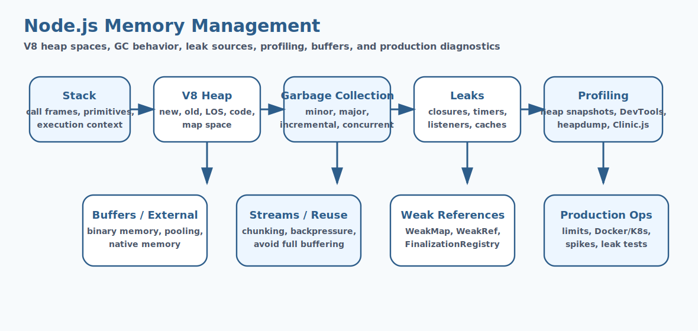

# Node.js Memory Management Interview Questions


This guide covers node.js memory management from interview basics to tricky production scenarios. It follows the corrected format of **100 interview questions for each subtopic**, and every answer includes a real Node.js code example with rotated real-world scenarios so the examples do not repeat verbatim.

## How To Use This Page

- Questions 1-100 cover Memory Basics.
- Questions 101-200 cover V8 Engine Memory Architecture.
- Questions 201-300 cover Garbage Collection.
- Questions 301-400 cover Memory Leaks.
- Questions 401-500 cover Memory Leak Detection.
- Questions 501-600 cover Heap Snapshots.
- Questions 601-700 cover Memory Profiling.
- Questions 701-800 cover Performance Monitoring.
- Questions 801-900 cover Buffers & Binary Memory.
- Questions 901-1000 cover Streams & Memory Efficiency.
- Questions 1001-1100 cover Advanced Memory Concepts.
- Questions 1101-1200 cover Memory Optimization Techniques.
- Questions 1201-1300 cover Async & Memory Impact.
- Questions 1301-1400 cover External Memory Usage.
- Questions 1401-1500 cover Thread Pool & Memory.
- Questions 1501-1600 cover Memory Limits & Scaling.
- Questions 1601-1700 cover Cache Management.
- Questions 1701-1800 cover Security & Memory.
- Questions 1801-1900 cover Debugging Memory Issues.
- Questions 1901-2000 cover Testing Memory Behavior.

## 1. Memory Basics

### Q1.1 What is memory basics in Node.js?

**Answer:**

Memory Basics matters in Node.js because it affects how memory basics affects runtime behavior and delivery decisions. In a real system like a high-traffic Node.js API serving customer traffic behind a load balancer, a strong answer should connect the concept to runtime behavior, delivery trade-offs, production debugging, and the way Node.js applications behave under load or failure. A senior-level answer also explains the operational impact so the answer reflects real Node.js engineering instead of textbook definitions.

**Code Example:**

```js
console.log(process.memoryUsage());
```

### Q1.2 Why does memory basics fundamentals matter in real Node.js applications?

**Answer:**

Memory Basics fundamentals matters in Node.js because it affects how memory basics should be understood before tackling deeper production issues. In a real system like a background worker processing queues and scheduled jobs in production, a strong answer should connect the concept to runtime behavior, delivery trade-offs, production debugging, and the way Node.js applications behave under load or failure. A senior-level answer also explains the operational impact so teams can connect the concept to runtime behavior and operational impact.

**Code Example:**

```js
const v8 = require('node:v8');
console.log(v8.getHeapStatistics());
```

### Q1.3 When should a team focus on memory basics design?

**Answer:**

Memory Basics design matters in Node.js because it affects how memory basics influences code structure and operational outcomes. In a real system like a CMS platform handling uploads, downloads, and rich admin workflows, a strong answer should connect the concept to runtime behavior, delivery trade-offs, production debugging, and the way Node.js applications behave under load or failure. A senior-level answer also explains the operational impact so production debugging becomes easier because the mechanics are clearer.

**Code Example:**

```js
const cache = new Map();
cache.set('user:42', { id: 42, name: 'Asha' });
```

### Q1.4 How would you explain memory basics debugging in a production discussion?

**Answer:**

Memory Basics debugging matters in Node.js because it affects how teams investigate problems related to memory basics in production. In a real system like a banking integration service where reliability and observability are tightly controlled, a strong answer should connect the concept to runtime behavior, delivery trade-offs, production debugging, and the way Node.js applications behave under load or failure. A senior-level answer also explains the operational impact so architecture choices become easier to defend in interviews and reviews.

**Code Example:**

```js
const tracked = [];
setInterval(() => tracked.push(Buffer.alloc(1024)), 1000);
```

### Q1.5 What is a common interview trap around memory basics trade-offs?

**Answer:**

Memory Basics trade-offs matters in Node.js because it affects how memory basics shapes performance, maintainability, or reliability decisions. In a real system like a healthcare backend where safe error handling and data validation matter deeply, a strong answer should connect the concept to runtime behavior, delivery trade-offs, production debugging, and the way Node.js applications behave under load or failure. A senior-level answer also explains the operational impact so performance, correctness, and maintainability are discussed together.

**Code Example:**

```js
const weak = new WeakMap();
const key = {};
weak.set(key, { active: true });
```

### Q1.6 How do you apply memory basics safely in practice?

**Answer:**

Memory Basics matters in Node.js because it affects how memory basics affects runtime behavior and delivery decisions. In a real system like a logistics platform coordinating events, retries, and distributed workflows, a strong answer should connect the concept to runtime behavior, delivery trade-offs, production debugging, and the way Node.js applications behave under load or failure. A senior-level answer also explains the operational impact so common Node.js pitfalls are easier to prevent before release.

**Code Example:**

```js
console.log(process.memoryUsage());
```

### Q1.7 What production issue usually exposes weak understanding of memory basics fundamentals?

**Answer:**

Memory Basics fundamentals matters in Node.js because it affects how memory basics should be understood before tackling deeper production issues. In a real system like an enterprise Express application with many middlewares and shared modules, a strong answer should connect the concept to runtime behavior, delivery trade-offs, production debugging, and the way Node.js applications behave under load or failure. A senior-level answer also explains the operational impact so the codebase stays easier to evolve as traffic and complexity grow.

**Code Example:**

```js
const v8 = require('node:v8');
console.log(v8.getHeapStatistics());
```

### Q1.8 How would a senior engineer justify memory basics design to a team?

**Answer:**

Memory Basics design matters in Node.js because it affects how memory basics influences code structure and operational outcomes. In a real system like a real-time dashboard service where event-loop behavior affects user experience, a strong answer should connect the concept to runtime behavior, delivery trade-offs, production debugging, and the way Node.js applications behave under load or failure. A senior-level answer also explains the operational impact so operational trade-offs are visible instead of hidden behind abstractions.

**Code Example:**

```js
const cache = new Map();
cache.set('user:42', { id: 42, name: 'Asha' });
```

### Q1.9 What trade-off does memory basics debugging introduce?

**Answer:**

Memory Basics debugging matters in Node.js because it affects how teams investigate problems related to memory basics in production. In a real system like a containerized Node.js deployment where startup, memory, and scaling all matter, a strong answer should connect the concept to runtime behavior, delivery trade-offs, production debugging, and the way Node.js applications behave under load or failure. A senior-level answer also explains the operational impact so the example ties Node.js internals to practical delivery concerns.

**Code Example:**

```js
const tracked = [];
setInterval(() => tracked.push(Buffer.alloc(1024)), 1000);
```

### Q1.10 How do you answer a tricky follow-up about memory basics trade-offs?

**Answer:**

Memory Basics trade-offs matters in Node.js because it affects how memory basics shapes performance, maintainability, or reliability decisions. In a real system like a migration effort from ad hoc scripts to a more maintainable Node.js architecture, a strong answer should connect the concept to runtime behavior, delivery trade-offs, production debugging, and the way Node.js applications behave under load or failure. A senior-level answer also explains the operational impact so new team members can understand the concept from both code and behavior.

**Code Example:**

```js
const weak = new WeakMap();
const key = {};
weak.set(key, { active: true });
```

### Q1.11 What is memory basics in Node.js?

**Answer:**

Memory Basics matters in Node.js because it affects how memory basics affects runtime behavior and delivery decisions. In a real system like a high-traffic Node.js API serving customer traffic behind a load balancer, a strong answer should connect the concept to runtime behavior, delivery trade-offs, production debugging, and the way Node.js applications behave under load or failure. A senior-level answer also explains the operational impact so the answer reflects real Node.js engineering instead of textbook definitions.

**Code Example:**

```js
console.log(process.memoryUsage());
```

### Q1.12 Why does memory basics fundamentals matter in real Node.js applications?

**Answer:**

Memory Basics fundamentals matters in Node.js because it affects how memory basics should be understood before tackling deeper production issues. In a real system like a background worker processing queues and scheduled jobs in production, a strong answer should connect the concept to runtime behavior, delivery trade-offs, production debugging, and the way Node.js applications behave under load or failure. A senior-level answer also explains the operational impact so teams can connect the concept to runtime behavior and operational impact.

**Code Example:**

```js
const v8 = require('node:v8');
console.log(v8.getHeapStatistics());
```

### Q1.13 When should a team focus on memory basics design?

**Answer:**

Memory Basics design matters in Node.js because it affects how memory basics influences code structure and operational outcomes. In a real system like a CMS platform handling uploads, downloads, and rich admin workflows, a strong answer should connect the concept to runtime behavior, delivery trade-offs, production debugging, and the way Node.js applications behave under load or failure. A senior-level answer also explains the operational impact so production debugging becomes easier because the mechanics are clearer.

**Code Example:**

```js
const cache = new Map();
cache.set('user:42', { id: 42, name: 'Asha' });
```

### Q1.14 How would you explain memory basics debugging in a production discussion?

**Answer:**

Memory Basics debugging matters in Node.js because it affects how teams investigate problems related to memory basics in production. In a real system like a banking integration service where reliability and observability are tightly controlled, a strong answer should connect the concept to runtime behavior, delivery trade-offs, production debugging, and the way Node.js applications behave under load or failure. A senior-level answer also explains the operational impact so architecture choices become easier to defend in interviews and reviews.

**Code Example:**

```js
const tracked = [];
setInterval(() => tracked.push(Buffer.alloc(1024)), 1000);
```

### Q1.15 What is a common interview trap around memory basics trade-offs?

**Answer:**

Memory Basics trade-offs matters in Node.js because it affects how memory basics shapes performance, maintainability, or reliability decisions. In a real system like a healthcare backend where safe error handling and data validation matter deeply, a strong answer should connect the concept to runtime behavior, delivery trade-offs, production debugging, and the way Node.js applications behave under load or failure. A senior-level answer also explains the operational impact so performance, correctness, and maintainability are discussed together.

**Code Example:**

```js
const weak = new WeakMap();
const key = {};
weak.set(key, { active: true });
```

### Q1.16 How do you apply memory basics safely in practice?

**Answer:**

Memory Basics matters in Node.js because it affects how memory basics affects runtime behavior and delivery decisions. In a real system like a logistics platform coordinating events, retries, and distributed workflows, a strong answer should connect the concept to runtime behavior, delivery trade-offs, production debugging, and the way Node.js applications behave under load or failure. A senior-level answer also explains the operational impact so common Node.js pitfalls are easier to prevent before release.

**Code Example:**

```js
console.log(process.memoryUsage());
```

### Q1.17 What production issue usually exposes weak understanding of memory basics fundamentals?

**Answer:**

Memory Basics fundamentals matters in Node.js because it affects how memory basics should be understood before tackling deeper production issues. In a real system like an enterprise Express application with many middlewares and shared modules, a strong answer should connect the concept to runtime behavior, delivery trade-offs, production debugging, and the way Node.js applications behave under load or failure. A senior-level answer also explains the operational impact so the codebase stays easier to evolve as traffic and complexity grow.

**Code Example:**

```js
const v8 = require('node:v8');
console.log(v8.getHeapStatistics());
```

### Q1.18 How would a senior engineer justify memory basics design to a team?

**Answer:**

Memory Basics design matters in Node.js because it affects how memory basics influences code structure and operational outcomes. In a real system like a real-time dashboard service where event-loop behavior affects user experience, a strong answer should connect the concept to runtime behavior, delivery trade-offs, production debugging, and the way Node.js applications behave under load or failure. A senior-level answer also explains the operational impact so operational trade-offs are visible instead of hidden behind abstractions.

**Code Example:**

```js
const cache = new Map();
cache.set('user:42', { id: 42, name: 'Asha' });
```

### Q1.19 What trade-off does memory basics debugging introduce?

**Answer:**

Memory Basics debugging matters in Node.js because it affects how teams investigate problems related to memory basics in production. In a real system like a containerized Node.js deployment where startup, memory, and scaling all matter, a strong answer should connect the concept to runtime behavior, delivery trade-offs, production debugging, and the way Node.js applications behave under load or failure. A senior-level answer also explains the operational impact so the example ties Node.js internals to practical delivery concerns.

**Code Example:**

```js
const tracked = [];
setInterval(() => tracked.push(Buffer.alloc(1024)), 1000);
```

### Q1.20 How do you answer a tricky follow-up about memory basics trade-offs?

**Answer:**

Memory Basics trade-offs matters in Node.js because it affects how memory basics shapes performance, maintainability, or reliability decisions. In a real system like a migration effort from ad hoc scripts to a more maintainable Node.js architecture, a strong answer should connect the concept to runtime behavior, delivery trade-offs, production debugging, and the way Node.js applications behave under load or failure. A senior-level answer also explains the operational impact so new team members can understand the concept from both code and behavior.

**Code Example:**

```js
const weak = new WeakMap();
const key = {};
weak.set(key, { active: true });
```

### Q1.21 What is memory basics in Node.js?

**Answer:**

Memory Basics matters in Node.js because it affects how memory basics affects runtime behavior and delivery decisions. In a real system like a high-traffic Node.js API serving customer traffic behind a load balancer, a strong answer should connect the concept to runtime behavior, delivery trade-offs, production debugging, and the way Node.js applications behave under load or failure. A senior-level answer also explains the operational impact so the answer reflects real Node.js engineering instead of textbook definitions.

**Code Example:**

```js
console.log(process.memoryUsage());
```

### Q1.22 Why does memory basics fundamentals matter in real Node.js applications?

**Answer:**

Memory Basics fundamentals matters in Node.js because it affects how memory basics should be understood before tackling deeper production issues. In a real system like a background worker processing queues and scheduled jobs in production, a strong answer should connect the concept to runtime behavior, delivery trade-offs, production debugging, and the way Node.js applications behave under load or failure. A senior-level answer also explains the operational impact so teams can connect the concept to runtime behavior and operational impact.

**Code Example:**

```js
const v8 = require('node:v8');
console.log(v8.getHeapStatistics());
```

### Q1.23 When should a team focus on memory basics design?

**Answer:**

Memory Basics design matters in Node.js because it affects how memory basics influences code structure and operational outcomes. In a real system like a CMS platform handling uploads, downloads, and rich admin workflows, a strong answer should connect the concept to runtime behavior, delivery trade-offs, production debugging, and the way Node.js applications behave under load or failure. A senior-level answer also explains the operational impact so production debugging becomes easier because the mechanics are clearer.

**Code Example:**

```js
const cache = new Map();
cache.set('user:42', { id: 42, name: 'Asha' });
```

### Q1.24 How would you explain memory basics debugging in a production discussion?

**Answer:**

Memory Basics debugging matters in Node.js because it affects how teams investigate problems related to memory basics in production. In a real system like a banking integration service where reliability and observability are tightly controlled, a strong answer should connect the concept to runtime behavior, delivery trade-offs, production debugging, and the way Node.js applications behave under load or failure. A senior-level answer also explains the operational impact so architecture choices become easier to defend in interviews and reviews.

**Code Example:**

```js
const tracked = [];
setInterval(() => tracked.push(Buffer.alloc(1024)), 1000);
```

### Q1.25 What is a common interview trap around memory basics trade-offs?

**Answer:**

Memory Basics trade-offs matters in Node.js because it affects how memory basics shapes performance, maintainability, or reliability decisions. In a real system like a healthcare backend where safe error handling and data validation matter deeply, a strong answer should connect the concept to runtime behavior, delivery trade-offs, production debugging, and the way Node.js applications behave under load or failure. A senior-level answer also explains the operational impact so performance, correctness, and maintainability are discussed together.

**Code Example:**

```js
const weak = new WeakMap();
const key = {};
weak.set(key, { active: true });
```

### Q1.26 How do you apply memory basics safely in practice?

**Answer:**

Memory Basics matters in Node.js because it affects how memory basics affects runtime behavior and delivery decisions. In a real system like a logistics platform coordinating events, retries, and distributed workflows, a strong answer should connect the concept to runtime behavior, delivery trade-offs, production debugging, and the way Node.js applications behave under load or failure. A senior-level answer also explains the operational impact so common Node.js pitfalls are easier to prevent before release.

**Code Example:**

```js
console.log(process.memoryUsage());
```

### Q1.27 What production issue usually exposes weak understanding of memory basics fundamentals?

**Answer:**

Memory Basics fundamentals matters in Node.js because it affects how memory basics should be understood before tackling deeper production issues. In a real system like an enterprise Express application with many middlewares and shared modules, a strong answer should connect the concept to runtime behavior, delivery trade-offs, production debugging, and the way Node.js applications behave under load or failure. A senior-level answer also explains the operational impact so the codebase stays easier to evolve as traffic and complexity grow.

**Code Example:**

```js
const v8 = require('node:v8');
console.log(v8.getHeapStatistics());
```

### Q1.28 How would a senior engineer justify memory basics design to a team?

**Answer:**

Memory Basics design matters in Node.js because it affects how memory basics influences code structure and operational outcomes. In a real system like a real-time dashboard service where event-loop behavior affects user experience, a strong answer should connect the concept to runtime behavior, delivery trade-offs, production debugging, and the way Node.js applications behave under load or failure. A senior-level answer also explains the operational impact so operational trade-offs are visible instead of hidden behind abstractions.

**Code Example:**

```js
const cache = new Map();
cache.set('user:42', { id: 42, name: 'Asha' });
```

### Q1.29 What trade-off does memory basics debugging introduce?

**Answer:**

Memory Basics debugging matters in Node.js because it affects how teams investigate problems related to memory basics in production. In a real system like a containerized Node.js deployment where startup, memory, and scaling all matter, a strong answer should connect the concept to runtime behavior, delivery trade-offs, production debugging, and the way Node.js applications behave under load or failure. A senior-level answer also explains the operational impact so the example ties Node.js internals to practical delivery concerns.

**Code Example:**

```js
const tracked = [];
setInterval(() => tracked.push(Buffer.alloc(1024)), 1000);
```

### Q1.30 How do you answer a tricky follow-up about memory basics trade-offs?

**Answer:**

Memory Basics trade-offs matters in Node.js because it affects how memory basics shapes performance, maintainability, or reliability decisions. In a real system like a migration effort from ad hoc scripts to a more maintainable Node.js architecture, a strong answer should connect the concept to runtime behavior, delivery trade-offs, production debugging, and the way Node.js applications behave under load or failure. A senior-level answer also explains the operational impact so new team members can understand the concept from both code and behavior.

**Code Example:**

```js
const weak = new WeakMap();
const key = {};
weak.set(key, { active: true });
```

### Q1.31 What is memory basics in Node.js?

**Answer:**

Memory Basics matters in Node.js because it affects how memory basics affects runtime behavior and delivery decisions. In a real system like a high-traffic Node.js API serving customer traffic behind a load balancer, a strong answer should connect the concept to runtime behavior, delivery trade-offs, production debugging, and the way Node.js applications behave under load or failure. A senior-level answer also explains the operational impact so the answer reflects real Node.js engineering instead of textbook definitions.

**Code Example:**

```js
console.log(process.memoryUsage());
```

### Q1.32 Why does memory basics fundamentals matter in real Node.js applications?

**Answer:**

Memory Basics fundamentals matters in Node.js because it affects how memory basics should be understood before tackling deeper production issues. In a real system like a background worker processing queues and scheduled jobs in production, a strong answer should connect the concept to runtime behavior, delivery trade-offs, production debugging, and the way Node.js applications behave under load or failure. A senior-level answer also explains the operational impact so teams can connect the concept to runtime behavior and operational impact.

**Code Example:**

```js
const v8 = require('node:v8');
console.log(v8.getHeapStatistics());
```

### Q1.33 When should a team focus on memory basics design?

**Answer:**

Memory Basics design matters in Node.js because it affects how memory basics influences code structure and operational outcomes. In a real system like a CMS platform handling uploads, downloads, and rich admin workflows, a strong answer should connect the concept to runtime behavior, delivery trade-offs, production debugging, and the way Node.js applications behave under load or failure. A senior-level answer also explains the operational impact so production debugging becomes easier because the mechanics are clearer.

**Code Example:**

```js
const cache = new Map();
cache.set('user:42', { id: 42, name: 'Asha' });
```

### Q1.34 How would you explain memory basics debugging in a production discussion?

**Answer:**

Memory Basics debugging matters in Node.js because it affects how teams investigate problems related to memory basics in production. In a real system like a banking integration service where reliability and observability are tightly controlled, a strong answer should connect the concept to runtime behavior, delivery trade-offs, production debugging, and the way Node.js applications behave under load or failure. A senior-level answer also explains the operational impact so architecture choices become easier to defend in interviews and reviews.

**Code Example:**

```js
const tracked = [];
setInterval(() => tracked.push(Buffer.alloc(1024)), 1000);
```

### Q1.35 What is a common interview trap around memory basics trade-offs?

**Answer:**

Memory Basics trade-offs matters in Node.js because it affects how memory basics shapes performance, maintainability, or reliability decisions. In a real system like a healthcare backend where safe error handling and data validation matter deeply, a strong answer should connect the concept to runtime behavior, delivery trade-offs, production debugging, and the way Node.js applications behave under load or failure. A senior-level answer also explains the operational impact so performance, correctness, and maintainability are discussed together.

**Code Example:**

```js
const weak = new WeakMap();
const key = {};
weak.set(key, { active: true });
```

### Q1.36 How do you apply memory basics safely in practice?

**Answer:**

Memory Basics matters in Node.js because it affects how memory basics affects runtime behavior and delivery decisions. In a real system like a logistics platform coordinating events, retries, and distributed workflows, a strong answer should connect the concept to runtime behavior, delivery trade-offs, production debugging, and the way Node.js applications behave under load or failure. A senior-level answer also explains the operational impact so common Node.js pitfalls are easier to prevent before release.

**Code Example:**

```js
console.log(process.memoryUsage());
```

### Q1.37 What production issue usually exposes weak understanding of memory basics fundamentals?

**Answer:**

Memory Basics fundamentals matters in Node.js because it affects how memory basics should be understood before tackling deeper production issues. In a real system like an enterprise Express application with many middlewares and shared modules, a strong answer should connect the concept to runtime behavior, delivery trade-offs, production debugging, and the way Node.js applications behave under load or failure. A senior-level answer also explains the operational impact so the codebase stays easier to evolve as traffic and complexity grow.

**Code Example:**

```js
const v8 = require('node:v8');
console.log(v8.getHeapStatistics());
```

### Q1.38 How would a senior engineer justify memory basics design to a team?

**Answer:**

Memory Basics design matters in Node.js because it affects how memory basics influences code structure and operational outcomes. In a real system like a real-time dashboard service where event-loop behavior affects user experience, a strong answer should connect the concept to runtime behavior, delivery trade-offs, production debugging, and the way Node.js applications behave under load or failure. A senior-level answer also explains the operational impact so operational trade-offs are visible instead of hidden behind abstractions.

**Code Example:**

```js
const cache = new Map();
cache.set('user:42', { id: 42, name: 'Asha' });
```

### Q1.39 What trade-off does memory basics debugging introduce?

**Answer:**

Memory Basics debugging matters in Node.js because it affects how teams investigate problems related to memory basics in production. In a real system like a containerized Node.js deployment where startup, memory, and scaling all matter, a strong answer should connect the concept to runtime behavior, delivery trade-offs, production debugging, and the way Node.js applications behave under load or failure. A senior-level answer also explains the operational impact so the example ties Node.js internals to practical delivery concerns.

**Code Example:**

```js
const tracked = [];
setInterval(() => tracked.push(Buffer.alloc(1024)), 1000);
```

### Q1.40 How do you answer a tricky follow-up about memory basics trade-offs?

**Answer:**

Memory Basics trade-offs matters in Node.js because it affects how memory basics shapes performance, maintainability, or reliability decisions. In a real system like a migration effort from ad hoc scripts to a more maintainable Node.js architecture, a strong answer should connect the concept to runtime behavior, delivery trade-offs, production debugging, and the way Node.js applications behave under load or failure. A senior-level answer also explains the operational impact so new team members can understand the concept from both code and behavior.

**Code Example:**

```js
const weak = new WeakMap();
const key = {};
weak.set(key, { active: true });
```

### Q1.41 What is memory basics in Node.js?

**Answer:**

Memory Basics matters in Node.js because it affects how memory basics affects runtime behavior and delivery decisions. In a real system like a high-traffic Node.js API serving customer traffic behind a load balancer, a strong answer should connect the concept to runtime behavior, delivery trade-offs, production debugging, and the way Node.js applications behave under load or failure. A senior-level answer also explains the operational impact so the answer reflects real Node.js engineering instead of textbook definitions.

**Code Example:**

```js
console.log(process.memoryUsage());
```

### Q1.42 Why does memory basics fundamentals matter in real Node.js applications?

**Answer:**

Memory Basics fundamentals matters in Node.js because it affects how memory basics should be understood before tackling deeper production issues. In a real system like a background worker processing queues and scheduled jobs in production, a strong answer should connect the concept to runtime behavior, delivery trade-offs, production debugging, and the way Node.js applications behave under load or failure. A senior-level answer also explains the operational impact so teams can connect the concept to runtime behavior and operational impact.

**Code Example:**

```js
const v8 = require('node:v8');
console.log(v8.getHeapStatistics());
```

### Q1.43 When should a team focus on memory basics design?

**Answer:**

Memory Basics design matters in Node.js because it affects how memory basics influences code structure and operational outcomes. In a real system like a CMS platform handling uploads, downloads, and rich admin workflows, a strong answer should connect the concept to runtime behavior, delivery trade-offs, production debugging, and the way Node.js applications behave under load or failure. A senior-level answer also explains the operational impact so production debugging becomes easier because the mechanics are clearer.

**Code Example:**

```js
const cache = new Map();
cache.set('user:42', { id: 42, name: 'Asha' });
```

### Q1.44 How would you explain memory basics debugging in a production discussion?

**Answer:**

Memory Basics debugging matters in Node.js because it affects how teams investigate problems related to memory basics in production. In a real system like a banking integration service where reliability and observability are tightly controlled, a strong answer should connect the concept to runtime behavior, delivery trade-offs, production debugging, and the way Node.js applications behave under load or failure. A senior-level answer also explains the operational impact so architecture choices become easier to defend in interviews and reviews.

**Code Example:**

```js
const tracked = [];
setInterval(() => tracked.push(Buffer.alloc(1024)), 1000);
```

### Q1.45 What is a common interview trap around memory basics trade-offs?

**Answer:**

Memory Basics trade-offs matters in Node.js because it affects how memory basics shapes performance, maintainability, or reliability decisions. In a real system like a healthcare backend where safe error handling and data validation matter deeply, a strong answer should connect the concept to runtime behavior, delivery trade-offs, production debugging, and the way Node.js applications behave under load or failure. A senior-level answer also explains the operational impact so performance, correctness, and maintainability are discussed together.

**Code Example:**

```js
const weak = new WeakMap();
const key = {};
weak.set(key, { active: true });
```

### Q1.46 How do you apply memory basics safely in practice?

**Answer:**

Memory Basics matters in Node.js because it affects how memory basics affects runtime behavior and delivery decisions. In a real system like a logistics platform coordinating events, retries, and distributed workflows, a strong answer should connect the concept to runtime behavior, delivery trade-offs, production debugging, and the way Node.js applications behave under load or failure. A senior-level answer also explains the operational impact so common Node.js pitfalls are easier to prevent before release.

**Code Example:**

```js
console.log(process.memoryUsage());
```

### Q1.47 What production issue usually exposes weak understanding of memory basics fundamentals?

**Answer:**

Memory Basics fundamentals matters in Node.js because it affects how memory basics should be understood before tackling deeper production issues. In a real system like an enterprise Express application with many middlewares and shared modules, a strong answer should connect the concept to runtime behavior, delivery trade-offs, production debugging, and the way Node.js applications behave under load or failure. A senior-level answer also explains the operational impact so the codebase stays easier to evolve as traffic and complexity grow.

**Code Example:**

```js
const v8 = require('node:v8');
console.log(v8.getHeapStatistics());
```

### Q1.48 How would a senior engineer justify memory basics design to a team?

**Answer:**

Memory Basics design matters in Node.js because it affects how memory basics influences code structure and operational outcomes. In a real system like a real-time dashboard service where event-loop behavior affects user experience, a strong answer should connect the concept to runtime behavior, delivery trade-offs, production debugging, and the way Node.js applications behave under load or failure. A senior-level answer also explains the operational impact so operational trade-offs are visible instead of hidden behind abstractions.

**Code Example:**

```js
const cache = new Map();
cache.set('user:42', { id: 42, name: 'Asha' });
```

### Q1.49 What trade-off does memory basics debugging introduce?

**Answer:**

Memory Basics debugging matters in Node.js because it affects how teams investigate problems related to memory basics in production. In a real system like a containerized Node.js deployment where startup, memory, and scaling all matter, a strong answer should connect the concept to runtime behavior, delivery trade-offs, production debugging, and the way Node.js applications behave under load or failure. A senior-level answer also explains the operational impact so the example ties Node.js internals to practical delivery concerns.

**Code Example:**

```js
const tracked = [];
setInterval(() => tracked.push(Buffer.alloc(1024)), 1000);
```

### Q1.50 How do you answer a tricky follow-up about memory basics trade-offs?

**Answer:**

Memory Basics trade-offs matters in Node.js because it affects how memory basics shapes performance, maintainability, or reliability decisions. In a real system like a migration effort from ad hoc scripts to a more maintainable Node.js architecture, a strong answer should connect the concept to runtime behavior, delivery trade-offs, production debugging, and the way Node.js applications behave under load or failure. A senior-level answer also explains the operational impact so new team members can understand the concept from both code and behavior.

**Code Example:**

```js
const weak = new WeakMap();
const key = {};
weak.set(key, { active: true });
```

### Q1.51 What is memory basics in Node.js?

**Answer:**

Memory Basics matters in Node.js because it affects how memory basics affects runtime behavior and delivery decisions. In a real system like a high-traffic Node.js API serving customer traffic behind a load balancer, a strong answer should connect the concept to runtime behavior, delivery trade-offs, production debugging, and the way Node.js applications behave under load or failure. A senior-level answer also explains the operational impact so the answer reflects real Node.js engineering instead of textbook definitions.

**Code Example:**

```js
console.log(process.memoryUsage());
```

### Q1.52 Why does memory basics fundamentals matter in real Node.js applications?

**Answer:**

Memory Basics fundamentals matters in Node.js because it affects how memory basics should be understood before tackling deeper production issues. In a real system like a background worker processing queues and scheduled jobs in production, a strong answer should connect the concept to runtime behavior, delivery trade-offs, production debugging, and the way Node.js applications behave under load or failure. A senior-level answer also explains the operational impact so teams can connect the concept to runtime behavior and operational impact.

**Code Example:**

```js
const v8 = require('node:v8');
console.log(v8.getHeapStatistics());
```

### Q1.53 When should a team focus on memory basics design?

**Answer:**

Memory Basics design matters in Node.js because it affects how memory basics influences code structure and operational outcomes. In a real system like a CMS platform handling uploads, downloads, and rich admin workflows, a strong answer should connect the concept to runtime behavior, delivery trade-offs, production debugging, and the way Node.js applications behave under load or failure. A senior-level answer also explains the operational impact so production debugging becomes easier because the mechanics are clearer.

**Code Example:**

```js
const cache = new Map();
cache.set('user:42', { id: 42, name: 'Asha' });
```

### Q1.54 How would you explain memory basics debugging in a production discussion?

**Answer:**

Memory Basics debugging matters in Node.js because it affects how teams investigate problems related to memory basics in production. In a real system like a banking integration service where reliability and observability are tightly controlled, a strong answer should connect the concept to runtime behavior, delivery trade-offs, production debugging, and the way Node.js applications behave under load or failure. A senior-level answer also explains the operational impact so architecture choices become easier to defend in interviews and reviews.

**Code Example:**

```js
const tracked = [];
setInterval(() => tracked.push(Buffer.alloc(1024)), 1000);
```

### Q1.55 What is a common interview trap around memory basics trade-offs?

**Answer:**

Memory Basics trade-offs matters in Node.js because it affects how memory basics shapes performance, maintainability, or reliability decisions. In a real system like a healthcare backend where safe error handling and data validation matter deeply, a strong answer should connect the concept to runtime behavior, delivery trade-offs, production debugging, and the way Node.js applications behave under load or failure. A senior-level answer also explains the operational impact so performance, correctness, and maintainability are discussed together.

**Code Example:**

```js
const weak = new WeakMap();
const key = {};
weak.set(key, { active: true });
```

### Q1.56 How do you apply memory basics safely in practice?

**Answer:**

Memory Basics matters in Node.js because it affects how memory basics affects runtime behavior and delivery decisions. In a real system like a logistics platform coordinating events, retries, and distributed workflows, a strong answer should connect the concept to runtime behavior, delivery trade-offs, production debugging, and the way Node.js applications behave under load or failure. A senior-level answer also explains the operational impact so common Node.js pitfalls are easier to prevent before release.

**Code Example:**

```js
console.log(process.memoryUsage());
```

### Q1.57 What production issue usually exposes weak understanding of memory basics fundamentals?

**Answer:**

Memory Basics fundamentals matters in Node.js because it affects how memory basics should be understood before tackling deeper production issues. In a real system like an enterprise Express application with many middlewares and shared modules, a strong answer should connect the concept to runtime behavior, delivery trade-offs, production debugging, and the way Node.js applications behave under load or failure. A senior-level answer also explains the operational impact so the codebase stays easier to evolve as traffic and complexity grow.

**Code Example:**

```js
const v8 = require('node:v8');
console.log(v8.getHeapStatistics());
```

### Q1.58 How would a senior engineer justify memory basics design to a team?

**Answer:**

Memory Basics design matters in Node.js because it affects how memory basics influences code structure and operational outcomes. In a real system like a real-time dashboard service where event-loop behavior affects user experience, a strong answer should connect the concept to runtime behavior, delivery trade-offs, production debugging, and the way Node.js applications behave under load or failure. A senior-level answer also explains the operational impact so operational trade-offs are visible instead of hidden behind abstractions.

**Code Example:**

```js
const cache = new Map();
cache.set('user:42', { id: 42, name: 'Asha' });
```

### Q1.59 What trade-off does memory basics debugging introduce?

**Answer:**

Memory Basics debugging matters in Node.js because it affects how teams investigate problems related to memory basics in production. In a real system like a containerized Node.js deployment where startup, memory, and scaling all matter, a strong answer should connect the concept to runtime behavior, delivery trade-offs, production debugging, and the way Node.js applications behave under load or failure. A senior-level answer also explains the operational impact so the example ties Node.js internals to practical delivery concerns.

**Code Example:**

```js
const tracked = [];
setInterval(() => tracked.push(Buffer.alloc(1024)), 1000);
```

### Q1.60 How do you answer a tricky follow-up about memory basics trade-offs?

**Answer:**

Memory Basics trade-offs matters in Node.js because it affects how memory basics shapes performance, maintainability, or reliability decisions. In a real system like a migration effort from ad hoc scripts to a more maintainable Node.js architecture, a strong answer should connect the concept to runtime behavior, delivery trade-offs, production debugging, and the way Node.js applications behave under load or failure. A senior-level answer also explains the operational impact so new team members can understand the concept from both code and behavior.

**Code Example:**

```js
const weak = new WeakMap();
const key = {};
weak.set(key, { active: true });
```

### Q1.61 What is memory basics in Node.js?

**Answer:**

Memory Basics matters in Node.js because it affects how memory basics affects runtime behavior and delivery decisions. In a real system like a high-traffic Node.js API serving customer traffic behind a load balancer, a strong answer should connect the concept to runtime behavior, delivery trade-offs, production debugging, and the way Node.js applications behave under load or failure. A senior-level answer also explains the operational impact so the answer reflects real Node.js engineering instead of textbook definitions.

**Code Example:**

```js
console.log(process.memoryUsage());
```

### Q1.62 Why does memory basics fundamentals matter in real Node.js applications?

**Answer:**

Memory Basics fundamentals matters in Node.js because it affects how memory basics should be understood before tackling deeper production issues. In a real system like a background worker processing queues and scheduled jobs in production, a strong answer should connect the concept to runtime behavior, delivery trade-offs, production debugging, and the way Node.js applications behave under load or failure. A senior-level answer also explains the operational impact so teams can connect the concept to runtime behavior and operational impact.

**Code Example:**

```js
const v8 = require('node:v8');
console.log(v8.getHeapStatistics());
```

### Q1.63 When should a team focus on memory basics design?

**Answer:**

Memory Basics design matters in Node.js because it affects how memory basics influences code structure and operational outcomes. In a real system like a CMS platform handling uploads, downloads, and rich admin workflows, a strong answer should connect the concept to runtime behavior, delivery trade-offs, production debugging, and the way Node.js applications behave under load or failure. A senior-level answer also explains the operational impact so production debugging becomes easier because the mechanics are clearer.

**Code Example:**

```js
const cache = new Map();
cache.set('user:42', { id: 42, name: 'Asha' });
```

### Q1.64 How would you explain memory basics debugging in a production discussion?

**Answer:**

Memory Basics debugging matters in Node.js because it affects how teams investigate problems related to memory basics in production. In a real system like a banking integration service where reliability and observability are tightly controlled, a strong answer should connect the concept to runtime behavior, delivery trade-offs, production debugging, and the way Node.js applications behave under load or failure. A senior-level answer also explains the operational impact so architecture choices become easier to defend in interviews and reviews.

**Code Example:**

```js
const tracked = [];
setInterval(() => tracked.push(Buffer.alloc(1024)), 1000);
```

### Q1.65 What is a common interview trap around memory basics trade-offs?

**Answer:**

Memory Basics trade-offs matters in Node.js because it affects how memory basics shapes performance, maintainability, or reliability decisions. In a real system like a healthcare backend where safe error handling and data validation matter deeply, a strong answer should connect the concept to runtime behavior, delivery trade-offs, production debugging, and the way Node.js applications behave under load or failure. A senior-level answer also explains the operational impact so performance, correctness, and maintainability are discussed together.

**Code Example:**

```js
const weak = new WeakMap();
const key = {};
weak.set(key, { active: true });
```

### Q1.66 How do you apply memory basics safely in practice?

**Answer:**

Memory Basics matters in Node.js because it affects how memory basics affects runtime behavior and delivery decisions. In a real system like a logistics platform coordinating events, retries, and distributed workflows, a strong answer should connect the concept to runtime behavior, delivery trade-offs, production debugging, and the way Node.js applications behave under load or failure. A senior-level answer also explains the operational impact so common Node.js pitfalls are easier to prevent before release.

**Code Example:**

```js
console.log(process.memoryUsage());
```

### Q1.67 What production issue usually exposes weak understanding of memory basics fundamentals?

**Answer:**

Memory Basics fundamentals matters in Node.js because it affects how memory basics should be understood before tackling deeper production issues. In a real system like an enterprise Express application with many middlewares and shared modules, a strong answer should connect the concept to runtime behavior, delivery trade-offs, production debugging, and the way Node.js applications behave under load or failure. A senior-level answer also explains the operational impact so the codebase stays easier to evolve as traffic and complexity grow.

**Code Example:**

```js
const v8 = require('node:v8');
console.log(v8.getHeapStatistics());
```

### Q1.68 How would a senior engineer justify memory basics design to a team?

**Answer:**

Memory Basics design matters in Node.js because it affects how memory basics influences code structure and operational outcomes. In a real system like a real-time dashboard service where event-loop behavior affects user experience, a strong answer should connect the concept to runtime behavior, delivery trade-offs, production debugging, and the way Node.js applications behave under load or failure. A senior-level answer also explains the operational impact so operational trade-offs are visible instead of hidden behind abstractions.

**Code Example:**

```js
const cache = new Map();
cache.set('user:42', { id: 42, name: 'Asha' });
```

### Q1.69 What trade-off does memory basics debugging introduce?

**Answer:**

Memory Basics debugging matters in Node.js because it affects how teams investigate problems related to memory basics in production. In a real system like a containerized Node.js deployment where startup, memory, and scaling all matter, a strong answer should connect the concept to runtime behavior, delivery trade-offs, production debugging, and the way Node.js applications behave under load or failure. A senior-level answer also explains the operational impact so the example ties Node.js internals to practical delivery concerns.

**Code Example:**

```js
const tracked = [];
setInterval(() => tracked.push(Buffer.alloc(1024)), 1000);
```

### Q1.70 How do you answer a tricky follow-up about memory basics trade-offs?

**Answer:**

Memory Basics trade-offs matters in Node.js because it affects how memory basics shapes performance, maintainability, or reliability decisions. In a real system like a migration effort from ad hoc scripts to a more maintainable Node.js architecture, a strong answer should connect the concept to runtime behavior, delivery trade-offs, production debugging, and the way Node.js applications behave under load or failure. A senior-level answer also explains the operational impact so new team members can understand the concept from both code and behavior.

**Code Example:**

```js
const weak = new WeakMap();
const key = {};
weak.set(key, { active: true });
```

### Q1.71 What is memory basics in Node.js?

**Answer:**

Memory Basics matters in Node.js because it affects how memory basics affects runtime behavior and delivery decisions. In a real system like a high-traffic Node.js API serving customer traffic behind a load balancer, a strong answer should connect the concept to runtime behavior, delivery trade-offs, production debugging, and the way Node.js applications behave under load or failure. A senior-level answer also explains the operational impact so the answer reflects real Node.js engineering instead of textbook definitions.

**Code Example:**

```js
console.log(process.memoryUsage());
```

### Q1.72 Why does memory basics fundamentals matter in real Node.js applications?

**Answer:**

Memory Basics fundamentals matters in Node.js because it affects how memory basics should be understood before tackling deeper production issues. In a real system like a background worker processing queues and scheduled jobs in production, a strong answer should connect the concept to runtime behavior, delivery trade-offs, production debugging, and the way Node.js applications behave under load or failure. A senior-level answer also explains the operational impact so teams can connect the concept to runtime behavior and operational impact.

**Code Example:**

```js
const v8 = require('node:v8');
console.log(v8.getHeapStatistics());
```

### Q1.73 When should a team focus on memory basics design?

**Answer:**

Memory Basics design matters in Node.js because it affects how memory basics influences code structure and operational outcomes. In a real system like a CMS platform handling uploads, downloads, and rich admin workflows, a strong answer should connect the concept to runtime behavior, delivery trade-offs, production debugging, and the way Node.js applications behave under load or failure. A senior-level answer also explains the operational impact so production debugging becomes easier because the mechanics are clearer.

**Code Example:**

```js
const cache = new Map();
cache.set('user:42', { id: 42, name: 'Asha' });
```

### Q1.74 How would you explain memory basics debugging in a production discussion?

**Answer:**

Memory Basics debugging matters in Node.js because it affects how teams investigate problems related to memory basics in production. In a real system like a banking integration service where reliability and observability are tightly controlled, a strong answer should connect the concept to runtime behavior, delivery trade-offs, production debugging, and the way Node.js applications behave under load or failure. A senior-level answer also explains the operational impact so architecture choices become easier to defend in interviews and reviews.

**Code Example:**

```js
const tracked = [];
setInterval(() => tracked.push(Buffer.alloc(1024)), 1000);
```

### Q1.75 What is a common interview trap around memory basics trade-offs?

**Answer:**

Memory Basics trade-offs matters in Node.js because it affects how memory basics shapes performance, maintainability, or reliability decisions. In a real system like a healthcare backend where safe error handling and data validation matter deeply, a strong answer should connect the concept to runtime behavior, delivery trade-offs, production debugging, and the way Node.js applications behave under load or failure. A senior-level answer also explains the operational impact so performance, correctness, and maintainability are discussed together.

**Code Example:**

```js
const weak = new WeakMap();
const key = {};
weak.set(key, { active: true });
```

### Q1.76 How do you apply memory basics safely in practice?

**Answer:**

Memory Basics matters in Node.js because it affects how memory basics affects runtime behavior and delivery decisions. In a real system like a logistics platform coordinating events, retries, and distributed workflows, a strong answer should connect the concept to runtime behavior, delivery trade-offs, production debugging, and the way Node.js applications behave under load or failure. A senior-level answer also explains the operational impact so common Node.js pitfalls are easier to prevent before release.

**Code Example:**

```js
console.log(process.memoryUsage());
```

### Q1.77 What production issue usually exposes weak understanding of memory basics fundamentals?

**Answer:**

Memory Basics fundamentals matters in Node.js because it affects how memory basics should be understood before tackling deeper production issues. In a real system like an enterprise Express application with many middlewares and shared modules, a strong answer should connect the concept to runtime behavior, delivery trade-offs, production debugging, and the way Node.js applications behave under load or failure. A senior-level answer also explains the operational impact so the codebase stays easier to evolve as traffic and complexity grow.

**Code Example:**

```js
const v8 = require('node:v8');
console.log(v8.getHeapStatistics());
```

### Q1.78 How would a senior engineer justify memory basics design to a team?

**Answer:**

Memory Basics design matters in Node.js because it affects how memory basics influences code structure and operational outcomes. In a real system like a real-time dashboard service where event-loop behavior affects user experience, a strong answer should connect the concept to runtime behavior, delivery trade-offs, production debugging, and the way Node.js applications behave under load or failure. A senior-level answer also explains the operational impact so operational trade-offs are visible instead of hidden behind abstractions.

**Code Example:**

```js
const cache = new Map();
cache.set('user:42', { id: 42, name: 'Asha' });
```

### Q1.79 What trade-off does memory basics debugging introduce?

**Answer:**

Memory Basics debugging matters in Node.js because it affects how teams investigate problems related to memory basics in production. In a real system like a containerized Node.js deployment where startup, memory, and scaling all matter, a strong answer should connect the concept to runtime behavior, delivery trade-offs, production debugging, and the way Node.js applications behave under load or failure. A senior-level answer also explains the operational impact so the example ties Node.js internals to practical delivery concerns.

**Code Example:**

```js
const tracked = [];
setInterval(() => tracked.push(Buffer.alloc(1024)), 1000);
```

### Q1.80 How do you answer a tricky follow-up about memory basics trade-offs?

**Answer:**

Memory Basics trade-offs matters in Node.js because it affects how memory basics shapes performance, maintainability, or reliability decisions. In a real system like a migration effort from ad hoc scripts to a more maintainable Node.js architecture, a strong answer should connect the concept to runtime behavior, delivery trade-offs, production debugging, and the way Node.js applications behave under load or failure. A senior-level answer also explains the operational impact so new team members can understand the concept from both code and behavior.

**Code Example:**

```js
const weak = new WeakMap();
const key = {};
weak.set(key, { active: true });
```

### Q1.81 What is memory basics in Node.js?

**Answer:**

Memory Basics matters in Node.js because it affects how memory basics affects runtime behavior and delivery decisions. In a real system like a high-traffic Node.js API serving customer traffic behind a load balancer, a strong answer should connect the concept to runtime behavior, delivery trade-offs, production debugging, and the way Node.js applications behave under load or failure. A senior-level answer also explains the operational impact so the answer reflects real Node.js engineering instead of textbook definitions.

**Code Example:**

```js
console.log(process.memoryUsage());
```

### Q1.82 Why does memory basics fundamentals matter in real Node.js applications?

**Answer:**

Memory Basics fundamentals matters in Node.js because it affects how memory basics should be understood before tackling deeper production issues. In a real system like a background worker processing queues and scheduled jobs in production, a strong answer should connect the concept to runtime behavior, delivery trade-offs, production debugging, and the way Node.js applications behave under load or failure. A senior-level answer also explains the operational impact so teams can connect the concept to runtime behavior and operational impact.

**Code Example:**

```js
const v8 = require('node:v8');
console.log(v8.getHeapStatistics());
```

### Q1.83 When should a team focus on memory basics design?

**Answer:**

Memory Basics design matters in Node.js because it affects how memory basics influences code structure and operational outcomes. In a real system like a CMS platform handling uploads, downloads, and rich admin workflows, a strong answer should connect the concept to runtime behavior, delivery trade-offs, production debugging, and the way Node.js applications behave under load or failure. A senior-level answer also explains the operational impact so production debugging becomes easier because the mechanics are clearer.

**Code Example:**

```js
const cache = new Map();
cache.set('user:42', { id: 42, name: 'Asha' });
```

### Q1.84 How would you explain memory basics debugging in a production discussion?

**Answer:**

Memory Basics debugging matters in Node.js because it affects how teams investigate problems related to memory basics in production. In a real system like a banking integration service where reliability and observability are tightly controlled, a strong answer should connect the concept to runtime behavior, delivery trade-offs, production debugging, and the way Node.js applications behave under load or failure. A senior-level answer also explains the operational impact so architecture choices become easier to defend in interviews and reviews.

**Code Example:**

```js
const tracked = [];
setInterval(() => tracked.push(Buffer.alloc(1024)), 1000);
```

### Q1.85 What is a common interview trap around memory basics trade-offs?

**Answer:**

Memory Basics trade-offs matters in Node.js because it affects how memory basics shapes performance, maintainability, or reliability decisions. In a real system like a healthcare backend where safe error handling and data validation matter deeply, a strong answer should connect the concept to runtime behavior, delivery trade-offs, production debugging, and the way Node.js applications behave under load or failure. A senior-level answer also explains the operational impact so performance, correctness, and maintainability are discussed together.

**Code Example:**

```js
const weak = new WeakMap();
const key = {};
weak.set(key, { active: true });
```

### Q1.86 How do you apply memory basics safely in practice?

**Answer:**

Memory Basics matters in Node.js because it affects how memory basics affects runtime behavior and delivery decisions. In a real system like a logistics platform coordinating events, retries, and distributed workflows, a strong answer should connect the concept to runtime behavior, delivery trade-offs, production debugging, and the way Node.js applications behave under load or failure. A senior-level answer also explains the operational impact so common Node.js pitfalls are easier to prevent before release.

**Code Example:**

```js
console.log(process.memoryUsage());
```

### Q1.87 What production issue usually exposes weak understanding of memory basics fundamentals?

**Answer:**

Memory Basics fundamentals matters in Node.js because it affects how memory basics should be understood before tackling deeper production issues. In a real system like an enterprise Express application with many middlewares and shared modules, a strong answer should connect the concept to runtime behavior, delivery trade-offs, production debugging, and the way Node.js applications behave under load or failure. A senior-level answer also explains the operational impact so the codebase stays easier to evolve as traffic and complexity grow.

**Code Example:**

```js
const v8 = require('node:v8');
console.log(v8.getHeapStatistics());
```

### Q1.88 How would a senior engineer justify memory basics design to a team?

**Answer:**

Memory Basics design matters in Node.js because it affects how memory basics influences code structure and operational outcomes. In a real system like a real-time dashboard service where event-loop behavior affects user experience, a strong answer should connect the concept to runtime behavior, delivery trade-offs, production debugging, and the way Node.js applications behave under load or failure. A senior-level answer also explains the operational impact so operational trade-offs are visible instead of hidden behind abstractions.

**Code Example:**

```js
const cache = new Map();
cache.set('user:42', { id: 42, name: 'Asha' });
```

### Q1.89 What trade-off does memory basics debugging introduce?

**Answer:**

Memory Basics debugging matters in Node.js because it affects how teams investigate problems related to memory basics in production. In a real system like a containerized Node.js deployment where startup, memory, and scaling all matter, a strong answer should connect the concept to runtime behavior, delivery trade-offs, production debugging, and the way Node.js applications behave under load or failure. A senior-level answer also explains the operational impact so the example ties Node.js internals to practical delivery concerns.

**Code Example:**

```js
const tracked = [];
setInterval(() => tracked.push(Buffer.alloc(1024)), 1000);
```

### Q1.90 How do you answer a tricky follow-up about memory basics trade-offs?

**Answer:**

Memory Basics trade-offs matters in Node.js because it affects how memory basics shapes performance, maintainability, or reliability decisions. In a real system like a migration effort from ad hoc scripts to a more maintainable Node.js architecture, a strong answer should connect the concept to runtime behavior, delivery trade-offs, production debugging, and the way Node.js applications behave under load or failure. A senior-level answer also explains the operational impact so new team members can understand the concept from both code and behavior.

**Code Example:**

```js
const weak = new WeakMap();
const key = {};
weak.set(key, { active: true });
```

### Q1.91 What is memory basics in Node.js?

**Answer:**

Memory Basics matters in Node.js because it affects how memory basics affects runtime behavior and delivery decisions. In a real system like a high-traffic Node.js API serving customer traffic behind a load balancer, a strong answer should connect the concept to runtime behavior, delivery trade-offs, production debugging, and the way Node.js applications behave under load or failure. A senior-level answer also explains the operational impact so the answer reflects real Node.js engineering instead of textbook definitions.

**Code Example:**

```js
console.log(process.memoryUsage());
```

### Q1.92 Why does memory basics fundamentals matter in real Node.js applications?

**Answer:**

Memory Basics fundamentals matters in Node.js because it affects how memory basics should be understood before tackling deeper production issues. In a real system like a background worker processing queues and scheduled jobs in production, a strong answer should connect the concept to runtime behavior, delivery trade-offs, production debugging, and the way Node.js applications behave under load or failure. A senior-level answer also explains the operational impact so teams can connect the concept to runtime behavior and operational impact.

**Code Example:**

```js
const v8 = require('node:v8');
console.log(v8.getHeapStatistics());
```

### Q1.93 When should a team focus on memory basics design?

**Answer:**

Memory Basics design matters in Node.js because it affects how memory basics influences code structure and operational outcomes. In a real system like a CMS platform handling uploads, downloads, and rich admin workflows, a strong answer should connect the concept to runtime behavior, delivery trade-offs, production debugging, and the way Node.js applications behave under load or failure. A senior-level answer also explains the operational impact so production debugging becomes easier because the mechanics are clearer.

**Code Example:**

```js
const cache = new Map();
cache.set('user:42', { id: 42, name: 'Asha' });
```

### Q1.94 How would you explain memory basics debugging in a production discussion?

**Answer:**

Memory Basics debugging matters in Node.js because it affects how teams investigate problems related to memory basics in production. In a real system like a banking integration service where reliability and observability are tightly controlled, a strong answer should connect the concept to runtime behavior, delivery trade-offs, production debugging, and the way Node.js applications behave under load or failure. A senior-level answer also explains the operational impact so architecture choices become easier to defend in interviews and reviews.

**Code Example:**

```js
const tracked = [];
setInterval(() => tracked.push(Buffer.alloc(1024)), 1000);
```

### Q1.95 What is a common interview trap around memory basics trade-offs?

**Answer:**

Memory Basics trade-offs matters in Node.js because it affects how memory basics shapes performance, maintainability, or reliability decisions. In a real system like a healthcare backend where safe error handling and data validation matter deeply, a strong answer should connect the concept to runtime behavior, delivery trade-offs, production debugging, and the way Node.js applications behave under load or failure. A senior-level answer also explains the operational impact so performance, correctness, and maintainability are discussed together.

**Code Example:**

```js
const weak = new WeakMap();
const key = {};
weak.set(key, { active: true });
```

### Q1.96 How do you apply memory basics safely in practice?

**Answer:**

Memory Basics matters in Node.js because it affects how memory basics affects runtime behavior and delivery decisions. In a real system like a logistics platform coordinating events, retries, and distributed workflows, a strong answer should connect the concept to runtime behavior, delivery trade-offs, production debugging, and the way Node.js applications behave under load or failure. A senior-level answer also explains the operational impact so common Node.js pitfalls are easier to prevent before release.

**Code Example:**

```js
console.log(process.memoryUsage());
```

### Q1.97 What production issue usually exposes weak understanding of memory basics fundamentals?

**Answer:**

Memory Basics fundamentals matters in Node.js because it affects how memory basics should be understood before tackling deeper production issues. In a real system like an enterprise Express application with many middlewares and shared modules, a strong answer should connect the concept to runtime behavior, delivery trade-offs, production debugging, and the way Node.js applications behave under load or failure. A senior-level answer also explains the operational impact so the codebase stays easier to evolve as traffic and complexity grow.

**Code Example:**

```js
const v8 = require('node:v8');
console.log(v8.getHeapStatistics());
```

### Q1.98 How would a senior engineer justify memory basics design to a team?

**Answer:**

Memory Basics design matters in Node.js because it affects how memory basics influences code structure and operational outcomes. In a real system like a real-time dashboard service where event-loop behavior affects user experience, a strong answer should connect the concept to runtime behavior, delivery trade-offs, production debugging, and the way Node.js applications behave under load or failure. A senior-level answer also explains the operational impact so operational trade-offs are visible instead of hidden behind abstractions.

**Code Example:**

```js
const cache = new Map();
cache.set('user:42', { id: 42, name: 'Asha' });
```

### Q1.99 What trade-off does memory basics debugging introduce?

**Answer:**

Memory Basics debugging matters in Node.js because it affects how teams investigate problems related to memory basics in production. In a real system like a containerized Node.js deployment where startup, memory, and scaling all matter, a strong answer should connect the concept to runtime behavior, delivery trade-offs, production debugging, and the way Node.js applications behave under load or failure. A senior-level answer also explains the operational impact so the example ties Node.js internals to practical delivery concerns.

**Code Example:**

```js
const tracked = [];
setInterval(() => tracked.push(Buffer.alloc(1024)), 1000);
```

### Q1.100 How do you answer a tricky follow-up about memory basics trade-offs?

**Answer:**

Memory Basics trade-offs matters in Node.js because it affects how memory basics shapes performance, maintainability, or reliability decisions. In a real system like a migration effort from ad hoc scripts to a more maintainable Node.js architecture, a strong answer should connect the concept to runtime behavior, delivery trade-offs, production debugging, and the way Node.js applications behave under load or failure. A senior-level answer also explains the operational impact so new team members can understand the concept from both code and behavior.

**Code Example:**

```js
const weak = new WeakMap();
const key = {};
weak.set(key, { active: true });
```

## 2. V8 Engine Memory Architecture

### Q2.1 What is v8 engine memory architecture in Node.js?

**Answer:**

V8 Engine Memory Architecture matters in Node.js because it affects how v8 engine memory architecture affects runtime behavior and delivery decisions. In a real system like a high-traffic Node.js API serving customer traffic behind a load balancer, a strong answer should connect the concept to runtime behavior, delivery trade-offs, production debugging, and the way Node.js applications behave under load or failure. A senior-level answer also explains the operational impact so the answer reflects real Node.js engineering instead of textbook definitions.

**Code Example:**

```js
console.log(process.memoryUsage());
```

### Q2.2 Why does v8 engine memory architecture fundamentals matter in real Node.js applications?

**Answer:**

V8 Engine Memory Architecture fundamentals matters in Node.js because it affects how v8 engine memory architecture should be understood before tackling deeper production issues. In a real system like a background worker processing queues and scheduled jobs in production, a strong answer should connect the concept to runtime behavior, delivery trade-offs, production debugging, and the way Node.js applications behave under load or failure. A senior-level answer also explains the operational impact so teams can connect the concept to runtime behavior and operational impact.

**Code Example:**

```js
const v8 = require('node:v8');
console.log(v8.getHeapStatistics());
```

### Q2.3 When should a team focus on v8 engine memory architecture design?

**Answer:**

V8 Engine Memory Architecture design matters in Node.js because it affects how v8 engine memory architecture influences code structure and operational outcomes. In a real system like a CMS platform handling uploads, downloads, and rich admin workflows, a strong answer should connect the concept to runtime behavior, delivery trade-offs, production debugging, and the way Node.js applications behave under load or failure. A senior-level answer also explains the operational impact so production debugging becomes easier because the mechanics are clearer.

**Code Example:**

```js
const cache = new Map();
cache.set('user:42', { id: 42, name: 'Asha' });
```

### Q2.4 How would you explain v8 engine memory architecture debugging in a production discussion?

**Answer:**

V8 Engine Memory Architecture debugging matters in Node.js because it affects how teams investigate problems related to v8 engine memory architecture in production. In a real system like a banking integration service where reliability and observability are tightly controlled, a strong answer should connect the concept to runtime behavior, delivery trade-offs, production debugging, and the way Node.js applications behave under load or failure. A senior-level answer also explains the operational impact so architecture choices become easier to defend in interviews and reviews.

**Code Example:**

```js
const tracked = [];
setInterval(() => tracked.push(Buffer.alloc(1024)), 1000);
```

### Q2.5 What is a common interview trap around v8 engine memory architecture trade-offs?

**Answer:**

V8 Engine Memory Architecture trade-offs matters in Node.js because it affects how v8 engine memory architecture shapes performance, maintainability, or reliability decisions. In a real system like a healthcare backend where safe error handling and data validation matter deeply, a strong answer should connect the concept to runtime behavior, delivery trade-offs, production debugging, and the way Node.js applications behave under load or failure. A senior-level answer also explains the operational impact so performance, correctness, and maintainability are discussed together.

**Code Example:**

```js
const weak = new WeakMap();
const key = {};
weak.set(key, { active: true });
```

### Q2.6 How do you apply v8 engine memory architecture safely in practice?

**Answer:**

V8 Engine Memory Architecture matters in Node.js because it affects how v8 engine memory architecture affects runtime behavior and delivery decisions. In a real system like a logistics platform coordinating events, retries, and distributed workflows, a strong answer should connect the concept to runtime behavior, delivery trade-offs, production debugging, and the way Node.js applications behave under load or failure. A senior-level answer also explains the operational impact so common Node.js pitfalls are easier to prevent before release.

**Code Example:**

```js
console.log(process.memoryUsage());
```

### Q2.7 What production issue usually exposes weak understanding of v8 engine memory architecture fundamentals?

**Answer:**

V8 Engine Memory Architecture fundamentals matters in Node.js because it affects how v8 engine memory architecture should be understood before tackling deeper production issues. In a real system like an enterprise Express application with many middlewares and shared modules, a strong answer should connect the concept to runtime behavior, delivery trade-offs, production debugging, and the way Node.js applications behave under load or failure. A senior-level answer also explains the operational impact so the codebase stays easier to evolve as traffic and complexity grow.

**Code Example:**

```js
const v8 = require('node:v8');
console.log(v8.getHeapStatistics());
```

### Q2.8 How would a senior engineer justify v8 engine memory architecture design to a team?

**Answer:**

V8 Engine Memory Architecture design matters in Node.js because it affects how v8 engine memory architecture influences code structure and operational outcomes. In a real system like a real-time dashboard service where event-loop behavior affects user experience, a strong answer should connect the concept to runtime behavior, delivery trade-offs, production debugging, and the way Node.js applications behave under load or failure. A senior-level answer also explains the operational impact so operational trade-offs are visible instead of hidden behind abstractions.

**Code Example:**

```js
const cache = new Map();
cache.set('user:42', { id: 42, name: 'Asha' });
```

### Q2.9 What trade-off does v8 engine memory architecture debugging introduce?

**Answer:**

V8 Engine Memory Architecture debugging matters in Node.js because it affects how teams investigate problems related to v8 engine memory architecture in production. In a real system like a containerized Node.js deployment where startup, memory, and scaling all matter, a strong answer should connect the concept to runtime behavior, delivery trade-offs, production debugging, and the way Node.js applications behave under load or failure. A senior-level answer also explains the operational impact so the example ties Node.js internals to practical delivery concerns.

**Code Example:**

```js
const tracked = [];
setInterval(() => tracked.push(Buffer.alloc(1024)), 1000);
```

### Q2.10 How do you answer a tricky follow-up about v8 engine memory architecture trade-offs?

**Answer:**

V8 Engine Memory Architecture trade-offs matters in Node.js because it affects how v8 engine memory architecture shapes performance, maintainability, or reliability decisions. In a real system like a migration effort from ad hoc scripts to a more maintainable Node.js architecture, a strong answer should connect the concept to runtime behavior, delivery trade-offs, production debugging, and the way Node.js applications behave under load or failure. A senior-level answer also explains the operational impact so new team members can understand the concept from both code and behavior.

**Code Example:**

```js
const weak = new WeakMap();
const key = {};
weak.set(key, { active: true });
```

### Q2.11 What is v8 engine memory architecture in Node.js?

**Answer:**

V8 Engine Memory Architecture matters in Node.js because it affects how v8 engine memory architecture affects runtime behavior and delivery decisions. In a real system like a high-traffic Node.js API serving customer traffic behind a load balancer, a strong answer should connect the concept to runtime behavior, delivery trade-offs, production debugging, and the way Node.js applications behave under load or failure. A senior-level answer also explains the operational impact so the answer reflects real Node.js engineering instead of textbook definitions.

**Code Example:**

```js
console.log(process.memoryUsage());
```

### Q2.12 Why does v8 engine memory architecture fundamentals matter in real Node.js applications?

**Answer:**

V8 Engine Memory Architecture fundamentals matters in Node.js because it affects how v8 engine memory architecture should be understood before tackling deeper production issues. In a real system like a background worker processing queues and scheduled jobs in production, a strong answer should connect the concept to runtime behavior, delivery trade-offs, production debugging, and the way Node.js applications behave under load or failure. A senior-level answer also explains the operational impact so teams can connect the concept to runtime behavior and operational impact.

**Code Example:**

```js
const v8 = require('node:v8');
console.log(v8.getHeapStatistics());
```

### Q2.13 When should a team focus on v8 engine memory architecture design?

**Answer:**

V8 Engine Memory Architecture design matters in Node.js because it affects how v8 engine memory architecture influences code structure and operational outcomes. In a real system like a CMS platform handling uploads, downloads, and rich admin workflows, a strong answer should connect the concept to runtime behavior, delivery trade-offs, production debugging, and the way Node.js applications behave under load or failure. A senior-level answer also explains the operational impact so production debugging becomes easier because the mechanics are clearer.

**Code Example:**

```js
const cache = new Map();
cache.set('user:42', { id: 42, name: 'Asha' });
```

### Q2.14 How would you explain v8 engine memory architecture debugging in a production discussion?

**Answer:**

V8 Engine Memory Architecture debugging matters in Node.js because it affects how teams investigate problems related to v8 engine memory architecture in production. In a real system like a banking integration service where reliability and observability are tightly controlled, a strong answer should connect the concept to runtime behavior, delivery trade-offs, production debugging, and the way Node.js applications behave under load or failure. A senior-level answer also explains the operational impact so architecture choices become easier to defend in interviews and reviews.

**Code Example:**

```js
const tracked = [];
setInterval(() => tracked.push(Buffer.alloc(1024)), 1000);
```

### Q2.15 What is a common interview trap around v8 engine memory architecture trade-offs?

**Answer:**

V8 Engine Memory Architecture trade-offs matters in Node.js because it affects how v8 engine memory architecture shapes performance, maintainability, or reliability decisions. In a real system like a healthcare backend where safe error handling and data validation matter deeply, a strong answer should connect the concept to runtime behavior, delivery trade-offs, production debugging, and the way Node.js applications behave under load or failure. A senior-level answer also explains the operational impact so performance, correctness, and maintainability are discussed together.

**Code Example:**

```js
const weak = new WeakMap();
const key = {};
weak.set(key, { active: true });
```

### Q2.16 How do you apply v8 engine memory architecture safely in practice?

**Answer:**

V8 Engine Memory Architecture matters in Node.js because it affects how v8 engine memory architecture affects runtime behavior and delivery decisions. In a real system like a logistics platform coordinating events, retries, and distributed workflows, a strong answer should connect the concept to runtime behavior, delivery trade-offs, production debugging, and the way Node.js applications behave under load or failure. A senior-level answer also explains the operational impact so common Node.js pitfalls are easier to prevent before release.

**Code Example:**

```js
console.log(process.memoryUsage());
```

### Q2.17 What production issue usually exposes weak understanding of v8 engine memory architecture fundamentals?

**Answer:**

V8 Engine Memory Architecture fundamentals matters in Node.js because it affects how v8 engine memory architecture should be understood before tackling deeper production issues. In a real system like an enterprise Express application with many middlewares and shared modules, a strong answer should connect the concept to runtime behavior, delivery trade-offs, production debugging, and the way Node.js applications behave under load or failure. A senior-level answer also explains the operational impact so the codebase stays easier to evolve as traffic and complexity grow.

**Code Example:**

```js
const v8 = require('node:v8');
console.log(v8.getHeapStatistics());
```

### Q2.18 How would a senior engineer justify v8 engine memory architecture design to a team?

**Answer:**

V8 Engine Memory Architecture design matters in Node.js because it affects how v8 engine memory architecture influences code structure and operational outcomes. In a real system like a real-time dashboard service where event-loop behavior affects user experience, a strong answer should connect the concept to runtime behavior, delivery trade-offs, production debugging, and the way Node.js applications behave under load or failure. A senior-level answer also explains the operational impact so operational trade-offs are visible instead of hidden behind abstractions.

**Code Example:**

```js
const cache = new Map();
cache.set('user:42', { id: 42, name: 'Asha' });
```

### Q2.19 What trade-off does v8 engine memory architecture debugging introduce?

**Answer:**

V8 Engine Memory Architecture debugging matters in Node.js because it affects how teams investigate problems related to v8 engine memory architecture in production. In a real system like a containerized Node.js deployment where startup, memory, and scaling all matter, a strong answer should connect the concept to runtime behavior, delivery trade-offs, production debugging, and the way Node.js applications behave under load or failure. A senior-level answer also explains the operational impact so the example ties Node.js internals to practical delivery concerns.

**Code Example:**

```js
const tracked = [];
setInterval(() => tracked.push(Buffer.alloc(1024)), 1000);
```

### Q2.20 How do you answer a tricky follow-up about v8 engine memory architecture trade-offs?

**Answer:**

V8 Engine Memory Architecture trade-offs matters in Node.js because it affects how v8 engine memory architecture shapes performance, maintainability, or reliability decisions. In a real system like a migration effort from ad hoc scripts to a more maintainable Node.js architecture, a strong answer should connect the concept to runtime behavior, delivery trade-offs, production debugging, and the way Node.js applications behave under load or failure. A senior-level answer also explains the operational impact so new team members can understand the concept from both code and behavior.

**Code Example:**

```js
const weak = new WeakMap();
const key = {};
weak.set(key, { active: true });
```

### Q2.21 What is v8 engine memory architecture in Node.js?

**Answer:**

V8 Engine Memory Architecture matters in Node.js because it affects how v8 engine memory architecture affects runtime behavior and delivery decisions. In a real system like a high-traffic Node.js API serving customer traffic behind a load balancer, a strong answer should connect the concept to runtime behavior, delivery trade-offs, production debugging, and the way Node.js applications behave under load or failure. A senior-level answer also explains the operational impact so the answer reflects real Node.js engineering instead of textbook definitions.

**Code Example:**

```js
console.log(process.memoryUsage());
```

### Q2.22 Why does v8 engine memory architecture fundamentals matter in real Node.js applications?

**Answer:**

V8 Engine Memory Architecture fundamentals matters in Node.js because it affects how v8 engine memory architecture should be understood before tackling deeper production issues. In a real system like a background worker processing queues and scheduled jobs in production, a strong answer should connect the concept to runtime behavior, delivery trade-offs, production debugging, and the way Node.js applications behave under load or failure. A senior-level answer also explains the operational impact so teams can connect the concept to runtime behavior and operational impact.

**Code Example:**

```js
const v8 = require('node:v8');
console.log(v8.getHeapStatistics());
```

### Q2.23 When should a team focus on v8 engine memory architecture design?

**Answer:**

V8 Engine Memory Architecture design matters in Node.js because it affects how v8 engine memory architecture influences code structure and operational outcomes. In a real system like a CMS platform handling uploads, downloads, and rich admin workflows, a strong answer should connect the concept to runtime behavior, delivery trade-offs, production debugging, and the way Node.js applications behave under load or failure. A senior-level answer also explains the operational impact so production debugging becomes easier because the mechanics are clearer.

**Code Example:**

```js
const cache = new Map();
cache.set('user:42', { id: 42, name: 'Asha' });
```

### Q2.24 How would you explain v8 engine memory architecture debugging in a production discussion?

**Answer:**

V8 Engine Memory Architecture debugging matters in Node.js because it affects how teams investigate problems related to v8 engine memory architecture in production. In a real system like a banking integration service where reliability and observability are tightly controlled, a strong answer should connect the concept to runtime behavior, delivery trade-offs, production debugging, and the way Node.js applications behave under load or failure. A senior-level answer also explains the operational impact so architecture choices become easier to defend in interviews and reviews.

**Code Example:**

```js
const tracked = [];
setInterval(() => tracked.push(Buffer.alloc(1024)), 1000);
```

### Q2.25 What is a common interview trap around v8 engine memory architecture trade-offs?

**Answer:**

V8 Engine Memory Architecture trade-offs matters in Node.js because it affects how v8 engine memory architecture shapes performance, maintainability, or reliability decisions. In a real system like a healthcare backend where safe error handling and data validation matter deeply, a strong answer should connect the concept to runtime behavior, delivery trade-offs, production debugging, and the way Node.js applications behave under load or failure. A senior-level answer also explains the operational impact so performance, correctness, and maintainability are discussed together.

**Code Example:**

```js
const weak = new WeakMap();
const key = {};
weak.set(key, { active: true });
```

### Q2.26 How do you apply v8 engine memory architecture safely in practice?

**Answer:**

V8 Engine Memory Architecture matters in Node.js because it affects how v8 engine memory architecture affects runtime behavior and delivery decisions. In a real system like a logistics platform coordinating events, retries, and distributed workflows, a strong answer should connect the concept to runtime behavior, delivery trade-offs, production debugging, and the way Node.js applications behave under load or failure. A senior-level answer also explains the operational impact so common Node.js pitfalls are easier to prevent before release.

**Code Example:**

```js
console.log(process.memoryUsage());
```

### Q2.27 What production issue usually exposes weak understanding of v8 engine memory architecture fundamentals?

**Answer:**

V8 Engine Memory Architecture fundamentals matters in Node.js because it affects how v8 engine memory architecture should be understood before tackling deeper production issues. In a real system like an enterprise Express application with many middlewares and shared modules, a strong answer should connect the concept to runtime behavior, delivery trade-offs, production debugging, and the way Node.js applications behave under load or failure. A senior-level answer also explains the operational impact so the codebase stays easier to evolve as traffic and complexity grow.

**Code Example:**

```js
const v8 = require('node:v8');
console.log(v8.getHeapStatistics());
```

### Q2.28 How would a senior engineer justify v8 engine memory architecture design to a team?

**Answer:**

V8 Engine Memory Architecture design matters in Node.js because it affects how v8 engine memory architecture influences code structure and operational outcomes. In a real system like a real-time dashboard service where event-loop behavior affects user experience, a strong answer should connect the concept to runtime behavior, delivery trade-offs, production debugging, and the way Node.js applications behave under load or failure. A senior-level answer also explains the operational impact so operational trade-offs are visible instead of hidden behind abstractions.

**Code Example:**

```js
const cache = new Map();
cache.set('user:42', { id: 42, name: 'Asha' });
```

### Q2.29 What trade-off does v8 engine memory architecture debugging introduce?

**Answer:**

V8 Engine Memory Architecture debugging matters in Node.js because it affects how teams investigate problems related to v8 engine memory architecture in production. In a real system like a containerized Node.js deployment where startup, memory, and scaling all matter, a strong answer should connect the concept to runtime behavior, delivery trade-offs, production debugging, and the way Node.js applications behave under load or failure. A senior-level answer also explains the operational impact so the example ties Node.js internals to practical delivery concerns.

**Code Example:**

```js
const tracked = [];
setInterval(() => tracked.push(Buffer.alloc(1024)), 1000);
```

### Q2.30 How do you answer a tricky follow-up about v8 engine memory architecture trade-offs?

**Answer:**

V8 Engine Memory Architecture trade-offs matters in Node.js because it affects how v8 engine memory architecture shapes performance, maintainability, or reliability decisions. In a real system like a migration effort from ad hoc scripts to a more maintainable Node.js architecture, a strong answer should connect the concept to runtime behavior, delivery trade-offs, production debugging, and the way Node.js applications behave under load or failure. A senior-level answer also explains the operational impact so new team members can understand the concept from both code and behavior.

**Code Example:**

```js
const weak = new WeakMap();
const key = {};
weak.set(key, { active: true });
```

### Q2.31 What is v8 engine memory architecture in Node.js?

**Answer:**

V8 Engine Memory Architecture matters in Node.js because it affects how v8 engine memory architecture affects runtime behavior and delivery decisions. In a real system like a high-traffic Node.js API serving customer traffic behind a load balancer, a strong answer should connect the concept to runtime behavior, delivery trade-offs, production debugging, and the way Node.js applications behave under load or failure. A senior-level answer also explains the operational impact so the answer reflects real Node.js engineering instead of textbook definitions.

**Code Example:**

```js
console.log(process.memoryUsage());
```

### Q2.32 Why does v8 engine memory architecture fundamentals matter in real Node.js applications?

**Answer:**

V8 Engine Memory Architecture fundamentals matters in Node.js because it affects how v8 engine memory architecture should be understood before tackling deeper production issues. In a real system like a background worker processing queues and scheduled jobs in production, a strong answer should connect the concept to runtime behavior, delivery trade-offs, production debugging, and the way Node.js applications behave under load or failure. A senior-level answer also explains the operational impact so teams can connect the concept to runtime behavior and operational impact.

**Code Example:**

```js
const v8 = require('node:v8');
console.log(v8.getHeapStatistics());
```

### Q2.33 When should a team focus on v8 engine memory architecture design?

**Answer:**

V8 Engine Memory Architecture design matters in Node.js because it affects how v8 engine memory architecture influences code structure and operational outcomes. In a real system like a CMS platform handling uploads, downloads, and rich admin workflows, a strong answer should connect the concept to runtime behavior, delivery trade-offs, production debugging, and the way Node.js applications behave under load or failure. A senior-level answer also explains the operational impact so production debugging becomes easier because the mechanics are clearer.

**Code Example:**

```js
const cache = new Map();
cache.set('user:42', { id: 42, name: 'Asha' });
```

### Q2.34 How would you explain v8 engine memory architecture debugging in a production discussion?

**Answer:**

V8 Engine Memory Architecture debugging matters in Node.js because it affects how teams investigate problems related to v8 engine memory architecture in production. In a real system like a banking integration service where reliability and observability are tightly controlled, a strong answer should connect the concept to runtime behavior, delivery trade-offs, production debugging, and the way Node.js applications behave under load or failure. A senior-level answer also explains the operational impact so architecture choices become easier to defend in interviews and reviews.

**Code Example:**

```js
const tracked = [];
setInterval(() => tracked.push(Buffer.alloc(1024)), 1000);
```

### Q2.35 What is a common interview trap around v8 engine memory architecture trade-offs?

**Answer:**

V8 Engine Memory Architecture trade-offs matters in Node.js because it affects how v8 engine memory architecture shapes performance, maintainability, or reliability decisions. In a real system like a healthcare backend where safe error handling and data validation matter deeply, a strong answer should connect the concept to runtime behavior, delivery trade-offs, production debugging, and the way Node.js applications behave under load or failure. A senior-level answer also explains the operational impact so performance, correctness, and maintainability are discussed together.

**Code Example:**

```js
const weak = new WeakMap();
const key = {};
weak.set(key, { active: true });
```

### Q2.36 How do you apply v8 engine memory architecture safely in practice?

**Answer:**

V8 Engine Memory Architecture matters in Node.js because it affects how v8 engine memory architecture affects runtime behavior and delivery decisions. In a real system like a logistics platform coordinating events, retries, and distributed workflows, a strong answer should connect the concept to runtime behavior, delivery trade-offs, production debugging, and the way Node.js applications behave under load or failure. A senior-level answer also explains the operational impact so common Node.js pitfalls are easier to prevent before release.

**Code Example:**

```js
console.log(process.memoryUsage());
```

### Q2.37 What production issue usually exposes weak understanding of v8 engine memory architecture fundamentals?

**Answer:**

V8 Engine Memory Architecture fundamentals matters in Node.js because it affects how v8 engine memory architecture should be understood before tackling deeper production issues. In a real system like an enterprise Express application with many middlewares and shared modules, a strong answer should connect the concept to runtime behavior, delivery trade-offs, production debugging, and the way Node.js applications behave under load or failure. A senior-level answer also explains the operational impact so the codebase stays easier to evolve as traffic and complexity grow.

**Code Example:**

```js
const v8 = require('node:v8');
console.log(v8.getHeapStatistics());
```

### Q2.38 How would a senior engineer justify v8 engine memory architecture design to a team?

**Answer:**

V8 Engine Memory Architecture design matters in Node.js because it affects how v8 engine memory architecture influences code structure and operational outcomes. In a real system like a real-time dashboard service where event-loop behavior affects user experience, a strong answer should connect the concept to runtime behavior, delivery trade-offs, production debugging, and the way Node.js applications behave under load or failure. A senior-level answer also explains the operational impact so operational trade-offs are visible instead of hidden behind abstractions.

**Code Example:**

```js
const cache = new Map();
cache.set('user:42', { id: 42, name: 'Asha' });
```

### Q2.39 What trade-off does v8 engine memory architecture debugging introduce?

**Answer:**

V8 Engine Memory Architecture debugging matters in Node.js because it affects how teams investigate problems related to v8 engine memory architecture in production. In a real system like a containerized Node.js deployment where startup, memory, and scaling all matter, a strong answer should connect the concept to runtime behavior, delivery trade-offs, production debugging, and the way Node.js applications behave under load or failure. A senior-level answer also explains the operational impact so the example ties Node.js internals to practical delivery concerns.

**Code Example:**

```js
const tracked = [];
setInterval(() => tracked.push(Buffer.alloc(1024)), 1000);
```

### Q2.40 How do you answer a tricky follow-up about v8 engine memory architecture trade-offs?

**Answer:**

V8 Engine Memory Architecture trade-offs matters in Node.js because it affects how v8 engine memory architecture shapes performance, maintainability, or reliability decisions. In a real system like a migration effort from ad hoc scripts to a more maintainable Node.js architecture, a strong answer should connect the concept to runtime behavior, delivery trade-offs, production debugging, and the way Node.js applications behave under load or failure. A senior-level answer also explains the operational impact so new team members can understand the concept from both code and behavior.

**Code Example:**

```js
const weak = new WeakMap();
const key = {};
weak.set(key, { active: true });
```

### Q2.41 What is v8 engine memory architecture in Node.js?

**Answer:**

V8 Engine Memory Architecture matters in Node.js because it affects how v8 engine memory architecture affects runtime behavior and delivery decisions. In a real system like a high-traffic Node.js API serving customer traffic behind a load balancer, a strong answer should connect the concept to runtime behavior, delivery trade-offs, production debugging, and the way Node.js applications behave under load or failure. A senior-level answer also explains the operational impact so the answer reflects real Node.js engineering instead of textbook definitions.

**Code Example:**

```js
console.log(process.memoryUsage());
```

### Q2.42 Why does v8 engine memory architecture fundamentals matter in real Node.js applications?

**Answer:**

V8 Engine Memory Architecture fundamentals matters in Node.js because it affects how v8 engine memory architecture should be understood before tackling deeper production issues. In a real system like a background worker processing queues and scheduled jobs in production, a strong answer should connect the concept to runtime behavior, delivery trade-offs, production debugging, and the way Node.js applications behave under load or failure. A senior-level answer also explains the operational impact so teams can connect the concept to runtime behavior and operational impact.

**Code Example:**

```js
const v8 = require('node:v8');
console.log(v8.getHeapStatistics());
```

### Q2.43 When should a team focus on v8 engine memory architecture design?

**Answer:**

V8 Engine Memory Architecture design matters in Node.js because it affects how v8 engine memory architecture influences code structure and operational outcomes. In a real system like a CMS platform handling uploads, downloads, and rich admin workflows, a strong answer should connect the concept to runtime behavior, delivery trade-offs, production debugging, and the way Node.js applications behave under load or failure. A senior-level answer also explains the operational impact so production debugging becomes easier because the mechanics are clearer.

**Code Example:**

```js
const cache = new Map();
cache.set('user:42', { id: 42, name: 'Asha' });
```

### Q2.44 How would you explain v8 engine memory architecture debugging in a production discussion?

**Answer:**

V8 Engine Memory Architecture debugging matters in Node.js because it affects how teams investigate problems related to v8 engine memory architecture in production. In a real system like a banking integration service where reliability and observability are tightly controlled, a strong answer should connect the concept to runtime behavior, delivery trade-offs, production debugging, and the way Node.js applications behave under load or failure. A senior-level answer also explains the operational impact so architecture choices become easier to defend in interviews and reviews.

**Code Example:**

```js
const tracked = [];
setInterval(() => tracked.push(Buffer.alloc(1024)), 1000);
```

### Q2.45 What is a common interview trap around v8 engine memory architecture trade-offs?

**Answer:**

V8 Engine Memory Architecture trade-offs matters in Node.js because it affects how v8 engine memory architecture shapes performance, maintainability, or reliability decisions. In a real system like a healthcare backend where safe error handling and data validation matter deeply, a strong answer should connect the concept to runtime behavior, delivery trade-offs, production debugging, and the way Node.js applications behave under load or failure. A senior-level answer also explains the operational impact so performance, correctness, and maintainability are discussed together.

**Code Example:**

```js
const weak = new WeakMap();
const key = {};
weak.set(key, { active: true });
```

### Q2.46 How do you apply v8 engine memory architecture safely in practice?

**Answer:**

V8 Engine Memory Architecture matters in Node.js because it affects how v8 engine memory architecture affects runtime behavior and delivery decisions. In a real system like a logistics platform coordinating events, retries, and distributed workflows, a strong answer should connect the concept to runtime behavior, delivery trade-offs, production debugging, and the way Node.js applications behave under load or failure. A senior-level answer also explains the operational impact so common Node.js pitfalls are easier to prevent before release.

**Code Example:**

```js
console.log(process.memoryUsage());
```

### Q2.47 What production issue usually exposes weak understanding of v8 engine memory architecture fundamentals?

**Answer:**

V8 Engine Memory Architecture fundamentals matters in Node.js because it affects how v8 engine memory architecture should be understood before tackling deeper production issues. In a real system like an enterprise Express application with many middlewares and shared modules, a strong answer should connect the concept to runtime behavior, delivery trade-offs, production debugging, and the way Node.js applications behave under load or failure. A senior-level answer also explains the operational impact so the codebase stays easier to evolve as traffic and complexity grow.

**Code Example:**

```js
const v8 = require('node:v8');
console.log(v8.getHeapStatistics());
```

### Q2.48 How would a senior engineer justify v8 engine memory architecture design to a team?

**Answer:**

V8 Engine Memory Architecture design matters in Node.js because it affects how v8 engine memory architecture influences code structure and operational outcomes. In a real system like a real-time dashboard service where event-loop behavior affects user experience, a strong answer should connect the concept to runtime behavior, delivery trade-offs, production debugging, and the way Node.js applications behave under load or failure. A senior-level answer also explains the operational impact so operational trade-offs are visible instead of hidden behind abstractions.

**Code Example:**

```js
const cache = new Map();
cache.set('user:42', { id: 42, name: 'Asha' });
```

### Q2.49 What trade-off does v8 engine memory architecture debugging introduce?

**Answer:**

V8 Engine Memory Architecture debugging matters in Node.js because it affects how teams investigate problems related to v8 engine memory architecture in production. In a real system like a containerized Node.js deployment where startup, memory, and scaling all matter, a strong answer should connect the concept to runtime behavior, delivery trade-offs, production debugging, and the way Node.js applications behave under load or failure. A senior-level answer also explains the operational impact so the example ties Node.js internals to practical delivery concerns.

**Code Example:**

```js
const tracked = [];
setInterval(() => tracked.push(Buffer.alloc(1024)), 1000);
```

### Q2.50 How do you answer a tricky follow-up about v8 engine memory architecture trade-offs?

**Answer:**

V8 Engine Memory Architecture trade-offs matters in Node.js because it affects how v8 engine memory architecture shapes performance, maintainability, or reliability decisions. In a real system like a migration effort from ad hoc scripts to a more maintainable Node.js architecture, a strong answer should connect the concept to runtime behavior, delivery trade-offs, production debugging, and the way Node.js applications behave under load or failure. A senior-level answer also explains the operational impact so new team members can understand the concept from both code and behavior.

**Code Example:**

```js
const weak = new WeakMap();
const key = {};
weak.set(key, { active: true });
```

### Q2.51 What is v8 engine memory architecture in Node.js?

**Answer:**

V8 Engine Memory Architecture matters in Node.js because it affects how v8 engine memory architecture affects runtime behavior and delivery decisions. In a real system like a high-traffic Node.js API serving customer traffic behind a load balancer, a strong answer should connect the concept to runtime behavior, delivery trade-offs, production debugging, and the way Node.js applications behave under load or failure. A senior-level answer also explains the operational impact so the answer reflects real Node.js engineering instead of textbook definitions.

**Code Example:**

```js
console.log(process.memoryUsage());
```

### Q2.52 Why does v8 engine memory architecture fundamentals matter in real Node.js applications?

**Answer:**

V8 Engine Memory Architecture fundamentals matters in Node.js because it affects how v8 engine memory architecture should be understood before tackling deeper production issues. In a real system like a background worker processing queues and scheduled jobs in production, a strong answer should connect the concept to runtime behavior, delivery trade-offs, production debugging, and the way Node.js applications behave under load or failure. A senior-level answer also explains the operational impact so teams can connect the concept to runtime behavior and operational impact.

**Code Example:**

```js
const v8 = require('node:v8');
console.log(v8.getHeapStatistics());
```

### Q2.53 When should a team focus on v8 engine memory architecture design?

**Answer:**

V8 Engine Memory Architecture design matters in Node.js because it affects how v8 engine memory architecture influences code structure and operational outcomes. In a real system like a CMS platform handling uploads, downloads, and rich admin workflows, a strong answer should connect the concept to runtime behavior, delivery trade-offs, production debugging, and the way Node.js applications behave under load or failure. A senior-level answer also explains the operational impact so production debugging becomes easier because the mechanics are clearer.

**Code Example:**

```js
const cache = new Map();
cache.set('user:42', { id: 42, name: 'Asha' });
```

### Q2.54 How would you explain v8 engine memory architecture debugging in a production discussion?

**Answer:**

V8 Engine Memory Architecture debugging matters in Node.js because it affects how teams investigate problems related to v8 engine memory architecture in production. In a real system like a banking integration service where reliability and observability are tightly controlled, a strong answer should connect the concept to runtime behavior, delivery trade-offs, production debugging, and the way Node.js applications behave under load or failure. A senior-level answer also explains the operational impact so architecture choices become easier to defend in interviews and reviews.

**Code Example:**

```js
const tracked = [];
setInterval(() => tracked.push(Buffer.alloc(1024)), 1000);
```

### Q2.55 What is a common interview trap around v8 engine memory architecture trade-offs?

**Answer:**

V8 Engine Memory Architecture trade-offs matters in Node.js because it affects how v8 engine memory architecture shapes performance, maintainability, or reliability decisions. In a real system like a healthcare backend where safe error handling and data validation matter deeply, a strong answer should connect the concept to runtime behavior, delivery trade-offs, production debugging, and the way Node.js applications behave under load or failure. A senior-level answer also explains the operational impact so performance, correctness, and maintainability are discussed together.

**Code Example:**

```js
const weak = new WeakMap();
const key = {};
weak.set(key, { active: true });
```

### Q2.56 How do you apply v8 engine memory architecture safely in practice?

**Answer:**

V8 Engine Memory Architecture matters in Node.js because it affects how v8 engine memory architecture affects runtime behavior and delivery decisions. In a real system like a logistics platform coordinating events, retries, and distributed workflows, a strong answer should connect the concept to runtime behavior, delivery trade-offs, production debugging, and the way Node.js applications behave under load or failure. A senior-level answer also explains the operational impact so common Node.js pitfalls are easier to prevent before release.

**Code Example:**

```js
console.log(process.memoryUsage());
```

### Q2.57 What production issue usually exposes weak understanding of v8 engine memory architecture fundamentals?

**Answer:**

V8 Engine Memory Architecture fundamentals matters in Node.js because it affects how v8 engine memory architecture should be understood before tackling deeper production issues. In a real system like an enterprise Express application with many middlewares and shared modules, a strong answer should connect the concept to runtime behavior, delivery trade-offs, production debugging, and the way Node.js applications behave under load or failure. A senior-level answer also explains the operational impact so the codebase stays easier to evolve as traffic and complexity grow.

**Code Example:**

```js
const v8 = require('node:v8');
console.log(v8.getHeapStatistics());
```

### Q2.58 How would a senior engineer justify v8 engine memory architecture design to a team?

**Answer:**

V8 Engine Memory Architecture design matters in Node.js because it affects how v8 engine memory architecture influences code structure and operational outcomes. In a real system like a real-time dashboard service where event-loop behavior affects user experience, a strong answer should connect the concept to runtime behavior, delivery trade-offs, production debugging, and the way Node.js applications behave under load or failure. A senior-level answer also explains the operational impact so operational trade-offs are visible instead of hidden behind abstractions.

**Code Example:**

```js
const cache = new Map();
cache.set('user:42', { id: 42, name: 'Asha' });
```

### Q2.59 What trade-off does v8 engine memory architecture debugging introduce?

**Answer:**

V8 Engine Memory Architecture debugging matters in Node.js because it affects how teams investigate problems related to v8 engine memory architecture in production. In a real system like a containerized Node.js deployment where startup, memory, and scaling all matter, a strong answer should connect the concept to runtime behavior, delivery trade-offs, production debugging, and the way Node.js applications behave under load or failure. A senior-level answer also explains the operational impact so the example ties Node.js internals to practical delivery concerns.

**Code Example:**

```js
const tracked = [];
setInterval(() => tracked.push(Buffer.alloc(1024)), 1000);
```

### Q2.60 How do you answer a tricky follow-up about v8 engine memory architecture trade-offs?

**Answer:**

V8 Engine Memory Architecture trade-offs matters in Node.js because it affects how v8 engine memory architecture shapes performance, maintainability, or reliability decisions. In a real system like a migration effort from ad hoc scripts to a more maintainable Node.js architecture, a strong answer should connect the concept to runtime behavior, delivery trade-offs, production debugging, and the way Node.js applications behave under load or failure. A senior-level answer also explains the operational impact so new team members can understand the concept from both code and behavior.

**Code Example:**

```js
const weak = new WeakMap();
const key = {};
weak.set(key, { active: true });
```

### Q2.61 What is v8 engine memory architecture in Node.js?

**Answer:**

V8 Engine Memory Architecture matters in Node.js because it affects how v8 engine memory architecture affects runtime behavior and delivery decisions. In a real system like a high-traffic Node.js API serving customer traffic behind a load balancer, a strong answer should connect the concept to runtime behavior, delivery trade-offs, production debugging, and the way Node.js applications behave under load or failure. A senior-level answer also explains the operational impact so the answer reflects real Node.js engineering instead of textbook definitions.

**Code Example:**

```js
console.log(process.memoryUsage());
```

### Q2.62 Why does v8 engine memory architecture fundamentals matter in real Node.js applications?

**Answer:**

V8 Engine Memory Architecture fundamentals matters in Node.js because it affects how v8 engine memory architecture should be understood before tackling deeper production issues. In a real system like a background worker processing queues and scheduled jobs in production, a strong answer should connect the concept to runtime behavior, delivery trade-offs, production debugging, and the way Node.js applications behave under load or failure. A senior-level answer also explains the operational impact so teams can connect the concept to runtime behavior and operational impact.

**Code Example:**

```js
const v8 = require('node:v8');
console.log(v8.getHeapStatistics());
```

### Q2.63 When should a team focus on v8 engine memory architecture design?

**Answer:**

V8 Engine Memory Architecture design matters in Node.js because it affects how v8 engine memory architecture influences code structure and operational outcomes. In a real system like a CMS platform handling uploads, downloads, and rich admin workflows, a strong answer should connect the concept to runtime behavior, delivery trade-offs, production debugging, and the way Node.js applications behave under load or failure. A senior-level answer also explains the operational impact so production debugging becomes easier because the mechanics are clearer.

**Code Example:**

```js
const cache = new Map();
cache.set('user:42', { id: 42, name: 'Asha' });
```

### Q2.64 How would you explain v8 engine memory architecture debugging in a production discussion?

**Answer:**

V8 Engine Memory Architecture debugging matters in Node.js because it affects how teams investigate problems related to v8 engine memory architecture in production. In a real system like a banking integration service where reliability and observability are tightly controlled, a strong answer should connect the concept to runtime behavior, delivery trade-offs, production debugging, and the way Node.js applications behave under load or failure. A senior-level answer also explains the operational impact so architecture choices become easier to defend in interviews and reviews.

**Code Example:**

```js
const tracked = [];
setInterval(() => tracked.push(Buffer.alloc(1024)), 1000);
```

### Q2.65 What is a common interview trap around v8 engine memory architecture trade-offs?

**Answer:**

V8 Engine Memory Architecture trade-offs matters in Node.js because it affects how v8 engine memory architecture shapes performance, maintainability, or reliability decisions. In a real system like a healthcare backend where safe error handling and data validation matter deeply, a strong answer should connect the concept to runtime behavior, delivery trade-offs, production debugging, and the way Node.js applications behave under load or failure. A senior-level answer also explains the operational impact so performance, correctness, and maintainability are discussed together.

**Code Example:**

```js
const weak = new WeakMap();
const key = {};
weak.set(key, { active: true });
```

### Q2.66 How do you apply v8 engine memory architecture safely in practice?

**Answer:**

V8 Engine Memory Architecture matters in Node.js because it affects how v8 engine memory architecture affects runtime behavior and delivery decisions. In a real system like a logistics platform coordinating events, retries, and distributed workflows, a strong answer should connect the concept to runtime behavior, delivery trade-offs, production debugging, and the way Node.js applications behave under load or failure. A senior-level answer also explains the operational impact so common Node.js pitfalls are easier to prevent before release.

**Code Example:**

```js
console.log(process.memoryUsage());
```

### Q2.67 What production issue usually exposes weak understanding of v8 engine memory architecture fundamentals?

**Answer:**

V8 Engine Memory Architecture fundamentals matters in Node.js because it affects how v8 engine memory architecture should be understood before tackling deeper production issues. In a real system like an enterprise Express application with many middlewares and shared modules, a strong answer should connect the concept to runtime behavior, delivery trade-offs, production debugging, and the way Node.js applications behave under load or failure. A senior-level answer also explains the operational impact so the codebase stays easier to evolve as traffic and complexity grow.

**Code Example:**

```js
const v8 = require('node:v8');
console.log(v8.getHeapStatistics());
```

### Q2.68 How would a senior engineer justify v8 engine memory architecture design to a team?

**Answer:**

V8 Engine Memory Architecture design matters in Node.js because it affects how v8 engine memory architecture influences code structure and operational outcomes. In a real system like a real-time dashboard service where event-loop behavior affects user experience, a strong answer should connect the concept to runtime behavior, delivery trade-offs, production debugging, and the way Node.js applications behave under load or failure. A senior-level answer also explains the operational impact so operational trade-offs are visible instead of hidden behind abstractions.

**Code Example:**

```js
const cache = new Map();
cache.set('user:42', { id: 42, name: 'Asha' });
```

### Q2.69 What trade-off does v8 engine memory architecture debugging introduce?

**Answer:**

V8 Engine Memory Architecture debugging matters in Node.js because it affects how teams investigate problems related to v8 engine memory architecture in production. In a real system like a containerized Node.js deployment where startup, memory, and scaling all matter, a strong answer should connect the concept to runtime behavior, delivery trade-offs, production debugging, and the way Node.js applications behave under load or failure. A senior-level answer also explains the operational impact so the example ties Node.js internals to practical delivery concerns.

**Code Example:**

```js
const tracked = [];
setInterval(() => tracked.push(Buffer.alloc(1024)), 1000);
```

### Q2.70 How do you answer a tricky follow-up about v8 engine memory architecture trade-offs?

**Answer:**

V8 Engine Memory Architecture trade-offs matters in Node.js because it affects how v8 engine memory architecture shapes performance, maintainability, or reliability decisions. In a real system like a migration effort from ad hoc scripts to a more maintainable Node.js architecture, a strong answer should connect the concept to runtime behavior, delivery trade-offs, production debugging, and the way Node.js applications behave under load or failure. A senior-level answer also explains the operational impact so new team members can understand the concept from both code and behavior.

**Code Example:**

```js
const weak = new WeakMap();
const key = {};
weak.set(key, { active: true });
```

### Q2.71 What is v8 engine memory architecture in Node.js?

**Answer:**

V8 Engine Memory Architecture matters in Node.js because it affects how v8 engine memory architecture affects runtime behavior and delivery decisions. In a real system like a high-traffic Node.js API serving customer traffic behind a load balancer, a strong answer should connect the concept to runtime behavior, delivery trade-offs, production debugging, and the way Node.js applications behave under load or failure. A senior-level answer also explains the operational impact so the answer reflects real Node.js engineering instead of textbook definitions.

**Code Example:**

```js
console.log(process.memoryUsage());
```

### Q2.72 Why does v8 engine memory architecture fundamentals matter in real Node.js applications?

**Answer:**

V8 Engine Memory Architecture fundamentals matters in Node.js because it affects how v8 engine memory architecture should be understood before tackling deeper production issues. In a real system like a background worker processing queues and scheduled jobs in production, a strong answer should connect the concept to runtime behavior, delivery trade-offs, production debugging, and the way Node.js applications behave under load or failure. A senior-level answer also explains the operational impact so teams can connect the concept to runtime behavior and operational impact.

**Code Example:**

```js
const v8 = require('node:v8');
console.log(v8.getHeapStatistics());
```

### Q2.73 When should a team focus on v8 engine memory architecture design?

**Answer:**

V8 Engine Memory Architecture design matters in Node.js because it affects how v8 engine memory architecture influences code structure and operational outcomes. In a real system like a CMS platform handling uploads, downloads, and rich admin workflows, a strong answer should connect the concept to runtime behavior, delivery trade-offs, production debugging, and the way Node.js applications behave under load or failure. A senior-level answer also explains the operational impact so production debugging becomes easier because the mechanics are clearer.

**Code Example:**

```js
const cache = new Map();
cache.set('user:42', { id: 42, name: 'Asha' });
```

### Q2.74 How would you explain v8 engine memory architecture debugging in a production discussion?

**Answer:**

V8 Engine Memory Architecture debugging matters in Node.js because it affects how teams investigate problems related to v8 engine memory architecture in production. In a real system like a banking integration service where reliability and observability are tightly controlled, a strong answer should connect the concept to runtime behavior, delivery trade-offs, production debugging, and the way Node.js applications behave under load or failure. A senior-level answer also explains the operational impact so architecture choices become easier to defend in interviews and reviews.

**Code Example:**

```js
const tracked = [];
setInterval(() => tracked.push(Buffer.alloc(1024)), 1000);
```

### Q2.75 What is a common interview trap around v8 engine memory architecture trade-offs?

**Answer:**

V8 Engine Memory Architecture trade-offs matters in Node.js because it affects how v8 engine memory architecture shapes performance, maintainability, or reliability decisions. In a real system like a healthcare backend where safe error handling and data validation matter deeply, a strong answer should connect the concept to runtime behavior, delivery trade-offs, production debugging, and the way Node.js applications behave under load or failure. A senior-level answer also explains the operational impact so performance, correctness, and maintainability are discussed together.

**Code Example:**

```js
const weak = new WeakMap();
const key = {};
weak.set(key, { active: true });
```

### Q2.76 How do you apply v8 engine memory architecture safely in practice?

**Answer:**

V8 Engine Memory Architecture matters in Node.js because it affects how v8 engine memory architecture affects runtime behavior and delivery decisions. In a real system like a logistics platform coordinating events, retries, and distributed workflows, a strong answer should connect the concept to runtime behavior, delivery trade-offs, production debugging, and the way Node.js applications behave under load or failure. A senior-level answer also explains the operational impact so common Node.js pitfalls are easier to prevent before release.

**Code Example:**

```js
console.log(process.memoryUsage());
```

### Q2.77 What production issue usually exposes weak understanding of v8 engine memory architecture fundamentals?

**Answer:**

V8 Engine Memory Architecture fundamentals matters in Node.js because it affects how v8 engine memory architecture should be understood before tackling deeper production issues. In a real system like an enterprise Express application with many middlewares and shared modules, a strong answer should connect the concept to runtime behavior, delivery trade-offs, production debugging, and the way Node.js applications behave under load or failure. A senior-level answer also explains the operational impact so the codebase stays easier to evolve as traffic and complexity grow.

**Code Example:**

```js
const v8 = require('node:v8');
console.log(v8.getHeapStatistics());
```

### Q2.78 How would a senior engineer justify v8 engine memory architecture design to a team?

**Answer:**

V8 Engine Memory Architecture design matters in Node.js because it affects how v8 engine memory architecture influences code structure and operational outcomes. In a real system like a real-time dashboard service where event-loop behavior affects user experience, a strong answer should connect the concept to runtime behavior, delivery trade-offs, production debugging, and the way Node.js applications behave under load or failure. A senior-level answer also explains the operational impact so operational trade-offs are visible instead of hidden behind abstractions.

**Code Example:**

```js
const cache = new Map();
cache.set('user:42', { id: 42, name: 'Asha' });
```

### Q2.79 What trade-off does v8 engine memory architecture debugging introduce?

**Answer:**

V8 Engine Memory Architecture debugging matters in Node.js because it affects how teams investigate problems related to v8 engine memory architecture in production. In a real system like a containerized Node.js deployment where startup, memory, and scaling all matter, a strong answer should connect the concept to runtime behavior, delivery trade-offs, production debugging, and the way Node.js applications behave under load or failure. A senior-level answer also explains the operational impact so the example ties Node.js internals to practical delivery concerns.

**Code Example:**

```js
const tracked = [];
setInterval(() => tracked.push(Buffer.alloc(1024)), 1000);
```

### Q2.80 How do you answer a tricky follow-up about v8 engine memory architecture trade-offs?

**Answer:**

V8 Engine Memory Architecture trade-offs matters in Node.js because it affects how v8 engine memory architecture shapes performance, maintainability, or reliability decisions. In a real system like a migration effort from ad hoc scripts to a more maintainable Node.js architecture, a strong answer should connect the concept to runtime behavior, delivery trade-offs, production debugging, and the way Node.js applications behave under load or failure. A senior-level answer also explains the operational impact so new team members can understand the concept from both code and behavior.

**Code Example:**

```js
const weak = new WeakMap();
const key = {};
weak.set(key, { active: true });
```

### Q2.81 What is v8 engine memory architecture in Node.js?

**Answer:**

V8 Engine Memory Architecture matters in Node.js because it affects how v8 engine memory architecture affects runtime behavior and delivery decisions. In a real system like a high-traffic Node.js API serving customer traffic behind a load balancer, a strong answer should connect the concept to runtime behavior, delivery trade-offs, production debugging, and the way Node.js applications behave under load or failure. A senior-level answer also explains the operational impact so the answer reflects real Node.js engineering instead of textbook definitions.

**Code Example:**

```js
console.log(process.memoryUsage());
```

### Q2.82 Why does v8 engine memory architecture fundamentals matter in real Node.js applications?

**Answer:**

V8 Engine Memory Architecture fundamentals matters in Node.js because it affects how v8 engine memory architecture should be understood before tackling deeper production issues. In a real system like a background worker processing queues and scheduled jobs in production, a strong answer should connect the concept to runtime behavior, delivery trade-offs, production debugging, and the way Node.js applications behave under load or failure. A senior-level answer also explains the operational impact so teams can connect the concept to runtime behavior and operational impact.

**Code Example:**

```js
const v8 = require('node:v8');
console.log(v8.getHeapStatistics());
```

### Q2.83 When should a team focus on v8 engine memory architecture design?

**Answer:**

V8 Engine Memory Architecture design matters in Node.js because it affects how v8 engine memory architecture influences code structure and operational outcomes. In a real system like a CMS platform handling uploads, downloads, and rich admin workflows, a strong answer should connect the concept to runtime behavior, delivery trade-offs, production debugging, and the way Node.js applications behave under load or failure. A senior-level answer also explains the operational impact so production debugging becomes easier because the mechanics are clearer.

**Code Example:**

```js
const cache = new Map();
cache.set('user:42', { id: 42, name: 'Asha' });
```

### Q2.84 How would you explain v8 engine memory architecture debugging in a production discussion?

**Answer:**

V8 Engine Memory Architecture debugging matters in Node.js because it affects how teams investigate problems related to v8 engine memory architecture in production. In a real system like a banking integration service where reliability and observability are tightly controlled, a strong answer should connect the concept to runtime behavior, delivery trade-offs, production debugging, and the way Node.js applications behave under load or failure. A senior-level answer also explains the operational impact so architecture choices become easier to defend in interviews and reviews.

**Code Example:**

```js
const tracked = [];
setInterval(() => tracked.push(Buffer.alloc(1024)), 1000);
```

### Q2.85 What is a common interview trap around v8 engine memory architecture trade-offs?

**Answer:**

V8 Engine Memory Architecture trade-offs matters in Node.js because it affects how v8 engine memory architecture shapes performance, maintainability, or reliability decisions. In a real system like a healthcare backend where safe error handling and data validation matter deeply, a strong answer should connect the concept to runtime behavior, delivery trade-offs, production debugging, and the way Node.js applications behave under load or failure. A senior-level answer also explains the operational impact so performance, correctness, and maintainability are discussed together.

**Code Example:**

```js
const weak = new WeakMap();
const key = {};
weak.set(key, { active: true });
```

### Q2.86 How do you apply v8 engine memory architecture safely in practice?

**Answer:**

V8 Engine Memory Architecture matters in Node.js because it affects how v8 engine memory architecture affects runtime behavior and delivery decisions. In a real system like a logistics platform coordinating events, retries, and distributed workflows, a strong answer should connect the concept to runtime behavior, delivery trade-offs, production debugging, and the way Node.js applications behave under load or failure. A senior-level answer also explains the operational impact so common Node.js pitfalls are easier to prevent before release.

**Code Example:**

```js
console.log(process.memoryUsage());
```

### Q2.87 What production issue usually exposes weak understanding of v8 engine memory architecture fundamentals?

**Answer:**

V8 Engine Memory Architecture fundamentals matters in Node.js because it affects how v8 engine memory architecture should be understood before tackling deeper production issues. In a real system like an enterprise Express application with many middlewares and shared modules, a strong answer should connect the concept to runtime behavior, delivery trade-offs, production debugging, and the way Node.js applications behave under load or failure. A senior-level answer also explains the operational impact so the codebase stays easier to evolve as traffic and complexity grow.

**Code Example:**

```js
const v8 = require('node:v8');
console.log(v8.getHeapStatistics());
```

### Q2.88 How would a senior engineer justify v8 engine memory architecture design to a team?

**Answer:**

V8 Engine Memory Architecture design matters in Node.js because it affects how v8 engine memory architecture influences code structure and operational outcomes. In a real system like a real-time dashboard service where event-loop behavior affects user experience, a strong answer should connect the concept to runtime behavior, delivery trade-offs, production debugging, and the way Node.js applications behave under load or failure. A senior-level answer also explains the operational impact so operational trade-offs are visible instead of hidden behind abstractions.

**Code Example:**

```js
const cache = new Map();
cache.set('user:42', { id: 42, name: 'Asha' });
```

### Q2.89 What trade-off does v8 engine memory architecture debugging introduce?

**Answer:**

V8 Engine Memory Architecture debugging matters in Node.js because it affects how teams investigate problems related to v8 engine memory architecture in production. In a real system like a containerized Node.js deployment where startup, memory, and scaling all matter, a strong answer should connect the concept to runtime behavior, delivery trade-offs, production debugging, and the way Node.js applications behave under load or failure. A senior-level answer also explains the operational impact so the example ties Node.js internals to practical delivery concerns.

**Code Example:**

```js
const tracked = [];
setInterval(() => tracked.push(Buffer.alloc(1024)), 1000);
```

### Q2.90 How do you answer a tricky follow-up about v8 engine memory architecture trade-offs?

**Answer:**

V8 Engine Memory Architecture trade-offs matters in Node.js because it affects how v8 engine memory architecture shapes performance, maintainability, or reliability decisions. In a real system like a migration effort from ad hoc scripts to a more maintainable Node.js architecture, a strong answer should connect the concept to runtime behavior, delivery trade-offs, production debugging, and the way Node.js applications behave under load or failure. A senior-level answer also explains the operational impact so new team members can understand the concept from both code and behavior.

**Code Example:**

```js
const weak = new WeakMap();
const key = {};
weak.set(key, { active: true });
```

### Q2.91 What is v8 engine memory architecture in Node.js?

**Answer:**

V8 Engine Memory Architecture matters in Node.js because it affects how v8 engine memory architecture affects runtime behavior and delivery decisions. In a real system like a high-traffic Node.js API serving customer traffic behind a load balancer, a strong answer should connect the concept to runtime behavior, delivery trade-offs, production debugging, and the way Node.js applications behave under load or failure. A senior-level answer also explains the operational impact so the answer reflects real Node.js engineering instead of textbook definitions.

**Code Example:**

```js
console.log(process.memoryUsage());
```

### Q2.92 Why does v8 engine memory architecture fundamentals matter in real Node.js applications?

**Answer:**

V8 Engine Memory Architecture fundamentals matters in Node.js because it affects how v8 engine memory architecture should be understood before tackling deeper production issues. In a real system like a background worker processing queues and scheduled jobs in production, a strong answer should connect the concept to runtime behavior, delivery trade-offs, production debugging, and the way Node.js applications behave under load or failure. A senior-level answer also explains the operational impact so teams can connect the concept to runtime behavior and operational impact.

**Code Example:**

```js
const v8 = require('node:v8');
console.log(v8.getHeapStatistics());
```

### Q2.93 When should a team focus on v8 engine memory architecture design?

**Answer:**

V8 Engine Memory Architecture design matters in Node.js because it affects how v8 engine memory architecture influences code structure and operational outcomes. In a real system like a CMS platform handling uploads, downloads, and rich admin workflows, a strong answer should connect the concept to runtime behavior, delivery trade-offs, production debugging, and the way Node.js applications behave under load or failure. A senior-level answer also explains the operational impact so production debugging becomes easier because the mechanics are clearer.

**Code Example:**

```js
const cache = new Map();
cache.set('user:42', { id: 42, name: 'Asha' });
```

### Q2.94 How would you explain v8 engine memory architecture debugging in a production discussion?

**Answer:**

V8 Engine Memory Architecture debugging matters in Node.js because it affects how teams investigate problems related to v8 engine memory architecture in production. In a real system like a banking integration service where reliability and observability are tightly controlled, a strong answer should connect the concept to runtime behavior, delivery trade-offs, production debugging, and the way Node.js applications behave under load or failure. A senior-level answer also explains the operational impact so architecture choices become easier to defend in interviews and reviews.

**Code Example:**

```js
const tracked = [];
setInterval(() => tracked.push(Buffer.alloc(1024)), 1000);
```

### Q2.95 What is a common interview trap around v8 engine memory architecture trade-offs?

**Answer:**

V8 Engine Memory Architecture trade-offs matters in Node.js because it affects how v8 engine memory architecture shapes performance, maintainability, or reliability decisions. In a real system like a healthcare backend where safe error handling and data validation matter deeply, a strong answer should connect the concept to runtime behavior, delivery trade-offs, production debugging, and the way Node.js applications behave under load or failure. A senior-level answer also explains the operational impact so performance, correctness, and maintainability are discussed together.

**Code Example:**

```js
const weak = new WeakMap();
const key = {};
weak.set(key, { active: true });
```

### Q2.96 How do you apply v8 engine memory architecture safely in practice?

**Answer:**

V8 Engine Memory Architecture matters in Node.js because it affects how v8 engine memory architecture affects runtime behavior and delivery decisions. In a real system like a logistics platform coordinating events, retries, and distributed workflows, a strong answer should connect the concept to runtime behavior, delivery trade-offs, production debugging, and the way Node.js applications behave under load or failure. A senior-level answer also explains the operational impact so common Node.js pitfalls are easier to prevent before release.

**Code Example:**

```js
console.log(process.memoryUsage());
```

### Q2.97 What production issue usually exposes weak understanding of v8 engine memory architecture fundamentals?

**Answer:**

V8 Engine Memory Architecture fundamentals matters in Node.js because it affects how v8 engine memory architecture should be understood before tackling deeper production issues. In a real system like an enterprise Express application with many middlewares and shared modules, a strong answer should connect the concept to runtime behavior, delivery trade-offs, production debugging, and the way Node.js applications behave under load or failure. A senior-level answer also explains the operational impact so the codebase stays easier to evolve as traffic and complexity grow.

**Code Example:**

```js
const v8 = require('node:v8');
console.log(v8.getHeapStatistics());
```

### Q2.98 How would a senior engineer justify v8 engine memory architecture design to a team?

**Answer:**

V8 Engine Memory Architecture design matters in Node.js because it affects how v8 engine memory architecture influences code structure and operational outcomes. In a real system like a real-time dashboard service where event-loop behavior affects user experience, a strong answer should connect the concept to runtime behavior, delivery trade-offs, production debugging, and the way Node.js applications behave under load or failure. A senior-level answer also explains the operational impact so operational trade-offs are visible instead of hidden behind abstractions.

**Code Example:**

```js
const cache = new Map();
cache.set('user:42', { id: 42, name: 'Asha' });
```

### Q2.99 What trade-off does v8 engine memory architecture debugging introduce?

**Answer:**

V8 Engine Memory Architecture debugging matters in Node.js because it affects how teams investigate problems related to v8 engine memory architecture in production. In a real system like a containerized Node.js deployment where startup, memory, and scaling all matter, a strong answer should connect the concept to runtime behavior, delivery trade-offs, production debugging, and the way Node.js applications behave under load or failure. A senior-level answer also explains the operational impact so the example ties Node.js internals to practical delivery concerns.

**Code Example:**

```js
const tracked = [];
setInterval(() => tracked.push(Buffer.alloc(1024)), 1000);
```

### Q2.100 How do you answer a tricky follow-up about v8 engine memory architecture trade-offs?

**Answer:**

V8 Engine Memory Architecture trade-offs matters in Node.js because it affects how v8 engine memory architecture shapes performance, maintainability, or reliability decisions. In a real system like a migration effort from ad hoc scripts to a more maintainable Node.js architecture, a strong answer should connect the concept to runtime behavior, delivery trade-offs, production debugging, and the way Node.js applications behave under load or failure. A senior-level answer also explains the operational impact so new team members can understand the concept from both code and behavior.

**Code Example:**

```js
const weak = new WeakMap();
const key = {};
weak.set(key, { active: true });
```

## 3. Garbage Collection

### Q3.1 What is garbage collection in Node.js?

**Answer:**

Garbage Collection matters in Node.js because it affects how garbage collection affects runtime behavior and delivery decisions. In a real system like a high-traffic Node.js API serving customer traffic behind a load balancer, a strong answer should connect the concept to runtime behavior, delivery trade-offs, production debugging, and the way Node.js applications behave under load or failure. A senior-level answer also explains the operational impact so the answer reflects real Node.js engineering instead of textbook definitions.

**Code Example:**

```js
console.log({ topic: 'Garbage Collection', question: 201 });
```

### Q3.2 Why does garbage collection fundamentals matter in real Node.js applications?

**Answer:**

Garbage Collection fundamentals matters in Node.js because it affects how garbage collection should be understood before tackling deeper production issues. In a real system like a background worker processing queues and scheduled jobs in production, a strong answer should connect the concept to runtime behavior, delivery trade-offs, production debugging, and the way Node.js applications behave under load or failure. A senior-level answer also explains the operational impact so teams can connect the concept to runtime behavior and operational impact.

**Code Example:**

```js
function explainGarbageCollection() {
  return 'Garbage Collection';
}
```

### Q3.3 When should a team focus on garbage collection design?

**Answer:**

Garbage Collection design matters in Node.js because it affects how garbage collection influences code structure and operational outcomes. In a real system like a CMS platform handling uploads, downloads, and rich admin workflows, a strong answer should connect the concept to runtime behavior, delivery trade-offs, production debugging, and the way Node.js applications behave under load or failure. A senior-level answer also explains the operational impact so production debugging becomes easier because the mechanics are clearer.

**Code Example:**

```js
const data = ['alpha', 'beta', 'gamma'];
console.log(data.join(','));
```

### Q3.4 How would you explain garbage collection debugging in a production discussion?

**Answer:**

Garbage Collection debugging matters in Node.js because it affects how teams investigate problems related to garbage collection in production. In a real system like a banking integration service where reliability and observability are tightly controlled, a strong answer should connect the concept to runtime behavior, delivery trade-offs, production debugging, and the way Node.js applications behave under load or failure. A senior-level answer also explains the operational impact so architecture choices become easier to defend in interviews and reviews.

**Code Example:**

```js
const config = { enabled: true, retries: 3 };
console.log(config);
```

### Q3.5 What is a common interview trap around garbage collection trade-offs?

**Answer:**

Garbage Collection trade-offs matters in Node.js because it affects how garbage collection shapes performance, maintainability, or reliability decisions. In a real system like a healthcare backend where safe error handling and data validation matter deeply, a strong answer should connect the concept to runtime behavior, delivery trade-offs, production debugging, and the way Node.js applications behave under load or failure. A senior-level answer also explains the operational impact so performance, correctness, and maintainability are discussed together.

**Code Example:**

```js
setTimeout(() => console.log('node example executed'), 10);
```

### Q3.6 How do you apply garbage collection safely in practice?

**Answer:**

Garbage Collection matters in Node.js because it affects how garbage collection affects runtime behavior and delivery decisions. In a real system like a logistics platform coordinating events, retries, and distributed workflows, a strong answer should connect the concept to runtime behavior, delivery trade-offs, production debugging, and the way Node.js applications behave under load or failure. A senior-level answer also explains the operational impact so common Node.js pitfalls are easier to prevent before release.

**Code Example:**

```js
console.log({ topic: 'Garbage Collection', question: 206 });
```

### Q3.7 What production issue usually exposes weak understanding of garbage collection fundamentals?

**Answer:**

Garbage Collection fundamentals matters in Node.js because it affects how garbage collection should be understood before tackling deeper production issues. In a real system like an enterprise Express application with many middlewares and shared modules, a strong answer should connect the concept to runtime behavior, delivery trade-offs, production debugging, and the way Node.js applications behave under load or failure. A senior-level answer also explains the operational impact so the codebase stays easier to evolve as traffic and complexity grow.

**Code Example:**

```js
function explainGarbageCollection() {
  return 'Garbage Collection';
}
```

### Q3.8 How would a senior engineer justify garbage collection design to a team?

**Answer:**

Garbage Collection design matters in Node.js because it affects how garbage collection influences code structure and operational outcomes. In a real system like a real-time dashboard service where event-loop behavior affects user experience, a strong answer should connect the concept to runtime behavior, delivery trade-offs, production debugging, and the way Node.js applications behave under load or failure. A senior-level answer also explains the operational impact so operational trade-offs are visible instead of hidden behind abstractions.

**Code Example:**

```js
const data = ['alpha', 'beta', 'gamma'];
console.log(data.join(','));
```

### Q3.9 What trade-off does garbage collection debugging introduce?

**Answer:**

Garbage Collection debugging matters in Node.js because it affects how teams investigate problems related to garbage collection in production. In a real system like a containerized Node.js deployment where startup, memory, and scaling all matter, a strong answer should connect the concept to runtime behavior, delivery trade-offs, production debugging, and the way Node.js applications behave under load or failure. A senior-level answer also explains the operational impact so the example ties Node.js internals to practical delivery concerns.

**Code Example:**

```js
const config = { enabled: true, retries: 3 };
console.log(config);
```

### Q3.10 How do you answer a tricky follow-up about garbage collection trade-offs?

**Answer:**

Garbage Collection trade-offs matters in Node.js because it affects how garbage collection shapes performance, maintainability, or reliability decisions. In a real system like a migration effort from ad hoc scripts to a more maintainable Node.js architecture, a strong answer should connect the concept to runtime behavior, delivery trade-offs, production debugging, and the way Node.js applications behave under load or failure. A senior-level answer also explains the operational impact so new team members can understand the concept from both code and behavior.

**Code Example:**

```js
setTimeout(() => console.log('node example executed'), 10);
```

### Q3.11 What is garbage collection in Node.js?

**Answer:**

Garbage Collection matters in Node.js because it affects how garbage collection affects runtime behavior and delivery decisions. In a real system like a high-traffic Node.js API serving customer traffic behind a load balancer, a strong answer should connect the concept to runtime behavior, delivery trade-offs, production debugging, and the way Node.js applications behave under load or failure. A senior-level answer also explains the operational impact so the answer reflects real Node.js engineering instead of textbook definitions.

**Code Example:**

```js
console.log({ topic: 'Garbage Collection', question: 211 });
```

### Q3.12 Why does garbage collection fundamentals matter in real Node.js applications?

**Answer:**

Garbage Collection fundamentals matters in Node.js because it affects how garbage collection should be understood before tackling deeper production issues. In a real system like a background worker processing queues and scheduled jobs in production, a strong answer should connect the concept to runtime behavior, delivery trade-offs, production debugging, and the way Node.js applications behave under load or failure. A senior-level answer also explains the operational impact so teams can connect the concept to runtime behavior and operational impact.

**Code Example:**

```js
function explainGarbageCollection() {
  return 'Garbage Collection';
}
```

### Q3.13 When should a team focus on garbage collection design?

**Answer:**

Garbage Collection design matters in Node.js because it affects how garbage collection influences code structure and operational outcomes. In a real system like a CMS platform handling uploads, downloads, and rich admin workflows, a strong answer should connect the concept to runtime behavior, delivery trade-offs, production debugging, and the way Node.js applications behave under load or failure. A senior-level answer also explains the operational impact so production debugging becomes easier because the mechanics are clearer.

**Code Example:**

```js
const data = ['alpha', 'beta', 'gamma'];
console.log(data.join(','));
```

### Q3.14 How would you explain garbage collection debugging in a production discussion?

**Answer:**

Garbage Collection debugging matters in Node.js because it affects how teams investigate problems related to garbage collection in production. In a real system like a banking integration service where reliability and observability are tightly controlled, a strong answer should connect the concept to runtime behavior, delivery trade-offs, production debugging, and the way Node.js applications behave under load or failure. A senior-level answer also explains the operational impact so architecture choices become easier to defend in interviews and reviews.

**Code Example:**

```js
const config = { enabled: true, retries: 3 };
console.log(config);
```

### Q3.15 What is a common interview trap around garbage collection trade-offs?

**Answer:**

Garbage Collection trade-offs matters in Node.js because it affects how garbage collection shapes performance, maintainability, or reliability decisions. In a real system like a healthcare backend where safe error handling and data validation matter deeply, a strong answer should connect the concept to runtime behavior, delivery trade-offs, production debugging, and the way Node.js applications behave under load or failure. A senior-level answer also explains the operational impact so performance, correctness, and maintainability are discussed together.

**Code Example:**

```js
setTimeout(() => console.log('node example executed'), 10);
```

### Q3.16 How do you apply garbage collection safely in practice?

**Answer:**

Garbage Collection matters in Node.js because it affects how garbage collection affects runtime behavior and delivery decisions. In a real system like a logistics platform coordinating events, retries, and distributed workflows, a strong answer should connect the concept to runtime behavior, delivery trade-offs, production debugging, and the way Node.js applications behave under load or failure. A senior-level answer also explains the operational impact so common Node.js pitfalls are easier to prevent before release.

**Code Example:**

```js
console.log({ topic: 'Garbage Collection', question: 216 });
```

### Q3.17 What production issue usually exposes weak understanding of garbage collection fundamentals?

**Answer:**

Garbage Collection fundamentals matters in Node.js because it affects how garbage collection should be understood before tackling deeper production issues. In a real system like an enterprise Express application with many middlewares and shared modules, a strong answer should connect the concept to runtime behavior, delivery trade-offs, production debugging, and the way Node.js applications behave under load or failure. A senior-level answer also explains the operational impact so the codebase stays easier to evolve as traffic and complexity grow.

**Code Example:**

```js
function explainGarbageCollection() {
  return 'Garbage Collection';
}
```

### Q3.18 How would a senior engineer justify garbage collection design to a team?

**Answer:**

Garbage Collection design matters in Node.js because it affects how garbage collection influences code structure and operational outcomes. In a real system like a real-time dashboard service where event-loop behavior affects user experience, a strong answer should connect the concept to runtime behavior, delivery trade-offs, production debugging, and the way Node.js applications behave under load or failure. A senior-level answer also explains the operational impact so operational trade-offs are visible instead of hidden behind abstractions.

**Code Example:**

```js
const data = ['alpha', 'beta', 'gamma'];
console.log(data.join(','));
```

### Q3.19 What trade-off does garbage collection debugging introduce?

**Answer:**

Garbage Collection debugging matters in Node.js because it affects how teams investigate problems related to garbage collection in production. In a real system like a containerized Node.js deployment where startup, memory, and scaling all matter, a strong answer should connect the concept to runtime behavior, delivery trade-offs, production debugging, and the way Node.js applications behave under load or failure. A senior-level answer also explains the operational impact so the example ties Node.js internals to practical delivery concerns.

**Code Example:**

```js
const config = { enabled: true, retries: 3 };
console.log(config);
```

### Q3.20 How do you answer a tricky follow-up about garbage collection trade-offs?

**Answer:**

Garbage Collection trade-offs matters in Node.js because it affects how garbage collection shapes performance, maintainability, or reliability decisions. In a real system like a migration effort from ad hoc scripts to a more maintainable Node.js architecture, a strong answer should connect the concept to runtime behavior, delivery trade-offs, production debugging, and the way Node.js applications behave under load or failure. A senior-level answer also explains the operational impact so new team members can understand the concept from both code and behavior.

**Code Example:**

```js
setTimeout(() => console.log('node example executed'), 10);
```

### Q3.21 What is garbage collection in Node.js?

**Answer:**

Garbage Collection matters in Node.js because it affects how garbage collection affects runtime behavior and delivery decisions. In a real system like a high-traffic Node.js API serving customer traffic behind a load balancer, a strong answer should connect the concept to runtime behavior, delivery trade-offs, production debugging, and the way Node.js applications behave under load or failure. A senior-level answer also explains the operational impact so the answer reflects real Node.js engineering instead of textbook definitions.

**Code Example:**

```js
console.log({ topic: 'Garbage Collection', question: 221 });
```

### Q3.22 Why does garbage collection fundamentals matter in real Node.js applications?

**Answer:**

Garbage Collection fundamentals matters in Node.js because it affects how garbage collection should be understood before tackling deeper production issues. In a real system like a background worker processing queues and scheduled jobs in production, a strong answer should connect the concept to runtime behavior, delivery trade-offs, production debugging, and the way Node.js applications behave under load or failure. A senior-level answer also explains the operational impact so teams can connect the concept to runtime behavior and operational impact.

**Code Example:**

```js
function explainGarbageCollection() {
  return 'Garbage Collection';
}
```

### Q3.23 When should a team focus on garbage collection design?

**Answer:**

Garbage Collection design matters in Node.js because it affects how garbage collection influences code structure and operational outcomes. In a real system like a CMS platform handling uploads, downloads, and rich admin workflows, a strong answer should connect the concept to runtime behavior, delivery trade-offs, production debugging, and the way Node.js applications behave under load or failure. A senior-level answer also explains the operational impact so production debugging becomes easier because the mechanics are clearer.

**Code Example:**

```js
const data = ['alpha', 'beta', 'gamma'];
console.log(data.join(','));
```

### Q3.24 How would you explain garbage collection debugging in a production discussion?

**Answer:**

Garbage Collection debugging matters in Node.js because it affects how teams investigate problems related to garbage collection in production. In a real system like a banking integration service where reliability and observability are tightly controlled, a strong answer should connect the concept to runtime behavior, delivery trade-offs, production debugging, and the way Node.js applications behave under load or failure. A senior-level answer also explains the operational impact so architecture choices become easier to defend in interviews and reviews.

**Code Example:**

```js
const config = { enabled: true, retries: 3 };
console.log(config);
```

### Q3.25 What is a common interview trap around garbage collection trade-offs?

**Answer:**

Garbage Collection trade-offs matters in Node.js because it affects how garbage collection shapes performance, maintainability, or reliability decisions. In a real system like a healthcare backend where safe error handling and data validation matter deeply, a strong answer should connect the concept to runtime behavior, delivery trade-offs, production debugging, and the way Node.js applications behave under load or failure. A senior-level answer also explains the operational impact so performance, correctness, and maintainability are discussed together.

**Code Example:**

```js
setTimeout(() => console.log('node example executed'), 10);
```

### Q3.26 How do you apply garbage collection safely in practice?

**Answer:**

Garbage Collection matters in Node.js because it affects how garbage collection affects runtime behavior and delivery decisions. In a real system like a logistics platform coordinating events, retries, and distributed workflows, a strong answer should connect the concept to runtime behavior, delivery trade-offs, production debugging, and the way Node.js applications behave under load or failure. A senior-level answer also explains the operational impact so common Node.js pitfalls are easier to prevent before release.

**Code Example:**

```js
console.log({ topic: 'Garbage Collection', question: 226 });
```

### Q3.27 What production issue usually exposes weak understanding of garbage collection fundamentals?

**Answer:**

Garbage Collection fundamentals matters in Node.js because it affects how garbage collection should be understood before tackling deeper production issues. In a real system like an enterprise Express application with many middlewares and shared modules, a strong answer should connect the concept to runtime behavior, delivery trade-offs, production debugging, and the way Node.js applications behave under load or failure. A senior-level answer also explains the operational impact so the codebase stays easier to evolve as traffic and complexity grow.

**Code Example:**

```js
function explainGarbageCollection() {
  return 'Garbage Collection';
}
```

### Q3.28 How would a senior engineer justify garbage collection design to a team?

**Answer:**

Garbage Collection design matters in Node.js because it affects how garbage collection influences code structure and operational outcomes. In a real system like a real-time dashboard service where event-loop behavior affects user experience, a strong answer should connect the concept to runtime behavior, delivery trade-offs, production debugging, and the way Node.js applications behave under load or failure. A senior-level answer also explains the operational impact so operational trade-offs are visible instead of hidden behind abstractions.

**Code Example:**

```js
const data = ['alpha', 'beta', 'gamma'];
console.log(data.join(','));
```

### Q3.29 What trade-off does garbage collection debugging introduce?

**Answer:**

Garbage Collection debugging matters in Node.js because it affects how teams investigate problems related to garbage collection in production. In a real system like a containerized Node.js deployment where startup, memory, and scaling all matter, a strong answer should connect the concept to runtime behavior, delivery trade-offs, production debugging, and the way Node.js applications behave under load or failure. A senior-level answer also explains the operational impact so the example ties Node.js internals to practical delivery concerns.

**Code Example:**

```js
const config = { enabled: true, retries: 3 };
console.log(config);
```

### Q3.30 How do you answer a tricky follow-up about garbage collection trade-offs?

**Answer:**

Garbage Collection trade-offs matters in Node.js because it affects how garbage collection shapes performance, maintainability, or reliability decisions. In a real system like a migration effort from ad hoc scripts to a more maintainable Node.js architecture, a strong answer should connect the concept to runtime behavior, delivery trade-offs, production debugging, and the way Node.js applications behave under load or failure. A senior-level answer also explains the operational impact so new team members can understand the concept from both code and behavior.

**Code Example:**

```js
setTimeout(() => console.log('node example executed'), 10);
```

### Q3.31 What is garbage collection in Node.js?

**Answer:**

Garbage Collection matters in Node.js because it affects how garbage collection affects runtime behavior and delivery decisions. In a real system like a high-traffic Node.js API serving customer traffic behind a load balancer, a strong answer should connect the concept to runtime behavior, delivery trade-offs, production debugging, and the way Node.js applications behave under load or failure. A senior-level answer also explains the operational impact so the answer reflects real Node.js engineering instead of textbook definitions.

**Code Example:**

```js
console.log({ topic: 'Garbage Collection', question: 231 });
```

### Q3.32 Why does garbage collection fundamentals matter in real Node.js applications?

**Answer:**

Garbage Collection fundamentals matters in Node.js because it affects how garbage collection should be understood before tackling deeper production issues. In a real system like a background worker processing queues and scheduled jobs in production, a strong answer should connect the concept to runtime behavior, delivery trade-offs, production debugging, and the way Node.js applications behave under load or failure. A senior-level answer also explains the operational impact so teams can connect the concept to runtime behavior and operational impact.

**Code Example:**

```js
function explainGarbageCollection() {
  return 'Garbage Collection';
}
```

### Q3.33 When should a team focus on garbage collection design?

**Answer:**

Garbage Collection design matters in Node.js because it affects how garbage collection influences code structure and operational outcomes. In a real system like a CMS platform handling uploads, downloads, and rich admin workflows, a strong answer should connect the concept to runtime behavior, delivery trade-offs, production debugging, and the way Node.js applications behave under load or failure. A senior-level answer also explains the operational impact so production debugging becomes easier because the mechanics are clearer.

**Code Example:**

```js
const data = ['alpha', 'beta', 'gamma'];
console.log(data.join(','));
```

### Q3.34 How would you explain garbage collection debugging in a production discussion?

**Answer:**

Garbage Collection debugging matters in Node.js because it affects how teams investigate problems related to garbage collection in production. In a real system like a banking integration service where reliability and observability are tightly controlled, a strong answer should connect the concept to runtime behavior, delivery trade-offs, production debugging, and the way Node.js applications behave under load or failure. A senior-level answer also explains the operational impact so architecture choices become easier to defend in interviews and reviews.

**Code Example:**

```js
const config = { enabled: true, retries: 3 };
console.log(config);
```

### Q3.35 What is a common interview trap around garbage collection trade-offs?

**Answer:**

Garbage Collection trade-offs matters in Node.js because it affects how garbage collection shapes performance, maintainability, or reliability decisions. In a real system like a healthcare backend where safe error handling and data validation matter deeply, a strong answer should connect the concept to runtime behavior, delivery trade-offs, production debugging, and the way Node.js applications behave under load or failure. A senior-level answer also explains the operational impact so performance, correctness, and maintainability are discussed together.

**Code Example:**

```js
setTimeout(() => console.log('node example executed'), 10);
```

### Q3.36 How do you apply garbage collection safely in practice?

**Answer:**

Garbage Collection matters in Node.js because it affects how garbage collection affects runtime behavior and delivery decisions. In a real system like a logistics platform coordinating events, retries, and distributed workflows, a strong answer should connect the concept to runtime behavior, delivery trade-offs, production debugging, and the way Node.js applications behave under load or failure. A senior-level answer also explains the operational impact so common Node.js pitfalls are easier to prevent before release.

**Code Example:**

```js
console.log({ topic: 'Garbage Collection', question: 236 });
```

### Q3.37 What production issue usually exposes weak understanding of garbage collection fundamentals?

**Answer:**

Garbage Collection fundamentals matters in Node.js because it affects how garbage collection should be understood before tackling deeper production issues. In a real system like an enterprise Express application with many middlewares and shared modules, a strong answer should connect the concept to runtime behavior, delivery trade-offs, production debugging, and the way Node.js applications behave under load or failure. A senior-level answer also explains the operational impact so the codebase stays easier to evolve as traffic and complexity grow.

**Code Example:**

```js
function explainGarbageCollection() {
  return 'Garbage Collection';
}
```

### Q3.38 How would a senior engineer justify garbage collection design to a team?

**Answer:**

Garbage Collection design matters in Node.js because it affects how garbage collection influences code structure and operational outcomes. In a real system like a real-time dashboard service where event-loop behavior affects user experience, a strong answer should connect the concept to runtime behavior, delivery trade-offs, production debugging, and the way Node.js applications behave under load or failure. A senior-level answer also explains the operational impact so operational trade-offs are visible instead of hidden behind abstractions.

**Code Example:**

```js
const data = ['alpha', 'beta', 'gamma'];
console.log(data.join(','));
```

### Q3.39 What trade-off does garbage collection debugging introduce?

**Answer:**

Garbage Collection debugging matters in Node.js because it affects how teams investigate problems related to garbage collection in production. In a real system like a containerized Node.js deployment where startup, memory, and scaling all matter, a strong answer should connect the concept to runtime behavior, delivery trade-offs, production debugging, and the way Node.js applications behave under load or failure. A senior-level answer also explains the operational impact so the example ties Node.js internals to practical delivery concerns.

**Code Example:**

```js
const config = { enabled: true, retries: 3 };
console.log(config);
```

### Q3.40 How do you answer a tricky follow-up about garbage collection trade-offs?

**Answer:**

Garbage Collection trade-offs matters in Node.js because it affects how garbage collection shapes performance, maintainability, or reliability decisions. In a real system like a migration effort from ad hoc scripts to a more maintainable Node.js architecture, a strong answer should connect the concept to runtime behavior, delivery trade-offs, production debugging, and the way Node.js applications behave under load or failure. A senior-level answer also explains the operational impact so new team members can understand the concept from both code and behavior.

**Code Example:**

```js
setTimeout(() => console.log('node example executed'), 10);
```

### Q3.41 What is garbage collection in Node.js?

**Answer:**

Garbage Collection matters in Node.js because it affects how garbage collection affects runtime behavior and delivery decisions. In a real system like a high-traffic Node.js API serving customer traffic behind a load balancer, a strong answer should connect the concept to runtime behavior, delivery trade-offs, production debugging, and the way Node.js applications behave under load or failure. A senior-level answer also explains the operational impact so the answer reflects real Node.js engineering instead of textbook definitions.

**Code Example:**

```js
console.log({ topic: 'Garbage Collection', question: 241 });
```

### Q3.42 Why does garbage collection fundamentals matter in real Node.js applications?

**Answer:**

Garbage Collection fundamentals matters in Node.js because it affects how garbage collection should be understood before tackling deeper production issues. In a real system like a background worker processing queues and scheduled jobs in production, a strong answer should connect the concept to runtime behavior, delivery trade-offs, production debugging, and the way Node.js applications behave under load or failure. A senior-level answer also explains the operational impact so teams can connect the concept to runtime behavior and operational impact.

**Code Example:**

```js
function explainGarbageCollection() {
  return 'Garbage Collection';
}
```

### Q3.43 When should a team focus on garbage collection design?

**Answer:**

Garbage Collection design matters in Node.js because it affects how garbage collection influences code structure and operational outcomes. In a real system like a CMS platform handling uploads, downloads, and rich admin workflows, a strong answer should connect the concept to runtime behavior, delivery trade-offs, production debugging, and the way Node.js applications behave under load or failure. A senior-level answer also explains the operational impact so production debugging becomes easier because the mechanics are clearer.

**Code Example:**

```js
const data = ['alpha', 'beta', 'gamma'];
console.log(data.join(','));
```

### Q3.44 How would you explain garbage collection debugging in a production discussion?

**Answer:**

Garbage Collection debugging matters in Node.js because it affects how teams investigate problems related to garbage collection in production. In a real system like a banking integration service where reliability and observability are tightly controlled, a strong answer should connect the concept to runtime behavior, delivery trade-offs, production debugging, and the way Node.js applications behave under load or failure. A senior-level answer also explains the operational impact so architecture choices become easier to defend in interviews and reviews.

**Code Example:**

```js
const config = { enabled: true, retries: 3 };
console.log(config);
```

### Q3.45 What is a common interview trap around garbage collection trade-offs?

**Answer:**

Garbage Collection trade-offs matters in Node.js because it affects how garbage collection shapes performance, maintainability, or reliability decisions. In a real system like a healthcare backend where safe error handling and data validation matter deeply, a strong answer should connect the concept to runtime behavior, delivery trade-offs, production debugging, and the way Node.js applications behave under load or failure. A senior-level answer also explains the operational impact so performance, correctness, and maintainability are discussed together.

**Code Example:**

```js
setTimeout(() => console.log('node example executed'), 10);
```

### Q3.46 How do you apply garbage collection safely in practice?

**Answer:**

Garbage Collection matters in Node.js because it affects how garbage collection affects runtime behavior and delivery decisions. In a real system like a logistics platform coordinating events, retries, and distributed workflows, a strong answer should connect the concept to runtime behavior, delivery trade-offs, production debugging, and the way Node.js applications behave under load or failure. A senior-level answer also explains the operational impact so common Node.js pitfalls are easier to prevent before release.

**Code Example:**

```js
console.log({ topic: 'Garbage Collection', question: 246 });
```

### Q3.47 What production issue usually exposes weak understanding of garbage collection fundamentals?

**Answer:**

Garbage Collection fundamentals matters in Node.js because it affects how garbage collection should be understood before tackling deeper production issues. In a real system like an enterprise Express application with many middlewares and shared modules, a strong answer should connect the concept to runtime behavior, delivery trade-offs, production debugging, and the way Node.js applications behave under load or failure. A senior-level answer also explains the operational impact so the codebase stays easier to evolve as traffic and complexity grow.

**Code Example:**

```js
function explainGarbageCollection() {
  return 'Garbage Collection';
}
```

### Q3.48 How would a senior engineer justify garbage collection design to a team?

**Answer:**

Garbage Collection design matters in Node.js because it affects how garbage collection influences code structure and operational outcomes. In a real system like a real-time dashboard service where event-loop behavior affects user experience, a strong answer should connect the concept to runtime behavior, delivery trade-offs, production debugging, and the way Node.js applications behave under load or failure. A senior-level answer also explains the operational impact so operational trade-offs are visible instead of hidden behind abstractions.

**Code Example:**

```js
const data = ['alpha', 'beta', 'gamma'];
console.log(data.join(','));
```

### Q3.49 What trade-off does garbage collection debugging introduce?

**Answer:**

Garbage Collection debugging matters in Node.js because it affects how teams investigate problems related to garbage collection in production. In a real system like a containerized Node.js deployment where startup, memory, and scaling all matter, a strong answer should connect the concept to runtime behavior, delivery trade-offs, production debugging, and the way Node.js applications behave under load or failure. A senior-level answer also explains the operational impact so the example ties Node.js internals to practical delivery concerns.

**Code Example:**

```js
const config = { enabled: true, retries: 3 };
console.log(config);
```

### Q3.50 How do you answer a tricky follow-up about garbage collection trade-offs?

**Answer:**

Garbage Collection trade-offs matters in Node.js because it affects how garbage collection shapes performance, maintainability, or reliability decisions. In a real system like a migration effort from ad hoc scripts to a more maintainable Node.js architecture, a strong answer should connect the concept to runtime behavior, delivery trade-offs, production debugging, and the way Node.js applications behave under load or failure. A senior-level answer also explains the operational impact so new team members can understand the concept from both code and behavior.

**Code Example:**

```js
setTimeout(() => console.log('node example executed'), 10);
```

### Q3.51 What is garbage collection in Node.js?

**Answer:**

Garbage Collection matters in Node.js because it affects how garbage collection affects runtime behavior and delivery decisions. In a real system like a high-traffic Node.js API serving customer traffic behind a load balancer, a strong answer should connect the concept to runtime behavior, delivery trade-offs, production debugging, and the way Node.js applications behave under load or failure. A senior-level answer also explains the operational impact so the answer reflects real Node.js engineering instead of textbook definitions.

**Code Example:**

```js
console.log({ topic: 'Garbage Collection', question: 251 });
```

### Q3.52 Why does garbage collection fundamentals matter in real Node.js applications?

**Answer:**

Garbage Collection fundamentals matters in Node.js because it affects how garbage collection should be understood before tackling deeper production issues. In a real system like a background worker processing queues and scheduled jobs in production, a strong answer should connect the concept to runtime behavior, delivery trade-offs, production debugging, and the way Node.js applications behave under load or failure. A senior-level answer also explains the operational impact so teams can connect the concept to runtime behavior and operational impact.

**Code Example:**

```js
function explainGarbageCollection() {
  return 'Garbage Collection';
}
```

### Q3.53 When should a team focus on garbage collection design?

**Answer:**

Garbage Collection design matters in Node.js because it affects how garbage collection influences code structure and operational outcomes. In a real system like a CMS platform handling uploads, downloads, and rich admin workflows, a strong answer should connect the concept to runtime behavior, delivery trade-offs, production debugging, and the way Node.js applications behave under load or failure. A senior-level answer also explains the operational impact so production debugging becomes easier because the mechanics are clearer.

**Code Example:**

```js
const data = ['alpha', 'beta', 'gamma'];
console.log(data.join(','));
```

### Q3.54 How would you explain garbage collection debugging in a production discussion?

**Answer:**

Garbage Collection debugging matters in Node.js because it affects how teams investigate problems related to garbage collection in production. In a real system like a banking integration service where reliability and observability are tightly controlled, a strong answer should connect the concept to runtime behavior, delivery trade-offs, production debugging, and the way Node.js applications behave under load or failure. A senior-level answer also explains the operational impact so architecture choices become easier to defend in interviews and reviews.

**Code Example:**

```js
const config = { enabled: true, retries: 3 };
console.log(config);
```

### Q3.55 What is a common interview trap around garbage collection trade-offs?

**Answer:**

Garbage Collection trade-offs matters in Node.js because it affects how garbage collection shapes performance, maintainability, or reliability decisions. In a real system like a healthcare backend where safe error handling and data validation matter deeply, a strong answer should connect the concept to runtime behavior, delivery trade-offs, production debugging, and the way Node.js applications behave under load or failure. A senior-level answer also explains the operational impact so performance, correctness, and maintainability are discussed together.

**Code Example:**

```js
setTimeout(() => console.log('node example executed'), 10);
```

### Q3.56 How do you apply garbage collection safely in practice?

**Answer:**

Garbage Collection matters in Node.js because it affects how garbage collection affects runtime behavior and delivery decisions. In a real system like a logistics platform coordinating events, retries, and distributed workflows, a strong answer should connect the concept to runtime behavior, delivery trade-offs, production debugging, and the way Node.js applications behave under load or failure. A senior-level answer also explains the operational impact so common Node.js pitfalls are easier to prevent before release.

**Code Example:**

```js
console.log({ topic: 'Garbage Collection', question: 256 });
```

### Q3.57 What production issue usually exposes weak understanding of garbage collection fundamentals?

**Answer:**

Garbage Collection fundamentals matters in Node.js because it affects how garbage collection should be understood before tackling deeper production issues. In a real system like an enterprise Express application with many middlewares and shared modules, a strong answer should connect the concept to runtime behavior, delivery trade-offs, production debugging, and the way Node.js applications behave under load or failure. A senior-level answer also explains the operational impact so the codebase stays easier to evolve as traffic and complexity grow.

**Code Example:**

```js
function explainGarbageCollection() {
  return 'Garbage Collection';
}
```

### Q3.58 How would a senior engineer justify garbage collection design to a team?

**Answer:**

Garbage Collection design matters in Node.js because it affects how garbage collection influences code structure and operational outcomes. In a real system like a real-time dashboard service where event-loop behavior affects user experience, a strong answer should connect the concept to runtime behavior, delivery trade-offs, production debugging, and the way Node.js applications behave under load or failure. A senior-level answer also explains the operational impact so operational trade-offs are visible instead of hidden behind abstractions.

**Code Example:**

```js
const data = ['alpha', 'beta', 'gamma'];
console.log(data.join(','));
```

### Q3.59 What trade-off does garbage collection debugging introduce?

**Answer:**

Garbage Collection debugging matters in Node.js because it affects how teams investigate problems related to garbage collection in production. In a real system like a containerized Node.js deployment where startup, memory, and scaling all matter, a strong answer should connect the concept to runtime behavior, delivery trade-offs, production debugging, and the way Node.js applications behave under load or failure. A senior-level answer also explains the operational impact so the example ties Node.js internals to practical delivery concerns.

**Code Example:**

```js
const config = { enabled: true, retries: 3 };
console.log(config);
```

### Q3.60 How do you answer a tricky follow-up about garbage collection trade-offs?

**Answer:**

Garbage Collection trade-offs matters in Node.js because it affects how garbage collection shapes performance, maintainability, or reliability decisions. In a real system like a migration effort from ad hoc scripts to a more maintainable Node.js architecture, a strong answer should connect the concept to runtime behavior, delivery trade-offs, production debugging, and the way Node.js applications behave under load or failure. A senior-level answer also explains the operational impact so new team members can understand the concept from both code and behavior.

**Code Example:**

```js
setTimeout(() => console.log('node example executed'), 10);
```

### Q3.61 What is garbage collection in Node.js?

**Answer:**

Garbage Collection matters in Node.js because it affects how garbage collection affects runtime behavior and delivery decisions. In a real system like a high-traffic Node.js API serving customer traffic behind a load balancer, a strong answer should connect the concept to runtime behavior, delivery trade-offs, production debugging, and the way Node.js applications behave under load or failure. A senior-level answer also explains the operational impact so the answer reflects real Node.js engineering instead of textbook definitions.

**Code Example:**

```js
console.log({ topic: 'Garbage Collection', question: 261 });
```

### Q3.62 Why does garbage collection fundamentals matter in real Node.js applications?

**Answer:**

Garbage Collection fundamentals matters in Node.js because it affects how garbage collection should be understood before tackling deeper production issues. In a real system like a background worker processing queues and scheduled jobs in production, a strong answer should connect the concept to runtime behavior, delivery trade-offs, production debugging, and the way Node.js applications behave under load or failure. A senior-level answer also explains the operational impact so teams can connect the concept to runtime behavior and operational impact.

**Code Example:**

```js
function explainGarbageCollection() {
  return 'Garbage Collection';
}
```

### Q3.63 When should a team focus on garbage collection design?

**Answer:**

Garbage Collection design matters in Node.js because it affects how garbage collection influences code structure and operational outcomes. In a real system like a CMS platform handling uploads, downloads, and rich admin workflows, a strong answer should connect the concept to runtime behavior, delivery trade-offs, production debugging, and the way Node.js applications behave under load or failure. A senior-level answer also explains the operational impact so production debugging becomes easier because the mechanics are clearer.

**Code Example:**

```js
const data = ['alpha', 'beta', 'gamma'];
console.log(data.join(','));
```

### Q3.64 How would you explain garbage collection debugging in a production discussion?

**Answer:**

Garbage Collection debugging matters in Node.js because it affects how teams investigate problems related to garbage collection in production. In a real system like a banking integration service where reliability and observability are tightly controlled, a strong answer should connect the concept to runtime behavior, delivery trade-offs, production debugging, and the way Node.js applications behave under load or failure. A senior-level answer also explains the operational impact so architecture choices become easier to defend in interviews and reviews.

**Code Example:**

```js
const config = { enabled: true, retries: 3 };
console.log(config);
```

### Q3.65 What is a common interview trap around garbage collection trade-offs?

**Answer:**

Garbage Collection trade-offs matters in Node.js because it affects how garbage collection shapes performance, maintainability, or reliability decisions. In a real system like a healthcare backend where safe error handling and data validation matter deeply, a strong answer should connect the concept to runtime behavior, delivery trade-offs, production debugging, and the way Node.js applications behave under load or failure. A senior-level answer also explains the operational impact so performance, correctness, and maintainability are discussed together.

**Code Example:**

```js
setTimeout(() => console.log('node example executed'), 10);
```

### Q3.66 How do you apply garbage collection safely in practice?

**Answer:**

Garbage Collection matters in Node.js because it affects how garbage collection affects runtime behavior and delivery decisions. In a real system like a logistics platform coordinating events, retries, and distributed workflows, a strong answer should connect the concept to runtime behavior, delivery trade-offs, production debugging, and the way Node.js applications behave under load or failure. A senior-level answer also explains the operational impact so common Node.js pitfalls are easier to prevent before release.

**Code Example:**

```js
console.log({ topic: 'Garbage Collection', question: 266 });
```

### Q3.67 What production issue usually exposes weak understanding of garbage collection fundamentals?

**Answer:**

Garbage Collection fundamentals matters in Node.js because it affects how garbage collection should be understood before tackling deeper production issues. In a real system like an enterprise Express application with many middlewares and shared modules, a strong answer should connect the concept to runtime behavior, delivery trade-offs, production debugging, and the way Node.js applications behave under load or failure. A senior-level answer also explains the operational impact so the codebase stays easier to evolve as traffic and complexity grow.

**Code Example:**

```js
function explainGarbageCollection() {
  return 'Garbage Collection';
}
```

### Q3.68 How would a senior engineer justify garbage collection design to a team?

**Answer:**

Garbage Collection design matters in Node.js because it affects how garbage collection influences code structure and operational outcomes. In a real system like a real-time dashboard service where event-loop behavior affects user experience, a strong answer should connect the concept to runtime behavior, delivery trade-offs, production debugging, and the way Node.js applications behave under load or failure. A senior-level answer also explains the operational impact so operational trade-offs are visible instead of hidden behind abstractions.

**Code Example:**

```js
const data = ['alpha', 'beta', 'gamma'];
console.log(data.join(','));
```

### Q3.69 What trade-off does garbage collection debugging introduce?

**Answer:**

Garbage Collection debugging matters in Node.js because it affects how teams investigate problems related to garbage collection in production. In a real system like a containerized Node.js deployment where startup, memory, and scaling all matter, a strong answer should connect the concept to runtime behavior, delivery trade-offs, production debugging, and the way Node.js applications behave under load or failure. A senior-level answer also explains the operational impact so the example ties Node.js internals to practical delivery concerns.

**Code Example:**

```js
const config = { enabled: true, retries: 3 };
console.log(config);
```

### Q3.70 How do you answer a tricky follow-up about garbage collection trade-offs?

**Answer:**

Garbage Collection trade-offs matters in Node.js because it affects how garbage collection shapes performance, maintainability, or reliability decisions. In a real system like a migration effort from ad hoc scripts to a more maintainable Node.js architecture, a strong answer should connect the concept to runtime behavior, delivery trade-offs, production debugging, and the way Node.js applications behave under load or failure. A senior-level answer also explains the operational impact so new team members can understand the concept from both code and behavior.

**Code Example:**

```js
setTimeout(() => console.log('node example executed'), 10);
```

### Q3.71 What is garbage collection in Node.js?

**Answer:**

Garbage Collection matters in Node.js because it affects how garbage collection affects runtime behavior and delivery decisions. In a real system like a high-traffic Node.js API serving customer traffic behind a load balancer, a strong answer should connect the concept to runtime behavior, delivery trade-offs, production debugging, and the way Node.js applications behave under load or failure. A senior-level answer also explains the operational impact so the answer reflects real Node.js engineering instead of textbook definitions.

**Code Example:**

```js
console.log({ topic: 'Garbage Collection', question: 271 });
```

### Q3.72 Why does garbage collection fundamentals matter in real Node.js applications?

**Answer:**

Garbage Collection fundamentals matters in Node.js because it affects how garbage collection should be understood before tackling deeper production issues. In a real system like a background worker processing queues and scheduled jobs in production, a strong answer should connect the concept to runtime behavior, delivery trade-offs, production debugging, and the way Node.js applications behave under load or failure. A senior-level answer also explains the operational impact so teams can connect the concept to runtime behavior and operational impact.

**Code Example:**

```js
function explainGarbageCollection() {
  return 'Garbage Collection';
}
```

### Q3.73 When should a team focus on garbage collection design?

**Answer:**

Garbage Collection design matters in Node.js because it affects how garbage collection influences code structure and operational outcomes. In a real system like a CMS platform handling uploads, downloads, and rich admin workflows, a strong answer should connect the concept to runtime behavior, delivery trade-offs, production debugging, and the way Node.js applications behave under load or failure. A senior-level answer also explains the operational impact so production debugging becomes easier because the mechanics are clearer.

**Code Example:**

```js
const data = ['alpha', 'beta', 'gamma'];
console.log(data.join(','));
```

### Q3.74 How would you explain garbage collection debugging in a production discussion?

**Answer:**

Garbage Collection debugging matters in Node.js because it affects how teams investigate problems related to garbage collection in production. In a real system like a banking integration service where reliability and observability are tightly controlled, a strong answer should connect the concept to runtime behavior, delivery trade-offs, production debugging, and the way Node.js applications behave under load or failure. A senior-level answer also explains the operational impact so architecture choices become easier to defend in interviews and reviews.

**Code Example:**

```js
const config = { enabled: true, retries: 3 };
console.log(config);
```

### Q3.75 What is a common interview trap around garbage collection trade-offs?

**Answer:**

Garbage Collection trade-offs matters in Node.js because it affects how garbage collection shapes performance, maintainability, or reliability decisions. In a real system like a healthcare backend where safe error handling and data validation matter deeply, a strong answer should connect the concept to runtime behavior, delivery trade-offs, production debugging, and the way Node.js applications behave under load or failure. A senior-level answer also explains the operational impact so performance, correctness, and maintainability are discussed together.

**Code Example:**

```js
setTimeout(() => console.log('node example executed'), 10);
```

### Q3.76 How do you apply garbage collection safely in practice?

**Answer:**

Garbage Collection matters in Node.js because it affects how garbage collection affects runtime behavior and delivery decisions. In a real system like a logistics platform coordinating events, retries, and distributed workflows, a strong answer should connect the concept to runtime behavior, delivery trade-offs, production debugging, and the way Node.js applications behave under load or failure. A senior-level answer also explains the operational impact so common Node.js pitfalls are easier to prevent before release.

**Code Example:**

```js
console.log({ topic: 'Garbage Collection', question: 276 });
```

### Q3.77 What production issue usually exposes weak understanding of garbage collection fundamentals?

**Answer:**

Garbage Collection fundamentals matters in Node.js because it affects how garbage collection should be understood before tackling deeper production issues. In a real system like an enterprise Express application with many middlewares and shared modules, a strong answer should connect the concept to runtime behavior, delivery trade-offs, production debugging, and the way Node.js applications behave under load or failure. A senior-level answer also explains the operational impact so the codebase stays easier to evolve as traffic and complexity grow.

**Code Example:**

```js
function explainGarbageCollection() {
  return 'Garbage Collection';
}
```

### Q3.78 How would a senior engineer justify garbage collection design to a team?

**Answer:**

Garbage Collection design matters in Node.js because it affects how garbage collection influences code structure and operational outcomes. In a real system like a real-time dashboard service where event-loop behavior affects user experience, a strong answer should connect the concept to runtime behavior, delivery trade-offs, production debugging, and the way Node.js applications behave under load or failure. A senior-level answer also explains the operational impact so operational trade-offs are visible instead of hidden behind abstractions.

**Code Example:**

```js
const data = ['alpha', 'beta', 'gamma'];
console.log(data.join(','));
```

### Q3.79 What trade-off does garbage collection debugging introduce?

**Answer:**

Garbage Collection debugging matters in Node.js because it affects how teams investigate problems related to garbage collection in production. In a real system like a containerized Node.js deployment where startup, memory, and scaling all matter, a strong answer should connect the concept to runtime behavior, delivery trade-offs, production debugging, and the way Node.js applications behave under load or failure. A senior-level answer also explains the operational impact so the example ties Node.js internals to practical delivery concerns.

**Code Example:**

```js
const config = { enabled: true, retries: 3 };
console.log(config);
```

### Q3.80 How do you answer a tricky follow-up about garbage collection trade-offs?

**Answer:**

Garbage Collection trade-offs matters in Node.js because it affects how garbage collection shapes performance, maintainability, or reliability decisions. In a real system like a migration effort from ad hoc scripts to a more maintainable Node.js architecture, a strong answer should connect the concept to runtime behavior, delivery trade-offs, production debugging, and the way Node.js applications behave under load or failure. A senior-level answer also explains the operational impact so new team members can understand the concept from both code and behavior.

**Code Example:**

```js
setTimeout(() => console.log('node example executed'), 10);
```

### Q3.81 What is garbage collection in Node.js?

**Answer:**

Garbage Collection matters in Node.js because it affects how garbage collection affects runtime behavior and delivery decisions. In a real system like a high-traffic Node.js API serving customer traffic behind a load balancer, a strong answer should connect the concept to runtime behavior, delivery trade-offs, production debugging, and the way Node.js applications behave under load or failure. A senior-level answer also explains the operational impact so the answer reflects real Node.js engineering instead of textbook definitions.

**Code Example:**

```js
console.log({ topic: 'Garbage Collection', question: 281 });
```

### Q3.82 Why does garbage collection fundamentals matter in real Node.js applications?

**Answer:**

Garbage Collection fundamentals matters in Node.js because it affects how garbage collection should be understood before tackling deeper production issues. In a real system like a background worker processing queues and scheduled jobs in production, a strong answer should connect the concept to runtime behavior, delivery trade-offs, production debugging, and the way Node.js applications behave under load or failure. A senior-level answer also explains the operational impact so teams can connect the concept to runtime behavior and operational impact.

**Code Example:**

```js
function explainGarbageCollection() {
  return 'Garbage Collection';
}
```

### Q3.83 When should a team focus on garbage collection design?

**Answer:**

Garbage Collection design matters in Node.js because it affects how garbage collection influences code structure and operational outcomes. In a real system like a CMS platform handling uploads, downloads, and rich admin workflows, a strong answer should connect the concept to runtime behavior, delivery trade-offs, production debugging, and the way Node.js applications behave under load or failure. A senior-level answer also explains the operational impact so production debugging becomes easier because the mechanics are clearer.

**Code Example:**

```js
const data = ['alpha', 'beta', 'gamma'];
console.log(data.join(','));
```

### Q3.84 How would you explain garbage collection debugging in a production discussion?

**Answer:**

Garbage Collection debugging matters in Node.js because it affects how teams investigate problems related to garbage collection in production. In a real system like a banking integration service where reliability and observability are tightly controlled, a strong answer should connect the concept to runtime behavior, delivery trade-offs, production debugging, and the way Node.js applications behave under load or failure. A senior-level answer also explains the operational impact so architecture choices become easier to defend in interviews and reviews.

**Code Example:**

```js
const config = { enabled: true, retries: 3 };
console.log(config);
```

### Q3.85 What is a common interview trap around garbage collection trade-offs?

**Answer:**

Garbage Collection trade-offs matters in Node.js because it affects how garbage collection shapes performance, maintainability, or reliability decisions. In a real system like a healthcare backend where safe error handling and data validation matter deeply, a strong answer should connect the concept to runtime behavior, delivery trade-offs, production debugging, and the way Node.js applications behave under load or failure. A senior-level answer also explains the operational impact so performance, correctness, and maintainability are discussed together.

**Code Example:**

```js
setTimeout(() => console.log('node example executed'), 10);
```

### Q3.86 How do you apply garbage collection safely in practice?

**Answer:**

Garbage Collection matters in Node.js because it affects how garbage collection affects runtime behavior and delivery decisions. In a real system like a logistics platform coordinating events, retries, and distributed workflows, a strong answer should connect the concept to runtime behavior, delivery trade-offs, production debugging, and the way Node.js applications behave under load or failure. A senior-level answer also explains the operational impact so common Node.js pitfalls are easier to prevent before release.

**Code Example:**

```js
console.log({ topic: 'Garbage Collection', question: 286 });
```

### Q3.87 What production issue usually exposes weak understanding of garbage collection fundamentals?

**Answer:**

Garbage Collection fundamentals matters in Node.js because it affects how garbage collection should be understood before tackling deeper production issues. In a real system like an enterprise Express application with many middlewares and shared modules, a strong answer should connect the concept to runtime behavior, delivery trade-offs, production debugging, and the way Node.js applications behave under load or failure. A senior-level answer also explains the operational impact so the codebase stays easier to evolve as traffic and complexity grow.

**Code Example:**

```js
function explainGarbageCollection() {
  return 'Garbage Collection';
}
```

### Q3.88 How would a senior engineer justify garbage collection design to a team?

**Answer:**

Garbage Collection design matters in Node.js because it affects how garbage collection influences code structure and operational outcomes. In a real system like a real-time dashboard service where event-loop behavior affects user experience, a strong answer should connect the concept to runtime behavior, delivery trade-offs, production debugging, and the way Node.js applications behave under load or failure. A senior-level answer also explains the operational impact so operational trade-offs are visible instead of hidden behind abstractions.

**Code Example:**

```js
const data = ['alpha', 'beta', 'gamma'];
console.log(data.join(','));
```

### Q3.89 What trade-off does garbage collection debugging introduce?

**Answer:**

Garbage Collection debugging matters in Node.js because it affects how teams investigate problems related to garbage collection in production. In a real system like a containerized Node.js deployment where startup, memory, and scaling all matter, a strong answer should connect the concept to runtime behavior, delivery trade-offs, production debugging, and the way Node.js applications behave under load or failure. A senior-level answer also explains the operational impact so the example ties Node.js internals to practical delivery concerns.

**Code Example:**

```js
const config = { enabled: true, retries: 3 };
console.log(config);
```

### Q3.90 How do you answer a tricky follow-up about garbage collection trade-offs?

**Answer:**

Garbage Collection trade-offs matters in Node.js because it affects how garbage collection shapes performance, maintainability, or reliability decisions. In a real system like a migration effort from ad hoc scripts to a more maintainable Node.js architecture, a strong answer should connect the concept to runtime behavior, delivery trade-offs, production debugging, and the way Node.js applications behave under load or failure. A senior-level answer also explains the operational impact so new team members can understand the concept from both code and behavior.

**Code Example:**

```js
setTimeout(() => console.log('node example executed'), 10);
```

### Q3.91 What is garbage collection in Node.js?

**Answer:**

Garbage Collection matters in Node.js because it affects how garbage collection affects runtime behavior and delivery decisions. In a real system like a high-traffic Node.js API serving customer traffic behind a load balancer, a strong answer should connect the concept to runtime behavior, delivery trade-offs, production debugging, and the way Node.js applications behave under load or failure. A senior-level answer also explains the operational impact so the answer reflects real Node.js engineering instead of textbook definitions.

**Code Example:**

```js
console.log({ topic: 'Garbage Collection', question: 291 });
```

### Q3.92 Why does garbage collection fundamentals matter in real Node.js applications?

**Answer:**

Garbage Collection fundamentals matters in Node.js because it affects how garbage collection should be understood before tackling deeper production issues. In a real system like a background worker processing queues and scheduled jobs in production, a strong answer should connect the concept to runtime behavior, delivery trade-offs, production debugging, and the way Node.js applications behave under load or failure. A senior-level answer also explains the operational impact so teams can connect the concept to runtime behavior and operational impact.

**Code Example:**

```js
function explainGarbageCollection() {
  return 'Garbage Collection';
}
```

### Q3.93 When should a team focus on garbage collection design?

**Answer:**

Garbage Collection design matters in Node.js because it affects how garbage collection influences code structure and operational outcomes. In a real system like a CMS platform handling uploads, downloads, and rich admin workflows, a strong answer should connect the concept to runtime behavior, delivery trade-offs, production debugging, and the way Node.js applications behave under load or failure. A senior-level answer also explains the operational impact so production debugging becomes easier because the mechanics are clearer.

**Code Example:**

```js
const data = ['alpha', 'beta', 'gamma'];
console.log(data.join(','));
```

### Q3.94 How would you explain garbage collection debugging in a production discussion?

**Answer:**

Garbage Collection debugging matters in Node.js because it affects how teams investigate problems related to garbage collection in production. In a real system like a banking integration service where reliability and observability are tightly controlled, a strong answer should connect the concept to runtime behavior, delivery trade-offs, production debugging, and the way Node.js applications behave under load or failure. A senior-level answer also explains the operational impact so architecture choices become easier to defend in interviews and reviews.

**Code Example:**

```js
const config = { enabled: true, retries: 3 };
console.log(config);
```

### Q3.95 What is a common interview trap around garbage collection trade-offs?

**Answer:**

Garbage Collection trade-offs matters in Node.js because it affects how garbage collection shapes performance, maintainability, or reliability decisions. In a real system like a healthcare backend where safe error handling and data validation matter deeply, a strong answer should connect the concept to runtime behavior, delivery trade-offs, production debugging, and the way Node.js applications behave under load or failure. A senior-level answer also explains the operational impact so performance, correctness, and maintainability are discussed together.

**Code Example:**

```js
setTimeout(() => console.log('node example executed'), 10);
```

### Q3.96 How do you apply garbage collection safely in practice?

**Answer:**

Garbage Collection matters in Node.js because it affects how garbage collection affects runtime behavior and delivery decisions. In a real system like a logistics platform coordinating events, retries, and distributed workflows, a strong answer should connect the concept to runtime behavior, delivery trade-offs, production debugging, and the way Node.js applications behave under load or failure. A senior-level answer also explains the operational impact so common Node.js pitfalls are easier to prevent before release.

**Code Example:**

```js
console.log({ topic: 'Garbage Collection', question: 296 });
```

### Q3.97 What production issue usually exposes weak understanding of garbage collection fundamentals?

**Answer:**

Garbage Collection fundamentals matters in Node.js because it affects how garbage collection should be understood before tackling deeper production issues. In a real system like an enterprise Express application with many middlewares and shared modules, a strong answer should connect the concept to runtime behavior, delivery trade-offs, production debugging, and the way Node.js applications behave under load or failure. A senior-level answer also explains the operational impact so the codebase stays easier to evolve as traffic and complexity grow.

**Code Example:**

```js
function explainGarbageCollection() {
  return 'Garbage Collection';
}
```

### Q3.98 How would a senior engineer justify garbage collection design to a team?

**Answer:**

Garbage Collection design matters in Node.js because it affects how garbage collection influences code structure and operational outcomes. In a real system like a real-time dashboard service where event-loop behavior affects user experience, a strong answer should connect the concept to runtime behavior, delivery trade-offs, production debugging, and the way Node.js applications behave under load or failure. A senior-level answer also explains the operational impact so operational trade-offs are visible instead of hidden behind abstractions.

**Code Example:**

```js
const data = ['alpha', 'beta', 'gamma'];
console.log(data.join(','));
```

### Q3.99 What trade-off does garbage collection debugging introduce?

**Answer:**

Garbage Collection debugging matters in Node.js because it affects how teams investigate problems related to garbage collection in production. In a real system like a containerized Node.js deployment where startup, memory, and scaling all matter, a strong answer should connect the concept to runtime behavior, delivery trade-offs, production debugging, and the way Node.js applications behave under load or failure. A senior-level answer also explains the operational impact so the example ties Node.js internals to practical delivery concerns.

**Code Example:**

```js
const config = { enabled: true, retries: 3 };
console.log(config);
```

### Q3.100 How do you answer a tricky follow-up about garbage collection trade-offs?

**Answer:**

Garbage Collection trade-offs matters in Node.js because it affects how garbage collection shapes performance, maintainability, or reliability decisions. In a real system like a migration effort from ad hoc scripts to a more maintainable Node.js architecture, a strong answer should connect the concept to runtime behavior, delivery trade-offs, production debugging, and the way Node.js applications behave under load or failure. A senior-level answer also explains the operational impact so new team members can understand the concept from both code and behavior.

**Code Example:**

```js
setTimeout(() => console.log('node example executed'), 10);
```

## 4. Memory Leaks

### Q4.1 What is memory leaks in Node.js?

**Answer:**

Memory Leaks matters in Node.js because it affects how memory leaks affects runtime behavior and delivery decisions. In a real system like a high-traffic Node.js API serving customer traffic behind a load balancer, a strong answer should connect the concept to runtime behavior, delivery trade-offs, production debugging, and the way Node.js applications behave under load or failure. A senior-level answer also explains the operational impact so the answer reflects real Node.js engineering instead of textbook definitions.

**Code Example:**

```js
console.log(process.memoryUsage());
```

### Q4.2 Why does memory leaks fundamentals matter in real Node.js applications?

**Answer:**

Memory Leaks fundamentals matters in Node.js because it affects how memory leaks should be understood before tackling deeper production issues. In a real system like a background worker processing queues and scheduled jobs in production, a strong answer should connect the concept to runtime behavior, delivery trade-offs, production debugging, and the way Node.js applications behave under load or failure. A senior-level answer also explains the operational impact so teams can connect the concept to runtime behavior and operational impact.

**Code Example:**

```js
const v8 = require('node:v8');
console.log(v8.getHeapStatistics());
```

### Q4.3 When should a team focus on memory leaks design?

**Answer:**

Memory Leaks design matters in Node.js because it affects how memory leaks influences code structure and operational outcomes. In a real system like a CMS platform handling uploads, downloads, and rich admin workflows, a strong answer should connect the concept to runtime behavior, delivery trade-offs, production debugging, and the way Node.js applications behave under load or failure. A senior-level answer also explains the operational impact so production debugging becomes easier because the mechanics are clearer.

**Code Example:**

```js
const cache = new Map();
cache.set('user:42', { id: 42, name: 'Asha' });
```

### Q4.4 How would you explain memory leaks debugging in a production discussion?

**Answer:**

Memory Leaks debugging matters in Node.js because it affects how teams investigate problems related to memory leaks in production. In a real system like a banking integration service where reliability and observability are tightly controlled, a strong answer should connect the concept to runtime behavior, delivery trade-offs, production debugging, and the way Node.js applications behave under load or failure. A senior-level answer also explains the operational impact so architecture choices become easier to defend in interviews and reviews.

**Code Example:**

```js
const tracked = [];
setInterval(() => tracked.push(Buffer.alloc(1024)), 1000);
```

### Q4.5 What is a common interview trap around memory leaks trade-offs?

**Answer:**

Memory Leaks trade-offs matters in Node.js because it affects how memory leaks shapes performance, maintainability, or reliability decisions. In a real system like a healthcare backend where safe error handling and data validation matter deeply, a strong answer should connect the concept to runtime behavior, delivery trade-offs, production debugging, and the way Node.js applications behave under load or failure. A senior-level answer also explains the operational impact so performance, correctness, and maintainability are discussed together.

**Code Example:**

```js
const weak = new WeakMap();
const key = {};
weak.set(key, { active: true });
```

### Q4.6 How do you apply memory leaks safely in practice?

**Answer:**

Memory Leaks matters in Node.js because it affects how memory leaks affects runtime behavior and delivery decisions. In a real system like a logistics platform coordinating events, retries, and distributed workflows, a strong answer should connect the concept to runtime behavior, delivery trade-offs, production debugging, and the way Node.js applications behave under load or failure. A senior-level answer also explains the operational impact so common Node.js pitfalls are easier to prevent before release.

**Code Example:**

```js
console.log(process.memoryUsage());
```

### Q4.7 What production issue usually exposes weak understanding of memory leaks fundamentals?

**Answer:**

Memory Leaks fundamentals matters in Node.js because it affects how memory leaks should be understood before tackling deeper production issues. In a real system like an enterprise Express application with many middlewares and shared modules, a strong answer should connect the concept to runtime behavior, delivery trade-offs, production debugging, and the way Node.js applications behave under load or failure. A senior-level answer also explains the operational impact so the codebase stays easier to evolve as traffic and complexity grow.

**Code Example:**

```js
const v8 = require('node:v8');
console.log(v8.getHeapStatistics());
```

### Q4.8 How would a senior engineer justify memory leaks design to a team?

**Answer:**

Memory Leaks design matters in Node.js because it affects how memory leaks influences code structure and operational outcomes. In a real system like a real-time dashboard service where event-loop behavior affects user experience, a strong answer should connect the concept to runtime behavior, delivery trade-offs, production debugging, and the way Node.js applications behave under load or failure. A senior-level answer also explains the operational impact so operational trade-offs are visible instead of hidden behind abstractions.

**Code Example:**

```js
const cache = new Map();
cache.set('user:42', { id: 42, name: 'Asha' });
```

### Q4.9 What trade-off does memory leaks debugging introduce?

**Answer:**

Memory Leaks debugging matters in Node.js because it affects how teams investigate problems related to memory leaks in production. In a real system like a containerized Node.js deployment where startup, memory, and scaling all matter, a strong answer should connect the concept to runtime behavior, delivery trade-offs, production debugging, and the way Node.js applications behave under load or failure. A senior-level answer also explains the operational impact so the example ties Node.js internals to practical delivery concerns.

**Code Example:**

```js
const tracked = [];
setInterval(() => tracked.push(Buffer.alloc(1024)), 1000);
```

### Q4.10 How do you answer a tricky follow-up about memory leaks trade-offs?

**Answer:**

Memory Leaks trade-offs matters in Node.js because it affects how memory leaks shapes performance, maintainability, or reliability decisions. In a real system like a migration effort from ad hoc scripts to a more maintainable Node.js architecture, a strong answer should connect the concept to runtime behavior, delivery trade-offs, production debugging, and the way Node.js applications behave under load or failure. A senior-level answer also explains the operational impact so new team members can understand the concept from both code and behavior.

**Code Example:**

```js
const weak = new WeakMap();
const key = {};
weak.set(key, { active: true });
```

### Q4.11 What is memory leaks in Node.js?

**Answer:**

Memory Leaks matters in Node.js because it affects how memory leaks affects runtime behavior and delivery decisions. In a real system like a high-traffic Node.js API serving customer traffic behind a load balancer, a strong answer should connect the concept to runtime behavior, delivery trade-offs, production debugging, and the way Node.js applications behave under load or failure. A senior-level answer also explains the operational impact so the answer reflects real Node.js engineering instead of textbook definitions.

**Code Example:**

```js
console.log(process.memoryUsage());
```

### Q4.12 Why does memory leaks fundamentals matter in real Node.js applications?

**Answer:**

Memory Leaks fundamentals matters in Node.js because it affects how memory leaks should be understood before tackling deeper production issues. In a real system like a background worker processing queues and scheduled jobs in production, a strong answer should connect the concept to runtime behavior, delivery trade-offs, production debugging, and the way Node.js applications behave under load or failure. A senior-level answer also explains the operational impact so teams can connect the concept to runtime behavior and operational impact.

**Code Example:**

```js
const v8 = require('node:v8');
console.log(v8.getHeapStatistics());
```

### Q4.13 When should a team focus on memory leaks design?

**Answer:**

Memory Leaks design matters in Node.js because it affects how memory leaks influences code structure and operational outcomes. In a real system like a CMS platform handling uploads, downloads, and rich admin workflows, a strong answer should connect the concept to runtime behavior, delivery trade-offs, production debugging, and the way Node.js applications behave under load or failure. A senior-level answer also explains the operational impact so production debugging becomes easier because the mechanics are clearer.

**Code Example:**

```js
const cache = new Map();
cache.set('user:42', { id: 42, name: 'Asha' });
```

### Q4.14 How would you explain memory leaks debugging in a production discussion?

**Answer:**

Memory Leaks debugging matters in Node.js because it affects how teams investigate problems related to memory leaks in production. In a real system like a banking integration service where reliability and observability are tightly controlled, a strong answer should connect the concept to runtime behavior, delivery trade-offs, production debugging, and the way Node.js applications behave under load or failure. A senior-level answer also explains the operational impact so architecture choices become easier to defend in interviews and reviews.

**Code Example:**

```js
const tracked = [];
setInterval(() => tracked.push(Buffer.alloc(1024)), 1000);
```

### Q4.15 What is a common interview trap around memory leaks trade-offs?

**Answer:**

Memory Leaks trade-offs matters in Node.js because it affects how memory leaks shapes performance, maintainability, or reliability decisions. In a real system like a healthcare backend where safe error handling and data validation matter deeply, a strong answer should connect the concept to runtime behavior, delivery trade-offs, production debugging, and the way Node.js applications behave under load or failure. A senior-level answer also explains the operational impact so performance, correctness, and maintainability are discussed together.

**Code Example:**

```js
const weak = new WeakMap();
const key = {};
weak.set(key, { active: true });
```

### Q4.16 How do you apply memory leaks safely in practice?

**Answer:**

Memory Leaks matters in Node.js because it affects how memory leaks affects runtime behavior and delivery decisions. In a real system like a logistics platform coordinating events, retries, and distributed workflows, a strong answer should connect the concept to runtime behavior, delivery trade-offs, production debugging, and the way Node.js applications behave under load or failure. A senior-level answer also explains the operational impact so common Node.js pitfalls are easier to prevent before release.

**Code Example:**

```js
console.log(process.memoryUsage());
```

### Q4.17 What production issue usually exposes weak understanding of memory leaks fundamentals?

**Answer:**

Memory Leaks fundamentals matters in Node.js because it affects how memory leaks should be understood before tackling deeper production issues. In a real system like an enterprise Express application with many middlewares and shared modules, a strong answer should connect the concept to runtime behavior, delivery trade-offs, production debugging, and the way Node.js applications behave under load or failure. A senior-level answer also explains the operational impact so the codebase stays easier to evolve as traffic and complexity grow.

**Code Example:**

```js
const v8 = require('node:v8');
console.log(v8.getHeapStatistics());
```

### Q4.18 How would a senior engineer justify memory leaks design to a team?

**Answer:**

Memory Leaks design matters in Node.js because it affects how memory leaks influences code structure and operational outcomes. In a real system like a real-time dashboard service where event-loop behavior affects user experience, a strong answer should connect the concept to runtime behavior, delivery trade-offs, production debugging, and the way Node.js applications behave under load or failure. A senior-level answer also explains the operational impact so operational trade-offs are visible instead of hidden behind abstractions.

**Code Example:**

```js
const cache = new Map();
cache.set('user:42', { id: 42, name: 'Asha' });
```

### Q4.19 What trade-off does memory leaks debugging introduce?

**Answer:**

Memory Leaks debugging matters in Node.js because it affects how teams investigate problems related to memory leaks in production. In a real system like a containerized Node.js deployment where startup, memory, and scaling all matter, a strong answer should connect the concept to runtime behavior, delivery trade-offs, production debugging, and the way Node.js applications behave under load or failure. A senior-level answer also explains the operational impact so the example ties Node.js internals to practical delivery concerns.

**Code Example:**

```js
const tracked = [];
setInterval(() => tracked.push(Buffer.alloc(1024)), 1000);
```

### Q4.20 How do you answer a tricky follow-up about memory leaks trade-offs?

**Answer:**

Memory Leaks trade-offs matters in Node.js because it affects how memory leaks shapes performance, maintainability, or reliability decisions. In a real system like a migration effort from ad hoc scripts to a more maintainable Node.js architecture, a strong answer should connect the concept to runtime behavior, delivery trade-offs, production debugging, and the way Node.js applications behave under load or failure. A senior-level answer also explains the operational impact so new team members can understand the concept from both code and behavior.

**Code Example:**

```js
const weak = new WeakMap();
const key = {};
weak.set(key, { active: true });
```

### Q4.21 What is memory leaks in Node.js?

**Answer:**

Memory Leaks matters in Node.js because it affects how memory leaks affects runtime behavior and delivery decisions. In a real system like a high-traffic Node.js API serving customer traffic behind a load balancer, a strong answer should connect the concept to runtime behavior, delivery trade-offs, production debugging, and the way Node.js applications behave under load or failure. A senior-level answer also explains the operational impact so the answer reflects real Node.js engineering instead of textbook definitions.

**Code Example:**

```js
console.log(process.memoryUsage());
```

### Q4.22 Why does memory leaks fundamentals matter in real Node.js applications?

**Answer:**

Memory Leaks fundamentals matters in Node.js because it affects how memory leaks should be understood before tackling deeper production issues. In a real system like a background worker processing queues and scheduled jobs in production, a strong answer should connect the concept to runtime behavior, delivery trade-offs, production debugging, and the way Node.js applications behave under load or failure. A senior-level answer also explains the operational impact so teams can connect the concept to runtime behavior and operational impact.

**Code Example:**

```js
const v8 = require('node:v8');
console.log(v8.getHeapStatistics());
```

### Q4.23 When should a team focus on memory leaks design?

**Answer:**

Memory Leaks design matters in Node.js because it affects how memory leaks influences code structure and operational outcomes. In a real system like a CMS platform handling uploads, downloads, and rich admin workflows, a strong answer should connect the concept to runtime behavior, delivery trade-offs, production debugging, and the way Node.js applications behave under load or failure. A senior-level answer also explains the operational impact so production debugging becomes easier because the mechanics are clearer.

**Code Example:**

```js
const cache = new Map();
cache.set('user:42', { id: 42, name: 'Asha' });
```

### Q4.24 How would you explain memory leaks debugging in a production discussion?

**Answer:**

Memory Leaks debugging matters in Node.js because it affects how teams investigate problems related to memory leaks in production. In a real system like a banking integration service where reliability and observability are tightly controlled, a strong answer should connect the concept to runtime behavior, delivery trade-offs, production debugging, and the way Node.js applications behave under load or failure. A senior-level answer also explains the operational impact so architecture choices become easier to defend in interviews and reviews.

**Code Example:**

```js
const tracked = [];
setInterval(() => tracked.push(Buffer.alloc(1024)), 1000);
```

### Q4.25 What is a common interview trap around memory leaks trade-offs?

**Answer:**

Memory Leaks trade-offs matters in Node.js because it affects how memory leaks shapes performance, maintainability, or reliability decisions. In a real system like a healthcare backend where safe error handling and data validation matter deeply, a strong answer should connect the concept to runtime behavior, delivery trade-offs, production debugging, and the way Node.js applications behave under load or failure. A senior-level answer also explains the operational impact so performance, correctness, and maintainability are discussed together.

**Code Example:**

```js
const weak = new WeakMap();
const key = {};
weak.set(key, { active: true });
```

### Q4.26 How do you apply memory leaks safely in practice?

**Answer:**

Memory Leaks matters in Node.js because it affects how memory leaks affects runtime behavior and delivery decisions. In a real system like a logistics platform coordinating events, retries, and distributed workflows, a strong answer should connect the concept to runtime behavior, delivery trade-offs, production debugging, and the way Node.js applications behave under load or failure. A senior-level answer also explains the operational impact so common Node.js pitfalls are easier to prevent before release.

**Code Example:**

```js
console.log(process.memoryUsage());
```

### Q4.27 What production issue usually exposes weak understanding of memory leaks fundamentals?

**Answer:**

Memory Leaks fundamentals matters in Node.js because it affects how memory leaks should be understood before tackling deeper production issues. In a real system like an enterprise Express application with many middlewares and shared modules, a strong answer should connect the concept to runtime behavior, delivery trade-offs, production debugging, and the way Node.js applications behave under load or failure. A senior-level answer also explains the operational impact so the codebase stays easier to evolve as traffic and complexity grow.

**Code Example:**

```js
const v8 = require('node:v8');
console.log(v8.getHeapStatistics());
```

### Q4.28 How would a senior engineer justify memory leaks design to a team?

**Answer:**

Memory Leaks design matters in Node.js because it affects how memory leaks influences code structure and operational outcomes. In a real system like a real-time dashboard service where event-loop behavior affects user experience, a strong answer should connect the concept to runtime behavior, delivery trade-offs, production debugging, and the way Node.js applications behave under load or failure. A senior-level answer also explains the operational impact so operational trade-offs are visible instead of hidden behind abstractions.

**Code Example:**

```js
const cache = new Map();
cache.set('user:42', { id: 42, name: 'Asha' });
```

### Q4.29 What trade-off does memory leaks debugging introduce?

**Answer:**

Memory Leaks debugging matters in Node.js because it affects how teams investigate problems related to memory leaks in production. In a real system like a containerized Node.js deployment where startup, memory, and scaling all matter, a strong answer should connect the concept to runtime behavior, delivery trade-offs, production debugging, and the way Node.js applications behave under load or failure. A senior-level answer also explains the operational impact so the example ties Node.js internals to practical delivery concerns.

**Code Example:**

```js
const tracked = [];
setInterval(() => tracked.push(Buffer.alloc(1024)), 1000);
```

### Q4.30 How do you answer a tricky follow-up about memory leaks trade-offs?

**Answer:**

Memory Leaks trade-offs matters in Node.js because it affects how memory leaks shapes performance, maintainability, or reliability decisions. In a real system like a migration effort from ad hoc scripts to a more maintainable Node.js architecture, a strong answer should connect the concept to runtime behavior, delivery trade-offs, production debugging, and the way Node.js applications behave under load or failure. A senior-level answer also explains the operational impact so new team members can understand the concept from both code and behavior.

**Code Example:**

```js
const weak = new WeakMap();
const key = {};
weak.set(key, { active: true });
```

### Q4.31 What is memory leaks in Node.js?

**Answer:**

Memory Leaks matters in Node.js because it affects how memory leaks affects runtime behavior and delivery decisions. In a real system like a high-traffic Node.js API serving customer traffic behind a load balancer, a strong answer should connect the concept to runtime behavior, delivery trade-offs, production debugging, and the way Node.js applications behave under load or failure. A senior-level answer also explains the operational impact so the answer reflects real Node.js engineering instead of textbook definitions.

**Code Example:**

```js
console.log(process.memoryUsage());
```

### Q4.32 Why does memory leaks fundamentals matter in real Node.js applications?

**Answer:**

Memory Leaks fundamentals matters in Node.js because it affects how memory leaks should be understood before tackling deeper production issues. In a real system like a background worker processing queues and scheduled jobs in production, a strong answer should connect the concept to runtime behavior, delivery trade-offs, production debugging, and the way Node.js applications behave under load or failure. A senior-level answer also explains the operational impact so teams can connect the concept to runtime behavior and operational impact.

**Code Example:**

```js
const v8 = require('node:v8');
console.log(v8.getHeapStatistics());
```

### Q4.33 When should a team focus on memory leaks design?

**Answer:**

Memory Leaks design matters in Node.js because it affects how memory leaks influences code structure and operational outcomes. In a real system like a CMS platform handling uploads, downloads, and rich admin workflows, a strong answer should connect the concept to runtime behavior, delivery trade-offs, production debugging, and the way Node.js applications behave under load or failure. A senior-level answer also explains the operational impact so production debugging becomes easier because the mechanics are clearer.

**Code Example:**

```js
const cache = new Map();
cache.set('user:42', { id: 42, name: 'Asha' });
```

### Q4.34 How would you explain memory leaks debugging in a production discussion?

**Answer:**

Memory Leaks debugging matters in Node.js because it affects how teams investigate problems related to memory leaks in production. In a real system like a banking integration service where reliability and observability are tightly controlled, a strong answer should connect the concept to runtime behavior, delivery trade-offs, production debugging, and the way Node.js applications behave under load or failure. A senior-level answer also explains the operational impact so architecture choices become easier to defend in interviews and reviews.

**Code Example:**

```js
const tracked = [];
setInterval(() => tracked.push(Buffer.alloc(1024)), 1000);
```

### Q4.35 What is a common interview trap around memory leaks trade-offs?

**Answer:**

Memory Leaks trade-offs matters in Node.js because it affects how memory leaks shapes performance, maintainability, or reliability decisions. In a real system like a healthcare backend where safe error handling and data validation matter deeply, a strong answer should connect the concept to runtime behavior, delivery trade-offs, production debugging, and the way Node.js applications behave under load or failure. A senior-level answer also explains the operational impact so performance, correctness, and maintainability are discussed together.

**Code Example:**

```js
const weak = new WeakMap();
const key = {};
weak.set(key, { active: true });
```

### Q4.36 How do you apply memory leaks safely in practice?

**Answer:**

Memory Leaks matters in Node.js because it affects how memory leaks affects runtime behavior and delivery decisions. In a real system like a logistics platform coordinating events, retries, and distributed workflows, a strong answer should connect the concept to runtime behavior, delivery trade-offs, production debugging, and the way Node.js applications behave under load or failure. A senior-level answer also explains the operational impact so common Node.js pitfalls are easier to prevent before release.

**Code Example:**

```js
console.log(process.memoryUsage());
```

### Q4.37 What production issue usually exposes weak understanding of memory leaks fundamentals?

**Answer:**

Memory Leaks fundamentals matters in Node.js because it affects how memory leaks should be understood before tackling deeper production issues. In a real system like an enterprise Express application with many middlewares and shared modules, a strong answer should connect the concept to runtime behavior, delivery trade-offs, production debugging, and the way Node.js applications behave under load or failure. A senior-level answer also explains the operational impact so the codebase stays easier to evolve as traffic and complexity grow.

**Code Example:**

```js
const v8 = require('node:v8');
console.log(v8.getHeapStatistics());
```

### Q4.38 How would a senior engineer justify memory leaks design to a team?

**Answer:**

Memory Leaks design matters in Node.js because it affects how memory leaks influences code structure and operational outcomes. In a real system like a real-time dashboard service where event-loop behavior affects user experience, a strong answer should connect the concept to runtime behavior, delivery trade-offs, production debugging, and the way Node.js applications behave under load or failure. A senior-level answer also explains the operational impact so operational trade-offs are visible instead of hidden behind abstractions.

**Code Example:**

```js
const cache = new Map();
cache.set('user:42', { id: 42, name: 'Asha' });
```

### Q4.39 What trade-off does memory leaks debugging introduce?

**Answer:**

Memory Leaks debugging matters in Node.js because it affects how teams investigate problems related to memory leaks in production. In a real system like a containerized Node.js deployment where startup, memory, and scaling all matter, a strong answer should connect the concept to runtime behavior, delivery trade-offs, production debugging, and the way Node.js applications behave under load or failure. A senior-level answer also explains the operational impact so the example ties Node.js internals to practical delivery concerns.

**Code Example:**

```js
const tracked = [];
setInterval(() => tracked.push(Buffer.alloc(1024)), 1000);
```

### Q4.40 How do you answer a tricky follow-up about memory leaks trade-offs?

**Answer:**

Memory Leaks trade-offs matters in Node.js because it affects how memory leaks shapes performance, maintainability, or reliability decisions. In a real system like a migration effort from ad hoc scripts to a more maintainable Node.js architecture, a strong answer should connect the concept to runtime behavior, delivery trade-offs, production debugging, and the way Node.js applications behave under load or failure. A senior-level answer also explains the operational impact so new team members can understand the concept from both code and behavior.

**Code Example:**

```js
const weak = new WeakMap();
const key = {};
weak.set(key, { active: true });
```

### Q4.41 What is memory leaks in Node.js?

**Answer:**

Memory Leaks matters in Node.js because it affects how memory leaks affects runtime behavior and delivery decisions. In a real system like a high-traffic Node.js API serving customer traffic behind a load balancer, a strong answer should connect the concept to runtime behavior, delivery trade-offs, production debugging, and the way Node.js applications behave under load or failure. A senior-level answer also explains the operational impact so the answer reflects real Node.js engineering instead of textbook definitions.

**Code Example:**

```js
console.log(process.memoryUsage());
```

### Q4.42 Why does memory leaks fundamentals matter in real Node.js applications?

**Answer:**

Memory Leaks fundamentals matters in Node.js because it affects how memory leaks should be understood before tackling deeper production issues. In a real system like a background worker processing queues and scheduled jobs in production, a strong answer should connect the concept to runtime behavior, delivery trade-offs, production debugging, and the way Node.js applications behave under load or failure. A senior-level answer also explains the operational impact so teams can connect the concept to runtime behavior and operational impact.

**Code Example:**

```js
const v8 = require('node:v8');
console.log(v8.getHeapStatistics());
```

### Q4.43 When should a team focus on memory leaks design?

**Answer:**

Memory Leaks design matters in Node.js because it affects how memory leaks influences code structure and operational outcomes. In a real system like a CMS platform handling uploads, downloads, and rich admin workflows, a strong answer should connect the concept to runtime behavior, delivery trade-offs, production debugging, and the way Node.js applications behave under load or failure. A senior-level answer also explains the operational impact so production debugging becomes easier because the mechanics are clearer.

**Code Example:**

```js
const cache = new Map();
cache.set('user:42', { id: 42, name: 'Asha' });
```

### Q4.44 How would you explain memory leaks debugging in a production discussion?

**Answer:**

Memory Leaks debugging matters in Node.js because it affects how teams investigate problems related to memory leaks in production. In a real system like a banking integration service where reliability and observability are tightly controlled, a strong answer should connect the concept to runtime behavior, delivery trade-offs, production debugging, and the way Node.js applications behave under load or failure. A senior-level answer also explains the operational impact so architecture choices become easier to defend in interviews and reviews.

**Code Example:**

```js
const tracked = [];
setInterval(() => tracked.push(Buffer.alloc(1024)), 1000);
```

### Q4.45 What is a common interview trap around memory leaks trade-offs?

**Answer:**

Memory Leaks trade-offs matters in Node.js because it affects how memory leaks shapes performance, maintainability, or reliability decisions. In a real system like a healthcare backend where safe error handling and data validation matter deeply, a strong answer should connect the concept to runtime behavior, delivery trade-offs, production debugging, and the way Node.js applications behave under load or failure. A senior-level answer also explains the operational impact so performance, correctness, and maintainability are discussed together.

**Code Example:**

```js
const weak = new WeakMap();
const key = {};
weak.set(key, { active: true });
```

### Q4.46 How do you apply memory leaks safely in practice?

**Answer:**

Memory Leaks matters in Node.js because it affects how memory leaks affects runtime behavior and delivery decisions. In a real system like a logistics platform coordinating events, retries, and distributed workflows, a strong answer should connect the concept to runtime behavior, delivery trade-offs, production debugging, and the way Node.js applications behave under load or failure. A senior-level answer also explains the operational impact so common Node.js pitfalls are easier to prevent before release.

**Code Example:**

```js
console.log(process.memoryUsage());
```

### Q4.47 What production issue usually exposes weak understanding of memory leaks fundamentals?

**Answer:**

Memory Leaks fundamentals matters in Node.js because it affects how memory leaks should be understood before tackling deeper production issues. In a real system like an enterprise Express application with many middlewares and shared modules, a strong answer should connect the concept to runtime behavior, delivery trade-offs, production debugging, and the way Node.js applications behave under load or failure. A senior-level answer also explains the operational impact so the codebase stays easier to evolve as traffic and complexity grow.

**Code Example:**

```js
const v8 = require('node:v8');
console.log(v8.getHeapStatistics());
```

### Q4.48 How would a senior engineer justify memory leaks design to a team?

**Answer:**

Memory Leaks design matters in Node.js because it affects how memory leaks influences code structure and operational outcomes. In a real system like a real-time dashboard service where event-loop behavior affects user experience, a strong answer should connect the concept to runtime behavior, delivery trade-offs, production debugging, and the way Node.js applications behave under load or failure. A senior-level answer also explains the operational impact so operational trade-offs are visible instead of hidden behind abstractions.

**Code Example:**

```js
const cache = new Map();
cache.set('user:42', { id: 42, name: 'Asha' });
```

### Q4.49 What trade-off does memory leaks debugging introduce?

**Answer:**

Memory Leaks debugging matters in Node.js because it affects how teams investigate problems related to memory leaks in production. In a real system like a containerized Node.js deployment where startup, memory, and scaling all matter, a strong answer should connect the concept to runtime behavior, delivery trade-offs, production debugging, and the way Node.js applications behave under load or failure. A senior-level answer also explains the operational impact so the example ties Node.js internals to practical delivery concerns.

**Code Example:**

```js
const tracked = [];
setInterval(() => tracked.push(Buffer.alloc(1024)), 1000);
```

### Q4.50 How do you answer a tricky follow-up about memory leaks trade-offs?

**Answer:**

Memory Leaks trade-offs matters in Node.js because it affects how memory leaks shapes performance, maintainability, or reliability decisions. In a real system like a migration effort from ad hoc scripts to a more maintainable Node.js architecture, a strong answer should connect the concept to runtime behavior, delivery trade-offs, production debugging, and the way Node.js applications behave under load or failure. A senior-level answer also explains the operational impact so new team members can understand the concept from both code and behavior.

**Code Example:**

```js
const weak = new WeakMap();
const key = {};
weak.set(key, { active: true });
```

### Q4.51 What is memory leaks in Node.js?

**Answer:**

Memory Leaks matters in Node.js because it affects how memory leaks affects runtime behavior and delivery decisions. In a real system like a high-traffic Node.js API serving customer traffic behind a load balancer, a strong answer should connect the concept to runtime behavior, delivery trade-offs, production debugging, and the way Node.js applications behave under load or failure. A senior-level answer also explains the operational impact so the answer reflects real Node.js engineering instead of textbook definitions.

**Code Example:**

```js
console.log(process.memoryUsage());
```

### Q4.52 Why does memory leaks fundamentals matter in real Node.js applications?

**Answer:**

Memory Leaks fundamentals matters in Node.js because it affects how memory leaks should be understood before tackling deeper production issues. In a real system like a background worker processing queues and scheduled jobs in production, a strong answer should connect the concept to runtime behavior, delivery trade-offs, production debugging, and the way Node.js applications behave under load or failure. A senior-level answer also explains the operational impact so teams can connect the concept to runtime behavior and operational impact.

**Code Example:**

```js
const v8 = require('node:v8');
console.log(v8.getHeapStatistics());
```

### Q4.53 When should a team focus on memory leaks design?

**Answer:**

Memory Leaks design matters in Node.js because it affects how memory leaks influences code structure and operational outcomes. In a real system like a CMS platform handling uploads, downloads, and rich admin workflows, a strong answer should connect the concept to runtime behavior, delivery trade-offs, production debugging, and the way Node.js applications behave under load or failure. A senior-level answer also explains the operational impact so production debugging becomes easier because the mechanics are clearer.

**Code Example:**

```js
const cache = new Map();
cache.set('user:42', { id: 42, name: 'Asha' });
```

### Q4.54 How would you explain memory leaks debugging in a production discussion?

**Answer:**

Memory Leaks debugging matters in Node.js because it affects how teams investigate problems related to memory leaks in production. In a real system like a banking integration service where reliability and observability are tightly controlled, a strong answer should connect the concept to runtime behavior, delivery trade-offs, production debugging, and the way Node.js applications behave under load or failure. A senior-level answer also explains the operational impact so architecture choices become easier to defend in interviews and reviews.

**Code Example:**

```js
const tracked = [];
setInterval(() => tracked.push(Buffer.alloc(1024)), 1000);
```

### Q4.55 What is a common interview trap around memory leaks trade-offs?

**Answer:**

Memory Leaks trade-offs matters in Node.js because it affects how memory leaks shapes performance, maintainability, or reliability decisions. In a real system like a healthcare backend where safe error handling and data validation matter deeply, a strong answer should connect the concept to runtime behavior, delivery trade-offs, production debugging, and the way Node.js applications behave under load or failure. A senior-level answer also explains the operational impact so performance, correctness, and maintainability are discussed together.

**Code Example:**

```js
const weak = new WeakMap();
const key = {};
weak.set(key, { active: true });
```

### Q4.56 How do you apply memory leaks safely in practice?

**Answer:**

Memory Leaks matters in Node.js because it affects how memory leaks affects runtime behavior and delivery decisions. In a real system like a logistics platform coordinating events, retries, and distributed workflows, a strong answer should connect the concept to runtime behavior, delivery trade-offs, production debugging, and the way Node.js applications behave under load or failure. A senior-level answer also explains the operational impact so common Node.js pitfalls are easier to prevent before release.

**Code Example:**

```js
console.log(process.memoryUsage());
```

### Q4.57 What production issue usually exposes weak understanding of memory leaks fundamentals?

**Answer:**

Memory Leaks fundamentals matters in Node.js because it affects how memory leaks should be understood before tackling deeper production issues. In a real system like an enterprise Express application with many middlewares and shared modules, a strong answer should connect the concept to runtime behavior, delivery trade-offs, production debugging, and the way Node.js applications behave under load or failure. A senior-level answer also explains the operational impact so the codebase stays easier to evolve as traffic and complexity grow.

**Code Example:**

```js
const v8 = require('node:v8');
console.log(v8.getHeapStatistics());
```

### Q4.58 How would a senior engineer justify memory leaks design to a team?

**Answer:**

Memory Leaks design matters in Node.js because it affects how memory leaks influences code structure and operational outcomes. In a real system like a real-time dashboard service where event-loop behavior affects user experience, a strong answer should connect the concept to runtime behavior, delivery trade-offs, production debugging, and the way Node.js applications behave under load or failure. A senior-level answer also explains the operational impact so operational trade-offs are visible instead of hidden behind abstractions.

**Code Example:**

```js
const cache = new Map();
cache.set('user:42', { id: 42, name: 'Asha' });
```

### Q4.59 What trade-off does memory leaks debugging introduce?

**Answer:**

Memory Leaks debugging matters in Node.js because it affects how teams investigate problems related to memory leaks in production. In a real system like a containerized Node.js deployment where startup, memory, and scaling all matter, a strong answer should connect the concept to runtime behavior, delivery trade-offs, production debugging, and the way Node.js applications behave under load or failure. A senior-level answer also explains the operational impact so the example ties Node.js internals to practical delivery concerns.

**Code Example:**

```js
const tracked = [];
setInterval(() => tracked.push(Buffer.alloc(1024)), 1000);
```

### Q4.60 How do you answer a tricky follow-up about memory leaks trade-offs?

**Answer:**

Memory Leaks trade-offs matters in Node.js because it affects how memory leaks shapes performance, maintainability, or reliability decisions. In a real system like a migration effort from ad hoc scripts to a more maintainable Node.js architecture, a strong answer should connect the concept to runtime behavior, delivery trade-offs, production debugging, and the way Node.js applications behave under load or failure. A senior-level answer also explains the operational impact so new team members can understand the concept from both code and behavior.

**Code Example:**

```js
const weak = new WeakMap();
const key = {};
weak.set(key, { active: true });
```

### Q4.61 What is memory leaks in Node.js?

**Answer:**

Memory Leaks matters in Node.js because it affects how memory leaks affects runtime behavior and delivery decisions. In a real system like a high-traffic Node.js API serving customer traffic behind a load balancer, a strong answer should connect the concept to runtime behavior, delivery trade-offs, production debugging, and the way Node.js applications behave under load or failure. A senior-level answer also explains the operational impact so the answer reflects real Node.js engineering instead of textbook definitions.

**Code Example:**

```js
console.log(process.memoryUsage());
```

### Q4.62 Why does memory leaks fundamentals matter in real Node.js applications?

**Answer:**

Memory Leaks fundamentals matters in Node.js because it affects how memory leaks should be understood before tackling deeper production issues. In a real system like a background worker processing queues and scheduled jobs in production, a strong answer should connect the concept to runtime behavior, delivery trade-offs, production debugging, and the way Node.js applications behave under load or failure. A senior-level answer also explains the operational impact so teams can connect the concept to runtime behavior and operational impact.

**Code Example:**

```js
const v8 = require('node:v8');
console.log(v8.getHeapStatistics());
```

### Q4.63 When should a team focus on memory leaks design?

**Answer:**

Memory Leaks design matters in Node.js because it affects how memory leaks influences code structure and operational outcomes. In a real system like a CMS platform handling uploads, downloads, and rich admin workflows, a strong answer should connect the concept to runtime behavior, delivery trade-offs, production debugging, and the way Node.js applications behave under load or failure. A senior-level answer also explains the operational impact so production debugging becomes easier because the mechanics are clearer.

**Code Example:**

```js
const cache = new Map();
cache.set('user:42', { id: 42, name: 'Asha' });
```

### Q4.64 How would you explain memory leaks debugging in a production discussion?

**Answer:**

Memory Leaks debugging matters in Node.js because it affects how teams investigate problems related to memory leaks in production. In a real system like a banking integration service where reliability and observability are tightly controlled, a strong answer should connect the concept to runtime behavior, delivery trade-offs, production debugging, and the way Node.js applications behave under load or failure. A senior-level answer also explains the operational impact so architecture choices become easier to defend in interviews and reviews.

**Code Example:**

```js
const tracked = [];
setInterval(() => tracked.push(Buffer.alloc(1024)), 1000);
```

### Q4.65 What is a common interview trap around memory leaks trade-offs?

**Answer:**

Memory Leaks trade-offs matters in Node.js because it affects how memory leaks shapes performance, maintainability, or reliability decisions. In a real system like a healthcare backend where safe error handling and data validation matter deeply, a strong answer should connect the concept to runtime behavior, delivery trade-offs, production debugging, and the way Node.js applications behave under load or failure. A senior-level answer also explains the operational impact so performance, correctness, and maintainability are discussed together.

**Code Example:**

```js
const weak = new WeakMap();
const key = {};
weak.set(key, { active: true });
```

### Q4.66 How do you apply memory leaks safely in practice?

**Answer:**

Memory Leaks matters in Node.js because it affects how memory leaks affects runtime behavior and delivery decisions. In a real system like a logistics platform coordinating events, retries, and distributed workflows, a strong answer should connect the concept to runtime behavior, delivery trade-offs, production debugging, and the way Node.js applications behave under load or failure. A senior-level answer also explains the operational impact so common Node.js pitfalls are easier to prevent before release.

**Code Example:**

```js
console.log(process.memoryUsage());
```

### Q4.67 What production issue usually exposes weak understanding of memory leaks fundamentals?

**Answer:**

Memory Leaks fundamentals matters in Node.js because it affects how memory leaks should be understood before tackling deeper production issues. In a real system like an enterprise Express application with many middlewares and shared modules, a strong answer should connect the concept to runtime behavior, delivery trade-offs, production debugging, and the way Node.js applications behave under load or failure. A senior-level answer also explains the operational impact so the codebase stays easier to evolve as traffic and complexity grow.

**Code Example:**

```js
const v8 = require('node:v8');
console.log(v8.getHeapStatistics());
```

### Q4.68 How would a senior engineer justify memory leaks design to a team?

**Answer:**

Memory Leaks design matters in Node.js because it affects how memory leaks influences code structure and operational outcomes. In a real system like a real-time dashboard service where event-loop behavior affects user experience, a strong answer should connect the concept to runtime behavior, delivery trade-offs, production debugging, and the way Node.js applications behave under load or failure. A senior-level answer also explains the operational impact so operational trade-offs are visible instead of hidden behind abstractions.

**Code Example:**

```js
const cache = new Map();
cache.set('user:42', { id: 42, name: 'Asha' });
```

### Q4.69 What trade-off does memory leaks debugging introduce?

**Answer:**

Memory Leaks debugging matters in Node.js because it affects how teams investigate problems related to memory leaks in production. In a real system like a containerized Node.js deployment where startup, memory, and scaling all matter, a strong answer should connect the concept to runtime behavior, delivery trade-offs, production debugging, and the way Node.js applications behave under load or failure. A senior-level answer also explains the operational impact so the example ties Node.js internals to practical delivery concerns.

**Code Example:**

```js
const tracked = [];
setInterval(() => tracked.push(Buffer.alloc(1024)), 1000);
```

### Q4.70 How do you answer a tricky follow-up about memory leaks trade-offs?

**Answer:**

Memory Leaks trade-offs matters in Node.js because it affects how memory leaks shapes performance, maintainability, or reliability decisions. In a real system like a migration effort from ad hoc scripts to a more maintainable Node.js architecture, a strong answer should connect the concept to runtime behavior, delivery trade-offs, production debugging, and the way Node.js applications behave under load or failure. A senior-level answer also explains the operational impact so new team members can understand the concept from both code and behavior.

**Code Example:**

```js
const weak = new WeakMap();
const key = {};
weak.set(key, { active: true });
```

### Q4.71 What is memory leaks in Node.js?

**Answer:**

Memory Leaks matters in Node.js because it affects how memory leaks affects runtime behavior and delivery decisions. In a real system like a high-traffic Node.js API serving customer traffic behind a load balancer, a strong answer should connect the concept to runtime behavior, delivery trade-offs, production debugging, and the way Node.js applications behave under load or failure. A senior-level answer also explains the operational impact so the answer reflects real Node.js engineering instead of textbook definitions.

**Code Example:**

```js
console.log(process.memoryUsage());
```

### Q4.72 Why does memory leaks fundamentals matter in real Node.js applications?

**Answer:**

Memory Leaks fundamentals matters in Node.js because it affects how memory leaks should be understood before tackling deeper production issues. In a real system like a background worker processing queues and scheduled jobs in production, a strong answer should connect the concept to runtime behavior, delivery trade-offs, production debugging, and the way Node.js applications behave under load or failure. A senior-level answer also explains the operational impact so teams can connect the concept to runtime behavior and operational impact.

**Code Example:**

```js
const v8 = require('node:v8');
console.log(v8.getHeapStatistics());
```

### Q4.73 When should a team focus on memory leaks design?

**Answer:**

Memory Leaks design matters in Node.js because it affects how memory leaks influences code structure and operational outcomes. In a real system like a CMS platform handling uploads, downloads, and rich admin workflows, a strong answer should connect the concept to runtime behavior, delivery trade-offs, production debugging, and the way Node.js applications behave under load or failure. A senior-level answer also explains the operational impact so production debugging becomes easier because the mechanics are clearer.

**Code Example:**

```js
const cache = new Map();
cache.set('user:42', { id: 42, name: 'Asha' });
```

### Q4.74 How would you explain memory leaks debugging in a production discussion?

**Answer:**

Memory Leaks debugging matters in Node.js because it affects how teams investigate problems related to memory leaks in production. In a real system like a banking integration service where reliability and observability are tightly controlled, a strong answer should connect the concept to runtime behavior, delivery trade-offs, production debugging, and the way Node.js applications behave under load or failure. A senior-level answer also explains the operational impact so architecture choices become easier to defend in interviews and reviews.

**Code Example:**

```js
const tracked = [];
setInterval(() => tracked.push(Buffer.alloc(1024)), 1000);
```

### Q4.75 What is a common interview trap around memory leaks trade-offs?

**Answer:**

Memory Leaks trade-offs matters in Node.js because it affects how memory leaks shapes performance, maintainability, or reliability decisions. In a real system like a healthcare backend where safe error handling and data validation matter deeply, a strong answer should connect the concept to runtime behavior, delivery trade-offs, production debugging, and the way Node.js applications behave under load or failure. A senior-level answer also explains the operational impact so performance, correctness, and maintainability are discussed together.

**Code Example:**

```js
const weak = new WeakMap();
const key = {};
weak.set(key, { active: true });
```

### Q4.76 How do you apply memory leaks safely in practice?

**Answer:**

Memory Leaks matters in Node.js because it affects how memory leaks affects runtime behavior and delivery decisions. In a real system like a logistics platform coordinating events, retries, and distributed workflows, a strong answer should connect the concept to runtime behavior, delivery trade-offs, production debugging, and the way Node.js applications behave under load or failure. A senior-level answer also explains the operational impact so common Node.js pitfalls are easier to prevent before release.

**Code Example:**

```js
console.log(process.memoryUsage());
```

### Q4.77 What production issue usually exposes weak understanding of memory leaks fundamentals?

**Answer:**

Memory Leaks fundamentals matters in Node.js because it affects how memory leaks should be understood before tackling deeper production issues. In a real system like an enterprise Express application with many middlewares and shared modules, a strong answer should connect the concept to runtime behavior, delivery trade-offs, production debugging, and the way Node.js applications behave under load or failure. A senior-level answer also explains the operational impact so the codebase stays easier to evolve as traffic and complexity grow.

**Code Example:**

```js
const v8 = require('node:v8');
console.log(v8.getHeapStatistics());
```

### Q4.78 How would a senior engineer justify memory leaks design to a team?

**Answer:**

Memory Leaks design matters in Node.js because it affects how memory leaks influences code structure and operational outcomes. In a real system like a real-time dashboard service where event-loop behavior affects user experience, a strong answer should connect the concept to runtime behavior, delivery trade-offs, production debugging, and the way Node.js applications behave under load or failure. A senior-level answer also explains the operational impact so operational trade-offs are visible instead of hidden behind abstractions.

**Code Example:**

```js
const cache = new Map();
cache.set('user:42', { id: 42, name: 'Asha' });
```

### Q4.79 What trade-off does memory leaks debugging introduce?

**Answer:**

Memory Leaks debugging matters in Node.js because it affects how teams investigate problems related to memory leaks in production. In a real system like a containerized Node.js deployment where startup, memory, and scaling all matter, a strong answer should connect the concept to runtime behavior, delivery trade-offs, production debugging, and the way Node.js applications behave under load or failure. A senior-level answer also explains the operational impact so the example ties Node.js internals to practical delivery concerns.

**Code Example:**

```js
const tracked = [];
setInterval(() => tracked.push(Buffer.alloc(1024)), 1000);
```

### Q4.80 How do you answer a tricky follow-up about memory leaks trade-offs?

**Answer:**

Memory Leaks trade-offs matters in Node.js because it affects how memory leaks shapes performance, maintainability, or reliability decisions. In a real system like a migration effort from ad hoc scripts to a more maintainable Node.js architecture, a strong answer should connect the concept to runtime behavior, delivery trade-offs, production debugging, and the way Node.js applications behave under load or failure. A senior-level answer also explains the operational impact so new team members can understand the concept from both code and behavior.

**Code Example:**

```js
const weak = new WeakMap();
const key = {};
weak.set(key, { active: true });
```

### Q4.81 What is memory leaks in Node.js?

**Answer:**

Memory Leaks matters in Node.js because it affects how memory leaks affects runtime behavior and delivery decisions. In a real system like a high-traffic Node.js API serving customer traffic behind a load balancer, a strong answer should connect the concept to runtime behavior, delivery trade-offs, production debugging, and the way Node.js applications behave under load or failure. A senior-level answer also explains the operational impact so the answer reflects real Node.js engineering instead of textbook definitions.

**Code Example:**

```js
console.log(process.memoryUsage());
```

### Q4.82 Why does memory leaks fundamentals matter in real Node.js applications?

**Answer:**

Memory Leaks fundamentals matters in Node.js because it affects how memory leaks should be understood before tackling deeper production issues. In a real system like a background worker processing queues and scheduled jobs in production, a strong answer should connect the concept to runtime behavior, delivery trade-offs, production debugging, and the way Node.js applications behave under load or failure. A senior-level answer also explains the operational impact so teams can connect the concept to runtime behavior and operational impact.

**Code Example:**

```js
const v8 = require('node:v8');
console.log(v8.getHeapStatistics());
```

### Q4.83 When should a team focus on memory leaks design?

**Answer:**

Memory Leaks design matters in Node.js because it affects how memory leaks influences code structure and operational outcomes. In a real system like a CMS platform handling uploads, downloads, and rich admin workflows, a strong answer should connect the concept to runtime behavior, delivery trade-offs, production debugging, and the way Node.js applications behave under load or failure. A senior-level answer also explains the operational impact so production debugging becomes easier because the mechanics are clearer.

**Code Example:**

```js
const cache = new Map();
cache.set('user:42', { id: 42, name: 'Asha' });
```

### Q4.84 How would you explain memory leaks debugging in a production discussion?

**Answer:**

Memory Leaks debugging matters in Node.js because it affects how teams investigate problems related to memory leaks in production. In a real system like a banking integration service where reliability and observability are tightly controlled, a strong answer should connect the concept to runtime behavior, delivery trade-offs, production debugging, and the way Node.js applications behave under load or failure. A senior-level answer also explains the operational impact so architecture choices become easier to defend in interviews and reviews.

**Code Example:**

```js
const tracked = [];
setInterval(() => tracked.push(Buffer.alloc(1024)), 1000);
```

### Q4.85 What is a common interview trap around memory leaks trade-offs?

**Answer:**

Memory Leaks trade-offs matters in Node.js because it affects how memory leaks shapes performance, maintainability, or reliability decisions. In a real system like a healthcare backend where safe error handling and data validation matter deeply, a strong answer should connect the concept to runtime behavior, delivery trade-offs, production debugging, and the way Node.js applications behave under load or failure. A senior-level answer also explains the operational impact so performance, correctness, and maintainability are discussed together.

**Code Example:**

```js
const weak = new WeakMap();
const key = {};
weak.set(key, { active: true });
```

### Q4.86 How do you apply memory leaks safely in practice?

**Answer:**

Memory Leaks matters in Node.js because it affects how memory leaks affects runtime behavior and delivery decisions. In a real system like a logistics platform coordinating events, retries, and distributed workflows, a strong answer should connect the concept to runtime behavior, delivery trade-offs, production debugging, and the way Node.js applications behave under load or failure. A senior-level answer also explains the operational impact so common Node.js pitfalls are easier to prevent before release.

**Code Example:**

```js
console.log(process.memoryUsage());
```

### Q4.87 What production issue usually exposes weak understanding of memory leaks fundamentals?

**Answer:**

Memory Leaks fundamentals matters in Node.js because it affects how memory leaks should be understood before tackling deeper production issues. In a real system like an enterprise Express application with many middlewares and shared modules, a strong answer should connect the concept to runtime behavior, delivery trade-offs, production debugging, and the way Node.js applications behave under load or failure. A senior-level answer also explains the operational impact so the codebase stays easier to evolve as traffic and complexity grow.

**Code Example:**

```js
const v8 = require('node:v8');
console.log(v8.getHeapStatistics());
```

### Q4.88 How would a senior engineer justify memory leaks design to a team?

**Answer:**

Memory Leaks design matters in Node.js because it affects how memory leaks influences code structure and operational outcomes. In a real system like a real-time dashboard service where event-loop behavior affects user experience, a strong answer should connect the concept to runtime behavior, delivery trade-offs, production debugging, and the way Node.js applications behave under load or failure. A senior-level answer also explains the operational impact so operational trade-offs are visible instead of hidden behind abstractions.

**Code Example:**

```js
const cache = new Map();
cache.set('user:42', { id: 42, name: 'Asha' });
```

### Q4.89 What trade-off does memory leaks debugging introduce?

**Answer:**

Memory Leaks debugging matters in Node.js because it affects how teams investigate problems related to memory leaks in production. In a real system like a containerized Node.js deployment where startup, memory, and scaling all matter, a strong answer should connect the concept to runtime behavior, delivery trade-offs, production debugging, and the way Node.js applications behave under load or failure. A senior-level answer also explains the operational impact so the example ties Node.js internals to practical delivery concerns.

**Code Example:**

```js
const tracked = [];
setInterval(() => tracked.push(Buffer.alloc(1024)), 1000);
```

### Q4.90 How do you answer a tricky follow-up about memory leaks trade-offs?

**Answer:**

Memory Leaks trade-offs matters in Node.js because it affects how memory leaks shapes performance, maintainability, or reliability decisions. In a real system like a migration effort from ad hoc scripts to a more maintainable Node.js architecture, a strong answer should connect the concept to runtime behavior, delivery trade-offs, production debugging, and the way Node.js applications behave under load or failure. A senior-level answer also explains the operational impact so new team members can understand the concept from both code and behavior.

**Code Example:**

```js
const weak = new WeakMap();
const key = {};
weak.set(key, { active: true });
```

### Q4.91 What is memory leaks in Node.js?

**Answer:**

Memory Leaks matters in Node.js because it affects how memory leaks affects runtime behavior and delivery decisions. In a real system like a high-traffic Node.js API serving customer traffic behind a load balancer, a strong answer should connect the concept to runtime behavior, delivery trade-offs, production debugging, and the way Node.js applications behave under load or failure. A senior-level answer also explains the operational impact so the answer reflects real Node.js engineering instead of textbook definitions.

**Code Example:**

```js
console.log(process.memoryUsage());
```

### Q4.92 Why does memory leaks fundamentals matter in real Node.js applications?

**Answer:**

Memory Leaks fundamentals matters in Node.js because it affects how memory leaks should be understood before tackling deeper production issues. In a real system like a background worker processing queues and scheduled jobs in production, a strong answer should connect the concept to runtime behavior, delivery trade-offs, production debugging, and the way Node.js applications behave under load or failure. A senior-level answer also explains the operational impact so teams can connect the concept to runtime behavior and operational impact.

**Code Example:**

```js
const v8 = require('node:v8');
console.log(v8.getHeapStatistics());
```

### Q4.93 When should a team focus on memory leaks design?

**Answer:**

Memory Leaks design matters in Node.js because it affects how memory leaks influences code structure and operational outcomes. In a real system like a CMS platform handling uploads, downloads, and rich admin workflows, a strong answer should connect the concept to runtime behavior, delivery trade-offs, production debugging, and the way Node.js applications behave under load or failure. A senior-level answer also explains the operational impact so production debugging becomes easier because the mechanics are clearer.

**Code Example:**

```js
const cache = new Map();
cache.set('user:42', { id: 42, name: 'Asha' });
```

### Q4.94 How would you explain memory leaks debugging in a production discussion?

**Answer:**

Memory Leaks debugging matters in Node.js because it affects how teams investigate problems related to memory leaks in production. In a real system like a banking integration service where reliability and observability are tightly controlled, a strong answer should connect the concept to runtime behavior, delivery trade-offs, production debugging, and the way Node.js applications behave under load or failure. A senior-level answer also explains the operational impact so architecture choices become easier to defend in interviews and reviews.

**Code Example:**

```js
const tracked = [];
setInterval(() => tracked.push(Buffer.alloc(1024)), 1000);
```

### Q4.95 What is a common interview trap around memory leaks trade-offs?

**Answer:**

Memory Leaks trade-offs matters in Node.js because it affects how memory leaks shapes performance, maintainability, or reliability decisions. In a real system like a healthcare backend where safe error handling and data validation matter deeply, a strong answer should connect the concept to runtime behavior, delivery trade-offs, production debugging, and the way Node.js applications behave under load or failure. A senior-level answer also explains the operational impact so performance, correctness, and maintainability are discussed together.

**Code Example:**

```js
const weak = new WeakMap();
const key = {};
weak.set(key, { active: true });
```

### Q4.96 How do you apply memory leaks safely in practice?

**Answer:**

Memory Leaks matters in Node.js because it affects how memory leaks affects runtime behavior and delivery decisions. In a real system like a logistics platform coordinating events, retries, and distributed workflows, a strong answer should connect the concept to runtime behavior, delivery trade-offs, production debugging, and the way Node.js applications behave under load or failure. A senior-level answer also explains the operational impact so common Node.js pitfalls are easier to prevent before release.

**Code Example:**

```js
console.log(process.memoryUsage());
```

### Q4.97 What production issue usually exposes weak understanding of memory leaks fundamentals?

**Answer:**

Memory Leaks fundamentals matters in Node.js because it affects how memory leaks should be understood before tackling deeper production issues. In a real system like an enterprise Express application with many middlewares and shared modules, a strong answer should connect the concept to runtime behavior, delivery trade-offs, production debugging, and the way Node.js applications behave under load or failure. A senior-level answer also explains the operational impact so the codebase stays easier to evolve as traffic and complexity grow.

**Code Example:**

```js
const v8 = require('node:v8');
console.log(v8.getHeapStatistics());
```

### Q4.98 How would a senior engineer justify memory leaks design to a team?

**Answer:**

Memory Leaks design matters in Node.js because it affects how memory leaks influences code structure and operational outcomes. In a real system like a real-time dashboard service where event-loop behavior affects user experience, a strong answer should connect the concept to runtime behavior, delivery trade-offs, production debugging, and the way Node.js applications behave under load or failure. A senior-level answer also explains the operational impact so operational trade-offs are visible instead of hidden behind abstractions.

**Code Example:**

```js
const cache = new Map();
cache.set('user:42', { id: 42, name: 'Asha' });
```

### Q4.99 What trade-off does memory leaks debugging introduce?

**Answer:**

Memory Leaks debugging matters in Node.js because it affects how teams investigate problems related to memory leaks in production. In a real system like a containerized Node.js deployment where startup, memory, and scaling all matter, a strong answer should connect the concept to runtime behavior, delivery trade-offs, production debugging, and the way Node.js applications behave under load or failure. A senior-level answer also explains the operational impact so the example ties Node.js internals to practical delivery concerns.

**Code Example:**

```js
const tracked = [];
setInterval(() => tracked.push(Buffer.alloc(1024)), 1000);
```

### Q4.100 How do you answer a tricky follow-up about memory leaks trade-offs?

**Answer:**

Memory Leaks trade-offs matters in Node.js because it affects how memory leaks shapes performance, maintainability, or reliability decisions. In a real system like a migration effort from ad hoc scripts to a more maintainable Node.js architecture, a strong answer should connect the concept to runtime behavior, delivery trade-offs, production debugging, and the way Node.js applications behave under load or failure. A senior-level answer also explains the operational impact so new team members can understand the concept from both code and behavior.

**Code Example:**

```js
const weak = new WeakMap();
const key = {};
weak.set(key, { active: true });
```

## 5. Memory Leak Detection

### Q5.1 What is memory leak detection in Node.js?

**Answer:**

Memory Leak Detection matters in Node.js because it affects how memory leak detection affects runtime behavior and delivery decisions. In a real system like a high-traffic Node.js API serving customer traffic behind a load balancer, a strong answer should connect the concept to runtime behavior, delivery trade-offs, production debugging, and the way Node.js applications behave under load or failure. A senior-level answer also explains the operational impact so the answer reflects real Node.js engineering instead of textbook definitions.

**Code Example:**

```js
console.log(process.memoryUsage());
```

### Q5.2 Why does memory leak detection fundamentals matter in real Node.js applications?

**Answer:**

Memory Leak Detection fundamentals matters in Node.js because it affects how memory leak detection should be understood before tackling deeper production issues. In a real system like a background worker processing queues and scheduled jobs in production, a strong answer should connect the concept to runtime behavior, delivery trade-offs, production debugging, and the way Node.js applications behave under load or failure. A senior-level answer also explains the operational impact so teams can connect the concept to runtime behavior and operational impact.

**Code Example:**

```js
const v8 = require('node:v8');
console.log(v8.getHeapStatistics());
```

### Q5.3 When should a team focus on memory leak detection design?

**Answer:**

Memory Leak Detection design matters in Node.js because it affects how memory leak detection influences code structure and operational outcomes. In a real system like a CMS platform handling uploads, downloads, and rich admin workflows, a strong answer should connect the concept to runtime behavior, delivery trade-offs, production debugging, and the way Node.js applications behave under load or failure. A senior-level answer also explains the operational impact so production debugging becomes easier because the mechanics are clearer.

**Code Example:**

```js
const cache = new Map();
cache.set('user:42', { id: 42, name: 'Asha' });
```

### Q5.4 How would you explain memory leak detection debugging in a production discussion?

**Answer:**

Memory Leak Detection debugging matters in Node.js because it affects how teams investigate problems related to memory leak detection in production. In a real system like a banking integration service where reliability and observability are tightly controlled, a strong answer should connect the concept to runtime behavior, delivery trade-offs, production debugging, and the way Node.js applications behave under load or failure. A senior-level answer also explains the operational impact so architecture choices become easier to defend in interviews and reviews.

**Code Example:**

```js
const tracked = [];
setInterval(() => tracked.push(Buffer.alloc(1024)), 1000);
```

### Q5.5 What is a common interview trap around memory leak detection trade-offs?

**Answer:**

Memory Leak Detection trade-offs matters in Node.js because it affects how memory leak detection shapes performance, maintainability, or reliability decisions. In a real system like a healthcare backend where safe error handling and data validation matter deeply, a strong answer should connect the concept to runtime behavior, delivery trade-offs, production debugging, and the way Node.js applications behave under load or failure. A senior-level answer also explains the operational impact so performance, correctness, and maintainability are discussed together.

**Code Example:**

```js
const weak = new WeakMap();
const key = {};
weak.set(key, { active: true });
```

### Q5.6 How do you apply memory leak detection safely in practice?

**Answer:**

Memory Leak Detection matters in Node.js because it affects how memory leak detection affects runtime behavior and delivery decisions. In a real system like a logistics platform coordinating events, retries, and distributed workflows, a strong answer should connect the concept to runtime behavior, delivery trade-offs, production debugging, and the way Node.js applications behave under load or failure. A senior-level answer also explains the operational impact so common Node.js pitfalls are easier to prevent before release.

**Code Example:**

```js
console.log(process.memoryUsage());
```

### Q5.7 What production issue usually exposes weak understanding of memory leak detection fundamentals?

**Answer:**

Memory Leak Detection fundamentals matters in Node.js because it affects how memory leak detection should be understood before tackling deeper production issues. In a real system like an enterprise Express application with many middlewares and shared modules, a strong answer should connect the concept to runtime behavior, delivery trade-offs, production debugging, and the way Node.js applications behave under load or failure. A senior-level answer also explains the operational impact so the codebase stays easier to evolve as traffic and complexity grow.

**Code Example:**

```js
const v8 = require('node:v8');
console.log(v8.getHeapStatistics());
```

### Q5.8 How would a senior engineer justify memory leak detection design to a team?

**Answer:**

Memory Leak Detection design matters in Node.js because it affects how memory leak detection influences code structure and operational outcomes. In a real system like a real-time dashboard service where event-loop behavior affects user experience, a strong answer should connect the concept to runtime behavior, delivery trade-offs, production debugging, and the way Node.js applications behave under load or failure. A senior-level answer also explains the operational impact so operational trade-offs are visible instead of hidden behind abstractions.

**Code Example:**

```js
const cache = new Map();
cache.set('user:42', { id: 42, name: 'Asha' });
```

### Q5.9 What trade-off does memory leak detection debugging introduce?

**Answer:**

Memory Leak Detection debugging matters in Node.js because it affects how teams investigate problems related to memory leak detection in production. In a real system like a containerized Node.js deployment where startup, memory, and scaling all matter, a strong answer should connect the concept to runtime behavior, delivery trade-offs, production debugging, and the way Node.js applications behave under load or failure. A senior-level answer also explains the operational impact so the example ties Node.js internals to practical delivery concerns.

**Code Example:**

```js
const tracked = [];
setInterval(() => tracked.push(Buffer.alloc(1024)), 1000);
```

### Q5.10 How do you answer a tricky follow-up about memory leak detection trade-offs?

**Answer:**

Memory Leak Detection trade-offs matters in Node.js because it affects how memory leak detection shapes performance, maintainability, or reliability decisions. In a real system like a migration effort from ad hoc scripts to a more maintainable Node.js architecture, a strong answer should connect the concept to runtime behavior, delivery trade-offs, production debugging, and the way Node.js applications behave under load or failure. A senior-level answer also explains the operational impact so new team members can understand the concept from both code and behavior.

**Code Example:**

```js
const weak = new WeakMap();
const key = {};
weak.set(key, { active: true });
```

### Q5.11 What is memory leak detection in Node.js?

**Answer:**

Memory Leak Detection matters in Node.js because it affects how memory leak detection affects runtime behavior and delivery decisions. In a real system like a high-traffic Node.js API serving customer traffic behind a load balancer, a strong answer should connect the concept to runtime behavior, delivery trade-offs, production debugging, and the way Node.js applications behave under load or failure. A senior-level answer also explains the operational impact so the answer reflects real Node.js engineering instead of textbook definitions.

**Code Example:**

```js
console.log(process.memoryUsage());
```

### Q5.12 Why does memory leak detection fundamentals matter in real Node.js applications?

**Answer:**

Memory Leak Detection fundamentals matters in Node.js because it affects how memory leak detection should be understood before tackling deeper production issues. In a real system like a background worker processing queues and scheduled jobs in production, a strong answer should connect the concept to runtime behavior, delivery trade-offs, production debugging, and the way Node.js applications behave under load or failure. A senior-level answer also explains the operational impact so teams can connect the concept to runtime behavior and operational impact.

**Code Example:**

```js
const v8 = require('node:v8');
console.log(v8.getHeapStatistics());
```

### Q5.13 When should a team focus on memory leak detection design?

**Answer:**

Memory Leak Detection design matters in Node.js because it affects how memory leak detection influences code structure and operational outcomes. In a real system like a CMS platform handling uploads, downloads, and rich admin workflows, a strong answer should connect the concept to runtime behavior, delivery trade-offs, production debugging, and the way Node.js applications behave under load or failure. A senior-level answer also explains the operational impact so production debugging becomes easier because the mechanics are clearer.

**Code Example:**

```js
const cache = new Map();
cache.set('user:42', { id: 42, name: 'Asha' });
```

### Q5.14 How would you explain memory leak detection debugging in a production discussion?

**Answer:**

Memory Leak Detection debugging matters in Node.js because it affects how teams investigate problems related to memory leak detection in production. In a real system like a banking integration service where reliability and observability are tightly controlled, a strong answer should connect the concept to runtime behavior, delivery trade-offs, production debugging, and the way Node.js applications behave under load or failure. A senior-level answer also explains the operational impact so architecture choices become easier to defend in interviews and reviews.

**Code Example:**

```js
const tracked = [];
setInterval(() => tracked.push(Buffer.alloc(1024)), 1000);
```

### Q5.15 What is a common interview trap around memory leak detection trade-offs?

**Answer:**

Memory Leak Detection trade-offs matters in Node.js because it affects how memory leak detection shapes performance, maintainability, or reliability decisions. In a real system like a healthcare backend where safe error handling and data validation matter deeply, a strong answer should connect the concept to runtime behavior, delivery trade-offs, production debugging, and the way Node.js applications behave under load or failure. A senior-level answer also explains the operational impact so performance, correctness, and maintainability are discussed together.

**Code Example:**

```js
const weak = new WeakMap();
const key = {};
weak.set(key, { active: true });
```

### Q5.16 How do you apply memory leak detection safely in practice?

**Answer:**

Memory Leak Detection matters in Node.js because it affects how memory leak detection affects runtime behavior and delivery decisions. In a real system like a logistics platform coordinating events, retries, and distributed workflows, a strong answer should connect the concept to runtime behavior, delivery trade-offs, production debugging, and the way Node.js applications behave under load or failure. A senior-level answer also explains the operational impact so common Node.js pitfalls are easier to prevent before release.

**Code Example:**

```js
console.log(process.memoryUsage());
```

### Q5.17 What production issue usually exposes weak understanding of memory leak detection fundamentals?

**Answer:**

Memory Leak Detection fundamentals matters in Node.js because it affects how memory leak detection should be understood before tackling deeper production issues. In a real system like an enterprise Express application with many middlewares and shared modules, a strong answer should connect the concept to runtime behavior, delivery trade-offs, production debugging, and the way Node.js applications behave under load or failure. A senior-level answer also explains the operational impact so the codebase stays easier to evolve as traffic and complexity grow.

**Code Example:**

```js
const v8 = require('node:v8');
console.log(v8.getHeapStatistics());
```

### Q5.18 How would a senior engineer justify memory leak detection design to a team?

**Answer:**

Memory Leak Detection design matters in Node.js because it affects how memory leak detection influences code structure and operational outcomes. In a real system like a real-time dashboard service where event-loop behavior affects user experience, a strong answer should connect the concept to runtime behavior, delivery trade-offs, production debugging, and the way Node.js applications behave under load or failure. A senior-level answer also explains the operational impact so operational trade-offs are visible instead of hidden behind abstractions.

**Code Example:**

```js
const cache = new Map();
cache.set('user:42', { id: 42, name: 'Asha' });
```

### Q5.19 What trade-off does memory leak detection debugging introduce?

**Answer:**

Memory Leak Detection debugging matters in Node.js because it affects how teams investigate problems related to memory leak detection in production. In a real system like a containerized Node.js deployment where startup, memory, and scaling all matter, a strong answer should connect the concept to runtime behavior, delivery trade-offs, production debugging, and the way Node.js applications behave under load or failure. A senior-level answer also explains the operational impact so the example ties Node.js internals to practical delivery concerns.

**Code Example:**

```js
const tracked = [];
setInterval(() => tracked.push(Buffer.alloc(1024)), 1000);
```

### Q5.20 How do you answer a tricky follow-up about memory leak detection trade-offs?

**Answer:**

Memory Leak Detection trade-offs matters in Node.js because it affects how memory leak detection shapes performance, maintainability, or reliability decisions. In a real system like a migration effort from ad hoc scripts to a more maintainable Node.js architecture, a strong answer should connect the concept to runtime behavior, delivery trade-offs, production debugging, and the way Node.js applications behave under load or failure. A senior-level answer also explains the operational impact so new team members can understand the concept from both code and behavior.

**Code Example:**

```js
const weak = new WeakMap();
const key = {};
weak.set(key, { active: true });
```

### Q5.21 What is memory leak detection in Node.js?

**Answer:**

Memory Leak Detection matters in Node.js because it affects how memory leak detection affects runtime behavior and delivery decisions. In a real system like a high-traffic Node.js API serving customer traffic behind a load balancer, a strong answer should connect the concept to runtime behavior, delivery trade-offs, production debugging, and the way Node.js applications behave under load or failure. A senior-level answer also explains the operational impact so the answer reflects real Node.js engineering instead of textbook definitions.

**Code Example:**

```js
console.log(process.memoryUsage());
```

### Q5.22 Why does memory leak detection fundamentals matter in real Node.js applications?

**Answer:**

Memory Leak Detection fundamentals matters in Node.js because it affects how memory leak detection should be understood before tackling deeper production issues. In a real system like a background worker processing queues and scheduled jobs in production, a strong answer should connect the concept to runtime behavior, delivery trade-offs, production debugging, and the way Node.js applications behave under load or failure. A senior-level answer also explains the operational impact so teams can connect the concept to runtime behavior and operational impact.

**Code Example:**

```js
const v8 = require('node:v8');
console.log(v8.getHeapStatistics());
```

### Q5.23 When should a team focus on memory leak detection design?

**Answer:**

Memory Leak Detection design matters in Node.js because it affects how memory leak detection influences code structure and operational outcomes. In a real system like a CMS platform handling uploads, downloads, and rich admin workflows, a strong answer should connect the concept to runtime behavior, delivery trade-offs, production debugging, and the way Node.js applications behave under load or failure. A senior-level answer also explains the operational impact so production debugging becomes easier because the mechanics are clearer.

**Code Example:**

```js
const cache = new Map();
cache.set('user:42', { id: 42, name: 'Asha' });
```

### Q5.24 How would you explain memory leak detection debugging in a production discussion?

**Answer:**

Memory Leak Detection debugging matters in Node.js because it affects how teams investigate problems related to memory leak detection in production. In a real system like a banking integration service where reliability and observability are tightly controlled, a strong answer should connect the concept to runtime behavior, delivery trade-offs, production debugging, and the way Node.js applications behave under load or failure. A senior-level answer also explains the operational impact so architecture choices become easier to defend in interviews and reviews.

**Code Example:**

```js
const tracked = [];
setInterval(() => tracked.push(Buffer.alloc(1024)), 1000);
```

### Q5.25 What is a common interview trap around memory leak detection trade-offs?

**Answer:**

Memory Leak Detection trade-offs matters in Node.js because it affects how memory leak detection shapes performance, maintainability, or reliability decisions. In a real system like a healthcare backend where safe error handling and data validation matter deeply, a strong answer should connect the concept to runtime behavior, delivery trade-offs, production debugging, and the way Node.js applications behave under load or failure. A senior-level answer also explains the operational impact so performance, correctness, and maintainability are discussed together.

**Code Example:**

```js
const weak = new WeakMap();
const key = {};
weak.set(key, { active: true });
```

### Q5.26 How do you apply memory leak detection safely in practice?

**Answer:**

Memory Leak Detection matters in Node.js because it affects how memory leak detection affects runtime behavior and delivery decisions. In a real system like a logistics platform coordinating events, retries, and distributed workflows, a strong answer should connect the concept to runtime behavior, delivery trade-offs, production debugging, and the way Node.js applications behave under load or failure. A senior-level answer also explains the operational impact so common Node.js pitfalls are easier to prevent before release.

**Code Example:**

```js
console.log(process.memoryUsage());
```

### Q5.27 What production issue usually exposes weak understanding of memory leak detection fundamentals?

**Answer:**

Memory Leak Detection fundamentals matters in Node.js because it affects how memory leak detection should be understood before tackling deeper production issues. In a real system like an enterprise Express application with many middlewares and shared modules, a strong answer should connect the concept to runtime behavior, delivery trade-offs, production debugging, and the way Node.js applications behave under load or failure. A senior-level answer also explains the operational impact so the codebase stays easier to evolve as traffic and complexity grow.

**Code Example:**

```js
const v8 = require('node:v8');
console.log(v8.getHeapStatistics());
```

### Q5.28 How would a senior engineer justify memory leak detection design to a team?

**Answer:**

Memory Leak Detection design matters in Node.js because it affects how memory leak detection influences code structure and operational outcomes. In a real system like a real-time dashboard service where event-loop behavior affects user experience, a strong answer should connect the concept to runtime behavior, delivery trade-offs, production debugging, and the way Node.js applications behave under load or failure. A senior-level answer also explains the operational impact so operational trade-offs are visible instead of hidden behind abstractions.

**Code Example:**

```js
const cache = new Map();
cache.set('user:42', { id: 42, name: 'Asha' });
```

### Q5.29 What trade-off does memory leak detection debugging introduce?

**Answer:**

Memory Leak Detection debugging matters in Node.js because it affects how teams investigate problems related to memory leak detection in production. In a real system like a containerized Node.js deployment where startup, memory, and scaling all matter, a strong answer should connect the concept to runtime behavior, delivery trade-offs, production debugging, and the way Node.js applications behave under load or failure. A senior-level answer also explains the operational impact so the example ties Node.js internals to practical delivery concerns.

**Code Example:**

```js
const tracked = [];
setInterval(() => tracked.push(Buffer.alloc(1024)), 1000);
```

### Q5.30 How do you answer a tricky follow-up about memory leak detection trade-offs?

**Answer:**

Memory Leak Detection trade-offs matters in Node.js because it affects how memory leak detection shapes performance, maintainability, or reliability decisions. In a real system like a migration effort from ad hoc scripts to a more maintainable Node.js architecture, a strong answer should connect the concept to runtime behavior, delivery trade-offs, production debugging, and the way Node.js applications behave under load or failure. A senior-level answer also explains the operational impact so new team members can understand the concept from both code and behavior.

**Code Example:**

```js
const weak = new WeakMap();
const key = {};
weak.set(key, { active: true });
```

### Q5.31 What is memory leak detection in Node.js?

**Answer:**

Memory Leak Detection matters in Node.js because it affects how memory leak detection affects runtime behavior and delivery decisions. In a real system like a high-traffic Node.js API serving customer traffic behind a load balancer, a strong answer should connect the concept to runtime behavior, delivery trade-offs, production debugging, and the way Node.js applications behave under load or failure. A senior-level answer also explains the operational impact so the answer reflects real Node.js engineering instead of textbook definitions.

**Code Example:**

```js
console.log(process.memoryUsage());
```

### Q5.32 Why does memory leak detection fundamentals matter in real Node.js applications?

**Answer:**

Memory Leak Detection fundamentals matters in Node.js because it affects how memory leak detection should be understood before tackling deeper production issues. In a real system like a background worker processing queues and scheduled jobs in production, a strong answer should connect the concept to runtime behavior, delivery trade-offs, production debugging, and the way Node.js applications behave under load or failure. A senior-level answer also explains the operational impact so teams can connect the concept to runtime behavior and operational impact.

**Code Example:**

```js
const v8 = require('node:v8');
console.log(v8.getHeapStatistics());
```

### Q5.33 When should a team focus on memory leak detection design?

**Answer:**

Memory Leak Detection design matters in Node.js because it affects how memory leak detection influences code structure and operational outcomes. In a real system like a CMS platform handling uploads, downloads, and rich admin workflows, a strong answer should connect the concept to runtime behavior, delivery trade-offs, production debugging, and the way Node.js applications behave under load or failure. A senior-level answer also explains the operational impact so production debugging becomes easier because the mechanics are clearer.

**Code Example:**

```js
const cache = new Map();
cache.set('user:42', { id: 42, name: 'Asha' });
```

### Q5.34 How would you explain memory leak detection debugging in a production discussion?

**Answer:**

Memory Leak Detection debugging matters in Node.js because it affects how teams investigate problems related to memory leak detection in production. In a real system like a banking integration service where reliability and observability are tightly controlled, a strong answer should connect the concept to runtime behavior, delivery trade-offs, production debugging, and the way Node.js applications behave under load or failure. A senior-level answer also explains the operational impact so architecture choices become easier to defend in interviews and reviews.

**Code Example:**

```js
const tracked = [];
setInterval(() => tracked.push(Buffer.alloc(1024)), 1000);
```

### Q5.35 What is a common interview trap around memory leak detection trade-offs?

**Answer:**

Memory Leak Detection trade-offs matters in Node.js because it affects how memory leak detection shapes performance, maintainability, or reliability decisions. In a real system like a healthcare backend where safe error handling and data validation matter deeply, a strong answer should connect the concept to runtime behavior, delivery trade-offs, production debugging, and the way Node.js applications behave under load or failure. A senior-level answer also explains the operational impact so performance, correctness, and maintainability are discussed together.

**Code Example:**

```js
const weak = new WeakMap();
const key = {};
weak.set(key, { active: true });
```

### Q5.36 How do you apply memory leak detection safely in practice?

**Answer:**

Memory Leak Detection matters in Node.js because it affects how memory leak detection affects runtime behavior and delivery decisions. In a real system like a logistics platform coordinating events, retries, and distributed workflows, a strong answer should connect the concept to runtime behavior, delivery trade-offs, production debugging, and the way Node.js applications behave under load or failure. A senior-level answer also explains the operational impact so common Node.js pitfalls are easier to prevent before release.

**Code Example:**

```js
console.log(process.memoryUsage());
```

### Q5.37 What production issue usually exposes weak understanding of memory leak detection fundamentals?

**Answer:**

Memory Leak Detection fundamentals matters in Node.js because it affects how memory leak detection should be understood before tackling deeper production issues. In a real system like an enterprise Express application with many middlewares and shared modules, a strong answer should connect the concept to runtime behavior, delivery trade-offs, production debugging, and the way Node.js applications behave under load or failure. A senior-level answer also explains the operational impact so the codebase stays easier to evolve as traffic and complexity grow.

**Code Example:**

```js
const v8 = require('node:v8');
console.log(v8.getHeapStatistics());
```

### Q5.38 How would a senior engineer justify memory leak detection design to a team?

**Answer:**

Memory Leak Detection design matters in Node.js because it affects how memory leak detection influences code structure and operational outcomes. In a real system like a real-time dashboard service where event-loop behavior affects user experience, a strong answer should connect the concept to runtime behavior, delivery trade-offs, production debugging, and the way Node.js applications behave under load or failure. A senior-level answer also explains the operational impact so operational trade-offs are visible instead of hidden behind abstractions.

**Code Example:**

```js
const cache = new Map();
cache.set('user:42', { id: 42, name: 'Asha' });
```

### Q5.39 What trade-off does memory leak detection debugging introduce?

**Answer:**

Memory Leak Detection debugging matters in Node.js because it affects how teams investigate problems related to memory leak detection in production. In a real system like a containerized Node.js deployment where startup, memory, and scaling all matter, a strong answer should connect the concept to runtime behavior, delivery trade-offs, production debugging, and the way Node.js applications behave under load or failure. A senior-level answer also explains the operational impact so the example ties Node.js internals to practical delivery concerns.

**Code Example:**

```js
const tracked = [];
setInterval(() => tracked.push(Buffer.alloc(1024)), 1000);
```

### Q5.40 How do you answer a tricky follow-up about memory leak detection trade-offs?

**Answer:**

Memory Leak Detection trade-offs matters in Node.js because it affects how memory leak detection shapes performance, maintainability, or reliability decisions. In a real system like a migration effort from ad hoc scripts to a more maintainable Node.js architecture, a strong answer should connect the concept to runtime behavior, delivery trade-offs, production debugging, and the way Node.js applications behave under load or failure. A senior-level answer also explains the operational impact so new team members can understand the concept from both code and behavior.

**Code Example:**

```js
const weak = new WeakMap();
const key = {};
weak.set(key, { active: true });
```

### Q5.41 What is memory leak detection in Node.js?

**Answer:**

Memory Leak Detection matters in Node.js because it affects how memory leak detection affects runtime behavior and delivery decisions. In a real system like a high-traffic Node.js API serving customer traffic behind a load balancer, a strong answer should connect the concept to runtime behavior, delivery trade-offs, production debugging, and the way Node.js applications behave under load or failure. A senior-level answer also explains the operational impact so the answer reflects real Node.js engineering instead of textbook definitions.

**Code Example:**

```js
console.log(process.memoryUsage());
```

### Q5.42 Why does memory leak detection fundamentals matter in real Node.js applications?

**Answer:**

Memory Leak Detection fundamentals matters in Node.js because it affects how memory leak detection should be understood before tackling deeper production issues. In a real system like a background worker processing queues and scheduled jobs in production, a strong answer should connect the concept to runtime behavior, delivery trade-offs, production debugging, and the way Node.js applications behave under load or failure. A senior-level answer also explains the operational impact so teams can connect the concept to runtime behavior and operational impact.

**Code Example:**

```js
const v8 = require('node:v8');
console.log(v8.getHeapStatistics());
```

### Q5.43 When should a team focus on memory leak detection design?

**Answer:**

Memory Leak Detection design matters in Node.js because it affects how memory leak detection influences code structure and operational outcomes. In a real system like a CMS platform handling uploads, downloads, and rich admin workflows, a strong answer should connect the concept to runtime behavior, delivery trade-offs, production debugging, and the way Node.js applications behave under load or failure. A senior-level answer also explains the operational impact so production debugging becomes easier because the mechanics are clearer.

**Code Example:**

```js
const cache = new Map();
cache.set('user:42', { id: 42, name: 'Asha' });
```

### Q5.44 How would you explain memory leak detection debugging in a production discussion?

**Answer:**

Memory Leak Detection debugging matters in Node.js because it affects how teams investigate problems related to memory leak detection in production. In a real system like a banking integration service where reliability and observability are tightly controlled, a strong answer should connect the concept to runtime behavior, delivery trade-offs, production debugging, and the way Node.js applications behave under load or failure. A senior-level answer also explains the operational impact so architecture choices become easier to defend in interviews and reviews.

**Code Example:**

```js
const tracked = [];
setInterval(() => tracked.push(Buffer.alloc(1024)), 1000);
```

### Q5.45 What is a common interview trap around memory leak detection trade-offs?

**Answer:**

Memory Leak Detection trade-offs matters in Node.js because it affects how memory leak detection shapes performance, maintainability, or reliability decisions. In a real system like a healthcare backend where safe error handling and data validation matter deeply, a strong answer should connect the concept to runtime behavior, delivery trade-offs, production debugging, and the way Node.js applications behave under load or failure. A senior-level answer also explains the operational impact so performance, correctness, and maintainability are discussed together.

**Code Example:**

```js
const weak = new WeakMap();
const key = {};
weak.set(key, { active: true });
```

### Q5.46 How do you apply memory leak detection safely in practice?

**Answer:**

Memory Leak Detection matters in Node.js because it affects how memory leak detection affects runtime behavior and delivery decisions. In a real system like a logistics platform coordinating events, retries, and distributed workflows, a strong answer should connect the concept to runtime behavior, delivery trade-offs, production debugging, and the way Node.js applications behave under load or failure. A senior-level answer also explains the operational impact so common Node.js pitfalls are easier to prevent before release.

**Code Example:**

```js
console.log(process.memoryUsage());
```

### Q5.47 What production issue usually exposes weak understanding of memory leak detection fundamentals?

**Answer:**

Memory Leak Detection fundamentals matters in Node.js because it affects how memory leak detection should be understood before tackling deeper production issues. In a real system like an enterprise Express application with many middlewares and shared modules, a strong answer should connect the concept to runtime behavior, delivery trade-offs, production debugging, and the way Node.js applications behave under load or failure. A senior-level answer also explains the operational impact so the codebase stays easier to evolve as traffic and complexity grow.

**Code Example:**

```js
const v8 = require('node:v8');
console.log(v8.getHeapStatistics());
```

### Q5.48 How would a senior engineer justify memory leak detection design to a team?

**Answer:**

Memory Leak Detection design matters in Node.js because it affects how memory leak detection influences code structure and operational outcomes. In a real system like a real-time dashboard service where event-loop behavior affects user experience, a strong answer should connect the concept to runtime behavior, delivery trade-offs, production debugging, and the way Node.js applications behave under load or failure. A senior-level answer also explains the operational impact so operational trade-offs are visible instead of hidden behind abstractions.

**Code Example:**

```js
const cache = new Map();
cache.set('user:42', { id: 42, name: 'Asha' });
```

### Q5.49 What trade-off does memory leak detection debugging introduce?

**Answer:**

Memory Leak Detection debugging matters in Node.js because it affects how teams investigate problems related to memory leak detection in production. In a real system like a containerized Node.js deployment where startup, memory, and scaling all matter, a strong answer should connect the concept to runtime behavior, delivery trade-offs, production debugging, and the way Node.js applications behave under load or failure. A senior-level answer also explains the operational impact so the example ties Node.js internals to practical delivery concerns.

**Code Example:**

```js
const tracked = [];
setInterval(() => tracked.push(Buffer.alloc(1024)), 1000);
```

### Q5.50 How do you answer a tricky follow-up about memory leak detection trade-offs?

**Answer:**

Memory Leak Detection trade-offs matters in Node.js because it affects how memory leak detection shapes performance, maintainability, or reliability decisions. In a real system like a migration effort from ad hoc scripts to a more maintainable Node.js architecture, a strong answer should connect the concept to runtime behavior, delivery trade-offs, production debugging, and the way Node.js applications behave under load or failure. A senior-level answer also explains the operational impact so new team members can understand the concept from both code and behavior.

**Code Example:**

```js
const weak = new WeakMap();
const key = {};
weak.set(key, { active: true });
```

### Q5.51 What is memory leak detection in Node.js?

**Answer:**

Memory Leak Detection matters in Node.js because it affects how memory leak detection affects runtime behavior and delivery decisions. In a real system like a high-traffic Node.js API serving customer traffic behind a load balancer, a strong answer should connect the concept to runtime behavior, delivery trade-offs, production debugging, and the way Node.js applications behave under load or failure. A senior-level answer also explains the operational impact so the answer reflects real Node.js engineering instead of textbook definitions.

**Code Example:**

```js
console.log(process.memoryUsage());
```

### Q5.52 Why does memory leak detection fundamentals matter in real Node.js applications?

**Answer:**

Memory Leak Detection fundamentals matters in Node.js because it affects how memory leak detection should be understood before tackling deeper production issues. In a real system like a background worker processing queues and scheduled jobs in production, a strong answer should connect the concept to runtime behavior, delivery trade-offs, production debugging, and the way Node.js applications behave under load or failure. A senior-level answer also explains the operational impact so teams can connect the concept to runtime behavior and operational impact.

**Code Example:**

```js
const v8 = require('node:v8');
console.log(v8.getHeapStatistics());
```

### Q5.53 When should a team focus on memory leak detection design?

**Answer:**

Memory Leak Detection design matters in Node.js because it affects how memory leak detection influences code structure and operational outcomes. In a real system like a CMS platform handling uploads, downloads, and rich admin workflows, a strong answer should connect the concept to runtime behavior, delivery trade-offs, production debugging, and the way Node.js applications behave under load or failure. A senior-level answer also explains the operational impact so production debugging becomes easier because the mechanics are clearer.

**Code Example:**

```js
const cache = new Map();
cache.set('user:42', { id: 42, name: 'Asha' });
```

### Q5.54 How would you explain memory leak detection debugging in a production discussion?

**Answer:**

Memory Leak Detection debugging matters in Node.js because it affects how teams investigate problems related to memory leak detection in production. In a real system like a banking integration service where reliability and observability are tightly controlled, a strong answer should connect the concept to runtime behavior, delivery trade-offs, production debugging, and the way Node.js applications behave under load or failure. A senior-level answer also explains the operational impact so architecture choices become easier to defend in interviews and reviews.

**Code Example:**

```js
const tracked = [];
setInterval(() => tracked.push(Buffer.alloc(1024)), 1000);
```

### Q5.55 What is a common interview trap around memory leak detection trade-offs?

**Answer:**

Memory Leak Detection trade-offs matters in Node.js because it affects how memory leak detection shapes performance, maintainability, or reliability decisions. In a real system like a healthcare backend where safe error handling and data validation matter deeply, a strong answer should connect the concept to runtime behavior, delivery trade-offs, production debugging, and the way Node.js applications behave under load or failure. A senior-level answer also explains the operational impact so performance, correctness, and maintainability are discussed together.

**Code Example:**

```js
const weak = new WeakMap();
const key = {};
weak.set(key, { active: true });
```

### Q5.56 How do you apply memory leak detection safely in practice?

**Answer:**

Memory Leak Detection matters in Node.js because it affects how memory leak detection affects runtime behavior and delivery decisions. In a real system like a logistics platform coordinating events, retries, and distributed workflows, a strong answer should connect the concept to runtime behavior, delivery trade-offs, production debugging, and the way Node.js applications behave under load or failure. A senior-level answer also explains the operational impact so common Node.js pitfalls are easier to prevent before release.

**Code Example:**

```js
console.log(process.memoryUsage());
```

### Q5.57 What production issue usually exposes weak understanding of memory leak detection fundamentals?

**Answer:**

Memory Leak Detection fundamentals matters in Node.js because it affects how memory leak detection should be understood before tackling deeper production issues. In a real system like an enterprise Express application with many middlewares and shared modules, a strong answer should connect the concept to runtime behavior, delivery trade-offs, production debugging, and the way Node.js applications behave under load or failure. A senior-level answer also explains the operational impact so the codebase stays easier to evolve as traffic and complexity grow.

**Code Example:**

```js
const v8 = require('node:v8');
console.log(v8.getHeapStatistics());
```

### Q5.58 How would a senior engineer justify memory leak detection design to a team?

**Answer:**

Memory Leak Detection design matters in Node.js because it affects how memory leak detection influences code structure and operational outcomes. In a real system like a real-time dashboard service where event-loop behavior affects user experience, a strong answer should connect the concept to runtime behavior, delivery trade-offs, production debugging, and the way Node.js applications behave under load or failure. A senior-level answer also explains the operational impact so operational trade-offs are visible instead of hidden behind abstractions.

**Code Example:**

```js
const cache = new Map();
cache.set('user:42', { id: 42, name: 'Asha' });
```

### Q5.59 What trade-off does memory leak detection debugging introduce?

**Answer:**

Memory Leak Detection debugging matters in Node.js because it affects how teams investigate problems related to memory leak detection in production. In a real system like a containerized Node.js deployment where startup, memory, and scaling all matter, a strong answer should connect the concept to runtime behavior, delivery trade-offs, production debugging, and the way Node.js applications behave under load or failure. A senior-level answer also explains the operational impact so the example ties Node.js internals to practical delivery concerns.

**Code Example:**

```js
const tracked = [];
setInterval(() => tracked.push(Buffer.alloc(1024)), 1000);
```

### Q5.60 How do you answer a tricky follow-up about memory leak detection trade-offs?

**Answer:**

Memory Leak Detection trade-offs matters in Node.js because it affects how memory leak detection shapes performance, maintainability, or reliability decisions. In a real system like a migration effort from ad hoc scripts to a more maintainable Node.js architecture, a strong answer should connect the concept to runtime behavior, delivery trade-offs, production debugging, and the way Node.js applications behave under load or failure. A senior-level answer also explains the operational impact so new team members can understand the concept from both code and behavior.

**Code Example:**

```js
const weak = new WeakMap();
const key = {};
weak.set(key, { active: true });
```

### Q5.61 What is memory leak detection in Node.js?

**Answer:**

Memory Leak Detection matters in Node.js because it affects how memory leak detection affects runtime behavior and delivery decisions. In a real system like a high-traffic Node.js API serving customer traffic behind a load balancer, a strong answer should connect the concept to runtime behavior, delivery trade-offs, production debugging, and the way Node.js applications behave under load or failure. A senior-level answer also explains the operational impact so the answer reflects real Node.js engineering instead of textbook definitions.

**Code Example:**

```js
console.log(process.memoryUsage());
```

### Q5.62 Why does memory leak detection fundamentals matter in real Node.js applications?

**Answer:**

Memory Leak Detection fundamentals matters in Node.js because it affects how memory leak detection should be understood before tackling deeper production issues. In a real system like a background worker processing queues and scheduled jobs in production, a strong answer should connect the concept to runtime behavior, delivery trade-offs, production debugging, and the way Node.js applications behave under load or failure. A senior-level answer also explains the operational impact so teams can connect the concept to runtime behavior and operational impact.

**Code Example:**

```js
const v8 = require('node:v8');
console.log(v8.getHeapStatistics());
```

### Q5.63 When should a team focus on memory leak detection design?

**Answer:**

Memory Leak Detection design matters in Node.js because it affects how memory leak detection influences code structure and operational outcomes. In a real system like a CMS platform handling uploads, downloads, and rich admin workflows, a strong answer should connect the concept to runtime behavior, delivery trade-offs, production debugging, and the way Node.js applications behave under load or failure. A senior-level answer also explains the operational impact so production debugging becomes easier because the mechanics are clearer.

**Code Example:**

```js
const cache = new Map();
cache.set('user:42', { id: 42, name: 'Asha' });
```

### Q5.64 How would you explain memory leak detection debugging in a production discussion?

**Answer:**

Memory Leak Detection debugging matters in Node.js because it affects how teams investigate problems related to memory leak detection in production. In a real system like a banking integration service where reliability and observability are tightly controlled, a strong answer should connect the concept to runtime behavior, delivery trade-offs, production debugging, and the way Node.js applications behave under load or failure. A senior-level answer also explains the operational impact so architecture choices become easier to defend in interviews and reviews.

**Code Example:**

```js
const tracked = [];
setInterval(() => tracked.push(Buffer.alloc(1024)), 1000);
```

### Q5.65 What is a common interview trap around memory leak detection trade-offs?

**Answer:**

Memory Leak Detection trade-offs matters in Node.js because it affects how memory leak detection shapes performance, maintainability, or reliability decisions. In a real system like a healthcare backend where safe error handling and data validation matter deeply, a strong answer should connect the concept to runtime behavior, delivery trade-offs, production debugging, and the way Node.js applications behave under load or failure. A senior-level answer also explains the operational impact so performance, correctness, and maintainability are discussed together.

**Code Example:**

```js
const weak = new WeakMap();
const key = {};
weak.set(key, { active: true });
```

### Q5.66 How do you apply memory leak detection safely in practice?

**Answer:**

Memory Leak Detection matters in Node.js because it affects how memory leak detection affects runtime behavior and delivery decisions. In a real system like a logistics platform coordinating events, retries, and distributed workflows, a strong answer should connect the concept to runtime behavior, delivery trade-offs, production debugging, and the way Node.js applications behave under load or failure. A senior-level answer also explains the operational impact so common Node.js pitfalls are easier to prevent before release.

**Code Example:**

```js
console.log(process.memoryUsage());
```

### Q5.67 What production issue usually exposes weak understanding of memory leak detection fundamentals?

**Answer:**

Memory Leak Detection fundamentals matters in Node.js because it affects how memory leak detection should be understood before tackling deeper production issues. In a real system like an enterprise Express application with many middlewares and shared modules, a strong answer should connect the concept to runtime behavior, delivery trade-offs, production debugging, and the way Node.js applications behave under load or failure. A senior-level answer also explains the operational impact so the codebase stays easier to evolve as traffic and complexity grow.

**Code Example:**

```js
const v8 = require('node:v8');
console.log(v8.getHeapStatistics());
```

### Q5.68 How would a senior engineer justify memory leak detection design to a team?

**Answer:**

Memory Leak Detection design matters in Node.js because it affects how memory leak detection influences code structure and operational outcomes. In a real system like a real-time dashboard service where event-loop behavior affects user experience, a strong answer should connect the concept to runtime behavior, delivery trade-offs, production debugging, and the way Node.js applications behave under load or failure. A senior-level answer also explains the operational impact so operational trade-offs are visible instead of hidden behind abstractions.

**Code Example:**

```js
const cache = new Map();
cache.set('user:42', { id: 42, name: 'Asha' });
```

### Q5.69 What trade-off does memory leak detection debugging introduce?

**Answer:**

Memory Leak Detection debugging matters in Node.js because it affects how teams investigate problems related to memory leak detection in production. In a real system like a containerized Node.js deployment where startup, memory, and scaling all matter, a strong answer should connect the concept to runtime behavior, delivery trade-offs, production debugging, and the way Node.js applications behave under load or failure. A senior-level answer also explains the operational impact so the example ties Node.js internals to practical delivery concerns.

**Code Example:**

```js
const tracked = [];
setInterval(() => tracked.push(Buffer.alloc(1024)), 1000);
```

### Q5.70 How do you answer a tricky follow-up about memory leak detection trade-offs?

**Answer:**

Memory Leak Detection trade-offs matters in Node.js because it affects how memory leak detection shapes performance, maintainability, or reliability decisions. In a real system like a migration effort from ad hoc scripts to a more maintainable Node.js architecture, a strong answer should connect the concept to runtime behavior, delivery trade-offs, production debugging, and the way Node.js applications behave under load or failure. A senior-level answer also explains the operational impact so new team members can understand the concept from both code and behavior.

**Code Example:**

```js
const weak = new WeakMap();
const key = {};
weak.set(key, { active: true });
```

### Q5.71 What is memory leak detection in Node.js?

**Answer:**

Memory Leak Detection matters in Node.js because it affects how memory leak detection affects runtime behavior and delivery decisions. In a real system like a high-traffic Node.js API serving customer traffic behind a load balancer, a strong answer should connect the concept to runtime behavior, delivery trade-offs, production debugging, and the way Node.js applications behave under load or failure. A senior-level answer also explains the operational impact so the answer reflects real Node.js engineering instead of textbook definitions.

**Code Example:**

```js
console.log(process.memoryUsage());
```

### Q5.72 Why does memory leak detection fundamentals matter in real Node.js applications?

**Answer:**

Memory Leak Detection fundamentals matters in Node.js because it affects how memory leak detection should be understood before tackling deeper production issues. In a real system like a background worker processing queues and scheduled jobs in production, a strong answer should connect the concept to runtime behavior, delivery trade-offs, production debugging, and the way Node.js applications behave under load or failure. A senior-level answer also explains the operational impact so teams can connect the concept to runtime behavior and operational impact.

**Code Example:**

```js
const v8 = require('node:v8');
console.log(v8.getHeapStatistics());
```

### Q5.73 When should a team focus on memory leak detection design?

**Answer:**

Memory Leak Detection design matters in Node.js because it affects how memory leak detection influences code structure and operational outcomes. In a real system like a CMS platform handling uploads, downloads, and rich admin workflows, a strong answer should connect the concept to runtime behavior, delivery trade-offs, production debugging, and the way Node.js applications behave under load or failure. A senior-level answer also explains the operational impact so production debugging becomes easier because the mechanics are clearer.

**Code Example:**

```js
const cache = new Map();
cache.set('user:42', { id: 42, name: 'Asha' });
```

### Q5.74 How would you explain memory leak detection debugging in a production discussion?

**Answer:**

Memory Leak Detection debugging matters in Node.js because it affects how teams investigate problems related to memory leak detection in production. In a real system like a banking integration service where reliability and observability are tightly controlled, a strong answer should connect the concept to runtime behavior, delivery trade-offs, production debugging, and the way Node.js applications behave under load or failure. A senior-level answer also explains the operational impact so architecture choices become easier to defend in interviews and reviews.

**Code Example:**

```js
const tracked = [];
setInterval(() => tracked.push(Buffer.alloc(1024)), 1000);
```

### Q5.75 What is a common interview trap around memory leak detection trade-offs?

**Answer:**

Memory Leak Detection trade-offs matters in Node.js because it affects how memory leak detection shapes performance, maintainability, or reliability decisions. In a real system like a healthcare backend where safe error handling and data validation matter deeply, a strong answer should connect the concept to runtime behavior, delivery trade-offs, production debugging, and the way Node.js applications behave under load or failure. A senior-level answer also explains the operational impact so performance, correctness, and maintainability are discussed together.

**Code Example:**

```js
const weak = new WeakMap();
const key = {};
weak.set(key, { active: true });
```

### Q5.76 How do you apply memory leak detection safely in practice?

**Answer:**

Memory Leak Detection matters in Node.js because it affects how memory leak detection affects runtime behavior and delivery decisions. In a real system like a logistics platform coordinating events, retries, and distributed workflows, a strong answer should connect the concept to runtime behavior, delivery trade-offs, production debugging, and the way Node.js applications behave under load or failure. A senior-level answer also explains the operational impact so common Node.js pitfalls are easier to prevent before release.

**Code Example:**

```js
console.log(process.memoryUsage());
```

### Q5.77 What production issue usually exposes weak understanding of memory leak detection fundamentals?

**Answer:**

Memory Leak Detection fundamentals matters in Node.js because it affects how memory leak detection should be understood before tackling deeper production issues. In a real system like an enterprise Express application with many middlewares and shared modules, a strong answer should connect the concept to runtime behavior, delivery trade-offs, production debugging, and the way Node.js applications behave under load or failure. A senior-level answer also explains the operational impact so the codebase stays easier to evolve as traffic and complexity grow.

**Code Example:**

```js
const v8 = require('node:v8');
console.log(v8.getHeapStatistics());
```

### Q5.78 How would a senior engineer justify memory leak detection design to a team?

**Answer:**

Memory Leak Detection design matters in Node.js because it affects how memory leak detection influences code structure and operational outcomes. In a real system like a real-time dashboard service where event-loop behavior affects user experience, a strong answer should connect the concept to runtime behavior, delivery trade-offs, production debugging, and the way Node.js applications behave under load or failure. A senior-level answer also explains the operational impact so operational trade-offs are visible instead of hidden behind abstractions.

**Code Example:**

```js
const cache = new Map();
cache.set('user:42', { id: 42, name: 'Asha' });
```

### Q5.79 What trade-off does memory leak detection debugging introduce?

**Answer:**

Memory Leak Detection debugging matters in Node.js because it affects how teams investigate problems related to memory leak detection in production. In a real system like a containerized Node.js deployment where startup, memory, and scaling all matter, a strong answer should connect the concept to runtime behavior, delivery trade-offs, production debugging, and the way Node.js applications behave under load or failure. A senior-level answer also explains the operational impact so the example ties Node.js internals to practical delivery concerns.

**Code Example:**

```js
const tracked = [];
setInterval(() => tracked.push(Buffer.alloc(1024)), 1000);
```

### Q5.80 How do you answer a tricky follow-up about memory leak detection trade-offs?

**Answer:**

Memory Leak Detection trade-offs matters in Node.js because it affects how memory leak detection shapes performance, maintainability, or reliability decisions. In a real system like a migration effort from ad hoc scripts to a more maintainable Node.js architecture, a strong answer should connect the concept to runtime behavior, delivery trade-offs, production debugging, and the way Node.js applications behave under load or failure. A senior-level answer also explains the operational impact so new team members can understand the concept from both code and behavior.

**Code Example:**

```js
const weak = new WeakMap();
const key = {};
weak.set(key, { active: true });
```

### Q5.81 What is memory leak detection in Node.js?

**Answer:**

Memory Leak Detection matters in Node.js because it affects how memory leak detection affects runtime behavior and delivery decisions. In a real system like a high-traffic Node.js API serving customer traffic behind a load balancer, a strong answer should connect the concept to runtime behavior, delivery trade-offs, production debugging, and the way Node.js applications behave under load or failure. A senior-level answer also explains the operational impact so the answer reflects real Node.js engineering instead of textbook definitions.

**Code Example:**

```js
console.log(process.memoryUsage());
```

### Q5.82 Why does memory leak detection fundamentals matter in real Node.js applications?

**Answer:**

Memory Leak Detection fundamentals matters in Node.js because it affects how memory leak detection should be understood before tackling deeper production issues. In a real system like a background worker processing queues and scheduled jobs in production, a strong answer should connect the concept to runtime behavior, delivery trade-offs, production debugging, and the way Node.js applications behave under load or failure. A senior-level answer also explains the operational impact so teams can connect the concept to runtime behavior and operational impact.

**Code Example:**

```js
const v8 = require('node:v8');
console.log(v8.getHeapStatistics());
```

### Q5.83 When should a team focus on memory leak detection design?

**Answer:**

Memory Leak Detection design matters in Node.js because it affects how memory leak detection influences code structure and operational outcomes. In a real system like a CMS platform handling uploads, downloads, and rich admin workflows, a strong answer should connect the concept to runtime behavior, delivery trade-offs, production debugging, and the way Node.js applications behave under load or failure. A senior-level answer also explains the operational impact so production debugging becomes easier because the mechanics are clearer.

**Code Example:**

```js
const cache = new Map();
cache.set('user:42', { id: 42, name: 'Asha' });
```

### Q5.84 How would you explain memory leak detection debugging in a production discussion?

**Answer:**

Memory Leak Detection debugging matters in Node.js because it affects how teams investigate problems related to memory leak detection in production. In a real system like a banking integration service where reliability and observability are tightly controlled, a strong answer should connect the concept to runtime behavior, delivery trade-offs, production debugging, and the way Node.js applications behave under load or failure. A senior-level answer also explains the operational impact so architecture choices become easier to defend in interviews and reviews.

**Code Example:**

```js
const tracked = [];
setInterval(() => tracked.push(Buffer.alloc(1024)), 1000);
```

### Q5.85 What is a common interview trap around memory leak detection trade-offs?

**Answer:**

Memory Leak Detection trade-offs matters in Node.js because it affects how memory leak detection shapes performance, maintainability, or reliability decisions. In a real system like a healthcare backend where safe error handling and data validation matter deeply, a strong answer should connect the concept to runtime behavior, delivery trade-offs, production debugging, and the way Node.js applications behave under load or failure. A senior-level answer also explains the operational impact so performance, correctness, and maintainability are discussed together.

**Code Example:**

```js
const weak = new WeakMap();
const key = {};
weak.set(key, { active: true });
```

### Q5.86 How do you apply memory leak detection safely in practice?

**Answer:**

Memory Leak Detection matters in Node.js because it affects how memory leak detection affects runtime behavior and delivery decisions. In a real system like a logistics platform coordinating events, retries, and distributed workflows, a strong answer should connect the concept to runtime behavior, delivery trade-offs, production debugging, and the way Node.js applications behave under load or failure. A senior-level answer also explains the operational impact so common Node.js pitfalls are easier to prevent before release.

**Code Example:**

```js
console.log(process.memoryUsage());
```

### Q5.87 What production issue usually exposes weak understanding of memory leak detection fundamentals?

**Answer:**

Memory Leak Detection fundamentals matters in Node.js because it affects how memory leak detection should be understood before tackling deeper production issues. In a real system like an enterprise Express application with many middlewares and shared modules, a strong answer should connect the concept to runtime behavior, delivery trade-offs, production debugging, and the way Node.js applications behave under load or failure. A senior-level answer also explains the operational impact so the codebase stays easier to evolve as traffic and complexity grow.

**Code Example:**

```js
const v8 = require('node:v8');
console.log(v8.getHeapStatistics());
```

### Q5.88 How would a senior engineer justify memory leak detection design to a team?

**Answer:**

Memory Leak Detection design matters in Node.js because it affects how memory leak detection influences code structure and operational outcomes. In a real system like a real-time dashboard service where event-loop behavior affects user experience, a strong answer should connect the concept to runtime behavior, delivery trade-offs, production debugging, and the way Node.js applications behave under load or failure. A senior-level answer also explains the operational impact so operational trade-offs are visible instead of hidden behind abstractions.

**Code Example:**

```js
const cache = new Map();
cache.set('user:42', { id: 42, name: 'Asha' });
```

### Q5.89 What trade-off does memory leak detection debugging introduce?

**Answer:**

Memory Leak Detection debugging matters in Node.js because it affects how teams investigate problems related to memory leak detection in production. In a real system like a containerized Node.js deployment where startup, memory, and scaling all matter, a strong answer should connect the concept to runtime behavior, delivery trade-offs, production debugging, and the way Node.js applications behave under load or failure. A senior-level answer also explains the operational impact so the example ties Node.js internals to practical delivery concerns.

**Code Example:**

```js
const tracked = [];
setInterval(() => tracked.push(Buffer.alloc(1024)), 1000);
```

### Q5.90 How do you answer a tricky follow-up about memory leak detection trade-offs?

**Answer:**

Memory Leak Detection trade-offs matters in Node.js because it affects how memory leak detection shapes performance, maintainability, or reliability decisions. In a real system like a migration effort from ad hoc scripts to a more maintainable Node.js architecture, a strong answer should connect the concept to runtime behavior, delivery trade-offs, production debugging, and the way Node.js applications behave under load or failure. A senior-level answer also explains the operational impact so new team members can understand the concept from both code and behavior.

**Code Example:**

```js
const weak = new WeakMap();
const key = {};
weak.set(key, { active: true });
```

### Q5.91 What is memory leak detection in Node.js?

**Answer:**

Memory Leak Detection matters in Node.js because it affects how memory leak detection affects runtime behavior and delivery decisions. In a real system like a high-traffic Node.js API serving customer traffic behind a load balancer, a strong answer should connect the concept to runtime behavior, delivery trade-offs, production debugging, and the way Node.js applications behave under load or failure. A senior-level answer also explains the operational impact so the answer reflects real Node.js engineering instead of textbook definitions.

**Code Example:**

```js
console.log(process.memoryUsage());
```

### Q5.92 Why does memory leak detection fundamentals matter in real Node.js applications?

**Answer:**

Memory Leak Detection fundamentals matters in Node.js because it affects how memory leak detection should be understood before tackling deeper production issues. In a real system like a background worker processing queues and scheduled jobs in production, a strong answer should connect the concept to runtime behavior, delivery trade-offs, production debugging, and the way Node.js applications behave under load or failure. A senior-level answer also explains the operational impact so teams can connect the concept to runtime behavior and operational impact.

**Code Example:**

```js
const v8 = require('node:v8');
console.log(v8.getHeapStatistics());
```

### Q5.93 When should a team focus on memory leak detection design?

**Answer:**

Memory Leak Detection design matters in Node.js because it affects how memory leak detection influences code structure and operational outcomes. In a real system like a CMS platform handling uploads, downloads, and rich admin workflows, a strong answer should connect the concept to runtime behavior, delivery trade-offs, production debugging, and the way Node.js applications behave under load or failure. A senior-level answer also explains the operational impact so production debugging becomes easier because the mechanics are clearer.

**Code Example:**

```js
const cache = new Map();
cache.set('user:42', { id: 42, name: 'Asha' });
```

### Q5.94 How would you explain memory leak detection debugging in a production discussion?

**Answer:**

Memory Leak Detection debugging matters in Node.js because it affects how teams investigate problems related to memory leak detection in production. In a real system like a banking integration service where reliability and observability are tightly controlled, a strong answer should connect the concept to runtime behavior, delivery trade-offs, production debugging, and the way Node.js applications behave under load or failure. A senior-level answer also explains the operational impact so architecture choices become easier to defend in interviews and reviews.

**Code Example:**

```js
const tracked = [];
setInterval(() => tracked.push(Buffer.alloc(1024)), 1000);
```

### Q5.95 What is a common interview trap around memory leak detection trade-offs?

**Answer:**

Memory Leak Detection trade-offs matters in Node.js because it affects how memory leak detection shapes performance, maintainability, or reliability decisions. In a real system like a healthcare backend where safe error handling and data validation matter deeply, a strong answer should connect the concept to runtime behavior, delivery trade-offs, production debugging, and the way Node.js applications behave under load or failure. A senior-level answer also explains the operational impact so performance, correctness, and maintainability are discussed together.

**Code Example:**

```js
const weak = new WeakMap();
const key = {};
weak.set(key, { active: true });
```

### Q5.96 How do you apply memory leak detection safely in practice?

**Answer:**

Memory Leak Detection matters in Node.js because it affects how memory leak detection affects runtime behavior and delivery decisions. In a real system like a logistics platform coordinating events, retries, and distributed workflows, a strong answer should connect the concept to runtime behavior, delivery trade-offs, production debugging, and the way Node.js applications behave under load or failure. A senior-level answer also explains the operational impact so common Node.js pitfalls are easier to prevent before release.

**Code Example:**

```js
console.log(process.memoryUsage());
```

### Q5.97 What production issue usually exposes weak understanding of memory leak detection fundamentals?

**Answer:**

Memory Leak Detection fundamentals matters in Node.js because it affects how memory leak detection should be understood before tackling deeper production issues. In a real system like an enterprise Express application with many middlewares and shared modules, a strong answer should connect the concept to runtime behavior, delivery trade-offs, production debugging, and the way Node.js applications behave under load or failure. A senior-level answer also explains the operational impact so the codebase stays easier to evolve as traffic and complexity grow.

**Code Example:**

```js
const v8 = require('node:v8');
console.log(v8.getHeapStatistics());
```

### Q5.98 How would a senior engineer justify memory leak detection design to a team?

**Answer:**

Memory Leak Detection design matters in Node.js because it affects how memory leak detection influences code structure and operational outcomes. In a real system like a real-time dashboard service where event-loop behavior affects user experience, a strong answer should connect the concept to runtime behavior, delivery trade-offs, production debugging, and the way Node.js applications behave under load or failure. A senior-level answer also explains the operational impact so operational trade-offs are visible instead of hidden behind abstractions.

**Code Example:**

```js
const cache = new Map();
cache.set('user:42', { id: 42, name: 'Asha' });
```

### Q5.99 What trade-off does memory leak detection debugging introduce?

**Answer:**

Memory Leak Detection debugging matters in Node.js because it affects how teams investigate problems related to memory leak detection in production. In a real system like a containerized Node.js deployment where startup, memory, and scaling all matter, a strong answer should connect the concept to runtime behavior, delivery trade-offs, production debugging, and the way Node.js applications behave under load or failure. A senior-level answer also explains the operational impact so the example ties Node.js internals to practical delivery concerns.

**Code Example:**

```js
const tracked = [];
setInterval(() => tracked.push(Buffer.alloc(1024)), 1000);
```

### Q5.100 How do you answer a tricky follow-up about memory leak detection trade-offs?

**Answer:**

Memory Leak Detection trade-offs matters in Node.js because it affects how memory leak detection shapes performance, maintainability, or reliability decisions. In a real system like a migration effort from ad hoc scripts to a more maintainable Node.js architecture, a strong answer should connect the concept to runtime behavior, delivery trade-offs, production debugging, and the way Node.js applications behave under load or failure. A senior-level answer also explains the operational impact so new team members can understand the concept from both code and behavior.

**Code Example:**

```js
const weak = new WeakMap();
const key = {};
weak.set(key, { active: true });
```

## 6. Heap Snapshots

### Q6.1 What is heap snapshots in Node.js?

**Answer:**

Heap Snapshots matters in Node.js because it affects how heap snapshots affects runtime behavior and delivery decisions. In a real system like a high-traffic Node.js API serving customer traffic behind a load balancer, a strong answer should connect the concept to runtime behavior, delivery trade-offs, production debugging, and the way Node.js applications behave under load or failure. A senior-level answer also explains the operational impact so the answer reflects real Node.js engineering instead of textbook definitions.

**Code Example:**

```js
console.log(process.memoryUsage());
```

### Q6.2 Why does heap snapshots fundamentals matter in real Node.js applications?

**Answer:**

Heap Snapshots fundamentals matters in Node.js because it affects how heap snapshots should be understood before tackling deeper production issues. In a real system like a background worker processing queues and scheduled jobs in production, a strong answer should connect the concept to runtime behavior, delivery trade-offs, production debugging, and the way Node.js applications behave under load or failure. A senior-level answer also explains the operational impact so teams can connect the concept to runtime behavior and operational impact.

**Code Example:**

```js
const v8 = require('node:v8');
console.log(v8.getHeapStatistics());
```

### Q6.3 When should a team focus on heap snapshots design?

**Answer:**

Heap Snapshots design matters in Node.js because it affects how heap snapshots influences code structure and operational outcomes. In a real system like a CMS platform handling uploads, downloads, and rich admin workflows, a strong answer should connect the concept to runtime behavior, delivery trade-offs, production debugging, and the way Node.js applications behave under load or failure. A senior-level answer also explains the operational impact so production debugging becomes easier because the mechanics are clearer.

**Code Example:**

```js
const cache = new Map();
cache.set('user:42', { id: 42, name: 'Asha' });
```

### Q6.4 How would you explain heap snapshots debugging in a production discussion?

**Answer:**

Heap Snapshots debugging matters in Node.js because it affects how teams investigate problems related to heap snapshots in production. In a real system like a banking integration service where reliability and observability are tightly controlled, a strong answer should connect the concept to runtime behavior, delivery trade-offs, production debugging, and the way Node.js applications behave under load or failure. A senior-level answer also explains the operational impact so architecture choices become easier to defend in interviews and reviews.

**Code Example:**

```js
const tracked = [];
setInterval(() => tracked.push(Buffer.alloc(1024)), 1000);
```

### Q6.5 What is a common interview trap around heap snapshots trade-offs?

**Answer:**

Heap Snapshots trade-offs matters in Node.js because it affects how heap snapshots shapes performance, maintainability, or reliability decisions. In a real system like a healthcare backend where safe error handling and data validation matter deeply, a strong answer should connect the concept to runtime behavior, delivery trade-offs, production debugging, and the way Node.js applications behave under load or failure. A senior-level answer also explains the operational impact so performance, correctness, and maintainability are discussed together.

**Code Example:**

```js
const weak = new WeakMap();
const key = {};
weak.set(key, { active: true });
```

### Q6.6 How do you apply heap snapshots safely in practice?

**Answer:**

Heap Snapshots matters in Node.js because it affects how heap snapshots affects runtime behavior and delivery decisions. In a real system like a logistics platform coordinating events, retries, and distributed workflows, a strong answer should connect the concept to runtime behavior, delivery trade-offs, production debugging, and the way Node.js applications behave under load or failure. A senior-level answer also explains the operational impact so common Node.js pitfalls are easier to prevent before release.

**Code Example:**

```js
console.log(process.memoryUsage());
```

### Q6.7 What production issue usually exposes weak understanding of heap snapshots fundamentals?

**Answer:**

Heap Snapshots fundamentals matters in Node.js because it affects how heap snapshots should be understood before tackling deeper production issues. In a real system like an enterprise Express application with many middlewares and shared modules, a strong answer should connect the concept to runtime behavior, delivery trade-offs, production debugging, and the way Node.js applications behave under load or failure. A senior-level answer also explains the operational impact so the codebase stays easier to evolve as traffic and complexity grow.

**Code Example:**

```js
const v8 = require('node:v8');
console.log(v8.getHeapStatistics());
```

### Q6.8 How would a senior engineer justify heap snapshots design to a team?

**Answer:**

Heap Snapshots design matters in Node.js because it affects how heap snapshots influences code structure and operational outcomes. In a real system like a real-time dashboard service where event-loop behavior affects user experience, a strong answer should connect the concept to runtime behavior, delivery trade-offs, production debugging, and the way Node.js applications behave under load or failure. A senior-level answer also explains the operational impact so operational trade-offs are visible instead of hidden behind abstractions.

**Code Example:**

```js
const cache = new Map();
cache.set('user:42', { id: 42, name: 'Asha' });
```

### Q6.9 What trade-off does heap snapshots debugging introduce?

**Answer:**

Heap Snapshots debugging matters in Node.js because it affects how teams investigate problems related to heap snapshots in production. In a real system like a containerized Node.js deployment where startup, memory, and scaling all matter, a strong answer should connect the concept to runtime behavior, delivery trade-offs, production debugging, and the way Node.js applications behave under load or failure. A senior-level answer also explains the operational impact so the example ties Node.js internals to practical delivery concerns.

**Code Example:**

```js
const tracked = [];
setInterval(() => tracked.push(Buffer.alloc(1024)), 1000);
```

### Q6.10 How do you answer a tricky follow-up about heap snapshots trade-offs?

**Answer:**

Heap Snapshots trade-offs matters in Node.js because it affects how heap snapshots shapes performance, maintainability, or reliability decisions. In a real system like a migration effort from ad hoc scripts to a more maintainable Node.js architecture, a strong answer should connect the concept to runtime behavior, delivery trade-offs, production debugging, and the way Node.js applications behave under load or failure. A senior-level answer also explains the operational impact so new team members can understand the concept from both code and behavior.

**Code Example:**

```js
const weak = new WeakMap();
const key = {};
weak.set(key, { active: true });
```

### Q6.11 What is heap snapshots in Node.js?

**Answer:**

Heap Snapshots matters in Node.js because it affects how heap snapshots affects runtime behavior and delivery decisions. In a real system like a high-traffic Node.js API serving customer traffic behind a load balancer, a strong answer should connect the concept to runtime behavior, delivery trade-offs, production debugging, and the way Node.js applications behave under load or failure. A senior-level answer also explains the operational impact so the answer reflects real Node.js engineering instead of textbook definitions.

**Code Example:**

```js
console.log(process.memoryUsage());
```

### Q6.12 Why does heap snapshots fundamentals matter in real Node.js applications?

**Answer:**

Heap Snapshots fundamentals matters in Node.js because it affects how heap snapshots should be understood before tackling deeper production issues. In a real system like a background worker processing queues and scheduled jobs in production, a strong answer should connect the concept to runtime behavior, delivery trade-offs, production debugging, and the way Node.js applications behave under load or failure. A senior-level answer also explains the operational impact so teams can connect the concept to runtime behavior and operational impact.

**Code Example:**

```js
const v8 = require('node:v8');
console.log(v8.getHeapStatistics());
```

### Q6.13 When should a team focus on heap snapshots design?

**Answer:**

Heap Snapshots design matters in Node.js because it affects how heap snapshots influences code structure and operational outcomes. In a real system like a CMS platform handling uploads, downloads, and rich admin workflows, a strong answer should connect the concept to runtime behavior, delivery trade-offs, production debugging, and the way Node.js applications behave under load or failure. A senior-level answer also explains the operational impact so production debugging becomes easier because the mechanics are clearer.

**Code Example:**

```js
const cache = new Map();
cache.set('user:42', { id: 42, name: 'Asha' });
```

### Q6.14 How would you explain heap snapshots debugging in a production discussion?

**Answer:**

Heap Snapshots debugging matters in Node.js because it affects how teams investigate problems related to heap snapshots in production. In a real system like a banking integration service where reliability and observability are tightly controlled, a strong answer should connect the concept to runtime behavior, delivery trade-offs, production debugging, and the way Node.js applications behave under load or failure. A senior-level answer also explains the operational impact so architecture choices become easier to defend in interviews and reviews.

**Code Example:**

```js
const tracked = [];
setInterval(() => tracked.push(Buffer.alloc(1024)), 1000);
```

### Q6.15 What is a common interview trap around heap snapshots trade-offs?

**Answer:**

Heap Snapshots trade-offs matters in Node.js because it affects how heap snapshots shapes performance, maintainability, or reliability decisions. In a real system like a healthcare backend where safe error handling and data validation matter deeply, a strong answer should connect the concept to runtime behavior, delivery trade-offs, production debugging, and the way Node.js applications behave under load or failure. A senior-level answer also explains the operational impact so performance, correctness, and maintainability are discussed together.

**Code Example:**

```js
const weak = new WeakMap();
const key = {};
weak.set(key, { active: true });
```

### Q6.16 How do you apply heap snapshots safely in practice?

**Answer:**

Heap Snapshots matters in Node.js because it affects how heap snapshots affects runtime behavior and delivery decisions. In a real system like a logistics platform coordinating events, retries, and distributed workflows, a strong answer should connect the concept to runtime behavior, delivery trade-offs, production debugging, and the way Node.js applications behave under load or failure. A senior-level answer also explains the operational impact so common Node.js pitfalls are easier to prevent before release.

**Code Example:**

```js
console.log(process.memoryUsage());
```

### Q6.17 What production issue usually exposes weak understanding of heap snapshots fundamentals?

**Answer:**

Heap Snapshots fundamentals matters in Node.js because it affects how heap snapshots should be understood before tackling deeper production issues. In a real system like an enterprise Express application with many middlewares and shared modules, a strong answer should connect the concept to runtime behavior, delivery trade-offs, production debugging, and the way Node.js applications behave under load or failure. A senior-level answer also explains the operational impact so the codebase stays easier to evolve as traffic and complexity grow.

**Code Example:**

```js
const v8 = require('node:v8');
console.log(v8.getHeapStatistics());
```

### Q6.18 How would a senior engineer justify heap snapshots design to a team?

**Answer:**

Heap Snapshots design matters in Node.js because it affects how heap snapshots influences code structure and operational outcomes. In a real system like a real-time dashboard service where event-loop behavior affects user experience, a strong answer should connect the concept to runtime behavior, delivery trade-offs, production debugging, and the way Node.js applications behave under load or failure. A senior-level answer also explains the operational impact so operational trade-offs are visible instead of hidden behind abstractions.

**Code Example:**

```js
const cache = new Map();
cache.set('user:42', { id: 42, name: 'Asha' });
```

### Q6.19 What trade-off does heap snapshots debugging introduce?

**Answer:**

Heap Snapshots debugging matters in Node.js because it affects how teams investigate problems related to heap snapshots in production. In a real system like a containerized Node.js deployment where startup, memory, and scaling all matter, a strong answer should connect the concept to runtime behavior, delivery trade-offs, production debugging, and the way Node.js applications behave under load or failure. A senior-level answer also explains the operational impact so the example ties Node.js internals to practical delivery concerns.

**Code Example:**

```js
const tracked = [];
setInterval(() => tracked.push(Buffer.alloc(1024)), 1000);
```

### Q6.20 How do you answer a tricky follow-up about heap snapshots trade-offs?

**Answer:**

Heap Snapshots trade-offs matters in Node.js because it affects how heap snapshots shapes performance, maintainability, or reliability decisions. In a real system like a migration effort from ad hoc scripts to a more maintainable Node.js architecture, a strong answer should connect the concept to runtime behavior, delivery trade-offs, production debugging, and the way Node.js applications behave under load or failure. A senior-level answer also explains the operational impact so new team members can understand the concept from both code and behavior.

**Code Example:**

```js
const weak = new WeakMap();
const key = {};
weak.set(key, { active: true });
```

### Q6.21 What is heap snapshots in Node.js?

**Answer:**

Heap Snapshots matters in Node.js because it affects how heap snapshots affects runtime behavior and delivery decisions. In a real system like a high-traffic Node.js API serving customer traffic behind a load balancer, a strong answer should connect the concept to runtime behavior, delivery trade-offs, production debugging, and the way Node.js applications behave under load or failure. A senior-level answer also explains the operational impact so the answer reflects real Node.js engineering instead of textbook definitions.

**Code Example:**

```js
console.log(process.memoryUsage());
```

### Q6.22 Why does heap snapshots fundamentals matter in real Node.js applications?

**Answer:**

Heap Snapshots fundamentals matters in Node.js because it affects how heap snapshots should be understood before tackling deeper production issues. In a real system like a background worker processing queues and scheduled jobs in production, a strong answer should connect the concept to runtime behavior, delivery trade-offs, production debugging, and the way Node.js applications behave under load or failure. A senior-level answer also explains the operational impact so teams can connect the concept to runtime behavior and operational impact.

**Code Example:**

```js
const v8 = require('node:v8');
console.log(v8.getHeapStatistics());
```

### Q6.23 When should a team focus on heap snapshots design?

**Answer:**

Heap Snapshots design matters in Node.js because it affects how heap snapshots influences code structure and operational outcomes. In a real system like a CMS platform handling uploads, downloads, and rich admin workflows, a strong answer should connect the concept to runtime behavior, delivery trade-offs, production debugging, and the way Node.js applications behave under load or failure. A senior-level answer also explains the operational impact so production debugging becomes easier because the mechanics are clearer.

**Code Example:**

```js
const cache = new Map();
cache.set('user:42', { id: 42, name: 'Asha' });
```

### Q6.24 How would you explain heap snapshots debugging in a production discussion?

**Answer:**

Heap Snapshots debugging matters in Node.js because it affects how teams investigate problems related to heap snapshots in production. In a real system like a banking integration service where reliability and observability are tightly controlled, a strong answer should connect the concept to runtime behavior, delivery trade-offs, production debugging, and the way Node.js applications behave under load or failure. A senior-level answer also explains the operational impact so architecture choices become easier to defend in interviews and reviews.

**Code Example:**

```js
const tracked = [];
setInterval(() => tracked.push(Buffer.alloc(1024)), 1000);
```

### Q6.25 What is a common interview trap around heap snapshots trade-offs?

**Answer:**

Heap Snapshots trade-offs matters in Node.js because it affects how heap snapshots shapes performance, maintainability, or reliability decisions. In a real system like a healthcare backend where safe error handling and data validation matter deeply, a strong answer should connect the concept to runtime behavior, delivery trade-offs, production debugging, and the way Node.js applications behave under load or failure. A senior-level answer also explains the operational impact so performance, correctness, and maintainability are discussed together.

**Code Example:**

```js
const weak = new WeakMap();
const key = {};
weak.set(key, { active: true });
```

### Q6.26 How do you apply heap snapshots safely in practice?

**Answer:**

Heap Snapshots matters in Node.js because it affects how heap snapshots affects runtime behavior and delivery decisions. In a real system like a logistics platform coordinating events, retries, and distributed workflows, a strong answer should connect the concept to runtime behavior, delivery trade-offs, production debugging, and the way Node.js applications behave under load or failure. A senior-level answer also explains the operational impact so common Node.js pitfalls are easier to prevent before release.

**Code Example:**

```js
console.log(process.memoryUsage());
```

### Q6.27 What production issue usually exposes weak understanding of heap snapshots fundamentals?

**Answer:**

Heap Snapshots fundamentals matters in Node.js because it affects how heap snapshots should be understood before tackling deeper production issues. In a real system like an enterprise Express application with many middlewares and shared modules, a strong answer should connect the concept to runtime behavior, delivery trade-offs, production debugging, and the way Node.js applications behave under load or failure. A senior-level answer also explains the operational impact so the codebase stays easier to evolve as traffic and complexity grow.

**Code Example:**

```js
const v8 = require('node:v8');
console.log(v8.getHeapStatistics());
```

### Q6.28 How would a senior engineer justify heap snapshots design to a team?

**Answer:**

Heap Snapshots design matters in Node.js because it affects how heap snapshots influences code structure and operational outcomes. In a real system like a real-time dashboard service where event-loop behavior affects user experience, a strong answer should connect the concept to runtime behavior, delivery trade-offs, production debugging, and the way Node.js applications behave under load or failure. A senior-level answer also explains the operational impact so operational trade-offs are visible instead of hidden behind abstractions.

**Code Example:**

```js
const cache = new Map();
cache.set('user:42', { id: 42, name: 'Asha' });
```

### Q6.29 What trade-off does heap snapshots debugging introduce?

**Answer:**

Heap Snapshots debugging matters in Node.js because it affects how teams investigate problems related to heap snapshots in production. In a real system like a containerized Node.js deployment where startup, memory, and scaling all matter, a strong answer should connect the concept to runtime behavior, delivery trade-offs, production debugging, and the way Node.js applications behave under load or failure. A senior-level answer also explains the operational impact so the example ties Node.js internals to practical delivery concerns.

**Code Example:**

```js
const tracked = [];
setInterval(() => tracked.push(Buffer.alloc(1024)), 1000);
```

### Q6.30 How do you answer a tricky follow-up about heap snapshots trade-offs?

**Answer:**

Heap Snapshots trade-offs matters in Node.js because it affects how heap snapshots shapes performance, maintainability, or reliability decisions. In a real system like a migration effort from ad hoc scripts to a more maintainable Node.js architecture, a strong answer should connect the concept to runtime behavior, delivery trade-offs, production debugging, and the way Node.js applications behave under load or failure. A senior-level answer also explains the operational impact so new team members can understand the concept from both code and behavior.

**Code Example:**

```js
const weak = new WeakMap();
const key = {};
weak.set(key, { active: true });
```

### Q6.31 What is heap snapshots in Node.js?

**Answer:**

Heap Snapshots matters in Node.js because it affects how heap snapshots affects runtime behavior and delivery decisions. In a real system like a high-traffic Node.js API serving customer traffic behind a load balancer, a strong answer should connect the concept to runtime behavior, delivery trade-offs, production debugging, and the way Node.js applications behave under load or failure. A senior-level answer also explains the operational impact so the answer reflects real Node.js engineering instead of textbook definitions.

**Code Example:**

```js
console.log(process.memoryUsage());
```

### Q6.32 Why does heap snapshots fundamentals matter in real Node.js applications?

**Answer:**

Heap Snapshots fundamentals matters in Node.js because it affects how heap snapshots should be understood before tackling deeper production issues. In a real system like a background worker processing queues and scheduled jobs in production, a strong answer should connect the concept to runtime behavior, delivery trade-offs, production debugging, and the way Node.js applications behave under load or failure. A senior-level answer also explains the operational impact so teams can connect the concept to runtime behavior and operational impact.

**Code Example:**

```js
const v8 = require('node:v8');
console.log(v8.getHeapStatistics());
```

### Q6.33 When should a team focus on heap snapshots design?

**Answer:**

Heap Snapshots design matters in Node.js because it affects how heap snapshots influences code structure and operational outcomes. In a real system like a CMS platform handling uploads, downloads, and rich admin workflows, a strong answer should connect the concept to runtime behavior, delivery trade-offs, production debugging, and the way Node.js applications behave under load or failure. A senior-level answer also explains the operational impact so production debugging becomes easier because the mechanics are clearer.

**Code Example:**

```js
const cache = new Map();
cache.set('user:42', { id: 42, name: 'Asha' });
```

### Q6.34 How would you explain heap snapshots debugging in a production discussion?

**Answer:**

Heap Snapshots debugging matters in Node.js because it affects how teams investigate problems related to heap snapshots in production. In a real system like a banking integration service where reliability and observability are tightly controlled, a strong answer should connect the concept to runtime behavior, delivery trade-offs, production debugging, and the way Node.js applications behave under load or failure. A senior-level answer also explains the operational impact so architecture choices become easier to defend in interviews and reviews.

**Code Example:**

```js
const tracked = [];
setInterval(() => tracked.push(Buffer.alloc(1024)), 1000);
```

### Q6.35 What is a common interview trap around heap snapshots trade-offs?

**Answer:**

Heap Snapshots trade-offs matters in Node.js because it affects how heap snapshots shapes performance, maintainability, or reliability decisions. In a real system like a healthcare backend where safe error handling and data validation matter deeply, a strong answer should connect the concept to runtime behavior, delivery trade-offs, production debugging, and the way Node.js applications behave under load or failure. A senior-level answer also explains the operational impact so performance, correctness, and maintainability are discussed together.

**Code Example:**

```js
const weak = new WeakMap();
const key = {};
weak.set(key, { active: true });
```

### Q6.36 How do you apply heap snapshots safely in practice?

**Answer:**

Heap Snapshots matters in Node.js because it affects how heap snapshots affects runtime behavior and delivery decisions. In a real system like a logistics platform coordinating events, retries, and distributed workflows, a strong answer should connect the concept to runtime behavior, delivery trade-offs, production debugging, and the way Node.js applications behave under load or failure. A senior-level answer also explains the operational impact so common Node.js pitfalls are easier to prevent before release.

**Code Example:**

```js
console.log(process.memoryUsage());
```

### Q6.37 What production issue usually exposes weak understanding of heap snapshots fundamentals?

**Answer:**

Heap Snapshots fundamentals matters in Node.js because it affects how heap snapshots should be understood before tackling deeper production issues. In a real system like an enterprise Express application with many middlewares and shared modules, a strong answer should connect the concept to runtime behavior, delivery trade-offs, production debugging, and the way Node.js applications behave under load or failure. A senior-level answer also explains the operational impact so the codebase stays easier to evolve as traffic and complexity grow.

**Code Example:**

```js
const v8 = require('node:v8');
console.log(v8.getHeapStatistics());
```

### Q6.38 How would a senior engineer justify heap snapshots design to a team?

**Answer:**

Heap Snapshots design matters in Node.js because it affects how heap snapshots influences code structure and operational outcomes. In a real system like a real-time dashboard service where event-loop behavior affects user experience, a strong answer should connect the concept to runtime behavior, delivery trade-offs, production debugging, and the way Node.js applications behave under load or failure. A senior-level answer also explains the operational impact so operational trade-offs are visible instead of hidden behind abstractions.

**Code Example:**

```js
const cache = new Map();
cache.set('user:42', { id: 42, name: 'Asha' });
```

### Q6.39 What trade-off does heap snapshots debugging introduce?

**Answer:**

Heap Snapshots debugging matters in Node.js because it affects how teams investigate problems related to heap snapshots in production. In a real system like a containerized Node.js deployment where startup, memory, and scaling all matter, a strong answer should connect the concept to runtime behavior, delivery trade-offs, production debugging, and the way Node.js applications behave under load or failure. A senior-level answer also explains the operational impact so the example ties Node.js internals to practical delivery concerns.

**Code Example:**

```js
const tracked = [];
setInterval(() => tracked.push(Buffer.alloc(1024)), 1000);
```

### Q6.40 How do you answer a tricky follow-up about heap snapshots trade-offs?

**Answer:**

Heap Snapshots trade-offs matters in Node.js because it affects how heap snapshots shapes performance, maintainability, or reliability decisions. In a real system like a migration effort from ad hoc scripts to a more maintainable Node.js architecture, a strong answer should connect the concept to runtime behavior, delivery trade-offs, production debugging, and the way Node.js applications behave under load or failure. A senior-level answer also explains the operational impact so new team members can understand the concept from both code and behavior.

**Code Example:**

```js
const weak = new WeakMap();
const key = {};
weak.set(key, { active: true });
```

### Q6.41 What is heap snapshots in Node.js?

**Answer:**

Heap Snapshots matters in Node.js because it affects how heap snapshots affects runtime behavior and delivery decisions. In a real system like a high-traffic Node.js API serving customer traffic behind a load balancer, a strong answer should connect the concept to runtime behavior, delivery trade-offs, production debugging, and the way Node.js applications behave under load or failure. A senior-level answer also explains the operational impact so the answer reflects real Node.js engineering instead of textbook definitions.

**Code Example:**

```js
console.log(process.memoryUsage());
```

### Q6.42 Why does heap snapshots fundamentals matter in real Node.js applications?

**Answer:**

Heap Snapshots fundamentals matters in Node.js because it affects how heap snapshots should be understood before tackling deeper production issues. In a real system like a background worker processing queues and scheduled jobs in production, a strong answer should connect the concept to runtime behavior, delivery trade-offs, production debugging, and the way Node.js applications behave under load or failure. A senior-level answer also explains the operational impact so teams can connect the concept to runtime behavior and operational impact.

**Code Example:**

```js
const v8 = require('node:v8');
console.log(v8.getHeapStatistics());
```

### Q6.43 When should a team focus on heap snapshots design?

**Answer:**

Heap Snapshots design matters in Node.js because it affects how heap snapshots influences code structure and operational outcomes. In a real system like a CMS platform handling uploads, downloads, and rich admin workflows, a strong answer should connect the concept to runtime behavior, delivery trade-offs, production debugging, and the way Node.js applications behave under load or failure. A senior-level answer also explains the operational impact so production debugging becomes easier because the mechanics are clearer.

**Code Example:**

```js
const cache = new Map();
cache.set('user:42', { id: 42, name: 'Asha' });
```

### Q6.44 How would you explain heap snapshots debugging in a production discussion?

**Answer:**

Heap Snapshots debugging matters in Node.js because it affects how teams investigate problems related to heap snapshots in production. In a real system like a banking integration service where reliability and observability are tightly controlled, a strong answer should connect the concept to runtime behavior, delivery trade-offs, production debugging, and the way Node.js applications behave under load or failure. A senior-level answer also explains the operational impact so architecture choices become easier to defend in interviews and reviews.

**Code Example:**

```js
const tracked = [];
setInterval(() => tracked.push(Buffer.alloc(1024)), 1000);
```

### Q6.45 What is a common interview trap around heap snapshots trade-offs?

**Answer:**

Heap Snapshots trade-offs matters in Node.js because it affects how heap snapshots shapes performance, maintainability, or reliability decisions. In a real system like a healthcare backend where safe error handling and data validation matter deeply, a strong answer should connect the concept to runtime behavior, delivery trade-offs, production debugging, and the way Node.js applications behave under load or failure. A senior-level answer also explains the operational impact so performance, correctness, and maintainability are discussed together.

**Code Example:**

```js
const weak = new WeakMap();
const key = {};
weak.set(key, { active: true });
```

### Q6.46 How do you apply heap snapshots safely in practice?

**Answer:**

Heap Snapshots matters in Node.js because it affects how heap snapshots affects runtime behavior and delivery decisions. In a real system like a logistics platform coordinating events, retries, and distributed workflows, a strong answer should connect the concept to runtime behavior, delivery trade-offs, production debugging, and the way Node.js applications behave under load or failure. A senior-level answer also explains the operational impact so common Node.js pitfalls are easier to prevent before release.

**Code Example:**

```js
console.log(process.memoryUsage());
```

### Q6.47 What production issue usually exposes weak understanding of heap snapshots fundamentals?

**Answer:**

Heap Snapshots fundamentals matters in Node.js because it affects how heap snapshots should be understood before tackling deeper production issues. In a real system like an enterprise Express application with many middlewares and shared modules, a strong answer should connect the concept to runtime behavior, delivery trade-offs, production debugging, and the way Node.js applications behave under load or failure. A senior-level answer also explains the operational impact so the codebase stays easier to evolve as traffic and complexity grow.

**Code Example:**

```js
const v8 = require('node:v8');
console.log(v8.getHeapStatistics());
```

### Q6.48 How would a senior engineer justify heap snapshots design to a team?

**Answer:**

Heap Snapshots design matters in Node.js because it affects how heap snapshots influences code structure and operational outcomes. In a real system like a real-time dashboard service where event-loop behavior affects user experience, a strong answer should connect the concept to runtime behavior, delivery trade-offs, production debugging, and the way Node.js applications behave under load or failure. A senior-level answer also explains the operational impact so operational trade-offs are visible instead of hidden behind abstractions.

**Code Example:**

```js
const cache = new Map();
cache.set('user:42', { id: 42, name: 'Asha' });
```

### Q6.49 What trade-off does heap snapshots debugging introduce?

**Answer:**

Heap Snapshots debugging matters in Node.js because it affects how teams investigate problems related to heap snapshots in production. In a real system like a containerized Node.js deployment where startup, memory, and scaling all matter, a strong answer should connect the concept to runtime behavior, delivery trade-offs, production debugging, and the way Node.js applications behave under load or failure. A senior-level answer also explains the operational impact so the example ties Node.js internals to practical delivery concerns.

**Code Example:**

```js
const tracked = [];
setInterval(() => tracked.push(Buffer.alloc(1024)), 1000);
```

### Q6.50 How do you answer a tricky follow-up about heap snapshots trade-offs?

**Answer:**

Heap Snapshots trade-offs matters in Node.js because it affects how heap snapshots shapes performance, maintainability, or reliability decisions. In a real system like a migration effort from ad hoc scripts to a more maintainable Node.js architecture, a strong answer should connect the concept to runtime behavior, delivery trade-offs, production debugging, and the way Node.js applications behave under load or failure. A senior-level answer also explains the operational impact so new team members can understand the concept from both code and behavior.

**Code Example:**

```js
const weak = new WeakMap();
const key = {};
weak.set(key, { active: true });
```

### Q6.51 What is heap snapshots in Node.js?

**Answer:**

Heap Snapshots matters in Node.js because it affects how heap snapshots affects runtime behavior and delivery decisions. In a real system like a high-traffic Node.js API serving customer traffic behind a load balancer, a strong answer should connect the concept to runtime behavior, delivery trade-offs, production debugging, and the way Node.js applications behave under load or failure. A senior-level answer also explains the operational impact so the answer reflects real Node.js engineering instead of textbook definitions.

**Code Example:**

```js
console.log(process.memoryUsage());
```

### Q6.52 Why does heap snapshots fundamentals matter in real Node.js applications?

**Answer:**

Heap Snapshots fundamentals matters in Node.js because it affects how heap snapshots should be understood before tackling deeper production issues. In a real system like a background worker processing queues and scheduled jobs in production, a strong answer should connect the concept to runtime behavior, delivery trade-offs, production debugging, and the way Node.js applications behave under load or failure. A senior-level answer also explains the operational impact so teams can connect the concept to runtime behavior and operational impact.

**Code Example:**

```js
const v8 = require('node:v8');
console.log(v8.getHeapStatistics());
```

### Q6.53 When should a team focus on heap snapshots design?

**Answer:**

Heap Snapshots design matters in Node.js because it affects how heap snapshots influences code structure and operational outcomes. In a real system like a CMS platform handling uploads, downloads, and rich admin workflows, a strong answer should connect the concept to runtime behavior, delivery trade-offs, production debugging, and the way Node.js applications behave under load or failure. A senior-level answer also explains the operational impact so production debugging becomes easier because the mechanics are clearer.

**Code Example:**

```js
const cache = new Map();
cache.set('user:42', { id: 42, name: 'Asha' });
```

### Q6.54 How would you explain heap snapshots debugging in a production discussion?

**Answer:**

Heap Snapshots debugging matters in Node.js because it affects how teams investigate problems related to heap snapshots in production. In a real system like a banking integration service where reliability and observability are tightly controlled, a strong answer should connect the concept to runtime behavior, delivery trade-offs, production debugging, and the way Node.js applications behave under load or failure. A senior-level answer also explains the operational impact so architecture choices become easier to defend in interviews and reviews.

**Code Example:**

```js
const tracked = [];
setInterval(() => tracked.push(Buffer.alloc(1024)), 1000);
```

### Q6.55 What is a common interview trap around heap snapshots trade-offs?

**Answer:**

Heap Snapshots trade-offs matters in Node.js because it affects how heap snapshots shapes performance, maintainability, or reliability decisions. In a real system like a healthcare backend where safe error handling and data validation matter deeply, a strong answer should connect the concept to runtime behavior, delivery trade-offs, production debugging, and the way Node.js applications behave under load or failure. A senior-level answer also explains the operational impact so performance, correctness, and maintainability are discussed together.

**Code Example:**

```js
const weak = new WeakMap();
const key = {};
weak.set(key, { active: true });
```

### Q6.56 How do you apply heap snapshots safely in practice?

**Answer:**

Heap Snapshots matters in Node.js because it affects how heap snapshots affects runtime behavior and delivery decisions. In a real system like a logistics platform coordinating events, retries, and distributed workflows, a strong answer should connect the concept to runtime behavior, delivery trade-offs, production debugging, and the way Node.js applications behave under load or failure. A senior-level answer also explains the operational impact so common Node.js pitfalls are easier to prevent before release.

**Code Example:**

```js
console.log(process.memoryUsage());
```

### Q6.57 What production issue usually exposes weak understanding of heap snapshots fundamentals?

**Answer:**

Heap Snapshots fundamentals matters in Node.js because it affects how heap snapshots should be understood before tackling deeper production issues. In a real system like an enterprise Express application with many middlewares and shared modules, a strong answer should connect the concept to runtime behavior, delivery trade-offs, production debugging, and the way Node.js applications behave under load or failure. A senior-level answer also explains the operational impact so the codebase stays easier to evolve as traffic and complexity grow.

**Code Example:**

```js
const v8 = require('node:v8');
console.log(v8.getHeapStatistics());
```

### Q6.58 How would a senior engineer justify heap snapshots design to a team?

**Answer:**

Heap Snapshots design matters in Node.js because it affects how heap snapshots influences code structure and operational outcomes. In a real system like a real-time dashboard service where event-loop behavior affects user experience, a strong answer should connect the concept to runtime behavior, delivery trade-offs, production debugging, and the way Node.js applications behave under load or failure. A senior-level answer also explains the operational impact so operational trade-offs are visible instead of hidden behind abstractions.

**Code Example:**

```js
const cache = new Map();
cache.set('user:42', { id: 42, name: 'Asha' });
```

### Q6.59 What trade-off does heap snapshots debugging introduce?

**Answer:**

Heap Snapshots debugging matters in Node.js because it affects how teams investigate problems related to heap snapshots in production. In a real system like a containerized Node.js deployment where startup, memory, and scaling all matter, a strong answer should connect the concept to runtime behavior, delivery trade-offs, production debugging, and the way Node.js applications behave under load or failure. A senior-level answer also explains the operational impact so the example ties Node.js internals to practical delivery concerns.

**Code Example:**

```js
const tracked = [];
setInterval(() => tracked.push(Buffer.alloc(1024)), 1000);
```

### Q6.60 How do you answer a tricky follow-up about heap snapshots trade-offs?

**Answer:**

Heap Snapshots trade-offs matters in Node.js because it affects how heap snapshots shapes performance, maintainability, or reliability decisions. In a real system like a migration effort from ad hoc scripts to a more maintainable Node.js architecture, a strong answer should connect the concept to runtime behavior, delivery trade-offs, production debugging, and the way Node.js applications behave under load or failure. A senior-level answer also explains the operational impact so new team members can understand the concept from both code and behavior.

**Code Example:**

```js
const weak = new WeakMap();
const key = {};
weak.set(key, { active: true });
```

### Q6.61 What is heap snapshots in Node.js?

**Answer:**

Heap Snapshots matters in Node.js because it affects how heap snapshots affects runtime behavior and delivery decisions. In a real system like a high-traffic Node.js API serving customer traffic behind a load balancer, a strong answer should connect the concept to runtime behavior, delivery trade-offs, production debugging, and the way Node.js applications behave under load or failure. A senior-level answer also explains the operational impact so the answer reflects real Node.js engineering instead of textbook definitions.

**Code Example:**

```js
console.log(process.memoryUsage());
```

### Q6.62 Why does heap snapshots fundamentals matter in real Node.js applications?

**Answer:**

Heap Snapshots fundamentals matters in Node.js because it affects how heap snapshots should be understood before tackling deeper production issues. In a real system like a background worker processing queues and scheduled jobs in production, a strong answer should connect the concept to runtime behavior, delivery trade-offs, production debugging, and the way Node.js applications behave under load or failure. A senior-level answer also explains the operational impact so teams can connect the concept to runtime behavior and operational impact.

**Code Example:**

```js
const v8 = require('node:v8');
console.log(v8.getHeapStatistics());
```

### Q6.63 When should a team focus on heap snapshots design?

**Answer:**

Heap Snapshots design matters in Node.js because it affects how heap snapshots influences code structure and operational outcomes. In a real system like a CMS platform handling uploads, downloads, and rich admin workflows, a strong answer should connect the concept to runtime behavior, delivery trade-offs, production debugging, and the way Node.js applications behave under load or failure. A senior-level answer also explains the operational impact so production debugging becomes easier because the mechanics are clearer.

**Code Example:**

```js
const cache = new Map();
cache.set('user:42', { id: 42, name: 'Asha' });
```

### Q6.64 How would you explain heap snapshots debugging in a production discussion?

**Answer:**

Heap Snapshots debugging matters in Node.js because it affects how teams investigate problems related to heap snapshots in production. In a real system like a banking integration service where reliability and observability are tightly controlled, a strong answer should connect the concept to runtime behavior, delivery trade-offs, production debugging, and the way Node.js applications behave under load or failure. A senior-level answer also explains the operational impact so architecture choices become easier to defend in interviews and reviews.

**Code Example:**

```js
const tracked = [];
setInterval(() => tracked.push(Buffer.alloc(1024)), 1000);
```

### Q6.65 What is a common interview trap around heap snapshots trade-offs?

**Answer:**

Heap Snapshots trade-offs matters in Node.js because it affects how heap snapshots shapes performance, maintainability, or reliability decisions. In a real system like a healthcare backend where safe error handling and data validation matter deeply, a strong answer should connect the concept to runtime behavior, delivery trade-offs, production debugging, and the way Node.js applications behave under load or failure. A senior-level answer also explains the operational impact so performance, correctness, and maintainability are discussed together.

**Code Example:**

```js
const weak = new WeakMap();
const key = {};
weak.set(key, { active: true });
```

### Q6.66 How do you apply heap snapshots safely in practice?

**Answer:**

Heap Snapshots matters in Node.js because it affects how heap snapshots affects runtime behavior and delivery decisions. In a real system like a logistics platform coordinating events, retries, and distributed workflows, a strong answer should connect the concept to runtime behavior, delivery trade-offs, production debugging, and the way Node.js applications behave under load or failure. A senior-level answer also explains the operational impact so common Node.js pitfalls are easier to prevent before release.

**Code Example:**

```js
console.log(process.memoryUsage());
```

### Q6.67 What production issue usually exposes weak understanding of heap snapshots fundamentals?

**Answer:**

Heap Snapshots fundamentals matters in Node.js because it affects how heap snapshots should be understood before tackling deeper production issues. In a real system like an enterprise Express application with many middlewares and shared modules, a strong answer should connect the concept to runtime behavior, delivery trade-offs, production debugging, and the way Node.js applications behave under load or failure. A senior-level answer also explains the operational impact so the codebase stays easier to evolve as traffic and complexity grow.

**Code Example:**

```js
const v8 = require('node:v8');
console.log(v8.getHeapStatistics());
```

### Q6.68 How would a senior engineer justify heap snapshots design to a team?

**Answer:**

Heap Snapshots design matters in Node.js because it affects how heap snapshots influences code structure and operational outcomes. In a real system like a real-time dashboard service where event-loop behavior affects user experience, a strong answer should connect the concept to runtime behavior, delivery trade-offs, production debugging, and the way Node.js applications behave under load or failure. A senior-level answer also explains the operational impact so operational trade-offs are visible instead of hidden behind abstractions.

**Code Example:**

```js
const cache = new Map();
cache.set('user:42', { id: 42, name: 'Asha' });
```

### Q6.69 What trade-off does heap snapshots debugging introduce?

**Answer:**

Heap Snapshots debugging matters in Node.js because it affects how teams investigate problems related to heap snapshots in production. In a real system like a containerized Node.js deployment where startup, memory, and scaling all matter, a strong answer should connect the concept to runtime behavior, delivery trade-offs, production debugging, and the way Node.js applications behave under load or failure. A senior-level answer also explains the operational impact so the example ties Node.js internals to practical delivery concerns.

**Code Example:**

```js
const tracked = [];
setInterval(() => tracked.push(Buffer.alloc(1024)), 1000);
```

### Q6.70 How do you answer a tricky follow-up about heap snapshots trade-offs?

**Answer:**

Heap Snapshots trade-offs matters in Node.js because it affects how heap snapshots shapes performance, maintainability, or reliability decisions. In a real system like a migration effort from ad hoc scripts to a more maintainable Node.js architecture, a strong answer should connect the concept to runtime behavior, delivery trade-offs, production debugging, and the way Node.js applications behave under load or failure. A senior-level answer also explains the operational impact so new team members can understand the concept from both code and behavior.

**Code Example:**

```js
const weak = new WeakMap();
const key = {};
weak.set(key, { active: true });
```

### Q6.71 What is heap snapshots in Node.js?

**Answer:**

Heap Snapshots matters in Node.js because it affects how heap snapshots affects runtime behavior and delivery decisions. In a real system like a high-traffic Node.js API serving customer traffic behind a load balancer, a strong answer should connect the concept to runtime behavior, delivery trade-offs, production debugging, and the way Node.js applications behave under load or failure. A senior-level answer also explains the operational impact so the answer reflects real Node.js engineering instead of textbook definitions.

**Code Example:**

```js
console.log(process.memoryUsage());
```

### Q6.72 Why does heap snapshots fundamentals matter in real Node.js applications?

**Answer:**

Heap Snapshots fundamentals matters in Node.js because it affects how heap snapshots should be understood before tackling deeper production issues. In a real system like a background worker processing queues and scheduled jobs in production, a strong answer should connect the concept to runtime behavior, delivery trade-offs, production debugging, and the way Node.js applications behave under load or failure. A senior-level answer also explains the operational impact so teams can connect the concept to runtime behavior and operational impact.

**Code Example:**

```js
const v8 = require('node:v8');
console.log(v8.getHeapStatistics());
```

### Q6.73 When should a team focus on heap snapshots design?

**Answer:**

Heap Snapshots design matters in Node.js because it affects how heap snapshots influences code structure and operational outcomes. In a real system like a CMS platform handling uploads, downloads, and rich admin workflows, a strong answer should connect the concept to runtime behavior, delivery trade-offs, production debugging, and the way Node.js applications behave under load or failure. A senior-level answer also explains the operational impact so production debugging becomes easier because the mechanics are clearer.

**Code Example:**

```js
const cache = new Map();
cache.set('user:42', { id: 42, name: 'Asha' });
```

### Q6.74 How would you explain heap snapshots debugging in a production discussion?

**Answer:**

Heap Snapshots debugging matters in Node.js because it affects how teams investigate problems related to heap snapshots in production. In a real system like a banking integration service where reliability and observability are tightly controlled, a strong answer should connect the concept to runtime behavior, delivery trade-offs, production debugging, and the way Node.js applications behave under load or failure. A senior-level answer also explains the operational impact so architecture choices become easier to defend in interviews and reviews.

**Code Example:**

```js
const tracked = [];
setInterval(() => tracked.push(Buffer.alloc(1024)), 1000);
```

### Q6.75 What is a common interview trap around heap snapshots trade-offs?

**Answer:**

Heap Snapshots trade-offs matters in Node.js because it affects how heap snapshots shapes performance, maintainability, or reliability decisions. In a real system like a healthcare backend where safe error handling and data validation matter deeply, a strong answer should connect the concept to runtime behavior, delivery trade-offs, production debugging, and the way Node.js applications behave under load or failure. A senior-level answer also explains the operational impact so performance, correctness, and maintainability are discussed together.

**Code Example:**

```js
const weak = new WeakMap();
const key = {};
weak.set(key, { active: true });
```

### Q6.76 How do you apply heap snapshots safely in practice?

**Answer:**

Heap Snapshots matters in Node.js because it affects how heap snapshots affects runtime behavior and delivery decisions. In a real system like a logistics platform coordinating events, retries, and distributed workflows, a strong answer should connect the concept to runtime behavior, delivery trade-offs, production debugging, and the way Node.js applications behave under load or failure. A senior-level answer also explains the operational impact so common Node.js pitfalls are easier to prevent before release.

**Code Example:**

```js
console.log(process.memoryUsage());
```

### Q6.77 What production issue usually exposes weak understanding of heap snapshots fundamentals?

**Answer:**

Heap Snapshots fundamentals matters in Node.js because it affects how heap snapshots should be understood before tackling deeper production issues. In a real system like an enterprise Express application with many middlewares and shared modules, a strong answer should connect the concept to runtime behavior, delivery trade-offs, production debugging, and the way Node.js applications behave under load or failure. A senior-level answer also explains the operational impact so the codebase stays easier to evolve as traffic and complexity grow.

**Code Example:**

```js
const v8 = require('node:v8');
console.log(v8.getHeapStatistics());
```

### Q6.78 How would a senior engineer justify heap snapshots design to a team?

**Answer:**

Heap Snapshots design matters in Node.js because it affects how heap snapshots influences code structure and operational outcomes. In a real system like a real-time dashboard service where event-loop behavior affects user experience, a strong answer should connect the concept to runtime behavior, delivery trade-offs, production debugging, and the way Node.js applications behave under load or failure. A senior-level answer also explains the operational impact so operational trade-offs are visible instead of hidden behind abstractions.

**Code Example:**

```js
const cache = new Map();
cache.set('user:42', { id: 42, name: 'Asha' });
```

### Q6.79 What trade-off does heap snapshots debugging introduce?

**Answer:**

Heap Snapshots debugging matters in Node.js because it affects how teams investigate problems related to heap snapshots in production. In a real system like a containerized Node.js deployment where startup, memory, and scaling all matter, a strong answer should connect the concept to runtime behavior, delivery trade-offs, production debugging, and the way Node.js applications behave under load or failure. A senior-level answer also explains the operational impact so the example ties Node.js internals to practical delivery concerns.

**Code Example:**

```js
const tracked = [];
setInterval(() => tracked.push(Buffer.alloc(1024)), 1000);
```

### Q6.80 How do you answer a tricky follow-up about heap snapshots trade-offs?

**Answer:**

Heap Snapshots trade-offs matters in Node.js because it affects how heap snapshots shapes performance, maintainability, or reliability decisions. In a real system like a migration effort from ad hoc scripts to a more maintainable Node.js architecture, a strong answer should connect the concept to runtime behavior, delivery trade-offs, production debugging, and the way Node.js applications behave under load or failure. A senior-level answer also explains the operational impact so new team members can understand the concept from both code and behavior.

**Code Example:**

```js
const weak = new WeakMap();
const key = {};
weak.set(key, { active: true });
```

### Q6.81 What is heap snapshots in Node.js?

**Answer:**

Heap Snapshots matters in Node.js because it affects how heap snapshots affects runtime behavior and delivery decisions. In a real system like a high-traffic Node.js API serving customer traffic behind a load balancer, a strong answer should connect the concept to runtime behavior, delivery trade-offs, production debugging, and the way Node.js applications behave under load or failure. A senior-level answer also explains the operational impact so the answer reflects real Node.js engineering instead of textbook definitions.

**Code Example:**

```js
console.log(process.memoryUsage());
```

### Q6.82 Why does heap snapshots fundamentals matter in real Node.js applications?

**Answer:**

Heap Snapshots fundamentals matters in Node.js because it affects how heap snapshots should be understood before tackling deeper production issues. In a real system like a background worker processing queues and scheduled jobs in production, a strong answer should connect the concept to runtime behavior, delivery trade-offs, production debugging, and the way Node.js applications behave under load or failure. A senior-level answer also explains the operational impact so teams can connect the concept to runtime behavior and operational impact.

**Code Example:**

```js
const v8 = require('node:v8');
console.log(v8.getHeapStatistics());
```

### Q6.83 When should a team focus on heap snapshots design?

**Answer:**

Heap Snapshots design matters in Node.js because it affects how heap snapshots influences code structure and operational outcomes. In a real system like a CMS platform handling uploads, downloads, and rich admin workflows, a strong answer should connect the concept to runtime behavior, delivery trade-offs, production debugging, and the way Node.js applications behave under load or failure. A senior-level answer also explains the operational impact so production debugging becomes easier because the mechanics are clearer.

**Code Example:**

```js
const cache = new Map();
cache.set('user:42', { id: 42, name: 'Asha' });
```

### Q6.84 How would you explain heap snapshots debugging in a production discussion?

**Answer:**

Heap Snapshots debugging matters in Node.js because it affects how teams investigate problems related to heap snapshots in production. In a real system like a banking integration service where reliability and observability are tightly controlled, a strong answer should connect the concept to runtime behavior, delivery trade-offs, production debugging, and the way Node.js applications behave under load or failure. A senior-level answer also explains the operational impact so architecture choices become easier to defend in interviews and reviews.

**Code Example:**

```js
const tracked = [];
setInterval(() => tracked.push(Buffer.alloc(1024)), 1000);
```

### Q6.85 What is a common interview trap around heap snapshots trade-offs?

**Answer:**

Heap Snapshots trade-offs matters in Node.js because it affects how heap snapshots shapes performance, maintainability, or reliability decisions. In a real system like a healthcare backend where safe error handling and data validation matter deeply, a strong answer should connect the concept to runtime behavior, delivery trade-offs, production debugging, and the way Node.js applications behave under load or failure. A senior-level answer also explains the operational impact so performance, correctness, and maintainability are discussed together.

**Code Example:**

```js
const weak = new WeakMap();
const key = {};
weak.set(key, { active: true });
```

### Q6.86 How do you apply heap snapshots safely in practice?

**Answer:**

Heap Snapshots matters in Node.js because it affects how heap snapshots affects runtime behavior and delivery decisions. In a real system like a logistics platform coordinating events, retries, and distributed workflows, a strong answer should connect the concept to runtime behavior, delivery trade-offs, production debugging, and the way Node.js applications behave under load or failure. A senior-level answer also explains the operational impact so common Node.js pitfalls are easier to prevent before release.

**Code Example:**

```js
console.log(process.memoryUsage());
```

### Q6.87 What production issue usually exposes weak understanding of heap snapshots fundamentals?

**Answer:**

Heap Snapshots fundamentals matters in Node.js because it affects how heap snapshots should be understood before tackling deeper production issues. In a real system like an enterprise Express application with many middlewares and shared modules, a strong answer should connect the concept to runtime behavior, delivery trade-offs, production debugging, and the way Node.js applications behave under load or failure. A senior-level answer also explains the operational impact so the codebase stays easier to evolve as traffic and complexity grow.

**Code Example:**

```js
const v8 = require('node:v8');
console.log(v8.getHeapStatistics());
```

### Q6.88 How would a senior engineer justify heap snapshots design to a team?

**Answer:**

Heap Snapshots design matters in Node.js because it affects how heap snapshots influences code structure and operational outcomes. In a real system like a real-time dashboard service where event-loop behavior affects user experience, a strong answer should connect the concept to runtime behavior, delivery trade-offs, production debugging, and the way Node.js applications behave under load or failure. A senior-level answer also explains the operational impact so operational trade-offs are visible instead of hidden behind abstractions.

**Code Example:**

```js
const cache = new Map();
cache.set('user:42', { id: 42, name: 'Asha' });
```

### Q6.89 What trade-off does heap snapshots debugging introduce?

**Answer:**

Heap Snapshots debugging matters in Node.js because it affects how teams investigate problems related to heap snapshots in production. In a real system like a containerized Node.js deployment where startup, memory, and scaling all matter, a strong answer should connect the concept to runtime behavior, delivery trade-offs, production debugging, and the way Node.js applications behave under load or failure. A senior-level answer also explains the operational impact so the example ties Node.js internals to practical delivery concerns.

**Code Example:**

```js
const tracked = [];
setInterval(() => tracked.push(Buffer.alloc(1024)), 1000);
```

### Q6.90 How do you answer a tricky follow-up about heap snapshots trade-offs?

**Answer:**

Heap Snapshots trade-offs matters in Node.js because it affects how heap snapshots shapes performance, maintainability, or reliability decisions. In a real system like a migration effort from ad hoc scripts to a more maintainable Node.js architecture, a strong answer should connect the concept to runtime behavior, delivery trade-offs, production debugging, and the way Node.js applications behave under load or failure. A senior-level answer also explains the operational impact so new team members can understand the concept from both code and behavior.

**Code Example:**

```js
const weak = new WeakMap();
const key = {};
weak.set(key, { active: true });
```

### Q6.91 What is heap snapshots in Node.js?

**Answer:**

Heap Snapshots matters in Node.js because it affects how heap snapshots affects runtime behavior and delivery decisions. In a real system like a high-traffic Node.js API serving customer traffic behind a load balancer, a strong answer should connect the concept to runtime behavior, delivery trade-offs, production debugging, and the way Node.js applications behave under load or failure. A senior-level answer also explains the operational impact so the answer reflects real Node.js engineering instead of textbook definitions.

**Code Example:**

```js
console.log(process.memoryUsage());
```

### Q6.92 Why does heap snapshots fundamentals matter in real Node.js applications?

**Answer:**

Heap Snapshots fundamentals matters in Node.js because it affects how heap snapshots should be understood before tackling deeper production issues. In a real system like a background worker processing queues and scheduled jobs in production, a strong answer should connect the concept to runtime behavior, delivery trade-offs, production debugging, and the way Node.js applications behave under load or failure. A senior-level answer also explains the operational impact so teams can connect the concept to runtime behavior and operational impact.

**Code Example:**

```js
const v8 = require('node:v8');
console.log(v8.getHeapStatistics());
```

### Q6.93 When should a team focus on heap snapshots design?

**Answer:**

Heap Snapshots design matters in Node.js because it affects how heap snapshots influences code structure and operational outcomes. In a real system like a CMS platform handling uploads, downloads, and rich admin workflows, a strong answer should connect the concept to runtime behavior, delivery trade-offs, production debugging, and the way Node.js applications behave under load or failure. A senior-level answer also explains the operational impact so production debugging becomes easier because the mechanics are clearer.

**Code Example:**

```js
const cache = new Map();
cache.set('user:42', { id: 42, name: 'Asha' });
```

### Q6.94 How would you explain heap snapshots debugging in a production discussion?

**Answer:**

Heap Snapshots debugging matters in Node.js because it affects how teams investigate problems related to heap snapshots in production. In a real system like a banking integration service where reliability and observability are tightly controlled, a strong answer should connect the concept to runtime behavior, delivery trade-offs, production debugging, and the way Node.js applications behave under load or failure. A senior-level answer also explains the operational impact so architecture choices become easier to defend in interviews and reviews.

**Code Example:**

```js
const tracked = [];
setInterval(() => tracked.push(Buffer.alloc(1024)), 1000);
```

### Q6.95 What is a common interview trap around heap snapshots trade-offs?

**Answer:**

Heap Snapshots trade-offs matters in Node.js because it affects how heap snapshots shapes performance, maintainability, or reliability decisions. In a real system like a healthcare backend where safe error handling and data validation matter deeply, a strong answer should connect the concept to runtime behavior, delivery trade-offs, production debugging, and the way Node.js applications behave under load or failure. A senior-level answer also explains the operational impact so performance, correctness, and maintainability are discussed together.

**Code Example:**

```js
const weak = new WeakMap();
const key = {};
weak.set(key, { active: true });
```

### Q6.96 How do you apply heap snapshots safely in practice?

**Answer:**

Heap Snapshots matters in Node.js because it affects how heap snapshots affects runtime behavior and delivery decisions. In a real system like a logistics platform coordinating events, retries, and distributed workflows, a strong answer should connect the concept to runtime behavior, delivery trade-offs, production debugging, and the way Node.js applications behave under load or failure. A senior-level answer also explains the operational impact so common Node.js pitfalls are easier to prevent before release.

**Code Example:**

```js
console.log(process.memoryUsage());
```

### Q6.97 What production issue usually exposes weak understanding of heap snapshots fundamentals?

**Answer:**

Heap Snapshots fundamentals matters in Node.js because it affects how heap snapshots should be understood before tackling deeper production issues. In a real system like an enterprise Express application with many middlewares and shared modules, a strong answer should connect the concept to runtime behavior, delivery trade-offs, production debugging, and the way Node.js applications behave under load or failure. A senior-level answer also explains the operational impact so the codebase stays easier to evolve as traffic and complexity grow.

**Code Example:**

```js
const v8 = require('node:v8');
console.log(v8.getHeapStatistics());
```

### Q6.98 How would a senior engineer justify heap snapshots design to a team?

**Answer:**

Heap Snapshots design matters in Node.js because it affects how heap snapshots influences code structure and operational outcomes. In a real system like a real-time dashboard service where event-loop behavior affects user experience, a strong answer should connect the concept to runtime behavior, delivery trade-offs, production debugging, and the way Node.js applications behave under load or failure. A senior-level answer also explains the operational impact so operational trade-offs are visible instead of hidden behind abstractions.

**Code Example:**

```js
const cache = new Map();
cache.set('user:42', { id: 42, name: 'Asha' });
```

### Q6.99 What trade-off does heap snapshots debugging introduce?

**Answer:**

Heap Snapshots debugging matters in Node.js because it affects how teams investigate problems related to heap snapshots in production. In a real system like a containerized Node.js deployment where startup, memory, and scaling all matter, a strong answer should connect the concept to runtime behavior, delivery trade-offs, production debugging, and the way Node.js applications behave under load or failure. A senior-level answer also explains the operational impact so the example ties Node.js internals to practical delivery concerns.

**Code Example:**

```js
const tracked = [];
setInterval(() => tracked.push(Buffer.alloc(1024)), 1000);
```

### Q6.100 How do you answer a tricky follow-up about heap snapshots trade-offs?

**Answer:**

Heap Snapshots trade-offs matters in Node.js because it affects how heap snapshots shapes performance, maintainability, or reliability decisions. In a real system like a migration effort from ad hoc scripts to a more maintainable Node.js architecture, a strong answer should connect the concept to runtime behavior, delivery trade-offs, production debugging, and the way Node.js applications behave under load or failure. A senior-level answer also explains the operational impact so new team members can understand the concept from both code and behavior.

**Code Example:**

```js
const weak = new WeakMap();
const key = {};
weak.set(key, { active: true });
```

## 7. Memory Profiling

### Q7.1 What is memory profiling in Node.js?

**Answer:**

Memory Profiling matters in Node.js because it affects how memory profiling affects runtime behavior and delivery decisions. In a real system like a high-traffic Node.js API serving customer traffic behind a load balancer, a strong answer should connect the concept to runtime behavior, delivery trade-offs, production debugging, and the way Node.js applications behave under load or failure. A senior-level answer also explains the operational impact so the answer reflects real Node.js engineering instead of textbook definitions.

**Code Example:**

```js
console.log(process.memoryUsage());
```

### Q7.2 Why does memory profiling fundamentals matter in real Node.js applications?

**Answer:**

Memory Profiling fundamentals matters in Node.js because it affects how memory profiling should be understood before tackling deeper production issues. In a real system like a background worker processing queues and scheduled jobs in production, a strong answer should connect the concept to runtime behavior, delivery trade-offs, production debugging, and the way Node.js applications behave under load or failure. A senior-level answer also explains the operational impact so teams can connect the concept to runtime behavior and operational impact.

**Code Example:**

```js
const v8 = require('node:v8');
console.log(v8.getHeapStatistics());
```

### Q7.3 When should a team focus on memory profiling design?

**Answer:**

Memory Profiling design matters in Node.js because it affects how memory profiling influences code structure and operational outcomes. In a real system like a CMS platform handling uploads, downloads, and rich admin workflows, a strong answer should connect the concept to runtime behavior, delivery trade-offs, production debugging, and the way Node.js applications behave under load or failure. A senior-level answer also explains the operational impact so production debugging becomes easier because the mechanics are clearer.

**Code Example:**

```js
const cache = new Map();
cache.set('user:42', { id: 42, name: 'Asha' });
```

### Q7.4 How would you explain memory profiling debugging in a production discussion?

**Answer:**

Memory Profiling debugging matters in Node.js because it affects how teams investigate problems related to memory profiling in production. In a real system like a banking integration service where reliability and observability are tightly controlled, a strong answer should connect the concept to runtime behavior, delivery trade-offs, production debugging, and the way Node.js applications behave under load or failure. A senior-level answer also explains the operational impact so architecture choices become easier to defend in interviews and reviews.

**Code Example:**

```js
const tracked = [];
setInterval(() => tracked.push(Buffer.alloc(1024)), 1000);
```

### Q7.5 What is a common interview trap around memory profiling trade-offs?

**Answer:**

Memory Profiling trade-offs matters in Node.js because it affects how memory profiling shapes performance, maintainability, or reliability decisions. In a real system like a healthcare backend where safe error handling and data validation matter deeply, a strong answer should connect the concept to runtime behavior, delivery trade-offs, production debugging, and the way Node.js applications behave under load or failure. A senior-level answer also explains the operational impact so performance, correctness, and maintainability are discussed together.

**Code Example:**

```js
const weak = new WeakMap();
const key = {};
weak.set(key, { active: true });
```

### Q7.6 How do you apply memory profiling safely in practice?

**Answer:**

Memory Profiling matters in Node.js because it affects how memory profiling affects runtime behavior and delivery decisions. In a real system like a logistics platform coordinating events, retries, and distributed workflows, a strong answer should connect the concept to runtime behavior, delivery trade-offs, production debugging, and the way Node.js applications behave under load or failure. A senior-level answer also explains the operational impact so common Node.js pitfalls are easier to prevent before release.

**Code Example:**

```js
console.log(process.memoryUsage());
```

### Q7.7 What production issue usually exposes weak understanding of memory profiling fundamentals?

**Answer:**

Memory Profiling fundamentals matters in Node.js because it affects how memory profiling should be understood before tackling deeper production issues. In a real system like an enterprise Express application with many middlewares and shared modules, a strong answer should connect the concept to runtime behavior, delivery trade-offs, production debugging, and the way Node.js applications behave under load or failure. A senior-level answer also explains the operational impact so the codebase stays easier to evolve as traffic and complexity grow.

**Code Example:**

```js
const v8 = require('node:v8');
console.log(v8.getHeapStatistics());
```

### Q7.8 How would a senior engineer justify memory profiling design to a team?

**Answer:**

Memory Profiling design matters in Node.js because it affects how memory profiling influences code structure and operational outcomes. In a real system like a real-time dashboard service where event-loop behavior affects user experience, a strong answer should connect the concept to runtime behavior, delivery trade-offs, production debugging, and the way Node.js applications behave under load or failure. A senior-level answer also explains the operational impact so operational trade-offs are visible instead of hidden behind abstractions.

**Code Example:**

```js
const cache = new Map();
cache.set('user:42', { id: 42, name: 'Asha' });
```

### Q7.9 What trade-off does memory profiling debugging introduce?

**Answer:**

Memory Profiling debugging matters in Node.js because it affects how teams investigate problems related to memory profiling in production. In a real system like a containerized Node.js deployment where startup, memory, and scaling all matter, a strong answer should connect the concept to runtime behavior, delivery trade-offs, production debugging, and the way Node.js applications behave under load or failure. A senior-level answer also explains the operational impact so the example ties Node.js internals to practical delivery concerns.

**Code Example:**

```js
const tracked = [];
setInterval(() => tracked.push(Buffer.alloc(1024)), 1000);
```

### Q7.10 How do you answer a tricky follow-up about memory profiling trade-offs?

**Answer:**

Memory Profiling trade-offs matters in Node.js because it affects how memory profiling shapes performance, maintainability, or reliability decisions. In a real system like a migration effort from ad hoc scripts to a more maintainable Node.js architecture, a strong answer should connect the concept to runtime behavior, delivery trade-offs, production debugging, and the way Node.js applications behave under load or failure. A senior-level answer also explains the operational impact so new team members can understand the concept from both code and behavior.

**Code Example:**

```js
const weak = new WeakMap();
const key = {};
weak.set(key, { active: true });
```

### Q7.11 What is memory profiling in Node.js?

**Answer:**

Memory Profiling matters in Node.js because it affects how memory profiling affects runtime behavior and delivery decisions. In a real system like a high-traffic Node.js API serving customer traffic behind a load balancer, a strong answer should connect the concept to runtime behavior, delivery trade-offs, production debugging, and the way Node.js applications behave under load or failure. A senior-level answer also explains the operational impact so the answer reflects real Node.js engineering instead of textbook definitions.

**Code Example:**

```js
console.log(process.memoryUsage());
```

### Q7.12 Why does memory profiling fundamentals matter in real Node.js applications?

**Answer:**

Memory Profiling fundamentals matters in Node.js because it affects how memory profiling should be understood before tackling deeper production issues. In a real system like a background worker processing queues and scheduled jobs in production, a strong answer should connect the concept to runtime behavior, delivery trade-offs, production debugging, and the way Node.js applications behave under load or failure. A senior-level answer also explains the operational impact so teams can connect the concept to runtime behavior and operational impact.

**Code Example:**

```js
const v8 = require('node:v8');
console.log(v8.getHeapStatistics());
```

### Q7.13 When should a team focus on memory profiling design?

**Answer:**

Memory Profiling design matters in Node.js because it affects how memory profiling influences code structure and operational outcomes. In a real system like a CMS platform handling uploads, downloads, and rich admin workflows, a strong answer should connect the concept to runtime behavior, delivery trade-offs, production debugging, and the way Node.js applications behave under load or failure. A senior-level answer also explains the operational impact so production debugging becomes easier because the mechanics are clearer.

**Code Example:**

```js
const cache = new Map();
cache.set('user:42', { id: 42, name: 'Asha' });
```

### Q7.14 How would you explain memory profiling debugging in a production discussion?

**Answer:**

Memory Profiling debugging matters in Node.js because it affects how teams investigate problems related to memory profiling in production. In a real system like a banking integration service where reliability and observability are tightly controlled, a strong answer should connect the concept to runtime behavior, delivery trade-offs, production debugging, and the way Node.js applications behave under load or failure. A senior-level answer also explains the operational impact so architecture choices become easier to defend in interviews and reviews.

**Code Example:**

```js
const tracked = [];
setInterval(() => tracked.push(Buffer.alloc(1024)), 1000);
```

### Q7.15 What is a common interview trap around memory profiling trade-offs?

**Answer:**

Memory Profiling trade-offs matters in Node.js because it affects how memory profiling shapes performance, maintainability, or reliability decisions. In a real system like a healthcare backend where safe error handling and data validation matter deeply, a strong answer should connect the concept to runtime behavior, delivery trade-offs, production debugging, and the way Node.js applications behave under load or failure. A senior-level answer also explains the operational impact so performance, correctness, and maintainability are discussed together.

**Code Example:**

```js
const weak = new WeakMap();
const key = {};
weak.set(key, { active: true });
```

### Q7.16 How do you apply memory profiling safely in practice?

**Answer:**

Memory Profiling matters in Node.js because it affects how memory profiling affects runtime behavior and delivery decisions. In a real system like a logistics platform coordinating events, retries, and distributed workflows, a strong answer should connect the concept to runtime behavior, delivery trade-offs, production debugging, and the way Node.js applications behave under load or failure. A senior-level answer also explains the operational impact so common Node.js pitfalls are easier to prevent before release.

**Code Example:**

```js
console.log(process.memoryUsage());
```

### Q7.17 What production issue usually exposes weak understanding of memory profiling fundamentals?

**Answer:**

Memory Profiling fundamentals matters in Node.js because it affects how memory profiling should be understood before tackling deeper production issues. In a real system like an enterprise Express application with many middlewares and shared modules, a strong answer should connect the concept to runtime behavior, delivery trade-offs, production debugging, and the way Node.js applications behave under load or failure. A senior-level answer also explains the operational impact so the codebase stays easier to evolve as traffic and complexity grow.

**Code Example:**

```js
const v8 = require('node:v8');
console.log(v8.getHeapStatistics());
```

### Q7.18 How would a senior engineer justify memory profiling design to a team?

**Answer:**

Memory Profiling design matters in Node.js because it affects how memory profiling influences code structure and operational outcomes. In a real system like a real-time dashboard service where event-loop behavior affects user experience, a strong answer should connect the concept to runtime behavior, delivery trade-offs, production debugging, and the way Node.js applications behave under load or failure. A senior-level answer also explains the operational impact so operational trade-offs are visible instead of hidden behind abstractions.

**Code Example:**

```js
const cache = new Map();
cache.set('user:42', { id: 42, name: 'Asha' });
```

### Q7.19 What trade-off does memory profiling debugging introduce?

**Answer:**

Memory Profiling debugging matters in Node.js because it affects how teams investigate problems related to memory profiling in production. In a real system like a containerized Node.js deployment where startup, memory, and scaling all matter, a strong answer should connect the concept to runtime behavior, delivery trade-offs, production debugging, and the way Node.js applications behave under load or failure. A senior-level answer also explains the operational impact so the example ties Node.js internals to practical delivery concerns.

**Code Example:**

```js
const tracked = [];
setInterval(() => tracked.push(Buffer.alloc(1024)), 1000);
```

### Q7.20 How do you answer a tricky follow-up about memory profiling trade-offs?

**Answer:**

Memory Profiling trade-offs matters in Node.js because it affects how memory profiling shapes performance, maintainability, or reliability decisions. In a real system like a migration effort from ad hoc scripts to a more maintainable Node.js architecture, a strong answer should connect the concept to runtime behavior, delivery trade-offs, production debugging, and the way Node.js applications behave under load or failure. A senior-level answer also explains the operational impact so new team members can understand the concept from both code and behavior.

**Code Example:**

```js
const weak = new WeakMap();
const key = {};
weak.set(key, { active: true });
```

### Q7.21 What is memory profiling in Node.js?

**Answer:**

Memory Profiling matters in Node.js because it affects how memory profiling affects runtime behavior and delivery decisions. In a real system like a high-traffic Node.js API serving customer traffic behind a load balancer, a strong answer should connect the concept to runtime behavior, delivery trade-offs, production debugging, and the way Node.js applications behave under load or failure. A senior-level answer also explains the operational impact so the answer reflects real Node.js engineering instead of textbook definitions.

**Code Example:**

```js
console.log(process.memoryUsage());
```

### Q7.22 Why does memory profiling fundamentals matter in real Node.js applications?

**Answer:**

Memory Profiling fundamentals matters in Node.js because it affects how memory profiling should be understood before tackling deeper production issues. In a real system like a background worker processing queues and scheduled jobs in production, a strong answer should connect the concept to runtime behavior, delivery trade-offs, production debugging, and the way Node.js applications behave under load or failure. A senior-level answer also explains the operational impact so teams can connect the concept to runtime behavior and operational impact.

**Code Example:**

```js
const v8 = require('node:v8');
console.log(v8.getHeapStatistics());
```

### Q7.23 When should a team focus on memory profiling design?

**Answer:**

Memory Profiling design matters in Node.js because it affects how memory profiling influences code structure and operational outcomes. In a real system like a CMS platform handling uploads, downloads, and rich admin workflows, a strong answer should connect the concept to runtime behavior, delivery trade-offs, production debugging, and the way Node.js applications behave under load or failure. A senior-level answer also explains the operational impact so production debugging becomes easier because the mechanics are clearer.

**Code Example:**

```js
const cache = new Map();
cache.set('user:42', { id: 42, name: 'Asha' });
```

### Q7.24 How would you explain memory profiling debugging in a production discussion?

**Answer:**

Memory Profiling debugging matters in Node.js because it affects how teams investigate problems related to memory profiling in production. In a real system like a banking integration service where reliability and observability are tightly controlled, a strong answer should connect the concept to runtime behavior, delivery trade-offs, production debugging, and the way Node.js applications behave under load or failure. A senior-level answer also explains the operational impact so architecture choices become easier to defend in interviews and reviews.

**Code Example:**

```js
const tracked = [];
setInterval(() => tracked.push(Buffer.alloc(1024)), 1000);
```

### Q7.25 What is a common interview trap around memory profiling trade-offs?

**Answer:**

Memory Profiling trade-offs matters in Node.js because it affects how memory profiling shapes performance, maintainability, or reliability decisions. In a real system like a healthcare backend where safe error handling and data validation matter deeply, a strong answer should connect the concept to runtime behavior, delivery trade-offs, production debugging, and the way Node.js applications behave under load or failure. A senior-level answer also explains the operational impact so performance, correctness, and maintainability are discussed together.

**Code Example:**

```js
const weak = new WeakMap();
const key = {};
weak.set(key, { active: true });
```

### Q7.26 How do you apply memory profiling safely in practice?

**Answer:**

Memory Profiling matters in Node.js because it affects how memory profiling affects runtime behavior and delivery decisions. In a real system like a logistics platform coordinating events, retries, and distributed workflows, a strong answer should connect the concept to runtime behavior, delivery trade-offs, production debugging, and the way Node.js applications behave under load or failure. A senior-level answer also explains the operational impact so common Node.js pitfalls are easier to prevent before release.

**Code Example:**

```js
console.log(process.memoryUsage());
```

### Q7.27 What production issue usually exposes weak understanding of memory profiling fundamentals?

**Answer:**

Memory Profiling fundamentals matters in Node.js because it affects how memory profiling should be understood before tackling deeper production issues. In a real system like an enterprise Express application with many middlewares and shared modules, a strong answer should connect the concept to runtime behavior, delivery trade-offs, production debugging, and the way Node.js applications behave under load or failure. A senior-level answer also explains the operational impact so the codebase stays easier to evolve as traffic and complexity grow.

**Code Example:**

```js
const v8 = require('node:v8');
console.log(v8.getHeapStatistics());
```

### Q7.28 How would a senior engineer justify memory profiling design to a team?

**Answer:**

Memory Profiling design matters in Node.js because it affects how memory profiling influences code structure and operational outcomes. In a real system like a real-time dashboard service where event-loop behavior affects user experience, a strong answer should connect the concept to runtime behavior, delivery trade-offs, production debugging, and the way Node.js applications behave under load or failure. A senior-level answer also explains the operational impact so operational trade-offs are visible instead of hidden behind abstractions.

**Code Example:**

```js
const cache = new Map();
cache.set('user:42', { id: 42, name: 'Asha' });
```

### Q7.29 What trade-off does memory profiling debugging introduce?

**Answer:**

Memory Profiling debugging matters in Node.js because it affects how teams investigate problems related to memory profiling in production. In a real system like a containerized Node.js deployment where startup, memory, and scaling all matter, a strong answer should connect the concept to runtime behavior, delivery trade-offs, production debugging, and the way Node.js applications behave under load or failure. A senior-level answer also explains the operational impact so the example ties Node.js internals to practical delivery concerns.

**Code Example:**

```js
const tracked = [];
setInterval(() => tracked.push(Buffer.alloc(1024)), 1000);
```

### Q7.30 How do you answer a tricky follow-up about memory profiling trade-offs?

**Answer:**

Memory Profiling trade-offs matters in Node.js because it affects how memory profiling shapes performance, maintainability, or reliability decisions. In a real system like a migration effort from ad hoc scripts to a more maintainable Node.js architecture, a strong answer should connect the concept to runtime behavior, delivery trade-offs, production debugging, and the way Node.js applications behave under load or failure. A senior-level answer also explains the operational impact so new team members can understand the concept from both code and behavior.

**Code Example:**

```js
const weak = new WeakMap();
const key = {};
weak.set(key, { active: true });
```

### Q7.31 What is memory profiling in Node.js?

**Answer:**

Memory Profiling matters in Node.js because it affects how memory profiling affects runtime behavior and delivery decisions. In a real system like a high-traffic Node.js API serving customer traffic behind a load balancer, a strong answer should connect the concept to runtime behavior, delivery trade-offs, production debugging, and the way Node.js applications behave under load or failure. A senior-level answer also explains the operational impact so the answer reflects real Node.js engineering instead of textbook definitions.

**Code Example:**

```js
console.log(process.memoryUsage());
```

### Q7.32 Why does memory profiling fundamentals matter in real Node.js applications?

**Answer:**

Memory Profiling fundamentals matters in Node.js because it affects how memory profiling should be understood before tackling deeper production issues. In a real system like a background worker processing queues and scheduled jobs in production, a strong answer should connect the concept to runtime behavior, delivery trade-offs, production debugging, and the way Node.js applications behave under load or failure. A senior-level answer also explains the operational impact so teams can connect the concept to runtime behavior and operational impact.

**Code Example:**

```js
const v8 = require('node:v8');
console.log(v8.getHeapStatistics());
```

### Q7.33 When should a team focus on memory profiling design?

**Answer:**

Memory Profiling design matters in Node.js because it affects how memory profiling influences code structure and operational outcomes. In a real system like a CMS platform handling uploads, downloads, and rich admin workflows, a strong answer should connect the concept to runtime behavior, delivery trade-offs, production debugging, and the way Node.js applications behave under load or failure. A senior-level answer also explains the operational impact so production debugging becomes easier because the mechanics are clearer.

**Code Example:**

```js
const cache = new Map();
cache.set('user:42', { id: 42, name: 'Asha' });
```

### Q7.34 How would you explain memory profiling debugging in a production discussion?

**Answer:**

Memory Profiling debugging matters in Node.js because it affects how teams investigate problems related to memory profiling in production. In a real system like a banking integration service where reliability and observability are tightly controlled, a strong answer should connect the concept to runtime behavior, delivery trade-offs, production debugging, and the way Node.js applications behave under load or failure. A senior-level answer also explains the operational impact so architecture choices become easier to defend in interviews and reviews.

**Code Example:**

```js
const tracked = [];
setInterval(() => tracked.push(Buffer.alloc(1024)), 1000);
```

### Q7.35 What is a common interview trap around memory profiling trade-offs?

**Answer:**

Memory Profiling trade-offs matters in Node.js because it affects how memory profiling shapes performance, maintainability, or reliability decisions. In a real system like a healthcare backend where safe error handling and data validation matter deeply, a strong answer should connect the concept to runtime behavior, delivery trade-offs, production debugging, and the way Node.js applications behave under load or failure. A senior-level answer also explains the operational impact so performance, correctness, and maintainability are discussed together.

**Code Example:**

```js
const weak = new WeakMap();
const key = {};
weak.set(key, { active: true });
```

### Q7.36 How do you apply memory profiling safely in practice?

**Answer:**

Memory Profiling matters in Node.js because it affects how memory profiling affects runtime behavior and delivery decisions. In a real system like a logistics platform coordinating events, retries, and distributed workflows, a strong answer should connect the concept to runtime behavior, delivery trade-offs, production debugging, and the way Node.js applications behave under load or failure. A senior-level answer also explains the operational impact so common Node.js pitfalls are easier to prevent before release.

**Code Example:**

```js
console.log(process.memoryUsage());
```

### Q7.37 What production issue usually exposes weak understanding of memory profiling fundamentals?

**Answer:**

Memory Profiling fundamentals matters in Node.js because it affects how memory profiling should be understood before tackling deeper production issues. In a real system like an enterprise Express application with many middlewares and shared modules, a strong answer should connect the concept to runtime behavior, delivery trade-offs, production debugging, and the way Node.js applications behave under load or failure. A senior-level answer also explains the operational impact so the codebase stays easier to evolve as traffic and complexity grow.

**Code Example:**

```js
const v8 = require('node:v8');
console.log(v8.getHeapStatistics());
```

### Q7.38 How would a senior engineer justify memory profiling design to a team?

**Answer:**

Memory Profiling design matters in Node.js because it affects how memory profiling influences code structure and operational outcomes. In a real system like a real-time dashboard service where event-loop behavior affects user experience, a strong answer should connect the concept to runtime behavior, delivery trade-offs, production debugging, and the way Node.js applications behave under load or failure. A senior-level answer also explains the operational impact so operational trade-offs are visible instead of hidden behind abstractions.

**Code Example:**

```js
const cache = new Map();
cache.set('user:42', { id: 42, name: 'Asha' });
```

### Q7.39 What trade-off does memory profiling debugging introduce?

**Answer:**

Memory Profiling debugging matters in Node.js because it affects how teams investigate problems related to memory profiling in production. In a real system like a containerized Node.js deployment where startup, memory, and scaling all matter, a strong answer should connect the concept to runtime behavior, delivery trade-offs, production debugging, and the way Node.js applications behave under load or failure. A senior-level answer also explains the operational impact so the example ties Node.js internals to practical delivery concerns.

**Code Example:**

```js
const tracked = [];
setInterval(() => tracked.push(Buffer.alloc(1024)), 1000);
```

### Q7.40 How do you answer a tricky follow-up about memory profiling trade-offs?

**Answer:**

Memory Profiling trade-offs matters in Node.js because it affects how memory profiling shapes performance, maintainability, or reliability decisions. In a real system like a migration effort from ad hoc scripts to a more maintainable Node.js architecture, a strong answer should connect the concept to runtime behavior, delivery trade-offs, production debugging, and the way Node.js applications behave under load or failure. A senior-level answer also explains the operational impact so new team members can understand the concept from both code and behavior.

**Code Example:**

```js
const weak = new WeakMap();
const key = {};
weak.set(key, { active: true });
```

### Q7.41 What is memory profiling in Node.js?

**Answer:**

Memory Profiling matters in Node.js because it affects how memory profiling affects runtime behavior and delivery decisions. In a real system like a high-traffic Node.js API serving customer traffic behind a load balancer, a strong answer should connect the concept to runtime behavior, delivery trade-offs, production debugging, and the way Node.js applications behave under load or failure. A senior-level answer also explains the operational impact so the answer reflects real Node.js engineering instead of textbook definitions.

**Code Example:**

```js
console.log(process.memoryUsage());
```

### Q7.42 Why does memory profiling fundamentals matter in real Node.js applications?

**Answer:**

Memory Profiling fundamentals matters in Node.js because it affects how memory profiling should be understood before tackling deeper production issues. In a real system like a background worker processing queues and scheduled jobs in production, a strong answer should connect the concept to runtime behavior, delivery trade-offs, production debugging, and the way Node.js applications behave under load or failure. A senior-level answer also explains the operational impact so teams can connect the concept to runtime behavior and operational impact.

**Code Example:**

```js
const v8 = require('node:v8');
console.log(v8.getHeapStatistics());
```

### Q7.43 When should a team focus on memory profiling design?

**Answer:**

Memory Profiling design matters in Node.js because it affects how memory profiling influences code structure and operational outcomes. In a real system like a CMS platform handling uploads, downloads, and rich admin workflows, a strong answer should connect the concept to runtime behavior, delivery trade-offs, production debugging, and the way Node.js applications behave under load or failure. A senior-level answer also explains the operational impact so production debugging becomes easier because the mechanics are clearer.

**Code Example:**

```js
const cache = new Map();
cache.set('user:42', { id: 42, name: 'Asha' });
```

### Q7.44 How would you explain memory profiling debugging in a production discussion?

**Answer:**

Memory Profiling debugging matters in Node.js because it affects how teams investigate problems related to memory profiling in production. In a real system like a banking integration service where reliability and observability are tightly controlled, a strong answer should connect the concept to runtime behavior, delivery trade-offs, production debugging, and the way Node.js applications behave under load or failure. A senior-level answer also explains the operational impact so architecture choices become easier to defend in interviews and reviews.

**Code Example:**

```js
const tracked = [];
setInterval(() => tracked.push(Buffer.alloc(1024)), 1000);
```

### Q7.45 What is a common interview trap around memory profiling trade-offs?

**Answer:**

Memory Profiling trade-offs matters in Node.js because it affects how memory profiling shapes performance, maintainability, or reliability decisions. In a real system like a healthcare backend where safe error handling and data validation matter deeply, a strong answer should connect the concept to runtime behavior, delivery trade-offs, production debugging, and the way Node.js applications behave under load or failure. A senior-level answer also explains the operational impact so performance, correctness, and maintainability are discussed together.

**Code Example:**

```js
const weak = new WeakMap();
const key = {};
weak.set(key, { active: true });
```

### Q7.46 How do you apply memory profiling safely in practice?

**Answer:**

Memory Profiling matters in Node.js because it affects how memory profiling affects runtime behavior and delivery decisions. In a real system like a logistics platform coordinating events, retries, and distributed workflows, a strong answer should connect the concept to runtime behavior, delivery trade-offs, production debugging, and the way Node.js applications behave under load or failure. A senior-level answer also explains the operational impact so common Node.js pitfalls are easier to prevent before release.

**Code Example:**

```js
console.log(process.memoryUsage());
```

### Q7.47 What production issue usually exposes weak understanding of memory profiling fundamentals?

**Answer:**

Memory Profiling fundamentals matters in Node.js because it affects how memory profiling should be understood before tackling deeper production issues. In a real system like an enterprise Express application with many middlewares and shared modules, a strong answer should connect the concept to runtime behavior, delivery trade-offs, production debugging, and the way Node.js applications behave under load or failure. A senior-level answer also explains the operational impact so the codebase stays easier to evolve as traffic and complexity grow.

**Code Example:**

```js
const v8 = require('node:v8');
console.log(v8.getHeapStatistics());
```

### Q7.48 How would a senior engineer justify memory profiling design to a team?

**Answer:**

Memory Profiling design matters in Node.js because it affects how memory profiling influences code structure and operational outcomes. In a real system like a real-time dashboard service where event-loop behavior affects user experience, a strong answer should connect the concept to runtime behavior, delivery trade-offs, production debugging, and the way Node.js applications behave under load or failure. A senior-level answer also explains the operational impact so operational trade-offs are visible instead of hidden behind abstractions.

**Code Example:**

```js
const cache = new Map();
cache.set('user:42', { id: 42, name: 'Asha' });
```

### Q7.49 What trade-off does memory profiling debugging introduce?

**Answer:**

Memory Profiling debugging matters in Node.js because it affects how teams investigate problems related to memory profiling in production. In a real system like a containerized Node.js deployment where startup, memory, and scaling all matter, a strong answer should connect the concept to runtime behavior, delivery trade-offs, production debugging, and the way Node.js applications behave under load or failure. A senior-level answer also explains the operational impact so the example ties Node.js internals to practical delivery concerns.

**Code Example:**

```js
const tracked = [];
setInterval(() => tracked.push(Buffer.alloc(1024)), 1000);
```

### Q7.50 How do you answer a tricky follow-up about memory profiling trade-offs?

**Answer:**

Memory Profiling trade-offs matters in Node.js because it affects how memory profiling shapes performance, maintainability, or reliability decisions. In a real system like a migration effort from ad hoc scripts to a more maintainable Node.js architecture, a strong answer should connect the concept to runtime behavior, delivery trade-offs, production debugging, and the way Node.js applications behave under load or failure. A senior-level answer also explains the operational impact so new team members can understand the concept from both code and behavior.

**Code Example:**

```js
const weak = new WeakMap();
const key = {};
weak.set(key, { active: true });
```

### Q7.51 What is memory profiling in Node.js?

**Answer:**

Memory Profiling matters in Node.js because it affects how memory profiling affects runtime behavior and delivery decisions. In a real system like a high-traffic Node.js API serving customer traffic behind a load balancer, a strong answer should connect the concept to runtime behavior, delivery trade-offs, production debugging, and the way Node.js applications behave under load or failure. A senior-level answer also explains the operational impact so the answer reflects real Node.js engineering instead of textbook definitions.

**Code Example:**

```js
console.log(process.memoryUsage());
```

### Q7.52 Why does memory profiling fundamentals matter in real Node.js applications?

**Answer:**

Memory Profiling fundamentals matters in Node.js because it affects how memory profiling should be understood before tackling deeper production issues. In a real system like a background worker processing queues and scheduled jobs in production, a strong answer should connect the concept to runtime behavior, delivery trade-offs, production debugging, and the way Node.js applications behave under load or failure. A senior-level answer also explains the operational impact so teams can connect the concept to runtime behavior and operational impact.

**Code Example:**

```js
const v8 = require('node:v8');
console.log(v8.getHeapStatistics());
```

### Q7.53 When should a team focus on memory profiling design?

**Answer:**

Memory Profiling design matters in Node.js because it affects how memory profiling influences code structure and operational outcomes. In a real system like a CMS platform handling uploads, downloads, and rich admin workflows, a strong answer should connect the concept to runtime behavior, delivery trade-offs, production debugging, and the way Node.js applications behave under load or failure. A senior-level answer also explains the operational impact so production debugging becomes easier because the mechanics are clearer.

**Code Example:**

```js
const cache = new Map();
cache.set('user:42', { id: 42, name: 'Asha' });
```

### Q7.54 How would you explain memory profiling debugging in a production discussion?

**Answer:**

Memory Profiling debugging matters in Node.js because it affects how teams investigate problems related to memory profiling in production. In a real system like a banking integration service where reliability and observability are tightly controlled, a strong answer should connect the concept to runtime behavior, delivery trade-offs, production debugging, and the way Node.js applications behave under load or failure. A senior-level answer also explains the operational impact so architecture choices become easier to defend in interviews and reviews.

**Code Example:**

```js
const tracked = [];
setInterval(() => tracked.push(Buffer.alloc(1024)), 1000);
```

### Q7.55 What is a common interview trap around memory profiling trade-offs?

**Answer:**

Memory Profiling trade-offs matters in Node.js because it affects how memory profiling shapes performance, maintainability, or reliability decisions. In a real system like a healthcare backend where safe error handling and data validation matter deeply, a strong answer should connect the concept to runtime behavior, delivery trade-offs, production debugging, and the way Node.js applications behave under load or failure. A senior-level answer also explains the operational impact so performance, correctness, and maintainability are discussed together.

**Code Example:**

```js
const weak = new WeakMap();
const key = {};
weak.set(key, { active: true });
```

### Q7.56 How do you apply memory profiling safely in practice?

**Answer:**

Memory Profiling matters in Node.js because it affects how memory profiling affects runtime behavior and delivery decisions. In a real system like a logistics platform coordinating events, retries, and distributed workflows, a strong answer should connect the concept to runtime behavior, delivery trade-offs, production debugging, and the way Node.js applications behave under load or failure. A senior-level answer also explains the operational impact so common Node.js pitfalls are easier to prevent before release.

**Code Example:**

```js
console.log(process.memoryUsage());
```

### Q7.57 What production issue usually exposes weak understanding of memory profiling fundamentals?

**Answer:**

Memory Profiling fundamentals matters in Node.js because it affects how memory profiling should be understood before tackling deeper production issues. In a real system like an enterprise Express application with many middlewares and shared modules, a strong answer should connect the concept to runtime behavior, delivery trade-offs, production debugging, and the way Node.js applications behave under load or failure. A senior-level answer also explains the operational impact so the codebase stays easier to evolve as traffic and complexity grow.

**Code Example:**

```js
const v8 = require('node:v8');
console.log(v8.getHeapStatistics());
```

### Q7.58 How would a senior engineer justify memory profiling design to a team?

**Answer:**

Memory Profiling design matters in Node.js because it affects how memory profiling influences code structure and operational outcomes. In a real system like a real-time dashboard service where event-loop behavior affects user experience, a strong answer should connect the concept to runtime behavior, delivery trade-offs, production debugging, and the way Node.js applications behave under load or failure. A senior-level answer also explains the operational impact so operational trade-offs are visible instead of hidden behind abstractions.

**Code Example:**

```js
const cache = new Map();
cache.set('user:42', { id: 42, name: 'Asha' });
```

### Q7.59 What trade-off does memory profiling debugging introduce?

**Answer:**

Memory Profiling debugging matters in Node.js because it affects how teams investigate problems related to memory profiling in production. In a real system like a containerized Node.js deployment where startup, memory, and scaling all matter, a strong answer should connect the concept to runtime behavior, delivery trade-offs, production debugging, and the way Node.js applications behave under load or failure. A senior-level answer also explains the operational impact so the example ties Node.js internals to practical delivery concerns.

**Code Example:**

```js
const tracked = [];
setInterval(() => tracked.push(Buffer.alloc(1024)), 1000);
```

### Q7.60 How do you answer a tricky follow-up about memory profiling trade-offs?

**Answer:**

Memory Profiling trade-offs matters in Node.js because it affects how memory profiling shapes performance, maintainability, or reliability decisions. In a real system like a migration effort from ad hoc scripts to a more maintainable Node.js architecture, a strong answer should connect the concept to runtime behavior, delivery trade-offs, production debugging, and the way Node.js applications behave under load or failure. A senior-level answer also explains the operational impact so new team members can understand the concept from both code and behavior.

**Code Example:**

```js
const weak = new WeakMap();
const key = {};
weak.set(key, { active: true });
```

### Q7.61 What is memory profiling in Node.js?

**Answer:**

Memory Profiling matters in Node.js because it affects how memory profiling affects runtime behavior and delivery decisions. In a real system like a high-traffic Node.js API serving customer traffic behind a load balancer, a strong answer should connect the concept to runtime behavior, delivery trade-offs, production debugging, and the way Node.js applications behave under load or failure. A senior-level answer also explains the operational impact so the answer reflects real Node.js engineering instead of textbook definitions.

**Code Example:**

```js
console.log(process.memoryUsage());
```

### Q7.62 Why does memory profiling fundamentals matter in real Node.js applications?

**Answer:**

Memory Profiling fundamentals matters in Node.js because it affects how memory profiling should be understood before tackling deeper production issues. In a real system like a background worker processing queues and scheduled jobs in production, a strong answer should connect the concept to runtime behavior, delivery trade-offs, production debugging, and the way Node.js applications behave under load or failure. A senior-level answer also explains the operational impact so teams can connect the concept to runtime behavior and operational impact.

**Code Example:**

```js
const v8 = require('node:v8');
console.log(v8.getHeapStatistics());
```

### Q7.63 When should a team focus on memory profiling design?

**Answer:**

Memory Profiling design matters in Node.js because it affects how memory profiling influences code structure and operational outcomes. In a real system like a CMS platform handling uploads, downloads, and rich admin workflows, a strong answer should connect the concept to runtime behavior, delivery trade-offs, production debugging, and the way Node.js applications behave under load or failure. A senior-level answer also explains the operational impact so production debugging becomes easier because the mechanics are clearer.

**Code Example:**

```js
const cache = new Map();
cache.set('user:42', { id: 42, name: 'Asha' });
```

### Q7.64 How would you explain memory profiling debugging in a production discussion?

**Answer:**

Memory Profiling debugging matters in Node.js because it affects how teams investigate problems related to memory profiling in production. In a real system like a banking integration service where reliability and observability are tightly controlled, a strong answer should connect the concept to runtime behavior, delivery trade-offs, production debugging, and the way Node.js applications behave under load or failure. A senior-level answer also explains the operational impact so architecture choices become easier to defend in interviews and reviews.

**Code Example:**

```js
const tracked = [];
setInterval(() => tracked.push(Buffer.alloc(1024)), 1000);
```

### Q7.65 What is a common interview trap around memory profiling trade-offs?

**Answer:**

Memory Profiling trade-offs matters in Node.js because it affects how memory profiling shapes performance, maintainability, or reliability decisions. In a real system like a healthcare backend where safe error handling and data validation matter deeply, a strong answer should connect the concept to runtime behavior, delivery trade-offs, production debugging, and the way Node.js applications behave under load or failure. A senior-level answer also explains the operational impact so performance, correctness, and maintainability are discussed together.

**Code Example:**

```js
const weak = new WeakMap();
const key = {};
weak.set(key, { active: true });
```

### Q7.66 How do you apply memory profiling safely in practice?

**Answer:**

Memory Profiling matters in Node.js because it affects how memory profiling affects runtime behavior and delivery decisions. In a real system like a logistics platform coordinating events, retries, and distributed workflows, a strong answer should connect the concept to runtime behavior, delivery trade-offs, production debugging, and the way Node.js applications behave under load or failure. A senior-level answer also explains the operational impact so common Node.js pitfalls are easier to prevent before release.

**Code Example:**

```js
console.log(process.memoryUsage());
```

### Q7.67 What production issue usually exposes weak understanding of memory profiling fundamentals?

**Answer:**

Memory Profiling fundamentals matters in Node.js because it affects how memory profiling should be understood before tackling deeper production issues. In a real system like an enterprise Express application with many middlewares and shared modules, a strong answer should connect the concept to runtime behavior, delivery trade-offs, production debugging, and the way Node.js applications behave under load or failure. A senior-level answer also explains the operational impact so the codebase stays easier to evolve as traffic and complexity grow.

**Code Example:**

```js
const v8 = require('node:v8');
console.log(v8.getHeapStatistics());
```

### Q7.68 How would a senior engineer justify memory profiling design to a team?

**Answer:**

Memory Profiling design matters in Node.js because it affects how memory profiling influences code structure and operational outcomes. In a real system like a real-time dashboard service where event-loop behavior affects user experience, a strong answer should connect the concept to runtime behavior, delivery trade-offs, production debugging, and the way Node.js applications behave under load or failure. A senior-level answer also explains the operational impact so operational trade-offs are visible instead of hidden behind abstractions.

**Code Example:**

```js
const cache = new Map();
cache.set('user:42', { id: 42, name: 'Asha' });
```

### Q7.69 What trade-off does memory profiling debugging introduce?

**Answer:**

Memory Profiling debugging matters in Node.js because it affects how teams investigate problems related to memory profiling in production. In a real system like a containerized Node.js deployment where startup, memory, and scaling all matter, a strong answer should connect the concept to runtime behavior, delivery trade-offs, production debugging, and the way Node.js applications behave under load or failure. A senior-level answer also explains the operational impact so the example ties Node.js internals to practical delivery concerns.

**Code Example:**

```js
const tracked = [];
setInterval(() => tracked.push(Buffer.alloc(1024)), 1000);
```

### Q7.70 How do you answer a tricky follow-up about memory profiling trade-offs?

**Answer:**

Memory Profiling trade-offs matters in Node.js because it affects how memory profiling shapes performance, maintainability, or reliability decisions. In a real system like a migration effort from ad hoc scripts to a more maintainable Node.js architecture, a strong answer should connect the concept to runtime behavior, delivery trade-offs, production debugging, and the way Node.js applications behave under load or failure. A senior-level answer also explains the operational impact so new team members can understand the concept from both code and behavior.

**Code Example:**

```js
const weak = new WeakMap();
const key = {};
weak.set(key, { active: true });
```

### Q7.71 What is memory profiling in Node.js?

**Answer:**

Memory Profiling matters in Node.js because it affects how memory profiling affects runtime behavior and delivery decisions. In a real system like a high-traffic Node.js API serving customer traffic behind a load balancer, a strong answer should connect the concept to runtime behavior, delivery trade-offs, production debugging, and the way Node.js applications behave under load or failure. A senior-level answer also explains the operational impact so the answer reflects real Node.js engineering instead of textbook definitions.

**Code Example:**

```js
console.log(process.memoryUsage());
```

### Q7.72 Why does memory profiling fundamentals matter in real Node.js applications?

**Answer:**

Memory Profiling fundamentals matters in Node.js because it affects how memory profiling should be understood before tackling deeper production issues. In a real system like a background worker processing queues and scheduled jobs in production, a strong answer should connect the concept to runtime behavior, delivery trade-offs, production debugging, and the way Node.js applications behave under load or failure. A senior-level answer also explains the operational impact so teams can connect the concept to runtime behavior and operational impact.

**Code Example:**

```js
const v8 = require('node:v8');
console.log(v8.getHeapStatistics());
```

### Q7.73 When should a team focus on memory profiling design?

**Answer:**

Memory Profiling design matters in Node.js because it affects how memory profiling influences code structure and operational outcomes. In a real system like a CMS platform handling uploads, downloads, and rich admin workflows, a strong answer should connect the concept to runtime behavior, delivery trade-offs, production debugging, and the way Node.js applications behave under load or failure. A senior-level answer also explains the operational impact so production debugging becomes easier because the mechanics are clearer.

**Code Example:**

```js
const cache = new Map();
cache.set('user:42', { id: 42, name: 'Asha' });
```

### Q7.74 How would you explain memory profiling debugging in a production discussion?

**Answer:**

Memory Profiling debugging matters in Node.js because it affects how teams investigate problems related to memory profiling in production. In a real system like a banking integration service where reliability and observability are tightly controlled, a strong answer should connect the concept to runtime behavior, delivery trade-offs, production debugging, and the way Node.js applications behave under load or failure. A senior-level answer also explains the operational impact so architecture choices become easier to defend in interviews and reviews.

**Code Example:**

```js
const tracked = [];
setInterval(() => tracked.push(Buffer.alloc(1024)), 1000);
```

### Q7.75 What is a common interview trap around memory profiling trade-offs?

**Answer:**

Memory Profiling trade-offs matters in Node.js because it affects how memory profiling shapes performance, maintainability, or reliability decisions. In a real system like a healthcare backend where safe error handling and data validation matter deeply, a strong answer should connect the concept to runtime behavior, delivery trade-offs, production debugging, and the way Node.js applications behave under load or failure. A senior-level answer also explains the operational impact so performance, correctness, and maintainability are discussed together.

**Code Example:**

```js
const weak = new WeakMap();
const key = {};
weak.set(key, { active: true });
```

### Q7.76 How do you apply memory profiling safely in practice?

**Answer:**

Memory Profiling matters in Node.js because it affects how memory profiling affects runtime behavior and delivery decisions. In a real system like a logistics platform coordinating events, retries, and distributed workflows, a strong answer should connect the concept to runtime behavior, delivery trade-offs, production debugging, and the way Node.js applications behave under load or failure. A senior-level answer also explains the operational impact so common Node.js pitfalls are easier to prevent before release.

**Code Example:**

```js
console.log(process.memoryUsage());
```

### Q7.77 What production issue usually exposes weak understanding of memory profiling fundamentals?

**Answer:**

Memory Profiling fundamentals matters in Node.js because it affects how memory profiling should be understood before tackling deeper production issues. In a real system like an enterprise Express application with many middlewares and shared modules, a strong answer should connect the concept to runtime behavior, delivery trade-offs, production debugging, and the way Node.js applications behave under load or failure. A senior-level answer also explains the operational impact so the codebase stays easier to evolve as traffic and complexity grow.

**Code Example:**

```js
const v8 = require('node:v8');
console.log(v8.getHeapStatistics());
```

### Q7.78 How would a senior engineer justify memory profiling design to a team?

**Answer:**

Memory Profiling design matters in Node.js because it affects how memory profiling influences code structure and operational outcomes. In a real system like a real-time dashboard service where event-loop behavior affects user experience, a strong answer should connect the concept to runtime behavior, delivery trade-offs, production debugging, and the way Node.js applications behave under load or failure. A senior-level answer also explains the operational impact so operational trade-offs are visible instead of hidden behind abstractions.

**Code Example:**

```js
const cache = new Map();
cache.set('user:42', { id: 42, name: 'Asha' });
```

### Q7.79 What trade-off does memory profiling debugging introduce?

**Answer:**

Memory Profiling debugging matters in Node.js because it affects how teams investigate problems related to memory profiling in production. In a real system like a containerized Node.js deployment where startup, memory, and scaling all matter, a strong answer should connect the concept to runtime behavior, delivery trade-offs, production debugging, and the way Node.js applications behave under load or failure. A senior-level answer also explains the operational impact so the example ties Node.js internals to practical delivery concerns.

**Code Example:**

```js
const tracked = [];
setInterval(() => tracked.push(Buffer.alloc(1024)), 1000);
```

### Q7.80 How do you answer a tricky follow-up about memory profiling trade-offs?

**Answer:**

Memory Profiling trade-offs matters in Node.js because it affects how memory profiling shapes performance, maintainability, or reliability decisions. In a real system like a migration effort from ad hoc scripts to a more maintainable Node.js architecture, a strong answer should connect the concept to runtime behavior, delivery trade-offs, production debugging, and the way Node.js applications behave under load or failure. A senior-level answer also explains the operational impact so new team members can understand the concept from both code and behavior.

**Code Example:**

```js
const weak = new WeakMap();
const key = {};
weak.set(key, { active: true });
```

### Q7.81 What is memory profiling in Node.js?

**Answer:**

Memory Profiling matters in Node.js because it affects how memory profiling affects runtime behavior and delivery decisions. In a real system like a high-traffic Node.js API serving customer traffic behind a load balancer, a strong answer should connect the concept to runtime behavior, delivery trade-offs, production debugging, and the way Node.js applications behave under load or failure. A senior-level answer also explains the operational impact so the answer reflects real Node.js engineering instead of textbook definitions.

**Code Example:**

```js
console.log(process.memoryUsage());
```

### Q7.82 Why does memory profiling fundamentals matter in real Node.js applications?

**Answer:**

Memory Profiling fundamentals matters in Node.js because it affects how memory profiling should be understood before tackling deeper production issues. In a real system like a background worker processing queues and scheduled jobs in production, a strong answer should connect the concept to runtime behavior, delivery trade-offs, production debugging, and the way Node.js applications behave under load or failure. A senior-level answer also explains the operational impact so teams can connect the concept to runtime behavior and operational impact.

**Code Example:**

```js
const v8 = require('node:v8');
console.log(v8.getHeapStatistics());
```

### Q7.83 When should a team focus on memory profiling design?

**Answer:**

Memory Profiling design matters in Node.js because it affects how memory profiling influences code structure and operational outcomes. In a real system like a CMS platform handling uploads, downloads, and rich admin workflows, a strong answer should connect the concept to runtime behavior, delivery trade-offs, production debugging, and the way Node.js applications behave under load or failure. A senior-level answer also explains the operational impact so production debugging becomes easier because the mechanics are clearer.

**Code Example:**

```js
const cache = new Map();
cache.set('user:42', { id: 42, name: 'Asha' });
```

### Q7.84 How would you explain memory profiling debugging in a production discussion?

**Answer:**

Memory Profiling debugging matters in Node.js because it affects how teams investigate problems related to memory profiling in production. In a real system like a banking integration service where reliability and observability are tightly controlled, a strong answer should connect the concept to runtime behavior, delivery trade-offs, production debugging, and the way Node.js applications behave under load or failure. A senior-level answer also explains the operational impact so architecture choices become easier to defend in interviews and reviews.

**Code Example:**

```js
const tracked = [];
setInterval(() => tracked.push(Buffer.alloc(1024)), 1000);
```

### Q7.85 What is a common interview trap around memory profiling trade-offs?

**Answer:**

Memory Profiling trade-offs matters in Node.js because it affects how memory profiling shapes performance, maintainability, or reliability decisions. In a real system like a healthcare backend where safe error handling and data validation matter deeply, a strong answer should connect the concept to runtime behavior, delivery trade-offs, production debugging, and the way Node.js applications behave under load or failure. A senior-level answer also explains the operational impact so performance, correctness, and maintainability are discussed together.

**Code Example:**

```js
const weak = new WeakMap();
const key = {};
weak.set(key, { active: true });
```

### Q7.86 How do you apply memory profiling safely in practice?

**Answer:**

Memory Profiling matters in Node.js because it affects how memory profiling affects runtime behavior and delivery decisions. In a real system like a logistics platform coordinating events, retries, and distributed workflows, a strong answer should connect the concept to runtime behavior, delivery trade-offs, production debugging, and the way Node.js applications behave under load or failure. A senior-level answer also explains the operational impact so common Node.js pitfalls are easier to prevent before release.

**Code Example:**

```js
console.log(process.memoryUsage());
```

### Q7.87 What production issue usually exposes weak understanding of memory profiling fundamentals?

**Answer:**

Memory Profiling fundamentals matters in Node.js because it affects how memory profiling should be understood before tackling deeper production issues. In a real system like an enterprise Express application with many middlewares and shared modules, a strong answer should connect the concept to runtime behavior, delivery trade-offs, production debugging, and the way Node.js applications behave under load or failure. A senior-level answer also explains the operational impact so the codebase stays easier to evolve as traffic and complexity grow.

**Code Example:**

```js
const v8 = require('node:v8');
console.log(v8.getHeapStatistics());
```

### Q7.88 How would a senior engineer justify memory profiling design to a team?

**Answer:**

Memory Profiling design matters in Node.js because it affects how memory profiling influences code structure and operational outcomes. In a real system like a real-time dashboard service where event-loop behavior affects user experience, a strong answer should connect the concept to runtime behavior, delivery trade-offs, production debugging, and the way Node.js applications behave under load or failure. A senior-level answer also explains the operational impact so operational trade-offs are visible instead of hidden behind abstractions.

**Code Example:**

```js
const cache = new Map();
cache.set('user:42', { id: 42, name: 'Asha' });
```

### Q7.89 What trade-off does memory profiling debugging introduce?

**Answer:**

Memory Profiling debugging matters in Node.js because it affects how teams investigate problems related to memory profiling in production. In a real system like a containerized Node.js deployment where startup, memory, and scaling all matter, a strong answer should connect the concept to runtime behavior, delivery trade-offs, production debugging, and the way Node.js applications behave under load or failure. A senior-level answer also explains the operational impact so the example ties Node.js internals to practical delivery concerns.

**Code Example:**

```js
const tracked = [];
setInterval(() => tracked.push(Buffer.alloc(1024)), 1000);
```

### Q7.90 How do you answer a tricky follow-up about memory profiling trade-offs?

**Answer:**

Memory Profiling trade-offs matters in Node.js because it affects how memory profiling shapes performance, maintainability, or reliability decisions. In a real system like a migration effort from ad hoc scripts to a more maintainable Node.js architecture, a strong answer should connect the concept to runtime behavior, delivery trade-offs, production debugging, and the way Node.js applications behave under load or failure. A senior-level answer also explains the operational impact so new team members can understand the concept from both code and behavior.

**Code Example:**

```js
const weak = new WeakMap();
const key = {};
weak.set(key, { active: true });
```

### Q7.91 What is memory profiling in Node.js?

**Answer:**

Memory Profiling matters in Node.js because it affects how memory profiling affects runtime behavior and delivery decisions. In a real system like a high-traffic Node.js API serving customer traffic behind a load balancer, a strong answer should connect the concept to runtime behavior, delivery trade-offs, production debugging, and the way Node.js applications behave under load or failure. A senior-level answer also explains the operational impact so the answer reflects real Node.js engineering instead of textbook definitions.

**Code Example:**

```js
console.log(process.memoryUsage());
```

### Q7.92 Why does memory profiling fundamentals matter in real Node.js applications?

**Answer:**

Memory Profiling fundamentals matters in Node.js because it affects how memory profiling should be understood before tackling deeper production issues. In a real system like a background worker processing queues and scheduled jobs in production, a strong answer should connect the concept to runtime behavior, delivery trade-offs, production debugging, and the way Node.js applications behave under load or failure. A senior-level answer also explains the operational impact so teams can connect the concept to runtime behavior and operational impact.

**Code Example:**

```js
const v8 = require('node:v8');
console.log(v8.getHeapStatistics());
```

### Q7.93 When should a team focus on memory profiling design?

**Answer:**

Memory Profiling design matters in Node.js because it affects how memory profiling influences code structure and operational outcomes. In a real system like a CMS platform handling uploads, downloads, and rich admin workflows, a strong answer should connect the concept to runtime behavior, delivery trade-offs, production debugging, and the way Node.js applications behave under load or failure. A senior-level answer also explains the operational impact so production debugging becomes easier because the mechanics are clearer.

**Code Example:**

```js
const cache = new Map();
cache.set('user:42', { id: 42, name: 'Asha' });
```

### Q7.94 How would you explain memory profiling debugging in a production discussion?

**Answer:**

Memory Profiling debugging matters in Node.js because it affects how teams investigate problems related to memory profiling in production. In a real system like a banking integration service where reliability and observability are tightly controlled, a strong answer should connect the concept to runtime behavior, delivery trade-offs, production debugging, and the way Node.js applications behave under load or failure. A senior-level answer also explains the operational impact so architecture choices become easier to defend in interviews and reviews.

**Code Example:**

```js
const tracked = [];
setInterval(() => tracked.push(Buffer.alloc(1024)), 1000);
```

### Q7.95 What is a common interview trap around memory profiling trade-offs?

**Answer:**

Memory Profiling trade-offs matters in Node.js because it affects how memory profiling shapes performance, maintainability, or reliability decisions. In a real system like a healthcare backend where safe error handling and data validation matter deeply, a strong answer should connect the concept to runtime behavior, delivery trade-offs, production debugging, and the way Node.js applications behave under load or failure. A senior-level answer also explains the operational impact so performance, correctness, and maintainability are discussed together.

**Code Example:**

```js
const weak = new WeakMap();
const key = {};
weak.set(key, { active: true });
```

### Q7.96 How do you apply memory profiling safely in practice?

**Answer:**

Memory Profiling matters in Node.js because it affects how memory profiling affects runtime behavior and delivery decisions. In a real system like a logistics platform coordinating events, retries, and distributed workflows, a strong answer should connect the concept to runtime behavior, delivery trade-offs, production debugging, and the way Node.js applications behave under load or failure. A senior-level answer also explains the operational impact so common Node.js pitfalls are easier to prevent before release.

**Code Example:**

```js
console.log(process.memoryUsage());
```

### Q7.97 What production issue usually exposes weak understanding of memory profiling fundamentals?

**Answer:**

Memory Profiling fundamentals matters in Node.js because it affects how memory profiling should be understood before tackling deeper production issues. In a real system like an enterprise Express application with many middlewares and shared modules, a strong answer should connect the concept to runtime behavior, delivery trade-offs, production debugging, and the way Node.js applications behave under load or failure. A senior-level answer also explains the operational impact so the codebase stays easier to evolve as traffic and complexity grow.

**Code Example:**

```js
const v8 = require('node:v8');
console.log(v8.getHeapStatistics());
```

### Q7.98 How would a senior engineer justify memory profiling design to a team?

**Answer:**

Memory Profiling design matters in Node.js because it affects how memory profiling influences code structure and operational outcomes. In a real system like a real-time dashboard service where event-loop behavior affects user experience, a strong answer should connect the concept to runtime behavior, delivery trade-offs, production debugging, and the way Node.js applications behave under load or failure. A senior-level answer also explains the operational impact so operational trade-offs are visible instead of hidden behind abstractions.

**Code Example:**

```js
const cache = new Map();
cache.set('user:42', { id: 42, name: 'Asha' });
```

### Q7.99 What trade-off does memory profiling debugging introduce?

**Answer:**

Memory Profiling debugging matters in Node.js because it affects how teams investigate problems related to memory profiling in production. In a real system like a containerized Node.js deployment where startup, memory, and scaling all matter, a strong answer should connect the concept to runtime behavior, delivery trade-offs, production debugging, and the way Node.js applications behave under load or failure. A senior-level answer also explains the operational impact so the example ties Node.js internals to practical delivery concerns.

**Code Example:**

```js
const tracked = [];
setInterval(() => tracked.push(Buffer.alloc(1024)), 1000);
```

### Q7.100 How do you answer a tricky follow-up about memory profiling trade-offs?

**Answer:**

Memory Profiling trade-offs matters in Node.js because it affects how memory profiling shapes performance, maintainability, or reliability decisions. In a real system like a migration effort from ad hoc scripts to a more maintainable Node.js architecture, a strong answer should connect the concept to runtime behavior, delivery trade-offs, production debugging, and the way Node.js applications behave under load or failure. A senior-level answer also explains the operational impact so new team members can understand the concept from both code and behavior.

**Code Example:**

```js
const weak = new WeakMap();
const key = {};
weak.set(key, { active: true });
```

## 8. Performance Monitoring

### Q8.1 What is performance monitoring in Node.js?

**Answer:**

Performance Monitoring matters in Node.js because it affects how performance monitoring affects runtime behavior and delivery decisions. In a real system like a high-traffic Node.js API serving customer traffic behind a load balancer, a strong answer should connect the concept to runtime behavior, delivery trade-offs, production debugging, and the way Node.js applications behave under load or failure. A senior-level answer also explains the operational impact so the answer reflects real Node.js engineering instead of textbook definitions.

**Code Example:**

```js
console.time('job');
for (let i = 0; i < 100000; i++) {}
console.timeEnd('job');
```

### Q8.2 Why does performance monitoring fundamentals matter in real Node.js applications?

**Answer:**

Performance Monitoring fundamentals matters in Node.js because it affects how performance monitoring should be understood before tackling deeper production issues. In a real system like a background worker processing queues and scheduled jobs in production, a strong answer should connect the concept to runtime behavior, delivery trade-offs, production debugging, and the way Node.js applications behave under load or failure. A senior-level answer also explains the operational impact so teams can connect the concept to runtime behavior and operational impact.

**Code Example:**

```js
const Redis = require('ioredis');
const redis = new Redis(process.env.REDIS_URL);
redis.set('user:42', JSON.stringify({ id: 42 }));
```

### Q8.3 When should a team focus on performance monitoring design?

**Answer:**

Performance Monitoring design matters in Node.js because it affects how performance monitoring influences code structure and operational outcomes. In a real system like a CMS platform handling uploads, downloads, and rich admin workflows, a strong answer should connect the concept to runtime behavior, delivery trade-offs, production debugging, and the way Node.js applications behave under load or failure. A senior-level answer also explains the operational impact so production debugging becomes easier because the mechanics are clearer.

**Code Example:**

```js
const { pipeline } = require('node:stream');
pipeline(sourceStream, transformStream, destinationStream, console.error);
```

### Q8.4 How would you explain performance monitoring debugging in a production discussion?

**Answer:**

Performance Monitoring debugging matters in Node.js because it affects how teams investigate problems related to performance monitoring in production. In a real system like a banking integration service where reliability and observability are tightly controlled, a strong answer should connect the concept to runtime behavior, delivery trade-offs, production debugging, and the way Node.js applications behave under load or failure. A senior-level answer also explains the operational impact so architecture choices become easier to defend in interviews and reviews.

**Code Example:**

```js
const { Worker } = require('node:worker_threads');
// offload CPU-heavy work to a worker thread
```

### Q8.5 What is a common interview trap around performance monitoring trade-offs?

**Answer:**

Performance Monitoring trade-offs matters in Node.js because it affects how performance monitoring shapes performance, maintainability, or reliability decisions. In a real system like a healthcare backend where safe error handling and data validation matter deeply, a strong answer should connect the concept to runtime behavior, delivery trade-offs, production debugging, and the way Node.js applications behave under load or failure. A senior-level answer also explains the operational impact so performance, correctness, and maintainability are discussed together.

**Code Example:**

```js
const fastLookup = new Map(items.map(item => [item.id, item]));
```

### Q8.6 How do you apply performance monitoring safely in practice?

**Answer:**

Performance Monitoring matters in Node.js because it affects how performance monitoring affects runtime behavior and delivery decisions. In a real system like a logistics platform coordinating events, retries, and distributed workflows, a strong answer should connect the concept to runtime behavior, delivery trade-offs, production debugging, and the way Node.js applications behave under load or failure. A senior-level answer also explains the operational impact so common Node.js pitfalls are easier to prevent before release.

**Code Example:**

```js
console.time('job');
for (let i = 0; i < 100000; i++) {}
console.timeEnd('job');
```

### Q8.7 What production issue usually exposes weak understanding of performance monitoring fundamentals?

**Answer:**

Performance Monitoring fundamentals matters in Node.js because it affects how performance monitoring should be understood before tackling deeper production issues. In a real system like an enterprise Express application with many middlewares and shared modules, a strong answer should connect the concept to runtime behavior, delivery trade-offs, production debugging, and the way Node.js applications behave under load or failure. A senior-level answer also explains the operational impact so the codebase stays easier to evolve as traffic and complexity grow.

**Code Example:**

```js
const Redis = require('ioredis');
const redis = new Redis(process.env.REDIS_URL);
redis.set('user:42', JSON.stringify({ id: 42 }));
```

### Q8.8 How would a senior engineer justify performance monitoring design to a team?

**Answer:**

Performance Monitoring design matters in Node.js because it affects how performance monitoring influences code structure and operational outcomes. In a real system like a real-time dashboard service where event-loop behavior affects user experience, a strong answer should connect the concept to runtime behavior, delivery trade-offs, production debugging, and the way Node.js applications behave under load or failure. A senior-level answer also explains the operational impact so operational trade-offs are visible instead of hidden behind abstractions.

**Code Example:**

```js
const { pipeline } = require('node:stream');
pipeline(sourceStream, transformStream, destinationStream, console.error);
```

### Q8.9 What trade-off does performance monitoring debugging introduce?

**Answer:**

Performance Monitoring debugging matters in Node.js because it affects how teams investigate problems related to performance monitoring in production. In a real system like a containerized Node.js deployment where startup, memory, and scaling all matter, a strong answer should connect the concept to runtime behavior, delivery trade-offs, production debugging, and the way Node.js applications behave under load or failure. A senior-level answer also explains the operational impact so the example ties Node.js internals to practical delivery concerns.

**Code Example:**

```js
const { Worker } = require('node:worker_threads');
// offload CPU-heavy work to a worker thread
```

### Q8.10 How do you answer a tricky follow-up about performance monitoring trade-offs?

**Answer:**

Performance Monitoring trade-offs matters in Node.js because it affects how performance monitoring shapes performance, maintainability, or reliability decisions. In a real system like a migration effort from ad hoc scripts to a more maintainable Node.js architecture, a strong answer should connect the concept to runtime behavior, delivery trade-offs, production debugging, and the way Node.js applications behave under load or failure. A senior-level answer also explains the operational impact so new team members can understand the concept from both code and behavior.

**Code Example:**

```js
const fastLookup = new Map(items.map(item => [item.id, item]));
```

### Q8.11 What is performance monitoring in Node.js?

**Answer:**

Performance Monitoring matters in Node.js because it affects how performance monitoring affects runtime behavior and delivery decisions. In a real system like a high-traffic Node.js API serving customer traffic behind a load balancer, a strong answer should connect the concept to runtime behavior, delivery trade-offs, production debugging, and the way Node.js applications behave under load or failure. A senior-level answer also explains the operational impact so the answer reflects real Node.js engineering instead of textbook definitions.

**Code Example:**

```js
console.time('job');
for (let i = 0; i < 100000; i++) {}
console.timeEnd('job');
```

### Q8.12 Why does performance monitoring fundamentals matter in real Node.js applications?

**Answer:**

Performance Monitoring fundamentals matters in Node.js because it affects how performance monitoring should be understood before tackling deeper production issues. In a real system like a background worker processing queues and scheduled jobs in production, a strong answer should connect the concept to runtime behavior, delivery trade-offs, production debugging, and the way Node.js applications behave under load or failure. A senior-level answer also explains the operational impact so teams can connect the concept to runtime behavior and operational impact.

**Code Example:**

```js
const Redis = require('ioredis');
const redis = new Redis(process.env.REDIS_URL);
redis.set('user:42', JSON.stringify({ id: 42 }));
```

### Q8.13 When should a team focus on performance monitoring design?

**Answer:**

Performance Monitoring design matters in Node.js because it affects how performance monitoring influences code structure and operational outcomes. In a real system like a CMS platform handling uploads, downloads, and rich admin workflows, a strong answer should connect the concept to runtime behavior, delivery trade-offs, production debugging, and the way Node.js applications behave under load or failure. A senior-level answer also explains the operational impact so production debugging becomes easier because the mechanics are clearer.

**Code Example:**

```js
const { pipeline } = require('node:stream');
pipeline(sourceStream, transformStream, destinationStream, console.error);
```

### Q8.14 How would you explain performance monitoring debugging in a production discussion?

**Answer:**

Performance Monitoring debugging matters in Node.js because it affects how teams investigate problems related to performance monitoring in production. In a real system like a banking integration service where reliability and observability are tightly controlled, a strong answer should connect the concept to runtime behavior, delivery trade-offs, production debugging, and the way Node.js applications behave under load or failure. A senior-level answer also explains the operational impact so architecture choices become easier to defend in interviews and reviews.

**Code Example:**

```js
const { Worker } = require('node:worker_threads');
// offload CPU-heavy work to a worker thread
```

### Q8.15 What is a common interview trap around performance monitoring trade-offs?

**Answer:**

Performance Monitoring trade-offs matters in Node.js because it affects how performance monitoring shapes performance, maintainability, or reliability decisions. In a real system like a healthcare backend where safe error handling and data validation matter deeply, a strong answer should connect the concept to runtime behavior, delivery trade-offs, production debugging, and the way Node.js applications behave under load or failure. A senior-level answer also explains the operational impact so performance, correctness, and maintainability are discussed together.

**Code Example:**

```js
const fastLookup = new Map(items.map(item => [item.id, item]));
```

### Q8.16 How do you apply performance monitoring safely in practice?

**Answer:**

Performance Monitoring matters in Node.js because it affects how performance monitoring affects runtime behavior and delivery decisions. In a real system like a logistics platform coordinating events, retries, and distributed workflows, a strong answer should connect the concept to runtime behavior, delivery trade-offs, production debugging, and the way Node.js applications behave under load or failure. A senior-level answer also explains the operational impact so common Node.js pitfalls are easier to prevent before release.

**Code Example:**

```js
console.time('job');
for (let i = 0; i < 100000; i++) {}
console.timeEnd('job');
```

### Q8.17 What production issue usually exposes weak understanding of performance monitoring fundamentals?

**Answer:**

Performance Monitoring fundamentals matters in Node.js because it affects how performance monitoring should be understood before tackling deeper production issues. In a real system like an enterprise Express application with many middlewares and shared modules, a strong answer should connect the concept to runtime behavior, delivery trade-offs, production debugging, and the way Node.js applications behave under load or failure. A senior-level answer also explains the operational impact so the codebase stays easier to evolve as traffic and complexity grow.

**Code Example:**

```js
const Redis = require('ioredis');
const redis = new Redis(process.env.REDIS_URL);
redis.set('user:42', JSON.stringify({ id: 42 }));
```

### Q8.18 How would a senior engineer justify performance monitoring design to a team?

**Answer:**

Performance Monitoring design matters in Node.js because it affects how performance monitoring influences code structure and operational outcomes. In a real system like a real-time dashboard service where event-loop behavior affects user experience, a strong answer should connect the concept to runtime behavior, delivery trade-offs, production debugging, and the way Node.js applications behave under load or failure. A senior-level answer also explains the operational impact so operational trade-offs are visible instead of hidden behind abstractions.

**Code Example:**

```js
const { pipeline } = require('node:stream');
pipeline(sourceStream, transformStream, destinationStream, console.error);
```

### Q8.19 What trade-off does performance monitoring debugging introduce?

**Answer:**

Performance Monitoring debugging matters in Node.js because it affects how teams investigate problems related to performance monitoring in production. In a real system like a containerized Node.js deployment where startup, memory, and scaling all matter, a strong answer should connect the concept to runtime behavior, delivery trade-offs, production debugging, and the way Node.js applications behave under load or failure. A senior-level answer also explains the operational impact so the example ties Node.js internals to practical delivery concerns.

**Code Example:**

```js
const { Worker } = require('node:worker_threads');
// offload CPU-heavy work to a worker thread
```

### Q8.20 How do you answer a tricky follow-up about performance monitoring trade-offs?

**Answer:**

Performance Monitoring trade-offs matters in Node.js because it affects how performance monitoring shapes performance, maintainability, or reliability decisions. In a real system like a migration effort from ad hoc scripts to a more maintainable Node.js architecture, a strong answer should connect the concept to runtime behavior, delivery trade-offs, production debugging, and the way Node.js applications behave under load or failure. A senior-level answer also explains the operational impact so new team members can understand the concept from both code and behavior.

**Code Example:**

```js
const fastLookup = new Map(items.map(item => [item.id, item]));
```

### Q8.21 What is performance monitoring in Node.js?

**Answer:**

Performance Monitoring matters in Node.js because it affects how performance monitoring affects runtime behavior and delivery decisions. In a real system like a high-traffic Node.js API serving customer traffic behind a load balancer, a strong answer should connect the concept to runtime behavior, delivery trade-offs, production debugging, and the way Node.js applications behave under load or failure. A senior-level answer also explains the operational impact so the answer reflects real Node.js engineering instead of textbook definitions.

**Code Example:**

```js
console.time('job');
for (let i = 0; i < 100000; i++) {}
console.timeEnd('job');
```

### Q8.22 Why does performance monitoring fundamentals matter in real Node.js applications?

**Answer:**

Performance Monitoring fundamentals matters in Node.js because it affects how performance monitoring should be understood before tackling deeper production issues. In a real system like a background worker processing queues and scheduled jobs in production, a strong answer should connect the concept to runtime behavior, delivery trade-offs, production debugging, and the way Node.js applications behave under load or failure. A senior-level answer also explains the operational impact so teams can connect the concept to runtime behavior and operational impact.

**Code Example:**

```js
const Redis = require('ioredis');
const redis = new Redis(process.env.REDIS_URL);
redis.set('user:42', JSON.stringify({ id: 42 }));
```

### Q8.23 When should a team focus on performance monitoring design?

**Answer:**

Performance Monitoring design matters in Node.js because it affects how performance monitoring influences code structure and operational outcomes. In a real system like a CMS platform handling uploads, downloads, and rich admin workflows, a strong answer should connect the concept to runtime behavior, delivery trade-offs, production debugging, and the way Node.js applications behave under load or failure. A senior-level answer also explains the operational impact so production debugging becomes easier because the mechanics are clearer.

**Code Example:**

```js
const { pipeline } = require('node:stream');
pipeline(sourceStream, transformStream, destinationStream, console.error);
```

### Q8.24 How would you explain performance monitoring debugging in a production discussion?

**Answer:**

Performance Monitoring debugging matters in Node.js because it affects how teams investigate problems related to performance monitoring in production. In a real system like a banking integration service where reliability and observability are tightly controlled, a strong answer should connect the concept to runtime behavior, delivery trade-offs, production debugging, and the way Node.js applications behave under load or failure. A senior-level answer also explains the operational impact so architecture choices become easier to defend in interviews and reviews.

**Code Example:**

```js
const { Worker } = require('node:worker_threads');
// offload CPU-heavy work to a worker thread
```

### Q8.25 What is a common interview trap around performance monitoring trade-offs?

**Answer:**

Performance Monitoring trade-offs matters in Node.js because it affects how performance monitoring shapes performance, maintainability, or reliability decisions. In a real system like a healthcare backend where safe error handling and data validation matter deeply, a strong answer should connect the concept to runtime behavior, delivery trade-offs, production debugging, and the way Node.js applications behave under load or failure. A senior-level answer also explains the operational impact so performance, correctness, and maintainability are discussed together.

**Code Example:**

```js
const fastLookup = new Map(items.map(item => [item.id, item]));
```

### Q8.26 How do you apply performance monitoring safely in practice?

**Answer:**

Performance Monitoring matters in Node.js because it affects how performance monitoring affects runtime behavior and delivery decisions. In a real system like a logistics platform coordinating events, retries, and distributed workflows, a strong answer should connect the concept to runtime behavior, delivery trade-offs, production debugging, and the way Node.js applications behave under load or failure. A senior-level answer also explains the operational impact so common Node.js pitfalls are easier to prevent before release.

**Code Example:**

```js
console.time('job');
for (let i = 0; i < 100000; i++) {}
console.timeEnd('job');
```

### Q8.27 What production issue usually exposes weak understanding of performance monitoring fundamentals?

**Answer:**

Performance Monitoring fundamentals matters in Node.js because it affects how performance monitoring should be understood before tackling deeper production issues. In a real system like an enterprise Express application with many middlewares and shared modules, a strong answer should connect the concept to runtime behavior, delivery trade-offs, production debugging, and the way Node.js applications behave under load or failure. A senior-level answer also explains the operational impact so the codebase stays easier to evolve as traffic and complexity grow.

**Code Example:**

```js
const Redis = require('ioredis');
const redis = new Redis(process.env.REDIS_URL);
redis.set('user:42', JSON.stringify({ id: 42 }));
```

### Q8.28 How would a senior engineer justify performance monitoring design to a team?

**Answer:**

Performance Monitoring design matters in Node.js because it affects how performance monitoring influences code structure and operational outcomes. In a real system like a real-time dashboard service where event-loop behavior affects user experience, a strong answer should connect the concept to runtime behavior, delivery trade-offs, production debugging, and the way Node.js applications behave under load or failure. A senior-level answer also explains the operational impact so operational trade-offs are visible instead of hidden behind abstractions.

**Code Example:**

```js
const { pipeline } = require('node:stream');
pipeline(sourceStream, transformStream, destinationStream, console.error);
```

### Q8.29 What trade-off does performance monitoring debugging introduce?

**Answer:**

Performance Monitoring debugging matters in Node.js because it affects how teams investigate problems related to performance monitoring in production. In a real system like a containerized Node.js deployment where startup, memory, and scaling all matter, a strong answer should connect the concept to runtime behavior, delivery trade-offs, production debugging, and the way Node.js applications behave under load or failure. A senior-level answer also explains the operational impact so the example ties Node.js internals to practical delivery concerns.

**Code Example:**

```js
const { Worker } = require('node:worker_threads');
// offload CPU-heavy work to a worker thread
```

### Q8.30 How do you answer a tricky follow-up about performance monitoring trade-offs?

**Answer:**

Performance Monitoring trade-offs matters in Node.js because it affects how performance monitoring shapes performance, maintainability, or reliability decisions. In a real system like a migration effort from ad hoc scripts to a more maintainable Node.js architecture, a strong answer should connect the concept to runtime behavior, delivery trade-offs, production debugging, and the way Node.js applications behave under load or failure. A senior-level answer also explains the operational impact so new team members can understand the concept from both code and behavior.

**Code Example:**

```js
const fastLookup = new Map(items.map(item => [item.id, item]));
```

### Q8.31 What is performance monitoring in Node.js?

**Answer:**

Performance Monitoring matters in Node.js because it affects how performance monitoring affects runtime behavior and delivery decisions. In a real system like a high-traffic Node.js API serving customer traffic behind a load balancer, a strong answer should connect the concept to runtime behavior, delivery trade-offs, production debugging, and the way Node.js applications behave under load or failure. A senior-level answer also explains the operational impact so the answer reflects real Node.js engineering instead of textbook definitions.

**Code Example:**

```js
console.time('job');
for (let i = 0; i < 100000; i++) {}
console.timeEnd('job');
```

### Q8.32 Why does performance monitoring fundamentals matter in real Node.js applications?

**Answer:**

Performance Monitoring fundamentals matters in Node.js because it affects how performance monitoring should be understood before tackling deeper production issues. In a real system like a background worker processing queues and scheduled jobs in production, a strong answer should connect the concept to runtime behavior, delivery trade-offs, production debugging, and the way Node.js applications behave under load or failure. A senior-level answer also explains the operational impact so teams can connect the concept to runtime behavior and operational impact.

**Code Example:**

```js
const Redis = require('ioredis');
const redis = new Redis(process.env.REDIS_URL);
redis.set('user:42', JSON.stringify({ id: 42 }));
```

### Q8.33 When should a team focus on performance monitoring design?

**Answer:**

Performance Monitoring design matters in Node.js because it affects how performance monitoring influences code structure and operational outcomes. In a real system like a CMS platform handling uploads, downloads, and rich admin workflows, a strong answer should connect the concept to runtime behavior, delivery trade-offs, production debugging, and the way Node.js applications behave under load or failure. A senior-level answer also explains the operational impact so production debugging becomes easier because the mechanics are clearer.

**Code Example:**

```js
const { pipeline } = require('node:stream');
pipeline(sourceStream, transformStream, destinationStream, console.error);
```

### Q8.34 How would you explain performance monitoring debugging in a production discussion?

**Answer:**

Performance Monitoring debugging matters in Node.js because it affects how teams investigate problems related to performance monitoring in production. In a real system like a banking integration service where reliability and observability are tightly controlled, a strong answer should connect the concept to runtime behavior, delivery trade-offs, production debugging, and the way Node.js applications behave under load or failure. A senior-level answer also explains the operational impact so architecture choices become easier to defend in interviews and reviews.

**Code Example:**

```js
const { Worker } = require('node:worker_threads');
// offload CPU-heavy work to a worker thread
```

### Q8.35 What is a common interview trap around performance monitoring trade-offs?

**Answer:**

Performance Monitoring trade-offs matters in Node.js because it affects how performance monitoring shapes performance, maintainability, or reliability decisions. In a real system like a healthcare backend where safe error handling and data validation matter deeply, a strong answer should connect the concept to runtime behavior, delivery trade-offs, production debugging, and the way Node.js applications behave under load or failure. A senior-level answer also explains the operational impact so performance, correctness, and maintainability are discussed together.

**Code Example:**

```js
const fastLookup = new Map(items.map(item => [item.id, item]));
```

### Q8.36 How do you apply performance monitoring safely in practice?

**Answer:**

Performance Monitoring matters in Node.js because it affects how performance monitoring affects runtime behavior and delivery decisions. In a real system like a logistics platform coordinating events, retries, and distributed workflows, a strong answer should connect the concept to runtime behavior, delivery trade-offs, production debugging, and the way Node.js applications behave under load or failure. A senior-level answer also explains the operational impact so common Node.js pitfalls are easier to prevent before release.

**Code Example:**

```js
console.time('job');
for (let i = 0; i < 100000; i++) {}
console.timeEnd('job');
```

### Q8.37 What production issue usually exposes weak understanding of performance monitoring fundamentals?

**Answer:**

Performance Monitoring fundamentals matters in Node.js because it affects how performance monitoring should be understood before tackling deeper production issues. In a real system like an enterprise Express application with many middlewares and shared modules, a strong answer should connect the concept to runtime behavior, delivery trade-offs, production debugging, and the way Node.js applications behave under load or failure. A senior-level answer also explains the operational impact so the codebase stays easier to evolve as traffic and complexity grow.

**Code Example:**

```js
const Redis = require('ioredis');
const redis = new Redis(process.env.REDIS_URL);
redis.set('user:42', JSON.stringify({ id: 42 }));
```

### Q8.38 How would a senior engineer justify performance monitoring design to a team?

**Answer:**

Performance Monitoring design matters in Node.js because it affects how performance monitoring influences code structure and operational outcomes. In a real system like a real-time dashboard service where event-loop behavior affects user experience, a strong answer should connect the concept to runtime behavior, delivery trade-offs, production debugging, and the way Node.js applications behave under load or failure. A senior-level answer also explains the operational impact so operational trade-offs are visible instead of hidden behind abstractions.

**Code Example:**

```js
const { pipeline } = require('node:stream');
pipeline(sourceStream, transformStream, destinationStream, console.error);
```

### Q8.39 What trade-off does performance monitoring debugging introduce?

**Answer:**

Performance Monitoring debugging matters in Node.js because it affects how teams investigate problems related to performance monitoring in production. In a real system like a containerized Node.js deployment where startup, memory, and scaling all matter, a strong answer should connect the concept to runtime behavior, delivery trade-offs, production debugging, and the way Node.js applications behave under load or failure. A senior-level answer also explains the operational impact so the example ties Node.js internals to practical delivery concerns.

**Code Example:**

```js
const { Worker } = require('node:worker_threads');
// offload CPU-heavy work to a worker thread
```

### Q8.40 How do you answer a tricky follow-up about performance monitoring trade-offs?

**Answer:**

Performance Monitoring trade-offs matters in Node.js because it affects how performance monitoring shapes performance, maintainability, or reliability decisions. In a real system like a migration effort from ad hoc scripts to a more maintainable Node.js architecture, a strong answer should connect the concept to runtime behavior, delivery trade-offs, production debugging, and the way Node.js applications behave under load or failure. A senior-level answer also explains the operational impact so new team members can understand the concept from both code and behavior.

**Code Example:**

```js
const fastLookup = new Map(items.map(item => [item.id, item]));
```

### Q8.41 What is performance monitoring in Node.js?

**Answer:**

Performance Monitoring matters in Node.js because it affects how performance monitoring affects runtime behavior and delivery decisions. In a real system like a high-traffic Node.js API serving customer traffic behind a load balancer, a strong answer should connect the concept to runtime behavior, delivery trade-offs, production debugging, and the way Node.js applications behave under load or failure. A senior-level answer also explains the operational impact so the answer reflects real Node.js engineering instead of textbook definitions.

**Code Example:**

```js
console.time('job');
for (let i = 0; i < 100000; i++) {}
console.timeEnd('job');
```

### Q8.42 Why does performance monitoring fundamentals matter in real Node.js applications?

**Answer:**

Performance Monitoring fundamentals matters in Node.js because it affects how performance monitoring should be understood before tackling deeper production issues. In a real system like a background worker processing queues and scheduled jobs in production, a strong answer should connect the concept to runtime behavior, delivery trade-offs, production debugging, and the way Node.js applications behave under load or failure. A senior-level answer also explains the operational impact so teams can connect the concept to runtime behavior and operational impact.

**Code Example:**

```js
const Redis = require('ioredis');
const redis = new Redis(process.env.REDIS_URL);
redis.set('user:42', JSON.stringify({ id: 42 }));
```

### Q8.43 When should a team focus on performance monitoring design?

**Answer:**

Performance Monitoring design matters in Node.js because it affects how performance monitoring influences code structure and operational outcomes. In a real system like a CMS platform handling uploads, downloads, and rich admin workflows, a strong answer should connect the concept to runtime behavior, delivery trade-offs, production debugging, and the way Node.js applications behave under load or failure. A senior-level answer also explains the operational impact so production debugging becomes easier because the mechanics are clearer.

**Code Example:**

```js
const { pipeline } = require('node:stream');
pipeline(sourceStream, transformStream, destinationStream, console.error);
```

### Q8.44 How would you explain performance monitoring debugging in a production discussion?

**Answer:**

Performance Monitoring debugging matters in Node.js because it affects how teams investigate problems related to performance monitoring in production. In a real system like a banking integration service where reliability and observability are tightly controlled, a strong answer should connect the concept to runtime behavior, delivery trade-offs, production debugging, and the way Node.js applications behave under load or failure. A senior-level answer also explains the operational impact so architecture choices become easier to defend in interviews and reviews.

**Code Example:**

```js
const { Worker } = require('node:worker_threads');
// offload CPU-heavy work to a worker thread
```

### Q8.45 What is a common interview trap around performance monitoring trade-offs?

**Answer:**

Performance Monitoring trade-offs matters in Node.js because it affects how performance monitoring shapes performance, maintainability, or reliability decisions. In a real system like a healthcare backend where safe error handling and data validation matter deeply, a strong answer should connect the concept to runtime behavior, delivery trade-offs, production debugging, and the way Node.js applications behave under load or failure. A senior-level answer also explains the operational impact so performance, correctness, and maintainability are discussed together.

**Code Example:**

```js
const fastLookup = new Map(items.map(item => [item.id, item]));
```

### Q8.46 How do you apply performance monitoring safely in practice?

**Answer:**

Performance Monitoring matters in Node.js because it affects how performance monitoring affects runtime behavior and delivery decisions. In a real system like a logistics platform coordinating events, retries, and distributed workflows, a strong answer should connect the concept to runtime behavior, delivery trade-offs, production debugging, and the way Node.js applications behave under load or failure. A senior-level answer also explains the operational impact so common Node.js pitfalls are easier to prevent before release.

**Code Example:**

```js
console.time('job');
for (let i = 0; i < 100000; i++) {}
console.timeEnd('job');
```

### Q8.47 What production issue usually exposes weak understanding of performance monitoring fundamentals?

**Answer:**

Performance Monitoring fundamentals matters in Node.js because it affects how performance monitoring should be understood before tackling deeper production issues. In a real system like an enterprise Express application with many middlewares and shared modules, a strong answer should connect the concept to runtime behavior, delivery trade-offs, production debugging, and the way Node.js applications behave under load or failure. A senior-level answer also explains the operational impact so the codebase stays easier to evolve as traffic and complexity grow.

**Code Example:**

```js
const Redis = require('ioredis');
const redis = new Redis(process.env.REDIS_URL);
redis.set('user:42', JSON.stringify({ id: 42 }));
```

### Q8.48 How would a senior engineer justify performance monitoring design to a team?

**Answer:**

Performance Monitoring design matters in Node.js because it affects how performance monitoring influences code structure and operational outcomes. In a real system like a real-time dashboard service where event-loop behavior affects user experience, a strong answer should connect the concept to runtime behavior, delivery trade-offs, production debugging, and the way Node.js applications behave under load or failure. A senior-level answer also explains the operational impact so operational trade-offs are visible instead of hidden behind abstractions.

**Code Example:**

```js
const { pipeline } = require('node:stream');
pipeline(sourceStream, transformStream, destinationStream, console.error);
```

### Q8.49 What trade-off does performance monitoring debugging introduce?

**Answer:**

Performance Monitoring debugging matters in Node.js because it affects how teams investigate problems related to performance monitoring in production. In a real system like a containerized Node.js deployment where startup, memory, and scaling all matter, a strong answer should connect the concept to runtime behavior, delivery trade-offs, production debugging, and the way Node.js applications behave under load or failure. A senior-level answer also explains the operational impact so the example ties Node.js internals to practical delivery concerns.

**Code Example:**

```js
const { Worker } = require('node:worker_threads');
// offload CPU-heavy work to a worker thread
```

### Q8.50 How do you answer a tricky follow-up about performance monitoring trade-offs?

**Answer:**

Performance Monitoring trade-offs matters in Node.js because it affects how performance monitoring shapes performance, maintainability, or reliability decisions. In a real system like a migration effort from ad hoc scripts to a more maintainable Node.js architecture, a strong answer should connect the concept to runtime behavior, delivery trade-offs, production debugging, and the way Node.js applications behave under load or failure. A senior-level answer also explains the operational impact so new team members can understand the concept from both code and behavior.

**Code Example:**

```js
const fastLookup = new Map(items.map(item => [item.id, item]));
```

### Q8.51 What is performance monitoring in Node.js?

**Answer:**

Performance Monitoring matters in Node.js because it affects how performance monitoring affects runtime behavior and delivery decisions. In a real system like a high-traffic Node.js API serving customer traffic behind a load balancer, a strong answer should connect the concept to runtime behavior, delivery trade-offs, production debugging, and the way Node.js applications behave under load or failure. A senior-level answer also explains the operational impact so the answer reflects real Node.js engineering instead of textbook definitions.

**Code Example:**

```js
console.time('job');
for (let i = 0; i < 100000; i++) {}
console.timeEnd('job');
```

### Q8.52 Why does performance monitoring fundamentals matter in real Node.js applications?

**Answer:**

Performance Monitoring fundamentals matters in Node.js because it affects how performance monitoring should be understood before tackling deeper production issues. In a real system like a background worker processing queues and scheduled jobs in production, a strong answer should connect the concept to runtime behavior, delivery trade-offs, production debugging, and the way Node.js applications behave under load or failure. A senior-level answer also explains the operational impact so teams can connect the concept to runtime behavior and operational impact.

**Code Example:**

```js
const Redis = require('ioredis');
const redis = new Redis(process.env.REDIS_URL);
redis.set('user:42', JSON.stringify({ id: 42 }));
```

### Q8.53 When should a team focus on performance monitoring design?

**Answer:**

Performance Monitoring design matters in Node.js because it affects how performance monitoring influences code structure and operational outcomes. In a real system like a CMS platform handling uploads, downloads, and rich admin workflows, a strong answer should connect the concept to runtime behavior, delivery trade-offs, production debugging, and the way Node.js applications behave under load or failure. A senior-level answer also explains the operational impact so production debugging becomes easier because the mechanics are clearer.

**Code Example:**

```js
const { pipeline } = require('node:stream');
pipeline(sourceStream, transformStream, destinationStream, console.error);
```

### Q8.54 How would you explain performance monitoring debugging in a production discussion?

**Answer:**

Performance Monitoring debugging matters in Node.js because it affects how teams investigate problems related to performance monitoring in production. In a real system like a banking integration service where reliability and observability are tightly controlled, a strong answer should connect the concept to runtime behavior, delivery trade-offs, production debugging, and the way Node.js applications behave under load or failure. A senior-level answer also explains the operational impact so architecture choices become easier to defend in interviews and reviews.

**Code Example:**

```js
const { Worker } = require('node:worker_threads');
// offload CPU-heavy work to a worker thread
```

### Q8.55 What is a common interview trap around performance monitoring trade-offs?

**Answer:**

Performance Monitoring trade-offs matters in Node.js because it affects how performance monitoring shapes performance, maintainability, or reliability decisions. In a real system like a healthcare backend where safe error handling and data validation matter deeply, a strong answer should connect the concept to runtime behavior, delivery trade-offs, production debugging, and the way Node.js applications behave under load or failure. A senior-level answer also explains the operational impact so performance, correctness, and maintainability are discussed together.

**Code Example:**

```js
const fastLookup = new Map(items.map(item => [item.id, item]));
```

### Q8.56 How do you apply performance monitoring safely in practice?

**Answer:**

Performance Monitoring matters in Node.js because it affects how performance monitoring affects runtime behavior and delivery decisions. In a real system like a logistics platform coordinating events, retries, and distributed workflows, a strong answer should connect the concept to runtime behavior, delivery trade-offs, production debugging, and the way Node.js applications behave under load or failure. A senior-level answer also explains the operational impact so common Node.js pitfalls are easier to prevent before release.

**Code Example:**

```js
console.time('job');
for (let i = 0; i < 100000; i++) {}
console.timeEnd('job');
```

### Q8.57 What production issue usually exposes weak understanding of performance monitoring fundamentals?

**Answer:**

Performance Monitoring fundamentals matters in Node.js because it affects how performance monitoring should be understood before tackling deeper production issues. In a real system like an enterprise Express application with many middlewares and shared modules, a strong answer should connect the concept to runtime behavior, delivery trade-offs, production debugging, and the way Node.js applications behave under load or failure. A senior-level answer also explains the operational impact so the codebase stays easier to evolve as traffic and complexity grow.

**Code Example:**

```js
const Redis = require('ioredis');
const redis = new Redis(process.env.REDIS_URL);
redis.set('user:42', JSON.stringify({ id: 42 }));
```

### Q8.58 How would a senior engineer justify performance monitoring design to a team?

**Answer:**

Performance Monitoring design matters in Node.js because it affects how performance monitoring influences code structure and operational outcomes. In a real system like a real-time dashboard service where event-loop behavior affects user experience, a strong answer should connect the concept to runtime behavior, delivery trade-offs, production debugging, and the way Node.js applications behave under load or failure. A senior-level answer also explains the operational impact so operational trade-offs are visible instead of hidden behind abstractions.

**Code Example:**

```js
const { pipeline } = require('node:stream');
pipeline(sourceStream, transformStream, destinationStream, console.error);
```

### Q8.59 What trade-off does performance monitoring debugging introduce?

**Answer:**

Performance Monitoring debugging matters in Node.js because it affects how teams investigate problems related to performance monitoring in production. In a real system like a containerized Node.js deployment where startup, memory, and scaling all matter, a strong answer should connect the concept to runtime behavior, delivery trade-offs, production debugging, and the way Node.js applications behave under load or failure. A senior-level answer also explains the operational impact so the example ties Node.js internals to practical delivery concerns.

**Code Example:**

```js
const { Worker } = require('node:worker_threads');
// offload CPU-heavy work to a worker thread
```

### Q8.60 How do you answer a tricky follow-up about performance monitoring trade-offs?

**Answer:**

Performance Monitoring trade-offs matters in Node.js because it affects how performance monitoring shapes performance, maintainability, or reliability decisions. In a real system like a migration effort from ad hoc scripts to a more maintainable Node.js architecture, a strong answer should connect the concept to runtime behavior, delivery trade-offs, production debugging, and the way Node.js applications behave under load or failure. A senior-level answer also explains the operational impact so new team members can understand the concept from both code and behavior.

**Code Example:**

```js
const fastLookup = new Map(items.map(item => [item.id, item]));
```

### Q8.61 What is performance monitoring in Node.js?

**Answer:**

Performance Monitoring matters in Node.js because it affects how performance monitoring affects runtime behavior and delivery decisions. In a real system like a high-traffic Node.js API serving customer traffic behind a load balancer, a strong answer should connect the concept to runtime behavior, delivery trade-offs, production debugging, and the way Node.js applications behave under load or failure. A senior-level answer also explains the operational impact so the answer reflects real Node.js engineering instead of textbook definitions.

**Code Example:**

```js
console.time('job');
for (let i = 0; i < 100000; i++) {}
console.timeEnd('job');
```

### Q8.62 Why does performance monitoring fundamentals matter in real Node.js applications?

**Answer:**

Performance Monitoring fundamentals matters in Node.js because it affects how performance monitoring should be understood before tackling deeper production issues. In a real system like a background worker processing queues and scheduled jobs in production, a strong answer should connect the concept to runtime behavior, delivery trade-offs, production debugging, and the way Node.js applications behave under load or failure. A senior-level answer also explains the operational impact so teams can connect the concept to runtime behavior and operational impact.

**Code Example:**

```js
const Redis = require('ioredis');
const redis = new Redis(process.env.REDIS_URL);
redis.set('user:42', JSON.stringify({ id: 42 }));
```

### Q8.63 When should a team focus on performance monitoring design?

**Answer:**

Performance Monitoring design matters in Node.js because it affects how performance monitoring influences code structure and operational outcomes. In a real system like a CMS platform handling uploads, downloads, and rich admin workflows, a strong answer should connect the concept to runtime behavior, delivery trade-offs, production debugging, and the way Node.js applications behave under load or failure. A senior-level answer also explains the operational impact so production debugging becomes easier because the mechanics are clearer.

**Code Example:**

```js
const { pipeline } = require('node:stream');
pipeline(sourceStream, transformStream, destinationStream, console.error);
```

### Q8.64 How would you explain performance monitoring debugging in a production discussion?

**Answer:**

Performance Monitoring debugging matters in Node.js because it affects how teams investigate problems related to performance monitoring in production. In a real system like a banking integration service where reliability and observability are tightly controlled, a strong answer should connect the concept to runtime behavior, delivery trade-offs, production debugging, and the way Node.js applications behave under load or failure. A senior-level answer also explains the operational impact so architecture choices become easier to defend in interviews and reviews.

**Code Example:**

```js
const { Worker } = require('node:worker_threads');
// offload CPU-heavy work to a worker thread
```

### Q8.65 What is a common interview trap around performance monitoring trade-offs?

**Answer:**

Performance Monitoring trade-offs matters in Node.js because it affects how performance monitoring shapes performance, maintainability, or reliability decisions. In a real system like a healthcare backend where safe error handling and data validation matter deeply, a strong answer should connect the concept to runtime behavior, delivery trade-offs, production debugging, and the way Node.js applications behave under load or failure. A senior-level answer also explains the operational impact so performance, correctness, and maintainability are discussed together.

**Code Example:**

```js
const fastLookup = new Map(items.map(item => [item.id, item]));
```

### Q8.66 How do you apply performance monitoring safely in practice?

**Answer:**

Performance Monitoring matters in Node.js because it affects how performance monitoring affects runtime behavior and delivery decisions. In a real system like a logistics platform coordinating events, retries, and distributed workflows, a strong answer should connect the concept to runtime behavior, delivery trade-offs, production debugging, and the way Node.js applications behave under load or failure. A senior-level answer also explains the operational impact so common Node.js pitfalls are easier to prevent before release.

**Code Example:**

```js
console.time('job');
for (let i = 0; i < 100000; i++) {}
console.timeEnd('job');
```

### Q8.67 What production issue usually exposes weak understanding of performance monitoring fundamentals?

**Answer:**

Performance Monitoring fundamentals matters in Node.js because it affects how performance monitoring should be understood before tackling deeper production issues. In a real system like an enterprise Express application with many middlewares and shared modules, a strong answer should connect the concept to runtime behavior, delivery trade-offs, production debugging, and the way Node.js applications behave under load or failure. A senior-level answer also explains the operational impact so the codebase stays easier to evolve as traffic and complexity grow.

**Code Example:**

```js
const Redis = require('ioredis');
const redis = new Redis(process.env.REDIS_URL);
redis.set('user:42', JSON.stringify({ id: 42 }));
```

### Q8.68 How would a senior engineer justify performance monitoring design to a team?

**Answer:**

Performance Monitoring design matters in Node.js because it affects how performance monitoring influences code structure and operational outcomes. In a real system like a real-time dashboard service where event-loop behavior affects user experience, a strong answer should connect the concept to runtime behavior, delivery trade-offs, production debugging, and the way Node.js applications behave under load or failure. A senior-level answer also explains the operational impact so operational trade-offs are visible instead of hidden behind abstractions.

**Code Example:**

```js
const { pipeline } = require('node:stream');
pipeline(sourceStream, transformStream, destinationStream, console.error);
```

### Q8.69 What trade-off does performance monitoring debugging introduce?

**Answer:**

Performance Monitoring debugging matters in Node.js because it affects how teams investigate problems related to performance monitoring in production. In a real system like a containerized Node.js deployment where startup, memory, and scaling all matter, a strong answer should connect the concept to runtime behavior, delivery trade-offs, production debugging, and the way Node.js applications behave under load or failure. A senior-level answer also explains the operational impact so the example ties Node.js internals to practical delivery concerns.

**Code Example:**

```js
const { Worker } = require('node:worker_threads');
// offload CPU-heavy work to a worker thread
```

### Q8.70 How do you answer a tricky follow-up about performance monitoring trade-offs?

**Answer:**

Performance Monitoring trade-offs matters in Node.js because it affects how performance monitoring shapes performance, maintainability, or reliability decisions. In a real system like a migration effort from ad hoc scripts to a more maintainable Node.js architecture, a strong answer should connect the concept to runtime behavior, delivery trade-offs, production debugging, and the way Node.js applications behave under load or failure. A senior-level answer also explains the operational impact so new team members can understand the concept from both code and behavior.

**Code Example:**

```js
const fastLookup = new Map(items.map(item => [item.id, item]));
```

### Q8.71 What is performance monitoring in Node.js?

**Answer:**

Performance Monitoring matters in Node.js because it affects how performance monitoring affects runtime behavior and delivery decisions. In a real system like a high-traffic Node.js API serving customer traffic behind a load balancer, a strong answer should connect the concept to runtime behavior, delivery trade-offs, production debugging, and the way Node.js applications behave under load or failure. A senior-level answer also explains the operational impact so the answer reflects real Node.js engineering instead of textbook definitions.

**Code Example:**

```js
console.time('job');
for (let i = 0; i < 100000; i++) {}
console.timeEnd('job');
```

### Q8.72 Why does performance monitoring fundamentals matter in real Node.js applications?

**Answer:**

Performance Monitoring fundamentals matters in Node.js because it affects how performance monitoring should be understood before tackling deeper production issues. In a real system like a background worker processing queues and scheduled jobs in production, a strong answer should connect the concept to runtime behavior, delivery trade-offs, production debugging, and the way Node.js applications behave under load or failure. A senior-level answer also explains the operational impact so teams can connect the concept to runtime behavior and operational impact.

**Code Example:**

```js
const Redis = require('ioredis');
const redis = new Redis(process.env.REDIS_URL);
redis.set('user:42', JSON.stringify({ id: 42 }));
```

### Q8.73 When should a team focus on performance monitoring design?

**Answer:**

Performance Monitoring design matters in Node.js because it affects how performance monitoring influences code structure and operational outcomes. In a real system like a CMS platform handling uploads, downloads, and rich admin workflows, a strong answer should connect the concept to runtime behavior, delivery trade-offs, production debugging, and the way Node.js applications behave under load or failure. A senior-level answer also explains the operational impact so production debugging becomes easier because the mechanics are clearer.

**Code Example:**

```js
const { pipeline } = require('node:stream');
pipeline(sourceStream, transformStream, destinationStream, console.error);
```

### Q8.74 How would you explain performance monitoring debugging in a production discussion?

**Answer:**

Performance Monitoring debugging matters in Node.js because it affects how teams investigate problems related to performance monitoring in production. In a real system like a banking integration service where reliability and observability are tightly controlled, a strong answer should connect the concept to runtime behavior, delivery trade-offs, production debugging, and the way Node.js applications behave under load or failure. A senior-level answer also explains the operational impact so architecture choices become easier to defend in interviews and reviews.

**Code Example:**

```js
const { Worker } = require('node:worker_threads');
// offload CPU-heavy work to a worker thread
```

### Q8.75 What is a common interview trap around performance monitoring trade-offs?

**Answer:**

Performance Monitoring trade-offs matters in Node.js because it affects how performance monitoring shapes performance, maintainability, or reliability decisions. In a real system like a healthcare backend where safe error handling and data validation matter deeply, a strong answer should connect the concept to runtime behavior, delivery trade-offs, production debugging, and the way Node.js applications behave under load or failure. A senior-level answer also explains the operational impact so performance, correctness, and maintainability are discussed together.

**Code Example:**

```js
const fastLookup = new Map(items.map(item => [item.id, item]));
```

### Q8.76 How do you apply performance monitoring safely in practice?

**Answer:**

Performance Monitoring matters in Node.js because it affects how performance monitoring affects runtime behavior and delivery decisions. In a real system like a logistics platform coordinating events, retries, and distributed workflows, a strong answer should connect the concept to runtime behavior, delivery trade-offs, production debugging, and the way Node.js applications behave under load or failure. A senior-level answer also explains the operational impact so common Node.js pitfalls are easier to prevent before release.

**Code Example:**

```js
console.time('job');
for (let i = 0; i < 100000; i++) {}
console.timeEnd('job');
```

### Q8.77 What production issue usually exposes weak understanding of performance monitoring fundamentals?

**Answer:**

Performance Monitoring fundamentals matters in Node.js because it affects how performance monitoring should be understood before tackling deeper production issues. In a real system like an enterprise Express application with many middlewares and shared modules, a strong answer should connect the concept to runtime behavior, delivery trade-offs, production debugging, and the way Node.js applications behave under load or failure. A senior-level answer also explains the operational impact so the codebase stays easier to evolve as traffic and complexity grow.

**Code Example:**

```js
const Redis = require('ioredis');
const redis = new Redis(process.env.REDIS_URL);
redis.set('user:42', JSON.stringify({ id: 42 }));
```

### Q8.78 How would a senior engineer justify performance monitoring design to a team?

**Answer:**

Performance Monitoring design matters in Node.js because it affects how performance monitoring influences code structure and operational outcomes. In a real system like a real-time dashboard service where event-loop behavior affects user experience, a strong answer should connect the concept to runtime behavior, delivery trade-offs, production debugging, and the way Node.js applications behave under load or failure. A senior-level answer also explains the operational impact so operational trade-offs are visible instead of hidden behind abstractions.

**Code Example:**

```js
const { pipeline } = require('node:stream');
pipeline(sourceStream, transformStream, destinationStream, console.error);
```

### Q8.79 What trade-off does performance monitoring debugging introduce?

**Answer:**

Performance Monitoring debugging matters in Node.js because it affects how teams investigate problems related to performance monitoring in production. In a real system like a containerized Node.js deployment where startup, memory, and scaling all matter, a strong answer should connect the concept to runtime behavior, delivery trade-offs, production debugging, and the way Node.js applications behave under load or failure. A senior-level answer also explains the operational impact so the example ties Node.js internals to practical delivery concerns.

**Code Example:**

```js
const { Worker } = require('node:worker_threads');
// offload CPU-heavy work to a worker thread
```

### Q8.80 How do you answer a tricky follow-up about performance monitoring trade-offs?

**Answer:**

Performance Monitoring trade-offs matters in Node.js because it affects how performance monitoring shapes performance, maintainability, or reliability decisions. In a real system like a migration effort from ad hoc scripts to a more maintainable Node.js architecture, a strong answer should connect the concept to runtime behavior, delivery trade-offs, production debugging, and the way Node.js applications behave under load or failure. A senior-level answer also explains the operational impact so new team members can understand the concept from both code and behavior.

**Code Example:**

```js
const fastLookup = new Map(items.map(item => [item.id, item]));
```

### Q8.81 What is performance monitoring in Node.js?

**Answer:**

Performance Monitoring matters in Node.js because it affects how performance monitoring affects runtime behavior and delivery decisions. In a real system like a high-traffic Node.js API serving customer traffic behind a load balancer, a strong answer should connect the concept to runtime behavior, delivery trade-offs, production debugging, and the way Node.js applications behave under load or failure. A senior-level answer also explains the operational impact so the answer reflects real Node.js engineering instead of textbook definitions.

**Code Example:**

```js
console.time('job');
for (let i = 0; i < 100000; i++) {}
console.timeEnd('job');
```

### Q8.82 Why does performance monitoring fundamentals matter in real Node.js applications?

**Answer:**

Performance Monitoring fundamentals matters in Node.js because it affects how performance monitoring should be understood before tackling deeper production issues. In a real system like a background worker processing queues and scheduled jobs in production, a strong answer should connect the concept to runtime behavior, delivery trade-offs, production debugging, and the way Node.js applications behave under load or failure. A senior-level answer also explains the operational impact so teams can connect the concept to runtime behavior and operational impact.

**Code Example:**

```js
const Redis = require('ioredis');
const redis = new Redis(process.env.REDIS_URL);
redis.set('user:42', JSON.stringify({ id: 42 }));
```

### Q8.83 When should a team focus on performance monitoring design?

**Answer:**

Performance Monitoring design matters in Node.js because it affects how performance monitoring influences code structure and operational outcomes. In a real system like a CMS platform handling uploads, downloads, and rich admin workflows, a strong answer should connect the concept to runtime behavior, delivery trade-offs, production debugging, and the way Node.js applications behave under load or failure. A senior-level answer also explains the operational impact so production debugging becomes easier because the mechanics are clearer.

**Code Example:**

```js
const { pipeline } = require('node:stream');
pipeline(sourceStream, transformStream, destinationStream, console.error);
```

### Q8.84 How would you explain performance monitoring debugging in a production discussion?

**Answer:**

Performance Monitoring debugging matters in Node.js because it affects how teams investigate problems related to performance monitoring in production. In a real system like a banking integration service where reliability and observability are tightly controlled, a strong answer should connect the concept to runtime behavior, delivery trade-offs, production debugging, and the way Node.js applications behave under load or failure. A senior-level answer also explains the operational impact so architecture choices become easier to defend in interviews and reviews.

**Code Example:**

```js
const { Worker } = require('node:worker_threads');
// offload CPU-heavy work to a worker thread
```

### Q8.85 What is a common interview trap around performance monitoring trade-offs?

**Answer:**

Performance Monitoring trade-offs matters in Node.js because it affects how performance monitoring shapes performance, maintainability, or reliability decisions. In a real system like a healthcare backend where safe error handling and data validation matter deeply, a strong answer should connect the concept to runtime behavior, delivery trade-offs, production debugging, and the way Node.js applications behave under load or failure. A senior-level answer also explains the operational impact so performance, correctness, and maintainability are discussed together.

**Code Example:**

```js
const fastLookup = new Map(items.map(item => [item.id, item]));
```

### Q8.86 How do you apply performance monitoring safely in practice?

**Answer:**

Performance Monitoring matters in Node.js because it affects how performance monitoring affects runtime behavior and delivery decisions. In a real system like a logistics platform coordinating events, retries, and distributed workflows, a strong answer should connect the concept to runtime behavior, delivery trade-offs, production debugging, and the way Node.js applications behave under load or failure. A senior-level answer also explains the operational impact so common Node.js pitfalls are easier to prevent before release.

**Code Example:**

```js
console.time('job');
for (let i = 0; i < 100000; i++) {}
console.timeEnd('job');
```

### Q8.87 What production issue usually exposes weak understanding of performance monitoring fundamentals?

**Answer:**

Performance Monitoring fundamentals matters in Node.js because it affects how performance monitoring should be understood before tackling deeper production issues. In a real system like an enterprise Express application with many middlewares and shared modules, a strong answer should connect the concept to runtime behavior, delivery trade-offs, production debugging, and the way Node.js applications behave under load or failure. A senior-level answer also explains the operational impact so the codebase stays easier to evolve as traffic and complexity grow.

**Code Example:**

```js
const Redis = require('ioredis');
const redis = new Redis(process.env.REDIS_URL);
redis.set('user:42', JSON.stringify({ id: 42 }));
```

### Q8.88 How would a senior engineer justify performance monitoring design to a team?

**Answer:**

Performance Monitoring design matters in Node.js because it affects how performance monitoring influences code structure and operational outcomes. In a real system like a real-time dashboard service where event-loop behavior affects user experience, a strong answer should connect the concept to runtime behavior, delivery trade-offs, production debugging, and the way Node.js applications behave under load or failure. A senior-level answer also explains the operational impact so operational trade-offs are visible instead of hidden behind abstractions.

**Code Example:**

```js
const { pipeline } = require('node:stream');
pipeline(sourceStream, transformStream, destinationStream, console.error);
```

### Q8.89 What trade-off does performance monitoring debugging introduce?

**Answer:**

Performance Monitoring debugging matters in Node.js because it affects how teams investigate problems related to performance monitoring in production. In a real system like a containerized Node.js deployment where startup, memory, and scaling all matter, a strong answer should connect the concept to runtime behavior, delivery trade-offs, production debugging, and the way Node.js applications behave under load or failure. A senior-level answer also explains the operational impact so the example ties Node.js internals to practical delivery concerns.

**Code Example:**

```js
const { Worker } = require('node:worker_threads');
// offload CPU-heavy work to a worker thread
```

### Q8.90 How do you answer a tricky follow-up about performance monitoring trade-offs?

**Answer:**

Performance Monitoring trade-offs matters in Node.js because it affects how performance monitoring shapes performance, maintainability, or reliability decisions. In a real system like a migration effort from ad hoc scripts to a more maintainable Node.js architecture, a strong answer should connect the concept to runtime behavior, delivery trade-offs, production debugging, and the way Node.js applications behave under load or failure. A senior-level answer also explains the operational impact so new team members can understand the concept from both code and behavior.

**Code Example:**

```js
const fastLookup = new Map(items.map(item => [item.id, item]));
```

### Q8.91 What is performance monitoring in Node.js?

**Answer:**

Performance Monitoring matters in Node.js because it affects how performance monitoring affects runtime behavior and delivery decisions. In a real system like a high-traffic Node.js API serving customer traffic behind a load balancer, a strong answer should connect the concept to runtime behavior, delivery trade-offs, production debugging, and the way Node.js applications behave under load or failure. A senior-level answer also explains the operational impact so the answer reflects real Node.js engineering instead of textbook definitions.

**Code Example:**

```js
console.time('job');
for (let i = 0; i < 100000; i++) {}
console.timeEnd('job');
```

### Q8.92 Why does performance monitoring fundamentals matter in real Node.js applications?

**Answer:**

Performance Monitoring fundamentals matters in Node.js because it affects how performance monitoring should be understood before tackling deeper production issues. In a real system like a background worker processing queues and scheduled jobs in production, a strong answer should connect the concept to runtime behavior, delivery trade-offs, production debugging, and the way Node.js applications behave under load or failure. A senior-level answer also explains the operational impact so teams can connect the concept to runtime behavior and operational impact.

**Code Example:**

```js
const Redis = require('ioredis');
const redis = new Redis(process.env.REDIS_URL);
redis.set('user:42', JSON.stringify({ id: 42 }));
```

### Q8.93 When should a team focus on performance monitoring design?

**Answer:**

Performance Monitoring design matters in Node.js because it affects how performance monitoring influences code structure and operational outcomes. In a real system like a CMS platform handling uploads, downloads, and rich admin workflows, a strong answer should connect the concept to runtime behavior, delivery trade-offs, production debugging, and the way Node.js applications behave under load or failure. A senior-level answer also explains the operational impact so production debugging becomes easier because the mechanics are clearer.

**Code Example:**

```js
const { pipeline } = require('node:stream');
pipeline(sourceStream, transformStream, destinationStream, console.error);
```

### Q8.94 How would you explain performance monitoring debugging in a production discussion?

**Answer:**

Performance Monitoring debugging matters in Node.js because it affects how teams investigate problems related to performance monitoring in production. In a real system like a banking integration service where reliability and observability are tightly controlled, a strong answer should connect the concept to runtime behavior, delivery trade-offs, production debugging, and the way Node.js applications behave under load or failure. A senior-level answer also explains the operational impact so architecture choices become easier to defend in interviews and reviews.

**Code Example:**

```js
const { Worker } = require('node:worker_threads');
// offload CPU-heavy work to a worker thread
```

### Q8.95 What is a common interview trap around performance monitoring trade-offs?

**Answer:**

Performance Monitoring trade-offs matters in Node.js because it affects how performance monitoring shapes performance, maintainability, or reliability decisions. In a real system like a healthcare backend where safe error handling and data validation matter deeply, a strong answer should connect the concept to runtime behavior, delivery trade-offs, production debugging, and the way Node.js applications behave under load or failure. A senior-level answer also explains the operational impact so performance, correctness, and maintainability are discussed together.

**Code Example:**

```js
const fastLookup = new Map(items.map(item => [item.id, item]));
```

### Q8.96 How do you apply performance monitoring safely in practice?

**Answer:**

Performance Monitoring matters in Node.js because it affects how performance monitoring affects runtime behavior and delivery decisions. In a real system like a logistics platform coordinating events, retries, and distributed workflows, a strong answer should connect the concept to runtime behavior, delivery trade-offs, production debugging, and the way Node.js applications behave under load or failure. A senior-level answer also explains the operational impact so common Node.js pitfalls are easier to prevent before release.

**Code Example:**

```js
console.time('job');
for (let i = 0; i < 100000; i++) {}
console.timeEnd('job');
```

### Q8.97 What production issue usually exposes weak understanding of performance monitoring fundamentals?

**Answer:**

Performance Monitoring fundamentals matters in Node.js because it affects how performance monitoring should be understood before tackling deeper production issues. In a real system like an enterprise Express application with many middlewares and shared modules, a strong answer should connect the concept to runtime behavior, delivery trade-offs, production debugging, and the way Node.js applications behave under load or failure. A senior-level answer also explains the operational impact so the codebase stays easier to evolve as traffic and complexity grow.

**Code Example:**

```js
const Redis = require('ioredis');
const redis = new Redis(process.env.REDIS_URL);
redis.set('user:42', JSON.stringify({ id: 42 }));
```

### Q8.98 How would a senior engineer justify performance monitoring design to a team?

**Answer:**

Performance Monitoring design matters in Node.js because it affects how performance monitoring influences code structure and operational outcomes. In a real system like a real-time dashboard service where event-loop behavior affects user experience, a strong answer should connect the concept to runtime behavior, delivery trade-offs, production debugging, and the way Node.js applications behave under load or failure. A senior-level answer also explains the operational impact so operational trade-offs are visible instead of hidden behind abstractions.

**Code Example:**

```js
const { pipeline } = require('node:stream');
pipeline(sourceStream, transformStream, destinationStream, console.error);
```

### Q8.99 What trade-off does performance monitoring debugging introduce?

**Answer:**

Performance Monitoring debugging matters in Node.js because it affects how teams investigate problems related to performance monitoring in production. In a real system like a containerized Node.js deployment where startup, memory, and scaling all matter, a strong answer should connect the concept to runtime behavior, delivery trade-offs, production debugging, and the way Node.js applications behave under load or failure. A senior-level answer also explains the operational impact so the example ties Node.js internals to practical delivery concerns.

**Code Example:**

```js
const { Worker } = require('node:worker_threads');
// offload CPU-heavy work to a worker thread
```

### Q8.100 How do you answer a tricky follow-up about performance monitoring trade-offs?

**Answer:**

Performance Monitoring trade-offs matters in Node.js because it affects how performance monitoring shapes performance, maintainability, or reliability decisions. In a real system like a migration effort from ad hoc scripts to a more maintainable Node.js architecture, a strong answer should connect the concept to runtime behavior, delivery trade-offs, production debugging, and the way Node.js applications behave under load or failure. A senior-level answer also explains the operational impact so new team members can understand the concept from both code and behavior.

**Code Example:**

```js
const fastLookup = new Map(items.map(item => [item.id, item]));
```

## 9. Buffers & Binary Memory

### Q9.1 What is buffers & binary memory in Node.js?

**Answer:**

Buffers & Binary Memory matters in Node.js because it affects how buffers & binary memory affects runtime behavior and delivery decisions. In a real system like a high-traffic Node.js API serving customer traffic behind a load balancer, a strong answer should connect the concept to runtime behavior, delivery trade-offs, production debugging, and the way Node.js applications behave under load or failure. A senior-level answer also explains the operational impact so the answer reflects real Node.js engineering instead of textbook definitions.

**Code Example:**

```js
const fs = require('fs');
const stream = fs.createReadStream('large-file.log', { encoding: 'utf8' });

stream.on('data', chunk => {
  console.log(chunk.length);
});
```

### Q9.2 Why does buffers & binary memory fundamentals matter in real Node.js applications?

**Answer:**

Buffers & Binary Memory fundamentals matters in Node.js because it affects how buffers & binary memory should be understood before tackling deeper production issues. In a real system like a background worker processing queues and scheduled jobs in production, a strong answer should connect the concept to runtime behavior, delivery trade-offs, production debugging, and the way Node.js applications behave under load or failure. A senior-level answer also explains the operational impact so teams can connect the concept to runtime behavior and operational impact.

**Code Example:**

```js
const { pipeline } = require('stream');
const fs = require('fs');
const zlib = require('zlib');

pipeline(
  fs.createReadStream('input.txt'),
  zlib.createGzip(),
  fs.createWriteStream('input.txt.gz'),
  err => err && console.error(err)
);
```

### Q9.3 When should a team focus on buffers & binary memory design?

**Answer:**

Buffers & Binary Memory design matters in Node.js because it affects how buffers & binary memory influences code structure and operational outcomes. In a real system like a CMS platform handling uploads, downloads, and rich admin workflows, a strong answer should connect the concept to runtime behavior, delivery trade-offs, production debugging, and the way Node.js applications behave under load or failure. A senior-level answer also explains the operational impact so production debugging becomes easier because the mechanics are clearer.

**Code Example:**

```js
const buffer = Buffer.from('nodejs');
console.log(buffer.toString('hex'));
```

### Q9.4 How would you explain buffers & binary memory debugging in a production discussion?

**Answer:**

Buffers & Binary Memory debugging matters in Node.js because it affects how teams investigate problems related to buffers & binary memory in production. In a real system like a banking integration service where reliability and observability are tightly controlled, a strong answer should connect the concept to runtime behavior, delivery trade-offs, production debugging, and the way Node.js applications behave under load or failure. A senior-level answer also explains the operational impact so architecture choices become easier to defend in interviews and reviews.

**Code Example:**

```js
const fs = require('fs');
const writeStream = fs.createWriteStream('out.log');

if (!writeStream.write('chunk\n')) {
  writeStream.once('drain', () => console.log('resume writes'));
}
```

### Q9.5 What is a common interview trap around buffers & binary memory trade-offs?

**Answer:**

Buffers & Binary Memory trade-offs matters in Node.js because it affects how buffers & binary memory shapes performance, maintainability, or reliability decisions. In a real system like a healthcare backend where safe error handling and data validation matter deeply, a strong answer should connect the concept to runtime behavior, delivery trade-offs, production debugging, and the way Node.js applications behave under load or failure. A senior-level answer also explains the operational impact so performance, correctness, and maintainability are discussed together.

**Code Example:**

```js
const { Transform } = require('stream');
const upper = new Transform({
  transform(chunk, enc, cb) {
    cb(null, chunk.toString().toUpperCase());
  }
});
```

### Q9.6 How do you apply buffers & binary memory safely in practice?

**Answer:**

Buffers & Binary Memory matters in Node.js because it affects how buffers & binary memory affects runtime behavior and delivery decisions. In a real system like a logistics platform coordinating events, retries, and distributed workflows, a strong answer should connect the concept to runtime behavior, delivery trade-offs, production debugging, and the way Node.js applications behave under load or failure. A senior-level answer also explains the operational impact so common Node.js pitfalls are easier to prevent before release.

**Code Example:**

```js
const fs = require('fs');
const stream = fs.createReadStream('large-file.log', { encoding: 'utf8' });

stream.on('data', chunk => {
  console.log(chunk.length);
});
```

### Q9.7 What production issue usually exposes weak understanding of buffers & binary memory fundamentals?

**Answer:**

Buffers & Binary Memory fundamentals matters in Node.js because it affects how buffers & binary memory should be understood before tackling deeper production issues. In a real system like an enterprise Express application with many middlewares and shared modules, a strong answer should connect the concept to runtime behavior, delivery trade-offs, production debugging, and the way Node.js applications behave under load or failure. A senior-level answer also explains the operational impact so the codebase stays easier to evolve as traffic and complexity grow.

**Code Example:**

```js
const { pipeline } = require('stream');
const fs = require('fs');
const zlib = require('zlib');

pipeline(
  fs.createReadStream('input.txt'),
  zlib.createGzip(),
  fs.createWriteStream('input.txt.gz'),
  err => err && console.error(err)
);
```

### Q9.8 How would a senior engineer justify buffers & binary memory design to a team?

**Answer:**

Buffers & Binary Memory design matters in Node.js because it affects how buffers & binary memory influences code structure and operational outcomes. In a real system like a real-time dashboard service where event-loop behavior affects user experience, a strong answer should connect the concept to runtime behavior, delivery trade-offs, production debugging, and the way Node.js applications behave under load or failure. A senior-level answer also explains the operational impact so operational trade-offs are visible instead of hidden behind abstractions.

**Code Example:**

```js
const buffer = Buffer.from('nodejs');
console.log(buffer.toString('hex'));
```

### Q9.9 What trade-off does buffers & binary memory debugging introduce?

**Answer:**

Buffers & Binary Memory debugging matters in Node.js because it affects how teams investigate problems related to buffers & binary memory in production. In a real system like a containerized Node.js deployment where startup, memory, and scaling all matter, a strong answer should connect the concept to runtime behavior, delivery trade-offs, production debugging, and the way Node.js applications behave under load or failure. A senior-level answer also explains the operational impact so the example ties Node.js internals to practical delivery concerns.

**Code Example:**

```js
const fs = require('fs');
const writeStream = fs.createWriteStream('out.log');

if (!writeStream.write('chunk\n')) {
  writeStream.once('drain', () => console.log('resume writes'));
}
```

### Q9.10 How do you answer a tricky follow-up about buffers & binary memory trade-offs?

**Answer:**

Buffers & Binary Memory trade-offs matters in Node.js because it affects how buffers & binary memory shapes performance, maintainability, or reliability decisions. In a real system like a migration effort from ad hoc scripts to a more maintainable Node.js architecture, a strong answer should connect the concept to runtime behavior, delivery trade-offs, production debugging, and the way Node.js applications behave under load or failure. A senior-level answer also explains the operational impact so new team members can understand the concept from both code and behavior.

**Code Example:**

```js
const { Transform } = require('stream');
const upper = new Transform({
  transform(chunk, enc, cb) {
    cb(null, chunk.toString().toUpperCase());
  }
});
```

### Q9.11 What is buffers & binary memory in Node.js?

**Answer:**

Buffers & Binary Memory matters in Node.js because it affects how buffers & binary memory affects runtime behavior and delivery decisions. In a real system like a high-traffic Node.js API serving customer traffic behind a load balancer, a strong answer should connect the concept to runtime behavior, delivery trade-offs, production debugging, and the way Node.js applications behave under load or failure. A senior-level answer also explains the operational impact so the answer reflects real Node.js engineering instead of textbook definitions.

**Code Example:**

```js
const fs = require('fs');
const stream = fs.createReadStream('large-file.log', { encoding: 'utf8' });

stream.on('data', chunk => {
  console.log(chunk.length);
});
```

### Q9.12 Why does buffers & binary memory fundamentals matter in real Node.js applications?

**Answer:**

Buffers & Binary Memory fundamentals matters in Node.js because it affects how buffers & binary memory should be understood before tackling deeper production issues. In a real system like a background worker processing queues and scheduled jobs in production, a strong answer should connect the concept to runtime behavior, delivery trade-offs, production debugging, and the way Node.js applications behave under load or failure. A senior-level answer also explains the operational impact so teams can connect the concept to runtime behavior and operational impact.

**Code Example:**

```js
const { pipeline } = require('stream');
const fs = require('fs');
const zlib = require('zlib');

pipeline(
  fs.createReadStream('input.txt'),
  zlib.createGzip(),
  fs.createWriteStream('input.txt.gz'),
  err => err && console.error(err)
);
```

### Q9.13 When should a team focus on buffers & binary memory design?

**Answer:**

Buffers & Binary Memory design matters in Node.js because it affects how buffers & binary memory influences code structure and operational outcomes. In a real system like a CMS platform handling uploads, downloads, and rich admin workflows, a strong answer should connect the concept to runtime behavior, delivery trade-offs, production debugging, and the way Node.js applications behave under load or failure. A senior-level answer also explains the operational impact so production debugging becomes easier because the mechanics are clearer.

**Code Example:**

```js
const buffer = Buffer.from('nodejs');
console.log(buffer.toString('hex'));
```

### Q9.14 How would you explain buffers & binary memory debugging in a production discussion?

**Answer:**

Buffers & Binary Memory debugging matters in Node.js because it affects how teams investigate problems related to buffers & binary memory in production. In a real system like a banking integration service where reliability and observability are tightly controlled, a strong answer should connect the concept to runtime behavior, delivery trade-offs, production debugging, and the way Node.js applications behave under load or failure. A senior-level answer also explains the operational impact so architecture choices become easier to defend in interviews and reviews.

**Code Example:**

```js
const fs = require('fs');
const writeStream = fs.createWriteStream('out.log');

if (!writeStream.write('chunk\n')) {
  writeStream.once('drain', () => console.log('resume writes'));
}
```

### Q9.15 What is a common interview trap around buffers & binary memory trade-offs?

**Answer:**

Buffers & Binary Memory trade-offs matters in Node.js because it affects how buffers & binary memory shapes performance, maintainability, or reliability decisions. In a real system like a healthcare backend where safe error handling and data validation matter deeply, a strong answer should connect the concept to runtime behavior, delivery trade-offs, production debugging, and the way Node.js applications behave under load or failure. A senior-level answer also explains the operational impact so performance, correctness, and maintainability are discussed together.

**Code Example:**

```js
const { Transform } = require('stream');
const upper = new Transform({
  transform(chunk, enc, cb) {
    cb(null, chunk.toString().toUpperCase());
  }
});
```

### Q9.16 How do you apply buffers & binary memory safely in practice?

**Answer:**

Buffers & Binary Memory matters in Node.js because it affects how buffers & binary memory affects runtime behavior and delivery decisions. In a real system like a logistics platform coordinating events, retries, and distributed workflows, a strong answer should connect the concept to runtime behavior, delivery trade-offs, production debugging, and the way Node.js applications behave under load or failure. A senior-level answer also explains the operational impact so common Node.js pitfalls are easier to prevent before release.

**Code Example:**

```js
const fs = require('fs');
const stream = fs.createReadStream('large-file.log', { encoding: 'utf8' });

stream.on('data', chunk => {
  console.log(chunk.length);
});
```

### Q9.17 What production issue usually exposes weak understanding of buffers & binary memory fundamentals?

**Answer:**

Buffers & Binary Memory fundamentals matters in Node.js because it affects how buffers & binary memory should be understood before tackling deeper production issues. In a real system like an enterprise Express application with many middlewares and shared modules, a strong answer should connect the concept to runtime behavior, delivery trade-offs, production debugging, and the way Node.js applications behave under load or failure. A senior-level answer also explains the operational impact so the codebase stays easier to evolve as traffic and complexity grow.

**Code Example:**

```js
const { pipeline } = require('stream');
const fs = require('fs');
const zlib = require('zlib');

pipeline(
  fs.createReadStream('input.txt'),
  zlib.createGzip(),
  fs.createWriteStream('input.txt.gz'),
  err => err && console.error(err)
);
```

### Q9.18 How would a senior engineer justify buffers & binary memory design to a team?

**Answer:**

Buffers & Binary Memory design matters in Node.js because it affects how buffers & binary memory influences code structure and operational outcomes. In a real system like a real-time dashboard service where event-loop behavior affects user experience, a strong answer should connect the concept to runtime behavior, delivery trade-offs, production debugging, and the way Node.js applications behave under load or failure. A senior-level answer also explains the operational impact so operational trade-offs are visible instead of hidden behind abstractions.

**Code Example:**

```js
const buffer = Buffer.from('nodejs');
console.log(buffer.toString('hex'));
```

### Q9.19 What trade-off does buffers & binary memory debugging introduce?

**Answer:**

Buffers & Binary Memory debugging matters in Node.js because it affects how teams investigate problems related to buffers & binary memory in production. In a real system like a containerized Node.js deployment where startup, memory, and scaling all matter, a strong answer should connect the concept to runtime behavior, delivery trade-offs, production debugging, and the way Node.js applications behave under load or failure. A senior-level answer also explains the operational impact so the example ties Node.js internals to practical delivery concerns.

**Code Example:**

```js
const fs = require('fs');
const writeStream = fs.createWriteStream('out.log');

if (!writeStream.write('chunk\n')) {
  writeStream.once('drain', () => console.log('resume writes'));
}
```

### Q9.20 How do you answer a tricky follow-up about buffers & binary memory trade-offs?

**Answer:**

Buffers & Binary Memory trade-offs matters in Node.js because it affects how buffers & binary memory shapes performance, maintainability, or reliability decisions. In a real system like a migration effort from ad hoc scripts to a more maintainable Node.js architecture, a strong answer should connect the concept to runtime behavior, delivery trade-offs, production debugging, and the way Node.js applications behave under load or failure. A senior-level answer also explains the operational impact so new team members can understand the concept from both code and behavior.

**Code Example:**

```js
const { Transform } = require('stream');
const upper = new Transform({
  transform(chunk, enc, cb) {
    cb(null, chunk.toString().toUpperCase());
  }
});
```

### Q9.21 What is buffers & binary memory in Node.js?

**Answer:**

Buffers & Binary Memory matters in Node.js because it affects how buffers & binary memory affects runtime behavior and delivery decisions. In a real system like a high-traffic Node.js API serving customer traffic behind a load balancer, a strong answer should connect the concept to runtime behavior, delivery trade-offs, production debugging, and the way Node.js applications behave under load or failure. A senior-level answer also explains the operational impact so the answer reflects real Node.js engineering instead of textbook definitions.

**Code Example:**

```js
const fs = require('fs');
const stream = fs.createReadStream('large-file.log', { encoding: 'utf8' });

stream.on('data', chunk => {
  console.log(chunk.length);
});
```

### Q9.22 Why does buffers & binary memory fundamentals matter in real Node.js applications?

**Answer:**

Buffers & Binary Memory fundamentals matters in Node.js because it affects how buffers & binary memory should be understood before tackling deeper production issues. In a real system like a background worker processing queues and scheduled jobs in production, a strong answer should connect the concept to runtime behavior, delivery trade-offs, production debugging, and the way Node.js applications behave under load or failure. A senior-level answer also explains the operational impact so teams can connect the concept to runtime behavior and operational impact.

**Code Example:**

```js
const { pipeline } = require('stream');
const fs = require('fs');
const zlib = require('zlib');

pipeline(
  fs.createReadStream('input.txt'),
  zlib.createGzip(),
  fs.createWriteStream('input.txt.gz'),
  err => err && console.error(err)
);
```

### Q9.23 When should a team focus on buffers & binary memory design?

**Answer:**

Buffers & Binary Memory design matters in Node.js because it affects how buffers & binary memory influences code structure and operational outcomes. In a real system like a CMS platform handling uploads, downloads, and rich admin workflows, a strong answer should connect the concept to runtime behavior, delivery trade-offs, production debugging, and the way Node.js applications behave under load or failure. A senior-level answer also explains the operational impact so production debugging becomes easier because the mechanics are clearer.

**Code Example:**

```js
const buffer = Buffer.from('nodejs');
console.log(buffer.toString('hex'));
```

### Q9.24 How would you explain buffers & binary memory debugging in a production discussion?

**Answer:**

Buffers & Binary Memory debugging matters in Node.js because it affects how teams investigate problems related to buffers & binary memory in production. In a real system like a banking integration service where reliability and observability are tightly controlled, a strong answer should connect the concept to runtime behavior, delivery trade-offs, production debugging, and the way Node.js applications behave under load or failure. A senior-level answer also explains the operational impact so architecture choices become easier to defend in interviews and reviews.

**Code Example:**

```js
const fs = require('fs');
const writeStream = fs.createWriteStream('out.log');

if (!writeStream.write('chunk\n')) {
  writeStream.once('drain', () => console.log('resume writes'));
}
```

### Q9.25 What is a common interview trap around buffers & binary memory trade-offs?

**Answer:**

Buffers & Binary Memory trade-offs matters in Node.js because it affects how buffers & binary memory shapes performance, maintainability, or reliability decisions. In a real system like a healthcare backend where safe error handling and data validation matter deeply, a strong answer should connect the concept to runtime behavior, delivery trade-offs, production debugging, and the way Node.js applications behave under load or failure. A senior-level answer also explains the operational impact so performance, correctness, and maintainability are discussed together.

**Code Example:**

```js
const { Transform } = require('stream');
const upper = new Transform({
  transform(chunk, enc, cb) {
    cb(null, chunk.toString().toUpperCase());
  }
});
```

### Q9.26 How do you apply buffers & binary memory safely in practice?

**Answer:**

Buffers & Binary Memory matters in Node.js because it affects how buffers & binary memory affects runtime behavior and delivery decisions. In a real system like a logistics platform coordinating events, retries, and distributed workflows, a strong answer should connect the concept to runtime behavior, delivery trade-offs, production debugging, and the way Node.js applications behave under load or failure. A senior-level answer also explains the operational impact so common Node.js pitfalls are easier to prevent before release.

**Code Example:**

```js
const fs = require('fs');
const stream = fs.createReadStream('large-file.log', { encoding: 'utf8' });

stream.on('data', chunk => {
  console.log(chunk.length);
});
```

### Q9.27 What production issue usually exposes weak understanding of buffers & binary memory fundamentals?

**Answer:**

Buffers & Binary Memory fundamentals matters in Node.js because it affects how buffers & binary memory should be understood before tackling deeper production issues. In a real system like an enterprise Express application with many middlewares and shared modules, a strong answer should connect the concept to runtime behavior, delivery trade-offs, production debugging, and the way Node.js applications behave under load or failure. A senior-level answer also explains the operational impact so the codebase stays easier to evolve as traffic and complexity grow.

**Code Example:**

```js
const { pipeline } = require('stream');
const fs = require('fs');
const zlib = require('zlib');

pipeline(
  fs.createReadStream('input.txt'),
  zlib.createGzip(),
  fs.createWriteStream('input.txt.gz'),
  err => err && console.error(err)
);
```

### Q9.28 How would a senior engineer justify buffers & binary memory design to a team?

**Answer:**

Buffers & Binary Memory design matters in Node.js because it affects how buffers & binary memory influences code structure and operational outcomes. In a real system like a real-time dashboard service where event-loop behavior affects user experience, a strong answer should connect the concept to runtime behavior, delivery trade-offs, production debugging, and the way Node.js applications behave under load or failure. A senior-level answer also explains the operational impact so operational trade-offs are visible instead of hidden behind abstractions.

**Code Example:**

```js
const buffer = Buffer.from('nodejs');
console.log(buffer.toString('hex'));
```

### Q9.29 What trade-off does buffers & binary memory debugging introduce?

**Answer:**

Buffers & Binary Memory debugging matters in Node.js because it affects how teams investigate problems related to buffers & binary memory in production. In a real system like a containerized Node.js deployment where startup, memory, and scaling all matter, a strong answer should connect the concept to runtime behavior, delivery trade-offs, production debugging, and the way Node.js applications behave under load or failure. A senior-level answer also explains the operational impact so the example ties Node.js internals to practical delivery concerns.

**Code Example:**

```js
const fs = require('fs');
const writeStream = fs.createWriteStream('out.log');

if (!writeStream.write('chunk\n')) {
  writeStream.once('drain', () => console.log('resume writes'));
}
```

### Q9.30 How do you answer a tricky follow-up about buffers & binary memory trade-offs?

**Answer:**

Buffers & Binary Memory trade-offs matters in Node.js because it affects how buffers & binary memory shapes performance, maintainability, or reliability decisions. In a real system like a migration effort from ad hoc scripts to a more maintainable Node.js architecture, a strong answer should connect the concept to runtime behavior, delivery trade-offs, production debugging, and the way Node.js applications behave under load or failure. A senior-level answer also explains the operational impact so new team members can understand the concept from both code and behavior.

**Code Example:**

```js
const { Transform } = require('stream');
const upper = new Transform({
  transform(chunk, enc, cb) {
    cb(null, chunk.toString().toUpperCase());
  }
});
```

### Q9.31 What is buffers & binary memory in Node.js?

**Answer:**

Buffers & Binary Memory matters in Node.js because it affects how buffers & binary memory affects runtime behavior and delivery decisions. In a real system like a high-traffic Node.js API serving customer traffic behind a load balancer, a strong answer should connect the concept to runtime behavior, delivery trade-offs, production debugging, and the way Node.js applications behave under load or failure. A senior-level answer also explains the operational impact so the answer reflects real Node.js engineering instead of textbook definitions.

**Code Example:**

```js
const fs = require('fs');
const stream = fs.createReadStream('large-file.log', { encoding: 'utf8' });

stream.on('data', chunk => {
  console.log(chunk.length);
});
```

### Q9.32 Why does buffers & binary memory fundamentals matter in real Node.js applications?

**Answer:**

Buffers & Binary Memory fundamentals matters in Node.js because it affects how buffers & binary memory should be understood before tackling deeper production issues. In a real system like a background worker processing queues and scheduled jobs in production, a strong answer should connect the concept to runtime behavior, delivery trade-offs, production debugging, and the way Node.js applications behave under load or failure. A senior-level answer also explains the operational impact so teams can connect the concept to runtime behavior and operational impact.

**Code Example:**

```js
const { pipeline } = require('stream');
const fs = require('fs');
const zlib = require('zlib');

pipeline(
  fs.createReadStream('input.txt'),
  zlib.createGzip(),
  fs.createWriteStream('input.txt.gz'),
  err => err && console.error(err)
);
```

### Q9.33 When should a team focus on buffers & binary memory design?

**Answer:**

Buffers & Binary Memory design matters in Node.js because it affects how buffers & binary memory influences code structure and operational outcomes. In a real system like a CMS platform handling uploads, downloads, and rich admin workflows, a strong answer should connect the concept to runtime behavior, delivery trade-offs, production debugging, and the way Node.js applications behave under load or failure. A senior-level answer also explains the operational impact so production debugging becomes easier because the mechanics are clearer.

**Code Example:**

```js
const buffer = Buffer.from('nodejs');
console.log(buffer.toString('hex'));
```

### Q9.34 How would you explain buffers & binary memory debugging in a production discussion?

**Answer:**

Buffers & Binary Memory debugging matters in Node.js because it affects how teams investigate problems related to buffers & binary memory in production. In a real system like a banking integration service where reliability and observability are tightly controlled, a strong answer should connect the concept to runtime behavior, delivery trade-offs, production debugging, and the way Node.js applications behave under load or failure. A senior-level answer also explains the operational impact so architecture choices become easier to defend in interviews and reviews.

**Code Example:**

```js
const fs = require('fs');
const writeStream = fs.createWriteStream('out.log');

if (!writeStream.write('chunk\n')) {
  writeStream.once('drain', () => console.log('resume writes'));
}
```

### Q9.35 What is a common interview trap around buffers & binary memory trade-offs?

**Answer:**

Buffers & Binary Memory trade-offs matters in Node.js because it affects how buffers & binary memory shapes performance, maintainability, or reliability decisions. In a real system like a healthcare backend where safe error handling and data validation matter deeply, a strong answer should connect the concept to runtime behavior, delivery trade-offs, production debugging, and the way Node.js applications behave under load or failure. A senior-level answer also explains the operational impact so performance, correctness, and maintainability are discussed together.

**Code Example:**

```js
const { Transform } = require('stream');
const upper = new Transform({
  transform(chunk, enc, cb) {
    cb(null, chunk.toString().toUpperCase());
  }
});
```

### Q9.36 How do you apply buffers & binary memory safely in practice?

**Answer:**

Buffers & Binary Memory matters in Node.js because it affects how buffers & binary memory affects runtime behavior and delivery decisions. In a real system like a logistics platform coordinating events, retries, and distributed workflows, a strong answer should connect the concept to runtime behavior, delivery trade-offs, production debugging, and the way Node.js applications behave under load or failure. A senior-level answer also explains the operational impact so common Node.js pitfalls are easier to prevent before release.

**Code Example:**

```js
const fs = require('fs');
const stream = fs.createReadStream('large-file.log', { encoding: 'utf8' });

stream.on('data', chunk => {
  console.log(chunk.length);
});
```

### Q9.37 What production issue usually exposes weak understanding of buffers & binary memory fundamentals?

**Answer:**

Buffers & Binary Memory fundamentals matters in Node.js because it affects how buffers & binary memory should be understood before tackling deeper production issues. In a real system like an enterprise Express application with many middlewares and shared modules, a strong answer should connect the concept to runtime behavior, delivery trade-offs, production debugging, and the way Node.js applications behave under load or failure. A senior-level answer also explains the operational impact so the codebase stays easier to evolve as traffic and complexity grow.

**Code Example:**

```js
const { pipeline } = require('stream');
const fs = require('fs');
const zlib = require('zlib');

pipeline(
  fs.createReadStream('input.txt'),
  zlib.createGzip(),
  fs.createWriteStream('input.txt.gz'),
  err => err && console.error(err)
);
```

### Q9.38 How would a senior engineer justify buffers & binary memory design to a team?

**Answer:**

Buffers & Binary Memory design matters in Node.js because it affects how buffers & binary memory influences code structure and operational outcomes. In a real system like a real-time dashboard service where event-loop behavior affects user experience, a strong answer should connect the concept to runtime behavior, delivery trade-offs, production debugging, and the way Node.js applications behave under load or failure. A senior-level answer also explains the operational impact so operational trade-offs are visible instead of hidden behind abstractions.

**Code Example:**

```js
const buffer = Buffer.from('nodejs');
console.log(buffer.toString('hex'));
```

### Q9.39 What trade-off does buffers & binary memory debugging introduce?

**Answer:**

Buffers & Binary Memory debugging matters in Node.js because it affects how teams investigate problems related to buffers & binary memory in production. In a real system like a containerized Node.js deployment where startup, memory, and scaling all matter, a strong answer should connect the concept to runtime behavior, delivery trade-offs, production debugging, and the way Node.js applications behave under load or failure. A senior-level answer also explains the operational impact so the example ties Node.js internals to practical delivery concerns.

**Code Example:**

```js
const fs = require('fs');
const writeStream = fs.createWriteStream('out.log');

if (!writeStream.write('chunk\n')) {
  writeStream.once('drain', () => console.log('resume writes'));
}
```

### Q9.40 How do you answer a tricky follow-up about buffers & binary memory trade-offs?

**Answer:**

Buffers & Binary Memory trade-offs matters in Node.js because it affects how buffers & binary memory shapes performance, maintainability, or reliability decisions. In a real system like a migration effort from ad hoc scripts to a more maintainable Node.js architecture, a strong answer should connect the concept to runtime behavior, delivery trade-offs, production debugging, and the way Node.js applications behave under load or failure. A senior-level answer also explains the operational impact so new team members can understand the concept from both code and behavior.

**Code Example:**

```js
const { Transform } = require('stream');
const upper = new Transform({
  transform(chunk, enc, cb) {
    cb(null, chunk.toString().toUpperCase());
  }
});
```

### Q9.41 What is buffers & binary memory in Node.js?

**Answer:**

Buffers & Binary Memory matters in Node.js because it affects how buffers & binary memory affects runtime behavior and delivery decisions. In a real system like a high-traffic Node.js API serving customer traffic behind a load balancer, a strong answer should connect the concept to runtime behavior, delivery trade-offs, production debugging, and the way Node.js applications behave under load or failure. A senior-level answer also explains the operational impact so the answer reflects real Node.js engineering instead of textbook definitions.

**Code Example:**

```js
const fs = require('fs');
const stream = fs.createReadStream('large-file.log', { encoding: 'utf8' });

stream.on('data', chunk => {
  console.log(chunk.length);
});
```

### Q9.42 Why does buffers & binary memory fundamentals matter in real Node.js applications?

**Answer:**

Buffers & Binary Memory fundamentals matters in Node.js because it affects how buffers & binary memory should be understood before tackling deeper production issues. In a real system like a background worker processing queues and scheduled jobs in production, a strong answer should connect the concept to runtime behavior, delivery trade-offs, production debugging, and the way Node.js applications behave under load or failure. A senior-level answer also explains the operational impact so teams can connect the concept to runtime behavior and operational impact.

**Code Example:**

```js
const { pipeline } = require('stream');
const fs = require('fs');
const zlib = require('zlib');

pipeline(
  fs.createReadStream('input.txt'),
  zlib.createGzip(),
  fs.createWriteStream('input.txt.gz'),
  err => err && console.error(err)
);
```

### Q9.43 When should a team focus on buffers & binary memory design?

**Answer:**

Buffers & Binary Memory design matters in Node.js because it affects how buffers & binary memory influences code structure and operational outcomes. In a real system like a CMS platform handling uploads, downloads, and rich admin workflows, a strong answer should connect the concept to runtime behavior, delivery trade-offs, production debugging, and the way Node.js applications behave under load or failure. A senior-level answer also explains the operational impact so production debugging becomes easier because the mechanics are clearer.

**Code Example:**

```js
const buffer = Buffer.from('nodejs');
console.log(buffer.toString('hex'));
```

### Q9.44 How would you explain buffers & binary memory debugging in a production discussion?

**Answer:**

Buffers & Binary Memory debugging matters in Node.js because it affects how teams investigate problems related to buffers & binary memory in production. In a real system like a banking integration service where reliability and observability are tightly controlled, a strong answer should connect the concept to runtime behavior, delivery trade-offs, production debugging, and the way Node.js applications behave under load or failure. A senior-level answer also explains the operational impact so architecture choices become easier to defend in interviews and reviews.

**Code Example:**

```js
const fs = require('fs');
const writeStream = fs.createWriteStream('out.log');

if (!writeStream.write('chunk\n')) {
  writeStream.once('drain', () => console.log('resume writes'));
}
```

### Q9.45 What is a common interview trap around buffers & binary memory trade-offs?

**Answer:**

Buffers & Binary Memory trade-offs matters in Node.js because it affects how buffers & binary memory shapes performance, maintainability, or reliability decisions. In a real system like a healthcare backend where safe error handling and data validation matter deeply, a strong answer should connect the concept to runtime behavior, delivery trade-offs, production debugging, and the way Node.js applications behave under load or failure. A senior-level answer also explains the operational impact so performance, correctness, and maintainability are discussed together.

**Code Example:**

```js
const { Transform } = require('stream');
const upper = new Transform({
  transform(chunk, enc, cb) {
    cb(null, chunk.toString().toUpperCase());
  }
});
```

### Q9.46 How do you apply buffers & binary memory safely in practice?

**Answer:**

Buffers & Binary Memory matters in Node.js because it affects how buffers & binary memory affects runtime behavior and delivery decisions. In a real system like a logistics platform coordinating events, retries, and distributed workflows, a strong answer should connect the concept to runtime behavior, delivery trade-offs, production debugging, and the way Node.js applications behave under load or failure. A senior-level answer also explains the operational impact so common Node.js pitfalls are easier to prevent before release.

**Code Example:**

```js
const fs = require('fs');
const stream = fs.createReadStream('large-file.log', { encoding: 'utf8' });

stream.on('data', chunk => {
  console.log(chunk.length);
});
```

### Q9.47 What production issue usually exposes weak understanding of buffers & binary memory fundamentals?

**Answer:**

Buffers & Binary Memory fundamentals matters in Node.js because it affects how buffers & binary memory should be understood before tackling deeper production issues. In a real system like an enterprise Express application with many middlewares and shared modules, a strong answer should connect the concept to runtime behavior, delivery trade-offs, production debugging, and the way Node.js applications behave under load or failure. A senior-level answer also explains the operational impact so the codebase stays easier to evolve as traffic and complexity grow.

**Code Example:**

```js
const { pipeline } = require('stream');
const fs = require('fs');
const zlib = require('zlib');

pipeline(
  fs.createReadStream('input.txt'),
  zlib.createGzip(),
  fs.createWriteStream('input.txt.gz'),
  err => err && console.error(err)
);
```

### Q9.48 How would a senior engineer justify buffers & binary memory design to a team?

**Answer:**

Buffers & Binary Memory design matters in Node.js because it affects how buffers & binary memory influences code structure and operational outcomes. In a real system like a real-time dashboard service where event-loop behavior affects user experience, a strong answer should connect the concept to runtime behavior, delivery trade-offs, production debugging, and the way Node.js applications behave under load or failure. A senior-level answer also explains the operational impact so operational trade-offs are visible instead of hidden behind abstractions.

**Code Example:**

```js
const buffer = Buffer.from('nodejs');
console.log(buffer.toString('hex'));
```

### Q9.49 What trade-off does buffers & binary memory debugging introduce?

**Answer:**

Buffers & Binary Memory debugging matters in Node.js because it affects how teams investigate problems related to buffers & binary memory in production. In a real system like a containerized Node.js deployment where startup, memory, and scaling all matter, a strong answer should connect the concept to runtime behavior, delivery trade-offs, production debugging, and the way Node.js applications behave under load or failure. A senior-level answer also explains the operational impact so the example ties Node.js internals to practical delivery concerns.

**Code Example:**

```js
const fs = require('fs');
const writeStream = fs.createWriteStream('out.log');

if (!writeStream.write('chunk\n')) {
  writeStream.once('drain', () => console.log('resume writes'));
}
```

### Q9.50 How do you answer a tricky follow-up about buffers & binary memory trade-offs?

**Answer:**

Buffers & Binary Memory trade-offs matters in Node.js because it affects how buffers & binary memory shapes performance, maintainability, or reliability decisions. In a real system like a migration effort from ad hoc scripts to a more maintainable Node.js architecture, a strong answer should connect the concept to runtime behavior, delivery trade-offs, production debugging, and the way Node.js applications behave under load or failure. A senior-level answer also explains the operational impact so new team members can understand the concept from both code and behavior.

**Code Example:**

```js
const { Transform } = require('stream');
const upper = new Transform({
  transform(chunk, enc, cb) {
    cb(null, chunk.toString().toUpperCase());
  }
});
```

### Q9.51 What is buffers & binary memory in Node.js?

**Answer:**

Buffers & Binary Memory matters in Node.js because it affects how buffers & binary memory affects runtime behavior and delivery decisions. In a real system like a high-traffic Node.js API serving customer traffic behind a load balancer, a strong answer should connect the concept to runtime behavior, delivery trade-offs, production debugging, and the way Node.js applications behave under load or failure. A senior-level answer also explains the operational impact so the answer reflects real Node.js engineering instead of textbook definitions.

**Code Example:**

```js
const fs = require('fs');
const stream = fs.createReadStream('large-file.log', { encoding: 'utf8' });

stream.on('data', chunk => {
  console.log(chunk.length);
});
```

### Q9.52 Why does buffers & binary memory fundamentals matter in real Node.js applications?

**Answer:**

Buffers & Binary Memory fundamentals matters in Node.js because it affects how buffers & binary memory should be understood before tackling deeper production issues. In a real system like a background worker processing queues and scheduled jobs in production, a strong answer should connect the concept to runtime behavior, delivery trade-offs, production debugging, and the way Node.js applications behave under load or failure. A senior-level answer also explains the operational impact so teams can connect the concept to runtime behavior and operational impact.

**Code Example:**

```js
const { pipeline } = require('stream');
const fs = require('fs');
const zlib = require('zlib');

pipeline(
  fs.createReadStream('input.txt'),
  zlib.createGzip(),
  fs.createWriteStream('input.txt.gz'),
  err => err && console.error(err)
);
```

### Q9.53 When should a team focus on buffers & binary memory design?

**Answer:**

Buffers & Binary Memory design matters in Node.js because it affects how buffers & binary memory influences code structure and operational outcomes. In a real system like a CMS platform handling uploads, downloads, and rich admin workflows, a strong answer should connect the concept to runtime behavior, delivery trade-offs, production debugging, and the way Node.js applications behave under load or failure. A senior-level answer also explains the operational impact so production debugging becomes easier because the mechanics are clearer.

**Code Example:**

```js
const buffer = Buffer.from('nodejs');
console.log(buffer.toString('hex'));
```

### Q9.54 How would you explain buffers & binary memory debugging in a production discussion?

**Answer:**

Buffers & Binary Memory debugging matters in Node.js because it affects how teams investigate problems related to buffers & binary memory in production. In a real system like a banking integration service where reliability and observability are tightly controlled, a strong answer should connect the concept to runtime behavior, delivery trade-offs, production debugging, and the way Node.js applications behave under load or failure. A senior-level answer also explains the operational impact so architecture choices become easier to defend in interviews and reviews.

**Code Example:**

```js
const fs = require('fs');
const writeStream = fs.createWriteStream('out.log');

if (!writeStream.write('chunk\n')) {
  writeStream.once('drain', () => console.log('resume writes'));
}
```

### Q9.55 What is a common interview trap around buffers & binary memory trade-offs?

**Answer:**

Buffers & Binary Memory trade-offs matters in Node.js because it affects how buffers & binary memory shapes performance, maintainability, or reliability decisions. In a real system like a healthcare backend where safe error handling and data validation matter deeply, a strong answer should connect the concept to runtime behavior, delivery trade-offs, production debugging, and the way Node.js applications behave under load or failure. A senior-level answer also explains the operational impact so performance, correctness, and maintainability are discussed together.

**Code Example:**

```js
const { Transform } = require('stream');
const upper = new Transform({
  transform(chunk, enc, cb) {
    cb(null, chunk.toString().toUpperCase());
  }
});
```

### Q9.56 How do you apply buffers & binary memory safely in practice?

**Answer:**

Buffers & Binary Memory matters in Node.js because it affects how buffers & binary memory affects runtime behavior and delivery decisions. In a real system like a logistics platform coordinating events, retries, and distributed workflows, a strong answer should connect the concept to runtime behavior, delivery trade-offs, production debugging, and the way Node.js applications behave under load or failure. A senior-level answer also explains the operational impact so common Node.js pitfalls are easier to prevent before release.

**Code Example:**

```js
const fs = require('fs');
const stream = fs.createReadStream('large-file.log', { encoding: 'utf8' });

stream.on('data', chunk => {
  console.log(chunk.length);
});
```

### Q9.57 What production issue usually exposes weak understanding of buffers & binary memory fundamentals?

**Answer:**

Buffers & Binary Memory fundamentals matters in Node.js because it affects how buffers & binary memory should be understood before tackling deeper production issues. In a real system like an enterprise Express application with many middlewares and shared modules, a strong answer should connect the concept to runtime behavior, delivery trade-offs, production debugging, and the way Node.js applications behave under load or failure. A senior-level answer also explains the operational impact so the codebase stays easier to evolve as traffic and complexity grow.

**Code Example:**

```js
const { pipeline } = require('stream');
const fs = require('fs');
const zlib = require('zlib');

pipeline(
  fs.createReadStream('input.txt'),
  zlib.createGzip(),
  fs.createWriteStream('input.txt.gz'),
  err => err && console.error(err)
);
```

### Q9.58 How would a senior engineer justify buffers & binary memory design to a team?

**Answer:**

Buffers & Binary Memory design matters in Node.js because it affects how buffers & binary memory influences code structure and operational outcomes. In a real system like a real-time dashboard service where event-loop behavior affects user experience, a strong answer should connect the concept to runtime behavior, delivery trade-offs, production debugging, and the way Node.js applications behave under load or failure. A senior-level answer also explains the operational impact so operational trade-offs are visible instead of hidden behind abstractions.

**Code Example:**

```js
const buffer = Buffer.from('nodejs');
console.log(buffer.toString('hex'));
```

### Q9.59 What trade-off does buffers & binary memory debugging introduce?

**Answer:**

Buffers & Binary Memory debugging matters in Node.js because it affects how teams investigate problems related to buffers & binary memory in production. In a real system like a containerized Node.js deployment where startup, memory, and scaling all matter, a strong answer should connect the concept to runtime behavior, delivery trade-offs, production debugging, and the way Node.js applications behave under load or failure. A senior-level answer also explains the operational impact so the example ties Node.js internals to practical delivery concerns.

**Code Example:**

```js
const fs = require('fs');
const writeStream = fs.createWriteStream('out.log');

if (!writeStream.write('chunk\n')) {
  writeStream.once('drain', () => console.log('resume writes'));
}
```

### Q9.60 How do you answer a tricky follow-up about buffers & binary memory trade-offs?

**Answer:**

Buffers & Binary Memory trade-offs matters in Node.js because it affects how buffers & binary memory shapes performance, maintainability, or reliability decisions. In a real system like a migration effort from ad hoc scripts to a more maintainable Node.js architecture, a strong answer should connect the concept to runtime behavior, delivery trade-offs, production debugging, and the way Node.js applications behave under load or failure. A senior-level answer also explains the operational impact so new team members can understand the concept from both code and behavior.

**Code Example:**

```js
const { Transform } = require('stream');
const upper = new Transform({
  transform(chunk, enc, cb) {
    cb(null, chunk.toString().toUpperCase());
  }
});
```

### Q9.61 What is buffers & binary memory in Node.js?

**Answer:**

Buffers & Binary Memory matters in Node.js because it affects how buffers & binary memory affects runtime behavior and delivery decisions. In a real system like a high-traffic Node.js API serving customer traffic behind a load balancer, a strong answer should connect the concept to runtime behavior, delivery trade-offs, production debugging, and the way Node.js applications behave under load or failure. A senior-level answer also explains the operational impact so the answer reflects real Node.js engineering instead of textbook definitions.

**Code Example:**

```js
const fs = require('fs');
const stream = fs.createReadStream('large-file.log', { encoding: 'utf8' });

stream.on('data', chunk => {
  console.log(chunk.length);
});
```

### Q9.62 Why does buffers & binary memory fundamentals matter in real Node.js applications?

**Answer:**

Buffers & Binary Memory fundamentals matters in Node.js because it affects how buffers & binary memory should be understood before tackling deeper production issues. In a real system like a background worker processing queues and scheduled jobs in production, a strong answer should connect the concept to runtime behavior, delivery trade-offs, production debugging, and the way Node.js applications behave under load or failure. A senior-level answer also explains the operational impact so teams can connect the concept to runtime behavior and operational impact.

**Code Example:**

```js
const { pipeline } = require('stream');
const fs = require('fs');
const zlib = require('zlib');

pipeline(
  fs.createReadStream('input.txt'),
  zlib.createGzip(),
  fs.createWriteStream('input.txt.gz'),
  err => err && console.error(err)
);
```

### Q9.63 When should a team focus on buffers & binary memory design?

**Answer:**

Buffers & Binary Memory design matters in Node.js because it affects how buffers & binary memory influences code structure and operational outcomes. In a real system like a CMS platform handling uploads, downloads, and rich admin workflows, a strong answer should connect the concept to runtime behavior, delivery trade-offs, production debugging, and the way Node.js applications behave under load or failure. A senior-level answer also explains the operational impact so production debugging becomes easier because the mechanics are clearer.

**Code Example:**

```js
const buffer = Buffer.from('nodejs');
console.log(buffer.toString('hex'));
```

### Q9.64 How would you explain buffers & binary memory debugging in a production discussion?

**Answer:**

Buffers & Binary Memory debugging matters in Node.js because it affects how teams investigate problems related to buffers & binary memory in production. In a real system like a banking integration service where reliability and observability are tightly controlled, a strong answer should connect the concept to runtime behavior, delivery trade-offs, production debugging, and the way Node.js applications behave under load or failure. A senior-level answer also explains the operational impact so architecture choices become easier to defend in interviews and reviews.

**Code Example:**

```js
const fs = require('fs');
const writeStream = fs.createWriteStream('out.log');

if (!writeStream.write('chunk\n')) {
  writeStream.once('drain', () => console.log('resume writes'));
}
```

### Q9.65 What is a common interview trap around buffers & binary memory trade-offs?

**Answer:**

Buffers & Binary Memory trade-offs matters in Node.js because it affects how buffers & binary memory shapes performance, maintainability, or reliability decisions. In a real system like a healthcare backend where safe error handling and data validation matter deeply, a strong answer should connect the concept to runtime behavior, delivery trade-offs, production debugging, and the way Node.js applications behave under load or failure. A senior-level answer also explains the operational impact so performance, correctness, and maintainability are discussed together.

**Code Example:**

```js
const { Transform } = require('stream');
const upper = new Transform({
  transform(chunk, enc, cb) {
    cb(null, chunk.toString().toUpperCase());
  }
});
```

### Q9.66 How do you apply buffers & binary memory safely in practice?

**Answer:**

Buffers & Binary Memory matters in Node.js because it affects how buffers & binary memory affects runtime behavior and delivery decisions. In a real system like a logistics platform coordinating events, retries, and distributed workflows, a strong answer should connect the concept to runtime behavior, delivery trade-offs, production debugging, and the way Node.js applications behave under load or failure. A senior-level answer also explains the operational impact so common Node.js pitfalls are easier to prevent before release.

**Code Example:**

```js
const fs = require('fs');
const stream = fs.createReadStream('large-file.log', { encoding: 'utf8' });

stream.on('data', chunk => {
  console.log(chunk.length);
});
```

### Q9.67 What production issue usually exposes weak understanding of buffers & binary memory fundamentals?

**Answer:**

Buffers & Binary Memory fundamentals matters in Node.js because it affects how buffers & binary memory should be understood before tackling deeper production issues. In a real system like an enterprise Express application with many middlewares and shared modules, a strong answer should connect the concept to runtime behavior, delivery trade-offs, production debugging, and the way Node.js applications behave under load or failure. A senior-level answer also explains the operational impact so the codebase stays easier to evolve as traffic and complexity grow.

**Code Example:**

```js
const { pipeline } = require('stream');
const fs = require('fs');
const zlib = require('zlib');

pipeline(
  fs.createReadStream('input.txt'),
  zlib.createGzip(),
  fs.createWriteStream('input.txt.gz'),
  err => err && console.error(err)
);
```

### Q9.68 How would a senior engineer justify buffers & binary memory design to a team?

**Answer:**

Buffers & Binary Memory design matters in Node.js because it affects how buffers & binary memory influences code structure and operational outcomes. In a real system like a real-time dashboard service where event-loop behavior affects user experience, a strong answer should connect the concept to runtime behavior, delivery trade-offs, production debugging, and the way Node.js applications behave under load or failure. A senior-level answer also explains the operational impact so operational trade-offs are visible instead of hidden behind abstractions.

**Code Example:**

```js
const buffer = Buffer.from('nodejs');
console.log(buffer.toString('hex'));
```

### Q9.69 What trade-off does buffers & binary memory debugging introduce?

**Answer:**

Buffers & Binary Memory debugging matters in Node.js because it affects how teams investigate problems related to buffers & binary memory in production. In a real system like a containerized Node.js deployment where startup, memory, and scaling all matter, a strong answer should connect the concept to runtime behavior, delivery trade-offs, production debugging, and the way Node.js applications behave under load or failure. A senior-level answer also explains the operational impact so the example ties Node.js internals to practical delivery concerns.

**Code Example:**

```js
const fs = require('fs');
const writeStream = fs.createWriteStream('out.log');

if (!writeStream.write('chunk\n')) {
  writeStream.once('drain', () => console.log('resume writes'));
}
```

### Q9.70 How do you answer a tricky follow-up about buffers & binary memory trade-offs?

**Answer:**

Buffers & Binary Memory trade-offs matters in Node.js because it affects how buffers & binary memory shapes performance, maintainability, or reliability decisions. In a real system like a migration effort from ad hoc scripts to a more maintainable Node.js architecture, a strong answer should connect the concept to runtime behavior, delivery trade-offs, production debugging, and the way Node.js applications behave under load or failure. A senior-level answer also explains the operational impact so new team members can understand the concept from both code and behavior.

**Code Example:**

```js
const { Transform } = require('stream');
const upper = new Transform({
  transform(chunk, enc, cb) {
    cb(null, chunk.toString().toUpperCase());
  }
});
```

### Q9.71 What is buffers & binary memory in Node.js?

**Answer:**

Buffers & Binary Memory matters in Node.js because it affects how buffers & binary memory affects runtime behavior and delivery decisions. In a real system like a high-traffic Node.js API serving customer traffic behind a load balancer, a strong answer should connect the concept to runtime behavior, delivery trade-offs, production debugging, and the way Node.js applications behave under load or failure. A senior-level answer also explains the operational impact so the answer reflects real Node.js engineering instead of textbook definitions.

**Code Example:**

```js
const fs = require('fs');
const stream = fs.createReadStream('large-file.log', { encoding: 'utf8' });

stream.on('data', chunk => {
  console.log(chunk.length);
});
```

### Q9.72 Why does buffers & binary memory fundamentals matter in real Node.js applications?

**Answer:**

Buffers & Binary Memory fundamentals matters in Node.js because it affects how buffers & binary memory should be understood before tackling deeper production issues. In a real system like a background worker processing queues and scheduled jobs in production, a strong answer should connect the concept to runtime behavior, delivery trade-offs, production debugging, and the way Node.js applications behave under load or failure. A senior-level answer also explains the operational impact so teams can connect the concept to runtime behavior and operational impact.

**Code Example:**

```js
const { pipeline } = require('stream');
const fs = require('fs');
const zlib = require('zlib');

pipeline(
  fs.createReadStream('input.txt'),
  zlib.createGzip(),
  fs.createWriteStream('input.txt.gz'),
  err => err && console.error(err)
);
```

### Q9.73 When should a team focus on buffers & binary memory design?

**Answer:**

Buffers & Binary Memory design matters in Node.js because it affects how buffers & binary memory influences code structure and operational outcomes. In a real system like a CMS platform handling uploads, downloads, and rich admin workflows, a strong answer should connect the concept to runtime behavior, delivery trade-offs, production debugging, and the way Node.js applications behave under load or failure. A senior-level answer also explains the operational impact so production debugging becomes easier because the mechanics are clearer.

**Code Example:**

```js
const buffer = Buffer.from('nodejs');
console.log(buffer.toString('hex'));
```

### Q9.74 How would you explain buffers & binary memory debugging in a production discussion?

**Answer:**

Buffers & Binary Memory debugging matters in Node.js because it affects how teams investigate problems related to buffers & binary memory in production. In a real system like a banking integration service where reliability and observability are tightly controlled, a strong answer should connect the concept to runtime behavior, delivery trade-offs, production debugging, and the way Node.js applications behave under load or failure. A senior-level answer also explains the operational impact so architecture choices become easier to defend in interviews and reviews.

**Code Example:**

```js
const fs = require('fs');
const writeStream = fs.createWriteStream('out.log');

if (!writeStream.write('chunk\n')) {
  writeStream.once('drain', () => console.log('resume writes'));
}
```

### Q9.75 What is a common interview trap around buffers & binary memory trade-offs?

**Answer:**

Buffers & Binary Memory trade-offs matters in Node.js because it affects how buffers & binary memory shapes performance, maintainability, or reliability decisions. In a real system like a healthcare backend where safe error handling and data validation matter deeply, a strong answer should connect the concept to runtime behavior, delivery trade-offs, production debugging, and the way Node.js applications behave under load or failure. A senior-level answer also explains the operational impact so performance, correctness, and maintainability are discussed together.

**Code Example:**

```js
const { Transform } = require('stream');
const upper = new Transform({
  transform(chunk, enc, cb) {
    cb(null, chunk.toString().toUpperCase());
  }
});
```

### Q9.76 How do you apply buffers & binary memory safely in practice?

**Answer:**

Buffers & Binary Memory matters in Node.js because it affects how buffers & binary memory affects runtime behavior and delivery decisions. In a real system like a logistics platform coordinating events, retries, and distributed workflows, a strong answer should connect the concept to runtime behavior, delivery trade-offs, production debugging, and the way Node.js applications behave under load or failure. A senior-level answer also explains the operational impact so common Node.js pitfalls are easier to prevent before release.

**Code Example:**

```js
const fs = require('fs');
const stream = fs.createReadStream('large-file.log', { encoding: 'utf8' });

stream.on('data', chunk => {
  console.log(chunk.length);
});
```

### Q9.77 What production issue usually exposes weak understanding of buffers & binary memory fundamentals?

**Answer:**

Buffers & Binary Memory fundamentals matters in Node.js because it affects how buffers & binary memory should be understood before tackling deeper production issues. In a real system like an enterprise Express application with many middlewares and shared modules, a strong answer should connect the concept to runtime behavior, delivery trade-offs, production debugging, and the way Node.js applications behave under load or failure. A senior-level answer also explains the operational impact so the codebase stays easier to evolve as traffic and complexity grow.

**Code Example:**

```js
const { pipeline } = require('stream');
const fs = require('fs');
const zlib = require('zlib');

pipeline(
  fs.createReadStream('input.txt'),
  zlib.createGzip(),
  fs.createWriteStream('input.txt.gz'),
  err => err && console.error(err)
);
```

### Q9.78 How would a senior engineer justify buffers & binary memory design to a team?

**Answer:**

Buffers & Binary Memory design matters in Node.js because it affects how buffers & binary memory influences code structure and operational outcomes. In a real system like a real-time dashboard service where event-loop behavior affects user experience, a strong answer should connect the concept to runtime behavior, delivery trade-offs, production debugging, and the way Node.js applications behave under load or failure. A senior-level answer also explains the operational impact so operational trade-offs are visible instead of hidden behind abstractions.

**Code Example:**

```js
const buffer = Buffer.from('nodejs');
console.log(buffer.toString('hex'));
```

### Q9.79 What trade-off does buffers & binary memory debugging introduce?

**Answer:**

Buffers & Binary Memory debugging matters in Node.js because it affects how teams investigate problems related to buffers & binary memory in production. In a real system like a containerized Node.js deployment where startup, memory, and scaling all matter, a strong answer should connect the concept to runtime behavior, delivery trade-offs, production debugging, and the way Node.js applications behave under load or failure. A senior-level answer also explains the operational impact so the example ties Node.js internals to practical delivery concerns.

**Code Example:**

```js
const fs = require('fs');
const writeStream = fs.createWriteStream('out.log');

if (!writeStream.write('chunk\n')) {
  writeStream.once('drain', () => console.log('resume writes'));
}
```

### Q9.80 How do you answer a tricky follow-up about buffers & binary memory trade-offs?

**Answer:**

Buffers & Binary Memory trade-offs matters in Node.js because it affects how buffers & binary memory shapes performance, maintainability, or reliability decisions. In a real system like a migration effort from ad hoc scripts to a more maintainable Node.js architecture, a strong answer should connect the concept to runtime behavior, delivery trade-offs, production debugging, and the way Node.js applications behave under load or failure. A senior-level answer also explains the operational impact so new team members can understand the concept from both code and behavior.

**Code Example:**

```js
const { Transform } = require('stream');
const upper = new Transform({
  transform(chunk, enc, cb) {
    cb(null, chunk.toString().toUpperCase());
  }
});
```

### Q9.81 What is buffers & binary memory in Node.js?

**Answer:**

Buffers & Binary Memory matters in Node.js because it affects how buffers & binary memory affects runtime behavior and delivery decisions. In a real system like a high-traffic Node.js API serving customer traffic behind a load balancer, a strong answer should connect the concept to runtime behavior, delivery trade-offs, production debugging, and the way Node.js applications behave under load or failure. A senior-level answer also explains the operational impact so the answer reflects real Node.js engineering instead of textbook definitions.

**Code Example:**

```js
const fs = require('fs');
const stream = fs.createReadStream('large-file.log', { encoding: 'utf8' });

stream.on('data', chunk => {
  console.log(chunk.length);
});
```

### Q9.82 Why does buffers & binary memory fundamentals matter in real Node.js applications?

**Answer:**

Buffers & Binary Memory fundamentals matters in Node.js because it affects how buffers & binary memory should be understood before tackling deeper production issues. In a real system like a background worker processing queues and scheduled jobs in production, a strong answer should connect the concept to runtime behavior, delivery trade-offs, production debugging, and the way Node.js applications behave under load or failure. A senior-level answer also explains the operational impact so teams can connect the concept to runtime behavior and operational impact.

**Code Example:**

```js
const { pipeline } = require('stream');
const fs = require('fs');
const zlib = require('zlib');

pipeline(
  fs.createReadStream('input.txt'),
  zlib.createGzip(),
  fs.createWriteStream('input.txt.gz'),
  err => err && console.error(err)
);
```

### Q9.83 When should a team focus on buffers & binary memory design?

**Answer:**

Buffers & Binary Memory design matters in Node.js because it affects how buffers & binary memory influences code structure and operational outcomes. In a real system like a CMS platform handling uploads, downloads, and rich admin workflows, a strong answer should connect the concept to runtime behavior, delivery trade-offs, production debugging, and the way Node.js applications behave under load or failure. A senior-level answer also explains the operational impact so production debugging becomes easier because the mechanics are clearer.

**Code Example:**

```js
const buffer = Buffer.from('nodejs');
console.log(buffer.toString('hex'));
```

### Q9.84 How would you explain buffers & binary memory debugging in a production discussion?

**Answer:**

Buffers & Binary Memory debugging matters in Node.js because it affects how teams investigate problems related to buffers & binary memory in production. In a real system like a banking integration service where reliability and observability are tightly controlled, a strong answer should connect the concept to runtime behavior, delivery trade-offs, production debugging, and the way Node.js applications behave under load or failure. A senior-level answer also explains the operational impact so architecture choices become easier to defend in interviews and reviews.

**Code Example:**

```js
const fs = require('fs');
const writeStream = fs.createWriteStream('out.log');

if (!writeStream.write('chunk\n')) {
  writeStream.once('drain', () => console.log('resume writes'));
}
```

### Q9.85 What is a common interview trap around buffers & binary memory trade-offs?

**Answer:**

Buffers & Binary Memory trade-offs matters in Node.js because it affects how buffers & binary memory shapes performance, maintainability, or reliability decisions. In a real system like a healthcare backend where safe error handling and data validation matter deeply, a strong answer should connect the concept to runtime behavior, delivery trade-offs, production debugging, and the way Node.js applications behave under load or failure. A senior-level answer also explains the operational impact so performance, correctness, and maintainability are discussed together.

**Code Example:**

```js
const { Transform } = require('stream');
const upper = new Transform({
  transform(chunk, enc, cb) {
    cb(null, chunk.toString().toUpperCase());
  }
});
```

### Q9.86 How do you apply buffers & binary memory safely in practice?

**Answer:**

Buffers & Binary Memory matters in Node.js because it affects how buffers & binary memory affects runtime behavior and delivery decisions. In a real system like a logistics platform coordinating events, retries, and distributed workflows, a strong answer should connect the concept to runtime behavior, delivery trade-offs, production debugging, and the way Node.js applications behave under load or failure. A senior-level answer also explains the operational impact so common Node.js pitfalls are easier to prevent before release.

**Code Example:**

```js
const fs = require('fs');
const stream = fs.createReadStream('large-file.log', { encoding: 'utf8' });

stream.on('data', chunk => {
  console.log(chunk.length);
});
```

### Q9.87 What production issue usually exposes weak understanding of buffers & binary memory fundamentals?

**Answer:**

Buffers & Binary Memory fundamentals matters in Node.js because it affects how buffers & binary memory should be understood before tackling deeper production issues. In a real system like an enterprise Express application with many middlewares and shared modules, a strong answer should connect the concept to runtime behavior, delivery trade-offs, production debugging, and the way Node.js applications behave under load or failure. A senior-level answer also explains the operational impact so the codebase stays easier to evolve as traffic and complexity grow.

**Code Example:**

```js
const { pipeline } = require('stream');
const fs = require('fs');
const zlib = require('zlib');

pipeline(
  fs.createReadStream('input.txt'),
  zlib.createGzip(),
  fs.createWriteStream('input.txt.gz'),
  err => err && console.error(err)
);
```

### Q9.88 How would a senior engineer justify buffers & binary memory design to a team?

**Answer:**

Buffers & Binary Memory design matters in Node.js because it affects how buffers & binary memory influences code structure and operational outcomes. In a real system like a real-time dashboard service where event-loop behavior affects user experience, a strong answer should connect the concept to runtime behavior, delivery trade-offs, production debugging, and the way Node.js applications behave under load or failure. A senior-level answer also explains the operational impact so operational trade-offs are visible instead of hidden behind abstractions.

**Code Example:**

```js
const buffer = Buffer.from('nodejs');
console.log(buffer.toString('hex'));
```

### Q9.89 What trade-off does buffers & binary memory debugging introduce?

**Answer:**

Buffers & Binary Memory debugging matters in Node.js because it affects how teams investigate problems related to buffers & binary memory in production. In a real system like a containerized Node.js deployment where startup, memory, and scaling all matter, a strong answer should connect the concept to runtime behavior, delivery trade-offs, production debugging, and the way Node.js applications behave under load or failure. A senior-level answer also explains the operational impact so the example ties Node.js internals to practical delivery concerns.

**Code Example:**

```js
const fs = require('fs');
const writeStream = fs.createWriteStream('out.log');

if (!writeStream.write('chunk\n')) {
  writeStream.once('drain', () => console.log('resume writes'));
}
```

### Q9.90 How do you answer a tricky follow-up about buffers & binary memory trade-offs?

**Answer:**

Buffers & Binary Memory trade-offs matters in Node.js because it affects how buffers & binary memory shapes performance, maintainability, or reliability decisions. In a real system like a migration effort from ad hoc scripts to a more maintainable Node.js architecture, a strong answer should connect the concept to runtime behavior, delivery trade-offs, production debugging, and the way Node.js applications behave under load or failure. A senior-level answer also explains the operational impact so new team members can understand the concept from both code and behavior.

**Code Example:**

```js
const { Transform } = require('stream');
const upper = new Transform({
  transform(chunk, enc, cb) {
    cb(null, chunk.toString().toUpperCase());
  }
});
```

### Q9.91 What is buffers & binary memory in Node.js?

**Answer:**

Buffers & Binary Memory matters in Node.js because it affects how buffers & binary memory affects runtime behavior and delivery decisions. In a real system like a high-traffic Node.js API serving customer traffic behind a load balancer, a strong answer should connect the concept to runtime behavior, delivery trade-offs, production debugging, and the way Node.js applications behave under load or failure. A senior-level answer also explains the operational impact so the answer reflects real Node.js engineering instead of textbook definitions.

**Code Example:**

```js
const fs = require('fs');
const stream = fs.createReadStream('large-file.log', { encoding: 'utf8' });

stream.on('data', chunk => {
  console.log(chunk.length);
});
```

### Q9.92 Why does buffers & binary memory fundamentals matter in real Node.js applications?

**Answer:**

Buffers & Binary Memory fundamentals matters in Node.js because it affects how buffers & binary memory should be understood before tackling deeper production issues. In a real system like a background worker processing queues and scheduled jobs in production, a strong answer should connect the concept to runtime behavior, delivery trade-offs, production debugging, and the way Node.js applications behave under load or failure. A senior-level answer also explains the operational impact so teams can connect the concept to runtime behavior and operational impact.

**Code Example:**

```js
const { pipeline } = require('stream');
const fs = require('fs');
const zlib = require('zlib');

pipeline(
  fs.createReadStream('input.txt'),
  zlib.createGzip(),
  fs.createWriteStream('input.txt.gz'),
  err => err && console.error(err)
);
```

### Q9.93 When should a team focus on buffers & binary memory design?

**Answer:**

Buffers & Binary Memory design matters in Node.js because it affects how buffers & binary memory influences code structure and operational outcomes. In a real system like a CMS platform handling uploads, downloads, and rich admin workflows, a strong answer should connect the concept to runtime behavior, delivery trade-offs, production debugging, and the way Node.js applications behave under load or failure. A senior-level answer also explains the operational impact so production debugging becomes easier because the mechanics are clearer.

**Code Example:**

```js
const buffer = Buffer.from('nodejs');
console.log(buffer.toString('hex'));
```

### Q9.94 How would you explain buffers & binary memory debugging in a production discussion?

**Answer:**

Buffers & Binary Memory debugging matters in Node.js because it affects how teams investigate problems related to buffers & binary memory in production. In a real system like a banking integration service where reliability and observability are tightly controlled, a strong answer should connect the concept to runtime behavior, delivery trade-offs, production debugging, and the way Node.js applications behave under load or failure. A senior-level answer also explains the operational impact so architecture choices become easier to defend in interviews and reviews.

**Code Example:**

```js
const fs = require('fs');
const writeStream = fs.createWriteStream('out.log');

if (!writeStream.write('chunk\n')) {
  writeStream.once('drain', () => console.log('resume writes'));
}
```

### Q9.95 What is a common interview trap around buffers & binary memory trade-offs?

**Answer:**

Buffers & Binary Memory trade-offs matters in Node.js because it affects how buffers & binary memory shapes performance, maintainability, or reliability decisions. In a real system like a healthcare backend where safe error handling and data validation matter deeply, a strong answer should connect the concept to runtime behavior, delivery trade-offs, production debugging, and the way Node.js applications behave under load or failure. A senior-level answer also explains the operational impact so performance, correctness, and maintainability are discussed together.

**Code Example:**

```js
const { Transform } = require('stream');
const upper = new Transform({
  transform(chunk, enc, cb) {
    cb(null, chunk.toString().toUpperCase());
  }
});
```

### Q9.96 How do you apply buffers & binary memory safely in practice?

**Answer:**

Buffers & Binary Memory matters in Node.js because it affects how buffers & binary memory affects runtime behavior and delivery decisions. In a real system like a logistics platform coordinating events, retries, and distributed workflows, a strong answer should connect the concept to runtime behavior, delivery trade-offs, production debugging, and the way Node.js applications behave under load or failure. A senior-level answer also explains the operational impact so common Node.js pitfalls are easier to prevent before release.

**Code Example:**

```js
const fs = require('fs');
const stream = fs.createReadStream('large-file.log', { encoding: 'utf8' });

stream.on('data', chunk => {
  console.log(chunk.length);
});
```

### Q9.97 What production issue usually exposes weak understanding of buffers & binary memory fundamentals?

**Answer:**

Buffers & Binary Memory fundamentals matters in Node.js because it affects how buffers & binary memory should be understood before tackling deeper production issues. In a real system like an enterprise Express application with many middlewares and shared modules, a strong answer should connect the concept to runtime behavior, delivery trade-offs, production debugging, and the way Node.js applications behave under load or failure. A senior-level answer also explains the operational impact so the codebase stays easier to evolve as traffic and complexity grow.

**Code Example:**

```js
const { pipeline } = require('stream');
const fs = require('fs');
const zlib = require('zlib');

pipeline(
  fs.createReadStream('input.txt'),
  zlib.createGzip(),
  fs.createWriteStream('input.txt.gz'),
  err => err && console.error(err)
);
```

### Q9.98 How would a senior engineer justify buffers & binary memory design to a team?

**Answer:**

Buffers & Binary Memory design matters in Node.js because it affects how buffers & binary memory influences code structure and operational outcomes. In a real system like a real-time dashboard service where event-loop behavior affects user experience, a strong answer should connect the concept to runtime behavior, delivery trade-offs, production debugging, and the way Node.js applications behave under load or failure. A senior-level answer also explains the operational impact so operational trade-offs are visible instead of hidden behind abstractions.

**Code Example:**

```js
const buffer = Buffer.from('nodejs');
console.log(buffer.toString('hex'));
```

### Q9.99 What trade-off does buffers & binary memory debugging introduce?

**Answer:**

Buffers & Binary Memory debugging matters in Node.js because it affects how teams investigate problems related to buffers & binary memory in production. In a real system like a containerized Node.js deployment where startup, memory, and scaling all matter, a strong answer should connect the concept to runtime behavior, delivery trade-offs, production debugging, and the way Node.js applications behave under load or failure. A senior-level answer also explains the operational impact so the example ties Node.js internals to practical delivery concerns.

**Code Example:**

```js
const fs = require('fs');
const writeStream = fs.createWriteStream('out.log');

if (!writeStream.write('chunk\n')) {
  writeStream.once('drain', () => console.log('resume writes'));
}
```

### Q9.100 How do you answer a tricky follow-up about buffers & binary memory trade-offs?

**Answer:**

Buffers & Binary Memory trade-offs matters in Node.js because it affects how buffers & binary memory shapes performance, maintainability, or reliability decisions. In a real system like a migration effort from ad hoc scripts to a more maintainable Node.js architecture, a strong answer should connect the concept to runtime behavior, delivery trade-offs, production debugging, and the way Node.js applications behave under load or failure. A senior-level answer also explains the operational impact so new team members can understand the concept from both code and behavior.

**Code Example:**

```js
const { Transform } = require('stream');
const upper = new Transform({
  transform(chunk, enc, cb) {
    cb(null, chunk.toString().toUpperCase());
  }
});
```

## 10. Streams & Memory Efficiency

### Q10.1 What is streams & memory efficiency in Node.js?

**Answer:**

Streams & Memory Efficiency matters in Node.js because it affects how streams & memory efficiency affects runtime behavior and delivery decisions. In a real system like a high-traffic Node.js API serving customer traffic behind a load balancer, a strong answer should connect the concept to runtime behavior, delivery trade-offs, production debugging, and the way Node.js applications behave under load or failure. A senior-level answer also explains the operational impact so the answer reflects real Node.js engineering instead of textbook definitions.

**Code Example:**

```js
const fs = require('fs');
const stream = fs.createReadStream('large-file.log', { encoding: 'utf8' });

stream.on('data', chunk => {
  console.log(chunk.length);
});
```

### Q10.2 Why does streams & memory efficiency fundamentals matter in real Node.js applications?

**Answer:**

Streams & Memory Efficiency fundamentals matters in Node.js because it affects how streams & memory efficiency should be understood before tackling deeper production issues. In a real system like a background worker processing queues and scheduled jobs in production, a strong answer should connect the concept to runtime behavior, delivery trade-offs, production debugging, and the way Node.js applications behave under load or failure. A senior-level answer also explains the operational impact so teams can connect the concept to runtime behavior and operational impact.

**Code Example:**

```js
const { pipeline } = require('stream');
const fs = require('fs');
const zlib = require('zlib');

pipeline(
  fs.createReadStream('input.txt'),
  zlib.createGzip(),
  fs.createWriteStream('input.txt.gz'),
  err => err && console.error(err)
);
```

### Q10.3 When should a team focus on streams & memory efficiency design?

**Answer:**

Streams & Memory Efficiency design matters in Node.js because it affects how streams & memory efficiency influences code structure and operational outcomes. In a real system like a CMS platform handling uploads, downloads, and rich admin workflows, a strong answer should connect the concept to runtime behavior, delivery trade-offs, production debugging, and the way Node.js applications behave under load or failure. A senior-level answer also explains the operational impact so production debugging becomes easier because the mechanics are clearer.

**Code Example:**

```js
const buffer = Buffer.from('nodejs');
console.log(buffer.toString('hex'));
```

### Q10.4 How would you explain streams & memory efficiency debugging in a production discussion?

**Answer:**

Streams & Memory Efficiency debugging matters in Node.js because it affects how teams investigate problems related to streams & memory efficiency in production. In a real system like a banking integration service where reliability and observability are tightly controlled, a strong answer should connect the concept to runtime behavior, delivery trade-offs, production debugging, and the way Node.js applications behave under load or failure. A senior-level answer also explains the operational impact so architecture choices become easier to defend in interviews and reviews.

**Code Example:**

```js
const fs = require('fs');
const writeStream = fs.createWriteStream('out.log');

if (!writeStream.write('chunk\n')) {
  writeStream.once('drain', () => console.log('resume writes'));
}
```

### Q10.5 What is a common interview trap around streams & memory efficiency trade-offs?

**Answer:**

Streams & Memory Efficiency trade-offs matters in Node.js because it affects how streams & memory efficiency shapes performance, maintainability, or reliability decisions. In a real system like a healthcare backend where safe error handling and data validation matter deeply, a strong answer should connect the concept to runtime behavior, delivery trade-offs, production debugging, and the way Node.js applications behave under load or failure. A senior-level answer also explains the operational impact so performance, correctness, and maintainability are discussed together.

**Code Example:**

```js
const { Transform } = require('stream');
const upper = new Transform({
  transform(chunk, enc, cb) {
    cb(null, chunk.toString().toUpperCase());
  }
});
```

### Q10.6 How do you apply streams & memory efficiency safely in practice?

**Answer:**

Streams & Memory Efficiency matters in Node.js because it affects how streams & memory efficiency affects runtime behavior and delivery decisions. In a real system like a logistics platform coordinating events, retries, and distributed workflows, a strong answer should connect the concept to runtime behavior, delivery trade-offs, production debugging, and the way Node.js applications behave under load or failure. A senior-level answer also explains the operational impact so common Node.js pitfalls are easier to prevent before release.

**Code Example:**

```js
const fs = require('fs');
const stream = fs.createReadStream('large-file.log', { encoding: 'utf8' });

stream.on('data', chunk => {
  console.log(chunk.length);
});
```

### Q10.7 What production issue usually exposes weak understanding of streams & memory efficiency fundamentals?

**Answer:**

Streams & Memory Efficiency fundamentals matters in Node.js because it affects how streams & memory efficiency should be understood before tackling deeper production issues. In a real system like an enterprise Express application with many middlewares and shared modules, a strong answer should connect the concept to runtime behavior, delivery trade-offs, production debugging, and the way Node.js applications behave under load or failure. A senior-level answer also explains the operational impact so the codebase stays easier to evolve as traffic and complexity grow.

**Code Example:**

```js
const { pipeline } = require('stream');
const fs = require('fs');
const zlib = require('zlib');

pipeline(
  fs.createReadStream('input.txt'),
  zlib.createGzip(),
  fs.createWriteStream('input.txt.gz'),
  err => err && console.error(err)
);
```

### Q10.8 How would a senior engineer justify streams & memory efficiency design to a team?

**Answer:**

Streams & Memory Efficiency design matters in Node.js because it affects how streams & memory efficiency influences code structure and operational outcomes. In a real system like a real-time dashboard service where event-loop behavior affects user experience, a strong answer should connect the concept to runtime behavior, delivery trade-offs, production debugging, and the way Node.js applications behave under load or failure. A senior-level answer also explains the operational impact so operational trade-offs are visible instead of hidden behind abstractions.

**Code Example:**

```js
const buffer = Buffer.from('nodejs');
console.log(buffer.toString('hex'));
```

### Q10.9 What trade-off does streams & memory efficiency debugging introduce?

**Answer:**

Streams & Memory Efficiency debugging matters in Node.js because it affects how teams investigate problems related to streams & memory efficiency in production. In a real system like a containerized Node.js deployment where startup, memory, and scaling all matter, a strong answer should connect the concept to runtime behavior, delivery trade-offs, production debugging, and the way Node.js applications behave under load or failure. A senior-level answer also explains the operational impact so the example ties Node.js internals to practical delivery concerns.

**Code Example:**

```js
const fs = require('fs');
const writeStream = fs.createWriteStream('out.log');

if (!writeStream.write('chunk\n')) {
  writeStream.once('drain', () => console.log('resume writes'));
}
```

### Q10.10 How do you answer a tricky follow-up about streams & memory efficiency trade-offs?

**Answer:**

Streams & Memory Efficiency trade-offs matters in Node.js because it affects how streams & memory efficiency shapes performance, maintainability, or reliability decisions. In a real system like a migration effort from ad hoc scripts to a more maintainable Node.js architecture, a strong answer should connect the concept to runtime behavior, delivery trade-offs, production debugging, and the way Node.js applications behave under load or failure. A senior-level answer also explains the operational impact so new team members can understand the concept from both code and behavior.

**Code Example:**

```js
const { Transform } = require('stream');
const upper = new Transform({
  transform(chunk, enc, cb) {
    cb(null, chunk.toString().toUpperCase());
  }
});
```

### Q10.11 What is streams & memory efficiency in Node.js?

**Answer:**

Streams & Memory Efficiency matters in Node.js because it affects how streams & memory efficiency affects runtime behavior and delivery decisions. In a real system like a high-traffic Node.js API serving customer traffic behind a load balancer, a strong answer should connect the concept to runtime behavior, delivery trade-offs, production debugging, and the way Node.js applications behave under load or failure. A senior-level answer also explains the operational impact so the answer reflects real Node.js engineering instead of textbook definitions.

**Code Example:**

```js
const fs = require('fs');
const stream = fs.createReadStream('large-file.log', { encoding: 'utf8' });

stream.on('data', chunk => {
  console.log(chunk.length);
});
```

### Q10.12 Why does streams & memory efficiency fundamentals matter in real Node.js applications?

**Answer:**

Streams & Memory Efficiency fundamentals matters in Node.js because it affects how streams & memory efficiency should be understood before tackling deeper production issues. In a real system like a background worker processing queues and scheduled jobs in production, a strong answer should connect the concept to runtime behavior, delivery trade-offs, production debugging, and the way Node.js applications behave under load or failure. A senior-level answer also explains the operational impact so teams can connect the concept to runtime behavior and operational impact.

**Code Example:**

```js
const { pipeline } = require('stream');
const fs = require('fs');
const zlib = require('zlib');

pipeline(
  fs.createReadStream('input.txt'),
  zlib.createGzip(),
  fs.createWriteStream('input.txt.gz'),
  err => err && console.error(err)
);
```

### Q10.13 When should a team focus on streams & memory efficiency design?

**Answer:**

Streams & Memory Efficiency design matters in Node.js because it affects how streams & memory efficiency influences code structure and operational outcomes. In a real system like a CMS platform handling uploads, downloads, and rich admin workflows, a strong answer should connect the concept to runtime behavior, delivery trade-offs, production debugging, and the way Node.js applications behave under load or failure. A senior-level answer also explains the operational impact so production debugging becomes easier because the mechanics are clearer.

**Code Example:**

```js
const buffer = Buffer.from('nodejs');
console.log(buffer.toString('hex'));
```

### Q10.14 How would you explain streams & memory efficiency debugging in a production discussion?

**Answer:**

Streams & Memory Efficiency debugging matters in Node.js because it affects how teams investigate problems related to streams & memory efficiency in production. In a real system like a banking integration service where reliability and observability are tightly controlled, a strong answer should connect the concept to runtime behavior, delivery trade-offs, production debugging, and the way Node.js applications behave under load or failure. A senior-level answer also explains the operational impact so architecture choices become easier to defend in interviews and reviews.

**Code Example:**

```js
const fs = require('fs');
const writeStream = fs.createWriteStream('out.log');

if (!writeStream.write('chunk\n')) {
  writeStream.once('drain', () => console.log('resume writes'));
}
```

### Q10.15 What is a common interview trap around streams & memory efficiency trade-offs?

**Answer:**

Streams & Memory Efficiency trade-offs matters in Node.js because it affects how streams & memory efficiency shapes performance, maintainability, or reliability decisions. In a real system like a healthcare backend where safe error handling and data validation matter deeply, a strong answer should connect the concept to runtime behavior, delivery trade-offs, production debugging, and the way Node.js applications behave under load or failure. A senior-level answer also explains the operational impact so performance, correctness, and maintainability are discussed together.

**Code Example:**

```js
const { Transform } = require('stream');
const upper = new Transform({
  transform(chunk, enc, cb) {
    cb(null, chunk.toString().toUpperCase());
  }
});
```

### Q10.16 How do you apply streams & memory efficiency safely in practice?

**Answer:**

Streams & Memory Efficiency matters in Node.js because it affects how streams & memory efficiency affects runtime behavior and delivery decisions. In a real system like a logistics platform coordinating events, retries, and distributed workflows, a strong answer should connect the concept to runtime behavior, delivery trade-offs, production debugging, and the way Node.js applications behave under load or failure. A senior-level answer also explains the operational impact so common Node.js pitfalls are easier to prevent before release.

**Code Example:**

```js
const fs = require('fs');
const stream = fs.createReadStream('large-file.log', { encoding: 'utf8' });

stream.on('data', chunk => {
  console.log(chunk.length);
});
```

### Q10.17 What production issue usually exposes weak understanding of streams & memory efficiency fundamentals?

**Answer:**

Streams & Memory Efficiency fundamentals matters in Node.js because it affects how streams & memory efficiency should be understood before tackling deeper production issues. In a real system like an enterprise Express application with many middlewares and shared modules, a strong answer should connect the concept to runtime behavior, delivery trade-offs, production debugging, and the way Node.js applications behave under load or failure. A senior-level answer also explains the operational impact so the codebase stays easier to evolve as traffic and complexity grow.

**Code Example:**

```js
const { pipeline } = require('stream');
const fs = require('fs');
const zlib = require('zlib');

pipeline(
  fs.createReadStream('input.txt'),
  zlib.createGzip(),
  fs.createWriteStream('input.txt.gz'),
  err => err && console.error(err)
);
```

### Q10.18 How would a senior engineer justify streams & memory efficiency design to a team?

**Answer:**

Streams & Memory Efficiency design matters in Node.js because it affects how streams & memory efficiency influences code structure and operational outcomes. In a real system like a real-time dashboard service where event-loop behavior affects user experience, a strong answer should connect the concept to runtime behavior, delivery trade-offs, production debugging, and the way Node.js applications behave under load or failure. A senior-level answer also explains the operational impact so operational trade-offs are visible instead of hidden behind abstractions.

**Code Example:**

```js
const buffer = Buffer.from('nodejs');
console.log(buffer.toString('hex'));
```

### Q10.19 What trade-off does streams & memory efficiency debugging introduce?

**Answer:**

Streams & Memory Efficiency debugging matters in Node.js because it affects how teams investigate problems related to streams & memory efficiency in production. In a real system like a containerized Node.js deployment where startup, memory, and scaling all matter, a strong answer should connect the concept to runtime behavior, delivery trade-offs, production debugging, and the way Node.js applications behave under load or failure. A senior-level answer also explains the operational impact so the example ties Node.js internals to practical delivery concerns.

**Code Example:**

```js
const fs = require('fs');
const writeStream = fs.createWriteStream('out.log');

if (!writeStream.write('chunk\n')) {
  writeStream.once('drain', () => console.log('resume writes'));
}
```

### Q10.20 How do you answer a tricky follow-up about streams & memory efficiency trade-offs?

**Answer:**

Streams & Memory Efficiency trade-offs matters in Node.js because it affects how streams & memory efficiency shapes performance, maintainability, or reliability decisions. In a real system like a migration effort from ad hoc scripts to a more maintainable Node.js architecture, a strong answer should connect the concept to runtime behavior, delivery trade-offs, production debugging, and the way Node.js applications behave under load or failure. A senior-level answer also explains the operational impact so new team members can understand the concept from both code and behavior.

**Code Example:**

```js
const { Transform } = require('stream');
const upper = new Transform({
  transform(chunk, enc, cb) {
    cb(null, chunk.toString().toUpperCase());
  }
});
```

### Q10.21 What is streams & memory efficiency in Node.js?

**Answer:**

Streams & Memory Efficiency matters in Node.js because it affects how streams & memory efficiency affects runtime behavior and delivery decisions. In a real system like a high-traffic Node.js API serving customer traffic behind a load balancer, a strong answer should connect the concept to runtime behavior, delivery trade-offs, production debugging, and the way Node.js applications behave under load or failure. A senior-level answer also explains the operational impact so the answer reflects real Node.js engineering instead of textbook definitions.

**Code Example:**

```js
const fs = require('fs');
const stream = fs.createReadStream('large-file.log', { encoding: 'utf8' });

stream.on('data', chunk => {
  console.log(chunk.length);
});
```

### Q10.22 Why does streams & memory efficiency fundamentals matter in real Node.js applications?

**Answer:**

Streams & Memory Efficiency fundamentals matters in Node.js because it affects how streams & memory efficiency should be understood before tackling deeper production issues. In a real system like a background worker processing queues and scheduled jobs in production, a strong answer should connect the concept to runtime behavior, delivery trade-offs, production debugging, and the way Node.js applications behave under load or failure. A senior-level answer also explains the operational impact so teams can connect the concept to runtime behavior and operational impact.

**Code Example:**

```js
const { pipeline } = require('stream');
const fs = require('fs');
const zlib = require('zlib');

pipeline(
  fs.createReadStream('input.txt'),
  zlib.createGzip(),
  fs.createWriteStream('input.txt.gz'),
  err => err && console.error(err)
);
```

### Q10.23 When should a team focus on streams & memory efficiency design?

**Answer:**

Streams & Memory Efficiency design matters in Node.js because it affects how streams & memory efficiency influences code structure and operational outcomes. In a real system like a CMS platform handling uploads, downloads, and rich admin workflows, a strong answer should connect the concept to runtime behavior, delivery trade-offs, production debugging, and the way Node.js applications behave under load or failure. A senior-level answer also explains the operational impact so production debugging becomes easier because the mechanics are clearer.

**Code Example:**

```js
const buffer = Buffer.from('nodejs');
console.log(buffer.toString('hex'));
```

### Q10.24 How would you explain streams & memory efficiency debugging in a production discussion?

**Answer:**

Streams & Memory Efficiency debugging matters in Node.js because it affects how teams investigate problems related to streams & memory efficiency in production. In a real system like a banking integration service where reliability and observability are tightly controlled, a strong answer should connect the concept to runtime behavior, delivery trade-offs, production debugging, and the way Node.js applications behave under load or failure. A senior-level answer also explains the operational impact so architecture choices become easier to defend in interviews and reviews.

**Code Example:**

```js
const fs = require('fs');
const writeStream = fs.createWriteStream('out.log');

if (!writeStream.write('chunk\n')) {
  writeStream.once('drain', () => console.log('resume writes'));
}
```

### Q10.25 What is a common interview trap around streams & memory efficiency trade-offs?

**Answer:**

Streams & Memory Efficiency trade-offs matters in Node.js because it affects how streams & memory efficiency shapes performance, maintainability, or reliability decisions. In a real system like a healthcare backend where safe error handling and data validation matter deeply, a strong answer should connect the concept to runtime behavior, delivery trade-offs, production debugging, and the way Node.js applications behave under load or failure. A senior-level answer also explains the operational impact so performance, correctness, and maintainability are discussed together.

**Code Example:**

```js
const { Transform } = require('stream');
const upper = new Transform({
  transform(chunk, enc, cb) {
    cb(null, chunk.toString().toUpperCase());
  }
});
```

### Q10.26 How do you apply streams & memory efficiency safely in practice?

**Answer:**

Streams & Memory Efficiency matters in Node.js because it affects how streams & memory efficiency affects runtime behavior and delivery decisions. In a real system like a logistics platform coordinating events, retries, and distributed workflows, a strong answer should connect the concept to runtime behavior, delivery trade-offs, production debugging, and the way Node.js applications behave under load or failure. A senior-level answer also explains the operational impact so common Node.js pitfalls are easier to prevent before release.

**Code Example:**

```js
const fs = require('fs');
const stream = fs.createReadStream('large-file.log', { encoding: 'utf8' });

stream.on('data', chunk => {
  console.log(chunk.length);
});
```

### Q10.27 What production issue usually exposes weak understanding of streams & memory efficiency fundamentals?

**Answer:**

Streams & Memory Efficiency fundamentals matters in Node.js because it affects how streams & memory efficiency should be understood before tackling deeper production issues. In a real system like an enterprise Express application with many middlewares and shared modules, a strong answer should connect the concept to runtime behavior, delivery trade-offs, production debugging, and the way Node.js applications behave under load or failure. A senior-level answer also explains the operational impact so the codebase stays easier to evolve as traffic and complexity grow.

**Code Example:**

```js
const { pipeline } = require('stream');
const fs = require('fs');
const zlib = require('zlib');

pipeline(
  fs.createReadStream('input.txt'),
  zlib.createGzip(),
  fs.createWriteStream('input.txt.gz'),
  err => err && console.error(err)
);
```

### Q10.28 How would a senior engineer justify streams & memory efficiency design to a team?

**Answer:**

Streams & Memory Efficiency design matters in Node.js because it affects how streams & memory efficiency influences code structure and operational outcomes. In a real system like a real-time dashboard service where event-loop behavior affects user experience, a strong answer should connect the concept to runtime behavior, delivery trade-offs, production debugging, and the way Node.js applications behave under load or failure. A senior-level answer also explains the operational impact so operational trade-offs are visible instead of hidden behind abstractions.

**Code Example:**

```js
const buffer = Buffer.from('nodejs');
console.log(buffer.toString('hex'));
```

### Q10.29 What trade-off does streams & memory efficiency debugging introduce?

**Answer:**

Streams & Memory Efficiency debugging matters in Node.js because it affects how teams investigate problems related to streams & memory efficiency in production. In a real system like a containerized Node.js deployment where startup, memory, and scaling all matter, a strong answer should connect the concept to runtime behavior, delivery trade-offs, production debugging, and the way Node.js applications behave under load or failure. A senior-level answer also explains the operational impact so the example ties Node.js internals to practical delivery concerns.

**Code Example:**

```js
const fs = require('fs');
const writeStream = fs.createWriteStream('out.log');

if (!writeStream.write('chunk\n')) {
  writeStream.once('drain', () => console.log('resume writes'));
}
```

### Q10.30 How do you answer a tricky follow-up about streams & memory efficiency trade-offs?

**Answer:**

Streams & Memory Efficiency trade-offs matters in Node.js because it affects how streams & memory efficiency shapes performance, maintainability, or reliability decisions. In a real system like a migration effort from ad hoc scripts to a more maintainable Node.js architecture, a strong answer should connect the concept to runtime behavior, delivery trade-offs, production debugging, and the way Node.js applications behave under load or failure. A senior-level answer also explains the operational impact so new team members can understand the concept from both code and behavior.

**Code Example:**

```js
const { Transform } = require('stream');
const upper = new Transform({
  transform(chunk, enc, cb) {
    cb(null, chunk.toString().toUpperCase());
  }
});
```

### Q10.31 What is streams & memory efficiency in Node.js?

**Answer:**

Streams & Memory Efficiency matters in Node.js because it affects how streams & memory efficiency affects runtime behavior and delivery decisions. In a real system like a high-traffic Node.js API serving customer traffic behind a load balancer, a strong answer should connect the concept to runtime behavior, delivery trade-offs, production debugging, and the way Node.js applications behave under load or failure. A senior-level answer also explains the operational impact so the answer reflects real Node.js engineering instead of textbook definitions.

**Code Example:**

```js
const fs = require('fs');
const stream = fs.createReadStream('large-file.log', { encoding: 'utf8' });

stream.on('data', chunk => {
  console.log(chunk.length);
});
```

### Q10.32 Why does streams & memory efficiency fundamentals matter in real Node.js applications?

**Answer:**

Streams & Memory Efficiency fundamentals matters in Node.js because it affects how streams & memory efficiency should be understood before tackling deeper production issues. In a real system like a background worker processing queues and scheduled jobs in production, a strong answer should connect the concept to runtime behavior, delivery trade-offs, production debugging, and the way Node.js applications behave under load or failure. A senior-level answer also explains the operational impact so teams can connect the concept to runtime behavior and operational impact.

**Code Example:**

```js
const { pipeline } = require('stream');
const fs = require('fs');
const zlib = require('zlib');

pipeline(
  fs.createReadStream('input.txt'),
  zlib.createGzip(),
  fs.createWriteStream('input.txt.gz'),
  err => err && console.error(err)
);
```

### Q10.33 When should a team focus on streams & memory efficiency design?

**Answer:**

Streams & Memory Efficiency design matters in Node.js because it affects how streams & memory efficiency influences code structure and operational outcomes. In a real system like a CMS platform handling uploads, downloads, and rich admin workflows, a strong answer should connect the concept to runtime behavior, delivery trade-offs, production debugging, and the way Node.js applications behave under load or failure. A senior-level answer also explains the operational impact so production debugging becomes easier because the mechanics are clearer.

**Code Example:**

```js
const buffer = Buffer.from('nodejs');
console.log(buffer.toString('hex'));
```

### Q10.34 How would you explain streams & memory efficiency debugging in a production discussion?

**Answer:**

Streams & Memory Efficiency debugging matters in Node.js because it affects how teams investigate problems related to streams & memory efficiency in production. In a real system like a banking integration service where reliability and observability are tightly controlled, a strong answer should connect the concept to runtime behavior, delivery trade-offs, production debugging, and the way Node.js applications behave under load or failure. A senior-level answer also explains the operational impact so architecture choices become easier to defend in interviews and reviews.

**Code Example:**

```js
const fs = require('fs');
const writeStream = fs.createWriteStream('out.log');

if (!writeStream.write('chunk\n')) {
  writeStream.once('drain', () => console.log('resume writes'));
}
```

### Q10.35 What is a common interview trap around streams & memory efficiency trade-offs?

**Answer:**

Streams & Memory Efficiency trade-offs matters in Node.js because it affects how streams & memory efficiency shapes performance, maintainability, or reliability decisions. In a real system like a healthcare backend where safe error handling and data validation matter deeply, a strong answer should connect the concept to runtime behavior, delivery trade-offs, production debugging, and the way Node.js applications behave under load or failure. A senior-level answer also explains the operational impact so performance, correctness, and maintainability are discussed together.

**Code Example:**

```js
const { Transform } = require('stream');
const upper = new Transform({
  transform(chunk, enc, cb) {
    cb(null, chunk.toString().toUpperCase());
  }
});
```

### Q10.36 How do you apply streams & memory efficiency safely in practice?

**Answer:**

Streams & Memory Efficiency matters in Node.js because it affects how streams & memory efficiency affects runtime behavior and delivery decisions. In a real system like a logistics platform coordinating events, retries, and distributed workflows, a strong answer should connect the concept to runtime behavior, delivery trade-offs, production debugging, and the way Node.js applications behave under load or failure. A senior-level answer also explains the operational impact so common Node.js pitfalls are easier to prevent before release.

**Code Example:**

```js
const fs = require('fs');
const stream = fs.createReadStream('large-file.log', { encoding: 'utf8' });

stream.on('data', chunk => {
  console.log(chunk.length);
});
```

### Q10.37 What production issue usually exposes weak understanding of streams & memory efficiency fundamentals?

**Answer:**

Streams & Memory Efficiency fundamentals matters in Node.js because it affects how streams & memory efficiency should be understood before tackling deeper production issues. In a real system like an enterprise Express application with many middlewares and shared modules, a strong answer should connect the concept to runtime behavior, delivery trade-offs, production debugging, and the way Node.js applications behave under load or failure. A senior-level answer also explains the operational impact so the codebase stays easier to evolve as traffic and complexity grow.

**Code Example:**

```js
const { pipeline } = require('stream');
const fs = require('fs');
const zlib = require('zlib');

pipeline(
  fs.createReadStream('input.txt'),
  zlib.createGzip(),
  fs.createWriteStream('input.txt.gz'),
  err => err && console.error(err)
);
```

### Q10.38 How would a senior engineer justify streams & memory efficiency design to a team?

**Answer:**

Streams & Memory Efficiency design matters in Node.js because it affects how streams & memory efficiency influences code structure and operational outcomes. In a real system like a real-time dashboard service where event-loop behavior affects user experience, a strong answer should connect the concept to runtime behavior, delivery trade-offs, production debugging, and the way Node.js applications behave under load or failure. A senior-level answer also explains the operational impact so operational trade-offs are visible instead of hidden behind abstractions.

**Code Example:**

```js
const buffer = Buffer.from('nodejs');
console.log(buffer.toString('hex'));
```

### Q10.39 What trade-off does streams & memory efficiency debugging introduce?

**Answer:**

Streams & Memory Efficiency debugging matters in Node.js because it affects how teams investigate problems related to streams & memory efficiency in production. In a real system like a containerized Node.js deployment where startup, memory, and scaling all matter, a strong answer should connect the concept to runtime behavior, delivery trade-offs, production debugging, and the way Node.js applications behave under load or failure. A senior-level answer also explains the operational impact so the example ties Node.js internals to practical delivery concerns.

**Code Example:**

```js
const fs = require('fs');
const writeStream = fs.createWriteStream('out.log');

if (!writeStream.write('chunk\n')) {
  writeStream.once('drain', () => console.log('resume writes'));
}
```

### Q10.40 How do you answer a tricky follow-up about streams & memory efficiency trade-offs?

**Answer:**

Streams & Memory Efficiency trade-offs matters in Node.js because it affects how streams & memory efficiency shapes performance, maintainability, or reliability decisions. In a real system like a migration effort from ad hoc scripts to a more maintainable Node.js architecture, a strong answer should connect the concept to runtime behavior, delivery trade-offs, production debugging, and the way Node.js applications behave under load or failure. A senior-level answer also explains the operational impact so new team members can understand the concept from both code and behavior.

**Code Example:**

```js
const { Transform } = require('stream');
const upper = new Transform({
  transform(chunk, enc, cb) {
    cb(null, chunk.toString().toUpperCase());
  }
});
```

### Q10.41 What is streams & memory efficiency in Node.js?

**Answer:**

Streams & Memory Efficiency matters in Node.js because it affects how streams & memory efficiency affects runtime behavior and delivery decisions. In a real system like a high-traffic Node.js API serving customer traffic behind a load balancer, a strong answer should connect the concept to runtime behavior, delivery trade-offs, production debugging, and the way Node.js applications behave under load or failure. A senior-level answer also explains the operational impact so the answer reflects real Node.js engineering instead of textbook definitions.

**Code Example:**

```js
const fs = require('fs');
const stream = fs.createReadStream('large-file.log', { encoding: 'utf8' });

stream.on('data', chunk => {
  console.log(chunk.length);
});
```

### Q10.42 Why does streams & memory efficiency fundamentals matter in real Node.js applications?

**Answer:**

Streams & Memory Efficiency fundamentals matters in Node.js because it affects how streams & memory efficiency should be understood before tackling deeper production issues. In a real system like a background worker processing queues and scheduled jobs in production, a strong answer should connect the concept to runtime behavior, delivery trade-offs, production debugging, and the way Node.js applications behave under load or failure. A senior-level answer also explains the operational impact so teams can connect the concept to runtime behavior and operational impact.

**Code Example:**

```js
const { pipeline } = require('stream');
const fs = require('fs');
const zlib = require('zlib');

pipeline(
  fs.createReadStream('input.txt'),
  zlib.createGzip(),
  fs.createWriteStream('input.txt.gz'),
  err => err && console.error(err)
);
```

### Q10.43 When should a team focus on streams & memory efficiency design?

**Answer:**

Streams & Memory Efficiency design matters in Node.js because it affects how streams & memory efficiency influences code structure and operational outcomes. In a real system like a CMS platform handling uploads, downloads, and rich admin workflows, a strong answer should connect the concept to runtime behavior, delivery trade-offs, production debugging, and the way Node.js applications behave under load or failure. A senior-level answer also explains the operational impact so production debugging becomes easier because the mechanics are clearer.

**Code Example:**

```js
const buffer = Buffer.from('nodejs');
console.log(buffer.toString('hex'));
```

### Q10.44 How would you explain streams & memory efficiency debugging in a production discussion?

**Answer:**

Streams & Memory Efficiency debugging matters in Node.js because it affects how teams investigate problems related to streams & memory efficiency in production. In a real system like a banking integration service where reliability and observability are tightly controlled, a strong answer should connect the concept to runtime behavior, delivery trade-offs, production debugging, and the way Node.js applications behave under load or failure. A senior-level answer also explains the operational impact so architecture choices become easier to defend in interviews and reviews.

**Code Example:**

```js
const fs = require('fs');
const writeStream = fs.createWriteStream('out.log');

if (!writeStream.write('chunk\n')) {
  writeStream.once('drain', () => console.log('resume writes'));
}
```

### Q10.45 What is a common interview trap around streams & memory efficiency trade-offs?

**Answer:**

Streams & Memory Efficiency trade-offs matters in Node.js because it affects how streams & memory efficiency shapes performance, maintainability, or reliability decisions. In a real system like a healthcare backend where safe error handling and data validation matter deeply, a strong answer should connect the concept to runtime behavior, delivery trade-offs, production debugging, and the way Node.js applications behave under load or failure. A senior-level answer also explains the operational impact so performance, correctness, and maintainability are discussed together.

**Code Example:**

```js
const { Transform } = require('stream');
const upper = new Transform({
  transform(chunk, enc, cb) {
    cb(null, chunk.toString().toUpperCase());
  }
});
```

### Q10.46 How do you apply streams & memory efficiency safely in practice?

**Answer:**

Streams & Memory Efficiency matters in Node.js because it affects how streams & memory efficiency affects runtime behavior and delivery decisions. In a real system like a logistics platform coordinating events, retries, and distributed workflows, a strong answer should connect the concept to runtime behavior, delivery trade-offs, production debugging, and the way Node.js applications behave under load or failure. A senior-level answer also explains the operational impact so common Node.js pitfalls are easier to prevent before release.

**Code Example:**

```js
const fs = require('fs');
const stream = fs.createReadStream('large-file.log', { encoding: 'utf8' });

stream.on('data', chunk => {
  console.log(chunk.length);
});
```

### Q10.47 What production issue usually exposes weak understanding of streams & memory efficiency fundamentals?

**Answer:**

Streams & Memory Efficiency fundamentals matters in Node.js because it affects how streams & memory efficiency should be understood before tackling deeper production issues. In a real system like an enterprise Express application with many middlewares and shared modules, a strong answer should connect the concept to runtime behavior, delivery trade-offs, production debugging, and the way Node.js applications behave under load or failure. A senior-level answer also explains the operational impact so the codebase stays easier to evolve as traffic and complexity grow.

**Code Example:**

```js
const { pipeline } = require('stream');
const fs = require('fs');
const zlib = require('zlib');

pipeline(
  fs.createReadStream('input.txt'),
  zlib.createGzip(),
  fs.createWriteStream('input.txt.gz'),
  err => err && console.error(err)
);
```

### Q10.48 How would a senior engineer justify streams & memory efficiency design to a team?

**Answer:**

Streams & Memory Efficiency design matters in Node.js because it affects how streams & memory efficiency influences code structure and operational outcomes. In a real system like a real-time dashboard service where event-loop behavior affects user experience, a strong answer should connect the concept to runtime behavior, delivery trade-offs, production debugging, and the way Node.js applications behave under load or failure. A senior-level answer also explains the operational impact so operational trade-offs are visible instead of hidden behind abstractions.

**Code Example:**

```js
const buffer = Buffer.from('nodejs');
console.log(buffer.toString('hex'));
```

### Q10.49 What trade-off does streams & memory efficiency debugging introduce?

**Answer:**

Streams & Memory Efficiency debugging matters in Node.js because it affects how teams investigate problems related to streams & memory efficiency in production. In a real system like a containerized Node.js deployment where startup, memory, and scaling all matter, a strong answer should connect the concept to runtime behavior, delivery trade-offs, production debugging, and the way Node.js applications behave under load or failure. A senior-level answer also explains the operational impact so the example ties Node.js internals to practical delivery concerns.

**Code Example:**

```js
const fs = require('fs');
const writeStream = fs.createWriteStream('out.log');

if (!writeStream.write('chunk\n')) {
  writeStream.once('drain', () => console.log('resume writes'));
}
```

### Q10.50 How do you answer a tricky follow-up about streams & memory efficiency trade-offs?

**Answer:**

Streams & Memory Efficiency trade-offs matters in Node.js because it affects how streams & memory efficiency shapes performance, maintainability, or reliability decisions. In a real system like a migration effort from ad hoc scripts to a more maintainable Node.js architecture, a strong answer should connect the concept to runtime behavior, delivery trade-offs, production debugging, and the way Node.js applications behave under load or failure. A senior-level answer also explains the operational impact so new team members can understand the concept from both code and behavior.

**Code Example:**

```js
const { Transform } = require('stream');
const upper = new Transform({
  transform(chunk, enc, cb) {
    cb(null, chunk.toString().toUpperCase());
  }
});
```

### Q10.51 What is streams & memory efficiency in Node.js?

**Answer:**

Streams & Memory Efficiency matters in Node.js because it affects how streams & memory efficiency affects runtime behavior and delivery decisions. In a real system like a high-traffic Node.js API serving customer traffic behind a load balancer, a strong answer should connect the concept to runtime behavior, delivery trade-offs, production debugging, and the way Node.js applications behave under load or failure. A senior-level answer also explains the operational impact so the answer reflects real Node.js engineering instead of textbook definitions.

**Code Example:**

```js
const fs = require('fs');
const stream = fs.createReadStream('large-file.log', { encoding: 'utf8' });

stream.on('data', chunk => {
  console.log(chunk.length);
});
```

### Q10.52 Why does streams & memory efficiency fundamentals matter in real Node.js applications?

**Answer:**

Streams & Memory Efficiency fundamentals matters in Node.js because it affects how streams & memory efficiency should be understood before tackling deeper production issues. In a real system like a background worker processing queues and scheduled jobs in production, a strong answer should connect the concept to runtime behavior, delivery trade-offs, production debugging, and the way Node.js applications behave under load or failure. A senior-level answer also explains the operational impact so teams can connect the concept to runtime behavior and operational impact.

**Code Example:**

```js
const { pipeline } = require('stream');
const fs = require('fs');
const zlib = require('zlib');

pipeline(
  fs.createReadStream('input.txt'),
  zlib.createGzip(),
  fs.createWriteStream('input.txt.gz'),
  err => err && console.error(err)
);
```

### Q10.53 When should a team focus on streams & memory efficiency design?

**Answer:**

Streams & Memory Efficiency design matters in Node.js because it affects how streams & memory efficiency influences code structure and operational outcomes. In a real system like a CMS platform handling uploads, downloads, and rich admin workflows, a strong answer should connect the concept to runtime behavior, delivery trade-offs, production debugging, and the way Node.js applications behave under load or failure. A senior-level answer also explains the operational impact so production debugging becomes easier because the mechanics are clearer.

**Code Example:**

```js
const buffer = Buffer.from('nodejs');
console.log(buffer.toString('hex'));
```

### Q10.54 How would you explain streams & memory efficiency debugging in a production discussion?

**Answer:**

Streams & Memory Efficiency debugging matters in Node.js because it affects how teams investigate problems related to streams & memory efficiency in production. In a real system like a banking integration service where reliability and observability are tightly controlled, a strong answer should connect the concept to runtime behavior, delivery trade-offs, production debugging, and the way Node.js applications behave under load or failure. A senior-level answer also explains the operational impact so architecture choices become easier to defend in interviews and reviews.

**Code Example:**

```js
const fs = require('fs');
const writeStream = fs.createWriteStream('out.log');

if (!writeStream.write('chunk\n')) {
  writeStream.once('drain', () => console.log('resume writes'));
}
```

### Q10.55 What is a common interview trap around streams & memory efficiency trade-offs?

**Answer:**

Streams & Memory Efficiency trade-offs matters in Node.js because it affects how streams & memory efficiency shapes performance, maintainability, or reliability decisions. In a real system like a healthcare backend where safe error handling and data validation matter deeply, a strong answer should connect the concept to runtime behavior, delivery trade-offs, production debugging, and the way Node.js applications behave under load or failure. A senior-level answer also explains the operational impact so performance, correctness, and maintainability are discussed together.

**Code Example:**

```js
const { Transform } = require('stream');
const upper = new Transform({
  transform(chunk, enc, cb) {
    cb(null, chunk.toString().toUpperCase());
  }
});
```

### Q10.56 How do you apply streams & memory efficiency safely in practice?

**Answer:**

Streams & Memory Efficiency matters in Node.js because it affects how streams & memory efficiency affects runtime behavior and delivery decisions. In a real system like a logistics platform coordinating events, retries, and distributed workflows, a strong answer should connect the concept to runtime behavior, delivery trade-offs, production debugging, and the way Node.js applications behave under load or failure. A senior-level answer also explains the operational impact so common Node.js pitfalls are easier to prevent before release.

**Code Example:**

```js
const fs = require('fs');
const stream = fs.createReadStream('large-file.log', { encoding: 'utf8' });

stream.on('data', chunk => {
  console.log(chunk.length);
});
```

### Q10.57 What production issue usually exposes weak understanding of streams & memory efficiency fundamentals?

**Answer:**

Streams & Memory Efficiency fundamentals matters in Node.js because it affects how streams & memory efficiency should be understood before tackling deeper production issues. In a real system like an enterprise Express application with many middlewares and shared modules, a strong answer should connect the concept to runtime behavior, delivery trade-offs, production debugging, and the way Node.js applications behave under load or failure. A senior-level answer also explains the operational impact so the codebase stays easier to evolve as traffic and complexity grow.

**Code Example:**

```js
const { pipeline } = require('stream');
const fs = require('fs');
const zlib = require('zlib');

pipeline(
  fs.createReadStream('input.txt'),
  zlib.createGzip(),
  fs.createWriteStream('input.txt.gz'),
  err => err && console.error(err)
);
```

### Q10.58 How would a senior engineer justify streams & memory efficiency design to a team?

**Answer:**

Streams & Memory Efficiency design matters in Node.js because it affects how streams & memory efficiency influences code structure and operational outcomes. In a real system like a real-time dashboard service where event-loop behavior affects user experience, a strong answer should connect the concept to runtime behavior, delivery trade-offs, production debugging, and the way Node.js applications behave under load or failure. A senior-level answer also explains the operational impact so operational trade-offs are visible instead of hidden behind abstractions.

**Code Example:**

```js
const buffer = Buffer.from('nodejs');
console.log(buffer.toString('hex'));
```

### Q10.59 What trade-off does streams & memory efficiency debugging introduce?

**Answer:**

Streams & Memory Efficiency debugging matters in Node.js because it affects how teams investigate problems related to streams & memory efficiency in production. In a real system like a containerized Node.js deployment where startup, memory, and scaling all matter, a strong answer should connect the concept to runtime behavior, delivery trade-offs, production debugging, and the way Node.js applications behave under load or failure. A senior-level answer also explains the operational impact so the example ties Node.js internals to practical delivery concerns.

**Code Example:**

```js
const fs = require('fs');
const writeStream = fs.createWriteStream('out.log');

if (!writeStream.write('chunk\n')) {
  writeStream.once('drain', () => console.log('resume writes'));
}
```

### Q10.60 How do you answer a tricky follow-up about streams & memory efficiency trade-offs?

**Answer:**

Streams & Memory Efficiency trade-offs matters in Node.js because it affects how streams & memory efficiency shapes performance, maintainability, or reliability decisions. In a real system like a migration effort from ad hoc scripts to a more maintainable Node.js architecture, a strong answer should connect the concept to runtime behavior, delivery trade-offs, production debugging, and the way Node.js applications behave under load or failure. A senior-level answer also explains the operational impact so new team members can understand the concept from both code and behavior.

**Code Example:**

```js
const { Transform } = require('stream');
const upper = new Transform({
  transform(chunk, enc, cb) {
    cb(null, chunk.toString().toUpperCase());
  }
});
```

### Q10.61 What is streams & memory efficiency in Node.js?

**Answer:**

Streams & Memory Efficiency matters in Node.js because it affects how streams & memory efficiency affects runtime behavior and delivery decisions. In a real system like a high-traffic Node.js API serving customer traffic behind a load balancer, a strong answer should connect the concept to runtime behavior, delivery trade-offs, production debugging, and the way Node.js applications behave under load or failure. A senior-level answer also explains the operational impact so the answer reflects real Node.js engineering instead of textbook definitions.

**Code Example:**

```js
const fs = require('fs');
const stream = fs.createReadStream('large-file.log', { encoding: 'utf8' });

stream.on('data', chunk => {
  console.log(chunk.length);
});
```

### Q10.62 Why does streams & memory efficiency fundamentals matter in real Node.js applications?

**Answer:**

Streams & Memory Efficiency fundamentals matters in Node.js because it affects how streams & memory efficiency should be understood before tackling deeper production issues. In a real system like a background worker processing queues and scheduled jobs in production, a strong answer should connect the concept to runtime behavior, delivery trade-offs, production debugging, and the way Node.js applications behave under load or failure. A senior-level answer also explains the operational impact so teams can connect the concept to runtime behavior and operational impact.

**Code Example:**

```js
const { pipeline } = require('stream');
const fs = require('fs');
const zlib = require('zlib');

pipeline(
  fs.createReadStream('input.txt'),
  zlib.createGzip(),
  fs.createWriteStream('input.txt.gz'),
  err => err && console.error(err)
);
```

### Q10.63 When should a team focus on streams & memory efficiency design?

**Answer:**

Streams & Memory Efficiency design matters in Node.js because it affects how streams & memory efficiency influences code structure and operational outcomes. In a real system like a CMS platform handling uploads, downloads, and rich admin workflows, a strong answer should connect the concept to runtime behavior, delivery trade-offs, production debugging, and the way Node.js applications behave under load or failure. A senior-level answer also explains the operational impact so production debugging becomes easier because the mechanics are clearer.

**Code Example:**

```js
const buffer = Buffer.from('nodejs');
console.log(buffer.toString('hex'));
```

### Q10.64 How would you explain streams & memory efficiency debugging in a production discussion?

**Answer:**

Streams & Memory Efficiency debugging matters in Node.js because it affects how teams investigate problems related to streams & memory efficiency in production. In a real system like a banking integration service where reliability and observability are tightly controlled, a strong answer should connect the concept to runtime behavior, delivery trade-offs, production debugging, and the way Node.js applications behave under load or failure. A senior-level answer also explains the operational impact so architecture choices become easier to defend in interviews and reviews.

**Code Example:**

```js
const fs = require('fs');
const writeStream = fs.createWriteStream('out.log');

if (!writeStream.write('chunk\n')) {
  writeStream.once('drain', () => console.log('resume writes'));
}
```

### Q10.65 What is a common interview trap around streams & memory efficiency trade-offs?

**Answer:**

Streams & Memory Efficiency trade-offs matters in Node.js because it affects how streams & memory efficiency shapes performance, maintainability, or reliability decisions. In a real system like a healthcare backend where safe error handling and data validation matter deeply, a strong answer should connect the concept to runtime behavior, delivery trade-offs, production debugging, and the way Node.js applications behave under load or failure. A senior-level answer also explains the operational impact so performance, correctness, and maintainability are discussed together.

**Code Example:**

```js
const { Transform } = require('stream');
const upper = new Transform({
  transform(chunk, enc, cb) {
    cb(null, chunk.toString().toUpperCase());
  }
});
```

### Q10.66 How do you apply streams & memory efficiency safely in practice?

**Answer:**

Streams & Memory Efficiency matters in Node.js because it affects how streams & memory efficiency affects runtime behavior and delivery decisions. In a real system like a logistics platform coordinating events, retries, and distributed workflows, a strong answer should connect the concept to runtime behavior, delivery trade-offs, production debugging, and the way Node.js applications behave under load or failure. A senior-level answer also explains the operational impact so common Node.js pitfalls are easier to prevent before release.

**Code Example:**

```js
const fs = require('fs');
const stream = fs.createReadStream('large-file.log', { encoding: 'utf8' });

stream.on('data', chunk => {
  console.log(chunk.length);
});
```

### Q10.67 What production issue usually exposes weak understanding of streams & memory efficiency fundamentals?

**Answer:**

Streams & Memory Efficiency fundamentals matters in Node.js because it affects how streams & memory efficiency should be understood before tackling deeper production issues. In a real system like an enterprise Express application with many middlewares and shared modules, a strong answer should connect the concept to runtime behavior, delivery trade-offs, production debugging, and the way Node.js applications behave under load or failure. A senior-level answer also explains the operational impact so the codebase stays easier to evolve as traffic and complexity grow.

**Code Example:**

```js
const { pipeline } = require('stream');
const fs = require('fs');
const zlib = require('zlib');

pipeline(
  fs.createReadStream('input.txt'),
  zlib.createGzip(),
  fs.createWriteStream('input.txt.gz'),
  err => err && console.error(err)
);
```

### Q10.68 How would a senior engineer justify streams & memory efficiency design to a team?

**Answer:**

Streams & Memory Efficiency design matters in Node.js because it affects how streams & memory efficiency influences code structure and operational outcomes. In a real system like a real-time dashboard service where event-loop behavior affects user experience, a strong answer should connect the concept to runtime behavior, delivery trade-offs, production debugging, and the way Node.js applications behave under load or failure. A senior-level answer also explains the operational impact so operational trade-offs are visible instead of hidden behind abstractions.

**Code Example:**

```js
const buffer = Buffer.from('nodejs');
console.log(buffer.toString('hex'));
```

### Q10.69 What trade-off does streams & memory efficiency debugging introduce?

**Answer:**

Streams & Memory Efficiency debugging matters in Node.js because it affects how teams investigate problems related to streams & memory efficiency in production. In a real system like a containerized Node.js deployment where startup, memory, and scaling all matter, a strong answer should connect the concept to runtime behavior, delivery trade-offs, production debugging, and the way Node.js applications behave under load or failure. A senior-level answer also explains the operational impact so the example ties Node.js internals to practical delivery concerns.

**Code Example:**

```js
const fs = require('fs');
const writeStream = fs.createWriteStream('out.log');

if (!writeStream.write('chunk\n')) {
  writeStream.once('drain', () => console.log('resume writes'));
}
```

### Q10.70 How do you answer a tricky follow-up about streams & memory efficiency trade-offs?

**Answer:**

Streams & Memory Efficiency trade-offs matters in Node.js because it affects how streams & memory efficiency shapes performance, maintainability, or reliability decisions. In a real system like a migration effort from ad hoc scripts to a more maintainable Node.js architecture, a strong answer should connect the concept to runtime behavior, delivery trade-offs, production debugging, and the way Node.js applications behave under load or failure. A senior-level answer also explains the operational impact so new team members can understand the concept from both code and behavior.

**Code Example:**

```js
const { Transform } = require('stream');
const upper = new Transform({
  transform(chunk, enc, cb) {
    cb(null, chunk.toString().toUpperCase());
  }
});
```

### Q10.71 What is streams & memory efficiency in Node.js?

**Answer:**

Streams & Memory Efficiency matters in Node.js because it affects how streams & memory efficiency affects runtime behavior and delivery decisions. In a real system like a high-traffic Node.js API serving customer traffic behind a load balancer, a strong answer should connect the concept to runtime behavior, delivery trade-offs, production debugging, and the way Node.js applications behave under load or failure. A senior-level answer also explains the operational impact so the answer reflects real Node.js engineering instead of textbook definitions.

**Code Example:**

```js
const fs = require('fs');
const stream = fs.createReadStream('large-file.log', { encoding: 'utf8' });

stream.on('data', chunk => {
  console.log(chunk.length);
});
```

### Q10.72 Why does streams & memory efficiency fundamentals matter in real Node.js applications?

**Answer:**

Streams & Memory Efficiency fundamentals matters in Node.js because it affects how streams & memory efficiency should be understood before tackling deeper production issues. In a real system like a background worker processing queues and scheduled jobs in production, a strong answer should connect the concept to runtime behavior, delivery trade-offs, production debugging, and the way Node.js applications behave under load or failure. A senior-level answer also explains the operational impact so teams can connect the concept to runtime behavior and operational impact.

**Code Example:**

```js
const { pipeline } = require('stream');
const fs = require('fs');
const zlib = require('zlib');

pipeline(
  fs.createReadStream('input.txt'),
  zlib.createGzip(),
  fs.createWriteStream('input.txt.gz'),
  err => err && console.error(err)
);
```

### Q10.73 When should a team focus on streams & memory efficiency design?

**Answer:**

Streams & Memory Efficiency design matters in Node.js because it affects how streams & memory efficiency influences code structure and operational outcomes. In a real system like a CMS platform handling uploads, downloads, and rich admin workflows, a strong answer should connect the concept to runtime behavior, delivery trade-offs, production debugging, and the way Node.js applications behave under load or failure. A senior-level answer also explains the operational impact so production debugging becomes easier because the mechanics are clearer.

**Code Example:**

```js
const buffer = Buffer.from('nodejs');
console.log(buffer.toString('hex'));
```

### Q10.74 How would you explain streams & memory efficiency debugging in a production discussion?

**Answer:**

Streams & Memory Efficiency debugging matters in Node.js because it affects how teams investigate problems related to streams & memory efficiency in production. In a real system like a banking integration service where reliability and observability are tightly controlled, a strong answer should connect the concept to runtime behavior, delivery trade-offs, production debugging, and the way Node.js applications behave under load or failure. A senior-level answer also explains the operational impact so architecture choices become easier to defend in interviews and reviews.

**Code Example:**

```js
const fs = require('fs');
const writeStream = fs.createWriteStream('out.log');

if (!writeStream.write('chunk\n')) {
  writeStream.once('drain', () => console.log('resume writes'));
}
```

### Q10.75 What is a common interview trap around streams & memory efficiency trade-offs?

**Answer:**

Streams & Memory Efficiency trade-offs matters in Node.js because it affects how streams & memory efficiency shapes performance, maintainability, or reliability decisions. In a real system like a healthcare backend where safe error handling and data validation matter deeply, a strong answer should connect the concept to runtime behavior, delivery trade-offs, production debugging, and the way Node.js applications behave under load or failure. A senior-level answer also explains the operational impact so performance, correctness, and maintainability are discussed together.

**Code Example:**

```js
const { Transform } = require('stream');
const upper = new Transform({
  transform(chunk, enc, cb) {
    cb(null, chunk.toString().toUpperCase());
  }
});
```

### Q10.76 How do you apply streams & memory efficiency safely in practice?

**Answer:**

Streams & Memory Efficiency matters in Node.js because it affects how streams & memory efficiency affects runtime behavior and delivery decisions. In a real system like a logistics platform coordinating events, retries, and distributed workflows, a strong answer should connect the concept to runtime behavior, delivery trade-offs, production debugging, and the way Node.js applications behave under load or failure. A senior-level answer also explains the operational impact so common Node.js pitfalls are easier to prevent before release.

**Code Example:**

```js
const fs = require('fs');
const stream = fs.createReadStream('large-file.log', { encoding: 'utf8' });

stream.on('data', chunk => {
  console.log(chunk.length);
});
```

### Q10.77 What production issue usually exposes weak understanding of streams & memory efficiency fundamentals?

**Answer:**

Streams & Memory Efficiency fundamentals matters in Node.js because it affects how streams & memory efficiency should be understood before tackling deeper production issues. In a real system like an enterprise Express application with many middlewares and shared modules, a strong answer should connect the concept to runtime behavior, delivery trade-offs, production debugging, and the way Node.js applications behave under load or failure. A senior-level answer also explains the operational impact so the codebase stays easier to evolve as traffic and complexity grow.

**Code Example:**

```js
const { pipeline } = require('stream');
const fs = require('fs');
const zlib = require('zlib');

pipeline(
  fs.createReadStream('input.txt'),
  zlib.createGzip(),
  fs.createWriteStream('input.txt.gz'),
  err => err && console.error(err)
);
```

### Q10.78 How would a senior engineer justify streams & memory efficiency design to a team?

**Answer:**

Streams & Memory Efficiency design matters in Node.js because it affects how streams & memory efficiency influences code structure and operational outcomes. In a real system like a real-time dashboard service where event-loop behavior affects user experience, a strong answer should connect the concept to runtime behavior, delivery trade-offs, production debugging, and the way Node.js applications behave under load or failure. A senior-level answer also explains the operational impact so operational trade-offs are visible instead of hidden behind abstractions.

**Code Example:**

```js
const buffer = Buffer.from('nodejs');
console.log(buffer.toString('hex'));
```

### Q10.79 What trade-off does streams & memory efficiency debugging introduce?

**Answer:**

Streams & Memory Efficiency debugging matters in Node.js because it affects how teams investigate problems related to streams & memory efficiency in production. In a real system like a containerized Node.js deployment where startup, memory, and scaling all matter, a strong answer should connect the concept to runtime behavior, delivery trade-offs, production debugging, and the way Node.js applications behave under load or failure. A senior-level answer also explains the operational impact so the example ties Node.js internals to practical delivery concerns.

**Code Example:**

```js
const fs = require('fs');
const writeStream = fs.createWriteStream('out.log');

if (!writeStream.write('chunk\n')) {
  writeStream.once('drain', () => console.log('resume writes'));
}
```

### Q10.80 How do you answer a tricky follow-up about streams & memory efficiency trade-offs?

**Answer:**

Streams & Memory Efficiency trade-offs matters in Node.js because it affects how streams & memory efficiency shapes performance, maintainability, or reliability decisions. In a real system like a migration effort from ad hoc scripts to a more maintainable Node.js architecture, a strong answer should connect the concept to runtime behavior, delivery trade-offs, production debugging, and the way Node.js applications behave under load or failure. A senior-level answer also explains the operational impact so new team members can understand the concept from both code and behavior.

**Code Example:**

```js
const { Transform } = require('stream');
const upper = new Transform({
  transform(chunk, enc, cb) {
    cb(null, chunk.toString().toUpperCase());
  }
});
```

### Q10.81 What is streams & memory efficiency in Node.js?

**Answer:**

Streams & Memory Efficiency matters in Node.js because it affects how streams & memory efficiency affects runtime behavior and delivery decisions. In a real system like a high-traffic Node.js API serving customer traffic behind a load balancer, a strong answer should connect the concept to runtime behavior, delivery trade-offs, production debugging, and the way Node.js applications behave under load or failure. A senior-level answer also explains the operational impact so the answer reflects real Node.js engineering instead of textbook definitions.

**Code Example:**

```js
const fs = require('fs');
const stream = fs.createReadStream('large-file.log', { encoding: 'utf8' });

stream.on('data', chunk => {
  console.log(chunk.length);
});
```

### Q10.82 Why does streams & memory efficiency fundamentals matter in real Node.js applications?

**Answer:**

Streams & Memory Efficiency fundamentals matters in Node.js because it affects how streams & memory efficiency should be understood before tackling deeper production issues. In a real system like a background worker processing queues and scheduled jobs in production, a strong answer should connect the concept to runtime behavior, delivery trade-offs, production debugging, and the way Node.js applications behave under load or failure. A senior-level answer also explains the operational impact so teams can connect the concept to runtime behavior and operational impact.

**Code Example:**

```js
const { pipeline } = require('stream');
const fs = require('fs');
const zlib = require('zlib');

pipeline(
  fs.createReadStream('input.txt'),
  zlib.createGzip(),
  fs.createWriteStream('input.txt.gz'),
  err => err && console.error(err)
);
```

### Q10.83 When should a team focus on streams & memory efficiency design?

**Answer:**

Streams & Memory Efficiency design matters in Node.js because it affects how streams & memory efficiency influences code structure and operational outcomes. In a real system like a CMS platform handling uploads, downloads, and rich admin workflows, a strong answer should connect the concept to runtime behavior, delivery trade-offs, production debugging, and the way Node.js applications behave under load or failure. A senior-level answer also explains the operational impact so production debugging becomes easier because the mechanics are clearer.

**Code Example:**

```js
const buffer = Buffer.from('nodejs');
console.log(buffer.toString('hex'));
```

### Q10.84 How would you explain streams & memory efficiency debugging in a production discussion?

**Answer:**

Streams & Memory Efficiency debugging matters in Node.js because it affects how teams investigate problems related to streams & memory efficiency in production. In a real system like a banking integration service where reliability and observability are tightly controlled, a strong answer should connect the concept to runtime behavior, delivery trade-offs, production debugging, and the way Node.js applications behave under load or failure. A senior-level answer also explains the operational impact so architecture choices become easier to defend in interviews and reviews.

**Code Example:**

```js
const fs = require('fs');
const writeStream = fs.createWriteStream('out.log');

if (!writeStream.write('chunk\n')) {
  writeStream.once('drain', () => console.log('resume writes'));
}
```

### Q10.85 What is a common interview trap around streams & memory efficiency trade-offs?

**Answer:**

Streams & Memory Efficiency trade-offs matters in Node.js because it affects how streams & memory efficiency shapes performance, maintainability, or reliability decisions. In a real system like a healthcare backend where safe error handling and data validation matter deeply, a strong answer should connect the concept to runtime behavior, delivery trade-offs, production debugging, and the way Node.js applications behave under load or failure. A senior-level answer also explains the operational impact so performance, correctness, and maintainability are discussed together.

**Code Example:**

```js
const { Transform } = require('stream');
const upper = new Transform({
  transform(chunk, enc, cb) {
    cb(null, chunk.toString().toUpperCase());
  }
});
```

### Q10.86 How do you apply streams & memory efficiency safely in practice?

**Answer:**

Streams & Memory Efficiency matters in Node.js because it affects how streams & memory efficiency affects runtime behavior and delivery decisions. In a real system like a logistics platform coordinating events, retries, and distributed workflows, a strong answer should connect the concept to runtime behavior, delivery trade-offs, production debugging, and the way Node.js applications behave under load or failure. A senior-level answer also explains the operational impact so common Node.js pitfalls are easier to prevent before release.

**Code Example:**

```js
const fs = require('fs');
const stream = fs.createReadStream('large-file.log', { encoding: 'utf8' });

stream.on('data', chunk => {
  console.log(chunk.length);
});
```

### Q10.87 What production issue usually exposes weak understanding of streams & memory efficiency fundamentals?

**Answer:**

Streams & Memory Efficiency fundamentals matters in Node.js because it affects how streams & memory efficiency should be understood before tackling deeper production issues. In a real system like an enterprise Express application with many middlewares and shared modules, a strong answer should connect the concept to runtime behavior, delivery trade-offs, production debugging, and the way Node.js applications behave under load or failure. A senior-level answer also explains the operational impact so the codebase stays easier to evolve as traffic and complexity grow.

**Code Example:**

```js
const { pipeline } = require('stream');
const fs = require('fs');
const zlib = require('zlib');

pipeline(
  fs.createReadStream('input.txt'),
  zlib.createGzip(),
  fs.createWriteStream('input.txt.gz'),
  err => err && console.error(err)
);
```

### Q10.88 How would a senior engineer justify streams & memory efficiency design to a team?

**Answer:**

Streams & Memory Efficiency design matters in Node.js because it affects how streams & memory efficiency influences code structure and operational outcomes. In a real system like a real-time dashboard service where event-loop behavior affects user experience, a strong answer should connect the concept to runtime behavior, delivery trade-offs, production debugging, and the way Node.js applications behave under load or failure. A senior-level answer also explains the operational impact so operational trade-offs are visible instead of hidden behind abstractions.

**Code Example:**

```js
const buffer = Buffer.from('nodejs');
console.log(buffer.toString('hex'));
```

### Q10.89 What trade-off does streams & memory efficiency debugging introduce?

**Answer:**

Streams & Memory Efficiency debugging matters in Node.js because it affects how teams investigate problems related to streams & memory efficiency in production. In a real system like a containerized Node.js deployment where startup, memory, and scaling all matter, a strong answer should connect the concept to runtime behavior, delivery trade-offs, production debugging, and the way Node.js applications behave under load or failure. A senior-level answer also explains the operational impact so the example ties Node.js internals to practical delivery concerns.

**Code Example:**

```js
const fs = require('fs');
const writeStream = fs.createWriteStream('out.log');

if (!writeStream.write('chunk\n')) {
  writeStream.once('drain', () => console.log('resume writes'));
}
```

### Q10.90 How do you answer a tricky follow-up about streams & memory efficiency trade-offs?

**Answer:**

Streams & Memory Efficiency trade-offs matters in Node.js because it affects how streams & memory efficiency shapes performance, maintainability, or reliability decisions. In a real system like a migration effort from ad hoc scripts to a more maintainable Node.js architecture, a strong answer should connect the concept to runtime behavior, delivery trade-offs, production debugging, and the way Node.js applications behave under load or failure. A senior-level answer also explains the operational impact so new team members can understand the concept from both code and behavior.

**Code Example:**

```js
const { Transform } = require('stream');
const upper = new Transform({
  transform(chunk, enc, cb) {
    cb(null, chunk.toString().toUpperCase());
  }
});
```

### Q10.91 What is streams & memory efficiency in Node.js?

**Answer:**

Streams & Memory Efficiency matters in Node.js because it affects how streams & memory efficiency affects runtime behavior and delivery decisions. In a real system like a high-traffic Node.js API serving customer traffic behind a load balancer, a strong answer should connect the concept to runtime behavior, delivery trade-offs, production debugging, and the way Node.js applications behave under load or failure. A senior-level answer also explains the operational impact so the answer reflects real Node.js engineering instead of textbook definitions.

**Code Example:**

```js
const fs = require('fs');
const stream = fs.createReadStream('large-file.log', { encoding: 'utf8' });

stream.on('data', chunk => {
  console.log(chunk.length);
});
```

### Q10.92 Why does streams & memory efficiency fundamentals matter in real Node.js applications?

**Answer:**

Streams & Memory Efficiency fundamentals matters in Node.js because it affects how streams & memory efficiency should be understood before tackling deeper production issues. In a real system like a background worker processing queues and scheduled jobs in production, a strong answer should connect the concept to runtime behavior, delivery trade-offs, production debugging, and the way Node.js applications behave under load or failure. A senior-level answer also explains the operational impact so teams can connect the concept to runtime behavior and operational impact.

**Code Example:**

```js
const { pipeline } = require('stream');
const fs = require('fs');
const zlib = require('zlib');

pipeline(
  fs.createReadStream('input.txt'),
  zlib.createGzip(),
  fs.createWriteStream('input.txt.gz'),
  err => err && console.error(err)
);
```

### Q10.93 When should a team focus on streams & memory efficiency design?

**Answer:**

Streams & Memory Efficiency design matters in Node.js because it affects how streams & memory efficiency influences code structure and operational outcomes. In a real system like a CMS platform handling uploads, downloads, and rich admin workflows, a strong answer should connect the concept to runtime behavior, delivery trade-offs, production debugging, and the way Node.js applications behave under load or failure. A senior-level answer also explains the operational impact so production debugging becomes easier because the mechanics are clearer.

**Code Example:**

```js
const buffer = Buffer.from('nodejs');
console.log(buffer.toString('hex'));
```

### Q10.94 How would you explain streams & memory efficiency debugging in a production discussion?

**Answer:**

Streams & Memory Efficiency debugging matters in Node.js because it affects how teams investigate problems related to streams & memory efficiency in production. In a real system like a banking integration service where reliability and observability are tightly controlled, a strong answer should connect the concept to runtime behavior, delivery trade-offs, production debugging, and the way Node.js applications behave under load or failure. A senior-level answer also explains the operational impact so architecture choices become easier to defend in interviews and reviews.

**Code Example:**

```js
const fs = require('fs');
const writeStream = fs.createWriteStream('out.log');

if (!writeStream.write('chunk\n')) {
  writeStream.once('drain', () => console.log('resume writes'));
}
```

### Q10.95 What is a common interview trap around streams & memory efficiency trade-offs?

**Answer:**

Streams & Memory Efficiency trade-offs matters in Node.js because it affects how streams & memory efficiency shapes performance, maintainability, or reliability decisions. In a real system like a healthcare backend where safe error handling and data validation matter deeply, a strong answer should connect the concept to runtime behavior, delivery trade-offs, production debugging, and the way Node.js applications behave under load or failure. A senior-level answer also explains the operational impact so performance, correctness, and maintainability are discussed together.

**Code Example:**

```js
const { Transform } = require('stream');
const upper = new Transform({
  transform(chunk, enc, cb) {
    cb(null, chunk.toString().toUpperCase());
  }
});
```

### Q10.96 How do you apply streams & memory efficiency safely in practice?

**Answer:**

Streams & Memory Efficiency matters in Node.js because it affects how streams & memory efficiency affects runtime behavior and delivery decisions. In a real system like a logistics platform coordinating events, retries, and distributed workflows, a strong answer should connect the concept to runtime behavior, delivery trade-offs, production debugging, and the way Node.js applications behave under load or failure. A senior-level answer also explains the operational impact so common Node.js pitfalls are easier to prevent before release.

**Code Example:**

```js
const fs = require('fs');
const stream = fs.createReadStream('large-file.log', { encoding: 'utf8' });

stream.on('data', chunk => {
  console.log(chunk.length);
});
```

### Q10.97 What production issue usually exposes weak understanding of streams & memory efficiency fundamentals?

**Answer:**

Streams & Memory Efficiency fundamentals matters in Node.js because it affects how streams & memory efficiency should be understood before tackling deeper production issues. In a real system like an enterprise Express application with many middlewares and shared modules, a strong answer should connect the concept to runtime behavior, delivery trade-offs, production debugging, and the way Node.js applications behave under load or failure. A senior-level answer also explains the operational impact so the codebase stays easier to evolve as traffic and complexity grow.

**Code Example:**

```js
const { pipeline } = require('stream');
const fs = require('fs');
const zlib = require('zlib');

pipeline(
  fs.createReadStream('input.txt'),
  zlib.createGzip(),
  fs.createWriteStream('input.txt.gz'),
  err => err && console.error(err)
);
```

### Q10.98 How would a senior engineer justify streams & memory efficiency design to a team?

**Answer:**

Streams & Memory Efficiency design matters in Node.js because it affects how streams & memory efficiency influences code structure and operational outcomes. In a real system like a real-time dashboard service where event-loop behavior affects user experience, a strong answer should connect the concept to runtime behavior, delivery trade-offs, production debugging, and the way Node.js applications behave under load or failure. A senior-level answer also explains the operational impact so operational trade-offs are visible instead of hidden behind abstractions.

**Code Example:**

```js
const buffer = Buffer.from('nodejs');
console.log(buffer.toString('hex'));
```

### Q10.99 What trade-off does streams & memory efficiency debugging introduce?

**Answer:**

Streams & Memory Efficiency debugging matters in Node.js because it affects how teams investigate problems related to streams & memory efficiency in production. In a real system like a containerized Node.js deployment where startup, memory, and scaling all matter, a strong answer should connect the concept to runtime behavior, delivery trade-offs, production debugging, and the way Node.js applications behave under load or failure. A senior-level answer also explains the operational impact so the example ties Node.js internals to practical delivery concerns.

**Code Example:**

```js
const fs = require('fs');
const writeStream = fs.createWriteStream('out.log');

if (!writeStream.write('chunk\n')) {
  writeStream.once('drain', () => console.log('resume writes'));
}
```

### Q10.100 How do you answer a tricky follow-up about streams & memory efficiency trade-offs?

**Answer:**

Streams & Memory Efficiency trade-offs matters in Node.js because it affects how streams & memory efficiency shapes performance, maintainability, or reliability decisions. In a real system like a migration effort from ad hoc scripts to a more maintainable Node.js architecture, a strong answer should connect the concept to runtime behavior, delivery trade-offs, production debugging, and the way Node.js applications behave under load or failure. A senior-level answer also explains the operational impact so new team members can understand the concept from both code and behavior.

**Code Example:**

```js
const { Transform } = require('stream');
const upper = new Transform({
  transform(chunk, enc, cb) {
    cb(null, chunk.toString().toUpperCase());
  }
});
```

## 11. Advanced Memory Concepts

### Q11.1 What is advanced memory concepts in Node.js?

**Answer:**

Advanced Memory Concepts matters in Node.js because it affects how advanced memory concepts affects runtime behavior and delivery decisions. In a real system like a high-traffic Node.js API serving customer traffic behind a load balancer, a strong answer should connect the concept to runtime behavior, delivery trade-offs, production debugging, and the way Node.js applications behave under load or failure. A senior-level answer also explains the operational impact so the answer reflects real Node.js engineering instead of textbook definitions.

**Code Example:**

```js
console.log(process.memoryUsage());
```

### Q11.2 Why does advanced memory concepts fundamentals matter in real Node.js applications?

**Answer:**

Advanced Memory Concepts fundamentals matters in Node.js because it affects how advanced memory concepts should be understood before tackling deeper production issues. In a real system like a background worker processing queues and scheduled jobs in production, a strong answer should connect the concept to runtime behavior, delivery trade-offs, production debugging, and the way Node.js applications behave under load or failure. A senior-level answer also explains the operational impact so teams can connect the concept to runtime behavior and operational impact.

**Code Example:**

```js
const v8 = require('node:v8');
console.log(v8.getHeapStatistics());
```

### Q11.3 When should a team focus on advanced memory concepts design?

**Answer:**

Advanced Memory Concepts design matters in Node.js because it affects how advanced memory concepts influences code structure and operational outcomes. In a real system like a CMS platform handling uploads, downloads, and rich admin workflows, a strong answer should connect the concept to runtime behavior, delivery trade-offs, production debugging, and the way Node.js applications behave under load or failure. A senior-level answer also explains the operational impact so production debugging becomes easier because the mechanics are clearer.

**Code Example:**

```js
const cache = new Map();
cache.set('user:42', { id: 42, name: 'Asha' });
```

### Q11.4 How would you explain advanced memory concepts debugging in a production discussion?

**Answer:**

Advanced Memory Concepts debugging matters in Node.js because it affects how teams investigate problems related to advanced memory concepts in production. In a real system like a banking integration service where reliability and observability are tightly controlled, a strong answer should connect the concept to runtime behavior, delivery trade-offs, production debugging, and the way Node.js applications behave under load or failure. A senior-level answer also explains the operational impact so architecture choices become easier to defend in interviews and reviews.

**Code Example:**

```js
const tracked = [];
setInterval(() => tracked.push(Buffer.alloc(1024)), 1000);
```

### Q11.5 What is a common interview trap around advanced memory concepts trade-offs?

**Answer:**

Advanced Memory Concepts trade-offs matters in Node.js because it affects how advanced memory concepts shapes performance, maintainability, or reliability decisions. In a real system like a healthcare backend where safe error handling and data validation matter deeply, a strong answer should connect the concept to runtime behavior, delivery trade-offs, production debugging, and the way Node.js applications behave under load or failure. A senior-level answer also explains the operational impact so performance, correctness, and maintainability are discussed together.

**Code Example:**

```js
const weak = new WeakMap();
const key = {};
weak.set(key, { active: true });
```

### Q11.6 How do you apply advanced memory concepts safely in practice?

**Answer:**

Advanced Memory Concepts matters in Node.js because it affects how advanced memory concepts affects runtime behavior and delivery decisions. In a real system like a logistics platform coordinating events, retries, and distributed workflows, a strong answer should connect the concept to runtime behavior, delivery trade-offs, production debugging, and the way Node.js applications behave under load or failure. A senior-level answer also explains the operational impact so common Node.js pitfalls are easier to prevent before release.

**Code Example:**

```js
console.log(process.memoryUsage());
```

### Q11.7 What production issue usually exposes weak understanding of advanced memory concepts fundamentals?

**Answer:**

Advanced Memory Concepts fundamentals matters in Node.js because it affects how advanced memory concepts should be understood before tackling deeper production issues. In a real system like an enterprise Express application with many middlewares and shared modules, a strong answer should connect the concept to runtime behavior, delivery trade-offs, production debugging, and the way Node.js applications behave under load or failure. A senior-level answer also explains the operational impact so the codebase stays easier to evolve as traffic and complexity grow.

**Code Example:**

```js
const v8 = require('node:v8');
console.log(v8.getHeapStatistics());
```

### Q11.8 How would a senior engineer justify advanced memory concepts design to a team?

**Answer:**

Advanced Memory Concepts design matters in Node.js because it affects how advanced memory concepts influences code structure and operational outcomes. In a real system like a real-time dashboard service where event-loop behavior affects user experience, a strong answer should connect the concept to runtime behavior, delivery trade-offs, production debugging, and the way Node.js applications behave under load or failure. A senior-level answer also explains the operational impact so operational trade-offs are visible instead of hidden behind abstractions.

**Code Example:**

```js
const cache = new Map();
cache.set('user:42', { id: 42, name: 'Asha' });
```

### Q11.9 What trade-off does advanced memory concepts debugging introduce?

**Answer:**

Advanced Memory Concepts debugging matters in Node.js because it affects how teams investigate problems related to advanced memory concepts in production. In a real system like a containerized Node.js deployment where startup, memory, and scaling all matter, a strong answer should connect the concept to runtime behavior, delivery trade-offs, production debugging, and the way Node.js applications behave under load or failure. A senior-level answer also explains the operational impact so the example ties Node.js internals to practical delivery concerns.

**Code Example:**

```js
const tracked = [];
setInterval(() => tracked.push(Buffer.alloc(1024)), 1000);
```

### Q11.10 How do you answer a tricky follow-up about advanced memory concepts trade-offs?

**Answer:**

Advanced Memory Concepts trade-offs matters in Node.js because it affects how advanced memory concepts shapes performance, maintainability, or reliability decisions. In a real system like a migration effort from ad hoc scripts to a more maintainable Node.js architecture, a strong answer should connect the concept to runtime behavior, delivery trade-offs, production debugging, and the way Node.js applications behave under load or failure. A senior-level answer also explains the operational impact so new team members can understand the concept from both code and behavior.

**Code Example:**

```js
const weak = new WeakMap();
const key = {};
weak.set(key, { active: true });
```

### Q11.11 What is advanced memory concepts in Node.js?

**Answer:**

Advanced Memory Concepts matters in Node.js because it affects how advanced memory concepts affects runtime behavior and delivery decisions. In a real system like a high-traffic Node.js API serving customer traffic behind a load balancer, a strong answer should connect the concept to runtime behavior, delivery trade-offs, production debugging, and the way Node.js applications behave under load or failure. A senior-level answer also explains the operational impact so the answer reflects real Node.js engineering instead of textbook definitions.

**Code Example:**

```js
console.log(process.memoryUsage());
```

### Q11.12 Why does advanced memory concepts fundamentals matter in real Node.js applications?

**Answer:**

Advanced Memory Concepts fundamentals matters in Node.js because it affects how advanced memory concepts should be understood before tackling deeper production issues. In a real system like a background worker processing queues and scheduled jobs in production, a strong answer should connect the concept to runtime behavior, delivery trade-offs, production debugging, and the way Node.js applications behave under load or failure. A senior-level answer also explains the operational impact so teams can connect the concept to runtime behavior and operational impact.

**Code Example:**

```js
const v8 = require('node:v8');
console.log(v8.getHeapStatistics());
```

### Q11.13 When should a team focus on advanced memory concepts design?

**Answer:**

Advanced Memory Concepts design matters in Node.js because it affects how advanced memory concepts influences code structure and operational outcomes. In a real system like a CMS platform handling uploads, downloads, and rich admin workflows, a strong answer should connect the concept to runtime behavior, delivery trade-offs, production debugging, and the way Node.js applications behave under load or failure. A senior-level answer also explains the operational impact so production debugging becomes easier because the mechanics are clearer.

**Code Example:**

```js
const cache = new Map();
cache.set('user:42', { id: 42, name: 'Asha' });
```

### Q11.14 How would you explain advanced memory concepts debugging in a production discussion?

**Answer:**

Advanced Memory Concepts debugging matters in Node.js because it affects how teams investigate problems related to advanced memory concepts in production. In a real system like a banking integration service where reliability and observability are tightly controlled, a strong answer should connect the concept to runtime behavior, delivery trade-offs, production debugging, and the way Node.js applications behave under load or failure. A senior-level answer also explains the operational impact so architecture choices become easier to defend in interviews and reviews.

**Code Example:**

```js
const tracked = [];
setInterval(() => tracked.push(Buffer.alloc(1024)), 1000);
```

### Q11.15 What is a common interview trap around advanced memory concepts trade-offs?

**Answer:**

Advanced Memory Concepts trade-offs matters in Node.js because it affects how advanced memory concepts shapes performance, maintainability, or reliability decisions. In a real system like a healthcare backend where safe error handling and data validation matter deeply, a strong answer should connect the concept to runtime behavior, delivery trade-offs, production debugging, and the way Node.js applications behave under load or failure. A senior-level answer also explains the operational impact so performance, correctness, and maintainability are discussed together.

**Code Example:**

```js
const weak = new WeakMap();
const key = {};
weak.set(key, { active: true });
```

### Q11.16 How do you apply advanced memory concepts safely in practice?

**Answer:**

Advanced Memory Concepts matters in Node.js because it affects how advanced memory concepts affects runtime behavior and delivery decisions. In a real system like a logistics platform coordinating events, retries, and distributed workflows, a strong answer should connect the concept to runtime behavior, delivery trade-offs, production debugging, and the way Node.js applications behave under load or failure. A senior-level answer also explains the operational impact so common Node.js pitfalls are easier to prevent before release.

**Code Example:**

```js
console.log(process.memoryUsage());
```

### Q11.17 What production issue usually exposes weak understanding of advanced memory concepts fundamentals?

**Answer:**

Advanced Memory Concepts fundamentals matters in Node.js because it affects how advanced memory concepts should be understood before tackling deeper production issues. In a real system like an enterprise Express application with many middlewares and shared modules, a strong answer should connect the concept to runtime behavior, delivery trade-offs, production debugging, and the way Node.js applications behave under load or failure. A senior-level answer also explains the operational impact so the codebase stays easier to evolve as traffic and complexity grow.

**Code Example:**

```js
const v8 = require('node:v8');
console.log(v8.getHeapStatistics());
```

### Q11.18 How would a senior engineer justify advanced memory concepts design to a team?

**Answer:**

Advanced Memory Concepts design matters in Node.js because it affects how advanced memory concepts influences code structure and operational outcomes. In a real system like a real-time dashboard service where event-loop behavior affects user experience, a strong answer should connect the concept to runtime behavior, delivery trade-offs, production debugging, and the way Node.js applications behave under load or failure. A senior-level answer also explains the operational impact so operational trade-offs are visible instead of hidden behind abstractions.

**Code Example:**

```js
const cache = new Map();
cache.set('user:42', { id: 42, name: 'Asha' });
```

### Q11.19 What trade-off does advanced memory concepts debugging introduce?

**Answer:**

Advanced Memory Concepts debugging matters in Node.js because it affects how teams investigate problems related to advanced memory concepts in production. In a real system like a containerized Node.js deployment where startup, memory, and scaling all matter, a strong answer should connect the concept to runtime behavior, delivery trade-offs, production debugging, and the way Node.js applications behave under load or failure. A senior-level answer also explains the operational impact so the example ties Node.js internals to practical delivery concerns.

**Code Example:**

```js
const tracked = [];
setInterval(() => tracked.push(Buffer.alloc(1024)), 1000);
```

### Q11.20 How do you answer a tricky follow-up about advanced memory concepts trade-offs?

**Answer:**

Advanced Memory Concepts trade-offs matters in Node.js because it affects how advanced memory concepts shapes performance, maintainability, or reliability decisions. In a real system like a migration effort from ad hoc scripts to a more maintainable Node.js architecture, a strong answer should connect the concept to runtime behavior, delivery trade-offs, production debugging, and the way Node.js applications behave under load or failure. A senior-level answer also explains the operational impact so new team members can understand the concept from both code and behavior.

**Code Example:**

```js
const weak = new WeakMap();
const key = {};
weak.set(key, { active: true });
```

### Q11.21 What is advanced memory concepts in Node.js?

**Answer:**

Advanced Memory Concepts matters in Node.js because it affects how advanced memory concepts affects runtime behavior and delivery decisions. In a real system like a high-traffic Node.js API serving customer traffic behind a load balancer, a strong answer should connect the concept to runtime behavior, delivery trade-offs, production debugging, and the way Node.js applications behave under load or failure. A senior-level answer also explains the operational impact so the answer reflects real Node.js engineering instead of textbook definitions.

**Code Example:**

```js
console.log(process.memoryUsage());
```

### Q11.22 Why does advanced memory concepts fundamentals matter in real Node.js applications?

**Answer:**

Advanced Memory Concepts fundamentals matters in Node.js because it affects how advanced memory concepts should be understood before tackling deeper production issues. In a real system like a background worker processing queues and scheduled jobs in production, a strong answer should connect the concept to runtime behavior, delivery trade-offs, production debugging, and the way Node.js applications behave under load or failure. A senior-level answer also explains the operational impact so teams can connect the concept to runtime behavior and operational impact.

**Code Example:**

```js
const v8 = require('node:v8');
console.log(v8.getHeapStatistics());
```

### Q11.23 When should a team focus on advanced memory concepts design?

**Answer:**

Advanced Memory Concepts design matters in Node.js because it affects how advanced memory concepts influences code structure and operational outcomes. In a real system like a CMS platform handling uploads, downloads, and rich admin workflows, a strong answer should connect the concept to runtime behavior, delivery trade-offs, production debugging, and the way Node.js applications behave under load or failure. A senior-level answer also explains the operational impact so production debugging becomes easier because the mechanics are clearer.

**Code Example:**

```js
const cache = new Map();
cache.set('user:42', { id: 42, name: 'Asha' });
```

### Q11.24 How would you explain advanced memory concepts debugging in a production discussion?

**Answer:**

Advanced Memory Concepts debugging matters in Node.js because it affects how teams investigate problems related to advanced memory concepts in production. In a real system like a banking integration service where reliability and observability are tightly controlled, a strong answer should connect the concept to runtime behavior, delivery trade-offs, production debugging, and the way Node.js applications behave under load or failure. A senior-level answer also explains the operational impact so architecture choices become easier to defend in interviews and reviews.

**Code Example:**

```js
const tracked = [];
setInterval(() => tracked.push(Buffer.alloc(1024)), 1000);
```

### Q11.25 What is a common interview trap around advanced memory concepts trade-offs?

**Answer:**

Advanced Memory Concepts trade-offs matters in Node.js because it affects how advanced memory concepts shapes performance, maintainability, or reliability decisions. In a real system like a healthcare backend where safe error handling and data validation matter deeply, a strong answer should connect the concept to runtime behavior, delivery trade-offs, production debugging, and the way Node.js applications behave under load or failure. A senior-level answer also explains the operational impact so performance, correctness, and maintainability are discussed together.

**Code Example:**

```js
const weak = new WeakMap();
const key = {};
weak.set(key, { active: true });
```

### Q11.26 How do you apply advanced memory concepts safely in practice?

**Answer:**

Advanced Memory Concepts matters in Node.js because it affects how advanced memory concepts affects runtime behavior and delivery decisions. In a real system like a logistics platform coordinating events, retries, and distributed workflows, a strong answer should connect the concept to runtime behavior, delivery trade-offs, production debugging, and the way Node.js applications behave under load or failure. A senior-level answer also explains the operational impact so common Node.js pitfalls are easier to prevent before release.

**Code Example:**

```js
console.log(process.memoryUsage());
```

### Q11.27 What production issue usually exposes weak understanding of advanced memory concepts fundamentals?

**Answer:**

Advanced Memory Concepts fundamentals matters in Node.js because it affects how advanced memory concepts should be understood before tackling deeper production issues. In a real system like an enterprise Express application with many middlewares and shared modules, a strong answer should connect the concept to runtime behavior, delivery trade-offs, production debugging, and the way Node.js applications behave under load or failure. A senior-level answer also explains the operational impact so the codebase stays easier to evolve as traffic and complexity grow.

**Code Example:**

```js
const v8 = require('node:v8');
console.log(v8.getHeapStatistics());
```

### Q11.28 How would a senior engineer justify advanced memory concepts design to a team?

**Answer:**

Advanced Memory Concepts design matters in Node.js because it affects how advanced memory concepts influences code structure and operational outcomes. In a real system like a real-time dashboard service where event-loop behavior affects user experience, a strong answer should connect the concept to runtime behavior, delivery trade-offs, production debugging, and the way Node.js applications behave under load or failure. A senior-level answer also explains the operational impact so operational trade-offs are visible instead of hidden behind abstractions.

**Code Example:**

```js
const cache = new Map();
cache.set('user:42', { id: 42, name: 'Asha' });
```

### Q11.29 What trade-off does advanced memory concepts debugging introduce?

**Answer:**

Advanced Memory Concepts debugging matters in Node.js because it affects how teams investigate problems related to advanced memory concepts in production. In a real system like a containerized Node.js deployment where startup, memory, and scaling all matter, a strong answer should connect the concept to runtime behavior, delivery trade-offs, production debugging, and the way Node.js applications behave under load or failure. A senior-level answer also explains the operational impact so the example ties Node.js internals to practical delivery concerns.

**Code Example:**

```js
const tracked = [];
setInterval(() => tracked.push(Buffer.alloc(1024)), 1000);
```

### Q11.30 How do you answer a tricky follow-up about advanced memory concepts trade-offs?

**Answer:**

Advanced Memory Concepts trade-offs matters in Node.js because it affects how advanced memory concepts shapes performance, maintainability, or reliability decisions. In a real system like a migration effort from ad hoc scripts to a more maintainable Node.js architecture, a strong answer should connect the concept to runtime behavior, delivery trade-offs, production debugging, and the way Node.js applications behave under load or failure. A senior-level answer also explains the operational impact so new team members can understand the concept from both code and behavior.

**Code Example:**

```js
const weak = new WeakMap();
const key = {};
weak.set(key, { active: true });
```

### Q11.31 What is advanced memory concepts in Node.js?

**Answer:**

Advanced Memory Concepts matters in Node.js because it affects how advanced memory concepts affects runtime behavior and delivery decisions. In a real system like a high-traffic Node.js API serving customer traffic behind a load balancer, a strong answer should connect the concept to runtime behavior, delivery trade-offs, production debugging, and the way Node.js applications behave under load or failure. A senior-level answer also explains the operational impact so the answer reflects real Node.js engineering instead of textbook definitions.

**Code Example:**

```js
console.log(process.memoryUsage());
```

### Q11.32 Why does advanced memory concepts fundamentals matter in real Node.js applications?

**Answer:**

Advanced Memory Concepts fundamentals matters in Node.js because it affects how advanced memory concepts should be understood before tackling deeper production issues. In a real system like a background worker processing queues and scheduled jobs in production, a strong answer should connect the concept to runtime behavior, delivery trade-offs, production debugging, and the way Node.js applications behave under load or failure. A senior-level answer also explains the operational impact so teams can connect the concept to runtime behavior and operational impact.

**Code Example:**

```js
const v8 = require('node:v8');
console.log(v8.getHeapStatistics());
```

### Q11.33 When should a team focus on advanced memory concepts design?

**Answer:**

Advanced Memory Concepts design matters in Node.js because it affects how advanced memory concepts influences code structure and operational outcomes. In a real system like a CMS platform handling uploads, downloads, and rich admin workflows, a strong answer should connect the concept to runtime behavior, delivery trade-offs, production debugging, and the way Node.js applications behave under load or failure. A senior-level answer also explains the operational impact so production debugging becomes easier because the mechanics are clearer.

**Code Example:**

```js
const cache = new Map();
cache.set('user:42', { id: 42, name: 'Asha' });
```

### Q11.34 How would you explain advanced memory concepts debugging in a production discussion?

**Answer:**

Advanced Memory Concepts debugging matters in Node.js because it affects how teams investigate problems related to advanced memory concepts in production. In a real system like a banking integration service where reliability and observability are tightly controlled, a strong answer should connect the concept to runtime behavior, delivery trade-offs, production debugging, and the way Node.js applications behave under load or failure. A senior-level answer also explains the operational impact so architecture choices become easier to defend in interviews and reviews.

**Code Example:**

```js
const tracked = [];
setInterval(() => tracked.push(Buffer.alloc(1024)), 1000);
```

### Q11.35 What is a common interview trap around advanced memory concepts trade-offs?

**Answer:**

Advanced Memory Concepts trade-offs matters in Node.js because it affects how advanced memory concepts shapes performance, maintainability, or reliability decisions. In a real system like a healthcare backend where safe error handling and data validation matter deeply, a strong answer should connect the concept to runtime behavior, delivery trade-offs, production debugging, and the way Node.js applications behave under load or failure. A senior-level answer also explains the operational impact so performance, correctness, and maintainability are discussed together.

**Code Example:**

```js
const weak = new WeakMap();
const key = {};
weak.set(key, { active: true });
```

### Q11.36 How do you apply advanced memory concepts safely in practice?

**Answer:**

Advanced Memory Concepts matters in Node.js because it affects how advanced memory concepts affects runtime behavior and delivery decisions. In a real system like a logistics platform coordinating events, retries, and distributed workflows, a strong answer should connect the concept to runtime behavior, delivery trade-offs, production debugging, and the way Node.js applications behave under load or failure. A senior-level answer also explains the operational impact so common Node.js pitfalls are easier to prevent before release.

**Code Example:**

```js
console.log(process.memoryUsage());
```

### Q11.37 What production issue usually exposes weak understanding of advanced memory concepts fundamentals?

**Answer:**

Advanced Memory Concepts fundamentals matters in Node.js because it affects how advanced memory concepts should be understood before tackling deeper production issues. In a real system like an enterprise Express application with many middlewares and shared modules, a strong answer should connect the concept to runtime behavior, delivery trade-offs, production debugging, and the way Node.js applications behave under load or failure. A senior-level answer also explains the operational impact so the codebase stays easier to evolve as traffic and complexity grow.

**Code Example:**

```js
const v8 = require('node:v8');
console.log(v8.getHeapStatistics());
```

### Q11.38 How would a senior engineer justify advanced memory concepts design to a team?

**Answer:**

Advanced Memory Concepts design matters in Node.js because it affects how advanced memory concepts influences code structure and operational outcomes. In a real system like a real-time dashboard service where event-loop behavior affects user experience, a strong answer should connect the concept to runtime behavior, delivery trade-offs, production debugging, and the way Node.js applications behave under load or failure. A senior-level answer also explains the operational impact so operational trade-offs are visible instead of hidden behind abstractions.

**Code Example:**

```js
const cache = new Map();
cache.set('user:42', { id: 42, name: 'Asha' });
```

### Q11.39 What trade-off does advanced memory concepts debugging introduce?

**Answer:**

Advanced Memory Concepts debugging matters in Node.js because it affects how teams investigate problems related to advanced memory concepts in production. In a real system like a containerized Node.js deployment where startup, memory, and scaling all matter, a strong answer should connect the concept to runtime behavior, delivery trade-offs, production debugging, and the way Node.js applications behave under load or failure. A senior-level answer also explains the operational impact so the example ties Node.js internals to practical delivery concerns.

**Code Example:**

```js
const tracked = [];
setInterval(() => tracked.push(Buffer.alloc(1024)), 1000);
```

### Q11.40 How do you answer a tricky follow-up about advanced memory concepts trade-offs?

**Answer:**

Advanced Memory Concepts trade-offs matters in Node.js because it affects how advanced memory concepts shapes performance, maintainability, or reliability decisions. In a real system like a migration effort from ad hoc scripts to a more maintainable Node.js architecture, a strong answer should connect the concept to runtime behavior, delivery trade-offs, production debugging, and the way Node.js applications behave under load or failure. A senior-level answer also explains the operational impact so new team members can understand the concept from both code and behavior.

**Code Example:**

```js
const weak = new WeakMap();
const key = {};
weak.set(key, { active: true });
```

### Q11.41 What is advanced memory concepts in Node.js?

**Answer:**

Advanced Memory Concepts matters in Node.js because it affects how advanced memory concepts affects runtime behavior and delivery decisions. In a real system like a high-traffic Node.js API serving customer traffic behind a load balancer, a strong answer should connect the concept to runtime behavior, delivery trade-offs, production debugging, and the way Node.js applications behave under load or failure. A senior-level answer also explains the operational impact so the answer reflects real Node.js engineering instead of textbook definitions.

**Code Example:**

```js
console.log(process.memoryUsage());
```

### Q11.42 Why does advanced memory concepts fundamentals matter in real Node.js applications?

**Answer:**

Advanced Memory Concepts fundamentals matters in Node.js because it affects how advanced memory concepts should be understood before tackling deeper production issues. In a real system like a background worker processing queues and scheduled jobs in production, a strong answer should connect the concept to runtime behavior, delivery trade-offs, production debugging, and the way Node.js applications behave under load or failure. A senior-level answer also explains the operational impact so teams can connect the concept to runtime behavior and operational impact.

**Code Example:**

```js
const v8 = require('node:v8');
console.log(v8.getHeapStatistics());
```

### Q11.43 When should a team focus on advanced memory concepts design?

**Answer:**

Advanced Memory Concepts design matters in Node.js because it affects how advanced memory concepts influences code structure and operational outcomes. In a real system like a CMS platform handling uploads, downloads, and rich admin workflows, a strong answer should connect the concept to runtime behavior, delivery trade-offs, production debugging, and the way Node.js applications behave under load or failure. A senior-level answer also explains the operational impact so production debugging becomes easier because the mechanics are clearer.

**Code Example:**

```js
const cache = new Map();
cache.set('user:42', { id: 42, name: 'Asha' });
```

### Q11.44 How would you explain advanced memory concepts debugging in a production discussion?

**Answer:**

Advanced Memory Concepts debugging matters in Node.js because it affects how teams investigate problems related to advanced memory concepts in production. In a real system like a banking integration service where reliability and observability are tightly controlled, a strong answer should connect the concept to runtime behavior, delivery trade-offs, production debugging, and the way Node.js applications behave under load or failure. A senior-level answer also explains the operational impact so architecture choices become easier to defend in interviews and reviews.

**Code Example:**

```js
const tracked = [];
setInterval(() => tracked.push(Buffer.alloc(1024)), 1000);
```

### Q11.45 What is a common interview trap around advanced memory concepts trade-offs?

**Answer:**

Advanced Memory Concepts trade-offs matters in Node.js because it affects how advanced memory concepts shapes performance, maintainability, or reliability decisions. In a real system like a healthcare backend where safe error handling and data validation matter deeply, a strong answer should connect the concept to runtime behavior, delivery trade-offs, production debugging, and the way Node.js applications behave under load or failure. A senior-level answer also explains the operational impact so performance, correctness, and maintainability are discussed together.

**Code Example:**

```js
const weak = new WeakMap();
const key = {};
weak.set(key, { active: true });
```

### Q11.46 How do you apply advanced memory concepts safely in practice?

**Answer:**

Advanced Memory Concepts matters in Node.js because it affects how advanced memory concepts affects runtime behavior and delivery decisions. In a real system like a logistics platform coordinating events, retries, and distributed workflows, a strong answer should connect the concept to runtime behavior, delivery trade-offs, production debugging, and the way Node.js applications behave under load or failure. A senior-level answer also explains the operational impact so common Node.js pitfalls are easier to prevent before release.

**Code Example:**

```js
console.log(process.memoryUsage());
```

### Q11.47 What production issue usually exposes weak understanding of advanced memory concepts fundamentals?

**Answer:**

Advanced Memory Concepts fundamentals matters in Node.js because it affects how advanced memory concepts should be understood before tackling deeper production issues. In a real system like an enterprise Express application with many middlewares and shared modules, a strong answer should connect the concept to runtime behavior, delivery trade-offs, production debugging, and the way Node.js applications behave under load or failure. A senior-level answer also explains the operational impact so the codebase stays easier to evolve as traffic and complexity grow.

**Code Example:**

```js
const v8 = require('node:v8');
console.log(v8.getHeapStatistics());
```

### Q11.48 How would a senior engineer justify advanced memory concepts design to a team?

**Answer:**

Advanced Memory Concepts design matters in Node.js because it affects how advanced memory concepts influences code structure and operational outcomes. In a real system like a real-time dashboard service where event-loop behavior affects user experience, a strong answer should connect the concept to runtime behavior, delivery trade-offs, production debugging, and the way Node.js applications behave under load or failure. A senior-level answer also explains the operational impact so operational trade-offs are visible instead of hidden behind abstractions.

**Code Example:**

```js
const cache = new Map();
cache.set('user:42', { id: 42, name: 'Asha' });
```

### Q11.49 What trade-off does advanced memory concepts debugging introduce?

**Answer:**

Advanced Memory Concepts debugging matters in Node.js because it affects how teams investigate problems related to advanced memory concepts in production. In a real system like a containerized Node.js deployment where startup, memory, and scaling all matter, a strong answer should connect the concept to runtime behavior, delivery trade-offs, production debugging, and the way Node.js applications behave under load or failure. A senior-level answer also explains the operational impact so the example ties Node.js internals to practical delivery concerns.

**Code Example:**

```js
const tracked = [];
setInterval(() => tracked.push(Buffer.alloc(1024)), 1000);
```

### Q11.50 How do you answer a tricky follow-up about advanced memory concepts trade-offs?

**Answer:**

Advanced Memory Concepts trade-offs matters in Node.js because it affects how advanced memory concepts shapes performance, maintainability, or reliability decisions. In a real system like a migration effort from ad hoc scripts to a more maintainable Node.js architecture, a strong answer should connect the concept to runtime behavior, delivery trade-offs, production debugging, and the way Node.js applications behave under load or failure. A senior-level answer also explains the operational impact so new team members can understand the concept from both code and behavior.

**Code Example:**

```js
const weak = new WeakMap();
const key = {};
weak.set(key, { active: true });
```

### Q11.51 What is advanced memory concepts in Node.js?

**Answer:**

Advanced Memory Concepts matters in Node.js because it affects how advanced memory concepts affects runtime behavior and delivery decisions. In a real system like a high-traffic Node.js API serving customer traffic behind a load balancer, a strong answer should connect the concept to runtime behavior, delivery trade-offs, production debugging, and the way Node.js applications behave under load or failure. A senior-level answer also explains the operational impact so the answer reflects real Node.js engineering instead of textbook definitions.

**Code Example:**

```js
console.log(process.memoryUsage());
```

### Q11.52 Why does advanced memory concepts fundamentals matter in real Node.js applications?

**Answer:**

Advanced Memory Concepts fundamentals matters in Node.js because it affects how advanced memory concepts should be understood before tackling deeper production issues. In a real system like a background worker processing queues and scheduled jobs in production, a strong answer should connect the concept to runtime behavior, delivery trade-offs, production debugging, and the way Node.js applications behave under load or failure. A senior-level answer also explains the operational impact so teams can connect the concept to runtime behavior and operational impact.

**Code Example:**

```js
const v8 = require('node:v8');
console.log(v8.getHeapStatistics());
```

### Q11.53 When should a team focus on advanced memory concepts design?

**Answer:**

Advanced Memory Concepts design matters in Node.js because it affects how advanced memory concepts influences code structure and operational outcomes. In a real system like a CMS platform handling uploads, downloads, and rich admin workflows, a strong answer should connect the concept to runtime behavior, delivery trade-offs, production debugging, and the way Node.js applications behave under load or failure. A senior-level answer also explains the operational impact so production debugging becomes easier because the mechanics are clearer.

**Code Example:**

```js
const cache = new Map();
cache.set('user:42', { id: 42, name: 'Asha' });
```

### Q11.54 How would you explain advanced memory concepts debugging in a production discussion?

**Answer:**

Advanced Memory Concepts debugging matters in Node.js because it affects how teams investigate problems related to advanced memory concepts in production. In a real system like a banking integration service where reliability and observability are tightly controlled, a strong answer should connect the concept to runtime behavior, delivery trade-offs, production debugging, and the way Node.js applications behave under load or failure. A senior-level answer also explains the operational impact so architecture choices become easier to defend in interviews and reviews.

**Code Example:**

```js
const tracked = [];
setInterval(() => tracked.push(Buffer.alloc(1024)), 1000);
```

### Q11.55 What is a common interview trap around advanced memory concepts trade-offs?

**Answer:**

Advanced Memory Concepts trade-offs matters in Node.js because it affects how advanced memory concepts shapes performance, maintainability, or reliability decisions. In a real system like a healthcare backend where safe error handling and data validation matter deeply, a strong answer should connect the concept to runtime behavior, delivery trade-offs, production debugging, and the way Node.js applications behave under load or failure. A senior-level answer also explains the operational impact so performance, correctness, and maintainability are discussed together.

**Code Example:**

```js
const weak = new WeakMap();
const key = {};
weak.set(key, { active: true });
```

### Q11.56 How do you apply advanced memory concepts safely in practice?

**Answer:**

Advanced Memory Concepts matters in Node.js because it affects how advanced memory concepts affects runtime behavior and delivery decisions. In a real system like a logistics platform coordinating events, retries, and distributed workflows, a strong answer should connect the concept to runtime behavior, delivery trade-offs, production debugging, and the way Node.js applications behave under load or failure. A senior-level answer also explains the operational impact so common Node.js pitfalls are easier to prevent before release.

**Code Example:**

```js
console.log(process.memoryUsage());
```

### Q11.57 What production issue usually exposes weak understanding of advanced memory concepts fundamentals?

**Answer:**

Advanced Memory Concepts fundamentals matters in Node.js because it affects how advanced memory concepts should be understood before tackling deeper production issues. In a real system like an enterprise Express application with many middlewares and shared modules, a strong answer should connect the concept to runtime behavior, delivery trade-offs, production debugging, and the way Node.js applications behave under load or failure. A senior-level answer also explains the operational impact so the codebase stays easier to evolve as traffic and complexity grow.

**Code Example:**

```js
const v8 = require('node:v8');
console.log(v8.getHeapStatistics());
```

### Q11.58 How would a senior engineer justify advanced memory concepts design to a team?

**Answer:**

Advanced Memory Concepts design matters in Node.js because it affects how advanced memory concepts influences code structure and operational outcomes. In a real system like a real-time dashboard service where event-loop behavior affects user experience, a strong answer should connect the concept to runtime behavior, delivery trade-offs, production debugging, and the way Node.js applications behave under load or failure. A senior-level answer also explains the operational impact so operational trade-offs are visible instead of hidden behind abstractions.

**Code Example:**

```js
const cache = new Map();
cache.set('user:42', { id: 42, name: 'Asha' });
```

### Q11.59 What trade-off does advanced memory concepts debugging introduce?

**Answer:**

Advanced Memory Concepts debugging matters in Node.js because it affects how teams investigate problems related to advanced memory concepts in production. In a real system like a containerized Node.js deployment where startup, memory, and scaling all matter, a strong answer should connect the concept to runtime behavior, delivery trade-offs, production debugging, and the way Node.js applications behave under load or failure. A senior-level answer also explains the operational impact so the example ties Node.js internals to practical delivery concerns.

**Code Example:**

```js
const tracked = [];
setInterval(() => tracked.push(Buffer.alloc(1024)), 1000);
```

### Q11.60 How do you answer a tricky follow-up about advanced memory concepts trade-offs?

**Answer:**

Advanced Memory Concepts trade-offs matters in Node.js because it affects how advanced memory concepts shapes performance, maintainability, or reliability decisions. In a real system like a migration effort from ad hoc scripts to a more maintainable Node.js architecture, a strong answer should connect the concept to runtime behavior, delivery trade-offs, production debugging, and the way Node.js applications behave under load or failure. A senior-level answer also explains the operational impact so new team members can understand the concept from both code and behavior.

**Code Example:**

```js
const weak = new WeakMap();
const key = {};
weak.set(key, { active: true });
```

### Q11.61 What is advanced memory concepts in Node.js?

**Answer:**

Advanced Memory Concepts matters in Node.js because it affects how advanced memory concepts affects runtime behavior and delivery decisions. In a real system like a high-traffic Node.js API serving customer traffic behind a load balancer, a strong answer should connect the concept to runtime behavior, delivery trade-offs, production debugging, and the way Node.js applications behave under load or failure. A senior-level answer also explains the operational impact so the answer reflects real Node.js engineering instead of textbook definitions.

**Code Example:**

```js
console.log(process.memoryUsage());
```

### Q11.62 Why does advanced memory concepts fundamentals matter in real Node.js applications?

**Answer:**

Advanced Memory Concepts fundamentals matters in Node.js because it affects how advanced memory concepts should be understood before tackling deeper production issues. In a real system like a background worker processing queues and scheduled jobs in production, a strong answer should connect the concept to runtime behavior, delivery trade-offs, production debugging, and the way Node.js applications behave under load or failure. A senior-level answer also explains the operational impact so teams can connect the concept to runtime behavior and operational impact.

**Code Example:**

```js
const v8 = require('node:v8');
console.log(v8.getHeapStatistics());
```

### Q11.63 When should a team focus on advanced memory concepts design?

**Answer:**

Advanced Memory Concepts design matters in Node.js because it affects how advanced memory concepts influences code structure and operational outcomes. In a real system like a CMS platform handling uploads, downloads, and rich admin workflows, a strong answer should connect the concept to runtime behavior, delivery trade-offs, production debugging, and the way Node.js applications behave under load or failure. A senior-level answer also explains the operational impact so production debugging becomes easier because the mechanics are clearer.

**Code Example:**

```js
const cache = new Map();
cache.set('user:42', { id: 42, name: 'Asha' });
```

### Q11.64 How would you explain advanced memory concepts debugging in a production discussion?

**Answer:**

Advanced Memory Concepts debugging matters in Node.js because it affects how teams investigate problems related to advanced memory concepts in production. In a real system like a banking integration service where reliability and observability are tightly controlled, a strong answer should connect the concept to runtime behavior, delivery trade-offs, production debugging, and the way Node.js applications behave under load or failure. A senior-level answer also explains the operational impact so architecture choices become easier to defend in interviews and reviews.

**Code Example:**

```js
const tracked = [];
setInterval(() => tracked.push(Buffer.alloc(1024)), 1000);
```

### Q11.65 What is a common interview trap around advanced memory concepts trade-offs?

**Answer:**

Advanced Memory Concepts trade-offs matters in Node.js because it affects how advanced memory concepts shapes performance, maintainability, or reliability decisions. In a real system like a healthcare backend where safe error handling and data validation matter deeply, a strong answer should connect the concept to runtime behavior, delivery trade-offs, production debugging, and the way Node.js applications behave under load or failure. A senior-level answer also explains the operational impact so performance, correctness, and maintainability are discussed together.

**Code Example:**

```js
const weak = new WeakMap();
const key = {};
weak.set(key, { active: true });
```

### Q11.66 How do you apply advanced memory concepts safely in practice?

**Answer:**

Advanced Memory Concepts matters in Node.js because it affects how advanced memory concepts affects runtime behavior and delivery decisions. In a real system like a logistics platform coordinating events, retries, and distributed workflows, a strong answer should connect the concept to runtime behavior, delivery trade-offs, production debugging, and the way Node.js applications behave under load or failure. A senior-level answer also explains the operational impact so common Node.js pitfalls are easier to prevent before release.

**Code Example:**

```js
console.log(process.memoryUsage());
```

### Q11.67 What production issue usually exposes weak understanding of advanced memory concepts fundamentals?

**Answer:**

Advanced Memory Concepts fundamentals matters in Node.js because it affects how advanced memory concepts should be understood before tackling deeper production issues. In a real system like an enterprise Express application with many middlewares and shared modules, a strong answer should connect the concept to runtime behavior, delivery trade-offs, production debugging, and the way Node.js applications behave under load or failure. A senior-level answer also explains the operational impact so the codebase stays easier to evolve as traffic and complexity grow.

**Code Example:**

```js
const v8 = require('node:v8');
console.log(v8.getHeapStatistics());
```

### Q11.68 How would a senior engineer justify advanced memory concepts design to a team?

**Answer:**

Advanced Memory Concepts design matters in Node.js because it affects how advanced memory concepts influences code structure and operational outcomes. In a real system like a real-time dashboard service where event-loop behavior affects user experience, a strong answer should connect the concept to runtime behavior, delivery trade-offs, production debugging, and the way Node.js applications behave under load or failure. A senior-level answer also explains the operational impact so operational trade-offs are visible instead of hidden behind abstractions.

**Code Example:**

```js
const cache = new Map();
cache.set('user:42', { id: 42, name: 'Asha' });
```

### Q11.69 What trade-off does advanced memory concepts debugging introduce?

**Answer:**

Advanced Memory Concepts debugging matters in Node.js because it affects how teams investigate problems related to advanced memory concepts in production. In a real system like a containerized Node.js deployment where startup, memory, and scaling all matter, a strong answer should connect the concept to runtime behavior, delivery trade-offs, production debugging, and the way Node.js applications behave under load or failure. A senior-level answer also explains the operational impact so the example ties Node.js internals to practical delivery concerns.

**Code Example:**

```js
const tracked = [];
setInterval(() => tracked.push(Buffer.alloc(1024)), 1000);
```

### Q11.70 How do you answer a tricky follow-up about advanced memory concepts trade-offs?

**Answer:**

Advanced Memory Concepts trade-offs matters in Node.js because it affects how advanced memory concepts shapes performance, maintainability, or reliability decisions. In a real system like a migration effort from ad hoc scripts to a more maintainable Node.js architecture, a strong answer should connect the concept to runtime behavior, delivery trade-offs, production debugging, and the way Node.js applications behave under load or failure. A senior-level answer also explains the operational impact so new team members can understand the concept from both code and behavior.

**Code Example:**

```js
const weak = new WeakMap();
const key = {};
weak.set(key, { active: true });
```

### Q11.71 What is advanced memory concepts in Node.js?

**Answer:**

Advanced Memory Concepts matters in Node.js because it affects how advanced memory concepts affects runtime behavior and delivery decisions. In a real system like a high-traffic Node.js API serving customer traffic behind a load balancer, a strong answer should connect the concept to runtime behavior, delivery trade-offs, production debugging, and the way Node.js applications behave under load or failure. A senior-level answer also explains the operational impact so the answer reflects real Node.js engineering instead of textbook definitions.

**Code Example:**

```js
console.log(process.memoryUsage());
```

### Q11.72 Why does advanced memory concepts fundamentals matter in real Node.js applications?

**Answer:**

Advanced Memory Concepts fundamentals matters in Node.js because it affects how advanced memory concepts should be understood before tackling deeper production issues. In a real system like a background worker processing queues and scheduled jobs in production, a strong answer should connect the concept to runtime behavior, delivery trade-offs, production debugging, and the way Node.js applications behave under load or failure. A senior-level answer also explains the operational impact so teams can connect the concept to runtime behavior and operational impact.

**Code Example:**

```js
const v8 = require('node:v8');
console.log(v8.getHeapStatistics());
```

### Q11.73 When should a team focus on advanced memory concepts design?

**Answer:**

Advanced Memory Concepts design matters in Node.js because it affects how advanced memory concepts influences code structure and operational outcomes. In a real system like a CMS platform handling uploads, downloads, and rich admin workflows, a strong answer should connect the concept to runtime behavior, delivery trade-offs, production debugging, and the way Node.js applications behave under load or failure. A senior-level answer also explains the operational impact so production debugging becomes easier because the mechanics are clearer.

**Code Example:**

```js
const cache = new Map();
cache.set('user:42', { id: 42, name: 'Asha' });
```

### Q11.74 How would you explain advanced memory concepts debugging in a production discussion?

**Answer:**

Advanced Memory Concepts debugging matters in Node.js because it affects how teams investigate problems related to advanced memory concepts in production. In a real system like a banking integration service where reliability and observability are tightly controlled, a strong answer should connect the concept to runtime behavior, delivery trade-offs, production debugging, and the way Node.js applications behave under load or failure. A senior-level answer also explains the operational impact so architecture choices become easier to defend in interviews and reviews.

**Code Example:**

```js
const tracked = [];
setInterval(() => tracked.push(Buffer.alloc(1024)), 1000);
```

### Q11.75 What is a common interview trap around advanced memory concepts trade-offs?

**Answer:**

Advanced Memory Concepts trade-offs matters in Node.js because it affects how advanced memory concepts shapes performance, maintainability, or reliability decisions. In a real system like a healthcare backend where safe error handling and data validation matter deeply, a strong answer should connect the concept to runtime behavior, delivery trade-offs, production debugging, and the way Node.js applications behave under load or failure. A senior-level answer also explains the operational impact so performance, correctness, and maintainability are discussed together.

**Code Example:**

```js
const weak = new WeakMap();
const key = {};
weak.set(key, { active: true });
```

### Q11.76 How do you apply advanced memory concepts safely in practice?

**Answer:**

Advanced Memory Concepts matters in Node.js because it affects how advanced memory concepts affects runtime behavior and delivery decisions. In a real system like a logistics platform coordinating events, retries, and distributed workflows, a strong answer should connect the concept to runtime behavior, delivery trade-offs, production debugging, and the way Node.js applications behave under load or failure. A senior-level answer also explains the operational impact so common Node.js pitfalls are easier to prevent before release.

**Code Example:**

```js
console.log(process.memoryUsage());
```

### Q11.77 What production issue usually exposes weak understanding of advanced memory concepts fundamentals?

**Answer:**

Advanced Memory Concepts fundamentals matters in Node.js because it affects how advanced memory concepts should be understood before tackling deeper production issues. In a real system like an enterprise Express application with many middlewares and shared modules, a strong answer should connect the concept to runtime behavior, delivery trade-offs, production debugging, and the way Node.js applications behave under load or failure. A senior-level answer also explains the operational impact so the codebase stays easier to evolve as traffic and complexity grow.

**Code Example:**

```js
const v8 = require('node:v8');
console.log(v8.getHeapStatistics());
```

### Q11.78 How would a senior engineer justify advanced memory concepts design to a team?

**Answer:**

Advanced Memory Concepts design matters in Node.js because it affects how advanced memory concepts influences code structure and operational outcomes. In a real system like a real-time dashboard service where event-loop behavior affects user experience, a strong answer should connect the concept to runtime behavior, delivery trade-offs, production debugging, and the way Node.js applications behave under load or failure. A senior-level answer also explains the operational impact so operational trade-offs are visible instead of hidden behind abstractions.

**Code Example:**

```js
const cache = new Map();
cache.set('user:42', { id: 42, name: 'Asha' });
```

### Q11.79 What trade-off does advanced memory concepts debugging introduce?

**Answer:**

Advanced Memory Concepts debugging matters in Node.js because it affects how teams investigate problems related to advanced memory concepts in production. In a real system like a containerized Node.js deployment where startup, memory, and scaling all matter, a strong answer should connect the concept to runtime behavior, delivery trade-offs, production debugging, and the way Node.js applications behave under load or failure. A senior-level answer also explains the operational impact so the example ties Node.js internals to practical delivery concerns.

**Code Example:**

```js
const tracked = [];
setInterval(() => tracked.push(Buffer.alloc(1024)), 1000);
```

### Q11.80 How do you answer a tricky follow-up about advanced memory concepts trade-offs?

**Answer:**

Advanced Memory Concepts trade-offs matters in Node.js because it affects how advanced memory concepts shapes performance, maintainability, or reliability decisions. In a real system like a migration effort from ad hoc scripts to a more maintainable Node.js architecture, a strong answer should connect the concept to runtime behavior, delivery trade-offs, production debugging, and the way Node.js applications behave under load or failure. A senior-level answer also explains the operational impact so new team members can understand the concept from both code and behavior.

**Code Example:**

```js
const weak = new WeakMap();
const key = {};
weak.set(key, { active: true });
```

### Q11.81 What is advanced memory concepts in Node.js?

**Answer:**

Advanced Memory Concepts matters in Node.js because it affects how advanced memory concepts affects runtime behavior and delivery decisions. In a real system like a high-traffic Node.js API serving customer traffic behind a load balancer, a strong answer should connect the concept to runtime behavior, delivery trade-offs, production debugging, and the way Node.js applications behave under load or failure. A senior-level answer also explains the operational impact so the answer reflects real Node.js engineering instead of textbook definitions.

**Code Example:**

```js
console.log(process.memoryUsage());
```

### Q11.82 Why does advanced memory concepts fundamentals matter in real Node.js applications?

**Answer:**

Advanced Memory Concepts fundamentals matters in Node.js because it affects how advanced memory concepts should be understood before tackling deeper production issues. In a real system like a background worker processing queues and scheduled jobs in production, a strong answer should connect the concept to runtime behavior, delivery trade-offs, production debugging, and the way Node.js applications behave under load or failure. A senior-level answer also explains the operational impact so teams can connect the concept to runtime behavior and operational impact.

**Code Example:**

```js
const v8 = require('node:v8');
console.log(v8.getHeapStatistics());
```

### Q11.83 When should a team focus on advanced memory concepts design?

**Answer:**

Advanced Memory Concepts design matters in Node.js because it affects how advanced memory concepts influences code structure and operational outcomes. In a real system like a CMS platform handling uploads, downloads, and rich admin workflows, a strong answer should connect the concept to runtime behavior, delivery trade-offs, production debugging, and the way Node.js applications behave under load or failure. A senior-level answer also explains the operational impact so production debugging becomes easier because the mechanics are clearer.

**Code Example:**

```js
const cache = new Map();
cache.set('user:42', { id: 42, name: 'Asha' });
```

### Q11.84 How would you explain advanced memory concepts debugging in a production discussion?

**Answer:**

Advanced Memory Concepts debugging matters in Node.js because it affects how teams investigate problems related to advanced memory concepts in production. In a real system like a banking integration service where reliability and observability are tightly controlled, a strong answer should connect the concept to runtime behavior, delivery trade-offs, production debugging, and the way Node.js applications behave under load or failure. A senior-level answer also explains the operational impact so architecture choices become easier to defend in interviews and reviews.

**Code Example:**

```js
const tracked = [];
setInterval(() => tracked.push(Buffer.alloc(1024)), 1000);
```

### Q11.85 What is a common interview trap around advanced memory concepts trade-offs?

**Answer:**

Advanced Memory Concepts trade-offs matters in Node.js because it affects how advanced memory concepts shapes performance, maintainability, or reliability decisions. In a real system like a healthcare backend where safe error handling and data validation matter deeply, a strong answer should connect the concept to runtime behavior, delivery trade-offs, production debugging, and the way Node.js applications behave under load or failure. A senior-level answer also explains the operational impact so performance, correctness, and maintainability are discussed together.

**Code Example:**

```js
const weak = new WeakMap();
const key = {};
weak.set(key, { active: true });
```

### Q11.86 How do you apply advanced memory concepts safely in practice?

**Answer:**

Advanced Memory Concepts matters in Node.js because it affects how advanced memory concepts affects runtime behavior and delivery decisions. In a real system like a logistics platform coordinating events, retries, and distributed workflows, a strong answer should connect the concept to runtime behavior, delivery trade-offs, production debugging, and the way Node.js applications behave under load or failure. A senior-level answer also explains the operational impact so common Node.js pitfalls are easier to prevent before release.

**Code Example:**

```js
console.log(process.memoryUsage());
```

### Q11.87 What production issue usually exposes weak understanding of advanced memory concepts fundamentals?

**Answer:**

Advanced Memory Concepts fundamentals matters in Node.js because it affects how advanced memory concepts should be understood before tackling deeper production issues. In a real system like an enterprise Express application with many middlewares and shared modules, a strong answer should connect the concept to runtime behavior, delivery trade-offs, production debugging, and the way Node.js applications behave under load or failure. A senior-level answer also explains the operational impact so the codebase stays easier to evolve as traffic and complexity grow.

**Code Example:**

```js
const v8 = require('node:v8');
console.log(v8.getHeapStatistics());
```

### Q11.88 How would a senior engineer justify advanced memory concepts design to a team?

**Answer:**

Advanced Memory Concepts design matters in Node.js because it affects how advanced memory concepts influences code structure and operational outcomes. In a real system like a real-time dashboard service where event-loop behavior affects user experience, a strong answer should connect the concept to runtime behavior, delivery trade-offs, production debugging, and the way Node.js applications behave under load or failure. A senior-level answer also explains the operational impact so operational trade-offs are visible instead of hidden behind abstractions.

**Code Example:**

```js
const cache = new Map();
cache.set('user:42', { id: 42, name: 'Asha' });
```

### Q11.89 What trade-off does advanced memory concepts debugging introduce?

**Answer:**

Advanced Memory Concepts debugging matters in Node.js because it affects how teams investigate problems related to advanced memory concepts in production. In a real system like a containerized Node.js deployment where startup, memory, and scaling all matter, a strong answer should connect the concept to runtime behavior, delivery trade-offs, production debugging, and the way Node.js applications behave under load or failure. A senior-level answer also explains the operational impact so the example ties Node.js internals to practical delivery concerns.

**Code Example:**

```js
const tracked = [];
setInterval(() => tracked.push(Buffer.alloc(1024)), 1000);
```

### Q11.90 How do you answer a tricky follow-up about advanced memory concepts trade-offs?

**Answer:**

Advanced Memory Concepts trade-offs matters in Node.js because it affects how advanced memory concepts shapes performance, maintainability, or reliability decisions. In a real system like a migration effort from ad hoc scripts to a more maintainable Node.js architecture, a strong answer should connect the concept to runtime behavior, delivery trade-offs, production debugging, and the way Node.js applications behave under load or failure. A senior-level answer also explains the operational impact so new team members can understand the concept from both code and behavior.

**Code Example:**

```js
const weak = new WeakMap();
const key = {};
weak.set(key, { active: true });
```

### Q11.91 What is advanced memory concepts in Node.js?

**Answer:**

Advanced Memory Concepts matters in Node.js because it affects how advanced memory concepts affects runtime behavior and delivery decisions. In a real system like a high-traffic Node.js API serving customer traffic behind a load balancer, a strong answer should connect the concept to runtime behavior, delivery trade-offs, production debugging, and the way Node.js applications behave under load or failure. A senior-level answer also explains the operational impact so the answer reflects real Node.js engineering instead of textbook definitions.

**Code Example:**

```js
console.log(process.memoryUsage());
```

### Q11.92 Why does advanced memory concepts fundamentals matter in real Node.js applications?

**Answer:**

Advanced Memory Concepts fundamentals matters in Node.js because it affects how advanced memory concepts should be understood before tackling deeper production issues. In a real system like a background worker processing queues and scheduled jobs in production, a strong answer should connect the concept to runtime behavior, delivery trade-offs, production debugging, and the way Node.js applications behave under load or failure. A senior-level answer also explains the operational impact so teams can connect the concept to runtime behavior and operational impact.

**Code Example:**

```js
const v8 = require('node:v8');
console.log(v8.getHeapStatistics());
```

### Q11.93 When should a team focus on advanced memory concepts design?

**Answer:**

Advanced Memory Concepts design matters in Node.js because it affects how advanced memory concepts influences code structure and operational outcomes. In a real system like a CMS platform handling uploads, downloads, and rich admin workflows, a strong answer should connect the concept to runtime behavior, delivery trade-offs, production debugging, and the way Node.js applications behave under load or failure. A senior-level answer also explains the operational impact so production debugging becomes easier because the mechanics are clearer.

**Code Example:**

```js
const cache = new Map();
cache.set('user:42', { id: 42, name: 'Asha' });
```

### Q11.94 How would you explain advanced memory concepts debugging in a production discussion?

**Answer:**

Advanced Memory Concepts debugging matters in Node.js because it affects how teams investigate problems related to advanced memory concepts in production. In a real system like a banking integration service where reliability and observability are tightly controlled, a strong answer should connect the concept to runtime behavior, delivery trade-offs, production debugging, and the way Node.js applications behave under load or failure. A senior-level answer also explains the operational impact so architecture choices become easier to defend in interviews and reviews.

**Code Example:**

```js
const tracked = [];
setInterval(() => tracked.push(Buffer.alloc(1024)), 1000);
```

### Q11.95 What is a common interview trap around advanced memory concepts trade-offs?

**Answer:**

Advanced Memory Concepts trade-offs matters in Node.js because it affects how advanced memory concepts shapes performance, maintainability, or reliability decisions. In a real system like a healthcare backend where safe error handling and data validation matter deeply, a strong answer should connect the concept to runtime behavior, delivery trade-offs, production debugging, and the way Node.js applications behave under load or failure. A senior-level answer also explains the operational impact so performance, correctness, and maintainability are discussed together.

**Code Example:**

```js
const weak = new WeakMap();
const key = {};
weak.set(key, { active: true });
```

### Q11.96 How do you apply advanced memory concepts safely in practice?

**Answer:**

Advanced Memory Concepts matters in Node.js because it affects how advanced memory concepts affects runtime behavior and delivery decisions. In a real system like a logistics platform coordinating events, retries, and distributed workflows, a strong answer should connect the concept to runtime behavior, delivery trade-offs, production debugging, and the way Node.js applications behave under load or failure. A senior-level answer also explains the operational impact so common Node.js pitfalls are easier to prevent before release.

**Code Example:**

```js
console.log(process.memoryUsage());
```

### Q11.97 What production issue usually exposes weak understanding of advanced memory concepts fundamentals?

**Answer:**

Advanced Memory Concepts fundamentals matters in Node.js because it affects how advanced memory concepts should be understood before tackling deeper production issues. In a real system like an enterprise Express application with many middlewares and shared modules, a strong answer should connect the concept to runtime behavior, delivery trade-offs, production debugging, and the way Node.js applications behave under load or failure. A senior-level answer also explains the operational impact so the codebase stays easier to evolve as traffic and complexity grow.

**Code Example:**

```js
const v8 = require('node:v8');
console.log(v8.getHeapStatistics());
```

### Q11.98 How would a senior engineer justify advanced memory concepts design to a team?

**Answer:**

Advanced Memory Concepts design matters in Node.js because it affects how advanced memory concepts influences code structure and operational outcomes. In a real system like a real-time dashboard service where event-loop behavior affects user experience, a strong answer should connect the concept to runtime behavior, delivery trade-offs, production debugging, and the way Node.js applications behave under load or failure. A senior-level answer also explains the operational impact so operational trade-offs are visible instead of hidden behind abstractions.

**Code Example:**

```js
const cache = new Map();
cache.set('user:42', { id: 42, name: 'Asha' });
```

### Q11.99 What trade-off does advanced memory concepts debugging introduce?

**Answer:**

Advanced Memory Concepts debugging matters in Node.js because it affects how teams investigate problems related to advanced memory concepts in production. In a real system like a containerized Node.js deployment where startup, memory, and scaling all matter, a strong answer should connect the concept to runtime behavior, delivery trade-offs, production debugging, and the way Node.js applications behave under load or failure. A senior-level answer also explains the operational impact so the example ties Node.js internals to practical delivery concerns.

**Code Example:**

```js
const tracked = [];
setInterval(() => tracked.push(Buffer.alloc(1024)), 1000);
```

### Q11.100 How do you answer a tricky follow-up about advanced memory concepts trade-offs?

**Answer:**

Advanced Memory Concepts trade-offs matters in Node.js because it affects how advanced memory concepts shapes performance, maintainability, or reliability decisions. In a real system like a migration effort from ad hoc scripts to a more maintainable Node.js architecture, a strong answer should connect the concept to runtime behavior, delivery trade-offs, production debugging, and the way Node.js applications behave under load or failure. A senior-level answer also explains the operational impact so new team members can understand the concept from both code and behavior.

**Code Example:**

```js
const weak = new WeakMap();
const key = {};
weak.set(key, { active: true });
```

## 12. Memory Optimization Techniques

### Q12.1 What is memory optimization techniques in Node.js?

**Answer:**

Memory Optimization Techniques matters in Node.js because it affects how memory optimization techniques affects runtime behavior and delivery decisions. In a real system like a high-traffic Node.js API serving customer traffic behind a load balancer, a strong answer should connect the concept to runtime behavior, delivery trade-offs, production debugging, and the way Node.js applications behave under load or failure. A senior-level answer also explains the operational impact so the answer reflects real Node.js engineering instead of textbook definitions.

**Code Example:**

```js
console.log(process.memoryUsage());
```

### Q12.2 Why does memory optimization techniques fundamentals matter in real Node.js applications?

**Answer:**

Memory Optimization Techniques fundamentals matters in Node.js because it affects how memory optimization techniques should be understood before tackling deeper production issues. In a real system like a background worker processing queues and scheduled jobs in production, a strong answer should connect the concept to runtime behavior, delivery trade-offs, production debugging, and the way Node.js applications behave under load or failure. A senior-level answer also explains the operational impact so teams can connect the concept to runtime behavior and operational impact.

**Code Example:**

```js
const v8 = require('node:v8');
console.log(v8.getHeapStatistics());
```

### Q12.3 When should a team focus on memory optimization techniques design?

**Answer:**

Memory Optimization Techniques design matters in Node.js because it affects how memory optimization techniques influences code structure and operational outcomes. In a real system like a CMS platform handling uploads, downloads, and rich admin workflows, a strong answer should connect the concept to runtime behavior, delivery trade-offs, production debugging, and the way Node.js applications behave under load or failure. A senior-level answer also explains the operational impact so production debugging becomes easier because the mechanics are clearer.

**Code Example:**

```js
const cache = new Map();
cache.set('user:42', { id: 42, name: 'Asha' });
```

### Q12.4 How would you explain memory optimization techniques debugging in a production discussion?

**Answer:**

Memory Optimization Techniques debugging matters in Node.js because it affects how teams investigate problems related to memory optimization techniques in production. In a real system like a banking integration service where reliability and observability are tightly controlled, a strong answer should connect the concept to runtime behavior, delivery trade-offs, production debugging, and the way Node.js applications behave under load or failure. A senior-level answer also explains the operational impact so architecture choices become easier to defend in interviews and reviews.

**Code Example:**

```js
const tracked = [];
setInterval(() => tracked.push(Buffer.alloc(1024)), 1000);
```

### Q12.5 What is a common interview trap around memory optimization techniques trade-offs?

**Answer:**

Memory Optimization Techniques trade-offs matters in Node.js because it affects how memory optimization techniques shapes performance, maintainability, or reliability decisions. In a real system like a healthcare backend where safe error handling and data validation matter deeply, a strong answer should connect the concept to runtime behavior, delivery trade-offs, production debugging, and the way Node.js applications behave under load or failure. A senior-level answer also explains the operational impact so performance, correctness, and maintainability are discussed together.

**Code Example:**

```js
const weak = new WeakMap();
const key = {};
weak.set(key, { active: true });
```

### Q12.6 How do you apply memory optimization techniques safely in practice?

**Answer:**

Memory Optimization Techniques matters in Node.js because it affects how memory optimization techniques affects runtime behavior and delivery decisions. In a real system like a logistics platform coordinating events, retries, and distributed workflows, a strong answer should connect the concept to runtime behavior, delivery trade-offs, production debugging, and the way Node.js applications behave under load or failure. A senior-level answer also explains the operational impact so common Node.js pitfalls are easier to prevent before release.

**Code Example:**

```js
console.log(process.memoryUsage());
```

### Q12.7 What production issue usually exposes weak understanding of memory optimization techniques fundamentals?

**Answer:**

Memory Optimization Techniques fundamentals matters in Node.js because it affects how memory optimization techniques should be understood before tackling deeper production issues. In a real system like an enterprise Express application with many middlewares and shared modules, a strong answer should connect the concept to runtime behavior, delivery trade-offs, production debugging, and the way Node.js applications behave under load or failure. A senior-level answer also explains the operational impact so the codebase stays easier to evolve as traffic and complexity grow.

**Code Example:**

```js
const v8 = require('node:v8');
console.log(v8.getHeapStatistics());
```

### Q12.8 How would a senior engineer justify memory optimization techniques design to a team?

**Answer:**

Memory Optimization Techniques design matters in Node.js because it affects how memory optimization techniques influences code structure and operational outcomes. In a real system like a real-time dashboard service where event-loop behavior affects user experience, a strong answer should connect the concept to runtime behavior, delivery trade-offs, production debugging, and the way Node.js applications behave under load or failure. A senior-level answer also explains the operational impact so operational trade-offs are visible instead of hidden behind abstractions.

**Code Example:**

```js
const cache = new Map();
cache.set('user:42', { id: 42, name: 'Asha' });
```

### Q12.9 What trade-off does memory optimization techniques debugging introduce?

**Answer:**

Memory Optimization Techniques debugging matters in Node.js because it affects how teams investigate problems related to memory optimization techniques in production. In a real system like a containerized Node.js deployment where startup, memory, and scaling all matter, a strong answer should connect the concept to runtime behavior, delivery trade-offs, production debugging, and the way Node.js applications behave under load or failure. A senior-level answer also explains the operational impact so the example ties Node.js internals to practical delivery concerns.

**Code Example:**

```js
const tracked = [];
setInterval(() => tracked.push(Buffer.alloc(1024)), 1000);
```

### Q12.10 How do you answer a tricky follow-up about memory optimization techniques trade-offs?

**Answer:**

Memory Optimization Techniques trade-offs matters in Node.js because it affects how memory optimization techniques shapes performance, maintainability, or reliability decisions. In a real system like a migration effort from ad hoc scripts to a more maintainable Node.js architecture, a strong answer should connect the concept to runtime behavior, delivery trade-offs, production debugging, and the way Node.js applications behave under load or failure. A senior-level answer also explains the operational impact so new team members can understand the concept from both code and behavior.

**Code Example:**

```js
const weak = new WeakMap();
const key = {};
weak.set(key, { active: true });
```

### Q12.11 What is memory optimization techniques in Node.js?

**Answer:**

Memory Optimization Techniques matters in Node.js because it affects how memory optimization techniques affects runtime behavior and delivery decisions. In a real system like a high-traffic Node.js API serving customer traffic behind a load balancer, a strong answer should connect the concept to runtime behavior, delivery trade-offs, production debugging, and the way Node.js applications behave under load or failure. A senior-level answer also explains the operational impact so the answer reflects real Node.js engineering instead of textbook definitions.

**Code Example:**

```js
console.log(process.memoryUsage());
```

### Q12.12 Why does memory optimization techniques fundamentals matter in real Node.js applications?

**Answer:**

Memory Optimization Techniques fundamentals matters in Node.js because it affects how memory optimization techniques should be understood before tackling deeper production issues. In a real system like a background worker processing queues and scheduled jobs in production, a strong answer should connect the concept to runtime behavior, delivery trade-offs, production debugging, and the way Node.js applications behave under load or failure. A senior-level answer also explains the operational impact so teams can connect the concept to runtime behavior and operational impact.

**Code Example:**

```js
const v8 = require('node:v8');
console.log(v8.getHeapStatistics());
```

### Q12.13 When should a team focus on memory optimization techniques design?

**Answer:**

Memory Optimization Techniques design matters in Node.js because it affects how memory optimization techniques influences code structure and operational outcomes. In a real system like a CMS platform handling uploads, downloads, and rich admin workflows, a strong answer should connect the concept to runtime behavior, delivery trade-offs, production debugging, and the way Node.js applications behave under load or failure. A senior-level answer also explains the operational impact so production debugging becomes easier because the mechanics are clearer.

**Code Example:**

```js
const cache = new Map();
cache.set('user:42', { id: 42, name: 'Asha' });
```

### Q12.14 How would you explain memory optimization techniques debugging in a production discussion?

**Answer:**

Memory Optimization Techniques debugging matters in Node.js because it affects how teams investigate problems related to memory optimization techniques in production. In a real system like a banking integration service where reliability and observability are tightly controlled, a strong answer should connect the concept to runtime behavior, delivery trade-offs, production debugging, and the way Node.js applications behave under load or failure. A senior-level answer also explains the operational impact so architecture choices become easier to defend in interviews and reviews.

**Code Example:**

```js
const tracked = [];
setInterval(() => tracked.push(Buffer.alloc(1024)), 1000);
```

### Q12.15 What is a common interview trap around memory optimization techniques trade-offs?

**Answer:**

Memory Optimization Techniques trade-offs matters in Node.js because it affects how memory optimization techniques shapes performance, maintainability, or reliability decisions. In a real system like a healthcare backend where safe error handling and data validation matter deeply, a strong answer should connect the concept to runtime behavior, delivery trade-offs, production debugging, and the way Node.js applications behave under load or failure. A senior-level answer also explains the operational impact so performance, correctness, and maintainability are discussed together.

**Code Example:**

```js
const weak = new WeakMap();
const key = {};
weak.set(key, { active: true });
```

### Q12.16 How do you apply memory optimization techniques safely in practice?

**Answer:**

Memory Optimization Techniques matters in Node.js because it affects how memory optimization techniques affects runtime behavior and delivery decisions. In a real system like a logistics platform coordinating events, retries, and distributed workflows, a strong answer should connect the concept to runtime behavior, delivery trade-offs, production debugging, and the way Node.js applications behave under load or failure. A senior-level answer also explains the operational impact so common Node.js pitfalls are easier to prevent before release.

**Code Example:**

```js
console.log(process.memoryUsage());
```

### Q12.17 What production issue usually exposes weak understanding of memory optimization techniques fundamentals?

**Answer:**

Memory Optimization Techniques fundamentals matters in Node.js because it affects how memory optimization techniques should be understood before tackling deeper production issues. In a real system like an enterprise Express application with many middlewares and shared modules, a strong answer should connect the concept to runtime behavior, delivery trade-offs, production debugging, and the way Node.js applications behave under load or failure. A senior-level answer also explains the operational impact so the codebase stays easier to evolve as traffic and complexity grow.

**Code Example:**

```js
const v8 = require('node:v8');
console.log(v8.getHeapStatistics());
```

### Q12.18 How would a senior engineer justify memory optimization techniques design to a team?

**Answer:**

Memory Optimization Techniques design matters in Node.js because it affects how memory optimization techniques influences code structure and operational outcomes. In a real system like a real-time dashboard service where event-loop behavior affects user experience, a strong answer should connect the concept to runtime behavior, delivery trade-offs, production debugging, and the way Node.js applications behave under load or failure. A senior-level answer also explains the operational impact so operational trade-offs are visible instead of hidden behind abstractions.

**Code Example:**

```js
const cache = new Map();
cache.set('user:42', { id: 42, name: 'Asha' });
```

### Q12.19 What trade-off does memory optimization techniques debugging introduce?

**Answer:**

Memory Optimization Techniques debugging matters in Node.js because it affects how teams investigate problems related to memory optimization techniques in production. In a real system like a containerized Node.js deployment where startup, memory, and scaling all matter, a strong answer should connect the concept to runtime behavior, delivery trade-offs, production debugging, and the way Node.js applications behave under load or failure. A senior-level answer also explains the operational impact so the example ties Node.js internals to practical delivery concerns.

**Code Example:**

```js
const tracked = [];
setInterval(() => tracked.push(Buffer.alloc(1024)), 1000);
```

### Q12.20 How do you answer a tricky follow-up about memory optimization techniques trade-offs?

**Answer:**

Memory Optimization Techniques trade-offs matters in Node.js because it affects how memory optimization techniques shapes performance, maintainability, or reliability decisions. In a real system like a migration effort from ad hoc scripts to a more maintainable Node.js architecture, a strong answer should connect the concept to runtime behavior, delivery trade-offs, production debugging, and the way Node.js applications behave under load or failure. A senior-level answer also explains the operational impact so new team members can understand the concept from both code and behavior.

**Code Example:**

```js
const weak = new WeakMap();
const key = {};
weak.set(key, { active: true });
```

### Q12.21 What is memory optimization techniques in Node.js?

**Answer:**

Memory Optimization Techniques matters in Node.js because it affects how memory optimization techniques affects runtime behavior and delivery decisions. In a real system like a high-traffic Node.js API serving customer traffic behind a load balancer, a strong answer should connect the concept to runtime behavior, delivery trade-offs, production debugging, and the way Node.js applications behave under load or failure. A senior-level answer also explains the operational impact so the answer reflects real Node.js engineering instead of textbook definitions.

**Code Example:**

```js
console.log(process.memoryUsage());
```

### Q12.22 Why does memory optimization techniques fundamentals matter in real Node.js applications?

**Answer:**

Memory Optimization Techniques fundamentals matters in Node.js because it affects how memory optimization techniques should be understood before tackling deeper production issues. In a real system like a background worker processing queues and scheduled jobs in production, a strong answer should connect the concept to runtime behavior, delivery trade-offs, production debugging, and the way Node.js applications behave under load or failure. A senior-level answer also explains the operational impact so teams can connect the concept to runtime behavior and operational impact.

**Code Example:**

```js
const v8 = require('node:v8');
console.log(v8.getHeapStatistics());
```

### Q12.23 When should a team focus on memory optimization techniques design?

**Answer:**

Memory Optimization Techniques design matters in Node.js because it affects how memory optimization techniques influences code structure and operational outcomes. In a real system like a CMS platform handling uploads, downloads, and rich admin workflows, a strong answer should connect the concept to runtime behavior, delivery trade-offs, production debugging, and the way Node.js applications behave under load or failure. A senior-level answer also explains the operational impact so production debugging becomes easier because the mechanics are clearer.

**Code Example:**

```js
const cache = new Map();
cache.set('user:42', { id: 42, name: 'Asha' });
```

### Q12.24 How would you explain memory optimization techniques debugging in a production discussion?

**Answer:**

Memory Optimization Techniques debugging matters in Node.js because it affects how teams investigate problems related to memory optimization techniques in production. In a real system like a banking integration service where reliability and observability are tightly controlled, a strong answer should connect the concept to runtime behavior, delivery trade-offs, production debugging, and the way Node.js applications behave under load or failure. A senior-level answer also explains the operational impact so architecture choices become easier to defend in interviews and reviews.

**Code Example:**

```js
const tracked = [];
setInterval(() => tracked.push(Buffer.alloc(1024)), 1000);
```

### Q12.25 What is a common interview trap around memory optimization techniques trade-offs?

**Answer:**

Memory Optimization Techniques trade-offs matters in Node.js because it affects how memory optimization techniques shapes performance, maintainability, or reliability decisions. In a real system like a healthcare backend where safe error handling and data validation matter deeply, a strong answer should connect the concept to runtime behavior, delivery trade-offs, production debugging, and the way Node.js applications behave under load or failure. A senior-level answer also explains the operational impact so performance, correctness, and maintainability are discussed together.

**Code Example:**

```js
const weak = new WeakMap();
const key = {};
weak.set(key, { active: true });
```

### Q12.26 How do you apply memory optimization techniques safely in practice?

**Answer:**

Memory Optimization Techniques matters in Node.js because it affects how memory optimization techniques affects runtime behavior and delivery decisions. In a real system like a logistics platform coordinating events, retries, and distributed workflows, a strong answer should connect the concept to runtime behavior, delivery trade-offs, production debugging, and the way Node.js applications behave under load or failure. A senior-level answer also explains the operational impact so common Node.js pitfalls are easier to prevent before release.

**Code Example:**

```js
console.log(process.memoryUsage());
```

### Q12.27 What production issue usually exposes weak understanding of memory optimization techniques fundamentals?

**Answer:**

Memory Optimization Techniques fundamentals matters in Node.js because it affects how memory optimization techniques should be understood before tackling deeper production issues. In a real system like an enterprise Express application with many middlewares and shared modules, a strong answer should connect the concept to runtime behavior, delivery trade-offs, production debugging, and the way Node.js applications behave under load or failure. A senior-level answer also explains the operational impact so the codebase stays easier to evolve as traffic and complexity grow.

**Code Example:**

```js
const v8 = require('node:v8');
console.log(v8.getHeapStatistics());
```

### Q12.28 How would a senior engineer justify memory optimization techniques design to a team?

**Answer:**

Memory Optimization Techniques design matters in Node.js because it affects how memory optimization techniques influences code structure and operational outcomes. In a real system like a real-time dashboard service where event-loop behavior affects user experience, a strong answer should connect the concept to runtime behavior, delivery trade-offs, production debugging, and the way Node.js applications behave under load or failure. A senior-level answer also explains the operational impact so operational trade-offs are visible instead of hidden behind abstractions.

**Code Example:**

```js
const cache = new Map();
cache.set('user:42', { id: 42, name: 'Asha' });
```

### Q12.29 What trade-off does memory optimization techniques debugging introduce?

**Answer:**

Memory Optimization Techniques debugging matters in Node.js because it affects how teams investigate problems related to memory optimization techniques in production. In a real system like a containerized Node.js deployment where startup, memory, and scaling all matter, a strong answer should connect the concept to runtime behavior, delivery trade-offs, production debugging, and the way Node.js applications behave under load or failure. A senior-level answer also explains the operational impact so the example ties Node.js internals to practical delivery concerns.

**Code Example:**

```js
const tracked = [];
setInterval(() => tracked.push(Buffer.alloc(1024)), 1000);
```

### Q12.30 How do you answer a tricky follow-up about memory optimization techniques trade-offs?

**Answer:**

Memory Optimization Techniques trade-offs matters in Node.js because it affects how memory optimization techniques shapes performance, maintainability, or reliability decisions. In a real system like a migration effort from ad hoc scripts to a more maintainable Node.js architecture, a strong answer should connect the concept to runtime behavior, delivery trade-offs, production debugging, and the way Node.js applications behave under load or failure. A senior-level answer also explains the operational impact so new team members can understand the concept from both code and behavior.

**Code Example:**

```js
const weak = new WeakMap();
const key = {};
weak.set(key, { active: true });
```

### Q12.31 What is memory optimization techniques in Node.js?

**Answer:**

Memory Optimization Techniques matters in Node.js because it affects how memory optimization techniques affects runtime behavior and delivery decisions. In a real system like a high-traffic Node.js API serving customer traffic behind a load balancer, a strong answer should connect the concept to runtime behavior, delivery trade-offs, production debugging, and the way Node.js applications behave under load or failure. A senior-level answer also explains the operational impact so the answer reflects real Node.js engineering instead of textbook definitions.

**Code Example:**

```js
console.log(process.memoryUsage());
```

### Q12.32 Why does memory optimization techniques fundamentals matter in real Node.js applications?

**Answer:**

Memory Optimization Techniques fundamentals matters in Node.js because it affects how memory optimization techniques should be understood before tackling deeper production issues. In a real system like a background worker processing queues and scheduled jobs in production, a strong answer should connect the concept to runtime behavior, delivery trade-offs, production debugging, and the way Node.js applications behave under load or failure. A senior-level answer also explains the operational impact so teams can connect the concept to runtime behavior and operational impact.

**Code Example:**

```js
const v8 = require('node:v8');
console.log(v8.getHeapStatistics());
```

### Q12.33 When should a team focus on memory optimization techniques design?

**Answer:**

Memory Optimization Techniques design matters in Node.js because it affects how memory optimization techniques influences code structure and operational outcomes. In a real system like a CMS platform handling uploads, downloads, and rich admin workflows, a strong answer should connect the concept to runtime behavior, delivery trade-offs, production debugging, and the way Node.js applications behave under load or failure. A senior-level answer also explains the operational impact so production debugging becomes easier because the mechanics are clearer.

**Code Example:**

```js
const cache = new Map();
cache.set('user:42', { id: 42, name: 'Asha' });
```

### Q12.34 How would you explain memory optimization techniques debugging in a production discussion?

**Answer:**

Memory Optimization Techniques debugging matters in Node.js because it affects how teams investigate problems related to memory optimization techniques in production. In a real system like a banking integration service where reliability and observability are tightly controlled, a strong answer should connect the concept to runtime behavior, delivery trade-offs, production debugging, and the way Node.js applications behave under load or failure. A senior-level answer also explains the operational impact so architecture choices become easier to defend in interviews and reviews.

**Code Example:**

```js
const tracked = [];
setInterval(() => tracked.push(Buffer.alloc(1024)), 1000);
```

### Q12.35 What is a common interview trap around memory optimization techniques trade-offs?

**Answer:**

Memory Optimization Techniques trade-offs matters in Node.js because it affects how memory optimization techniques shapes performance, maintainability, or reliability decisions. In a real system like a healthcare backend where safe error handling and data validation matter deeply, a strong answer should connect the concept to runtime behavior, delivery trade-offs, production debugging, and the way Node.js applications behave under load or failure. A senior-level answer also explains the operational impact so performance, correctness, and maintainability are discussed together.

**Code Example:**

```js
const weak = new WeakMap();
const key = {};
weak.set(key, { active: true });
```

### Q12.36 How do you apply memory optimization techniques safely in practice?

**Answer:**

Memory Optimization Techniques matters in Node.js because it affects how memory optimization techniques affects runtime behavior and delivery decisions. In a real system like a logistics platform coordinating events, retries, and distributed workflows, a strong answer should connect the concept to runtime behavior, delivery trade-offs, production debugging, and the way Node.js applications behave under load or failure. A senior-level answer also explains the operational impact so common Node.js pitfalls are easier to prevent before release.

**Code Example:**

```js
console.log(process.memoryUsage());
```

### Q12.37 What production issue usually exposes weak understanding of memory optimization techniques fundamentals?

**Answer:**

Memory Optimization Techniques fundamentals matters in Node.js because it affects how memory optimization techniques should be understood before tackling deeper production issues. In a real system like an enterprise Express application with many middlewares and shared modules, a strong answer should connect the concept to runtime behavior, delivery trade-offs, production debugging, and the way Node.js applications behave under load or failure. A senior-level answer also explains the operational impact so the codebase stays easier to evolve as traffic and complexity grow.

**Code Example:**

```js
const v8 = require('node:v8');
console.log(v8.getHeapStatistics());
```

### Q12.38 How would a senior engineer justify memory optimization techniques design to a team?

**Answer:**

Memory Optimization Techniques design matters in Node.js because it affects how memory optimization techniques influences code structure and operational outcomes. In a real system like a real-time dashboard service where event-loop behavior affects user experience, a strong answer should connect the concept to runtime behavior, delivery trade-offs, production debugging, and the way Node.js applications behave under load or failure. A senior-level answer also explains the operational impact so operational trade-offs are visible instead of hidden behind abstractions.

**Code Example:**

```js
const cache = new Map();
cache.set('user:42', { id: 42, name: 'Asha' });
```

### Q12.39 What trade-off does memory optimization techniques debugging introduce?

**Answer:**

Memory Optimization Techniques debugging matters in Node.js because it affects how teams investigate problems related to memory optimization techniques in production. In a real system like a containerized Node.js deployment where startup, memory, and scaling all matter, a strong answer should connect the concept to runtime behavior, delivery trade-offs, production debugging, and the way Node.js applications behave under load or failure. A senior-level answer also explains the operational impact so the example ties Node.js internals to practical delivery concerns.

**Code Example:**

```js
const tracked = [];
setInterval(() => tracked.push(Buffer.alloc(1024)), 1000);
```

### Q12.40 How do you answer a tricky follow-up about memory optimization techniques trade-offs?

**Answer:**

Memory Optimization Techniques trade-offs matters in Node.js because it affects how memory optimization techniques shapes performance, maintainability, or reliability decisions. In a real system like a migration effort from ad hoc scripts to a more maintainable Node.js architecture, a strong answer should connect the concept to runtime behavior, delivery trade-offs, production debugging, and the way Node.js applications behave under load or failure. A senior-level answer also explains the operational impact so new team members can understand the concept from both code and behavior.

**Code Example:**

```js
const weak = new WeakMap();
const key = {};
weak.set(key, { active: true });
```

### Q12.41 What is memory optimization techniques in Node.js?

**Answer:**

Memory Optimization Techniques matters in Node.js because it affects how memory optimization techniques affects runtime behavior and delivery decisions. In a real system like a high-traffic Node.js API serving customer traffic behind a load balancer, a strong answer should connect the concept to runtime behavior, delivery trade-offs, production debugging, and the way Node.js applications behave under load or failure. A senior-level answer also explains the operational impact so the answer reflects real Node.js engineering instead of textbook definitions.

**Code Example:**

```js
console.log(process.memoryUsage());
```

### Q12.42 Why does memory optimization techniques fundamentals matter in real Node.js applications?

**Answer:**

Memory Optimization Techniques fundamentals matters in Node.js because it affects how memory optimization techniques should be understood before tackling deeper production issues. In a real system like a background worker processing queues and scheduled jobs in production, a strong answer should connect the concept to runtime behavior, delivery trade-offs, production debugging, and the way Node.js applications behave under load or failure. A senior-level answer also explains the operational impact so teams can connect the concept to runtime behavior and operational impact.

**Code Example:**

```js
const v8 = require('node:v8');
console.log(v8.getHeapStatistics());
```

### Q12.43 When should a team focus on memory optimization techniques design?

**Answer:**

Memory Optimization Techniques design matters in Node.js because it affects how memory optimization techniques influences code structure and operational outcomes. In a real system like a CMS platform handling uploads, downloads, and rich admin workflows, a strong answer should connect the concept to runtime behavior, delivery trade-offs, production debugging, and the way Node.js applications behave under load or failure. A senior-level answer also explains the operational impact so production debugging becomes easier because the mechanics are clearer.

**Code Example:**

```js
const cache = new Map();
cache.set('user:42', { id: 42, name: 'Asha' });
```

### Q12.44 How would you explain memory optimization techniques debugging in a production discussion?

**Answer:**

Memory Optimization Techniques debugging matters in Node.js because it affects how teams investigate problems related to memory optimization techniques in production. In a real system like a banking integration service where reliability and observability are tightly controlled, a strong answer should connect the concept to runtime behavior, delivery trade-offs, production debugging, and the way Node.js applications behave under load or failure. A senior-level answer also explains the operational impact so architecture choices become easier to defend in interviews and reviews.

**Code Example:**

```js
const tracked = [];
setInterval(() => tracked.push(Buffer.alloc(1024)), 1000);
```

### Q12.45 What is a common interview trap around memory optimization techniques trade-offs?

**Answer:**

Memory Optimization Techniques trade-offs matters in Node.js because it affects how memory optimization techniques shapes performance, maintainability, or reliability decisions. In a real system like a healthcare backend where safe error handling and data validation matter deeply, a strong answer should connect the concept to runtime behavior, delivery trade-offs, production debugging, and the way Node.js applications behave under load or failure. A senior-level answer also explains the operational impact so performance, correctness, and maintainability are discussed together.

**Code Example:**

```js
const weak = new WeakMap();
const key = {};
weak.set(key, { active: true });
```

### Q12.46 How do you apply memory optimization techniques safely in practice?

**Answer:**

Memory Optimization Techniques matters in Node.js because it affects how memory optimization techniques affects runtime behavior and delivery decisions. In a real system like a logistics platform coordinating events, retries, and distributed workflows, a strong answer should connect the concept to runtime behavior, delivery trade-offs, production debugging, and the way Node.js applications behave under load or failure. A senior-level answer also explains the operational impact so common Node.js pitfalls are easier to prevent before release.

**Code Example:**

```js
console.log(process.memoryUsage());
```

### Q12.47 What production issue usually exposes weak understanding of memory optimization techniques fundamentals?

**Answer:**

Memory Optimization Techniques fundamentals matters in Node.js because it affects how memory optimization techniques should be understood before tackling deeper production issues. In a real system like an enterprise Express application with many middlewares and shared modules, a strong answer should connect the concept to runtime behavior, delivery trade-offs, production debugging, and the way Node.js applications behave under load or failure. A senior-level answer also explains the operational impact so the codebase stays easier to evolve as traffic and complexity grow.

**Code Example:**

```js
const v8 = require('node:v8');
console.log(v8.getHeapStatistics());
```

### Q12.48 How would a senior engineer justify memory optimization techniques design to a team?

**Answer:**

Memory Optimization Techniques design matters in Node.js because it affects how memory optimization techniques influences code structure and operational outcomes. In a real system like a real-time dashboard service where event-loop behavior affects user experience, a strong answer should connect the concept to runtime behavior, delivery trade-offs, production debugging, and the way Node.js applications behave under load or failure. A senior-level answer also explains the operational impact so operational trade-offs are visible instead of hidden behind abstractions.

**Code Example:**

```js
const cache = new Map();
cache.set('user:42', { id: 42, name: 'Asha' });
```

### Q12.49 What trade-off does memory optimization techniques debugging introduce?

**Answer:**

Memory Optimization Techniques debugging matters in Node.js because it affects how teams investigate problems related to memory optimization techniques in production. In a real system like a containerized Node.js deployment where startup, memory, and scaling all matter, a strong answer should connect the concept to runtime behavior, delivery trade-offs, production debugging, and the way Node.js applications behave under load or failure. A senior-level answer also explains the operational impact so the example ties Node.js internals to practical delivery concerns.

**Code Example:**

```js
const tracked = [];
setInterval(() => tracked.push(Buffer.alloc(1024)), 1000);
```

### Q12.50 How do you answer a tricky follow-up about memory optimization techniques trade-offs?

**Answer:**

Memory Optimization Techniques trade-offs matters in Node.js because it affects how memory optimization techniques shapes performance, maintainability, or reliability decisions. In a real system like a migration effort from ad hoc scripts to a more maintainable Node.js architecture, a strong answer should connect the concept to runtime behavior, delivery trade-offs, production debugging, and the way Node.js applications behave under load or failure. A senior-level answer also explains the operational impact so new team members can understand the concept from both code and behavior.

**Code Example:**

```js
const weak = new WeakMap();
const key = {};
weak.set(key, { active: true });
```

### Q12.51 What is memory optimization techniques in Node.js?

**Answer:**

Memory Optimization Techniques matters in Node.js because it affects how memory optimization techniques affects runtime behavior and delivery decisions. In a real system like a high-traffic Node.js API serving customer traffic behind a load balancer, a strong answer should connect the concept to runtime behavior, delivery trade-offs, production debugging, and the way Node.js applications behave under load or failure. A senior-level answer also explains the operational impact so the answer reflects real Node.js engineering instead of textbook definitions.

**Code Example:**

```js
console.log(process.memoryUsage());
```

### Q12.52 Why does memory optimization techniques fundamentals matter in real Node.js applications?

**Answer:**

Memory Optimization Techniques fundamentals matters in Node.js because it affects how memory optimization techniques should be understood before tackling deeper production issues. In a real system like a background worker processing queues and scheduled jobs in production, a strong answer should connect the concept to runtime behavior, delivery trade-offs, production debugging, and the way Node.js applications behave under load or failure. A senior-level answer also explains the operational impact so teams can connect the concept to runtime behavior and operational impact.

**Code Example:**

```js
const v8 = require('node:v8');
console.log(v8.getHeapStatistics());
```

### Q12.53 When should a team focus on memory optimization techniques design?

**Answer:**

Memory Optimization Techniques design matters in Node.js because it affects how memory optimization techniques influences code structure and operational outcomes. In a real system like a CMS platform handling uploads, downloads, and rich admin workflows, a strong answer should connect the concept to runtime behavior, delivery trade-offs, production debugging, and the way Node.js applications behave under load or failure. A senior-level answer also explains the operational impact so production debugging becomes easier because the mechanics are clearer.

**Code Example:**

```js
const cache = new Map();
cache.set('user:42', { id: 42, name: 'Asha' });
```

### Q12.54 How would you explain memory optimization techniques debugging in a production discussion?

**Answer:**

Memory Optimization Techniques debugging matters in Node.js because it affects how teams investigate problems related to memory optimization techniques in production. In a real system like a banking integration service where reliability and observability are tightly controlled, a strong answer should connect the concept to runtime behavior, delivery trade-offs, production debugging, and the way Node.js applications behave under load or failure. A senior-level answer also explains the operational impact so architecture choices become easier to defend in interviews and reviews.

**Code Example:**

```js
const tracked = [];
setInterval(() => tracked.push(Buffer.alloc(1024)), 1000);
```

### Q12.55 What is a common interview trap around memory optimization techniques trade-offs?

**Answer:**

Memory Optimization Techniques trade-offs matters in Node.js because it affects how memory optimization techniques shapes performance, maintainability, or reliability decisions. In a real system like a healthcare backend where safe error handling and data validation matter deeply, a strong answer should connect the concept to runtime behavior, delivery trade-offs, production debugging, and the way Node.js applications behave under load or failure. A senior-level answer also explains the operational impact so performance, correctness, and maintainability are discussed together.

**Code Example:**

```js
const weak = new WeakMap();
const key = {};
weak.set(key, { active: true });
```

### Q12.56 How do you apply memory optimization techniques safely in practice?

**Answer:**

Memory Optimization Techniques matters in Node.js because it affects how memory optimization techniques affects runtime behavior and delivery decisions. In a real system like a logistics platform coordinating events, retries, and distributed workflows, a strong answer should connect the concept to runtime behavior, delivery trade-offs, production debugging, and the way Node.js applications behave under load or failure. A senior-level answer also explains the operational impact so common Node.js pitfalls are easier to prevent before release.

**Code Example:**

```js
console.log(process.memoryUsage());
```

### Q12.57 What production issue usually exposes weak understanding of memory optimization techniques fundamentals?

**Answer:**

Memory Optimization Techniques fundamentals matters in Node.js because it affects how memory optimization techniques should be understood before tackling deeper production issues. In a real system like an enterprise Express application with many middlewares and shared modules, a strong answer should connect the concept to runtime behavior, delivery trade-offs, production debugging, and the way Node.js applications behave under load or failure. A senior-level answer also explains the operational impact so the codebase stays easier to evolve as traffic and complexity grow.

**Code Example:**

```js
const v8 = require('node:v8');
console.log(v8.getHeapStatistics());
```

### Q12.58 How would a senior engineer justify memory optimization techniques design to a team?

**Answer:**

Memory Optimization Techniques design matters in Node.js because it affects how memory optimization techniques influences code structure and operational outcomes. In a real system like a real-time dashboard service where event-loop behavior affects user experience, a strong answer should connect the concept to runtime behavior, delivery trade-offs, production debugging, and the way Node.js applications behave under load or failure. A senior-level answer also explains the operational impact so operational trade-offs are visible instead of hidden behind abstractions.

**Code Example:**

```js
const cache = new Map();
cache.set('user:42', { id: 42, name: 'Asha' });
```

### Q12.59 What trade-off does memory optimization techniques debugging introduce?

**Answer:**

Memory Optimization Techniques debugging matters in Node.js because it affects how teams investigate problems related to memory optimization techniques in production. In a real system like a containerized Node.js deployment where startup, memory, and scaling all matter, a strong answer should connect the concept to runtime behavior, delivery trade-offs, production debugging, and the way Node.js applications behave under load or failure. A senior-level answer also explains the operational impact so the example ties Node.js internals to practical delivery concerns.

**Code Example:**

```js
const tracked = [];
setInterval(() => tracked.push(Buffer.alloc(1024)), 1000);
```

### Q12.60 How do you answer a tricky follow-up about memory optimization techniques trade-offs?

**Answer:**

Memory Optimization Techniques trade-offs matters in Node.js because it affects how memory optimization techniques shapes performance, maintainability, or reliability decisions. In a real system like a migration effort from ad hoc scripts to a more maintainable Node.js architecture, a strong answer should connect the concept to runtime behavior, delivery trade-offs, production debugging, and the way Node.js applications behave under load or failure. A senior-level answer also explains the operational impact so new team members can understand the concept from both code and behavior.

**Code Example:**

```js
const weak = new WeakMap();
const key = {};
weak.set(key, { active: true });
```

### Q12.61 What is memory optimization techniques in Node.js?

**Answer:**

Memory Optimization Techniques matters in Node.js because it affects how memory optimization techniques affects runtime behavior and delivery decisions. In a real system like a high-traffic Node.js API serving customer traffic behind a load balancer, a strong answer should connect the concept to runtime behavior, delivery trade-offs, production debugging, and the way Node.js applications behave under load or failure. A senior-level answer also explains the operational impact so the answer reflects real Node.js engineering instead of textbook definitions.

**Code Example:**

```js
console.log(process.memoryUsage());
```

### Q12.62 Why does memory optimization techniques fundamentals matter in real Node.js applications?

**Answer:**

Memory Optimization Techniques fundamentals matters in Node.js because it affects how memory optimization techniques should be understood before tackling deeper production issues. In a real system like a background worker processing queues and scheduled jobs in production, a strong answer should connect the concept to runtime behavior, delivery trade-offs, production debugging, and the way Node.js applications behave under load or failure. A senior-level answer also explains the operational impact so teams can connect the concept to runtime behavior and operational impact.

**Code Example:**

```js
const v8 = require('node:v8');
console.log(v8.getHeapStatistics());
```

### Q12.63 When should a team focus on memory optimization techniques design?

**Answer:**

Memory Optimization Techniques design matters in Node.js because it affects how memory optimization techniques influences code structure and operational outcomes. In a real system like a CMS platform handling uploads, downloads, and rich admin workflows, a strong answer should connect the concept to runtime behavior, delivery trade-offs, production debugging, and the way Node.js applications behave under load or failure. A senior-level answer also explains the operational impact so production debugging becomes easier because the mechanics are clearer.

**Code Example:**

```js
const cache = new Map();
cache.set('user:42', { id: 42, name: 'Asha' });
```

### Q12.64 How would you explain memory optimization techniques debugging in a production discussion?

**Answer:**

Memory Optimization Techniques debugging matters in Node.js because it affects how teams investigate problems related to memory optimization techniques in production. In a real system like a banking integration service where reliability and observability are tightly controlled, a strong answer should connect the concept to runtime behavior, delivery trade-offs, production debugging, and the way Node.js applications behave under load or failure. A senior-level answer also explains the operational impact so architecture choices become easier to defend in interviews and reviews.

**Code Example:**

```js
const tracked = [];
setInterval(() => tracked.push(Buffer.alloc(1024)), 1000);
```

### Q12.65 What is a common interview trap around memory optimization techniques trade-offs?

**Answer:**

Memory Optimization Techniques trade-offs matters in Node.js because it affects how memory optimization techniques shapes performance, maintainability, or reliability decisions. In a real system like a healthcare backend where safe error handling and data validation matter deeply, a strong answer should connect the concept to runtime behavior, delivery trade-offs, production debugging, and the way Node.js applications behave under load or failure. A senior-level answer also explains the operational impact so performance, correctness, and maintainability are discussed together.

**Code Example:**

```js
const weak = new WeakMap();
const key = {};
weak.set(key, { active: true });
```

### Q12.66 How do you apply memory optimization techniques safely in practice?

**Answer:**

Memory Optimization Techniques matters in Node.js because it affects how memory optimization techniques affects runtime behavior and delivery decisions. In a real system like a logistics platform coordinating events, retries, and distributed workflows, a strong answer should connect the concept to runtime behavior, delivery trade-offs, production debugging, and the way Node.js applications behave under load or failure. A senior-level answer also explains the operational impact so common Node.js pitfalls are easier to prevent before release.

**Code Example:**

```js
console.log(process.memoryUsage());
```

### Q12.67 What production issue usually exposes weak understanding of memory optimization techniques fundamentals?

**Answer:**

Memory Optimization Techniques fundamentals matters in Node.js because it affects how memory optimization techniques should be understood before tackling deeper production issues. In a real system like an enterprise Express application with many middlewares and shared modules, a strong answer should connect the concept to runtime behavior, delivery trade-offs, production debugging, and the way Node.js applications behave under load or failure. A senior-level answer also explains the operational impact so the codebase stays easier to evolve as traffic and complexity grow.

**Code Example:**

```js
const v8 = require('node:v8');
console.log(v8.getHeapStatistics());
```

### Q12.68 How would a senior engineer justify memory optimization techniques design to a team?

**Answer:**

Memory Optimization Techniques design matters in Node.js because it affects how memory optimization techniques influences code structure and operational outcomes. In a real system like a real-time dashboard service where event-loop behavior affects user experience, a strong answer should connect the concept to runtime behavior, delivery trade-offs, production debugging, and the way Node.js applications behave under load or failure. A senior-level answer also explains the operational impact so operational trade-offs are visible instead of hidden behind abstractions.

**Code Example:**

```js
const cache = new Map();
cache.set('user:42', { id: 42, name: 'Asha' });
```

### Q12.69 What trade-off does memory optimization techniques debugging introduce?

**Answer:**

Memory Optimization Techniques debugging matters in Node.js because it affects how teams investigate problems related to memory optimization techniques in production. In a real system like a containerized Node.js deployment where startup, memory, and scaling all matter, a strong answer should connect the concept to runtime behavior, delivery trade-offs, production debugging, and the way Node.js applications behave under load or failure. A senior-level answer also explains the operational impact so the example ties Node.js internals to practical delivery concerns.

**Code Example:**

```js
const tracked = [];
setInterval(() => tracked.push(Buffer.alloc(1024)), 1000);
```

### Q12.70 How do you answer a tricky follow-up about memory optimization techniques trade-offs?

**Answer:**

Memory Optimization Techniques trade-offs matters in Node.js because it affects how memory optimization techniques shapes performance, maintainability, or reliability decisions. In a real system like a migration effort from ad hoc scripts to a more maintainable Node.js architecture, a strong answer should connect the concept to runtime behavior, delivery trade-offs, production debugging, and the way Node.js applications behave under load or failure. A senior-level answer also explains the operational impact so new team members can understand the concept from both code and behavior.

**Code Example:**

```js
const weak = new WeakMap();
const key = {};
weak.set(key, { active: true });
```

### Q12.71 What is memory optimization techniques in Node.js?

**Answer:**

Memory Optimization Techniques matters in Node.js because it affects how memory optimization techniques affects runtime behavior and delivery decisions. In a real system like a high-traffic Node.js API serving customer traffic behind a load balancer, a strong answer should connect the concept to runtime behavior, delivery trade-offs, production debugging, and the way Node.js applications behave under load or failure. A senior-level answer also explains the operational impact so the answer reflects real Node.js engineering instead of textbook definitions.

**Code Example:**

```js
console.log(process.memoryUsage());
```

### Q12.72 Why does memory optimization techniques fundamentals matter in real Node.js applications?

**Answer:**

Memory Optimization Techniques fundamentals matters in Node.js because it affects how memory optimization techniques should be understood before tackling deeper production issues. In a real system like a background worker processing queues and scheduled jobs in production, a strong answer should connect the concept to runtime behavior, delivery trade-offs, production debugging, and the way Node.js applications behave under load or failure. A senior-level answer also explains the operational impact so teams can connect the concept to runtime behavior and operational impact.

**Code Example:**

```js
const v8 = require('node:v8');
console.log(v8.getHeapStatistics());
```

### Q12.73 When should a team focus on memory optimization techniques design?

**Answer:**

Memory Optimization Techniques design matters in Node.js because it affects how memory optimization techniques influences code structure and operational outcomes. In a real system like a CMS platform handling uploads, downloads, and rich admin workflows, a strong answer should connect the concept to runtime behavior, delivery trade-offs, production debugging, and the way Node.js applications behave under load or failure. A senior-level answer also explains the operational impact so production debugging becomes easier because the mechanics are clearer.

**Code Example:**

```js
const cache = new Map();
cache.set('user:42', { id: 42, name: 'Asha' });
```

### Q12.74 How would you explain memory optimization techniques debugging in a production discussion?

**Answer:**

Memory Optimization Techniques debugging matters in Node.js because it affects how teams investigate problems related to memory optimization techniques in production. In a real system like a banking integration service where reliability and observability are tightly controlled, a strong answer should connect the concept to runtime behavior, delivery trade-offs, production debugging, and the way Node.js applications behave under load or failure. A senior-level answer also explains the operational impact so architecture choices become easier to defend in interviews and reviews.

**Code Example:**

```js
const tracked = [];
setInterval(() => tracked.push(Buffer.alloc(1024)), 1000);
```

### Q12.75 What is a common interview trap around memory optimization techniques trade-offs?

**Answer:**

Memory Optimization Techniques trade-offs matters in Node.js because it affects how memory optimization techniques shapes performance, maintainability, or reliability decisions. In a real system like a healthcare backend where safe error handling and data validation matter deeply, a strong answer should connect the concept to runtime behavior, delivery trade-offs, production debugging, and the way Node.js applications behave under load or failure. A senior-level answer also explains the operational impact so performance, correctness, and maintainability are discussed together.

**Code Example:**

```js
const weak = new WeakMap();
const key = {};
weak.set(key, { active: true });
```

### Q12.76 How do you apply memory optimization techniques safely in practice?

**Answer:**

Memory Optimization Techniques matters in Node.js because it affects how memory optimization techniques affects runtime behavior and delivery decisions. In a real system like a logistics platform coordinating events, retries, and distributed workflows, a strong answer should connect the concept to runtime behavior, delivery trade-offs, production debugging, and the way Node.js applications behave under load or failure. A senior-level answer also explains the operational impact so common Node.js pitfalls are easier to prevent before release.

**Code Example:**

```js
console.log(process.memoryUsage());
```

### Q12.77 What production issue usually exposes weak understanding of memory optimization techniques fundamentals?

**Answer:**

Memory Optimization Techniques fundamentals matters in Node.js because it affects how memory optimization techniques should be understood before tackling deeper production issues. In a real system like an enterprise Express application with many middlewares and shared modules, a strong answer should connect the concept to runtime behavior, delivery trade-offs, production debugging, and the way Node.js applications behave under load or failure. A senior-level answer also explains the operational impact so the codebase stays easier to evolve as traffic and complexity grow.

**Code Example:**

```js
const v8 = require('node:v8');
console.log(v8.getHeapStatistics());
```

### Q12.78 How would a senior engineer justify memory optimization techniques design to a team?

**Answer:**

Memory Optimization Techniques design matters in Node.js because it affects how memory optimization techniques influences code structure and operational outcomes. In a real system like a real-time dashboard service where event-loop behavior affects user experience, a strong answer should connect the concept to runtime behavior, delivery trade-offs, production debugging, and the way Node.js applications behave under load or failure. A senior-level answer also explains the operational impact so operational trade-offs are visible instead of hidden behind abstractions.

**Code Example:**

```js
const cache = new Map();
cache.set('user:42', { id: 42, name: 'Asha' });
```

### Q12.79 What trade-off does memory optimization techniques debugging introduce?

**Answer:**

Memory Optimization Techniques debugging matters in Node.js because it affects how teams investigate problems related to memory optimization techniques in production. In a real system like a containerized Node.js deployment where startup, memory, and scaling all matter, a strong answer should connect the concept to runtime behavior, delivery trade-offs, production debugging, and the way Node.js applications behave under load or failure. A senior-level answer also explains the operational impact so the example ties Node.js internals to practical delivery concerns.

**Code Example:**

```js
const tracked = [];
setInterval(() => tracked.push(Buffer.alloc(1024)), 1000);
```

### Q12.80 How do you answer a tricky follow-up about memory optimization techniques trade-offs?

**Answer:**

Memory Optimization Techniques trade-offs matters in Node.js because it affects how memory optimization techniques shapes performance, maintainability, or reliability decisions. In a real system like a migration effort from ad hoc scripts to a more maintainable Node.js architecture, a strong answer should connect the concept to runtime behavior, delivery trade-offs, production debugging, and the way Node.js applications behave under load or failure. A senior-level answer also explains the operational impact so new team members can understand the concept from both code and behavior.

**Code Example:**

```js
const weak = new WeakMap();
const key = {};
weak.set(key, { active: true });
```

### Q12.81 What is memory optimization techniques in Node.js?

**Answer:**

Memory Optimization Techniques matters in Node.js because it affects how memory optimization techniques affects runtime behavior and delivery decisions. In a real system like a high-traffic Node.js API serving customer traffic behind a load balancer, a strong answer should connect the concept to runtime behavior, delivery trade-offs, production debugging, and the way Node.js applications behave under load or failure. A senior-level answer also explains the operational impact so the answer reflects real Node.js engineering instead of textbook definitions.

**Code Example:**

```js
console.log(process.memoryUsage());
```

### Q12.82 Why does memory optimization techniques fundamentals matter in real Node.js applications?

**Answer:**

Memory Optimization Techniques fundamentals matters in Node.js because it affects how memory optimization techniques should be understood before tackling deeper production issues. In a real system like a background worker processing queues and scheduled jobs in production, a strong answer should connect the concept to runtime behavior, delivery trade-offs, production debugging, and the way Node.js applications behave under load or failure. A senior-level answer also explains the operational impact so teams can connect the concept to runtime behavior and operational impact.

**Code Example:**

```js
const v8 = require('node:v8');
console.log(v8.getHeapStatistics());
```

### Q12.83 When should a team focus on memory optimization techniques design?

**Answer:**

Memory Optimization Techniques design matters in Node.js because it affects how memory optimization techniques influences code structure and operational outcomes. In a real system like a CMS platform handling uploads, downloads, and rich admin workflows, a strong answer should connect the concept to runtime behavior, delivery trade-offs, production debugging, and the way Node.js applications behave under load or failure. A senior-level answer also explains the operational impact so production debugging becomes easier because the mechanics are clearer.

**Code Example:**

```js
const cache = new Map();
cache.set('user:42', { id: 42, name: 'Asha' });
```

### Q12.84 How would you explain memory optimization techniques debugging in a production discussion?

**Answer:**

Memory Optimization Techniques debugging matters in Node.js because it affects how teams investigate problems related to memory optimization techniques in production. In a real system like a banking integration service where reliability and observability are tightly controlled, a strong answer should connect the concept to runtime behavior, delivery trade-offs, production debugging, and the way Node.js applications behave under load or failure. A senior-level answer also explains the operational impact so architecture choices become easier to defend in interviews and reviews.

**Code Example:**

```js
const tracked = [];
setInterval(() => tracked.push(Buffer.alloc(1024)), 1000);
```

### Q12.85 What is a common interview trap around memory optimization techniques trade-offs?

**Answer:**

Memory Optimization Techniques trade-offs matters in Node.js because it affects how memory optimization techniques shapes performance, maintainability, or reliability decisions. In a real system like a healthcare backend where safe error handling and data validation matter deeply, a strong answer should connect the concept to runtime behavior, delivery trade-offs, production debugging, and the way Node.js applications behave under load or failure. A senior-level answer also explains the operational impact so performance, correctness, and maintainability are discussed together.

**Code Example:**

```js
const weak = new WeakMap();
const key = {};
weak.set(key, { active: true });
```

### Q12.86 How do you apply memory optimization techniques safely in practice?

**Answer:**

Memory Optimization Techniques matters in Node.js because it affects how memory optimization techniques affects runtime behavior and delivery decisions. In a real system like a logistics platform coordinating events, retries, and distributed workflows, a strong answer should connect the concept to runtime behavior, delivery trade-offs, production debugging, and the way Node.js applications behave under load or failure. A senior-level answer also explains the operational impact so common Node.js pitfalls are easier to prevent before release.

**Code Example:**

```js
console.log(process.memoryUsage());
```

### Q12.87 What production issue usually exposes weak understanding of memory optimization techniques fundamentals?

**Answer:**

Memory Optimization Techniques fundamentals matters in Node.js because it affects how memory optimization techniques should be understood before tackling deeper production issues. In a real system like an enterprise Express application with many middlewares and shared modules, a strong answer should connect the concept to runtime behavior, delivery trade-offs, production debugging, and the way Node.js applications behave under load or failure. A senior-level answer also explains the operational impact so the codebase stays easier to evolve as traffic and complexity grow.

**Code Example:**

```js
const v8 = require('node:v8');
console.log(v8.getHeapStatistics());
```

### Q12.88 How would a senior engineer justify memory optimization techniques design to a team?

**Answer:**

Memory Optimization Techniques design matters in Node.js because it affects how memory optimization techniques influences code structure and operational outcomes. In a real system like a real-time dashboard service where event-loop behavior affects user experience, a strong answer should connect the concept to runtime behavior, delivery trade-offs, production debugging, and the way Node.js applications behave under load or failure. A senior-level answer also explains the operational impact so operational trade-offs are visible instead of hidden behind abstractions.

**Code Example:**

```js
const cache = new Map();
cache.set('user:42', { id: 42, name: 'Asha' });
```

### Q12.89 What trade-off does memory optimization techniques debugging introduce?

**Answer:**

Memory Optimization Techniques debugging matters in Node.js because it affects how teams investigate problems related to memory optimization techniques in production. In a real system like a containerized Node.js deployment where startup, memory, and scaling all matter, a strong answer should connect the concept to runtime behavior, delivery trade-offs, production debugging, and the way Node.js applications behave under load or failure. A senior-level answer also explains the operational impact so the example ties Node.js internals to practical delivery concerns.

**Code Example:**

```js
const tracked = [];
setInterval(() => tracked.push(Buffer.alloc(1024)), 1000);
```

### Q12.90 How do you answer a tricky follow-up about memory optimization techniques trade-offs?

**Answer:**

Memory Optimization Techniques trade-offs matters in Node.js because it affects how memory optimization techniques shapes performance, maintainability, or reliability decisions. In a real system like a migration effort from ad hoc scripts to a more maintainable Node.js architecture, a strong answer should connect the concept to runtime behavior, delivery trade-offs, production debugging, and the way Node.js applications behave under load or failure. A senior-level answer also explains the operational impact so new team members can understand the concept from both code and behavior.

**Code Example:**

```js
const weak = new WeakMap();
const key = {};
weak.set(key, { active: true });
```

### Q12.91 What is memory optimization techniques in Node.js?

**Answer:**

Memory Optimization Techniques matters in Node.js because it affects how memory optimization techniques affects runtime behavior and delivery decisions. In a real system like a high-traffic Node.js API serving customer traffic behind a load balancer, a strong answer should connect the concept to runtime behavior, delivery trade-offs, production debugging, and the way Node.js applications behave under load or failure. A senior-level answer also explains the operational impact so the answer reflects real Node.js engineering instead of textbook definitions.

**Code Example:**

```js
console.log(process.memoryUsage());
```

### Q12.92 Why does memory optimization techniques fundamentals matter in real Node.js applications?

**Answer:**

Memory Optimization Techniques fundamentals matters in Node.js because it affects how memory optimization techniques should be understood before tackling deeper production issues. In a real system like a background worker processing queues and scheduled jobs in production, a strong answer should connect the concept to runtime behavior, delivery trade-offs, production debugging, and the way Node.js applications behave under load or failure. A senior-level answer also explains the operational impact so teams can connect the concept to runtime behavior and operational impact.

**Code Example:**

```js
const v8 = require('node:v8');
console.log(v8.getHeapStatistics());
```

### Q12.93 When should a team focus on memory optimization techniques design?

**Answer:**

Memory Optimization Techniques design matters in Node.js because it affects how memory optimization techniques influences code structure and operational outcomes. In a real system like a CMS platform handling uploads, downloads, and rich admin workflows, a strong answer should connect the concept to runtime behavior, delivery trade-offs, production debugging, and the way Node.js applications behave under load or failure. A senior-level answer also explains the operational impact so production debugging becomes easier because the mechanics are clearer.

**Code Example:**

```js
const cache = new Map();
cache.set('user:42', { id: 42, name: 'Asha' });
```

### Q12.94 How would you explain memory optimization techniques debugging in a production discussion?

**Answer:**

Memory Optimization Techniques debugging matters in Node.js because it affects how teams investigate problems related to memory optimization techniques in production. In a real system like a banking integration service where reliability and observability are tightly controlled, a strong answer should connect the concept to runtime behavior, delivery trade-offs, production debugging, and the way Node.js applications behave under load or failure. A senior-level answer also explains the operational impact so architecture choices become easier to defend in interviews and reviews.

**Code Example:**

```js
const tracked = [];
setInterval(() => tracked.push(Buffer.alloc(1024)), 1000);
```

### Q12.95 What is a common interview trap around memory optimization techniques trade-offs?

**Answer:**

Memory Optimization Techniques trade-offs matters in Node.js because it affects how memory optimization techniques shapes performance, maintainability, or reliability decisions. In a real system like a healthcare backend where safe error handling and data validation matter deeply, a strong answer should connect the concept to runtime behavior, delivery trade-offs, production debugging, and the way Node.js applications behave under load or failure. A senior-level answer also explains the operational impact so performance, correctness, and maintainability are discussed together.

**Code Example:**

```js
const weak = new WeakMap();
const key = {};
weak.set(key, { active: true });
```

### Q12.96 How do you apply memory optimization techniques safely in practice?

**Answer:**

Memory Optimization Techniques matters in Node.js because it affects how memory optimization techniques affects runtime behavior and delivery decisions. In a real system like a logistics platform coordinating events, retries, and distributed workflows, a strong answer should connect the concept to runtime behavior, delivery trade-offs, production debugging, and the way Node.js applications behave under load or failure. A senior-level answer also explains the operational impact so common Node.js pitfalls are easier to prevent before release.

**Code Example:**

```js
console.log(process.memoryUsage());
```

### Q12.97 What production issue usually exposes weak understanding of memory optimization techniques fundamentals?

**Answer:**

Memory Optimization Techniques fundamentals matters in Node.js because it affects how memory optimization techniques should be understood before tackling deeper production issues. In a real system like an enterprise Express application with many middlewares and shared modules, a strong answer should connect the concept to runtime behavior, delivery trade-offs, production debugging, and the way Node.js applications behave under load or failure. A senior-level answer also explains the operational impact so the codebase stays easier to evolve as traffic and complexity grow.

**Code Example:**

```js
const v8 = require('node:v8');
console.log(v8.getHeapStatistics());
```

### Q12.98 How would a senior engineer justify memory optimization techniques design to a team?

**Answer:**

Memory Optimization Techniques design matters in Node.js because it affects how memory optimization techniques influences code structure and operational outcomes. In a real system like a real-time dashboard service where event-loop behavior affects user experience, a strong answer should connect the concept to runtime behavior, delivery trade-offs, production debugging, and the way Node.js applications behave under load or failure. A senior-level answer also explains the operational impact so operational trade-offs are visible instead of hidden behind abstractions.

**Code Example:**

```js
const cache = new Map();
cache.set('user:42', { id: 42, name: 'Asha' });
```

### Q12.99 What trade-off does memory optimization techniques debugging introduce?

**Answer:**

Memory Optimization Techniques debugging matters in Node.js because it affects how teams investigate problems related to memory optimization techniques in production. In a real system like a containerized Node.js deployment where startup, memory, and scaling all matter, a strong answer should connect the concept to runtime behavior, delivery trade-offs, production debugging, and the way Node.js applications behave under load or failure. A senior-level answer also explains the operational impact so the example ties Node.js internals to practical delivery concerns.

**Code Example:**

```js
const tracked = [];
setInterval(() => tracked.push(Buffer.alloc(1024)), 1000);
```

### Q12.100 How do you answer a tricky follow-up about memory optimization techniques trade-offs?

**Answer:**

Memory Optimization Techniques trade-offs matters in Node.js because it affects how memory optimization techniques shapes performance, maintainability, or reliability decisions. In a real system like a migration effort from ad hoc scripts to a more maintainable Node.js architecture, a strong answer should connect the concept to runtime behavior, delivery trade-offs, production debugging, and the way Node.js applications behave under load or failure. A senior-level answer also explains the operational impact so new team members can understand the concept from both code and behavior.

**Code Example:**

```js
const weak = new WeakMap();
const key = {};
weak.set(key, { active: true });
```

## 13. Async & Memory Impact

### Q13.1 What is async & memory impact in Node.js?

**Answer:**

Async & Memory Impact matters in Node.js because it affects how async & memory impact affects runtime behavior and delivery decisions. In a real system like a high-traffic Node.js API serving customer traffic behind a load balancer, a strong answer should connect the concept to runtime behavior, delivery trade-offs, production debugging, and the way Node.js applications behave under load or failure. A senior-level answer also explains the operational impact so the answer reflects real Node.js engineering instead of textbook definitions.

**Code Example:**

```js
console.log(process.memoryUsage());
```

### Q13.2 Why does async & memory impact fundamentals matter in real Node.js applications?

**Answer:**

Async & Memory Impact fundamentals matters in Node.js because it affects how async & memory impact should be understood before tackling deeper production issues. In a real system like a background worker processing queues and scheduled jobs in production, a strong answer should connect the concept to runtime behavior, delivery trade-offs, production debugging, and the way Node.js applications behave under load or failure. A senior-level answer also explains the operational impact so teams can connect the concept to runtime behavior and operational impact.

**Code Example:**

```js
const v8 = require('node:v8');
console.log(v8.getHeapStatistics());
```

### Q13.3 When should a team focus on async & memory impact design?

**Answer:**

Async & Memory Impact design matters in Node.js because it affects how async & memory impact influences code structure and operational outcomes. In a real system like a CMS platform handling uploads, downloads, and rich admin workflows, a strong answer should connect the concept to runtime behavior, delivery trade-offs, production debugging, and the way Node.js applications behave under load or failure. A senior-level answer also explains the operational impact so production debugging becomes easier because the mechanics are clearer.

**Code Example:**

```js
const cache = new Map();
cache.set('user:42', { id: 42, name: 'Asha' });
```

### Q13.4 How would you explain async & memory impact debugging in a production discussion?

**Answer:**

Async & Memory Impact debugging matters in Node.js because it affects how teams investigate problems related to async & memory impact in production. In a real system like a banking integration service where reliability and observability are tightly controlled, a strong answer should connect the concept to runtime behavior, delivery trade-offs, production debugging, and the way Node.js applications behave under load or failure. A senior-level answer also explains the operational impact so architecture choices become easier to defend in interviews and reviews.

**Code Example:**

```js
const tracked = [];
setInterval(() => tracked.push(Buffer.alloc(1024)), 1000);
```

### Q13.5 What is a common interview trap around async & memory impact trade-offs?

**Answer:**

Async & Memory Impact trade-offs matters in Node.js because it affects how async & memory impact shapes performance, maintainability, or reliability decisions. In a real system like a healthcare backend where safe error handling and data validation matter deeply, a strong answer should connect the concept to runtime behavior, delivery trade-offs, production debugging, and the way Node.js applications behave under load or failure. A senior-level answer also explains the operational impact so performance, correctness, and maintainability are discussed together.

**Code Example:**

```js
const weak = new WeakMap();
const key = {};
weak.set(key, { active: true });
```

### Q13.6 How do you apply async & memory impact safely in practice?

**Answer:**

Async & Memory Impact matters in Node.js because it affects how async & memory impact affects runtime behavior and delivery decisions. In a real system like a logistics platform coordinating events, retries, and distributed workflows, a strong answer should connect the concept to runtime behavior, delivery trade-offs, production debugging, and the way Node.js applications behave under load or failure. A senior-level answer also explains the operational impact so common Node.js pitfalls are easier to prevent before release.

**Code Example:**

```js
console.log(process.memoryUsage());
```

### Q13.7 What production issue usually exposes weak understanding of async & memory impact fundamentals?

**Answer:**

Async & Memory Impact fundamentals matters in Node.js because it affects how async & memory impact should be understood before tackling deeper production issues. In a real system like an enterprise Express application with many middlewares and shared modules, a strong answer should connect the concept to runtime behavior, delivery trade-offs, production debugging, and the way Node.js applications behave under load or failure. A senior-level answer also explains the operational impact so the codebase stays easier to evolve as traffic and complexity grow.

**Code Example:**

```js
const v8 = require('node:v8');
console.log(v8.getHeapStatistics());
```

### Q13.8 How would a senior engineer justify async & memory impact design to a team?

**Answer:**

Async & Memory Impact design matters in Node.js because it affects how async & memory impact influences code structure and operational outcomes. In a real system like a real-time dashboard service where event-loop behavior affects user experience, a strong answer should connect the concept to runtime behavior, delivery trade-offs, production debugging, and the way Node.js applications behave under load or failure. A senior-level answer also explains the operational impact so operational trade-offs are visible instead of hidden behind abstractions.

**Code Example:**

```js
const cache = new Map();
cache.set('user:42', { id: 42, name: 'Asha' });
```

### Q13.9 What trade-off does async & memory impact debugging introduce?

**Answer:**

Async & Memory Impact debugging matters in Node.js because it affects how teams investigate problems related to async & memory impact in production. In a real system like a containerized Node.js deployment where startup, memory, and scaling all matter, a strong answer should connect the concept to runtime behavior, delivery trade-offs, production debugging, and the way Node.js applications behave under load or failure. A senior-level answer also explains the operational impact so the example ties Node.js internals to practical delivery concerns.

**Code Example:**

```js
const tracked = [];
setInterval(() => tracked.push(Buffer.alloc(1024)), 1000);
```

### Q13.10 How do you answer a tricky follow-up about async & memory impact trade-offs?

**Answer:**

Async & Memory Impact trade-offs matters in Node.js because it affects how async & memory impact shapes performance, maintainability, or reliability decisions. In a real system like a migration effort from ad hoc scripts to a more maintainable Node.js architecture, a strong answer should connect the concept to runtime behavior, delivery trade-offs, production debugging, and the way Node.js applications behave under load or failure. A senior-level answer also explains the operational impact so new team members can understand the concept from both code and behavior.

**Code Example:**

```js
const weak = new WeakMap();
const key = {};
weak.set(key, { active: true });
```

### Q13.11 What is async & memory impact in Node.js?

**Answer:**

Async & Memory Impact matters in Node.js because it affects how async & memory impact affects runtime behavior and delivery decisions. In a real system like a high-traffic Node.js API serving customer traffic behind a load balancer, a strong answer should connect the concept to runtime behavior, delivery trade-offs, production debugging, and the way Node.js applications behave under load or failure. A senior-level answer also explains the operational impact so the answer reflects real Node.js engineering instead of textbook definitions.

**Code Example:**

```js
console.log(process.memoryUsage());
```

### Q13.12 Why does async & memory impact fundamentals matter in real Node.js applications?

**Answer:**

Async & Memory Impact fundamentals matters in Node.js because it affects how async & memory impact should be understood before tackling deeper production issues. In a real system like a background worker processing queues and scheduled jobs in production, a strong answer should connect the concept to runtime behavior, delivery trade-offs, production debugging, and the way Node.js applications behave under load or failure. A senior-level answer also explains the operational impact so teams can connect the concept to runtime behavior and operational impact.

**Code Example:**

```js
const v8 = require('node:v8');
console.log(v8.getHeapStatistics());
```

### Q13.13 When should a team focus on async & memory impact design?

**Answer:**

Async & Memory Impact design matters in Node.js because it affects how async & memory impact influences code structure and operational outcomes. In a real system like a CMS platform handling uploads, downloads, and rich admin workflows, a strong answer should connect the concept to runtime behavior, delivery trade-offs, production debugging, and the way Node.js applications behave under load or failure. A senior-level answer also explains the operational impact so production debugging becomes easier because the mechanics are clearer.

**Code Example:**

```js
const cache = new Map();
cache.set('user:42', { id: 42, name: 'Asha' });
```

### Q13.14 How would you explain async & memory impact debugging in a production discussion?

**Answer:**

Async & Memory Impact debugging matters in Node.js because it affects how teams investigate problems related to async & memory impact in production. In a real system like a banking integration service where reliability and observability are tightly controlled, a strong answer should connect the concept to runtime behavior, delivery trade-offs, production debugging, and the way Node.js applications behave under load or failure. A senior-level answer also explains the operational impact so architecture choices become easier to defend in interviews and reviews.

**Code Example:**

```js
const tracked = [];
setInterval(() => tracked.push(Buffer.alloc(1024)), 1000);
```

### Q13.15 What is a common interview trap around async & memory impact trade-offs?

**Answer:**

Async & Memory Impact trade-offs matters in Node.js because it affects how async & memory impact shapes performance, maintainability, or reliability decisions. In a real system like a healthcare backend where safe error handling and data validation matter deeply, a strong answer should connect the concept to runtime behavior, delivery trade-offs, production debugging, and the way Node.js applications behave under load or failure. A senior-level answer also explains the operational impact so performance, correctness, and maintainability are discussed together.

**Code Example:**

```js
const weak = new WeakMap();
const key = {};
weak.set(key, { active: true });
```

### Q13.16 How do you apply async & memory impact safely in practice?

**Answer:**

Async & Memory Impact matters in Node.js because it affects how async & memory impact affects runtime behavior and delivery decisions. In a real system like a logistics platform coordinating events, retries, and distributed workflows, a strong answer should connect the concept to runtime behavior, delivery trade-offs, production debugging, and the way Node.js applications behave under load or failure. A senior-level answer also explains the operational impact so common Node.js pitfalls are easier to prevent before release.

**Code Example:**

```js
console.log(process.memoryUsage());
```

### Q13.17 What production issue usually exposes weak understanding of async & memory impact fundamentals?

**Answer:**

Async & Memory Impact fundamentals matters in Node.js because it affects how async & memory impact should be understood before tackling deeper production issues. In a real system like an enterprise Express application with many middlewares and shared modules, a strong answer should connect the concept to runtime behavior, delivery trade-offs, production debugging, and the way Node.js applications behave under load or failure. A senior-level answer also explains the operational impact so the codebase stays easier to evolve as traffic and complexity grow.

**Code Example:**

```js
const v8 = require('node:v8');
console.log(v8.getHeapStatistics());
```

### Q13.18 How would a senior engineer justify async & memory impact design to a team?

**Answer:**

Async & Memory Impact design matters in Node.js because it affects how async & memory impact influences code structure and operational outcomes. In a real system like a real-time dashboard service where event-loop behavior affects user experience, a strong answer should connect the concept to runtime behavior, delivery trade-offs, production debugging, and the way Node.js applications behave under load or failure. A senior-level answer also explains the operational impact so operational trade-offs are visible instead of hidden behind abstractions.

**Code Example:**

```js
const cache = new Map();
cache.set('user:42', { id: 42, name: 'Asha' });
```

### Q13.19 What trade-off does async & memory impact debugging introduce?

**Answer:**

Async & Memory Impact debugging matters in Node.js because it affects how teams investigate problems related to async & memory impact in production. In a real system like a containerized Node.js deployment where startup, memory, and scaling all matter, a strong answer should connect the concept to runtime behavior, delivery trade-offs, production debugging, and the way Node.js applications behave under load or failure. A senior-level answer also explains the operational impact so the example ties Node.js internals to practical delivery concerns.

**Code Example:**

```js
const tracked = [];
setInterval(() => tracked.push(Buffer.alloc(1024)), 1000);
```

### Q13.20 How do you answer a tricky follow-up about async & memory impact trade-offs?

**Answer:**

Async & Memory Impact trade-offs matters in Node.js because it affects how async & memory impact shapes performance, maintainability, or reliability decisions. In a real system like a migration effort from ad hoc scripts to a more maintainable Node.js architecture, a strong answer should connect the concept to runtime behavior, delivery trade-offs, production debugging, and the way Node.js applications behave under load or failure. A senior-level answer also explains the operational impact so new team members can understand the concept from both code and behavior.

**Code Example:**

```js
const weak = new WeakMap();
const key = {};
weak.set(key, { active: true });
```

### Q13.21 What is async & memory impact in Node.js?

**Answer:**

Async & Memory Impact matters in Node.js because it affects how async & memory impact affects runtime behavior and delivery decisions. In a real system like a high-traffic Node.js API serving customer traffic behind a load balancer, a strong answer should connect the concept to runtime behavior, delivery trade-offs, production debugging, and the way Node.js applications behave under load or failure. A senior-level answer also explains the operational impact so the answer reflects real Node.js engineering instead of textbook definitions.

**Code Example:**

```js
console.log(process.memoryUsage());
```

### Q13.22 Why does async & memory impact fundamentals matter in real Node.js applications?

**Answer:**

Async & Memory Impact fundamentals matters in Node.js because it affects how async & memory impact should be understood before tackling deeper production issues. In a real system like a background worker processing queues and scheduled jobs in production, a strong answer should connect the concept to runtime behavior, delivery trade-offs, production debugging, and the way Node.js applications behave under load or failure. A senior-level answer also explains the operational impact so teams can connect the concept to runtime behavior and operational impact.

**Code Example:**

```js
const v8 = require('node:v8');
console.log(v8.getHeapStatistics());
```

### Q13.23 When should a team focus on async & memory impact design?

**Answer:**

Async & Memory Impact design matters in Node.js because it affects how async & memory impact influences code structure and operational outcomes. In a real system like a CMS platform handling uploads, downloads, and rich admin workflows, a strong answer should connect the concept to runtime behavior, delivery trade-offs, production debugging, and the way Node.js applications behave under load or failure. A senior-level answer also explains the operational impact so production debugging becomes easier because the mechanics are clearer.

**Code Example:**

```js
const cache = new Map();
cache.set('user:42', { id: 42, name: 'Asha' });
```

### Q13.24 How would you explain async & memory impact debugging in a production discussion?

**Answer:**

Async & Memory Impact debugging matters in Node.js because it affects how teams investigate problems related to async & memory impact in production. In a real system like a banking integration service where reliability and observability are tightly controlled, a strong answer should connect the concept to runtime behavior, delivery trade-offs, production debugging, and the way Node.js applications behave under load or failure. A senior-level answer also explains the operational impact so architecture choices become easier to defend in interviews and reviews.

**Code Example:**

```js
const tracked = [];
setInterval(() => tracked.push(Buffer.alloc(1024)), 1000);
```

### Q13.25 What is a common interview trap around async & memory impact trade-offs?

**Answer:**

Async & Memory Impact trade-offs matters in Node.js because it affects how async & memory impact shapes performance, maintainability, or reliability decisions. In a real system like a healthcare backend where safe error handling and data validation matter deeply, a strong answer should connect the concept to runtime behavior, delivery trade-offs, production debugging, and the way Node.js applications behave under load or failure. A senior-level answer also explains the operational impact so performance, correctness, and maintainability are discussed together.

**Code Example:**

```js
const weak = new WeakMap();
const key = {};
weak.set(key, { active: true });
```

### Q13.26 How do you apply async & memory impact safely in practice?

**Answer:**

Async & Memory Impact matters in Node.js because it affects how async & memory impact affects runtime behavior and delivery decisions. In a real system like a logistics platform coordinating events, retries, and distributed workflows, a strong answer should connect the concept to runtime behavior, delivery trade-offs, production debugging, and the way Node.js applications behave under load or failure. A senior-level answer also explains the operational impact so common Node.js pitfalls are easier to prevent before release.

**Code Example:**

```js
console.log(process.memoryUsage());
```

### Q13.27 What production issue usually exposes weak understanding of async & memory impact fundamentals?

**Answer:**

Async & Memory Impact fundamentals matters in Node.js because it affects how async & memory impact should be understood before tackling deeper production issues. In a real system like an enterprise Express application with many middlewares and shared modules, a strong answer should connect the concept to runtime behavior, delivery trade-offs, production debugging, and the way Node.js applications behave under load or failure. A senior-level answer also explains the operational impact so the codebase stays easier to evolve as traffic and complexity grow.

**Code Example:**

```js
const v8 = require('node:v8');
console.log(v8.getHeapStatistics());
```

### Q13.28 How would a senior engineer justify async & memory impact design to a team?

**Answer:**

Async & Memory Impact design matters in Node.js because it affects how async & memory impact influences code structure and operational outcomes. In a real system like a real-time dashboard service where event-loop behavior affects user experience, a strong answer should connect the concept to runtime behavior, delivery trade-offs, production debugging, and the way Node.js applications behave under load or failure. A senior-level answer also explains the operational impact so operational trade-offs are visible instead of hidden behind abstractions.

**Code Example:**

```js
const cache = new Map();
cache.set('user:42', { id: 42, name: 'Asha' });
```

### Q13.29 What trade-off does async & memory impact debugging introduce?

**Answer:**

Async & Memory Impact debugging matters in Node.js because it affects how teams investigate problems related to async & memory impact in production. In a real system like a containerized Node.js deployment where startup, memory, and scaling all matter, a strong answer should connect the concept to runtime behavior, delivery trade-offs, production debugging, and the way Node.js applications behave under load or failure. A senior-level answer also explains the operational impact so the example ties Node.js internals to practical delivery concerns.

**Code Example:**

```js
const tracked = [];
setInterval(() => tracked.push(Buffer.alloc(1024)), 1000);
```

### Q13.30 How do you answer a tricky follow-up about async & memory impact trade-offs?

**Answer:**

Async & Memory Impact trade-offs matters in Node.js because it affects how async & memory impact shapes performance, maintainability, or reliability decisions. In a real system like a migration effort from ad hoc scripts to a more maintainable Node.js architecture, a strong answer should connect the concept to runtime behavior, delivery trade-offs, production debugging, and the way Node.js applications behave under load or failure. A senior-level answer also explains the operational impact so new team members can understand the concept from both code and behavior.

**Code Example:**

```js
const weak = new WeakMap();
const key = {};
weak.set(key, { active: true });
```

### Q13.31 What is async & memory impact in Node.js?

**Answer:**

Async & Memory Impact matters in Node.js because it affects how async & memory impact affects runtime behavior and delivery decisions. In a real system like a high-traffic Node.js API serving customer traffic behind a load balancer, a strong answer should connect the concept to runtime behavior, delivery trade-offs, production debugging, and the way Node.js applications behave under load or failure. A senior-level answer also explains the operational impact so the answer reflects real Node.js engineering instead of textbook definitions.

**Code Example:**

```js
console.log(process.memoryUsage());
```

### Q13.32 Why does async & memory impact fundamentals matter in real Node.js applications?

**Answer:**

Async & Memory Impact fundamentals matters in Node.js because it affects how async & memory impact should be understood before tackling deeper production issues. In a real system like a background worker processing queues and scheduled jobs in production, a strong answer should connect the concept to runtime behavior, delivery trade-offs, production debugging, and the way Node.js applications behave under load or failure. A senior-level answer also explains the operational impact so teams can connect the concept to runtime behavior and operational impact.

**Code Example:**

```js
const v8 = require('node:v8');
console.log(v8.getHeapStatistics());
```

### Q13.33 When should a team focus on async & memory impact design?

**Answer:**

Async & Memory Impact design matters in Node.js because it affects how async & memory impact influences code structure and operational outcomes. In a real system like a CMS platform handling uploads, downloads, and rich admin workflows, a strong answer should connect the concept to runtime behavior, delivery trade-offs, production debugging, and the way Node.js applications behave under load or failure. A senior-level answer also explains the operational impact so production debugging becomes easier because the mechanics are clearer.

**Code Example:**

```js
const cache = new Map();
cache.set('user:42', { id: 42, name: 'Asha' });
```

### Q13.34 How would you explain async & memory impact debugging in a production discussion?

**Answer:**

Async & Memory Impact debugging matters in Node.js because it affects how teams investigate problems related to async & memory impact in production. In a real system like a banking integration service where reliability and observability are tightly controlled, a strong answer should connect the concept to runtime behavior, delivery trade-offs, production debugging, and the way Node.js applications behave under load or failure. A senior-level answer also explains the operational impact so architecture choices become easier to defend in interviews and reviews.

**Code Example:**

```js
const tracked = [];
setInterval(() => tracked.push(Buffer.alloc(1024)), 1000);
```

### Q13.35 What is a common interview trap around async & memory impact trade-offs?

**Answer:**

Async & Memory Impact trade-offs matters in Node.js because it affects how async & memory impact shapes performance, maintainability, or reliability decisions. In a real system like a healthcare backend where safe error handling and data validation matter deeply, a strong answer should connect the concept to runtime behavior, delivery trade-offs, production debugging, and the way Node.js applications behave under load or failure. A senior-level answer also explains the operational impact so performance, correctness, and maintainability are discussed together.

**Code Example:**

```js
const weak = new WeakMap();
const key = {};
weak.set(key, { active: true });
```

### Q13.36 How do you apply async & memory impact safely in practice?

**Answer:**

Async & Memory Impact matters in Node.js because it affects how async & memory impact affects runtime behavior and delivery decisions. In a real system like a logistics platform coordinating events, retries, and distributed workflows, a strong answer should connect the concept to runtime behavior, delivery trade-offs, production debugging, and the way Node.js applications behave under load or failure. A senior-level answer also explains the operational impact so common Node.js pitfalls are easier to prevent before release.

**Code Example:**

```js
console.log(process.memoryUsage());
```

### Q13.37 What production issue usually exposes weak understanding of async & memory impact fundamentals?

**Answer:**

Async & Memory Impact fundamentals matters in Node.js because it affects how async & memory impact should be understood before tackling deeper production issues. In a real system like an enterprise Express application with many middlewares and shared modules, a strong answer should connect the concept to runtime behavior, delivery trade-offs, production debugging, and the way Node.js applications behave under load or failure. A senior-level answer also explains the operational impact so the codebase stays easier to evolve as traffic and complexity grow.

**Code Example:**

```js
const v8 = require('node:v8');
console.log(v8.getHeapStatistics());
```

### Q13.38 How would a senior engineer justify async & memory impact design to a team?

**Answer:**

Async & Memory Impact design matters in Node.js because it affects how async & memory impact influences code structure and operational outcomes. In a real system like a real-time dashboard service where event-loop behavior affects user experience, a strong answer should connect the concept to runtime behavior, delivery trade-offs, production debugging, and the way Node.js applications behave under load or failure. A senior-level answer also explains the operational impact so operational trade-offs are visible instead of hidden behind abstractions.

**Code Example:**

```js
const cache = new Map();
cache.set('user:42', { id: 42, name: 'Asha' });
```

### Q13.39 What trade-off does async & memory impact debugging introduce?

**Answer:**

Async & Memory Impact debugging matters in Node.js because it affects how teams investigate problems related to async & memory impact in production. In a real system like a containerized Node.js deployment where startup, memory, and scaling all matter, a strong answer should connect the concept to runtime behavior, delivery trade-offs, production debugging, and the way Node.js applications behave under load or failure. A senior-level answer also explains the operational impact so the example ties Node.js internals to practical delivery concerns.

**Code Example:**

```js
const tracked = [];
setInterval(() => tracked.push(Buffer.alloc(1024)), 1000);
```

### Q13.40 How do you answer a tricky follow-up about async & memory impact trade-offs?

**Answer:**

Async & Memory Impact trade-offs matters in Node.js because it affects how async & memory impact shapes performance, maintainability, or reliability decisions. In a real system like a migration effort from ad hoc scripts to a more maintainable Node.js architecture, a strong answer should connect the concept to runtime behavior, delivery trade-offs, production debugging, and the way Node.js applications behave under load or failure. A senior-level answer also explains the operational impact so new team members can understand the concept from both code and behavior.

**Code Example:**

```js
const weak = new WeakMap();
const key = {};
weak.set(key, { active: true });
```

### Q13.41 What is async & memory impact in Node.js?

**Answer:**

Async & Memory Impact matters in Node.js because it affects how async & memory impact affects runtime behavior and delivery decisions. In a real system like a high-traffic Node.js API serving customer traffic behind a load balancer, a strong answer should connect the concept to runtime behavior, delivery trade-offs, production debugging, and the way Node.js applications behave under load or failure. A senior-level answer also explains the operational impact so the answer reflects real Node.js engineering instead of textbook definitions.

**Code Example:**

```js
console.log(process.memoryUsage());
```

### Q13.42 Why does async & memory impact fundamentals matter in real Node.js applications?

**Answer:**

Async & Memory Impact fundamentals matters in Node.js because it affects how async & memory impact should be understood before tackling deeper production issues. In a real system like a background worker processing queues and scheduled jobs in production, a strong answer should connect the concept to runtime behavior, delivery trade-offs, production debugging, and the way Node.js applications behave under load or failure. A senior-level answer also explains the operational impact so teams can connect the concept to runtime behavior and operational impact.

**Code Example:**

```js
const v8 = require('node:v8');
console.log(v8.getHeapStatistics());
```

### Q13.43 When should a team focus on async & memory impact design?

**Answer:**

Async & Memory Impact design matters in Node.js because it affects how async & memory impact influences code structure and operational outcomes. In a real system like a CMS platform handling uploads, downloads, and rich admin workflows, a strong answer should connect the concept to runtime behavior, delivery trade-offs, production debugging, and the way Node.js applications behave under load or failure. A senior-level answer also explains the operational impact so production debugging becomes easier because the mechanics are clearer.

**Code Example:**

```js
const cache = new Map();
cache.set('user:42', { id: 42, name: 'Asha' });
```

### Q13.44 How would you explain async & memory impact debugging in a production discussion?

**Answer:**

Async & Memory Impact debugging matters in Node.js because it affects how teams investigate problems related to async & memory impact in production. In a real system like a banking integration service where reliability and observability are tightly controlled, a strong answer should connect the concept to runtime behavior, delivery trade-offs, production debugging, and the way Node.js applications behave under load or failure. A senior-level answer also explains the operational impact so architecture choices become easier to defend in interviews and reviews.

**Code Example:**

```js
const tracked = [];
setInterval(() => tracked.push(Buffer.alloc(1024)), 1000);
```

### Q13.45 What is a common interview trap around async & memory impact trade-offs?

**Answer:**

Async & Memory Impact trade-offs matters in Node.js because it affects how async & memory impact shapes performance, maintainability, or reliability decisions. In a real system like a healthcare backend where safe error handling and data validation matter deeply, a strong answer should connect the concept to runtime behavior, delivery trade-offs, production debugging, and the way Node.js applications behave under load or failure. A senior-level answer also explains the operational impact so performance, correctness, and maintainability are discussed together.

**Code Example:**

```js
const weak = new WeakMap();
const key = {};
weak.set(key, { active: true });
```

### Q13.46 How do you apply async & memory impact safely in practice?

**Answer:**

Async & Memory Impact matters in Node.js because it affects how async & memory impact affects runtime behavior and delivery decisions. In a real system like a logistics platform coordinating events, retries, and distributed workflows, a strong answer should connect the concept to runtime behavior, delivery trade-offs, production debugging, and the way Node.js applications behave under load or failure. A senior-level answer also explains the operational impact so common Node.js pitfalls are easier to prevent before release.

**Code Example:**

```js
console.log(process.memoryUsage());
```

### Q13.47 What production issue usually exposes weak understanding of async & memory impact fundamentals?

**Answer:**

Async & Memory Impact fundamentals matters in Node.js because it affects how async & memory impact should be understood before tackling deeper production issues. In a real system like an enterprise Express application with many middlewares and shared modules, a strong answer should connect the concept to runtime behavior, delivery trade-offs, production debugging, and the way Node.js applications behave under load or failure. A senior-level answer also explains the operational impact so the codebase stays easier to evolve as traffic and complexity grow.

**Code Example:**

```js
const v8 = require('node:v8');
console.log(v8.getHeapStatistics());
```

### Q13.48 How would a senior engineer justify async & memory impact design to a team?

**Answer:**

Async & Memory Impact design matters in Node.js because it affects how async & memory impact influences code structure and operational outcomes. In a real system like a real-time dashboard service where event-loop behavior affects user experience, a strong answer should connect the concept to runtime behavior, delivery trade-offs, production debugging, and the way Node.js applications behave under load or failure. A senior-level answer also explains the operational impact so operational trade-offs are visible instead of hidden behind abstractions.

**Code Example:**

```js
const cache = new Map();
cache.set('user:42', { id: 42, name: 'Asha' });
```

### Q13.49 What trade-off does async & memory impact debugging introduce?

**Answer:**

Async & Memory Impact debugging matters in Node.js because it affects how teams investigate problems related to async & memory impact in production. In a real system like a containerized Node.js deployment where startup, memory, and scaling all matter, a strong answer should connect the concept to runtime behavior, delivery trade-offs, production debugging, and the way Node.js applications behave under load or failure. A senior-level answer also explains the operational impact so the example ties Node.js internals to practical delivery concerns.

**Code Example:**

```js
const tracked = [];
setInterval(() => tracked.push(Buffer.alloc(1024)), 1000);
```

### Q13.50 How do you answer a tricky follow-up about async & memory impact trade-offs?

**Answer:**

Async & Memory Impact trade-offs matters in Node.js because it affects how async & memory impact shapes performance, maintainability, or reliability decisions. In a real system like a migration effort from ad hoc scripts to a more maintainable Node.js architecture, a strong answer should connect the concept to runtime behavior, delivery trade-offs, production debugging, and the way Node.js applications behave under load or failure. A senior-level answer also explains the operational impact so new team members can understand the concept from both code and behavior.

**Code Example:**

```js
const weak = new WeakMap();
const key = {};
weak.set(key, { active: true });
```

### Q13.51 What is async & memory impact in Node.js?

**Answer:**

Async & Memory Impact matters in Node.js because it affects how async & memory impact affects runtime behavior and delivery decisions. In a real system like a high-traffic Node.js API serving customer traffic behind a load balancer, a strong answer should connect the concept to runtime behavior, delivery trade-offs, production debugging, and the way Node.js applications behave under load or failure. A senior-level answer also explains the operational impact so the answer reflects real Node.js engineering instead of textbook definitions.

**Code Example:**

```js
console.log(process.memoryUsage());
```

### Q13.52 Why does async & memory impact fundamentals matter in real Node.js applications?

**Answer:**

Async & Memory Impact fundamentals matters in Node.js because it affects how async & memory impact should be understood before tackling deeper production issues. In a real system like a background worker processing queues and scheduled jobs in production, a strong answer should connect the concept to runtime behavior, delivery trade-offs, production debugging, and the way Node.js applications behave under load or failure. A senior-level answer also explains the operational impact so teams can connect the concept to runtime behavior and operational impact.

**Code Example:**

```js
const v8 = require('node:v8');
console.log(v8.getHeapStatistics());
```

### Q13.53 When should a team focus on async & memory impact design?

**Answer:**

Async & Memory Impact design matters in Node.js because it affects how async & memory impact influences code structure and operational outcomes. In a real system like a CMS platform handling uploads, downloads, and rich admin workflows, a strong answer should connect the concept to runtime behavior, delivery trade-offs, production debugging, and the way Node.js applications behave under load or failure. A senior-level answer also explains the operational impact so production debugging becomes easier because the mechanics are clearer.

**Code Example:**

```js
const cache = new Map();
cache.set('user:42', { id: 42, name: 'Asha' });
```

### Q13.54 How would you explain async & memory impact debugging in a production discussion?

**Answer:**

Async & Memory Impact debugging matters in Node.js because it affects how teams investigate problems related to async & memory impact in production. In a real system like a banking integration service where reliability and observability are tightly controlled, a strong answer should connect the concept to runtime behavior, delivery trade-offs, production debugging, and the way Node.js applications behave under load or failure. A senior-level answer also explains the operational impact so architecture choices become easier to defend in interviews and reviews.

**Code Example:**

```js
const tracked = [];
setInterval(() => tracked.push(Buffer.alloc(1024)), 1000);
```

### Q13.55 What is a common interview trap around async & memory impact trade-offs?

**Answer:**

Async & Memory Impact trade-offs matters in Node.js because it affects how async & memory impact shapes performance, maintainability, or reliability decisions. In a real system like a healthcare backend where safe error handling and data validation matter deeply, a strong answer should connect the concept to runtime behavior, delivery trade-offs, production debugging, and the way Node.js applications behave under load or failure. A senior-level answer also explains the operational impact so performance, correctness, and maintainability are discussed together.

**Code Example:**

```js
const weak = new WeakMap();
const key = {};
weak.set(key, { active: true });
```

### Q13.56 How do you apply async & memory impact safely in practice?

**Answer:**

Async & Memory Impact matters in Node.js because it affects how async & memory impact affects runtime behavior and delivery decisions. In a real system like a logistics platform coordinating events, retries, and distributed workflows, a strong answer should connect the concept to runtime behavior, delivery trade-offs, production debugging, and the way Node.js applications behave under load or failure. A senior-level answer also explains the operational impact so common Node.js pitfalls are easier to prevent before release.

**Code Example:**

```js
console.log(process.memoryUsage());
```

### Q13.57 What production issue usually exposes weak understanding of async & memory impact fundamentals?

**Answer:**

Async & Memory Impact fundamentals matters in Node.js because it affects how async & memory impact should be understood before tackling deeper production issues. In a real system like an enterprise Express application with many middlewares and shared modules, a strong answer should connect the concept to runtime behavior, delivery trade-offs, production debugging, and the way Node.js applications behave under load or failure. A senior-level answer also explains the operational impact so the codebase stays easier to evolve as traffic and complexity grow.

**Code Example:**

```js
const v8 = require('node:v8');
console.log(v8.getHeapStatistics());
```

### Q13.58 How would a senior engineer justify async & memory impact design to a team?

**Answer:**

Async & Memory Impact design matters in Node.js because it affects how async & memory impact influences code structure and operational outcomes. In a real system like a real-time dashboard service where event-loop behavior affects user experience, a strong answer should connect the concept to runtime behavior, delivery trade-offs, production debugging, and the way Node.js applications behave under load or failure. A senior-level answer also explains the operational impact so operational trade-offs are visible instead of hidden behind abstractions.

**Code Example:**

```js
const cache = new Map();
cache.set('user:42', { id: 42, name: 'Asha' });
```

### Q13.59 What trade-off does async & memory impact debugging introduce?

**Answer:**

Async & Memory Impact debugging matters in Node.js because it affects how teams investigate problems related to async & memory impact in production. In a real system like a containerized Node.js deployment where startup, memory, and scaling all matter, a strong answer should connect the concept to runtime behavior, delivery trade-offs, production debugging, and the way Node.js applications behave under load or failure. A senior-level answer also explains the operational impact so the example ties Node.js internals to practical delivery concerns.

**Code Example:**

```js
const tracked = [];
setInterval(() => tracked.push(Buffer.alloc(1024)), 1000);
```

### Q13.60 How do you answer a tricky follow-up about async & memory impact trade-offs?

**Answer:**

Async & Memory Impact trade-offs matters in Node.js because it affects how async & memory impact shapes performance, maintainability, or reliability decisions. In a real system like a migration effort from ad hoc scripts to a more maintainable Node.js architecture, a strong answer should connect the concept to runtime behavior, delivery trade-offs, production debugging, and the way Node.js applications behave under load or failure. A senior-level answer also explains the operational impact so new team members can understand the concept from both code and behavior.

**Code Example:**

```js
const weak = new WeakMap();
const key = {};
weak.set(key, { active: true });
```

### Q13.61 What is async & memory impact in Node.js?

**Answer:**

Async & Memory Impact matters in Node.js because it affects how async & memory impact affects runtime behavior and delivery decisions. In a real system like a high-traffic Node.js API serving customer traffic behind a load balancer, a strong answer should connect the concept to runtime behavior, delivery trade-offs, production debugging, and the way Node.js applications behave under load or failure. A senior-level answer also explains the operational impact so the answer reflects real Node.js engineering instead of textbook definitions.

**Code Example:**

```js
console.log(process.memoryUsage());
```

### Q13.62 Why does async & memory impact fundamentals matter in real Node.js applications?

**Answer:**

Async & Memory Impact fundamentals matters in Node.js because it affects how async & memory impact should be understood before tackling deeper production issues. In a real system like a background worker processing queues and scheduled jobs in production, a strong answer should connect the concept to runtime behavior, delivery trade-offs, production debugging, and the way Node.js applications behave under load or failure. A senior-level answer also explains the operational impact so teams can connect the concept to runtime behavior and operational impact.

**Code Example:**

```js
const v8 = require('node:v8');
console.log(v8.getHeapStatistics());
```

### Q13.63 When should a team focus on async & memory impact design?

**Answer:**

Async & Memory Impact design matters in Node.js because it affects how async & memory impact influences code structure and operational outcomes. In a real system like a CMS platform handling uploads, downloads, and rich admin workflows, a strong answer should connect the concept to runtime behavior, delivery trade-offs, production debugging, and the way Node.js applications behave under load or failure. A senior-level answer also explains the operational impact so production debugging becomes easier because the mechanics are clearer.

**Code Example:**

```js
const cache = new Map();
cache.set('user:42', { id: 42, name: 'Asha' });
```

### Q13.64 How would you explain async & memory impact debugging in a production discussion?

**Answer:**

Async & Memory Impact debugging matters in Node.js because it affects how teams investigate problems related to async & memory impact in production. In a real system like a banking integration service where reliability and observability are tightly controlled, a strong answer should connect the concept to runtime behavior, delivery trade-offs, production debugging, and the way Node.js applications behave under load or failure. A senior-level answer also explains the operational impact so architecture choices become easier to defend in interviews and reviews.

**Code Example:**

```js
const tracked = [];
setInterval(() => tracked.push(Buffer.alloc(1024)), 1000);
```

### Q13.65 What is a common interview trap around async & memory impact trade-offs?

**Answer:**

Async & Memory Impact trade-offs matters in Node.js because it affects how async & memory impact shapes performance, maintainability, or reliability decisions. In a real system like a healthcare backend where safe error handling and data validation matter deeply, a strong answer should connect the concept to runtime behavior, delivery trade-offs, production debugging, and the way Node.js applications behave under load or failure. A senior-level answer also explains the operational impact so performance, correctness, and maintainability are discussed together.

**Code Example:**

```js
const weak = new WeakMap();
const key = {};
weak.set(key, { active: true });
```

### Q13.66 How do you apply async & memory impact safely in practice?

**Answer:**

Async & Memory Impact matters in Node.js because it affects how async & memory impact affects runtime behavior and delivery decisions. In a real system like a logistics platform coordinating events, retries, and distributed workflows, a strong answer should connect the concept to runtime behavior, delivery trade-offs, production debugging, and the way Node.js applications behave under load or failure. A senior-level answer also explains the operational impact so common Node.js pitfalls are easier to prevent before release.

**Code Example:**

```js
console.log(process.memoryUsage());
```

### Q13.67 What production issue usually exposes weak understanding of async & memory impact fundamentals?

**Answer:**

Async & Memory Impact fundamentals matters in Node.js because it affects how async & memory impact should be understood before tackling deeper production issues. In a real system like an enterprise Express application with many middlewares and shared modules, a strong answer should connect the concept to runtime behavior, delivery trade-offs, production debugging, and the way Node.js applications behave under load or failure. A senior-level answer also explains the operational impact so the codebase stays easier to evolve as traffic and complexity grow.

**Code Example:**

```js
const v8 = require('node:v8');
console.log(v8.getHeapStatistics());
```

### Q13.68 How would a senior engineer justify async & memory impact design to a team?

**Answer:**

Async & Memory Impact design matters in Node.js because it affects how async & memory impact influences code structure and operational outcomes. In a real system like a real-time dashboard service where event-loop behavior affects user experience, a strong answer should connect the concept to runtime behavior, delivery trade-offs, production debugging, and the way Node.js applications behave under load or failure. A senior-level answer also explains the operational impact so operational trade-offs are visible instead of hidden behind abstractions.

**Code Example:**

```js
const cache = new Map();
cache.set('user:42', { id: 42, name: 'Asha' });
```

### Q13.69 What trade-off does async & memory impact debugging introduce?

**Answer:**

Async & Memory Impact debugging matters in Node.js because it affects how teams investigate problems related to async & memory impact in production. In a real system like a containerized Node.js deployment where startup, memory, and scaling all matter, a strong answer should connect the concept to runtime behavior, delivery trade-offs, production debugging, and the way Node.js applications behave under load or failure. A senior-level answer also explains the operational impact so the example ties Node.js internals to practical delivery concerns.

**Code Example:**

```js
const tracked = [];
setInterval(() => tracked.push(Buffer.alloc(1024)), 1000);
```

### Q13.70 How do you answer a tricky follow-up about async & memory impact trade-offs?

**Answer:**

Async & Memory Impact trade-offs matters in Node.js because it affects how async & memory impact shapes performance, maintainability, or reliability decisions. In a real system like a migration effort from ad hoc scripts to a more maintainable Node.js architecture, a strong answer should connect the concept to runtime behavior, delivery trade-offs, production debugging, and the way Node.js applications behave under load or failure. A senior-level answer also explains the operational impact so new team members can understand the concept from both code and behavior.

**Code Example:**

```js
const weak = new WeakMap();
const key = {};
weak.set(key, { active: true });
```

### Q13.71 What is async & memory impact in Node.js?

**Answer:**

Async & Memory Impact matters in Node.js because it affects how async & memory impact affects runtime behavior and delivery decisions. In a real system like a high-traffic Node.js API serving customer traffic behind a load balancer, a strong answer should connect the concept to runtime behavior, delivery trade-offs, production debugging, and the way Node.js applications behave under load or failure. A senior-level answer also explains the operational impact so the answer reflects real Node.js engineering instead of textbook definitions.

**Code Example:**

```js
console.log(process.memoryUsage());
```

### Q13.72 Why does async & memory impact fundamentals matter in real Node.js applications?

**Answer:**

Async & Memory Impact fundamentals matters in Node.js because it affects how async & memory impact should be understood before tackling deeper production issues. In a real system like a background worker processing queues and scheduled jobs in production, a strong answer should connect the concept to runtime behavior, delivery trade-offs, production debugging, and the way Node.js applications behave under load or failure. A senior-level answer also explains the operational impact so teams can connect the concept to runtime behavior and operational impact.

**Code Example:**

```js
const v8 = require('node:v8');
console.log(v8.getHeapStatistics());
```

### Q13.73 When should a team focus on async & memory impact design?

**Answer:**

Async & Memory Impact design matters in Node.js because it affects how async & memory impact influences code structure and operational outcomes. In a real system like a CMS platform handling uploads, downloads, and rich admin workflows, a strong answer should connect the concept to runtime behavior, delivery trade-offs, production debugging, and the way Node.js applications behave under load or failure. A senior-level answer also explains the operational impact so production debugging becomes easier because the mechanics are clearer.

**Code Example:**

```js
const cache = new Map();
cache.set('user:42', { id: 42, name: 'Asha' });
```

### Q13.74 How would you explain async & memory impact debugging in a production discussion?

**Answer:**

Async & Memory Impact debugging matters in Node.js because it affects how teams investigate problems related to async & memory impact in production. In a real system like a banking integration service where reliability and observability are tightly controlled, a strong answer should connect the concept to runtime behavior, delivery trade-offs, production debugging, and the way Node.js applications behave under load or failure. A senior-level answer also explains the operational impact so architecture choices become easier to defend in interviews and reviews.

**Code Example:**

```js
const tracked = [];
setInterval(() => tracked.push(Buffer.alloc(1024)), 1000);
```

### Q13.75 What is a common interview trap around async & memory impact trade-offs?

**Answer:**

Async & Memory Impact trade-offs matters in Node.js because it affects how async & memory impact shapes performance, maintainability, or reliability decisions. In a real system like a healthcare backend where safe error handling and data validation matter deeply, a strong answer should connect the concept to runtime behavior, delivery trade-offs, production debugging, and the way Node.js applications behave under load or failure. A senior-level answer also explains the operational impact so performance, correctness, and maintainability are discussed together.

**Code Example:**

```js
const weak = new WeakMap();
const key = {};
weak.set(key, { active: true });
```

### Q13.76 How do you apply async & memory impact safely in practice?

**Answer:**

Async & Memory Impact matters in Node.js because it affects how async & memory impact affects runtime behavior and delivery decisions. In a real system like a logistics platform coordinating events, retries, and distributed workflows, a strong answer should connect the concept to runtime behavior, delivery trade-offs, production debugging, and the way Node.js applications behave under load or failure. A senior-level answer also explains the operational impact so common Node.js pitfalls are easier to prevent before release.

**Code Example:**

```js
console.log(process.memoryUsage());
```

### Q13.77 What production issue usually exposes weak understanding of async & memory impact fundamentals?

**Answer:**

Async & Memory Impact fundamentals matters in Node.js because it affects how async & memory impact should be understood before tackling deeper production issues. In a real system like an enterprise Express application with many middlewares and shared modules, a strong answer should connect the concept to runtime behavior, delivery trade-offs, production debugging, and the way Node.js applications behave under load or failure. A senior-level answer also explains the operational impact so the codebase stays easier to evolve as traffic and complexity grow.

**Code Example:**

```js
const v8 = require('node:v8');
console.log(v8.getHeapStatistics());
```

### Q13.78 How would a senior engineer justify async & memory impact design to a team?

**Answer:**

Async & Memory Impact design matters in Node.js because it affects how async & memory impact influences code structure and operational outcomes. In a real system like a real-time dashboard service where event-loop behavior affects user experience, a strong answer should connect the concept to runtime behavior, delivery trade-offs, production debugging, and the way Node.js applications behave under load or failure. A senior-level answer also explains the operational impact so operational trade-offs are visible instead of hidden behind abstractions.

**Code Example:**

```js
const cache = new Map();
cache.set('user:42', { id: 42, name: 'Asha' });
```

### Q13.79 What trade-off does async & memory impact debugging introduce?

**Answer:**

Async & Memory Impact debugging matters in Node.js because it affects how teams investigate problems related to async & memory impact in production. In a real system like a containerized Node.js deployment where startup, memory, and scaling all matter, a strong answer should connect the concept to runtime behavior, delivery trade-offs, production debugging, and the way Node.js applications behave under load or failure. A senior-level answer also explains the operational impact so the example ties Node.js internals to practical delivery concerns.

**Code Example:**

```js
const tracked = [];
setInterval(() => tracked.push(Buffer.alloc(1024)), 1000);
```

### Q13.80 How do you answer a tricky follow-up about async & memory impact trade-offs?

**Answer:**

Async & Memory Impact trade-offs matters in Node.js because it affects how async & memory impact shapes performance, maintainability, or reliability decisions. In a real system like a migration effort from ad hoc scripts to a more maintainable Node.js architecture, a strong answer should connect the concept to runtime behavior, delivery trade-offs, production debugging, and the way Node.js applications behave under load or failure. A senior-level answer also explains the operational impact so new team members can understand the concept from both code and behavior.

**Code Example:**

```js
const weak = new WeakMap();
const key = {};
weak.set(key, { active: true });
```

### Q13.81 What is async & memory impact in Node.js?

**Answer:**

Async & Memory Impact matters in Node.js because it affects how async & memory impact affects runtime behavior and delivery decisions. In a real system like a high-traffic Node.js API serving customer traffic behind a load balancer, a strong answer should connect the concept to runtime behavior, delivery trade-offs, production debugging, and the way Node.js applications behave under load or failure. A senior-level answer also explains the operational impact so the answer reflects real Node.js engineering instead of textbook definitions.

**Code Example:**

```js
console.log(process.memoryUsage());
```

### Q13.82 Why does async & memory impact fundamentals matter in real Node.js applications?

**Answer:**

Async & Memory Impact fundamentals matters in Node.js because it affects how async & memory impact should be understood before tackling deeper production issues. In a real system like a background worker processing queues and scheduled jobs in production, a strong answer should connect the concept to runtime behavior, delivery trade-offs, production debugging, and the way Node.js applications behave under load or failure. A senior-level answer also explains the operational impact so teams can connect the concept to runtime behavior and operational impact.

**Code Example:**

```js
const v8 = require('node:v8');
console.log(v8.getHeapStatistics());
```

### Q13.83 When should a team focus on async & memory impact design?

**Answer:**

Async & Memory Impact design matters in Node.js because it affects how async & memory impact influences code structure and operational outcomes. In a real system like a CMS platform handling uploads, downloads, and rich admin workflows, a strong answer should connect the concept to runtime behavior, delivery trade-offs, production debugging, and the way Node.js applications behave under load or failure. A senior-level answer also explains the operational impact so production debugging becomes easier because the mechanics are clearer.

**Code Example:**

```js
const cache = new Map();
cache.set('user:42', { id: 42, name: 'Asha' });
```

### Q13.84 How would you explain async & memory impact debugging in a production discussion?

**Answer:**

Async & Memory Impact debugging matters in Node.js because it affects how teams investigate problems related to async & memory impact in production. In a real system like a banking integration service where reliability and observability are tightly controlled, a strong answer should connect the concept to runtime behavior, delivery trade-offs, production debugging, and the way Node.js applications behave under load or failure. A senior-level answer also explains the operational impact so architecture choices become easier to defend in interviews and reviews.

**Code Example:**

```js
const tracked = [];
setInterval(() => tracked.push(Buffer.alloc(1024)), 1000);
```

### Q13.85 What is a common interview trap around async & memory impact trade-offs?

**Answer:**

Async & Memory Impact trade-offs matters in Node.js because it affects how async & memory impact shapes performance, maintainability, or reliability decisions. In a real system like a healthcare backend where safe error handling and data validation matter deeply, a strong answer should connect the concept to runtime behavior, delivery trade-offs, production debugging, and the way Node.js applications behave under load or failure. A senior-level answer also explains the operational impact so performance, correctness, and maintainability are discussed together.

**Code Example:**

```js
const weak = new WeakMap();
const key = {};
weak.set(key, { active: true });
```

### Q13.86 How do you apply async & memory impact safely in practice?

**Answer:**

Async & Memory Impact matters in Node.js because it affects how async & memory impact affects runtime behavior and delivery decisions. In a real system like a logistics platform coordinating events, retries, and distributed workflows, a strong answer should connect the concept to runtime behavior, delivery trade-offs, production debugging, and the way Node.js applications behave under load or failure. A senior-level answer also explains the operational impact so common Node.js pitfalls are easier to prevent before release.

**Code Example:**

```js
console.log(process.memoryUsage());
```

### Q13.87 What production issue usually exposes weak understanding of async & memory impact fundamentals?

**Answer:**

Async & Memory Impact fundamentals matters in Node.js because it affects how async & memory impact should be understood before tackling deeper production issues. In a real system like an enterprise Express application with many middlewares and shared modules, a strong answer should connect the concept to runtime behavior, delivery trade-offs, production debugging, and the way Node.js applications behave under load or failure. A senior-level answer also explains the operational impact so the codebase stays easier to evolve as traffic and complexity grow.

**Code Example:**

```js
const v8 = require('node:v8');
console.log(v8.getHeapStatistics());
```

### Q13.88 How would a senior engineer justify async & memory impact design to a team?

**Answer:**

Async & Memory Impact design matters in Node.js because it affects how async & memory impact influences code structure and operational outcomes. In a real system like a real-time dashboard service where event-loop behavior affects user experience, a strong answer should connect the concept to runtime behavior, delivery trade-offs, production debugging, and the way Node.js applications behave under load or failure. A senior-level answer also explains the operational impact so operational trade-offs are visible instead of hidden behind abstractions.

**Code Example:**

```js
const cache = new Map();
cache.set('user:42', { id: 42, name: 'Asha' });
```

### Q13.89 What trade-off does async & memory impact debugging introduce?

**Answer:**

Async & Memory Impact debugging matters in Node.js because it affects how teams investigate problems related to async & memory impact in production. In a real system like a containerized Node.js deployment where startup, memory, and scaling all matter, a strong answer should connect the concept to runtime behavior, delivery trade-offs, production debugging, and the way Node.js applications behave under load or failure. A senior-level answer also explains the operational impact so the example ties Node.js internals to practical delivery concerns.

**Code Example:**

```js
const tracked = [];
setInterval(() => tracked.push(Buffer.alloc(1024)), 1000);
```

### Q13.90 How do you answer a tricky follow-up about async & memory impact trade-offs?

**Answer:**

Async & Memory Impact trade-offs matters in Node.js because it affects how async & memory impact shapes performance, maintainability, or reliability decisions. In a real system like a migration effort from ad hoc scripts to a more maintainable Node.js architecture, a strong answer should connect the concept to runtime behavior, delivery trade-offs, production debugging, and the way Node.js applications behave under load or failure. A senior-level answer also explains the operational impact so new team members can understand the concept from both code and behavior.

**Code Example:**

```js
const weak = new WeakMap();
const key = {};
weak.set(key, { active: true });
```

### Q13.91 What is async & memory impact in Node.js?

**Answer:**

Async & Memory Impact matters in Node.js because it affects how async & memory impact affects runtime behavior and delivery decisions. In a real system like a high-traffic Node.js API serving customer traffic behind a load balancer, a strong answer should connect the concept to runtime behavior, delivery trade-offs, production debugging, and the way Node.js applications behave under load or failure. A senior-level answer also explains the operational impact so the answer reflects real Node.js engineering instead of textbook definitions.

**Code Example:**

```js
console.log(process.memoryUsage());
```

### Q13.92 Why does async & memory impact fundamentals matter in real Node.js applications?

**Answer:**

Async & Memory Impact fundamentals matters in Node.js because it affects how async & memory impact should be understood before tackling deeper production issues. In a real system like a background worker processing queues and scheduled jobs in production, a strong answer should connect the concept to runtime behavior, delivery trade-offs, production debugging, and the way Node.js applications behave under load or failure. A senior-level answer also explains the operational impact so teams can connect the concept to runtime behavior and operational impact.

**Code Example:**

```js
const v8 = require('node:v8');
console.log(v8.getHeapStatistics());
```

### Q13.93 When should a team focus on async & memory impact design?

**Answer:**

Async & Memory Impact design matters in Node.js because it affects how async & memory impact influences code structure and operational outcomes. In a real system like a CMS platform handling uploads, downloads, and rich admin workflows, a strong answer should connect the concept to runtime behavior, delivery trade-offs, production debugging, and the way Node.js applications behave under load or failure. A senior-level answer also explains the operational impact so production debugging becomes easier because the mechanics are clearer.

**Code Example:**

```js
const cache = new Map();
cache.set('user:42', { id: 42, name: 'Asha' });
```

### Q13.94 How would you explain async & memory impact debugging in a production discussion?

**Answer:**

Async & Memory Impact debugging matters in Node.js because it affects how teams investigate problems related to async & memory impact in production. In a real system like a banking integration service where reliability and observability are tightly controlled, a strong answer should connect the concept to runtime behavior, delivery trade-offs, production debugging, and the way Node.js applications behave under load or failure. A senior-level answer also explains the operational impact so architecture choices become easier to defend in interviews and reviews.

**Code Example:**

```js
const tracked = [];
setInterval(() => tracked.push(Buffer.alloc(1024)), 1000);
```

### Q13.95 What is a common interview trap around async & memory impact trade-offs?

**Answer:**

Async & Memory Impact trade-offs matters in Node.js because it affects how async & memory impact shapes performance, maintainability, or reliability decisions. In a real system like a healthcare backend where safe error handling and data validation matter deeply, a strong answer should connect the concept to runtime behavior, delivery trade-offs, production debugging, and the way Node.js applications behave under load or failure. A senior-level answer also explains the operational impact so performance, correctness, and maintainability are discussed together.

**Code Example:**

```js
const weak = new WeakMap();
const key = {};
weak.set(key, { active: true });
```

### Q13.96 How do you apply async & memory impact safely in practice?

**Answer:**

Async & Memory Impact matters in Node.js because it affects how async & memory impact affects runtime behavior and delivery decisions. In a real system like a logistics platform coordinating events, retries, and distributed workflows, a strong answer should connect the concept to runtime behavior, delivery trade-offs, production debugging, and the way Node.js applications behave under load or failure. A senior-level answer also explains the operational impact so common Node.js pitfalls are easier to prevent before release.

**Code Example:**

```js
console.log(process.memoryUsage());
```

### Q13.97 What production issue usually exposes weak understanding of async & memory impact fundamentals?

**Answer:**

Async & Memory Impact fundamentals matters in Node.js because it affects how async & memory impact should be understood before tackling deeper production issues. In a real system like an enterprise Express application with many middlewares and shared modules, a strong answer should connect the concept to runtime behavior, delivery trade-offs, production debugging, and the way Node.js applications behave under load or failure. A senior-level answer also explains the operational impact so the codebase stays easier to evolve as traffic and complexity grow.

**Code Example:**

```js
const v8 = require('node:v8');
console.log(v8.getHeapStatistics());
```

### Q13.98 How would a senior engineer justify async & memory impact design to a team?

**Answer:**

Async & Memory Impact design matters in Node.js because it affects how async & memory impact influences code structure and operational outcomes. In a real system like a real-time dashboard service where event-loop behavior affects user experience, a strong answer should connect the concept to runtime behavior, delivery trade-offs, production debugging, and the way Node.js applications behave under load or failure. A senior-level answer also explains the operational impact so operational trade-offs are visible instead of hidden behind abstractions.

**Code Example:**

```js
const cache = new Map();
cache.set('user:42', { id: 42, name: 'Asha' });
```

### Q13.99 What trade-off does async & memory impact debugging introduce?

**Answer:**

Async & Memory Impact debugging matters in Node.js because it affects how teams investigate problems related to async & memory impact in production. In a real system like a containerized Node.js deployment where startup, memory, and scaling all matter, a strong answer should connect the concept to runtime behavior, delivery trade-offs, production debugging, and the way Node.js applications behave under load or failure. A senior-level answer also explains the operational impact so the example ties Node.js internals to practical delivery concerns.

**Code Example:**

```js
const tracked = [];
setInterval(() => tracked.push(Buffer.alloc(1024)), 1000);
```

### Q13.100 How do you answer a tricky follow-up about async & memory impact trade-offs?

**Answer:**

Async & Memory Impact trade-offs matters in Node.js because it affects how async & memory impact shapes performance, maintainability, or reliability decisions. In a real system like a migration effort from ad hoc scripts to a more maintainable Node.js architecture, a strong answer should connect the concept to runtime behavior, delivery trade-offs, production debugging, and the way Node.js applications behave under load or failure. A senior-level answer also explains the operational impact so new team members can understand the concept from both code and behavior.

**Code Example:**

```js
const weak = new WeakMap();
const key = {};
weak.set(key, { active: true });
```

## 14. External Memory Usage

### Q14.1 What is external memory usage in Node.js?

**Answer:**

External Memory Usage matters in Node.js because it affects how external memory usage affects runtime behavior and delivery decisions. In a real system like a high-traffic Node.js API serving customer traffic behind a load balancer, a strong answer should connect the concept to runtime behavior, delivery trade-offs, production debugging, and the way Node.js applications behave under load or failure. A senior-level answer also explains the operational impact so the answer reflects real Node.js engineering instead of textbook definitions.

**Code Example:**

```js
console.log(process.memoryUsage());
```

### Q14.2 Why does external memory usage fundamentals matter in real Node.js applications?

**Answer:**

External Memory Usage fundamentals matters in Node.js because it affects how external memory usage should be understood before tackling deeper production issues. In a real system like a background worker processing queues and scheduled jobs in production, a strong answer should connect the concept to runtime behavior, delivery trade-offs, production debugging, and the way Node.js applications behave under load or failure. A senior-level answer also explains the operational impact so teams can connect the concept to runtime behavior and operational impact.

**Code Example:**

```js
const v8 = require('node:v8');
console.log(v8.getHeapStatistics());
```

### Q14.3 When should a team focus on external memory usage design?

**Answer:**

External Memory Usage design matters in Node.js because it affects how external memory usage influences code structure and operational outcomes. In a real system like a CMS platform handling uploads, downloads, and rich admin workflows, a strong answer should connect the concept to runtime behavior, delivery trade-offs, production debugging, and the way Node.js applications behave under load or failure. A senior-level answer also explains the operational impact so production debugging becomes easier because the mechanics are clearer.

**Code Example:**

```js
const cache = new Map();
cache.set('user:42', { id: 42, name: 'Asha' });
```

### Q14.4 How would you explain external memory usage debugging in a production discussion?

**Answer:**

External Memory Usage debugging matters in Node.js because it affects how teams investigate problems related to external memory usage in production. In a real system like a banking integration service where reliability and observability are tightly controlled, a strong answer should connect the concept to runtime behavior, delivery trade-offs, production debugging, and the way Node.js applications behave under load or failure. A senior-level answer also explains the operational impact so architecture choices become easier to defend in interviews and reviews.

**Code Example:**

```js
const tracked = [];
setInterval(() => tracked.push(Buffer.alloc(1024)), 1000);
```

### Q14.5 What is a common interview trap around external memory usage trade-offs?

**Answer:**

External Memory Usage trade-offs matters in Node.js because it affects how external memory usage shapes performance, maintainability, or reliability decisions. In a real system like a healthcare backend where safe error handling and data validation matter deeply, a strong answer should connect the concept to runtime behavior, delivery trade-offs, production debugging, and the way Node.js applications behave under load or failure. A senior-level answer also explains the operational impact so performance, correctness, and maintainability are discussed together.

**Code Example:**

```js
const weak = new WeakMap();
const key = {};
weak.set(key, { active: true });
```

### Q14.6 How do you apply external memory usage safely in practice?

**Answer:**

External Memory Usage matters in Node.js because it affects how external memory usage affects runtime behavior and delivery decisions. In a real system like a logistics platform coordinating events, retries, and distributed workflows, a strong answer should connect the concept to runtime behavior, delivery trade-offs, production debugging, and the way Node.js applications behave under load or failure. A senior-level answer also explains the operational impact so common Node.js pitfalls are easier to prevent before release.

**Code Example:**

```js
console.log(process.memoryUsage());
```

### Q14.7 What production issue usually exposes weak understanding of external memory usage fundamentals?

**Answer:**

External Memory Usage fundamentals matters in Node.js because it affects how external memory usage should be understood before tackling deeper production issues. In a real system like an enterprise Express application with many middlewares and shared modules, a strong answer should connect the concept to runtime behavior, delivery trade-offs, production debugging, and the way Node.js applications behave under load or failure. A senior-level answer also explains the operational impact so the codebase stays easier to evolve as traffic and complexity grow.

**Code Example:**

```js
const v8 = require('node:v8');
console.log(v8.getHeapStatistics());
```

### Q14.8 How would a senior engineer justify external memory usage design to a team?

**Answer:**

External Memory Usage design matters in Node.js because it affects how external memory usage influences code structure and operational outcomes. In a real system like a real-time dashboard service where event-loop behavior affects user experience, a strong answer should connect the concept to runtime behavior, delivery trade-offs, production debugging, and the way Node.js applications behave under load or failure. A senior-level answer also explains the operational impact so operational trade-offs are visible instead of hidden behind abstractions.

**Code Example:**

```js
const cache = new Map();
cache.set('user:42', { id: 42, name: 'Asha' });
```

### Q14.9 What trade-off does external memory usage debugging introduce?

**Answer:**

External Memory Usage debugging matters in Node.js because it affects how teams investigate problems related to external memory usage in production. In a real system like a containerized Node.js deployment where startup, memory, and scaling all matter, a strong answer should connect the concept to runtime behavior, delivery trade-offs, production debugging, and the way Node.js applications behave under load or failure. A senior-level answer also explains the operational impact so the example ties Node.js internals to practical delivery concerns.

**Code Example:**

```js
const tracked = [];
setInterval(() => tracked.push(Buffer.alloc(1024)), 1000);
```

### Q14.10 How do you answer a tricky follow-up about external memory usage trade-offs?

**Answer:**

External Memory Usage trade-offs matters in Node.js because it affects how external memory usage shapes performance, maintainability, or reliability decisions. In a real system like a migration effort from ad hoc scripts to a more maintainable Node.js architecture, a strong answer should connect the concept to runtime behavior, delivery trade-offs, production debugging, and the way Node.js applications behave under load or failure. A senior-level answer also explains the operational impact so new team members can understand the concept from both code and behavior.

**Code Example:**

```js
const weak = new WeakMap();
const key = {};
weak.set(key, { active: true });
```

### Q14.11 What is external memory usage in Node.js?

**Answer:**

External Memory Usage matters in Node.js because it affects how external memory usage affects runtime behavior and delivery decisions. In a real system like a high-traffic Node.js API serving customer traffic behind a load balancer, a strong answer should connect the concept to runtime behavior, delivery trade-offs, production debugging, and the way Node.js applications behave under load or failure. A senior-level answer also explains the operational impact so the answer reflects real Node.js engineering instead of textbook definitions.

**Code Example:**

```js
console.log(process.memoryUsage());
```

### Q14.12 Why does external memory usage fundamentals matter in real Node.js applications?

**Answer:**

External Memory Usage fundamentals matters in Node.js because it affects how external memory usage should be understood before tackling deeper production issues. In a real system like a background worker processing queues and scheduled jobs in production, a strong answer should connect the concept to runtime behavior, delivery trade-offs, production debugging, and the way Node.js applications behave under load or failure. A senior-level answer also explains the operational impact so teams can connect the concept to runtime behavior and operational impact.

**Code Example:**

```js
const v8 = require('node:v8');
console.log(v8.getHeapStatistics());
```

### Q14.13 When should a team focus on external memory usage design?

**Answer:**

External Memory Usage design matters in Node.js because it affects how external memory usage influences code structure and operational outcomes. In a real system like a CMS platform handling uploads, downloads, and rich admin workflows, a strong answer should connect the concept to runtime behavior, delivery trade-offs, production debugging, and the way Node.js applications behave under load or failure. A senior-level answer also explains the operational impact so production debugging becomes easier because the mechanics are clearer.

**Code Example:**

```js
const cache = new Map();
cache.set('user:42', { id: 42, name: 'Asha' });
```

### Q14.14 How would you explain external memory usage debugging in a production discussion?

**Answer:**

External Memory Usage debugging matters in Node.js because it affects how teams investigate problems related to external memory usage in production. In a real system like a banking integration service where reliability and observability are tightly controlled, a strong answer should connect the concept to runtime behavior, delivery trade-offs, production debugging, and the way Node.js applications behave under load or failure. A senior-level answer also explains the operational impact so architecture choices become easier to defend in interviews and reviews.

**Code Example:**

```js
const tracked = [];
setInterval(() => tracked.push(Buffer.alloc(1024)), 1000);
```

### Q14.15 What is a common interview trap around external memory usage trade-offs?

**Answer:**

External Memory Usage trade-offs matters in Node.js because it affects how external memory usage shapes performance, maintainability, or reliability decisions. In a real system like a healthcare backend where safe error handling and data validation matter deeply, a strong answer should connect the concept to runtime behavior, delivery trade-offs, production debugging, and the way Node.js applications behave under load or failure. A senior-level answer also explains the operational impact so performance, correctness, and maintainability are discussed together.

**Code Example:**

```js
const weak = new WeakMap();
const key = {};
weak.set(key, { active: true });
```

### Q14.16 How do you apply external memory usage safely in practice?

**Answer:**

External Memory Usage matters in Node.js because it affects how external memory usage affects runtime behavior and delivery decisions. In a real system like a logistics platform coordinating events, retries, and distributed workflows, a strong answer should connect the concept to runtime behavior, delivery trade-offs, production debugging, and the way Node.js applications behave under load or failure. A senior-level answer also explains the operational impact so common Node.js pitfalls are easier to prevent before release.

**Code Example:**

```js
console.log(process.memoryUsage());
```

### Q14.17 What production issue usually exposes weak understanding of external memory usage fundamentals?

**Answer:**

External Memory Usage fundamentals matters in Node.js because it affects how external memory usage should be understood before tackling deeper production issues. In a real system like an enterprise Express application with many middlewares and shared modules, a strong answer should connect the concept to runtime behavior, delivery trade-offs, production debugging, and the way Node.js applications behave under load or failure. A senior-level answer also explains the operational impact so the codebase stays easier to evolve as traffic and complexity grow.

**Code Example:**

```js
const v8 = require('node:v8');
console.log(v8.getHeapStatistics());
```

### Q14.18 How would a senior engineer justify external memory usage design to a team?

**Answer:**

External Memory Usage design matters in Node.js because it affects how external memory usage influences code structure and operational outcomes. In a real system like a real-time dashboard service where event-loop behavior affects user experience, a strong answer should connect the concept to runtime behavior, delivery trade-offs, production debugging, and the way Node.js applications behave under load or failure. A senior-level answer also explains the operational impact so operational trade-offs are visible instead of hidden behind abstractions.

**Code Example:**

```js
const cache = new Map();
cache.set('user:42', { id: 42, name: 'Asha' });
```

### Q14.19 What trade-off does external memory usage debugging introduce?

**Answer:**

External Memory Usage debugging matters in Node.js because it affects how teams investigate problems related to external memory usage in production. In a real system like a containerized Node.js deployment where startup, memory, and scaling all matter, a strong answer should connect the concept to runtime behavior, delivery trade-offs, production debugging, and the way Node.js applications behave under load or failure. A senior-level answer also explains the operational impact so the example ties Node.js internals to practical delivery concerns.

**Code Example:**

```js
const tracked = [];
setInterval(() => tracked.push(Buffer.alloc(1024)), 1000);
```

### Q14.20 How do you answer a tricky follow-up about external memory usage trade-offs?

**Answer:**

External Memory Usage trade-offs matters in Node.js because it affects how external memory usage shapes performance, maintainability, or reliability decisions. In a real system like a migration effort from ad hoc scripts to a more maintainable Node.js architecture, a strong answer should connect the concept to runtime behavior, delivery trade-offs, production debugging, and the way Node.js applications behave under load or failure. A senior-level answer also explains the operational impact so new team members can understand the concept from both code and behavior.

**Code Example:**

```js
const weak = new WeakMap();
const key = {};
weak.set(key, { active: true });
```

### Q14.21 What is external memory usage in Node.js?

**Answer:**

External Memory Usage matters in Node.js because it affects how external memory usage affects runtime behavior and delivery decisions. In a real system like a high-traffic Node.js API serving customer traffic behind a load balancer, a strong answer should connect the concept to runtime behavior, delivery trade-offs, production debugging, and the way Node.js applications behave under load or failure. A senior-level answer also explains the operational impact so the answer reflects real Node.js engineering instead of textbook definitions.

**Code Example:**

```js
console.log(process.memoryUsage());
```

### Q14.22 Why does external memory usage fundamentals matter in real Node.js applications?

**Answer:**

External Memory Usage fundamentals matters in Node.js because it affects how external memory usage should be understood before tackling deeper production issues. In a real system like a background worker processing queues and scheduled jobs in production, a strong answer should connect the concept to runtime behavior, delivery trade-offs, production debugging, and the way Node.js applications behave under load or failure. A senior-level answer also explains the operational impact so teams can connect the concept to runtime behavior and operational impact.

**Code Example:**

```js
const v8 = require('node:v8');
console.log(v8.getHeapStatistics());
```

### Q14.23 When should a team focus on external memory usage design?

**Answer:**

External Memory Usage design matters in Node.js because it affects how external memory usage influences code structure and operational outcomes. In a real system like a CMS platform handling uploads, downloads, and rich admin workflows, a strong answer should connect the concept to runtime behavior, delivery trade-offs, production debugging, and the way Node.js applications behave under load or failure. A senior-level answer also explains the operational impact so production debugging becomes easier because the mechanics are clearer.

**Code Example:**

```js
const cache = new Map();
cache.set('user:42', { id: 42, name: 'Asha' });
```

### Q14.24 How would you explain external memory usage debugging in a production discussion?

**Answer:**

External Memory Usage debugging matters in Node.js because it affects how teams investigate problems related to external memory usage in production. In a real system like a banking integration service where reliability and observability are tightly controlled, a strong answer should connect the concept to runtime behavior, delivery trade-offs, production debugging, and the way Node.js applications behave under load or failure. A senior-level answer also explains the operational impact so architecture choices become easier to defend in interviews and reviews.

**Code Example:**

```js
const tracked = [];
setInterval(() => tracked.push(Buffer.alloc(1024)), 1000);
```

### Q14.25 What is a common interview trap around external memory usage trade-offs?

**Answer:**

External Memory Usage trade-offs matters in Node.js because it affects how external memory usage shapes performance, maintainability, or reliability decisions. In a real system like a healthcare backend where safe error handling and data validation matter deeply, a strong answer should connect the concept to runtime behavior, delivery trade-offs, production debugging, and the way Node.js applications behave under load or failure. A senior-level answer also explains the operational impact so performance, correctness, and maintainability are discussed together.

**Code Example:**

```js
const weak = new WeakMap();
const key = {};
weak.set(key, { active: true });
```

### Q14.26 How do you apply external memory usage safely in practice?

**Answer:**

External Memory Usage matters in Node.js because it affects how external memory usage affects runtime behavior and delivery decisions. In a real system like a logistics platform coordinating events, retries, and distributed workflows, a strong answer should connect the concept to runtime behavior, delivery trade-offs, production debugging, and the way Node.js applications behave under load or failure. A senior-level answer also explains the operational impact so common Node.js pitfalls are easier to prevent before release.

**Code Example:**

```js
console.log(process.memoryUsage());
```

### Q14.27 What production issue usually exposes weak understanding of external memory usage fundamentals?

**Answer:**

External Memory Usage fundamentals matters in Node.js because it affects how external memory usage should be understood before tackling deeper production issues. In a real system like an enterprise Express application with many middlewares and shared modules, a strong answer should connect the concept to runtime behavior, delivery trade-offs, production debugging, and the way Node.js applications behave under load or failure. A senior-level answer also explains the operational impact so the codebase stays easier to evolve as traffic and complexity grow.

**Code Example:**

```js
const v8 = require('node:v8');
console.log(v8.getHeapStatistics());
```

### Q14.28 How would a senior engineer justify external memory usage design to a team?

**Answer:**

External Memory Usage design matters in Node.js because it affects how external memory usage influences code structure and operational outcomes. In a real system like a real-time dashboard service where event-loop behavior affects user experience, a strong answer should connect the concept to runtime behavior, delivery trade-offs, production debugging, and the way Node.js applications behave under load or failure. A senior-level answer also explains the operational impact so operational trade-offs are visible instead of hidden behind abstractions.

**Code Example:**

```js
const cache = new Map();
cache.set('user:42', { id: 42, name: 'Asha' });
```

### Q14.29 What trade-off does external memory usage debugging introduce?

**Answer:**

External Memory Usage debugging matters in Node.js because it affects how teams investigate problems related to external memory usage in production. In a real system like a containerized Node.js deployment where startup, memory, and scaling all matter, a strong answer should connect the concept to runtime behavior, delivery trade-offs, production debugging, and the way Node.js applications behave under load or failure. A senior-level answer also explains the operational impact so the example ties Node.js internals to practical delivery concerns.

**Code Example:**

```js
const tracked = [];
setInterval(() => tracked.push(Buffer.alloc(1024)), 1000);
```

### Q14.30 How do you answer a tricky follow-up about external memory usage trade-offs?

**Answer:**

External Memory Usage trade-offs matters in Node.js because it affects how external memory usage shapes performance, maintainability, or reliability decisions. In a real system like a migration effort from ad hoc scripts to a more maintainable Node.js architecture, a strong answer should connect the concept to runtime behavior, delivery trade-offs, production debugging, and the way Node.js applications behave under load or failure. A senior-level answer also explains the operational impact so new team members can understand the concept from both code and behavior.

**Code Example:**

```js
const weak = new WeakMap();
const key = {};
weak.set(key, { active: true });
```

### Q14.31 What is external memory usage in Node.js?

**Answer:**

External Memory Usage matters in Node.js because it affects how external memory usage affects runtime behavior and delivery decisions. In a real system like a high-traffic Node.js API serving customer traffic behind a load balancer, a strong answer should connect the concept to runtime behavior, delivery trade-offs, production debugging, and the way Node.js applications behave under load or failure. A senior-level answer also explains the operational impact so the answer reflects real Node.js engineering instead of textbook definitions.

**Code Example:**

```js
console.log(process.memoryUsage());
```

### Q14.32 Why does external memory usage fundamentals matter in real Node.js applications?

**Answer:**

External Memory Usage fundamentals matters in Node.js because it affects how external memory usage should be understood before tackling deeper production issues. In a real system like a background worker processing queues and scheduled jobs in production, a strong answer should connect the concept to runtime behavior, delivery trade-offs, production debugging, and the way Node.js applications behave under load or failure. A senior-level answer also explains the operational impact so teams can connect the concept to runtime behavior and operational impact.

**Code Example:**

```js
const v8 = require('node:v8');
console.log(v8.getHeapStatistics());
```

### Q14.33 When should a team focus on external memory usage design?

**Answer:**

External Memory Usage design matters in Node.js because it affects how external memory usage influences code structure and operational outcomes. In a real system like a CMS platform handling uploads, downloads, and rich admin workflows, a strong answer should connect the concept to runtime behavior, delivery trade-offs, production debugging, and the way Node.js applications behave under load or failure. A senior-level answer also explains the operational impact so production debugging becomes easier because the mechanics are clearer.

**Code Example:**

```js
const cache = new Map();
cache.set('user:42', { id: 42, name: 'Asha' });
```

### Q14.34 How would you explain external memory usage debugging in a production discussion?

**Answer:**

External Memory Usage debugging matters in Node.js because it affects how teams investigate problems related to external memory usage in production. In a real system like a banking integration service where reliability and observability are tightly controlled, a strong answer should connect the concept to runtime behavior, delivery trade-offs, production debugging, and the way Node.js applications behave under load or failure. A senior-level answer also explains the operational impact so architecture choices become easier to defend in interviews and reviews.

**Code Example:**

```js
const tracked = [];
setInterval(() => tracked.push(Buffer.alloc(1024)), 1000);
```

### Q14.35 What is a common interview trap around external memory usage trade-offs?

**Answer:**

External Memory Usage trade-offs matters in Node.js because it affects how external memory usage shapes performance, maintainability, or reliability decisions. In a real system like a healthcare backend where safe error handling and data validation matter deeply, a strong answer should connect the concept to runtime behavior, delivery trade-offs, production debugging, and the way Node.js applications behave under load or failure. A senior-level answer also explains the operational impact so performance, correctness, and maintainability are discussed together.

**Code Example:**

```js
const weak = new WeakMap();
const key = {};
weak.set(key, { active: true });
```

### Q14.36 How do you apply external memory usage safely in practice?

**Answer:**

External Memory Usage matters in Node.js because it affects how external memory usage affects runtime behavior and delivery decisions. In a real system like a logistics platform coordinating events, retries, and distributed workflows, a strong answer should connect the concept to runtime behavior, delivery trade-offs, production debugging, and the way Node.js applications behave under load or failure. A senior-level answer also explains the operational impact so common Node.js pitfalls are easier to prevent before release.

**Code Example:**

```js
console.log(process.memoryUsage());
```

### Q14.37 What production issue usually exposes weak understanding of external memory usage fundamentals?

**Answer:**

External Memory Usage fundamentals matters in Node.js because it affects how external memory usage should be understood before tackling deeper production issues. In a real system like an enterprise Express application with many middlewares and shared modules, a strong answer should connect the concept to runtime behavior, delivery trade-offs, production debugging, and the way Node.js applications behave under load or failure. A senior-level answer also explains the operational impact so the codebase stays easier to evolve as traffic and complexity grow.

**Code Example:**

```js
const v8 = require('node:v8');
console.log(v8.getHeapStatistics());
```

### Q14.38 How would a senior engineer justify external memory usage design to a team?

**Answer:**

External Memory Usage design matters in Node.js because it affects how external memory usage influences code structure and operational outcomes. In a real system like a real-time dashboard service where event-loop behavior affects user experience, a strong answer should connect the concept to runtime behavior, delivery trade-offs, production debugging, and the way Node.js applications behave under load or failure. A senior-level answer also explains the operational impact so operational trade-offs are visible instead of hidden behind abstractions.

**Code Example:**

```js
const cache = new Map();
cache.set('user:42', { id: 42, name: 'Asha' });
```

### Q14.39 What trade-off does external memory usage debugging introduce?

**Answer:**

External Memory Usage debugging matters in Node.js because it affects how teams investigate problems related to external memory usage in production. In a real system like a containerized Node.js deployment where startup, memory, and scaling all matter, a strong answer should connect the concept to runtime behavior, delivery trade-offs, production debugging, and the way Node.js applications behave under load or failure. A senior-level answer also explains the operational impact so the example ties Node.js internals to practical delivery concerns.

**Code Example:**

```js
const tracked = [];
setInterval(() => tracked.push(Buffer.alloc(1024)), 1000);
```

### Q14.40 How do you answer a tricky follow-up about external memory usage trade-offs?

**Answer:**

External Memory Usage trade-offs matters in Node.js because it affects how external memory usage shapes performance, maintainability, or reliability decisions. In a real system like a migration effort from ad hoc scripts to a more maintainable Node.js architecture, a strong answer should connect the concept to runtime behavior, delivery trade-offs, production debugging, and the way Node.js applications behave under load or failure. A senior-level answer also explains the operational impact so new team members can understand the concept from both code and behavior.

**Code Example:**

```js
const weak = new WeakMap();
const key = {};
weak.set(key, { active: true });
```

### Q14.41 What is external memory usage in Node.js?

**Answer:**

External Memory Usage matters in Node.js because it affects how external memory usage affects runtime behavior and delivery decisions. In a real system like a high-traffic Node.js API serving customer traffic behind a load balancer, a strong answer should connect the concept to runtime behavior, delivery trade-offs, production debugging, and the way Node.js applications behave under load or failure. A senior-level answer also explains the operational impact so the answer reflects real Node.js engineering instead of textbook definitions.

**Code Example:**

```js
console.log(process.memoryUsage());
```

### Q14.42 Why does external memory usage fundamentals matter in real Node.js applications?

**Answer:**

External Memory Usage fundamentals matters in Node.js because it affects how external memory usage should be understood before tackling deeper production issues. In a real system like a background worker processing queues and scheduled jobs in production, a strong answer should connect the concept to runtime behavior, delivery trade-offs, production debugging, and the way Node.js applications behave under load or failure. A senior-level answer also explains the operational impact so teams can connect the concept to runtime behavior and operational impact.

**Code Example:**

```js
const v8 = require('node:v8');
console.log(v8.getHeapStatistics());
```

### Q14.43 When should a team focus on external memory usage design?

**Answer:**

External Memory Usage design matters in Node.js because it affects how external memory usage influences code structure and operational outcomes. In a real system like a CMS platform handling uploads, downloads, and rich admin workflows, a strong answer should connect the concept to runtime behavior, delivery trade-offs, production debugging, and the way Node.js applications behave under load or failure. A senior-level answer also explains the operational impact so production debugging becomes easier because the mechanics are clearer.

**Code Example:**

```js
const cache = new Map();
cache.set('user:42', { id: 42, name: 'Asha' });
```

### Q14.44 How would you explain external memory usage debugging in a production discussion?

**Answer:**

External Memory Usage debugging matters in Node.js because it affects how teams investigate problems related to external memory usage in production. In a real system like a banking integration service where reliability and observability are tightly controlled, a strong answer should connect the concept to runtime behavior, delivery trade-offs, production debugging, and the way Node.js applications behave under load or failure. A senior-level answer also explains the operational impact so architecture choices become easier to defend in interviews and reviews.

**Code Example:**

```js
const tracked = [];
setInterval(() => tracked.push(Buffer.alloc(1024)), 1000);
```

### Q14.45 What is a common interview trap around external memory usage trade-offs?

**Answer:**

External Memory Usage trade-offs matters in Node.js because it affects how external memory usage shapes performance, maintainability, or reliability decisions. In a real system like a healthcare backend where safe error handling and data validation matter deeply, a strong answer should connect the concept to runtime behavior, delivery trade-offs, production debugging, and the way Node.js applications behave under load or failure. A senior-level answer also explains the operational impact so performance, correctness, and maintainability are discussed together.

**Code Example:**

```js
const weak = new WeakMap();
const key = {};
weak.set(key, { active: true });
```

### Q14.46 How do you apply external memory usage safely in practice?

**Answer:**

External Memory Usage matters in Node.js because it affects how external memory usage affects runtime behavior and delivery decisions. In a real system like a logistics platform coordinating events, retries, and distributed workflows, a strong answer should connect the concept to runtime behavior, delivery trade-offs, production debugging, and the way Node.js applications behave under load or failure. A senior-level answer also explains the operational impact so common Node.js pitfalls are easier to prevent before release.

**Code Example:**

```js
console.log(process.memoryUsage());
```

### Q14.47 What production issue usually exposes weak understanding of external memory usage fundamentals?

**Answer:**

External Memory Usage fundamentals matters in Node.js because it affects how external memory usage should be understood before tackling deeper production issues. In a real system like an enterprise Express application with many middlewares and shared modules, a strong answer should connect the concept to runtime behavior, delivery trade-offs, production debugging, and the way Node.js applications behave under load or failure. A senior-level answer also explains the operational impact so the codebase stays easier to evolve as traffic and complexity grow.

**Code Example:**

```js
const v8 = require('node:v8');
console.log(v8.getHeapStatistics());
```

### Q14.48 How would a senior engineer justify external memory usage design to a team?

**Answer:**

External Memory Usage design matters in Node.js because it affects how external memory usage influences code structure and operational outcomes. In a real system like a real-time dashboard service where event-loop behavior affects user experience, a strong answer should connect the concept to runtime behavior, delivery trade-offs, production debugging, and the way Node.js applications behave under load or failure. A senior-level answer also explains the operational impact so operational trade-offs are visible instead of hidden behind abstractions.

**Code Example:**

```js
const cache = new Map();
cache.set('user:42', { id: 42, name: 'Asha' });
```

### Q14.49 What trade-off does external memory usage debugging introduce?

**Answer:**

External Memory Usage debugging matters in Node.js because it affects how teams investigate problems related to external memory usage in production. In a real system like a containerized Node.js deployment where startup, memory, and scaling all matter, a strong answer should connect the concept to runtime behavior, delivery trade-offs, production debugging, and the way Node.js applications behave under load or failure. A senior-level answer also explains the operational impact so the example ties Node.js internals to practical delivery concerns.

**Code Example:**

```js
const tracked = [];
setInterval(() => tracked.push(Buffer.alloc(1024)), 1000);
```

### Q14.50 How do you answer a tricky follow-up about external memory usage trade-offs?

**Answer:**

External Memory Usage trade-offs matters in Node.js because it affects how external memory usage shapes performance, maintainability, or reliability decisions. In a real system like a migration effort from ad hoc scripts to a more maintainable Node.js architecture, a strong answer should connect the concept to runtime behavior, delivery trade-offs, production debugging, and the way Node.js applications behave under load or failure. A senior-level answer also explains the operational impact so new team members can understand the concept from both code and behavior.

**Code Example:**

```js
const weak = new WeakMap();
const key = {};
weak.set(key, { active: true });
```

### Q14.51 What is external memory usage in Node.js?

**Answer:**

External Memory Usage matters in Node.js because it affects how external memory usage affects runtime behavior and delivery decisions. In a real system like a high-traffic Node.js API serving customer traffic behind a load balancer, a strong answer should connect the concept to runtime behavior, delivery trade-offs, production debugging, and the way Node.js applications behave under load or failure. A senior-level answer also explains the operational impact so the answer reflects real Node.js engineering instead of textbook definitions.

**Code Example:**

```js
console.log(process.memoryUsage());
```

### Q14.52 Why does external memory usage fundamentals matter in real Node.js applications?

**Answer:**

External Memory Usage fundamentals matters in Node.js because it affects how external memory usage should be understood before tackling deeper production issues. In a real system like a background worker processing queues and scheduled jobs in production, a strong answer should connect the concept to runtime behavior, delivery trade-offs, production debugging, and the way Node.js applications behave under load or failure. A senior-level answer also explains the operational impact so teams can connect the concept to runtime behavior and operational impact.

**Code Example:**

```js
const v8 = require('node:v8');
console.log(v8.getHeapStatistics());
```

### Q14.53 When should a team focus on external memory usage design?

**Answer:**

External Memory Usage design matters in Node.js because it affects how external memory usage influences code structure and operational outcomes. In a real system like a CMS platform handling uploads, downloads, and rich admin workflows, a strong answer should connect the concept to runtime behavior, delivery trade-offs, production debugging, and the way Node.js applications behave under load or failure. A senior-level answer also explains the operational impact so production debugging becomes easier because the mechanics are clearer.

**Code Example:**

```js
const cache = new Map();
cache.set('user:42', { id: 42, name: 'Asha' });
```

### Q14.54 How would you explain external memory usage debugging in a production discussion?

**Answer:**

External Memory Usage debugging matters in Node.js because it affects how teams investigate problems related to external memory usage in production. In a real system like a banking integration service where reliability and observability are tightly controlled, a strong answer should connect the concept to runtime behavior, delivery trade-offs, production debugging, and the way Node.js applications behave under load or failure. A senior-level answer also explains the operational impact so architecture choices become easier to defend in interviews and reviews.

**Code Example:**

```js
const tracked = [];
setInterval(() => tracked.push(Buffer.alloc(1024)), 1000);
```

### Q14.55 What is a common interview trap around external memory usage trade-offs?

**Answer:**

External Memory Usage trade-offs matters in Node.js because it affects how external memory usage shapes performance, maintainability, or reliability decisions. In a real system like a healthcare backend where safe error handling and data validation matter deeply, a strong answer should connect the concept to runtime behavior, delivery trade-offs, production debugging, and the way Node.js applications behave under load or failure. A senior-level answer also explains the operational impact so performance, correctness, and maintainability are discussed together.

**Code Example:**

```js
const weak = new WeakMap();
const key = {};
weak.set(key, { active: true });
```

### Q14.56 How do you apply external memory usage safely in practice?

**Answer:**

External Memory Usage matters in Node.js because it affects how external memory usage affects runtime behavior and delivery decisions. In a real system like a logistics platform coordinating events, retries, and distributed workflows, a strong answer should connect the concept to runtime behavior, delivery trade-offs, production debugging, and the way Node.js applications behave under load or failure. A senior-level answer also explains the operational impact so common Node.js pitfalls are easier to prevent before release.

**Code Example:**

```js
console.log(process.memoryUsage());
```

### Q14.57 What production issue usually exposes weak understanding of external memory usage fundamentals?

**Answer:**

External Memory Usage fundamentals matters in Node.js because it affects how external memory usage should be understood before tackling deeper production issues. In a real system like an enterprise Express application with many middlewares and shared modules, a strong answer should connect the concept to runtime behavior, delivery trade-offs, production debugging, and the way Node.js applications behave under load or failure. A senior-level answer also explains the operational impact so the codebase stays easier to evolve as traffic and complexity grow.

**Code Example:**

```js
const v8 = require('node:v8');
console.log(v8.getHeapStatistics());
```

### Q14.58 How would a senior engineer justify external memory usage design to a team?

**Answer:**

External Memory Usage design matters in Node.js because it affects how external memory usage influences code structure and operational outcomes. In a real system like a real-time dashboard service where event-loop behavior affects user experience, a strong answer should connect the concept to runtime behavior, delivery trade-offs, production debugging, and the way Node.js applications behave under load or failure. A senior-level answer also explains the operational impact so operational trade-offs are visible instead of hidden behind abstractions.

**Code Example:**

```js
const cache = new Map();
cache.set('user:42', { id: 42, name: 'Asha' });
```

### Q14.59 What trade-off does external memory usage debugging introduce?

**Answer:**

External Memory Usage debugging matters in Node.js because it affects how teams investigate problems related to external memory usage in production. In a real system like a containerized Node.js deployment where startup, memory, and scaling all matter, a strong answer should connect the concept to runtime behavior, delivery trade-offs, production debugging, and the way Node.js applications behave under load or failure. A senior-level answer also explains the operational impact so the example ties Node.js internals to practical delivery concerns.

**Code Example:**

```js
const tracked = [];
setInterval(() => tracked.push(Buffer.alloc(1024)), 1000);
```

### Q14.60 How do you answer a tricky follow-up about external memory usage trade-offs?

**Answer:**

External Memory Usage trade-offs matters in Node.js because it affects how external memory usage shapes performance, maintainability, or reliability decisions. In a real system like a migration effort from ad hoc scripts to a more maintainable Node.js architecture, a strong answer should connect the concept to runtime behavior, delivery trade-offs, production debugging, and the way Node.js applications behave under load or failure. A senior-level answer also explains the operational impact so new team members can understand the concept from both code and behavior.

**Code Example:**

```js
const weak = new WeakMap();
const key = {};
weak.set(key, { active: true });
```

### Q14.61 What is external memory usage in Node.js?

**Answer:**

External Memory Usage matters in Node.js because it affects how external memory usage affects runtime behavior and delivery decisions. In a real system like a high-traffic Node.js API serving customer traffic behind a load balancer, a strong answer should connect the concept to runtime behavior, delivery trade-offs, production debugging, and the way Node.js applications behave under load or failure. A senior-level answer also explains the operational impact so the answer reflects real Node.js engineering instead of textbook definitions.

**Code Example:**

```js
console.log(process.memoryUsage());
```

### Q14.62 Why does external memory usage fundamentals matter in real Node.js applications?

**Answer:**

External Memory Usage fundamentals matters in Node.js because it affects how external memory usage should be understood before tackling deeper production issues. In a real system like a background worker processing queues and scheduled jobs in production, a strong answer should connect the concept to runtime behavior, delivery trade-offs, production debugging, and the way Node.js applications behave under load or failure. A senior-level answer also explains the operational impact so teams can connect the concept to runtime behavior and operational impact.

**Code Example:**

```js
const v8 = require('node:v8');
console.log(v8.getHeapStatistics());
```

### Q14.63 When should a team focus on external memory usage design?

**Answer:**

External Memory Usage design matters in Node.js because it affects how external memory usage influences code structure and operational outcomes. In a real system like a CMS platform handling uploads, downloads, and rich admin workflows, a strong answer should connect the concept to runtime behavior, delivery trade-offs, production debugging, and the way Node.js applications behave under load or failure. A senior-level answer also explains the operational impact so production debugging becomes easier because the mechanics are clearer.

**Code Example:**

```js
const cache = new Map();
cache.set('user:42', { id: 42, name: 'Asha' });
```

### Q14.64 How would you explain external memory usage debugging in a production discussion?

**Answer:**

External Memory Usage debugging matters in Node.js because it affects how teams investigate problems related to external memory usage in production. In a real system like a banking integration service where reliability and observability are tightly controlled, a strong answer should connect the concept to runtime behavior, delivery trade-offs, production debugging, and the way Node.js applications behave under load or failure. A senior-level answer also explains the operational impact so architecture choices become easier to defend in interviews and reviews.

**Code Example:**

```js
const tracked = [];
setInterval(() => tracked.push(Buffer.alloc(1024)), 1000);
```

### Q14.65 What is a common interview trap around external memory usage trade-offs?

**Answer:**

External Memory Usage trade-offs matters in Node.js because it affects how external memory usage shapes performance, maintainability, or reliability decisions. In a real system like a healthcare backend where safe error handling and data validation matter deeply, a strong answer should connect the concept to runtime behavior, delivery trade-offs, production debugging, and the way Node.js applications behave under load or failure. A senior-level answer also explains the operational impact so performance, correctness, and maintainability are discussed together.

**Code Example:**

```js
const weak = new WeakMap();
const key = {};
weak.set(key, { active: true });
```

### Q14.66 How do you apply external memory usage safely in practice?

**Answer:**

External Memory Usage matters in Node.js because it affects how external memory usage affects runtime behavior and delivery decisions. In a real system like a logistics platform coordinating events, retries, and distributed workflows, a strong answer should connect the concept to runtime behavior, delivery trade-offs, production debugging, and the way Node.js applications behave under load or failure. A senior-level answer also explains the operational impact so common Node.js pitfalls are easier to prevent before release.

**Code Example:**

```js
console.log(process.memoryUsage());
```

### Q14.67 What production issue usually exposes weak understanding of external memory usage fundamentals?

**Answer:**

External Memory Usage fundamentals matters in Node.js because it affects how external memory usage should be understood before tackling deeper production issues. In a real system like an enterprise Express application with many middlewares and shared modules, a strong answer should connect the concept to runtime behavior, delivery trade-offs, production debugging, and the way Node.js applications behave under load or failure. A senior-level answer also explains the operational impact so the codebase stays easier to evolve as traffic and complexity grow.

**Code Example:**

```js
const v8 = require('node:v8');
console.log(v8.getHeapStatistics());
```

### Q14.68 How would a senior engineer justify external memory usage design to a team?

**Answer:**

External Memory Usage design matters in Node.js because it affects how external memory usage influences code structure and operational outcomes. In a real system like a real-time dashboard service where event-loop behavior affects user experience, a strong answer should connect the concept to runtime behavior, delivery trade-offs, production debugging, and the way Node.js applications behave under load or failure. A senior-level answer also explains the operational impact so operational trade-offs are visible instead of hidden behind abstractions.

**Code Example:**

```js
const cache = new Map();
cache.set('user:42', { id: 42, name: 'Asha' });
```

### Q14.69 What trade-off does external memory usage debugging introduce?

**Answer:**

External Memory Usage debugging matters in Node.js because it affects how teams investigate problems related to external memory usage in production. In a real system like a containerized Node.js deployment where startup, memory, and scaling all matter, a strong answer should connect the concept to runtime behavior, delivery trade-offs, production debugging, and the way Node.js applications behave under load or failure. A senior-level answer also explains the operational impact so the example ties Node.js internals to practical delivery concerns.

**Code Example:**

```js
const tracked = [];
setInterval(() => tracked.push(Buffer.alloc(1024)), 1000);
```

### Q14.70 How do you answer a tricky follow-up about external memory usage trade-offs?

**Answer:**

External Memory Usage trade-offs matters in Node.js because it affects how external memory usage shapes performance, maintainability, or reliability decisions. In a real system like a migration effort from ad hoc scripts to a more maintainable Node.js architecture, a strong answer should connect the concept to runtime behavior, delivery trade-offs, production debugging, and the way Node.js applications behave under load or failure. A senior-level answer also explains the operational impact so new team members can understand the concept from both code and behavior.

**Code Example:**

```js
const weak = new WeakMap();
const key = {};
weak.set(key, { active: true });
```

### Q14.71 What is external memory usage in Node.js?

**Answer:**

External Memory Usage matters in Node.js because it affects how external memory usage affects runtime behavior and delivery decisions. In a real system like a high-traffic Node.js API serving customer traffic behind a load balancer, a strong answer should connect the concept to runtime behavior, delivery trade-offs, production debugging, and the way Node.js applications behave under load or failure. A senior-level answer also explains the operational impact so the answer reflects real Node.js engineering instead of textbook definitions.

**Code Example:**

```js
console.log(process.memoryUsage());
```

### Q14.72 Why does external memory usage fundamentals matter in real Node.js applications?

**Answer:**

External Memory Usage fundamentals matters in Node.js because it affects how external memory usage should be understood before tackling deeper production issues. In a real system like a background worker processing queues and scheduled jobs in production, a strong answer should connect the concept to runtime behavior, delivery trade-offs, production debugging, and the way Node.js applications behave under load or failure. A senior-level answer also explains the operational impact so teams can connect the concept to runtime behavior and operational impact.

**Code Example:**

```js
const v8 = require('node:v8');
console.log(v8.getHeapStatistics());
```

### Q14.73 When should a team focus on external memory usage design?

**Answer:**

External Memory Usage design matters in Node.js because it affects how external memory usage influences code structure and operational outcomes. In a real system like a CMS platform handling uploads, downloads, and rich admin workflows, a strong answer should connect the concept to runtime behavior, delivery trade-offs, production debugging, and the way Node.js applications behave under load or failure. A senior-level answer also explains the operational impact so production debugging becomes easier because the mechanics are clearer.

**Code Example:**

```js
const cache = new Map();
cache.set('user:42', { id: 42, name: 'Asha' });
```

### Q14.74 How would you explain external memory usage debugging in a production discussion?

**Answer:**

External Memory Usage debugging matters in Node.js because it affects how teams investigate problems related to external memory usage in production. In a real system like a banking integration service where reliability and observability are tightly controlled, a strong answer should connect the concept to runtime behavior, delivery trade-offs, production debugging, and the way Node.js applications behave under load or failure. A senior-level answer also explains the operational impact so architecture choices become easier to defend in interviews and reviews.

**Code Example:**

```js
const tracked = [];
setInterval(() => tracked.push(Buffer.alloc(1024)), 1000);
```

### Q14.75 What is a common interview trap around external memory usage trade-offs?

**Answer:**

External Memory Usage trade-offs matters in Node.js because it affects how external memory usage shapes performance, maintainability, or reliability decisions. In a real system like a healthcare backend where safe error handling and data validation matter deeply, a strong answer should connect the concept to runtime behavior, delivery trade-offs, production debugging, and the way Node.js applications behave under load or failure. A senior-level answer also explains the operational impact so performance, correctness, and maintainability are discussed together.

**Code Example:**

```js
const weak = new WeakMap();
const key = {};
weak.set(key, { active: true });
```

### Q14.76 How do you apply external memory usage safely in practice?

**Answer:**

External Memory Usage matters in Node.js because it affects how external memory usage affects runtime behavior and delivery decisions. In a real system like a logistics platform coordinating events, retries, and distributed workflows, a strong answer should connect the concept to runtime behavior, delivery trade-offs, production debugging, and the way Node.js applications behave under load or failure. A senior-level answer also explains the operational impact so common Node.js pitfalls are easier to prevent before release.

**Code Example:**

```js
console.log(process.memoryUsage());
```

### Q14.77 What production issue usually exposes weak understanding of external memory usage fundamentals?

**Answer:**

External Memory Usage fundamentals matters in Node.js because it affects how external memory usage should be understood before tackling deeper production issues. In a real system like an enterprise Express application with many middlewares and shared modules, a strong answer should connect the concept to runtime behavior, delivery trade-offs, production debugging, and the way Node.js applications behave under load or failure. A senior-level answer also explains the operational impact so the codebase stays easier to evolve as traffic and complexity grow.

**Code Example:**

```js
const v8 = require('node:v8');
console.log(v8.getHeapStatistics());
```

### Q14.78 How would a senior engineer justify external memory usage design to a team?

**Answer:**

External Memory Usage design matters in Node.js because it affects how external memory usage influences code structure and operational outcomes. In a real system like a real-time dashboard service where event-loop behavior affects user experience, a strong answer should connect the concept to runtime behavior, delivery trade-offs, production debugging, and the way Node.js applications behave under load or failure. A senior-level answer also explains the operational impact so operational trade-offs are visible instead of hidden behind abstractions.

**Code Example:**

```js
const cache = new Map();
cache.set('user:42', { id: 42, name: 'Asha' });
```

### Q14.79 What trade-off does external memory usage debugging introduce?

**Answer:**

External Memory Usage debugging matters in Node.js because it affects how teams investigate problems related to external memory usage in production. In a real system like a containerized Node.js deployment where startup, memory, and scaling all matter, a strong answer should connect the concept to runtime behavior, delivery trade-offs, production debugging, and the way Node.js applications behave under load or failure. A senior-level answer also explains the operational impact so the example ties Node.js internals to practical delivery concerns.

**Code Example:**

```js
const tracked = [];
setInterval(() => tracked.push(Buffer.alloc(1024)), 1000);
```

### Q14.80 How do you answer a tricky follow-up about external memory usage trade-offs?

**Answer:**

External Memory Usage trade-offs matters in Node.js because it affects how external memory usage shapes performance, maintainability, or reliability decisions. In a real system like a migration effort from ad hoc scripts to a more maintainable Node.js architecture, a strong answer should connect the concept to runtime behavior, delivery trade-offs, production debugging, and the way Node.js applications behave under load or failure. A senior-level answer also explains the operational impact so new team members can understand the concept from both code and behavior.

**Code Example:**

```js
const weak = new WeakMap();
const key = {};
weak.set(key, { active: true });
```

### Q14.81 What is external memory usage in Node.js?

**Answer:**

External Memory Usage matters in Node.js because it affects how external memory usage affects runtime behavior and delivery decisions. In a real system like a high-traffic Node.js API serving customer traffic behind a load balancer, a strong answer should connect the concept to runtime behavior, delivery trade-offs, production debugging, and the way Node.js applications behave under load or failure. A senior-level answer also explains the operational impact so the answer reflects real Node.js engineering instead of textbook definitions.

**Code Example:**

```js
console.log(process.memoryUsage());
```

### Q14.82 Why does external memory usage fundamentals matter in real Node.js applications?

**Answer:**

External Memory Usage fundamentals matters in Node.js because it affects how external memory usage should be understood before tackling deeper production issues. In a real system like a background worker processing queues and scheduled jobs in production, a strong answer should connect the concept to runtime behavior, delivery trade-offs, production debugging, and the way Node.js applications behave under load or failure. A senior-level answer also explains the operational impact so teams can connect the concept to runtime behavior and operational impact.

**Code Example:**

```js
const v8 = require('node:v8');
console.log(v8.getHeapStatistics());
```

### Q14.83 When should a team focus on external memory usage design?

**Answer:**

External Memory Usage design matters in Node.js because it affects how external memory usage influences code structure and operational outcomes. In a real system like a CMS platform handling uploads, downloads, and rich admin workflows, a strong answer should connect the concept to runtime behavior, delivery trade-offs, production debugging, and the way Node.js applications behave under load or failure. A senior-level answer also explains the operational impact so production debugging becomes easier because the mechanics are clearer.

**Code Example:**

```js
const cache = new Map();
cache.set('user:42', { id: 42, name: 'Asha' });
```

### Q14.84 How would you explain external memory usage debugging in a production discussion?

**Answer:**

External Memory Usage debugging matters in Node.js because it affects how teams investigate problems related to external memory usage in production. In a real system like a banking integration service where reliability and observability are tightly controlled, a strong answer should connect the concept to runtime behavior, delivery trade-offs, production debugging, and the way Node.js applications behave under load or failure. A senior-level answer also explains the operational impact so architecture choices become easier to defend in interviews and reviews.

**Code Example:**

```js
const tracked = [];
setInterval(() => tracked.push(Buffer.alloc(1024)), 1000);
```

### Q14.85 What is a common interview trap around external memory usage trade-offs?

**Answer:**

External Memory Usage trade-offs matters in Node.js because it affects how external memory usage shapes performance, maintainability, or reliability decisions. In a real system like a healthcare backend where safe error handling and data validation matter deeply, a strong answer should connect the concept to runtime behavior, delivery trade-offs, production debugging, and the way Node.js applications behave under load or failure. A senior-level answer also explains the operational impact so performance, correctness, and maintainability are discussed together.

**Code Example:**

```js
const weak = new WeakMap();
const key = {};
weak.set(key, { active: true });
```

### Q14.86 How do you apply external memory usage safely in practice?

**Answer:**

External Memory Usage matters in Node.js because it affects how external memory usage affects runtime behavior and delivery decisions. In a real system like a logistics platform coordinating events, retries, and distributed workflows, a strong answer should connect the concept to runtime behavior, delivery trade-offs, production debugging, and the way Node.js applications behave under load or failure. A senior-level answer also explains the operational impact so common Node.js pitfalls are easier to prevent before release.

**Code Example:**

```js
console.log(process.memoryUsage());
```

### Q14.87 What production issue usually exposes weak understanding of external memory usage fundamentals?

**Answer:**

External Memory Usage fundamentals matters in Node.js because it affects how external memory usage should be understood before tackling deeper production issues. In a real system like an enterprise Express application with many middlewares and shared modules, a strong answer should connect the concept to runtime behavior, delivery trade-offs, production debugging, and the way Node.js applications behave under load or failure. A senior-level answer also explains the operational impact so the codebase stays easier to evolve as traffic and complexity grow.

**Code Example:**

```js
const v8 = require('node:v8');
console.log(v8.getHeapStatistics());
```

### Q14.88 How would a senior engineer justify external memory usage design to a team?

**Answer:**

External Memory Usage design matters in Node.js because it affects how external memory usage influences code structure and operational outcomes. In a real system like a real-time dashboard service where event-loop behavior affects user experience, a strong answer should connect the concept to runtime behavior, delivery trade-offs, production debugging, and the way Node.js applications behave under load or failure. A senior-level answer also explains the operational impact so operational trade-offs are visible instead of hidden behind abstractions.

**Code Example:**

```js
const cache = new Map();
cache.set('user:42', { id: 42, name: 'Asha' });
```

### Q14.89 What trade-off does external memory usage debugging introduce?

**Answer:**

External Memory Usage debugging matters in Node.js because it affects how teams investigate problems related to external memory usage in production. In a real system like a containerized Node.js deployment where startup, memory, and scaling all matter, a strong answer should connect the concept to runtime behavior, delivery trade-offs, production debugging, and the way Node.js applications behave under load or failure. A senior-level answer also explains the operational impact so the example ties Node.js internals to practical delivery concerns.

**Code Example:**

```js
const tracked = [];
setInterval(() => tracked.push(Buffer.alloc(1024)), 1000);
```

### Q14.90 How do you answer a tricky follow-up about external memory usage trade-offs?

**Answer:**

External Memory Usage trade-offs matters in Node.js because it affects how external memory usage shapes performance, maintainability, or reliability decisions. In a real system like a migration effort from ad hoc scripts to a more maintainable Node.js architecture, a strong answer should connect the concept to runtime behavior, delivery trade-offs, production debugging, and the way Node.js applications behave under load or failure. A senior-level answer also explains the operational impact so new team members can understand the concept from both code and behavior.

**Code Example:**

```js
const weak = new WeakMap();
const key = {};
weak.set(key, { active: true });
```

### Q14.91 What is external memory usage in Node.js?

**Answer:**

External Memory Usage matters in Node.js because it affects how external memory usage affects runtime behavior and delivery decisions. In a real system like a high-traffic Node.js API serving customer traffic behind a load balancer, a strong answer should connect the concept to runtime behavior, delivery trade-offs, production debugging, and the way Node.js applications behave under load or failure. A senior-level answer also explains the operational impact so the answer reflects real Node.js engineering instead of textbook definitions.

**Code Example:**

```js
console.log(process.memoryUsage());
```

### Q14.92 Why does external memory usage fundamentals matter in real Node.js applications?

**Answer:**

External Memory Usage fundamentals matters in Node.js because it affects how external memory usage should be understood before tackling deeper production issues. In a real system like a background worker processing queues and scheduled jobs in production, a strong answer should connect the concept to runtime behavior, delivery trade-offs, production debugging, and the way Node.js applications behave under load or failure. A senior-level answer also explains the operational impact so teams can connect the concept to runtime behavior and operational impact.

**Code Example:**

```js
const v8 = require('node:v8');
console.log(v8.getHeapStatistics());
```

### Q14.93 When should a team focus on external memory usage design?

**Answer:**

External Memory Usage design matters in Node.js because it affects how external memory usage influences code structure and operational outcomes. In a real system like a CMS platform handling uploads, downloads, and rich admin workflows, a strong answer should connect the concept to runtime behavior, delivery trade-offs, production debugging, and the way Node.js applications behave under load or failure. A senior-level answer also explains the operational impact so production debugging becomes easier because the mechanics are clearer.

**Code Example:**

```js
const cache = new Map();
cache.set('user:42', { id: 42, name: 'Asha' });
```

### Q14.94 How would you explain external memory usage debugging in a production discussion?

**Answer:**

External Memory Usage debugging matters in Node.js because it affects how teams investigate problems related to external memory usage in production. In a real system like a banking integration service where reliability and observability are tightly controlled, a strong answer should connect the concept to runtime behavior, delivery trade-offs, production debugging, and the way Node.js applications behave under load or failure. A senior-level answer also explains the operational impact so architecture choices become easier to defend in interviews and reviews.

**Code Example:**

```js
const tracked = [];
setInterval(() => tracked.push(Buffer.alloc(1024)), 1000);
```

### Q14.95 What is a common interview trap around external memory usage trade-offs?

**Answer:**

External Memory Usage trade-offs matters in Node.js because it affects how external memory usage shapes performance, maintainability, or reliability decisions. In a real system like a healthcare backend where safe error handling and data validation matter deeply, a strong answer should connect the concept to runtime behavior, delivery trade-offs, production debugging, and the way Node.js applications behave under load or failure. A senior-level answer also explains the operational impact so performance, correctness, and maintainability are discussed together.

**Code Example:**

```js
const weak = new WeakMap();
const key = {};
weak.set(key, { active: true });
```

### Q14.96 How do you apply external memory usage safely in practice?

**Answer:**

External Memory Usage matters in Node.js because it affects how external memory usage affects runtime behavior and delivery decisions. In a real system like a logistics platform coordinating events, retries, and distributed workflows, a strong answer should connect the concept to runtime behavior, delivery trade-offs, production debugging, and the way Node.js applications behave under load or failure. A senior-level answer also explains the operational impact so common Node.js pitfalls are easier to prevent before release.

**Code Example:**

```js
console.log(process.memoryUsage());
```

### Q14.97 What production issue usually exposes weak understanding of external memory usage fundamentals?

**Answer:**

External Memory Usage fundamentals matters in Node.js because it affects how external memory usage should be understood before tackling deeper production issues. In a real system like an enterprise Express application with many middlewares and shared modules, a strong answer should connect the concept to runtime behavior, delivery trade-offs, production debugging, and the way Node.js applications behave under load or failure. A senior-level answer also explains the operational impact so the codebase stays easier to evolve as traffic and complexity grow.

**Code Example:**

```js
const v8 = require('node:v8');
console.log(v8.getHeapStatistics());
```

### Q14.98 How would a senior engineer justify external memory usage design to a team?

**Answer:**

External Memory Usage design matters in Node.js because it affects how external memory usage influences code structure and operational outcomes. In a real system like a real-time dashboard service where event-loop behavior affects user experience, a strong answer should connect the concept to runtime behavior, delivery trade-offs, production debugging, and the way Node.js applications behave under load or failure. A senior-level answer also explains the operational impact so operational trade-offs are visible instead of hidden behind abstractions.

**Code Example:**

```js
const cache = new Map();
cache.set('user:42', { id: 42, name: 'Asha' });
```

### Q14.99 What trade-off does external memory usage debugging introduce?

**Answer:**

External Memory Usage debugging matters in Node.js because it affects how teams investigate problems related to external memory usage in production. In a real system like a containerized Node.js deployment where startup, memory, and scaling all matter, a strong answer should connect the concept to runtime behavior, delivery trade-offs, production debugging, and the way Node.js applications behave under load or failure. A senior-level answer also explains the operational impact so the example ties Node.js internals to practical delivery concerns.

**Code Example:**

```js
const tracked = [];
setInterval(() => tracked.push(Buffer.alloc(1024)), 1000);
```

### Q14.100 How do you answer a tricky follow-up about external memory usage trade-offs?

**Answer:**

External Memory Usage trade-offs matters in Node.js because it affects how external memory usage shapes performance, maintainability, or reliability decisions. In a real system like a migration effort from ad hoc scripts to a more maintainable Node.js architecture, a strong answer should connect the concept to runtime behavior, delivery trade-offs, production debugging, and the way Node.js applications behave under load or failure. A senior-level answer also explains the operational impact so new team members can understand the concept from both code and behavior.

**Code Example:**

```js
const weak = new WeakMap();
const key = {};
weak.set(key, { active: true });
```

## 15. Thread Pool & Memory

### Q15.1 What is thread pool & memory in Node.js?

**Answer:**

Thread Pool & Memory matters in Node.js because it affects how thread pool & memory affects runtime behavior and delivery decisions. In a real system like a high-traffic Node.js API serving customer traffic behind a load balancer, a strong answer should connect the concept to runtime behavior, delivery trade-offs, production debugging, and the way Node.js applications behave under load or failure. A senior-level answer also explains the operational impact so the answer reflects real Node.js engineering instead of textbook definitions.

**Code Example:**

```js
console.log(process.memoryUsage());
```

### Q15.2 Why does thread pool & memory fundamentals matter in real Node.js applications?

**Answer:**

Thread Pool & Memory fundamentals matters in Node.js because it affects how thread pool & memory should be understood before tackling deeper production issues. In a real system like a background worker processing queues and scheduled jobs in production, a strong answer should connect the concept to runtime behavior, delivery trade-offs, production debugging, and the way Node.js applications behave under load or failure. A senior-level answer also explains the operational impact so teams can connect the concept to runtime behavior and operational impact.

**Code Example:**

```js
const v8 = require('node:v8');
console.log(v8.getHeapStatistics());
```

### Q15.3 When should a team focus on thread pool & memory design?

**Answer:**

Thread Pool & Memory design matters in Node.js because it affects how thread pool & memory influences code structure and operational outcomes. In a real system like a CMS platform handling uploads, downloads, and rich admin workflows, a strong answer should connect the concept to runtime behavior, delivery trade-offs, production debugging, and the way Node.js applications behave under load or failure. A senior-level answer also explains the operational impact so production debugging becomes easier because the mechanics are clearer.

**Code Example:**

```js
const cache = new Map();
cache.set('user:42', { id: 42, name: 'Asha' });
```

### Q15.4 How would you explain thread pool & memory debugging in a production discussion?

**Answer:**

Thread Pool & Memory debugging matters in Node.js because it affects how teams investigate problems related to thread pool & memory in production. In a real system like a banking integration service where reliability and observability are tightly controlled, a strong answer should connect the concept to runtime behavior, delivery trade-offs, production debugging, and the way Node.js applications behave under load or failure. A senior-level answer also explains the operational impact so architecture choices become easier to defend in interviews and reviews.

**Code Example:**

```js
const tracked = [];
setInterval(() => tracked.push(Buffer.alloc(1024)), 1000);
```

### Q15.5 What is a common interview trap around thread pool & memory trade-offs?

**Answer:**

Thread Pool & Memory trade-offs matters in Node.js because it affects how thread pool & memory shapes performance, maintainability, or reliability decisions. In a real system like a healthcare backend where safe error handling and data validation matter deeply, a strong answer should connect the concept to runtime behavior, delivery trade-offs, production debugging, and the way Node.js applications behave under load or failure. A senior-level answer also explains the operational impact so performance, correctness, and maintainability are discussed together.

**Code Example:**

```js
const weak = new WeakMap();
const key = {};
weak.set(key, { active: true });
```

### Q15.6 How do you apply thread pool & memory safely in practice?

**Answer:**

Thread Pool & Memory matters in Node.js because it affects how thread pool & memory affects runtime behavior and delivery decisions. In a real system like a logistics platform coordinating events, retries, and distributed workflows, a strong answer should connect the concept to runtime behavior, delivery trade-offs, production debugging, and the way Node.js applications behave under load or failure. A senior-level answer also explains the operational impact so common Node.js pitfalls are easier to prevent before release.

**Code Example:**

```js
console.log(process.memoryUsage());
```

### Q15.7 What production issue usually exposes weak understanding of thread pool & memory fundamentals?

**Answer:**

Thread Pool & Memory fundamentals matters in Node.js because it affects how thread pool & memory should be understood before tackling deeper production issues. In a real system like an enterprise Express application with many middlewares and shared modules, a strong answer should connect the concept to runtime behavior, delivery trade-offs, production debugging, and the way Node.js applications behave under load or failure. A senior-level answer also explains the operational impact so the codebase stays easier to evolve as traffic and complexity grow.

**Code Example:**

```js
const v8 = require('node:v8');
console.log(v8.getHeapStatistics());
```

### Q15.8 How would a senior engineer justify thread pool & memory design to a team?

**Answer:**

Thread Pool & Memory design matters in Node.js because it affects how thread pool & memory influences code structure and operational outcomes. In a real system like a real-time dashboard service where event-loop behavior affects user experience, a strong answer should connect the concept to runtime behavior, delivery trade-offs, production debugging, and the way Node.js applications behave under load or failure. A senior-level answer also explains the operational impact so operational trade-offs are visible instead of hidden behind abstractions.

**Code Example:**

```js
const cache = new Map();
cache.set('user:42', { id: 42, name: 'Asha' });
```

### Q15.9 What trade-off does thread pool & memory debugging introduce?

**Answer:**

Thread Pool & Memory debugging matters in Node.js because it affects how teams investigate problems related to thread pool & memory in production. In a real system like a containerized Node.js deployment where startup, memory, and scaling all matter, a strong answer should connect the concept to runtime behavior, delivery trade-offs, production debugging, and the way Node.js applications behave under load or failure. A senior-level answer also explains the operational impact so the example ties Node.js internals to practical delivery concerns.

**Code Example:**

```js
const tracked = [];
setInterval(() => tracked.push(Buffer.alloc(1024)), 1000);
```

### Q15.10 How do you answer a tricky follow-up about thread pool & memory trade-offs?

**Answer:**

Thread Pool & Memory trade-offs matters in Node.js because it affects how thread pool & memory shapes performance, maintainability, or reliability decisions. In a real system like a migration effort from ad hoc scripts to a more maintainable Node.js architecture, a strong answer should connect the concept to runtime behavior, delivery trade-offs, production debugging, and the way Node.js applications behave under load or failure. A senior-level answer also explains the operational impact so new team members can understand the concept from both code and behavior.

**Code Example:**

```js
const weak = new WeakMap();
const key = {};
weak.set(key, { active: true });
```

### Q15.11 What is thread pool & memory in Node.js?

**Answer:**

Thread Pool & Memory matters in Node.js because it affects how thread pool & memory affects runtime behavior and delivery decisions. In a real system like a high-traffic Node.js API serving customer traffic behind a load balancer, a strong answer should connect the concept to runtime behavior, delivery trade-offs, production debugging, and the way Node.js applications behave under load or failure. A senior-level answer also explains the operational impact so the answer reflects real Node.js engineering instead of textbook definitions.

**Code Example:**

```js
console.log(process.memoryUsage());
```

### Q15.12 Why does thread pool & memory fundamentals matter in real Node.js applications?

**Answer:**

Thread Pool & Memory fundamentals matters in Node.js because it affects how thread pool & memory should be understood before tackling deeper production issues. In a real system like a background worker processing queues and scheduled jobs in production, a strong answer should connect the concept to runtime behavior, delivery trade-offs, production debugging, and the way Node.js applications behave under load or failure. A senior-level answer also explains the operational impact so teams can connect the concept to runtime behavior and operational impact.

**Code Example:**

```js
const v8 = require('node:v8');
console.log(v8.getHeapStatistics());
```

### Q15.13 When should a team focus on thread pool & memory design?

**Answer:**

Thread Pool & Memory design matters in Node.js because it affects how thread pool & memory influences code structure and operational outcomes. In a real system like a CMS platform handling uploads, downloads, and rich admin workflows, a strong answer should connect the concept to runtime behavior, delivery trade-offs, production debugging, and the way Node.js applications behave under load or failure. A senior-level answer also explains the operational impact so production debugging becomes easier because the mechanics are clearer.

**Code Example:**

```js
const cache = new Map();
cache.set('user:42', { id: 42, name: 'Asha' });
```

### Q15.14 How would you explain thread pool & memory debugging in a production discussion?

**Answer:**

Thread Pool & Memory debugging matters in Node.js because it affects how teams investigate problems related to thread pool & memory in production. In a real system like a banking integration service where reliability and observability are tightly controlled, a strong answer should connect the concept to runtime behavior, delivery trade-offs, production debugging, and the way Node.js applications behave under load or failure. A senior-level answer also explains the operational impact so architecture choices become easier to defend in interviews and reviews.

**Code Example:**

```js
const tracked = [];
setInterval(() => tracked.push(Buffer.alloc(1024)), 1000);
```

### Q15.15 What is a common interview trap around thread pool & memory trade-offs?

**Answer:**

Thread Pool & Memory trade-offs matters in Node.js because it affects how thread pool & memory shapes performance, maintainability, or reliability decisions. In a real system like a healthcare backend where safe error handling and data validation matter deeply, a strong answer should connect the concept to runtime behavior, delivery trade-offs, production debugging, and the way Node.js applications behave under load or failure. A senior-level answer also explains the operational impact so performance, correctness, and maintainability are discussed together.

**Code Example:**

```js
const weak = new WeakMap();
const key = {};
weak.set(key, { active: true });
```

### Q15.16 How do you apply thread pool & memory safely in practice?

**Answer:**

Thread Pool & Memory matters in Node.js because it affects how thread pool & memory affects runtime behavior and delivery decisions. In a real system like a logistics platform coordinating events, retries, and distributed workflows, a strong answer should connect the concept to runtime behavior, delivery trade-offs, production debugging, and the way Node.js applications behave under load or failure. A senior-level answer also explains the operational impact so common Node.js pitfalls are easier to prevent before release.

**Code Example:**

```js
console.log(process.memoryUsage());
```

### Q15.17 What production issue usually exposes weak understanding of thread pool & memory fundamentals?

**Answer:**

Thread Pool & Memory fundamentals matters in Node.js because it affects how thread pool & memory should be understood before tackling deeper production issues. In a real system like an enterprise Express application with many middlewares and shared modules, a strong answer should connect the concept to runtime behavior, delivery trade-offs, production debugging, and the way Node.js applications behave under load or failure. A senior-level answer also explains the operational impact so the codebase stays easier to evolve as traffic and complexity grow.

**Code Example:**

```js
const v8 = require('node:v8');
console.log(v8.getHeapStatistics());
```

### Q15.18 How would a senior engineer justify thread pool & memory design to a team?

**Answer:**

Thread Pool & Memory design matters in Node.js because it affects how thread pool & memory influences code structure and operational outcomes. In a real system like a real-time dashboard service where event-loop behavior affects user experience, a strong answer should connect the concept to runtime behavior, delivery trade-offs, production debugging, and the way Node.js applications behave under load or failure. A senior-level answer also explains the operational impact so operational trade-offs are visible instead of hidden behind abstractions.

**Code Example:**

```js
const cache = new Map();
cache.set('user:42', { id: 42, name: 'Asha' });
```

### Q15.19 What trade-off does thread pool & memory debugging introduce?

**Answer:**

Thread Pool & Memory debugging matters in Node.js because it affects how teams investigate problems related to thread pool & memory in production. In a real system like a containerized Node.js deployment where startup, memory, and scaling all matter, a strong answer should connect the concept to runtime behavior, delivery trade-offs, production debugging, and the way Node.js applications behave under load or failure. A senior-level answer also explains the operational impact so the example ties Node.js internals to practical delivery concerns.

**Code Example:**

```js
const tracked = [];
setInterval(() => tracked.push(Buffer.alloc(1024)), 1000);
```

### Q15.20 How do you answer a tricky follow-up about thread pool & memory trade-offs?

**Answer:**

Thread Pool & Memory trade-offs matters in Node.js because it affects how thread pool & memory shapes performance, maintainability, or reliability decisions. In a real system like a migration effort from ad hoc scripts to a more maintainable Node.js architecture, a strong answer should connect the concept to runtime behavior, delivery trade-offs, production debugging, and the way Node.js applications behave under load or failure. A senior-level answer also explains the operational impact so new team members can understand the concept from both code and behavior.

**Code Example:**

```js
const weak = new WeakMap();
const key = {};
weak.set(key, { active: true });
```

### Q15.21 What is thread pool & memory in Node.js?

**Answer:**

Thread Pool & Memory matters in Node.js because it affects how thread pool & memory affects runtime behavior and delivery decisions. In a real system like a high-traffic Node.js API serving customer traffic behind a load balancer, a strong answer should connect the concept to runtime behavior, delivery trade-offs, production debugging, and the way Node.js applications behave under load or failure. A senior-level answer also explains the operational impact so the answer reflects real Node.js engineering instead of textbook definitions.

**Code Example:**

```js
console.log(process.memoryUsage());
```

### Q15.22 Why does thread pool & memory fundamentals matter in real Node.js applications?

**Answer:**

Thread Pool & Memory fundamentals matters in Node.js because it affects how thread pool & memory should be understood before tackling deeper production issues. In a real system like a background worker processing queues and scheduled jobs in production, a strong answer should connect the concept to runtime behavior, delivery trade-offs, production debugging, and the way Node.js applications behave under load or failure. A senior-level answer also explains the operational impact so teams can connect the concept to runtime behavior and operational impact.

**Code Example:**

```js
const v8 = require('node:v8');
console.log(v8.getHeapStatistics());
```

### Q15.23 When should a team focus on thread pool & memory design?

**Answer:**

Thread Pool & Memory design matters in Node.js because it affects how thread pool & memory influences code structure and operational outcomes. In a real system like a CMS platform handling uploads, downloads, and rich admin workflows, a strong answer should connect the concept to runtime behavior, delivery trade-offs, production debugging, and the way Node.js applications behave under load or failure. A senior-level answer also explains the operational impact so production debugging becomes easier because the mechanics are clearer.

**Code Example:**

```js
const cache = new Map();
cache.set('user:42', { id: 42, name: 'Asha' });
```

### Q15.24 How would you explain thread pool & memory debugging in a production discussion?

**Answer:**

Thread Pool & Memory debugging matters in Node.js because it affects how teams investigate problems related to thread pool & memory in production. In a real system like a banking integration service where reliability and observability are tightly controlled, a strong answer should connect the concept to runtime behavior, delivery trade-offs, production debugging, and the way Node.js applications behave under load or failure. A senior-level answer also explains the operational impact so architecture choices become easier to defend in interviews and reviews.

**Code Example:**

```js
const tracked = [];
setInterval(() => tracked.push(Buffer.alloc(1024)), 1000);
```

### Q15.25 What is a common interview trap around thread pool & memory trade-offs?

**Answer:**

Thread Pool & Memory trade-offs matters in Node.js because it affects how thread pool & memory shapes performance, maintainability, or reliability decisions. In a real system like a healthcare backend where safe error handling and data validation matter deeply, a strong answer should connect the concept to runtime behavior, delivery trade-offs, production debugging, and the way Node.js applications behave under load or failure. A senior-level answer also explains the operational impact so performance, correctness, and maintainability are discussed together.

**Code Example:**

```js
const weak = new WeakMap();
const key = {};
weak.set(key, { active: true });
```

### Q15.26 How do you apply thread pool & memory safely in practice?

**Answer:**

Thread Pool & Memory matters in Node.js because it affects how thread pool & memory affects runtime behavior and delivery decisions. In a real system like a logistics platform coordinating events, retries, and distributed workflows, a strong answer should connect the concept to runtime behavior, delivery trade-offs, production debugging, and the way Node.js applications behave under load or failure. A senior-level answer also explains the operational impact so common Node.js pitfalls are easier to prevent before release.

**Code Example:**

```js
console.log(process.memoryUsage());
```

### Q15.27 What production issue usually exposes weak understanding of thread pool & memory fundamentals?

**Answer:**

Thread Pool & Memory fundamentals matters in Node.js because it affects how thread pool & memory should be understood before tackling deeper production issues. In a real system like an enterprise Express application with many middlewares and shared modules, a strong answer should connect the concept to runtime behavior, delivery trade-offs, production debugging, and the way Node.js applications behave under load or failure. A senior-level answer also explains the operational impact so the codebase stays easier to evolve as traffic and complexity grow.

**Code Example:**

```js
const v8 = require('node:v8');
console.log(v8.getHeapStatistics());
```

### Q15.28 How would a senior engineer justify thread pool & memory design to a team?

**Answer:**

Thread Pool & Memory design matters in Node.js because it affects how thread pool & memory influences code structure and operational outcomes. In a real system like a real-time dashboard service where event-loop behavior affects user experience, a strong answer should connect the concept to runtime behavior, delivery trade-offs, production debugging, and the way Node.js applications behave under load or failure. A senior-level answer also explains the operational impact so operational trade-offs are visible instead of hidden behind abstractions.

**Code Example:**

```js
const cache = new Map();
cache.set('user:42', { id: 42, name: 'Asha' });
```

### Q15.29 What trade-off does thread pool & memory debugging introduce?

**Answer:**

Thread Pool & Memory debugging matters in Node.js because it affects how teams investigate problems related to thread pool & memory in production. In a real system like a containerized Node.js deployment where startup, memory, and scaling all matter, a strong answer should connect the concept to runtime behavior, delivery trade-offs, production debugging, and the way Node.js applications behave under load or failure. A senior-level answer also explains the operational impact so the example ties Node.js internals to practical delivery concerns.

**Code Example:**

```js
const tracked = [];
setInterval(() => tracked.push(Buffer.alloc(1024)), 1000);
```

### Q15.30 How do you answer a tricky follow-up about thread pool & memory trade-offs?

**Answer:**

Thread Pool & Memory trade-offs matters in Node.js because it affects how thread pool & memory shapes performance, maintainability, or reliability decisions. In a real system like a migration effort from ad hoc scripts to a more maintainable Node.js architecture, a strong answer should connect the concept to runtime behavior, delivery trade-offs, production debugging, and the way Node.js applications behave under load or failure. A senior-level answer also explains the operational impact so new team members can understand the concept from both code and behavior.

**Code Example:**

```js
const weak = new WeakMap();
const key = {};
weak.set(key, { active: true });
```

### Q15.31 What is thread pool & memory in Node.js?

**Answer:**

Thread Pool & Memory matters in Node.js because it affects how thread pool & memory affects runtime behavior and delivery decisions. In a real system like a high-traffic Node.js API serving customer traffic behind a load balancer, a strong answer should connect the concept to runtime behavior, delivery trade-offs, production debugging, and the way Node.js applications behave under load or failure. A senior-level answer also explains the operational impact so the answer reflects real Node.js engineering instead of textbook definitions.

**Code Example:**

```js
console.log(process.memoryUsage());
```

### Q15.32 Why does thread pool & memory fundamentals matter in real Node.js applications?

**Answer:**

Thread Pool & Memory fundamentals matters in Node.js because it affects how thread pool & memory should be understood before tackling deeper production issues. In a real system like a background worker processing queues and scheduled jobs in production, a strong answer should connect the concept to runtime behavior, delivery trade-offs, production debugging, and the way Node.js applications behave under load or failure. A senior-level answer also explains the operational impact so teams can connect the concept to runtime behavior and operational impact.

**Code Example:**

```js
const v8 = require('node:v8');
console.log(v8.getHeapStatistics());
```

### Q15.33 When should a team focus on thread pool & memory design?

**Answer:**

Thread Pool & Memory design matters in Node.js because it affects how thread pool & memory influences code structure and operational outcomes. In a real system like a CMS platform handling uploads, downloads, and rich admin workflows, a strong answer should connect the concept to runtime behavior, delivery trade-offs, production debugging, and the way Node.js applications behave under load or failure. A senior-level answer also explains the operational impact so production debugging becomes easier because the mechanics are clearer.

**Code Example:**

```js
const cache = new Map();
cache.set('user:42', { id: 42, name: 'Asha' });
```

### Q15.34 How would you explain thread pool & memory debugging in a production discussion?

**Answer:**

Thread Pool & Memory debugging matters in Node.js because it affects how teams investigate problems related to thread pool & memory in production. In a real system like a banking integration service where reliability and observability are tightly controlled, a strong answer should connect the concept to runtime behavior, delivery trade-offs, production debugging, and the way Node.js applications behave under load or failure. A senior-level answer also explains the operational impact so architecture choices become easier to defend in interviews and reviews.

**Code Example:**

```js
const tracked = [];
setInterval(() => tracked.push(Buffer.alloc(1024)), 1000);
```

### Q15.35 What is a common interview trap around thread pool & memory trade-offs?

**Answer:**

Thread Pool & Memory trade-offs matters in Node.js because it affects how thread pool & memory shapes performance, maintainability, or reliability decisions. In a real system like a healthcare backend where safe error handling and data validation matter deeply, a strong answer should connect the concept to runtime behavior, delivery trade-offs, production debugging, and the way Node.js applications behave under load or failure. A senior-level answer also explains the operational impact so performance, correctness, and maintainability are discussed together.

**Code Example:**

```js
const weak = new WeakMap();
const key = {};
weak.set(key, { active: true });
```

### Q15.36 How do you apply thread pool & memory safely in practice?

**Answer:**

Thread Pool & Memory matters in Node.js because it affects how thread pool & memory affects runtime behavior and delivery decisions. In a real system like a logistics platform coordinating events, retries, and distributed workflows, a strong answer should connect the concept to runtime behavior, delivery trade-offs, production debugging, and the way Node.js applications behave under load or failure. A senior-level answer also explains the operational impact so common Node.js pitfalls are easier to prevent before release.

**Code Example:**

```js
console.log(process.memoryUsage());
```

### Q15.37 What production issue usually exposes weak understanding of thread pool & memory fundamentals?

**Answer:**

Thread Pool & Memory fundamentals matters in Node.js because it affects how thread pool & memory should be understood before tackling deeper production issues. In a real system like an enterprise Express application with many middlewares and shared modules, a strong answer should connect the concept to runtime behavior, delivery trade-offs, production debugging, and the way Node.js applications behave under load or failure. A senior-level answer also explains the operational impact so the codebase stays easier to evolve as traffic and complexity grow.

**Code Example:**

```js
const v8 = require('node:v8');
console.log(v8.getHeapStatistics());
```

### Q15.38 How would a senior engineer justify thread pool & memory design to a team?

**Answer:**

Thread Pool & Memory design matters in Node.js because it affects how thread pool & memory influences code structure and operational outcomes. In a real system like a real-time dashboard service where event-loop behavior affects user experience, a strong answer should connect the concept to runtime behavior, delivery trade-offs, production debugging, and the way Node.js applications behave under load or failure. A senior-level answer also explains the operational impact so operational trade-offs are visible instead of hidden behind abstractions.

**Code Example:**

```js
const cache = new Map();
cache.set('user:42', { id: 42, name: 'Asha' });
```

### Q15.39 What trade-off does thread pool & memory debugging introduce?

**Answer:**

Thread Pool & Memory debugging matters in Node.js because it affects how teams investigate problems related to thread pool & memory in production. In a real system like a containerized Node.js deployment where startup, memory, and scaling all matter, a strong answer should connect the concept to runtime behavior, delivery trade-offs, production debugging, and the way Node.js applications behave under load or failure. A senior-level answer also explains the operational impact so the example ties Node.js internals to practical delivery concerns.

**Code Example:**

```js
const tracked = [];
setInterval(() => tracked.push(Buffer.alloc(1024)), 1000);
```

### Q15.40 How do you answer a tricky follow-up about thread pool & memory trade-offs?

**Answer:**

Thread Pool & Memory trade-offs matters in Node.js because it affects how thread pool & memory shapes performance, maintainability, or reliability decisions. In a real system like a migration effort from ad hoc scripts to a more maintainable Node.js architecture, a strong answer should connect the concept to runtime behavior, delivery trade-offs, production debugging, and the way Node.js applications behave under load or failure. A senior-level answer also explains the operational impact so new team members can understand the concept from both code and behavior.

**Code Example:**

```js
const weak = new WeakMap();
const key = {};
weak.set(key, { active: true });
```

### Q15.41 What is thread pool & memory in Node.js?

**Answer:**

Thread Pool & Memory matters in Node.js because it affects how thread pool & memory affects runtime behavior and delivery decisions. In a real system like a high-traffic Node.js API serving customer traffic behind a load balancer, a strong answer should connect the concept to runtime behavior, delivery trade-offs, production debugging, and the way Node.js applications behave under load or failure. A senior-level answer also explains the operational impact so the answer reflects real Node.js engineering instead of textbook definitions.

**Code Example:**

```js
console.log(process.memoryUsage());
```

### Q15.42 Why does thread pool & memory fundamentals matter in real Node.js applications?

**Answer:**

Thread Pool & Memory fundamentals matters in Node.js because it affects how thread pool & memory should be understood before tackling deeper production issues. In a real system like a background worker processing queues and scheduled jobs in production, a strong answer should connect the concept to runtime behavior, delivery trade-offs, production debugging, and the way Node.js applications behave under load or failure. A senior-level answer also explains the operational impact so teams can connect the concept to runtime behavior and operational impact.

**Code Example:**

```js
const v8 = require('node:v8');
console.log(v8.getHeapStatistics());
```

### Q15.43 When should a team focus on thread pool & memory design?

**Answer:**

Thread Pool & Memory design matters in Node.js because it affects how thread pool & memory influences code structure and operational outcomes. In a real system like a CMS platform handling uploads, downloads, and rich admin workflows, a strong answer should connect the concept to runtime behavior, delivery trade-offs, production debugging, and the way Node.js applications behave under load or failure. A senior-level answer also explains the operational impact so production debugging becomes easier because the mechanics are clearer.

**Code Example:**

```js
const cache = new Map();
cache.set('user:42', { id: 42, name: 'Asha' });
```

### Q15.44 How would you explain thread pool & memory debugging in a production discussion?

**Answer:**

Thread Pool & Memory debugging matters in Node.js because it affects how teams investigate problems related to thread pool & memory in production. In a real system like a banking integration service where reliability and observability are tightly controlled, a strong answer should connect the concept to runtime behavior, delivery trade-offs, production debugging, and the way Node.js applications behave under load or failure. A senior-level answer also explains the operational impact so architecture choices become easier to defend in interviews and reviews.

**Code Example:**

```js
const tracked = [];
setInterval(() => tracked.push(Buffer.alloc(1024)), 1000);
```

### Q15.45 What is a common interview trap around thread pool & memory trade-offs?

**Answer:**

Thread Pool & Memory trade-offs matters in Node.js because it affects how thread pool & memory shapes performance, maintainability, or reliability decisions. In a real system like a healthcare backend where safe error handling and data validation matter deeply, a strong answer should connect the concept to runtime behavior, delivery trade-offs, production debugging, and the way Node.js applications behave under load or failure. A senior-level answer also explains the operational impact so performance, correctness, and maintainability are discussed together.

**Code Example:**

```js
const weak = new WeakMap();
const key = {};
weak.set(key, { active: true });
```

### Q15.46 How do you apply thread pool & memory safely in practice?

**Answer:**

Thread Pool & Memory matters in Node.js because it affects how thread pool & memory affects runtime behavior and delivery decisions. In a real system like a logistics platform coordinating events, retries, and distributed workflows, a strong answer should connect the concept to runtime behavior, delivery trade-offs, production debugging, and the way Node.js applications behave under load or failure. A senior-level answer also explains the operational impact so common Node.js pitfalls are easier to prevent before release.

**Code Example:**

```js
console.log(process.memoryUsage());
```

### Q15.47 What production issue usually exposes weak understanding of thread pool & memory fundamentals?

**Answer:**

Thread Pool & Memory fundamentals matters in Node.js because it affects how thread pool & memory should be understood before tackling deeper production issues. In a real system like an enterprise Express application with many middlewares and shared modules, a strong answer should connect the concept to runtime behavior, delivery trade-offs, production debugging, and the way Node.js applications behave under load or failure. A senior-level answer also explains the operational impact so the codebase stays easier to evolve as traffic and complexity grow.

**Code Example:**

```js
const v8 = require('node:v8');
console.log(v8.getHeapStatistics());
```

### Q15.48 How would a senior engineer justify thread pool & memory design to a team?

**Answer:**

Thread Pool & Memory design matters in Node.js because it affects how thread pool & memory influences code structure and operational outcomes. In a real system like a real-time dashboard service where event-loop behavior affects user experience, a strong answer should connect the concept to runtime behavior, delivery trade-offs, production debugging, and the way Node.js applications behave under load or failure. A senior-level answer also explains the operational impact so operational trade-offs are visible instead of hidden behind abstractions.

**Code Example:**

```js
const cache = new Map();
cache.set('user:42', { id: 42, name: 'Asha' });
```

### Q15.49 What trade-off does thread pool & memory debugging introduce?

**Answer:**

Thread Pool & Memory debugging matters in Node.js because it affects how teams investigate problems related to thread pool & memory in production. In a real system like a containerized Node.js deployment where startup, memory, and scaling all matter, a strong answer should connect the concept to runtime behavior, delivery trade-offs, production debugging, and the way Node.js applications behave under load or failure. A senior-level answer also explains the operational impact so the example ties Node.js internals to practical delivery concerns.

**Code Example:**

```js
const tracked = [];
setInterval(() => tracked.push(Buffer.alloc(1024)), 1000);
```

### Q15.50 How do you answer a tricky follow-up about thread pool & memory trade-offs?

**Answer:**

Thread Pool & Memory trade-offs matters in Node.js because it affects how thread pool & memory shapes performance, maintainability, or reliability decisions. In a real system like a migration effort from ad hoc scripts to a more maintainable Node.js architecture, a strong answer should connect the concept to runtime behavior, delivery trade-offs, production debugging, and the way Node.js applications behave under load or failure. A senior-level answer also explains the operational impact so new team members can understand the concept from both code and behavior.

**Code Example:**

```js
const weak = new WeakMap();
const key = {};
weak.set(key, { active: true });
```

### Q15.51 What is thread pool & memory in Node.js?

**Answer:**

Thread Pool & Memory matters in Node.js because it affects how thread pool & memory affects runtime behavior and delivery decisions. In a real system like a high-traffic Node.js API serving customer traffic behind a load balancer, a strong answer should connect the concept to runtime behavior, delivery trade-offs, production debugging, and the way Node.js applications behave under load or failure. A senior-level answer also explains the operational impact so the answer reflects real Node.js engineering instead of textbook definitions.

**Code Example:**

```js
console.log(process.memoryUsage());
```

### Q15.52 Why does thread pool & memory fundamentals matter in real Node.js applications?

**Answer:**

Thread Pool & Memory fundamentals matters in Node.js because it affects how thread pool & memory should be understood before tackling deeper production issues. In a real system like a background worker processing queues and scheduled jobs in production, a strong answer should connect the concept to runtime behavior, delivery trade-offs, production debugging, and the way Node.js applications behave under load or failure. A senior-level answer also explains the operational impact so teams can connect the concept to runtime behavior and operational impact.

**Code Example:**

```js
const v8 = require('node:v8');
console.log(v8.getHeapStatistics());
```

### Q15.53 When should a team focus on thread pool & memory design?

**Answer:**

Thread Pool & Memory design matters in Node.js because it affects how thread pool & memory influences code structure and operational outcomes. In a real system like a CMS platform handling uploads, downloads, and rich admin workflows, a strong answer should connect the concept to runtime behavior, delivery trade-offs, production debugging, and the way Node.js applications behave under load or failure. A senior-level answer also explains the operational impact so production debugging becomes easier because the mechanics are clearer.

**Code Example:**

```js
const cache = new Map();
cache.set('user:42', { id: 42, name: 'Asha' });
```

### Q15.54 How would you explain thread pool & memory debugging in a production discussion?

**Answer:**

Thread Pool & Memory debugging matters in Node.js because it affects how teams investigate problems related to thread pool & memory in production. In a real system like a banking integration service where reliability and observability are tightly controlled, a strong answer should connect the concept to runtime behavior, delivery trade-offs, production debugging, and the way Node.js applications behave under load or failure. A senior-level answer also explains the operational impact so architecture choices become easier to defend in interviews and reviews.

**Code Example:**

```js
const tracked = [];
setInterval(() => tracked.push(Buffer.alloc(1024)), 1000);
```

### Q15.55 What is a common interview trap around thread pool & memory trade-offs?

**Answer:**

Thread Pool & Memory trade-offs matters in Node.js because it affects how thread pool & memory shapes performance, maintainability, or reliability decisions. In a real system like a healthcare backend where safe error handling and data validation matter deeply, a strong answer should connect the concept to runtime behavior, delivery trade-offs, production debugging, and the way Node.js applications behave under load or failure. A senior-level answer also explains the operational impact so performance, correctness, and maintainability are discussed together.

**Code Example:**

```js
const weak = new WeakMap();
const key = {};
weak.set(key, { active: true });
```

### Q15.56 How do you apply thread pool & memory safely in practice?

**Answer:**

Thread Pool & Memory matters in Node.js because it affects how thread pool & memory affects runtime behavior and delivery decisions. In a real system like a logistics platform coordinating events, retries, and distributed workflows, a strong answer should connect the concept to runtime behavior, delivery trade-offs, production debugging, and the way Node.js applications behave under load or failure. A senior-level answer also explains the operational impact so common Node.js pitfalls are easier to prevent before release.

**Code Example:**

```js
console.log(process.memoryUsage());
```

### Q15.57 What production issue usually exposes weak understanding of thread pool & memory fundamentals?

**Answer:**

Thread Pool & Memory fundamentals matters in Node.js because it affects how thread pool & memory should be understood before tackling deeper production issues. In a real system like an enterprise Express application with many middlewares and shared modules, a strong answer should connect the concept to runtime behavior, delivery trade-offs, production debugging, and the way Node.js applications behave under load or failure. A senior-level answer also explains the operational impact so the codebase stays easier to evolve as traffic and complexity grow.

**Code Example:**

```js
const v8 = require('node:v8');
console.log(v8.getHeapStatistics());
```

### Q15.58 How would a senior engineer justify thread pool & memory design to a team?

**Answer:**

Thread Pool & Memory design matters in Node.js because it affects how thread pool & memory influences code structure and operational outcomes. In a real system like a real-time dashboard service where event-loop behavior affects user experience, a strong answer should connect the concept to runtime behavior, delivery trade-offs, production debugging, and the way Node.js applications behave under load or failure. A senior-level answer also explains the operational impact so operational trade-offs are visible instead of hidden behind abstractions.

**Code Example:**

```js
const cache = new Map();
cache.set('user:42', { id: 42, name: 'Asha' });
```

### Q15.59 What trade-off does thread pool & memory debugging introduce?

**Answer:**

Thread Pool & Memory debugging matters in Node.js because it affects how teams investigate problems related to thread pool & memory in production. In a real system like a containerized Node.js deployment where startup, memory, and scaling all matter, a strong answer should connect the concept to runtime behavior, delivery trade-offs, production debugging, and the way Node.js applications behave under load or failure. A senior-level answer also explains the operational impact so the example ties Node.js internals to practical delivery concerns.

**Code Example:**

```js
const tracked = [];
setInterval(() => tracked.push(Buffer.alloc(1024)), 1000);
```

### Q15.60 How do you answer a tricky follow-up about thread pool & memory trade-offs?

**Answer:**

Thread Pool & Memory trade-offs matters in Node.js because it affects how thread pool & memory shapes performance, maintainability, or reliability decisions. In a real system like a migration effort from ad hoc scripts to a more maintainable Node.js architecture, a strong answer should connect the concept to runtime behavior, delivery trade-offs, production debugging, and the way Node.js applications behave under load or failure. A senior-level answer also explains the operational impact so new team members can understand the concept from both code and behavior.

**Code Example:**

```js
const weak = new WeakMap();
const key = {};
weak.set(key, { active: true });
```

### Q15.61 What is thread pool & memory in Node.js?

**Answer:**

Thread Pool & Memory matters in Node.js because it affects how thread pool & memory affects runtime behavior and delivery decisions. In a real system like a high-traffic Node.js API serving customer traffic behind a load balancer, a strong answer should connect the concept to runtime behavior, delivery trade-offs, production debugging, and the way Node.js applications behave under load or failure. A senior-level answer also explains the operational impact so the answer reflects real Node.js engineering instead of textbook definitions.

**Code Example:**

```js
console.log(process.memoryUsage());
```

### Q15.62 Why does thread pool & memory fundamentals matter in real Node.js applications?

**Answer:**

Thread Pool & Memory fundamentals matters in Node.js because it affects how thread pool & memory should be understood before tackling deeper production issues. In a real system like a background worker processing queues and scheduled jobs in production, a strong answer should connect the concept to runtime behavior, delivery trade-offs, production debugging, and the way Node.js applications behave under load or failure. A senior-level answer also explains the operational impact so teams can connect the concept to runtime behavior and operational impact.

**Code Example:**

```js
const v8 = require('node:v8');
console.log(v8.getHeapStatistics());
```

### Q15.63 When should a team focus on thread pool & memory design?

**Answer:**

Thread Pool & Memory design matters in Node.js because it affects how thread pool & memory influences code structure and operational outcomes. In a real system like a CMS platform handling uploads, downloads, and rich admin workflows, a strong answer should connect the concept to runtime behavior, delivery trade-offs, production debugging, and the way Node.js applications behave under load or failure. A senior-level answer also explains the operational impact so production debugging becomes easier because the mechanics are clearer.

**Code Example:**

```js
const cache = new Map();
cache.set('user:42', { id: 42, name: 'Asha' });
```

### Q15.64 How would you explain thread pool & memory debugging in a production discussion?

**Answer:**

Thread Pool & Memory debugging matters in Node.js because it affects how teams investigate problems related to thread pool & memory in production. In a real system like a banking integration service where reliability and observability are tightly controlled, a strong answer should connect the concept to runtime behavior, delivery trade-offs, production debugging, and the way Node.js applications behave under load or failure. A senior-level answer also explains the operational impact so architecture choices become easier to defend in interviews and reviews.

**Code Example:**

```js
const tracked = [];
setInterval(() => tracked.push(Buffer.alloc(1024)), 1000);
```

### Q15.65 What is a common interview trap around thread pool & memory trade-offs?

**Answer:**

Thread Pool & Memory trade-offs matters in Node.js because it affects how thread pool & memory shapes performance, maintainability, or reliability decisions. In a real system like a healthcare backend where safe error handling and data validation matter deeply, a strong answer should connect the concept to runtime behavior, delivery trade-offs, production debugging, and the way Node.js applications behave under load or failure. A senior-level answer also explains the operational impact so performance, correctness, and maintainability are discussed together.

**Code Example:**

```js
const weak = new WeakMap();
const key = {};
weak.set(key, { active: true });
```

### Q15.66 How do you apply thread pool & memory safely in practice?

**Answer:**

Thread Pool & Memory matters in Node.js because it affects how thread pool & memory affects runtime behavior and delivery decisions. In a real system like a logistics platform coordinating events, retries, and distributed workflows, a strong answer should connect the concept to runtime behavior, delivery trade-offs, production debugging, and the way Node.js applications behave under load or failure. A senior-level answer also explains the operational impact so common Node.js pitfalls are easier to prevent before release.

**Code Example:**

```js
console.log(process.memoryUsage());
```

### Q15.67 What production issue usually exposes weak understanding of thread pool & memory fundamentals?

**Answer:**

Thread Pool & Memory fundamentals matters in Node.js because it affects how thread pool & memory should be understood before tackling deeper production issues. In a real system like an enterprise Express application with many middlewares and shared modules, a strong answer should connect the concept to runtime behavior, delivery trade-offs, production debugging, and the way Node.js applications behave under load or failure. A senior-level answer also explains the operational impact so the codebase stays easier to evolve as traffic and complexity grow.

**Code Example:**

```js
const v8 = require('node:v8');
console.log(v8.getHeapStatistics());
```

### Q15.68 How would a senior engineer justify thread pool & memory design to a team?

**Answer:**

Thread Pool & Memory design matters in Node.js because it affects how thread pool & memory influences code structure and operational outcomes. In a real system like a real-time dashboard service where event-loop behavior affects user experience, a strong answer should connect the concept to runtime behavior, delivery trade-offs, production debugging, and the way Node.js applications behave under load or failure. A senior-level answer also explains the operational impact so operational trade-offs are visible instead of hidden behind abstractions.

**Code Example:**

```js
const cache = new Map();
cache.set('user:42', { id: 42, name: 'Asha' });
```

### Q15.69 What trade-off does thread pool & memory debugging introduce?

**Answer:**

Thread Pool & Memory debugging matters in Node.js because it affects how teams investigate problems related to thread pool & memory in production. In a real system like a containerized Node.js deployment where startup, memory, and scaling all matter, a strong answer should connect the concept to runtime behavior, delivery trade-offs, production debugging, and the way Node.js applications behave under load or failure. A senior-level answer also explains the operational impact so the example ties Node.js internals to practical delivery concerns.

**Code Example:**

```js
const tracked = [];
setInterval(() => tracked.push(Buffer.alloc(1024)), 1000);
```

### Q15.70 How do you answer a tricky follow-up about thread pool & memory trade-offs?

**Answer:**

Thread Pool & Memory trade-offs matters in Node.js because it affects how thread pool & memory shapes performance, maintainability, or reliability decisions. In a real system like a migration effort from ad hoc scripts to a more maintainable Node.js architecture, a strong answer should connect the concept to runtime behavior, delivery trade-offs, production debugging, and the way Node.js applications behave under load or failure. A senior-level answer also explains the operational impact so new team members can understand the concept from both code and behavior.

**Code Example:**

```js
const weak = new WeakMap();
const key = {};
weak.set(key, { active: true });
```

### Q15.71 What is thread pool & memory in Node.js?

**Answer:**

Thread Pool & Memory matters in Node.js because it affects how thread pool & memory affects runtime behavior and delivery decisions. In a real system like a high-traffic Node.js API serving customer traffic behind a load balancer, a strong answer should connect the concept to runtime behavior, delivery trade-offs, production debugging, and the way Node.js applications behave under load or failure. A senior-level answer also explains the operational impact so the answer reflects real Node.js engineering instead of textbook definitions.

**Code Example:**

```js
console.log(process.memoryUsage());
```

### Q15.72 Why does thread pool & memory fundamentals matter in real Node.js applications?

**Answer:**

Thread Pool & Memory fundamentals matters in Node.js because it affects how thread pool & memory should be understood before tackling deeper production issues. In a real system like a background worker processing queues and scheduled jobs in production, a strong answer should connect the concept to runtime behavior, delivery trade-offs, production debugging, and the way Node.js applications behave under load or failure. A senior-level answer also explains the operational impact so teams can connect the concept to runtime behavior and operational impact.

**Code Example:**

```js
const v8 = require('node:v8');
console.log(v8.getHeapStatistics());
```

### Q15.73 When should a team focus on thread pool & memory design?

**Answer:**

Thread Pool & Memory design matters in Node.js because it affects how thread pool & memory influences code structure and operational outcomes. In a real system like a CMS platform handling uploads, downloads, and rich admin workflows, a strong answer should connect the concept to runtime behavior, delivery trade-offs, production debugging, and the way Node.js applications behave under load or failure. A senior-level answer also explains the operational impact so production debugging becomes easier because the mechanics are clearer.

**Code Example:**

```js
const cache = new Map();
cache.set('user:42', { id: 42, name: 'Asha' });
```

### Q15.74 How would you explain thread pool & memory debugging in a production discussion?

**Answer:**

Thread Pool & Memory debugging matters in Node.js because it affects how teams investigate problems related to thread pool & memory in production. In a real system like a banking integration service where reliability and observability are tightly controlled, a strong answer should connect the concept to runtime behavior, delivery trade-offs, production debugging, and the way Node.js applications behave under load or failure. A senior-level answer also explains the operational impact so architecture choices become easier to defend in interviews and reviews.

**Code Example:**

```js
const tracked = [];
setInterval(() => tracked.push(Buffer.alloc(1024)), 1000);
```

### Q15.75 What is a common interview trap around thread pool & memory trade-offs?

**Answer:**

Thread Pool & Memory trade-offs matters in Node.js because it affects how thread pool & memory shapes performance, maintainability, or reliability decisions. In a real system like a healthcare backend where safe error handling and data validation matter deeply, a strong answer should connect the concept to runtime behavior, delivery trade-offs, production debugging, and the way Node.js applications behave under load or failure. A senior-level answer also explains the operational impact so performance, correctness, and maintainability are discussed together.

**Code Example:**

```js
const weak = new WeakMap();
const key = {};
weak.set(key, { active: true });
```

### Q15.76 How do you apply thread pool & memory safely in practice?

**Answer:**

Thread Pool & Memory matters in Node.js because it affects how thread pool & memory affects runtime behavior and delivery decisions. In a real system like a logistics platform coordinating events, retries, and distributed workflows, a strong answer should connect the concept to runtime behavior, delivery trade-offs, production debugging, and the way Node.js applications behave under load or failure. A senior-level answer also explains the operational impact so common Node.js pitfalls are easier to prevent before release.

**Code Example:**

```js
console.log(process.memoryUsage());
```

### Q15.77 What production issue usually exposes weak understanding of thread pool & memory fundamentals?

**Answer:**

Thread Pool & Memory fundamentals matters in Node.js because it affects how thread pool & memory should be understood before tackling deeper production issues. In a real system like an enterprise Express application with many middlewares and shared modules, a strong answer should connect the concept to runtime behavior, delivery trade-offs, production debugging, and the way Node.js applications behave under load or failure. A senior-level answer also explains the operational impact so the codebase stays easier to evolve as traffic and complexity grow.

**Code Example:**

```js
const v8 = require('node:v8');
console.log(v8.getHeapStatistics());
```

### Q15.78 How would a senior engineer justify thread pool & memory design to a team?

**Answer:**

Thread Pool & Memory design matters in Node.js because it affects how thread pool & memory influences code structure and operational outcomes. In a real system like a real-time dashboard service where event-loop behavior affects user experience, a strong answer should connect the concept to runtime behavior, delivery trade-offs, production debugging, and the way Node.js applications behave under load or failure. A senior-level answer also explains the operational impact so operational trade-offs are visible instead of hidden behind abstractions.

**Code Example:**

```js
const cache = new Map();
cache.set('user:42', { id: 42, name: 'Asha' });
```

### Q15.79 What trade-off does thread pool & memory debugging introduce?

**Answer:**

Thread Pool & Memory debugging matters in Node.js because it affects how teams investigate problems related to thread pool & memory in production. In a real system like a containerized Node.js deployment where startup, memory, and scaling all matter, a strong answer should connect the concept to runtime behavior, delivery trade-offs, production debugging, and the way Node.js applications behave under load or failure. A senior-level answer also explains the operational impact so the example ties Node.js internals to practical delivery concerns.

**Code Example:**

```js
const tracked = [];
setInterval(() => tracked.push(Buffer.alloc(1024)), 1000);
```

### Q15.80 How do you answer a tricky follow-up about thread pool & memory trade-offs?

**Answer:**

Thread Pool & Memory trade-offs matters in Node.js because it affects how thread pool & memory shapes performance, maintainability, or reliability decisions. In a real system like a migration effort from ad hoc scripts to a more maintainable Node.js architecture, a strong answer should connect the concept to runtime behavior, delivery trade-offs, production debugging, and the way Node.js applications behave under load or failure. A senior-level answer also explains the operational impact so new team members can understand the concept from both code and behavior.

**Code Example:**

```js
const weak = new WeakMap();
const key = {};
weak.set(key, { active: true });
```

### Q15.81 What is thread pool & memory in Node.js?

**Answer:**

Thread Pool & Memory matters in Node.js because it affects how thread pool & memory affects runtime behavior and delivery decisions. In a real system like a high-traffic Node.js API serving customer traffic behind a load balancer, a strong answer should connect the concept to runtime behavior, delivery trade-offs, production debugging, and the way Node.js applications behave under load or failure. A senior-level answer also explains the operational impact so the answer reflects real Node.js engineering instead of textbook definitions.

**Code Example:**

```js
console.log(process.memoryUsage());
```

### Q15.82 Why does thread pool & memory fundamentals matter in real Node.js applications?

**Answer:**

Thread Pool & Memory fundamentals matters in Node.js because it affects how thread pool & memory should be understood before tackling deeper production issues. In a real system like a background worker processing queues and scheduled jobs in production, a strong answer should connect the concept to runtime behavior, delivery trade-offs, production debugging, and the way Node.js applications behave under load or failure. A senior-level answer also explains the operational impact so teams can connect the concept to runtime behavior and operational impact.

**Code Example:**

```js
const v8 = require('node:v8');
console.log(v8.getHeapStatistics());
```

### Q15.83 When should a team focus on thread pool & memory design?

**Answer:**

Thread Pool & Memory design matters in Node.js because it affects how thread pool & memory influences code structure and operational outcomes. In a real system like a CMS platform handling uploads, downloads, and rich admin workflows, a strong answer should connect the concept to runtime behavior, delivery trade-offs, production debugging, and the way Node.js applications behave under load or failure. A senior-level answer also explains the operational impact so production debugging becomes easier because the mechanics are clearer.

**Code Example:**

```js
const cache = new Map();
cache.set('user:42', { id: 42, name: 'Asha' });
```

### Q15.84 How would you explain thread pool & memory debugging in a production discussion?

**Answer:**

Thread Pool & Memory debugging matters in Node.js because it affects how teams investigate problems related to thread pool & memory in production. In a real system like a banking integration service where reliability and observability are tightly controlled, a strong answer should connect the concept to runtime behavior, delivery trade-offs, production debugging, and the way Node.js applications behave under load or failure. A senior-level answer also explains the operational impact so architecture choices become easier to defend in interviews and reviews.

**Code Example:**

```js
const tracked = [];
setInterval(() => tracked.push(Buffer.alloc(1024)), 1000);
```

### Q15.85 What is a common interview trap around thread pool & memory trade-offs?

**Answer:**

Thread Pool & Memory trade-offs matters in Node.js because it affects how thread pool & memory shapes performance, maintainability, or reliability decisions. In a real system like a healthcare backend where safe error handling and data validation matter deeply, a strong answer should connect the concept to runtime behavior, delivery trade-offs, production debugging, and the way Node.js applications behave under load or failure. A senior-level answer also explains the operational impact so performance, correctness, and maintainability are discussed together.

**Code Example:**

```js
const weak = new WeakMap();
const key = {};
weak.set(key, { active: true });
```

### Q15.86 How do you apply thread pool & memory safely in practice?

**Answer:**

Thread Pool & Memory matters in Node.js because it affects how thread pool & memory affects runtime behavior and delivery decisions. In a real system like a logistics platform coordinating events, retries, and distributed workflows, a strong answer should connect the concept to runtime behavior, delivery trade-offs, production debugging, and the way Node.js applications behave under load or failure. A senior-level answer also explains the operational impact so common Node.js pitfalls are easier to prevent before release.

**Code Example:**

```js
console.log(process.memoryUsage());
```

### Q15.87 What production issue usually exposes weak understanding of thread pool & memory fundamentals?

**Answer:**

Thread Pool & Memory fundamentals matters in Node.js because it affects how thread pool & memory should be understood before tackling deeper production issues. In a real system like an enterprise Express application with many middlewares and shared modules, a strong answer should connect the concept to runtime behavior, delivery trade-offs, production debugging, and the way Node.js applications behave under load or failure. A senior-level answer also explains the operational impact so the codebase stays easier to evolve as traffic and complexity grow.

**Code Example:**

```js
const v8 = require('node:v8');
console.log(v8.getHeapStatistics());
```

### Q15.88 How would a senior engineer justify thread pool & memory design to a team?

**Answer:**

Thread Pool & Memory design matters in Node.js because it affects how thread pool & memory influences code structure and operational outcomes. In a real system like a real-time dashboard service where event-loop behavior affects user experience, a strong answer should connect the concept to runtime behavior, delivery trade-offs, production debugging, and the way Node.js applications behave under load or failure. A senior-level answer also explains the operational impact so operational trade-offs are visible instead of hidden behind abstractions.

**Code Example:**

```js
const cache = new Map();
cache.set('user:42', { id: 42, name: 'Asha' });
```

### Q15.89 What trade-off does thread pool & memory debugging introduce?

**Answer:**

Thread Pool & Memory debugging matters in Node.js because it affects how teams investigate problems related to thread pool & memory in production. In a real system like a containerized Node.js deployment where startup, memory, and scaling all matter, a strong answer should connect the concept to runtime behavior, delivery trade-offs, production debugging, and the way Node.js applications behave under load or failure. A senior-level answer also explains the operational impact so the example ties Node.js internals to practical delivery concerns.

**Code Example:**

```js
const tracked = [];
setInterval(() => tracked.push(Buffer.alloc(1024)), 1000);
```

### Q15.90 How do you answer a tricky follow-up about thread pool & memory trade-offs?

**Answer:**

Thread Pool & Memory trade-offs matters in Node.js because it affects how thread pool & memory shapes performance, maintainability, or reliability decisions. In a real system like a migration effort from ad hoc scripts to a more maintainable Node.js architecture, a strong answer should connect the concept to runtime behavior, delivery trade-offs, production debugging, and the way Node.js applications behave under load or failure. A senior-level answer also explains the operational impact so new team members can understand the concept from both code and behavior.

**Code Example:**

```js
const weak = new WeakMap();
const key = {};
weak.set(key, { active: true });
```

### Q15.91 What is thread pool & memory in Node.js?

**Answer:**

Thread Pool & Memory matters in Node.js because it affects how thread pool & memory affects runtime behavior and delivery decisions. In a real system like a high-traffic Node.js API serving customer traffic behind a load balancer, a strong answer should connect the concept to runtime behavior, delivery trade-offs, production debugging, and the way Node.js applications behave under load or failure. A senior-level answer also explains the operational impact so the answer reflects real Node.js engineering instead of textbook definitions.

**Code Example:**

```js
console.log(process.memoryUsage());
```

### Q15.92 Why does thread pool & memory fundamentals matter in real Node.js applications?

**Answer:**

Thread Pool & Memory fundamentals matters in Node.js because it affects how thread pool & memory should be understood before tackling deeper production issues. In a real system like a background worker processing queues and scheduled jobs in production, a strong answer should connect the concept to runtime behavior, delivery trade-offs, production debugging, and the way Node.js applications behave under load or failure. A senior-level answer also explains the operational impact so teams can connect the concept to runtime behavior and operational impact.

**Code Example:**

```js
const v8 = require('node:v8');
console.log(v8.getHeapStatistics());
```

### Q15.93 When should a team focus on thread pool & memory design?

**Answer:**

Thread Pool & Memory design matters in Node.js because it affects how thread pool & memory influences code structure and operational outcomes. In a real system like a CMS platform handling uploads, downloads, and rich admin workflows, a strong answer should connect the concept to runtime behavior, delivery trade-offs, production debugging, and the way Node.js applications behave under load or failure. A senior-level answer also explains the operational impact so production debugging becomes easier because the mechanics are clearer.

**Code Example:**

```js
const cache = new Map();
cache.set('user:42', { id: 42, name: 'Asha' });
```

### Q15.94 How would you explain thread pool & memory debugging in a production discussion?

**Answer:**

Thread Pool & Memory debugging matters in Node.js because it affects how teams investigate problems related to thread pool & memory in production. In a real system like a banking integration service where reliability and observability are tightly controlled, a strong answer should connect the concept to runtime behavior, delivery trade-offs, production debugging, and the way Node.js applications behave under load or failure. A senior-level answer also explains the operational impact so architecture choices become easier to defend in interviews and reviews.

**Code Example:**

```js
const tracked = [];
setInterval(() => tracked.push(Buffer.alloc(1024)), 1000);
```

### Q15.95 What is a common interview trap around thread pool & memory trade-offs?

**Answer:**

Thread Pool & Memory trade-offs matters in Node.js because it affects how thread pool & memory shapes performance, maintainability, or reliability decisions. In a real system like a healthcare backend where safe error handling and data validation matter deeply, a strong answer should connect the concept to runtime behavior, delivery trade-offs, production debugging, and the way Node.js applications behave under load or failure. A senior-level answer also explains the operational impact so performance, correctness, and maintainability are discussed together.

**Code Example:**

```js
const weak = new WeakMap();
const key = {};
weak.set(key, { active: true });
```

### Q15.96 How do you apply thread pool & memory safely in practice?

**Answer:**

Thread Pool & Memory matters in Node.js because it affects how thread pool & memory affects runtime behavior and delivery decisions. In a real system like a logistics platform coordinating events, retries, and distributed workflows, a strong answer should connect the concept to runtime behavior, delivery trade-offs, production debugging, and the way Node.js applications behave under load or failure. A senior-level answer also explains the operational impact so common Node.js pitfalls are easier to prevent before release.

**Code Example:**

```js
console.log(process.memoryUsage());
```

### Q15.97 What production issue usually exposes weak understanding of thread pool & memory fundamentals?

**Answer:**

Thread Pool & Memory fundamentals matters in Node.js because it affects how thread pool & memory should be understood before tackling deeper production issues. In a real system like an enterprise Express application with many middlewares and shared modules, a strong answer should connect the concept to runtime behavior, delivery trade-offs, production debugging, and the way Node.js applications behave under load or failure. A senior-level answer also explains the operational impact so the codebase stays easier to evolve as traffic and complexity grow.

**Code Example:**

```js
const v8 = require('node:v8');
console.log(v8.getHeapStatistics());
```

### Q15.98 How would a senior engineer justify thread pool & memory design to a team?

**Answer:**

Thread Pool & Memory design matters in Node.js because it affects how thread pool & memory influences code structure and operational outcomes. In a real system like a real-time dashboard service where event-loop behavior affects user experience, a strong answer should connect the concept to runtime behavior, delivery trade-offs, production debugging, and the way Node.js applications behave under load or failure. A senior-level answer also explains the operational impact so operational trade-offs are visible instead of hidden behind abstractions.

**Code Example:**

```js
const cache = new Map();
cache.set('user:42', { id: 42, name: 'Asha' });
```

### Q15.99 What trade-off does thread pool & memory debugging introduce?

**Answer:**

Thread Pool & Memory debugging matters in Node.js because it affects how teams investigate problems related to thread pool & memory in production. In a real system like a containerized Node.js deployment where startup, memory, and scaling all matter, a strong answer should connect the concept to runtime behavior, delivery trade-offs, production debugging, and the way Node.js applications behave under load or failure. A senior-level answer also explains the operational impact so the example ties Node.js internals to practical delivery concerns.

**Code Example:**

```js
const tracked = [];
setInterval(() => tracked.push(Buffer.alloc(1024)), 1000);
```

### Q15.100 How do you answer a tricky follow-up about thread pool & memory trade-offs?

**Answer:**

Thread Pool & Memory trade-offs matters in Node.js because it affects how thread pool & memory shapes performance, maintainability, or reliability decisions. In a real system like a migration effort from ad hoc scripts to a more maintainable Node.js architecture, a strong answer should connect the concept to runtime behavior, delivery trade-offs, production debugging, and the way Node.js applications behave under load or failure. A senior-level answer also explains the operational impact so new team members can understand the concept from both code and behavior.

**Code Example:**

```js
const weak = new WeakMap();
const key = {};
weak.set(key, { active: true });
```

## 16. Memory Limits & Scaling

### Q16.1 What is memory limits & scaling in Node.js?

**Answer:**

Memory Limits & Scaling matters in Node.js because it affects how memory limits & scaling affects runtime behavior and delivery decisions. In a real system like a high-traffic Node.js API serving customer traffic behind a load balancer, a strong answer should connect the concept to runtime behavior, delivery trade-offs, production debugging, and the way Node.js applications behave under load or failure. A senior-level answer also explains the operational impact so the answer reflects real Node.js engineering instead of textbook definitions.

**Code Example:**

```js
console.log(process.memoryUsage());
```

### Q16.2 Why does memory limits & scaling fundamentals matter in real Node.js applications?

**Answer:**

Memory Limits & Scaling fundamentals matters in Node.js because it affects how memory limits & scaling should be understood before tackling deeper production issues. In a real system like a background worker processing queues and scheduled jobs in production, a strong answer should connect the concept to runtime behavior, delivery trade-offs, production debugging, and the way Node.js applications behave under load or failure. A senior-level answer also explains the operational impact so teams can connect the concept to runtime behavior and operational impact.

**Code Example:**

```js
const v8 = require('node:v8');
console.log(v8.getHeapStatistics());
```

### Q16.3 When should a team focus on memory limits & scaling design?

**Answer:**

Memory Limits & Scaling design matters in Node.js because it affects how memory limits & scaling influences code structure and operational outcomes. In a real system like a CMS platform handling uploads, downloads, and rich admin workflows, a strong answer should connect the concept to runtime behavior, delivery trade-offs, production debugging, and the way Node.js applications behave under load or failure. A senior-level answer also explains the operational impact so production debugging becomes easier because the mechanics are clearer.

**Code Example:**

```js
const cache = new Map();
cache.set('user:42', { id: 42, name: 'Asha' });
```

### Q16.4 How would you explain memory limits & scaling debugging in a production discussion?

**Answer:**

Memory Limits & Scaling debugging matters in Node.js because it affects how teams investigate problems related to memory limits & scaling in production. In a real system like a banking integration service where reliability and observability are tightly controlled, a strong answer should connect the concept to runtime behavior, delivery trade-offs, production debugging, and the way Node.js applications behave under load or failure. A senior-level answer also explains the operational impact so architecture choices become easier to defend in interviews and reviews.

**Code Example:**

```js
const tracked = [];
setInterval(() => tracked.push(Buffer.alloc(1024)), 1000);
```

### Q16.5 What is a common interview trap around memory limits & scaling trade-offs?

**Answer:**

Memory Limits & Scaling trade-offs matters in Node.js because it affects how memory limits & scaling shapes performance, maintainability, or reliability decisions. In a real system like a healthcare backend where safe error handling and data validation matter deeply, a strong answer should connect the concept to runtime behavior, delivery trade-offs, production debugging, and the way Node.js applications behave under load or failure. A senior-level answer also explains the operational impact so performance, correctness, and maintainability are discussed together.

**Code Example:**

```js
const weak = new WeakMap();
const key = {};
weak.set(key, { active: true });
```

### Q16.6 How do you apply memory limits & scaling safely in practice?

**Answer:**

Memory Limits & Scaling matters in Node.js because it affects how memory limits & scaling affects runtime behavior and delivery decisions. In a real system like a logistics platform coordinating events, retries, and distributed workflows, a strong answer should connect the concept to runtime behavior, delivery trade-offs, production debugging, and the way Node.js applications behave under load or failure. A senior-level answer also explains the operational impact so common Node.js pitfalls are easier to prevent before release.

**Code Example:**

```js
console.log(process.memoryUsage());
```

### Q16.7 What production issue usually exposes weak understanding of memory limits & scaling fundamentals?

**Answer:**

Memory Limits & Scaling fundamentals matters in Node.js because it affects how memory limits & scaling should be understood before tackling deeper production issues. In a real system like an enterprise Express application with many middlewares and shared modules, a strong answer should connect the concept to runtime behavior, delivery trade-offs, production debugging, and the way Node.js applications behave under load or failure. A senior-level answer also explains the operational impact so the codebase stays easier to evolve as traffic and complexity grow.

**Code Example:**

```js
const v8 = require('node:v8');
console.log(v8.getHeapStatistics());
```

### Q16.8 How would a senior engineer justify memory limits & scaling design to a team?

**Answer:**

Memory Limits & Scaling design matters in Node.js because it affects how memory limits & scaling influences code structure and operational outcomes. In a real system like a real-time dashboard service where event-loop behavior affects user experience, a strong answer should connect the concept to runtime behavior, delivery trade-offs, production debugging, and the way Node.js applications behave under load or failure. A senior-level answer also explains the operational impact so operational trade-offs are visible instead of hidden behind abstractions.

**Code Example:**

```js
const cache = new Map();
cache.set('user:42', { id: 42, name: 'Asha' });
```

### Q16.9 What trade-off does memory limits & scaling debugging introduce?

**Answer:**

Memory Limits & Scaling debugging matters in Node.js because it affects how teams investigate problems related to memory limits & scaling in production. In a real system like a containerized Node.js deployment where startup, memory, and scaling all matter, a strong answer should connect the concept to runtime behavior, delivery trade-offs, production debugging, and the way Node.js applications behave under load or failure. A senior-level answer also explains the operational impact so the example ties Node.js internals to practical delivery concerns.

**Code Example:**

```js
const tracked = [];
setInterval(() => tracked.push(Buffer.alloc(1024)), 1000);
```

### Q16.10 How do you answer a tricky follow-up about memory limits & scaling trade-offs?

**Answer:**

Memory Limits & Scaling trade-offs matters in Node.js because it affects how memory limits & scaling shapes performance, maintainability, or reliability decisions. In a real system like a migration effort from ad hoc scripts to a more maintainable Node.js architecture, a strong answer should connect the concept to runtime behavior, delivery trade-offs, production debugging, and the way Node.js applications behave under load or failure. A senior-level answer also explains the operational impact so new team members can understand the concept from both code and behavior.

**Code Example:**

```js
const weak = new WeakMap();
const key = {};
weak.set(key, { active: true });
```

### Q16.11 What is memory limits & scaling in Node.js?

**Answer:**

Memory Limits & Scaling matters in Node.js because it affects how memory limits & scaling affects runtime behavior and delivery decisions. In a real system like a high-traffic Node.js API serving customer traffic behind a load balancer, a strong answer should connect the concept to runtime behavior, delivery trade-offs, production debugging, and the way Node.js applications behave under load or failure. A senior-level answer also explains the operational impact so the answer reflects real Node.js engineering instead of textbook definitions.

**Code Example:**

```js
console.log(process.memoryUsage());
```

### Q16.12 Why does memory limits & scaling fundamentals matter in real Node.js applications?

**Answer:**

Memory Limits & Scaling fundamentals matters in Node.js because it affects how memory limits & scaling should be understood before tackling deeper production issues. In a real system like a background worker processing queues and scheduled jobs in production, a strong answer should connect the concept to runtime behavior, delivery trade-offs, production debugging, and the way Node.js applications behave under load or failure. A senior-level answer also explains the operational impact so teams can connect the concept to runtime behavior and operational impact.

**Code Example:**

```js
const v8 = require('node:v8');
console.log(v8.getHeapStatistics());
```

### Q16.13 When should a team focus on memory limits & scaling design?

**Answer:**

Memory Limits & Scaling design matters in Node.js because it affects how memory limits & scaling influences code structure and operational outcomes. In a real system like a CMS platform handling uploads, downloads, and rich admin workflows, a strong answer should connect the concept to runtime behavior, delivery trade-offs, production debugging, and the way Node.js applications behave under load or failure. A senior-level answer also explains the operational impact so production debugging becomes easier because the mechanics are clearer.

**Code Example:**

```js
const cache = new Map();
cache.set('user:42', { id: 42, name: 'Asha' });
```

### Q16.14 How would you explain memory limits & scaling debugging in a production discussion?

**Answer:**

Memory Limits & Scaling debugging matters in Node.js because it affects how teams investigate problems related to memory limits & scaling in production. In a real system like a banking integration service where reliability and observability are tightly controlled, a strong answer should connect the concept to runtime behavior, delivery trade-offs, production debugging, and the way Node.js applications behave under load or failure. A senior-level answer also explains the operational impact so architecture choices become easier to defend in interviews and reviews.

**Code Example:**

```js
const tracked = [];
setInterval(() => tracked.push(Buffer.alloc(1024)), 1000);
```

### Q16.15 What is a common interview trap around memory limits & scaling trade-offs?

**Answer:**

Memory Limits & Scaling trade-offs matters in Node.js because it affects how memory limits & scaling shapes performance, maintainability, or reliability decisions. In a real system like a healthcare backend where safe error handling and data validation matter deeply, a strong answer should connect the concept to runtime behavior, delivery trade-offs, production debugging, and the way Node.js applications behave under load or failure. A senior-level answer also explains the operational impact so performance, correctness, and maintainability are discussed together.

**Code Example:**

```js
const weak = new WeakMap();
const key = {};
weak.set(key, { active: true });
```

### Q16.16 How do you apply memory limits & scaling safely in practice?

**Answer:**

Memory Limits & Scaling matters in Node.js because it affects how memory limits & scaling affects runtime behavior and delivery decisions. In a real system like a logistics platform coordinating events, retries, and distributed workflows, a strong answer should connect the concept to runtime behavior, delivery trade-offs, production debugging, and the way Node.js applications behave under load or failure. A senior-level answer also explains the operational impact so common Node.js pitfalls are easier to prevent before release.

**Code Example:**

```js
console.log(process.memoryUsage());
```

### Q16.17 What production issue usually exposes weak understanding of memory limits & scaling fundamentals?

**Answer:**

Memory Limits & Scaling fundamentals matters in Node.js because it affects how memory limits & scaling should be understood before tackling deeper production issues. In a real system like an enterprise Express application with many middlewares and shared modules, a strong answer should connect the concept to runtime behavior, delivery trade-offs, production debugging, and the way Node.js applications behave under load or failure. A senior-level answer also explains the operational impact so the codebase stays easier to evolve as traffic and complexity grow.

**Code Example:**

```js
const v8 = require('node:v8');
console.log(v8.getHeapStatistics());
```

### Q16.18 How would a senior engineer justify memory limits & scaling design to a team?

**Answer:**

Memory Limits & Scaling design matters in Node.js because it affects how memory limits & scaling influences code structure and operational outcomes. In a real system like a real-time dashboard service where event-loop behavior affects user experience, a strong answer should connect the concept to runtime behavior, delivery trade-offs, production debugging, and the way Node.js applications behave under load or failure. A senior-level answer also explains the operational impact so operational trade-offs are visible instead of hidden behind abstractions.

**Code Example:**

```js
const cache = new Map();
cache.set('user:42', { id: 42, name: 'Asha' });
```

### Q16.19 What trade-off does memory limits & scaling debugging introduce?

**Answer:**

Memory Limits & Scaling debugging matters in Node.js because it affects how teams investigate problems related to memory limits & scaling in production. In a real system like a containerized Node.js deployment where startup, memory, and scaling all matter, a strong answer should connect the concept to runtime behavior, delivery trade-offs, production debugging, and the way Node.js applications behave under load or failure. A senior-level answer also explains the operational impact so the example ties Node.js internals to practical delivery concerns.

**Code Example:**

```js
const tracked = [];
setInterval(() => tracked.push(Buffer.alloc(1024)), 1000);
```

### Q16.20 How do you answer a tricky follow-up about memory limits & scaling trade-offs?

**Answer:**

Memory Limits & Scaling trade-offs matters in Node.js because it affects how memory limits & scaling shapes performance, maintainability, or reliability decisions. In a real system like a migration effort from ad hoc scripts to a more maintainable Node.js architecture, a strong answer should connect the concept to runtime behavior, delivery trade-offs, production debugging, and the way Node.js applications behave under load or failure. A senior-level answer also explains the operational impact so new team members can understand the concept from both code and behavior.

**Code Example:**

```js
const weak = new WeakMap();
const key = {};
weak.set(key, { active: true });
```

### Q16.21 What is memory limits & scaling in Node.js?

**Answer:**

Memory Limits & Scaling matters in Node.js because it affects how memory limits & scaling affects runtime behavior and delivery decisions. In a real system like a high-traffic Node.js API serving customer traffic behind a load balancer, a strong answer should connect the concept to runtime behavior, delivery trade-offs, production debugging, and the way Node.js applications behave under load or failure. A senior-level answer also explains the operational impact so the answer reflects real Node.js engineering instead of textbook definitions.

**Code Example:**

```js
console.log(process.memoryUsage());
```

### Q16.22 Why does memory limits & scaling fundamentals matter in real Node.js applications?

**Answer:**

Memory Limits & Scaling fundamentals matters in Node.js because it affects how memory limits & scaling should be understood before tackling deeper production issues. In a real system like a background worker processing queues and scheduled jobs in production, a strong answer should connect the concept to runtime behavior, delivery trade-offs, production debugging, and the way Node.js applications behave under load or failure. A senior-level answer also explains the operational impact so teams can connect the concept to runtime behavior and operational impact.

**Code Example:**

```js
const v8 = require('node:v8');
console.log(v8.getHeapStatistics());
```

### Q16.23 When should a team focus on memory limits & scaling design?

**Answer:**

Memory Limits & Scaling design matters in Node.js because it affects how memory limits & scaling influences code structure and operational outcomes. In a real system like a CMS platform handling uploads, downloads, and rich admin workflows, a strong answer should connect the concept to runtime behavior, delivery trade-offs, production debugging, and the way Node.js applications behave under load or failure. A senior-level answer also explains the operational impact so production debugging becomes easier because the mechanics are clearer.

**Code Example:**

```js
const cache = new Map();
cache.set('user:42', { id: 42, name: 'Asha' });
```

### Q16.24 How would you explain memory limits & scaling debugging in a production discussion?

**Answer:**

Memory Limits & Scaling debugging matters in Node.js because it affects how teams investigate problems related to memory limits & scaling in production. In a real system like a banking integration service where reliability and observability are tightly controlled, a strong answer should connect the concept to runtime behavior, delivery trade-offs, production debugging, and the way Node.js applications behave under load or failure. A senior-level answer also explains the operational impact so architecture choices become easier to defend in interviews and reviews.

**Code Example:**

```js
const tracked = [];
setInterval(() => tracked.push(Buffer.alloc(1024)), 1000);
```

### Q16.25 What is a common interview trap around memory limits & scaling trade-offs?

**Answer:**

Memory Limits & Scaling trade-offs matters in Node.js because it affects how memory limits & scaling shapes performance, maintainability, or reliability decisions. In a real system like a healthcare backend where safe error handling and data validation matter deeply, a strong answer should connect the concept to runtime behavior, delivery trade-offs, production debugging, and the way Node.js applications behave under load or failure. A senior-level answer also explains the operational impact so performance, correctness, and maintainability are discussed together.

**Code Example:**

```js
const weak = new WeakMap();
const key = {};
weak.set(key, { active: true });
```

### Q16.26 How do you apply memory limits & scaling safely in practice?

**Answer:**

Memory Limits & Scaling matters in Node.js because it affects how memory limits & scaling affects runtime behavior and delivery decisions. In a real system like a logistics platform coordinating events, retries, and distributed workflows, a strong answer should connect the concept to runtime behavior, delivery trade-offs, production debugging, and the way Node.js applications behave under load or failure. A senior-level answer also explains the operational impact so common Node.js pitfalls are easier to prevent before release.

**Code Example:**

```js
console.log(process.memoryUsage());
```

### Q16.27 What production issue usually exposes weak understanding of memory limits & scaling fundamentals?

**Answer:**

Memory Limits & Scaling fundamentals matters in Node.js because it affects how memory limits & scaling should be understood before tackling deeper production issues. In a real system like an enterprise Express application with many middlewares and shared modules, a strong answer should connect the concept to runtime behavior, delivery trade-offs, production debugging, and the way Node.js applications behave under load or failure. A senior-level answer also explains the operational impact so the codebase stays easier to evolve as traffic and complexity grow.

**Code Example:**

```js
const v8 = require('node:v8');
console.log(v8.getHeapStatistics());
```

### Q16.28 How would a senior engineer justify memory limits & scaling design to a team?

**Answer:**

Memory Limits & Scaling design matters in Node.js because it affects how memory limits & scaling influences code structure and operational outcomes. In a real system like a real-time dashboard service where event-loop behavior affects user experience, a strong answer should connect the concept to runtime behavior, delivery trade-offs, production debugging, and the way Node.js applications behave under load or failure. A senior-level answer also explains the operational impact so operational trade-offs are visible instead of hidden behind abstractions.

**Code Example:**

```js
const cache = new Map();
cache.set('user:42', { id: 42, name: 'Asha' });
```

### Q16.29 What trade-off does memory limits & scaling debugging introduce?

**Answer:**

Memory Limits & Scaling debugging matters in Node.js because it affects how teams investigate problems related to memory limits & scaling in production. In a real system like a containerized Node.js deployment where startup, memory, and scaling all matter, a strong answer should connect the concept to runtime behavior, delivery trade-offs, production debugging, and the way Node.js applications behave under load or failure. A senior-level answer also explains the operational impact so the example ties Node.js internals to practical delivery concerns.

**Code Example:**

```js
const tracked = [];
setInterval(() => tracked.push(Buffer.alloc(1024)), 1000);
```

### Q16.30 How do you answer a tricky follow-up about memory limits & scaling trade-offs?

**Answer:**

Memory Limits & Scaling trade-offs matters in Node.js because it affects how memory limits & scaling shapes performance, maintainability, or reliability decisions. In a real system like a migration effort from ad hoc scripts to a more maintainable Node.js architecture, a strong answer should connect the concept to runtime behavior, delivery trade-offs, production debugging, and the way Node.js applications behave under load or failure. A senior-level answer also explains the operational impact so new team members can understand the concept from both code and behavior.

**Code Example:**

```js
const weak = new WeakMap();
const key = {};
weak.set(key, { active: true });
```

### Q16.31 What is memory limits & scaling in Node.js?

**Answer:**

Memory Limits & Scaling matters in Node.js because it affects how memory limits & scaling affects runtime behavior and delivery decisions. In a real system like a high-traffic Node.js API serving customer traffic behind a load balancer, a strong answer should connect the concept to runtime behavior, delivery trade-offs, production debugging, and the way Node.js applications behave under load or failure. A senior-level answer also explains the operational impact so the answer reflects real Node.js engineering instead of textbook definitions.

**Code Example:**

```js
console.log(process.memoryUsage());
```

### Q16.32 Why does memory limits & scaling fundamentals matter in real Node.js applications?

**Answer:**

Memory Limits & Scaling fundamentals matters in Node.js because it affects how memory limits & scaling should be understood before tackling deeper production issues. In a real system like a background worker processing queues and scheduled jobs in production, a strong answer should connect the concept to runtime behavior, delivery trade-offs, production debugging, and the way Node.js applications behave under load or failure. A senior-level answer also explains the operational impact so teams can connect the concept to runtime behavior and operational impact.

**Code Example:**

```js
const v8 = require('node:v8');
console.log(v8.getHeapStatistics());
```

### Q16.33 When should a team focus on memory limits & scaling design?

**Answer:**

Memory Limits & Scaling design matters in Node.js because it affects how memory limits & scaling influences code structure and operational outcomes. In a real system like a CMS platform handling uploads, downloads, and rich admin workflows, a strong answer should connect the concept to runtime behavior, delivery trade-offs, production debugging, and the way Node.js applications behave under load or failure. A senior-level answer also explains the operational impact so production debugging becomes easier because the mechanics are clearer.

**Code Example:**

```js
const cache = new Map();
cache.set('user:42', { id: 42, name: 'Asha' });
```

### Q16.34 How would you explain memory limits & scaling debugging in a production discussion?

**Answer:**

Memory Limits & Scaling debugging matters in Node.js because it affects how teams investigate problems related to memory limits & scaling in production. In a real system like a banking integration service where reliability and observability are tightly controlled, a strong answer should connect the concept to runtime behavior, delivery trade-offs, production debugging, and the way Node.js applications behave under load or failure. A senior-level answer also explains the operational impact so architecture choices become easier to defend in interviews and reviews.

**Code Example:**

```js
const tracked = [];
setInterval(() => tracked.push(Buffer.alloc(1024)), 1000);
```

### Q16.35 What is a common interview trap around memory limits & scaling trade-offs?

**Answer:**

Memory Limits & Scaling trade-offs matters in Node.js because it affects how memory limits & scaling shapes performance, maintainability, or reliability decisions. In a real system like a healthcare backend where safe error handling and data validation matter deeply, a strong answer should connect the concept to runtime behavior, delivery trade-offs, production debugging, and the way Node.js applications behave under load or failure. A senior-level answer also explains the operational impact so performance, correctness, and maintainability are discussed together.

**Code Example:**

```js
const weak = new WeakMap();
const key = {};
weak.set(key, { active: true });
```

### Q16.36 How do you apply memory limits & scaling safely in practice?

**Answer:**

Memory Limits & Scaling matters in Node.js because it affects how memory limits & scaling affects runtime behavior and delivery decisions. In a real system like a logistics platform coordinating events, retries, and distributed workflows, a strong answer should connect the concept to runtime behavior, delivery trade-offs, production debugging, and the way Node.js applications behave under load or failure. A senior-level answer also explains the operational impact so common Node.js pitfalls are easier to prevent before release.

**Code Example:**

```js
console.log(process.memoryUsage());
```

### Q16.37 What production issue usually exposes weak understanding of memory limits & scaling fundamentals?

**Answer:**

Memory Limits & Scaling fundamentals matters in Node.js because it affects how memory limits & scaling should be understood before tackling deeper production issues. In a real system like an enterprise Express application with many middlewares and shared modules, a strong answer should connect the concept to runtime behavior, delivery trade-offs, production debugging, and the way Node.js applications behave under load or failure. A senior-level answer also explains the operational impact so the codebase stays easier to evolve as traffic and complexity grow.

**Code Example:**

```js
const v8 = require('node:v8');
console.log(v8.getHeapStatistics());
```

### Q16.38 How would a senior engineer justify memory limits & scaling design to a team?

**Answer:**

Memory Limits & Scaling design matters in Node.js because it affects how memory limits & scaling influences code structure and operational outcomes. In a real system like a real-time dashboard service where event-loop behavior affects user experience, a strong answer should connect the concept to runtime behavior, delivery trade-offs, production debugging, and the way Node.js applications behave under load or failure. A senior-level answer also explains the operational impact so operational trade-offs are visible instead of hidden behind abstractions.

**Code Example:**

```js
const cache = new Map();
cache.set('user:42', { id: 42, name: 'Asha' });
```

### Q16.39 What trade-off does memory limits & scaling debugging introduce?

**Answer:**

Memory Limits & Scaling debugging matters in Node.js because it affects how teams investigate problems related to memory limits & scaling in production. In a real system like a containerized Node.js deployment where startup, memory, and scaling all matter, a strong answer should connect the concept to runtime behavior, delivery trade-offs, production debugging, and the way Node.js applications behave under load or failure. A senior-level answer also explains the operational impact so the example ties Node.js internals to practical delivery concerns.

**Code Example:**

```js
const tracked = [];
setInterval(() => tracked.push(Buffer.alloc(1024)), 1000);
```

### Q16.40 How do you answer a tricky follow-up about memory limits & scaling trade-offs?

**Answer:**

Memory Limits & Scaling trade-offs matters in Node.js because it affects how memory limits & scaling shapes performance, maintainability, or reliability decisions. In a real system like a migration effort from ad hoc scripts to a more maintainable Node.js architecture, a strong answer should connect the concept to runtime behavior, delivery trade-offs, production debugging, and the way Node.js applications behave under load or failure. A senior-level answer also explains the operational impact so new team members can understand the concept from both code and behavior.

**Code Example:**

```js
const weak = new WeakMap();
const key = {};
weak.set(key, { active: true });
```

### Q16.41 What is memory limits & scaling in Node.js?

**Answer:**

Memory Limits & Scaling matters in Node.js because it affects how memory limits & scaling affects runtime behavior and delivery decisions. In a real system like a high-traffic Node.js API serving customer traffic behind a load balancer, a strong answer should connect the concept to runtime behavior, delivery trade-offs, production debugging, and the way Node.js applications behave under load or failure. A senior-level answer also explains the operational impact so the answer reflects real Node.js engineering instead of textbook definitions.

**Code Example:**

```js
console.log(process.memoryUsage());
```

### Q16.42 Why does memory limits & scaling fundamentals matter in real Node.js applications?

**Answer:**

Memory Limits & Scaling fundamentals matters in Node.js because it affects how memory limits & scaling should be understood before tackling deeper production issues. In a real system like a background worker processing queues and scheduled jobs in production, a strong answer should connect the concept to runtime behavior, delivery trade-offs, production debugging, and the way Node.js applications behave under load or failure. A senior-level answer also explains the operational impact so teams can connect the concept to runtime behavior and operational impact.

**Code Example:**

```js
const v8 = require('node:v8');
console.log(v8.getHeapStatistics());
```

### Q16.43 When should a team focus on memory limits & scaling design?

**Answer:**

Memory Limits & Scaling design matters in Node.js because it affects how memory limits & scaling influences code structure and operational outcomes. In a real system like a CMS platform handling uploads, downloads, and rich admin workflows, a strong answer should connect the concept to runtime behavior, delivery trade-offs, production debugging, and the way Node.js applications behave under load or failure. A senior-level answer also explains the operational impact so production debugging becomes easier because the mechanics are clearer.

**Code Example:**

```js
const cache = new Map();
cache.set('user:42', { id: 42, name: 'Asha' });
```

### Q16.44 How would you explain memory limits & scaling debugging in a production discussion?

**Answer:**

Memory Limits & Scaling debugging matters in Node.js because it affects how teams investigate problems related to memory limits & scaling in production. In a real system like a banking integration service where reliability and observability are tightly controlled, a strong answer should connect the concept to runtime behavior, delivery trade-offs, production debugging, and the way Node.js applications behave under load or failure. A senior-level answer also explains the operational impact so architecture choices become easier to defend in interviews and reviews.

**Code Example:**

```js
const tracked = [];
setInterval(() => tracked.push(Buffer.alloc(1024)), 1000);
```

### Q16.45 What is a common interview trap around memory limits & scaling trade-offs?

**Answer:**

Memory Limits & Scaling trade-offs matters in Node.js because it affects how memory limits & scaling shapes performance, maintainability, or reliability decisions. In a real system like a healthcare backend where safe error handling and data validation matter deeply, a strong answer should connect the concept to runtime behavior, delivery trade-offs, production debugging, and the way Node.js applications behave under load or failure. A senior-level answer also explains the operational impact so performance, correctness, and maintainability are discussed together.

**Code Example:**

```js
const weak = new WeakMap();
const key = {};
weak.set(key, { active: true });
```

### Q16.46 How do you apply memory limits & scaling safely in practice?

**Answer:**

Memory Limits & Scaling matters in Node.js because it affects how memory limits & scaling affects runtime behavior and delivery decisions. In a real system like a logistics platform coordinating events, retries, and distributed workflows, a strong answer should connect the concept to runtime behavior, delivery trade-offs, production debugging, and the way Node.js applications behave under load or failure. A senior-level answer also explains the operational impact so common Node.js pitfalls are easier to prevent before release.

**Code Example:**

```js
console.log(process.memoryUsage());
```

### Q16.47 What production issue usually exposes weak understanding of memory limits & scaling fundamentals?

**Answer:**

Memory Limits & Scaling fundamentals matters in Node.js because it affects how memory limits & scaling should be understood before tackling deeper production issues. In a real system like an enterprise Express application with many middlewares and shared modules, a strong answer should connect the concept to runtime behavior, delivery trade-offs, production debugging, and the way Node.js applications behave under load or failure. A senior-level answer also explains the operational impact so the codebase stays easier to evolve as traffic and complexity grow.

**Code Example:**

```js
const v8 = require('node:v8');
console.log(v8.getHeapStatistics());
```

### Q16.48 How would a senior engineer justify memory limits & scaling design to a team?

**Answer:**

Memory Limits & Scaling design matters in Node.js because it affects how memory limits & scaling influences code structure and operational outcomes. In a real system like a real-time dashboard service where event-loop behavior affects user experience, a strong answer should connect the concept to runtime behavior, delivery trade-offs, production debugging, and the way Node.js applications behave under load or failure. A senior-level answer also explains the operational impact so operational trade-offs are visible instead of hidden behind abstractions.

**Code Example:**

```js
const cache = new Map();
cache.set('user:42', { id: 42, name: 'Asha' });
```

### Q16.49 What trade-off does memory limits & scaling debugging introduce?

**Answer:**

Memory Limits & Scaling debugging matters in Node.js because it affects how teams investigate problems related to memory limits & scaling in production. In a real system like a containerized Node.js deployment where startup, memory, and scaling all matter, a strong answer should connect the concept to runtime behavior, delivery trade-offs, production debugging, and the way Node.js applications behave under load or failure. A senior-level answer also explains the operational impact so the example ties Node.js internals to practical delivery concerns.

**Code Example:**

```js
const tracked = [];
setInterval(() => tracked.push(Buffer.alloc(1024)), 1000);
```

### Q16.50 How do you answer a tricky follow-up about memory limits & scaling trade-offs?

**Answer:**

Memory Limits & Scaling trade-offs matters in Node.js because it affects how memory limits & scaling shapes performance, maintainability, or reliability decisions. In a real system like a migration effort from ad hoc scripts to a more maintainable Node.js architecture, a strong answer should connect the concept to runtime behavior, delivery trade-offs, production debugging, and the way Node.js applications behave under load or failure. A senior-level answer also explains the operational impact so new team members can understand the concept from both code and behavior.

**Code Example:**

```js
const weak = new WeakMap();
const key = {};
weak.set(key, { active: true });
```

### Q16.51 What is memory limits & scaling in Node.js?

**Answer:**

Memory Limits & Scaling matters in Node.js because it affects how memory limits & scaling affects runtime behavior and delivery decisions. In a real system like a high-traffic Node.js API serving customer traffic behind a load balancer, a strong answer should connect the concept to runtime behavior, delivery trade-offs, production debugging, and the way Node.js applications behave under load or failure. A senior-level answer also explains the operational impact so the answer reflects real Node.js engineering instead of textbook definitions.

**Code Example:**

```js
console.log(process.memoryUsage());
```

### Q16.52 Why does memory limits & scaling fundamentals matter in real Node.js applications?

**Answer:**

Memory Limits & Scaling fundamentals matters in Node.js because it affects how memory limits & scaling should be understood before tackling deeper production issues. In a real system like a background worker processing queues and scheduled jobs in production, a strong answer should connect the concept to runtime behavior, delivery trade-offs, production debugging, and the way Node.js applications behave under load or failure. A senior-level answer also explains the operational impact so teams can connect the concept to runtime behavior and operational impact.

**Code Example:**

```js
const v8 = require('node:v8');
console.log(v8.getHeapStatistics());
```

### Q16.53 When should a team focus on memory limits & scaling design?

**Answer:**

Memory Limits & Scaling design matters in Node.js because it affects how memory limits & scaling influences code structure and operational outcomes. In a real system like a CMS platform handling uploads, downloads, and rich admin workflows, a strong answer should connect the concept to runtime behavior, delivery trade-offs, production debugging, and the way Node.js applications behave under load or failure. A senior-level answer also explains the operational impact so production debugging becomes easier because the mechanics are clearer.

**Code Example:**

```js
const cache = new Map();
cache.set('user:42', { id: 42, name: 'Asha' });
```

### Q16.54 How would you explain memory limits & scaling debugging in a production discussion?

**Answer:**

Memory Limits & Scaling debugging matters in Node.js because it affects how teams investigate problems related to memory limits & scaling in production. In a real system like a banking integration service where reliability and observability are tightly controlled, a strong answer should connect the concept to runtime behavior, delivery trade-offs, production debugging, and the way Node.js applications behave under load or failure. A senior-level answer also explains the operational impact so architecture choices become easier to defend in interviews and reviews.

**Code Example:**

```js
const tracked = [];
setInterval(() => tracked.push(Buffer.alloc(1024)), 1000);
```

### Q16.55 What is a common interview trap around memory limits & scaling trade-offs?

**Answer:**

Memory Limits & Scaling trade-offs matters in Node.js because it affects how memory limits & scaling shapes performance, maintainability, or reliability decisions. In a real system like a healthcare backend where safe error handling and data validation matter deeply, a strong answer should connect the concept to runtime behavior, delivery trade-offs, production debugging, and the way Node.js applications behave under load or failure. A senior-level answer also explains the operational impact so performance, correctness, and maintainability are discussed together.

**Code Example:**

```js
const weak = new WeakMap();
const key = {};
weak.set(key, { active: true });
```

### Q16.56 How do you apply memory limits & scaling safely in practice?

**Answer:**

Memory Limits & Scaling matters in Node.js because it affects how memory limits & scaling affects runtime behavior and delivery decisions. In a real system like a logistics platform coordinating events, retries, and distributed workflows, a strong answer should connect the concept to runtime behavior, delivery trade-offs, production debugging, and the way Node.js applications behave under load or failure. A senior-level answer also explains the operational impact so common Node.js pitfalls are easier to prevent before release.

**Code Example:**

```js
console.log(process.memoryUsage());
```

### Q16.57 What production issue usually exposes weak understanding of memory limits & scaling fundamentals?

**Answer:**

Memory Limits & Scaling fundamentals matters in Node.js because it affects how memory limits & scaling should be understood before tackling deeper production issues. In a real system like an enterprise Express application with many middlewares and shared modules, a strong answer should connect the concept to runtime behavior, delivery trade-offs, production debugging, and the way Node.js applications behave under load or failure. A senior-level answer also explains the operational impact so the codebase stays easier to evolve as traffic and complexity grow.

**Code Example:**

```js
const v8 = require('node:v8');
console.log(v8.getHeapStatistics());
```

### Q16.58 How would a senior engineer justify memory limits & scaling design to a team?

**Answer:**

Memory Limits & Scaling design matters in Node.js because it affects how memory limits & scaling influences code structure and operational outcomes. In a real system like a real-time dashboard service where event-loop behavior affects user experience, a strong answer should connect the concept to runtime behavior, delivery trade-offs, production debugging, and the way Node.js applications behave under load or failure. A senior-level answer also explains the operational impact so operational trade-offs are visible instead of hidden behind abstractions.

**Code Example:**

```js
const cache = new Map();
cache.set('user:42', { id: 42, name: 'Asha' });
```

### Q16.59 What trade-off does memory limits & scaling debugging introduce?

**Answer:**

Memory Limits & Scaling debugging matters in Node.js because it affects how teams investigate problems related to memory limits & scaling in production. In a real system like a containerized Node.js deployment where startup, memory, and scaling all matter, a strong answer should connect the concept to runtime behavior, delivery trade-offs, production debugging, and the way Node.js applications behave under load or failure. A senior-level answer also explains the operational impact so the example ties Node.js internals to practical delivery concerns.

**Code Example:**

```js
const tracked = [];
setInterval(() => tracked.push(Buffer.alloc(1024)), 1000);
```

### Q16.60 How do you answer a tricky follow-up about memory limits & scaling trade-offs?

**Answer:**

Memory Limits & Scaling trade-offs matters in Node.js because it affects how memory limits & scaling shapes performance, maintainability, or reliability decisions. In a real system like a migration effort from ad hoc scripts to a more maintainable Node.js architecture, a strong answer should connect the concept to runtime behavior, delivery trade-offs, production debugging, and the way Node.js applications behave under load or failure. A senior-level answer also explains the operational impact so new team members can understand the concept from both code and behavior.

**Code Example:**

```js
const weak = new WeakMap();
const key = {};
weak.set(key, { active: true });
```

### Q16.61 What is memory limits & scaling in Node.js?

**Answer:**

Memory Limits & Scaling matters in Node.js because it affects how memory limits & scaling affects runtime behavior and delivery decisions. In a real system like a high-traffic Node.js API serving customer traffic behind a load balancer, a strong answer should connect the concept to runtime behavior, delivery trade-offs, production debugging, and the way Node.js applications behave under load or failure. A senior-level answer also explains the operational impact so the answer reflects real Node.js engineering instead of textbook definitions.

**Code Example:**

```js
console.log(process.memoryUsage());
```

### Q16.62 Why does memory limits & scaling fundamentals matter in real Node.js applications?

**Answer:**

Memory Limits & Scaling fundamentals matters in Node.js because it affects how memory limits & scaling should be understood before tackling deeper production issues. In a real system like a background worker processing queues and scheduled jobs in production, a strong answer should connect the concept to runtime behavior, delivery trade-offs, production debugging, and the way Node.js applications behave under load or failure. A senior-level answer also explains the operational impact so teams can connect the concept to runtime behavior and operational impact.

**Code Example:**

```js
const v8 = require('node:v8');
console.log(v8.getHeapStatistics());
```

### Q16.63 When should a team focus on memory limits & scaling design?

**Answer:**

Memory Limits & Scaling design matters in Node.js because it affects how memory limits & scaling influences code structure and operational outcomes. In a real system like a CMS platform handling uploads, downloads, and rich admin workflows, a strong answer should connect the concept to runtime behavior, delivery trade-offs, production debugging, and the way Node.js applications behave under load or failure. A senior-level answer also explains the operational impact so production debugging becomes easier because the mechanics are clearer.

**Code Example:**

```js
const cache = new Map();
cache.set('user:42', { id: 42, name: 'Asha' });
```

### Q16.64 How would you explain memory limits & scaling debugging in a production discussion?

**Answer:**

Memory Limits & Scaling debugging matters in Node.js because it affects how teams investigate problems related to memory limits & scaling in production. In a real system like a banking integration service where reliability and observability are tightly controlled, a strong answer should connect the concept to runtime behavior, delivery trade-offs, production debugging, and the way Node.js applications behave under load or failure. A senior-level answer also explains the operational impact so architecture choices become easier to defend in interviews and reviews.

**Code Example:**

```js
const tracked = [];
setInterval(() => tracked.push(Buffer.alloc(1024)), 1000);
```

### Q16.65 What is a common interview trap around memory limits & scaling trade-offs?

**Answer:**

Memory Limits & Scaling trade-offs matters in Node.js because it affects how memory limits & scaling shapes performance, maintainability, or reliability decisions. In a real system like a healthcare backend where safe error handling and data validation matter deeply, a strong answer should connect the concept to runtime behavior, delivery trade-offs, production debugging, and the way Node.js applications behave under load or failure. A senior-level answer also explains the operational impact so performance, correctness, and maintainability are discussed together.

**Code Example:**

```js
const weak = new WeakMap();
const key = {};
weak.set(key, { active: true });
```

### Q16.66 How do you apply memory limits & scaling safely in practice?

**Answer:**

Memory Limits & Scaling matters in Node.js because it affects how memory limits & scaling affects runtime behavior and delivery decisions. In a real system like a logistics platform coordinating events, retries, and distributed workflows, a strong answer should connect the concept to runtime behavior, delivery trade-offs, production debugging, and the way Node.js applications behave under load or failure. A senior-level answer also explains the operational impact so common Node.js pitfalls are easier to prevent before release.

**Code Example:**

```js
console.log(process.memoryUsage());
```

### Q16.67 What production issue usually exposes weak understanding of memory limits & scaling fundamentals?

**Answer:**

Memory Limits & Scaling fundamentals matters in Node.js because it affects how memory limits & scaling should be understood before tackling deeper production issues. In a real system like an enterprise Express application with many middlewares and shared modules, a strong answer should connect the concept to runtime behavior, delivery trade-offs, production debugging, and the way Node.js applications behave under load or failure. A senior-level answer also explains the operational impact so the codebase stays easier to evolve as traffic and complexity grow.

**Code Example:**

```js
const v8 = require('node:v8');
console.log(v8.getHeapStatistics());
```

### Q16.68 How would a senior engineer justify memory limits & scaling design to a team?

**Answer:**

Memory Limits & Scaling design matters in Node.js because it affects how memory limits & scaling influences code structure and operational outcomes. In a real system like a real-time dashboard service where event-loop behavior affects user experience, a strong answer should connect the concept to runtime behavior, delivery trade-offs, production debugging, and the way Node.js applications behave under load or failure. A senior-level answer also explains the operational impact so operational trade-offs are visible instead of hidden behind abstractions.

**Code Example:**

```js
const cache = new Map();
cache.set('user:42', { id: 42, name: 'Asha' });
```

### Q16.69 What trade-off does memory limits & scaling debugging introduce?

**Answer:**

Memory Limits & Scaling debugging matters in Node.js because it affects how teams investigate problems related to memory limits & scaling in production. In a real system like a containerized Node.js deployment where startup, memory, and scaling all matter, a strong answer should connect the concept to runtime behavior, delivery trade-offs, production debugging, and the way Node.js applications behave under load or failure. A senior-level answer also explains the operational impact so the example ties Node.js internals to practical delivery concerns.

**Code Example:**

```js
const tracked = [];
setInterval(() => tracked.push(Buffer.alloc(1024)), 1000);
```

### Q16.70 How do you answer a tricky follow-up about memory limits & scaling trade-offs?

**Answer:**

Memory Limits & Scaling trade-offs matters in Node.js because it affects how memory limits & scaling shapes performance, maintainability, or reliability decisions. In a real system like a migration effort from ad hoc scripts to a more maintainable Node.js architecture, a strong answer should connect the concept to runtime behavior, delivery trade-offs, production debugging, and the way Node.js applications behave under load or failure. A senior-level answer also explains the operational impact so new team members can understand the concept from both code and behavior.

**Code Example:**

```js
const weak = new WeakMap();
const key = {};
weak.set(key, { active: true });
```

### Q16.71 What is memory limits & scaling in Node.js?

**Answer:**

Memory Limits & Scaling matters in Node.js because it affects how memory limits & scaling affects runtime behavior and delivery decisions. In a real system like a high-traffic Node.js API serving customer traffic behind a load balancer, a strong answer should connect the concept to runtime behavior, delivery trade-offs, production debugging, and the way Node.js applications behave under load or failure. A senior-level answer also explains the operational impact so the answer reflects real Node.js engineering instead of textbook definitions.

**Code Example:**

```js
console.log(process.memoryUsage());
```

### Q16.72 Why does memory limits & scaling fundamentals matter in real Node.js applications?

**Answer:**

Memory Limits & Scaling fundamentals matters in Node.js because it affects how memory limits & scaling should be understood before tackling deeper production issues. In a real system like a background worker processing queues and scheduled jobs in production, a strong answer should connect the concept to runtime behavior, delivery trade-offs, production debugging, and the way Node.js applications behave under load or failure. A senior-level answer also explains the operational impact so teams can connect the concept to runtime behavior and operational impact.

**Code Example:**

```js
const v8 = require('node:v8');
console.log(v8.getHeapStatistics());
```

### Q16.73 When should a team focus on memory limits & scaling design?

**Answer:**

Memory Limits & Scaling design matters in Node.js because it affects how memory limits & scaling influences code structure and operational outcomes. In a real system like a CMS platform handling uploads, downloads, and rich admin workflows, a strong answer should connect the concept to runtime behavior, delivery trade-offs, production debugging, and the way Node.js applications behave under load or failure. A senior-level answer also explains the operational impact so production debugging becomes easier because the mechanics are clearer.

**Code Example:**

```js
const cache = new Map();
cache.set('user:42', { id: 42, name: 'Asha' });
```

### Q16.74 How would you explain memory limits & scaling debugging in a production discussion?

**Answer:**

Memory Limits & Scaling debugging matters in Node.js because it affects how teams investigate problems related to memory limits & scaling in production. In a real system like a banking integration service where reliability and observability are tightly controlled, a strong answer should connect the concept to runtime behavior, delivery trade-offs, production debugging, and the way Node.js applications behave under load or failure. A senior-level answer also explains the operational impact so architecture choices become easier to defend in interviews and reviews.

**Code Example:**

```js
const tracked = [];
setInterval(() => tracked.push(Buffer.alloc(1024)), 1000);
```

### Q16.75 What is a common interview trap around memory limits & scaling trade-offs?

**Answer:**

Memory Limits & Scaling trade-offs matters in Node.js because it affects how memory limits & scaling shapes performance, maintainability, or reliability decisions. In a real system like a healthcare backend where safe error handling and data validation matter deeply, a strong answer should connect the concept to runtime behavior, delivery trade-offs, production debugging, and the way Node.js applications behave under load or failure. A senior-level answer also explains the operational impact so performance, correctness, and maintainability are discussed together.

**Code Example:**

```js
const weak = new WeakMap();
const key = {};
weak.set(key, { active: true });
```

### Q16.76 How do you apply memory limits & scaling safely in practice?

**Answer:**

Memory Limits & Scaling matters in Node.js because it affects how memory limits & scaling affects runtime behavior and delivery decisions. In a real system like a logistics platform coordinating events, retries, and distributed workflows, a strong answer should connect the concept to runtime behavior, delivery trade-offs, production debugging, and the way Node.js applications behave under load or failure. A senior-level answer also explains the operational impact so common Node.js pitfalls are easier to prevent before release.

**Code Example:**

```js
console.log(process.memoryUsage());
```

### Q16.77 What production issue usually exposes weak understanding of memory limits & scaling fundamentals?

**Answer:**

Memory Limits & Scaling fundamentals matters in Node.js because it affects how memory limits & scaling should be understood before tackling deeper production issues. In a real system like an enterprise Express application with many middlewares and shared modules, a strong answer should connect the concept to runtime behavior, delivery trade-offs, production debugging, and the way Node.js applications behave under load or failure. A senior-level answer also explains the operational impact so the codebase stays easier to evolve as traffic and complexity grow.

**Code Example:**

```js
const v8 = require('node:v8');
console.log(v8.getHeapStatistics());
```

### Q16.78 How would a senior engineer justify memory limits & scaling design to a team?

**Answer:**

Memory Limits & Scaling design matters in Node.js because it affects how memory limits & scaling influences code structure and operational outcomes. In a real system like a real-time dashboard service where event-loop behavior affects user experience, a strong answer should connect the concept to runtime behavior, delivery trade-offs, production debugging, and the way Node.js applications behave under load or failure. A senior-level answer also explains the operational impact so operational trade-offs are visible instead of hidden behind abstractions.

**Code Example:**

```js
const cache = new Map();
cache.set('user:42', { id: 42, name: 'Asha' });
```

### Q16.79 What trade-off does memory limits & scaling debugging introduce?

**Answer:**

Memory Limits & Scaling debugging matters in Node.js because it affects how teams investigate problems related to memory limits & scaling in production. In a real system like a containerized Node.js deployment where startup, memory, and scaling all matter, a strong answer should connect the concept to runtime behavior, delivery trade-offs, production debugging, and the way Node.js applications behave under load or failure. A senior-level answer also explains the operational impact so the example ties Node.js internals to practical delivery concerns.

**Code Example:**

```js
const tracked = [];
setInterval(() => tracked.push(Buffer.alloc(1024)), 1000);
```

### Q16.80 How do you answer a tricky follow-up about memory limits & scaling trade-offs?

**Answer:**

Memory Limits & Scaling trade-offs matters in Node.js because it affects how memory limits & scaling shapes performance, maintainability, or reliability decisions. In a real system like a migration effort from ad hoc scripts to a more maintainable Node.js architecture, a strong answer should connect the concept to runtime behavior, delivery trade-offs, production debugging, and the way Node.js applications behave under load or failure. A senior-level answer also explains the operational impact so new team members can understand the concept from both code and behavior.

**Code Example:**

```js
const weak = new WeakMap();
const key = {};
weak.set(key, { active: true });
```

### Q16.81 What is memory limits & scaling in Node.js?

**Answer:**

Memory Limits & Scaling matters in Node.js because it affects how memory limits & scaling affects runtime behavior and delivery decisions. In a real system like a high-traffic Node.js API serving customer traffic behind a load balancer, a strong answer should connect the concept to runtime behavior, delivery trade-offs, production debugging, and the way Node.js applications behave under load or failure. A senior-level answer also explains the operational impact so the answer reflects real Node.js engineering instead of textbook definitions.

**Code Example:**

```js
console.log(process.memoryUsage());
```

### Q16.82 Why does memory limits & scaling fundamentals matter in real Node.js applications?

**Answer:**

Memory Limits & Scaling fundamentals matters in Node.js because it affects how memory limits & scaling should be understood before tackling deeper production issues. In a real system like a background worker processing queues and scheduled jobs in production, a strong answer should connect the concept to runtime behavior, delivery trade-offs, production debugging, and the way Node.js applications behave under load or failure. A senior-level answer also explains the operational impact so teams can connect the concept to runtime behavior and operational impact.

**Code Example:**

```js
const v8 = require('node:v8');
console.log(v8.getHeapStatistics());
```

### Q16.83 When should a team focus on memory limits & scaling design?

**Answer:**

Memory Limits & Scaling design matters in Node.js because it affects how memory limits & scaling influences code structure and operational outcomes. In a real system like a CMS platform handling uploads, downloads, and rich admin workflows, a strong answer should connect the concept to runtime behavior, delivery trade-offs, production debugging, and the way Node.js applications behave under load or failure. A senior-level answer also explains the operational impact so production debugging becomes easier because the mechanics are clearer.

**Code Example:**

```js
const cache = new Map();
cache.set('user:42', { id: 42, name: 'Asha' });
```

### Q16.84 How would you explain memory limits & scaling debugging in a production discussion?

**Answer:**

Memory Limits & Scaling debugging matters in Node.js because it affects how teams investigate problems related to memory limits & scaling in production. In a real system like a banking integration service where reliability and observability are tightly controlled, a strong answer should connect the concept to runtime behavior, delivery trade-offs, production debugging, and the way Node.js applications behave under load or failure. A senior-level answer also explains the operational impact so architecture choices become easier to defend in interviews and reviews.

**Code Example:**

```js
const tracked = [];
setInterval(() => tracked.push(Buffer.alloc(1024)), 1000);
```

### Q16.85 What is a common interview trap around memory limits & scaling trade-offs?

**Answer:**

Memory Limits & Scaling trade-offs matters in Node.js because it affects how memory limits & scaling shapes performance, maintainability, or reliability decisions. In a real system like a healthcare backend where safe error handling and data validation matter deeply, a strong answer should connect the concept to runtime behavior, delivery trade-offs, production debugging, and the way Node.js applications behave under load or failure. A senior-level answer also explains the operational impact so performance, correctness, and maintainability are discussed together.

**Code Example:**

```js
const weak = new WeakMap();
const key = {};
weak.set(key, { active: true });
```

### Q16.86 How do you apply memory limits & scaling safely in practice?

**Answer:**

Memory Limits & Scaling matters in Node.js because it affects how memory limits & scaling affects runtime behavior and delivery decisions. In a real system like a logistics platform coordinating events, retries, and distributed workflows, a strong answer should connect the concept to runtime behavior, delivery trade-offs, production debugging, and the way Node.js applications behave under load or failure. A senior-level answer also explains the operational impact so common Node.js pitfalls are easier to prevent before release.

**Code Example:**

```js
console.log(process.memoryUsage());
```

### Q16.87 What production issue usually exposes weak understanding of memory limits & scaling fundamentals?

**Answer:**

Memory Limits & Scaling fundamentals matters in Node.js because it affects how memory limits & scaling should be understood before tackling deeper production issues. In a real system like an enterprise Express application with many middlewares and shared modules, a strong answer should connect the concept to runtime behavior, delivery trade-offs, production debugging, and the way Node.js applications behave under load or failure. A senior-level answer also explains the operational impact so the codebase stays easier to evolve as traffic and complexity grow.

**Code Example:**

```js
const v8 = require('node:v8');
console.log(v8.getHeapStatistics());
```

### Q16.88 How would a senior engineer justify memory limits & scaling design to a team?

**Answer:**

Memory Limits & Scaling design matters in Node.js because it affects how memory limits & scaling influences code structure and operational outcomes. In a real system like a real-time dashboard service where event-loop behavior affects user experience, a strong answer should connect the concept to runtime behavior, delivery trade-offs, production debugging, and the way Node.js applications behave under load or failure. A senior-level answer also explains the operational impact so operational trade-offs are visible instead of hidden behind abstractions.

**Code Example:**

```js
const cache = new Map();
cache.set('user:42', { id: 42, name: 'Asha' });
```

### Q16.89 What trade-off does memory limits & scaling debugging introduce?

**Answer:**

Memory Limits & Scaling debugging matters in Node.js because it affects how teams investigate problems related to memory limits & scaling in production. In a real system like a containerized Node.js deployment where startup, memory, and scaling all matter, a strong answer should connect the concept to runtime behavior, delivery trade-offs, production debugging, and the way Node.js applications behave under load or failure. A senior-level answer also explains the operational impact so the example ties Node.js internals to practical delivery concerns.

**Code Example:**

```js
const tracked = [];
setInterval(() => tracked.push(Buffer.alloc(1024)), 1000);
```

### Q16.90 How do you answer a tricky follow-up about memory limits & scaling trade-offs?

**Answer:**

Memory Limits & Scaling trade-offs matters in Node.js because it affects how memory limits & scaling shapes performance, maintainability, or reliability decisions. In a real system like a migration effort from ad hoc scripts to a more maintainable Node.js architecture, a strong answer should connect the concept to runtime behavior, delivery trade-offs, production debugging, and the way Node.js applications behave under load or failure. A senior-level answer also explains the operational impact so new team members can understand the concept from both code and behavior.

**Code Example:**

```js
const weak = new WeakMap();
const key = {};
weak.set(key, { active: true });
```

### Q16.91 What is memory limits & scaling in Node.js?

**Answer:**

Memory Limits & Scaling matters in Node.js because it affects how memory limits & scaling affects runtime behavior and delivery decisions. In a real system like a high-traffic Node.js API serving customer traffic behind a load balancer, a strong answer should connect the concept to runtime behavior, delivery trade-offs, production debugging, and the way Node.js applications behave under load or failure. A senior-level answer also explains the operational impact so the answer reflects real Node.js engineering instead of textbook definitions.

**Code Example:**

```js
console.log(process.memoryUsage());
```

### Q16.92 Why does memory limits & scaling fundamentals matter in real Node.js applications?

**Answer:**

Memory Limits & Scaling fundamentals matters in Node.js because it affects how memory limits & scaling should be understood before tackling deeper production issues. In a real system like a background worker processing queues and scheduled jobs in production, a strong answer should connect the concept to runtime behavior, delivery trade-offs, production debugging, and the way Node.js applications behave under load or failure. A senior-level answer also explains the operational impact so teams can connect the concept to runtime behavior and operational impact.

**Code Example:**

```js
const v8 = require('node:v8');
console.log(v8.getHeapStatistics());
```

### Q16.93 When should a team focus on memory limits & scaling design?

**Answer:**

Memory Limits & Scaling design matters in Node.js because it affects how memory limits & scaling influences code structure and operational outcomes. In a real system like a CMS platform handling uploads, downloads, and rich admin workflows, a strong answer should connect the concept to runtime behavior, delivery trade-offs, production debugging, and the way Node.js applications behave under load or failure. A senior-level answer also explains the operational impact so production debugging becomes easier because the mechanics are clearer.

**Code Example:**

```js
const cache = new Map();
cache.set('user:42', { id: 42, name: 'Asha' });
```

### Q16.94 How would you explain memory limits & scaling debugging in a production discussion?

**Answer:**

Memory Limits & Scaling debugging matters in Node.js because it affects how teams investigate problems related to memory limits & scaling in production. In a real system like a banking integration service where reliability and observability are tightly controlled, a strong answer should connect the concept to runtime behavior, delivery trade-offs, production debugging, and the way Node.js applications behave under load or failure. A senior-level answer also explains the operational impact so architecture choices become easier to defend in interviews and reviews.

**Code Example:**

```js
const tracked = [];
setInterval(() => tracked.push(Buffer.alloc(1024)), 1000);
```

### Q16.95 What is a common interview trap around memory limits & scaling trade-offs?

**Answer:**

Memory Limits & Scaling trade-offs matters in Node.js because it affects how memory limits & scaling shapes performance, maintainability, or reliability decisions. In a real system like a healthcare backend where safe error handling and data validation matter deeply, a strong answer should connect the concept to runtime behavior, delivery trade-offs, production debugging, and the way Node.js applications behave under load or failure. A senior-level answer also explains the operational impact so performance, correctness, and maintainability are discussed together.

**Code Example:**

```js
const weak = new WeakMap();
const key = {};
weak.set(key, { active: true });
```

### Q16.96 How do you apply memory limits & scaling safely in practice?

**Answer:**

Memory Limits & Scaling matters in Node.js because it affects how memory limits & scaling affects runtime behavior and delivery decisions. In a real system like a logistics platform coordinating events, retries, and distributed workflows, a strong answer should connect the concept to runtime behavior, delivery trade-offs, production debugging, and the way Node.js applications behave under load or failure. A senior-level answer also explains the operational impact so common Node.js pitfalls are easier to prevent before release.

**Code Example:**

```js
console.log(process.memoryUsage());
```

### Q16.97 What production issue usually exposes weak understanding of memory limits & scaling fundamentals?

**Answer:**

Memory Limits & Scaling fundamentals matters in Node.js because it affects how memory limits & scaling should be understood before tackling deeper production issues. In a real system like an enterprise Express application with many middlewares and shared modules, a strong answer should connect the concept to runtime behavior, delivery trade-offs, production debugging, and the way Node.js applications behave under load or failure. A senior-level answer also explains the operational impact so the codebase stays easier to evolve as traffic and complexity grow.

**Code Example:**

```js
const v8 = require('node:v8');
console.log(v8.getHeapStatistics());
```

### Q16.98 How would a senior engineer justify memory limits & scaling design to a team?

**Answer:**

Memory Limits & Scaling design matters in Node.js because it affects how memory limits & scaling influences code structure and operational outcomes. In a real system like a real-time dashboard service where event-loop behavior affects user experience, a strong answer should connect the concept to runtime behavior, delivery trade-offs, production debugging, and the way Node.js applications behave under load or failure. A senior-level answer also explains the operational impact so operational trade-offs are visible instead of hidden behind abstractions.

**Code Example:**

```js
const cache = new Map();
cache.set('user:42', { id: 42, name: 'Asha' });
```

### Q16.99 What trade-off does memory limits & scaling debugging introduce?

**Answer:**

Memory Limits & Scaling debugging matters in Node.js because it affects how teams investigate problems related to memory limits & scaling in production. In a real system like a containerized Node.js deployment where startup, memory, and scaling all matter, a strong answer should connect the concept to runtime behavior, delivery trade-offs, production debugging, and the way Node.js applications behave under load or failure. A senior-level answer also explains the operational impact so the example ties Node.js internals to practical delivery concerns.

**Code Example:**

```js
const tracked = [];
setInterval(() => tracked.push(Buffer.alloc(1024)), 1000);
```

### Q16.100 How do you answer a tricky follow-up about memory limits & scaling trade-offs?

**Answer:**

Memory Limits & Scaling trade-offs matters in Node.js because it affects how memory limits & scaling shapes performance, maintainability, or reliability decisions. In a real system like a migration effort from ad hoc scripts to a more maintainable Node.js architecture, a strong answer should connect the concept to runtime behavior, delivery trade-offs, production debugging, and the way Node.js applications behave under load or failure. A senior-level answer also explains the operational impact so new team members can understand the concept from both code and behavior.

**Code Example:**

```js
const weak = new WeakMap();
const key = {};
weak.set(key, { active: true });
```

## 17. Cache Management

### Q17.1 What is cache management in Node.js?

**Answer:**

Cache Management matters in Node.js because it affects how cache management affects runtime behavior and delivery decisions. In a real system like a high-traffic Node.js API serving customer traffic behind a load balancer, a strong answer should connect the concept to runtime behavior, delivery trade-offs, production debugging, and the way Node.js applications behave under load or failure. A senior-level answer also explains the operational impact so the answer reflects real Node.js engineering instead of textbook definitions.

**Code Example:**

```js
console.time('job');
for (let i = 0; i < 100000; i++) {}
console.timeEnd('job');
```

### Q17.2 Why does cache management fundamentals matter in real Node.js applications?

**Answer:**

Cache Management fundamentals matters in Node.js because it affects how cache management should be understood before tackling deeper production issues. In a real system like a background worker processing queues and scheduled jobs in production, a strong answer should connect the concept to runtime behavior, delivery trade-offs, production debugging, and the way Node.js applications behave under load or failure. A senior-level answer also explains the operational impact so teams can connect the concept to runtime behavior and operational impact.

**Code Example:**

```js
const Redis = require('ioredis');
const redis = new Redis(process.env.REDIS_URL);
redis.set('user:42', JSON.stringify({ id: 42 }));
```

### Q17.3 When should a team focus on cache management design?

**Answer:**

Cache Management design matters in Node.js because it affects how cache management influences code structure and operational outcomes. In a real system like a CMS platform handling uploads, downloads, and rich admin workflows, a strong answer should connect the concept to runtime behavior, delivery trade-offs, production debugging, and the way Node.js applications behave under load or failure. A senior-level answer also explains the operational impact so production debugging becomes easier because the mechanics are clearer.

**Code Example:**

```js
const { pipeline } = require('node:stream');
pipeline(sourceStream, transformStream, destinationStream, console.error);
```

### Q17.4 How would you explain cache management debugging in a production discussion?

**Answer:**

Cache Management debugging matters in Node.js because it affects how teams investigate problems related to cache management in production. In a real system like a banking integration service where reliability and observability are tightly controlled, a strong answer should connect the concept to runtime behavior, delivery trade-offs, production debugging, and the way Node.js applications behave under load or failure. A senior-level answer also explains the operational impact so architecture choices become easier to defend in interviews and reviews.

**Code Example:**

```js
const { Worker } = require('node:worker_threads');
// offload CPU-heavy work to a worker thread
```

### Q17.5 What is a common interview trap around cache management trade-offs?

**Answer:**

Cache Management trade-offs matters in Node.js because it affects how cache management shapes performance, maintainability, or reliability decisions. In a real system like a healthcare backend where safe error handling and data validation matter deeply, a strong answer should connect the concept to runtime behavior, delivery trade-offs, production debugging, and the way Node.js applications behave under load or failure. A senior-level answer also explains the operational impact so performance, correctness, and maintainability are discussed together.

**Code Example:**

```js
const fastLookup = new Map(items.map(item => [item.id, item]));
```

### Q17.6 How do you apply cache management safely in practice?

**Answer:**

Cache Management matters in Node.js because it affects how cache management affects runtime behavior and delivery decisions. In a real system like a logistics platform coordinating events, retries, and distributed workflows, a strong answer should connect the concept to runtime behavior, delivery trade-offs, production debugging, and the way Node.js applications behave under load or failure. A senior-level answer also explains the operational impact so common Node.js pitfalls are easier to prevent before release.

**Code Example:**

```js
console.time('job');
for (let i = 0; i < 100000; i++) {}
console.timeEnd('job');
```

### Q17.7 What production issue usually exposes weak understanding of cache management fundamentals?

**Answer:**

Cache Management fundamentals matters in Node.js because it affects how cache management should be understood before tackling deeper production issues. In a real system like an enterprise Express application with many middlewares and shared modules, a strong answer should connect the concept to runtime behavior, delivery trade-offs, production debugging, and the way Node.js applications behave under load or failure. A senior-level answer also explains the operational impact so the codebase stays easier to evolve as traffic and complexity grow.

**Code Example:**

```js
const Redis = require('ioredis');
const redis = new Redis(process.env.REDIS_URL);
redis.set('user:42', JSON.stringify({ id: 42 }));
```

### Q17.8 How would a senior engineer justify cache management design to a team?

**Answer:**

Cache Management design matters in Node.js because it affects how cache management influences code structure and operational outcomes. In a real system like a real-time dashboard service where event-loop behavior affects user experience, a strong answer should connect the concept to runtime behavior, delivery trade-offs, production debugging, and the way Node.js applications behave under load or failure. A senior-level answer also explains the operational impact so operational trade-offs are visible instead of hidden behind abstractions.

**Code Example:**

```js
const { pipeline } = require('node:stream');
pipeline(sourceStream, transformStream, destinationStream, console.error);
```

### Q17.9 What trade-off does cache management debugging introduce?

**Answer:**

Cache Management debugging matters in Node.js because it affects how teams investigate problems related to cache management in production. In a real system like a containerized Node.js deployment where startup, memory, and scaling all matter, a strong answer should connect the concept to runtime behavior, delivery trade-offs, production debugging, and the way Node.js applications behave under load or failure. A senior-level answer also explains the operational impact so the example ties Node.js internals to practical delivery concerns.

**Code Example:**

```js
const { Worker } = require('node:worker_threads');
// offload CPU-heavy work to a worker thread
```

### Q17.10 How do you answer a tricky follow-up about cache management trade-offs?

**Answer:**

Cache Management trade-offs matters in Node.js because it affects how cache management shapes performance, maintainability, or reliability decisions. In a real system like a migration effort from ad hoc scripts to a more maintainable Node.js architecture, a strong answer should connect the concept to runtime behavior, delivery trade-offs, production debugging, and the way Node.js applications behave under load or failure. A senior-level answer also explains the operational impact so new team members can understand the concept from both code and behavior.

**Code Example:**

```js
const fastLookup = new Map(items.map(item => [item.id, item]));
```

### Q17.11 What is cache management in Node.js?

**Answer:**

Cache Management matters in Node.js because it affects how cache management affects runtime behavior and delivery decisions. In a real system like a high-traffic Node.js API serving customer traffic behind a load balancer, a strong answer should connect the concept to runtime behavior, delivery trade-offs, production debugging, and the way Node.js applications behave under load or failure. A senior-level answer also explains the operational impact so the answer reflects real Node.js engineering instead of textbook definitions.

**Code Example:**

```js
console.time('job');
for (let i = 0; i < 100000; i++) {}
console.timeEnd('job');
```

### Q17.12 Why does cache management fundamentals matter in real Node.js applications?

**Answer:**

Cache Management fundamentals matters in Node.js because it affects how cache management should be understood before tackling deeper production issues. In a real system like a background worker processing queues and scheduled jobs in production, a strong answer should connect the concept to runtime behavior, delivery trade-offs, production debugging, and the way Node.js applications behave under load or failure. A senior-level answer also explains the operational impact so teams can connect the concept to runtime behavior and operational impact.

**Code Example:**

```js
const Redis = require('ioredis');
const redis = new Redis(process.env.REDIS_URL);
redis.set('user:42', JSON.stringify({ id: 42 }));
```

### Q17.13 When should a team focus on cache management design?

**Answer:**

Cache Management design matters in Node.js because it affects how cache management influences code structure and operational outcomes. In a real system like a CMS platform handling uploads, downloads, and rich admin workflows, a strong answer should connect the concept to runtime behavior, delivery trade-offs, production debugging, and the way Node.js applications behave under load or failure. A senior-level answer also explains the operational impact so production debugging becomes easier because the mechanics are clearer.

**Code Example:**

```js
const { pipeline } = require('node:stream');
pipeline(sourceStream, transformStream, destinationStream, console.error);
```

### Q17.14 How would you explain cache management debugging in a production discussion?

**Answer:**

Cache Management debugging matters in Node.js because it affects how teams investigate problems related to cache management in production. In a real system like a banking integration service where reliability and observability are tightly controlled, a strong answer should connect the concept to runtime behavior, delivery trade-offs, production debugging, and the way Node.js applications behave under load or failure. A senior-level answer also explains the operational impact so architecture choices become easier to defend in interviews and reviews.

**Code Example:**

```js
const { Worker } = require('node:worker_threads');
// offload CPU-heavy work to a worker thread
```

### Q17.15 What is a common interview trap around cache management trade-offs?

**Answer:**

Cache Management trade-offs matters in Node.js because it affects how cache management shapes performance, maintainability, or reliability decisions. In a real system like a healthcare backend where safe error handling and data validation matter deeply, a strong answer should connect the concept to runtime behavior, delivery trade-offs, production debugging, and the way Node.js applications behave under load or failure. A senior-level answer also explains the operational impact so performance, correctness, and maintainability are discussed together.

**Code Example:**

```js
const fastLookup = new Map(items.map(item => [item.id, item]));
```

### Q17.16 How do you apply cache management safely in practice?

**Answer:**

Cache Management matters in Node.js because it affects how cache management affects runtime behavior and delivery decisions. In a real system like a logistics platform coordinating events, retries, and distributed workflows, a strong answer should connect the concept to runtime behavior, delivery trade-offs, production debugging, and the way Node.js applications behave under load or failure. A senior-level answer also explains the operational impact so common Node.js pitfalls are easier to prevent before release.

**Code Example:**

```js
console.time('job');
for (let i = 0; i < 100000; i++) {}
console.timeEnd('job');
```

### Q17.17 What production issue usually exposes weak understanding of cache management fundamentals?

**Answer:**

Cache Management fundamentals matters in Node.js because it affects how cache management should be understood before tackling deeper production issues. In a real system like an enterprise Express application with many middlewares and shared modules, a strong answer should connect the concept to runtime behavior, delivery trade-offs, production debugging, and the way Node.js applications behave under load or failure. A senior-level answer also explains the operational impact so the codebase stays easier to evolve as traffic and complexity grow.

**Code Example:**

```js
const Redis = require('ioredis');
const redis = new Redis(process.env.REDIS_URL);
redis.set('user:42', JSON.stringify({ id: 42 }));
```

### Q17.18 How would a senior engineer justify cache management design to a team?

**Answer:**

Cache Management design matters in Node.js because it affects how cache management influences code structure and operational outcomes. In a real system like a real-time dashboard service where event-loop behavior affects user experience, a strong answer should connect the concept to runtime behavior, delivery trade-offs, production debugging, and the way Node.js applications behave under load or failure. A senior-level answer also explains the operational impact so operational trade-offs are visible instead of hidden behind abstractions.

**Code Example:**

```js
const { pipeline } = require('node:stream');
pipeline(sourceStream, transformStream, destinationStream, console.error);
```

### Q17.19 What trade-off does cache management debugging introduce?

**Answer:**

Cache Management debugging matters in Node.js because it affects how teams investigate problems related to cache management in production. In a real system like a containerized Node.js deployment where startup, memory, and scaling all matter, a strong answer should connect the concept to runtime behavior, delivery trade-offs, production debugging, and the way Node.js applications behave under load or failure. A senior-level answer also explains the operational impact so the example ties Node.js internals to practical delivery concerns.

**Code Example:**

```js
const { Worker } = require('node:worker_threads');
// offload CPU-heavy work to a worker thread
```

### Q17.20 How do you answer a tricky follow-up about cache management trade-offs?

**Answer:**

Cache Management trade-offs matters in Node.js because it affects how cache management shapes performance, maintainability, or reliability decisions. In a real system like a migration effort from ad hoc scripts to a more maintainable Node.js architecture, a strong answer should connect the concept to runtime behavior, delivery trade-offs, production debugging, and the way Node.js applications behave under load or failure. A senior-level answer also explains the operational impact so new team members can understand the concept from both code and behavior.

**Code Example:**

```js
const fastLookup = new Map(items.map(item => [item.id, item]));
```

### Q17.21 What is cache management in Node.js?

**Answer:**

Cache Management matters in Node.js because it affects how cache management affects runtime behavior and delivery decisions. In a real system like a high-traffic Node.js API serving customer traffic behind a load balancer, a strong answer should connect the concept to runtime behavior, delivery trade-offs, production debugging, and the way Node.js applications behave under load or failure. A senior-level answer also explains the operational impact so the answer reflects real Node.js engineering instead of textbook definitions.

**Code Example:**

```js
console.time('job');
for (let i = 0; i < 100000; i++) {}
console.timeEnd('job');
```

### Q17.22 Why does cache management fundamentals matter in real Node.js applications?

**Answer:**

Cache Management fundamentals matters in Node.js because it affects how cache management should be understood before tackling deeper production issues. In a real system like a background worker processing queues and scheduled jobs in production, a strong answer should connect the concept to runtime behavior, delivery trade-offs, production debugging, and the way Node.js applications behave under load or failure. A senior-level answer also explains the operational impact so teams can connect the concept to runtime behavior and operational impact.

**Code Example:**

```js
const Redis = require('ioredis');
const redis = new Redis(process.env.REDIS_URL);
redis.set('user:42', JSON.stringify({ id: 42 }));
```

### Q17.23 When should a team focus on cache management design?

**Answer:**

Cache Management design matters in Node.js because it affects how cache management influences code structure and operational outcomes. In a real system like a CMS platform handling uploads, downloads, and rich admin workflows, a strong answer should connect the concept to runtime behavior, delivery trade-offs, production debugging, and the way Node.js applications behave under load or failure. A senior-level answer also explains the operational impact so production debugging becomes easier because the mechanics are clearer.

**Code Example:**

```js
const { pipeline } = require('node:stream');
pipeline(sourceStream, transformStream, destinationStream, console.error);
```

### Q17.24 How would you explain cache management debugging in a production discussion?

**Answer:**

Cache Management debugging matters in Node.js because it affects how teams investigate problems related to cache management in production. In a real system like a banking integration service where reliability and observability are tightly controlled, a strong answer should connect the concept to runtime behavior, delivery trade-offs, production debugging, and the way Node.js applications behave under load or failure. A senior-level answer also explains the operational impact so architecture choices become easier to defend in interviews and reviews.

**Code Example:**

```js
const { Worker } = require('node:worker_threads');
// offload CPU-heavy work to a worker thread
```

### Q17.25 What is a common interview trap around cache management trade-offs?

**Answer:**

Cache Management trade-offs matters in Node.js because it affects how cache management shapes performance, maintainability, or reliability decisions. In a real system like a healthcare backend where safe error handling and data validation matter deeply, a strong answer should connect the concept to runtime behavior, delivery trade-offs, production debugging, and the way Node.js applications behave under load or failure. A senior-level answer also explains the operational impact so performance, correctness, and maintainability are discussed together.

**Code Example:**

```js
const fastLookup = new Map(items.map(item => [item.id, item]));
```

### Q17.26 How do you apply cache management safely in practice?

**Answer:**

Cache Management matters in Node.js because it affects how cache management affects runtime behavior and delivery decisions. In a real system like a logistics platform coordinating events, retries, and distributed workflows, a strong answer should connect the concept to runtime behavior, delivery trade-offs, production debugging, and the way Node.js applications behave under load or failure. A senior-level answer also explains the operational impact so common Node.js pitfalls are easier to prevent before release.

**Code Example:**

```js
console.time('job');
for (let i = 0; i < 100000; i++) {}
console.timeEnd('job');
```

### Q17.27 What production issue usually exposes weak understanding of cache management fundamentals?

**Answer:**

Cache Management fundamentals matters in Node.js because it affects how cache management should be understood before tackling deeper production issues. In a real system like an enterprise Express application with many middlewares and shared modules, a strong answer should connect the concept to runtime behavior, delivery trade-offs, production debugging, and the way Node.js applications behave under load or failure. A senior-level answer also explains the operational impact so the codebase stays easier to evolve as traffic and complexity grow.

**Code Example:**

```js
const Redis = require('ioredis');
const redis = new Redis(process.env.REDIS_URL);
redis.set('user:42', JSON.stringify({ id: 42 }));
```

### Q17.28 How would a senior engineer justify cache management design to a team?

**Answer:**

Cache Management design matters in Node.js because it affects how cache management influences code structure and operational outcomes. In a real system like a real-time dashboard service where event-loop behavior affects user experience, a strong answer should connect the concept to runtime behavior, delivery trade-offs, production debugging, and the way Node.js applications behave under load or failure. A senior-level answer also explains the operational impact so operational trade-offs are visible instead of hidden behind abstractions.

**Code Example:**

```js
const { pipeline } = require('node:stream');
pipeline(sourceStream, transformStream, destinationStream, console.error);
```

### Q17.29 What trade-off does cache management debugging introduce?

**Answer:**

Cache Management debugging matters in Node.js because it affects how teams investigate problems related to cache management in production. In a real system like a containerized Node.js deployment where startup, memory, and scaling all matter, a strong answer should connect the concept to runtime behavior, delivery trade-offs, production debugging, and the way Node.js applications behave under load or failure. A senior-level answer also explains the operational impact so the example ties Node.js internals to practical delivery concerns.

**Code Example:**

```js
const { Worker } = require('node:worker_threads');
// offload CPU-heavy work to a worker thread
```

### Q17.30 How do you answer a tricky follow-up about cache management trade-offs?

**Answer:**

Cache Management trade-offs matters in Node.js because it affects how cache management shapes performance, maintainability, or reliability decisions. In a real system like a migration effort from ad hoc scripts to a more maintainable Node.js architecture, a strong answer should connect the concept to runtime behavior, delivery trade-offs, production debugging, and the way Node.js applications behave under load or failure. A senior-level answer also explains the operational impact so new team members can understand the concept from both code and behavior.

**Code Example:**

```js
const fastLookup = new Map(items.map(item => [item.id, item]));
```

### Q17.31 What is cache management in Node.js?

**Answer:**

Cache Management matters in Node.js because it affects how cache management affects runtime behavior and delivery decisions. In a real system like a high-traffic Node.js API serving customer traffic behind a load balancer, a strong answer should connect the concept to runtime behavior, delivery trade-offs, production debugging, and the way Node.js applications behave under load or failure. A senior-level answer also explains the operational impact so the answer reflects real Node.js engineering instead of textbook definitions.

**Code Example:**

```js
console.time('job');
for (let i = 0; i < 100000; i++) {}
console.timeEnd('job');
```

### Q17.32 Why does cache management fundamentals matter in real Node.js applications?

**Answer:**

Cache Management fundamentals matters in Node.js because it affects how cache management should be understood before tackling deeper production issues. In a real system like a background worker processing queues and scheduled jobs in production, a strong answer should connect the concept to runtime behavior, delivery trade-offs, production debugging, and the way Node.js applications behave under load or failure. A senior-level answer also explains the operational impact so teams can connect the concept to runtime behavior and operational impact.

**Code Example:**

```js
const Redis = require('ioredis');
const redis = new Redis(process.env.REDIS_URL);
redis.set('user:42', JSON.stringify({ id: 42 }));
```

### Q17.33 When should a team focus on cache management design?

**Answer:**

Cache Management design matters in Node.js because it affects how cache management influences code structure and operational outcomes. In a real system like a CMS platform handling uploads, downloads, and rich admin workflows, a strong answer should connect the concept to runtime behavior, delivery trade-offs, production debugging, and the way Node.js applications behave under load or failure. A senior-level answer also explains the operational impact so production debugging becomes easier because the mechanics are clearer.

**Code Example:**

```js
const { pipeline } = require('node:stream');
pipeline(sourceStream, transformStream, destinationStream, console.error);
```

### Q17.34 How would you explain cache management debugging in a production discussion?

**Answer:**

Cache Management debugging matters in Node.js because it affects how teams investigate problems related to cache management in production. In a real system like a banking integration service where reliability and observability are tightly controlled, a strong answer should connect the concept to runtime behavior, delivery trade-offs, production debugging, and the way Node.js applications behave under load or failure. A senior-level answer also explains the operational impact so architecture choices become easier to defend in interviews and reviews.

**Code Example:**

```js
const { Worker } = require('node:worker_threads');
// offload CPU-heavy work to a worker thread
```

### Q17.35 What is a common interview trap around cache management trade-offs?

**Answer:**

Cache Management trade-offs matters in Node.js because it affects how cache management shapes performance, maintainability, or reliability decisions. In a real system like a healthcare backend where safe error handling and data validation matter deeply, a strong answer should connect the concept to runtime behavior, delivery trade-offs, production debugging, and the way Node.js applications behave under load or failure. A senior-level answer also explains the operational impact so performance, correctness, and maintainability are discussed together.

**Code Example:**

```js
const fastLookup = new Map(items.map(item => [item.id, item]));
```

### Q17.36 How do you apply cache management safely in practice?

**Answer:**

Cache Management matters in Node.js because it affects how cache management affects runtime behavior and delivery decisions. In a real system like a logistics platform coordinating events, retries, and distributed workflows, a strong answer should connect the concept to runtime behavior, delivery trade-offs, production debugging, and the way Node.js applications behave under load or failure. A senior-level answer also explains the operational impact so common Node.js pitfalls are easier to prevent before release.

**Code Example:**

```js
console.time('job');
for (let i = 0; i < 100000; i++) {}
console.timeEnd('job');
```

### Q17.37 What production issue usually exposes weak understanding of cache management fundamentals?

**Answer:**

Cache Management fundamentals matters in Node.js because it affects how cache management should be understood before tackling deeper production issues. In a real system like an enterprise Express application with many middlewares and shared modules, a strong answer should connect the concept to runtime behavior, delivery trade-offs, production debugging, and the way Node.js applications behave under load or failure. A senior-level answer also explains the operational impact so the codebase stays easier to evolve as traffic and complexity grow.

**Code Example:**

```js
const Redis = require('ioredis');
const redis = new Redis(process.env.REDIS_URL);
redis.set('user:42', JSON.stringify({ id: 42 }));
```

### Q17.38 How would a senior engineer justify cache management design to a team?

**Answer:**

Cache Management design matters in Node.js because it affects how cache management influences code structure and operational outcomes. In a real system like a real-time dashboard service where event-loop behavior affects user experience, a strong answer should connect the concept to runtime behavior, delivery trade-offs, production debugging, and the way Node.js applications behave under load or failure. A senior-level answer also explains the operational impact so operational trade-offs are visible instead of hidden behind abstractions.

**Code Example:**

```js
const { pipeline } = require('node:stream');
pipeline(sourceStream, transformStream, destinationStream, console.error);
```

### Q17.39 What trade-off does cache management debugging introduce?

**Answer:**

Cache Management debugging matters in Node.js because it affects how teams investigate problems related to cache management in production. In a real system like a containerized Node.js deployment where startup, memory, and scaling all matter, a strong answer should connect the concept to runtime behavior, delivery trade-offs, production debugging, and the way Node.js applications behave under load or failure. A senior-level answer also explains the operational impact so the example ties Node.js internals to practical delivery concerns.

**Code Example:**

```js
const { Worker } = require('node:worker_threads');
// offload CPU-heavy work to a worker thread
```

### Q17.40 How do you answer a tricky follow-up about cache management trade-offs?

**Answer:**

Cache Management trade-offs matters in Node.js because it affects how cache management shapes performance, maintainability, or reliability decisions. In a real system like a migration effort from ad hoc scripts to a more maintainable Node.js architecture, a strong answer should connect the concept to runtime behavior, delivery trade-offs, production debugging, and the way Node.js applications behave under load or failure. A senior-level answer also explains the operational impact so new team members can understand the concept from both code and behavior.

**Code Example:**

```js
const fastLookup = new Map(items.map(item => [item.id, item]));
```

### Q17.41 What is cache management in Node.js?

**Answer:**

Cache Management matters in Node.js because it affects how cache management affects runtime behavior and delivery decisions. In a real system like a high-traffic Node.js API serving customer traffic behind a load balancer, a strong answer should connect the concept to runtime behavior, delivery trade-offs, production debugging, and the way Node.js applications behave under load or failure. A senior-level answer also explains the operational impact so the answer reflects real Node.js engineering instead of textbook definitions.

**Code Example:**

```js
console.time('job');
for (let i = 0; i < 100000; i++) {}
console.timeEnd('job');
```

### Q17.42 Why does cache management fundamentals matter in real Node.js applications?

**Answer:**

Cache Management fundamentals matters in Node.js because it affects how cache management should be understood before tackling deeper production issues. In a real system like a background worker processing queues and scheduled jobs in production, a strong answer should connect the concept to runtime behavior, delivery trade-offs, production debugging, and the way Node.js applications behave under load or failure. A senior-level answer also explains the operational impact so teams can connect the concept to runtime behavior and operational impact.

**Code Example:**

```js
const Redis = require('ioredis');
const redis = new Redis(process.env.REDIS_URL);
redis.set('user:42', JSON.stringify({ id: 42 }));
```

### Q17.43 When should a team focus on cache management design?

**Answer:**

Cache Management design matters in Node.js because it affects how cache management influences code structure and operational outcomes. In a real system like a CMS platform handling uploads, downloads, and rich admin workflows, a strong answer should connect the concept to runtime behavior, delivery trade-offs, production debugging, and the way Node.js applications behave under load or failure. A senior-level answer also explains the operational impact so production debugging becomes easier because the mechanics are clearer.

**Code Example:**

```js
const { pipeline } = require('node:stream');
pipeline(sourceStream, transformStream, destinationStream, console.error);
```

### Q17.44 How would you explain cache management debugging in a production discussion?

**Answer:**

Cache Management debugging matters in Node.js because it affects how teams investigate problems related to cache management in production. In a real system like a banking integration service where reliability and observability are tightly controlled, a strong answer should connect the concept to runtime behavior, delivery trade-offs, production debugging, and the way Node.js applications behave under load or failure. A senior-level answer also explains the operational impact so architecture choices become easier to defend in interviews and reviews.

**Code Example:**

```js
const { Worker } = require('node:worker_threads');
// offload CPU-heavy work to a worker thread
```

### Q17.45 What is a common interview trap around cache management trade-offs?

**Answer:**

Cache Management trade-offs matters in Node.js because it affects how cache management shapes performance, maintainability, or reliability decisions. In a real system like a healthcare backend where safe error handling and data validation matter deeply, a strong answer should connect the concept to runtime behavior, delivery trade-offs, production debugging, and the way Node.js applications behave under load or failure. A senior-level answer also explains the operational impact so performance, correctness, and maintainability are discussed together.

**Code Example:**

```js
const fastLookup = new Map(items.map(item => [item.id, item]));
```

### Q17.46 How do you apply cache management safely in practice?

**Answer:**

Cache Management matters in Node.js because it affects how cache management affects runtime behavior and delivery decisions. In a real system like a logistics platform coordinating events, retries, and distributed workflows, a strong answer should connect the concept to runtime behavior, delivery trade-offs, production debugging, and the way Node.js applications behave under load or failure. A senior-level answer also explains the operational impact so common Node.js pitfalls are easier to prevent before release.

**Code Example:**

```js
console.time('job');
for (let i = 0; i < 100000; i++) {}
console.timeEnd('job');
```

### Q17.47 What production issue usually exposes weak understanding of cache management fundamentals?

**Answer:**

Cache Management fundamentals matters in Node.js because it affects how cache management should be understood before tackling deeper production issues. In a real system like an enterprise Express application with many middlewares and shared modules, a strong answer should connect the concept to runtime behavior, delivery trade-offs, production debugging, and the way Node.js applications behave under load or failure. A senior-level answer also explains the operational impact so the codebase stays easier to evolve as traffic and complexity grow.

**Code Example:**

```js
const Redis = require('ioredis');
const redis = new Redis(process.env.REDIS_URL);
redis.set('user:42', JSON.stringify({ id: 42 }));
```

### Q17.48 How would a senior engineer justify cache management design to a team?

**Answer:**

Cache Management design matters in Node.js because it affects how cache management influences code structure and operational outcomes. In a real system like a real-time dashboard service where event-loop behavior affects user experience, a strong answer should connect the concept to runtime behavior, delivery trade-offs, production debugging, and the way Node.js applications behave under load or failure. A senior-level answer also explains the operational impact so operational trade-offs are visible instead of hidden behind abstractions.

**Code Example:**

```js
const { pipeline } = require('node:stream');
pipeline(sourceStream, transformStream, destinationStream, console.error);
```

### Q17.49 What trade-off does cache management debugging introduce?

**Answer:**

Cache Management debugging matters in Node.js because it affects how teams investigate problems related to cache management in production. In a real system like a containerized Node.js deployment where startup, memory, and scaling all matter, a strong answer should connect the concept to runtime behavior, delivery trade-offs, production debugging, and the way Node.js applications behave under load or failure. A senior-level answer also explains the operational impact so the example ties Node.js internals to practical delivery concerns.

**Code Example:**

```js
const { Worker } = require('node:worker_threads');
// offload CPU-heavy work to a worker thread
```

### Q17.50 How do you answer a tricky follow-up about cache management trade-offs?

**Answer:**

Cache Management trade-offs matters in Node.js because it affects how cache management shapes performance, maintainability, or reliability decisions. In a real system like a migration effort from ad hoc scripts to a more maintainable Node.js architecture, a strong answer should connect the concept to runtime behavior, delivery trade-offs, production debugging, and the way Node.js applications behave under load or failure. A senior-level answer also explains the operational impact so new team members can understand the concept from both code and behavior.

**Code Example:**

```js
const fastLookup = new Map(items.map(item => [item.id, item]));
```

### Q17.51 What is cache management in Node.js?

**Answer:**

Cache Management matters in Node.js because it affects how cache management affects runtime behavior and delivery decisions. In a real system like a high-traffic Node.js API serving customer traffic behind a load balancer, a strong answer should connect the concept to runtime behavior, delivery trade-offs, production debugging, and the way Node.js applications behave under load or failure. A senior-level answer also explains the operational impact so the answer reflects real Node.js engineering instead of textbook definitions.

**Code Example:**

```js
console.time('job');
for (let i = 0; i < 100000; i++) {}
console.timeEnd('job');
```

### Q17.52 Why does cache management fundamentals matter in real Node.js applications?

**Answer:**

Cache Management fundamentals matters in Node.js because it affects how cache management should be understood before tackling deeper production issues. In a real system like a background worker processing queues and scheduled jobs in production, a strong answer should connect the concept to runtime behavior, delivery trade-offs, production debugging, and the way Node.js applications behave under load or failure. A senior-level answer also explains the operational impact so teams can connect the concept to runtime behavior and operational impact.

**Code Example:**

```js
const Redis = require('ioredis');
const redis = new Redis(process.env.REDIS_URL);
redis.set('user:42', JSON.stringify({ id: 42 }));
```

### Q17.53 When should a team focus on cache management design?

**Answer:**

Cache Management design matters in Node.js because it affects how cache management influences code structure and operational outcomes. In a real system like a CMS platform handling uploads, downloads, and rich admin workflows, a strong answer should connect the concept to runtime behavior, delivery trade-offs, production debugging, and the way Node.js applications behave under load or failure. A senior-level answer also explains the operational impact so production debugging becomes easier because the mechanics are clearer.

**Code Example:**

```js
const { pipeline } = require('node:stream');
pipeline(sourceStream, transformStream, destinationStream, console.error);
```

### Q17.54 How would you explain cache management debugging in a production discussion?

**Answer:**

Cache Management debugging matters in Node.js because it affects how teams investigate problems related to cache management in production. In a real system like a banking integration service where reliability and observability are tightly controlled, a strong answer should connect the concept to runtime behavior, delivery trade-offs, production debugging, and the way Node.js applications behave under load or failure. A senior-level answer also explains the operational impact so architecture choices become easier to defend in interviews and reviews.

**Code Example:**

```js
const { Worker } = require('node:worker_threads');
// offload CPU-heavy work to a worker thread
```

### Q17.55 What is a common interview trap around cache management trade-offs?

**Answer:**

Cache Management trade-offs matters in Node.js because it affects how cache management shapes performance, maintainability, or reliability decisions. In a real system like a healthcare backend where safe error handling and data validation matter deeply, a strong answer should connect the concept to runtime behavior, delivery trade-offs, production debugging, and the way Node.js applications behave under load or failure. A senior-level answer also explains the operational impact so performance, correctness, and maintainability are discussed together.

**Code Example:**

```js
const fastLookup = new Map(items.map(item => [item.id, item]));
```

### Q17.56 How do you apply cache management safely in practice?

**Answer:**

Cache Management matters in Node.js because it affects how cache management affects runtime behavior and delivery decisions. In a real system like a logistics platform coordinating events, retries, and distributed workflows, a strong answer should connect the concept to runtime behavior, delivery trade-offs, production debugging, and the way Node.js applications behave under load or failure. A senior-level answer also explains the operational impact so common Node.js pitfalls are easier to prevent before release.

**Code Example:**

```js
console.time('job');
for (let i = 0; i < 100000; i++) {}
console.timeEnd('job');
```

### Q17.57 What production issue usually exposes weak understanding of cache management fundamentals?

**Answer:**

Cache Management fundamentals matters in Node.js because it affects how cache management should be understood before tackling deeper production issues. In a real system like an enterprise Express application with many middlewares and shared modules, a strong answer should connect the concept to runtime behavior, delivery trade-offs, production debugging, and the way Node.js applications behave under load or failure. A senior-level answer also explains the operational impact so the codebase stays easier to evolve as traffic and complexity grow.

**Code Example:**

```js
const Redis = require('ioredis');
const redis = new Redis(process.env.REDIS_URL);
redis.set('user:42', JSON.stringify({ id: 42 }));
```

### Q17.58 How would a senior engineer justify cache management design to a team?

**Answer:**

Cache Management design matters in Node.js because it affects how cache management influences code structure and operational outcomes. In a real system like a real-time dashboard service where event-loop behavior affects user experience, a strong answer should connect the concept to runtime behavior, delivery trade-offs, production debugging, and the way Node.js applications behave under load or failure. A senior-level answer also explains the operational impact so operational trade-offs are visible instead of hidden behind abstractions.

**Code Example:**

```js
const { pipeline } = require('node:stream');
pipeline(sourceStream, transformStream, destinationStream, console.error);
```

### Q17.59 What trade-off does cache management debugging introduce?

**Answer:**

Cache Management debugging matters in Node.js because it affects how teams investigate problems related to cache management in production. In a real system like a containerized Node.js deployment where startup, memory, and scaling all matter, a strong answer should connect the concept to runtime behavior, delivery trade-offs, production debugging, and the way Node.js applications behave under load or failure. A senior-level answer also explains the operational impact so the example ties Node.js internals to practical delivery concerns.

**Code Example:**

```js
const { Worker } = require('node:worker_threads');
// offload CPU-heavy work to a worker thread
```

### Q17.60 How do you answer a tricky follow-up about cache management trade-offs?

**Answer:**

Cache Management trade-offs matters in Node.js because it affects how cache management shapes performance, maintainability, or reliability decisions. In a real system like a migration effort from ad hoc scripts to a more maintainable Node.js architecture, a strong answer should connect the concept to runtime behavior, delivery trade-offs, production debugging, and the way Node.js applications behave under load or failure. A senior-level answer also explains the operational impact so new team members can understand the concept from both code and behavior.

**Code Example:**

```js
const fastLookup = new Map(items.map(item => [item.id, item]));
```

### Q17.61 What is cache management in Node.js?

**Answer:**

Cache Management matters in Node.js because it affects how cache management affects runtime behavior and delivery decisions. In a real system like a high-traffic Node.js API serving customer traffic behind a load balancer, a strong answer should connect the concept to runtime behavior, delivery trade-offs, production debugging, and the way Node.js applications behave under load or failure. A senior-level answer also explains the operational impact so the answer reflects real Node.js engineering instead of textbook definitions.

**Code Example:**

```js
console.time('job');
for (let i = 0; i < 100000; i++) {}
console.timeEnd('job');
```

### Q17.62 Why does cache management fundamentals matter in real Node.js applications?

**Answer:**

Cache Management fundamentals matters in Node.js because it affects how cache management should be understood before tackling deeper production issues. In a real system like a background worker processing queues and scheduled jobs in production, a strong answer should connect the concept to runtime behavior, delivery trade-offs, production debugging, and the way Node.js applications behave under load or failure. A senior-level answer also explains the operational impact so teams can connect the concept to runtime behavior and operational impact.

**Code Example:**

```js
const Redis = require('ioredis');
const redis = new Redis(process.env.REDIS_URL);
redis.set('user:42', JSON.stringify({ id: 42 }));
```

### Q17.63 When should a team focus on cache management design?

**Answer:**

Cache Management design matters in Node.js because it affects how cache management influences code structure and operational outcomes. In a real system like a CMS platform handling uploads, downloads, and rich admin workflows, a strong answer should connect the concept to runtime behavior, delivery trade-offs, production debugging, and the way Node.js applications behave under load or failure. A senior-level answer also explains the operational impact so production debugging becomes easier because the mechanics are clearer.

**Code Example:**

```js
const { pipeline } = require('node:stream');
pipeline(sourceStream, transformStream, destinationStream, console.error);
```

### Q17.64 How would you explain cache management debugging in a production discussion?

**Answer:**

Cache Management debugging matters in Node.js because it affects how teams investigate problems related to cache management in production. In a real system like a banking integration service where reliability and observability are tightly controlled, a strong answer should connect the concept to runtime behavior, delivery trade-offs, production debugging, and the way Node.js applications behave under load or failure. A senior-level answer also explains the operational impact so architecture choices become easier to defend in interviews and reviews.

**Code Example:**

```js
const { Worker } = require('node:worker_threads');
// offload CPU-heavy work to a worker thread
```

### Q17.65 What is a common interview trap around cache management trade-offs?

**Answer:**

Cache Management trade-offs matters in Node.js because it affects how cache management shapes performance, maintainability, or reliability decisions. In a real system like a healthcare backend where safe error handling and data validation matter deeply, a strong answer should connect the concept to runtime behavior, delivery trade-offs, production debugging, and the way Node.js applications behave under load or failure. A senior-level answer also explains the operational impact so performance, correctness, and maintainability are discussed together.

**Code Example:**

```js
const fastLookup = new Map(items.map(item => [item.id, item]));
```

### Q17.66 How do you apply cache management safely in practice?

**Answer:**

Cache Management matters in Node.js because it affects how cache management affects runtime behavior and delivery decisions. In a real system like a logistics platform coordinating events, retries, and distributed workflows, a strong answer should connect the concept to runtime behavior, delivery trade-offs, production debugging, and the way Node.js applications behave under load or failure. A senior-level answer also explains the operational impact so common Node.js pitfalls are easier to prevent before release.

**Code Example:**

```js
console.time('job');
for (let i = 0; i < 100000; i++) {}
console.timeEnd('job');
```

### Q17.67 What production issue usually exposes weak understanding of cache management fundamentals?

**Answer:**

Cache Management fundamentals matters in Node.js because it affects how cache management should be understood before tackling deeper production issues. In a real system like an enterprise Express application with many middlewares and shared modules, a strong answer should connect the concept to runtime behavior, delivery trade-offs, production debugging, and the way Node.js applications behave under load or failure. A senior-level answer also explains the operational impact so the codebase stays easier to evolve as traffic and complexity grow.

**Code Example:**

```js
const Redis = require('ioredis');
const redis = new Redis(process.env.REDIS_URL);
redis.set('user:42', JSON.stringify({ id: 42 }));
```

### Q17.68 How would a senior engineer justify cache management design to a team?

**Answer:**

Cache Management design matters in Node.js because it affects how cache management influences code structure and operational outcomes. In a real system like a real-time dashboard service where event-loop behavior affects user experience, a strong answer should connect the concept to runtime behavior, delivery trade-offs, production debugging, and the way Node.js applications behave under load or failure. A senior-level answer also explains the operational impact so operational trade-offs are visible instead of hidden behind abstractions.

**Code Example:**

```js
const { pipeline } = require('node:stream');
pipeline(sourceStream, transformStream, destinationStream, console.error);
```

### Q17.69 What trade-off does cache management debugging introduce?

**Answer:**

Cache Management debugging matters in Node.js because it affects how teams investigate problems related to cache management in production. In a real system like a containerized Node.js deployment where startup, memory, and scaling all matter, a strong answer should connect the concept to runtime behavior, delivery trade-offs, production debugging, and the way Node.js applications behave under load or failure. A senior-level answer also explains the operational impact so the example ties Node.js internals to practical delivery concerns.

**Code Example:**

```js
const { Worker } = require('node:worker_threads');
// offload CPU-heavy work to a worker thread
```

### Q17.70 How do you answer a tricky follow-up about cache management trade-offs?

**Answer:**

Cache Management trade-offs matters in Node.js because it affects how cache management shapes performance, maintainability, or reliability decisions. In a real system like a migration effort from ad hoc scripts to a more maintainable Node.js architecture, a strong answer should connect the concept to runtime behavior, delivery trade-offs, production debugging, and the way Node.js applications behave under load or failure. A senior-level answer also explains the operational impact so new team members can understand the concept from both code and behavior.

**Code Example:**

```js
const fastLookup = new Map(items.map(item => [item.id, item]));
```

### Q17.71 What is cache management in Node.js?

**Answer:**

Cache Management matters in Node.js because it affects how cache management affects runtime behavior and delivery decisions. In a real system like a high-traffic Node.js API serving customer traffic behind a load balancer, a strong answer should connect the concept to runtime behavior, delivery trade-offs, production debugging, and the way Node.js applications behave under load or failure. A senior-level answer also explains the operational impact so the answer reflects real Node.js engineering instead of textbook definitions.

**Code Example:**

```js
console.time('job');
for (let i = 0; i < 100000; i++) {}
console.timeEnd('job');
```

### Q17.72 Why does cache management fundamentals matter in real Node.js applications?

**Answer:**

Cache Management fundamentals matters in Node.js because it affects how cache management should be understood before tackling deeper production issues. In a real system like a background worker processing queues and scheduled jobs in production, a strong answer should connect the concept to runtime behavior, delivery trade-offs, production debugging, and the way Node.js applications behave under load or failure. A senior-level answer also explains the operational impact so teams can connect the concept to runtime behavior and operational impact.

**Code Example:**

```js
const Redis = require('ioredis');
const redis = new Redis(process.env.REDIS_URL);
redis.set('user:42', JSON.stringify({ id: 42 }));
```

### Q17.73 When should a team focus on cache management design?

**Answer:**

Cache Management design matters in Node.js because it affects how cache management influences code structure and operational outcomes. In a real system like a CMS platform handling uploads, downloads, and rich admin workflows, a strong answer should connect the concept to runtime behavior, delivery trade-offs, production debugging, and the way Node.js applications behave under load or failure. A senior-level answer also explains the operational impact so production debugging becomes easier because the mechanics are clearer.

**Code Example:**

```js
const { pipeline } = require('node:stream');
pipeline(sourceStream, transformStream, destinationStream, console.error);
```

### Q17.74 How would you explain cache management debugging in a production discussion?

**Answer:**

Cache Management debugging matters in Node.js because it affects how teams investigate problems related to cache management in production. In a real system like a banking integration service where reliability and observability are tightly controlled, a strong answer should connect the concept to runtime behavior, delivery trade-offs, production debugging, and the way Node.js applications behave under load or failure. A senior-level answer also explains the operational impact so architecture choices become easier to defend in interviews and reviews.

**Code Example:**

```js
const { Worker } = require('node:worker_threads');
// offload CPU-heavy work to a worker thread
```

### Q17.75 What is a common interview trap around cache management trade-offs?

**Answer:**

Cache Management trade-offs matters in Node.js because it affects how cache management shapes performance, maintainability, or reliability decisions. In a real system like a healthcare backend where safe error handling and data validation matter deeply, a strong answer should connect the concept to runtime behavior, delivery trade-offs, production debugging, and the way Node.js applications behave under load or failure. A senior-level answer also explains the operational impact so performance, correctness, and maintainability are discussed together.

**Code Example:**

```js
const fastLookup = new Map(items.map(item => [item.id, item]));
```

### Q17.76 How do you apply cache management safely in practice?

**Answer:**

Cache Management matters in Node.js because it affects how cache management affects runtime behavior and delivery decisions. In a real system like a logistics platform coordinating events, retries, and distributed workflows, a strong answer should connect the concept to runtime behavior, delivery trade-offs, production debugging, and the way Node.js applications behave under load or failure. A senior-level answer also explains the operational impact so common Node.js pitfalls are easier to prevent before release.

**Code Example:**

```js
console.time('job');
for (let i = 0; i < 100000; i++) {}
console.timeEnd('job');
```

### Q17.77 What production issue usually exposes weak understanding of cache management fundamentals?

**Answer:**

Cache Management fundamentals matters in Node.js because it affects how cache management should be understood before tackling deeper production issues. In a real system like an enterprise Express application with many middlewares and shared modules, a strong answer should connect the concept to runtime behavior, delivery trade-offs, production debugging, and the way Node.js applications behave under load or failure. A senior-level answer also explains the operational impact so the codebase stays easier to evolve as traffic and complexity grow.

**Code Example:**

```js
const Redis = require('ioredis');
const redis = new Redis(process.env.REDIS_URL);
redis.set('user:42', JSON.stringify({ id: 42 }));
```

### Q17.78 How would a senior engineer justify cache management design to a team?

**Answer:**

Cache Management design matters in Node.js because it affects how cache management influences code structure and operational outcomes. In a real system like a real-time dashboard service where event-loop behavior affects user experience, a strong answer should connect the concept to runtime behavior, delivery trade-offs, production debugging, and the way Node.js applications behave under load or failure. A senior-level answer also explains the operational impact so operational trade-offs are visible instead of hidden behind abstractions.

**Code Example:**

```js
const { pipeline } = require('node:stream');
pipeline(sourceStream, transformStream, destinationStream, console.error);
```

### Q17.79 What trade-off does cache management debugging introduce?

**Answer:**

Cache Management debugging matters in Node.js because it affects how teams investigate problems related to cache management in production. In a real system like a containerized Node.js deployment where startup, memory, and scaling all matter, a strong answer should connect the concept to runtime behavior, delivery trade-offs, production debugging, and the way Node.js applications behave under load or failure. A senior-level answer also explains the operational impact so the example ties Node.js internals to practical delivery concerns.

**Code Example:**

```js
const { Worker } = require('node:worker_threads');
// offload CPU-heavy work to a worker thread
```

### Q17.80 How do you answer a tricky follow-up about cache management trade-offs?

**Answer:**

Cache Management trade-offs matters in Node.js because it affects how cache management shapes performance, maintainability, or reliability decisions. In a real system like a migration effort from ad hoc scripts to a more maintainable Node.js architecture, a strong answer should connect the concept to runtime behavior, delivery trade-offs, production debugging, and the way Node.js applications behave under load or failure. A senior-level answer also explains the operational impact so new team members can understand the concept from both code and behavior.

**Code Example:**

```js
const fastLookup = new Map(items.map(item => [item.id, item]));
```

### Q17.81 What is cache management in Node.js?

**Answer:**

Cache Management matters in Node.js because it affects how cache management affects runtime behavior and delivery decisions. In a real system like a high-traffic Node.js API serving customer traffic behind a load balancer, a strong answer should connect the concept to runtime behavior, delivery trade-offs, production debugging, and the way Node.js applications behave under load or failure. A senior-level answer also explains the operational impact so the answer reflects real Node.js engineering instead of textbook definitions.

**Code Example:**

```js
console.time('job');
for (let i = 0; i < 100000; i++) {}
console.timeEnd('job');
```

### Q17.82 Why does cache management fundamentals matter in real Node.js applications?

**Answer:**

Cache Management fundamentals matters in Node.js because it affects how cache management should be understood before tackling deeper production issues. In a real system like a background worker processing queues and scheduled jobs in production, a strong answer should connect the concept to runtime behavior, delivery trade-offs, production debugging, and the way Node.js applications behave under load or failure. A senior-level answer also explains the operational impact so teams can connect the concept to runtime behavior and operational impact.

**Code Example:**

```js
const Redis = require('ioredis');
const redis = new Redis(process.env.REDIS_URL);
redis.set('user:42', JSON.stringify({ id: 42 }));
```

### Q17.83 When should a team focus on cache management design?

**Answer:**

Cache Management design matters in Node.js because it affects how cache management influences code structure and operational outcomes. In a real system like a CMS platform handling uploads, downloads, and rich admin workflows, a strong answer should connect the concept to runtime behavior, delivery trade-offs, production debugging, and the way Node.js applications behave under load or failure. A senior-level answer also explains the operational impact so production debugging becomes easier because the mechanics are clearer.

**Code Example:**

```js
const { pipeline } = require('node:stream');
pipeline(sourceStream, transformStream, destinationStream, console.error);
```

### Q17.84 How would you explain cache management debugging in a production discussion?

**Answer:**

Cache Management debugging matters in Node.js because it affects how teams investigate problems related to cache management in production. In a real system like a banking integration service where reliability and observability are tightly controlled, a strong answer should connect the concept to runtime behavior, delivery trade-offs, production debugging, and the way Node.js applications behave under load or failure. A senior-level answer also explains the operational impact so architecture choices become easier to defend in interviews and reviews.

**Code Example:**

```js
const { Worker } = require('node:worker_threads');
// offload CPU-heavy work to a worker thread
```

### Q17.85 What is a common interview trap around cache management trade-offs?

**Answer:**

Cache Management trade-offs matters in Node.js because it affects how cache management shapes performance, maintainability, or reliability decisions. In a real system like a healthcare backend where safe error handling and data validation matter deeply, a strong answer should connect the concept to runtime behavior, delivery trade-offs, production debugging, and the way Node.js applications behave under load or failure. A senior-level answer also explains the operational impact so performance, correctness, and maintainability are discussed together.

**Code Example:**

```js
const fastLookup = new Map(items.map(item => [item.id, item]));
```

### Q17.86 How do you apply cache management safely in practice?

**Answer:**

Cache Management matters in Node.js because it affects how cache management affects runtime behavior and delivery decisions. In a real system like a logistics platform coordinating events, retries, and distributed workflows, a strong answer should connect the concept to runtime behavior, delivery trade-offs, production debugging, and the way Node.js applications behave under load or failure. A senior-level answer also explains the operational impact so common Node.js pitfalls are easier to prevent before release.

**Code Example:**

```js
console.time('job');
for (let i = 0; i < 100000; i++) {}
console.timeEnd('job');
```

### Q17.87 What production issue usually exposes weak understanding of cache management fundamentals?

**Answer:**

Cache Management fundamentals matters in Node.js because it affects how cache management should be understood before tackling deeper production issues. In a real system like an enterprise Express application with many middlewares and shared modules, a strong answer should connect the concept to runtime behavior, delivery trade-offs, production debugging, and the way Node.js applications behave under load or failure. A senior-level answer also explains the operational impact so the codebase stays easier to evolve as traffic and complexity grow.

**Code Example:**

```js
const Redis = require('ioredis');
const redis = new Redis(process.env.REDIS_URL);
redis.set('user:42', JSON.stringify({ id: 42 }));
```

### Q17.88 How would a senior engineer justify cache management design to a team?

**Answer:**

Cache Management design matters in Node.js because it affects how cache management influences code structure and operational outcomes. In a real system like a real-time dashboard service where event-loop behavior affects user experience, a strong answer should connect the concept to runtime behavior, delivery trade-offs, production debugging, and the way Node.js applications behave under load or failure. A senior-level answer also explains the operational impact so operational trade-offs are visible instead of hidden behind abstractions.

**Code Example:**

```js
const { pipeline } = require('node:stream');
pipeline(sourceStream, transformStream, destinationStream, console.error);
```

### Q17.89 What trade-off does cache management debugging introduce?

**Answer:**

Cache Management debugging matters in Node.js because it affects how teams investigate problems related to cache management in production. In a real system like a containerized Node.js deployment where startup, memory, and scaling all matter, a strong answer should connect the concept to runtime behavior, delivery trade-offs, production debugging, and the way Node.js applications behave under load or failure. A senior-level answer also explains the operational impact so the example ties Node.js internals to practical delivery concerns.

**Code Example:**

```js
const { Worker } = require('node:worker_threads');
// offload CPU-heavy work to a worker thread
```

### Q17.90 How do you answer a tricky follow-up about cache management trade-offs?

**Answer:**

Cache Management trade-offs matters in Node.js because it affects how cache management shapes performance, maintainability, or reliability decisions. In a real system like a migration effort from ad hoc scripts to a more maintainable Node.js architecture, a strong answer should connect the concept to runtime behavior, delivery trade-offs, production debugging, and the way Node.js applications behave under load or failure. A senior-level answer also explains the operational impact so new team members can understand the concept from both code and behavior.

**Code Example:**

```js
const fastLookup = new Map(items.map(item => [item.id, item]));
```

### Q17.91 What is cache management in Node.js?

**Answer:**

Cache Management matters in Node.js because it affects how cache management affects runtime behavior and delivery decisions. In a real system like a high-traffic Node.js API serving customer traffic behind a load balancer, a strong answer should connect the concept to runtime behavior, delivery trade-offs, production debugging, and the way Node.js applications behave under load or failure. A senior-level answer also explains the operational impact so the answer reflects real Node.js engineering instead of textbook definitions.

**Code Example:**

```js
console.time('job');
for (let i = 0; i < 100000; i++) {}
console.timeEnd('job');
```

### Q17.92 Why does cache management fundamentals matter in real Node.js applications?

**Answer:**

Cache Management fundamentals matters in Node.js because it affects how cache management should be understood before tackling deeper production issues. In a real system like a background worker processing queues and scheduled jobs in production, a strong answer should connect the concept to runtime behavior, delivery trade-offs, production debugging, and the way Node.js applications behave under load or failure. A senior-level answer also explains the operational impact so teams can connect the concept to runtime behavior and operational impact.

**Code Example:**

```js
const Redis = require('ioredis');
const redis = new Redis(process.env.REDIS_URL);
redis.set('user:42', JSON.stringify({ id: 42 }));
```

### Q17.93 When should a team focus on cache management design?

**Answer:**

Cache Management design matters in Node.js because it affects how cache management influences code structure and operational outcomes. In a real system like a CMS platform handling uploads, downloads, and rich admin workflows, a strong answer should connect the concept to runtime behavior, delivery trade-offs, production debugging, and the way Node.js applications behave under load or failure. A senior-level answer also explains the operational impact so production debugging becomes easier because the mechanics are clearer.

**Code Example:**

```js
const { pipeline } = require('node:stream');
pipeline(sourceStream, transformStream, destinationStream, console.error);
```

### Q17.94 How would you explain cache management debugging in a production discussion?

**Answer:**

Cache Management debugging matters in Node.js because it affects how teams investigate problems related to cache management in production. In a real system like a banking integration service where reliability and observability are tightly controlled, a strong answer should connect the concept to runtime behavior, delivery trade-offs, production debugging, and the way Node.js applications behave under load or failure. A senior-level answer also explains the operational impact so architecture choices become easier to defend in interviews and reviews.

**Code Example:**

```js
const { Worker } = require('node:worker_threads');
// offload CPU-heavy work to a worker thread
```

### Q17.95 What is a common interview trap around cache management trade-offs?

**Answer:**

Cache Management trade-offs matters in Node.js because it affects how cache management shapes performance, maintainability, or reliability decisions. In a real system like a healthcare backend where safe error handling and data validation matter deeply, a strong answer should connect the concept to runtime behavior, delivery trade-offs, production debugging, and the way Node.js applications behave under load or failure. A senior-level answer also explains the operational impact so performance, correctness, and maintainability are discussed together.

**Code Example:**

```js
const fastLookup = new Map(items.map(item => [item.id, item]));
```

### Q17.96 How do you apply cache management safely in practice?

**Answer:**

Cache Management matters in Node.js because it affects how cache management affects runtime behavior and delivery decisions. In a real system like a logistics platform coordinating events, retries, and distributed workflows, a strong answer should connect the concept to runtime behavior, delivery trade-offs, production debugging, and the way Node.js applications behave under load or failure. A senior-level answer also explains the operational impact so common Node.js pitfalls are easier to prevent before release.

**Code Example:**

```js
console.time('job');
for (let i = 0; i < 100000; i++) {}
console.timeEnd('job');
```

### Q17.97 What production issue usually exposes weak understanding of cache management fundamentals?

**Answer:**

Cache Management fundamentals matters in Node.js because it affects how cache management should be understood before tackling deeper production issues. In a real system like an enterprise Express application with many middlewares and shared modules, a strong answer should connect the concept to runtime behavior, delivery trade-offs, production debugging, and the way Node.js applications behave under load or failure. A senior-level answer also explains the operational impact so the codebase stays easier to evolve as traffic and complexity grow.

**Code Example:**

```js
const Redis = require('ioredis');
const redis = new Redis(process.env.REDIS_URL);
redis.set('user:42', JSON.stringify({ id: 42 }));
```

### Q17.98 How would a senior engineer justify cache management design to a team?

**Answer:**

Cache Management design matters in Node.js because it affects how cache management influences code structure and operational outcomes. In a real system like a real-time dashboard service where event-loop behavior affects user experience, a strong answer should connect the concept to runtime behavior, delivery trade-offs, production debugging, and the way Node.js applications behave under load or failure. A senior-level answer also explains the operational impact so operational trade-offs are visible instead of hidden behind abstractions.

**Code Example:**

```js
const { pipeline } = require('node:stream');
pipeline(sourceStream, transformStream, destinationStream, console.error);
```

### Q17.99 What trade-off does cache management debugging introduce?

**Answer:**

Cache Management debugging matters in Node.js because it affects how teams investigate problems related to cache management in production. In a real system like a containerized Node.js deployment where startup, memory, and scaling all matter, a strong answer should connect the concept to runtime behavior, delivery trade-offs, production debugging, and the way Node.js applications behave under load or failure. A senior-level answer also explains the operational impact so the example ties Node.js internals to practical delivery concerns.

**Code Example:**

```js
const { Worker } = require('node:worker_threads');
// offload CPU-heavy work to a worker thread
```

### Q17.100 How do you answer a tricky follow-up about cache management trade-offs?

**Answer:**

Cache Management trade-offs matters in Node.js because it affects how cache management shapes performance, maintainability, or reliability decisions. In a real system like a migration effort from ad hoc scripts to a more maintainable Node.js architecture, a strong answer should connect the concept to runtime behavior, delivery trade-offs, production debugging, and the way Node.js applications behave under load or failure. A senior-level answer also explains the operational impact so new team members can understand the concept from both code and behavior.

**Code Example:**

```js
const fastLookup = new Map(items.map(item => [item.id, item]));
```

## 18. Security & Memory

### Q18.1 What is security & memory in Node.js?

**Answer:**

Security & Memory matters in Node.js because it affects how security & memory affects runtime behavior and delivery decisions. In a real system like a high-traffic Node.js API serving customer traffic behind a load balancer, a strong answer should connect the concept to runtime behavior, delivery trade-offs, production debugging, and the way Node.js applications behave under load or failure. A senior-level answer also explains the operational impact so the answer reflects real Node.js engineering instead of textbook definitions.

**Code Example:**

```js
console.log(process.memoryUsage());
```

### Q18.2 Why does security & memory fundamentals matter in real Node.js applications?

**Answer:**

Security & Memory fundamentals matters in Node.js because it affects how security & memory should be understood before tackling deeper production issues. In a real system like a background worker processing queues and scheduled jobs in production, a strong answer should connect the concept to runtime behavior, delivery trade-offs, production debugging, and the way Node.js applications behave under load or failure. A senior-level answer also explains the operational impact so teams can connect the concept to runtime behavior and operational impact.

**Code Example:**

```js
const v8 = require('node:v8');
console.log(v8.getHeapStatistics());
```

### Q18.3 When should a team focus on security & memory design?

**Answer:**

Security & Memory design matters in Node.js because it affects how security & memory influences code structure and operational outcomes. In a real system like a CMS platform handling uploads, downloads, and rich admin workflows, a strong answer should connect the concept to runtime behavior, delivery trade-offs, production debugging, and the way Node.js applications behave under load or failure. A senior-level answer also explains the operational impact so production debugging becomes easier because the mechanics are clearer.

**Code Example:**

```js
const cache = new Map();
cache.set('user:42', { id: 42, name: 'Asha' });
```

### Q18.4 How would you explain security & memory debugging in a production discussion?

**Answer:**

Security & Memory debugging matters in Node.js because it affects how teams investigate problems related to security & memory in production. In a real system like a banking integration service where reliability and observability are tightly controlled, a strong answer should connect the concept to runtime behavior, delivery trade-offs, production debugging, and the way Node.js applications behave under load or failure. A senior-level answer also explains the operational impact so architecture choices become easier to defend in interviews and reviews.

**Code Example:**

```js
const tracked = [];
setInterval(() => tracked.push(Buffer.alloc(1024)), 1000);
```

### Q18.5 What is a common interview trap around security & memory trade-offs?

**Answer:**

Security & Memory trade-offs matters in Node.js because it affects how security & memory shapes performance, maintainability, or reliability decisions. In a real system like a healthcare backend where safe error handling and data validation matter deeply, a strong answer should connect the concept to runtime behavior, delivery trade-offs, production debugging, and the way Node.js applications behave under load or failure. A senior-level answer also explains the operational impact so performance, correctness, and maintainability are discussed together.

**Code Example:**

```js
const weak = new WeakMap();
const key = {};
weak.set(key, { active: true });
```

### Q18.6 How do you apply security & memory safely in practice?

**Answer:**

Security & Memory matters in Node.js because it affects how security & memory affects runtime behavior and delivery decisions. In a real system like a logistics platform coordinating events, retries, and distributed workflows, a strong answer should connect the concept to runtime behavior, delivery trade-offs, production debugging, and the way Node.js applications behave under load or failure. A senior-level answer also explains the operational impact so common Node.js pitfalls are easier to prevent before release.

**Code Example:**

```js
console.log(process.memoryUsage());
```

### Q18.7 What production issue usually exposes weak understanding of security & memory fundamentals?

**Answer:**

Security & Memory fundamentals matters in Node.js because it affects how security & memory should be understood before tackling deeper production issues. In a real system like an enterprise Express application with many middlewares and shared modules, a strong answer should connect the concept to runtime behavior, delivery trade-offs, production debugging, and the way Node.js applications behave under load or failure. A senior-level answer also explains the operational impact so the codebase stays easier to evolve as traffic and complexity grow.

**Code Example:**

```js
const v8 = require('node:v8');
console.log(v8.getHeapStatistics());
```

### Q18.8 How would a senior engineer justify security & memory design to a team?

**Answer:**

Security & Memory design matters in Node.js because it affects how security & memory influences code structure and operational outcomes. In a real system like a real-time dashboard service where event-loop behavior affects user experience, a strong answer should connect the concept to runtime behavior, delivery trade-offs, production debugging, and the way Node.js applications behave under load or failure. A senior-level answer also explains the operational impact so operational trade-offs are visible instead of hidden behind abstractions.

**Code Example:**

```js
const cache = new Map();
cache.set('user:42', { id: 42, name: 'Asha' });
```

### Q18.9 What trade-off does security & memory debugging introduce?

**Answer:**

Security & Memory debugging matters in Node.js because it affects how teams investigate problems related to security & memory in production. In a real system like a containerized Node.js deployment where startup, memory, and scaling all matter, a strong answer should connect the concept to runtime behavior, delivery trade-offs, production debugging, and the way Node.js applications behave under load or failure. A senior-level answer also explains the operational impact so the example ties Node.js internals to practical delivery concerns.

**Code Example:**

```js
const tracked = [];
setInterval(() => tracked.push(Buffer.alloc(1024)), 1000);
```

### Q18.10 How do you answer a tricky follow-up about security & memory trade-offs?

**Answer:**

Security & Memory trade-offs matters in Node.js because it affects how security & memory shapes performance, maintainability, or reliability decisions. In a real system like a migration effort from ad hoc scripts to a more maintainable Node.js architecture, a strong answer should connect the concept to runtime behavior, delivery trade-offs, production debugging, and the way Node.js applications behave under load or failure. A senior-level answer also explains the operational impact so new team members can understand the concept from both code and behavior.

**Code Example:**

```js
const weak = new WeakMap();
const key = {};
weak.set(key, { active: true });
```

### Q18.11 What is security & memory in Node.js?

**Answer:**

Security & Memory matters in Node.js because it affects how security & memory affects runtime behavior and delivery decisions. In a real system like a high-traffic Node.js API serving customer traffic behind a load balancer, a strong answer should connect the concept to runtime behavior, delivery trade-offs, production debugging, and the way Node.js applications behave under load or failure. A senior-level answer also explains the operational impact so the answer reflects real Node.js engineering instead of textbook definitions.

**Code Example:**

```js
console.log(process.memoryUsage());
```

### Q18.12 Why does security & memory fundamentals matter in real Node.js applications?

**Answer:**

Security & Memory fundamentals matters in Node.js because it affects how security & memory should be understood before tackling deeper production issues. In a real system like a background worker processing queues and scheduled jobs in production, a strong answer should connect the concept to runtime behavior, delivery trade-offs, production debugging, and the way Node.js applications behave under load or failure. A senior-level answer also explains the operational impact so teams can connect the concept to runtime behavior and operational impact.

**Code Example:**

```js
const v8 = require('node:v8');
console.log(v8.getHeapStatistics());
```

### Q18.13 When should a team focus on security & memory design?

**Answer:**

Security & Memory design matters in Node.js because it affects how security & memory influences code structure and operational outcomes. In a real system like a CMS platform handling uploads, downloads, and rich admin workflows, a strong answer should connect the concept to runtime behavior, delivery trade-offs, production debugging, and the way Node.js applications behave under load or failure. A senior-level answer also explains the operational impact so production debugging becomes easier because the mechanics are clearer.

**Code Example:**

```js
const cache = new Map();
cache.set('user:42', { id: 42, name: 'Asha' });
```

### Q18.14 How would you explain security & memory debugging in a production discussion?

**Answer:**

Security & Memory debugging matters in Node.js because it affects how teams investigate problems related to security & memory in production. In a real system like a banking integration service where reliability and observability are tightly controlled, a strong answer should connect the concept to runtime behavior, delivery trade-offs, production debugging, and the way Node.js applications behave under load or failure. A senior-level answer also explains the operational impact so architecture choices become easier to defend in interviews and reviews.

**Code Example:**

```js
const tracked = [];
setInterval(() => tracked.push(Buffer.alloc(1024)), 1000);
```

### Q18.15 What is a common interview trap around security & memory trade-offs?

**Answer:**

Security & Memory trade-offs matters in Node.js because it affects how security & memory shapes performance, maintainability, or reliability decisions. In a real system like a healthcare backend where safe error handling and data validation matter deeply, a strong answer should connect the concept to runtime behavior, delivery trade-offs, production debugging, and the way Node.js applications behave under load or failure. A senior-level answer also explains the operational impact so performance, correctness, and maintainability are discussed together.

**Code Example:**

```js
const weak = new WeakMap();
const key = {};
weak.set(key, { active: true });
```

### Q18.16 How do you apply security & memory safely in practice?

**Answer:**

Security & Memory matters in Node.js because it affects how security & memory affects runtime behavior and delivery decisions. In a real system like a logistics platform coordinating events, retries, and distributed workflows, a strong answer should connect the concept to runtime behavior, delivery trade-offs, production debugging, and the way Node.js applications behave under load or failure. A senior-level answer also explains the operational impact so common Node.js pitfalls are easier to prevent before release.

**Code Example:**

```js
console.log(process.memoryUsage());
```

### Q18.17 What production issue usually exposes weak understanding of security & memory fundamentals?

**Answer:**

Security & Memory fundamentals matters in Node.js because it affects how security & memory should be understood before tackling deeper production issues. In a real system like an enterprise Express application with many middlewares and shared modules, a strong answer should connect the concept to runtime behavior, delivery trade-offs, production debugging, and the way Node.js applications behave under load or failure. A senior-level answer also explains the operational impact so the codebase stays easier to evolve as traffic and complexity grow.

**Code Example:**

```js
const v8 = require('node:v8');
console.log(v8.getHeapStatistics());
```

### Q18.18 How would a senior engineer justify security & memory design to a team?

**Answer:**

Security & Memory design matters in Node.js because it affects how security & memory influences code structure and operational outcomes. In a real system like a real-time dashboard service where event-loop behavior affects user experience, a strong answer should connect the concept to runtime behavior, delivery trade-offs, production debugging, and the way Node.js applications behave under load or failure. A senior-level answer also explains the operational impact so operational trade-offs are visible instead of hidden behind abstractions.

**Code Example:**

```js
const cache = new Map();
cache.set('user:42', { id: 42, name: 'Asha' });
```

### Q18.19 What trade-off does security & memory debugging introduce?

**Answer:**

Security & Memory debugging matters in Node.js because it affects how teams investigate problems related to security & memory in production. In a real system like a containerized Node.js deployment where startup, memory, and scaling all matter, a strong answer should connect the concept to runtime behavior, delivery trade-offs, production debugging, and the way Node.js applications behave under load or failure. A senior-level answer also explains the operational impact so the example ties Node.js internals to practical delivery concerns.

**Code Example:**

```js
const tracked = [];
setInterval(() => tracked.push(Buffer.alloc(1024)), 1000);
```

### Q18.20 How do you answer a tricky follow-up about security & memory trade-offs?

**Answer:**

Security & Memory trade-offs matters in Node.js because it affects how security & memory shapes performance, maintainability, or reliability decisions. In a real system like a migration effort from ad hoc scripts to a more maintainable Node.js architecture, a strong answer should connect the concept to runtime behavior, delivery trade-offs, production debugging, and the way Node.js applications behave under load or failure. A senior-level answer also explains the operational impact so new team members can understand the concept from both code and behavior.

**Code Example:**

```js
const weak = new WeakMap();
const key = {};
weak.set(key, { active: true });
```

### Q18.21 What is security & memory in Node.js?

**Answer:**

Security & Memory matters in Node.js because it affects how security & memory affects runtime behavior and delivery decisions. In a real system like a high-traffic Node.js API serving customer traffic behind a load balancer, a strong answer should connect the concept to runtime behavior, delivery trade-offs, production debugging, and the way Node.js applications behave under load or failure. A senior-level answer also explains the operational impact so the answer reflects real Node.js engineering instead of textbook definitions.

**Code Example:**

```js
console.log(process.memoryUsage());
```

### Q18.22 Why does security & memory fundamentals matter in real Node.js applications?

**Answer:**

Security & Memory fundamentals matters in Node.js because it affects how security & memory should be understood before tackling deeper production issues. In a real system like a background worker processing queues and scheduled jobs in production, a strong answer should connect the concept to runtime behavior, delivery trade-offs, production debugging, and the way Node.js applications behave under load or failure. A senior-level answer also explains the operational impact so teams can connect the concept to runtime behavior and operational impact.

**Code Example:**

```js
const v8 = require('node:v8');
console.log(v8.getHeapStatistics());
```

### Q18.23 When should a team focus on security & memory design?

**Answer:**

Security & Memory design matters in Node.js because it affects how security & memory influences code structure and operational outcomes. In a real system like a CMS platform handling uploads, downloads, and rich admin workflows, a strong answer should connect the concept to runtime behavior, delivery trade-offs, production debugging, and the way Node.js applications behave under load or failure. A senior-level answer also explains the operational impact so production debugging becomes easier because the mechanics are clearer.

**Code Example:**

```js
const cache = new Map();
cache.set('user:42', { id: 42, name: 'Asha' });
```

### Q18.24 How would you explain security & memory debugging in a production discussion?

**Answer:**

Security & Memory debugging matters in Node.js because it affects how teams investigate problems related to security & memory in production. In a real system like a banking integration service where reliability and observability are tightly controlled, a strong answer should connect the concept to runtime behavior, delivery trade-offs, production debugging, and the way Node.js applications behave under load or failure. A senior-level answer also explains the operational impact so architecture choices become easier to defend in interviews and reviews.

**Code Example:**

```js
const tracked = [];
setInterval(() => tracked.push(Buffer.alloc(1024)), 1000);
```

### Q18.25 What is a common interview trap around security & memory trade-offs?

**Answer:**

Security & Memory trade-offs matters in Node.js because it affects how security & memory shapes performance, maintainability, or reliability decisions. In a real system like a healthcare backend where safe error handling and data validation matter deeply, a strong answer should connect the concept to runtime behavior, delivery trade-offs, production debugging, and the way Node.js applications behave under load or failure. A senior-level answer also explains the operational impact so performance, correctness, and maintainability are discussed together.

**Code Example:**

```js
const weak = new WeakMap();
const key = {};
weak.set(key, { active: true });
```

### Q18.26 How do you apply security & memory safely in practice?

**Answer:**

Security & Memory matters in Node.js because it affects how security & memory affects runtime behavior and delivery decisions. In a real system like a logistics platform coordinating events, retries, and distributed workflows, a strong answer should connect the concept to runtime behavior, delivery trade-offs, production debugging, and the way Node.js applications behave under load or failure. A senior-level answer also explains the operational impact so common Node.js pitfalls are easier to prevent before release.

**Code Example:**

```js
console.log(process.memoryUsage());
```

### Q18.27 What production issue usually exposes weak understanding of security & memory fundamentals?

**Answer:**

Security & Memory fundamentals matters in Node.js because it affects how security & memory should be understood before tackling deeper production issues. In a real system like an enterprise Express application with many middlewares and shared modules, a strong answer should connect the concept to runtime behavior, delivery trade-offs, production debugging, and the way Node.js applications behave under load or failure. A senior-level answer also explains the operational impact so the codebase stays easier to evolve as traffic and complexity grow.

**Code Example:**

```js
const v8 = require('node:v8');
console.log(v8.getHeapStatistics());
```

### Q18.28 How would a senior engineer justify security & memory design to a team?

**Answer:**

Security & Memory design matters in Node.js because it affects how security & memory influences code structure and operational outcomes. In a real system like a real-time dashboard service where event-loop behavior affects user experience, a strong answer should connect the concept to runtime behavior, delivery trade-offs, production debugging, and the way Node.js applications behave under load or failure. A senior-level answer also explains the operational impact so operational trade-offs are visible instead of hidden behind abstractions.

**Code Example:**

```js
const cache = new Map();
cache.set('user:42', { id: 42, name: 'Asha' });
```

### Q18.29 What trade-off does security & memory debugging introduce?

**Answer:**

Security & Memory debugging matters in Node.js because it affects how teams investigate problems related to security & memory in production. In a real system like a containerized Node.js deployment where startup, memory, and scaling all matter, a strong answer should connect the concept to runtime behavior, delivery trade-offs, production debugging, and the way Node.js applications behave under load or failure. A senior-level answer also explains the operational impact so the example ties Node.js internals to practical delivery concerns.

**Code Example:**

```js
const tracked = [];
setInterval(() => tracked.push(Buffer.alloc(1024)), 1000);
```

### Q18.30 How do you answer a tricky follow-up about security & memory trade-offs?

**Answer:**

Security & Memory trade-offs matters in Node.js because it affects how security & memory shapes performance, maintainability, or reliability decisions. In a real system like a migration effort from ad hoc scripts to a more maintainable Node.js architecture, a strong answer should connect the concept to runtime behavior, delivery trade-offs, production debugging, and the way Node.js applications behave under load or failure. A senior-level answer also explains the operational impact so new team members can understand the concept from both code and behavior.

**Code Example:**

```js
const weak = new WeakMap();
const key = {};
weak.set(key, { active: true });
```

### Q18.31 What is security & memory in Node.js?

**Answer:**

Security & Memory matters in Node.js because it affects how security & memory affects runtime behavior and delivery decisions. In a real system like a high-traffic Node.js API serving customer traffic behind a load balancer, a strong answer should connect the concept to runtime behavior, delivery trade-offs, production debugging, and the way Node.js applications behave under load or failure. A senior-level answer also explains the operational impact so the answer reflects real Node.js engineering instead of textbook definitions.

**Code Example:**

```js
console.log(process.memoryUsage());
```

### Q18.32 Why does security & memory fundamentals matter in real Node.js applications?

**Answer:**

Security & Memory fundamentals matters in Node.js because it affects how security & memory should be understood before tackling deeper production issues. In a real system like a background worker processing queues and scheduled jobs in production, a strong answer should connect the concept to runtime behavior, delivery trade-offs, production debugging, and the way Node.js applications behave under load or failure. A senior-level answer also explains the operational impact so teams can connect the concept to runtime behavior and operational impact.

**Code Example:**

```js
const v8 = require('node:v8');
console.log(v8.getHeapStatistics());
```

### Q18.33 When should a team focus on security & memory design?

**Answer:**

Security & Memory design matters in Node.js because it affects how security & memory influences code structure and operational outcomes. In a real system like a CMS platform handling uploads, downloads, and rich admin workflows, a strong answer should connect the concept to runtime behavior, delivery trade-offs, production debugging, and the way Node.js applications behave under load or failure. A senior-level answer also explains the operational impact so production debugging becomes easier because the mechanics are clearer.

**Code Example:**

```js
const cache = new Map();
cache.set('user:42', { id: 42, name: 'Asha' });
```

### Q18.34 How would you explain security & memory debugging in a production discussion?

**Answer:**

Security & Memory debugging matters in Node.js because it affects how teams investigate problems related to security & memory in production. In a real system like a banking integration service where reliability and observability are tightly controlled, a strong answer should connect the concept to runtime behavior, delivery trade-offs, production debugging, and the way Node.js applications behave under load or failure. A senior-level answer also explains the operational impact so architecture choices become easier to defend in interviews and reviews.

**Code Example:**

```js
const tracked = [];
setInterval(() => tracked.push(Buffer.alloc(1024)), 1000);
```

### Q18.35 What is a common interview trap around security & memory trade-offs?

**Answer:**

Security & Memory trade-offs matters in Node.js because it affects how security & memory shapes performance, maintainability, or reliability decisions. In a real system like a healthcare backend where safe error handling and data validation matter deeply, a strong answer should connect the concept to runtime behavior, delivery trade-offs, production debugging, and the way Node.js applications behave under load or failure. A senior-level answer also explains the operational impact so performance, correctness, and maintainability are discussed together.

**Code Example:**

```js
const weak = new WeakMap();
const key = {};
weak.set(key, { active: true });
```

### Q18.36 How do you apply security & memory safely in practice?

**Answer:**

Security & Memory matters in Node.js because it affects how security & memory affects runtime behavior and delivery decisions. In a real system like a logistics platform coordinating events, retries, and distributed workflows, a strong answer should connect the concept to runtime behavior, delivery trade-offs, production debugging, and the way Node.js applications behave under load or failure. A senior-level answer also explains the operational impact so common Node.js pitfalls are easier to prevent before release.

**Code Example:**

```js
console.log(process.memoryUsage());
```

### Q18.37 What production issue usually exposes weak understanding of security & memory fundamentals?

**Answer:**

Security & Memory fundamentals matters in Node.js because it affects how security & memory should be understood before tackling deeper production issues. In a real system like an enterprise Express application with many middlewares and shared modules, a strong answer should connect the concept to runtime behavior, delivery trade-offs, production debugging, and the way Node.js applications behave under load or failure. A senior-level answer also explains the operational impact so the codebase stays easier to evolve as traffic and complexity grow.

**Code Example:**

```js
const v8 = require('node:v8');
console.log(v8.getHeapStatistics());
```

### Q18.38 How would a senior engineer justify security & memory design to a team?

**Answer:**

Security & Memory design matters in Node.js because it affects how security & memory influences code structure and operational outcomes. In a real system like a real-time dashboard service where event-loop behavior affects user experience, a strong answer should connect the concept to runtime behavior, delivery trade-offs, production debugging, and the way Node.js applications behave under load or failure. A senior-level answer also explains the operational impact so operational trade-offs are visible instead of hidden behind abstractions.

**Code Example:**

```js
const cache = new Map();
cache.set('user:42', { id: 42, name: 'Asha' });
```

### Q18.39 What trade-off does security & memory debugging introduce?

**Answer:**

Security & Memory debugging matters in Node.js because it affects how teams investigate problems related to security & memory in production. In a real system like a containerized Node.js deployment where startup, memory, and scaling all matter, a strong answer should connect the concept to runtime behavior, delivery trade-offs, production debugging, and the way Node.js applications behave under load or failure. A senior-level answer also explains the operational impact so the example ties Node.js internals to practical delivery concerns.

**Code Example:**

```js
const tracked = [];
setInterval(() => tracked.push(Buffer.alloc(1024)), 1000);
```

### Q18.40 How do you answer a tricky follow-up about security & memory trade-offs?

**Answer:**

Security & Memory trade-offs matters in Node.js because it affects how security & memory shapes performance, maintainability, or reliability decisions. In a real system like a migration effort from ad hoc scripts to a more maintainable Node.js architecture, a strong answer should connect the concept to runtime behavior, delivery trade-offs, production debugging, and the way Node.js applications behave under load or failure. A senior-level answer also explains the operational impact so new team members can understand the concept from both code and behavior.

**Code Example:**

```js
const weak = new WeakMap();
const key = {};
weak.set(key, { active: true });
```

### Q18.41 What is security & memory in Node.js?

**Answer:**

Security & Memory matters in Node.js because it affects how security & memory affects runtime behavior and delivery decisions. In a real system like a high-traffic Node.js API serving customer traffic behind a load balancer, a strong answer should connect the concept to runtime behavior, delivery trade-offs, production debugging, and the way Node.js applications behave under load or failure. A senior-level answer also explains the operational impact so the answer reflects real Node.js engineering instead of textbook definitions.

**Code Example:**

```js
console.log(process.memoryUsage());
```

### Q18.42 Why does security & memory fundamentals matter in real Node.js applications?

**Answer:**

Security & Memory fundamentals matters in Node.js because it affects how security & memory should be understood before tackling deeper production issues. In a real system like a background worker processing queues and scheduled jobs in production, a strong answer should connect the concept to runtime behavior, delivery trade-offs, production debugging, and the way Node.js applications behave under load or failure. A senior-level answer also explains the operational impact so teams can connect the concept to runtime behavior and operational impact.

**Code Example:**

```js
const v8 = require('node:v8');
console.log(v8.getHeapStatistics());
```

### Q18.43 When should a team focus on security & memory design?

**Answer:**

Security & Memory design matters in Node.js because it affects how security & memory influences code structure and operational outcomes. In a real system like a CMS platform handling uploads, downloads, and rich admin workflows, a strong answer should connect the concept to runtime behavior, delivery trade-offs, production debugging, and the way Node.js applications behave under load or failure. A senior-level answer also explains the operational impact so production debugging becomes easier because the mechanics are clearer.

**Code Example:**

```js
const cache = new Map();
cache.set('user:42', { id: 42, name: 'Asha' });
```

### Q18.44 How would you explain security & memory debugging in a production discussion?

**Answer:**

Security & Memory debugging matters in Node.js because it affects how teams investigate problems related to security & memory in production. In a real system like a banking integration service where reliability and observability are tightly controlled, a strong answer should connect the concept to runtime behavior, delivery trade-offs, production debugging, and the way Node.js applications behave under load or failure. A senior-level answer also explains the operational impact so architecture choices become easier to defend in interviews and reviews.

**Code Example:**

```js
const tracked = [];
setInterval(() => tracked.push(Buffer.alloc(1024)), 1000);
```

### Q18.45 What is a common interview trap around security & memory trade-offs?

**Answer:**

Security & Memory trade-offs matters in Node.js because it affects how security & memory shapes performance, maintainability, or reliability decisions. In a real system like a healthcare backend where safe error handling and data validation matter deeply, a strong answer should connect the concept to runtime behavior, delivery trade-offs, production debugging, and the way Node.js applications behave under load or failure. A senior-level answer also explains the operational impact so performance, correctness, and maintainability are discussed together.

**Code Example:**

```js
const weak = new WeakMap();
const key = {};
weak.set(key, { active: true });
```

### Q18.46 How do you apply security & memory safely in practice?

**Answer:**

Security & Memory matters in Node.js because it affects how security & memory affects runtime behavior and delivery decisions. In a real system like a logistics platform coordinating events, retries, and distributed workflows, a strong answer should connect the concept to runtime behavior, delivery trade-offs, production debugging, and the way Node.js applications behave under load or failure. A senior-level answer also explains the operational impact so common Node.js pitfalls are easier to prevent before release.

**Code Example:**

```js
console.log(process.memoryUsage());
```

### Q18.47 What production issue usually exposes weak understanding of security & memory fundamentals?

**Answer:**

Security & Memory fundamentals matters in Node.js because it affects how security & memory should be understood before tackling deeper production issues. In a real system like an enterprise Express application with many middlewares and shared modules, a strong answer should connect the concept to runtime behavior, delivery trade-offs, production debugging, and the way Node.js applications behave under load or failure. A senior-level answer also explains the operational impact so the codebase stays easier to evolve as traffic and complexity grow.

**Code Example:**

```js
const v8 = require('node:v8');
console.log(v8.getHeapStatistics());
```

### Q18.48 How would a senior engineer justify security & memory design to a team?

**Answer:**

Security & Memory design matters in Node.js because it affects how security & memory influences code structure and operational outcomes. In a real system like a real-time dashboard service where event-loop behavior affects user experience, a strong answer should connect the concept to runtime behavior, delivery trade-offs, production debugging, and the way Node.js applications behave under load or failure. A senior-level answer also explains the operational impact so operational trade-offs are visible instead of hidden behind abstractions.

**Code Example:**

```js
const cache = new Map();
cache.set('user:42', { id: 42, name: 'Asha' });
```

### Q18.49 What trade-off does security & memory debugging introduce?

**Answer:**

Security & Memory debugging matters in Node.js because it affects how teams investigate problems related to security & memory in production. In a real system like a containerized Node.js deployment where startup, memory, and scaling all matter, a strong answer should connect the concept to runtime behavior, delivery trade-offs, production debugging, and the way Node.js applications behave under load or failure. A senior-level answer also explains the operational impact so the example ties Node.js internals to practical delivery concerns.

**Code Example:**

```js
const tracked = [];
setInterval(() => tracked.push(Buffer.alloc(1024)), 1000);
```

### Q18.50 How do you answer a tricky follow-up about security & memory trade-offs?

**Answer:**

Security & Memory trade-offs matters in Node.js because it affects how security & memory shapes performance, maintainability, or reliability decisions. In a real system like a migration effort from ad hoc scripts to a more maintainable Node.js architecture, a strong answer should connect the concept to runtime behavior, delivery trade-offs, production debugging, and the way Node.js applications behave under load or failure. A senior-level answer also explains the operational impact so new team members can understand the concept from both code and behavior.

**Code Example:**

```js
const weak = new WeakMap();
const key = {};
weak.set(key, { active: true });
```

### Q18.51 What is security & memory in Node.js?

**Answer:**

Security & Memory matters in Node.js because it affects how security & memory affects runtime behavior and delivery decisions. In a real system like a high-traffic Node.js API serving customer traffic behind a load balancer, a strong answer should connect the concept to runtime behavior, delivery trade-offs, production debugging, and the way Node.js applications behave under load or failure. A senior-level answer also explains the operational impact so the answer reflects real Node.js engineering instead of textbook definitions.

**Code Example:**

```js
console.log(process.memoryUsage());
```

### Q18.52 Why does security & memory fundamentals matter in real Node.js applications?

**Answer:**

Security & Memory fundamentals matters in Node.js because it affects how security & memory should be understood before tackling deeper production issues. In a real system like a background worker processing queues and scheduled jobs in production, a strong answer should connect the concept to runtime behavior, delivery trade-offs, production debugging, and the way Node.js applications behave under load or failure. A senior-level answer also explains the operational impact so teams can connect the concept to runtime behavior and operational impact.

**Code Example:**

```js
const v8 = require('node:v8');
console.log(v8.getHeapStatistics());
```

### Q18.53 When should a team focus on security & memory design?

**Answer:**

Security & Memory design matters in Node.js because it affects how security & memory influences code structure and operational outcomes. In a real system like a CMS platform handling uploads, downloads, and rich admin workflows, a strong answer should connect the concept to runtime behavior, delivery trade-offs, production debugging, and the way Node.js applications behave under load or failure. A senior-level answer also explains the operational impact so production debugging becomes easier because the mechanics are clearer.

**Code Example:**

```js
const cache = new Map();
cache.set('user:42', { id: 42, name: 'Asha' });
```

### Q18.54 How would you explain security & memory debugging in a production discussion?

**Answer:**

Security & Memory debugging matters in Node.js because it affects how teams investigate problems related to security & memory in production. In a real system like a banking integration service where reliability and observability are tightly controlled, a strong answer should connect the concept to runtime behavior, delivery trade-offs, production debugging, and the way Node.js applications behave under load or failure. A senior-level answer also explains the operational impact so architecture choices become easier to defend in interviews and reviews.

**Code Example:**

```js
const tracked = [];
setInterval(() => tracked.push(Buffer.alloc(1024)), 1000);
```

### Q18.55 What is a common interview trap around security & memory trade-offs?

**Answer:**

Security & Memory trade-offs matters in Node.js because it affects how security & memory shapes performance, maintainability, or reliability decisions. In a real system like a healthcare backend where safe error handling and data validation matter deeply, a strong answer should connect the concept to runtime behavior, delivery trade-offs, production debugging, and the way Node.js applications behave under load or failure. A senior-level answer also explains the operational impact so performance, correctness, and maintainability are discussed together.

**Code Example:**

```js
const weak = new WeakMap();
const key = {};
weak.set(key, { active: true });
```

### Q18.56 How do you apply security & memory safely in practice?

**Answer:**

Security & Memory matters in Node.js because it affects how security & memory affects runtime behavior and delivery decisions. In a real system like a logistics platform coordinating events, retries, and distributed workflows, a strong answer should connect the concept to runtime behavior, delivery trade-offs, production debugging, and the way Node.js applications behave under load or failure. A senior-level answer also explains the operational impact so common Node.js pitfalls are easier to prevent before release.

**Code Example:**

```js
console.log(process.memoryUsage());
```

### Q18.57 What production issue usually exposes weak understanding of security & memory fundamentals?

**Answer:**

Security & Memory fundamentals matters in Node.js because it affects how security & memory should be understood before tackling deeper production issues. In a real system like an enterprise Express application with many middlewares and shared modules, a strong answer should connect the concept to runtime behavior, delivery trade-offs, production debugging, and the way Node.js applications behave under load or failure. A senior-level answer also explains the operational impact so the codebase stays easier to evolve as traffic and complexity grow.

**Code Example:**

```js
const v8 = require('node:v8');
console.log(v8.getHeapStatistics());
```

### Q18.58 How would a senior engineer justify security & memory design to a team?

**Answer:**

Security & Memory design matters in Node.js because it affects how security & memory influences code structure and operational outcomes. In a real system like a real-time dashboard service where event-loop behavior affects user experience, a strong answer should connect the concept to runtime behavior, delivery trade-offs, production debugging, and the way Node.js applications behave under load or failure. A senior-level answer also explains the operational impact so operational trade-offs are visible instead of hidden behind abstractions.

**Code Example:**

```js
const cache = new Map();
cache.set('user:42', { id: 42, name: 'Asha' });
```

### Q18.59 What trade-off does security & memory debugging introduce?

**Answer:**

Security & Memory debugging matters in Node.js because it affects how teams investigate problems related to security & memory in production. In a real system like a containerized Node.js deployment where startup, memory, and scaling all matter, a strong answer should connect the concept to runtime behavior, delivery trade-offs, production debugging, and the way Node.js applications behave under load or failure. A senior-level answer also explains the operational impact so the example ties Node.js internals to practical delivery concerns.

**Code Example:**

```js
const tracked = [];
setInterval(() => tracked.push(Buffer.alloc(1024)), 1000);
```

### Q18.60 How do you answer a tricky follow-up about security & memory trade-offs?

**Answer:**

Security & Memory trade-offs matters in Node.js because it affects how security & memory shapes performance, maintainability, or reliability decisions. In a real system like a migration effort from ad hoc scripts to a more maintainable Node.js architecture, a strong answer should connect the concept to runtime behavior, delivery trade-offs, production debugging, and the way Node.js applications behave under load or failure. A senior-level answer also explains the operational impact so new team members can understand the concept from both code and behavior.

**Code Example:**

```js
const weak = new WeakMap();
const key = {};
weak.set(key, { active: true });
```

### Q18.61 What is security & memory in Node.js?

**Answer:**

Security & Memory matters in Node.js because it affects how security & memory affects runtime behavior and delivery decisions. In a real system like a high-traffic Node.js API serving customer traffic behind a load balancer, a strong answer should connect the concept to runtime behavior, delivery trade-offs, production debugging, and the way Node.js applications behave under load or failure. A senior-level answer also explains the operational impact so the answer reflects real Node.js engineering instead of textbook definitions.

**Code Example:**

```js
console.log(process.memoryUsage());
```

### Q18.62 Why does security & memory fundamentals matter in real Node.js applications?

**Answer:**

Security & Memory fundamentals matters in Node.js because it affects how security & memory should be understood before tackling deeper production issues. In a real system like a background worker processing queues and scheduled jobs in production, a strong answer should connect the concept to runtime behavior, delivery trade-offs, production debugging, and the way Node.js applications behave under load or failure. A senior-level answer also explains the operational impact so teams can connect the concept to runtime behavior and operational impact.

**Code Example:**

```js
const v8 = require('node:v8');
console.log(v8.getHeapStatistics());
```

### Q18.63 When should a team focus on security & memory design?

**Answer:**

Security & Memory design matters in Node.js because it affects how security & memory influences code structure and operational outcomes. In a real system like a CMS platform handling uploads, downloads, and rich admin workflows, a strong answer should connect the concept to runtime behavior, delivery trade-offs, production debugging, and the way Node.js applications behave under load or failure. A senior-level answer also explains the operational impact so production debugging becomes easier because the mechanics are clearer.

**Code Example:**

```js
const cache = new Map();
cache.set('user:42', { id: 42, name: 'Asha' });
```

### Q18.64 How would you explain security & memory debugging in a production discussion?

**Answer:**

Security & Memory debugging matters in Node.js because it affects how teams investigate problems related to security & memory in production. In a real system like a banking integration service where reliability and observability are tightly controlled, a strong answer should connect the concept to runtime behavior, delivery trade-offs, production debugging, and the way Node.js applications behave under load or failure. A senior-level answer also explains the operational impact so architecture choices become easier to defend in interviews and reviews.

**Code Example:**

```js
const tracked = [];
setInterval(() => tracked.push(Buffer.alloc(1024)), 1000);
```

### Q18.65 What is a common interview trap around security & memory trade-offs?

**Answer:**

Security & Memory trade-offs matters in Node.js because it affects how security & memory shapes performance, maintainability, or reliability decisions. In a real system like a healthcare backend where safe error handling and data validation matter deeply, a strong answer should connect the concept to runtime behavior, delivery trade-offs, production debugging, and the way Node.js applications behave under load or failure. A senior-level answer also explains the operational impact so performance, correctness, and maintainability are discussed together.

**Code Example:**

```js
const weak = new WeakMap();
const key = {};
weak.set(key, { active: true });
```

### Q18.66 How do you apply security & memory safely in practice?

**Answer:**

Security & Memory matters in Node.js because it affects how security & memory affects runtime behavior and delivery decisions. In a real system like a logistics platform coordinating events, retries, and distributed workflows, a strong answer should connect the concept to runtime behavior, delivery trade-offs, production debugging, and the way Node.js applications behave under load or failure. A senior-level answer also explains the operational impact so common Node.js pitfalls are easier to prevent before release.

**Code Example:**

```js
console.log(process.memoryUsage());
```

### Q18.67 What production issue usually exposes weak understanding of security & memory fundamentals?

**Answer:**

Security & Memory fundamentals matters in Node.js because it affects how security & memory should be understood before tackling deeper production issues. In a real system like an enterprise Express application with many middlewares and shared modules, a strong answer should connect the concept to runtime behavior, delivery trade-offs, production debugging, and the way Node.js applications behave under load or failure. A senior-level answer also explains the operational impact so the codebase stays easier to evolve as traffic and complexity grow.

**Code Example:**

```js
const v8 = require('node:v8');
console.log(v8.getHeapStatistics());
```

### Q18.68 How would a senior engineer justify security & memory design to a team?

**Answer:**

Security & Memory design matters in Node.js because it affects how security & memory influences code structure and operational outcomes. In a real system like a real-time dashboard service where event-loop behavior affects user experience, a strong answer should connect the concept to runtime behavior, delivery trade-offs, production debugging, and the way Node.js applications behave under load or failure. A senior-level answer also explains the operational impact so operational trade-offs are visible instead of hidden behind abstractions.

**Code Example:**

```js
const cache = new Map();
cache.set('user:42', { id: 42, name: 'Asha' });
```

### Q18.69 What trade-off does security & memory debugging introduce?

**Answer:**

Security & Memory debugging matters in Node.js because it affects how teams investigate problems related to security & memory in production. In a real system like a containerized Node.js deployment where startup, memory, and scaling all matter, a strong answer should connect the concept to runtime behavior, delivery trade-offs, production debugging, and the way Node.js applications behave under load or failure. A senior-level answer also explains the operational impact so the example ties Node.js internals to practical delivery concerns.

**Code Example:**

```js
const tracked = [];
setInterval(() => tracked.push(Buffer.alloc(1024)), 1000);
```

### Q18.70 How do you answer a tricky follow-up about security & memory trade-offs?

**Answer:**

Security & Memory trade-offs matters in Node.js because it affects how security & memory shapes performance, maintainability, or reliability decisions. In a real system like a migration effort from ad hoc scripts to a more maintainable Node.js architecture, a strong answer should connect the concept to runtime behavior, delivery trade-offs, production debugging, and the way Node.js applications behave under load or failure. A senior-level answer also explains the operational impact so new team members can understand the concept from both code and behavior.

**Code Example:**

```js
const weak = new WeakMap();
const key = {};
weak.set(key, { active: true });
```

### Q18.71 What is security & memory in Node.js?

**Answer:**

Security & Memory matters in Node.js because it affects how security & memory affects runtime behavior and delivery decisions. In a real system like a high-traffic Node.js API serving customer traffic behind a load balancer, a strong answer should connect the concept to runtime behavior, delivery trade-offs, production debugging, and the way Node.js applications behave under load or failure. A senior-level answer also explains the operational impact so the answer reflects real Node.js engineering instead of textbook definitions.

**Code Example:**

```js
console.log(process.memoryUsage());
```

### Q18.72 Why does security & memory fundamentals matter in real Node.js applications?

**Answer:**

Security & Memory fundamentals matters in Node.js because it affects how security & memory should be understood before tackling deeper production issues. In a real system like a background worker processing queues and scheduled jobs in production, a strong answer should connect the concept to runtime behavior, delivery trade-offs, production debugging, and the way Node.js applications behave under load or failure. A senior-level answer also explains the operational impact so teams can connect the concept to runtime behavior and operational impact.

**Code Example:**

```js
const v8 = require('node:v8');
console.log(v8.getHeapStatistics());
```

### Q18.73 When should a team focus on security & memory design?

**Answer:**

Security & Memory design matters in Node.js because it affects how security & memory influences code structure and operational outcomes. In a real system like a CMS platform handling uploads, downloads, and rich admin workflows, a strong answer should connect the concept to runtime behavior, delivery trade-offs, production debugging, and the way Node.js applications behave under load or failure. A senior-level answer also explains the operational impact so production debugging becomes easier because the mechanics are clearer.

**Code Example:**

```js
const cache = new Map();
cache.set('user:42', { id: 42, name: 'Asha' });
```

### Q18.74 How would you explain security & memory debugging in a production discussion?

**Answer:**

Security & Memory debugging matters in Node.js because it affects how teams investigate problems related to security & memory in production. In a real system like a banking integration service where reliability and observability are tightly controlled, a strong answer should connect the concept to runtime behavior, delivery trade-offs, production debugging, and the way Node.js applications behave under load or failure. A senior-level answer also explains the operational impact so architecture choices become easier to defend in interviews and reviews.

**Code Example:**

```js
const tracked = [];
setInterval(() => tracked.push(Buffer.alloc(1024)), 1000);
```

### Q18.75 What is a common interview trap around security & memory trade-offs?

**Answer:**

Security & Memory trade-offs matters in Node.js because it affects how security & memory shapes performance, maintainability, or reliability decisions. In a real system like a healthcare backend where safe error handling and data validation matter deeply, a strong answer should connect the concept to runtime behavior, delivery trade-offs, production debugging, and the way Node.js applications behave under load or failure. A senior-level answer also explains the operational impact so performance, correctness, and maintainability are discussed together.

**Code Example:**

```js
const weak = new WeakMap();
const key = {};
weak.set(key, { active: true });
```

### Q18.76 How do you apply security & memory safely in practice?

**Answer:**

Security & Memory matters in Node.js because it affects how security & memory affects runtime behavior and delivery decisions. In a real system like a logistics platform coordinating events, retries, and distributed workflows, a strong answer should connect the concept to runtime behavior, delivery trade-offs, production debugging, and the way Node.js applications behave under load or failure. A senior-level answer also explains the operational impact so common Node.js pitfalls are easier to prevent before release.

**Code Example:**

```js
console.log(process.memoryUsage());
```

### Q18.77 What production issue usually exposes weak understanding of security & memory fundamentals?

**Answer:**

Security & Memory fundamentals matters in Node.js because it affects how security & memory should be understood before tackling deeper production issues. In a real system like an enterprise Express application with many middlewares and shared modules, a strong answer should connect the concept to runtime behavior, delivery trade-offs, production debugging, and the way Node.js applications behave under load or failure. A senior-level answer also explains the operational impact so the codebase stays easier to evolve as traffic and complexity grow.

**Code Example:**

```js
const v8 = require('node:v8');
console.log(v8.getHeapStatistics());
```

### Q18.78 How would a senior engineer justify security & memory design to a team?

**Answer:**

Security & Memory design matters in Node.js because it affects how security & memory influences code structure and operational outcomes. In a real system like a real-time dashboard service where event-loop behavior affects user experience, a strong answer should connect the concept to runtime behavior, delivery trade-offs, production debugging, and the way Node.js applications behave under load or failure. A senior-level answer also explains the operational impact so operational trade-offs are visible instead of hidden behind abstractions.

**Code Example:**

```js
const cache = new Map();
cache.set('user:42', { id: 42, name: 'Asha' });
```

### Q18.79 What trade-off does security & memory debugging introduce?

**Answer:**

Security & Memory debugging matters in Node.js because it affects how teams investigate problems related to security & memory in production. In a real system like a containerized Node.js deployment where startup, memory, and scaling all matter, a strong answer should connect the concept to runtime behavior, delivery trade-offs, production debugging, and the way Node.js applications behave under load or failure. A senior-level answer also explains the operational impact so the example ties Node.js internals to practical delivery concerns.

**Code Example:**

```js
const tracked = [];
setInterval(() => tracked.push(Buffer.alloc(1024)), 1000);
```

### Q18.80 How do you answer a tricky follow-up about security & memory trade-offs?

**Answer:**

Security & Memory trade-offs matters in Node.js because it affects how security & memory shapes performance, maintainability, or reliability decisions. In a real system like a migration effort from ad hoc scripts to a more maintainable Node.js architecture, a strong answer should connect the concept to runtime behavior, delivery trade-offs, production debugging, and the way Node.js applications behave under load or failure. A senior-level answer also explains the operational impact so new team members can understand the concept from both code and behavior.

**Code Example:**

```js
const weak = new WeakMap();
const key = {};
weak.set(key, { active: true });
```

### Q18.81 What is security & memory in Node.js?

**Answer:**

Security & Memory matters in Node.js because it affects how security & memory affects runtime behavior and delivery decisions. In a real system like a high-traffic Node.js API serving customer traffic behind a load balancer, a strong answer should connect the concept to runtime behavior, delivery trade-offs, production debugging, and the way Node.js applications behave under load or failure. A senior-level answer also explains the operational impact so the answer reflects real Node.js engineering instead of textbook definitions.

**Code Example:**

```js
console.log(process.memoryUsage());
```

### Q18.82 Why does security & memory fundamentals matter in real Node.js applications?

**Answer:**

Security & Memory fundamentals matters in Node.js because it affects how security & memory should be understood before tackling deeper production issues. In a real system like a background worker processing queues and scheduled jobs in production, a strong answer should connect the concept to runtime behavior, delivery trade-offs, production debugging, and the way Node.js applications behave under load or failure. A senior-level answer also explains the operational impact so teams can connect the concept to runtime behavior and operational impact.

**Code Example:**

```js
const v8 = require('node:v8');
console.log(v8.getHeapStatistics());
```

### Q18.83 When should a team focus on security & memory design?

**Answer:**

Security & Memory design matters in Node.js because it affects how security & memory influences code structure and operational outcomes. In a real system like a CMS platform handling uploads, downloads, and rich admin workflows, a strong answer should connect the concept to runtime behavior, delivery trade-offs, production debugging, and the way Node.js applications behave under load or failure. A senior-level answer also explains the operational impact so production debugging becomes easier because the mechanics are clearer.

**Code Example:**

```js
const cache = new Map();
cache.set('user:42', { id: 42, name: 'Asha' });
```

### Q18.84 How would you explain security & memory debugging in a production discussion?

**Answer:**

Security & Memory debugging matters in Node.js because it affects how teams investigate problems related to security & memory in production. In a real system like a banking integration service where reliability and observability are tightly controlled, a strong answer should connect the concept to runtime behavior, delivery trade-offs, production debugging, and the way Node.js applications behave under load or failure. A senior-level answer also explains the operational impact so architecture choices become easier to defend in interviews and reviews.

**Code Example:**

```js
const tracked = [];
setInterval(() => tracked.push(Buffer.alloc(1024)), 1000);
```

### Q18.85 What is a common interview trap around security & memory trade-offs?

**Answer:**

Security & Memory trade-offs matters in Node.js because it affects how security & memory shapes performance, maintainability, or reliability decisions. In a real system like a healthcare backend where safe error handling and data validation matter deeply, a strong answer should connect the concept to runtime behavior, delivery trade-offs, production debugging, and the way Node.js applications behave under load or failure. A senior-level answer also explains the operational impact so performance, correctness, and maintainability are discussed together.

**Code Example:**

```js
const weak = new WeakMap();
const key = {};
weak.set(key, { active: true });
```

### Q18.86 How do you apply security & memory safely in practice?

**Answer:**

Security & Memory matters in Node.js because it affects how security & memory affects runtime behavior and delivery decisions. In a real system like a logistics platform coordinating events, retries, and distributed workflows, a strong answer should connect the concept to runtime behavior, delivery trade-offs, production debugging, and the way Node.js applications behave under load or failure. A senior-level answer also explains the operational impact so common Node.js pitfalls are easier to prevent before release.

**Code Example:**

```js
console.log(process.memoryUsage());
```

### Q18.87 What production issue usually exposes weak understanding of security & memory fundamentals?

**Answer:**

Security & Memory fundamentals matters in Node.js because it affects how security & memory should be understood before tackling deeper production issues. In a real system like an enterprise Express application with many middlewares and shared modules, a strong answer should connect the concept to runtime behavior, delivery trade-offs, production debugging, and the way Node.js applications behave under load or failure. A senior-level answer also explains the operational impact so the codebase stays easier to evolve as traffic and complexity grow.

**Code Example:**

```js
const v8 = require('node:v8');
console.log(v8.getHeapStatistics());
```

### Q18.88 How would a senior engineer justify security & memory design to a team?

**Answer:**

Security & Memory design matters in Node.js because it affects how security & memory influences code structure and operational outcomes. In a real system like a real-time dashboard service where event-loop behavior affects user experience, a strong answer should connect the concept to runtime behavior, delivery trade-offs, production debugging, and the way Node.js applications behave under load or failure. A senior-level answer also explains the operational impact so operational trade-offs are visible instead of hidden behind abstractions.

**Code Example:**

```js
const cache = new Map();
cache.set('user:42', { id: 42, name: 'Asha' });
```

### Q18.89 What trade-off does security & memory debugging introduce?

**Answer:**

Security & Memory debugging matters in Node.js because it affects how teams investigate problems related to security & memory in production. In a real system like a containerized Node.js deployment where startup, memory, and scaling all matter, a strong answer should connect the concept to runtime behavior, delivery trade-offs, production debugging, and the way Node.js applications behave under load or failure. A senior-level answer also explains the operational impact so the example ties Node.js internals to practical delivery concerns.

**Code Example:**

```js
const tracked = [];
setInterval(() => tracked.push(Buffer.alloc(1024)), 1000);
```

### Q18.90 How do you answer a tricky follow-up about security & memory trade-offs?

**Answer:**

Security & Memory trade-offs matters in Node.js because it affects how security & memory shapes performance, maintainability, or reliability decisions. In a real system like a migration effort from ad hoc scripts to a more maintainable Node.js architecture, a strong answer should connect the concept to runtime behavior, delivery trade-offs, production debugging, and the way Node.js applications behave under load or failure. A senior-level answer also explains the operational impact so new team members can understand the concept from both code and behavior.

**Code Example:**

```js
const weak = new WeakMap();
const key = {};
weak.set(key, { active: true });
```

### Q18.91 What is security & memory in Node.js?

**Answer:**

Security & Memory matters in Node.js because it affects how security & memory affects runtime behavior and delivery decisions. In a real system like a high-traffic Node.js API serving customer traffic behind a load balancer, a strong answer should connect the concept to runtime behavior, delivery trade-offs, production debugging, and the way Node.js applications behave under load or failure. A senior-level answer also explains the operational impact so the answer reflects real Node.js engineering instead of textbook definitions.

**Code Example:**

```js
console.log(process.memoryUsage());
```

### Q18.92 Why does security & memory fundamentals matter in real Node.js applications?

**Answer:**

Security & Memory fundamentals matters in Node.js because it affects how security & memory should be understood before tackling deeper production issues. In a real system like a background worker processing queues and scheduled jobs in production, a strong answer should connect the concept to runtime behavior, delivery trade-offs, production debugging, and the way Node.js applications behave under load or failure. A senior-level answer also explains the operational impact so teams can connect the concept to runtime behavior and operational impact.

**Code Example:**

```js
const v8 = require('node:v8');
console.log(v8.getHeapStatistics());
```

### Q18.93 When should a team focus on security & memory design?

**Answer:**

Security & Memory design matters in Node.js because it affects how security & memory influences code structure and operational outcomes. In a real system like a CMS platform handling uploads, downloads, and rich admin workflows, a strong answer should connect the concept to runtime behavior, delivery trade-offs, production debugging, and the way Node.js applications behave under load or failure. A senior-level answer also explains the operational impact so production debugging becomes easier because the mechanics are clearer.

**Code Example:**

```js
const cache = new Map();
cache.set('user:42', { id: 42, name: 'Asha' });
```

### Q18.94 How would you explain security & memory debugging in a production discussion?

**Answer:**

Security & Memory debugging matters in Node.js because it affects how teams investigate problems related to security & memory in production. In a real system like a banking integration service where reliability and observability are tightly controlled, a strong answer should connect the concept to runtime behavior, delivery trade-offs, production debugging, and the way Node.js applications behave under load or failure. A senior-level answer also explains the operational impact so architecture choices become easier to defend in interviews and reviews.

**Code Example:**

```js
const tracked = [];
setInterval(() => tracked.push(Buffer.alloc(1024)), 1000);
```

### Q18.95 What is a common interview trap around security & memory trade-offs?

**Answer:**

Security & Memory trade-offs matters in Node.js because it affects how security & memory shapes performance, maintainability, or reliability decisions. In a real system like a healthcare backend where safe error handling and data validation matter deeply, a strong answer should connect the concept to runtime behavior, delivery trade-offs, production debugging, and the way Node.js applications behave under load or failure. A senior-level answer also explains the operational impact so performance, correctness, and maintainability are discussed together.

**Code Example:**

```js
const weak = new WeakMap();
const key = {};
weak.set(key, { active: true });
```

### Q18.96 How do you apply security & memory safely in practice?

**Answer:**

Security & Memory matters in Node.js because it affects how security & memory affects runtime behavior and delivery decisions. In a real system like a logistics platform coordinating events, retries, and distributed workflows, a strong answer should connect the concept to runtime behavior, delivery trade-offs, production debugging, and the way Node.js applications behave under load or failure. A senior-level answer also explains the operational impact so common Node.js pitfalls are easier to prevent before release.

**Code Example:**

```js
console.log(process.memoryUsage());
```

### Q18.97 What production issue usually exposes weak understanding of security & memory fundamentals?

**Answer:**

Security & Memory fundamentals matters in Node.js because it affects how security & memory should be understood before tackling deeper production issues. In a real system like an enterprise Express application with many middlewares and shared modules, a strong answer should connect the concept to runtime behavior, delivery trade-offs, production debugging, and the way Node.js applications behave under load or failure. A senior-level answer also explains the operational impact so the codebase stays easier to evolve as traffic and complexity grow.

**Code Example:**

```js
const v8 = require('node:v8');
console.log(v8.getHeapStatistics());
```

### Q18.98 How would a senior engineer justify security & memory design to a team?

**Answer:**

Security & Memory design matters in Node.js because it affects how security & memory influences code structure and operational outcomes. In a real system like a real-time dashboard service where event-loop behavior affects user experience, a strong answer should connect the concept to runtime behavior, delivery trade-offs, production debugging, and the way Node.js applications behave under load or failure. A senior-level answer also explains the operational impact so operational trade-offs are visible instead of hidden behind abstractions.

**Code Example:**

```js
const cache = new Map();
cache.set('user:42', { id: 42, name: 'Asha' });
```

### Q18.99 What trade-off does security & memory debugging introduce?

**Answer:**

Security & Memory debugging matters in Node.js because it affects how teams investigate problems related to security & memory in production. In a real system like a containerized Node.js deployment where startup, memory, and scaling all matter, a strong answer should connect the concept to runtime behavior, delivery trade-offs, production debugging, and the way Node.js applications behave under load or failure. A senior-level answer also explains the operational impact so the example ties Node.js internals to practical delivery concerns.

**Code Example:**

```js
const tracked = [];
setInterval(() => tracked.push(Buffer.alloc(1024)), 1000);
```

### Q18.100 How do you answer a tricky follow-up about security & memory trade-offs?

**Answer:**

Security & Memory trade-offs matters in Node.js because it affects how security & memory shapes performance, maintainability, or reliability decisions. In a real system like a migration effort from ad hoc scripts to a more maintainable Node.js architecture, a strong answer should connect the concept to runtime behavior, delivery trade-offs, production debugging, and the way Node.js applications behave under load or failure. A senior-level answer also explains the operational impact so new team members can understand the concept from both code and behavior.

**Code Example:**

```js
const weak = new WeakMap();
const key = {};
weak.set(key, { active: true });
```

## 19. Debugging Memory Issues

### Q19.1 What is debugging memory issues in Node.js?

**Answer:**

Debugging Memory Issues matters in Node.js because it affects how debugging memory issues affects runtime behavior and delivery decisions. In a real system like a high-traffic Node.js API serving customer traffic behind a load balancer, a strong answer should connect the concept to runtime behavior, delivery trade-offs, production debugging, and the way Node.js applications behave under load or failure. A senior-level answer also explains the operational impact so the answer reflects real Node.js engineering instead of textbook definitions.

**Code Example:**

```js
console.log(process.memoryUsage());
```

### Q19.2 Why does debugging memory issues fundamentals matter in real Node.js applications?

**Answer:**

Debugging Memory Issues fundamentals matters in Node.js because it affects how debugging memory issues should be understood before tackling deeper production issues. In a real system like a background worker processing queues and scheduled jobs in production, a strong answer should connect the concept to runtime behavior, delivery trade-offs, production debugging, and the way Node.js applications behave under load or failure. A senior-level answer also explains the operational impact so teams can connect the concept to runtime behavior and operational impact.

**Code Example:**

```js
const v8 = require('node:v8');
console.log(v8.getHeapStatistics());
```

### Q19.3 When should a team focus on debugging memory issues design?

**Answer:**

Debugging Memory Issues design matters in Node.js because it affects how debugging memory issues influences code structure and operational outcomes. In a real system like a CMS platform handling uploads, downloads, and rich admin workflows, a strong answer should connect the concept to runtime behavior, delivery trade-offs, production debugging, and the way Node.js applications behave under load or failure. A senior-level answer also explains the operational impact so production debugging becomes easier because the mechanics are clearer.

**Code Example:**

```js
const cache = new Map();
cache.set('user:42', { id: 42, name: 'Asha' });
```

### Q19.4 How would you explain debugging memory issues debugging in a production discussion?

**Answer:**

Debugging Memory Issues debugging matters in Node.js because it affects how teams investigate problems related to debugging memory issues in production. In a real system like a banking integration service where reliability and observability are tightly controlled, a strong answer should connect the concept to runtime behavior, delivery trade-offs, production debugging, and the way Node.js applications behave under load or failure. A senior-level answer also explains the operational impact so architecture choices become easier to defend in interviews and reviews.

**Code Example:**

```js
const tracked = [];
setInterval(() => tracked.push(Buffer.alloc(1024)), 1000);
```

### Q19.5 What is a common interview trap around debugging memory issues trade-offs?

**Answer:**

Debugging Memory Issues trade-offs matters in Node.js because it affects how debugging memory issues shapes performance, maintainability, or reliability decisions. In a real system like a healthcare backend where safe error handling and data validation matter deeply, a strong answer should connect the concept to runtime behavior, delivery trade-offs, production debugging, and the way Node.js applications behave under load or failure. A senior-level answer also explains the operational impact so performance, correctness, and maintainability are discussed together.

**Code Example:**

```js
const weak = new WeakMap();
const key = {};
weak.set(key, { active: true });
```

### Q19.6 How do you apply debugging memory issues safely in practice?

**Answer:**

Debugging Memory Issues matters in Node.js because it affects how debugging memory issues affects runtime behavior and delivery decisions. In a real system like a logistics platform coordinating events, retries, and distributed workflows, a strong answer should connect the concept to runtime behavior, delivery trade-offs, production debugging, and the way Node.js applications behave under load or failure. A senior-level answer also explains the operational impact so common Node.js pitfalls are easier to prevent before release.

**Code Example:**

```js
console.log(process.memoryUsage());
```

### Q19.7 What production issue usually exposes weak understanding of debugging memory issues fundamentals?

**Answer:**

Debugging Memory Issues fundamentals matters in Node.js because it affects how debugging memory issues should be understood before tackling deeper production issues. In a real system like an enterprise Express application with many middlewares and shared modules, a strong answer should connect the concept to runtime behavior, delivery trade-offs, production debugging, and the way Node.js applications behave under load or failure. A senior-level answer also explains the operational impact so the codebase stays easier to evolve as traffic and complexity grow.

**Code Example:**

```js
const v8 = require('node:v8');
console.log(v8.getHeapStatistics());
```

### Q19.8 How would a senior engineer justify debugging memory issues design to a team?

**Answer:**

Debugging Memory Issues design matters in Node.js because it affects how debugging memory issues influences code structure and operational outcomes. In a real system like a real-time dashboard service where event-loop behavior affects user experience, a strong answer should connect the concept to runtime behavior, delivery trade-offs, production debugging, and the way Node.js applications behave under load or failure. A senior-level answer also explains the operational impact so operational trade-offs are visible instead of hidden behind abstractions.

**Code Example:**

```js
const cache = new Map();
cache.set('user:42', { id: 42, name: 'Asha' });
```

### Q19.9 What trade-off does debugging memory issues debugging introduce?

**Answer:**

Debugging Memory Issues debugging matters in Node.js because it affects how teams investigate problems related to debugging memory issues in production. In a real system like a containerized Node.js deployment where startup, memory, and scaling all matter, a strong answer should connect the concept to runtime behavior, delivery trade-offs, production debugging, and the way Node.js applications behave under load or failure. A senior-level answer also explains the operational impact so the example ties Node.js internals to practical delivery concerns.

**Code Example:**

```js
const tracked = [];
setInterval(() => tracked.push(Buffer.alloc(1024)), 1000);
```

### Q19.10 How do you answer a tricky follow-up about debugging memory issues trade-offs?

**Answer:**

Debugging Memory Issues trade-offs matters in Node.js because it affects how debugging memory issues shapes performance, maintainability, or reliability decisions. In a real system like a migration effort from ad hoc scripts to a more maintainable Node.js architecture, a strong answer should connect the concept to runtime behavior, delivery trade-offs, production debugging, and the way Node.js applications behave under load or failure. A senior-level answer also explains the operational impact so new team members can understand the concept from both code and behavior.

**Code Example:**

```js
const weak = new WeakMap();
const key = {};
weak.set(key, { active: true });
```

### Q19.11 What is debugging memory issues in Node.js?

**Answer:**

Debugging Memory Issues matters in Node.js because it affects how debugging memory issues affects runtime behavior and delivery decisions. In a real system like a high-traffic Node.js API serving customer traffic behind a load balancer, a strong answer should connect the concept to runtime behavior, delivery trade-offs, production debugging, and the way Node.js applications behave under load or failure. A senior-level answer also explains the operational impact so the answer reflects real Node.js engineering instead of textbook definitions.

**Code Example:**

```js
console.log(process.memoryUsage());
```

### Q19.12 Why does debugging memory issues fundamentals matter in real Node.js applications?

**Answer:**

Debugging Memory Issues fundamentals matters in Node.js because it affects how debugging memory issues should be understood before tackling deeper production issues. In a real system like a background worker processing queues and scheduled jobs in production, a strong answer should connect the concept to runtime behavior, delivery trade-offs, production debugging, and the way Node.js applications behave under load or failure. A senior-level answer also explains the operational impact so teams can connect the concept to runtime behavior and operational impact.

**Code Example:**

```js
const v8 = require('node:v8');
console.log(v8.getHeapStatistics());
```

### Q19.13 When should a team focus on debugging memory issues design?

**Answer:**

Debugging Memory Issues design matters in Node.js because it affects how debugging memory issues influences code structure and operational outcomes. In a real system like a CMS platform handling uploads, downloads, and rich admin workflows, a strong answer should connect the concept to runtime behavior, delivery trade-offs, production debugging, and the way Node.js applications behave under load or failure. A senior-level answer also explains the operational impact so production debugging becomes easier because the mechanics are clearer.

**Code Example:**

```js
const cache = new Map();
cache.set('user:42', { id: 42, name: 'Asha' });
```

### Q19.14 How would you explain debugging memory issues debugging in a production discussion?

**Answer:**

Debugging Memory Issues debugging matters in Node.js because it affects how teams investigate problems related to debugging memory issues in production. In a real system like a banking integration service where reliability and observability are tightly controlled, a strong answer should connect the concept to runtime behavior, delivery trade-offs, production debugging, and the way Node.js applications behave under load or failure. A senior-level answer also explains the operational impact so architecture choices become easier to defend in interviews and reviews.

**Code Example:**

```js
const tracked = [];
setInterval(() => tracked.push(Buffer.alloc(1024)), 1000);
```

### Q19.15 What is a common interview trap around debugging memory issues trade-offs?

**Answer:**

Debugging Memory Issues trade-offs matters in Node.js because it affects how debugging memory issues shapes performance, maintainability, or reliability decisions. In a real system like a healthcare backend where safe error handling and data validation matter deeply, a strong answer should connect the concept to runtime behavior, delivery trade-offs, production debugging, and the way Node.js applications behave under load or failure. A senior-level answer also explains the operational impact so performance, correctness, and maintainability are discussed together.

**Code Example:**

```js
const weak = new WeakMap();
const key = {};
weak.set(key, { active: true });
```

### Q19.16 How do you apply debugging memory issues safely in practice?

**Answer:**

Debugging Memory Issues matters in Node.js because it affects how debugging memory issues affects runtime behavior and delivery decisions. In a real system like a logistics platform coordinating events, retries, and distributed workflows, a strong answer should connect the concept to runtime behavior, delivery trade-offs, production debugging, and the way Node.js applications behave under load or failure. A senior-level answer also explains the operational impact so common Node.js pitfalls are easier to prevent before release.

**Code Example:**

```js
console.log(process.memoryUsage());
```

### Q19.17 What production issue usually exposes weak understanding of debugging memory issues fundamentals?

**Answer:**

Debugging Memory Issues fundamentals matters in Node.js because it affects how debugging memory issues should be understood before tackling deeper production issues. In a real system like an enterprise Express application with many middlewares and shared modules, a strong answer should connect the concept to runtime behavior, delivery trade-offs, production debugging, and the way Node.js applications behave under load or failure. A senior-level answer also explains the operational impact so the codebase stays easier to evolve as traffic and complexity grow.

**Code Example:**

```js
const v8 = require('node:v8');
console.log(v8.getHeapStatistics());
```

### Q19.18 How would a senior engineer justify debugging memory issues design to a team?

**Answer:**

Debugging Memory Issues design matters in Node.js because it affects how debugging memory issues influences code structure and operational outcomes. In a real system like a real-time dashboard service where event-loop behavior affects user experience, a strong answer should connect the concept to runtime behavior, delivery trade-offs, production debugging, and the way Node.js applications behave under load or failure. A senior-level answer also explains the operational impact so operational trade-offs are visible instead of hidden behind abstractions.

**Code Example:**

```js
const cache = new Map();
cache.set('user:42', { id: 42, name: 'Asha' });
```

### Q19.19 What trade-off does debugging memory issues debugging introduce?

**Answer:**

Debugging Memory Issues debugging matters in Node.js because it affects how teams investigate problems related to debugging memory issues in production. In a real system like a containerized Node.js deployment where startup, memory, and scaling all matter, a strong answer should connect the concept to runtime behavior, delivery trade-offs, production debugging, and the way Node.js applications behave under load or failure. A senior-level answer also explains the operational impact so the example ties Node.js internals to practical delivery concerns.

**Code Example:**

```js
const tracked = [];
setInterval(() => tracked.push(Buffer.alloc(1024)), 1000);
```

### Q19.20 How do you answer a tricky follow-up about debugging memory issues trade-offs?

**Answer:**

Debugging Memory Issues trade-offs matters in Node.js because it affects how debugging memory issues shapes performance, maintainability, or reliability decisions. In a real system like a migration effort from ad hoc scripts to a more maintainable Node.js architecture, a strong answer should connect the concept to runtime behavior, delivery trade-offs, production debugging, and the way Node.js applications behave under load or failure. A senior-level answer also explains the operational impact so new team members can understand the concept from both code and behavior.

**Code Example:**

```js
const weak = new WeakMap();
const key = {};
weak.set(key, { active: true });
```

### Q19.21 What is debugging memory issues in Node.js?

**Answer:**

Debugging Memory Issues matters in Node.js because it affects how debugging memory issues affects runtime behavior and delivery decisions. In a real system like a high-traffic Node.js API serving customer traffic behind a load balancer, a strong answer should connect the concept to runtime behavior, delivery trade-offs, production debugging, and the way Node.js applications behave under load or failure. A senior-level answer also explains the operational impact so the answer reflects real Node.js engineering instead of textbook definitions.

**Code Example:**

```js
console.log(process.memoryUsage());
```

### Q19.22 Why does debugging memory issues fundamentals matter in real Node.js applications?

**Answer:**

Debugging Memory Issues fundamentals matters in Node.js because it affects how debugging memory issues should be understood before tackling deeper production issues. In a real system like a background worker processing queues and scheduled jobs in production, a strong answer should connect the concept to runtime behavior, delivery trade-offs, production debugging, and the way Node.js applications behave under load or failure. A senior-level answer also explains the operational impact so teams can connect the concept to runtime behavior and operational impact.

**Code Example:**

```js
const v8 = require('node:v8');
console.log(v8.getHeapStatistics());
```

### Q19.23 When should a team focus on debugging memory issues design?

**Answer:**

Debugging Memory Issues design matters in Node.js because it affects how debugging memory issues influences code structure and operational outcomes. In a real system like a CMS platform handling uploads, downloads, and rich admin workflows, a strong answer should connect the concept to runtime behavior, delivery trade-offs, production debugging, and the way Node.js applications behave under load or failure. A senior-level answer also explains the operational impact so production debugging becomes easier because the mechanics are clearer.

**Code Example:**

```js
const cache = new Map();
cache.set('user:42', { id: 42, name: 'Asha' });
```

### Q19.24 How would you explain debugging memory issues debugging in a production discussion?

**Answer:**

Debugging Memory Issues debugging matters in Node.js because it affects how teams investigate problems related to debugging memory issues in production. In a real system like a banking integration service where reliability and observability are tightly controlled, a strong answer should connect the concept to runtime behavior, delivery trade-offs, production debugging, and the way Node.js applications behave under load or failure. A senior-level answer also explains the operational impact so architecture choices become easier to defend in interviews and reviews.

**Code Example:**

```js
const tracked = [];
setInterval(() => tracked.push(Buffer.alloc(1024)), 1000);
```

### Q19.25 What is a common interview trap around debugging memory issues trade-offs?

**Answer:**

Debugging Memory Issues trade-offs matters in Node.js because it affects how debugging memory issues shapes performance, maintainability, or reliability decisions. In a real system like a healthcare backend where safe error handling and data validation matter deeply, a strong answer should connect the concept to runtime behavior, delivery trade-offs, production debugging, and the way Node.js applications behave under load or failure. A senior-level answer also explains the operational impact so performance, correctness, and maintainability are discussed together.

**Code Example:**

```js
const weak = new WeakMap();
const key = {};
weak.set(key, { active: true });
```

### Q19.26 How do you apply debugging memory issues safely in practice?

**Answer:**

Debugging Memory Issues matters in Node.js because it affects how debugging memory issues affects runtime behavior and delivery decisions. In a real system like a logistics platform coordinating events, retries, and distributed workflows, a strong answer should connect the concept to runtime behavior, delivery trade-offs, production debugging, and the way Node.js applications behave under load or failure. A senior-level answer also explains the operational impact so common Node.js pitfalls are easier to prevent before release.

**Code Example:**

```js
console.log(process.memoryUsage());
```

### Q19.27 What production issue usually exposes weak understanding of debugging memory issues fundamentals?

**Answer:**

Debugging Memory Issues fundamentals matters in Node.js because it affects how debugging memory issues should be understood before tackling deeper production issues. In a real system like an enterprise Express application with many middlewares and shared modules, a strong answer should connect the concept to runtime behavior, delivery trade-offs, production debugging, and the way Node.js applications behave under load or failure. A senior-level answer also explains the operational impact so the codebase stays easier to evolve as traffic and complexity grow.

**Code Example:**

```js
const v8 = require('node:v8');
console.log(v8.getHeapStatistics());
```

### Q19.28 How would a senior engineer justify debugging memory issues design to a team?

**Answer:**

Debugging Memory Issues design matters in Node.js because it affects how debugging memory issues influences code structure and operational outcomes. In a real system like a real-time dashboard service where event-loop behavior affects user experience, a strong answer should connect the concept to runtime behavior, delivery trade-offs, production debugging, and the way Node.js applications behave under load or failure. A senior-level answer also explains the operational impact so operational trade-offs are visible instead of hidden behind abstractions.

**Code Example:**

```js
const cache = new Map();
cache.set('user:42', { id: 42, name: 'Asha' });
```

### Q19.29 What trade-off does debugging memory issues debugging introduce?

**Answer:**

Debugging Memory Issues debugging matters in Node.js because it affects how teams investigate problems related to debugging memory issues in production. In a real system like a containerized Node.js deployment where startup, memory, and scaling all matter, a strong answer should connect the concept to runtime behavior, delivery trade-offs, production debugging, and the way Node.js applications behave under load or failure. A senior-level answer also explains the operational impact so the example ties Node.js internals to practical delivery concerns.

**Code Example:**

```js
const tracked = [];
setInterval(() => tracked.push(Buffer.alloc(1024)), 1000);
```

### Q19.30 How do you answer a tricky follow-up about debugging memory issues trade-offs?

**Answer:**

Debugging Memory Issues trade-offs matters in Node.js because it affects how debugging memory issues shapes performance, maintainability, or reliability decisions. In a real system like a migration effort from ad hoc scripts to a more maintainable Node.js architecture, a strong answer should connect the concept to runtime behavior, delivery trade-offs, production debugging, and the way Node.js applications behave under load or failure. A senior-level answer also explains the operational impact so new team members can understand the concept from both code and behavior.

**Code Example:**

```js
const weak = new WeakMap();
const key = {};
weak.set(key, { active: true });
```

### Q19.31 What is debugging memory issues in Node.js?

**Answer:**

Debugging Memory Issues matters in Node.js because it affects how debugging memory issues affects runtime behavior and delivery decisions. In a real system like a high-traffic Node.js API serving customer traffic behind a load balancer, a strong answer should connect the concept to runtime behavior, delivery trade-offs, production debugging, and the way Node.js applications behave under load or failure. A senior-level answer also explains the operational impact so the answer reflects real Node.js engineering instead of textbook definitions.

**Code Example:**

```js
console.log(process.memoryUsage());
```

### Q19.32 Why does debugging memory issues fundamentals matter in real Node.js applications?

**Answer:**

Debugging Memory Issues fundamentals matters in Node.js because it affects how debugging memory issues should be understood before tackling deeper production issues. In a real system like a background worker processing queues and scheduled jobs in production, a strong answer should connect the concept to runtime behavior, delivery trade-offs, production debugging, and the way Node.js applications behave under load or failure. A senior-level answer also explains the operational impact so teams can connect the concept to runtime behavior and operational impact.

**Code Example:**

```js
const v8 = require('node:v8');
console.log(v8.getHeapStatistics());
```

### Q19.33 When should a team focus on debugging memory issues design?

**Answer:**

Debugging Memory Issues design matters in Node.js because it affects how debugging memory issues influences code structure and operational outcomes. In a real system like a CMS platform handling uploads, downloads, and rich admin workflows, a strong answer should connect the concept to runtime behavior, delivery trade-offs, production debugging, and the way Node.js applications behave under load or failure. A senior-level answer also explains the operational impact so production debugging becomes easier because the mechanics are clearer.

**Code Example:**

```js
const cache = new Map();
cache.set('user:42', { id: 42, name: 'Asha' });
```

### Q19.34 How would you explain debugging memory issues debugging in a production discussion?

**Answer:**

Debugging Memory Issues debugging matters in Node.js because it affects how teams investigate problems related to debugging memory issues in production. In a real system like a banking integration service where reliability and observability are tightly controlled, a strong answer should connect the concept to runtime behavior, delivery trade-offs, production debugging, and the way Node.js applications behave under load or failure. A senior-level answer also explains the operational impact so architecture choices become easier to defend in interviews and reviews.

**Code Example:**

```js
const tracked = [];
setInterval(() => tracked.push(Buffer.alloc(1024)), 1000);
```

### Q19.35 What is a common interview trap around debugging memory issues trade-offs?

**Answer:**

Debugging Memory Issues trade-offs matters in Node.js because it affects how debugging memory issues shapes performance, maintainability, or reliability decisions. In a real system like a healthcare backend where safe error handling and data validation matter deeply, a strong answer should connect the concept to runtime behavior, delivery trade-offs, production debugging, and the way Node.js applications behave under load or failure. A senior-level answer also explains the operational impact so performance, correctness, and maintainability are discussed together.

**Code Example:**

```js
const weak = new WeakMap();
const key = {};
weak.set(key, { active: true });
```

### Q19.36 How do you apply debugging memory issues safely in practice?

**Answer:**

Debugging Memory Issues matters in Node.js because it affects how debugging memory issues affects runtime behavior and delivery decisions. In a real system like a logistics platform coordinating events, retries, and distributed workflows, a strong answer should connect the concept to runtime behavior, delivery trade-offs, production debugging, and the way Node.js applications behave under load or failure. A senior-level answer also explains the operational impact so common Node.js pitfalls are easier to prevent before release.

**Code Example:**

```js
console.log(process.memoryUsage());
```

### Q19.37 What production issue usually exposes weak understanding of debugging memory issues fundamentals?

**Answer:**

Debugging Memory Issues fundamentals matters in Node.js because it affects how debugging memory issues should be understood before tackling deeper production issues. In a real system like an enterprise Express application with many middlewares and shared modules, a strong answer should connect the concept to runtime behavior, delivery trade-offs, production debugging, and the way Node.js applications behave under load or failure. A senior-level answer also explains the operational impact so the codebase stays easier to evolve as traffic and complexity grow.

**Code Example:**

```js
const v8 = require('node:v8');
console.log(v8.getHeapStatistics());
```

### Q19.38 How would a senior engineer justify debugging memory issues design to a team?

**Answer:**

Debugging Memory Issues design matters in Node.js because it affects how debugging memory issues influences code structure and operational outcomes. In a real system like a real-time dashboard service where event-loop behavior affects user experience, a strong answer should connect the concept to runtime behavior, delivery trade-offs, production debugging, and the way Node.js applications behave under load or failure. A senior-level answer also explains the operational impact so operational trade-offs are visible instead of hidden behind abstractions.

**Code Example:**

```js
const cache = new Map();
cache.set('user:42', { id: 42, name: 'Asha' });
```

### Q19.39 What trade-off does debugging memory issues debugging introduce?

**Answer:**

Debugging Memory Issues debugging matters in Node.js because it affects how teams investigate problems related to debugging memory issues in production. In a real system like a containerized Node.js deployment where startup, memory, and scaling all matter, a strong answer should connect the concept to runtime behavior, delivery trade-offs, production debugging, and the way Node.js applications behave under load or failure. A senior-level answer also explains the operational impact so the example ties Node.js internals to practical delivery concerns.

**Code Example:**

```js
const tracked = [];
setInterval(() => tracked.push(Buffer.alloc(1024)), 1000);
```

### Q19.40 How do you answer a tricky follow-up about debugging memory issues trade-offs?

**Answer:**

Debugging Memory Issues trade-offs matters in Node.js because it affects how debugging memory issues shapes performance, maintainability, or reliability decisions. In a real system like a migration effort from ad hoc scripts to a more maintainable Node.js architecture, a strong answer should connect the concept to runtime behavior, delivery trade-offs, production debugging, and the way Node.js applications behave under load or failure. A senior-level answer also explains the operational impact so new team members can understand the concept from both code and behavior.

**Code Example:**

```js
const weak = new WeakMap();
const key = {};
weak.set(key, { active: true });
```

### Q19.41 What is debugging memory issues in Node.js?

**Answer:**

Debugging Memory Issues matters in Node.js because it affects how debugging memory issues affects runtime behavior and delivery decisions. In a real system like a high-traffic Node.js API serving customer traffic behind a load balancer, a strong answer should connect the concept to runtime behavior, delivery trade-offs, production debugging, and the way Node.js applications behave under load or failure. A senior-level answer also explains the operational impact so the answer reflects real Node.js engineering instead of textbook definitions.

**Code Example:**

```js
console.log(process.memoryUsage());
```

### Q19.42 Why does debugging memory issues fundamentals matter in real Node.js applications?

**Answer:**

Debugging Memory Issues fundamentals matters in Node.js because it affects how debugging memory issues should be understood before tackling deeper production issues. In a real system like a background worker processing queues and scheduled jobs in production, a strong answer should connect the concept to runtime behavior, delivery trade-offs, production debugging, and the way Node.js applications behave under load or failure. A senior-level answer also explains the operational impact so teams can connect the concept to runtime behavior and operational impact.

**Code Example:**

```js
const v8 = require('node:v8');
console.log(v8.getHeapStatistics());
```

### Q19.43 When should a team focus on debugging memory issues design?

**Answer:**

Debugging Memory Issues design matters in Node.js because it affects how debugging memory issues influences code structure and operational outcomes. In a real system like a CMS platform handling uploads, downloads, and rich admin workflows, a strong answer should connect the concept to runtime behavior, delivery trade-offs, production debugging, and the way Node.js applications behave under load or failure. A senior-level answer also explains the operational impact so production debugging becomes easier because the mechanics are clearer.

**Code Example:**

```js
const cache = new Map();
cache.set('user:42', { id: 42, name: 'Asha' });
```

### Q19.44 How would you explain debugging memory issues debugging in a production discussion?

**Answer:**

Debugging Memory Issues debugging matters in Node.js because it affects how teams investigate problems related to debugging memory issues in production. In a real system like a banking integration service where reliability and observability are tightly controlled, a strong answer should connect the concept to runtime behavior, delivery trade-offs, production debugging, and the way Node.js applications behave under load or failure. A senior-level answer also explains the operational impact so architecture choices become easier to defend in interviews and reviews.

**Code Example:**

```js
const tracked = [];
setInterval(() => tracked.push(Buffer.alloc(1024)), 1000);
```

### Q19.45 What is a common interview trap around debugging memory issues trade-offs?

**Answer:**

Debugging Memory Issues trade-offs matters in Node.js because it affects how debugging memory issues shapes performance, maintainability, or reliability decisions. In a real system like a healthcare backend where safe error handling and data validation matter deeply, a strong answer should connect the concept to runtime behavior, delivery trade-offs, production debugging, and the way Node.js applications behave under load or failure. A senior-level answer also explains the operational impact so performance, correctness, and maintainability are discussed together.

**Code Example:**

```js
const weak = new WeakMap();
const key = {};
weak.set(key, { active: true });
```

### Q19.46 How do you apply debugging memory issues safely in practice?

**Answer:**

Debugging Memory Issues matters in Node.js because it affects how debugging memory issues affects runtime behavior and delivery decisions. In a real system like a logistics platform coordinating events, retries, and distributed workflows, a strong answer should connect the concept to runtime behavior, delivery trade-offs, production debugging, and the way Node.js applications behave under load or failure. A senior-level answer also explains the operational impact so common Node.js pitfalls are easier to prevent before release.

**Code Example:**

```js
console.log(process.memoryUsage());
```

### Q19.47 What production issue usually exposes weak understanding of debugging memory issues fundamentals?

**Answer:**

Debugging Memory Issues fundamentals matters in Node.js because it affects how debugging memory issues should be understood before tackling deeper production issues. In a real system like an enterprise Express application with many middlewares and shared modules, a strong answer should connect the concept to runtime behavior, delivery trade-offs, production debugging, and the way Node.js applications behave under load or failure. A senior-level answer also explains the operational impact so the codebase stays easier to evolve as traffic and complexity grow.

**Code Example:**

```js
const v8 = require('node:v8');
console.log(v8.getHeapStatistics());
```

### Q19.48 How would a senior engineer justify debugging memory issues design to a team?

**Answer:**

Debugging Memory Issues design matters in Node.js because it affects how debugging memory issues influences code structure and operational outcomes. In a real system like a real-time dashboard service where event-loop behavior affects user experience, a strong answer should connect the concept to runtime behavior, delivery trade-offs, production debugging, and the way Node.js applications behave under load or failure. A senior-level answer also explains the operational impact so operational trade-offs are visible instead of hidden behind abstractions.

**Code Example:**

```js
const cache = new Map();
cache.set('user:42', { id: 42, name: 'Asha' });
```

### Q19.49 What trade-off does debugging memory issues debugging introduce?

**Answer:**

Debugging Memory Issues debugging matters in Node.js because it affects how teams investigate problems related to debugging memory issues in production. In a real system like a containerized Node.js deployment where startup, memory, and scaling all matter, a strong answer should connect the concept to runtime behavior, delivery trade-offs, production debugging, and the way Node.js applications behave under load or failure. A senior-level answer also explains the operational impact so the example ties Node.js internals to practical delivery concerns.

**Code Example:**

```js
const tracked = [];
setInterval(() => tracked.push(Buffer.alloc(1024)), 1000);
```

### Q19.50 How do you answer a tricky follow-up about debugging memory issues trade-offs?

**Answer:**

Debugging Memory Issues trade-offs matters in Node.js because it affects how debugging memory issues shapes performance, maintainability, or reliability decisions. In a real system like a migration effort from ad hoc scripts to a more maintainable Node.js architecture, a strong answer should connect the concept to runtime behavior, delivery trade-offs, production debugging, and the way Node.js applications behave under load or failure. A senior-level answer also explains the operational impact so new team members can understand the concept from both code and behavior.

**Code Example:**

```js
const weak = new WeakMap();
const key = {};
weak.set(key, { active: true });
```

### Q19.51 What is debugging memory issues in Node.js?

**Answer:**

Debugging Memory Issues matters in Node.js because it affects how debugging memory issues affects runtime behavior and delivery decisions. In a real system like a high-traffic Node.js API serving customer traffic behind a load balancer, a strong answer should connect the concept to runtime behavior, delivery trade-offs, production debugging, and the way Node.js applications behave under load or failure. A senior-level answer also explains the operational impact so the answer reflects real Node.js engineering instead of textbook definitions.

**Code Example:**

```js
console.log(process.memoryUsage());
```

### Q19.52 Why does debugging memory issues fundamentals matter in real Node.js applications?

**Answer:**

Debugging Memory Issues fundamentals matters in Node.js because it affects how debugging memory issues should be understood before tackling deeper production issues. In a real system like a background worker processing queues and scheduled jobs in production, a strong answer should connect the concept to runtime behavior, delivery trade-offs, production debugging, and the way Node.js applications behave under load or failure. A senior-level answer also explains the operational impact so teams can connect the concept to runtime behavior and operational impact.

**Code Example:**

```js
const v8 = require('node:v8');
console.log(v8.getHeapStatistics());
```

### Q19.53 When should a team focus on debugging memory issues design?

**Answer:**

Debugging Memory Issues design matters in Node.js because it affects how debugging memory issues influences code structure and operational outcomes. In a real system like a CMS platform handling uploads, downloads, and rich admin workflows, a strong answer should connect the concept to runtime behavior, delivery trade-offs, production debugging, and the way Node.js applications behave under load or failure. A senior-level answer also explains the operational impact so production debugging becomes easier because the mechanics are clearer.

**Code Example:**

```js
const cache = new Map();
cache.set('user:42', { id: 42, name: 'Asha' });
```

### Q19.54 How would you explain debugging memory issues debugging in a production discussion?

**Answer:**

Debugging Memory Issues debugging matters in Node.js because it affects how teams investigate problems related to debugging memory issues in production. In a real system like a banking integration service where reliability and observability are tightly controlled, a strong answer should connect the concept to runtime behavior, delivery trade-offs, production debugging, and the way Node.js applications behave under load or failure. A senior-level answer also explains the operational impact so architecture choices become easier to defend in interviews and reviews.

**Code Example:**

```js
const tracked = [];
setInterval(() => tracked.push(Buffer.alloc(1024)), 1000);
```

### Q19.55 What is a common interview trap around debugging memory issues trade-offs?

**Answer:**

Debugging Memory Issues trade-offs matters in Node.js because it affects how debugging memory issues shapes performance, maintainability, or reliability decisions. In a real system like a healthcare backend where safe error handling and data validation matter deeply, a strong answer should connect the concept to runtime behavior, delivery trade-offs, production debugging, and the way Node.js applications behave under load or failure. A senior-level answer also explains the operational impact so performance, correctness, and maintainability are discussed together.

**Code Example:**

```js
const weak = new WeakMap();
const key = {};
weak.set(key, { active: true });
```

### Q19.56 How do you apply debugging memory issues safely in practice?

**Answer:**

Debugging Memory Issues matters in Node.js because it affects how debugging memory issues affects runtime behavior and delivery decisions. In a real system like a logistics platform coordinating events, retries, and distributed workflows, a strong answer should connect the concept to runtime behavior, delivery trade-offs, production debugging, and the way Node.js applications behave under load or failure. A senior-level answer also explains the operational impact so common Node.js pitfalls are easier to prevent before release.

**Code Example:**

```js
console.log(process.memoryUsage());
```

### Q19.57 What production issue usually exposes weak understanding of debugging memory issues fundamentals?

**Answer:**

Debugging Memory Issues fundamentals matters in Node.js because it affects how debugging memory issues should be understood before tackling deeper production issues. In a real system like an enterprise Express application with many middlewares and shared modules, a strong answer should connect the concept to runtime behavior, delivery trade-offs, production debugging, and the way Node.js applications behave under load or failure. A senior-level answer also explains the operational impact so the codebase stays easier to evolve as traffic and complexity grow.

**Code Example:**

```js
const v8 = require('node:v8');
console.log(v8.getHeapStatistics());
```

### Q19.58 How would a senior engineer justify debugging memory issues design to a team?

**Answer:**

Debugging Memory Issues design matters in Node.js because it affects how debugging memory issues influences code structure and operational outcomes. In a real system like a real-time dashboard service where event-loop behavior affects user experience, a strong answer should connect the concept to runtime behavior, delivery trade-offs, production debugging, and the way Node.js applications behave under load or failure. A senior-level answer also explains the operational impact so operational trade-offs are visible instead of hidden behind abstractions.

**Code Example:**

```js
const cache = new Map();
cache.set('user:42', { id: 42, name: 'Asha' });
```

### Q19.59 What trade-off does debugging memory issues debugging introduce?

**Answer:**

Debugging Memory Issues debugging matters in Node.js because it affects how teams investigate problems related to debugging memory issues in production. In a real system like a containerized Node.js deployment where startup, memory, and scaling all matter, a strong answer should connect the concept to runtime behavior, delivery trade-offs, production debugging, and the way Node.js applications behave under load or failure. A senior-level answer also explains the operational impact so the example ties Node.js internals to practical delivery concerns.

**Code Example:**

```js
const tracked = [];
setInterval(() => tracked.push(Buffer.alloc(1024)), 1000);
```

### Q19.60 How do you answer a tricky follow-up about debugging memory issues trade-offs?

**Answer:**

Debugging Memory Issues trade-offs matters in Node.js because it affects how debugging memory issues shapes performance, maintainability, or reliability decisions. In a real system like a migration effort from ad hoc scripts to a more maintainable Node.js architecture, a strong answer should connect the concept to runtime behavior, delivery trade-offs, production debugging, and the way Node.js applications behave under load or failure. A senior-level answer also explains the operational impact so new team members can understand the concept from both code and behavior.

**Code Example:**

```js
const weak = new WeakMap();
const key = {};
weak.set(key, { active: true });
```

### Q19.61 What is debugging memory issues in Node.js?

**Answer:**

Debugging Memory Issues matters in Node.js because it affects how debugging memory issues affects runtime behavior and delivery decisions. In a real system like a high-traffic Node.js API serving customer traffic behind a load balancer, a strong answer should connect the concept to runtime behavior, delivery trade-offs, production debugging, and the way Node.js applications behave under load or failure. A senior-level answer also explains the operational impact so the answer reflects real Node.js engineering instead of textbook definitions.

**Code Example:**

```js
console.log(process.memoryUsage());
```

### Q19.62 Why does debugging memory issues fundamentals matter in real Node.js applications?

**Answer:**

Debugging Memory Issues fundamentals matters in Node.js because it affects how debugging memory issues should be understood before tackling deeper production issues. In a real system like a background worker processing queues and scheduled jobs in production, a strong answer should connect the concept to runtime behavior, delivery trade-offs, production debugging, and the way Node.js applications behave under load or failure. A senior-level answer also explains the operational impact so teams can connect the concept to runtime behavior and operational impact.

**Code Example:**

```js
const v8 = require('node:v8');
console.log(v8.getHeapStatistics());
```

### Q19.63 When should a team focus on debugging memory issues design?

**Answer:**

Debugging Memory Issues design matters in Node.js because it affects how debugging memory issues influences code structure and operational outcomes. In a real system like a CMS platform handling uploads, downloads, and rich admin workflows, a strong answer should connect the concept to runtime behavior, delivery trade-offs, production debugging, and the way Node.js applications behave under load or failure. A senior-level answer also explains the operational impact so production debugging becomes easier because the mechanics are clearer.

**Code Example:**

```js
const cache = new Map();
cache.set('user:42', { id: 42, name: 'Asha' });
```

### Q19.64 How would you explain debugging memory issues debugging in a production discussion?

**Answer:**

Debugging Memory Issues debugging matters in Node.js because it affects how teams investigate problems related to debugging memory issues in production. In a real system like a banking integration service where reliability and observability are tightly controlled, a strong answer should connect the concept to runtime behavior, delivery trade-offs, production debugging, and the way Node.js applications behave under load or failure. A senior-level answer also explains the operational impact so architecture choices become easier to defend in interviews and reviews.

**Code Example:**

```js
const tracked = [];
setInterval(() => tracked.push(Buffer.alloc(1024)), 1000);
```

### Q19.65 What is a common interview trap around debugging memory issues trade-offs?

**Answer:**

Debugging Memory Issues trade-offs matters in Node.js because it affects how debugging memory issues shapes performance, maintainability, or reliability decisions. In a real system like a healthcare backend where safe error handling and data validation matter deeply, a strong answer should connect the concept to runtime behavior, delivery trade-offs, production debugging, and the way Node.js applications behave under load or failure. A senior-level answer also explains the operational impact so performance, correctness, and maintainability are discussed together.

**Code Example:**

```js
const weak = new WeakMap();
const key = {};
weak.set(key, { active: true });
```

### Q19.66 How do you apply debugging memory issues safely in practice?

**Answer:**

Debugging Memory Issues matters in Node.js because it affects how debugging memory issues affects runtime behavior and delivery decisions. In a real system like a logistics platform coordinating events, retries, and distributed workflows, a strong answer should connect the concept to runtime behavior, delivery trade-offs, production debugging, and the way Node.js applications behave under load or failure. A senior-level answer also explains the operational impact so common Node.js pitfalls are easier to prevent before release.

**Code Example:**

```js
console.log(process.memoryUsage());
```

### Q19.67 What production issue usually exposes weak understanding of debugging memory issues fundamentals?

**Answer:**

Debugging Memory Issues fundamentals matters in Node.js because it affects how debugging memory issues should be understood before tackling deeper production issues. In a real system like an enterprise Express application with many middlewares and shared modules, a strong answer should connect the concept to runtime behavior, delivery trade-offs, production debugging, and the way Node.js applications behave under load or failure. A senior-level answer also explains the operational impact so the codebase stays easier to evolve as traffic and complexity grow.

**Code Example:**

```js
const v8 = require('node:v8');
console.log(v8.getHeapStatistics());
```

### Q19.68 How would a senior engineer justify debugging memory issues design to a team?

**Answer:**

Debugging Memory Issues design matters in Node.js because it affects how debugging memory issues influences code structure and operational outcomes. In a real system like a real-time dashboard service where event-loop behavior affects user experience, a strong answer should connect the concept to runtime behavior, delivery trade-offs, production debugging, and the way Node.js applications behave under load or failure. A senior-level answer also explains the operational impact so operational trade-offs are visible instead of hidden behind abstractions.

**Code Example:**

```js
const cache = new Map();
cache.set('user:42', { id: 42, name: 'Asha' });
```

### Q19.69 What trade-off does debugging memory issues debugging introduce?

**Answer:**

Debugging Memory Issues debugging matters in Node.js because it affects how teams investigate problems related to debugging memory issues in production. In a real system like a containerized Node.js deployment where startup, memory, and scaling all matter, a strong answer should connect the concept to runtime behavior, delivery trade-offs, production debugging, and the way Node.js applications behave under load or failure. A senior-level answer also explains the operational impact so the example ties Node.js internals to practical delivery concerns.

**Code Example:**

```js
const tracked = [];
setInterval(() => tracked.push(Buffer.alloc(1024)), 1000);
```

### Q19.70 How do you answer a tricky follow-up about debugging memory issues trade-offs?

**Answer:**

Debugging Memory Issues trade-offs matters in Node.js because it affects how debugging memory issues shapes performance, maintainability, or reliability decisions. In a real system like a migration effort from ad hoc scripts to a more maintainable Node.js architecture, a strong answer should connect the concept to runtime behavior, delivery trade-offs, production debugging, and the way Node.js applications behave under load or failure. A senior-level answer also explains the operational impact so new team members can understand the concept from both code and behavior.

**Code Example:**

```js
const weak = new WeakMap();
const key = {};
weak.set(key, { active: true });
```

### Q19.71 What is debugging memory issues in Node.js?

**Answer:**

Debugging Memory Issues matters in Node.js because it affects how debugging memory issues affects runtime behavior and delivery decisions. In a real system like a high-traffic Node.js API serving customer traffic behind a load balancer, a strong answer should connect the concept to runtime behavior, delivery trade-offs, production debugging, and the way Node.js applications behave under load or failure. A senior-level answer also explains the operational impact so the answer reflects real Node.js engineering instead of textbook definitions.

**Code Example:**

```js
console.log(process.memoryUsage());
```

### Q19.72 Why does debugging memory issues fundamentals matter in real Node.js applications?

**Answer:**

Debugging Memory Issues fundamentals matters in Node.js because it affects how debugging memory issues should be understood before tackling deeper production issues. In a real system like a background worker processing queues and scheduled jobs in production, a strong answer should connect the concept to runtime behavior, delivery trade-offs, production debugging, and the way Node.js applications behave under load or failure. A senior-level answer also explains the operational impact so teams can connect the concept to runtime behavior and operational impact.

**Code Example:**

```js
const v8 = require('node:v8');
console.log(v8.getHeapStatistics());
```

### Q19.73 When should a team focus on debugging memory issues design?

**Answer:**

Debugging Memory Issues design matters in Node.js because it affects how debugging memory issues influences code structure and operational outcomes. In a real system like a CMS platform handling uploads, downloads, and rich admin workflows, a strong answer should connect the concept to runtime behavior, delivery trade-offs, production debugging, and the way Node.js applications behave under load or failure. A senior-level answer also explains the operational impact so production debugging becomes easier because the mechanics are clearer.

**Code Example:**

```js
const cache = new Map();
cache.set('user:42', { id: 42, name: 'Asha' });
```

### Q19.74 How would you explain debugging memory issues debugging in a production discussion?

**Answer:**

Debugging Memory Issues debugging matters in Node.js because it affects how teams investigate problems related to debugging memory issues in production. In a real system like a banking integration service where reliability and observability are tightly controlled, a strong answer should connect the concept to runtime behavior, delivery trade-offs, production debugging, and the way Node.js applications behave under load or failure. A senior-level answer also explains the operational impact so architecture choices become easier to defend in interviews and reviews.

**Code Example:**

```js
const tracked = [];
setInterval(() => tracked.push(Buffer.alloc(1024)), 1000);
```

### Q19.75 What is a common interview trap around debugging memory issues trade-offs?

**Answer:**

Debugging Memory Issues trade-offs matters in Node.js because it affects how debugging memory issues shapes performance, maintainability, or reliability decisions. In a real system like a healthcare backend where safe error handling and data validation matter deeply, a strong answer should connect the concept to runtime behavior, delivery trade-offs, production debugging, and the way Node.js applications behave under load or failure. A senior-level answer also explains the operational impact so performance, correctness, and maintainability are discussed together.

**Code Example:**

```js
const weak = new WeakMap();
const key = {};
weak.set(key, { active: true });
```

### Q19.76 How do you apply debugging memory issues safely in practice?

**Answer:**

Debugging Memory Issues matters in Node.js because it affects how debugging memory issues affects runtime behavior and delivery decisions. In a real system like a logistics platform coordinating events, retries, and distributed workflows, a strong answer should connect the concept to runtime behavior, delivery trade-offs, production debugging, and the way Node.js applications behave under load or failure. A senior-level answer also explains the operational impact so common Node.js pitfalls are easier to prevent before release.

**Code Example:**

```js
console.log(process.memoryUsage());
```

### Q19.77 What production issue usually exposes weak understanding of debugging memory issues fundamentals?

**Answer:**

Debugging Memory Issues fundamentals matters in Node.js because it affects how debugging memory issues should be understood before tackling deeper production issues. In a real system like an enterprise Express application with many middlewares and shared modules, a strong answer should connect the concept to runtime behavior, delivery trade-offs, production debugging, and the way Node.js applications behave under load or failure. A senior-level answer also explains the operational impact so the codebase stays easier to evolve as traffic and complexity grow.

**Code Example:**

```js
const v8 = require('node:v8');
console.log(v8.getHeapStatistics());
```

### Q19.78 How would a senior engineer justify debugging memory issues design to a team?

**Answer:**

Debugging Memory Issues design matters in Node.js because it affects how debugging memory issues influences code structure and operational outcomes. In a real system like a real-time dashboard service where event-loop behavior affects user experience, a strong answer should connect the concept to runtime behavior, delivery trade-offs, production debugging, and the way Node.js applications behave under load or failure. A senior-level answer also explains the operational impact so operational trade-offs are visible instead of hidden behind abstractions.

**Code Example:**

```js
const cache = new Map();
cache.set('user:42', { id: 42, name: 'Asha' });
```

### Q19.79 What trade-off does debugging memory issues debugging introduce?

**Answer:**

Debugging Memory Issues debugging matters in Node.js because it affects how teams investigate problems related to debugging memory issues in production. In a real system like a containerized Node.js deployment where startup, memory, and scaling all matter, a strong answer should connect the concept to runtime behavior, delivery trade-offs, production debugging, and the way Node.js applications behave under load or failure. A senior-level answer also explains the operational impact so the example ties Node.js internals to practical delivery concerns.

**Code Example:**

```js
const tracked = [];
setInterval(() => tracked.push(Buffer.alloc(1024)), 1000);
```

### Q19.80 How do you answer a tricky follow-up about debugging memory issues trade-offs?

**Answer:**

Debugging Memory Issues trade-offs matters in Node.js because it affects how debugging memory issues shapes performance, maintainability, or reliability decisions. In a real system like a migration effort from ad hoc scripts to a more maintainable Node.js architecture, a strong answer should connect the concept to runtime behavior, delivery trade-offs, production debugging, and the way Node.js applications behave under load or failure. A senior-level answer also explains the operational impact so new team members can understand the concept from both code and behavior.

**Code Example:**

```js
const weak = new WeakMap();
const key = {};
weak.set(key, { active: true });
```

### Q19.81 What is debugging memory issues in Node.js?

**Answer:**

Debugging Memory Issues matters in Node.js because it affects how debugging memory issues affects runtime behavior and delivery decisions. In a real system like a high-traffic Node.js API serving customer traffic behind a load balancer, a strong answer should connect the concept to runtime behavior, delivery trade-offs, production debugging, and the way Node.js applications behave under load or failure. A senior-level answer also explains the operational impact so the answer reflects real Node.js engineering instead of textbook definitions.

**Code Example:**

```js
console.log(process.memoryUsage());
```

### Q19.82 Why does debugging memory issues fundamentals matter in real Node.js applications?

**Answer:**

Debugging Memory Issues fundamentals matters in Node.js because it affects how debugging memory issues should be understood before tackling deeper production issues. In a real system like a background worker processing queues and scheduled jobs in production, a strong answer should connect the concept to runtime behavior, delivery trade-offs, production debugging, and the way Node.js applications behave under load or failure. A senior-level answer also explains the operational impact so teams can connect the concept to runtime behavior and operational impact.

**Code Example:**

```js
const v8 = require('node:v8');
console.log(v8.getHeapStatistics());
```

### Q19.83 When should a team focus on debugging memory issues design?

**Answer:**

Debugging Memory Issues design matters in Node.js because it affects how debugging memory issues influences code structure and operational outcomes. In a real system like a CMS platform handling uploads, downloads, and rich admin workflows, a strong answer should connect the concept to runtime behavior, delivery trade-offs, production debugging, and the way Node.js applications behave under load or failure. A senior-level answer also explains the operational impact so production debugging becomes easier because the mechanics are clearer.

**Code Example:**

```js
const cache = new Map();
cache.set('user:42', { id: 42, name: 'Asha' });
```

### Q19.84 How would you explain debugging memory issues debugging in a production discussion?

**Answer:**

Debugging Memory Issues debugging matters in Node.js because it affects how teams investigate problems related to debugging memory issues in production. In a real system like a banking integration service where reliability and observability are tightly controlled, a strong answer should connect the concept to runtime behavior, delivery trade-offs, production debugging, and the way Node.js applications behave under load or failure. A senior-level answer also explains the operational impact so architecture choices become easier to defend in interviews and reviews.

**Code Example:**

```js
const tracked = [];
setInterval(() => tracked.push(Buffer.alloc(1024)), 1000);
```

### Q19.85 What is a common interview trap around debugging memory issues trade-offs?

**Answer:**

Debugging Memory Issues trade-offs matters in Node.js because it affects how debugging memory issues shapes performance, maintainability, or reliability decisions. In a real system like a healthcare backend where safe error handling and data validation matter deeply, a strong answer should connect the concept to runtime behavior, delivery trade-offs, production debugging, and the way Node.js applications behave under load or failure. A senior-level answer also explains the operational impact so performance, correctness, and maintainability are discussed together.

**Code Example:**

```js
const weak = new WeakMap();
const key = {};
weak.set(key, { active: true });
```

### Q19.86 How do you apply debugging memory issues safely in practice?

**Answer:**

Debugging Memory Issues matters in Node.js because it affects how debugging memory issues affects runtime behavior and delivery decisions. In a real system like a logistics platform coordinating events, retries, and distributed workflows, a strong answer should connect the concept to runtime behavior, delivery trade-offs, production debugging, and the way Node.js applications behave under load or failure. A senior-level answer also explains the operational impact so common Node.js pitfalls are easier to prevent before release.

**Code Example:**

```js
console.log(process.memoryUsage());
```

### Q19.87 What production issue usually exposes weak understanding of debugging memory issues fundamentals?

**Answer:**

Debugging Memory Issues fundamentals matters in Node.js because it affects how debugging memory issues should be understood before tackling deeper production issues. In a real system like an enterprise Express application with many middlewares and shared modules, a strong answer should connect the concept to runtime behavior, delivery trade-offs, production debugging, and the way Node.js applications behave under load or failure. A senior-level answer also explains the operational impact so the codebase stays easier to evolve as traffic and complexity grow.

**Code Example:**

```js
const v8 = require('node:v8');
console.log(v8.getHeapStatistics());
```

### Q19.88 How would a senior engineer justify debugging memory issues design to a team?

**Answer:**

Debugging Memory Issues design matters in Node.js because it affects how debugging memory issues influences code structure and operational outcomes. In a real system like a real-time dashboard service where event-loop behavior affects user experience, a strong answer should connect the concept to runtime behavior, delivery trade-offs, production debugging, and the way Node.js applications behave under load or failure. A senior-level answer also explains the operational impact so operational trade-offs are visible instead of hidden behind abstractions.

**Code Example:**

```js
const cache = new Map();
cache.set('user:42', { id: 42, name: 'Asha' });
```

### Q19.89 What trade-off does debugging memory issues debugging introduce?

**Answer:**

Debugging Memory Issues debugging matters in Node.js because it affects how teams investigate problems related to debugging memory issues in production. In a real system like a containerized Node.js deployment where startup, memory, and scaling all matter, a strong answer should connect the concept to runtime behavior, delivery trade-offs, production debugging, and the way Node.js applications behave under load or failure. A senior-level answer also explains the operational impact so the example ties Node.js internals to practical delivery concerns.

**Code Example:**

```js
const tracked = [];
setInterval(() => tracked.push(Buffer.alloc(1024)), 1000);
```

### Q19.90 How do you answer a tricky follow-up about debugging memory issues trade-offs?

**Answer:**

Debugging Memory Issues trade-offs matters in Node.js because it affects how debugging memory issues shapes performance, maintainability, or reliability decisions. In a real system like a migration effort from ad hoc scripts to a more maintainable Node.js architecture, a strong answer should connect the concept to runtime behavior, delivery trade-offs, production debugging, and the way Node.js applications behave under load or failure. A senior-level answer also explains the operational impact so new team members can understand the concept from both code and behavior.

**Code Example:**

```js
const weak = new WeakMap();
const key = {};
weak.set(key, { active: true });
```

### Q19.91 What is debugging memory issues in Node.js?

**Answer:**

Debugging Memory Issues matters in Node.js because it affects how debugging memory issues affects runtime behavior and delivery decisions. In a real system like a high-traffic Node.js API serving customer traffic behind a load balancer, a strong answer should connect the concept to runtime behavior, delivery trade-offs, production debugging, and the way Node.js applications behave under load or failure. A senior-level answer also explains the operational impact so the answer reflects real Node.js engineering instead of textbook definitions.

**Code Example:**

```js
console.log(process.memoryUsage());
```

### Q19.92 Why does debugging memory issues fundamentals matter in real Node.js applications?

**Answer:**

Debugging Memory Issues fundamentals matters in Node.js because it affects how debugging memory issues should be understood before tackling deeper production issues. In a real system like a background worker processing queues and scheduled jobs in production, a strong answer should connect the concept to runtime behavior, delivery trade-offs, production debugging, and the way Node.js applications behave under load or failure. A senior-level answer also explains the operational impact so teams can connect the concept to runtime behavior and operational impact.

**Code Example:**

```js
const v8 = require('node:v8');
console.log(v8.getHeapStatistics());
```

### Q19.93 When should a team focus on debugging memory issues design?

**Answer:**

Debugging Memory Issues design matters in Node.js because it affects how debugging memory issues influences code structure and operational outcomes. In a real system like a CMS platform handling uploads, downloads, and rich admin workflows, a strong answer should connect the concept to runtime behavior, delivery trade-offs, production debugging, and the way Node.js applications behave under load or failure. A senior-level answer also explains the operational impact so production debugging becomes easier because the mechanics are clearer.

**Code Example:**

```js
const cache = new Map();
cache.set('user:42', { id: 42, name: 'Asha' });
```

### Q19.94 How would you explain debugging memory issues debugging in a production discussion?

**Answer:**

Debugging Memory Issues debugging matters in Node.js because it affects how teams investigate problems related to debugging memory issues in production. In a real system like a banking integration service where reliability and observability are tightly controlled, a strong answer should connect the concept to runtime behavior, delivery trade-offs, production debugging, and the way Node.js applications behave under load or failure. A senior-level answer also explains the operational impact so architecture choices become easier to defend in interviews and reviews.

**Code Example:**

```js
const tracked = [];
setInterval(() => tracked.push(Buffer.alloc(1024)), 1000);
```

### Q19.95 What is a common interview trap around debugging memory issues trade-offs?

**Answer:**

Debugging Memory Issues trade-offs matters in Node.js because it affects how debugging memory issues shapes performance, maintainability, or reliability decisions. In a real system like a healthcare backend where safe error handling and data validation matter deeply, a strong answer should connect the concept to runtime behavior, delivery trade-offs, production debugging, and the way Node.js applications behave under load or failure. A senior-level answer also explains the operational impact so performance, correctness, and maintainability are discussed together.

**Code Example:**

```js
const weak = new WeakMap();
const key = {};
weak.set(key, { active: true });
```

### Q19.96 How do you apply debugging memory issues safely in practice?

**Answer:**

Debugging Memory Issues matters in Node.js because it affects how debugging memory issues affects runtime behavior and delivery decisions. In a real system like a logistics platform coordinating events, retries, and distributed workflows, a strong answer should connect the concept to runtime behavior, delivery trade-offs, production debugging, and the way Node.js applications behave under load or failure. A senior-level answer also explains the operational impact so common Node.js pitfalls are easier to prevent before release.

**Code Example:**

```js
console.log(process.memoryUsage());
```

### Q19.97 What production issue usually exposes weak understanding of debugging memory issues fundamentals?

**Answer:**

Debugging Memory Issues fundamentals matters in Node.js because it affects how debugging memory issues should be understood before tackling deeper production issues. In a real system like an enterprise Express application with many middlewares and shared modules, a strong answer should connect the concept to runtime behavior, delivery trade-offs, production debugging, and the way Node.js applications behave under load or failure. A senior-level answer also explains the operational impact so the codebase stays easier to evolve as traffic and complexity grow.

**Code Example:**

```js
const v8 = require('node:v8');
console.log(v8.getHeapStatistics());
```

### Q19.98 How would a senior engineer justify debugging memory issues design to a team?

**Answer:**

Debugging Memory Issues design matters in Node.js because it affects how debugging memory issues influences code structure and operational outcomes. In a real system like a real-time dashboard service where event-loop behavior affects user experience, a strong answer should connect the concept to runtime behavior, delivery trade-offs, production debugging, and the way Node.js applications behave under load or failure. A senior-level answer also explains the operational impact so operational trade-offs are visible instead of hidden behind abstractions.

**Code Example:**

```js
const cache = new Map();
cache.set('user:42', { id: 42, name: 'Asha' });
```

### Q19.99 What trade-off does debugging memory issues debugging introduce?

**Answer:**

Debugging Memory Issues debugging matters in Node.js because it affects how teams investigate problems related to debugging memory issues in production. In a real system like a containerized Node.js deployment where startup, memory, and scaling all matter, a strong answer should connect the concept to runtime behavior, delivery trade-offs, production debugging, and the way Node.js applications behave under load or failure. A senior-level answer also explains the operational impact so the example ties Node.js internals to practical delivery concerns.

**Code Example:**

```js
const tracked = [];
setInterval(() => tracked.push(Buffer.alloc(1024)), 1000);
```

### Q19.100 How do you answer a tricky follow-up about debugging memory issues trade-offs?

**Answer:**

Debugging Memory Issues trade-offs matters in Node.js because it affects how debugging memory issues shapes performance, maintainability, or reliability decisions. In a real system like a migration effort from ad hoc scripts to a more maintainable Node.js architecture, a strong answer should connect the concept to runtime behavior, delivery trade-offs, production debugging, and the way Node.js applications behave under load or failure. A senior-level answer also explains the operational impact so new team members can understand the concept from both code and behavior.

**Code Example:**

```js
const weak = new WeakMap();
const key = {};
weak.set(key, { active: true });
```

## 20. Testing Memory Behavior

### Q20.1 What is testing memory behavior in Node.js?

**Answer:**

Testing Memory Behavior matters in Node.js because it affects how testing memory behavior affects runtime behavior and delivery decisions. In a real system like a high-traffic Node.js API serving customer traffic behind a load balancer, a strong answer should connect the concept to runtime behavior, delivery trade-offs, production debugging, and the way Node.js applications behave under load or failure. A senior-level answer also explains the operational impact so the answer reflects real Node.js engineering instead of textbook definitions.

**Code Example:**

```js
console.log(process.memoryUsage());
```

### Q20.2 Why does testing memory behavior fundamentals matter in real Node.js applications?

**Answer:**

Testing Memory Behavior fundamentals matters in Node.js because it affects how testing memory behavior should be understood before tackling deeper production issues. In a real system like a background worker processing queues and scheduled jobs in production, a strong answer should connect the concept to runtime behavior, delivery trade-offs, production debugging, and the way Node.js applications behave under load or failure. A senior-level answer also explains the operational impact so teams can connect the concept to runtime behavior and operational impact.

**Code Example:**

```js
const v8 = require('node:v8');
console.log(v8.getHeapStatistics());
```

### Q20.3 When should a team focus on testing memory behavior design?

**Answer:**

Testing Memory Behavior design matters in Node.js because it affects how testing memory behavior influences code structure and operational outcomes. In a real system like a CMS platform handling uploads, downloads, and rich admin workflows, a strong answer should connect the concept to runtime behavior, delivery trade-offs, production debugging, and the way Node.js applications behave under load or failure. A senior-level answer also explains the operational impact so production debugging becomes easier because the mechanics are clearer.

**Code Example:**

```js
const cache = new Map();
cache.set('user:42', { id: 42, name: 'Asha' });
```

### Q20.4 How would you explain testing memory behavior debugging in a production discussion?

**Answer:**

Testing Memory Behavior debugging matters in Node.js because it affects how teams investigate problems related to testing memory behavior in production. In a real system like a banking integration service where reliability and observability are tightly controlled, a strong answer should connect the concept to runtime behavior, delivery trade-offs, production debugging, and the way Node.js applications behave under load or failure. A senior-level answer also explains the operational impact so architecture choices become easier to defend in interviews and reviews.

**Code Example:**

```js
const tracked = [];
setInterval(() => tracked.push(Buffer.alloc(1024)), 1000);
```

### Q20.5 What is a common interview trap around testing memory behavior trade-offs?

**Answer:**

Testing Memory Behavior trade-offs matters in Node.js because it affects how testing memory behavior shapes performance, maintainability, or reliability decisions. In a real system like a healthcare backend where safe error handling and data validation matter deeply, a strong answer should connect the concept to runtime behavior, delivery trade-offs, production debugging, and the way Node.js applications behave under load or failure. A senior-level answer also explains the operational impact so performance, correctness, and maintainability are discussed together.

**Code Example:**

```js
const weak = new WeakMap();
const key = {};
weak.set(key, { active: true });
```

### Q20.6 How do you apply testing memory behavior safely in practice?

**Answer:**

Testing Memory Behavior matters in Node.js because it affects how testing memory behavior affects runtime behavior and delivery decisions. In a real system like a logistics platform coordinating events, retries, and distributed workflows, a strong answer should connect the concept to runtime behavior, delivery trade-offs, production debugging, and the way Node.js applications behave under load or failure. A senior-level answer also explains the operational impact so common Node.js pitfalls are easier to prevent before release.

**Code Example:**

```js
console.log(process.memoryUsage());
```

### Q20.7 What production issue usually exposes weak understanding of testing memory behavior fundamentals?

**Answer:**

Testing Memory Behavior fundamentals matters in Node.js because it affects how testing memory behavior should be understood before tackling deeper production issues. In a real system like an enterprise Express application with many middlewares and shared modules, a strong answer should connect the concept to runtime behavior, delivery trade-offs, production debugging, and the way Node.js applications behave under load or failure. A senior-level answer also explains the operational impact so the codebase stays easier to evolve as traffic and complexity grow.

**Code Example:**

```js
const v8 = require('node:v8');
console.log(v8.getHeapStatistics());
```

### Q20.8 How would a senior engineer justify testing memory behavior design to a team?

**Answer:**

Testing Memory Behavior design matters in Node.js because it affects how testing memory behavior influences code structure and operational outcomes. In a real system like a real-time dashboard service where event-loop behavior affects user experience, a strong answer should connect the concept to runtime behavior, delivery trade-offs, production debugging, and the way Node.js applications behave under load or failure. A senior-level answer also explains the operational impact so operational trade-offs are visible instead of hidden behind abstractions.

**Code Example:**

```js
const cache = new Map();
cache.set('user:42', { id: 42, name: 'Asha' });
```

### Q20.9 What trade-off does testing memory behavior debugging introduce?

**Answer:**

Testing Memory Behavior debugging matters in Node.js because it affects how teams investigate problems related to testing memory behavior in production. In a real system like a containerized Node.js deployment where startup, memory, and scaling all matter, a strong answer should connect the concept to runtime behavior, delivery trade-offs, production debugging, and the way Node.js applications behave under load or failure. A senior-level answer also explains the operational impact so the example ties Node.js internals to practical delivery concerns.

**Code Example:**

```js
const tracked = [];
setInterval(() => tracked.push(Buffer.alloc(1024)), 1000);
```

### Q20.10 How do you answer a tricky follow-up about testing memory behavior trade-offs?

**Answer:**

Testing Memory Behavior trade-offs matters in Node.js because it affects how testing memory behavior shapes performance, maintainability, or reliability decisions. In a real system like a migration effort from ad hoc scripts to a more maintainable Node.js architecture, a strong answer should connect the concept to runtime behavior, delivery trade-offs, production debugging, and the way Node.js applications behave under load or failure. A senior-level answer also explains the operational impact so new team members can understand the concept from both code and behavior.

**Code Example:**

```js
const weak = new WeakMap();
const key = {};
weak.set(key, { active: true });
```

### Q20.11 What is testing memory behavior in Node.js?

**Answer:**

Testing Memory Behavior matters in Node.js because it affects how testing memory behavior affects runtime behavior and delivery decisions. In a real system like a high-traffic Node.js API serving customer traffic behind a load balancer, a strong answer should connect the concept to runtime behavior, delivery trade-offs, production debugging, and the way Node.js applications behave under load or failure. A senior-level answer also explains the operational impact so the answer reflects real Node.js engineering instead of textbook definitions.

**Code Example:**

```js
console.log(process.memoryUsage());
```

### Q20.12 Why does testing memory behavior fundamentals matter in real Node.js applications?

**Answer:**

Testing Memory Behavior fundamentals matters in Node.js because it affects how testing memory behavior should be understood before tackling deeper production issues. In a real system like a background worker processing queues and scheduled jobs in production, a strong answer should connect the concept to runtime behavior, delivery trade-offs, production debugging, and the way Node.js applications behave under load or failure. A senior-level answer also explains the operational impact so teams can connect the concept to runtime behavior and operational impact.

**Code Example:**

```js
const v8 = require('node:v8');
console.log(v8.getHeapStatistics());
```

### Q20.13 When should a team focus on testing memory behavior design?

**Answer:**

Testing Memory Behavior design matters in Node.js because it affects how testing memory behavior influences code structure and operational outcomes. In a real system like a CMS platform handling uploads, downloads, and rich admin workflows, a strong answer should connect the concept to runtime behavior, delivery trade-offs, production debugging, and the way Node.js applications behave under load or failure. A senior-level answer also explains the operational impact so production debugging becomes easier because the mechanics are clearer.

**Code Example:**

```js
const cache = new Map();
cache.set('user:42', { id: 42, name: 'Asha' });
```

### Q20.14 How would you explain testing memory behavior debugging in a production discussion?

**Answer:**

Testing Memory Behavior debugging matters in Node.js because it affects how teams investigate problems related to testing memory behavior in production. In a real system like a banking integration service where reliability and observability are tightly controlled, a strong answer should connect the concept to runtime behavior, delivery trade-offs, production debugging, and the way Node.js applications behave under load or failure. A senior-level answer also explains the operational impact so architecture choices become easier to defend in interviews and reviews.

**Code Example:**

```js
const tracked = [];
setInterval(() => tracked.push(Buffer.alloc(1024)), 1000);
```

### Q20.15 What is a common interview trap around testing memory behavior trade-offs?

**Answer:**

Testing Memory Behavior trade-offs matters in Node.js because it affects how testing memory behavior shapes performance, maintainability, or reliability decisions. In a real system like a healthcare backend where safe error handling and data validation matter deeply, a strong answer should connect the concept to runtime behavior, delivery trade-offs, production debugging, and the way Node.js applications behave under load or failure. A senior-level answer also explains the operational impact so performance, correctness, and maintainability are discussed together.

**Code Example:**

```js
const weak = new WeakMap();
const key = {};
weak.set(key, { active: true });
```

### Q20.16 How do you apply testing memory behavior safely in practice?

**Answer:**

Testing Memory Behavior matters in Node.js because it affects how testing memory behavior affects runtime behavior and delivery decisions. In a real system like a logistics platform coordinating events, retries, and distributed workflows, a strong answer should connect the concept to runtime behavior, delivery trade-offs, production debugging, and the way Node.js applications behave under load or failure. A senior-level answer also explains the operational impact so common Node.js pitfalls are easier to prevent before release.

**Code Example:**

```js
console.log(process.memoryUsage());
```

### Q20.17 What production issue usually exposes weak understanding of testing memory behavior fundamentals?

**Answer:**

Testing Memory Behavior fundamentals matters in Node.js because it affects how testing memory behavior should be understood before tackling deeper production issues. In a real system like an enterprise Express application with many middlewares and shared modules, a strong answer should connect the concept to runtime behavior, delivery trade-offs, production debugging, and the way Node.js applications behave under load or failure. A senior-level answer also explains the operational impact so the codebase stays easier to evolve as traffic and complexity grow.

**Code Example:**

```js
const v8 = require('node:v8');
console.log(v8.getHeapStatistics());
```

### Q20.18 How would a senior engineer justify testing memory behavior design to a team?

**Answer:**

Testing Memory Behavior design matters in Node.js because it affects how testing memory behavior influences code structure and operational outcomes. In a real system like a real-time dashboard service where event-loop behavior affects user experience, a strong answer should connect the concept to runtime behavior, delivery trade-offs, production debugging, and the way Node.js applications behave under load or failure. A senior-level answer also explains the operational impact so operational trade-offs are visible instead of hidden behind abstractions.

**Code Example:**

```js
const cache = new Map();
cache.set('user:42', { id: 42, name: 'Asha' });
```

### Q20.19 What trade-off does testing memory behavior debugging introduce?

**Answer:**

Testing Memory Behavior debugging matters in Node.js because it affects how teams investigate problems related to testing memory behavior in production. In a real system like a containerized Node.js deployment where startup, memory, and scaling all matter, a strong answer should connect the concept to runtime behavior, delivery trade-offs, production debugging, and the way Node.js applications behave under load or failure. A senior-level answer also explains the operational impact so the example ties Node.js internals to practical delivery concerns.

**Code Example:**

```js
const tracked = [];
setInterval(() => tracked.push(Buffer.alloc(1024)), 1000);
```

### Q20.20 How do you answer a tricky follow-up about testing memory behavior trade-offs?

**Answer:**

Testing Memory Behavior trade-offs matters in Node.js because it affects how testing memory behavior shapes performance, maintainability, or reliability decisions. In a real system like a migration effort from ad hoc scripts to a more maintainable Node.js architecture, a strong answer should connect the concept to runtime behavior, delivery trade-offs, production debugging, and the way Node.js applications behave under load or failure. A senior-level answer also explains the operational impact so new team members can understand the concept from both code and behavior.

**Code Example:**

```js
const weak = new WeakMap();
const key = {};
weak.set(key, { active: true });
```

### Q20.21 What is testing memory behavior in Node.js?

**Answer:**

Testing Memory Behavior matters in Node.js because it affects how testing memory behavior affects runtime behavior and delivery decisions. In a real system like a high-traffic Node.js API serving customer traffic behind a load balancer, a strong answer should connect the concept to runtime behavior, delivery trade-offs, production debugging, and the way Node.js applications behave under load or failure. A senior-level answer also explains the operational impact so the answer reflects real Node.js engineering instead of textbook definitions.

**Code Example:**

```js
console.log(process.memoryUsage());
```

### Q20.22 Why does testing memory behavior fundamentals matter in real Node.js applications?

**Answer:**

Testing Memory Behavior fundamentals matters in Node.js because it affects how testing memory behavior should be understood before tackling deeper production issues. In a real system like a background worker processing queues and scheduled jobs in production, a strong answer should connect the concept to runtime behavior, delivery trade-offs, production debugging, and the way Node.js applications behave under load or failure. A senior-level answer also explains the operational impact so teams can connect the concept to runtime behavior and operational impact.

**Code Example:**

```js
const v8 = require('node:v8');
console.log(v8.getHeapStatistics());
```

### Q20.23 When should a team focus on testing memory behavior design?

**Answer:**

Testing Memory Behavior design matters in Node.js because it affects how testing memory behavior influences code structure and operational outcomes. In a real system like a CMS platform handling uploads, downloads, and rich admin workflows, a strong answer should connect the concept to runtime behavior, delivery trade-offs, production debugging, and the way Node.js applications behave under load or failure. A senior-level answer also explains the operational impact so production debugging becomes easier because the mechanics are clearer.

**Code Example:**

```js
const cache = new Map();
cache.set('user:42', { id: 42, name: 'Asha' });
```

### Q20.24 How would you explain testing memory behavior debugging in a production discussion?

**Answer:**

Testing Memory Behavior debugging matters in Node.js because it affects how teams investigate problems related to testing memory behavior in production. In a real system like a banking integration service where reliability and observability are tightly controlled, a strong answer should connect the concept to runtime behavior, delivery trade-offs, production debugging, and the way Node.js applications behave under load or failure. A senior-level answer also explains the operational impact so architecture choices become easier to defend in interviews and reviews.

**Code Example:**

```js
const tracked = [];
setInterval(() => tracked.push(Buffer.alloc(1024)), 1000);
```

### Q20.25 What is a common interview trap around testing memory behavior trade-offs?

**Answer:**

Testing Memory Behavior trade-offs matters in Node.js because it affects how testing memory behavior shapes performance, maintainability, or reliability decisions. In a real system like a healthcare backend where safe error handling and data validation matter deeply, a strong answer should connect the concept to runtime behavior, delivery trade-offs, production debugging, and the way Node.js applications behave under load or failure. A senior-level answer also explains the operational impact so performance, correctness, and maintainability are discussed together.

**Code Example:**

```js
const weak = new WeakMap();
const key = {};
weak.set(key, { active: true });
```

### Q20.26 How do you apply testing memory behavior safely in practice?

**Answer:**

Testing Memory Behavior matters in Node.js because it affects how testing memory behavior affects runtime behavior and delivery decisions. In a real system like a logistics platform coordinating events, retries, and distributed workflows, a strong answer should connect the concept to runtime behavior, delivery trade-offs, production debugging, and the way Node.js applications behave under load or failure. A senior-level answer also explains the operational impact so common Node.js pitfalls are easier to prevent before release.

**Code Example:**

```js
console.log(process.memoryUsage());
```

### Q20.27 What production issue usually exposes weak understanding of testing memory behavior fundamentals?

**Answer:**

Testing Memory Behavior fundamentals matters in Node.js because it affects how testing memory behavior should be understood before tackling deeper production issues. In a real system like an enterprise Express application with many middlewares and shared modules, a strong answer should connect the concept to runtime behavior, delivery trade-offs, production debugging, and the way Node.js applications behave under load or failure. A senior-level answer also explains the operational impact so the codebase stays easier to evolve as traffic and complexity grow.

**Code Example:**

```js
const v8 = require('node:v8');
console.log(v8.getHeapStatistics());
```

### Q20.28 How would a senior engineer justify testing memory behavior design to a team?

**Answer:**

Testing Memory Behavior design matters in Node.js because it affects how testing memory behavior influences code structure and operational outcomes. In a real system like a real-time dashboard service where event-loop behavior affects user experience, a strong answer should connect the concept to runtime behavior, delivery trade-offs, production debugging, and the way Node.js applications behave under load or failure. A senior-level answer also explains the operational impact so operational trade-offs are visible instead of hidden behind abstractions.

**Code Example:**

```js
const cache = new Map();
cache.set('user:42', { id: 42, name: 'Asha' });
```

### Q20.29 What trade-off does testing memory behavior debugging introduce?

**Answer:**

Testing Memory Behavior debugging matters in Node.js because it affects how teams investigate problems related to testing memory behavior in production. In a real system like a containerized Node.js deployment where startup, memory, and scaling all matter, a strong answer should connect the concept to runtime behavior, delivery trade-offs, production debugging, and the way Node.js applications behave under load or failure. A senior-level answer also explains the operational impact so the example ties Node.js internals to practical delivery concerns.

**Code Example:**

```js
const tracked = [];
setInterval(() => tracked.push(Buffer.alloc(1024)), 1000);
```

### Q20.30 How do you answer a tricky follow-up about testing memory behavior trade-offs?

**Answer:**

Testing Memory Behavior trade-offs matters in Node.js because it affects how testing memory behavior shapes performance, maintainability, or reliability decisions. In a real system like a migration effort from ad hoc scripts to a more maintainable Node.js architecture, a strong answer should connect the concept to runtime behavior, delivery trade-offs, production debugging, and the way Node.js applications behave under load or failure. A senior-level answer also explains the operational impact so new team members can understand the concept from both code and behavior.

**Code Example:**

```js
const weak = new WeakMap();
const key = {};
weak.set(key, { active: true });
```

### Q20.31 What is testing memory behavior in Node.js?

**Answer:**

Testing Memory Behavior matters in Node.js because it affects how testing memory behavior affects runtime behavior and delivery decisions. In a real system like a high-traffic Node.js API serving customer traffic behind a load balancer, a strong answer should connect the concept to runtime behavior, delivery trade-offs, production debugging, and the way Node.js applications behave under load or failure. A senior-level answer also explains the operational impact so the answer reflects real Node.js engineering instead of textbook definitions.

**Code Example:**

```js
console.log(process.memoryUsage());
```

### Q20.32 Why does testing memory behavior fundamentals matter in real Node.js applications?

**Answer:**

Testing Memory Behavior fundamentals matters in Node.js because it affects how testing memory behavior should be understood before tackling deeper production issues. In a real system like a background worker processing queues and scheduled jobs in production, a strong answer should connect the concept to runtime behavior, delivery trade-offs, production debugging, and the way Node.js applications behave under load or failure. A senior-level answer also explains the operational impact so teams can connect the concept to runtime behavior and operational impact.

**Code Example:**

```js
const v8 = require('node:v8');
console.log(v8.getHeapStatistics());
```

### Q20.33 When should a team focus on testing memory behavior design?

**Answer:**

Testing Memory Behavior design matters in Node.js because it affects how testing memory behavior influences code structure and operational outcomes. In a real system like a CMS platform handling uploads, downloads, and rich admin workflows, a strong answer should connect the concept to runtime behavior, delivery trade-offs, production debugging, and the way Node.js applications behave under load or failure. A senior-level answer also explains the operational impact so production debugging becomes easier because the mechanics are clearer.

**Code Example:**

```js
const cache = new Map();
cache.set('user:42', { id: 42, name: 'Asha' });
```

### Q20.34 How would you explain testing memory behavior debugging in a production discussion?

**Answer:**

Testing Memory Behavior debugging matters in Node.js because it affects how teams investigate problems related to testing memory behavior in production. In a real system like a banking integration service where reliability and observability are tightly controlled, a strong answer should connect the concept to runtime behavior, delivery trade-offs, production debugging, and the way Node.js applications behave under load or failure. A senior-level answer also explains the operational impact so architecture choices become easier to defend in interviews and reviews.

**Code Example:**

```js
const tracked = [];
setInterval(() => tracked.push(Buffer.alloc(1024)), 1000);
```

### Q20.35 What is a common interview trap around testing memory behavior trade-offs?

**Answer:**

Testing Memory Behavior trade-offs matters in Node.js because it affects how testing memory behavior shapes performance, maintainability, or reliability decisions. In a real system like a healthcare backend where safe error handling and data validation matter deeply, a strong answer should connect the concept to runtime behavior, delivery trade-offs, production debugging, and the way Node.js applications behave under load or failure. A senior-level answer also explains the operational impact so performance, correctness, and maintainability are discussed together.

**Code Example:**

```js
const weak = new WeakMap();
const key = {};
weak.set(key, { active: true });
```

### Q20.36 How do you apply testing memory behavior safely in practice?

**Answer:**

Testing Memory Behavior matters in Node.js because it affects how testing memory behavior affects runtime behavior and delivery decisions. In a real system like a logistics platform coordinating events, retries, and distributed workflows, a strong answer should connect the concept to runtime behavior, delivery trade-offs, production debugging, and the way Node.js applications behave under load or failure. A senior-level answer also explains the operational impact so common Node.js pitfalls are easier to prevent before release.

**Code Example:**

```js
console.log(process.memoryUsage());
```

### Q20.37 What production issue usually exposes weak understanding of testing memory behavior fundamentals?

**Answer:**

Testing Memory Behavior fundamentals matters in Node.js because it affects how testing memory behavior should be understood before tackling deeper production issues. In a real system like an enterprise Express application with many middlewares and shared modules, a strong answer should connect the concept to runtime behavior, delivery trade-offs, production debugging, and the way Node.js applications behave under load or failure. A senior-level answer also explains the operational impact so the codebase stays easier to evolve as traffic and complexity grow.

**Code Example:**

```js
const v8 = require('node:v8');
console.log(v8.getHeapStatistics());
```

### Q20.38 How would a senior engineer justify testing memory behavior design to a team?

**Answer:**

Testing Memory Behavior design matters in Node.js because it affects how testing memory behavior influences code structure and operational outcomes. In a real system like a real-time dashboard service where event-loop behavior affects user experience, a strong answer should connect the concept to runtime behavior, delivery trade-offs, production debugging, and the way Node.js applications behave under load or failure. A senior-level answer also explains the operational impact so operational trade-offs are visible instead of hidden behind abstractions.

**Code Example:**

```js
const cache = new Map();
cache.set('user:42', { id: 42, name: 'Asha' });
```

### Q20.39 What trade-off does testing memory behavior debugging introduce?

**Answer:**

Testing Memory Behavior debugging matters in Node.js because it affects how teams investigate problems related to testing memory behavior in production. In a real system like a containerized Node.js deployment where startup, memory, and scaling all matter, a strong answer should connect the concept to runtime behavior, delivery trade-offs, production debugging, and the way Node.js applications behave under load or failure. A senior-level answer also explains the operational impact so the example ties Node.js internals to practical delivery concerns.

**Code Example:**

```js
const tracked = [];
setInterval(() => tracked.push(Buffer.alloc(1024)), 1000);
```

### Q20.40 How do you answer a tricky follow-up about testing memory behavior trade-offs?

**Answer:**

Testing Memory Behavior trade-offs matters in Node.js because it affects how testing memory behavior shapes performance, maintainability, or reliability decisions. In a real system like a migration effort from ad hoc scripts to a more maintainable Node.js architecture, a strong answer should connect the concept to runtime behavior, delivery trade-offs, production debugging, and the way Node.js applications behave under load or failure. A senior-level answer also explains the operational impact so new team members can understand the concept from both code and behavior.

**Code Example:**

```js
const weak = new WeakMap();
const key = {};
weak.set(key, { active: true });
```

### Q20.41 What is testing memory behavior in Node.js?

**Answer:**

Testing Memory Behavior matters in Node.js because it affects how testing memory behavior affects runtime behavior and delivery decisions. In a real system like a high-traffic Node.js API serving customer traffic behind a load balancer, a strong answer should connect the concept to runtime behavior, delivery trade-offs, production debugging, and the way Node.js applications behave under load or failure. A senior-level answer also explains the operational impact so the answer reflects real Node.js engineering instead of textbook definitions.

**Code Example:**

```js
console.log(process.memoryUsage());
```

### Q20.42 Why does testing memory behavior fundamentals matter in real Node.js applications?

**Answer:**

Testing Memory Behavior fundamentals matters in Node.js because it affects how testing memory behavior should be understood before tackling deeper production issues. In a real system like a background worker processing queues and scheduled jobs in production, a strong answer should connect the concept to runtime behavior, delivery trade-offs, production debugging, and the way Node.js applications behave under load or failure. A senior-level answer also explains the operational impact so teams can connect the concept to runtime behavior and operational impact.

**Code Example:**

```js
const v8 = require('node:v8');
console.log(v8.getHeapStatistics());
```

### Q20.43 When should a team focus on testing memory behavior design?

**Answer:**

Testing Memory Behavior design matters in Node.js because it affects how testing memory behavior influences code structure and operational outcomes. In a real system like a CMS platform handling uploads, downloads, and rich admin workflows, a strong answer should connect the concept to runtime behavior, delivery trade-offs, production debugging, and the way Node.js applications behave under load or failure. A senior-level answer also explains the operational impact so production debugging becomes easier because the mechanics are clearer.

**Code Example:**

```js
const cache = new Map();
cache.set('user:42', { id: 42, name: 'Asha' });
```

### Q20.44 How would you explain testing memory behavior debugging in a production discussion?

**Answer:**

Testing Memory Behavior debugging matters in Node.js because it affects how teams investigate problems related to testing memory behavior in production. In a real system like a banking integration service where reliability and observability are tightly controlled, a strong answer should connect the concept to runtime behavior, delivery trade-offs, production debugging, and the way Node.js applications behave under load or failure. A senior-level answer also explains the operational impact so architecture choices become easier to defend in interviews and reviews.

**Code Example:**

```js
const tracked = [];
setInterval(() => tracked.push(Buffer.alloc(1024)), 1000);
```

### Q20.45 What is a common interview trap around testing memory behavior trade-offs?

**Answer:**

Testing Memory Behavior trade-offs matters in Node.js because it affects how testing memory behavior shapes performance, maintainability, or reliability decisions. In a real system like a healthcare backend where safe error handling and data validation matter deeply, a strong answer should connect the concept to runtime behavior, delivery trade-offs, production debugging, and the way Node.js applications behave under load or failure. A senior-level answer also explains the operational impact so performance, correctness, and maintainability are discussed together.

**Code Example:**

```js
const weak = new WeakMap();
const key = {};
weak.set(key, { active: true });
```

### Q20.46 How do you apply testing memory behavior safely in practice?

**Answer:**

Testing Memory Behavior matters in Node.js because it affects how testing memory behavior affects runtime behavior and delivery decisions. In a real system like a logistics platform coordinating events, retries, and distributed workflows, a strong answer should connect the concept to runtime behavior, delivery trade-offs, production debugging, and the way Node.js applications behave under load or failure. A senior-level answer also explains the operational impact so common Node.js pitfalls are easier to prevent before release.

**Code Example:**

```js
console.log(process.memoryUsage());
```

### Q20.47 What production issue usually exposes weak understanding of testing memory behavior fundamentals?

**Answer:**

Testing Memory Behavior fundamentals matters in Node.js because it affects how testing memory behavior should be understood before tackling deeper production issues. In a real system like an enterprise Express application with many middlewares and shared modules, a strong answer should connect the concept to runtime behavior, delivery trade-offs, production debugging, and the way Node.js applications behave under load or failure. A senior-level answer also explains the operational impact so the codebase stays easier to evolve as traffic and complexity grow.

**Code Example:**

```js
const v8 = require('node:v8');
console.log(v8.getHeapStatistics());
```

### Q20.48 How would a senior engineer justify testing memory behavior design to a team?

**Answer:**

Testing Memory Behavior design matters in Node.js because it affects how testing memory behavior influences code structure and operational outcomes. In a real system like a real-time dashboard service where event-loop behavior affects user experience, a strong answer should connect the concept to runtime behavior, delivery trade-offs, production debugging, and the way Node.js applications behave under load or failure. A senior-level answer also explains the operational impact so operational trade-offs are visible instead of hidden behind abstractions.

**Code Example:**

```js
const cache = new Map();
cache.set('user:42', { id: 42, name: 'Asha' });
```

### Q20.49 What trade-off does testing memory behavior debugging introduce?

**Answer:**

Testing Memory Behavior debugging matters in Node.js because it affects how teams investigate problems related to testing memory behavior in production. In a real system like a containerized Node.js deployment where startup, memory, and scaling all matter, a strong answer should connect the concept to runtime behavior, delivery trade-offs, production debugging, and the way Node.js applications behave under load or failure. A senior-level answer also explains the operational impact so the example ties Node.js internals to practical delivery concerns.

**Code Example:**

```js
const tracked = [];
setInterval(() => tracked.push(Buffer.alloc(1024)), 1000);
```

### Q20.50 How do you answer a tricky follow-up about testing memory behavior trade-offs?

**Answer:**

Testing Memory Behavior trade-offs matters in Node.js because it affects how testing memory behavior shapes performance, maintainability, or reliability decisions. In a real system like a migration effort from ad hoc scripts to a more maintainable Node.js architecture, a strong answer should connect the concept to runtime behavior, delivery trade-offs, production debugging, and the way Node.js applications behave under load or failure. A senior-level answer also explains the operational impact so new team members can understand the concept from both code and behavior.

**Code Example:**

```js
const weak = new WeakMap();
const key = {};
weak.set(key, { active: true });
```

### Q20.51 What is testing memory behavior in Node.js?

**Answer:**

Testing Memory Behavior matters in Node.js because it affects how testing memory behavior affects runtime behavior and delivery decisions. In a real system like a high-traffic Node.js API serving customer traffic behind a load balancer, a strong answer should connect the concept to runtime behavior, delivery trade-offs, production debugging, and the way Node.js applications behave under load or failure. A senior-level answer also explains the operational impact so the answer reflects real Node.js engineering instead of textbook definitions.

**Code Example:**

```js
console.log(process.memoryUsage());
```

### Q20.52 Why does testing memory behavior fundamentals matter in real Node.js applications?

**Answer:**

Testing Memory Behavior fundamentals matters in Node.js because it affects how testing memory behavior should be understood before tackling deeper production issues. In a real system like a background worker processing queues and scheduled jobs in production, a strong answer should connect the concept to runtime behavior, delivery trade-offs, production debugging, and the way Node.js applications behave under load or failure. A senior-level answer also explains the operational impact so teams can connect the concept to runtime behavior and operational impact.

**Code Example:**

```js
const v8 = require('node:v8');
console.log(v8.getHeapStatistics());
```

### Q20.53 When should a team focus on testing memory behavior design?

**Answer:**

Testing Memory Behavior design matters in Node.js because it affects how testing memory behavior influences code structure and operational outcomes. In a real system like a CMS platform handling uploads, downloads, and rich admin workflows, a strong answer should connect the concept to runtime behavior, delivery trade-offs, production debugging, and the way Node.js applications behave under load or failure. A senior-level answer also explains the operational impact so production debugging becomes easier because the mechanics are clearer.

**Code Example:**

```js
const cache = new Map();
cache.set('user:42', { id: 42, name: 'Asha' });
```

### Q20.54 How would you explain testing memory behavior debugging in a production discussion?

**Answer:**

Testing Memory Behavior debugging matters in Node.js because it affects how teams investigate problems related to testing memory behavior in production. In a real system like a banking integration service where reliability and observability are tightly controlled, a strong answer should connect the concept to runtime behavior, delivery trade-offs, production debugging, and the way Node.js applications behave under load or failure. A senior-level answer also explains the operational impact so architecture choices become easier to defend in interviews and reviews.

**Code Example:**

```js
const tracked = [];
setInterval(() => tracked.push(Buffer.alloc(1024)), 1000);
```

### Q20.55 What is a common interview trap around testing memory behavior trade-offs?

**Answer:**

Testing Memory Behavior trade-offs matters in Node.js because it affects how testing memory behavior shapes performance, maintainability, or reliability decisions. In a real system like a healthcare backend where safe error handling and data validation matter deeply, a strong answer should connect the concept to runtime behavior, delivery trade-offs, production debugging, and the way Node.js applications behave under load or failure. A senior-level answer also explains the operational impact so performance, correctness, and maintainability are discussed together.

**Code Example:**

```js
const weak = new WeakMap();
const key = {};
weak.set(key, { active: true });
```

### Q20.56 How do you apply testing memory behavior safely in practice?

**Answer:**

Testing Memory Behavior matters in Node.js because it affects how testing memory behavior affects runtime behavior and delivery decisions. In a real system like a logistics platform coordinating events, retries, and distributed workflows, a strong answer should connect the concept to runtime behavior, delivery trade-offs, production debugging, and the way Node.js applications behave under load or failure. A senior-level answer also explains the operational impact so common Node.js pitfalls are easier to prevent before release.

**Code Example:**

```js
console.log(process.memoryUsage());
```

### Q20.57 What production issue usually exposes weak understanding of testing memory behavior fundamentals?

**Answer:**

Testing Memory Behavior fundamentals matters in Node.js because it affects how testing memory behavior should be understood before tackling deeper production issues. In a real system like an enterprise Express application with many middlewares and shared modules, a strong answer should connect the concept to runtime behavior, delivery trade-offs, production debugging, and the way Node.js applications behave under load or failure. A senior-level answer also explains the operational impact so the codebase stays easier to evolve as traffic and complexity grow.

**Code Example:**

```js
const v8 = require('node:v8');
console.log(v8.getHeapStatistics());
```

### Q20.58 How would a senior engineer justify testing memory behavior design to a team?

**Answer:**

Testing Memory Behavior design matters in Node.js because it affects how testing memory behavior influences code structure and operational outcomes. In a real system like a real-time dashboard service where event-loop behavior affects user experience, a strong answer should connect the concept to runtime behavior, delivery trade-offs, production debugging, and the way Node.js applications behave under load or failure. A senior-level answer also explains the operational impact so operational trade-offs are visible instead of hidden behind abstractions.

**Code Example:**

```js
const cache = new Map();
cache.set('user:42', { id: 42, name: 'Asha' });
```

### Q20.59 What trade-off does testing memory behavior debugging introduce?

**Answer:**

Testing Memory Behavior debugging matters in Node.js because it affects how teams investigate problems related to testing memory behavior in production. In a real system like a containerized Node.js deployment where startup, memory, and scaling all matter, a strong answer should connect the concept to runtime behavior, delivery trade-offs, production debugging, and the way Node.js applications behave under load or failure. A senior-level answer also explains the operational impact so the example ties Node.js internals to practical delivery concerns.

**Code Example:**

```js
const tracked = [];
setInterval(() => tracked.push(Buffer.alloc(1024)), 1000);
```

### Q20.60 How do you answer a tricky follow-up about testing memory behavior trade-offs?

**Answer:**

Testing Memory Behavior trade-offs matters in Node.js because it affects how testing memory behavior shapes performance, maintainability, or reliability decisions. In a real system like a migration effort from ad hoc scripts to a more maintainable Node.js architecture, a strong answer should connect the concept to runtime behavior, delivery trade-offs, production debugging, and the way Node.js applications behave under load or failure. A senior-level answer also explains the operational impact so new team members can understand the concept from both code and behavior.

**Code Example:**

```js
const weak = new WeakMap();
const key = {};
weak.set(key, { active: true });
```

### Q20.61 What is testing memory behavior in Node.js?

**Answer:**

Testing Memory Behavior matters in Node.js because it affects how testing memory behavior affects runtime behavior and delivery decisions. In a real system like a high-traffic Node.js API serving customer traffic behind a load balancer, a strong answer should connect the concept to runtime behavior, delivery trade-offs, production debugging, and the way Node.js applications behave under load or failure. A senior-level answer also explains the operational impact so the answer reflects real Node.js engineering instead of textbook definitions.

**Code Example:**

```js
console.log(process.memoryUsage());
```

### Q20.62 Why does testing memory behavior fundamentals matter in real Node.js applications?

**Answer:**

Testing Memory Behavior fundamentals matters in Node.js because it affects how testing memory behavior should be understood before tackling deeper production issues. In a real system like a background worker processing queues and scheduled jobs in production, a strong answer should connect the concept to runtime behavior, delivery trade-offs, production debugging, and the way Node.js applications behave under load or failure. A senior-level answer also explains the operational impact so teams can connect the concept to runtime behavior and operational impact.

**Code Example:**

```js
const v8 = require('node:v8');
console.log(v8.getHeapStatistics());
```

### Q20.63 When should a team focus on testing memory behavior design?

**Answer:**

Testing Memory Behavior design matters in Node.js because it affects how testing memory behavior influences code structure and operational outcomes. In a real system like a CMS platform handling uploads, downloads, and rich admin workflows, a strong answer should connect the concept to runtime behavior, delivery trade-offs, production debugging, and the way Node.js applications behave under load or failure. A senior-level answer also explains the operational impact so production debugging becomes easier because the mechanics are clearer.

**Code Example:**

```js
const cache = new Map();
cache.set('user:42', { id: 42, name: 'Asha' });
```

### Q20.64 How would you explain testing memory behavior debugging in a production discussion?

**Answer:**

Testing Memory Behavior debugging matters in Node.js because it affects how teams investigate problems related to testing memory behavior in production. In a real system like a banking integration service where reliability and observability are tightly controlled, a strong answer should connect the concept to runtime behavior, delivery trade-offs, production debugging, and the way Node.js applications behave under load or failure. A senior-level answer also explains the operational impact so architecture choices become easier to defend in interviews and reviews.

**Code Example:**

```js
const tracked = [];
setInterval(() => tracked.push(Buffer.alloc(1024)), 1000);
```

### Q20.65 What is a common interview trap around testing memory behavior trade-offs?

**Answer:**

Testing Memory Behavior trade-offs matters in Node.js because it affects how testing memory behavior shapes performance, maintainability, or reliability decisions. In a real system like a healthcare backend where safe error handling and data validation matter deeply, a strong answer should connect the concept to runtime behavior, delivery trade-offs, production debugging, and the way Node.js applications behave under load or failure. A senior-level answer also explains the operational impact so performance, correctness, and maintainability are discussed together.

**Code Example:**

```js
const weak = new WeakMap();
const key = {};
weak.set(key, { active: true });
```

### Q20.66 How do you apply testing memory behavior safely in practice?

**Answer:**

Testing Memory Behavior matters in Node.js because it affects how testing memory behavior affects runtime behavior and delivery decisions. In a real system like a logistics platform coordinating events, retries, and distributed workflows, a strong answer should connect the concept to runtime behavior, delivery trade-offs, production debugging, and the way Node.js applications behave under load or failure. A senior-level answer also explains the operational impact so common Node.js pitfalls are easier to prevent before release.

**Code Example:**

```js
console.log(process.memoryUsage());
```

### Q20.67 What production issue usually exposes weak understanding of testing memory behavior fundamentals?

**Answer:**

Testing Memory Behavior fundamentals matters in Node.js because it affects how testing memory behavior should be understood before tackling deeper production issues. In a real system like an enterprise Express application with many middlewares and shared modules, a strong answer should connect the concept to runtime behavior, delivery trade-offs, production debugging, and the way Node.js applications behave under load or failure. A senior-level answer also explains the operational impact so the codebase stays easier to evolve as traffic and complexity grow.

**Code Example:**

```js
const v8 = require('node:v8');
console.log(v8.getHeapStatistics());
```

### Q20.68 How would a senior engineer justify testing memory behavior design to a team?

**Answer:**

Testing Memory Behavior design matters in Node.js because it affects how testing memory behavior influences code structure and operational outcomes. In a real system like a real-time dashboard service where event-loop behavior affects user experience, a strong answer should connect the concept to runtime behavior, delivery trade-offs, production debugging, and the way Node.js applications behave under load or failure. A senior-level answer also explains the operational impact so operational trade-offs are visible instead of hidden behind abstractions.

**Code Example:**

```js
const cache = new Map();
cache.set('user:42', { id: 42, name: 'Asha' });
```

### Q20.69 What trade-off does testing memory behavior debugging introduce?

**Answer:**

Testing Memory Behavior debugging matters in Node.js because it affects how teams investigate problems related to testing memory behavior in production. In a real system like a containerized Node.js deployment where startup, memory, and scaling all matter, a strong answer should connect the concept to runtime behavior, delivery trade-offs, production debugging, and the way Node.js applications behave under load or failure. A senior-level answer also explains the operational impact so the example ties Node.js internals to practical delivery concerns.

**Code Example:**

```js
const tracked = [];
setInterval(() => tracked.push(Buffer.alloc(1024)), 1000);
```

### Q20.70 How do you answer a tricky follow-up about testing memory behavior trade-offs?

**Answer:**

Testing Memory Behavior trade-offs matters in Node.js because it affects how testing memory behavior shapes performance, maintainability, or reliability decisions. In a real system like a migration effort from ad hoc scripts to a more maintainable Node.js architecture, a strong answer should connect the concept to runtime behavior, delivery trade-offs, production debugging, and the way Node.js applications behave under load or failure. A senior-level answer also explains the operational impact so new team members can understand the concept from both code and behavior.

**Code Example:**

```js
const weak = new WeakMap();
const key = {};
weak.set(key, { active: true });
```

### Q20.71 What is testing memory behavior in Node.js?

**Answer:**

Testing Memory Behavior matters in Node.js because it affects how testing memory behavior affects runtime behavior and delivery decisions. In a real system like a high-traffic Node.js API serving customer traffic behind a load balancer, a strong answer should connect the concept to runtime behavior, delivery trade-offs, production debugging, and the way Node.js applications behave under load or failure. A senior-level answer also explains the operational impact so the answer reflects real Node.js engineering instead of textbook definitions.

**Code Example:**

```js
console.log(process.memoryUsage());
```

### Q20.72 Why does testing memory behavior fundamentals matter in real Node.js applications?

**Answer:**

Testing Memory Behavior fundamentals matters in Node.js because it affects how testing memory behavior should be understood before tackling deeper production issues. In a real system like a background worker processing queues and scheduled jobs in production, a strong answer should connect the concept to runtime behavior, delivery trade-offs, production debugging, and the way Node.js applications behave under load or failure. A senior-level answer also explains the operational impact so teams can connect the concept to runtime behavior and operational impact.

**Code Example:**

```js
const v8 = require('node:v8');
console.log(v8.getHeapStatistics());
```

### Q20.73 When should a team focus on testing memory behavior design?

**Answer:**

Testing Memory Behavior design matters in Node.js because it affects how testing memory behavior influences code structure and operational outcomes. In a real system like a CMS platform handling uploads, downloads, and rich admin workflows, a strong answer should connect the concept to runtime behavior, delivery trade-offs, production debugging, and the way Node.js applications behave under load or failure. A senior-level answer also explains the operational impact so production debugging becomes easier because the mechanics are clearer.

**Code Example:**

```js
const cache = new Map();
cache.set('user:42', { id: 42, name: 'Asha' });
```

### Q20.74 How would you explain testing memory behavior debugging in a production discussion?

**Answer:**

Testing Memory Behavior debugging matters in Node.js because it affects how teams investigate problems related to testing memory behavior in production. In a real system like a banking integration service where reliability and observability are tightly controlled, a strong answer should connect the concept to runtime behavior, delivery trade-offs, production debugging, and the way Node.js applications behave under load or failure. A senior-level answer also explains the operational impact so architecture choices become easier to defend in interviews and reviews.

**Code Example:**

```js
const tracked = [];
setInterval(() => tracked.push(Buffer.alloc(1024)), 1000);
```

### Q20.75 What is a common interview trap around testing memory behavior trade-offs?

**Answer:**

Testing Memory Behavior trade-offs matters in Node.js because it affects how testing memory behavior shapes performance, maintainability, or reliability decisions. In a real system like a healthcare backend where safe error handling and data validation matter deeply, a strong answer should connect the concept to runtime behavior, delivery trade-offs, production debugging, and the way Node.js applications behave under load or failure. A senior-level answer also explains the operational impact so performance, correctness, and maintainability are discussed together.

**Code Example:**

```js
const weak = new WeakMap();
const key = {};
weak.set(key, { active: true });
```

### Q20.76 How do you apply testing memory behavior safely in practice?

**Answer:**

Testing Memory Behavior matters in Node.js because it affects how testing memory behavior affects runtime behavior and delivery decisions. In a real system like a logistics platform coordinating events, retries, and distributed workflows, a strong answer should connect the concept to runtime behavior, delivery trade-offs, production debugging, and the way Node.js applications behave under load or failure. A senior-level answer also explains the operational impact so common Node.js pitfalls are easier to prevent before release.

**Code Example:**

```js
console.log(process.memoryUsage());
```

### Q20.77 What production issue usually exposes weak understanding of testing memory behavior fundamentals?

**Answer:**

Testing Memory Behavior fundamentals matters in Node.js because it affects how testing memory behavior should be understood before tackling deeper production issues. In a real system like an enterprise Express application with many middlewares and shared modules, a strong answer should connect the concept to runtime behavior, delivery trade-offs, production debugging, and the way Node.js applications behave under load or failure. A senior-level answer also explains the operational impact so the codebase stays easier to evolve as traffic and complexity grow.

**Code Example:**

```js
const v8 = require('node:v8');
console.log(v8.getHeapStatistics());
```

### Q20.78 How would a senior engineer justify testing memory behavior design to a team?

**Answer:**

Testing Memory Behavior design matters in Node.js because it affects how testing memory behavior influences code structure and operational outcomes. In a real system like a real-time dashboard service where event-loop behavior affects user experience, a strong answer should connect the concept to runtime behavior, delivery trade-offs, production debugging, and the way Node.js applications behave under load or failure. A senior-level answer also explains the operational impact so operational trade-offs are visible instead of hidden behind abstractions.

**Code Example:**

```js
const cache = new Map();
cache.set('user:42', { id: 42, name: 'Asha' });
```

### Q20.79 What trade-off does testing memory behavior debugging introduce?

**Answer:**

Testing Memory Behavior debugging matters in Node.js because it affects how teams investigate problems related to testing memory behavior in production. In a real system like a containerized Node.js deployment where startup, memory, and scaling all matter, a strong answer should connect the concept to runtime behavior, delivery trade-offs, production debugging, and the way Node.js applications behave under load or failure. A senior-level answer also explains the operational impact so the example ties Node.js internals to practical delivery concerns.

**Code Example:**

```js
const tracked = [];
setInterval(() => tracked.push(Buffer.alloc(1024)), 1000);
```

### Q20.80 How do you answer a tricky follow-up about testing memory behavior trade-offs?

**Answer:**

Testing Memory Behavior trade-offs matters in Node.js because it affects how testing memory behavior shapes performance, maintainability, or reliability decisions. In a real system like a migration effort from ad hoc scripts to a more maintainable Node.js architecture, a strong answer should connect the concept to runtime behavior, delivery trade-offs, production debugging, and the way Node.js applications behave under load or failure. A senior-level answer also explains the operational impact so new team members can understand the concept from both code and behavior.

**Code Example:**

```js
const weak = new WeakMap();
const key = {};
weak.set(key, { active: true });
```

### Q20.81 What is testing memory behavior in Node.js?

**Answer:**

Testing Memory Behavior matters in Node.js because it affects how testing memory behavior affects runtime behavior and delivery decisions. In a real system like a high-traffic Node.js API serving customer traffic behind a load balancer, a strong answer should connect the concept to runtime behavior, delivery trade-offs, production debugging, and the way Node.js applications behave under load or failure. A senior-level answer also explains the operational impact so the answer reflects real Node.js engineering instead of textbook definitions.

**Code Example:**

```js
console.log(process.memoryUsage());
```

### Q20.82 Why does testing memory behavior fundamentals matter in real Node.js applications?

**Answer:**

Testing Memory Behavior fundamentals matters in Node.js because it affects how testing memory behavior should be understood before tackling deeper production issues. In a real system like a background worker processing queues and scheduled jobs in production, a strong answer should connect the concept to runtime behavior, delivery trade-offs, production debugging, and the way Node.js applications behave under load or failure. A senior-level answer also explains the operational impact so teams can connect the concept to runtime behavior and operational impact.

**Code Example:**

```js
const v8 = require('node:v8');
console.log(v8.getHeapStatistics());
```

### Q20.83 When should a team focus on testing memory behavior design?

**Answer:**

Testing Memory Behavior design matters in Node.js because it affects how testing memory behavior influences code structure and operational outcomes. In a real system like a CMS platform handling uploads, downloads, and rich admin workflows, a strong answer should connect the concept to runtime behavior, delivery trade-offs, production debugging, and the way Node.js applications behave under load or failure. A senior-level answer also explains the operational impact so production debugging becomes easier because the mechanics are clearer.

**Code Example:**

```js
const cache = new Map();
cache.set('user:42', { id: 42, name: 'Asha' });
```

### Q20.84 How would you explain testing memory behavior debugging in a production discussion?

**Answer:**

Testing Memory Behavior debugging matters in Node.js because it affects how teams investigate problems related to testing memory behavior in production. In a real system like a banking integration service where reliability and observability are tightly controlled, a strong answer should connect the concept to runtime behavior, delivery trade-offs, production debugging, and the way Node.js applications behave under load or failure. A senior-level answer also explains the operational impact so architecture choices become easier to defend in interviews and reviews.

**Code Example:**

```js
const tracked = [];
setInterval(() => tracked.push(Buffer.alloc(1024)), 1000);
```

### Q20.85 What is a common interview trap around testing memory behavior trade-offs?

**Answer:**

Testing Memory Behavior trade-offs matters in Node.js because it affects how testing memory behavior shapes performance, maintainability, or reliability decisions. In a real system like a healthcare backend where safe error handling and data validation matter deeply, a strong answer should connect the concept to runtime behavior, delivery trade-offs, production debugging, and the way Node.js applications behave under load or failure. A senior-level answer also explains the operational impact so performance, correctness, and maintainability are discussed together.

**Code Example:**

```js
const weak = new WeakMap();
const key = {};
weak.set(key, { active: true });
```

### Q20.86 How do you apply testing memory behavior safely in practice?

**Answer:**

Testing Memory Behavior matters in Node.js because it affects how testing memory behavior affects runtime behavior and delivery decisions. In a real system like a logistics platform coordinating events, retries, and distributed workflows, a strong answer should connect the concept to runtime behavior, delivery trade-offs, production debugging, and the way Node.js applications behave under load or failure. A senior-level answer also explains the operational impact so common Node.js pitfalls are easier to prevent before release.

**Code Example:**

```js
console.log(process.memoryUsage());
```

### Q20.87 What production issue usually exposes weak understanding of testing memory behavior fundamentals?

**Answer:**

Testing Memory Behavior fundamentals matters in Node.js because it affects how testing memory behavior should be understood before tackling deeper production issues. In a real system like an enterprise Express application with many middlewares and shared modules, a strong answer should connect the concept to runtime behavior, delivery trade-offs, production debugging, and the way Node.js applications behave under load or failure. A senior-level answer also explains the operational impact so the codebase stays easier to evolve as traffic and complexity grow.

**Code Example:**

```js
const v8 = require('node:v8');
console.log(v8.getHeapStatistics());
```

### Q20.88 How would a senior engineer justify testing memory behavior design to a team?

**Answer:**

Testing Memory Behavior design matters in Node.js because it affects how testing memory behavior influences code structure and operational outcomes. In a real system like a real-time dashboard service where event-loop behavior affects user experience, a strong answer should connect the concept to runtime behavior, delivery trade-offs, production debugging, and the way Node.js applications behave under load or failure. A senior-level answer also explains the operational impact so operational trade-offs are visible instead of hidden behind abstractions.

**Code Example:**

```js
const cache = new Map();
cache.set('user:42', { id: 42, name: 'Asha' });
```

### Q20.89 What trade-off does testing memory behavior debugging introduce?

**Answer:**

Testing Memory Behavior debugging matters in Node.js because it affects how teams investigate problems related to testing memory behavior in production. In a real system like a containerized Node.js deployment where startup, memory, and scaling all matter, a strong answer should connect the concept to runtime behavior, delivery trade-offs, production debugging, and the way Node.js applications behave under load or failure. A senior-level answer also explains the operational impact so the example ties Node.js internals to practical delivery concerns.

**Code Example:**

```js
const tracked = [];
setInterval(() => tracked.push(Buffer.alloc(1024)), 1000);
```

### Q20.90 How do you answer a tricky follow-up about testing memory behavior trade-offs?

**Answer:**

Testing Memory Behavior trade-offs matters in Node.js because it affects how testing memory behavior shapes performance, maintainability, or reliability decisions. In a real system like a migration effort from ad hoc scripts to a more maintainable Node.js architecture, a strong answer should connect the concept to runtime behavior, delivery trade-offs, production debugging, and the way Node.js applications behave under load or failure. A senior-level answer also explains the operational impact so new team members can understand the concept from both code and behavior.

**Code Example:**

```js
const weak = new WeakMap();
const key = {};
weak.set(key, { active: true });
```

### Q20.91 What is testing memory behavior in Node.js?

**Answer:**

Testing Memory Behavior matters in Node.js because it affects how testing memory behavior affects runtime behavior and delivery decisions. In a real system like a high-traffic Node.js API serving customer traffic behind a load balancer, a strong answer should connect the concept to runtime behavior, delivery trade-offs, production debugging, and the way Node.js applications behave under load or failure. A senior-level answer also explains the operational impact so the answer reflects real Node.js engineering instead of textbook definitions.

**Code Example:**

```js
console.log(process.memoryUsage());
```

### Q20.92 Why does testing memory behavior fundamentals matter in real Node.js applications?

**Answer:**

Testing Memory Behavior fundamentals matters in Node.js because it affects how testing memory behavior should be understood before tackling deeper production issues. In a real system like a background worker processing queues and scheduled jobs in production, a strong answer should connect the concept to runtime behavior, delivery trade-offs, production debugging, and the way Node.js applications behave under load or failure. A senior-level answer also explains the operational impact so teams can connect the concept to runtime behavior and operational impact.

**Code Example:**

```js
const v8 = require('node:v8');
console.log(v8.getHeapStatistics());
```

### Q20.93 When should a team focus on testing memory behavior design?

**Answer:**

Testing Memory Behavior design matters in Node.js because it affects how testing memory behavior influences code structure and operational outcomes. In a real system like a CMS platform handling uploads, downloads, and rich admin workflows, a strong answer should connect the concept to runtime behavior, delivery trade-offs, production debugging, and the way Node.js applications behave under load or failure. A senior-level answer also explains the operational impact so production debugging becomes easier because the mechanics are clearer.

**Code Example:**

```js
const cache = new Map();
cache.set('user:42', { id: 42, name: 'Asha' });
```

### Q20.94 How would you explain testing memory behavior debugging in a production discussion?

**Answer:**

Testing Memory Behavior debugging matters in Node.js because it affects how teams investigate problems related to testing memory behavior in production. In a real system like a banking integration service where reliability and observability are tightly controlled, a strong answer should connect the concept to runtime behavior, delivery trade-offs, production debugging, and the way Node.js applications behave under load or failure. A senior-level answer also explains the operational impact so architecture choices become easier to defend in interviews and reviews.

**Code Example:**

```js
const tracked = [];
setInterval(() => tracked.push(Buffer.alloc(1024)), 1000);
```

### Q20.95 What is a common interview trap around testing memory behavior trade-offs?

**Answer:**

Testing Memory Behavior trade-offs matters in Node.js because it affects how testing memory behavior shapes performance, maintainability, or reliability decisions. In a real system like a healthcare backend where safe error handling and data validation matter deeply, a strong answer should connect the concept to runtime behavior, delivery trade-offs, production debugging, and the way Node.js applications behave under load or failure. A senior-level answer also explains the operational impact so performance, correctness, and maintainability are discussed together.

**Code Example:**

```js
const weak = new WeakMap();
const key = {};
weak.set(key, { active: true });
```

### Q20.96 How do you apply testing memory behavior safely in practice?

**Answer:**

Testing Memory Behavior matters in Node.js because it affects how testing memory behavior affects runtime behavior and delivery decisions. In a real system like a logistics platform coordinating events, retries, and distributed workflows, a strong answer should connect the concept to runtime behavior, delivery trade-offs, production debugging, and the way Node.js applications behave under load or failure. A senior-level answer also explains the operational impact so common Node.js pitfalls are easier to prevent before release.

**Code Example:**

```js
console.log(process.memoryUsage());
```

### Q20.97 What production issue usually exposes weak understanding of testing memory behavior fundamentals?

**Answer:**

Testing Memory Behavior fundamentals matters in Node.js because it affects how testing memory behavior should be understood before tackling deeper production issues. In a real system like an enterprise Express application with many middlewares and shared modules, a strong answer should connect the concept to runtime behavior, delivery trade-offs, production debugging, and the way Node.js applications behave under load or failure. A senior-level answer also explains the operational impact so the codebase stays easier to evolve as traffic and complexity grow.

**Code Example:**

```js
const v8 = require('node:v8');
console.log(v8.getHeapStatistics());
```

### Q20.98 How would a senior engineer justify testing memory behavior design to a team?

**Answer:**

Testing Memory Behavior design matters in Node.js because it affects how testing memory behavior influences code structure and operational outcomes. In a real system like a real-time dashboard service where event-loop behavior affects user experience, a strong answer should connect the concept to runtime behavior, delivery trade-offs, production debugging, and the way Node.js applications behave under load or failure. A senior-level answer also explains the operational impact so operational trade-offs are visible instead of hidden behind abstractions.

**Code Example:**

```js
const cache = new Map();
cache.set('user:42', { id: 42, name: 'Asha' });
```

### Q20.99 What trade-off does testing memory behavior debugging introduce?

**Answer:**

Testing Memory Behavior debugging matters in Node.js because it affects how teams investigate problems related to testing memory behavior in production. In a real system like a containerized Node.js deployment where startup, memory, and scaling all matter, a strong answer should connect the concept to runtime behavior, delivery trade-offs, production debugging, and the way Node.js applications behave under load or failure. A senior-level answer also explains the operational impact so the example ties Node.js internals to practical delivery concerns.

**Code Example:**

```js
const tracked = [];
setInterval(() => tracked.push(Buffer.alloc(1024)), 1000);
```

### Q20.100 How do you answer a tricky follow-up about testing memory behavior trade-offs?

**Answer:**

Testing Memory Behavior trade-offs matters in Node.js because it affects how testing memory behavior shapes performance, maintainability, or reliability decisions. In a real system like a migration effort from ad hoc scripts to a more maintainable Node.js architecture, a strong answer should connect the concept to runtime behavior, delivery trade-offs, production debugging, and the way Node.js applications behave under load or failure. A senior-level answer also explains the operational impact so new team members can understand the concept from both code and behavior.

**Code Example:**

```js
const weak = new WeakMap();
const key = {};
weak.set(key, { active: true });
```
